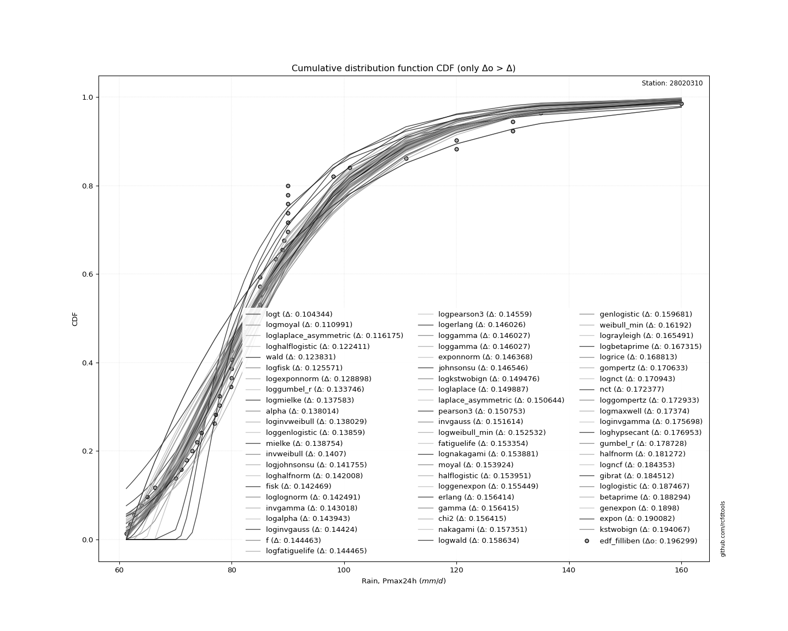

<div align="center">


</div>

# PMP Station (Rain, Pmax24h): 28020310

Probable Maximum Precipitation (PMP) is the greatest amount of rainfall for a specific duration that is meteorologically possible for a given location, acting as a "worst-case" scenario for extreme storms, crucial for designing safety-critical infrastructure like bridges, river deviations, dams, spillways, and nuclear plants to prevent catastrophic failure. PMP is calculated by hydrologists using meteorological data to determine the upper limit of extreme rainfall, often leading to the Probable Maximum Flood (PMF) for flood control design, and is increasingly being studied for climate change impacts.

<div align="center">

</img>

</div>


## A. General information


### 1. General running parameters

• app_version: _v20260103_. • runtime: _2026-01-05 08:58:49.440788_. • Python version: _3.14.0_. • SciPy version: _1.16.3_. • Pandas version: _2.3.3_. • NumPy version: _2.3.5_. • Stations dataset (station_dataset_file): _dataset/pmax24h_in/conventional_cesarcolombia_1959_2022.csv_. • Stations catalog (station_catalog_file): _dataset/CNE.xls_. • Minimum year to eval til year_max (date_min): _1900_. • Maximum year to eval since year_min (date_max): _2024_. • Creates, save and include plots into reports (create_plot): _True_. • Plot only fit distributions with Δo > Δ (plot_only_fit): _True_. • Eval low extreme values, if False, evaluates high extreme values (low_extreme): _False_. • Eval every SciPy distribution as logarithmic (pdist_logarithmic_on): _True_. • Standard deviation normalized (ddof): _1.0_. • Return periods to eval in years (Tr): _[2, 2.33, 5, 10, 15, 20, 25, 50, 75, 100, 200, 250, 500, 750, 1000]_. • Minimum data sample per station, 0 means any (minimum_sample): _5_. • Z-Score maximum threshold to adjust a value, 0 means disable (zscore_max): _3.5_. • Z-Score minimum threshold to adjust a value, 0 means disable (zscore_min): _-2.5_. • Avoid zeros, e.g. rain = 0 (avoid_zeros): _True_. • Avoid null values (avoid_nans): _True_. [:file_folder:Dataset file.](../../dataset/pmax24h_in/conventional_cesarcolombia_1959_2022.csv)

> Delta Degrees of Freedom (DDOF): is a parameter used in the formulas for calculating variance and standard deviation. When ddof=0, the divisor is $N$ (the total number of observations) and this is used when your data set is the entire population. When ddof=1, the divisor is $N-1$ and this is used when your data set is a sample drawn from a larger population. Using $N-1$ provides an unbiased estimate of the population variance (known as Bessel´s correction).


### 2. Station info and location

|   id |   CODIGO | NOMBRE                 | CATEGORIA     | TECNOLOGIA   | ESTADO     | FECHA_INSTALACION   | FECHA_SUSPENSION   |   ALTITUD |   LATITUD |   LONGITUD | DEPARTAMENTO   | MUNICIPIO       | AREA_OPERATIVA                                         | ENTIDAD                                                     | AREA_HIDROGRAFICA   | ZONA_HIDROGRAFICA   | SUBZONA_HIDROGRAFICA   |   CORRIENTE | Catalogo   |   Version |
|-----:|---------:|:-----------------------|:--------------|:-------------|:-----------|:--------------------|:-------------------|----------:|----------:|-----------:|:---------------|:----------------|:-------------------------------------------------------|:------------------------------------------------------------|:--------------------|:--------------------|:-----------------------|------------:|:-----------|----------:|
|    0 | 28020310 | BOGOTANA LA [28020310] | Pluviométrica | Convencional | Suspendida | 15/09/1968          | 15/08/2004         |       200 |      10.1 |     -73.15 | Cesar          | Agustín Codazzi | Area Operativa 05 - Magdalena-Cesar-Guajira-San Andrés | INSTITUTO DE HIDROLOGIA METEOROLOGIA Y ESTUDIOS AMBIENTALES | Magdalena Cauca     | Cesar               | Medio Cesar            |         nan | CNE_IDEAM  |  20251226 |

<div align="center">

Dynamic map: [:earth_americas:Google](http://maps.google.com/maps?q=10.1,-73.15) [:earth_americas:OSM](https://www.openstreetmap.org/#map=18/10.1/-73.15&layers=P) [:earth_americas:Bing](https://www.bing.com/maps?cp=10.1~-73.15&lvl=18) [:earth_americas:Apple](https://maps.apple.com/frame?center=10.1%2C-73.15&span=0.003%2C0.006)

</div>


<div align="center">

```geojson
{
  "type": "Feature",
  "geometry": {
    "type": "Point", 
    "coordinates": [-73.15, 10.1]
  }, 
  "properties": {
    "Name": "28020310"
  }
}
```

</div>


### 3. Discrete values table and plot

<div align="center">

|               |           0 |          1 |          2 |           3 |           4 |          5 |           6 |           7 |           8 |           9 |          10 |          11 |          12 |          13 |         14 |          15 |           16 |          17 |           18 |           19 |          20 |           21 |         22 |           23 |           24 |          25 |         26 |           27 |          28 |         29 |         30 |         31 |          32 |          33 |         34 |          35 |          36 |          37 |          38 |          39 |          40 |          41 |           42 |          43 |          44 |          45 |          46 |         47 |
|:--------------|------------:|-----------:|-----------:|------------:|------------:|-----------:|------------:|------------:|------------:|------------:|------------:|------------:|------------:|------------:|-----------:|------------:|-------------:|------------:|-------------:|-------------:|------------:|-------------:|-----------:|-------------:|-------------:|------------:|-----------:|-------------:|------------:|-----------:|-----------:|-----------:|------------:|------------:|-----------:|------------:|------------:|------------:|------------:|------------:|------------:|------------:|-------------:|------------:|------------:|------------:|------------:|-----------:|
| Date          | 1968        | 1969       | 1970       | 1971        | 1972        | 1973       | 1974        | 1975        | 1976        | 1977        | 1978        | 1979        | 1980        | 1981        | 1982       | 1983        | 1984         | 1985        | 1986         | 1987         | 1988        | 1989         | 1990       | 1991         | 1992         | 1993        | 1994       | 1995         | 1996        | 1997       | 1998       | 1999       | 2000        | 2001        | 2002       | 2003        | 2004        | 2005        | 2006        | 2007        | 2008        | 2009        | 2010         | 2011        | 2012        | 2013        | 2014        | 2015       |
| Value         |   87.8883   |   62       |  120       |   80.3886   |   85        |  120       |   80        |   73        |   85        |   80        |   85        |   98.0454   |   71        |  111        |   62.6239  |   77        |   89         |   72        |   90         |   90         |   85        |   90         |  130       |   90         |   90         |  101        |   89.2861  |   90         |   80        |  130       |  160       |  135       |   80        |   65        |   64       |   70.0367   |   73.8322   |   77.8012   |   83.6293   |   74.655    |   84.2125   |   66.3434   |   87.8384    |   77.1481   |   79.8952   |   77.8683   |   82.2558   |   61.2724  |
| Value_initial |   87.8883   |   62       |  120       |   80.3886   |   85        |  120       |   80        |   73        |   85        |   80        |   85        |   98.0454   |   71        |  111        |   62.6239  |   77        |   89         |   72        |   90         |   90         |   85        |   90         |  130       |   90         |   90         |  101        |  180       |   90         |   80        |  130       |  160       |  135       |   80        |   65        |   64       |   70.0367   |   73.8322   |   77.8012   |   83.6293   |   74.655    |   84.2125   |   66.3434   |   87.8384    |   77.1481   |   79.8952   |   77.8683   |   82.2558   |   61.2724  |
| count         |   48        |   48       |   48       |   48        |   48        |   48       |   48        |   48        |   48        |   48        |   48        |   48        |   48        |   48        |   48       |   48        |   48         |   48        |   48         |   48         |   48        |   48         |   48       |   48         |   48         |   48        |   48       |   48         |   48        |   48       |   48       |   48       |   48        |   48        |   48       |   48        |   48        |   48        |   48        |   48        |   48        |   48        |   48         |   48        |   48        |   48        |   48        |   48       |
| mean          |   89.2861   |   89.2861  |   89.2861  |   89.2861   |   89.2861   |   89.2861  |   89.2861   |   89.2861   |   89.2861   |   89.2861   |   89.2861   |   89.2861   |   89.2861   |   89.2861   |   89.2861  |   89.2861   |   89.2861    |   89.2861   |   89.2861    |   89.2861    |   89.2861   |   89.2861    |   89.2861  |   89.2861    |   89.2861    |   89.2861   |   89.2861  |   89.2861    |   89.2861   |   89.2861  |   89.2861  |   89.2861  |   89.2861   |   89.2861   |   89.2861  |   89.2861   |   89.2861   |   89.2861   |   89.2861   |   89.2861   |   89.2861   |   89.2861   |   89.2861    |   89.2861   |   89.2861   |   89.2861   |   89.2861   |   89.2861  |
| std           |   24.4883   |   24.4883  |   24.4883  |   24.4883   |   24.4883   |   24.4883  |   24.4883   |   24.4883   |   24.4883   |   24.4883   |   24.4883   |   24.4883   |   24.4883   |   24.4883   |   24.4883  |   24.4883   |   24.4883    |   24.4883   |   24.4883    |   24.4883    |   24.4883   |   24.4883    |   24.4883  |   24.4883    |   24.4883    |   24.4883   |   24.4883  |   24.4883    |   24.4883   |   24.4883  |   24.4883  |   24.4883  |   24.4883   |   24.4883   |   24.4883  |   24.4883   |   24.4883   |   24.4883   |   24.4883   |   24.4883   |   24.4883   |   24.4883   |   24.4883    |   24.4883   |   24.4883   |   24.4883   |   24.4883   |   24.4883  |
| zscore        |   -0.057083 |   -1.11425 |    1.25422 |   -0.363339 |   -0.175028 |    1.25422 |   -0.379207 |   -0.665057 |   -0.175028 |   -0.379207 |   -0.175028 |    0.357691 |   -0.746729 |    0.886703 |   -1.08877 |   -0.501714 |   -0.0116847 |   -0.705893 |    0.0291511 |    0.0291511 |   -0.175028 |    0.0291511 |    1.66258 |    0.0291511 |    0.0291511 |    0.478345 |    3.70437 |    0.0291511 |   -0.379207 |    1.66258 |    2.88766 |    1.86676 |   -0.379207 |   -0.991744 |   -1.03258 |   -0.786064 |   -0.631075 |   -0.468995 |   -0.231003 |   -0.597474 |   -0.207185 |   -0.936884 |   -0.0591178 |   -0.495665 |   -0.383488 |   -0.466258 |   -0.287088 |   -1.14396 |


</div>


<div align="center">

</img>

</div>


> The initial value (value_initial) correspond to the initial obtained or null completed value, and value (value) is adjusted only when the initial value is outside the valid range definite through the Z-Score value. If Z-Score is active, values out of range or outliers are replaced with the station mean value


### 4. Active continuous probability distributions from SciPy (44 of 104 available)

A Probability Density Function (PDF) describes the relative likelihood of a continuous random variable falling within a specific range, where the total area under its curve equals 1, and the area over any interval gives the actual probability for that range. Unlike discrete probabilities (like rolling a die), a PDF shows density, not direct probability for a single point (which is zero), with higher points indicating higher likelihood, often visualized as a bell curve for normal distributions.

A log of a probability density function (log-PDF) is simply the logarithm of the PDF´s value, denoted as $log(f(x))$, useful for converting multiplication of probabilities into addition, improving numerical stability with tiny numbers, and connecting to information theory concepts like entropy. Instead of dealing with very small probabilities (e.g., 0.000001), log-PDFs use negative numbers (e.g., $log(0.00001) ≈ -11.51$ that are easier for computers to handle, preventing underflow errors and simplifying complex calculations. In this study, each active probability distribution from SciPy is also evaluated in the $log$ form.

[scipy.stats](https://docs.scipy.org/doc/scipy/reference/stats.html) is a Python´s powerful submodule within the SciPy library for comprehensive statistical analysis, offering over 130 probability distributions (like Normal, Poisson), functions for descriptive stats (mean, variance), hypothesis testing (t-tests, chi-square), random variable generation, and statistical tests, making it essential for data science, modeling, and research. It provides tools to explore, model, and draw conclusions from data efficiently, working seamlessly with NumPy.

<div align="center">

|   id | p_dist             |   n_parameter | fit_method   | label                                                                       | active   | ref                                                                                                        |
|-----:|:-------------------|--------------:|:-------------|:----------------------------------------------------------------------------|:---------|:-----------------------------------------------------------------------------------------------------------|
|    0 | alpha              |             3 | MLE          | Alpha                                                                       | True     | [:mortar_board:](https://docs.scipy.org/doc/scipy/reference/generated/scipy.stats.alpha.html)              |
|    1 | betaprime          |             4 | MLE          | Beta prime                                                                  | True     | [:mortar_board:](https://docs.scipy.org/doc/scipy/reference/generated/scipy.stats.betaprime.html)          |
|    2 | chi2               |             3 | MLE          | Chi²                                                                        | True     | [:mortar_board:](https://docs.scipy.org/doc/scipy/reference/generated/scipy.stats.chi2.html)               |
|    3 | crystalball        |             4 | MLE          | Crystalball                                                                 | True     | [:mortar_board:](https://docs.scipy.org/doc/scipy/reference/generated/scipy.stats.crystalball.html)        |
|    4 | erlang             |             3 | MLE          | Erlang                                                                      | True     | [:mortar_board:](https://docs.scipy.org/doc/scipy/reference/generated/scipy.stats.erlang.html)             |
|    5 | expon              |             2 | MLE          | Exponential                                                                 | True     | [:mortar_board:](https://docs.scipy.org/doc/scipy/reference/generated/scipy.stats.expon.html)              |
|    6 | exponnorm          |             3 | MLE          | Exponentially modified Normal                                               | True     | [:mortar_board:](https://docs.scipy.org/doc/scipy/reference/generated/scipy.stats.exponnorm.html)          |
|    7 | f                  |             4 | MLE          | F                                                                           | True     | [:mortar_board:](https://docs.scipy.org/doc/scipy/reference/generated/scipy.stats.f.html)                  |
|    8 | fatiguelife        |             3 | MLE          | Fatigue-life (Birnbaum-Saunders)                                            | True     | [:mortar_board:](https://docs.scipy.org/doc/scipy/reference/generated/scipy.stats.fatiguelife.html)        |
|    9 | fisk               |             3 | MLE          | Fisk                                                                        | True     | [:mortar_board:](https://docs.scipy.org/doc/scipy/reference/generated/scipy.stats.fisk.html)               |
|   10 | gamma              |             3 | MLE          | Gamma                                                                       | True     | [:mortar_board:](https://docs.scipy.org/doc/scipy/reference/generated/scipy.stats.gamma.html)              |
|   11 | genexpon           |             5 | MLE          | Generalized exponential                                                     | True     | [:mortar_board:](https://docs.scipy.org/doc/scipy/reference/generated/scipy.stats.genexpon.html)           |
|   12 | genlogistic        |             3 | MLE          | Generalized logistic                                                        | True     | [:mortar_board:](https://docs.scipy.org/doc/scipy/reference/generated/scipy.stats.genlogistic.html)        |
|   13 | gibrat             |             2 | MM           | Gibrat                                                                      | True     | [:mortar_board:](https://docs.scipy.org/doc/scipy/reference/generated/scipy.stats.gibrat.html)             |
|   14 | gompertz           |             3 | MLE          | Gompertz (or truncated Gumbel)                                              | True     | [:mortar_board:](https://docs.scipy.org/doc/scipy/reference/generated/scipy.stats.gompertz.html)           |
|   15 | gumbel_l           |             2 | MM           | Gumbel Left Skew                                                            | True     | [:mortar_board:](https://docs.scipy.org/doc/scipy/reference/generated/scipy.stats.gumbel_l.html)           |
|   16 | gumbel_r           |             2 | MM           | Gumbel Right Skew                                                           | True     | [:mortar_board:](https://docs.scipy.org/doc/scipy/reference/generated/scipy.stats.gumbel_r.html)           |
|   17 | halflogistic       |             2 | MM           | Half-logistic                                                               | True     | [:mortar_board:](https://docs.scipy.org/doc/scipy/reference/generated/scipy.stats.halflogistic.html)       |
|   18 | halfnorm           |             2 | MM           | Half Normal                                                                 | True     | [:mortar_board:](https://docs.scipy.org/doc/scipy/reference/generated/scipy.stats.halfnorm.html)           |
|   19 | hypsecant          |             2 | MM           | hyperbolic secant                                                           | True     | [:mortar_board:](https://docs.scipy.org/doc/scipy/reference/generated/scipy.stats.hypsecant.html)          |
|   20 | invgamma           |             3 | MLE          | Inverted gamma                                                              | True     | [:mortar_board:](https://docs.scipy.org/doc/scipy/reference/generated/scipy.stats.invgamma.html)           |
|   21 | invgauss           |             3 | MLE          | Inverse Gaussian                                                            | True     | [:mortar_board:](https://docs.scipy.org/doc/scipy/reference/generated/scipy.stats.invgauss.html)           |
|   22 | invweibull         |             3 | MLE          | Inverted Weibull                                                            | True     | [:mortar_board:](https://docs.scipy.org/doc/scipy/reference/generated/scipy.stats.invweibull.html)         |
|   23 | johnsonsu          |             4 | MLE          | Johnson Su                                                                  | True     | [:mortar_board:](https://docs.scipy.org/doc/scipy/reference/generated/scipy.stats.johnsonsu.html)          |
|   24 | kstwobign          |             2 | MLE          | Limiting distribution of scaled Kolmogorov-Smirnov two-sided test statistic | True     | [:mortar_board:](https://docs.scipy.org/doc/scipy/reference/generated/scipy.stats.kstwobign.html)          |
|   25 | laplace            |             2 | MM           | Laplace                                                                     | True     | [:mortar_board:](https://docs.scipy.org/doc/scipy/reference/generated/scipy.stats.laplace.html)            |
|   26 | laplace_asymmetric |             3 | MLE          | Asymmetric Laplace                                                          | True     | [:mortar_board:](https://docs.scipy.org/doc/scipy/reference/generated/scipy.stats.laplace_asymmetric.html) |
|   27 | loggamma           |             3 | MLE          | Log gamma                                                                   | True     | [:mortar_board:](https://docs.scipy.org/doc/scipy/reference/generated/scipy.stats.loggamma.html)           |
|   28 | logistic           |             2 | MM           | Logistic (or Sech-squared)                                                  | True     | [:mortar_board:](https://docs.scipy.org/doc/scipy/reference/generated/scipy.stats.logistic.html)           |
|   29 | lognorm            |             3 | MLE          | Log Normal                                                                  | True     | [:mortar_board:](https://docs.scipy.org/doc/scipy/reference/generated/scipy.stats.lognorm.html)            |
|   30 | maxwell            |             2 | MM           | Maxwell                                                                     | True     | [:mortar_board:](https://docs.scipy.org/doc/scipy/reference/generated/scipy.stats.maxwell.html)            |
|   31 | mielke             |             4 | MLE          | Mielke Beta-Kappa / Dagum                                                   | True     | [:mortar_board:](https://docs.scipy.org/doc/scipy/reference/generated/scipy.stats.mielke.html)             |
|   32 | moyal              |             2 | MM           | Moyal                                                                       | True     | [:mortar_board:](https://docs.scipy.org/doc/scipy/reference/generated/scipy.stats.moyal.html)              |
|   33 | nakagami           |             3 | MLE          | Nakagami                                                                    | True     | [:mortar_board:](https://docs.scipy.org/doc/scipy/reference/generated/scipy.stats.nakagami.html)           |
|   34 | ncf                |             5 | MLE          | Non-central F distribution                                                  | True     | [:mortar_board:](https://docs.scipy.org/doc/scipy/reference/generated/scipy.stats.ncf.html)                |
|   35 | nct                |             4 | MLE          | Non-central Student’s t                                                     | True     | [:mortar_board:](https://docs.scipy.org/doc/scipy/reference/generated/scipy.stats.nct.html)                |
|   36 | norm               |             2 | MM           | Normal                                                                      | True     | [:mortar_board:](https://docs.scipy.org/doc/scipy/reference/generated/scipy.stats.norm.html)               |
|   37 | pearson3           |             3 | MM           | Pearson type III                                                            | True     | [:mortar_board:](https://docs.scipy.org/doc/scipy/reference/generated/scipy.stats.pearson3.html)           |
|   38 | rayleigh           |             2 | MM           | Rayleigh                                                                    | True     | [:mortar_board:](https://docs.scipy.org/doc/scipy/reference/generated/scipy.stats.rayleigh.html)           |
|   39 | rice               |             3 | MLE          | Rice                                                                        | True     | [:mortar_board:](https://docs.scipy.org/doc/scipy/reference/generated/scipy.stats.rice.html)               |
|   40 | t                  |             3 | MLE          | Student’s t                                                                 | True     | [:mortar_board:](https://docs.scipy.org/doc/scipy/reference/generated/scipy.stats.t.html)                  |
|   41 | truncnorm          |             4 | MLE          | Truncated normal                                                            | True     | [:mortar_board:](https://docs.scipy.org/doc/scipy/reference/generated/scipy.stats.truncnorm.html)          |
|   42 | wald               |             2 | MM           | Wald                                                                        | True     | [:mortar_board:](https://docs.scipy.org/doc/scipy/reference/generated/scipy.stats.wald.html)               |
|   43 | weibull_min        |             3 | MLE          | Weibull minimum                                                             | True     | [:mortar_board:](https://docs.scipy.org/doc/scipy/reference/generated/scipy.stats.weibull_min.html)        |

</div>

> **n_parameter:** # arguments & localization & scale.
>
> **Fit methods:** (MLE) maximum likelihood, (MM) L-moments.
>
>**Inactive** (With the only purpose of prevent loops, zero divisions, infinite values, over high estimated values or horizontal trending for recurrence intervals estimations, the follow distributions were disabled.)**:** foldnorm, gennorm, norminvgauss, powernorm, powerlognorm, skewnorm, genextreme, anglit, arcsine, argus, beta, bradford, burr, burr12, cauchy, cosine, halfcauchy, foldcauchy, skewcauchy, wrapcauchy, dgamma, gengamma, exponweib, exponpow, truncexpon, gausshyper, genhalflogistic, genhyperbolic, geninvgauss, halfgennorm, johnsonsb, kappa4, kappa3, ksone, kstwo, loglaplace, levy, levy_l, levy_stable, ncx2, pareto, genpareto, truncpareto, lomax, powerlaw, rdist, rel_breitwigner, recipinvgauss, semicircular, studentized_range, trapezoid, triang, truncweibull_min, tukeylambda, uniform, loguniform, vonmises, vonmises_line, weibull_max, dweibull, 


## B. Probability (PDF) vs. Empirical (EDF) distributions functions

A continuous probability distribution (CPD) describes probabilities for variables that can take any value within a range (like rain any time), unlike discrete variables with specific outcomes (like temperature). It uses a Probability Density Function (PDF), a curve where the total area under it equals 1, and the probability of the variable falling within an interval (a to b) is found by calculating the area under the curve between those points. A key feature is that the probability of hitting any single exact value is zero, so probabilities are always expressed for ranges, e.g., $P(a ≤ X ≤ b)$.

<div align="center">

Distributions parameters from station values
|    |   station | p_dist                |   n |            loc |          scale | shape                  | shape1               | shape2                 | shape3   |
|---:|----------:|:----------------------|----:|---------------:|---------------:|:-----------------------|:---------------------|:-----------------------|:---------|
|  0 |  28020310 | alpha                 |  48 |    18.879      |  263.028       | 4.11563865435355       |                      |                        |          |
|  1 |  28020310 | betaprime             |  48 |    -2.31774    |    4.70825     | 493.518565116437       | 26.954713989585066   |                        |          |
|  2 |  28020310 | chi2                  |  48 |    59.5627     |    7.32774     | 3.7983815129809404     |                      |                        |          |
|  3 |  28020310 | crystalball           |  48 |    87.3963     |   20.3021      | 7940.872621987292      | 25.234968961283574   |                        |          |
|  4 |  28020310 | erlang                |  48 |    59.5628     |   14.6556      | 1.8991745698841438     |                      |                        |          |
|  5 |  28020310 | expon                 |  48 |    61.2724     |   26.1239      |                        |                      |                        |          |
|  6 |  28020310 | exponnorm             |  48 |    69.6443     |    7.46056     | 2.379438118688931      |                      |                        |          |
|  7 |  28020310 | f                     |  48 |    40.9497     |   39.8861      | 20448.456439629055     | 13.969948823715146   |                        |          |
|  8 |  28020310 | fatiguelife           |  48 |    50.2987     |   32.5929      | 0.5259059389192924     |                      |                        |          |
|  9 |  28020310 | fisk                  |  48 |    -0.179746   |   83.8799      | 8.995379759132247      |                      |                        |          |
| 10 |  28020310 | gamma                 |  48 |    59.5628     |   14.6556      | 1.8991685396852107     |                      |                        |          |
| 11 |  28020310 | genexpon              |  48 |    60.8983     |    1.43446     | 0.00102178005859321    | 0.053965855644600734 | 3.4362630229428257     |          |
| 12 |  28020310 | genlogistic           |  48 |   -11.2991     |   13.8038      | 686.4871814930432      |                      |                        |          |
| 13 |  28020310 | gibrat                |  48 |    71.9083     |    9.3939      |                        |                      |                        |          |
| 14 |  28020310 | gompertz              |  48 |    61.2724     |   83.684       | 2.4220646971156485     |                      |                        |          |
| 15 |  28020310 | gumbel_l              |  48 |    96.5333     |   15.8295      |                        |                      |                        |          |
| 16 |  28020310 | gumbel_r              |  48 |    78.2592     |   15.8295      |                        |                      |                        |          |
| 17 |  28020310 | halflogistic          |  48 |    63.3336     |   17.3576      |                        |                      |                        |          |
| 18 |  28020310 | halfnorm              |  48 |    60.5242     |   33.6791      |                        |                      |                        |          |
| 19 |  28020310 | hypsecant             |  48 |    87.3963     |   12.9247      |                        |                      |                        |          |
| 20 |  28020310 | invgamma              |  48 |    40.844      |  282.205       | 7.060980838390348      |                      |                        |          |
| 21 |  28020310 | invgauss              |  48 |    49.4404     |  137.089       | 0.27686951370685786    |                      |                        |          |
| 22 |  28020310 | invweibull            |  48 |   -18.9757     |   96.8446      | 7.413946692395208      |                      |                        |          |
| 23 |  28020310 | johnsonsu             |  48 |    50.9705     |    1.42275     | -7.307627353760925     | 1.922936865035385    |                        |          |
| 24 |  28020310 | kstwobign             |  48 |    27.4445     |   69.5918      |                        |                      |                        |          |
| 25 |  28020310 | laplace               |  48 |    87.3963     |   14.3558      |                        |                      |                        |          |
| 26 |  28020310 | laplace_asymmetric    |  48 |    79.8952     |   12.1997      | 0.73875923659806       |                      |                        |          |
| 27 |  28020310 | loggamma              |  48 | -7931.98       | 1025.26        | 2494.890482001344      |                      |                        |          |
| 28 |  28020310 | logistic              |  48 |    87.3963     |   11.1931      |                        |                      |                        |          |
| 29 |  28020310 | lognorm               |  48 |    50.8634     |   31.9206      | 0.5188485586981079     |                      |                        |          |
| 30 |  28020310 | maxwell               |  48 |    39.2888     |   30.1469      |                        |                      |                        |          |
| 31 |  28020310 | mielke                |  48 |    -1.34211    |   53.7147      | 79.88890961936433      | 6.388198767735776    |                        |          |
| 32 |  28020310 | moyal                 |  48 |    75.7862     |    9.13916     |                        |                      |                        |          |
| 33 |  28020310 | nakagami              |  48 |    61.2724     |   32.0096      | 0.4507322784747128     |                      |                        |          |
| 34 |  28020310 | ncf                   |  48 |    -0.682937   |    6.2991e-06  | 7.2152174318706755e-06 | 367.02570416695164   | 100.2165537852085      |          |
| 35 |  28020310 | nct                   |  48 |    -0.42568    |    1.1951      | 13.485269169298178     | 69.11560817762629    |                        |          |
| 36 |  28020310 | norm                  |  48 |    87.3963     |   20.3021      |                        |                      |                        |          |
| 37 |  28020310 | pearson3              |  48 |    87.3963     |   20.3021      | 1.546924634543322      |                      |                        |          |
| 38 |  28020310 | rayleigh              |  48 |    48.5572     |   30.9891      |                        |                      |                        |          |
| 39 |  28020310 | rice                  |  48 |    54.6343     |   27.2537      | 0.0006002761905476531  |                      |                        |          |
| 40 |  28020310 | t                     |  48 |    87.3874     |   20.3103      | 364.83839150975837     |                      |                        |          |
| 41 |  28020310 | truncnorm             |  48 |    87.3963     |   20.3021      | -737.0939765749433     | 1193.2936146393458   |                        |          |
| 42 |  28020310 | wald                  |  48 |    67.0942     |   20.3021      |                        |                      |                        |          |
| 43 |  28020310 | weibull_min           |  48 |    60.8047     |   28.8525      | 1.3266480585723261     |                      |                        |          |
| 44 |  28020310 | logalpha              |  48 |     2.6392     |   16.8911      | 9.47941342033129       |                      |                        |          |
| 45 |  28020310 | logbetaprime          |  48 |    -0.840567   |    1.25185     | 2181.277345391766      | 520.1027719589156    |                        |          |
| 46 |  28020310 | logchi2               |  48 |     4.11533    |    0.949255    | 1.0547069238008047     |                      |                        |          |
| 47 |  28020310 | logcrystalball        |  48 |     4.44724    |    0.208597    | 7.9416935019329244     | 2.3422500239341395   |                        |          |
| 48 |  28020310 | logerlang             |  48 |     3.99401    |    0.096194    | 4.711595834618592      |                      |                        |          |
| 49 |  28020310 | logexpon              |  48 |     4.11533    |    0.331906    |                        |                      |                        |          |
| 50 |  28020310 | logexponnorm          |  48 |     4.27092    |    0.113321    | 1.5558820678391214     |                      |                        |          |
| 51 |  28020310 | logf                  |  48 |     3.99889    |    0.477362    | 9.04045408799987       | 3236.5917805508343   |                        |          |
| 52 |  28020310 | logfatiguelife        |  48 |     3.79472    |    0.621521    | 0.3157897503544581     |                      |                        |          |
| 53 |  28020310 | logfisk               |  48 |     3.82055    |    0.595563    | 5.531444503129453      |                      |                        |          |
| 54 |  28020310 | loggamma              |  48 |     3.99401    |    0.0961942   | 4.7115841863871495     |                      |                        |          |
| 55 |  28020310 | loggenexpon           |  48 |     4.11472    |    0.145935    | 0.13495448129524756    | 5.048207274444351    | 0.0399248542202382     |          |
| 56 |  28020310 | loggenlogistic        |  48 |     3.9787     |    0.158391    | 11.310208396727479     |                      |                        |          |
| 57 |  28020310 | loggibrat             |  48 |     4.28803    |    0.0965616   |                        |                      |                        |          |
| 58 |  28020310 | loggompertz           |  48 |     4.11533    |    0.446421    | 0.7216278199036223     |                      |                        |          |
| 59 |  28020310 | loggumbel_l           |  48 |     4.54112    |    0.162643    |                        |                      |                        |          |
| 60 |  28020310 | loggumbel_r           |  48 |     4.35336    |    0.162643    |                        |                      |                        |          |
| 61 |  28020310 | loghalflogistic       |  48 |     4.19999    |    0.178353    |                        |                      |                        |          |
| 62 |  28020310 | loghalfnorm           |  48 |     4.17114    |    0.346035    |                        |                      |                        |          |
| 63 |  28020310 | loghypsecant          |  48 |     4.44724    |    0.132797    |                        |                      |                        |          |
| 64 |  28020310 | loginvgamma           |  48 |     1.41818    |  711.365       | 235.9952763486515      |                      |                        |          |
| 65 |  28020310 | loginvgauss           |  48 |     3.78631    |    6.66017     | 0.0992361580710597     |                      |                        |          |
| 66 |  28020310 | loginvweibull         |  48 |    -3.8364e+06 |    3.83641e+06 | 22994879.346661054     |                      |                        |          |
| 67 |  28020310 | logjohnsonsu          |  48 |     3.81309    |    0.0960034   | -8.002737648440295     | 3.1550390768760614   |                        |          |
| 68 |  28020310 | logkstwobign          |  48 |     3.74582    |    0.808715    |                        |                      |                        |          |
| 69 |  28020310 | loglaplace            |  48 |     4.44724    |    0.147501    |                        |                      |                        |          |
| 70 |  28020310 | loglaplace_asymmetric |  48 |     4.38203    |    0.142324    | 0.7967185083233053     |                      |                        |          |
| 71 |  28020310 | logloggamma           |  48 |   -70.2485     |    9.78325     | 2069.7891839910835     |                      |                        |          |
| 72 |  28020310 | loglogistic           |  48 |     4.44724    |    0.115006    |                        |                      |                        |          |
| 73 |  28020310 | loglognorm            |  48 |     3.79837    |    0.617673    | 0.31389260714147316    |                      |                        |          |
| 74 |  28020310 | logmaxwell            |  48 |     3.95295    |    0.309749    |                        |                      |                        |          |
| 75 |  28020310 | logmielke             |  48 |    -6.03082    |   10.1081      | 465.90704415685263     | 67.92489976173056    |                        |          |
| 76 |  28020310 | logmoyal              |  48 |     4.32795    |    0.0939018   |                        |                      |                        |          |
| 77 |  28020310 | lognakagami           |  48 |     4.10392    |    0.40172     | 0.7176939729466632     |                      |                        |          |
| 78 |  28020310 | logncf                |  48 |     1.54953    |    2.89093     | 762.3422376330202      | 897.1944318815515    | 1.8217700107494226e-10 |          |
| 79 |  28020310 | lognct                |  48 |     1.10392    |    0.0489083   | 150.31604385689934     | 67.92929172198885    |                        |          |
| 80 |  28020310 | lognorm               |  48 |     4.44724    |    0.208597    |                        |                      |                        |          |
| 81 |  28020310 | logpearson3           |  48 |     4.44724    |    0.208597    | 0.9275186348264045     |                      |                        |          |
| 82 |  28020310 | lograyleigh           |  48 |     4.04818    |    0.318403    |                        |                      |                        |          |
| 83 |  28020310 | logrice               |  48 |     4.06522    |    0.307771    | 0.0007123214329432244  |                      |                        |          |
| 84 |  28020310 | logt                  |  48 |     4.40299    |    0.161288    | 3.806278734991812      |                      |                        |          |
| 85 |  28020310 | logtruncnorm          |  48 |    -0.0216082  |    1.24662     | 3.3185321645317014     | 7.619083319893829    |                        |          |
| 86 |  28020310 | logwald               |  48 |     4.23857    |    0.208665    |                        |                      |                        |          |
| 87 |  28020310 | logweibull_min        |  48 |     4.08948    |    0.400802    | 1.752859723260897      |                      |                        |          |

</div>

> **loc** (Location parameter): This shifts the distribution along the x-axis. For many common distributions, like the normal (Gaussian) distribution, loc represents the mean $μ$. For others, like the uniform distribution, it might represent the minimum value, or for the beta distribution, the left end of the support interval.
>
> **scale** (Scale parameter): This determines the width or spread of the distribution. For the normal distribution, scale represents the standard deviation $σ$. For a uniform distribution, it defines the length of the interval (from $loc$ to $loc + scale$).
>
> **shape** (Shape parameters): Refers to parameters that define the specific form of a probability distribution, distinct from its location (loc) and scale (scale). These parameters are required arguments for most distribution functions. For example, a normal (Gaussian) distribution is fully defined by its location (mean) and scale (standard deviation), so it has no specific shape parameters beyond loc and scale. However, other distributions have intrinsic properties that need specification, as Gamma distribution that takes a shape parameter, often named $a$ or $alpha$.


### 0. Cumulative distribution values - CDF (88 evaluated)

Cumulative Distribution Function (CDF), denoted as $F$<sub>$X$</sub>$(x)$, is a function that gives the probability that a random variable $X$ will take a value less than or equal to a specific value, $x$ (i.e., $(P(X≥x)$. It essentially "accumulates" probabilities from a given point up to the far right (positive infinity), providing a complete picture of the distribution´s probabilities for both discrete (like rain) and continuous (like temperature) variables, helping to find probabilities over ranges or above certain values. Each station is evaluated separately ordering the $x$ values ascending, calculating the CDF and PDF values for the activated distributions and their logarithmic forms.

<div align="center">

CDF ordered by x ascending and calculating $log(f(x))$ separately
|   id |   Station |   date |        x |   count |    mean |     std |     zscore |   Value_initial |   station |   m |     alpha |   alpha_pdf |   betaprime |   betaprime_pdf |       chi2 |    chi2_pdf |   crystalball |   crystalball_pdf |     erlang |   erlang_pdf |     expon |   expon_pdf |   exponnorm |   exponnorm_pdf |         f |       f_pdf |   fatiguelife |   fatiguelife_pdf |      fisk |    fisk_pdf |      gamma |   gamma_pdf |   genexpon |   genexpon_pdf |   genlogistic |   genlogistic_pdf |      gibrat |   gibrat_pdf |    gompertz |   gompertz_pdf |   gumbel_l |   gumbel_l_pdf |   gumbel_r |   gumbel_r_pdf |   halflogistic |   halflogistic_pdf |   halfnorm |   halfnorm_pdf |   hypsecant |   hypsecant_pdf |   invgamma |   invgamma_pdf |   invgauss |   invgauss_pdf |   invweibull |   invweibull_pdf |   johnsonsu |   johnsonsu_pdf |   kstwobign |   kstwobign_pdf |   laplace |   laplace_pdf |   laplace_asymmetric |   laplace_asymmetric_pdf |   loggamma |   loggamma_pdf |   logistic |   logistic_pdf |   lognorm |   lognorm_pdf |   maxwell |   maxwell_pdf |    mielke |   mielke_pdf |     moyal |   moyal_pdf |   nakagami |   nakagami_pdf |       ncf |     ncf_pdf |       nct |     nct_pdf |      norm |    norm_pdf |    pearson3 |   pearson3_pdf |   rayleigh |   rayleigh_pdf |      rice |    rice_pdf |         t |       t_pdf |   truncnorm |   truncnorm_pdf |      wald |    wald_pdf |   weibull_min |   weibull_min_pdf |   logalpha |   logalpha_pdf |   logbetaprime |   logbetaprime_pdf |     logchi2 |   logchi2_pdf |   logcrystalball |   logcrystalball_pdf |   logerlang |   logerlang_pdf |   logexpon |   logexpon_pdf |   logexponnorm |   logexponnorm_pdf |      logf |   logf_pdf |   logfatiguelife |   logfatiguelife_pdf |   logfisk |   logfisk_pdf |   loggenexpon |   loggenexpon_pdf |   loggenlogistic |   loggenlogistic_pdf |   loggibrat |   loggibrat_pdf |   loggompertz |   loggompertz_pdf |   loggumbel_l |   loggumbel_l_pdf |   loggumbel_r |   loggumbel_r_pdf |   loghalflogistic |   loghalflogistic_pdf |   loghalfnorm |   loghalfnorm_pdf |   loghypsecant |   loghypsecant_pdf |   loginvgamma |   loginvgamma_pdf |   loginvgauss |   loginvgauss_pdf |   loginvweibull |   loginvweibull_pdf |   logjohnsonsu |   logjohnsonsu_pdf |   logkstwobign |   logkstwobign_pdf |   loglaplace |   loglaplace_pdf |   loglaplace_asymmetric |   loglaplace_asymmetric_pdf |   logloggamma |   logloggamma_pdf |   loglogistic |   loglogistic_pdf |   loglognorm |   loglognorm_pdf |   logmaxwell |   logmaxwell_pdf |   logmielke |   logmielke_pdf |   logmoyal |   logmoyal_pdf |   lognakagami |   lognakagami_pdf |    logncf |   logncf_pdf |    lognct |   lognct_pdf |   logpearson3 |   logpearson3_pdf |   lograyleigh |   lograyleigh_pdf |   logrice |   logrice_pdf |      logt |   logt_pdf |   logtruncnorm |   logtruncnorm_pdf |     logwald |   logwald_pdf |   logweibull_min |   logweibull_min_pdf |
|-----:|----------:|-------:|---------:|--------:|--------:|--------:|-----------:|----------------:|----------:|----:|----------:|------------:|------------:|----------------:|-----------:|------------:|--------------:|------------------:|-----------:|-------------:|----------:|------------:|------------:|----------------:|----------:|------------:|--------------:|------------------:|----------:|------------:|-----------:|------------:|-----------:|---------------:|--------------:|------------------:|------------:|-------------:|------------:|---------------:|-----------:|---------------:|-----------:|---------------:|---------------:|-------------------:|-----------:|---------------:|------------:|----------------:|-----------:|---------------:|-----------:|---------------:|-------------:|-----------------:|------------:|----------------:|------------:|----------------:|----------:|--------------:|---------------------:|-------------------------:|-----------:|---------------:|-----------:|---------------:|----------:|--------------:|----------:|--------------:|----------:|-------------:|----------:|------------:|-----------:|---------------:|----------:|------------:|----------:|------------:|----------:|------------:|------------:|---------------:|-----------:|---------------:|----------:|------------:|----------:|------------:|------------:|----------------:|----------:|------------:|--------------:|------------------:|-----------:|---------------:|---------------:|-------------------:|------------:|--------------:|-----------------:|---------------------:|------------:|----------------:|-----------:|---------------:|---------------:|-------------------:|----------:|-----------:|-----------------:|---------------------:|----------:|--------------:|--------------:|------------------:|-----------------:|---------------------:|------------:|----------------:|--------------:|------------------:|--------------:|------------------:|--------------:|------------------:|------------------:|----------------------:|--------------:|------------------:|---------------:|-------------------:|--------------:|------------------:|--------------:|------------------:|----------------:|--------------------:|---------------:|-------------------:|---------------:|-------------------:|-------------:|-----------------:|------------------------:|----------------------------:|--------------:|------------------:|--------------:|------------------:|-------------:|-----------------:|-------------:|-----------------:|------------:|----------------:|-----------:|---------------:|--------------:|------------------:|----------:|-------------:|----------:|-------------:|--------------:|------------------:|--------------:|------------------:|----------:|--------------:|----------:|-----------:|---------------:|-------------------:|------------:|--------------:|-----------------:|---------------------:|
|    0 |  28020310 |   2015 |  61.2724 |      48 | 89.2861 | 24.4883 | -1.14396   |         61.2724 |  28020310 |   1 | 0.0183619 | 0.00658971  |   0.0476869 |      0.00864099 | 0.00857732 | 0.00914882  |     0.0990893 |       0.00858674  | 0.00857726 |   0.00914891 | 0         | 0.0382791   |   0.0232659 |     0.00606305  | 0.0168169 | 0.00685375  |     0.014865  |       0.00749979  | 0.0573941 | 0.00791917  | 0.00857687 | 0.00914878  | 0.00503142 |    0.0228613   |     0.028249  |        0.00728019 | 0           |  0           | 1.48851e-12 |    0.028943    |   0.102186 |    0.00611376  |  0.0536928 |    0.00991967  |      0         |        0           |  0.0177225 |    0.023685    |   0.0838585 |     0.00641343  |  0.0167801 |     0.00684025 |  0.0150618 |    0.00737879  |    0.0177781 |      0.00661885  |   0.0154349 |     0.00717648  |   0.0278485 |     0.0077735   | 0.0810331 |   0.00564464  |            0.0447178 |              0.00496168  |  0.0145278 |      0.44417   |  0.0883524 |    0.00719604  | 0.0557899 |     0.539323  | 0.0881384 |    0.010788   | 0.0185469 |  0.00646057  | 0.0269437 | 0.00835691  | 1.1399e-14 |    0.723094    | 0.0709408 | 0.00891329  | 0.0365389 | 0.00817858  | 0.0990893 | 0.00858674  | 0.000202669 |    0.00271433  |  0.0807325 |     0.0121716  | 0.0292271 | 0.00867587  | 0.0996644 | 0.00858459  |   0.0990893 |     0.00858674  | 0         | 0           |    0.00420767 |       0.0119112   |  0.024802  |      0.450047  |       0.115276 |          0.813386  | 9.28087e-09 |   5.51049e+06 |        0.0557899 |            0.539323  |   0.014528  |       0.444176  |  0         |       3.0129   |      0.019759  |          0.369277  | 0.0118631 |   0.371438 |        0.0163966 |            0.426044  | 0.0200338 |     0.368394  |   0.000566091 |         0.930008  |        0.018641  |            0.395062  | 0           |       0         |   4.83258e-10 |         1.61647   |     0.0703567 |       0.416997    |     0.0132864 |         0.352986  |          0        |             0         |    0          |         0         |      0.0521741 |          0.391128  |     0.0390616 |         0.499722  |     0.0164459 |         0.424934  |       0.0159818 |           0.396227  |      0.0169694 |          0.418803  |      0.0148847 |          0.435832  |    0.052689  |        0.357212  |               0.0369571 |                   0.325923  |     0.0625495 |         0.565813  |     0.0528503 |         0.435257  |    0.0167699 |        0.41885   |    0.0353085 |        0.617033  |   0.0195571 |       0.392008  | 0.00192067 |      0.107181  |    0.00520478 |         0.654576  | 0.0439039 |    0.517597  | 0.0413756 |    0.523155  |     0.014022  |         0.438023  |     0.0219951 |         0.647816  | 0.0131645 |      0.522003 | 0.0763539 |  0.538426  |    7.05416e-08 |           2.8723   | 0           |     0         |       0.00815798 |            0.550859  |
|    1 |  28020310 |   1969 |  62      |      48 | 89.2861 | 24.4883 | -1.11425   |         62      |  28020310 |   2 | 0.0236208 | 0.00788278  |   0.0542621 |      0.00943595 | 0.0162883  | 0.011975    |     0.105482  |       0.00898624  | 0.0162883  |   0.0119751  | 0.0274685 | 0.0372277   |   0.0280229 |     0.00702715  | 0.0223274 | 0.00831006  |     0.020968  |       0.00928744  | 0.0633982 | 0.00859018  | 0.0162878  | 0.011975    | 0.0272689  |    0.0346741   |     0.0339112 |        0.00829289 | 0           |  0           | 0.0209293   |    0.0285847   |   0.106727 |    0.00636897  |  0.0612316 |    0.0108042   |      0         |        0           |  0.0349508 |    0.0236681   |   0.088654  |     0.00677092  |  0.0222806 |     0.00829638 |  0.021058  |    0.00911654  |    0.0230766 |      0.00796315  |   0.0212462 |     0.00881195  |   0.0338882 |     0.00883348  | 0.0852461 |   0.00593812  |            0.0484778 |              0.00537887  |  0.0204144 |      0.554539  |  0.0937304 |    0.00758903  | 0.0624486 |     0.589197  | 0.0961782 |    0.0113098  | 0.0237033 |  0.00773136  | 0.0335038 | 0.00968486  | 0.0260178  |    0.0322287   | 0.0776334 | 0.00948425  | 0.0428306 | 0.00912137  | 0.105482  | 0.00898624  | 0.00490735  |    0.00943269  |  0.0897972 |     0.0127412  | 0.0358631 | 0.00956105  | 0.106055  | 0.00898284  |   0.105482  |     0.00898624  | 0         | 0           |    0.0145361  |       0.0160159   |  0.0305634 |      0.527183  |       0.125149 |          0.85942   | 0.0771649   |   3.43302     |        0.0624486 |            0.589197  |   0.0204147 |       0.554544  |  0.034943  |       2.90762  |      0.0245316 |          0.44075   | 0.0168014 |   0.46652  |        0.0219987 |            0.524633  | 0.0247735 |     0.43589   |   0.0121359   |         1.02941   |        0.0237852 |            0.478071  | 0           |       0         |   0.0191517   |         1.628     |     0.0754485 |       0.445934    |     0.0179801 |         0.444242  |          0        |             0         |    0          |         0         |      0.0569998 |          0.426934  |     0.0453143 |         0.560246  |     0.0220319 |         0.523023  |       0.0212003 |           0.489701  |      0.0224609 |          0.513158  |      0.0206795 |          0.547684  |    0.0570794 |        0.386977  |               0.0410121 |                   0.361684  |     0.0695129 |         0.614282  |     0.0582308 |         0.476846  |    0.0222655 |        0.513776  |    0.0430537 |        0.695461  |   0.0246453 |       0.471582  | 0.00357711 |      0.177706  |    0.0144174  |         0.890199  | 0.0503506 |    0.575162  | 0.0479137 |    0.585142  |     0.0198408 |         0.549242  |     0.0302797 |         0.755248  | 0.0200289 |      0.640505 | 0.0830039 |  0.588898  |    0.0333806   |           2.78331  | 0           |     0         |       0.0157128  |            0.725603  |
|    2 |  28020310 |   1982 |  62.6239 |      48 | 89.2861 | 24.4883 | -1.08877   |         62.6239 |  28020310 |   3 | 0.0289051 | 0.0090682   |   0.0603658 |      0.0101334  | 0.0244314  | 0.0140861   |     0.111197  |       0.00933399  | 0.0244315  |   0.0140862  | 0.0504186 | 0.0363492   |   0.0326833 |     0.00792401  | 0.0279209 | 0.00963102  |     0.0272515 |       0.0108592   | 0.0689444 | 0.0091941   | 0.024431   | 0.0140861   | 0.0494292  |    0.0358654   |     0.0393672 |        0.00920371 | 0           |  0           | 0.0386665   |    0.0282769   |   0.110771 |    0.006595    |  0.0682109 |    0.0115706   |      0         |        0           |  0.0497098 |    0.0236448   |   0.0929776 |     0.00709192  |  0.0278658 |     0.00961803 |  0.0272238 |    0.0106542   |    0.0284255 |      0.00919554  |   0.0271971 |     0.0102718   |   0.0396889 |     0.00976516  | 0.0890324 |   0.00620186  |            0.0519524 |              0.0057644   |  0.0264608 |      0.654058  |  0.0985734 |    0.0079385   | 0.068568  |     0.633502  | 0.103372  |    0.0117524  | 0.0288888 |  0.0089043   | 0.0399124 | 0.0108651   | 0.0454574  |    0.0303039   | 0.0837052 | 0.00998178  | 0.0487803 | 0.00995559  | 0.111197  | 0.00933399  | 0.0119939   |    0.0131103   |  0.0978943 |     0.0132139  | 0.0420605 | 0.0103042   | 0.111767  | 0.00932953  |   0.111197  |     0.00933399  | 0         | 0           |    0.0252386  |       0.0181714   |  0.0361915 |      0.597849  |       0.13395  |          0.898677  | 0.106486    |   2.55458     |        0.068568  |            0.633502  |   0.0264612 |       0.654064  |  0.0636198 |       2.82122  |      0.0292773 |          0.508287  | 0.0219003 |   0.552759 |        0.0276999 |            0.615204  | 0.0294507 |     0.499392  |   0.0228505   |         1.11039   |        0.028956  |            0.555935  | 0           |       0         |   0.0354979   |         1.63718   |     0.0800421 |       0.471891    |     0.0228552 |         0.53098   |          0        |             0         |    0          |         0         |      0.0614367 |          0.459769  |     0.0511936 |         0.614643  |     0.027715  |         0.613205  |       0.0265355 |           0.577235  |      0.02803   |          0.600315  |      0.0266705 |          0.650069  |    0.0610884 |        0.414157  |               0.044798  |                   0.395072  |     0.0758764 |         0.657127  |     0.0631928 |         0.514752  |    0.027843  |        0.601383  |    0.0503556 |        0.763301  |   0.0297358 |       0.546389  | 0.00574506 |      0.258782  |    0.0240968  |         1.038     | 0.056365  |    0.626639  | 0.054048  |    0.64067   |     0.0258386 |         0.649651  |     0.0382875 |         0.843988  | 0.0269358 |      0.738843 | 0.0891289 |  0.63515   |    0.0608781   |           2.70982  | 0           |     0         |       0.0236578  |            0.859536  |
|    3 |  28020310 |   2002 |  64      |      48 | 89.2861 | 24.4883 | -1.03258   |         64      |  28020310 |   4 | 0.0432871 | 0.0118688   |   0.0753895 |      0.0117077  | 0.0465649  | 0.0179056   |     0.124577  |       0.0101155   | 0.0465653  |   0.0179057  | 0.0991451 | 0.0344839   |   0.0450643 |     0.0101168   | 0.0432613 | 0.0126854   |     0.0445771 |       0.0142998   | 0.0825614 | 0.0106164   | 0.0465647  | 0.0179057   | 0.0980551  |    0.0345544   |     0.0534748 |        0.0113208  | 0           |  0           | 0.077111    |    0.0275961   |   0.120202 |    0.0071177   |  0.0853002 |    0.0132647   |      0.0191945 |        0.0287953   |  0.0821976 |    0.023565    |   0.10325   |     0.00784923  |  0.0431909 |     0.0126769  |  0.044234  |    0.0140548   |    0.0430549 |      0.0120999   |   0.0435901 |     0.0135541   |   0.0545623 |     0.0118546   | 0.0979894 |   0.0068258   |            0.0605226 |              0.0067153   |  0.0431323 |      0.881793  |  0.11005   |    0.0087499   | 0.083434  |     0.735637  | 0.120207  |    0.0127087  | 0.0430397 |  0.0117027   | 0.0566964 | 0.0135357   | 0.0855444  |    0.0282082   | 0.0982074 | 0.0110987   | 0.0637798 | 0.0118546   | 0.124577  | 0.0101155   | 0.0341746   |    0.0186931   |  0.116768  |     0.0142031  | 0.0573385 | 0.0118863   | 0.12514   | 0.0101088   |   0.124577  |     0.0101155   | 0         | 0           |    0.0525398  |       0.0212307   |  0.050981  |      0.766091  |       0.154412 |          0.983944  | 0.152723    |   1.82157     |        0.083434  |            0.735637  |   0.0431328 |       0.881799  |  0.122978  |       2.64238  |      0.0421022 |          0.676632  | 0.0360576 |   0.751981 |        0.043357  |            0.828627  | 0.0419732 |     0.657415  |   0.0488027   |         1.2748    |        0.0430609 |            0.746462  | 0           |       0         |   0.0712843   |         1.65509   |     0.0909512 |       0.53297     |     0.0366671 |         0.745295  |          0        |             0         |    0          |         0         |      0.072276  |          0.539594  |     0.0659134 |         0.74169   |     0.0433211 |         0.825989  |       0.0413395 |           0.789421  |      0.0432939 |          0.807757  |      0.0433566 |          0.887812  |    0.0707878 |        0.479915  |               0.0542638 |                   0.47855   |     0.0912142 |         0.755229  |     0.0753492 |         0.60581   |    0.043139  |        0.809581  |    0.068569  |        0.912831  |   0.0435616 |       0.730431  | 0.0138891  |      0.506963  |    0.0494502  |         1.28134   | 0.0712664 |    0.746134  | 0.0693565 |    0.769711  |     0.0424381 |         0.879628  |     0.0586551 |         1.02794   | 0.045248  |      0.944031 | 0.104122  |  0.747103  |    0.118097    |           2.5563   | 0           |     0         |       0.0452006  |            1.11534   |
|    4 |  28020310 |   2001 |  65      |      48 | 89.2861 | 24.4883 | -0.991744  |         65      |  28020310 |   5 | 0.0562158 | 0.0139949   |   0.0876764 |      0.0128666  | 0.0655947  | 0.020078    |     0.134981  |       0.0106934   | 0.0655952  |   0.0200782  | 0.132977  | 0.0331889   |   0.0560487 |     0.0118721   | 0.057073  | 0.0149343   |     0.060071  |       0.0166599   | 0.093726  | 0.0117227   | 0.0655946  | 0.0200782   | 0.131968   |    0.0332728   |     0.0655923 |        0.0129195  | 0           |  0           | 0.104459    |    0.0271003   |   0.127519 |    0.0075188   |  0.0991737 |    0.014478    |      0.0479659 |        0.0287396   |  0.105723  |    0.0234825   |   0.111394  |     0.0084438   |  0.0569969 |     0.0149318  |  0.0594819 |    0.016417    |    0.0562487 |      0.0142921   |   0.058318  |     0.0158859   |   0.0671746 |     0.0133658   | 0.105059  |   0.00731822  |            0.0676246 |              0.00750331  |  0.0580902 |      1.0477    |  0.119109  |    0.0093738   | 0.0954346 |     0.812989  | 0.133254  |    0.0133816  | 0.055811  |  0.0138493   | 0.0712019 | 0.0154686   | 0.113264   |    0.0272757   | 0.109717  | 0.0119204   | 0.0763364 | 0.0132597   | 0.134981  | 0.0106934   | 0.0543219   |    0.0214627   |  0.131309  |     0.0148738  | 0.0697766 | 0.0129819   | 0.135536  | 0.0106851   |   0.134981  |     0.0106934   | 0         | 0           |    0.0745288  |       0.0226669   |  0.0638588 |      0.896301  |       0.170135 |          1.04418   | 0.178827    |   1.56456     |        0.0954346 |            0.812989  |   0.0580908 |       1.04771   |  0.163004  |       2.52178  |      0.0536394 |          0.81387   | 0.0488539 |   0.898947 |        0.0574459 |            0.989503  | 0.0531509 |     0.786724  |   0.0694084   |         1.3818    |        0.0557896 |            0.897244  | 0           |       0         |   0.0970323   |         1.66607   |     0.0995799 |       0.580712    |     0.0495243 |         0.915103  |          0        |             0         |    0.00748873 |         2.30569   |      0.0811352 |          0.604376  |     0.0781598 |         0.838886  |     0.057367  |         0.986645  |       0.0548469 |           0.954414  |      0.0570379 |          0.966176  |      0.0584746 |          1.06238   |    0.0786337 |        0.533107  |               0.0622145 |                   0.548667  |     0.103492  |         0.828991  |     0.0852961 |         0.678407  |    0.0569138 |        0.96828   |    0.0835506 |        1.01963   |   0.0560103 |       0.877298  | 0.0235016  |      0.739855  |    0.0703891  |         1.41544   | 0.0835339 |    0.83705   | 0.0820453 |    0.867845  |     0.0573756 |         1.04722   |     0.075555  |         1.15086   | 0.0609651 |      1.08219  | 0.116392  |  0.837062  |    0.156914    |           2.45169  | 0           |     0         |       0.0637397  |            1.27295   |
|    5 |  28020310 |   2009 |  66.3434 |      48 | 89.2861 | 24.4883 | -0.936884  |         66.3434 |  28020310 |   6 | 0.0769428 | 0.016852    |   0.106005  |      0.0144164  | 0.0941663  | 0.0223428   |     0.149873  |       0.011478    | 0.094167   |   0.0223429  | 0.176437  | 0.0315253   |   0.0736715 |     0.0143878   | 0.0791178 | 0.0178541   |     0.0844134 |       0.0195098   | 0.110519  | 0.013293    | 0.0941664  | 0.0223429   | 0.175538   |    0.0316043   |     0.0844067 |        0.0150891  | 0           |  0           | 0.140418    |    0.0264331   |   0.137997 |    0.00808647  |  0.11969   |    0.0160513   |      0.0864847 |        0.0285904   |  0.137178  |    0.0233398   |   0.123307  |     0.00930355  |  0.0790453 |     0.0178624  |  0.083519  |    0.0193038   |    0.0774215 |      0.0172127   |   0.0816548 |     0.0188054   |   0.0864618 |     0.0153309   | 0.115365  |   0.00803614  |            0.0784948 |              0.00870942  |  0.0817314 |      1.26196   |  0.132289  |    0.0102553   | 0.113151  |     0.919829  | 0.151819  |    0.0142499  | 0.0763745 |  0.016758    | 0.0936719 | 0.0179539   | 0.14924    |    0.0263237   | 0.126474  | 0.0130263   | 0.095415  | 0.0151376   | 0.149873  | 0.011478    | 0.0850376   |    0.0240873   |  0.151861  |     0.0157085  | 0.0881628 | 0.0143745   | 0.150416  | 0.0114678   |   0.149873  |     0.011478    | 0         | 0           |    0.105926   |       0.0239779   |  0.0840282 |      1.07677   |       0.192296 |          1.12194   | 0.208426    |   1.3448      |        0.113151  |            0.919829  |   0.0817321 |       1.26197   |  0.213036  |       2.37104  |      0.072299  |          1.0135    | 0.0692224 |   1.0915   |        0.079885  |            1.20389   | 0.0711534 |     0.9767    |   0.0990052   |         1.50899   |        0.0762887 |            1.10852   | 0           |       0         |   0.131244    |         1.67812   |     0.112151  |       0.649353    |     0.0706449 |         1.15108   |          0        |             0         |    0.0546167  |         2.30039   |      0.0944646 |          0.700949  |     0.0966891 |         0.973668  |     0.0797476 |         1.20109   |       0.0766749 |           1.18028   |      0.07899   |          1.18016   |      0.0825286 |          1.28729   |    0.0903322 |        0.612419  |               0.0745151 |                   0.657145  |     0.121479  |         0.930231  |     0.100237  |         0.78422   |    0.0789095 |        1.18225   |    0.105833  |        1.15808   |   0.0760622 |       1.08512   | 0.0422145  |      1.09637   |    0.100866   |         1.55851   | 0.101933  |    0.962681  | 0.101173  |    1.00311   |     0.0810286 |         1.26357   |     0.10066   |         1.30109   | 0.0848689 |      1.25229  | 0.134839  |  0.968936  |    0.205707    |           2.31962  | 0           |     0         |       0.0916738  |            1.4529    |
|    6 |  28020310 |   2003 |  70.0367 |      48 | 89.2861 | 24.4883 | -0.786064  |         70.0367 |  28020310 |   7 | 0.152478  | 0.0236901   |   0.166764  |      0.0183825  | 0.183952   | 0.025674    |     0.196259  |       0.0136335   | 0.183954   |   0.025674   | 0.285014  | 0.027369    |   0.140008  |     0.0214605   | 0.157851  | 0.0243025   |     0.167597  |       0.0249196   | 0.168066  | 0.0179122   | 0.183953   | 0.0256741   | 0.284377   |    0.0274322   |     0.150684  |        0.0206311  | 0           |  0           | 0.234654    |    0.0245972   |   0.170987 |    0.00982066  |  0.186171  |    0.0197713   |      0.190726  |        0.027758    |  0.222398  |    0.0227644   |   0.162549  |     0.0120371   |  0.157878  |     0.0243489  |  0.166287  |    0.0249111   |    0.154327  |      0.0240202   |   0.163191  |     0.0247884   |   0.152035  |     0.0199435   | 0.149212  |   0.0103939   |            0.118253  |              0.0131208   |  0.163872  |      1.74347   |  0.174955  |    0.0128959   | 0.170998  |     1.21768   | 0.208492  |    0.0163664  | 0.151913  |  0.0237836   | 0.170798  | 0.0234023   | 0.242706   |    0.0243877   | 0.18008   | 0.0159615   | 0.160316  | 0.0198513   | 0.196259  | 0.0136335   | 0.181353    |    0.0273061   |  0.213543  |     0.0175907  | 0.1476    | 0.017676    | 0.196756  | 0.0136191   |   0.196259  |     0.0136335   | 0.0220887 | 0.0285904   |    0.197903   |       0.0254182   |  0.155512  |      1.55649   |       0.258314 |          1.30979   | 0.271477    |   1.02238     |        0.170998  |            1.21768   |   0.163873  |       1.74348   |  0.331552  |       2.01397  |      0.142763  |          1.59148   | 0.141095  |   1.54197  |        0.159501  |            1.71333   | 0.139268  |     1.54751   |   0.188206    |         1.76377   |        0.151665  |            1.66344   | 0           |       0         |   0.22272     |         1.69514   |     0.152931  |       0.864413    |     0.149669  |         1.74782   |          0.136604 |             2.75112   |    0.178072   |         2.24813   |      0.140762  |          1.02577   |     0.159494  |         1.34551   |     0.15925   |         1.71224   |       0.156281  |           1.73865   |      0.157599  |          1.7028    |      0.166428  |          1.77714   |    0.130423  |        0.884219  |               0.120154  |                   1.05963   |     0.179406  |         1.20945   |     0.151418  |         1.11725   |    0.157591  |        1.70305   |    0.177866  |        1.49043   |   0.150186  |       1.64378   | 0.127921   |      2.03002   |    0.192723   |         1.80464   | 0.163442  |    1.30874   | 0.165509  |    1.37131   |     0.163372  |         1.74887   |     0.180405  |         1.62369   | 0.163321  |      1.62346  | 0.198188  |  1.38378   |    0.322539    |           2.00065  | 2.09849e-05 |     0.0209164 |       0.180418   |            1.79155   |
|    7 |  28020310 |   1980 |  71      |      48 | 89.2861 | 24.4883 | -0.746729  |         71      |  28020310 |   8 | 0.175967  | 0.025046    |   0.184914  |      0.019291   | 0.208864   | 0.0260199   |     0.209656  |       0.014182    | 0.208865   |   0.02602    | 0.310897  | 0.0263783   |   0.161495  |     0.0231299   | 0.18184   | 0.0254671   |     0.192013  |       0.0257362   | 0.185906  | 0.0191263   | 0.208864   | 0.02602     | 0.310319   |    0.0264378   |     0.171158  |        0.0218588  | 0           |  0           | 0.258117    |    0.0241192   |   0.180683 |    0.0103148   |  0.205596  |    0.0205452   |      0.217317  |        0.0274455   |  0.244235  |    0.022572    |   0.174526  |     0.0128368   |  0.181916  |     0.0255231  |  0.190721  |    0.0257804   |    0.17811   |      0.0253216   |   0.187566  |     0.0257813   |   0.171711  |     0.0208905   | 0.159568  |   0.0111153   |            0.131592  |              0.0146008   |  0.188334  |      1.83592   |  0.187727  |    0.0136231   | 0.188147  |     1.29308   | 0.224488  |    0.0168411  | 0.175511  |  0.0251762   | 0.193829  | 0.0243849   | 0.265985   |    0.02395     | 0.1958    | 0.0166739   | 0.179947  | 0.0208922   | 0.209656  | 0.014182    | 0.207773    |    0.0275187   |  0.230677  |     0.0179791  | 0.164979  | 0.0183985   | 0.210139  | 0.0141667   |   0.209656  |     0.014182    | 0.0570191 | 0.0427485   |    0.222413   |       0.0254534   |  0.177537  |      1.66708   |       0.276491 |          1.35114   | 0.285072    |   0.969435    |        0.188147  |            1.29308   |   0.188335  |       1.83593   |  0.358505  |       1.93276  |      0.165476  |          1.73285   | 0.162796  |   1.6335   |        0.183621  |            1.81602   | 0.161407  |     1.6934    |   0.212614    |         1.80867   |        0.175236  |            1.78582   | 0           |       0         |   0.245881    |         1.69573   |     0.165159  |       0.926576    |     0.174414  |         1.87271   |          0.17397  |             2.71858   |    0.208637   |         2.22651   |      0.155441  |          1.12454   |     0.178502  |         1.43718   |     0.183359  |         1.81556   |       0.180832  |           1.85364   |      0.181612  |          1.81091   |      0.191328  |          1.86598   |    0.143078  |        0.970017  |               0.135536  |                   1.19529   |     0.196407  |         1.2796    |     0.167319  |         1.21145   |    0.181603  |        1.81047   |    0.198723  |        1.56228   |   0.173513  |       1.76986   | 0.156906   |      2.20823   |    0.217642   |         1.84241   | 0.181907  |    1.39438   | 0.184855  |    1.46087   |     0.187911  |         1.84177   |     0.203021  |         1.68627   | 0.186008  |      1.69682  | 0.217875  |  1.49908   |    0.34936     |           1.92683  | 0.00845011  |     1.64948   |       0.205289   |            1.84801   |
|    8 |  28020310 |   1985 |  72      |      48 | 89.2861 | 24.4883 | -0.705893  |         72      |  28020310 |   9 | 0.201622  | 0.0262227   |   0.204646  |      0.02016    | 0.23499    | 0.0262063   |     0.224118  |       0.0147396   | 0.234992   |   0.0262063  | 0.336777  | 0.0253876   |   0.185425  |     0.0247003   | 0.20781   | 0.0264305   |     0.218074  |       0.0263486   | 0.205651  | 0.0203585   | 0.234991   | 0.0262063   | 0.336256   |    0.0254435   |     0.193599  |        0.0230011  | 1.83009e-06 |  9.64268e-05 | 0.281988    |    0.0236237   |   0.191262 |    0.0108455   |  0.226502  |    0.0212487   |      0.244584  |        0.0270827   |  0.266699  |    0.0223547   |   0.187792  |     0.0137014   |  0.207947  |     0.0264955  |  0.216852  |    0.026442    |    0.204005  |      0.0264275   |   0.21376   |     0.0265675   |   0.193041  |     0.0217471   | 0.171079  |   0.0119171   |            0.147033  |              0.0163141   |  0.214592  |      1.91651   |  0.201731  |    0.014387    | 0.206766  |     1.36902   | 0.24156   |    0.017296   | 0.20131   |  0.0263793   | 0.218638  | 0.0251975   | 0.289713   |    0.0235077   | 0.21283   | 0.0173794   | 0.201335  | 0.021865    | 0.224118  | 0.0147396   | 0.235324    |    0.0275528   |  0.248839  |     0.0183368  | 0.183726  | 0.0190844   | 0.224586  | 0.0147236   |   0.224118  |     0.0147396   | 0.104089  | 0.050327    |    0.24784    |       0.0253852   |  0.201598  |      1.77208   |       0.295666 |          1.3903    | 0.298292    |   0.921947    |        0.206766  |            1.36902   |   0.214593  |       1.91651   |  0.384975  |       1.85301  |      0.190676  |          1.86899   | 0.186232  |   1.71599  |        0.209675  |            1.90723   | 0.186104  |     1.8369    |   0.238185    |         1.84659   |        0.201016  |            1.89831   | 0           |       0         |   0.269592    |         1.69468   |     0.178583  |       0.993545    |     0.201407  |         1.98435   |          0.211716 |             2.67777   |    0.239603   |         2.20103   |      0.171917  |          1.23255   |     0.199242  |         1.52788   |     0.209412  |         1.90742   |       0.207491  |           1.95588   |      0.207635  |          1.90793   |      0.217968  |          1.94081   |    0.157309  |        1.0665    |               0.153328  |                   1.3522    |     0.214799  |         1.35009   |     0.184954  |         1.31077   |    0.207614  |        1.90677   |    0.221051  |        1.62956   |   0.1991    |       1.88688   | 0.188858   |      2.35458   |    0.24363    |         1.87239   | 0.202007  |    1.47944   | 0.205908  |    1.54894   |     0.214253  |         1.92263   |     0.227006  |         1.74216   | 0.210214  |      1.76298  | 0.239676  |  1.6186    |    0.375796    |           1.85383  | 0.0487407   |     3.93204   |       0.231475   |            1.89472   |
|    9 |  28020310 |   1975 |  73      |      48 | 89.2861 | 24.4883 | -0.665057  |         73      |  28020310 |  10 | 0.228332  | 0.0271564   |   0.225206  |      0.0209456  | 0.261226   | 0.0262405   |     0.239131  |       0.0152821   | 0.261227   |   0.0262405  | 0.361685  | 0.0244341   |   0.210828  |     0.026067    | 0.234619  | 0.0271483   |     0.244637  |       0.0267418   | 0.226607  | 0.0215428   | 0.261226   | 0.0262405   | 0.361218   |    0.0244866   |     0.217111  |        0.0239959  | 0.0156842   |  0.0360455   | 0.305364    |    0.0231293   |   0.20238  |    0.011394    |  0.248058  |    0.0218463   |      0.27147   |        0.026683    |  0.288938  |    0.0221199   |   0.201939  |     0.0145971   |  0.234825  |     0.0272211  |  0.243529  |    0.0268773   |    0.23088   |      0.0272806   |   0.240622  |     0.0271177   |   0.215162  |     0.0224725   | 0.183421  |   0.0127769   |            0.164287  |              0.0182285   |  0.241493  |      1.9817    |  0.216502  |    0.0151547   | 0.226155  |     1.44193   | 0.259067  |    0.0177105  | 0.228184  |  0.0273264   | 0.244155  | 0.0258022   | 0.313003   |    0.0230731   | 0.230545  | 0.0180445   | 0.223637  | 0.0227186   | 0.239131  | 0.0152821   | 0.262827    |    0.0274295   |  0.267336  |     0.0186483  | 0.203126  | 0.0197037   | 0.239582  | 0.0152654   |   0.23913   |     0.0152821   | 0.155967  | 0.0527731   |    0.273153   |       0.0252262   |  0.226699  |      1.86581   |       0.315089 |          1.42548   | 0.310717    |   0.880464    |        0.226155  |            1.44193   |   0.241494  |       1.9817    |  0.41001   |       1.77758  |      0.217315  |          1.99144   | 0.210396  |   1.78573  |        0.236519  |            1.98254   | 0.212365  |     1.96892   |   0.263868    |         1.87609   |        0.227882  |            1.99454   | 0.000115635 |       0.186682  |   0.292951    |         1.69196   |     0.192762  |       1.06281     |     0.229436  |         2.0767    |          0.248334 |             2.63055   |    0.269771   |         2.17271   |      0.189689  |          1.34535   |     0.220909  |         1.61304   |     0.236262  |         1.98336   |       0.235069  |           2.04001   |      0.234527  |          1.98894   |      0.245156  |          1.99869   |    0.172729  |        1.17104   |               0.173161  |                   1.5271    |     0.23389   |         1.41763   |     0.203721  |         1.41053   |    0.234486  |        1.98709   |    0.243947  |        1.68916   |   0.225842  |       1.98804   | 0.222117   |      2.46169   |    0.269613   |         1.89387   | 0.222972  |    1.55969   | 0.227846  |    1.63108   |     0.24124   |         1.98791   |     0.251369  |         1.78911   | 0.234929  |      1.81922  | 0.262812  |  1.73573   |    0.400884    |           1.78433  | 0.111333    |     4.95565   |       0.257866   |            1.93026   |
|   10 |  28020310 |   2004 |  73.8322 |      48 | 89.2861 | 24.4883 | -0.631075  |         73.8322 |  28020310 |  11 | 0.251188  | 0.0277481   |   0.242885  |      0.0215311  | 0.283038   | 0.0261684   |     0.252031  |       0.0157195   | 0.283039   |   0.0261684  | 0.381698  | 0.0236681   |   0.232931  |     0.0270271   | 0.257396  | 0.0275662   |     0.266973  |       0.0269178   | 0.244927  | 0.0224772   | 0.283039   | 0.0261684   | 0.381274   |    0.0237178   |     0.237382  |        0.0247046  | 0.0563989   |  0.0589806   | 0.324441    |    0.0227189   |   0.212057 |    0.0118633   |  0.266416  |    0.0222615   |      0.293527  |        0.026324    |  0.30726   |    0.0219117   |   0.214404  |     0.0153625   |  0.257665  |     0.0276444  |  0.265991  |    0.0270823   |    0.253811  |      0.0278013   |   0.263319  |     0.0274082   |   0.234079  |     0.0229766   | 0.194368  |   0.0135394   |            0.180179  |              0.0199918   |  0.264208  |      2.02463   |  0.229379  |    0.0157922   | 0.242829  |     1.49982   | 0.273937  |    0.0180236  | 0.251184  |  0.0279193   | 0.265782  | 0.0261529   | 0.332055   |    0.0227149   | 0.24578   | 0.0185637   | 0.242805  | 0.0233334   | 0.252031  | 0.0157195   | 0.285574    |    0.0272266   |  0.28295   |     0.0188722  | 0.219719  | 0.0201677   | 0.252468  | 0.0157024   |   0.252031  |     0.0157195   | 0.199862  | 0.0524601   |    0.294069   |       0.0250342   |  0.248246  |      1.93454   |       0.331398 |          1.45163   | 0.32052     |   0.849659    |        0.242829  |            1.49982   |   0.264209  |       2.02463   |  0.429819  |       1.7179   |      0.240407  |          2.08118   | 0.23092   |   1.83426  |        0.259288  |            2.03325   | 0.235253  |     2.06787   |   0.285244    |         1.89457   |        0.250881  |            2.06164   | 0.0257067   |       4.34606   |   0.312111    |         1.68845   |     0.205143  |       1.12205     |     0.253339  |         2.13868   |          0.277908 |             2.58691   |    0.294256   |         2.14715   |      0.205484  |          1.4421    |     0.239571  |         1.67905   |     0.259044  |         2.03454   |       0.258523  |           2.09618   |      0.257395  |          2.04412   |      0.268025  |          2.03473   |    0.186527  |        1.26458   |               0.191366  |                   1.68765   |     0.250264  |         1.47119   |     0.220177  |         1.49296   |    0.25733   |        2.04174   |    0.263346  |        1.73282   |   0.248791  |       2.05934   | 0.250388   |      2.52248   |    0.291153   |         1.90585   | 0.241009  |    1.62226   | 0.246697  |    1.69432   |     0.264025  |         2.0308    |     0.271838  |         1.8216    | 0.25578   |      1.85869  | 0.283022  |  1.82967   |    0.420795    |           1.72901  | 0.168957    |     5.14208   |       0.279876   |            1.952     |
|   11 |  28020310 |   2007 |  74.655  |      48 | 89.2861 | 24.4883 | -0.597474  |         74.655  |  28020310 |  12 | 0.274206  | 0.0281716   |   0.260817  |      0.022046   | 0.304514   | 0.0260187   |     0.265139  |       0.0161378   | 0.304515   |   0.0260187  | 0.400869  | 0.0229342   |   0.255502  |     0.0278046   | 0.280196  | 0.0278282   |     0.289151  |       0.0269703   | 0.263783  | 0.0233436   | 0.304515   | 0.0260188   | 0.400485   |    0.0229814   |     0.257961  |        0.0252958  | 0.10941     |  0.0681957   | 0.342969    |    0.0223142   |   0.222013 |    0.0123384   |  0.284877  |    0.0225983   |      0.315034  |        0.025947    |  0.325201  |    0.0216947   |   0.227361  |     0.0161331   |  0.280531  |     0.0279108  |  0.288314  |    0.0271579   |    0.276843  |      0.0281535   |   0.285942  |     0.0275577   |   0.25316   |     0.0233874   | 0.205834  |   0.0143381   |            0.197403  |              0.0219029   |  0.286837  |      2.05746   |  0.242631  |    0.0164173   | 0.259755  |     1.55423   | 0.288885  |    0.0183039  | 0.274339  |  0.0283357   | 0.2874    | 0.0263707   | 0.3506     |    0.0223623   | 0.261255  | 0.0190435   | 0.262225  | 0.0238535   | 0.265139  | 0.0161378   | 0.307868    |    0.0269505   |  0.298559  |     0.0190624  | 0.236486  | 0.0205801   | 0.265561  | 0.0161202   |   0.265139  |     0.0161378   | 0.242468  | 0.0509535   |    0.314574   |       0.0247983   |  0.270022  |      1.99385   |       0.347617 |          1.47466   | 0.329781    |   0.821973    |        0.259755  |            1.55423   |   0.286838  |       2.05746   |  0.448544  |       1.66148  |      0.263909  |          2.15797   | 0.251477  |   1.87403  |        0.282052  |            2.07304   | 0.258661  |     2.15441   |   0.306319    |         1.90773   |        0.274043  |            2.11624   | 0.0873299   |       6.39026   |   0.3308      |         1.68386   |     0.217908  |       1.18188     |     0.277321  |         2.18692   |          0.306324 |             2.54037   |    0.317906   |         2.12025   |      0.222004  |          1.53948   |     0.258519  |         1.73953   |     0.281824  |         2.07475   |       0.282006  |           2.13963   |      0.280302  |          2.08796   |      0.290727  |          2.06033   |    0.201082  |        1.36326   |               0.211015  |                   1.86093   |     0.26685   |         1.52149   |     0.237168  |         1.57313   |    0.280208  |        2.08512   |    0.282766  |        1.77069   |   0.27195   |       2.11801   | 0.278569   |      2.55939   |    0.312319   |         1.91286   | 0.259312  |    1.67996   | 0.265798  |    1.75187   |     0.286722  |         2.06349   |     0.292179  |         1.8481    | 0.276567  |      1.89143  | 0.303793  |  1.9179    |    0.439665    |           1.67645  | 0.225494    |     5.02655   |       0.301598   |            1.96704   |
|   12 |  28020310 |   1983 |  77      |      48 | 89.2861 | 24.4883 | -0.501714  |         77      |  28020310 |  13 | 0.340949  | 0.0285609   |   0.313914  |      0.0231483  | 0.364711   | 0.0252462   |     0.304298  |       0.0172357   | 0.364712   |   0.0252462  | 0.452307  | 0.0209652   |   0.322435  |     0.0290381   | 0.345668  | 0.0278436   |     0.352067  |       0.026565    | 0.321072  | 0.0254063   | 0.364712   | 0.0252462   | 0.452025   |    0.0210057   |     0.318722  |        0.0263793  | 0.270117    |  0.0649528   | 0.393949    |    0.0211677   |   0.252582 |    0.0137463   |  0.338646  |    0.0231647   |      0.374523  |        0.0247654   |  0.375299  |    0.021019    |   0.267803  |     0.0183609   |  0.346207  |     0.0279329  |  0.351721  |    0.0267896   |    0.343315  |      0.0283532   |   0.350477  |     0.0273361   |   0.30897   |     0.0241039   | 0.242359  |   0.0168824   |            0.256066  |              0.0284119   |  0.351348  |      2.10338   |  0.283167  |    0.0181346   | 0.310006  |     1.69128   | 0.3326    |    0.0189393  | 0.34141   |  0.0286687   | 0.349401  | 0.0263647   | 0.401863   |    0.0213583   | 0.307338  | 0.0202081   | 0.319471  | 0.0248514   | 0.304298  | 0.0172357   | 0.369852    |    0.0258465   |  0.343747  |     0.0194368  | 0.285901  | 0.0215026   | 0.304678  | 0.0172172   |   0.304298  |     0.0172357   | 0.354265  | 0.0440699   |    0.37175    |       0.0239212   |  0.33373   |      2.11463   |       0.394055 |          1.52477   | 0.354132    |   0.754965    |        0.310006  |            1.69128   |   0.351349  |       2.10338   |  0.497609  |       1.51365  |      0.333212  |          2.3068    | 0.310692  |   1.94582  |        0.347297  |            2.13416   | 0.328288  |     2.3311    |   0.365599    |         1.91985   |        0.341161  |            2.20962   | 0.29156     |       6.1525    |   0.382609    |         1.66494   |     0.257149  |       1.3577      |     0.346291  |         2.25791   |          0.382673 |             2.3929    |    0.38221    |         2.03589   |      0.27391   |          1.81732   |     0.314639  |         1.88288   |     0.347137  |         2.13676   |       0.349365  |           2.20218   |      0.346157  |          2.15803   |      0.355004  |          2.08551   |    0.247991  |        1.68129   |               0.277184  |                   2.44447   |     0.315922  |         1.6481    |     0.289185  |         1.78736   |    0.345959  |        2.15423   |    0.338858  |        1.85008   |   0.339286  |       2.22148   | 0.358085   |      2.55952   |    0.371514   |         1.90973   | 0.313508  |    1.81892   | 0.322163  |    1.88624   |     0.351409  |         2.10866   |     0.350162  |         1.89495   | 0.336122  |      1.95248  | 0.366568  |  2.13208   |    0.489335    |           1.53742  | 0.368779    |     4.18404   |       0.362728   |            1.97891   |
|   13 |  28020310 |   2011 |  77.1481 |      48 | 89.2861 | 24.4883 | -0.495665  |         77.1481 |  28020310 |  14 | 0.345179  | 0.0285483   |   0.317347  |      0.0231995  | 0.368446   | 0.0251832   |     0.306856  |       0.0172997   | 0.368447   |   0.0251831  | 0.455403  | 0.0208467   |   0.326739  |     0.0290675   | 0.34979   | 0.0278124   |     0.355998  |       0.026516    | 0.324843  | 0.025513    | 0.368447   | 0.0251831   | 0.455128   |    0.0208868   |     0.322633  |        0.0264184  | 0.279684    |  0.0642086   | 0.397079    |    0.0210957   |   0.254625 |    0.0138376   |  0.342079  |    0.0231816   |      0.378185  |        0.024686    |  0.378409  |    0.0209737   |   0.270533  |     0.018501    |  0.350342  |     0.0279019  |  0.355686  |    0.0267416   |    0.347513  |      0.0283299   |   0.354523  |     0.0272943   |   0.312543  |     0.0241278   | 0.244873  |   0.0170575   |            0.260309  |              0.0288827   |  0.355391  |      2.10413   |  0.285861  |    0.0182383   | 0.313263  |     1.69895   | 0.335408  |    0.0189712  | 0.345656  |  0.0286512   | 0.353304  | 0.0263367   | 0.405022   |    0.0212947   | 0.310336  | 0.0202708   | 0.323155  | 0.0248906   | 0.306856  | 0.0172997   | 0.373675    |    0.0257643   |  0.346627  |     0.0194523  | 0.28909   | 0.0215484   | 0.307233  | 0.0172812   |   0.306856  |     0.0172997   | 0.360758  | 0.0435959   |    0.375289   |       0.0238573   |  0.337799  |      2.11988   |       0.396987 |          1.52717   | 0.355579    |   0.751221    |        0.313263  |            1.69895   |   0.355393  |       2.10414   |  0.50051   |       1.50492  |      0.337651  |          2.31266   | 0.314434  |   1.94844  |        0.3514    |            2.13564   | 0.332775  |     2.33858   |   0.369288    |         1.91945   |        0.345411  |            2.21258   | 0.303292    |       6.05571   |   0.385807    |         1.66346   |     0.259769  |       1.36899     |     0.350632  |         2.25936   |          0.387263 |             2.38299   |    0.386117   |         2.03022   |      0.277419  |          1.83444   |     0.318265  |         1.8904    |     0.351245  |         2.13827   |       0.353599  |           2.20333   |      0.350306  |          2.15993   |      0.359012  |          2.08502   |    0.251243  |        1.70334   |               0.281922  |                   2.48625   |     0.319096  |         1.65519   |     0.292632  |         1.7999    |    0.350101  |        2.15609   |    0.342417  |        1.85371   |   0.343559  |       2.22498   | 0.363      |      2.55523   |    0.375183   |         1.9085    | 0.317011  |    1.82635   | 0.325795  |    1.89318   |     0.355462  |         2.10935   |     0.353806  |         1.89658   | 0.339877  |      1.95483  | 0.370677  |  2.14331   |    0.492282    |           1.52914  | 0.376765    |     4.12599   |       0.366531   |            1.97829   |
|   14 |  28020310 |   2005 |  77.8012 |      48 | 89.2861 | 24.4883 | -0.468995  |         77.8012 |  28020310 |  15 | 0.363795  | 0.0284454   |   0.332566  |      0.0233989  | 0.384799   | 0.0248884   |     0.318245  |       0.0175738   | 0.3848     |   0.0248884  | 0.46885   | 0.020332    |   0.345749  |     0.0291307   | 0.3679    | 0.0276353   |     0.373239  |       0.0262723   | 0.34165   | 0.0259459   | 0.384799   | 0.0248884   | 0.4686     |    0.0203703   |     0.339933  |        0.0265508  | 0.320495    |  0.0607244   | 0.410753    |    0.0207788   |   0.263795 |    0.0142431   |  0.357237  |    0.0232303   |      0.394192  |        0.0243298   |  0.392041  |    0.02077     |   0.282817  |     0.0191144   |  0.368511  |     0.0277251  |  0.373075  |    0.0265006   |    0.365972  |      0.0281824   |   0.372281  |     0.0270758   |   0.328328  |     0.024205    | 0.25627   |   0.0178514   |            0.279873  |              0.0310534   |  0.373135  |      2.10471   |  0.297919  |    0.0186868   | 0.327723  |     1.73128   | 0.347841  |    0.0191     | 0.364331  |  0.0285256   | 0.370456  | 0.0261786   | 0.418838   |    0.0210137   | 0.323662  | 0.0205315   | 0.339459  | 0.0250307   | 0.318245  | 0.0175738   | 0.39038     |    0.0253877   |  0.359351  |     0.0195092  | 0.303225  | 0.0217326   | 0.31861   | 0.0175551   |   0.318245  |     0.0175738   | 0.38855   | 0.0415151   |    0.390776   |       0.0235655   |  0.355757  |      2.13973   |       0.409903 |          1.53667   | 0.361844    |   0.735298    |        0.327723  |            1.73128   |   0.373136  |       2.10471   |  0.513036  |       1.46717  |      0.35724   |          2.33354   | 0.330901  |   1.95753  |        0.369421  |            2.13906   | 0.352612  |     2.36633   |   0.385458    |         1.91622   |        0.364106  |            2.22177   | 0.352497    |       5.61565   |   0.399801    |         1.65655   |     0.27152   |       1.41893     |     0.369694  |         2.26186   |          0.407166 |             2.33867   |    0.403125   |         2.00483   |      0.293197  |          1.90863   |     0.334334  |         1.92134   |     0.369289  |         2.14185   |       0.372183  |           2.20487   |      0.36854   |          2.165     |      0.376571  |          2.0803    |    0.266021  |        1.80352   |               0.303679  |                   2.67814   |     0.333177  |         1.68508   |     0.308033  |         1.85337   |    0.368301  |        2.16101   |    0.358105  |        1.86783   |   0.362368  |       2.23635   | 0.384446   |      2.53142   |    0.391245   |         1.90178   | 0.332539  |    1.85711   | 0.341877  |    1.92154   |     0.373248  |         2.10965   |     0.369819  |         1.90198   | 0.356393  |      1.9632   | 0.388942  |  2.18902   |    0.505021    |           1.49331  | 0.410484    |     3.87491   |       0.383191   |            1.97378   |
|   15 |  28020310 |   2013 |  77.8683 |      48 | 89.2861 | 24.4883 | -0.466258  |         77.8683 |  28020310 |  16 | 0.365701  | 0.0284306   |   0.334135  |      0.023417   | 0.386466   | 0.0248567   |     0.319424  |       0.0176012   | 0.386467   |   0.0248566  | 0.470211  | 0.0202799   |   0.347702  |     0.0291313   | 0.369752  | 0.0276136   |     0.374999  |       0.0262448   | 0.343391  | 0.0259868   | 0.386467   | 0.0248567   | 0.469964   |    0.0203181   |     0.341713  |        0.0265607  | 0.324553    |  0.0603551   | 0.412145    |    0.0207463   |   0.264751 |    0.0142849   |  0.358794  |    0.023233    |      0.395822  |        0.0242927   |  0.393432  |    0.0207487   |   0.2841    |     0.0191768   |  0.370368  |     0.0277034  |  0.37485   |    0.0264733   |    0.36786   |      0.0281632   |   0.374095  |     0.0270504   |   0.329951  |     0.0242103   | 0.25747   |   0.0179349   |            0.281963  |              0.0312852   |  0.374947  |      2.10453   |  0.299174  |    0.0187319   | 0.329216  |     1.73445   | 0.349122  |    0.0191121  | 0.366243  |  0.0285084   | 0.372211  | 0.0261593   | 0.420246   |    0.0209848   | 0.325039  | 0.0205568   | 0.341138  | 0.025042    | 0.319424  | 0.0176012   | 0.39208     |    0.0253478   |  0.360659  |     0.019514   | 0.304682  | 0.0217499   | 0.319788  | 0.0175824   |   0.319424  |     0.0176012   | 0.391326  | 0.0413034   |    0.392355   |       0.0235347   |  0.3576    |      2.14147   |       0.411226 |          1.53754   | 0.362477    |   0.733715    |        0.329216  |            1.73445   |   0.374948  |       2.10453   |  0.514298  |       1.46337  |      0.35925   |          2.33523   | 0.332587  |   1.95823  |        0.371263  |            2.13914   | 0.354651  |     2.3687    |   0.387107    |         1.91575   |        0.366019  |            2.22237   | 0.357314    |       5.57022   |   0.401228    |         1.6558    |     0.272744  |       1.42407     |     0.371641  |         2.26177   |          0.409178 |             2.33406   |    0.404851   |         2.00218   |      0.294844  |          1.91611   |     0.33599   |         1.92431   |     0.371134  |         2.14194   |       0.374082  |           2.2047    |      0.370404  |          2.16523   |      0.378363  |          2.07959   |    0.267578  |        1.81408   |               0.305995  |                   2.69855   |     0.334629  |         1.68802   |     0.309631  |         1.85869   |    0.370162  |        2.16122   |    0.359714  |        1.86911   |   0.364294  |       2.23716   | 0.386625   |      2.52855   |    0.392882   |         1.90098   | 0.33414   |    1.86008   | 0.343533  |    1.92424   |     0.375065  |         2.10943   |     0.371457  |         1.90237   | 0.358084  |      1.96388  | 0.390829  |  2.19335   |    0.506306    |           1.48969  | 0.41381     |     3.84972   |       0.38489    |            1.97316   |
|   16 |  28020310 |   2012 |  79.8952 |      48 | 89.2861 | 24.4883 | -0.383488  |         79.8952 |  28020310 |  17 | 0.422642  | 0.0276542   |   0.382009  |      0.0237543  | 0.435799   | 0.0237896   |     0.355887  |       0.0183538   | 0.4358     |   0.0237896  | 0.509762  | 0.0187659   |   0.406427  |     0.0286646   | 0.424868  | 0.0266894   |     0.427224  |       0.0252324   | 0.397093  | 0.0268946   | 0.4358     | 0.0237896   | 0.509587   |    0.0187992   |     0.395644  |        0.0265586  | 0.435547    |  0.0492968   | 0.453205    |    0.0197704   |   0.295001 |    0.0155683   |  0.405833  |    0.0231205   |      0.443895  |        0.0231299   |  0.434818  |    0.0200791   |   0.324838  |     0.0209922   |  0.425665  |     0.0267767  |  0.427535  |    0.0254538   |    0.424142  |      0.0272786   |   0.427986  |     0.0260573   |   0.379042  |     0.0241633   | 0.296513  |   0.0206547   |            0.353071  |              0.0391751   |  0.428785  |      2.07959   |  0.338463  |    0.0200038   | 0.374905  |     1.81769   | 0.388167  |    0.0193837  | 0.423264  |  0.0276546   | 0.424478  | 0.0253431   | 0.461892   |    0.0201065   | 0.367387  | 0.0211851   | 0.392069  | 0.0251338   | 0.355887  | 0.0183538   | 0.442176    |    0.0240577   |  0.400297  |     0.0195699  | 0.349201  | 0.0221333   | 0.356213  | 0.0183346   |   0.355887  |     0.0183538   | 0.46876   | 0.035221    |    0.439066   |       0.0225369   |  0.413082  |      2.16888   |       0.451002 |          1.55556   | 0.380754    |   0.689833    |        0.374905  |            1.81769   |   0.428786  |       2.07959   |  0.550483  |       1.35435  |      0.419583  |          2.34869   | 0.383024  |   1.96172  |        0.426069  |            2.11963   | 0.416075  |     2.3991    |   0.43606     |         1.89071   |        0.423112  |            2.21246   | 0.483663    |       4.30062   |   0.443462    |         1.6302    |     0.311326  |       1.57933     |     0.429486  |         2.23181   |          0.467341 |             2.19114   |    0.455253   |         1.91941   |      0.346832  |          2.12477   |     0.386427  |         1.99557   |     0.426015  |         2.12265   |       0.430452  |           2.17479   |      0.425924  |          2.1486    |      0.431372  |          2.04066   |    0.318502  |        2.15932   |               0.383825  |                   3.38494   |     0.379042  |         1.76515   |     0.3593    |         2.00167   |    0.425576  |        2.1444    |    0.408111  |        1.89314   |   0.421834  |       2.23203   | 0.450224   |      2.4122    |    0.441337   |         1.86724   | 0.382944  |    1.93335   | 0.393867  |    1.98764   |     0.429016  |         2.08353   |     0.42038   |         1.90122   | 0.408682  |      1.96949  | 0.448575  |  2.29019   |    0.543231    |           1.3854   | 0.503564    |     3.15596   |       0.435246   |            1.94209   |
|   17 |  28020310 |   1996 |  80      |      48 | 89.2861 | 24.4883 | -0.379207  |         80      |  28020310 |  18 | 0.425538  | 0.0275984   |   0.384499  |      0.023761   | 0.43829    | 0.0237296   |     0.357813  |       0.0183886   | 0.438291   |   0.0237295  | 0.511725  | 0.0186907   |   0.409429  |     0.0286172   | 0.427663  | 0.0266291   |     0.429866  |       0.0251718   | 0.399914  | 0.0269237   | 0.438291   | 0.0237295   | 0.511554   |    0.0187238   |     0.398427  |        0.0265433  | 0.440687    |  0.048757    | 0.455275    |    0.0197202   |   0.296636 |    0.0156354   |  0.408256  |    0.023105    |      0.446317  |        0.0230678   |  0.436921  |    0.0200431   |   0.327043  |     0.021081    |  0.428469  |     0.0267161  |  0.4302    |    0.0253922   |    0.426999  |      0.0272185   |   0.430715  |     0.0259955   |   0.381574  |     0.0241505   | 0.298687  |   0.0208061   |            0.357165  |              0.0389272   |  0.43151   |      2.07737   |  0.340563  |    0.0200641   | 0.37729   |     1.8213    | 0.390199  |    0.0193927  | 0.42616   |  0.0275949   | 0.427132  | 0.02529     | 0.463997   |    0.0200608   | 0.369609  | 0.0212104   | 0.394704  | 0.0251258   | 0.357813  | 0.0183886   | 0.444694    |    0.0239873   |  0.402349  |     0.0195682  | 0.351522  | 0.0221459   | 0.358137  | 0.0183694   |   0.357813  |     0.0183886   | 0.472437  | 0.0349272   |    0.441426   |       0.0224822   |  0.415926  |      2.16904   |       0.453042 |          1.55606   | 0.381657    |   0.687753    |        0.37729   |            1.8213    |   0.431511  |       2.07737   |  0.552256  |       1.34901  |      0.422662  |          2.34751   | 0.385596  |   1.96102  |        0.428848  |            2.11757   | 0.419221  |     2.3986    |   0.438538    |         1.88887   |        0.426012  |            2.21059   | 0.489265    |       4.24264   |   0.445598    |         1.62872   |     0.313403  |       1.58732     |     0.432411  |         2.22896   |          0.470209 |             2.1836    |    0.457767   |         1.915     |      0.349625  |          2.13442   |     0.389045  |         1.99829   |     0.428798  |         2.12059   |       0.433302  |           2.17205   |      0.428741  |          2.1466    |      0.434046  |          2.03783   |    0.321346  |        2.17861   |               0.38829   |                   3.42431   |     0.381359  |         1.7685    |     0.361929  |         2.00804   |    0.428387  |        2.1424    |    0.410594  |        1.89364   |   0.42476   |       2.23033   | 0.453382   |      2.40491   |    0.443784   |         1.86504   | 0.385481  |    1.93627   | 0.396475  |    1.98996   |     0.431747  |         2.08126   |     0.422873  |         1.90051   | 0.411264  |      1.96904  | 0.45158   |  2.29333   |    0.545044    |           1.38026  | 0.507681    |     3.12391   |       0.437791   |            1.93989   |
|   18 |  28020310 |   1974 |  80      |      48 | 89.2861 | 24.4883 | -0.379207  |         80      |  28020310 |  19 | 0.425538  | 0.0275984   |   0.384499  |      0.023761   | 0.43829    | 0.0237296   |     0.357813  |       0.0183886   | 0.438291   |   0.0237295  | 0.511725  | 0.0186907   |   0.409429  |     0.0286172   | 0.427663  | 0.0266291   |     0.429866  |       0.0251718   | 0.399914  | 0.0269237   | 0.438291   | 0.0237295   | 0.511554   |    0.0187238   |     0.398427  |        0.0265433  | 0.440687    |  0.048757    | 0.455275    |    0.0197202   |   0.296636 |    0.0156354   |  0.408256  |    0.023105    |      0.446317  |        0.0230678   |  0.436921  |    0.0200431   |   0.327043  |     0.021081    |  0.428469  |     0.0267161  |  0.4302    |    0.0253922   |    0.426999  |      0.0272185   |   0.430715  |     0.0259955   |   0.381574  |     0.0241505   | 0.298687  |   0.0208061   |            0.357165  |              0.0389272   |  0.43151   |      2.07737   |  0.340563  |    0.0200641   | 0.37729   |     1.8213    | 0.390199  |    0.0193927  | 0.42616   |  0.0275949   | 0.427132  | 0.02529     | 0.463997   |    0.0200608   | 0.369609  | 0.0212104   | 0.394704  | 0.0251258   | 0.357813  | 0.0183886   | 0.444694    |    0.0239873   |  0.402349  |     0.0195682  | 0.351522  | 0.0221459   | 0.358137  | 0.0183694   |   0.357813  |     0.0183886   | 0.472437  | 0.0349272   |    0.441426   |       0.0224822   |  0.415926  |      2.16904   |       0.453042 |          1.55606   | 0.381657    |   0.687753    |        0.37729   |            1.8213    |   0.431511  |       2.07737   |  0.552256  |       1.34901  |      0.422662  |          2.34751   | 0.385596  |   1.96102  |        0.428848  |            2.11757   | 0.419221  |     2.3986    |   0.438538    |         1.88887   |        0.426012  |            2.21059   | 0.489265    |       4.24264   |   0.445598    |         1.62872   |     0.313403  |       1.58732     |     0.432411  |         2.22896   |          0.470209 |             2.1836    |    0.457767   |         1.915     |      0.349625  |          2.13442   |     0.389045  |         1.99829   |     0.428798  |         2.12059   |       0.433302  |           2.17205   |      0.428741  |          2.1466    |      0.434046  |          2.03783   |    0.321346  |        2.17861   |               0.38829   |                   3.42431   |     0.381359  |         1.7685    |     0.361929  |         2.00804   |    0.428387  |        2.1424    |    0.410594  |        1.89364   |   0.42476   |       2.23033   | 0.453382   |      2.40491   |    0.443784   |         1.86504   | 0.385481  |    1.93627   | 0.396475  |    1.98996   |     0.431747  |         2.08126   |     0.422873  |         1.90051   | 0.411264  |      1.96904  | 0.45158   |  2.29333   |    0.545044    |           1.38026  | 0.507681    |     3.12391   |       0.437791   |            1.93989   |
|   19 |  28020310 |   1977 |  80      |      48 | 89.2861 | 24.4883 | -0.379207  |         80      |  28020310 |  20 | 0.425538  | 0.0275984   |   0.384499  |      0.023761   | 0.43829    | 0.0237296   |     0.357813  |       0.0183886   | 0.438291   |   0.0237295  | 0.511725  | 0.0186907   |   0.409429  |     0.0286172   | 0.427663  | 0.0266291   |     0.429866  |       0.0251718   | 0.399914  | 0.0269237   | 0.438291   | 0.0237295   | 0.511554   |    0.0187238   |     0.398427  |        0.0265433  | 0.440687    |  0.048757    | 0.455275    |    0.0197202   |   0.296636 |    0.0156354   |  0.408256  |    0.023105    |      0.446317  |        0.0230678   |  0.436921  |    0.0200431   |   0.327043  |     0.021081    |  0.428469  |     0.0267161  |  0.4302    |    0.0253922   |    0.426999  |      0.0272185   |   0.430715  |     0.0259955   |   0.381574  |     0.0241505   | 0.298687  |   0.0208061   |            0.357165  |              0.0389272   |  0.43151   |      2.07737   |  0.340563  |    0.0200641   | 0.37729   |     1.8213    | 0.390199  |    0.0193927  | 0.42616   |  0.0275949   | 0.427132  | 0.02529     | 0.463997   |    0.0200608   | 0.369609  | 0.0212104   | 0.394704  | 0.0251258   | 0.357813  | 0.0183886   | 0.444694    |    0.0239873   |  0.402349  |     0.0195682  | 0.351522  | 0.0221459   | 0.358137  | 0.0183694   |   0.357813  |     0.0183886   | 0.472437  | 0.0349272   |    0.441426   |       0.0224822   |  0.415926  |      2.16904   |       0.453042 |          1.55606   | 0.381657    |   0.687753    |        0.37729   |            1.8213    |   0.431511  |       2.07737   |  0.552256  |       1.34901  |      0.422662  |          2.34751   | 0.385596  |   1.96102  |        0.428848  |            2.11757   | 0.419221  |     2.3986    |   0.438538    |         1.88887   |        0.426012  |            2.21059   | 0.489265    |       4.24264   |   0.445598    |         1.62872   |     0.313403  |       1.58732     |     0.432411  |         2.22896   |          0.470209 |             2.1836    |    0.457767   |         1.915     |      0.349625  |          2.13442   |     0.389045  |         1.99829   |     0.428798  |         2.12059   |       0.433302  |           2.17205   |      0.428741  |          2.1466    |      0.434046  |          2.03783   |    0.321346  |        2.17861   |               0.38829   |                   3.42431   |     0.381359  |         1.7685    |     0.361929  |         2.00804   |    0.428387  |        2.1424    |    0.410594  |        1.89364   |   0.42476   |       2.23033   | 0.453382   |      2.40491   |    0.443784   |         1.86504   | 0.385481  |    1.93627   | 0.396475  |    1.98996   |     0.431747  |         2.08126   |     0.422873  |         1.90051   | 0.411264  |      1.96904  | 0.45158   |  2.29333   |    0.545044    |           1.38026  | 0.507681    |     3.12391   |       0.437791   |            1.93989   |
|   20 |  28020310 |   2000 |  80      |      48 | 89.2861 | 24.4883 | -0.379207  |         80      |  28020310 |  21 | 0.425538  | 0.0275984   |   0.384499  |      0.023761   | 0.43829    | 0.0237296   |     0.357813  |       0.0183886   | 0.438291   |   0.0237295  | 0.511725  | 0.0186907   |   0.409429  |     0.0286172   | 0.427663  | 0.0266291   |     0.429866  |       0.0251718   | 0.399914  | 0.0269237   | 0.438291   | 0.0237295   | 0.511554   |    0.0187238   |     0.398427  |        0.0265433  | 0.440687    |  0.048757    | 0.455275    |    0.0197202   |   0.296636 |    0.0156354   |  0.408256  |    0.023105    |      0.446317  |        0.0230678   |  0.436921  |    0.0200431   |   0.327043  |     0.021081    |  0.428469  |     0.0267161  |  0.4302    |    0.0253922   |    0.426999  |      0.0272185   |   0.430715  |     0.0259955   |   0.381574  |     0.0241505   | 0.298687  |   0.0208061   |            0.357165  |              0.0389272   |  0.43151   |      2.07737   |  0.340563  |    0.0200641   | 0.37729   |     1.8213    | 0.390199  |    0.0193927  | 0.42616   |  0.0275949   | 0.427132  | 0.02529     | 0.463997   |    0.0200608   | 0.369609  | 0.0212104   | 0.394704  | 0.0251258   | 0.357813  | 0.0183886   | 0.444694    |    0.0239873   |  0.402349  |     0.0195682  | 0.351522  | 0.0221459   | 0.358137  | 0.0183694   |   0.357813  |     0.0183886   | 0.472437  | 0.0349272   |    0.441426   |       0.0224822   |  0.415926  |      2.16904   |       0.453042 |          1.55606   | 0.381657    |   0.687753    |        0.37729   |            1.8213    |   0.431511  |       2.07737   |  0.552256  |       1.34901  |      0.422662  |          2.34751   | 0.385596  |   1.96102  |        0.428848  |            2.11757   | 0.419221  |     2.3986    |   0.438538    |         1.88887   |        0.426012  |            2.21059   | 0.489265    |       4.24264   |   0.445598    |         1.62872   |     0.313403  |       1.58732     |     0.432411  |         2.22896   |          0.470209 |             2.1836    |    0.457767   |         1.915     |      0.349625  |          2.13442   |     0.389045  |         1.99829   |     0.428798  |         2.12059   |       0.433302  |           2.17205   |      0.428741  |          2.1466    |      0.434046  |          2.03783   |    0.321346  |        2.17861   |               0.38829   |                   3.42431   |     0.381359  |         1.7685    |     0.361929  |         2.00804   |    0.428387  |        2.1424    |    0.410594  |        1.89364   |   0.42476   |       2.23033   | 0.453382   |      2.40491   |    0.443784   |         1.86504   | 0.385481  |    1.93627   | 0.396475  |    1.98996   |     0.431747  |         2.08126   |     0.422873  |         1.90051   | 0.411264  |      1.96904  | 0.45158   |  2.29333   |    0.545044    |           1.38026  | 0.507681    |     3.12391   |       0.437791   |            1.93989   |
|   21 |  28020310 |   1971 |  80.3886 |      48 | 89.2861 | 24.4883 | -0.363339  |         80.3886 |  28020310 |  22 | 0.436221  | 0.0273802   |   0.393736  |      0.0237768  | 0.447467   | 0.0235034   |     0.364983  |       0.0185139   | 0.447468   |   0.0235033  | 0.518934  | 0.0184148   |   0.420512  |     0.0284235   | 0.437966  | 0.0263966   |     0.439602  |       0.0249409   | 0.410395  | 0.0270158   | 0.447468   | 0.0235033   | 0.518775   |    0.0184469   |     0.408728  |        0.0264748  | 0.45925     |  0.0467982   | 0.462901    |    0.0195346   |   0.30276  |    0.0158844   |  0.417221  |    0.0230399   |      0.455235  |        0.0228362   |  0.444683  |    0.0199085   |   0.335298  |     0.021404    |  0.438805  |     0.0264825  |  0.440021  |    0.0251577   |    0.43753   |      0.0269853   |   0.44077   |     0.0257592   |   0.390948  |     0.024095    | 0.306882  |   0.0213769   |            0.372115  |              0.0380219   |  0.441554  |      2.06843   |  0.348402  |    0.0202819   | 0.386147  |     1.83408   | 0.397741  |    0.019422   | 0.436838  |  0.0273618   | 0.436919  | 0.0250851   | 0.471759   |    0.0198911   | 0.377868  | 0.0212976   | 0.40446   | 0.0250859   | 0.364983  | 0.0185139   | 0.453964    |    0.0237238   |  0.409951  |     0.019558   | 0.360135  | 0.0221865   | 0.365299  | 0.0184945   |   0.364983  |     0.0185139   | 0.4858    | 0.0338585   |    0.450122   |       0.0222776   |  0.426436  |      2.16859   |       0.460585 |          1.55753   | 0.384971    |   0.680187    |        0.386147  |            1.83408   |   0.441556  |       2.06843   |  0.558745  |       1.32946  |      0.434023  |          2.34165   | 0.39509   |   1.95775  |        0.439088  |            2.10912   | 0.430836  |     2.39509   |   0.447673    |         1.88167   |        0.436704  |            2.20262   | 0.509315    |       4.03503   |   0.453476    |         1.6231    |     0.321165  |       1.61683     |     0.443183  |         2.21744   |          0.480722 |             2.15558   |    0.467006   |         1.89854   |      0.360051  |          2.169     |     0.398751  |         2.00752   |     0.439053  |         2.11215   |       0.4438    |           2.16099   |      0.439122  |          2.13834   |      0.443893  |          2.02674   |    0.332077  |        2.25136   |               0.404659  |                   3.33268   |     0.389957  |         1.78039   |     0.371714  |         2.0307    |    0.438748  |        2.13415   |    0.419773  |        1.89491   |   0.435549  |       2.22293   | 0.464968   |      2.37702   |    0.452801   |         1.85654   | 0.394888  |    1.94632   | 0.406136  |    1.99775   |     0.44181   |         2.07214   |     0.432074  |         1.89735   | 0.4208    |      1.96678  | 0.462717  |  2.30332   |    0.551686    |           1.36143  | 0.522536    |     3.0084    |       0.44717    |            1.93127   |
|   22 |  28020310 |   2014 |  82.2558 |      48 | 89.2861 | 24.4883 | -0.287088  |         82.2558 |  28020310 |  23 | 0.486213  | 0.0261096   |   0.438075  |      0.0236627  | 0.490294   | 0.0223526   |     0.400058  |       0.0190304   | 0.490295   |   0.0223526  | 0.552119  | 0.0171445   |   0.472482  |     0.0271545   | 0.486092  | 0.0251083   |     0.485061  |       0.023722    | 0.46102   | 0.0271142   | 0.490295   | 0.0223526   | 0.552017   |    0.0171727   |     0.457687  |        0.0258994  | 0.538511    |  0.0383747   | 0.498549    |    0.0186496   |   0.333541 |    0.0170842   |  0.459841  |    0.0225679   |      0.496818  |        0.0216958   |  0.481238  |    0.0192384   |   0.376613  |     0.0228008   |  0.487086  |     0.0251874  |  0.485863  |    0.0239142   |    0.486735  |      0.0256673   |   0.487711  |     0.0244839   |   0.435576  |     0.0236621   | 0.34951   |   0.0243464   |            0.439245  |              0.0339568   |  0.488441  |      2.01157   |  0.387164  |    0.0211976   | 0.428852  |     1.882     | 0.434076  |    0.0194706  | 0.486732  |  0.0260248   | 0.482735  | 0.0239498   | 0.508136   |    0.0190707   | 0.417934  | 0.0215779   | 0.450976  | 0.0246806   | 0.400058  | 0.0190304   | 0.49705     |    0.0224159   |  0.44637   |     0.0194274  | 0.401657  | 0.022251    | 0.400338  | 0.0190106   |   0.400058  |     0.0190304   | 0.54453   | 0.0291688   |    0.490774   |       0.0212536   |  0.476031  |      2.14547   |       0.496366 |          1.55687   | 0.400199    |   0.646714    |        0.428852  |            1.882     |   0.488443  |       2.01157   |  0.58824   |       1.24059  |      0.487219  |          2.28369   | 0.439749  |   1.92836  |        0.48692   |            2.0527    | 0.485356  |     2.34465   |   0.490413    |         1.83853   |        0.48667   |            2.14381   | 0.591825    |       3.1881    |   0.490414    |         1.59328   |     0.359891  |       1.75577     |     0.493307  |         2.14324   |          0.528669 |             2.0199    |    0.50968    |         1.81759   |      0.411514  |          2.30494   |     0.445208  |         2.03409   |     0.486953  |         2.05561   |       0.492666  |           2.09048   |      0.487624  |          2.08147   |      0.489723  |          1.96183   |    0.388015  |        2.6306    |               0.47647   |                   2.93068   |     0.431391  |         1.82526   |     0.419407  |         2.11733   |    0.487155  |        2.07747   |    0.463248  |        1.88835   |   0.486001  |       2.16551   | 0.517893   |      2.22886   |    0.494904   |         1.80859   | 0.439997  |    1.97833   | 0.452292  |    2.01778   |     0.488771  |         2.01436   |     0.475378  |         1.8715    | 0.465735  |      1.94371  | 0.515856  |  2.31523   |    0.58195     |           1.27536  | 0.585838    |     2.5213    |       0.490965   |            1.88069   |
|   23 |  28020310 |   2006 |  83.6293 |      48 | 89.2861 | 24.4883 | -0.231003  |         83.6293 |  28020310 |  24 | 0.52132   | 0.024993    |   0.470404  |      0.0233912  | 0.520383   | 0.0214573   |     0.4264    |       0.0193149   | 0.520384   |   0.0214573  | 0.575058  | 0.0162664   |   0.508968  |     0.0259466   | 0.519843  | 0.0240245   |     0.516973  |       0.0227401   | 0.498099  | 0.0268326   | 0.520383   | 0.0214573   | 0.574992   |    0.016292    |     0.492831  |        0.0252497  | 0.587576    |  0.0332134   | 0.523721    |    0.0180065   |   0.357607 |    0.0179598   |  0.49051   |    0.0220724   |      0.526026  |        0.0208352   |  0.507309  |    0.0187232   |   0.408512  |     0.0236177   |  0.52094   |     0.0240971  |  0.518024  |    0.0229091   |    0.521225  |      0.0245397   |   0.520626  |     0.023436    |   0.467764  |     0.0231903   | 0.3846    |   0.0267906   |            0.483995  |              0.031247    |  0.521318  |      1.95758   |  0.416649  |    0.0217144   | 0.460206  |     1.90298   | 0.460785  |    0.0194115  | 0.521694  |  0.0248677   | 0.514981  | 0.0229931   | 0.533911   |    0.0184621   | 0.447624  | 0.0216376   | 0.484548  | 0.0241809   | 0.4264    | 0.0193149   | 0.527159    |    0.0214268   |  0.472937  |     0.0192489  | 0.432171  | 0.0221662   | 0.426652  | 0.0192948   |   0.4264    |     0.0193149   | 0.582493  | 0.0261753   |    0.519427   |       0.0204684   |  0.511276  |      2.10886   |       0.522087 |          1.54866   | 0.410723    |   0.624735    |        0.460206  |            1.90298   |   0.521319  |       1.95758   |  0.608279  |       1.18022  |      0.524491  |          2.21462   | 0.471413  |   1.89436  |        0.520468  |            1.99737   | 0.523657  |     2.27742   |   0.520539    |         1.79899   |        0.521682  |            2.08268   | 0.640467    |       2.70265   |   0.516596    |         1.56853   |     0.389777  |       1.85319     |     0.528231  |         2.07281   |          0.561292 |             1.92021   |    0.539275   |         1.75656   |      0.450247  |          2.36774   |     0.478923  |         2.03558   |     0.520548  |         2.00008   |       0.526747  |           2.0239    |      0.521637  |          2.02462   |      0.521745  |          1.90438   |    0.434115  |        2.94314   |               0.522818  |                   2.67123   |     0.461796  |         1.84526   |     0.454818  |         2.15605   |    0.521104  |        2.02091   |    0.49439   |        1.87128   |   0.521372  |       2.10417   | 0.553833   |      2.1109    |    0.524515   |         1.7669    | 0.472832  |    1.9852    | 0.485702  |    2.01501   |     0.521688  |         1.95973   |     0.506139  |         1.84243   | 0.497698  |      1.91523  | 0.554005  |  2.28734   |    0.602577    |           1.21643  | 0.625086    |     2.22635   |       0.521741   |            1.83531   |
|   24 |  28020310 |   2008 |  84.2125 |      48 | 89.2861 | 24.4883 | -0.207185  |         84.2125 |  28020310 |  25 | 0.53575   | 0.0244851   |   0.484002  |      0.023232   | 0.532785   | 0.0210689   |     0.437694  |       0.0194102   | 0.532786   |   0.0210689  | 0.58444   | 0.0159073   |   0.523939  |     0.025385    | 0.533715  | 0.02354     |     0.530112  |       0.0223085   | 0.513693  | 0.0266275   | 0.532786   | 0.0210689   | 0.584389   |    0.0159317   |     0.507465  |        0.0249248  | 0.606373    |  0.0312638   | 0.534144    |    0.0177357   |   0.36819  |    0.0183269   |  0.503314  |    0.0218293   |      0.538071  |        0.020466    |  0.518164  |    0.0184993   |   0.422372  |     0.0238992   |  0.534854  |     0.0236095  |  0.531258  |    0.0224668   |    0.535391  |      0.0240327   |   0.534161  |     0.0229718   |   0.481223  |     0.0229565   | 0.400548  |   0.0279016   |            0.501902  |              0.0301626   |  0.534836  |      1.93217   |  0.429366  |    0.0218894   | 0.473452  |     1.90826   | 0.472094  |    0.0193629  | 0.536047  |  0.0243453   | 0.528268  | 0.0225647   | 0.544604   |    0.0182025   | 0.460243  | 0.0216261   | 0.498578  | 0.0239236   | 0.437694  | 0.0194102   | 0.539533    |    0.0210037   |  0.484137  |     0.0191532  | 0.445081  | 0.022098    | 0.437935  | 0.0193899   |   0.437694  |     0.0194102   | 0.597418  | 0.0250123   |    0.531267   |       0.0201294   |  0.525866  |      2.08899   |       0.532833 |          1.54333   | 0.415035    |   0.615985    |        0.473452  |            1.90826   |   0.534837  |       1.93217   |  0.616397  |       1.15576  |      0.539765  |          2.17989   | 0.484521  |   1.87727  |        0.53426   |            1.97106   | 0.539367  |     2.24265   |   0.532979    |         1.7805    |        0.536056  |            2.05311   | 0.658627    |       2.52538   |   0.527459    |         1.55734   |     0.402795  |       1.89284     |     0.542525  |         2.03984   |          0.574492 |             1.87818   |    0.551393   |         1.73038   |      0.466763  |          2.38391   |     0.49306   |         2.03186   |     0.534358  |         1.97365   |       0.540707  |           1.99277   |      0.535615  |          1.99742   |      0.53489   |          1.8781    |    0.45506   |        3.08514   |               0.541028  |                   2.56929   |     0.47464   |         1.85046   |     0.469839  |         2.16589   |    0.535057  |        1.99386   |    0.507362  |        1.8612    |   0.535894  |       2.07426   | 0.568327   |      2.0598    |    0.53673    |         1.7478    | 0.486627  |    1.98403   | 0.499689  |    2.00964   |     0.535221  |         1.93406   |     0.518895  |         1.82783   | 0.510959  |      1.90055  | 0.569835  |  2.26685   |    0.610948    |           1.19245  | 0.640169    |     2.11494   |       0.534425   |            1.81432   |
|   25 |  28020310 |   1972 |  85      |      48 | 89.2861 | 24.4883 | -0.175028  |         85      |  28020310 |  26 | 0.554753  | 0.0237754   |   0.5022    |      0.0229784  | 0.549168   | 0.0205394   |     0.453022  |       0.0195139   | 0.549169   |   0.0205393  | 0.59678   | 0.0154349   |   0.54362   |     0.0245943   | 0.551989  | 0.0228693   |     0.547446  |       0.0217162   | 0.534528  | 0.0262753   | 0.549169   | 0.0205393   | 0.596748   |    0.015458    |     0.526907  |        0.024446   | 0.630023    |  0.0288399   | 0.547967    |    0.0173721   |   0.382815 |    0.0188158   |  0.520366  |    0.0214735   |      0.55399   |        0.0199652   |  0.532611  |    0.0181926   |   0.44132   |     0.0242107   |  0.553181  |     0.0229345  |  0.548711  |    0.0218595   |    0.55404   |      0.0233288   |   0.552     |     0.0223321   |   0.499167  |     0.0226127   | 0.423134  |   0.0294748   |            0.525097  |              0.028758    |  0.552653  |      1.89591   |  0.446683  |    0.0220811   | 0.491234  |     1.91204   | 0.487309  |    0.0192758  | 0.554934  |  0.0236188   | 0.545804  | 0.021971    | 0.558799   |    0.0178511   | 0.477256  | 0.0215763   | 0.517268  | 0.0235384   | 0.453022  | 0.0195139   | 0.555848    |    0.0204319   |  0.499163  |     0.019006   | 0.462437  | 0.0219768   | 0.453246  | 0.0194934   |   0.453022  |     0.0195139   | 0.616527  | 0.0235374   |    0.546937   |       0.0196679   |  0.545171  |      2.05855   |       0.547158 |          1.53448   | 0.420715    |   0.604671    |        0.491234  |            1.91204   |   0.552654  |       1.89591   |  0.627005  |       1.1238   |      0.559821  |          2.12885   | 0.501879  |   1.85203  |        0.552432  |            1.93331   | 0.560004  |     2.19086   |   0.549429    |         1.75411   |        0.554969  |            2.0104    | 0.681109    |       2.30944   |   0.541882    |         1.54162   |     0.420654  |       1.94438     |     0.561295  |         1.99304   |          0.591712 |             1.82189   |    0.567334   |         1.69485   |      0.489015  |          2.39553   |     0.511933  |         2.02293   |     0.552553  |         1.93574   |       0.559051  |           1.94858   |      0.554026  |          1.9583    |      0.5522    |          1.84121   |    0.4847    |        3.28609   |               0.564329  |                   2.43885   |     0.491885  |         1.85441   |     0.490037  |         2.17294   |    0.553436  |        1.95495   |    0.524613  |        1.84512   |   0.555001  |       2.03087   | 0.587177   |      1.99054   |    0.552873   |         1.72088   | 0.505073  |    1.97878   | 0.518346  |    1.99866   |     0.553054  |         1.89746   |     0.535809  |         1.80619   | 0.528548  |      1.87852  | 0.590777  |  2.23172   |    0.6219      |           1.16102  | 0.659199    |     1.97612   |       0.551175   |            1.78457   |
|   26 |  28020310 |   1976 |  85      |      48 | 89.2861 | 24.4883 | -0.175028  |         85      |  28020310 |  27 | 0.554753  | 0.0237754   |   0.5022    |      0.0229784  | 0.549168   | 0.0205394   |     0.453022  |       0.0195139   | 0.549169   |   0.0205393  | 0.59678   | 0.0154349   |   0.54362   |     0.0245943   | 0.551989  | 0.0228693   |     0.547446  |       0.0217162   | 0.534528  | 0.0262753   | 0.549169   | 0.0205393   | 0.596748   |    0.015458    |     0.526907  |        0.024446   | 0.630023    |  0.0288399   | 0.547967    |    0.0173721   |   0.382815 |    0.0188158   |  0.520366  |    0.0214735   |      0.55399   |        0.0199652   |  0.532611  |    0.0181926   |   0.44132   |     0.0242107   |  0.553181  |     0.0229345  |  0.548711  |    0.0218595   |    0.55404   |      0.0233288   |   0.552     |     0.0223321   |   0.499167  |     0.0226127   | 0.423134  |   0.0294748   |            0.525097  |              0.028758    |  0.552653  |      1.89591   |  0.446683  |    0.0220811   | 0.491234  |     1.91204   | 0.487309  |    0.0192758  | 0.554934  |  0.0236188   | 0.545804  | 0.021971    | 0.558799   |    0.0178511   | 0.477256  | 0.0215763   | 0.517268  | 0.0235384   | 0.453022  | 0.0195139   | 0.555848    |    0.0204319   |  0.499163  |     0.019006   | 0.462437  | 0.0219768   | 0.453246  | 0.0194934   |   0.453022  |     0.0195139   | 0.616527  | 0.0235374   |    0.546937   |       0.0196679   |  0.545171  |      2.05855   |       0.547158 |          1.53448   | 0.420715    |   0.604671    |        0.491234  |            1.91204   |   0.552654  |       1.89591   |  0.627005  |       1.1238   |      0.559821  |          2.12885   | 0.501879  |   1.85203  |        0.552432  |            1.93331   | 0.560004  |     2.19086   |   0.549429    |         1.75411   |        0.554969  |            2.0104    | 0.681109    |       2.30944   |   0.541882    |         1.54162   |     0.420654  |       1.94438     |     0.561295  |         1.99304   |          0.591712 |             1.82189   |    0.567334   |         1.69485   |      0.489015  |          2.39553   |     0.511933  |         2.02293   |     0.552553  |         1.93574   |       0.559051  |           1.94858   |      0.554026  |          1.9583    |      0.5522    |          1.84121   |    0.4847    |        3.28609   |               0.564329  |                   2.43885   |     0.491885  |         1.85441   |     0.490037  |         2.17294   |    0.553436  |        1.95495   |    0.524613  |        1.84512   |   0.555001  |       2.03087   | 0.587177   |      1.99054   |    0.552873   |         1.72088   | 0.505073  |    1.97878   | 0.518346  |    1.99866   |     0.553054  |         1.89746   |     0.535809  |         1.80619   | 0.528548  |      1.87852  | 0.590777  |  2.23172   |    0.6219      |           1.16102  | 0.659199    |     1.97612   |       0.551175   |            1.78457   |
|   27 |  28020310 |   1978 |  85      |      48 | 89.2861 | 24.4883 | -0.175028  |         85      |  28020310 |  28 | 0.554753  | 0.0237754   |   0.5022    |      0.0229784  | 0.549168   | 0.0205394   |     0.453022  |       0.0195139   | 0.549169   |   0.0205393  | 0.59678   | 0.0154349   |   0.54362   |     0.0245943   | 0.551989  | 0.0228693   |     0.547446  |       0.0217162   | 0.534528  | 0.0262753   | 0.549169   | 0.0205393   | 0.596748   |    0.015458    |     0.526907  |        0.024446   | 0.630023    |  0.0288399   | 0.547967    |    0.0173721   |   0.382815 |    0.0188158   |  0.520366  |    0.0214735   |      0.55399   |        0.0199652   |  0.532611  |    0.0181926   |   0.44132   |     0.0242107   |  0.553181  |     0.0229345  |  0.548711  |    0.0218595   |    0.55404   |      0.0233288   |   0.552     |     0.0223321   |   0.499167  |     0.0226127   | 0.423134  |   0.0294748   |            0.525097  |              0.028758    |  0.552653  |      1.89591   |  0.446683  |    0.0220811   | 0.491234  |     1.91204   | 0.487309  |    0.0192758  | 0.554934  |  0.0236188   | 0.545804  | 0.021971    | 0.558799   |    0.0178511   | 0.477256  | 0.0215763   | 0.517268  | 0.0235384   | 0.453022  | 0.0195139   | 0.555848    |    0.0204319   |  0.499163  |     0.019006   | 0.462437  | 0.0219768   | 0.453246  | 0.0194934   |   0.453022  |     0.0195139   | 0.616527  | 0.0235374   |    0.546937   |       0.0196679   |  0.545171  |      2.05855   |       0.547158 |          1.53448   | 0.420715    |   0.604671    |        0.491234  |            1.91204   |   0.552654  |       1.89591   |  0.627005  |       1.1238   |      0.559821  |          2.12885   | 0.501879  |   1.85203  |        0.552432  |            1.93331   | 0.560004  |     2.19086   |   0.549429    |         1.75411   |        0.554969  |            2.0104    | 0.681109    |       2.30944   |   0.541882    |         1.54162   |     0.420654  |       1.94438     |     0.561295  |         1.99304   |          0.591712 |             1.82189   |    0.567334   |         1.69485   |      0.489015  |          2.39553   |     0.511933  |         2.02293   |     0.552553  |         1.93574   |       0.559051  |           1.94858   |      0.554026  |          1.9583    |      0.5522    |          1.84121   |    0.4847    |        3.28609   |               0.564329  |                   2.43885   |     0.491885  |         1.85441   |     0.490037  |         2.17294   |    0.553436  |        1.95495   |    0.524613  |        1.84512   |   0.555001  |       2.03087   | 0.587177   |      1.99054   |    0.552873   |         1.72088   | 0.505073  |    1.97878   | 0.518346  |    1.99866   |     0.553054  |         1.89746   |     0.535809  |         1.80619   | 0.528548  |      1.87852  | 0.590777  |  2.23172   |    0.6219      |           1.16102  | 0.659199    |     1.97612   |       0.551175   |            1.78457   |
|   28 |  28020310 |   1988 |  85      |      48 | 89.2861 | 24.4883 | -0.175028  |         85      |  28020310 |  29 | 0.554753  | 0.0237754   |   0.5022    |      0.0229784  | 0.549168   | 0.0205394   |     0.453022  |       0.0195139   | 0.549169   |   0.0205393  | 0.59678   | 0.0154349   |   0.54362   |     0.0245943   | 0.551989  | 0.0228693   |     0.547446  |       0.0217162   | 0.534528  | 0.0262753   | 0.549169   | 0.0205393   | 0.596748   |    0.015458    |     0.526907  |        0.024446   | 0.630023    |  0.0288399   | 0.547967    |    0.0173721   |   0.382815 |    0.0188158   |  0.520366  |    0.0214735   |      0.55399   |        0.0199652   |  0.532611  |    0.0181926   |   0.44132   |     0.0242107   |  0.553181  |     0.0229345  |  0.548711  |    0.0218595   |    0.55404   |      0.0233288   |   0.552     |     0.0223321   |   0.499167  |     0.0226127   | 0.423134  |   0.0294748   |            0.525097  |              0.028758    |  0.552653  |      1.89591   |  0.446683  |    0.0220811   | 0.491234  |     1.91204   | 0.487309  |    0.0192758  | 0.554934  |  0.0236188   | 0.545804  | 0.021971    | 0.558799   |    0.0178511   | 0.477256  | 0.0215763   | 0.517268  | 0.0235384   | 0.453022  | 0.0195139   | 0.555848    |    0.0204319   |  0.499163  |     0.019006   | 0.462437  | 0.0219768   | 0.453246  | 0.0194934   |   0.453022  |     0.0195139   | 0.616527  | 0.0235374   |    0.546937   |       0.0196679   |  0.545171  |      2.05855   |       0.547158 |          1.53448   | 0.420715    |   0.604671    |        0.491234  |            1.91204   |   0.552654  |       1.89591   |  0.627005  |       1.1238   |      0.559821  |          2.12885   | 0.501879  |   1.85203  |        0.552432  |            1.93331   | 0.560004  |     2.19086   |   0.549429    |         1.75411   |        0.554969  |            2.0104    | 0.681109    |       2.30944   |   0.541882    |         1.54162   |     0.420654  |       1.94438     |     0.561295  |         1.99304   |          0.591712 |             1.82189   |    0.567334   |         1.69485   |      0.489015  |          2.39553   |     0.511933  |         2.02293   |     0.552553  |         1.93574   |       0.559051  |           1.94858   |      0.554026  |          1.9583    |      0.5522    |          1.84121   |    0.4847    |        3.28609   |               0.564329  |                   2.43885   |     0.491885  |         1.85441   |     0.490037  |         2.17294   |    0.553436  |        1.95495   |    0.524613  |        1.84512   |   0.555001  |       2.03087   | 0.587177   |      1.99054   |    0.552873   |         1.72088   | 0.505073  |    1.97878   | 0.518346  |    1.99866   |     0.553054  |         1.89746   |     0.535809  |         1.80619   | 0.528548  |      1.87852  | 0.590777  |  2.23172   |    0.6219      |           1.16102  | 0.659199    |     1.97612   |       0.551175   |            1.78457   |
|   29 |  28020310 |   2010 |  87.8384 |      48 | 89.2861 | 24.4883 | -0.0591178 |         87.8384 |  28020310 |  30 | 0.618454  | 0.0210867   |   0.56578   |      0.0217437  | 0.604734   | 0.0186117   |     0.508688  |       0.0196456   | 0.604735   |   0.0186116  | 0.638295  | 0.0138458   |   0.609204  |     0.0215991   | 0.613372  | 0.0203701   |     0.606003  |       0.0195385   | 0.606637  | 0.0243876   | 0.604734   | 0.0186116   | 0.638322   |    0.0138643   |     0.593518  |        0.0224223  | 0.701302    |  0.0217831   | 0.595441    |    0.0160841   |   0.438624 |    0.0204756   |  0.579266  |    0.0199801   |      0.60809   |        0.0181543   |  0.582642  |    0.0170511   |   0.510888  |     0.0246136   |  0.614726  |     0.0204188  |  0.607596  |    0.0196265   |    0.616541  |      0.0206965   |   0.612043  |     0.0199668   |   0.561357  |     0.0211575   | 0.515166  |   0.0337728   |            0.600095  |              0.0242165   |  0.61262   |      1.75152   |  0.509875  |    0.0223264   | 0.55389   |     1.89502   | 0.541371  |    0.0187678  | 0.618131  |  0.0208957   | 0.605034  | 0.0197497   | 0.607665   |    0.016579    | 0.537915  | 0.0210865   | 0.581787  | 0.021854    | 0.508688  | 0.0196456   | 0.610934    |    0.0183907   |  0.552189  |     0.0183173  | 0.523922  | 0.0212824   | 0.508853  | 0.019624    |   0.508688  |     0.0196456   | 0.676651  | 0.0190209   |    0.600381   |       0.0179879   |  0.610648  |      1.92102   |       0.596867 |          1.48834   | 0.439962    |   0.568035    |        0.55389   |            1.89502   |   0.612621  |       1.75152   |  0.662151  |       1.0179   |      0.626389  |          1.91758   | 0.561022  |   1.74471  |        0.613518  |            1.78189   | 0.628502  |     1.97193   |   0.605357    |         1.64803   |        0.618249  |            1.83762   | 0.746475    |       1.70766   |   0.591529    |         1.4795    |     0.487278  |       2.1059      |     0.623818  |         1.80996   |          0.648313 |             1.62512   |    0.620905   |         1.56613   |      0.567242  |          2.34368   |     0.577444  |         1.9572    |     0.613708  |         1.78362   |       0.620277  |           1.7756    |      0.615836  |          1.80067   |      0.610388  |          1.699     |    0.58719   |        2.7987    |               0.637507  |                   2.02921   |     0.55269   |         1.84065   |     0.561133  |         2.14131   |    0.61515   |        1.79824   |    0.584021  |        1.7667    |   0.618896  |       1.85426   | 0.648527   |      1.74544   |    0.607705   |         1.61505   | 0.569367  |    1.92764   | 0.58296   |    1.92726   |     0.613053  |         1.752     |     0.593671  |         1.71269   | 0.588735  |      1.78132  | 0.661284  |  2.04689   |    0.658289    |           1.05611  | 0.71708     |     1.56743   |       0.607911   |            1.66693   |
|   30 |  28020310 |   1968 |  87.8883 |      48 | 89.2861 | 24.4883 | -0.057083  |         87.8883 |  28020310 |  31 | 0.619503  | 0.0210387   |   0.566863  |      0.0217182  | 0.60566    | 0.0185779   |     0.509667  |       0.0196445   | 0.605661   |   0.0185779  | 0.638984  | 0.0138194   |   0.610279  |     0.0215461   | 0.614386  | 0.0203259   |     0.606976  |       0.0195002   | 0.607852  | 0.0243472   | 0.605661   | 0.0185779   | 0.639012   |    0.0138379   |     0.594635  |        0.0223836  | 0.702385    |  0.0216793   | 0.596241    |    0.0160618   |   0.439645 |    0.0205028   |  0.580261  |    0.0199516   |      0.608993  |        0.0181226   |  0.583491  |    0.0170306   |   0.512114  |     0.0246102   |  0.615743  |     0.0203743  |  0.608573  |    0.0195872   |    0.617571  |      0.0206499   |   0.613036  |     0.0199251   |   0.562411  |     0.0211295   | 0.516846  |   0.0336558   |            0.6013    |              0.0241435   |  0.613612  |      1.74885   |  0.510987  |    0.0223243   | 0.554965  |     1.89432   | 0.542306  |    0.0187563  | 0.619171  |  0.0208475   | 0.606017  | 0.0197103   | 0.60849    |    0.0165566   | 0.538966  | 0.0210738   | 0.582875  | 0.0218211   | 0.509667  | 0.0196445   | 0.61185     |    0.0183554   |  0.553101  |     0.0183032  | 0.524982  | 0.0212669   | 0.509831  | 0.0196229   |   0.509667  |     0.0196445   | 0.677597  | 0.0189516   |    0.601277   |       0.0179584   |  0.611737  |      1.91829   |       0.59771  |          1.48735   | 0.440284    |   0.567443    |        0.554965  |            1.89432   |   0.613613  |       1.74884   |  0.662728  |       1.01617  |      0.627475  |          1.91363   | 0.562011  |   1.74264  |        0.614528  |            1.77908   | 0.629619  |     1.96779   |   0.606291    |         1.64604   |        0.619291  |            1.83441   | 0.747441    |       1.69909   |   0.592367    |         1.47834   |     0.488473  |       2.10833     |     0.624844  |         1.80663   |          0.649233 |             1.62177   |    0.621792   |         1.56387   |      0.568571  |          2.34156   |     0.578553  |         1.95562   |     0.614719  |         1.7808    |       0.621283  |           1.77245   |      0.616856  |          1.79774   |      0.611351  |          1.69642   |    0.588774  |        2.78796   |               0.638656  |                   2.02278   |     0.553734  |         1.84004   |     0.562347  |         2.14      |    0.616169  |        1.79532   |    0.585023  |        1.76507   |   0.619947  |       1.85097   | 0.649515   |      1.74127   |    0.60862    |         1.61309   | 0.57046   |    1.92633   | 0.584052  |    1.92561   |     0.614046  |         1.74932   |     0.594642  |         1.71087   | 0.589745  |      1.77941  | 0.662443  |  2.043     |    0.658888    |           1.05438  | 0.717967    |     1.56134   |       0.608856   |            1.66475   |
|   31 |  28020310 |   1984 |  89      |      48 | 89.2861 | 24.4883 | -0.0116847 |         89      |  28020310 |  32 | 0.642298  | 0.0199693   |   0.590679  |      0.0211184  | 0.625896   | 0.0178273   |     0.531481  |       0.0195891   | 0.625897   |   0.0178273  | 0.654025  | 0.0132436   |   0.633579  |     0.0203743   | 0.636435  | 0.0193428   |     0.62818   |       0.0186488   | 0.634398  | 0.023395    | 0.625896   | 0.0178273   | 0.654073   |    0.0132606   |     0.619031  |        0.0215001  | 0.725257    |  0.0195135   | 0.613823    |    0.0155678   |   0.462767 |    0.0210869   |  0.602081  |    0.0192978   |      0.628749  |        0.0174182   |  0.60217   |    0.0165709   |   0.539396  |     0.0244396   |  0.637842  |     0.0193847  |  0.629863  |    0.018715    |    0.639952  |      0.0196137   |   0.634672  |     0.0189984   |   0.585548  |     0.020488    | 0.55285   |   0.0311478   |            0.627257  |              0.0225716   |  0.635218  |      1.68847   |  0.535758  |    0.0222209   | 0.578663  |     1.8752    | 0.563007  |    0.018479   | 0.641751  |  0.0197753   | 0.627441  | 0.0188319   | 0.626619   |    0.0160575   | 0.562223  | 0.0207561   | 0.606717  | 0.0210638   | 0.531481  | 0.0195891   | 0.631821    |    0.0175751   |  0.573268  |     0.0179713  | 0.548422  | 0.0208934   | 0.53162   | 0.0195669   |   0.531481  |     0.0195891   | 0.697835  | 0.0174817   |    0.620876   |       0.0173015   |  0.635459  |      1.8554    |       0.616262 |          1.46382   | 0.447336    |   0.554646    |        0.578663  |            1.8752    |   0.635219  |       1.68847   |  0.675262  |       0.978402 |      0.650972  |          1.82445   | 0.583622  |   1.69539  |        0.636494  |            1.71553   | 0.653769  |     1.8741    |   0.6267      |         1.60087   |        0.641896  |            1.76188   | 0.767662    |       1.52221   |   0.610785    |         1.45186   |     0.515297  |       2.15829     |     0.647084  |         1.73178   |          0.669155 |             1.54814   |    0.641135   |         1.51361   |      0.597667  |          2.28501   |     0.602901  |         1.91719   |     0.636705  |         1.71696   |       0.643119  |           1.70159   |      0.63904   |          1.73147   |      0.632312  |          1.6385    |    0.622367  |        2.56021   |               0.663208  |                   1.88534   |     0.576764  |         1.82321   |     0.589038  |         2.10487   |    0.638325  |        1.72944   |    0.606974  |        1.72689   |   0.642748  |       1.77657   | 0.670826   |      1.64974   |    0.62862    |         1.56879   | 0.594477  |    1.89387   | 0.608013  |    1.88571   |     0.635655  |         1.6886    |     0.615886  |         1.66883   | 0.611837  |      1.73509  | 0.687562  |  1.9521    |    0.671903    |           1.01666  | 0.736776    |     1.43354   |       0.629474   |            1.61545   |
|   32 |  28020310 |   1994 |  89.2861 |      48 | 89.2861 | 24.4883 |  3.70437   |        180      |  28020310 |  33 | 0.647973  | 0.0196952   |   0.596699  |      0.0209556  | 0.63097    | 0.0176354   |     0.537083  |       0.0195653   | 0.63097    |   0.0176353  | 0.657794  | 0.0130993   |   0.639366  |     0.0200766   | 0.641934  | 0.0190914   |     0.633485  |       0.0184311   | 0.641056  | 0.0231358   | 0.63097    | 0.0176353   | 0.657846   |    0.0131159   |     0.62515   |        0.0212675  | 0.730766    |  0.0189998   | 0.618259    |    0.0154417   |   0.468822 |    0.0212296   |  0.607578  |    0.0191251   |      0.633707  |        0.0172379   |  0.606894  |    0.0164517   |   0.546379  |     0.024367    |  0.643353  |     0.0191316  |  0.635186  |    0.0184921   |    0.645526  |      0.0193488   |   0.640074  |     0.0187615   |   0.591386  |     0.0203182   | 0.561674  |   0.0305331   |            0.63366   |              0.0221839   |  0.640613  |      1.67274   |  0.542111  |    0.0221767   | 0.584673  |     1.86926   | 0.568284  |    0.0184012  | 0.64737   |  0.0195014   | 0.632797  | 0.0186068   | 0.631196   |    0.0159291   | 0.568149  | 0.0206641   | 0.612716  | 0.0208626   | 0.537083  | 0.0195653   | 0.636821    |    0.0173766   |  0.578397  |     0.0178809  | 0.554386  | 0.0207891   | 0.537216  | 0.019543    |   0.537083  |     0.0195653   | 0.702787  | 0.0171264   |    0.625803   |       0.0171331   |  0.641388  |      1.83864   |       0.62095  |          1.45734   | 0.449111    |   0.551473    |        0.584673  |            1.86926   |   0.640614  |       1.67274   |  0.678388  |       0.968986 |      0.656791  |          1.8013    | 0.589044  |   1.68289  |        0.641974  |            1.69896   | 0.659746  |     1.8497    |   0.63182     |         1.58901   |        0.647521  |            1.74301   | 0.772481    |       1.48076   |   0.615434    |         1.44487   |     0.522243  |       2.16977     |     0.652612  |         1.71245   |          0.674095 |             1.52954   |    0.645972   |         1.50071   |      0.604975  |          2.26779   |     0.609037  |         1.90633   |     0.642189  |         1.70032   |       0.648552  |           1.68326   |      0.64457   |          1.71419   |      0.637548  |          1.62352   |    0.630496  |        2.5051    |               0.669206  |                   1.85176   |     0.582608  |         1.81793   |     0.595778  |         2.09404   |    0.643849  |        1.71226   |    0.6125    |        1.71651   |   0.64842   |       1.7572    | 0.676084   |      1.62671   |    0.633637   |         1.55721   | 0.600541  |    1.88455   | 0.614048  |    1.87454   |     0.64105   |         1.67278   |     0.621225  |         1.65763   | 0.617388  |      1.72325  | 0.693788  |  1.92761   |    0.675151    |           1.00723  | 0.741328    |     1.403     |       0.634638   |            1.60257   |
|   33 |  28020310 |   1986 |  90      |      48 | 89.2861 | 24.4883 |  0.0291511 |         90      |  28020310 |  34 | 0.661789  | 0.0190155   |   0.61151   |      0.0205361  | 0.643389   | 0.0171592   |     0.551024  |       0.0194894   | 0.643389   |   0.0171592  | 0.667019  | 0.0127462   |   0.653436  |     0.0193434   | 0.65534   | 0.0184686   |     0.64645   |       0.0178915   | 0.657335  | 0.0224681   | 0.643389   | 0.0171592   | 0.667082   |    0.0127619   |     0.640123  |        0.02068    | 0.743892    |  0.0177893   | 0.62917     |    0.0151288   |   0.484099 |    0.0215701   |  0.621076  |    0.0186879   |      0.645852  |        0.0167902   |  0.618532  |    0.016153    |   0.563695  |     0.0241366   |  0.656786  |     0.0185046  |  0.64819   |    0.0179398   |    0.659104  |      0.018693    |   0.653257  |     0.0181745   |   0.605737  |     0.0198875   | 0.582938  |   0.0290519   |            0.649159  |              0.0212454   |  0.653776  |      1.63326   |  0.557894  |    0.0220357   | 0.599494  |     1.85271   | 0.581347  |    0.0181963  | 0.661049  |  0.0188234   | 0.64588   | 0.0180483   | 0.642453   |    0.015609    | 0.582814  | 0.020417    | 0.627427  | 0.0203512   | 0.551024  | 0.0194894   | 0.64905     |    0.016886    |  0.591079  |     0.017647   | 0.56913   | 0.0205154   | 0.551141  | 0.0194667   |   0.551024  |     0.0194894   | 0.714706  | 0.0162778   |    0.637884   |       0.0167146   |  0.655861  |      1.79599   |       0.632489 |          1.44046   | 0.453472    |   0.543759    |        0.599494  |            1.85271   |   0.653778  |       1.63326   |  0.686012  |       0.946014 |      0.670905  |          1.74344   | 0.60232   |   1.65124  |        0.655338  |            1.65739   | 0.674233  |     1.78862   |   0.644355    |         1.55906   |        0.661213  |            1.69573   | 0.783881    |       1.38384   |   0.62687     |         1.42713   |     0.539627  |       2.19573     |     0.666057  |         1.66421   |          0.686092 |             1.48379   |    0.657796   |         1.46866   |      0.62285   |          2.22065   |     0.624106  |         1.87766   |     0.655564  |         1.65856   |       0.661774  |           1.63753   |      0.658049  |          1.67085   |      0.650328  |          1.58607   |    0.649916  |        2.37344   |               0.683628  |                   1.77103   |     0.597028  |         1.80317   |     0.612337  |         2.06407   |    0.657313  |        1.66916   |    0.626064  |        1.68974   |   0.662221  |       1.70867   | 0.688813   |      1.57028   |    0.645922   |         1.52803   | 0.615451  |    1.85969   | 0.628861  |    1.84522   |     0.654214  |         1.63311   |     0.634313  |         1.62908   | 0.630991  |      1.693    | 0.708891  |  1.86503   |    0.68308     |           0.984179 | 0.75221     |     1.33063   |       0.647272   |            1.57015   |
|   34 |  28020310 |   1989 |  90      |      48 | 89.2861 | 24.4883 |  0.0291511 |         90      |  28020310 |  35 | 0.661789  | 0.0190155   |   0.61151   |      0.0205361  | 0.643389   | 0.0171592   |     0.551024  |       0.0194894   | 0.643389   |   0.0171592  | 0.667019  | 0.0127462   |   0.653436  |     0.0193434   | 0.65534   | 0.0184686   |     0.64645   |       0.0178915   | 0.657335  | 0.0224681   | 0.643389   | 0.0171592   | 0.667082   |    0.0127619   |     0.640123  |        0.02068    | 0.743892    |  0.0177893   | 0.62917     |    0.0151288   |   0.484099 |    0.0215701   |  0.621076  |    0.0186879   |      0.645852  |        0.0167902   |  0.618532  |    0.016153    |   0.563695  |     0.0241366   |  0.656786  |     0.0185046  |  0.64819   |    0.0179398   |    0.659104  |      0.018693    |   0.653257  |     0.0181745   |   0.605737  |     0.0198875   | 0.582938  |   0.0290519   |            0.649159  |              0.0212454   |  0.653776  |      1.63326   |  0.557894  |    0.0220357   | 0.599494  |     1.85271   | 0.581347  |    0.0181963  | 0.661049  |  0.0188234   | 0.64588   | 0.0180483   | 0.642453   |    0.015609    | 0.582814  | 0.020417    | 0.627427  | 0.0203512   | 0.551024  | 0.0194894   | 0.64905     |    0.016886    |  0.591079  |     0.017647   | 0.56913   | 0.0205154   | 0.551141  | 0.0194667   |   0.551024  |     0.0194894   | 0.714706  | 0.0162778   |    0.637884   |       0.0167146   |  0.655861  |      1.79599   |       0.632489 |          1.44046   | 0.453472    |   0.543759    |        0.599494  |            1.85271   |   0.653778  |       1.63326   |  0.686012  |       0.946014 |      0.670905  |          1.74344   | 0.60232   |   1.65124  |        0.655338  |            1.65739   | 0.674233  |     1.78862   |   0.644355    |         1.55906   |        0.661213  |            1.69573   | 0.783881    |       1.38384   |   0.62687     |         1.42713   |     0.539627  |       2.19573     |     0.666057  |         1.66421   |          0.686092 |             1.48379   |    0.657796   |         1.46866   |      0.62285   |          2.22065   |     0.624106  |         1.87766   |     0.655564  |         1.65856   |       0.661774  |           1.63753   |      0.658049  |          1.67085   |      0.650328  |          1.58607   |    0.649916  |        2.37344   |               0.683628  |                   1.77103   |     0.597028  |         1.80317   |     0.612337  |         2.06407   |    0.657313  |        1.66916   |    0.626064  |        1.68974   |   0.662221  |       1.70867   | 0.688813   |      1.57028   |    0.645922   |         1.52803   | 0.615451  |    1.85969   | 0.628861  |    1.84522   |     0.654214  |         1.63311   |     0.634313  |         1.62908   | 0.630991  |      1.693    | 0.708891  |  1.86503   |    0.68308     |           0.984179 | 0.75221     |     1.33063   |       0.647272   |            1.57015   |
|   35 |  28020310 |   1987 |  90      |      48 | 89.2861 | 24.4883 |  0.0291511 |         90      |  28020310 |  36 | 0.661789  | 0.0190155   |   0.61151   |      0.0205361  | 0.643389   | 0.0171592   |     0.551024  |       0.0194894   | 0.643389   |   0.0171592  | 0.667019  | 0.0127462   |   0.653436  |     0.0193434   | 0.65534   | 0.0184686   |     0.64645   |       0.0178915   | 0.657335  | 0.0224681   | 0.643389   | 0.0171592   | 0.667082   |    0.0127619   |     0.640123  |        0.02068    | 0.743892    |  0.0177893   | 0.62917     |    0.0151288   |   0.484099 |    0.0215701   |  0.621076  |    0.0186879   |      0.645852  |        0.0167902   |  0.618532  |    0.016153    |   0.563695  |     0.0241366   |  0.656786  |     0.0185046  |  0.64819   |    0.0179398   |    0.659104  |      0.018693    |   0.653257  |     0.0181745   |   0.605737  |     0.0198875   | 0.582938  |   0.0290519   |            0.649159  |              0.0212454   |  0.653776  |      1.63326   |  0.557894  |    0.0220357   | 0.599494  |     1.85271   | 0.581347  |    0.0181963  | 0.661049  |  0.0188234   | 0.64588   | 0.0180483   | 0.642453   |    0.015609    | 0.582814  | 0.020417    | 0.627427  | 0.0203512   | 0.551024  | 0.0194894   | 0.64905     |    0.016886    |  0.591079  |     0.017647   | 0.56913   | 0.0205154   | 0.551141  | 0.0194667   |   0.551024  |     0.0194894   | 0.714706  | 0.0162778   |    0.637884   |       0.0167146   |  0.655861  |      1.79599   |       0.632489 |          1.44046   | 0.453472    |   0.543759    |        0.599494  |            1.85271   |   0.653778  |       1.63326   |  0.686012  |       0.946014 |      0.670905  |          1.74344   | 0.60232   |   1.65124  |        0.655338  |            1.65739   | 0.674233  |     1.78862   |   0.644355    |         1.55906   |        0.661213  |            1.69573   | 0.783881    |       1.38384   |   0.62687     |         1.42713   |     0.539627  |       2.19573     |     0.666057  |         1.66421   |          0.686092 |             1.48379   |    0.657796   |         1.46866   |      0.62285   |          2.22065   |     0.624106  |         1.87766   |     0.655564  |         1.65856   |       0.661774  |           1.63753   |      0.658049  |          1.67085   |      0.650328  |          1.58607   |    0.649916  |        2.37344   |               0.683628  |                   1.77103   |     0.597028  |         1.80317   |     0.612337  |         2.06407   |    0.657313  |        1.66916   |    0.626064  |        1.68974   |   0.662221  |       1.70867   | 0.688813   |      1.57028   |    0.645922   |         1.52803   | 0.615451  |    1.85969   | 0.628861  |    1.84522   |     0.654214  |         1.63311   |     0.634313  |         1.62908   | 0.630991  |      1.693    | 0.708891  |  1.86503   |    0.68308     |           0.984179 | 0.75221     |     1.33063   |       0.647272   |            1.57015   |
|   36 |  28020310 |   1991 |  90      |      48 | 89.2861 | 24.4883 |  0.0291511 |         90      |  28020310 |  37 | 0.661789  | 0.0190155   |   0.61151   |      0.0205361  | 0.643389   | 0.0171592   |     0.551024  |       0.0194894   | 0.643389   |   0.0171592  | 0.667019  | 0.0127462   |   0.653436  |     0.0193434   | 0.65534   | 0.0184686   |     0.64645   |       0.0178915   | 0.657335  | 0.0224681   | 0.643389   | 0.0171592   | 0.667082   |    0.0127619   |     0.640123  |        0.02068    | 0.743892    |  0.0177893   | 0.62917     |    0.0151288   |   0.484099 |    0.0215701   |  0.621076  |    0.0186879   |      0.645852  |        0.0167902   |  0.618532  |    0.016153    |   0.563695  |     0.0241366   |  0.656786  |     0.0185046  |  0.64819   |    0.0179398   |    0.659104  |      0.018693    |   0.653257  |     0.0181745   |   0.605737  |     0.0198875   | 0.582938  |   0.0290519   |            0.649159  |              0.0212454   |  0.653776  |      1.63326   |  0.557894  |    0.0220357   | 0.599494  |     1.85271   | 0.581347  |    0.0181963  | 0.661049  |  0.0188234   | 0.64588   | 0.0180483   | 0.642453   |    0.015609    | 0.582814  | 0.020417    | 0.627427  | 0.0203512   | 0.551024  | 0.0194894   | 0.64905     |    0.016886    |  0.591079  |     0.017647   | 0.56913   | 0.0205154   | 0.551141  | 0.0194667   |   0.551024  |     0.0194894   | 0.714706  | 0.0162778   |    0.637884   |       0.0167146   |  0.655861  |      1.79599   |       0.632489 |          1.44046   | 0.453472    |   0.543759    |        0.599494  |            1.85271   |   0.653778  |       1.63326   |  0.686012  |       0.946014 |      0.670905  |          1.74344   | 0.60232   |   1.65124  |        0.655338  |            1.65739   | 0.674233  |     1.78862   |   0.644355    |         1.55906   |        0.661213  |            1.69573   | 0.783881    |       1.38384   |   0.62687     |         1.42713   |     0.539627  |       2.19573     |     0.666057  |         1.66421   |          0.686092 |             1.48379   |    0.657796   |         1.46866   |      0.62285   |          2.22065   |     0.624106  |         1.87766   |     0.655564  |         1.65856   |       0.661774  |           1.63753   |      0.658049  |          1.67085   |      0.650328  |          1.58607   |    0.649916  |        2.37344   |               0.683628  |                   1.77103   |     0.597028  |         1.80317   |     0.612337  |         2.06407   |    0.657313  |        1.66916   |    0.626064  |        1.68974   |   0.662221  |       1.70867   | 0.688813   |      1.57028   |    0.645922   |         1.52803   | 0.615451  |    1.85969   | 0.628861  |    1.84522   |     0.654214  |         1.63311   |     0.634313  |         1.62908   | 0.630991  |      1.693    | 0.708891  |  1.86503   |    0.68308     |           0.984179 | 0.75221     |     1.33063   |       0.647272   |            1.57015   |
|   37 |  28020310 |   1992 |  90      |      48 | 89.2861 | 24.4883 |  0.0291511 |         90      |  28020310 |  38 | 0.661789  | 0.0190155   |   0.61151   |      0.0205361  | 0.643389   | 0.0171592   |     0.551024  |       0.0194894   | 0.643389   |   0.0171592  | 0.667019  | 0.0127462   |   0.653436  |     0.0193434   | 0.65534   | 0.0184686   |     0.64645   |       0.0178915   | 0.657335  | 0.0224681   | 0.643389   | 0.0171592   | 0.667082   |    0.0127619   |     0.640123  |        0.02068    | 0.743892    |  0.0177893   | 0.62917     |    0.0151288   |   0.484099 |    0.0215701   |  0.621076  |    0.0186879   |      0.645852  |        0.0167902   |  0.618532  |    0.016153    |   0.563695  |     0.0241366   |  0.656786  |     0.0185046  |  0.64819   |    0.0179398   |    0.659104  |      0.018693    |   0.653257  |     0.0181745   |   0.605737  |     0.0198875   | 0.582938  |   0.0290519   |            0.649159  |              0.0212454   |  0.653776  |      1.63326   |  0.557894  |    0.0220357   | 0.599494  |     1.85271   | 0.581347  |    0.0181963  | 0.661049  |  0.0188234   | 0.64588   | 0.0180483   | 0.642453   |    0.015609    | 0.582814  | 0.020417    | 0.627427  | 0.0203512   | 0.551024  | 0.0194894   | 0.64905     |    0.016886    |  0.591079  |     0.017647   | 0.56913   | 0.0205154   | 0.551141  | 0.0194667   |   0.551024  |     0.0194894   | 0.714706  | 0.0162778   |    0.637884   |       0.0167146   |  0.655861  |      1.79599   |       0.632489 |          1.44046   | 0.453472    |   0.543759    |        0.599494  |            1.85271   |   0.653778  |       1.63326   |  0.686012  |       0.946014 |      0.670905  |          1.74344   | 0.60232   |   1.65124  |        0.655338  |            1.65739   | 0.674233  |     1.78862   |   0.644355    |         1.55906   |        0.661213  |            1.69573   | 0.783881    |       1.38384   |   0.62687     |         1.42713   |     0.539627  |       2.19573     |     0.666057  |         1.66421   |          0.686092 |             1.48379   |    0.657796   |         1.46866   |      0.62285   |          2.22065   |     0.624106  |         1.87766   |     0.655564  |         1.65856   |       0.661774  |           1.63753   |      0.658049  |          1.67085   |      0.650328  |          1.58607   |    0.649916  |        2.37344   |               0.683628  |                   1.77103   |     0.597028  |         1.80317   |     0.612337  |         2.06407   |    0.657313  |        1.66916   |    0.626064  |        1.68974   |   0.662221  |       1.70867   | 0.688813   |      1.57028   |    0.645922   |         1.52803   | 0.615451  |    1.85969   | 0.628861  |    1.84522   |     0.654214  |         1.63311   |     0.634313  |         1.62908   | 0.630991  |      1.693    | 0.708891  |  1.86503   |    0.68308     |           0.984179 | 0.75221     |     1.33063   |       0.647272   |            1.57015   |
|   38 |  28020310 |   1995 |  90      |      48 | 89.2861 | 24.4883 |  0.0291511 |         90      |  28020310 |  39 | 0.661789  | 0.0190155   |   0.61151   |      0.0205361  | 0.643389   | 0.0171592   |     0.551024  |       0.0194894   | 0.643389   |   0.0171592  | 0.667019  | 0.0127462   |   0.653436  |     0.0193434   | 0.65534   | 0.0184686   |     0.64645   |       0.0178915   | 0.657335  | 0.0224681   | 0.643389   | 0.0171592   | 0.667082   |    0.0127619   |     0.640123  |        0.02068    | 0.743892    |  0.0177893   | 0.62917     |    0.0151288   |   0.484099 |    0.0215701   |  0.621076  |    0.0186879   |      0.645852  |        0.0167902   |  0.618532  |    0.016153    |   0.563695  |     0.0241366   |  0.656786  |     0.0185046  |  0.64819   |    0.0179398   |    0.659104  |      0.018693    |   0.653257  |     0.0181745   |   0.605737  |     0.0198875   | 0.582938  |   0.0290519   |            0.649159  |              0.0212454   |  0.653776  |      1.63326   |  0.557894  |    0.0220357   | 0.599494  |     1.85271   | 0.581347  |    0.0181963  | 0.661049  |  0.0188234   | 0.64588   | 0.0180483   | 0.642453   |    0.015609    | 0.582814  | 0.020417    | 0.627427  | 0.0203512   | 0.551024  | 0.0194894   | 0.64905     |    0.016886    |  0.591079  |     0.017647   | 0.56913   | 0.0205154   | 0.551141  | 0.0194667   |   0.551024  |     0.0194894   | 0.714706  | 0.0162778   |    0.637884   |       0.0167146   |  0.655861  |      1.79599   |       0.632489 |          1.44046   | 0.453472    |   0.543759    |        0.599494  |            1.85271   |   0.653778  |       1.63326   |  0.686012  |       0.946014 |      0.670905  |          1.74344   | 0.60232   |   1.65124  |        0.655338  |            1.65739   | 0.674233  |     1.78862   |   0.644355    |         1.55906   |        0.661213  |            1.69573   | 0.783881    |       1.38384   |   0.62687     |         1.42713   |     0.539627  |       2.19573     |     0.666057  |         1.66421   |          0.686092 |             1.48379   |    0.657796   |         1.46866   |      0.62285   |          2.22065   |     0.624106  |         1.87766   |     0.655564  |         1.65856   |       0.661774  |           1.63753   |      0.658049  |          1.67085   |      0.650328  |          1.58607   |    0.649916  |        2.37344   |               0.683628  |                   1.77103   |     0.597028  |         1.80317   |     0.612337  |         2.06407   |    0.657313  |        1.66916   |    0.626064  |        1.68974   |   0.662221  |       1.70867   | 0.688813   |      1.57028   |    0.645922   |         1.52803   | 0.615451  |    1.85969   | 0.628861  |    1.84522   |     0.654214  |         1.63311   |     0.634313  |         1.62908   | 0.630991  |      1.693    | 0.708891  |  1.86503   |    0.68308     |           0.984179 | 0.75221     |     1.33063   |       0.647272   |            1.57015   |
|   39 |  28020310 |   1979 |  98.0454 |      48 | 89.2861 | 24.4883 |  0.357691  |         98.0454 |  28020310 |  40 | 0.786174  | 0.0122245   |   0.755379  |      0.015103   | 0.761011   | 0.012237    |     0.700046  |       0.0171247   | 0.761012   |   0.012237   | 0.75528   | 0.00936768  |   0.779445  |     0.0124203   | 0.777707  | 0.0122288   |     0.767438  |       0.0123899   | 0.805364  | 0.0143553   | 0.761011   | 0.012237    | 0.755433   |    0.00937507  |     0.779505  |        0.014064   | 0.846915    |  0.00904216  | 0.737247    |    0.0118014   |   0.667207 |    0.0231309   |  0.750874  |    0.013591    |      0.761554  |        0.0120995   |  0.734755  |    0.0127369   |   0.736809  |     0.0181211   |  0.779277  |     0.0122266  |  0.769102  |    0.0123361   |    0.782045  |      0.0121808   |   0.774675  |     0.0122554   |   0.74522   |     0.0147637   | 0.761873  |   0.0165876   |            0.784462  |              0.013052    |  0.774953  |      1.19834   |  0.721396  |    0.017956    | 0.746174  |     1.53566   | 0.715956  |    0.0150474  | 0.784227  |  0.0121334   | 0.767319  | 0.0123627   | 0.75371    |    0.0120818   | 0.731983  | 0.016339    | 0.766865  | 0.0143194   | 0.700046  | 0.0171247   | 0.76422     |    0.0119331   |  0.720606  |     0.0143979  | 0.718773  | 0.0164365   | 0.699965  | 0.0170985   |   0.700046  |     0.0171247   | 0.815594  | 0.00953838  |    0.754126   |       0.0122882   |  0.78831   |      1.29123   |       0.746238 |          1.20137   | 0.496845    |   0.472661    |        0.746174  |            1.53566   |   0.774954  |       1.19834   |  0.757407  |       0.730909 |      0.794102  |          1.15216   | 0.728027  |   1.27961  |        0.777647  |            1.20169   | 0.799643  |     1.15863   |   0.763106    |         1.20924   |        0.784452  |            1.18954   | 0.869685    |       0.712505  |   0.739934    |         1.20499   |     0.731043  |       2.1716      |     0.786587  |         1.16096   |          0.79341  |             1.03868   |    0.768792   |         1.12605   |      0.783839  |          1.5055    |     0.767996  |         1.45565   |     0.777895  |         1.20118   |       0.781054  |           1.15686   |      0.780733  |          1.19802   |      0.768718  |          1.1821    |    0.804082  |        1.32825   |               0.804097  |                   1.09665   |     0.740568  |         1.51372   |     0.768816  |         1.54547   |    0.779958  |        1.19864   |    0.756261  |        1.33544   |   0.786001  |       1.18996   | 0.799615   |      1.04427   |    0.762539   |         1.1914    | 0.759427  |    1.47316   | 0.769955  |    1.42538   |     0.775313  |         1.19694   |     0.759145  |         1.27638   | 0.760322  |      1.31629  | 0.837906  |  1.15515   |    0.757615    |           0.765355 | 0.840097    |     0.7818    |       0.76605    |            1.20113   |
|   40 |  28020310 |   1993 | 101      |      48 | 89.2861 | 24.4883 |  0.478345  |        101      |  28020310 |  41 | 0.819316  | 0.0102594   |   0.796995  |      0.0130815  | 0.794845   | 0.0106907   |     0.748592  |       0.015699    | 0.794845   |   0.0106907  | 0.78145   | 0.00836592  |   0.813256  |     0.0105189   | 0.811062  | 0.0103922   |     0.801513  |       0.0107078   | 0.843796  | 0.011718    | 0.794845   | 0.0106907   | 0.781622   |    0.00837117  |     0.817826  |        0.011913   | 0.870844    |  0.00723894  | 0.770445    |    0.0106808   |   0.734466 |    0.0222434   |  0.788413  |    0.0118407   |      0.795051  |        0.0105975   |  0.770562  |    0.0115066   |   0.786204  |     0.0153256   |  0.812612  |     0.0103808  |  0.802989  |    0.0106361   |    0.815178  |      0.0102939   |   0.808215  |     0.010486    |   0.786131  |     0.012945    | 0.806168  |   0.0135021   |            0.819772  |              0.0109138   |  0.808392  |      1.05558   |  0.771247  |    0.0157619   | 0.789541  |     1.38339   | 0.758363  |    0.0136469  | 0.817171  |  0.0102161   | 0.801257  | 0.0106454   | 0.787583   |    0.0108553   | 0.777566  | 0.014505    | 0.806089  | 0.0122596   | 0.748592  | 0.015699    | 0.797189    |    0.0104113   |  0.761154  |     0.0130432  | 0.764761  | 0.0146844   | 0.748432  | 0.0156727   |   0.748592  |     0.015699    | 0.841358  | 0.00795958  |    0.788277   |       0.0108486   |  0.824068  |      1.11897   |       0.780444 |          1.10204   | 0.510568    |   0.452051    |        0.789541  |            1.38339   |   0.808393  |       1.05558   |  0.778165  |       0.668367 |      0.825724  |          0.981674  | 0.764081  |   1.14964  |        0.811106  |            1.05375   | 0.831278  |     0.976389  |   0.797163    |         1.0853    |        0.817388  |            1.03137   | 0.888779    |       0.57944   |   0.774416    |         1.1171    |     0.793241  |       2.00374     |     0.818733  |         1.00678   |          0.822275 |             0.907931  |    0.800527   |         1.01239   |      0.824747  |          1.25403   |     0.808676  |         1.2841    |     0.811333  |         1.05287   |       0.813161  |           1.00807   |      0.81402   |          1.04603   |      0.801842  |          1.05045   |    0.839802  |        1.08608   |               0.834095  |                   0.928725  |     0.783444  |         1.37222   |     0.811502  |         1.33008   |    0.813272  |        1.04721   |    0.793876  |        1.19805   |   0.818904  |       1.02882   | 0.828422   |      0.899389  |    0.796143   |         1.07262   | 0.80075   |    1.30942   | 0.809789  |    1.25757   |     0.808709  |         1.05405   |     0.795102  |         1.14584   | 0.797328  |      1.17658  | 0.868967  |  0.942087  |    0.779365    |           0.700672 | 0.861426    |     0.659169  |       0.799812   |            1.07378   |
|   41 |  28020310 |   1981 | 111      |      48 | 89.2861 | 24.4883 |  0.886703  |        111      |  28020310 |  42 | 0.896253  | 0.00558788  |   0.897428  |      0.00734679 | 0.879738   | 0.00656286  |     0.877509  |       0.00999659  | 0.879737   |   0.00656285 | 0.850959  | 0.00570518  |   0.893683  |     0.00598904  | 0.890465  | 0.00589208  |     0.885245  |       0.00636692  | 0.92653   | 0.00550764  | 0.879737   | 0.00656285  | 0.851156   |    0.00570567  |     0.907136  |        0.00640442 | 0.923044    |  0.0036928   | 0.859962    |    0.0073428   |   0.917425 |    0.0130102   |  0.881266  |    0.00703674  |      0.879391  |        0.00652948  |  0.866055  |    0.00770597  |   0.898366  |     0.00773061  |  0.891805  |     0.0058651  |  0.885912  |    0.00628721  |    0.893262  |      0.00575127  |   0.889075  |     0.00605797  |   0.8881    |     0.00771824  | 0.903416  |   0.00672786  |            0.901637  |              0.00595643  |  0.888908  |      0.668868  |  0.891753  |    0.00862403  | 0.8957    |     0.867496  | 0.870531  |    0.00884491 | 0.894308  |  0.00565532  | 0.884196  | 0.00629093  | 0.877018   |    0.00716362  | 0.89182   | 0.00851605  | 0.899229  | 0.00677173  | 0.877509  | 0.00999659  | 0.879861    |    0.00640076  |  0.868677  |     0.00853895 | 0.882192  | 0.00894001  | 0.877122  | 0.0099801   |   0.877509  |     0.00999659  | 0.901817  | 0.00452038  |    0.875648   |       0.00685135  |  0.906716  |      0.65716   |       0.869039 |          0.776049  | 0.550512    |   0.396345    |        0.8957    |            0.867496  |   0.888908  |       0.668866  |  0.833085  |       0.502899 |      0.897838  |          0.579128  | 0.854437  |   0.777418 |        0.890972  |            0.658876  | 0.901654  |     0.551748  |   0.881987    |         0.722209  |        0.894451  |            0.626811  | 0.929711    |       0.319559  |   0.865971    |         0.820027  |     0.940184  |       1.03583     |     0.894111  |         0.615298  |          0.891353 |             0.576076  |    0.880265   |         0.687312  |      0.912236  |          0.652548  |     0.90479   |         0.76742   |     0.89109   |         0.657617  |       0.889186  |           0.625961  |      0.892823  |          0.64584   |      0.883179  |          0.688135  |    0.915534  |        0.572646  |               0.902201  |                   0.547474  |     0.889923  |         0.882677  |     0.907267  |         0.73156   |    0.892234  |        0.647826  |    0.88673   |        0.778204  |   0.895478  |       0.620205  | 0.895699   |      0.552196  |    0.880438   |         0.722515  | 0.899783  |    0.799809  | 0.904098  |    0.755848  |     0.889083  |         0.667517  |     0.884348  |         0.754457  | 0.888228  |      0.760277 | 0.933113  |  0.46626   |    0.836964    |           0.527152 | 0.910054    |     0.397311  |       0.883359   |            0.708493  |
|   42 |  28020310 |   1973 | 120      |      48 | 89.2861 | 24.4883 |  1.25422   |        120      |  28020310 |  43 | 0.93507   | 0.00325954  |   0.947276  |      0.00400569 | 0.926975   | 0.00410543  |     0.945855  |       0.00541184  | 0.926975   |   0.00410542 | 0.894394  | 0.0040425   |   0.935964  |     0.00360725  | 0.931938  | 0.0035304   |     0.930618  |       0.00390387  | 0.962122  | 0.00272777  | 0.926975   | 0.00410543  | 0.894586   |    0.00404087  |     0.950488  |        0.00349644 | 0.948771    |  0.00218646  | 0.914911    |    0.00496816  |   0.987769 |    0.00340263  |  0.930919  |    0.00420973  |      0.926392  |        0.0040846   |  0.922597  |    0.00498178  |   0.949019  |     0.00392758  |  0.933025  |     0.00350232 |  0.930668  |    0.00384838  |    0.933597  |      0.00342211  |   0.931912  |     0.00366049  |   0.94184   |     0.0044457   | 0.948402  |   0.00359423  |            0.942965  |              0.00345379  |  0.931498  |      0.436584  |  0.948477  |    0.00436591  | 0.948572  |     0.505637  | 0.933261  |    0.00526773 | 0.933892  |  0.00335348  | 0.929068  | 0.00387043  | 0.929334   |    0.00458704  | 0.949331  | 0.00454147  | 0.945399  | 0.00375215  | 0.945855  | 0.00541184  | 0.926071    |    0.00403389  |  0.929875  |     0.00521692 | 0.943652  | 0.00495882  | 0.945399  | 0.00541328  |   0.945855  |     0.00541184  | 0.934295  | 0.00284788  |    0.925316   |       0.0043426   |  0.947047  |      0.395089  |       0.919843 |          0.53433   | 0.579909    |   0.358867    |        0.948572  |            0.505637  |   0.931498  |       0.436582  |  0.868027  |       0.397621 |      0.934341  |          0.372385  | 0.905242  |   0.536654 |        0.932758  |            0.426638  | 0.93588   |     0.343282  |   0.92852     |         0.481784  |        0.933966  |            0.401612  | 0.949845    |       0.207004  |   0.92041     |         0.579868  |     0.989419  |       0.295931    |     0.933044  |         0.397576  |          0.928449 |             0.386823  |    0.925118   |         0.471947  |      0.950993  |          0.367582  |     0.951269  |         0.444006  |     0.932786  |         0.425629  |       0.929039  |           0.409871  |      0.933633  |          0.415216  |      0.927564  |          0.461411  |    0.950211  |        0.337551  |               0.936788  |                   0.353857  |     0.944351  |         0.528192  |     0.950669  |         0.407787  |    0.933199  |        0.417126  |    0.935916  |        0.496055  |   0.934487  |       0.395601  | 0.931023   |      0.366364  |    0.927224   |         0.487106  | 0.948535  |    0.468805  | 0.950086  |    0.442216  |     0.931583  |         0.43565   |     0.932506  |         0.492196  | 0.936306  |      0.485668 | 0.960524  |  0.258027  |    0.873526    |           0.414962 | 0.935708    |     0.270318  |       0.928951   |            0.471806  |
|   43 |  28020310 |   1970 | 120      |      48 | 89.2861 | 24.4883 |  1.25422   |        120      |  28020310 |  44 | 0.93507   | 0.00325954  |   0.947276  |      0.00400569 | 0.926975   | 0.00410543  |     0.945855  |       0.00541184  | 0.926975   |   0.00410542 | 0.894394  | 0.0040425   |   0.935964  |     0.00360725  | 0.931938  | 0.0035304   |     0.930618  |       0.00390387  | 0.962122  | 0.00272777  | 0.926975   | 0.00410543  | 0.894586   |    0.00404087  |     0.950488  |        0.00349644 | 0.948771    |  0.00218646  | 0.914911    |    0.00496816  |   0.987769 |    0.00340263  |  0.930919  |    0.00420973  |      0.926392  |        0.0040846   |  0.922597  |    0.00498178  |   0.949019  |     0.00392758  |  0.933025  |     0.00350232 |  0.930668  |    0.00384838  |    0.933597  |      0.00342211  |   0.931912  |     0.00366049  |   0.94184   |     0.0044457   | 0.948402  |   0.00359423  |            0.942965  |              0.00345379  |  0.931498  |      0.436584  |  0.948477  |    0.00436591  | 0.948572  |     0.505637  | 0.933261  |    0.00526773 | 0.933892  |  0.00335348  | 0.929068  | 0.00387043  | 0.929334   |    0.00458704  | 0.949331  | 0.00454147  | 0.945399  | 0.00375215  | 0.945855  | 0.00541184  | 0.926071    |    0.00403389  |  0.929875  |     0.00521692 | 0.943652  | 0.00495882  | 0.945399  | 0.00541328  |   0.945855  |     0.00541184  | 0.934295  | 0.00284788  |    0.925316   |       0.0043426   |  0.947047  |      0.395089  |       0.919843 |          0.53433   | 0.579909    |   0.358867    |        0.948572  |            0.505637  |   0.931498  |       0.436582  |  0.868027  |       0.397621 |      0.934341  |          0.372385  | 0.905242  |   0.536654 |        0.932758  |            0.426638  | 0.93588   |     0.343282  |   0.92852     |         0.481784  |        0.933966  |            0.401612  | 0.949845    |       0.207004  |   0.92041     |         0.579868  |     0.989419  |       0.295931    |     0.933044  |         0.397576  |          0.928449 |             0.386823  |    0.925118   |         0.471947  |      0.950993  |          0.367582  |     0.951269  |         0.444006  |     0.932786  |         0.425629  |       0.929039  |           0.409871  |      0.933633  |          0.415216  |      0.927564  |          0.461411  |    0.950211  |        0.337551  |               0.936788  |                   0.353857  |     0.944351  |         0.528192  |     0.950669  |         0.407787  |    0.933199  |        0.417126  |    0.935916  |        0.496055  |   0.934487  |       0.395601  | 0.931023   |      0.366364  |    0.927224   |         0.487106  | 0.948535  |    0.468805  | 0.950086  |    0.442216  |     0.931583  |         0.43565   |     0.932506  |         0.492196  | 0.936306  |      0.485668 | 0.960524  |  0.258027  |    0.873526    |           0.414962 | 0.935708    |     0.270318  |       0.928951   |            0.471806  |
|   44 |  28020310 |   1997 | 130      |      48 | 89.2861 | 24.4883 |  1.66258   |        130      |  28020310 |  45 | 0.959838  | 0.0018424   |   0.975745  |      0.00191733 | 0.958686   | 0.00238131  |     0.982069  |       0.00217334  | 0.958686   |   0.00238132 | 0.927982  | 0.0027568   |   0.963543  |     0.00205367  | 0.958987  | 0.00202624  |     0.960584  |       0.0022379   | 0.981178  | 0.00127609  | 0.958685   | 0.00238132  | 0.928151   |    0.0027542   |     0.975692  |        0.00173936 | 0.96577     |  0.00130607  | 0.954236    |    0.00301124  |   0.999747 |    0.000132274 |  0.962657  |    0.00231449  |      0.957949  |        0.00237169  |  0.960876  |    0.00282176  |   0.976443  |     0.00182096  |  0.959811  |     0.00200234 |  0.960229  |    0.00221143  |    0.959783  |      0.00196067  |   0.959966  |     0.0020979   |   0.974016  |     0.00220093  | 0.97429   |   0.00179095  |            0.968872  |              0.00188498  |  0.95939   |      0.271399  |  0.978252  |    0.00190074  | 0.978041  |     0.25121   | 0.971418  |    0.00259119 | 0.959556  |  0.00192359  | 0.958921  | 0.00224545  | 0.964449   |    0.00257812  | 0.980427  | 0.00196438  | 0.972595  | 0.00188928  | 0.982069  | 0.00217334  | 0.957406    |    0.00237096  |  0.968365  |     0.00268291 | 0.97815   | 0.00221704  | 0.981707  | 0.00218851  |   0.982069  |     0.00217334  | 0.956896  | 0.00177023  |    0.958886   |       0.00251563  |  0.971237  |      0.223502  |       0.954374 |          0.338151  | 0.607293    |   0.326234    |        0.978041  |            0.25121   |   0.95939   |       0.271398  |  0.896307  |       0.312417 |      0.9583    |          0.23651   | 0.940477  |   0.353991 |        0.959953  |            0.264145  | 0.957737  |     0.213849  |   0.959355    |         0.299289  |        0.959576  |            0.24953   | 0.963433    |       0.13821   |   0.957979    |         0.366274  |     0.999413  |       0.0268477   |     0.958519  |         0.249681  |          0.953723 |             0.253464  |    0.955833   |         0.304326  |      0.973141  |          0.202018  |     0.977442  |         0.22834   |     0.959917  |         0.263549  |       0.955466  |           0.260897  |      0.960059  |          0.256472  |      0.957343  |          0.292639  |    0.971063  |        0.196185  |               0.959616  |                   0.226064  |     0.97555   |         0.270608  |     0.97478   |         0.213759  |    0.959764  |        0.258003  |    0.966719  |        0.287219  |   0.959688  |       0.24538   | 0.954927   |      0.239744  |    0.958537   |         0.305373  | 0.976266  |    0.24261   | 0.976349  |    0.231543  |     0.959417  |         0.270867  |     0.963521  |         0.29482   | 0.966554  |      0.283291 | 0.976124  |  0.143835  |    0.902928    |           0.323251 | 0.953746    |     0.186385  |       0.959183   |            0.294133  |
|   45 |  28020310 |   1990 | 130      |      48 | 89.2861 | 24.4883 |  1.66258   |        130      |  28020310 |  46 | 0.959838  | 0.0018424   |   0.975745  |      0.00191733 | 0.958686   | 0.00238131  |     0.982069  |       0.00217334  | 0.958686   |   0.00238132 | 0.927982  | 0.0027568   |   0.963543  |     0.00205367  | 0.958987  | 0.00202624  |     0.960584  |       0.0022379   | 0.981178  | 0.00127609  | 0.958685   | 0.00238132  | 0.928151   |    0.0027542   |     0.975692  |        0.00173936 | 0.96577     |  0.00130607  | 0.954236    |    0.00301124  |   0.999747 |    0.000132274 |  0.962657  |    0.00231449  |      0.957949  |        0.00237169  |  0.960876  |    0.00282176  |   0.976443  |     0.00182096  |  0.959811  |     0.00200234 |  0.960229  |    0.00221143  |    0.959783  |      0.00196067  |   0.959966  |     0.0020979   |   0.974016  |     0.00220093  | 0.97429   |   0.00179095  |            0.968872  |              0.00188498  |  0.95939   |      0.271399  |  0.978252  |    0.00190074  | 0.978041  |     0.25121   | 0.971418  |    0.00259119 | 0.959556  |  0.00192359  | 0.958921  | 0.00224545  | 0.964449   |    0.00257812  | 0.980427  | 0.00196438  | 0.972595  | 0.00188928  | 0.982069  | 0.00217334  | 0.957406    |    0.00237096  |  0.968365  |     0.00268291 | 0.97815   | 0.00221704  | 0.981707  | 0.00218851  |   0.982069  |     0.00217334  | 0.956896  | 0.00177023  |    0.958886   |       0.00251563  |  0.971237  |      0.223502  |       0.954374 |          0.338151  | 0.607293    |   0.326234    |        0.978041  |            0.25121   |   0.95939   |       0.271398  |  0.896307  |       0.312417 |      0.9583    |          0.23651   | 0.940477  |   0.353991 |        0.959953  |            0.264145  | 0.957737  |     0.213849  |   0.959355    |         0.299289  |        0.959576  |            0.24953   | 0.963433    |       0.13821   |   0.957979    |         0.366274  |     0.999413  |       0.0268477   |     0.958519  |         0.249681  |          0.953723 |             0.253464  |    0.955833   |         0.304326  |      0.973141  |          0.202018  |     0.977442  |         0.22834   |     0.959917  |         0.263549  |       0.955466  |           0.260897  |      0.960059  |          0.256472  |      0.957343  |          0.292639  |    0.971063  |        0.196185  |               0.959616  |                   0.226064  |     0.97555   |         0.270608  |     0.97478   |         0.213759  |    0.959764  |        0.258003  |    0.966719  |        0.287219  |   0.959688  |       0.24538   | 0.954927   |      0.239744  |    0.958537   |         0.305373  | 0.976266  |    0.24261   | 0.976349  |    0.231543  |     0.959417  |         0.270867  |     0.963521  |         0.29482   | 0.966554  |      0.283291 | 0.976124  |  0.143835  |    0.902928    |           0.323251 | 0.953746    |     0.186385  |       0.959183   |            0.294133  |
|   46 |  28020310 |   1999 | 135      |      48 | 89.2861 | 24.4883 |  1.86676   |        135      |  28020310 |  47 | 0.967899  | 0.00140443  |   0.983707  |      0.00130426 | 0.969077   | 0.00180065  |     0.990481  |       0.0012575   | 0.969077   |   0.00180065 | 0.940527  | 0.00227658  |   0.972492  |     0.00154955  | 0.967862  | 0.00154707  |     0.970338  |       0.001689    | 0.986517  | 0.000885094 | 0.969076   | 0.00180066  | 0.940683   |    0.00227382  |     0.983015  |        0.00121992 | 0.971579    |  0.00103109  | 0.967395    |    0.0022775   |   0.999988 |    8.36505e-06 |  0.972631  |    0.00170511  |      0.968307  |        0.00179696  |  0.972987  |    0.00205461  |   0.983996  |     0.00123769  |  0.968573  |     0.00152585 |  0.96988   |    0.00167388  |    0.968374  |      0.00149846  |   0.969135  |     0.00159394  |   0.983162  |     0.00149578  | 0.981851  |   0.00126422  |            0.977004  |              0.00139255  |  0.968522  |      0.214486  |  0.985977  |    0.00123525  | 0.985947  |     0.171637  | 0.982098  |    0.0017274  | 0.967994  |  0.00147346  | 0.968746  | 0.00170901  | 0.975499   |    0.00187163  | 0.988294  | 0.00123153  | 0.980573  | 0.00133375  | 0.990481  | 0.0012575   | 0.967791    |    0.00180753  |  0.979566  |     0.00183938 | 0.987064  | 0.00139968  | 0.9902    | 0.00127411  |   0.990481  |     0.0012575   | 0.964814  | 0.00141217  |    0.96983    |       0.00188858  |  0.978594  |      0.168695  |       0.965731 |          0.265803  | 0.619343    |   0.312498    |        0.985947  |            0.171637  |   0.968522  |       0.214485  |  0.907452  |       0.278838 |      0.966335  |          0.190936  | 0.952552  |   0.287859 |        0.968839  |            0.208705  | 0.964992  |     0.172272  |   0.969384    |         0.234292  |        0.967996  |            0.198505  | 0.968208    |       0.115658  |   0.970188    |         0.282775  |     0.999916  |       0.00484954  |     0.966965  |         0.19972   |          0.962383 |             0.206947  |    0.966126   |         0.242902  |      0.97978   |          0.15216   |     0.984736  |         0.161402  |     0.968783  |         0.208293  |       0.964319  |           0.210007  |      0.96869   |          0.202853  |      0.967216  |          0.232475  |    0.977595  |        0.151895  |               0.967307  |                   0.183012  |     0.984128  |         0.187775  |     0.981707  |         0.156155  |    0.968449  |        0.204179  |    0.976159  |        0.21571   |   0.967968  |       0.19527   | 0.963126   |      0.196202  |    0.968787   |         0.239816  | 0.984017  |    0.171478  | 0.983782  |    0.165455  |     0.968532  |         0.214105  |     0.9733    |         0.225733  | 0.975887  |      0.213847 | 0.980892  |  0.110512  |    0.914429    |           0.28693  | 0.960217    |     0.15749   |       0.969056   |            0.231084  |
|   47 |  28020310 |   1998 | 160      |      48 | 89.2861 | 24.4883 |  2.88766   |        160      |  28020310 |  48 | 0.987851  | 0.000417524 |   0.99786   |      0.00017451 | 0.992997   | 0.000423026 |     0.999826  |       3.28305e-05 | 0.992997   |   0.00042303 | 0.977159  | 0.000874325 |   0.993273  |     0.000378959 | 0.989585  | 0.000438896 |     0.992897  |       0.000407087 | 0.997039  | 0.0001658   | 0.992997   | 0.000423032 | 0.97725    |    0.000872081 |     0.997203  |        0.00020231 | 0.9874      |  0.000369874 | 0.99574     |    0.000401194 |   1        |    4.03852e-24 |  0.994297  |    0.000359275 |      0.992401  |        0.000436109 |  0.996859  |    0.000302131 |   0.997687  |     0.000178992 |  0.989917  |     0.00042878 |  0.992453  |    0.000415742 |    0.989522  |      0.000431762 |   0.991082  |     0.000425226 |   0.998588  |     0.000154542 | 0.996819  |   0.000221572 |            0.99494   |              0.000306435 |  0.990533  |      0.0691699 |  0.998478  |    0.000135736 | 0.998695  |     0.0205991 | 0.998883  |    0.00014003 | 0.988955  |  0.000434688 | 0.992038  | 0.000435567 | 0.997165   |    0.000272927 | 0.99935   | 8.11836e-05 | 0.996372  | 0.000236423 | 0.999826  | 3.28305e-05 | 0.992258    |    0.000447401 |  0.998445  |     0.00018045 | 0.999432  | 8.05727e-05 | 0.999801  | 3.60922e-05 |   0.999826  |     3.28305e-05 | 0.98649   | 0.000496315 |    0.994179   |       0.000400652 |  0.994543  |      0.0444929 |       0.991929 |          0.0746373 | 0.667823    |   0.260612    |        0.998695  |            0.0205991 |   0.990533  |       0.0691695 |  0.94453   |       0.167125 |      0.987157  |          0.0728441 | 0.983739  |   0.105982 |        0.990333  |            0.0682165 | 0.984037  |     0.0692537 |   0.992514    |         0.0667595 |        0.988924  |            0.0695077 | 0.982058    |       0.0560853 |   0.995806    |         0.0582126 |     1         |       4.27703e-10 |     0.988251  |         0.0718136 |          0.98532  |             0.0817039 |    0.991013   |         0.0759793 |      0.994373  |          0.0423715 |     0.997844  |         0.0267618 |     0.990258  |         0.0683072 |       0.986962  |           0.0776336 |      0.989735  |          0.0679664 |      0.991003  |          0.0731476 |    0.992919  |        0.0480066 |               0.98737   |                   0.0707017 |     0.998424  |         0.0242564 |     0.995765  |         0.0366707 |    0.989649  |        0.0685318 |    0.995629  |        0.0477245 |   0.988622  |       0.0691318 | 0.985074   |      0.0794696 |    0.992513   |         0.0683219 | 0.997852  |    0.0276112 | 0.99752   |    0.0293843 |     0.990516  |         0.0691516 |     0.994493  |         0.0557825 | 0.995411  |      0.048927 | 0.992209  |  0.0374945 |    0.952019    |           0.165888 | 0.979227    |     0.0769786 |       0.99211    |            0.0679374 |


</div>

An Empirical Distribution Function (EDF) is a step-function estimate of a true cumulative distribution function (CDF) based on observed sample data, representing the proportion of data points less than or equal to a given value. It is calculated by ordering your data and jumping up by $1/n$ (where $n$ is sample size) at each unique data point, allowing analysis without assuming an underlying population distribution, and it gets closer to the true CDF as the sample size grows. For the empirical probability calculations, the parameter $m$ correspond to the order number which means the position of the $x$ values in an ascending order list.


### 1. EDF California (1923)

California´s estimates the true probability distribution of water-related data (like rainfall, streamflow) using observed samples, crucial for risk assessment.

<div align="center">


$P=m/n$


</div>


**1.1. Empirical values**

<div align="center">

|                | 0                    | 1                    | 2                  | 3                   | 4                   | 5                  | 6                   | 7                   | 8                  | 9                   | 10                  | 11                 | 12                 | 13                 | 14                 | 15                 | 16                 | 17             | 18                 | 19                 | 20                 | 21                 | 22                 | 23             | 24                 | 25                 | 26                 | 27                 | 28                 | 29                 | 30                 | 31                 | 32                | 33                 | 34                 | 35             | 36                 | 37                 | 38                | 39                 | 40                 | 41             | 42                 | 43                 | 44             | 45                 | 46                 | 47             |
|:---------------|:---------------------|:---------------------|:-------------------|:--------------------|:--------------------|:-------------------|:--------------------|:--------------------|:-------------------|:--------------------|:--------------------|:-------------------|:-------------------|:-------------------|:-------------------|:-------------------|:-------------------|:---------------|:-------------------|:-------------------|:-------------------|:-------------------|:-------------------|:---------------|:-------------------|:-------------------|:-------------------|:-------------------|:-------------------|:-------------------|:-------------------|:-------------------|:------------------|:-------------------|:-------------------|:---------------|:-------------------|:-------------------|:------------------|:-------------------|:-------------------|:---------------|:-------------------|:-------------------|:---------------|:-------------------|:-------------------|:---------------|
| date           | 2015                 | 1969                 | 1982               | 2002                | 2001                | 2009               | 2003                | 1980                | 1985               | 1975                | 2004                | 2007               | 1983               | 2011               | 2005               | 2013               | 2012               | 1996           | 1974               | 1977               | 2000               | 1971               | 2014               | 2006           | 2008               | 1972               | 1976               | 1978               | 1988               | 2010               | 1968               | 1984               | 1994              | 1986               | 1989               | 1987           | 1991               | 1992               | 1995              | 1979               | 1993               | 1981           | 1973               | 1970               | 1997           | 1990               | 1999               | 1998           |
| x              | 61.27237656          | 62.0                 | 62.62387161        | 64.0                | 65.0                | 66.34342613        | 70.03674412         | 71.0                | 72.0               | 73.0                | 73.83217759         | 74.65501216        | 77.0               | 77.14812609        | 77.80123382        | 77.86826199        | 79.89516446        | 80.0           | 80.0               | 80.0               | 80.0               | 80.38856969        | 82.25583401        | 83.62925557    | 84.21252708        | 85.0               | 85.0               | 85.0               | 85.0               | 87.83844372        | 87.8882727         | 89.0               | 89.28613946395832 | 90.0               | 90.0               | 90.0           | 90.0               | 90.0               | 90.0              | 98.04539697        | 101.0              | 111.0          | 120.0              | 120.0              | 130.0          | 130.0              | 135.0              | 160.0          |
| m              | 1                    | 2                    | 3                  | 4                   | 5                   | 6                  | 7                   | 8                   | 9                  | 10                  | 11                  | 12                 | 13                 | 14                 | 15                 | 16                 | 17                 | 18             | 19                 | 20                 | 21                 | 22                 | 23                 | 24             | 25                 | 26                 | 27                 | 28                 | 29                 | 30                 | 31                 | 32                 | 33                | 34                 | 35                 | 36             | 37                 | 38                 | 39                | 40                 | 41                 | 42             | 43                 | 44                 | 45             | 46                 | 47                 | 48             |
| empirical_dist | edf_california       | edf_california       | edf_california     | edf_california      | edf_california      | edf_california     | edf_california      | edf_california      | edf_california     | edf_california      | edf_california      | edf_california     | edf_california     | edf_california     | edf_california     | edf_california     | edf_california     | edf_california | edf_california     | edf_california     | edf_california     | edf_california     | edf_california     | edf_california | edf_california     | edf_california     | edf_california     | edf_california     | edf_california     | edf_california     | edf_california     | edf_california     | edf_california    | edf_california     | edf_california     | edf_california | edf_california     | edf_california     | edf_california    | edf_california     | edf_california     | edf_california | edf_california     | edf_california     | edf_california | edf_california     | edf_california     | edf_california |
| empirical      | 0.020833333333333332 | 0.041666666666666664 | 0.0625             | 0.08333333333333333 | 0.10416666666666667 | 0.125              | 0.14583333333333334 | 0.16666666666666666 | 0.1875             | 0.20833333333333334 | 0.22916666666666666 | 0.25               | 0.2708333333333333 | 0.2916666666666667 | 0.3125             | 0.3333333333333333 | 0.3541666666666667 | 0.375          | 0.3958333333333333 | 0.4166666666666667 | 0.4375             | 0.4583333333333333 | 0.4791666666666667 | 0.5            | 0.5208333333333334 | 0.5416666666666666 | 0.5625             | 0.5833333333333334 | 0.6041666666666666 | 0.625              | 0.6458333333333334 | 0.6666666666666666 | 0.6875            | 0.7083333333333334 | 0.7291666666666666 | 0.75           | 0.7708333333333334 | 0.7916666666666666 | 0.8125            | 0.8333333333333334 | 0.8541666666666666 | 0.875          | 0.8958333333333334 | 0.9166666666666666 | 0.9375         | 0.9583333333333334 | 0.9791666666666666 | 1.0            |
| empirical_tr   | 1.021276595744681    | 1.0434782608695652   | 1.0666666666666667 | 1.090909090909091   | 1.1162790697674418  | 1.1428571428571428 | 1.1707317073170733  | 1.2                 | 1.2307692307692308 | 1.2631578947368423  | 1.2972972972972971  | 1.3333333333333333 | 1.3714285714285712 | 1.411764705882353  | 1.4545454545454546 | 1.4999999999999998 | 1.5483870967741937 | 1.6            | 1.6551724137931032 | 1.7142857142857144 | 1.7777777777777777 | 1.8461538461538458 | 1.9200000000000004 | 2.0            | 2.0869565217391304 | 2.1818181818181817 | 2.2857142857142856 | 2.4000000000000004 | 2.526315789473684  | 2.6666666666666665 | 2.823529411764706  | 2.9999999999999996 | 3.2               | 3.428571428571429  | 3.6923076923076916 | 4.0            | 4.363636363636364  | 4.799999999999999  | 5.333333333333333 | 6.000000000000002  | 6.857142857142855  | 8.0            | 9.600000000000003  | 11.999999999999995 | 16.0           | 24.00000000000002  | 47.999999999999915 | inf            |

</div>


**1.2. Kolmogorov-Smirnov fit test (sorted by Δ)**


<div align="center">

|                | 0                   | 1                   | 2                   | 3                   | 4                     | 5                   | 6                   | 7                   | 8                   | 9                   | 10                  | 11                  | 12                  | 13                  | 14                  | 15                  | 16                  | 17                  | 18                  | 19                  | 20                  | 21                  | 22                  | 23                  | 24                  | 25                  | 26                  | 27                  | 28                  | 29                  | 30                  | 31                  | 32                  | 33                  | 34                  | 35                  | 36                  | 37                  | 38                  | 39                  | 40                  | 41                  | 42                  | 43                  | 44                  | 45                  | 46                  | 47                  | 48                  | 49                  | 50                  | 51                  | 52                  | 53                  | 54                  | 55                  | 56                  | 57                  | 58                  | 59                  | 60                  | 61                  | 62                  | 63                  | 64                  | 65                  | 66                  | 67                  | 68                  | 69                  | 70                  | 71                  | 72                  | 73                  | 74                  | 75                  | 76                  | 77                  | 78                  | 79                  | 80                  | 81                  | 82                  | 83                  | 84                  | 85                  | 86                  | 87                  |
|:---------------|:--------------------|:--------------------|:--------------------|:--------------------|:----------------------|:--------------------|:--------------------|:--------------------|:--------------------|:--------------------|:--------------------|:--------------------|:--------------------|:--------------------|:--------------------|:--------------------|:--------------------|:--------------------|:--------------------|:--------------------|:--------------------|:--------------------|:--------------------|:--------------------|:--------------------|:--------------------|:--------------------|:--------------------|:--------------------|:--------------------|:--------------------|:--------------------|:--------------------|:--------------------|:--------------------|:--------------------|:--------------------|:--------------------|:--------------------|:--------------------|:--------------------|:--------------------|:--------------------|:--------------------|:--------------------|:--------------------|:--------------------|:--------------------|:--------------------|:--------------------|:--------------------|:--------------------|:--------------------|:--------------------|:--------------------|:--------------------|:--------------------|:--------------------|:--------------------|:--------------------|:--------------------|:--------------------|:--------------------|:--------------------|:--------------------|:--------------------|:--------------------|:--------------------|:--------------------|:--------------------|:--------------------|:--------------------|:--------------------|:--------------------|:--------------------|:--------------------|:--------------------|:--------------------|:--------------------|:--------------------|:--------------------|:--------------------|:--------------------|:--------------------|:--------------------|:--------------------|:--------------------|:--------------------|
| station        | 28020310            | 28020310            | 28020310            | 28020310            | 28020310              | 28020310            | 28020310            | 28020310            | 28020310            | 28020310            | 28020310            | 28020310            | 28020310            | 28020310            | 28020310            | 28020310            | 28020310            | 28020310            | 28020310            | 28020310            | 28020310            | 28020310            | 28020310            | 28020310            | 28020310            | 28020310            | 28020310            | 28020310            | 28020310            | 28020310            | 28020310            | 28020310            | 28020310            | 28020310            | 28020310            | 28020310            | 28020310            | 28020310            | 28020310            | 28020310            | 28020310            | 28020310            | 28020310            | 28020310            | 28020310            | 28020310            | 28020310            | 28020310            | 28020310            | 28020310            | 28020310            | 28020310            | 28020310            | 28020310            | 28020310            | 28020310            | 28020310            | 28020310            | 28020310            | 28020310            | 28020310            | 28020310            | 28020310            | 28020310            | 28020310            | 28020310            | 28020310            | 28020310            | 28020310            | 28020310            | 28020310            | 28020310            | 28020310            | 28020310            | 28020310            | 28020310            | 28020310            | 28020310            | 28020310            | 28020310            | 28020310            | 28020310            | 28020310            | 28020310            | 28020310            | 28020310            | 28020310            | 28020310            |
| empirical_dist | edf_california      | edf_california      | edf_california      | edf_california      | edf_california        | edf_california      | edf_california      | edf_california      | edf_california      | edf_california      | edf_california      | edf_california      | edf_california      | edf_california      | edf_california      | edf_california      | edf_california      | edf_california      | edf_california      | edf_california      | edf_california      | edf_california      | edf_california      | edf_california      | edf_california      | edf_california      | edf_california      | edf_california      | edf_california      | edf_california      | edf_california      | edf_california      | edf_california      | edf_california      | edf_california      | edf_california      | edf_california      | edf_california      | edf_california      | edf_california      | edf_california      | edf_california      | edf_california      | edf_california      | edf_california      | edf_california      | edf_california      | edf_california      | edf_california      | edf_california      | edf_california      | edf_california      | edf_california      | edf_california      | edf_california      | edf_california      | edf_california      | edf_california      | edf_california      | edf_california      | edf_california      | edf_california      | edf_california      | edf_california      | edf_california      | edf_california      | edf_california      | edf_california      | edf_california      | edf_california      | edf_california      | edf_california      | edf_california      | edf_california      | edf_california      | edf_california      | edf_california      | edf_california      | edf_california      | edf_california      | edf_california      | edf_california      | edf_california      | edf_california      | edf_california      | edf_california      | edf_california      | edf_california      |
| p_dist         | logt                | logmoyal            | wald                | loghalflogistic     | loglaplace_asymmetric | logfisk             | logexponnorm        | loggumbel_r         | logmielke           | alpha               | loginvweibull       | loggenlogistic      | mielke              | invweibull          | logjohnsonsu        | loghalfnorm         | fisk                | loglognorm          | invgamma            | logalpha            | loginvgauss         | f                   | logfatiguelife      | logwald             | logpearson3         | logerlang           | loggamma            | loggamma            | exponnorm           | johnsonsu           | logkstwobign        | loglaplace          | laplace_asymmetric  | pearson3            | invgauss            | logweibull_min      | fatiguelife         | lognakagami         | moyal               | halflogistic        | loggenexpon         | erlang              | gamma               | chi2                | nakagami            | genlogistic         | weibull_min         | lograyleigh         | logbetaprime        | genexpon            | expon               | logrice             | gompertz            | lognct              | nct                 | loggompertz         | logmaxwell          | loginvgamma         | loghypsecant        | gumbel_r            | gibrat              | halfnorm            | logncf              | loglogistic         | betaprime           | kstwobign           | loggibrat           | logf                | lognorm             | lognorm             | logcrystalball      | logloggamma         | logtruncnorm        | rayleigh            | logexpon            | laplace             | ncf                 | maxwell             | rice                | hypsecant           | logistic            | t                   | crystalball         | norm                | truncnorm           | loggumbel_l         | gumbel_l            | logchi2             |
| delta          | 0.1036088143283771  | 0.12368705613201003 | 0.125               | 0.12640752809462763 | 0.12887190214149746   | 0.13826697565449697 | 0.14159470385248585 | 0.14644292301918527 | 0.15027949894226034 | 0.15071068783002473 | 0.15072561652322103 | 0.15128659301379532 | 0.151450846401053   | 0.15339631822110844 | 0.15445147664159276 | 0.15470435115676584 | 0.15516528189493073 | 0.1551870509002664  | 0.1557139289546644  | 0.1566389860934556  | 0.15693613268601536 | 0.15715986193620457 | 0.15716178362622935 | 0.15821655815612484 | 0.15828616108877447 | 0.15872249082042222 | 0.15872352818034452 | 0.15872352818034452 | 0.1590643164453719  | 0.1592426739701116  | 0.16217239330630262 | 0.16258385049006807 | 0.1633407435155848  | 0.1634497518536573  | 0.1643102949277967  | 0.16522826531216028 | 0.16605016333228273 | 0.16657775374669304 | 0.16662011111348685 | 0.16664764386949138 | 0.1681450331233123  | 0.16911069310346627 | 0.16911110192370338 | 0.1691113510279174  | 0.17004735687748362 | 0.17237703962797002 | 0.1746161368548259  | 0.1781873481161209  | 0.1800110729062323  | 0.18119190328566587 | 0.1814733858092727  | 0.1815089261734939  | 0.18332950696051142 | 0.18363949704066118 | 0.1850732582080048  | 0.18562985813958321 | 0.18643619199825268 | 0.18839425278397248 | 0.18964963041880523 | 0.19142448222111874 | 0.19264911480415217 | 0.1939680201548032  | 0.19704895343389273 | 0.20016305164537485 | 0.2009903797655037  | 0.20676307637128155 | 0.2082176987893684  | 0.21017995010359203 | 0.21300588914268193 | 0.21300588914268193 | 0.21300589072492293 | 0.21547237372632033 | 0.21850192371001664 | 0.22142135201216495 | 0.2267755509441703  | 0.2295624833685328  | 0.22968612998417326 | 0.2311526533306697  | 0.2433700067347534  | 0.24880468330329664 | 0.25460615266449527 | 0.26135894031906615 | 0.26147579479222804 | 0.2614758017359148  | 0.26147581851897317 | 0.27287250273926167 | 0.32840050876670734 | 0.35982347688552907 |
| deltao         | 0.19629909152447278 | 0.19629909152447278 | 0.19629909152447278 | 0.19629909152447278 | 0.19629909152447278   | 0.19629909152447278 | 0.19629909152447278 | 0.19629909152447278 | 0.19629909152447278 | 0.19629909152447278 | 0.19629909152447278 | 0.19629909152447278 | 0.19629909152447278 | 0.19629909152447278 | 0.19629909152447278 | 0.19629909152447278 | 0.19629909152447278 | 0.19629909152447278 | 0.19629909152447278 | 0.19629909152447278 | 0.19629909152447278 | 0.19629909152447278 | 0.19629909152447278 | 0.19629909152447278 | 0.19629909152447278 | 0.19629909152447278 | 0.19629909152447278 | 0.19629909152447278 | 0.19629909152447278 | 0.19629909152447278 | 0.19629909152447278 | 0.19629909152447278 | 0.19629909152447278 | 0.19629909152447278 | 0.19629909152447278 | 0.19629909152447278 | 0.19629909152447278 | 0.19629909152447278 | 0.19629909152447278 | 0.19629909152447278 | 0.19629909152447278 | 0.19629909152447278 | 0.19629909152447278 | 0.19629909152447278 | 0.19629909152447278 | 0.19629909152447278 | 0.19629909152447278 | 0.19629909152447278 | 0.19629909152447278 | 0.19629909152447278 | 0.19629909152447278 | 0.19629909152447278 | 0.19629909152447278 | 0.19629909152447278 | 0.19629909152447278 | 0.19629909152447278 | 0.19629909152447278 | 0.19629909152447278 | 0.19629909152447278 | 0.19629909152447278 | 0.19629909152447278 | 0.19629909152447278 | 0.19629909152447278 | 0.19629909152447278 | 0.19629909152447278 | 0.19629909152447278 | 0.19629909152447278 | 0.19629909152447278 | 0.19629909152447278 | 0.19629909152447278 | 0.19629909152447278 | 0.19629909152447278 | 0.19629909152447278 | 0.19629909152447278 | 0.19629909152447278 | 0.19629909152447278 | 0.19629909152447278 | 0.19629909152447278 | 0.19629909152447278 | 0.19629909152447278 | 0.19629909152447278 | 0.19629909152447278 | 0.19629909152447278 | 0.19629909152447278 | 0.19629909152447278 | 0.19629909152447278 | 0.19629909152447278 | 0.19629909152447278 |
| eval           | Δo > Δ              | Δo > Δ              | Δo > Δ              | Δo > Δ              | Δo > Δ                | Δo > Δ              | Δo > Δ              | Δo > Δ              | Δo > Δ              | Δo > Δ              | Δo > Δ              | Δo > Δ              | Δo > Δ              | Δo > Δ              | Δo > Δ              | Δo > Δ              | Δo > Δ              | Δo > Δ              | Δo > Δ              | Δo > Δ              | Δo > Δ              | Δo > Δ              | Δo > Δ              | Δo > Δ              | Δo > Δ              | Δo > Δ              | Δo > Δ              | Δo > Δ              | Δo > Δ              | Δo > Δ              | Δo > Δ              | Δo > Δ              | Δo > Δ              | Δo > Δ              | Δo > Δ              | Δo > Δ              | Δo > Δ              | Δo > Δ              | Δo > Δ              | Δo > Δ              | Δo > Δ              | Δo > Δ              | Δo > Δ              | Δo > Δ              | Δo > Δ              | Δo > Δ              | Δo > Δ              | Δo > Δ              | Δo > Δ              | Δo > Δ              | Δo > Δ              | Δo > Δ              | Δo > Δ              | Δo > Δ              | Δo > Δ              | Δo > Δ              | Δo > Δ              | Δo > Δ              | Δo > Δ              | Δo > Δ              | Δo > Δ              | Δo > Δ              | Δo <= Δ             | Δo <= Δ             | Δo <= Δ             | Δo <= Δ             | Δo <= Δ             | Δo <= Δ             | Δo <= Δ             | Δo <= Δ             | Δo <= Δ             | Δo <= Δ             | Δo <= Δ             | Δo <= Δ             | Δo <= Δ             | Δo <= Δ             | Δo <= Δ             | Δo <= Δ             | Δo <= Δ             | Δo <= Δ             | Δo <= Δ             | Δo <= Δ             | Δo <= Δ             | Δo <= Δ             | Δo <= Δ             | Δo <= Δ             | Δo <= Δ             | Δo <= Δ             |
| fit            | 1                   | 1                   | 1                   | 1                   | 1                     | 1                   | 1                   | 1                   | 1                   | 1                   | 1                   | 1                   | 1                   | 1                   | 1                   | 1                   | 1                   | 1                   | 1                   | 1                   | 1                   | 1                   | 1                   | 1                   | 1                   | 1                   | 1                   | 1                   | 1                   | 1                   | 1                   | 1                   | 1                   | 1                   | 1                   | 1                   | 1                   | 1                   | 1                   | 1                   | 1                   | 1                   | 1                   | 1                   | 1                   | 1                   | 1                   | 1                   | 1                   | 1                   | 1                   | 1                   | 1                   | 1                   | 1                   | 1                   | 1                   | 1                   | 1                   | 1                   | 1                   | 1                   | 0                   | 0                   | 0                   | 0                   | 0                   | 0                   | 0                   | 0                   | 0                   | 0                   | 0                   | 0                   | 0                   | 0                   | 0                   | 0                   | 0                   | 0                   | 0                   | 0                   | 0                   | 0                   | 0                   | 0                   | 0                   | 0                   |
| n              | 48                  | 48                  | 48                  | 48                  | 48                    | 48                  | 48                  | 48                  | 48                  | 48                  | 48                  | 48                  | 48                  | 48                  | 48                  | 48                  | 48                  | 48                  | 48                  | 48                  | 48                  | 48                  | 48                  | 48                  | 48                  | 48                  | 48                  | 48                  | 48                  | 48                  | 48                  | 48                  | 48                  | 48                  | 48                  | 48                  | 48                  | 48                  | 48                  | 48                  | 48                  | 48                  | 48                  | 48                  | 48                  | 48                  | 48                  | 48                  | 48                  | 48                  | 48                  | 48                  | 48                  | 48                  | 48                  | 48                  | 48                  | 48                  | 48                  | 48                  | 48                  | 48                  | 48                  | 48                  | 48                  | 48                  | 48                  | 48                  | 48                  | 48                  | 48                  | 48                  | 48                  | 48                  | 48                  | 48                  | 48                  | 48                  | 48                  | 48                  | 48                  | 48                  | 48                  | 48                  | 48                  | 48                  | 48                  | 48                  |
| best_fit       | 1                   | 0                   | 0                   | 0                   | 0                     | 0                   | 0                   | 0                   | 0                   | 0                   | 0                   | 0                   | 0                   | 0                   | 0                   | 0                   | 0                   | 0                   | 0                   | 0                   | 0                   | 0                   | 0                   | 0                   | 0                   | 0                   | 0                   | 0                   | 0                   | 0                   | 0                   | 0                   | 0                   | 0                   | 0                   | 0                   | 0                   | 0                   | 0                   | 0                   | 0                   | 0                   | 0                   | 0                   | 0                   | 0                   | 0                   | 0                   | 0                   | 0                   | 0                   | 0                   | 0                   | 0                   | 0                   | 0                   | 0                   | 0                   | 0                   | 0                   | 0                   | 0                   | 0                   | 0                   | 0                   | 0                   | 0                   | 0                   | 0                   | 0                   | 0                   | 0                   | 0                   | 0                   | 0                   | 0                   | 0                   | 0                   | 0                   | 0                   | 0                   | 0                   | 0                   | 0                   | 0                   | 0                   | 0                   | 0                   |
| best_fit_sort  | 1                   | 2                   | 3                   | 4                   | 5                     | 6                   | 7                   | 8                   | 9                   | 10                  | 11                  | 12                  | 13                  | 14                  | 15                  | 16                  | 17                  | 18                  | 19                  | 20                  | 21                  | 22                  | 23                  | 24                  | 25                  | 26                  | 27                  | 28                  | 29                  | 30                  | 31                  | 32                  | 33                  | 34                  | 35                  | 36                  | 37                  | 38                  | 39                  | 40                  | 41                  | 42                  | 43                  | 44                  | 45                  | 46                  | 47                  | 48                  | 49                  | 50                  | 51                  | 52                  | 53                  | 54                  | 55                  | 56                  | 57                  | 58                  | 59                  | 60                  | 61                  | 62                  | 63                  | 64                  | 65                  | 66                  | 67                  | 68                  | 69                  | 70                  | 71                  | 72                  | 73                  | 74                  | 75                  | 76                  | 77                  | 78                  | 79                  | 80                  | 81                  | 82                  | 83                  | 84                  | 85                  | 86                  | 87                  | 88                  |

</div>


<div align="center">

</img>

</div>


**1.3. Best fit**

<div align="center">

|   id |   station | empirical_dist   | p_dist   |    delta |   deltao | eval   |   fit |   n |   best_fit |   best_fit_sort |
|-----:|----------:|:-----------------|:---------|---------:|---------:|:-------|------:|----:|-----------:|----------------:|
|    0 |  28020310 | edf_california   | logt     | 0.103609 | 0.196299 | Δo > Δ |     1 |  48 |          1 |               1 |

</div>


<div align="center">

</img></img>

</div>


### 2. EDF Hazen (1930)

Hazen method for plotting positions is a formula used to estimate the empirical cumulative probability distribution of flood events or other hydrological data. This formula often results in biased estimations, particularly when extrapolating to extreme events (high return periods).

<div align="center">


$P=(m-0.5)/n$


</div>


**2.1. Empirical values**

<div align="center">

|                | 0                    | 1                 | 2                    | 3                   | 4                 | 5                   | 6                   | 7                  | 8                   | 9                   | 10          | 11                  | 12                 | 13                | 14                 | 15                 | 16                 | 17                 | 18                 | 19                 | 20                 | 21                 | 22                 | 23                 | 24                 | 25                 | 26                 | 27                 | 28                 | 29                 | 30                 | 31                | 32                 | 33                 | 34                 | 35                 | 36                 | 37                | 38                 | 39                 | 40        | 41                 | 42                 | 43                 | 44                 | 45                 | 46        | 47                 |
|:---------------|:---------------------|:------------------|:---------------------|:--------------------|:------------------|:--------------------|:--------------------|:-------------------|:--------------------|:--------------------|:------------|:--------------------|:-------------------|:------------------|:-------------------|:-------------------|:-------------------|:-------------------|:-------------------|:-------------------|:-------------------|:-------------------|:-------------------|:-------------------|:-------------------|:-------------------|:-------------------|:-------------------|:-------------------|:-------------------|:-------------------|:------------------|:-------------------|:-------------------|:-------------------|:-------------------|:-------------------|:------------------|:-------------------|:-------------------|:----------|:-------------------|:-------------------|:-------------------|:-------------------|:-------------------|:----------|:-------------------|
| date           | 2015                 | 1969              | 1982                 | 2002                | 2001              | 2009                | 2003                | 1980               | 1985                | 1975                | 2004        | 2007                | 1983               | 2011              | 2005               | 2013               | 2012               | 1996               | 1974               | 1977               | 2000               | 1971               | 2014               | 2006               | 2008               | 1972               | 1976               | 1978               | 1988               | 2010               | 1968               | 1984              | 1994               | 1986               | 1989               | 1987               | 1991               | 1992              | 1995               | 1979               | 1993      | 1981               | 1973               | 1970               | 1997               | 1990               | 1999      | 1998               |
| x              | 61.27237656          | 62.0              | 62.62387161          | 64.0                | 65.0              | 66.34342613         | 70.03674412         | 71.0               | 72.0                | 73.0                | 73.83217759 | 74.65501216         | 77.0               | 77.14812609       | 77.80123382        | 77.86826199        | 79.89516446        | 80.0               | 80.0               | 80.0               | 80.0               | 80.38856969        | 82.25583401        | 83.62925557        | 84.21252708        | 85.0               | 85.0               | 85.0               | 85.0               | 87.83844372        | 87.8882727         | 89.0              | 89.28613946395832  | 90.0               | 90.0               | 90.0               | 90.0               | 90.0              | 90.0               | 98.04539697        | 101.0     | 111.0              | 120.0              | 120.0              | 130.0              | 130.0              | 135.0     | 160.0              |
| m              | 1                    | 2                 | 3                    | 4                   | 5                 | 6                   | 7                   | 8                  | 9                   | 10                  | 11          | 12                  | 13                 | 14                | 15                 | 16                 | 17                 | 18                 | 19                 | 20                 | 21                 | 22                 | 23                 | 24                 | 25                 | 26                 | 27                 | 28                 | 29                 | 30                 | 31                 | 32                | 33                 | 34                 | 35                 | 36                 | 37                 | 38                | 39                 | 40                 | 41        | 42                 | 43                 | 44                 | 45                 | 46                 | 47        | 48                 |
| empirical_dist | edf_hazen            | edf_hazen         | edf_hazen            | edf_hazen           | edf_hazen         | edf_hazen           | edf_hazen           | edf_hazen          | edf_hazen           | edf_hazen           | edf_hazen   | edf_hazen           | edf_hazen          | edf_hazen         | edf_hazen          | edf_hazen          | edf_hazen          | edf_hazen          | edf_hazen          | edf_hazen          | edf_hazen          | edf_hazen          | edf_hazen          | edf_hazen          | edf_hazen          | edf_hazen          | edf_hazen          | edf_hazen          | edf_hazen          | edf_hazen          | edf_hazen          | edf_hazen         | edf_hazen          | edf_hazen          | edf_hazen          | edf_hazen          | edf_hazen          | edf_hazen         | edf_hazen          | edf_hazen          | edf_hazen | edf_hazen          | edf_hazen          | edf_hazen          | edf_hazen          | edf_hazen          | edf_hazen | edf_hazen          |
| empirical      | 0.010416666666666666 | 0.03125           | 0.052083333333333336 | 0.07291666666666667 | 0.09375           | 0.11458333333333333 | 0.13541666666666666 | 0.15625            | 0.17708333333333334 | 0.19791666666666666 | 0.21875     | 0.23958333333333334 | 0.2604166666666667 | 0.28125           | 0.3020833333333333 | 0.3229166666666667 | 0.34375            | 0.3645833333333333 | 0.3854166666666667 | 0.40625            | 0.4270833333333333 | 0.4479166666666667 | 0.46875            | 0.4895833333333333 | 0.5104166666666666 | 0.53125            | 0.5520833333333334 | 0.5729166666666666 | 0.59375            | 0.6145833333333334 | 0.6354166666666666 | 0.65625           | 0.6770833333333334 | 0.6979166666666666 | 0.71875            | 0.7395833333333334 | 0.7604166666666666 | 0.78125           | 0.8020833333333334 | 0.8229166666666666 | 0.84375   | 0.8645833333333334 | 0.8854166666666666 | 0.90625            | 0.9270833333333334 | 0.9479166666666666 | 0.96875   | 0.9895833333333334 |
| empirical_tr   | 1.0105263157894737   | 1.032258064516129 | 1.054945054945055    | 1.0786516853932584  | 1.103448275862069 | 1.1294117647058823  | 1.1566265060240963  | 1.1851851851851851 | 1.2151898734177216  | 1.2467532467532467  | 1.28        | 1.315068493150685   | 1.3521126760563382 | 1.391304347826087 | 1.4328358208955223 | 1.476923076923077  | 1.5238095238095237 | 1.5737704918032784 | 1.6271186440677967 | 1.6842105263157894 | 1.7454545454545451 | 1.8113207547169814 | 1.8823529411764706 | 1.9591836734693875 | 2.0425531914893615 | 2.1333333333333333 | 2.2325581395348837 | 2.341463414634146  | 2.4615384615384617 | 2.5945945945945947 | 2.7428571428571424 | 2.909090909090909 | 3.0967741935483875 | 3.3103448275862064 | 3.5555555555555554 | 3.8400000000000007 | 4.17391304347826   | 4.571428571428571 | 5.052631578947369  | 5.64705882352941   | 6.4       | 7.384615384615387  | 8.727272727272725  | 10.666666666666666 | 13.71428571428572  | 19.199999999999985 | 32.0      | 96.00000000000034  |

</div>


**2.2. Kolmogorov-Smirnov fit test (sorted by Δ)**


<div align="center">

|                | 0                   | 1                   | 2                     | 3                   | 4                   | 5                   | 6                   | 7                   | 8                   | 9                   | 10                  | 11                  | 12                  | 13                  | 14                  | 15                  | 16                  | 17                  | 18                  | 19                  | 20                  | 21                  | 22                  | 23                  | 24                  | 25                  | 26                  | 27                  | 28                  | 29                  | 30                  | 31                  | 32                  | 33                  | 34                  | 35                  | 36                  | 37                  | 38                  | 39                  | 40                  | 41                  | 42                  | 43                  | 44                  | 45                  | 46                  | 47                  | 48                  | 49                  | 50                  | 51                  | 52                  | 53                  | 54                  | 55                  | 56                  | 57                  | 58                  | 59                  | 60                  | 61                  | 62                  | 63                  | 64                  | 65                  | 66                  | 67                  | 68                  | 69                  | 70                  | 71                  | 72                  | 73                  | 74                  | 75                  | 76                  | 77                  | 78                  | 79                  | 80                  | 81                  | 82                  | 83                  | 84                  | 85                  | 86                  | 87                  |
|:---------------|:--------------------|:--------------------|:----------------------|:--------------------|:--------------------|:--------------------|:--------------------|:--------------------|:--------------------|:--------------------|:--------------------|:--------------------|:--------------------|:--------------------|:--------------------|:--------------------|:--------------------|:--------------------|:--------------------|:--------------------|:--------------------|:--------------------|:--------------------|:--------------------|:--------------------|:--------------------|:--------------------|:--------------------|:--------------------|:--------------------|:--------------------|:--------------------|:--------------------|:--------------------|:--------------------|:--------------------|:--------------------|:--------------------|:--------------------|:--------------------|:--------------------|:--------------------|:--------------------|:--------------------|:--------------------|:--------------------|:--------------------|:--------------------|:--------------------|:--------------------|:--------------------|:--------------------|:--------------------|:--------------------|:--------------------|:--------------------|:--------------------|:--------------------|:--------------------|:--------------------|:--------------------|:--------------------|:--------------------|:--------------------|:--------------------|:--------------------|:--------------------|:--------------------|:--------------------|:--------------------|:--------------------|:--------------------|:--------------------|:--------------------|:--------------------|:--------------------|:--------------------|:--------------------|:--------------------|:--------------------|:--------------------|:--------------------|:--------------------|:--------------------|:--------------------|:--------------------|:--------------------|:--------------------|
| station        | 28020310            | 28020310            | 28020310              | 28020310            | 28020310            | 28020310            | 28020310            | 28020310            | 28020310            | 28020310            | 28020310            | 28020310            | 28020310            | 28020310            | 28020310            | 28020310            | 28020310            | 28020310            | 28020310            | 28020310            | 28020310            | 28020310            | 28020310            | 28020310            | 28020310            | 28020310            | 28020310            | 28020310            | 28020310            | 28020310            | 28020310            | 28020310            | 28020310            | 28020310            | 28020310            | 28020310            | 28020310            | 28020310            | 28020310            | 28020310            | 28020310            | 28020310            | 28020310            | 28020310            | 28020310            | 28020310            | 28020310            | 28020310            | 28020310            | 28020310            | 28020310            | 28020310            | 28020310            | 28020310            | 28020310            | 28020310            | 28020310            | 28020310            | 28020310            | 28020310            | 28020310            | 28020310            | 28020310            | 28020310            | 28020310            | 28020310            | 28020310            | 28020310            | 28020310            | 28020310            | 28020310            | 28020310            | 28020310            | 28020310            | 28020310            | 28020310            | 28020310            | 28020310            | 28020310            | 28020310            | 28020310            | 28020310            | 28020310            | 28020310            | 28020310            | 28020310            | 28020310            | 28020310            |
| empirical_dist | edf_hazen           | edf_hazen           | edf_hazen             | edf_hazen           | edf_hazen           | edf_hazen           | edf_hazen           | edf_hazen           | edf_hazen           | edf_hazen           | edf_hazen           | edf_hazen           | edf_hazen           | edf_hazen           | edf_hazen           | edf_hazen           | edf_hazen           | edf_hazen           | edf_hazen           | edf_hazen           | edf_hazen           | edf_hazen           | edf_hazen           | edf_hazen           | edf_hazen           | edf_hazen           | edf_hazen           | edf_hazen           | edf_hazen           | edf_hazen           | edf_hazen           | edf_hazen           | edf_hazen           | edf_hazen           | edf_hazen           | edf_hazen           | edf_hazen           | edf_hazen           | edf_hazen           | edf_hazen           | edf_hazen           | edf_hazen           | edf_hazen           | edf_hazen           | edf_hazen           | edf_hazen           | edf_hazen           | edf_hazen           | edf_hazen           | edf_hazen           | edf_hazen           | edf_hazen           | edf_hazen           | edf_hazen           | edf_hazen           | edf_hazen           | edf_hazen           | edf_hazen           | edf_hazen           | edf_hazen           | edf_hazen           | edf_hazen           | edf_hazen           | edf_hazen           | edf_hazen           | edf_hazen           | edf_hazen           | edf_hazen           | edf_hazen           | edf_hazen           | edf_hazen           | edf_hazen           | edf_hazen           | edf_hazen           | edf_hazen           | edf_hazen           | edf_hazen           | edf_hazen           | edf_hazen           | edf_hazen           | edf_hazen           | edf_hazen           | edf_hazen           | edf_hazen           | edf_hazen           | edf_hazen           | edf_hazen           | edf_hazen           |
| p_dist         | logt                | logmoyal            | loglaplace_asymmetric | loghalflogistic     | wald                | logfisk             | logexponnorm        | loggumbel_r         | logmielke           | alpha               | loginvweibull       | loggenlogistic      | mielke              | invweibull          | logjohnsonsu        | loghalfnorm         | fisk                | loglognorm          | invgamma            | logalpha            | loginvgauss         | f                   | logfatiguelife      | logpearson3         | logerlang           | loggamma            | loggamma            | exponnorm           | johnsonsu           | logkstwobign        | loglaplace          | laplace_asymmetric  | pearson3            | invgauss            | logweibull_min      | fatiguelife         | lognakagami         | moyal               | halflogistic        | loggenexpon         | erlang              | gamma               | chi2                | nakagami            | logwald             | genlogistic         | weibull_min         | lograyleigh         | logbetaprime        | logrice             | gompertz            | lognct              | nct                 | loggompertz         | logmaxwell          | loginvgamma         | loghypsecant        | gumbel_r            | gibrat              | halfnorm            | logncf              | loglogistic         | betaprime           | genexpon            | expon               | kstwobign           | loggibrat           | logf                | lognorm             | lognorm             | logcrystalball      | logloggamma         | rayleigh            | laplace             | ncf                 | maxwell             | logtruncnorm        | rice                | logexpon            | hypsecant           | logistic            | t                   | crystalball         | norm                | truncnorm           | loggumbel_l         | gumbel_l            | logchi2             |
| delta          | 0.10615178345608861 | 0.1132703894653434  | 0.11845523547483083   | 0.12359065349181397 | 0.1250100415029453  | 0.12785030898783034 | 0.13117803718581922 | 0.13602625635251864 | 0.1398628322755937  | 0.1402940211633581  | 0.1403089498565544  | 0.1408699263471287  | 0.14103417973438637 | 0.1429796515544418  | 0.14403480997492613 | 0.1442876844900992  | 0.1447486152282641  | 0.14477038423359978 | 0.14529726228799777 | 0.14622231942678898 | 0.14651946601934873 | 0.14674319526953794 | 0.14674511695956272 | 0.14786949442210784 | 0.1483058241537556  | 0.1483068615136779  | 0.1483068615136779  | 0.14864764977870526 | 0.14882600730344497 | 0.151755726639636   | 0.15216718382340144 | 0.15292407684891818 | 0.15303308518699066 | 0.15389362826113007 | 0.15481159864549365 | 0.1556334966656161  | 0.1561610870800264  | 0.15620344444682022 | 0.15623097720282475 | 0.15772836645664567 | 0.15869402643679964 | 0.15869443525703675 | 0.15869468436125078 | 0.159630690210817   | 0.15981360425318614 | 0.1619603729613034  | 0.16419947018815928 | 0.16777068144945428 | 0.16959440623956568 | 0.17109225950682727 | 0.1729128402938448  | 0.17322283037399455 | 0.17465659154133817 | 0.17521319147291659 | 0.17601952533158605 | 0.17797758611730585 | 0.1792329637521386  | 0.1810078155544521  | 0.1822324481374855  | 0.18355135348813656 | 0.1866322867672261  | 0.18974638497870822 | 0.19057371309883708 | 0.1916085699523325  | 0.19189005247593932 | 0.19634640970461492 | 0.19780103212270173 | 0.1997632834369254  | 0.2025892224760153  | 0.2025892224760153  | 0.2025892240582563  | 0.2050557070596537  | 0.21100468534549832 | 0.21914581670186617 | 0.21926946331750663 | 0.22073598666400307 | 0.22891859037668327 | 0.23295334006808677 | 0.23719221761083692 | 0.23838801663663    | 0.24418948599782864 | 0.2509422736523995  | 0.2510591281255614  | 0.25105913506924815 | 0.25105915185230654 | 0.26245583607259504 | 0.3179838421000407  | 0.34940681021886244 |
| deltao         | 0.19629909152447278 | 0.19629909152447278 | 0.19629909152447278   | 0.19629909152447278 | 0.19629909152447278 | 0.19629909152447278 | 0.19629909152447278 | 0.19629909152447278 | 0.19629909152447278 | 0.19629909152447278 | 0.19629909152447278 | 0.19629909152447278 | 0.19629909152447278 | 0.19629909152447278 | 0.19629909152447278 | 0.19629909152447278 | 0.19629909152447278 | 0.19629909152447278 | 0.19629909152447278 | 0.19629909152447278 | 0.19629909152447278 | 0.19629909152447278 | 0.19629909152447278 | 0.19629909152447278 | 0.19629909152447278 | 0.19629909152447278 | 0.19629909152447278 | 0.19629909152447278 | 0.19629909152447278 | 0.19629909152447278 | 0.19629909152447278 | 0.19629909152447278 | 0.19629909152447278 | 0.19629909152447278 | 0.19629909152447278 | 0.19629909152447278 | 0.19629909152447278 | 0.19629909152447278 | 0.19629909152447278 | 0.19629909152447278 | 0.19629909152447278 | 0.19629909152447278 | 0.19629909152447278 | 0.19629909152447278 | 0.19629909152447278 | 0.19629909152447278 | 0.19629909152447278 | 0.19629909152447278 | 0.19629909152447278 | 0.19629909152447278 | 0.19629909152447278 | 0.19629909152447278 | 0.19629909152447278 | 0.19629909152447278 | 0.19629909152447278 | 0.19629909152447278 | 0.19629909152447278 | 0.19629909152447278 | 0.19629909152447278 | 0.19629909152447278 | 0.19629909152447278 | 0.19629909152447278 | 0.19629909152447278 | 0.19629909152447278 | 0.19629909152447278 | 0.19629909152447278 | 0.19629909152447278 | 0.19629909152447278 | 0.19629909152447278 | 0.19629909152447278 | 0.19629909152447278 | 0.19629909152447278 | 0.19629909152447278 | 0.19629909152447278 | 0.19629909152447278 | 0.19629909152447278 | 0.19629909152447278 | 0.19629909152447278 | 0.19629909152447278 | 0.19629909152447278 | 0.19629909152447278 | 0.19629909152447278 | 0.19629909152447278 | 0.19629909152447278 | 0.19629909152447278 | 0.19629909152447278 | 0.19629909152447278 | 0.19629909152447278 |
| eval           | Δo > Δ              | Δo > Δ              | Δo > Δ                | Δo > Δ              | Δo > Δ              | Δo > Δ              | Δo > Δ              | Δo > Δ              | Δo > Δ              | Δo > Δ              | Δo > Δ              | Δo > Δ              | Δo > Δ              | Δo > Δ              | Δo > Δ              | Δo > Δ              | Δo > Δ              | Δo > Δ              | Δo > Δ              | Δo > Δ              | Δo > Δ              | Δo > Δ              | Δo > Δ              | Δo > Δ              | Δo > Δ              | Δo > Δ              | Δo > Δ              | Δo > Δ              | Δo > Δ              | Δo > Δ              | Δo > Δ              | Δo > Δ              | Δo > Δ              | Δo > Δ              | Δo > Δ              | Δo > Δ              | Δo > Δ              | Δo > Δ              | Δo > Δ              | Δo > Δ              | Δo > Δ              | Δo > Δ              | Δo > Δ              | Δo > Δ              | Δo > Δ              | Δo > Δ              | Δo > Δ              | Δo > Δ              | Δo > Δ              | Δo > Δ              | Δo > Δ              | Δo > Δ              | Δo > Δ              | Δo > Δ              | Δo > Δ              | Δo > Δ              | Δo > Δ              | Δo > Δ              | Δo > Δ              | Δo > Δ              | Δo > Δ              | Δo > Δ              | Δo > Δ              | Δo > Δ              | Δo > Δ              | Δo <= Δ             | Δo <= Δ             | Δo <= Δ             | Δo <= Δ             | Δo <= Δ             | Δo <= Δ             | Δo <= Δ             | Δo <= Δ             | Δo <= Δ             | Δo <= Δ             | Δo <= Δ             | Δo <= Δ             | Δo <= Δ             | Δo <= Δ             | Δo <= Δ             | Δo <= Δ             | Δo <= Δ             | Δo <= Δ             | Δo <= Δ             | Δo <= Δ             | Δo <= Δ             | Δo <= Δ             | Δo <= Δ             |
| fit            | 1                   | 1                   | 1                     | 1                   | 1                   | 1                   | 1                   | 1                   | 1                   | 1                   | 1                   | 1                   | 1                   | 1                   | 1                   | 1                   | 1                   | 1                   | 1                   | 1                   | 1                   | 1                   | 1                   | 1                   | 1                   | 1                   | 1                   | 1                   | 1                   | 1                   | 1                   | 1                   | 1                   | 1                   | 1                   | 1                   | 1                   | 1                   | 1                   | 1                   | 1                   | 1                   | 1                   | 1                   | 1                   | 1                   | 1                   | 1                   | 1                   | 1                   | 1                   | 1                   | 1                   | 1                   | 1                   | 1                   | 1                   | 1                   | 1                   | 1                   | 1                   | 1                   | 1                   | 1                   | 1                   | 0                   | 0                   | 0                   | 0                   | 0                   | 0                   | 0                   | 0                   | 0                   | 0                   | 0                   | 0                   | 0                   | 0                   | 0                   | 0                   | 0                   | 0                   | 0                   | 0                   | 0                   | 0                   | 0                   |
| n              | 48                  | 48                  | 48                    | 48                  | 48                  | 48                  | 48                  | 48                  | 48                  | 48                  | 48                  | 48                  | 48                  | 48                  | 48                  | 48                  | 48                  | 48                  | 48                  | 48                  | 48                  | 48                  | 48                  | 48                  | 48                  | 48                  | 48                  | 48                  | 48                  | 48                  | 48                  | 48                  | 48                  | 48                  | 48                  | 48                  | 48                  | 48                  | 48                  | 48                  | 48                  | 48                  | 48                  | 48                  | 48                  | 48                  | 48                  | 48                  | 48                  | 48                  | 48                  | 48                  | 48                  | 48                  | 48                  | 48                  | 48                  | 48                  | 48                  | 48                  | 48                  | 48                  | 48                  | 48                  | 48                  | 48                  | 48                  | 48                  | 48                  | 48                  | 48                  | 48                  | 48                  | 48                  | 48                  | 48                  | 48                  | 48                  | 48                  | 48                  | 48                  | 48                  | 48                  | 48                  | 48                  | 48                  | 48                  | 48                  |
| best_fit       | 1                   | 0                   | 0                     | 0                   | 0                   | 0                   | 0                   | 0                   | 0                   | 0                   | 0                   | 0                   | 0                   | 0                   | 0                   | 0                   | 0                   | 0                   | 0                   | 0                   | 0                   | 0                   | 0                   | 0                   | 0                   | 0                   | 0                   | 0                   | 0                   | 0                   | 0                   | 0                   | 0                   | 0                   | 0                   | 0                   | 0                   | 0                   | 0                   | 0                   | 0                   | 0                   | 0                   | 0                   | 0                   | 0                   | 0                   | 0                   | 0                   | 0                   | 0                   | 0                   | 0                   | 0                   | 0                   | 0                   | 0                   | 0                   | 0                   | 0                   | 0                   | 0                   | 0                   | 0                   | 0                   | 0                   | 0                   | 0                   | 0                   | 0                   | 0                   | 0                   | 0                   | 0                   | 0                   | 0                   | 0                   | 0                   | 0                   | 0                   | 0                   | 0                   | 0                   | 0                   | 0                   | 0                   | 0                   | 0                   |
| best_fit_sort  | 1                   | 2                   | 3                     | 4                   | 5                   | 6                   | 7                   | 8                   | 9                   | 10                  | 11                  | 12                  | 13                  | 14                  | 15                  | 16                  | 17                  | 18                  | 19                  | 20                  | 21                  | 22                  | 23                  | 24                  | 25                  | 26                  | 27                  | 28                  | 29                  | 30                  | 31                  | 32                  | 33                  | 34                  | 35                  | 36                  | 37                  | 38                  | 39                  | 40                  | 41                  | 42                  | 43                  | 44                  | 45                  | 46                  | 47                  | 48                  | 49                  | 50                  | 51                  | 52                  | 53                  | 54                  | 55                  | 56                  | 57                  | 58                  | 59                  | 60                  | 61                  | 62                  | 63                  | 64                  | 65                  | 66                  | 67                  | 68                  | 69                  | 70                  | 71                  | 72                  | 73                  | 74                  | 75                  | 76                  | 77                  | 78                  | 79                  | 80                  | 81                  | 82                  | 83                  | 84                  | 85                  | 86                  | 87                  | 88                  |

</div>


<div align="center">

</img>

</div>


**2.3. Best fit**

<div align="center">

|   id |   station | empirical_dist   | p_dist   |    delta |   deltao | eval   |   fit |   n |   best_fit |   best_fit_sort |
|-----:|----------:|:-----------------|:---------|---------:|---------:|:-------|------:|----:|-----------:|----------------:|
|    0 |  28020310 | edf_hazen        | logt     | 0.106152 | 0.196299 | Δo > Δ |     1 |  48 |          1 |               1 |

</div>


<div align="center">

</img></img>

</div>


### 3. EDF Weibull (1939)

Weibull plotting position formula is an empirical method used to estimate the non-exceedance probability or plotting position for a set of observed data, is often recommended or widely used in practice, particularly in flood frequency analysis.

<div align="center">


$P=m/(n+1)$


</div>


**3.1. Empirical values**

<div align="center">

|                | 0                   | 1                   | 2                    | 3                   | 4                   | 5                   | 6                   | 7                   | 8                  | 9                   | 10                  | 11                  | 12                 | 13                 | 14                  | 15                  | 16                 | 17                 | 18                 | 19                  | 20                  | 21                 | 22                  | 23                 | 24                 | 25                 | 26                 | 27                 | 28                 | 29                 | 30                 | 31                 | 32                 | 33                 | 34                 | 35                 | 36                 | 37                 | 38                 | 39                 | 40                 | 41                 | 42                 | 43                 | 44                 | 45                 | 46                 | 47                 |
|:---------------|:--------------------|:--------------------|:---------------------|:--------------------|:--------------------|:--------------------|:--------------------|:--------------------|:-------------------|:--------------------|:--------------------|:--------------------|:-------------------|:-------------------|:--------------------|:--------------------|:-------------------|:-------------------|:-------------------|:--------------------|:--------------------|:-------------------|:--------------------|:-------------------|:-------------------|:-------------------|:-------------------|:-------------------|:-------------------|:-------------------|:-------------------|:-------------------|:-------------------|:-------------------|:-------------------|:-------------------|:-------------------|:-------------------|:-------------------|:-------------------|:-------------------|:-------------------|:-------------------|:-------------------|:-------------------|:-------------------|:-------------------|:-------------------|
| date           | 2015                | 1969                | 1982                 | 2002                | 2001                | 2009                | 2003                | 1980                | 1985               | 1975                | 2004                | 2007                | 1983               | 2011               | 2005                | 2013                | 2012               | 1996               | 1974               | 1977                | 2000                | 1971               | 2014                | 2006               | 2008               | 1972               | 1976               | 1978               | 1988               | 2010               | 1968               | 1984               | 1994               | 1986               | 1989               | 1987               | 1991               | 1992               | 1995               | 1979               | 1993               | 1981               | 1973               | 1970               | 1997               | 1990               | 1999               | 1998               |
| x              | 61.27237656         | 62.0                | 62.62387161          | 64.0                | 65.0                | 66.34342613         | 70.03674412         | 71.0                | 72.0               | 73.0                | 73.83217759         | 74.65501216         | 77.0               | 77.14812609        | 77.80123382         | 77.86826199         | 79.89516446        | 80.0               | 80.0               | 80.0                | 80.0                | 80.38856969        | 82.25583401         | 83.62925557        | 84.21252708        | 85.0               | 85.0               | 85.0               | 85.0               | 87.83844372        | 87.8882727         | 89.0               | 89.28613946395832  | 90.0               | 90.0               | 90.0               | 90.0               | 90.0               | 90.0               | 98.04539697        | 101.0              | 111.0              | 120.0              | 120.0              | 130.0              | 130.0              | 135.0              | 160.0              |
| m              | 1                   | 2                   | 3                    | 4                   | 5                   | 6                   | 7                   | 8                   | 9                  | 10                  | 11                  | 12                  | 13                 | 14                 | 15                  | 16                  | 17                 | 18                 | 19                 | 20                  | 21                  | 22                 | 23                  | 24                 | 25                 | 26                 | 27                 | 28                 | 29                 | 30                 | 31                 | 32                 | 33                 | 34                 | 35                 | 36                 | 37                 | 38                 | 39                 | 40                 | 41                 | 42                 | 43                 | 44                 | 45                 | 46                 | 47                 | 48                 |
| empirical_dist | edf_weibull         | edf_weibull         | edf_weibull          | edf_weibull         | edf_weibull         | edf_weibull         | edf_weibull         | edf_weibull         | edf_weibull        | edf_weibull         | edf_weibull         | edf_weibull         | edf_weibull        | edf_weibull        | edf_weibull         | edf_weibull         | edf_weibull        | edf_weibull        | edf_weibull        | edf_weibull         | edf_weibull         | edf_weibull        | edf_weibull         | edf_weibull        | edf_weibull        | edf_weibull        | edf_weibull        | edf_weibull        | edf_weibull        | edf_weibull        | edf_weibull        | edf_weibull        | edf_weibull        | edf_weibull        | edf_weibull        | edf_weibull        | edf_weibull        | edf_weibull        | edf_weibull        | edf_weibull        | edf_weibull        | edf_weibull        | edf_weibull        | edf_weibull        | edf_weibull        | edf_weibull        | edf_weibull        | edf_weibull        |
| empirical      | 0.02040816326530612 | 0.04081632653061224 | 0.061224489795918366 | 0.08163265306122448 | 0.10204081632653061 | 0.12244897959183673 | 0.14285714285714285 | 0.16326530612244897 | 0.1836734693877551 | 0.20408163265306123 | 0.22448979591836735 | 0.24489795918367346 | 0.2653061224489796 | 0.2857142857142857 | 0.30612244897959184 | 0.32653061224489793 | 0.3469387755102041 | 0.3673469387755102 | 0.3877551020408163 | 0.40816326530612246 | 0.42857142857142855 | 0.4489795918367347 | 0.46938775510204084 | 0.4897959183673469 | 0.5102040816326531 | 0.5306122448979592 | 0.5510204081632653 | 0.5714285714285714 | 0.5918367346938775 | 0.6122448979591837 | 0.6326530612244898 | 0.6530612244897959 | 0.673469387755102  | 0.6938775510204082 | 0.7142857142857143 | 0.7346938775510204 | 0.7551020408163265 | 0.7755102040816326 | 0.7959183673469388 | 0.8163265306122449 | 0.8367346938775511 | 0.8571428571428571 | 0.8775510204081632 | 0.8979591836734694 | 0.9183673469387755 | 0.9387755102040817 | 0.9591836734693877 | 0.9795918367346939 |
| empirical_tr   | 1.0208333333333333  | 1.0425531914893618  | 1.0652173913043477   | 1.0888888888888888  | 1.1136363636363635  | 1.1395348837209303  | 1.1666666666666665  | 1.1951219512195121  | 1.2249999999999999 | 1.2564102564102564  | 1.2894736842105263  | 1.3243243243243243  | 1.3611111111111112 | 1.4                | 1.4411764705882353  | 1.4848484848484846  | 1.5312499999999998 | 1.5806451612903225 | 1.6333333333333333 | 1.6896551724137931  | 1.75                | 1.814814814814815  | 1.8846153846153848  | 1.96               | 2.0416666666666665 | 2.130434782608696  | 2.227272727272727  | 2.333333333333333  | 2.4499999999999997 | 2.5789473684210527 | 2.7222222222222223 | 2.88235294117647   | 3.0624999999999996 | 3.2666666666666666 | 3.5                | 3.7692307692307696 | 4.083333333333332  | 4.454545454545454  | 4.8999999999999995 | 5.444444444444445  | 6.125000000000002  | 6.999999999999997  | 8.166666666666664  | 9.799999999999999  | 12.250000000000004 | 16.333333333333346 | 24.49999999999997  | 48.99999999999994  |

</div>


**3.2. Kolmogorov-Smirnov fit test (sorted by Δ)**


<div align="center">

|                | 0                   | 1                   | 2                     | 3                   | 4                   | 5                   | 6                   | 7                   | 8                   | 9                   | 10                  | 11                  | 12                  | 13                  | 14                  | 15                  | 16                  | 17                  | 18                  | 19                  | 20                  | 21                  | 22                  | 23                  | 24                  | 25                  | 26                  | 27                  | 28                  | 29                  | 30                  | 31                  | 32                  | 33                  | 34                  | 35                  | 36                  | 37                  | 38                  | 39                  | 40                  | 41                  | 42                  | 43                  | 44                  | 45                  | 46                  | 47                  | 48                  | 49                  | 50                  | 51                  | 52                  | 53                  | 54                  | 55                  | 56                  | 57                  | 58                  | 59                  | 60                  | 61                  | 62                  | 63                  | 64                  | 65                  | 66                  | 67                  | 68                  | 69                  | 70                  | 71                  | 72                  | 73                  | 74                  | 75                  | 76                  | 77                  | 78                  | 79                  | 80                  | 81                  | 82                  | 83                  | 84                  | 85                  | 86                  | 87                  |
|:---------------|:--------------------|:--------------------|:----------------------|:--------------------|:--------------------|:--------------------|:--------------------|:--------------------|:--------------------|:--------------------|:--------------------|:--------------------|:--------------------|:--------------------|:--------------------|:--------------------|:--------------------|:--------------------|:--------------------|:--------------------|:--------------------|:--------------------|:--------------------|:--------------------|:--------------------|:--------------------|:--------------------|:--------------------|:--------------------|:--------------------|:--------------------|:--------------------|:--------------------|:--------------------|:--------------------|:--------------------|:--------------------|:--------------------|:--------------------|:--------------------|:--------------------|:--------------------|:--------------------|:--------------------|:--------------------|:--------------------|:--------------------|:--------------------|:--------------------|:--------------------|:--------------------|:--------------------|:--------------------|:--------------------|:--------------------|:--------------------|:--------------------|:--------------------|:--------------------|:--------------------|:--------------------|:--------------------|:--------------------|:--------------------|:--------------------|:--------------------|:--------------------|:--------------------|:--------------------|:--------------------|:--------------------|:--------------------|:--------------------|:--------------------|:--------------------|:--------------------|:--------------------|:--------------------|:--------------------|:--------------------|:--------------------|:--------------------|:--------------------|:--------------------|:--------------------|:--------------------|:--------------------|:--------------------|
| station        | 28020310            | 28020310            | 28020310              | 28020310            | 28020310            | 28020310            | 28020310            | 28020310            | 28020310            | 28020310            | 28020310            | 28020310            | 28020310            | 28020310            | 28020310            | 28020310            | 28020310            | 28020310            | 28020310            | 28020310            | 28020310            | 28020310            | 28020310            | 28020310            | 28020310            | 28020310            | 28020310            | 28020310            | 28020310            | 28020310            | 28020310            | 28020310            | 28020310            | 28020310            | 28020310            | 28020310            | 28020310            | 28020310            | 28020310            | 28020310            | 28020310            | 28020310            | 28020310            | 28020310            | 28020310            | 28020310            | 28020310            | 28020310            | 28020310            | 28020310            | 28020310            | 28020310            | 28020310            | 28020310            | 28020310            | 28020310            | 28020310            | 28020310            | 28020310            | 28020310            | 28020310            | 28020310            | 28020310            | 28020310            | 28020310            | 28020310            | 28020310            | 28020310            | 28020310            | 28020310            | 28020310            | 28020310            | 28020310            | 28020310            | 28020310            | 28020310            | 28020310            | 28020310            | 28020310            | 28020310            | 28020310            | 28020310            | 28020310            | 28020310            | 28020310            | 28020310            | 28020310            | 28020310            |
| empirical_dist | edf_weibull         | edf_weibull         | edf_weibull           | edf_weibull         | edf_weibull         | edf_weibull         | edf_weibull         | edf_weibull         | edf_weibull         | edf_weibull         | edf_weibull         | edf_weibull         | edf_weibull         | edf_weibull         | edf_weibull         | edf_weibull         | edf_weibull         | edf_weibull         | edf_weibull         | edf_weibull         | edf_weibull         | edf_weibull         | edf_weibull         | edf_weibull         | edf_weibull         | edf_weibull         | edf_weibull         | edf_weibull         | edf_weibull         | edf_weibull         | edf_weibull         | edf_weibull         | edf_weibull         | edf_weibull         | edf_weibull         | edf_weibull         | edf_weibull         | edf_weibull         | edf_weibull         | edf_weibull         | edf_weibull         | edf_weibull         | edf_weibull         | edf_weibull         | edf_weibull         | edf_weibull         | edf_weibull         | edf_weibull         | edf_weibull         | edf_weibull         | edf_weibull         | edf_weibull         | edf_weibull         | edf_weibull         | edf_weibull         | edf_weibull         | edf_weibull         | edf_weibull         | edf_weibull         | edf_weibull         | edf_weibull         | edf_weibull         | edf_weibull         | edf_weibull         | edf_weibull         | edf_weibull         | edf_weibull         | edf_weibull         | edf_weibull         | edf_weibull         | edf_weibull         | edf_weibull         | edf_weibull         | edf_weibull         | edf_weibull         | edf_weibull         | edf_weibull         | edf_weibull         | edf_weibull         | edf_weibull         | edf_weibull         | edf_weibull         | edf_weibull         | edf_weibull         | edf_weibull         | edf_weibull         | edf_weibull         | edf_weibull         |
| p_dist         | logt                | logmoyal            | loglaplace_asymmetric | logfisk             | loghalflogistic     | wald                | logexponnorm        | loggumbel_r         | logmielke           | alpha               | loginvweibull       | loggenlogistic      | mielke              | invweibull          | logjohnsonsu        | loghalfnorm         | fisk                | loglognorm          | invgamma            | logalpha            | loginvgauss         | f                   | logfatiguelife      | logpearson3         | logerlang           | loggamma            | loggamma            | exponnorm           | johnsonsu           | logkstwobign        | loglaplace          | laplace_asymmetric  | pearson3            | invgauss            | logweibull_min      | fatiguelife         | lognakagami         | moyal               | halflogistic        | loggenexpon         | erlang              | gamma               | chi2                | nakagami            | genlogistic         | logwald             | weibull_min         | lograyleigh         | logbetaprime        | logrice             | gompertz            | lognct              | nct                 | loggompertz         | logmaxwell          | loginvgamma         | loghypsecant        | gumbel_r            | halfnorm            | logncf              | loglogistic         | betaprime           | genexpon            | expon               | gibrat              | kstwobign           | logf                | lognorm             | lognorm             | logcrystalball      | logloggamma         | loggibrat           | rayleigh            | laplace             | ncf                 | maxwell             | logtruncnorm        | rice                | hypsecant           | logexpon            | logistic            | t                   | crystalball         | norm                | truncnorm           | loggumbel_l         | gumbel_l            | logchi2             |
| delta          | 0.10163590557008206 | 0.1071054234789488  | 0.11229026948843623   | 0.12168534300143574 | 0.12244897959183673 | 0.12244897959183673 | 0.12501307119942462 | 0.12986129036612404 | 0.1336978662891991  | 0.1341290551769635  | 0.1341439838701598  | 0.1347049603607341  | 0.13486921374799177 | 0.1368146855680472  | 0.13786984398853153 | 0.1381227185037046  | 0.1385836492418695  | 0.13860541824720518 | 0.13913229630160318 | 0.14005735344039438 | 0.14035450003295413 | 0.14057822928314334 | 0.14058015097316812 | 0.14170452843571324 | 0.142140858167361   | 0.1421418955272833  | 0.1421418955272833  | 0.14248268379231066 | 0.14266104131705037 | 0.1455907606532414  | 0.14600221783700684 | 0.14675911086252358 | 0.14686811920059606 | 0.14772866227473547 | 0.14864663265909905 | 0.1494685306792215  | 0.1499961210936318  | 0.15003847846042562 | 0.15006601121643015 | 0.15156340047025108 | 0.15252906045040504 | 0.15252946927064215 | 0.15252971837485618 | 0.1534657242244224  | 0.1557954069749088  | 0.15662482874298206 | 0.15803450420176468 | 0.16160571546305968 | 0.16342944025317108 | 0.16492729352043267 | 0.1667478743074502  | 0.16705786438759995 | 0.16849162555494357 | 0.16904822548652199 | 0.16985455934519145 | 0.17181262013091125 | 0.173067997765744   | 0.1748428495680575  | 0.17738638750174196 | 0.1804673207808315  | 0.18358141899231362 | 0.18440874711244248 | 0.18671911417001957 | 0.1870005966936264  | 0.18839741412388006 | 0.19018144371822032 | 0.1935983174505308  | 0.1964242564896207  | 0.1964242564896207  | 0.1964242580718617  | 0.1988907410732591  | 0.2039659981090963  | 0.20483971935910372 | 0.21298085071547157 | 0.21310449733111203 | 0.21457102067760847 | 0.22402913459437035 | 0.22678837408169217 | 0.2322230506502354  | 0.232302761828524   | 0.23802452001143404 | 0.24477730766600492 | 0.24489416213916682 | 0.24489416908285355 | 0.24489418586591194 | 0.25629087008620044 | 0.3118188761136461  | 0.3424462950731329  |
| deltao         | 0.19629909152447278 | 0.19629909152447278 | 0.19629909152447278   | 0.19629909152447278 | 0.19629909152447278 | 0.19629909152447278 | 0.19629909152447278 | 0.19629909152447278 | 0.19629909152447278 | 0.19629909152447278 | 0.19629909152447278 | 0.19629909152447278 | 0.19629909152447278 | 0.19629909152447278 | 0.19629909152447278 | 0.19629909152447278 | 0.19629909152447278 | 0.19629909152447278 | 0.19629909152447278 | 0.19629909152447278 | 0.19629909152447278 | 0.19629909152447278 | 0.19629909152447278 | 0.19629909152447278 | 0.19629909152447278 | 0.19629909152447278 | 0.19629909152447278 | 0.19629909152447278 | 0.19629909152447278 | 0.19629909152447278 | 0.19629909152447278 | 0.19629909152447278 | 0.19629909152447278 | 0.19629909152447278 | 0.19629909152447278 | 0.19629909152447278 | 0.19629909152447278 | 0.19629909152447278 | 0.19629909152447278 | 0.19629909152447278 | 0.19629909152447278 | 0.19629909152447278 | 0.19629909152447278 | 0.19629909152447278 | 0.19629909152447278 | 0.19629909152447278 | 0.19629909152447278 | 0.19629909152447278 | 0.19629909152447278 | 0.19629909152447278 | 0.19629909152447278 | 0.19629909152447278 | 0.19629909152447278 | 0.19629909152447278 | 0.19629909152447278 | 0.19629909152447278 | 0.19629909152447278 | 0.19629909152447278 | 0.19629909152447278 | 0.19629909152447278 | 0.19629909152447278 | 0.19629909152447278 | 0.19629909152447278 | 0.19629909152447278 | 0.19629909152447278 | 0.19629909152447278 | 0.19629909152447278 | 0.19629909152447278 | 0.19629909152447278 | 0.19629909152447278 | 0.19629909152447278 | 0.19629909152447278 | 0.19629909152447278 | 0.19629909152447278 | 0.19629909152447278 | 0.19629909152447278 | 0.19629909152447278 | 0.19629909152447278 | 0.19629909152447278 | 0.19629909152447278 | 0.19629909152447278 | 0.19629909152447278 | 0.19629909152447278 | 0.19629909152447278 | 0.19629909152447278 | 0.19629909152447278 | 0.19629909152447278 | 0.19629909152447278 |
| eval           | Δo > Δ              | Δo > Δ              | Δo > Δ                | Δo > Δ              | Δo > Δ              | Δo > Δ              | Δo > Δ              | Δo > Δ              | Δo > Δ              | Δo > Δ              | Δo > Δ              | Δo > Δ              | Δo > Δ              | Δo > Δ              | Δo > Δ              | Δo > Δ              | Δo > Δ              | Δo > Δ              | Δo > Δ              | Δo > Δ              | Δo > Δ              | Δo > Δ              | Δo > Δ              | Δo > Δ              | Δo > Δ              | Δo > Δ              | Δo > Δ              | Δo > Δ              | Δo > Δ              | Δo > Δ              | Δo > Δ              | Δo > Δ              | Δo > Δ              | Δo > Δ              | Δo > Δ              | Δo > Δ              | Δo > Δ              | Δo > Δ              | Δo > Δ              | Δo > Δ              | Δo > Δ              | Δo > Δ              | Δo > Δ              | Δo > Δ              | Δo > Δ              | Δo > Δ              | Δo > Δ              | Δo > Δ              | Δo > Δ              | Δo > Δ              | Δo > Δ              | Δo > Δ              | Δo > Δ              | Δo > Δ              | Δo > Δ              | Δo > Δ              | Δo > Δ              | Δo > Δ              | Δo > Δ              | Δo > Δ              | Δo > Δ              | Δo > Δ              | Δo > Δ              | Δo > Δ              | Δo > Δ              | Δo > Δ              | Δo > Δ              | Δo <= Δ             | Δo <= Δ             | Δo <= Δ             | Δo <= Δ             | Δo <= Δ             | Δo <= Δ             | Δo <= Δ             | Δo <= Δ             | Δo <= Δ             | Δo <= Δ             | Δo <= Δ             | Δo <= Δ             | Δo <= Δ             | Δo <= Δ             | Δo <= Δ             | Δo <= Δ             | Δo <= Δ             | Δo <= Δ             | Δo <= Δ             | Δo <= Δ             | Δo <= Δ             |
| fit            | 1                   | 1                   | 1                     | 1                   | 1                   | 1                   | 1                   | 1                   | 1                   | 1                   | 1                   | 1                   | 1                   | 1                   | 1                   | 1                   | 1                   | 1                   | 1                   | 1                   | 1                   | 1                   | 1                   | 1                   | 1                   | 1                   | 1                   | 1                   | 1                   | 1                   | 1                   | 1                   | 1                   | 1                   | 1                   | 1                   | 1                   | 1                   | 1                   | 1                   | 1                   | 1                   | 1                   | 1                   | 1                   | 1                   | 1                   | 1                   | 1                   | 1                   | 1                   | 1                   | 1                   | 1                   | 1                   | 1                   | 1                   | 1                   | 1                   | 1                   | 1                   | 1                   | 1                   | 1                   | 1                   | 1                   | 1                   | 0                   | 0                   | 0                   | 0                   | 0                   | 0                   | 0                   | 0                   | 0                   | 0                   | 0                   | 0                   | 0                   | 0                   | 0                   | 0                   | 0                   | 0                   | 0                   | 0                   | 0                   |
| n              | 48                  | 48                  | 48                    | 48                  | 48                  | 48                  | 48                  | 48                  | 48                  | 48                  | 48                  | 48                  | 48                  | 48                  | 48                  | 48                  | 48                  | 48                  | 48                  | 48                  | 48                  | 48                  | 48                  | 48                  | 48                  | 48                  | 48                  | 48                  | 48                  | 48                  | 48                  | 48                  | 48                  | 48                  | 48                  | 48                  | 48                  | 48                  | 48                  | 48                  | 48                  | 48                  | 48                  | 48                  | 48                  | 48                  | 48                  | 48                  | 48                  | 48                  | 48                  | 48                  | 48                  | 48                  | 48                  | 48                  | 48                  | 48                  | 48                  | 48                  | 48                  | 48                  | 48                  | 48                  | 48                  | 48                  | 48                  | 48                  | 48                  | 48                  | 48                  | 48                  | 48                  | 48                  | 48                  | 48                  | 48                  | 48                  | 48                  | 48                  | 48                  | 48                  | 48                  | 48                  | 48                  | 48                  | 48                  | 48                  |
| best_fit       | 1                   | 0                   | 0                     | 0                   | 0                   | 0                   | 0                   | 0                   | 0                   | 0                   | 0                   | 0                   | 0                   | 0                   | 0                   | 0                   | 0                   | 0                   | 0                   | 0                   | 0                   | 0                   | 0                   | 0                   | 0                   | 0                   | 0                   | 0                   | 0                   | 0                   | 0                   | 0                   | 0                   | 0                   | 0                   | 0                   | 0                   | 0                   | 0                   | 0                   | 0                   | 0                   | 0                   | 0                   | 0                   | 0                   | 0                   | 0                   | 0                   | 0                   | 0                   | 0                   | 0                   | 0                   | 0                   | 0                   | 0                   | 0                   | 0                   | 0                   | 0                   | 0                   | 0                   | 0                   | 0                   | 0                   | 0                   | 0                   | 0                   | 0                   | 0                   | 0                   | 0                   | 0                   | 0                   | 0                   | 0                   | 0                   | 0                   | 0                   | 0                   | 0                   | 0                   | 0                   | 0                   | 0                   | 0                   | 0                   |
| best_fit_sort  | 1                   | 2                   | 3                     | 4                   | 5                   | 6                   | 7                   | 8                   | 9                   | 10                  | 11                  | 12                  | 13                  | 14                  | 15                  | 16                  | 17                  | 18                  | 19                  | 20                  | 21                  | 22                  | 23                  | 24                  | 25                  | 26                  | 27                  | 28                  | 29                  | 30                  | 31                  | 32                  | 33                  | 34                  | 35                  | 36                  | 37                  | 38                  | 39                  | 40                  | 41                  | 42                  | 43                  | 44                  | 45                  | 46                  | 47                  | 48                  | 49                  | 50                  | 51                  | 52                  | 53                  | 54                  | 55                  | 56                  | 57                  | 58                  | 59                  | 60                  | 61                  | 62                  | 63                  | 64                  | 65                  | 66                  | 67                  | 68                  | 69                  | 70                  | 71                  | 72                  | 73                  | 74                  | 75                  | 76                  | 77                  | 78                  | 79                  | 80                  | 81                  | 82                  | 83                  | 84                  | 85                  | 86                  | 87                  | 88                  |

</div>


<div align="center">

</img>

</div>


**3.3. Best fit**

<div align="center">

|   id |   station | empirical_dist   | p_dist   |    delta |   deltao | eval   |   fit |   n |   best_fit |   best_fit_sort |
|-----:|----------:|:-----------------|:---------|---------:|---------:|:-------|------:|----:|-----------:|----------------:|
|    0 |  28020310 | edf_weibull      | logt     | 0.101636 | 0.196299 | Δo > Δ |     1 |  48 |          1 |               1 |

</div>


<div align="center">

</img></img>

</div>


### 4. EDF Beard (1943)

The Beard formula (or Beard´s plotting position formula) in hydrology is used to estimate the empirical non-exceedance probability _(P)_ of a flood event (or other extreme hydrological data point) within a given dataset.

<div align="center">


$P=(m-0.31)/(n+0.38)$


</div>


**4.1. Empirical values**

<div align="center">

|                | 0                    | 1                    | 2                   | 3                   | 4                   | 5                   | 6                   | 7                   | 8                   | 9                   | 10                 | 11                  | 12                 | 13                  | 14                  | 15                 | 16                 | 17                 | 18                  | 19                 | 20                  | 21                  | 22                 | 23                  | 24                 | 25                 | 26                 | 27                 | 28                 | 29                 | 30                 | 31                 | 32                 | 33                 | 34                 | 35                 | 36                 | 37                 | 38                 | 39                 | 40                 | 41                 | 42                | 43                | 44                 | 45                 | 46                 | 47                 |
|:---------------|:---------------------|:---------------------|:--------------------|:--------------------|:--------------------|:--------------------|:--------------------|:--------------------|:--------------------|:--------------------|:-------------------|:--------------------|:-------------------|:--------------------|:--------------------|:-------------------|:-------------------|:-------------------|:--------------------|:-------------------|:--------------------|:--------------------|:-------------------|:--------------------|:-------------------|:-------------------|:-------------------|:-------------------|:-------------------|:-------------------|:-------------------|:-------------------|:-------------------|:-------------------|:-------------------|:-------------------|:-------------------|:-------------------|:-------------------|:-------------------|:-------------------|:-------------------|:------------------|:------------------|:-------------------|:-------------------|:-------------------|:-------------------|
| date           | 2015                 | 1969                 | 1982                | 2002                | 2001                | 2009                | 2003                | 1980                | 1985                | 1975                | 2004               | 2007                | 1983               | 2011                | 2005                | 2013               | 2012               | 1996               | 1974                | 1977               | 2000                | 1971                | 2014               | 2006                | 2008               | 1972               | 1976               | 1978               | 1988               | 2010               | 1968               | 1984               | 1994               | 1986               | 1989               | 1987               | 1991               | 1992               | 1995               | 1979               | 1993               | 1981               | 1973              | 1970              | 1997               | 1990               | 1999               | 1998               |
| x              | 61.27237656          | 62.0                 | 62.62387161         | 64.0                | 65.0                | 66.34342613         | 70.03674412         | 71.0                | 72.0                | 73.0                | 73.83217759        | 74.65501216         | 77.0               | 77.14812609         | 77.80123382         | 77.86826199        | 79.89516446        | 80.0               | 80.0                | 80.0               | 80.0                | 80.38856969         | 82.25583401        | 83.62925557         | 84.21252708        | 85.0               | 85.0               | 85.0               | 85.0               | 87.83844372        | 87.8882727         | 89.0               | 89.28613946395832  | 90.0               | 90.0               | 90.0               | 90.0               | 90.0               | 90.0               | 98.04539697        | 101.0              | 111.0              | 120.0             | 120.0             | 130.0              | 130.0              | 135.0              | 160.0              |
| m              | 1                    | 2                    | 3                   | 4                   | 5                   | 6                   | 7                   | 8                   | 9                   | 10                  | 11                 | 12                  | 13                 | 14                  | 15                  | 16                 | 17                 | 18                 | 19                  | 20                 | 21                  | 22                  | 23                 | 24                  | 25                 | 26                 | 27                 | 28                 | 29                 | 30                 | 31                 | 32                 | 33                 | 34                 | 35                 | 36                 | 37                 | 38                 | 39                 | 40                 | 41                 | 42                 | 43                | 44                | 45                 | 46                 | 47                 | 48                 |
| empirical_dist | edf_beard            | edf_beard            | edf_beard           | edf_beard           | edf_beard           | edf_beard           | edf_beard           | edf_beard           | edf_beard           | edf_beard           | edf_beard          | edf_beard           | edf_beard          | edf_beard           | edf_beard           | edf_beard          | edf_beard          | edf_beard          | edf_beard           | edf_beard          | edf_beard           | edf_beard           | edf_beard          | edf_beard           | edf_beard          | edf_beard          | edf_beard          | edf_beard          | edf_beard          | edf_beard          | edf_beard          | edf_beard          | edf_beard          | edf_beard          | edf_beard          | edf_beard          | edf_beard          | edf_beard          | edf_beard          | edf_beard          | edf_beard          | edf_beard          | edf_beard         | edf_beard         | edf_beard          | edf_beard          | edf_beard          | edf_beard          |
| empirical      | 0.014262091773460106 | 0.034931789995866054 | 0.05560148821827201 | 0.07627118644067796 | 0.09694088466308393 | 0.11761058288548987 | 0.13828028110789584 | 0.15894997933030178 | 0.17961967755270772 | 0.20028937577511366 | 0.2209590739975196 | 0.24162877221992557 | 0.2622984704423315 | 0.28296816866473745 | 0.30363786688714345 | 0.3243075651095494 | 0.3449772633319554 | 0.3656469615543613 | 0.38631665977676727 | 0.4069863579991732 | 0.42765605622157915 | 0.44832575444398515 | 0.4689954526663911 | 0.48966515088879703 | 0.510334849111203  | 0.5310045473336089 | 0.5516742455560149 | 0.5723439437784208 | 0.5930136420008267 | 0.6136833402232328 | 0.6343530384456387 | 0.6550227366680447 | 0.6756924348904505 | 0.6963621331128564 | 0.7170318313352624 | 0.7377015295576683 | 0.7583712277800744 | 0.7790409260024803 | 0.7997106242248863 | 0.8203803224472922 | 0.8410500206696981 | 0.8617197188921041 | 0.88238941711451  | 0.903059115336916 | 0.9237288135593219 | 0.9443985117817278 | 0.9650682100041338 | 0.9857379082265398 |
| empirical_tr   | 1.014468442021388    | 1.0361961876204755   | 1.058875027358284   | 1.0825688073394495  | 1.1073472190432594  | 1.1332864839540877  | 1.160470136723435   | 1.188989923814205   | 1.218946837994457   | 1.25045231325924    | 1.2836296099761209 | 1.318615426546743   | 1.3555617820117678 | 1.3946382242721242  | 1.436034431582072   | 1.4799632915264607 | 1.5266645629536133 | 1.5764092538286087 | 1.6295048837992592  | 1.6863018473335658 | 1.74720115565186    | 1.8126639190708131  | 1.8832230439859867 | 1.9594977723774807  | 2.0422119037568596 | 2.132216835610401  | 2.2305209774089443 | 2.338327694538424  | 2.4570848146267137 | 2.5885500267522743 | 2.7348784624081404 | 2.8987417615338527 | 3.0834926704907577 | 3.2933968686181063 | 3.533966398831262  | 3.8124507486209596 | 4.138579982891359  | 4.525724976613657  | 4.992776057791536  | 5.567318757192172  | 6.291287386215862  | 7.231689088191326  | 8.502636203866425 | 10.31556503198293 | 13.11111111111109  | 17.985130111524118 | 28.627218934911117 | 70.11594202898524  |

</div>


**4.2. Kolmogorov-Smirnov fit test (sorted by Δ)**


<div align="center">

|                | 0                   | 1                   | 2                     | 3                   | 4                   | 5                   | 6                   | 7                   | 8                   | 9                   | 10                  | 11                  | 12                  | 13                  | 14                  | 15                  | 16                  | 17                  | 18                  | 19                  | 20                  | 21                  | 22                  | 23                  | 24                  | 25                  | 26                  | 27                  | 28                  | 29                  | 30                  | 31                  | 32                  | 33                  | 34                  | 35                  | 36                  | 37                  | 38                  | 39                  | 40                  | 41                  | 42                  | 43                  | 44                  | 45                  | 46                  | 47                  | 48                  | 49                  | 50                  | 51                  | 52                  | 53                  | 54                  | 55                  | 56                  | 57                  | 58                  | 59                  | 60                  | 61                  | 62                  | 63                  | 64                  | 65                  | 66                  | 67                  | 68                  | 69                  | 70                  | 71                  | 72                  | 73                  | 74                  | 75                  | 76                  | 77                  | 78                  | 79                  | 80                  | 81                  | 82                  | 83                  | 84                  | 85                  | 86                  | 87                  |
|:---------------|:--------------------|:--------------------|:----------------------|:--------------------|:--------------------|:--------------------|:--------------------|:--------------------|:--------------------|:--------------------|:--------------------|:--------------------|:--------------------|:--------------------|:--------------------|:--------------------|:--------------------|:--------------------|:--------------------|:--------------------|:--------------------|:--------------------|:--------------------|:--------------------|:--------------------|:--------------------|:--------------------|:--------------------|:--------------------|:--------------------|:--------------------|:--------------------|:--------------------|:--------------------|:--------------------|:--------------------|:--------------------|:--------------------|:--------------------|:--------------------|:--------------------|:--------------------|:--------------------|:--------------------|:--------------------|:--------------------|:--------------------|:--------------------|:--------------------|:--------------------|:--------------------|:--------------------|:--------------------|:--------------------|:--------------------|:--------------------|:--------------------|:--------------------|:--------------------|:--------------------|:--------------------|:--------------------|:--------------------|:--------------------|:--------------------|:--------------------|:--------------------|:--------------------|:--------------------|:--------------------|:--------------------|:--------------------|:--------------------|:--------------------|:--------------------|:--------------------|:--------------------|:--------------------|:--------------------|:--------------------|:--------------------|:--------------------|:--------------------|:--------------------|:--------------------|:--------------------|:--------------------|:--------------------|
| station        | 28020310            | 28020310            | 28020310              | 28020310            | 28020310            | 28020310            | 28020310            | 28020310            | 28020310            | 28020310            | 28020310            | 28020310            | 28020310            | 28020310            | 28020310            | 28020310            | 28020310            | 28020310            | 28020310            | 28020310            | 28020310            | 28020310            | 28020310            | 28020310            | 28020310            | 28020310            | 28020310            | 28020310            | 28020310            | 28020310            | 28020310            | 28020310            | 28020310            | 28020310            | 28020310            | 28020310            | 28020310            | 28020310            | 28020310            | 28020310            | 28020310            | 28020310            | 28020310            | 28020310            | 28020310            | 28020310            | 28020310            | 28020310            | 28020310            | 28020310            | 28020310            | 28020310            | 28020310            | 28020310            | 28020310            | 28020310            | 28020310            | 28020310            | 28020310            | 28020310            | 28020310            | 28020310            | 28020310            | 28020310            | 28020310            | 28020310            | 28020310            | 28020310            | 28020310            | 28020310            | 28020310            | 28020310            | 28020310            | 28020310            | 28020310            | 28020310            | 28020310            | 28020310            | 28020310            | 28020310            | 28020310            | 28020310            | 28020310            | 28020310            | 28020310            | 28020310            | 28020310            | 28020310            |
| empirical_dist | edf_beard           | edf_beard           | edf_beard             | edf_beard           | edf_beard           | edf_beard           | edf_beard           | edf_beard           | edf_beard           | edf_beard           | edf_beard           | edf_beard           | edf_beard           | edf_beard           | edf_beard           | edf_beard           | edf_beard           | edf_beard           | edf_beard           | edf_beard           | edf_beard           | edf_beard           | edf_beard           | edf_beard           | edf_beard           | edf_beard           | edf_beard           | edf_beard           | edf_beard           | edf_beard           | edf_beard           | edf_beard           | edf_beard           | edf_beard           | edf_beard           | edf_beard           | edf_beard           | edf_beard           | edf_beard           | edf_beard           | edf_beard           | edf_beard           | edf_beard           | edf_beard           | edf_beard           | edf_beard           | edf_beard           | edf_beard           | edf_beard           | edf_beard           | edf_beard           | edf_beard           | edf_beard           | edf_beard           | edf_beard           | edf_beard           | edf_beard           | edf_beard           | edf_beard           | edf_beard           | edf_beard           | edf_beard           | edf_beard           | edf_beard           | edf_beard           | edf_beard           | edf_beard           | edf_beard           | edf_beard           | edf_beard           | edf_beard           | edf_beard           | edf_beard           | edf_beard           | edf_beard           | edf_beard           | edf_beard           | edf_beard           | edf_beard           | edf_beard           | edf_beard           | edf_beard           | edf_beard           | edf_beard           | edf_beard           | edf_beard           | edf_beard           | edf_beard           |
| p_dist         | logt                | logmoyal            | loglaplace_asymmetric | loghalflogistic     | wald                | logfisk             | logexponnorm        | loggumbel_r         | logmielke           | alpha               | loginvweibull       | loggenlogistic      | mielke              | invweibull          | logjohnsonsu        | loghalfnorm         | fisk                | loglognorm          | invgamma            | logalpha            | loginvgauss         | f                   | logfatiguelife      | logpearson3         | logerlang           | loggamma            | loggamma            | exponnorm           | johnsonsu           | logkstwobign        | loglaplace          | laplace_asymmetric  | pearson3            | invgauss            | logweibull_min      | fatiguelife         | lognakagami         | moyal               | halflogistic        | loggenexpon         | erlang              | gamma               | chi2                | nakagami            | logwald             | genlogistic         | weibull_min         | lograyleigh         | logbetaprime        | logrice             | gompertz            | lognct              | nct                 | loggompertz         | logmaxwell          | loginvgamma         | loghypsecant        | gumbel_r            | halfnorm            | logncf              | gibrat              | loglogistic         | betaprime           | genexpon            | expon               | kstwobign           | logf                | loggibrat           | lognorm             | lognorm             | logcrystalball      | logloggamma         | rayleigh            | laplace             | ncf                 | maxwell             | logtruncnorm        | rice                | logexpon            | hypsecant           | logistic            | t                   | crystalball         | norm                | truncnorm           | loggumbel_l         | gumbel_l            | logchi2             |
| delta          | 0.10426997968042379 | 0.11089768035689629 | 0.11608252636638372   | 0.12236339015985859 | 0.12378277817098993 | 0.12547759987938323 | 0.1288053280773721  | 0.13365354724407152 | 0.1374901231671466  | 0.13792131205491098 | 0.13793624074810729 | 0.13849721723868158 | 0.13866147062593925 | 0.1406069424459947  | 0.141662100866479   | 0.1419149753816521  | 0.142375906119817   | 0.14239767512515267 | 0.14292455317955066 | 0.14384961031834187 | 0.14414675691090162 | 0.14437048616109083 | 0.1443724078511156  | 0.14549678531366073 | 0.14593311504530848 | 0.14593415240523078 | 0.14593415240523078 | 0.14627494067025815 | 0.14645329819499786 | 0.14938301753118888 | 0.14979447471495433 | 0.15055136774047106 | 0.15066037607854355 | 0.15152091915268295 | 0.15243888953704654 | 0.153260787557169   | 0.1537883779715793  | 0.1538307353383731  | 0.15385826809437764 | 0.15535565734819856 | 0.15632131732835253 | 0.15632172614858963 | 0.15632197525280367 | 0.15725798110236988 | 0.15858634092123075 | 0.15958766385285628 | 0.16182676107971217 | 0.16539797234100717 | 0.16722169713111856 | 0.16871955039838016 | 0.17054013118539768 | 0.17085012126554744 | 0.17228388243289106 | 0.17284048236446947 | 0.17364681622313893 | 0.17560487700885874 | 0.17686025464369148 | 0.178635106446005   | 0.18117864437968945 | 0.18425957765877898 | 0.1846051572459325  | 0.1873736758702611  | 0.18820100399038997 | 0.18972676617666767 | 0.1900082487002745  | 0.1939737005961678  | 0.19739057432847829 | 0.20017374123114873 | 0.20021651336756818 | 0.20021651336756818 | 0.2002165149498092  | 0.2026829979512066  | 0.2086319762370512  | 0.21677310759341906 | 0.21689675420905952 | 0.21836327755555596 | 0.22703678660101845 | 0.23058063095963965 | 0.2353104138351721  | 0.2360153075281829  | 0.24181677688938152 | 0.2485695645439524  | 0.2486864190171143  | 0.24868642596080104 | 0.24868644274385943 | 0.2600831269641479  | 0.3156111329915936  | 0.3462385519510804  |
| deltao         | 0.19629909152447278 | 0.19629909152447278 | 0.19629909152447278   | 0.19629909152447278 | 0.19629909152447278 | 0.19629909152447278 | 0.19629909152447278 | 0.19629909152447278 | 0.19629909152447278 | 0.19629909152447278 | 0.19629909152447278 | 0.19629909152447278 | 0.19629909152447278 | 0.19629909152447278 | 0.19629909152447278 | 0.19629909152447278 | 0.19629909152447278 | 0.19629909152447278 | 0.19629909152447278 | 0.19629909152447278 | 0.19629909152447278 | 0.19629909152447278 | 0.19629909152447278 | 0.19629909152447278 | 0.19629909152447278 | 0.19629909152447278 | 0.19629909152447278 | 0.19629909152447278 | 0.19629909152447278 | 0.19629909152447278 | 0.19629909152447278 | 0.19629909152447278 | 0.19629909152447278 | 0.19629909152447278 | 0.19629909152447278 | 0.19629909152447278 | 0.19629909152447278 | 0.19629909152447278 | 0.19629909152447278 | 0.19629909152447278 | 0.19629909152447278 | 0.19629909152447278 | 0.19629909152447278 | 0.19629909152447278 | 0.19629909152447278 | 0.19629909152447278 | 0.19629909152447278 | 0.19629909152447278 | 0.19629909152447278 | 0.19629909152447278 | 0.19629909152447278 | 0.19629909152447278 | 0.19629909152447278 | 0.19629909152447278 | 0.19629909152447278 | 0.19629909152447278 | 0.19629909152447278 | 0.19629909152447278 | 0.19629909152447278 | 0.19629909152447278 | 0.19629909152447278 | 0.19629909152447278 | 0.19629909152447278 | 0.19629909152447278 | 0.19629909152447278 | 0.19629909152447278 | 0.19629909152447278 | 0.19629909152447278 | 0.19629909152447278 | 0.19629909152447278 | 0.19629909152447278 | 0.19629909152447278 | 0.19629909152447278 | 0.19629909152447278 | 0.19629909152447278 | 0.19629909152447278 | 0.19629909152447278 | 0.19629909152447278 | 0.19629909152447278 | 0.19629909152447278 | 0.19629909152447278 | 0.19629909152447278 | 0.19629909152447278 | 0.19629909152447278 | 0.19629909152447278 | 0.19629909152447278 | 0.19629909152447278 | 0.19629909152447278 |
| eval           | Δo > Δ              | Δo > Δ              | Δo > Δ                | Δo > Δ              | Δo > Δ              | Δo > Δ              | Δo > Δ              | Δo > Δ              | Δo > Δ              | Δo > Δ              | Δo > Δ              | Δo > Δ              | Δo > Δ              | Δo > Δ              | Δo > Δ              | Δo > Δ              | Δo > Δ              | Δo > Δ              | Δo > Δ              | Δo > Δ              | Δo > Δ              | Δo > Δ              | Δo > Δ              | Δo > Δ              | Δo > Δ              | Δo > Δ              | Δo > Δ              | Δo > Δ              | Δo > Δ              | Δo > Δ              | Δo > Δ              | Δo > Δ              | Δo > Δ              | Δo > Δ              | Δo > Δ              | Δo > Δ              | Δo > Δ              | Δo > Δ              | Δo > Δ              | Δo > Δ              | Δo > Δ              | Δo > Δ              | Δo > Δ              | Δo > Δ              | Δo > Δ              | Δo > Δ              | Δo > Δ              | Δo > Δ              | Δo > Δ              | Δo > Δ              | Δo > Δ              | Δo > Δ              | Δo > Δ              | Δo > Δ              | Δo > Δ              | Δo > Δ              | Δo > Δ              | Δo > Δ              | Δo > Δ              | Δo > Δ              | Δo > Δ              | Δo > Δ              | Δo > Δ              | Δo > Δ              | Δo > Δ              | Δo > Δ              | Δo <= Δ             | Δo <= Δ             | Δo <= Δ             | Δo <= Δ             | Δo <= Δ             | Δo <= Δ             | Δo <= Δ             | Δo <= Δ             | Δo <= Δ             | Δo <= Δ             | Δo <= Δ             | Δo <= Δ             | Δo <= Δ             | Δo <= Δ             | Δo <= Δ             | Δo <= Δ             | Δo <= Δ             | Δo <= Δ             | Δo <= Δ             | Δo <= Δ             | Δo <= Δ             | Δo <= Δ             |
| fit            | 1                   | 1                   | 1                     | 1                   | 1                   | 1                   | 1                   | 1                   | 1                   | 1                   | 1                   | 1                   | 1                   | 1                   | 1                   | 1                   | 1                   | 1                   | 1                   | 1                   | 1                   | 1                   | 1                   | 1                   | 1                   | 1                   | 1                   | 1                   | 1                   | 1                   | 1                   | 1                   | 1                   | 1                   | 1                   | 1                   | 1                   | 1                   | 1                   | 1                   | 1                   | 1                   | 1                   | 1                   | 1                   | 1                   | 1                   | 1                   | 1                   | 1                   | 1                   | 1                   | 1                   | 1                   | 1                   | 1                   | 1                   | 1                   | 1                   | 1                   | 1                   | 1                   | 1                   | 1                   | 1                   | 1                   | 0                   | 0                   | 0                   | 0                   | 0                   | 0                   | 0                   | 0                   | 0                   | 0                   | 0                   | 0                   | 0                   | 0                   | 0                   | 0                   | 0                   | 0                   | 0                   | 0                   | 0                   | 0                   |
| n              | 48                  | 48                  | 48                    | 48                  | 48                  | 48                  | 48                  | 48                  | 48                  | 48                  | 48                  | 48                  | 48                  | 48                  | 48                  | 48                  | 48                  | 48                  | 48                  | 48                  | 48                  | 48                  | 48                  | 48                  | 48                  | 48                  | 48                  | 48                  | 48                  | 48                  | 48                  | 48                  | 48                  | 48                  | 48                  | 48                  | 48                  | 48                  | 48                  | 48                  | 48                  | 48                  | 48                  | 48                  | 48                  | 48                  | 48                  | 48                  | 48                  | 48                  | 48                  | 48                  | 48                  | 48                  | 48                  | 48                  | 48                  | 48                  | 48                  | 48                  | 48                  | 48                  | 48                  | 48                  | 48                  | 48                  | 48                  | 48                  | 48                  | 48                  | 48                  | 48                  | 48                  | 48                  | 48                  | 48                  | 48                  | 48                  | 48                  | 48                  | 48                  | 48                  | 48                  | 48                  | 48                  | 48                  | 48                  | 48                  |
| best_fit       | 1                   | 0                   | 0                     | 0                   | 0                   | 0                   | 0                   | 0                   | 0                   | 0                   | 0                   | 0                   | 0                   | 0                   | 0                   | 0                   | 0                   | 0                   | 0                   | 0                   | 0                   | 0                   | 0                   | 0                   | 0                   | 0                   | 0                   | 0                   | 0                   | 0                   | 0                   | 0                   | 0                   | 0                   | 0                   | 0                   | 0                   | 0                   | 0                   | 0                   | 0                   | 0                   | 0                   | 0                   | 0                   | 0                   | 0                   | 0                   | 0                   | 0                   | 0                   | 0                   | 0                   | 0                   | 0                   | 0                   | 0                   | 0                   | 0                   | 0                   | 0                   | 0                   | 0                   | 0                   | 0                   | 0                   | 0                   | 0                   | 0                   | 0                   | 0                   | 0                   | 0                   | 0                   | 0                   | 0                   | 0                   | 0                   | 0                   | 0                   | 0                   | 0                   | 0                   | 0                   | 0                   | 0                   | 0                   | 0                   |
| best_fit_sort  | 1                   | 2                   | 3                     | 4                   | 5                   | 6                   | 7                   | 8                   | 9                   | 10                  | 11                  | 12                  | 13                  | 14                  | 15                  | 16                  | 17                  | 18                  | 19                  | 20                  | 21                  | 22                  | 23                  | 24                  | 25                  | 26                  | 27                  | 28                  | 29                  | 30                  | 31                  | 32                  | 33                  | 34                  | 35                  | 36                  | 37                  | 38                  | 39                  | 40                  | 41                  | 42                  | 43                  | 44                  | 45                  | 46                  | 47                  | 48                  | 49                  | 50                  | 51                  | 52                  | 53                  | 54                  | 55                  | 56                  | 57                  | 58                  | 59                  | 60                  | 61                  | 62                  | 63                  | 64                  | 65                  | 66                  | 67                  | 68                  | 69                  | 70                  | 71                  | 72                  | 73                  | 74                  | 75                  | 76                  | 77                  | 78                  | 79                  | 80                  | 81                  | 82                  | 83                  | 84                  | 85                  | 86                  | 87                  | 88                  |

</div>


<div align="center">

</img>

</div>


**4.3. Best fit**

<div align="center">

|   id |   station | empirical_dist   | p_dist   |   delta |   deltao | eval   |   fit |   n |   best_fit |   best_fit_sort |
|-----:|----------:|:-----------------|:---------|--------:|---------:|:-------|------:|----:|-----------:|----------------:|
|    0 |  28020310 | edf_beard        | logt     | 0.10427 | 0.196299 | Δo > Δ |     1 |  48 |          1 |               1 |

</div>


<div align="center">

</img></img>

</div>


### 5. EDF Chegodayev (1955)

The Chegodayev formula is an empirical plotting position formula used in hydrological frequency analysis to estimate the exceedance probability or return period of a specific event from a set of observed data. It is primarily used for plotting observed data points on probability paper to fit a theoretical distribution, particularly for analyzing extreme events like maximum flood flows or rainfall intensities. The constant _b_ value in the generalized plotting position formula is 0.3.

<div align="center">


$P=(m-b)/(n+1-2b)$


</div>


**5.1. Empirical values**

<div align="center">

|                | 0                   | 1                   | 2                   | 3                   | 4                   | 5                   | 6                  | 7                  | 8                   | 9                   | 10                  | 11                  | 12                  | 13                 | 14                 | 15                 | 16                 | 17                 | 18                  | 19                  | 20                  | 21                  | 22                 | 23                 | 24                 | 25                 | 26                 | 27                 | 28                 | 29                 | 30                 | 31                 | 32                 | 33                 | 34                 | 35                | 36                 | 37                 | 38                 | 39                 | 40                 | 41                 | 42                 | 43                 | 44                 | 45                 | 46                 | 47                 |
|:---------------|:--------------------|:--------------------|:--------------------|:--------------------|:--------------------|:--------------------|:-------------------|:-------------------|:--------------------|:--------------------|:--------------------|:--------------------|:--------------------|:-------------------|:-------------------|:-------------------|:-------------------|:-------------------|:--------------------|:--------------------|:--------------------|:--------------------|:-------------------|:-------------------|:-------------------|:-------------------|:-------------------|:-------------------|:-------------------|:-------------------|:-------------------|:-------------------|:-------------------|:-------------------|:-------------------|:------------------|:-------------------|:-------------------|:-------------------|:-------------------|:-------------------|:-------------------|:-------------------|:-------------------|:-------------------|:-------------------|:-------------------|:-------------------|
| date           | 2015                | 1969                | 1982                | 2002                | 2001                | 2009                | 2003               | 1980               | 1985                | 1975                | 2004                | 2007                | 1983                | 2011               | 2005               | 2013               | 2012               | 1996               | 1974                | 1977                | 2000                | 1971                | 2014               | 2006               | 2008               | 1972               | 1976               | 1978               | 1988               | 2010               | 1968               | 1984               | 1994               | 1986               | 1989               | 1987              | 1991               | 1992               | 1995               | 1979               | 1993               | 1981               | 1973               | 1970               | 1997               | 1990               | 1999               | 1998               |
| x              | 61.27237656         | 62.0                | 62.62387161         | 64.0                | 65.0                | 66.34342613         | 70.03674412        | 71.0               | 72.0                | 73.0                | 73.83217759         | 74.65501216         | 77.0                | 77.14812609        | 77.80123382        | 77.86826199        | 79.89516446        | 80.0               | 80.0                | 80.0                | 80.0                | 80.38856969         | 82.25583401        | 83.62925557        | 84.21252708        | 85.0               | 85.0               | 85.0               | 85.0               | 87.83844372        | 87.8882727         | 89.0               | 89.28613946395832  | 90.0               | 90.0               | 90.0              | 90.0               | 90.0               | 90.0               | 98.04539697        | 101.0              | 111.0              | 120.0              | 120.0              | 130.0              | 130.0              | 135.0              | 160.0              |
| m              | 1                   | 2                   | 3                   | 4                   | 5                   | 6                   | 7                  | 8                  | 9                   | 10                  | 11                  | 12                  | 13                  | 14                 | 15                 | 16                 | 17                 | 18                 | 19                  | 20                  | 21                  | 22                  | 23                 | 24                 | 25                 | 26                 | 27                 | 28                 | 29                 | 30                 | 31                 | 32                 | 33                 | 34                 | 35                 | 36                | 37                 | 38                 | 39                 | 40                 | 41                 | 42                 | 43                 | 44                 | 45                 | 46                 | 47                 | 48                 |
| empirical_dist | edf_chegodayev      | edf_chegodayev      | edf_chegodayev      | edf_chegodayev      | edf_chegodayev      | edf_chegodayev      | edf_chegodayev     | edf_chegodayev     | edf_chegodayev      | edf_chegodayev      | edf_chegodayev      | edf_chegodayev      | edf_chegodayev      | edf_chegodayev     | edf_chegodayev     | edf_chegodayev     | edf_chegodayev     | edf_chegodayev     | edf_chegodayev      | edf_chegodayev      | edf_chegodayev      | edf_chegodayev      | edf_chegodayev     | edf_chegodayev     | edf_chegodayev     | edf_chegodayev     | edf_chegodayev     | edf_chegodayev     | edf_chegodayev     | edf_chegodayev     | edf_chegodayev     | edf_chegodayev     | edf_chegodayev     | edf_chegodayev     | edf_chegodayev     | edf_chegodayev    | edf_chegodayev     | edf_chegodayev     | edf_chegodayev     | edf_chegodayev     | edf_chegodayev     | edf_chegodayev     | edf_chegodayev     | edf_chegodayev     | edf_chegodayev     | edf_chegodayev     | edf_chegodayev     | edf_chegodayev     |
| empirical      | 0.01446280991735537 | 0.03512396694214876 | 0.05578512396694216 | 0.07644628099173555 | 0.09710743801652894 | 0.11776859504132232 | 0.1384297520661157 | 0.1590909090909091 | 0.17975206611570246 | 0.20041322314049587 | 0.22107438016528924 | 0.24173553719008264 | 0.26239669421487605 | 0.2830578512396694 | 0.3037190082644628 | 0.3243801652892562 | 0.3450413223140496 | 0.365702479338843  | 0.38636363636363635 | 0.40702479338842973 | 0.42768595041322316 | 0.44834710743801653 | 0.4690082644628099 | 0.4896694214876033 | 0.5103305785123967 | 0.53099173553719   | 0.5516528925619835 | 0.5723140495867769 | 0.5929752066115702 | 0.6136363636363636 | 0.6342975206611571 | 0.6549586776859504 | 0.6756198347107438 | 0.6962809917355373 | 0.7169421487603307 | 0.737603305785124 | 0.7582644628099174 | 0.7789256198347109 | 0.7995867768595042 | 0.8202479338842976 | 0.8409090909090909 | 0.8615702479338844 | 0.8822314049586778 | 0.9028925619834711 | 0.9235537190082646 | 0.944214876033058  | 0.9648760330578513 | 0.9855371900826447 |
| empirical_tr   | 1.0146750524109014  | 1.0364025695931478  | 1.0590809628008753  | 1.0827740492170022  | 1.1075514874141876  | 1.1334894613583137  | 1.1606714628297363 | 1.1891891891891893 | 1.2191435768261965  | 1.2506459948320412  | 1.2838196286472148  | 1.3188010899182563  | 1.3557422969187676  | 1.3948126801152738 | 1.4362017804154301 | 1.4801223241590213 | 1.526813880126183  | 1.5765472312703586 | 1.6296296296296295  | 1.6864111498257837  | 1.7472924187725631  | 1.8127340823970037  | 1.8832684824902726 | 1.9595141700404857 | 2.042194092827004  | 2.1321585903083697 | 2.230414746543779  | 2.3381642512077296 | 2.4568527918781724 | 2.588235294117647  | 2.7344632768361588 | 2.898203592814371  | 3.082802547770701  | 3.2925170068027216 | 3.5328467153284686 | 3.811023622047245 | 4.136752136752138  | 4.523364485981311  | 4.989690721649486  | 5.563218390804601  | 6.2857142857142865 | 7.223880597014929  | 8.491228070175447  | 10.297872340425537 | 13.081081081081097 | 17.925925925925966 | 28.470588235294166 | 69.14285714285764  |

</div>


**5.2. Kolmogorov-Smirnov fit test (sorted by Δ)**


<div align="center">

|                | 0                   | 1                   | 2                     | 3                   | 4                   | 5                   | 6                   | 7                   | 8                   | 9                   | 10                  | 11                  | 12                  | 13                  | 14                  | 15                  | 16                  | 17                  | 18                  | 19                  | 20                  | 21                  | 22                  | 23                  | 24                  | 25                  | 26                  | 27                  | 28                  | 29                  | 30                  | 31                  | 32                  | 33                  | 34                  | 35                  | 36                  | 37                  | 38                  | 39                  | 40                  | 41                  | 42                  | 43                  | 44                  | 45                  | 46                  | 47                  | 48                  | 49                  | 50                  | 51                  | 52                  | 53                  | 54                  | 55                  | 56                  | 57                  | 58                  | 59                  | 60                  | 61                  | 62                  | 63                  | 64                  | 65                  | 66                  | 67                  | 68                  | 69                  | 70                  | 71                  | 72                  | 73                  | 74                  | 75                  | 76                  | 77                  | 78                  | 79                  | 80                  | 81                  | 82                  | 83                  | 84                  | 85                  | 86                  | 87                  |
|:---------------|:--------------------|:--------------------|:----------------------|:--------------------|:--------------------|:--------------------|:--------------------|:--------------------|:--------------------|:--------------------|:--------------------|:--------------------|:--------------------|:--------------------|:--------------------|:--------------------|:--------------------|:--------------------|:--------------------|:--------------------|:--------------------|:--------------------|:--------------------|:--------------------|:--------------------|:--------------------|:--------------------|:--------------------|:--------------------|:--------------------|:--------------------|:--------------------|:--------------------|:--------------------|:--------------------|:--------------------|:--------------------|:--------------------|:--------------------|:--------------------|:--------------------|:--------------------|:--------------------|:--------------------|:--------------------|:--------------------|:--------------------|:--------------------|:--------------------|:--------------------|:--------------------|:--------------------|:--------------------|:--------------------|:--------------------|:--------------------|:--------------------|:--------------------|:--------------------|:--------------------|:--------------------|:--------------------|:--------------------|:--------------------|:--------------------|:--------------------|:--------------------|:--------------------|:--------------------|:--------------------|:--------------------|:--------------------|:--------------------|:--------------------|:--------------------|:--------------------|:--------------------|:--------------------|:--------------------|:--------------------|:--------------------|:--------------------|:--------------------|:--------------------|:--------------------|:--------------------|:--------------------|:--------------------|
| station        | 28020310            | 28020310            | 28020310              | 28020310            | 28020310            | 28020310            | 28020310            | 28020310            | 28020310            | 28020310            | 28020310            | 28020310            | 28020310            | 28020310            | 28020310            | 28020310            | 28020310            | 28020310            | 28020310            | 28020310            | 28020310            | 28020310            | 28020310            | 28020310            | 28020310            | 28020310            | 28020310            | 28020310            | 28020310            | 28020310            | 28020310            | 28020310            | 28020310            | 28020310            | 28020310            | 28020310            | 28020310            | 28020310            | 28020310            | 28020310            | 28020310            | 28020310            | 28020310            | 28020310            | 28020310            | 28020310            | 28020310            | 28020310            | 28020310            | 28020310            | 28020310            | 28020310            | 28020310            | 28020310            | 28020310            | 28020310            | 28020310            | 28020310            | 28020310            | 28020310            | 28020310            | 28020310            | 28020310            | 28020310            | 28020310            | 28020310            | 28020310            | 28020310            | 28020310            | 28020310            | 28020310            | 28020310            | 28020310            | 28020310            | 28020310            | 28020310            | 28020310            | 28020310            | 28020310            | 28020310            | 28020310            | 28020310            | 28020310            | 28020310            | 28020310            | 28020310            | 28020310            | 28020310            |
| empirical_dist | edf_chegodayev      | edf_chegodayev      | edf_chegodayev        | edf_chegodayev      | edf_chegodayev      | edf_chegodayev      | edf_chegodayev      | edf_chegodayev      | edf_chegodayev      | edf_chegodayev      | edf_chegodayev      | edf_chegodayev      | edf_chegodayev      | edf_chegodayev      | edf_chegodayev      | edf_chegodayev      | edf_chegodayev      | edf_chegodayev      | edf_chegodayev      | edf_chegodayev      | edf_chegodayev      | edf_chegodayev      | edf_chegodayev      | edf_chegodayev      | edf_chegodayev      | edf_chegodayev      | edf_chegodayev      | edf_chegodayev      | edf_chegodayev      | edf_chegodayev      | edf_chegodayev      | edf_chegodayev      | edf_chegodayev      | edf_chegodayev      | edf_chegodayev      | edf_chegodayev      | edf_chegodayev      | edf_chegodayev      | edf_chegodayev      | edf_chegodayev      | edf_chegodayev      | edf_chegodayev      | edf_chegodayev      | edf_chegodayev      | edf_chegodayev      | edf_chegodayev      | edf_chegodayev      | edf_chegodayev      | edf_chegodayev      | edf_chegodayev      | edf_chegodayev      | edf_chegodayev      | edf_chegodayev      | edf_chegodayev      | edf_chegodayev      | edf_chegodayev      | edf_chegodayev      | edf_chegodayev      | edf_chegodayev      | edf_chegodayev      | edf_chegodayev      | edf_chegodayev      | edf_chegodayev      | edf_chegodayev      | edf_chegodayev      | edf_chegodayev      | edf_chegodayev      | edf_chegodayev      | edf_chegodayev      | edf_chegodayev      | edf_chegodayev      | edf_chegodayev      | edf_chegodayev      | edf_chegodayev      | edf_chegodayev      | edf_chegodayev      | edf_chegodayev      | edf_chegodayev      | edf_chegodayev      | edf_chegodayev      | edf_chegodayev      | edf_chegodayev      | edf_chegodayev      | edf_chegodayev      | edf_chegodayev      | edf_chegodayev      | edf_chegodayev      | edf_chegodayev      |
| p_dist         | logt                | logmoyal            | loglaplace_asymmetric | loghalflogistic     | wald                | logfisk             | logexponnorm        | loggumbel_r         | logmielke           | alpha               | loginvweibull       | loggenlogistic      | mielke              | invweibull          | logjohnsonsu        | loghalfnorm         | fisk                | loglognorm          | invgamma            | logalpha            | loginvgauss         | f                   | logfatiguelife      | logpearson3         | logerlang           | loggamma            | loggamma            | exponnorm           | johnsonsu           | logkstwobign        | loglaplace          | laplace_asymmetric  | pearson3            | invgauss            | logweibull_min      | fatiguelife         | lognakagami         | moyal               | halflogistic        | loggenexpon         | erlang              | gamma               | chi2                | nakagami            | logwald             | genlogistic         | weibull_min         | lograyleigh         | logbetaprime        | logrice             | gompertz            | lognct              | nct                 | loggompertz         | logmaxwell          | loginvgamma         | loghypsecant        | gumbel_r            | halfnorm            | logncf              | gibrat              | loglogistic         | betaprime           | genexpon            | expon               | kstwobign           | logf                | lognorm             | lognorm             | logcrystalball      | loggibrat           | logloggamma         | rayleigh            | laplace             | ncf                 | maxwell             | logtruncnorm        | rice                | logexpon            | hypsecant           | logistic            | t                   | crystalball         | norm                | truncnorm           | loggumbel_l         | gumbel_l            | logchi2             |
| delta          | 0.10417175590787925 | 0.11077383299151422 | 0.11595867900100165   | 0.12229933117776437 | 0.12371871918889571 | 0.12535375251400116 | 0.12868148071199004 | 0.13352969987868946 | 0.13736627580176453 | 0.13779746468952891 | 0.13781239338272522 | 0.1383733698732995  | 0.13853762326055719 | 0.14048309508061263 | 0.14153825350109694 | 0.14179112801627003 | 0.14225205875443492 | 0.1422738277597706  | 0.1428007058141686  | 0.1437257629529598  | 0.14402290954551955 | 0.14424663879570876 | 0.14424856048573353 | 0.14537293794827866 | 0.1458092676799264  | 0.1458103050398487  | 0.1458103050398487  | 0.14615109330487608 | 0.1463294508296158  | 0.1492591701658068  | 0.14967062734957226 | 0.150427520375089   | 0.15053652871316148 | 0.15139707178730089 | 0.15231504217166447 | 0.15313694019178692 | 0.15366453060619722 | 0.15370688797299104 | 0.15373442072899557 | 0.1552318099828165  | 0.15619746996297046 | 0.15619787878320757 | 0.1561981278874216  | 0.1571341337369878  | 0.15852228193913653 | 0.1594638164874742  | 0.1617029137143301  | 0.1652741249756251  | 0.1670978497657365  | 0.1685957030329981  | 0.1704162838200156  | 0.17072627390016537 | 0.172160035067509   | 0.1727166349990874  | 0.17352296885775687 | 0.17548102964347667 | 0.17673640727830942 | 0.17851125908062293 | 0.18105479701430738 | 0.18413573029339692 | 0.1847290046113147  | 0.18724982850487903 | 0.1880771566250079  | 0.18962854240412313 | 0.18991002492772996 | 0.19384985323078574 | 0.19726672696309622 | 0.20009266600218611 | 0.20009266600218611 | 0.20009266758442712 | 0.20029758859653093 | 0.20255915058582452 | 0.20850812887166914 | 0.216649260228037   | 0.21677290684367745 | 0.2182394301901739  | 0.2269385628284739  | 0.23045678359425759 | 0.23521219006262756 | 0.23589146016280083 | 0.24169292952399946 | 0.24844571717857034 | 0.24856257165173223 | 0.24856257859541897 | 0.24856259537847736 | 0.25995927959876586 | 0.31548728562621153 | 0.3461147045856983  |
| deltao         | 0.19629909152447278 | 0.19629909152447278 | 0.19629909152447278   | 0.19629909152447278 | 0.19629909152447278 | 0.19629909152447278 | 0.19629909152447278 | 0.19629909152447278 | 0.19629909152447278 | 0.19629909152447278 | 0.19629909152447278 | 0.19629909152447278 | 0.19629909152447278 | 0.19629909152447278 | 0.19629909152447278 | 0.19629909152447278 | 0.19629909152447278 | 0.19629909152447278 | 0.19629909152447278 | 0.19629909152447278 | 0.19629909152447278 | 0.19629909152447278 | 0.19629909152447278 | 0.19629909152447278 | 0.19629909152447278 | 0.19629909152447278 | 0.19629909152447278 | 0.19629909152447278 | 0.19629909152447278 | 0.19629909152447278 | 0.19629909152447278 | 0.19629909152447278 | 0.19629909152447278 | 0.19629909152447278 | 0.19629909152447278 | 0.19629909152447278 | 0.19629909152447278 | 0.19629909152447278 | 0.19629909152447278 | 0.19629909152447278 | 0.19629909152447278 | 0.19629909152447278 | 0.19629909152447278 | 0.19629909152447278 | 0.19629909152447278 | 0.19629909152447278 | 0.19629909152447278 | 0.19629909152447278 | 0.19629909152447278 | 0.19629909152447278 | 0.19629909152447278 | 0.19629909152447278 | 0.19629909152447278 | 0.19629909152447278 | 0.19629909152447278 | 0.19629909152447278 | 0.19629909152447278 | 0.19629909152447278 | 0.19629909152447278 | 0.19629909152447278 | 0.19629909152447278 | 0.19629909152447278 | 0.19629909152447278 | 0.19629909152447278 | 0.19629909152447278 | 0.19629909152447278 | 0.19629909152447278 | 0.19629909152447278 | 0.19629909152447278 | 0.19629909152447278 | 0.19629909152447278 | 0.19629909152447278 | 0.19629909152447278 | 0.19629909152447278 | 0.19629909152447278 | 0.19629909152447278 | 0.19629909152447278 | 0.19629909152447278 | 0.19629909152447278 | 0.19629909152447278 | 0.19629909152447278 | 0.19629909152447278 | 0.19629909152447278 | 0.19629909152447278 | 0.19629909152447278 | 0.19629909152447278 | 0.19629909152447278 | 0.19629909152447278 |
| eval           | Δo > Δ              | Δo > Δ              | Δo > Δ                | Δo > Δ              | Δo > Δ              | Δo > Δ              | Δo > Δ              | Δo > Δ              | Δo > Δ              | Δo > Δ              | Δo > Δ              | Δo > Δ              | Δo > Δ              | Δo > Δ              | Δo > Δ              | Δo > Δ              | Δo > Δ              | Δo > Δ              | Δo > Δ              | Δo > Δ              | Δo > Δ              | Δo > Δ              | Δo > Δ              | Δo > Δ              | Δo > Δ              | Δo > Δ              | Δo > Δ              | Δo > Δ              | Δo > Δ              | Δo > Δ              | Δo > Δ              | Δo > Δ              | Δo > Δ              | Δo > Δ              | Δo > Δ              | Δo > Δ              | Δo > Δ              | Δo > Δ              | Δo > Δ              | Δo > Δ              | Δo > Δ              | Δo > Δ              | Δo > Δ              | Δo > Δ              | Δo > Δ              | Δo > Δ              | Δo > Δ              | Δo > Δ              | Δo > Δ              | Δo > Δ              | Δo > Δ              | Δo > Δ              | Δo > Δ              | Δo > Δ              | Δo > Δ              | Δo > Δ              | Δo > Δ              | Δo > Δ              | Δo > Δ              | Δo > Δ              | Δo > Δ              | Δo > Δ              | Δo > Δ              | Δo > Δ              | Δo > Δ              | Δo > Δ              | Δo <= Δ             | Δo <= Δ             | Δo <= Δ             | Δo <= Δ             | Δo <= Δ             | Δo <= Δ             | Δo <= Δ             | Δo <= Δ             | Δo <= Δ             | Δo <= Δ             | Δo <= Δ             | Δo <= Δ             | Δo <= Δ             | Δo <= Δ             | Δo <= Δ             | Δo <= Δ             | Δo <= Δ             | Δo <= Δ             | Δo <= Δ             | Δo <= Δ             | Δo <= Δ             | Δo <= Δ             |
| fit            | 1                   | 1                   | 1                     | 1                   | 1                   | 1                   | 1                   | 1                   | 1                   | 1                   | 1                   | 1                   | 1                   | 1                   | 1                   | 1                   | 1                   | 1                   | 1                   | 1                   | 1                   | 1                   | 1                   | 1                   | 1                   | 1                   | 1                   | 1                   | 1                   | 1                   | 1                   | 1                   | 1                   | 1                   | 1                   | 1                   | 1                   | 1                   | 1                   | 1                   | 1                   | 1                   | 1                   | 1                   | 1                   | 1                   | 1                   | 1                   | 1                   | 1                   | 1                   | 1                   | 1                   | 1                   | 1                   | 1                   | 1                   | 1                   | 1                   | 1                   | 1                   | 1                   | 1                   | 1                   | 1                   | 1                   | 0                   | 0                   | 0                   | 0                   | 0                   | 0                   | 0                   | 0                   | 0                   | 0                   | 0                   | 0                   | 0                   | 0                   | 0                   | 0                   | 0                   | 0                   | 0                   | 0                   | 0                   | 0                   |
| n              | 48                  | 48                  | 48                    | 48                  | 48                  | 48                  | 48                  | 48                  | 48                  | 48                  | 48                  | 48                  | 48                  | 48                  | 48                  | 48                  | 48                  | 48                  | 48                  | 48                  | 48                  | 48                  | 48                  | 48                  | 48                  | 48                  | 48                  | 48                  | 48                  | 48                  | 48                  | 48                  | 48                  | 48                  | 48                  | 48                  | 48                  | 48                  | 48                  | 48                  | 48                  | 48                  | 48                  | 48                  | 48                  | 48                  | 48                  | 48                  | 48                  | 48                  | 48                  | 48                  | 48                  | 48                  | 48                  | 48                  | 48                  | 48                  | 48                  | 48                  | 48                  | 48                  | 48                  | 48                  | 48                  | 48                  | 48                  | 48                  | 48                  | 48                  | 48                  | 48                  | 48                  | 48                  | 48                  | 48                  | 48                  | 48                  | 48                  | 48                  | 48                  | 48                  | 48                  | 48                  | 48                  | 48                  | 48                  | 48                  |
| best_fit       | 1                   | 0                   | 0                     | 0                   | 0                   | 0                   | 0                   | 0                   | 0                   | 0                   | 0                   | 0                   | 0                   | 0                   | 0                   | 0                   | 0                   | 0                   | 0                   | 0                   | 0                   | 0                   | 0                   | 0                   | 0                   | 0                   | 0                   | 0                   | 0                   | 0                   | 0                   | 0                   | 0                   | 0                   | 0                   | 0                   | 0                   | 0                   | 0                   | 0                   | 0                   | 0                   | 0                   | 0                   | 0                   | 0                   | 0                   | 0                   | 0                   | 0                   | 0                   | 0                   | 0                   | 0                   | 0                   | 0                   | 0                   | 0                   | 0                   | 0                   | 0                   | 0                   | 0                   | 0                   | 0                   | 0                   | 0                   | 0                   | 0                   | 0                   | 0                   | 0                   | 0                   | 0                   | 0                   | 0                   | 0                   | 0                   | 0                   | 0                   | 0                   | 0                   | 0                   | 0                   | 0                   | 0                   | 0                   | 0                   |
| best_fit_sort  | 1                   | 2                   | 3                     | 4                   | 5                   | 6                   | 7                   | 8                   | 9                   | 10                  | 11                  | 12                  | 13                  | 14                  | 15                  | 16                  | 17                  | 18                  | 19                  | 20                  | 21                  | 22                  | 23                  | 24                  | 25                  | 26                  | 27                  | 28                  | 29                  | 30                  | 31                  | 32                  | 33                  | 34                  | 35                  | 36                  | 37                  | 38                  | 39                  | 40                  | 41                  | 42                  | 43                  | 44                  | 45                  | 46                  | 47                  | 48                  | 49                  | 50                  | 51                  | 52                  | 53                  | 54                  | 55                  | 56                  | 57                  | 58                  | 59                  | 60                  | 61                  | 62                  | 63                  | 64                  | 65                  | 66                  | 67                  | 68                  | 69                  | 70                  | 71                  | 72                  | 73                  | 74                  | 75                  | 76                  | 77                  | 78                  | 79                  | 80                  | 81                  | 82                  | 83                  | 84                  | 85                  | 86                  | 87                  | 88                  |

</div>


<div align="center">

</img>

</div>


**5.3. Best fit**

<div align="center">

|   id |   station | empirical_dist   | p_dist   |    delta |   deltao | eval   |   fit |   n |   best_fit |   best_fit_sort |
|-----:|----------:|:-----------------|:---------|---------:|---------:|:-------|------:|----:|-----------:|----------------:|
|    0 |  28020310 | edf_chegodayev   | logt     | 0.104172 | 0.196299 | Δo > Δ |     1 |  48 |          1 |               1 |

</div>


<div align="center">

</img></img>

</div>


### 6. EDF Blom (1958)

The Blom formula is a specific "plotting position" formula used in hydrology and statistical analysis to estimate the empirical cumulative probability (or non-exceedance probability) of a data series. It is particularly recommended for data that are approximately normally distributed. The constant _a_ is set to 0.375 (or 3/8).

<div align="center">


$P=(m-a)/(n+1-2a)$


</div>


**6.1. Empirical values**

<div align="center">

|                | 0                    | 1                   | 2                    | 3                   | 4                   | 5                   | 6                   | 7                   | 8                   | 9                   | 10                  | 11                  | 12                 | 13                 | 14                  | 15                 | 16                 | 17                  | 18                 | 19                 | 20                 | 21                 | 22                 | 23                 | 24                 | 25                 | 26                 | 27                | 28                 | 29                 | 30                 | 31                 | 32                 | 33                 | 34                 | 35                 | 36                 | 37                 | 38                 | 39                 | 40                 | 41                 | 42                | 43                 | 44                 | 45                 | 46                 | 47                 |
|:---------------|:---------------------|:--------------------|:---------------------|:--------------------|:--------------------|:--------------------|:--------------------|:--------------------|:--------------------|:--------------------|:--------------------|:--------------------|:-------------------|:-------------------|:--------------------|:-------------------|:-------------------|:--------------------|:-------------------|:-------------------|:-------------------|:-------------------|:-------------------|:-------------------|:-------------------|:-------------------|:-------------------|:------------------|:-------------------|:-------------------|:-------------------|:-------------------|:-------------------|:-------------------|:-------------------|:-------------------|:-------------------|:-------------------|:-------------------|:-------------------|:-------------------|:-------------------|:------------------|:-------------------|:-------------------|:-------------------|:-------------------|:-------------------|
| date           | 2015                 | 1969                | 1982                 | 2002                | 2001                | 2009                | 2003                | 1980                | 1985                | 1975                | 2004                | 2007                | 1983               | 2011               | 2005                | 2013               | 2012               | 1996                | 1974               | 1977               | 2000               | 1971               | 2014               | 2006               | 2008               | 1972               | 1976               | 1978              | 1988               | 2010               | 1968               | 1984               | 1994               | 1986               | 1989               | 1987               | 1991               | 1992               | 1995               | 1979               | 1993               | 1981               | 1973              | 1970               | 1997               | 1990               | 1999               | 1998               |
| x              | 61.27237656          | 62.0                | 62.62387161          | 64.0                | 65.0                | 66.34342613         | 70.03674412         | 71.0                | 72.0                | 73.0                | 73.83217759         | 74.65501216         | 77.0               | 77.14812609        | 77.80123382         | 77.86826199        | 79.89516446        | 80.0                | 80.0               | 80.0               | 80.0               | 80.38856969        | 82.25583401        | 83.62925557        | 84.21252708        | 85.0               | 85.0               | 85.0              | 85.0               | 87.83844372        | 87.8882727         | 89.0               | 89.28613946395832  | 90.0               | 90.0               | 90.0               | 90.0               | 90.0               | 90.0               | 98.04539697        | 101.0              | 111.0              | 120.0             | 120.0              | 130.0              | 130.0              | 135.0              | 160.0              |
| m              | 1                    | 2                   | 3                    | 4                   | 5                   | 6                   | 7                   | 8                   | 9                   | 10                  | 11                  | 12                  | 13                 | 14                 | 15                  | 16                 | 17                 | 18                  | 19                 | 20                 | 21                 | 22                 | 23                 | 24                 | 25                 | 26                 | 27                 | 28                | 29                 | 30                 | 31                 | 32                 | 33                 | 34                 | 35                 | 36                 | 37                 | 38                 | 39                 | 40                 | 41                 | 42                 | 43                | 44                 | 45                 | 46                 | 47                 | 48                 |
| empirical_dist | edf_blom             | edf_blom            | edf_blom             | edf_blom            | edf_blom            | edf_blom            | edf_blom            | edf_blom            | edf_blom            | edf_blom            | edf_blom            | edf_blom            | edf_blom           | edf_blom           | edf_blom            | edf_blom           | edf_blom           | edf_blom            | edf_blom           | edf_blom           | edf_blom           | edf_blom           | edf_blom           | edf_blom           | edf_blom           | edf_blom           | edf_blom           | edf_blom          | edf_blom           | edf_blom           | edf_blom           | edf_blom           | edf_blom           | edf_blom           | edf_blom           | edf_blom           | edf_blom           | edf_blom           | edf_blom           | edf_blom           | edf_blom           | edf_blom           | edf_blom          | edf_blom           | edf_blom           | edf_blom           | edf_blom           | edf_blom           |
| empirical      | 0.012953367875647668 | 0.03367875647668394 | 0.054404145077720206 | 0.07512953367875648 | 0.09585492227979274 | 0.11658031088082901 | 0.13730569948186527 | 0.15803108808290156 | 0.17875647668393782 | 0.19948186528497408 | 0.22020725388601037 | 0.24093264248704663 | 0.2616580310880829 | 0.2823834196891192 | 0.30310880829015546 | 0.3238341968911917 | 0.344559585492228  | 0.36528497409326427 | 0.3860103626943005 | 0.4067357512953368 | 0.4274611398963731 | 0.4481865284974093 | 0.4689119170984456 | 0.4896373056994819 | 0.5103626943005182 | 0.5310880829015544 | 0.5518134715025906 | 0.572538860103627 | 0.5932642487046632 | 0.6139896373056994 | 0.6347150259067358 | 0.655440414507772  | 0.6761658031088082 | 0.6968911917098446 | 0.7176165803108808 | 0.7383419689119171 | 0.7590673575129534 | 0.7797927461139896 | 0.8005181347150259 | 0.8212435233160622 | 0.8419689119170984 | 0.8626943005181347 | 0.883419689119171 | 0.9041450777202072 | 0.9248704663212435 | 0.9455958549222798 | 0.966321243523316  | 0.9870466321243523 |
| empirical_tr   | 1.0131233595800526   | 1.03485254691689    | 1.0575342465753423   | 1.081232492997199   | 1.1060171919770774  | 1.131964809384164   | 1.1591591591591592  | 1.1876923076923076  | 1.2176656151419558  | 1.249190938511327   | 1.282392026578073   | 1.3174061433447097  | 1.3543859649122807 | 1.3935018050541517 | 1.4349442379182156  | 1.4789272030651341 | 1.5256916996047432 | 1.5755102040816327  | 1.628691983122363  | 1.685589519650655  | 1.7466063348416287 | 1.8122065727699532 | 1.8829268292682926 | 1.9593908629441623 | 2.0423280423280423 | 2.132596685082873  | 2.23121387283237   | 2.33939393939394  | 2.4585987261146496 | 2.590604026845637  | 2.7375886524822697 | 2.9022556390977443 | 3.0879999999999996 | 3.2991452991452994 | 3.541284403669725  | 3.821782178217821  | 4.150537634408603  | 4.541176470588235  | 5.012987012987012  | 5.5942028985507255 | 6.327868852459016  | 7.283018867924526  | 8.57777777777778  | 10.432432432432432 | 13.3103448275862   | 18.38095238095239  | 29.692307692307686 | 77.19999999999973  |

</div>


**6.2. Kolmogorov-Smirnov fit test (sorted by Δ)**


<div align="center">

|                | 0                   | 1                   | 2                     | 3                   | 4                   | 5                   | 6                   | 7                   | 8                   | 9                   | 10                  | 11                  | 12                  | 13                  | 14                  | 15                  | 16                  | 17                  | 18                  | 19                  | 20                  | 21                  | 22                  | 23                  | 24                  | 25                  | 26                  | 27                  | 28                  | 29                  | 30                  | 31                  | 32                  | 33                  | 34                  | 35                  | 36                  | 37                  | 38                  | 39                  | 40                  | 41                  | 42                  | 43                  | 44                  | 45                  | 46                  | 47                  | 48                  | 49                  | 50                  | 51                  | 52                  | 53                  | 54                  | 55                  | 56                  | 57                  | 58                  | 59                  | 60                  | 61                  | 62                  | 63                  | 64                  | 65                  | 66                  | 67                  | 68                  | 69                  | 70                  | 71                  | 72                  | 73                  | 74                  | 75                  | 76                  | 77                  | 78                  | 79                  | 80                  | 81                  | 82                  | 83                  | 84                  | 85                  | 86                  | 87                  |
|:---------------|:--------------------|:--------------------|:----------------------|:--------------------|:--------------------|:--------------------|:--------------------|:--------------------|:--------------------|:--------------------|:--------------------|:--------------------|:--------------------|:--------------------|:--------------------|:--------------------|:--------------------|:--------------------|:--------------------|:--------------------|:--------------------|:--------------------|:--------------------|:--------------------|:--------------------|:--------------------|:--------------------|:--------------------|:--------------------|:--------------------|:--------------------|:--------------------|:--------------------|:--------------------|:--------------------|:--------------------|:--------------------|:--------------------|:--------------------|:--------------------|:--------------------|:--------------------|:--------------------|:--------------------|:--------------------|:--------------------|:--------------------|:--------------------|:--------------------|:--------------------|:--------------------|:--------------------|:--------------------|:--------------------|:--------------------|:--------------------|:--------------------|:--------------------|:--------------------|:--------------------|:--------------------|:--------------------|:--------------------|:--------------------|:--------------------|:--------------------|:--------------------|:--------------------|:--------------------|:--------------------|:--------------------|:--------------------|:--------------------|:--------------------|:--------------------|:--------------------|:--------------------|:--------------------|:--------------------|:--------------------|:--------------------|:--------------------|:--------------------|:--------------------|:--------------------|:--------------------|:--------------------|:--------------------|
| station        | 28020310            | 28020310            | 28020310              | 28020310            | 28020310            | 28020310            | 28020310            | 28020310            | 28020310            | 28020310            | 28020310            | 28020310            | 28020310            | 28020310            | 28020310            | 28020310            | 28020310            | 28020310            | 28020310            | 28020310            | 28020310            | 28020310            | 28020310            | 28020310            | 28020310            | 28020310            | 28020310            | 28020310            | 28020310            | 28020310            | 28020310            | 28020310            | 28020310            | 28020310            | 28020310            | 28020310            | 28020310            | 28020310            | 28020310            | 28020310            | 28020310            | 28020310            | 28020310            | 28020310            | 28020310            | 28020310            | 28020310            | 28020310            | 28020310            | 28020310            | 28020310            | 28020310            | 28020310            | 28020310            | 28020310            | 28020310            | 28020310            | 28020310            | 28020310            | 28020310            | 28020310            | 28020310            | 28020310            | 28020310            | 28020310            | 28020310            | 28020310            | 28020310            | 28020310            | 28020310            | 28020310            | 28020310            | 28020310            | 28020310            | 28020310            | 28020310            | 28020310            | 28020310            | 28020310            | 28020310            | 28020310            | 28020310            | 28020310            | 28020310            | 28020310            | 28020310            | 28020310            | 28020310            |
| empirical_dist | edf_blom            | edf_blom            | edf_blom              | edf_blom            | edf_blom            | edf_blom            | edf_blom            | edf_blom            | edf_blom            | edf_blom            | edf_blom            | edf_blom            | edf_blom            | edf_blom            | edf_blom            | edf_blom            | edf_blom            | edf_blom            | edf_blom            | edf_blom            | edf_blom            | edf_blom            | edf_blom            | edf_blom            | edf_blom            | edf_blom            | edf_blom            | edf_blom            | edf_blom            | edf_blom            | edf_blom            | edf_blom            | edf_blom            | edf_blom            | edf_blom            | edf_blom            | edf_blom            | edf_blom            | edf_blom            | edf_blom            | edf_blom            | edf_blom            | edf_blom            | edf_blom            | edf_blom            | edf_blom            | edf_blom            | edf_blom            | edf_blom            | edf_blom            | edf_blom            | edf_blom            | edf_blom            | edf_blom            | edf_blom            | edf_blom            | edf_blom            | edf_blom            | edf_blom            | edf_blom            | edf_blom            | edf_blom            | edf_blom            | edf_blom            | edf_blom            | edf_blom            | edf_blom            | edf_blom            | edf_blom            | edf_blom            | edf_blom            | edf_blom            | edf_blom            | edf_blom            | edf_blom            | edf_blom            | edf_blom            | edf_blom            | edf_blom            | edf_blom            | edf_blom            | edf_blom            | edf_blom            | edf_blom            | edf_blom            | edf_blom            | edf_blom            | edf_blom            |
| p_dist         | logt                | logmoyal            | loglaplace_asymmetric | loghalflogistic     | wald                | logfisk             | logexponnorm        | loggumbel_r         | logmielke           | alpha               | loginvweibull       | loggenlogistic      | mielke              | invweibull          | logjohnsonsu        | loghalfnorm         | fisk                | loglognorm          | invgamma            | logalpha            | loginvgauss         | f                   | logfatiguelife      | logpearson3         | logerlang           | loggamma            | loggamma            | exponnorm           | johnsonsu           | logkstwobign        | loglaplace          | laplace_asymmetric  | pearson3            | invgauss            | logweibull_min      | fatiguelife         | lognakagami         | moyal               | halflogistic        | loggenexpon         | erlang              | gamma               | chi2                | nakagami            | logwald             | genlogistic         | weibull_min         | lograyleigh         | logbetaprime        | logrice             | gompertz            | lognct              | nct                 | loggompertz         | logmaxwell          | loginvgamma         | loghypsecant        | gumbel_r            | halfnorm            | gibrat              | logncf              | loglogistic         | betaprime           | genexpon            | expon               | kstwobign           | logf                | loggibrat           | lognorm             | lognorm             | logcrystalball      | logloggamma         | rayleigh            | laplace             | ncf                 | maxwell             | logtruncnorm        | rice                | logexpon            | hypsecant           | logistic            | t                   | crystalball         | norm                | truncnorm           | loggumbel_l         | gumbel_l            | logchi2             |
| delta          | 0.10491041903467241 | 0.1117051908470359  | 0.11689003685652333   | 0.12278106799958599 | 0.12420045601071733 | 0.12628511036952283 | 0.1296128385675117  | 0.13446105773421113 | 0.1382976336572862  | 0.1387288225450506  | 0.1387437512382469  | 0.1393047277288212  | 0.13946898111607886 | 0.1414144529361343  | 0.14246961135661862 | 0.1427224858717917  | 0.1431834166099566  | 0.14320518561529227 | 0.14373206366969027 | 0.14465712080848148 | 0.14495426740104123 | 0.14517799665123043 | 0.1451799183412552  | 0.14630429580380033 | 0.1467406255354481  | 0.14674166289537038 | 0.14674166289537038 | 0.14708245116039775 | 0.14726080868513747 | 0.15019052802132848 | 0.15060198520509394 | 0.15135887823061067 | 0.15146788656868315 | 0.15232842964282256 | 0.15324640002718615 | 0.1540682980473086  | 0.1545958884617189  | 0.1546382458285127  | 0.15466577858451724 | 0.15616316783833817 | 0.15712882781849213 | 0.15712923663872924 | 0.15712948574294328 | 0.1580654915925095  | 0.15900401876095815 | 0.16039517434299588 | 0.16263427156985177 | 0.16620548283114678 | 0.16802920762125817 | 0.16952706088851976 | 0.1713476416755373  | 0.17165763175568705 | 0.17309139292303066 | 0.17364799285460908 | 0.17445432671327854 | 0.17641238749899835 | 0.1776677651338311  | 0.1794426169361446  | 0.18198615486982905 | 0.1837976467557929  | 0.1850670881489186  | 0.1881811863604007  | 0.18900851448052958 | 0.1903672055309163  | 0.19064868805452312 | 0.19478121108630742 | 0.1981980848186179  | 0.19936623074100915 | 0.2010240238577078  | 0.2010240238577078  | 0.2010240254399488  | 0.2034905084413462  | 0.20943948672719082 | 0.21758061808355866 | 0.21770426469919912 | 0.21917078804569556 | 0.22767722595526707 | 0.23138814144977926 | 0.23595085318942072 | 0.2368228180183225  | 0.24262428737952113 | 0.249377075034092   | 0.2494939295072539  | 0.24949393645094065 | 0.24949395323399903 | 0.26089063745428753 | 0.3164186434817332  | 0.34704606244122    |
| deltao         | 0.19629909152447278 | 0.19629909152447278 | 0.19629909152447278   | 0.19629909152447278 | 0.19629909152447278 | 0.19629909152447278 | 0.19629909152447278 | 0.19629909152447278 | 0.19629909152447278 | 0.19629909152447278 | 0.19629909152447278 | 0.19629909152447278 | 0.19629909152447278 | 0.19629909152447278 | 0.19629909152447278 | 0.19629909152447278 | 0.19629909152447278 | 0.19629909152447278 | 0.19629909152447278 | 0.19629909152447278 | 0.19629909152447278 | 0.19629909152447278 | 0.19629909152447278 | 0.19629909152447278 | 0.19629909152447278 | 0.19629909152447278 | 0.19629909152447278 | 0.19629909152447278 | 0.19629909152447278 | 0.19629909152447278 | 0.19629909152447278 | 0.19629909152447278 | 0.19629909152447278 | 0.19629909152447278 | 0.19629909152447278 | 0.19629909152447278 | 0.19629909152447278 | 0.19629909152447278 | 0.19629909152447278 | 0.19629909152447278 | 0.19629909152447278 | 0.19629909152447278 | 0.19629909152447278 | 0.19629909152447278 | 0.19629909152447278 | 0.19629909152447278 | 0.19629909152447278 | 0.19629909152447278 | 0.19629909152447278 | 0.19629909152447278 | 0.19629909152447278 | 0.19629909152447278 | 0.19629909152447278 | 0.19629909152447278 | 0.19629909152447278 | 0.19629909152447278 | 0.19629909152447278 | 0.19629909152447278 | 0.19629909152447278 | 0.19629909152447278 | 0.19629909152447278 | 0.19629909152447278 | 0.19629909152447278 | 0.19629909152447278 | 0.19629909152447278 | 0.19629909152447278 | 0.19629909152447278 | 0.19629909152447278 | 0.19629909152447278 | 0.19629909152447278 | 0.19629909152447278 | 0.19629909152447278 | 0.19629909152447278 | 0.19629909152447278 | 0.19629909152447278 | 0.19629909152447278 | 0.19629909152447278 | 0.19629909152447278 | 0.19629909152447278 | 0.19629909152447278 | 0.19629909152447278 | 0.19629909152447278 | 0.19629909152447278 | 0.19629909152447278 | 0.19629909152447278 | 0.19629909152447278 | 0.19629909152447278 | 0.19629909152447278 |
| eval           | Δo > Δ              | Δo > Δ              | Δo > Δ                | Δo > Δ              | Δo > Δ              | Δo > Δ              | Δo > Δ              | Δo > Δ              | Δo > Δ              | Δo > Δ              | Δo > Δ              | Δo > Δ              | Δo > Δ              | Δo > Δ              | Δo > Δ              | Δo > Δ              | Δo > Δ              | Δo > Δ              | Δo > Δ              | Δo > Δ              | Δo > Δ              | Δo > Δ              | Δo > Δ              | Δo > Δ              | Δo > Δ              | Δo > Δ              | Δo > Δ              | Δo > Δ              | Δo > Δ              | Δo > Δ              | Δo > Δ              | Δo > Δ              | Δo > Δ              | Δo > Δ              | Δo > Δ              | Δo > Δ              | Δo > Δ              | Δo > Δ              | Δo > Δ              | Δo > Δ              | Δo > Δ              | Δo > Δ              | Δo > Δ              | Δo > Δ              | Δo > Δ              | Δo > Δ              | Δo > Δ              | Δo > Δ              | Δo > Δ              | Δo > Δ              | Δo > Δ              | Δo > Δ              | Δo > Δ              | Δo > Δ              | Δo > Δ              | Δo > Δ              | Δo > Δ              | Δo > Δ              | Δo > Δ              | Δo > Δ              | Δo > Δ              | Δo > Δ              | Δo > Δ              | Δo > Δ              | Δo > Δ              | Δo > Δ              | Δo <= Δ             | Δo <= Δ             | Δo <= Δ             | Δo <= Δ             | Δo <= Δ             | Δo <= Δ             | Δo <= Δ             | Δo <= Δ             | Δo <= Δ             | Δo <= Δ             | Δo <= Δ             | Δo <= Δ             | Δo <= Δ             | Δo <= Δ             | Δo <= Δ             | Δo <= Δ             | Δo <= Δ             | Δo <= Δ             | Δo <= Δ             | Δo <= Δ             | Δo <= Δ             | Δo <= Δ             |
| fit            | 1                   | 1                   | 1                     | 1                   | 1                   | 1                   | 1                   | 1                   | 1                   | 1                   | 1                   | 1                   | 1                   | 1                   | 1                   | 1                   | 1                   | 1                   | 1                   | 1                   | 1                   | 1                   | 1                   | 1                   | 1                   | 1                   | 1                   | 1                   | 1                   | 1                   | 1                   | 1                   | 1                   | 1                   | 1                   | 1                   | 1                   | 1                   | 1                   | 1                   | 1                   | 1                   | 1                   | 1                   | 1                   | 1                   | 1                   | 1                   | 1                   | 1                   | 1                   | 1                   | 1                   | 1                   | 1                   | 1                   | 1                   | 1                   | 1                   | 1                   | 1                   | 1                   | 1                   | 1                   | 1                   | 1                   | 0                   | 0                   | 0                   | 0                   | 0                   | 0                   | 0                   | 0                   | 0                   | 0                   | 0                   | 0                   | 0                   | 0                   | 0                   | 0                   | 0                   | 0                   | 0                   | 0                   | 0                   | 0                   |
| n              | 48                  | 48                  | 48                    | 48                  | 48                  | 48                  | 48                  | 48                  | 48                  | 48                  | 48                  | 48                  | 48                  | 48                  | 48                  | 48                  | 48                  | 48                  | 48                  | 48                  | 48                  | 48                  | 48                  | 48                  | 48                  | 48                  | 48                  | 48                  | 48                  | 48                  | 48                  | 48                  | 48                  | 48                  | 48                  | 48                  | 48                  | 48                  | 48                  | 48                  | 48                  | 48                  | 48                  | 48                  | 48                  | 48                  | 48                  | 48                  | 48                  | 48                  | 48                  | 48                  | 48                  | 48                  | 48                  | 48                  | 48                  | 48                  | 48                  | 48                  | 48                  | 48                  | 48                  | 48                  | 48                  | 48                  | 48                  | 48                  | 48                  | 48                  | 48                  | 48                  | 48                  | 48                  | 48                  | 48                  | 48                  | 48                  | 48                  | 48                  | 48                  | 48                  | 48                  | 48                  | 48                  | 48                  | 48                  | 48                  |
| best_fit       | 1                   | 0                   | 0                     | 0                   | 0                   | 0                   | 0                   | 0                   | 0                   | 0                   | 0                   | 0                   | 0                   | 0                   | 0                   | 0                   | 0                   | 0                   | 0                   | 0                   | 0                   | 0                   | 0                   | 0                   | 0                   | 0                   | 0                   | 0                   | 0                   | 0                   | 0                   | 0                   | 0                   | 0                   | 0                   | 0                   | 0                   | 0                   | 0                   | 0                   | 0                   | 0                   | 0                   | 0                   | 0                   | 0                   | 0                   | 0                   | 0                   | 0                   | 0                   | 0                   | 0                   | 0                   | 0                   | 0                   | 0                   | 0                   | 0                   | 0                   | 0                   | 0                   | 0                   | 0                   | 0                   | 0                   | 0                   | 0                   | 0                   | 0                   | 0                   | 0                   | 0                   | 0                   | 0                   | 0                   | 0                   | 0                   | 0                   | 0                   | 0                   | 0                   | 0                   | 0                   | 0                   | 0                   | 0                   | 0                   |
| best_fit_sort  | 1                   | 2                   | 3                     | 4                   | 5                   | 6                   | 7                   | 8                   | 9                   | 10                  | 11                  | 12                  | 13                  | 14                  | 15                  | 16                  | 17                  | 18                  | 19                  | 20                  | 21                  | 22                  | 23                  | 24                  | 25                  | 26                  | 27                  | 28                  | 29                  | 30                  | 31                  | 32                  | 33                  | 34                  | 35                  | 36                  | 37                  | 38                  | 39                  | 40                  | 41                  | 42                  | 43                  | 44                  | 45                  | 46                  | 47                  | 48                  | 49                  | 50                  | 51                  | 52                  | 53                  | 54                  | 55                  | 56                  | 57                  | 58                  | 59                  | 60                  | 61                  | 62                  | 63                  | 64                  | 65                  | 66                  | 67                  | 68                  | 69                  | 70                  | 71                  | 72                  | 73                  | 74                  | 75                  | 76                  | 77                  | 78                  | 79                  | 80                  | 81                  | 82                  | 83                  | 84                  | 85                  | 86                  | 87                  | 88                  |

</div>


<div align="center">

</img>

</div>


**6.3. Best fit**

<div align="center">

|   id |   station | empirical_dist   | p_dist   |   delta |   deltao | eval   |   fit |   n |   best_fit |   best_fit_sort |
|-----:|----------:|:-----------------|:---------|--------:|---------:|:-------|------:|----:|-----------:|----------------:|
|    0 |  28020310 | edf_blom         | logt     | 0.10491 | 0.196299 | Δo > Δ |     1 |  48 |          1 |               1 |

</div>


<div align="center">

</img></img>

</div>


### 7. EDF Tukey (1962)

In hydrology, the Tukey formula is used as a plotting position formula to estimate the empirical probability or frequency of a flood event (or other hydrological data). The formula parameter is given as _c=0.333_ (or 1/3).

<div align="center">


$P=(m-c)/(n+1-2c)$


</div>


**7.1. Empirical values**

<div align="center">

|                | 0                    | 1                    | 2                   | 3                   | 4                   | 5                   | 6                   | 7                   | 8                  | 9         | 10                 | 11                 | 12                 | 13                 | 14                  | 15                  | 16                 | 17                  | 18                  | 19                 | 20                  | 21                 | 22                 | 23                 | 24                 | 25                 | 26                 | 27                 | 28                 | 29                 | 30                 | 31                 | 32                 | 33                | 34                 | 35                 | 36                 | 37                 | 38                | 39                 | 40                 | 41                 | 42                 | 43                | 44                 | 45                 | 46                 | 47                 |
|:---------------|:---------------------|:---------------------|:--------------------|:--------------------|:--------------------|:--------------------|:--------------------|:--------------------|:-------------------|:----------|:-------------------|:-------------------|:-------------------|:-------------------|:--------------------|:--------------------|:-------------------|:--------------------|:--------------------|:-------------------|:--------------------|:-------------------|:-------------------|:-------------------|:-------------------|:-------------------|:-------------------|:-------------------|:-------------------|:-------------------|:-------------------|:-------------------|:-------------------|:------------------|:-------------------|:-------------------|:-------------------|:-------------------|:------------------|:-------------------|:-------------------|:-------------------|:-------------------|:------------------|:-------------------|:-------------------|:-------------------|:-------------------|
| date           | 2015                 | 1969                 | 1982                | 2002                | 2001                | 2009                | 2003                | 1980                | 1985               | 1975      | 2004               | 2007               | 1983               | 2011               | 2005                | 2013                | 2012               | 1996                | 1974                | 1977               | 2000                | 1971               | 2014               | 2006               | 2008               | 1972               | 1976               | 1978               | 1988               | 2010               | 1968               | 1984               | 1994               | 1986              | 1989               | 1987               | 1991               | 1992               | 1995              | 1979               | 1993               | 1981               | 1973               | 1970              | 1997               | 1990               | 1999               | 1998               |
| x              | 61.27237656          | 62.0                 | 62.62387161         | 64.0                | 65.0                | 66.34342613         | 70.03674412         | 71.0                | 72.0               | 73.0      | 73.83217759        | 74.65501216        | 77.0               | 77.14812609        | 77.80123382         | 77.86826199         | 79.89516446        | 80.0                | 80.0                | 80.0               | 80.0                | 80.38856969        | 82.25583401        | 83.62925557        | 84.21252708        | 85.0               | 85.0               | 85.0               | 85.0               | 87.83844372        | 87.8882727         | 89.0               | 89.28613946395832  | 90.0              | 90.0               | 90.0               | 90.0               | 90.0               | 90.0              | 98.04539697        | 101.0              | 111.0              | 120.0              | 120.0             | 130.0              | 130.0              | 135.0              | 160.0              |
| m              | 1                    | 2                    | 3                   | 4                   | 5                   | 6                   | 7                   | 8                   | 9                  | 10        | 11                 | 12                 | 13                 | 14                 | 15                  | 16                  | 17                 | 18                  | 19                  | 20                 | 21                  | 22                 | 23                 | 24                 | 25                 | 26                 | 27                 | 28                 | 29                 | 30                 | 31                 | 32                 | 33                 | 34                | 35                 | 36                 | 37                 | 38                 | 39                | 40                 | 41                 | 42                 | 43                 | 44                | 45                 | 46                 | 47                 | 48                 |
| empirical_dist | edf_tukey            | edf_tukey            | edf_tukey           | edf_tukey           | edf_tukey           | edf_tukey           | edf_tukey           | edf_tukey           | edf_tukey          | edf_tukey | edf_tukey          | edf_tukey          | edf_tukey          | edf_tukey          | edf_tukey           | edf_tukey           | edf_tukey          | edf_tukey           | edf_tukey           | edf_tukey          | edf_tukey           | edf_tukey          | edf_tukey          | edf_tukey          | edf_tukey          | edf_tukey          | edf_tukey          | edf_tukey          | edf_tukey          | edf_tukey          | edf_tukey          | edf_tukey          | edf_tukey          | edf_tukey         | edf_tukey          | edf_tukey          | edf_tukey          | edf_tukey          | edf_tukey         | edf_tukey          | edf_tukey          | edf_tukey          | edf_tukey          | edf_tukey         | edf_tukey          | edf_tukey          | edf_tukey          | edf_tukey          |
| empirical      | 0.013793103448275862 | 0.034482758620689655 | 0.05517241379310345 | 0.07586206896551724 | 0.09655172413793103 | 0.11724137931034483 | 0.13793103448275862 | 0.15862068965517243 | 0.1793103448275862 | 0.2       | 0.2206896551724138 | 0.2413793103448276 | 0.2620689655172414 | 0.2827586206896552 | 0.30344827586206896 | 0.32413793103448274 | 0.3448275862068966 | 0.36551724137931035 | 0.38620689655172413 | 0.4068965517241379 | 0.42758620689655175 | 0.4482758620689655 | 0.4689655172413793 | 0.4896551724137931 | 0.5103448275862069 | 0.5310344827586206 | 0.5517241379310345 | 0.5724137931034483 | 0.593103448275862  | 0.6137931034482759 | 0.6344827586206897 | 0.6551724137931034 | 0.6758620689655173 | 0.696551724137931 | 0.7172413793103448 | 0.7379310344827587 | 0.7586206896551724 | 0.7793103448275862 | 0.8               | 0.8206896551724138 | 0.8413793103448276 | 0.8620689655172413 | 0.8827586206896552 | 0.903448275862069 | 0.9241379310344827 | 0.9448275862068966 | 0.9655172413793104 | 0.9862068965517241 |
| empirical_tr   | 1.013986013986014    | 1.0357142857142856   | 1.0583941605839415  | 1.082089552238806   | 1.1068702290076335  | 1.1328125           | 1.1600000000000001  | 1.1885245901639343  | 1.2184873949579833 | 1.25      | 1.2831858407079646 | 1.3181818181818183 | 1.355140186915888  | 1.3942307692307692 | 1.4356435643564356  | 1.4795918367346939  | 1.5263157894736843 | 1.5760869565217392  | 1.6292134831460674  | 1.6860465116279069 | 1.7469879518072289  | 1.8125             | 1.8831168831168832 | 1.9594594594594594 | 2.0422535211267605 | 2.1323529411764706 | 2.230769230769231  | 2.338709677419355  | 2.4576271186440675 | 2.5892857142857144 | 2.735849056603774  | 2.9                | 3.0851063829787235 | 3.295454545454545 | 3.5365853658536586 | 3.815789473684211  | 4.142857142857142  | 4.53125            | 5.000000000000001 | 5.576923076923076  | 6.304347826086957  | 7.249999999999997  | 8.529411764705882  | 10.35714285714286 | 13.181818181818175 | 18.125             | 29.000000000000036 | 72.49999999999986  |

</div>


**7.2. Kolmogorov-Smirnov fit test (sorted by Δ)**


<div align="center">

|                | 0                   | 1                   | 2                     | 3                   | 4                   | 5                   | 6                   | 7                   | 8                   | 9                   | 10                  | 11                  | 12                  | 13                  | 14                  | 15                  | 16                  | 17                  | 18                  | 19                  | 20                  | 21                  | 22                  | 23                  | 24                  | 25                  | 26                  | 27                  | 28                  | 29                  | 30                  | 31                  | 32                  | 33                  | 34                  | 35                  | 36                  | 37                  | 38                  | 39                  | 40                  | 41                  | 42                  | 43                  | 44                  | 45                  | 46                  | 47                  | 48                  | 49                  | 50                  | 51                  | 52                  | 53                  | 54                  | 55                  | 56                  | 57                  | 58                  | 59                  | 60                  | 61                  | 62                  | 63                  | 64                  | 65                  | 66                  | 67                  | 68                  | 69                  | 70                  | 71                  | 72                  | 73                  | 74                  | 75                  | 76                  | 77                  | 78                  | 79                  | 80                  | 81                  | 82                  | 83                  | 84                  | 85                  | 86                  | 87                  |
|:---------------|:--------------------|:--------------------|:----------------------|:--------------------|:--------------------|:--------------------|:--------------------|:--------------------|:--------------------|:--------------------|:--------------------|:--------------------|:--------------------|:--------------------|:--------------------|:--------------------|:--------------------|:--------------------|:--------------------|:--------------------|:--------------------|:--------------------|:--------------------|:--------------------|:--------------------|:--------------------|:--------------------|:--------------------|:--------------------|:--------------------|:--------------------|:--------------------|:--------------------|:--------------------|:--------------------|:--------------------|:--------------------|:--------------------|:--------------------|:--------------------|:--------------------|:--------------------|:--------------------|:--------------------|:--------------------|:--------------------|:--------------------|:--------------------|:--------------------|:--------------------|:--------------------|:--------------------|:--------------------|:--------------------|:--------------------|:--------------------|:--------------------|:--------------------|:--------------------|:--------------------|:--------------------|:--------------------|:--------------------|:--------------------|:--------------------|:--------------------|:--------------------|:--------------------|:--------------------|:--------------------|:--------------------|:--------------------|:--------------------|:--------------------|:--------------------|:--------------------|:--------------------|:--------------------|:--------------------|:--------------------|:--------------------|:--------------------|:--------------------|:--------------------|:--------------------|:--------------------|:--------------------|:--------------------|
| station        | 28020310            | 28020310            | 28020310              | 28020310            | 28020310            | 28020310            | 28020310            | 28020310            | 28020310            | 28020310            | 28020310            | 28020310            | 28020310            | 28020310            | 28020310            | 28020310            | 28020310            | 28020310            | 28020310            | 28020310            | 28020310            | 28020310            | 28020310            | 28020310            | 28020310            | 28020310            | 28020310            | 28020310            | 28020310            | 28020310            | 28020310            | 28020310            | 28020310            | 28020310            | 28020310            | 28020310            | 28020310            | 28020310            | 28020310            | 28020310            | 28020310            | 28020310            | 28020310            | 28020310            | 28020310            | 28020310            | 28020310            | 28020310            | 28020310            | 28020310            | 28020310            | 28020310            | 28020310            | 28020310            | 28020310            | 28020310            | 28020310            | 28020310            | 28020310            | 28020310            | 28020310            | 28020310            | 28020310            | 28020310            | 28020310            | 28020310            | 28020310            | 28020310            | 28020310            | 28020310            | 28020310            | 28020310            | 28020310            | 28020310            | 28020310            | 28020310            | 28020310            | 28020310            | 28020310            | 28020310            | 28020310            | 28020310            | 28020310            | 28020310            | 28020310            | 28020310            | 28020310            | 28020310            |
| empirical_dist | edf_tukey           | edf_tukey           | edf_tukey             | edf_tukey           | edf_tukey           | edf_tukey           | edf_tukey           | edf_tukey           | edf_tukey           | edf_tukey           | edf_tukey           | edf_tukey           | edf_tukey           | edf_tukey           | edf_tukey           | edf_tukey           | edf_tukey           | edf_tukey           | edf_tukey           | edf_tukey           | edf_tukey           | edf_tukey           | edf_tukey           | edf_tukey           | edf_tukey           | edf_tukey           | edf_tukey           | edf_tukey           | edf_tukey           | edf_tukey           | edf_tukey           | edf_tukey           | edf_tukey           | edf_tukey           | edf_tukey           | edf_tukey           | edf_tukey           | edf_tukey           | edf_tukey           | edf_tukey           | edf_tukey           | edf_tukey           | edf_tukey           | edf_tukey           | edf_tukey           | edf_tukey           | edf_tukey           | edf_tukey           | edf_tukey           | edf_tukey           | edf_tukey           | edf_tukey           | edf_tukey           | edf_tukey           | edf_tukey           | edf_tukey           | edf_tukey           | edf_tukey           | edf_tukey           | edf_tukey           | edf_tukey           | edf_tukey           | edf_tukey           | edf_tukey           | edf_tukey           | edf_tukey           | edf_tukey           | edf_tukey           | edf_tukey           | edf_tukey           | edf_tukey           | edf_tukey           | edf_tukey           | edf_tukey           | edf_tukey           | edf_tukey           | edf_tukey           | edf_tukey           | edf_tukey           | edf_tukey           | edf_tukey           | edf_tukey           | edf_tukey           | edf_tukey           | edf_tukey           | edf_tukey           | edf_tukey           | edf_tukey           |
| p_dist         | logt                | logmoyal            | loglaplace_asymmetric | loghalflogistic     | wald                | logfisk             | logexponnorm        | loggumbel_r         | logmielke           | alpha               | loginvweibull       | loggenlogistic      | mielke              | invweibull          | logjohnsonsu        | loghalfnorm         | fisk                | loglognorm          | invgamma            | logalpha            | loginvgauss         | f                   | logfatiguelife      | logpearson3         | logerlang           | loggamma            | loggamma            | exponnorm           | johnsonsu           | logkstwobign        | loglaplace          | laplace_asymmetric  | pearson3            | invgauss            | logweibull_min      | fatiguelife         | lognakagami         | moyal               | halflogistic        | loggenexpon         | erlang              | gamma               | chi2                | nakagami            | logwald             | genlogistic         | weibull_min         | lograyleigh         | logbetaprime        | logrice             | gompertz            | lognct              | nct                 | loggompertz         | logmaxwell          | loginvgamma         | loghypsecant        | gumbel_r            | halfnorm            | gibrat              | logncf              | loglogistic         | betaprime           | genexpon            | expon               | kstwobign           | logf                | loggibrat           | lognorm             | lognorm             | logcrystalball      | logloggamma         | rayleigh            | laplace             | ncf                 | maxwell             | logtruncnorm        | rice                | logexpon            | hypsecant           | logistic            | t                   | crystalball         | norm                | truncnorm           | loggumbel_l         | gumbel_l            | logchi2             |
| delta          | 0.10449948460551389 | 0.11118705613201008 | 0.11637190214149751   | 0.1225130672849174  | 0.12393245529604874 | 0.12576697565449702 | 0.1290947038524859  | 0.1339429230191853  | 0.13777949894226038 | 0.13821068783002477 | 0.13822561652322107 | 0.13878659301379537 | 0.13895084640105304 | 0.14089631822110849 | 0.1419514766415928  | 0.14220435115676588 | 0.14266528189493077 | 0.14268705090026645 | 0.14321392895466445 | 0.14413898609345566 | 0.1444361326860154  | 0.14465986193620461 | 0.1446617836262294  | 0.1457861610887745  | 0.14622249082042227 | 0.14622352818034456 | 0.14622352818034456 | 0.14656431644537193 | 0.14674267397011165 | 0.14967239330630266 | 0.15008385049006812 | 0.15084074351558485 | 0.15094975185365733 | 0.15181029492779674 | 0.15272826531216033 | 0.15355016333228277 | 0.15407775374669308 | 0.1541201111134869  | 0.15414764386949142 | 0.15564503312331235 | 0.15661069310346631 | 0.15661110192370342 | 0.15661135102791746 | 0.15754735687748367 | 0.15873601804628956 | 0.15987703962797006 | 0.16211613685482595 | 0.16568734811612096 | 0.16751107290623235 | 0.16900892617349395 | 0.17082950696051147 | 0.17113949704066123 | 0.17257325820800484 | 0.17312985813958326 | 0.17393619199825272 | 0.17589425278397253 | 0.17714963041880527 | 0.17892448222111879 | 0.18146802015480323 | 0.18431578147081884 | 0.18454895343389277 | 0.1876630516453749  | 0.18849037976550376 | 0.18995627110175778 | 0.1902377536253646  | 0.1942630763712816  | 0.19767995010359207 | 0.19988436545603508 | 0.20050588914268197 | 0.20050588914268197 | 0.20050589072492297 | 0.20297237372632038 | 0.208921352012165   | 0.21706248336853284 | 0.2171861299841733  | 0.21865265333066974 | 0.22726629152610855 | 0.23087000673475344 | 0.2355399187602622  | 0.23630468330329668 | 0.2421061526644953  | 0.2488589403190662  | 0.2489757947922281  | 0.24897580173591483 | 0.2489758185189732  | 0.2603725027392617  | 0.3159005087667074  | 0.3465279277261942  |
| deltao         | 0.19629909152447278 | 0.19629909152447278 | 0.19629909152447278   | 0.19629909152447278 | 0.19629909152447278 | 0.19629909152447278 | 0.19629909152447278 | 0.19629909152447278 | 0.19629909152447278 | 0.19629909152447278 | 0.19629909152447278 | 0.19629909152447278 | 0.19629909152447278 | 0.19629909152447278 | 0.19629909152447278 | 0.19629909152447278 | 0.19629909152447278 | 0.19629909152447278 | 0.19629909152447278 | 0.19629909152447278 | 0.19629909152447278 | 0.19629909152447278 | 0.19629909152447278 | 0.19629909152447278 | 0.19629909152447278 | 0.19629909152447278 | 0.19629909152447278 | 0.19629909152447278 | 0.19629909152447278 | 0.19629909152447278 | 0.19629909152447278 | 0.19629909152447278 | 0.19629909152447278 | 0.19629909152447278 | 0.19629909152447278 | 0.19629909152447278 | 0.19629909152447278 | 0.19629909152447278 | 0.19629909152447278 | 0.19629909152447278 | 0.19629909152447278 | 0.19629909152447278 | 0.19629909152447278 | 0.19629909152447278 | 0.19629909152447278 | 0.19629909152447278 | 0.19629909152447278 | 0.19629909152447278 | 0.19629909152447278 | 0.19629909152447278 | 0.19629909152447278 | 0.19629909152447278 | 0.19629909152447278 | 0.19629909152447278 | 0.19629909152447278 | 0.19629909152447278 | 0.19629909152447278 | 0.19629909152447278 | 0.19629909152447278 | 0.19629909152447278 | 0.19629909152447278 | 0.19629909152447278 | 0.19629909152447278 | 0.19629909152447278 | 0.19629909152447278 | 0.19629909152447278 | 0.19629909152447278 | 0.19629909152447278 | 0.19629909152447278 | 0.19629909152447278 | 0.19629909152447278 | 0.19629909152447278 | 0.19629909152447278 | 0.19629909152447278 | 0.19629909152447278 | 0.19629909152447278 | 0.19629909152447278 | 0.19629909152447278 | 0.19629909152447278 | 0.19629909152447278 | 0.19629909152447278 | 0.19629909152447278 | 0.19629909152447278 | 0.19629909152447278 | 0.19629909152447278 | 0.19629909152447278 | 0.19629909152447278 | 0.19629909152447278 |
| eval           | Δo > Δ              | Δo > Δ              | Δo > Δ                | Δo > Δ              | Δo > Δ              | Δo > Δ              | Δo > Δ              | Δo > Δ              | Δo > Δ              | Δo > Δ              | Δo > Δ              | Δo > Δ              | Δo > Δ              | Δo > Δ              | Δo > Δ              | Δo > Δ              | Δo > Δ              | Δo > Δ              | Δo > Δ              | Δo > Δ              | Δo > Δ              | Δo > Δ              | Δo > Δ              | Δo > Δ              | Δo > Δ              | Δo > Δ              | Δo > Δ              | Δo > Δ              | Δo > Δ              | Δo > Δ              | Δo > Δ              | Δo > Δ              | Δo > Δ              | Δo > Δ              | Δo > Δ              | Δo > Δ              | Δo > Δ              | Δo > Δ              | Δo > Δ              | Δo > Δ              | Δo > Δ              | Δo > Δ              | Δo > Δ              | Δo > Δ              | Δo > Δ              | Δo > Δ              | Δo > Δ              | Δo > Δ              | Δo > Δ              | Δo > Δ              | Δo > Δ              | Δo > Δ              | Δo > Δ              | Δo > Δ              | Δo > Δ              | Δo > Δ              | Δo > Δ              | Δo > Δ              | Δo > Δ              | Δo > Δ              | Δo > Δ              | Δo > Δ              | Δo > Δ              | Δo > Δ              | Δo > Δ              | Δo > Δ              | Δo <= Δ             | Δo <= Δ             | Δo <= Δ             | Δo <= Δ             | Δo <= Δ             | Δo <= Δ             | Δo <= Δ             | Δo <= Δ             | Δo <= Δ             | Δo <= Δ             | Δo <= Δ             | Δo <= Δ             | Δo <= Δ             | Δo <= Δ             | Δo <= Δ             | Δo <= Δ             | Δo <= Δ             | Δo <= Δ             | Δo <= Δ             | Δo <= Δ             | Δo <= Δ             | Δo <= Δ             |
| fit            | 1                   | 1                   | 1                     | 1                   | 1                   | 1                   | 1                   | 1                   | 1                   | 1                   | 1                   | 1                   | 1                   | 1                   | 1                   | 1                   | 1                   | 1                   | 1                   | 1                   | 1                   | 1                   | 1                   | 1                   | 1                   | 1                   | 1                   | 1                   | 1                   | 1                   | 1                   | 1                   | 1                   | 1                   | 1                   | 1                   | 1                   | 1                   | 1                   | 1                   | 1                   | 1                   | 1                   | 1                   | 1                   | 1                   | 1                   | 1                   | 1                   | 1                   | 1                   | 1                   | 1                   | 1                   | 1                   | 1                   | 1                   | 1                   | 1                   | 1                   | 1                   | 1                   | 1                   | 1                   | 1                   | 1                   | 0                   | 0                   | 0                   | 0                   | 0                   | 0                   | 0                   | 0                   | 0                   | 0                   | 0                   | 0                   | 0                   | 0                   | 0                   | 0                   | 0                   | 0                   | 0                   | 0                   | 0                   | 0                   |
| n              | 48                  | 48                  | 48                    | 48                  | 48                  | 48                  | 48                  | 48                  | 48                  | 48                  | 48                  | 48                  | 48                  | 48                  | 48                  | 48                  | 48                  | 48                  | 48                  | 48                  | 48                  | 48                  | 48                  | 48                  | 48                  | 48                  | 48                  | 48                  | 48                  | 48                  | 48                  | 48                  | 48                  | 48                  | 48                  | 48                  | 48                  | 48                  | 48                  | 48                  | 48                  | 48                  | 48                  | 48                  | 48                  | 48                  | 48                  | 48                  | 48                  | 48                  | 48                  | 48                  | 48                  | 48                  | 48                  | 48                  | 48                  | 48                  | 48                  | 48                  | 48                  | 48                  | 48                  | 48                  | 48                  | 48                  | 48                  | 48                  | 48                  | 48                  | 48                  | 48                  | 48                  | 48                  | 48                  | 48                  | 48                  | 48                  | 48                  | 48                  | 48                  | 48                  | 48                  | 48                  | 48                  | 48                  | 48                  | 48                  |
| best_fit       | 1                   | 0                   | 0                     | 0                   | 0                   | 0                   | 0                   | 0                   | 0                   | 0                   | 0                   | 0                   | 0                   | 0                   | 0                   | 0                   | 0                   | 0                   | 0                   | 0                   | 0                   | 0                   | 0                   | 0                   | 0                   | 0                   | 0                   | 0                   | 0                   | 0                   | 0                   | 0                   | 0                   | 0                   | 0                   | 0                   | 0                   | 0                   | 0                   | 0                   | 0                   | 0                   | 0                   | 0                   | 0                   | 0                   | 0                   | 0                   | 0                   | 0                   | 0                   | 0                   | 0                   | 0                   | 0                   | 0                   | 0                   | 0                   | 0                   | 0                   | 0                   | 0                   | 0                   | 0                   | 0                   | 0                   | 0                   | 0                   | 0                   | 0                   | 0                   | 0                   | 0                   | 0                   | 0                   | 0                   | 0                   | 0                   | 0                   | 0                   | 0                   | 0                   | 0                   | 0                   | 0                   | 0                   | 0                   | 0                   |
| best_fit_sort  | 1                   | 2                   | 3                     | 4                   | 5                   | 6                   | 7                   | 8                   | 9                   | 10                  | 11                  | 12                  | 13                  | 14                  | 15                  | 16                  | 17                  | 18                  | 19                  | 20                  | 21                  | 22                  | 23                  | 24                  | 25                  | 26                  | 27                  | 28                  | 29                  | 30                  | 31                  | 32                  | 33                  | 34                  | 35                  | 36                  | 37                  | 38                  | 39                  | 40                  | 41                  | 42                  | 43                  | 44                  | 45                  | 46                  | 47                  | 48                  | 49                  | 50                  | 51                  | 52                  | 53                  | 54                  | 55                  | 56                  | 57                  | 58                  | 59                  | 60                  | 61                  | 62                  | 63                  | 64                  | 65                  | 66                  | 67                  | 68                  | 69                  | 70                  | 71                  | 72                  | 73                  | 74                  | 75                  | 76                  | 77                  | 78                  | 79                  | 80                  | 81                  | 82                  | 83                  | 84                  | 85                  | 86                  | 87                  | 88                  |

</div>


<div align="center">

</img>

</div>


**7.3. Best fit**

<div align="center">

|   id |   station | empirical_dist   | p_dist   |    delta |   deltao | eval   |   fit |   n |   best_fit |   best_fit_sort |
|-----:|----------:|:-----------------|:---------|---------:|---------:|:-------|------:|----:|-----------:|----------------:|
|    0 |  28020310 | edf_tukey        | logt     | 0.104499 | 0.196299 | Δo > Δ |     1 |  48 |          1 |               1 |

</div>


<div align="center">

</img></img>

</div>


### 8. EDF Gringorten (1963)

Gringorten plotting position formula is essential for estimating the probability and return periods of extreme events like floods and heavy rainfall. The constant _a=0.44_.

<div align="center">


$P=(m-a)/(n+1-2a)$


</div>


**8.1. Empirical values**

<div align="center">

|                | 0                    | 1                    | 2                   | 3                   | 4                   | 5                   | 6                   | 7                  | 8                  | 9                   | 10                  | 11                 | 12                 | 13                 | 14                  | 15                  | 16                  | 17                 | 18                 | 19                  | 20                  | 21                 | 22                 | 23                  | 24                 | 25                 | 26                 | 27                | 28                 | 29                 | 30                 | 31                 | 32                 | 33                 | 34                | 35                 | 36                 | 37                 | 38                 | 39                 | 40                 | 41                 | 42                 | 43                 | 44                 | 45                 | 46                 | 47                 |
|:---------------|:---------------------|:---------------------|:--------------------|:--------------------|:--------------------|:--------------------|:--------------------|:-------------------|:-------------------|:--------------------|:--------------------|:-------------------|:-------------------|:-------------------|:--------------------|:--------------------|:--------------------|:-------------------|:-------------------|:--------------------|:--------------------|:-------------------|:-------------------|:--------------------|:-------------------|:-------------------|:-------------------|:------------------|:-------------------|:-------------------|:-------------------|:-------------------|:-------------------|:-------------------|:------------------|:-------------------|:-------------------|:-------------------|:-------------------|:-------------------|:-------------------|:-------------------|:-------------------|:-------------------|:-------------------|:-------------------|:-------------------|:-------------------|
| date           | 2015                 | 1969                 | 1982                | 2002                | 2001                | 2009                | 2003                | 1980               | 1985               | 1975                | 2004                | 2007               | 1983               | 2011               | 2005                | 2013                | 2012                | 1996               | 1974               | 1977                | 2000                | 1971               | 2014               | 2006                | 2008               | 1972               | 1976               | 1978              | 1988               | 2010               | 1968               | 1984               | 1994               | 1986               | 1989              | 1987               | 1991               | 1992               | 1995               | 1979               | 1993               | 1981               | 1973               | 1970               | 1997               | 1990               | 1999               | 1998               |
| x              | 61.27237656          | 62.0                 | 62.62387161         | 64.0                | 65.0                | 66.34342613         | 70.03674412         | 71.0               | 72.0               | 73.0                | 73.83217759         | 74.65501216        | 77.0               | 77.14812609        | 77.80123382         | 77.86826199         | 79.89516446         | 80.0               | 80.0               | 80.0                | 80.0                | 80.38856969        | 82.25583401        | 83.62925557         | 84.21252708        | 85.0               | 85.0               | 85.0              | 85.0               | 87.83844372        | 87.8882727         | 89.0               | 89.28613946395832  | 90.0               | 90.0              | 90.0               | 90.0               | 90.0               | 90.0               | 98.04539697        | 101.0              | 111.0              | 120.0              | 120.0              | 130.0              | 130.0              | 135.0              | 160.0              |
| m              | 1                    | 2                    | 3                   | 4                   | 5                   | 6                   | 7                   | 8                  | 9                  | 10                  | 11                  | 12                 | 13                 | 14                 | 15                  | 16                  | 17                  | 18                 | 19                 | 20                  | 21                  | 22                 | 23                 | 24                  | 25                 | 26                 | 27                 | 28                | 29                 | 30                 | 31                 | 32                 | 33                 | 34                 | 35                | 36                 | 37                 | 38                 | 39                 | 40                 | 41                 | 42                 | 43                 | 44                 | 45                 | 46                 | 47                 | 48                 |
| empirical_dist | edf_gringorten       | edf_gringorten       | edf_gringorten      | edf_gringorten      | edf_gringorten      | edf_gringorten      | edf_gringorten      | edf_gringorten     | edf_gringorten     | edf_gringorten      | edf_gringorten      | edf_gringorten     | edf_gringorten     | edf_gringorten     | edf_gringorten      | edf_gringorten      | edf_gringorten      | edf_gringorten     | edf_gringorten     | edf_gringorten      | edf_gringorten      | edf_gringorten     | edf_gringorten     | edf_gringorten      | edf_gringorten     | edf_gringorten     | edf_gringorten     | edf_gringorten    | edf_gringorten     | edf_gringorten     | edf_gringorten     | edf_gringorten     | edf_gringorten     | edf_gringorten     | edf_gringorten    | edf_gringorten     | edf_gringorten     | edf_gringorten     | edf_gringorten     | edf_gringorten     | edf_gringorten     | edf_gringorten     | edf_gringorten     | edf_gringorten     | edf_gringorten     | edf_gringorten     | edf_gringorten     | edf_gringorten     |
| empirical      | 0.011637572734829594 | 0.032418952618453865 | 0.05320033250207814 | 0.07398171238570242 | 0.09476309226932668 | 0.11554447215295095 | 0.13632585203657524 | 0.1571072319201995 | 0.1778886118038238 | 0.19866999168744806 | 0.21945137157107233 | 0.2402327514546966 | 0.2610141313383209 | 0.2817955112219452 | 0.30257689110556946 | 0.32335827098919373 | 0.34413965087281795 | 0.3649210307564422 | 0.3857024106400665 | 0.40648379052369077 | 0.42726517040731504 | 0.4480465502909393 | 0.4688279301745636 | 0.48960931005818786 | 0.5103906899418121 | 0.5311720698254364 | 0.5519534497090607 | 0.572734829592685 | 0.5935162094763092 | 0.6142975893599335 | 0.6350789692435578 | 0.655860349127182  | 0.6766417290108064 | 0.6974231088944307 | 0.718204488778055 | 0.7389858686616793 | 0.7597672485453035 | 0.7805486284289278 | 0.8013300083125521 | 0.8221113881961764 | 0.8428927680798006 | 0.8636741479634249 | 0.8844555278470492 | 0.9052369077306734 | 0.9260182876142977 | 0.946799667497922  | 0.9675810473815463 | 0.9883624272651705 |
| empirical_tr   | 1.0117746005046258   | 1.0335051546391751   | 1.0561896400351185  | 1.0798922800718134  | 1.1046831955922864  | 1.1306390977443608  | 1.1578440808469683  | 1.1863905325443787 | 1.2163801820020221 | 1.2479253112033195  | 1.2811501597444088  | 1.3161925601750546 | 1.3532058492688417 | 1.3923611111111114 | 1.4338498212157331  | 1.477886977886978   | 1.5247148288973384  | 1.574607329842932  | 1.6278755074424898 | 1.684873949579832   | 1.7460087082728593  | 1.8117469879518073 | 1.8826291079812207 | 1.9592833876221498  | 2.0424448217317486 | 2.132978723404255  | 2.2319109461966606 | 2.340466926070039 | 2.460122699386503  | 2.5926724137931036 | 2.7403189066059226 | 2.9057971014492754 | 3.092544987146531  | 3.304945054945056  | 3.548672566371683 | 3.8312101910828043 | 4.162629757785469  | 4.556818181818184  | 5.0334728033472835 | 5.621495327102807  | 6.36507936507937   | 7.335365853658543  | 8.654676258992815  | 10.552631578947382 | 13.516853932584294 | 18.796875000000046 | 30.84615384615397  | 85.92857142857241  |

</div>


**8.2. Kolmogorov-Smirnov fit test (sorted by Δ)**


<div align="center">

|                | 0                   | 1                   | 2                     | 3                   | 4                   | 5                   | 6                   | 7                   | 8                   | 9                   | 10                  | 11                  | 12                  | 13                  | 14                  | 15                  | 16                  | 17                  | 18                  | 19                  | 20                  | 21                  | 22                  | 23                  | 24                  | 25                  | 26                  | 27                  | 28                  | 29                  | 30                  | 31                  | 32                  | 33                  | 34                  | 35                  | 36                  | 37                  | 38                  | 39                  | 40                  | 41                  | 42                  | 43                  | 44                  | 45                  | 46                  | 47                  | 48                  | 49                  | 50                  | 51                  | 52                  | 53                  | 54                  | 55                  | 56                  | 57                  | 58                  | 59                  | 60                  | 61                  | 62                  | 63                  | 64                  | 65                  | 66                  | 67                  | 68                  | 69                  | 70                  | 71                  | 72                  | 73                  | 74                  | 75                  | 76                  | 77                  | 78                  | 79                  | 80                  | 81                  | 82                  | 83                  | 84                  | 85                  | 86                  | 87                  |
|:---------------|:--------------------|:--------------------|:----------------------|:--------------------|:--------------------|:--------------------|:--------------------|:--------------------|:--------------------|:--------------------|:--------------------|:--------------------|:--------------------|:--------------------|:--------------------|:--------------------|:--------------------|:--------------------|:--------------------|:--------------------|:--------------------|:--------------------|:--------------------|:--------------------|:--------------------|:--------------------|:--------------------|:--------------------|:--------------------|:--------------------|:--------------------|:--------------------|:--------------------|:--------------------|:--------------------|:--------------------|:--------------------|:--------------------|:--------------------|:--------------------|:--------------------|:--------------------|:--------------------|:--------------------|:--------------------|:--------------------|:--------------------|:--------------------|:--------------------|:--------------------|:--------------------|:--------------------|:--------------------|:--------------------|:--------------------|:--------------------|:--------------------|:--------------------|:--------------------|:--------------------|:--------------------|:--------------------|:--------------------|:--------------------|:--------------------|:--------------------|:--------------------|:--------------------|:--------------------|:--------------------|:--------------------|:--------------------|:--------------------|:--------------------|:--------------------|:--------------------|:--------------------|:--------------------|:--------------------|:--------------------|:--------------------|:--------------------|:--------------------|:--------------------|:--------------------|:--------------------|:--------------------|:--------------------|
| station        | 28020310            | 28020310            | 28020310              | 28020310            | 28020310            | 28020310            | 28020310            | 28020310            | 28020310            | 28020310            | 28020310            | 28020310            | 28020310            | 28020310            | 28020310            | 28020310            | 28020310            | 28020310            | 28020310            | 28020310            | 28020310            | 28020310            | 28020310            | 28020310            | 28020310            | 28020310            | 28020310            | 28020310            | 28020310            | 28020310            | 28020310            | 28020310            | 28020310            | 28020310            | 28020310            | 28020310            | 28020310            | 28020310            | 28020310            | 28020310            | 28020310            | 28020310            | 28020310            | 28020310            | 28020310            | 28020310            | 28020310            | 28020310            | 28020310            | 28020310            | 28020310            | 28020310            | 28020310            | 28020310            | 28020310            | 28020310            | 28020310            | 28020310            | 28020310            | 28020310            | 28020310            | 28020310            | 28020310            | 28020310            | 28020310            | 28020310            | 28020310            | 28020310            | 28020310            | 28020310            | 28020310            | 28020310            | 28020310            | 28020310            | 28020310            | 28020310            | 28020310            | 28020310            | 28020310            | 28020310            | 28020310            | 28020310            | 28020310            | 28020310            | 28020310            | 28020310            | 28020310            | 28020310            |
| empirical_dist | edf_gringorten      | edf_gringorten      | edf_gringorten        | edf_gringorten      | edf_gringorten      | edf_gringorten      | edf_gringorten      | edf_gringorten      | edf_gringorten      | edf_gringorten      | edf_gringorten      | edf_gringorten      | edf_gringorten      | edf_gringorten      | edf_gringorten      | edf_gringorten      | edf_gringorten      | edf_gringorten      | edf_gringorten      | edf_gringorten      | edf_gringorten      | edf_gringorten      | edf_gringorten      | edf_gringorten      | edf_gringorten      | edf_gringorten      | edf_gringorten      | edf_gringorten      | edf_gringorten      | edf_gringorten      | edf_gringorten      | edf_gringorten      | edf_gringorten      | edf_gringorten      | edf_gringorten      | edf_gringorten      | edf_gringorten      | edf_gringorten      | edf_gringorten      | edf_gringorten      | edf_gringorten      | edf_gringorten      | edf_gringorten      | edf_gringorten      | edf_gringorten      | edf_gringorten      | edf_gringorten      | edf_gringorten      | edf_gringorten      | edf_gringorten      | edf_gringorten      | edf_gringorten      | edf_gringorten      | edf_gringorten      | edf_gringorten      | edf_gringorten      | edf_gringorten      | edf_gringorten      | edf_gringorten      | edf_gringorten      | edf_gringorten      | edf_gringorten      | edf_gringorten      | edf_gringorten      | edf_gringorten      | edf_gringorten      | edf_gringorten      | edf_gringorten      | edf_gringorten      | edf_gringorten      | edf_gringorten      | edf_gringorten      | edf_gringorten      | edf_gringorten      | edf_gringorten      | edf_gringorten      | edf_gringorten      | edf_gringorten      | edf_gringorten      | edf_gringorten      | edf_gringorten      | edf_gringorten      | edf_gringorten      | edf_gringorten      | edf_gringorten      | edf_gringorten      | edf_gringorten      | edf_gringorten      |
| p_dist         | logt                | logmoyal            | loglaplace_asymmetric | loghalflogistic     | wald                | logfisk             | logexponnorm        | loggumbel_r         | logmielke           | alpha               | loginvweibull       | loggenlogistic      | mielke              | invweibull          | logjohnsonsu        | loghalfnorm         | fisk                | loglognorm          | invgamma            | logalpha            | loginvgauss         | f                   | logfatiguelife      | logpearson3         | logerlang           | loggamma            | loggamma            | exponnorm           | johnsonsu           | logkstwobign        | loglaplace          | laplace_asymmetric  | pearson3            | invgauss            | logweibull_min      | fatiguelife         | lognakagami         | moyal               | halflogistic        | loggenexpon         | erlang              | gamma               | chi2                | nakagami            | logwald             | genlogistic         | weibull_min         | lograyleigh         | logbetaprime        | logrice             | gompertz            | lognct              | nct                 | loggompertz         | logmaxwell          | loginvgamma         | loghypsecant        | gumbel_r            | halfnorm            | gibrat              | logncf              | loglogistic         | betaprime           | genexpon            | expon               | kstwobign           | loggibrat           | logf                | lognorm             | lognorm             | logcrystalball      | logloggamma         | rayleigh            | laplace             | ncf                 | maxwell             | logtruncnorm        | rice                | logexpon            | hypsecant           | logistic            | t                   | crystalball         | norm                | truncnorm           | loggumbel_l         | gumbel_l            | logchi2             |
| delta          | 0.10555431878443439 | 0.11251706444456211 | 0.11770191045404954   | 0.12320100261899603 | 0.12462039063012736 | 0.12709698396704905 | 0.13042471216503793 | 0.13527293133173734 | 0.13910950725481241 | 0.1395406961425768  | 0.1395556248357731  | 0.1401166013263474  | 0.14028085471360507 | 0.14222632653366052 | 0.14328148495414483 | 0.14353435946931792 | 0.1439952902074828  | 0.1440170592128185  | 0.14454393726721648 | 0.1454689944060077  | 0.14576614099856744 | 0.14598987024875665 | 0.14599179193878142 | 0.14711616940132655 | 0.1475524991329743  | 0.1475535364928966  | 0.1475535364928966  | 0.14789432475792397 | 0.14807268228266368 | 0.1510024016188547  | 0.15141385880262015 | 0.15217075182813689 | 0.15227976016620937 | 0.15314030324034877 | 0.15405827362471236 | 0.1548801716448348  | 0.1554077620592451  | 0.15545011942603892 | 0.15547765218204346 | 0.15697504143586438 | 0.15794070141601835 | 0.15794111023625546 | 0.1579413593404695  | 0.1588773651900357  | 0.1594239533803682  | 0.1612070479405221  | 0.163446145167378   | 0.167017356428673   | 0.16884108121878438 | 0.17033893448604598 | 0.1721595152730635  | 0.17246950535321326 | 0.17390326652055688 | 0.1744598664521353  | 0.17526620031080475 | 0.17722426109652456 | 0.1784796387313573  | 0.18025449053367082 | 0.18279802846735527 | 0.1829857731582669  | 0.1858789617464448  | 0.18899305995792692 | 0.1898203880780558  | 0.19101110528067827 | 0.1912925878042851  | 0.19559308468383363 | 0.19855435714348313 | 0.1990099584161441  | 0.201835897455234   | 0.201835897455234   | 0.201835899037475   | 0.2043023820388724  | 0.21025136032471703 | 0.21839249168108488 | 0.21851613829672534 | 0.21998266164322178 | 0.22832112570502905 | 0.23220001504730547 | 0.2365947529391827  | 0.23763469161584871 | 0.24343616097704734 | 0.2501889486316182  | 0.2503058031047801  | 0.25030581004846686 | 0.25030582683152525 | 0.26170251105181375 | 0.3172305170792594  | 0.3482378576004087  |
| deltao         | 0.19629909152447278 | 0.19629909152447278 | 0.19629909152447278   | 0.19629909152447278 | 0.19629909152447278 | 0.19629909152447278 | 0.19629909152447278 | 0.19629909152447278 | 0.19629909152447278 | 0.19629909152447278 | 0.19629909152447278 | 0.19629909152447278 | 0.19629909152447278 | 0.19629909152447278 | 0.19629909152447278 | 0.19629909152447278 | 0.19629909152447278 | 0.19629909152447278 | 0.19629909152447278 | 0.19629909152447278 | 0.19629909152447278 | 0.19629909152447278 | 0.19629909152447278 | 0.19629909152447278 | 0.19629909152447278 | 0.19629909152447278 | 0.19629909152447278 | 0.19629909152447278 | 0.19629909152447278 | 0.19629909152447278 | 0.19629909152447278 | 0.19629909152447278 | 0.19629909152447278 | 0.19629909152447278 | 0.19629909152447278 | 0.19629909152447278 | 0.19629909152447278 | 0.19629909152447278 | 0.19629909152447278 | 0.19629909152447278 | 0.19629909152447278 | 0.19629909152447278 | 0.19629909152447278 | 0.19629909152447278 | 0.19629909152447278 | 0.19629909152447278 | 0.19629909152447278 | 0.19629909152447278 | 0.19629909152447278 | 0.19629909152447278 | 0.19629909152447278 | 0.19629909152447278 | 0.19629909152447278 | 0.19629909152447278 | 0.19629909152447278 | 0.19629909152447278 | 0.19629909152447278 | 0.19629909152447278 | 0.19629909152447278 | 0.19629909152447278 | 0.19629909152447278 | 0.19629909152447278 | 0.19629909152447278 | 0.19629909152447278 | 0.19629909152447278 | 0.19629909152447278 | 0.19629909152447278 | 0.19629909152447278 | 0.19629909152447278 | 0.19629909152447278 | 0.19629909152447278 | 0.19629909152447278 | 0.19629909152447278 | 0.19629909152447278 | 0.19629909152447278 | 0.19629909152447278 | 0.19629909152447278 | 0.19629909152447278 | 0.19629909152447278 | 0.19629909152447278 | 0.19629909152447278 | 0.19629909152447278 | 0.19629909152447278 | 0.19629909152447278 | 0.19629909152447278 | 0.19629909152447278 | 0.19629909152447278 | 0.19629909152447278 |
| eval           | Δo > Δ              | Δo > Δ              | Δo > Δ                | Δo > Δ              | Δo > Δ              | Δo > Δ              | Δo > Δ              | Δo > Δ              | Δo > Δ              | Δo > Δ              | Δo > Δ              | Δo > Δ              | Δo > Δ              | Δo > Δ              | Δo > Δ              | Δo > Δ              | Δo > Δ              | Δo > Δ              | Δo > Δ              | Δo > Δ              | Δo > Δ              | Δo > Δ              | Δo > Δ              | Δo > Δ              | Δo > Δ              | Δo > Δ              | Δo > Δ              | Δo > Δ              | Δo > Δ              | Δo > Δ              | Δo > Δ              | Δo > Δ              | Δo > Δ              | Δo > Δ              | Δo > Δ              | Δo > Δ              | Δo > Δ              | Δo > Δ              | Δo > Δ              | Δo > Δ              | Δo > Δ              | Δo > Δ              | Δo > Δ              | Δo > Δ              | Δo > Δ              | Δo > Δ              | Δo > Δ              | Δo > Δ              | Δo > Δ              | Δo > Δ              | Δo > Δ              | Δo > Δ              | Δo > Δ              | Δo > Δ              | Δo > Δ              | Δo > Δ              | Δo > Δ              | Δo > Δ              | Δo > Δ              | Δo > Δ              | Δo > Δ              | Δo > Δ              | Δo > Δ              | Δo > Δ              | Δo > Δ              | Δo > Δ              | Δo <= Δ             | Δo <= Δ             | Δo <= Δ             | Δo <= Δ             | Δo <= Δ             | Δo <= Δ             | Δo <= Δ             | Δo <= Δ             | Δo <= Δ             | Δo <= Δ             | Δo <= Δ             | Δo <= Δ             | Δo <= Δ             | Δo <= Δ             | Δo <= Δ             | Δo <= Δ             | Δo <= Δ             | Δo <= Δ             | Δo <= Δ             | Δo <= Δ             | Δo <= Δ             | Δo <= Δ             |
| fit            | 1                   | 1                   | 1                     | 1                   | 1                   | 1                   | 1                   | 1                   | 1                   | 1                   | 1                   | 1                   | 1                   | 1                   | 1                   | 1                   | 1                   | 1                   | 1                   | 1                   | 1                   | 1                   | 1                   | 1                   | 1                   | 1                   | 1                   | 1                   | 1                   | 1                   | 1                   | 1                   | 1                   | 1                   | 1                   | 1                   | 1                   | 1                   | 1                   | 1                   | 1                   | 1                   | 1                   | 1                   | 1                   | 1                   | 1                   | 1                   | 1                   | 1                   | 1                   | 1                   | 1                   | 1                   | 1                   | 1                   | 1                   | 1                   | 1                   | 1                   | 1                   | 1                   | 1                   | 1                   | 1                   | 1                   | 0                   | 0                   | 0                   | 0                   | 0                   | 0                   | 0                   | 0                   | 0                   | 0                   | 0                   | 0                   | 0                   | 0                   | 0                   | 0                   | 0                   | 0                   | 0                   | 0                   | 0                   | 0                   |
| n              | 48                  | 48                  | 48                    | 48                  | 48                  | 48                  | 48                  | 48                  | 48                  | 48                  | 48                  | 48                  | 48                  | 48                  | 48                  | 48                  | 48                  | 48                  | 48                  | 48                  | 48                  | 48                  | 48                  | 48                  | 48                  | 48                  | 48                  | 48                  | 48                  | 48                  | 48                  | 48                  | 48                  | 48                  | 48                  | 48                  | 48                  | 48                  | 48                  | 48                  | 48                  | 48                  | 48                  | 48                  | 48                  | 48                  | 48                  | 48                  | 48                  | 48                  | 48                  | 48                  | 48                  | 48                  | 48                  | 48                  | 48                  | 48                  | 48                  | 48                  | 48                  | 48                  | 48                  | 48                  | 48                  | 48                  | 48                  | 48                  | 48                  | 48                  | 48                  | 48                  | 48                  | 48                  | 48                  | 48                  | 48                  | 48                  | 48                  | 48                  | 48                  | 48                  | 48                  | 48                  | 48                  | 48                  | 48                  | 48                  |
| best_fit       | 1                   | 0                   | 0                     | 0                   | 0                   | 0                   | 0                   | 0                   | 0                   | 0                   | 0                   | 0                   | 0                   | 0                   | 0                   | 0                   | 0                   | 0                   | 0                   | 0                   | 0                   | 0                   | 0                   | 0                   | 0                   | 0                   | 0                   | 0                   | 0                   | 0                   | 0                   | 0                   | 0                   | 0                   | 0                   | 0                   | 0                   | 0                   | 0                   | 0                   | 0                   | 0                   | 0                   | 0                   | 0                   | 0                   | 0                   | 0                   | 0                   | 0                   | 0                   | 0                   | 0                   | 0                   | 0                   | 0                   | 0                   | 0                   | 0                   | 0                   | 0                   | 0                   | 0                   | 0                   | 0                   | 0                   | 0                   | 0                   | 0                   | 0                   | 0                   | 0                   | 0                   | 0                   | 0                   | 0                   | 0                   | 0                   | 0                   | 0                   | 0                   | 0                   | 0                   | 0                   | 0                   | 0                   | 0                   | 0                   |
| best_fit_sort  | 1                   | 2                   | 3                     | 4                   | 5                   | 6                   | 7                   | 8                   | 9                   | 10                  | 11                  | 12                  | 13                  | 14                  | 15                  | 16                  | 17                  | 18                  | 19                  | 20                  | 21                  | 22                  | 23                  | 24                  | 25                  | 26                  | 27                  | 28                  | 29                  | 30                  | 31                  | 32                  | 33                  | 34                  | 35                  | 36                  | 37                  | 38                  | 39                  | 40                  | 41                  | 42                  | 43                  | 44                  | 45                  | 46                  | 47                  | 48                  | 49                  | 50                  | 51                  | 52                  | 53                  | 54                  | 55                  | 56                  | 57                  | 58                  | 59                  | 60                  | 61                  | 62                  | 63                  | 64                  | 65                  | 66                  | 67                  | 68                  | 69                  | 70                  | 71                  | 72                  | 73                  | 74                  | 75                  | 76                  | 77                  | 78                  | 79                  | 80                  | 81                  | 82                  | 83                  | 84                  | 85                  | 86                  | 87                  | 88                  |

</div>


<div align="center">

</img>

</div>


**8.3. Best fit**

<div align="center">

|   id |   station | empirical_dist   | p_dist   |    delta |   deltao | eval   |   fit |   n |   best_fit |   best_fit_sort |
|-----:|----------:|:-----------------|:---------|---------:|---------:|:-------|------:|----:|-----------:|----------------:|
|    0 |  28020310 | edf_gringorten   | logt     | 0.105554 | 0.196299 | Δo > Δ |     1 |  48 |          1 |               1 |

</div>


<div align="center">

</img></img>

</div>


### 9. EDF Filliben (1975)

The specific values of the constants (0.3175) (often denoted as $alpha$) and (0.365) are derived from a method proposed by James J. Filliben in a 1975 paper. This particular formula is the mean value of the $i$-th order statistic of the normal distribution and is considered a robust and effective plotting position formula for the normal probability plot correlation coefficient test for normality.

<div align="center">


$P=(m-0.3175)/(n+0.365)$


</div>


**9.1. Empirical values**

<div align="center">

|                | 0                   | 1                   | 2                   | 3                  | 4                   | 5                   | 6                   | 7                   | 8                   | 9                   | 10                  | 11                  | 12                 | 13                  | 14                 | 15                 | 16                 | 17                  | 18                 | 19                  | 20                 | 21                  | 22                  | 23                  | 24                 | 25                 | 26                 | 27                 | 28                 | 29                 | 30                 | 31                 | 32                 | 33                 | 34                 | 35                 | 36                 | 37                 | 38                 | 39                 | 40                 | 41                 | 42                | 43                 | 44                 | 45                 | 46                 | 47                 |
|:---------------|:--------------------|:--------------------|:--------------------|:-------------------|:--------------------|:--------------------|:--------------------|:--------------------|:--------------------|:--------------------|:--------------------|:--------------------|:-------------------|:--------------------|:-------------------|:-------------------|:-------------------|:--------------------|:-------------------|:--------------------|:-------------------|:--------------------|:--------------------|:--------------------|:-------------------|:-------------------|:-------------------|:-------------------|:-------------------|:-------------------|:-------------------|:-------------------|:-------------------|:-------------------|:-------------------|:-------------------|:-------------------|:-------------------|:-------------------|:-------------------|:-------------------|:-------------------|:------------------|:-------------------|:-------------------|:-------------------|:-------------------|:-------------------|
| date           | 2015                | 1969                | 1982                | 2002               | 2001                | 2009                | 2003                | 1980                | 1985                | 1975                | 2004                | 2007                | 1983               | 2011                | 2005               | 2013               | 2012               | 1996                | 1974               | 1977                | 2000               | 1971                | 2014                | 2006                | 2008               | 1972               | 1976               | 1978               | 1988               | 2010               | 1968               | 1984               | 1994               | 1986               | 1989               | 1987               | 1991               | 1992               | 1995               | 1979               | 1993               | 1981               | 1973              | 1970               | 1997               | 1990               | 1999               | 1998               |
| x              | 61.27237656         | 62.0                | 62.62387161         | 64.0               | 65.0                | 66.34342613         | 70.03674412         | 71.0                | 72.0                | 73.0                | 73.83217759         | 74.65501216         | 77.0               | 77.14812609         | 77.80123382        | 77.86826199        | 79.89516446        | 80.0                | 80.0               | 80.0                | 80.0               | 80.38856969         | 82.25583401         | 83.62925557         | 84.21252708        | 85.0               | 85.0               | 85.0               | 85.0               | 87.83844372        | 87.8882727         | 89.0               | 89.28613946395832  | 90.0               | 90.0               | 90.0               | 90.0               | 90.0               | 90.0               | 98.04539697        | 101.0              | 111.0              | 120.0             | 120.0              | 130.0              | 130.0              | 135.0              | 160.0              |
| m              | 1                   | 2                   | 3                   | 4                  | 5                   | 6                   | 7                   | 8                   | 9                   | 10                  | 11                  | 12                  | 13                 | 14                  | 15                 | 16                 | 17                 | 18                  | 19                 | 20                  | 21                 | 22                  | 23                  | 24                  | 25                 | 26                 | 27                 | 28                 | 29                 | 30                 | 31                 | 32                 | 33                 | 34                 | 35                 | 36                 | 37                 | 38                 | 39                 | 40                 | 41                 | 42                 | 43                | 44                 | 45                 | 46                 | 47                 | 48                 |
| empirical_dist | edf_filliben        | edf_filliben        | edf_filliben        | edf_filliben       | edf_filliben        | edf_filliben        | edf_filliben        | edf_filliben        | edf_filliben        | edf_filliben        | edf_filliben        | edf_filliben        | edf_filliben       | edf_filliben        | edf_filliben       | edf_filliben       | edf_filliben       | edf_filliben        | edf_filliben       | edf_filliben        | edf_filliben       | edf_filliben        | edf_filliben        | edf_filliben        | edf_filliben       | edf_filliben       | edf_filliben       | edf_filliben       | edf_filliben       | edf_filliben       | edf_filliben       | edf_filliben       | edf_filliben       | edf_filliben       | edf_filliben       | edf_filliben       | edf_filliben       | edf_filliben       | edf_filliben       | edf_filliben       | edf_filliben       | edf_filliben       | edf_filliben      | edf_filliben       | edf_filliben       | edf_filliben       | edf_filliben       | edf_filliben       |
| empirical      | 0.01411144422619663 | 0.03478755298252869 | 0.05546366173886075 | 0.0761397704951928 | 0.09681587925152486 | 0.11749198800785692 | 0.13816809676418898 | 0.15884420552052103 | 0.17952031427685308 | 0.20019642303318513 | 0.22087253178951718 | 0.24154864054584924 | 0.2622247493021813 | 0.28290085805851334 | 0.3035769668148454 | 0.3242530755711775 | 0.3449291843275096 | 0.36560529308384165 | 0.3862814018401737 | 0.40695751059650576 | 0.4276336193528378 | 0.44830972810916986 | 0.46898583686550194 | 0.48966194562183396 | 0.510338054378166  | 0.5310141631344981 | 0.5516902718908302 | 0.5723663806471622 | 0.5930424894034942 | 0.6137185981598263 | 0.6343947069161584 | 0.6550708156724905 | 0.6757469244288224 | 0.6964230331851545 | 0.7170991419414865 | 0.7377752506978186 | 0.7584513594541507 | 0.7791274682104827 | 0.7998035769668148 | 0.8204796857231468 | 0.8411557944794789 | 0.8618319032358109 | 0.882508011992143 | 0.9031841207484751 | 0.9238602295048071 | 0.9445363382611391 | 0.9652124470174712 | 0.9858885557738033 |
| empirical_tr   | 1.0143134273580454  | 1.0360413431157285  | 1.0587205166092049  | 1.0824148156437083 | 1.1071939563898587  | 1.133134188484742   | 1.160319078750075   | 1.1888404104959134  | 1.218799218799219   | 1.2503069863633427  | 1.2834870297883632  | 1.3184761125877462  | 1.3554263294331954 | 1.394507316369927   | 1.43590885474653   | 1.4798439531859557 | 1.5265525132170756 | 1.5763057117249246  | 1.6294112692664027 | 1.6862198204480083  | 1.747132665041091  | 1.8126112620631503  | 1.8831889418864989  | 1.959485465410716   | 2.0422252718251874 | 2.1322605532899814 | 2.2306007148622164 | 2.338450380756678  | 2.4572589864092467 | 2.58878629733708   | 2.7351901597624773 | 2.8991458114790953 | 3.0840108401084008 | 3.2940575515068957 | 3.534807235519823  | 3.8135225704711204 | 4.139952921035736  | 4.527498244792884  | 4.995094242189516  | 5.570400230348398  | 6.295476732834359  | 7.237560793116344  | 8.511218653761544 | 10.328884143085954 | 13.13374066530887  | 18.029822926374614 | 28.745913818722062 | 70.8644688644685   |

</div>


**9.2. Kolmogorov-Smirnov fit test (sorted by Δ)**


<div align="center">

|                | 0                   | 1                   | 2                     | 3                   | 4                   | 5                   | 6                   | 7                   | 8                   | 9                   | 10                  | 11                  | 12                  | 13                  | 14                  | 15                  | 16                  | 17                  | 18                  | 19                  | 20                  | 21                  | 22                  | 23                  | 24                  | 25                  | 26                  | 27                  | 28                  | 29                  | 30                  | 31                  | 32                  | 33                  | 34                  | 35                  | 36                  | 37                  | 38                  | 39                  | 40                  | 41                  | 42                  | 43                  | 44                  | 45                  | 46                  | 47                  | 48                  | 49                  | 50                  | 51                  | 52                  | 53                  | 54                  | 55                  | 56                  | 57                  | 58                  | 59                  | 60                  | 61                  | 62                  | 63                  | 64                  | 65                  | 66                  | 67                  | 68                  | 69                  | 70                  | 71                  | 72                  | 73                  | 74                  | 75                  | 76                  | 77                  | 78                  | 79                  | 80                  | 81                  | 82                  | 83                  | 84                  | 85                  | 86                  | 87                  |
|:---------------|:--------------------|:--------------------|:----------------------|:--------------------|:--------------------|:--------------------|:--------------------|:--------------------|:--------------------|:--------------------|:--------------------|:--------------------|:--------------------|:--------------------|:--------------------|:--------------------|:--------------------|:--------------------|:--------------------|:--------------------|:--------------------|:--------------------|:--------------------|:--------------------|:--------------------|:--------------------|:--------------------|:--------------------|:--------------------|:--------------------|:--------------------|:--------------------|:--------------------|:--------------------|:--------------------|:--------------------|:--------------------|:--------------------|:--------------------|:--------------------|:--------------------|:--------------------|:--------------------|:--------------------|:--------------------|:--------------------|:--------------------|:--------------------|:--------------------|:--------------------|:--------------------|:--------------------|:--------------------|:--------------------|:--------------------|:--------------------|:--------------------|:--------------------|:--------------------|:--------------------|:--------------------|:--------------------|:--------------------|:--------------------|:--------------------|:--------------------|:--------------------|:--------------------|:--------------------|:--------------------|:--------------------|:--------------------|:--------------------|:--------------------|:--------------------|:--------------------|:--------------------|:--------------------|:--------------------|:--------------------|:--------------------|:--------------------|:--------------------|:--------------------|:--------------------|:--------------------|:--------------------|:--------------------|
| station        | 28020310            | 28020310            | 28020310              | 28020310            | 28020310            | 28020310            | 28020310            | 28020310            | 28020310            | 28020310            | 28020310            | 28020310            | 28020310            | 28020310            | 28020310            | 28020310            | 28020310            | 28020310            | 28020310            | 28020310            | 28020310            | 28020310            | 28020310            | 28020310            | 28020310            | 28020310            | 28020310            | 28020310            | 28020310            | 28020310            | 28020310            | 28020310            | 28020310            | 28020310            | 28020310            | 28020310            | 28020310            | 28020310            | 28020310            | 28020310            | 28020310            | 28020310            | 28020310            | 28020310            | 28020310            | 28020310            | 28020310            | 28020310            | 28020310            | 28020310            | 28020310            | 28020310            | 28020310            | 28020310            | 28020310            | 28020310            | 28020310            | 28020310            | 28020310            | 28020310            | 28020310            | 28020310            | 28020310            | 28020310            | 28020310            | 28020310            | 28020310            | 28020310            | 28020310            | 28020310            | 28020310            | 28020310            | 28020310            | 28020310            | 28020310            | 28020310            | 28020310            | 28020310            | 28020310            | 28020310            | 28020310            | 28020310            | 28020310            | 28020310            | 28020310            | 28020310            | 28020310            | 28020310            |
| empirical_dist | edf_filliben        | edf_filliben        | edf_filliben          | edf_filliben        | edf_filliben        | edf_filliben        | edf_filliben        | edf_filliben        | edf_filliben        | edf_filliben        | edf_filliben        | edf_filliben        | edf_filliben        | edf_filliben        | edf_filliben        | edf_filliben        | edf_filliben        | edf_filliben        | edf_filliben        | edf_filliben        | edf_filliben        | edf_filliben        | edf_filliben        | edf_filliben        | edf_filliben        | edf_filliben        | edf_filliben        | edf_filliben        | edf_filliben        | edf_filliben        | edf_filliben        | edf_filliben        | edf_filliben        | edf_filliben        | edf_filliben        | edf_filliben        | edf_filliben        | edf_filliben        | edf_filliben        | edf_filliben        | edf_filliben        | edf_filliben        | edf_filliben        | edf_filliben        | edf_filliben        | edf_filliben        | edf_filliben        | edf_filliben        | edf_filliben        | edf_filliben        | edf_filliben        | edf_filliben        | edf_filliben        | edf_filliben        | edf_filliben        | edf_filliben        | edf_filliben        | edf_filliben        | edf_filliben        | edf_filliben        | edf_filliben        | edf_filliben        | edf_filliben        | edf_filliben        | edf_filliben        | edf_filliben        | edf_filliben        | edf_filliben        | edf_filliben        | edf_filliben        | edf_filliben        | edf_filliben        | edf_filliben        | edf_filliben        | edf_filliben        | edf_filliben        | edf_filliben        | edf_filliben        | edf_filliben        | edf_filliben        | edf_filliben        | edf_filliben        | edf_filliben        | edf_filliben        | edf_filliben        | edf_filliben        | edf_filliben        | edf_filliben        |
| p_dist         | logt                | logmoyal            | loglaplace_asymmetric | loghalflogistic     | wald                | logfisk             | logexponnorm        | loggumbel_r         | logmielke           | alpha               | loginvweibull       | loggenlogistic      | mielke              | invweibull          | logjohnsonsu        | loghalfnorm         | fisk                | loglognorm          | invgamma            | logalpha            | loginvgauss         | f                   | logfatiguelife      | logpearson3         | logerlang           | loggamma            | loggamma            | exponnorm           | johnsonsu           | logkstwobign        | loglaplace          | laplace_asymmetric  | pearson3            | invgauss            | logweibull_min      | fatiguelife         | lognakagami         | moyal               | halflogistic        | loggenexpon         | erlang              | gamma               | chi2                | nakagami            | logwald             | genlogistic         | weibull_min         | lograyleigh         | logbetaprime        | logrice             | gompertz            | lognct              | nct                 | loggompertz         | logmaxwell          | loginvgamma         | loghypsecant        | gumbel_r            | halfnorm            | logncf              | gibrat              | loglogistic         | betaprime           | genexpon            | expon               | kstwobign           | logf                | loggibrat           | lognorm             | lognorm             | logcrystalball      | logloggamma         | rayleigh            | laplace             | ncf                 | maxwell             | logtruncnorm        | rice                | logexpon            | hypsecant           | logistic            | t                   | crystalball         | norm                | truncnorm           | loggumbel_l         | gumbel_l            | logchi2             |
| delta          | 0.10434370082057398 | 0.11099063309882484 | 0.11617547910831227   | 0.1224114691643044  | 0.12383085717543574 | 0.12557055262131178 | 0.12889828081930066 | 0.13374649998600008 | 0.13758307590907515 | 0.13801426479683954 | 0.13802919349003584 | 0.13859016998061013 | 0.1387544233678678  | 0.14069989518792325 | 0.14175505360840757 | 0.14200792812358065 | 0.14246885886174554 | 0.14249062786708122 | 0.14301750592147922 | 0.14394256306027042 | 0.14423970965283017 | 0.14446343890301938 | 0.14446536059304416 | 0.14558973805558928 | 0.14602606778723703 | 0.14602710514715933 | 0.14602710514715933 | 0.1463678934121867  | 0.14654625093692641 | 0.14947597027311743 | 0.14988742745688288 | 0.15064432048239962 | 0.1507533288204721  | 0.1516138718946115  | 0.1525318422789751  | 0.15335374029909754 | 0.15388133071350785 | 0.15392368808030166 | 0.1539512208363062  | 0.15544861009012712 | 0.15641427007028108 | 0.1564146788905182  | 0.15641492799473222 | 0.15735093384429844 | 0.15863441992567656 | 0.15968061659478483 | 0.16191971382164072 | 0.16549092508293572 | 0.16731464987304712 | 0.1688125031403087  | 0.17063308392732623 | 0.170943074007476   | 0.1723768351748196  | 0.17293343510639803 | 0.1737397689650675  | 0.1756978297507873  | 0.17695320738562004 | 0.17872805918793355 | 0.181271597121618   | 0.18435253040070754 | 0.18451220450400396 | 0.18746662861218966 | 0.18829395673231852 | 0.18980048731681787 | 0.1900819698404247  | 0.19406665333809636 | 0.19748352707040684 | 0.2000807884892202  | 0.20030946610949674 | 0.20030946610949674 | 0.20030946769173774 | 0.20277595069313514 | 0.20872492897897976 | 0.2168660603353476  | 0.21698970695098807 | 0.2184562302974845  | 0.22711050774116864 | 0.2306735837015682  | 0.2353841349753223  | 0.23610826027011145 | 0.24190972963131008 | 0.24866251728588096 | 0.24877937175904286 | 0.2487793787027296  | 0.24877939548578798 | 0.2601760797060765  | 0.31570408573352216 | 0.34633150469300894 |
| deltao         | 0.19629909152447278 | 0.19629909152447278 | 0.19629909152447278   | 0.19629909152447278 | 0.19629909152447278 | 0.19629909152447278 | 0.19629909152447278 | 0.19629909152447278 | 0.19629909152447278 | 0.19629909152447278 | 0.19629909152447278 | 0.19629909152447278 | 0.19629909152447278 | 0.19629909152447278 | 0.19629909152447278 | 0.19629909152447278 | 0.19629909152447278 | 0.19629909152447278 | 0.19629909152447278 | 0.19629909152447278 | 0.19629909152447278 | 0.19629909152447278 | 0.19629909152447278 | 0.19629909152447278 | 0.19629909152447278 | 0.19629909152447278 | 0.19629909152447278 | 0.19629909152447278 | 0.19629909152447278 | 0.19629909152447278 | 0.19629909152447278 | 0.19629909152447278 | 0.19629909152447278 | 0.19629909152447278 | 0.19629909152447278 | 0.19629909152447278 | 0.19629909152447278 | 0.19629909152447278 | 0.19629909152447278 | 0.19629909152447278 | 0.19629909152447278 | 0.19629909152447278 | 0.19629909152447278 | 0.19629909152447278 | 0.19629909152447278 | 0.19629909152447278 | 0.19629909152447278 | 0.19629909152447278 | 0.19629909152447278 | 0.19629909152447278 | 0.19629909152447278 | 0.19629909152447278 | 0.19629909152447278 | 0.19629909152447278 | 0.19629909152447278 | 0.19629909152447278 | 0.19629909152447278 | 0.19629909152447278 | 0.19629909152447278 | 0.19629909152447278 | 0.19629909152447278 | 0.19629909152447278 | 0.19629909152447278 | 0.19629909152447278 | 0.19629909152447278 | 0.19629909152447278 | 0.19629909152447278 | 0.19629909152447278 | 0.19629909152447278 | 0.19629909152447278 | 0.19629909152447278 | 0.19629909152447278 | 0.19629909152447278 | 0.19629909152447278 | 0.19629909152447278 | 0.19629909152447278 | 0.19629909152447278 | 0.19629909152447278 | 0.19629909152447278 | 0.19629909152447278 | 0.19629909152447278 | 0.19629909152447278 | 0.19629909152447278 | 0.19629909152447278 | 0.19629909152447278 | 0.19629909152447278 | 0.19629909152447278 | 0.19629909152447278 |
| eval           | Δo > Δ              | Δo > Δ              | Δo > Δ                | Δo > Δ              | Δo > Δ              | Δo > Δ              | Δo > Δ              | Δo > Δ              | Δo > Δ              | Δo > Δ              | Δo > Δ              | Δo > Δ              | Δo > Δ              | Δo > Δ              | Δo > Δ              | Δo > Δ              | Δo > Δ              | Δo > Δ              | Δo > Δ              | Δo > Δ              | Δo > Δ              | Δo > Δ              | Δo > Δ              | Δo > Δ              | Δo > Δ              | Δo > Δ              | Δo > Δ              | Δo > Δ              | Δo > Δ              | Δo > Δ              | Δo > Δ              | Δo > Δ              | Δo > Δ              | Δo > Δ              | Δo > Δ              | Δo > Δ              | Δo > Δ              | Δo > Δ              | Δo > Δ              | Δo > Δ              | Δo > Δ              | Δo > Δ              | Δo > Δ              | Δo > Δ              | Δo > Δ              | Δo > Δ              | Δo > Δ              | Δo > Δ              | Δo > Δ              | Δo > Δ              | Δo > Δ              | Δo > Δ              | Δo > Δ              | Δo > Δ              | Δo > Δ              | Δo > Δ              | Δo > Δ              | Δo > Δ              | Δo > Δ              | Δo > Δ              | Δo > Δ              | Δo > Δ              | Δo > Δ              | Δo > Δ              | Δo > Δ              | Δo > Δ              | Δo <= Δ             | Δo <= Δ             | Δo <= Δ             | Δo <= Δ             | Δo <= Δ             | Δo <= Δ             | Δo <= Δ             | Δo <= Δ             | Δo <= Δ             | Δo <= Δ             | Δo <= Δ             | Δo <= Δ             | Δo <= Δ             | Δo <= Δ             | Δo <= Δ             | Δo <= Δ             | Δo <= Δ             | Δo <= Δ             | Δo <= Δ             | Δo <= Δ             | Δo <= Δ             | Δo <= Δ             |
| fit            | 1                   | 1                   | 1                     | 1                   | 1                   | 1                   | 1                   | 1                   | 1                   | 1                   | 1                   | 1                   | 1                   | 1                   | 1                   | 1                   | 1                   | 1                   | 1                   | 1                   | 1                   | 1                   | 1                   | 1                   | 1                   | 1                   | 1                   | 1                   | 1                   | 1                   | 1                   | 1                   | 1                   | 1                   | 1                   | 1                   | 1                   | 1                   | 1                   | 1                   | 1                   | 1                   | 1                   | 1                   | 1                   | 1                   | 1                   | 1                   | 1                   | 1                   | 1                   | 1                   | 1                   | 1                   | 1                   | 1                   | 1                   | 1                   | 1                   | 1                   | 1                   | 1                   | 1                   | 1                   | 1                   | 1                   | 0                   | 0                   | 0                   | 0                   | 0                   | 0                   | 0                   | 0                   | 0                   | 0                   | 0                   | 0                   | 0                   | 0                   | 0                   | 0                   | 0                   | 0                   | 0                   | 0                   | 0                   | 0                   |
| n              | 48                  | 48                  | 48                    | 48                  | 48                  | 48                  | 48                  | 48                  | 48                  | 48                  | 48                  | 48                  | 48                  | 48                  | 48                  | 48                  | 48                  | 48                  | 48                  | 48                  | 48                  | 48                  | 48                  | 48                  | 48                  | 48                  | 48                  | 48                  | 48                  | 48                  | 48                  | 48                  | 48                  | 48                  | 48                  | 48                  | 48                  | 48                  | 48                  | 48                  | 48                  | 48                  | 48                  | 48                  | 48                  | 48                  | 48                  | 48                  | 48                  | 48                  | 48                  | 48                  | 48                  | 48                  | 48                  | 48                  | 48                  | 48                  | 48                  | 48                  | 48                  | 48                  | 48                  | 48                  | 48                  | 48                  | 48                  | 48                  | 48                  | 48                  | 48                  | 48                  | 48                  | 48                  | 48                  | 48                  | 48                  | 48                  | 48                  | 48                  | 48                  | 48                  | 48                  | 48                  | 48                  | 48                  | 48                  | 48                  |
| best_fit       | 1                   | 0                   | 0                     | 0                   | 0                   | 0                   | 0                   | 0                   | 0                   | 0                   | 0                   | 0                   | 0                   | 0                   | 0                   | 0                   | 0                   | 0                   | 0                   | 0                   | 0                   | 0                   | 0                   | 0                   | 0                   | 0                   | 0                   | 0                   | 0                   | 0                   | 0                   | 0                   | 0                   | 0                   | 0                   | 0                   | 0                   | 0                   | 0                   | 0                   | 0                   | 0                   | 0                   | 0                   | 0                   | 0                   | 0                   | 0                   | 0                   | 0                   | 0                   | 0                   | 0                   | 0                   | 0                   | 0                   | 0                   | 0                   | 0                   | 0                   | 0                   | 0                   | 0                   | 0                   | 0                   | 0                   | 0                   | 0                   | 0                   | 0                   | 0                   | 0                   | 0                   | 0                   | 0                   | 0                   | 0                   | 0                   | 0                   | 0                   | 0                   | 0                   | 0                   | 0                   | 0                   | 0                   | 0                   | 0                   |
| best_fit_sort  | 1                   | 2                   | 3                     | 4                   | 5                   | 6                   | 7                   | 8                   | 9                   | 10                  | 11                  | 12                  | 13                  | 14                  | 15                  | 16                  | 17                  | 18                  | 19                  | 20                  | 21                  | 22                  | 23                  | 24                  | 25                  | 26                  | 27                  | 28                  | 29                  | 30                  | 31                  | 32                  | 33                  | 34                  | 35                  | 36                  | 37                  | 38                  | 39                  | 40                  | 41                  | 42                  | 43                  | 44                  | 45                  | 46                  | 47                  | 48                  | 49                  | 50                  | 51                  | 52                  | 53                  | 54                  | 55                  | 56                  | 57                  | 58                  | 59                  | 60                  | 61                  | 62                  | 63                  | 64                  | 65                  | 66                  | 67                  | 68                  | 69                  | 70                  | 71                  | 72                  | 73                  | 74                  | 75                  | 76                  | 77                  | 78                  | 79                  | 80                  | 81                  | 82                  | 83                  | 84                  | 85                  | 86                  | 87                  | 88                  |

</div>


<div align="center">

</img>

</div>


**9.3. Best fit**

<div align="center">

|   id |   station | empirical_dist   | p_dist   |    delta |   deltao | eval   |   fit |   n |   best_fit |   best_fit_sort |
|-----:|----------:|:-----------------|:---------|---------:|---------:|:-------|------:|----:|-----------:|----------------:|
|    0 |  28020310 | edf_filliben     | logt     | 0.104344 | 0.196299 | Δo > Δ |     1 |  48 |          1 |               1 |

</div>


<div align="center">

</img></img>

</div>


### 10. EDF Jenkinson (1977)

The Jenkinson formula in hydrology is an empirical plotting position formula used to estimate the non-exceedance probability _(P)_ or return period _(T)_ of a given ordered observation within a sample. It is a widely used method in the frequency analysis of extreme events such as floods and rainfall, as it provides a distribution-free way to plot data. _a≈0.31_ and _b≈0.38_ are constants derived to approximate the median of the probability distribution for the given rank.

<div align="center">


$P=(m-a)/(n+b)$


</div>


**10.1. Empirical values**

<div align="center">

|                | 0                    | 1                    | 2                   | 3                   | 4                   | 5                   | 6                   | 7                   | 8                   | 9                   | 10                 | 11                  | 12                 | 13                  | 14                  | 15                 | 16                 | 17                 | 18                  | 19                 | 20                  | 21                  | 22                 | 23                  | 24                 | 25                 | 26                 | 27                 | 28                 | 29                 | 30                 | 31                 | 32                 | 33                 | 34                 | 35                 | 36                 | 37                 | 38                 | 39                 | 40                 | 41                 | 42                | 43                | 44                 | 45                 | 46                 | 47                 |
|:---------------|:---------------------|:---------------------|:--------------------|:--------------------|:--------------------|:--------------------|:--------------------|:--------------------|:--------------------|:--------------------|:-------------------|:--------------------|:-------------------|:--------------------|:--------------------|:-------------------|:-------------------|:-------------------|:--------------------|:-------------------|:--------------------|:--------------------|:-------------------|:--------------------|:-------------------|:-------------------|:-------------------|:-------------------|:-------------------|:-------------------|:-------------------|:-------------------|:-------------------|:-------------------|:-------------------|:-------------------|:-------------------|:-------------------|:-------------------|:-------------------|:-------------------|:-------------------|:------------------|:------------------|:-------------------|:-------------------|:-------------------|:-------------------|
| date           | 2015                 | 1969                 | 1982                | 2002                | 2001                | 2009                | 2003                | 1980                | 1985                | 1975                | 2004               | 2007                | 1983               | 2011                | 2005                | 2013               | 2012               | 1996               | 1974                | 1977               | 2000                | 1971                | 2014               | 2006                | 2008               | 1972               | 1976               | 1978               | 1988               | 2010               | 1968               | 1984               | 1994               | 1986               | 1989               | 1987               | 1991               | 1992               | 1995               | 1979               | 1993               | 1981               | 1973              | 1970              | 1997               | 1990               | 1999               | 1998               |
| x              | 61.27237656          | 62.0                 | 62.62387161         | 64.0                | 65.0                | 66.34342613         | 70.03674412         | 71.0                | 72.0                | 73.0                | 73.83217759        | 74.65501216         | 77.0               | 77.14812609         | 77.80123382         | 77.86826199        | 79.89516446        | 80.0               | 80.0                | 80.0               | 80.0                | 80.38856969         | 82.25583401        | 83.62925557         | 84.21252708        | 85.0               | 85.0               | 85.0               | 85.0               | 87.83844372        | 87.8882727         | 89.0               | 89.28613946395832  | 90.0               | 90.0               | 90.0               | 90.0               | 90.0               | 90.0               | 98.04539697        | 101.0              | 111.0              | 120.0             | 120.0             | 130.0              | 130.0              | 135.0              | 160.0              |
| m              | 1                    | 2                    | 3                   | 4                   | 5                   | 6                   | 7                   | 8                   | 9                   | 10                  | 11                 | 12                  | 13                 | 14                  | 15                  | 16                 | 17                 | 18                 | 19                  | 20                 | 21                  | 22                  | 23                 | 24                  | 25                 | 26                 | 27                 | 28                 | 29                 | 30                 | 31                 | 32                 | 33                 | 34                 | 35                 | 36                 | 37                 | 38                 | 39                 | 40                 | 41                 | 42                 | 43                | 44                | 45                 | 46                 | 47                 | 48                 |
| empirical_dist | edf_jenkinson        | edf_jenkinson        | edf_jenkinson       | edf_jenkinson       | edf_jenkinson       | edf_jenkinson       | edf_jenkinson       | edf_jenkinson       | edf_jenkinson       | edf_jenkinson       | edf_jenkinson      | edf_jenkinson       | edf_jenkinson      | edf_jenkinson       | edf_jenkinson       | edf_jenkinson      | edf_jenkinson      | edf_jenkinson      | edf_jenkinson       | edf_jenkinson      | edf_jenkinson       | edf_jenkinson       | edf_jenkinson      | edf_jenkinson       | edf_jenkinson      | edf_jenkinson      | edf_jenkinson      | edf_jenkinson      | edf_jenkinson      | edf_jenkinson      | edf_jenkinson      | edf_jenkinson      | edf_jenkinson      | edf_jenkinson      | edf_jenkinson      | edf_jenkinson      | edf_jenkinson      | edf_jenkinson      | edf_jenkinson      | edf_jenkinson      | edf_jenkinson      | edf_jenkinson      | edf_jenkinson     | edf_jenkinson     | edf_jenkinson      | edf_jenkinson      | edf_jenkinson      | edf_jenkinson      |
| empirical      | 0.014262091773460106 | 0.034931789995866054 | 0.05560148821827201 | 0.07627118644067796 | 0.09694088466308393 | 0.11761058288548987 | 0.13828028110789584 | 0.15894997933030178 | 0.17961967755270772 | 0.20028937577511366 | 0.2209590739975196 | 0.24162877221992557 | 0.2622984704423315 | 0.28296816866473745 | 0.30363786688714345 | 0.3243075651095494 | 0.3449772633319554 | 0.3656469615543613 | 0.38631665977676727 | 0.4069863579991732 | 0.42765605622157915 | 0.44832575444398515 | 0.4689954526663911 | 0.48966515088879703 | 0.510334849111203  | 0.5310045473336089 | 0.5516742455560149 | 0.5723439437784208 | 0.5930136420008267 | 0.6136833402232328 | 0.6343530384456387 | 0.6550227366680447 | 0.6756924348904505 | 0.6963621331128564 | 0.7170318313352624 | 0.7377015295576683 | 0.7583712277800744 | 0.7790409260024803 | 0.7997106242248863 | 0.8203803224472922 | 0.8410500206696981 | 0.8617197188921041 | 0.88238941711451  | 0.903059115336916 | 0.9237288135593219 | 0.9443985117817278 | 0.9650682100041338 | 0.9857379082265398 |
| empirical_tr   | 1.014468442021388    | 1.0361961876204755   | 1.058875027358284   | 1.0825688073394495  | 1.1073472190432594  | 1.1332864839540877  | 1.160470136723435   | 1.188989923814205   | 1.218946837994457   | 1.25045231325924    | 1.2836296099761209 | 1.318615426546743   | 1.3555617820117678 | 1.3946382242721242  | 1.436034431582072   | 1.4799632915264607 | 1.5266645629536133 | 1.5764092538286087 | 1.6295048837992592  | 1.6863018473335658 | 1.74720115565186    | 1.8126639190708131  | 1.8832230439859867 | 1.9594977723774807  | 2.0422119037568596 | 2.132216835610401  | 2.2305209774089443 | 2.338327694538424  | 2.4570848146267137 | 2.5885500267522743 | 2.7348784624081404 | 2.8987417615338527 | 3.0834926704907577 | 3.2933968686181063 | 3.533966398831262  | 3.8124507486209596 | 4.138579982891359  | 4.525724976613657  | 4.992776057791536  | 5.567318757192172  | 6.291287386215862  | 7.231689088191326  | 8.502636203866425 | 10.31556503198293 | 13.11111111111109  | 17.985130111524118 | 28.627218934911117 | 70.11594202898524  |

</div>


**10.2. Kolmogorov-Smirnov fit test (sorted by Δ)**


<div align="center">

|                | 0                   | 1                   | 2                     | 3                   | 4                   | 5                   | 6                   | 7                   | 8                   | 9                   | 10                  | 11                  | 12                  | 13                  | 14                  | 15                  | 16                  | 17                  | 18                  | 19                  | 20                  | 21                  | 22                  | 23                  | 24                  | 25                  | 26                  | 27                  | 28                  | 29                  | 30                  | 31                  | 32                  | 33                  | 34                  | 35                  | 36                  | 37                  | 38                  | 39                  | 40                  | 41                  | 42                  | 43                  | 44                  | 45                  | 46                  | 47                  | 48                  | 49                  | 50                  | 51                  | 52                  | 53                  | 54                  | 55                  | 56                  | 57                  | 58                  | 59                  | 60                  | 61                  | 62                  | 63                  | 64                  | 65                  | 66                  | 67                  | 68                  | 69                  | 70                  | 71                  | 72                  | 73                  | 74                  | 75                  | 76                  | 77                  | 78                  | 79                  | 80                  | 81                  | 82                  | 83                  | 84                  | 85                  | 86                  | 87                  |
|:---------------|:--------------------|:--------------------|:----------------------|:--------------------|:--------------------|:--------------------|:--------------------|:--------------------|:--------------------|:--------------------|:--------------------|:--------------------|:--------------------|:--------------------|:--------------------|:--------------------|:--------------------|:--------------------|:--------------------|:--------------------|:--------------------|:--------------------|:--------------------|:--------------------|:--------------------|:--------------------|:--------------------|:--------------------|:--------------------|:--------------------|:--------------------|:--------------------|:--------------------|:--------------------|:--------------------|:--------------------|:--------------------|:--------------------|:--------------------|:--------------------|:--------------------|:--------------------|:--------------------|:--------------------|:--------------------|:--------------------|:--------------------|:--------------------|:--------------------|:--------------------|:--------------------|:--------------------|:--------------------|:--------------------|:--------------------|:--------------------|:--------------------|:--------------------|:--------------------|:--------------------|:--------------------|:--------------------|:--------------------|:--------------------|:--------------------|:--------------------|:--------------------|:--------------------|:--------------------|:--------------------|:--------------------|:--------------------|:--------------------|:--------------------|:--------------------|:--------------------|:--------------------|:--------------------|:--------------------|:--------------------|:--------------------|:--------------------|:--------------------|:--------------------|:--------------------|:--------------------|:--------------------|:--------------------|
| station        | 28020310            | 28020310            | 28020310              | 28020310            | 28020310            | 28020310            | 28020310            | 28020310            | 28020310            | 28020310            | 28020310            | 28020310            | 28020310            | 28020310            | 28020310            | 28020310            | 28020310            | 28020310            | 28020310            | 28020310            | 28020310            | 28020310            | 28020310            | 28020310            | 28020310            | 28020310            | 28020310            | 28020310            | 28020310            | 28020310            | 28020310            | 28020310            | 28020310            | 28020310            | 28020310            | 28020310            | 28020310            | 28020310            | 28020310            | 28020310            | 28020310            | 28020310            | 28020310            | 28020310            | 28020310            | 28020310            | 28020310            | 28020310            | 28020310            | 28020310            | 28020310            | 28020310            | 28020310            | 28020310            | 28020310            | 28020310            | 28020310            | 28020310            | 28020310            | 28020310            | 28020310            | 28020310            | 28020310            | 28020310            | 28020310            | 28020310            | 28020310            | 28020310            | 28020310            | 28020310            | 28020310            | 28020310            | 28020310            | 28020310            | 28020310            | 28020310            | 28020310            | 28020310            | 28020310            | 28020310            | 28020310            | 28020310            | 28020310            | 28020310            | 28020310            | 28020310            | 28020310            | 28020310            |
| empirical_dist | edf_jenkinson       | edf_jenkinson       | edf_jenkinson         | edf_jenkinson       | edf_jenkinson       | edf_jenkinson       | edf_jenkinson       | edf_jenkinson       | edf_jenkinson       | edf_jenkinson       | edf_jenkinson       | edf_jenkinson       | edf_jenkinson       | edf_jenkinson       | edf_jenkinson       | edf_jenkinson       | edf_jenkinson       | edf_jenkinson       | edf_jenkinson       | edf_jenkinson       | edf_jenkinson       | edf_jenkinson       | edf_jenkinson       | edf_jenkinson       | edf_jenkinson       | edf_jenkinson       | edf_jenkinson       | edf_jenkinson       | edf_jenkinson       | edf_jenkinson       | edf_jenkinson       | edf_jenkinson       | edf_jenkinson       | edf_jenkinson       | edf_jenkinson       | edf_jenkinson       | edf_jenkinson       | edf_jenkinson       | edf_jenkinson       | edf_jenkinson       | edf_jenkinson       | edf_jenkinson       | edf_jenkinson       | edf_jenkinson       | edf_jenkinson       | edf_jenkinson       | edf_jenkinson       | edf_jenkinson       | edf_jenkinson       | edf_jenkinson       | edf_jenkinson       | edf_jenkinson       | edf_jenkinson       | edf_jenkinson       | edf_jenkinson       | edf_jenkinson       | edf_jenkinson       | edf_jenkinson       | edf_jenkinson       | edf_jenkinson       | edf_jenkinson       | edf_jenkinson       | edf_jenkinson       | edf_jenkinson       | edf_jenkinson       | edf_jenkinson       | edf_jenkinson       | edf_jenkinson       | edf_jenkinson       | edf_jenkinson       | edf_jenkinson       | edf_jenkinson       | edf_jenkinson       | edf_jenkinson       | edf_jenkinson       | edf_jenkinson       | edf_jenkinson       | edf_jenkinson       | edf_jenkinson       | edf_jenkinson       | edf_jenkinson       | edf_jenkinson       | edf_jenkinson       | edf_jenkinson       | edf_jenkinson       | edf_jenkinson       | edf_jenkinson       | edf_jenkinson       |
| p_dist         | logt                | logmoyal            | loglaplace_asymmetric | loghalflogistic     | wald                | logfisk             | logexponnorm        | loggumbel_r         | logmielke           | alpha               | loginvweibull       | loggenlogistic      | mielke              | invweibull          | logjohnsonsu        | loghalfnorm         | fisk                | loglognorm          | invgamma            | logalpha            | loginvgauss         | f                   | logfatiguelife      | logpearson3         | logerlang           | loggamma            | loggamma            | exponnorm           | johnsonsu           | logkstwobign        | loglaplace          | laplace_asymmetric  | pearson3            | invgauss            | logweibull_min      | fatiguelife         | lognakagami         | moyal               | halflogistic        | loggenexpon         | erlang              | gamma               | chi2                | nakagami            | logwald             | genlogistic         | weibull_min         | lograyleigh         | logbetaprime        | logrice             | gompertz            | lognct              | nct                 | loggompertz         | logmaxwell          | loginvgamma         | loghypsecant        | gumbel_r            | halfnorm            | logncf              | gibrat              | loglogistic         | betaprime           | genexpon            | expon               | kstwobign           | logf                | loggibrat           | lognorm             | lognorm             | logcrystalball      | logloggamma         | rayleigh            | laplace             | ncf                 | maxwell             | logtruncnorm        | rice                | logexpon            | hypsecant           | logistic            | t                   | crystalball         | norm                | truncnorm           | loggumbel_l         | gumbel_l            | logchi2             |
| delta          | 0.10426997968042379 | 0.11089768035689629 | 0.11608252636638372   | 0.12236339015985859 | 0.12378277817098993 | 0.12547759987938323 | 0.1288053280773721  | 0.13365354724407152 | 0.1374901231671466  | 0.13792131205491098 | 0.13793624074810729 | 0.13849721723868158 | 0.13866147062593925 | 0.1406069424459947  | 0.141662100866479   | 0.1419149753816521  | 0.142375906119817   | 0.14239767512515267 | 0.14292455317955066 | 0.14384961031834187 | 0.14414675691090162 | 0.14437048616109083 | 0.1443724078511156  | 0.14549678531366073 | 0.14593311504530848 | 0.14593415240523078 | 0.14593415240523078 | 0.14627494067025815 | 0.14645329819499786 | 0.14938301753118888 | 0.14979447471495433 | 0.15055136774047106 | 0.15066037607854355 | 0.15152091915268295 | 0.15243888953704654 | 0.153260787557169   | 0.1537883779715793  | 0.1538307353383731  | 0.15385826809437764 | 0.15535565734819856 | 0.15632131732835253 | 0.15632172614858963 | 0.15632197525280367 | 0.15725798110236988 | 0.15858634092123075 | 0.15958766385285628 | 0.16182676107971217 | 0.16539797234100717 | 0.16722169713111856 | 0.16871955039838016 | 0.17054013118539768 | 0.17085012126554744 | 0.17228388243289106 | 0.17284048236446947 | 0.17364681622313893 | 0.17560487700885874 | 0.17686025464369148 | 0.178635106446005   | 0.18117864437968945 | 0.18425957765877898 | 0.1846051572459325  | 0.1873736758702611  | 0.18820100399038997 | 0.18972676617666767 | 0.1900082487002745  | 0.1939737005961678  | 0.19739057432847829 | 0.20017374123114873 | 0.20021651336756818 | 0.20021651336756818 | 0.2002165149498092  | 0.2026829979512066  | 0.2086319762370512  | 0.21677310759341906 | 0.21689675420905952 | 0.21836327755555596 | 0.22703678660101845 | 0.23058063095963965 | 0.2353104138351721  | 0.2360153075281829  | 0.24181677688938152 | 0.2485695645439524  | 0.2486864190171143  | 0.24868642596080104 | 0.24868644274385943 | 0.2600831269641479  | 0.3156111329915936  | 0.3462385519510804  |
| deltao         | 0.19629909152447278 | 0.19629909152447278 | 0.19629909152447278   | 0.19629909152447278 | 0.19629909152447278 | 0.19629909152447278 | 0.19629909152447278 | 0.19629909152447278 | 0.19629909152447278 | 0.19629909152447278 | 0.19629909152447278 | 0.19629909152447278 | 0.19629909152447278 | 0.19629909152447278 | 0.19629909152447278 | 0.19629909152447278 | 0.19629909152447278 | 0.19629909152447278 | 0.19629909152447278 | 0.19629909152447278 | 0.19629909152447278 | 0.19629909152447278 | 0.19629909152447278 | 0.19629909152447278 | 0.19629909152447278 | 0.19629909152447278 | 0.19629909152447278 | 0.19629909152447278 | 0.19629909152447278 | 0.19629909152447278 | 0.19629909152447278 | 0.19629909152447278 | 0.19629909152447278 | 0.19629909152447278 | 0.19629909152447278 | 0.19629909152447278 | 0.19629909152447278 | 0.19629909152447278 | 0.19629909152447278 | 0.19629909152447278 | 0.19629909152447278 | 0.19629909152447278 | 0.19629909152447278 | 0.19629909152447278 | 0.19629909152447278 | 0.19629909152447278 | 0.19629909152447278 | 0.19629909152447278 | 0.19629909152447278 | 0.19629909152447278 | 0.19629909152447278 | 0.19629909152447278 | 0.19629909152447278 | 0.19629909152447278 | 0.19629909152447278 | 0.19629909152447278 | 0.19629909152447278 | 0.19629909152447278 | 0.19629909152447278 | 0.19629909152447278 | 0.19629909152447278 | 0.19629909152447278 | 0.19629909152447278 | 0.19629909152447278 | 0.19629909152447278 | 0.19629909152447278 | 0.19629909152447278 | 0.19629909152447278 | 0.19629909152447278 | 0.19629909152447278 | 0.19629909152447278 | 0.19629909152447278 | 0.19629909152447278 | 0.19629909152447278 | 0.19629909152447278 | 0.19629909152447278 | 0.19629909152447278 | 0.19629909152447278 | 0.19629909152447278 | 0.19629909152447278 | 0.19629909152447278 | 0.19629909152447278 | 0.19629909152447278 | 0.19629909152447278 | 0.19629909152447278 | 0.19629909152447278 | 0.19629909152447278 | 0.19629909152447278 |
| eval           | Δo > Δ              | Δo > Δ              | Δo > Δ                | Δo > Δ              | Δo > Δ              | Δo > Δ              | Δo > Δ              | Δo > Δ              | Δo > Δ              | Δo > Δ              | Δo > Δ              | Δo > Δ              | Δo > Δ              | Δo > Δ              | Δo > Δ              | Δo > Δ              | Δo > Δ              | Δo > Δ              | Δo > Δ              | Δo > Δ              | Δo > Δ              | Δo > Δ              | Δo > Δ              | Δo > Δ              | Δo > Δ              | Δo > Δ              | Δo > Δ              | Δo > Δ              | Δo > Δ              | Δo > Δ              | Δo > Δ              | Δo > Δ              | Δo > Δ              | Δo > Δ              | Δo > Δ              | Δo > Δ              | Δo > Δ              | Δo > Δ              | Δo > Δ              | Δo > Δ              | Δo > Δ              | Δo > Δ              | Δo > Δ              | Δo > Δ              | Δo > Δ              | Δo > Δ              | Δo > Δ              | Δo > Δ              | Δo > Δ              | Δo > Δ              | Δo > Δ              | Δo > Δ              | Δo > Δ              | Δo > Δ              | Δo > Δ              | Δo > Δ              | Δo > Δ              | Δo > Δ              | Δo > Δ              | Δo > Δ              | Δo > Δ              | Δo > Δ              | Δo > Δ              | Δo > Δ              | Δo > Δ              | Δo > Δ              | Δo <= Δ             | Δo <= Δ             | Δo <= Δ             | Δo <= Δ             | Δo <= Δ             | Δo <= Δ             | Δo <= Δ             | Δo <= Δ             | Δo <= Δ             | Δo <= Δ             | Δo <= Δ             | Δo <= Δ             | Δo <= Δ             | Δo <= Δ             | Δo <= Δ             | Δo <= Δ             | Δo <= Δ             | Δo <= Δ             | Δo <= Δ             | Δo <= Δ             | Δo <= Δ             | Δo <= Δ             |
| fit            | 1                   | 1                   | 1                     | 1                   | 1                   | 1                   | 1                   | 1                   | 1                   | 1                   | 1                   | 1                   | 1                   | 1                   | 1                   | 1                   | 1                   | 1                   | 1                   | 1                   | 1                   | 1                   | 1                   | 1                   | 1                   | 1                   | 1                   | 1                   | 1                   | 1                   | 1                   | 1                   | 1                   | 1                   | 1                   | 1                   | 1                   | 1                   | 1                   | 1                   | 1                   | 1                   | 1                   | 1                   | 1                   | 1                   | 1                   | 1                   | 1                   | 1                   | 1                   | 1                   | 1                   | 1                   | 1                   | 1                   | 1                   | 1                   | 1                   | 1                   | 1                   | 1                   | 1                   | 1                   | 1                   | 1                   | 0                   | 0                   | 0                   | 0                   | 0                   | 0                   | 0                   | 0                   | 0                   | 0                   | 0                   | 0                   | 0                   | 0                   | 0                   | 0                   | 0                   | 0                   | 0                   | 0                   | 0                   | 0                   |
| n              | 48                  | 48                  | 48                    | 48                  | 48                  | 48                  | 48                  | 48                  | 48                  | 48                  | 48                  | 48                  | 48                  | 48                  | 48                  | 48                  | 48                  | 48                  | 48                  | 48                  | 48                  | 48                  | 48                  | 48                  | 48                  | 48                  | 48                  | 48                  | 48                  | 48                  | 48                  | 48                  | 48                  | 48                  | 48                  | 48                  | 48                  | 48                  | 48                  | 48                  | 48                  | 48                  | 48                  | 48                  | 48                  | 48                  | 48                  | 48                  | 48                  | 48                  | 48                  | 48                  | 48                  | 48                  | 48                  | 48                  | 48                  | 48                  | 48                  | 48                  | 48                  | 48                  | 48                  | 48                  | 48                  | 48                  | 48                  | 48                  | 48                  | 48                  | 48                  | 48                  | 48                  | 48                  | 48                  | 48                  | 48                  | 48                  | 48                  | 48                  | 48                  | 48                  | 48                  | 48                  | 48                  | 48                  | 48                  | 48                  |
| best_fit       | 1                   | 0                   | 0                     | 0                   | 0                   | 0                   | 0                   | 0                   | 0                   | 0                   | 0                   | 0                   | 0                   | 0                   | 0                   | 0                   | 0                   | 0                   | 0                   | 0                   | 0                   | 0                   | 0                   | 0                   | 0                   | 0                   | 0                   | 0                   | 0                   | 0                   | 0                   | 0                   | 0                   | 0                   | 0                   | 0                   | 0                   | 0                   | 0                   | 0                   | 0                   | 0                   | 0                   | 0                   | 0                   | 0                   | 0                   | 0                   | 0                   | 0                   | 0                   | 0                   | 0                   | 0                   | 0                   | 0                   | 0                   | 0                   | 0                   | 0                   | 0                   | 0                   | 0                   | 0                   | 0                   | 0                   | 0                   | 0                   | 0                   | 0                   | 0                   | 0                   | 0                   | 0                   | 0                   | 0                   | 0                   | 0                   | 0                   | 0                   | 0                   | 0                   | 0                   | 0                   | 0                   | 0                   | 0                   | 0                   |
| best_fit_sort  | 1                   | 2                   | 3                     | 4                   | 5                   | 6                   | 7                   | 8                   | 9                   | 10                  | 11                  | 12                  | 13                  | 14                  | 15                  | 16                  | 17                  | 18                  | 19                  | 20                  | 21                  | 22                  | 23                  | 24                  | 25                  | 26                  | 27                  | 28                  | 29                  | 30                  | 31                  | 32                  | 33                  | 34                  | 35                  | 36                  | 37                  | 38                  | 39                  | 40                  | 41                  | 42                  | 43                  | 44                  | 45                  | 46                  | 47                  | 48                  | 49                  | 50                  | 51                  | 52                  | 53                  | 54                  | 55                  | 56                  | 57                  | 58                  | 59                  | 60                  | 61                  | 62                  | 63                  | 64                  | 65                  | 66                  | 67                  | 68                  | 69                  | 70                  | 71                  | 72                  | 73                  | 74                  | 75                  | 76                  | 77                  | 78                  | 79                  | 80                  | 81                  | 82                  | 83                  | 84                  | 85                  | 86                  | 87                  | 88                  |

</div>


<div align="center">

</img>

</div>


**10.3. Best fit**

<div align="center">

|   id |   station | empirical_dist   | p_dist   |   delta |   deltao | eval   |   fit |   n |   best_fit |   best_fit_sort |
|-----:|----------:|:-----------------|:---------|--------:|---------:|:-------|------:|----:|-----------:|----------------:|
|    0 |  28020310 | edf_jenkinson    | logt     | 0.10427 | 0.196299 | Δo > Δ |     1 |  48 |          1 |               1 |

</div>


<div align="center">

</img></img>

</div>


### 11. EDF Cunnane (1978)

Cunnane´s work in statistical hydrology has focused on the performance and evaluation of different probability distributions (such as GEV, Gumbel, Lognormal) for flood frequency estimation. _b_ is a constant, typically set to 0.4.

<div align="center">


$P=(m-b)/(n+1-2b)$


</div>


**11.1. Empirical values**

<div align="center">

|                | 0                    | 1                   | 2                   | 3                   | 4                   | 5                   | 6                   | 7                   | 8                  | 9                  | 10                  | 11                  | 12                 | 13                 | 14                 | 15                  | 16                  | 17                  | 18                  | 19                 | 20                  | 21                  | 22                  | 23                 | 24                 | 25                 | 26                 | 27                 | 28                 | 29                 | 30                 | 31                 | 32                 | 33                 | 34                 | 35                 | 36                 | 37                 | 38                 | 39                 | 40                 | 41                 | 42                 | 43                 | 44                 | 45                | 46                 | 47                |
|:---------------|:---------------------|:--------------------|:--------------------|:--------------------|:--------------------|:--------------------|:--------------------|:--------------------|:-------------------|:-------------------|:--------------------|:--------------------|:-------------------|:-------------------|:-------------------|:--------------------|:--------------------|:--------------------|:--------------------|:-------------------|:--------------------|:--------------------|:--------------------|:-------------------|:-------------------|:-------------------|:-------------------|:-------------------|:-------------------|:-------------------|:-------------------|:-------------------|:-------------------|:-------------------|:-------------------|:-------------------|:-------------------|:-------------------|:-------------------|:-------------------|:-------------------|:-------------------|:-------------------|:-------------------|:-------------------|:------------------|:-------------------|:------------------|
| date           | 2015                 | 1969                | 1982                | 2002                | 2001                | 2009                | 2003                | 1980                | 1985               | 1975               | 2004                | 2007                | 1983               | 2011               | 2005               | 2013                | 2012                | 1996                | 1974                | 1977               | 2000                | 1971                | 2014                | 2006               | 2008               | 1972               | 1976               | 1978               | 1988               | 2010               | 1968               | 1984               | 1994               | 1986               | 1989               | 1987               | 1991               | 1992               | 1995               | 1979               | 1993               | 1981               | 1973               | 1970               | 1997               | 1990              | 1999               | 1998              |
| x              | 61.27237656          | 62.0                | 62.62387161         | 64.0                | 65.0                | 66.34342613         | 70.03674412         | 71.0                | 72.0               | 73.0               | 73.83217759         | 74.65501216         | 77.0               | 77.14812609        | 77.80123382        | 77.86826199         | 79.89516446         | 80.0                | 80.0                | 80.0               | 80.0                | 80.38856969         | 82.25583401         | 83.62925557        | 84.21252708        | 85.0               | 85.0               | 85.0               | 85.0               | 87.83844372        | 87.8882727         | 89.0               | 89.28613946395832  | 90.0               | 90.0               | 90.0               | 90.0               | 90.0               | 90.0               | 98.04539697        | 101.0              | 111.0              | 120.0              | 120.0              | 130.0              | 130.0             | 135.0              | 160.0             |
| m              | 1                    | 2                   | 3                   | 4                   | 5                   | 6                   | 7                   | 8                   | 9                  | 10                 | 11                  | 12                  | 13                 | 14                 | 15                 | 16                  | 17                  | 18                  | 19                  | 20                 | 21                  | 22                  | 23                  | 24                 | 25                 | 26                 | 27                 | 28                 | 29                 | 30                 | 31                 | 32                 | 33                 | 34                 | 35                 | 36                 | 37                 | 38                 | 39                 | 40                 | 41                 | 42                 | 43                 | 44                 | 45                 | 46                | 47                 | 48                |
| empirical_dist | edf_cunnane          | edf_cunnane         | edf_cunnane         | edf_cunnane         | edf_cunnane         | edf_cunnane         | edf_cunnane         | edf_cunnane         | edf_cunnane        | edf_cunnane        | edf_cunnane         | edf_cunnane         | edf_cunnane        | edf_cunnane        | edf_cunnane        | edf_cunnane         | edf_cunnane         | edf_cunnane         | edf_cunnane         | edf_cunnane        | edf_cunnane         | edf_cunnane         | edf_cunnane         | edf_cunnane        | edf_cunnane        | edf_cunnane        | edf_cunnane        | edf_cunnane        | edf_cunnane        | edf_cunnane        | edf_cunnane        | edf_cunnane        | edf_cunnane        | edf_cunnane        | edf_cunnane        | edf_cunnane        | edf_cunnane        | edf_cunnane        | edf_cunnane        | edf_cunnane        | edf_cunnane        | edf_cunnane        | edf_cunnane        | edf_cunnane        | edf_cunnane        | edf_cunnane       | edf_cunnane        | edf_cunnane       |
| empirical      | 0.012448132780082987 | 0.03319502074688797 | 0.05394190871369294 | 0.07468879668049792 | 0.09543568464730288 | 0.11618257261410787 | 0.13692946058091285 | 0.15767634854771784 | 0.1784232365145228 | 0.1991701244813278 | 0.21991701244813275 | 0.24066390041493774 | 0.2614107883817427 | 0.2821576763485477 | 0.3029045643153527 | 0.32365145228215764 | 0.34439834024896265 | 0.36514522821576767 | 0.38589211618257263 | 0.4066390041493776 | 0.42738589211618255 | 0.44813278008298757 | 0.46887966804979253 | 0.4896265560165975 | 0.5103734439834025 | 0.5311203319502075 | 0.5518672199170125 | 0.5726141078838174 | 0.5933609958506224 | 0.6141078838174274 | 0.6348547717842323 | 0.6556016597510373 | 0.6763485477178424 | 0.6970954356846473 | 0.7178423236514523 | 0.7385892116182573 | 0.7593360995850622 | 0.7800829875518672 | 0.8008298755186721 | 0.8215767634854771 | 0.8423236514522822 | 0.8630705394190871 | 0.8838174273858921 | 0.9045643153526971 | 0.925311203319502  | 0.946058091286307 | 0.966804979253112  | 0.987551867219917 |
| empirical_tr   | 1.0126050420168067   | 1.0343347639484979  | 1.0570175438596492  | 1.0807174887892377  | 1.1055045871559632  | 1.131455399061033   | 1.158653846153846   | 1.187192118226601   | 1.2171717171717171 | 1.2487046632124352 | 1.2819148936170213  | 1.3169398907103826  | 1.3539325842696628 | 1.393063583815029  | 1.4345238095238095 | 1.478527607361963   | 1.5253164556962024  | 1.5751633986928106  | 1.6283783783783783  | 1.6853146853146852 | 1.746376811594203   | 1.8120300751879699  | 1.8828125           | 1.959349593495935  | 2.042372881355932  | 2.1327433628318584 | 2.231481481481482  | 2.3398058252427183 | 2.4591836734693877 | 2.591397849462366  | 2.7386363636363633 | 2.9036144578313254 | 3.0897435897435903 | 3.301369863013698  | 3.5441176470588234 | 3.825396825396826  | 4.155172413793103  | 4.547169811320755  | 5.020833333333331  | 5.604651162790697  | 6.342105263157895  | 7.303030303030299  | 8.607142857142854  | 10.478260869565219 | 13.388888888888877 | 18.53846153846153 | 30.125000000000007 | 80.3333333333329  |

</div>


**11.2. Kolmogorov-Smirnov fit test (sorted by Δ)**


<div align="center">

|                | 0                   | 1                   | 2                     | 3                   | 4                   | 5                   | 6                   | 7                   | 8                   | 9                   | 10                  | 11                  | 12                  | 13                  | 14                  | 15                  | 16                  | 17                  | 18                  | 19                  | 20                  | 21                  | 22                  | 23                  | 24                  | 25                  | 26                  | 27                  | 28                  | 29                  | 30                  | 31                  | 32                  | 33                  | 34                  | 35                  | 36                  | 37                  | 38                  | 39                  | 40                  | 41                  | 42                  | 43                  | 44                  | 45                  | 46                  | 47                  | 48                  | 49                  | 50                  | 51                  | 52                  | 53                  | 54                  | 55                  | 56                  | 57                  | 58                  | 59                  | 60                  | 61                  | 62                  | 63                  | 64                  | 65                  | 66                  | 67                  | 68                  | 69                  | 70                  | 71                  | 72                  | 73                  | 74                  | 75                  | 76                  | 77                  | 78                  | 79                  | 80                  | 81                  | 82                  | 83                  | 84                  | 85                  | 86                  | 87                  |
|:---------------|:--------------------|:--------------------|:----------------------|:--------------------|:--------------------|:--------------------|:--------------------|:--------------------|:--------------------|:--------------------|:--------------------|:--------------------|:--------------------|:--------------------|:--------------------|:--------------------|:--------------------|:--------------------|:--------------------|:--------------------|:--------------------|:--------------------|:--------------------|:--------------------|:--------------------|:--------------------|:--------------------|:--------------------|:--------------------|:--------------------|:--------------------|:--------------------|:--------------------|:--------------------|:--------------------|:--------------------|:--------------------|:--------------------|:--------------------|:--------------------|:--------------------|:--------------------|:--------------------|:--------------------|:--------------------|:--------------------|:--------------------|:--------------------|:--------------------|:--------------------|:--------------------|:--------------------|:--------------------|:--------------------|:--------------------|:--------------------|:--------------------|:--------------------|:--------------------|:--------------------|:--------------------|:--------------------|:--------------------|:--------------------|:--------------------|:--------------------|:--------------------|:--------------------|:--------------------|:--------------------|:--------------------|:--------------------|:--------------------|:--------------------|:--------------------|:--------------------|:--------------------|:--------------------|:--------------------|:--------------------|:--------------------|:--------------------|:--------------------|:--------------------|:--------------------|:--------------------|:--------------------|:--------------------|
| station        | 28020310            | 28020310            | 28020310              | 28020310            | 28020310            | 28020310            | 28020310            | 28020310            | 28020310            | 28020310            | 28020310            | 28020310            | 28020310            | 28020310            | 28020310            | 28020310            | 28020310            | 28020310            | 28020310            | 28020310            | 28020310            | 28020310            | 28020310            | 28020310            | 28020310            | 28020310            | 28020310            | 28020310            | 28020310            | 28020310            | 28020310            | 28020310            | 28020310            | 28020310            | 28020310            | 28020310            | 28020310            | 28020310            | 28020310            | 28020310            | 28020310            | 28020310            | 28020310            | 28020310            | 28020310            | 28020310            | 28020310            | 28020310            | 28020310            | 28020310            | 28020310            | 28020310            | 28020310            | 28020310            | 28020310            | 28020310            | 28020310            | 28020310            | 28020310            | 28020310            | 28020310            | 28020310            | 28020310            | 28020310            | 28020310            | 28020310            | 28020310            | 28020310            | 28020310            | 28020310            | 28020310            | 28020310            | 28020310            | 28020310            | 28020310            | 28020310            | 28020310            | 28020310            | 28020310            | 28020310            | 28020310            | 28020310            | 28020310            | 28020310            | 28020310            | 28020310            | 28020310            | 28020310            |
| empirical_dist | edf_cunnane         | edf_cunnane         | edf_cunnane           | edf_cunnane         | edf_cunnane         | edf_cunnane         | edf_cunnane         | edf_cunnane         | edf_cunnane         | edf_cunnane         | edf_cunnane         | edf_cunnane         | edf_cunnane         | edf_cunnane         | edf_cunnane         | edf_cunnane         | edf_cunnane         | edf_cunnane         | edf_cunnane         | edf_cunnane         | edf_cunnane         | edf_cunnane         | edf_cunnane         | edf_cunnane         | edf_cunnane         | edf_cunnane         | edf_cunnane         | edf_cunnane         | edf_cunnane         | edf_cunnane         | edf_cunnane         | edf_cunnane         | edf_cunnane         | edf_cunnane         | edf_cunnane         | edf_cunnane         | edf_cunnane         | edf_cunnane         | edf_cunnane         | edf_cunnane         | edf_cunnane         | edf_cunnane         | edf_cunnane         | edf_cunnane         | edf_cunnane         | edf_cunnane         | edf_cunnane         | edf_cunnane         | edf_cunnane         | edf_cunnane         | edf_cunnane         | edf_cunnane         | edf_cunnane         | edf_cunnane         | edf_cunnane         | edf_cunnane         | edf_cunnane         | edf_cunnane         | edf_cunnane         | edf_cunnane         | edf_cunnane         | edf_cunnane         | edf_cunnane         | edf_cunnane         | edf_cunnane         | edf_cunnane         | edf_cunnane         | edf_cunnane         | edf_cunnane         | edf_cunnane         | edf_cunnane         | edf_cunnane         | edf_cunnane         | edf_cunnane         | edf_cunnane         | edf_cunnane         | edf_cunnane         | edf_cunnane         | edf_cunnane         | edf_cunnane         | edf_cunnane         | edf_cunnane         | edf_cunnane         | edf_cunnane         | edf_cunnane         | edf_cunnane         | edf_cunnane         | edf_cunnane         |
| p_dist         | logt                | logmoyal            | loglaplace_asymmetric | loghalflogistic     | wald                | logfisk             | logexponnorm        | loggumbel_r         | logmielke           | alpha               | loginvweibull       | loggenlogistic      | mielke              | invweibull          | logjohnsonsu        | loghalfnorm         | fisk                | loglognorm          | invgamma            | logalpha            | loginvgauss         | f                   | logfatiguelife      | logpearson3         | logerlang           | loggamma            | loggamma            | exponnorm           | johnsonsu           | logkstwobign        | loglaplace          | laplace_asymmetric  | pearson3            | invgauss            | logweibull_min      | fatiguelife         | lognakagami         | moyal               | halflogistic        | loggenexpon         | erlang              | gamma               | chi2                | nakagami            | logwald             | genlogistic         | weibull_min         | lograyleigh         | logbetaprime        | logrice             | gompertz            | lognct              | nct                 | loggompertz         | logmaxwell          | loginvgamma         | loghypsecant        | gumbel_r            | halfnorm            | gibrat              | logncf              | loglogistic         | betaprime           | genexpon            | expon               | kstwobign           | logf                | loggibrat           | lognorm             | lognorm             | logcrystalball      | logloggamma         | rayleigh            | laplace             | ncf                 | maxwell             | logtruncnorm        | rice                | logexpon            | hypsecant           | logistic            | t                   | crystalball         | norm                | truncnorm           | loggumbel_l         | gumbel_l            | logchi2             |
| delta          | 0.1051576617410126  | 0.11201693165068216 | 0.11720177766016959   | 0.12294231324285132 | 0.12436170125398266 | 0.1265968511731691  | 0.12992457937115798 | 0.1347727985378574  | 0.13860937446093247 | 0.13904056334869686 | 0.13905549204189316 | 0.13961646853246745 | 0.13978072191972513 | 0.14172619373978057 | 0.14278135216026488 | 0.14303422667543797 | 0.14349515741360286 | 0.14351692641893854 | 0.14404380447333653 | 0.14496886161212774 | 0.1452660082046875  | 0.1454897374548767  | 0.14549165914490148 | 0.1466160366074466  | 0.14705236633909435 | 0.14705340369901665 | 0.14705340369901665 | 0.14739419196404402 | 0.14757254948878373 | 0.15050226882497475 | 0.1509137260087402  | 0.15167061903425694 | 0.15177962737232942 | 0.15264017044646883 | 0.1535581408308324  | 0.15438003885095486 | 0.15490762926536517 | 0.15494998663215898 | 0.1549775193881635  | 0.15647490864198443 | 0.1574405686221384  | 0.1574409774423755  | 0.15744122654658954 | 0.15837723239615575 | 0.15916526400422348 | 0.16070691514664215 | 0.16294601237349804 | 0.16651722363479304 | 0.16834094842490444 | 0.16983880169216603 | 0.17165938247918355 | 0.1719693725593333  | 0.17340313372667693 | 0.17395973365825534 | 0.1747660675169248  | 0.1767241283026446  | 0.17797950593747736 | 0.17975435773979087 | 0.18229789567347532 | 0.18348590595214662 | 0.18537882895256486 | 0.18849292716404698 | 0.18932025528417584 | 0.19061444823725648 | 0.1908959307608633  | 0.19509295188995368 | 0.19850982562226416 | 0.19905448993736286 | 0.20133576466135406 | 0.20133576466135406 | 0.20133576624359506 | 0.20380224924499246 | 0.20975122753083708 | 0.21789235888720493 | 0.2180160055028454  | 0.21948252884934183 | 0.22792446866160726 | 0.23169988225342553 | 0.2361980958957609  | 0.23713455882196877 | 0.2429360281831674  | 0.24968881583773828 | 0.24980567031090017 | 0.2498056772545869  | 0.2498056940376453  | 0.2612023782579338  | 0.3167303842853795  | 0.3474617894719745  |
| deltao         | 0.19629909152447278 | 0.19629909152447278 | 0.19629909152447278   | 0.19629909152447278 | 0.19629909152447278 | 0.19629909152447278 | 0.19629909152447278 | 0.19629909152447278 | 0.19629909152447278 | 0.19629909152447278 | 0.19629909152447278 | 0.19629909152447278 | 0.19629909152447278 | 0.19629909152447278 | 0.19629909152447278 | 0.19629909152447278 | 0.19629909152447278 | 0.19629909152447278 | 0.19629909152447278 | 0.19629909152447278 | 0.19629909152447278 | 0.19629909152447278 | 0.19629909152447278 | 0.19629909152447278 | 0.19629909152447278 | 0.19629909152447278 | 0.19629909152447278 | 0.19629909152447278 | 0.19629909152447278 | 0.19629909152447278 | 0.19629909152447278 | 0.19629909152447278 | 0.19629909152447278 | 0.19629909152447278 | 0.19629909152447278 | 0.19629909152447278 | 0.19629909152447278 | 0.19629909152447278 | 0.19629909152447278 | 0.19629909152447278 | 0.19629909152447278 | 0.19629909152447278 | 0.19629909152447278 | 0.19629909152447278 | 0.19629909152447278 | 0.19629909152447278 | 0.19629909152447278 | 0.19629909152447278 | 0.19629909152447278 | 0.19629909152447278 | 0.19629909152447278 | 0.19629909152447278 | 0.19629909152447278 | 0.19629909152447278 | 0.19629909152447278 | 0.19629909152447278 | 0.19629909152447278 | 0.19629909152447278 | 0.19629909152447278 | 0.19629909152447278 | 0.19629909152447278 | 0.19629909152447278 | 0.19629909152447278 | 0.19629909152447278 | 0.19629909152447278 | 0.19629909152447278 | 0.19629909152447278 | 0.19629909152447278 | 0.19629909152447278 | 0.19629909152447278 | 0.19629909152447278 | 0.19629909152447278 | 0.19629909152447278 | 0.19629909152447278 | 0.19629909152447278 | 0.19629909152447278 | 0.19629909152447278 | 0.19629909152447278 | 0.19629909152447278 | 0.19629909152447278 | 0.19629909152447278 | 0.19629909152447278 | 0.19629909152447278 | 0.19629909152447278 | 0.19629909152447278 | 0.19629909152447278 | 0.19629909152447278 | 0.19629909152447278 |
| eval           | Δo > Δ              | Δo > Δ              | Δo > Δ                | Δo > Δ              | Δo > Δ              | Δo > Δ              | Δo > Δ              | Δo > Δ              | Δo > Δ              | Δo > Δ              | Δo > Δ              | Δo > Δ              | Δo > Δ              | Δo > Δ              | Δo > Δ              | Δo > Δ              | Δo > Δ              | Δo > Δ              | Δo > Δ              | Δo > Δ              | Δo > Δ              | Δo > Δ              | Δo > Δ              | Δo > Δ              | Δo > Δ              | Δo > Δ              | Δo > Δ              | Δo > Δ              | Δo > Δ              | Δo > Δ              | Δo > Δ              | Δo > Δ              | Δo > Δ              | Δo > Δ              | Δo > Δ              | Δo > Δ              | Δo > Δ              | Δo > Δ              | Δo > Δ              | Δo > Δ              | Δo > Δ              | Δo > Δ              | Δo > Δ              | Δo > Δ              | Δo > Δ              | Δo > Δ              | Δo > Δ              | Δo > Δ              | Δo > Δ              | Δo > Δ              | Δo > Δ              | Δo > Δ              | Δo > Δ              | Δo > Δ              | Δo > Δ              | Δo > Δ              | Δo > Δ              | Δo > Δ              | Δo > Δ              | Δo > Δ              | Δo > Δ              | Δo > Δ              | Δo > Δ              | Δo > Δ              | Δo > Δ              | Δo > Δ              | Δo <= Δ             | Δo <= Δ             | Δo <= Δ             | Δo <= Δ             | Δo <= Δ             | Δo <= Δ             | Δo <= Δ             | Δo <= Δ             | Δo <= Δ             | Δo <= Δ             | Δo <= Δ             | Δo <= Δ             | Δo <= Δ             | Δo <= Δ             | Δo <= Δ             | Δo <= Δ             | Δo <= Δ             | Δo <= Δ             | Δo <= Δ             | Δo <= Δ             | Δo <= Δ             | Δo <= Δ             |
| fit            | 1                   | 1                   | 1                     | 1                   | 1                   | 1                   | 1                   | 1                   | 1                   | 1                   | 1                   | 1                   | 1                   | 1                   | 1                   | 1                   | 1                   | 1                   | 1                   | 1                   | 1                   | 1                   | 1                   | 1                   | 1                   | 1                   | 1                   | 1                   | 1                   | 1                   | 1                   | 1                   | 1                   | 1                   | 1                   | 1                   | 1                   | 1                   | 1                   | 1                   | 1                   | 1                   | 1                   | 1                   | 1                   | 1                   | 1                   | 1                   | 1                   | 1                   | 1                   | 1                   | 1                   | 1                   | 1                   | 1                   | 1                   | 1                   | 1                   | 1                   | 1                   | 1                   | 1                   | 1                   | 1                   | 1                   | 0                   | 0                   | 0                   | 0                   | 0                   | 0                   | 0                   | 0                   | 0                   | 0                   | 0                   | 0                   | 0                   | 0                   | 0                   | 0                   | 0                   | 0                   | 0                   | 0                   | 0                   | 0                   |
| n              | 48                  | 48                  | 48                    | 48                  | 48                  | 48                  | 48                  | 48                  | 48                  | 48                  | 48                  | 48                  | 48                  | 48                  | 48                  | 48                  | 48                  | 48                  | 48                  | 48                  | 48                  | 48                  | 48                  | 48                  | 48                  | 48                  | 48                  | 48                  | 48                  | 48                  | 48                  | 48                  | 48                  | 48                  | 48                  | 48                  | 48                  | 48                  | 48                  | 48                  | 48                  | 48                  | 48                  | 48                  | 48                  | 48                  | 48                  | 48                  | 48                  | 48                  | 48                  | 48                  | 48                  | 48                  | 48                  | 48                  | 48                  | 48                  | 48                  | 48                  | 48                  | 48                  | 48                  | 48                  | 48                  | 48                  | 48                  | 48                  | 48                  | 48                  | 48                  | 48                  | 48                  | 48                  | 48                  | 48                  | 48                  | 48                  | 48                  | 48                  | 48                  | 48                  | 48                  | 48                  | 48                  | 48                  | 48                  | 48                  |
| best_fit       | 1                   | 0                   | 0                     | 0                   | 0                   | 0                   | 0                   | 0                   | 0                   | 0                   | 0                   | 0                   | 0                   | 0                   | 0                   | 0                   | 0                   | 0                   | 0                   | 0                   | 0                   | 0                   | 0                   | 0                   | 0                   | 0                   | 0                   | 0                   | 0                   | 0                   | 0                   | 0                   | 0                   | 0                   | 0                   | 0                   | 0                   | 0                   | 0                   | 0                   | 0                   | 0                   | 0                   | 0                   | 0                   | 0                   | 0                   | 0                   | 0                   | 0                   | 0                   | 0                   | 0                   | 0                   | 0                   | 0                   | 0                   | 0                   | 0                   | 0                   | 0                   | 0                   | 0                   | 0                   | 0                   | 0                   | 0                   | 0                   | 0                   | 0                   | 0                   | 0                   | 0                   | 0                   | 0                   | 0                   | 0                   | 0                   | 0                   | 0                   | 0                   | 0                   | 0                   | 0                   | 0                   | 0                   | 0                   | 0                   |
| best_fit_sort  | 1                   | 2                   | 3                     | 4                   | 5                   | 6                   | 7                   | 8                   | 9                   | 10                  | 11                  | 12                  | 13                  | 14                  | 15                  | 16                  | 17                  | 18                  | 19                  | 20                  | 21                  | 22                  | 23                  | 24                  | 25                  | 26                  | 27                  | 28                  | 29                  | 30                  | 31                  | 32                  | 33                  | 34                  | 35                  | 36                  | 37                  | 38                  | 39                  | 40                  | 41                  | 42                  | 43                  | 44                  | 45                  | 46                  | 47                  | 48                  | 49                  | 50                  | 51                  | 52                  | 53                  | 54                  | 55                  | 56                  | 57                  | 58                  | 59                  | 60                  | 61                  | 62                  | 63                  | 64                  | 65                  | 66                  | 67                  | 68                  | 69                  | 70                  | 71                  | 72                  | 73                  | 74                  | 75                  | 76                  | 77                  | 78                  | 79                  | 80                  | 81                  | 82                  | 83                  | 84                  | 85                  | 86                  | 87                  | 88                  |

</div>


<div align="center">

</img>

</div>


**11.3. Best fit**

<div align="center">

|   id |   station | empirical_dist   | p_dist   |    delta |   deltao | eval   |   fit |   n |   best_fit |   best_fit_sort |
|-----:|----------:|:-----------------|:---------|---------:|---------:|:-------|------:|----:|-----------:|----------------:|
|    0 |  28020310 | edf_cunnane      | logt     | 0.105158 | 0.196299 | Δo > Δ |     1 |  48 |          1 |               1 |

</div>


<div align="center">

</img></img>

</div>


### 12. EDF Adamowski (1981)

The Adamowski formula in hydrology refers to a specific plotting position formula used for estimating the non-parametric empirical distribution of hydrological events (like flood peaks) to calculate their return periods. This formula provides an alternative to traditional parametric methods (like the Gumbel or Log Pearson Type III distributions). 

<div align="center">


$P=(m-0.25)/(n+0.5)$


</div>


**12.1. Empirical values**

<div align="center">

|                | 0                    | 1                   | 2                   | 3                   | 4                  | 5                   | 6                   | 7                   | 8                   | 9                   | 10                  | 11                 | 12                  | 13                  | 14                  | 15                 | 16                  | 17                  | 18                 | 19                 | 20                  | 21                 | 22                 | 23                 | 24                 | 25                 | 26                 | 27                 | 28                 | 29                 | 30                | 31                 | 32                 | 33                 | 34                 | 35                 | 36                 | 37                 | 38                 | 39                 | 40                 | 41                 | 42                 | 43                 | 44                 | 45                 | 46                 | 47                 |
|:---------------|:---------------------|:--------------------|:--------------------|:--------------------|:-------------------|:--------------------|:--------------------|:--------------------|:--------------------|:--------------------|:--------------------|:-------------------|:--------------------|:--------------------|:--------------------|:-------------------|:--------------------|:--------------------|:-------------------|:-------------------|:--------------------|:-------------------|:-------------------|:-------------------|:-------------------|:-------------------|:-------------------|:-------------------|:-------------------|:-------------------|:------------------|:-------------------|:-------------------|:-------------------|:-------------------|:-------------------|:-------------------|:-------------------|:-------------------|:-------------------|:-------------------|:-------------------|:-------------------|:-------------------|:-------------------|:-------------------|:-------------------|:-------------------|
| date           | 2015                 | 1969                | 1982                | 2002                | 2001               | 2009                | 2003                | 1980                | 1985                | 1975                | 2004                | 2007               | 1983                | 2011                | 2005                | 2013               | 2012                | 1996                | 1974               | 1977               | 2000                | 1971               | 2014               | 2006               | 2008               | 1972               | 1976               | 1978               | 1988               | 2010               | 1968              | 1984               | 1994               | 1986               | 1989               | 1987               | 1991               | 1992               | 1995               | 1979               | 1993               | 1981               | 1973               | 1970               | 1997               | 1990               | 1999               | 1998               |
| x              | 61.27237656          | 62.0                | 62.62387161         | 64.0                | 65.0               | 66.34342613         | 70.03674412         | 71.0                | 72.0                | 73.0                | 73.83217759         | 74.65501216        | 77.0                | 77.14812609         | 77.80123382         | 77.86826199        | 79.89516446         | 80.0                | 80.0               | 80.0               | 80.0                | 80.38856969        | 82.25583401        | 83.62925557        | 84.21252708        | 85.0               | 85.0               | 85.0               | 85.0               | 87.83844372        | 87.8882727        | 89.0               | 89.28613946395832  | 90.0               | 90.0               | 90.0               | 90.0               | 90.0               | 90.0               | 98.04539697        | 101.0              | 111.0              | 120.0              | 120.0              | 130.0              | 130.0              | 135.0              | 160.0              |
| m              | 1                    | 2                   | 3                   | 4                   | 5                  | 6                   | 7                   | 8                   | 9                   | 10                  | 11                  | 12                 | 13                  | 14                  | 15                  | 16                 | 17                  | 18                  | 19                 | 20                 | 21                  | 22                 | 23                 | 24                 | 25                 | 26                 | 27                 | 28                 | 29                 | 30                 | 31                | 32                 | 33                 | 34                 | 35                 | 36                 | 37                 | 38                 | 39                 | 40                 | 41                 | 42                 | 43                 | 44                 | 45                 | 46                 | 47                 | 48                 |
| empirical_dist | edf_adamowski        | edf_adamowski       | edf_adamowski       | edf_adamowski       | edf_adamowski      | edf_adamowski       | edf_adamowski       | edf_adamowski       | edf_adamowski       | edf_adamowski       | edf_adamowski       | edf_adamowski      | edf_adamowski       | edf_adamowski       | edf_adamowski       | edf_adamowski      | edf_adamowski       | edf_adamowski       | edf_adamowski      | edf_adamowski      | edf_adamowski       | edf_adamowski      | edf_adamowski      | edf_adamowski      | edf_adamowski      | edf_adamowski      | edf_adamowski      | edf_adamowski      | edf_adamowski      | edf_adamowski      | edf_adamowski     | edf_adamowski      | edf_adamowski      | edf_adamowski      | edf_adamowski      | edf_adamowski      | edf_adamowski      | edf_adamowski      | edf_adamowski      | edf_adamowski      | edf_adamowski      | edf_adamowski      | edf_adamowski      | edf_adamowski      | edf_adamowski      | edf_adamowski      | edf_adamowski      | edf_adamowski      |
| empirical      | 0.015463917525773196 | 0.03608247422680412 | 0.05670103092783505 | 0.07731958762886598 | 0.0979381443298969 | 0.11855670103092783 | 0.13917525773195877 | 0.15979381443298968 | 0.18041237113402062 | 0.20103092783505155 | 0.22164948453608246 | 0.2422680412371134 | 0.26288659793814434 | 0.28350515463917525 | 0.30412371134020616 | 0.3247422680412371 | 0.34536082474226804 | 0.36597938144329895 | 0.3865979381443299 | 0.4072164948453608 | 0.42783505154639173 | 0.4484536082474227 | 0.4690721649484536 | 0.4896907216494845 | 0.5103092783505154 | 0.5309278350515464 | 0.5515463917525774 | 0.5721649484536082 | 0.5927835051546392 | 0.6134020618556701 | 0.634020618556701 | 0.654639175257732  | 0.6752577319587629 | 0.6958762886597938 | 0.7164948453608248 | 0.7371134020618557 | 0.7577319587628866 | 0.7783505154639175 | 0.7989690721649485 | 0.8195876288659794 | 0.8402061855670103 | 0.8608247422680413 | 0.8814432989690721 | 0.9020618556701031 | 0.9226804123711341 | 0.9432989690721649 | 0.9639175257731959 | 0.9845360824742269 |
| empirical_tr   | 1.0157068062827224   | 1.0374331550802138  | 1.0601092896174864  | 1.083798882681564   | 1.1085714285714285 | 1.1345029239766082  | 1.1616766467065867  | 1.1901840490797546  | 1.220125786163522   | 1.2516129032258063  | 1.2847682119205297  | 1.3197278911564627 | 1.3566433566433567  | 1.39568345323741    | 1.4370370370370371  | 1.480916030534351  | 1.5275590551181102  | 1.5772357723577237  | 1.6302521008403361 | 1.6869565217391305 | 1.7477477477477479  | 1.8130841121495327 | 1.883495145631068  | 1.9595959595959598 | 2.0421052631578944 | 2.131868131868132  | 2.2298850574712645 | 2.337349397590361  | 2.4556962025316458 | 2.586666666666667  | 2.732394366197183 | 2.8955223880597014 | 3.07936507936508   | 3.2881355932203387 | 3.5272727272727273 | 3.8039215686274517 | 4.127659574468085  | 4.511627906976744  | 4.974358974358975  | 5.542857142857142  | 6.258064516129033  | 7.185185185185188  | 8.43478260869565   | 10.210526315789476 | 12.933333333333342 | 17.63636363636363  | 27.714285714285726 | 64.6666666666669   |

</div>


**12.2. Kolmogorov-Smirnov fit test (sorted by Δ)**


<div align="center">

|                | 0                   | 1                   | 2                     | 3                   | 4                   | 5                   | 6                   | 7                   | 8                   | 9                   | 10                  | 11                  | 12                  | 13                  | 14                  | 15                  | 16                  | 17                  | 18                  | 19                  | 20                  | 21                  | 22                  | 23                  | 24                  | 25                  | 26                  | 27                  | 28                  | 29                  | 30                  | 31                  | 32                  | 33                  | 34                  | 35                  | 36                  | 37                  | 38                  | 39                  | 40                  | 41                  | 42                  | 43                  | 44                  | 45                  | 46                  | 47                  | 48                  | 49                  | 50                  | 51                  | 52                  | 53                  | 54                  | 55                  | 56                  | 57                  | 58                  | 59                  | 60                  | 61                  | 62                  | 63                  | 64                  | 65                  | 66                  | 67                  | 68                  | 69                  | 70                  | 71                  | 72                  | 73                  | 74                  | 75                  | 76                  | 77                  | 78                  | 79                  | 80                  | 81                  | 82                  | 83                  | 84                  | 85                  | 86                  | 87                  |
|:---------------|:--------------------|:--------------------|:----------------------|:--------------------|:--------------------|:--------------------|:--------------------|:--------------------|:--------------------|:--------------------|:--------------------|:--------------------|:--------------------|:--------------------|:--------------------|:--------------------|:--------------------|:--------------------|:--------------------|:--------------------|:--------------------|:--------------------|:--------------------|:--------------------|:--------------------|:--------------------|:--------------------|:--------------------|:--------------------|:--------------------|:--------------------|:--------------------|:--------------------|:--------------------|:--------------------|:--------------------|:--------------------|:--------------------|:--------------------|:--------------------|:--------------------|:--------------------|:--------------------|:--------------------|:--------------------|:--------------------|:--------------------|:--------------------|:--------------------|:--------------------|:--------------------|:--------------------|:--------------------|:--------------------|:--------------------|:--------------------|:--------------------|:--------------------|:--------------------|:--------------------|:--------------------|:--------------------|:--------------------|:--------------------|:--------------------|:--------------------|:--------------------|:--------------------|:--------------------|:--------------------|:--------------------|:--------------------|:--------------------|:--------------------|:--------------------|:--------------------|:--------------------|:--------------------|:--------------------|:--------------------|:--------------------|:--------------------|:--------------------|:--------------------|:--------------------|:--------------------|:--------------------|:--------------------|
| station        | 28020310            | 28020310            | 28020310              | 28020310            | 28020310            | 28020310            | 28020310            | 28020310            | 28020310            | 28020310            | 28020310            | 28020310            | 28020310            | 28020310            | 28020310            | 28020310            | 28020310            | 28020310            | 28020310            | 28020310            | 28020310            | 28020310            | 28020310            | 28020310            | 28020310            | 28020310            | 28020310            | 28020310            | 28020310            | 28020310            | 28020310            | 28020310            | 28020310            | 28020310            | 28020310            | 28020310            | 28020310            | 28020310            | 28020310            | 28020310            | 28020310            | 28020310            | 28020310            | 28020310            | 28020310            | 28020310            | 28020310            | 28020310            | 28020310            | 28020310            | 28020310            | 28020310            | 28020310            | 28020310            | 28020310            | 28020310            | 28020310            | 28020310            | 28020310            | 28020310            | 28020310            | 28020310            | 28020310            | 28020310            | 28020310            | 28020310            | 28020310            | 28020310            | 28020310            | 28020310            | 28020310            | 28020310            | 28020310            | 28020310            | 28020310            | 28020310            | 28020310            | 28020310            | 28020310            | 28020310            | 28020310            | 28020310            | 28020310            | 28020310            | 28020310            | 28020310            | 28020310            | 28020310            |
| empirical_dist | edf_adamowski       | edf_adamowski       | edf_adamowski         | edf_adamowski       | edf_adamowski       | edf_adamowski       | edf_adamowski       | edf_adamowski       | edf_adamowski       | edf_adamowski       | edf_adamowski       | edf_adamowski       | edf_adamowski       | edf_adamowski       | edf_adamowski       | edf_adamowski       | edf_adamowski       | edf_adamowski       | edf_adamowski       | edf_adamowski       | edf_adamowski       | edf_adamowski       | edf_adamowski       | edf_adamowski       | edf_adamowski       | edf_adamowski       | edf_adamowski       | edf_adamowski       | edf_adamowski       | edf_adamowski       | edf_adamowski       | edf_adamowski       | edf_adamowski       | edf_adamowski       | edf_adamowski       | edf_adamowski       | edf_adamowski       | edf_adamowski       | edf_adamowski       | edf_adamowski       | edf_adamowski       | edf_adamowski       | edf_adamowski       | edf_adamowski       | edf_adamowski       | edf_adamowski       | edf_adamowski       | edf_adamowski       | edf_adamowski       | edf_adamowski       | edf_adamowski       | edf_adamowski       | edf_adamowski       | edf_adamowski       | edf_adamowski       | edf_adamowski       | edf_adamowski       | edf_adamowski       | edf_adamowski       | edf_adamowski       | edf_adamowski       | edf_adamowski       | edf_adamowski       | edf_adamowski       | edf_adamowski       | edf_adamowski       | edf_adamowski       | edf_adamowski       | edf_adamowski       | edf_adamowski       | edf_adamowski       | edf_adamowski       | edf_adamowski       | edf_adamowski       | edf_adamowski       | edf_adamowski       | edf_adamowski       | edf_adamowski       | edf_adamowski       | edf_adamowski       | edf_adamowski       | edf_adamowski       | edf_adamowski       | edf_adamowski       | edf_adamowski       | edf_adamowski       | edf_adamowski       | edf_adamowski       |
| p_dist         | logt                | logmoyal            | loglaplace_asymmetric | loghalflogistic     | wald                | logfisk             | logexponnorm        | loggumbel_r         | logmielke           | alpha               | loginvweibull       | loggenlogistic      | mielke              | invweibull          | logjohnsonsu        | loghalfnorm         | fisk                | loglognorm          | invgamma            | logalpha            | loginvgauss         | f                   | logfatiguelife      | logpearson3         | logerlang           | loggamma            | loggamma            | exponnorm           | johnsonsu           | logkstwobign        | loglaplace          | laplace_asymmetric  | pearson3            | invgauss            | logweibull_min      | fatiguelife         | lognakagami         | moyal               | halflogistic        | loggenexpon         | erlang              | gamma               | chi2                | nakagami            | logwald             | genlogistic         | weibull_min         | lograyleigh         | logbetaprime        | logrice             | gompertz            | lognct              | nct                 | loggompertz         | logmaxwell          | loginvgamma         | loghypsecant        | gumbel_r            | halfnorm            | logncf              | gibrat              | loglogistic         | betaprime           | genexpon            | expon               | kstwobign           | logf                | lognorm             | lognorm             | logcrystalball      | loggibrat           | logloggamma         | rayleigh            | laplace             | ncf                 | maxwell             | logtruncnorm        | rice                | logexpon            | hypsecant           | logistic            | t                   | crystalball         | norm                | truncnorm           | loggumbel_l         | gumbel_l            | logchi2             |
| delta          | 0.10368185218461096 | 0.11015612829695853 | 0.11534097430644596   | 0.12197982874954594 | 0.12339921676067728 | 0.12473604781944547 | 0.12806377601743435 | 0.13291199518413377 | 0.13674857110720884 | 0.13717975999497323 | 0.13719468868816953 | 0.13775566517874382 | 0.1379199185660015  | 0.13986539038605694 | 0.14092054880654126 | 0.14117342332171434 | 0.14163435405987923 | 0.1416561230652149  | 0.1421830011196129  | 0.1431080582584041  | 0.14340520485096386 | 0.14362893410115307 | 0.14363085579117785 | 0.14475523325372297 | 0.14519156298537073 | 0.14519260034529302 | 0.14519260034529302 | 0.1455333886103204  | 0.1457117461350601  | 0.14864146547125112 | 0.14905292265501657 | 0.1498098156805333  | 0.1499188240186058  | 0.1507793670927452  | 0.15169733747710878 | 0.15251923549723123 | 0.15304682591164154 | 0.15308918327843535 | 0.15311671603443988 | 0.1546141052882608  | 0.15557976526841477 | 0.15558017408865188 | 0.1555804231928659  | 0.15651642904243213 | 0.1582027795109181  | 0.15884611179291852 | 0.1610852090197744  | 0.16465642028106942 | 0.1664801450711808  | 0.1679779983384424  | 0.16979857912545993 | 0.17010856920560968 | 0.1715423303729533  | 0.17209893030453172 | 0.17290526416320118 | 0.17486332494892098 | 0.17611870258375373 | 0.17789355438606724 | 0.1804370923197517  | 0.18351802559884123 | 0.18534670930587038 | 0.18663212381032335 | 0.18745945193045221 | 0.18913863868085484 | 0.18942012120446167 | 0.19323214853623005 | 0.19664902226854053 | 0.19947496130763043 | 0.19947496130763043 | 0.19947496288987143 | 0.20091529329108662 | 0.20194144589126883 | 0.20789042417711345 | 0.2160315555334813  | 0.21615520214912176 | 0.2176217254956182  | 0.22644865910520562 | 0.2298390788997019  | 0.23472228633935927 | 0.23527375546824514 | 0.24107522482944377 | 0.24782801248401465 | 0.24794486695717655 | 0.24794487390086328 | 0.24794489068392167 | 0.25934157490421017 | 0.31486958093165585 | 0.34549699989114263 |
| deltao         | 0.19629909152447278 | 0.19629909152447278 | 0.19629909152447278   | 0.19629909152447278 | 0.19629909152447278 | 0.19629909152447278 | 0.19629909152447278 | 0.19629909152447278 | 0.19629909152447278 | 0.19629909152447278 | 0.19629909152447278 | 0.19629909152447278 | 0.19629909152447278 | 0.19629909152447278 | 0.19629909152447278 | 0.19629909152447278 | 0.19629909152447278 | 0.19629909152447278 | 0.19629909152447278 | 0.19629909152447278 | 0.19629909152447278 | 0.19629909152447278 | 0.19629909152447278 | 0.19629909152447278 | 0.19629909152447278 | 0.19629909152447278 | 0.19629909152447278 | 0.19629909152447278 | 0.19629909152447278 | 0.19629909152447278 | 0.19629909152447278 | 0.19629909152447278 | 0.19629909152447278 | 0.19629909152447278 | 0.19629909152447278 | 0.19629909152447278 | 0.19629909152447278 | 0.19629909152447278 | 0.19629909152447278 | 0.19629909152447278 | 0.19629909152447278 | 0.19629909152447278 | 0.19629909152447278 | 0.19629909152447278 | 0.19629909152447278 | 0.19629909152447278 | 0.19629909152447278 | 0.19629909152447278 | 0.19629909152447278 | 0.19629909152447278 | 0.19629909152447278 | 0.19629909152447278 | 0.19629909152447278 | 0.19629909152447278 | 0.19629909152447278 | 0.19629909152447278 | 0.19629909152447278 | 0.19629909152447278 | 0.19629909152447278 | 0.19629909152447278 | 0.19629909152447278 | 0.19629909152447278 | 0.19629909152447278 | 0.19629909152447278 | 0.19629909152447278 | 0.19629909152447278 | 0.19629909152447278 | 0.19629909152447278 | 0.19629909152447278 | 0.19629909152447278 | 0.19629909152447278 | 0.19629909152447278 | 0.19629909152447278 | 0.19629909152447278 | 0.19629909152447278 | 0.19629909152447278 | 0.19629909152447278 | 0.19629909152447278 | 0.19629909152447278 | 0.19629909152447278 | 0.19629909152447278 | 0.19629909152447278 | 0.19629909152447278 | 0.19629909152447278 | 0.19629909152447278 | 0.19629909152447278 | 0.19629909152447278 | 0.19629909152447278 |
| eval           | Δo > Δ              | Δo > Δ              | Δo > Δ                | Δo > Δ              | Δo > Δ              | Δo > Δ              | Δo > Δ              | Δo > Δ              | Δo > Δ              | Δo > Δ              | Δo > Δ              | Δo > Δ              | Δo > Δ              | Δo > Δ              | Δo > Δ              | Δo > Δ              | Δo > Δ              | Δo > Δ              | Δo > Δ              | Δo > Δ              | Δo > Δ              | Δo > Δ              | Δo > Δ              | Δo > Δ              | Δo > Δ              | Δo > Δ              | Δo > Δ              | Δo > Δ              | Δo > Δ              | Δo > Δ              | Δo > Δ              | Δo > Δ              | Δo > Δ              | Δo > Δ              | Δo > Δ              | Δo > Δ              | Δo > Δ              | Δo > Δ              | Δo > Δ              | Δo > Δ              | Δo > Δ              | Δo > Δ              | Δo > Δ              | Δo > Δ              | Δo > Δ              | Δo > Δ              | Δo > Δ              | Δo > Δ              | Δo > Δ              | Δo > Δ              | Δo > Δ              | Δo > Δ              | Δo > Δ              | Δo > Δ              | Δo > Δ              | Δo > Δ              | Δo > Δ              | Δo > Δ              | Δo > Δ              | Δo > Δ              | Δo > Δ              | Δo > Δ              | Δo > Δ              | Δo > Δ              | Δo > Δ              | Δo > Δ              | Δo <= Δ             | Δo <= Δ             | Δo <= Δ             | Δo <= Δ             | Δo <= Δ             | Δo <= Δ             | Δo <= Δ             | Δo <= Δ             | Δo <= Δ             | Δo <= Δ             | Δo <= Δ             | Δo <= Δ             | Δo <= Δ             | Δo <= Δ             | Δo <= Δ             | Δo <= Δ             | Δo <= Δ             | Δo <= Δ             | Δo <= Δ             | Δo <= Δ             | Δo <= Δ             | Δo <= Δ             |
| fit            | 1                   | 1                   | 1                     | 1                   | 1                   | 1                   | 1                   | 1                   | 1                   | 1                   | 1                   | 1                   | 1                   | 1                   | 1                   | 1                   | 1                   | 1                   | 1                   | 1                   | 1                   | 1                   | 1                   | 1                   | 1                   | 1                   | 1                   | 1                   | 1                   | 1                   | 1                   | 1                   | 1                   | 1                   | 1                   | 1                   | 1                   | 1                   | 1                   | 1                   | 1                   | 1                   | 1                   | 1                   | 1                   | 1                   | 1                   | 1                   | 1                   | 1                   | 1                   | 1                   | 1                   | 1                   | 1                   | 1                   | 1                   | 1                   | 1                   | 1                   | 1                   | 1                   | 1                   | 1                   | 1                   | 1                   | 0                   | 0                   | 0                   | 0                   | 0                   | 0                   | 0                   | 0                   | 0                   | 0                   | 0                   | 0                   | 0                   | 0                   | 0                   | 0                   | 0                   | 0                   | 0                   | 0                   | 0                   | 0                   |
| n              | 48                  | 48                  | 48                    | 48                  | 48                  | 48                  | 48                  | 48                  | 48                  | 48                  | 48                  | 48                  | 48                  | 48                  | 48                  | 48                  | 48                  | 48                  | 48                  | 48                  | 48                  | 48                  | 48                  | 48                  | 48                  | 48                  | 48                  | 48                  | 48                  | 48                  | 48                  | 48                  | 48                  | 48                  | 48                  | 48                  | 48                  | 48                  | 48                  | 48                  | 48                  | 48                  | 48                  | 48                  | 48                  | 48                  | 48                  | 48                  | 48                  | 48                  | 48                  | 48                  | 48                  | 48                  | 48                  | 48                  | 48                  | 48                  | 48                  | 48                  | 48                  | 48                  | 48                  | 48                  | 48                  | 48                  | 48                  | 48                  | 48                  | 48                  | 48                  | 48                  | 48                  | 48                  | 48                  | 48                  | 48                  | 48                  | 48                  | 48                  | 48                  | 48                  | 48                  | 48                  | 48                  | 48                  | 48                  | 48                  |
| best_fit       | 1                   | 0                   | 0                     | 0                   | 0                   | 0                   | 0                   | 0                   | 0                   | 0                   | 0                   | 0                   | 0                   | 0                   | 0                   | 0                   | 0                   | 0                   | 0                   | 0                   | 0                   | 0                   | 0                   | 0                   | 0                   | 0                   | 0                   | 0                   | 0                   | 0                   | 0                   | 0                   | 0                   | 0                   | 0                   | 0                   | 0                   | 0                   | 0                   | 0                   | 0                   | 0                   | 0                   | 0                   | 0                   | 0                   | 0                   | 0                   | 0                   | 0                   | 0                   | 0                   | 0                   | 0                   | 0                   | 0                   | 0                   | 0                   | 0                   | 0                   | 0                   | 0                   | 0                   | 0                   | 0                   | 0                   | 0                   | 0                   | 0                   | 0                   | 0                   | 0                   | 0                   | 0                   | 0                   | 0                   | 0                   | 0                   | 0                   | 0                   | 0                   | 0                   | 0                   | 0                   | 0                   | 0                   | 0                   | 0                   |
| best_fit_sort  | 1                   | 2                   | 3                     | 4                   | 5                   | 6                   | 7                   | 8                   | 9                   | 10                  | 11                  | 12                  | 13                  | 14                  | 15                  | 16                  | 17                  | 18                  | 19                  | 20                  | 21                  | 22                  | 23                  | 24                  | 25                  | 26                  | 27                  | 28                  | 29                  | 30                  | 31                  | 32                  | 33                  | 34                  | 35                  | 36                  | 37                  | 38                  | 39                  | 40                  | 41                  | 42                  | 43                  | 44                  | 45                  | 46                  | 47                  | 48                  | 49                  | 50                  | 51                  | 52                  | 53                  | 54                  | 55                  | 56                  | 57                  | 58                  | 59                  | 60                  | 61                  | 62                  | 63                  | 64                  | 65                  | 66                  | 67                  | 68                  | 69                  | 70                  | 71                  | 72                  | 73                  | 74                  | 75                  | 76                  | 77                  | 78                  | 79                  | 80                  | 81                  | 82                  | 83                  | 84                  | 85                  | 86                  | 87                  | 88                  |

</div>


<div align="center">

</img>

</div>


**12.3. Best fit**

<div align="center">

|   id |   station | empirical_dist   | p_dist   |    delta |   deltao | eval   |   fit |   n |   best_fit |   best_fit_sort |
|-----:|----------:|:-----------------|:---------|---------:|---------:|:-------|------:|----:|-----------:|----------------:|
|    0 |  28020310 | edf_adamowski    | logt     | 0.103682 | 0.196299 | Δo > Δ |     1 |  48 |          1 |               1 |

</div>


<div align="center">

</img></img>

</div>


## C. Best fit & Estimate extreme values for specific return periods - Tr

Best fit in probability distribution analysis means finding the theoretical distribution (like Normal, Poisson, Exponential) that most accurately mirrors your real-world data´s patterns (shape, center, spread) for better predictions, using methods like visual checks (Q-Q plots), goodness-of-fit tests (Kolmogorov-Smirnov, Chi-Squared), and information criteria (AIC) to score and select the simplest, most representative model.


### 1. Best fit (ordered by delta Δ)

<div align="center">

|   id |   station | empirical_dist   | p_dist   |    delta |   deltao | eval   |   fit |   n |   best_fit |   best_fit_sort |
|-----:|----------:|:-----------------|:---------|---------:|---------:|:-------|------:|----:|-----------:|----------------:|
|    0 |  28020310 | edf_weibull      | logt     | 0.101636 | 0.196299 | Δo > Δ |     1 |  48 |          1 |               1 |
|    1 |  28020310 | edf_california   | logt     | 0.103609 | 0.196299 | Δo > Δ |     1 |  48 |          1 |               2 |
|    2 |  28020310 | edf_adamowski    | logt     | 0.103682 | 0.196299 | Δo > Δ |     1 |  48 |          1 |               3 |
|    3 |  28020310 | edf_chegodayev   | logt     | 0.104172 | 0.196299 | Δo > Δ |     1 |  48 |          1 |               4 |
|    4 |  28020310 | edf_jenkinson    | logt     | 0.10427  | 0.196299 | Δo > Δ |     1 |  48 |          1 |               5 |
|    5 |  28020310 | edf_beard        | logt     | 0.10427  | 0.196299 | Δo > Δ |     1 |  48 |          1 |               6 |
|    6 |  28020310 | edf_filliben     | logt     | 0.104344 | 0.196299 | Δo > Δ |     1 |  48 |          1 |               7 |
|    7 |  28020310 | edf_tukey        | logt     | 0.104499 | 0.196299 | Δo > Δ |     1 |  48 |          1 |               8 |
|    8 |  28020310 | edf_blom         | logt     | 0.10491  | 0.196299 | Δo > Δ |     1 |  48 |          1 |               9 |
|    9 |  28020310 | edf_cunnane      | logt     | 0.105158 | 0.196299 | Δo > Δ |     1 |  48 |          1 |              10 |
|   10 |  28020310 | edf_gringorten   | logt     | 0.105554 | 0.196299 | Δo > Δ |     1 |  48 |          1 |              11 |
|   11 |  28020310 | edf_hazen        | logt     | 0.106152 | 0.196299 | Δo > Δ |     1 |  48 |          1 |              12 |

</div>

:file_folder:Tables: [bestfit_28020310.csv](table/bestfit_28020310.csv) | [extreme_28020310.csv](table/extreme_28020310.csv)


### 2. Extreme values

In hydrology, a return period (or recurrence interval $Tr$) is the statistical average time between extreme events like floods or droughts of a specific magnitude, indicating how rare an event is, with a 100-year flood, for example, having a 1% chance of occurring in any given year, not that it happens exactly every century. It is a key tool for infrastructure design (like bridges or dams) and risk assessment, calculated from historical data to determine the probability of future events, although it is important to remember it is statistical average, and events can cluster or be missed.

> risk_rate: assuming the return period as the project useful life.

|   id |      tr |   prob_l |     prob_g |    alpha |   betaprime |     chi2 |   crystalball |   erlang |    expon |   exponnorm |        f |   fatiguelife |     fisk |    gamma |   genexpon |   genlogistic |   gibrat |   gompertz |   gumbel_l |   gumbel_r |   halflogistic |   halfnorm |   hypsecant |   invgamma |   invgauss |   invweibull |   johnsonsu |   kstwobign |   laplace |   laplace_asymmetric |   loggamma |   logistic |   lognorm |   maxwell |   mielke |    moyal |   nakagami |      ncf |      nct |     norm |   pearson3 |   rayleigh |     rice |        t |   truncnorm |     wald |   weibull_min |   logalpha |   logbetaprime |          logchi2 |   logcrystalball |   logerlang |   logexpon |   logexponnorm |     logf |   logfatiguelife |   logfisk |   loggenexpon |   loggenlogistic |   loggibrat |   loggompertz |   loggumbel_l |   loggumbel_r |   loghalflogistic |   loghalfnorm |   loghypsecant |   loginvgamma |   loginvgauss |   loginvweibull |   logjohnsonsu |   logkstwobign |   loglaplace |   loglaplace_asymmetric |   logloggamma |   loglogistic |   loglognorm |   logmaxwell |   logmielke |   logmoyal |   lognakagami |   logncf |   lognct |   logpearson3 |   lograyleigh |   logrice |     logt |   logtruncnorm |   logwald |   logweibull_min |   station |   n |   risk_rate |
|-----:|--------:|---------:|-----------:|---------:|------------:|---------:|--------------:|---------:|---------:|------------:|---------:|--------------:|---------:|---------:|-----------:|--------------:|---------:|-----------:|-----------:|-----------:|---------------:|-----------:|------------:|-----------:|-----------:|-------------:|------------:|------------:|----------:|---------------------:|-----------:|-----------:|----------:|----------:|---------:|---------:|-----------:|---------:|---------:|---------:|-----------:|-----------:|---------:|---------:|------------:|---------:|--------------:|-----------:|---------------:|-----------------:|-----------------:|------------:|-----------:|---------------:|---------:|-----------------:|----------:|--------------:|-----------------:|------------:|--------------:|--------------:|--------------:|------------------:|--------------:|---------------:|--------------:|--------------:|----------------:|---------------:|---------------:|-------------:|------------------------:|--------------:|--------------:|-------------:|-------------:|------------:|-----------:|--------------:|---------:|---------:|--------------:|--------------:|----------:|---------:|---------------:|----------:|-----------------:|----------:|----:|------------:|
|    0 |    2    | 0.5      | 0.5        |  82.7881 |     84.9043 |  82.6928 |       87.3963 |  82.6927 |  79.3801 |     83.2858 |  82.8145 |       82.8916 |  83.7001 |  82.6928 |    79.3901 |       83.914  |  81.3022 |    82.3337 |    90.7316 |     84.061 |        82.4028 |    83.2404 |     87.3963 |    82.7726 |    82.8523 |      82.7768 |     82.7616 |     85.0369 |   87.3963 |              84.1496 |    82.7319 |    87.3963 |   85.3905 |   85.6599 |  82.7697 |  82.9842 |    81.8313 |  86.057  |  84.272  |  87.3963 |    82.3877 |    85.0441 |  86.723  |  87.3874 |     87.3963 |  80.8152 |       82.6925 |    83.1847 |        82.4481 |     98.7053      |          85.3905 |     82.7319 |     77.122 |        82.7196 |  84.9139 |          82.7842 |   82.7736 |       82.6873 |          82.7714 |     80.2054 |       82.7536 |       88.3675 |       82.5138 |           81.1198 |       81.8212 |        85.3905 |       84.5009 |       82.7821 |         82.5458 |        82.7486 |        82.6898 |      85.3905 |                 82.9343 |       85.3727 |       85.3905 |      82.7684 |      83.8806 |     82.792  |    81.606  |       82.4884 |  84.7825 |  84.2255 |       82.7176 |       83.3515 |   83.7299 |  81.6948 |        77.5413 |   79.8054 |          82.6533 |  28020310 |  48 |    0.75     |
|    1 |    2.33 | 0.570815 | 0.429185   |  85.6847 |     88.0707 |  86.0729 |       91.0192 |  86.0729 |  83.3697 |     86.1328 |  85.8365 |       86.0972 |  86.4019 |  86.0729 |    83.3741 |       86.8428 |  83.1375 |    86.3389 |    93.8836 |     87.418 |        85.8544 |    87.1505 |     90.2957 |    85.7805 |    86.0302 |      85.7295 |     85.8561 |     88.2882 |   89.5887 |              86.6716 |    85.8269 |    90.5883 |   88.629  |   89.4239 |  85.6817 |  86.1621 |    85.6789 |  89.4153 |  87.3401 |  91.0192 |    85.7423 |    88.8637 |  90.0822 |  91.0143 |     91.0192 |  83.1908 |       86.2371 |    86.0778 |        86.3285 |    117.043       |          88.629  |     85.8269 |     81.132 |        85.4433 |  88.3358 |          85.8209 |   85.4234 |       86.0539 |          85.6792 |     81.7328 |       86.6285 |       91.2762 |       85.4096 |           84.0483 |       85.1752 |        87.9726 |       87.5422 |       85.8144 |         85.5188 |        85.7392 |        85.8738 |      87.3359 |                 85.2281 |       88.7105 |       88.2375 |      85.7668 |      87.1881 |     85.6709 |    84.3145 |       85.8992 |  87.9045 |  87.2892 |       85.8078 |       86.6878 |   86.9672 |  84.249  |        81.5495 |   81.7779 |          85.9507 |  28020310 |  48 |    0.729209 |
|    2 |    5    | 0.8      | 0.2        |  99.2158 |    101.231  | 101.488  |      104.483  | 101.488  | 103.317  |     99.7825 |  99.9658 |      100.859  |  97.6763 | 101.488  |   103.293  |       99.5644 |  93.7034 |   103.911  |   104.066  |    102.003 |       101.472  |   103.686  |    101.926  |    99.8245 |   100.721  |      99.5846 |    100.233  |    102.099  |  100.55   |              99.281  |   100.214  |   102.913  |  101.778  |  104.239  |  99.3968 | 100.882  |   102.169  | 102.602  | 100.51   | 104.483  |   101.272  |   104.155  | 103.531  | 104.501  |    104.483  |  96.4893 |      102.107  |    98.9564 |       102.862  |    318.247       |         101.778  |    100.214  |    104.534 |        98.5556 | 104.419  |          99.9655 |   98.0757 |      101.266  |          99.377  |     91.1097 |      103.419  |      101.343  |       99.217  |           98.6785 |      100.948  |        99.139  |      100.33   |       99.9442 |         99.7285 |        99.6955 |       100.824  |      97.7476 |                 97.6835 |      102.255  |      100.15   |      99.7639 |     101.523  |     99.2398 |    98.0815 |      101.366  | 100.942  | 100.23   |      100.184  |      101.436  |  101.231  |  95.1693 |       104.162  |   93.7555 |         101.018  |  28020310 |  48 |    0.67232  |
|    3 |   10    | 0.9      | 0.1        | 111.685  |    111.354  | 114.36   |      113.414  | 114.36   | 121.425  |    112.087  | 112.698  |      113.475  | 106.908  | 114.36   |   121.375  |      109.924  | 105.747  |   117.188  |   109.736  |    113.881 |       114.442  |   115.921  |    111.213  |   112.457  |   113.388  |     112.213  |    112.901  |    112.614  |  110.501  |             110.727  |   112.943  |   111.99   |  111.56   |  114.664  | 112.038  | 113.698  |   114.476  | 111.991  | 111.114  | 113.414  |   114.426  |   115.059  | 113.12   | 113.463  |    113.414  | 110.602  |      114.907  |   109.905  |       115.989  |    892.41        |         111.56   |    112.943  |    131.574 |       111.42   | 118.861  |         112.591  |  110.671  |      113.992  |         112.012  |    103.117  |      116.164  |      107.422  |      112.097  |          112.746  |      114.47   |       109.065  |      110.323  |      112.573  |        113.03   |       112.28   |       113.928  |     108.27   |                110.56   |      112.319  |      109.939  |     112.385  |     113.002  |    111.83   |   111.886  |      114.265  | 111.03   | 110.41   |      112.914  |      113.461  |  112.808  | 104.871  |       128.844  |  108.391  |         113.806  |  28020310 |  48 |    0.651322 |
|    4 |   15    | 0.933333 | 0.0666667  | 119.475  |    116.885  | 121.617  |      117.871  | 121.617  | 132.017  |    119.285  | 120.4    |      120.709  | 112.299  | 121.617  |   131.953  |      115.769  | 114.055  |   124.078  |   112.303  |    120.583 |       121.782  |   122.289  |    116.513  |   120.088  |   120.706  |     119.923  |    120.392  |    118.197  |  116.322  |             117.423  |   120.512  |   116.936  |  116.788  |  120.014  | 119.834  | 121.136  |   120.893  | 116.875  | 117.088  | 117.871  |   121.891  |   120.677  | 118.06   | 117.943  |    117.871  | 119.665  |      121.943  |   116.316  |       123.3    |   1683.28        |         116.788  |    120.512  |    150.528 |       119.678  | 127.533  |         120.163  |  119.132  |      121.24   |         119.812  |    112.31   |      122.875  |      110.293  |      120.088  |          121.578  |      122.21   |       115.169  |      115.838  |      120.155  |        121.303  |       119.914  |       121.564  |     114.943  |                118.865  |      117.693  |      115.67   |     120.039  |     119.387  |    119.654  |   120.772  |      121.57   | 116.561  | 116.054  |      120.489  |      120.203  |  119.281  | 111.053  |       145.362  |  118.972  |         121.15   |  28020310 |  48 |    0.644736 |
|    5 |   20    | 0.95     | 0.05       | 125.327  |    120.697  | 126.677  |      120.79   | 126.677  | 139.533  |    124.392  | 126.03   |      125.804  | 116.183  | 126.677  |   139.458  |      119.861  | 120.571  |   128.644  |   113.901  |    125.276 |       126.924  |   126.534  |    120.252  |   125.664  |   125.884  |     125.59   |    125.783  |    121.957  |  120.452  |             122.174  |   125.982  |   120.354  |  120.343  |  123.564  | 125.604  | 126.404  |   125.174  | 120.148  | 121.28   | 120.79   |   127.113  |   124.411  | 121.344  | 120.88   |    120.79   | 126.418  |      126.777  |   120.924  |       128.392  |   2667.47        |         120.343  |    125.982  |    165.609 |       125.905  | 133.837  |         125.666  |  125.802  |      126.34   |         125.587  |    120.09   |      127.374  |      112.119  |      126.019  |          128.174  |      127.658  |       119.68   |      119.661  |      125.671  |        127.453  |       125.509  |       126.994  |     119.925  |                125.133  |      121.345  |      119.805  |     125.648  |     123.822  |    125.476  |   127.489  |      126.689  | 120.38   | 119.977  |      125.964  |      124.904  |  123.788  | 115.807  |       158.102  |  127.524  |         126.34   |  28020310 |  48 |    0.641514 |
|    6 |   25    | 0.96     | 0.04       | 130.088  |    123.604  | 130.561  |      122.939  | 130.561  | 145.362  |    128.353  | 130.507  |      129.741  | 119.245  | 130.561  |   145.279  |      123.013  | 126.004  |   132.021  |   115.038  |    128.89  |       130.886  |   129.693  |    123.146  |   130.095  |   129.897  |     130.111  |    130.016  |    124.774  |  123.655  |             125.859  |   130.295  |   122.969  |  123.029  |  126.2    | 130.232  | 130.487  |   128.36   | 122.595  | 124.518  | 122.939  |   131.128  |   127.185  | 123.784  | 123.044  |    122.939  | 131.828  |      130.448  |   124.547  |       132.304  |   3830.74        |         123.029  |    130.295  |    178.34  |       130.958  | 138.827  |         130.023  |  131.428  |      130.283  |         130.222  |    126.987  |      130.733  |      113.437  |      130.787  |          133.5    |      131.869  |       123.291  |      122.589  |      130.041  |        132.402  |       129.97   |       131.22   |     123.938  |                130.222  |      124.104  |      123.067  |     130.119  |     127.221  |    130.166  |   132.951  |      130.634  | 123.296  | 122.987  |      130.282  |      128.516  |  127.246  | 119.758  |       168.603  |  134.814  |         130.365  |  28020310 |  48 |    0.639603 |
|    7 |   50    | 0.98     | 0.02       | 146.421  |    132.432  | 142.434  |      129.092  | 142.434  | 163.47   |    140.658  | 145.12   |      141.911  | 129.107  | 142.434  |   163.361  |      132.723  | 145.153  |   141.72   |   118.126  |    140.025 |       143.094  |   138.874  |    132.117  |   144.544  |   142.374  |     144.949  |    143.512  |    133.045  |  133.606  |             137.305  |   144.146  |   130.958  |  131.058  |  133.843  | 145.566  | 143.162  |   137.622  | 129.785  | 134.577  | 129.092  |   143.44   |   135.238  | 130.867  | 129.249  |    129.092  | 149.49   |      141.477  |   136.167  |       144.331  |  12049.4         |         131.058  |    144.146  |    224.473 |       147.981  | 154.97   |         144.128  |  152.043  |      142.517  |         145.591  |    154.613  |      140.54   |      117.093  |      146.64   |          151.341  |      144.913  |       135.196  |      131.544  |      144.206  |        148.888  |       144.606  |       144.458  |     137.28   |                147.387  |      132.343  |      133.596  |     144.784  |     137.616  |    145.841  |   151.444  |      142.803  | 132.171  | 132.224  |      144.154  |      139.602  |  137.841  | 133.943  |       204.961  |  161.649  |         142.912  |  28020310 |  48 |    0.63583  |
|    8 |   75    | 0.986667 | 0.0133333  | 157.327  |    137.498  | 149.27   |      132.393  | 149.271  | 174.062  |    147.856  | 154.227  |      149.003  | 135.17   | 149.271  |   173.938  |      138.367  | 158.087  |   146.912  |   119.687  |    146.497 |       150.19   |   143.871  |    137.36   |   153.54   |   149.692  |     154.242  |    151.679  |    137.596  |  139.426  |             144.001  |   152.613  |   135.572  |  135.58   |  137.999  | 155.283  | 150.575  |   142.664  | 133.756  | 140.502  | 132.393  |   150.551  |   139.62   | 134.72   | 132.586  |    132.393  | 160.358  |      147.702  |   143.281  |       151.329  |  23846.7         |         135.58   |    152.613  |    256.808 |       158.947  | 164.921  |         152.832  |  166.883  |      149.699  |         155.338  |    176.598  |      145.902  |      118.986  |      156.722  |          162.789  |      152.549  |       142.679  |      136.725  |      152.96   |        159.398  |       153.795  |       152.303  |     145.741  |                158.459  |      136.979  |      140.082  |     153.988  |     143.619  |    155.88   |   163.428  |      149.897  | 137.277  | 137.591  |      152.637  |      146.03   |  143.972  | 143.984  |       229.083  |  180.753  |         150.316  |  28020310 |  48 |    0.634587 |
|    9 |  100    | 0.99     | 0.01       | 165.822  |    141.064  | 154.081  |      134.626  | 154.082  | 181.577  |    152.963  | 160.967  |      154.029  | 139.621  | 154.082  |   181.443  |      142.361  | 168.106  |   150.41   |   120.708  |    151.077 |       155.212  |   147.276  |    141.079  |   160.194  |   154.897  |     161.137  |    157.608  |    140.714  |  143.556  |             148.752  |   158.803  |   138.83   |  138.727  |  140.83   | 162.544  | 155.833  |   146.099  | 136.488  | 144.741  | 134.626  |   155.562  |   142.605  | 137.345  | 134.845  |    134.626  | 168.282  |      152.032  |   148.498  |       156.295  |  38878.5         |         138.727  |    158.803  |    282.538 |       167.218  | 172.233  |         159.234  |  178.995  |      154.82   |         162.627  |    195.755  |      149.564  |      120.241  |      164.274  |          171.411  |      157.98   |       148.237  |      140.39   |      159.405  |        167.282  |       160.632  |       157.923  |     152.058  |                166.815  |      140.203  |      144.85   |     160.835  |     147.857  |    163.437  |   172.501  |      154.93   | 140.875  | 141.396  |      158.84   |      150.578  |  148.304  | 152.122  |       247.593  |  196.089  |         155.61   |  28020310 |  48 |    0.633968 |
|   10 |  200    | 0.995    | 0.005      | 189.551  |    149.596  | 165.559  |      139.691  | 165.559  | 199.685  |    165.268  | 178.249  |      166.123  | 150.904  | 165.56   |   199.525  |      151.964  | 195.365  |   158.282  |   122.927  |    162.089 |       167.287  |   155.063  |    150.039  |   177.241  |   167.486  |     178.855  |    172.381  |    147.895  |  153.507  |             160.198  |   174.395  |   146.645  |  146.137  |  147.306  | 181.404  | 168.503  |   153.953  | 142.823  | 155.111  | 139.691  |   167.542  |   149.434  | 143.352  | 139.978  |    139.691  | 188.02   |      162.201  |   161.726  |       168.307  | 127844           |         146.137  |    174.394  |    355.624 |       188.955  | 190.782  |         175.497  |  215.129  |      167.272  |         181.577  |    259.061  |      157.959  |      123.015  |      183.953  |          194.054  |      171.138  |       162.53   |      149.22   |      175.803  |        187.869  |       178.32   |       171.668  |     168.427  |                188.803  |      147.79   |      156.961  |     178.54   |     158.031  |    183.284  |   196.485  |      167.09   | 149.5    | 150.596  |      174.469  |      161.525  |  158.712  | 176.272  |       297.379  |  240.191  |         168.531  |  28020310 |  48 |    0.633042 |
|   11 |  250    | 0.996    | 0.004      | 198.397  |    152.333  | 169.224  |      141.239  | 169.225  | 205.514  |    169.229  | 184.151  |      170.014  | 154.716  | 169.225  |   205.346  |      155.051  | 205.145  |   160.667  |   123.58   |    165.629 |       171.169  |   157.458  |    152.923  |   183.057  |   171.555  |     184.914  |    177.292  |    150.118  |  156.71   |             163.883  |   179.632  |   149.154  |  148.48   |  149.3    | 187.917  | 172.582  |   156.369  | 144.799  | 158.507  | 141.239  |   171.373  |   151.537  | 145.201  | 141.55   |    141.239  | 194.549  |      165.404  |   166.206  |       172.197  | 188162           |         148.48   |    179.632  |    382.962 |       196.537  | 197.053  |         181.004  |  229.376  |      171.323  |         188.126  |    286.46   |      160.546  |      123.843  |      190.767  |          201.95   |      175.402  |       167.419  |      152.07   |      181.362  |        195.011  |       184.414  |       176.16   |     174.063  |                196.481  |      150.187  |      161.06   |     184.637  |     161.301  |    190.209  |   204.894  |      171.021  | 152.271  | 153.575  |      179.721  |      165.052  |  162.061  | 185.781  |       315.087  |  256.864  |         172.747  |  28020310 |  48 |    0.632858 |
|   12 |  500    | 0.998    | 0.002      | 230.913  |    160.83   | 180.531  |      145.829  | 180.532  | 223.622  |    181.533  | 203.637  |      182.098  | 167.161  | 180.532  |   223.428  |      164.633  | 238.947  |   167.668  |   125.452  |    176.617 |       183.218  |   164.6    |    161.882  |   202.246  |   184.244  |     204.926  |    193.054  |    156.778  |  166.661  |             175.33   |   196.635  |   156.935  |  155.65   |  155.249  | 209.643  | 185.252  |   163.571  | 150.768  | 169.262  | 145.829  |   183.209  |   157.81   | 150.717  | 146.218  |    145.829  | 215.312  |      175.156  |   180.903  |       184.386  | 630376           |         155.65   |    196.635  |    482.025 |       222.085  | 217.546  |         199.028  |  284.749  |      184.061  |         209.993  |    405.469  |      168.272  |      126.248  |      213.568  |          228.566  |      188.758  |       183.561  |      160.971  |      199.586  |        218.956  |       204.738  |       190.336  |     192.8    |                222.38   |      157.517  |      174.464  |     204.963  |     171.468  |    213.578  |   233.38   |      183.306  | 160.887  | 162.909  |      196.774  |      176.04   |  172.478  | 222.851  |       375.857  |  317.967  |         186.043  |  28020310 |  48 |    0.632489 |
|   13 |  750    | 0.998667 | 0.00133333 | 254.515  |    165.808  | 187.097  |      148.379  | 187.098  | 234.214  |    188.731  | 215.905  |      189.168  | 174.889  | 187.098  |   234.006  |      170.235  | 261.3    |   171.507  |   126.453  |    183.041 |       190.262  |   168.591  |    167.122  |   214.316  |   191.701  |     217.522  |    202.644  |    160.52   |  172.482  |             182.025  |   207.129  |   161.481  |  159.782  |  158.576  | 223.482  | 192.663  |   167.594  | 154.156  | 175.717  | 148.379  |   190.091  |   161.317  | 153.802  | 148.816  |    148.379  | 227.761  |      180.736  |   190.108  |       191.605  |      1.28526e+06 |         159.782  |    207.129  |    551.461 |       238.543  | 230.289  |         210.259  |  327.375  |      191.632  |         223.934  |    510.211  |      172.594  |      127.552  |      228.139  |          245.722  |      196.657  |       193.716  |      166.224  |      210.961  |        234.293  |       217.7    |       198.794  |     204.683  |                239.085  |      161.737  |      182.807  |     217.92   |     177.431  |    228.672  |   251.845  |      190.554  | 165.944  | 168.438  |      207.302  |      182.5    |  178.593  | 251.613  |       415.783  |  361.367  |         193.97   |  28020310 |  48 |    0.632366 |
|   14 | 1000    | 0.999    | 0.001      | 273.978  |    169.349  | 191.737  |      150.134  | 191.737  | 241.73   |    193.838  | 225.028  |      194.185  | 180.585  | 191.737  |   241.51   |      174.208  | 278.407  |   174.128  |   127.126  |    187.598 |       195.258  |   171.346  |    170.84   |   223.287  |   197.008  |     226.885  |    209.621  |    163.112  |  176.612  |             186.776  |   214.835  |   164.705  |  162.691  |  160.875  | 233.844  | 197.921  |   170.372  | 156.519  | 180.377  | 150.134  |   194.959  |   163.741  | 155.934  | 150.608  |    150.134  | 236.716  |      184.644  |   196.939  |       196.772  |      2.13492e+06 |         162.691  |    214.835  |    606.713 |       250.955  | 239.691  |         218.557  |  363.736  |      197.062  |         234.381  |    608.298  |      175.581  |      128.438  |      239.073  |          258.666  |      202.305  |       201.26   |      169.977  |      219.374  |        245.819  |       227.426  |       204.874  |     213.555  |                251.693  |      164.705  |      188.963  |     227.639  |     181.673  |    240.081  |   265.826  |      195.727  | 169.544  | 172.398  |      215.035  |      187.102  |  182.945  | 276.348  |       446.238  |  396.205  |         199.666  |  28020310 |  48 |    0.632305 |

<div align="center">

</img>

</div>


<div align="center">

</img></img>

</div>


<sub>**APP DISCLAIMER**: NO WARRANTY - This software is provided by [github.com/rcfdtools](https://github.com/rcfdtools) "as is", without any express or implied warranty, including warranties of merchantability, fitness for a particular purpose, or non-infringement. There is no guarantee that the software will be error-free or operate without interruption. LIMITATION OF LIABILITY - Neither the authors nor copyright holders will be liable for claims or damages arising from the software or its use. You are responsible for determining if the software is appropriate for your use and assume all associated risks, including errors, legal compliance, and data loss. NO PROFESSIONAL ADVICE - The software provides general information and does not offer professional advice. It should not replace consultation with professional advisors.</sub>