<div align="center">


</div>

# Station (rain, Pmax24h): 28020310

Probable Maximum Precipitation (PMP) is the greatest amount of rainfall for a specific duration that is meteorologically possible for a given location, acting as a "worst-case" scenario for extreme storms, crucial for designing safety-critical infrastructure like bridges, river deviations, dams, spillways, and nuclear plants to prevent catastrophic failure. PMP is calculated by hydrologists using meteorological data to determine the upper limit of extreme rainfall, often leading to the Probable Maximum Flood (PMF) for flood control design, and is increasingly being studied for climate change impacts.

<div align="center">

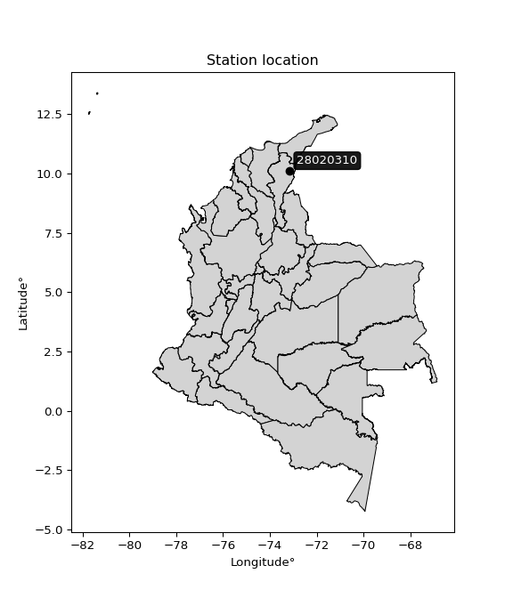</img>


</div>


## A. General information


### 1. General running parameters

• app_version: _v20251220_. • runtime: _2025-12-23 10:23:02.310659_. • Stations dataset (station_dataset_file): _dataset/pmax24h_in/conventional_cesarcolombia_1959_2015.csv_. • Stations catalog (station_catalog_file): _dataset/CNE_IDEAM.xls_. • Plot only fit distributions with Δo > Δ (plot_only_fit): _True_. • Eval low extreme values, if False, evaluates high extreme values (low_extreme): _False_. • Eval Gumbel distribution, non include in SciPy (pdist_loggumbel_on): _True_. • Eval Log-Gumbel distribution, non include in SciPy (pdist_loggumbel_on): _False_. • Standard deviation normalized (ddof): _1.0_. • Return periods to eval in years (Tr): _[2, 2.33, 5, 10, 15, 20, 25, 50, 75, 100, 200, 250, 500, 750, 1000]_. • Minimum data sample per station, 0 means any (minimum_sample): _5_. • Z-Score threshold to adjust a value, 0 means disable (zscore): _3.5_. • Avoid zeros, e.g. rain = 0 (avoid_zeros): _True_. • Avoid null values (avoid_nans): _True_. [:file_folder:Dataset file.](../../dataset/pmax24h_in/conventional_cesarcolombia_1959_2015.csv)


### 2. Station info and location

|   id |   CODIGO | NOMBRE                 | CATEGORIA     | TECNOLOGIA   | ESTADO     | FECHA_INSTALACION   | FECHA_SUSPENSION   |   ALTITUD |   LATITUD |   LONGITUD | DEPARTAMENTO   | MUNICIPIO       | AREA_OPERATIVA                                         | ENTIDAD                                                     | AREA_HIDROGRAFICA   | ZONA_HIDROGRAFICA   | SUBZONA_HIDROGRAFICA   |   CORRIENTE |   OBSERVACION |   SUBRED |
|-----:|---------:|:-----------------------|:--------------|:-------------|:-----------|:--------------------|:-------------------|----------:|----------:|-----------:|:---------------|:----------------|:-------------------------------------------------------|:------------------------------------------------------------|:--------------------|:--------------------|:-----------------------|------------:|--------------:|---------:|
|    0 | 28020310 | BOGOTANA LA [28020310] | Pluviométrica | Convencional | Suspendida | 15/09/1968          | 15/08/2004         |       200 |      10.1 |     -73.15 | Cesar          | Agustín Codazzi | Area Operativa 05 - Magdalena-Cesar-Guajira-San Andrés | INSTITUTO DE HIDROLOGIA METEOROLOGIA Y ESTUDIOS AMBIENTALES | Magdalena Cauca     | Cesar               | Medio Cesar            |         nan |           nan |      nan |

<div align="center">

Map location in: [:earth_americas:Google](http://maps.google.com/maps?q=10.1,-73.15) [:earth_americas:OSM](https://www.openstreetmap.org/#map=18/10.1/-73.15&layers=P) [:earth_americas:Bing](https://www.bing.com/maps?cp=10.1~-73.15&lvl=18) [:earth_americas:Apple](https://maps.apple.com/frame?center=10.1%2C-73.15&span=0.003%2C0.006)

</div>


<div align="center">

```geojson
{
  "type": "Feature",
  "geometry": {
    "type": "Point", 
    "coordinates": [-73.15, 10.1]
  }, 
  "properties": {
    "Name": "28020310"
  }
}
```

</div>


### 3. Discrete values table and plot

|               |           0 |          1 |          2 |           3 |           4 |          5 |           6 |           7 |           8 |           9 |          10 |          11 |          12 |          13 |         14 |          15 |           16 |          17 |           18 |           19 |          20 |           21 |         22 |           23 |           24 |          25 |         26 |           27 |          28 |         29 |         30 |         31 |          32 |          33 |         34 |          35 |          36 |          37 |          38 |          39 |          40 |          41 |           42 |          43 |          44 |          45 |          46 |         47 |
|:--------------|------------:|-----------:|-----------:|------------:|------------:|-----------:|------------:|------------:|------------:|------------:|------------:|------------:|------------:|------------:|-----------:|------------:|-------------:|------------:|-------------:|-------------:|------------:|-------------:|-----------:|-------------:|-------------:|------------:|-----------:|-------------:|------------:|-----------:|-----------:|-----------:|------------:|------------:|-----------:|------------:|------------:|------------:|------------:|------------:|------------:|------------:|-------------:|------------:|------------:|------------:|------------:|-----------:|
| Date          | 1968        | 1969       | 1970       | 1971        | 1972        | 1973       | 1974        | 1975        | 1976        | 1977        | 1978        | 1979        | 1980        | 1981        | 1982       | 1983        | 1984         | 1985        | 1986         | 1987         | 1988        | 1989         | 1990       | 1991         | 1992         | 1993        | 1994       | 1995         | 1996        | 1997       | 1998       | 1999       | 2000        | 2001        | 2002       | 2003        | 2004        | 2005        | 2006        | 2007        | 2008        | 2009        | 2010         | 2011        | 2012        | 2013        | 2014        | 2015       |
| Value         |   87.8883   |   62       |  120       |   80.3886   |   85        |  120       |   80        |   73        |   85        |   80        |   85        |   98.0454   |   71        |  111        |   62.6239  |   77        |   89         |   72        |   90         |   90         |   85        |   90         |  130       |   90         |   90         |  101        |   89.2861  |   90         |   80        |  130       |  160       |  135       |   80        |   65        |   64       |   70.0367   |   73.8322   |   77.8012   |   83.6293   |   74.655    |   84.2125   |   66.3434   |   87.8384    |   77.1481   |   79.8952   |   77.8683   |   82.2558   |   61.2724  |
| Value_initial |   87.8883   |   62       |  120       |   80.3886   |   85        |  120       |   80        |   73        |   85        |   80        |   85        |   98.0454   |   71        |  111        |   62.6239  |   77        |   89         |   72        |   90         |   90         |   85        |   90         |  130       |   90         |   90         |  101        |  180       |   90         |   80        |  130       |  160       |  135       |   80        |   65        |   64       |   70.0367   |   73.8322   |   77.8012   |   83.6293   |   74.655    |   84.2125   |   66.3434   |   87.8384    |   77.1481   |   79.8952   |   77.8683   |   82.2558   |   61.2724  |
| count         |   48        |   48       |   48       |   48        |   48        |   48       |   48        |   48        |   48        |   48        |   48        |   48        |   48        |   48        |   48       |   48        |   48         |   48        |   48         |   48         |   48        |   48         |   48       |   48         |   48         |   48        |   48       |   48         |   48        |   48       |   48       |   48       |   48        |   48        |   48       |   48        |   48        |   48        |   48        |   48        |   48        |   48        |   48         |   48        |   48        |   48        |   48        |   48       |
| mean          |   89.2861   |   89.2861  |   89.2861  |   89.2861   |   89.2861   |   89.2861  |   89.2861   |   89.2861   |   89.2861   |   89.2861   |   89.2861   |   89.2861   |   89.2861   |   89.2861   |   89.2861  |   89.2861   |   89.2861    |   89.2861   |   89.2861    |   89.2861    |   89.2861   |   89.2861    |   89.2861  |   89.2861    |   89.2861    |   89.2861   |   89.2861  |   89.2861    |   89.2861   |   89.2861  |   89.2861  |   89.2861  |   89.2861   |   89.2861   |   89.2861  |   89.2861   |   89.2861   |   89.2861   |   89.2861   |   89.2861   |   89.2861   |   89.2861   |   89.2861    |   89.2861   |   89.2861   |   89.2861   |   89.2861   |   89.2861  |
| std           |   24.4883   |   24.4883  |   24.4883  |   24.4883   |   24.4883   |   24.4883  |   24.4883   |   24.4883   |   24.4883   |   24.4883   |   24.4883   |   24.4883   |   24.4883   |   24.4883   |   24.4883  |   24.4883   |   24.4883    |   24.4883   |   24.4883    |   24.4883    |   24.4883   |   24.4883    |   24.4883  |   24.4883    |   24.4883    |   24.4883   |   24.4883  |   24.4883    |   24.4883   |   24.4883  |   24.4883  |   24.4883  |   24.4883   |   24.4883   |   24.4883  |   24.4883   |   24.4883   |   24.4883   |   24.4883   |   24.4883   |   24.4883   |   24.4883   |   24.4883    |   24.4883   |   24.4883   |   24.4883   |   24.4883   |   24.4883  |
| zscore        |   -0.057083 |   -1.11425 |    1.25422 |   -0.363339 |   -0.175028 |    1.25422 |   -0.379207 |   -0.665057 |   -0.175028 |   -0.379207 |   -0.175028 |    0.357691 |   -0.746729 |    0.886703 |   -1.08877 |   -0.501714 |   -0.0116847 |   -0.705893 |    0.0291511 |    0.0291511 |   -0.175028 |    0.0291511 |    1.66258 |    0.0291511 |    0.0291511 |    0.478345 |    3.70437 |    0.0291511 |   -0.379207 |    1.66258 |    2.88766 |    1.86676 |   -0.379207 |   -0.991744 |   -1.03258 |   -0.786064 |   -0.631075 |   -0.468995 |   -0.231003 |   -0.597474 |   -0.207185 |   -0.936884 |   -0.0591178 |   -0.495665 |   -0.383488 |   -0.466258 |   -0.287088 |   -1.14396 |

<div align="center">

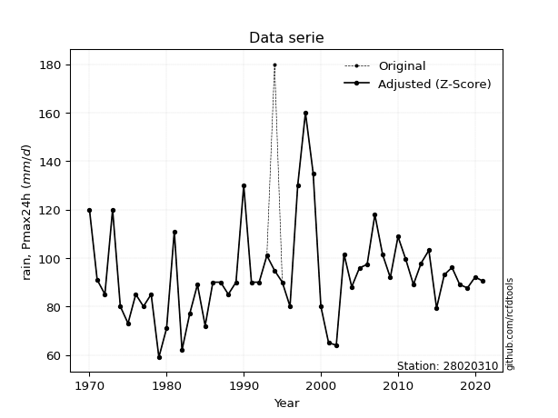</img>

</div>

> If Z-Score is active, values out of range or outliers are replaced with the station mean value.

### 4. Active continuous probability distributions from SciPy (47 of 104 available)

[scipy.stats](https://docs.scipy.org/doc/scipy/reference/stats.html) is a Python´s powerful submodule within the SciPy library for comprehensive statistical analysis, offering over 130 probability distributions (like Normal, Poisson), functions for descriptive stats (mean, variance), hypothesis testing (t-tests, chi-square), random variable generation, and statistical tests, making it essential for data science, modeling, and research. It provides tools to explore, model, and draw conclusions from data efficiently, working seamlessly with NumPy.

|   id | p_dist             |   n_parameter | fit_method   | label                                                                       | active   | ref                                                                                                        |
|-----:|:-------------------|--------------:|:-------------|:----------------------------------------------------------------------------|:---------|:-----------------------------------------------------------------------------------------------------------|
|    0 | alpha              |             3 | MLE          | Alpha                                                                       | True     | [:mortar_board:](https://docs.scipy.org/doc/scipy/reference/generated/scipy.stats.alpha.html)              |
|    1 | betaprime          |             4 | MLE          | Beta prime                                                                  | True     | [:mortar_board:](https://docs.scipy.org/doc/scipy/reference/generated/scipy.stats.betaprime.html)          |
|    2 | chi2               |             3 | MLE          | Chi²                                                                        | True     | [:mortar_board:](https://docs.scipy.org/doc/scipy/reference/generated/scipy.stats.chi2.html)               |
|    3 | crystalball        |             4 | MLE          | Crystalball                                                                 | True     | [:mortar_board:](https://docs.scipy.org/doc/scipy/reference/generated/scipy.stats.crystalball.html)        |
|    4 | dgamma             |             3 | MLE          | Double gamma                                                                | True     | [:mortar_board:](https://docs.scipy.org/doc/scipy/reference/generated/scipy.stats.dgamma.html)             |
|    5 | erlang             |             3 | MLE          | Erlang                                                                      | True     | [:mortar_board:](https://docs.scipy.org/doc/scipy/reference/generated/scipy.stats.erlang.html)             |
|    6 | expon              |             2 | MLE          | Exponential                                                                 | True     | [:mortar_board:](https://docs.scipy.org/doc/scipy/reference/generated/scipy.stats.expon.html)              |
|    7 | exponnorm          |             3 | MLE          | Exponentially modified Normal                                               | True     | [:mortar_board:](https://docs.scipy.org/doc/scipy/reference/generated/scipy.stats.exponnorm.html)          |
|    8 | f                  |             4 | MLE          | F                                                                           | True     | [:mortar_board:](https://docs.scipy.org/doc/scipy/reference/generated/scipy.stats.f.html)                  |
|    9 | fatiguelife        |             3 | MLE          | Fatigue-life (Birnbaum-Saunders)                                            | True     | [:mortar_board:](https://docs.scipy.org/doc/scipy/reference/generated/scipy.stats.fatiguelife.html)        |
|   10 | fisk               |             3 | MLE          | Fisk                                                                        | True     | [:mortar_board:](https://docs.scipy.org/doc/scipy/reference/generated/scipy.stats.fisk.html)               |
|   11 | gamma              |             3 | MLE          | Gamma                                                                       | True     | [:mortar_board:](https://docs.scipy.org/doc/scipy/reference/generated/scipy.stats.gamma.html)              |
|   12 | genexpon           |             5 | MLE          | Generalized exponential                                                     | True     | [:mortar_board:](https://docs.scipy.org/doc/scipy/reference/generated/scipy.stats.genexpon.html)           |
|   13 | genlogistic        |             3 | MLE          | Generalized logistic                                                        | True     | [:mortar_board:](https://docs.scipy.org/doc/scipy/reference/generated/scipy.stats.genlogistic.html)        |
|   14 | gibrat             |             2 | MM           | Gibrat                                                                      | True     | [:mortar_board:](https://docs.scipy.org/doc/scipy/reference/generated/scipy.stats.gibrat.html)             |
|   15 | gompertz           |             3 | MLE          | Gompertz (or truncated Gumbel)                                              | True     | [:mortar_board:](https://docs.scipy.org/doc/scipy/reference/generated/scipy.stats.gompertz.html)           |
|   16 | gumbel_l           |             2 | MM           | Gumbel Left Skew                                                            | True     | [:mortar_board:](https://docs.scipy.org/doc/scipy/reference/generated/scipy.stats.gumbel_l.html)           |
|   17 | gumbel_r           |             2 | MM           | Gumbel Right Skew                                                           | True     | [:mortar_board:](https://docs.scipy.org/doc/scipy/reference/generated/scipy.stats.gumbel_r.html)           |
|   18 | halflogistic       |             2 | MM           | Half-logistic                                                               | True     | [:mortar_board:](https://docs.scipy.org/doc/scipy/reference/generated/scipy.stats.halflogistic.html)       |
|   19 | halfnorm           |             2 | MM           | Half Normal                                                                 | True     | [:mortar_board:](https://docs.scipy.org/doc/scipy/reference/generated/scipy.stats.halfnorm.html)           |
|   20 | hypsecant          |             2 | MM           | hyperbolic secant                                                           | True     | [:mortar_board:](https://docs.scipy.org/doc/scipy/reference/generated/scipy.stats.hypsecant.html)          |
|   21 | invgamma           |             3 | MLE          | Inverted gamma                                                              | True     | [:mortar_board:](https://docs.scipy.org/doc/scipy/reference/generated/scipy.stats.invgamma.html)           |
|   22 | invgauss           |             3 | MLE          | Inverse Gaussian                                                            | True     | [:mortar_board:](https://docs.scipy.org/doc/scipy/reference/generated/scipy.stats.invgauss.html)           |
|   23 | invweibull         |             3 | MLE          | Inverted Weibull                                                            | True     | [:mortar_board:](https://docs.scipy.org/doc/scipy/reference/generated/scipy.stats.invweibull.html)         |
|   24 | johnsonsu          |             4 | MLE          | Johnson Su                                                                  | True     | [:mortar_board:](https://docs.scipy.org/doc/scipy/reference/generated/scipy.stats.johnsonsu.html)          |
|   25 | kstwobign          |             2 | MLE          | Limiting distribution of scaled Kolmogorov-Smirnov two-sided test statistic | True     | [:mortar_board:](https://docs.scipy.org/doc/scipy/reference/generated/scipy.stats.kstwobign.html)          |
|   26 | laplace            |             2 | MM           | Laplace                                                                     | True     | [:mortar_board:](https://docs.scipy.org/doc/scipy/reference/generated/scipy.stats.laplace.html)            |
|   27 | laplace_asymmetric |             3 | MLE          | Asymmetric Laplace                                                          | True     | [:mortar_board:](https://docs.scipy.org/doc/scipy/reference/generated/scipy.stats.laplace_asymmetric.html) |
|   28 | loggamma           |             3 | MLE          | Log gamma                                                                   | True     | [:mortar_board:](https://docs.scipy.org/doc/scipy/reference/generated/scipy.stats.loggamma.html)           |
|   29 | logistic           |             2 | MM           | Logistic (or Sech-squared)                                                  | True     | [:mortar_board:](https://docs.scipy.org/doc/scipy/reference/generated/scipy.stats.logistic.html)           |
|   30 | lognorm            |             3 | MLE          | Log Normal                                                                  | True     | [:mortar_board:](https://docs.scipy.org/doc/scipy/reference/generated/scipy.stats.lognorm.html)            |
|   31 | maxwell            |             2 | MM           | Maxwell                                                                     | True     | [:mortar_board:](https://docs.scipy.org/doc/scipy/reference/generated/scipy.stats.maxwell.html)            |
|   32 | mielke             |             4 | MLE          | Mielke Beta-Kappa / Dagum                                                   | True     | [:mortar_board:](https://docs.scipy.org/doc/scipy/reference/generated/scipy.stats.mielke.html)             |
|   33 | moyal              |             2 | MM           | Moyal                                                                       | True     | [:mortar_board:](https://docs.scipy.org/doc/scipy/reference/generated/scipy.stats.moyal.html)              |
|   34 | nakagami           |             3 | MLE          | Nakagami                                                                    | True     | [:mortar_board:](https://docs.scipy.org/doc/scipy/reference/generated/scipy.stats.nakagami.html)           |
|   35 | ncf                |             5 | MLE          | Non-central F distribution                                                  | True     | [:mortar_board:](https://docs.scipy.org/doc/scipy/reference/generated/scipy.stats.ncf.html)                |
|   36 | nct                |             4 | MLE          | Non-central Student’s t                                                     | True     | [:mortar_board:](https://docs.scipy.org/doc/scipy/reference/generated/scipy.stats.nct.html)                |
|   37 | norm               |             2 | MM           | Normal                                                                      | True     | [:mortar_board:](https://docs.scipy.org/doc/scipy/reference/generated/scipy.stats.norm.html)               |
|   38 | pareto             |             3 | MLE          | Pareto                                                                      | True     | [:mortar_board:](https://docs.scipy.org/doc/scipy/reference/generated/scipy.stats.pareto.html)             |
|   39 | pearson3           |             3 | MM           | Pearson type III                                                            | True     | [:mortar_board:](https://docs.scipy.org/doc/scipy/reference/generated/scipy.stats.pearson3.html)           |
|   40 | rayleigh           |             2 | MM           | Rayleigh                                                                    | True     | [:mortar_board:](https://docs.scipy.org/doc/scipy/reference/generated/scipy.stats.rayleigh.html)           |
|   41 | recipinvgauss      |             3 | MLE          | Reciprocal inverse Gaussian                                                 | True     | [:mortar_board:](https://docs.scipy.org/doc/scipy/reference/generated/scipy.stats.recipinvgauss.html)      |
|   42 | rice               |             3 | MLE          | Rice                                                                        | True     | [:mortar_board:](https://docs.scipy.org/doc/scipy/reference/generated/scipy.stats.rice.html)               |
|   43 | t                  |             3 | MLE          | Student’s t                                                                 | True     | [:mortar_board:](https://docs.scipy.org/doc/scipy/reference/generated/scipy.stats.t.html)                  |
|   44 | truncnorm          |             4 | MLE          | Truncated normal                                                            | True     | [:mortar_board:](https://docs.scipy.org/doc/scipy/reference/generated/scipy.stats.truncnorm.html)          |
|   45 | wald               |             2 | MM           | Wald                                                                        | True     | [:mortar_board:](https://docs.scipy.org/doc/scipy/reference/generated/scipy.stats.wald.html)               |
|   46 | weibull_min        |             3 | MLE          | Weibull minimum                                                             | True     | [:mortar_board:](https://docs.scipy.org/doc/scipy/reference/generated/scipy.stats.weibull_min.html)        |

>Gumbel and Lob-Gumbel probability distributions are not shown in the above table.
>
>**n_parameter:** # arguments & localization & scale.
>
>**Fit methods:** (MLE) maximum likelihood, (MM) L-moments.
>
>**Inactive:** foldnorm, gennorm, norminvgauss, powernorm, powerlognorm, skewnorm, genextreme, anglit, arcsine, argus, beta, bradford, burr, burr12, cauchy, cosine, halfcauchy, foldcauchy, skewcauchy, wrapcauchy, gengamma, exponweib, exponpow, truncexpon, gausshyper, genhalflogistic, genhyperbolic, geninvgauss, halfgennorm, johnsonsb, kappa4, kappa3, ksone, kstwo, loglaplace, levy, levy_l, levy_stable, ncx2, genpareto, truncpareto, lomax, powerlaw, rdist, rel_breitwigner, semicircular, studentized_range, trapezoid, triang, truncweibull_min, tukeylambda, uniform, loguniform, vonmises, vonmises_line, weibull_max, dweibull, 


## B. Probability distributions vs. Empirical distributions

A continuous probability distribution describes probabilities for variables that can take any value within a range (like rain any time), unlike discrete variables with specific outcomes (like temperature). It uses a Probability Density Function (PDF), a curve where the total area under it equals 1, and the probability of the variable falling within an interval (a to b) is found by calculating the area under the curve between those points. A key feature is that the probability of hitting any single exact value is zero, so probabilities are always expressed for ranges, e.g., $P(a ≤ X ≤ b)$.


### 0. Cumulative distribution values - CDF (48 evalated, ordered by x ascending) 

|   id |   Station |   date |        x |   count |    mean |     std |     zscore |   Value_initial |   station |   m |     alpha |   alpha_pdf |   betaprime |   betaprime_pdf |       chi2 |    chi2_pdf |   crystalball |   crystalball_pdf |    dgamma |   dgamma_pdf |     erlang |   erlang_pdf |     expon |   expon_pdf |   exponnorm |   exponnorm_pdf |         f |       f_pdf |   fatiguelife |   fatiguelife_pdf |      fisk |    fisk_pdf |      gamma |   gamma_pdf |   genexpon |   genexpon_pdf |   genlogistic |   genlogistic_pdf |      gibrat |   gibrat_pdf |    gompertz |   gompertz_pdf |   gumbel_l |   gumbel_l_pdf |   gumbel_r |   gumbel_r_pdf |   halflogistic |   halflogistic_pdf |   halfnorm |   halfnorm_pdf |   hypsecant |   hypsecant_pdf |   invgamma |   invgamma_pdf |   invgauss |   invgauss_pdf |   invweibull |   invweibull_pdf |   johnsonsu |   johnsonsu_pdf |   kstwobign |   kstwobign_pdf |   laplace |   laplace_pdf |   laplace_asymmetric |   laplace_asymmetric_pdf |   loggamma |   loggamma_pdf |   logistic |   logistic_pdf |   lognorm |   lognorm_pdf |   maxwell |   maxwell_pdf |    mielke |   mielke_pdf |     moyal |   moyal_pdf |    nakagami |   nakagami_pdf |       ncf |     ncf_pdf |       nct |     nct_pdf |      norm |    norm_pdf |    pareto |   pareto_pdf |    pearson3 |   pearson3_pdf |   rayleigh |   rayleigh_pdf |   recipinvgauss |   recipinvgauss_pdf |      rice |    rice_pdf |         t |       t_pdf |   truncnorm |   truncnorm_pdf |      wald |    wald_pdf |   weibull_min |   weibull_min_pdf |   zzgumbel |   gumbel_pdf |
|-----:|----------:|-------:|---------:|--------:|--------:|--------:|-----------:|----------------:|----------:|----:|----------:|------------:|------------:|----------------:|-----------:|------------:|--------------:|------------------:|----------:|-------------:|-----------:|-------------:|----------:|------------:|------------:|----------------:|----------:|------------:|--------------:|------------------:|----------:|------------:|-----------:|------------:|-----------:|---------------:|--------------:|------------------:|------------:|-------------:|------------:|---------------:|-----------:|---------------:|-----------:|---------------:|---------------:|-------------------:|-----------:|---------------:|------------:|----------------:|-----------:|---------------:|-----------:|---------------:|-------------:|-----------------:|------------:|----------------:|------------:|----------------:|----------:|--------------:|---------------------:|-------------------------:|-----------:|---------------:|-----------:|---------------:|----------:|--------------:|----------:|--------------:|----------:|-------------:|----------:|------------:|------------:|---------------:|----------:|------------:|----------:|------------:|----------:|------------:|----------:|-------------:|------------:|---------------:|-----------:|---------------:|----------------:|--------------------:|----------:|------------:|----------:|------------:|------------:|----------------:|----------:|------------:|--------------:|------------------:|-----------:|-------------:|
|    0 |  28020310 |   2015 |  61.2724 |      48 | 89.2861 | 24.4883 | -1.14396   |         61.2724 |  28020310 |   1 | 0.0183619 | 0.00658971  |   0.0476869 |      0.00864099 | 0.00857732 | 0.00914882  |     0.0990893 |       0.00858674  | 0.078927  |  0.00572475  | 0.00857726 |   0.00914891 | 0         | 0.0382791   |   0.0232659 |     0.00606305  | 0.0168169 | 0.00685375  |     0.014865  |       0.00749979  | 0.0573941 | 0.00791917  | 0.00857687 | 0.00914878  | 0.00503142 |    0.0228613   |     0.028249  |        0.00728019 | 0           |  0           | 2.46516e-12 |    0.028943    |   0.102186 |    0.00611376  |  0.0536928 |    0.00991967  |      0         |        0           |  0.0177225 |    0.023685    |   0.0838585 |     0.00641343  |  0.0167801 |     0.00684025 |  0.0150618 |    0.00737879  |    0.0177781 |      0.00661885  |   0.0154349 |     0.00717648  |   0.0278485 |     0.0077735   | 0.0810331 |   0.00564464  |            0.0447178 |              0.00496168  |   0.102064 |    0.00860441  |  0.0883524 |    0.00719604  | 0.0153963 |   0.00717097  | 0.0881384 |    0.010788   | 0.0185469 |  0.00646057  | 0.0269437 | 0.00835691  | 6.10225e-15 |    0.774192    | 0.0709408 | 0.00891329  | 0.0365389 | 0.00817858  | 0.0990893 | 0.00858674  | 0         |  0.0382791   | 0.000202669 |    0.00271433  |  0.0807325 |     0.0121716  |       0.0145335 |         0.00760118  | 0.0292271 | 0.00867587  | 0.0996644 | 0.00858459  |   0.0990893 |     0.00858674  | 0         | 0           |    0.00420767 |       0.0119112   | 0.00604503 |            0 |
|    1 |  28020310 |   1969 |  62      |      48 | 89.2861 | 24.4883 | -1.11425   |         62      |  28020310 |   2 | 0.0236208 | 0.00788278  |   0.0542621 |      0.00943595 | 0.0162883  | 0.011975    |     0.105482  |       0.00898624  | 0.0832072 |  0.00604319  | 0.0162883  |   0.0119751  | 0.0274685 | 0.0372277   |   0.0280229 |     0.00702715  | 0.0223274 | 0.00831006  |     0.020968  |       0.00928744  | 0.0633982 | 0.00859018  | 0.0162878  | 0.011975    | 0.0272689  |    0.0346741   |     0.0339112 |        0.00829289 | 0           |  0           | 0.0209293   |    0.0285847   |   0.106727 |    0.00636897  |  0.0612316 |    0.0108042   |      0         |        0           |  0.0349508 |    0.0236681   |   0.088654  |     0.00677092  |  0.0222806 |     0.00829638 |  0.021058  |    0.00911654  |    0.0230766 |      0.00796315  |   0.0212462 |     0.00881195  |   0.0338882 |     0.00883348  | 0.0852461 |   0.00593812  |            0.0484778 |              0.00537887  |   0.108466 |    0.00899375  |  0.0937304 |    0.00758903  | 0.0212029 |   0.0088044   | 0.0961782 |    0.0113098  | 0.0237033 |  0.00773136  | 0.0335038 | 0.00968486  | 0.0260178   |    0.0322287   | 0.0776334 | 0.00948425  | 0.0428306 | 0.00912137  | 0.105482  | 0.00898624  | 0.0274685 |  0.0372277   | 0.00490735  |    0.00943269  |  0.0897972 |     0.0127412  |       0.0207302 |         0.00944172  | 0.0358631 | 0.00956105  | 0.106055  | 0.00898284  |   0.105482  |     0.00898624  | 0         | 0           |    0.0145361  |       0.0160159   | 0.00758667 |            0 |
|    2 |  28020310 |   1982 |  62.6239 |      48 | 89.2861 | 24.4883 | -1.08877   |         62.6239 |  28020310 |   3 | 0.0289051 | 0.0090682   |   0.0603658 |      0.0101334  | 0.0244314  | 0.0140861   |     0.111197  |       0.00933399  | 0.0870664 |  0.006331    | 0.0244315  |   0.0140862  | 0.0504186 | 0.0363492   |   0.0326833 |     0.00792401  | 0.0279209 | 0.00963102  |     0.0272515 |       0.0108592   | 0.0689444 | 0.0091941   | 0.024431   | 0.0140861   | 0.0494292  |    0.0358654   |     0.0393672 |        0.00920371 | 0           |  0           | 0.0386665   |    0.0282769   |   0.110771 |    0.006595    |  0.0682109 |    0.0115706   |      0         |        0           |  0.0497098 |    0.0236448   |   0.0929776 |     0.00709192  |  0.0278658 |     0.00961803 |  0.0272238 |    0.0106542   |    0.0284255 |      0.00919554  |   0.0271971 |     0.0102718   |   0.0396889 |     0.00976516  | 0.0890324 |   0.00620186  |            0.0519524 |              0.0057644   |   0.114182 |    0.00933246  |  0.0985734 |    0.0079385   | 0.0271483 |   0.0102619   | 0.103372  |    0.0117524  | 0.0288888 |  0.0089043   | 0.0399124 | 0.0108651   | 0.0454574   |    0.0303039   | 0.0837052 | 0.00998178  | 0.0487803 | 0.00995559  | 0.111197  | 0.00933399  | 0.0504186 |  0.0363492   | 0.0119939   |    0.0131103   |  0.0978943 |     0.0132139  |       0.0271216 |         0.0110493   | 0.0420605 | 0.0103042   | 0.111767  | 0.00932953  |   0.111197  |     0.00933399  | 0         | 0           |    0.0252386  |       0.0181714   | 0.009144   |            0 |
|    3 |  28020310 |   2002 |  64      |      48 | 89.2861 | 24.4883 | -1.03258   |         64      |  28020310 |   4 | 0.0432871 | 0.0118688   |   0.0753895 |      0.0117077  | 0.0465649  | 0.0179056   |     0.124577  |       0.0101155   | 0.0962428 |  0.00701795  | 0.0465653  |   0.0179057  | 0.0991451 | 0.0344839   |   0.0450643 |     0.0101168   | 0.0432613 | 0.0126854   |     0.0445771 |       0.0142998   | 0.0825614 | 0.0106164   | 0.0465647  | 0.0179057   | 0.0980551  |    0.0345544   |     0.0534748 |        0.0113208  | 0           |  0           | 0.077111    |    0.0275962   |   0.120202 |    0.0071177   |  0.0853002 |    0.0132647   |      0.0191945 |        0.0287953   |  0.0821976 |    0.023565    |   0.10325   |     0.00784923  |  0.0431909 |     0.0126769  |  0.044234  |    0.0140548   |    0.0430549 |      0.0120999   |   0.0435901 |     0.0135541   |   0.0545623 |     0.0118546   | 0.0979894 |   0.0068258   |            0.0605226 |              0.0067153   |   0.127547 |    0.0100931   |  0.11005   |    0.0087499   | 0.0435233 |   0.0135376   | 0.120207  |    0.0127087  | 0.0430397 |  0.0117027   | 0.0566964 | 0.0135357   | 0.0855443   |    0.0282082   | 0.0982074 | 0.0110987   | 0.0637798 | 0.0118546   | 0.124577  | 0.0101155   | 0.0991451 |  0.0344839   | 0.0341746   |    0.0186931   |  0.116768  |     0.0142031  |       0.044744  |         0.0145326   | 0.0573385 | 0.0118863   | 0.12514   | 0.0101088   |   0.124577  |     0.0101155   | 0         | 0           |    0.0525398  |       0.0212307   | 0.0134647  |            0 |
|    4 |  28020310 |   2001 |  65      |      48 | 89.2861 | 24.4883 | -0.991744  |         65      |  28020310 |   5 | 0.0562158 | 0.0139949   |   0.0876764 |      0.0128666  | 0.0655947  | 0.020078    |     0.134981  |       0.0106934   | 0.103531  |  0.00756624  | 0.0655952  |   0.0200782  | 0.132977  | 0.0331889   |   0.0560487 |     0.0118721   | 0.057073  | 0.0149343   |     0.060071  |       0.0166599   | 0.093726  | 0.0117227   | 0.0655946  | 0.0200782   | 0.131968   |    0.0332728   |     0.0655923 |        0.0129195  | 0           |  0           | 0.104459    |    0.0271003   |   0.127519 |    0.0075188   |  0.0991737 |    0.014478    |      0.0479659 |        0.0287396   |  0.105723  |    0.0234825   |   0.111394  |     0.0084438   |  0.0569969 |     0.0149318  |  0.0594819 |    0.016417    |    0.0562487 |      0.0142921   |   0.058318  |     0.0158859   |   0.0671746 |     0.0133658   | 0.105059  |   0.00731822  |            0.0676246 |              0.00750331  |   0.13792  |    0.0106551   |  0.119109  |    0.0093738   | 0.0582322 |   0.0158643   | 0.133254  |    0.0133816  | 0.055811  |  0.0138493   | 0.0712019 | 0.0154686   | 0.113264    |    0.0272757   | 0.109717  | 0.0119204   | 0.0763364 | 0.0132597   | 0.134981  | 0.0106934   | 0.132977  |  0.0331889   | 0.0543219   |    0.0214627   |  0.131309  |     0.0148738  |       0.0604732 |         0.0168939   | 0.0697766 | 0.0129819   | 0.135536  | 0.0106851   |   0.134981  |     0.0106934   | 0         | 0           |    0.0745288  |       0.0226669   | 0.0174808  |            0 |
|    5 |  28020310 |   2009 |  66.3434 |      48 | 89.2861 | 24.4883 | -0.936884  |         66.3434 |  28020310 |   6 | 0.0769428 | 0.016852    |   0.106005  |      0.0144164  | 0.0941663  | 0.0223428   |     0.149873  |       0.011478    | 0.11423   |  0.00837548  | 0.094167   |   0.0223429  | 0.176437  | 0.0315253   |   0.0736715 |     0.0143878   | 0.0791178 | 0.0178541   |     0.0844134 |       0.0195098   | 0.110519  | 0.013293    | 0.0941664  | 0.0223429   | 0.175538   |    0.0316043   |     0.0844067 |        0.0150891  | 0           |  0           | 0.140418    |    0.0264331   |   0.137997 |    0.00808647  |  0.11969   |    0.0160513   |      0.0864847 |        0.0285904   |  0.137178  |    0.0233398   |   0.123307  |     0.00930355  |  0.0790453 |     0.0178624  |  0.083519  |    0.0193038   |    0.0774215 |      0.0172127   |   0.0816548 |     0.0188054   |   0.0864618 |     0.0153309   | 0.115365  |   0.00803614  |            0.0784948 |              0.00870942  |   0.152746 |    0.0114179   |  0.132289  |    0.0102553   | 0.0815354 |   0.0187773   | 0.151819  |    0.0142499  | 0.0763745 |  0.016758    | 0.0936719 | 0.0179539   | 0.14924     |    0.0263237   | 0.126474  | 0.0130263   | 0.095415  | 0.0151376   | 0.149873  | 0.011478    | 0.176437  |  0.0315253   | 0.0850376   |    0.0240873   |  0.151861  |     0.0157085  |       0.0851139 |         0.0197151   | 0.0881628 | 0.0143745   | 0.150416  | 0.0114678   |   0.149873  |     0.011478    | 0         | 0           |    0.105926   |       0.0239779   | 0.0242172  |            0 |
|    6 |  28020310 |   2003 |  70.0367 |      48 | 89.2861 | 24.4883 | -0.786064  |         70.0367 |  28020310 |   7 | 0.152478  | 0.0236901   |   0.166764  |      0.0183825  | 0.183952   | 0.025674    |     0.196259  |       0.0136335   | 0.149972  |  0.0111197   | 0.183954   |   0.025674   | 0.285014  | 0.027369    |   0.140008  |     0.0214605   | 0.157851  | 0.0243025   |     0.167597  |       0.0249196   | 0.168066  | 0.0179122   | 0.183953   | 0.0256741   | 0.284377   |    0.0274322   |     0.150684  |        0.0206311  | 0           |  0           | 0.234654    |    0.0245972   |   0.170987 |    0.00982066  |  0.186171  |    0.0197713   |      0.190726  |        0.027758    |  0.222398  |    0.0227644   |   0.162549  |     0.0120371   |  0.157878  |     0.0243489  |  0.166287  |    0.0249111   |    0.154327  |      0.0240202   |   0.163191  |     0.0247884   |   0.152035  |     0.0199435   | 0.149212  |   0.0103939   |            0.118253  |              0.0131208   |   0.198797 |    0.0135125   |  0.174955  |    0.0128959   | 0.162946  |   0.0247508   | 0.208492  |    0.0163664  | 0.151913  |  0.0237836   | 0.170798  | 0.0234023   | 0.242706    |    0.0243877   | 0.18008   | 0.0159615   | 0.160316  | 0.0198513   | 0.196259  | 0.0136335   | 0.285014  |  0.027369    | 0.181353    |    0.0273061   |  0.213543  |     0.0175907  |       0.168782  |         0.0249699   | 0.1476    | 0.017676    | 0.196756  | 0.0136191   |   0.196259  |     0.0136335   | 0.0220887 | 0.0285904   |    0.197903   |       0.0254182   | 0.0521503  |            0 |
|    7 |  28020310 |   1980 |  71      |      48 | 89.2861 | 24.4883 | -0.746729  |         71      |  28020310 |   8 | 0.175967  | 0.025046    |   0.184914  |      0.019291   | 0.208864   | 0.0260199   |     0.209656  |       0.014182    | 0.161095  |  0.0119877   | 0.208865   |   0.02602    | 0.310897  | 0.0263783   |   0.161495  |     0.0231299   | 0.18184   | 0.0254671   |     0.192013  |       0.0257362   | 0.185906  | 0.0191263   | 0.208864   | 0.02602     | 0.310319   |    0.0264378   |     0.171158  |        0.0218588  | 0           |  0           | 0.258117    |    0.0241192   |   0.180683 |    0.0103148   |  0.205596  |    0.0205452   |      0.217317  |        0.0274455   |  0.244235  |    0.022572    |   0.174526  |     0.0128368   |  0.181916  |     0.0255231  |  0.190721  |    0.0257804   |    0.17811   |      0.0253216   |   0.187566  |     0.0257813   |   0.171711  |     0.0208905   | 0.159568  |   0.0111153   |            0.131592  |              0.0146008   |   0.212071 |    0.0140457   |  0.187727  |    0.0136231   | 0.187284  |   0.0257438   | 0.224488  |    0.0168411  | 0.175511  |  0.0251762   | 0.193829  | 0.0243849   | 0.265985    |    0.02395     | 0.1958    | 0.0166739   | 0.179947  | 0.0208922   | 0.209656  | 0.014182    | 0.310897  |  0.0263783   | 0.207773    |    0.0275187   |  0.230677  |     0.0179791  |       0.193227  |         0.0257463   | 0.164979  | 0.0183985   | 0.210139  | 0.0141667   |   0.209656  |     0.014182    | 0.0570191 | 0.0427485   |    0.222413   |       0.0254534   | 0.0619751  |            0 |
|    8 |  28020310 |   1985 |  72      |      48 | 89.2861 | 24.4883 | -0.705893  |         72      |  28020310 |   9 | 0.201622  | 0.0262227   |   0.204646  |      0.02016    | 0.23499    | 0.0262063   |     0.224118  |       0.0147396   | 0.173566  |  0.0129696   | 0.234992   |   0.0262063  | 0.336777  | 0.0253876   |   0.185425  |     0.0247003   | 0.20781   | 0.0264305   |     0.218074  |       0.0263486   | 0.205651  | 0.0203585   | 0.234991   | 0.0262063   | 0.336256   |    0.0254435   |     0.193599  |        0.0230011  | 1.83009e-06 |  9.64268e-05 | 0.281988    |    0.0236237   |   0.191262 |    0.0108455   |  0.226502  |    0.0212487   |      0.244584  |        0.0270827   |  0.266699  |    0.0223547   |   0.187792  |     0.0137014   |  0.207947  |     0.0264955  |  0.216852  |    0.026442    |    0.204005  |      0.0264275   |   0.21376   |     0.0265675   |   0.193041  |     0.0217471   | 0.171079  |   0.0119171   |            0.147033  |              0.0163141   |   0.226389 |    0.014588    |  0.201731  |    0.014387    | 0.213442  |   0.0265308   | 0.24156   |    0.017296   | 0.20131   |  0.0263793   | 0.218638  | 0.0251975   | 0.289713    |    0.0235077   | 0.21283   | 0.0173794   | 0.201335  | 0.021865    | 0.224118  | 0.0147396   | 0.336777  |  0.0253876   | 0.235324    |    0.0275528   |  0.248839  |     0.0183368  |       0.21928   |         0.0263215   | 0.183726  | 0.0190844   | 0.224586  | 0.0147236   |   0.224118  |     0.0147396   | 0.104089  | 0.050327    |    0.24784    |       0.0253852   | 0.073351   |            0 |
|    9 |  28020310 |   1975 |  73      |      48 | 89.2861 | 24.4883 | -0.665057  |         73      |  28020310 |  10 | 0.228332  | 0.0271564   |   0.225206  |      0.0209456  | 0.261226   | 0.0262405   |     0.239131  |       0.0152821   | 0.187065  |  0.0140434   | 0.261227   |   0.0262405  | 0.361685  | 0.0244341   |   0.210828  |     0.026067    | 0.234619  | 0.0271483   |     0.244637  |       0.0267418   | 0.226607  | 0.0215428   | 0.261226   | 0.0262405   | 0.361218   |    0.0244866   |     0.217111  |        0.0239959  | 0.0156842   |  0.0360455   | 0.305365    |    0.0231293   |   0.20238  |    0.011394    |  0.248058  |    0.0218463   |      0.27147   |        0.026683    |  0.288938  |    0.0221199   |   0.201939  |     0.0145971   |  0.234825  |     0.0272211  |  0.243529  |    0.0268773   |    0.23088   |      0.0272806   |   0.240622  |     0.0271177   |   0.215162  |     0.0224725   | 0.183421  |   0.0127769   |            0.164287  |              0.0182285   |   0.241242 |    0.0151159   |  0.216502  |    0.0151547   | 0.240267  |   0.0270829   | 0.259067  |    0.0177105  | 0.228184  |  0.0273264   | 0.244155  | 0.0258022   | 0.313003    |    0.0230731   | 0.230545  | 0.0180445   | 0.223637  | 0.0227186   | 0.239131  | 0.0152821   | 0.361685  |  0.0244341   | 0.262827    |    0.0274295   |  0.267336  |     0.0186483  |       0.245799  |         0.026683    | 0.203126  | 0.0197037   | 0.239582  | 0.0152654   |   0.23913   |     0.0152821   | 0.155967  | 0.0527731   |    0.273153   |       0.0252262   | 0.0859331  |            0 |
|   10 |  28020310 |   2004 |  73.8322 |      48 | 89.2861 | 24.4883 | -0.631075  |         73.8322 |  28020310 |  11 | 0.251188  | 0.0277481   |   0.242885  |      0.0215311  | 0.283038   | 0.0261684   |     0.252031  |       0.0157195   | 0.199151  |  0.0150153   | 0.283039   |   0.0261684  | 0.381698  | 0.0236681   |   0.232931  |     0.0270271   | 0.257396  | 0.0275662   |     0.266973  |       0.0269178   | 0.244927  | 0.0224772   | 0.283039   | 0.0261684   | 0.381274   |    0.0237178   |     0.237382  |        0.0247046  | 0.0563989   |  0.0589806   | 0.324441    |    0.0227189   |   0.212057 |    0.0118633   |  0.266416  |    0.0222615   |      0.293527  |        0.026324    |  0.30726   |    0.0219117   |   0.214404  |     0.0153625   |  0.257665  |     0.0276444  |  0.265991  |    0.0270823   |    0.253811  |      0.0278013   |   0.263319  |     0.0274082   |   0.234079  |     0.0229766   | 0.194368  |   0.0135394   |            0.180179  |              0.0199918   |   0.253999 |    0.015542    |  0.229379  |    0.0157922   | 0.262937  |   0.0273754   | 0.273937  |    0.0180236  | 0.251184  |  0.0279193   | 0.265782  | 0.0261529   | 0.332055    |    0.0227149   | 0.24578   | 0.0185637   | 0.242805  | 0.0233334   | 0.252031  | 0.0157195   | 0.381698  |  0.0236681   | 0.285574    |    0.0272266   |  0.28295   |     0.0188722  |       0.268077  |         0.0268371   | 0.219719  | 0.0201677   | 0.252468  | 0.0157024   |   0.252031  |     0.0157195   | 0.199862  | 0.0524601   |    0.294069   |       0.0250342   | 0.097317   |            0 |
|   11 |  28020310 |   2007 |  74.655  |      48 | 89.2861 | 24.4883 | -0.597474  |         74.655  |  28020310 |  12 | 0.274206  | 0.0281716   |   0.260817  |      0.022046   | 0.304514   | 0.0260187   |     0.265139  |       0.0161378   | 0.211928  |  0.0160546   | 0.304515   |   0.0260187  | 0.400869  | 0.0229342   |   0.255502  |     0.0278046   | 0.280196  | 0.0278282   |     0.289151  |       0.0269703   | 0.263783  | 0.0233436   | 0.304515   | 0.0260188   | 0.400485   |    0.0229814   |     0.257961  |        0.0252958  | 0.10941     |  0.0681957   | 0.342969    |    0.0223142   |   0.222013 |    0.0123384   |  0.284877  |    0.0225983   |      0.315034  |        0.025947    |  0.325201  |    0.0216947   |   0.227361  |     0.0161331   |  0.280531  |     0.0279108  |  0.288314  |    0.0271579   |    0.276843  |      0.0281535   |   0.285942  |     0.0275577   |   0.25316   |     0.0233874   | 0.205834  |   0.0143381   |            0.197403  |              0.0219029   |   0.266956 |    0.0159497   |  0.242631  |    0.0164173   | 0.285534  |   0.0275272   | 0.288885  |    0.0183039  | 0.274339  |  0.0283357   | 0.2874    | 0.0263707   | 0.350601    |    0.0223624   | 0.261255  | 0.0190435   | 0.262225  | 0.0238535   | 0.265139  | 0.0161378   | 0.400869  |  0.0229342   | 0.307868    |    0.0269505   |  0.298559  |     0.0190624  |       0.290181  |         0.026872    | 0.236486  | 0.0205801   | 0.265561  | 0.0161202   |   0.265139  |     0.0161378   | 0.242468  | 0.0509535   |    0.314574   |       0.0247983   | 0.109375   |            0 |
|   12 |  28020310 |   1983 |  77      |      48 | 89.2861 | 24.4883 | -0.501714  |         77      |  28020310 |  13 | 0.340949  | 0.0285609   |   0.313914  |      0.0231483  | 0.364711   | 0.0252462   |     0.304298  |       0.0172357   | 0.253489  |  0.019533    | 0.364712   |   0.0252462  | 0.452307  | 0.0209652   |   0.322435  |     0.0290381   | 0.345668  | 0.0278436   |     0.352067  |       0.026565    | 0.321072  | 0.0254063   | 0.364712   | 0.0252462   | 0.452025   |    0.0210057   |     0.318722  |        0.0263793  | 0.270117    |  0.0649528   | 0.393949    |    0.0211677   |   0.252582 |    0.0137463   |  0.338646  |    0.0231647   |      0.374523  |        0.0247654   |  0.375299  |    0.021019    |   0.267803  |     0.0183609   |  0.346206  |     0.0279329  |  0.351721  |    0.0267896   |    0.343315  |      0.0283532   |   0.350477  |     0.0273361   |   0.30897   |     0.0241039   | 0.242359  |   0.0168824   |            0.256066  |              0.0284119   |   0.305644 |    0.0170221   |  0.283167  |    0.0181346   | 0.350006  |   0.0273138   | 0.3326    |    0.0189393  | 0.34141   |  0.0286687   | 0.349401  | 0.0263647   | 0.401863    |    0.0213583   | 0.307338  | 0.0202081   | 0.319471  | 0.0248514   | 0.304298  | 0.0172357   | 0.452307  |  0.0209652   | 0.369852    |    0.0258465   |  0.343747  |     0.0194368  |       0.352825  |         0.0264369   | 0.285901  | 0.0215026   | 0.304678  | 0.0172172   |   0.304298  |     0.0172357   | 0.354265  | 0.0440699   |    0.37175    |       0.0239212   | 0.147898   |            0 |
|   13 |  28020310 |   2011 |  77.1481 |      48 | 89.2861 | 24.4883 | -0.495665  |         77.1481 |  28020310 |  14 | 0.345179  | 0.0285483   |   0.317347  |      0.0231995  | 0.368446   | 0.0251832   |     0.306856  |       0.0172997   | 0.256401  |  0.0197832   | 0.368447   |   0.0251831  | 0.455403  | 0.0208467   |   0.326739  |     0.0290675   | 0.34979   | 0.0278124   |     0.355998  |       0.026516    | 0.324843  | 0.025513    | 0.368447   | 0.0251831   | 0.455128   |    0.0208868   |     0.322633  |        0.0264184  | 0.279684    |  0.0642086   | 0.397079    |    0.0210957   |   0.254625 |    0.0138376   |  0.342079  |    0.0231816   |      0.378185  |        0.024686    |  0.378409  |    0.0209737   |   0.270533  |     0.018501    |  0.350342  |     0.0279019  |  0.355686  |    0.0267416   |    0.347513  |      0.0283299   |   0.354523  |     0.0272943   |   0.312543  |     0.0241278   | 0.244873  |   0.0170575   |            0.260309  |              0.0288827   |   0.30817  |    0.0170849   |  0.285861  |    0.0182384   | 0.354049  |   0.0272725   | 0.335408  |    0.0189712  | 0.345656  |  0.0286512   | 0.353304  | 0.0263367   | 0.405022    |    0.0212947   | 0.310336  | 0.0202708   | 0.323155  | 0.0248906   | 0.306856  | 0.0172997   | 0.455403  |  0.0208467   | 0.373675    |    0.0257643   |  0.346627  |     0.0194523  |       0.356738  |         0.026387    | 0.28909   | 0.0215484   | 0.307233  | 0.0172812   |   0.306856  |     0.0172997   | 0.360758  | 0.0435959   |    0.375289   |       0.0238573   | 0.150526   |            0 |
|   14 |  28020310 |   2005 |  77.8012 |      48 | 89.2861 | 24.4883 | -0.468995  |         77.8012 |  28020310 |  15 | 0.363795  | 0.0284454   |   0.332566  |      0.0233989  | 0.384799   | 0.0248884   |     0.318245  |       0.0175738   | 0.269694  |  0.0209379   | 0.3848     |   0.0248884  | 0.46885   | 0.020332    |   0.345749  |     0.0291307   | 0.3679    | 0.0276353   |     0.373239  |       0.0262723   | 0.34165   | 0.0259459   | 0.384799   | 0.0248884   | 0.4686     |    0.0203703   |     0.339933  |        0.0265508  | 0.320495    |  0.0607244   | 0.410753    |    0.0207788   |   0.263795 |    0.0142431   |  0.357237  |    0.0232303   |      0.394192  |        0.0243298   |  0.392041  |    0.02077     |   0.282817  |     0.0191144   |  0.368511  |     0.0277251  |  0.373075  |    0.0265006   |    0.365972  |      0.0281824   |   0.372281  |     0.0270758   |   0.328328  |     0.024205    | 0.25627   |   0.0178514   |            0.279873  |              0.0310534   |   0.319416 |    0.0173535   |  0.297919  |    0.0186868   | 0.371793  |   0.0270565   | 0.347841  |    0.0191     | 0.364331  |  0.0285256   | 0.370456  | 0.0261786   | 0.418838    |    0.0210137   | 0.323662  | 0.0205315   | 0.339459  | 0.0250307   | 0.318245  | 0.0175738   | 0.46885   |  0.020332    | 0.39038     |    0.0253877   |  0.359351  |     0.0195092  |       0.373893  |         0.02614     | 0.303225  | 0.0217326   | 0.31861   | 0.0175551   |   0.318245  |     0.0175738   | 0.38855   | 0.0415151   |    0.390776   |       0.0235655   | 0.162372   |            0 |
|   15 |  28020310 |   2013 |  77.8683 |      48 | 89.2861 | 24.4883 | -0.466258  |         77.8683 |  28020310 |  16 | 0.365701  | 0.0284306   |   0.334135  |      0.023417   | 0.386466   | 0.0248567   |     0.319424  |       0.0176012   | 0.271101  |  0.0210614   | 0.386467   |   0.0248566  | 0.470211  | 0.0202799   |   0.347702  |     0.0291313   | 0.369752  | 0.0276136   |     0.374999  |       0.0262448   | 0.343391  | 0.0259868   | 0.386467   | 0.0248567   | 0.469964   |    0.0203181   |     0.341713  |        0.0265607  | 0.324553    |  0.0603551   | 0.412145    |    0.0207463   |   0.264751 |    0.0142849   |  0.358794  |    0.023233    |      0.395822  |        0.0242927   |  0.393432  |    0.0207487   |   0.2841    |     0.0191768   |  0.370368  |     0.0277034  |  0.37485   |    0.0264733   |    0.36786   |      0.0281632   |   0.374095  |     0.0270504   |   0.329951  |     0.0242103   | 0.25747   |   0.0179349   |            0.281963  |              0.0312852   |   0.32058  |    0.0173803   |  0.299174  |    0.0187319   | 0.373606  |   0.0270314   | 0.349122  |    0.0191121  | 0.366243  |  0.0285084   | 0.372211  | 0.0261593   | 0.420246    |    0.0209848   | 0.325039  | 0.0205568   | 0.341138  | 0.025042    | 0.319424  | 0.0176012   | 0.470211  |  0.0202799   | 0.39208     |    0.0253478   |  0.360659  |     0.019514   |       0.375644  |         0.0261123   | 0.304682  | 0.0217499   | 0.319788  | 0.0175824   |   0.319424  |     0.0176012   | 0.391326  | 0.0413034   |    0.392355   |       0.0235347   | 0.163611   |            0 |
|   16 |  28020310 |   2012 |  79.8952 |      48 | 89.2861 | 24.4883 | -0.383488  |         79.8952 |  28020310 |  17 | 0.422642  | 0.0276542   |   0.382009  |      0.0237543  | 0.435799   | 0.0237896   |     0.355887  |       0.0183538   | 0.317935  |  0.0253416   | 0.4358     |   0.0237896  | 0.509762  | 0.0187659   |   0.406427  |     0.0286646   | 0.424868  | 0.0266894   |     0.427224  |       0.0252324   | 0.397093  | 0.0268946   | 0.4358     | 0.0237896   | 0.509587   |    0.0187992   |     0.395644  |        0.0265586  | 0.435547    |  0.0492968   | 0.453205    |    0.0197704   |   0.295001 |    0.0155683   |  0.405833  |    0.0231205   |      0.443895  |        0.0231299   |  0.434818  |    0.0200791   |   0.324838  |     0.0209922   |  0.425665  |     0.0267767  |  0.427535  |    0.0254538   |    0.424142  |      0.0272786   |   0.427986  |     0.0260573   |   0.379042  |     0.0241633   | 0.296513  |   0.0206547   |            0.353071  |              0.0391751   |   0.356582 |    0.0181204   |  0.338463  |    0.0200038   | 0.427466  |   0.0260458   | 0.388167  |    0.0193837  | 0.423264  |  0.0276546   | 0.424478  | 0.0253431   | 0.461892    |    0.0201065   | 0.367387  | 0.0211851   | 0.392069  | 0.0251338   | 0.355887  | 0.0183538   | 0.509762  |  0.0187659   | 0.442176    |    0.0240577   |  0.400297  |     0.0195699  |       0.427599  |         0.0251002   | 0.349201  | 0.0221333   | 0.356213  | 0.0183346   |   0.355887  |     0.0183538   | 0.46876   | 0.035221    |    0.439066   |       0.0225369   | 0.202943   |            0 |
|   17 |  28020310 |   1996 |  80      |      48 | 89.2861 | 24.4883 | -0.379207  |         80      |  28020310 |  18 | 0.425538  | 0.0275984   |   0.384499  |      0.023761   | 0.43829    | 0.0237296   |     0.357813  |       0.0183886   | 0.320605  |  0.0255975   | 0.438291   |   0.0237295  | 0.511725  | 0.0186907   |   0.409429  |     0.0286172   | 0.427663  | 0.0266291   |     0.429866  |       0.0251718   | 0.399914  | 0.0269237   | 0.438291   | 0.0237295   | 0.511554   |    0.0187238   |     0.398427  |        0.0265433  | 0.440687    |  0.048757    | 0.455275    |    0.0197202   |   0.296636 |    0.0156354   |  0.408256  |    0.023105    |      0.446317  |        0.0230678   |  0.436921  |    0.0200431   |   0.327043  |     0.021081    |  0.428468  |     0.0267161  |  0.4302    |    0.0253922   |    0.426999  |      0.0272185   |   0.430715  |     0.0259955   |   0.381574  |     0.0241505   | 0.298687  |   0.0208061   |            0.357165  |              0.0389272   |   0.358484 |    0.0181548   |  0.340563  |    0.0200641   | 0.430194  |   0.0259844   | 0.390199  |    0.0193927  | 0.42616   |  0.0275949   | 0.427132  | 0.02529     | 0.463997    |    0.0200608   | 0.369609  | 0.0212104   | 0.394704  | 0.0251258   | 0.357813  | 0.0183886   | 0.511725  |  0.0186907   | 0.444694    |    0.0239873   |  0.402349  |     0.0195682  |       0.430227  |         0.0250399   | 0.351522  | 0.0221459   | 0.358137  | 0.0183694   |   0.357813  |     0.0183886   | 0.472437  | 0.0349272   |    0.441426   |       0.0224822   | 0.205068   |            0 |
|   18 |  28020310 |   1974 |  80      |      48 | 89.2861 | 24.4883 | -0.379207  |         80      |  28020310 |  19 | 0.425538  | 0.0275984   |   0.384499  |      0.023761   | 0.43829    | 0.0237296   |     0.357813  |       0.0183886   | 0.320605  |  0.0255975   | 0.438291   |   0.0237295  | 0.511725  | 0.0186907   |   0.409429  |     0.0286172   | 0.427663  | 0.0266291   |     0.429866  |       0.0251718   | 0.399914  | 0.0269237   | 0.438291   | 0.0237295   | 0.511554   |    0.0187238   |     0.398427  |        0.0265433  | 0.440687    |  0.048757    | 0.455275    |    0.0197202   |   0.296636 |    0.0156354   |  0.408256  |    0.023105    |      0.446317  |        0.0230678   |  0.436921  |    0.0200431   |   0.327043  |     0.021081    |  0.428468  |     0.0267161  |  0.4302    |    0.0253922   |    0.426999  |      0.0272185   |   0.430715  |     0.0259955   |   0.381574  |     0.0241505   | 0.298687  |   0.0208061   |            0.357165  |              0.0389272   |   0.358484 |    0.0181548   |  0.340563  |    0.0200641   | 0.430194  |   0.0259844   | 0.390199  |    0.0193927  | 0.42616   |  0.0275949   | 0.427132  | 0.02529     | 0.463997    |    0.0200608   | 0.369609  | 0.0212104   | 0.394704  | 0.0251258   | 0.357813  | 0.0183886   | 0.511725  |  0.0186907   | 0.444694    |    0.0239873   |  0.402349  |     0.0195682  |       0.430227  |         0.0250399   | 0.351522  | 0.0221459   | 0.358137  | 0.0183694   |   0.357813  |     0.0183886   | 0.472437  | 0.0349272   |    0.441426   |       0.0224822   | 0.205068   |            0 |
|   19 |  28020310 |   1977 |  80      |      48 | 89.2861 | 24.4883 | -0.379207  |         80      |  28020310 |  20 | 0.425538  | 0.0275984   |   0.384499  |      0.023761   | 0.43829    | 0.0237296   |     0.357813  |       0.0183886   | 0.320605  |  0.0255975   | 0.438291   |   0.0237295  | 0.511725  | 0.0186907   |   0.409429  |     0.0286172   | 0.427663  | 0.0266291   |     0.429866  |       0.0251718   | 0.399914  | 0.0269237   | 0.438291   | 0.0237295   | 0.511554   |    0.0187238   |     0.398427  |        0.0265433  | 0.440687    |  0.048757    | 0.455275    |    0.0197202   |   0.296636 |    0.0156354   |  0.408256  |    0.023105    |      0.446317  |        0.0230678   |  0.436921  |    0.0200431   |   0.327043  |     0.021081    |  0.428468  |     0.0267161  |  0.4302    |    0.0253922   |    0.426999  |      0.0272185   |   0.430715  |     0.0259955   |   0.381574  |     0.0241505   | 0.298687  |   0.0208061   |            0.357165  |              0.0389272   |   0.358484 |    0.0181548   |  0.340563  |    0.0200641   | 0.430194  |   0.0259844   | 0.390199  |    0.0193927  | 0.42616   |  0.0275949   | 0.427132  | 0.02529     | 0.463997    |    0.0200608   | 0.369609  | 0.0212104   | 0.394704  | 0.0251258   | 0.357813  | 0.0183886   | 0.511725  |  0.0186907   | 0.444694    |    0.0239873   |  0.402349  |     0.0195682  |       0.430227  |         0.0250399   | 0.351522  | 0.0221459   | 0.358137  | 0.0183694   |   0.357813  |     0.0183886   | 0.472437  | 0.0349272   |    0.441426   |       0.0224822   | 0.205068   |            0 |
|   20 |  28020310 |   2000 |  80      |      48 | 89.2861 | 24.4883 | -0.379207  |         80      |  28020310 |  21 | 0.425538  | 0.0275984   |   0.384499  |      0.023761   | 0.43829    | 0.0237296   |     0.357813  |       0.0183886   | 0.320605  |  0.0255975   | 0.438291   |   0.0237295  | 0.511725  | 0.0186907   |   0.409429  |     0.0286172   | 0.427663  | 0.0266291   |     0.429866  |       0.0251718   | 0.399914  | 0.0269237   | 0.438291   | 0.0237295   | 0.511554   |    0.0187238   |     0.398427  |        0.0265433  | 0.440687    |  0.048757    | 0.455275    |    0.0197202   |   0.296636 |    0.0156354   |  0.408256  |    0.023105    |      0.446317  |        0.0230678   |  0.436921  |    0.0200431   |   0.327043  |     0.021081    |  0.428468  |     0.0267161  |  0.4302    |    0.0253922   |    0.426999  |      0.0272185   |   0.430715  |     0.0259955   |   0.381574  |     0.0241505   | 0.298687  |   0.0208061   |            0.357165  |              0.0389272   |   0.358484 |    0.0181548   |  0.340563  |    0.0200641   | 0.430194  |   0.0259844   | 0.390199  |    0.0193927  | 0.42616   |  0.0275949   | 0.427132  | 0.02529     | 0.463997    |    0.0200608   | 0.369609  | 0.0212104   | 0.394704  | 0.0251258   | 0.357813  | 0.0183886   | 0.511725  |  0.0186907   | 0.444694    |    0.0239873   |  0.402349  |     0.0195682  |       0.430227  |         0.0250399   | 0.351522  | 0.0221459   | 0.358137  | 0.0183694   |   0.357813  |     0.0183886   | 0.472437  | 0.0349272   |    0.441426   |       0.0224822   | 0.205068   |            0 |
|   21 |  28020310 |   1971 |  80.3886 |      48 | 89.2861 | 24.4883 | -0.363339  |         80.3886 |  28020310 |  22 | 0.436221  | 0.0273802   |   0.393736  |      0.0237768  | 0.447467   | 0.0235034   |     0.364983  |       0.0185139   | 0.330741  |  0.0265833   | 0.447468   |   0.0235033  | 0.518934  | 0.0184148   |   0.420512  |     0.0284235   | 0.437966  | 0.0263966   |     0.439602  |       0.0249409   | 0.410395  | 0.0270158   | 0.447468   | 0.0235033   | 0.518775   |    0.0184469   |     0.408728  |        0.0264748  | 0.45925     |  0.0467982   | 0.462901    |    0.0195346   |   0.30276  |    0.0158844   |  0.417221  |    0.0230399   |      0.455235  |        0.0228362   |  0.444683  |    0.0199085   |   0.335298  |     0.021404    |  0.438805  |     0.0264825  |  0.440021  |    0.0251577   |    0.43753   |      0.0269853   |   0.44077   |     0.0257592   |   0.390948  |     0.024095    | 0.306882  |   0.0213769   |            0.372115  |              0.0380219   |   0.365563 |    0.0182785   |  0.348402  |    0.0202819   | 0.440245  |   0.0257494   | 0.397741  |    0.019422   | 0.436838  |  0.0273617   | 0.436919  | 0.0250851   | 0.471759    |    0.0198911   | 0.377868  | 0.0212976   | 0.40446   | 0.0250859   | 0.364983  | 0.0185139   | 0.518934  |  0.0184148   | 0.453964    |    0.0237238   |  0.409951  |     0.019558   |       0.439913  |         0.0248106   | 0.360135  | 0.0221865   | 0.365299  | 0.0184945   |   0.364983  |     0.0185139   | 0.4858    | 0.0338585   |    0.450122   |       0.0222776   | 0.213016   |            0 |
|   22 |  28020310 |   2014 |  82.2558 |      48 | 89.2861 | 24.4883 | -0.287088  |         82.2558 |  28020310 |  23 | 0.486213  | 0.0261096   |   0.438075  |      0.0236627  | 0.490294   | 0.0223526   |     0.400058  |       0.0190304   | 0.385509  |  0.0324555   | 0.490295   |   0.0223526  | 0.552119  | 0.0171445   |   0.472482  |     0.0271545   | 0.486092  | 0.0251083   |     0.485061  |       0.023722    | 0.46102   | 0.0271142   | 0.490295   | 0.0223526   | 0.552017   |    0.0171727   |     0.457687  |        0.0258994  | 0.538511    |  0.0383747   | 0.498549    |    0.0186496   |   0.333541 |    0.0170842   |  0.459841  |    0.0225679   |      0.496818  |        0.0216958   |  0.481238  |    0.0192384   |   0.376613  |     0.0228008   |  0.487086  |     0.0251874  |  0.485863  |    0.0239142   |    0.486735  |      0.0256673   |   0.487711  |     0.0244839   |   0.435576  |     0.0236621   | 0.34951   |   0.0243464   |            0.439245  |              0.0339568   |   0.400194 |    0.0187916   |  0.387164  |    0.0211976   | 0.487174  |   0.0244804   | 0.434076  |    0.0194706  | 0.486732  |  0.0260248   | 0.482735  | 0.0239498   | 0.508137    |    0.0190707   | 0.417934  | 0.0215779   | 0.450976  | 0.0246806   | 0.400058  | 0.0190304   | 0.552119  |  0.0171445   | 0.49705     |    0.0224159   |  0.44637   |     0.0194274  |       0.485138  |         0.0236033   | 0.401657  | 0.022251    | 0.400338  | 0.0190106   |   0.400058  |     0.0190304   | 0.54453   | 0.0291688   |    0.490774   |       0.0212536   | 0.252581   |            0 |
|   23 |  28020310 |   2006 |  83.6293 |      48 | 89.2861 | 24.4883 | -0.231003  |         83.6293 |  28020310 |  24 | 0.52132   | 0.024993    |   0.470404  |      0.0233912  | 0.520383   | 0.0214573   |     0.4264    |       0.0193149   | 0.434329  |  0.039245    | 0.520384   |   0.0214573  | 0.575058  | 0.0162664   |   0.508968  |     0.0259466   | 0.519843  | 0.0240245   |     0.516973  |       0.0227401   | 0.498099  | 0.0268326   | 0.520383   | 0.0214573   | 0.574992   |    0.016292    |     0.492831  |        0.0252497  | 0.587576    |  0.0332134   | 0.523721    |    0.0180065   |   0.357607 |    0.0179598   |  0.49051   |    0.0220724   |      0.526026  |        0.0208352   |  0.507309  |    0.0187232   |   0.408512  |     0.0236177   |  0.52094   |     0.0240971  |  0.518024  |    0.0229091   |    0.521225  |      0.0245397   |   0.520626  |     0.023436    |   0.467764  |     0.0231903   | 0.3846    |   0.0267906   |            0.483995  |              0.031247    |   0.426208 |    0.0190776   |  0.416649  |    0.0217144   | 0.520087  |   0.0234367   | 0.460785  |    0.0194115  | 0.521694  |  0.0248677   | 0.514981  | 0.0229931   | 0.533911    |    0.0184621   | 0.447624  | 0.0216376   | 0.484548  | 0.0241809   | 0.4264    | 0.0193149   | 0.575058  |  0.0162664   | 0.527159    |    0.0214268   |  0.472937  |     0.0192489  |       0.516895  |         0.0226334   | 0.432171  | 0.0221662   | 0.426652  | 0.0192948   |   0.4264    |     0.0193149   | 0.582493  | 0.0261753   |    0.519427   |       0.0204684   | 0.282857   |            0 |
|   24 |  28020310 |   2008 |  84.2125 |      48 | 89.2861 | 24.4883 | -0.207185  |         84.2125 |  28020310 |  25 | 0.53575   | 0.0244851   |   0.484002  |      0.023232   | 0.532785   | 0.0210689   |     0.437694  |       0.0194102   | 0.458521  |  0.0440949   | 0.532786   |   0.0210689  | 0.58444   | 0.0159073   |   0.523939  |     0.025385    | 0.533715  | 0.02354     |     0.530112  |       0.0223085   | 0.513693  | 0.0266275   | 0.532786   | 0.0210689   | 0.584389   |    0.0159317   |     0.507465  |        0.0249248  | 0.606373    |  0.0312638   | 0.534144    |    0.0177357   |   0.36819  |    0.0183269   |  0.503314  |    0.0218293   |      0.538071  |        0.020466    |  0.518164  |    0.0184993   |   0.422372  |     0.0238992   |  0.534854  |     0.0236095  |  0.531258  |    0.0224668   |    0.535391  |      0.0240327   |   0.534161  |     0.0229718   |   0.481223  |     0.0229565   | 0.400548  |   0.0279016   |            0.501902  |              0.0301626   |   0.437365 |    0.0191745   |  0.429366  |    0.0218894   | 0.533623  |   0.0229741   | 0.472094  |    0.0193629  | 0.536047  |  0.0243453   | 0.528268  | 0.0225647   | 0.544604    |    0.0182025   | 0.460243  | 0.0216261   | 0.498578  | 0.0239236   | 0.437694  | 0.0194102   | 0.58444   |  0.0159073   | 0.539533    |    0.0210037   |  0.484137  |     0.0191532  |       0.529973  |         0.0222073   | 0.445081  | 0.022098    | 0.437935  | 0.0193899   |   0.437694  |     0.0194102   | 0.597418  | 0.0250123   |    0.531267   |       0.0201294   | 0.29594    |            0 |
|   25 |  28020310 |   1972 |  85      |      48 | 89.2861 | 24.4883 | -0.175028  |         85      |  28020310 |  26 | 0.554753  | 0.0237754   |   0.5022    |      0.0229784  | 0.549168   | 0.0205394   |     0.453022  |       0.0195139   | 0.5       |  3.34904     | 0.549169   |   0.0205393  | 0.59678   | 0.0154349   |   0.54362   |     0.0245943   | 0.551989  | 0.0228693   |     0.547446  |       0.0217162   | 0.534528  | 0.0262753   | 0.549169   | 0.0205393   | 0.596748   |    0.015458    |     0.526907  |        0.024446   | 0.630023    |  0.0288399   | 0.547967    |    0.0173721   |   0.382815 |    0.0188158   |  0.520366  |    0.0214735   |      0.55399   |        0.0199652   |  0.532611  |    0.0181926   |   0.44132   |     0.0242107   |  0.553181  |     0.0229345  |  0.548711  |    0.0218595   |    0.55404   |      0.0233288   |   0.552     |     0.0223321   |   0.499167  |     0.0226127   | 0.423134  |   0.0294748   |            0.525097  |              0.028758    |   0.452508 |    0.0192815   |  0.446683  |    0.0220811   | 0.551464  |   0.0223365   | 0.487309  |    0.0192758  | 0.554934  |  0.0236188   | 0.545804  | 0.021971    | 0.5588      |    0.0178512   | 0.477256  | 0.0215763   | 0.517268  | 0.0235384   | 0.453022  | 0.0195139   | 0.59678   |  0.0154349   | 0.555848    |    0.0204319   |  0.499163  |     0.019006   |       0.547231  |         0.0216227   | 0.462437  | 0.0219768   | 0.453246  | 0.0194934   |   0.453022  |     0.0195139   | 0.616527  | 0.0235374   |    0.546937   |       0.0196679   | 0.313765   |            0 |
|   26 |  28020310 |   1976 |  85      |      48 | 89.2861 | 24.4883 | -0.175028  |         85      |  28020310 |  27 | 0.554753  | 0.0237754   |   0.5022    |      0.0229784  | 0.549168   | 0.0205394   |     0.453022  |       0.0195139   | 0.5       |  3.34904     | 0.549169   |   0.0205393  | 0.59678   | 0.0154349   |   0.54362   |     0.0245943   | 0.551989  | 0.0228693   |     0.547446  |       0.0217162   | 0.534528  | 0.0262753   | 0.549169   | 0.0205393   | 0.596748   |    0.015458    |     0.526907  |        0.024446   | 0.630023    |  0.0288399   | 0.547967    |    0.0173721   |   0.382815 |    0.0188158   |  0.520366  |    0.0214735   |      0.55399   |        0.0199652   |  0.532611  |    0.0181926   |   0.44132   |     0.0242107   |  0.553181  |     0.0229345  |  0.548711  |    0.0218595   |    0.55404   |      0.0233288   |   0.552     |     0.0223321   |   0.499167  |     0.0226127   | 0.423134  |   0.0294748   |            0.525097  |              0.028758    |   0.452508 |    0.0192815   |  0.446683  |    0.0220811   | 0.551464  |   0.0223365   | 0.487309  |    0.0192758  | 0.554934  |  0.0236188   | 0.545804  | 0.021971    | 0.5588      |    0.0178512   | 0.477256  | 0.0215763   | 0.517268  | 0.0235384   | 0.453022  | 0.0195139   | 0.59678   |  0.0154349   | 0.555848    |    0.0204319   |  0.499163  |     0.019006   |       0.547231  |         0.0216227   | 0.462437  | 0.0219768   | 0.453246  | 0.0194934   |   0.453022  |     0.0195139   | 0.616527  | 0.0235374   |    0.546937   |       0.0196679   | 0.313765   |            0 |
|   27 |  28020310 |   1978 |  85      |      48 | 89.2861 | 24.4883 | -0.175028  |         85      |  28020310 |  28 | 0.554753  | 0.0237754   |   0.5022    |      0.0229784  | 0.549168   | 0.0205394   |     0.453022  |       0.0195139   | 0.5       |  3.34904     | 0.549169   |   0.0205393  | 0.59678   | 0.0154349   |   0.54362   |     0.0245943   | 0.551989  | 0.0228693   |     0.547446  |       0.0217162   | 0.534528  | 0.0262753   | 0.549169   | 0.0205393   | 0.596748   |    0.015458    |     0.526907  |        0.024446   | 0.630023    |  0.0288399   | 0.547967    |    0.0173721   |   0.382815 |    0.0188158   |  0.520366  |    0.0214735   |      0.55399   |        0.0199652   |  0.532611  |    0.0181926   |   0.44132   |     0.0242107   |  0.553181  |     0.0229345  |  0.548711  |    0.0218595   |    0.55404   |      0.0233288   |   0.552     |     0.0223321   |   0.499167  |     0.0226127   | 0.423134  |   0.0294748   |            0.525097  |              0.028758    |   0.452508 |    0.0192815   |  0.446683  |    0.0220811   | 0.551464  |   0.0223365   | 0.487309  |    0.0192758  | 0.554934  |  0.0236188   | 0.545804  | 0.021971    | 0.5588      |    0.0178512   | 0.477256  | 0.0215763   | 0.517268  | 0.0235384   | 0.453022  | 0.0195139   | 0.59678   |  0.0154349   | 0.555848    |    0.0204319   |  0.499163  |     0.019006   |       0.547231  |         0.0216227   | 0.462437  | 0.0219768   | 0.453246  | 0.0194934   |   0.453022  |     0.0195139   | 0.616527  | 0.0235374   |    0.546937   |       0.0196679   | 0.313765   |            0 |
|   28 |  28020310 |   1988 |  85      |      48 | 89.2861 | 24.4883 | -0.175028  |         85      |  28020310 |  29 | 0.554753  | 0.0237754   |   0.5022    |      0.0229784  | 0.549168   | 0.0205394   |     0.453022  |       0.0195139   | 0.5       |  3.34904     | 0.549169   |   0.0205393  | 0.59678   | 0.0154349   |   0.54362   |     0.0245943   | 0.551989  | 0.0228693   |     0.547446  |       0.0217162   | 0.534528  | 0.0262753   | 0.549169   | 0.0205393   | 0.596748   |    0.015458    |     0.526907  |        0.024446   | 0.630023    |  0.0288399   | 0.547967    |    0.0173721   |   0.382815 |    0.0188158   |  0.520366  |    0.0214735   |      0.55399   |        0.0199652   |  0.532611  |    0.0181926   |   0.44132   |     0.0242107   |  0.553181  |     0.0229345  |  0.548711  |    0.0218595   |    0.55404   |      0.0233288   |   0.552     |     0.0223321   |   0.499167  |     0.0226127   | 0.423134  |   0.0294748   |            0.525097  |              0.028758    |   0.452508 |    0.0192815   |  0.446683  |    0.0220811   | 0.551464  |   0.0223365   | 0.487309  |    0.0192758  | 0.554934  |  0.0236188   | 0.545804  | 0.021971    | 0.5588      |    0.0178512   | 0.477256  | 0.0215763   | 0.517268  | 0.0235384   | 0.453022  | 0.0195139   | 0.59678   |  0.0154349   | 0.555848    |    0.0204319   |  0.499163  |     0.019006   |       0.547231  |         0.0216227   | 0.462437  | 0.0219768   | 0.453246  | 0.0194934   |   0.453022  |     0.0195139   | 0.616527  | 0.0235374   |    0.546937   |       0.0196679   | 0.313765   |            0 |
|   29 |  28020310 |   2010 |  87.8384 |      48 | 89.2861 | 24.4883 | -0.0591178 |         87.8384 |  28020310 |  30 | 0.618454  | 0.0210867   |   0.56578   |      0.0217437  | 0.604734   | 0.0186117   |     0.508688  |       0.0196456   | 0.617534  |  0.0320965   | 0.604735   |   0.0186116  | 0.638295  | 0.0138458   |   0.609204  |     0.0215991   | 0.613372  | 0.0203701   |     0.606003  |       0.0195385   | 0.606637  | 0.0243876   | 0.604734   | 0.0186116   | 0.638322   |    0.0138643   |     0.593518  |        0.0224223  | 0.701302    |  0.0217831   | 0.595441    |    0.0160841   |   0.438624 |    0.0204756   |  0.579266  |    0.0199801   |      0.60809   |        0.0181543   |  0.582642  |    0.0170511   |   0.510888  |     0.0246136   |  0.614726  |     0.0204188  |  0.607596  |    0.0196265   |    0.616541  |      0.0206965   |   0.612043  |     0.0199668   |   0.561357  |     0.0211575   | 0.515166  |   0.0337728   |            0.600095  |              0.0242165   |   0.507541 |    0.0194337   |  0.509875  |    0.0223264   | 0.611528  |   0.0199771   | 0.541371  |    0.0187678  | 0.618131  |  0.0208957   | 0.605034  | 0.0197497   | 0.607665    |    0.016579    | 0.537915  | 0.0210865   | 0.581787  | 0.021854    | 0.508688  | 0.0196456   | 0.638295  |  0.0138458   | 0.610934    |    0.0183907   |  0.552189  |     0.0183173  |       0.605563  |         0.019474    | 0.523922  | 0.0212824   | 0.508853  | 0.019624    |   0.508688  |     0.0196456   | 0.676651  | 0.0190209   |    0.600381   |       0.0179879   | 0.378834   |            0 |
|   30 |  28020310 |   1968 |  87.8883 |      48 | 89.2861 | 24.4883 | -0.057083  |         87.8883 |  28020310 |  31 | 0.619503  | 0.0210387   |   0.566863  |      0.0217182  | 0.60566    | 0.0185779   |     0.509667  |       0.0196445   | 0.619128  |  0.0319104   | 0.605661   |   0.0185779  | 0.638984  | 0.0138194   |   0.610279  |     0.0215461   | 0.614386  | 0.0203259   |     0.606976  |       0.0195002   | 0.607852  | 0.0243472   | 0.605661   | 0.0185779   | 0.639012   |    0.0138379   |     0.594635  |        0.0223836  | 0.702385    |  0.0216793   | 0.596241    |    0.0160618   |   0.439645 |    0.0205028   |  0.580261  |    0.0199516   |      0.608993  |        0.0181226   |  0.583491  |    0.0170306   |   0.512114  |     0.0246102   |  0.615743  |     0.0203743  |  0.608573  |    0.0195872   |    0.617571  |      0.0206499   |   0.613036  |     0.0199251   |   0.562411  |     0.0211295   | 0.516846  |   0.0336558   |            0.6013    |              0.0241435   |   0.508509 |    0.0194331   |  0.510987  |    0.0223243   | 0.612523  |   0.0199355   | 0.542306  |    0.0187563  | 0.619171  |  0.0208475   | 0.606017  | 0.0197103   | 0.608491    |    0.0165566   | 0.538966  | 0.0210738   | 0.582875  | 0.0218211   | 0.509667  | 0.0196445   | 0.638984  |  0.0138194   | 0.61185     |    0.0183554   |  0.553101  |     0.0183032  |       0.606533  |         0.0194362   | 0.524982  | 0.0212669   | 0.509831  | 0.0196229   |   0.509667  |     0.0196445   | 0.677597  | 0.0189516   |    0.601277   |       0.0179584   | 0.379979   |            0 |
|   31 |  28020310 |   1984 |  89      |      48 | 89.2861 | 24.4883 | -0.0116847 |         89      |  28020310 |  32 | 0.642298  | 0.0199693   |   0.590679  |      0.0211184  | 0.625896   | 0.0178273   |     0.531481  |       0.0195891   | 0.652499  |  0.0282702   | 0.625897   |   0.0178273  | 0.654025  | 0.0132436   |   0.633579  |     0.0203743   | 0.636435  | 0.0193428   |     0.62818   |       0.0186488   | 0.634398  | 0.023395    | 0.625896   | 0.0178273   | 0.654073   |    0.0132606   |     0.619031  |        0.0215001  | 0.725257    |  0.0195135   | 0.613823    |    0.0155678   |   0.462767 |    0.0210869   |  0.602081  |    0.0192978   |      0.628749  |        0.0174182   |  0.60217   |    0.0165709   |   0.539396  |     0.0244396   |  0.637842  |     0.0193847  |  0.629863  |    0.018715    |    0.639952  |      0.0196137   |   0.634672  |     0.0189984   |   0.585548  |     0.020488    | 0.55285   |   0.0311478   |            0.627257  |              0.0225716   |   0.530094 |    0.0193892   |  0.535758  |    0.0222209   | 0.63417   |   0.0190104   | 0.563007  |    0.018479   | 0.641751  |  0.0197753   | 0.627441  | 0.0188319   | 0.62662     |    0.0160575   | 0.562223  | 0.0207561   | 0.606717  | 0.0210638   | 0.531481  | 0.0195891   | 0.654025  |  0.0132436   | 0.631821    |    0.0175751   |  0.573268  |     0.0179713  |       0.627673  |         0.0185958   | 0.548422  | 0.0208934   | 0.53162   | 0.0195669   |   0.531481  |     0.0195891   | 0.697835  | 0.0174817   |    0.620876   |       0.0173015   | 0.405483   |            0 |
|   32 |  28020310 |   1994 |  89.2861 |      48 | 89.2861 | 24.4883 |  3.70437   |        180      |  28020310 |  33 | 0.647973  | 0.0196952   |   0.596699  |      0.0209556  | 0.63097    | 0.0176354   |     0.537083  |       0.0195653   | 0.660471  |  0.0274582   | 0.63097    |   0.0176353  | 0.657794  | 0.0130993   |   0.639366  |     0.0200766   | 0.641934  | 0.0190914   |     0.633485  |       0.0184311   | 0.641056  | 0.0231358   | 0.63097    | 0.0176353   | 0.657846   |    0.0131159   |     0.62515   |        0.0212675  | 0.730766    |  0.0189998   | 0.618259    |    0.0154417   |   0.468822 |    0.0212296   |  0.607578  |    0.0191251   |      0.633707  |        0.0172379   |  0.606894  |    0.0164517   |   0.546379  |     0.024367    |  0.643353  |     0.0191316  |  0.635186  |    0.0184921   |    0.645526  |      0.0193488   |   0.640074  |     0.0187615   |   0.591386  |     0.0203182   | 0.561674  |   0.0305331   |            0.63366   |              0.0221839   |   0.535639 |    0.0193687   |  0.542111  |    0.0221767   | 0.639576  |   0.0187739   | 0.568284  |    0.0184012  | 0.64737   |  0.0195014   | 0.632797  | 0.0186068   | 0.631196    |    0.0159291   | 0.568149  | 0.0206641   | 0.612716  | 0.0208626   | 0.537083  | 0.0195653   | 0.657794  |  0.0130993   | 0.636821    |    0.0173766   |  0.578397  |     0.0178809  |       0.632963  |         0.0183809   | 0.554386  | 0.0207891   | 0.537216  | 0.019543    |   0.537083  |     0.0195653   | 0.702787  | 0.0171264   |    0.625803   |       0.0171331   | 0.412024   |            0 |
|   33 |  28020310 |   1986 |  90      |      48 | 89.2861 | 24.4883 |  0.0291511 |         90      |  28020310 |  34 | 0.661789  | 0.0190155   |   0.61151   |      0.0205361  | 0.643389   | 0.0171592   |     0.551024  |       0.0194894   | 0.679395  |  0.0255975   | 0.643389   |   0.0171592  | 0.667019  | 0.0127462   |   0.653436  |     0.0193434   | 0.65534   | 0.0184686   |     0.64645   |       0.0178915   | 0.657335  | 0.0224681   | 0.643389   | 0.0171592   | 0.667082   |    0.0127619   |     0.640123  |        0.02068    | 0.743892    |  0.0177893   | 0.629171    |    0.0151288   |   0.484099 |    0.0215701   |  0.621076  |    0.0186879   |      0.645852  |        0.0167902   |  0.618532  |    0.016153    |   0.563695  |     0.0241366   |  0.656786  |     0.0185046  |  0.64819   |    0.0179398   |    0.659104  |      0.018693    |   0.653257  |     0.0181745   |   0.605737  |     0.0198875   | 0.582938  |   0.0290519   |            0.649159  |              0.0212454   |   0.549443 |    0.0193013   |  0.557894  |    0.0220357   | 0.652769  |   0.0181878   | 0.581347  |    0.0181963  | 0.661049  |  0.0188234   | 0.64588   | 0.0180483   | 0.642453    |    0.015609    | 0.582814  | 0.020417    | 0.627427  | 0.0203512   | 0.551024  | 0.0194894   | 0.667019  |  0.0127462   | 0.64905     |    0.016886    |  0.591079  |     0.017647   |       0.645894  |         0.017848    | 0.56913   | 0.0205154   | 0.551141  | 0.0194667   |   0.551024  |     0.0194894   | 0.714706  | 0.0162778   |    0.637884   |       0.0167146   | 0.428281   |            0 |
|   34 |  28020310 |   1989 |  90      |      48 | 89.2861 | 24.4883 |  0.0291511 |         90      |  28020310 |  35 | 0.661789  | 0.0190155   |   0.61151   |      0.0205361  | 0.643389   | 0.0171592   |     0.551024  |       0.0194894   | 0.679395  |  0.0255975   | 0.643389   |   0.0171592  | 0.667019  | 0.0127462   |   0.653436  |     0.0193434   | 0.65534   | 0.0184686   |     0.64645   |       0.0178915   | 0.657335  | 0.0224681   | 0.643389   | 0.0171592   | 0.667082   |    0.0127619   |     0.640123  |        0.02068    | 0.743892    |  0.0177893   | 0.629171    |    0.0151288   |   0.484099 |    0.0215701   |  0.621076  |    0.0186879   |      0.645852  |        0.0167902   |  0.618532  |    0.016153    |   0.563695  |     0.0241366   |  0.656786  |     0.0185046  |  0.64819   |    0.0179398   |    0.659104  |      0.018693    |   0.653257  |     0.0181745   |   0.605737  |     0.0198875   | 0.582938  |   0.0290519   |            0.649159  |              0.0212454   |   0.549443 |    0.0193013   |  0.557894  |    0.0220357   | 0.652769  |   0.0181878   | 0.581347  |    0.0181963  | 0.661049  |  0.0188234   | 0.64588   | 0.0180483   | 0.642453    |    0.015609    | 0.582814  | 0.020417    | 0.627427  | 0.0203512   | 0.551024  | 0.0194894   | 0.667019  |  0.0127462   | 0.64905     |    0.016886    |  0.591079  |     0.017647   |       0.645894  |         0.017848    | 0.56913   | 0.0205154   | 0.551141  | 0.0194667   |   0.551024  |     0.0194894   | 0.714706  | 0.0162778   |    0.637884   |       0.0167146   | 0.428281   |            0 |
|   35 |  28020310 |   1987 |  90      |      48 | 89.2861 | 24.4883 |  0.0291511 |         90      |  28020310 |  36 | 0.661789  | 0.0190155   |   0.61151   |      0.0205361  | 0.643389   | 0.0171592   |     0.551024  |       0.0194894   | 0.679395  |  0.0255975   | 0.643389   |   0.0171592  | 0.667019  | 0.0127462   |   0.653436  |     0.0193434   | 0.65534   | 0.0184686   |     0.64645   |       0.0178915   | 0.657335  | 0.0224681   | 0.643389   | 0.0171592   | 0.667082   |    0.0127619   |     0.640123  |        0.02068    | 0.743892    |  0.0177893   | 0.629171    |    0.0151288   |   0.484099 |    0.0215701   |  0.621076  |    0.0186879   |      0.645852  |        0.0167902   |  0.618532  |    0.016153    |   0.563695  |     0.0241366   |  0.656786  |     0.0185046  |  0.64819   |    0.0179398   |    0.659104  |      0.018693    |   0.653257  |     0.0181745   |   0.605737  |     0.0198875   | 0.582938  |   0.0290519   |            0.649159  |              0.0212454   |   0.549443 |    0.0193013   |  0.557894  |    0.0220357   | 0.652769  |   0.0181878   | 0.581347  |    0.0181963  | 0.661049  |  0.0188234   | 0.64588   | 0.0180483   | 0.642453    |    0.015609    | 0.582814  | 0.020417    | 0.627427  | 0.0203512   | 0.551024  | 0.0194894   | 0.667019  |  0.0127462   | 0.64905     |    0.016886    |  0.591079  |     0.017647   |       0.645894  |         0.017848    | 0.56913   | 0.0205154   | 0.551141  | 0.0194667   |   0.551024  |     0.0194894   | 0.714706  | 0.0162778   |    0.637884   |       0.0167146   | 0.428281   |            0 |
|   36 |  28020310 |   1991 |  90      |      48 | 89.2861 | 24.4883 |  0.0291511 |         90      |  28020310 |  37 | 0.661789  | 0.0190155   |   0.61151   |      0.0205361  | 0.643389   | 0.0171592   |     0.551024  |       0.0194894   | 0.679395  |  0.0255975   | 0.643389   |   0.0171592  | 0.667019  | 0.0127462   |   0.653436  |     0.0193434   | 0.65534   | 0.0184686   |     0.64645   |       0.0178915   | 0.657335  | 0.0224681   | 0.643389   | 0.0171592   | 0.667082   |    0.0127619   |     0.640123  |        0.02068    | 0.743892    |  0.0177893   | 0.629171    |    0.0151288   |   0.484099 |    0.0215701   |  0.621076  |    0.0186879   |      0.645852  |        0.0167902   |  0.618532  |    0.016153    |   0.563695  |     0.0241366   |  0.656786  |     0.0185046  |  0.64819   |    0.0179398   |    0.659104  |      0.018693    |   0.653257  |     0.0181745   |   0.605737  |     0.0198875   | 0.582938  |   0.0290519   |            0.649159  |              0.0212454   |   0.549443 |    0.0193013   |  0.557894  |    0.0220357   | 0.652769  |   0.0181878   | 0.581347  |    0.0181963  | 0.661049  |  0.0188234   | 0.64588   | 0.0180483   | 0.642453    |    0.015609    | 0.582814  | 0.020417    | 0.627427  | 0.0203512   | 0.551024  | 0.0194894   | 0.667019  |  0.0127462   | 0.64905     |    0.016886    |  0.591079  |     0.017647   |       0.645894  |         0.017848    | 0.56913   | 0.0205154   | 0.551141  | 0.0194667   |   0.551024  |     0.0194894   | 0.714706  | 0.0162778   |    0.637884   |       0.0167146   | 0.428281   |            0 |
|   37 |  28020310 |   1992 |  90      |      48 | 89.2861 | 24.4883 |  0.0291511 |         90      |  28020310 |  38 | 0.661789  | 0.0190155   |   0.61151   |      0.0205361  | 0.643389   | 0.0171592   |     0.551024  |       0.0194894   | 0.679395  |  0.0255975   | 0.643389   |   0.0171592  | 0.667019  | 0.0127462   |   0.653436  |     0.0193434   | 0.65534   | 0.0184686   |     0.64645   |       0.0178915   | 0.657335  | 0.0224681   | 0.643389   | 0.0171592   | 0.667082   |    0.0127619   |     0.640123  |        0.02068    | 0.743892    |  0.0177893   | 0.629171    |    0.0151288   |   0.484099 |    0.0215701   |  0.621076  |    0.0186879   |      0.645852  |        0.0167902   |  0.618532  |    0.016153    |   0.563695  |     0.0241366   |  0.656786  |     0.0185046  |  0.64819   |    0.0179398   |    0.659104  |      0.018693    |   0.653257  |     0.0181745   |   0.605737  |     0.0198875   | 0.582938  |   0.0290519   |            0.649159  |              0.0212454   |   0.549443 |    0.0193013   |  0.557894  |    0.0220357   | 0.652769  |   0.0181878   | 0.581347  |    0.0181963  | 0.661049  |  0.0188234   | 0.64588   | 0.0180483   | 0.642453    |    0.015609    | 0.582814  | 0.020417    | 0.627427  | 0.0203512   | 0.551024  | 0.0194894   | 0.667019  |  0.0127462   | 0.64905     |    0.016886    |  0.591079  |     0.017647   |       0.645894  |         0.017848    | 0.56913   | 0.0205154   | 0.551141  | 0.0194667   |   0.551024  |     0.0194894   | 0.714706  | 0.0162778   |    0.637884   |       0.0167146   | 0.428281   |            0 |
|   38 |  28020310 |   1995 |  90      |      48 | 89.2861 | 24.4883 |  0.0291511 |         90      |  28020310 |  39 | 0.661789  | 0.0190155   |   0.61151   |      0.0205361  | 0.643389   | 0.0171592   |     0.551024  |       0.0194894   | 0.679395  |  0.0255975   | 0.643389   |   0.0171592  | 0.667019  | 0.0127462   |   0.653436  |     0.0193434   | 0.65534   | 0.0184686   |     0.64645   |       0.0178915   | 0.657335  | 0.0224681   | 0.643389   | 0.0171592   | 0.667082   |    0.0127619   |     0.640123  |        0.02068    | 0.743892    |  0.0177893   | 0.629171    |    0.0151288   |   0.484099 |    0.0215701   |  0.621076  |    0.0186879   |      0.645852  |        0.0167902   |  0.618532  |    0.016153    |   0.563695  |     0.0241366   |  0.656786  |     0.0185046  |  0.64819   |    0.0179398   |    0.659104  |      0.018693    |   0.653257  |     0.0181745   |   0.605737  |     0.0198875   | 0.582938  |   0.0290519   |            0.649159  |              0.0212454   |   0.549443 |    0.0193013   |  0.557894  |    0.0220357   | 0.652769  |   0.0181878   | 0.581347  |    0.0181963  | 0.661049  |  0.0188234   | 0.64588   | 0.0180483   | 0.642453    |    0.015609    | 0.582814  | 0.020417    | 0.627427  | 0.0203512   | 0.551024  | 0.0194894   | 0.667019  |  0.0127462   | 0.64905     |    0.016886    |  0.591079  |     0.017647   |       0.645894  |         0.017848    | 0.56913   | 0.0205154   | 0.551141  | 0.0194667   |   0.551024  |     0.0194894   | 0.714706  | 0.0162778   |    0.637884   |       0.0167146   | 0.428281   |            0 |
|   39 |  28020310 |   1979 |  98.0454 |      48 | 89.2861 | 24.4883 |  0.357691  |         98.0454 |  28020310 |  40 | 0.786174  | 0.0122245   |   0.755379  |      0.015103   | 0.761011   | 0.012237    |     0.700046  |       0.0171247   | 0.827021  |  0.0129231   | 0.761012   |   0.012237   | 0.75528   | 0.00936768  |   0.779445  |     0.0124203   | 0.777707  | 0.0122288   |     0.767438  |       0.0123899   | 0.805364  | 0.0143553   | 0.761011   | 0.012237    | 0.755433   |    0.00937507  |     0.779505  |        0.014064   | 0.846915    |  0.00904216  | 0.737247    |    0.0118014   |   0.667207 |    0.0231309   |  0.750874  |    0.013591    |      0.761554  |        0.0120995   |  0.734755  |    0.0127369   |   0.736809  |     0.0181211   |  0.779277  |     0.0122266  |  0.769102  |    0.0123361   |    0.782045  |      0.0121808   |   0.774675  |     0.0122554   |   0.74522   |     0.0147637   | 0.761873  |   0.0165876   |            0.784462  |              0.013052    |   0.697433 |    0.0170619   |  0.721396  |    0.017956    | 0.774314  |   0.0122723   | 0.715956  |    0.0150474  | 0.784227  |  0.0121334   | 0.767319  | 0.0123627   | 0.753711    |    0.0120818   | 0.731983  | 0.016339    | 0.766865  | 0.0143194   | 0.700046  | 0.0171247   | 0.75528   |  0.00936768  | 0.76422     |    0.0119331   |  0.720606  |     0.0143979  |       0.766777  |         0.0124005   | 0.718773  | 0.0164365   | 0.699965  | 0.0170985   |   0.700046  |     0.0171247   | 0.815594  | 0.00953838  |    0.754126   |       0.0122882   | 0.598806   |            0 |
|   40 |  28020310 |   1993 | 101      |      48 | 89.2861 | 24.4883 |  0.478345  |        101      |  28020310 |  41 | 0.819316  | 0.0102594   |   0.796995  |      0.0130815  | 0.794845   | 0.0106907   |     0.748592  |       0.015699    | 0.861106  |  0.0102622   | 0.794845   |   0.0106907  | 0.78145   | 0.00836592  |   0.813256  |     0.0105189   | 0.811062  | 0.0103922   |     0.801513  |       0.0107078   | 0.843796  | 0.011718    | 0.794845   | 0.0106907   | 0.781622   |    0.00837117  |     0.817826  |        0.011913   | 0.870844    |  0.00723894  | 0.770445    |    0.0106808   |   0.734466 |    0.0222434   |  0.788413  |    0.0118407   |      0.795051  |        0.0105975   |  0.770562  |    0.0115066   |   0.786204  |     0.0153256   |  0.812612  |     0.0103808  |  0.802989  |    0.0106361   |    0.815178  |      0.0102939   |   0.808215  |     0.010486    |   0.786131  |     0.012945    | 0.806168  |   0.0135021   |            0.819772  |              0.0109138   |   0.745865 |    0.0156843   |  0.771247  |    0.0157619   | 0.807903  |   0.0105022   | 0.758363  |    0.0136469  | 0.817171  |  0.0102161   | 0.801257  | 0.0106454   | 0.787583    |    0.0108553   | 0.777566  | 0.014505    | 0.806089  | 0.0122596   | 0.748592  | 0.015699    | 0.78145   |  0.00836592  | 0.797189    |    0.0104113   |  0.761154  |     0.0130432  |       0.800899  |         0.0107284   | 0.764761  | 0.0146844   | 0.748432  | 0.0156727   |   0.748592  |     0.015699    | 0.841358  | 0.00795958  |    0.788277   |       0.0108486   | 0.652898   |            0 |
|   41 |  28020310 |   1981 | 111      |      48 | 89.2861 | 24.4883 |  0.886703  |        111      |  28020310 |  42 | 0.896253  | 0.00558788  |   0.897428  |      0.00734679 | 0.879738   | 0.00656286  |     0.877509  |       0.00999659  | 0.933045  |  0.00483818  | 0.879737   |   0.00656285 | 0.850959  | 0.00570518  |   0.893683  |     0.00598904  | 0.890465  | 0.00589208  |     0.885245  |       0.00636692  | 0.92653   | 0.00550764  | 0.879737   | 0.00656285  | 0.851156   |    0.00570567  |     0.907136  |        0.00640442 | 0.923044    |  0.0036928   | 0.859962    |    0.0073428   |   0.917425 |    0.0130102   |  0.881266  |    0.00703674  |      0.879391  |        0.00652948  |  0.866055  |    0.00770597  |   0.898366  |     0.00773061  |  0.891805  |     0.00586511 |  0.885912  |    0.00628721  |    0.893262  |      0.00575127  |   0.889075  |     0.00605797  |   0.8881    |     0.00771824  | 0.903416  |   0.00672786  |            0.901637  |              0.00595643  |   0.875266 |    0.0100905   |  0.891753  |    0.00862403  | 0.888903  |   0.00606944  | 0.870531  |    0.00884491 | 0.894308  |  0.00565532  | 0.884196  | 0.00629093  | 0.877018    |    0.00716362  | 0.89182   | 0.00851605  | 0.899229  | 0.00677173  | 0.877509  | 0.00999659  | 0.850959  |  0.00570518  | 0.879861    |    0.00640076  |  0.868677  |     0.00853895 |       0.884904  |         0.00639567  | 0.882192  | 0.00894001  | 0.877122  | 0.0099801   |   0.877509  |     0.00999659  | 0.901817  | 0.00452038  |    0.875648   |       0.00685135  | 0.795986   |            0 |
|   42 |  28020310 |   1973 | 120      |      48 | 89.2861 | 24.4883 |  1.25422   |        120      |  28020310 |  43 | 0.93507   | 0.00325954  |   0.947276  |      0.00400569 | 0.926975   | 0.00410543  |     0.945855  |       0.00541184  | 0.964925  |  0.00250705  | 0.926975   |   0.00410542 | 0.894394  | 0.0040425   |   0.935964  |     0.00360725  | 0.931938  | 0.0035304   |     0.930618  |       0.00390387  | 0.962122  | 0.00272777  | 0.926975   | 0.00410543  | 0.894586   |    0.00404087  |     0.950488  |        0.00349644 | 0.948771    |  0.00218646  | 0.914911    |    0.00496816  |   0.987769 |    0.00340263  |  0.930919  |    0.00420973  |      0.926392  |        0.0040846   |  0.922597  |    0.00498178  |   0.949019  |     0.00392758  |  0.933025  |     0.00350232 |  0.930668  |    0.00384838  |    0.933597  |      0.00342211  |   0.931912  |     0.00366049  |   0.94184   |     0.0044457   | 0.948402  |   0.00359423  |            0.942965  |              0.00345379  |   0.944544 |    0.00551285  |  0.948477  |    0.00436591  | 0.931824  |   0.00366764  | 0.933261  |    0.00526773 | 0.933892  |  0.00335348  | 0.929068  | 0.00387043  | 0.929335    |    0.00458704  | 0.949331  | 0.00454147  | 0.945399  | 0.00375215  | 0.945855  | 0.00541184  | 0.894394  |  0.0040425   | 0.926071    |    0.00403389  |  0.929875  |     0.00521692 |       0.930505  |         0.00392478  | 0.943652  | 0.00495882  | 0.945399  | 0.00541328  |   0.945855  |     0.00541184  | 0.934295  | 0.00284788  |    0.925316   |       0.0043426   | 0.878099   |            0 |
|   43 |  28020310 |   1970 | 120      |      48 | 89.2861 | 24.4883 |  1.25422   |        120      |  28020310 |  44 | 0.93507   | 0.00325954  |   0.947276  |      0.00400569 | 0.926975   | 0.00410543  |     0.945855  |       0.00541184  | 0.964925  |  0.00250705  | 0.926975   |   0.00410542 | 0.894394  | 0.0040425   |   0.935964  |     0.00360725  | 0.931938  | 0.0035304   |     0.930618  |       0.00390387  | 0.962122  | 0.00272777  | 0.926975   | 0.00410543  | 0.894586   |    0.00404087  |     0.950488  |        0.00349644 | 0.948771    |  0.00218646  | 0.914911    |    0.00496816  |   0.987769 |    0.00340263  |  0.930919  |    0.00420973  |      0.926392  |        0.0040846   |  0.922597  |    0.00498178  |   0.949019  |     0.00392758  |  0.933025  |     0.00350232 |  0.930668  |    0.00384838  |    0.933597  |      0.00342211  |   0.931912  |     0.00366049  |   0.94184   |     0.0044457   | 0.948402  |   0.00359423  |            0.942965  |              0.00345379  |   0.944544 |    0.00551285  |  0.948477  |    0.00436591  | 0.931824  |   0.00366764  | 0.933261  |    0.00526773 | 0.933892  |  0.00335348  | 0.929068  | 0.00387043  | 0.929335    |    0.00458704  | 0.949331  | 0.00454147  | 0.945399  | 0.00375215  | 0.945855  | 0.00541184  | 0.894394  |  0.0040425   | 0.926071    |    0.00403389  |  0.929875  |     0.00521692 |       0.930505  |         0.00392478  | 0.943652  | 0.00495882  | 0.945399  | 0.00541328  |   0.945855  |     0.00541184  | 0.934295  | 0.00284788  |    0.925316   |       0.0043426   | 0.878099   |            0 |
|   44 |  28020310 |   1997 | 130      |      48 | 89.2861 | 24.4883 |  1.66258   |        130      |  28020310 |  45 | 0.959838  | 0.0018424   |   0.975745  |      0.00191733 | 0.958686   | 0.00238131  |     0.982069  |       0.00217334  | 0.982787  |  0.00122083  | 0.958686   |   0.00238132 | 0.927982  | 0.0027568   |   0.963543  |     0.00205367  | 0.958987  | 0.00202624  |     0.960584  |       0.0022379   | 0.981178  | 0.00127609  | 0.958685   | 0.00238132  | 0.928151   |    0.0027542   |     0.975692  |        0.00173936 | 0.96577     |  0.00130607  | 0.954236    |    0.00301124  |   0.999747 |    0.000132274 |  0.962657  |    0.00231449  |      0.957949  |        0.00237169  |  0.960876  |    0.00282176  |   0.976443  |     0.00182096  |  0.959811  |     0.00200234 |  0.960229  |    0.00221143  |    0.959783  |      0.00196067  |   0.959966  |     0.0020979   |   0.974016  |     0.00220093  | 0.97429   |   0.00179095  |            0.968872  |              0.00188498  |   0.981568 |    0.00223134  |  0.978252  |    0.00190074  | 0.959931  |   0.00210169  | 0.971418  |    0.00259119 | 0.959556  |  0.00192359  | 0.958921  | 0.00224545  | 0.964449    |    0.00257812  | 0.980427  | 0.00196438  | 0.972595  | 0.00188928  | 0.982069  | 0.00217334  | 0.927982  |  0.0027568   | 0.957406    |    0.00237096  |  0.968365  |     0.00268291 |       0.960626  |         0.00224845  | 0.97815   | 0.00221704  | 0.981707  | 0.00218851  |   0.982069  |     0.00217334  | 0.956896  | 0.00177023  |    0.958886   |       0.00251563  | 0.932792   |            0 |
|   45 |  28020310 |   1990 | 130      |      48 | 89.2861 | 24.4883 |  1.66258   |        130      |  28020310 |  46 | 0.959838  | 0.0018424   |   0.975745  |      0.00191733 | 0.958686   | 0.00238131  |     0.982069  |       0.00217334  | 0.982787  |  0.00122083  | 0.958686   |   0.00238132 | 0.927982  | 0.0027568   |   0.963543  |     0.00205367  | 0.958987  | 0.00202624  |     0.960584  |       0.0022379   | 0.981178  | 0.00127609  | 0.958685   | 0.00238132  | 0.928151   |    0.0027542   |     0.975692  |        0.00173936 | 0.96577     |  0.00130607  | 0.954236    |    0.00301124  |   0.999747 |    0.000132274 |  0.962657  |    0.00231449  |      0.957949  |        0.00237169  |  0.960876  |    0.00282176  |   0.976443  |     0.00182096  |  0.959811  |     0.00200234 |  0.960229  |    0.00221143  |    0.959783  |      0.00196067  |   0.959966  |     0.0020979   |   0.974016  |     0.00220093  | 0.97429   |   0.00179095  |            0.968872  |              0.00188498  |   0.981568 |    0.00223134  |  0.978252  |    0.00190074  | 0.959931  |   0.00210169  | 0.971418  |    0.00259119 | 0.959556  |  0.00192359  | 0.958921  | 0.00224545  | 0.964449    |    0.00257812  | 0.980427  | 0.00196438  | 0.972595  | 0.00188928  | 0.982069  | 0.00217334  | 0.927982  |  0.0027568   | 0.957406    |    0.00237096  |  0.968365  |     0.00268291 |       0.960626  |         0.00224845  | 0.97815   | 0.00221704  | 0.981707  | 0.00218851  |   0.982069  |     0.00217334  | 0.956896  | 0.00177023  |    0.958886   |       0.00251563  | 0.932792   |            0 |
|   46 |  28020310 |   1999 | 135      |      48 | 89.2861 | 24.4883 |  1.86676   |        135      |  28020310 |  47 | 0.967899  | 0.00140443  |   0.983707  |      0.00130426 | 0.969077   | 0.00180065  |     0.990481  |       0.0012575   | 0.98792   |  0.00085432  | 0.969077   |   0.00180065 | 0.940527  | 0.00227658  |   0.972492  |     0.00154955  | 0.967862  | 0.00154707  |     0.970338  |       0.001689    | 0.986517  | 0.000885094 | 0.969076   | 0.00180066  | 0.940683   |    0.00227382  |     0.983015  |        0.00121992 | 0.971579    |  0.00103109  | 0.967394    |    0.0022775   |   0.999988 |    8.36505e-06 |  0.972631  |    0.00170511  |      0.968307  |        0.00179696  |  0.972987  |    0.00205461  |   0.983996  |     0.00123769  |  0.968573  |     0.00152585 |  0.96988   |    0.00167388  |    0.968374  |      0.00149846  |   0.969135  |     0.00159394  |   0.983162  |     0.00149578  | 0.981851  |   0.00126422  |            0.977004  |              0.00139255  |   0.990214 |    0.00129401  |  0.985977  |    0.00123525  | 0.969116  |   0.0015966   | 0.982098  |    0.0017274  | 0.967994  |  0.00147346  | 0.968746  | 0.00170901  | 0.975499    |    0.00187162  | 0.988294  | 0.00123153  | 0.980573  | 0.00133375  | 0.990481  | 0.0012575   | 0.940527  |  0.00227658  | 0.967791    |    0.00180753  |  0.979566  |     0.00183938 |       0.970422  |         0.0016955   | 0.987064  | 0.00139968  | 0.9902    | 0.00127411  |   0.990481  |     0.0012575   | 0.964814  | 0.00141217  |    0.96983    |       0.00188858  | 0.950376   |            0 |
|   47 |  28020310 |   1998 | 160      |      48 | 89.2861 | 24.4883 |  2.88766   |        160      |  28020310 |  48 | 0.987851  | 0.000417524 |   0.99786   |      0.00017451 | 0.992997   | 0.000423026 |     0.999826  |       3.28305e-05 | 0.997919  |  0.000145789 | 0.992997   |   0.00042303 | 0.977159  | 0.000874325 |   0.993273  |     0.000378959 | 0.989585  | 0.000438896 |     0.992897  |       0.000407087 | 0.997039  | 0.0001658   | 0.992997   | 0.000423032 | 0.97725    |    0.000872081 |     0.997203  |        0.00020231 | 0.9874      |  0.000369874 | 0.99574     |    0.000401194 |   1        |    4.03852e-24 |  0.994297  |    0.000359275 |      0.992401  |        0.000436109 |  0.996859  |    0.000302131 |   0.997687  |     0.000178992 |  0.989917  |     0.00042878 |  0.992453  |    0.000415742 |    0.989522  |      0.000431762 |   0.991082  |     0.000425226 |   0.998588  |     0.000154542 | 0.996819  |   0.000221572 |            0.99494   |              0.000306435 |   0.999826 |    3.32131e-05 |  0.998478  |    0.000135736 | 0.991091  |   0.000425446 | 0.998883  |    0.00014003 | 0.988955  |  0.000434688 | 0.992038  | 0.000435567 | 0.997165    |    0.000272925 | 0.99935   | 8.11836e-05 | 0.996372  | 0.000236423 | 0.999826  | 3.28305e-05 | 0.977159  |  0.000874325 | 0.992258    |    0.000447401 |  0.998445  |     0.00018045 |       0.993004  |         0.000405084 | 0.999432  | 8.05727e-05 | 0.999801  | 3.60922e-05 |   0.999826  |     3.28305e-05 | 0.98649   | 0.000496315 |    0.994179   |       0.000400652 | 0.989391   |            0 |

An Empirical Distribution Function (EDF) is a step-function estimate of a true cumulative distribution function (CDF) based on observed sample data, representing the proportion of data points less than or equal to a given value. It is calculated by ordering your data and jumping up by $1/n$ (where $n$ is sample size) at each unique data point, allowing analysis without assuming an underlying population distribution, and it gets closer to the true CDF as the sample size grows.


### 1. Empirical - EDF California (1923)

California´s estimates the true probability distribution of water-related data (like rainfall, streamflow) using observed samples, crucial for risk assessment.

<div align="center">


$P=m/n$


</div>


**1.1. Empirical values**

<div align="center">

|                | 0                    | 1                    | 2                  | 3                   | 4                   | 5                  | 6                   | 7                   | 8                  | 9                   | 10                  | 11                 | 12                 | 13                 | 14                 | 15                 | 16                 | 17             | 18                 | 19                 | 20                 | 21                 | 22                 | 23               | 24                 | 25                 | 26                 | 27                 | 28                 | 29                 | 30                 | 31                 | 32                | 33                 | 34                 | 35             | 36                 | 37                 | 38                | 39                 | 40                 | 41             | 42                 | 43                 | 44             | 45                 | 46                 | 47             |
|:---------------|:---------------------|:---------------------|:-------------------|:--------------------|:--------------------|:-------------------|:--------------------|:--------------------|:-------------------|:--------------------|:--------------------|:-------------------|:-------------------|:-------------------|:-------------------|:-------------------|:-------------------|:---------------|:-------------------|:-------------------|:-------------------|:-------------------|:-------------------|:-----------------|:-------------------|:-------------------|:-------------------|:-------------------|:-------------------|:-------------------|:-------------------|:-------------------|:------------------|:-------------------|:-------------------|:---------------|:-------------------|:-------------------|:------------------|:-------------------|:-------------------|:---------------|:-------------------|:-------------------|:---------------|:-------------------|:-------------------|:---------------|
| date           | 2015                 | 1969                 | 1982               | 2002                | 2001                | 2009               | 2003                | 1980                | 1985               | 1975                | 2004                | 2007               | 1983               | 2011               | 2005               | 2013               | 2012               | 1996           | 1974               | 1977               | 2000               | 1971               | 2014               | 2006             | 2008               | 1972               | 1976               | 1978               | 1988               | 2010               | 1968               | 1984               | 1994              | 1986               | 1989               | 1987           | 1991               | 1992               | 1995              | 1979               | 1993               | 1981           | 1973               | 1970               | 1997           | 1990               | 1999               | 1998           |
| x              | 61.2723765575468     | 62.0                 | 62.6238716094153   | 64.0                | 65.0                | 66.3434261308019   | 70.0367441186674    | 71.0                | 72.0               | 73.0                | 73.8321775894603    | 74.6550121603792   | 77.0               | 77.1481260946949   | 77.8012338162671   | 77.8682619904586   | 79.8951644557945   | 80.0           | 80.0               | 80.0               | 80.0               | 80.3885696894822   | 82.2558340114059   | 83.6292555654485 | 84.2125270817239   | 85.0               | 85.0               | 85.0               | 85.0               | 87.8384437186631   | 87.8882726975572   | 89.0               | 89.28613946360262 | 90.0               | 90.0               | 90.0           | 90.0               | 90.0               | 90.0              | 98.0453969651585   | 101.0              | 111.0          | 120.0              | 120.0              | 130.0          | 130.0              | 135.0              | 160.0          |
| m              | 1                    | 2                    | 3                  | 4                   | 5                   | 6                  | 7                   | 8                   | 9                  | 10                  | 11                  | 12                 | 13                 | 14                 | 15                 | 16                 | 17                 | 18             | 19                 | 20                 | 21                 | 22                 | 23                 | 24               | 25                 | 26                 | 27                 | 28                 | 29                 | 30                 | 31                 | 32                 | 33                | 34                 | 35                 | 36             | 37                 | 38                 | 39                | 40                 | 41                 | 42             | 43                 | 44                 | 45             | 46                 | 47                 | 48             |
| empirical_dist | edf_california       | edf_california       | edf_california     | edf_california      | edf_california      | edf_california     | edf_california      | edf_california      | edf_california     | edf_california      | edf_california      | edf_california     | edf_california     | edf_california     | edf_california     | edf_california     | edf_california     | edf_california | edf_california     | edf_california     | edf_california     | edf_california     | edf_california     | edf_california   | edf_california     | edf_california     | edf_california     | edf_california     | edf_california     | edf_california     | edf_california     | edf_california     | edf_california    | edf_california     | edf_california     | edf_california | edf_california     | edf_california     | edf_california    | edf_california     | edf_california     | edf_california | edf_california     | edf_california     | edf_california | edf_california     | edf_california     | edf_california |
| empirical      | 0.020833333333333332 | 0.041666666666666664 | 0.0625             | 0.08333333333333333 | 0.10416666666666667 | 0.125              | 0.14583333333333334 | 0.16666666666666666 | 0.1875             | 0.20833333333333334 | 0.22916666666666666 | 0.25               | 0.2708333333333333 | 0.2916666666666667 | 0.3125             | 0.3333333333333333 | 0.3541666666666667 | 0.375          | 0.3958333333333333 | 0.4166666666666667 | 0.4375             | 0.4583333333333333 | 0.4791666666666667 | 0.5              | 0.5208333333333334 | 0.5416666666666666 | 0.5625             | 0.5833333333333334 | 0.6041666666666666 | 0.625              | 0.6458333333333334 | 0.6666666666666666 | 0.6875            | 0.7083333333333334 | 0.7291666666666666 | 0.75           | 0.7708333333333334 | 0.7916666666666666 | 0.8125            | 0.8333333333333334 | 0.8541666666666666 | 0.875          | 0.8958333333333334 | 0.9166666666666666 | 0.9375         | 0.9583333333333334 | 0.9791666666666666 | 1.0            |
| empirical_tr   | 1.021276595744681    | 1.0434782608695652   | 1.0666666666666667 | 1.090909090909091   | 1.1162790697674418  | 1.1428571428571428 | 1.1707317073170733  | 1.2                 | 1.2307692307692308 | 1.2631578947368423  | 1.2972972972972971  | 1.3333333333333333 | 1.3714285714285712 | 1.411764705882353  | 1.4545454545454546 | 1.4999999999999998 | 1.5483870967741937 | 1.6            | 1.6551724137931032 | 1.7142857142857144 | 1.7777777777777777 | 1.8461538461538458 | 1.9200000000000004 | 2.0              | 2.0869565217391304 | 2.1818181818181817 | 2.2857142857142856 | 2.4000000000000004 | 2.526315789473684  | 2.6666666666666665 | 2.823529411764706  | 2.9999999999999996 | 3.2               | 3.428571428571429  | 3.6923076923076916 | 4.0            | 4.363636363636364  | 4.799999999999999  | 5.333333333333333 | 6.000000000000002  | 6.857142857142855  | 8.0            | 9.600000000000003  | 11.999999999999995 | 16.0           | 24.00000000000002  | 47.999999999999915 | inf            |

</div>


**1.2. Parameters & Kolmogorov-Smirnov fit test (sorted by Δ)**

|   id | empirical_dist   | p_dist             |    delta |   deltao | eval    |   fit |   n |             loc |          scale | shape                  | shape1               | shape2             | shape3   |   best_fit |   best_fit_sort |
|-----:|:-----------------|:-------------------|---------:|---------:|:--------|------:|----:|----------------:|---------------:|:-----------------------|:---------------------|:-------------------|:---------|-----------:|----------------:|
|    0 | edf_california   | wald               | 0.125    | 0.196299 | Δo > Δ  |     1 |  48 |    67.0942      |   20.3021      |                        |                      |                    |          |          1 |               1 |
|    1 | edf_california   | dgamma             | 0.133105 | 0.196299 | Δo > Δ  |     1 |  48 |    85           |   14.6017      | 0.8618486950276836     |                      |                    |          |          0 |               2 |
|    2 | edf_california   | alpha              | 0.150711 | 0.196299 | Δo > Δ  |     1 |  48 |    18.879       |  263.028       | 4.11563865435355       |                      |                    |          |          0 |               3 |
|    3 | edf_california   | mielke             | 0.151451 | 0.196299 | Δo > Δ  |     1 |  48 |    -1.34211     |   53.7147      | 79.88900999665557      | 6.388198240255651    |                    |          |          0 |               4 |
|    4 | edf_california   | invweibull         | 0.153396 | 0.196299 | Δo > Δ  |     1 |  48 |   -18.9757      |   96.8446      | 7.413946692395208      |                      |                    |          |          0 |               5 |
|    5 | edf_california   | fisk               | 0.155165 | 0.196299 | Δo > Δ  |     1 |  48 |    -0.179746    |   83.8799      | 8.995379759132247      |                      |                    |          |          0 |               6 |
|    6 | edf_california   | invgamma           | 0.155714 | 0.196299 | Δo > Δ  |     1 |  48 |    40.844       |  282.205       | 7.060980832477705      |                      |                    |          |          0 |               7 |
|    7 | edf_california   | f                  | 0.15716  | 0.196299 | Δo > Δ  |     1 |  48 |    40.9497      |   39.8861      | 20448.456439629055     | 13.969948823715146   |                    |          |          0 |               8 |
|    8 | edf_california   | exponnorm          | 0.159064 | 0.196299 | Δo > Δ  |     1 |  48 |    69.6443      |    7.46056     | 2.379438118688931      |                      |                    |          |          0 |               9 |
|    9 | edf_california   | johnsonsu          | 0.159243 | 0.196299 | Δo > Δ  |     1 |  48 |    50.9705      |    1.42275     | -7.307627353760925     | 1.922936865035385    |                    |          |          0 |              10 |
|   10 | edf_california   | lognorm            | 0.159731 | 0.196299 | Δo > Δ  |     1 |  48 |    50.8634      |   31.9206      | 0.5188485586715679     |                      |                    |          |          0 |              11 |
|   11 | edf_california   | laplace_asymmetric | 0.163341 | 0.196299 | Δo > Δ  |     1 |  48 |    79.8952      |   12.1997      | 0.73875923659806       |                      |                    |          |          0 |              12 |
|   12 | edf_california   | pearson3           | 0.16345  | 0.196299 | Δo > Δ  |     1 |  48 |    87.3963      |   20.3021      | 1.546924634543322      |                      |                    |          |          0 |              13 |
|   13 | edf_california   | invgauss           | 0.16431  | 0.196299 | Δo > Δ  |     1 |  48 |    49.4404      |  137.089       | 0.27686951370685786    |                      |                    |          |          0 |              14 |
|   14 | edf_california   | fatiguelife        | 0.16605  | 0.196299 | Δo > Δ  |     1 |  48 |    50.2987      |   32.5929      | 0.5259059389192924     |                      |                    |          |          0 |              15 |
|   15 | edf_california   | recipinvgauss      | 0.166606 | 0.196299 | Δo > Δ  |     1 |  48 |    51.4986      |    8.83335     | 0.32638486190037747    |                      |                    |          |          0 |              16 |
|   16 | edf_california   | moyal              | 0.16662  | 0.196299 | Δo > Δ  |     1 |  48 |    75.7862      |    9.13916     |                        |                      |                    |          |          0 |              17 |
|   17 | edf_california   | halflogistic       | 0.166648 | 0.196299 | Δo > Δ  |     1 |  48 |    63.3336      |   17.3576      |                        |                      |                    |          |          0 |              18 |
|   18 | edf_california   | erlang             | 0.169111 | 0.196299 | Δo > Δ  |     1 |  48 |    59.5628      |   14.6556      | 1.8991745698841438     |                      |                    |          |          0 |              19 |
|   19 | edf_california   | gamma              | 0.169111 | 0.196299 | Δo > Δ  |     1 |  48 |    59.5628      |   14.6556      | 1.8991685396362568     |                      |                    |          |          0 |              20 |
|   20 | edf_california   | chi2               | 0.169111 | 0.196299 | Δo > Δ  |     1 |  48 |    59.5627      |    7.32774     | 3.7983815129809404     |                      |                    |          |          0 |              21 |
|   21 | edf_california   | nakagami           | 0.170047 | 0.196299 | Δo > Δ  |     1 |  48 |    61.2724      |   32.0096      | 0.4507325694731861     |                      |                    |          |          0 |              22 |
|   22 | edf_california   | genlogistic        | 0.172377 | 0.196299 | Δo > Δ  |     1 |  48 |   -11.2991      |   13.8038      | 686.4871814930432      |                      |                    |          |          0 |              23 |
|   23 | edf_california   | weibull_min        | 0.174616 | 0.196299 | Δo > Δ  |     1 |  48 |    60.8047      |   28.8525      | 1.326648058559914      |                      |                    |          |          0 |              24 |
|   24 | edf_california   | genexpon           | 0.181192 | 0.196299 | Δo > Δ  |     1 |  48 |    60.8983      |    1.43446     | 0.00102178005859321    | 0.053965855644600734 | 3.4362630229428257 |          |          0 |              25 |
|   25 | edf_california   | expon              | 0.181473 | 0.196299 | Δo > Δ  |     1 |  48 |    61.2724      |   26.1239      |                        |                      |                    |          |          0 |              26 |
|   26 | edf_california   | pareto             | 0.181473 | 0.196299 | Δo > Δ  |     1 |  48 |    -2.14748e+09 |    2.14748e+09 | 82203821.83996421      |                      |                    |          |          0 |              27 |
|   27 | edf_california   | gompertz           | 0.183329 | 0.196299 | Δo > Δ  |     1 |  48 |    61.2724      |   83.6841      | 2.4220682661657165     |                      |                    |          |          0 |              28 |
|   28 | edf_california   | nct                | 0.185073 | 0.196299 | Δo > Δ  |     1 |  48 |    -0.42568     |    1.1951      | 13.485269169298178     | 69.11560817762629    |                    |          |          0 |              29 |
|   29 | edf_california   | gumbel_r           | 0.191424 | 0.196299 | Δo > Δ  |     1 |  48 |    78.2592      |   15.8295      |                        |                      |                    |          |          0 |              30 |
|   30 | edf_california   | gibrat             | 0.192649 | 0.196299 | Δo > Δ  |     1 |  48 |    71.9083      |    9.3939      |                        |                      |                    |          |          0 |              31 |
|   31 | edf_california   | halfnorm           | 0.193968 | 0.196299 | Δo > Δ  |     1 |  48 |    60.5242      |   33.6791      |                        |                      |                    |          |          0 |              32 |
|   32 | edf_california   | betaprime          | 0.20099  | 0.196299 | Δo <= Δ |     0 |  48 |    -2.31774     |    4.70825     | 493.518565116437       | 26.954713989585066   |                    |          |          0 |              33 |
|   33 | edf_california   | kstwobign          | 0.206763 | 0.196299 | Δo <= Δ |     0 |  48 |    27.4445      |   69.5918      |                        |                      |                    |          |          0 |              34 |
|   34 | edf_california   | rayleigh           | 0.221421 | 0.196299 | Δo <= Δ |     0 |  48 |    48.5572      |   30.9891      |                        |                      |                    |          |          0 |              35 |
|   35 | edf_california   | laplace            | 0.229562 | 0.196299 | Δo <= Δ |     0 |  48 |    87.3963      |   14.3558      |                        |                      |                    |          |          0 |              36 |
|   36 | edf_california   | ncf                | 0.229686 | 0.196299 | Δo <= Δ |     0 |  48 |    -0.682937    |    6.2991e-06  | 7.2152174318706755e-06 | 367.02570416695164   | 100.2165537852085  |          |          0 |              37 |
|   37 | edf_california   | maxwell            | 0.231153 | 0.196299 | Δo <= Δ |     0 |  48 |    39.2888      |   30.1469      |                        |                      |                    |          |          0 |              38 |
|   38 | edf_california   | rice               | 0.24337  | 0.196299 | Δo <= Δ |     0 |  48 |    54.6343      |   27.2537      | 0.0006002761905476531  |                      |                    |          |          0 |              39 |
|   39 | edf_california   | hypsecant          | 0.248805 | 0.196299 | Δo <= Δ |     0 |  48 |    87.3963      |   12.9247      |                        |                      |                    |          |          0 |              40 |
|   40 | edf_california   | logistic           | 0.254606 | 0.196299 | Δo <= Δ |     0 |  48 |    87.3963      |   11.1931      |                        |                      |                    |          |          0 |              41 |
|   41 | edf_california   | t                  | 0.261359 | 0.196299 | Δo <= Δ |     0 |  48 |    87.3874      |   20.3103      | 364.83839150975837     |                      |                    |          |          0 |              42 |
|   42 | edf_california   | crystalball        | 0.261476 | 0.196299 | Δo <= Δ |     0 |  48 |    87.3963      |   20.3021      | 7940.872621987292      | 25.234968961283577   |                    |          |          0 |              43 |
|   43 | edf_california   | norm               | 0.261476 | 0.196299 | Δo <= Δ |     0 |  48 |    87.3963      |   20.3021      |                        |                      |                    |          |          0 |              44 |
|   44 | edf_california   | truncnorm          | 0.261476 | 0.196299 | Δo <= Δ |     0 |  48 |    87.3963      |   20.3021      | -737.093976545434      | 1193.2936146393458   |                    |          |          0 |              45 |
|   45 | edf_california   | loggamma           | 0.263057 | 0.196299 | Δo <= Δ |     0 |  48 | -7931.98        | 1025.26        | 2494.890482001344      |                      |                    |          |          0 |              46 |
|   46 | edf_california   | gumbel_l           | 0.328401 | 0.196299 | Δo <= Δ |     0 |  48 |    96.5333      |   15.8295      |                        |                      |                    |          |          0 |              47 |
|   47 | edf_california   | zzgumbel           | 0.384219 | 0.196299 | Δo <= Δ |     0 |  48 |    87.362       |   15.997       | 0.5476912526714043     | 1.157309579779488    |                    |          |          0 |              48 |

<div align="center">

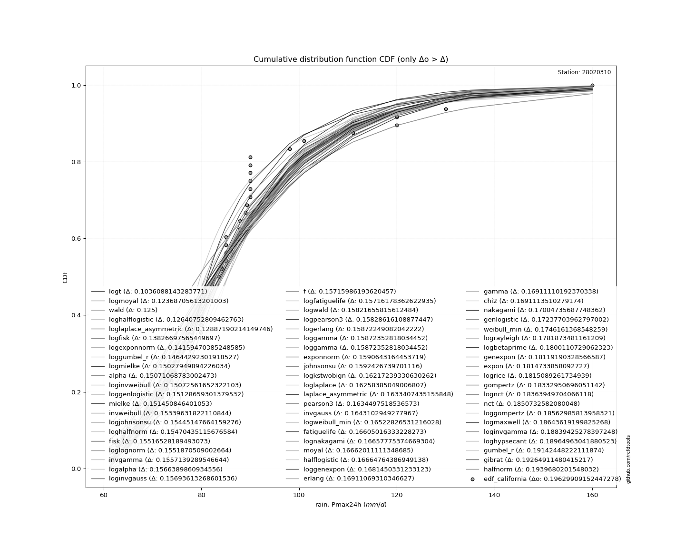</img>

</div>


**1.3. Best fit**

|   id |   station | empirical_dist   | p_dist   |   delta |   deltao | eval   |   fit |   n |     loc |   scale | shape   | shape1   | shape2   | shape3   |   best_fit |   best_fit_sort |
|-----:|----------:|:-----------------|:---------|--------:|---------:|:-------|------:|----:|--------:|--------:|:--------|:---------|:---------|:---------|-----------:|----------------:|
|    0 |  28020310 | edf_california   | wald     |   0.125 | 0.196299 | Δo > Δ |     1 |  48 | 67.0942 | 20.3021 |         |          |          |          |          1 |               1 |

<div align="center">

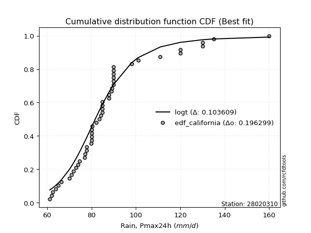</img>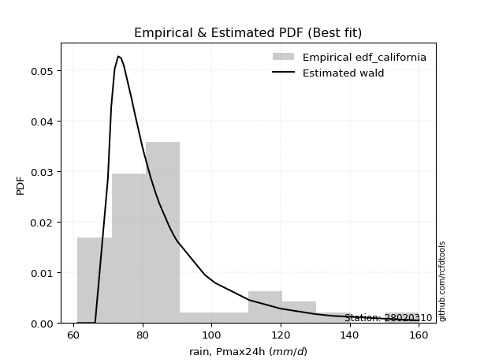</img>

</div>


### 2. Empirical - EDF Hazen (1930)

Hazen method for plotting positions is a formula used to estimate the empirical cumulative probability distribution of flood events or other hydrological data. This formula often results in biased estimations, particularly when extrapolating to extreme events (high return periods).

<div align="center">


$P=(m-0.5)/n$


</div>


**2.1. Empirical values**

<div align="center">

|                | 0                    | 1                 | 2                    | 3                   | 4                 | 5                   | 6                   | 7                  | 8                   | 9                   | 10               | 11                  | 12                 | 13                | 14                 | 15                 | 16                 | 17                 | 18                 | 19                 | 20                 | 21                 | 22                 | 23                 | 24                 | 25                 | 26                 | 27                 | 28                 | 29                 | 30                 | 31                | 32                 | 33                 | 34                 | 35                 | 36                 | 37                | 38                 | 39                 | 40        | 41                 | 42                 | 43                 | 44                 | 45                 | 46        | 47                 |
|:---------------|:---------------------|:------------------|:---------------------|:--------------------|:------------------|:--------------------|:--------------------|:-------------------|:--------------------|:--------------------|:-----------------|:--------------------|:-------------------|:------------------|:-------------------|:-------------------|:-------------------|:-------------------|:-------------------|:-------------------|:-------------------|:-------------------|:-------------------|:-------------------|:-------------------|:-------------------|:-------------------|:-------------------|:-------------------|:-------------------|:-------------------|:------------------|:-------------------|:-------------------|:-------------------|:-------------------|:-------------------|:------------------|:-------------------|:-------------------|:----------|:-------------------|:-------------------|:-------------------|:-------------------|:-------------------|:----------|:-------------------|
| date           | 2015                 | 1969              | 1982                 | 2002                | 2001              | 2009                | 2003                | 1980               | 1985                | 1975                | 2004             | 2007                | 1983               | 2011              | 2005               | 2013               | 2012               | 1996               | 1974               | 1977               | 2000               | 1971               | 2014               | 2006               | 2008               | 1972               | 1976               | 1978               | 1988               | 2010               | 1968               | 1984              | 1994               | 1986               | 1989               | 1987               | 1991               | 1992              | 1995               | 1979               | 1993      | 1981               | 1973               | 1970               | 1997               | 1990               | 1999      | 1998               |
| x              | 61.2723765575468     | 62.0              | 62.6238716094153     | 64.0                | 65.0              | 66.3434261308019    | 70.0367441186674    | 71.0               | 72.0                | 73.0                | 73.8321775894603 | 74.6550121603792    | 77.0               | 77.1481260946949  | 77.8012338162671   | 77.8682619904586   | 79.8951644557945   | 80.0               | 80.0               | 80.0               | 80.0               | 80.3885696894822   | 82.2558340114059   | 83.6292555654485   | 84.2125270817239   | 85.0               | 85.0               | 85.0               | 85.0               | 87.8384437186631   | 87.8882726975572   | 89.0              | 89.28613946360262  | 90.0               | 90.0               | 90.0               | 90.0               | 90.0              | 90.0               | 98.0453969651585   | 101.0     | 111.0              | 120.0              | 120.0              | 130.0              | 130.0              | 135.0     | 160.0              |
| m              | 1                    | 2                 | 3                    | 4                   | 5                 | 6                   | 7                   | 8                  | 9                   | 10                  | 11               | 12                  | 13                 | 14                | 15                 | 16                 | 17                 | 18                 | 19                 | 20                 | 21                 | 22                 | 23                 | 24                 | 25                 | 26                 | 27                 | 28                 | 29                 | 30                 | 31                 | 32                | 33                 | 34                 | 35                 | 36                 | 37                 | 38                | 39                 | 40                 | 41        | 42                 | 43                 | 44                 | 45                 | 46                 | 47        | 48                 |
| empirical_dist | edf_hazen            | edf_hazen         | edf_hazen            | edf_hazen           | edf_hazen         | edf_hazen           | edf_hazen           | edf_hazen          | edf_hazen           | edf_hazen           | edf_hazen        | edf_hazen           | edf_hazen          | edf_hazen         | edf_hazen          | edf_hazen          | edf_hazen          | edf_hazen          | edf_hazen          | edf_hazen          | edf_hazen          | edf_hazen          | edf_hazen          | edf_hazen          | edf_hazen          | edf_hazen          | edf_hazen          | edf_hazen          | edf_hazen          | edf_hazen          | edf_hazen          | edf_hazen         | edf_hazen          | edf_hazen          | edf_hazen          | edf_hazen          | edf_hazen          | edf_hazen         | edf_hazen          | edf_hazen          | edf_hazen | edf_hazen          | edf_hazen          | edf_hazen          | edf_hazen          | edf_hazen          | edf_hazen | edf_hazen          |
| empirical      | 0.010416666666666666 | 0.03125           | 0.052083333333333336 | 0.07291666666666667 | 0.09375           | 0.11458333333333333 | 0.13541666666666666 | 0.15625            | 0.17708333333333334 | 0.19791666666666666 | 0.21875          | 0.23958333333333334 | 0.2604166666666667 | 0.28125           | 0.3020833333333333 | 0.3229166666666667 | 0.34375            | 0.3645833333333333 | 0.3854166666666667 | 0.40625            | 0.4270833333333333 | 0.4479166666666667 | 0.46875            | 0.4895833333333333 | 0.5104166666666666 | 0.53125            | 0.5520833333333334 | 0.5729166666666666 | 0.59375            | 0.6145833333333334 | 0.6354166666666666 | 0.65625           | 0.6770833333333334 | 0.6979166666666666 | 0.71875            | 0.7395833333333334 | 0.7604166666666666 | 0.78125           | 0.8020833333333334 | 0.8229166666666666 | 0.84375   | 0.8645833333333334 | 0.8854166666666666 | 0.90625            | 0.9270833333333334 | 0.9479166666666666 | 0.96875   | 0.9895833333333334 |
| empirical_tr   | 1.0105263157894737   | 1.032258064516129 | 1.054945054945055    | 1.0786516853932584  | 1.103448275862069 | 1.1294117647058823  | 1.1566265060240963  | 1.1851851851851851 | 1.2151898734177216  | 1.2467532467532467  | 1.28             | 1.315068493150685   | 1.3521126760563382 | 1.391304347826087 | 1.4328358208955223 | 1.476923076923077  | 1.5238095238095237 | 1.5737704918032784 | 1.6271186440677967 | 1.6842105263157894 | 1.7454545454545451 | 1.8113207547169814 | 1.8823529411764706 | 1.9591836734693875 | 2.0425531914893615 | 2.1333333333333333 | 2.2325581395348837 | 2.341463414634146  | 2.4615384615384617 | 2.5945945945945947 | 2.7428571428571424 | 2.909090909090909 | 3.0967741935483875 | 3.3103448275862064 | 3.5555555555555554 | 3.8400000000000007 | 4.17391304347826   | 4.571428571428571 | 5.052631578947369  | 5.64705882352941   | 6.4       | 7.384615384615387  | 8.727272727272725  | 10.666666666666666 | 13.71428571428572  | 19.199999999999985 | 32.0      | 96.00000000000034  |

</div>


**2.2. Parameters & Kolmogorov-Smirnov fit test (sorted by Δ)**

|   id | empirical_dist   | p_dist             |    delta |   deltao | eval    |   fit |   n |             loc |          scale | shape                  | shape1               | shape2             | shape3   |   best_fit |   best_fit_sort |
|-----:|:-----------------|:-------------------|---------:|---------:|:--------|------:|----:|----------------:|---------------:|:-----------------------|:---------------------|:-------------------|:---------|-----------:|----------------:|
|    0 | edf_hazen        | dgamma             | 0.122688 | 0.196299 | Δo > Δ  |     1 |  48 |    85           |   14.6017      | 0.8618486950276836     |                      |                    |          |          1 |               1 |
|    1 | edf_hazen        | wald               | 0.12501  | 0.196299 | Δo > Δ  |     1 |  48 |    67.0942      |   20.3021      |                        |                      |                    |          |          0 |               2 |
|    2 | edf_hazen        | alpha              | 0.140294 | 0.196299 | Δo > Δ  |     1 |  48 |    18.879       |  263.028       | 4.11563865435355       |                      |                    |          |          0 |               3 |
|    3 | edf_hazen        | mielke             | 0.141034 | 0.196299 | Δo > Δ  |     1 |  48 |    -1.34211     |   53.7147      | 79.88900999665557      | 6.388198240255651    |                    |          |          0 |               4 |
|    4 | edf_hazen        | invweibull         | 0.14298  | 0.196299 | Δo > Δ  |     1 |  48 |   -18.9757      |   96.8446      | 7.413946692395208      |                      |                    |          |          0 |               5 |
|    5 | edf_hazen        | fisk               | 0.144749 | 0.196299 | Δo > Δ  |     1 |  48 |    -0.179746    |   83.8799      | 8.995379759132247      |                      |                    |          |          0 |               6 |
|    6 | edf_hazen        | invgamma           | 0.145297 | 0.196299 | Δo > Δ  |     1 |  48 |    40.844       |  282.205       | 7.060980832477705      |                      |                    |          |          0 |               7 |
|    7 | edf_hazen        | f                  | 0.146743 | 0.196299 | Δo > Δ  |     1 |  48 |    40.9497      |   39.8861      | 20448.456439629055     | 13.969948823715146   |                    |          |          0 |               8 |
|    8 | edf_hazen        | exponnorm          | 0.148648 | 0.196299 | Δo > Δ  |     1 |  48 |    69.6443      |    7.46056     | 2.379438118688931      |                      |                    |          |          0 |               9 |
|    9 | edf_hazen        | johnsonsu          | 0.148826 | 0.196299 | Δo > Δ  |     1 |  48 |    50.9705      |    1.42275     | -7.307627353760925     | 1.922936865035385    |                    |          |          0 |              10 |
|   10 | edf_hazen        | lognorm            | 0.149315 | 0.196299 | Δo > Δ  |     1 |  48 |    50.8634      |   31.9206      | 0.5188485586715679     |                      |                    |          |          0 |              11 |
|   11 | edf_hazen        | laplace_asymmetric | 0.152924 | 0.196299 | Δo > Δ  |     1 |  48 |    79.8952      |   12.1997      | 0.73875923659806       |                      |                    |          |          0 |              12 |
|   12 | edf_hazen        | pearson3           | 0.153033 | 0.196299 | Δo > Δ  |     1 |  48 |    87.3963      |   20.3021      | 1.546924634543322      |                      |                    |          |          0 |              13 |
|   13 | edf_hazen        | invgauss           | 0.153894 | 0.196299 | Δo > Δ  |     1 |  48 |    49.4404      |  137.089       | 0.27686951370685786    |                      |                    |          |          0 |              14 |
|   14 | edf_hazen        | fatiguelife        | 0.155633 | 0.196299 | Δo > Δ  |     1 |  48 |    50.2987      |   32.5929      | 0.5259059389192924     |                      |                    |          |          0 |              15 |
|   15 | edf_hazen        | recipinvgauss      | 0.15619  | 0.196299 | Δo > Δ  |     1 |  48 |    51.4986      |    8.83335     | 0.32638486190037747    |                      |                    |          |          0 |              16 |
|   16 | edf_hazen        | moyal              | 0.156203 | 0.196299 | Δo > Δ  |     1 |  48 |    75.7862      |    9.13916     |                        |                      |                    |          |          0 |              17 |
|   17 | edf_hazen        | halflogistic       | 0.156231 | 0.196299 | Δo > Δ  |     1 |  48 |    63.3336      |   17.3576      |                        |                      |                    |          |          0 |              18 |
|   18 | edf_hazen        | erlang             | 0.158694 | 0.196299 | Δo > Δ  |     1 |  48 |    59.5628      |   14.6556      | 1.8991745698841438     |                      |                    |          |          0 |              19 |
|   19 | edf_hazen        | gamma              | 0.158694 | 0.196299 | Δo > Δ  |     1 |  48 |    59.5628      |   14.6556      | 1.8991685396362568     |                      |                    |          |          0 |              20 |
|   20 | edf_hazen        | chi2               | 0.158695 | 0.196299 | Δo > Δ  |     1 |  48 |    59.5627      |    7.32774     | 3.7983815129809404     |                      |                    |          |          0 |              21 |
|   21 | edf_hazen        | nakagami           | 0.15963  | 0.196299 | Δo > Δ  |     1 |  48 |    61.2724      |   32.0096      | 0.4507325694731861     |                      |                    |          |          0 |              22 |
|   22 | edf_hazen        | genlogistic        | 0.16196  | 0.196299 | Δo > Δ  |     1 |  48 |   -11.2991      |   13.8038      | 686.4871814930432      |                      |                    |          |          0 |              23 |
|   23 | edf_hazen        | weibull_min        | 0.164199 | 0.196299 | Δo > Δ  |     1 |  48 |    60.8047      |   28.8525      | 1.326648058559914      |                      |                    |          |          0 |              24 |
|   24 | edf_hazen        | gompertz           | 0.172913 | 0.196299 | Δo > Δ  |     1 |  48 |    61.2724      |   83.6841      | 2.4220682661657165     |                      |                    |          |          0 |              25 |
|   25 | edf_hazen        | nct                | 0.174657 | 0.196299 | Δo > Δ  |     1 |  48 |    -0.42568     |    1.1951      | 13.485269169298178     | 69.11560817762629    |                    |          |          0 |              26 |
|   26 | edf_hazen        | gumbel_r           | 0.181008 | 0.196299 | Δo > Δ  |     1 |  48 |    78.2592      |   15.8295      |                        |                      |                    |          |          0 |              27 |
|   27 | edf_hazen        | gibrat             | 0.182232 | 0.196299 | Δo > Δ  |     1 |  48 |    71.9083      |    9.3939      |                        |                      |                    |          |          0 |              28 |
|   28 | edf_hazen        | halfnorm           | 0.183551 | 0.196299 | Δo > Δ  |     1 |  48 |    60.5242      |   33.6791      |                        |                      |                    |          |          0 |              29 |
|   29 | edf_hazen        | betaprime          | 0.190574 | 0.196299 | Δo > Δ  |     1 |  48 |    -2.31774     |    4.70825     | 493.518565116437       | 26.954713989585066   |                    |          |          0 |              30 |
|   30 | edf_hazen        | genexpon           | 0.191609 | 0.196299 | Δo > Δ  |     1 |  48 |    60.8983      |    1.43446     | 0.00102178005859321    | 0.053965855644600734 | 3.4362630229428257 |          |          0 |              31 |
|   31 | edf_hazen        | expon              | 0.19189  | 0.196299 | Δo > Δ  |     1 |  48 |    61.2724      |   26.1239      |                        |                      |                    |          |          0 |              32 |
|   32 | edf_hazen        | pareto             | 0.19189  | 0.196299 | Δo > Δ  |     1 |  48 |    -2.14748e+09 |    2.14748e+09 | 82203821.83996421      |                      |                    |          |          0 |              33 |
|   33 | edf_hazen        | kstwobign          | 0.196346 | 0.196299 | Δo <= Δ |     0 |  48 |    27.4445      |   69.5918      |                        |                      |                    |          |          0 |              34 |
|   34 | edf_hazen        | rayleigh           | 0.211005 | 0.196299 | Δo <= Δ |     0 |  48 |    48.5572      |   30.9891      |                        |                      |                    |          |          0 |              35 |
|   35 | edf_hazen        | laplace            | 0.219146 | 0.196299 | Δo <= Δ |     0 |  48 |    87.3963      |   14.3558      |                        |                      |                    |          |          0 |              36 |
|   36 | edf_hazen        | ncf                | 0.219269 | 0.196299 | Δo <= Δ |     0 |  48 |    -0.682937    |    6.2991e-06  | 7.2152174318706755e-06 | 367.02570416695164   | 100.2165537852085  |          |          0 |              37 |
|   37 | edf_hazen        | maxwell            | 0.220736 | 0.196299 | Δo <= Δ |     0 |  48 |    39.2888      |   30.1469      |                        |                      |                    |          |          0 |              38 |
|   38 | edf_hazen        | rice               | 0.232953 | 0.196299 | Δo <= Δ |     0 |  48 |    54.6343      |   27.2537      | 0.0006002761905476531  |                      |                    |          |          0 |              39 |
|   39 | edf_hazen        | hypsecant          | 0.238388 | 0.196299 | Δo <= Δ |     0 |  48 |    87.3963      |   12.9247      |                        |                      |                    |          |          0 |              40 |
|   40 | edf_hazen        | logistic           | 0.244189 | 0.196299 | Δo <= Δ |     0 |  48 |    87.3963      |   11.1931      |                        |                      |                    |          |          0 |              41 |
|   41 | edf_hazen        | t                  | 0.250942 | 0.196299 | Δo <= Δ |     0 |  48 |    87.3874      |   20.3103      | 364.83839150975837     |                      |                    |          |          0 |              42 |
|   42 | edf_hazen        | crystalball        | 0.251059 | 0.196299 | Δo <= Δ |     0 |  48 |    87.3963      |   20.3021      | 7940.872621987292      | 25.234968961283577   |                    |          |          0 |              43 |
|   43 | edf_hazen        | norm               | 0.251059 | 0.196299 | Δo <= Δ |     0 |  48 |    87.3963      |   20.3021      |                        |                      |                    |          |          0 |              44 |
|   44 | edf_hazen        | truncnorm          | 0.251059 | 0.196299 | Δo <= Δ |     0 |  48 |    87.3963      |   20.3021      | -737.093976545434      | 1193.2936146393458   |                    |          |          0 |              45 |
|   45 | edf_hazen        | loggamma           | 0.25264  | 0.196299 | Δo <= Δ |     0 |  48 | -7931.98        | 1025.26        | 2494.890482001344      |                      |                    |          |          0 |              46 |
|   46 | edf_hazen        | gumbel_l           | 0.317984 | 0.196299 | Δo <= Δ |     0 |  48 |    96.5333      |   15.8295      |                        |                      |                    |          |          0 |              47 |
|   47 | edf_hazen        | zzgumbel           | 0.373802 | 0.196299 | Δo <= Δ |     0 |  48 |    87.362       |   15.997       | 0.5476912526714043     | 1.157309579779488    |                    |          |          0 |              48 |

<div align="center">

</img>

</div>


**2.3. Best fit**

|   id |   station | empirical_dist   | p_dist   |    delta |   deltao | eval   |   fit |   n |   loc |   scale |    shape | shape1   | shape2   | shape3   |   best_fit |   best_fit_sort |
|-----:|----------:|:-----------------|:---------|---------:|---------:|:-------|------:|----:|------:|--------:|---------:|:---------|:---------|:---------|-----------:|----------------:|
|    0 |  28020310 | edf_hazen        | dgamma   | 0.122688 | 0.196299 | Δo > Δ |     1 |  48 |    85 | 14.6017 | 0.861849 |          |          |          |          1 |               1 |

<div align="center">

</img></img>

</div>


### 3. Empirical - EDF Weibull (1939)

Weibull plotting position formula is an empirical method used to estimate the non-exceedance probability or plotting position for a set of observed data, is often recommended or widely used in practice, particularly in flood frequency analysis.

<div align="center">


$P=m/(n+1)$


</div>


**3.1. Empirical values**

<div align="center">

|                | 0                   | 1                   | 2                    | 3                   | 4                   | 5                   | 6                   | 7                   | 8                  | 9                   | 10                  | 11                  | 12                 | 13                 | 14                  | 15                  | 16                 | 17                 | 18                 | 19                  | 20                  | 21                 | 22                  | 23                 | 24                 | 25                 | 26                 | 27                 | 28                 | 29                 | 30                 | 31                 | 32                 | 33                 | 34                 | 35                 | 36                 | 37                 | 38                 | 39                 | 40                 | 41                 | 42                 | 43                 | 44                 | 45                 | 46                 | 47                 |
|:---------------|:--------------------|:--------------------|:---------------------|:--------------------|:--------------------|:--------------------|:--------------------|:--------------------|:-------------------|:--------------------|:--------------------|:--------------------|:-------------------|:-------------------|:--------------------|:--------------------|:-------------------|:-------------------|:-------------------|:--------------------|:--------------------|:-------------------|:--------------------|:-------------------|:-------------------|:-------------------|:-------------------|:-------------------|:-------------------|:-------------------|:-------------------|:-------------------|:-------------------|:-------------------|:-------------------|:-------------------|:-------------------|:-------------------|:-------------------|:-------------------|:-------------------|:-------------------|:-------------------|:-------------------|:-------------------|:-------------------|:-------------------|:-------------------|
| date           | 2015                | 1969                | 1982                 | 2002                | 2001                | 2009                | 2003                | 1980                | 1985               | 1975                | 2004                | 2007                | 1983               | 2011               | 2005                | 2013                | 2012               | 1996               | 1974               | 1977                | 2000                | 1971               | 2014                | 2006               | 2008               | 1972               | 1976               | 1978               | 1988               | 2010               | 1968               | 1984               | 1994               | 1986               | 1989               | 1987               | 1991               | 1992               | 1995               | 1979               | 1993               | 1981               | 1973               | 1970               | 1997               | 1990               | 1999               | 1998               |
| x              | 61.2723765575468    | 62.0                | 62.6238716094153     | 64.0                | 65.0                | 66.3434261308019    | 70.0367441186674    | 71.0                | 72.0               | 73.0                | 73.8321775894603    | 74.6550121603792    | 77.0               | 77.1481260946949   | 77.8012338162671    | 77.8682619904586    | 79.8951644557945   | 80.0               | 80.0               | 80.0                | 80.0                | 80.3885696894822   | 82.2558340114059    | 83.6292555654485   | 84.2125270817239   | 85.0               | 85.0               | 85.0               | 85.0               | 87.8384437186631   | 87.8882726975572   | 89.0               | 89.28613946360262  | 90.0               | 90.0               | 90.0               | 90.0               | 90.0               | 90.0               | 98.0453969651585   | 101.0              | 111.0              | 120.0              | 120.0              | 130.0              | 130.0              | 135.0              | 160.0              |
| m              | 1                   | 2                   | 3                    | 4                   | 5                   | 6                   | 7                   | 8                   | 9                  | 10                  | 11                  | 12                  | 13                 | 14                 | 15                  | 16                  | 17                 | 18                 | 19                 | 20                  | 21                  | 22                 | 23                  | 24                 | 25                 | 26                 | 27                 | 28                 | 29                 | 30                 | 31                 | 32                 | 33                 | 34                 | 35                 | 36                 | 37                 | 38                 | 39                 | 40                 | 41                 | 42                 | 43                 | 44                 | 45                 | 46                 | 47                 | 48                 |
| empirical_dist | edf_weibull         | edf_weibull         | edf_weibull          | edf_weibull         | edf_weibull         | edf_weibull         | edf_weibull         | edf_weibull         | edf_weibull        | edf_weibull         | edf_weibull         | edf_weibull         | edf_weibull        | edf_weibull        | edf_weibull         | edf_weibull         | edf_weibull        | edf_weibull        | edf_weibull        | edf_weibull         | edf_weibull         | edf_weibull        | edf_weibull         | edf_weibull        | edf_weibull        | edf_weibull        | edf_weibull        | edf_weibull        | edf_weibull        | edf_weibull        | edf_weibull        | edf_weibull        | edf_weibull        | edf_weibull        | edf_weibull        | edf_weibull        | edf_weibull        | edf_weibull        | edf_weibull        | edf_weibull        | edf_weibull        | edf_weibull        | edf_weibull        | edf_weibull        | edf_weibull        | edf_weibull        | edf_weibull        | edf_weibull        |
| empirical      | 0.02040816326530612 | 0.04081632653061224 | 0.061224489795918366 | 0.08163265306122448 | 0.10204081632653061 | 0.12244897959183673 | 0.14285714285714285 | 0.16326530612244897 | 0.1836734693877551 | 0.20408163265306123 | 0.22448979591836735 | 0.24489795918367346 | 0.2653061224489796 | 0.2857142857142857 | 0.30612244897959184 | 0.32653061224489793 | 0.3469387755102041 | 0.3673469387755102 | 0.3877551020408163 | 0.40816326530612246 | 0.42857142857142855 | 0.4489795918367347 | 0.46938775510204084 | 0.4897959183673469 | 0.5102040816326531 | 0.5306122448979592 | 0.5510204081632653 | 0.5714285714285714 | 0.5918367346938775 | 0.6122448979591837 | 0.6326530612244898 | 0.6530612244897959 | 0.673469387755102  | 0.6938775510204082 | 0.7142857142857143 | 0.7346938775510204 | 0.7551020408163265 | 0.7755102040816326 | 0.7959183673469388 | 0.8163265306122449 | 0.8367346938775511 | 0.8571428571428571 | 0.8775510204081632 | 0.8979591836734694 | 0.9183673469387755 | 0.9387755102040817 | 0.9591836734693877 | 0.9795918367346939 |
| empirical_tr   | 1.0208333333333333  | 1.0425531914893618  | 1.0652173913043477   | 1.0888888888888888  | 1.1136363636363635  | 1.1395348837209303  | 1.1666666666666665  | 1.1951219512195121  | 1.2249999999999999 | 1.2564102564102564  | 1.2894736842105263  | 1.3243243243243243  | 1.3611111111111112 | 1.4                | 1.4411764705882353  | 1.4848484848484846  | 1.5312499999999998 | 1.5806451612903225 | 1.6333333333333333 | 1.6896551724137931  | 1.75                | 1.814814814814815  | 1.8846153846153848  | 1.96               | 2.0416666666666665 | 2.130434782608696  | 2.227272727272727  | 2.333333333333333  | 2.4499999999999997 | 2.5789473684210527 | 2.7222222222222223 | 2.88235294117647   | 3.0624999999999996 | 3.2666666666666666 | 3.5                | 3.7692307692307696 | 4.083333333333332  | 4.454545454545454  | 4.8999999999999995 | 5.444444444444445  | 6.125000000000002  | 6.999999999999997  | 8.166666666666664  | 9.799999999999999  | 12.250000000000004 | 16.333333333333346 | 24.49999999999997  | 48.99999999999994  |

</div>


**3.2. Parameters & Kolmogorov-Smirnov fit test (sorted by Δ)**

|   id | empirical_dist   | p_dist             |    delta |   deltao | eval    |   fit |   n |             loc |          scale | shape                  | shape1               | shape2             | shape3   |   best_fit |   best_fit_sort |
|-----:|:-----------------|:-------------------|---------:|---------:|:--------|------:|----:|----------------:|---------------:|:-----------------------|:---------------------|:-------------------|:---------|-----------:|----------------:|
|    0 | edf_weibull      | dgamma             | 0.118239 | 0.196299 | Δo > Δ  |     1 |  48 |    85           |   14.6017      | 0.8618486950276836     |                      |                    |          |          1 |               1 |
|    1 | edf_weibull      | wald               | 0.122449 | 0.196299 | Δo > Δ  |     1 |  48 |    67.0942      |   20.3021      |                        |                      |                    |          |          0 |               2 |
|    2 | edf_weibull      | alpha              | 0.134129 | 0.196299 | Δo > Δ  |     1 |  48 |    18.879       |  263.028       | 4.11563865435355       |                      |                    |          |          0 |               3 |
|    3 | edf_weibull      | mielke             | 0.134869 | 0.196299 | Δo > Δ  |     1 |  48 |    -1.34211     |   53.7147      | 79.88900999665557      | 6.388198240255651    |                    |          |          0 |               4 |
|    4 | edf_weibull      | invweibull         | 0.136815 | 0.196299 | Δo > Δ  |     1 |  48 |   -18.9757      |   96.8446      | 7.413946692395208      |                      |                    |          |          0 |               5 |
|    5 | edf_weibull      | fisk               | 0.138584 | 0.196299 | Δo > Δ  |     1 |  48 |    -0.179746    |   83.8799      | 8.995379759132247      |                      |                    |          |          0 |               6 |
|    6 | edf_weibull      | invgamma           | 0.139132 | 0.196299 | Δo > Δ  |     1 |  48 |    40.844       |  282.205       | 7.060980832477705      |                      |                    |          |          0 |               7 |
|    7 | edf_weibull      | f                  | 0.140578 | 0.196299 | Δo > Δ  |     1 |  48 |    40.9497      |   39.8861      | 20448.456439629055     | 13.969948823715146   |                    |          |          0 |               8 |
|    8 | edf_weibull      | exponnorm          | 0.142483 | 0.196299 | Δo > Δ  |     1 |  48 |    69.6443      |    7.46056     | 2.379438118688931      |                      |                    |          |          0 |               9 |
|    9 | edf_weibull      | johnsonsu          | 0.142661 | 0.196299 | Δo > Δ  |     1 |  48 |    50.9705      |    1.42275     | -7.307627353760925     | 1.922936865035385    |                    |          |          0 |              10 |
|   10 | edf_weibull      | lognorm            | 0.14315  | 0.196299 | Δo > Δ  |     1 |  48 |    50.8634      |   31.9206      | 0.5188485586715679     |                      |                    |          |          0 |              11 |
|   11 | edf_weibull      | laplace_asymmetric | 0.146759 | 0.196299 | Δo > Δ  |     1 |  48 |    79.8952      |   12.1997      | 0.73875923659806       |                      |                    |          |          0 |              12 |
|   12 | edf_weibull      | pearson3           | 0.146868 | 0.196299 | Δo > Δ  |     1 |  48 |    87.3963      |   20.3021      | 1.546924634543322      |                      |                    |          |          0 |              13 |
|   13 | edf_weibull      | invgauss           | 0.147729 | 0.196299 | Δo > Δ  |     1 |  48 |    49.4404      |  137.089       | 0.27686951370685786    |                      |                    |          |          0 |              14 |
|   14 | edf_weibull      | fatiguelife        | 0.149469 | 0.196299 | Δo > Δ  |     1 |  48 |    50.2987      |   32.5929      | 0.5259059389192924     |                      |                    |          |          0 |              15 |
|   15 | edf_weibull      | recipinvgauss      | 0.150025 | 0.196299 | Δo > Δ  |     1 |  48 |    51.4986      |    8.83335     | 0.32638486190037747    |                      |                    |          |          0 |              16 |
|   16 | edf_weibull      | moyal              | 0.150038 | 0.196299 | Δo > Δ  |     1 |  48 |    75.7862      |    9.13916     |                        |                      |                    |          |          0 |              17 |
|   17 | edf_weibull      | halflogistic       | 0.150066 | 0.196299 | Δo > Δ  |     1 |  48 |    63.3336      |   17.3576      |                        |                      |                    |          |          0 |              18 |
|   18 | edf_weibull      | erlang             | 0.152529 | 0.196299 | Δo > Δ  |     1 |  48 |    59.5628      |   14.6556      | 1.8991745698841438     |                      |                    |          |          0 |              19 |
|   19 | edf_weibull      | gamma              | 0.152529 | 0.196299 | Δo > Δ  |     1 |  48 |    59.5628      |   14.6556      | 1.8991685396362568     |                      |                    |          |          0 |              20 |
|   20 | edf_weibull      | chi2               | 0.15253  | 0.196299 | Δo > Δ  |     1 |  48 |    59.5627      |    7.32774     | 3.7983815129809404     |                      |                    |          |          0 |              21 |
|   21 | edf_weibull      | nakagami           | 0.153465 | 0.196299 | Δo > Δ  |     1 |  48 |    61.2724      |   32.0096      | 0.4507325694731861     |                      |                    |          |          0 |              22 |
|   22 | edf_weibull      | genlogistic        | 0.155795 | 0.196299 | Δo > Δ  |     1 |  48 |   -11.2991      |   13.8038      | 686.4871814930432      |                      |                    |          |          0 |              23 |
|   23 | edf_weibull      | weibull_min        | 0.158035 | 0.196299 | Δo > Δ  |     1 |  48 |    60.8047      |   28.8525      | 1.326648058559914      |                      |                    |          |          0 |              24 |
|   24 | edf_weibull      | gompertz           | 0.166748 | 0.196299 | Δo > Δ  |     1 |  48 |    61.2724      |   83.6841      | 2.4220682661657165     |                      |                    |          |          0 |              25 |
|   25 | edf_weibull      | nct                | 0.168492 | 0.196299 | Δo > Δ  |     1 |  48 |    -0.42568     |    1.1951      | 13.485269169298178     | 69.11560817762629    |                    |          |          0 |              26 |
|   26 | edf_weibull      | gumbel_r           | 0.174843 | 0.196299 | Δo > Δ  |     1 |  48 |    78.2592      |   15.8295      |                        |                      |                    |          |          0 |              27 |
|   27 | edf_weibull      | halfnorm           | 0.177386 | 0.196299 | Δo > Δ  |     1 |  48 |    60.5242      |   33.6791      |                        |                      |                    |          |          0 |              28 |
|   28 | edf_weibull      | betaprime          | 0.184409 | 0.196299 | Δo > Δ  |     1 |  48 |    -2.31774     |    4.70825     | 493.518565116437       | 26.954713989585066   |                    |          |          0 |              29 |
|   29 | edf_weibull      | genexpon           | 0.186719 | 0.196299 | Δo > Δ  |     1 |  48 |    60.8983      |    1.43446     | 0.00102178005859321    | 0.053965855644600734 | 3.4362630229428257 |          |          0 |              30 |
|   30 | edf_weibull      | expon              | 0.187001 | 0.196299 | Δo > Δ  |     1 |  48 |    61.2724      |   26.1239      |                        |                      |                    |          |          0 |              31 |
|   31 | edf_weibull      | pareto             | 0.187001 | 0.196299 | Δo > Δ  |     1 |  48 |    -2.14748e+09 |    2.14748e+09 | 82203821.83996421      |                      |                    |          |          0 |              32 |
|   32 | edf_weibull      | gibrat             | 0.188397 | 0.196299 | Δo > Δ  |     1 |  48 |    71.9083      |    9.3939      |                        |                      |                    |          |          0 |              33 |
|   33 | edf_weibull      | kstwobign          | 0.190181 | 0.196299 | Δo > Δ  |     1 |  48 |    27.4445      |   69.5918      |                        |                      |                    |          |          0 |              34 |
|   34 | edf_weibull      | rayleigh           | 0.20484  | 0.196299 | Δo <= Δ |     0 |  48 |    48.5572      |   30.9891      |                        |                      |                    |          |          0 |              35 |
|   35 | edf_weibull      | laplace            | 0.212981 | 0.196299 | Δo <= Δ |     0 |  48 |    87.3963      |   14.3558      |                        |                      |                    |          |          0 |              36 |
|   36 | edf_weibull      | ncf                | 0.213104 | 0.196299 | Δo <= Δ |     0 |  48 |    -0.682937    |    6.2991e-06  | 7.2152174318706755e-06 | 367.02570416695164   | 100.2165537852085  |          |          0 |              37 |
|   37 | edf_weibull      | maxwell            | 0.214571 | 0.196299 | Δo <= Δ |     0 |  48 |    39.2888      |   30.1469      |                        |                      |                    |          |          0 |              38 |
|   38 | edf_weibull      | rice               | 0.226788 | 0.196299 | Δo <= Δ |     0 |  48 |    54.6343      |   27.2537      | 0.0006002761905476531  |                      |                    |          |          0 |              39 |
|   39 | edf_weibull      | hypsecant          | 0.232223 | 0.196299 | Δo <= Δ |     0 |  48 |    87.3963      |   12.9247      |                        |                      |                    |          |          0 |              40 |
|   40 | edf_weibull      | logistic           | 0.238025 | 0.196299 | Δo <= Δ |     0 |  48 |    87.3963      |   11.1931      |                        |                      |                    |          |          0 |              41 |
|   41 | edf_weibull      | t                  | 0.244777 | 0.196299 | Δo <= Δ |     0 |  48 |    87.3874      |   20.3103      | 364.83839150975837     |                      |                    |          |          0 |              42 |
|   42 | edf_weibull      | crystalball        | 0.244894 | 0.196299 | Δo <= Δ |     0 |  48 |    87.3963      |   20.3021      | 7940.872621987292      | 25.234968961283577   |                    |          |          0 |              43 |
|   43 | edf_weibull      | norm               | 0.244894 | 0.196299 | Δo <= Δ |     0 |  48 |    87.3963      |   20.3021      |                        |                      |                    |          |          0 |              44 |
|   44 | edf_weibull      | truncnorm          | 0.244894 | 0.196299 | Δo <= Δ |     0 |  48 |    87.3963      |   20.3021      | -737.093976545434      | 1193.2936146393458   |                    |          |          0 |              45 |
|   45 | edf_weibull      | loggamma           | 0.246475 | 0.196299 | Δo <= Δ |     0 |  48 | -7931.98        | 1025.26        | 2494.890482001344      |                      |                    |          |          0 |              46 |
|   46 | edf_weibull      | gumbel_l           | 0.311819 | 0.196299 | Δo <= Δ |     0 |  48 |    96.5333      |   15.8295      |                        |                      |                    |          |          0 |              47 |
|   47 | edf_weibull      | zzgumbel           | 0.367637 | 0.196299 | Δo <= Δ |     0 |  48 |    87.362       |   15.997       | 0.5476912526714043     | 1.157309579779488    |                    |          |          0 |              48 |

<div align="center">

</img>

</div>


**3.3. Best fit**

|   id |   station | empirical_dist   | p_dist   |    delta |   deltao | eval   |   fit |   n |   loc |   scale |    shape | shape1   | shape2   | shape3   |   best_fit |   best_fit_sort |
|-----:|----------:|:-----------------|:---------|---------:|---------:|:-------|------:|----:|------:|--------:|---------:|:---------|:---------|:---------|-----------:|----------------:|
|    0 |  28020310 | edf_weibull      | dgamma   | 0.118239 | 0.196299 | Δo > Δ |     1 |  48 |    85 | 14.6017 | 0.861849 |          |          |          |          1 |               1 |

<div align="center">

</img></img>

</div>


### 4. Empirical - EDF Beard (1943)

The Beard formula (or Beard´s plotting position formula) in hydrology is used to estimate the empirical non-exceedance probability _(P)_ of a flood event (or other extreme hydrological data point) within a given dataset.

<div align="center">


$P=(m-0.31)/(n+0.38)$


</div>


**4.1. Empirical values**

<div align="center">

|                | 0                    | 1                    | 2                   | 3                   | 4                   | 5                   | 6                   | 7                   | 8                   | 9                   | 10                 | 11                  | 12                 | 13                  | 14                  | 15                 | 16                 | 17                 | 18                  | 19                 | 20                  | 21                  | 22                 | 23                  | 24                 | 25                 | 26                 | 27                 | 28                 | 29                 | 30                 | 31                 | 32                 | 33                 | 34                 | 35                 | 36                 | 37                 | 38                 | 39                 | 40                 | 41                 | 42                | 43                | 44                 | 45                 | 46                 | 47                 |
|:---------------|:---------------------|:---------------------|:--------------------|:--------------------|:--------------------|:--------------------|:--------------------|:--------------------|:--------------------|:--------------------|:-------------------|:--------------------|:-------------------|:--------------------|:--------------------|:-------------------|:-------------------|:-------------------|:--------------------|:-------------------|:--------------------|:--------------------|:-------------------|:--------------------|:-------------------|:-------------------|:-------------------|:-------------------|:-------------------|:-------------------|:-------------------|:-------------------|:-------------------|:-------------------|:-------------------|:-------------------|:-------------------|:-------------------|:-------------------|:-------------------|:-------------------|:-------------------|:------------------|:------------------|:-------------------|:-------------------|:-------------------|:-------------------|
| date           | 2015                 | 1969                 | 1982                | 2002                | 2001                | 2009                | 2003                | 1980                | 1985                | 1975                | 2004               | 2007                | 1983               | 2011                | 2005                | 2013               | 2012               | 1996               | 1974                | 1977               | 2000                | 1971                | 2014               | 2006                | 2008               | 1972               | 1976               | 1978               | 1988               | 2010               | 1968               | 1984               | 1994               | 1986               | 1989               | 1987               | 1991               | 1992               | 1995               | 1979               | 1993               | 1981               | 1973              | 1970              | 1997               | 1990               | 1999               | 1998               |
| x              | 61.2723765575468     | 62.0                 | 62.6238716094153    | 64.0                | 65.0                | 66.3434261308019    | 70.0367441186674    | 71.0                | 72.0                | 73.0                | 73.8321775894603   | 74.6550121603792    | 77.0               | 77.1481260946949    | 77.8012338162671    | 77.8682619904586   | 79.8951644557945   | 80.0               | 80.0                | 80.0               | 80.0                | 80.3885696894822    | 82.2558340114059   | 83.6292555654485    | 84.2125270817239   | 85.0               | 85.0               | 85.0               | 85.0               | 87.8384437186631   | 87.8882726975572   | 89.0               | 89.28613946360262  | 90.0               | 90.0               | 90.0               | 90.0               | 90.0               | 90.0               | 98.0453969651585   | 101.0              | 111.0              | 120.0             | 120.0             | 130.0              | 130.0              | 135.0              | 160.0              |
| m              | 1                    | 2                    | 3                   | 4                   | 5                   | 6                   | 7                   | 8                   | 9                   | 10                  | 11                 | 12                  | 13                 | 14                  | 15                  | 16                 | 17                 | 18                 | 19                  | 20                 | 21                  | 22                  | 23                 | 24                  | 25                 | 26                 | 27                 | 28                 | 29                 | 30                 | 31                 | 32                 | 33                 | 34                 | 35                 | 36                 | 37                 | 38                 | 39                 | 40                 | 41                 | 42                 | 43                | 44                | 45                 | 46                 | 47                 | 48                 |
| empirical_dist | edf_beard            | edf_beard            | edf_beard           | edf_beard           | edf_beard           | edf_beard           | edf_beard           | edf_beard           | edf_beard           | edf_beard           | edf_beard          | edf_beard           | edf_beard          | edf_beard           | edf_beard           | edf_beard          | edf_beard          | edf_beard          | edf_beard           | edf_beard          | edf_beard           | edf_beard           | edf_beard          | edf_beard           | edf_beard          | edf_beard          | edf_beard          | edf_beard          | edf_beard          | edf_beard          | edf_beard          | edf_beard          | edf_beard          | edf_beard          | edf_beard          | edf_beard          | edf_beard          | edf_beard          | edf_beard          | edf_beard          | edf_beard          | edf_beard          | edf_beard         | edf_beard         | edf_beard          | edf_beard          | edf_beard          | edf_beard          |
| empirical      | 0.014262091773460106 | 0.034931789995866054 | 0.05560148821827201 | 0.07627118644067796 | 0.09694088466308393 | 0.11761058288548987 | 0.13828028110789584 | 0.15894997933030178 | 0.17961967755270772 | 0.20028937577511366 | 0.2209590739975196 | 0.24162877221992557 | 0.2622984704423315 | 0.28296816866473745 | 0.30363786688714345 | 0.3243075651095494 | 0.3449772633319554 | 0.3656469615543613 | 0.38631665977676727 | 0.4069863579991732 | 0.42765605622157915 | 0.44832575444398515 | 0.4689954526663911 | 0.48966515088879703 | 0.510334849111203  | 0.5310045473336089 | 0.5516742455560149 | 0.5723439437784208 | 0.5930136420008267 | 0.6136833402232328 | 0.6343530384456387 | 0.6550227366680447 | 0.6756924348904505 | 0.6963621331128564 | 0.7170318313352624 | 0.7377015295576683 | 0.7583712277800744 | 0.7790409260024803 | 0.7997106242248863 | 0.8203803224472922 | 0.8410500206696981 | 0.8617197188921041 | 0.88238941711451  | 0.903059115336916 | 0.9237288135593219 | 0.9443985117817278 | 0.9650682100041338 | 0.9857379082265398 |
| empirical_tr   | 1.014468442021388    | 1.0361961876204755   | 1.058875027358284   | 1.0825688073394495  | 1.1073472190432594  | 1.1332864839540877  | 1.160470136723435   | 1.188989923814205   | 1.218946837994457   | 1.25045231325924    | 1.2836296099761209 | 1.318615426546743   | 1.3555617820117678 | 1.3946382242721242  | 1.436034431582072   | 1.4799632915264607 | 1.5266645629536133 | 1.5764092538286087 | 1.6295048837992592  | 1.6863018473335658 | 1.74720115565186    | 1.8126639190708131  | 1.8832230439859867 | 1.9594977723774807  | 2.0422119037568596 | 2.132216835610401  | 2.2305209774089443 | 2.338327694538424  | 2.4570848146267137 | 2.5885500267522743 | 2.7348784624081404 | 2.8987417615338527 | 3.0834926704907577 | 3.2933968686181063 | 3.533966398831262  | 3.8124507486209596 | 4.138579982891359  | 4.525724976613657  | 4.992776057791536  | 5.567318757192172  | 6.291287386215862  | 7.231689088191326  | 8.502636203866425 | 10.31556503198293 | 13.11111111111109  | 17.985130111524118 | 28.627218934911117 | 70.11594202898524  |

</div>


**4.2. Parameters & Kolmogorov-Smirnov fit test (sorted by Δ)**

|   id | empirical_dist   | p_dist             |    delta |   deltao | eval    |   fit |   n |             loc |          scale | shape                  | shape1               | shape2             | shape3   |   best_fit |   best_fit_sort |
|-----:|:-----------------|:-------------------|---------:|---------:|:--------|------:|----:|----------------:|---------------:|:-----------------------|:---------------------|:-------------------|:---------|-----------:|----------------:|
|    0 | edf_beard        | dgamma             | 0.120315 | 0.196299 | Δo > Δ  |     1 |  48 |    85           |   14.6017      | 0.8618486950276836     |                      |                    |          |          1 |               1 |
|    1 | edf_beard        | wald               | 0.123783 | 0.196299 | Δo > Δ  |     1 |  48 |    67.0942      |   20.3021      |                        |                      |                    |          |          0 |               2 |
|    2 | edf_beard        | alpha              | 0.137921 | 0.196299 | Δo > Δ  |     1 |  48 |    18.879       |  263.028       | 4.11563865435355       |                      |                    |          |          0 |               3 |
|    3 | edf_beard        | mielke             | 0.138661 | 0.196299 | Δo > Δ  |     1 |  48 |    -1.34211     |   53.7147      | 79.88900999665557      | 6.388198240255651    |                    |          |          0 |               4 |
|    4 | edf_beard        | invweibull         | 0.140607 | 0.196299 | Δo > Δ  |     1 |  48 |   -18.9757      |   96.8446      | 7.413946692395208      |                      |                    |          |          0 |               5 |
|    5 | edf_beard        | fisk               | 0.142376 | 0.196299 | Δo > Δ  |     1 |  48 |    -0.179746    |   83.8799      | 8.995379759132247      |                      |                    |          |          0 |               6 |
|    6 | edf_beard        | invgamma           | 0.142925 | 0.196299 | Δo > Δ  |     1 |  48 |    40.844       |  282.205       | 7.060980832477705      |                      |                    |          |          0 |               7 |
|    7 | edf_beard        | f                  | 0.14437  | 0.196299 | Δo > Δ  |     1 |  48 |    40.9497      |   39.8861      | 20448.456439629055     | 13.969948823715146   |                    |          |          0 |               8 |
|    8 | edf_beard        | exponnorm          | 0.146275 | 0.196299 | Δo > Δ  |     1 |  48 |    69.6443      |    7.46056     | 2.379438118688931      |                      |                    |          |          0 |               9 |
|    9 | edf_beard        | johnsonsu          | 0.146453 | 0.196299 | Δo > Δ  |     1 |  48 |    50.9705      |    1.42275     | -7.307627353760925     | 1.922936865035385    |                    |          |          0 |              10 |
|   10 | edf_beard        | lognorm            | 0.146942 | 0.196299 | Δo > Δ  |     1 |  48 |    50.8634      |   31.9206      | 0.5188485586715679     |                      |                    |          |          0 |              11 |
|   11 | edf_beard        | laplace_asymmetric | 0.150551 | 0.196299 | Δo > Δ  |     1 |  48 |    79.8952      |   12.1997      | 0.73875923659806       |                      |                    |          |          0 |              12 |
|   12 | edf_beard        | pearson3           | 0.15066  | 0.196299 | Δo > Δ  |     1 |  48 |    87.3963      |   20.3021      | 1.546924634543322      |                      |                    |          |          0 |              13 |
|   13 | edf_beard        | invgauss           | 0.151521 | 0.196299 | Δo > Δ  |     1 |  48 |    49.4404      |  137.089       | 0.27686951370685786    |                      |                    |          |          0 |              14 |
|   14 | edf_beard        | fatiguelife        | 0.153261 | 0.196299 | Δo > Δ  |     1 |  48 |    50.2987      |   32.5929      | 0.5259059389192924     |                      |                    |          |          0 |              15 |
|   15 | edf_beard        | recipinvgauss      | 0.153817 | 0.196299 | Δo > Δ  |     1 |  48 |    51.4986      |    8.83335     | 0.32638486190037747    |                      |                    |          |          0 |              16 |
|   16 | edf_beard        | moyal              | 0.153831 | 0.196299 | Δo > Δ  |     1 |  48 |    75.7862      |    9.13916     |                        |                      |                    |          |          0 |              17 |
|   17 | edf_beard        | halflogistic       | 0.153858 | 0.196299 | Δo > Δ  |     1 |  48 |    63.3336      |   17.3576      |                        |                      |                    |          |          0 |              18 |
|   18 | edf_beard        | erlang             | 0.156321 | 0.196299 | Δo > Δ  |     1 |  48 |    59.5628      |   14.6556      | 1.8991745698841438     |                      |                    |          |          0 |              19 |
|   19 | edf_beard        | gamma              | 0.156322 | 0.196299 | Δo > Δ  |     1 |  48 |    59.5628      |   14.6556      | 1.8991685396362568     |                      |                    |          |          0 |              20 |
|   20 | edf_beard        | chi2               | 0.156322 | 0.196299 | Δo > Δ  |     1 |  48 |    59.5627      |    7.32774     | 3.7983815129809404     |                      |                    |          |          0 |              21 |
|   21 | edf_beard        | nakagami           | 0.157258 | 0.196299 | Δo > Δ  |     1 |  48 |    61.2724      |   32.0096      | 0.4507325694731861     |                      |                    |          |          0 |              22 |
|   22 | edf_beard        | genlogistic        | 0.159588 | 0.196299 | Δo > Δ  |     1 |  48 |   -11.2991      |   13.8038      | 686.4871814930432      |                      |                    |          |          0 |              23 |
|   23 | edf_beard        | weibull_min        | 0.161827 | 0.196299 | Δo > Δ  |     1 |  48 |    60.8047      |   28.8525      | 1.326648058559914      |                      |                    |          |          0 |              24 |
|   24 | edf_beard        | gompertz           | 0.17054  | 0.196299 | Δo > Δ  |     1 |  48 |    61.2724      |   83.6841      | 2.4220682661657165     |                      |                    |          |          0 |              25 |
|   25 | edf_beard        | nct                | 0.172284 | 0.196299 | Δo > Δ  |     1 |  48 |    -0.42568     |    1.1951      | 13.485269169298178     | 69.11560817762629    |                    |          |          0 |              26 |
|   26 | edf_beard        | gumbel_r           | 0.178635 | 0.196299 | Δo > Δ  |     1 |  48 |    78.2592      |   15.8295      |                        |                      |                    |          |          0 |              27 |
|   27 | edf_beard        | halfnorm           | 0.181179 | 0.196299 | Δo > Δ  |     1 |  48 |    60.5242      |   33.6791      |                        |                      |                    |          |          0 |              28 |
|   28 | edf_beard        | gibrat             | 0.184605 | 0.196299 | Δo > Δ  |     1 |  48 |    71.9083      |    9.3939      |                        |                      |                    |          |          0 |              29 |
|   29 | edf_beard        | betaprime          | 0.188201 | 0.196299 | Δo > Δ  |     1 |  48 |    -2.31774     |    4.70825     | 493.518565116437       | 26.954713989585066   |                    |          |          0 |              30 |
|   30 | edf_beard        | genexpon           | 0.189727 | 0.196299 | Δo > Δ  |     1 |  48 |    60.8983      |    1.43446     | 0.00102178005859321    | 0.053965855644600734 | 3.4362630229428257 |          |          0 |              31 |
|   31 | edf_beard        | expon              | 0.190008 | 0.196299 | Δo > Δ  |     1 |  48 |    61.2724      |   26.1239      |                        |                      |                    |          |          0 |              32 |
|   32 | edf_beard        | pareto             | 0.190008 | 0.196299 | Δo > Δ  |     1 |  48 |    -2.14748e+09 |    2.14748e+09 | 82203821.83996421      |                      |                    |          |          0 |              33 |
|   33 | edf_beard        | kstwobign          | 0.193974 | 0.196299 | Δo > Δ  |     1 |  48 |    27.4445      |   69.5918      |                        |                      |                    |          |          0 |              34 |
|   34 | edf_beard        | rayleigh           | 0.208632 | 0.196299 | Δo <= Δ |     0 |  48 |    48.5572      |   30.9891      |                        |                      |                    |          |          0 |              35 |
|   35 | edf_beard        | laplace            | 0.216773 | 0.196299 | Δo <= Δ |     0 |  48 |    87.3963      |   14.3558      |                        |                      |                    |          |          0 |              36 |
|   36 | edf_beard        | ncf                | 0.216897 | 0.196299 | Δo <= Δ |     0 |  48 |    -0.682937    |    6.2991e-06  | 7.2152174318706755e-06 | 367.02570416695164   | 100.2165537852085  |          |          0 |              37 |
|   37 | edf_beard        | maxwell            | 0.218363 | 0.196299 | Δo <= Δ |     0 |  48 |    39.2888      |   30.1469      |                        |                      |                    |          |          0 |              38 |
|   38 | edf_beard        | rice               | 0.230581 | 0.196299 | Δo <= Δ |     0 |  48 |    54.6343      |   27.2537      | 0.0006002761905476531  |                      |                    |          |          0 |              39 |
|   39 | edf_beard        | hypsecant          | 0.236015 | 0.196299 | Δo <= Δ |     0 |  48 |    87.3963      |   12.9247      |                        |                      |                    |          |          0 |              40 |
|   40 | edf_beard        | logistic           | 0.241817 | 0.196299 | Δo <= Δ |     0 |  48 |    87.3963      |   11.1931      |                        |                      |                    |          |          0 |              41 |
|   41 | edf_beard        | t                  | 0.24857  | 0.196299 | Δo <= Δ |     0 |  48 |    87.3874      |   20.3103      | 364.83839150975837     |                      |                    |          |          0 |              42 |
|   42 | edf_beard        | crystalball        | 0.248686 | 0.196299 | Δo <= Δ |     0 |  48 |    87.3963      |   20.3021      | 7940.872621987292      | 25.234968961283577   |                    |          |          0 |              43 |
|   43 | edf_beard        | norm               | 0.248686 | 0.196299 | Δo <= Δ |     0 |  48 |    87.3963      |   20.3021      |                        |                      |                    |          |          0 |              44 |
|   44 | edf_beard        | truncnorm          | 0.248686 | 0.196299 | Δo <= Δ |     0 |  48 |    87.3963      |   20.3021      | -737.093976545434      | 1193.2936146393458   |                    |          |          0 |              45 |
|   45 | edf_beard        | loggamma           | 0.250267 | 0.196299 | Δo <= Δ |     0 |  48 | -7931.98        | 1025.26        | 2494.890482001344      |                      |                    |          |          0 |              46 |
|   46 | edf_beard        | gumbel_l           | 0.315611 | 0.196299 | Δo <= Δ |     0 |  48 |    96.5333      |   15.8295      |                        |                      |                    |          |          0 |              47 |
|   47 | edf_beard        | zzgumbel           | 0.371429 | 0.196299 | Δo <= Δ |     0 |  48 |    87.362       |   15.997       | 0.5476912526714043     | 1.157309579779488    |                    |          |          0 |              48 |

<div align="center">

</img>

</div>


**4.3. Best fit**

|   id |   station | empirical_dist   | p_dist   |    delta |   deltao | eval   |   fit |   n |   loc |   scale |    shape | shape1   | shape2   | shape3   |   best_fit |   best_fit_sort |
|-----:|----------:|:-----------------|:---------|---------:|---------:|:-------|------:|----:|------:|--------:|---------:|:---------|:---------|:---------|-----------:|----------------:|
|    0 |  28020310 | edf_beard        | dgamma   | 0.120315 | 0.196299 | Δo > Δ |     1 |  48 |    85 | 14.6017 | 0.861849 |          |          |          |          1 |               1 |

<div align="center">

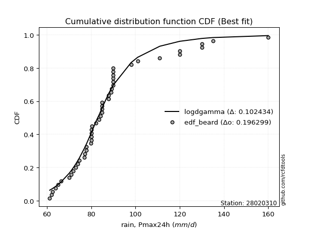</img>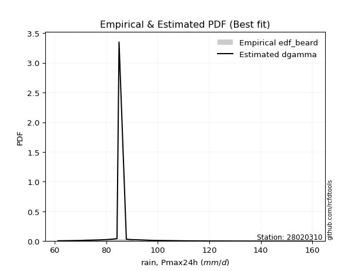</img>

</div>


### 5. Empirical - EDF Chegodayev (1955)

The Chegodayev formula is an empirical plotting position formula used in hydrological frequency analysis to estimate the exceedance probability or return period of a specific event from a set of observed data. It is primarily used for plotting observed data points on probability paper to fit a theoretical distribution, particularly for analyzing extreme events like maximum flood flows or rainfall intensities. The constant _b_ value in the generalized plotting position formula is 0.3.

<div align="center">


$P=(m-b)/(n+1-2b)$


</div>


**5.1. Empirical values**

<div align="center">

|                | 0                   | 1                   | 2                   | 3                   | 4                   | 5                   | 6                  | 7                  | 8                   | 9                   | 10                  | 11                  | 12                  | 13                 | 14                 | 15                 | 16                 | 17                 | 18                  | 19                  | 20                  | 21                  | 22                 | 23                 | 24                 | 25                 | 26                 | 27                 | 28                 | 29                 | 30                 | 31                 | 32                 | 33                 | 34                 | 35                | 36                 | 37                 | 38                 | 39                 | 40                 | 41                 | 42                 | 43                 | 44                 | 45                 | 46                 | 47                 |
|:---------------|:--------------------|:--------------------|:--------------------|:--------------------|:--------------------|:--------------------|:-------------------|:-------------------|:--------------------|:--------------------|:--------------------|:--------------------|:--------------------|:-------------------|:-------------------|:-------------------|:-------------------|:-------------------|:--------------------|:--------------------|:--------------------|:--------------------|:-------------------|:-------------------|:-------------------|:-------------------|:-------------------|:-------------------|:-------------------|:-------------------|:-------------------|:-------------------|:-------------------|:-------------------|:-------------------|:------------------|:-------------------|:-------------------|:-------------------|:-------------------|:-------------------|:-------------------|:-------------------|:-------------------|:-------------------|:-------------------|:-------------------|:-------------------|
| date           | 2015                | 1969                | 1982                | 2002                | 2001                | 2009                | 2003               | 1980               | 1985                | 1975                | 2004                | 2007                | 1983                | 2011               | 2005               | 2013               | 2012               | 1996               | 1974                | 1977                | 2000                | 1971                | 2014               | 2006               | 2008               | 1972               | 1976               | 1978               | 1988               | 2010               | 1968               | 1984               | 1994               | 1986               | 1989               | 1987              | 1991               | 1992               | 1995               | 1979               | 1993               | 1981               | 1973               | 1970               | 1997               | 1990               | 1999               | 1998               |
| x              | 61.2723765575468    | 62.0                | 62.6238716094153    | 64.0                | 65.0                | 66.3434261308019    | 70.0367441186674   | 71.0               | 72.0                | 73.0                | 73.8321775894603    | 74.6550121603792    | 77.0                | 77.1481260946949   | 77.8012338162671   | 77.8682619904586   | 79.8951644557945   | 80.0               | 80.0                | 80.0                | 80.0                | 80.3885696894822    | 82.2558340114059   | 83.6292555654485   | 84.2125270817239   | 85.0               | 85.0               | 85.0               | 85.0               | 87.8384437186631   | 87.8882726975572   | 89.0               | 89.28613946360262  | 90.0               | 90.0               | 90.0              | 90.0               | 90.0               | 90.0               | 98.0453969651585   | 101.0              | 111.0              | 120.0              | 120.0              | 130.0              | 130.0              | 135.0              | 160.0              |
| m              | 1                   | 2                   | 3                   | 4                   | 5                   | 6                   | 7                  | 8                  | 9                   | 10                  | 11                  | 12                  | 13                  | 14                 | 15                 | 16                 | 17                 | 18                 | 19                  | 20                  | 21                  | 22                  | 23                 | 24                 | 25                 | 26                 | 27                 | 28                 | 29                 | 30                 | 31                 | 32                 | 33                 | 34                 | 35                 | 36                | 37                 | 38                 | 39                 | 40                 | 41                 | 42                 | 43                 | 44                 | 45                 | 46                 | 47                 | 48                 |
| empirical_dist | edf_chegodayev      | edf_chegodayev      | edf_chegodayev      | edf_chegodayev      | edf_chegodayev      | edf_chegodayev      | edf_chegodayev     | edf_chegodayev     | edf_chegodayev      | edf_chegodayev      | edf_chegodayev      | edf_chegodayev      | edf_chegodayev      | edf_chegodayev     | edf_chegodayev     | edf_chegodayev     | edf_chegodayev     | edf_chegodayev     | edf_chegodayev      | edf_chegodayev      | edf_chegodayev      | edf_chegodayev      | edf_chegodayev     | edf_chegodayev     | edf_chegodayev     | edf_chegodayev     | edf_chegodayev     | edf_chegodayev     | edf_chegodayev     | edf_chegodayev     | edf_chegodayev     | edf_chegodayev     | edf_chegodayev     | edf_chegodayev     | edf_chegodayev     | edf_chegodayev    | edf_chegodayev     | edf_chegodayev     | edf_chegodayev     | edf_chegodayev     | edf_chegodayev     | edf_chegodayev     | edf_chegodayev     | edf_chegodayev     | edf_chegodayev     | edf_chegodayev     | edf_chegodayev     | edf_chegodayev     |
| empirical      | 0.01446280991735537 | 0.03512396694214876 | 0.05578512396694216 | 0.07644628099173555 | 0.09710743801652894 | 0.11776859504132232 | 0.1384297520661157 | 0.1590909090909091 | 0.17975206611570246 | 0.20041322314049587 | 0.22107438016528924 | 0.24173553719008264 | 0.26239669421487605 | 0.2830578512396694 | 0.3037190082644628 | 0.3243801652892562 | 0.3450413223140496 | 0.365702479338843  | 0.38636363636363635 | 0.40702479338842973 | 0.42768595041322316 | 0.44834710743801653 | 0.4690082644628099 | 0.4896694214876033 | 0.5103305785123967 | 0.53099173553719   | 0.5516528925619835 | 0.5723140495867769 | 0.5929752066115702 | 0.6136363636363636 | 0.6342975206611571 | 0.6549586776859504 | 0.6756198347107438 | 0.6962809917355373 | 0.7169421487603307 | 0.737603305785124 | 0.7582644628099174 | 0.7789256198347109 | 0.7995867768595042 | 0.8202479338842976 | 0.8409090909090909 | 0.8615702479338844 | 0.8822314049586778 | 0.9028925619834711 | 0.9235537190082646 | 0.944214876033058  | 0.9648760330578513 | 0.9855371900826447 |
| empirical_tr   | 1.0146750524109014  | 1.0364025695931478  | 1.0590809628008753  | 1.0827740492170022  | 1.1075514874141876  | 1.1334894613583137  | 1.1606714628297363 | 1.1891891891891893 | 1.2191435768261965  | 1.2506459948320412  | 1.2838196286472148  | 1.3188010899182563  | 1.3557422969187676  | 1.3948126801152738 | 1.4362017804154301 | 1.4801223241590213 | 1.526813880126183  | 1.5765472312703586 | 1.6296296296296295  | 1.6864111498257837  | 1.7472924187725631  | 1.8127340823970037  | 1.8832684824902726 | 1.9595141700404857 | 2.042194092827004  | 2.1321585903083697 | 2.230414746543779  | 2.3381642512077296 | 2.4568527918781724 | 2.588235294117647  | 2.7344632768361588 | 2.898203592814371  | 3.082802547770701  | 3.2925170068027216 | 3.5328467153284686 | 3.811023622047245 | 4.136752136752138  | 4.523364485981311  | 4.989690721649486  | 5.563218390804601  | 6.2857142857142865 | 7.223880597014929  | 8.491228070175447  | 10.297872340425537 | 13.081081081081097 | 17.925925925925966 | 28.470588235294166 | 69.14285714285764  |

</div>


**5.2. Parameters & Kolmogorov-Smirnov fit test (sorted by Δ)**

|   id | empirical_dist   | p_dist             |    delta |   deltao | eval    |   fit |   n |             loc |          scale | shape                  | shape1               | shape2             | shape3   |   best_fit |   best_fit_sort |
|-----:|:-----------------|:-------------------|---------:|---------:|:--------|------:|----:|----------------:|---------------:|:-----------------------|:---------------------|:-------------------|:---------|-----------:|----------------:|
|    0 | edf_chegodayev   | dgamma             | 0.120192 | 0.196299 | Δo > Δ  |     1 |  48 |    85           |   14.6017      | 0.8618486950276836     |                      |                    |          |          1 |               1 |
|    1 | edf_chegodayev   | wald               | 0.123719 | 0.196299 | Δo > Δ  |     1 |  48 |    67.0942      |   20.3021      |                        |                      |                    |          |          0 |               2 |
|    2 | edf_chegodayev   | alpha              | 0.137797 | 0.196299 | Δo > Δ  |     1 |  48 |    18.879       |  263.028       | 4.11563865435355       |                      |                    |          |          0 |               3 |
|    3 | edf_chegodayev   | mielke             | 0.138538 | 0.196299 | Δo > Δ  |     1 |  48 |    -1.34211     |   53.7147      | 79.88900999665557      | 6.388198240255651    |                    |          |          0 |               4 |
|    4 | edf_chegodayev   | invweibull         | 0.140483 | 0.196299 | Δo > Δ  |     1 |  48 |   -18.9757      |   96.8446      | 7.413946692395208      |                      |                    |          |          0 |               5 |
|    5 | edf_chegodayev   | fisk               | 0.142252 | 0.196299 | Δo > Δ  |     1 |  48 |    -0.179746    |   83.8799      | 8.995379759132247      |                      |                    |          |          0 |               6 |
|    6 | edf_chegodayev   | invgamma           | 0.142801 | 0.196299 | Δo > Δ  |     1 |  48 |    40.844       |  282.205       | 7.060980832477705      |                      |                    |          |          0 |               7 |
|    7 | edf_chegodayev   | f                  | 0.144247 | 0.196299 | Δo > Δ  |     1 |  48 |    40.9497      |   39.8861      | 20448.456439629055     | 13.969948823715146   |                    |          |          0 |               8 |
|    8 | edf_chegodayev   | exponnorm          | 0.146151 | 0.196299 | Δo > Δ  |     1 |  48 |    69.6443      |    7.46056     | 2.379438118688931      |                      |                    |          |          0 |               9 |
|    9 | edf_chegodayev   | johnsonsu          | 0.146329 | 0.196299 | Δo > Δ  |     1 |  48 |    50.9705      |    1.42275     | -7.307627353760925     | 1.922936865035385    |                    |          |          0 |              10 |
|   10 | edf_chegodayev   | lognorm            | 0.146818 | 0.196299 | Δo > Δ  |     1 |  48 |    50.8634      |   31.9206      | 0.5188485586715679     |                      |                    |          |          0 |              11 |
|   11 | edf_chegodayev   | laplace_asymmetric | 0.150428 | 0.196299 | Δo > Δ  |     1 |  48 |    79.8952      |   12.1997      | 0.73875923659806       |                      |                    |          |          0 |              12 |
|   12 | edf_chegodayev   | pearson3           | 0.150537 | 0.196299 | Δo > Δ  |     1 |  48 |    87.3963      |   20.3021      | 1.546924634543322      |                      |                    |          |          0 |              13 |
|   13 | edf_chegodayev   | invgauss           | 0.151397 | 0.196299 | Δo > Δ  |     1 |  48 |    49.4404      |  137.089       | 0.27686951370685786    |                      |                    |          |          0 |              14 |
|   14 | edf_chegodayev   | fatiguelife        | 0.153137 | 0.196299 | Δo > Δ  |     1 |  48 |    50.2987      |   32.5929      | 0.5259059389192924     |                      |                    |          |          0 |              15 |
|   15 | edf_chegodayev   | recipinvgauss      | 0.153693 | 0.196299 | Δo > Δ  |     1 |  48 |    51.4986      |    8.83335     | 0.32638486190037747    |                      |                    |          |          0 |              16 |
|   16 | edf_chegodayev   | moyal              | 0.153707 | 0.196299 | Δo > Δ  |     1 |  48 |    75.7862      |    9.13916     |                        |                      |                    |          |          0 |              17 |
|   17 | edf_chegodayev   | halflogistic       | 0.153734 | 0.196299 | Δo > Δ  |     1 |  48 |    63.3336      |   17.3576      |                        |                      |                    |          |          0 |              18 |
|   18 | edf_chegodayev   | erlang             | 0.156197 | 0.196299 | Δo > Δ  |     1 |  48 |    59.5628      |   14.6556      | 1.8991745698841438     |                      |                    |          |          0 |              19 |
|   19 | edf_chegodayev   | gamma              | 0.156198 | 0.196299 | Δo > Δ  |     1 |  48 |    59.5628      |   14.6556      | 1.8991685396362568     |                      |                    |          |          0 |              20 |
|   20 | edf_chegodayev   | chi2               | 0.156198 | 0.196299 | Δo > Δ  |     1 |  48 |    59.5627      |    7.32774     | 3.7983815129809404     |                      |                    |          |          0 |              21 |
|   21 | edf_chegodayev   | nakagami           | 0.157134 | 0.196299 | Δo > Δ  |     1 |  48 |    61.2724      |   32.0096      | 0.4507325694731861     |                      |                    |          |          0 |              22 |
|   22 | edf_chegodayev   | genlogistic        | 0.159464 | 0.196299 | Δo > Δ  |     1 |  48 |   -11.2991      |   13.8038      | 686.4871814930432      |                      |                    |          |          0 |              23 |
|   23 | edf_chegodayev   | weibull_min        | 0.161703 | 0.196299 | Δo > Δ  |     1 |  48 |    60.8047      |   28.8525      | 1.326648058559914      |                      |                    |          |          0 |              24 |
|   24 | edf_chegodayev   | gompertz           | 0.170416 | 0.196299 | Δo > Δ  |     1 |  48 |    61.2724      |   83.6841      | 2.4220682661657165     |                      |                    |          |          0 |              25 |
|   25 | edf_chegodayev   | nct                | 0.17216  | 0.196299 | Δo > Δ  |     1 |  48 |    -0.42568     |    1.1951      | 13.485269169298178     | 69.11560817762629    |                    |          |          0 |              26 |
|   26 | edf_chegodayev   | gumbel_r           | 0.178511 | 0.196299 | Δo > Δ  |     1 |  48 |    78.2592      |   15.8295      |                        |                      |                    |          |          0 |              27 |
|   27 | edf_chegodayev   | halfnorm           | 0.181055 | 0.196299 | Δo > Δ  |     1 |  48 |    60.5242      |   33.6791      |                        |                      |                    |          |          0 |              28 |
|   28 | edf_chegodayev   | gibrat             | 0.184729 | 0.196299 | Δo > Δ  |     1 |  48 |    71.9083      |    9.3939      |                        |                      |                    |          |          0 |              29 |
|   29 | edf_chegodayev   | betaprime          | 0.188077 | 0.196299 | Δo > Δ  |     1 |  48 |    -2.31774     |    4.70825     | 493.518565116437       | 26.954713989585066   |                    |          |          0 |              30 |
|   30 | edf_chegodayev   | genexpon           | 0.189629 | 0.196299 | Δo > Δ  |     1 |  48 |    60.8983      |    1.43446     | 0.00102178005859321    | 0.053965855644600734 | 3.4362630229428257 |          |          0 |              31 |
|   31 | edf_chegodayev   | expon              | 0.18991  | 0.196299 | Δo > Δ  |     1 |  48 |    61.2724      |   26.1239      |                        |                      |                    |          |          0 |              32 |
|   32 | edf_chegodayev   | pareto             | 0.18991  | 0.196299 | Δo > Δ  |     1 |  48 |    -2.14748e+09 |    2.14748e+09 | 82203821.83996421      |                      |                    |          |          0 |              33 |
|   33 | edf_chegodayev   | kstwobign          | 0.19385  | 0.196299 | Δo > Δ  |     1 |  48 |    27.4445      |   69.5918      |                        |                      |                    |          |          0 |              34 |
|   34 | edf_chegodayev   | rayleigh           | 0.208508 | 0.196299 | Δo <= Δ |     0 |  48 |    48.5572      |   30.9891      |                        |                      |                    |          |          0 |              35 |
|   35 | edf_chegodayev   | laplace            | 0.216649 | 0.196299 | Δo <= Δ |     0 |  48 |    87.3963      |   14.3558      |                        |                      |                    |          |          0 |              36 |
|   36 | edf_chegodayev   | ncf                | 0.216773 | 0.196299 | Δo <= Δ |     0 |  48 |    -0.682937    |    6.2991e-06  | 7.2152174318706755e-06 | 367.02570416695164   | 100.2165537852085  |          |          0 |              37 |
|   37 | edf_chegodayev   | maxwell            | 0.218239 | 0.196299 | Δo <= Δ |     0 |  48 |    39.2888      |   30.1469      |                        |                      |                    |          |          0 |              38 |
|   38 | edf_chegodayev   | rice               | 0.230457 | 0.196299 | Δo <= Δ |     0 |  48 |    54.6343      |   27.2537      | 0.0006002761905476531  |                      |                    |          |          0 |              39 |
|   39 | edf_chegodayev   | hypsecant          | 0.235891 | 0.196299 | Δo <= Δ |     0 |  48 |    87.3963      |   12.9247      |                        |                      |                    |          |          0 |              40 |
|   40 | edf_chegodayev   | logistic           | 0.241693 | 0.196299 | Δo <= Δ |     0 |  48 |    87.3963      |   11.1931      |                        |                      |                    |          |          0 |              41 |
|   41 | edf_chegodayev   | t                  | 0.248446 | 0.196299 | Δo <= Δ |     0 |  48 |    87.3874      |   20.3103      | 364.83839150975837     |                      |                    |          |          0 |              42 |
|   42 | edf_chegodayev   | crystalball        | 0.248563 | 0.196299 | Δo <= Δ |     0 |  48 |    87.3963      |   20.3021      | 7940.872621987292      | 25.234968961283577   |                    |          |          0 |              43 |
|   43 | edf_chegodayev   | norm               | 0.248563 | 0.196299 | Δo <= Δ |     0 |  48 |    87.3963      |   20.3021      |                        |                      |                    |          |          0 |              44 |
|   44 | edf_chegodayev   | truncnorm          | 0.248563 | 0.196299 | Δo <= Δ |     0 |  48 |    87.3963      |   20.3021      | -737.093976545434      | 1193.2936146393458   |                    |          |          0 |              45 |
|   45 | edf_chegodayev   | loggamma           | 0.250143 | 0.196299 | Δo <= Δ |     0 |  48 | -7931.98        | 1025.26        | 2494.890482001344      |                      |                    |          |          0 |              46 |
|   46 | edf_chegodayev   | gumbel_l           | 0.315487 | 0.196299 | Δo <= Δ |     0 |  48 |    96.5333      |   15.8295      |                        |                      |                    |          |          0 |              47 |
|   47 | edf_chegodayev   | zzgumbel           | 0.371305 | 0.196299 | Δo <= Δ |     0 |  48 |    87.362       |   15.997       | 0.5476912526714043     | 1.157309579779488    |                    |          |          0 |              48 |

<div align="center">

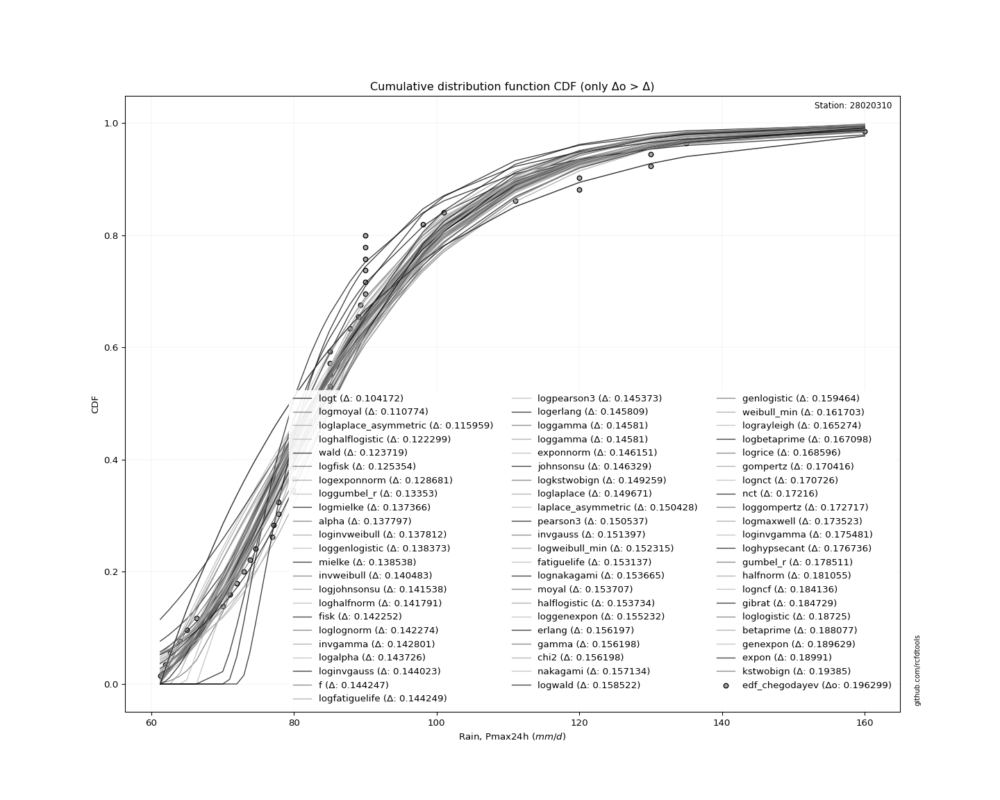</img>

</div>


**5.3. Best fit**

|   id |   station | empirical_dist   | p_dist   |    delta |   deltao | eval   |   fit |   n |   loc |   scale |    shape | shape1   | shape2   | shape3   |   best_fit |   best_fit_sort |
|-----:|----------:|:-----------------|:---------|---------:|---------:|:-------|------:|----:|------:|--------:|---------:|:---------|:---------|:---------|-----------:|----------------:|
|    0 |  28020310 | edf_chegodayev   | dgamma   | 0.120192 | 0.196299 | Δo > Δ |     1 |  48 |    85 | 14.6017 | 0.861849 |          |          |          |          1 |               1 |

<div align="center">

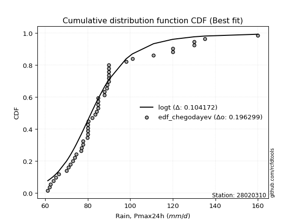</img>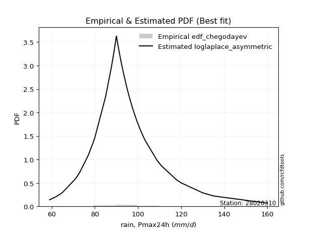</img>

</div>


### 6. Empirical - EDF Blom (1958)

The Blom formula is a specific "plotting position" formula used in hydrology and statistical analysis to estimate the empirical cumulative probability (or non-exceedance probability) of a data series. It is particularly recommended for data that are approximately normally distributed. The constant _a_ is set to 0.375 (or 3/8).

<div align="center">


$P=(m-a)/(n+1-2a)$


</div>


**6.1. Empirical values**

<div align="center">

|                | 0                    | 1                   | 2                    | 3                   | 4                   | 5                   | 6                   | 7                   | 8                   | 9                   | 10                  | 11                  | 12                 | 13                 | 14                  | 15                 | 16                 | 17                  | 18                 | 19                 | 20                 | 21                 | 22                 | 23                 | 24                 | 25                 | 26                 | 27                | 28                 | 29                 | 30                 | 31                 | 32                 | 33                 | 34                 | 35                 | 36                 | 37                 | 38                 | 39                 | 40                 | 41                 | 42                | 43                 | 44                 | 45                 | 46                 | 47                 |
|:---------------|:---------------------|:--------------------|:---------------------|:--------------------|:--------------------|:--------------------|:--------------------|:--------------------|:--------------------|:--------------------|:--------------------|:--------------------|:-------------------|:-------------------|:--------------------|:-------------------|:-------------------|:--------------------|:-------------------|:-------------------|:-------------------|:-------------------|:-------------------|:-------------------|:-------------------|:-------------------|:-------------------|:------------------|:-------------------|:-------------------|:-------------------|:-------------------|:-------------------|:-------------------|:-------------------|:-------------------|:-------------------|:-------------------|:-------------------|:-------------------|:-------------------|:-------------------|:------------------|:-------------------|:-------------------|:-------------------|:-------------------|:-------------------|
| date           | 2015                 | 1969                | 1982                 | 2002                | 2001                | 2009                | 2003                | 1980                | 1985                | 1975                | 2004                | 2007                | 1983               | 2011               | 2005                | 2013               | 2012               | 1996                | 1974               | 1977               | 2000               | 1971               | 2014               | 2006               | 2008               | 1972               | 1976               | 1978              | 1988               | 2010               | 1968               | 1984               | 1994               | 1986               | 1989               | 1987               | 1991               | 1992               | 1995               | 1979               | 1993               | 1981               | 1973              | 1970               | 1997               | 1990               | 1999               | 1998               |
| x              | 61.2723765575468     | 62.0                | 62.6238716094153     | 64.0                | 65.0                | 66.3434261308019    | 70.0367441186674    | 71.0                | 72.0                | 73.0                | 73.8321775894603    | 74.6550121603792    | 77.0               | 77.1481260946949   | 77.8012338162671    | 77.8682619904586   | 79.8951644557945   | 80.0                | 80.0               | 80.0               | 80.0               | 80.3885696894822   | 82.2558340114059   | 83.6292555654485   | 84.2125270817239   | 85.0               | 85.0               | 85.0              | 85.0               | 87.8384437186631   | 87.8882726975572   | 89.0               | 89.28613946360262  | 90.0               | 90.0               | 90.0               | 90.0               | 90.0               | 90.0               | 98.0453969651585   | 101.0              | 111.0              | 120.0             | 120.0              | 130.0              | 130.0              | 135.0              | 160.0              |
| m              | 1                    | 2                   | 3                    | 4                   | 5                   | 6                   | 7                   | 8                   | 9                   | 10                  | 11                  | 12                  | 13                 | 14                 | 15                  | 16                 | 17                 | 18                  | 19                 | 20                 | 21                 | 22                 | 23                 | 24                 | 25                 | 26                 | 27                 | 28                | 29                 | 30                 | 31                 | 32                 | 33                 | 34                 | 35                 | 36                 | 37                 | 38                 | 39                 | 40                 | 41                 | 42                 | 43                | 44                 | 45                 | 46                 | 47                 | 48                 |
| empirical_dist | edf_blom             | edf_blom            | edf_blom             | edf_blom            | edf_blom            | edf_blom            | edf_blom            | edf_blom            | edf_blom            | edf_blom            | edf_blom            | edf_blom            | edf_blom           | edf_blom           | edf_blom            | edf_blom           | edf_blom           | edf_blom            | edf_blom           | edf_blom           | edf_blom           | edf_blom           | edf_blom           | edf_blom           | edf_blom           | edf_blom           | edf_blom           | edf_blom          | edf_blom           | edf_blom           | edf_blom           | edf_blom           | edf_blom           | edf_blom           | edf_blom           | edf_blom           | edf_blom           | edf_blom           | edf_blom           | edf_blom           | edf_blom           | edf_blom           | edf_blom          | edf_blom           | edf_blom           | edf_blom           | edf_blom           | edf_blom           |
| empirical      | 0.012953367875647668 | 0.03367875647668394 | 0.054404145077720206 | 0.07512953367875648 | 0.09585492227979274 | 0.11658031088082901 | 0.13730569948186527 | 0.15803108808290156 | 0.17875647668393782 | 0.19948186528497408 | 0.22020725388601037 | 0.24093264248704663 | 0.2616580310880829 | 0.2823834196891192 | 0.30310880829015546 | 0.3238341968911917 | 0.344559585492228  | 0.36528497409326427 | 0.3860103626943005 | 0.4067357512953368 | 0.4274611398963731 | 0.4481865284974093 | 0.4689119170984456 | 0.4896373056994819 | 0.5103626943005182 | 0.5310880829015544 | 0.5518134715025906 | 0.572538860103627 | 0.5932642487046632 | 0.6139896373056994 | 0.6347150259067358 | 0.655440414507772  | 0.6761658031088082 | 0.6968911917098446 | 0.7176165803108808 | 0.7383419689119171 | 0.7590673575129534 | 0.7797927461139896 | 0.8005181347150259 | 0.8212435233160622 | 0.8419689119170984 | 0.8626943005181347 | 0.883419689119171 | 0.9041450777202072 | 0.9248704663212435 | 0.9455958549222798 | 0.966321243523316  | 0.9870466321243523 |
| empirical_tr   | 1.0131233595800526   | 1.03485254691689    | 1.0575342465753423   | 1.081232492997199   | 1.1060171919770774  | 1.131964809384164   | 1.1591591591591592  | 1.1876923076923076  | 1.2176656151419558  | 1.249190938511327   | 1.282392026578073   | 1.3174061433447097  | 1.3543859649122807 | 1.3935018050541517 | 1.4349442379182156  | 1.4789272030651341 | 1.5256916996047432 | 1.5755102040816327  | 1.628691983122363  | 1.685589519650655  | 1.7466063348416287 | 1.8122065727699532 | 1.8829268292682926 | 1.9593908629441623 | 2.0423280423280423 | 2.132596685082873  | 2.23121387283237   | 2.33939393939394  | 2.4585987261146496 | 2.590604026845637  | 2.7375886524822697 | 2.9022556390977443 | 3.0879999999999996 | 3.2991452991452994 | 3.541284403669725  | 3.821782178217821  | 4.150537634408603  | 4.541176470588235  | 5.012987012987012  | 5.5942028985507255 | 6.327868852459016  | 7.283018867924526  | 8.57777777777778  | 10.432432432432432 | 13.3103448275862   | 18.38095238095239  | 29.692307692307686 | 77.19999999999973  |

</div>


**6.2. Parameters & Kolmogorov-Smirnov fit test (sorted by Δ)**

|   id | empirical_dist   | p_dist             |    delta |   deltao | eval    |   fit |   n |             loc |          scale | shape                  | shape1               | shape2             | shape3   |   best_fit |   best_fit_sort |
|-----:|:-----------------|:-------------------|---------:|---------:|:--------|------:|----:|----------------:|---------------:|:-----------------------|:---------------------|:-------------------|:---------|-----------:|----------------:|
|    0 | edf_blom         | dgamma             | 0.121123 | 0.196299 | Δo > Δ  |     1 |  48 |    85           |   14.6017      | 0.8618486950276836     |                      |                    |          |          1 |               1 |
|    1 | edf_blom         | wald               | 0.1242   | 0.196299 | Δo > Δ  |     1 |  48 |    67.0942      |   20.3021      |                        |                      |                    |          |          0 |               2 |
|    2 | edf_blom         | alpha              | 0.138729 | 0.196299 | Δo > Δ  |     1 |  48 |    18.879       |  263.028       | 4.11563865435355       |                      |                    |          |          0 |               3 |
|    3 | edf_blom         | mielke             | 0.139469 | 0.196299 | Δo > Δ  |     1 |  48 |    -1.34211     |   53.7147      | 79.88900999665557      | 6.388198240255651    |                    |          |          0 |               4 |
|    4 | edf_blom         | invweibull         | 0.141414 | 0.196299 | Δo > Δ  |     1 |  48 |   -18.9757      |   96.8446      | 7.413946692395208      |                      |                    |          |          0 |               5 |
|    5 | edf_blom         | fisk               | 0.143183 | 0.196299 | Δo > Δ  |     1 |  48 |    -0.179746    |   83.8799      | 8.995379759132247      |                      |                    |          |          0 |               6 |
|    6 | edf_blom         | invgamma           | 0.143732 | 0.196299 | Δo > Δ  |     1 |  48 |    40.844       |  282.205       | 7.060980832477705      |                      |                    |          |          0 |               7 |
|    7 | edf_blom         | f                  | 0.145178 | 0.196299 | Δo > Δ  |     1 |  48 |    40.9497      |   39.8861      | 20448.456439629055     | 13.969948823715146   |                    |          |          0 |               8 |
|    8 | edf_blom         | exponnorm          | 0.147082 | 0.196299 | Δo > Δ  |     1 |  48 |    69.6443      |    7.46056     | 2.379438118688931      |                      |                    |          |          0 |               9 |
|    9 | edf_blom         | johnsonsu          | 0.147261 | 0.196299 | Δo > Δ  |     1 |  48 |    50.9705      |    1.42275     | -7.307627353760925     | 1.922936865035385    |                    |          |          0 |              10 |
|   10 | edf_blom         | lognorm            | 0.14775  | 0.196299 | Δo > Δ  |     1 |  48 |    50.8634      |   31.9206      | 0.5188485586715679     |                      |                    |          |          0 |              11 |
|   11 | edf_blom         | laplace_asymmetric | 0.151359 | 0.196299 | Δo > Δ  |     1 |  48 |    79.8952      |   12.1997      | 0.73875923659806       |                      |                    |          |          0 |              12 |
|   12 | edf_blom         | pearson3           | 0.151468 | 0.196299 | Δo > Δ  |     1 |  48 |    87.3963      |   20.3021      | 1.546924634543322      |                      |                    |          |          0 |              13 |
|   13 | edf_blom         | invgauss           | 0.152328 | 0.196299 | Δo > Δ  |     1 |  48 |    49.4404      |  137.089       | 0.27686951370685786    |                      |                    |          |          0 |              14 |
|   14 | edf_blom         | fatiguelife        | 0.154068 | 0.196299 | Δo > Δ  |     1 |  48 |    50.2987      |   32.5929      | 0.5259059389192924     |                      |                    |          |          0 |              15 |
|   15 | edf_blom         | recipinvgauss      | 0.154624 | 0.196299 | Δo > Δ  |     1 |  48 |    51.4986      |    8.83335     | 0.32638486190037747    |                      |                    |          |          0 |              16 |
|   16 | edf_blom         | moyal              | 0.154638 | 0.196299 | Δo > Δ  |     1 |  48 |    75.7862      |    9.13916     |                        |                      |                    |          |          0 |              17 |
|   17 | edf_blom         | halflogistic       | 0.154666 | 0.196299 | Δo > Δ  |     1 |  48 |    63.3336      |   17.3576      |                        |                      |                    |          |          0 |              18 |
|   18 | edf_blom         | erlang             | 0.157129 | 0.196299 | Δo > Δ  |     1 |  48 |    59.5628      |   14.6556      | 1.8991745698841438     |                      |                    |          |          0 |              19 |
|   19 | edf_blom         | gamma              | 0.157129 | 0.196299 | Δo > Δ  |     1 |  48 |    59.5628      |   14.6556      | 1.8991685396362568     |                      |                    |          |          0 |              20 |
|   20 | edf_blom         | chi2               | 0.157129 | 0.196299 | Δo > Δ  |     1 |  48 |    59.5627      |    7.32774     | 3.7983815129809404     |                      |                    |          |          0 |              21 |
|   21 | edf_blom         | nakagami           | 0.158065 | 0.196299 | Δo > Δ  |     1 |  48 |    61.2724      |   32.0096      | 0.4507325694731861     |                      |                    |          |          0 |              22 |
|   22 | edf_blom         | genlogistic        | 0.160395 | 0.196299 | Δo > Δ  |     1 |  48 |   -11.2991      |   13.8038      | 686.4871814930432      |                      |                    |          |          0 |              23 |
|   23 | edf_blom         | weibull_min        | 0.162634 | 0.196299 | Δo > Δ  |     1 |  48 |    60.8047      |   28.8525      | 1.326648058559914      |                      |                    |          |          0 |              24 |
|   24 | edf_blom         | gompertz           | 0.171348 | 0.196299 | Δo > Δ  |     1 |  48 |    61.2724      |   83.6841      | 2.4220682661657165     |                      |                    |          |          0 |              25 |
|   25 | edf_blom         | nct                | 0.173091 | 0.196299 | Δo > Δ  |     1 |  48 |    -0.42568     |    1.1951      | 13.485269169298178     | 69.11560817762629    |                    |          |          0 |              26 |
|   26 | edf_blom         | gumbel_r           | 0.179443 | 0.196299 | Δo > Δ  |     1 |  48 |    78.2592      |   15.8295      |                        |                      |                    |          |          0 |              27 |
|   27 | edf_blom         | halfnorm           | 0.181986 | 0.196299 | Δo > Δ  |     1 |  48 |    60.5242      |   33.6791      |                        |                      |                    |          |          0 |              28 |
|   28 | edf_blom         | gibrat             | 0.183798 | 0.196299 | Δo > Δ  |     1 |  48 |    71.9083      |    9.3939      |                        |                      |                    |          |          0 |              29 |
|   29 | edf_blom         | betaprime          | 0.189009 | 0.196299 | Δo > Δ  |     1 |  48 |    -2.31774     |    4.70825     | 493.518565116437       | 26.954713989585066   |                    |          |          0 |              30 |
|   30 | edf_blom         | genexpon           | 0.190367 | 0.196299 | Δo > Δ  |     1 |  48 |    60.8983      |    1.43446     | 0.00102178005859321    | 0.053965855644600734 | 3.4362630229428257 |          |          0 |              31 |
|   31 | edf_blom         | expon              | 0.190649 | 0.196299 | Δo > Δ  |     1 |  48 |    61.2724      |   26.1239      |                        |                      |                    |          |          0 |              32 |
|   32 | edf_blom         | pareto             | 0.190649 | 0.196299 | Δo > Δ  |     1 |  48 |    -2.14748e+09 |    2.14748e+09 | 82203821.83996421      |                      |                    |          |          0 |              33 |
|   33 | edf_blom         | kstwobign          | 0.194781 | 0.196299 | Δo > Δ  |     1 |  48 |    27.4445      |   69.5918      |                        |                      |                    |          |          0 |              34 |
|   34 | edf_blom         | rayleigh           | 0.209439 | 0.196299 | Δo <= Δ |     0 |  48 |    48.5572      |   30.9891      |                        |                      |                    |          |          0 |              35 |
|   35 | edf_blom         | laplace            | 0.217581 | 0.196299 | Δo <= Δ |     0 |  48 |    87.3963      |   14.3558      |                        |                      |                    |          |          0 |              36 |
|   36 | edf_blom         | ncf                | 0.217704 | 0.196299 | Δo <= Δ |     0 |  48 |    -0.682937    |    6.2991e-06  | 7.2152174318706755e-06 | 367.02570416695164   | 100.2165537852085  |          |          0 |              37 |
|   37 | edf_blom         | maxwell            | 0.219171 | 0.196299 | Δo <= Δ |     0 |  48 |    39.2888      |   30.1469      |                        |                      |                    |          |          0 |              38 |
|   38 | edf_blom         | rice               | 0.231388 | 0.196299 | Δo <= Δ |     0 |  48 |    54.6343      |   27.2537      | 0.0006002761905476531  |                      |                    |          |          0 |              39 |
|   39 | edf_blom         | hypsecant          | 0.236823 | 0.196299 | Δo <= Δ |     0 |  48 |    87.3963      |   12.9247      |                        |                      |                    |          |          0 |              40 |
|   40 | edf_blom         | logistic           | 0.242624 | 0.196299 | Δo <= Δ |     0 |  48 |    87.3963      |   11.1931      |                        |                      |                    |          |          0 |              41 |
|   41 | edf_blom         | t                  | 0.249377 | 0.196299 | Δo <= Δ |     0 |  48 |    87.3874      |   20.3103      | 364.83839150975837     |                      |                    |          |          0 |              42 |
|   42 | edf_blom         | crystalball        | 0.249494 | 0.196299 | Δo <= Δ |     0 |  48 |    87.3963      |   20.3021      | 7940.872621987292      | 25.234968961283577   |                    |          |          0 |              43 |
|   43 | edf_blom         | norm               | 0.249494 | 0.196299 | Δo <= Δ |     0 |  48 |    87.3963      |   20.3021      |                        |                      |                    |          |          0 |              44 |
|   44 | edf_blom         | truncnorm          | 0.249494 | 0.196299 | Δo <= Δ |     0 |  48 |    87.3963      |   20.3021      | -737.093976545434      | 1193.2936146393458   |                    |          |          0 |              45 |
|   45 | edf_blom         | loggamma           | 0.251075 | 0.196299 | Δo <= Δ |     0 |  48 | -7931.98        | 1025.26        | 2494.890482001344      |                      |                    |          |          0 |              46 |
|   46 | edf_blom         | gumbel_l           | 0.316419 | 0.196299 | Δo <= Δ |     0 |  48 |    96.5333      |   15.8295      |                        |                      |                    |          |          0 |              47 |
|   47 | edf_blom         | zzgumbel           | 0.372237 | 0.196299 | Δo <= Δ |     0 |  48 |    87.362       |   15.997       | 0.5476912526714043     | 1.157309579779488    |                    |          |          0 |              48 |

<div align="center">

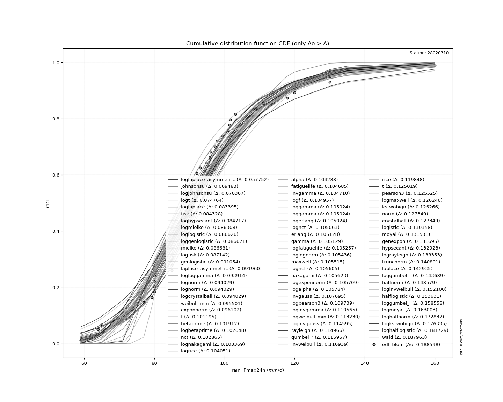</img>

</div>


**6.3. Best fit**

|   id |   station | empirical_dist   | p_dist   |    delta |   deltao | eval   |   fit |   n |   loc |   scale |    shape | shape1   | shape2   | shape3   |   best_fit |   best_fit_sort |
|-----:|----------:|:-----------------|:---------|---------:|---------:|:-------|------:|----:|------:|--------:|---------:|:---------|:---------|:---------|-----------:|----------------:|
|    0 |  28020310 | edf_blom         | dgamma   | 0.121123 | 0.196299 | Δo > Δ |     1 |  48 |    85 | 14.6017 | 0.861849 |          |          |          |          1 |               1 |

<div align="center">

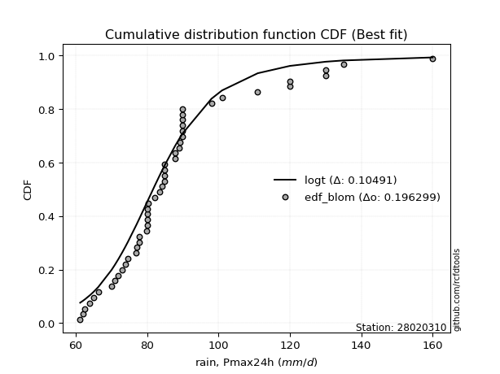</img></img>

</div>


### 7. Empirical - EDF Tukey (1962)

In hydrology, the Tukey formula is used as a plotting position formula to estimate the empirical probability or frequency of a flood event (or other hydrological data). The formula parameter is given as _c=0.333_ (or 1/3).

<div align="center">


$P=(m-c)/(n+1-2c)$


</div>


**7.1. Empirical values**

<div align="center">

|                | 0                    | 1                    | 2                   | 3                   | 4                   | 5                   | 6                   | 7                   | 8                  | 9         | 10                 | 11                 | 12                 | 13                 | 14                  | 15                  | 16                 | 17                  | 18                  | 19                 | 20                  | 21                 | 22                 | 23                 | 24                 | 25                 | 26                 | 27                 | 28                 | 29                 | 30                 | 31                 | 32                 | 33                | 34                 | 35                 | 36                 | 37                 | 38                | 39                 | 40                 | 41                 | 42                 | 43                | 44                 | 45                 | 46                 | 47                 |
|:---------------|:---------------------|:---------------------|:--------------------|:--------------------|:--------------------|:--------------------|:--------------------|:--------------------|:-------------------|:----------|:-------------------|:-------------------|:-------------------|:-------------------|:--------------------|:--------------------|:-------------------|:--------------------|:--------------------|:-------------------|:--------------------|:-------------------|:-------------------|:-------------------|:-------------------|:-------------------|:-------------------|:-------------------|:-------------------|:-------------------|:-------------------|:-------------------|:-------------------|:------------------|:-------------------|:-------------------|:-------------------|:-------------------|:------------------|:-------------------|:-------------------|:-------------------|:-------------------|:------------------|:-------------------|:-------------------|:-------------------|:-------------------|
| date           | 2015                 | 1969                 | 1982                | 2002                | 2001                | 2009                | 2003                | 1980                | 1985               | 1975      | 2004               | 2007               | 1983               | 2011               | 2005                | 2013                | 2012               | 1996                | 1974                | 1977               | 2000                | 1971               | 2014               | 2006               | 2008               | 1972               | 1976               | 1978               | 1988               | 2010               | 1968               | 1984               | 1994               | 1986              | 1989               | 1987               | 1991               | 1992               | 1995              | 1979               | 1993               | 1981               | 1973               | 1970              | 1997               | 1990               | 1999               | 1998               |
| x              | 61.2723765575468     | 62.0                 | 62.6238716094153    | 64.0                | 65.0                | 66.3434261308019    | 70.0367441186674    | 71.0                | 72.0               | 73.0      | 73.8321775894603   | 74.6550121603792   | 77.0               | 77.1481260946949   | 77.8012338162671    | 77.8682619904586    | 79.8951644557945   | 80.0                | 80.0                | 80.0               | 80.0                | 80.3885696894822   | 82.2558340114059   | 83.6292555654485   | 84.2125270817239   | 85.0               | 85.0               | 85.0               | 85.0               | 87.8384437186631   | 87.8882726975572   | 89.0               | 89.28613946360262  | 90.0              | 90.0               | 90.0               | 90.0               | 90.0               | 90.0              | 98.0453969651585   | 101.0              | 111.0              | 120.0              | 120.0             | 130.0              | 130.0              | 135.0              | 160.0              |
| m              | 1                    | 2                    | 3                   | 4                   | 5                   | 6                   | 7                   | 8                   | 9                  | 10        | 11                 | 12                 | 13                 | 14                 | 15                  | 16                  | 17                 | 18                  | 19                  | 20                 | 21                  | 22                 | 23                 | 24                 | 25                 | 26                 | 27                 | 28                 | 29                 | 30                 | 31                 | 32                 | 33                 | 34                | 35                 | 36                 | 37                 | 38                 | 39                | 40                 | 41                 | 42                 | 43                 | 44                | 45                 | 46                 | 47                 | 48                 |
| empirical_dist | edf_tukey            | edf_tukey            | edf_tukey           | edf_tukey           | edf_tukey           | edf_tukey           | edf_tukey           | edf_tukey           | edf_tukey          | edf_tukey | edf_tukey          | edf_tukey          | edf_tukey          | edf_tukey          | edf_tukey           | edf_tukey           | edf_tukey          | edf_tukey           | edf_tukey           | edf_tukey          | edf_tukey           | edf_tukey          | edf_tukey          | edf_tukey          | edf_tukey          | edf_tukey          | edf_tukey          | edf_tukey          | edf_tukey          | edf_tukey          | edf_tukey          | edf_tukey          | edf_tukey          | edf_tukey         | edf_tukey          | edf_tukey          | edf_tukey          | edf_tukey          | edf_tukey         | edf_tukey          | edf_tukey          | edf_tukey          | edf_tukey          | edf_tukey         | edf_tukey          | edf_tukey          | edf_tukey          | edf_tukey          |
| empirical      | 0.013793103448275862 | 0.034482758620689655 | 0.05517241379310345 | 0.07586206896551724 | 0.09655172413793103 | 0.11724137931034483 | 0.13793103448275862 | 0.15862068965517243 | 0.1793103448275862 | 0.2       | 0.2206896551724138 | 0.2413793103448276 | 0.2620689655172414 | 0.2827586206896552 | 0.30344827586206896 | 0.32413793103448274 | 0.3448275862068966 | 0.36551724137931035 | 0.38620689655172413 | 0.4068965517241379 | 0.42758620689655175 | 0.4482758620689655 | 0.4689655172413793 | 0.4896551724137931 | 0.5103448275862069 | 0.5310344827586206 | 0.5517241379310345 | 0.5724137931034483 | 0.593103448275862  | 0.6137931034482759 | 0.6344827586206897 | 0.6551724137931034 | 0.6758620689655173 | 0.696551724137931 | 0.7172413793103448 | 0.7379310344827587 | 0.7586206896551724 | 0.7793103448275862 | 0.8               | 0.8206896551724138 | 0.8413793103448276 | 0.8620689655172413 | 0.8827586206896552 | 0.903448275862069 | 0.9241379310344827 | 0.9448275862068966 | 0.9655172413793104 | 0.9862068965517241 |
| empirical_tr   | 1.013986013986014    | 1.0357142857142856   | 1.0583941605839415  | 1.082089552238806   | 1.1068702290076335  | 1.1328125           | 1.1600000000000001  | 1.1885245901639343  | 1.2184873949579833 | 1.25      | 1.2831858407079646 | 1.3181818181818183 | 1.355140186915888  | 1.3942307692307692 | 1.4356435643564356  | 1.4795918367346939  | 1.5263157894736843 | 1.5760869565217392  | 1.6292134831460674  | 1.6860465116279069 | 1.7469879518072289  | 1.8125             | 1.8831168831168832 | 1.9594594594594594 | 2.0422535211267605 | 2.1323529411764706 | 2.230769230769231  | 2.338709677419355  | 2.4576271186440675 | 2.5892857142857144 | 2.735849056603774  | 2.9                | 3.0851063829787235 | 3.295454545454545 | 3.5365853658536586 | 3.815789473684211  | 4.142857142857142  | 4.53125            | 5.000000000000001 | 5.576923076923076  | 6.304347826086957  | 7.249999999999997  | 8.529411764705882  | 10.35714285714286 | 13.181818181818175 | 18.125             | 29.000000000000036 | 72.49999999999986  |

</div>


**7.2. Parameters & Kolmogorov-Smirnov fit test (sorted by Δ)**

|   id | empirical_dist   | p_dist             |    delta |   deltao | eval    |   fit |   n |             loc |          scale | shape                  | shape1               | shape2             | shape3   |   best_fit |   best_fit_sort |
|-----:|:-----------------|:-------------------|---------:|---------:|:--------|------:|----:|----------------:|---------------:|:-----------------------|:---------------------|:-------------------|:---------|-----------:|----------------:|
|    0 | edf_tukey        | dgamma             | 0.120605 | 0.196299 | Δo > Δ  |     1 |  48 |    85           |   14.6017      | 0.8618486950276836     |                      |                    |          |          1 |               1 |
|    1 | edf_tukey        | wald               | 0.123932 | 0.196299 | Δo > Δ  |     1 |  48 |    67.0942      |   20.3021      |                        |                      |                    |          |          0 |               2 |
|    2 | edf_tukey        | alpha              | 0.138211 | 0.196299 | Δo > Δ  |     1 |  48 |    18.879       |  263.028       | 4.11563865435355       |                      |                    |          |          0 |               3 |
|    3 | edf_tukey        | mielke             | 0.138951 | 0.196299 | Δo > Δ  |     1 |  48 |    -1.34211     |   53.7147      | 79.88900999665557      | 6.388198240255651    |                    |          |          0 |               4 |
|    4 | edf_tukey        | invweibull         | 0.140896 | 0.196299 | Δo > Δ  |     1 |  48 |   -18.9757      |   96.8446      | 7.413946692395208      |                      |                    |          |          0 |               5 |
|    5 | edf_tukey        | fisk               | 0.142665 | 0.196299 | Δo > Δ  |     1 |  48 |    -0.179746    |   83.8799      | 8.995379759132247      |                      |                    |          |          0 |               6 |
|    6 | edf_tukey        | invgamma           | 0.143214 | 0.196299 | Δo > Δ  |     1 |  48 |    40.844       |  282.205       | 7.060980832477705      |                      |                    |          |          0 |               7 |
|    7 | edf_tukey        | f                  | 0.14466  | 0.196299 | Δo > Δ  |     1 |  48 |    40.9497      |   39.8861      | 20448.456439629055     | 13.969948823715146   |                    |          |          0 |               8 |
|    8 | edf_tukey        | exponnorm          | 0.146564 | 0.196299 | Δo > Δ  |     1 |  48 |    69.6443      |    7.46056     | 2.379438118688931      |                      |                    |          |          0 |               9 |
|    9 | edf_tukey        | johnsonsu          | 0.146743 | 0.196299 | Δo > Δ  |     1 |  48 |    50.9705      |    1.42275     | -7.307627353760925     | 1.922936865035385    |                    |          |          0 |              10 |
|   10 | edf_tukey        | lognorm            | 0.147231 | 0.196299 | Δo > Δ  |     1 |  48 |    50.8634      |   31.9206      | 0.5188485586715679     |                      |                    |          |          0 |              11 |
|   11 | edf_tukey        | laplace_asymmetric | 0.150841 | 0.196299 | Δo > Δ  |     1 |  48 |    79.8952      |   12.1997      | 0.73875923659806       |                      |                    |          |          0 |              12 |
|   12 | edf_tukey        | pearson3           | 0.15095  | 0.196299 | Δo > Δ  |     1 |  48 |    87.3963      |   20.3021      | 1.546924634543322      |                      |                    |          |          0 |              13 |
|   13 | edf_tukey        | invgauss           | 0.15181  | 0.196299 | Δo > Δ  |     1 |  48 |    49.4404      |  137.089       | 0.27686951370685786    |                      |                    |          |          0 |              14 |
|   14 | edf_tukey        | fatiguelife        | 0.15355  | 0.196299 | Δo > Δ  |     1 |  48 |    50.2987      |   32.5929      | 0.5259059389192924     |                      |                    |          |          0 |              15 |
|   15 | edf_tukey        | recipinvgauss      | 0.154106 | 0.196299 | Δo > Δ  |     1 |  48 |    51.4986      |    8.83335     | 0.32638486190037747    |                      |                    |          |          0 |              16 |
|   16 | edf_tukey        | moyal              | 0.15412  | 0.196299 | Δo > Δ  |     1 |  48 |    75.7862      |    9.13916     |                        |                      |                    |          |          0 |              17 |
|   17 | edf_tukey        | halflogistic       | 0.154148 | 0.196299 | Δo > Δ  |     1 |  48 |    63.3336      |   17.3576      |                        |                      |                    |          |          0 |              18 |
|   18 | edf_tukey        | erlang             | 0.156611 | 0.196299 | Δo > Δ  |     1 |  48 |    59.5628      |   14.6556      | 1.8991745698841438     |                      |                    |          |          0 |              19 |
|   19 | edf_tukey        | gamma              | 0.156611 | 0.196299 | Δo > Δ  |     1 |  48 |    59.5628      |   14.6556      | 1.8991685396362568     |                      |                    |          |          0 |              20 |
|   20 | edf_tukey        | chi2               | 0.156611 | 0.196299 | Δo > Δ  |     1 |  48 |    59.5627      |    7.32774     | 3.7983815129809404     |                      |                    |          |          0 |              21 |
|   21 | edf_tukey        | nakagami           | 0.157547 | 0.196299 | Δo > Δ  |     1 |  48 |    61.2724      |   32.0096      | 0.4507325694731861     |                      |                    |          |          0 |              22 |
|   22 | edf_tukey        | genlogistic        | 0.159877 | 0.196299 | Δo > Δ  |     1 |  48 |   -11.2991      |   13.8038      | 686.4871814930432      |                      |                    |          |          0 |              23 |
|   23 | edf_tukey        | weibull_min        | 0.162116 | 0.196299 | Δo > Δ  |     1 |  48 |    60.8047      |   28.8525      | 1.326648058559914      |                      |                    |          |          0 |              24 |
|   24 | edf_tukey        | gompertz           | 0.170829 | 0.196299 | Δo > Δ  |     1 |  48 |    61.2724      |   83.6841      | 2.4220682661657165     |                      |                    |          |          0 |              25 |
|   25 | edf_tukey        | nct                | 0.172573 | 0.196299 | Δo > Δ  |     1 |  48 |    -0.42568     |    1.1951      | 13.485269169298178     | 69.11560817762629    |                    |          |          0 |              26 |
|   26 | edf_tukey        | gumbel_r           | 0.178924 | 0.196299 | Δo > Δ  |     1 |  48 |    78.2592      |   15.8295      |                        |                      |                    |          |          0 |              27 |
|   27 | edf_tukey        | halfnorm           | 0.181468 | 0.196299 | Δo > Δ  |     1 |  48 |    60.5242      |   33.6791      |                        |                      |                    |          |          0 |              28 |
|   28 | edf_tukey        | gibrat             | 0.184316 | 0.196299 | Δo > Δ  |     1 |  48 |    71.9083      |    9.3939      |                        |                      |                    |          |          0 |              29 |
|   29 | edf_tukey        | betaprime          | 0.18849  | 0.196299 | Δo > Δ  |     1 |  48 |    -2.31774     |    4.70825     | 493.518565116437       | 26.954713989585066   |                    |          |          0 |              30 |
|   30 | edf_tukey        | genexpon           | 0.189956 | 0.196299 | Δo > Δ  |     1 |  48 |    60.8983      |    1.43446     | 0.00102178005859321    | 0.053965855644600734 | 3.4362630229428257 |          |          0 |              31 |
|   31 | edf_tukey        | expon              | 0.190238 | 0.196299 | Δo > Δ  |     1 |  48 |    61.2724      |   26.1239      |                        |                      |                    |          |          0 |              32 |
|   32 | edf_tukey        | pareto             | 0.190238 | 0.196299 | Δo > Δ  |     1 |  48 |    -2.14748e+09 |    2.14748e+09 | 82203821.83996421      |                      |                    |          |          0 |              33 |
|   33 | edf_tukey        | kstwobign          | 0.194263 | 0.196299 | Δo > Δ  |     1 |  48 |    27.4445      |   69.5918      |                        |                      |                    |          |          0 |              34 |
|   34 | edf_tukey        | rayleigh           | 0.208921 | 0.196299 | Δo <= Δ |     0 |  48 |    48.5572      |   30.9891      |                        |                      |                    |          |          0 |              35 |
|   35 | edf_tukey        | laplace            | 0.217062 | 0.196299 | Δo <= Δ |     0 |  48 |    87.3963      |   14.3558      |                        |                      |                    |          |          0 |              36 |
|   36 | edf_tukey        | ncf                | 0.217186 | 0.196299 | Δo <= Δ |     0 |  48 |    -0.682937    |    6.2991e-06  | 7.2152174318706755e-06 | 367.02570416695164   | 100.2165537852085  |          |          0 |              37 |
|   37 | edf_tukey        | maxwell            | 0.218653 | 0.196299 | Δo <= Δ |     0 |  48 |    39.2888      |   30.1469      |                        |                      |                    |          |          0 |              38 |
|   38 | edf_tukey        | rice               | 0.23087  | 0.196299 | Δo <= Δ |     0 |  48 |    54.6343      |   27.2537      | 0.0006002761905476531  |                      |                    |          |          0 |              39 |
|   39 | edf_tukey        | hypsecant          | 0.236305 | 0.196299 | Δo <= Δ |     0 |  48 |    87.3963      |   12.9247      |                        |                      |                    |          |          0 |              40 |
|   40 | edf_tukey        | logistic           | 0.242106 | 0.196299 | Δo <= Δ |     0 |  48 |    87.3963      |   11.1931      |                        |                      |                    |          |          0 |              41 |
|   41 | edf_tukey        | t                  | 0.248859 | 0.196299 | Δo <= Δ |     0 |  48 |    87.3874      |   20.3103      | 364.83839150975837     |                      |                    |          |          0 |              42 |
|   42 | edf_tukey        | crystalball        | 0.248976 | 0.196299 | Δo <= Δ |     0 |  48 |    87.3963      |   20.3021      | 7940.872621987292      | 25.234968961283577   |                    |          |          0 |              43 |
|   43 | edf_tukey        | norm               | 0.248976 | 0.196299 | Δo <= Δ |     0 |  48 |    87.3963      |   20.3021      |                        |                      |                    |          |          0 |              44 |
|   44 | edf_tukey        | truncnorm          | 0.248976 | 0.196299 | Δo <= Δ |     0 |  48 |    87.3963      |   20.3021      | -737.093976545434      | 1193.2936146393458   |                    |          |          0 |              45 |
|   45 | edf_tukey        | loggamma           | 0.250557 | 0.196299 | Δo <= Δ |     0 |  48 | -7931.98        | 1025.26        | 2494.890482001344      |                      |                    |          |          0 |              46 |
|   46 | edf_tukey        | gumbel_l           | 0.315901 | 0.196299 | Δo <= Δ |     0 |  48 |    96.5333      |   15.8295      |                        |                      |                    |          |          0 |              47 |
|   47 | edf_tukey        | zzgumbel           | 0.371719 | 0.196299 | Δo <= Δ |     0 |  48 |    87.362       |   15.997       | 0.5476912526714043     | 1.157309579779488    |                    |          |          0 |              48 |

<div align="center">

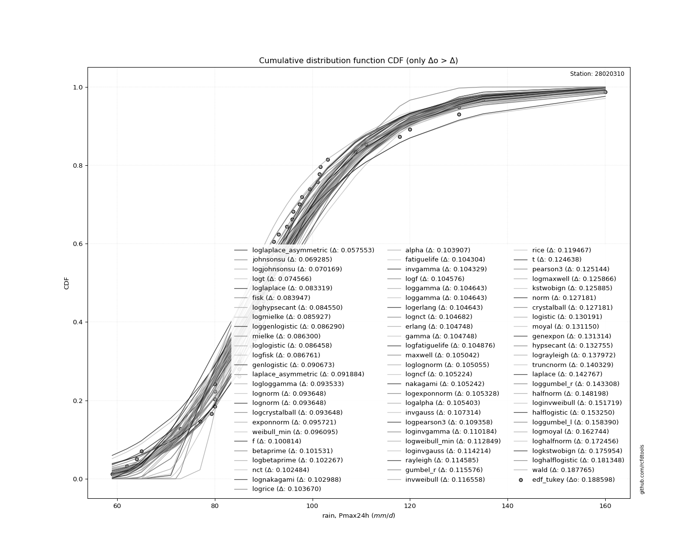</img>

</div>


**7.3. Best fit**

|   id |   station | empirical_dist   | p_dist   |    delta |   deltao | eval   |   fit |   n |   loc |   scale |    shape | shape1   | shape2   | shape3   |   best_fit |   best_fit_sort |
|-----:|----------:|:-----------------|:---------|---------:|---------:|:-------|------:|----:|------:|--------:|---------:|:---------|:---------|:---------|-----------:|----------------:|
|    0 |  28020310 | edf_tukey        | dgamma   | 0.120605 | 0.196299 | Δo > Δ |     1 |  48 |    85 | 14.6017 | 0.861849 |          |          |          |          1 |               1 |

<div align="center">

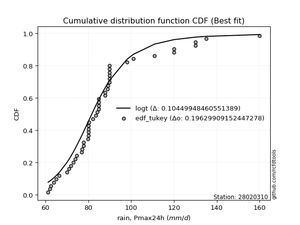</img>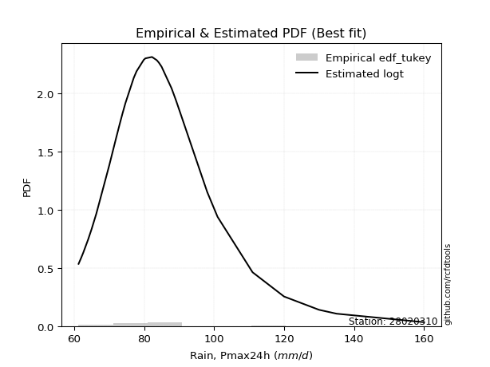</img>

</div>


### 8. Empirical - EDF Gringorten (1963)

Gringorten plotting position formula is essential for estimating the probability and return periods of extreme events like floods and heavy rainfall. The constant _a=0.44_.

<div align="center">


$P=(m-a)/(n+1-2a)$


</div>


**8.1. Empirical values**

<div align="center">

|                | 0                    | 1                    | 2                   | 3                   | 4                   | 5                   | 6                   | 7                  | 8                  | 9                   | 10                  | 11                 | 12                 | 13                 | 14                  | 15                  | 16                  | 17                 | 18                 | 19                  | 20                  | 21                 | 22                 | 23                  | 24                 | 25                 | 26                 | 27                | 28                 | 29                 | 30                 | 31                 | 32                 | 33                 | 34                | 35                 | 36                 | 37                 | 38                 | 39                 | 40                 | 41                 | 42                 | 43                 | 44                 | 45                 | 46                 | 47                 |
|:---------------|:---------------------|:---------------------|:--------------------|:--------------------|:--------------------|:--------------------|:--------------------|:-------------------|:-------------------|:--------------------|:--------------------|:-------------------|:-------------------|:-------------------|:--------------------|:--------------------|:--------------------|:-------------------|:-------------------|:--------------------|:--------------------|:-------------------|:-------------------|:--------------------|:-------------------|:-------------------|:-------------------|:------------------|:-------------------|:-------------------|:-------------------|:-------------------|:-------------------|:-------------------|:------------------|:-------------------|:-------------------|:-------------------|:-------------------|:-------------------|:-------------------|:-------------------|:-------------------|:-------------------|:-------------------|:-------------------|:-------------------|:-------------------|
| date           | 2015                 | 1969                 | 1982                | 2002                | 2001                | 2009                | 2003                | 1980               | 1985               | 1975                | 2004                | 2007               | 1983               | 2011               | 2005                | 2013                | 2012                | 1996               | 1974               | 1977                | 2000                | 1971               | 2014               | 2006                | 2008               | 1972               | 1976               | 1978              | 1988               | 2010               | 1968               | 1984               | 1994               | 1986               | 1989              | 1987               | 1991               | 1992               | 1995               | 1979               | 1993               | 1981               | 1973               | 1970               | 1997               | 1990               | 1999               | 1998               |
| x              | 61.2723765575468     | 62.0                 | 62.6238716094153    | 64.0                | 65.0                | 66.3434261308019    | 70.0367441186674    | 71.0               | 72.0               | 73.0                | 73.8321775894603    | 74.6550121603792   | 77.0               | 77.1481260946949   | 77.8012338162671    | 77.8682619904586    | 79.8951644557945    | 80.0               | 80.0               | 80.0                | 80.0                | 80.3885696894822   | 82.2558340114059   | 83.6292555654485    | 84.2125270817239   | 85.0               | 85.0               | 85.0              | 85.0               | 87.8384437186631   | 87.8882726975572   | 89.0               | 89.28613946360262  | 90.0               | 90.0              | 90.0               | 90.0               | 90.0               | 90.0               | 98.0453969651585   | 101.0              | 111.0              | 120.0              | 120.0              | 130.0              | 130.0              | 135.0              | 160.0              |
| m              | 1                    | 2                    | 3                   | 4                   | 5                   | 6                   | 7                   | 8                  | 9                  | 10                  | 11                  | 12                 | 13                 | 14                 | 15                  | 16                  | 17                  | 18                 | 19                 | 20                  | 21                  | 22                 | 23                 | 24                  | 25                 | 26                 | 27                 | 28                | 29                 | 30                 | 31                 | 32                 | 33                 | 34                 | 35                | 36                 | 37                 | 38                 | 39                 | 40                 | 41                 | 42                 | 43                 | 44                 | 45                 | 46                 | 47                 | 48                 |
| empirical_dist | edf_gringorten       | edf_gringorten       | edf_gringorten      | edf_gringorten      | edf_gringorten      | edf_gringorten      | edf_gringorten      | edf_gringorten     | edf_gringorten     | edf_gringorten      | edf_gringorten      | edf_gringorten     | edf_gringorten     | edf_gringorten     | edf_gringorten      | edf_gringorten      | edf_gringorten      | edf_gringorten     | edf_gringorten     | edf_gringorten      | edf_gringorten      | edf_gringorten     | edf_gringorten     | edf_gringorten      | edf_gringorten     | edf_gringorten     | edf_gringorten     | edf_gringorten    | edf_gringorten     | edf_gringorten     | edf_gringorten     | edf_gringorten     | edf_gringorten     | edf_gringorten     | edf_gringorten    | edf_gringorten     | edf_gringorten     | edf_gringorten     | edf_gringorten     | edf_gringorten     | edf_gringorten     | edf_gringorten     | edf_gringorten     | edf_gringorten     | edf_gringorten     | edf_gringorten     | edf_gringorten     | edf_gringorten     |
| empirical      | 0.011637572734829594 | 0.032418952618453865 | 0.05320033250207814 | 0.07398171238570242 | 0.09476309226932668 | 0.11554447215295095 | 0.13632585203657524 | 0.1571072319201995 | 0.1778886118038238 | 0.19866999168744806 | 0.21945137157107233 | 0.2402327514546966 | 0.2610141313383209 | 0.2817955112219452 | 0.30257689110556946 | 0.32335827098919373 | 0.34413965087281795 | 0.3649210307564422 | 0.3857024106400665 | 0.40648379052369077 | 0.42726517040731504 | 0.4480465502909393 | 0.4688279301745636 | 0.48960931005818786 | 0.5103906899418121 | 0.5311720698254364 | 0.5519534497090607 | 0.572734829592685 | 0.5935162094763092 | 0.6142975893599335 | 0.6350789692435578 | 0.655860349127182  | 0.6766417290108064 | 0.6974231088944307 | 0.718204488778055 | 0.7389858686616793 | 0.7597672485453035 | 0.7805486284289278 | 0.8013300083125521 | 0.8221113881961764 | 0.8428927680798006 | 0.8636741479634249 | 0.8844555278470492 | 0.9052369077306734 | 0.9260182876142977 | 0.946799667497922  | 0.9675810473815463 | 0.9883624272651705 |
| empirical_tr   | 1.0117746005046258   | 1.0335051546391751   | 1.0561896400351185  | 1.0798922800718134  | 1.1046831955922864  | 1.1306390977443608  | 1.1578440808469683  | 1.1863905325443787 | 1.2163801820020221 | 1.2479253112033195  | 1.2811501597444088  | 1.3161925601750546 | 1.3532058492688417 | 1.3923611111111114 | 1.4338498212157331  | 1.477886977886978   | 1.5247148288973384  | 1.574607329842932  | 1.6278755074424898 | 1.684873949579832   | 1.7460087082728593  | 1.8117469879518073 | 1.8826291079812207 | 1.9592833876221498  | 2.0424448217317486 | 2.132978723404255  | 2.2319109461966606 | 2.340466926070039 | 2.460122699386503  | 2.5926724137931036 | 2.7403189066059226 | 2.9057971014492754 | 3.092544987146531  | 3.304945054945056  | 3.548672566371683 | 3.8312101910828043 | 4.162629757785469  | 4.556818181818184  | 5.0334728033472835 | 5.621495327102807  | 6.36507936507937   | 7.335365853658543  | 8.654676258992815  | 10.552631578947382 | 13.516853932584294 | 18.796875000000046 | 30.84615384615397  | 85.92857142857241  |

</div>


**8.2. Parameters & Kolmogorov-Smirnov fit test (sorted by Δ)**

|   id | empirical_dist   | p_dist             |    delta |   deltao | eval    |   fit |   n |             loc |          scale | shape                  | shape1               | shape2             | shape3   |   best_fit |   best_fit_sort |
|-----:|:-----------------|:-------------------|---------:|---------:|:--------|------:|----:|----------------:|---------------:|:-----------------------|:---------------------|:-------------------|:---------|-----------:|----------------:|
|    0 | edf_gringorten   | dgamma             | 0.121935 | 0.196299 | Δo > Δ  |     1 |  48 |    85           |   14.6017      | 0.8618486950276836     |                      |                    |          |          1 |               1 |
|    1 | edf_gringorten   | wald               | 0.12462  | 0.196299 | Δo > Δ  |     1 |  48 |    67.0942      |   20.3021      |                        |                      |                    |          |          0 |               2 |
|    2 | edf_gringorten   | alpha              | 0.139541 | 0.196299 | Δo > Δ  |     1 |  48 |    18.879       |  263.028       | 4.11563865435355       |                      |                    |          |          0 |               3 |
|    3 | edf_gringorten   | mielke             | 0.140281 | 0.196299 | Δo > Δ  |     1 |  48 |    -1.34211     |   53.7147      | 79.88900999665557      | 6.388198240255651    |                    |          |          0 |               4 |
|    4 | edf_gringorten   | invweibull         | 0.142226 | 0.196299 | Δo > Δ  |     1 |  48 |   -18.9757      |   96.8446      | 7.413946692395208      |                      |                    |          |          0 |               5 |
|    5 | edf_gringorten   | fisk               | 0.143995 | 0.196299 | Δo > Δ  |     1 |  48 |    -0.179746    |   83.8799      | 8.995379759132247      |                      |                    |          |          0 |               6 |
|    6 | edf_gringorten   | invgamma           | 0.144544 | 0.196299 | Δo > Δ  |     1 |  48 |    40.844       |  282.205       | 7.060980832477705      |                      |                    |          |          0 |               7 |
|    7 | edf_gringorten   | f                  | 0.14599  | 0.196299 | Δo > Δ  |     1 |  48 |    40.9497      |   39.8861      | 20448.456439629055     | 13.969948823715146   |                    |          |          0 |               8 |
|    8 | edf_gringorten   | exponnorm          | 0.147894 | 0.196299 | Δo > Δ  |     1 |  48 |    69.6443      |    7.46056     | 2.379438118688931      |                      |                    |          |          0 |               9 |
|    9 | edf_gringorten   | johnsonsu          | 0.148073 | 0.196299 | Δo > Δ  |     1 |  48 |    50.9705      |    1.42275     | -7.307627353760925     | 1.922936865035385    |                    |          |          0 |              10 |
|   10 | edf_gringorten   | lognorm            | 0.148561 | 0.196299 | Δo > Δ  |     1 |  48 |    50.8634      |   31.9206      | 0.5188485586715679     |                      |                    |          |          0 |              11 |
|   11 | edf_gringorten   | laplace_asymmetric | 0.152171 | 0.196299 | Δo > Δ  |     1 |  48 |    79.8952      |   12.1997      | 0.73875923659806       |                      |                    |          |          0 |              12 |
|   12 | edf_gringorten   | pearson3           | 0.15228  | 0.196299 | Δo > Δ  |     1 |  48 |    87.3963      |   20.3021      | 1.546924634543322      |                      |                    |          |          0 |              13 |
|   13 | edf_gringorten   | invgauss           | 0.15314  | 0.196299 | Δo > Δ  |     1 |  48 |    49.4404      |  137.089       | 0.27686951370685786    |                      |                    |          |          0 |              14 |
|   14 | edf_gringorten   | fatiguelife        | 0.15488  | 0.196299 | Δo > Δ  |     1 |  48 |    50.2987      |   32.5929      | 0.5259059389192924     |                      |                    |          |          0 |              15 |
|   15 | edf_gringorten   | recipinvgauss      | 0.155436 | 0.196299 | Δo > Δ  |     1 |  48 |    51.4986      |    8.83335     | 0.32638486190037747    |                      |                    |          |          0 |              16 |
|   16 | edf_gringorten   | moyal              | 0.15545  | 0.196299 | Δo > Δ  |     1 |  48 |    75.7862      |    9.13916     |                        |                      |                    |          |          0 |              17 |
|   17 | edf_gringorten   | halflogistic       | 0.155478 | 0.196299 | Δo > Δ  |     1 |  48 |    63.3336      |   17.3576      |                        |                      |                    |          |          0 |              18 |
|   18 | edf_gringorten   | erlang             | 0.157941 | 0.196299 | Δo > Δ  |     1 |  48 |    59.5628      |   14.6556      | 1.8991745698841438     |                      |                    |          |          0 |              19 |
|   19 | edf_gringorten   | gamma              | 0.157941 | 0.196299 | Δo > Δ  |     1 |  48 |    59.5628      |   14.6556      | 1.8991685396362568     |                      |                    |          |          0 |              20 |
|   20 | edf_gringorten   | chi2               | 0.157941 | 0.196299 | Δo > Δ  |     1 |  48 |    59.5627      |    7.32774     | 3.7983815129809404     |                      |                    |          |          0 |              21 |
|   21 | edf_gringorten   | nakagami           | 0.158877 | 0.196299 | Δo > Δ  |     1 |  48 |    61.2724      |   32.0096      | 0.4507325694731861     |                      |                    |          |          0 |              22 |
|   22 | edf_gringorten   | genlogistic        | 0.161207 | 0.196299 | Δo > Δ  |     1 |  48 |   -11.2991      |   13.8038      | 686.4871814930432      |                      |                    |          |          0 |              23 |
|   23 | edf_gringorten   | weibull_min        | 0.163446 | 0.196299 | Δo > Δ  |     1 |  48 |    60.8047      |   28.8525      | 1.326648058559914      |                      |                    |          |          0 |              24 |
|   24 | edf_gringorten   | gompertz           | 0.172159 | 0.196299 | Δo > Δ  |     1 |  48 |    61.2724      |   83.6841      | 2.4220682661657165     |                      |                    |          |          0 |              25 |
|   25 | edf_gringorten   | nct                | 0.173903 | 0.196299 | Δo > Δ  |     1 |  48 |    -0.42568     |    1.1951      | 13.485269169298178     | 69.11560817762629    |                    |          |          0 |              26 |
|   26 | edf_gringorten   | gumbel_r           | 0.180254 | 0.196299 | Δo > Δ  |     1 |  48 |    78.2592      |   15.8295      |                        |                      |                    |          |          0 |              27 |
|   27 | edf_gringorten   | halfnorm           | 0.182798 | 0.196299 | Δo > Δ  |     1 |  48 |    60.5242      |   33.6791      |                        |                      |                    |          |          0 |              28 |
|   28 | edf_gringorten   | gibrat             | 0.182986 | 0.196299 | Δo > Δ  |     1 |  48 |    71.9083      |    9.3939      |                        |                      |                    |          |          0 |              29 |
|   29 | edf_gringorten   | betaprime          | 0.18982  | 0.196299 | Δo > Δ  |     1 |  48 |    -2.31774     |    4.70825     | 493.518565116437       | 26.954713989585066   |                    |          |          0 |              30 |
|   30 | edf_gringorten   | genexpon           | 0.191011 | 0.196299 | Δo > Δ  |     1 |  48 |    60.8983      |    1.43446     | 0.00102178005859321    | 0.053965855644600734 | 3.4362630229428257 |          |          0 |              31 |
|   31 | edf_gringorten   | expon              | 0.191293 | 0.196299 | Δo > Δ  |     1 |  48 |    61.2724      |   26.1239      |                        |                      |                    |          |          0 |              32 |
|   32 | edf_gringorten   | pareto             | 0.191293 | 0.196299 | Δo > Δ  |     1 |  48 |    -2.14748e+09 |    2.14748e+09 | 82203821.83996421      |                      |                    |          |          0 |              33 |
|   33 | edf_gringorten   | kstwobign          | 0.195593 | 0.196299 | Δo > Δ  |     1 |  48 |    27.4445      |   69.5918      |                        |                      |                    |          |          0 |              34 |
|   34 | edf_gringorten   | rayleigh           | 0.210251 | 0.196299 | Δo <= Δ |     0 |  48 |    48.5572      |   30.9891      |                        |                      |                    |          |          0 |              35 |
|   35 | edf_gringorten   | laplace            | 0.218392 | 0.196299 | Δo <= Δ |     0 |  48 |    87.3963      |   14.3558      |                        |                      |                    |          |          0 |              36 |
|   36 | edf_gringorten   | ncf                | 0.218516 | 0.196299 | Δo <= Δ |     0 |  48 |    -0.682937    |    6.2991e-06  | 7.2152174318706755e-06 | 367.02570416695164   | 100.2165537852085  |          |          0 |              37 |
|   37 | edf_gringorten   | maxwell            | 0.219983 | 0.196299 | Δo <= Δ |     0 |  48 |    39.2888      |   30.1469      |                        |                      |                    |          |          0 |              38 |
|   38 | edf_gringorten   | rice               | 0.2322   | 0.196299 | Δo <= Δ |     0 |  48 |    54.6343      |   27.2537      | 0.0006002761905476531  |                      |                    |          |          0 |              39 |
|   39 | edf_gringorten   | hypsecant          | 0.237635 | 0.196299 | Δo <= Δ |     0 |  48 |    87.3963      |   12.9247      |                        |                      |                    |          |          0 |              40 |
|   40 | edf_gringorten   | logistic           | 0.243436 | 0.196299 | Δo <= Δ |     0 |  48 |    87.3963      |   11.1931      |                        |                      |                    |          |          0 |              41 |
|   41 | edf_gringorten   | t                  | 0.250189 | 0.196299 | Δo <= Δ |     0 |  48 |    87.3874      |   20.3103      | 364.83839150975837     |                      |                    |          |          0 |              42 |
|   42 | edf_gringorten   | crystalball        | 0.250306 | 0.196299 | Δo <= Δ |     0 |  48 |    87.3963      |   20.3021      | 7940.872621987292      | 25.234968961283577   |                    |          |          0 |              43 |
|   43 | edf_gringorten   | norm               | 0.250306 | 0.196299 | Δo <= Δ |     0 |  48 |    87.3963      |   20.3021      |                        |                      |                    |          |          0 |              44 |
|   44 | edf_gringorten   | truncnorm          | 0.250306 | 0.196299 | Δo <= Δ |     0 |  48 |    87.3963      |   20.3021      | -737.093976545434      | 1193.2936146393458   |                    |          |          0 |              45 |
|   45 | edf_gringorten   | loggamma           | 0.251887 | 0.196299 | Δo <= Δ |     0 |  48 | -7931.98        | 1025.26        | 2494.890482001344      |                      |                    |          |          0 |              46 |
|   46 | edf_gringorten   | gumbel_l           | 0.317231 | 0.196299 | Δo <= Δ |     0 |  48 |    96.5333      |   15.8295      |                        |                      |                    |          |          0 |              47 |
|   47 | edf_gringorten   | zzgumbel           | 0.373049 | 0.196299 | Δo <= Δ |     0 |  48 |    87.362       |   15.997       | 0.5476912526714043     | 1.157309579779488    |                    |          |          0 |              48 |

<div align="center">

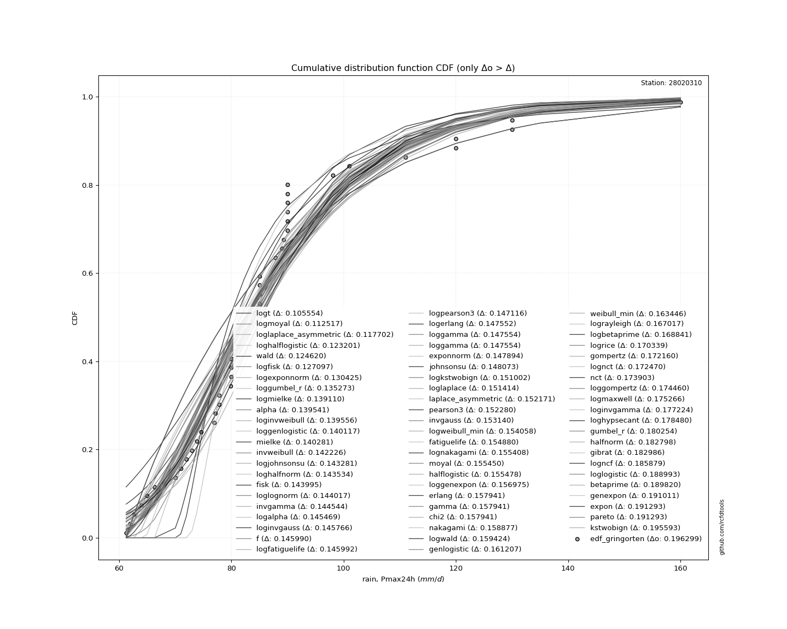</img>

</div>


**8.3. Best fit**

|   id |   station | empirical_dist   | p_dist   |    delta |   deltao | eval   |   fit |   n |   loc |   scale |    shape | shape1   | shape2   | shape3   |   best_fit |   best_fit_sort |
|-----:|----------:|:-----------------|:---------|---------:|---------:|:-------|------:|----:|------:|--------:|---------:|:---------|:---------|:---------|-----------:|----------------:|
|    0 |  28020310 | edf_gringorten   | dgamma   | 0.121935 | 0.196299 | Δo > Δ |     1 |  48 |    85 | 14.6017 | 0.861849 |          |          |          |          1 |               1 |

<div align="center">

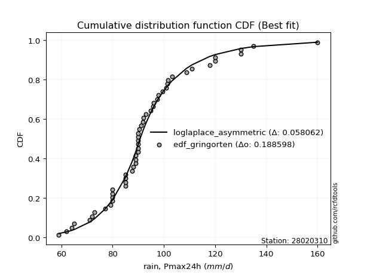</img>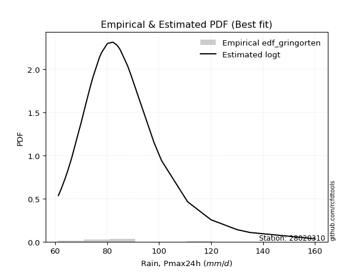</img>

</div>


### 9. Empirical - EDF Jenkinson (1977)

The Jenkinson formula in hydrology is an empirical plotting position formula used to estimate the non-exceedance probability _(P)_ or return period _(T)_ of a given ordered observation within a sample. It is a widely used method in the frequency analysis of extreme events such as floods and rainfall, as it provides a distribution-free way to plot data. _a≈0.31_ and _b≈0.38_ are constants derived to approximate the median of the probability distribution for the given rank.

<div align="center">


$P=(m-a)/(n+b)$


</div>


**9.1. Empirical values**

<div align="center">

|                | 0                    | 1                    | 2                   | 3                   | 4                   | 5                   | 6                   | 7                   | 8                   | 9                   | 10                 | 11                  | 12                 | 13                  | 14                  | 15                 | 16                 | 17                 | 18                  | 19                 | 20                  | 21                  | 22                 | 23                  | 24                 | 25                 | 26                 | 27                 | 28                 | 29                 | 30                 | 31                 | 32                 | 33                 | 34                 | 35                 | 36                 | 37                 | 38                 | 39                 | 40                 | 41                 | 42                | 43                | 44                 | 45                 | 46                 | 47                 |
|:---------------|:---------------------|:---------------------|:--------------------|:--------------------|:--------------------|:--------------------|:--------------------|:--------------------|:--------------------|:--------------------|:-------------------|:--------------------|:-------------------|:--------------------|:--------------------|:-------------------|:-------------------|:-------------------|:--------------------|:-------------------|:--------------------|:--------------------|:-------------------|:--------------------|:-------------------|:-------------------|:-------------------|:-------------------|:-------------------|:-------------------|:-------------------|:-------------------|:-------------------|:-------------------|:-------------------|:-------------------|:-------------------|:-------------------|:-------------------|:-------------------|:-------------------|:-------------------|:------------------|:------------------|:-------------------|:-------------------|:-------------------|:-------------------|
| date           | 2015                 | 1969                 | 1982                | 2002                | 2001                | 2009                | 2003                | 1980                | 1985                | 1975                | 2004               | 2007                | 1983               | 2011                | 2005                | 2013               | 2012               | 1996               | 1974                | 1977               | 2000                | 1971                | 2014               | 2006                | 2008               | 1972               | 1976               | 1978               | 1988               | 2010               | 1968               | 1984               | 1994               | 1986               | 1989               | 1987               | 1991               | 1992               | 1995               | 1979               | 1993               | 1981               | 1973              | 1970              | 1997               | 1990               | 1999               | 1998               |
| x              | 61.2723765575468     | 62.0                 | 62.6238716094153    | 64.0                | 65.0                | 66.3434261308019    | 70.0367441186674    | 71.0                | 72.0                | 73.0                | 73.8321775894603   | 74.6550121603792    | 77.0               | 77.1481260946949    | 77.8012338162671    | 77.8682619904586   | 79.8951644557945   | 80.0               | 80.0                | 80.0               | 80.0                | 80.3885696894822    | 82.2558340114059   | 83.6292555654485    | 84.2125270817239   | 85.0               | 85.0               | 85.0               | 85.0               | 87.8384437186631   | 87.8882726975572   | 89.0               | 89.28613946360262  | 90.0               | 90.0               | 90.0               | 90.0               | 90.0               | 90.0               | 98.0453969651585   | 101.0              | 111.0              | 120.0             | 120.0             | 130.0              | 130.0              | 135.0              | 160.0              |
| m              | 1                    | 2                    | 3                   | 4                   | 5                   | 6                   | 7                   | 8                   | 9                   | 10                  | 11                 | 12                  | 13                 | 14                  | 15                  | 16                 | 17                 | 18                 | 19                  | 20                 | 21                  | 22                  | 23                 | 24                  | 25                 | 26                 | 27                 | 28                 | 29                 | 30                 | 31                 | 32                 | 33                 | 34                 | 35                 | 36                 | 37                 | 38                 | 39                 | 40                 | 41                 | 42                 | 43                | 44                | 45                 | 46                 | 47                 | 48                 |
| empirical_dist | edf_jenkinson        | edf_jenkinson        | edf_jenkinson       | edf_jenkinson       | edf_jenkinson       | edf_jenkinson       | edf_jenkinson       | edf_jenkinson       | edf_jenkinson       | edf_jenkinson       | edf_jenkinson      | edf_jenkinson       | edf_jenkinson      | edf_jenkinson       | edf_jenkinson       | edf_jenkinson      | edf_jenkinson      | edf_jenkinson      | edf_jenkinson       | edf_jenkinson      | edf_jenkinson       | edf_jenkinson       | edf_jenkinson      | edf_jenkinson       | edf_jenkinson      | edf_jenkinson      | edf_jenkinson      | edf_jenkinson      | edf_jenkinson      | edf_jenkinson      | edf_jenkinson      | edf_jenkinson      | edf_jenkinson      | edf_jenkinson      | edf_jenkinson      | edf_jenkinson      | edf_jenkinson      | edf_jenkinson      | edf_jenkinson      | edf_jenkinson      | edf_jenkinson      | edf_jenkinson      | edf_jenkinson     | edf_jenkinson     | edf_jenkinson      | edf_jenkinson      | edf_jenkinson      | edf_jenkinson      |
| empirical      | 0.014262091773460106 | 0.034931789995866054 | 0.05560148821827201 | 0.07627118644067796 | 0.09694088466308393 | 0.11761058288548987 | 0.13828028110789584 | 0.15894997933030178 | 0.17961967755270772 | 0.20028937577511366 | 0.2209590739975196 | 0.24162877221992557 | 0.2622984704423315 | 0.28296816866473745 | 0.30363786688714345 | 0.3243075651095494 | 0.3449772633319554 | 0.3656469615543613 | 0.38631665977676727 | 0.4069863579991732 | 0.42765605622157915 | 0.44832575444398515 | 0.4689954526663911 | 0.48966515088879703 | 0.510334849111203  | 0.5310045473336089 | 0.5516742455560149 | 0.5723439437784208 | 0.5930136420008267 | 0.6136833402232328 | 0.6343530384456387 | 0.6550227366680447 | 0.6756924348904505 | 0.6963621331128564 | 0.7170318313352624 | 0.7377015295576683 | 0.7583712277800744 | 0.7790409260024803 | 0.7997106242248863 | 0.8203803224472922 | 0.8410500206696981 | 0.8617197188921041 | 0.88238941711451  | 0.903059115336916 | 0.9237288135593219 | 0.9443985117817278 | 0.9650682100041338 | 0.9857379082265398 |
| empirical_tr   | 1.014468442021388    | 1.0361961876204755   | 1.058875027358284   | 1.0825688073394495  | 1.1073472190432594  | 1.1332864839540877  | 1.160470136723435   | 1.188989923814205   | 1.218946837994457   | 1.25045231325924    | 1.2836296099761209 | 1.318615426546743   | 1.3555617820117678 | 1.3946382242721242  | 1.436034431582072   | 1.4799632915264607 | 1.5266645629536133 | 1.5764092538286087 | 1.6295048837992592  | 1.6863018473335658 | 1.74720115565186    | 1.8126639190708131  | 1.8832230439859867 | 1.9594977723774807  | 2.0422119037568596 | 2.132216835610401  | 2.2305209774089443 | 2.338327694538424  | 2.4570848146267137 | 2.5885500267522743 | 2.7348784624081404 | 2.8987417615338527 | 3.0834926704907577 | 3.2933968686181063 | 3.533966398831262  | 3.8124507486209596 | 4.138579982891359  | 4.525724976613657  | 4.992776057791536  | 5.567318757192172  | 6.291287386215862  | 7.231689088191326  | 8.502636203866425 | 10.31556503198293 | 13.11111111111109  | 17.985130111524118 | 28.627218934911117 | 70.11594202898524  |

</div>


**9.2. Parameters & Kolmogorov-Smirnov fit test (sorted by Δ)**

|   id | empirical_dist   | p_dist             |    delta |   deltao | eval    |   fit |   n |             loc |          scale | shape                  | shape1               | shape2             | shape3   |   best_fit |   best_fit_sort |
|-----:|:-----------------|:-------------------|---------:|---------:|:--------|------:|----:|----------------:|---------------:|:-----------------------|:---------------------|:-------------------|:---------|-----------:|----------------:|
|    0 | edf_jenkinson    | dgamma             | 0.120315 | 0.196299 | Δo > Δ  |     1 |  48 |    85           |   14.6017      | 0.8618486950276836     |                      |                    |          |          1 |               1 |
|    1 | edf_jenkinson    | wald               | 0.123783 | 0.196299 | Δo > Δ  |     1 |  48 |    67.0942      |   20.3021      |                        |                      |                    |          |          0 |               2 |
|    2 | edf_jenkinson    | alpha              | 0.137921 | 0.196299 | Δo > Δ  |     1 |  48 |    18.879       |  263.028       | 4.11563865435355       |                      |                    |          |          0 |               3 |
|    3 | edf_jenkinson    | mielke             | 0.138661 | 0.196299 | Δo > Δ  |     1 |  48 |    -1.34211     |   53.7147      | 79.88900999665557      | 6.388198240255651    |                    |          |          0 |               4 |
|    4 | edf_jenkinson    | invweibull         | 0.140607 | 0.196299 | Δo > Δ  |     1 |  48 |   -18.9757      |   96.8446      | 7.413946692395208      |                      |                    |          |          0 |               5 |
|    5 | edf_jenkinson    | fisk               | 0.142376 | 0.196299 | Δo > Δ  |     1 |  48 |    -0.179746    |   83.8799      | 8.995379759132247      |                      |                    |          |          0 |               6 |
|    6 | edf_jenkinson    | invgamma           | 0.142925 | 0.196299 | Δo > Δ  |     1 |  48 |    40.844       |  282.205       | 7.060980832477705      |                      |                    |          |          0 |               7 |
|    7 | edf_jenkinson    | f                  | 0.14437  | 0.196299 | Δo > Δ  |     1 |  48 |    40.9497      |   39.8861      | 20448.456439629055     | 13.969948823715146   |                    |          |          0 |               8 |
|    8 | edf_jenkinson    | exponnorm          | 0.146275 | 0.196299 | Δo > Δ  |     1 |  48 |    69.6443      |    7.46056     | 2.379438118688931      |                      |                    |          |          0 |               9 |
|    9 | edf_jenkinson    | johnsonsu          | 0.146453 | 0.196299 | Δo > Δ  |     1 |  48 |    50.9705      |    1.42275     | -7.307627353760925     | 1.922936865035385    |                    |          |          0 |              10 |
|   10 | edf_jenkinson    | lognorm            | 0.146942 | 0.196299 | Δo > Δ  |     1 |  48 |    50.8634      |   31.9206      | 0.5188485586715679     |                      |                    |          |          0 |              11 |
|   11 | edf_jenkinson    | laplace_asymmetric | 0.150551 | 0.196299 | Δo > Δ  |     1 |  48 |    79.8952      |   12.1997      | 0.73875923659806       |                      |                    |          |          0 |              12 |
|   12 | edf_jenkinson    | pearson3           | 0.15066  | 0.196299 | Δo > Δ  |     1 |  48 |    87.3963      |   20.3021      | 1.546924634543322      |                      |                    |          |          0 |              13 |
|   13 | edf_jenkinson    | invgauss           | 0.151521 | 0.196299 | Δo > Δ  |     1 |  48 |    49.4404      |  137.089       | 0.27686951370685786    |                      |                    |          |          0 |              14 |
|   14 | edf_jenkinson    | fatiguelife        | 0.153261 | 0.196299 | Δo > Δ  |     1 |  48 |    50.2987      |   32.5929      | 0.5259059389192924     |                      |                    |          |          0 |              15 |
|   15 | edf_jenkinson    | recipinvgauss      | 0.153817 | 0.196299 | Δo > Δ  |     1 |  48 |    51.4986      |    8.83335     | 0.32638486190037747    |                      |                    |          |          0 |              16 |
|   16 | edf_jenkinson    | moyal              | 0.153831 | 0.196299 | Δo > Δ  |     1 |  48 |    75.7862      |    9.13916     |                        |                      |                    |          |          0 |              17 |
|   17 | edf_jenkinson    | halflogistic       | 0.153858 | 0.196299 | Δo > Δ  |     1 |  48 |    63.3336      |   17.3576      |                        |                      |                    |          |          0 |              18 |
|   18 | edf_jenkinson    | erlang             | 0.156321 | 0.196299 | Δo > Δ  |     1 |  48 |    59.5628      |   14.6556      | 1.8991745698841438     |                      |                    |          |          0 |              19 |
|   19 | edf_jenkinson    | gamma              | 0.156322 | 0.196299 | Δo > Δ  |     1 |  48 |    59.5628      |   14.6556      | 1.8991685396362568     |                      |                    |          |          0 |              20 |
|   20 | edf_jenkinson    | chi2               | 0.156322 | 0.196299 | Δo > Δ  |     1 |  48 |    59.5627      |    7.32774     | 3.7983815129809404     |                      |                    |          |          0 |              21 |
|   21 | edf_jenkinson    | nakagami           | 0.157258 | 0.196299 | Δo > Δ  |     1 |  48 |    61.2724      |   32.0096      | 0.4507325694731861     |                      |                    |          |          0 |              22 |
|   22 | edf_jenkinson    | genlogistic        | 0.159588 | 0.196299 | Δo > Δ  |     1 |  48 |   -11.2991      |   13.8038      | 686.4871814930432      |                      |                    |          |          0 |              23 |
|   23 | edf_jenkinson    | weibull_min        | 0.161827 | 0.196299 | Δo > Δ  |     1 |  48 |    60.8047      |   28.8525      | 1.326648058559914      |                      |                    |          |          0 |              24 |
|   24 | edf_jenkinson    | gompertz           | 0.17054  | 0.196299 | Δo > Δ  |     1 |  48 |    61.2724      |   83.6841      | 2.4220682661657165     |                      |                    |          |          0 |              25 |
|   25 | edf_jenkinson    | nct                | 0.172284 | 0.196299 | Δo > Δ  |     1 |  48 |    -0.42568     |    1.1951      | 13.485269169298178     | 69.11560817762629    |                    |          |          0 |              26 |
|   26 | edf_jenkinson    | gumbel_r           | 0.178635 | 0.196299 | Δo > Δ  |     1 |  48 |    78.2592      |   15.8295      |                        |                      |                    |          |          0 |              27 |
|   27 | edf_jenkinson    | halfnorm           | 0.181179 | 0.196299 | Δo > Δ  |     1 |  48 |    60.5242      |   33.6791      |                        |                      |                    |          |          0 |              28 |
|   28 | edf_jenkinson    | gibrat             | 0.184605 | 0.196299 | Δo > Δ  |     1 |  48 |    71.9083      |    9.3939      |                        |                      |                    |          |          0 |              29 |
|   29 | edf_jenkinson    | betaprime          | 0.188201 | 0.196299 | Δo > Δ  |     1 |  48 |    -2.31774     |    4.70825     | 493.518565116437       | 26.954713989585066   |                    |          |          0 |              30 |
|   30 | edf_jenkinson    | genexpon           | 0.189727 | 0.196299 | Δo > Δ  |     1 |  48 |    60.8983      |    1.43446     | 0.00102178005859321    | 0.053965855644600734 | 3.4362630229428257 |          |          0 |              31 |
|   31 | edf_jenkinson    | expon              | 0.190008 | 0.196299 | Δo > Δ  |     1 |  48 |    61.2724      |   26.1239      |                        |                      |                    |          |          0 |              32 |
|   32 | edf_jenkinson    | pareto             | 0.190008 | 0.196299 | Δo > Δ  |     1 |  48 |    -2.14748e+09 |    2.14748e+09 | 82203821.83996421      |                      |                    |          |          0 |              33 |
|   33 | edf_jenkinson    | kstwobign          | 0.193974 | 0.196299 | Δo > Δ  |     1 |  48 |    27.4445      |   69.5918      |                        |                      |                    |          |          0 |              34 |
|   34 | edf_jenkinson    | rayleigh           | 0.208632 | 0.196299 | Δo <= Δ |     0 |  48 |    48.5572      |   30.9891      |                        |                      |                    |          |          0 |              35 |
|   35 | edf_jenkinson    | laplace            | 0.216773 | 0.196299 | Δo <= Δ |     0 |  48 |    87.3963      |   14.3558      |                        |                      |                    |          |          0 |              36 |
|   36 | edf_jenkinson    | ncf                | 0.216897 | 0.196299 | Δo <= Δ |     0 |  48 |    -0.682937    |    6.2991e-06  | 7.2152174318706755e-06 | 367.02570416695164   | 100.2165537852085  |          |          0 |              37 |
|   37 | edf_jenkinson    | maxwell            | 0.218363 | 0.196299 | Δo <= Δ |     0 |  48 |    39.2888      |   30.1469      |                        |                      |                    |          |          0 |              38 |
|   38 | edf_jenkinson    | rice               | 0.230581 | 0.196299 | Δo <= Δ |     0 |  48 |    54.6343      |   27.2537      | 0.0006002761905476531  |                      |                    |          |          0 |              39 |
|   39 | edf_jenkinson    | hypsecant          | 0.236015 | 0.196299 | Δo <= Δ |     0 |  48 |    87.3963      |   12.9247      |                        |                      |                    |          |          0 |              40 |
|   40 | edf_jenkinson    | logistic           | 0.241817 | 0.196299 | Δo <= Δ |     0 |  48 |    87.3963      |   11.1931      |                        |                      |                    |          |          0 |              41 |
|   41 | edf_jenkinson    | t                  | 0.24857  | 0.196299 | Δo <= Δ |     0 |  48 |    87.3874      |   20.3103      | 364.83839150975837     |                      |                    |          |          0 |              42 |
|   42 | edf_jenkinson    | crystalball        | 0.248686 | 0.196299 | Δo <= Δ |     0 |  48 |    87.3963      |   20.3021      | 7940.872621987292      | 25.234968961283577   |                    |          |          0 |              43 |
|   43 | edf_jenkinson    | norm               | 0.248686 | 0.196299 | Δo <= Δ |     0 |  48 |    87.3963      |   20.3021      |                        |                      |                    |          |          0 |              44 |
|   44 | edf_jenkinson    | truncnorm          | 0.248686 | 0.196299 | Δo <= Δ |     0 |  48 |    87.3963      |   20.3021      | -737.093976545434      | 1193.2936146393458   |                    |          |          0 |              45 |
|   45 | edf_jenkinson    | loggamma           | 0.250267 | 0.196299 | Δo <= Δ |     0 |  48 | -7931.98        | 1025.26        | 2494.890482001344      |                      |                    |          |          0 |              46 |
|   46 | edf_jenkinson    | gumbel_l           | 0.315611 | 0.196299 | Δo <= Δ |     0 |  48 |    96.5333      |   15.8295      |                        |                      |                    |          |          0 |              47 |
|   47 | edf_jenkinson    | zzgumbel           | 0.371429 | 0.196299 | Δo <= Δ |     0 |  48 |    87.362       |   15.997       | 0.5476912526714043     | 1.157309579779488    |                    |          |          0 |              48 |

<div align="center">

</img>

</div>


**9.3. Best fit**

|   id |   station | empirical_dist   | p_dist   |    delta |   deltao | eval   |   fit |   n |   loc |   scale |    shape | shape1   | shape2   | shape3   |   best_fit |   best_fit_sort |
|-----:|----------:|:-----------------|:---------|---------:|---------:|:-------|------:|----:|------:|--------:|---------:|:---------|:---------|:---------|-----------:|----------------:|
|    0 |  28020310 | edf_jenkinson    | dgamma   | 0.120315 | 0.196299 | Δo > Δ |     1 |  48 |    85 | 14.6017 | 0.861849 |          |          |          |          1 |               1 |

<div align="center">

</img>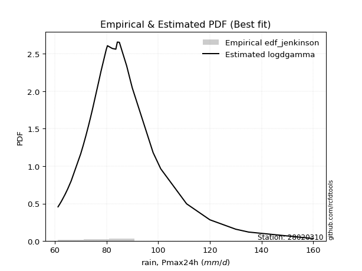</img>

</div>


### 10. Empirical - EDF Cunnane (1978)

Cunnane´s work in statistical hydrology has focused on the performance and evaluation of different probability distributions (such as GEV, Gumbel, Lognormal) for flood frequency estimation. _b_ is a constant, typically set to 0.4.

<div align="center">


$P=(m-b)/(n+1-2b)$


</div>


**10.1. Empirical values**

<div align="center">

|                | 0                    | 1                   | 2                   | 3                   | 4                   | 5                   | 6                   | 7                   | 8                  | 9                  | 10                  | 11                  | 12                 | 13                 | 14                 | 15                  | 16                  | 17                  | 18                  | 19                 | 20                  | 21                  | 22                  | 23                 | 24                 | 25                 | 26                 | 27                 | 28                 | 29                 | 30                 | 31                 | 32                 | 33                 | 34                 | 35                 | 36                 | 37                 | 38                 | 39                 | 40                 | 41                 | 42                 | 43                 | 44                 | 45                | 46                 | 47                |
|:---------------|:---------------------|:--------------------|:--------------------|:--------------------|:--------------------|:--------------------|:--------------------|:--------------------|:-------------------|:-------------------|:--------------------|:--------------------|:-------------------|:-------------------|:-------------------|:--------------------|:--------------------|:--------------------|:--------------------|:-------------------|:--------------------|:--------------------|:--------------------|:-------------------|:-------------------|:-------------------|:-------------------|:-------------------|:-------------------|:-------------------|:-------------------|:-------------------|:-------------------|:-------------------|:-------------------|:-------------------|:-------------------|:-------------------|:-------------------|:-------------------|:-------------------|:-------------------|:-------------------|:-------------------|:-------------------|:------------------|:-------------------|:------------------|
| date           | 2015                 | 1969                | 1982                | 2002                | 2001                | 2009                | 2003                | 1980                | 1985               | 1975               | 2004                | 2007                | 1983               | 2011               | 2005               | 2013                | 2012                | 1996                | 1974                | 1977               | 2000                | 1971                | 2014                | 2006               | 2008               | 1972               | 1976               | 1978               | 1988               | 2010               | 1968               | 1984               | 1994               | 1986               | 1989               | 1987               | 1991               | 1992               | 1995               | 1979               | 1993               | 1981               | 1973               | 1970               | 1997               | 1990              | 1999               | 1998              |
| x              | 61.2723765575468     | 62.0                | 62.6238716094153    | 64.0                | 65.0                | 66.3434261308019    | 70.0367441186674    | 71.0                | 72.0               | 73.0               | 73.8321775894603    | 74.6550121603792    | 77.0               | 77.1481260946949   | 77.8012338162671   | 77.8682619904586    | 79.8951644557945    | 80.0                | 80.0                | 80.0               | 80.0                | 80.3885696894822    | 82.2558340114059    | 83.6292555654485   | 84.2125270817239   | 85.0               | 85.0               | 85.0               | 85.0               | 87.8384437186631   | 87.8882726975572   | 89.0               | 89.28613946360262  | 90.0               | 90.0               | 90.0               | 90.0               | 90.0               | 90.0               | 98.0453969651585   | 101.0              | 111.0              | 120.0              | 120.0              | 130.0              | 130.0             | 135.0              | 160.0             |
| m              | 1                    | 2                   | 3                   | 4                   | 5                   | 6                   | 7                   | 8                   | 9                  | 10                 | 11                  | 12                  | 13                 | 14                 | 15                 | 16                  | 17                  | 18                  | 19                  | 20                 | 21                  | 22                  | 23                  | 24                 | 25                 | 26                 | 27                 | 28                 | 29                 | 30                 | 31                 | 32                 | 33                 | 34                 | 35                 | 36                 | 37                 | 38                 | 39                 | 40                 | 41                 | 42                 | 43                 | 44                 | 45                 | 46                | 47                 | 48                |
| empirical_dist | edf_cunnane          | edf_cunnane         | edf_cunnane         | edf_cunnane         | edf_cunnane         | edf_cunnane         | edf_cunnane         | edf_cunnane         | edf_cunnane        | edf_cunnane        | edf_cunnane         | edf_cunnane         | edf_cunnane        | edf_cunnane        | edf_cunnane        | edf_cunnane         | edf_cunnane         | edf_cunnane         | edf_cunnane         | edf_cunnane        | edf_cunnane         | edf_cunnane         | edf_cunnane         | edf_cunnane        | edf_cunnane        | edf_cunnane        | edf_cunnane        | edf_cunnane        | edf_cunnane        | edf_cunnane        | edf_cunnane        | edf_cunnane        | edf_cunnane        | edf_cunnane        | edf_cunnane        | edf_cunnane        | edf_cunnane        | edf_cunnane        | edf_cunnane        | edf_cunnane        | edf_cunnane        | edf_cunnane        | edf_cunnane        | edf_cunnane        | edf_cunnane        | edf_cunnane       | edf_cunnane        | edf_cunnane       |
| empirical      | 0.012448132780082987 | 0.03319502074688797 | 0.05394190871369294 | 0.07468879668049792 | 0.09543568464730288 | 0.11618257261410787 | 0.13692946058091285 | 0.15767634854771784 | 0.1784232365145228 | 0.1991701244813278 | 0.21991701244813275 | 0.24066390041493774 | 0.2614107883817427 | 0.2821576763485477 | 0.3029045643153527 | 0.32365145228215764 | 0.34439834024896265 | 0.36514522821576767 | 0.38589211618257263 | 0.4066390041493776 | 0.42738589211618255 | 0.44813278008298757 | 0.46887966804979253 | 0.4896265560165975 | 0.5103734439834025 | 0.5311203319502075 | 0.5518672199170125 | 0.5726141078838174 | 0.5933609958506224 | 0.6141078838174274 | 0.6348547717842323 | 0.6556016597510373 | 0.6763485477178424 | 0.6970954356846473 | 0.7178423236514523 | 0.7385892116182573 | 0.7593360995850622 | 0.7800829875518672 | 0.8008298755186721 | 0.8215767634854771 | 0.8423236514522822 | 0.8630705394190871 | 0.8838174273858921 | 0.9045643153526971 | 0.925311203319502  | 0.946058091286307 | 0.966804979253112  | 0.987551867219917 |
| empirical_tr   | 1.0126050420168067   | 1.0343347639484979  | 1.0570175438596492  | 1.0807174887892377  | 1.1055045871559632  | 1.131455399061033   | 1.158653846153846   | 1.187192118226601   | 1.2171717171717171 | 1.2487046632124352 | 1.2819148936170213  | 1.3169398907103826  | 1.3539325842696628 | 1.393063583815029  | 1.4345238095238095 | 1.478527607361963   | 1.5253164556962024  | 1.5751633986928106  | 1.6283783783783783  | 1.6853146853146852 | 1.746376811594203   | 1.8120300751879699  | 1.8828125           | 1.959349593495935  | 2.042372881355932  | 2.1327433628318584 | 2.231481481481482  | 2.3398058252427183 | 2.4591836734693877 | 2.591397849462366  | 2.7386363636363633 | 2.9036144578313254 | 3.0897435897435903 | 3.301369863013698  | 3.5441176470588234 | 3.825396825396826  | 4.155172413793103  | 4.547169811320755  | 5.020833333333331  | 5.604651162790697  | 6.342105263157895  | 7.303030303030299  | 8.607142857142854  | 10.478260869565219 | 13.388888888888877 | 18.53846153846153 | 30.125000000000007 | 80.3333333333329  |

</div>


**10.2. Parameters & Kolmogorov-Smirnov fit test (sorted by Δ)**

|   id | empirical_dist   | p_dist             |    delta |   deltao | eval    |   fit |   n |             loc |          scale | shape                  | shape1               | shape2             | shape3   |   best_fit |   best_fit_sort |
|-----:|:-----------------|:-------------------|---------:|---------:|:--------|------:|----:|----------------:|---------------:|:-----------------------|:---------------------|:-------------------|:---------|-----------:|----------------:|
|    0 | edf_cunnane      | dgamma             | 0.121435 | 0.196299 | Δo > Δ  |     1 |  48 |    85           |   14.6017      | 0.8618486950276836     |                      |                    |          |          1 |               1 |
|    1 | edf_cunnane      | wald               | 0.124362 | 0.196299 | Δo > Δ  |     1 |  48 |    67.0942      |   20.3021      |                        |                      |                    |          |          0 |               2 |
|    2 | edf_cunnane      | alpha              | 0.139041 | 0.196299 | Δo > Δ  |     1 |  48 |    18.879       |  263.028       | 4.11563865435355       |                      |                    |          |          0 |               3 |
|    3 | edf_cunnane      | mielke             | 0.139781 | 0.196299 | Δo > Δ  |     1 |  48 |    -1.34211     |   53.7147      | 79.88900999665557      | 6.388198240255651    |                    |          |          0 |               4 |
|    4 | edf_cunnane      | invweibull         | 0.141726 | 0.196299 | Δo > Δ  |     1 |  48 |   -18.9757      |   96.8446      | 7.413946692395208      |                      |                    |          |          0 |               5 |
|    5 | edf_cunnane      | fisk               | 0.143495 | 0.196299 | Δo > Δ  |     1 |  48 |    -0.179746    |   83.8799      | 8.995379759132247      |                      |                    |          |          0 |               6 |
|    6 | edf_cunnane      | invgamma           | 0.144044 | 0.196299 | Δo > Δ  |     1 |  48 |    40.844       |  282.205       | 7.060980832477705      |                      |                    |          |          0 |               7 |
|    7 | edf_cunnane      | f                  | 0.14549  | 0.196299 | Δo > Δ  |     1 |  48 |    40.9497      |   39.8861      | 20448.456439629055     | 13.969948823715146   |                    |          |          0 |               8 |
|    8 | edf_cunnane      | exponnorm          | 0.147394 | 0.196299 | Δo > Δ  |     1 |  48 |    69.6443      |    7.46056     | 2.379438118688931      |                      |                    |          |          0 |               9 |
|    9 | edf_cunnane      | johnsonsu          | 0.147573 | 0.196299 | Δo > Δ  |     1 |  48 |    50.9705      |    1.42275     | -7.307627353760925     | 1.922936865035385    |                    |          |          0 |              10 |
|   10 | edf_cunnane      | lognorm            | 0.148061 | 0.196299 | Δo > Δ  |     1 |  48 |    50.8634      |   31.9206      | 0.5188485586715679     |                      |                    |          |          0 |              11 |
|   11 | edf_cunnane      | laplace_asymmetric | 0.151671 | 0.196299 | Δo > Δ  |     1 |  48 |    79.8952      |   12.1997      | 0.73875923659806       |                      |                    |          |          0 |              12 |
|   12 | edf_cunnane      | pearson3           | 0.15178  | 0.196299 | Δo > Δ  |     1 |  48 |    87.3963      |   20.3021      | 1.546924634543322      |                      |                    |          |          0 |              13 |
|   13 | edf_cunnane      | invgauss           | 0.15264  | 0.196299 | Δo > Δ  |     1 |  48 |    49.4404      |  137.089       | 0.27686951370685786    |                      |                    |          |          0 |              14 |
|   14 | edf_cunnane      | fatiguelife        | 0.15438  | 0.196299 | Δo > Δ  |     1 |  48 |    50.2987      |   32.5929      | 0.5259059389192924     |                      |                    |          |          0 |              15 |
|   15 | edf_cunnane      | recipinvgauss      | 0.154936 | 0.196299 | Δo > Δ  |     1 |  48 |    51.4986      |    8.83335     | 0.32638486190037747    |                      |                    |          |          0 |              16 |
|   16 | edf_cunnane      | moyal              | 0.15495  | 0.196299 | Δo > Δ  |     1 |  48 |    75.7862      |    9.13916     |                        |                      |                    |          |          0 |              17 |
|   17 | edf_cunnane      | halflogistic       | 0.154978 | 0.196299 | Δo > Δ  |     1 |  48 |    63.3336      |   17.3576      |                        |                      |                    |          |          0 |              18 |
|   18 | edf_cunnane      | erlang             | 0.157441 | 0.196299 | Δo > Δ  |     1 |  48 |    59.5628      |   14.6556      | 1.8991745698841438     |                      |                    |          |          0 |              19 |
|   19 | edf_cunnane      | gamma              | 0.157441 | 0.196299 | Δo > Δ  |     1 |  48 |    59.5628      |   14.6556      | 1.8991685396362568     |                      |                    |          |          0 |              20 |
|   20 | edf_cunnane      | chi2               | 0.157441 | 0.196299 | Δo > Δ  |     1 |  48 |    59.5627      |    7.32774     | 3.7983815129809404     |                      |                    |          |          0 |              21 |
|   21 | edf_cunnane      | nakagami           | 0.158377 | 0.196299 | Δo > Δ  |     1 |  48 |    61.2724      |   32.0096      | 0.4507325694731861     |                      |                    |          |          0 |              22 |
|   22 | edf_cunnane      | genlogistic        | 0.160707 | 0.196299 | Δo > Δ  |     1 |  48 |   -11.2991      |   13.8038      | 686.4871814930432      |                      |                    |          |          0 |              23 |
|   23 | edf_cunnane      | weibull_min        | 0.162946 | 0.196299 | Δo > Δ  |     1 |  48 |    60.8047      |   28.8525      | 1.326648058559914      |                      |                    |          |          0 |              24 |
|   24 | edf_cunnane      | gompertz           | 0.171659 | 0.196299 | Δo > Δ  |     1 |  48 |    61.2724      |   83.6841      | 2.4220682661657165     |                      |                    |          |          0 |              25 |
|   25 | edf_cunnane      | nct                | 0.173403 | 0.196299 | Δo > Δ  |     1 |  48 |    -0.42568     |    1.1951      | 13.485269169298178     | 69.11560817762629    |                    |          |          0 |              26 |
|   26 | edf_cunnane      | gumbel_r           | 0.179754 | 0.196299 | Δo > Δ  |     1 |  48 |    78.2592      |   15.8295      |                        |                      |                    |          |          0 |              27 |
|   27 | edf_cunnane      | halfnorm           | 0.182298 | 0.196299 | Δo > Δ  |     1 |  48 |    60.5242      |   33.6791      |                        |                      |                    |          |          0 |              28 |
|   28 | edf_cunnane      | gibrat             | 0.183486 | 0.196299 | Δo > Δ  |     1 |  48 |    71.9083      |    9.3939      |                        |                      |                    |          |          0 |              29 |
|   29 | edf_cunnane      | betaprime          | 0.18932  | 0.196299 | Δo > Δ  |     1 |  48 |    -2.31774     |    4.70825     | 493.518565116437       | 26.954713989585066   |                    |          |          0 |              30 |
|   30 | edf_cunnane      | genexpon           | 0.190614 | 0.196299 | Δo > Δ  |     1 |  48 |    60.8983      |    1.43446     | 0.00102178005859321    | 0.053965855644600734 | 3.4362630229428257 |          |          0 |              31 |
|   31 | edf_cunnane      | expon              | 0.190896 | 0.196299 | Δo > Δ  |     1 |  48 |    61.2724      |   26.1239      |                        |                      |                    |          |          0 |              32 |
|   32 | edf_cunnane      | pareto             | 0.190896 | 0.196299 | Δo > Δ  |     1 |  48 |    -2.14748e+09 |    2.14748e+09 | 82203821.83996421      |                      |                    |          |          0 |              33 |
|   33 | edf_cunnane      | kstwobign          | 0.195093 | 0.196299 | Δo > Δ  |     1 |  48 |    27.4445      |   69.5918      |                        |                      |                    |          |          0 |              34 |
|   34 | edf_cunnane      | rayleigh           | 0.209751 | 0.196299 | Δo <= Δ |     0 |  48 |    48.5572      |   30.9891      |                        |                      |                    |          |          0 |              35 |
|   35 | edf_cunnane      | laplace            | 0.217892 | 0.196299 | Δo <= Δ |     0 |  48 |    87.3963      |   14.3558      |                        |                      |                    |          |          0 |              36 |
|   36 | edf_cunnane      | ncf                | 0.218016 | 0.196299 | Δo <= Δ |     0 |  48 |    -0.682937    |    6.2991e-06  | 7.2152174318706755e-06 | 367.02570416695164   | 100.2165537852085  |          |          0 |              37 |
|   37 | edf_cunnane      | maxwell            | 0.219483 | 0.196299 | Δo <= Δ |     0 |  48 |    39.2888      |   30.1469      |                        |                      |                    |          |          0 |              38 |
|   38 | edf_cunnane      | rice               | 0.2317   | 0.196299 | Δo <= Δ |     0 |  48 |    54.6343      |   27.2537      | 0.0006002761905476531  |                      |                    |          |          0 |              39 |
|   39 | edf_cunnane      | hypsecant          | 0.237135 | 0.196299 | Δo <= Δ |     0 |  48 |    87.3963      |   12.9247      |                        |                      |                    |          |          0 |              40 |
|   40 | edf_cunnane      | logistic           | 0.242936 | 0.196299 | Δo <= Δ |     0 |  48 |    87.3963      |   11.1931      |                        |                      |                    |          |          0 |              41 |
|   41 | edf_cunnane      | t                  | 0.249689 | 0.196299 | Δo <= Δ |     0 |  48 |    87.3874      |   20.3103      | 364.83839150975837     |                      |                    |          |          0 |              42 |
|   42 | edf_cunnane      | crystalball        | 0.249806 | 0.196299 | Δo <= Δ |     0 |  48 |    87.3963      |   20.3021      | 7940.872621987292      | 25.234968961283577   |                    |          |          0 |              43 |
|   43 | edf_cunnane      | norm               | 0.249806 | 0.196299 | Δo <= Δ |     0 |  48 |    87.3963      |   20.3021      |                        |                      |                    |          |          0 |              44 |
|   44 | edf_cunnane      | truncnorm          | 0.249806 | 0.196299 | Δo <= Δ |     0 |  48 |    87.3963      |   20.3021      | -737.093976545434      | 1193.2936146393458   |                    |          |          0 |              45 |
|   45 | edf_cunnane      | loggamma           | 0.251387 | 0.196299 | Δo <= Δ |     0 |  48 | -7931.98        | 1025.26        | 2494.890482001344      |                      |                    |          |          0 |              46 |
|   46 | edf_cunnane      | gumbel_l           | 0.31673  | 0.196299 | Δo <= Δ |     0 |  48 |    96.5333      |   15.8295      |                        |                      |                    |          |          0 |              47 |
|   47 | edf_cunnane      | zzgumbel           | 0.372549 | 0.196299 | Δo <= Δ |     0 |  48 |    87.362       |   15.997       | 0.5476912526714043     | 1.157309579779488    |                    |          |          0 |              48 |

<div align="center">

</img>

</div>


**10.3. Best fit**

|   id |   station | empirical_dist   | p_dist   |    delta |   deltao | eval   |   fit |   n |   loc |   scale |    shape | shape1   | shape2   | shape3   |   best_fit |   best_fit_sort |
|-----:|----------:|:-----------------|:---------|---------:|---------:|:-------|------:|----:|------:|--------:|---------:|:---------|:---------|:---------|-----------:|----------------:|
|    0 |  28020310 | edf_cunnane      | dgamma   | 0.121435 | 0.196299 | Δo > Δ |     1 |  48 |    85 | 14.6017 | 0.861849 |          |          |          |          1 |               1 |

<div align="center">

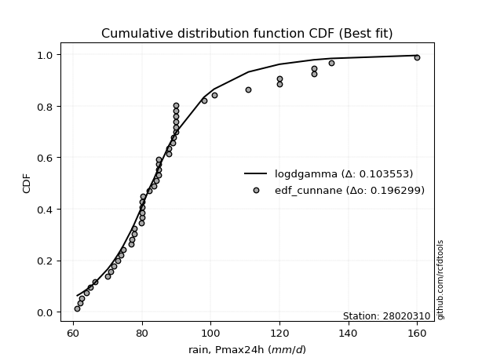</img></img>

</div>


### 11. Empirical - EDF Adamowski (1981)

The Adamowski formula in hydrology refers to a specific plotting position formula used for estimating the non-parametric empirical distribution of hydrological events (like flood peaks) to calculate their return periods. This formula provides an alternative to traditional parametric methods (like the Gumbel or Log Pearson Type III distributions). 

<div align="center">


$P=(m-0.25)/(n+0.5)$


</div>


**11.1. Empirical values**

<div align="center">

|                | 0                    | 1                   | 2                   | 3                   | 4                  | 5                   | 6                   | 7                   | 8                   | 9                   | 10                  | 11                 | 12                  | 13                  | 14                  | 15                 | 16                  | 17                  | 18                 | 19                 | 20                  | 21                 | 22                 | 23                 | 24                 | 25                 | 26                 | 27                 | 28                 | 29                 | 30                | 31                 | 32                 | 33                 | 34                 | 35                 | 36                 | 37                 | 38                 | 39                 | 40                 | 41                 | 42                 | 43                 | 44                 | 45                 | 46                 | 47                 |
|:---------------|:---------------------|:--------------------|:--------------------|:--------------------|:-------------------|:--------------------|:--------------------|:--------------------|:--------------------|:--------------------|:--------------------|:-------------------|:--------------------|:--------------------|:--------------------|:-------------------|:--------------------|:--------------------|:-------------------|:-------------------|:--------------------|:-------------------|:-------------------|:-------------------|:-------------------|:-------------------|:-------------------|:-------------------|:-------------------|:-------------------|:------------------|:-------------------|:-------------------|:-------------------|:-------------------|:-------------------|:-------------------|:-------------------|:-------------------|:-------------------|:-------------------|:-------------------|:-------------------|:-------------------|:-------------------|:-------------------|:-------------------|:-------------------|
| date           | 2015                 | 1969                | 1982                | 2002                | 2001               | 2009                | 2003                | 1980                | 1985                | 1975                | 2004                | 2007               | 1983                | 2011                | 2005                | 2013               | 2012                | 1996                | 1974               | 1977               | 2000                | 1971               | 2014               | 2006               | 2008               | 1972               | 1976               | 1978               | 1988               | 2010               | 1968              | 1984               | 1994               | 1986               | 1989               | 1987               | 1991               | 1992               | 1995               | 1979               | 1993               | 1981               | 1973               | 1970               | 1997               | 1990               | 1999               | 1998               |
| x              | 61.2723765575468     | 62.0                | 62.6238716094153    | 64.0                | 65.0               | 66.3434261308019    | 70.0367441186674    | 71.0                | 72.0                | 73.0                | 73.8321775894603    | 74.6550121603792   | 77.0                | 77.1481260946949    | 77.8012338162671    | 77.8682619904586   | 79.8951644557945    | 80.0                | 80.0               | 80.0               | 80.0                | 80.3885696894822   | 82.2558340114059   | 83.6292555654485   | 84.2125270817239   | 85.0               | 85.0               | 85.0               | 85.0               | 87.8384437186631   | 87.8882726975572  | 89.0               | 89.28613946360262  | 90.0               | 90.0               | 90.0               | 90.0               | 90.0               | 90.0               | 98.0453969651585   | 101.0              | 111.0              | 120.0              | 120.0              | 130.0              | 130.0              | 135.0              | 160.0              |
| m              | 1                    | 2                   | 3                   | 4                   | 5                  | 6                   | 7                   | 8                   | 9                   | 10                  | 11                  | 12                 | 13                  | 14                  | 15                  | 16                 | 17                  | 18                  | 19                 | 20                 | 21                  | 22                 | 23                 | 24                 | 25                 | 26                 | 27                 | 28                 | 29                 | 30                 | 31                | 32                 | 33                 | 34                 | 35                 | 36                 | 37                 | 38                 | 39                 | 40                 | 41                 | 42                 | 43                 | 44                 | 45                 | 46                 | 47                 | 48                 |
| empirical_dist | edf_adamowski        | edf_adamowski       | edf_adamowski       | edf_adamowski       | edf_adamowski      | edf_adamowski       | edf_adamowski       | edf_adamowski       | edf_adamowski       | edf_adamowski       | edf_adamowski       | edf_adamowski      | edf_adamowski       | edf_adamowski       | edf_adamowski       | edf_adamowski      | edf_adamowski       | edf_adamowski       | edf_adamowski      | edf_adamowski      | edf_adamowski       | edf_adamowski      | edf_adamowski      | edf_adamowski      | edf_adamowski      | edf_adamowski      | edf_adamowski      | edf_adamowski      | edf_adamowski      | edf_adamowski      | edf_adamowski     | edf_adamowski      | edf_adamowski      | edf_adamowski      | edf_adamowski      | edf_adamowski      | edf_adamowski      | edf_adamowski      | edf_adamowski      | edf_adamowski      | edf_adamowski      | edf_adamowski      | edf_adamowski      | edf_adamowski      | edf_adamowski      | edf_adamowski      | edf_adamowski      | edf_adamowski      |
| empirical      | 0.015463917525773196 | 0.03608247422680412 | 0.05670103092783505 | 0.07731958762886598 | 0.0979381443298969 | 0.11855670103092783 | 0.13917525773195877 | 0.15979381443298968 | 0.18041237113402062 | 0.20103092783505155 | 0.22164948453608246 | 0.2422680412371134 | 0.26288659793814434 | 0.28350515463917525 | 0.30412371134020616 | 0.3247422680412371 | 0.34536082474226804 | 0.36597938144329895 | 0.3865979381443299 | 0.4072164948453608 | 0.42783505154639173 | 0.4484536082474227 | 0.4690721649484536 | 0.4896907216494845 | 0.5103092783505154 | 0.5309278350515464 | 0.5515463917525774 | 0.5721649484536082 | 0.5927835051546392 | 0.6134020618556701 | 0.634020618556701 | 0.654639175257732  | 0.6752577319587629 | 0.6958762886597938 | 0.7164948453608248 | 0.7371134020618557 | 0.7577319587628866 | 0.7783505154639175 | 0.7989690721649485 | 0.8195876288659794 | 0.8402061855670103 | 0.8608247422680413 | 0.8814432989690721 | 0.9020618556701031 | 0.9226804123711341 | 0.9432989690721649 | 0.9639175257731959 | 0.9845360824742269 |
| empirical_tr   | 1.0157068062827224   | 1.0374331550802138  | 1.0601092896174864  | 1.083798882681564   | 1.1085714285714285 | 1.1345029239766082  | 1.1616766467065867  | 1.1901840490797546  | 1.220125786163522   | 1.2516129032258063  | 1.2847682119205297  | 1.3197278911564627 | 1.3566433566433567  | 1.39568345323741    | 1.4370370370370371  | 1.480916030534351  | 1.5275590551181102  | 1.5772357723577237  | 1.6302521008403361 | 1.6869565217391305 | 1.7477477477477479  | 1.8130841121495327 | 1.883495145631068  | 1.9595959595959598 | 2.0421052631578944 | 2.131868131868132  | 2.2298850574712645 | 2.337349397590361  | 2.4556962025316458 | 2.586666666666667  | 2.732394366197183 | 2.8955223880597014 | 3.07936507936508   | 3.2881355932203387 | 3.5272727272727273 | 3.8039215686274517 | 4.127659574468085  | 4.511627906976744  | 4.974358974358975  | 5.542857142857142  | 6.258064516129033  | 7.185185185185188  | 8.43478260869565   | 10.210526315789476 | 12.933333333333342 | 17.63636363636363  | 27.714285714285726 | 64.6666666666669   |

</div>


**11.2. Parameters & Kolmogorov-Smirnov fit test (sorted by Δ)**

|   id | empirical_dist   | p_dist             |    delta |   deltao | eval    |   fit |   n |             loc |          scale | shape                  | shape1               | shape2             | shape3   |   best_fit |   best_fit_sort |
|-----:|:-----------------|:-------------------|---------:|---------:|:--------|------:|----:|----------------:|---------------:|:-----------------------|:---------------------|:-------------------|:---------|-----------:|----------------:|
|    0 | edf_adamowski    | dgamma             | 0.119574 | 0.196299 | Δo > Δ  |     1 |  48 |    85           |   14.6017      | 0.8618486950276836     |                      |                    |          |          1 |               1 |
|    1 | edf_adamowski    | wald               | 0.123399 | 0.196299 | Δo > Δ  |     1 |  48 |    67.0942      |   20.3021      |                        |                      |                    |          |          0 |               2 |
|    2 | edf_adamowski    | alpha              | 0.13718  | 0.196299 | Δo > Δ  |     1 |  48 |    18.879       |  263.028       | 4.11563865435355       |                      |                    |          |          0 |               3 |
|    3 | edf_adamowski    | mielke             | 0.13792  | 0.196299 | Δo > Δ  |     1 |  48 |    -1.34211     |   53.7147      | 79.88900999665557      | 6.388198240255651    |                    |          |          0 |               4 |
|    4 | edf_adamowski    | invweibull         | 0.139865 | 0.196299 | Δo > Δ  |     1 |  48 |   -18.9757      |   96.8446      | 7.413946692395208      |                      |                    |          |          0 |               5 |
|    5 | edf_adamowski    | fisk               | 0.141634 | 0.196299 | Δo > Δ  |     1 |  48 |    -0.179746    |   83.8799      | 8.995379759132247      |                      |                    |          |          0 |               6 |
|    6 | edf_adamowski    | invgamma           | 0.142183 | 0.196299 | Δo > Δ  |     1 |  48 |    40.844       |  282.205       | 7.060980832477705      |                      |                    |          |          0 |               7 |
|    7 | edf_adamowski    | f                  | 0.143629 | 0.196299 | Δo > Δ  |     1 |  48 |    40.9497      |   39.8861      | 20448.456439629055     | 13.969948823715146   |                    |          |          0 |               8 |
|    8 | edf_adamowski    | exponnorm          | 0.145533 | 0.196299 | Δo > Δ  |     1 |  48 |    69.6443      |    7.46056     | 2.379438118688931      |                      |                    |          |          0 |               9 |
|    9 | edf_adamowski    | johnsonsu          | 0.145712 | 0.196299 | Δo > Δ  |     1 |  48 |    50.9705      |    1.42275     | -7.307627353760925     | 1.922936865035385    |                    |          |          0 |              10 |
|   10 | edf_adamowski    | lognorm            | 0.1462   | 0.196299 | Δo > Δ  |     1 |  48 |    50.8634      |   31.9206      | 0.5188485586715679     |                      |                    |          |          0 |              11 |
|   11 | edf_adamowski    | laplace_asymmetric | 0.14981  | 0.196299 | Δo > Δ  |     1 |  48 |    79.8952      |   12.1997      | 0.73875923659806       |                      |                    |          |          0 |              12 |
|   12 | edf_adamowski    | pearson3           | 0.149919 | 0.196299 | Δo > Δ  |     1 |  48 |    87.3963      |   20.3021      | 1.546924634543322      |                      |                    |          |          0 |              13 |
|   13 | edf_adamowski    | invgauss           | 0.150779 | 0.196299 | Δo > Δ  |     1 |  48 |    49.4404      |  137.089       | 0.27686951370685786    |                      |                    |          |          0 |              14 |
|   14 | edf_adamowski    | fatiguelife        | 0.152519 | 0.196299 | Δo > Δ  |     1 |  48 |    50.2987      |   32.5929      | 0.5259059389192924     |                      |                    |          |          0 |              15 |
|   15 | edf_adamowski    | recipinvgauss      | 0.153075 | 0.196299 | Δo > Δ  |     1 |  48 |    51.4986      |    8.83335     | 0.32638486190037747    |                      |                    |          |          0 |              16 |
|   16 | edf_adamowski    | moyal              | 0.153089 | 0.196299 | Δo > Δ  |     1 |  48 |    75.7862      |    9.13916     |                        |                      |                    |          |          0 |              17 |
|   17 | edf_adamowski    | halflogistic       | 0.153117 | 0.196299 | Δo > Δ  |     1 |  48 |    63.3336      |   17.3576      |                        |                      |                    |          |          0 |              18 |
|   18 | edf_adamowski    | erlang             | 0.15558  | 0.196299 | Δo > Δ  |     1 |  48 |    59.5628      |   14.6556      | 1.8991745698841438     |                      |                    |          |          0 |              19 |
|   19 | edf_adamowski    | gamma              | 0.15558  | 0.196299 | Δo > Δ  |     1 |  48 |    59.5628      |   14.6556      | 1.8991685396362568     |                      |                    |          |          0 |              20 |
|   20 | edf_adamowski    | chi2               | 0.15558  | 0.196299 | Δo > Δ  |     1 |  48 |    59.5627      |    7.32774     | 3.7983815129809404     |                      |                    |          |          0 |              21 |
|   21 | edf_adamowski    | nakagami           | 0.156516 | 0.196299 | Δo > Δ  |     1 |  48 |    61.2724      |   32.0096      | 0.4507325694731861     |                      |                    |          |          0 |              22 |
|   22 | edf_adamowski    | genlogistic        | 0.158846 | 0.196299 | Δo > Δ  |     1 |  48 |   -11.2991      |   13.8038      | 686.4871814930432      |                      |                    |          |          0 |              23 |
|   23 | edf_adamowski    | weibull_min        | 0.161085 | 0.196299 | Δo > Δ  |     1 |  48 |    60.8047      |   28.8525      | 1.326648058559914      |                      |                    |          |          0 |              24 |
|   24 | edf_adamowski    | gompertz           | 0.169798 | 0.196299 | Δo > Δ  |     1 |  48 |    61.2724      |   83.6841      | 2.4220682661657165     |                      |                    |          |          0 |              25 |
|   25 | edf_adamowski    | nct                | 0.171542 | 0.196299 | Δo > Δ  |     1 |  48 |    -0.42568     |    1.1951      | 13.485269169298178     | 69.11560817762629    |                    |          |          0 |              26 |
|   26 | edf_adamowski    | gumbel_r           | 0.177894 | 0.196299 | Δo > Δ  |     1 |  48 |    78.2592      |   15.8295      |                        |                      |                    |          |          0 |              27 |
|   27 | edf_adamowski    | halfnorm           | 0.180437 | 0.196299 | Δo > Δ  |     1 |  48 |    60.5242      |   33.6791      |                        |                      |                    |          |          0 |              28 |
|   28 | edf_adamowski    | gibrat             | 0.185347 | 0.196299 | Δo > Δ  |     1 |  48 |    71.9083      |    9.3939      |                        |                      |                    |          |          0 |              29 |
|   29 | edf_adamowski    | betaprime          | 0.187459 | 0.196299 | Δo > Δ  |     1 |  48 |    -2.31774     |    4.70825     | 493.518565116437       | 26.954713989585066   |                    |          |          0 |              30 |
|   30 | edf_adamowski    | genexpon           | 0.189139 | 0.196299 | Δo > Δ  |     1 |  48 |    60.8983      |    1.43446     | 0.00102178005859321    | 0.053965855644600734 | 3.4362630229428257 |          |          0 |              31 |
|   31 | edf_adamowski    | expon              | 0.18942  | 0.196299 | Δo > Δ  |     1 |  48 |    61.2724      |   26.1239      |                        |                      |                    |          |          0 |              32 |
|   32 | edf_adamowski    | pareto             | 0.18942  | 0.196299 | Δo > Δ  |     1 |  48 |    -2.14748e+09 |    2.14748e+09 | 82203821.83996421      |                      |                    |          |          0 |              33 |
|   33 | edf_adamowski    | kstwobign          | 0.193232 | 0.196299 | Δo > Δ  |     1 |  48 |    27.4445      |   69.5918      |                        |                      |                    |          |          0 |              34 |
|   34 | edf_adamowski    | rayleigh           | 0.20789  | 0.196299 | Δo <= Δ |     0 |  48 |    48.5572      |   30.9891      |                        |                      |                    |          |          0 |              35 |
|   35 | edf_adamowski    | laplace            | 0.216032 | 0.196299 | Δo <= Δ |     0 |  48 |    87.3963      |   14.3558      |                        |                      |                    |          |          0 |              36 |
|   36 | edf_adamowski    | ncf                | 0.216155 | 0.196299 | Δo <= Δ |     0 |  48 |    -0.682937    |    6.2991e-06  | 7.2152174318706755e-06 | 367.02570416695164   | 100.2165537852085  |          |          0 |              37 |
|   37 | edf_adamowski    | maxwell            | 0.217622 | 0.196299 | Δo <= Δ |     0 |  48 |    39.2888      |   30.1469      |                        |                      |                    |          |          0 |              38 |
|   38 | edf_adamowski    | rice               | 0.229839 | 0.196299 | Δo <= Δ |     0 |  48 |    54.6343      |   27.2537      | 0.0006002761905476531  |                      |                    |          |          0 |              39 |
|   39 | edf_adamowski    | hypsecant          | 0.235274 | 0.196299 | Δo <= Δ |     0 |  48 |    87.3963      |   12.9247      |                        |                      |                    |          |          0 |              40 |
|   40 | edf_adamowski    | logistic           | 0.241075 | 0.196299 | Δo <= Δ |     0 |  48 |    87.3963      |   11.1931      |                        |                      |                    |          |          0 |              41 |
|   41 | edf_adamowski    | t                  | 0.247828 | 0.196299 | Δo <= Δ |     0 |  48 |    87.3874      |   20.3103      | 364.83839150975837     |                      |                    |          |          0 |              42 |
|   42 | edf_adamowski    | crystalball        | 0.247945 | 0.196299 | Δo <= Δ |     0 |  48 |    87.3963      |   20.3021      | 7940.872621987292      | 25.234968961283577   |                    |          |          0 |              43 |
|   43 | edf_adamowski    | norm               | 0.247945 | 0.196299 | Δo <= Δ |     0 |  48 |    87.3963      |   20.3021      |                        |                      |                    |          |          0 |              44 |
|   44 | edf_adamowski    | truncnorm          | 0.247945 | 0.196299 | Δo <= Δ |     0 |  48 |    87.3963      |   20.3021      | -737.093976545434      | 1193.2936146393458   |                    |          |          0 |              45 |
|   45 | edf_adamowski    | loggamma           | 0.249526 | 0.196299 | Δo <= Δ |     0 |  48 | -7931.98        | 1025.26        | 2494.890482001344      |                      |                    |          |          0 |              46 |
|   46 | edf_adamowski    | gumbel_l           | 0.31487  | 0.196299 | Δo <= Δ |     0 |  48 |    96.5333      |   15.8295      |                        |                      |                    |          |          0 |              47 |
|   47 | edf_adamowski    | zzgumbel           | 0.370688 | 0.196299 | Δo <= Δ |     0 |  48 |    87.362       |   15.997       | 0.5476912526714043     | 1.157309579779488    |                    |          |          0 |              48 |

<div align="center">

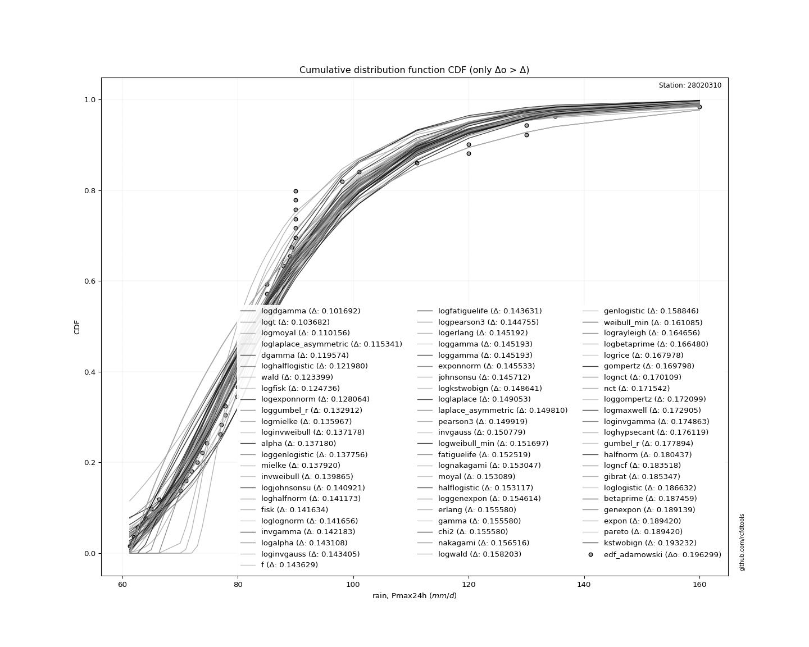</img>

</div>


**11.3. Best fit**

|   id |   station | empirical_dist   | p_dist   |    delta |   deltao | eval   |   fit |   n |   loc |   scale |    shape | shape1   | shape2   | shape3   |   best_fit |   best_fit_sort |
|-----:|----------:|:-----------------|:---------|---------:|---------:|:-------|------:|----:|------:|--------:|---------:|:---------|:---------|:---------|-----------:|----------------:|
|    0 |  28020310 | edf_adamowski    | dgamma   | 0.119574 | 0.196299 | Δo > Δ |     1 |  48 |    85 | 14.6017 | 0.861849 |          |          |          |          1 |               1 |

<div align="center">

</img>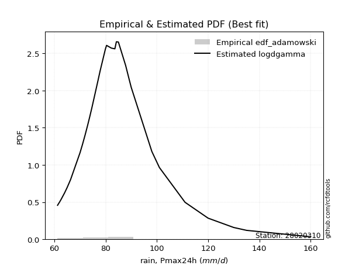</img>

</div>


## C. Best fit & Estimate extreme values for specific return periods - Tr


### 1. Best fit (ordered by delta Δ)

|   id |   station | empirical_dist   | p_dist   |    delta |   deltao | eval   |   fit |   n |     loc |   scale | shape              | shape1   | shape2   | shape3   |   best_fit |   best_fit_sort |
|-----:|----------:|:-----------------|:---------|---------:|---------:|:-------|------:|----:|--------:|--------:|:-------------------|:---------|:---------|:---------|-----------:|----------------:|
|    0 |  28020310 | edf_weibull      | dgamma   | 0.118239 | 0.196299 | Δo > Δ |     1 |  48 | 85      | 14.6017 | 0.8618486950276836 |          |          |          |          1 |               1 |
|    1 |  28020310 | edf_adamowski    | dgamma   | 0.119574 | 0.196299 | Δo > Δ |     1 |  48 | 85      | 14.6017 | 0.8618486950276836 |          |          |          |          1 |               2 |
|    2 |  28020310 | edf_chegodayev   | dgamma   | 0.120192 | 0.196299 | Δo > Δ |     1 |  48 | 85      | 14.6017 | 0.8618486950276836 |          |          |          |          1 |               3 |
|    3 |  28020310 | edf_beard        | dgamma   | 0.120315 | 0.196299 | Δo > Δ |     1 |  48 | 85      | 14.6017 | 0.8618486950276836 |          |          |          |          1 |               4 |
|    4 |  28020310 | edf_jenkinson    | dgamma   | 0.120315 | 0.196299 | Δo > Δ |     1 |  48 | 85      | 14.6017 | 0.8618486950276836 |          |          |          |          1 |               5 |
|    5 |  28020310 | edf_tukey        | dgamma   | 0.120605 | 0.196299 | Δo > Δ |     1 |  48 | 85      | 14.6017 | 0.8618486950276836 |          |          |          |          1 |               6 |
|    6 |  28020310 | edf_blom         | dgamma   | 0.121123 | 0.196299 | Δo > Δ |     1 |  48 | 85      | 14.6017 | 0.8618486950276836 |          |          |          |          1 |               7 |
|    7 |  28020310 | edf_cunnane      | dgamma   | 0.121435 | 0.196299 | Δo > Δ |     1 |  48 | 85      | 14.6017 | 0.8618486950276836 |          |          |          |          1 |               8 |
|    8 |  28020310 | edf_gringorten   | dgamma   | 0.121935 | 0.196299 | Δo > Δ |     1 |  48 | 85      | 14.6017 | 0.8618486950276836 |          |          |          |          1 |               9 |
|    9 |  28020310 | edf_hazen        | dgamma   | 0.122688 | 0.196299 | Δo > Δ |     1 |  48 | 85      | 14.6017 | 0.8618486950276836 |          |          |          |          1 |              10 |
|   10 |  28020310 | edf_california   | wald     | 0.125    | 0.196299 | Δo > Δ |     1 |  48 | 67.0942 | 20.3021 |                    |          |          |          |          1 |              11 |

:file_folder:Tables: [bestfit_28020310.csv](table/bestfit_28020310.csv) | [extreme_28020310.csv](table/extreme_28020310.csv)


### 2. Extreme values

In hydrology, a return period (or recurrence interval) is the statistical average time between extreme events like floods or droughts of a specific magnitude, indicating how rare an event is, with a 100-year flood, for example, having a 1% chance of occurring in any given year, not that it happens exactly every century. It is a key tool for infrastructure design (like bridges or dams) and risk assessment, calculated from historical data to determine the probability of future events, although it is important to remember it is statistical average, and events can cluster or be missed.

> risk_rate: assuming the return period as the project useful life.

|   id |      tr |   prob_l |     prob_g |    alpha |   betaprime |     chi2 |   crystalball |   dgamma |   erlang |    expon |   exponnorm |        f |   fatiguelife |     fisk |    gamma |   genexpon |   genlogistic |   gibrat |   gompertz |   gumbel_l |   gumbel_r |   halflogistic |   halfnorm |   hypsecant |   invgamma |   invgauss |   invweibull |   johnsonsu |   kstwobign |   laplace |   laplace_asymmetric |   loggamma |   logistic |   lognorm |   maxwell |   mielke |    moyal |   nakagami |      ncf |      nct |     norm |   pareto |   pearson3 |   rayleigh |   recipinvgauss |     rice |        t |   truncnorm |     wald |   weibull_min |   zzgumbel |   station |   n |   risk_rate |
|-----:|--------:|---------:|-----------:|---------:|------------:|---------:|--------------:|---------:|---------:|---------:|------------:|---------:|--------------:|---------:|---------:|-----------:|--------------:|---------:|-----------:|-----------:|-----------:|---------------:|-----------:|------------:|-----------:|-----------:|-------------:|------------:|------------:|----------:|---------------------:|-----------:|-----------:|----------:|----------:|---------:|---------:|-----------:|---------:|---------:|---------:|---------:|-----------:|-----------:|----------------:|---------:|---------:|------------:|---------:|--------------:|-----------:|----------:|----:|------------:|
|    0 |    2    | 0.5      | 0.5        |  82.7881 |     84.9043 |  82.6928 |       87.3963 |  85      |  82.6927 |  79.3801 |     83.2858 |  82.8145 |       82.8916 |  83.7001 |  82.6928 |    79.3901 |       83.914  |  81.3022 |    82.3337 |    90.7316 |     84.061 |        82.4028 |    83.2404 |     87.3963 |    82.7726 |    82.8523 |      82.7768 |     82.7616 |     85.0369 |   87.3963 |              84.1496 |    87.4504 |    87.3963 |   82.784  |   85.6599 |  82.7697 |  82.9842 |    81.8313 |  86.057  |  84.272  |  87.3963 |  79.3801 |    82.3877 |    85.0441 |         82.8914 |  86.723  |  87.3874 |     87.3963 |  80.8152 |       82.6925 |    93.2251 |  28020310 |  48 |    0.75     |
|    1 |    2.33 | 0.570815 | 0.429185   |  85.6847 |     88.0707 |  86.0729 |       91.0192 |  86.5033 |  86.0729 |  83.3697 |     86.1328 |  85.8365 |       86.0972 |  86.4019 |  86.0729 |    83.3741 |       86.8428 |  83.1375 |    86.3388 |    93.8836 |     87.418 |        85.8544 |    87.1505 |     90.2957 |    85.7805 |    86.0302 |      85.7295 |     85.8561 |     88.2882 |   89.5887 |              86.6716 |    91.1114 |    90.5883 |   85.8806 |   89.4239 |  85.6817 |  86.1621 |    85.6789 |  89.4153 |  87.3401 |  91.0192 |  83.3697 |    85.7423 |    88.8637 |         86.1122 |  90.0822 |  91.0143 |     91.0192 |  83.1908 |       86.2371 |    96.6177 |  28020310 |  48 |    0.729209 |
|    2 |    5    | 0.8      | 0.2        |  99.2158 |    101.231  | 101.488  |      104.483  |  96.1114 | 101.488  | 103.317  |     99.7825 |  99.9658 |      100.859  |  97.6763 | 101.488  |   103.293  |       99.5644 |  93.7034 |   103.911  |   104.066  |    102.003 |       101.472  |   103.686  |    101.926  |    99.8245 |   100.721  |      99.5846 |    100.233  |    102.099  |  100.55   |              99.281  |   104.678  |   102.913  |  100.262  |  104.239  |  99.3968 | 100.882  |   102.169  | 102.602  | 100.51   | 104.483  | 103.317  |   101.272  |   104.155  |        100.916  | 103.531  | 104.501  |    104.483  |  96.4893 |      102.107  |   111.357  |  28020310 |  48 |    0.67232  |
|    3 |   10    | 0.9      | 0.1        | 111.685  |    111.354  | 114.36   |      113.414  | 105.475  | 114.36   | 121.425  |    112.087  | 112.698  |      113.475  | 106.908  | 114.36   |   121.375  |      109.924  | 105.747  |   117.188  |   109.736  |    113.881 |       114.442  |   115.921  |    111.213  |   112.457  |   113.388  |     112.213  |    112.901  |    112.614  |  110.501  |             110.727  |   113.645  |   111.99   |  112.928  |  114.664  | 112.038  | 113.698  |   114.475  | 111.991  | 111.114  | 113.414  | 121.425  |   114.426  |   115.059  |        113.523  | 113.12   | 113.463  |    113.414  | 110.602  |      114.907  |   123.361  |  28020310 |  48 |    0.651322 |
|    4 |   15    | 0.933333 | 0.0666667  | 119.475  |    116.885  | 121.617  |      117.871  | 111.06   | 121.617  | 132.017  |    119.285  | 120.4    |      120.709  | 112.299  | 121.617  |   131.953  |      115.769  | 114.055  |   124.078  |   112.303  |    120.583 |       121.782  |   122.289  |    116.513  |   120.088  |   120.706  |     119.923  |    120.392  |    118.197  |  116.322  |             117.423  |   118.11   |   116.936  |  120.416  |  120.014  | 119.834  | 121.136  |   120.893  | 116.875  | 117.088  | 117.871  | 132.017  |   121.891  |   120.677  |        120.735  | 118.06   | 117.943  |    117.871  | 119.665  |      121.943  |   130.134  |  28020310 |  48 |    0.644736 |
|    5 |   20    | 0.95     | 0.05       | 125.327  |    120.697  | 126.677  |      120.79   | 115.053  | 126.677  | 139.533  |    124.392  | 126.03   |      125.804  | 116.183  | 126.677  |   139.458  |      119.861  | 120.571  |   128.644  |   113.901  |    125.276 |       126.924  |   126.534  |    120.252  |   125.664  |   125.884  |     125.59   |    125.783  |    121.957  |  120.452  |             122.174  |   121.03   |   120.354  |  125.803  |  123.564  | 125.604  | 126.404  |   125.174  | 120.148  | 121.28   | 120.79   | 139.533  |   127.113  |   124.411  |        125.808  | 121.344  | 120.88   |    120.79   | 126.418  |      126.777  |   134.876  |  28020310 |  48 |    0.641514 |
|    6 |   25    | 0.96     | 0.04       | 130.088  |    123.604  | 130.561  |      122.939  | 118.163  | 130.561  | 145.362  |    128.353  | 130.507  |      129.741  | 119.245  | 130.561  |   145.279  |      123.013  | 126.004  |   132.021  |   115.038  |    128.89  |       130.886  |   129.693  |    123.146  |   130.095  |   129.897  |     130.111  |    130.016  |    124.774  |  123.655  |             125.859  |   123.179  |   122.969  |  130.033  |  126.2    | 130.232  | 130.487  |   128.36   | 122.595  | 124.518  | 122.939  | 145.362  |   131.128  |   127.185  |        129.724  | 123.784  | 123.044  |    122.939  | 131.828  |      130.448  |   138.529  |  28020310 |  48 |    0.639603 |
|    7 |   50    | 0.98     | 0.02       | 146.421  |    132.432  | 142.434  |      129.092  | 127.886  | 142.434  | 163.47   |    140.658  | 145.12   |      141.911  | 129.107  | 142.434  |   163.361  |      132.723  | 145.153  |   141.72   |   118.126  |    140.025 |       143.094  |   138.874  |    132.117  |   144.544  |   142.374  |     144.949  |    143.512  |    133.045  |  133.606  |             137.305  |   129.321  |   130.958  |  143.514  |  133.843  | 145.566  | 143.162  |   137.622  | 129.785  | 134.577  | 129.092  | 163.47   |   143.44   |   135.238  |        141.812  | 130.867  | 129.249  |    129.092  | 149.49   |      141.477  |   149.781  |  28020310 |  48 |    0.63583  |
|    8 |   75    | 0.986667 | 0.0133333  | 157.327  |    137.498  | 149.27   |      132.393  | 133.605  | 149.271  | 174.062  |    147.856  | 154.227  |      149.003  | 135.17   | 149.271  |   173.938  |      138.367  | 158.087  |   146.912  |   119.687  |    146.497 |       150.19   |   143.871  |    137.36   |   153.54   |   149.692  |     154.242  |    151.679  |    137.596  |  139.426  |             144.001  |   132.612  |   135.572  |  151.67   |  137.999  | 155.283  | 150.575  |   142.664  | 133.756  | 140.502  | 132.393  | 174.062  |   150.551  |   139.62   |        148.846  | 134.72   | 132.586  |    132.393  | 160.358  |      147.702  |   156.322  |  28020310 |  48 |    0.634587 |
|    9 |  100    | 0.99     | 0.01       | 165.822  |    141.064  | 154.081  |      134.626  | 137.674  | 154.082  | 181.577  |    152.963  | 160.967  |      154.029  | 139.621  | 154.082  |   181.443  |      142.361  | 168.106  |   150.41   |   120.708  |    151.077 |       155.212  |   147.276  |    141.079  |   160.194  |   154.897  |     161.137  |    157.608  |    140.714  |  143.556  |             148.752  |   134.836  |   138.83   |  157.59   |  140.83   | 162.544  | 155.833  |   146.099  | 136.488  | 144.741  | 134.626  | 181.577  |   155.562  |   142.605  |        153.826  | 137.345  | 134.845  |    134.626  | 168.282  |      152.032  |   160.951  |  28020310 |  48 |    0.633968 |
|   10 |  200    | 0.995    | 0.005      | 189.551  |    149.596  | 165.559  |      139.691  | 147.51   | 165.559  | 199.685  |    165.268  | 178.249  |      166.123  | 150.904  | 165.56   |   199.525  |      151.964  | 195.365  |   158.283  |   122.927  |    162.089 |       167.287  |   155.063  |    150.039  |   177.241  |   167.486  |     178.855  |    172.381  |    147.895  |  153.507  |             160.198  |   139.875  |   146.645  |  172.339  |  147.306  | 181.404  | 168.503  |   153.953  | 142.823  | 155.111  | 139.691  | 199.685  |   167.542  |   149.434  |        165.798  | 143.352  | 139.978  |    139.691  | 188.02   |      162.201  |   172.079  |  28020310 |  48 |    0.633042 |
|   11 |  250    | 0.996    | 0.004      | 198.397  |    152.333  | 169.224  |      141.239  | 150.684  | 169.225  | 205.514  |    169.229  | 184.151  |      170.014  | 154.716  | 169.225  |   205.346  |      155.051  | 205.145  |   160.667  |   123.58   |    165.629 |       171.169  |   157.458  |    152.923  |   183.057  |   171.555  |     184.914  |    177.292  |    150.118  |  156.71   |             163.883  |   141.413  |   149.154  |  177.241  |  149.3    | 187.917  | 172.582  |   156.369  | 144.799  | 158.507  | 141.239  | 205.514  |   171.373  |   151.537  |        169.647  | 145.201  | 141.55   |    141.239  | 194.549  |      165.404  |   175.657  |  28020310 |  48 |    0.632858 |
|   12 |  500    | 0.998    | 0.002      | 230.913  |    160.83   | 180.531  |      145.829  | 160.565  | 180.532  | 223.622  |    181.533  | 203.637  |      182.098  | 167.161  | 180.532  |   223.428  |      164.633  | 238.947  |   167.668  |   125.452  |    176.617 |       183.218  |   164.6    |    161.882  |   202.246  |   184.244  |     204.926  |    193.054  |    156.778  |  166.661  |             175.33   |   145.969  |   156.935  |  192.971  |  155.249  | 209.643  | 185.252  |   163.571  | 150.768  | 169.262  | 145.829  | 223.622  |   183.209  |   157.81   |        181.591  | 150.717  | 146.218  |    145.829  | 215.312  |      175.156  |   186.761  |  28020310 |  48 |    0.632489 |
|   13 |  750    | 0.998667 | 0.00133333 | 254.515  |    165.808  | 187.097  |      148.379  | 166.357  | 187.098  | 234.214  |    188.731  | 215.905  |      189.168  | 174.889  | 187.098  |   234.006  |      170.235  | 261.3    |   171.507  |   126.453  |    183.041 |       190.262  |   168.591  |    167.122  |   214.316  |   191.701  |     217.522  |    202.644  |    160.52   |  172.482  |             182.025  |   148.498  |   161.481  |  202.54   |  158.576  | 223.482  | 192.663  |   167.594  | 154.156  | 175.717  | 148.379  | 234.214  |   190.091  |   161.317  |        188.572  | 153.802  | 148.816  |    148.379  | 227.761  |      180.736  |   193.253  |  28020310 |  48 |    0.632366 |
|   14 | 1000    | 0.999    | 0.001      | 273.978  |    169.349  | 191.737  |      150.134  | 170.471  | 191.737  | 241.73   |    193.838  | 225.028  |      194.185  | 180.585  | 191.737  |   241.51   |      174.208  | 278.407  |   174.128  |   127.126  |    187.598 |       195.258  |   171.346  |    170.84   |   223.287  |   197.008  |     226.885  |    209.621  |    163.112  |  176.612  |             186.776  |   150.237  |   164.705  |  209.5    |  160.875  | 233.844  | 197.921  |   170.372  | 156.519  | 180.377  | 150.134  | 241.73   |   194.959  |   163.741  |        193.525  | 155.934  | 150.608  |    150.134  | 236.716  |      184.644  |   197.857  |  28020310 |  48 |    0.632305 |

<div align="center">

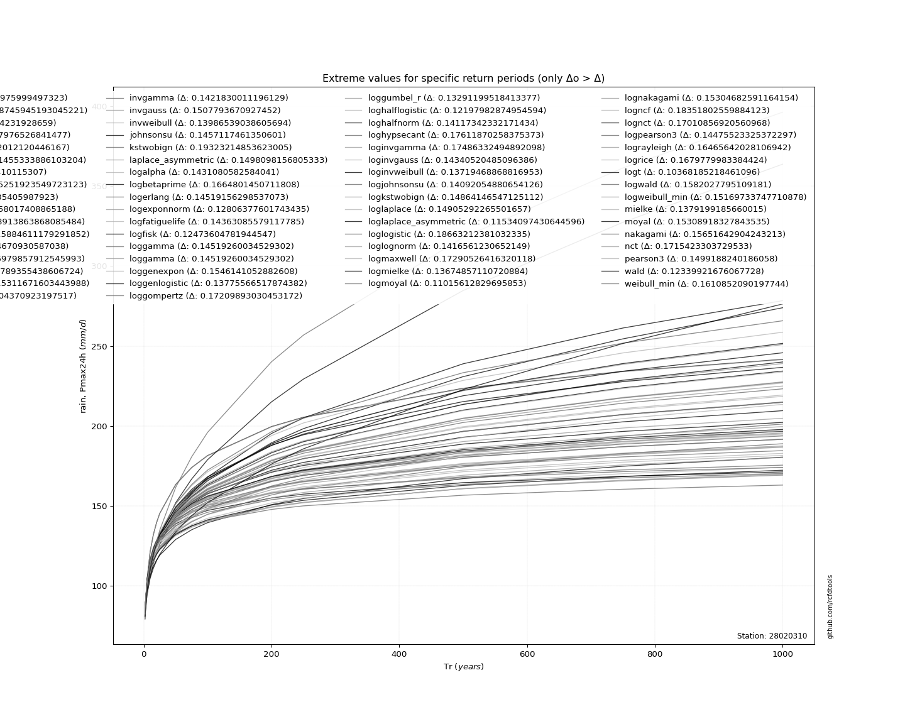</img>

</div>


<div align="center">

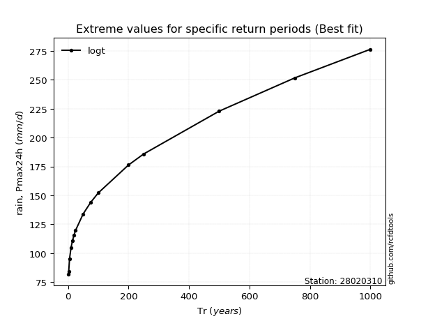</img>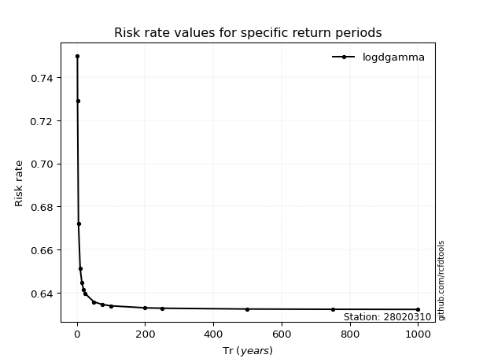</img>

</div>


<sub>**APP DISCLAIMER**: NO WARRANTY - This software is provided by [github.com/rcfdtools](https://github.com/rcfdtools) "as is", without any express or implied warranty, including warranties of merchantability, fitness for a particular purpose, or non-infringement. There is no guarantee that the software will be error-free or operate without interruption. LIMITATION OF LIABILITY - Neither the authors nor copyright holders will be liable for claims or damages arising from the software or its use. You are responsible for determining if the software is appropriate for your use and assume all associated risks, including errors, legal compliance, and data loss. NO PROFESSIONAL ADVICE - The software provides general information and does not offer professional advice. It should not replace consultation with professional advisors.</sub>