<div align="center">


</div>

# Station (rain, Pmax24h): 28020420

Probable Maximum Precipitation (PMP) is the greatest amount of rainfall for a specific duration that is meteorologically possible for a given location, acting as a "worst-case" scenario for extreme storms, crucial for designing safety-critical infrastructure like bridges, river deviations, dams, spillways, and nuclear plants to prevent catastrophic failure. PMP is calculated by hydrologists using meteorological data to determine the upper limit of extreme rainfall, often leading to the Probable Maximum Flood (PMF) for flood control design, and is increasingly being studied for climate change impacts.

<div align="center">

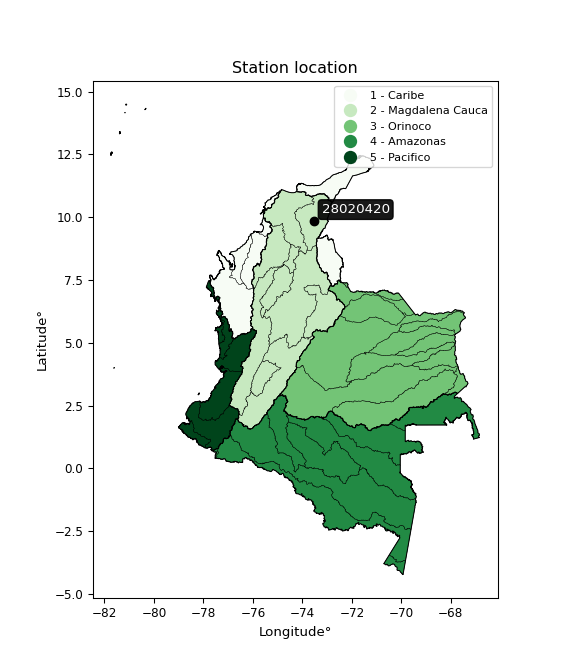</img>

</div>


## A. General information


### 1. General running parameters

• app_version: _v20251225_. • runtime: _2025-12-26 15:25:57.471855_. • Python version: _3.14.0_. • SciPy version: _1.16.3_. • Pandas version: _2.3.3_. • NumPy version: _2.3.5_. • Stations dataset (station_dataset_file): _dataset/pmax24h_in/conventional_cesarcolombia_1970_2021.csv_. • Stations catalog (station_catalog_file): _dataset/CNE_IDEAM.xls_. • Minimum year to eval til year_max (date_min): _1970_. • Maximum year to eval since year_min (date_max): _2021_. • Creates, save and include plots into reports (create_plot): _True_. • Plot only fit distributions with Δo > Δ (plot_only_fit): _True_. • Eval low extreme values, if False, evaluates high extreme values (low_extreme): _False_. • Eval every SciPy distribution as logarithmic (pdist_logarithmic_on): _True_. • Standard deviation normalized (ddof): _1.0_. • Return periods to eval in years (Tr): _[2, 2.33, 5, 10, 15, 20, 25, 50, 75, 100, 200, 250, 500, 750, 1000]_. • Minimum data sample per station, 0 means any (minimum_sample): _5_. • Z-Score threshold to adjust a value, 0 means disable (zscore): _3.5_. • Avoid zeros, e.g. rain = 0 (avoid_zeros): _True_. • Avoid null values (avoid_nans): _True_. [:file_folder:Dataset file.](../../dataset/pmax24h_in/conventional_cesarcolombia_1970_2021.csv)


### 2. Station info and location

|   id |   CODIGO | NOMBRE                 | CATEGORIA     | TECNOLOGIA   | ESTADO   | FECHA_INSTALACION   |   FECHA_SUSPENSION |   ALTITUD |   LATITUD |   LONGITUD | DEPARTAMENTO   | MUNICIPIO   | AREA_OPERATIVA                                         | ENTIDAD                                                     | AREA_HIDROGRAFICA   | ZONA_HIDROGRAFICA   | SUBZONA_HIDROGRAFICA   |   CORRIENTE |   OBSERVACION |   SUBRED | Catalogo   |
|-----:|---------:|:-----------------------|:--------------|:-------------|:---------|:--------------------|-------------------:|----------:|----------:|-----------:|:---------------|:------------|:-------------------------------------------------------|:------------------------------------------------------------|:--------------------|:--------------------|:-----------------------|------------:|--------------:|---------:|:-----------|
|    0 | 28020420 | SAN GABRIEL [28020420] | Pluviométrica | Convencional | Activa   | 15/09/1972          |                nan |        70 |   9.84461 |   -73.5477 | Cesar          | San Diego   | Area Operativa 05 - Magdalena-Cesar-Guajira-San Andrés | INSTITUTO DE HIDROLOGIA METEOROLOGIA Y ESTUDIOS AMBIENTALES | Magdalena Cauca     | Cesar               | Medio Cesar            |         nan |           nan |      nan | CNE_IDEAM  |

<div align="center">

Map location in: [:earth_americas:Google](http://maps.google.com/maps?q=9.844611111,-73.54769444) [:earth_americas:OSM](https://www.openstreetmap.org/#map=18/9.844611111/-73.54769444&layers=P) [:earth_americas:Bing](https://www.bing.com/maps?cp=9.844611111~-73.54769444&lvl=18) [:earth_americas:Apple](https://maps.apple.com/frame?center=9.844611111%2C-73.54769444&span=0.003%2C0.006)

</div>


<div align="center">

```geojson
{
  "type": "Feature",
  "geometry": {
    "type": "Point", 
    "coordinates": [-73.54769444, 9.844611111]
  }, 
  "properties": {
    "Name": "28020420"
  }
}
```

</div>


### 3. Discrete values table and plot

|               |           0 |           1 |           2 |          3 |          4 |           5 |           6 |           7 |           8 |           9 |          10 |          11 |         12 |          13 |         14 |         15 |          16 |         17 |          18 |         19 |         20 |        21 |         22 |         23 |          24 |          25 |         26 |          27 |          28 |          29 |         30 |         31 |          32 |         33 |          34 |         35 |          36 |          37 |         38 |          39 |          40 |          41 |         42 |          43 |          44 |         45 |          46 |          47 |          48 |          49 |          50 |          51 |
|:--------------|------------:|------------:|------------:|-----------:|-----------:|------------:|------------:|------------:|------------:|------------:|------------:|------------:|-----------:|------------:|-----------:|-----------:|------------:|-----------:|------------:|-----------:|-----------:|----------:|-----------:|-----------:|------------:|------------:|-----------:|------------:|------------:|------------:|-----------:|-----------:|------------:|-----------:|------------:|-----------:|------------:|------------:|-----------:|------------:|------------:|------------:|-----------:|------------:|------------:|-----------:|------------:|------------:|------------:|------------:|------------:|------------:|
| Date          | 1970        | 1971        | 1972        | 1973       | 1974       | 1975        | 1976        | 1977        | 1978        | 1979        | 1980        | 1981        | 1982       | 1983        | 1984       | 1985       | 1986        | 1987       | 1988        | 1989       | 1990       | 1991      | 1992       | 1993       | 1994        | 1995        | 1996       | 1997        | 1998        | 1999        | 2000       | 2001       | 2002        | 2003       | 2004        | 2005       | 2006        | 2007        | 2008       | 2009        | 2010        | 2011        | 2012       | 2013        | 2014        | 2015       | 2016        | 2017        | 2018        | 2019        | 2020        | 2021        |
| Value         |  104.358    |   93.3025   |   80.7601   |  147       |  142       |   94        |   75        |   77        |  110        |  110        |  118        |  110        |   70       |  110        |   60       |  130       |  102        |  100.525   |  100        |   70       |   60       |   58      |  125       |  130       |  100        |   83        |  132       |   75.3022   |   94        |   90        |   70       |  119       |   92.9108   |  126       |  100        |  120       |   80        |  110        |  125       |  100        |  116        |   80        |   52       |   85        |   80        |   60       |   90        |   80        |  100        |   83        |   80        |  112        |
| Value_initial |  104.358    |   93.3025   |   80.7601   |  147       |  142       |   94        |   75        |   77        |  110        |  110        |  118        |  110        |   70       |  110        |   60       |  130       |  102        |  100.525   |  100        |   70       |   60       |   58      |  125       |  130       |  100        |   83        |  132       |   75.3022   |   94        |   90        |   70       |  119       |   92.9108   |  126       |  100        |  120       |   80        |  110        |  125       |  100        |  116        |   80        |   52       |   85        |   80        |   60       |   90        |   80        |  100        |   83        |   80        |  112        |
| count         |   52        |   52        |   52        |   52       |   52       |   52        |   52        |   52        |   52        |   52        |   52        |   52        |   52       |   52        |   52       |   52       |   52        |   52       |   52        |   52       |   52       |   52      |   52       |   52       |   52        |   52        |   52       |   52        |   52        |   52        |   52       |   52       |   52        |   52       |   52        |   52       |   52        |   52        |   52       |   52        |   52        |   52        |   52       |   52        |   52        |   52       |   52        |   52        |   52        |   52        |   52        |   52        |
| mean          |   96.3877   |   96.3877   |   96.3877   |   96.3877  |   96.3877  |   96.3877   |   96.3877   |   96.3877   |   96.3877   |   96.3877   |   96.3877   |   96.3877   |   96.3877  |   96.3877   |   96.3877  |   96.3877  |   96.3877   |   96.3877  |   96.3877   |   96.3877  |   96.3877  |   96.3877 |   96.3877  |   96.3877  |   96.3877   |   96.3877   |   96.3877  |   96.3877   |   96.3877   |   96.3877   |   96.3877  |   96.3877  |   96.3877   |   96.3877  |   96.3877   |   96.3877  |   96.3877   |   96.3877   |   96.3877  |   96.3877   |   96.3877   |   96.3877   |   96.3877  |   96.3877   |   96.3877   |   96.3877  |   96.3877   |   96.3877   |   96.3877   |   96.3877   |   96.3877   |   96.3877   |
| std           |   22.977    |   22.977    |   22.977    |   22.977   |   22.977   |   22.977    |   22.977    |   22.977    |   22.977    |   22.977    |   22.977    |   22.977    |   22.977   |   22.977    |   22.977   |   22.977   |   22.977    |   22.977   |   22.977    |   22.977   |   22.977   |   22.977  |   22.977   |   22.977   |   22.977    |   22.977    |   22.977   |   22.977    |   22.977    |   22.977    |   22.977   |   22.977   |   22.977    |   22.977   |   22.977    |   22.977   |   22.977    |   22.977    |   22.977   |   22.977    |   22.977    |   22.977    |   22.977   |   22.977    |   22.977    |   22.977   |   22.977    |   22.977    |   22.977    |   22.977    |   22.977    |   22.977    |
| zscore        |    0.346898 |   -0.134274 |   -0.680141 |    2.20274 |    1.98513 |   -0.103916 |   -0.930831 |   -0.843787 |    0.592434 |    0.592434 |    0.940608 |    0.592434 |   -1.14844 |    0.592434 |   -1.58366 |    1.46287 |    0.244259 |    0.18006 |    0.157215 |   -1.14844 |   -1.58366 |   -1.6707 |    1.24526 |    1.46287 |    0.157215 |   -0.582656 |    1.54991 |   -0.917677 |   -0.103916 |   -0.278003 |   -1.14844 |    0.98413 |   -0.151318 |    1.28878 |    0.157215 |    1.02765 |   -0.713222 |    0.592434 |    1.24526 |    0.157215 |    0.853565 |   -0.713222 |   -1.93183 |   -0.495612 |   -0.713222 |   -1.58366 |   -0.278003 |   -0.713222 |    0.157215 |   -0.582656 |   -0.713222 |    0.679477 |

<div align="center">

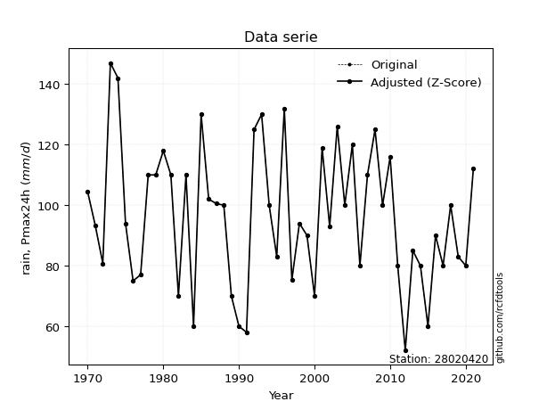</img>

</div>

> If Z-Score is active, values out of range or outliers are replaced with the station mean value.


### 4. Active continuous probability distributions from SciPy (45 of 104 available)

[scipy.stats](https://docs.scipy.org/doc/scipy/reference/stats.html) is a Python´s powerful submodule within the SciPy library for comprehensive statistical analysis, offering over 130 probability distributions (like Normal, Poisson), functions for descriptive stats (mean, variance), hypothesis testing (t-tests, chi-square), random variable generation, and statistical tests, making it essential for data science, modeling, and research. It provides tools to explore, model, and draw conclusions from data efficiently, working seamlessly with NumPy.

<div align="center">

|   id | p_dist             |   n_parameter | fit_method   | label                                                                       | active   | ref                                                                                                        |
|-----:|:-------------------|--------------:|:-------------|:----------------------------------------------------------------------------|:---------|:-----------------------------------------------------------------------------------------------------------|
|    0 | alpha              |             3 | MLE          | Alpha                                                                       | True     | [:mortar_board:](https://docs.scipy.org/doc/scipy/reference/generated/scipy.stats.alpha.html)              |
|    1 | betaprime          |             4 | MLE          | Beta prime                                                                  | True     | [:mortar_board:](https://docs.scipy.org/doc/scipy/reference/generated/scipy.stats.betaprime.html)          |
|    2 | chi2               |             3 | MLE          | Chi²                                                                        | True     | [:mortar_board:](https://docs.scipy.org/doc/scipy/reference/generated/scipy.stats.chi2.html)               |
|    3 | crystalball        |             4 | MLE          | Crystalball                                                                 | True     | [:mortar_board:](https://docs.scipy.org/doc/scipy/reference/generated/scipy.stats.crystalball.html)        |
|    4 | erlang             |             3 | MLE          | Erlang                                                                      | True     | [:mortar_board:](https://docs.scipy.org/doc/scipy/reference/generated/scipy.stats.erlang.html)             |
|    5 | expon              |             2 | MLE          | Exponential                                                                 | True     | [:mortar_board:](https://docs.scipy.org/doc/scipy/reference/generated/scipy.stats.expon.html)              |
|    6 | exponnorm          |             3 | MLE          | Exponentially modified Normal                                               | True     | [:mortar_board:](https://docs.scipy.org/doc/scipy/reference/generated/scipy.stats.exponnorm.html)          |
|    7 | f                  |             4 | MLE          | F                                                                           | True     | [:mortar_board:](https://docs.scipy.org/doc/scipy/reference/generated/scipy.stats.f.html)                  |
|    8 | fatiguelife        |             3 | MLE          | Fatigue-life (Birnbaum-Saunders)                                            | True     | [:mortar_board:](https://docs.scipy.org/doc/scipy/reference/generated/scipy.stats.fatiguelife.html)        |
|    9 | fisk               |             3 | MLE          | Fisk                                                                        | True     | [:mortar_board:](https://docs.scipy.org/doc/scipy/reference/generated/scipy.stats.fisk.html)               |
|   10 | gamma              |             3 | MLE          | Gamma                                                                       | True     | [:mortar_board:](https://docs.scipy.org/doc/scipy/reference/generated/scipy.stats.gamma.html)              |
|   11 | genexpon           |             5 | MLE          | Generalized exponential                                                     | True     | [:mortar_board:](https://docs.scipy.org/doc/scipy/reference/generated/scipy.stats.genexpon.html)           |
|   12 | genlogistic        |             3 | MLE          | Generalized logistic                                                        | True     | [:mortar_board:](https://docs.scipy.org/doc/scipy/reference/generated/scipy.stats.genlogistic.html)        |
|   13 | gibrat             |             2 | MM           | Gibrat                                                                      | True     | [:mortar_board:](https://docs.scipy.org/doc/scipy/reference/generated/scipy.stats.gibrat.html)             |
|   14 | gompertz           |             3 | MLE          | Gompertz (or truncated Gumbel)                                              | True     | [:mortar_board:](https://docs.scipy.org/doc/scipy/reference/generated/scipy.stats.gompertz.html)           |
|   15 | gumbel_l           |             2 | MM           | Gumbel Left Skew                                                            | True     | [:mortar_board:](https://docs.scipy.org/doc/scipy/reference/generated/scipy.stats.gumbel_l.html)           |
|   16 | gumbel_r           |             2 | MM           | Gumbel Right Skew                                                           | True     | [:mortar_board:](https://docs.scipy.org/doc/scipy/reference/generated/scipy.stats.gumbel_r.html)           |
|   17 | halflogistic       |             2 | MM           | Half-logistic                                                               | True     | [:mortar_board:](https://docs.scipy.org/doc/scipy/reference/generated/scipy.stats.halflogistic.html)       |
|   18 | halfnorm           |             2 | MM           | Half Normal                                                                 | True     | [:mortar_board:](https://docs.scipy.org/doc/scipy/reference/generated/scipy.stats.halfnorm.html)           |
|   19 | hypsecant          |             2 | MM           | hyperbolic secant                                                           | True     | [:mortar_board:](https://docs.scipy.org/doc/scipy/reference/generated/scipy.stats.hypsecant.html)          |
|   20 | invgamma           |             3 | MLE          | Inverted gamma                                                              | True     | [:mortar_board:](https://docs.scipy.org/doc/scipy/reference/generated/scipy.stats.invgamma.html)           |
|   21 | invgauss           |             3 | MLE          | Inverse Gaussian                                                            | True     | [:mortar_board:](https://docs.scipy.org/doc/scipy/reference/generated/scipy.stats.invgauss.html)           |
|   22 | invweibull         |             3 | MLE          | Inverted Weibull                                                            | True     | [:mortar_board:](https://docs.scipy.org/doc/scipy/reference/generated/scipy.stats.invweibull.html)         |
|   23 | johnsonsu          |             4 | MLE          | Johnson Su                                                                  | True     | [:mortar_board:](https://docs.scipy.org/doc/scipy/reference/generated/scipy.stats.johnsonsu.html)          |
|   24 | kstwobign          |             2 | MLE          | Limiting distribution of scaled Kolmogorov-Smirnov two-sided test statistic | True     | [:mortar_board:](https://docs.scipy.org/doc/scipy/reference/generated/scipy.stats.kstwobign.html)          |
|   25 | laplace            |             2 | MM           | Laplace                                                                     | True     | [:mortar_board:](https://docs.scipy.org/doc/scipy/reference/generated/scipy.stats.laplace.html)            |
|   26 | laplace_asymmetric |             3 | MLE          | Asymmetric Laplace                                                          | True     | [:mortar_board:](https://docs.scipy.org/doc/scipy/reference/generated/scipy.stats.laplace_asymmetric.html) |
|   27 | loggamma           |             3 | MLE          | Log gamma                                                                   | True     | [:mortar_board:](https://docs.scipy.org/doc/scipy/reference/generated/scipy.stats.loggamma.html)           |
|   28 | logistic           |             2 | MM           | Logistic (or Sech-squared)                                                  | True     | [:mortar_board:](https://docs.scipy.org/doc/scipy/reference/generated/scipy.stats.logistic.html)           |
|   29 | lognorm            |             3 | MLE          | Log Normal                                                                  | True     | [:mortar_board:](https://docs.scipy.org/doc/scipy/reference/generated/scipy.stats.lognorm.html)            |
|   30 | maxwell            |             2 | MM           | Maxwell                                                                     | True     | [:mortar_board:](https://docs.scipy.org/doc/scipy/reference/generated/scipy.stats.maxwell.html)            |
|   31 | mielke             |             4 | MLE          | Mielke Beta-Kappa / Dagum                                                   | True     | [:mortar_board:](https://docs.scipy.org/doc/scipy/reference/generated/scipy.stats.mielke.html)             |
|   32 | moyal              |             2 | MM           | Moyal                                                                       | True     | [:mortar_board:](https://docs.scipy.org/doc/scipy/reference/generated/scipy.stats.moyal.html)              |
|   33 | nakagami           |             3 | MLE          | Nakagami                                                                    | True     | [:mortar_board:](https://docs.scipy.org/doc/scipy/reference/generated/scipy.stats.nakagami.html)           |
|   34 | ncf                |             5 | MLE          | Non-central F distribution                                                  | True     | [:mortar_board:](https://docs.scipy.org/doc/scipy/reference/generated/scipy.stats.ncf.html)                |
|   35 | nct                |             4 | MLE          | Non-central Student’s t                                                     | True     | [:mortar_board:](https://docs.scipy.org/doc/scipy/reference/generated/scipy.stats.nct.html)                |
|   36 | norm               |             2 | MM           | Normal                                                                      | True     | [:mortar_board:](https://docs.scipy.org/doc/scipy/reference/generated/scipy.stats.norm.html)               |
|   37 | pareto             |             3 | MLE          | Pareto                                                                      | True     | [:mortar_board:](https://docs.scipy.org/doc/scipy/reference/generated/scipy.stats.pareto.html)             |
|   38 | pearson3           |             3 | MM           | Pearson type III                                                            | True     | [:mortar_board:](https://docs.scipy.org/doc/scipy/reference/generated/scipy.stats.pearson3.html)           |
|   39 | rayleigh           |             2 | MM           | Rayleigh                                                                    | True     | [:mortar_board:](https://docs.scipy.org/doc/scipy/reference/generated/scipy.stats.rayleigh.html)           |
|   40 | rice               |             3 | MLE          | Rice                                                                        | True     | [:mortar_board:](https://docs.scipy.org/doc/scipy/reference/generated/scipy.stats.rice.html)               |
|   41 | t                  |             3 | MLE          | Student’s t                                                                 | True     | [:mortar_board:](https://docs.scipy.org/doc/scipy/reference/generated/scipy.stats.t.html)                  |
|   42 | truncnorm          |             4 | MLE          | Truncated normal                                                            | True     | [:mortar_board:](https://docs.scipy.org/doc/scipy/reference/generated/scipy.stats.truncnorm.html)          |
|   43 | wald               |             2 | MM           | Wald                                                                        | True     | [:mortar_board:](https://docs.scipy.org/doc/scipy/reference/generated/scipy.stats.wald.html)               |
|   44 | weibull_min        |             3 | MLE          | Weibull minimum                                                             | True     | [:mortar_board:](https://docs.scipy.org/doc/scipy/reference/generated/scipy.stats.weibull_min.html)        |

</div>

> **n_parameter:** # arguments & localization & scale.
>
> **Fit methods:** (MLE) maximum likelihood, (MM) L-moments.
>
>**Inactive:** foldnorm, gennorm, norminvgauss, powernorm, powerlognorm, skewnorm, genextreme, anglit, arcsine, argus, beta, bradford, burr, burr12, cauchy, cosine, halfcauchy, foldcauchy, skewcauchy, wrapcauchy, dgamma, gengamma, exponweib, exponpow, truncexpon, gausshyper, genhalflogistic, genhyperbolic, geninvgauss, halfgennorm, johnsonsb, kappa4, kappa3, ksone, kstwo, loglaplace, levy, levy_l, levy_stable, ncx2, genpareto, truncpareto, lomax, powerlaw, rdist, rel_breitwigner, recipinvgauss, semicircular, studentized_range, trapezoid, triang, truncweibull_min, tukeylambda, uniform, loguniform, vonmises, vonmises_line, weibull_max, dweibull, 


## B. Probability distributions vs. Empirical distributions

A continuous probability distribution (CPD) describes probabilities for variables that can take any value within a range (like rain any time), unlike discrete variables with specific outcomes (like temperature). It uses a Probability Density Function (PDF), a curve where the total area under it equals 1, and the probability of the variable falling within an interval (a to b) is found by calculating the area under the curve between those points. A key feature is that the probability of hitting any single exact value is zero, so probabilities are always expressed for ranges, e.g., $P(a ≤ X ≤ b)$.

<div align="center">

Distributions parameters
|    |   station | p_dist                |   n |               loc |            scale | shape                 | shape1             | shape2             | shape3   |
|---:|----------:|:----------------------|----:|------------------:|-----------------:|:----------------------|:-------------------|:-------------------|:---------|
|  0 |  28020420 | alpha                 |  52 |    -292.024       |   6596.49        | 17.049716516084246    |                    |                    |          |
|  1 |  28020420 | betaprime             |  52 |      -0.653363    |    104.48        | 32.19488240550737     | 35.823058740591385 |                    |          |
|  2 |  28020420 | chi2                  |  52 |     -49.3878      |      1.79473     | 81.20700718080346     |                    |                    |          |
|  3 |  28020420 | crystalball           |  52 |      96.3877      |     22.755       | 6149.800975318649     | 9131.99318085027   |                    |          |
|  4 |  28020420 | erlang                |  52 |    -142.62        |      2.16523     | 110.39292598154137    |                    |                    |          |
|  5 |  28020420 | expon                 |  52 |      52           |     44.3877      |                       |                    |                    |          |
|  6 |  28020420 | exponnorm             |  52 |      92.3038      |     22.386       | 0.18243112657510818   |                    |                    |          |
|  7 |  28020420 | f                     |  52 |     -77.9328      |    174.304       | 117.32369365719157    | 20551.41028701255  |                    |          |
|  8 |  28020420 | fatiguelife           |  52 |    -193.464       |    288.959       | 0.07861903116087718   |                    |                    |          |
|  9 |  28020420 | fisk                  |  52 |    -177.114       |    272.666       | 20.342623288436712    |                    |                    |          |
| 10 |  28020420 | gamma                 |  52 |    -140.432       |      2.18542     | 108.34469370342958    |                    |                    |          |
| 11 |  28020420 | genexpon              |  52 |      52           |      1.18085e+10 | 2930736774.7283993    | 122957594.53182542 | 9420179896.116997  |          |
| 12 |  28020420 | genlogistic           |  52 |      77.1564      |     16.5561      | 2.3112919042293334    |                    |                    |          |
| 13 |  28020420 | gibrat                |  52 |      79.0285      |     10.5289      |                       |                    |                    |          |
| 14 |  28020420 | gompertz              |  52 |    -418.512       |     22.122       | 4.636319150378225e-11 |                    |                    |          |
| 15 |  28020420 | gumbel_l              |  52 |     106.629       |     17.742       |                       |                    |                    |          |
| 16 |  28020420 | gumbel_r              |  52 |      86.1467      |     17.742       |                       |                    |                    |          |
| 17 |  28020420 | halflogistic          |  52 |      69.4177      |     19.4547      |                       |                    |                    |          |
| 18 |  28020420 | halfnorm              |  52 |      66.269       |     37.7481      |                       |                    |                    |          |
| 19 |  28020420 | hypsecant             |  52 |      96.3877      |     14.4863      |                       |                    |                    |          |
| 20 |  28020420 | invgamma              |  52 |    -158.882       |  31409.7         | 124.09427084462067    |                    |                    |          |
| 21 |  28020420 | invgauss              |  52 |      24.8922      |    485.491       | 0.1471060776736971    |                    |                    |          |
| 22 |  28020420 | invweibull            |  52 |      -9.19007e+08 |      9.19007e+08 | 44170975.59707811     |                    |                    |          |
| 23 |  28020420 | johnsonsu             |  52 |    -191.627       |     94.8013      | -24.34265327460858    | 13.318593062974763 |                    |          |
| 24 |  28020420 | kstwobign             |  52 |      11.0221      |     97.8113      |                       |                    |                    |          |
| 25 |  28020420 | laplace               |  52 |      96.3877      |     16.0902      |                       |                    |                    |          |
| 26 |  28020420 | laplace_asymmetric    |  52 |      94           |     18.8409      | 0.9386346472155209    |                    |                    |          |
| 27 |  28020420 | loggamma              |  52 |   -5348.87        |    772.631       | 1150.5316411994827    |                    |                    |          |
| 28 |  28020420 | logistic              |  52 |      96.3877      |     12.5455      |                       |                    |                    |          |
| 29 |  28020420 | lognorm               |  52 |    -215.312       |    310.87        | 0.07303362254351443   |                    |                    |          |
| 30 |  28020420 | maxwell               |  52 |      42.468       |     33.7892      |                       |                    |                    |          |
| 31 |  28020420 | mielke                |  52 |      -4.91113     |    111.176       | 5.320912010311304     | 9.452659574788406  |                    |          |
| 32 |  28020420 | moyal                 |  52 |      83.3749      |     10.2433      |                       |                    |                    |          |
| 33 |  28020420 | nakagami              |  52 |      40.5625      |     60.2846      | 1.5428425668429897    |                    |                    |          |
| 34 |  28020420 | ncf                   |  52 |      -0.847256    |      0.0049874   | 0.008027924873426318  | 63.213184102416456 | 151.78612820007766 |          |
| 35 |  28020420 | nct                   |  52 |    -118.97        |     21.7434      | 540.5346852903058     | 9.890035853628305  |                    |          |
| 36 |  28020420 | norm                  |  52 |      96.3877      |     22.755       |                       |                    |                    |          |
| 37 |  28020420 | pareto                |  52 |      -4.29497e+09 |      4.29497e+09 | 96760367.93782398     |                    |                    |          |
| 38 |  28020420 | pearson3              |  52 |      96.3877      |     22.755       | 0.12304297078347483   |                    |                    |          |
| 39 |  28020420 | rayleigh              |  52 |      52.8561      |     34.7332      |                       |                    |                    |          |
| 40 |  28020420 | rice                  |  52 |      46.6036      |     26.2659      | 1.5306951941062845    |                    |                    |          |
| 41 |  28020420 | t                     |  52 |      96.3878      |     22.7549      | 301311.5482536424     |                    |                    |          |
| 42 |  28020420 | truncnorm             |  52 |      96.3877      |     22.755       | -869.9888397622431    | 1997.1535722185888 |                    |          |
| 43 |  28020420 | wald                  |  52 |      73.6328      |     22.7549      |                       |                    |                    |          |
| 44 |  28020420 | weibull_min           |  52 |      41.5766      |     61.7467      | 2.61848569086486      |                    |                    |          |
| 45 |  28020420 | logalpha              |  52 |      -4.73166     |    343.489       | 37.078257928089045    |                    |                    |          |
| 46 |  28020420 | logbetaprime          |  52 |      -5.01396     |     16.7171      | 724.0578285544148     | 1266.5917143214256 |                    |          |
| 47 |  28020420 | logchi2               |  52 |       3.95124     |      0.365722    | 1.6178281602048417    |                    |                    |          |
| 48 |  28020420 | logcrystalball        |  52 |       4.53916     |      0.245612    | 7.771914481436952     | 13.383812037176387 |                    |          |
| 49 |  28020420 | logerlang             |  52 |       0.000682013 |      0.013704    | 331.01558483398946    |                    |                    |          |
| 50 |  28020420 | logexpon              |  52 |       3.95124     |      0.587921    |                       |                    |                    |          |
| 51 |  28020420 | logexponnorm          |  52 |       4.53895     |      0.245612    | 0.0008693667368148962 |                    |                    |          |
| 52 |  28020420 | logf                  |  52 |    -122.077       |    126.616       | 664263.631378497      | 2591199.4718074948 |                    |          |
| 53 |  28020420 | logfatiguelife        |  52 |     -51.7112      |     56.2502      | 0.004358629245666183  |                    |                    |          |
| 54 |  28020420 | logfisk               |  52 |  -20896.3         |  20900.9         | 145757.0625054286     |                    |                    |          |
| 55 |  28020420 | loggamma              |  52 |       0.0855791   |      0.0138024   | 322.6149583363806     |                    |                    |          |
| 56 |  28020420 | loggenexpon           |  52 |       3.92309     |      0.437993    | 6.001238695690148e-10 | 1.3959059689463529 | 0.926269469939673  |          |
| 57 |  28020420 | loggenlogistic        |  52 |       4.6771      |      0.107667    | 0.5269774488336515    |                    |                    |          |
| 58 |  28020420 | loggibrat             |  52 |       4.35177     |      0.113661    |                       |                    |                    |          |
| 59 |  28020420 | loggompertz           |  52 |       3.94898     |      0.241408    | 0.05898038251472591   |                    |                    |          |
| 60 |  28020420 | loggumbel_l           |  52 |       4.6497      |      0.191503    |                       |                    |                    |          |
| 61 |  28020420 | loggumbel_r           |  52 |       4.42863     |      0.191503    |                       |                    |                    |          |
| 62 |  28020420 | loghalflogistic       |  52 |       4.24808     |      0.209975    |                       |                    |                    |          |
| 63 |  28020420 | loghalfnorm           |  52 |       4.21404     |      0.407477    |                       |                    |                    |          |
| 64 |  28020420 | loghypsecant          |  52 |       4.53916     |      0.156362    |                       |                    |                    |          |
| 65 |  28020420 | loginvgamma           |  52 |       0.128951    |   1353.54        | 308.06110765710673    |                    |                    |          |
| 66 |  28020420 | loginvgauss           |  52 |       2.55531     |    117.549       | 0.016833869280086733  |                    |                    |          |
| 67 |  28020420 | loginvweibull         |  52 |   -8976.48        |   8980.9         | 35519.997164349       |                    |                    |          |
| 68 |  28020420 | logjohnsonsu          |  52 |       5.71139     |      0.260494    | 10.687744545853398    | 4.884106853639633  |                    |          |
| 69 |  28020420 | logkstwobign          |  52 |       3.49486     |      1.19788     |                       |                    |                    |          |
| 70 |  28020420 | loglaplace            |  52 |       4.53916     |      0.173674    |                       |                    |                    |          |
| 71 |  28020420 | loglaplace_asymmetric |  52 |       4.60517     |      0.193993    | 1.1845711148750864    |                    |                    |          |
| 72 |  28020420 | logloggamma           |  52 |       4.08516     |      0.424442    | 3.400215234765251     |                    |                    |          |
| 73 |  28020420 | loglogistic           |  52 |       4.53916     |      0.135413    |                       |                    |                    |          |
| 74 |  28020420 | loglognorm            |  52 | -672215           | 672219           | 3.653753212337504e-07 |                    |                    |          |
| 75 |  28020420 | logmaxwell            |  52 |       3.95721     |      0.364686    |                       |                    |                    |          |
| 76 |  28020420 | logmielke             |  52 |       3.74112     |      1.01422     | 2.9800640027141263    | 11.24647235685341  |                    |          |
| 77 |  28020420 | logmoyal              |  52 |       4.39871     |      0.110564    |                       |                    |                    |          |
| 78 |  28020420 | lognakagami           |  52 |     -93.7507      |     98.2902      | 39900.7781269081      |                    |                    |          |
| 79 |  28020420 | logncf                |  52 |     -36.0716      |     36.7789      | 86665.37049761316     | 143477.93655282073 | 9028.957196224062  |          |
| 80 |  28020420 | lognct                |  52 |      -8.78095     |      0.201027    | 4165.0503641489795    | 66.24851466876612  |                    |          |
| 81 |  28020420 | lognorm               |  52 |       4.53916     |      0.245612    |                       |                    |                    |          |
| 82 |  28020420 | logpareto             |  52 |      -6.71089e+07 |      6.71089e+07 | 114146137.54448299    |                    |                    |          |
| 83 |  28020420 | logpearson3           |  52 |       4.53916     |      0.245612    | -0.35608768759805004  |                    |                    |          |
| 84 |  28020420 | lograyleigh           |  52 |       4.0693      |      0.374899    |                       |                    |                    |          |
| 85 |  28020420 | logrice               |  52 |       3.84523     |      0.25994     | 2.453490057897353     |                    |                    |          |
| 86 |  28020420 | logt                  |  52 |       4.53916     |      0.245613    | 1308563272.6581264    |                    |                    |          |
| 87 |  28020420 | logtruncnorm          |  52 |      -0.176199    |      1.72655     | 2.3905736226563823    | 3.959981408378348  |                    |          |
| 88 |  28020420 | logwald               |  52 |       4.29356     |      0.2456      |                       |                    |                    |          |
| 89 |  28020420 | logweibull_min        |  52 |       3.25359     |      1.38517     | 6.2011031569565285    |                    |                    |          |

</div>

> **loc** (Location parameter): This shifts the distribution along the x-axis. For many common distributions, like the normal (Gaussian) distribution, loc represents the mean $μ$. For others, like the uniform distribution, it might represent the minimum value, or for the beta distribution, the left end of the support interval.
>
> **scale** (Scale parameter): This determines the width or spread of the distribution. For the normal distribution, scale represents the standard deviation $σ$. For a uniform distribution, it defines the length of the interval (from $loc$ to $loc + scale$).
>
> **shape** (Shape parameters): Refers to parameters that define the specific form of a probability distribution, distinct from its location (loc) and scale (scale). These parameters are required arguments for most distribution functions. For example, a normal (Gaussian) distribution is fully defined by its location (mean) and scale (standard deviation), so it has no specific shape parameters beyond loc and scale. However, other distributions have intrinsic properties that need specification, as Gamma distribution that takes a shape parameter, often named $a$ or $alpha$.


### 0. Cumulative distribution values - CDF (90 evaluated)

> Ordered by x ascending and calculating $log(f(x))$ separately. 

|   id |   Station |   date |        x |   count |    mean |    std |    zscore |   Value_initial |   station |   m |     alpha |   alpha_pdf |   betaprime |   betaprime_pdf |      chi2 |   chi2_pdf |   crystalball |   crystalball_pdf |    erlang |   erlang_pdf |    expon |   expon_pdf |   exponnorm |   exponnorm_pdf |         f |      f_pdf |   fatiguelife |   fatiguelife_pdf |      fisk |   fisk_pdf |     gamma |   gamma_pdf |    genexpon |   genexpon_pdf |   genlogistic |   genlogistic_pdf |     gibrat |   gibrat_pdf |   gompertz |   gompertz_pdf |   gumbel_l |   gumbel_l_pdf |   gumbel_r |   gumbel_r_pdf |   halflogistic |   halflogistic_pdf |   halfnorm |   halfnorm_pdf |   hypsecant |   hypsecant_pdf |   invgamma |   invgamma_pdf |   invgauss |   invgauss_pdf |   invweibull |   invweibull_pdf |   johnsonsu |   johnsonsu_pdf |   kstwobign |   kstwobign_pdf |   laplace |   laplace_pdf |   laplace_asymmetric |   laplace_asymmetric_pdf |   loggamma |   loggamma_pdf |   logistic |   logistic_pdf |    lognorm |   lognorm_pdf |   maxwell |   maxwell_pdf |    mielke |   mielke_pdf |       moyal |   moyal_pdf |   nakagami |   nakagami_pdf |        ncf |    ncf_pdf |       nct |    nct_pdf |      norm |   norm_pdf |      pareto |   pareto_pdf |   pearson3 |   pearson3_pdf |   rayleigh |   rayleigh_pdf |       rice |   rice_pdf |         t |      t_pdf |   truncnorm |   truncnorm_pdf |        wald |    wald_pdf |   weibull_min |   weibull_min_pdf |   logalpha |   logalpha_pdf |   logbetaprime |   logbetaprime_pdf |     logchi2 |   logchi2_pdf |   logcrystalball |   logcrystalball_pdf |   logerlang |   logerlang_pdf |   logexpon |   logexpon_pdf |   logexponnorm |   logexponnorm_pdf |      logf |   logf_pdf |   logfatiguelife |   logfatiguelife_pdf |   logfisk |   logfisk_pdf |   loggenexpon |   loggenexpon_pdf |   loggenlogistic |   loggenlogistic_pdf |   loggibrat |   loggibrat_pdf |   loggompertz |   loggompertz_pdf |   loggumbel_l |   loggumbel_l_pdf |   loggumbel_r |   loggumbel_r_pdf |   loghalflogistic |   loghalflogistic_pdf |   loghalfnorm |   loghalfnorm_pdf |   loghypsecant |   loghypsecant_pdf |   loginvgamma |   loginvgamma_pdf |   loginvgauss |   loginvgauss_pdf |   loginvweibull |   loginvweibull_pdf |   logjohnsonsu |   logjohnsonsu_pdf |   logkstwobign |   logkstwobign_pdf |   loglaplace |   loglaplace_pdf |   loglaplace_asymmetric |   loglaplace_asymmetric_pdf |   logloggamma |   logloggamma_pdf |   loglogistic |   loglogistic_pdf |   loglognorm |   loglognorm_pdf |   logmaxwell |   logmaxwell_pdf |   logmielke |   logmielke_pdf |    logmoyal |   logmoyal_pdf |   lognakagami |   lognakagami_pdf |     logncf |   logncf_pdf |     lognct |   lognct_pdf |   logpareto |   logpareto_pdf |   logpearson3 |   logpearson3_pdf |   lograyleigh |   lograyleigh_pdf |    logrice |   logrice_pdf |       logt |   logt_pdf |   logtruncnorm |   logtruncnorm_pdf |    logwald |   logwald_pdf |   logweibull_min |   logweibull_min_pdf |
|-----:|----------:|-------:|---------:|--------:|--------:|-------:|----------:|----------------:|----------:|----:|----------:|------------:|------------:|----------------:|----------:|-----------:|--------------:|------------------:|----------:|-------------:|---------:|------------:|------------:|----------------:|----------:|-----------:|--------------:|------------------:|----------:|-----------:|----------:|------------:|------------:|---------------:|--------------:|------------------:|-----------:|-------------:|-----------:|---------------:|-----------:|---------------:|-----------:|---------------:|---------------:|-------------------:|-----------:|---------------:|------------:|----------------:|-----------:|---------------:|-----------:|---------------:|-------------:|-----------------:|------------:|----------------:|------------:|----------------:|----------:|--------------:|---------------------:|-------------------------:|-----------:|---------------:|-----------:|---------------:|-----------:|--------------:|----------:|--------------:|----------:|-------------:|------------:|------------:|-----------:|---------------:|-----------:|-----------:|----------:|-----------:|----------:|-----------:|------------:|-------------:|-----------:|---------------:|-----------:|---------------:|-----------:|-----------:|----------:|-----------:|------------:|----------------:|------------:|------------:|--------------:|------------------:|-----------:|---------------:|---------------:|-------------------:|------------:|--------------:|-----------------:|---------------------:|------------:|----------------:|-----------:|---------------:|---------------:|-------------------:|----------:|-----------:|-----------------:|---------------------:|----------:|--------------:|--------------:|------------------:|-----------------:|---------------------:|------------:|----------------:|--------------:|------------------:|--------------:|------------------:|--------------:|------------------:|------------------:|----------------------:|--------------:|------------------:|---------------:|-------------------:|--------------:|------------------:|--------------:|------------------:|----------------:|--------------------:|---------------:|-------------------:|---------------:|-------------------:|-------------:|-----------------:|------------------------:|----------------------------:|--------------:|------------------:|--------------:|------------------:|-------------:|-----------------:|-------------:|-----------------:|------------:|----------------:|------------:|---------------:|--------------:|------------------:|-----------:|-------------:|-----------:|-------------:|------------:|----------------:|--------------:|------------------:|--------------:|------------------:|-----------:|--------------:|-----------:|-----------:|---------------:|-------------------:|-----------:|--------------:|-----------------:|---------------------:|
|    0 |  28020420 |   2012 |  52      |      52 | 96.3877 | 22.977 | -1.93183  |         52      |  28020420 |   1 | 0.016801  |  0.00232627 |  0.00961558 |      0.00194693 | 0.0167161 | 0.00232121 |     0.0255475 |        0.0026155  | 0.0199089 |   0.00243366 | 0        |  0.0225288  |   0.0252581 |      0.00260544 | 0.0180466 | 0.00237135 |     0.0188874 |        0.00239783 | 0.0281919 | 0.00243254 | 0.0199904 |  0.00244538 | 9.99896e-11 |    0.248188    |     0.0188865 |        0.00216324 | 0          |   0          |  0.0768929 |    0.00333865  |  0.0449604 |    0.00247628  | 0.00105669 |    0.000408134 |      0         |         0          |  0         |     0          |   0.0297053 |      0.00204761 |  0.016727  |     0.00233586 | 0.00644045 |     0.00198291 |   0.00727665 |       0.00172182 |   0.0195864 |      0.00242339 |  0.00530036 |      0.00168899 | 0.0316877 |    0.00196938 |            0.043569  |               0.00246365 | 0.00689315 |      0.0852505 |  0.0282462 |     0.00218791 | 0.00833985 |     0.0925671 | 0.0058304 |    0.00180592 | 0.0283248 |   0.00264352 | 3.74566e-06 | 4.07973e-06 | 0.00815767 |     0.00215307 | 0.00881324 | 0.00179452 | 0.0241501 | 0.00257329 | 0.0255475 | 0.0026155  | 2.14851e-08 |   0.0225288  |  0.0220071 |     0.00251332 |  0         |     0          | 0.00655203 | 0.00243245 | 0.0255472 | 0.00261545 |   0.0255475 |      0.0026155  | 0           | 0           |     0.0094382 |        0.00235976 | 0.00655145 |      0.0837367 |      0.0865496 |           0.375302 | 5.25707e-13 |    957.582    |       0.00833985 |            0.0925671 |   0.0073445 |       0.0894532 |   0        |       1.70091  |     0.00833974 |          0.0925661 | 0.0084067 |  0.0933218 |        0.0079816 |            0.0901668 | 0.0151473 |      0.104036 |    0.00261488 |          0.183714 |        0.0286299 |             0.139964 |   0         |        0        |   0.000555517 |          0.246483 |     0.0257261 |          0.132595 |   5.58582e-06 |       0.000352799 |       0           |              0        |      0        |          0        |      0.0148201 |          0.0947469 |    0.00582943 |         0.0797577 |    0.00409325 |         0.0679454 |      0.00184801 |           0.0460025 |      0.0199091 |           0.132392 |     0.00133994 |          0.0469701 |    0.0169355 |        0.0975133 |               0.033922  |                    0.147616 |     0.0193733 |          0.130312 |     0.0128474 |          0.093657 |   0.00833983 |         0.092567 |   0          |         0        |  0.00917587 |        0.130137 | 3.87618e-14 |    1.02016e-11 |    0.00838674 |          0.093052 | 0.00817677 |    0.0919064 | 0.00832023 |    0.0939616 | 2.53455e-08 |        1.70091  |     0.0147508 |          0.120263 |    0          |          0        | 0.00444062 |     0.0901452 | 0.00834003 |  0.0925688 |    2.71553e-06 |           1.58437  | 0          |      0        |        0.01412   |             0.124616 |
|    1 |  28020420 |   1991 |  58      |      52 | 96.3877 | 22.977 | -1.6707   |         58      |  28020420 |   2 | 0.0362367 |  0.00428047 |  0.0280923  |      0.00440963 | 0.0360646 | 0.00425242 |     0.0458015 |        0.00422511 | 0.0395449 |   0.00422024 | 0.126435 |  0.0196804  |   0.0454708 |      0.00422236 | 0.037528  | 0.00423964 |     0.0384269 |        0.004229   | 0.0467862 | 0.00385865 | 0.0397204 |  0.00424016 | 0.785332    |    0.0554947   |     0.0366559 |        0.00389323 | 0          |   0          |  0.0996201 |    0.00427106  |  0.0624766 |    0.00340903  | 0.00754882 |    0.00207904  |      0         |         0          |  0         |     0          |   0.0449062 |      0.00308964 |  0.036261  |     0.00430343 | 0.0283595  |     0.00559539 |   0.0249788  |       0.0044298  |   0.0392114 |      0.00422915 |  0.0248271  |      0.00512433 | 0.0460085 |    0.00285942 |            0.0611678 |               0.00345879 | 0.0236797  |      0.243031  |  0.0447927 |     0.0034105  | 0.0256422  |     0.243067  | 0.0242554 |    0.00448932 | 0.0482061 |   0.00405853 | 0.000558923 | 0.000348812 | 0.0286773  |     0.00482076 | 0.0260021  | 0.00413269 | 0.0442629 | 0.00422498 | 0.0458015 | 0.00422511 | 0.126435    |   0.0196804  |  0.0419509 |     0.00423545 |  0.0109066 |     0.00421738 | 0.0293781  | 0.00518745 | 0.0458008 | 0.00422504 |   0.0458015 |      0.00422511 | 0           | 0           |     0.0307059 |        0.00481968 | 0.0233159  |      0.244925  |      0.134819  |           0.510533 | 0.215305    |      1.46713  |       0.0256422  |            0.243067  |   0.0247713 |       0.250537  |   0.169509 |       1.41259  |     0.0256419  |          0.243065  | 0.025838  |  0.244721  |        0.0249925 |            0.240369  | 0.0318879 |      0.215292 |    0.0562005  |          0.758261 |        0.0488052 |             0.238101 |   0         |        0        |   0.0340177   |          0.374496 |     0.0450499 |          0.229863 |   0.00107153  |       0.0382648   |       0           |              0        |      0        |          0        |      0.0297793 |          0.190174  |    0.0223939  |         0.24689   |    0.0199209  |         0.249975  |      0.0168019  |           0.271553  |      0.0403704 |           0.253711 |     0.0209713  |          0.37331   |    0.0317589 |        0.182865  |               0.0545578 |                    0.237415 |     0.0396291 |          0.252326 |     0.0283254 |          0.203252 |   0.0256421  |         0.243067 |   0.00588987 |         0.168431 |  0.031937   |        0.298051 | 3.89574e-06 |    0.000391783 |    0.0257683  |          0.24405  | 0.025449   |    0.243396  | 0.0259773  |    0.248632  | 0.169509    |        1.41259  |     0.0345032 |          0.255324 |    0          |          0        | 0.0225292  |     0.25973   | 0.0256426  |  0.24307   |    0.160468    |           1.35933  | 0          |      0        |        0.0344319 |             0.260019 |
|    2 |  28020420 |   1990 |  60      |      52 | 96.3877 | 22.977 | -1.58366  |         60      |  28020420 |   3 | 0.0456039 |  0.00510005 |  0.0379628  |      0.00547907 | 0.0453628 | 0.00505864 |     0.0548982 |        0.00488153 | 0.0487132 |   0.00495973 | 0.164922 |  0.0188133  |   0.0545656 |      0.00488245 | 0.046772  | 0.00501667 |     0.0476334 |        0.00498961 | 0.0550995 | 0.00446666 | 0.0489315 |  0.00498262 | 0.872007    |    0.0330969   |     0.0451893 |        0.00465656 | 0          |   0          |  0.108516  |    0.00462899  |  0.0696661 |    0.00378656  | 0.0127089  |    0.00312706  |      0         |         0          |  0         |     0          |   0.0515272 |      0.00354146 |  0.0456777 |     0.00512655 | 0.0410174  |     0.00707425 |   0.0350298  |       0.0056429  |   0.0484066 |      0.00497801 |  0.036529   |      0.00659349 | 0.052098  |    0.00323787 |            0.0684917 |               0.00387293 | 0.0331825  |      0.320028  |  0.0521307 |     0.00393872 | 0.0350654  |     0.315084  | 0.0342908 |    0.00555663 | 0.0568902 |   0.00463478 | 0.00174901  | 0.000909572 | 0.0393488  |     0.00585964 | 0.0352806  | 0.00516486 | 0.053379  | 0.00490146 | 0.0548982 | 0.00488153 | 0.164922    |   0.0188133  |  0.0511192 |     0.00494378 |  0.02093   |     0.00579778 | 0.0406845  | 0.00611994 | 0.0548973 | 0.00488145 |   0.0548982 |      0.00488153 | 0           | 0           |     0.0412609 |        0.00574165 | 0.032916   |      0.323943  |      0.15286   |           0.553822 | 0.262628    |      1.33016  |       0.0350654  |            0.315084  |   0.0345434 |       0.328376  |   0.216043 |       1.33344  |     0.0350651  |          0.315082  | 0.0353225 |  0.317042  |        0.0343283 |            0.312663  | 0.0400522 |      0.268132 |    0.0841542  |          0.886837 |        0.0575777 |             0.280562 |   0         |        0        |   0.0475527   |          0.424921 |     0.053537  |          0.271941 |   0.00324989  |       0.0972258   |       0           |              0        |      0        |          0        |      0.0369747 |          0.235938  |    0.032125   |         0.329866  |    0.0299286  |         0.343526  |      0.0280577  |           0.396564  |      0.0498478 |           0.306798 |     0.0363484  |          0.536692  |    0.0386048 |        0.222283  |               0.0632305 |                    0.275156 |     0.0490702 |          0.306085 |     0.0360926 |          0.256917 |   0.0350654  |         0.315084 |   0.0135568  |         0.288252 |  0.0431402  |        0.363963 | 7.47496e-05 |    0.00560719  |    0.0352275  |          0.31622  | 0.0348929  |    0.315988  | 0.0356188  |    0.322408  | 0.216043    |        1.33344  |     0.0441574 |          0.315877 |    0.00222917 |          0.177806 | 0.0326169  |     0.337597  | 0.035066   |  0.315088  |    0.205456    |           1.29514  | 0          |      0        |        0.0442188 |             0.318822 |
|    3 |  28020420 |   1984 |  60      |      52 | 96.3877 | 22.977 | -1.58366  |         60      |  28020420 |   4 | 0.0456039 |  0.00510005 |  0.0379628  |      0.00547907 | 0.0453628 | 0.00505864 |     0.0548982 |        0.00488153 | 0.0487132 |   0.00495973 | 0.164922 |  0.0188133  |   0.0545656 |      0.00488245 | 0.046772  | 0.00501667 |     0.0476334 |        0.00498961 | 0.0550995 | 0.00446666 | 0.0489315 |  0.00498262 | 0.872007    |    0.0330969   |     0.0451893 |        0.00465656 | 0          |   0          |  0.108516  |    0.00462899  |  0.0696661 |    0.00378656  | 0.0127089  |    0.00312706  |      0         |         0          |  0         |     0          |   0.0515272 |      0.00354146 |  0.0456777 |     0.00512655 | 0.0410174  |     0.00707425 |   0.0350298  |       0.0056429  |   0.0484066 |      0.00497801 |  0.036529   |      0.00659349 | 0.052098  |    0.00323787 |            0.0684917 |               0.00387293 | 0.0331825  |      0.320028  |  0.0521307 |     0.00393872 | 0.0350654  |     0.315084  | 0.0342908 |    0.00555663 | 0.0568902 |   0.00463478 | 0.00174901  | 0.000909572 | 0.0393488  |     0.00585964 | 0.0352806  | 0.00516486 | 0.053379  | 0.00490146 | 0.0548982 | 0.00488153 | 0.164922    |   0.0188133  |  0.0511192 |     0.00494378 |  0.02093   |     0.00579778 | 0.0406845  | 0.00611994 | 0.0548973 | 0.00488145 |   0.0548982 |      0.00488153 | 0           | 0           |     0.0412609 |        0.00574165 | 0.032916   |      0.323943  |      0.15286   |           0.553822 | 0.262628    |      1.33016  |       0.0350654  |            0.315084  |   0.0345434 |       0.328376  |   0.216043 |       1.33344  |     0.0350651  |          0.315082  | 0.0353225 |  0.317042  |        0.0343283 |            0.312663  | 0.0400522 |      0.268132 |    0.0841542  |          0.886837 |        0.0575777 |             0.280562 |   0         |        0        |   0.0475527   |          0.424921 |     0.053537  |          0.271941 |   0.00324989  |       0.0972258   |       0           |              0        |      0        |          0        |      0.0369747 |          0.235938  |    0.032125   |         0.329866  |    0.0299286  |         0.343526  |      0.0280577  |           0.396564  |      0.0498478 |           0.306798 |     0.0363484  |          0.536692  |    0.0386048 |        0.222283  |               0.0632305 |                    0.275156 |     0.0490702 |          0.306085 |     0.0360926 |          0.256917 |   0.0350654  |         0.315084 |   0.0135568  |         0.288252 |  0.0431402  |        0.363963 | 7.47496e-05 |    0.00560719  |    0.0352275  |          0.31622  | 0.0348929  |    0.315988  | 0.0356188  |    0.322408  | 0.216043    |        1.33344  |     0.0441574 |          0.315877 |    0.00222917 |          0.177806 | 0.0326169  |     0.337597  | 0.035066   |  0.315088  |    0.205456    |           1.29514  | 0          |      0        |        0.0442188 |             0.318822 |
|    4 |  28020420 |   2015 |  60      |      52 | 96.3877 | 22.977 | -1.58366  |         60      |  28020420 |   5 | 0.0456039 |  0.00510005 |  0.0379628  |      0.00547907 | 0.0453628 | 0.00505864 |     0.0548982 |        0.00488153 | 0.0487132 |   0.00495973 | 0.164922 |  0.0188133  |   0.0545656 |      0.00488245 | 0.046772  | 0.00501667 |     0.0476334 |        0.00498961 | 0.0550995 | 0.00446666 | 0.0489315 |  0.00498262 | 0.872007    |    0.0330969   |     0.0451893 |        0.00465656 | 0          |   0          |  0.108516  |    0.00462899  |  0.0696661 |    0.00378656  | 0.0127089  |    0.00312706  |      0         |         0          |  0         |     0          |   0.0515272 |      0.00354146 |  0.0456777 |     0.00512655 | 0.0410174  |     0.00707425 |   0.0350298  |       0.0056429  |   0.0484066 |      0.00497801 |  0.036529   |      0.00659349 | 0.052098  |    0.00323787 |            0.0684917 |               0.00387293 | 0.0331825  |      0.320028  |  0.0521307 |     0.00393872 | 0.0350654  |     0.315084  | 0.0342908 |    0.00555663 | 0.0568902 |   0.00463478 | 0.00174901  | 0.000909572 | 0.0393488  |     0.00585964 | 0.0352806  | 0.00516486 | 0.053379  | 0.00490146 | 0.0548982 | 0.00488153 | 0.164922    |   0.0188133  |  0.0511192 |     0.00494378 |  0.02093   |     0.00579778 | 0.0406845  | 0.00611994 | 0.0548973 | 0.00488145 |   0.0548982 |      0.00488153 | 0           | 0           |     0.0412609 |        0.00574165 | 0.032916   |      0.323943  |      0.15286   |           0.553822 | 0.262628    |      1.33016  |       0.0350654  |            0.315084  |   0.0345434 |       0.328376  |   0.216043 |       1.33344  |     0.0350651  |          0.315082  | 0.0353225 |  0.317042  |        0.0343283 |            0.312663  | 0.0400522 |      0.268132 |    0.0841542  |          0.886837 |        0.0575777 |             0.280562 |   0         |        0        |   0.0475527   |          0.424921 |     0.053537  |          0.271941 |   0.00324989  |       0.0972258   |       0           |              0        |      0        |          0        |      0.0369747 |          0.235938  |    0.032125   |         0.329866  |    0.0299286  |         0.343526  |      0.0280577  |           0.396564  |      0.0498478 |           0.306798 |     0.0363484  |          0.536692  |    0.0386048 |        0.222283  |               0.0632305 |                    0.275156 |     0.0490702 |          0.306085 |     0.0360926 |          0.256917 |   0.0350654  |         0.315084 |   0.0135568  |         0.288252 |  0.0431402  |        0.363963 | 7.47496e-05 |    0.00560719  |    0.0352275  |          0.31622  | 0.0348929  |    0.315988  | 0.0356188  |    0.322408  | 0.216043    |        1.33344  |     0.0441574 |          0.315877 |    0.00222917 |          0.177806 | 0.0326169  |     0.337597  | 0.035066   |  0.315088  |    0.205456    |           1.29514  | 0          |      0        |        0.0442188 |             0.318822 |
|    5 |  28020420 |   1989 |  70      |      52 | 96.3877 | 22.977 | -1.14844  |         70      |  28020420 |   6 | 0.120709  |  0.0101102  |  0.123494   |      0.0117345  | 0.119589  | 0.00997011 |     0.123097  |        0.00894993 | 0.120115  |   0.00951454 | 0.333369 |  0.0150184  |   0.122891  |      0.0089754  | 0.119779  | 0.00977343 |     0.11994   |        0.00966447 | 0.119034  | 0.00863253 | 0.12063   |  0.00954978 | 0.990359    |    0.00249308  |     0.115885  |        0.00981049 | 0          |   0          |  0.165161  |    0.00681229  |  0.11916   |    0.00629921  | 0.0833641  |    0.0116741   |      0.0149637 |         0.025695   |  0.0787337 |     0.0210341  |   0.102103  |      0.00692801 |  0.121059  |     0.0101312  | 0.148168   |     0.0139773  |   0.125863   |       0.0125378  |   0.120272  |      0.00958956 |  0.139682   |      0.0137044  | 0.0969915 |    0.00602799 |            0.120563  |               0.00681735 | 0.119532   |      0.841659  |  0.10877   |     0.00772705 | 0.118316   |     0.806372  | 0.118346  |    0.011249   | 0.120744  |   0.00837583 | 0.0547283   | 0.011821    | 0.125345   |     0.0113169  | 0.117165   | 0.0113611  | 0.122384  | 0.00909429 | 0.123097  | 0.00894993 | 0.333369    |   0.0150184  |  0.121445  |     0.0093143  |  0.114688  |     0.0125811  | 0.125225   | 0.0107547  | 0.123095  | 0.00894983 |   0.123097  |      0.00894993 | 0           | 0           |     0.122904  |        0.0105963  | 0.120696   |      0.855525  |      0.252898  |           0.738646 | 0.434138    |      0.936934 |       0.118316   |            0.806372  |   0.122241  |       0.849248  |   0.396855 |       1.02589  |     0.118315   |          0.806369  | 0.118937  |  0.808729  |        0.117458  |            0.807837  | 0.108935  |      0.676936 |    0.249735   |          1.18959  |        0.121537  |             0.58396  |   0         |        0        |   0.134957    |          0.730842 |     0.115794  |          0.568213 |   0.0771848   |       1.03243     |       0.000994565 |              2.38124  |      0.067379 |          1.95112  |      0.0984165 |          0.619435  |    0.122598   |         0.884032  |    0.127016   |         0.952512  |      0.14338    |           1.10143   |      0.122231  |           0.666102 |     0.176494   |          1.22566   |    0.093781  |        0.539982  |               0.123667  |                    0.538154 |     0.121812  |          0.672693 |     0.104655  |          0.691976 |   0.118316   |         0.806372 |   0.112312   |         1.01458  |  0.126922   |        0.745171 | 0.0485536   |    1.0173      |    0.118675   |          0.807521 | 0.118516   |    0.810089  | 0.120538   |    0.819222  | 0.396855    |        1.02589  |     0.12147   |          0.723249 |    0.107953   |          1.13734  | 0.120943   |     0.845112  | 0.118317   |  0.806377  |    0.38437     |           1.03437  | 0          |      0        |        0.120551  |             0.704151 |
|    6 |  28020420 |   2000 |  70      |      52 | 96.3877 | 22.977 | -1.14844  |         70      |  28020420 |   7 | 0.120709  |  0.0101102  |  0.123494   |      0.0117345  | 0.119589  | 0.00997011 |     0.123097  |        0.00894993 | 0.120115  |   0.00951454 | 0.333369 |  0.0150184  |   0.122891  |      0.0089754  | 0.119779  | 0.00977343 |     0.11994   |        0.00966447 | 0.119034  | 0.00863253 | 0.12063   |  0.00954978 | 0.990359    |    0.00249308  |     0.115885  |        0.00981049 | 0          |   0          |  0.165161  |    0.00681229  |  0.11916   |    0.00629921  | 0.0833641  |    0.0116741   |      0.0149637 |         0.025695   |  0.0787337 |     0.0210341  |   0.102103  |      0.00692801 |  0.121059  |     0.0101312  | 0.148168   |     0.0139773  |   0.125863   |       0.0125378  |   0.120272  |      0.00958956 |  0.139682   |      0.0137044  | 0.0969915 |    0.00602799 |            0.120563  |               0.00681735 | 0.119532   |      0.841659  |  0.10877   |     0.00772705 | 0.118316   |     0.806372  | 0.118346  |    0.011249   | 0.120744  |   0.00837583 | 0.0547283   | 0.011821    | 0.125345   |     0.0113169  | 0.117165   | 0.0113611  | 0.122384  | 0.00909429 | 0.123097  | 0.00894993 | 0.333369    |   0.0150184  |  0.121445  |     0.0093143  |  0.114688  |     0.0125811  | 0.125225   | 0.0107547  | 0.123095  | 0.00894983 |   0.123097  |      0.00894993 | 0           | 0           |     0.122904  |        0.0105963  | 0.120696   |      0.855525  |      0.252898  |           0.738646 | 0.434138    |      0.936934 |       0.118316   |            0.806372  |   0.122241  |       0.849248  |   0.396855 |       1.02589  |     0.118315   |          0.806369  | 0.118937  |  0.808729  |        0.117458  |            0.807837  | 0.108935  |      0.676936 |    0.249735   |          1.18959  |        0.121537  |             0.58396  |   0         |        0        |   0.134957    |          0.730842 |     0.115794  |          0.568213 |   0.0771848   |       1.03243     |       0.000994565 |              2.38124  |      0.067379 |          1.95112  |      0.0984165 |          0.619435  |    0.122598   |         0.884032  |    0.127016   |         0.952512  |      0.14338    |           1.10143   |      0.122231  |           0.666102 |     0.176494   |          1.22566   |    0.093781  |        0.539982  |               0.123667  |                    0.538154 |     0.121812  |          0.672693 |     0.104655  |          0.691976 |   0.118316   |         0.806372 |   0.112312   |         1.01458  |  0.126922   |        0.745171 | 0.0485536   |    1.0173      |    0.118675   |          0.807521 | 0.118516   |    0.810089  | 0.120538   |    0.819222  | 0.396855    |        1.02589  |     0.12147   |          0.723249 |    0.107953   |          1.13734  | 0.120943   |     0.845112  | 0.118317   |  0.806377  |    0.38437     |           1.03437  | 0          |      0        |        0.120551  |             0.704151 |
|    7 |  28020420 |   1982 |  70      |      52 | 96.3877 | 22.977 | -1.14844  |         70      |  28020420 |   8 | 0.120709  |  0.0101102  |  0.123494   |      0.0117345  | 0.119589  | 0.00997011 |     0.123097  |        0.00894993 | 0.120115  |   0.00951454 | 0.333369 |  0.0150184  |   0.122891  |      0.0089754  | 0.119779  | 0.00977343 |     0.11994   |        0.00966447 | 0.119034  | 0.00863253 | 0.12063   |  0.00954978 | 0.990359    |    0.00249308  |     0.115885  |        0.00981049 | 0          |   0          |  0.165161  |    0.00681229  |  0.11916   |    0.00629921  | 0.0833641  |    0.0116741   |      0.0149637 |         0.025695   |  0.0787337 |     0.0210341  |   0.102103  |      0.00692801 |  0.121059  |     0.0101312  | 0.148168   |     0.0139773  |   0.125863   |       0.0125378  |   0.120272  |      0.00958956 |  0.139682   |      0.0137044  | 0.0969915 |    0.00602799 |            0.120563  |               0.00681735 | 0.119532   |      0.841659  |  0.10877   |     0.00772705 | 0.118316   |     0.806372  | 0.118346  |    0.011249   | 0.120744  |   0.00837583 | 0.0547283   | 0.011821    | 0.125345   |     0.0113169  | 0.117165   | 0.0113611  | 0.122384  | 0.00909429 | 0.123097  | 0.00894993 | 0.333369    |   0.0150184  |  0.121445  |     0.0093143  |  0.114688  |     0.0125811  | 0.125225   | 0.0107547  | 0.123095  | 0.00894983 |   0.123097  |      0.00894993 | 0           | 0           |     0.122904  |        0.0105963  | 0.120696   |      0.855525  |      0.252898  |           0.738646 | 0.434138    |      0.936934 |       0.118316   |            0.806372  |   0.122241  |       0.849248  |   0.396855 |       1.02589  |     0.118315   |          0.806369  | 0.118937  |  0.808729  |        0.117458  |            0.807837  | 0.108935  |      0.676936 |    0.249735   |          1.18959  |        0.121537  |             0.58396  |   0         |        0        |   0.134957    |          0.730842 |     0.115794  |          0.568213 |   0.0771848   |       1.03243     |       0.000994565 |              2.38124  |      0.067379 |          1.95112  |      0.0984165 |          0.619435  |    0.122598   |         0.884032  |    0.127016   |         0.952512  |      0.14338    |           1.10143   |      0.122231  |           0.666102 |     0.176494   |          1.22566   |    0.093781  |        0.539982  |               0.123667  |                    0.538154 |     0.121812  |          0.672693 |     0.104655  |          0.691976 |   0.118316   |         0.806372 |   0.112312   |         1.01458  |  0.126922   |        0.745171 | 0.0485536   |    1.0173      |    0.118675   |          0.807521 | 0.118516   |    0.810089  | 0.120538   |    0.819222  | 0.396855    |        1.02589  |     0.12147   |          0.723249 |    0.107953   |          1.13734  | 0.120943   |     0.845112  | 0.118317   |  0.806377  |    0.38437     |           1.03437  | 0          |      0        |        0.120551  |             0.704151 |
|    8 |  28020420 |   1976 |  75      |      52 | 96.3877 | 22.977 | -0.930831 |         75      |  28020420 |   9 | 0.177946  |  0.0127571  |  0.189566   |      0.0145972  | 0.176004  | 0.0125717  |     0.173631  |        0.0112719  | 0.173965  |   0.0120169  | 0.404386 |  0.0134185  |   0.173583  |      0.0113092  | 0.17509   | 0.0123335  |     0.174649  |        0.0122058  | 0.168805  | 0.0113214  | 0.174662  |  0.0120537  | 0.997354    |    0.000684213 |     0.172479  |        0.0128223  | 0          |   0          |  0.202517  |    0.00815776  |  0.154801  |    0.00801199  | 0.153453   |    0.0162116   |      0.142492  |         0.0251789  |  0.182915  |     0.0205792  |   0.142986  |      0.00954183 |  0.178353  |     0.012757   | 0.22384    |     0.0160995  |   0.195965   |       0.015351   |   0.174554  |      0.0121127  |  0.214357   |      0.0159721  | 0.13234   |    0.00822486 |            0.159957  |               0.00904489 | 0.187312   |      1.12246   |  0.153838  |     0.010376   | 0.183384   |     1.08087   | 0.181086  |    0.0137702  | 0.168426  |   0.010741   | 0.132322    | 0.0188868   | 0.188092   |     0.013707   | 0.18151    | 0.0142889  | 0.173781  | 0.0114691  | 0.173631  | 0.0112719  | 0.404386    |   0.0134185  |  0.174108  |     0.0117489  |  0.18391   |     0.0149797  | 0.184407   | 0.0128778  | 0.173629  | 0.0112718  |   0.173631  |      0.0112719  | 0.000119353 | 0.000763767 |     0.181638  |        0.0128515  | 0.18946    |      1.1363    |      0.30624   |           0.805273 | 0.494587    |      0.819263 |       0.183384   |            1.08087   |   0.190433  |       1.12652   |   0.463639 |       0.912301 |     0.183383   |          1.08087   | 0.184141  |  1.08233   |        0.182706  |            1.08458   | 0.165133  |      0.961437 |    0.332626   |          1.20326  |        0.168899  |             0.798385 |   0         |        0        |   0.191398    |          0.909157 |     0.161751  |          0.772314 |   0.16752     |       1.5629      |       0.163794    |              2.31735  |      0.2004   |          1.89602  |      0.151317  |          0.931696  |    0.193499   |         1.16836   |    0.202874   |         1.23976   |      0.227997   |           1.33317   |      0.175724  |           0.890179 |     0.26682    |          1.3726    |    0.139521  |        0.803351  |               0.166972  |                    0.7266   |     0.175937  |          0.902027 |     0.162869  |          1.00686  |   0.183384   |         1.08087  |   0.192935   |         1.31078  |  0.185522   |        0.957565 | 0.148789    |    1.83712     |    0.183802   |          1.08138  | 0.183848   |    1.08457   | 0.186433   |    1.09129   | 0.463639    |        0.912301 |     0.179593  |          0.965683 |    0.196786   |          1.41836  | 0.188548   |     1.11398   | 0.183385   |  1.08088   |    0.452184    |           0.932944 | 0.00353232 |      0.816075 |        0.176907  |             0.93401  |
|    9 |  28020420 |   1997 |  75.3022 |      52 | 96.3877 | 22.977 | -0.917677 |         75.3022 |  28020420 |  10 | 0.181825  |  0.0129098  |  0.194001   |      0.014749   | 0.179827  | 0.0127223  |     0.177059  |        0.0114125  | 0.177619  |   0.0121648  | 0.408427 |  0.0133274  |   0.177023  |      0.0114504  | 0.17884   | 0.0124831  |     0.17836   |        0.0123551  | 0.172253  | 0.0114909  | 0.178328  |  0.0122016  | 0.997553    |    0.000632772 |     0.176381  |        0.0130004  | 0          |   0          |  0.204996  |    0.00824427  |  0.15724   |    0.00812613  | 0.158389   |    0.0164504   |      0.150094  |         0.0251217  |  0.189129  |     0.0205404  |   0.145897  |      0.00972245 |  0.182232  |     0.012908   | 0.228719   |     0.0161905  |   0.200626   |       0.0154894  |   0.178238  |      0.0122615  |  0.219199   |      0.0160717  | 0.134849  |    0.00838082 |            0.162714  |               0.0092008  | 0.191858   |      1.13842   |  0.157     |     0.0105497  | 0.187763   |     1.09682   | 0.185269  |    0.0139064  | 0.171695  |   0.0108915  | 0.138083    | 0.0192332   | 0.192254   |     0.0138357  | 0.185853   | 0.0144463  | 0.177269  | 0.0116121  | 0.177059  | 0.0114125  | 0.408427    |   0.0133274  |  0.177681  |     0.0118941  |  0.188456  |     0.0150996  | 0.188317   | 0.0129975  | 0.177057  | 0.0114124  |   0.177059  |      0.0114125  | 0.000585692 | 0.00253651  |     0.185542  |        0.0129779  | 0.194062   |      1.15209   |      0.309485  |           0.808695 | 0.49787     |      0.813072 |       0.187763   |            1.09682   |   0.194995  |       1.14222   |   0.467296 |       0.906082 |     0.187762   |          1.09682   | 0.188526  |  1.0982    |        0.1871    |            1.10064   | 0.169036  |      0.97956  |    0.337463   |          1.20231  |        0.172139  |             0.812639 |   0         |        0        |   0.195077    |          0.920224 |     0.164884  |          0.785757 |   0.173857    |       1.58831     |       0.173099    |              2.30989  |      0.208016 |          1.89118  |      0.155107  |          0.953181  |    0.19823    |         1.18409   |    0.207891   |         1.25493   |      0.233378   |           1.3431    |      0.179332  |           0.904193 |     0.27235    |          1.3775    |    0.14279   |        0.822171  |               0.16992   |                    0.739429 |     0.179594  |          0.916356 |     0.166959  |          1.02711  |   0.187763   |         1.09682  |   0.198236   |         1.3256   |  0.189399   |        0.970667 | 0.156249    |    1.87245     |    0.188183   |          1.09728  | 0.188242   |    1.10046   | 0.190854   |    1.10695   | 0.467296    |        0.906081 |     0.183506  |          0.980423 |    0.202516   |          1.43106  | 0.193059   |     1.12928   | 0.187764   |  1.09682   |    0.455925    |           0.927303 | 0.0078532  |      1.34201  |        0.180691  |             0.94814  |
|   10 |  28020420 |   1977 |  77      |      52 | 96.3877 | 22.977 | -0.843787 |         77      |  28020420 |  11 | 0.204455  |  0.0137413  |  0.219732   |      0.0155453  | 0.20213   | 0.0135443  |     0.197102  |        0.0121955  | 0.198968  |   0.0129797  | 0.430627 |  0.0128273  |   0.197132  |      0.0122363  | 0.200735  | 0.0133027  |     0.200037  |        0.0131749  | 0.192573  | 0.0124473  | 0.199739  |  0.0130159  | 0.998423    |    0.000407919 |     0.199288  |        0.0139764  | 0          |   0          |  0.219411  |    0.00874048  |  0.171594  |    0.00878984  | 0.187393   |    0.0176868   |      0.19244   |         0.024749   |  0.223803  |     0.0203     |   0.163294  |      0.0107843  |  0.204851  |     0.01373    | 0.256594   |     0.0166238  |   0.227537   |       0.0161906  |   0.199754  |      0.0130797  |  0.246911   |      0.0165515  | 0.149855  |    0.00931346 |            0.179109  |               0.0101279  | 0.218209   |      1.22467   |  0.175753  |     0.0115471  | 0.213192   |     1.18381   | 0.209503  |    0.0146302  | 0.19091   |   0.011747   | 0.172245    | 0.0209411   | 0.216334   |     0.0145192  | 0.211098   | 0.0152766  | 0.197661  | 0.0124065  | 0.197102  | 0.0121955  | 0.430627    |   0.0128273  |  0.198559  |     0.0126973  |  0.21463   |     0.0157179  | 0.21094    | 0.0136463  | 0.197099  | 0.0121954  |   0.197102  |      0.0121955  | 0.0238868   | 0.0265017   |     0.208162  |        0.0136614  | 0.220704   |      1.23709   |      0.327719  |           0.826633 | 0.515624    |      0.7799   |       0.213192   |            1.18381   |   0.221414  |       1.22697   |   0.487119 |       0.872364 |     0.213191   |          1.1838    | 0.213981  |  1.18471   |        0.212621  |            1.18819   | 0.192011  |      1.08194  |    0.364186   |          1.194    |        0.191166  |             0.895156 |   0         |        0        |   0.216286    |          0.982667 |     0.183258  |          0.863354 |   0.210716    |       1.71348     |       0.224083    |              2.26167  |      0.249857 |          1.8613   |      0.177737  |          1.07855   |    0.225577   |         1.26811   |    0.236771   |         1.33436   |      0.263876   |           1.39043   |      0.200369  |           0.983271 |     0.30331    |          1.39785   |    0.162349  |        0.934792  |               0.187232  |                    0.814765 |     0.200921  |          0.997142 |     0.19113   |          1.14168  |   0.213192   |         1.18381  |   0.22866    |         1.40176  |  0.211861   |        1.04458  | 0.199906    |    2.03393     |    0.213619   |          1.18396  | 0.213748   |    1.18708   | 0.216489   |    1.19209   | 0.487119    |        0.872364 |     0.20628   |          1.06254  |    0.235146   |          1.49384  | 0.219167   |     1.21209   | 0.213194   |  1.18381   |    0.476255    |           0.896553 | 0.067907   |      3.73941  |        0.202711  |             1.02734  |
|   11 |  28020420 |   2020 |  80      |      52 | 96.3877 | 22.977 | -0.713222 |         80      |  28020420 |  12 | 0.247726  |  0.0150724  |  0.268176   |      0.0166931  | 0.244796  | 0.0148686  |     0.235707  |        0.0135272  | 0.239961  |   0.0143255  | 0.467837 |  0.011989   |   0.235866  |      0.0135715  | 0.242686  | 0.0146373  |     0.241616  |        0.014518   | 0.232433  | 0.0141154  | 0.240837  |  0.0143592  | 0.999274    |    0.000187779 |     0.243634  |        0.0155493  | 0.00858475 |   0.0240053  |  0.246995  |    0.0096562   |  0.199832  |    0.0100544   | 0.243159   |    0.0193798   |      0.265459  |         0.0238896  |  0.283957  |     0.0197839  |   0.198679  |      0.0128417  |  0.248061  |     0.015043   | 0.307241   |     0.0170765  |   0.277579   |       0.0170991  |   0.24105   |      0.0144259  |  0.297461   |      0.0170829  | 0.18057   |    0.0112224  |            0.212222  |               0.0120003  | 0.267662   |      1.35988   |  0.213113  |     0.013367   | 0.261158   |     1.32366   | 0.255093  |    0.0157215  | 0.228445  |   0.0132762  | 0.238365    | 0.0229154   | 0.261493   |     0.0155468  | 0.258836   | 0.0164924  | 0.236918  | 0.0137484  | 0.235707  | 0.0135272  | 0.467837    |   0.011989   |  0.238693  |     0.0140382  |  0.263149  |     0.0165792  | 0.25347    | 0.0146809  | 0.235704  | 0.0135271  |   0.235707  |      0.0135272  | 0.144118    | 0.0468839   |     0.250812  |        0.0147431  | 0.270571   |      1.36882   |      0.359837  |           0.853049 | 0.54441     |      0.727168 |       0.261158   |            1.32366   |   0.270903  |       1.35942   |   0.519401 |       0.817455 |     0.261157   |          1.32366   | 0.261964  |  1.3236    |        0.260769  |            1.32872   | 0.236774  |      1.26025  |    0.409387   |          1.16916  |        0.228282  |             1.04959  |   0.0928525 |        5.49206  |   0.255943    |          1.09299  |     0.218976  |          1.00797  |   0.279293    |       1.86021     |       0.30857     |              2.15451  |      0.319844 |          1.79859  |      0.223395  |          1.31428   |    0.276561   |         1.39581   |    0.290052   |         1.44865   |      0.318109   |           1.44103   |      0.240601  |           1.12237  |     0.357023   |          1.40783   |    0.202315  |        1.16491   |               0.221113  |                    0.962202 |     0.241734  |          1.13885  |     0.238589  |          1.34156  |   0.261158   |         1.32366  |   0.284345   |         1.50635  |  0.254274   |        1.17558  | 0.280876    |    2.17544     |    0.26158    |          1.32321  | 0.261821   |    1.32588   | 0.264696   |    1.32775   | 0.519401    |        0.817455 |     0.249573  |          1.20227  |    0.293843   |          1.57123  | 0.268046   |     1.34269   | 0.26116    |  1.32367   |    0.509546    |           0.845863 | 0.229751   |      4.25692  |        0.244598  |             1.16442  |
|   12 |  28020420 |   2014 |  80      |      52 | 96.3877 | 22.977 | -0.713222 |         80      |  28020420 |  13 | 0.247726  |  0.0150724  |  0.268176   |      0.0166931  | 0.244796  | 0.0148686  |     0.235707  |        0.0135272  | 0.239961  |   0.0143255  | 0.467837 |  0.011989   |   0.235866  |      0.0135715  | 0.242686  | 0.0146373  |     0.241616  |        0.014518   | 0.232433  | 0.0141154  | 0.240837  |  0.0143592  | 0.999274    |    0.000187779 |     0.243634  |        0.0155493  | 0.00858475 |   0.0240053  |  0.246995  |    0.0096562   |  0.199832  |    0.0100544   | 0.243159   |    0.0193798   |      0.265459  |         0.0238896  |  0.283957  |     0.0197839  |   0.198679  |      0.0128417  |  0.248061  |     0.015043   | 0.307241   |     0.0170765  |   0.277579   |       0.0170991  |   0.24105   |      0.0144259  |  0.297461   |      0.0170829  | 0.18057   |    0.0112224  |            0.212222  |               0.0120003  | 0.267662   |      1.35988   |  0.213113  |     0.013367   | 0.261158   |     1.32366   | 0.255093  |    0.0157215  | 0.228445  |   0.0132762  | 0.238365    | 0.0229154   | 0.261493   |     0.0155468  | 0.258836   | 0.0164924  | 0.236918  | 0.0137484  | 0.235707  | 0.0135272  | 0.467837    |   0.011989   |  0.238693  |     0.0140382  |  0.263149  |     0.0165792  | 0.25347    | 0.0146809  | 0.235704  | 0.0135271  |   0.235707  |      0.0135272  | 0.144118    | 0.0468839   |     0.250812  |        0.0147431  | 0.270571   |      1.36882   |      0.359837  |           0.853049 | 0.54441     |      0.727168 |       0.261158   |            1.32366   |   0.270903  |       1.35942   |   0.519401 |       0.817455 |     0.261157   |          1.32366   | 0.261964  |  1.3236    |        0.260769  |            1.32872   | 0.236774  |      1.26025  |    0.409387   |          1.16916  |        0.228282  |             1.04959  |   0.0928525 |        5.49206  |   0.255943    |          1.09299  |     0.218976  |          1.00797  |   0.279293    |       1.86021     |       0.30857     |              2.15451  |      0.319844 |          1.79859  |      0.223395  |          1.31428   |    0.276561   |         1.39581   |    0.290052   |         1.44865   |      0.318109   |           1.44103   |      0.240601  |           1.12237  |     0.357023   |          1.40783   |    0.202315  |        1.16491   |               0.221113  |                    0.962202 |     0.241734  |          1.13885  |     0.238589  |          1.34156  |   0.261158   |         1.32366  |   0.284345   |         1.50635  |  0.254274   |        1.17558  | 0.280876    |    2.17544     |    0.26158    |          1.32321  | 0.261821   |    1.32588   | 0.264696   |    1.32775   | 0.519401    |        0.817455 |     0.249573  |          1.20227  |    0.293843   |          1.57123  | 0.268046   |     1.34269   | 0.26116    |  1.32367   |    0.509546    |           0.845863 | 0.229751   |      4.25692  |        0.244598  |             1.16442  |
|   13 |  28020420 |   2006 |  80      |      52 | 96.3877 | 22.977 | -0.713222 |         80      |  28020420 |  14 | 0.247726  |  0.0150724  |  0.268176   |      0.0166931  | 0.244796  | 0.0148686  |     0.235707  |        0.0135272  | 0.239961  |   0.0143255  | 0.467837 |  0.011989   |   0.235866  |      0.0135715  | 0.242686  | 0.0146373  |     0.241616  |        0.014518   | 0.232433  | 0.0141154  | 0.240837  |  0.0143592  | 0.999274    |    0.000187779 |     0.243634  |        0.0155493  | 0.00858475 |   0.0240053  |  0.246995  |    0.0096562   |  0.199832  |    0.0100544   | 0.243159   |    0.0193798   |      0.265459  |         0.0238896  |  0.283957  |     0.0197839  |   0.198679  |      0.0128417  |  0.248061  |     0.015043   | 0.307241   |     0.0170765  |   0.277579   |       0.0170991  |   0.24105   |      0.0144259  |  0.297461   |      0.0170829  | 0.18057   |    0.0112224  |            0.212222  |               0.0120003  | 0.267662   |      1.35988   |  0.213113  |     0.013367   | 0.261158   |     1.32366   | 0.255093  |    0.0157215  | 0.228445  |   0.0132762  | 0.238365    | 0.0229154   | 0.261493   |     0.0155468  | 0.258836   | 0.0164924  | 0.236918  | 0.0137484  | 0.235707  | 0.0135272  | 0.467837    |   0.011989   |  0.238693  |     0.0140382  |  0.263149  |     0.0165792  | 0.25347    | 0.0146809  | 0.235704  | 0.0135271  |   0.235707  |      0.0135272  | 0.144118    | 0.0468839   |     0.250812  |        0.0147431  | 0.270571   |      1.36882   |      0.359837  |           0.853049 | 0.54441     |      0.727168 |       0.261158   |            1.32366   |   0.270903  |       1.35942   |   0.519401 |       0.817455 |     0.261157   |          1.32366   | 0.261964  |  1.3236    |        0.260769  |            1.32872   | 0.236774  |      1.26025  |    0.409387   |          1.16916  |        0.228282  |             1.04959  |   0.0928525 |        5.49206  |   0.255943    |          1.09299  |     0.218976  |          1.00797  |   0.279293    |       1.86021     |       0.30857     |              2.15451  |      0.319844 |          1.79859  |      0.223395  |          1.31428   |    0.276561   |         1.39581   |    0.290052   |         1.44865   |      0.318109   |           1.44103   |      0.240601  |           1.12237  |     0.357023   |          1.40783   |    0.202315  |        1.16491   |               0.221113  |                    0.962202 |     0.241734  |          1.13885  |     0.238589  |          1.34156  |   0.261158   |         1.32366  |   0.284345   |         1.50635  |  0.254274   |        1.17558  | 0.280876    |    2.17544     |    0.26158    |          1.32321  | 0.261821   |    1.32588   | 0.264696   |    1.32775   | 0.519401    |        0.817455 |     0.249573  |          1.20227  |    0.293843   |          1.57123  | 0.268046   |     1.34269   | 0.26116    |  1.32367   |    0.509546    |           0.845863 | 0.229751   |      4.25692  |        0.244598  |             1.16442  |
|   14 |  28020420 |   2017 |  80      |      52 | 96.3877 | 22.977 | -0.713222 |         80      |  28020420 |  15 | 0.247726  |  0.0150724  |  0.268176   |      0.0166931  | 0.244796  | 0.0148686  |     0.235707  |        0.0135272  | 0.239961  |   0.0143255  | 0.467837 |  0.011989   |   0.235866  |      0.0135715  | 0.242686  | 0.0146373  |     0.241616  |        0.014518   | 0.232433  | 0.0141154  | 0.240837  |  0.0143592  | 0.999274    |    0.000187779 |     0.243634  |        0.0155493  | 0.00858475 |   0.0240053  |  0.246995  |    0.0096562   |  0.199832  |    0.0100544   | 0.243159   |    0.0193798   |      0.265459  |         0.0238896  |  0.283957  |     0.0197839  |   0.198679  |      0.0128417  |  0.248061  |     0.015043   | 0.307241   |     0.0170765  |   0.277579   |       0.0170991  |   0.24105   |      0.0144259  |  0.297461   |      0.0170829  | 0.18057   |    0.0112224  |            0.212222  |               0.0120003  | 0.267662   |      1.35988   |  0.213113  |     0.013367   | 0.261158   |     1.32366   | 0.255093  |    0.0157215  | 0.228445  |   0.0132762  | 0.238365    | 0.0229154   | 0.261493   |     0.0155468  | 0.258836   | 0.0164924  | 0.236918  | 0.0137484  | 0.235707  | 0.0135272  | 0.467837    |   0.011989   |  0.238693  |     0.0140382  |  0.263149  |     0.0165792  | 0.25347    | 0.0146809  | 0.235704  | 0.0135271  |   0.235707  |      0.0135272  | 0.144118    | 0.0468839   |     0.250812  |        0.0147431  | 0.270571   |      1.36882   |      0.359837  |           0.853049 | 0.54441     |      0.727168 |       0.261158   |            1.32366   |   0.270903  |       1.35942   |   0.519401 |       0.817455 |     0.261157   |          1.32366   | 0.261964  |  1.3236    |        0.260769  |            1.32872   | 0.236774  |      1.26025  |    0.409387   |          1.16916  |        0.228282  |             1.04959  |   0.0928525 |        5.49206  |   0.255943    |          1.09299  |     0.218976  |          1.00797  |   0.279293    |       1.86021     |       0.30857     |              2.15451  |      0.319844 |          1.79859  |      0.223395  |          1.31428   |    0.276561   |         1.39581   |    0.290052   |         1.44865   |      0.318109   |           1.44103   |      0.240601  |           1.12237  |     0.357023   |          1.40783   |    0.202315  |        1.16491   |               0.221113  |                    0.962202 |     0.241734  |          1.13885  |     0.238589  |          1.34156  |   0.261158   |         1.32366  |   0.284345   |         1.50635  |  0.254274   |        1.17558  | 0.280876    |    2.17544     |    0.26158    |          1.32321  | 0.261821   |    1.32588   | 0.264696   |    1.32775   | 0.519401    |        0.817455 |     0.249573  |          1.20227  |    0.293843   |          1.57123  | 0.268046   |     1.34269   | 0.26116    |  1.32367   |    0.509546    |           0.845863 | 0.229751   |      4.25692  |        0.244598  |             1.16442  |
|   15 |  28020420 |   2011 |  80      |      52 | 96.3877 | 22.977 | -0.713222 |         80      |  28020420 |  16 | 0.247726  |  0.0150724  |  0.268176   |      0.0166931  | 0.244796  | 0.0148686  |     0.235707  |        0.0135272  | 0.239961  |   0.0143255  | 0.467837 |  0.011989   |   0.235866  |      0.0135715  | 0.242686  | 0.0146373  |     0.241616  |        0.014518   | 0.232433  | 0.0141154  | 0.240837  |  0.0143592  | 0.999274    |    0.000187779 |     0.243634  |        0.0155493  | 0.00858475 |   0.0240053  |  0.246995  |    0.0096562   |  0.199832  |    0.0100544   | 0.243159   |    0.0193798   |      0.265459  |         0.0238896  |  0.283957  |     0.0197839  |   0.198679  |      0.0128417  |  0.248061  |     0.015043   | 0.307241   |     0.0170765  |   0.277579   |       0.0170991  |   0.24105   |      0.0144259  |  0.297461   |      0.0170829  | 0.18057   |    0.0112224  |            0.212222  |               0.0120003  | 0.267662   |      1.35988   |  0.213113  |     0.013367   | 0.261158   |     1.32366   | 0.255093  |    0.0157215  | 0.228445  |   0.0132762  | 0.238365    | 0.0229154   | 0.261493   |     0.0155468  | 0.258836   | 0.0164924  | 0.236918  | 0.0137484  | 0.235707  | 0.0135272  | 0.467837    |   0.011989   |  0.238693  |     0.0140382  |  0.263149  |     0.0165792  | 0.25347    | 0.0146809  | 0.235704  | 0.0135271  |   0.235707  |      0.0135272  | 0.144118    | 0.0468839   |     0.250812  |        0.0147431  | 0.270571   |      1.36882   |      0.359837  |           0.853049 | 0.54441     |      0.727168 |       0.261158   |            1.32366   |   0.270903  |       1.35942   |   0.519401 |       0.817455 |     0.261157   |          1.32366   | 0.261964  |  1.3236    |        0.260769  |            1.32872   | 0.236774  |      1.26025  |    0.409387   |          1.16916  |        0.228282  |             1.04959  |   0.0928525 |        5.49206  |   0.255943    |          1.09299  |     0.218976  |          1.00797  |   0.279293    |       1.86021     |       0.30857     |              2.15451  |      0.319844 |          1.79859  |      0.223395  |          1.31428   |    0.276561   |         1.39581   |    0.290052   |         1.44865   |      0.318109   |           1.44103   |      0.240601  |           1.12237  |     0.357023   |          1.40783   |    0.202315  |        1.16491   |               0.221113  |                    0.962202 |     0.241734  |          1.13885  |     0.238589  |          1.34156  |   0.261158   |         1.32366  |   0.284345   |         1.50635  |  0.254274   |        1.17558  | 0.280876    |    2.17544     |    0.26158    |          1.32321  | 0.261821   |    1.32588   | 0.264696   |    1.32775   | 0.519401    |        0.817455 |     0.249573  |          1.20227  |    0.293843   |          1.57123  | 0.268046   |     1.34269   | 0.26116    |  1.32367   |    0.509546    |           0.845863 | 0.229751   |      4.25692  |        0.244598  |             1.16442  |
|   16 |  28020420 |   1972 |  80.7601 |      52 | 96.3877 | 22.977 | -0.680141 |         80.7601 |  28020420 |  17 | 0.259298  |  0.0153754  |  0.280955   |      0.0169271  | 0.256214  | 0.0151723  |     0.246112  |        0.0138488  | 0.250971  |   0.0146415  | 0.476872 |  0.0117854  |   0.246304  |      0.0138936  | 0.25393   | 0.0149465  |     0.25277   |        0.0148309  | 0.243317  | 0.014524   | 0.251872  |  0.0146743  | 0.999403    |    0.00015427  |     0.25559   |        0.0159066  | 0.0355297  |   0.0451778  |  0.254425  |    0.00989512  |  0.207602  |    0.0103925   | 0.258014   |    0.0197014   |      0.283521  |         0.0236348  |  0.298939  |     0.0196356  |   0.208649  |      0.0133937  |  0.259609  |     0.0153414  | 0.320243   |     0.0171314  |   0.290639   |       0.0172614  |   0.252135  |      0.0147408  |  0.310475   |      0.0171571  | 0.189305  |    0.0117652  |            0.221542  |               0.0125273  | 0.280665   |      1.39008   |  0.22345   |     0.0138313  | 0.273827   |     1.35567   | 0.267134  |    0.0159568  | 0.238682  |   0.013661   | 0.255898    | 0.0232062   | 0.273395   |     0.0157679  | 0.271469   | 0.0167448  | 0.247491  | 0.0140702  | 0.246112  | 0.0138488  | 0.476872    |   0.0117854  |  0.249485  |     0.0143564  |  0.275817  |     0.0167504  | 0.264719   | 0.0149172  | 0.246109  | 0.0138488  |   0.246112  |      0.0138488  | 0.179909    | 0.0471049   |     0.262112  |        0.0149885  | 0.283653   |      1.39792   |      0.36793   |           0.85869  | 0.551227    |      0.714855 |       0.273827   |            1.35567   |   0.283898  |       1.38892   |   0.52707  |       0.804412 |     0.273826   |          1.35567   | 0.274631  |  1.35534   |        0.273486  |            1.36083   | 0.248898  |      1.30373  |    0.420406   |          1.1612   |        0.238398  |             1.09004  |   0.146523  |        5.77923  |   0.266409    |          1.12066  |     0.228686  |          1.04583  |   0.296995    |       1.88281     |       0.3288      |              2.1238   |      0.33677  |          1.78099  |      0.236111  |          1.37532   |    0.289893   |         1.42347   |    0.303863   |         1.47204   |      0.331769   |           1.44774   |      0.251378  |           1.15699  |     0.370328   |          1.40591   |    0.213636  |        1.23009   |               0.230401  |                    1.00262  |     0.25267   |          1.17401  |     0.251505  |          1.39019  |   0.273827   |         1.35567  |   0.298688   |         1.52681  |  0.265547   |        1.20862  | 0.301505    |    2.18612     |    0.274244   |          1.35506  | 0.27451    |    1.35755   | 0.277398   |    1.35853   | 0.52707     |        0.804412 |     0.261102  |          1.23602  |    0.308766   |          1.58454  | 0.280882   |     1.37206   | 0.273829   |  1.35567   |    0.517487    |           0.833708 | 0.269298   |      4.10011  |        0.255768  |             1.19809  |
|   17 |  28020420 |   2019 |  83      |      52 | 96.3877 | 22.977 | -0.582656 |         83      |  28020420 |  18 | 0.29466   |  0.0161744  |  0.319526   |      0.0174773  | 0.291127  | 0.0159785  |     0.278152  |        0.0147458  | 0.284749  |   0.0154998  | 0.502616 |  0.0112055  |   0.278445  |      0.0147907  | 0.288362  | 0.0157758  |     0.286958  |        0.0156745  | 0.27715   | 0.0156677  | 0.285721  |  0.0155293  | 0.999666    |    8.64409e-05 |     0.292299  |        0.0168393  | 0.164785   |   0.0624511  |  0.277389  |    0.0106123   |  0.232029  |    0.0114275   | 0.302988   |    0.0203916   |      0.335554  |         0.0228069  |  0.342398  |     0.0191596  |   0.240515  |      0.0150676  |  0.294879  |     0.0161268  | 0.358687   |     0.0171643  |   0.329706   |       0.017583   |   0.28613   |      0.0155929  |  0.34904    |      0.0172458  | 0.21758   |    0.0135226  |            0.251456  |               0.0142188  | 0.319799   |      1.46843   |  0.255949  |     0.0151799  | 0.312105   |     1.44061   | 0.303567  |    0.0165479  | 0.270532  |   0.0147692  | 0.308455    | 0.0236143   | 0.309362   |     0.0163216  | 0.309693   | 0.0173498  | 0.280023  | 0.0149621  | 0.278152  | 0.0147458  | 0.502616    |   0.0112055  |  0.282639  |     0.0152293  |  0.31381   |     0.0171457  | 0.298855   | 0.015545   | 0.278149  | 0.0147458  |   0.278152  |      0.0147458  | 0.282258    | 0.0435953   |     0.296432  |        0.0156368  | 0.322953   |      1.47263   |      0.391624  |           0.872912 | 0.570312    |      0.680724 |       0.312105   |            1.44061   |   0.322972  |       1.46527   |   0.548572 |       0.767838 |     0.312104   |          1.44061   | 0.312889  |  1.43949   |        0.311907  |            1.44588   | 0.286241  |      1.42479  |    0.451823   |          1.13473  |        0.26986   |             1.21084  |   0.298949  |        5.17548  |   0.298165    |          1.20081  |     0.258836  |          1.15927  |   0.34909     |       1.91846     |       0.385605    |              2.02717  |      0.384752 |          1.72578  |      0.276169  |          1.55282   |    0.329825   |         1.49313   |    0.344937   |         1.52766   |      0.371514   |           1.45491   |      0.284393  |           1.2563   |     0.408625   |          1.39175   |    0.250084  |        1.43996   |               0.259531  |                    1.12938  |     0.286169  |          1.27453  |     0.291406  |          1.52488  |   0.312105   |         1.44061  |   0.341138   |         1.57337  |  0.299927   |        1.30483  | 0.361256    |    2.17148     |    0.312499   |          1.43953  | 0.312824   |    1.44137   | 0.315702   |    1.43964   | 0.548572    |        0.767838 |     0.296219  |          1.33022  |    0.35251    |          1.61029  | 0.319498   |     1.44884   | 0.312107   |  1.44061   |    0.539823    |           0.799381 | 0.37377    |      3.52404  |        0.289859  |             1.29357  |
|   18 |  28020420 |   1995 |  83      |      52 | 96.3877 | 22.977 | -0.582656 |         83      |  28020420 |  19 | 0.29466   |  0.0161744  |  0.319526   |      0.0174773  | 0.291127  | 0.0159785  |     0.278152  |        0.0147458  | 0.284749  |   0.0154998  | 0.502616 |  0.0112055  |   0.278445  |      0.0147907  | 0.288362  | 0.0157758  |     0.286958  |        0.0156745  | 0.27715   | 0.0156677  | 0.285721  |  0.0155293  | 0.999666    |    8.64409e-05 |     0.292299  |        0.0168393  | 0.164785   |   0.0624511  |  0.277389  |    0.0106123   |  0.232029  |    0.0114275   | 0.302988   |    0.0203916   |      0.335554  |         0.0228069  |  0.342398  |     0.0191596  |   0.240515  |      0.0150676  |  0.294879  |     0.0161268  | 0.358687   |     0.0171643  |   0.329706   |       0.017583   |   0.28613   |      0.0155929  |  0.34904    |      0.0172458  | 0.21758   |    0.0135226  |            0.251456  |               0.0142188  | 0.319799   |      1.46843   |  0.255949  |     0.0151799  | 0.312105   |     1.44061   | 0.303567  |    0.0165479  | 0.270532  |   0.0147692  | 0.308455    | 0.0236143   | 0.309362   |     0.0163216  | 0.309693   | 0.0173498  | 0.280023  | 0.0149621  | 0.278152  | 0.0147458  | 0.502616    |   0.0112055  |  0.282639  |     0.0152293  |  0.31381   |     0.0171457  | 0.298855   | 0.015545   | 0.278149  | 0.0147458  |   0.278152  |      0.0147458  | 0.282258    | 0.0435953   |     0.296432  |        0.0156368  | 0.322953   |      1.47263   |      0.391624  |           0.872912 | 0.570312    |      0.680724 |       0.312105   |            1.44061   |   0.322972  |       1.46527   |   0.548572 |       0.767838 |     0.312104   |          1.44061   | 0.312889  |  1.43949   |        0.311907  |            1.44588   | 0.286241  |      1.42479  |    0.451823   |          1.13473  |        0.26986   |             1.21084  |   0.298949  |        5.17548  |   0.298165    |          1.20081  |     0.258836  |          1.15927  |   0.34909     |       1.91846     |       0.385605    |              2.02717  |      0.384752 |          1.72578  |      0.276169  |          1.55282   |    0.329825   |         1.49313   |    0.344937   |         1.52766   |      0.371514   |           1.45491   |      0.284393  |           1.2563   |     0.408625   |          1.39175   |    0.250084  |        1.43996   |               0.259531  |                    1.12938  |     0.286169  |          1.27453  |     0.291406  |          1.52488  |   0.312105   |         1.44061  |   0.341138   |         1.57337  |  0.299927   |        1.30483  | 0.361256    |    2.17148     |    0.312499   |          1.43953  | 0.312824   |    1.44137   | 0.315702   |    1.43964   | 0.548572    |        0.767838 |     0.296219  |          1.33022  |    0.35251    |          1.61029  | 0.319498   |     1.44884   | 0.312107   |  1.44061   |    0.539823    |           0.799381 | 0.37377    |      3.52404  |        0.289859  |             1.29357  |
|   19 |  28020420 |   2013 |  85      |      52 | 96.3877 | 22.977 | -0.495612 |         85      |  28020420 |  20 | 0.327613  |  0.0167568  |  0.354821   |      0.0177906  | 0.323701  | 0.0165747  |     0.30838   |        0.0154686  | 0.316428  |   0.0161606  | 0.524529 |  0.0107118  |   0.308762  |      0.0155122  | 0.320557  | 0.0164     |     0.318967  |        0.0163155  | 0.309421  | 0.0165836  | 0.317454  |  0.0161863  | 0.999801    |    5.15349e-05 |     0.326667  |        0.0174995  | 0.285314   |   0.0568836  |  0.299265  |    0.0112647   |  0.255845  |    0.0123945   | 0.344119   |    0.0206908   |      0.380356  |         0.0219826  |  0.380253  |     0.0186886  |   0.272165  |      0.0165808  |  0.327726  |     0.0166982  | 0.392919   |     0.0170456  |   0.364999   |       0.0176811  |   0.317986  |      0.0162446  |  0.383483   |      0.0171756  | 0.246378  |    0.0153123  |            0.281565  |               0.0159213  | 0.355452   |      1.52422   |  0.287468  |     0.016327   | 0.347179   |     1.50359   | 0.337078  |    0.0169427  | 0.301015  |   0.0157031  | 0.355621    | 0.0234816   | 0.342393   |     0.0166895  | 0.344782   | 0.0177118  | 0.310673  | 0.0156728  | 0.30838   | 0.0154686  | 0.524529    |   0.0107118  |  0.313797  |     0.015913   |  0.348339  |     0.0173633  | 0.330427   | 0.0160118  | 0.308377  | 0.0154685  |   0.30838   |      0.0154686  | 0.364581    | 0.0386455   |     0.3282    |        0.0161148  | 0.358663   |      1.52481   |      0.412529  |           0.882671 | 0.586184    |      0.652697 |       0.347179   |            1.50359   |   0.35853   |       1.51939   |   0.56649  |       0.737362 |     0.347178   |          1.50359   | 0.347927  |  1.50176   |        0.347106  |            1.50875   | 0.321331  |      1.52082  |    0.47853    |          1.10805  |        0.299973  |             1.31877  |   0.411523  |        4.28114  |   0.32758     |          1.26974  |     0.287654  |          1.26171  |   0.394799    |       1.91599     |       0.432791    |              1.93521  |      0.425224 |          1.67297  |      0.314931  |          1.70123   |    0.365962   |         1.54      |    0.381735   |         1.5608    |      0.406091   |           1.44739   |      0.315311  |           1.34014  |     0.441522   |          1.37017   |    0.286831  |        1.65155   |               0.287864  |                    1.25268  |     0.317529  |          1.3589   |     0.328996  |          1.63025  |   0.347179   |         1.50359  |   0.378928   |         1.59844  |  0.331991   |        1.3883   | 0.412344    |    2.11378     |    0.347542   |          1.50211  | 0.347903   |    1.50325   | 0.35071    |    1.49903   | 0.56649     |        0.737362 |     0.328812  |          1.40637  |    0.390969   |          1.61782  | 0.354679   |     1.50431   | 0.347181   |  1.50359   |    0.558511    |           0.7705   | 0.451637   |      3.02429  |        0.321613  |             1.37282  |
|   20 |  28020420 |   2016 |  90      |      52 | 96.3877 | 22.977 | -0.278003 |         90      |  28020420 |  21 | 0.413901  |  0.0176104  |  0.44437    |      0.0178664  | 0.409219  | 0.0174903  |     0.389464  |        0.0168548  | 0.400391  |   0.0172932  | 0.575182 |  0.00957064 |   0.390044  |      0.0168889  | 0.405422  | 0.0174081  |     0.403536  |        0.0173762  | 0.396891  | 0.0182296  | 0.401518  |  0.0173072  | 0.999945    |    1.41435e-05 |     0.416765  |        0.0183409  | 0.516423   |   0.0363309  |  0.359695  |    0.0129036   |  0.324096  |    0.0149225   | 0.447185   |    0.0202845   |      0.484601  |         0.0196652  |  0.470432  |     0.017347   |   0.363981  |      0.0199974  |  0.413664  |     0.0175309  | 0.476425   |     0.016252   |   0.452685   |       0.0172443  |   0.402287  |      0.0173417  |  0.467932   |      0.0164977  | 0.33617   |    0.0208928  |            0.373565  |               0.0211236  | 0.445219   |      1.60317   |  0.37539   |     0.0186898  | 0.43635    |     1.60356   | 0.423197  |    0.017373   | 0.384618  |   0.0176134  | 0.469253    | 0.0216919   | 0.427129   |     0.0170799  | 0.434224   | 0.0178989  | 0.392646  | 0.0169996  | 0.389464  | 0.0168548  | 0.575182    |   0.00957064 |  0.396734  |     0.0171377  |  0.435501  |     0.0173805  | 0.412593   | 0.0167479  | 0.389461  | 0.0168548  |   0.389464  |      0.0168548  | 0.527866    | 0.0272079   |     0.410907  |        0.0168568  | 0.448198   |      1.59441   |      0.463426  |           0.89578  | 0.621694    |      0.591075 |       0.43635    |            1.60356   |   0.447921  |       1.595     |   0.606652 |       0.669049 |     0.436349   |          1.60356   | 0.436947  |  1.60014   |        0.436547  |            1.60768   | 0.413612  |      1.69139  |    0.539795   |          1.03353  |        0.382666  |             1.57035  |   0.604219  |        2.60229  |   0.404679    |          1.42447  |     0.366922  |          1.5113   |   0.5018      |       1.80685     |       0.536647    |              1.69547  |      0.516888 |          1.53122  |      0.420717  |          1.97291   |    0.455952   |         1.59485   |    0.471917   |         1.58075   |      0.487317   |           1.38546   |      0.397233  |           1.51982  |     0.517734   |          1.2909    |    0.39862   |        2.29522   |               0.369157  |                    1.60643  |     0.4005    |          1.5371   |     0.427851  |          1.80776  |   0.43635    |         1.60356  |   0.470747   |         1.60118  |  0.416863   |        1.57714  | 0.526703    |    1.86943     |    0.436602   |          1.60121  | 0.436971   |    1.60029   | 0.439368   |    1.59025   | 0.606652    |        0.669049 |     0.41372   |          1.55534  |    0.482809   |          1.58419  | 0.443376   |     1.58653   | 0.436352   |  1.60356   |    0.60065     |           0.70481  | 0.595677   |      2.07877  |        0.40499   |             1.53714  |
|   21 |  28020420 |   1999 |  90      |      52 | 96.3877 | 22.977 | -0.278003 |         90      |  28020420 |  22 | 0.413901  |  0.0176104  |  0.44437    |      0.0178664  | 0.409219  | 0.0174903  |     0.389464  |        0.0168548  | 0.400391  |   0.0172932  | 0.575182 |  0.00957064 |   0.390044  |      0.0168889  | 0.405422  | 0.0174081  |     0.403536  |        0.0173762  | 0.396891  | 0.0182296  | 0.401518  |  0.0173072  | 0.999945    |    1.41435e-05 |     0.416765  |        0.0183409  | 0.516423   |   0.0363309  |  0.359695  |    0.0129036   |  0.324096  |    0.0149225   | 0.447185   |    0.0202845   |      0.484601  |         0.0196652  |  0.470432  |     0.017347   |   0.363981  |      0.0199974  |  0.413664  |     0.0175309  | 0.476425   |     0.016252   |   0.452685   |       0.0172443  |   0.402287  |      0.0173417  |  0.467932   |      0.0164977  | 0.33617   |    0.0208928  |            0.373565  |               0.0211236  | 0.445219   |      1.60317   |  0.37539   |     0.0186898  | 0.43635    |     1.60356   | 0.423197  |    0.017373   | 0.384618  |   0.0176134  | 0.469253    | 0.0216919   | 0.427129   |     0.0170799  | 0.434224   | 0.0178989  | 0.392646  | 0.0169996  | 0.389464  | 0.0168548  | 0.575182    |   0.00957064 |  0.396734  |     0.0171377  |  0.435501  |     0.0173805  | 0.412593   | 0.0167479  | 0.389461  | 0.0168548  |   0.389464  |      0.0168548  | 0.527866    | 0.0272079   |     0.410907  |        0.0168568  | 0.448198   |      1.59441   |      0.463426  |           0.89578  | 0.621694    |      0.591075 |       0.43635    |            1.60356   |   0.447921  |       1.595     |   0.606652 |       0.669049 |     0.436349   |          1.60356   | 0.436947  |  1.60014   |        0.436547  |            1.60768   | 0.413612  |      1.69139  |    0.539795   |          1.03353  |        0.382666  |             1.57035  |   0.604219  |        2.60229  |   0.404679    |          1.42447  |     0.366922  |          1.5113   |   0.5018      |       1.80685     |       0.536647    |              1.69547  |      0.516888 |          1.53122  |      0.420717  |          1.97291   |    0.455952   |         1.59485   |    0.471917   |         1.58075   |      0.487317   |           1.38546   |      0.397233  |           1.51982  |     0.517734   |          1.2909    |    0.39862   |        2.29522   |               0.369157  |                    1.60643  |     0.4005    |          1.5371   |     0.427851  |          1.80776  |   0.43635    |         1.60356  |   0.470747   |         1.60118  |  0.416863   |        1.57714  | 0.526703    |    1.86943     |    0.436602   |          1.60121  | 0.436971   |    1.60029   | 0.439368   |    1.59025   | 0.606652    |        0.669049 |     0.41372   |          1.55534  |    0.482809   |          1.58419  | 0.443376   |     1.58653   | 0.436352   |  1.60356   |    0.60065     |           0.70481  | 0.595677   |      2.07877  |        0.40499   |             1.53714  |
|   22 |  28020420 |   2002 |  92.9108 |      52 | 96.3877 | 22.977 | -0.151318 |         92.9108 |  28020420 |  23 | 0.465357  |  0.0176933  |  0.495898   |      0.017491   | 0.460396  | 0.0176234  |     0.43928   |        0.0173286  | 0.451205  |   0.0175723  | 0.602146 |  0.00896315 |   0.439947  |      0.0173537  | 0.456449  | 0.0176026  |     0.454519  |        0.0176042  | 0.450673  | 0.0186507  | 0.452362  |  0.0175786  | 0.999974    |    6.66258e-06 |     0.470165  |        0.0182842  | 0.608916   |   0.0276597  |  0.398606  |    0.0138239   |  0.369689  |    0.016397    | 0.505096   |    0.0194445   |      0.539741  |         0.0182136  |  0.519674  |     0.016477   |   0.424326  |      0.0213552  |  0.464879  |     0.0176082  | 0.522736   |     0.0155434  |   0.502037   |       0.0166274  |   0.453205  |      0.0175942  |  0.51505    |      0.0158514  | 0.402834  |    0.025036   |            0.440402  |               0.0249029  | 0.496438   |      1.61065   |  0.431156  |     0.0195497  | 0.487781   |     1.62351   | 0.473676  |    0.0172687  | 0.436988  |   0.018308   | 0.530109    | 0.0200781   | 0.476744   |     0.01697    | 0.485927   | 0.0175772  | 0.442813  | 0.0174231  | 0.43928   | 0.0173286  | 0.602146    |   0.00896315 |  0.447195  |     0.0174863  |  0.485701  |     0.0170758  | 0.461581   | 0.0168731  | 0.439277  | 0.0173287  |   0.43928   |      0.0173286  | 0.599455    | 0.0221752   |     0.460205  |        0.0169766  | 0.499059   |      1.59694   |      0.491966  |           0.896655 | 0.640006    |      0.559838 |       0.487781   |            1.62351   |   0.498858  |       1.60117   |   0.627382 |       0.633789 |     0.48778    |          1.62352   | 0.488258  |  1.61939   |        0.488094  |            1.62667   | 0.468274  |      1.73642  |    0.571967   |          0.987507 |        0.434612  |             1.68962  |   0.676895  |        1.99612  |   0.451225    |          1.49816  |     0.417152  |          1.64299  |   0.557687    |       1.70058     |       0.58841     |              1.55679  |      0.564269 |          1.44518  |      0.484689  |          2.03337   |    0.506692   |         1.58897   |    0.521914   |         1.55672   |      0.530567   |           1.32998   |      0.446912  |           1.59846  |     0.557944   |          1.2344    |    0.478801  |        2.75689   |               0.424002  |                    1.8451   |     0.450689  |          1.61289  |     0.486113  |          1.84478  |   0.487781   |         1.62351  |   0.521276   |         1.57001  |  0.468514   |        1.66517  | 0.58357     |    1.70202     |    0.487953   |          1.62082  | 0.488273   |    1.61869   | 0.490305   |    1.60589   | 0.627382    |        0.633789 |     0.464166  |          1.61045  |    0.532543   |          1.53772  | 0.494125   |     1.59795   | 0.487783   |  1.62351   |    0.622533    |           0.670369 | 0.655594   |      1.70114  |        0.455055  |             1.60514  |
|   23 |  28020420 |   1971 |  93.3025 |      52 | 96.3877 | 22.977 | -0.134274 |         93.3025 |  28020420 |  24 | 0.472284  |  0.0176814  |  0.502734   |      0.0174199  | 0.467297  | 0.0176189  |     0.446075  |        0.0173717  | 0.45809   |   0.0175876  | 0.605641 |  0.00888442 |   0.446751  |      0.0173953  | 0.463344  | 0.0176064  |     0.461415  |        0.0176124  | 0.457982  | 0.0186739  | 0.459249  |  0.0175928  | 0.999977    |    6.02089e-06 |     0.477318  |        0.0182473  | 0.619556   |   0.0266844  |  0.404044  |    0.0139435   |  0.376149  |    0.0165912   | 0.512683   |    0.0193058   |      0.546835  |         0.0180155  |  0.526103  |     0.0163559  |   0.432715  |      0.0214841  |  0.471772  |     0.0175959  | 0.528803   |     0.0154378  |   0.508529   |       0.0165284  |   0.460097  |      0.0176057  |  0.521239   |      0.0157537  | 0.412759  |    0.0256528  |            0.450263  |               0.0254606  | 0.503211   |      1.60964   |  0.438827  |     0.0196292  | 0.494611   |     1.62413   | 0.480432  |    0.0172359  | 0.44417   |   0.0183722  | 0.537926    | 0.0198441   | 0.483383   |     0.0169373  | 0.492798   | 0.0175126  | 0.449643  | 0.0174587  | 0.446075  | 0.0173717  | 0.605641    |   0.00888442 |  0.454048  |     0.0175114  |  0.492377  |     0.0170189  | 0.468189   | 0.0168724  | 0.446072  | 0.0173717  |   0.446075  |      0.0173717  | 0.608022    | 0.0215841   |     0.466853  |        0.0169751  | 0.505773   |      1.59533   |      0.495737  |           0.896426 | 0.642352    |      0.55586  |       0.494611   |            1.62413   |   0.505591  |       1.60003   |   0.630039 |       0.629271 |     0.49461    |          1.62413   | 0.495071  |  1.61993   |        0.494937  |            1.62714   | 0.475584  |      1.73928  |    0.576107   |          0.981258 |        0.441748  |             1.7034   |   0.68515   |        1.92941  |   0.457545    |          1.50694  |     0.424097  |          1.65946  |   0.564807    |       1.68487     |       0.594919    |              1.53845  |      0.570323 |          1.43352  |      0.493246  |          2.03527   |    0.51337    |         1.58628   |    0.528451   |         1.5518    |      0.536144   |           1.32179   |      0.453654  |           1.60733  |     0.563119   |          1.22645   |    0.490539  |        2.82448   |               0.431834  |                    1.87918  |     0.45749   |          1.62127  |     0.493875  |          1.84592  |   0.494611   |         1.62413  |   0.527867   |         1.5643   |  0.475539   |        1.6753   | 0.590681    |    1.67934     |    0.494771   |          1.62139  | 0.495083   |    1.61911   | 0.49706    |    1.60599   | 0.630039    |        0.629271 |     0.470951  |          1.61596  |    0.538995   |          1.53029  | 0.500846   |     1.59756   | 0.494613   |  1.62413   |    0.625343    |           0.665928 | 0.662658   |      1.65768  |        0.461822  |             1.61253  |
|   24 |  28020420 |   1975 |  94      |      52 | 96.3877 | 22.977 | -0.103916 |         94      |  28020420 |  25 | 0.484606  |  0.017647   |  0.514838   |      0.0172822  | 0.47958   | 0.0175977  |     0.458216  |        0.0174358  | 0.470364  |   0.0176018  | 0.61179  |  0.0087459  |   0.458907  |      0.0174569  | 0.475624  | 0.0175999  |     0.473702  |        0.0176139  | 0.471016  | 0.0186953  | 0.471526  |  0.017605   | 0.999981    |    5.02713e-06 |     0.490019  |        0.0181652  | 0.637591   |   0.0250459  |  0.413843  |    0.0141536   |  0.387841  |    0.016933    | 0.52606    |    0.0190458   |      0.559278  |         0.0176617  |  0.537436  |     0.0161381  |   0.447771  |      0.0216781  |  0.484035  |     0.0175612  | 0.539504   |     0.0152445  |   0.519995   |       0.0163438  |   0.472382  |      0.017613   |  0.532165   |      0.0155744  | 0.431046  |    0.0267894  |            0.468378  |               0.0264849  | 0.51519    |      1.60674   |  0.452563  |     0.0197481  | 0.506709   |     1.62405   | 0.492431  |    0.0171668  | 0.45702   |   0.0184682  | 0.551621    | 0.0194208   | 0.495175   |     0.0168691  | 0.50497    | 0.0173859  | 0.46184   | 0.0175094  | 0.458216  | 0.0174358  | 0.61179     |   0.0087459  |  0.466275  |     0.0175432  |  0.504211  |     0.0169088  | 0.479955   | 0.0168611  | 0.458213  | 0.0174359  |   0.458216  |      0.0174358  | 0.622723    | 0.0205768   |     0.47869   |        0.016962   | 0.517641   |      1.59138   |      0.502412  |           0.895826 | 0.646467    |      0.548899 |       0.506709   |            1.62405   |   0.517497  |       1.5969    |   0.634696 |       0.621349 |     0.506708   |          1.62405   | 0.507136  |  1.61972   |        0.507056  |            1.6268    | 0.488552  |      1.74252  |    0.583374   |          0.970114 |        0.454523  |             1.72642  |   0.6991    |        1.81782  |   0.468826    |          1.52184  |     0.436564  |          1.68793  |   0.57725     |       1.6563      |       0.606257    |              1.50602  |      0.580923 |          1.41274  |      0.508408  |          2.03502   |    0.525164   |         1.58045   |    0.539974   |         1.54215   |      0.545934   |           1.30685   |      0.465682  |           1.62206  |     0.572201   |          1.21213   |    0.511751  |        2.81129   |               0.44606   |                    1.94109  |     0.469618  |          1.63507  |     0.507625  |          1.84577  |   0.506709   |         1.62405  |   0.539479   |         1.55334  |  0.488081   |        1.6922   | 0.60304     |    1.63909     |    0.506849   |          1.62125  | 0.507142   |    1.61871   | 0.509019   |    1.60504   | 0.634696    |        0.621349 |     0.483021  |          1.62463  |    0.550342   |          1.51646  | 0.512739   |     1.59577   | 0.506711   |  1.62404   |    0.630274    |           0.658128 | 0.674728   |      1.584    |        0.473878  |             1.62461  |
|   25 |  28020420 |   1998 |  94      |      52 | 96.3877 | 22.977 | -0.103916 |         94      |  28020420 |  26 | 0.484606  |  0.017647   |  0.514838   |      0.0172822  | 0.47958   | 0.0175977  |     0.458216  |        0.0174358  | 0.470364  |   0.0176018  | 0.61179  |  0.0087459  |   0.458907  |      0.0174569  | 0.475624  | 0.0175999  |     0.473702  |        0.0176139  | 0.471016  | 0.0186953  | 0.471526  |  0.017605   | 0.999981    |    5.02713e-06 |     0.490019  |        0.0181652  | 0.637591   |   0.0250459  |  0.413843  |    0.0141536   |  0.387841  |    0.016933    | 0.52606    |    0.0190458   |      0.559278  |         0.0176617  |  0.537436  |     0.0161381  |   0.447771  |      0.0216781  |  0.484035  |     0.0175612  | 0.539504   |     0.0152445  |   0.519995   |       0.0163438  |   0.472382  |      0.017613   |  0.532165   |      0.0155744  | 0.431046  |    0.0267894  |            0.468378  |               0.0264849  | 0.51519    |      1.60674   |  0.452563  |     0.0197481  | 0.506709   |     1.62405   | 0.492431  |    0.0171668  | 0.45702   |   0.0184682  | 0.551621    | 0.0194208   | 0.495175   |     0.0168691  | 0.50497    | 0.0173859  | 0.46184   | 0.0175094  | 0.458216  | 0.0174358  | 0.61179     |   0.0087459  |  0.466275  |     0.0175432  |  0.504211  |     0.0169088  | 0.479955   | 0.0168611  | 0.458213  | 0.0174359  |   0.458216  |      0.0174358  | 0.622723    | 0.0205768   |     0.47869   |        0.016962   | 0.517641   |      1.59138   |      0.502412  |           0.895826 | 0.646467    |      0.548899 |       0.506709   |            1.62405   |   0.517497  |       1.5969    |   0.634696 |       0.621349 |     0.506708   |          1.62405   | 0.507136  |  1.61972   |        0.507056  |            1.6268    | 0.488552  |      1.74252  |    0.583374   |          0.970114 |        0.454523  |             1.72642  |   0.6991    |        1.81782  |   0.468826    |          1.52184  |     0.436564  |          1.68793  |   0.57725     |       1.6563      |       0.606257    |              1.50602  |      0.580923 |          1.41274  |      0.508408  |          2.03502   |    0.525164   |         1.58045   |    0.539974   |         1.54215   |      0.545934   |           1.30685   |      0.465682  |           1.62206  |     0.572201   |          1.21213   |    0.511751  |        2.81129   |               0.44606   |                    1.94109  |     0.469618  |          1.63507  |     0.507625  |          1.84577  |   0.506709   |         1.62405  |   0.539479   |         1.55334  |  0.488081   |        1.6922   | 0.60304     |    1.63909     |    0.506849   |          1.62125  | 0.507142   |    1.61871   | 0.509019   |    1.60504   | 0.634696    |        0.621349 |     0.483021  |          1.62463  |    0.550342   |          1.51646  | 0.512739   |     1.59577   | 0.506711   |  1.62404   |    0.630274    |           0.658128 | 0.674728   |      1.584    |        0.473878  |             1.62461  |
|   26 |  28020420 |   1994 | 100      |      52 | 96.3877 | 22.977 |  0.157215 |        100      |  28020420 |  27 | 0.58821   |  0.0167034  |  0.613901   |      0.0156082  | 0.583241  | 0.0167713  |     0.563067  |        0.0173126  | 0.574911  |   0.0170514  | 0.660873 |  0.00764011 |   0.563812  |      0.017309   | 0.579654  | 0.0168874  |     0.578003  |        0.0169602  | 0.581571  | 0.0178637  | 0.576044  |  0.0170389  | 0.999996    |    1.06529e-06 |     0.595251  |        0.0167067  | 0.754602   |   0.0150032  |  0.503711  |    0.0157173   |  0.497542  |    0.0194913   | 0.632528   |    0.0163295   |      0.65613   |         0.0146364  |  0.628453  |     0.0141793  |   0.578564  |      0.0213073  |  0.58714   |     0.0166265  | 0.625542   |     0.0133884  |   0.61256    |       0.0144298  |   0.57682   |      0.0170049  |  0.620508   |      0.0138205  | 0.600544  |    0.024826   |            0.605737  |               0.0196418  | 0.612685   |      1.52922   |  0.571491  |     0.0195201  | 0.605935   |     1.56667   | 0.592556  |    0.0160655  | 0.568146  |   0.0182613  | 0.656907    | 0.0156744   | 0.593586   |     0.0157984  | 0.60489    | 0.0157826  | 0.566766  | 0.0172636  | 0.563067  | 0.0173126  | 0.660873    |   0.00764011 |  0.570924  |     0.0171411  |  0.601941  |     0.0155555  | 0.579713   | 0.0162381  | 0.563064  | 0.0173126  |   0.563067  |      0.0173126  | 0.724569    | 0.0139036   |     0.579006  |        0.0163239  | 0.613962   |      1.50732   |      0.557479  |           0.881339 | 0.678725    |      0.494886 |       0.605935   |            1.56667   |   0.614349  |       1.51857   |   0.671188 |       0.559279 |     0.605934   |          1.56667   | 0.606072  |  1.56176   |        0.606383  |            1.56714   | 0.595248  |      1.68016  |    0.640476   |          0.875013 |        0.565435  |             1.82951  |   0.788655  |        1.14159  |   0.566009    |          1.60667  |     0.547295  |          1.87347  |   0.671818    |       1.39542     |       0.691238    |              1.24346  |      0.662881 |          1.23528  |      0.630548  |          1.8669    |    0.620374   |         1.48318   |    0.631982   |         1.4203    |      0.622587   |           1.16682   |      0.568664  |           1.68903  |     0.643325   |          1.08475   |    0.658088  |        1.9687    |               0.58389   |                    2.54087  |     0.573099  |          1.69134  |     0.619503  |          1.74074  |   0.605935   |         1.56667  |   0.631936   |         1.42486  |  0.595715   |        1.7637   | 0.694241    |    1.31295     |    0.605894   |          1.5637   | 0.605968   |    1.55933   | 0.606896   |    1.54279   | 0.671188    |        0.559279 |     0.584539  |          1.6391   |    0.639967   |          1.3727   | 0.609872   |     1.52869   | 0.605937   |  1.56666   |    0.669057    |           0.596331 | 0.756815   |      1.10472  |        0.576326  |             1.66934  |
|   27 |  28020420 |   2004 | 100      |      52 | 96.3877 | 22.977 |  0.157215 |        100      |  28020420 |  28 | 0.58821   |  0.0167034  |  0.613901   |      0.0156082  | 0.583241  | 0.0167713  |     0.563067  |        0.0173126  | 0.574911  |   0.0170514  | 0.660873 |  0.00764011 |   0.563812  |      0.017309   | 0.579654  | 0.0168874  |     0.578003  |        0.0169602  | 0.581571  | 0.0178637  | 0.576044  |  0.0170389  | 0.999996    |    1.06529e-06 |     0.595251  |        0.0167067  | 0.754602   |   0.0150032  |  0.503711  |    0.0157173   |  0.497542  |    0.0194913   | 0.632528   |    0.0163295   |      0.65613   |         0.0146364  |  0.628453  |     0.0141793  |   0.578564  |      0.0213073  |  0.58714   |     0.0166265  | 0.625542   |     0.0133884  |   0.61256    |       0.0144298  |   0.57682   |      0.0170049  |  0.620508   |      0.0138205  | 0.600544  |    0.024826   |            0.605737  |               0.0196418  | 0.612685   |      1.52922   |  0.571491  |     0.0195201  | 0.605935   |     1.56667   | 0.592556  |    0.0160655  | 0.568146  |   0.0182613  | 0.656907    | 0.0156744   | 0.593586   |     0.0157984  | 0.60489    | 0.0157826  | 0.566766  | 0.0172636  | 0.563067  | 0.0173126  | 0.660873    |   0.00764011 |  0.570924  |     0.0171411  |  0.601941  |     0.0155555  | 0.579713   | 0.0162381  | 0.563064  | 0.0173126  |   0.563067  |      0.0173126  | 0.724569    | 0.0139036   |     0.579006  |        0.0163239  | 0.613962   |      1.50732   |      0.557479  |           0.881339 | 0.678725    |      0.494886 |       0.605935   |            1.56667   |   0.614349  |       1.51857   |   0.671188 |       0.559279 |     0.605934   |          1.56667   | 0.606072  |  1.56176   |        0.606383  |            1.56714   | 0.595248  |      1.68016  |    0.640476   |          0.875013 |        0.565435  |             1.82951  |   0.788655  |        1.14159  |   0.566009    |          1.60667  |     0.547295  |          1.87347  |   0.671818    |       1.39542     |       0.691238    |              1.24346  |      0.662881 |          1.23528  |      0.630548  |          1.8669    |    0.620374   |         1.48318   |    0.631982   |         1.4203    |      0.622587   |           1.16682   |      0.568664  |           1.68903  |     0.643325   |          1.08475   |    0.658088  |        1.9687    |               0.58389   |                    2.54087  |     0.573099  |          1.69134  |     0.619503  |          1.74074  |   0.605935   |         1.56667  |   0.631936   |         1.42486  |  0.595715   |        1.7637   | 0.694241    |    1.31295     |    0.605894   |          1.5637   | 0.605968   |    1.55933   | 0.606896   |    1.54279   | 0.671188    |        0.559279 |     0.584539  |          1.6391   |    0.639967   |          1.3727   | 0.609872   |     1.52869   | 0.605937   |  1.56666   |    0.669057    |           0.596331 | 0.756815   |      1.10472  |        0.576326  |             1.66934  |
|   28 |  28020420 |   2009 | 100      |      52 | 96.3877 | 22.977 |  0.157215 |        100      |  28020420 |  29 | 0.58821   |  0.0167034  |  0.613901   |      0.0156082  | 0.583241  | 0.0167713  |     0.563067  |        0.0173126  | 0.574911  |   0.0170514  | 0.660873 |  0.00764011 |   0.563812  |      0.017309   | 0.579654  | 0.0168874  |     0.578003  |        0.0169602  | 0.581571  | 0.0178637  | 0.576044  |  0.0170389  | 0.999996    |    1.06529e-06 |     0.595251  |        0.0167067  | 0.754602   |   0.0150032  |  0.503711  |    0.0157173   |  0.497542  |    0.0194913   | 0.632528   |    0.0163295   |      0.65613   |         0.0146364  |  0.628453  |     0.0141793  |   0.578564  |      0.0213073  |  0.58714   |     0.0166265  | 0.625542   |     0.0133884  |   0.61256    |       0.0144298  |   0.57682   |      0.0170049  |  0.620508   |      0.0138205  | 0.600544  |    0.024826   |            0.605737  |               0.0196418  | 0.612685   |      1.52922   |  0.571491  |     0.0195201  | 0.605935   |     1.56667   | 0.592556  |    0.0160655  | 0.568146  |   0.0182613  | 0.656907    | 0.0156744   | 0.593586   |     0.0157984  | 0.60489    | 0.0157826  | 0.566766  | 0.0172636  | 0.563067  | 0.0173126  | 0.660873    |   0.00764011 |  0.570924  |     0.0171411  |  0.601941  |     0.0155555  | 0.579713   | 0.0162381  | 0.563064  | 0.0173126  |   0.563067  |      0.0173126  | 0.724569    | 0.0139036   |     0.579006  |        0.0163239  | 0.613962   |      1.50732   |      0.557479  |           0.881339 | 0.678725    |      0.494886 |       0.605935   |            1.56667   |   0.614349  |       1.51857   |   0.671188 |       0.559279 |     0.605934   |          1.56667   | 0.606072  |  1.56176   |        0.606383  |            1.56714   | 0.595248  |      1.68016  |    0.640476   |          0.875013 |        0.565435  |             1.82951  |   0.788655  |        1.14159  |   0.566009    |          1.60667  |     0.547295  |          1.87347  |   0.671818    |       1.39542     |       0.691238    |              1.24346  |      0.662881 |          1.23528  |      0.630548  |          1.8669    |    0.620374   |         1.48318   |    0.631982   |         1.4203    |      0.622587   |           1.16682   |      0.568664  |           1.68903  |     0.643325   |          1.08475   |    0.658088  |        1.9687    |               0.58389   |                    2.54087  |     0.573099  |          1.69134  |     0.619503  |          1.74074  |   0.605935   |         1.56667  |   0.631936   |         1.42486  |  0.595715   |        1.7637   | 0.694241    |    1.31295     |    0.605894   |          1.5637   | 0.605968   |    1.55933   | 0.606896   |    1.54279   | 0.671188    |        0.559279 |     0.584539  |          1.6391   |    0.639967   |          1.3727   | 0.609872   |     1.52869   | 0.605937   |  1.56666   |    0.669057    |           0.596331 | 0.756815   |      1.10472  |        0.576326  |             1.66934  |
|   29 |  28020420 |   1988 | 100      |      52 | 96.3877 | 22.977 |  0.157215 |        100      |  28020420 |  30 | 0.58821   |  0.0167034  |  0.613901   |      0.0156082  | 0.583241  | 0.0167713  |     0.563067  |        0.0173126  | 0.574911  |   0.0170514  | 0.660873 |  0.00764011 |   0.563812  |      0.017309   | 0.579654  | 0.0168874  |     0.578003  |        0.0169602  | 0.581571  | 0.0178637  | 0.576044  |  0.0170389  | 0.999996    |    1.06529e-06 |     0.595251  |        0.0167067  | 0.754602   |   0.0150032  |  0.503711  |    0.0157173   |  0.497542  |    0.0194913   | 0.632528   |    0.0163295   |      0.65613   |         0.0146364  |  0.628453  |     0.0141793  |   0.578564  |      0.0213073  |  0.58714   |     0.0166265  | 0.625542   |     0.0133884  |   0.61256    |       0.0144298  |   0.57682   |      0.0170049  |  0.620508   |      0.0138205  | 0.600544  |    0.024826   |            0.605737  |               0.0196418  | 0.612685   |      1.52922   |  0.571491  |     0.0195201  | 0.605935   |     1.56667   | 0.592556  |    0.0160655  | 0.568146  |   0.0182613  | 0.656907    | 0.0156744   | 0.593586   |     0.0157984  | 0.60489    | 0.0157826  | 0.566766  | 0.0172636  | 0.563067  | 0.0173126  | 0.660873    |   0.00764011 |  0.570924  |     0.0171411  |  0.601941  |     0.0155555  | 0.579713   | 0.0162381  | 0.563064  | 0.0173126  |   0.563067  |      0.0173126  | 0.724569    | 0.0139036   |     0.579006  |        0.0163239  | 0.613962   |      1.50732   |      0.557479  |           0.881339 | 0.678725    |      0.494886 |       0.605935   |            1.56667   |   0.614349  |       1.51857   |   0.671188 |       0.559279 |     0.605934   |          1.56667   | 0.606072  |  1.56176   |        0.606383  |            1.56714   | 0.595248  |      1.68016  |    0.640476   |          0.875013 |        0.565435  |             1.82951  |   0.788655  |        1.14159  |   0.566009    |          1.60667  |     0.547295  |          1.87347  |   0.671818    |       1.39542     |       0.691238    |              1.24346  |      0.662881 |          1.23528  |      0.630548  |          1.8669    |    0.620374   |         1.48318   |    0.631982   |         1.4203    |      0.622587   |           1.16682   |      0.568664  |           1.68903  |     0.643325   |          1.08475   |    0.658088  |        1.9687    |               0.58389   |                    2.54087  |     0.573099  |          1.69134  |     0.619503  |          1.74074  |   0.605935   |         1.56667  |   0.631936   |         1.42486  |  0.595715   |        1.7637   | 0.694241    |    1.31295     |    0.605894   |          1.5637   | 0.605968   |    1.55933   | 0.606896   |    1.54279   | 0.671188    |        0.559279 |     0.584539  |          1.6391   |    0.639967   |          1.3727   | 0.609872   |     1.52869   | 0.605937   |  1.56666   |    0.669057    |           0.596331 | 0.756815   |      1.10472  |        0.576326  |             1.66934  |
|   30 |  28020420 |   2018 | 100      |      52 | 96.3877 | 22.977 |  0.157215 |        100      |  28020420 |  31 | 0.58821   |  0.0167034  |  0.613901   |      0.0156082  | 0.583241  | 0.0167713  |     0.563067  |        0.0173126  | 0.574911  |   0.0170514  | 0.660873 |  0.00764011 |   0.563812  |      0.017309   | 0.579654  | 0.0168874  |     0.578003  |        0.0169602  | 0.581571  | 0.0178637  | 0.576044  |  0.0170389  | 0.999996    |    1.06529e-06 |     0.595251  |        0.0167067  | 0.754602   |   0.0150032  |  0.503711  |    0.0157173   |  0.497542  |    0.0194913   | 0.632528   |    0.0163295   |      0.65613   |         0.0146364  |  0.628453  |     0.0141793  |   0.578564  |      0.0213073  |  0.58714   |     0.0166265  | 0.625542   |     0.0133884  |   0.61256    |       0.0144298  |   0.57682   |      0.0170049  |  0.620508   |      0.0138205  | 0.600544  |    0.024826   |            0.605737  |               0.0196418  | 0.612685   |      1.52922   |  0.571491  |     0.0195201  | 0.605935   |     1.56667   | 0.592556  |    0.0160655  | 0.568146  |   0.0182613  | 0.656907    | 0.0156744   | 0.593586   |     0.0157984  | 0.60489    | 0.0157826  | 0.566766  | 0.0172636  | 0.563067  | 0.0173126  | 0.660873    |   0.00764011 |  0.570924  |     0.0171411  |  0.601941  |     0.0155555  | 0.579713   | 0.0162381  | 0.563064  | 0.0173126  |   0.563067  |      0.0173126  | 0.724569    | 0.0139036   |     0.579006  |        0.0163239  | 0.613962   |      1.50732   |      0.557479  |           0.881339 | 0.678725    |      0.494886 |       0.605935   |            1.56667   |   0.614349  |       1.51857   |   0.671188 |       0.559279 |     0.605934   |          1.56667   | 0.606072  |  1.56176   |        0.606383  |            1.56714   | 0.595248  |      1.68016  |    0.640476   |          0.875013 |        0.565435  |             1.82951  |   0.788655  |        1.14159  |   0.566009    |          1.60667  |     0.547295  |          1.87347  |   0.671818    |       1.39542     |       0.691238    |              1.24346  |      0.662881 |          1.23528  |      0.630548  |          1.8669    |    0.620374   |         1.48318   |    0.631982   |         1.4203    |      0.622587   |           1.16682   |      0.568664  |           1.68903  |     0.643325   |          1.08475   |    0.658088  |        1.9687    |               0.58389   |                    2.54087  |     0.573099  |          1.69134  |     0.619503  |          1.74074  |   0.605935   |         1.56667  |   0.631936   |         1.42486  |  0.595715   |        1.7637   | 0.694241    |    1.31295     |    0.605894   |          1.5637   | 0.605968   |    1.55933   | 0.606896   |    1.54279   | 0.671188    |        0.559279 |     0.584539  |          1.6391   |    0.639967   |          1.3727   | 0.609872   |     1.52869   | 0.605937   |  1.56666   |    0.669057    |           0.596331 | 0.756815   |      1.10472  |        0.576326  |             1.66934  |
|   31 |  28020420 |   1987 | 100.525  |      52 | 96.3877 | 22.977 |  0.18006  |        100.525  |  28020420 |  32 | 0.596944  |  0.0165712  |  0.622046   |      0.0154287  | 0.592013  | 0.0166489  |     0.572137  |        0.0172447  | 0.583835  |   0.0169492  | 0.66486  |  0.0075503  |   0.57288   |      0.0172389  | 0.588489  | 0.0167733  |     0.586877  |        0.0168501  | 0.590908  | 0.017712   | 0.584961  |  0.0169355  | 0.999996    |    9.30069e-07 |     0.603973  |        0.0165262  | 0.762314   |   0.0143852  |  0.51199   |    0.0158262   |  0.50782   |    0.0196659   | 0.641031   |    0.0160666   |      0.663744  |         0.0143781  |  0.63585   |     0.0140029  |   0.589697  |      0.0211066  |  0.595833  |     0.016496   | 0.632524   |     0.0132155  |   0.620085   |       0.0142431  |   0.585718  |      0.0168981  |  0.627719   |      0.0136547  | 0.613365  |    0.0240292  |            0.615913  |               0.0191348  | 0.620664   |      1.51859   |  0.581706  |     0.0193954  | 0.614113   |     1.55737   | 0.600954  |    0.015931   | 0.577704  |   0.0181549  | 0.66505     | 0.0153534   | 0.601845   |     0.0156684  | 0.613128   | 0.0156072  | 0.575807  | 0.0171853  | 0.572137  | 0.0172447  | 0.66486     |   0.0075503  |  0.579898  |     0.0170506  |  0.610067  |     0.0154076  | 0.588211   | 0.0161411  | 0.572134  | 0.0172448  |   0.572137  |      0.0172447  | 0.731748    | 0.0134566   |     0.587549  |        0.0162258  | 0.621825   |      1.49635   |      0.562088  |           0.879356 | 0.681305    |      0.490608 |       0.614113   |            1.55737   |   0.622272  |       1.50796   |   0.674103 |       0.554321 |     0.614112   |          1.55737   | 0.614224  |  1.55245   |        0.614563  |            1.55764   | 0.604013  |      1.66798  |    0.645035   |          0.86686  |        0.575013  |             1.8296   |   0.794522  |        1.10006  |   0.574429    |          1.61004  |     0.55713   |          1.88356  |   0.679064    |       1.37243     |       0.697692    |              1.22211  |      0.669308 |          1.22004  |      0.640256  |          1.84129   |    0.628109   |         1.47135   |    0.639383   |         1.40707   |      0.628662   |           1.15406   |      0.577508  |           1.68961  |     0.648975   |          1.07351   |    0.668241  |        1.91024   |               0.596981  |                    2.46093  |     0.581953  |          1.6908   |     0.628573  |          1.72412  |   0.614113   |         1.55737  |   0.639361   |         1.41136  |  0.604947   |        1.7627   | 0.701046    |    1.28682     |    0.614056   |          1.55441  | 0.614108   |    1.54993   | 0.614948   |    1.5333    | 0.674103    |        0.554321 |     0.59311   |          1.63537  |    0.647117   |          1.35858  | 0.61785    |     1.51897   | 0.614115   |  1.55736   |    0.672166    |           0.591341 | 0.762515   |      1.073    |        0.585062  |             1.66813  |
|   32 |  28020420 |   1986 | 102      |      52 | 96.3877 | 22.977 |  0.244259 |        102      |  28020420 |  33 | 0.621093  |  0.0161634  |  0.644422   |      0.0149038  | 0.616297  | 0.0162676  |     0.597407  |        0.0170069  | 0.608601  |   0.01662    | 0.675814 |  0.00730351 |   0.598138  |      0.0169949  | 0.612973  | 0.0164132  |     0.611481  |        0.0165003  | 0.616689  | 0.0172283  | 0.609705  |  0.016603   | 0.999998    |    6.35109e-07 |     0.627958  |        0.0159849  | 0.782344   |   0.0128104  |  0.535544  |    0.0161009   |  0.537158  |    0.0200969   | 0.66418    |    0.0153187   |      0.684423  |         0.0136616  |  0.656138  |     0.0135047  |   0.620347  |      0.0204214  |  0.619876  |     0.0160937  | 0.651658   |     0.0127256  |   0.640703   |       0.0137094  |   0.6104    |      0.0165567  |  0.647514   |      0.0131828  | 0.647234  |    0.0219243  |            0.643126  |               0.0177791  | 0.642554   |      1.48604   |  0.610011  |     0.0189628  | 0.636593   |     1.52811   | 0.62416   |    0.0155255  | 0.604224  |   0.0177846  | 0.687041    | 0.0144675   | 0.624672   |     0.0152764  | 0.635774   | 0.0150925  | 0.600969  | 0.0169191  | 0.597407  | 0.0170069  | 0.675814    |   0.00730351 |  0.604837  |     0.0167525  |  0.632477  |     0.0149715  | 0.611801   | 0.0158349  | 0.597405  | 0.0170069  |   0.597407  |      0.0170069  | 0.750723    | 0.0122921   |     0.611262  |        0.0159171  | 0.643385   |      1.46303   |      0.574855  |           0.87324  | 0.688366    |      0.478929 |       0.636593   |            1.52811   |   0.644007  |       1.47551   |   0.682079 |       0.540755 |     0.636592   |          1.52812   | 0.636632  |  1.52322   |        0.637043  |            1.52787   | 0.628036  |      1.62911  |    0.657498   |          0.844166 |        0.601624  |             1.82191  |   0.809758  |        0.994038 |   0.597932    |          1.61574  |     0.584741  |          1.90572  |   0.69859     |       1.30848     |       0.715067    |              1.16366  |      0.686772 |          1.17759  |      0.666522  |          1.76345   |    0.649288   |         1.43587   |    0.659601   |         1.36828   |      0.645213   |           1.11813   |      0.602108  |           1.68662  |     0.664384   |          1.04204   |    0.694933  |        1.75655   |               0.631283  |                    2.25148  |     0.606547  |          1.68463  |     0.653323  |          1.6726   |   0.636593   |         1.52811  |   0.659637   |         1.37208  |  0.630566   |        1.75301  | 0.719272    |    1.21579     |    0.636493   |          1.52521  | 0.636477   |    1.52048   | 0.637074   |    1.50371   | 0.682079    |        0.540755 |     0.616835  |          1.62086  |    0.666615   |          1.31807  | 0.639764   |     1.48891   | 0.636594   |  1.52811   |    0.68068     |           0.577649 | 0.777535   |      0.990454 |        0.609314  |             1.66034  |
|   33 |  28020420 |   1970 | 104.358  |      52 | 96.3877 | 22.977 |  0.346898 |        104.358  |  28020420 |  34 | 0.658348  |  0.0154119  |  0.678532   |      0.014015   | 0.653844  | 0.0155546  |     0.636937  |        0.0164889  | 0.647063  |   0.0159748  | 0.692589 |  0.0069256  |   0.637628  |      0.0164677  | 0.650897  | 0.0157276  |     0.649627  |        0.0158271  | 0.656261  | 0.0163033  | 0.648121  |  0.0159529  | 0.999999    |    3.45132e-07 |     0.664552  |        0.0150345  | 0.809991   |   0.0107136  |  0.573933  |    0.0164317   |  0.585171  |    0.0205729   | 0.698885   |    0.0141128   |      0.715322  |         0.01255    |  0.687044  |     0.0127044  |   0.666919  |      0.0190206  |  0.656979  |     0.0153529  | 0.680739   |     0.0119367  |   0.67201    |       0.0128384  |   0.648692  |      0.0158943  |  0.677702   |      0.0124168  | 0.695329  |    0.0189352  |            0.682686  |               0.0158082  | 0.675862   |      1.42683   |  0.6537    |     0.0180445  | 0.670911   |     1.47284   | 0.659938  |    0.0148022  | 0.645278  |   0.0169927  | 0.719545    | 0.0131113   | 0.659892   |     0.0145776  | 0.670344   | 0.0142151  | 0.640242  | 0.0163599  | 0.636937  | 0.0164889  | 0.692589    |   0.0069256  |  0.643664  |     0.0161499  |  0.66691   |     0.01422    | 0.648477   | 0.0152495  | 0.636934  | 0.0164889  |   0.636937  |      0.0164889  | 0.777753    | 0.0106774   |     0.648128  |        0.0153287  | 0.676159   |      1.40319   |      0.594689  |           0.861915 | 0.69911     |      0.461244 |       0.670911   |            1.47284   |   0.677079  |       1.41663   |   0.694202 |       0.520134 |     0.67091    |          1.47284   | 0.67084   |  1.46809   |        0.671347  |            1.47184   | 0.664454  |      1.55482  |    0.676387   |          0.80864  |        0.642913  |             1.78589  |   0.830806  |        0.852125 |   0.634861    |          1.61306  |     0.628524  |          1.92092  |   0.72736     |       1.20908     |       0.740645    |              1.075    |      0.712928 |          1.11108  |      0.705296  |          1.6268    |    0.68141    |         1.3734    |    0.690134   |         1.30238   |      0.670118   |           1.06091   |      0.64048   |           1.66794  |     0.687635   |          0.992315  |    0.732554  |        1.53993   |               0.679316  |                    1.95817  |     0.644814  |          1.66077  |     0.690505  |          1.57819  |   0.670911   |         1.47284  |   0.690253   |         1.30592  |  0.670267   |        1.71623  | 0.745836    |    1.1097      |    0.670747   |          1.47009  | 0.670619   |    1.46508   | 0.670834   |    1.44848   | 0.694202    |        0.520134 |     0.653513  |          1.58587  |    0.695987   |          1.25139  | 0.67318    |     1.43336   | 0.670913   |  1.47283   |    0.693643    |           0.556721 | 0.798834   |      0.87611  |        0.647005  |             1.63484  |
|   34 |  28020420 |   1978 | 110      |      52 | 96.3877 | 22.977 |  0.592434 |        110      |  28020420 |  35 | 0.7394    |  0.0132544  |  0.751292   |      0.0117642  | 0.735902  | 0.0134615  |     0.725151  |        0.0146597  | 0.731768  |   0.0139595  | 0.72928  |  0.006099   |   0.725671  |      0.0146216  | 0.734042  | 0.0136656  |     0.733376  |        0.0137756  | 0.740848  | 0.013603   | 0.732678  |  0.0139297  | 1           |    8.02372e-08 |     0.742399  |        0.012532   | 0.859694   |   0.00719716 |  0.66746   |    0.0165502   |  0.701587  |    0.0203396   | 0.770526   |    0.0113213   |      0.779068  |         0.0101018  |  0.753337  |     0.0108046  |   0.762851  |      0.0148976  |  0.737783  |     0.0132264  | 0.74281    |     0.0100818  |   0.738542   |       0.0107584  |   0.732861  |      0.0138538  |  0.742566   |      0.0105846  | 0.785436  |    0.0133351  |            0.760434  |               0.0119349  | 0.746755   |      1.26012   |  0.747446  |     0.0150469  | 0.744342   |     1.30915   | 0.737944  |    0.0128005  | 0.734108  |   0.0143633  | 0.785136    | 0.0102307   | 0.736817   |     0.0126433  | 0.744268   | 0.0119728  | 0.727514  | 0.0144625  | 0.725151  | 0.0146597  | 0.72928     |   0.006099   |  0.729557  |     0.0141954  |  0.741635  |     0.0122381  | 0.729677   | 0.0134555  | 0.725149  | 0.0146598  |   0.725151  |      0.0146597  | 0.82922     | 0.00775819  |     0.729764  |        0.0135316  | 0.745823   |      1.23769   |      0.639229  |           0.828327 | 0.722378    |      0.423276 |       0.744342   |            1.30915   |   0.747469  |       1.25137   |   0.720397 |       0.47558  |     0.744342   |          1.30915   | 0.74404   |  1.30519   |        0.744688  |            1.30681   | 0.740846  |      1.3389   |    0.716831   |          0.728115 |        0.732606  |             1.59893  |   0.868862  |        0.61031  |   0.718431    |          1.54701  |     0.728455  |          1.8485   |   0.785202    |       0.991489    |       0.792188    |              0.886865 |      0.767435 |          0.96024  |      0.78204   |          1.28754   |    0.749419   |         1.20545   |    0.754356   |         1.1343    |      0.722489   |           0.928807  |      0.725825  |           1.5588   |     0.736868   |          0.878247  |    0.802495  |        1.13722   |               0.767483  |                    1.41981  |     0.729472  |          1.54014  |     0.766971  |          1.31986  |   0.744342   |         1.30915  |   0.754681   |         1.13886  |  0.756331   |        1.53051  | 0.798369    |    0.892165    |    0.744048   |          1.30699  | 0.743655   |    1.30207   | 0.743038   |    1.28747   | 0.720397    |        0.47558  |     0.733786  |          1.45158  |    0.757624   |          1.08847  | 0.744606   |     1.27335   | 0.744344   |  1.30914   |    0.721736    |           0.511014 | 0.839201   |      0.668689 |        0.730286  |             1.51474  |
|   35 |  28020420 |   1979 | 110      |      52 | 96.3877 | 22.977 |  0.592434 |        110      |  28020420 |  36 | 0.7394    |  0.0132544  |  0.751292   |      0.0117642  | 0.735902  | 0.0134615  |     0.725151  |        0.0146597  | 0.731768  |   0.0139595  | 0.72928  |  0.006099   |   0.725671  |      0.0146216  | 0.734042  | 0.0136656  |     0.733376  |        0.0137756  | 0.740848  | 0.013603   | 0.732678  |  0.0139297  | 1           |    8.02372e-08 |     0.742399  |        0.012532   | 0.859694   |   0.00719716 |  0.66746   |    0.0165502   |  0.701587  |    0.0203396   | 0.770526   |    0.0113213   |      0.779068  |         0.0101018  |  0.753337  |     0.0108046  |   0.762851  |      0.0148976  |  0.737783  |     0.0132264  | 0.74281    |     0.0100818  |   0.738542   |       0.0107584  |   0.732861  |      0.0138538  |  0.742566   |      0.0105846  | 0.785436  |    0.0133351  |            0.760434  |               0.0119349  | 0.746755   |      1.26012   |  0.747446  |     0.0150469  | 0.744342   |     1.30915   | 0.737944  |    0.0128005  | 0.734108  |   0.0143633  | 0.785136    | 0.0102307   | 0.736817   |     0.0126433  | 0.744268   | 0.0119728  | 0.727514  | 0.0144625  | 0.725151  | 0.0146597  | 0.72928     |   0.006099   |  0.729557  |     0.0141954  |  0.741635  |     0.0122381  | 0.729677   | 0.0134555  | 0.725149  | 0.0146598  |   0.725151  |      0.0146597  | 0.82922     | 0.00775819  |     0.729764  |        0.0135316  | 0.745823   |      1.23769   |      0.639229  |           0.828327 | 0.722378    |      0.423276 |       0.744342   |            1.30915   |   0.747469  |       1.25137   |   0.720397 |       0.47558  |     0.744342   |          1.30915   | 0.74404   |  1.30519   |        0.744688  |            1.30681   | 0.740846  |      1.3389   |    0.716831   |          0.728115 |        0.732606  |             1.59893  |   0.868862  |        0.61031  |   0.718431    |          1.54701  |     0.728455  |          1.8485   |   0.785202    |       0.991489    |       0.792188    |              0.886865 |      0.767435 |          0.96024  |      0.78204   |          1.28754   |    0.749419   |         1.20545   |    0.754356   |         1.1343    |      0.722489   |           0.928807  |      0.725825  |           1.5588   |     0.736868   |          0.878247  |    0.802495  |        1.13722   |               0.767483  |                    1.41981  |     0.729472  |          1.54014  |     0.766971  |          1.31986  |   0.744342   |         1.30915  |   0.754681   |         1.13886  |  0.756331   |        1.53051  | 0.798369    |    0.892165    |    0.744048   |          1.30699  | 0.743655   |    1.30207   | 0.743038   |    1.28747   | 0.720397    |        0.47558  |     0.733786  |          1.45158  |    0.757624   |          1.08847  | 0.744606   |     1.27335   | 0.744344   |  1.30914   |    0.721736    |           0.511014 | 0.839201   |      0.668689 |        0.730286  |             1.51474  |
|   36 |  28020420 |   1983 | 110      |      52 | 96.3877 | 22.977 |  0.592434 |        110      |  28020420 |  37 | 0.7394    |  0.0132544  |  0.751292   |      0.0117642  | 0.735902  | 0.0134615  |     0.725151  |        0.0146597  | 0.731768  |   0.0139595  | 0.72928  |  0.006099   |   0.725671  |      0.0146216  | 0.734042  | 0.0136656  |     0.733376  |        0.0137756  | 0.740848  | 0.013603   | 0.732678  |  0.0139297  | 1           |    8.02372e-08 |     0.742399  |        0.012532   | 0.859694   |   0.00719716 |  0.66746   |    0.0165502   |  0.701587  |    0.0203396   | 0.770526   |    0.0113213   |      0.779068  |         0.0101018  |  0.753337  |     0.0108046  |   0.762851  |      0.0148976  |  0.737783  |     0.0132264  | 0.74281    |     0.0100818  |   0.738542   |       0.0107584  |   0.732861  |      0.0138538  |  0.742566   |      0.0105846  | 0.785436  |    0.0133351  |            0.760434  |               0.0119349  | 0.746755   |      1.26012   |  0.747446  |     0.0150469  | 0.744342   |     1.30915   | 0.737944  |    0.0128005  | 0.734108  |   0.0143633  | 0.785136    | 0.0102307   | 0.736817   |     0.0126433  | 0.744268   | 0.0119728  | 0.727514  | 0.0144625  | 0.725151  | 0.0146597  | 0.72928     |   0.006099   |  0.729557  |     0.0141954  |  0.741635  |     0.0122381  | 0.729677   | 0.0134555  | 0.725149  | 0.0146598  |   0.725151  |      0.0146597  | 0.82922     | 0.00775819  |     0.729764  |        0.0135316  | 0.745823   |      1.23769   |      0.639229  |           0.828327 | 0.722378    |      0.423276 |       0.744342   |            1.30915   |   0.747469  |       1.25137   |   0.720397 |       0.47558  |     0.744342   |          1.30915   | 0.74404   |  1.30519   |        0.744688  |            1.30681   | 0.740846  |      1.3389   |    0.716831   |          0.728115 |        0.732606  |             1.59893  |   0.868862  |        0.61031  |   0.718431    |          1.54701  |     0.728455  |          1.8485   |   0.785202    |       0.991489    |       0.792188    |              0.886865 |      0.767435 |          0.96024  |      0.78204   |          1.28754   |    0.749419   |         1.20545   |    0.754356   |         1.1343    |      0.722489   |           0.928807  |      0.725825  |           1.5588   |     0.736868   |          0.878247  |    0.802495  |        1.13722   |               0.767483  |                    1.41981  |     0.729472  |          1.54014  |     0.766971  |          1.31986  |   0.744342   |         1.30915  |   0.754681   |         1.13886  |  0.756331   |        1.53051  | 0.798369    |    0.892165    |    0.744048   |          1.30699  | 0.743655   |    1.30207   | 0.743038   |    1.28747   | 0.720397    |        0.47558  |     0.733786  |          1.45158  |    0.757624   |          1.08847  | 0.744606   |     1.27335   | 0.744344   |  1.30914   |    0.721736    |           0.511014 | 0.839201   |      0.668689 |        0.730286  |             1.51474  |
|   37 |  28020420 |   1981 | 110      |      52 | 96.3877 | 22.977 |  0.592434 |        110      |  28020420 |  38 | 0.7394    |  0.0132544  |  0.751292   |      0.0117642  | 0.735902  | 0.0134615  |     0.725151  |        0.0146597  | 0.731768  |   0.0139595  | 0.72928  |  0.006099   |   0.725671  |      0.0146216  | 0.734042  | 0.0136656  |     0.733376  |        0.0137756  | 0.740848  | 0.013603   | 0.732678  |  0.0139297  | 1           |    8.02372e-08 |     0.742399  |        0.012532   | 0.859694   |   0.00719716 |  0.66746   |    0.0165502   |  0.701587  |    0.0203396   | 0.770526   |    0.0113213   |      0.779068  |         0.0101018  |  0.753337  |     0.0108046  |   0.762851  |      0.0148976  |  0.737783  |     0.0132264  | 0.74281    |     0.0100818  |   0.738542   |       0.0107584  |   0.732861  |      0.0138538  |  0.742566   |      0.0105846  | 0.785436  |    0.0133351  |            0.760434  |               0.0119349  | 0.746755   |      1.26012   |  0.747446  |     0.0150469  | 0.744342   |     1.30915   | 0.737944  |    0.0128005  | 0.734108  |   0.0143633  | 0.785136    | 0.0102307   | 0.736817   |     0.0126433  | 0.744268   | 0.0119728  | 0.727514  | 0.0144625  | 0.725151  | 0.0146597  | 0.72928     |   0.006099   |  0.729557  |     0.0141954  |  0.741635  |     0.0122381  | 0.729677   | 0.0134555  | 0.725149  | 0.0146598  |   0.725151  |      0.0146597  | 0.82922     | 0.00775819  |     0.729764  |        0.0135316  | 0.745823   |      1.23769   |      0.639229  |           0.828327 | 0.722378    |      0.423276 |       0.744342   |            1.30915   |   0.747469  |       1.25137   |   0.720397 |       0.47558  |     0.744342   |          1.30915   | 0.74404   |  1.30519   |        0.744688  |            1.30681   | 0.740846  |      1.3389   |    0.716831   |          0.728115 |        0.732606  |             1.59893  |   0.868862  |        0.61031  |   0.718431    |          1.54701  |     0.728455  |          1.8485   |   0.785202    |       0.991489    |       0.792188    |              0.886865 |      0.767435 |          0.96024  |      0.78204   |          1.28754   |    0.749419   |         1.20545   |    0.754356   |         1.1343    |      0.722489   |           0.928807  |      0.725825  |           1.5588   |     0.736868   |          0.878247  |    0.802495  |        1.13722   |               0.767483  |                    1.41981  |     0.729472  |          1.54014  |     0.766971  |          1.31986  |   0.744342   |         1.30915  |   0.754681   |         1.13886  |  0.756331   |        1.53051  | 0.798369    |    0.892165    |    0.744048   |          1.30699  | 0.743655   |    1.30207   | 0.743038   |    1.28747   | 0.720397    |        0.47558  |     0.733786  |          1.45158  |    0.757624   |          1.08847  | 0.744606   |     1.27335   | 0.744344   |  1.30914   |    0.721736    |           0.511014 | 0.839201   |      0.668689 |        0.730286  |             1.51474  |
|   38 |  28020420 |   2007 | 110      |      52 | 96.3877 | 22.977 |  0.592434 |        110      |  28020420 |  39 | 0.7394    |  0.0132544  |  0.751292   |      0.0117642  | 0.735902  | 0.0134615  |     0.725151  |        0.0146597  | 0.731768  |   0.0139595  | 0.72928  |  0.006099   |   0.725671  |      0.0146216  | 0.734042  | 0.0136656  |     0.733376  |        0.0137756  | 0.740848  | 0.013603   | 0.732678  |  0.0139297  | 1           |    8.02372e-08 |     0.742399  |        0.012532   | 0.859694   |   0.00719716 |  0.66746   |    0.0165502   |  0.701587  |    0.0203396   | 0.770526   |    0.0113213   |      0.779068  |         0.0101018  |  0.753337  |     0.0108046  |   0.762851  |      0.0148976  |  0.737783  |     0.0132264  | 0.74281    |     0.0100818  |   0.738542   |       0.0107584  |   0.732861  |      0.0138538  |  0.742566   |      0.0105846  | 0.785436  |    0.0133351  |            0.760434  |               0.0119349  | 0.746755   |      1.26012   |  0.747446  |     0.0150469  | 0.744342   |     1.30915   | 0.737944  |    0.0128005  | 0.734108  |   0.0143633  | 0.785136    | 0.0102307   | 0.736817   |     0.0126433  | 0.744268   | 0.0119728  | 0.727514  | 0.0144625  | 0.725151  | 0.0146597  | 0.72928     |   0.006099   |  0.729557  |     0.0141954  |  0.741635  |     0.0122381  | 0.729677   | 0.0134555  | 0.725149  | 0.0146598  |   0.725151  |      0.0146597  | 0.82922     | 0.00775819  |     0.729764  |        0.0135316  | 0.745823   |      1.23769   |      0.639229  |           0.828327 | 0.722378    |      0.423276 |       0.744342   |            1.30915   |   0.747469  |       1.25137   |   0.720397 |       0.47558  |     0.744342   |          1.30915   | 0.74404   |  1.30519   |        0.744688  |            1.30681   | 0.740846  |      1.3389   |    0.716831   |          0.728115 |        0.732606  |             1.59893  |   0.868862  |        0.61031  |   0.718431    |          1.54701  |     0.728455  |          1.8485   |   0.785202    |       0.991489    |       0.792188    |              0.886865 |      0.767435 |          0.96024  |      0.78204   |          1.28754   |    0.749419   |         1.20545   |    0.754356   |         1.1343    |      0.722489   |           0.928807  |      0.725825  |           1.5588   |     0.736868   |          0.878247  |    0.802495  |        1.13722   |               0.767483  |                    1.41981  |     0.729472  |          1.54014  |     0.766971  |          1.31986  |   0.744342   |         1.30915  |   0.754681   |         1.13886  |  0.756331   |        1.53051  | 0.798369    |    0.892165    |    0.744048   |          1.30699  | 0.743655   |    1.30207   | 0.743038   |    1.28747   | 0.720397    |        0.47558  |     0.733786  |          1.45158  |    0.757624   |          1.08847  | 0.744606   |     1.27335   | 0.744344   |  1.30914   |    0.721736    |           0.511014 | 0.839201   |      0.668689 |        0.730286  |             1.51474  |
|   39 |  28020420 |   2021 | 112      |      52 | 96.3877 | 22.977 |  0.679477 |        112      |  28020420 |  40 | 0.765074  |  0.0124162  |  0.774017   |      0.0109621  | 0.762004  | 0.0126354  |     0.753677  |        0.0138552  | 0.758867  |   0.013133   | 0.741207 |  0.00583029 |   0.754116  |      0.0138134  | 0.760552  | 0.0128392  |     0.760104  |        0.0129467  | 0.767026  | 0.0125735  | 0.759716  |  0.0131017  | 1           |    4.78363e-08 |     0.766557  |        0.0116273  | 0.873174   |   0.00630685 |  0.70036   |    0.0163239   |  0.741685  |    0.0197074   | 0.792239   |    0.0103994   |      0.798477  |         0.00931484 |  0.774287  |     0.0101471  |   0.791146  |      0.0134049  |  0.763413  |     0.0123996  | 0.76234    |     0.0094517  |   0.759344   |       0.0100476  |   0.759745  |      0.0130243  |  0.7631     |      0.00995148 | 0.810516  |    0.0117764  |            0.783153  |               0.0108031  | 0.768887   |      1.19605   |  0.776339  |     0.0138406  | 0.767352   |     1.24421   | 0.762782  |    0.0120348  | 0.761767  |   0.0132899  | 0.804695    | 0.00934053  | 0.761365   |     0.0119024  | 0.767409   | 0.0111686  | 0.755632  | 0.0136462  | 0.753677  | 0.0138552  | 0.741207    |   0.00583029 |  0.757137  |     0.0133755  |  0.765377  |     0.0115025  | 0.755859   | 0.0127206  | 0.753675  | 0.0138553  |   0.753677  |      0.0138552  | 0.843925    | 0.00696437  |     0.756098  |        0.0127959  | 0.767561   |      1.17479   |      0.654032  |           0.814627 | 0.729895    |      0.411105 |       0.767352   |            1.24421   |   0.76945   |       1.18795   |   0.728836 |       0.461225 |     0.767351   |          1.24421   | 0.766981  |  1.24063   |        0.767652  |            1.24158   | 0.764232  |      1.25653  |    0.729708   |          0.701227 |        0.760612  |             1.50786  |   0.879283  |        0.547761 |   0.745935    |          1.50408  |     0.761227  |          1.78577  |   0.802439    |       0.922265    |       0.807633    |              0.828024 |      0.784283 |          0.909975 |      0.804216  |          1.17465   |    0.770578   |         1.14282   |    0.774251   |         1.07383   |      0.738824   |           0.884475  |      0.753406  |           1.50098  |     0.752347   |          0.839914  |    0.821959  |        1.02515   |               0.791709  |                    1.27188  |     0.756686  |          1.47904  |     0.789905  |          1.22555  |   0.767352   |         1.24421  |   0.774663   |         1.07898  |  0.7831     |        1.43873  | 0.813845    |    0.826396    |    0.76702    |          1.24232  | 0.766541   |    1.23764   | 0.765671   |    1.22416   | 0.728836    |        0.461225 |     0.759399  |          1.39028  |    0.776722   |          1.03133  | 0.766991   |     1.21083   | 0.767353   |  1.2442    |    0.730809    |           0.496144 | 0.850728   |      0.611821 |        0.757055  |             1.45512  |
|   40 |  28020420 |   2010 | 116      |      52 | 96.3877 | 22.977 |  0.853565 |        116      |  28020420 |  41 | 0.811322  |  0.0107061  |  0.814724   |      0.00940518 | 0.809151  | 0.0109325  |     0.805627  |        0.0120927  | 0.807943  |   0.011392   | 0.763508 |  0.00532787 |   0.805891  |      0.0120479  | 0.80849   | 0.0111209  |     0.808449  |        0.011216   | 0.813226  | 0.0105414  | 0.808664  |  0.0113596  | 1           |    1.70029e-08 |     0.809525  |        0.00987386 | 0.895447   |   0.0049031  |  0.764025  |    0.0154034   |  0.816563  |    0.017534    | 0.83037    |    0.00869983  |      0.832798  |         0.00787592 |  0.81231   |     0.00887467 |   0.839113  |      0.0106393  |  0.809639  |     0.010711   | 0.797723   |     0.00825511 |   0.796802   |       0.00869921 |   0.808388  |      0.011286   |  0.800445   |      0.00873256 | 0.852222  |    0.00918433 |            0.822332  |               0.00885123 | 0.808584   |      1.06552   |  0.826826  |     0.0114132  | 0.808675   |     1.10957   | 0.807807  |    0.0104757  | 0.810554  |   0.0111086  | 0.83881     | 0.00776012  | 0.805957   |     0.0103912  | 0.808925   | 0.00960213 | 0.80673   | 0.0118803  | 0.805627  | 0.0120927  | 0.763508    |   0.00532787 |  0.807175  |     0.0116261  |  0.808431  |     0.0100269  | 0.803652   | 0.0111612  | 0.805625  | 0.0120928  |   0.805627  |      0.0120927  | 0.869049    | 0.00565282  |     0.804188  |        0.0112338  | 0.806565   |      1.04745   |      0.682111  |           0.785088 | 0.743921    |      0.388513 |       0.808675   |            1.10957   |   0.808887  |       1.05882   |   0.744548 |       0.434502 |     0.808675   |          1.10958   | 0.808195  |  1.10686   |        0.808877  |            1.10662   | 0.805454  |      1.09276  |    0.753414   |          0.65018  |        0.81006   |             1.3064   |   0.896668  |        0.447303 |   0.796841    |          1.39088  |     0.820983  |          1.60811  |   0.832562    |       0.796672    |       0.834794    |              0.7218   |      0.814535 |          0.814924 |      0.841788  |          0.970685  |    0.808489   |         1.01738   |    0.80985    |         0.955132  |      0.76838    |           0.800656  |      0.803734  |           1.36198  |     0.780534   |          0.767015  |    0.854531  |        0.837598  |               0.831883  |                    1.02657  |     0.806156  |          1.33543  |     0.829699  |          1.04346  |   0.808675   |         1.10957  |   0.810463   |         0.961407 |  0.830063   |        1.23345  | 0.840764    |    0.710466    |    0.808288   |          1.10826  | 0.807656   |    1.1043    | 0.806359   |    1.09349   | 0.744548    |        0.434502 |     0.805839  |          1.25297  |    0.810962   |          0.92037  | 0.807243   |     1.0821    | 0.808677   |  1.10957   |    0.747727    |           0.468268 | 0.870477   |      0.51699  |        0.805756  |             1.31586  |
|   41 |  28020420 |   1980 | 118      |      52 | 96.3877 | 22.977 |  0.940608 |        118      |  28020420 |  42 | 0.831884  |  0.00985823 |  0.832788   |      0.00866375 | 0.830162  | 0.0100805  |     0.828889  |        0.0111673  | 0.829841  |   0.010506   | 0.773927 |  0.00509314 |   0.829064  |      0.011123   | 0.829865  | 0.0102553  |     0.830006  |        0.0103412  | 0.833334  | 0.00957377 | 0.830497  |  0.0104738  | 1           |    1.01369e-08 |     0.828437  |        0.00904466 | 0.904684   |   0.00434761 |  0.794162  |    0.0147076   |  0.850169  |    0.0160307   | 0.846989   |    0.00792793  |      0.847891  |         0.007224   |  0.829446  |     0.00826472 |   0.859143  |      0.00940925 |  0.83022   |     0.00987276 | 0.813667   |     0.00769299 |   0.813564   |       0.00806814 |   0.830079  |      0.0104051  |  0.817326   |      0.00815185 | 0.869495  |    0.00811082 |            0.839181  |               0.00801182 | 0.826244   |      1.00057   |  0.848479  |     0.0102477  | 0.827064   |     1.04163   | 0.827981  |    0.00970041 | 0.831708  |   0.0100519  | 0.853624    | 0.00706422  | 0.825985   |     0.00963821 | 0.827376   | 0.00885392 | 0.829574  | 0.0109624  | 0.828889  | 0.0111673  | 0.773927    |   0.00509314 |  0.829528  |     0.0107265  |  0.827757  |     0.00930093 | 0.825174   | 0.0103592  | 0.828888  | 0.0111673  |   0.828889  |      0.0111673  | 0.8798      | 0.00510962  |     0.825852  |        0.0104291  | 0.823932   |      0.98439   |      0.695399  |           0.769458 | 0.750472    |      0.378013 |       0.827064   |            1.04163   |   0.826438  |       0.994577  |   0.751868 |       0.42205  |     0.827063   |          1.04164   | 0.82654   |  1.03938   |        0.827214  |            1.03864   | 0.823457  |      1.0138   |    0.764321   |          0.626026 |        0.831505  |             1.20227  |   0.903961  |        0.406709 |   0.820044    |          1.32243  |     0.847546  |          1.49736  |   0.845693    |       0.740131    |       0.846721    |              0.674044 |      0.828082 |          0.770212 |      0.857602  |          0.880623  |    0.825354   |         0.955806  |    0.825686   |         0.897802  |      0.781728   |           0.761315  |      0.826354  |           1.28347  |     0.79335    |          0.732519  |    0.868167  |        0.759082  |               0.848547  |                    0.924812 |     0.828311  |          1.25571  |     0.846802  |          0.958021 |   0.827064   |         1.04163  |   0.826411   |         0.904528 |  0.850239   |        1.12685  | 0.852469    |    0.659517    |    0.826656   |          1.04061  | 0.82596    |    1.03711   | 0.82449    |    1.02776   | 0.751868    |        0.42205  |     0.826634  |          1.1793   |    0.826239   |          0.867124 | 0.82519    |     1.01745   | 0.827065   |  1.04163   |    0.755619    |           0.455193 | 0.87897    |      0.477258 |        0.827599  |             1.23879  |
|   42 |  28020420 |   2001 | 119      |      52 | 96.3877 | 22.977 |  0.98413  |        119      |  28020420 |  43 | 0.841533  |  0.00944069 |  0.841272   |      0.00830455 | 0.840032  | 0.00965909 |     0.839823  |        0.0107004  | 0.840127  |   0.0100647  | 0.778964 |  0.00497968 |   0.839954  |      0.0106569  | 0.839905  | 0.009826   |     0.84013   |        0.00990688 | 0.842674  | 0.0091077  | 0.84075   |  0.0100328  | 1           |    7.82699e-09 |     0.837281  |        0.00864505 | 0.908906   |   0.00409928 |  0.80867   |    0.0143031   |  0.865785  |    0.0151925   | 0.854733   |    0.00756196  |      0.854959  |         0.00691466 |  0.837561  |     0.00796726 |   0.868263  |      0.00883651 |  0.839886  |     0.0094596  | 0.821224   |     0.00742163 |   0.82148    |       0.00776434 |   0.840264  |      0.00996723 |  0.825336   |      0.00786954 | 0.877359  |    0.00762208 |            0.846997  |               0.00762246 | 0.834552   |      0.968453  |  0.858444  |     0.00968617 | 0.835711   |     1.00784   | 0.83749   |    0.00931735 | 0.841503  |   0.00954076 | 0.860524    | 0.00673834  | 0.835437   |     0.00926573 | 0.836048   | 0.00849098 | 0.840306  | 0.0105014  | 0.839823  | 0.0107004  | 0.778964    |   0.00497968 |  0.84003   |     0.0102766  |  0.836879  |     0.00894357 | 0.835332   | 0.00995717 | 0.839822  | 0.0107005  |   0.839823  |      0.0107004  | 0.884785    | 0.00486161  |     0.836079  |        0.0100254  | 0.832108   |      0.953261  |      0.701859  |           0.761469 | 0.75364     |      0.372946 |       0.835711   |            1.00784   |   0.834697  |       0.962808  |   0.755404 |       0.416035 |     0.835711   |          1.00785   | 0.83517   |  1.00582   |        0.835837  |            1.00486   | 0.831851  |      0.975442 |    0.769555   |          0.614288 |        0.841432  |             1.15053  |   0.907315  |        0.388362 |   0.83105     |          1.28572  |     0.859933  |          1.43768  |   0.851825    |       0.71336     |       0.852313    |              0.651418 |      0.83449  |          0.748566 |      0.864855  |          0.838577  |    0.833292   |         0.925524  |    0.833144   |         0.869793  |      0.788073   |           0.7423    |      0.837014  |           1.24257  |     0.79946    |          0.715766  |    0.87442   |        0.72308   |               0.856153  |                    0.878364 |     0.838734  |          1.21449  |     0.854713  |          0.917037 |   0.835711   |         1.00784  |   0.833927   |         0.876704 |  0.859525   |        1.07392  | 0.857933    |    0.635629    |    0.835296   |          1.00696  | 0.834572   |    1.00371   | 0.833026   |    0.9951    | 0.755404    |        0.416035 |     0.836428  |          1.14171  |    0.833447   |          0.841155 | 0.83364    |     0.985338  | 0.835712   |  1.00784   |    0.759434    |           0.448857 | 0.882919   |      0.459001 |        0.837885  |             1.19897  |
|   43 |  28020420 |   2005 | 120      |      52 | 96.3877 | 22.977 |  1.02765  |        120      |  28020420 |  44 | 0.850767  |  0.00902888 |  0.8494     |      0.00795367 | 0.849482  | 0.00924242 |     0.85029   |        0.0102333  | 0.849972  |   0.00962661 | 0.783888 |  0.00486875 |   0.850378  |      0.0101908  | 0.849518  | 0.0094008  |     0.849821  |        0.00947636 | 0.851554  | 0.00865495 | 0.850564  |  0.00959514 | 1           |    6.04346e-09 |     0.845731  |        0.00825626 | 0.912888   |   0.00386836 |  0.822756  |    0.0138628   |  0.880538  |    0.0143066   | 0.862118   |    0.00720928  |      0.861724  |         0.0066162  |  0.845382  |     0.00767512 |   0.876825  |      0.00829224 |  0.849141  |     0.00905189 | 0.828512   |     0.00715687 |   0.829096   |       0.00746859 |   0.850014  |      0.00953297 |  0.833067   |      0.00759282 | 0.884749  |    0.00716279 |            0.854432  |               0.00725202 | 0.842524   |      0.936657  |  0.867857  |     0.00914126 | 0.844005   |     0.974283  | 0.846618  |    0.00893853 | 0.850794  |   0.00904347 | 0.867106    | 0.00642654  | 0.844518   |     0.00889708 | 0.844361   | 0.00813617 | 0.850577  | 0.0100413  | 0.85029   | 0.0102333  | 0.783888    |   0.00486875 |  0.850082  |     0.00982879 |  0.845646  |     0.00859085 | 0.845088   | 0.00955621 | 0.850289  | 0.0102333  |   0.85029   |      0.0102333  | 0.889528    | 0.00462789  |     0.845903  |        0.00962234 | 0.839956   |      0.922481  |      0.708197  |           0.75338  | 0.756741    |      0.367995 |       0.844005   |            0.974283  |   0.842622  |       0.93136   |   0.758861 |       0.410155 |     0.844004   |          0.974286  | 0.843447  |  0.972484  |        0.844105  |            0.971323  | 0.839856  |      0.937942 |    0.774647   |          0.602775 |        0.850846  |             1.09937  |   0.910492  |        0.371175 |   0.841651    |          1.24755  |     0.871706  |          1.37566  |   0.857686    |       0.687558    |       0.857672    |              0.629595 |      0.840666 |          0.727395 |      0.871703  |          0.798475  |    0.840912   |         0.895647  |    0.840308   |         0.842266  |      0.794207   |           0.723724  |      0.847238  |           1.20081  |     0.805381   |          0.699343  |    0.880327  |        0.689065  |               0.863319  |                    0.834608 |     0.848723  |          1.17261  |     0.86222   |          0.877292 |   0.844005   |         0.974283 |   0.841148   |         0.849333 |  0.868293   |        1.02166  | 0.863156    |    0.612739    |    0.843582   |          0.973543 | 0.842832   |    0.970544  | 0.841217   |    0.96268   | 0.758861    |        0.410155 |     0.845823  |          1.10379  |    0.840379   |          0.815649 | 0.841752   |     0.95347   | 0.844006   |  0.974278  |    0.763164    |           0.442651 | 0.886688   |      0.441717 |        0.84775   |             1.15851  |
|   44 |  28020420 |   2008 | 125      |      52 | 96.3877 | 22.977 |  1.24526  |        125      |  28020420 |  45 | 0.890967  |  0.00708726 |  0.885026   |      0.00633587 | 0.890665  | 0.00726405 |     0.895697  |        0.00795255 | 0.892778  |   0.00752666 | 0.80691  |  0.00435007 |   0.895593  |      0.00791892 | 0.891375  | 0.00737418 |     0.891985  |        0.00742131 | 0.889567  | 0.00661474 | 0.893221  |  0.00749869 | 1           |    1.6586e-09  |     0.882466  |        0.00648753 | 0.929746   |   0.00292883 |  0.88571   |    0.0112059   |  0.940182  |    0.00949582  | 0.894109   |    0.00564058  |      0.89136   |         0.00528093 |  0.88026   |     0.00630076 |   0.912234  |      0.00598209 |  0.889498  |     0.00712605 | 0.86117    |     0.00593425 |   0.862964   |       0.00611304 |   0.892411  |      0.00745742 |  0.86773    |      0.00629774 | 0.915533  |    0.0052496  |            0.886529  |               0.005653   | 0.877631   |      0.784411  |  0.907265  |     0.00670641 | 0.880454   |     0.812282  | 0.886729  |    0.00713398 | 0.890233  |   0.00680466 | 0.895698    | 0.00506211  | 0.884536   |     0.00713624 | 0.880846   | 0.00649689 | 0.89514   | 0.00780971 | 0.895697  | 0.00795255 | 0.80691     |   0.00435007 |  0.893756  |     0.00766917 |  0.884346  |     0.00691628 | 0.887943   | 0.00760545 | 0.895696  | 0.0079526  |   0.895697  |      0.00795255 | 0.910086    | 0.00364191  |     0.889054  |        0.00765672 | 0.87459    |      0.775445  |      0.738114  |           0.71178  | 0.771285    |      0.344865 |       0.880454   |            0.812282  |   0.877547  |       0.780749  |   0.775037 |       0.382643 |     0.880454   |          0.812285  | 0.879846  |  0.81157   |        0.880439  |            0.809645  | 0.874554  |      0.765076 |    0.798135   |          0.548502 |        0.890753  |             0.859337 |   0.92412   |        0.299695 |   0.888459    |          1.04068  |     0.921237  |          1.04522  |   0.88334     |       0.572179    |       0.881327    |              0.531642 |      0.868316 |          0.62858  |      0.900638  |          0.625194  |    0.874551   |         0.753712  |    0.872016   |         0.712697  |      0.821963   |           0.637345  |      0.891906  |           0.98504  |     0.832337   |          0.622132  |    0.905395  |        0.544728  |               0.893475  |                    0.650469 |     0.892268  |          0.958968 |     0.894288  |          0.698136 |   0.880454   |         0.812282 |   0.873154   |         0.720057 |  0.904955   |        0.778931 | 0.88605     |    0.511792    |    0.880015   |          0.812205 | 0.879169   |    0.81053   | 0.877308   |    0.806327  | 0.775037    |        0.382643 |     0.887017  |          0.913493 |    0.871198   |          0.695577 | 0.877522   |     0.799792  | 0.880455   |  0.812278  |    0.780632    |           0.413447 | 0.903155   |      0.367759 |        0.890866  |             0.951994 |
|   45 |  28020420 |   1992 | 125      |      52 | 96.3877 | 22.977 |  1.24526  |        125      |  28020420 |  46 | 0.890967  |  0.00708726 |  0.885026   |      0.00633587 | 0.890665  | 0.00726405 |     0.895697  |        0.00795255 | 0.892778  |   0.00752666 | 0.80691  |  0.00435007 |   0.895593  |      0.00791892 | 0.891375  | 0.00737418 |     0.891985  |        0.00742131 | 0.889567  | 0.00661474 | 0.893221  |  0.00749869 | 1           |    1.6586e-09  |     0.882466  |        0.00648753 | 0.929746   |   0.00292883 |  0.88571   |    0.0112059   |  0.940182  |    0.00949582  | 0.894109   |    0.00564058  |      0.89136   |         0.00528093 |  0.88026   |     0.00630076 |   0.912234  |      0.00598209 |  0.889498  |     0.00712605 | 0.86117    |     0.00593425 |   0.862964   |       0.00611304 |   0.892411  |      0.00745742 |  0.86773    |      0.00629774 | 0.915533  |    0.0052496  |            0.886529  |               0.005653   | 0.877631   |      0.784411  |  0.907265  |     0.00670641 | 0.880454   |     0.812282  | 0.886729  |    0.00713398 | 0.890233  |   0.00680466 | 0.895698    | 0.00506211  | 0.884536   |     0.00713624 | 0.880846   | 0.00649689 | 0.89514   | 0.00780971 | 0.895697  | 0.00795255 | 0.80691     |   0.00435007 |  0.893756  |     0.00766917 |  0.884346  |     0.00691628 | 0.887943   | 0.00760545 | 0.895696  | 0.0079526  |   0.895697  |      0.00795255 | 0.910086    | 0.00364191  |     0.889054  |        0.00765672 | 0.87459    |      0.775445  |      0.738114  |           0.71178  | 0.771285    |      0.344865 |       0.880454   |            0.812282  |   0.877547  |       0.780749  |   0.775037 |       0.382643 |     0.880454   |          0.812285  | 0.879846  |  0.81157   |        0.880439  |            0.809645  | 0.874554  |      0.765076 |    0.798135   |          0.548502 |        0.890753  |             0.859337 |   0.92412   |        0.299695 |   0.888459    |          1.04068  |     0.921237  |          1.04522  |   0.88334     |       0.572179    |       0.881327    |              0.531642 |      0.868316 |          0.62858  |      0.900638  |          0.625194  |    0.874551   |         0.753712  |    0.872016   |         0.712697  |      0.821963   |           0.637345  |      0.891906  |           0.98504  |     0.832337   |          0.622132  |    0.905395  |        0.544728  |               0.893475  |                    0.650469 |     0.892268  |          0.958968 |     0.894288  |          0.698136 |   0.880454   |         0.812282 |   0.873154   |         0.720057 |  0.904955   |        0.778931 | 0.88605     |    0.511792    |    0.880015   |          0.812205 | 0.879169   |    0.81053   | 0.877308   |    0.806327  | 0.775037    |        0.382643 |     0.887017  |          0.913493 |    0.871198   |          0.695577 | 0.877522   |     0.799792  | 0.880455   |  0.812278  |    0.780632    |           0.413447 | 0.903155   |      0.367759 |        0.890866  |             0.951994 |
|   46 |  28020420 |   2003 | 126      |      52 | 96.3877 | 22.977 |  1.28878  |        126      |  28020420 |  47 | 0.897873  |  0.00672738 |  0.891214   |      0.00604111 | 0.897743  | 0.006895   |     0.903432  |        0.00751776 | 0.900107  |   0.00713211 | 0.811212 |  0.00425317 |   0.903295  |      0.00748644 | 0.898559  | 0.00699502 |     0.899213  |        0.00703647 | 0.896     | 0.00625376 | 0.900522  |  0.00710504 | 1           |    1.28065e-09 |     0.888793  |        0.00617012 | 0.932598   |   0.00277634 |  0.896616  |    0.0106052   |  0.949194  |    0.00853275  | 0.899611   |    0.00536426  |      0.896521  |         0.00504375 |  0.886432  |     0.00604422 |   0.918022  |      0.0055967  |  0.896445  |     0.00676836 | 0.866991   |     0.00571002 |   0.868953   |       0.00586661 |   0.899673  |      0.00706838 |  0.873907   |      0.00605702 | 0.920623  |    0.00493327 |            0.892044  |               0.00537827 | 0.883766   |      0.755603  |  0.913757  |     0.00628154 | 0.886803   |     0.781433  | 0.893692  |    0.00679529 | 0.896839  |   0.00641079 | 0.900641    | 0.0048248   | 0.891506   |     0.00680477 | 0.887193   | 0.00619764 | 0.902737  | 0.00738658 | 0.903432  | 0.00751776 | 0.811212    |   0.00425317 |  0.901221  |     0.00726146 |  0.891104  |     0.00660236 | 0.895361   | 0.00723295 | 0.903431  | 0.00751781 |   0.903432  |      0.00751776 | 0.913644    | 0.00347587  |     0.896522  |        0.0072804  | 0.880658   |      0.74767   |      0.743752  |           0.703295 | 0.774016    |      0.340539 |       0.886803   |            0.781433  |   0.883654  |       0.752242  |   0.778065 |       0.377492 |     0.886803   |          0.781435  | 0.88619   |  0.780922  |        0.886768  |            0.778892  | 0.880524  |      0.733637 |    0.802464   |          0.538289 |        0.897425  |             0.815479 |   0.926461  |        0.287803 |   0.896579    |          0.997303 |     0.929298  |          0.978104 |   0.887817    |       0.551642    |       0.885493    |              0.514114 |      0.873252 |          0.610204 |      0.9055    |          0.595526  |    0.88045    |         0.727023  |    0.877599   |         0.688513  |      0.826977   |           0.621341  |      0.899582  |           0.941637 |     0.837236   |          0.607653  |    0.909637  |        0.5203    |               0.898534  |                    0.619577 |     0.89974   |          0.916481 |     0.899723  |          0.666266 |   0.886803   |         0.781432 |   0.878795   |         0.695835 |  0.910986   |        0.735247 | 0.890057    |    0.494031    |    0.886364   |          0.781475 | 0.885506   |    0.780066  | 0.883614   |    0.776559  | 0.778065    |        0.377492 |     0.894147  |          0.876067 |    0.876651   |          0.673123 | 0.883778   |     0.770525  | 0.886804   |  0.781428  |    0.783904    |           0.407949 | 0.906034   |      0.355097 |        0.898287  |             0.910853 |
|   47 |  28020420 |   1985 | 130      |      52 | 96.3877 | 22.977 |  1.46287  |        130      |  28020420 |  48 | 0.922064  |  0.00539825 |  0.913164   |      0.00496048 | 0.922526  | 0.0055262  |     0.930181  |        0.00588883 | 0.925638  |   0.00566428 | 0.82748  |  0.00388665 |   0.929939  |      0.00586762 | 0.923662  | 0.00558695 |     0.924439  |        0.00560702 | 0.918358  | 0.0049663  | 0.925953  |  0.00564123 | 1           |    4.55193e-10 |     0.911112  |        0.00502109 | 0.942619   |   0.00225659 |  0.934064  |    0.00810433  |  0.976086  |    0.00503197  | 0.919028   |    0.00437391  |      0.914935  |         0.00418652 |  0.90865   |     0.00508255 |   0.937655  |      0.00427625 |  0.920812  |     0.00544492 | 0.888135   |     0.00487942 |   0.890566   |       0.00496091 |   0.924994  |      0.00562302 |  0.896301   |      0.00515634 | 0.938094  |    0.00384742 |            0.911549  |               0.00440654 | 0.905662   |      0.646813  |  0.935791  |     0.00478951 | 0.90938    |     0.664548  | 0.918293  |    0.0055296  | 0.9196    |   0.00501769 | 0.918195    | 0.00397904  | 0.916195   |     0.00556277 | 0.909734   | 0.00509907 | 0.929059  | 0.0058061  | 0.930181  | 0.00588883 | 0.82748     |   0.00388665 |  0.927163  |     0.00574114 |  0.91512   |     0.00542772 | 0.921434   | 0.00582782 | 0.93018   | 0.00588887 |   0.930181  |      0.00588883 | 0.926344    | 0.00289492  |     0.92275   |        0.00585787 | 0.902368   |      0.642836  |      0.765201  |           0.669084 | 0.7844      |      0.324139 |       0.90938    |            0.664548  |   0.905463  |       0.644548  |   0.789554 |       0.357949 |     0.909379   |          0.66455   | 0.908762  |  0.66477   |        0.909271  |            0.66246   | 0.901619  |      0.618575 |    0.818676   |          0.499471 |        0.920367  |             0.656323 |   0.934788  |        0.246456 |   0.925032    |          0.822843 |     0.955795  |          0.71995  |   0.903867    |       0.477049    |       0.900541    |              0.450116 |      0.891231 |          0.541168 |      0.922433  |          0.491178  |    0.901583   |         0.626565  |    0.897681   |         0.597825  |      0.845447   |           0.561361  |      0.926352  |           0.772049 |     0.855362   |          0.552832  |    0.924519  |        0.434613  |               0.916162  |                    0.511937 |     0.925796  |          0.751794 |     0.91871   |          0.551511 |   0.90938    |         0.664548 |   0.899101   |         0.604703 |  0.931461   |        0.579247 | 0.904473    |    0.429928    |    0.908949   |          0.665018 | 0.908063   |    0.664631  | 0.906103   |    0.663707  | 0.789554    |        0.357949 |     0.919255  |          0.731541 |    0.896352   |          0.588659 | 0.906107   |     0.659511  | 0.90938    |  0.664544  |    0.796324    |           0.387001 | 0.916411   |      0.310165 |        0.924245  |             0.751024 |
|   48 |  28020420 |   1993 | 130      |      52 | 96.3877 | 22.977 |  1.46287  |        130      |  28020420 |  49 | 0.922064  |  0.00539825 |  0.913164   |      0.00496048 | 0.922526  | 0.0055262  |     0.930181  |        0.00588883 | 0.925638  |   0.00566428 | 0.82748  |  0.00388665 |   0.929939  |      0.00586762 | 0.923662  | 0.00558695 |     0.924439  |        0.00560702 | 0.918358  | 0.0049663  | 0.925953  |  0.00564123 | 1           |    4.55193e-10 |     0.911112  |        0.00502109 | 0.942619   |   0.00225659 |  0.934064  |    0.00810433  |  0.976086  |    0.00503197  | 0.919028   |    0.00437391  |      0.914935  |         0.00418652 |  0.90865   |     0.00508255 |   0.937655  |      0.00427625 |  0.920812  |     0.00544492 | 0.888135   |     0.00487942 |   0.890566   |       0.00496091 |   0.924994  |      0.00562302 |  0.896301   |      0.00515634 | 0.938094  |    0.00384742 |            0.911549  |               0.00440654 | 0.905662   |      0.646813  |  0.935791  |     0.00478951 | 0.90938    |     0.664548  | 0.918293  |    0.0055296  | 0.9196    |   0.00501769 | 0.918195    | 0.00397904  | 0.916195   |     0.00556277 | 0.909734   | 0.00509907 | 0.929059  | 0.0058061  | 0.930181  | 0.00588883 | 0.82748     |   0.00388665 |  0.927163  |     0.00574114 |  0.91512   |     0.00542772 | 0.921434   | 0.00582782 | 0.93018   | 0.00588887 |   0.930181  |      0.00588883 | 0.926344    | 0.00289492  |     0.92275   |        0.00585787 | 0.902368   |      0.642836  |      0.765201  |           0.669084 | 0.7844      |      0.324139 |       0.90938    |            0.664548  |   0.905463  |       0.644548  |   0.789554 |       0.357949 |     0.909379   |          0.66455   | 0.908762  |  0.66477   |        0.909271  |            0.66246   | 0.901619  |      0.618575 |    0.818676   |          0.499471 |        0.920367  |             0.656323 |   0.934788  |        0.246456 |   0.925032    |          0.822843 |     0.955795  |          0.71995  |   0.903867    |       0.477049    |       0.900541    |              0.450116 |      0.891231 |          0.541168 |      0.922433  |          0.491178  |    0.901583   |         0.626565  |    0.897681   |         0.597825  |      0.845447   |           0.561361  |      0.926352  |           0.772049 |     0.855362   |          0.552832  |    0.924519  |        0.434613  |               0.916162  |                    0.511937 |     0.925796  |          0.751794 |     0.91871   |          0.551511 |   0.90938    |         0.664548 |   0.899101   |         0.604703 |  0.931461   |        0.579247 | 0.904473    |    0.429928    |    0.908949   |          0.665018 | 0.908063   |    0.664631  | 0.906103   |    0.663707  | 0.789554    |        0.357949 |     0.919255  |          0.731541 |    0.896352   |          0.588659 | 0.906107   |     0.659511  | 0.90938    |  0.664544  |    0.796324    |           0.387001 | 0.916411   |      0.310165 |        0.924245  |             0.751024 |
|   49 |  28020420 |   1996 | 132      |      52 | 96.3877 | 22.977 |  1.54991  |        132      |  28020420 |  50 | 0.932258  |  0.00480318 |  0.922597   |      0.00447858 | 0.932955  | 0.00491068 |     0.941213  |        0.0051519  | 0.936297  |   0.00500326 | 0.835081 |  0.00371542 |   0.940933  |      0.00513588 | 0.934194  | 0.00495334 |     0.935001  |        0.00496397 | 0.927727  | 0.00441249 | 0.936568  |  0.00498234 | 1           |    2.7138e-10  |     0.920642  |        0.00451657 | 0.946913   |   0.00204199 |  0.949022  |    0.00685876  |  0.984683  |    0.00360765  | 0.927338   |    0.00394296  |      0.922925  |         0.0038091  |  0.91837   |     0.00464113 |   0.945653  |      0.00373341 |  0.931101  |     0.00485101 | 0.897513   |     0.00450277 |   0.900076   |       0.00455435 |   0.935581  |      0.00497287 |  0.906196   |      0.00474322 | 0.94533   |    0.00339772 |            0.919937  |               0.00398865 | 0.91515    |      0.596517  |  0.94473   |     0.00416211 | 0.919109   |     0.610372  | 0.92877   |    0.00495408 | 0.929032  |   0.00442595 | 0.925781    | 0.00361233  | 0.926747   |     0.00499605 | 0.919435   | 0.00460838 | 0.939948  | 0.00509284 | 0.941213  | 0.0051519  | 0.835081    |   0.00371542 |  0.937951  |     0.00505543 |  0.925434  |     0.00489182 | 0.932439   | 0.00518401 | 0.941212  | 0.00515193 |   0.941213  |      0.0051519  | 0.931882    | 0.00264753  |     0.933806  |        0.00520457 | 0.91181    |      0.594371  |      0.775285  |           0.651915 | 0.78929     |      0.316443 |       0.919109   |            0.610372  |   0.91492   |       0.594732  |   0.794949 |       0.348773 |     0.919109   |          0.610374  | 0.918498  |  0.610912  |        0.918971  |            0.608536  | 0.910668  |      0.567318 |    0.826161   |          0.481239 |        0.929849  |             0.586722 |   0.938415  |        0.228942 |   0.936941    |          0.73732  |     0.965876  |          0.601889 |   0.910895    |       0.443918    |       0.907192    |              0.421483 |      0.899248 |          0.50925  |      0.929587  |          0.446656  |    0.910793   |         0.580239  |    0.906488   |         0.556129  |      0.853805   |           0.533692  |      0.937521  |           0.691379 |     0.863606   |          0.527218  |    0.930871  |        0.398038  |               0.923624  |                    0.466368 |     0.936677  |          0.674112 |     0.926743  |          0.50136  |   0.919109   |         0.610372 |   0.90801    |         0.562631 |  0.939787   |        0.512519 | 0.910818    |    0.401619    |    0.918687   |          0.611023 | 0.917799   |    0.611109  | 0.915833   |    0.611334  | 0.794949    |        0.348773 |     0.9299    |          0.663386 |    0.90504    |          0.549634 | 0.91578    |     0.607943  | 0.91911    |  0.610369  |    0.802156    |           0.377117 | 0.920996   |      0.29067  |        0.935131  |             0.675379 |
|   50 |  28020420 |   1974 | 142      |      52 | 96.3877 | 22.977 |  1.98513  |        142      |  28020420 |  51 | 0.967933  |  0.0025177  |  0.957306   |      0.00260382 | 0.969235  | 0.0025365  |     0.977492  |        0.00235143 | 0.972604  |   0.0024701  | 0.868348 |  0.00296597 |   0.977167  |      0.00235636 | 0.97054   | 0.00251502 |     0.971278  |        0.00249526 | 0.960833  | 0.002399   | 0.972717  |  0.00245902 | 1           |    2.04403e-11 |     0.95546   |        0.00260368 | 0.963157   |   0.00127974 |  0.990697  |    0.00196707  |  0.999352  |    0.000267978 | 0.957974   |    0.00231822  |      0.953177  |         0.00235043 |  0.955167  |     0.00282518 |   0.9727    |      0.00188226 |  0.967237  |     0.00255935 | 0.934414   |     0.00296958 |   0.936972   |       0.00293181 |   0.971813  |      0.00248098 |  0.944601   |      0.0030336  | 0.970635  |    0.00182505 |            0.951351  |               0.00242362 | 0.950741   |      0.387308  |  0.974313  |     0.00199489 | 0.955097   |     0.385249  | 0.966092  |    0.00267511 | 0.961746  |   0.00233195 | 0.954405    | 0.00222317  | 0.964613   |     0.00273547 | 0.955238   | 0.00269428 | 0.976128  | 0.00238012 | 0.977492  | 0.00235143 | 0.868348    |   0.00296597 |  0.974285  |     0.00243435 |  0.962878  |     0.00274304 | 0.970598   | 0.00263797 | 0.977491  | 0.00235145 |   0.977492  |      0.00235143 | 0.953365    | 0.00172495  |     0.971939  |        0.00261454 | 0.947523   |      0.392292  |      0.81982   |           0.56732  | 0.811125    |      0.282276 |       0.955097   |            0.385249  |   0.950449  |       0.387252  |   0.8189   |       0.308035 |     0.955097   |          0.38525   | 0.954569  |  0.386853  |        0.954871  |            0.384656  | 0.944332  |      0.366598 |    0.858298   |          0.400767 |        0.962554  |             0.329135 |   0.952585  |        0.163644 |   0.976733    |          0.368139 |     0.992887  |          0.183712 |   0.93825     |       0.312281    |       0.933549    |              0.305959 |      0.931306 |          0.373438 |      0.955751  |          0.282078  |    0.945825   |         0.387423  |    0.940496   |         0.382505  |      0.888335   |           0.415987  |      0.975135  |           0.355555 |     0.89792    |          0.415572  |    0.9546    |        0.261406  |               0.951101  |                    0.298588 |     0.973605  |          0.353885 |     0.955933  |          0.311087 |   0.955097   |         0.385249 |   0.942396   |         0.386151 |  0.967792   |        0.275953 | 0.935836    |    0.289541    |    0.954746   |          0.386467 | 0.953935   |    0.388344  | 0.952151   |    0.392681  | 0.8189      |        0.308035 |     0.967445  |          0.37774  |    0.938943   |          0.385127 | 0.951964   |     0.392128  | 0.955097   |  0.385247  |    0.82805     |           0.332863 | 0.939303   |      0.215132 |        0.972403  |             0.360916 |
|   51 |  28020420 |   1973 | 147      |      52 | 96.3877 | 22.977 |  2.20274  |        147      |  28020420 |  52 | 0.978533  |  0.00175947 |  0.968629   |      0.00195274 | 0.979851  | 0.00174924 |     0.986934  |        0.00147761 | 0.982792  |   0.00164886 | 0.882373 |  0.00265    |   0.986648  |      0.00148779 | 0.981008  | 0.00171323 |     0.981631  |        0.00168832 | 0.971146  | 0.00175873 | 0.982859  |  0.0016415  | 1           |    5.60974e-12 |     0.966792  |        0.00195779 | 0.968907   |   0.00103115 |  0.997159  |    0.000753058 |  0.999941  |    3.25418e-05 | 0.968129   |    0.00176743  |      0.963596  |         0.00183718 |  0.967538  |     0.00214698 |   0.980662  |      0.00133407 |  0.978028  |     0.00179401 | 0.947774   |     0.00239319 |   0.950094   |       0.0023378  |   0.982083  |      0.00167004 |  0.958089   |      0.00238268 | 0.978478  |    0.00133758 |            0.962078  |               0.00188923 | 0.96273    |      0.307714  |  0.98261   |     0.00136206 | 0.966919   |     0.300349  | 0.977409  |    0.00188736 | 0.971717  |   0.00169132 | 0.964272    | 0.00174282  | 0.976228   |     0.00194529 | 0.966972   | 0.00202704 | 0.985767  | 0.00152515 | 0.986934  | 0.00147761 | 0.882373    |   0.00265    |  0.984241  |     0.00159462 |  0.974609  |     0.00198142 | 0.981533   | 0.00177896 | 0.986933  | 0.00147764 |   0.986934  |      0.00147761 | 0.961162    | 0.00140607  |     0.98272   |        0.00174177 | 0.959725   |      0.314911  |      0.83875   |           0.526728 | 0.820635    |      0.267495 |       0.966919   |            0.300349  |   0.962446  |       0.308154  |   0.829252 |       0.290427 |     0.966919   |          0.30035   | 0.96645   |  0.302188  |        0.966681  |            0.300261  | 0.955739  |      0.294994 |    0.871567   |          0.366492 |        0.97244   |             0.245836 |   0.957841  |        0.140805 |   0.987086    |          0.23582  |     0.997329  |          0.082641 |   0.948189    |       0.263416    |       0.943359    |              0.26211  |      0.943266 |          0.318793 |      0.964516  |          0.226466  |    0.957921   |         0.313483  |    0.952543   |         0.315383  |      0.901891   |           0.368314  |      0.985304  |           0.23707  |     0.911483   |          0.368944  |    0.962802  |        0.214181  |               0.960415  |                    0.241714 |     0.983823  |          0.241161 |     0.965528  |          0.245793 |   0.966919   |         0.30035  |   0.954542   |         0.317355 |  0.97603    |        0.203707 | 0.945115    |    0.247813    |    0.966612   |          0.301667 | 0.965875   |    0.304049  | 0.964261   |    0.309457  | 0.829252    |        0.290427 |     0.978635  |          0.272457 |    0.951124   |          0.320322 | 0.96407    |     0.309668  | 0.966919   |  0.300348  |    0.839232    |           0.313548 | 0.946256   |      0.187468 |        0.982876  |             0.248668 |

An Empirical Distribution Function (EDF) is a step-function estimate of a true cumulative distribution function (CDF) based on observed sample data, representing the proportion of data points less than or equal to a given value. It is calculated by ordering your data and jumping up by $1/n$ (where $n$ is sample size) at each unique data point, allowing analysis without assuming an underlying population distribution, and it gets closer to the true CDF as the sample size grows.


### 1. Empirical - EDF California (1923)

California´s estimates the true probability distribution of water-related data (like rainfall, streamflow) using observed samples, crucial for risk assessment.

<div align="center">


$P=m/n$


</div>


**1.1. Empirical values**

<div align="center">

|                | 0                    | 1                    | 2                    | 3                   | 4                   | 5                   | 6                  | 7                   | 8                   | 9                   | 10                  | 11                  | 12                 | 13                 | 14                  | 15                 | 16                 | 17                  | 18                  | 19                  | 20                  | 21                 | 22                 | 23                  | 24                 | 25             | 26                 | 27                 | 28                 | 29                 | 30                 | 31                 | 32                 | 33                 | 34                 | 35                 | 36                 | 37                 | 38             | 39                 | 40                 | 41                 | 42                 | 43                 | 44                 | 45                 | 46                 | 47                 | 48                 | 49                 | 50                 | 51             |
|:---------------|:---------------------|:---------------------|:---------------------|:--------------------|:--------------------|:--------------------|:-------------------|:--------------------|:--------------------|:--------------------|:--------------------|:--------------------|:-------------------|:-------------------|:--------------------|:-------------------|:-------------------|:--------------------|:--------------------|:--------------------|:--------------------|:-------------------|:-------------------|:--------------------|:-------------------|:---------------|:-------------------|:-------------------|:-------------------|:-------------------|:-------------------|:-------------------|:-------------------|:-------------------|:-------------------|:-------------------|:-------------------|:-------------------|:---------------|:-------------------|:-------------------|:-------------------|:-------------------|:-------------------|:-------------------|:-------------------|:-------------------|:-------------------|:-------------------|:-------------------|:-------------------|:---------------|
| date           | 2012                 | 1991                 | 1990                 | 1984                | 2015                | 1989                | 2000               | 1982                | 1976                | 1997                | 1977                | 2020                | 2014               | 2006               | 2017                | 2011               | 1972               | 2019                | 1995                | 2013                | 2016                | 1999               | 2002               | 1971                | 1975               | 1998           | 1994               | 2004               | 2009               | 1988               | 2018               | 1987               | 1986               | 1970               | 1978               | 1979               | 1983               | 1981               | 2007           | 2021               | 2010               | 1980               | 2001               | 2005               | 2008               | 1992               | 2003               | 1985               | 1993               | 1996               | 1974               | 1973           |
| x              | 52.0                 | 58.0                 | 60.0                 | 60.0                | 60.0                | 70.0                | 70.0               | 70.0                | 75.0                | 75.3022389753854    | 77.0                | 80.0                | 80.0               | 80.0               | 80.0                | 80.0               | 80.7600828088943   | 83.0                | 83.0                | 85.0                | 90.0                | 90.0               | 92.9108431434611   | 93.3024589354871    | 94.0               | 94.0           | 100.0              | 100.0              | 100.0              | 100.0              | 100.0              | 100.524899066195   | 102.0              | 104.358339515926   | 110.0              | 110.0              | 110.0              | 110.0              | 110.0          | 112.0              | 116.0              | 118.0              | 119.0              | 120.0              | 125.0              | 125.0              | 126.0              | 130.0              | 130.0              | 132.0              | 142.0              | 147.0          |
| m              | 1                    | 2                    | 3                    | 4                   | 5                   | 6                   | 7                  | 8                   | 9                   | 10                  | 11                  | 12                  | 13                 | 14                 | 15                  | 16                 | 17                 | 18                  | 19                  | 20                  | 21                  | 22                 | 23                 | 24                  | 25                 | 26             | 27                 | 28                 | 29                 | 30                 | 31                 | 32                 | 33                 | 34                 | 35                 | 36                 | 37                 | 38                 | 39             | 40                 | 41                 | 42                 | 43                 | 44                 | 45                 | 46                 | 47                 | 48                 | 49                 | 50                 | 51                 | 52             |
| empirical_dist | edf_california       | edf_california       | edf_california       | edf_california      | edf_california      | edf_california      | edf_california     | edf_california      | edf_california      | edf_california      | edf_california      | edf_california      | edf_california     | edf_california     | edf_california      | edf_california     | edf_california     | edf_california      | edf_california      | edf_california      | edf_california      | edf_california     | edf_california     | edf_california      | edf_california     | edf_california | edf_california     | edf_california     | edf_california     | edf_california     | edf_california     | edf_california     | edf_california     | edf_california     | edf_california     | edf_california     | edf_california     | edf_california     | edf_california | edf_california     | edf_california     | edf_california     | edf_california     | edf_california     | edf_california     | edf_california     | edf_california     | edf_california     | edf_california     | edf_california     | edf_california     | edf_california |
| empirical      | 0.019230769230769232 | 0.038461538461538464 | 0.057692307692307696 | 0.07692307692307693 | 0.09615384615384616 | 0.11538461538461539 | 0.1346153846153846 | 0.15384615384615385 | 0.17307692307692307 | 0.19230769230769232 | 0.21153846153846154 | 0.23076923076923078 | 0.25               | 0.2692307692307692 | 0.28846153846153844 | 0.3076923076923077 | 0.3269230769230769 | 0.34615384615384615 | 0.36538461538461536 | 0.38461538461538464 | 0.40384615384615385 | 0.4230769230769231 | 0.4423076923076923 | 0.46153846153846156 | 0.4807692307692308 | 0.5            | 0.5192307692307693 | 0.5384615384615384 | 0.5576923076923077 | 0.5769230769230769 | 0.5961538461538461 | 0.6153846153846154 | 0.6346153846153846 | 0.6538461538461539 | 0.6730769230769231 | 0.6923076923076923 | 0.7115384615384616 | 0.7307692307692307 | 0.75           | 0.7692307692307693 | 0.7884615384615384 | 0.8076923076923077 | 0.8269230769230769 | 0.8461538461538461 | 0.8653846153846154 | 0.8846153846153846 | 0.9038461538461539 | 0.9230769230769231 | 0.9423076923076923 | 0.9615384615384616 | 0.9807692307692307 | 1.0            |
| empirical_tr   | 1.019607843137255    | 1.04                 | 1.0612244897959184   | 1.0833333333333333  | 1.1063829787234043  | 1.1304347826086958  | 1.1555555555555554 | 1.1818181818181819  | 1.2093023255813955  | 1.2380952380952381  | 1.2682926829268293  | 1.3                 | 1.3333333333333333 | 1.3684210526315788 | 1.4054054054054053  | 1.4444444444444444 | 1.4857142857142855 | 1.5294117647058822  | 1.575757575757576   | 1.625               | 1.6774193548387097  | 1.7333333333333334 | 1.793103448275862  | 1.8571428571428572  | 1.9259259259259263 | 2.0            | 2.08               | 2.1666666666666665 | 2.2608695652173916 | 2.3636363636363633 | 2.4761904761904763 | 2.6                | 2.7368421052631575 | 2.888888888888889  | 3.0588235294117654 | 3.25               | 3.466666666666667  | 3.7142857142857135 | 4.0            | 4.333333333333334  | 4.727272727272727  | 5.2                | 5.777777777777776  | 6.5                | 7.428571428571431  | 8.666666666666664  | 10.4               | 13.000000000000009 | 17.33333333333333  | 26.000000000000018 | 51.999999999999886 | inf            |

</div>


**1.2. Kolmogorov-Smirnov fit test (sorted by Δ)**


<div align="center">

|                | 0                   | 1                   | 2                   | 3                   | 4                   | 5                   | 6                   | 7                   | 8                   | 9                   | 10                  | 11                  | 12                  | 13                  | 14                  | 15                  | 16                  | 17                  | 18                  | 19                  | 20                  | 21                  | 22                  | 23                  | 24                  | 25                  | 26                  | 27                  | 28                  | 29                  | 30                  | 31                  | 32                  | 33                  | 34                  | 35                  | 36                  | 37                  | 38                  | 39                  | 40                  | 41                  | 42                  | 43                  | 44                  | 45                  | 46                  | 47                  | 48                  | 49                  | 50                  | 51                  | 52                  | 53                  | 54                    | 55                  | 56                  | 57                  | 58                  | 59                  | 60                  | 61                  | 62                  | 63                  | 64                  | 65                  | 66                  | 67                  | 68                  | 69                  | 70                  | 71                  | 72                  | 73                  | 74                  | 75                  | 76                  | 77                  | 78                  | 79                  | 80                  | 81                  | 82                  | 83                  | 84                  | 85                  | 86                  | 87                  | 88                  | 89                  |
|:---------------|:--------------------|:--------------------|:--------------------|:--------------------|:--------------------|:--------------------|:--------------------|:--------------------|:--------------------|:--------------------|:--------------------|:--------------------|:--------------------|:--------------------|:--------------------|:--------------------|:--------------------|:--------------------|:--------------------|:--------------------|:--------------------|:--------------------|:--------------------|:--------------------|:--------------------|:--------------------|:--------------------|:--------------------|:--------------------|:--------------------|:--------------------|:--------------------|:--------------------|:--------------------|:--------------------|:--------------------|:--------------------|:--------------------|:--------------------|:--------------------|:--------------------|:--------------------|:--------------------|:--------------------|:--------------------|:--------------------|:--------------------|:--------------------|:--------------------|:--------------------|:--------------------|:--------------------|:--------------------|:--------------------|:----------------------|:--------------------|:--------------------|:--------------------|:--------------------|:--------------------|:--------------------|:--------------------|:--------------------|:--------------------|:--------------------|:--------------------|:--------------------|:--------------------|:--------------------|:--------------------|:--------------------|:--------------------|:--------------------|:--------------------|:--------------------|:--------------------|:--------------------|:--------------------|:--------------------|:--------------------|:--------------------|:--------------------|:--------------------|:--------------------|:--------------------|:--------------------|:--------------------|:--------------------|:--------------------|:--------------------|
| station        | 28020420            | 28020420            | 28020420            | 28020420            | 28020420            | 28020420            | 28020420            | 28020420            | 28020420            | 28020420            | 28020420            | 28020420            | 28020420            | 28020420            | 28020420            | 28020420            | 28020420            | 28020420            | 28020420            | 28020420            | 28020420            | 28020420            | 28020420            | 28020420            | 28020420            | 28020420            | 28020420            | 28020420            | 28020420            | 28020420            | 28020420            | 28020420            | 28020420            | 28020420            | 28020420            | 28020420            | 28020420            | 28020420            | 28020420            | 28020420            | 28020420            | 28020420            | 28020420            | 28020420            | 28020420            | 28020420            | 28020420            | 28020420            | 28020420            | 28020420            | 28020420            | 28020420            | 28020420            | 28020420            | 28020420              | 28020420            | 28020420            | 28020420            | 28020420            | 28020420            | 28020420            | 28020420            | 28020420            | 28020420            | 28020420            | 28020420            | 28020420            | 28020420            | 28020420            | 28020420            | 28020420            | 28020420            | 28020420            | 28020420            | 28020420            | 28020420            | 28020420            | 28020420            | 28020420            | 28020420            | 28020420            | 28020420            | 28020420            | 28020420            | 28020420            | 28020420            | 28020420            | 28020420            | 28020420            | 28020420            |
| empirical_dist | edf_california      | edf_california      | edf_california      | edf_california      | edf_california      | edf_california      | edf_california      | edf_california      | edf_california      | edf_california      | edf_california      | edf_california      | edf_california      | edf_california      | edf_california      | edf_california      | edf_california      | edf_california      | edf_california      | edf_california      | edf_california      | edf_california      | edf_california      | edf_california      | edf_california      | edf_california      | edf_california      | edf_california      | edf_california      | edf_california      | edf_california      | edf_california      | edf_california      | edf_california      | edf_california      | edf_california      | edf_california      | edf_california      | edf_california      | edf_california      | edf_california      | edf_california      | edf_california      | edf_california      | edf_california      | edf_california      | edf_california      | edf_california      | edf_california      | edf_california      | edf_california      | edf_california      | edf_california      | edf_california      | edf_california        | edf_california      | edf_california      | edf_california      | edf_california      | edf_california      | edf_california      | edf_california      | edf_california      | edf_california      | edf_california      | edf_california      | edf_california      | edf_california      | edf_california      | edf_california      | edf_california      | edf_california      | edf_california      | edf_california      | edf_california      | edf_california      | edf_california      | edf_california      | edf_california      | edf_california      | edf_california      | edf_california      | edf_california      | edf_california      | edf_california      | edf_california      | edf_california      | edf_california      | edf_california      | edf_california      |
| p_dist         | rice                | loggompertz         | weibull_min         | logpearson3         | invgamma            | alpha               | maxwell             | chi2                | nakagami            | logweibull_min      | genlogistic         | f                   | fatiguelife         | logfisk             | logloggamma         | johnsonsu           | gamma               | erlang              | logjohnsonsu        | rayleigh            | pearson3            | logmielke           | nct                 | ncf                 | lognakagami         | logexponnorm        | lognorm             | lognorm             | logcrystalball      | loglognorm          | logt                | logncf              | logf                | exponnorm           | logfatiguelife      | crystalball         | truncnorm           | norm                | t                   | lognct              | fisk                | logrice             | invweibull          | loggamma            | loggamma            | betaprime           | logalpha            | mielke              | logerlang           | loggenlogistic      | loglogistic         | loginvgamma         | kstwobign           | gompertz            | loglaplace_asymmetric | invgauss            | loggumbel_l         | loginvweibull       | halfnorm            | logistic            | loghypsecant        | logmaxwell          | loginvgauss         | gumbel_r            | laplace_asymmetric  | lograyleigh         | hypsecant           | logkstwobign        | gumbel_l            | moyal               | loglaplace          | halflogistic        | loghalfnorm         | laplace             | loggumbel_r         | loghalflogistic     | logmoyal            | loggenexpon         | logbetaprime        | wald                | expon               | pareto              | logwald             | loggibrat           | logtruncnorm        | logexpon            | logpareto           | gibrat              | logchi2             | genexpon            |
| delta          | 0.06652983205302082 | 0.06721946922899025 | 0.068952422875591   | 0.06916576581397632 | 0.07050521228189283 | 0.07072461887329301 | 0.07332567113679556 | 0.07425739257189468 | 0.07435511120619587 | 0.07552526544503407 | 0.07602019756732747 | 0.07702260925548338 | 0.07842633303483759 | 0.07914391462887355 | 0.07921570061630095 | 0.07925479729391055 | 0.07966411449906635 | 0.08063520032934535 | 0.08099130440619423 | 0.08270981331136207 | 0.08274610071266736 | 0.08325430712528792 | 0.08536188893831537 | 0.08565874365601689 | 0.08666293886784682 | 0.08670339367720759 | 0.08670437403413433 | 0.08670437403413433 | 0.08670437829374067 | 0.08670443255320803 | 0.08670614974710644 | 0.08673767750547912 | 0.08684135825363104 | 0.0869398109085997  | 0.08715233100650643 | 0.08723278860800149 | 0.08723279308045223 | 0.08723279360551994 | 0.08723566593526316 | 0.08766477178317167 | 0.08823463496273914 | 0.09064108872666243 | 0.0933289539112645  | 0.0934544679281405  | 0.0934544679281405  | 0.09466992539529018 | 0.09473110602028123 | 0.09485270759272507 | 0.09511824128672652 | 0.09552450111246358 | 0.10027254174693179 | 0.10114364640789364 | 0.10127689872067103 | 0.103394680522235   | 0.10585406811188292   | 0.10631147379622574 | 0.10654817649137127 | 0.1077336044813757  | 0.10922263142991562 | 0.10943572622107384 | 0.11131757744068804 | 0.11270543025509905 | 0.11275122687395123 | 0.11329734941703862 | 0.11392818427661056 | 0.1207366261731545  | 0.12487004342184838 | 0.12625375779556341 | 0.13335526231625996 | 0.13767587937481085 | 0.13885762357076115 | 0.13888246782760966 | 0.1436503259964964  | 0.1478041527943015  | 0.1525875935754064  | 0.17200718660166514 | 0.1750106001844718  | 0.17861766487255043 | 0.18625337133420117 | 0.20533783668841876 | 0.23706795835230637 | 0.2370679707916778  | 0.23758426575359637 | 0.2694239205008533  | 0.2791074570500661  | 0.2905625646599371  | 0.2905625763628071  | 0.2991075530832149  | 0.321510456843363   | 0.8749747336306857  |
| deltao         | 0.18859806671657792 | 0.18859806671657792 | 0.18859806671657792 | 0.18859806671657792 | 0.18859806671657792 | 0.18859806671657792 | 0.18859806671657792 | 0.18859806671657792 | 0.18859806671657792 | 0.18859806671657792 | 0.18859806671657792 | 0.18859806671657792 | 0.18859806671657792 | 0.18859806671657792 | 0.18859806671657792 | 0.18859806671657792 | 0.18859806671657792 | 0.18859806671657792 | 0.18859806671657792 | 0.18859806671657792 | 0.18859806671657792 | 0.18859806671657792 | 0.18859806671657792 | 0.18859806671657792 | 0.18859806671657792 | 0.18859806671657792 | 0.18859806671657792 | 0.18859806671657792 | 0.18859806671657792 | 0.18859806671657792 | 0.18859806671657792 | 0.18859806671657792 | 0.18859806671657792 | 0.18859806671657792 | 0.18859806671657792 | 0.18859806671657792 | 0.18859806671657792 | 0.18859806671657792 | 0.18859806671657792 | 0.18859806671657792 | 0.18859806671657792 | 0.18859806671657792 | 0.18859806671657792 | 0.18859806671657792 | 0.18859806671657792 | 0.18859806671657792 | 0.18859806671657792 | 0.18859806671657792 | 0.18859806671657792 | 0.18859806671657792 | 0.18859806671657792 | 0.18859806671657792 | 0.18859806671657792 | 0.18859806671657792 | 0.18859806671657792   | 0.18859806671657792 | 0.18859806671657792 | 0.18859806671657792 | 0.18859806671657792 | 0.18859806671657792 | 0.18859806671657792 | 0.18859806671657792 | 0.18859806671657792 | 0.18859806671657792 | 0.18859806671657792 | 0.18859806671657792 | 0.18859806671657792 | 0.18859806671657792 | 0.18859806671657792 | 0.18859806671657792 | 0.18859806671657792 | 0.18859806671657792 | 0.18859806671657792 | 0.18859806671657792 | 0.18859806671657792 | 0.18859806671657792 | 0.18859806671657792 | 0.18859806671657792 | 0.18859806671657792 | 0.18859806671657792 | 0.18859806671657792 | 0.18859806671657792 | 0.18859806671657792 | 0.18859806671657792 | 0.18859806671657792 | 0.18859806671657792 | 0.18859806671657792 | 0.18859806671657792 | 0.18859806671657792 | 0.18859806671657792 |
| eval           | Δo > Δ              | Δo > Δ              | Δo > Δ              | Δo > Δ              | Δo > Δ              | Δo > Δ              | Δo > Δ              | Δo > Δ              | Δo > Δ              | Δo > Δ              | Δo > Δ              | Δo > Δ              | Δo > Δ              | Δo > Δ              | Δo > Δ              | Δo > Δ              | Δo > Δ              | Δo > Δ              | Δo > Δ              | Δo > Δ              | Δo > Δ              | Δo > Δ              | Δo > Δ              | Δo > Δ              | Δo > Δ              | Δo > Δ              | Δo > Δ              | Δo > Δ              | Δo > Δ              | Δo > Δ              | Δo > Δ              | Δo > Δ              | Δo > Δ              | Δo > Δ              | Δo > Δ              | Δo > Δ              | Δo > Δ              | Δo > Δ              | Δo > Δ              | Δo > Δ              | Δo > Δ              | Δo > Δ              | Δo > Δ              | Δo > Δ              | Δo > Δ              | Δo > Δ              | Δo > Δ              | Δo > Δ              | Δo > Δ              | Δo > Δ              | Δo > Δ              | Δo > Δ              | Δo > Δ              | Δo > Δ              | Δo > Δ                | Δo > Δ              | Δo > Δ              | Δo > Δ              | Δo > Δ              | Δo > Δ              | Δo > Δ              | Δo > Δ              | Δo > Δ              | Δo > Δ              | Δo > Δ              | Δo > Δ              | Δo > Δ              | Δo > Δ              | Δo > Δ              | Δo > Δ              | Δo > Δ              | Δo > Δ              | Δo > Δ              | Δo > Δ              | Δo > Δ              | Δo > Δ              | Δo > Δ              | Δo > Δ              | Δo > Δ              | Δo <= Δ             | Δo <= Δ             | Δo <= Δ             | Δo <= Δ             | Δo <= Δ             | Δo <= Δ             | Δo <= Δ             | Δo <= Δ             | Δo <= Δ             | Δo <= Δ             | Δo <= Δ             |
| fit            | 1                   | 1                   | 1                   | 1                   | 1                   | 1                   | 1                   | 1                   | 1                   | 1                   | 1                   | 1                   | 1                   | 1                   | 1                   | 1                   | 1                   | 1                   | 1                   | 1                   | 1                   | 1                   | 1                   | 1                   | 1                   | 1                   | 1                   | 1                   | 1                   | 1                   | 1                   | 1                   | 1                   | 1                   | 1                   | 1                   | 1                   | 1                   | 1                   | 1                   | 1                   | 1                   | 1                   | 1                   | 1                   | 1                   | 1                   | 1                   | 1                   | 1                   | 1                   | 1                   | 1                   | 1                   | 1                     | 1                   | 1                   | 1                   | 1                   | 1                   | 1                   | 1                   | 1                   | 1                   | 1                   | 1                   | 1                   | 1                   | 1                   | 1                   | 1                   | 1                   | 1                   | 1                   | 1                   | 1                   | 1                   | 1                   | 1                   | 0                   | 0                   | 0                   | 0                   | 0                   | 0                   | 0                   | 0                   | 0                   | 0                   | 0                   |
| n              | 52                  | 52                  | 52                  | 52                  | 52                  | 52                  | 52                  | 52                  | 52                  | 52                  | 52                  | 52                  | 52                  | 52                  | 52                  | 52                  | 52                  | 52                  | 52                  | 52                  | 52                  | 52                  | 52                  | 52                  | 52                  | 52                  | 52                  | 52                  | 52                  | 52                  | 52                  | 52                  | 52                  | 52                  | 52                  | 52                  | 52                  | 52                  | 52                  | 52                  | 52                  | 52                  | 52                  | 52                  | 52                  | 52                  | 52                  | 52                  | 52                  | 52                  | 52                  | 52                  | 52                  | 52                  | 52                    | 52                  | 52                  | 52                  | 52                  | 52                  | 52                  | 52                  | 52                  | 52                  | 52                  | 52                  | 52                  | 52                  | 52                  | 52                  | 52                  | 52                  | 52                  | 52                  | 52                  | 52                  | 52                  | 52                  | 52                  | 52                  | 52                  | 52                  | 52                  | 52                  | 52                  | 52                  | 52                  | 52                  | 52                  | 52                  |
| best_fit       | 1                   | 0                   | 0                   | 0                   | 0                   | 0                   | 0                   | 0                   | 0                   | 0                   | 0                   | 0                   | 0                   | 0                   | 0                   | 0                   | 0                   | 0                   | 0                   | 0                   | 0                   | 0                   | 0                   | 0                   | 0                   | 0                   | 0                   | 0                   | 0                   | 0                   | 0                   | 0                   | 0                   | 0                   | 0                   | 0                   | 0                   | 0                   | 0                   | 0                   | 0                   | 0                   | 0                   | 0                   | 0                   | 0                   | 0                   | 0                   | 0                   | 0                   | 0                   | 0                   | 0                   | 0                   | 0                     | 0                   | 0                   | 0                   | 0                   | 0                   | 0                   | 0                   | 0                   | 0                   | 0                   | 0                   | 0                   | 0                   | 0                   | 0                   | 0                   | 0                   | 0                   | 0                   | 0                   | 0                   | 0                   | 0                   | 0                   | 0                   | 0                   | 0                   | 0                   | 0                   | 0                   | 0                   | 0                   | 0                   | 0                   | 0                   |
| best_fit_sort  | 1                   | 2                   | 3                   | 4                   | 5                   | 6                   | 7                   | 8                   | 9                   | 10                  | 11                  | 12                  | 13                  | 14                  | 15                  | 16                  | 17                  | 18                  | 19                  | 20                  | 21                  | 22                  | 23                  | 24                  | 25                  | 26                  | 27                  | 28                  | 29                  | 30                  | 31                  | 32                  | 33                  | 34                  | 35                  | 36                  | 37                  | 38                  | 39                  | 40                  | 41                  | 42                  | 43                  | 44                  | 45                  | 46                  | 47                  | 48                  | 49                  | 50                  | 51                  | 52                  | 53                  | 54                  | 55                    | 56                  | 57                  | 58                  | 59                  | 60                  | 61                  | 62                  | 63                  | 64                  | 65                  | 66                  | 67                  | 68                  | 69                  | 70                  | 71                  | 72                  | 73                  | 74                  | 75                  | 76                  | 77                  | 78                  | 79                  | 80                  | 81                  | 82                  | 83                  | 84                  | 85                  | 86                  | 87                  | 88                  | 89                  | 90                  |

</div>


<div align="center">

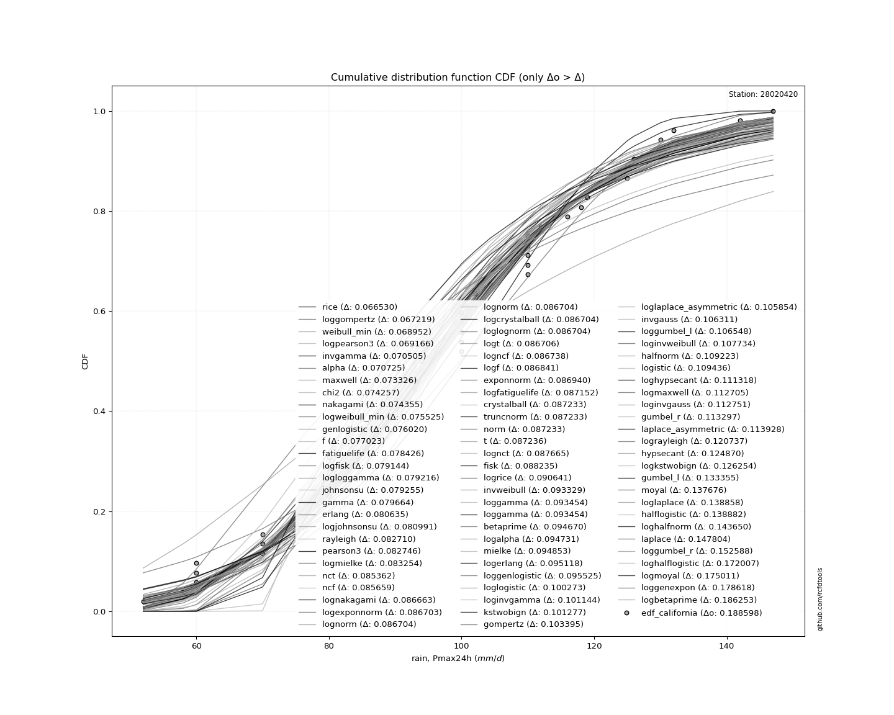</img>

</div>


**1.3. Best fit**

<div align="center">

|   id |   station | empirical_dist   | p_dist   |     delta |   deltao | eval   |   fit |   n |   best_fit |   best_fit_sort |
|-----:|----------:|:-----------------|:---------|----------:|---------:|:-------|------:|----:|-----------:|----------------:|
|    0 |  28020420 | edf_california   | rice     | 0.0665298 | 0.188598 | Δo > Δ |     1 |  52 |          1 |               1 |

</div>


<div align="center">

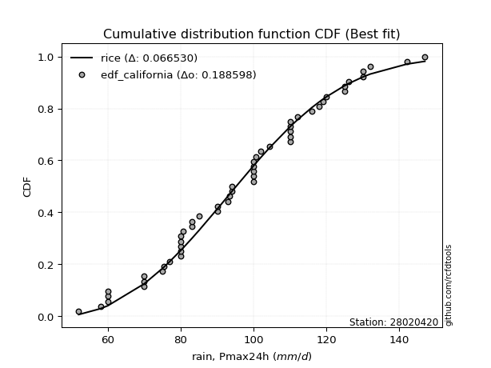</img></img>

</div>


### 2. Empirical - EDF Hazen (1930)

Hazen method for plotting positions is a formula used to estimate the empirical cumulative probability distribution of flood events or other hydrological data. This formula often results in biased estimations, particularly when extrapolating to extreme events (high return periods).

<div align="center">


$P=(m-0.5)/n$


</div>


**2.1. Empirical values**

<div align="center">

|                | 0                    | 1                    | 2                   | 3                  | 4                   | 5                   | 6                  | 7                   | 8                   | 9                   | 10                  | 11                  | 12                 | 13                  | 14                  | 15                 | 16                 | 17                  | 18                 | 19        | 20                 | 21                  | 22                 | 23                 | 24                  | 25                  | 26                 | 27                 | 28                 | 29                 | 30                 | 31                 | 32                 | 33                 | 34                 | 35                 | 36                 | 37                 | 38                 | 39                 | 40                 | 41                 | 42                 | 43                 | 44                 | 45        | 46                 | 47                 | 48                 | 49                 | 50                 | 51                 |
|:---------------|:---------------------|:---------------------|:--------------------|:-------------------|:--------------------|:--------------------|:-------------------|:--------------------|:--------------------|:--------------------|:--------------------|:--------------------|:-------------------|:--------------------|:--------------------|:-------------------|:-------------------|:--------------------|:-------------------|:----------|:-------------------|:--------------------|:-------------------|:-------------------|:--------------------|:--------------------|:-------------------|:-------------------|:-------------------|:-------------------|:-------------------|:-------------------|:-------------------|:-------------------|:-------------------|:-------------------|:-------------------|:-------------------|:-------------------|:-------------------|:-------------------|:-------------------|:-------------------|:-------------------|:-------------------|:----------|:-------------------|:-------------------|:-------------------|:-------------------|:-------------------|:-------------------|
| date           | 2012                 | 1991                 | 1990                | 1984               | 2015                | 1989                | 2000               | 1982                | 1976                | 1997                | 1977                | 2020                | 2014               | 2006                | 2017                | 2011               | 1972               | 2019                | 1995               | 2013      | 2016               | 1999                | 2002               | 1971               | 1975                | 1998                | 1994               | 2004               | 2009               | 1988               | 2018               | 1987               | 1986               | 1970               | 1978               | 1979               | 1983               | 1981               | 2007               | 2021               | 2010               | 1980               | 2001               | 2005               | 2008               | 1992      | 2003               | 1985               | 1993               | 1996               | 1974               | 1973               |
| x              | 52.0                 | 58.0                 | 60.0                | 60.0               | 60.0                | 70.0                | 70.0               | 70.0                | 75.0                | 75.3022389753854    | 77.0                | 80.0                | 80.0               | 80.0                | 80.0                | 80.0               | 80.7600828088943   | 83.0                | 83.0               | 85.0      | 90.0               | 90.0                | 92.9108431434611   | 93.3024589354871   | 94.0                | 94.0                | 100.0              | 100.0              | 100.0              | 100.0              | 100.0              | 100.524899066195   | 102.0              | 104.358339515926   | 110.0              | 110.0              | 110.0              | 110.0              | 110.0              | 112.0              | 116.0              | 118.0              | 119.0              | 120.0              | 125.0              | 125.0     | 126.0              | 130.0              | 130.0              | 132.0              | 142.0              | 147.0              |
| m              | 1                    | 2                    | 3                   | 4                  | 5                   | 6                   | 7                  | 8                   | 9                   | 10                  | 11                  | 12                  | 13                 | 14                  | 15                  | 16                 | 17                 | 18                  | 19                 | 20        | 21                 | 22                  | 23                 | 24                 | 25                  | 26                  | 27                 | 28                 | 29                 | 30                 | 31                 | 32                 | 33                 | 34                 | 35                 | 36                 | 37                 | 38                 | 39                 | 40                 | 41                 | 42                 | 43                 | 44                 | 45                 | 46        | 47                 | 48                 | 49                 | 50                 | 51                 | 52                 |
| empirical_dist | edf_hazen            | edf_hazen            | edf_hazen           | edf_hazen          | edf_hazen           | edf_hazen           | edf_hazen          | edf_hazen           | edf_hazen           | edf_hazen           | edf_hazen           | edf_hazen           | edf_hazen          | edf_hazen           | edf_hazen           | edf_hazen          | edf_hazen          | edf_hazen           | edf_hazen          | edf_hazen | edf_hazen          | edf_hazen           | edf_hazen          | edf_hazen          | edf_hazen           | edf_hazen           | edf_hazen          | edf_hazen          | edf_hazen          | edf_hazen          | edf_hazen          | edf_hazen          | edf_hazen          | edf_hazen          | edf_hazen          | edf_hazen          | edf_hazen          | edf_hazen          | edf_hazen          | edf_hazen          | edf_hazen          | edf_hazen          | edf_hazen          | edf_hazen          | edf_hazen          | edf_hazen | edf_hazen          | edf_hazen          | edf_hazen          | edf_hazen          | edf_hazen          | edf_hazen          |
| empirical      | 0.009615384615384616 | 0.028846153846153848 | 0.04807692307692308 | 0.0673076923076923 | 0.08653846153846154 | 0.10576923076923077 | 0.125              | 0.14423076923076922 | 0.16346153846153846 | 0.18269230769230768 | 0.20192307692307693 | 0.22115384615384615 | 0.2403846153846154 | 0.25961538461538464 | 0.27884615384615385 | 0.2980769230769231 | 0.3173076923076923 | 0.33653846153846156 | 0.3557692307692308 | 0.375     | 0.3942307692307692 | 0.41346153846153844 | 0.4326923076923077 | 0.4519230769230769 | 0.47115384615384615 | 0.49038461538461536 | 0.5096153846153846 | 0.5288461538461539 | 0.5480769230769231 | 0.5673076923076923 | 0.5865384615384616 | 0.6057692307692307 | 0.625              | 0.6442307692307693 | 0.6634615384615384 | 0.6826923076923077 | 0.7019230769230769 | 0.7211538461538461 | 0.7403846153846154 | 0.7596153846153846 | 0.7788461538461539 | 0.7980769230769231 | 0.8173076923076923 | 0.8365384615384616 | 0.8557692307692307 | 0.875     | 0.8942307692307693 | 0.9134615384615384 | 0.9326923076923077 | 0.9519230769230769 | 0.9711538461538461 | 0.9903846153846154 |
| empirical_tr   | 1.0097087378640777   | 1.0297029702970297   | 1.0505050505050506  | 1.0721649484536082 | 1.0947368421052632  | 1.118279569892473   | 1.1428571428571428 | 1.1685393258426966  | 1.1954022988505746  | 1.223529411764706   | 1.253012048192771   | 1.2839506172839505  | 1.3164556962025318 | 1.3506493506493507  | 1.3866666666666667  | 1.4246575342465755 | 1.4647887323943662 | 1.5072463768115942  | 1.5522388059701495 | 1.6       | 1.6507936507936507 | 1.7049180327868851  | 1.7627118644067796 | 1.8245614035087718 | 1.8909090909090909  | 1.9622641509433965  | 2.0392156862745097 | 2.122448979591837  | 2.2127659574468086 | 2.311111111111111  | 2.418604651162791  | 2.536585365853658  | 2.6666666666666665 | 2.810810810810811  | 2.971428571428571  | 3.151515151515152  | 3.3548387096774186 | 3.586206896551724  | 3.8518518518518525 | 4.159999999999999  | 4.521739130434783  | 4.952380952380953  | 5.473684210526315  | 6.117647058823531  | 6.933333333333331  | 8.0       | 9.454545454545459  | 11.555555555555552 | 14.857142857142861 | 20.79999999999998  | 34.66666666666666  | 104.00000000000037 |

</div>


**2.2. Kolmogorov-Smirnov fit test (sorted by Δ)**


<div align="center">

|                | 0                    | 1                   | 2                   | 3                   | 4                   | 5                   | 6                   | 7                   | 8                   | 9                   | 10                  | 11                  | 12                  | 13                  | 14                  | 15                  | 16                  | 17                  | 18                  | 19                  | 20                  | 21                  | 22                  | 23                  | 24                  | 25                  | 26                  | 27                  | 28                  | 29                  | 30                  | 31                  | 32                  | 33                  | 34                  | 35                  | 36                  | 37                  | 38                  | 39                  | 40                  | 41                  | 42                  | 43                  | 44                  | 45                  | 46                  | 47                  | 48                  | 49                  | 50                    | 51                  | 52                  | 53                  | 54                  | 55                  | 56                  | 57                  | 58                  | 59                  | 60                  | 61                  | 62                  | 63                  | 64                  | 65                  | 66                  | 67                  | 68                  | 69                  | 70                  | 71                  | 72                  | 73                  | 74                  | 75                  | 76                  | 77                  | 78                  | 79                  | 80                  | 81                  | 82                  | 83                  | 84                  | 85                  | 86                  | 87                  | 88                  | 89                  |
|:---------------|:---------------------|:--------------------|:--------------------|:--------------------|:--------------------|:--------------------|:--------------------|:--------------------|:--------------------|:--------------------|:--------------------|:--------------------|:--------------------|:--------------------|:--------------------|:--------------------|:--------------------|:--------------------|:--------------------|:--------------------|:--------------------|:--------------------|:--------------------|:--------------------|:--------------------|:--------------------|:--------------------|:--------------------|:--------------------|:--------------------|:--------------------|:--------------------|:--------------------|:--------------------|:--------------------|:--------------------|:--------------------|:--------------------|:--------------------|:--------------------|:--------------------|:--------------------|:--------------------|:--------------------|:--------------------|:--------------------|:--------------------|:--------------------|:--------------------|:--------------------|:----------------------|:--------------------|:--------------------|:--------------------|:--------------------|:--------------------|:--------------------|:--------------------|:--------------------|:--------------------|:--------------------|:--------------------|:--------------------|:--------------------|:--------------------|:--------------------|:--------------------|:--------------------|:--------------------|:--------------------|:--------------------|:--------------------|:--------------------|:--------------------|:--------------------|:--------------------|:--------------------|:--------------------|:--------------------|:--------------------|:--------------------|:--------------------|:--------------------|:--------------------|:--------------------|:--------------------|:--------------------|:--------------------|:--------------------|:--------------------|
| station        | 28020420             | 28020420            | 28020420            | 28020420            | 28020420            | 28020420            | 28020420            | 28020420            | 28020420            | 28020420            | 28020420            | 28020420            | 28020420            | 28020420            | 28020420            | 28020420            | 28020420            | 28020420            | 28020420            | 28020420            | 28020420            | 28020420            | 28020420            | 28020420            | 28020420            | 28020420            | 28020420            | 28020420            | 28020420            | 28020420            | 28020420            | 28020420            | 28020420            | 28020420            | 28020420            | 28020420            | 28020420            | 28020420            | 28020420            | 28020420            | 28020420            | 28020420            | 28020420            | 28020420            | 28020420            | 28020420            | 28020420            | 28020420            | 28020420            | 28020420            | 28020420              | 28020420            | 28020420            | 28020420            | 28020420            | 28020420            | 28020420            | 28020420            | 28020420            | 28020420            | 28020420            | 28020420            | 28020420            | 28020420            | 28020420            | 28020420            | 28020420            | 28020420            | 28020420            | 28020420            | 28020420            | 28020420            | 28020420            | 28020420            | 28020420            | 28020420            | 28020420            | 28020420            | 28020420            | 28020420            | 28020420            | 28020420            | 28020420            | 28020420            | 28020420            | 28020420            | 28020420            | 28020420            | 28020420            | 28020420            |
| empirical_dist | edf_hazen            | edf_hazen           | edf_hazen           | edf_hazen           | edf_hazen           | edf_hazen           | edf_hazen           | edf_hazen           | edf_hazen           | edf_hazen           | edf_hazen           | edf_hazen           | edf_hazen           | edf_hazen           | edf_hazen           | edf_hazen           | edf_hazen           | edf_hazen           | edf_hazen           | edf_hazen           | edf_hazen           | edf_hazen           | edf_hazen           | edf_hazen           | edf_hazen           | edf_hazen           | edf_hazen           | edf_hazen           | edf_hazen           | edf_hazen           | edf_hazen           | edf_hazen           | edf_hazen           | edf_hazen           | edf_hazen           | edf_hazen           | edf_hazen           | edf_hazen           | edf_hazen           | edf_hazen           | edf_hazen           | edf_hazen           | edf_hazen           | edf_hazen           | edf_hazen           | edf_hazen           | edf_hazen           | edf_hazen           | edf_hazen           | edf_hazen           | edf_hazen             | edf_hazen           | edf_hazen           | edf_hazen           | edf_hazen           | edf_hazen           | edf_hazen           | edf_hazen           | edf_hazen           | edf_hazen           | edf_hazen           | edf_hazen           | edf_hazen           | edf_hazen           | edf_hazen           | edf_hazen           | edf_hazen           | edf_hazen           | edf_hazen           | edf_hazen           | edf_hazen           | edf_hazen           | edf_hazen           | edf_hazen           | edf_hazen           | edf_hazen           | edf_hazen           | edf_hazen           | edf_hazen           | edf_hazen           | edf_hazen           | edf_hazen           | edf_hazen           | edf_hazen           | edf_hazen           | edf_hazen           | edf_hazen           | edf_hazen           | edf_hazen           | edf_hazen           |
| p_dist         | loggompertz          | logweibull_min      | weibull_min         | logloggamma         | johnsonsu           | fatiguelife         | gamma               | rice                | f                   | erlang              | logjohnsonsu        | pearson3            | chi2                | logpearson3         | nct                 | exponnorm           | invgamma            | crystalball         | truncnorm           | norm                | t                   | alpha               | fisk                | maxwell             | nakagami            | mielke              | logfisk             | genlogistic         | loggenlogistic      | rayleigh            | logmielke           | gompertz            | ncf                 | lognakagami         | logexponnorm        | lognorm             | lognorm             | logcrystalball      | loglognorm          | logt                | logncf              | logf                | logfatiguelife      | loggumbel_l         | lognct              | logistic            | logrice             | invweibull          | loggamma            | loggamma            | loglaplace_asymmetric | betaprime           | laplace_asymmetric  | logalpha            | logerlang           | loglogistic         | loginvgamma         | kstwobign           | loginvweibull       | hypsecant           | invgauss            | halfnorm            | loghypsecant        | logmaxwell          | loginvgauss         | gumbel_r            | gumbel_l            | lograyleigh         | logkstwobign        | laplace             | halflogistic        | moyal               | loglaplace          | loghalfnorm         | loggumbel_r         | logbetaprime        | loghalflogistic     | logmoyal            | loggenexpon         | wald                | expon               | pareto              | logwald             | loggibrat           | logtruncnorm        | gibrat              | logexpon            | logpareto           | logchi2             | genexpon            |
| delta          | 0.057604084613605666 | 0.06682420562316027 | 0.06939100306364654 | 0.06960031600091637 | 0.06963941267852597 | 0.06991396628734181 | 0.07004872988368177 | 0.0700977910605014  | 0.07058049490509566 | 0.07101981571396077 | 0.07137591979080965 | 0.07313071609728278 | 0.0736257721882222  | 0.0749231636640042  | 0.07574650432293079 | 0.07732442629321512 | 0.07752481506154041 | 0.0776174039926169  | 0.07761740846506765 | 0.07761740899013536 | 0.07762028131987858 | 0.07859497862075959 | 0.07861925034735456 | 0.08294105575218025 | 0.08397049582158056 | 0.08523732297734049 | 0.08563254116212426 | 0.08563558218271217 | 0.085909116497079   | 0.09232519792674676 | 0.09286969174067261 | 0.0937792959068503  | 0.09527412827140158 | 0.09627832348323151 | 0.09631877829259228 | 0.09631975864951903 | 0.09631975864951903 | 0.09631976290912536 | 0.09631981716859273 | 0.09632153436249113 | 0.09635306212086381 | 0.09645674286901573 | 0.09676771562189113 | 0.09693279187598669 | 0.09728015639855636 | 0.09982034160568926 | 0.10025647334204713 | 0.10294433852664919 | 0.10306985254352519 | 0.10306985254352519 | 0.10402154464921132   | 0.10428531001067487 | 0.10431279966122597 | 0.10434649063566592 | 0.10473362590211122 | 0.10988792636231648 | 0.11075903102327833 | 0.11089228333605572 | 0.11297131352908385 | 0.1152546588064638  | 0.11592685841161043 | 0.11883801604530031 | 0.12093296205607273 | 0.12232081487048374 | 0.12236661148933592 | 0.12291273403242331 | 0.12373987770087538 | 0.1303520107885392  | 0.13586914241094805 | 0.13818876817891693 | 0.1465141943657664  | 0.14729126399019554 | 0.14847300818614584 | 0.1532657106118811  | 0.1622029781907911  | 0.17663798671881648 | 0.18162257121704983 | 0.18462598479985648 | 0.18823304948793507 | 0.21495322130380345 | 0.246683342967691   | 0.24668335540706243 | 0.24719965036898106 | 0.279039305116238   | 0.2887228416654507  | 0.28949216846783027 | 0.3001779492753217  | 0.3001779609781917  | 0.33112584145874757 | 0.8845901182460704  |
| deltao         | 0.18859806671657792  | 0.18859806671657792 | 0.18859806671657792 | 0.18859806671657792 | 0.18859806671657792 | 0.18859806671657792 | 0.18859806671657792 | 0.18859806671657792 | 0.18859806671657792 | 0.18859806671657792 | 0.18859806671657792 | 0.18859806671657792 | 0.18859806671657792 | 0.18859806671657792 | 0.18859806671657792 | 0.18859806671657792 | 0.18859806671657792 | 0.18859806671657792 | 0.18859806671657792 | 0.18859806671657792 | 0.18859806671657792 | 0.18859806671657792 | 0.18859806671657792 | 0.18859806671657792 | 0.18859806671657792 | 0.18859806671657792 | 0.18859806671657792 | 0.18859806671657792 | 0.18859806671657792 | 0.18859806671657792 | 0.18859806671657792 | 0.18859806671657792 | 0.18859806671657792 | 0.18859806671657792 | 0.18859806671657792 | 0.18859806671657792 | 0.18859806671657792 | 0.18859806671657792 | 0.18859806671657792 | 0.18859806671657792 | 0.18859806671657792 | 0.18859806671657792 | 0.18859806671657792 | 0.18859806671657792 | 0.18859806671657792 | 0.18859806671657792 | 0.18859806671657792 | 0.18859806671657792 | 0.18859806671657792 | 0.18859806671657792 | 0.18859806671657792   | 0.18859806671657792 | 0.18859806671657792 | 0.18859806671657792 | 0.18859806671657792 | 0.18859806671657792 | 0.18859806671657792 | 0.18859806671657792 | 0.18859806671657792 | 0.18859806671657792 | 0.18859806671657792 | 0.18859806671657792 | 0.18859806671657792 | 0.18859806671657792 | 0.18859806671657792 | 0.18859806671657792 | 0.18859806671657792 | 0.18859806671657792 | 0.18859806671657792 | 0.18859806671657792 | 0.18859806671657792 | 0.18859806671657792 | 0.18859806671657792 | 0.18859806671657792 | 0.18859806671657792 | 0.18859806671657792 | 0.18859806671657792 | 0.18859806671657792 | 0.18859806671657792 | 0.18859806671657792 | 0.18859806671657792 | 0.18859806671657792 | 0.18859806671657792 | 0.18859806671657792 | 0.18859806671657792 | 0.18859806671657792 | 0.18859806671657792 | 0.18859806671657792 | 0.18859806671657792 | 0.18859806671657792 |
| eval           | Δo > Δ               | Δo > Δ              | Δo > Δ              | Δo > Δ              | Δo > Δ              | Δo > Δ              | Δo > Δ              | Δo > Δ              | Δo > Δ              | Δo > Δ              | Δo > Δ              | Δo > Δ              | Δo > Δ              | Δo > Δ              | Δo > Δ              | Δo > Δ              | Δo > Δ              | Δo > Δ              | Δo > Δ              | Δo > Δ              | Δo > Δ              | Δo > Δ              | Δo > Δ              | Δo > Δ              | Δo > Δ              | Δo > Δ              | Δo > Δ              | Δo > Δ              | Δo > Δ              | Δo > Δ              | Δo > Δ              | Δo > Δ              | Δo > Δ              | Δo > Δ              | Δo > Δ              | Δo > Δ              | Δo > Δ              | Δo > Δ              | Δo > Δ              | Δo > Δ              | Δo > Δ              | Δo > Δ              | Δo > Δ              | Δo > Δ              | Δo > Δ              | Δo > Δ              | Δo > Δ              | Δo > Δ              | Δo > Δ              | Δo > Δ              | Δo > Δ                | Δo > Δ              | Δo > Δ              | Δo > Δ              | Δo > Δ              | Δo > Δ              | Δo > Δ              | Δo > Δ              | Δo > Δ              | Δo > Δ              | Δo > Δ              | Δo > Δ              | Δo > Δ              | Δo > Δ              | Δo > Δ              | Δo > Δ              | Δo > Δ              | Δo > Δ              | Δo > Δ              | Δo > Δ              | Δo > Δ              | Δo > Δ              | Δo > Δ              | Δo > Δ              | Δo > Δ              | Δo > Δ              | Δo > Δ              | Δo > Δ              | Δo > Δ              | Δo <= Δ             | Δo <= Δ             | Δo <= Δ             | Δo <= Δ             | Δo <= Δ             | Δo <= Δ             | Δo <= Δ             | Δo <= Δ             | Δo <= Δ             | Δo <= Δ             | Δo <= Δ             |
| fit            | 1                    | 1                   | 1                   | 1                   | 1                   | 1                   | 1                   | 1                   | 1                   | 1                   | 1                   | 1                   | 1                   | 1                   | 1                   | 1                   | 1                   | 1                   | 1                   | 1                   | 1                   | 1                   | 1                   | 1                   | 1                   | 1                   | 1                   | 1                   | 1                   | 1                   | 1                   | 1                   | 1                   | 1                   | 1                   | 1                   | 1                   | 1                   | 1                   | 1                   | 1                   | 1                   | 1                   | 1                   | 1                   | 1                   | 1                   | 1                   | 1                   | 1                   | 1                     | 1                   | 1                   | 1                   | 1                   | 1                   | 1                   | 1                   | 1                   | 1                   | 1                   | 1                   | 1                   | 1                   | 1                   | 1                   | 1                   | 1                   | 1                   | 1                   | 1                   | 1                   | 1                   | 1                   | 1                   | 1                   | 1                   | 1                   | 1                   | 0                   | 0                   | 0                   | 0                   | 0                   | 0                   | 0                   | 0                   | 0                   | 0                   | 0                   |
| n              | 52                   | 52                  | 52                  | 52                  | 52                  | 52                  | 52                  | 52                  | 52                  | 52                  | 52                  | 52                  | 52                  | 52                  | 52                  | 52                  | 52                  | 52                  | 52                  | 52                  | 52                  | 52                  | 52                  | 52                  | 52                  | 52                  | 52                  | 52                  | 52                  | 52                  | 52                  | 52                  | 52                  | 52                  | 52                  | 52                  | 52                  | 52                  | 52                  | 52                  | 52                  | 52                  | 52                  | 52                  | 52                  | 52                  | 52                  | 52                  | 52                  | 52                  | 52                    | 52                  | 52                  | 52                  | 52                  | 52                  | 52                  | 52                  | 52                  | 52                  | 52                  | 52                  | 52                  | 52                  | 52                  | 52                  | 52                  | 52                  | 52                  | 52                  | 52                  | 52                  | 52                  | 52                  | 52                  | 52                  | 52                  | 52                  | 52                  | 52                  | 52                  | 52                  | 52                  | 52                  | 52                  | 52                  | 52                  | 52                  | 52                  | 52                  |
| best_fit       | 1                    | 0                   | 0                   | 0                   | 0                   | 0                   | 0                   | 0                   | 0                   | 0                   | 0                   | 0                   | 0                   | 0                   | 0                   | 0                   | 0                   | 0                   | 0                   | 0                   | 0                   | 0                   | 0                   | 0                   | 0                   | 0                   | 0                   | 0                   | 0                   | 0                   | 0                   | 0                   | 0                   | 0                   | 0                   | 0                   | 0                   | 0                   | 0                   | 0                   | 0                   | 0                   | 0                   | 0                   | 0                   | 0                   | 0                   | 0                   | 0                   | 0                   | 0                     | 0                   | 0                   | 0                   | 0                   | 0                   | 0                   | 0                   | 0                   | 0                   | 0                   | 0                   | 0                   | 0                   | 0                   | 0                   | 0                   | 0                   | 0                   | 0                   | 0                   | 0                   | 0                   | 0                   | 0                   | 0                   | 0                   | 0                   | 0                   | 0                   | 0                   | 0                   | 0                   | 0                   | 0                   | 0                   | 0                   | 0                   | 0                   | 0                   |
| best_fit_sort  | 1                    | 2                   | 3                   | 4                   | 5                   | 6                   | 7                   | 8                   | 9                   | 10                  | 11                  | 12                  | 13                  | 14                  | 15                  | 16                  | 17                  | 18                  | 19                  | 20                  | 21                  | 22                  | 23                  | 24                  | 25                  | 26                  | 27                  | 28                  | 29                  | 30                  | 31                  | 32                  | 33                  | 34                  | 35                  | 36                  | 37                  | 38                  | 39                  | 40                  | 41                  | 42                  | 43                  | 44                  | 45                  | 46                  | 47                  | 48                  | 49                  | 50                  | 51                    | 52                  | 53                  | 54                  | 55                  | 56                  | 57                  | 58                  | 59                  | 60                  | 61                  | 62                  | 63                  | 64                  | 65                  | 66                  | 67                  | 68                  | 69                  | 70                  | 71                  | 72                  | 73                  | 74                  | 75                  | 76                  | 77                  | 78                  | 79                  | 80                  | 81                  | 82                  | 83                  | 84                  | 85                  | 86                  | 87                  | 88                  | 89                  | 90                  |

</div>


<div align="center">

</img>

</div>


**2.3. Best fit**

<div align="center">

|   id |   station | empirical_dist   | p_dist      |     delta |   deltao | eval   |   fit |   n |   best_fit |   best_fit_sort |
|-----:|----------:|:-----------------|:------------|----------:|---------:|:-------|------:|----:|-----------:|----------------:|
|    0 |  28020420 | edf_hazen        | loggompertz | 0.0576041 | 0.188598 | Δo > Δ |     1 |  52 |          1 |               1 |

</div>


<div align="center">

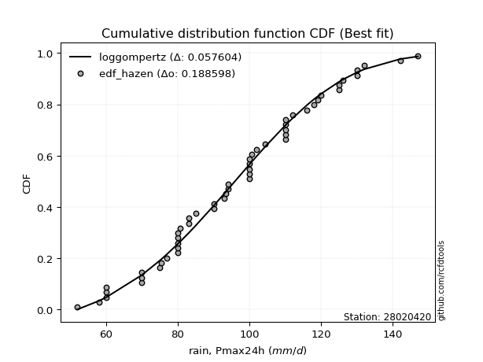</img>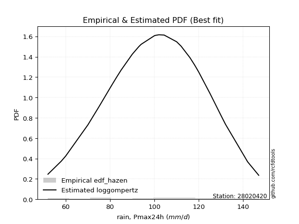</img>

</div>


### 3. Empirical - EDF Weibull (1939)

Weibull plotting position formula is an empirical method used to estimate the non-exceedance probability or plotting position for a set of observed data, is often recommended or widely used in practice, particularly in flood frequency analysis.

<div align="center">


$P=m/(n+1)$


</div>


**3.1. Empirical values**

<div align="center">

|                | 0                    | 1                   | 2                   | 3                   | 4                   | 5                   | 6                  | 7                  | 8                   | 9                   | 10                  | 11                  | 12                  | 13                 | 14                 | 15                 | 16                  | 17                  | 18                 | 19                  | 20                  | 21                  | 22                 | 23                 | 24                 | 25                  | 26                 | 27                 | 28                 | 29                 | 30                 | 31                 | 32                 | 33                 | 34                | 35                 | 36                 | 37                 | 38                 | 39                 | 40                 | 41                 | 42                 | 43                 | 44                 | 45                 | 46                 | 47                 | 48                 | 49                 | 50                 | 51                 |
|:---------------|:---------------------|:--------------------|:--------------------|:--------------------|:--------------------|:--------------------|:-------------------|:-------------------|:--------------------|:--------------------|:--------------------|:--------------------|:--------------------|:-------------------|:-------------------|:-------------------|:--------------------|:--------------------|:-------------------|:--------------------|:--------------------|:--------------------|:-------------------|:-------------------|:-------------------|:--------------------|:-------------------|:-------------------|:-------------------|:-------------------|:-------------------|:-------------------|:-------------------|:-------------------|:------------------|:-------------------|:-------------------|:-------------------|:-------------------|:-------------------|:-------------------|:-------------------|:-------------------|:-------------------|:-------------------|:-------------------|:-------------------|:-------------------|:-------------------|:-------------------|:-------------------|:-------------------|
| date           | 2012                 | 1991                | 1990                | 1984                | 2015                | 1989                | 2000               | 1982               | 1976                | 1997                | 1977                | 2020                | 2014                | 2006               | 2017               | 2011               | 1972                | 2019                | 1995               | 2013                | 2016                | 1999                | 2002               | 1971               | 1975               | 1998                | 1994               | 2004               | 2009               | 1988               | 2018               | 1987               | 1986               | 1970               | 1978              | 1979               | 1983               | 1981               | 2007               | 2021               | 2010               | 1980               | 2001               | 2005               | 2008               | 1992               | 2003               | 1985               | 1993               | 1996               | 1974               | 1973               |
| x              | 52.0                 | 58.0                | 60.0                | 60.0                | 60.0                | 70.0                | 70.0               | 70.0               | 75.0                | 75.3022389753854    | 77.0                | 80.0                | 80.0                | 80.0               | 80.0               | 80.0               | 80.7600828088943    | 83.0                | 83.0               | 85.0                | 90.0                | 90.0                | 92.9108431434611   | 93.3024589354871   | 94.0               | 94.0                | 100.0              | 100.0              | 100.0              | 100.0              | 100.0              | 100.524899066195   | 102.0              | 104.358339515926   | 110.0             | 110.0              | 110.0              | 110.0              | 110.0              | 112.0              | 116.0              | 118.0              | 119.0              | 120.0              | 125.0              | 125.0              | 126.0              | 130.0              | 130.0              | 132.0              | 142.0              | 147.0              |
| m              | 1                    | 2                   | 3                   | 4                   | 5                   | 6                   | 7                  | 8                  | 9                   | 10                  | 11                  | 12                  | 13                  | 14                 | 15                 | 16                 | 17                  | 18                  | 19                 | 20                  | 21                  | 22                  | 23                 | 24                 | 25                 | 26                  | 27                 | 28                 | 29                 | 30                 | 31                 | 32                 | 33                 | 34                 | 35                | 36                 | 37                 | 38                 | 39                 | 40                 | 41                 | 42                 | 43                 | 44                 | 45                 | 46                 | 47                 | 48                 | 49                 | 50                 | 51                 | 52                 |
| empirical_dist | edf_weibull          | edf_weibull         | edf_weibull         | edf_weibull         | edf_weibull         | edf_weibull         | edf_weibull        | edf_weibull        | edf_weibull         | edf_weibull         | edf_weibull         | edf_weibull         | edf_weibull         | edf_weibull        | edf_weibull        | edf_weibull        | edf_weibull         | edf_weibull         | edf_weibull        | edf_weibull         | edf_weibull         | edf_weibull         | edf_weibull        | edf_weibull        | edf_weibull        | edf_weibull         | edf_weibull        | edf_weibull        | edf_weibull        | edf_weibull        | edf_weibull        | edf_weibull        | edf_weibull        | edf_weibull        | edf_weibull       | edf_weibull        | edf_weibull        | edf_weibull        | edf_weibull        | edf_weibull        | edf_weibull        | edf_weibull        | edf_weibull        | edf_weibull        | edf_weibull        | edf_weibull        | edf_weibull        | edf_weibull        | edf_weibull        | edf_weibull        | edf_weibull        | edf_weibull        |
| empirical      | 0.018867924528301886 | 0.03773584905660377 | 0.05660377358490566 | 0.07547169811320754 | 0.09433962264150944 | 0.11320754716981132 | 0.1320754716981132 | 0.1509433962264151 | 0.16981132075471697 | 0.18867924528301888 | 0.20754716981132076 | 0.22641509433962265 | 0.24528301886792453 | 0.2641509433962264 | 0.2830188679245283 | 0.3018867924528302 | 0.32075471698113206 | 0.33962264150943394 | 0.3584905660377358 | 0.37735849056603776 | 0.39622641509433965 | 0.41509433962264153 | 0.4339622641509434 | 0.4528301886792453 | 0.4716981132075472 | 0.49056603773584906 | 0.5094339622641509 | 0.5283018867924528 | 0.5471698113207547 | 0.5660377358490566 | 0.5849056603773585 | 0.6037735849056604 | 0.6226415094339622 | 0.6415094339622641 | 0.660377358490566 | 0.6792452830188679 | 0.6981132075471698 | 0.7169811320754716 | 0.7358490566037735 | 0.7547169811320755 | 0.7735849056603774 | 0.7924528301886793 | 0.8113207547169812 | 0.8301886792452831 | 0.8490566037735849 | 0.8679245283018868 | 0.8867924528301887 | 0.9056603773584906 | 0.9245283018867925 | 0.9433962264150944 | 0.9622641509433962 | 0.9811320754716981 |
| empirical_tr   | 1.0192307692307692   | 1.0392156862745099  | 1.06                | 1.0816326530612246  | 1.1041666666666667  | 1.127659574468085   | 1.1521739130434783 | 1.1777777777777778 | 1.2045454545454546  | 1.2325581395348837  | 1.2619047619047619  | 1.292682926829268   | 1.325               | 1.3589743589743588 | 1.394736842105263  | 1.4324324324324322 | 1.472222222222222   | 1.514285714285714   | 1.5588235294117645 | 1.6060606060606062  | 1.65625             | 1.7096774193548387  | 1.7666666666666666 | 1.8275862068965518 | 1.8928571428571428 | 1.962962962962963   | 2.0384615384615383 | 2.12               | 2.2083333333333335 | 2.3043478260869565 | 2.409090909090909  | 2.5238095238095237 | 2.65               | 2.789473684210526  | 2.944444444444444 | 3.117647058823529  | 3.3124999999999996 | 3.5333333333333328 | 3.785714285714285  | 4.0769230769230775 | 4.416666666666668  | 4.818181818181819  | 5.300000000000002  | 5.88888888888889   | 6.625000000000002  | 7.571428571428573  | 8.833333333333336  | 10.600000000000003 | 13.250000000000004 | 17.66666666666667  | 26.500000000000007 | 53.000000000000014 |

</div>


**3.2. Kolmogorov-Smirnov fit test (sorted by Δ)**


<div align="center">

|                | 0                   | 1                   | 2                   | 3                   | 4                   | 5                   | 6                   | 7                   | 8                   | 9                   | 10                  | 11                  | 12                  | 13                  | 14                  | 15                  | 16                  | 17                  | 18                  | 19                  | 20                  | 21                  | 22                  | 23                  | 24                  | 25                  | 26                  | 27                  | 28                  | 29                  | 30                  | 31                  | 32                  | 33                  | 34                  | 35                  | 36                  | 37                  | 38                  | 39                  | 40                  | 41                  | 42                  | 43                  | 44                  | 45                  | 46                  | 47                  | 48                  | 49                  | 50                  | 51                  | 52                  | 53                  | 54                    | 55                  | 56                  | 57                  | 58                  | 59                  | 60                  | 61                  | 62                  | 63                  | 64                  | 65                  | 66                  | 67                  | 68                  | 69                  | 70                  | 71                  | 72                  | 73                  | 74                  | 75                  | 76                  | 77                  | 78                  | 79                  | 80                  | 81                  | 82                  | 83                  | 84                  | 85                  | 86                  | 87                  | 88                  | 89                  |
|:---------------|:--------------------|:--------------------|:--------------------|:--------------------|:--------------------|:--------------------|:--------------------|:--------------------|:--------------------|:--------------------|:--------------------|:--------------------|:--------------------|:--------------------|:--------------------|:--------------------|:--------------------|:--------------------|:--------------------|:--------------------|:--------------------|:--------------------|:--------------------|:--------------------|:--------------------|:--------------------|:--------------------|:--------------------|:--------------------|:--------------------|:--------------------|:--------------------|:--------------------|:--------------------|:--------------------|:--------------------|:--------------------|:--------------------|:--------------------|:--------------------|:--------------------|:--------------------|:--------------------|:--------------------|:--------------------|:--------------------|:--------------------|:--------------------|:--------------------|:--------------------|:--------------------|:--------------------|:--------------------|:--------------------|:----------------------|:--------------------|:--------------------|:--------------------|:--------------------|:--------------------|:--------------------|:--------------------|:--------------------|:--------------------|:--------------------|:--------------------|:--------------------|:--------------------|:--------------------|:--------------------|:--------------------|:--------------------|:--------------------|:--------------------|:--------------------|:--------------------|:--------------------|:--------------------|:--------------------|:--------------------|:--------------------|:--------------------|:--------------------|:--------------------|:--------------------|:--------------------|:--------------------|:--------------------|:--------------------|:--------------------|
| station        | 28020420            | 28020420            | 28020420            | 28020420            | 28020420            | 28020420            | 28020420            | 28020420            | 28020420            | 28020420            | 28020420            | 28020420            | 28020420            | 28020420            | 28020420            | 28020420            | 28020420            | 28020420            | 28020420            | 28020420            | 28020420            | 28020420            | 28020420            | 28020420            | 28020420            | 28020420            | 28020420            | 28020420            | 28020420            | 28020420            | 28020420            | 28020420            | 28020420            | 28020420            | 28020420            | 28020420            | 28020420            | 28020420            | 28020420            | 28020420            | 28020420            | 28020420            | 28020420            | 28020420            | 28020420            | 28020420            | 28020420            | 28020420            | 28020420            | 28020420            | 28020420            | 28020420            | 28020420            | 28020420            | 28020420              | 28020420            | 28020420            | 28020420            | 28020420            | 28020420            | 28020420            | 28020420            | 28020420            | 28020420            | 28020420            | 28020420            | 28020420            | 28020420            | 28020420            | 28020420            | 28020420            | 28020420            | 28020420            | 28020420            | 28020420            | 28020420            | 28020420            | 28020420            | 28020420            | 28020420            | 28020420            | 28020420            | 28020420            | 28020420            | 28020420            | 28020420            | 28020420            | 28020420            | 28020420            | 28020420            |
| empirical_dist | edf_weibull         | edf_weibull         | edf_weibull         | edf_weibull         | edf_weibull         | edf_weibull         | edf_weibull         | edf_weibull         | edf_weibull         | edf_weibull         | edf_weibull         | edf_weibull         | edf_weibull         | edf_weibull         | edf_weibull         | edf_weibull         | edf_weibull         | edf_weibull         | edf_weibull         | edf_weibull         | edf_weibull         | edf_weibull         | edf_weibull         | edf_weibull         | edf_weibull         | edf_weibull         | edf_weibull         | edf_weibull         | edf_weibull         | edf_weibull         | edf_weibull         | edf_weibull         | edf_weibull         | edf_weibull         | edf_weibull         | edf_weibull         | edf_weibull         | edf_weibull         | edf_weibull         | edf_weibull         | edf_weibull         | edf_weibull         | edf_weibull         | edf_weibull         | edf_weibull         | edf_weibull         | edf_weibull         | edf_weibull         | edf_weibull         | edf_weibull         | edf_weibull         | edf_weibull         | edf_weibull         | edf_weibull         | edf_weibull           | edf_weibull         | edf_weibull         | edf_weibull         | edf_weibull         | edf_weibull         | edf_weibull         | edf_weibull         | edf_weibull         | edf_weibull         | edf_weibull         | edf_weibull         | edf_weibull         | edf_weibull         | edf_weibull         | edf_weibull         | edf_weibull         | edf_weibull         | edf_weibull         | edf_weibull         | edf_weibull         | edf_weibull         | edf_weibull         | edf_weibull         | edf_weibull         | edf_weibull         | edf_weibull         | edf_weibull         | edf_weibull         | edf_weibull         | edf_weibull         | edf_weibull         | edf_weibull         | edf_weibull         | edf_weibull         | edf_weibull         |
| p_dist         | loggompertz         | weibull_min         | logweibull_min      | rice                | logloggamma         | johnsonsu           | gamma               | fatiguelife         | f                   | erlang              | logjohnsonsu        | logpearson3         | chi2                | pearson3            | invgamma            | nct                 | alpha               | exponnorm           | crystalball         | truncnorm           | norm                | t                   | fisk                | maxwell             | nakagami            | logfisk             | genlogistic         | mielke              | loggenlogistic      | gompertz            | rayleigh            | ncf                 | logmielke           | lognakagami         | logexponnorm        | lognorm             | lognorm             | logcrystalball      | loglognorm          | logt                | logncf              | logf                | logfatiguelife      | lognct              | loggumbel_l         | logrice             | logistic            | invweibull          | loggamma            | loggamma            | betaprime           | logalpha            | logerlang           | laplace_asymmetric  | loglaplace_asymmetric | loglogistic         | loginvgamma         | kstwobign           | loginvweibull       | invgauss            | hypsecant           | halfnorm            | loghypsecant        | logmaxwell          | loginvgauss         | gumbel_r            | gumbel_l            | lograyleigh         | logkstwobign        | laplace             | halflogistic        | moyal               | loglaplace          | loghalfnorm         | loggumbel_r         | logbetaprime        | loghalflogistic     | loggenexpon         | logmoyal            | wald                | expon               | pareto              | logwald             | loggibrat           | logtruncnorm        | gibrat              | logexpon            | logpareto           | logchi2             | genexpon            |
| delta          | 0.06032541988211071 | 0.06957242541488018 | 0.0699083855941327  | 0.07027921341173504 | 0.07232165126942142 | 0.07248317110776326 | 0.07277006515218681 | 0.07299814625831424 | 0.07366467487606809 | 0.07374115098246581 | 0.07409725505931469 | 0.07510458601523784 | 0.07552495235432954 | 0.07585205136578782 | 0.07770623741277405 | 0.07846783959143583 | 0.0790222457293277  | 0.08004576156172016 | 0.08033873926112195 | 0.08033874373357269 | 0.0803387442586404  | 0.08034161658838362 | 0.0813405856158596  | 0.08312247810341389 | 0.0841519181728142  | 0.0858139635133579  | 0.0858170045339458  | 0.08795865824584553 | 0.08863045176558404 | 0.09178365004327993 | 0.0925066202779804  | 0.09545555062263522 | 0.09595387171164504 | 0.09645974583446515 | 0.09650020064382592 | 0.09650118100075267 | 0.09650118100075267 | 0.096501185260359   | 0.09650123951982637 | 0.09650295671372477 | 0.09653448447209745 | 0.09663816522024937 | 0.09694913797312477 | 0.09746157874979    | 0.09965412714449173 | 0.10043789569328077 | 0.1025416768741943  | 0.10312576087788283 | 0.10325127489475883 | 0.10325127489475883 | 0.10446673236190851 | 0.10452791298689956 | 0.10491504825334486 | 0.10703413492973102 | 0.10710572462018375   | 0.11006934871355012 | 0.11094045337451197 | 0.11107370568728936 | 0.11315273588031749 | 0.11610828076284407 | 0.11797599407496884 | 0.11901943839653395 | 0.12166308538427173 | 0.12250223722171738 | 0.12254803384056956 | 0.12309415638365695 | 0.12646121296938043 | 0.13053343313977284 | 0.13389102128966346 | 0.14091010344742197 | 0.14669561671700004 | 0.14747268634142918 | 0.14865443053737948 | 0.15344713296311474 | 0.16238440054202474 | 0.16811113621083396 | 0.18180399356828347 | 0.18297180130215857 | 0.18480740715109012 | 0.2151346436550371  | 0.2414220947819145  | 0.24142210722128593 | 0.2473810727202147  | 0.2792207274674716  | 0.2831308859878005  | 0.2933020378437374  | 0.2938281669821432  | 0.2938281786850132  | 0.32477605916556906 | 0.8771518018454898  |
| deltao         | 0.18859806671657792 | 0.18859806671657792 | 0.18859806671657792 | 0.18859806671657792 | 0.18859806671657792 | 0.18859806671657792 | 0.18859806671657792 | 0.18859806671657792 | 0.18859806671657792 | 0.18859806671657792 | 0.18859806671657792 | 0.18859806671657792 | 0.18859806671657792 | 0.18859806671657792 | 0.18859806671657792 | 0.18859806671657792 | 0.18859806671657792 | 0.18859806671657792 | 0.18859806671657792 | 0.18859806671657792 | 0.18859806671657792 | 0.18859806671657792 | 0.18859806671657792 | 0.18859806671657792 | 0.18859806671657792 | 0.18859806671657792 | 0.18859806671657792 | 0.18859806671657792 | 0.18859806671657792 | 0.18859806671657792 | 0.18859806671657792 | 0.18859806671657792 | 0.18859806671657792 | 0.18859806671657792 | 0.18859806671657792 | 0.18859806671657792 | 0.18859806671657792 | 0.18859806671657792 | 0.18859806671657792 | 0.18859806671657792 | 0.18859806671657792 | 0.18859806671657792 | 0.18859806671657792 | 0.18859806671657792 | 0.18859806671657792 | 0.18859806671657792 | 0.18859806671657792 | 0.18859806671657792 | 0.18859806671657792 | 0.18859806671657792 | 0.18859806671657792 | 0.18859806671657792 | 0.18859806671657792 | 0.18859806671657792 | 0.18859806671657792   | 0.18859806671657792 | 0.18859806671657792 | 0.18859806671657792 | 0.18859806671657792 | 0.18859806671657792 | 0.18859806671657792 | 0.18859806671657792 | 0.18859806671657792 | 0.18859806671657792 | 0.18859806671657792 | 0.18859806671657792 | 0.18859806671657792 | 0.18859806671657792 | 0.18859806671657792 | 0.18859806671657792 | 0.18859806671657792 | 0.18859806671657792 | 0.18859806671657792 | 0.18859806671657792 | 0.18859806671657792 | 0.18859806671657792 | 0.18859806671657792 | 0.18859806671657792 | 0.18859806671657792 | 0.18859806671657792 | 0.18859806671657792 | 0.18859806671657792 | 0.18859806671657792 | 0.18859806671657792 | 0.18859806671657792 | 0.18859806671657792 | 0.18859806671657792 | 0.18859806671657792 | 0.18859806671657792 | 0.18859806671657792 |
| eval           | Δo > Δ              | Δo > Δ              | Δo > Δ              | Δo > Δ              | Δo > Δ              | Δo > Δ              | Δo > Δ              | Δo > Δ              | Δo > Δ              | Δo > Δ              | Δo > Δ              | Δo > Δ              | Δo > Δ              | Δo > Δ              | Δo > Δ              | Δo > Δ              | Δo > Δ              | Δo > Δ              | Δo > Δ              | Δo > Δ              | Δo > Δ              | Δo > Δ              | Δo > Δ              | Δo > Δ              | Δo > Δ              | Δo > Δ              | Δo > Δ              | Δo > Δ              | Δo > Δ              | Δo > Δ              | Δo > Δ              | Δo > Δ              | Δo > Δ              | Δo > Δ              | Δo > Δ              | Δo > Δ              | Δo > Δ              | Δo > Δ              | Δo > Δ              | Δo > Δ              | Δo > Δ              | Δo > Δ              | Δo > Δ              | Δo > Δ              | Δo > Δ              | Δo > Δ              | Δo > Δ              | Δo > Δ              | Δo > Δ              | Δo > Δ              | Δo > Δ              | Δo > Δ              | Δo > Δ              | Δo > Δ              | Δo > Δ                | Δo > Δ              | Δo > Δ              | Δo > Δ              | Δo > Δ              | Δo > Δ              | Δo > Δ              | Δo > Δ              | Δo > Δ              | Δo > Δ              | Δo > Δ              | Δo > Δ              | Δo > Δ              | Δo > Δ              | Δo > Δ              | Δo > Δ              | Δo > Δ              | Δo > Δ              | Δo > Δ              | Δo > Δ              | Δo > Δ              | Δo > Δ              | Δo > Δ              | Δo > Δ              | Δo > Δ              | Δo <= Δ             | Δo <= Δ             | Δo <= Δ             | Δo <= Δ             | Δo <= Δ             | Δo <= Δ             | Δo <= Δ             | Δo <= Δ             | Δo <= Δ             | Δo <= Δ             | Δo <= Δ             |
| fit            | 1                   | 1                   | 1                   | 1                   | 1                   | 1                   | 1                   | 1                   | 1                   | 1                   | 1                   | 1                   | 1                   | 1                   | 1                   | 1                   | 1                   | 1                   | 1                   | 1                   | 1                   | 1                   | 1                   | 1                   | 1                   | 1                   | 1                   | 1                   | 1                   | 1                   | 1                   | 1                   | 1                   | 1                   | 1                   | 1                   | 1                   | 1                   | 1                   | 1                   | 1                   | 1                   | 1                   | 1                   | 1                   | 1                   | 1                   | 1                   | 1                   | 1                   | 1                   | 1                   | 1                   | 1                   | 1                     | 1                   | 1                   | 1                   | 1                   | 1                   | 1                   | 1                   | 1                   | 1                   | 1                   | 1                   | 1                   | 1                   | 1                   | 1                   | 1                   | 1                   | 1                   | 1                   | 1                   | 1                   | 1                   | 1                   | 1                   | 0                   | 0                   | 0                   | 0                   | 0                   | 0                   | 0                   | 0                   | 0                   | 0                   | 0                   |
| n              | 52                  | 52                  | 52                  | 52                  | 52                  | 52                  | 52                  | 52                  | 52                  | 52                  | 52                  | 52                  | 52                  | 52                  | 52                  | 52                  | 52                  | 52                  | 52                  | 52                  | 52                  | 52                  | 52                  | 52                  | 52                  | 52                  | 52                  | 52                  | 52                  | 52                  | 52                  | 52                  | 52                  | 52                  | 52                  | 52                  | 52                  | 52                  | 52                  | 52                  | 52                  | 52                  | 52                  | 52                  | 52                  | 52                  | 52                  | 52                  | 52                  | 52                  | 52                  | 52                  | 52                  | 52                  | 52                    | 52                  | 52                  | 52                  | 52                  | 52                  | 52                  | 52                  | 52                  | 52                  | 52                  | 52                  | 52                  | 52                  | 52                  | 52                  | 52                  | 52                  | 52                  | 52                  | 52                  | 52                  | 52                  | 52                  | 52                  | 52                  | 52                  | 52                  | 52                  | 52                  | 52                  | 52                  | 52                  | 52                  | 52                  | 52                  |
| best_fit       | 1                   | 0                   | 0                   | 0                   | 0                   | 0                   | 0                   | 0                   | 0                   | 0                   | 0                   | 0                   | 0                   | 0                   | 0                   | 0                   | 0                   | 0                   | 0                   | 0                   | 0                   | 0                   | 0                   | 0                   | 0                   | 0                   | 0                   | 0                   | 0                   | 0                   | 0                   | 0                   | 0                   | 0                   | 0                   | 0                   | 0                   | 0                   | 0                   | 0                   | 0                   | 0                   | 0                   | 0                   | 0                   | 0                   | 0                   | 0                   | 0                   | 0                   | 0                   | 0                   | 0                   | 0                   | 0                     | 0                   | 0                   | 0                   | 0                   | 0                   | 0                   | 0                   | 0                   | 0                   | 0                   | 0                   | 0                   | 0                   | 0                   | 0                   | 0                   | 0                   | 0                   | 0                   | 0                   | 0                   | 0                   | 0                   | 0                   | 0                   | 0                   | 0                   | 0                   | 0                   | 0                   | 0                   | 0                   | 0                   | 0                   | 0                   |
| best_fit_sort  | 1                   | 2                   | 3                   | 4                   | 5                   | 6                   | 7                   | 8                   | 9                   | 10                  | 11                  | 12                  | 13                  | 14                  | 15                  | 16                  | 17                  | 18                  | 19                  | 20                  | 21                  | 22                  | 23                  | 24                  | 25                  | 26                  | 27                  | 28                  | 29                  | 30                  | 31                  | 32                  | 33                  | 34                  | 35                  | 36                  | 37                  | 38                  | 39                  | 40                  | 41                  | 42                  | 43                  | 44                  | 45                  | 46                  | 47                  | 48                  | 49                  | 50                  | 51                  | 52                  | 53                  | 54                  | 55                    | 56                  | 57                  | 58                  | 59                  | 60                  | 61                  | 62                  | 63                  | 64                  | 65                  | 66                  | 67                  | 68                  | 69                  | 70                  | 71                  | 72                  | 73                  | 74                  | 75                  | 76                  | 77                  | 78                  | 79                  | 80                  | 81                  | 82                  | 83                  | 84                  | 85                  | 86                  | 87                  | 88                  | 89                  | 90                  |

</div>


<div align="center">

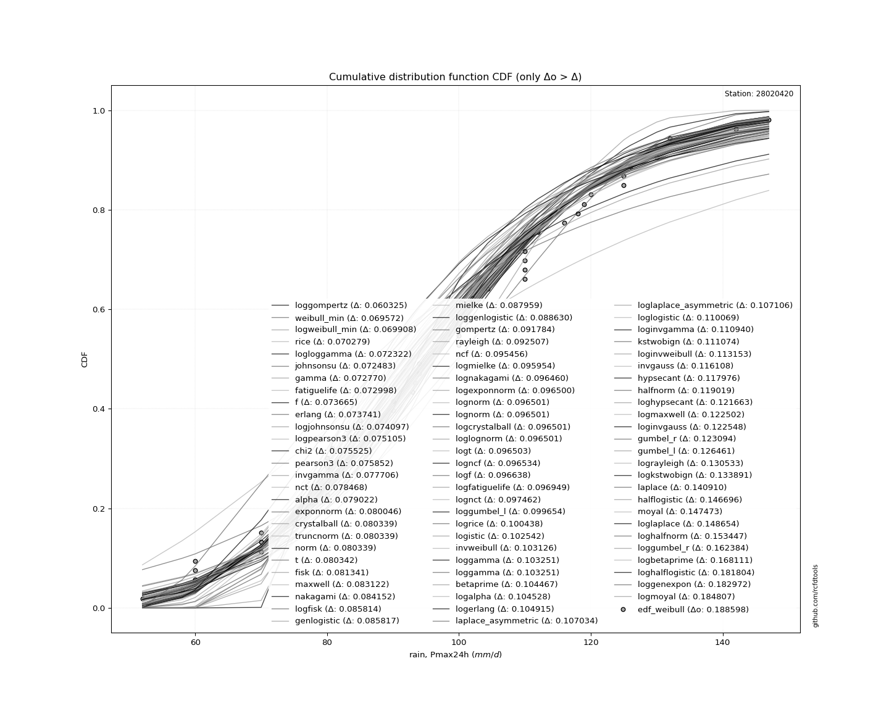</img>

</div>


**3.3. Best fit**

<div align="center">

|   id |   station | empirical_dist   | p_dist      |     delta |   deltao | eval   |   fit |   n |   best_fit |   best_fit_sort |
|-----:|----------:|:-----------------|:------------|----------:|---------:|:-------|------:|----:|-----------:|----------------:|
|    0 |  28020420 | edf_weibull      | loggompertz | 0.0603254 | 0.188598 | Δo > Δ |     1 |  52 |          1 |               1 |

</div>


<div align="center">

</img></img>

</div>


### 4. Empirical - EDF Beard (1943)

The Beard formula (or Beard´s plotting position formula) in hydrology is used to estimate the empirical non-exceedance probability _(P)_ of a flood event (or other extreme hydrological data point) within a given dataset.

<div align="center">


$P=(m-0.31)/(n+0.38)$


</div>


**4.1. Empirical values**

<div align="center">

|                | 0                    | 1                   | 2                   | 3                  | 4                   | 5                   | 6                  | 7                   | 8                   | 9                   | 10                  | 11                 | 12                  | 13                  | 14                 | 15                 | 16                 | 17                 | 18                 | 19                 | 20                  | 21                  | 22                  | 23                  | 24                 | 25                 | 26                 | 27                 | 28                 | 29                 | 30                 | 31                 | 32                 | 33                 | 34                 | 35                 | 36                 | 37                 | 38                 | 39                 | 40                 | 41                | 42                 | 43                 | 44                 | 45                 | 46                 | 47                 | 48                 | 49                 | 50                 | 51                 |
|:---------------|:---------------------|:--------------------|:--------------------|:-------------------|:--------------------|:--------------------|:-------------------|:--------------------|:--------------------|:--------------------|:--------------------|:-------------------|:--------------------|:--------------------|:-------------------|:-------------------|:-------------------|:-------------------|:-------------------|:-------------------|:--------------------|:--------------------|:--------------------|:--------------------|:-------------------|:-------------------|:-------------------|:-------------------|:-------------------|:-------------------|:-------------------|:-------------------|:-------------------|:-------------------|:-------------------|:-------------------|:-------------------|:-------------------|:-------------------|:-------------------|:-------------------|:------------------|:-------------------|:-------------------|:-------------------|:-------------------|:-------------------|:-------------------|:-------------------|:-------------------|:-------------------|:-------------------|
| date           | 2012                 | 1991                | 1990                | 1984               | 2015                | 1989                | 2000               | 1982                | 1976                | 1997                | 1977                | 2020               | 2014                | 2006                | 2017               | 2011               | 1972               | 2019               | 1995               | 2013               | 2016                | 1999                | 2002                | 1971                | 1975               | 1998               | 1994               | 2004               | 2009               | 1988               | 2018               | 1987               | 1986               | 1970               | 1978               | 1979               | 1983               | 1981               | 2007               | 2021               | 2010               | 1980              | 2001               | 2005               | 2008               | 1992               | 2003               | 1985               | 1993               | 1996               | 1974               | 1973               |
| x              | 52.0                 | 58.0                | 60.0                | 60.0               | 60.0                | 70.0                | 70.0               | 70.0                | 75.0                | 75.3022389753854    | 77.0                | 80.0               | 80.0                | 80.0                | 80.0               | 80.0               | 80.7600828088943   | 83.0               | 83.0               | 85.0               | 90.0                | 90.0                | 92.9108431434611    | 93.3024589354871    | 94.0               | 94.0               | 100.0              | 100.0              | 100.0              | 100.0              | 100.0              | 100.524899066195   | 102.0              | 104.358339515926   | 110.0              | 110.0              | 110.0              | 110.0              | 110.0              | 112.0              | 116.0              | 118.0             | 119.0              | 120.0              | 125.0              | 125.0              | 126.0              | 130.0              | 130.0              | 132.0              | 142.0              | 147.0              |
| m              | 1                    | 2                   | 3                   | 4                  | 5                   | 6                   | 7                  | 8                   | 9                   | 10                  | 11                  | 12                 | 13                  | 14                  | 15                 | 16                 | 17                 | 18                 | 19                 | 20                 | 21                  | 22                  | 23                  | 24                  | 25                 | 26                 | 27                 | 28                 | 29                 | 30                 | 31                 | 32                 | 33                 | 34                 | 35                 | 36                 | 37                 | 38                 | 39                 | 40                 | 41                 | 42                | 43                 | 44                 | 45                 | 46                 | 47                 | 48                 | 49                 | 50                 | 51                 | 52                 |
| empirical_dist | edf_beard            | edf_beard           | edf_beard           | edf_beard          | edf_beard           | edf_beard           | edf_beard          | edf_beard           | edf_beard           | edf_beard           | edf_beard           | edf_beard          | edf_beard           | edf_beard           | edf_beard          | edf_beard          | edf_beard          | edf_beard          | edf_beard          | edf_beard          | edf_beard           | edf_beard           | edf_beard           | edf_beard           | edf_beard          | edf_beard          | edf_beard          | edf_beard          | edf_beard          | edf_beard          | edf_beard          | edf_beard          | edf_beard          | edf_beard          | edf_beard          | edf_beard          | edf_beard          | edf_beard          | edf_beard          | edf_beard          | edf_beard          | edf_beard         | edf_beard          | edf_beard          | edf_beard          | edf_beard          | edf_beard          | edf_beard          | edf_beard          | edf_beard          | edf_beard          | edf_beard          |
| empirical      | 0.013172966781214202 | 0.03226422298587247 | 0.05135547919053073 | 0.070446735395189  | 0.08953799159984727 | 0.10862924780450554 | 0.1277205040091638 | 0.14681176021382206 | 0.16590301641848032 | 0.18499427262313858 | 0.20408552882779685 | 0.2231767850324551 | 0.24226804123711337 | 0.26135929744177167 | 0.2804505536464299 | 0.2995418098510882 | 0.3186330660557465 | 0.3377243222604047 | 0.356815578465063  | 0.3759068346697213 | 0.39499809087437954 | 0.41408934707903783 | 0.43318060328369606 | 0.45227185948835436 | 0.4713631156930126 | 0.4904543718976709 | 0.5095456281023292 | 0.5286368843069874 | 0.5477281405116456 | 0.5668193967163039 | 0.5859106529209622 | 0.6050019091256205 | 0.6240931653302787 | 0.6431844215349369 | 0.6622756777395952 | 0.6813669339442534 | 0.7004581901489118 | 0.71954944635357   | 0.7386407025582282 | 0.7577319587628866 | 0.7768232149675448 | 0.795914471172203 | 0.8150057273768613 | 0.8340969835815196 | 0.8531882397861779 | 0.8722794959908361 | 0.8913707521954943 | 0.9104620084001527 | 0.9295532646048109 | 0.9486445208094691 | 0.9677357770141274 | 0.9868270332187857 |
| empirical_tr   | 1.0133488102147417   | 1.0333399092523181  | 1.054135640974039   | 1.0757855822550833 | 1.0983434682323339  | 1.1218676376097665  | 1.1464215364412345 | 1.172074289550235   | 1.1989013504234378  | 1.2269852424455376  | 1.2564164068121852  | 1.287294175473089  | 1.3197278911564627  | 1.3538382010855519  | 1.3897585566463253 | 1.4276369582992643 | 1.4676379938358084 | 1.5099452291726723 | 1.5547640249332149 | 1.602324869990823  | 1.652887346165983   | 1.7067448680351909  | 1.7642303805995283  | 1.8257232485186476  | 1.8916576381365113 | 1.9625327838141624 | 2.0389256520046715 | 2.1215066828675577 | 2.211059518784297  | 2.308505949757602  | 2.4149377593361    | 2.5316578057032384 | 2.6602336211274755 | 2.8025682182985547 | 2.9609949123798747 | 3.138406231276212  | 3.3384321223709366 | 3.5656909462219186 | 3.826150474799122  | 4.127659574468085  | 4.480752780153977  | 4.899906454630494 | 5.405572755417953  | 6.027617951668583  | 6.811443433029906  | 7.8295964125560475 | 9.205623901581712  | 11.1684434968017   | 14.195121951219496 | 19.472118959107764 | 30.994082840236548 | 75.9130434782605   |

</div>


**4.2. Kolmogorov-Smirnov fit test (sorted by Δ)**


<div align="center">

|                | 0                    | 1                   | 2                   | 3                   | 4                   | 5                   | 6                   | 7                   | 8                   | 9                   | 10                  | 11                  | 12                  | 13                  | 14                  | 15                  | 16                  | 17                  | 18                  | 19                  | 20                  | 21                  | 22                  | 23                  | 24                  | 25                  | 26                  | 27                  | 28                  | 29                  | 30                  | 31                  | 32                  | 33                  | 34                  | 35                  | 36                  | 37                  | 38                  | 39                  | 40                  | 41                  | 42                  | 43                  | 44                  | 45                  | 46                  | 47                  | 48                  | 49                  | 50                  | 51                  | 52                  | 53                    | 54                  | 55                  | 56                  | 57                  | 58                  | 59                  | 60                  | 61                  | 62                  | 63                  | 64                  | 65                  | 66                  | 67                  | 68                  | 69                  | 70                  | 71                  | 72                  | 73                  | 74                  | 75                  | 76                  | 77                  | 78                  | 79                  | 80                  | 81                  | 82                  | 83                  | 84                  | 85                  | 86                  | 87                  | 88                  | 89                  |
|:---------------|:---------------------|:--------------------|:--------------------|:--------------------|:--------------------|:--------------------|:--------------------|:--------------------|:--------------------|:--------------------|:--------------------|:--------------------|:--------------------|:--------------------|:--------------------|:--------------------|:--------------------|:--------------------|:--------------------|:--------------------|:--------------------|:--------------------|:--------------------|:--------------------|:--------------------|:--------------------|:--------------------|:--------------------|:--------------------|:--------------------|:--------------------|:--------------------|:--------------------|:--------------------|:--------------------|:--------------------|:--------------------|:--------------------|:--------------------|:--------------------|:--------------------|:--------------------|:--------------------|:--------------------|:--------------------|:--------------------|:--------------------|:--------------------|:--------------------|:--------------------|:--------------------|:--------------------|:--------------------|:----------------------|:--------------------|:--------------------|:--------------------|:--------------------|:--------------------|:--------------------|:--------------------|:--------------------|:--------------------|:--------------------|:--------------------|:--------------------|:--------------------|:--------------------|:--------------------|:--------------------|:--------------------|:--------------------|:--------------------|:--------------------|:--------------------|:--------------------|:--------------------|:--------------------|:--------------------|:--------------------|:--------------------|:--------------------|:--------------------|:--------------------|:--------------------|:--------------------|:--------------------|:--------------------|:--------------------|:--------------------|
| station        | 28020420             | 28020420            | 28020420            | 28020420            | 28020420            | 28020420            | 28020420            | 28020420            | 28020420            | 28020420            | 28020420            | 28020420            | 28020420            | 28020420            | 28020420            | 28020420            | 28020420            | 28020420            | 28020420            | 28020420            | 28020420            | 28020420            | 28020420            | 28020420            | 28020420            | 28020420            | 28020420            | 28020420            | 28020420            | 28020420            | 28020420            | 28020420            | 28020420            | 28020420            | 28020420            | 28020420            | 28020420            | 28020420            | 28020420            | 28020420            | 28020420            | 28020420            | 28020420            | 28020420            | 28020420            | 28020420            | 28020420            | 28020420            | 28020420            | 28020420            | 28020420            | 28020420            | 28020420            | 28020420              | 28020420            | 28020420            | 28020420            | 28020420            | 28020420            | 28020420            | 28020420            | 28020420            | 28020420            | 28020420            | 28020420            | 28020420            | 28020420            | 28020420            | 28020420            | 28020420            | 28020420            | 28020420            | 28020420            | 28020420            | 28020420            | 28020420            | 28020420            | 28020420            | 28020420            | 28020420            | 28020420            | 28020420            | 28020420            | 28020420            | 28020420            | 28020420            | 28020420            | 28020420            | 28020420            | 28020420            |
| empirical_dist | edf_beard            | edf_beard           | edf_beard           | edf_beard           | edf_beard           | edf_beard           | edf_beard           | edf_beard           | edf_beard           | edf_beard           | edf_beard           | edf_beard           | edf_beard           | edf_beard           | edf_beard           | edf_beard           | edf_beard           | edf_beard           | edf_beard           | edf_beard           | edf_beard           | edf_beard           | edf_beard           | edf_beard           | edf_beard           | edf_beard           | edf_beard           | edf_beard           | edf_beard           | edf_beard           | edf_beard           | edf_beard           | edf_beard           | edf_beard           | edf_beard           | edf_beard           | edf_beard           | edf_beard           | edf_beard           | edf_beard           | edf_beard           | edf_beard           | edf_beard           | edf_beard           | edf_beard           | edf_beard           | edf_beard           | edf_beard           | edf_beard           | edf_beard           | edf_beard           | edf_beard           | edf_beard           | edf_beard             | edf_beard           | edf_beard           | edf_beard           | edf_beard           | edf_beard           | edf_beard           | edf_beard           | edf_beard           | edf_beard           | edf_beard           | edf_beard           | edf_beard           | edf_beard           | edf_beard           | edf_beard           | edf_beard           | edf_beard           | edf_beard           | edf_beard           | edf_beard           | edf_beard           | edf_beard           | edf_beard           | edf_beard           | edf_beard           | edf_beard           | edf_beard           | edf_beard           | edf_beard           | edf_beard           | edf_beard           | edf_beard           | edf_beard           | edf_beard           | edf_beard           | edf_beard           |
| p_dist         | loggompertz          | logweibull_min      | weibull_min         | rice                | logloggamma         | johnsonsu           | gamma               | fatiguelife         | f                   | erlang              | logjohnsonsu        | chi2                | pearson3            | logpearson3         | nct                 | invgamma            | exponnorm           | crystalball         | truncnorm           | norm                | alpha               | t                   | fisk                | maxwell             | nakagami            | logfisk             | genlogistic         | mielke              | loggenlogistic      | rayleigh            | gompertz            | logmielke           | ncf                 | lognakagami         | logexponnorm        | lognorm             | lognorm             | logcrystalball      | loglognorm          | logt                | logncf              | logf                | logfatiguelife      | lognct              | loggumbel_l         | logrice             | logistic            | invweibull          | loggamma            | loggamma            | betaprime           | logalpha            | logerlang           | loglaplace_asymmetric | laplace_asymmetric  | loglogistic         | loginvgamma         | kstwobign           | loginvweibull       | invgauss            | hypsecant           | halfnorm            | loghypsecant        | logmaxwell          | loginvgauss         | gumbel_r            | gumbel_l            | lograyleigh         | logkstwobign        | laplace             | halflogistic        | moyal               | loglaplace          | loghalfnorm         | loggumbel_r         | logbetaprime        | loghalflogistic     | logmoyal            | loggenexpon         | wald                | expon               | pareto              | logwald             | loggibrat           | logtruncnorm        | gibrat              | logexpon            | logpareto           | logchi2             | genexpon            |
| delta          | 0.058650432309437894 | 0.06801006634510354 | 0.06946075957670195 | 0.07016754757355681 | 0.0706466636967486  | 0.0706857603743582  | 0.071095077579514   | 0.07109982700928508 | 0.07176635562703892 | 0.072066163409793   | 0.07242226748664188 | 0.0736955287012776  | 0.074177063793115   | 0.07499292017705961 | 0.07679285201876301 | 0.07759457157459582 | 0.07837077398904735 | 0.07866375168844914 | 0.07866375616089988 | 0.07866375668596759 | 0.078664735133815   | 0.07866662901571081 | 0.07966559804318679 | 0.08301081226523566 | 0.08404025233463597 | 0.08570229767517967 | 0.08570533869576757 | 0.08628367067317272 | 0.08695546419291122 | 0.09239495443980217 | 0.09301197426324004 | 0.09405555246261588 | 0.09534388478445699 | 0.09634807999628692 | 0.09638853480564769 | 0.09638951516257444 | 0.09638951516257444 | 0.09638951942218077 | 0.09638957368164813 | 0.09639129087554654 | 0.09642281863391922 | 0.09652649938207114 | 0.09683747213494653 | 0.09734991291161177 | 0.09797913957181892 | 0.10032622985510253 | 0.10086668930152148 | 0.1030140950397046  | 0.1031396090565806  | 0.1031396090565806  | 0.10435506652373028 | 0.10441624714872133 | 0.10480338241516662 | 0.10520740537115458   | 0.1053591473570582  | 0.10995768287537189 | 0.11082878753633374 | 0.11096203984911113 | 0.11304107004213926 | 0.11599661492466584 | 0.11630100650229602 | 0.11890777255835572 | 0.12100271856912814 | 0.12239057138353915 | 0.12243636800239133 | 0.12298249054547872 | 0.12478622539670761 | 0.1304217673015946  | 0.1338462035323391  | 0.13923511587474915 | 0.1465839508788218  | 0.14736102050325095 | 0.14854276469920125 | 0.1533354671249365  | 0.1622727347038465  | 0.17335943060520875 | 0.18169232773010524 | 0.1846957413129119  | 0.1862101106093261  | 0.21502297781685886 | 0.24466040408908205 | 0.24466041652845347 | 0.24726940688203647 | 0.2791090616292934  | 0.28636919529496807 | 0.2909570552419954  | 0.2977364713183798  | 0.29773648302124983 | 0.32868436350180574 | 0.8817301012107955  |
| deltao         | 0.18859806671657792  | 0.18859806671657792 | 0.18859806671657792 | 0.18859806671657792 | 0.18859806671657792 | 0.18859806671657792 | 0.18859806671657792 | 0.18859806671657792 | 0.18859806671657792 | 0.18859806671657792 | 0.18859806671657792 | 0.18859806671657792 | 0.18859806671657792 | 0.18859806671657792 | 0.18859806671657792 | 0.18859806671657792 | 0.18859806671657792 | 0.18859806671657792 | 0.18859806671657792 | 0.18859806671657792 | 0.18859806671657792 | 0.18859806671657792 | 0.18859806671657792 | 0.18859806671657792 | 0.18859806671657792 | 0.18859806671657792 | 0.18859806671657792 | 0.18859806671657792 | 0.18859806671657792 | 0.18859806671657792 | 0.18859806671657792 | 0.18859806671657792 | 0.18859806671657792 | 0.18859806671657792 | 0.18859806671657792 | 0.18859806671657792 | 0.18859806671657792 | 0.18859806671657792 | 0.18859806671657792 | 0.18859806671657792 | 0.18859806671657792 | 0.18859806671657792 | 0.18859806671657792 | 0.18859806671657792 | 0.18859806671657792 | 0.18859806671657792 | 0.18859806671657792 | 0.18859806671657792 | 0.18859806671657792 | 0.18859806671657792 | 0.18859806671657792 | 0.18859806671657792 | 0.18859806671657792 | 0.18859806671657792   | 0.18859806671657792 | 0.18859806671657792 | 0.18859806671657792 | 0.18859806671657792 | 0.18859806671657792 | 0.18859806671657792 | 0.18859806671657792 | 0.18859806671657792 | 0.18859806671657792 | 0.18859806671657792 | 0.18859806671657792 | 0.18859806671657792 | 0.18859806671657792 | 0.18859806671657792 | 0.18859806671657792 | 0.18859806671657792 | 0.18859806671657792 | 0.18859806671657792 | 0.18859806671657792 | 0.18859806671657792 | 0.18859806671657792 | 0.18859806671657792 | 0.18859806671657792 | 0.18859806671657792 | 0.18859806671657792 | 0.18859806671657792 | 0.18859806671657792 | 0.18859806671657792 | 0.18859806671657792 | 0.18859806671657792 | 0.18859806671657792 | 0.18859806671657792 | 0.18859806671657792 | 0.18859806671657792 | 0.18859806671657792 | 0.18859806671657792 |
| eval           | Δo > Δ               | Δo > Δ              | Δo > Δ              | Δo > Δ              | Δo > Δ              | Δo > Δ              | Δo > Δ              | Δo > Δ              | Δo > Δ              | Δo > Δ              | Δo > Δ              | Δo > Δ              | Δo > Δ              | Δo > Δ              | Δo > Δ              | Δo > Δ              | Δo > Δ              | Δo > Δ              | Δo > Δ              | Δo > Δ              | Δo > Δ              | Δo > Δ              | Δo > Δ              | Δo > Δ              | Δo > Δ              | Δo > Δ              | Δo > Δ              | Δo > Δ              | Δo > Δ              | Δo > Δ              | Δo > Δ              | Δo > Δ              | Δo > Δ              | Δo > Δ              | Δo > Δ              | Δo > Δ              | Δo > Δ              | Δo > Δ              | Δo > Δ              | Δo > Δ              | Δo > Δ              | Δo > Δ              | Δo > Δ              | Δo > Δ              | Δo > Δ              | Δo > Δ              | Δo > Δ              | Δo > Δ              | Δo > Δ              | Δo > Δ              | Δo > Δ              | Δo > Δ              | Δo > Δ              | Δo > Δ                | Δo > Δ              | Δo > Δ              | Δo > Δ              | Δo > Δ              | Δo > Δ              | Δo > Δ              | Δo > Δ              | Δo > Δ              | Δo > Δ              | Δo > Δ              | Δo > Δ              | Δo > Δ              | Δo > Δ              | Δo > Δ              | Δo > Δ              | Δo > Δ              | Δo > Δ              | Δo > Δ              | Δo > Δ              | Δo > Δ              | Δo > Δ              | Δo > Δ              | Δo > Δ              | Δo > Δ              | Δo > Δ              | Δo <= Δ             | Δo <= Δ             | Δo <= Δ             | Δo <= Δ             | Δo <= Δ             | Δo <= Δ             | Δo <= Δ             | Δo <= Δ             | Δo <= Δ             | Δo <= Δ             | Δo <= Δ             |
| fit            | 1                    | 1                   | 1                   | 1                   | 1                   | 1                   | 1                   | 1                   | 1                   | 1                   | 1                   | 1                   | 1                   | 1                   | 1                   | 1                   | 1                   | 1                   | 1                   | 1                   | 1                   | 1                   | 1                   | 1                   | 1                   | 1                   | 1                   | 1                   | 1                   | 1                   | 1                   | 1                   | 1                   | 1                   | 1                   | 1                   | 1                   | 1                   | 1                   | 1                   | 1                   | 1                   | 1                   | 1                   | 1                   | 1                   | 1                   | 1                   | 1                   | 1                   | 1                   | 1                   | 1                   | 1                     | 1                   | 1                   | 1                   | 1                   | 1                   | 1                   | 1                   | 1                   | 1                   | 1                   | 1                   | 1                   | 1                   | 1                   | 1                   | 1                   | 1                   | 1                   | 1                   | 1                   | 1                   | 1                   | 1                   | 1                   | 1                   | 0                   | 0                   | 0                   | 0                   | 0                   | 0                   | 0                   | 0                   | 0                   | 0                   | 0                   |
| n              | 52                   | 52                  | 52                  | 52                  | 52                  | 52                  | 52                  | 52                  | 52                  | 52                  | 52                  | 52                  | 52                  | 52                  | 52                  | 52                  | 52                  | 52                  | 52                  | 52                  | 52                  | 52                  | 52                  | 52                  | 52                  | 52                  | 52                  | 52                  | 52                  | 52                  | 52                  | 52                  | 52                  | 52                  | 52                  | 52                  | 52                  | 52                  | 52                  | 52                  | 52                  | 52                  | 52                  | 52                  | 52                  | 52                  | 52                  | 52                  | 52                  | 52                  | 52                  | 52                  | 52                  | 52                    | 52                  | 52                  | 52                  | 52                  | 52                  | 52                  | 52                  | 52                  | 52                  | 52                  | 52                  | 52                  | 52                  | 52                  | 52                  | 52                  | 52                  | 52                  | 52                  | 52                  | 52                  | 52                  | 52                  | 52                  | 52                  | 52                  | 52                  | 52                  | 52                  | 52                  | 52                  | 52                  | 52                  | 52                  | 52                  | 52                  |
| best_fit       | 1                    | 0                   | 0                   | 0                   | 0                   | 0                   | 0                   | 0                   | 0                   | 0                   | 0                   | 0                   | 0                   | 0                   | 0                   | 0                   | 0                   | 0                   | 0                   | 0                   | 0                   | 0                   | 0                   | 0                   | 0                   | 0                   | 0                   | 0                   | 0                   | 0                   | 0                   | 0                   | 0                   | 0                   | 0                   | 0                   | 0                   | 0                   | 0                   | 0                   | 0                   | 0                   | 0                   | 0                   | 0                   | 0                   | 0                   | 0                   | 0                   | 0                   | 0                   | 0                   | 0                   | 0                     | 0                   | 0                   | 0                   | 0                   | 0                   | 0                   | 0                   | 0                   | 0                   | 0                   | 0                   | 0                   | 0                   | 0                   | 0                   | 0                   | 0                   | 0                   | 0                   | 0                   | 0                   | 0                   | 0                   | 0                   | 0                   | 0                   | 0                   | 0                   | 0                   | 0                   | 0                   | 0                   | 0                   | 0                   | 0                   | 0                   |
| best_fit_sort  | 1                    | 2                   | 3                   | 4                   | 5                   | 6                   | 7                   | 8                   | 9                   | 10                  | 11                  | 12                  | 13                  | 14                  | 15                  | 16                  | 17                  | 18                  | 19                  | 20                  | 21                  | 22                  | 23                  | 24                  | 25                  | 26                  | 27                  | 28                  | 29                  | 30                  | 31                  | 32                  | 33                  | 34                  | 35                  | 36                  | 37                  | 38                  | 39                  | 40                  | 41                  | 42                  | 43                  | 44                  | 45                  | 46                  | 47                  | 48                  | 49                  | 50                  | 51                  | 52                  | 53                  | 54                    | 55                  | 56                  | 57                  | 58                  | 59                  | 60                  | 61                  | 62                  | 63                  | 64                  | 65                  | 66                  | 67                  | 68                  | 69                  | 70                  | 71                  | 72                  | 73                  | 74                  | 75                  | 76                  | 77                  | 78                  | 79                  | 80                  | 81                  | 82                  | 83                  | 84                  | 85                  | 86                  | 87                  | 88                  | 89                  | 90                  |

</div>


<div align="center">

</img>

</div>


**4.3. Best fit**

<div align="center">

|   id |   station | empirical_dist   | p_dist      |     delta |   deltao | eval   |   fit |   n |   best_fit |   best_fit_sort |
|-----:|----------:|:-----------------|:------------|----------:|---------:|:-------|------:|----:|-----------:|----------------:|
|    0 |  28020420 | edf_beard        | loggompertz | 0.0586504 | 0.188598 | Δo > Δ |     1 |  52 |          1 |               1 |

</div>


<div align="center">

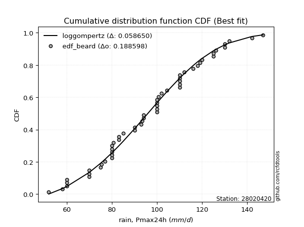</img>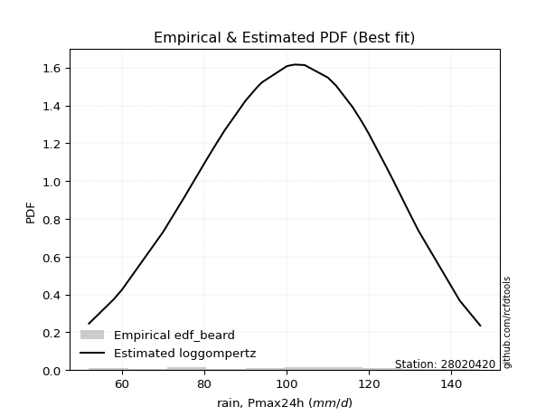</img>

</div>


### 5. Empirical - EDF Chegodayev (1955)

The Chegodayev formula is an empirical plotting position formula used in hydrological frequency analysis to estimate the exceedance probability or return period of a specific event from a set of observed data. It is primarily used for plotting observed data points on probability paper to fit a theoretical distribution, particularly for analyzing extreme events like maximum flood flows or rainfall intensities. The constant _b_ value in the generalized plotting position formula is 0.3.

<div align="center">


$P=(m-b)/(n+1-2b)$


</div>


**5.1. Empirical values**

<div align="center">

|                | 0                    | 1                   | 2                   | 3                   | 4                   | 5                   | 6                   | 7                   | 8                   | 9                  | 10                  | 11                 | 12                  | 13                  | 14                  | 15                 | 16                 | 17                 | 18                 | 19                  | 20                 | 21                  | 22                 | 23                  | 24                 | 25                 | 26                 | 27                 | 28                 | 29                 | 30                 | 31                 | 32                 | 33                 | 34                 | 35                 | 36                 | 37                 | 38                 | 39                 | 40                 | 41                 | 42                 | 43                 | 44                 | 45                 | 46                 | 47                 | 48                 | 49                 | 50                 | 51                 |
|:---------------|:---------------------|:--------------------|:--------------------|:--------------------|:--------------------|:--------------------|:--------------------|:--------------------|:--------------------|:-------------------|:--------------------|:-------------------|:--------------------|:--------------------|:--------------------|:-------------------|:-------------------|:-------------------|:-------------------|:--------------------|:-------------------|:--------------------|:-------------------|:--------------------|:-------------------|:-------------------|:-------------------|:-------------------|:-------------------|:-------------------|:-------------------|:-------------------|:-------------------|:-------------------|:-------------------|:-------------------|:-------------------|:-------------------|:-------------------|:-------------------|:-------------------|:-------------------|:-------------------|:-------------------|:-------------------|:-------------------|:-------------------|:-------------------|:-------------------|:-------------------|:-------------------|:-------------------|
| date           | 2012                 | 1991                | 1990                | 1984                | 2015                | 1989                | 2000                | 1982                | 1976                | 1997               | 1977                | 2020               | 2014                | 2006                | 2017                | 2011               | 1972               | 2019               | 1995               | 2013                | 2016               | 1999                | 2002               | 1971                | 1975               | 1998               | 1994               | 2004               | 2009               | 1988               | 2018               | 1987               | 1986               | 1970               | 1978               | 1979               | 1983               | 1981               | 2007               | 2021               | 2010               | 1980               | 2001               | 2005               | 2008               | 1992               | 2003               | 1985               | 1993               | 1996               | 1974               | 1973               |
| x              | 52.0                 | 58.0                | 60.0                | 60.0                | 60.0                | 70.0                | 70.0                | 70.0                | 75.0                | 75.3022389753854   | 77.0                | 80.0               | 80.0                | 80.0                | 80.0                | 80.0               | 80.7600828088943   | 83.0               | 83.0               | 85.0                | 90.0               | 90.0                | 92.9108431434611   | 93.3024589354871    | 94.0               | 94.0               | 100.0              | 100.0              | 100.0              | 100.0              | 100.0              | 100.524899066195   | 102.0              | 104.358339515926   | 110.0              | 110.0              | 110.0              | 110.0              | 110.0              | 112.0              | 116.0              | 118.0              | 119.0              | 120.0              | 125.0              | 125.0              | 126.0              | 130.0              | 130.0              | 132.0              | 142.0              | 147.0              |
| m              | 1                    | 2                   | 3                   | 4                   | 5                   | 6                   | 7                   | 8                   | 9                   | 10                 | 11                  | 12                 | 13                  | 14                  | 15                  | 16                 | 17                 | 18                 | 19                 | 20                  | 21                 | 22                  | 23                 | 24                  | 25                 | 26                 | 27                 | 28                 | 29                 | 30                 | 31                 | 32                 | 33                 | 34                 | 35                 | 36                 | 37                 | 38                 | 39                 | 40                 | 41                 | 42                 | 43                 | 44                 | 45                 | 46                 | 47                 | 48                 | 49                 | 50                 | 51                 | 52                 |
| empirical_dist | edf_chegodayev       | edf_chegodayev      | edf_chegodayev      | edf_chegodayev      | edf_chegodayev      | edf_chegodayev      | edf_chegodayev      | edf_chegodayev      | edf_chegodayev      | edf_chegodayev     | edf_chegodayev      | edf_chegodayev     | edf_chegodayev      | edf_chegodayev      | edf_chegodayev      | edf_chegodayev     | edf_chegodayev     | edf_chegodayev     | edf_chegodayev     | edf_chegodayev      | edf_chegodayev     | edf_chegodayev      | edf_chegodayev     | edf_chegodayev      | edf_chegodayev     | edf_chegodayev     | edf_chegodayev     | edf_chegodayev     | edf_chegodayev     | edf_chegodayev     | edf_chegodayev     | edf_chegodayev     | edf_chegodayev     | edf_chegodayev     | edf_chegodayev     | edf_chegodayev     | edf_chegodayev     | edf_chegodayev     | edf_chegodayev     | edf_chegodayev     | edf_chegodayev     | edf_chegodayev     | edf_chegodayev     | edf_chegodayev     | edf_chegodayev     | edf_chegodayev     | edf_chegodayev     | edf_chegodayev     | edf_chegodayev     | edf_chegodayev     | edf_chegodayev     | edf_chegodayev     |
| empirical      | 0.013358778625954198 | 0.03244274809160305 | 0.05152671755725191 | 0.07061068702290077 | 0.08969465648854963 | 0.10877862595419847 | 0.12786259541984735 | 0.14694656488549618 | 0.16603053435114504 | 0.1851145038167939 | 0.20419847328244273 | 0.2232824427480916 | 0.24236641221374045 | 0.26145038167938933 | 0.28053435114503816 | 0.299618320610687  | 0.3187022900763359 | 0.3377862595419847 | 0.3568702290076336 | 0.37595419847328243 | 0.3950381679389313 | 0.41412213740458015 | 0.433206106870229  | 0.45229007633587787 | 0.4713740458015267 | 0.4904580152671756 | 0.5095419847328244 | 0.5286259541984732 | 0.5477099236641222 | 0.566793893129771  | 0.5858778625954199 | 0.6049618320610687 | 0.6240458015267176 | 0.6431297709923665 | 0.6622137404580153 | 0.6812977099236642 | 0.7003816793893131 | 0.7194656488549619 | 0.7385496183206107 | 0.7576335877862597 | 0.7767175572519085 | 0.7958015267175573 | 0.8148854961832062 | 0.833969465648855  | 0.8530534351145039 | 0.8721374045801528 | 0.8912213740458016 | 0.9103053435114504 | 0.9293893129770994 | 0.9484732824427482 | 0.967557251908397  | 0.9866412213740459 |
| empirical_tr   | 1.0135396518375241   | 1.0335305719921104  | 1.0543259557344065  | 1.0759753593429158  | 1.09853249475891    | 1.1220556745182013  | 1.1466083150984683  | 1.1722595078299776  | 1.1990846681922196  | 1.2271662763466042 | 1.2565947242206235  | 1.2874692874692875 | 1.3198992443324937  | 1.3540051679586564  | 1.389920424403183   | 1.4277929155313351 | 1.4677871148459385 | 1.510086455331412  | 1.5548961424332344 | 1.602446483180428   | 1.6529968454258677 | 1.706840390879479   | 1.7643097643097643 | 1.8257839721254356  | 1.8916967509025273 | 1.9625468164794009 | 2.0389105058365757 | 2.1214574898785425 | 2.210970464135021  | 2.3083700440528636 | 2.414746543778802  | 2.5314009661835746 | 2.659898477157361  | 2.8021390374331556 | 2.96045197740113   | 3.137724550898205  | 3.337579617834396  | 3.564625850340137  | 3.824817518248176  | 4.125984251968506  | 4.4786324786324805 | 4.897196261682245  | 5.402061855670104  | 6.0229885057471275 | 6.805194805194811  | 7.820895522388065  | 9.192982456140356  | 11.148936170212771 | 14.162162162162188 | 19.407407407407447 | 30.823529411764785 | 74.8571428571432   |

</div>


**5.2. Kolmogorov-Smirnov fit test (sorted by Δ)**


<div align="center">

|                | 0                   | 1                   | 2                   | 3                   | 4                   | 5                   | 6                   | 7                   | 8                   | 9                   | 10                  | 11                  | 12                  | 13                  | 14                  | 15                  | 16                  | 17                  | 18                  | 19                  | 20                  | 21                  | 22                  | 23                  | 24                  | 25                  | 26                  | 27                  | 28                  | 29                  | 30                  | 31                  | 32                  | 33                  | 34                  | 35                  | 36                  | 37                  | 38                  | 39                  | 40                  | 41                  | 42                  | 43                  | 44                  | 45                  | 46                  | 47                  | 48                  | 49                  | 50                  | 51                  | 52                  | 53                    | 54                  | 55                  | 56                  | 57                  | 58                  | 59                  | 60                  | 61                  | 62                  | 63                  | 64                  | 65                  | 66                  | 67                  | 68                  | 69                  | 70                  | 71                  | 72                  | 73                  | 74                  | 75                  | 76                  | 77                  | 78                  | 79                  | 80                  | 81                  | 82                  | 83                  | 84                  | 85                  | 86                  | 87                  | 88                  | 89                  |
|:---------------|:--------------------|:--------------------|:--------------------|:--------------------|:--------------------|:--------------------|:--------------------|:--------------------|:--------------------|:--------------------|:--------------------|:--------------------|:--------------------|:--------------------|:--------------------|:--------------------|:--------------------|:--------------------|:--------------------|:--------------------|:--------------------|:--------------------|:--------------------|:--------------------|:--------------------|:--------------------|:--------------------|:--------------------|:--------------------|:--------------------|:--------------------|:--------------------|:--------------------|:--------------------|:--------------------|:--------------------|:--------------------|:--------------------|:--------------------|:--------------------|:--------------------|:--------------------|:--------------------|:--------------------|:--------------------|:--------------------|:--------------------|:--------------------|:--------------------|:--------------------|:--------------------|:--------------------|:--------------------|:----------------------|:--------------------|:--------------------|:--------------------|:--------------------|:--------------------|:--------------------|:--------------------|:--------------------|:--------------------|:--------------------|:--------------------|:--------------------|:--------------------|:--------------------|:--------------------|:--------------------|:--------------------|:--------------------|:--------------------|:--------------------|:--------------------|:--------------------|:--------------------|:--------------------|:--------------------|:--------------------|:--------------------|:--------------------|:--------------------|:--------------------|:--------------------|:--------------------|:--------------------|:--------------------|:--------------------|:--------------------|
| station        | 28020420            | 28020420            | 28020420            | 28020420            | 28020420            | 28020420            | 28020420            | 28020420            | 28020420            | 28020420            | 28020420            | 28020420            | 28020420            | 28020420            | 28020420            | 28020420            | 28020420            | 28020420            | 28020420            | 28020420            | 28020420            | 28020420            | 28020420            | 28020420            | 28020420            | 28020420            | 28020420            | 28020420            | 28020420            | 28020420            | 28020420            | 28020420            | 28020420            | 28020420            | 28020420            | 28020420            | 28020420            | 28020420            | 28020420            | 28020420            | 28020420            | 28020420            | 28020420            | 28020420            | 28020420            | 28020420            | 28020420            | 28020420            | 28020420            | 28020420            | 28020420            | 28020420            | 28020420            | 28020420              | 28020420            | 28020420            | 28020420            | 28020420            | 28020420            | 28020420            | 28020420            | 28020420            | 28020420            | 28020420            | 28020420            | 28020420            | 28020420            | 28020420            | 28020420            | 28020420            | 28020420            | 28020420            | 28020420            | 28020420            | 28020420            | 28020420            | 28020420            | 28020420            | 28020420            | 28020420            | 28020420            | 28020420            | 28020420            | 28020420            | 28020420            | 28020420            | 28020420            | 28020420            | 28020420            | 28020420            |
| empirical_dist | edf_chegodayev      | edf_chegodayev      | edf_chegodayev      | edf_chegodayev      | edf_chegodayev      | edf_chegodayev      | edf_chegodayev      | edf_chegodayev      | edf_chegodayev      | edf_chegodayev      | edf_chegodayev      | edf_chegodayev      | edf_chegodayev      | edf_chegodayev      | edf_chegodayev      | edf_chegodayev      | edf_chegodayev      | edf_chegodayev      | edf_chegodayev      | edf_chegodayev      | edf_chegodayev      | edf_chegodayev      | edf_chegodayev      | edf_chegodayev      | edf_chegodayev      | edf_chegodayev      | edf_chegodayev      | edf_chegodayev      | edf_chegodayev      | edf_chegodayev      | edf_chegodayev      | edf_chegodayev      | edf_chegodayev      | edf_chegodayev      | edf_chegodayev      | edf_chegodayev      | edf_chegodayev      | edf_chegodayev      | edf_chegodayev      | edf_chegodayev      | edf_chegodayev      | edf_chegodayev      | edf_chegodayev      | edf_chegodayev      | edf_chegodayev      | edf_chegodayev      | edf_chegodayev      | edf_chegodayev      | edf_chegodayev      | edf_chegodayev      | edf_chegodayev      | edf_chegodayev      | edf_chegodayev      | edf_chegodayev        | edf_chegodayev      | edf_chegodayev      | edf_chegodayev      | edf_chegodayev      | edf_chegodayev      | edf_chegodayev      | edf_chegodayev      | edf_chegodayev      | edf_chegodayev      | edf_chegodayev      | edf_chegodayev      | edf_chegodayev      | edf_chegodayev      | edf_chegodayev      | edf_chegodayev      | edf_chegodayev      | edf_chegodayev      | edf_chegodayev      | edf_chegodayev      | edf_chegodayev      | edf_chegodayev      | edf_chegodayev      | edf_chegodayev      | edf_chegodayev      | edf_chegodayev      | edf_chegodayev      | edf_chegodayev      | edf_chegodayev      | edf_chegodayev      | edf_chegodayev      | edf_chegodayev      | edf_chegodayev      | edf_chegodayev      | edf_chegodayev      | edf_chegodayev      | edf_chegodayev      |
| p_dist         | loggompertz         | logweibull_min      | weibull_min         | rice                | logloggamma         | johnsonsu           | gamma               | fatiguelife         | f                   | erlang              | logjohnsonsu        | chi2                | pearson3            | logpearson3         | nct                 | invgamma            | exponnorm           | alpha               | crystalball         | truncnorm           | norm                | t                   | fisk                | maxwell             | nakagami            | logfisk             | genlogistic         | mielke              | loggenlogistic      | rayleigh            | gompertz            | logmielke           | ncf                 | lognakagami         | logexponnorm        | lognorm             | lognorm             | logcrystalball      | loglognorm          | logt                | logncf              | logf                | logfatiguelife      | lognct              | loggumbel_l         | logrice             | logistic            | invweibull          | loggamma            | loggamma            | betaprime           | logalpha            | logerlang           | loglaplace_asymmetric | laplace_asymmetric  | loglogistic         | loginvgamma         | kstwobign           | loginvweibull       | invgauss            | hypsecant           | halfnorm            | loghypsecant        | logmaxwell          | loginvgauss         | gumbel_r            | gumbel_l            | lograyleigh         | logkstwobign        | laplace             | halflogistic        | moyal               | loglaplace          | loghalfnorm         | loggumbel_r         | logbetaprime        | loghalflogistic     | logmoyal            | loggenexpon         | wald                | expon               | pareto              | logwald             | loggibrat           | logtruncnorm        | gibrat              | logexpon            | logpareto           | logchi2             | genexpon            |
| delta          | 0.05870508285200848 | 0.06807200362668342 | 0.0694644029462067  | 0.07017119094306157 | 0.07070131423931919 | 0.07074041091692879 | 0.07114972812208459 | 0.07116176429086496 | 0.07182829290861881 | 0.07212081395236358 | 0.07247691802921247 | 0.07369917207078236 | 0.0742317143356856  | 0.07499656354656437 | 0.0768475025613336  | 0.07759821494410057 | 0.07842542453161794 | 0.07866837850331976 | 0.07871840223101972 | 0.07871840670347047 | 0.07871840722853818 | 0.0787212795582814  | 0.07972024858575738 | 0.08301445563474041 | 0.08404389570414073 | 0.08570594104468443 | 0.08570898206527233 | 0.08633832121574331 | 0.08701011473548181 | 0.09239859780930693 | 0.09297189719868826 | 0.09411748974419576 | 0.09534752815396175 | 0.09635172336579167 | 0.09639217817515244 | 0.09639315853207919 | 0.09639315853207919 | 0.09639316279168553 | 0.09639321705115289 | 0.0963949342450513  | 0.09642646200342397 | 0.0965301427515759  | 0.09684111550445129 | 0.09735355628111653 | 0.09803379011438951 | 0.10032987322460729 | 0.10092133984409207 | 0.10301773840920936 | 0.10314325242608535 | 0.10314325242608535 | 0.10435870989323504 | 0.10441989051822609 | 0.10480702578467138 | 0.10526934265273447   | 0.10541379789962879 | 0.10996132624487664 | 0.1108324309058385  | 0.11096568321861588 | 0.11304471341164402 | 0.1160002582941706  | 0.11635565704486661 | 0.11891141592786048 | 0.1210063619386329  | 0.1223942147530439  | 0.12244001137189608 | 0.12298613391498348 | 0.1248408759392782  | 0.13042541067109936 | 0.13378299882098998 | 0.13928976641731974 | 0.14658759424832657 | 0.1473646638727557  | 0.148546408068706   | 0.15333911049444127 | 0.16227637807335127 | 0.1731881922384878  | 0.18169597109961    | 0.18469938468241665 | 0.18610445289368963 | 0.21502662118636362 | 0.24455474637344557 | 0.244554758812817   | 0.24727305025154123 | 0.27911270499879814 | 0.28626353757933154 | 0.2910335660015942  | 0.29760895338571514 | 0.29760896508858514 | 0.328556845569141   | 0.8815807230611026  |
| deltao         | 0.18859806671657792 | 0.18859806671657792 | 0.18859806671657792 | 0.18859806671657792 | 0.18859806671657792 | 0.18859806671657792 | 0.18859806671657792 | 0.18859806671657792 | 0.18859806671657792 | 0.18859806671657792 | 0.18859806671657792 | 0.18859806671657792 | 0.18859806671657792 | 0.18859806671657792 | 0.18859806671657792 | 0.18859806671657792 | 0.18859806671657792 | 0.18859806671657792 | 0.18859806671657792 | 0.18859806671657792 | 0.18859806671657792 | 0.18859806671657792 | 0.18859806671657792 | 0.18859806671657792 | 0.18859806671657792 | 0.18859806671657792 | 0.18859806671657792 | 0.18859806671657792 | 0.18859806671657792 | 0.18859806671657792 | 0.18859806671657792 | 0.18859806671657792 | 0.18859806671657792 | 0.18859806671657792 | 0.18859806671657792 | 0.18859806671657792 | 0.18859806671657792 | 0.18859806671657792 | 0.18859806671657792 | 0.18859806671657792 | 0.18859806671657792 | 0.18859806671657792 | 0.18859806671657792 | 0.18859806671657792 | 0.18859806671657792 | 0.18859806671657792 | 0.18859806671657792 | 0.18859806671657792 | 0.18859806671657792 | 0.18859806671657792 | 0.18859806671657792 | 0.18859806671657792 | 0.18859806671657792 | 0.18859806671657792   | 0.18859806671657792 | 0.18859806671657792 | 0.18859806671657792 | 0.18859806671657792 | 0.18859806671657792 | 0.18859806671657792 | 0.18859806671657792 | 0.18859806671657792 | 0.18859806671657792 | 0.18859806671657792 | 0.18859806671657792 | 0.18859806671657792 | 0.18859806671657792 | 0.18859806671657792 | 0.18859806671657792 | 0.18859806671657792 | 0.18859806671657792 | 0.18859806671657792 | 0.18859806671657792 | 0.18859806671657792 | 0.18859806671657792 | 0.18859806671657792 | 0.18859806671657792 | 0.18859806671657792 | 0.18859806671657792 | 0.18859806671657792 | 0.18859806671657792 | 0.18859806671657792 | 0.18859806671657792 | 0.18859806671657792 | 0.18859806671657792 | 0.18859806671657792 | 0.18859806671657792 | 0.18859806671657792 | 0.18859806671657792 | 0.18859806671657792 |
| eval           | Δo > Δ              | Δo > Δ              | Δo > Δ              | Δo > Δ              | Δo > Δ              | Δo > Δ              | Δo > Δ              | Δo > Δ              | Δo > Δ              | Δo > Δ              | Δo > Δ              | Δo > Δ              | Δo > Δ              | Δo > Δ              | Δo > Δ              | Δo > Δ              | Δo > Δ              | Δo > Δ              | Δo > Δ              | Δo > Δ              | Δo > Δ              | Δo > Δ              | Δo > Δ              | Δo > Δ              | Δo > Δ              | Δo > Δ              | Δo > Δ              | Δo > Δ              | Δo > Δ              | Δo > Δ              | Δo > Δ              | Δo > Δ              | Δo > Δ              | Δo > Δ              | Δo > Δ              | Δo > Δ              | Δo > Δ              | Δo > Δ              | Δo > Δ              | Δo > Δ              | Δo > Δ              | Δo > Δ              | Δo > Δ              | Δo > Δ              | Δo > Δ              | Δo > Δ              | Δo > Δ              | Δo > Δ              | Δo > Δ              | Δo > Δ              | Δo > Δ              | Δo > Δ              | Δo > Δ              | Δo > Δ                | Δo > Δ              | Δo > Δ              | Δo > Δ              | Δo > Δ              | Δo > Δ              | Δo > Δ              | Δo > Δ              | Δo > Δ              | Δo > Δ              | Δo > Δ              | Δo > Δ              | Δo > Δ              | Δo > Δ              | Δo > Δ              | Δo > Δ              | Δo > Δ              | Δo > Δ              | Δo > Δ              | Δo > Δ              | Δo > Δ              | Δo > Δ              | Δo > Δ              | Δo > Δ              | Δo > Δ              | Δo > Δ              | Δo <= Δ             | Δo <= Δ             | Δo <= Δ             | Δo <= Δ             | Δo <= Δ             | Δo <= Δ             | Δo <= Δ             | Δo <= Δ             | Δo <= Δ             | Δo <= Δ             | Δo <= Δ             |
| fit            | 1                   | 1                   | 1                   | 1                   | 1                   | 1                   | 1                   | 1                   | 1                   | 1                   | 1                   | 1                   | 1                   | 1                   | 1                   | 1                   | 1                   | 1                   | 1                   | 1                   | 1                   | 1                   | 1                   | 1                   | 1                   | 1                   | 1                   | 1                   | 1                   | 1                   | 1                   | 1                   | 1                   | 1                   | 1                   | 1                   | 1                   | 1                   | 1                   | 1                   | 1                   | 1                   | 1                   | 1                   | 1                   | 1                   | 1                   | 1                   | 1                   | 1                   | 1                   | 1                   | 1                   | 1                     | 1                   | 1                   | 1                   | 1                   | 1                   | 1                   | 1                   | 1                   | 1                   | 1                   | 1                   | 1                   | 1                   | 1                   | 1                   | 1                   | 1                   | 1                   | 1                   | 1                   | 1                   | 1                   | 1                   | 1                   | 1                   | 0                   | 0                   | 0                   | 0                   | 0                   | 0                   | 0                   | 0                   | 0                   | 0                   | 0                   |
| n              | 52                  | 52                  | 52                  | 52                  | 52                  | 52                  | 52                  | 52                  | 52                  | 52                  | 52                  | 52                  | 52                  | 52                  | 52                  | 52                  | 52                  | 52                  | 52                  | 52                  | 52                  | 52                  | 52                  | 52                  | 52                  | 52                  | 52                  | 52                  | 52                  | 52                  | 52                  | 52                  | 52                  | 52                  | 52                  | 52                  | 52                  | 52                  | 52                  | 52                  | 52                  | 52                  | 52                  | 52                  | 52                  | 52                  | 52                  | 52                  | 52                  | 52                  | 52                  | 52                  | 52                  | 52                    | 52                  | 52                  | 52                  | 52                  | 52                  | 52                  | 52                  | 52                  | 52                  | 52                  | 52                  | 52                  | 52                  | 52                  | 52                  | 52                  | 52                  | 52                  | 52                  | 52                  | 52                  | 52                  | 52                  | 52                  | 52                  | 52                  | 52                  | 52                  | 52                  | 52                  | 52                  | 52                  | 52                  | 52                  | 52                  | 52                  |
| best_fit       | 1                   | 0                   | 0                   | 0                   | 0                   | 0                   | 0                   | 0                   | 0                   | 0                   | 0                   | 0                   | 0                   | 0                   | 0                   | 0                   | 0                   | 0                   | 0                   | 0                   | 0                   | 0                   | 0                   | 0                   | 0                   | 0                   | 0                   | 0                   | 0                   | 0                   | 0                   | 0                   | 0                   | 0                   | 0                   | 0                   | 0                   | 0                   | 0                   | 0                   | 0                   | 0                   | 0                   | 0                   | 0                   | 0                   | 0                   | 0                   | 0                   | 0                   | 0                   | 0                   | 0                   | 0                     | 0                   | 0                   | 0                   | 0                   | 0                   | 0                   | 0                   | 0                   | 0                   | 0                   | 0                   | 0                   | 0                   | 0                   | 0                   | 0                   | 0                   | 0                   | 0                   | 0                   | 0                   | 0                   | 0                   | 0                   | 0                   | 0                   | 0                   | 0                   | 0                   | 0                   | 0                   | 0                   | 0                   | 0                   | 0                   | 0                   |
| best_fit_sort  | 1                   | 2                   | 3                   | 4                   | 5                   | 6                   | 7                   | 8                   | 9                   | 10                  | 11                  | 12                  | 13                  | 14                  | 15                  | 16                  | 17                  | 18                  | 19                  | 20                  | 21                  | 22                  | 23                  | 24                  | 25                  | 26                  | 27                  | 28                  | 29                  | 30                  | 31                  | 32                  | 33                  | 34                  | 35                  | 36                  | 37                  | 38                  | 39                  | 40                  | 41                  | 42                  | 43                  | 44                  | 45                  | 46                  | 47                  | 48                  | 49                  | 50                  | 51                  | 52                  | 53                  | 54                    | 55                  | 56                  | 57                  | 58                  | 59                  | 60                  | 61                  | 62                  | 63                  | 64                  | 65                  | 66                  | 67                  | 68                  | 69                  | 70                  | 71                  | 72                  | 73                  | 74                  | 75                  | 76                  | 77                  | 78                  | 79                  | 80                  | 81                  | 82                  | 83                  | 84                  | 85                  | 86                  | 87                  | 88                  | 89                  | 90                  |

</div>


<div align="center">

</img>

</div>


**5.3. Best fit**

<div align="center">

|   id |   station | empirical_dist   | p_dist      |     delta |   deltao | eval   |   fit |   n |   best_fit |   best_fit_sort |
|-----:|----------:|:-----------------|:------------|----------:|---------:|:-------|------:|----:|-----------:|----------------:|
|    0 |  28020420 | edf_chegodayev   | loggompertz | 0.0587051 | 0.188598 | Δo > Δ |     1 |  52 |          1 |               1 |

</div>


<div align="center">

</img></img>

</div>


### 6. Empirical - EDF Blom (1958)

The Blom formula is a specific "plotting position" formula used in hydrology and statistical analysis to estimate the empirical cumulative probability (or non-exceedance probability) of a data series. It is particularly recommended for data that are approximately normally distributed. The constant _a_ is set to 0.375 (or 3/8).

<div align="center">


$P=(m-a)/(n+1-2a)$


</div>


**6.1. Empirical values**

<div align="center">

|                | 0                    | 1                   | 2                    | 3                   | 4                   | 5                  | 6                   | 7                  | 8                   | 9                   | 10                  | 11                  | 12                  | 13                 | 14                 | 15                  | 16                 | 17                 | 18                  | 19                  | 20                  | 21                 | 22                  | 23                  | 24                  | 25                 | 26                 | 27                 | 28                 | 29                 | 30                 | 31                 | 32                 | 33                 | 34                 | 35                 | 36                 | 37                 | 38                 | 39                 | 40                | 41                 | 42                 | 43                 | 44                | 45                 | 46                 | 47                 | 48                 | 49                 | 50                 | 51                 |
|:---------------|:---------------------|:--------------------|:---------------------|:--------------------|:--------------------|:-------------------|:--------------------|:-------------------|:--------------------|:--------------------|:--------------------|:--------------------|:--------------------|:-------------------|:-------------------|:--------------------|:-------------------|:-------------------|:--------------------|:--------------------|:--------------------|:-------------------|:--------------------|:--------------------|:--------------------|:-------------------|:-------------------|:-------------------|:-------------------|:-------------------|:-------------------|:-------------------|:-------------------|:-------------------|:-------------------|:-------------------|:-------------------|:-------------------|:-------------------|:-------------------|:------------------|:-------------------|:-------------------|:-------------------|:------------------|:-------------------|:-------------------|:-------------------|:-------------------|:-------------------|:-------------------|:-------------------|
| date           | 2012                 | 1991                | 1990                 | 1984                | 2015                | 1989               | 2000                | 1982               | 1976                | 1997                | 1977                | 2020                | 2014                | 2006               | 2017               | 2011                | 1972               | 2019               | 1995                | 2013                | 2016                | 1999               | 2002                | 1971                | 1975                | 1998               | 1994               | 2004               | 2009               | 1988               | 2018               | 1987               | 1986               | 1970               | 1978               | 1979               | 1983               | 1981               | 2007               | 2021               | 2010              | 1980               | 2001               | 2005               | 2008              | 1992               | 2003               | 1985               | 1993               | 1996               | 1974               | 1973               |
| x              | 52.0                 | 58.0                | 60.0                 | 60.0                | 60.0                | 70.0               | 70.0                | 70.0               | 75.0                | 75.3022389753854    | 77.0                | 80.0                | 80.0                | 80.0               | 80.0               | 80.0                | 80.7600828088943   | 83.0               | 83.0                | 85.0                | 90.0                | 90.0               | 92.9108431434611    | 93.3024589354871    | 94.0                | 94.0               | 100.0              | 100.0              | 100.0              | 100.0              | 100.0              | 100.524899066195   | 102.0              | 104.358339515926   | 110.0              | 110.0              | 110.0              | 110.0              | 110.0              | 112.0              | 116.0             | 118.0              | 119.0              | 120.0              | 125.0             | 125.0              | 126.0              | 130.0              | 130.0              | 132.0              | 142.0              | 147.0              |
| m              | 1                    | 2                   | 3                    | 4                   | 5                   | 6                  | 7                   | 8                  | 9                   | 10                  | 11                  | 12                  | 13                  | 14                 | 15                 | 16                  | 17                 | 18                 | 19                  | 20                  | 21                  | 22                 | 23                  | 24                  | 25                  | 26                 | 27                 | 28                 | 29                 | 30                 | 31                 | 32                 | 33                 | 34                 | 35                 | 36                 | 37                 | 38                 | 39                 | 40                 | 41                | 42                 | 43                 | 44                 | 45                | 46                 | 47                 | 48                 | 49                 | 50                 | 51                 | 52                 |
| empirical_dist | edf_blom             | edf_blom            | edf_blom             | edf_blom            | edf_blom            | edf_blom           | edf_blom            | edf_blom           | edf_blom            | edf_blom            | edf_blom            | edf_blom            | edf_blom            | edf_blom           | edf_blom           | edf_blom            | edf_blom           | edf_blom           | edf_blom            | edf_blom            | edf_blom            | edf_blom           | edf_blom            | edf_blom            | edf_blom            | edf_blom           | edf_blom           | edf_blom           | edf_blom           | edf_blom           | edf_blom           | edf_blom           | edf_blom           | edf_blom           | edf_blom           | edf_blom           | edf_blom           | edf_blom           | edf_blom           | edf_blom           | edf_blom          | edf_blom           | edf_blom           | edf_blom           | edf_blom          | edf_blom           | edf_blom           | edf_blom           | edf_blom           | edf_blom           | edf_blom           | edf_blom           |
| empirical      | 0.011961722488038277 | 0.03110047846889952 | 0.050239234449760764 | 0.06937799043062201 | 0.08851674641148326 | 0.1076555023923445 | 0.12679425837320574 | 0.145933014354067  | 0.16507177033492823 | 0.18421052631578946 | 0.20334928229665072 | 0.22248803827751196 | 0.24162679425837322 | 0.2607655502392344 | 0.2799043062200957 | 0.29904306220095694 | 0.3181818181818182 | 0.3373205741626794 | 0.35645933014354064 | 0.37559808612440193 | 0.39473684210526316 | 0.4138755980861244 | 0.43301435406698563 | 0.45215311004784686 | 0.47129186602870815 | 0.4904306220095694 | 0.5095693779904307 | 0.5287081339712919 | 0.5478468899521531 | 0.5669856459330144 | 0.5861244019138756 | 0.6052631578947368 | 0.6244019138755981 | 0.6435406698564593 | 0.6626794258373205 | 0.6818181818181818 | 0.7009569377990431 | 0.7200956937799043 | 0.7392344497607656 | 0.7583732057416268 | 0.777511961722488 | 0.7966507177033493 | 0.8157894736842105 | 0.8349282296650717 | 0.854066985645933 | 0.8732057416267942 | 0.8923444976076556 | 0.9114832535885168 | 0.930622009569378  | 0.9497607655502392 | 0.9688995215311005 | 0.9880382775119617 |
| empirical_tr   | 1.0121065375302662   | 1.0320987654320988  | 1.052896725440806    | 1.0745501285347043  | 1.0971128608923884  | 1.1206434316353886 | 1.1452054794520548  | 1.1708683473389356 | 1.1977077363896849  | 1.2258064516129032  | 1.2552552552552552  | 1.2861538461538462  | 1.3186119873817035  | 1.3527508090614886 | 1.388704318936877  | 1.4266211604095564  | 1.4666666666666666 | 1.5090252707581229 | 1.553903345724907   | 1.6015325670498084  | 1.6521739130434783  | 1.7061224489795919 | 1.7637130801687764  | 1.8253275109170304  | 1.8914027149321269  | 1.9624413145539905 | 2.0390243902439025 | 2.121827411167513  | 2.2116402116402116 | 2.3093922651933703 | 2.416184971098266  | 2.533333333333333  | 2.662420382165605  | 2.8053691275167782 | 2.964539007092198  | 3.1428571428571423 | 3.3440000000000007 | 3.5726495726495733 | 3.8348623853211015 | 4.138613861386139  | 4.494623655913979 | 4.917647058823529  | 5.428571428571428  | 6.057971014492753  | 6.852459016393441 | 7.886792452830186  | 9.288888888888893  | 11.297297297297302 | 14.413793103448281 | 19.904761904761912 | 32.15384615384616  | 83.59999999999995  |

</div>


**6.2. Kolmogorov-Smirnov fit test (sorted by Δ)**


<div align="center">

|                | 0                   | 1                   | 2                   | 3                   | 4                   | 5                   | 6                   | 7                   | 8                   | 9                   | 10                  | 11                  | 12                  | 13                  | 14                  | 15                  | 16                  | 17                  | 18                  | 19                  | 20                  | 21                  | 22                  | 23                  | 24                  | 25                  | 26                  | 27                  | 28                  | 29                  | 30                  | 31                  | 32                  | 33                  | 34                  | 35                  | 36                  | 37                  | 38                  | 39                  | 40                  | 41                  | 42                  | 43                  | 44                  | 45                  | 46                  | 47                  | 48                  | 49                  | 50                  | 51                  | 52                  | 53                    | 54                  | 55                  | 56                  | 57                  | 58                  | 59                  | 60                  | 61                  | 62                  | 63                  | 64                  | 65                  | 66                  | 67                  | 68                  | 69                  | 70                  | 71                  | 72                  | 73                  | 74                  | 75                  | 76                  | 77                  | 78                  | 79                  | 80                  | 81                  | 82                  | 83                  | 84                  | 85                  | 86                  | 87                  | 88                  | 89                  |
|:---------------|:--------------------|:--------------------|:--------------------|:--------------------|:--------------------|:--------------------|:--------------------|:--------------------|:--------------------|:--------------------|:--------------------|:--------------------|:--------------------|:--------------------|:--------------------|:--------------------|:--------------------|:--------------------|:--------------------|:--------------------|:--------------------|:--------------------|:--------------------|:--------------------|:--------------------|:--------------------|:--------------------|:--------------------|:--------------------|:--------------------|:--------------------|:--------------------|:--------------------|:--------------------|:--------------------|:--------------------|:--------------------|:--------------------|:--------------------|:--------------------|:--------------------|:--------------------|:--------------------|:--------------------|:--------------------|:--------------------|:--------------------|:--------------------|:--------------------|:--------------------|:--------------------|:--------------------|:--------------------|:----------------------|:--------------------|:--------------------|:--------------------|:--------------------|:--------------------|:--------------------|:--------------------|:--------------------|:--------------------|:--------------------|:--------------------|:--------------------|:--------------------|:--------------------|:--------------------|:--------------------|:--------------------|:--------------------|:--------------------|:--------------------|:--------------------|:--------------------|:--------------------|:--------------------|:--------------------|:--------------------|:--------------------|:--------------------|:--------------------|:--------------------|:--------------------|:--------------------|:--------------------|:--------------------|:--------------------|:--------------------|
| station        | 28020420            | 28020420            | 28020420            | 28020420            | 28020420            | 28020420            | 28020420            | 28020420            | 28020420            | 28020420            | 28020420            | 28020420            | 28020420            | 28020420            | 28020420            | 28020420            | 28020420            | 28020420            | 28020420            | 28020420            | 28020420            | 28020420            | 28020420            | 28020420            | 28020420            | 28020420            | 28020420            | 28020420            | 28020420            | 28020420            | 28020420            | 28020420            | 28020420            | 28020420            | 28020420            | 28020420            | 28020420            | 28020420            | 28020420            | 28020420            | 28020420            | 28020420            | 28020420            | 28020420            | 28020420            | 28020420            | 28020420            | 28020420            | 28020420            | 28020420            | 28020420            | 28020420            | 28020420            | 28020420              | 28020420            | 28020420            | 28020420            | 28020420            | 28020420            | 28020420            | 28020420            | 28020420            | 28020420            | 28020420            | 28020420            | 28020420            | 28020420            | 28020420            | 28020420            | 28020420            | 28020420            | 28020420            | 28020420            | 28020420            | 28020420            | 28020420            | 28020420            | 28020420            | 28020420            | 28020420            | 28020420            | 28020420            | 28020420            | 28020420            | 28020420            | 28020420            | 28020420            | 28020420            | 28020420            | 28020420            |
| empirical_dist | edf_blom            | edf_blom            | edf_blom            | edf_blom            | edf_blom            | edf_blom            | edf_blom            | edf_blom            | edf_blom            | edf_blom            | edf_blom            | edf_blom            | edf_blom            | edf_blom            | edf_blom            | edf_blom            | edf_blom            | edf_blom            | edf_blom            | edf_blom            | edf_blom            | edf_blom            | edf_blom            | edf_blom            | edf_blom            | edf_blom            | edf_blom            | edf_blom            | edf_blom            | edf_blom            | edf_blom            | edf_blom            | edf_blom            | edf_blom            | edf_blom            | edf_blom            | edf_blom            | edf_blom            | edf_blom            | edf_blom            | edf_blom            | edf_blom            | edf_blom            | edf_blom            | edf_blom            | edf_blom            | edf_blom            | edf_blom            | edf_blom            | edf_blom            | edf_blom            | edf_blom            | edf_blom            | edf_blom              | edf_blom            | edf_blom            | edf_blom            | edf_blom            | edf_blom            | edf_blom            | edf_blom            | edf_blom            | edf_blom            | edf_blom            | edf_blom            | edf_blom            | edf_blom            | edf_blom            | edf_blom            | edf_blom            | edf_blom            | edf_blom            | edf_blom            | edf_blom            | edf_blom            | edf_blom            | edf_blom            | edf_blom            | edf_blom            | edf_blom            | edf_blom            | edf_blom            | edf_blom            | edf_blom            | edf_blom            | edf_blom            | edf_blom            | edf_blom            | edf_blom            | edf_blom            |
| p_dist         | loggompertz         | logweibull_min      | weibull_min         | rice                | logloggamma         | johnsonsu           | fatiguelife         | gamma               | f                   | erlang              | logjohnsonsu        | chi2                | pearson3            | logpearson3         | nct                 | invgamma            | exponnorm           | crystalball         | truncnorm           | norm                | t                   | alpha               | fisk                | maxwell             | nakagami            | logfisk             | genlogistic         | mielke              | loggenlogistic      | rayleigh            | gompertz            | logmielke           | ncf                 | lognakagami         | logexponnorm        | lognorm             | lognorm             | logcrystalball      | loglognorm          | logt                | logncf              | logf                | logfatiguelife      | lognct              | loggumbel_l         | logrice             | logistic            | invweibull          | loggamma            | loggamma            | betaprime           | logalpha            | logerlang           | loglaplace_asymmetric | laplace_asymmetric  | loglogistic         | loginvgamma         | kstwobign           | loginvweibull       | hypsecant           | invgauss            | halfnorm            | loghypsecant        | logmaxwell          | loginvgauss         | gumbel_r            | gumbel_l            | lograyleigh         | logkstwobign        | laplace             | halflogistic        | moyal               | loglaplace          | loghalfnorm         | loggumbel_r         | logbetaprime        | loghalflogistic     | logmoyal            | loggenexpon         | wald                | expon               | pareto              | logwald             | loggibrat           | logtruncnorm        | gibrat              | logexpon            | logpareto           | logchi2             | genexpon            |
| delta          | 0.05829418398791553 | 0.06760631824737817 | 0.06943700968860045 | 0.07014379768545531 | 0.07029041537522623 | 0.07032951205283583 | 0.07069607891155971 | 0.07073882925799163 | 0.07136260752931356 | 0.07170991508827063 | 0.07206601916511951 | 0.0736717788131761  | 0.07382081547159264 | 0.07496917028895811 | 0.07643660369724065 | 0.07757082168649432 | 0.07801452566752498 | 0.07830750336692677 | 0.07830750783937751 | 0.07830750836444522 | 0.07831038069418844 | 0.0786409852457135  | 0.07930934972166442 | 0.08298706237713416 | 0.08401650244653447 | 0.08567854778707817 | 0.08568158880766608 | 0.08592742235165035 | 0.08659921587138886 | 0.09237120455170067 | 0.09327322303235641 | 0.09365180436489051 | 0.09532013489635549 | 0.09632433010818542 | 0.09636478491754619 | 0.09636576527447294 | 0.09636576527447294 | 0.09636576953407927 | 0.09636582379354663 | 0.09636754098744504 | 0.09639906874581772 | 0.09650274949396964 | 0.09681372224684504 | 0.09732616302351027 | 0.09762289125029655 | 0.10030247996700103 | 0.10051044097999912 | 0.1029903451516031  | 0.1031158591684791  | 0.1031158591684791  | 0.10433131663562878 | 0.10439249726061983 | 0.10477963252706513 | 0.10480365727342922   | 0.10500289903553583 | 0.10993393298727039 | 0.11080503764823224 | 0.11093828996100963 | 0.11301732015403776 | 0.11594475818077365 | 0.11597286503656434 | 0.11888402267025422 | 0.12097896868102664 | 0.12236682149543765 | 0.12241261811428983 | 0.12295874065737722 | 0.12442997707518524 | 0.1303980174134931  | 0.13453495028728224 | 0.1388788675532268  | 0.1465602009907203  | 0.14733727061514945 | 0.14851901481109975 | 0.153311717236835   | 0.162248984815745   | 0.17447567534597885 | 0.18166857784200374 | 0.1846719914248104  | 0.18689885736426926 | 0.21499922792875736 | 0.2453491508440252  | 0.24534916328339662 | 0.24724565699393497 | 0.2790853117411919  | 0.287112609792061   | 0.29045830759186414 | 0.2985677174019319  | 0.2985677291048019  | 0.32951560958535786 | 0.8827038466229566  |
| deltao         | 0.18859806671657792 | 0.18859806671657792 | 0.18859806671657792 | 0.18859806671657792 | 0.18859806671657792 | 0.18859806671657792 | 0.18859806671657792 | 0.18859806671657792 | 0.18859806671657792 | 0.18859806671657792 | 0.18859806671657792 | 0.18859806671657792 | 0.18859806671657792 | 0.18859806671657792 | 0.18859806671657792 | 0.18859806671657792 | 0.18859806671657792 | 0.18859806671657792 | 0.18859806671657792 | 0.18859806671657792 | 0.18859806671657792 | 0.18859806671657792 | 0.18859806671657792 | 0.18859806671657792 | 0.18859806671657792 | 0.18859806671657792 | 0.18859806671657792 | 0.18859806671657792 | 0.18859806671657792 | 0.18859806671657792 | 0.18859806671657792 | 0.18859806671657792 | 0.18859806671657792 | 0.18859806671657792 | 0.18859806671657792 | 0.18859806671657792 | 0.18859806671657792 | 0.18859806671657792 | 0.18859806671657792 | 0.18859806671657792 | 0.18859806671657792 | 0.18859806671657792 | 0.18859806671657792 | 0.18859806671657792 | 0.18859806671657792 | 0.18859806671657792 | 0.18859806671657792 | 0.18859806671657792 | 0.18859806671657792 | 0.18859806671657792 | 0.18859806671657792 | 0.18859806671657792 | 0.18859806671657792 | 0.18859806671657792   | 0.18859806671657792 | 0.18859806671657792 | 0.18859806671657792 | 0.18859806671657792 | 0.18859806671657792 | 0.18859806671657792 | 0.18859806671657792 | 0.18859806671657792 | 0.18859806671657792 | 0.18859806671657792 | 0.18859806671657792 | 0.18859806671657792 | 0.18859806671657792 | 0.18859806671657792 | 0.18859806671657792 | 0.18859806671657792 | 0.18859806671657792 | 0.18859806671657792 | 0.18859806671657792 | 0.18859806671657792 | 0.18859806671657792 | 0.18859806671657792 | 0.18859806671657792 | 0.18859806671657792 | 0.18859806671657792 | 0.18859806671657792 | 0.18859806671657792 | 0.18859806671657792 | 0.18859806671657792 | 0.18859806671657792 | 0.18859806671657792 | 0.18859806671657792 | 0.18859806671657792 | 0.18859806671657792 | 0.18859806671657792 | 0.18859806671657792 |
| eval           | Δo > Δ              | Δo > Δ              | Δo > Δ              | Δo > Δ              | Δo > Δ              | Δo > Δ              | Δo > Δ              | Δo > Δ              | Δo > Δ              | Δo > Δ              | Δo > Δ              | Δo > Δ              | Δo > Δ              | Δo > Δ              | Δo > Δ              | Δo > Δ              | Δo > Δ              | Δo > Δ              | Δo > Δ              | Δo > Δ              | Δo > Δ              | Δo > Δ              | Δo > Δ              | Δo > Δ              | Δo > Δ              | Δo > Δ              | Δo > Δ              | Δo > Δ              | Δo > Δ              | Δo > Δ              | Δo > Δ              | Δo > Δ              | Δo > Δ              | Δo > Δ              | Δo > Δ              | Δo > Δ              | Δo > Δ              | Δo > Δ              | Δo > Δ              | Δo > Δ              | Δo > Δ              | Δo > Δ              | Δo > Δ              | Δo > Δ              | Δo > Δ              | Δo > Δ              | Δo > Δ              | Δo > Δ              | Δo > Δ              | Δo > Δ              | Δo > Δ              | Δo > Δ              | Δo > Δ              | Δo > Δ                | Δo > Δ              | Δo > Δ              | Δo > Δ              | Δo > Δ              | Δo > Δ              | Δo > Δ              | Δo > Δ              | Δo > Δ              | Δo > Δ              | Δo > Δ              | Δo > Δ              | Δo > Δ              | Δo > Δ              | Δo > Δ              | Δo > Δ              | Δo > Δ              | Δo > Δ              | Δo > Δ              | Δo > Δ              | Δo > Δ              | Δo > Δ              | Δo > Δ              | Δo > Δ              | Δo > Δ              | Δo > Δ              | Δo <= Δ             | Δo <= Δ             | Δo <= Δ             | Δo <= Δ             | Δo <= Δ             | Δo <= Δ             | Δo <= Δ             | Δo <= Δ             | Δo <= Δ             | Δo <= Δ             | Δo <= Δ             |
| fit            | 1                   | 1                   | 1                   | 1                   | 1                   | 1                   | 1                   | 1                   | 1                   | 1                   | 1                   | 1                   | 1                   | 1                   | 1                   | 1                   | 1                   | 1                   | 1                   | 1                   | 1                   | 1                   | 1                   | 1                   | 1                   | 1                   | 1                   | 1                   | 1                   | 1                   | 1                   | 1                   | 1                   | 1                   | 1                   | 1                   | 1                   | 1                   | 1                   | 1                   | 1                   | 1                   | 1                   | 1                   | 1                   | 1                   | 1                   | 1                   | 1                   | 1                   | 1                   | 1                   | 1                   | 1                     | 1                   | 1                   | 1                   | 1                   | 1                   | 1                   | 1                   | 1                   | 1                   | 1                   | 1                   | 1                   | 1                   | 1                   | 1                   | 1                   | 1                   | 1                   | 1                   | 1                   | 1                   | 1                   | 1                   | 1                   | 1                   | 0                   | 0                   | 0                   | 0                   | 0                   | 0                   | 0                   | 0                   | 0                   | 0                   | 0                   |
| n              | 52                  | 52                  | 52                  | 52                  | 52                  | 52                  | 52                  | 52                  | 52                  | 52                  | 52                  | 52                  | 52                  | 52                  | 52                  | 52                  | 52                  | 52                  | 52                  | 52                  | 52                  | 52                  | 52                  | 52                  | 52                  | 52                  | 52                  | 52                  | 52                  | 52                  | 52                  | 52                  | 52                  | 52                  | 52                  | 52                  | 52                  | 52                  | 52                  | 52                  | 52                  | 52                  | 52                  | 52                  | 52                  | 52                  | 52                  | 52                  | 52                  | 52                  | 52                  | 52                  | 52                  | 52                    | 52                  | 52                  | 52                  | 52                  | 52                  | 52                  | 52                  | 52                  | 52                  | 52                  | 52                  | 52                  | 52                  | 52                  | 52                  | 52                  | 52                  | 52                  | 52                  | 52                  | 52                  | 52                  | 52                  | 52                  | 52                  | 52                  | 52                  | 52                  | 52                  | 52                  | 52                  | 52                  | 52                  | 52                  | 52                  | 52                  |
| best_fit       | 1                   | 0                   | 0                   | 0                   | 0                   | 0                   | 0                   | 0                   | 0                   | 0                   | 0                   | 0                   | 0                   | 0                   | 0                   | 0                   | 0                   | 0                   | 0                   | 0                   | 0                   | 0                   | 0                   | 0                   | 0                   | 0                   | 0                   | 0                   | 0                   | 0                   | 0                   | 0                   | 0                   | 0                   | 0                   | 0                   | 0                   | 0                   | 0                   | 0                   | 0                   | 0                   | 0                   | 0                   | 0                   | 0                   | 0                   | 0                   | 0                   | 0                   | 0                   | 0                   | 0                   | 0                     | 0                   | 0                   | 0                   | 0                   | 0                   | 0                   | 0                   | 0                   | 0                   | 0                   | 0                   | 0                   | 0                   | 0                   | 0                   | 0                   | 0                   | 0                   | 0                   | 0                   | 0                   | 0                   | 0                   | 0                   | 0                   | 0                   | 0                   | 0                   | 0                   | 0                   | 0                   | 0                   | 0                   | 0                   | 0                   | 0                   |
| best_fit_sort  | 1                   | 2                   | 3                   | 4                   | 5                   | 6                   | 7                   | 8                   | 9                   | 10                  | 11                  | 12                  | 13                  | 14                  | 15                  | 16                  | 17                  | 18                  | 19                  | 20                  | 21                  | 22                  | 23                  | 24                  | 25                  | 26                  | 27                  | 28                  | 29                  | 30                  | 31                  | 32                  | 33                  | 34                  | 35                  | 36                  | 37                  | 38                  | 39                  | 40                  | 41                  | 42                  | 43                  | 44                  | 45                  | 46                  | 47                  | 48                  | 49                  | 50                  | 51                  | 52                  | 53                  | 54                    | 55                  | 56                  | 57                  | 58                  | 59                  | 60                  | 61                  | 62                  | 63                  | 64                  | 65                  | 66                  | 67                  | 68                  | 69                  | 70                  | 71                  | 72                  | 73                  | 74                  | 75                  | 76                  | 77                  | 78                  | 79                  | 80                  | 81                  | 82                  | 83                  | 84                  | 85                  | 86                  | 87                  | 88                  | 89                  | 90                  |

</div>


<div align="center">

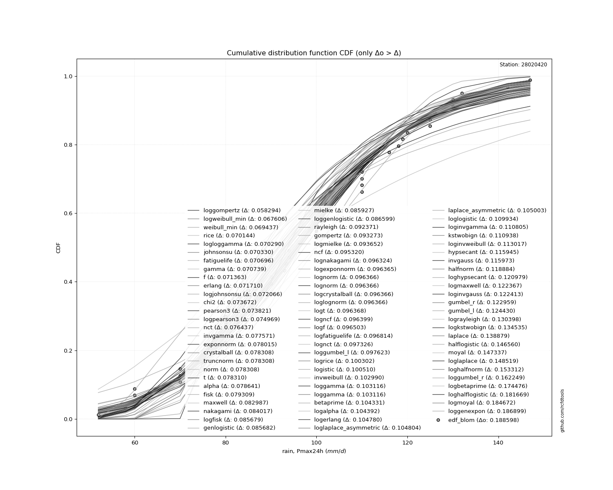</img>

</div>


**6.3. Best fit**

<div align="center">

|   id |   station | empirical_dist   | p_dist      |     delta |   deltao | eval   |   fit |   n |   best_fit |   best_fit_sort |
|-----:|----------:|:-----------------|:------------|----------:|---------:|:-------|------:|----:|-----------:|----------------:|
|    0 |  28020420 | edf_blom         | loggompertz | 0.0582942 | 0.188598 | Δo > Δ |     1 |  52 |          1 |               1 |

</div>


<div align="center">

</img>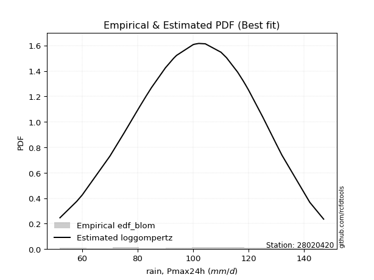</img>

</div>


### 7. Empirical - EDF Tukey (1962)

In hydrology, the Tukey formula is used as a plotting position formula to estimate the empirical probability or frequency of a flood event (or other hydrological data). The formula parameter is given as _c=0.333_ (or 1/3).

<div align="center">


$P=(m-c)/(n+1-2c)$


</div>


**7.1. Empirical values**

<div align="center">

|                | 0                    | 1                   | 2                    | 3                   | 4                   | 5                   | 6                   | 7                  | 8                   | 9                   | 10                  | 11                 | 12                  | 13                 | 14                 | 15                  | 16                 | 17                 | 18                  | 19                  | 20                  | 21                 | 22                  | 23                  | 24                 | 25                  | 26                 | 27                 | 28                 | 29                 | 30                 | 31                 | 32                 | 33                 | 34                 | 35                 | 36                 | 37                 | 38                 | 39                 | 40                 | 41                 | 42                 | 43                 | 44                 | 45                 | 46                | 47                 | 48                 | 49                 | 50                 | 51                 |
|:---------------|:---------------------|:--------------------|:---------------------|:--------------------|:--------------------|:--------------------|:--------------------|:-------------------|:--------------------|:--------------------|:--------------------|:-------------------|:--------------------|:-------------------|:-------------------|:--------------------|:-------------------|:-------------------|:--------------------|:--------------------|:--------------------|:-------------------|:--------------------|:--------------------|:-------------------|:--------------------|:-------------------|:-------------------|:-------------------|:-------------------|:-------------------|:-------------------|:-------------------|:-------------------|:-------------------|:-------------------|:-------------------|:-------------------|:-------------------|:-------------------|:-------------------|:-------------------|:-------------------|:-------------------|:-------------------|:-------------------|:------------------|:-------------------|:-------------------|:-------------------|:-------------------|:-------------------|
| date           | 2012                 | 1991                | 1990                 | 1984                | 2015                | 1989                | 2000                | 1982               | 1976                | 1997                | 1977                | 2020               | 2014                | 2006               | 2017               | 2011                | 1972               | 2019               | 1995                | 2013                | 2016                | 1999               | 2002                | 1971                | 1975               | 1998                | 1994               | 2004               | 2009               | 1988               | 2018               | 1987               | 1986               | 1970               | 1978               | 1979               | 1983               | 1981               | 2007               | 2021               | 2010               | 1980               | 2001               | 2005               | 2008               | 1992               | 2003              | 1985               | 1993               | 1996               | 1974               | 1973               |
| x              | 52.0                 | 58.0                | 60.0                 | 60.0                | 60.0                | 70.0                | 70.0                | 70.0               | 75.0                | 75.3022389753854    | 77.0                | 80.0               | 80.0                | 80.0               | 80.0               | 80.0                | 80.7600828088943   | 83.0               | 83.0                | 85.0                | 90.0                | 90.0               | 92.9108431434611    | 93.3024589354871    | 94.0               | 94.0                | 100.0              | 100.0              | 100.0              | 100.0              | 100.0              | 100.524899066195   | 102.0              | 104.358339515926   | 110.0              | 110.0              | 110.0              | 110.0              | 110.0              | 112.0              | 116.0              | 118.0              | 119.0              | 120.0              | 125.0              | 125.0              | 126.0             | 130.0              | 130.0              | 132.0              | 142.0              | 147.0              |
| m              | 1                    | 2                   | 3                    | 4                   | 5                   | 6                   | 7                   | 8                  | 9                   | 10                  | 11                  | 12                 | 13                  | 14                 | 15                 | 16                  | 17                 | 18                 | 19                  | 20                  | 21                  | 22                 | 23                  | 24                  | 25                 | 26                  | 27                 | 28                 | 29                 | 30                 | 31                 | 32                 | 33                 | 34                 | 35                 | 36                 | 37                 | 38                 | 39                 | 40                 | 41                 | 42                 | 43                 | 44                 | 45                 | 46                 | 47                | 48                 | 49                 | 50                 | 51                 | 52                 |
| empirical_dist | edf_tukey            | edf_tukey           | edf_tukey            | edf_tukey           | edf_tukey           | edf_tukey           | edf_tukey           | edf_tukey          | edf_tukey           | edf_tukey           | edf_tukey           | edf_tukey          | edf_tukey           | edf_tukey          | edf_tukey          | edf_tukey           | edf_tukey          | edf_tukey          | edf_tukey           | edf_tukey           | edf_tukey           | edf_tukey          | edf_tukey           | edf_tukey           | edf_tukey          | edf_tukey           | edf_tukey          | edf_tukey          | edf_tukey          | edf_tukey          | edf_tukey          | edf_tukey          | edf_tukey          | edf_tukey          | edf_tukey          | edf_tukey          | edf_tukey          | edf_tukey          | edf_tukey          | edf_tukey          | edf_tukey          | edf_tukey          | edf_tukey          | edf_tukey          | edf_tukey          | edf_tukey          | edf_tukey         | edf_tukey          | edf_tukey          | edf_tukey          | edf_tukey          | edf_tukey          |
| empirical      | 0.012738853503184714 | 0.03184713375796178 | 0.050955414012738856 | 0.07006369426751592 | 0.08917197452229299 | 0.10828025477707007 | 0.12738853503184713 | 0.1464968152866242 | 0.16560509554140126 | 0.18471337579617833 | 0.20382165605095542 | 0.2229299363057325 | 0.24203821656050956 | 0.2611464968152866 | 0.2802547770700637 | 0.29936305732484075 | 0.3184713375796178 | 0.3375796178343949 | 0.35668789808917195 | 0.37579617834394907 | 0.39490445859872614 | 0.4140127388535032 | 0.43312101910828027 | 0.45222929936305734 | 0.4713375796178344 | 0.49044585987261147 | 0.5095541401273885 | 0.5286624203821656 | 0.5477707006369427 | 0.5668789808917197 | 0.5859872611464968 | 0.6050955414012739 | 0.6242038216560509 | 0.643312101910828  | 0.6624203821656051 | 0.6815286624203821 | 0.7006369426751592 | 0.7197452229299363 | 0.7388535031847133 | 0.7579617834394905 | 0.7770700636942676 | 0.7961783439490446 | 0.8152866242038217 | 0.8343949044585988 | 0.8535031847133758 | 0.8726114649681529 | 0.89171974522293  | 0.910828025477707  | 0.9299363057324841 | 0.9490445859872612 | 0.9681528662420382 | 0.9872611464968153 |
| empirical_tr   | 1.0129032258064516   | 1.0328947368421053  | 1.0536912751677852   | 1.0753424657534247  | 1.097902097902098   | 1.1214285714285714  | 1.145985401459854   | 1.171641791044776  | 1.198473282442748   | 1.2265625           | 1.256               | 1.2868852459016393 | 1.319327731092437   | 1.353448275862069  | 1.3893805309734513 | 1.427272727272727   | 1.467289719626168  | 1.5096153846153844 | 1.5544554455445543  | 1.6020408163265307  | 1.6526315789473685  | 1.7065217391304348 | 1.7640449438202248  | 1.8255813953488373  | 1.891566265060241  | 1.9625              | 2.038961038961039  | 2.1216216216216215 | 2.211267605633803  | 2.3088235294117645 | 2.4153846153846152 | 2.532258064516129  | 2.6610169491525424 | 2.8035714285714284 | 2.962264150943396  | 3.1399999999999997 | 3.340425531914893  | 3.5681818181818175 | 3.8292682926829262 | 4.131578947368422  | 4.485714285714287  | 4.906250000000001  | 5.413793103448277  | 6.03846153846154   | 6.826086956521741  | 7.850000000000001  | 9.235294117647062 | 11.214285714285717 | 14.272727272727275 | 19.625000000000004 | 31.400000000000006 | 78.50000000000001  |

</div>


**7.2. Kolmogorov-Smirnov fit test (sorted by Δ)**


<div align="center">

|                | 0                    | 1                   | 2                   | 3                   | 4                   | 5                   | 6                   | 7                   | 8                   | 9                   | 10                  | 11                  | 12                  | 13                  | 14                  | 15                  | 16                  | 17                  | 18                  | 19                  | 20                  | 21                  | 22                  | 23                  | 24                  | 25                  | 26                  | 27                  | 28                  | 29                  | 30                  | 31                  | 32                  | 33                  | 34                  | 35                  | 36                  | 37                  | 38                  | 39                  | 40                  | 41                  | 42                  | 43                  | 44                  | 45                  | 46                  | 47                  | 48                  | 49                  | 50                  | 51                  | 52                  | 53                    | 54                  | 55                  | 56                  | 57                  | 58                  | 59                  | 60                  | 61                  | 62                  | 63                  | 64                  | 65                  | 66                  | 67                  | 68                  | 69                  | 70                  | 71                  | 72                  | 73                  | 74                  | 75                  | 76                  | 77                  | 78                  | 79                  | 80                  | 81                  | 82                  | 83                  | 84                  | 85                  | 86                  | 87                  | 88                  | 89                  |
|:---------------|:---------------------|:--------------------|:--------------------|:--------------------|:--------------------|:--------------------|:--------------------|:--------------------|:--------------------|:--------------------|:--------------------|:--------------------|:--------------------|:--------------------|:--------------------|:--------------------|:--------------------|:--------------------|:--------------------|:--------------------|:--------------------|:--------------------|:--------------------|:--------------------|:--------------------|:--------------------|:--------------------|:--------------------|:--------------------|:--------------------|:--------------------|:--------------------|:--------------------|:--------------------|:--------------------|:--------------------|:--------------------|:--------------------|:--------------------|:--------------------|:--------------------|:--------------------|:--------------------|:--------------------|:--------------------|:--------------------|:--------------------|:--------------------|:--------------------|:--------------------|:--------------------|:--------------------|:--------------------|:----------------------|:--------------------|:--------------------|:--------------------|:--------------------|:--------------------|:--------------------|:--------------------|:--------------------|:--------------------|:--------------------|:--------------------|:--------------------|:--------------------|:--------------------|:--------------------|:--------------------|:--------------------|:--------------------|:--------------------|:--------------------|:--------------------|:--------------------|:--------------------|:--------------------|:--------------------|:--------------------|:--------------------|:--------------------|:--------------------|:--------------------|:--------------------|:--------------------|:--------------------|:--------------------|:--------------------|:--------------------|
| station        | 28020420             | 28020420            | 28020420            | 28020420            | 28020420            | 28020420            | 28020420            | 28020420            | 28020420            | 28020420            | 28020420            | 28020420            | 28020420            | 28020420            | 28020420            | 28020420            | 28020420            | 28020420            | 28020420            | 28020420            | 28020420            | 28020420            | 28020420            | 28020420            | 28020420            | 28020420            | 28020420            | 28020420            | 28020420            | 28020420            | 28020420            | 28020420            | 28020420            | 28020420            | 28020420            | 28020420            | 28020420            | 28020420            | 28020420            | 28020420            | 28020420            | 28020420            | 28020420            | 28020420            | 28020420            | 28020420            | 28020420            | 28020420            | 28020420            | 28020420            | 28020420            | 28020420            | 28020420            | 28020420              | 28020420            | 28020420            | 28020420            | 28020420            | 28020420            | 28020420            | 28020420            | 28020420            | 28020420            | 28020420            | 28020420            | 28020420            | 28020420            | 28020420            | 28020420            | 28020420            | 28020420            | 28020420            | 28020420            | 28020420            | 28020420            | 28020420            | 28020420            | 28020420            | 28020420            | 28020420            | 28020420            | 28020420            | 28020420            | 28020420            | 28020420            | 28020420            | 28020420            | 28020420            | 28020420            | 28020420            |
| empirical_dist | edf_tukey            | edf_tukey           | edf_tukey           | edf_tukey           | edf_tukey           | edf_tukey           | edf_tukey           | edf_tukey           | edf_tukey           | edf_tukey           | edf_tukey           | edf_tukey           | edf_tukey           | edf_tukey           | edf_tukey           | edf_tukey           | edf_tukey           | edf_tukey           | edf_tukey           | edf_tukey           | edf_tukey           | edf_tukey           | edf_tukey           | edf_tukey           | edf_tukey           | edf_tukey           | edf_tukey           | edf_tukey           | edf_tukey           | edf_tukey           | edf_tukey           | edf_tukey           | edf_tukey           | edf_tukey           | edf_tukey           | edf_tukey           | edf_tukey           | edf_tukey           | edf_tukey           | edf_tukey           | edf_tukey           | edf_tukey           | edf_tukey           | edf_tukey           | edf_tukey           | edf_tukey           | edf_tukey           | edf_tukey           | edf_tukey           | edf_tukey           | edf_tukey           | edf_tukey           | edf_tukey           | edf_tukey             | edf_tukey           | edf_tukey           | edf_tukey           | edf_tukey           | edf_tukey           | edf_tukey           | edf_tukey           | edf_tukey           | edf_tukey           | edf_tukey           | edf_tukey           | edf_tukey           | edf_tukey           | edf_tukey           | edf_tukey           | edf_tukey           | edf_tukey           | edf_tukey           | edf_tukey           | edf_tukey           | edf_tukey           | edf_tukey           | edf_tukey           | edf_tukey           | edf_tukey           | edf_tukey           | edf_tukey           | edf_tukey           | edf_tukey           | edf_tukey           | edf_tukey           | edf_tukey           | edf_tukey           | edf_tukey           | edf_tukey           | edf_tukey           |
| p_dist         | loggompertz          | logweibull_min      | weibull_min         | rice                | logloggamma         | johnsonsu           | fatiguelife         | gamma               | f                   | erlang              | logjohnsonsu        | chi2                | pearson3            | logpearson3         | nct                 | invgamma            | exponnorm           | crystalball         | truncnorm           | norm                | t                   | alpha               | fisk                | maxwell             | nakagami            | logfisk             | genlogistic         | mielke              | loggenlogistic      | rayleigh            | gompertz            | logmielke           | ncf                 | lognakagami         | logexponnorm        | lognorm             | lognorm             | logcrystalball      | loglognorm          | logt                | logncf              | logf                | logfatiguelife      | lognct              | loggumbel_l         | logrice             | logistic            | invweibull          | loggamma            | loggamma            | betaprime           | logalpha            | logerlang           | loglaplace_asymmetric | laplace_asymmetric  | loglogistic         | loginvgamma         | kstwobign           | loginvweibull       | invgauss            | hypsecant           | halfnorm            | loghypsecant        | logmaxwell          | loginvgauss         | gumbel_r            | gumbel_l            | lograyleigh         | logkstwobign        | laplace             | halflogistic        | moyal               | loglaplace          | loghalfnorm         | loggumbel_r         | logbetaprime        | loghalflogistic     | logmoyal            | loggenexpon         | wald                | expon               | pareto              | logwald             | loggibrat           | logtruncnorm        | gibrat              | logexpon            | logpareto           | logchi2             | genexpon            |
| delta          | 0.058522751933546835 | 0.06786536191909365 | 0.06945224755164259 | 0.07015903554849745 | 0.07051898332085754 | 0.07055807999846714 | 0.07095512258327519 | 0.07096739720362294 | 0.07162165120102904 | 0.07193848303390193 | 0.07229458711075082 | 0.07368701667621824 | 0.07404938341722395 | 0.07498440815200025 | 0.07666517164287195 | 0.07758605954953646 | 0.07824309361315629 | 0.07853607131255808 | 0.07853607578500882 | 0.07853607631007653 | 0.07853894863981975 | 0.07865622310875564 | 0.07953791766729573 | 0.0830023002401763  | 0.08403174030957661 | 0.08569378565012031 | 0.08569682667070821 | 0.08615599029728166 | 0.08682778381702017 | 0.09238644241474281 | 0.09310560653889344 | 0.09391084803660599 | 0.09533537275939763 | 0.09633956797122756 | 0.09638002278058833 | 0.09638100313751508 | 0.09638100313751508 | 0.09638100739712141 | 0.09638106165658877 | 0.09638277885048718 | 0.09641430660885986 | 0.09651798735701178 | 0.09682896010988717 | 0.09734140088655241 | 0.09785145919592786 | 0.10031771783004317 | 0.10073900892563042 | 0.10300558301464524 | 0.10313109703152123 | 0.10313109703152123 | 0.10434655449867092 | 0.10440773512366197 | 0.10479487039010726 | 0.1050627009451447    | 0.10523146698116714 | 0.10994917085031253 | 0.11082027551127438 | 0.11095352782405177 | 0.1130325580170799  | 0.11598810289960648 | 0.11617332612640496 | 0.11889926053329636 | 0.12099420654406878 | 0.12238205935847979 | 0.12242785597733197 | 0.12297397852041936 | 0.12465854502081655 | 0.13041325527653524 | 0.1340930522590617  | 0.1391074354988581  | 0.14657543885376245 | 0.1473525084781916  | 0.1485342526741419  | 0.15332695509987715 | 0.16226422267878715 | 0.17375949578300076 | 0.18168381570504588 | 0.18468722928785253 | 0.18645695933604872 | 0.2150144657917995  | 0.24490725281580467 | 0.2449072652551761  | 0.2472608948569771  | 0.279100549604234   | 0.28661604402169066 | 0.29077830271574795 | 0.2980343921954589  | 0.2980344038983289  | 0.32898228437888477 | 0.882079094238231   |
| deltao         | 0.18859806671657792  | 0.18859806671657792 | 0.18859806671657792 | 0.18859806671657792 | 0.18859806671657792 | 0.18859806671657792 | 0.18859806671657792 | 0.18859806671657792 | 0.18859806671657792 | 0.18859806671657792 | 0.18859806671657792 | 0.18859806671657792 | 0.18859806671657792 | 0.18859806671657792 | 0.18859806671657792 | 0.18859806671657792 | 0.18859806671657792 | 0.18859806671657792 | 0.18859806671657792 | 0.18859806671657792 | 0.18859806671657792 | 0.18859806671657792 | 0.18859806671657792 | 0.18859806671657792 | 0.18859806671657792 | 0.18859806671657792 | 0.18859806671657792 | 0.18859806671657792 | 0.18859806671657792 | 0.18859806671657792 | 0.18859806671657792 | 0.18859806671657792 | 0.18859806671657792 | 0.18859806671657792 | 0.18859806671657792 | 0.18859806671657792 | 0.18859806671657792 | 0.18859806671657792 | 0.18859806671657792 | 0.18859806671657792 | 0.18859806671657792 | 0.18859806671657792 | 0.18859806671657792 | 0.18859806671657792 | 0.18859806671657792 | 0.18859806671657792 | 0.18859806671657792 | 0.18859806671657792 | 0.18859806671657792 | 0.18859806671657792 | 0.18859806671657792 | 0.18859806671657792 | 0.18859806671657792 | 0.18859806671657792   | 0.18859806671657792 | 0.18859806671657792 | 0.18859806671657792 | 0.18859806671657792 | 0.18859806671657792 | 0.18859806671657792 | 0.18859806671657792 | 0.18859806671657792 | 0.18859806671657792 | 0.18859806671657792 | 0.18859806671657792 | 0.18859806671657792 | 0.18859806671657792 | 0.18859806671657792 | 0.18859806671657792 | 0.18859806671657792 | 0.18859806671657792 | 0.18859806671657792 | 0.18859806671657792 | 0.18859806671657792 | 0.18859806671657792 | 0.18859806671657792 | 0.18859806671657792 | 0.18859806671657792 | 0.18859806671657792 | 0.18859806671657792 | 0.18859806671657792 | 0.18859806671657792 | 0.18859806671657792 | 0.18859806671657792 | 0.18859806671657792 | 0.18859806671657792 | 0.18859806671657792 | 0.18859806671657792 | 0.18859806671657792 | 0.18859806671657792 |
| eval           | Δo > Δ               | Δo > Δ              | Δo > Δ              | Δo > Δ              | Δo > Δ              | Δo > Δ              | Δo > Δ              | Δo > Δ              | Δo > Δ              | Δo > Δ              | Δo > Δ              | Δo > Δ              | Δo > Δ              | Δo > Δ              | Δo > Δ              | Δo > Δ              | Δo > Δ              | Δo > Δ              | Δo > Δ              | Δo > Δ              | Δo > Δ              | Δo > Δ              | Δo > Δ              | Δo > Δ              | Δo > Δ              | Δo > Δ              | Δo > Δ              | Δo > Δ              | Δo > Δ              | Δo > Δ              | Δo > Δ              | Δo > Δ              | Δo > Δ              | Δo > Δ              | Δo > Δ              | Δo > Δ              | Δo > Δ              | Δo > Δ              | Δo > Δ              | Δo > Δ              | Δo > Δ              | Δo > Δ              | Δo > Δ              | Δo > Δ              | Δo > Δ              | Δo > Δ              | Δo > Δ              | Δo > Δ              | Δo > Δ              | Δo > Δ              | Δo > Δ              | Δo > Δ              | Δo > Δ              | Δo > Δ                | Δo > Δ              | Δo > Δ              | Δo > Δ              | Δo > Δ              | Δo > Δ              | Δo > Δ              | Δo > Δ              | Δo > Δ              | Δo > Δ              | Δo > Δ              | Δo > Δ              | Δo > Δ              | Δo > Δ              | Δo > Δ              | Δo > Δ              | Δo > Δ              | Δo > Δ              | Δo > Δ              | Δo > Δ              | Δo > Δ              | Δo > Δ              | Δo > Δ              | Δo > Δ              | Δo > Δ              | Δo > Δ              | Δo <= Δ             | Δo <= Δ             | Δo <= Δ             | Δo <= Δ             | Δo <= Δ             | Δo <= Δ             | Δo <= Δ             | Δo <= Δ             | Δo <= Δ             | Δo <= Δ             | Δo <= Δ             |
| fit            | 1                    | 1                   | 1                   | 1                   | 1                   | 1                   | 1                   | 1                   | 1                   | 1                   | 1                   | 1                   | 1                   | 1                   | 1                   | 1                   | 1                   | 1                   | 1                   | 1                   | 1                   | 1                   | 1                   | 1                   | 1                   | 1                   | 1                   | 1                   | 1                   | 1                   | 1                   | 1                   | 1                   | 1                   | 1                   | 1                   | 1                   | 1                   | 1                   | 1                   | 1                   | 1                   | 1                   | 1                   | 1                   | 1                   | 1                   | 1                   | 1                   | 1                   | 1                   | 1                   | 1                   | 1                     | 1                   | 1                   | 1                   | 1                   | 1                   | 1                   | 1                   | 1                   | 1                   | 1                   | 1                   | 1                   | 1                   | 1                   | 1                   | 1                   | 1                   | 1                   | 1                   | 1                   | 1                   | 1                   | 1                   | 1                   | 1                   | 0                   | 0                   | 0                   | 0                   | 0                   | 0                   | 0                   | 0                   | 0                   | 0                   | 0                   |
| n              | 52                   | 52                  | 52                  | 52                  | 52                  | 52                  | 52                  | 52                  | 52                  | 52                  | 52                  | 52                  | 52                  | 52                  | 52                  | 52                  | 52                  | 52                  | 52                  | 52                  | 52                  | 52                  | 52                  | 52                  | 52                  | 52                  | 52                  | 52                  | 52                  | 52                  | 52                  | 52                  | 52                  | 52                  | 52                  | 52                  | 52                  | 52                  | 52                  | 52                  | 52                  | 52                  | 52                  | 52                  | 52                  | 52                  | 52                  | 52                  | 52                  | 52                  | 52                  | 52                  | 52                  | 52                    | 52                  | 52                  | 52                  | 52                  | 52                  | 52                  | 52                  | 52                  | 52                  | 52                  | 52                  | 52                  | 52                  | 52                  | 52                  | 52                  | 52                  | 52                  | 52                  | 52                  | 52                  | 52                  | 52                  | 52                  | 52                  | 52                  | 52                  | 52                  | 52                  | 52                  | 52                  | 52                  | 52                  | 52                  | 52                  | 52                  |
| best_fit       | 1                    | 0                   | 0                   | 0                   | 0                   | 0                   | 0                   | 0                   | 0                   | 0                   | 0                   | 0                   | 0                   | 0                   | 0                   | 0                   | 0                   | 0                   | 0                   | 0                   | 0                   | 0                   | 0                   | 0                   | 0                   | 0                   | 0                   | 0                   | 0                   | 0                   | 0                   | 0                   | 0                   | 0                   | 0                   | 0                   | 0                   | 0                   | 0                   | 0                   | 0                   | 0                   | 0                   | 0                   | 0                   | 0                   | 0                   | 0                   | 0                   | 0                   | 0                   | 0                   | 0                   | 0                     | 0                   | 0                   | 0                   | 0                   | 0                   | 0                   | 0                   | 0                   | 0                   | 0                   | 0                   | 0                   | 0                   | 0                   | 0                   | 0                   | 0                   | 0                   | 0                   | 0                   | 0                   | 0                   | 0                   | 0                   | 0                   | 0                   | 0                   | 0                   | 0                   | 0                   | 0                   | 0                   | 0                   | 0                   | 0                   | 0                   |
| best_fit_sort  | 1                    | 2                   | 3                   | 4                   | 5                   | 6                   | 7                   | 8                   | 9                   | 10                  | 11                  | 12                  | 13                  | 14                  | 15                  | 16                  | 17                  | 18                  | 19                  | 20                  | 21                  | 22                  | 23                  | 24                  | 25                  | 26                  | 27                  | 28                  | 29                  | 30                  | 31                  | 32                  | 33                  | 34                  | 35                  | 36                  | 37                  | 38                  | 39                  | 40                  | 41                  | 42                  | 43                  | 44                  | 45                  | 46                  | 47                  | 48                  | 49                  | 50                  | 51                  | 52                  | 53                  | 54                    | 55                  | 56                  | 57                  | 58                  | 59                  | 60                  | 61                  | 62                  | 63                  | 64                  | 65                  | 66                  | 67                  | 68                  | 69                  | 70                  | 71                  | 72                  | 73                  | 74                  | 75                  | 76                  | 77                  | 78                  | 79                  | 80                  | 81                  | 82                  | 83                  | 84                  | 85                  | 86                  | 87                  | 88                  | 89                  | 90                  |

</div>


<div align="center">

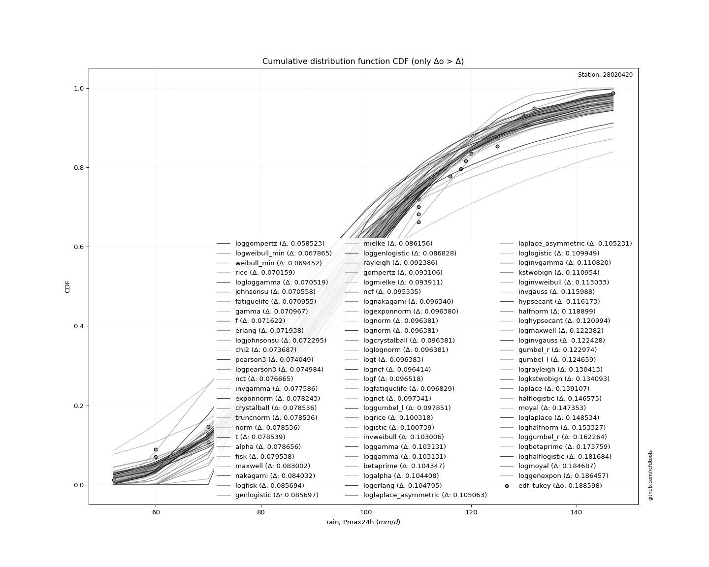</img>

</div>


**7.3. Best fit**

<div align="center">

|   id |   station | empirical_dist   | p_dist      |     delta |   deltao | eval   |   fit |   n |   best_fit |   best_fit_sort |
|-----:|----------:|:-----------------|:------------|----------:|---------:|:-------|------:|----:|-----------:|----------------:|
|    0 |  28020420 | edf_tukey        | loggompertz | 0.0585228 | 0.188598 | Δo > Δ |     1 |  52 |          1 |               1 |

</div>


<div align="center">

</img>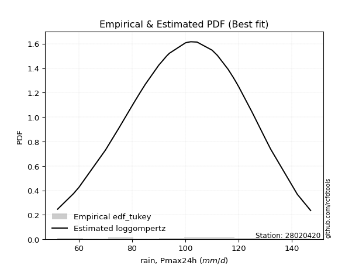</img>

</div>


### 8. Empirical - EDF Gringorten (1963)

Gringorten plotting position formula is essential for estimating the probability and return periods of extreme events like floods and heavy rainfall. The constant _a=0.44_.

<div align="center">


$P=(m-a)/(n+1-2a)$


</div>


**8.1. Empirical values**

<div align="center">

|                | 0                    | 1                    | 2                  | 3                   | 4                   | 5                  | 6                   | 7                   | 8                   | 9                   | 10                  | 11                  | 12                  | 13                 | 14                 | 15                  | 16                 | 17                  | 18                 | 19                 | 20                  | 21                 | 22                 | 23                  | 24                 | 25                 | 26                 | 27                 | 28                 | 29                 | 30                 | 31                 | 32                 | 33                 | 34                 | 35                 | 36                 | 37                | 38                 | 39                 | 40                 | 41                | 42                 | 43                 | 44                 | 45                 | 46                 | 47                 | 48                 | 49                 | 50                | 51                 |
|:---------------|:---------------------|:---------------------|:-------------------|:--------------------|:--------------------|:-------------------|:--------------------|:--------------------|:--------------------|:--------------------|:--------------------|:--------------------|:--------------------|:-------------------|:-------------------|:--------------------|:-------------------|:--------------------|:-------------------|:-------------------|:--------------------|:-------------------|:-------------------|:--------------------|:-------------------|:-------------------|:-------------------|:-------------------|:-------------------|:-------------------|:-------------------|:-------------------|:-------------------|:-------------------|:-------------------|:-------------------|:-------------------|:------------------|:-------------------|:-------------------|:-------------------|:------------------|:-------------------|:-------------------|:-------------------|:-------------------|:-------------------|:-------------------|:-------------------|:-------------------|:------------------|:-------------------|
| date           | 2012                 | 1991                 | 1990               | 1984                | 2015                | 1989               | 2000                | 1982                | 1976                | 1997                | 1977                | 2020                | 2014                | 2006               | 2017               | 2011                | 1972               | 2019                | 1995               | 2013               | 2016                | 1999               | 2002               | 1971                | 1975               | 1998               | 1994               | 2004               | 2009               | 1988               | 2018               | 1987               | 1986               | 1970               | 1978               | 1979               | 1983               | 1981              | 2007               | 2021               | 2010               | 1980              | 2001               | 2005               | 2008               | 1992               | 2003               | 1985               | 1993               | 1996               | 1974              | 1973               |
| x              | 52.0                 | 58.0                 | 60.0               | 60.0                | 60.0                | 70.0               | 70.0                | 70.0                | 75.0                | 75.3022389753854    | 77.0                | 80.0                | 80.0                | 80.0               | 80.0               | 80.0                | 80.7600828088943   | 83.0                | 83.0               | 85.0               | 90.0                | 90.0               | 92.9108431434611   | 93.3024589354871    | 94.0               | 94.0               | 100.0              | 100.0              | 100.0              | 100.0              | 100.0              | 100.524899066195   | 102.0              | 104.358339515926   | 110.0              | 110.0              | 110.0              | 110.0             | 110.0              | 112.0              | 116.0              | 118.0             | 119.0              | 120.0              | 125.0              | 125.0              | 126.0              | 130.0              | 130.0              | 132.0              | 142.0             | 147.0              |
| m              | 1                    | 2                    | 3                  | 4                   | 5                   | 6                  | 7                   | 8                   | 9                   | 10                  | 11                  | 12                  | 13                  | 14                 | 15                 | 16                  | 17                 | 18                  | 19                 | 20                 | 21                  | 22                 | 23                 | 24                  | 25                 | 26                 | 27                 | 28                 | 29                 | 30                 | 31                 | 32                 | 33                 | 34                 | 35                 | 36                 | 37                 | 38                | 39                 | 40                 | 41                 | 42                | 43                 | 44                 | 45                 | 46                 | 47                 | 48                 | 49                 | 50                 | 51                | 52                 |
| empirical_dist | edf_gringorten       | edf_gringorten       | edf_gringorten     | edf_gringorten      | edf_gringorten      | edf_gringorten     | edf_gringorten      | edf_gringorten      | edf_gringorten      | edf_gringorten      | edf_gringorten      | edf_gringorten      | edf_gringorten      | edf_gringorten     | edf_gringorten     | edf_gringorten      | edf_gringorten     | edf_gringorten      | edf_gringorten     | edf_gringorten     | edf_gringorten      | edf_gringorten     | edf_gringorten     | edf_gringorten      | edf_gringorten     | edf_gringorten     | edf_gringorten     | edf_gringorten     | edf_gringorten     | edf_gringorten     | edf_gringorten     | edf_gringorten     | edf_gringorten     | edf_gringorten     | edf_gringorten     | edf_gringorten     | edf_gringorten     | edf_gringorten    | edf_gringorten     | edf_gringorten     | edf_gringorten     | edf_gringorten    | edf_gringorten     | edf_gringorten     | edf_gringorten     | edf_gringorten     | edf_gringorten     | edf_gringorten     | edf_gringorten     | edf_gringorten     | edf_gringorten    | edf_gringorten     |
| empirical      | 0.010744435917114353 | 0.029930928626247126 | 0.0491174213353799 | 0.06830391404451266 | 0.08749040675364543 | 0.1066768994627782 | 0.12586339217191098 | 0.14504988488104376 | 0.16423637759017654 | 0.18342287029930932 | 0.20260936300844207 | 0.22179585571757485 | 0.24098234842670763 | 0.2601688411358404 | 0.2793553338449732 | 0.29854182655410594 | 0.3177283192632387 | 0.33691481197237144 | 0.3561013046815042 | 0.375287797390637  | 0.39447429009976975 | 0.4136607828089025 | 0.4328472755180353 | 0.45203376822716806 | 0.4712202609363008 | 0.4904067536454336 | 0.5095932463545664 | 0.5287797390636991 | 0.5479662317728319 | 0.5671527244819647 | 0.5863392171910975 | 0.6055257099002302 | 0.6247122026093631 | 0.6438986953184959 | 0.6630851880276286 | 0.6822716807367614 | 0.7014581734458941 | 0.720644666155027 | 0.7398311588641597 | 0.7590176515732925 | 0.7782041442824252 | 0.797390636991558 | 0.8165771297006909 | 0.8357636224098236 | 0.8549501151189564 | 0.8741366078280891 | 0.8933231005372219 | 0.9125095932463546 | 0.9316960859554875 | 0.9508825786646202 | 0.970069071373753 | 0.9892555640828857 |
| empirical_tr   | 1.0108611326609775   | 1.0308544303797469   | 1.0516545601291365 | 1.07331136738056    | 1.0958788898233809  | 1.1194158075601375 | 1.1439859525899914  | 1.1696588868940754  | 1.1965105601469237  | 1.224624060150376   | 1.2540904716073147  | 1.2850098619329389  | 1.3174924165824065  | 1.3516597510373445 | 1.3876464323748672 | 1.4256017505470462  | 1.4656917885264344 | 1.5081018518518519  | 1.5530393325387366 | 1.6007371007371007 | 1.6514575411913814  | 1.7054973821989527 | 1.7631935047361298 | 1.8249299719887953  | 1.8911465892597965 | 1.9623493975903614 | 2.0391236306729263 | 2.1221498371335503 | 2.2122241086587433 | 2.3102836879432624 | 2.417439703153989  | 2.535019455252918  | 2.6646216768916164 | 2.8081896551724146 | 2.9681093394077456 | 3.147342995169083  | 3.34961439588689   | 3.579670329670331 | 3.843657817109146  | 4.149681528662422  | 4.508650519031143  | 4.935606060606061 | 5.451882845188289  | 6.088785046728977  | 6.894179894179899  | 7.945121951219518  | 9.374100719424465  | 11.429824561403514 | 14.640449438202277 | 20.35937500000005  | 33.41025641025652 | 93.07142857142928  |

</div>


**8.2. Kolmogorov-Smirnov fit test (sorted by Δ)**


<div align="center">

|                | 0                   | 1                   | 2                   | 3                   | 4                   | 5                   | 6                   | 7                   | 8                   | 9                   | 10                  | 11                  | 12                  | 13                  | 14                  | 15                  | 16                  | 17                  | 18                  | 19                  | 20                  | 21                  | 22                  | 23                  | 24                  | 25                  | 26                  | 27                  | 28                  | 29                  | 30                  | 31                  | 32                  | 33                  | 34                  | 35                  | 36                  | 37                  | 38                  | 39                  | 40                  | 41                  | 42                  | 43                  | 44                  | 45                  | 46                  | 47                  | 48                  | 49                  | 50                  | 51                  | 52                    | 53                  | 54                  | 55                  | 56                  | 57                  | 58                  | 59                  | 60                  | 61                  | 62                  | 63                  | 64                  | 65                  | 66                  | 67                  | 68                  | 69                  | 70                  | 71                  | 72                  | 73                  | 74                  | 75                  | 76                  | 77                  | 78                  | 79                  | 80                  | 81                  | 82                  | 83                  | 84                  | 85                  | 86                  | 87                  | 88                  | 89                  |
|:---------------|:--------------------|:--------------------|:--------------------|:--------------------|:--------------------|:--------------------|:--------------------|:--------------------|:--------------------|:--------------------|:--------------------|:--------------------|:--------------------|:--------------------|:--------------------|:--------------------|:--------------------|:--------------------|:--------------------|:--------------------|:--------------------|:--------------------|:--------------------|:--------------------|:--------------------|:--------------------|:--------------------|:--------------------|:--------------------|:--------------------|:--------------------|:--------------------|:--------------------|:--------------------|:--------------------|:--------------------|:--------------------|:--------------------|:--------------------|:--------------------|:--------------------|:--------------------|:--------------------|:--------------------|:--------------------|:--------------------|:--------------------|:--------------------|:--------------------|:--------------------|:--------------------|:--------------------|:----------------------|:--------------------|:--------------------|:--------------------|:--------------------|:--------------------|:--------------------|:--------------------|:--------------------|:--------------------|:--------------------|:--------------------|:--------------------|:--------------------|:--------------------|:--------------------|:--------------------|:--------------------|:--------------------|:--------------------|:--------------------|:--------------------|:--------------------|:--------------------|:--------------------|:--------------------|:--------------------|:--------------------|:--------------------|:--------------------|:--------------------|:--------------------|:--------------------|:--------------------|:--------------------|:--------------------|:--------------------|:--------------------|
| station        | 28020420            | 28020420            | 28020420            | 28020420            | 28020420            | 28020420            | 28020420            | 28020420            | 28020420            | 28020420            | 28020420            | 28020420            | 28020420            | 28020420            | 28020420            | 28020420            | 28020420            | 28020420            | 28020420            | 28020420            | 28020420            | 28020420            | 28020420            | 28020420            | 28020420            | 28020420            | 28020420            | 28020420            | 28020420            | 28020420            | 28020420            | 28020420            | 28020420            | 28020420            | 28020420            | 28020420            | 28020420            | 28020420            | 28020420            | 28020420            | 28020420            | 28020420            | 28020420            | 28020420            | 28020420            | 28020420            | 28020420            | 28020420            | 28020420            | 28020420            | 28020420            | 28020420            | 28020420              | 28020420            | 28020420            | 28020420            | 28020420            | 28020420            | 28020420            | 28020420            | 28020420            | 28020420            | 28020420            | 28020420            | 28020420            | 28020420            | 28020420            | 28020420            | 28020420            | 28020420            | 28020420            | 28020420            | 28020420            | 28020420            | 28020420            | 28020420            | 28020420            | 28020420            | 28020420            | 28020420            | 28020420            | 28020420            | 28020420            | 28020420            | 28020420            | 28020420            | 28020420            | 28020420            | 28020420            | 28020420            |
| empirical_dist | edf_gringorten      | edf_gringorten      | edf_gringorten      | edf_gringorten      | edf_gringorten      | edf_gringorten      | edf_gringorten      | edf_gringorten      | edf_gringorten      | edf_gringorten      | edf_gringorten      | edf_gringorten      | edf_gringorten      | edf_gringorten      | edf_gringorten      | edf_gringorten      | edf_gringorten      | edf_gringorten      | edf_gringorten      | edf_gringorten      | edf_gringorten      | edf_gringorten      | edf_gringorten      | edf_gringorten      | edf_gringorten      | edf_gringorten      | edf_gringorten      | edf_gringorten      | edf_gringorten      | edf_gringorten      | edf_gringorten      | edf_gringorten      | edf_gringorten      | edf_gringorten      | edf_gringorten      | edf_gringorten      | edf_gringorten      | edf_gringorten      | edf_gringorten      | edf_gringorten      | edf_gringorten      | edf_gringorten      | edf_gringorten      | edf_gringorten      | edf_gringorten      | edf_gringorten      | edf_gringorten      | edf_gringorten      | edf_gringorten      | edf_gringorten      | edf_gringorten      | edf_gringorten      | edf_gringorten        | edf_gringorten      | edf_gringorten      | edf_gringorten      | edf_gringorten      | edf_gringorten      | edf_gringorten      | edf_gringorten      | edf_gringorten      | edf_gringorten      | edf_gringorten      | edf_gringorten      | edf_gringorten      | edf_gringorten      | edf_gringorten      | edf_gringorten      | edf_gringorten      | edf_gringorten      | edf_gringorten      | edf_gringorten      | edf_gringorten      | edf_gringorten      | edf_gringorten      | edf_gringorten      | edf_gringorten      | edf_gringorten      | edf_gringorten      | edf_gringorten      | edf_gringorten      | edf_gringorten      | edf_gringorten      | edf_gringorten      | edf_gringorten      | edf_gringorten      | edf_gringorten      | edf_gringorten      | edf_gringorten      | edf_gringorten      |
| p_dist         | loggompertz         | logweibull_min      | weibull_min         | logloggamma         | johnsonsu           | rice                | fatiguelife         | gamma               | f                   | erlang              | logjohnsonsu        | pearson3            | chi2                | logpearson3         | nct                 | invgamma            | exponnorm           | crystalball         | truncnorm           | norm                | t                   | alpha               | fisk                | maxwell             | nakagami            | mielke              | logfisk             | genlogistic         | loggenlogistic      | rayleigh            | logmielke           | gompertz            | ncf                 | lognakagami         | logexponnorm        | lognorm             | lognorm             | logcrystalball      | loglognorm          | logt                | logncf              | logf                | logfatiguelife      | loggumbel_l         | lognct              | logistic            | logrice             | invweibull          | loggamma            | loggamma            | betaprime           | logalpha            | loglaplace_asymmetric | laplace_asymmetric  | logerlang           | loglogistic         | loginvgamma         | kstwobign           | loginvweibull       | hypsecant           | invgauss            | halfnorm            | loghypsecant        | logmaxwell          | loginvgauss         | gumbel_r            | gumbel_l            | lograyleigh         | logkstwobign        | laplace             | halflogistic        | moyal               | loglaplace          | loghalfnorm         | loggumbel_r         | logbetaprime        | loghalflogistic     | logmoyal            | loggenexpon         | wald                | expon               | pareto              | logwald             | loggibrat           | logtruncnorm        | gibrat              | logexpon            | logpareto           | logchi2             | genexpon            |
| delta          | 0.05793615852587908 | 0.0672005560570701  | 0.06941314132446474 | 0.06993238991318979 | 0.06997148659079938 | 0.07011992932131961 | 0.07029031672125163 | 0.07038080379595518 | 0.07095684533900548 | 0.07135188962623418 | 0.07170799370308306 | 0.07346279000955619 | 0.0736479104490404  | 0.0749453019248224  | 0.0760785782352042  | 0.07754695332235861 | 0.07765650020548853 | 0.07794947790489032 | 0.07794948237734106 | 0.07794948290240877 | 0.07795235523215199 | 0.0786171168815778  | 0.07895132425962798 | 0.08296319401299845 | 0.08399263408239876 | 0.0855693968896139  | 0.08565467942294247 | 0.08565772044353037 | 0.08624119040935241 | 0.09234733618756497 | 0.09324604217458243 | 0.09353577503784982 | 0.09529626653221979 | 0.09630046174404971 | 0.09634091655341048 | 0.09634189691033723 | 0.09634189691033723 | 0.09634190116994357 | 0.09634195542941093 | 0.09634367262330934 | 0.09637520038168201 | 0.09647888112983394 | 0.09678985388270933 | 0.0972648657882601  | 0.09730229465937457 | 0.10015241551796267 | 0.10027861160286533 | 0.1029664767874674  | 0.10309199080434339 | 0.10309199080434339 | 0.10430744827149308 | 0.10436862889648413 | 0.10439789508312114   | 0.10464487357349939 | 0.10475576416292942 | 0.10991006462313468 | 0.11078116928409654 | 0.11091442159687392 | 0.11299345178990206 | 0.1155867327187372  | 0.11594899667242864 | 0.11886015430611852 | 0.12095510031689094 | 0.12234295313130195 | 0.12238874975015412 | 0.12293487229324151 | 0.1240719516131488  | 0.1303741490493574  | 0.13522713284721935 | 0.13852084209119034 | 0.1465363326265846  | 0.14731340225101375 | 0.14849514644696404 | 0.1532878488726993  | 0.1622251164516093  | 0.17559748846035983 | 0.18164470947786804 | 0.18464812306067468 | 0.18759103992420637 | 0.21497535956462166 | 0.2460413334039623  | 0.24604134584333373 | 0.24722178862979927 | 0.2790614433770562  | 0.28794800253681263 | 0.28995707194501313 | 0.29940311014668364 | 0.29940312184955364 | 0.3303510023301095  | 0.8836824495525228  |
| deltao         | 0.18859806671657792 | 0.18859806671657792 | 0.18859806671657792 | 0.18859806671657792 | 0.18859806671657792 | 0.18859806671657792 | 0.18859806671657792 | 0.18859806671657792 | 0.18859806671657792 | 0.18859806671657792 | 0.18859806671657792 | 0.18859806671657792 | 0.18859806671657792 | 0.18859806671657792 | 0.18859806671657792 | 0.18859806671657792 | 0.18859806671657792 | 0.18859806671657792 | 0.18859806671657792 | 0.18859806671657792 | 0.18859806671657792 | 0.18859806671657792 | 0.18859806671657792 | 0.18859806671657792 | 0.18859806671657792 | 0.18859806671657792 | 0.18859806671657792 | 0.18859806671657792 | 0.18859806671657792 | 0.18859806671657792 | 0.18859806671657792 | 0.18859806671657792 | 0.18859806671657792 | 0.18859806671657792 | 0.18859806671657792 | 0.18859806671657792 | 0.18859806671657792 | 0.18859806671657792 | 0.18859806671657792 | 0.18859806671657792 | 0.18859806671657792 | 0.18859806671657792 | 0.18859806671657792 | 0.18859806671657792 | 0.18859806671657792 | 0.18859806671657792 | 0.18859806671657792 | 0.18859806671657792 | 0.18859806671657792 | 0.18859806671657792 | 0.18859806671657792 | 0.18859806671657792 | 0.18859806671657792   | 0.18859806671657792 | 0.18859806671657792 | 0.18859806671657792 | 0.18859806671657792 | 0.18859806671657792 | 0.18859806671657792 | 0.18859806671657792 | 0.18859806671657792 | 0.18859806671657792 | 0.18859806671657792 | 0.18859806671657792 | 0.18859806671657792 | 0.18859806671657792 | 0.18859806671657792 | 0.18859806671657792 | 0.18859806671657792 | 0.18859806671657792 | 0.18859806671657792 | 0.18859806671657792 | 0.18859806671657792 | 0.18859806671657792 | 0.18859806671657792 | 0.18859806671657792 | 0.18859806671657792 | 0.18859806671657792 | 0.18859806671657792 | 0.18859806671657792 | 0.18859806671657792 | 0.18859806671657792 | 0.18859806671657792 | 0.18859806671657792 | 0.18859806671657792 | 0.18859806671657792 | 0.18859806671657792 | 0.18859806671657792 | 0.18859806671657792 | 0.18859806671657792 |
| eval           | Δo > Δ              | Δo > Δ              | Δo > Δ              | Δo > Δ              | Δo > Δ              | Δo > Δ              | Δo > Δ              | Δo > Δ              | Δo > Δ              | Δo > Δ              | Δo > Δ              | Δo > Δ              | Δo > Δ              | Δo > Δ              | Δo > Δ              | Δo > Δ              | Δo > Δ              | Δo > Δ              | Δo > Δ              | Δo > Δ              | Δo > Δ              | Δo > Δ              | Δo > Δ              | Δo > Δ              | Δo > Δ              | Δo > Δ              | Δo > Δ              | Δo > Δ              | Δo > Δ              | Δo > Δ              | Δo > Δ              | Δo > Δ              | Δo > Δ              | Δo > Δ              | Δo > Δ              | Δo > Δ              | Δo > Δ              | Δo > Δ              | Δo > Δ              | Δo > Δ              | Δo > Δ              | Δo > Δ              | Δo > Δ              | Δo > Δ              | Δo > Δ              | Δo > Δ              | Δo > Δ              | Δo > Δ              | Δo > Δ              | Δo > Δ              | Δo > Δ              | Δo > Δ              | Δo > Δ                | Δo > Δ              | Δo > Δ              | Δo > Δ              | Δo > Δ              | Δo > Δ              | Δo > Δ              | Δo > Δ              | Δo > Δ              | Δo > Δ              | Δo > Δ              | Δo > Δ              | Δo > Δ              | Δo > Δ              | Δo > Δ              | Δo > Δ              | Δo > Δ              | Δo > Δ              | Δo > Δ              | Δo > Δ              | Δo > Δ              | Δo > Δ              | Δo > Δ              | Δo > Δ              | Δo > Δ              | Δo > Δ              | Δo > Δ              | Δo <= Δ             | Δo <= Δ             | Δo <= Δ             | Δo <= Δ             | Δo <= Δ             | Δo <= Δ             | Δo <= Δ             | Δo <= Δ             | Δo <= Δ             | Δo <= Δ             | Δo <= Δ             |
| fit            | 1                   | 1                   | 1                   | 1                   | 1                   | 1                   | 1                   | 1                   | 1                   | 1                   | 1                   | 1                   | 1                   | 1                   | 1                   | 1                   | 1                   | 1                   | 1                   | 1                   | 1                   | 1                   | 1                   | 1                   | 1                   | 1                   | 1                   | 1                   | 1                   | 1                   | 1                   | 1                   | 1                   | 1                   | 1                   | 1                   | 1                   | 1                   | 1                   | 1                   | 1                   | 1                   | 1                   | 1                   | 1                   | 1                   | 1                   | 1                   | 1                   | 1                   | 1                   | 1                   | 1                     | 1                   | 1                   | 1                   | 1                   | 1                   | 1                   | 1                   | 1                   | 1                   | 1                   | 1                   | 1                   | 1                   | 1                   | 1                   | 1                   | 1                   | 1                   | 1                   | 1                   | 1                   | 1                   | 1                   | 1                   | 1                   | 1                   | 0                   | 0                   | 0                   | 0                   | 0                   | 0                   | 0                   | 0                   | 0                   | 0                   | 0                   |
| n              | 52                  | 52                  | 52                  | 52                  | 52                  | 52                  | 52                  | 52                  | 52                  | 52                  | 52                  | 52                  | 52                  | 52                  | 52                  | 52                  | 52                  | 52                  | 52                  | 52                  | 52                  | 52                  | 52                  | 52                  | 52                  | 52                  | 52                  | 52                  | 52                  | 52                  | 52                  | 52                  | 52                  | 52                  | 52                  | 52                  | 52                  | 52                  | 52                  | 52                  | 52                  | 52                  | 52                  | 52                  | 52                  | 52                  | 52                  | 52                  | 52                  | 52                  | 52                  | 52                  | 52                    | 52                  | 52                  | 52                  | 52                  | 52                  | 52                  | 52                  | 52                  | 52                  | 52                  | 52                  | 52                  | 52                  | 52                  | 52                  | 52                  | 52                  | 52                  | 52                  | 52                  | 52                  | 52                  | 52                  | 52                  | 52                  | 52                  | 52                  | 52                  | 52                  | 52                  | 52                  | 52                  | 52                  | 52                  | 52                  | 52                  | 52                  |
| best_fit       | 1                   | 0                   | 0                   | 0                   | 0                   | 0                   | 0                   | 0                   | 0                   | 0                   | 0                   | 0                   | 0                   | 0                   | 0                   | 0                   | 0                   | 0                   | 0                   | 0                   | 0                   | 0                   | 0                   | 0                   | 0                   | 0                   | 0                   | 0                   | 0                   | 0                   | 0                   | 0                   | 0                   | 0                   | 0                   | 0                   | 0                   | 0                   | 0                   | 0                   | 0                   | 0                   | 0                   | 0                   | 0                   | 0                   | 0                   | 0                   | 0                   | 0                   | 0                   | 0                   | 0                     | 0                   | 0                   | 0                   | 0                   | 0                   | 0                   | 0                   | 0                   | 0                   | 0                   | 0                   | 0                   | 0                   | 0                   | 0                   | 0                   | 0                   | 0                   | 0                   | 0                   | 0                   | 0                   | 0                   | 0                   | 0                   | 0                   | 0                   | 0                   | 0                   | 0                   | 0                   | 0                   | 0                   | 0                   | 0                   | 0                   | 0                   |
| best_fit_sort  | 1                   | 2                   | 3                   | 4                   | 5                   | 6                   | 7                   | 8                   | 9                   | 10                  | 11                  | 12                  | 13                  | 14                  | 15                  | 16                  | 17                  | 18                  | 19                  | 20                  | 21                  | 22                  | 23                  | 24                  | 25                  | 26                  | 27                  | 28                  | 29                  | 30                  | 31                  | 32                  | 33                  | 34                  | 35                  | 36                  | 37                  | 38                  | 39                  | 40                  | 41                  | 42                  | 43                  | 44                  | 45                  | 46                  | 47                  | 48                  | 49                  | 50                  | 51                  | 52                  | 53                    | 54                  | 55                  | 56                  | 57                  | 58                  | 59                  | 60                  | 61                  | 62                  | 63                  | 64                  | 65                  | 66                  | 67                  | 68                  | 69                  | 70                  | 71                  | 72                  | 73                  | 74                  | 75                  | 76                  | 77                  | 78                  | 79                  | 80                  | 81                  | 82                  | 83                  | 84                  | 85                  | 86                  | 87                  | 88                  | 89                  | 90                  |

</div>


<div align="center">

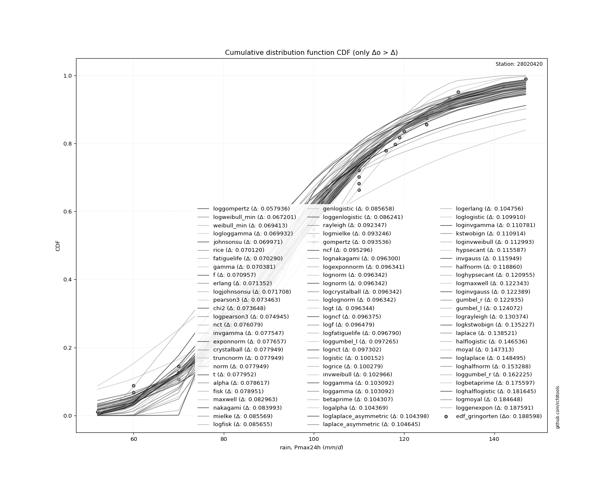</img>

</div>


**8.3. Best fit**

<div align="center">

|   id |   station | empirical_dist   | p_dist      |     delta |   deltao | eval   |   fit |   n |   best_fit |   best_fit_sort |
|-----:|----------:|:-----------------|:------------|----------:|---------:|:-------|------:|----:|-----------:|----------------:|
|    0 |  28020420 | edf_gringorten   | loggompertz | 0.0579362 | 0.188598 | Δo > Δ |     1 |  52 |          1 |               1 |

</div>


<div align="center">

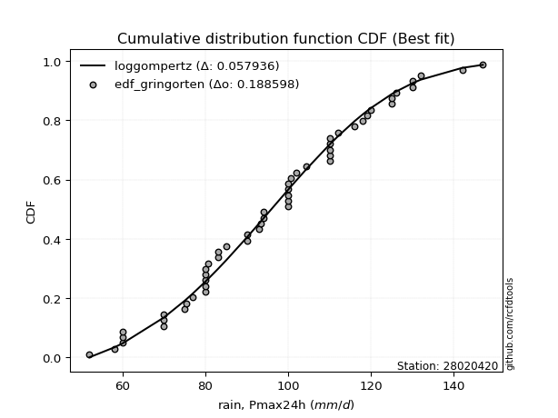</img>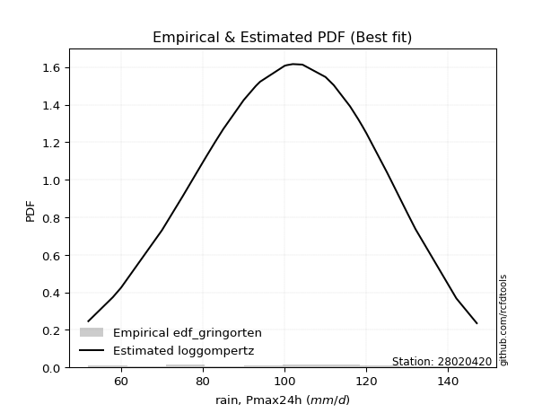</img>

</div>


### 9. Empirical - EDF Filliben (1975)

The specific values of the constants (0.3175) (often denoted as $alpha$) and (0.365) are derived from a method proposed by James J. Filliben in a 1975 paper. This particular formula is the mean value of the $i$-th order statistic of the normal distribution and is considered a robust and effective plotting position formula for the normal probability plot correlation coefficient test for normality.

<div align="center">


$P=(m-0.3175)/(n+0.365)$


</div>


**9.1. Empirical values**

<div align="center">

|                | 0                    | 1                   | 2                   | 3                   | 4                   | 5                   | 6                   | 7                  | 8                   | 9                  | 10                  | 11                 | 12                  | 13                 | 14                  | 15                 | 16                  | 17                 | 18                 | 19                 | 20                  | 21                 | 22                  | 23                 | 24                 | 25                  | 26                 | 27                 | 28                 | 29                 | 30                 | 31                 | 32                 | 33                 | 34                 | 35                 | 36                 | 37                 | 38                 | 39                 | 40                 | 41                 | 42                 | 43                 | 44                 | 45                 | 46                 | 47                 | 48                 | 49                 | 50                 | 51               |
|:---------------|:---------------------|:--------------------|:--------------------|:--------------------|:--------------------|:--------------------|:--------------------|:-------------------|:--------------------|:-------------------|:--------------------|:-------------------|:--------------------|:-------------------|:--------------------|:-------------------|:--------------------|:-------------------|:-------------------|:-------------------|:--------------------|:-------------------|:--------------------|:-------------------|:-------------------|:--------------------|:-------------------|:-------------------|:-------------------|:-------------------|:-------------------|:-------------------|:-------------------|:-------------------|:-------------------|:-------------------|:-------------------|:-------------------|:-------------------|:-------------------|:-------------------|:-------------------|:-------------------|:-------------------|:-------------------|:-------------------|:-------------------|:-------------------|:-------------------|:-------------------|:-------------------|:-----------------|
| date           | 2012                 | 1991                | 1990                | 1984                | 2015                | 1989                | 2000                | 1982               | 1976                | 1997               | 1977                | 2020               | 2014                | 2006               | 2017                | 2011               | 1972                | 2019               | 1995               | 2013               | 2016                | 1999               | 2002                | 1971               | 1975               | 1998                | 1994               | 2004               | 2009               | 1988               | 2018               | 1987               | 1986               | 1970               | 1978               | 1979               | 1983               | 1981               | 2007               | 2021               | 2010               | 1980               | 2001               | 2005               | 2008               | 1992               | 2003               | 1985               | 1993               | 1996               | 1974               | 1973             |
| x              | 52.0                 | 58.0                | 60.0                | 60.0                | 60.0                | 70.0                | 70.0                | 70.0               | 75.0                | 75.3022389753854   | 77.0                | 80.0               | 80.0                | 80.0               | 80.0                | 80.0               | 80.7600828088943    | 83.0               | 83.0               | 85.0               | 90.0                | 90.0               | 92.9108431434611    | 93.3024589354871   | 94.0               | 94.0                | 100.0              | 100.0              | 100.0              | 100.0              | 100.0              | 100.524899066195   | 102.0              | 104.358339515926   | 110.0              | 110.0              | 110.0              | 110.0              | 110.0              | 112.0              | 116.0              | 118.0              | 119.0              | 120.0              | 125.0              | 125.0              | 126.0              | 130.0              | 130.0              | 132.0              | 142.0              | 147.0            |
| m              | 1                    | 2                   | 3                   | 4                   | 5                   | 6                   | 7                   | 8                  | 9                   | 10                 | 11                  | 12                 | 13                  | 14                 | 15                  | 16                 | 17                  | 18                 | 19                 | 20                 | 21                  | 22                 | 23                  | 24                 | 25                 | 26                  | 27                 | 28                 | 29                 | 30                 | 31                 | 32                 | 33                 | 34                 | 35                 | 36                 | 37                 | 38                 | 39                 | 40                 | 41                 | 42                 | 43                 | 44                 | 45                 | 46                 | 47                 | 48                 | 49                 | 50                 | 51                 | 52               |
| empirical_dist | edf_filliben         | edf_filliben        | edf_filliben        | edf_filliben        | edf_filliben        | edf_filliben        | edf_filliben        | edf_filliben       | edf_filliben        | edf_filliben       | edf_filliben        | edf_filliben       | edf_filliben        | edf_filliben       | edf_filliben        | edf_filliben       | edf_filliben        | edf_filliben       | edf_filliben       | edf_filliben       | edf_filliben        | edf_filliben       | edf_filliben        | edf_filliben       | edf_filliben       | edf_filliben        | edf_filliben       | edf_filliben       | edf_filliben       | edf_filliben       | edf_filliben       | edf_filliben       | edf_filliben       | edf_filliben       | edf_filliben       | edf_filliben       | edf_filliben       | edf_filliben       | edf_filliben       | edf_filliben       | edf_filliben       | edf_filliben       | edf_filliben       | edf_filliben       | edf_filliben       | edf_filliben       | edf_filliben       | edf_filliben       | edf_filliben       | edf_filliben       | edf_filliben       | edf_filliben     |
| empirical      | 0.013033514752219994 | 0.03213023966389764 | 0.05122696457557529 | 0.07032368948725294 | 0.08942041439893059 | 0.10851713931060823 | 0.12761386422228588 | 0.1467105891339635 | 0.16580731404564114 | 0.1849040389573188 | 0.20400076386899643 | 0.2230974887806741 | 0.24219421369235175 | 0.2612909386040294 | 0.28038766351570704 | 0.2994843884273847 | 0.31858111333906236 | 0.33767783825074   | 0.3567745631624176 | 0.3758712880740953 | 0.39496801298577294 | 0.4140647378974506 | 0.43316146280912826 | 0.4522581877208059 | 0.4713549126324835 | 0.49045163754416116 | 0.5095483624558388 | 0.5286450873675165 | 0.5477418122791942 | 0.5668385371908717 | 0.5859352621025494 | 0.605031987014227  | 0.6241287119259047 | 0.6432254368375823 | 0.66232216174926   | 0.6814188866609375 | 0.7005156115726152 | 0.7196123364842929 | 0.7387090613959705 | 0.7578057863076482 | 0.7769025112193259 | 0.7959992361310034 | 0.8150959610426811 | 0.8341926859543587 | 0.8532894108660364 | 0.8723861357777141 | 0.8914828606893916 | 0.9105795856010693 | 0.929676310512747  | 0.9487730354244246 | 0.9678697603361023 | 0.98696648524778 |
| empirical_tr   | 1.0132056305325787   | 1.0331968628224732  | 1.0539928546268806  | 1.075643198274534   | 1.098201646306297   | 1.121726557060997   | 1.1462813987850928  | 1.171935321434566  | 1.1987638070165396  | 1.2268494113512562 | 1.2562826126072093  | 1.2871627849812572 | 1.3195993195993196  | 1.3537129192787436 | 1.3896370994493463  | 1.4275199345737069 | 1.4675260982274225  | 1.5098392561089886 | 1.554664885326208  | 1.6022336112598485 | 1.6528051763591887  | 1.7066731850403325 | 1.7641708077149836  | 1.8256776780266712 | 1.8916282850176105 | 1.9625222524126302  | 2.038937019371167  | 2.1215436037678517 | 2.211126359125937  | 2.3086079576766227 | 2.415081286751989  | 2.5318505983319226 | 2.660485202591134  | 2.802890405459654  | 2.9614025166124693 | 3.138918027873519  | 3.339072214251553  | 3.566490720245189  | 3.8271514708569323 | 4.128917800118272  | 4.482345388401455  | 4.901942429206644  | 5.40821068938807   | 6.03109703426432   | 6.816140579238525  | 7.836139169472499  | 9.215134183897922  | 11.183128670581944 | 14.219959266802434 | 19.520969245107132 | 31.123328380386255 | 76.7252747252745 |

</div>


**9.2. Kolmogorov-Smirnov fit test (sorted by Δ)**


<div align="center">

|                | 0                   | 1                   | 2                   | 3                   | 4                   | 5                   | 6                   | 7                   | 8                   | 9                   | 10                  | 11                  | 12                  | 13                  | 14                  | 15                  | 16                  | 17                  | 18                  | 19                  | 20                  | 21                  | 22                  | 23                  | 24                  | 25                  | 26                  | 27                  | 28                  | 29                  | 30                  | 31                  | 32                  | 33                  | 34                  | 35                  | 36                  | 37                  | 38                  | 39                  | 40                  | 41                  | 42                  | 43                  | 44                  | 45                  | 46                  | 47                  | 48                  | 49                  | 50                  | 51                  | 52                  | 53                    | 54                  | 55                  | 56                  | 57                  | 58                  | 59                  | 60                  | 61                  | 62                  | 63                  | 64                  | 65                  | 66                  | 67                  | 68                  | 69                  | 70                  | 71                  | 72                  | 73                  | 74                  | 75                  | 76                  | 77                  | 78                  | 79                  | 80                  | 81                  | 82                  | 83                  | 84                  | 85                  | 86                  | 87                  | 88                  | 89                  |
|:---------------|:--------------------|:--------------------|:--------------------|:--------------------|:--------------------|:--------------------|:--------------------|:--------------------|:--------------------|:--------------------|:--------------------|:--------------------|:--------------------|:--------------------|:--------------------|:--------------------|:--------------------|:--------------------|:--------------------|:--------------------|:--------------------|:--------------------|:--------------------|:--------------------|:--------------------|:--------------------|:--------------------|:--------------------|:--------------------|:--------------------|:--------------------|:--------------------|:--------------------|:--------------------|:--------------------|:--------------------|:--------------------|:--------------------|:--------------------|:--------------------|:--------------------|:--------------------|:--------------------|:--------------------|:--------------------|:--------------------|:--------------------|:--------------------|:--------------------|:--------------------|:--------------------|:--------------------|:--------------------|:----------------------|:--------------------|:--------------------|:--------------------|:--------------------|:--------------------|:--------------------|:--------------------|:--------------------|:--------------------|:--------------------|:--------------------|:--------------------|:--------------------|:--------------------|:--------------------|:--------------------|:--------------------|:--------------------|:--------------------|:--------------------|:--------------------|:--------------------|:--------------------|:--------------------|:--------------------|:--------------------|:--------------------|:--------------------|:--------------------|:--------------------|:--------------------|:--------------------|:--------------------|:--------------------|:--------------------|:--------------------|
| station        | 28020420            | 28020420            | 28020420            | 28020420            | 28020420            | 28020420            | 28020420            | 28020420            | 28020420            | 28020420            | 28020420            | 28020420            | 28020420            | 28020420            | 28020420            | 28020420            | 28020420            | 28020420            | 28020420            | 28020420            | 28020420            | 28020420            | 28020420            | 28020420            | 28020420            | 28020420            | 28020420            | 28020420            | 28020420            | 28020420            | 28020420            | 28020420            | 28020420            | 28020420            | 28020420            | 28020420            | 28020420            | 28020420            | 28020420            | 28020420            | 28020420            | 28020420            | 28020420            | 28020420            | 28020420            | 28020420            | 28020420            | 28020420            | 28020420            | 28020420            | 28020420            | 28020420            | 28020420            | 28020420              | 28020420            | 28020420            | 28020420            | 28020420            | 28020420            | 28020420            | 28020420            | 28020420            | 28020420            | 28020420            | 28020420            | 28020420            | 28020420            | 28020420            | 28020420            | 28020420            | 28020420            | 28020420            | 28020420            | 28020420            | 28020420            | 28020420            | 28020420            | 28020420            | 28020420            | 28020420            | 28020420            | 28020420            | 28020420            | 28020420            | 28020420            | 28020420            | 28020420            | 28020420            | 28020420            | 28020420            |
| empirical_dist | edf_filliben        | edf_filliben        | edf_filliben        | edf_filliben        | edf_filliben        | edf_filliben        | edf_filliben        | edf_filliben        | edf_filliben        | edf_filliben        | edf_filliben        | edf_filliben        | edf_filliben        | edf_filliben        | edf_filliben        | edf_filliben        | edf_filliben        | edf_filliben        | edf_filliben        | edf_filliben        | edf_filliben        | edf_filliben        | edf_filliben        | edf_filliben        | edf_filliben        | edf_filliben        | edf_filliben        | edf_filliben        | edf_filliben        | edf_filliben        | edf_filliben        | edf_filliben        | edf_filliben        | edf_filliben        | edf_filliben        | edf_filliben        | edf_filliben        | edf_filliben        | edf_filliben        | edf_filliben        | edf_filliben        | edf_filliben        | edf_filliben        | edf_filliben        | edf_filliben        | edf_filliben        | edf_filliben        | edf_filliben        | edf_filliben        | edf_filliben        | edf_filliben        | edf_filliben        | edf_filliben        | edf_filliben          | edf_filliben        | edf_filliben        | edf_filliben        | edf_filliben        | edf_filliben        | edf_filliben        | edf_filliben        | edf_filliben        | edf_filliben        | edf_filliben        | edf_filliben        | edf_filliben        | edf_filliben        | edf_filliben        | edf_filliben        | edf_filliben        | edf_filliben        | edf_filliben        | edf_filliben        | edf_filliben        | edf_filliben        | edf_filliben        | edf_filliben        | edf_filliben        | edf_filliben        | edf_filliben        | edf_filliben        | edf_filliben        | edf_filliben        | edf_filliben        | edf_filliben        | edf_filliben        | edf_filliben        | edf_filliben        | edf_filliben        | edf_filliben        |
| p_dist         | loggompertz         | logweibull_min      | weibull_min         | rice                | logloggamma         | johnsonsu           | fatiguelife         | gamma               | f                   | erlang              | logjohnsonsu        | chi2                | pearson3            | logpearson3         | nct                 | invgamma            | exponnorm           | crystalball         | truncnorm           | norm                | t                   | alpha               | fisk                | maxwell             | nakagami            | logfisk             | genlogistic         | mielke              | loggenlogistic      | rayleigh            | gompertz            | logmielke           | ncf                 | lognakagami         | logexponnorm        | lognorm             | lognorm             | logcrystalball      | loglognorm          | logt                | logncf              | logf                | logfatiguelife      | lognct              | loggumbel_l         | logrice             | logistic            | invweibull          | loggamma            | loggamma            | betaprime           | logalpha            | logerlang           | loglaplace_asymmetric | laplace_asymmetric  | loglogistic         | loginvgamma         | kstwobign           | loginvweibull       | invgauss            | hypsecant           | halfnorm            | loghypsecant        | logmaxwell          | loginvgauss         | gumbel_r            | gumbel_l            | lograyleigh         | logkstwobign        | laplace             | halflogistic        | moyal               | loglaplace          | loghalfnorm         | loggumbel_r         | logbetaprime        | loghalflogistic     | logmoyal            | loggenexpon         | wald                | expon               | pareto              | logwald             | loggibrat           | logtruncnorm        | gibrat              | logexpon            | logpareto           | logchi2             | genexpon            |
| delta          | 0.05860941700679251 | 0.06796358233543875 | 0.06945802522319233 | 0.0701648132200472  | 0.07060564839410322 | 0.07064474507171281 | 0.0710533429996203  | 0.07105406227686861 | 0.07171987161737414 | 0.07202514810714761 | 0.07238125218399649 | 0.07369279434776799 | 0.07413604849046962 | 0.07499018582354999 | 0.07675183671611763 | 0.0775918372210862  | 0.07832975868640196 | 0.07862273638580375 | 0.07862274085825449 | 0.0786227413833222  | 0.07862561371306542 | 0.07866200078030539 | 0.0796245827405414  | 0.08300807791172604 | 0.08403751798112635 | 0.08569956332167006 | 0.08570260434225796 | 0.08624265537052733 | 0.08691444889026584 | 0.09239222008629255 | 0.09304205215184658 | 0.0940090684529511  | 0.09534115043094737 | 0.0963453456427773  | 0.09638580045213807 | 0.09638678080906482 | 0.09638678080906482 | 0.09638678506867115 | 0.09638683932813852 | 0.09638855652203693 | 0.0964200842804096  | 0.09652376502856153 | 0.09683473778143692 | 0.09734717855810215 | 0.09793812426917353 | 0.10032349550159292 | 0.1008256739988761  | 0.10301136068619499 | 0.10313687470307098 | 0.10313687470307098 | 0.10435233217022066 | 0.10441351279521172 | 0.10480064806165701 | 0.1051609213614898    | 0.10531813205441282 | 0.10995494852186227 | 0.11082605318282412 | 0.11095930549560151 | 0.11303833568862964 | 0.11599388057115623 | 0.11625999119965064 | 0.1189050382048461  | 0.12099998421561853 | 0.12238783703002953 | 0.12243363364888171 | 0.1229797561919691  | 0.12474521009406223 | 0.130419032948085   | 0.1339254997841201  | 0.13919410057210377 | 0.1465812165253122  | 0.14735828614974134 | 0.14854003034569163 | 0.1533327327714269  | 0.1622700003503369  | 0.1734879452201642  | 0.18168959337659563 | 0.18469300695940227 | 0.18628940686110712 | 0.21502024346334925 | 0.24473970034086306 | 0.2447397127802345  | 0.24726667252852685 | 0.27910632727578377 | 0.28644849154674906 | 0.29089963381829187 | 0.297832173691219   | 0.297832185394089   | 0.3287800658746449  | 0.8818422097046928  |
| deltao         | 0.18859806671657792 | 0.18859806671657792 | 0.18859806671657792 | 0.18859806671657792 | 0.18859806671657792 | 0.18859806671657792 | 0.18859806671657792 | 0.18859806671657792 | 0.18859806671657792 | 0.18859806671657792 | 0.18859806671657792 | 0.18859806671657792 | 0.18859806671657792 | 0.18859806671657792 | 0.18859806671657792 | 0.18859806671657792 | 0.18859806671657792 | 0.18859806671657792 | 0.18859806671657792 | 0.18859806671657792 | 0.18859806671657792 | 0.18859806671657792 | 0.18859806671657792 | 0.18859806671657792 | 0.18859806671657792 | 0.18859806671657792 | 0.18859806671657792 | 0.18859806671657792 | 0.18859806671657792 | 0.18859806671657792 | 0.18859806671657792 | 0.18859806671657792 | 0.18859806671657792 | 0.18859806671657792 | 0.18859806671657792 | 0.18859806671657792 | 0.18859806671657792 | 0.18859806671657792 | 0.18859806671657792 | 0.18859806671657792 | 0.18859806671657792 | 0.18859806671657792 | 0.18859806671657792 | 0.18859806671657792 | 0.18859806671657792 | 0.18859806671657792 | 0.18859806671657792 | 0.18859806671657792 | 0.18859806671657792 | 0.18859806671657792 | 0.18859806671657792 | 0.18859806671657792 | 0.18859806671657792 | 0.18859806671657792   | 0.18859806671657792 | 0.18859806671657792 | 0.18859806671657792 | 0.18859806671657792 | 0.18859806671657792 | 0.18859806671657792 | 0.18859806671657792 | 0.18859806671657792 | 0.18859806671657792 | 0.18859806671657792 | 0.18859806671657792 | 0.18859806671657792 | 0.18859806671657792 | 0.18859806671657792 | 0.18859806671657792 | 0.18859806671657792 | 0.18859806671657792 | 0.18859806671657792 | 0.18859806671657792 | 0.18859806671657792 | 0.18859806671657792 | 0.18859806671657792 | 0.18859806671657792 | 0.18859806671657792 | 0.18859806671657792 | 0.18859806671657792 | 0.18859806671657792 | 0.18859806671657792 | 0.18859806671657792 | 0.18859806671657792 | 0.18859806671657792 | 0.18859806671657792 | 0.18859806671657792 | 0.18859806671657792 | 0.18859806671657792 | 0.18859806671657792 |
| eval           | Δo > Δ              | Δo > Δ              | Δo > Δ              | Δo > Δ              | Δo > Δ              | Δo > Δ              | Δo > Δ              | Δo > Δ              | Δo > Δ              | Δo > Δ              | Δo > Δ              | Δo > Δ              | Δo > Δ              | Δo > Δ              | Δo > Δ              | Δo > Δ              | Δo > Δ              | Δo > Δ              | Δo > Δ              | Δo > Δ              | Δo > Δ              | Δo > Δ              | Δo > Δ              | Δo > Δ              | Δo > Δ              | Δo > Δ              | Δo > Δ              | Δo > Δ              | Δo > Δ              | Δo > Δ              | Δo > Δ              | Δo > Δ              | Δo > Δ              | Δo > Δ              | Δo > Δ              | Δo > Δ              | Δo > Δ              | Δo > Δ              | Δo > Δ              | Δo > Δ              | Δo > Δ              | Δo > Δ              | Δo > Δ              | Δo > Δ              | Δo > Δ              | Δo > Δ              | Δo > Δ              | Δo > Δ              | Δo > Δ              | Δo > Δ              | Δo > Δ              | Δo > Δ              | Δo > Δ              | Δo > Δ                | Δo > Δ              | Δo > Δ              | Δo > Δ              | Δo > Δ              | Δo > Δ              | Δo > Δ              | Δo > Δ              | Δo > Δ              | Δo > Δ              | Δo > Δ              | Δo > Δ              | Δo > Δ              | Δo > Δ              | Δo > Δ              | Δo > Δ              | Δo > Δ              | Δo > Δ              | Δo > Δ              | Δo > Δ              | Δo > Δ              | Δo > Δ              | Δo > Δ              | Δo > Δ              | Δo > Δ              | Δo > Δ              | Δo <= Δ             | Δo <= Δ             | Δo <= Δ             | Δo <= Δ             | Δo <= Δ             | Δo <= Δ             | Δo <= Δ             | Δo <= Δ             | Δo <= Δ             | Δo <= Δ             | Δo <= Δ             |
| fit            | 1                   | 1                   | 1                   | 1                   | 1                   | 1                   | 1                   | 1                   | 1                   | 1                   | 1                   | 1                   | 1                   | 1                   | 1                   | 1                   | 1                   | 1                   | 1                   | 1                   | 1                   | 1                   | 1                   | 1                   | 1                   | 1                   | 1                   | 1                   | 1                   | 1                   | 1                   | 1                   | 1                   | 1                   | 1                   | 1                   | 1                   | 1                   | 1                   | 1                   | 1                   | 1                   | 1                   | 1                   | 1                   | 1                   | 1                   | 1                   | 1                   | 1                   | 1                   | 1                   | 1                   | 1                     | 1                   | 1                   | 1                   | 1                   | 1                   | 1                   | 1                   | 1                   | 1                   | 1                   | 1                   | 1                   | 1                   | 1                   | 1                   | 1                   | 1                   | 1                   | 1                   | 1                   | 1                   | 1                   | 1                   | 1                   | 1                   | 0                   | 0                   | 0                   | 0                   | 0                   | 0                   | 0                   | 0                   | 0                   | 0                   | 0                   |
| n              | 52                  | 52                  | 52                  | 52                  | 52                  | 52                  | 52                  | 52                  | 52                  | 52                  | 52                  | 52                  | 52                  | 52                  | 52                  | 52                  | 52                  | 52                  | 52                  | 52                  | 52                  | 52                  | 52                  | 52                  | 52                  | 52                  | 52                  | 52                  | 52                  | 52                  | 52                  | 52                  | 52                  | 52                  | 52                  | 52                  | 52                  | 52                  | 52                  | 52                  | 52                  | 52                  | 52                  | 52                  | 52                  | 52                  | 52                  | 52                  | 52                  | 52                  | 52                  | 52                  | 52                  | 52                    | 52                  | 52                  | 52                  | 52                  | 52                  | 52                  | 52                  | 52                  | 52                  | 52                  | 52                  | 52                  | 52                  | 52                  | 52                  | 52                  | 52                  | 52                  | 52                  | 52                  | 52                  | 52                  | 52                  | 52                  | 52                  | 52                  | 52                  | 52                  | 52                  | 52                  | 52                  | 52                  | 52                  | 52                  | 52                  | 52                  |
| best_fit       | 1                   | 0                   | 0                   | 0                   | 0                   | 0                   | 0                   | 0                   | 0                   | 0                   | 0                   | 0                   | 0                   | 0                   | 0                   | 0                   | 0                   | 0                   | 0                   | 0                   | 0                   | 0                   | 0                   | 0                   | 0                   | 0                   | 0                   | 0                   | 0                   | 0                   | 0                   | 0                   | 0                   | 0                   | 0                   | 0                   | 0                   | 0                   | 0                   | 0                   | 0                   | 0                   | 0                   | 0                   | 0                   | 0                   | 0                   | 0                   | 0                   | 0                   | 0                   | 0                   | 0                   | 0                     | 0                   | 0                   | 0                   | 0                   | 0                   | 0                   | 0                   | 0                   | 0                   | 0                   | 0                   | 0                   | 0                   | 0                   | 0                   | 0                   | 0                   | 0                   | 0                   | 0                   | 0                   | 0                   | 0                   | 0                   | 0                   | 0                   | 0                   | 0                   | 0                   | 0                   | 0                   | 0                   | 0                   | 0                   | 0                   | 0                   |
| best_fit_sort  | 1                   | 2                   | 3                   | 4                   | 5                   | 6                   | 7                   | 8                   | 9                   | 10                  | 11                  | 12                  | 13                  | 14                  | 15                  | 16                  | 17                  | 18                  | 19                  | 20                  | 21                  | 22                  | 23                  | 24                  | 25                  | 26                  | 27                  | 28                  | 29                  | 30                  | 31                  | 32                  | 33                  | 34                  | 35                  | 36                  | 37                  | 38                  | 39                  | 40                  | 41                  | 42                  | 43                  | 44                  | 45                  | 46                  | 47                  | 48                  | 49                  | 50                  | 51                  | 52                  | 53                  | 54                    | 55                  | 56                  | 57                  | 58                  | 59                  | 60                  | 61                  | 62                  | 63                  | 64                  | 65                  | 66                  | 67                  | 68                  | 69                  | 70                  | 71                  | 72                  | 73                  | 74                  | 75                  | 76                  | 77                  | 78                  | 79                  | 80                  | 81                  | 82                  | 83                  | 84                  | 85                  | 86                  | 87                  | 88                  | 89                  | 90                  |

</div>


<div align="center">

</img>

</div>


**9.3. Best fit**

<div align="center">

|   id |   station | empirical_dist   | p_dist      |     delta |   deltao | eval   |   fit |   n |   best_fit |   best_fit_sort |
|-----:|----------:|:-----------------|:------------|----------:|---------:|:-------|------:|----:|-----------:|----------------:|
|    0 |  28020420 | edf_filliben     | loggompertz | 0.0586094 | 0.188598 | Δo > Δ |     1 |  52 |          1 |               1 |

</div>


<div align="center">

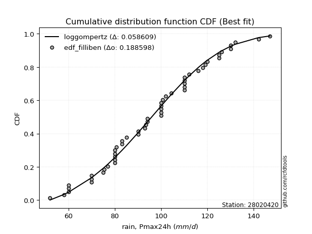</img></img>

</div>


### 10. Empirical - EDF Jenkinson (1977)

The Jenkinson formula in hydrology is an empirical plotting position formula used to estimate the non-exceedance probability _(P)_ or return period _(T)_ of a given ordered observation within a sample. It is a widely used method in the frequency analysis of extreme events such as floods and rainfall, as it provides a distribution-free way to plot data. _a≈0.31_ and _b≈0.38_ are constants derived to approximate the median of the probability distribution for the given rank.

<div align="center">


$P=(m-a)/(n+b)$


</div>


**10.1. Empirical values**

<div align="center">

|                | 0                    | 1                   | 2                   | 3                  | 4                   | 5                   | 6                  | 7                   | 8                   | 9                   | 10                  | 11                 | 12                  | 13                  | 14                 | 15                 | 16                 | 17                 | 18                 | 19                 | 20                  | 21                  | 22                  | 23                  | 24                 | 25                 | 26                 | 27                 | 28                 | 29                 | 30                 | 31                 | 32                 | 33                 | 34                 | 35                 | 36                 | 37                 | 38                 | 39                 | 40                 | 41                | 42                 | 43                 | 44                 | 45                 | 46                 | 47                 | 48                 | 49                 | 50                 | 51                 |
|:---------------|:---------------------|:--------------------|:--------------------|:-------------------|:--------------------|:--------------------|:-------------------|:--------------------|:--------------------|:--------------------|:--------------------|:-------------------|:--------------------|:--------------------|:-------------------|:-------------------|:-------------------|:-------------------|:-------------------|:-------------------|:--------------------|:--------------------|:--------------------|:--------------------|:-------------------|:-------------------|:-------------------|:-------------------|:-------------------|:-------------------|:-------------------|:-------------------|:-------------------|:-------------------|:-------------------|:-------------------|:-------------------|:-------------------|:-------------------|:-------------------|:-------------------|:------------------|:-------------------|:-------------------|:-------------------|:-------------------|:-------------------|:-------------------|:-------------------|:-------------------|:-------------------|:-------------------|
| date           | 2012                 | 1991                | 1990                | 1984               | 2015                | 1989                | 2000               | 1982                | 1976                | 1997                | 1977                | 2020               | 2014                | 2006                | 2017               | 2011               | 1972               | 2019               | 1995               | 2013               | 2016                | 1999                | 2002                | 1971                | 1975               | 1998               | 1994               | 2004               | 2009               | 1988               | 2018               | 1987               | 1986               | 1970               | 1978               | 1979               | 1983               | 1981               | 2007               | 2021               | 2010               | 1980              | 2001               | 2005               | 2008               | 1992               | 2003               | 1985               | 1993               | 1996               | 1974               | 1973               |
| x              | 52.0                 | 58.0                | 60.0                | 60.0               | 60.0                | 70.0                | 70.0               | 70.0                | 75.0                | 75.3022389753854    | 77.0                | 80.0               | 80.0                | 80.0                | 80.0               | 80.0               | 80.7600828088943   | 83.0               | 83.0               | 85.0               | 90.0                | 90.0                | 92.9108431434611    | 93.3024589354871    | 94.0               | 94.0               | 100.0              | 100.0              | 100.0              | 100.0              | 100.0              | 100.524899066195   | 102.0              | 104.358339515926   | 110.0              | 110.0              | 110.0              | 110.0              | 110.0              | 112.0              | 116.0              | 118.0             | 119.0              | 120.0              | 125.0              | 125.0              | 126.0              | 130.0              | 130.0              | 132.0              | 142.0              | 147.0              |
| m              | 1                    | 2                   | 3                   | 4                  | 5                   | 6                   | 7                  | 8                   | 9                   | 10                  | 11                  | 12                 | 13                  | 14                  | 15                 | 16                 | 17                 | 18                 | 19                 | 20                 | 21                  | 22                  | 23                  | 24                  | 25                 | 26                 | 27                 | 28                 | 29                 | 30                 | 31                 | 32                 | 33                 | 34                 | 35                 | 36                 | 37                 | 38                 | 39                 | 40                 | 41                 | 42                | 43                 | 44                 | 45                 | 46                 | 47                 | 48                 | 49                 | 50                 | 51                 | 52                 |
| empirical_dist | edf_jenkinson        | edf_jenkinson       | edf_jenkinson       | edf_jenkinson      | edf_jenkinson       | edf_jenkinson       | edf_jenkinson      | edf_jenkinson       | edf_jenkinson       | edf_jenkinson       | edf_jenkinson       | edf_jenkinson      | edf_jenkinson       | edf_jenkinson       | edf_jenkinson      | edf_jenkinson      | edf_jenkinson      | edf_jenkinson      | edf_jenkinson      | edf_jenkinson      | edf_jenkinson       | edf_jenkinson       | edf_jenkinson       | edf_jenkinson       | edf_jenkinson      | edf_jenkinson      | edf_jenkinson      | edf_jenkinson      | edf_jenkinson      | edf_jenkinson      | edf_jenkinson      | edf_jenkinson      | edf_jenkinson      | edf_jenkinson      | edf_jenkinson      | edf_jenkinson      | edf_jenkinson      | edf_jenkinson      | edf_jenkinson      | edf_jenkinson      | edf_jenkinson      | edf_jenkinson     | edf_jenkinson      | edf_jenkinson      | edf_jenkinson      | edf_jenkinson      | edf_jenkinson      | edf_jenkinson      | edf_jenkinson      | edf_jenkinson      | edf_jenkinson      | edf_jenkinson      |
| empirical      | 0.013172966781214202 | 0.03226422298587247 | 0.05135547919053073 | 0.070446735395189  | 0.08953799159984727 | 0.10862924780450554 | 0.1277205040091638 | 0.14681176021382206 | 0.16590301641848032 | 0.18499427262313858 | 0.20408552882779685 | 0.2231767850324551 | 0.24226804123711337 | 0.26135929744177167 | 0.2804505536464299 | 0.2995418098510882 | 0.3186330660557465 | 0.3377243222604047 | 0.356815578465063  | 0.3759068346697213 | 0.39499809087437954 | 0.41408934707903783 | 0.43318060328369606 | 0.45227185948835436 | 0.4713631156930126 | 0.4904543718976709 | 0.5095456281023292 | 0.5286368843069874 | 0.5477281405116456 | 0.5668193967163039 | 0.5859106529209622 | 0.6050019091256205 | 0.6240931653302787 | 0.6431844215349369 | 0.6622756777395952 | 0.6813669339442534 | 0.7004581901489118 | 0.71954944635357   | 0.7386407025582282 | 0.7577319587628866 | 0.7768232149675448 | 0.795914471172203 | 0.8150057273768613 | 0.8340969835815196 | 0.8531882397861779 | 0.8722794959908361 | 0.8913707521954943 | 0.9104620084001527 | 0.9295532646048109 | 0.9486445208094691 | 0.9677357770141274 | 0.9868270332187857 |
| empirical_tr   | 1.0133488102147417   | 1.0333399092523181  | 1.054135640974039   | 1.0757855822550833 | 1.0983434682323339  | 1.1218676376097665  | 1.1464215364412345 | 1.172074289550235   | 1.1989013504234378  | 1.2269852424455376  | 1.2564164068121852  | 1.287294175473089  | 1.3197278911564627  | 1.3538382010855519  | 1.3897585566463253 | 1.4276369582992643 | 1.4676379938358084 | 1.5099452291726723 | 1.5547640249332149 | 1.602324869990823  | 1.652887346165983   | 1.7067448680351909  | 1.7642303805995283  | 1.8257232485186476  | 1.8916576381365113 | 1.9625327838141624 | 2.0389256520046715 | 2.1215066828675577 | 2.211059518784297  | 2.308505949757602  | 2.4149377593361    | 2.5316578057032384 | 2.6602336211274755 | 2.8025682182985547 | 2.9609949123798747 | 3.138406231276212  | 3.3384321223709366 | 3.5656909462219186 | 3.826150474799122  | 4.127659574468085  | 4.480752780153977  | 4.899906454630494 | 5.405572755417953  | 6.027617951668583  | 6.811443433029906  | 7.8295964125560475 | 9.205623901581712  | 11.1684434968017   | 14.195121951219496 | 19.472118959107764 | 30.994082840236548 | 75.9130434782605   |

</div>


**10.2. Kolmogorov-Smirnov fit test (sorted by Δ)**


<div align="center">

|                | 0                    | 1                   | 2                   | 3                   | 4                   | 5                   | 6                   | 7                   | 8                   | 9                   | 10                  | 11                  | 12                  | 13                  | 14                  | 15                  | 16                  | 17                  | 18                  | 19                  | 20                  | 21                  | 22                  | 23                  | 24                  | 25                  | 26                  | 27                  | 28                  | 29                  | 30                  | 31                  | 32                  | 33                  | 34                  | 35                  | 36                  | 37                  | 38                  | 39                  | 40                  | 41                  | 42                  | 43                  | 44                  | 45                  | 46                  | 47                  | 48                  | 49                  | 50                  | 51                  | 52                  | 53                    | 54                  | 55                  | 56                  | 57                  | 58                  | 59                  | 60                  | 61                  | 62                  | 63                  | 64                  | 65                  | 66                  | 67                  | 68                  | 69                  | 70                  | 71                  | 72                  | 73                  | 74                  | 75                  | 76                  | 77                  | 78                  | 79                  | 80                  | 81                  | 82                  | 83                  | 84                  | 85                  | 86                  | 87                  | 88                  | 89                  |
|:---------------|:---------------------|:--------------------|:--------------------|:--------------------|:--------------------|:--------------------|:--------------------|:--------------------|:--------------------|:--------------------|:--------------------|:--------------------|:--------------------|:--------------------|:--------------------|:--------------------|:--------------------|:--------------------|:--------------------|:--------------------|:--------------------|:--------------------|:--------------------|:--------------------|:--------------------|:--------------------|:--------------------|:--------------------|:--------------------|:--------------------|:--------------------|:--------------------|:--------------------|:--------------------|:--------------------|:--------------------|:--------------------|:--------------------|:--------------------|:--------------------|:--------------------|:--------------------|:--------------------|:--------------------|:--------------------|:--------------------|:--------------------|:--------------------|:--------------------|:--------------------|:--------------------|:--------------------|:--------------------|:----------------------|:--------------------|:--------------------|:--------------------|:--------------------|:--------------------|:--------------------|:--------------------|:--------------------|:--------------------|:--------------------|:--------------------|:--------------------|:--------------------|:--------------------|:--------------------|:--------------------|:--------------------|:--------------------|:--------------------|:--------------------|:--------------------|:--------------------|:--------------------|:--------------------|:--------------------|:--------------------|:--------------------|:--------------------|:--------------------|:--------------------|:--------------------|:--------------------|:--------------------|:--------------------|:--------------------|:--------------------|
| station        | 28020420             | 28020420            | 28020420            | 28020420            | 28020420            | 28020420            | 28020420            | 28020420            | 28020420            | 28020420            | 28020420            | 28020420            | 28020420            | 28020420            | 28020420            | 28020420            | 28020420            | 28020420            | 28020420            | 28020420            | 28020420            | 28020420            | 28020420            | 28020420            | 28020420            | 28020420            | 28020420            | 28020420            | 28020420            | 28020420            | 28020420            | 28020420            | 28020420            | 28020420            | 28020420            | 28020420            | 28020420            | 28020420            | 28020420            | 28020420            | 28020420            | 28020420            | 28020420            | 28020420            | 28020420            | 28020420            | 28020420            | 28020420            | 28020420            | 28020420            | 28020420            | 28020420            | 28020420            | 28020420              | 28020420            | 28020420            | 28020420            | 28020420            | 28020420            | 28020420            | 28020420            | 28020420            | 28020420            | 28020420            | 28020420            | 28020420            | 28020420            | 28020420            | 28020420            | 28020420            | 28020420            | 28020420            | 28020420            | 28020420            | 28020420            | 28020420            | 28020420            | 28020420            | 28020420            | 28020420            | 28020420            | 28020420            | 28020420            | 28020420            | 28020420            | 28020420            | 28020420            | 28020420            | 28020420            | 28020420            |
| empirical_dist | edf_jenkinson        | edf_jenkinson       | edf_jenkinson       | edf_jenkinson       | edf_jenkinson       | edf_jenkinson       | edf_jenkinson       | edf_jenkinson       | edf_jenkinson       | edf_jenkinson       | edf_jenkinson       | edf_jenkinson       | edf_jenkinson       | edf_jenkinson       | edf_jenkinson       | edf_jenkinson       | edf_jenkinson       | edf_jenkinson       | edf_jenkinson       | edf_jenkinson       | edf_jenkinson       | edf_jenkinson       | edf_jenkinson       | edf_jenkinson       | edf_jenkinson       | edf_jenkinson       | edf_jenkinson       | edf_jenkinson       | edf_jenkinson       | edf_jenkinson       | edf_jenkinson       | edf_jenkinson       | edf_jenkinson       | edf_jenkinson       | edf_jenkinson       | edf_jenkinson       | edf_jenkinson       | edf_jenkinson       | edf_jenkinson       | edf_jenkinson       | edf_jenkinson       | edf_jenkinson       | edf_jenkinson       | edf_jenkinson       | edf_jenkinson       | edf_jenkinson       | edf_jenkinson       | edf_jenkinson       | edf_jenkinson       | edf_jenkinson       | edf_jenkinson       | edf_jenkinson       | edf_jenkinson       | edf_jenkinson         | edf_jenkinson       | edf_jenkinson       | edf_jenkinson       | edf_jenkinson       | edf_jenkinson       | edf_jenkinson       | edf_jenkinson       | edf_jenkinson       | edf_jenkinson       | edf_jenkinson       | edf_jenkinson       | edf_jenkinson       | edf_jenkinson       | edf_jenkinson       | edf_jenkinson       | edf_jenkinson       | edf_jenkinson       | edf_jenkinson       | edf_jenkinson       | edf_jenkinson       | edf_jenkinson       | edf_jenkinson       | edf_jenkinson       | edf_jenkinson       | edf_jenkinson       | edf_jenkinson       | edf_jenkinson       | edf_jenkinson       | edf_jenkinson       | edf_jenkinson       | edf_jenkinson       | edf_jenkinson       | edf_jenkinson       | edf_jenkinson       | edf_jenkinson       | edf_jenkinson       |
| p_dist         | loggompertz          | logweibull_min      | weibull_min         | rice                | logloggamma         | johnsonsu           | gamma               | fatiguelife         | f                   | erlang              | logjohnsonsu        | chi2                | pearson3            | logpearson3         | nct                 | invgamma            | exponnorm           | crystalball         | truncnorm           | norm                | alpha               | t                   | fisk                | maxwell             | nakagami            | logfisk             | genlogistic         | mielke              | loggenlogistic      | rayleigh            | gompertz            | logmielke           | ncf                 | lognakagami         | logexponnorm        | lognorm             | lognorm             | logcrystalball      | loglognorm          | logt                | logncf              | logf                | logfatiguelife      | lognct              | loggumbel_l         | logrice             | logistic            | invweibull          | loggamma            | loggamma            | betaprime           | logalpha            | logerlang           | loglaplace_asymmetric | laplace_asymmetric  | loglogistic         | loginvgamma         | kstwobign           | loginvweibull       | invgauss            | hypsecant           | halfnorm            | loghypsecant        | logmaxwell          | loginvgauss         | gumbel_r            | gumbel_l            | lograyleigh         | logkstwobign        | laplace             | halflogistic        | moyal               | loglaplace          | loghalfnorm         | loggumbel_r         | logbetaprime        | loghalflogistic     | logmoyal            | loggenexpon         | wald                | expon               | pareto              | logwald             | loggibrat           | logtruncnorm        | gibrat              | logexpon            | logpareto           | logchi2             | genexpon            |
| delta          | 0.058650432309437894 | 0.06801006634510354 | 0.06946075957670195 | 0.07016754757355681 | 0.0706466636967486  | 0.0706857603743582  | 0.071095077579514   | 0.07109982700928508 | 0.07176635562703892 | 0.072066163409793   | 0.07242226748664188 | 0.0736955287012776  | 0.074177063793115   | 0.07499292017705961 | 0.07679285201876301 | 0.07759457157459582 | 0.07837077398904735 | 0.07866375168844914 | 0.07866375616089988 | 0.07866375668596759 | 0.078664735133815   | 0.07866662901571081 | 0.07966559804318679 | 0.08301081226523566 | 0.08404025233463597 | 0.08570229767517967 | 0.08570533869576757 | 0.08628367067317272 | 0.08695546419291122 | 0.09239495443980217 | 0.09301197426324004 | 0.09405555246261588 | 0.09534388478445699 | 0.09634807999628692 | 0.09638853480564769 | 0.09638951516257444 | 0.09638951516257444 | 0.09638951942218077 | 0.09638957368164813 | 0.09639129087554654 | 0.09642281863391922 | 0.09652649938207114 | 0.09683747213494653 | 0.09734991291161177 | 0.09797913957181892 | 0.10032622985510253 | 0.10086668930152148 | 0.1030140950397046  | 0.1031396090565806  | 0.1031396090565806  | 0.10435506652373028 | 0.10441624714872133 | 0.10480338241516662 | 0.10520740537115458   | 0.1053591473570582  | 0.10995768287537189 | 0.11082878753633374 | 0.11096203984911113 | 0.11304107004213926 | 0.11599661492466584 | 0.11630100650229602 | 0.11890777255835572 | 0.12100271856912814 | 0.12239057138353915 | 0.12243636800239133 | 0.12298249054547872 | 0.12478622539670761 | 0.1304217673015946  | 0.1338462035323391  | 0.13923511587474915 | 0.1465839508788218  | 0.14736102050325095 | 0.14854276469920125 | 0.1533354671249365  | 0.1622727347038465  | 0.17335943060520875 | 0.18169232773010524 | 0.1846957413129119  | 0.1862101106093261  | 0.21502297781685886 | 0.24466040408908205 | 0.24466041652845347 | 0.24726940688203647 | 0.2791090616292934  | 0.28636919529496807 | 0.2909570552419954  | 0.2977364713183798  | 0.29773648302124983 | 0.32868436350180574 | 0.8817301012107955  |
| deltao         | 0.18859806671657792  | 0.18859806671657792 | 0.18859806671657792 | 0.18859806671657792 | 0.18859806671657792 | 0.18859806671657792 | 0.18859806671657792 | 0.18859806671657792 | 0.18859806671657792 | 0.18859806671657792 | 0.18859806671657792 | 0.18859806671657792 | 0.18859806671657792 | 0.18859806671657792 | 0.18859806671657792 | 0.18859806671657792 | 0.18859806671657792 | 0.18859806671657792 | 0.18859806671657792 | 0.18859806671657792 | 0.18859806671657792 | 0.18859806671657792 | 0.18859806671657792 | 0.18859806671657792 | 0.18859806671657792 | 0.18859806671657792 | 0.18859806671657792 | 0.18859806671657792 | 0.18859806671657792 | 0.18859806671657792 | 0.18859806671657792 | 0.18859806671657792 | 0.18859806671657792 | 0.18859806671657792 | 0.18859806671657792 | 0.18859806671657792 | 0.18859806671657792 | 0.18859806671657792 | 0.18859806671657792 | 0.18859806671657792 | 0.18859806671657792 | 0.18859806671657792 | 0.18859806671657792 | 0.18859806671657792 | 0.18859806671657792 | 0.18859806671657792 | 0.18859806671657792 | 0.18859806671657792 | 0.18859806671657792 | 0.18859806671657792 | 0.18859806671657792 | 0.18859806671657792 | 0.18859806671657792 | 0.18859806671657792   | 0.18859806671657792 | 0.18859806671657792 | 0.18859806671657792 | 0.18859806671657792 | 0.18859806671657792 | 0.18859806671657792 | 0.18859806671657792 | 0.18859806671657792 | 0.18859806671657792 | 0.18859806671657792 | 0.18859806671657792 | 0.18859806671657792 | 0.18859806671657792 | 0.18859806671657792 | 0.18859806671657792 | 0.18859806671657792 | 0.18859806671657792 | 0.18859806671657792 | 0.18859806671657792 | 0.18859806671657792 | 0.18859806671657792 | 0.18859806671657792 | 0.18859806671657792 | 0.18859806671657792 | 0.18859806671657792 | 0.18859806671657792 | 0.18859806671657792 | 0.18859806671657792 | 0.18859806671657792 | 0.18859806671657792 | 0.18859806671657792 | 0.18859806671657792 | 0.18859806671657792 | 0.18859806671657792 | 0.18859806671657792 | 0.18859806671657792 |
| eval           | Δo > Δ               | Δo > Δ              | Δo > Δ              | Δo > Δ              | Δo > Δ              | Δo > Δ              | Δo > Δ              | Δo > Δ              | Δo > Δ              | Δo > Δ              | Δo > Δ              | Δo > Δ              | Δo > Δ              | Δo > Δ              | Δo > Δ              | Δo > Δ              | Δo > Δ              | Δo > Δ              | Δo > Δ              | Δo > Δ              | Δo > Δ              | Δo > Δ              | Δo > Δ              | Δo > Δ              | Δo > Δ              | Δo > Δ              | Δo > Δ              | Δo > Δ              | Δo > Δ              | Δo > Δ              | Δo > Δ              | Δo > Δ              | Δo > Δ              | Δo > Δ              | Δo > Δ              | Δo > Δ              | Δo > Δ              | Δo > Δ              | Δo > Δ              | Δo > Δ              | Δo > Δ              | Δo > Δ              | Δo > Δ              | Δo > Δ              | Δo > Δ              | Δo > Δ              | Δo > Δ              | Δo > Δ              | Δo > Δ              | Δo > Δ              | Δo > Δ              | Δo > Δ              | Δo > Δ              | Δo > Δ                | Δo > Δ              | Δo > Δ              | Δo > Δ              | Δo > Δ              | Δo > Δ              | Δo > Δ              | Δo > Δ              | Δo > Δ              | Δo > Δ              | Δo > Δ              | Δo > Δ              | Δo > Δ              | Δo > Δ              | Δo > Δ              | Δo > Δ              | Δo > Δ              | Δo > Δ              | Δo > Δ              | Δo > Δ              | Δo > Δ              | Δo > Δ              | Δo > Δ              | Δo > Δ              | Δo > Δ              | Δo > Δ              | Δo <= Δ             | Δo <= Δ             | Δo <= Δ             | Δo <= Δ             | Δo <= Δ             | Δo <= Δ             | Δo <= Δ             | Δo <= Δ             | Δo <= Δ             | Δo <= Δ             | Δo <= Δ             |
| fit            | 1                    | 1                   | 1                   | 1                   | 1                   | 1                   | 1                   | 1                   | 1                   | 1                   | 1                   | 1                   | 1                   | 1                   | 1                   | 1                   | 1                   | 1                   | 1                   | 1                   | 1                   | 1                   | 1                   | 1                   | 1                   | 1                   | 1                   | 1                   | 1                   | 1                   | 1                   | 1                   | 1                   | 1                   | 1                   | 1                   | 1                   | 1                   | 1                   | 1                   | 1                   | 1                   | 1                   | 1                   | 1                   | 1                   | 1                   | 1                   | 1                   | 1                   | 1                   | 1                   | 1                   | 1                     | 1                   | 1                   | 1                   | 1                   | 1                   | 1                   | 1                   | 1                   | 1                   | 1                   | 1                   | 1                   | 1                   | 1                   | 1                   | 1                   | 1                   | 1                   | 1                   | 1                   | 1                   | 1                   | 1                   | 1                   | 1                   | 0                   | 0                   | 0                   | 0                   | 0                   | 0                   | 0                   | 0                   | 0                   | 0                   | 0                   |
| n              | 52                   | 52                  | 52                  | 52                  | 52                  | 52                  | 52                  | 52                  | 52                  | 52                  | 52                  | 52                  | 52                  | 52                  | 52                  | 52                  | 52                  | 52                  | 52                  | 52                  | 52                  | 52                  | 52                  | 52                  | 52                  | 52                  | 52                  | 52                  | 52                  | 52                  | 52                  | 52                  | 52                  | 52                  | 52                  | 52                  | 52                  | 52                  | 52                  | 52                  | 52                  | 52                  | 52                  | 52                  | 52                  | 52                  | 52                  | 52                  | 52                  | 52                  | 52                  | 52                  | 52                  | 52                    | 52                  | 52                  | 52                  | 52                  | 52                  | 52                  | 52                  | 52                  | 52                  | 52                  | 52                  | 52                  | 52                  | 52                  | 52                  | 52                  | 52                  | 52                  | 52                  | 52                  | 52                  | 52                  | 52                  | 52                  | 52                  | 52                  | 52                  | 52                  | 52                  | 52                  | 52                  | 52                  | 52                  | 52                  | 52                  | 52                  |
| best_fit       | 1                    | 0                   | 0                   | 0                   | 0                   | 0                   | 0                   | 0                   | 0                   | 0                   | 0                   | 0                   | 0                   | 0                   | 0                   | 0                   | 0                   | 0                   | 0                   | 0                   | 0                   | 0                   | 0                   | 0                   | 0                   | 0                   | 0                   | 0                   | 0                   | 0                   | 0                   | 0                   | 0                   | 0                   | 0                   | 0                   | 0                   | 0                   | 0                   | 0                   | 0                   | 0                   | 0                   | 0                   | 0                   | 0                   | 0                   | 0                   | 0                   | 0                   | 0                   | 0                   | 0                   | 0                     | 0                   | 0                   | 0                   | 0                   | 0                   | 0                   | 0                   | 0                   | 0                   | 0                   | 0                   | 0                   | 0                   | 0                   | 0                   | 0                   | 0                   | 0                   | 0                   | 0                   | 0                   | 0                   | 0                   | 0                   | 0                   | 0                   | 0                   | 0                   | 0                   | 0                   | 0                   | 0                   | 0                   | 0                   | 0                   | 0                   |
| best_fit_sort  | 1                    | 2                   | 3                   | 4                   | 5                   | 6                   | 7                   | 8                   | 9                   | 10                  | 11                  | 12                  | 13                  | 14                  | 15                  | 16                  | 17                  | 18                  | 19                  | 20                  | 21                  | 22                  | 23                  | 24                  | 25                  | 26                  | 27                  | 28                  | 29                  | 30                  | 31                  | 32                  | 33                  | 34                  | 35                  | 36                  | 37                  | 38                  | 39                  | 40                  | 41                  | 42                  | 43                  | 44                  | 45                  | 46                  | 47                  | 48                  | 49                  | 50                  | 51                  | 52                  | 53                  | 54                    | 55                  | 56                  | 57                  | 58                  | 59                  | 60                  | 61                  | 62                  | 63                  | 64                  | 65                  | 66                  | 67                  | 68                  | 69                  | 70                  | 71                  | 72                  | 73                  | 74                  | 75                  | 76                  | 77                  | 78                  | 79                  | 80                  | 81                  | 82                  | 83                  | 84                  | 85                  | 86                  | 87                  | 88                  | 89                  | 90                  |

</div>


<div align="center">

</img>

</div>


**10.3. Best fit**

<div align="center">

|   id |   station | empirical_dist   | p_dist      |     delta |   deltao | eval   |   fit |   n |   best_fit |   best_fit_sort |
|-----:|----------:|:-----------------|:------------|----------:|---------:|:-------|------:|----:|-----------:|----------------:|
|    0 |  28020420 | edf_jenkinson    | loggompertz | 0.0586504 | 0.188598 | Δo > Δ |     1 |  52 |          1 |               1 |

</div>


<div align="center">

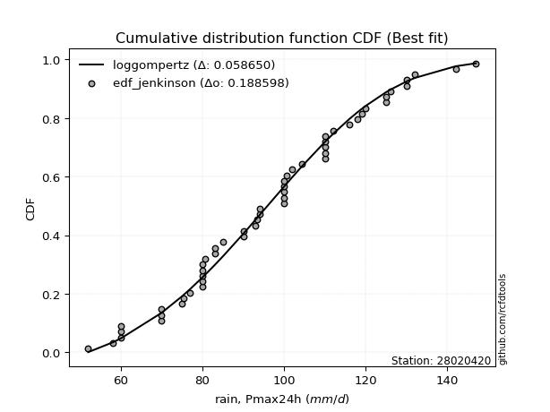</img>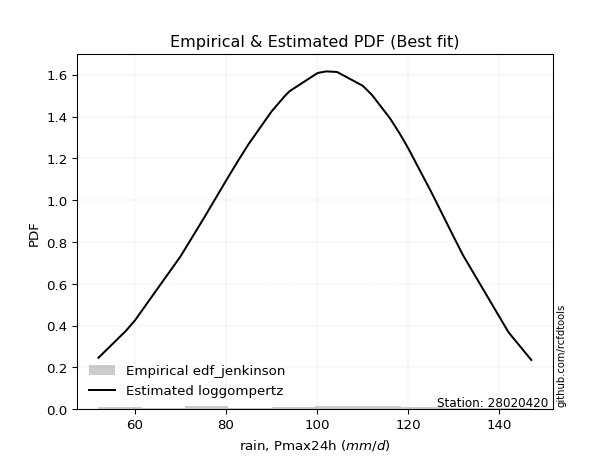</img>

</div>


### 11. Empirical - EDF Cunnane (1978)

Cunnane´s work in statistical hydrology has focused on the performance and evaluation of different probability distributions (such as GEV, Gumbel, Lognormal) for flood frequency estimation. _b_ is a constant, typically set to 0.4.

<div align="center">


$P=(m-b)/(n+1-2b)$


</div>


**11.1. Empirical values**

<div align="center">

|                | 0                    | 1                   | 2                   | 3                   | 4                   | 5                   | 6                  | 7                   | 8                  | 9                   | 10                  | 11                 | 12                  | 13                  | 14                 | 15                  | 16                  | 17                 | 18                 | 19                  | 20                 | 21                  | 22                 | 23                 | 24                  | 25                 | 26                 | 27                 | 28                 | 29                 | 30                 | 31                 | 32                 | 33                 | 34                 | 35                 | 36                 | 37                 | 38                 | 39                 | 40                 | 41                 | 42                 | 43                 | 44                 | 45                 | 46               | 47                 | 48                 | 49                 | 50                 | 51                 |
|:---------------|:---------------------|:--------------------|:--------------------|:--------------------|:--------------------|:--------------------|:-------------------|:--------------------|:-------------------|:--------------------|:--------------------|:-------------------|:--------------------|:--------------------|:-------------------|:--------------------|:--------------------|:-------------------|:-------------------|:--------------------|:-------------------|:--------------------|:-------------------|:-------------------|:--------------------|:-------------------|:-------------------|:-------------------|:-------------------|:-------------------|:-------------------|:-------------------|:-------------------|:-------------------|:-------------------|:-------------------|:-------------------|:-------------------|:-------------------|:-------------------|:-------------------|:-------------------|:-------------------|:-------------------|:-------------------|:-------------------|:-----------------|:-------------------|:-------------------|:-------------------|:-------------------|:-------------------|
| date           | 2012                 | 1991                | 1990                | 1984                | 2015                | 1989                | 2000               | 1982                | 1976               | 1997                | 1977                | 2020               | 2014                | 2006                | 2017               | 2011                | 1972                | 2019               | 1995               | 2013                | 2016               | 1999                | 2002               | 1971               | 1975                | 1998               | 1994               | 2004               | 2009               | 1988               | 2018               | 1987               | 1986               | 1970               | 1978               | 1979               | 1983               | 1981               | 2007               | 2021               | 2010               | 1980               | 2001               | 2005               | 2008               | 1992               | 2003             | 1985               | 1993               | 1996               | 1974               | 1973               |
| x              | 52.0                 | 58.0                | 60.0                | 60.0                | 60.0                | 70.0                | 70.0               | 70.0                | 75.0               | 75.3022389753854    | 77.0                | 80.0               | 80.0                | 80.0                | 80.0               | 80.0                | 80.7600828088943    | 83.0               | 83.0               | 85.0                | 90.0               | 90.0                | 92.9108431434611   | 93.3024589354871   | 94.0                | 94.0               | 100.0              | 100.0              | 100.0              | 100.0              | 100.0              | 100.524899066195   | 102.0              | 104.358339515926   | 110.0              | 110.0              | 110.0              | 110.0              | 110.0              | 112.0              | 116.0              | 118.0              | 119.0              | 120.0              | 125.0              | 125.0              | 126.0            | 130.0              | 130.0              | 132.0              | 142.0              | 147.0              |
| m              | 1                    | 2                   | 3                   | 4                   | 5                   | 6                   | 7                  | 8                   | 9                  | 10                  | 11                  | 12                 | 13                  | 14                  | 15                 | 16                  | 17                  | 18                 | 19                 | 20                  | 21                 | 22                  | 23                 | 24                 | 25                  | 26                 | 27                 | 28                 | 29                 | 30                 | 31                 | 32                 | 33                 | 34                 | 35                 | 36                 | 37                 | 38                 | 39                 | 40                 | 41                 | 42                 | 43                 | 44                 | 45                 | 46                 | 47               | 48                 | 49                 | 50                 | 51                 | 52                 |
| empirical_dist | edf_cunnane          | edf_cunnane         | edf_cunnane         | edf_cunnane         | edf_cunnane         | edf_cunnane         | edf_cunnane        | edf_cunnane         | edf_cunnane        | edf_cunnane         | edf_cunnane         | edf_cunnane        | edf_cunnane         | edf_cunnane         | edf_cunnane        | edf_cunnane         | edf_cunnane         | edf_cunnane        | edf_cunnane        | edf_cunnane         | edf_cunnane        | edf_cunnane         | edf_cunnane        | edf_cunnane        | edf_cunnane         | edf_cunnane        | edf_cunnane        | edf_cunnane        | edf_cunnane        | edf_cunnane        | edf_cunnane        | edf_cunnane        | edf_cunnane        | edf_cunnane        | edf_cunnane        | edf_cunnane        | edf_cunnane        | edf_cunnane        | edf_cunnane        | edf_cunnane        | edf_cunnane        | edf_cunnane        | edf_cunnane        | edf_cunnane        | edf_cunnane        | edf_cunnane        | edf_cunnane      | edf_cunnane        | edf_cunnane        | edf_cunnane        | edf_cunnane        | edf_cunnane        |
| empirical      | 0.011494252873563216 | 0.03065134099616858 | 0.04980842911877394 | 0.06896551724137931 | 0.08812260536398467 | 0.10727969348659003 | 0.1264367816091954 | 0.14559386973180075 | 0.1647509578544061 | 0.18390804597701146 | 0.20306513409961685 | 0.2222222222222222 | 0.24137931034482757 | 0.26053639846743293 | 0.2796934865900383 | 0.29885057471264365 | 0.31800766283524906 | 0.3371647509578544 | 0.3563218390804598 | 0.37547892720306514 | 0.3946360153256705 | 0.41379310344827586 | 0.4329501915708812 | 0.4521072796934866 | 0.47126436781609193 | 0.4904214559386973 | 0.5095785440613027 | 0.5287356321839081 | 0.5478927203065134 | 0.5670498084291188 | 0.5862068965517241 | 0.6053639846743295 | 0.6245210727969348 | 0.6436781609195402 | 0.6628352490421456 | 0.6819923371647509 | 0.7011494252873564 | 0.7203065134099617 | 0.7394636015325671 | 0.7586206896551724 | 0.7777777777777778 | 0.7969348659003831 | 0.8160919540229885 | 0.8352490421455938 | 0.8544061302681992 | 0.8735632183908045 | 0.89272030651341 | 0.9118773946360152 | 0.9310344827586207 | 0.9501915708812261 | 0.9693486590038314 | 0.9885057471264368 |
| empirical_tr   | 1.0116279069767442   | 1.0316205533596838  | 1.0524193548387097  | 1.0740740740740742  | 1.0966386554621848  | 1.1201716738197425  | 1.144736842105263  | 1.1704035874439462  | 1.1972477064220182 | 1.2253521126760563  | 1.2548076923076923  | 1.2857142857142856 | 1.3181818181818183  | 1.3523316062176165  | 1.3882978723404253 | 1.4262295081967213  | 1.4662921348314608  | 1.5086705202312138 | 1.5535714285714286 | 1.6012269938650308  | 1.6518987341772151 | 1.7058823529411762  | 1.7635135135135134 | 1.8251748251748252 | 1.891304347826087   | 1.9624060150375937 | 2.0390625          | 2.1219512195121952 | 2.211864406779661  | 2.3097345132743365 | 2.4166666666666665 | 2.533980582524272  | 2.6632653061224487 | 2.8064516129032255 | 2.9659090909090913 | 3.144578313253012  | 3.3461538461538467 | 3.5753424657534243 | 3.838235294117647  | 4.142857142857142  | 4.5                | 4.924528301886792  | 5.4375             | 6.069767441860463  | 6.868421052631579  | 7.909090909090905  | 9.32142857142857 | 11.347826086956513 | 14.499999999999995 | 20.076923076923087 | 32.624999999999964 | 87.0000000000001   |

</div>


**11.2. Kolmogorov-Smirnov fit test (sorted by Δ)**


<div align="center">

|                | 0                   | 1                   | 2                   | 3                   | 4                   | 5                   | 6                   | 7                   | 8                   | 9                   | 10                  | 11                  | 12                  | 13                  | 14                  | 15                  | 16                  | 17                  | 18                  | 19                  | 20                  | 21                  | 22                  | 23                  | 24                  | 25                  | 26                  | 27                  | 28                  | 29                  | 30                  | 31                  | 32                  | 33                  | 34                  | 35                  | 36                  | 37                  | 38                  | 39                  | 40                  | 41                  | 42                  | 43                  | 44                  | 45                  | 46                  | 47                  | 48                  | 49                  | 50                  | 51                  | 52                    | 53                  | 54                  | 55                  | 56                  | 57                  | 58                  | 59                  | 60                  | 61                  | 62                  | 63                  | 64                  | 65                  | 66                  | 67                  | 68                  | 69                  | 70                  | 71                  | 72                  | 73                  | 74                  | 75                  | 76                  | 77                  | 78                  | 79                  | 80                  | 81                  | 82                  | 83                  | 84                  | 85                  | 86                  | 87                  | 88                  | 89                  |
|:---------------|:--------------------|:--------------------|:--------------------|:--------------------|:--------------------|:--------------------|:--------------------|:--------------------|:--------------------|:--------------------|:--------------------|:--------------------|:--------------------|:--------------------|:--------------------|:--------------------|:--------------------|:--------------------|:--------------------|:--------------------|:--------------------|:--------------------|:--------------------|:--------------------|:--------------------|:--------------------|:--------------------|:--------------------|:--------------------|:--------------------|:--------------------|:--------------------|:--------------------|:--------------------|:--------------------|:--------------------|:--------------------|:--------------------|:--------------------|:--------------------|:--------------------|:--------------------|:--------------------|:--------------------|:--------------------|:--------------------|:--------------------|:--------------------|:--------------------|:--------------------|:--------------------|:--------------------|:----------------------|:--------------------|:--------------------|:--------------------|:--------------------|:--------------------|:--------------------|:--------------------|:--------------------|:--------------------|:--------------------|:--------------------|:--------------------|:--------------------|:--------------------|:--------------------|:--------------------|:--------------------|:--------------------|:--------------------|:--------------------|:--------------------|:--------------------|:--------------------|:--------------------|:--------------------|:--------------------|:--------------------|:--------------------|:--------------------|:--------------------|:--------------------|:--------------------|:--------------------|:--------------------|:--------------------|:--------------------|:--------------------|
| station        | 28020420            | 28020420            | 28020420            | 28020420            | 28020420            | 28020420            | 28020420            | 28020420            | 28020420            | 28020420            | 28020420            | 28020420            | 28020420            | 28020420            | 28020420            | 28020420            | 28020420            | 28020420            | 28020420            | 28020420            | 28020420            | 28020420            | 28020420            | 28020420            | 28020420            | 28020420            | 28020420            | 28020420            | 28020420            | 28020420            | 28020420            | 28020420            | 28020420            | 28020420            | 28020420            | 28020420            | 28020420            | 28020420            | 28020420            | 28020420            | 28020420            | 28020420            | 28020420            | 28020420            | 28020420            | 28020420            | 28020420            | 28020420            | 28020420            | 28020420            | 28020420            | 28020420            | 28020420              | 28020420            | 28020420            | 28020420            | 28020420            | 28020420            | 28020420            | 28020420            | 28020420            | 28020420            | 28020420            | 28020420            | 28020420            | 28020420            | 28020420            | 28020420            | 28020420            | 28020420            | 28020420            | 28020420            | 28020420            | 28020420            | 28020420            | 28020420            | 28020420            | 28020420            | 28020420            | 28020420            | 28020420            | 28020420            | 28020420            | 28020420            | 28020420            | 28020420            | 28020420            | 28020420            | 28020420            | 28020420            |
| empirical_dist | edf_cunnane         | edf_cunnane         | edf_cunnane         | edf_cunnane         | edf_cunnane         | edf_cunnane         | edf_cunnane         | edf_cunnane         | edf_cunnane         | edf_cunnane         | edf_cunnane         | edf_cunnane         | edf_cunnane         | edf_cunnane         | edf_cunnane         | edf_cunnane         | edf_cunnane         | edf_cunnane         | edf_cunnane         | edf_cunnane         | edf_cunnane         | edf_cunnane         | edf_cunnane         | edf_cunnane         | edf_cunnane         | edf_cunnane         | edf_cunnane         | edf_cunnane         | edf_cunnane         | edf_cunnane         | edf_cunnane         | edf_cunnane         | edf_cunnane         | edf_cunnane         | edf_cunnane         | edf_cunnane         | edf_cunnane         | edf_cunnane         | edf_cunnane         | edf_cunnane         | edf_cunnane         | edf_cunnane         | edf_cunnane         | edf_cunnane         | edf_cunnane         | edf_cunnane         | edf_cunnane         | edf_cunnane         | edf_cunnane         | edf_cunnane         | edf_cunnane         | edf_cunnane         | edf_cunnane           | edf_cunnane         | edf_cunnane         | edf_cunnane         | edf_cunnane         | edf_cunnane         | edf_cunnane         | edf_cunnane         | edf_cunnane         | edf_cunnane         | edf_cunnane         | edf_cunnane         | edf_cunnane         | edf_cunnane         | edf_cunnane         | edf_cunnane         | edf_cunnane         | edf_cunnane         | edf_cunnane         | edf_cunnane         | edf_cunnane         | edf_cunnane         | edf_cunnane         | edf_cunnane         | edf_cunnane         | edf_cunnane         | edf_cunnane         | edf_cunnane         | edf_cunnane         | edf_cunnane         | edf_cunnane         | edf_cunnane         | edf_cunnane         | edf_cunnane         | edf_cunnane         | edf_cunnane         | edf_cunnane         | edf_cunnane         |
| p_dist         | loggompertz         | logweibull_min      | weibull_min         | rice                | logloggamma         | johnsonsu           | fatiguelife         | gamma               | f                   | erlang              | logjohnsonsu        | chi2                | pearson3            | logpearson3         | nct                 | invgamma            | exponnorm           | crystalball         | truncnorm           | norm                | t                   | alpha               | fisk                | maxwell             | nakagami            | logfisk             | genlogistic         | mielke              | loggenlogistic      | rayleigh            | gompertz            | logmielke           | ncf                 | lognakagami         | logexponnorm        | lognorm             | lognorm             | logcrystalball      | loglognorm          | logt                | logncf              | logf                | logfatiguelife      | lognct              | loggumbel_l         | logrice             | logistic            | invweibull          | loggamma            | loggamma            | betaprime           | logalpha            | loglaplace_asymmetric | logerlang           | laplace_asymmetric  | loglogistic         | loginvgamma         | kstwobign           | loginvweibull       | hypsecant           | invgauss            | halfnorm            | loghypsecant        | logmaxwell          | loginvgauss         | gumbel_r            | gumbel_l            | lograyleigh         | logkstwobign        | laplace             | halflogistic        | moyal               | loglaplace          | loghalfnorm         | loggumbel_r         | logbetaprime        | loghalflogistic     | logmoyal            | loggenexpon         | wald                | expon               | pareto              | logwald             | loggibrat           | logtruncnorm        | gibrat              | logexpon            | logpareto           | logchi2             | genexpon            |
| delta          | 0.05815669292483466 | 0.06745049504255307 | 0.06942784361772847 | 0.07013463161458333 | 0.07015292431214537 | 0.07019202098975497 | 0.07054025570673461 | 0.07060133819491077 | 0.07120678432448846 | 0.07157242402518976 | 0.07192852810203865 | 0.07366261274230412 | 0.07368332440851177 | 0.07496000421808613 | 0.07629911263415978 | 0.07756165561562234 | 0.07787703460444412 | 0.0781700123038459  | 0.07817001677629665 | 0.07817001730136436 | 0.07817288963110758 | 0.07863181917484152 | 0.07917185865858356 | 0.08297789630626218 | 0.08400733637566249 | 0.0856693817162062  | 0.0856724227367941  | 0.08578993128856949 | 0.086461724808308   | 0.09236203848082869 | 0.09337404981194908 | 0.09349598116006541 | 0.09531096882548351 | 0.09631516403731344 | 0.09635561884667421 | 0.09635659920360096 | 0.09635659920360096 | 0.09635660346320729 | 0.09635665772267465 | 0.09635837491657306 | 0.09638990267494574 | 0.09649358342309766 | 0.09680455617597306 | 0.09731699695263829 | 0.09748540018721569 | 0.10029331389612905 | 0.10037294991691825 | 0.10298117908073112 | 0.10310669309760712 | 0.10310669309760712 | 0.1043221505647568  | 0.10438333118974785 | 0.10464783406860412   | 0.10477046645619315 | 0.10486540797245497 | 0.10992476691639841 | 0.11079587157736026 | 0.11092912389013765 | 0.11300815408316578 | 0.11580726711769279 | 0.11596369896569236 | 0.11887485659938224 | 0.12096980261015466 | 0.12235765542456567 | 0.12240345204341785 | 0.12294957458650524 | 0.12429248601210438 | 0.13038885134262113 | 0.134800766342572   | 0.13874137649014592 | 0.14655103491984833 | 0.14732810454427747 | 0.14850984874022777 | 0.15330255116596303 | 0.16223981874487303 | 0.17490648067696568 | 0.18165941177113176 | 0.1846628253539384  | 0.187164673419559   | 0.21499006185788538 | 0.24561496689931495 | 0.24561497933868637 | 0.247236490923063   | 0.2790761456703199  | 0.28743342227258306 | 0.29026582010355084 | 0.29888852988245407 | 0.2988885415853241  | 0.32983642206587993 | 0.883079655528711   |
| deltao         | 0.18859806671657792 | 0.18859806671657792 | 0.18859806671657792 | 0.18859806671657792 | 0.18859806671657792 | 0.18859806671657792 | 0.18859806671657792 | 0.18859806671657792 | 0.18859806671657792 | 0.18859806671657792 | 0.18859806671657792 | 0.18859806671657792 | 0.18859806671657792 | 0.18859806671657792 | 0.18859806671657792 | 0.18859806671657792 | 0.18859806671657792 | 0.18859806671657792 | 0.18859806671657792 | 0.18859806671657792 | 0.18859806671657792 | 0.18859806671657792 | 0.18859806671657792 | 0.18859806671657792 | 0.18859806671657792 | 0.18859806671657792 | 0.18859806671657792 | 0.18859806671657792 | 0.18859806671657792 | 0.18859806671657792 | 0.18859806671657792 | 0.18859806671657792 | 0.18859806671657792 | 0.18859806671657792 | 0.18859806671657792 | 0.18859806671657792 | 0.18859806671657792 | 0.18859806671657792 | 0.18859806671657792 | 0.18859806671657792 | 0.18859806671657792 | 0.18859806671657792 | 0.18859806671657792 | 0.18859806671657792 | 0.18859806671657792 | 0.18859806671657792 | 0.18859806671657792 | 0.18859806671657792 | 0.18859806671657792 | 0.18859806671657792 | 0.18859806671657792 | 0.18859806671657792 | 0.18859806671657792   | 0.18859806671657792 | 0.18859806671657792 | 0.18859806671657792 | 0.18859806671657792 | 0.18859806671657792 | 0.18859806671657792 | 0.18859806671657792 | 0.18859806671657792 | 0.18859806671657792 | 0.18859806671657792 | 0.18859806671657792 | 0.18859806671657792 | 0.18859806671657792 | 0.18859806671657792 | 0.18859806671657792 | 0.18859806671657792 | 0.18859806671657792 | 0.18859806671657792 | 0.18859806671657792 | 0.18859806671657792 | 0.18859806671657792 | 0.18859806671657792 | 0.18859806671657792 | 0.18859806671657792 | 0.18859806671657792 | 0.18859806671657792 | 0.18859806671657792 | 0.18859806671657792 | 0.18859806671657792 | 0.18859806671657792 | 0.18859806671657792 | 0.18859806671657792 | 0.18859806671657792 | 0.18859806671657792 | 0.18859806671657792 | 0.18859806671657792 | 0.18859806671657792 |
| eval           | Δo > Δ              | Δo > Δ              | Δo > Δ              | Δo > Δ              | Δo > Δ              | Δo > Δ              | Δo > Δ              | Δo > Δ              | Δo > Δ              | Δo > Δ              | Δo > Δ              | Δo > Δ              | Δo > Δ              | Δo > Δ              | Δo > Δ              | Δo > Δ              | Δo > Δ              | Δo > Δ              | Δo > Δ              | Δo > Δ              | Δo > Δ              | Δo > Δ              | Δo > Δ              | Δo > Δ              | Δo > Δ              | Δo > Δ              | Δo > Δ              | Δo > Δ              | Δo > Δ              | Δo > Δ              | Δo > Δ              | Δo > Δ              | Δo > Δ              | Δo > Δ              | Δo > Δ              | Δo > Δ              | Δo > Δ              | Δo > Δ              | Δo > Δ              | Δo > Δ              | Δo > Δ              | Δo > Δ              | Δo > Δ              | Δo > Δ              | Δo > Δ              | Δo > Δ              | Δo > Δ              | Δo > Δ              | Δo > Δ              | Δo > Δ              | Δo > Δ              | Δo > Δ              | Δo > Δ                | Δo > Δ              | Δo > Δ              | Δo > Δ              | Δo > Δ              | Δo > Δ              | Δo > Δ              | Δo > Δ              | Δo > Δ              | Δo > Δ              | Δo > Δ              | Δo > Δ              | Δo > Δ              | Δo > Δ              | Δo > Δ              | Δo > Δ              | Δo > Δ              | Δo > Δ              | Δo > Δ              | Δo > Δ              | Δo > Δ              | Δo > Δ              | Δo > Δ              | Δo > Δ              | Δo > Δ              | Δo > Δ              | Δo > Δ              | Δo <= Δ             | Δo <= Δ             | Δo <= Δ             | Δo <= Δ             | Δo <= Δ             | Δo <= Δ             | Δo <= Δ             | Δo <= Δ             | Δo <= Δ             | Δo <= Δ             | Δo <= Δ             |
| fit            | 1                   | 1                   | 1                   | 1                   | 1                   | 1                   | 1                   | 1                   | 1                   | 1                   | 1                   | 1                   | 1                   | 1                   | 1                   | 1                   | 1                   | 1                   | 1                   | 1                   | 1                   | 1                   | 1                   | 1                   | 1                   | 1                   | 1                   | 1                   | 1                   | 1                   | 1                   | 1                   | 1                   | 1                   | 1                   | 1                   | 1                   | 1                   | 1                   | 1                   | 1                   | 1                   | 1                   | 1                   | 1                   | 1                   | 1                   | 1                   | 1                   | 1                   | 1                   | 1                   | 1                     | 1                   | 1                   | 1                   | 1                   | 1                   | 1                   | 1                   | 1                   | 1                   | 1                   | 1                   | 1                   | 1                   | 1                   | 1                   | 1                   | 1                   | 1                   | 1                   | 1                   | 1                   | 1                   | 1                   | 1                   | 1                   | 1                   | 0                   | 0                   | 0                   | 0                   | 0                   | 0                   | 0                   | 0                   | 0                   | 0                   | 0                   |
| n              | 52                  | 52                  | 52                  | 52                  | 52                  | 52                  | 52                  | 52                  | 52                  | 52                  | 52                  | 52                  | 52                  | 52                  | 52                  | 52                  | 52                  | 52                  | 52                  | 52                  | 52                  | 52                  | 52                  | 52                  | 52                  | 52                  | 52                  | 52                  | 52                  | 52                  | 52                  | 52                  | 52                  | 52                  | 52                  | 52                  | 52                  | 52                  | 52                  | 52                  | 52                  | 52                  | 52                  | 52                  | 52                  | 52                  | 52                  | 52                  | 52                  | 52                  | 52                  | 52                  | 52                    | 52                  | 52                  | 52                  | 52                  | 52                  | 52                  | 52                  | 52                  | 52                  | 52                  | 52                  | 52                  | 52                  | 52                  | 52                  | 52                  | 52                  | 52                  | 52                  | 52                  | 52                  | 52                  | 52                  | 52                  | 52                  | 52                  | 52                  | 52                  | 52                  | 52                  | 52                  | 52                  | 52                  | 52                  | 52                  | 52                  | 52                  |
| best_fit       | 1                   | 0                   | 0                   | 0                   | 0                   | 0                   | 0                   | 0                   | 0                   | 0                   | 0                   | 0                   | 0                   | 0                   | 0                   | 0                   | 0                   | 0                   | 0                   | 0                   | 0                   | 0                   | 0                   | 0                   | 0                   | 0                   | 0                   | 0                   | 0                   | 0                   | 0                   | 0                   | 0                   | 0                   | 0                   | 0                   | 0                   | 0                   | 0                   | 0                   | 0                   | 0                   | 0                   | 0                   | 0                   | 0                   | 0                   | 0                   | 0                   | 0                   | 0                   | 0                   | 0                     | 0                   | 0                   | 0                   | 0                   | 0                   | 0                   | 0                   | 0                   | 0                   | 0                   | 0                   | 0                   | 0                   | 0                   | 0                   | 0                   | 0                   | 0                   | 0                   | 0                   | 0                   | 0                   | 0                   | 0                   | 0                   | 0                   | 0                   | 0                   | 0                   | 0                   | 0                   | 0                   | 0                   | 0                   | 0                   | 0                   | 0                   |
| best_fit_sort  | 1                   | 2                   | 3                   | 4                   | 5                   | 6                   | 7                   | 8                   | 9                   | 10                  | 11                  | 12                  | 13                  | 14                  | 15                  | 16                  | 17                  | 18                  | 19                  | 20                  | 21                  | 22                  | 23                  | 24                  | 25                  | 26                  | 27                  | 28                  | 29                  | 30                  | 31                  | 32                  | 33                  | 34                  | 35                  | 36                  | 37                  | 38                  | 39                  | 40                  | 41                  | 42                  | 43                  | 44                  | 45                  | 46                  | 47                  | 48                  | 49                  | 50                  | 51                  | 52                  | 53                    | 54                  | 55                  | 56                  | 57                  | 58                  | 59                  | 60                  | 61                  | 62                  | 63                  | 64                  | 65                  | 66                  | 67                  | 68                  | 69                  | 70                  | 71                  | 72                  | 73                  | 74                  | 75                  | 76                  | 77                  | 78                  | 79                  | 80                  | 81                  | 82                  | 83                  | 84                  | 85                  | 86                  | 87                  | 88                  | 89                  | 90                  |

</div>


<div align="center">

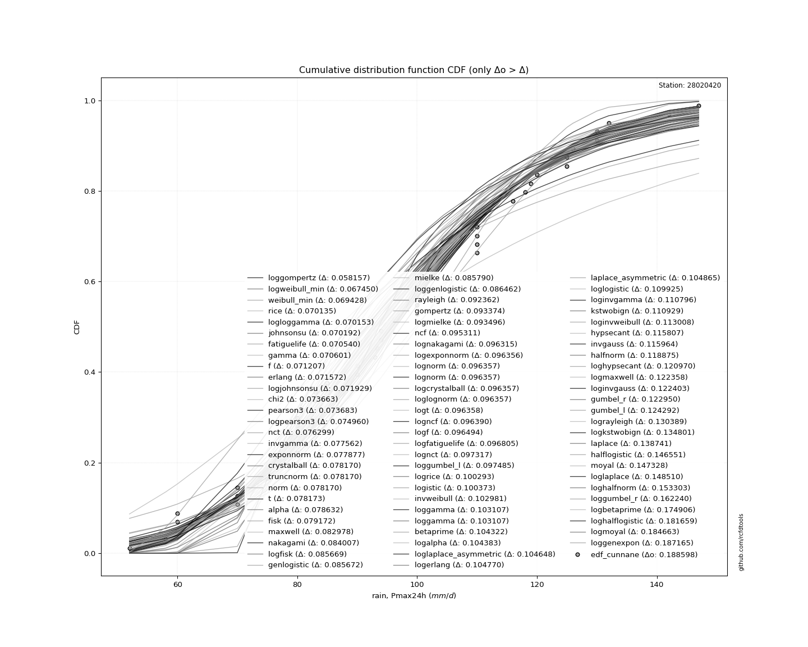</img>

</div>


**11.3. Best fit**

<div align="center">

|   id |   station | empirical_dist   | p_dist      |     delta |   deltao | eval   |   fit |   n |   best_fit |   best_fit_sort |
|-----:|----------:|:-----------------|:------------|----------:|---------:|:-------|------:|----:|-----------:|----------------:|
|    0 |  28020420 | edf_cunnane      | loggompertz | 0.0581567 | 0.188598 | Δo > Δ |     1 |  52 |          1 |               1 |

</div>


<div align="center">

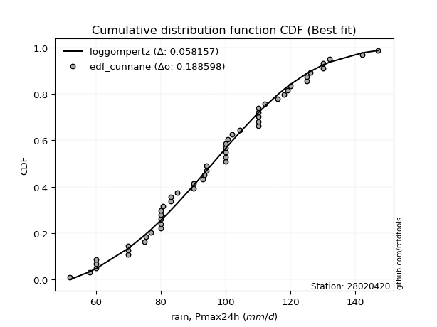</img></img>

</div>


### 12. Empirical - EDF Adamowski (1981)

The Adamowski formula in hydrology refers to a specific plotting position formula used for estimating the non-parametric empirical distribution of hydrological events (like flood peaks) to calculate their return periods. This formula provides an alternative to traditional parametric methods (like the Gumbel or Log Pearson Type III distributions). 

<div align="center">


$P=(m-0.25)/(n+0.5)$


</div>


**12.1. Empirical values**

<div align="center">

|                | 0                    | 1                   | 2                   | 3                   | 4                   | 5                   | 6                   | 7                   | 8                   | 9                   | 10                  | 11                  | 12                  | 13                 | 14                  | 15                 | 16                 | 17                 | 18                  | 19                 | 20                 | 21                 | 22                  | 23                 | 24                 | 25                  | 26                 | 27                 | 28                 | 29                 | 30                 | 31                 | 32                 | 33                 | 34                 | 35                 | 36                | 37                | 38                 | 39                 | 40                 | 41                 | 42                 | 43                 | 44                 | 45                 | 46                 | 47                 | 48                 | 49                 | 50                 | 51                 |
|:---------------|:---------------------|:--------------------|:--------------------|:--------------------|:--------------------|:--------------------|:--------------------|:--------------------|:--------------------|:--------------------|:--------------------|:--------------------|:--------------------|:-------------------|:--------------------|:-------------------|:-------------------|:-------------------|:--------------------|:-------------------|:-------------------|:-------------------|:--------------------|:-------------------|:-------------------|:--------------------|:-------------------|:-------------------|:-------------------|:-------------------|:-------------------|:-------------------|:-------------------|:-------------------|:-------------------|:-------------------|:------------------|:------------------|:-------------------|:-------------------|:-------------------|:-------------------|:-------------------|:-------------------|:-------------------|:-------------------|:-------------------|:-------------------|:-------------------|:-------------------|:-------------------|:-------------------|
| date           | 2012                 | 1991                | 1990                | 1984                | 2015                | 1989                | 2000                | 1982                | 1976                | 1997                | 1977                | 2020                | 2014                | 2006               | 2017                | 2011               | 1972               | 2019               | 1995                | 2013               | 2016               | 1999               | 2002                | 1971               | 1975               | 1998                | 1994               | 2004               | 2009               | 1988               | 2018               | 1987               | 1986               | 1970               | 1978               | 1979               | 1983              | 1981              | 2007               | 2021               | 2010               | 1980               | 2001               | 2005               | 2008               | 1992               | 2003               | 1985               | 1993               | 1996               | 1974               | 1973               |
| x              | 52.0                 | 58.0                | 60.0                | 60.0                | 60.0                | 70.0                | 70.0                | 70.0                | 75.0                | 75.3022389753854    | 77.0                | 80.0                | 80.0                | 80.0               | 80.0                | 80.0               | 80.7600828088943   | 83.0               | 83.0                | 85.0               | 90.0               | 90.0               | 92.9108431434611    | 93.3024589354871   | 94.0               | 94.0                | 100.0              | 100.0              | 100.0              | 100.0              | 100.0              | 100.524899066195   | 102.0              | 104.358339515926   | 110.0              | 110.0              | 110.0             | 110.0             | 110.0              | 112.0              | 116.0              | 118.0              | 119.0              | 120.0              | 125.0              | 125.0              | 126.0              | 130.0              | 130.0              | 132.0              | 142.0              | 147.0              |
| m              | 1                    | 2                   | 3                   | 4                   | 5                   | 6                   | 7                   | 8                   | 9                   | 10                  | 11                  | 12                  | 13                  | 14                 | 15                  | 16                 | 17                 | 18                 | 19                  | 20                 | 21                 | 22                 | 23                  | 24                 | 25                 | 26                  | 27                 | 28                 | 29                 | 30                 | 31                 | 32                 | 33                 | 34                 | 35                 | 36                 | 37                | 38                | 39                 | 40                 | 41                 | 42                 | 43                 | 44                 | 45                 | 46                 | 47                 | 48                 | 49                 | 50                 | 51                 | 52                 |
| empirical_dist | edf_adamowski        | edf_adamowski       | edf_adamowski       | edf_adamowski       | edf_adamowski       | edf_adamowski       | edf_adamowski       | edf_adamowski       | edf_adamowski       | edf_adamowski       | edf_adamowski       | edf_adamowski       | edf_adamowski       | edf_adamowski      | edf_adamowski       | edf_adamowski      | edf_adamowski      | edf_adamowski      | edf_adamowski       | edf_adamowski      | edf_adamowski      | edf_adamowski      | edf_adamowski       | edf_adamowski      | edf_adamowski      | edf_adamowski       | edf_adamowski      | edf_adamowski      | edf_adamowski      | edf_adamowski      | edf_adamowski      | edf_adamowski      | edf_adamowski      | edf_adamowski      | edf_adamowski      | edf_adamowski      | edf_adamowski     | edf_adamowski     | edf_adamowski      | edf_adamowski      | edf_adamowski      | edf_adamowski      | edf_adamowski      | edf_adamowski      | edf_adamowski      | edf_adamowski      | edf_adamowski      | edf_adamowski      | edf_adamowski      | edf_adamowski      | edf_adamowski      | edf_adamowski      |
| empirical      | 0.014285714285714285 | 0.03333333333333333 | 0.05238095238095238 | 0.07142857142857142 | 0.09047619047619047 | 0.10952380952380952 | 0.12857142857142856 | 0.14761904761904762 | 0.16666666666666666 | 0.18571428571428572 | 0.20476190476190476 | 0.22380952380952382 | 0.24285714285714285 | 0.2619047619047619 | 0.28095238095238095 | 0.3                | 0.319047619047619  | 0.3380952380952381 | 0.35714285714285715 | 0.3761904761904762 | 0.3952380952380952 | 0.4142857142857143 | 0.43333333333333335 | 0.4523809523809524 | 0.4714285714285714 | 0.49047619047619045 | 0.5095238095238095 | 0.5285714285714286 | 0.5476190476190477 | 0.5666666666666667 | 0.5857142857142857 | 0.6047619047619047 | 0.6238095238095238 | 0.6428571428571429 | 0.6619047619047619 | 0.680952380952381  | 0.7               | 0.719047619047619 | 0.7380952380952381 | 0.7571428571428571 | 0.7761904761904762 | 0.7952380952380952 | 0.8142857142857143 | 0.8333333333333334 | 0.8523809523809524 | 0.8714285714285714 | 0.8904761904761904 | 0.9095238095238095 | 0.9285714285714286 | 0.9476190476190476 | 0.9666666666666667 | 0.9857142857142858 |
| empirical_tr   | 1.0144927536231882   | 1.0344827586206897  | 1.0552763819095479  | 1.0769230769230769  | 1.0994764397905759  | 1.1229946524064172  | 1.1475409836065573  | 1.1731843575418994  | 1.2                 | 1.2280701754385965  | 1.2574850299401197  | 1.2883435582822085  | 1.3207547169811322  | 1.3548387096774193 | 1.390728476821192   | 1.4285714285714286 | 1.4685314685314685 | 1.510791366906475  | 1.5555555555555558  | 1.6030534351145038 | 1.653543307086614  | 1.707317073170732  | 1.7647058823529411  | 1.826086956521739  | 1.8918918918918919 | 1.9626168224299068  | 2.0388349514563107 | 2.121212121212121  | 2.210526315789474  | 2.3076923076923075 | 2.4137931034482762 | 2.5301204819277108 | 2.6582278481012658 | 2.8000000000000003 | 2.957746478873239  | 3.1343283582089554 | 3.333333333333333 | 3.559322033898305 | 3.818181818181819  | 4.117647058823529  | 4.468085106382979  | 4.883720930232557  | 5.384615384615384  | 6.000000000000002  | 6.774193548387095  | 7.777777777777779  | 9.130434782608692  | 11.052631578947366 | 14.000000000000007 | 19.09090909090908  | 30.000000000000007 | 70.00000000000026  |

</div>


**12.2. Kolmogorov-Smirnov fit test (sorted by Δ)**


<div align="center">

|                | 0                    | 1                   | 2                   | 3                   | 4                   | 5                   | 6                   | 7                   | 8                   | 9                   | 10                  | 11                  | 12                  | 13                  | 14                  | 15                  | 16                  | 17                  | 18                  | 19                  | 20                  | 21                  | 22                  | 23                  | 24                  | 25                  | 26                  | 27                  | 28                  | 29                  | 30                  | 31                  | 32                  | 33                  | 34                  | 35                  | 36                  | 37                  | 38                  | 39                  | 40                  | 41                  | 42                  | 43                  | 44                  | 45                  | 46                  | 47                  | 48                  | 49                  | 50                  | 51                  | 52                  | 53                    | 54                  | 55                  | 56                  | 57                  | 58                  | 59                  | 60                  | 61                  | 62                  | 63                  | 64                  | 65                  | 66                  | 67                  | 68                  | 69                  | 70                  | 71                  | 72                  | 73                  | 74                  | 75                  | 76                  | 77                  | 78                  | 79                  | 80                  | 81                  | 82                  | 83                  | 84                  | 85                  | 86                  | 87                  | 88                  | 89                  |
|:---------------|:---------------------|:--------------------|:--------------------|:--------------------|:--------------------|:--------------------|:--------------------|:--------------------|:--------------------|:--------------------|:--------------------|:--------------------|:--------------------|:--------------------|:--------------------|:--------------------|:--------------------|:--------------------|:--------------------|:--------------------|:--------------------|:--------------------|:--------------------|:--------------------|:--------------------|:--------------------|:--------------------|:--------------------|:--------------------|:--------------------|:--------------------|:--------------------|:--------------------|:--------------------|:--------------------|:--------------------|:--------------------|:--------------------|:--------------------|:--------------------|:--------------------|:--------------------|:--------------------|:--------------------|:--------------------|:--------------------|:--------------------|:--------------------|:--------------------|:--------------------|:--------------------|:--------------------|:--------------------|:----------------------|:--------------------|:--------------------|:--------------------|:--------------------|:--------------------|:--------------------|:--------------------|:--------------------|:--------------------|:--------------------|:--------------------|:--------------------|:--------------------|:--------------------|:--------------------|:--------------------|:--------------------|:--------------------|:--------------------|:--------------------|:--------------------|:--------------------|:--------------------|:--------------------|:--------------------|:--------------------|:--------------------|:--------------------|:--------------------|:--------------------|:--------------------|:--------------------|:--------------------|:--------------------|:--------------------|:--------------------|
| station        | 28020420             | 28020420            | 28020420            | 28020420            | 28020420            | 28020420            | 28020420            | 28020420            | 28020420            | 28020420            | 28020420            | 28020420            | 28020420            | 28020420            | 28020420            | 28020420            | 28020420            | 28020420            | 28020420            | 28020420            | 28020420            | 28020420            | 28020420            | 28020420            | 28020420            | 28020420            | 28020420            | 28020420            | 28020420            | 28020420            | 28020420            | 28020420            | 28020420            | 28020420            | 28020420            | 28020420            | 28020420            | 28020420            | 28020420            | 28020420            | 28020420            | 28020420            | 28020420            | 28020420            | 28020420            | 28020420            | 28020420            | 28020420            | 28020420            | 28020420            | 28020420            | 28020420            | 28020420            | 28020420              | 28020420            | 28020420            | 28020420            | 28020420            | 28020420            | 28020420            | 28020420            | 28020420            | 28020420            | 28020420            | 28020420            | 28020420            | 28020420            | 28020420            | 28020420            | 28020420            | 28020420            | 28020420            | 28020420            | 28020420            | 28020420            | 28020420            | 28020420            | 28020420            | 28020420            | 28020420            | 28020420            | 28020420            | 28020420            | 28020420            | 28020420            | 28020420            | 28020420            | 28020420            | 28020420            | 28020420            |
| empirical_dist | edf_adamowski        | edf_adamowski       | edf_adamowski       | edf_adamowski       | edf_adamowski       | edf_adamowski       | edf_adamowski       | edf_adamowski       | edf_adamowski       | edf_adamowski       | edf_adamowski       | edf_adamowski       | edf_adamowski       | edf_adamowski       | edf_adamowski       | edf_adamowski       | edf_adamowski       | edf_adamowski       | edf_adamowski       | edf_adamowski       | edf_adamowski       | edf_adamowski       | edf_adamowski       | edf_adamowski       | edf_adamowski       | edf_adamowski       | edf_adamowski       | edf_adamowski       | edf_adamowski       | edf_adamowski       | edf_adamowski       | edf_adamowski       | edf_adamowski       | edf_adamowski       | edf_adamowski       | edf_adamowski       | edf_adamowski       | edf_adamowski       | edf_adamowski       | edf_adamowski       | edf_adamowski       | edf_adamowski       | edf_adamowski       | edf_adamowski       | edf_adamowski       | edf_adamowski       | edf_adamowski       | edf_adamowski       | edf_adamowski       | edf_adamowski       | edf_adamowski       | edf_adamowski       | edf_adamowski       | edf_adamowski         | edf_adamowski       | edf_adamowski       | edf_adamowski       | edf_adamowski       | edf_adamowski       | edf_adamowski       | edf_adamowski       | edf_adamowski       | edf_adamowski       | edf_adamowski       | edf_adamowski       | edf_adamowski       | edf_adamowski       | edf_adamowski       | edf_adamowski       | edf_adamowski       | edf_adamowski       | edf_adamowski       | edf_adamowski       | edf_adamowski       | edf_adamowski       | edf_adamowski       | edf_adamowski       | edf_adamowski       | edf_adamowski       | edf_adamowski       | edf_adamowski       | edf_adamowski       | edf_adamowski       | edf_adamowski       | edf_adamowski       | edf_adamowski       | edf_adamowski       | edf_adamowski       | edf_adamowski       | edf_adamowski       |
| p_dist         | loggompertz          | logweibull_min      | weibull_min         | rice                | logloggamma         | johnsonsu           | gamma               | fatiguelife         | f                   | erlang              | logjohnsonsu        | chi2                | pearson3            | logpearson3         | nct                 | invgamma            | alpha               | exponnorm           | crystalball         | truncnorm           | norm                | t                   | fisk                | maxwell             | nakagami            | logfisk             | genlogistic         | mielke              | loggenlogistic      | rayleigh            | gompertz            | logmielke           | ncf                 | lognakagami         | logexponnorm        | lognorm             | lognorm             | logcrystalball      | loglognorm          | logt                | logncf              | logf                | logfatiguelife      | lognct              | loggumbel_l         | logrice             | logistic            | invweibull          | loggamma            | loggamma            | betaprime           | logalpha            | logerlang           | loglaplace_asymmetric | laplace_asymmetric  | loglogistic         | loginvgamma         | kstwobign           | loginvweibull       | invgauss            | hypsecant           | halfnorm            | loghypsecant        | logmaxwell          | loginvgauss         | gumbel_r            | gumbel_l            | lograyleigh         | logkstwobign        | laplace             | halflogistic        | moyal               | loglaplace          | loghalfnorm         | loggumbel_r         | logbetaprime        | loghalflogistic     | logmoyal            | loggenexpon         | wald                | expon               | pareto              | logwald             | loggibrat           | logtruncnorm        | gibrat              | logexpon            | logpareto           | logchi2             | genexpon            |
| delta          | 0.058977710987232035 | 0.06838098217993682 | 0.06948257815522163 | 0.0701893661520765  | 0.07097394237454274 | 0.07101303905215234 | 0.07142235625730814 | 0.07147074284411836 | 0.07213727146187221 | 0.07239344208758713 | 0.07274954616443602 | 0.07399754894013366 | 0.07450434247090915 | 0.07501473875557929 | 0.07712013069655715 | 0.0776163901531155  | 0.07868655371233468 | 0.07869805266684149 | 0.07899103036624328 | 0.07899103483869402 | 0.07899103536376173 | 0.07899390769350495 | 0.07999287672098093 | 0.08303263084375534 | 0.08406207091315565 | 0.08572411625369936 | 0.08572715727428726 | 0.08661094935096686 | 0.08728274287070537 | 0.09241677301832185 | 0.0927719698995243  | 0.09442646829744916 | 0.09536570336297667 | 0.0963698985748066  | 0.09641035338416737 | 0.09641133374109412 | 0.09641133374109412 | 0.09641133800070045 | 0.09641139226016782 | 0.09641310945406623 | 0.0964446372124389  | 0.09654831796059082 | 0.09685929071346622 | 0.09737173149013145 | 0.09830641824961306 | 0.10034804843362222 | 0.10119396797931562 | 0.10303591361822428 | 0.10316142763510028 | 0.10316142763510028 | 0.10437688510224996 | 0.10443806572724101 | 0.10482520099368631 | 0.10557832120598787   | 0.10568642603485234 | 0.10997950145389157 | 0.11085060611485342 | 0.11098385842763081 | 0.11306288862065894 | 0.11601843350318553 | 0.11662828518009016 | 0.1189295911368754  | 0.12102453714764783 | 0.12241238996205883 | 0.12245818658091101 | 0.1230043091239984  | 0.12511350407450175 | 0.1304435858801143  | 0.1338011740300049  | 0.1395623945525433  | 0.1466057694573415  | 0.14738283908177063 | 0.14856458327772093 | 0.1533572857034562  | 0.1622945532823662  | 0.1723339574147872  | 0.18171414630862492 | 0.18471755989143157 | 0.1855773718322574  | 0.21504479639537855 | 0.24402766531201334 | 0.24402767775138476 | 0.24729122546055615 | 0.27913088020781307 | 0.28573645651789936 | 0.2914152453909072  | 0.2969728210701935  | 0.2969728327730635  | 0.3279207132536194  | 0.8808355394914915  |
| deltao         | 0.18859806671657792  | 0.18859806671657792 | 0.18859806671657792 | 0.18859806671657792 | 0.18859806671657792 | 0.18859806671657792 | 0.18859806671657792 | 0.18859806671657792 | 0.18859806671657792 | 0.18859806671657792 | 0.18859806671657792 | 0.18859806671657792 | 0.18859806671657792 | 0.18859806671657792 | 0.18859806671657792 | 0.18859806671657792 | 0.18859806671657792 | 0.18859806671657792 | 0.18859806671657792 | 0.18859806671657792 | 0.18859806671657792 | 0.18859806671657792 | 0.18859806671657792 | 0.18859806671657792 | 0.18859806671657792 | 0.18859806671657792 | 0.18859806671657792 | 0.18859806671657792 | 0.18859806671657792 | 0.18859806671657792 | 0.18859806671657792 | 0.18859806671657792 | 0.18859806671657792 | 0.18859806671657792 | 0.18859806671657792 | 0.18859806671657792 | 0.18859806671657792 | 0.18859806671657792 | 0.18859806671657792 | 0.18859806671657792 | 0.18859806671657792 | 0.18859806671657792 | 0.18859806671657792 | 0.18859806671657792 | 0.18859806671657792 | 0.18859806671657792 | 0.18859806671657792 | 0.18859806671657792 | 0.18859806671657792 | 0.18859806671657792 | 0.18859806671657792 | 0.18859806671657792 | 0.18859806671657792 | 0.18859806671657792   | 0.18859806671657792 | 0.18859806671657792 | 0.18859806671657792 | 0.18859806671657792 | 0.18859806671657792 | 0.18859806671657792 | 0.18859806671657792 | 0.18859806671657792 | 0.18859806671657792 | 0.18859806671657792 | 0.18859806671657792 | 0.18859806671657792 | 0.18859806671657792 | 0.18859806671657792 | 0.18859806671657792 | 0.18859806671657792 | 0.18859806671657792 | 0.18859806671657792 | 0.18859806671657792 | 0.18859806671657792 | 0.18859806671657792 | 0.18859806671657792 | 0.18859806671657792 | 0.18859806671657792 | 0.18859806671657792 | 0.18859806671657792 | 0.18859806671657792 | 0.18859806671657792 | 0.18859806671657792 | 0.18859806671657792 | 0.18859806671657792 | 0.18859806671657792 | 0.18859806671657792 | 0.18859806671657792 | 0.18859806671657792 | 0.18859806671657792 |
| eval           | Δo > Δ               | Δo > Δ              | Δo > Δ              | Δo > Δ              | Δo > Δ              | Δo > Δ              | Δo > Δ              | Δo > Δ              | Δo > Δ              | Δo > Δ              | Δo > Δ              | Δo > Δ              | Δo > Δ              | Δo > Δ              | Δo > Δ              | Δo > Δ              | Δo > Δ              | Δo > Δ              | Δo > Δ              | Δo > Δ              | Δo > Δ              | Δo > Δ              | Δo > Δ              | Δo > Δ              | Δo > Δ              | Δo > Δ              | Δo > Δ              | Δo > Δ              | Δo > Δ              | Δo > Δ              | Δo > Δ              | Δo > Δ              | Δo > Δ              | Δo > Δ              | Δo > Δ              | Δo > Δ              | Δo > Δ              | Δo > Δ              | Δo > Δ              | Δo > Δ              | Δo > Δ              | Δo > Δ              | Δo > Δ              | Δo > Δ              | Δo > Δ              | Δo > Δ              | Δo > Δ              | Δo > Δ              | Δo > Δ              | Δo > Δ              | Δo > Δ              | Δo > Δ              | Δo > Δ              | Δo > Δ                | Δo > Δ              | Δo > Δ              | Δo > Δ              | Δo > Δ              | Δo > Δ              | Δo > Δ              | Δo > Δ              | Δo > Δ              | Δo > Δ              | Δo > Δ              | Δo > Δ              | Δo > Δ              | Δo > Δ              | Δo > Δ              | Δo > Δ              | Δo > Δ              | Δo > Δ              | Δo > Δ              | Δo > Δ              | Δo > Δ              | Δo > Δ              | Δo > Δ              | Δo > Δ              | Δo > Δ              | Δo > Δ              | Δo <= Δ             | Δo <= Δ             | Δo <= Δ             | Δo <= Δ             | Δo <= Δ             | Δo <= Δ             | Δo <= Δ             | Δo <= Δ             | Δo <= Δ             | Δo <= Δ             | Δo <= Δ             |
| fit            | 1                    | 1                   | 1                   | 1                   | 1                   | 1                   | 1                   | 1                   | 1                   | 1                   | 1                   | 1                   | 1                   | 1                   | 1                   | 1                   | 1                   | 1                   | 1                   | 1                   | 1                   | 1                   | 1                   | 1                   | 1                   | 1                   | 1                   | 1                   | 1                   | 1                   | 1                   | 1                   | 1                   | 1                   | 1                   | 1                   | 1                   | 1                   | 1                   | 1                   | 1                   | 1                   | 1                   | 1                   | 1                   | 1                   | 1                   | 1                   | 1                   | 1                   | 1                   | 1                   | 1                   | 1                     | 1                   | 1                   | 1                   | 1                   | 1                   | 1                   | 1                   | 1                   | 1                   | 1                   | 1                   | 1                   | 1                   | 1                   | 1                   | 1                   | 1                   | 1                   | 1                   | 1                   | 1                   | 1                   | 1                   | 1                   | 1                   | 0                   | 0                   | 0                   | 0                   | 0                   | 0                   | 0                   | 0                   | 0                   | 0                   | 0                   |
| n              | 52                   | 52                  | 52                  | 52                  | 52                  | 52                  | 52                  | 52                  | 52                  | 52                  | 52                  | 52                  | 52                  | 52                  | 52                  | 52                  | 52                  | 52                  | 52                  | 52                  | 52                  | 52                  | 52                  | 52                  | 52                  | 52                  | 52                  | 52                  | 52                  | 52                  | 52                  | 52                  | 52                  | 52                  | 52                  | 52                  | 52                  | 52                  | 52                  | 52                  | 52                  | 52                  | 52                  | 52                  | 52                  | 52                  | 52                  | 52                  | 52                  | 52                  | 52                  | 52                  | 52                  | 52                    | 52                  | 52                  | 52                  | 52                  | 52                  | 52                  | 52                  | 52                  | 52                  | 52                  | 52                  | 52                  | 52                  | 52                  | 52                  | 52                  | 52                  | 52                  | 52                  | 52                  | 52                  | 52                  | 52                  | 52                  | 52                  | 52                  | 52                  | 52                  | 52                  | 52                  | 52                  | 52                  | 52                  | 52                  | 52                  | 52                  |
| best_fit       | 1                    | 0                   | 0                   | 0                   | 0                   | 0                   | 0                   | 0                   | 0                   | 0                   | 0                   | 0                   | 0                   | 0                   | 0                   | 0                   | 0                   | 0                   | 0                   | 0                   | 0                   | 0                   | 0                   | 0                   | 0                   | 0                   | 0                   | 0                   | 0                   | 0                   | 0                   | 0                   | 0                   | 0                   | 0                   | 0                   | 0                   | 0                   | 0                   | 0                   | 0                   | 0                   | 0                   | 0                   | 0                   | 0                   | 0                   | 0                   | 0                   | 0                   | 0                   | 0                   | 0                   | 0                     | 0                   | 0                   | 0                   | 0                   | 0                   | 0                   | 0                   | 0                   | 0                   | 0                   | 0                   | 0                   | 0                   | 0                   | 0                   | 0                   | 0                   | 0                   | 0                   | 0                   | 0                   | 0                   | 0                   | 0                   | 0                   | 0                   | 0                   | 0                   | 0                   | 0                   | 0                   | 0                   | 0                   | 0                   | 0                   | 0                   |
| best_fit_sort  | 1                    | 2                   | 3                   | 4                   | 5                   | 6                   | 7                   | 8                   | 9                   | 10                  | 11                  | 12                  | 13                  | 14                  | 15                  | 16                  | 17                  | 18                  | 19                  | 20                  | 21                  | 22                  | 23                  | 24                  | 25                  | 26                  | 27                  | 28                  | 29                  | 30                  | 31                  | 32                  | 33                  | 34                  | 35                  | 36                  | 37                  | 38                  | 39                  | 40                  | 41                  | 42                  | 43                  | 44                  | 45                  | 46                  | 47                  | 48                  | 49                  | 50                  | 51                  | 52                  | 53                  | 54                    | 55                  | 56                  | 57                  | 58                  | 59                  | 60                  | 61                  | 62                  | 63                  | 64                  | 65                  | 66                  | 67                  | 68                  | 69                  | 70                  | 71                  | 72                  | 73                  | 74                  | 75                  | 76                  | 77                  | 78                  | 79                  | 80                  | 81                  | 82                  | 83                  | 84                  | 85                  | 86                  | 87                  | 88                  | 89                  | 90                  |

</div>


<div align="center">

</img>

</div>


**12.3. Best fit**

<div align="center">

|   id |   station | empirical_dist   | p_dist      |     delta |   deltao | eval   |   fit |   n |   best_fit |   best_fit_sort |
|-----:|----------:|:-----------------|:------------|----------:|---------:|:-------|------:|----:|-----------:|----------------:|
|    0 |  28020420 | edf_adamowski    | loggompertz | 0.0589777 | 0.188598 | Δo > Δ |     1 |  52 |          1 |               1 |

</div>


<div align="center">

</img></img>

</div>


## C. Best fit & Estimate extreme values for specific return periods - Tr


### 1. Best fit (ordered by delta Δ)

<div align="center">

|   id |   station | empirical_dist   | p_dist      |     delta |   deltao | eval   |   fit |   n |   best_fit |   best_fit_sort |
|-----:|----------:|:-----------------|:------------|----------:|---------:|:-------|------:|----:|-----------:|----------------:|
|    0 |  28020420 | edf_hazen        | loggompertz | 0.0576041 | 0.188598 | Δo > Δ |     1 |  52 |          1 |               1 |
|    1 |  28020420 | edf_gringorten   | loggompertz | 0.0579362 | 0.188598 | Δo > Δ |     1 |  52 |          1 |               2 |
|    2 |  28020420 | edf_cunnane      | loggompertz | 0.0581567 | 0.188598 | Δo > Δ |     1 |  52 |          1 |               3 |
|    3 |  28020420 | edf_blom         | loggompertz | 0.0582942 | 0.188598 | Δo > Δ |     1 |  52 |          1 |               4 |
|    4 |  28020420 | edf_tukey        | loggompertz | 0.0585228 | 0.188598 | Δo > Δ |     1 |  52 |          1 |               5 |
|    5 |  28020420 | edf_filliben     | loggompertz | 0.0586094 | 0.188598 | Δo > Δ |     1 |  52 |          1 |               6 |
|    6 |  28020420 | edf_beard        | loggompertz | 0.0586504 | 0.188598 | Δo > Δ |     1 |  52 |          1 |               7 |
|    7 |  28020420 | edf_jenkinson    | loggompertz | 0.0586504 | 0.188598 | Δo > Δ |     1 |  52 |          1 |               8 |
|    8 |  28020420 | edf_chegodayev   | loggompertz | 0.0587051 | 0.188598 | Δo > Δ |     1 |  52 |          1 |               9 |
|    9 |  28020420 | edf_adamowski    | loggompertz | 0.0589777 | 0.188598 | Δo > Δ |     1 |  52 |          1 |              10 |
|   10 |  28020420 | edf_weibull      | loggompertz | 0.0603254 | 0.188598 | Δo > Δ |     1 |  52 |          1 |              11 |
|   11 |  28020420 | edf_california   | rice        | 0.0665298 | 0.188598 | Δo > Δ |     1 |  52 |          1 |              12 |

</div>

:file_folder:Tables: [bestfit_28020420.csv](table/bestfit_28020420.csv) | [extreme_28020420.csv](table/extreme_28020420.csv)


### 2. Extreme values

In hydrology, a return period (or recurrence interval $Tr$) is the statistical average time between extreme events like floods or droughts of a specific magnitude, indicating how rare an event is, with a 100-year flood, for example, having a 1% chance of occurring in any given year, not that it happens exactly every century. It is a key tool for infrastructure design (like bridges or dams) and risk assessment, calculated from historical data to determine the probability of future events, although it is important to remember it is statistical average, and events can cluster or be missed.

> risk_rate: assuming the return period as the project useful life.

|   id |      tr |   prob_l |     prob_g |    alpha |   betaprime |     chi2 |   crystalball |   erlang |    expon |   exponnorm |        f |   fatiguelife |     fisk |    gamma |   genexpon |   genlogistic |   gibrat |   gompertz |   gumbel_l |   gumbel_r |   halflogistic |   halfnorm |   hypsecant |   invgamma |   invgauss |   invweibull |   johnsonsu |   kstwobign |   laplace |   laplace_asymmetric |   loggamma |   logistic |   lognorm |   maxwell |   mielke |    moyal |   nakagami |      ncf |      nct |     norm |   pareto |   pearson3 |   rayleigh |     rice |        t |   truncnorm |     wald |   weibull_min |   logalpha |   logbetaprime |   logchi2 |   logcrystalball |   logerlang |   logexpon |   logexponnorm |     logf |   logfatiguelife |   logfisk |   loggenexpon |   loggenlogistic |   loggibrat |   loggompertz |   loggumbel_l |   loggumbel_r |   loghalflogistic |   loghalfnorm |   loghypsecant |   loginvgamma |   loginvgauss |   loginvweibull |   logjohnsonsu |   logkstwobign |   loglaplace |   loglaplace_asymmetric |   logloggamma |   loglogistic |   loglognorm |   logmaxwell |   logmielke |   logmoyal |   lognakagami |   logncf |   lognct |   logpareto |   logpearson3 |   lograyleigh |   logrice |     logt |   logtruncnorm |   logwald |   logweibull_min |   station |   n |   risk_rate |
|-----:|--------:|---------:|-----------:|---------:|------------:|---------:|--------------:|---------:|---------:|------------:|---------:|--------------:|---------:|---------:|-----------:|--------------:|---------:|-----------:|-----------:|-----------:|---------------:|-----------:|------------:|-----------:|-----------:|-------------:|------------:|------------:|----------:|---------------------:|-----------:|-----------:|----------:|----------:|---------:|---------:|-----------:|---------:|---------:|---------:|---------:|-----------:|-----------:|---------:|---------:|------------:|---------:|--------------:|-----------:|---------------:|----------:|-----------------:|------------:|-----------:|---------------:|---------:|-----------------:|----------:|--------------:|-----------------:|------------:|--------------:|--------------:|--------------:|------------------:|--------------:|---------------:|--------------:|--------------:|----------------:|---------------:|---------------:|-------------:|------------------------:|--------------:|--------------:|-------------:|-------------:|------------:|-----------:|--------------:|---------:|---------:|------------:|--------------:|--------------:|----------:|---------:|---------------:|----------:|-----------------:|----------:|----:|------------:|
|    0 |    2    | 0.5      | 0.5        |  94.8739 |     93.1456 |  95.1625 |       96.3877 |  95.6846 |  82.7672 |      96.346 |  95.387  |       95.4948 |  95.5513 |  95.6183 |    54.7251 |       94.5506 |  89.5574 |    99.7635 |    100.126 |    92.6494 |        90.7909 |    91.7297 |     96.3877 |    94.9108 |    91.4655 |      92.7884 |     95.5694 |     91.9682 |   96.3877 |              95.231  |    93.1166 |    96.3877 |   93.6125 |   94.4415 |  96.3154 |  91.4425 |    94.2863 |  93.7146 |  96.1745 |  96.3877 |  82.7672 |    95.9211 |    93.7513 |  95.1903 |  96.3878 |     96.3877 |  89.0115 |       95.2582 |    92.9656 |        93.7473 |   75.5003 |          93.6125 |     92.9771 |    78.1601 |        93.6126 |  93.5868 |          93.5932 |   94.6194 |       86.6813 |          96.4597 |     86.9582 |       95.9217 |       97.4671 |       89.9104 |           88.1252 |       89.0219 |        93.6125 |       92.5206 |       91.618  |         90.8321 |        95.9876 |        88.7824 |      93.6125 |                 96.4985 |       95.747  |       93.6125 |      93.6125 |      91.6668 |     94.6615 |    88.7468 |       93.6038 |  93.5862 |  93.4734 |     78.1601 |       94.9845 |       90.9862 |   93.2531 |  93.6124 |        79.1098 |   86.4487 |          95.5131 |  28020420 |  52 |    0.75     |
|    1 |    2.33 | 0.570815 | 0.429185   |  98.9661 |     97.3142 |  99.2627 |      100.448  |  99.7601 |  89.5461 |     100.405 |  99.4782 |       99.5773 |  99.4006 |  99.6936 |    55.3178 |       98.5576 |  91.6143 |   104.168  |    103.659 |    96.412  |        94.6595 |    96.1122 |     99.6374 |    99.0248 |    96.0957 |      97.2008 |     99.6476 |     96.5379 |   98.845  |              98.2965 |    97.3402 |    99.9654 |   97.8068 |   98.6602 | 100.146  |  95.0044 |    98.5737 |  97.886  | 100.235  | 100.448  |  89.5461 |    99.9937 |    98.0324 |  99.4536 | 100.448  |    100.448  |  91.6741 |       99.4996 |    97.2253 |       101.53   |   83.0614 |          97.8068 |     97.219  |    85.5026 |        97.8069 |  97.7918 |          97.7806 |   98.5689 |       92.8027 |         100.295  |     88.9107 |      100.299  |      101.255  |       93.6371 |           91.8826 |       93.3345 |        96.9544 |       96.7835 |       95.9181 |         95.8356 |       100.127  |        93.8927 |      96.1287 |                 99.4809 |       99.8651 |       97.2983 |      97.8068 |      95.9371 |     98.5973 |    92.2252 |       97.8053 |  97.7951 |  97.7152 |     85.5026 |       99.1674 |       95.2892 |   97.5102 |  97.8067 |        86.3856 |   88.9691 |          99.6705 |  28020420 |  52 |    0.729209 |
|    2 |    5    | 0.8      | 0.2        | 114.964  |    114.481  | 115.176  |      115.539  | 115.312  | 123.439  |     115.516 | 115.248  |      115.257  | 114.78   | 115.248  |    58.2738 |      115.055  | 103.457  |   118.399  |    115.072 |   112.759  |       112.164  |   114.645  |    112.673  |   115.116  |   116.277  |     116.37   |    115.267  |    115.949  |  111.131  |             113.623  |   115.082  |   113.779  |  115.109  |  115.265  | 115.071  | 111.503  |   115.433  | 115.087  | 115.44   | 115.539  | 123.439  |   115.39   |   115.172  | 115.675  | 115.539  |    115.539  | 106.579  |      115.63   |   115.283  |       137.286  |  136.671  |         115.109  |    115.044  |   133.95   |       115.109  | 115.155  |         115.086  |  115.428  |      125.428  |         115.125  |    101.036  |      116.265  |      114.53   |      111.706  |          110.99   |      114.005  |       111.602  |      115.05   |      114.831  |        120.976  |       115.684  |       119.09   |     109.76   |                112.748  |      115.471  |      112.943  |     115.109  |     114.767  |    113.355  |   110.202  |      115.147  | 115.208  | 115.334  |    133.95   |      115.465  |      114.653  |  115.235  | 115.109  |       131.251  |  104.498  |         115.497  |  28020420 |  52 |    0.67232  |
|    3 |   10    | 0.9      | 0.1        | 126.319  |    127.508  | 126.33   |      125.549  | 125.985  | 154.206  |     125.565 | 126.207  |      126.112  | 126.651  | 125.927  |    60.9544 |      127.906  | 116.956  |   126.322  |    121.426 |   126.073  |       126.701  |   128.359  |    123.082  |   126.533  |   132.559  |     131.983  |    126.046  |    130.728  |  122.284  |             127.537  |   128.892  |   123.953  |  128.243  |  126.95   | 126.501  | 125.868  |   127.288  | 128.176  | 125.633  | 125.549  | 154.206  |   125.833  |   127.392  | 126.652  | 125.549  |    125.549  | 122.397  |      126.484  |   129.526  |       168.502  |  218.351  |         128.243  |    128.926  |   201.337  |       128.243  | 128.355  |         128.257  |  129.663  |      160.333  |         126.403  |    116.886  |      126.437  |      122.661  |      128.97   |          129.844  |      132.196  |       124.873  |      129.674  |      130.51   |        146.254  |       126.056  |       142.719  |     123.802  |                126.301  |      126.036  |      126.052  |     128.243  |     130.194  |    124.225  |   128.685  |      128.322  | 128.481  | 128.838  |    201.337  |      126.86   |      130.819  |  128.829  | 128.243  |       186.314  |  123.952  |         126.238  |  28020420 |  52 |    0.651322 |
|    4 |   15    | 0.933333 | 0.0666667  | 132.225  |    134.561  | 132.077  |      130.545  | 131.418  | 172.204  |     130.59  | 131.827  |      131.667  | 133.321  | 131.364  |    62.5224 |      135.046  | 126.267  |   129.91   |    124.304 |   133.584  |       134.927  |   135.496  |    129.022  |   132.467  |   141.639  |     140.792  |    131.554  |    138.574  |  128.808  |             135.675  |   136.483  |   129.496  |  135.348  |  132.946  | 133.003  | 134.204  |   133.369  | 135.279  | 130.754  | 130.545  | 172.204  |   131.113  |   133.689  | 132.173  | 130.545  |    130.545  | 132.555  |      131.909  |   137.427  |       186.91   |  288.38   |         135.348  |    136.559  |   255.536  |       135.348  | 135.501  |         135.394  |  138.144  |      183.988  |         132.804  |    129.246  |      131.367  |      126.531  |      139.862  |          141.9    |      142.782  |       133.142  |      137.866  |      139.489  |        162.78   |       131.22   |       157.113  |     132.834  |                134.972  |      131.358  |      133.824  |     135.348  |     138.898  |    130.426  |   140.801  |      135.452  | 135.679  | 136.187  |    255.536  |      132.697  |      140.02   |  136.224  | 135.348  |       225.746  |  138.314  |         131.652  |  28020420 |  52 |    0.644736 |
|    5 |   20    | 0.95     | 0.05       | 136.185  |    139.394  | 135.907  |      133.816  | 135.016  | 184.974  |     133.884 | 135.562  |      135.356  | 138.017  | 134.964  |    63.6348 |      140.018  | 133.571  |   132.144  |    126.095 |   138.844  |       140.691  |   140.254  |    133.213  |   136.442  |   147.95   |     146.96   |    135.209  |    143.859  |  133.437  |             141.45   |   141.73   |   133.327  |  140.213  |  136.925  | 137.638  | 140.108  |   137.404  | 140.154  | 134.121  | 133.816  | 184.974  |   134.595  |   137.874  | 135.802  | 133.816  |    133.816  | 140.124  |      135.46   |   142.918  |       200.147  |  351.768  |         140.213  |    141.836  |   302.626  |       140.213  | 140.396  |         140.286  |  144.327  |      202.51   |         137.364  |    139.849  |      134.542  |      129.001  |      148.032  |          151.008  |      150.308  |       139.303  |      143.59   |      145.846  |        175.451  |       134.593  |       167.619  |     139.639  |                141.483  |      134.86   |      139.474  |     140.213  |     144.993  |    134.904  |   150.066  |      140.335  | 140.615  | 141.238  |    302.626  |      136.567  |      146.49   |  141.302  | 140.213  |       257.105  |  150.089  |         135.215  |  28020420 |  52 |    0.641514 |
|    6 |   25    | 0.96     | 0.04       | 139.147  |    143.066  | 138.759  |      136.224  | 137.684  | 194.878  |     136.311 | 138.34   |      138.097  | 141.657  | 137.634  |    64.4977 |      143.836  | 139.66   |   133.733  |    127.37  |   142.895  |       145.132  |   143.794  |    136.456  |   139.414  |   152.785  |     151.711  |    137.923  |    147.818  |  137.027  |             145.929  |   145.739  |   136.258  |  143.905  |  139.879  | 141.269  | 144.685  |   140.4    | 143.861  | 136.605  | 136.224  | 194.878  |   137.171  |   140.984  | 138.479  | 136.225  |    136.224  | 146.187  |      138.072  |   147.129  |       210.543  |  410.642  |         143.905  |    145.868  |   345.049  |       143.905  | 144.113  |         144.001  |  149.244  |      217.985  |         140.936  |    149.35   |      136.851  |      130.788  |      154.649  |          158.422  |      156.163  |       144.266  |      148      |      150.785  |        185.879  |       137.069  |       175.946  |     145.157  |                146.749  |      137.445  |      143.957  |     143.905  |     149.69   |    138.459  |   157.665  |      144.042  | 144.366  | 145.081  |    345.049  |      139.439  |      151.49   |  145.164  | 143.905  |       283.331  |  160.239  |         137.845  |  28020420 |  52 |    0.639603 |
|    7 |   50    | 0.98     | 0.02       | 147.861  |    154.143  | 147.085  |      143.121  | 145.416  | 225.646  |     143.271 | 146.425  |      146.07   | 153.04   | 145.374  |    67.1781 |      155.556  | 161.123  |   138.047  |    130.83  |   155.375  |       158.814  |   154.084  |    146.512  |   148.147  |   167.55   |     166.345  |    145.812  |    159.444  |  148.18   |             159.842  |   157.95   |   145.212  |  155.026  |  148.446  | 152.87   | 158.891  |   149.087  | 155.068  | 143.752  | 143.121  | 225.646  |   144.608  |   150.01   | 146.167  | 143.121  |    143.121  | 165.983  |      145.533  |   160.043  |       243.706  |  665.978  |         155.026  |    158.152  |   518.636  |       155.026  | 155.314  |         155.204  |  165.329  |      273.166  |         152.348  |    188.291  |      143.338  |      135.765  |      176.949  |          183.633  |      174.509  |       160.805  |      161.615  |      166.274  |        222.064  |       144.123  |       202.866  |     163.727  |                164.389  |      144.877  |      158.566  |     155.026  |     164.192  |    150.177  |   183.794  |      155.211  | 155.682  | 156.706  |    518.636  |      147.758  |      166.992  |  156.832  | 155.026  |       374.196  |  198.408  |         145.411  |  28020420 |  52 |    0.63583  |
|    8 |   75    | 0.986667 | 0.0133333  | 152.683  |    160.45   | 151.65   |      146.821  | 149.622  | 243.643  |     147.013 | 150.844  |      150.423  | 159.799  | 149.585  |    68.746  |      162.349  | 175.619  |   140.229  |    132.579 |   162.629  |       166.768  |   159.686  |    152.388  |   152.972  |   176.051  |     174.852  |    150.117  |    165.84   |  154.704  |             167.981  |   164.978  |   150.384  |  161.343  |  153.104  | 159.949  | 167.199  |   153.81   | 161.464  | 147.607  | 146.821  | 243.643  |   148.635  |   154.921  | 150.305  | 146.821  |    146.821  | 178.164  |      149.523  |   167.534  |       263.809  |  885.12   |         161.343  |    165.222  |   658.249  |       161.343  | 161.682  |         161.577  |  175.397  |      311.226  |         159.315  |    220.188  |      146.742  |      138.353  |      191.36   |          200.093  |      185.387  |       171.335  |      169.577  |      175.493  |        246.251  |       147.88   |       219.396  |     175.672  |                175.676  |      148.882  |      167.669  |     161.343  |     172.657  |    157.65   |   201.037  |      161.558  | 162.124  | 163.342  |    658.249  |      152.273  |      176.082  |  163.484  | 161.343  |       431.992  |  226.286  |         149.491  |  28020420 |  52 |    0.634587 |
|    9 |  100    | 0.99     | 0.01       | 156.005  |    164.867  | 154.776  |      149.324  | 152.49   | 256.413  |     149.546 | 153.865  |      153.397  | 164.654  | 152.455  |    69.8585 |      167.152  | 186.849  |   141.656  |    133.724 |   167.762  |       172.397  |   163.502  |    156.556  |   156.293  |   182.038  |     180.872  |    153.057  |    170.222  |  159.333  |             173.756  |   169.932  |   154.036  |  165.761  |  156.277  | 165.128  | 173.093  |   157.027  | 165.952  | 150.222  | 149.324  | 256.413  |   151.373  |   158.266  | 153.109  | 149.324  |    149.324  | 187.045  |      152.215  |   172.841  |       278.425  | 1083.71   |         165.761  |    170.207  |   779.551  |       165.761  | 166.137  |         166.038  |  182.873  |      341.236  |         164.413  |    248.567  |      149.014  |      140.073  |      202.263  |          212.627  |      193.182  |       179.22   |      175.246  |      182.125  |        264.945  |       150.409  |       231.493  |     184.672  |                184.15   |      151.597  |      174.409  |     165.761  |     178.672  |    163.291  |   214.242  |      165.998  | 166.635  | 167.998  |    779.551  |      155.344  |      182.557  |  168.145  | 165.76   |       473.645  |  249.051  |         152.257  |  28020420 |  52 |    0.633968 |
|   10 |  200    | 0.995    | 0.005      | 163.728  |    175.368  | 161.984  |      155.001  | 159.063  | 287.18   |     155.304 | 160.814  |      160.236  | 176.587  | 159.036  |    72.5389 |      178.687  | 217.401  |   144.758  |    136.211 |   180.105  |       185.931  |   172.229  |    166.598  |   164      |   196.341  |     195.346  |    159.814  |    180.316  |  170.486  |             187.669  |   181.804  |   162.795  |  176.235  |  163.536  | 178.201  | 187.294  |   164.387  | 176.641  | 156.179  | 155.001  | 287.18   |   157.627  |   165.921  | 159.48   | 155.001  |    155.001  | 209.168  |      158.301  |   185.646  |       314.946  | 1767.89   |         176.235  |    182.155  |  1171.73   |       176.235  | 176.705  |         176.627  |  202.13   |      425.46   |         177.292  |    345.684  |      154.083  |      143.885  |      231.086  |          246.068  |      212.267  |       199.738  |      189.017  |      198.474  |        315.904  |       156.104  |       261.952  |     208.297  |                206.287  |      157.77   |      191.703  |     176.235  |     193.233  |    178.249  |   249.732  |      176.529  | 177.35   | 179.082  |   1171.73   |      162.355  |      198.281  |  179.227  | 176.235  |       569.681  |  316.218  |         158.554  |  28020420 |  52 |    0.633042 |
|   11 |  250    | 0.996    | 0.004      | 166.141  |    178.716  | 164.219  |      156.735  | 161.091  | 297.085  |     157.066 | 162.965  |      162.351  | 180.506  | 161.067  |    73.4017 |      182.393  | 228.363  |   145.67   |    136.943 |   184.073  |       190.282  |   174.914  |    169.831  |   166.405  |   200.916  |     199.999  |    161.904  |    183.439  |  174.076  |             192.148  |   185.617  |   165.607  |  179.566  |  165.77   | 182.602  | 191.865  |   166.653  | 180.055  | 158.006  | 156.735  | 297.085  |   159.55   |   168.278  | 161.43   | 156.736  |    156.735  | 216.487  |      160.155  |   189.784  |       327.121  | 2070.46   |         179.566  |    185.993  |  1335.99   |       179.566  | 180.068  |         179.998  |  208.732  |      456.648  |         181.632  |    389.111  |      155.608  |      145.026  |      241.198  |          257.899  |      218.509  |       206.83   |      193.496  |      203.861  |        334.285  |       157.832  |       272.168  |     216.528  |                213.965  |      159.661  |      197.611  |     179.567  |     197.949  |    183.532  |   262.364  |      179.878  | 180.762  | 182.62   |   1335.99   |      164.508  |      203.389  |  182.76   | 179.566  |       597.585  |  342.21   |         160.484  |  28020420 |  52 |    0.632858 |
|   12 |  500    | 0.998    | 0.002      | 173.451  |    189.047  | 170.936  |      161.88   | 167.156  | 327.852  |     162.302 | 169.417  |      168.695  | 192.938  | 167.14   |    76.0821 |      193.893  | 266.248  |   148.286  |    139.041 |   196.388  |       203.787  |   182.92   |    179.872  |   173.677  |   215.058  |     214.441  |    168.169  |    192.801  |  185.229  |             206.061  |   197.465  |   174.328  |  189.82   |  172.438  | 196.929  | 206.066  |   173.413  | 190.614  | 163.445  | 161.88   | 327.852  |   165.286  |   175.308  | 167.22   | 161.881  |    161.88   | 239.758  |      165.633  |   202.724  |       366.328  | 3386.04   |         189.82   |    197.921  |  2008.09   |       189.82   | 190.424  |         190.385  |  230.612  |      568.54   |         195.767  |    585.718  |      160.069  |      148.348  |      275.49   |          298.366  |      238.231  |       230.507  |      207.585  |      221.024  |        398.43   |       162.919  |       305.229  |     244.227  |                239.685  |      165.277  |      217.116  |     189.82   |     212.719  |    201.661  |   305.823  |      190.192  | 191.283  | 193.551  |   2008.09   |      170.916  |      219.424  |  193.657  | 189.82   |       669.838  |  439.922  |         166.222  |  28020420 |  52 |    0.632489 |
|   13 |  750    | 0.998667 | 0.00133333 | 177.613  |    195.058  | 174.725  |      164.738  | 170.559  | 345.85   |     165.217 | 173.049  |      172.265  | 200.4    | 170.548  |    77.65   |      200.614  | 291.303  |   149.685  |    140.163 |   203.588  |       211.681  |   187.392  |    185.746  |   177.81   |   223.292  |     222.884  |    171.693  |    198.059  |  191.753  |             214.2    |   204.414  |   179.423  |  195.767  |  176.167  | 205.796  | 214.372  |   177.194  | 196.773  | 166.479  | 164.738  | 345.85   |   168.494  |   179.24   | 170.441  | 164.739  |    164.738  | 253.71   |      168.664  |   210.37   |       390.289  | 4518.1    |         195.767  |    204.917  |  2548.66   |       195.767  | 196.434  |         196.416  |  244.442  |      646.107  |         204.524  |    767.631  |      162.508  |      150.154  |      297.753  |          324.904  |      250.014  |       245.594  |      215.97   |      231.39   |        441.489  |       165.72   |       325.534  |     262.045  |                256.141  |      168.403  |      229.391  |     195.767  |     221.456  |    213.639  |   334.51   |      196.176  | 197.396  | 199.918  |   2548.66   |      174.487  |      228.936  |  199.994  | 195.767  |       701.077  |  511.421  |         169.419  |  28020420 |  52 |    0.632366 |
|   14 | 1000    | 0.999    | 0.001      | 180.522  |    199.315  | 177.359  |      166.706  | 172.916  | 358.619  |     167.226 | 175.57   |      174.742  | 205.783  | 172.909  |    78.7625 |      205.381  | 310.476  |   150.626  |    140.918 |   208.695  |       217.281  |   190.48   |    189.913  |   180.695  |   229.12   |     228.873  |    174.139  |    201.703  |  196.382  |             219.975  |   209.358  |   183.036  |  199.969  |  178.744  | 212.317  | 220.266  |   179.808  | 201.141  | 168.573  | 166.706  | 358.619  |   170.712  |   181.957  | 172.661  | 166.706  |    166.706  | 263.747  |      170.745  |   215.835  |       407.771  | 5545.61   |         199.969  |    209.895  |  3018.32   |       199.969  | 200.682  |         200.682  |  254.749  |      707.408  |         210.969  |    944.151  |      164.171  |      151.383  |      314.627  |          345.147  |      258.49   |       256.894  |      221.99   |      238.9    |        474.825  |       167.638  |       340.388  |     275.471  |                268.497  |      170.557  |      238.514  |     199.969  |     227.703  |    222.842  |   356.481  |      200.405  | 201.721  | 204.429  |   3018.32   |      176.949  |      235.749  |  204.478  | 199.969  |       718.593  |  569.935  |         171.624  |  28020420 |  52 |    0.632305 |

<div align="center">

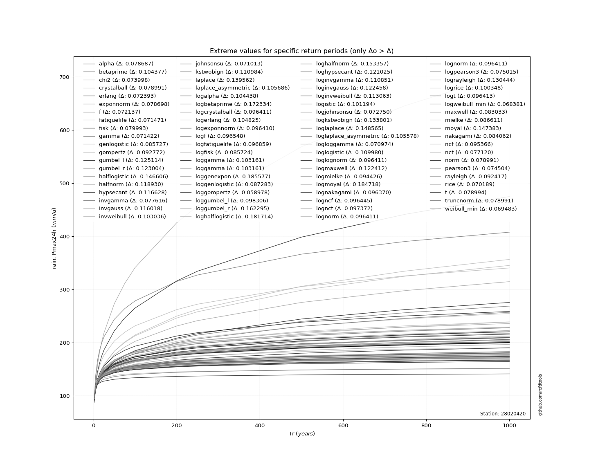</img>

</div>


<div align="center">

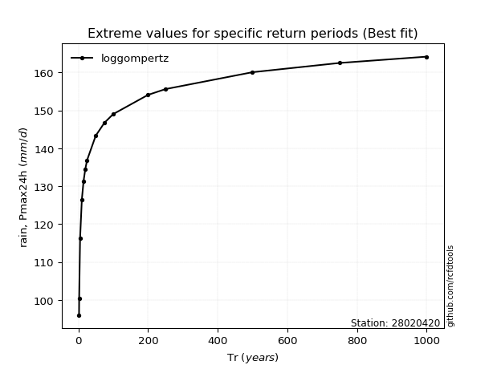</img>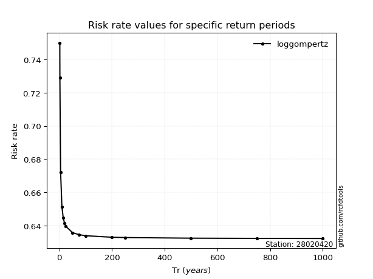</img>

</div>


<sub>**APP DISCLAIMER**: NO WARRANTY - This software is provided by [github.com/rcfdtools](https://github.com/rcfdtools) "as is", without any express or implied warranty, including warranties of merchantability, fitness for a particular purpose, or non-infringement. There is no guarantee that the software will be error-free or operate without interruption. LIMITATION OF LIABILITY - Neither the authors nor copyright holders will be liable for claims or damages arising from the software or its use. You are responsible for determining if the software is appropriate for your use and assume all associated risks, including errors, legal compliance, and data loss. NO PROFESSIONAL ADVICE - The software provides general information and does not offer professional advice. It should not replace consultation with professional advisors.</sub>