<div align="center">


</div>

# PMP Station (Rain, Pmax24h): 28020440

Probable Maximum Precipitation (PMP) is the greatest amount of rainfall for a specific duration that is meteorologically possible for a given location, acting as a "worst-case" scenario for extreme storms, crucial for designing safety-critical infrastructure like bridges, river deviations, dams, spillways, and nuclear plants to prevent catastrophic failure. PMP is calculated by hydrologists using meteorological data to determine the upper limit of extreme rainfall, often leading to the Probable Maximum Flood (PMF) for flood control design, and is increasingly being studied for climate change impacts. Probable Maximum Precipitation (PMP) is the theoretical upper limit of rainfall, a deterministic estimate for extreme events, while probability distributions (like GEV, Gumbel) describe the likelihood and frequency of various precipitation amounts, including rare ones, showing how often events occur, with PMP representing the extreme end of these distributions, used for critical infrastructure design to ensure safety against the worst conceivable weather, unlike standard statistical forecasts which cover typical probabilities.

The most common probability distributions in hydrology, used for analyzing floods, rainfall, and streamflow, include the Normal, Log-Normal, Gumbel, Gamma (including Log-Pearson Type III), and Generalized Extreme Value (GEV) distributions, often chosen based on the data´s skewness and whether modeling extremes or general conditions, with Gumbel and GEV popular for extreme events like floods, while the Normal distribution serves as a baseline, though often requiring transformations for skewed hydrological data. These distributions help in designing water infrastructure, managing water resources, and forecasting hydrologic events.

> Hydrological data often isn´t perfectly normal (it´s skewed), so different distributions are needed for different applications, such as: **Flood Frequency Analysis**: Using Gumbel, GEV, or Log-Pearson Type III for predicting extreme flood magnitudes and their return periods, **Rainfall Analysis**: Normal for annual totals, but Log-Normal, Weibull, or GEV for intensity or extreme daily rainfall, **Streamflow Modeling**: Gamma and Log-Normal for maximum flows, GEV for minimum flows, and Kappa for daily flows.

<div align="center">

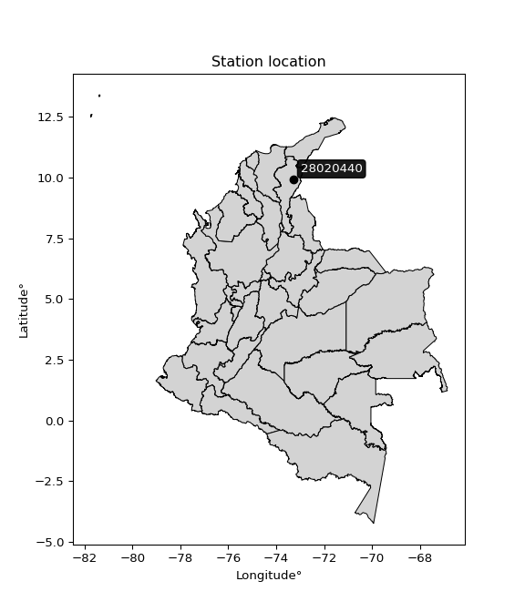</img>

</div>


## A. General information


### 1. General running parameters

• app_version: _v20260103_. • runtime: _2026-01-06 18:56:15.422800_. • Python version: _3.14.0_. • SciPy version: _1.16.3_. • Pandas version: _2.3.3_. • NumPy version: _2.3.5_. • Stations dataset (station_dataset_file): _dataset/pmax24h_in/conventional_cesarcolombia_1959_2022.csv_. • Stations catalog (station_catalog_file): _dataset/CNE.xls_. • Minimum year to eval til year_max (date_min): _1900_. • Maximum year to eval since year_min (date_max): _2024_. • Creates, save and include plots into reports (create_plot): _True_. • Plot only fit distributions with Δo > Δ (plot_only_fit): _True_. • Plot only simple graphs avoiding multiple CDFs and multiple Extreme values plots (plot_only_simple): _False_. • Eval low extreme values, if False, evaluates high extreme values (low_extreme): _False_. • Eval every SciPy distribution as logarithmic (pdist_logarithmic_on): _True_. • Standard deviation normalized (ddof): _1.0_. • Return periods to eval in years (Tr): _[2, 2.33, 5, 10, 15, 20, 25, 50, 75, 100, 200, 250, 500, 750, 1000]_. • Minimum data sample per station, 0 means any (minimum_sample): _5_. • Z-Score maximum threshold to adjust a value, 0 means disable (zscore_max): _3.5_. • Z-Score minimum threshold to adjust a value, 0 means disable (zscore_min): _-2.5_. • Avoid zeros, e.g. rain = 0 (avoid_zeros): _True_. • Avoid null values (avoid_nans): _True_. 

:file_folder:File: [Dataset values](../../dataset/pmax24h_in/conventional_cesarcolombia_1959_2022.csv)

> Delta Degrees of Freedom (DDOF): is a parameter used in the formulas for calculating variance and standard deviation. When ddof=0, the divisor is $N$ (the total number of observations) and this is used when your data set is the entire population. When ddof=1, the divisor is $N-1$ and this is used when your data set is a sample drawn from a larger population. Using $N-1$ provides an unbiased estimate of the population variance (known as Bessel´s correction).


### 2. Station info and location

|   id |   CODIGO | NOMBRE                           | CATEGORIA     | TECNOLOGIA   | ESTADO   | FECHA_INSTALACION   |   FECHA_SUSPENSION |   ALTITUD |   LATITUD |   LONGITUD | DEPARTAMENTO   | MUNICIPIO       | AREA_OPERATIVA                                         | ENTIDAD                                                     | AREA_HIDROGRAFICA   | ZONA_HIDROGRAFICA   | SUBZONA_HIDROGRAFICA   |   CORRIENTE | Catalogo   |   Version |
|-----:|---------:|:---------------------------------|:--------------|:-------------|:---------|:--------------------|-------------------:|----------:|----------:|-----------:|:---------------|:----------------|:-------------------------------------------------------|:------------------------------------------------------------|:--------------------|:--------------------|:-----------------------|------------:|:-----------|----------:|
|    0 | 28020440 | SANTA TERESA HACIENDA [28020440] | Pluviométrica | Convencional | Activa   | 15/04/1959          |                nan |        80 |   9.91703 |   -73.2861 | Cesar          | Agustín Codazzi | Area Operativa 05 - Magdalena-Cesar-Guajira-San Andrés | INSTITUTO DE HIDROLOGIA METEOROLOGIA Y ESTUDIOS AMBIENTALES | Magdalena Cauca     | Cesar               | Medio Cesar            |         nan | CNE_IDEAM  |  20251226 |

<div align="center">

Dynamic map: [:earth_americas:Google](http://maps.google.com/maps?q=9.917027778,-73.28613889) [:earth_americas:OSM](https://www.openstreetmap.org/#map=18/9.917027778/-73.28613889&layers=P) [:earth_americas:Bing](https://www.bing.com/maps?cp=9.917027778~-73.28613889&lvl=18) [:earth_americas:Apple](https://maps.apple.com/frame?center=9.917027778%2C-73.28613889&span=0.003%2C0.006)

</div>


<div align="center">

```geojson
{
  "type": "Feature",
  "geometry": {
    "type": "Point", 
    "coordinates": [-73.28613889, 9.917027778]
  }, 
  "properties": {
    "Name": "28020440"
  }
}
```

</div>


### 3. Discrete values table and plot

<div align="center">

|               |          0 |            1 |          2 |           3 |          4 |           5 |           6 |           7 |           8 |          9 |          10 |         11 |         12 |         13 |           14 |          15 |          16 |          17 |         18 |         19 |          20 |          21 |           22 |           23 |          24 |          25 |         26 |         27 |          28 |          29 |         30 |          31 |          32 |         33 |           34 |          35 |         36 |          37 |          38 |          39 |         40 |        41 |         42 |          43 |         44 |          45 |         46 |        47 |         48 |         49 |          50 |          51 |         52 |          53 |          54 |        55 |          56 |          57 |          58 |          59 |          60 |
|:--------------|-----------:|-------------:|-----------:|------------:|-----------:|------------:|------------:|------------:|------------:|-----------:|------------:|-----------:|-----------:|-----------:|-------------:|------------:|------------:|------------:|-----------:|-----------:|------------:|------------:|-------------:|-------------:|------------:|------------:|-----------:|-----------:|------------:|------------:|-----------:|------------:|------------:|-----------:|-------------:|------------:|-----------:|------------:|------------:|------------:|-----------:|----------:|-----------:|------------:|-----------:|------------:|-----------:|----------:|-----------:|-----------:|------------:|------------:|-----------:|------------:|------------:|----------:|------------:|------------:|------------:|------------:|------------:|
| Date          | 1959       | 1960         | 1961       | 1963        | 1964       | 1965        | 1967        | 1968        | 1969        | 1970       | 1971        | 1972       | 1973       | 1974       | 1975         | 1976        | 1977        | 1978        | 1979       | 1980       | 1981        | 1982        | 1983         | 1984         | 1985        | 1986        | 1987       | 1988       | 1989        | 1990        | 1991       | 1992        | 1993        | 1994       | 1995         | 1996        | 1997       | 1998        | 1999        | 2000        | 2001       | 2002      | 2003       | 2004        | 2005       | 2006        | 2007       | 2008      | 2009       | 2010       | 2011        | 2012        | 2013       | 2014        | 2015        | 2016      | 2017        | 2018        | 2019        | 2020        | 2021        |
| Value         |  135       |  100         |   52       |   85        |   73       |  117        |   79        |   95        |   97        |  133       |  103        |  136       |  134       |   76       |  100         |   84        |   86        |   93        |  105       |  126       |  106        |   84        |  100.5       |   97.6       |  118.6      |  114        |  123.2     |  134       |   83.7      |   86.4      |   74.5     |   80.5      |   86.5      |   65       |   98         |  118        |   75       |   94        |  102        |   94        |   82       |   87      |   96       |   81        |   62       |   92        |  143       |   87      |   82       |  148       |   92        |  108        |  145       |   85        |   78        |  151      |  101        |   80        |  108        |  101        |  102        |
| Value_initial |  135       |  100         |   52       |   85        |   73       |  117        |   79        |   95        |   97        |  133       |  103        |  136       |  134       |   76       |  100         |   84        |   86        |   93        |  105       |  126       |  106        |   84        |  100.5       |   97.6       |  118.6      |  114        |  123.2     |  134       |   83.7      |   86.4      |   74.5     |   80.5      |   86.5      |   65       |   98         |  118        |   75       |   94        |  102        |   94        |   82       |   87      |   96       |   81        |   62       |   92        |  143       |   87      |   82       |  148       |   92        |  108        |  145       |   85        |   78        |  151      |  101        |   80        |  108        |  101        |  102        |
| count         |   61       |   61         |   61       |   61        |   61       |   61        |   61        |   61        |   61        |   61       |   61        |   61       |   61       |   61       |   61         |   61        |   61        |   61        |   61       |   61       |   61        |   61        |   61         |   61         |   61        |   61        |   61       |   61       |   61        |   61        |   61       |   61        |   61        |   61       |   61         |   61        |   61       |   61        |   61        |   61        |   61       |   61      |   61       |   61        |   61       |   61        |   61       |   61      |   61       |   61       |   61        |   61        |   61       |   61        |   61        |   61      |   61        |   61        |   61        |   61        |   61        |
| mean          |   99.2705  |   99.2705    |   99.2705  |   99.2705   |   99.2705  |   99.2705   |   99.2705   |   99.2705   |   99.2705   |   99.2705  |   99.2705   |   99.2705  |   99.2705  |   99.2705  |   99.2705    |   99.2705   |   99.2705   |   99.2705   |   99.2705  |   99.2705  |   99.2705   |   99.2705   |   99.2705    |   99.2705    |   99.2705   |   99.2705   |   99.2705  |   99.2705  |   99.2705   |   99.2705   |   99.2705  |   99.2705   |   99.2705   |   99.2705  |   99.2705    |   99.2705   |   99.2705  |   99.2705   |   99.2705   |   99.2705   |   99.2705  |   99.2705 |   99.2705  |   99.2705   |   99.2705  |   99.2705   |   99.2705  |   99.2705 |   99.2705  |   99.2705  |   99.2705   |   99.2705   |   99.2705  |   99.2705   |   99.2705   |   99.2705 |   99.2705   |   99.2705   |   99.2705   |   99.2705   |   99.2705   |
| std           |   22.3425  |   22.3425    |   22.3425  |   22.3425   |   22.3425  |   22.3425   |   22.3425   |   22.3425   |   22.3425   |   22.3425  |   22.3425   |   22.3425  |   22.3425  |   22.3425  |   22.3425    |   22.3425   |   22.3425   |   22.3425   |   22.3425  |   22.3425  |   22.3425   |   22.3425   |   22.3425    |   22.3425    |   22.3425   |   22.3425   |   22.3425  |   22.3425  |   22.3425   |   22.3425   |   22.3425  |   22.3425   |   22.3425   |   22.3425  |   22.3425    |   22.3425   |   22.3425  |   22.3425   |   22.3425   |   22.3425   |   22.3425  |   22.3425 |   22.3425  |   22.3425   |   22.3425  |   22.3425   |   22.3425  |   22.3425 |   22.3425  |   22.3425  |   22.3425   |   22.3425   |   22.3425  |   22.3425   |   22.3425   |   22.3425 |   22.3425   |   22.3425   |   22.3425   |   22.3425   |   22.3425   |
| zscore        |    1.59917 |    0.0326512 |   -2.11572 |   -0.638716 |   -1.17581 |    0.793534 |   -0.907263 |   -0.191138 |   -0.101622 |    1.50966 |    0.166925 |    1.64393 |    1.55442 |   -1.04154 |    0.0326512 |   -0.683474 |   -0.593958 |   -0.280654 |    0.25644 |    1.19635 |    0.301198 |   -0.683474 |    0.0550301 |   -0.0747676 |    0.865147 |    0.659261 |    1.07103 |    1.55442 |   -0.696901 |   -0.576055 |   -1.10867 |   -0.840126 |   -0.571579 |   -1.53387 |   -0.0568644 |    0.838292 |   -1.08629 |   -0.235896 |    0.122167 |   -0.235896 |   -0.77299 |   -0.5492 |   -0.14638 |   -0.817747 |   -1.66815 |   -0.325411 |    1.95724 |   -0.5492 |   -0.77299 |    2.18103 |   -0.325411 |    0.390714 |    2.04675 |   -0.638716 |   -0.952021 |    2.3153 |    0.077409 |   -0.862505 |    0.390714 |    0.077409 |    0.122167 |


</div>


<div align="center">

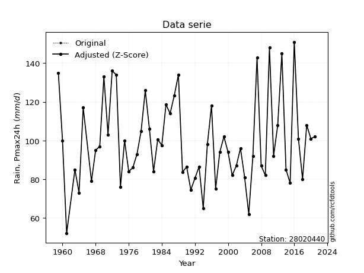</img>

</div>


> The initial value (value_initial) correspond to the initial obtained or null completed value, and value (value) is adjusted only when the initial value is outside the valid range (outlier) definite through the Z-Score value. If Z-Score is active, values out of range or outliers are replaced with the station mean value. A Z-Score (or standard score) measures how many standard deviations a data point is from the mean of a dataset, indicating its relative position; positive scores mean above the mean, negative mean below, and a score of zero is exactly at the mean, allowing for comparison of values from different distributions. It´s calculated using the formula $z=(x–μ)/σ$, where $x$ is the data point, $μ$ is the mean, and $σ$ is the standard deviation, helping identify outliers and understand probability.
>
> <sub>**Note**: In this study, "completing" (filling gaps in) and "extending" (forecasting or lengthening the historical record) rainfall data series are avoided for certain critical analyses because they introduce artificial bias and uncertainty, which can distort the statistics of rare events (extremes), alter day-to-day variability, and compromise the integrity and homogeneity of the original data. Some reasons against Completing/Extending rainfall data are: **Distortion of Extremes and Variability**: The primary issue is that most gap-filling or extension methods rely on averaging or regression with nearby stations, which inherently smooths the data. Rainfall is highly variable in space and time, with a large percentage of zero values and occasional large storms. Infilling methods often underestimate the highest values and overestimate the lowest (zero) values, which severely distorts analyses focused on flood frequency, drought severity, and intensity-duration-frequency (IDF) curves, **Loss of Data Homogeneity**: Infilled or extended data are synthetic estimates, not actual measurements. Combining these estimates with observed data can violate the assumption of data homogeneity, which requires that the data properties do not change over time. Inhomogeneity can lead to incorrect conclusions about long-term trends or changes in climate patterns, **Propagation of Errors**: Errors and biases from the original data (e.g., wind-induced undercatch, instrument errors, site changes) or the data used for imputation can propagate through the analysis, leading to unreliable hydrological models and inaccurate predictions, **Compromised Statistical Integrity**: For statistical analyses, especially those involving the frequency of events, using artificial data can introduce time bias or autocorrelation that doesn´t exist in reality, making it difficult to assess the true probability of events, **Difficulty in Validation**: It is difficult to accurately validate the quality of filled or extended data, especially for past periods where ground-truth measurements are unavailable. The reliability of imputation techniques heavily depends on the density of the surrounding station network and the complexity of the local topography.</sub>


### 4. Active continuous probability distributions from SciPy (44 of 104 available)

A Probability Density Function (PDF) describes the relative likelihood of a continuous random variable falling within a specific range, where the total area under its curve equals 1, and the area over any interval gives the actual probability for that range. Unlike discrete probabilities (like rolling a die), a PDF shows density, not direct probability for a single point (which is zero), with higher points indicating higher likelihood, often visualized as a bell curve for normal distributions.

A log of a probability density function (log-PDF) is simply the logarithm of the PDF´s value, denoted as $log(f(x))$, useful for converting multiplication of probabilities into addition, improving numerical stability with tiny numbers, and connecting to information theory concepts like entropy. Instead of dealing with very small probabilities (e.g., 0.000001), log-PDFs use negative numbers (e.g., $log(0.00001) ≈ -11.51$ that are easier for computers to handle, preventing underflow errors and simplifying complex calculations. In this study, each active probability distribution from SciPy is also evaluated in the $log$ form.

[scipy.stats](https://docs.scipy.org/doc/scipy/reference/stats.html) is a Python´s powerful submodule within the SciPy library for comprehensive statistical analysis, offering over 130 probability distributions (like Normal, Poisson), functions for descriptive stats (mean, variance), hypothesis testing (t-tests, chi-square), random variable generation, and statistical tests, making it essential for data science, modeling, and research. It provides tools to explore, model, and draw conclusions from data efficiently, working seamlessly with NumPy.

<div align="center">

|   id | p_dist             |   n_parameter | fit_method   | label                                                                       | active   | ref                                                                                                        |
|-----:|:-------------------|--------------:|:-------------|:----------------------------------------------------------------------------|:---------|:-----------------------------------------------------------------------------------------------------------|
|    0 | alpha              |             3 | MLE          | Alpha                                                                       | True     | [:mortar_board:](https://docs.scipy.org/doc/scipy/reference/generated/scipy.stats.alpha.html)              |
|    1 | betaprime          |             4 | MLE          | Beta prime                                                                  | True     | [:mortar_board:](https://docs.scipy.org/doc/scipy/reference/generated/scipy.stats.betaprime.html)          |
|    2 | chi2               |             3 | MLE          | Chi²                                                                        | True     | [:mortar_board:](https://docs.scipy.org/doc/scipy/reference/generated/scipy.stats.chi2.html)               |
|    3 | crystalball        |             4 | MLE          | Crystalball                                                                 | True     | [:mortar_board:](https://docs.scipy.org/doc/scipy/reference/generated/scipy.stats.crystalball.html)        |
|    4 | erlang             |             3 | MLE          | Erlang                                                                      | True     | [:mortar_board:](https://docs.scipy.org/doc/scipy/reference/generated/scipy.stats.erlang.html)             |
|    5 | expon              |             2 | MLE          | Exponential                                                                 | True     | [:mortar_board:](https://docs.scipy.org/doc/scipy/reference/generated/scipy.stats.expon.html)              |
|    6 | exponnorm          |             3 | MLE          | Exponentially modified Normal                                               | True     | [:mortar_board:](https://docs.scipy.org/doc/scipy/reference/generated/scipy.stats.exponnorm.html)          |
|    7 | f                  |             4 | MLE          | F                                                                           | True     | [:mortar_board:](https://docs.scipy.org/doc/scipy/reference/generated/scipy.stats.f.html)                  |
|    8 | fatiguelife        |             3 | MLE          | Fatigue-life (Birnbaum-Saunders)                                            | True     | [:mortar_board:](https://docs.scipy.org/doc/scipy/reference/generated/scipy.stats.fatiguelife.html)        |
|    9 | fisk               |             3 | MLE          | Fisk                                                                        | True     | [:mortar_board:](https://docs.scipy.org/doc/scipy/reference/generated/scipy.stats.fisk.html)               |
|   10 | gamma              |             3 | MLE          | Gamma                                                                       | True     | [:mortar_board:](https://docs.scipy.org/doc/scipy/reference/generated/scipy.stats.gamma.html)              |
|   11 | genexpon           |             5 | MLE          | Generalized exponential                                                     | True     | [:mortar_board:](https://docs.scipy.org/doc/scipy/reference/generated/scipy.stats.genexpon.html)           |
|   12 | genlogistic        |             3 | MLE          | Generalized logistic                                                        | True     | [:mortar_board:](https://docs.scipy.org/doc/scipy/reference/generated/scipy.stats.genlogistic.html)        |
|   13 | gibrat             |             2 | MM           | Gibrat                                                                      | True     | [:mortar_board:](https://docs.scipy.org/doc/scipy/reference/generated/scipy.stats.gibrat.html)             |
|   14 | gompertz           |             3 | MLE          | Gompertz (or truncated Gumbel)                                              | True     | [:mortar_board:](https://docs.scipy.org/doc/scipy/reference/generated/scipy.stats.gompertz.html)           |
|   15 | gumbel_l           |             2 | MM           | Gumbel Left Skew                                                            | True     | [:mortar_board:](https://docs.scipy.org/doc/scipy/reference/generated/scipy.stats.gumbel_l.html)           |
|   16 | gumbel_r           |             2 | MM           | Gumbel Right Skew                                                           | True     | [:mortar_board:](https://docs.scipy.org/doc/scipy/reference/generated/scipy.stats.gumbel_r.html)           |
|   17 | halflogistic       |             2 | MM           | Half-logistic                                                               | True     | [:mortar_board:](https://docs.scipy.org/doc/scipy/reference/generated/scipy.stats.halflogistic.html)       |
|   18 | halfnorm           |             2 | MM           | Half Normal                                                                 | True     | [:mortar_board:](https://docs.scipy.org/doc/scipy/reference/generated/scipy.stats.halfnorm.html)           |
|   19 | hypsecant          |             2 | MM           | hyperbolic secant                                                           | True     | [:mortar_board:](https://docs.scipy.org/doc/scipy/reference/generated/scipy.stats.hypsecant.html)          |
|   20 | invgamma           |             3 | MLE          | Inverted gamma                                                              | True     | [:mortar_board:](https://docs.scipy.org/doc/scipy/reference/generated/scipy.stats.invgamma.html)           |
|   21 | invgauss           |             3 | MLE          | Inverse Gaussian                                                            | True     | [:mortar_board:](https://docs.scipy.org/doc/scipy/reference/generated/scipy.stats.invgauss.html)           |
|   22 | invweibull         |             3 | MLE          | Inverted Weibull                                                            | True     | [:mortar_board:](https://docs.scipy.org/doc/scipy/reference/generated/scipy.stats.invweibull.html)         |
|   23 | johnsonsu          |             4 | MLE          | Johnson Su                                                                  | True     | [:mortar_board:](https://docs.scipy.org/doc/scipy/reference/generated/scipy.stats.johnsonsu.html)          |
|   24 | kstwobign          |             2 | MLE          | Limiting distribution of scaled Kolmogorov-Smirnov two-sided test statistic | True     | [:mortar_board:](https://docs.scipy.org/doc/scipy/reference/generated/scipy.stats.kstwobign.html)          |
|   25 | laplace            |             2 | MM           | Laplace                                                                     | True     | [:mortar_board:](https://docs.scipy.org/doc/scipy/reference/generated/scipy.stats.laplace.html)            |
|   26 | laplace_asymmetric |             3 | MLE          | Asymmetric Laplace                                                          | True     | [:mortar_board:](https://docs.scipy.org/doc/scipy/reference/generated/scipy.stats.laplace_asymmetric.html) |
|   27 | loggamma           |             3 | MLE          | Log gamma                                                                   | True     | [:mortar_board:](https://docs.scipy.org/doc/scipy/reference/generated/scipy.stats.loggamma.html)           |
|   28 | logistic           |             2 | MM           | Logistic (or Sech-squared)                                                  | True     | [:mortar_board:](https://docs.scipy.org/doc/scipy/reference/generated/scipy.stats.logistic.html)           |
|   29 | lognorm            |             3 | MLE          | Log Normal                                                                  | True     | [:mortar_board:](https://docs.scipy.org/doc/scipy/reference/generated/scipy.stats.lognorm.html)            |
|   30 | maxwell            |             2 | MM           | Maxwell                                                                     | True     | [:mortar_board:](https://docs.scipy.org/doc/scipy/reference/generated/scipy.stats.maxwell.html)            |
|   31 | mielke             |             4 | MLE          | Mielke Beta-Kappa / Dagum                                                   | True     | [:mortar_board:](https://docs.scipy.org/doc/scipy/reference/generated/scipy.stats.mielke.html)             |
|   32 | moyal              |             2 | MM           | Moyal                                                                       | True     | [:mortar_board:](https://docs.scipy.org/doc/scipy/reference/generated/scipy.stats.moyal.html)              |
|   33 | nakagami           |             3 | MLE          | Nakagami                                                                    | True     | [:mortar_board:](https://docs.scipy.org/doc/scipy/reference/generated/scipy.stats.nakagami.html)           |
|   34 | ncf                |             5 | MLE          | Non-central F distribution                                                  | True     | [:mortar_board:](https://docs.scipy.org/doc/scipy/reference/generated/scipy.stats.ncf.html)                |
|   35 | nct                |             4 | MLE          | Non-central Student’s t                                                     | True     | [:mortar_board:](https://docs.scipy.org/doc/scipy/reference/generated/scipy.stats.nct.html)                |
|   36 | norm               |             2 | MM           | Normal                                                                      | True     | [:mortar_board:](https://docs.scipy.org/doc/scipy/reference/generated/scipy.stats.norm.html)               |
|   37 | pearson3           |             3 | MM           | Pearson type III                                                            | True     | [:mortar_board:](https://docs.scipy.org/doc/scipy/reference/generated/scipy.stats.pearson3.html)           |
|   38 | rayleigh           |             2 | MM           | Rayleigh                                                                    | True     | [:mortar_board:](https://docs.scipy.org/doc/scipy/reference/generated/scipy.stats.rayleigh.html)           |
|   39 | rice               |             3 | MLE          | Rice                                                                        | True     | [:mortar_board:](https://docs.scipy.org/doc/scipy/reference/generated/scipy.stats.rice.html)               |
|   40 | t                  |             3 | MLE          | Student’s t                                                                 | True     | [:mortar_board:](https://docs.scipy.org/doc/scipy/reference/generated/scipy.stats.t.html)                  |
|   41 | truncnorm          |             4 | MLE          | Truncated normal                                                            | True     | [:mortar_board:](https://docs.scipy.org/doc/scipy/reference/generated/scipy.stats.truncnorm.html)          |
|   42 | wald               |             2 | MM           | Wald                                                                        | True     | [:mortar_board:](https://docs.scipy.org/doc/scipy/reference/generated/scipy.stats.wald.html)               |
|   43 | weibull_min        |             3 | MLE          | Weibull minimum                                                             | True     | [:mortar_board:](https://docs.scipy.org/doc/scipy/reference/generated/scipy.stats.weibull_min.html)        |

</div>

> **n_parameter:** # arguments & localization & scale.
>
> **Fit methods:** (MLE) maximum likelihood, (MM) L-moments.
>
>**Inactive** (With the only purpose of prevent loops, zero divisions, infinite values, over high estimated values or horizontal trending for recurrence intervals estimations, the follow distributions were disabled.)**:** foldnorm, gennorm, norminvgauss, powernorm, powerlognorm, skewnorm, genextreme, anglit, arcsine, argus, beta, bradford, burr, burr12, cauchy, cosine, halfcauchy, foldcauchy, skewcauchy, wrapcauchy, dgamma, gengamma, exponweib, exponpow, truncexpon, gausshyper, genhalflogistic, genhyperbolic, geninvgauss, halfgennorm, johnsonsb, kappa4, kappa3, ksone, kstwo, loglaplace, levy, levy_l, levy_stable, ncx2, pareto, genpareto, truncpareto, lomax, powerlaw, rdist, rel_breitwigner, recipinvgauss, semicircular, studentized_range, trapezoid, triang, truncweibull_min, tukeylambda, uniform, loguniform, vonmises, vonmises_line, weibull_max, dweibull, 


## B. Probability (PDF) vs. Empirical (EDF) distributions functions

A continuous probability distribution (CPD) describes probabilities for variables that can take any value within a range (like rain any time), unlike discrete variables with specific outcomes (like temperature). It uses a Probability Density Function (PDF), a curve where the total area under it equals 1, and the probability of the variable falling within an interval (a to b) is found by calculating the area under the curve between those points. A key feature is that the probability of hitting any single exact value is zero, so probabilities are always expressed for ranges, e.g., $P(a ≤ X ≤ b)$.

<div align="center">

Distributions parameters from station values
|    |   station | p_dist                |   n |               loc |            scale | shape                  | shape1               | shape2                 | shape3   |
|---:|----------:|:----------------------|----:|------------------:|-----------------:|:-----------------------|:---------------------|:-----------------------|:---------|
|  0 |  28020440 | alpha                 |  61 |     -93.4314      |   1710.36        | 8.98945402074702       |                      |                        |          |
|  1 |  28020440 | betaprime             |  61 |      -0.397387    |     32.0036      | 83.47049792309124      | 27.801426912033875   |                        |          |
|  2 |  28020440 | chi2                  |  61 |      24.717       |      3.27415     | 22.770324074345524     |                      |                        |          |
|  3 |  28020440 | crystalball           |  61 |      99.2705      |     22.1586      | 8468.983704263603      | 304.2571128995812    |                        |          |
|  4 |  28020440 | erlang                |  61 |      24.7171      |      6.54831     | 11.385142444734683     |                      |                        |          |
|  5 |  28020440 | expon                 |  61 |      52           |     47.2705      |                        |                      |                        |          |
|  6 |  28020440 | exponnorm             |  61 |      79.5686      |     12.5252      | 1.5729672691803702     |                      |                        |          |
|  7 |  28020440 | f                     |  61 |     -14.4951      |    110.776       | 199.16413230555352     | 75.54038174002073    |                        |          |
|  8 |  28020440 | fatiguelife           |  61 |      -3.67922     |    100.642       | 0.21412935217711035    |                      |                        |          |
|  9 |  28020440 | fisk                  |  61 |      -0.587366    |     96.9276      | 8.000657970496402      |                      |                        |          |
| 10 |  28020440 | gamma                 |  61 |      24.717       |      6.5483      | 11.38516205589498      |                      |                        |          |
| 11 |  28020440 | genexpon              |  61 |      52           |     22.7648      | 2.5089249223059733     | 0.044960488929081305 | 1.2999548487386906e-06 |          |
| 12 |  28020440 | genlogistic           |  61 |      66.6482      |     16.3661      | 4.595264510076962      |                      |                        |          |
| 13 |  28020440 | gibrat                |  61 |      82.3663      |     10.2529      |                        |                      |                        |          |
| 14 |  28020440 | gompertz              |  61 |      55.2269      |      4.16734     | 3.183373106110165e-09  |                      |                        |          |
| 15 |  28020440 | gumbel_l              |  61 |     109.243       |     17.277       |                        |                      |                        |          |
| 16 |  28020440 | gumbel_r              |  61 |      89.298       |     17.277       |                        |                      |                        |          |
| 17 |  28020440 | halflogistic          |  61 |      73.0074      |     18.9448      |                        |                      |                        |          |
| 18 |  28020440 | halfnorm              |  61 |      69.9412      |     36.7588      |                        |                      |                        |          |
| 19 |  28020440 | hypsecant             |  61 |      99.2705      |     14.1066      |                        |                      |                        |          |
| 20 |  28020440 | invgamma              |  61 |     -31.5134      |   4650.26        | 36.55604161712315      |                      |                        |          |
| 21 |  28020440 | invgauss              |  61 |       3.17414     |   1757.79        | 0.054605355800985245   |                      |                        |          |
| 22 |  28020440 | invweibull            |  61 |      -1.87124e+09 |      1.87124e+09 | 98977453.45622927      |                      |                        |          |
| 23 |  28020440 | johnsonsu             |  61 |      70.1762      |     31.5819      | -1.5375178597819525    | 2.053454528477526    |                        |          |
| 24 |  28020440 | kstwobign             |  61 |      18.3239      |     93.3341      |                        |                      |                        |          |
| 25 |  28020440 | laplace               |  61 |      99.2705      |     15.6685      |                        |                      |                        |          |
| 26 |  28020440 | laplace_asymmetric    |  61 |      84           |     14.1916      | 0.5978151405567034     |                      |                        |          |
| 27 |  28020440 | loggamma              |  61 |   -7244.91        |    974.951       | 1868.8303373576832     |                      |                        |          |
| 28 |  28020440 | logistic              |  61 |      99.2705      |     12.2167      |                        |                      |                        |          |
| 29 |  28020440 | lognorm               |  61 |      -1.75065     |     98.6665      | 0.2171892299276994     |                      |                        |          |
| 30 |  28020440 | maxwell               |  61 |      46.764       |     32.9036      |                        |                      |                        |          |
| 31 |  28020440 | mielke                |  61 |      -0.0934026   |     89.8393      | 10.311050694461905     | 7.182929536594965    |                        |          |
| 32 |  28020440 | moyal                 |  61 |      86.5988      |      9.97486     |                        |                      |                        |          |
| 33 |  28020440 | nakagami              |  61 |      59.4479      |     45.75        | 0.9987282046915253     |                      |                        |          |
| 34 |  28020440 | ncf                   |  61 |      -0.56558     |     97.3238      | 85.21244971600038      | 82.26826396212584    | 0.07680997845065633    |          |
| 35 |  28020440 | nct                   |  61 |      -0.145604    |     13.2112      | 18.465944228240456     | 7.215476726740121    |                        |          |
| 36 |  28020440 | norm                  |  61 |      99.2705      |     22.1586      |                        |                      |                        |          |
| 37 |  28020440 | pearson3              |  61 |      99.2705      |     22.1586      | 0.5628923021896423     |                      |                        |          |
| 38 |  28020440 | rayleigh              |  61 |      56.8798      |     33.8229      |                        |                      |                        |          |
| 39 |  28020440 | rice                  |  61 |      48.1227      |     25.1184      | 1.7101500965082126     |                      |                        |          |
| 40 |  28020440 | t                     |  61 |      99.2705      |     22.159       | 17422880.954010725     |                      |                        |          |
| 41 |  28020440 | truncnorm             |  61 |      99.2705      |     22.1586      | -941.0115651137196     | 1628.6082011924627   |                        |          |
| 42 |  28020440 | wald                  |  61 |      77.1119      |     22.1586      |                        |                      |                        |          |
| 43 |  28020440 | weibull_min           |  61 |      59.7416      |     45.2666      | 1.957029085608558      |                      |                        |          |
| 44 |  28020440 | logalpha              |  61 |      -2.77163     |    242.669       | 33.07885287379219      |                      |                        |          |
| 45 |  28020440 | logbetaprime          |  61 |      -1.74515     |      4.35421     | 376.9812708629429      | 261.05827260592366   |                        |          |
| 46 |  28020440 | logchi2               |  61 |       3.95124     |      0.973654    | 1.041509833348834      |                      |                        |          |
| 47 |  28020440 | logcrystalball        |  61 |       4.5734      |      0.221212    | 257.2246358217824      | 214.4954450651531    |                        |          |
| 48 |  28020440 | logerlang             |  61 |     -51.0113      |      0.000880435 | 63133.21988845905      |                      |                        |          |
| 49 |  28020440 | logexpon              |  61 |       3.95124     |      0.62216     |                        |                      |                        |          |
| 50 |  28020440 | logexponnorm          |  61 |       4.57297     |      0.221212    | 0.001957148011174772   |                      |                        |          |
| 51 |  28020440 | logf                  |  61 |     -17.7898      |     22.3629      | 22811.58588186046      | 192923.79633122048   |                        |          |
| 52 |  28020440 | logfatiguelife        |  61 |     -20.1724      |     24.7445      | 0.008942849453397433   |                      |                        |          |
| 53 |  28020440 | logfisk               |  61 |       0.772674    |      3.79234     | 30.24499192025423      |                      |                        |          |
| 54 |  28020440 | loggamma              |  61 |     -51.0236      |      0.000880216 | 63162.88047934312      |                      |                        |          |
| 55 |  28020440 | loggenexpon           |  61 |       3.9449      |      0.00554371  | 0.00022711649552813607 | 2.556925624907647    | 5.270608232827752e-05  |          |
| 56 |  28020440 | loggenlogistic        |  61 |       4.49714     |      0.139327    | 1.4342972760181434     |                      |                        |          |
| 57 |  28020440 | loggibrat             |  61 |       4.40468     |      0.102339    |                        |                      |                        |          |
| 58 |  28020440 | loggompertz           |  61 |       3.95124     |      0.967672    | 1.1019605830194146     |                      |                        |          |
| 59 |  28020440 | loggumbel_l           |  61 |       4.67296     |      0.172479    |                        |                      |                        |          |
| 60 |  28020440 | loggumbel_r           |  61 |       4.47385     |      0.172479    |                        |                      |                        |          |
| 61 |  28020440 | loghalflogistic       |  61 |       4.31117     |      0.189159    |                        |                      |                        |          |
| 62 |  28020440 | loghalfnorm           |  61 |       4.28057     |      0.367017    |                        |                      |                        |          |
| 63 |  28020440 | loghypsecant          |  61 |       4.5734      |      0.140828    |                        |                      |                        |          |
| 64 |  28020440 | loginvgamma           |  61 |       0.453105    |   1387.58        | 337.82639660912855     |                      |                        |          |
| 65 |  28020440 | loginvgauss           |  61 |       2.30083     |    226.89        | 0.010003471656314707   |                      |                        |          |
| 66 |  28020440 | loginvweibull         |  61 |      -3.44301e+07 |      3.44301e+07 | 152211872.63208407     |                      |                        |          |
| 67 |  28020440 | logjohnsonsu          |  61 |       8.62751     |     18.6612      | 18.608682241853543     | 86.32719696460185    |                        |          |
| 68 |  28020440 | logkstwobign          |  61 |       3.58185     |      1.1469      |                        |                      |                        |          |
| 69 |  28020440 | loglaplace            |  61 |       4.5734      |      0.156421    |                        |                      |                        |          |
| 70 |  28020440 | loglaplace_asymmetric |  61 |       4.54329     |      0.172615    | 0.9165675983443957     |                      |                        |          |
| 71 |  28020440 | logloggamma           |  61 |     -33.0973      |      5.7763      | 680.1731697517831      |                      |                        |          |
| 72 |  28020440 | loglogistic           |  61 |       4.5734      |      0.121961    |                        |                      |                        |          |
| 73 |  28020440 | loglognorm            |  61 | -145918           | 145923           | 1.5159554257860717e-06 |                      |                        |          |
| 74 |  28020440 | logmaxwell            |  61 |       4.04926     |      0.328456    |                        |                      |                        |          |
| 75 |  28020440 | logmielke             |  61 |   -5779.97        |   5784.49        | 54457.62018760801      | 42475.456266491135   |                        |          |
| 76 |  28020440 | logmoyal              |  61 |       4.4469      |      0.0995807   |                        |                      |                        |          |
| 77 |  28020440 | lognakagami           |  61 |     -13.258       |     17.8327      | 1621.4694766464372     |                      |                        |          |
| 78 |  28020440 | logncf                |  61 |     -22.0474      |     22.8522      | 46695.06955434993      | 73432.52830249489    | 7699.2331447915985     |          |
| 79 |  28020440 | lognct                |  61 |       0.128896    |      0.0549978   | 213.62864630549888     | 80.52236488826318    |                        |          |
| 80 |  28020440 | lognorm               |  61 |       4.5734      |      0.221213    |                        |                      |                        |          |
| 81 |  28020440 | logpearson3           |  61 |       4.5734      |      0.221213    | -0.008136791311722033  |                      |                        |          |
| 82 |  28020440 | lograyleigh           |  61 |       4.15026     |      0.337619    |                        |                      |                        |          |
| 83 |  28020440 | logrice               |  61 |      -8.0531      |      0.221229    | 57.065521429270234     |                      |                        |          |
| 84 |  28020440 | logt                  |  61 |       4.5734      |      0.221179    | 6511.688431200497      |                      |                        |          |
| 85 |  28020440 | logtruncnorm          |  61 |      -0.132484    |      1.54199     | 2.6471763620425026     | 3.339697957215427    |                        |          |
| 86 |  28020440 | logwald               |  61 |       4.35217     |      0.221236    |                        |                      |                        |          |
| 87 |  28020440 | logweibull_min        |  61 |       3.73996     |      0.916339    | 4.166189489908687      |                      |                        |          |

</div>

> **loc** (Location parameter): This shifts the distribution along the x-axis. For many common distributions, like the normal (Gaussian) distribution, loc represents the mean $μ$. For others, like the uniform distribution, it might represent the minimum value, or for the beta distribution, the left end of the support interval.
>
> **scale** (Scale parameter): This determines the width or spread of the distribution. For the normal distribution, scale represents the standard deviation $σ$. For a uniform distribution, it defines the length of the interval (from $loc$ to $loc + scale$).
>
> **shape** (Shape parameters): Refers to parameters that define the specific form of a probability distribution, distinct from its location (loc) and scale (scale). These parameters are required arguments for most distribution functions. For example, a normal (Gaussian) distribution is fully defined by its location (mean) and scale (standard deviation), so it has no specific shape parameters beyond loc and scale. However, other distributions have intrinsic properties that need specification, as Gamma distribution that takes a shape parameter, often named $a$ or $alpha$.


### 0. Cumulative distribution values - CDF (88 evaluated)

Cumulative Distribution Function (CDF), denoted as $F$<sub>$X$</sub>$(x)$, is a function that gives the probability that a random variable $X$ will take a value less than or equal to a specific value, $x$ (i.e., $(P(X≥x)$. It essentially "accumulates" probabilities from a given point up to the far right (positive infinity), providing a complete picture of the distribution´s probabilities for both discrete (like rain) and continuous (like temperature) variables, helping to find probabilities over ranges or above certain values. Each station is evaluated separately ordering the $x$ values ascending, calculating the CDF and PDF values for the activated distributions and their logarithmic forms.

<div align="center">

CDF ordered by x ascending and calculating $log(f(x))$ separately
|   id |   Station |   date |     x |   count |    mean |     std |     zscore |   Value_initial |   station |   m |      alpha |   alpha_pdf |   betaprime |   betaprime_pdf |       chi2 |    chi2_pdf |   crystalball |   crystalball_pdf |     erlang |   erlang_pdf |    expon |   expon_pdf |   exponnorm |   exponnorm_pdf |          f |       f_pdf |   fatiguelife |   fatiguelife_pdf |       fisk |   fisk_pdf |      gamma |   gamma_pdf |    genexpon |   genexpon_pdf |   genlogistic |   genlogistic_pdf |    gibrat |   gibrat_pdf |    gompertz |   gompertz_pdf |   gumbel_l |   gumbel_l_pdf |    gumbel_r |   gumbel_r_pdf |   halflogistic |   halflogistic_pdf |   halfnorm |   halfnorm_pdf |   hypsecant |   hypsecant_pdf |   invgamma |   invgamma_pdf |   invgauss |   invgauss_pdf |   invweibull |   invweibull_pdf |   johnsonsu |   johnsonsu_pdf |   kstwobign |   kstwobign_pdf |   laplace |   laplace_pdf |   laplace_asymmetric |   laplace_asymmetric_pdf |   loggamma |   loggamma_pdf |   logistic |   logistic_pdf |    lognorm |   lognorm_pdf |    maxwell |   maxwell_pdf |     mielke |   mielke_pdf |       moyal |   moyal_pdf |   nakagami |   nakagami_pdf |        ncf |     ncf_pdf |        nct |     nct_pdf |      norm |   norm_pdf |   pearson3 |   pearson3_pdf |   rayleigh |   rayleigh_pdf |       rice |   rice_pdf |         t |      t_pdf |   truncnorm |   truncnorm_pdf |        wald |    wald_pdf |   weibull_min |   weibull_min_pdf |   logalpha |   logalpha_pdf |   logbetaprime |   logbetaprime_pdf |     logchi2 |   logchi2_pdf |   logcrystalball |   logcrystalball_pdf |   logerlang |   logerlang_pdf |   logexpon |   logexpon_pdf |   logexponnorm |   logexponnorm_pdf |      logf |   logf_pdf |   logfatiguelife |   logfatiguelife_pdf |    logfisk |   logfisk_pdf |   loggenexpon |   loggenexpon_pdf |   loggenlogistic |   loggenlogistic_pdf |   loggibrat |   loggibrat_pdf |   loggompertz |   loggompertz_pdf |   loggumbel_l |   loggumbel_l_pdf |   loggumbel_r |   loggumbel_r_pdf |   loghalflogistic |   loghalflogistic_pdf |   loghalfnorm |   loghalfnorm_pdf |   loghypsecant |   loghypsecant_pdf |   loginvgamma |   loginvgamma_pdf |   loginvgauss |   loginvgauss_pdf |   loginvweibull |   loginvweibull_pdf |   logjohnsonsu |   logjohnsonsu_pdf |   logkstwobign |   logkstwobign_pdf |   loglaplace |   loglaplace_pdf |   loglaplace_asymmetric |   loglaplace_asymmetric_pdf |   logloggamma |   logloggamma_pdf |   loglogistic |   loglogistic_pdf |   loglognorm |   loglognorm_pdf |   logmaxwell |   logmaxwell_pdf |   logmielke |   logmielke_pdf |    logmoyal |   logmoyal_pdf |   lognakagami |   lognakagami_pdf |     logncf |   logncf_pdf |      lognct |   lognct_pdf |   logpearson3 |   logpearson3_pdf |   lograyleigh |   lograyleigh_pdf |    logrice |   logrice_pdf |       logt |   logt_pdf |   logtruncnorm |   logtruncnorm_pdf |     logwald |   logwald_pdf |   logweibull_min |   logweibull_min_pdf |
|-----:|----------:|-------:|------:|--------:|--------:|--------:|-----------:|----------------:|----------:|----:|-----------:|------------:|------------:|----------------:|-----------:|------------:|--------------:|------------------:|-----------:|-------------:|---------:|------------:|------------:|----------------:|-----------:|------------:|--------------:|------------------:|-----------:|-----------:|-----------:|------------:|------------:|---------------:|--------------:|------------------:|----------:|-------------:|------------:|---------------:|-----------:|---------------:|------------:|---------------:|---------------:|-------------------:|-----------:|---------------:|------------:|----------------:|-----------:|---------------:|-----------:|---------------:|-------------:|-----------------:|------------:|----------------:|------------:|----------------:|----------:|--------------:|---------------------:|-------------------------:|-----------:|---------------:|-----------:|---------------:|-----------:|--------------:|-----------:|--------------:|-----------:|-------------:|------------:|------------:|-----------:|---------------:|-----------:|------------:|-----------:|------------:|----------:|-----------:|-----------:|---------------:|-----------:|---------------:|-----------:|-----------:|----------:|-----------:|------------:|----------------:|------------:|------------:|--------------:|------------------:|-----------:|---------------:|---------------:|-------------------:|------------:|--------------:|-----------------:|---------------------:|------------:|----------------:|-----------:|---------------:|---------------:|-------------------:|----------:|-----------:|-----------------:|---------------------:|-----------:|--------------:|--------------:|------------------:|-----------------:|---------------------:|------------:|----------------:|--------------:|------------------:|--------------:|------------------:|--------------:|------------------:|------------------:|----------------------:|--------------:|------------------:|---------------:|-------------------:|--------------:|------------------:|--------------:|------------------:|----------------:|--------------------:|---------------:|-------------------:|---------------:|-------------------:|-------------:|-----------------:|------------------------:|----------------------------:|--------------:|------------------:|--------------:|------------------:|-------------:|-----------------:|-------------:|-----------------:|------------:|----------------:|------------:|---------------:|--------------:|------------------:|-----------:|-------------:|------------:|-------------:|--------------:|------------------:|--------------:|------------------:|-----------:|--------------:|-----------:|-----------:|---------------:|-------------------:|------------:|--------------:|-----------------:|---------------------:|
|    0 |  28020440 |   1961 |  52   |      61 | 99.2705 | 22.3425 | -2.11572   |            52   |  28020440 |   1 | 0.00279308 | 0.000693694 |  0.00171294 |     0.000520636 | 0.00254154 | 0.000715452 |     0.0164508 |        0.00184993 | 0.00254153 |  0.000715451 | 0        |  0.0211548  |  0.00256532 |     0.000573603 | 0.00266072 | 0.000687163 |    0.00251526 |       0.000683413 | 0.00744819 | 0.00112473 | 0.00254154 | 0.000715453 | 2.53697e-08 |    0.110211    |    0.00338902 |       0.000675543 | 0         |  0           | 0           |    0           |  0.035743  |    0.0020314   | 0.000173219 |    8.68346e-05 |      0         |         0          |  0         |     0          |   0.022305  |      0.00157988 | 0.00264217 |    0.000682414 | 0.00216427 |    0.000635801 |  0.000900246 |      0.000333935 |  0.00388107 |     0.000649814 | 0.000532386 |     0.000283819 | 0.024476  |    0.00156211 |           0.00605826 |              0.000714084 | 0.00238902 |      0.0339244 |  0.0204453 |     0.00163934 | 0.00245795 |     0.0345492 | 0.00106365 |   0.000606339 | 0.00352556 |   0.00068418 | 1.47061e-08 | 2.43538e-08 | 0          |     0          | 0.00256986 | 0.000676958 | 0.00287348 | 0.000684532 | 0.0164508 | 0.00184993 | 0.00317817 |    0.000819285 |  0         |     0          | 0.00276803 | 0.00143166 | 0.0164526 | 0.00185006 |   0.0164508 |      0.00184993 | 0           | 0           |    0          |        0          | 0.00127571 |      0.0225969 |       0.108528 |           0.408049 | 8.06138e-09 |   9.45306e+06 |       0.00245789 |            0.0345486 |  0.00238968 |       0.0339324 |   0        |       1.6073   |     0.00245796 |          0.0345494 | 0.0022916 |  0.0330747 |       0.00224361 |            0.0326208 | 0.00477408 |     0.0452098 |   0.000348063 |         0.0687613 |       0.00352476 |            0.0355782 | 0           |       0         |   5.02631e-10 |          1.13877  |     0.0151162 |         0.0869753 |   1.02747e-09 |       1.23289e-07 |         0         |              0        |     0         |          0        |      0.0076773 |           0.05451  |    0.00114412 |         0.0211297 |   0.000806965 |          0.016984 |     6.71877e-05 |          0.00285387 |     0.00252672 |          0.0351617 |    5.32371e-05 |          0.0032838 |   0.00936651 |        0.0598801 |               0.0108222 |                   0.0684024 |    0.00284029 |         0.0379357 |    0.00605197 |         0.0493219 |   0.00245791 |        0.0345489 |   0          |         0        |   0.0046465 |       0.0430856 | 2.0414e-33  |    1.4974e-30  |    0.00237121 |         0.0338147 | 0.00227987 |     0.032951 | 0.000943118 |    0.0182104 |    0.00252999 |         0.0351958 |    0          |          0        | 0.00245772 |     0.0345466 | 0.00246198 |  0.0345731 |     0.00389051 |           2.13216  | 0           |   0           |       0.00221258 |            0.0435796 |
|    1 |  28020440 |   2005 |  62   |      61 | 99.2705 | 22.3425 | -1.66815   |            62   |  28020440 |   2 | 0.021979   | 0.00371277  |  0.0192285  |     0.0036428   | 0.0231409  | 0.00397911  |     0.0462854 |        0.00437562 | 0.0231408  |  0.00397912  | 0.19067  |  0.0171213  |  0.0183926  |     0.00314523  | 0.0220692  | 0.00377278  |    0.0223051  |       0.00386187  | 0.0293266  | 0.00363894 | 0.0231409  | 0.00397912  | 0.66783     |    0.0366087   |    0.0205697  |       0.00329512  | 0         |  0           | 1.29876e-08 |    3.8804e-09  |  0.0628666 |    0.0035219   | 0.00778893  |    0.00218879  |      0         |         0          |  0         |     0          |   0.04526   |      0.00319763 | 0.0219643  |    0.00376184  | 0.0219245  |    0.0039498   |  0.016048    |      0.00350757  |  0.019539   |     0.00298793  | 0.0191492   |     0.00450171  | 0.0463358 |    0.00295726 |           0.0196901  |              0.00232087  | 0.0216196  |      0.235047  |  0.0451833 |     0.00353139 | 0.0218282  |     0.235697  | 0.0247708  |   0.00467083  | 0.0201125  |   0.0031201  | 0.000599935 | 0.000380488 | 0.00312754 |     0.00244405 | 0.0219479  | 0.00378247  | 0.0216025  | 0.00362945  | 0.0462854 | 0.00437562 | 0.0249609  |    0.00407798  |  0.011393  |     0.00442476 | 0.0364949  | 0.00540713 | 0.0462887 | 0.00437578 |   0.0462854 |      0.00437562 | 0           | 0           |    0.00282734 |        0.00244658 | 0.0180025  |      0.225742  |       0.196247 |           0.587398 | 0.312605    |   0.871834    |       0.0218279  |            0.235695  |  0.0216237  |       0.235082  |   0.246262 |       1.21149  |     0.0218283  |          0.235698  | 0.0213652 |  0.234698  |       0.0212136  |            0.234221  | 0.0238744  |     0.21012   |   0.0771022   |         0.774671  |       0.0201129  |            0.193461  | 0           |       0         |   0.197207    |          1.09643  |     0.0413518 |         0.234723  |   0.000573033 |       0.0247998   |         0         |              0        |     0         |          0        |      0.0267544 |           0.189755 |    0.0175984  |         0.225522  |   0.0165733   |          0.227476 |     0.0120948   |          0.236068   |     0.0220327  |          0.236328  |    0.0224763   |          0.408709  |   0.0288356  |        0.184346  |               0.0328952 |                   0.207917  |    0.0229853  |         0.239611  |    0.0251087  |         0.200705  |   0.0218281  |        0.235697  |   0.00348491 |         0.132754 |   0.0231478 |       0.206385  | 6.33749e-07 |    8.19032e-05 |    0.0216143  |         0.235518  | 0.0213129  |     0.234357 | 0.0162187   |    0.215204  |    0.022045   |         0.23638   |    0          |          0        | 0.0218269  |     0.235686  | 0.0218325  |  0.235652  |     0.326921   |           1.56602  | 0           |   0           |       0.0272432  |            0.289117  |
|    2 |  28020440 |   1994 |  65   |      61 | 99.2705 | 22.3425 | -1.53387   |            65   |  28020440 |   3 | 0.0354494  | 0.00532061  |  0.0326869  |     0.00538896  | 0.0374745  | 0.00562182  |     0.0609797 |        0.00544449 | 0.0374745  |  0.00562182  | 0.240438 |  0.0160684  |  0.0300368  |     0.00468733  | 0.0357514  | 0.00540034  |    0.0362917  |       0.00551175  | 0.0420915  | 0.00491841 | 0.0374746  | 0.00562182  | 0.761346    |    0.0263022   |    0.0326337  |       0.00481193  | 0         |  0           | 3.00349e-08 |    7.9711e-09  |  0.0743344 |    0.00413848  | 0.0168881   |    0.00398928  |      0         |         0          |  0         |     0          |   0.0559354 |      0.00394482 | 0.0356155  |    0.00539105  | 0.0363007  |    0.00568503  |  0.0294269   |      0.00548801  |  0.030563   |     0.00443363  | 0.0361168   |     0.00686012  | 0.0561139 |    0.00358132 |           0.0280427  |              0.00330538  | 0.0354047  |      0.354301  |  0.0570425 |     0.00440289 | 0.035634   |     0.354483  | 0.041325   |   0.00638808  | 0.0315083  |   0.00454212 | 0.00315185  | 0.0015109   | 0.0146877  |     0.00524534 | 0.0356742  | 0.00541999  | 0.034805   | 0.00522789  | 0.0609796 | 0.00544449 | 0.0395315  |    0.00567819  |  0.0284079 |     0.00689651 | 0.0546689  | 0.00671779 | 0.0609835 | 0.00544465 |   0.0609796 |      0.00544449 | 0           | 0           |    0.0146932  |        0.00542801 | 0.0316146  |      0.35741   |       0.225051 |           0.63123  | 0.350993    |   0.759223    |       0.0356336  |            0.354481  |  0.0354106  |       0.354345  |   0.301388 |       1.12288  |     0.0356341  |          0.354484  | 0.0351544 |  0.354898  |       0.0349884  |            0.354806  | 0.0359952  |     0.308517  |   0.117315    |         0.923459  |       0.0315095  |            0.295256  | 0           |       0         |   0.248585    |          1.07762  |     0.0540267 |         0.304618  |   0.00342807  |       0.112807    |         0         |              0        |     0         |          0        |      0.0374001 |           0.264961 |    0.0312471  |         0.359296  |   0.0305184   |          0.370479 |     0.0278019   |          0.440341   |     0.0358588  |          0.354671  |    0.0477089   |          0.66377   |   0.0390053  |        0.249361  |               0.0443447 |                   0.280284  |    0.0369296  |         0.3562    |    0.036556   |         0.288778  |   0.0356339  |        0.354483  |   0.014079   |         0.327847 |   0.0351245 |       0.306428  | 8.54199e-05 |    0.00700561  |    0.0354307  |         0.355174  | 0.0350849  |     0.354514 | 0.0293659   |    0.348678  |    0.035873   |         0.354698  |    0.00255018 |          0.211126 | 0.0356321  |     0.35447   | 0.0356352  |  0.354402  |     0.397864   |           1.43824  | 0           |   0           |       0.0436454  |            0.409288  |
|    3 |  28020440 |   1964 |  73   |      61 | 99.2705 | 22.3425 | -1.17581   |            73   |  28020440 |   4 | 0.0990115  | 0.0107581   |  0.0984927  |     0.0112304   | 0.102978   | 0.0108725   |     0.117897  |        0.00891564 | 0.102978   |  0.0108725   | 0.358696 |  0.0135667  |  0.0898891  |     0.010664    | 0.0999655  | 0.0108212   |    0.101347   |       0.0108933   | 0.0993822  | 0.00973132 | 0.102978   | 0.0108725   | 0.901177    |    0.0108913   |    0.0926011  |       0.0105087   | 0         |  0           | 2.23327e-07 |    5.43537e-08 |  0.115498  |    0.00628324  | 0.0766481   |    0.0113951   |      0         |         0          |  0.0663168 |     0.0216309  |   0.0980942 |      0.00684425 | 0.0998108  |    0.0108283   | 0.103592   |    0.0112553   |  0.0993254   |      0.0121327   |  0.0878434  |     0.0103285   | 0.117505    |     0.0133029   | 0.0935001 |    0.0059674  |           0.0720013  |              0.00848676  | 0.1003     |      0.797772  |  0.104296  |     0.00764677 | 0.100438   |     0.795884  | 0.111806   |   0.0112188   | 0.0888365  |   0.0102114  | 0.0480254   | 0.0111993   | 0.0842125  |     0.0118759  | 0.100121   | 0.0108553   | 0.0977998  | 0.0107316   | 0.117897  | 0.00891564 | 0.104878   |    0.0107747   |  0.107364  |     0.0125783  | 0.122997   | 0.0103859  | 0.117901  | 0.00891572 |   0.117897  |      0.00891564 | 0           | 0           |    0.0864673  |        0.0121947  | 0.0996826  |      0.851946  |       0.303812 |           0.720946 | 0.42804     |   0.585211    |       0.100438   |            0.795881  |  0.100312   |       0.797833  |   0.420288 |       0.931775 |     0.100439   |          0.795884  | 0.100316  |  0.801881  |       0.100235   |            0.803606  | 0.0933909  |     0.727962  |   0.240948    |         1.17941   |       0.0888396  |            0.745445  | 0           |       0         |   0.370389    |          1.01801  |     0.103146  |         0.566061  |   0.0552583   |       0.927728    |         0         |              0        |     0.0215056 |          2.17318  |      0.084867  |           0.595513 |    0.0998761  |         0.85913   |   0.102138    |          0.898719 |     0.117113    |          1.11036    |     0.10058    |          0.794126  |    0.160196    |          1.23516   |   0.0819204  |        0.523717  |               0.0923546 |                   0.583733  |    0.10138    |         0.787204  |    0.0894838  |         0.668054  |   0.100438   |        0.795885  |   0.0898106  |         1.00035  |   0.0928518 |       0.737248  | 0.028272    |    0.792661    |    0.100492   |         0.799701  | 0.100199   |     0.801478 | 0.0971112   |    0.85669   |    0.100589   |         0.794004  |    0.0826074  |          1.12836  | 0.100435   |     0.795864  | 0.100426   |  0.795756  |     0.548287   |           1.16223  | 0           |   0           |       0.1128     |            0.803599  |
|    4 |  28020440 |   1991 |  74.5 |      61 | 99.2705 | 22.3425 | -1.10867   |            74.5 |  28020440 |   5 | 0.115963   | 0.0118421   |  0.116191   |     0.0123625   | 0.120045   | 0.0118804   |     0.13181   |        0.00963856 | 0.120045   |  0.0118804   | 0.378727 |  0.0131429  |  0.106868   |     0.0119781   | 0.117      | 0.0118886   |    0.118472   |       0.0119365   | 0.114796   | 0.0108275  | 0.120045   | 0.0118805   | 0.916235    |    0.00923178  |    0.109279   |       0.0117305   | 0         |  0           | 3.21462e-07 |    7.79022e-08 |  0.125289  |    0.00677727  | 0.0948996   |    0.0129353   |      0.039372  |         0.0263516  |  0.0986993 |     0.0215397  |   0.108897  |      0.00756986 | 0.116859   |    0.0119001   | 0.121271   |    0.0123119   |  0.118457    |      0.0133659   |  0.104331   |     0.0116596   | 0.138219    |     0.014298    | 0.102894  |    0.00656692 |           0.0859262  |              0.0101281   | 0.117496   |      0.893712  |  0.116336  |     0.00841487 | 0.117592   |     0.891433  | 0.129283   |   0.0120782   | 0.105119   |   0.0115054  | 0.0666635   | 0.0136475   | 0.102818   |     0.0129196  | 0.117206   | 0.0119221   | 0.11473    | 0.0118409   | 0.13181   | 0.00963855 | 0.121779   |    0.0117563   |  0.126893  |     0.013448   | 0.139092   | 0.0110735  | 0.131815  | 0.00963862 |   0.13181   |      0.00963855 | 0           | 0           |    0.105546   |        0.0132298  | 0.118072   |      0.956756  |       0.318604 |           0.733356 | 0.439716    |   0.563191    |       0.117591   |            0.891431  |  0.117509   |       0.893774  |   0.438933 |       0.901805 |     0.117592   |          0.891433  | 0.117601  |  0.898392  |       0.11756    |            0.900488  | 0.109238   |     0.831795  |   0.265226    |         1.207     |       0.105123   |            0.85716   | 0           |       0         |   0.39097     |          1.00565  |     0.115283  |         0.628291  |   0.0762589   |       1.13789     |         0         |              0        |     0.0656518 |          2.16661  |      0.0978604 |           0.683996 |    0.118415   |         0.964164  |   0.121517    |          1.00706  |     0.140832    |          1.22042    |     0.117694   |          0.88931   |    0.186034    |          1.30359   |   0.0932962  |        0.596443  |               0.105024  |                   0.663814  |    0.118336   |         0.880673  |    0.104034   |         0.76427   |   0.117592   |        0.891434  |   0.111399   |         1.12174  |   0.108913  |       0.843486  | 0.0476433   |    1.11623     |    0.117728   |         0.895746  | 0.117477   |     0.897997 | 0.115626    |    0.964321  |    0.117701   |         0.889155  |    0.106895   |          1.25785  | 0.117588   |     0.891414  | 0.117577   |  0.891313  |     0.571484   |           1.11898  | 0           |   0           |       0.129959   |            0.883989  |
|    5 |  28020440 |   1997 |  75   |      61 | 99.2705 | 22.3425 | -1.08629   |            75   |  28020440 |   6 | 0.121974   | 0.0121996   |  0.122465   |     0.0127326   | 0.126068   | 0.0122108   |     0.136691  |        0.00988226 | 0.126068   |  0.0122108   | 0.385263 |  0.0130047  |  0.112967   |     0.0124192   | 0.123032   | 0.0122398   |    0.124526   |       0.0122787   | 0.120303   | 0.0112018  | 0.126068   | 0.0122108   | 0.920726    |    0.00873682  |    0.115247   |       0.0121385   | 0         |  0           | 3.62846e-07 |    8.78328e-08 |  0.128721  |    0.0069489   | 0.101494    |    0.0134394   |      0.0525402 |         0.0263196  |  0.10946   |     0.0215014  |   0.112745  |      0.00782633 | 0.122897   |    0.0122527   | 0.127514   |    0.0126565   |  0.125239    |      0.0137624   |  0.110273   |     0.0121074   | 0.145445    |     0.0146057   | 0.10623   |    0.00677986 |           0.0911424  |              0.0107429   | 0.123581   |      0.925991  |  0.120609  |     0.00868182 | 0.123662   |     0.923591  | 0.135392   |   0.0123569   | 0.110981   |   0.0119439  | 0.0736885   | 0.0144502   | 0.109361   |     0.0132506  | 0.123255   | 0.0122727   | 0.120742   | 0.0122073   | 0.136691  | 0.00988226 | 0.127738   |    0.0120786   |  0.133686  |     0.013722   | 0.144686   | 0.0113006  | 0.136696  | 0.00988231 |   0.136691  |      0.00988226 | 0           | 0           |    0.112243   |        0.0135562  | 0.124589   |      0.991718  |       0.323522 |           0.737192 | 0.44346     |   0.556324    |       0.123661   |            0.923588  |  0.123595   |       0.926053  |   0.444933 |       0.892162 |     0.123662   |          0.923591  | 0.123719  |  0.93084   |       0.123692   |            0.933054  | 0.114922   |     0.867851  |   0.273327    |         1.21493   |       0.110985   |            0.8958    | 0           |       0         |   0.397683    |          1.00146  |     0.119558  |         0.64998   |   0.0841022   |       1.20718     |         0.0166947 |              2.64254  |     0.0801326 |          2.163    |      0.102541  |           0.715596 |    0.124981   |         0.999115  |   0.128373    |          1.04285  |     0.14911     |          1.25451    |     0.123749   |          0.921354  |    0.194821    |          1.32347   |   0.0973723  |        0.622501  |               0.10956   |                   0.692481  |    0.124332   |         0.91217   |    0.109259   |         0.79797   |   0.123662   |        0.923592  |   0.119032   |         1.16063  |   0.114677  |       0.880268  | 0.0554768   |    1.22603     |    0.123828   |         0.928049  | 0.123592   |     0.930449 | 0.122196    |    1.00017   |    0.123755   |         0.921189  |    0.115443   |          1.29772  | 0.123658   |     0.923571  | 0.123647   |  0.923474  |     0.578923   |           1.10507  | 0           |   0           |       0.135961   |            0.910875  |
|    6 |  28020440 |   1974 |  76   |      61 | 99.2705 | 22.3425 | -1.04154   |            76   |  28020440 |   7 | 0.134527   | 0.0129048   |  0.135561   |     0.0134575   | 0.138605   | 0.0128599   |     0.146818  |        0.0103724  | 0.138605   |  0.01286     | 0.398132 |  0.0127324  |  0.125827   |     0.0132996   | 0.135619   | 0.0129313   |    0.137142   |       0.0129512   | 0.131883   | 0.0119601  | 0.138605   | 0.01286     | 0.928999    |    0.00782509  |    0.127791   |       0.0129499   | 0         |  0           | 4.62113e-07 |    1.11653e-07 |  0.135845  |    0.00730277  | 0.115429    |    0.0144251   |      0.0788173 |         0.0262285  |  0.130918  |     0.0214131  |   0.120837  |      0.00836173 | 0.135499   |    0.0129471   | 0.140509   |    0.0133305   |  0.139388    |      0.014528    |  0.122828   |     0.0130022   | 0.160344    |     0.0151832   | 0.113231  |    0.00722667 |           0.102544   |              0.0120868   | 0.136274   |      0.990689  |  0.129564  |     0.00923145 | 0.136321   |     0.988061  | 0.148022   |   0.0129006   | 0.123366   |   0.0128258  | 0.0889241   | 0.016009    | 0.122933   |     0.013886   | 0.135874   | 0.012963    | 0.133313   | 0.0129309   | 0.146818  | 0.0103724  | 0.140134   |    0.0127126   |  0.147672  |     0.0142455  | 0.156212   | 0.0117504  | 0.146823  | 0.0103725  |   0.146818  |      0.0103724  | 0           | 0           |    0.126114   |        0.0141802  | 0.138185   |      1.06128   |       0.333335 |           0.74442  | 0.450741    |   0.543225    |       0.13632    |            0.988059  |  0.136289   |       0.990749  |   0.456625 |       0.873369 |     0.136321   |          0.988061  | 0.136478  |  0.995838  |       0.136481   |            0.998278  | 0.126903   |     0.941837  |   0.289514    |         1.22898   |       0.123369   |            0.974768  | 0           |       0         |   0.410892    |          0.992999 |     0.128461  |         0.694763  |   0.100991    |       1.34245     |         0.051661  |              2.63622  |     0.108724  |          2.15376  |      0.112453  |           0.782004 |    0.138674   |         1.06853   |   0.142654    |          1.11351  |     0.166155    |          1.3184     |     0.136377   |          0.985613  |    0.212592    |          1.35895   |   0.105977   |        0.677509  |               0.119127  |                   0.75295   |    0.136831   |         0.975387  |    0.120285   |         0.867626  |   0.136321   |        0.988063  |   0.134905   |         1.23568  |   0.126832  |       0.955537  | 0.0731488   |    1.44148     |    0.136548   |         0.992776  | 0.136345   |     0.995453 | 0.135915    |    1.07139   |    0.136381   |         0.985427  |    0.133133   |          1.37249  | 0.136316   |     0.988042  | 0.136304   |  0.987955  |     0.593379   |           1.07797  | 0           |   0           |       0.148381   |            0.964607  |
|    7 |  28020440 |   2015 |  78   |      61 | 99.2705 | 22.3425 | -0.952021  |            78   |  28020440 |   8 | 0.161705   | 0.0142585   |  0.163866   |     0.0148275   | 0.165578   | 0.0140977   |     0.168547  |        0.0113574  | 0.165578   |  0.0140977   | 0.423065 |  0.012205   |  0.154163   |     0.0150242   | 0.16282    | 0.0142544   |    0.164343   |       0.0142335   | 0.157339   | 0.0134978  | 0.165578   | 0.0140977   | 0.943044    |    0.00627713  |    0.155283   |       0.0145289   | 0         |  0           | 7.48711e-07 |    1.80426e-07 |  0.151192  |    0.00805341  | 0.146155    |    0.0162684   |      0.131009  |         0.0259395  |  0.173532  |     0.0211905  |   0.138702  |      0.00952424 | 0.162737   |    0.0142759   | 0.168461   |    0.0146026   |  0.169876    |      0.0159283   |  0.150597   |     0.0147542   | 0.191743    |     0.0161796   | 0.128647  |    0.00821058 |           0.129805   |              0.0153      | 0.163674   |      1.11917   |  0.149173  |     0.0103891  | 0.163648   |     1.11618   | 0.174864   |   0.013926    | 0.150777   |   0.014579   | 0.123845    | 0.018836    | 0.15189    |     0.0150467  | 0.163135   | 0.0142822   | 0.16058    | 0.0143218   | 0.168547  | 0.0113574  | 0.166786   |    0.0139253   |  0.177132  |     0.0151917  | 0.180595   | 0.0126273  | 0.168552  | 0.0113574  |   0.168547  |      0.0113574  | 1.56982e-06 | 2.28434e-05 |    0.155631   |        0.0153102  | 0.167521   |      1.19716   |       0.352841 |           0.757137 | 0.464536    |   0.519286    |       0.163647   |            1.11617   |  0.16369    |       1.11923   |   0.478844 |       0.837656 |     0.163648   |          1.11618   | 0.164018  |  1.12475   |       0.16409    |            1.12759   | 0.153343   |     1.0956    |   0.321731    |         1.25022   |       0.150781   |            1.13717   | 0           |       0         |   0.436463    |          0.97574  |     0.147722  |         0.789835  |   0.139154    |       1.59113     |         0.119789  |              2.60535  |     0.164353  |          2.12769  |      0.134612  |           0.927623 |    0.168189   |         1.20356   |   0.173353    |          1.24924  |     0.201873    |          1.42804    |     0.163636   |          1.11338   |    0.248644    |          1.41371   |   0.125121   |        0.799898  |               0.140382  |                   0.887296  |    0.1638     |         1.10135   |    0.144705   |         1.01479   |   0.163648   |        1.11618   |   0.168821   |         1.37337  |   0.153651  |       1.11095   | 0.115767    |    1.82917     |    0.164002   |         1.12124   | 0.163875   |     1.12438  | 0.165552    |    1.21004   |    0.163634   |         1.11316   |    0.17052    |          1.50232  | 0.163643   |     1.11616   | 0.163629   |  1.1161    |     0.620707   |           1.02653  | 7.98231e-12 |   4.36347e-08 |       0.174819   |            1.07108   |
|    8 |  28020440 |   1967 |  79   |      61 | 99.2705 | 22.3425 | -0.907263  |            79   |  28020440 |   9 | 0.176286   | 0.0148974   |  0.179015   |     0.0154628   | 0.179968   | 0.0146787   |     0.18015   |        0.0118481  | 0.179968   |  0.0146787   | 0.435142 |  0.0119495  |  0.169603   |     0.0158509   | 0.177388   | 0.0148769   |    0.178879   |       0.0148348   | 0.171221   | 0.0142652  | 0.179968   | 0.0146787   | 0.948988    |    0.00562209  |    0.170191   |       0.0152817   | 0         |  0           | 9.52625e-07 |    2.29357e-07 |  0.159443  |    0.00845036  | 0.162848    |    0.0171071   |      0.156853  |         0.0257432  |  0.194657  |     0.0210567  |   0.148538  |      0.0101517  | 0.177328   |    0.0149009   | 0.183361   |    0.0151924   |  0.186121    |      0.0165524   |  0.165773   |     0.0155918   | 0.208135    |     0.0165966   | 0.137125  |    0.00875168 |           0.146043   |              0.017214    | 0.178333   |      1.18213   |  0.159863  |     0.0109937  | 0.178267   |     1.17899   | 0.189031   |   0.0144035   | 0.165784   |   0.0154321  | 0.143304    | 0.0200572   | 0.167202   |     0.01557    | 0.17773    | 0.0149022   | 0.175233   | 0.0149788   | 0.18015   | 0.0118481  | 0.181      |    0.0144967   |  0.192538  |     0.0156131  | 0.193436   | 0.0130513  | 0.180155  | 0.0118481  |   0.18015   |      0.0118481  | 0.00160554  | 0.00533378  |    0.171197   |        0.0158147  | 0.183189   |      1.26248   |       0.362522 |           0.762649 | 0.471081    |   0.508308    |       0.178267   |            1.17899   |  0.17835    |       1.18219   |   0.489406 |       0.820679 |     0.178268   |          1.17899   | 0.178748  |  1.18782   |       0.178858   |            1.19082   | 0.167799   |     1.17424   |   0.337707    |         1.25762   |       0.165788   |            1.21914   | 0           |       0         |   0.448838    |          0.966961 |     0.1581    |         0.840024  |   0.160131    |       1.70063     |         0.152833  |              2.58153  |     0.191355  |          2.11115  |      0.146927  |           1.00665  |    0.183935   |         1.2682    |   0.189677    |          1.31331  |     0.22036     |          1.47345    |     0.178219   |          1.17607   |    0.266785    |          1.43357   |   0.135737   |        0.867768  |               0.152153  |                   0.961694  |    0.178225   |         1.1633    |    0.158118   |         1.09147   |   0.178268   |        1.179     |   0.186716   |         1.43536  |   0.168305  |       1.18982   | 0.140121    |    1.99057     |    0.178687   |         1.18415   | 0.178601   |     1.18746  | 0.181391    |    1.27641   |    0.178214   |         1.17583   |    0.190016   |          1.55754  | 0.178262   |     1.17897   | 0.178247   |  1.17893   |     0.633628   |           1.0021   | 0.000909077 |   0.358358    |       0.188796   |            1.12335   |
|    9 |  28020440 |   2018 |  80   |      61 | 99.2705 | 22.3425 | -0.862505  |            80   |  28020440 |  10 | 0.19149    | 0.0155048   |  0.194779   |     0.016059    | 0.194925   | 0.0152299   |     0.192242  |        0.0123349  | 0.194925   |  0.0152299   | 0.446966 |  0.0116994  |  0.185853   |     0.0166423   | 0.192563   | 0.0154677   |    0.194002   |       0.0154045   | 0.185866   | 0.0150229  | 0.194925   | 0.0152299   | 0.954311    |    0.00503539  |    0.185836   |       0.0160007   | 0         |  0           | 1.21184e-06 |    2.91558e-07 |  0.168098  |    0.0088617   | 0.180347    |    0.01788     |      0.182484  |         0.0255136  |  0.215641  |     0.0209083  |   0.159016  |      0.0108094  | 0.192528   |    0.0154941   | 0.198834   |    0.0157465   |  0.202962    |      0.0171203   |  0.181768   |     0.0163914   | 0.224918    |     0.0169592   | 0.146162  |    0.00932844 |           0.164313   |              0.0193675   | 0.19359    |      1.24368   |  0.171165  |     0.0116126  | 0.193485   |     1.24045   | 0.203662   |   0.014855    | 0.181632   |   0.0162571  | 0.16391     | 0.0211287   | 0.183017   |     0.0160541  | 0.192929   | 0.0154902   | 0.190527   | 0.0156036   | 0.192242  | 0.0123349  | 0.19577    |    0.0150403   |  0.208347  |     0.0159995  | 0.206694   | 0.0134634  | 0.192247  | 0.0123349  |   0.192242  |      0.0123349  | 0.0144391   | 0.0210245   |    0.187247   |        0.0162783  | 0.199468   |      1.32544   |       0.372147 |           0.767613 | 0.477409    |   0.497913    |       0.193484   |            1.24045   |  0.193608   |       1.24374   |   0.499626 |       0.804254 |     0.193485   |          1.24045   | 0.194078  |  1.24943   |       0.194226   |            1.25256   | 0.183065   |     1.25319   |   0.353563    |         1.26303   |       0.181636   |            1.30058   | 0           |       0         |   0.460945    |          0.958093 |     0.168991  |         0.891888  |   0.182149    |       1.79841     |         0.18513   |              2.55268  |     0.217795  |          2.09247  |      0.160106  |           1.08955  |    0.20028    |         1.33032   |   0.206583    |          1.37426  |     0.239146    |          1.51257    |     0.193399   |          1.23743   |    0.284918    |          1.44882   |   0.147104   |        0.940433  |               0.164744  |                   1.04127   |    0.193241   |         1.22406   |    0.172336   |         1.16952   |   0.193485   |        1.24045   |   0.205134   |         1.49244  |   0.183766  |       1.26854   | 0.16604     |    2.12635     |    0.193969   |         1.24563   | 0.193926   |     1.24907  | 0.19785     |    1.34017   |    0.193391   |         1.23718   |    0.209921   |          1.60645  | 0.19348    |     1.24043   | 0.193464   |  1.2404    |     0.646084   |           0.978479 | 0.0166818   |   2.2741      |       0.20325    |            1.17466   |
|   10 |  28020440 |   1992 |  80.5 |      61 | 99.2705 | 22.3425 | -0.840126  |            80.5 |  28020440 |  11 | 0.199315   | 0.0157955   |  0.20288    |     0.0163413   | 0.202606   | 0.0154934   |     0.19847   |        0.0125762  | 0.202606   |  0.0154934   | 0.452785 |  0.0115763  |  0.19427    |     0.0170222   | 0.200368   | 0.01575     |    0.201772   |       0.0156764   | 0.193471   | 0.015396   | 0.202607   | 0.0154934   | 0.956761    |    0.00476542  |    0.193923   |       0.0163454   | 0         |  0           | 1.36673e-06 |    3.28725e-07 |  0.172581  |    0.00907275  | 0.189378    |    0.0182397   |      0.195209  |         0.0253867  |  0.226075  |     0.0208287  |   0.164505  |      0.0111494  | 0.200347   |    0.0157776   | 0.206773   |    0.0160092   |  0.211588    |      0.0173821   |  0.19006    |     0.0167741   | 0.233438    |     0.0171203   | 0.150902  |    0.00963092 |           0.174287   |              0.0205432   | 0.201433   |      1.27381   |  0.17705   |     0.0119266  | 0.201308   |     1.27054   | 0.211144   |   0.0150704   | 0.18986    |   0.0166561  | 0.174595    | 0.0216053   | 0.191101   |     0.0162812  | 0.200745   | 0.015771    | 0.198404   | 0.0159025   | 0.19847   | 0.0125762  | 0.203356   |    0.0153007   |  0.216392  |     0.0161794  | 0.213476   | 0.0136645  | 0.198475  | 0.0125761  |   0.19847   |      0.0125762  | 0.0269447   | 0.0288186   |    0.195441   |        0.0164946  | 0.207821   |      1.35591   |       0.376937 |           0.769894 | 0.480495    |   0.492918    |       0.201307   |            1.27054   |  0.201451   |       1.27387   |   0.504612 |       0.79624  |     0.201308   |          1.27054   | 0.201956  |  1.27955   |       0.202124   |            1.28274   | 0.190996   |     1.29256   |   0.361438    |         1.26501   |       0.189865   |            1.34083   | 0           |       0         |   0.466901    |          0.953628 |     0.17463   |         0.91842   |   0.193493    |       1.84263     |         0.200985  |              2.5365   |     0.230801  |          2.08237  |      0.167028  |           1.13235  |    0.208663   |         1.3603    |   0.215237    |          1.40343  |     0.248625    |          1.5298     |     0.201203   |          1.26749   |    0.293964    |          1.45483   |   0.153081   |        0.978649  |               0.171361  |                   1.0831    |    0.20096    |         1.25388   |    0.179745   |         1.20888   |   0.201308   |        1.27054   |   0.214517   |         1.5191   |   0.191792  |       1.30761   | 0.179472    |    2.18431     |    0.201824   |         1.27571   | 0.201803   |     1.2792   | 0.206296    |    1.37094   |    0.201193   |         1.26723   |    0.22       |          1.62859  | 0.201302   |     1.27052   | 0.201286   |  1.2705    |     0.652145   |           0.966964 | 0.033834    |   3.19885     |       0.210647   |            1.19989   |
|   11 |  28020440 |   2004 |  81   |      61 | 99.2705 | 22.3425 | -0.817747  |            81   |  28020440 |  12 | 0.207283   | 0.0160768   |  0.211118   |     0.0166124   | 0.210417   | 0.0157482   |     0.204818  |        0.0128156  | 0.210417   |  0.0157482   | 0.458542 |  0.0114545  |  0.202873   |     0.0173902   | 0.208312   | 0.016023    |    0.209677   |       0.0159392   | 0.201261   | 0.015764   | 0.210417   | 0.0157482   | 0.959079    |    0.00450993  |    0.202179   |       0.0166793   | 0         |  0           | 1.54135e-06 |    3.70629e-07 |  0.177171  |    0.00928735  | 0.198584    |    0.0185808   |      0.207869  |         0.0252521  |  0.236469  |     0.0207456  |   0.170166  |      0.0114965  | 0.208304   |    0.0160517   | 0.214841   |    0.0162618   |  0.220341    |      0.0176287   |  0.19854    |     0.0171441   | 0.242036    |     0.017268    | 0.155795  |    0.00994321 |           0.184868   |              0.0217903   | 0.209413   |      1.30345   |  0.183092  |     0.0122431  | 0.209267   |     1.30015   | 0.218731   |   0.0152787   | 0.198286   |   0.0170447  | 0.185508    | 0.0220415   | 0.199297   |     0.0164984  | 0.208699   | 0.0160425   | 0.206428   | 0.0161917   | 0.204818  | 0.0128156  | 0.21107    |    0.0155531   |  0.224525  |     0.0163504  | 0.220358   | 0.013862   | 0.204823  | 0.0128156  |   0.204818  |      0.0128156  | 0.0430352   | 0.0352964   |    0.20374    |        0.0167006  | 0.216309   |      1.38562   |       0.38171  |           0.772043 | 0.483532    |   0.488052    |       0.209266   |            1.30015   |  0.209431   |       1.3035    |   0.509518 |       0.788354 |     0.209267   |          1.30015   | 0.209971  |  1.30916   |       0.210159   |            1.3124    | 0.19912    |     1.33173   |   0.369276    |         1.26654   |       0.19829    |            1.38063   | 0           |       0         |   0.472792    |          0.949144 |     0.1804    |         0.945335  |   0.205032    |       1.88366     |         0.216638  |              2.51922  |     0.243663  |          2.07179  |      0.174174  |           1.17598  |    0.217176   |         1.3895    |   0.224014    |          1.43169  |     0.258146    |          1.5455     |     0.209143   |          1.29707   |    0.302988    |          1.45981   |   0.159263   |        1.01817   |               0.1782    |                   1.12633   |    0.208815   |         1.28325   |    0.187352   |         1.24836   |   0.209267   |        1.30015   |   0.224002   |         1.54448  |   0.200008  |       1.34636   | 0.193159    |    2.23564     |    0.209815   |         1.30529   | 0.209815   |     1.30881  | 0.214878    |    1.4009    |    0.209132   |         1.29681   |    0.230149   |          1.64922  | 0.209261   |     1.30013   | 0.209245   |  1.30012   |     0.658097   |           0.955639 | 0.0559219   |   3.89673     |       0.218154   |            1.22479   |
|   12 |  28020440 |   2009 |  82   |      61 | 99.2705 | 22.3425 | -0.77299   |            82   |  28020440 |  13 | 0.22363    | 0.0166097   |  0.227988   |     0.0171198   | 0.22641    | 0.0162308   |     0.217871  |        0.0132879  | 0.22641    |  0.0162308   | 0.469877 |  0.0112147  |  0.220616   |     0.0180867   | 0.224596   | 0.0165395   |    0.225868   |       0.0164359   | 0.217386   | 0.0164813  | 0.22641    | 0.0162308   | 0.963349    |    0.00403929  |    0.219179   |       0.0173114   | 0         |  0           | 1.96023e-06 |    4.71143e-07 |  0.186677  |    0.00972708  | 0.217483    |    0.0192047   |      0.232978  |         0.0249599  |  0.257127  |     0.0205689  |   0.182018  |      0.0122113  | 0.224619   |    0.0165701   | 0.231343   |    0.0167356   |  0.238199    |      0.0180756   |  0.216038   |     0.0178419   | 0.259436    |     0.0175241   | 0.166062  |    0.0105985  |           0.207994   |              0.0245162   | 0.225761   |      1.36105   |  0.195654  |     0.0128819  | 0.225574   |     1.35772   | 0.23421    |   0.0156733   | 0.215706   |   0.017786   | 0.207939    | 0.022792    | 0.216001   |     0.0169024  | 0.225001   | 0.0165558   | 0.222897   | 0.0167393   | 0.217871  | 0.0132879  | 0.226865   |    0.0160322   |  0.241036  |     0.0166657  | 0.234413   | 0.0142455  | 0.217876  | 0.0132879  |   0.217871  |      0.0132879  | 0.083076    | 0.043853    |    0.220635   |        0.0170814  | 0.233663   |      1.44264   |       0.391208 |           0.775952 | 0.489463    |   0.47868     |       0.225573   |            1.35772   |  0.22578    |       1.3611    |   0.519096 |       0.772959 |     0.225575   |          1.35772   | 0.226389  |  1.36667   |       0.226617   |            1.36998   | 0.215936   |     1.40909   |   0.384829    |         1.26826   |       0.21571    |            1.45846   | 4.54138e-05 |       0.0921071 |   0.484383    |          0.940122 |     0.192334  |         1.00026   |   0.2286      |       1.95597     |         0.247322  |              2.48159  |     0.268948  |          2.04927  |      0.189148  |           1.26545  |    0.234571   |         1.44539   |   0.241914    |          1.48527  |     0.277281    |          1.5724     |     0.225413   |          1.35462   |    0.320947    |          1.46687   |   0.172259   |        1.10125   |               0.192571  |                   1.21716   |    0.224914   |         1.3405    |    0.203154   |         1.32733   |   0.225575   |        1.35773   |   0.243245   |         1.59136  |   0.216996  |       1.42249   | 0.221126    |    2.31885     |    0.226186   |         1.36277   | 0.226229   |     1.36632  | 0.232422    |    1.4582    |    0.225398   |         1.35436   |    0.250616   |          1.68604  | 0.225568   |     1.35771   | 0.225553   |  1.35772   |     0.669687   |           0.933544 | 0.109156    |   4.65834     |       0.233482   |            1.27351   |
|   13 |  28020440 |   2001 |  82   |      61 | 99.2705 | 22.3425 | -0.77299   |            82   |  28020440 |  14 | 0.22363    | 0.0166097   |  0.227988   |     0.0171198   | 0.22641    | 0.0162308   |     0.217871  |        0.0132879  | 0.22641    |  0.0162308   | 0.469877 |  0.0112147  |  0.220616   |     0.0180867   | 0.224596   | 0.0165395   |    0.225868   |       0.0164359   | 0.217386   | 0.0164813  | 0.22641    | 0.0162308   | 0.963349    |    0.00403929  |    0.219179   |       0.0173114   | 0         |  0           | 1.96023e-06 |    4.71143e-07 |  0.186677  |    0.00972708  | 0.217483    |    0.0192047   |      0.232978  |         0.0249599  |  0.257127  |     0.0205689  |   0.182018  |      0.0122113  | 0.224619   |    0.0165701   | 0.231343   |    0.0167356   |  0.238199    |      0.0180756   |  0.216038   |     0.0178419   | 0.259436    |     0.0175241   | 0.166062  |    0.0105985  |           0.207994   |              0.0245162   | 0.225761   |      1.36105   |  0.195654  |     0.0128819  | 0.225574   |     1.35772   | 0.23421    |   0.0156733   | 0.215706   |   0.017786   | 0.207939    | 0.022792    | 0.216001   |     0.0169024  | 0.225001   | 0.0165558   | 0.222897   | 0.0167393   | 0.217871  | 0.0132879  | 0.226865   |    0.0160322   |  0.241036  |     0.0166657  | 0.234413   | 0.0142455  | 0.217876  | 0.0132879  |   0.217871  |      0.0132879  | 0.083076    | 0.043853    |    0.220635   |        0.0170814  | 0.233663   |      1.44264   |       0.391208 |           0.775952 | 0.489463    |   0.47868     |       0.225573   |            1.35772   |  0.22578    |       1.3611    |   0.519096 |       0.772959 |     0.225575   |          1.35772   | 0.226389  |  1.36667   |       0.226617   |            1.36998   | 0.215936   |     1.40909   |   0.384829    |         1.26826   |       0.21571    |            1.45846   | 4.54138e-05 |       0.0921071 |   0.484383    |          0.940122 |     0.192334  |         1.00026   |   0.2286      |       1.95597     |         0.247322  |              2.48159  |     0.268948  |          2.04927  |      0.189148  |           1.26545  |    0.234571   |         1.44539   |   0.241914    |          1.48527  |     0.277281    |          1.5724     |     0.225413   |          1.35462   |    0.320947    |          1.46687   |   0.172259   |        1.10125   |               0.192571  |                   1.21716   |    0.224914   |         1.3405    |    0.203154   |         1.32733   |   0.225575   |        1.35773   |   0.243245   |         1.59136  |   0.216996  |       1.42249   | 0.221126    |    2.31885     |    0.226186   |         1.36277   | 0.226229   |     1.36632  | 0.232422    |    1.4582    |    0.225398   |         1.35436   |    0.250616   |          1.68604  | 0.225568   |     1.35771   | 0.225553   |  1.35772   |     0.669687   |           0.933544 | 0.109156    |   4.65834     |       0.233482   |            1.27351   |
|   14 |  28020440 |   1989 |  83.7 |      61 | 99.2705 | 22.3425 | -0.696901  |            83.7 |  28020440 |  15 | 0.252571   | 0.0174168   |  0.25775    |     0.0178694   | 0.254641   | 0.0169628   |     0.241126  |        0.0140653  | 0.254641   |  0.0169628   | 0.488603 |  0.0108185  |  0.25228    |     0.0191333   | 0.253395   | 0.0173203   |    0.254464   |       0.017186    | 0.246392   | 0.0176252  | 0.254641   | 0.0169628   | 0.969611    |    0.00334917  |    0.249441   |       0.0182648   | 0.0206951 |  0.0373701   | 2.94922e-06 |    7.08461e-07 |  0.20387   |    0.010506    | 0.250909    |    0.0200801   |      0.274943  |         0.0243974  |  0.291818  |     0.0202375  |   0.203849  |      0.0134829  | 0.253472   |    0.0173535   | 0.260411   |    0.0174396   |  0.269476    |      0.0186905   |  0.247282   |     0.0188834   | 0.289518    |     0.0178425   | 0.185094  |    0.0118131  |           0.254141   |              0.0299555   | 0.254644   |      1.45304   |  0.218483  |     0.0139767  | 0.254389   |     1.44977   | 0.261377   |   0.0162734   | 0.246928   |   0.0189166  | 0.247521    | 0.023699    | 0.245256   |     0.0174961  | 0.253823   | 0.017331    | 0.252077   | 0.0175673   | 0.241126  | 0.0140653  | 0.254757   |    0.016763    |  0.269768  |     0.0171199  | 0.259159   | 0.0148584  | 0.241131  | 0.0140652  |   0.241126  |      0.0140653  | 0.162848    | 0.0484078   |    0.250159   |        0.0176336  | 0.264192   |      1.53137   |       0.407189 |           0.781443 | 0.499131    |   0.463765    |       0.254388   |            1.44977   |  0.254664   |       1.45308   |   0.534698 |       0.747881 |     0.254389   |          1.44977   | 0.255384  |  1.45833   |       0.255681   |            1.4617    | 0.246158   |     1.53572   |   0.410853    |         1.26739   |       0.246932   |            1.58333   | 0.0652677   |       5.63758   |   0.503516    |          0.924638 |     0.213838  |         1.09663   |   0.269753    |       2.0492      |         0.297521  |              2.4093   |     0.310575  |          2.00712  |      0.216714  |           1.42269  |    0.265134   |         1.53192   |   0.273246    |          1.56678  |     0.309907    |          1.60501    |     0.254164   |          1.44671   |    0.351103    |          1.47074   |   0.196405   |        1.25562   |               0.219238  |                   1.38571   |    0.253373   |         1.43243   |    0.231751   |         1.45983   |   0.254389   |        1.44977   |   0.276618   |         1.65911  |   0.247462  |       1.54585   | 0.2697      |    2.40471     |    0.255101   |         1.45449   | 0.255217   |     1.45799  | 0.263269    |    1.5468    |    0.254144   |         1.44644   |    0.285747   |          1.73558  | 0.254383   |     1.44975   | 0.254368   |  1.4498    |     0.688472   |           0.897601 | 0.207773    |   4.79514     |       0.260431   |            1.35251   |
|   15 |  28020440 |   1976 |  84   |      61 | 99.2705 | 22.3425 | -0.683474  |            84   |  28020440 |  16 | 0.257815   | 0.0175455   |  0.263129   |     0.0179864   | 0.259747   | 0.0170798   |     0.245366  |        0.0141984  | 0.259747   |  0.0170798   | 0.491838 |  0.0107501  |  0.258044   |     0.0192982   | 0.25861    | 0.0174446   |    0.259637   |       0.0173053   | 0.251708   | 0.0178151  | 0.259747   | 0.0170798   | 0.9706      |    0.00324024  |    0.254943   |       0.0184158   | 0.0331264 |  0.0452053   | 3.16959e-06 |    7.61343e-07 |  0.207043  |    0.0106474   | 0.256953    |    0.0202098   |      0.282246  |         0.02429    |  0.29788   |     0.0201751  |   0.207928  |      0.0137137  | 0.258697   |    0.0174782   | 0.26566    |    0.0175501   |  0.275096    |      0.01878     |  0.252971   |     0.0190465   | 0.294877    |     0.0178839   | 0.188672  |    0.0120415  |           0.263288   |              0.0310337   | 0.25987    |      1.4684    |  0.222705  |     0.0141698  | 0.259604   |     1.46515   | 0.266274   |   0.0163697   | 0.25263    |   0.019097   | 0.254648    | 0.0238123   | 0.250519   |     0.0175887  | 0.259041   | 0.0174544   | 0.257367   | 0.0176991   | 0.245366  | 0.0141984  | 0.259803   |    0.0168804   |  0.274915  |     0.0171894  | 0.263632   | 0.014961   | 0.24537   | 0.0141983  |   0.245366  |      0.0141984  | 0.177372    | 0.0483922   |    0.255462   |        0.0177187  | 0.269697   |      1.54587   |       0.409986 |           0.782265 | 0.500786    |   0.461255    |       0.259603   |            1.46515   |  0.25989    |       1.46844   |   0.537366 |       0.743593 |     0.259604   |          1.46515   | 0.260629  |  1.47362   |       0.260938   |            1.47698   | 0.251691   |     1.55719   |   0.415386    |         1.26677   |       0.252635   |            1.60416   | 0.0861571   |       6.01335   |   0.506819    |          0.921888 |     0.217793  |         1.11398   |   0.277107    |       2.06185     |         0.306117  |              2.39558  |     0.317742  |          1.99922  |      0.221854  |           1.45087  |    0.27064    |         1.54601   |   0.278875    |          1.57984  |     0.315657    |          1.60914    |     0.259368   |          1.46212   |    0.356365    |          1.47046   |   0.200949   |        1.28467   |               0.224253  |                   1.4174    |    0.258526   |         1.44786   |    0.237015   |         1.48276   |   0.259604   |        1.46515   |   0.282573   |         1.66951  |   0.25303   |       1.56659   | 0.278319    |    2.41322     |    0.260332   |         1.4698    | 0.260461   |     1.47328  | 0.26883     |    1.5612    |    0.259347   |         1.46185   |    0.29197    |          1.74268  | 0.259597   |     1.46514   | 0.259583   |  1.46519   |     0.691672   |           0.891461 | 0.22484     |   4.74319     |       0.265294   |            1.36589   |
|   16 |  28020440 |   1982 |  84   |      61 | 99.2705 | 22.3425 | -0.683474  |            84   |  28020440 |  17 | 0.257815   | 0.0175455   |  0.263129   |     0.0179864   | 0.259747   | 0.0170798   |     0.245366  |        0.0141984  | 0.259747   |  0.0170798   | 0.491838 |  0.0107501  |  0.258044   |     0.0192982   | 0.25861    | 0.0174446   |    0.259637   |       0.0173053   | 0.251708   | 0.0178151  | 0.259747   | 0.0170798   | 0.9706      |    0.00324024  |    0.254943   |       0.0184158   | 0.0331264 |  0.0452053   | 3.16959e-06 |    7.61343e-07 |  0.207043  |    0.0106474   | 0.256953    |    0.0202098   |      0.282246  |         0.02429    |  0.29788   |     0.0201751  |   0.207928  |      0.0137137  | 0.258697   |    0.0174782   | 0.26566    |    0.0175501   |  0.275096    |      0.01878     |  0.252971   |     0.0190465   | 0.294877    |     0.0178839   | 0.188672  |    0.0120415  |           0.263288   |              0.0310337   | 0.25987    |      1.4684    |  0.222705  |     0.0141698  | 0.259604   |     1.46515   | 0.266274   |   0.0163697   | 0.25263    |   0.019097   | 0.254648    | 0.0238123   | 0.250519   |     0.0175887  | 0.259041   | 0.0174544   | 0.257367   | 0.0176991   | 0.245366  | 0.0141984  | 0.259803   |    0.0168804   |  0.274915  |     0.0171894  | 0.263632   | 0.014961   | 0.24537   | 0.0141983  |   0.245366  |      0.0141984  | 0.177372    | 0.0483922   |    0.255462   |        0.0177187  | 0.269697   |      1.54587   |       0.409986 |           0.782265 | 0.500786    |   0.461255    |       0.259603   |            1.46515   |  0.25989    |       1.46844   |   0.537366 |       0.743593 |     0.259604   |          1.46515   | 0.260629  |  1.47362   |       0.260938   |            1.47698   | 0.251691   |     1.55719   |   0.415386    |         1.26677   |       0.252635   |            1.60416   | 0.0861571   |       6.01335   |   0.506819    |          0.921888 |     0.217793  |         1.11398   |   0.277107    |       2.06185     |         0.306117  |              2.39558  |     0.317742  |          1.99922  |      0.221854  |           1.45087  |    0.27064    |         1.54601   |   0.278875    |          1.57984  |     0.315657    |          1.60914    |     0.259368   |          1.46212   |    0.356365    |          1.47046   |   0.200949   |        1.28467   |               0.224253  |                   1.4174    |    0.258526   |         1.44786   |    0.237015   |         1.48276   |   0.259604   |        1.46515   |   0.282573   |         1.66951  |   0.25303   |       1.56659   | 0.278319    |    2.41322     |    0.260332   |         1.4698    | 0.260461   |     1.47328  | 0.26883     |    1.5612    |    0.259347   |         1.46185   |    0.29197    |          1.74268  | 0.259597   |     1.46514   | 0.259583   |  1.46519   |     0.691672   |           0.891461 | 0.22484     |   4.74319     |       0.265294   |            1.36589   |
|   17 |  28020440 |   1963 |  85   |      61 | 99.2705 | 22.3425 | -0.638716  |            85   |  28020440 |  18 | 0.275564   | 0.0179433   |  0.281297   |     0.0183419   | 0.277012   | 0.0174424   |     0.259782  |        0.014632   | 0.277012   |  0.0174424   | 0.502475 |  0.0105251  |  0.2776     |     0.0198014   | 0.276251   | 0.0178287   |    0.277131   |       0.0176741   | 0.269828   | 0.0184174  | 0.277012   | 0.0174424   | 0.973668    |    0.00290211  |    0.273596   |       0.0188797   | 0.0870465 |  0.0601447   | 4.03005e-06 |    9.67818e-07 |  0.217929  |    0.011127    | 0.277359    |    0.0205879   |      0.306351  |         0.0239155  |  0.317948  |     0.0199589  |   0.222031  |      0.0144939  | 0.276371   |    0.0178633   | 0.283382   |    0.0178876   |  0.29401     |      0.0190371   |  0.272272   |     0.0195429   | 0.312819    |     0.0179915   | 0.201106  |    0.0128351  |           0.293677   |              0.0297535   | 0.277541   |      1.51754   |  0.237195  |     0.0148104  | 0.277237   |     1.51439   | 0.282796   |   0.0166695   | 0.272011   |   0.0196525  | 0.278613    | 0.0240941   | 0.268252   |     0.0178708  | 0.27669    | 0.0178351   | 0.275274   | 0.0181059   | 0.259782  | 0.014632   | 0.27687    |    0.0172455   |  0.292211  |     0.0173981  | 0.278759   | 0.0152898  | 0.259787  | 0.0146319  |   0.259782  |      0.014632   | 0.225347    | 0.0473395   |    0.273313   |        0.0179756  | 0.288265   |      1.59153   |       0.419259 |           0.784697 | 0.506196    |   0.453135    |       0.277236   |            1.51439   |  0.277562   |       1.51758   |   0.546083 |       0.729582 |     0.277237   |          1.51439   | 0.27836   |  1.52245   |       0.278709   |            1.52579   | 0.270532   |     1.62635   |   0.430361    |         1.26374   |       0.272016   |            1.67048   | 0.160754    |       6.42686   |   0.517675    |          0.91269  |     0.231321  |         1.17246   |   0.301723    |       2.09613     |         0.334189  |              2.34807  |     0.341242  |          1.97198  |      0.239581  |           1.54509  |    0.289202   |         1.59024   |   0.297816    |          1.62042  |     0.334767    |          1.61956    |     0.276966   |          1.51144   |    0.373753    |          1.46761   |   0.216743   |        1.38564   |               0.24167   |                   1.52749   |    0.275955   |         1.49735   |    0.255008   |         1.5577    |   0.277237   |        1.51439   |   0.30252    |         1.70083  |   0.271967  |       1.63307   | 0.306989    |    2.42877     |    0.278019   |         1.51874   | 0.278188   |     1.52212  | 0.287577    |    1.60638   |    0.276942   |         1.51117   |    0.312718   |          1.76297  | 0.27723    |     1.51437   | 0.277216   |  1.51445   |     0.702103   |           0.871417 | 0.279611    |   4.49812     |       0.281716   |            1.40913   |
|   18 |  28020440 |   2014 |  85   |      61 | 99.2705 | 22.3425 | -0.638716  |            85   |  28020440 |  19 | 0.275564   | 0.0179433   |  0.281297   |     0.0183419   | 0.277012   | 0.0174424   |     0.259782  |        0.014632   | 0.277012   |  0.0174424   | 0.502475 |  0.0105251  |  0.2776     |     0.0198014   | 0.276251   | 0.0178287   |    0.277131   |       0.0176741   | 0.269828   | 0.0184174  | 0.277012   | 0.0174424   | 0.973668    |    0.00290211  |    0.273596   |       0.0188797   | 0.0870465 |  0.0601447   | 4.03005e-06 |    9.67818e-07 |  0.217929  |    0.011127    | 0.277359    |    0.0205879   |      0.306351  |         0.0239155  |  0.317948  |     0.0199589  |   0.222031  |      0.0144939  | 0.276371   |    0.0178633   | 0.283382   |    0.0178876   |  0.29401     |      0.0190371   |  0.272272   |     0.0195429   | 0.312819    |     0.0179915   | 0.201106  |    0.0128351  |           0.293677   |              0.0297535   | 0.277541   |      1.51754   |  0.237195  |     0.0148104  | 0.277237   |     1.51439   | 0.282796   |   0.0166695   | 0.272011   |   0.0196525  | 0.278613    | 0.0240941   | 0.268252   |     0.0178708  | 0.27669    | 0.0178351   | 0.275274   | 0.0181059   | 0.259782  | 0.014632   | 0.27687    |    0.0172455   |  0.292211  |     0.0173981  | 0.278759   | 0.0152898  | 0.259787  | 0.0146319  |   0.259782  |      0.014632   | 0.225347    | 0.0473395   |    0.273313   |        0.0179756  | 0.288265   |      1.59153   |       0.419259 |           0.784697 | 0.506196    |   0.453135    |       0.277236   |            1.51439   |  0.277562   |       1.51758   |   0.546083 |       0.729582 |     0.277237   |          1.51439   | 0.27836   |  1.52245   |       0.278709   |            1.52579   | 0.270532   |     1.62635   |   0.430361    |         1.26374   |       0.272016   |            1.67048   | 0.160754    |       6.42686   |   0.517675    |          0.91269  |     0.231321  |         1.17246   |   0.301723    |       2.09613     |         0.334189  |              2.34807  |     0.341242  |          1.97198  |      0.239581  |           1.54509  |    0.289202   |         1.59024   |   0.297816    |          1.62042  |     0.334767    |          1.61956    |     0.276966   |          1.51144   |    0.373753    |          1.46761   |   0.216743   |        1.38564   |               0.24167   |                   1.52749   |    0.275955   |         1.49735   |    0.255008   |         1.5577    |   0.277237   |        1.51439   |   0.30252    |         1.70083  |   0.271967  |       1.63307   | 0.306989    |    2.42877     |    0.278019   |         1.51874   | 0.278188   |     1.52212  | 0.287577    |    1.60638   |    0.276942   |         1.51117   |    0.312718   |          1.76297  | 0.27723    |     1.51437   | 0.277216   |  1.51445   |     0.702103   |           0.871417 | 0.279611    |   4.49812     |       0.281716   |            1.40913   |
|   19 |  28020440 |   1977 |  86   |      61 | 99.2705 | 22.3425 | -0.593958  |            86   |  28020440 |  20 | 0.293686   | 0.0182918   |  0.299794   |     0.0186439   | 0.294617   | 0.0177618   |     0.274624  |        0.0150482  | 0.294617   |  0.0177618   | 0.51289  |  0.0103047  |  0.297622   |     0.02023     | 0.294251   | 0.0181648   |    0.29497    |       0.0179968   | 0.288526   | 0.0189677  | 0.294618   | 0.0177618   | 0.976416    |    0.00259926  |    0.292682   |       0.0192805   | 0.149796  |  0.0641073   | 5.12386e-06 |    1.23029e-06 |  0.2293    |    0.0116186   | 0.298101    |    0.0208832   |      0.330069  |         0.0235171  |  0.337794  |     0.0197304  |   0.23692   |      0.0152867  | 0.294407   |    0.0182001   | 0.301419   |    0.0181773   |  0.31315     |      0.0192318   |  0.292032   |     0.0199636   | 0.330845    |     0.0180538   | 0.214359  |    0.0136809  |           0.322813   |              0.0285262   | 0.295561   |      1.5633    |  0.252323  |     0.0154425  | 0.295221   |     1.56028   | 0.299602   |   0.0169359   | 0.29191    |   0.0201336  | 0.302789    | 0.0242358   | 0.286247   |     0.0181124  | 0.294695   | 0.018168    | 0.293561   | 0.0184611   | 0.274624  | 0.0150482  | 0.294281   |    0.0175692   |  0.309699  |     0.0175716  | 0.294204   | 0.0155975  | 0.274628  | 0.015048   |   0.274624  |      0.0150482  | 0.271733    | 0.045321    |    0.2914     |        0.0181917  | 0.307126   |      1.63294   |       0.428448 |           0.786667 | 0.51145     |   0.445373    |       0.29522    |            1.56028   |  0.295582   |       1.56333   |   0.554537 |       0.715995 |     0.295221   |          1.56028   | 0.296435  |  1.56784   |       0.296823   |            1.57112   | 0.289937   |     1.69125   |   0.445117    |         1.25933   |       0.291915   |            1.73151   | 0.23488     |       6.18498   |   0.528296    |          0.903446 |     0.245379  |         1.23178   |   0.326382    |       2.11878     |         0.361363  |              2.29811  |     0.364141  |          1.94343  |      0.2582    |           1.63889  |    0.308039   |         1.63016   |   0.316982    |          1.65636  |     0.353746    |          1.62514    |     0.294915   |          1.55746   |    0.390888    |          1.46206   |   0.23357    |        1.49322   |               0.260213  |                   1.64469   |    0.293742   |         1.54369   |    0.27365    |         1.62975   |   0.295221   |        1.56028   |   0.322572   |         1.72708  |   0.291433  |       1.6949    | 0.335399    |    2.42658     |    0.296051   |         1.56429   | 0.296259   |     1.56751  | 0.306607    |    1.64708   |    0.294888   |         1.55719   |    0.333432   |          1.77823  | 0.295214   |     1.56027   | 0.295201   |  1.56036   |     0.712181   |           0.852    | 0.330501    |   4.19887     |       0.298439   |            1.45017   |
|   20 |  28020440 |   1990 |  86.4 |      61 | 99.2705 | 22.3425 | -0.576055  |            86.4 |  28020440 |  21 | 0.301028   | 0.0184171   |  0.307273   |     0.0187497   | 0.301745   | 0.0178773   |     0.280676  |        0.0152093  | 0.301745   |  0.0178773   | 0.516994 |  0.0102179  |  0.305745   |     0.0203798   | 0.301542   | 0.0182856   |    0.302192   |       0.0181129   | 0.296154   | 0.0191719  | 0.301746   | 0.0178773   | 0.977433    |    0.00248716  |    0.300423   |       0.0194226   | 0.175442  |  0.0640076   | 5.64037e-06 |    1.35423e-06 |  0.233988  |    0.0118184   | 0.306474    |    0.0209784   |      0.339443  |         0.0233515  |  0.345667  |     0.0196356  |   0.243099  |      0.0156059  | 0.301712   |    0.0183211   | 0.308711   |    0.0182797   |  0.320855    |      0.0192924   |  0.300047   |     0.0201103   | 0.338069    |     0.0180665   | 0.219902  |    0.0140347  |           0.334128   |              0.0280496   | 0.302856   |      1.5806    |  0.25855   |     0.0156918  | 0.302501   |     1.57765   | 0.306396   |   0.017033    | 0.299998   |   0.0203042  | 0.312488    | 0.0242556   | 0.293509   |     0.0181978  | 0.301986   | 0.0182875   | 0.300972   | 0.0185885   | 0.280676  | 0.0152093  | 0.301332   |    0.0176869   |  0.31674   |     0.0176313  | 0.300467   | 0.0157143  | 0.28068   | 0.0152091  |   0.280676  |      0.0152093  | 0.289672    | 0.0443626   |    0.298692   |        0.0182669  | 0.314739   |      1.64827   |       0.4321   |           0.787329 | 0.51351     |   0.442362    |       0.3025     |            1.57765   |  0.302876   |       1.58063   |   0.557847 |       0.710675 |     0.302501   |          1.57764   | 0.303751  |  1.58498   |       0.304153   |            1.58823   | 0.297842   |     1.71586   |   0.450956    |         1.25719   |       0.300003   |            1.7543    | 0.263184    |       6.00975   |   0.532479    |          0.899737 |     0.251151  |         1.25569   |   0.336229    |       2.12477     |         0.37198   |              2.27753  |     0.373132  |          1.93168  |      0.265892  |           1.67602  |    0.315638   |         1.64489   |   0.324699    |          1.66941  |     0.36129     |          1.6261     |     0.302183   |          1.57488   |    0.397666    |          1.45915   |   0.240603   |        1.53818   |               0.267958  |                   1.69365   |    0.300946   |         1.56129   |    0.281278   |         1.65758   |   0.302502   |        1.57765   |   0.330607   |         1.73618  |   0.299352  |       1.71819   | 0.346648    |    2.42131     |    0.30335    |         1.5815    | 0.303573   |     1.58465  | 0.314285    |    1.66207   |    0.302155   |         1.57462   |    0.341695   |          1.78299  | 0.302495   |     1.57763   | 0.302482   |  1.57773   |     0.716117   |           0.844403 | 0.349698    |   4.07446     |       0.305205   |            1.46593   |
|   21 |  28020440 |   1993 |  86.5 |      61 | 99.2705 | 22.3425 | -0.571579  |            86.5 |  28020440 |  22 | 0.302871   | 0.0184472   |  0.30915    |     0.0187748   | 0.303535   | 0.017905    |     0.282199  |        0.0152491  | 0.303535   |  0.017905    | 0.518015 |  0.0101963  |  0.307784   |     0.0204153   | 0.303372   | 0.0183145   |    0.304005   |       0.0181407   | 0.298073   | 0.0192214  | 0.303535   | 0.0179051   | 0.97768     |    0.0024599   |    0.302367   |       0.0194565   | 0.181837  |  0.0638833   | 5.77743e-06 |    1.38712e-06 |  0.235172  |    0.0118686   | 0.308573    |    0.0210002   |      0.341776  |         0.0233096  |  0.347629  |     0.0196117  |   0.244663  |      0.0156859  | 0.303545   |    0.0183501   | 0.31054    |    0.0183041   |  0.322785    |      0.0193061   |  0.30206    |     0.020145    | 0.339876    |     0.0180687   | 0.22131   |    0.0141245  |           0.336927   |              0.0279317   | 0.304686   |      1.58484   |  0.260122  |     0.0157538  | 0.304329   |     1.5819    | 0.3081     |   0.0170564   | 0.302031   |   0.0203449  | 0.314914    | 0.0242575   | 0.29533    |     0.0182182  | 0.303817   | 0.0183161   | 0.302832   | 0.018619    | 0.282199  | 0.0152491  | 0.303102   |    0.0177153   |  0.318504  |     0.0176454  | 0.30204    | 0.015743   | 0.282203  | 0.0152489  |   0.282198  |      0.0152491  | 0.294096    | 0.0441142   |    0.300519   |        0.0182847  | 0.316648   |      1.65199   |       0.433011 |           0.787483 | 0.514021    |   0.441617    |       0.304328   |            1.5819    |  0.304707   |       1.58487   |   0.558668 |       0.709355 |     0.304329   |          1.5819    | 0.305587  |  1.58917   |       0.305993   |            1.59242   | 0.299831   |     1.72188   |   0.45241     |         1.25663   |       0.302036   |            1.75985   | 0.270109    |       5.9622    |   0.53352     |          0.898809 |     0.252607  |         1.26168   |   0.338687    |       2.126       |         0.374611  |              2.27234  |     0.375365  |          1.92871  |      0.267836  |           1.68525  |    0.317542   |         1.64846   |   0.326632    |          1.67256  |     0.363171    |          1.62622    |     0.304007   |          1.57915   |    0.399354    |          1.45836   |   0.242389   |        1.54959   |               0.269924  |                   1.70607   |    0.302755   |         1.5656    |    0.283199   |         1.66444   |   0.304329   |        1.5819    |   0.332617   |         1.73833  |   0.301343  |       1.72388   | 0.349448    |    2.41963     |    0.305182   |         1.58571   | 0.305409   |     1.58884  | 0.31621     |    1.6657    |    0.303979   |         1.57889   |    0.343758   |          1.78406  | 0.304322   |     1.58188   | 0.304309   |  1.58199   |     0.717093   |           0.842519 | 0.354393    |   4.0433      |       0.306903   |            1.46981   |
|   22 |  28020440 |   2008 |  87   |      61 | 99.2705 | 22.3425 | -0.5492    |            87   |  28020440 |  23 | 0.312131   | 0.0185898   |  0.318567   |     0.0188921   | 0.312521   | 0.0180372   |     0.289872  |        0.0154447  | 0.312521   |  0.0180372   | 0.523086 |  0.010089   |  0.318034   |     0.0205808   | 0.312564   | 0.0184519   |    0.313109   |       0.0182727   | 0.307744   | 0.0194599  | 0.312521   | 0.0180372   | 0.978877    |    0.00232801  |    0.312136   |       0.019616    | 0.213538  |  0.0628078   | 6.51431e-06 |    1.56394e-06 |  0.24117   |    0.0121213   | 0.319098    |    0.021097    |      0.353378  |         0.0230967  |  0.357405  |     0.0194901  |   0.252606  |      0.0160857  | 0.312755   |    0.0184875   | 0.319721   |    0.0184187   |  0.332453    |      0.0193654   |  0.312173   |     0.0203067   | 0.348912    |     0.0180731   | 0.228486  |    0.0145825  |           0.350747   |              0.0273495   | 0.313881   |      1.60545   |  0.268076  |     0.016061   | 0.313506   |     1.6026    | 0.316657   |   0.0171684   | 0.312252   |   0.020536   | 0.327042    | 0.0242484   | 0.304463   |     0.0183139  | 0.313009   | 0.0184519   | 0.312178   | 0.0187635   | 0.289872  | 0.0154447  | 0.311994   |    0.0178506   |  0.327343  |     0.0177105  | 0.309946   | 0.0158826  | 0.289876  | 0.0154445  |   0.289872  |      0.0154447  | 0.315835    | 0.0428344   |    0.309683   |        0.0183677  | 0.326221   |      1.66993   |       0.437552 |           0.788189 | 0.516556    |   0.437942    |       0.313505   |            1.6026    |  0.313902   |       1.60547   |   0.562738 |       0.702813 |     0.313506   |          1.6026    | 0.314805  |  1.60956   |       0.31523    |            1.61276   | 0.30984    |     1.75119   |   0.459644    |         1.25362   |       0.312257   |            1.78665   | 0.303757    |       5.71014   |   0.538687    |          0.894163 |     0.259965  |         1.29171   |   0.350955    |       2.1306      |         0.387633  |              2.2461   |     0.386439  |          1.91371  |      0.277681  |           1.73102  |    0.327094   |         1.66563   |   0.336316    |          1.68757  |     0.372545    |          1.62623    |     0.313169   |          1.59993   |    0.407747    |          1.45408   |   0.251487   |        1.60776   |               0.279939  |                   1.76937   |    0.31184    |         1.58664   |    0.29289    |         1.69813   |   0.313507   |        1.6026    |   0.342666   |         1.74837  |   0.311359  |       1.75147   | 0.363366    |    2.40919     |    0.314381   |         1.60621   | 0.314625   |     1.60924  | 0.325861    |    1.68315   |    0.313139   |         1.59968   |    0.354055   |          1.78873  | 0.313499   |     1.60259   | 0.313488   |  1.6027    |     0.721922   |           0.833185 | 0.37725     |   3.88819     |       0.31543    |            1.48884   |
|   23 |  28020440 |   2002 |  87   |      61 | 99.2705 | 22.3425 | -0.5492    |            87   |  28020440 |  24 | 0.312131   | 0.0185898   |  0.318567   |     0.0188921   | 0.312521   | 0.0180372   |     0.289872  |        0.0154447  | 0.312521   |  0.0180372   | 0.523086 |  0.010089   |  0.318034   |     0.0205808   | 0.312564   | 0.0184519   |    0.313109   |       0.0182727   | 0.307744   | 0.0194599  | 0.312521   | 0.0180372   | 0.978877    |    0.00232801  |    0.312136   |       0.019616    | 0.213538  |  0.0628078   | 6.51431e-06 |    1.56394e-06 |  0.24117   |    0.0121213   | 0.319098    |    0.021097    |      0.353378  |         0.0230967  |  0.357405  |     0.0194901  |   0.252606  |      0.0160857  | 0.312755   |    0.0184875   | 0.319721   |    0.0184187   |  0.332453    |      0.0193654   |  0.312173   |     0.0203067   | 0.348912    |     0.0180731   | 0.228486  |    0.0145825  |           0.350747   |              0.0273495   | 0.313881   |      1.60545   |  0.268076  |     0.016061   | 0.313506   |     1.6026    | 0.316657   |   0.0171684   | 0.312252   |   0.020536   | 0.327042    | 0.0242484   | 0.304463   |     0.0183139  | 0.313009   | 0.0184519   | 0.312178   | 0.0187635   | 0.289872  | 0.0154447  | 0.311994   |    0.0178506   |  0.327343  |     0.0177105  | 0.309946   | 0.0158826  | 0.289876  | 0.0154445  |   0.289872  |      0.0154447  | 0.315835    | 0.0428344   |    0.309683   |        0.0183677  | 0.326221   |      1.66993   |       0.437552 |           0.788189 | 0.516556    |   0.437942    |       0.313505   |            1.6026    |  0.313902   |       1.60547   |   0.562738 |       0.702813 |     0.313506   |          1.6026    | 0.314805  |  1.60956   |       0.31523    |            1.61276   | 0.30984    |     1.75119   |   0.459644    |         1.25362   |       0.312257   |            1.78665   | 0.303757    |       5.71014   |   0.538687    |          0.894163 |     0.259965  |         1.29171   |   0.350955    |       2.1306      |         0.387633  |              2.2461   |     0.386439  |          1.91371  |      0.277681  |           1.73102  |    0.327094   |         1.66563   |   0.336316    |          1.68757  |     0.372545    |          1.62623    |     0.313169   |          1.59993   |    0.407747    |          1.45408   |   0.251487   |        1.60776   |               0.279939  |                   1.76937   |    0.31184    |         1.58664   |    0.29289    |         1.69813   |   0.313507   |        1.6026    |   0.342666   |         1.74837  |   0.311359  |       1.75147   | 0.363366    |    2.40919     |    0.314381   |         1.60621   | 0.314625   |     1.60924  | 0.325861    |    1.68315   |    0.313139   |         1.59968   |    0.354055   |          1.78873  | 0.313499   |     1.60259   | 0.313488   |  1.6027    |     0.721922   |           0.833185 | 0.37725     |   3.88819     |       0.31543    |            1.48884   |
|   24 |  28020440 |   2011 |  92   |      61 | 99.2705 | 22.3425 | -0.325411  |            92   |  28020440 |  25 | 0.407407   | 0.0193072   |  0.414687   |     0.0193401   | 0.404935   | 0.0187428   |     0.371414  |        0.0170605  | 0.404935   |  0.0187428   | 0.570955 |  0.00907638 |  0.42315    |     0.0211338   | 0.407063   | 0.0191417   |    0.406637   |       0.0189426   | 0.409382   | 0.0208934  | 0.404935   | 0.0187428   | 0.987826    |    0.00134173  |    0.41261    |       0.0203002   | 0.475164  |  0.0413308   | 2.16313e-05 |    5.19138e-06 |  0.3083    |    0.0147574   | 0.425189    |    0.0210471   |      0.463108  |         0.0207321  |  0.451557  |     0.0181293  |   0.342759  |      0.019867   | 0.407428   |    0.0191742   | 0.41353    |    0.0189095   |  0.429412    |      0.0192005   |  0.415886   |     0.0208637   | 0.438486    |     0.0176151   | 0.314375  |    0.0200642  |           0.474053   |              0.0221553   | 0.408255   |      1.75658   |  0.355459  |     0.0187537  | 0.407754   |     1.755     | 0.404471   |   0.0178136   | 0.417727   |   0.0213092  | 0.445574    | 0.0228069   | 0.39749    |     0.0187389  | 0.407474   | 0.0191293   | 0.408317   | 0.0194694   | 0.371414  | 0.0170605  | 0.403589   |    0.0186062   |  0.416722  |     0.0179065  | 0.392251   | 0.0169286  | 0.371417  | 0.0170602  |   0.371414  |      0.0170605  | 0.497366    | 0.0301736   |    0.402673   |        0.0186732  | 0.423292   |      1.78621   |       0.481682 |           0.789615 | 0.540087    |   0.405042    |       0.407753   |            1.75501   |  0.408277   |       1.75658   |   0.600299 |       0.642441 |     0.407754   |          1.755     | 0.409337  |  1.75792   |       0.40992    |            1.76026   | 0.414189   |     1.95741   |   0.528568    |         1.20863   |       0.417733   |            1.96047   | 0.553631    |       3.37566   |   0.58736     |          0.847367 |     0.340485  |         1.59164   |   0.468919    |       2.05894     |         0.505539  |              1.96773  |     0.488981  |          1.75166  |      0.385864  |           2.11652  |    0.423717   |         1.7746    |   0.433529    |          1.77329  |     0.462428    |          1.57673    |     0.407298   |          1.75352   |    0.487309    |          1.38612   |   0.359472   |        2.2981    |               0.398524  |                   2.5189    |    0.405332   |         1.74457   |    0.39575    |         1.96072   |   0.407754   |        1.75501   |   0.44192    |         1.78624  |   0.415219  |       1.93963   | 0.492343    |    2.17304     |    0.408764   |         1.75607   | 0.409139   |     1.75761  | 0.423495    |    1.79256   |    0.407256   |         1.75337   |    0.454187   |          1.77902  | 0.407747   |     1.755     | 0.407743   |  1.75518   |     0.766044   |           0.747347 | 0.556126    |   2.59239     |       0.403184   |            1.64149   |
|   25 |  28020440 |   2006 |  92   |      61 | 99.2705 | 22.3425 | -0.325411  |            92   |  28020440 |  26 | 0.407407   | 0.0193072   |  0.414687   |     0.0193401   | 0.404935   | 0.0187428   |     0.371414  |        0.0170605  | 0.404935   |  0.0187428   | 0.570955 |  0.00907638 |  0.42315    |     0.0211338   | 0.407063   | 0.0191417   |    0.406637   |       0.0189426   | 0.409382   | 0.0208934  | 0.404935   | 0.0187428   | 0.987826    |    0.00134173  |    0.41261    |       0.0203002   | 0.475164  |  0.0413308   | 2.16313e-05 |    5.19138e-06 |  0.3083    |    0.0147574   | 0.425189    |    0.0210471   |      0.463108  |         0.0207321  |  0.451557  |     0.0181293  |   0.342759  |      0.019867   | 0.407428   |    0.0191742   | 0.41353    |    0.0189095   |  0.429412    |      0.0192005   |  0.415886   |     0.0208637   | 0.438486    |     0.0176151   | 0.314375  |    0.0200642  |           0.474053   |              0.0221553   | 0.408255   |      1.75658   |  0.355459  |     0.0187537  | 0.407754   |     1.755     | 0.404471   |   0.0178136   | 0.417727   |   0.0213092  | 0.445574    | 0.0228069   | 0.39749    |     0.0187389  | 0.407474   | 0.0191293   | 0.408317   | 0.0194694   | 0.371414  | 0.0170605  | 0.403589   |    0.0186062   |  0.416722  |     0.0179065  | 0.392251   | 0.0169286  | 0.371417  | 0.0170602  |   0.371414  |      0.0170605  | 0.497366    | 0.0301736   |    0.402673   |        0.0186732  | 0.423292   |      1.78621   |       0.481682 |           0.789615 | 0.540087    |   0.405042    |       0.407753   |            1.75501   |  0.408277   |       1.75658   |   0.600299 |       0.642441 |     0.407754   |          1.755     | 0.409337  |  1.75792   |       0.40992    |            1.76026   | 0.414189   |     1.95741   |   0.528568    |         1.20863   |       0.417733   |            1.96047   | 0.553631    |       3.37566   |   0.58736     |          0.847367 |     0.340485  |         1.59164   |   0.468919    |       2.05894     |         0.505539  |              1.96773  |     0.488981  |          1.75166  |      0.385864  |           2.11652  |    0.423717   |         1.7746    |   0.433529    |          1.77329  |     0.462428    |          1.57673    |     0.407298   |          1.75352   |    0.487309    |          1.38612   |   0.359472   |        2.2981    |               0.398524  |                   2.5189    |    0.405332   |         1.74457   |    0.39575    |         1.96072   |   0.407754   |        1.75501   |   0.44192    |         1.78624  |   0.415219  |       1.93963   | 0.492343    |    2.17304     |    0.408764   |         1.75607   | 0.409139   |     1.75761  | 0.423495    |    1.79256   |    0.407256   |         1.75337   |    0.454187   |          1.77902  | 0.407747   |     1.755     | 0.407743   |  1.75518   |     0.766044   |           0.747347 | 0.556126    |   2.59239     |       0.403184   |            1.64149   |
|   26 |  28020440 |   1978 |  93   |      61 | 99.2705 | 22.3425 | -0.280654  |            93   |  28020440 |  27 | 0.426715   | 0.0192996   |  0.434      |     0.0192799   | 0.423686   | 0.0187522   |     0.388595  |        0.0172973  | 0.423686   |  0.0187522   | 0.579936 |  0.00888638 |  0.444229   |     0.0210127   | 0.426205   | 0.0191343   |    0.425581   |       0.0189384   | 0.430313   | 0.020957   | 0.423686   | 0.0187523   | 0.989096    |    0.00120172  |    0.432888   |       0.0202458   | 0.514545  |  0.0374918   | 2.74985e-05 |    6.59924e-06 |  0.323327  |    0.015297    | 0.446139    |    0.0208422   |      0.483585  |         0.0202205  |  0.469537  |     0.0178291  |   0.36295   |      0.0205053  | 0.426601   |    0.0191653   | 0.432424   |    0.0188711   |  0.448527    |      0.0190219   |  0.436703   |     0.0207586   | 0.456011    |     0.0174305   | 0.335094  |    0.0213865  |           0.495748   |              0.0212414   | 0.427345   |      1.77427   |  0.374426  |     0.0191731  | 0.426828   |     1.77301   | 0.4223     |   0.0178401   | 0.438998   |   0.0212219  | 0.468133    | 0.0223024   | 0.416219   |     0.0187134  | 0.426603   | 0.0191202   | 0.427783   | 0.0194535   | 0.388595  | 0.0172973  | 0.422209   |    0.0186284   |  0.434604  |     0.0178518  | 0.409245   | 0.0170552  | 0.388598  | 0.017297   |   0.388595  |      0.0172973  | 0.52646     | 0.0280428   |    0.421326   |        0.0186264  | 0.442658   |      1.7958    |       0.490214 |           0.788768 | 0.544434    |   0.399192    |       0.426827   |            1.77302   |  0.427367   |       1.77426   |   0.607185 |       0.631374 |     0.426828   |          1.77301   | 0.428438  |  1.77498   |       0.429044   |            1.77708   | 0.435466   |     1.97751   |   0.541572    |         1.19691   |       0.439005   |            1.97366   | 0.588286    |       3.04193   |   0.59647     |          0.837969 |     0.358006  |         1.64957   |   0.490999    |       2.02491     |         0.526503  |              1.91054  |     0.507733  |          1.71733  |      0.409036  |           2.1686   |    0.442951   |         1.78291   |   0.452723    |          1.77697  |     0.479376    |          1.55824    |     0.426358   |          1.77183   |    0.502199    |          1.36836   |   0.385195   |        2.46255   |               0.426707  |                   2.69703   |    0.424302   |         1.76404   |    0.41713    |         1.99353   |   0.426829   |        1.77301   |   0.461209   |         1.78152  |   0.436286  |       1.95659   | 0.515491    |    2.10874     |    0.427846   |         1.7735    | 0.428237   |     1.77468  | 0.442921    |    1.8005    |    0.426315   |         1.77169   |    0.473355   |          1.76649  | 0.426821   |     1.77301   | 0.426819   |  1.7732    |     0.774038   |           0.73168  | 0.583084    |   2.39778     |       0.42105    |            1.66312   |
|   27 |  28020440 |   2000 |  94   |      61 | 99.2705 | 22.3425 | -0.235896  |            94   |  28020440 |  28 | 0.445991   | 0.0192446   |  0.453231   |     0.0191742   | 0.442426   | 0.0187199   |     0.405997  |        0.0175018  | 0.442426   |  0.0187199   | 0.588729 |  0.00870037 |  0.465152   |     0.0208217   | 0.445316   | 0.0190813   |    0.444499   |       0.0188908   | 0.451271   | 0.0209454  | 0.442426   | 0.0187199   | 0.990234    |    0.00107631  |    0.453082   |       0.020133    | 0.550271  |  0.0340193   | 3.49568e-05 |    8.3889e-06  |  0.338894  |    0.0158357   | 0.466856    |    0.0205835   |      0.503546  |         0.0197004  |  0.487213  |     0.017521   |   0.383747  |      0.0210764  | 0.445743   |    0.0191106   | 0.451258   |    0.0187905   |  0.467443    |      0.0188028   |  0.457382   |     0.0205898   | 0.473339    |     0.0172208   | 0.357177  |    0.0227959  |           0.516549   |              0.0203652   | 0.446397   |      1.78773   |  0.393788  |     0.0195404  | 0.445869   |     1.78681   | 0.44014    |   0.0178334   | 0.460146   |   0.021061   | 0.490163    | 0.0217513   | 0.434906   |     0.0186536  | 0.4457     | 0.0190658   | 0.447208   | 0.0193886   | 0.405997  | 0.0175018  | 0.440832   |    0.0186093   |  0.452416  |     0.0177681  | 0.426351   | 0.0171527  | 0.406     | 0.0175015  |   0.405997  |      0.0175018  | 0.553505    | 0.026073    |    0.439915   |        0.0185465  | 0.461897   |      1.80102   |       0.498644 |           0.787578 | 0.548673    |   0.393553    |       0.445868   |            1.78681   |  0.446418   |       1.78772   |   0.61388  |       0.620613 |     0.445868   |          1.7868    | 0.447494  |  1.7878    |       0.448122   |            1.78966   | 0.45669    |     1.99026   |   0.554308    |         1.18444   |       0.460153   |            1.97976   | 0.61922     |       2.7485    |   0.605382    |          0.82857  |     0.375951  |         1.70604   |   0.512454    |       1.98632     |         0.546632  |              1.85345  |     0.525916  |          1.68259  |      0.432459  |           2.20958  |    0.462045   |         1.78696   |   0.47173     |          1.77651  |     0.495933    |          1.53761    |     0.445387   |          1.78592   |    0.516735    |          1.34961   |   0.412454   |        2.63682   |               0.45655   |                   2.88566   |    0.443254   |         1.77937   |    0.438594   |         2.01892   |   0.445869   |        1.78681   |   0.480221   |         1.77321  |   0.457272  |       1.96657   | 0.53769     |    2.04199     |    0.446889   |         1.78671   | 0.44729    |     1.78751  | 0.462201    |    1.80404   |    0.445343   |         1.78582   |    0.492169   |          1.75104  | 0.445861   |     1.7868    | 0.445862   |  1.787     |     0.781782   |           0.716469 | 0.607774    |   2.22176     |       0.438939   |            1.6816    |
|   28 |  28020440 |   1998 |  94   |      61 | 99.2705 | 22.3425 | -0.235896  |            94   |  28020440 |  29 | 0.445991   | 0.0192446   |  0.453231   |     0.0191742   | 0.442426   | 0.0187199   |     0.405997  |        0.0175018  | 0.442426   |  0.0187199   | 0.588729 |  0.00870037 |  0.465152   |     0.0208217   | 0.445316   | 0.0190813   |    0.444499   |       0.0188908   | 0.451271   | 0.0209454  | 0.442426   | 0.0187199   | 0.990234    |    0.00107631  |    0.453082   |       0.020133    | 0.550271  |  0.0340193   | 3.49568e-05 |    8.3889e-06  |  0.338894  |    0.0158357   | 0.466856    |    0.0205835   |      0.503546  |         0.0197004  |  0.487213  |     0.017521   |   0.383747  |      0.0210764  | 0.445743   |    0.0191106   | 0.451258   |    0.0187905   |  0.467443    |      0.0188028   |  0.457382   |     0.0205898   | 0.473339    |     0.0172208   | 0.357177  |    0.0227959  |           0.516549   |              0.0203652   | 0.446397   |      1.78773   |  0.393788  |     0.0195404  | 0.445869   |     1.78681   | 0.44014    |   0.0178334   | 0.460146   |   0.021061   | 0.490163    | 0.0217513   | 0.434906   |     0.0186536  | 0.4457     | 0.0190658   | 0.447208   | 0.0193886   | 0.405997  | 0.0175018  | 0.440832   |    0.0186093   |  0.452416  |     0.0177681  | 0.426351   | 0.0171527  | 0.406     | 0.0175015  |   0.405997  |      0.0175018  | 0.553505    | 0.026073    |    0.439915   |        0.0185465  | 0.461897   |      1.80102   |       0.498644 |           0.787578 | 0.548673    |   0.393553    |       0.445868   |            1.78681   |  0.446418   |       1.78772   |   0.61388  |       0.620613 |     0.445868   |          1.7868    | 0.447494  |  1.7878    |       0.448122   |            1.78966   | 0.45669    |     1.99026   |   0.554308    |         1.18444   |       0.460153   |            1.97976   | 0.61922     |       2.7485    |   0.605382    |          0.82857  |     0.375951  |         1.70604   |   0.512454    |       1.98632     |         0.546632  |              1.85345  |     0.525916  |          1.68259  |      0.432459  |           2.20958  |    0.462045   |         1.78696   |   0.47173     |          1.77651  |     0.495933    |          1.53761    |     0.445387   |          1.78592   |    0.516735    |          1.34961   |   0.412454   |        2.63682   |               0.45655   |                   2.88566   |    0.443254   |         1.77937   |    0.438594   |         2.01892   |   0.445869   |        1.78681   |   0.480221   |         1.77321  |   0.457272  |       1.96657   | 0.53769     |    2.04199     |    0.446889   |         1.78671   | 0.44729    |     1.78751  | 0.462201    |    1.80404   |    0.445343   |         1.78582   |    0.492169   |          1.75104  | 0.445861   |     1.7868    | 0.445862   |  1.787     |     0.781782   |           0.716469 | 0.607774    |   2.22176     |       0.438939   |            1.6816    |
|   29 |  28020440 |   1968 |  95   |      61 | 99.2705 | 22.3425 | -0.191138  |            95   |  28020440 |  30 | 0.465189   | 0.019144    |  0.472335   |     0.0190255   | 0.461112   | 0.0186473   |     0.423588  |        0.0176727  | 0.461113   |  0.0186473   | 0.597338 |  0.00851825 |  0.485851   |     0.0205656   | 0.464353   | 0.0189845   |    0.463348   |       0.0188014   | 0.47218    | 0.0208602  | 0.461113   | 0.0186473   | 0.991253    |    0.000963993 |    0.473135   |       0.0199652   | 0.5827    |  0.0308967   | 4.44377e-05 |    1.06639e-05 |  0.354997  |    0.0163706   | 0.48729     |    0.0202762   |      0.522984  |         0.0191738  |  0.504577  |     0.0172054  |   0.405077  |      0.0215687  | 0.464808   |    0.0190118   | 0.469992   |    0.0186699   |  0.48612     |      0.0185467   |  0.477863   |     0.0203621   | 0.490446    |     0.0169884   | 0.380717  |    0.0242982  |           0.536491   |              0.0195251   | 0.465367   |      1.79701   |  0.413488  |     0.0198512  | 0.464831   |     1.79642   | 0.457957   |   0.0177944   | 0.481097   |   0.0208314  | 0.511623    | 0.0211631   | 0.453516   |     0.0185607  | 0.46472    | 0.0189679   | 0.466544   | 0.0192767   | 0.423588  | 0.0176727  | 0.459415   |    0.0185503   |  0.470131  |     0.0176564  | 0.44354    | 0.0172206  | 0.42359   | 0.0176724  |   0.423588  |      0.0176727  | 0.578658    | 0.0242573   |    0.458408   |        0.0184348  | 0.480964   |      1.802     |       0.506971 |           0.786059 | 0.552809    |   0.388111    |       0.46483    |            1.79642   |  0.465389   |       1.797     |   0.620392 |       0.610146 |     0.464831   |          1.79642   | 0.466462  |  1.79644   |       0.467108   |            1.79803   | 0.477787   |     1.99575   |   0.566773    |         1.1713    |       0.481105   |            1.979     | 0.646913    |       2.49044   |   0.614101    |          0.819173 |     0.394295  |         1.76067   |   0.533253    |       1.94394     |         0.565945  |              1.79665  |     0.543536  |          1.64754  |      0.456006  |           2.23871  |    0.480958   |         1.78687   |   0.490509    |          1.7721   |     0.512087    |          1.51513    |     0.464342   |          1.79585   |    0.530914    |          1.33002   |   0.441322   |        2.82138   |               0.486244  |                   2.72798   |    0.462146   |         1.79058   |    0.460059   |         2.03676   |   0.464831   |        1.79642   |   0.498927   |         1.76156  |   0.478105  |       1.96971   | 0.558939    |    1.97375     |    0.465847   |         1.79575   | 0.466255   |     1.79616  | 0.481291    |    1.80334   |    0.464297   |         1.79577   |    0.510605   |          1.7329   | 0.464824   |     1.79642   | 0.464827   |  1.79662   |     0.789286   |           0.701697 | 0.630429    |   2.06249     |       0.456817   |            1.69689   |
|   30 |  28020440 |   2003 |  96   |      61 | 99.2705 | 22.3425 | -0.14638   |            96   |  28020440 |  31 | 0.484264   | 0.0190001   |  0.491269   |     0.0188363   | 0.479707   | 0.0185359   |     0.441331  |        0.0178089  | 0.479707   |  0.0185359   | 0.605767 |  0.00833994 |  0.506263   |     0.0202496   | 0.483271   | 0.018846    |    0.482089   |       0.0186722   | 0.492967   | 0.0207042  | 0.479708   | 0.0185359   | 0.992166    |    0.000863396 |    0.492995   |       0.0197461   | 0.612172  |  0.028097    | 5.64898e-05 |    1.35557e-05 |  0.371633  |    0.0168987   | 0.507394    |    0.0199254   |      0.541892  |         0.0186424  |  0.521621  |     0.016883   |   0.426855  |      0.0219715  | 0.483753   |    0.0188712   | 0.488585   |    0.0185113   |  0.504525    |      0.0182572   |  0.498088   |     0.0200806   | 0.507309    |     0.0167355   | 0.405807  |    0.0258996  |           0.55561    |              0.0187197   | 0.484215   |      1.80217   |  0.43347   |     0.0201015  | 0.483674   |     1.80192   | 0.475718   |   0.0177237   | 0.501787   |   0.0205384  | 0.53248     | 0.0205462   | 0.472016   |     0.018436   | 0.483622   | 0.0188285   | 0.485747   | 0.0191203   | 0.441331  | 0.0178089  | 0.47792    |    0.0184528   |  0.48772   |     0.0175181  | 0.460783   | 0.0172587  | 0.441333  | 0.0178086  |   0.441331  |      0.0178089  | 0.602068    | 0.0225865   |    0.476774   |        0.0182928  | 0.499821   |      1.79891   |       0.515193 |           0.784226 | 0.556846    |   0.382855    |       0.483674   |            1.80193   |  0.484236   |       1.80215   |   0.626727 |       0.599963 |     0.483674   |          1.80192   | 0.4853    |  1.80097   |       0.485961   |            1.80228   | 0.498683   |     1.99416   |   0.578966    |         1.15756   |       0.501795   |            1.97171   | 0.671778    |       2.26315   |   0.622629    |          0.809784 |     0.413008  |         1.81307   |   0.553373    |       1.89846     |         0.584464  |              1.74034  |     0.560604  |          1.61224  |      0.479547  |           2.2556   |    0.499651   |         1.78284   |   0.509026    |          1.76393  |     0.527828    |          1.49105    |     0.483181   |          1.80166   |    0.544736    |          1.30973   |   0.471877   |        3.01671   |               0.51403   |                   2.58044   |    0.480937   |         1.79771   |    0.481447   |         2.04701   |   0.483675   |        1.80192   |   0.517298   |         1.74681  |   0.498718  |       1.96625   | 0.579247    |    1.90486     |    0.48468    |         1.80067   | 0.48509    |     1.80069  | 0.500153    |    1.79858   |    0.483135   |         1.80162   |    0.528645   |          1.71233  | 0.483667   |     1.80192   | 0.483672   |  1.80213   |     0.796558   |           0.687348 | 0.65126     |   1.91822     |       0.474652   |            1.70896   |
|   31 |  28020440 |   1969 |  97   |      61 | 99.2705 | 22.3425 | -0.101622  |            97   |  28020440 |  32 | 0.503175   | 0.0188151   |  0.509995   |     0.0186093   | 0.498172   | 0.0183876   |     0.459194  |        0.0179097  | 0.498172   |  0.0183876   | 0.614019 |  0.00816536 |  0.526332   |     0.0198795   | 0.502031   | 0.0186679   |    0.50068    |       0.0185052   | 0.513566   | 0.0204811  | 0.498172   | 0.0183876   | 0.992983    |    0.000773297 |    0.512612   |       0.0194795   | 0.638992  |  0.0255901   | 7.18101e-05 |    1.72318e-05 |  0.388791  |    0.0174167   | 0.527127    |    0.0195362   |      0.560268  |         0.0181079  |  0.538341  |     0.0165544  |   0.448987  |      0.0222755  | 0.502537   |    0.0186908   | 0.507002   |    0.0183169   |  0.522625    |      0.0179378   |  0.518008   |     0.0197504   | 0.52391     |     0.0164644   | 0.432551  |    0.0276064  |           0.573941   |              0.0179475   | 0.5029     |      1.80331   |  0.45367   |     0.0202882  | 0.502358   |     1.8034    | 0.493394   |   0.0176225   | 0.522155   |   0.020188   | 0.552709    | 0.0199083   | 0.490378   |     0.0182811  | 0.502364   | 0.0186499   | 0.504771   | 0.0189218   | 0.459194  | 0.0179097  | 0.496308   |    0.0183183   |  0.505159  |     0.0173543  | 0.478048   | 0.0172669  | 0.459195  | 0.0179094  |   0.459194  |      0.0179097  | 0.623876    | 0.0210499   |    0.494984   |        0.0181219  | 0.51843    |      1.79192   |       0.523308 |           0.782092 | 0.560787    |   0.377777    |       0.502358   |            1.8034    |  0.502921   |       1.80329   |   0.632893 |       0.590053 |     0.502358   |          1.8034    | 0.503969  |  1.80149   |       0.504643   |            1.80252   | 0.51931    |     1.98577   |   0.590888    |         1.14326   |       0.522163   |            1.95825   | 0.694171    |       2.06252   |   0.630972    |          0.800407 |     0.432056  |         1.86286   |   0.5728      |       1.85052     |         0.60221   |              1.68467  |     0.577128  |          1.5768   |      0.502956  |           2.26017  |    0.518089   |         1.77504   |   0.527247    |          1.75224  |     0.543149    |          1.46563    |     0.501864   |          1.80345   |    0.558201    |          1.28885   |   0.504163   |        3.16989   |               0.540048  |                   2.44229   |    0.499586   |         1.80084   |    0.502681   |         2.04978   |   0.502359   |        1.8034    |   0.535311   |         1.7292   |   0.519049  |       1.95649   | 0.59863     |    1.83596     |    0.503348   |         1.80159   | 0.503756   |     1.80122  | 0.51875     |    1.78997   |    0.501817   |         1.80344   |    0.546273   |          1.68953  | 0.502351   |     1.8034    | 0.502358   |  1.80361   |     0.803608   |           0.673405 | 0.67045     |   1.78734     |       0.49241    |            1.71781   |
|   32 |  28020440 |   1984 |  97.6 |      61 | 99.2705 | 22.3425 | -0.0747676 |            97.6 |  28020440 |  33 | 0.514426   | 0.0186855   |  0.521115   |     0.0184562   | 0.509173   | 0.0182816   |     0.469953  |        0.0179529  | 0.509173   |  0.0182816   | 0.618888 |  0.00806237 |  0.538187   |     0.0196339   | 0.513195   | 0.018543    |    0.511749   |       0.0183877   | 0.525806   | 0.0203166  | 0.509174   | 0.0182817   | 0.993432    |    0.000723815 |    0.524246   |       0.0192985   | 0.653929  |  0.0242137   | 8.29305e-05 |    1.99e-05    |  0.399333  |    0.0177212   | 0.538775    |    0.0192863   |      0.571036  |         0.0177864  |  0.548213  |     0.0163545  |   0.462394  |      0.0224073  | 0.513714   |    0.0185645   | 0.517953   |    0.0181841   |  0.533327    |      0.0177333   |  0.529793   |     0.0195311   | 0.533738    |     0.0162937   | 0.449436  |    0.0286841  |           0.584575   |              0.0174996   | 0.514017   |      1.80211   |  0.465868  |     0.0203685  | 0.513477   |     1.8024    | 0.503945   |   0.0175476   | 0.534198   |   0.0199526  | 0.564537    | 0.0195182   | 0.501315   |     0.0181743  | 0.513517   | 0.0185248   | 0.516083   | 0.0187837   | 0.469953  | 0.0179529  | 0.50727    |    0.0182206   |  0.515539  |     0.0172444  | 0.488406   | 0.0172574  | 0.469954  | 0.0179525  |   0.469953  |      0.0179529  | 0.636245    | 0.020188    |    0.505823   |        0.0180062  | 0.529462   |      1.78594   |       0.528127 |           0.780673 | 0.563107    |   0.37481     |       0.513476   |            1.80241   |  0.514038   |       1.80209   |   0.636514 |       0.584233 |     0.513477   |          1.8024    | 0.515074  |  1.79992   |       0.515753   |            1.80079   | 0.531531   |     1.97762   |   0.597911    |         1.13444   |       0.534206   |            1.94739   | 0.70655     |       1.95343   |   0.635891    |          0.794788 |     0.443632  |         1.89132   |   0.58412     |       1.82081     |         0.612496  |              1.65165  |     0.586785  |          1.55549  |      0.516886  |           2.25709  |    0.529016   |         1.76863   |   0.538027    |          1.74363  |     0.552138    |          1.44982    |     0.512983   |          1.80264   |    0.566109    |          1.27609   |   0.52333    |        3.04736   |               0.554865  |                   2.36362   |    0.510691   |         1.80084   |    0.515316   |         2.04791   |   0.513477   |        1.8024    |   0.545938   |         1.71735  |   0.531088  |       1.94777   | 0.609825    |    1.79485     |    0.514455   |         1.80026   | 0.51486    |     1.79967  | 0.529767    |    1.78305   |    0.512937   |         1.80265   |    0.556647   |          1.67489  | 0.513469   |     1.80241   | 0.513478   |  1.80261   |     0.807736   |           0.665229 | 0.681246    |   1.71463     |       0.503015   |            1.72157   |
|   33 |  28020440 |   1995 |  98   |      61 | 99.2705 | 22.3425 | -0.0568644 |            98   |  28020440 |  34 | 0.521882   | 0.0185916   |  0.528476   |     0.0183475   | 0.516471   | 0.0182042   |     0.477139  |        0.0179744  | 0.516471   |  0.0182042   | 0.622099 |  0.00799444 |  0.546006   |     0.0194612   | 0.520595   | 0.0184526   |    0.519087   |       0.0183025   | 0.533909   | 0.0201949  | 0.516471   | 0.0182042   | 0.993716    |    0.0006926   |    0.53194    |       0.0191696   | 0.663439  |  0.0233454   | 9.1285e-05  |    2.19046e-05 |  0.406461  |    0.017921    | 0.546455    |    0.0191136   |      0.578108  |         0.0175719  |  0.554728  |     0.0162202  |   0.471371  |      0.0224734  | 0.521122   |    0.0184732   | 0.525208   |    0.0180891   |  0.540392    |      0.017592    |  0.537575   |     0.0193768   | 0.540232    |     0.016177    | 0.461057  |    0.0294258  |           0.591516   |              0.0172072   | 0.521385   |      1.80055   |  0.474024  |     0.0204086  | 0.520846   |     1.80097   | 0.510953   |   0.0174919   | 0.542146   |   0.0197862  | 0.572292    | 0.019256    | 0.508569   |     0.0180974  | 0.520909   | 0.0184343   | 0.523577   | 0.0186841   | 0.477139  | 0.0179744  | 0.514544   |    0.0181487   |  0.522421  |     0.0171664  | 0.495306   | 0.0172452  | 0.47714   | 0.0179741  |   0.477139  |      0.0179744  | 0.644209    | 0.019637    |    0.513009   |        0.0179237  | 0.536757   |      1.78124   |       0.531318 |           0.779671 | 0.564636    |   0.372865    |       0.520845   |            1.80097   |  0.521405   |       1.80052   |   0.638895 |       0.580405 |     0.520846   |          1.80097   | 0.522432  |  1.79812   |       0.523115   |            1.79887   | 0.539607   |     1.97094   |   0.602539    |         1.12847   |       0.542154   |            1.93906   | 0.714398    |       1.88496   |   0.639134    |          0.791045 |     0.451405  |         1.90965   |   0.591526    |       1.80069     |         0.619207  |              1.6298   |     0.593118  |          1.54127  |      0.526109  |           2.25267  |    0.536239   |         1.76368   |   0.545145    |          1.73725  |     0.558046    |          1.43907    |     0.520353   |          1.80133   |    0.571311    |          1.26749   |   0.535632   |        2.96871   |               0.564428  |                   2.31284   |    0.518055   |         1.80006   |    0.523687   |         2.04524   |   0.520846   |        1.80097   |   0.552945   |         1.70895  |   0.53904   |       1.94082   | 0.61711     |    1.76761     |    0.521814   |         1.79861   | 0.522217   |     1.79787  | 0.537049    |    1.77772   |    0.520307   |         1.80135   |    0.563477   |          1.66475  | 0.520838   |     1.80097   | 0.520848   |  1.80118   |     0.810445   |           0.659855 | 0.688163    |   1.66839     |       0.51006    |            1.72344   |
|   34 |  28020440 |   1960 | 100   |      61 | 99.2705 | 22.3425 |  0.0326512 |           100   |  28020440 |  35 | 0.558535   | 0.0180399   |  0.564573   |     0.0177308   | 0.552436   | 0.0177407   |     0.513132  |        0.0179942  | 0.552436   |  0.0177407   | 0.637754 |  0.00766325 |  0.583996   |     0.018505    | 0.556989   | 0.0179209   |    0.55521    |       0.0177994   | 0.573593   | 0.0194541  | 0.552437   | 0.0177407   | 0.994959    |    0.00055559  |    0.569569   |       0.0184368   | 0.706177  |  0.0195307   | 0.00014751  |    3.53948e-05 |  0.44327   |    0.0188727   | 0.583771    |    0.0181868   |      0.61218   |         0.0165015  |  0.586489  |     0.0155373  |   0.516454  |      0.0225345  | 0.557553   |    0.0179364   | 0.560859   |    0.017543    |  0.574832    |      0.0168347   |  0.575494   |     0.0185205   | 0.571979    |     0.0155614   | 0.522746  |    0.0304595  |           0.624521   |              0.0158169   | 0.557617   |      1.78387   |  0.514924  |     0.0204456  | 0.557093   |     1.78493   | 0.54561    |   0.017147    | 0.580812   |   0.0188536  | 0.609481    | 0.0179311   | 0.544334   |     0.0176499  | 0.557267   | 0.0179028   | 0.560386   | 0.0181027   | 0.513132  | 0.0179942  | 0.550426   |    0.0177118   |  0.556325  |     0.0167234  | 0.529684   | 0.017113   | 0.513132  | 0.0179939  |   0.513132  |      0.0179942  | 0.680918    | 0.0171411   |    0.548401   |        0.0174518  | 0.572446   |      1.74964   |       0.547014 |           0.774023 | 0.572074    |   0.363508    |       0.557093   |            1.78494   |  0.557637   |       1.78383   |   0.650433 |       0.561861 |     0.557093   |          1.78493   | 0.558604  |  1.78032   |       0.559296   |            1.78051   | 0.578987   |     1.92369   |   0.625029    |         1.09763   |       0.58082    |            1.88536   | 0.749364    |       1.5871    |   0.654927    |          0.772384 |     0.490845  |         1.9926    |   0.626871    |       1.69736     |         0.65105   |              1.52288  |     0.623541  |          1.47026  |      0.5712    |           2.20396  |    0.571564   |         1.73113   |   0.579869    |          1.69831  |     0.586564    |          1.38337    |     0.556614   |          1.78589   |    0.596479    |          1.22373   |   0.591896   |        2.60901   |               0.608735  |                   2.07758   |    0.554317   |         1.78726   |    0.564751   |         2.01546   |   0.557093   |        1.78493   |   0.587007   |         1.66147  |   0.577807  |       1.89341   | 0.651468    |    1.63417     |    0.558004   |         1.78156   | 0.558384   |     1.78009  | 0.572638    |    1.74323   |    0.556569   |         1.78597   |    0.596569   |          1.61005  | 0.557086   |     1.78494   | 0.557099   |  1.78513   |     0.823512   |           0.633875 | 0.71972     |   1.46128     |       0.544917   |            1.72517   |
|   35 |  28020440 |   1975 | 100   |      61 | 99.2705 | 22.3425 |  0.0326512 |           100   |  28020440 |  36 | 0.558535   | 0.0180399   |  0.564573   |     0.0177308   | 0.552436   | 0.0177407   |     0.513132  |        0.0179942  | 0.552436   |  0.0177407   | 0.637754 |  0.00766325 |  0.583996   |     0.018505    | 0.556989   | 0.0179209   |    0.55521    |       0.0177994   | 0.573593   | 0.0194541  | 0.552437   | 0.0177407   | 0.994959    |    0.00055559  |    0.569569   |       0.0184368   | 0.706177  |  0.0195307   | 0.00014751  |    3.53948e-05 |  0.44327   |    0.0188727   | 0.583771    |    0.0181868   |      0.61218   |         0.0165015  |  0.586489  |     0.0155373  |   0.516454  |      0.0225345  | 0.557553   |    0.0179364   | 0.560859   |    0.017543    |  0.574832    |      0.0168347   |  0.575494   |     0.0185205   | 0.571979    |     0.0155614   | 0.522746  |    0.0304595  |           0.624521   |              0.0158169   | 0.557617   |      1.78387   |  0.514924  |     0.0204456  | 0.557093   |     1.78493   | 0.54561    |   0.017147    | 0.580812   |   0.0188536  | 0.609481    | 0.0179311   | 0.544334   |     0.0176499  | 0.557267   | 0.0179028   | 0.560386   | 0.0181027   | 0.513132  | 0.0179942  | 0.550426   |    0.0177118   |  0.556325  |     0.0167234  | 0.529684   | 0.017113   | 0.513132  | 0.0179939  |   0.513132  |      0.0179942  | 0.680918    | 0.0171411   |    0.548401   |        0.0174518  | 0.572446   |      1.74964   |       0.547014 |           0.774023 | 0.572074    |   0.363508    |       0.557093   |            1.78494   |  0.557637   |       1.78383   |   0.650433 |       0.561861 |     0.557093   |          1.78493   | 0.558604  |  1.78032   |       0.559296   |            1.78051   | 0.578987   |     1.92369   |   0.625029    |         1.09763   |       0.58082    |            1.88536   | 0.749364    |       1.5871    |   0.654927    |          0.772384 |     0.490845  |         1.9926    |   0.626871    |       1.69736     |         0.65105   |              1.52288  |     0.623541  |          1.47026  |      0.5712    |           2.20396  |    0.571564   |         1.73113   |   0.579869    |          1.69831  |     0.586564    |          1.38337    |     0.556614   |          1.78589   |    0.596479    |          1.22373   |   0.591896   |        2.60901   |               0.608735  |                   2.07758   |    0.554317   |         1.78726   |    0.564751   |         2.01546   |   0.557093   |        1.78493   |   0.587007   |         1.66147  |   0.577807  |       1.89341   | 0.651468    |    1.63417     |    0.558004   |         1.78156   | 0.558384   |     1.78009  | 0.572638    |    1.74323   |    0.556569   |         1.78597   |    0.596569   |          1.61005  | 0.557086   |     1.78494   | 0.557099   |  1.78513   |     0.823512   |           0.633875 | 0.71972     |   1.46128     |       0.544917   |            1.72517   |
|   36 |  28020440 |   1983 | 100.5 |      61 | 99.2705 | 22.3425 |  0.0550301 |           100.5 |  28020440 |  37 | 0.567516   | 0.0178822   |  0.573396   |     0.0175594   | 0.561273   | 0.0176062   |     0.522125  |        0.0179763  | 0.561273   |  0.0176062   | 0.641566 |  0.00758262 |  0.593184   |     0.0182455   | 0.565912   | 0.0177688   |    0.564073   |       0.017655    | 0.583266   | 0.0192378  | 0.561274   | 0.0176062   | 0.995229    |    0.000525802 |    0.578737   |       0.0182331   | 0.715733  |  0.0186991   | 0.000166312 |    3.9906e-05  |  0.452762  |    0.0190956   | 0.592804    |    0.0179414   |      0.620364  |         0.0162353  |  0.594214  |     0.015364   |   0.527708  |      0.0224792  | 0.566483   |    0.017783    | 0.569593   |    0.0173894   |  0.583199    |      0.0166339   |  0.584696   |     0.0182874   | 0.57972     |     0.0154003   | 0.537735  |    0.0295029  |           0.632346   |              0.0154873   | 0.566499   |      1.77749   |  0.525139  |     0.0204121  | 0.56598    |     1.77871   | 0.554158   |   0.0170444   | 0.590175   |   0.0185981  | 0.618363    | 0.0175991   | 0.553127   |     0.0175224  | 0.566181   | 0.0177508   | 0.569397   | 0.0179375   | 0.522125  | 0.0179763  | 0.55925    |    0.0175837   |  0.564656  |     0.0165997  | 0.538228   | 0.0170618  | 0.522125  | 0.0179759  |   0.522125  |      0.0179763  | 0.689347    | 0.0165789   |    0.557094   |        0.0173192  | 0.581149   |      1.73976   |       0.550871 |           0.772452 | 0.573881    |   0.361261    |       0.56598    |            1.77871   |  0.566519   |       1.77746   |   0.653224 |       0.557375 |     0.56598    |          1.77871   | 0.567467  |  1.77368   |       0.56816    |            1.77373   | 0.588544   |     1.90858   |   0.630484    |         1.08969   |       0.590183   |            1.86912   | 0.757118    |       1.52274   |   0.658768    |          0.767734 |     0.50083   |         2.01084   |   0.635271    |       1.67107     |         0.65858   |              1.49681  |     0.63083   |          1.45256  |      0.582148  |           2.18542  |    0.580173   |         1.7211    |   0.588311    |          1.68688  |     0.593428    |          1.36904    |     0.565507   |          1.7798    |    0.602555    |          1.21263   |   0.604703   |        2.52713   |               0.61896   |                   2.02328   |    0.563218   |         1.78183   |    0.574776   |         2.00399   |   0.565981   |        1.77871   |   0.595262   |         1.64832  |   0.587214  |       1.87855   | 0.659538    |    1.60172     |    0.566874   |         1.7751    | 0.567246   |     1.77347  | 0.581307    |    1.73269   |    0.565461   |         1.7799    |    0.604563   |          1.59545  | 0.565973   |     1.77872   | 0.565987   |  1.77891   |     0.826658   |           0.627604 | 0.726893    |   1.41512     |       0.553518   |            1.72365   |
|   37 |  28020440 |   2020 | 101   |      61 | 99.2705 | 22.3425 |  0.077409  |           101   |  28020440 |  38 | 0.576416   | 0.0177173   |  0.582132   |     0.0173818   | 0.570041   | 0.0174648   |     0.531106  |        0.0179492  | 0.570041   |  0.0174648   | 0.645337 |  0.00750284 |  0.602241   |     0.0179793   | 0.574757   | 0.0176096   |    0.572863   |       0.0175038   | 0.592829   | 0.0190105  | 0.570042   | 0.0174648   | 0.995485    |    0.000497611 |    0.587801   |       0.0180223   | 0.724883  |  0.0179106   | 0.000187511 |    4.4992e-05  |  0.462364  |    0.0193114   | 0.601712    |    0.0176915   |      0.628415  |         0.0159699  |  0.601853  |     0.0151899  |   0.538928  |      0.0223961  | 0.575335   |    0.0176226   | 0.578248   |    0.0172297   |  0.591465    |      0.0164294   |  0.59378    |     0.0180479   | 0.587379    |     0.0152368   | 0.552254  |    0.0285762  |           0.640009   |              0.0151645   | 0.575302   |      1.77028   |  0.535333  |     0.0203617  | 0.574791   |     1.77165   | 0.562654   |   0.0169355   | 0.599409   |   0.0183353  | 0.62708     | 0.017268    | 0.561855   |     0.0173892  | 0.575017   | 0.0175919   | 0.578323   | 0.0177651   | 0.531106  | 0.0179492  | 0.568008   |    0.0174486   |  0.572924  |     0.0164711  | 0.546745   | 0.0170034  | 0.531106  | 0.0179489  |   0.531106  |      0.0179492  | 0.697501    | 0.0160391   |    0.565719   |        0.0171813  | 0.589757   |      1.72916   |       0.5547   |           0.770821 | 0.575668    |   0.359048    |       0.57479    |            1.77165   |  0.575322   |       1.77024   |   0.655979 |       0.552947 |     0.57479    |          1.77165   | 0.576251  |  1.76622   |       0.576944   |            1.76613   | 0.597976   |     1.89226   |   0.635872    |         1.08168   |       0.599417   |            1.85187   | 0.764523    |       1.46189   |   0.662566    |          0.763091 |     0.510852  |         2.02799   |   0.643499    |       1.64471     |         0.665945  |              1.47103  |     0.637995  |          1.4349   |      0.592943  |           2.1646   |    0.588688   |         1.71039   |   0.596654    |          1.67484  |     0.600186    |          1.35458    |     0.574323   |          1.77288   |    0.608545    |          1.20149   |   0.617048   |        2.44821   |               0.62887   |                   1.97066   |    0.572046   |         1.77553   |    0.584689   |         1.99103   |   0.574791   |        1.77165   |   0.603408   |         1.63469  |   0.596497  |       1.86261   | 0.667407    |    1.56969     |    0.575665   |         1.76781   | 0.576029   |     1.76601  | 0.589878    |    1.72146   |    0.574278   |         1.77299   |    0.612444   |          1.58053  | 0.574783   |     1.77166   | 0.574799   |  1.77184   |     0.829757   |           0.621418 | 0.733805    |   1.37096     |       0.562067   |            1.72137   |
|   38 |  28020440 |   2017 | 101   |      61 | 99.2705 | 22.3425 |  0.077409  |           101   |  28020440 |  39 | 0.576416   | 0.0177173   |  0.582132   |     0.0173818   | 0.570041   | 0.0174648   |     0.531106  |        0.0179492  | 0.570041   |  0.0174648   | 0.645337 |  0.00750284 |  0.602241   |     0.0179793   | 0.574757   | 0.0176096   |    0.572863   |       0.0175038   | 0.592829   | 0.0190105  | 0.570042   | 0.0174648   | 0.995485    |    0.000497611 |    0.587801   |       0.0180223   | 0.724883  |  0.0179106   | 0.000187511 |    4.4992e-05  |  0.462364  |    0.0193114   | 0.601712    |    0.0176915   |      0.628415  |         0.0159699  |  0.601853  |     0.0151899  |   0.538928  |      0.0223961  | 0.575335   |    0.0176226   | 0.578248   |    0.0172297   |  0.591465    |      0.0164294   |  0.59378    |     0.0180479   | 0.587379    |     0.0152368   | 0.552254  |    0.0285762  |           0.640009   |              0.0151645   | 0.575302   |      1.77028   |  0.535333  |     0.0203617  | 0.574791   |     1.77165   | 0.562654   |   0.0169355   | 0.599409   |   0.0183353  | 0.62708     | 0.017268    | 0.561855   |     0.0173892  | 0.575017   | 0.0175919   | 0.578323   | 0.0177651   | 0.531106  | 0.0179492  | 0.568008   |    0.0174486   |  0.572924  |     0.0164711  | 0.546745   | 0.0170034  | 0.531106  | 0.0179489  |   0.531106  |      0.0179492  | 0.697501    | 0.0160391   |    0.565719   |        0.0171813  | 0.589757   |      1.72916   |       0.5547   |           0.770821 | 0.575668    |   0.359048    |       0.57479    |            1.77165   |  0.575322   |       1.77024   |   0.655979 |       0.552947 |     0.57479    |          1.77165   | 0.576251  |  1.76622   |       0.576944   |            1.76613   | 0.597976   |     1.89226   |   0.635872    |         1.08168   |       0.599417   |            1.85187   | 0.764523    |       1.46189   |   0.662566    |          0.763091 |     0.510852  |         2.02799   |   0.643499    |       1.64471     |         0.665945  |              1.47103  |     0.637995  |          1.4349   |      0.592943  |           2.1646   |    0.588688   |         1.71039   |   0.596654    |          1.67484  |     0.600186    |          1.35458    |     0.574323   |          1.77288   |    0.608545    |          1.20149   |   0.617048   |        2.44821   |               0.62887   |                   1.97066   |    0.572046   |         1.77553   |    0.584689   |         1.99103   |   0.574791   |        1.77165   |   0.603408   |         1.63469  |   0.596497  |       1.86261   | 0.667407    |    1.56969     |    0.575665   |         1.76781   | 0.576029   |     1.76601  | 0.589878    |    1.72146   |    0.574278   |         1.77299   |    0.612444   |          1.58053  | 0.574783   |     1.77166   | 0.574799   |  1.77184   |     0.829757   |           0.621418 | 0.733805    |   1.37096     |       0.562067   |            1.72137   |
|   39 |  28020440 |   1999 | 102   |      61 | 99.2705 | 22.3425 |  0.122167  |           102   |  28020440 |  40 | 0.593961   | 0.0173674   |  0.599329   |     0.0170095   | 0.587357   | 0.0171626   |     0.549018  |        0.0178679  | 0.587357   |  0.0171626   | 0.652761 |  0.00734579 |  0.619947   |     0.0174298   | 0.5922     | 0.0172717   |    0.590208   |       0.0171821   | 0.6116     | 0.0185259  | 0.587357   | 0.0171626   | 0.995956    |    0.000445683 |    0.605605   |       0.0175814   | 0.742052  |  0.0164532   | 0.000238359 |    5.7191e-05  |  0.481882  |    0.0197193   | 0.619149    |    0.0171804   |      0.644121  |         0.0154424  |  0.616867  |     0.0148392  |   0.56121   |      0.0221487  | 0.592789   |    0.0172822   | 0.595311   |    0.0168929   |  0.607686    |      0.0160103   |  0.611582   |     0.0175522   | 0.60245     |     0.0149033   | 0.579937  |    0.0268094  |           0.654859   |              0.0145389   | 0.592663   |      1.75344   |  0.555625  |     0.0202106  | 0.592167   |     1.75509   | 0.579473   |   0.0166997   | 0.617473   |   0.0177904  | 0.644018    | 0.0166097   | 0.579105   |     0.0171062  | 0.592442   | 0.0172546   | 0.595907   | 0.0174002   | 0.549018  | 0.0178679  | 0.585314   |    0.0171585   |  0.589261  |     0.0162     | 0.563681   | 0.0168655  | 0.549018  | 0.0178676  |   0.549018  |      0.0178679  | 0.713025    | 0.0150231   |    0.582756   |        0.0168899  | 0.606681   |      1.70589   |       0.562278 |           0.767383 | 0.579184    |   0.354722    |       0.592166   |            1.75509   |  0.592683   |       1.75339   |   0.661384 |       0.544259 |     0.592166   |          1.75509   | 0.59357   |  1.7489    |       0.594261   |            1.74854   | 0.616446   |     1.85633   |   0.646449    |         1.06543   |       0.617481   |            1.81462   | 0.778364    |       1.34978   |   0.670039    |          0.753828 |     0.530988  |         2.05881   |   0.659443    |       1.59188     |         0.680188  |              1.42035  |     0.651959  |          1.39971  |      0.61404   |           2.11675  |    0.605427   |         1.68698   |   0.613029    |          1.64902  |     0.613389    |          1.32538    |     0.591712   |          1.75658   |    0.620272    |          1.17911   |   0.640425   |        2.29877   |               0.647787  |                   1.87021   |    0.589467   |         1.76047   |    0.604162   |         1.96088   |   0.592167   |        1.75509   |   0.619375   |         1.60617  |   0.61468   |       1.82774   | 0.682562    |    1.50698     |    0.593001   |         1.75083   | 0.593346   |     1.74871  | 0.60672     |    1.69699   |    0.591669   |         1.75672   |    0.627866   |          1.5498   | 0.59216    |     1.7551    | 0.592176   |  1.75527   |     0.83582    |           0.609301 | 0.7469      |   1.28822     |       0.578995   |            1.71453   |
|   40 |  28020440 |   2021 | 102   |      61 | 99.2705 | 22.3425 |  0.122167  |           102   |  28020440 |  41 | 0.593961   | 0.0173674   |  0.599329   |     0.0170095   | 0.587357   | 0.0171626   |     0.549018  |        0.0178679  | 0.587357   |  0.0171626   | 0.652761 |  0.00734579 |  0.619947   |     0.0174298   | 0.5922     | 0.0172717   |    0.590208   |       0.0171821   | 0.6116     | 0.0185259  | 0.587357   | 0.0171626   | 0.995956    |    0.000445683 |    0.605605   |       0.0175814   | 0.742052  |  0.0164532   | 0.000238359 |    5.7191e-05  |  0.481882  |    0.0197193   | 0.619149    |    0.0171804   |      0.644121  |         0.0154424  |  0.616867  |     0.0148392  |   0.56121   |      0.0221487  | 0.592789   |    0.0172822   | 0.595311   |    0.0168929   |  0.607686    |      0.0160103   |  0.611582   |     0.0175522   | 0.60245     |     0.0149033   | 0.579937  |    0.0268094  |           0.654859   |              0.0145389   | 0.592663   |      1.75344   |  0.555625  |     0.0202106  | 0.592167   |     1.75509   | 0.579473   |   0.0166997   | 0.617473   |   0.0177904  | 0.644018    | 0.0166097   | 0.579105   |     0.0171062  | 0.592442   | 0.0172546   | 0.595907   | 0.0174002   | 0.549018  | 0.0178679  | 0.585314   |    0.0171585   |  0.589261  |     0.0162     | 0.563681   | 0.0168655  | 0.549018  | 0.0178676  |   0.549018  |      0.0178679  | 0.713025    | 0.0150231   |    0.582756   |        0.0168899  | 0.606681   |      1.70589   |       0.562278 |           0.767383 | 0.579184    |   0.354722    |       0.592166   |            1.75509   |  0.592683   |       1.75339   |   0.661384 |       0.544259 |     0.592166   |          1.75509   | 0.59357   |  1.7489    |       0.594261   |            1.74854   | 0.616446   |     1.85633   |   0.646449    |         1.06543   |       0.617481   |            1.81462   | 0.778364    |       1.34978   |   0.670039    |          0.753828 |     0.530988  |         2.05881   |   0.659443    |       1.59188     |         0.680188  |              1.42035  |     0.651959  |          1.39971  |      0.61404   |           2.11675  |    0.605427   |         1.68698   |   0.613029    |          1.64902  |     0.613389    |          1.32538    |     0.591712   |          1.75658   |    0.620272    |          1.17911   |   0.640425   |        2.29877   |               0.647787  |                   1.87021   |    0.589467   |         1.76047   |    0.604162   |         1.96088   |   0.592167   |        1.75509   |   0.619375   |         1.60617  |   0.61468   |       1.82774   | 0.682562    |    1.50698     |    0.593001   |         1.75083   | 0.593346   |     1.74871  | 0.60672     |    1.69699   |    0.591669   |         1.75672   |    0.627866   |          1.5498   | 0.59216    |     1.7551    | 0.592176   |  1.75527   |     0.83582    |           0.609301 | 0.7469      |   1.28822     |       0.578995   |            1.71453   |
|   41 |  28020440 |   1971 | 103   |      61 | 99.2705 | 22.3425 |  0.166925  |           103   |  28020440 |  42 | 0.611143   | 0.016993    |  0.616144   |     0.0166168   | 0.604358   | 0.0168363   |     0.56683   |        0.0177508  | 0.604358   |  0.0168363   | 0.66003  |  0.00719202 |  0.637094   |     0.0168622   | 0.609292   | 0.0169099   |    0.60722    |       0.0168369   | 0.629869   | 0.0180063  | 0.604359   | 0.0168363   | 0.996378    |    0.000399174 |    0.622957   |       0.0171181   | 0.757838  |  0.0151399   | 0.000302993 |    7.26964e-05 |  0.501791  |    0.0200915   | 0.636069    |    0.0166573   |      0.659302  |         0.0149202  |  0.63153   |     0.0144859  |   0.583191  |      0.0217984  | 0.609891   |    0.0169178   | 0.612026   |    0.0165351   |  0.623482    |      0.0155802   |  0.628879   |     0.0170379   | 0.617183    |     0.0145624   | 0.605909  |    0.0251518  |           0.669096   |              0.0139392   | 0.609676   |      1.73353   |  0.575733  |     0.0199944  | 0.609196   |     1.73545   | 0.596046   |   0.0164413   | 0.634982   |   0.0172246  | 0.660302    | 0.0159593   | 0.59606    |     0.0168024  | 0.609518   | 0.0168936   | 0.613115   | 0.0170111   | 0.56683   | 0.0177508  | 0.602317   |    0.0168437   |  0.605318  |     0.0159117  | 0.580466   | 0.0167001  | 0.56683   | 0.0177504  |   0.56683   |      0.0177508  | 0.727573    | 0.0140853   |    0.599492   |        0.0165794  | 0.6232     |      1.68004   |       0.569747 |           0.763723 | 0.582625    |   0.350526    |       0.609196   |            1.73545   |  0.609695   |       1.73348   |   0.666652 |       0.535791 |     0.609196   |          1.73545   | 0.610536  |  1.72855   |       0.611222   |            1.72794   | 0.634365   |     1.81644   |   0.656764    |         1.04894   |       0.63499    |            1.77412   | 0.791034    |       1.24913   |   0.677348    |          0.744598 |     0.551204  |         2.08472   |   0.674717    |       1.53918     |         0.693803  |              1.3709   |     0.665444  |          1.36474  |      0.634429  |           2.06168  |    0.621761   |         1.66113   |   0.628983    |          1.62108  |     0.626176    |          1.29589    |     0.608757   |          1.73719   |    0.631667    |          1.15665   |   0.662167   |        2.15977   |               0.665568  |                   1.77579   |    0.606556   |         1.74225   |    0.623124   |         1.92554   |   0.609197   |        1.73545   |   0.6349     |         1.57611  |   0.632327  |       1.78929   | 0.696967    |    1.44618     |    0.609988   |         1.7308    | 0.61031    |     1.72839  | 0.623147    |    1.67007   |    0.608716   |         1.73735   |    0.642832   |          1.51804  | 0.609189   |     1.73546   | 0.609208   |  1.73562   |     0.841707   |           0.59751  | 0.759093    |   1.21228     |       0.595677   |            1.70476   |
|   42 |  28020440 |   1979 | 105   |      61 | 99.2705 | 22.3425 |  0.25644   |           105   |  28020440 |  43 | 0.644331   | 0.0161823   |  0.648552   |     0.0157813   | 0.637328   | 0.0161207   |     0.602016  |        0.0174121  | 0.637328   |  0.0161207   | 0.674114 |  0.00689407 |  0.669655   |     0.0156934   | 0.64234    | 0.0161251   |    0.640155   |       0.0160858   | 0.664776   | 0.0168859  | 0.637329   | 0.0161207   | 0.997095    |    0.00032021  |    0.656224   |       0.0161397   | 0.785784  |  0.0128821   | 0.000489578 |    0.000117452 |  0.542621  |    0.0207086   | 0.668319    |    0.0155887   |      0.688113  |         0.0138957  |  0.659791  |     0.0137738  |   0.62587   |      0.0208233  | 0.642949   |    0.0161281   | 0.644338   |    0.0157661   |  0.653763    |      0.0146969   |  0.661894   |     0.0159703   | 0.645612    |     0.0138638   | 0.653135  |    0.0221378  |           0.695832   |              0.012813    | 0.642569   |      1.68534   |  0.615145  |     0.0193786  | 0.642131   |     1.68773   | 0.628362   |   0.0158625   | 0.668265   |   0.0160513  | 0.690946    | 0.0146925   | 0.629014   |     0.0161396  | 0.642535   | 0.0161107   | 0.646311   | 0.0161725   | 0.602016  | 0.0174121  | 0.635323   |    0.0161489   |  0.636528  |     0.0152889  | 0.613474   | 0.0162904  | 0.602015  | 0.0174117  |   0.602016  |      0.0174121  | 0.754032    | 0.012417    |    0.63199    |        0.0159076  | 0.654962   |      1.62157   |       0.58436  |           0.75578  | 0.589288    |   0.342496    |       0.642131   |            1.68774   |  0.642587   |       1.68529   |   0.676799 |       0.519483 |     0.642131   |          1.68773   | 0.643326  |  1.67963   |       0.643995   |            1.67853   | 0.668459   |     1.72699   |   0.676616    |         1.01536   |       0.668273   |            1.68536   | 0.813348    |       1.07671   |   0.691492    |          0.726249 |     0.591674  |         2.12045   |   0.703316    |       1.43514     |         0.719248  |              1.27586  |     0.691026  |          1.29567  |      0.672893  |           1.93497  |    0.653163   |         1.60304   |   0.659581    |          1.55975  |     0.650529    |          1.23656    |     0.64173    |          1.6899    |    0.65348     |          1.11174   |   0.70125    |        1.90991   |               0.698033  |                   1.60341   |    0.639647   |         1.6971    |    0.659376   |         1.84157   |   0.642131   |        1.68773   |   0.664604   |         1.51213  |   0.665934  |       1.70366   | 0.723658    |    1.33066     |    0.642827   |         1.68243   | 0.643097   |     1.67952  | 0.6547      |    1.60983   |    0.641692   |         1.69012   |    0.671398   |          1.45207  | 0.642124   |     1.68774   | 0.642146   |  1.68788   |     0.852979   |           0.574865 | 0.781085    |   1.07812     |       0.628211   |            1.67676   |
|   43 |  28020440 |   1981 | 106   |      61 | 99.2705 | 22.3425 |  0.301198  |           106   |  28020440 |  44 | 0.660299   | 0.0157515   |  0.664115   |     0.0153438   | 0.653258   | 0.015736    |     0.619321  |        0.0171925  | 0.653258   |  0.015736    | 0.680935 |  0.00674976 |  0.685053   |     0.0151016   | 0.658257   | 0.0157074   |    0.656041   |       0.0156846   | 0.681369   | 0.0162964  | 0.653258   | 0.015736    | 0.997398    |    0.000286794 |    0.672111   |       0.0156318   | 0.798173  |  0.0119107   | 0.000622311 |    0.000149285 |  0.563452  |    0.0209432   | 0.683638    |    0.0150493   |      0.701758  |         0.0133951  |  0.673386  |     0.013416   |   0.646397  |      0.0202199  | 0.658869   |    0.0157081   | 0.659902   |    0.0153597   |  0.668236    |      0.0142483   |  0.677592   |     0.0154245   | 0.659299    |     0.0135087   | 0.674581  |    0.020769   |           0.708379   |              0.0122844   | 0.658414   |      1.65748   |  0.634332  |     0.0189868  | 0.658      |     1.66008   | 0.644068   |   0.0155452   | 0.684018   |   0.0154533  | 0.705331    | 0.0140799   | 0.644977   |     0.0157838  | 0.658439   | 0.0156941   | 0.662262   | 0.0157288   | 0.619321  | 0.0171925  | 0.651286   |    0.0157735   |  0.651653  |     0.0149572  | 0.629645   | 0.0160484  | 0.619319  | 0.0171922  |   0.619321  |      0.0171925  | 0.766073    | 0.0116745   |    0.64772    |        0.0155495  | 0.670182   |      1.58941   |       0.591503 |           0.751521 | 0.592516    |   0.338652    |       0.657999   |            1.66008   |  0.658431   |       1.65743   |   0.681685 |       0.511629 |     0.657999   |          1.66007   | 0.659115  |  1.65148   |       0.659773   |            1.65016   | 0.684601   |     1.67848   |   0.686159    |         0.998354  |       0.684025   |            1.63802   | 0.823197    |       1.00267   |   0.698333    |          0.717136 |     0.611822  |         2.12971   |   0.716678    |       1.3842      |         0.731125  |              1.23033  |     0.703146  |          1.26165  |      0.690909  |           1.86579  |    0.668208   |         1.57125   |   0.674211    |          1.52681  |     0.66211     |          1.20692    |     0.65762    |          1.66243   |    0.663912    |          1.08937   |   0.718816   |        1.79761   |               0.712856  |                   1.5247    |    0.65561    |         1.67059   |    0.67661    |         1.79409   |   0.658      |        1.66007   |   0.678779   |         1.47858  |   0.681865  |       1.65741   | 0.736011    |    1.27604     |    0.658644   |         1.65451   | 0.658886   |     1.65139  | 0.669805    |    1.57698   |    0.657584   |         1.66267   |    0.685002   |          1.41815  | 0.657993   |     1.66009   | 0.658015   |  1.66021   |     0.858376   |           0.56399  | 0.79102     |   1.01875     |       0.644022   |            1.65877   |
|   44 |  28020440 |   2019 | 108   |      61 | 99.2705 | 22.3425 |  0.390714  |           108   |  28020440 |  45 | 0.69091    | 0.0148524   |  0.693906   |     0.0144414   | 0.683926   | 0.0149239   |     0.653193  |        0.0166597  | 0.683927   |  0.0149239   | 0.694153 |  0.00647014 |  0.714075   |     0.0139236   | 0.688806   | 0.0148341   |    0.686577   |       0.0148431   | 0.712755   | 0.0150848  | 0.683927   | 0.0149239   | 0.997913    |    0.000230061 |    0.702341   |       0.0145949   | 0.820257  |  0.0102273   | 0.00100543  |    0.000241144 |  0.605675  |    0.0212393   | 0.712658    |    0.0139732   |      0.727568  |         0.0124215  |  0.699502  |     0.0126999  |   0.68549   |      0.0188406  | 0.689414   |    0.0148303   | 0.689783   |    0.0145144   |  0.695832    |      0.0133474   |  0.707342   |     0.0143257   | 0.685601    |     0.0127928   | 0.713577  |    0.0182802  |           0.731941   |              0.0112919   | 0.688829   |      1.59531   |  0.671407  |     0.0180589  | 0.688467   |     1.59824   | 0.674486   |   0.0148632   | 0.713725   |   0.0142553  | 0.732303    | 0.0129034   | 0.675801   |     0.015032   | 0.688963   | 0.0148231   | 0.692804   | 0.0148063   | 0.653193  | 0.0166597  | 0.682046   |    0.0149773   |  0.680877  |     0.0142603  | 0.661204   | 0.0154958  | 0.653191  | 0.0166594  |   0.653193  |      0.0166597  | 0.788062    | 0.0103471   |    0.678074   |        0.0147971  | 0.699257   |      1.52035   |       0.605468 |           0.742478 | 0.598777    |   0.331278    |       0.688466   |            1.59824   |  0.688845   |       1.59526   |   0.691107 |       0.496486 |     0.688466   |          1.59824   | 0.689414  |  1.58886   |       0.690043   |            1.58714   | 0.715032   |     1.57637   |   0.704502    |         0.964059  |       0.713732   |            1.53954   | 0.840706    |       0.874406  |   0.711569    |          0.699045 |     0.651671  |         2.12983   |   0.741623    |       1.28527     |         0.753303  |              1.14331  |     0.726103  |          1.19482  |      0.724447  |           1.72127  |    0.696953   |         1.50323   |   0.70211     |          1.45737  |     0.684121    |          1.14814    |     0.688134   |          1.6009    |    0.683861    |          1.04504   |   0.750487   |        1.59514   |               0.739987  |                   1.38064   |    0.686292   |         1.6107    |    0.709199   |         1.691     |   0.688467   |        1.59824   |   0.705775   |         1.40918  |   0.711948  |       1.56025   | 0.758891    |    1.17308     |    0.689003   |         1.59228   | 0.689183   |     1.58882  | 0.698638    |    1.50694   |    0.688103   |         1.60118   |    0.710869   |          1.34911  | 0.68846    |     1.59825   | 0.688485   |  1.59834   |     0.868722   |           0.543082 | 0.809052    |   0.913003    |       0.674638   |            1.61541   |
|   45 |  28020440 |   2012 | 108   |      61 | 99.2705 | 22.3425 |  0.390714  |           108   |  28020440 |  46 | 0.69091    | 0.0148524   |  0.693906   |     0.0144414   | 0.683926   | 0.0149239   |     0.653193  |        0.0166597  | 0.683927   |  0.0149239   | 0.694153 |  0.00647014 |  0.714075   |     0.0139236   | 0.688806   | 0.0148341   |    0.686577   |       0.0148431   | 0.712755   | 0.0150848  | 0.683927   | 0.0149239   | 0.997913    |    0.000230061 |    0.702341   |       0.0145949   | 0.820257  |  0.0102273   | 0.00100543  |    0.000241144 |  0.605675  |    0.0212393   | 0.712658    |    0.0139732   |      0.727568  |         0.0124215  |  0.699502  |     0.0126999  |   0.68549   |      0.0188406  | 0.689414   |    0.0148303   | 0.689783   |    0.0145144   |  0.695832    |      0.0133474   |  0.707342   |     0.0143257   | 0.685601    |     0.0127928   | 0.713577  |    0.0182802  |           0.731941   |              0.0112919   | 0.688829   |      1.59531   |  0.671407  |     0.0180589  | 0.688467   |     1.59824   | 0.674486   |   0.0148632   | 0.713725   |   0.0142553  | 0.732303    | 0.0129034   | 0.675801   |     0.015032   | 0.688963   | 0.0148231   | 0.692804   | 0.0148063   | 0.653193  | 0.0166597  | 0.682046   |    0.0149773   |  0.680877  |     0.0142603  | 0.661204   | 0.0154958  | 0.653191  | 0.0166594  |   0.653193  |      0.0166597  | 0.788062    | 0.0103471   |    0.678074   |        0.0147971  | 0.699257   |      1.52035   |       0.605468 |           0.742478 | 0.598777    |   0.331278    |       0.688466   |            1.59824   |  0.688845   |       1.59526   |   0.691107 |       0.496486 |     0.688466   |          1.59824   | 0.689414  |  1.58886   |       0.690043   |            1.58714   | 0.715032   |     1.57637   |   0.704502    |         0.964059  |       0.713732   |            1.53954   | 0.840706    |       0.874406  |   0.711569    |          0.699045 |     0.651671  |         2.12983   |   0.741623    |       1.28527     |         0.753303  |              1.14331  |     0.726103  |          1.19482  |      0.724447  |           1.72127  |    0.696953   |         1.50323   |   0.70211     |          1.45737  |     0.684121    |          1.14814    |     0.688134   |          1.6009    |    0.683861    |          1.04504   |   0.750487   |        1.59514   |               0.739987  |                   1.38064   |    0.686292   |         1.6107    |    0.709199   |         1.691     |   0.688467   |        1.59824   |   0.705775   |         1.40918  |   0.711948  |       1.56025   | 0.758891    |    1.17308     |    0.689003   |         1.59228   | 0.689183   |     1.58882  | 0.698638    |    1.50694   |    0.688103   |         1.60118   |    0.710869   |          1.34911  | 0.68846    |     1.59825   | 0.688485   |  1.59834   |     0.868722   |           0.543082 | 0.809052    |   0.913003    |       0.674638   |            1.61541   |
|   46 |  28020440 |   1986 | 114   |      61 | 99.2705 | 22.3425 |  0.659261  |           114   |  28020440 |  47 | 0.771572   | 0.0120237   |  0.772225   |     0.0116669   | 0.765669   | 0.0122946   |     0.746889  |        0.014435   | 0.765669   |  0.0122946   | 0.730611 |  0.00569887 |  0.787501   |     0.0106341   | 0.769567   | 0.012071    |    0.767638   |       0.0121562   | 0.792341   | 0.0114882  | 0.76567    | 0.0122946   | 0.998922    |    0.000118757 |    0.780554   |       0.0115032   | 0.870057  |  0.0066853   | 0.00423579  |    0.00101427  |  0.732055  |    0.0204247   | 0.787128    |    0.0109053   |      0.793901  |         0.00975786 |  0.769313  |     0.0105833  |   0.784539  |      0.0141338  | 0.77012    |    0.0120573   | 0.768941   |    0.0118602   |  0.76795     |      0.0107249   |  0.783616   |     0.0111488   | 0.755933    |     0.0106635   | 0.8047    |    0.0124645  |           0.791808   |              0.00876999  | 0.7693     |      1.37228   |  0.769535  |     0.0145171  | 0.769111   |     1.37562   | 0.756883   |   0.0125515   | 0.788847   |   0.0108576  | 0.800101    | 0.00980779  | 0.758714   |     0.0125689  | 0.76968    | 0.0120672   | 0.773033   | 0.0119314   | 0.746889  | 0.014435   | 0.764207   |    0.0123758   |  0.759739  |     0.0119964  | 0.748163   | 0.0133953  | 0.746885  | 0.0144349  |   0.746889  |      0.014435   | 0.840493    | 0.00734031  |    0.759635   |        0.0123594  | 0.775391   |      1.28989   |       0.644813 |           0.711885 | 0.616141    |   0.311373    |       0.769111   |            1.37562   |  0.769313   |       1.37221   |   0.716817 |       0.455162 |     0.76911    |          1.37562   | 0.769522  |  1.36557   |       0.770034   |            1.36305   | 0.791727   |     1.25829   |   0.753859    |         0.860968  |       0.788852   |            1.23771   | 0.880083    |       0.603106  |   0.747934    |          0.646014 |     0.763753  |         1.97633   |   0.803741    |       1.01809     |         0.80877   |              0.914285 |     0.78556   |          1.00598  |      0.805874  |           1.29458  |    0.772285   |         1.27776   |   0.774973    |          1.23362  |     0.741625    |          0.980026   |     0.768936   |          1.37866   |    0.736897    |          0.917207  |   0.823405   |        1.12897   |               0.804875  |                   1.03609   |    0.767713   |         1.3912    |    0.791636   |         1.35247   |   0.769111   |        1.37561   |   0.776189   |         1.19273  |   0.788184  |       1.25723   | 0.815012    |    0.912008    |    0.769314   |         1.36947   | 0.769294   |     1.36571  | 0.774025    |    1.27633   |    0.768922   |         1.379     |    0.7782     |          1.14014  | 0.769105   |     1.37563   | 0.769131   |  1.37562   |     0.896529   |           0.486465 | 0.851575    |   0.674609    |       0.757481   |            1.43678   |
|   47 |  28020440 |   1965 | 117   |      61 | 99.2705 | 22.3425 |  0.793534  |           117   |  28020440 |  48 | 0.805542   | 0.0106312   |  0.805197   |     0.0103245   | 0.800546   | 0.0109599   |     0.788179  |        0.0130723  | 0.800546   |  0.0109599   | 0.747177 |  0.00534844 |  0.817221   |     0.00920615  | 0.803715   | 0.0107014   |    0.802079   |       0.0108104   | 0.824316   | 0.00985351 | 0.800546   | 0.0109599   | 0.999226    |    8.53232e-05 |    0.812877   |       0.0100616   | 0.888248  |  0.00549106  | 0.00868171  |    0.00207421  |  0.791269  |    0.0189281   | 0.817741    |    0.0095235   |      0.821389  |         0.008586   |  0.799527  |     0.00956513 |   0.823511  |      0.0118799  | 0.804222   |    0.0106847   | 0.802543   |    0.0105481   |  0.798285    |      0.00951273  |  0.814872   |     0.00970914  | 0.786383    |     0.00964338  | 0.838732  |    0.0102925  |           0.816524   |              0.00772886  | 0.803369   |      1.24981   |  0.810192  |     0.0125878  | 0.803266   |     1.25307   | 0.792696   |   0.0113212   | 0.819133   |   0.00935954 | 0.827536    | 0.00850901  | 0.794506   |     0.0112926  | 0.803821   | 0.0107005   | 0.80671    | 0.0105294   | 0.788179  | 0.0130723  | 0.799334   |    0.0110449   |  0.793974  |     0.0108273  | 0.786537   | 0.012175   | 0.788175  | 0.0130722  |   0.788179  |      0.0130723  | 0.860809    | 0.00624008  |    0.794833   |        0.0111071  | 0.807347   |      1.17012   |       0.663089 |           0.695082 | 0.624113    |   0.30249     |       0.803266   |            1.25307   |  0.803381   |       1.24975   |   0.728396 |       0.43655  |     0.803266   |          1.25307   | 0.803422  |  1.2435    |       0.803866   |            1.24081   | 0.822436   |     1.10711   |   0.775567    |         0.810406  |       0.819137   |            1.09501   | 0.894503    |       0.510376  |   0.764381    |          0.620292 |     0.81314   |         1.81726   |   0.828671    |       0.902917    |         0.831236  |              0.816895 |     0.810555  |          0.919056 |      0.837031  |           1.10732  |    0.803965   |         1.16108   |   0.805547    |          1.12032  |     0.766069    |          0.902503   |     0.803169   |          1.25603   |    0.759939    |          0.857149  |   0.850425   |        0.956232  |               0.830014  |                   0.902605  |    0.802276   |         1.26876   |    0.824595   |         1.18594   |   0.803266   |        1.25306   |   0.805777   |         1.08541  |   0.818947  |       1.11218   | 0.837294    |    0.805537    |    0.803313   |         1.2473    | 0.803199   |     1.24374  | 0.805643    |    1.15778   |    0.803164   |         1.25637   |    0.806497   |          1.03878  | 0.803261   |     1.25309   | 0.803286   |  1.25303   |     0.908834   |           0.461201 | 0.867932    |   0.587281    |       0.793414   |            1.32782   |
|   48 |  28020440 |   1996 | 118   |      61 | 99.2705 | 22.3425 |  0.838292  |           118   |  28020440 |  49 | 0.815947   | 0.0101802   |  0.815304   |     0.00989204  | 0.811286   | 0.0105219   |     0.801014  |        0.0125959  | 0.811286   |  0.0105219   | 0.752469 |  0.00523648 |  0.826205   |     0.00876663  | 0.814194   | 0.0102565   |    0.81267    |       0.0103711   | 0.833913   | 0.00934422 | 0.811286   | 0.0105219   | 0.999307    |    7.64193e-05 |    0.822709   |       0.00960476  | 0.893568  |  0.00515312  | 0.0110232   |    0.0026305   |  0.809874  |    0.0182684   | 0.827047    |    0.00909021  |      0.829791  |         0.00821985 |  0.808926  |     0.00923432 |   0.835037  |      0.0111775  | 0.814684   |    0.0102391   | 0.812877   |    0.0101217   |  0.807605    |      0.00912797  |  0.824354   |     0.00925772  | 0.795861    |     0.0093133   | 0.848703  |    0.00965615 |           0.824092   |              0.00741005  | 0.813831   |      1.20851   |  0.822461  |     0.0119524  | 0.813755   |     1.2117    | 0.803812   |   0.0109093   | 0.82826    |   0.00889605 | 0.835845    | 0.00811134  | 0.805587   |     0.0108691  | 0.814299   | 0.0102563   | 0.817012   | 0.0100771   | 0.801014  | 0.0125959  | 0.81016    |    0.010607    |  0.804608  |     0.0104393  | 0.798502   | 0.011754   | 0.80101   | 0.0125958  |   0.801014  |      0.0125959  | 0.866887    | 0.00591848  |    0.805733   |        0.0106928  | 0.817137   |      1.13047   |       0.66898  |           0.689311 | 0.626675    |   0.299668    |       0.813755   |            1.2117    |  0.813841   |       1.20845   |   0.732087 |       0.430619 |     0.813754   |          1.2117    | 0.81383   |  1.20239   |       0.814251   |            1.19968   | 0.831653   |     1.05915   |   0.782393    |         0.793814  |       0.828262   |            1.04968   | 0.898733    |       0.483918  |   0.769624    |          0.611846 |     0.82834   |         1.75387   |   0.836203    |       0.867257    |         0.83806   |              0.786786 |     0.818258  |          0.891272 |      0.84621   |           1.05005  |    0.813683   |         1.12249   |   0.814924    |          1.08311  |     0.773644    |          0.877772   |     0.813683   |          1.2146    |    0.767151    |          0.837778  |   0.858346   |        0.905595  |               0.837525  |                   0.862723  |    0.812898   |         1.22724   |    0.834461   |         1.13262   |   0.813755   |        1.2117    |   0.814865   |         1.05034  |   0.828215  |       1.06595   | 0.844011    |    0.773174    |    0.813754   |         1.20612   | 0.813609   |     1.20266  | 0.81533     |    1.11867   |    0.81368    |         1.21494   |    0.815198   |          1.00587  | 0.81375    |     1.21172   | 0.813774   |  1.21165   |     0.912725   |           0.453185 | 0.87282     |   0.561683    |       0.804552   |            1.28964   |
|   49 |  28020440 |   1985 | 118.6 |      61 | 99.2705 | 22.3425 |  0.865147  |           118.6 |  28020440 |  50 | 0.821975   | 0.00991369  |  0.821163   |     0.00963682  | 0.817521   | 0.0102617   |     0.808485  |        0.0123064  | 0.817521   |  0.0102617   | 0.755591 |  0.00517043 |  0.831389   |     0.00851169  | 0.820268   | 0.00999309  |    0.818814   |       0.0101106   | 0.839431   | 0.00904781 | 0.817521   | 0.0102617   | 0.999351    |    7.15294e-05 |    0.828391   |       0.00933694  | 0.896603  |  0.00496277  | 0.0127193   |    0.00303264  |  0.820707  |    0.0178363   | 0.832425    |    0.00883703  |      0.834659  |         0.00800603 |  0.814408  |     0.00903814 |   0.841621  |      0.0107698  | 0.820748   |    0.00997532  | 0.818874   |    0.00986911  |  0.813014    |      0.00890206  |  0.829829   |     0.00899405  | 0.80139     |     0.00911791  | 0.854387  |    0.00929337 |           0.828482   |              0.00722511  | 0.819897   |      1.18372   |  0.829519  |     0.0115757  | 0.819837   |     1.18686   | 0.810283   |   0.0106627   | 0.833516   |   0.00862678 | 0.840642    | 0.00788089  | 0.812032   |     0.0106164  | 0.820374   | 0.00999339  | 0.822978   | 0.00981011  | 0.808485  | 0.0123064  | 0.816446   |    0.0103465   |  0.810802  |     0.0102076  | 0.805478   | 0.0114992  | 0.808481  | 0.0123063  |   0.808485  |      0.0123064  | 0.870383    | 0.00573512  |    0.812075   |        0.0104456  | 0.82281    |      1.10683   |       0.672467 |           0.685813 | 0.628191    |   0.298006    |       0.819837   |            1.18686   |  0.819908   |       1.18366   |   0.734262 |       0.427122 |     0.819837   |          1.18686   | 0.819866  |  1.17773   |       0.820273   |            1.175     | 0.836954   |     1.03103   |   0.786394    |         0.783932  |       0.833519   |            1.02308   | 0.901149    |       0.468962  |   0.772715    |          0.606811 |     0.837134  |         1.71368   |   0.840548    |       0.846503    |         0.842006  |              0.769263 |     0.822737  |          0.874891 |      0.851451  |           1.01695  |    0.819317   |         1.09949   |   0.820361    |          1.06099  |     0.778059    |          0.863208   |     0.81978    |          1.18972   |    0.771371    |          0.826317  |   0.862865   |        0.876702  |               0.841842  |                   0.839799  |    0.819059   |         1.20227   |    0.840126   |         1.10129   |   0.819837   |        1.18686   |   0.82014    |         1.02952  |   0.833552  |       1.03879   | 0.847885    |    0.754457    |    0.819809   |         1.1814    | 0.819646   |     1.17801  | 0.820945    |    1.09538   |    0.819779   |         1.19005   |    0.82025    |          0.986368 | 0.819832   |     1.18688   | 0.819857   |  1.1868    |     0.915012   |           0.448467 | 0.875632    |   0.547067    |       0.811035   |            1.2664    |
|   50 |  28020440 |   1987 | 123.2 |      61 | 99.2705 | 22.3425 |  1.07103   |           123.2 |  28020440 |  51 | 0.863068   | 0.00799037  |  0.861186   |     0.00780222  | 0.860271   | 0.00835382  |     0.859911  |        0.010049   | 0.860271   |  0.00835381  | 0.778255 |  0.00469099 |  0.866393   |     0.00676889  | 0.861766   | 0.00808465  |    0.860883   |       0.00821203  | 0.876205   | 0.00701066 | 0.860271   | 0.00835381  | 0.999609    |    4.30834e-05 |    0.866886   |       0.00745002  | 0.916506  |  0.00376001  | 0.0378676   |    0.0089125   |  0.893866  |    0.0137793   | 0.86889     |    0.00706797  |      0.86795   |         0.00651007 |  0.852627  |     0.00759866 |   0.884555  |      0.0080055  | 0.86216    |    0.00806558  | 0.859979   |    0.00803485  |  0.850187    |      0.00729857  |  0.866849   |     0.00715589  | 0.840004    |     0.00769302  | 0.891433  |    0.00692902 |           0.858696   |              0.00595237  | 0.861378   |      0.996522  |  0.876399  |     0.00886691 | 0.861429   |     0.999166  | 0.855036   |   0.00881004  | 0.868807   |   0.00678073 | 0.873144    | 0.00630492  | 0.856495   |     0.00873494 | 0.861879   | 0.00808737  | 0.863601   | 0.00789194  | 0.859911  | 0.010049   | 0.859572   |    0.00843121  |  0.853742  |     0.00847897 | 0.853843   | 0.00952913 | 0.859907  | 0.0100491  |   0.859911  |      0.010049   | 0.893873    | 0.00453463  |    0.855857   |        0.00861034 | 0.861575   |      0.931513  |       0.698047 |           0.658274 | 0.6393      |   0.285988    |       0.861429   |            0.999167  |  0.861387   |       0.996467  |   0.750028 |       0.401782 |     0.861429   |          0.999166  | 0.861141  |  0.991746  |       0.861445   |            0.989105  | 0.872348   |     0.833428  |   0.81482     |         0.710262  |       0.868807   |            0.835335  | 0.917088    |       0.373301  |   0.795086    |          0.569024 |     0.895943  |         1.36516   |   0.869957    |       0.702666    |         0.868909  |              0.647595 |     0.853752  |          0.7566   |      0.885763  |           0.793877 |    0.857895   |         0.928986  |   0.857612    |          0.898007 |     0.808887    |          0.758457   |     0.861473   |          1.00156   |    0.801208    |          0.742535  |   0.892478   |        0.687387  |               0.870777  |                   0.686158  |    0.861207   |         1.01274   |    0.877737   |         0.879913  |   0.861429   |        0.999164  |   0.856383   |         0.87655  |   0.869355  |       0.846623  | 0.874097    |    0.626894    |    0.861213   |         0.994832  | 0.860935   |     0.992162 | 0.859332    |    0.923262  |    0.861484   |         1.00185   |    0.855048   |          0.843807 | 0.861425   |     0.999185  | 0.861446   |  0.999064  |     0.931422   |           0.414462 | 0.894547    |   0.450816    |       0.855783   |            1.08346   |
|   51 |  28020440 |   1980 | 126   |      61 | 99.2705 | 22.3425 |  1.19635   |           126   |  28020440 |  52 | 0.883947   | 0.00693958  |  0.881611   |     0.00680294  | 0.882151   | 0.00728831  |     0.886146  |        0.00869748 | 0.882151   |  0.0072883   | 0.791008 |  0.0044212  |  0.884072   |     0.00587882  | 0.882913   | 0.00703554  |    0.882384   |       0.00715971  | 0.894346   | 0.00597209 | 0.882151   | 0.0072883   | 0.999713    |    3.1644e-05  |    0.88632    |       0.00645031  | 0.926229  |  0.00320351  | 0.0727969   |    0.0168166   |  0.928473  |    0.01092     | 0.887353    |    0.00613822  |      0.88505   |         0.00571891 |  0.872752  |     0.00678495 |   0.904999  |      0.00663497 | 0.883254   |    0.00701675  | 0.881039   |    0.00702178  |  0.869395    |      0.00643606  |  0.885513   |     0.00619466  | 0.860413    |     0.00689443  | 0.909199  |    0.00579512 |           0.874417   |              0.00529012  | 0.882547   |      0.887873  |  0.899163  |     0.00742176 | 0.882653   |     0.89012   | 0.878195   |   0.00774109  | 0.886443   |   0.00583821 | 0.889641    | 0.00549642  | 0.879434   |     0.00766077 | 0.883035   | 0.00703891  | 0.884216   | 0.00684975  | 0.886146  | 0.00869748 | 0.881658   |    0.00735784  |  0.876082  |     0.00748717 | 0.878871   | 0.00835412 | 0.886142  | 0.00869754 |   0.886146  |      0.00869748 | 0.90573     | 0.00395058  |    0.878487   |        0.00756475 | 0.881382   |      0.831863  |       0.712648 |           0.641052 | 0.64565     |   0.279243    |       0.882653   |            0.890122  |  0.882554   |       0.887822  |   0.758896 |       0.387528 |     0.882652   |          0.890121  | 0.882211  |  0.883959  |       0.882458   |            0.881471  | 0.889889   |     0.729304  |   0.830299    |         0.667474  |       0.886442   |            0.735567  | 0.924956    |       0.328122  |   0.807624    |          0.546761 |     0.924053  |         1.13504   |   0.884889    |       0.627414    |         0.882733  |              0.583591 |     0.87001   |          0.690902 |      0.902327  |           0.682727 |    0.877675   |         0.83204   |   0.876751    |          0.805982 |     0.825276    |          0.70064    |     0.882746   |          0.892153  |    0.817359    |          0.695116  |   0.906867   |        0.595397  |               0.885313  |                   0.608977  |    0.882718   |         0.902057  |    0.896175   |         0.762909  |   0.882653   |        0.890119  |   0.875105   |         0.790238 |   0.887215  |       0.744296  | 0.887436    |    0.561424    |    0.882348   |         0.886583  | 0.882016   |     0.88444  | 0.878978    |    0.825793  |    0.882763   |         0.892403  |    0.873104   |          0.763715 | 0.882649   |     0.890139  | 0.882667   |  0.890003  |     0.940522   |           0.39549  | 0.904135    |   0.403467    |       0.878877   |            0.971635  |
|   52 |  28020440 |   1970 | 133   |      61 | 99.2705 | 22.3425 |  1.50966   |           133   |  28020440 |  53 | 0.924487   | 0.00474678  |  0.921586   |     0.00471581  | 0.92486    | 0.00500946  |     0.936019  |        0.00565231 | 0.92486    |  0.00500946  | 0.819774 |  0.00381266 |  0.918727   |     0.00412466  | 0.92409    | 0.00482971  |    0.924345   |       0.00492597  | 0.928677   | 0.00396693 | 0.924861   | 0.00500945  | 0.999867    |    1.463e-05   |    0.924003   |       0.0044243   | 0.944873  |  0.00220099  | 0.333312    |    0.0648609   |  0.980848  |    0.00438465  | 0.923394    |    0.00425964  |      0.919124  |         0.00409641 |  0.913742  |     0.00498363 |   0.94189   |      0.00409653 | 0.924309   |    0.00481387  | 0.922349   |    0.00487403  |  0.907875    |      0.00464117  |  0.921761   |     0.00426902  | 0.902333    |     0.005141    | 0.941915  |    0.00370713 |           0.906488   |              0.00393916  | 0.923839   |      0.644979  |  0.940528  |     0.00457856 | 0.924037   |     0.646155  | 0.923806   |   0.00537046  | 0.920479   |   0.00399978 | 0.922175    | 0.00388868  | 0.924507   |     0.00530103 | 0.924236   | 0.00483268  | 0.924227   | 0.00468688  | 0.936019  | 0.00565231 | 0.924772   |    0.005055    |  0.92054   |     0.00528725 | 0.92772    | 0.00568052 | 0.936015  | 0.00565244 |   0.936019  |      0.00565231 | 0.929244    | 0.00283933  |    0.92312    |        0.00526897 | 0.920287   |      0.612864  |       0.746139 |           0.597315 | 0.66033     |   0.263987    |       0.924038   |            0.646155  |  0.923843   |       0.644939  |   0.778964 |       0.355273 |     0.924037   |          0.646156  | 0.923351  |  0.643244  |       0.923478   |            0.641325  | 0.923393   |     0.519583  |   0.863677    |         0.568229  |       0.920476   |            0.531937  | 0.940293    |       0.244334  |   0.835746    |          0.493659 |     0.9706    |         0.601161  |   0.914494    |       0.473922    |         0.910583  |              0.451574 |     0.903378  |          0.546804 |      0.933186  |           0.470958 |    0.916746   |         0.61852   |   0.914735    |          0.604238 |     0.859668    |          0.574671   |     0.924214   |          0.647209  |    0.852004    |          0.588171  |   0.934085   |        0.421398  |               0.913934  |                   0.457003  |    0.924621   |         0.653291  |    0.930781   |         0.528265  |   0.924037   |        0.646154  |   0.91257    |         0.600189 |   0.921572  |       0.535428  | 0.914078    |    0.429748    |    0.923596   |         0.644613  | 0.923184   |     0.643834 | 0.9177      |    0.612109  |    0.924242   |         0.647345  |    0.909519   |          0.587475 | 0.924035   |     0.646171  | 0.924045   |  0.64603   |     0.960737   |           0.35302  | 0.923342    |   0.311701    |       0.924208   |            0.708104  |
|   53 |  28020440 |   1973 | 134   |      61 | 99.2705 | 22.3425 |  1.55442   |           134   |  28020440 |  54 | 0.929101   | 0.00448354  |  0.926176   |     0.00446439  | 0.92973    | 0.00473075  |     0.94148   |        0.00527169 | 0.92973    |  0.00473075  | 0.823546 |  0.00373285 |  0.922749   |     0.00392068  | 0.928786   | 0.00456326  |    0.929134   |       0.00465416  | 0.93253    | 0.00374022 | 0.92973    | 0.00473074  | 0.999881    |    1.31033e-05 |    0.928307   |       0.00418568  | 0.947019  |  0.00209159  | 0.40273     |    0.073866    |  0.984869  |    0.00367039  | 0.927542    |    0.00403815  |      0.923122  |         0.003902   |  0.91861   |     0.00475464 |   0.945847  |      0.00382038 | 0.928988   |    0.00454801  | 0.927091   |    0.00461246  |  0.912407    |      0.00442403  |  0.925916   |     0.00404384  | 0.907363    |     0.00491904  | 0.945506  |    0.00347793 |           0.910345   |              0.00377667  | 0.928554   |      0.614173  |  0.944945  |     0.00425843 | 0.928761   |     0.615202  | 0.929027   |   0.00507262  | 0.924372   |   0.00378917 | 0.925968    | 0.00370024  | 0.92966    |     0.00500632 | 0.928934   | 0.00456602  | 0.928784   | 0.0044282   | 0.94148   | 0.00527169 | 0.929685   |    0.00477282  |  0.925687  |     0.00500969 | 0.933229   | 0.00534066 | 0.941476  | 0.00527183 |   0.94148   |      0.00527169 | 0.932019    | 0.00271254  |    0.928245   |        0.00498198 | 0.924774   |      0.585337  |       0.75059  |           0.591048 | 0.6623      |   0.261974    |       0.928761   |            0.615202  |  0.928558   |       0.614135  |   0.781609 |       0.351021 |     0.928761   |          0.615202  | 0.928054  |  0.612726  |       0.928167   |            0.6109    | 0.927192   |     0.494947  |   0.867884    |         0.554994  |       0.924369   |            0.507717  | 0.942088    |       0.234928  |   0.839417    |          0.486377 |     0.97486   |         0.536868  |   0.917975    |       0.455508    |         0.913905  |              0.435552 |     0.907405  |          0.528463 |      0.936624  |           0.447057 |    0.921278   |         0.591605  |   0.919166    |          0.578848 |     0.863913    |          0.558697   |     0.928946   |          0.616121  |    0.856357    |          0.574198  |   0.937167   |        0.401693  |               0.91729   |                   0.439182  |    0.929396   |         0.621648  |    0.934635   |         0.500919  |   0.928761   |        0.615201  |   0.916975   |         0.576122 |   0.925489  |       0.510614  | 0.917238    |    0.41406     |    0.928309   |         0.613923  | 0.927892   |     0.613326 | 0.922184    |    0.585269  |    0.928974   |         0.61624   |    0.913835   |          0.565111 | 0.928759   |     0.615218  | 0.928768   |  0.615078  |     0.963361   |           0.347474 | 0.925637    |   0.301028    |       0.929382   |            0.673463  |
|   54 |  28020440 |   1988 | 134   |      61 | 99.2705 | 22.3425 |  1.55442   |           134   |  28020440 |  55 | 0.929101   | 0.00448354  |  0.926176   |     0.00446439  | 0.92973    | 0.00473075  |     0.94148   |        0.00527169 | 0.92973    |  0.00473075  | 0.823546 |  0.00373285 |  0.922749   |     0.00392068  | 0.928786   | 0.00456326  |    0.929134   |       0.00465416  | 0.93253    | 0.00374022 | 0.92973    | 0.00473074  | 0.999881    |    1.31033e-05 |    0.928307   |       0.00418568  | 0.947019  |  0.00209159  | 0.40273     |    0.073866    |  0.984869  |    0.00367039  | 0.927542    |    0.00403815  |      0.923122  |         0.003902   |  0.91861   |     0.00475464 |   0.945847  |      0.00382038 | 0.928988   |    0.00454801  | 0.927091   |    0.00461246  |  0.912407    |      0.00442403  |  0.925916   |     0.00404384  | 0.907363    |     0.00491904  | 0.945506  |    0.00347793 |           0.910345   |              0.00377667  | 0.928554   |      0.614173  |  0.944945  |     0.00425843 | 0.928761   |     0.615202  | 0.929027   |   0.00507262  | 0.924372   |   0.00378917 | 0.925968    | 0.00370024  | 0.92966    |     0.00500632 | 0.928934   | 0.00456602  | 0.928784   | 0.0044282   | 0.94148   | 0.00527169 | 0.929685   |    0.00477282  |  0.925687  |     0.00500969 | 0.933229   | 0.00534066 | 0.941476  | 0.00527183 |   0.94148   |      0.00527169 | 0.932019    | 0.00271254  |    0.928245   |        0.00498198 | 0.924774   |      0.585337  |       0.75059  |           0.591048 | 0.6623      |   0.261974    |       0.928761   |            0.615202  |  0.928558   |       0.614135  |   0.781609 |       0.351021 |     0.928761   |          0.615202  | 0.928054  |  0.612726  |       0.928167   |            0.6109    | 0.927192   |     0.494947  |   0.867884    |         0.554994  |       0.924369   |            0.507717  | 0.942088    |       0.234928  |   0.839417    |          0.486377 |     0.97486   |         0.536868  |   0.917975    |       0.455508    |         0.913905  |              0.435552 |     0.907405  |          0.528463 |      0.936624  |           0.447057 |    0.921278   |         0.591605  |   0.919166    |          0.578848 |     0.863913    |          0.558697   |     0.928946   |          0.616121  |    0.856357    |          0.574198  |   0.937167   |        0.401693  |               0.91729   |                   0.439182  |    0.929396   |         0.621648  |    0.934635   |         0.500919  |   0.928761   |        0.615201  |   0.916975   |         0.576122 |   0.925489  |       0.510614  | 0.917238    |    0.41406     |    0.928309   |         0.613923  | 0.927892   |     0.613326 | 0.922184    |    0.585269  |    0.928974   |         0.61624   |    0.913835   |          0.565111 | 0.928759   |     0.615218  | 0.928768   |  0.615078  |     0.963361   |           0.347474 | 0.925637    |   0.301028    |       0.929382   |            0.673463  |
|   55 |  28020440 |   1959 | 135   |      61 | 99.2705 | 22.3425 |  1.59917   |           135   |  28020440 |  56 | 0.933458   | 0.00423223  |  0.930519   |     0.00422406  | 0.934326   | 0.00446367  |     0.946568  |        0.0049067  | 0.934326   |  0.00446367  | 0.82724  |  0.00365471 |  0.926572   |     0.00372675  | 0.933221   | 0.00430856  |    0.933657   |       0.00439392  | 0.936162   | 0.00352645 | 0.934326   | 0.00446366  | 0.999894    |    1.17359e-05 |    0.932378   |       0.00395862  | 0.949059  |  0.00198883  | 0.480641    |    0.08165     |  0.988213  |    0.00302963  | 0.931474    |    0.00382721  |      0.926931  |         0.00371605 |  0.923254  |     0.00453281 |   0.949536  |      0.00356234 | 0.933408   |    0.0042939   | 0.931577   |    0.00436188  |  0.916726    |      0.00421597  |  0.929852   |     0.00382983  | 0.912174    |     0.0047041   | 0.948875  |    0.00326289 |           0.914043   |              0.00362089  | 0.933009   |      0.584397  |  0.949052  |     0.00395791 | 0.933223   |     0.585281  | 0.933955   |   0.00478562  | 0.928061   |   0.00358984 | 0.929578    | 0.00352079  | 0.934523   |     0.00472264 | 0.933372   | 0.00431107  | 0.933088   | 0.00418142  | 0.946568  | 0.0049067  | 0.934321   |    0.00450232  |  0.930562  |     0.00474175 | 0.938405   | 0.00501288 | 0.946564  | 0.00490684 |   0.946568  |      0.0049067  | 0.934671    | 0.00259231  |    0.933088   |        0.00470559 | 0.929027   |      0.558758  |       0.754961 |           0.584788 | 0.66424     |   0.259999    |       0.933224   |            0.585281  |  0.933013   |       0.58436   |   0.784203 |       0.346851 |     0.933223   |          0.585282  | 0.9325    |  0.583228  |       0.932599   |            0.581495  | 0.930784   |     0.471501  |   0.871962    |         0.542     |       0.928058   |            0.484598  | 0.943802    |       0.226031  |   0.843006    |          0.479173 |     0.978625  |         0.476569  |   0.921295    |       0.437868    |         0.917086  |              0.420158 |     0.911268  |          0.510656 |      0.939863  |           0.424488 |    0.92558    |         0.565594  |   0.923378    |          0.55431  |     0.868009    |          0.543195   |     0.933414   |          0.586069  |    0.860575    |          0.560538  |   0.940083   |        0.383047  |               0.920491  |                   0.422182  |    0.933903   |         0.591048  |    0.938262   |         0.474959  |   0.933223   |        0.58528   |   0.921172   |         0.552818 |   0.929197  |       0.486939  | 0.92026     |    0.399042    |    0.932763   |         0.584256  | 0.932342   |     0.583835 | 0.926439    |    0.559351  |    0.933444   |         0.586172  |    0.917956   |          0.543437 | 0.933221   |     0.585296  | 0.933229   |  0.58516   |     0.965924   |           0.342047 | 0.927837    |   0.290855    |       0.934263   |            0.639745  |
|   56 |  28020440 |   1972 | 136   |      61 | 99.2705 | 22.3425 |  1.64393   |           136   |  28020440 |  57 | 0.937569   | 0.0039926   |  0.934627   |     0.00399456  | 0.938661   | 0.00420807  |     0.951298  |        0.00455768 | 0.938661   |  0.00420807  | 0.830856 |  0.00357821 |  0.930205   |     0.00354238  | 0.937407   | 0.00406537  |    0.937926   |       0.00414507  | 0.939587   | 0.00332495 | 0.938661   | 0.00420806  | 0.999905    |    1.05112e-05 |    0.936228   |       0.00374272  | 0.950999  |  0.00189224  | 0.565187    |    0.086897    |  0.990954  |    0.0024638   | 0.9352      |    0.00362642  |      0.930557  |         0.00353827 |  0.927678  |     0.00431814 |   0.952977  |      0.0033213  | 0.93758    |    0.00405132  | 0.935819   |    0.00412211  |  0.920842    |      0.00401672  |  0.933579   |     0.00362653  | 0.916773    |     0.00449612  | 0.952036  |    0.00306115 |           0.917589   |              0.00347153  | 0.937216   |      0.555654  |  0.952867  |     0.00367622 | 0.937436   |     0.556398  | 0.938602   |   0.00450953  | 0.931556   |   0.00340122 | 0.933013    | 0.0033499   | 0.939109   |     0.00445001 | 0.93756    | 0.00406761  | 0.937151   | 0.00394624  | 0.951298  | 0.00455768 | 0.938693   |    0.00424339  |  0.935174  |     0.00448349 | 0.943259   | 0.00469749 | 0.951295  | 0.00455782 |   0.951298  |      0.00455768 | 0.937206    | 0.00247822  |    0.93766    |        0.00443981 | 0.933055   |      0.533121  |       0.759253 |           0.578537 | 0.666152    |   0.258061    |       0.937436   |            0.556398  |  0.937219   |       0.555619  |   0.786748 |       0.342761 |     0.937436   |          0.556399  | 0.936699  |  0.554753  |       0.936786   |            0.553113  | 0.934181   |     0.449196  |   0.875915    |         0.529246  |       0.931552   |            0.462538  | 0.945438    |       0.217608  |   0.846516    |          0.472047 |     0.981933  |         0.420434  |   0.924464    |       0.42097     |         0.920132  |              0.405366 |     0.914973  |          0.493374 |      0.942916  |           0.403172 |    0.929661   |         0.540482  |   0.927381    |          0.530615 |     0.871962    |          0.528152   |     0.937632   |          0.55706   |    0.864663    |          0.547187  |   0.942845   |        0.365394  |               0.923547  |                   0.405957  |    0.938156   |         0.561501  |    0.941676   |         0.45033   |   0.937436   |        0.556398  |   0.925168   |         0.53027  |   0.932707  |       0.46436   | 0.923152    |    0.384664    |    0.936968   |         0.555617  | 0.936546   |     0.555366 | 0.930474    |    0.534348  |    0.937662   |         0.557147  |    0.921889   |          0.522444 | 0.937434   |     0.556413  | 0.93744    |  0.55628   |     0.968428   |           0.336736 | 0.929948    |   0.281152    |       0.938863   |            0.60699   |
|   57 |  28020440 |   2007 | 143   |      61 | 99.2705 | 22.3425 |  1.95724   |           143   |  28020440 |  58 | 0.960404   | 0.00261497  |  0.957669   |     0.00266605  | 0.962618   | 0.00272252  |     0.97578   |        0.00256839 | 0.962618   |  0.00272251  | 0.854138 |  0.0030857  |  0.951076   |     0.00248321  | 0.960659   | 0.00266109  |    0.961596   |       0.00270145  | 0.958675   | 0.00220744 | 0.962619   | 0.00272251  | 0.999956    |    4.85964e-06 |    0.957843   |       0.00250902  | 0.96224   |  0.00135607  | 0.988523    |    0.0123032   |  0.999138  |    0.00035215  | 0.956307    |    0.00247293  |      0.951489  |         0.00249855 |  0.953135  |     0.0030116  |   0.971338  |      0.00202905 | 0.960749   |    0.00265139  | 0.95951    |    0.00272593  |  0.944643    |      0.00284546  |  0.954656   |     0.00246716  | 0.943619    |     0.0032275   | 0.969318  |    0.00195822 |           0.938635   |              0.00258499  | 0.960601   |      0.38299   |  0.972867  |     0.00216072 | 0.960837   |     0.382909  | 0.964159   |   0.00287954  | 0.951402   |   0.00233842 | 0.952809    | 0.00236276  | 0.964336   |     0.00284458 | 0.96082    | 0.0026612   | 0.959762   | 0.00259622  | 0.97578   | 0.00256839 | 0.962824   |    0.00273776  |  0.960899  |     0.00294358 | 0.969299   | 0.00284692 | 0.975777  | 0.00256853 |   0.97578   |      0.00256839 | 0.952129    | 0.00182413  |    0.962952   |        0.00286984 | 0.955797   |      0.379009  |       0.787209 |           0.535284 | 0.678783    |   0.245435    |       0.960837   |            0.382908  |  0.960604   |       0.382965  |   0.803275 |       0.316196 |     0.960837   |          0.382909  | 0.96008   |  0.383622  |       0.9601     |            0.382599  | 0.953346   |     0.321039  |   0.900374    |         0.446646  |       0.951397   |            0.334379  | 0.955092    |       0.169539  |   0.869005    |          0.424329 |     0.995342  |         0.144989  |   0.942979    |       0.320987    |         0.938169  |              0.316765 |     0.936971  |          0.386217 |      0.959975  |           0.28346  |    0.952842   |         0.388887  |   0.950285    |          0.387281 |     0.896062    |          0.434747   |     0.961047   |          0.382824  |    0.889946    |          0.461943  |   0.958533   |        0.265101  |               0.941433  |                   0.310985  |    0.961708   |         0.383972  |    0.960576   |         0.310506  |   0.960837   |        0.382909  |   0.948214   |         0.392702 |   0.95257   |       0.3335    | 0.940234    |    0.299527    |    0.960367   |         0.383517  | 0.959958   |     0.384239 | 0.953373    |    0.383812  |    0.961079   |         0.382813  |    0.944776   |          0.393678 | 0.960835   |     0.382921  | 0.960836   |  0.382821  |     0.984458   |           0.302559 | 0.94257     |   0.224313    |       0.964127   |            0.406702  |
|   58 |  28020440 |   2013 | 145   |      61 | 99.2705 | 22.3425 |  2.04675   |           145   |  28020440 |  59 | 0.965321   | 0.00230723  |  0.962696   |     0.00236622  | 0.967722   | 0.00238754  |     0.980479  |        0.00214059 | 0.967722   |  0.00238754  | 0.86018  |  0.00295787 |  0.955799   |     0.00224351  | 0.96566    | 0.00234595  |    0.966667   |       0.00237613  | 0.962844   | 0.00196602 | 0.967723   | 0.00238754  | 0.999965    |    3.89831e-06 |    0.962581   |       0.00223378  | 0.964832  |  0.00123854  | 0.999268    |    0.0012688   |  0.999637  |    0.000166311 | 0.960988    |    0.00221339  |      0.956243  |         0.00225919 |  0.958841  |     0.00269892 |   0.975123  |      0.00176172 | 0.965732   |    0.00233743  | 0.96464    |    0.00240934  |  0.950059    |      0.0025745   |  0.959327   |     0.00220853  | 0.949764    |     0.0029219   | 0.972994  |    0.00172356 |           0.943593   |              0.00237613  | 0.965635   |      0.342426  |  0.97687   |     0.00184955 | 0.965869   |     0.342164  | 0.969539   |   0.00250714  | 0.95584    |   0.0021039  | 0.957306    | 0.00213806  | 0.969652   |     0.00247844 | 0.965821   | 0.00234548  | 0.964648   | 0.00229484  | 0.980479  | 0.00214059 | 0.967954   |    0.00239829  |  0.966423  |     0.00258642 | 0.974569   | 0.00243131 | 0.980477  | 0.00214072 |   0.980479  |      0.00214059 | 0.955626    | 0.00167543  |    0.968326   |        0.00250996 | 0.960805   |      0.3426    |       0.79456  |           0.52316  | 0.682169    |   0.242104    |       0.965869   |            0.342164  |  0.965637   |       0.342403  |   0.807619 |       0.309216 |     0.965869   |          0.342165  | 0.965125  |  0.343379  |       0.965132   |            0.342513  | 0.957601   |     0.292093  |   0.906427    |         0.42515   |       0.955835   |            0.305053  | 0.95737     |       0.158619  |   0.874808    |          0.411393 |     0.997031  |         0.100176  |   0.947272    |       0.297501    |         0.942421  |              0.295632 |     0.942149  |          0.359723 |      0.963726  |           0.25702  |    0.95799    |         0.352862  |   0.955424    |          0.353074 |     0.901938    |          0.411537   |     0.966076   |          0.341918  |    0.896209    |          0.440071  |   0.962056   |        0.242577  |               0.945597  |                   0.288876  |    0.966747   |         0.342311  |    0.96467    |         0.279451  |   0.965869   |        0.342165  |   0.953436   |         0.359502 |   0.956992  |       0.303659  | 0.944253    |    0.279453    |    0.965409   |         0.343062  | 0.965012   |     0.343987 | 0.958453    |    0.348141  |    0.966108   |         0.341884  |    0.950024   |          0.362354 | 0.965867   |     0.342176  | 0.965867   |  0.342088  |     0.988598   |           0.293674 | 0.945592    |   0.211019    |       0.96944    |            0.359071  |
|   59 |  28020440 |   2010 | 148   |      61 | 99.2705 | 22.3425 |  2.18103   |           148   |  28020440 |  60 | 0.971624   | 0.00190635  |  0.969189   |     0.00197315  | 0.97421    | 0.00195028  |     0.986066  |        0.00160402 | 0.97421    |  0.00195028  | 0.868778 |  0.00277598 |  0.962042   |     0.00192663  | 0.972063   | 0.00193473  |    0.97314    |       0.00195113  | 0.968261   | 0.00165474 | 0.974211   | 0.00195027  | 0.999975    |    2.80081e-06 |    0.968728   |       0.00187412  | 0.968311  |  0.00108478  | 1           |    1.2909e-06  |  0.999919  |    4.40479e-05 | 0.967103    |    0.00187241  |      0.962531  |         0.00194074 |  0.966291  |     0.00227703 |   0.979885  |      0.00142497 | 0.972112   |    0.00192782  | 0.971228   |    0.00199398  |  0.957228    |      0.00221331  |  0.965431   |     0.00187008  | 0.957895    |     0.00250703  | 0.9777    |    0.00142322 |           0.950289   |              0.00209405  | 0.972082   |      0.288271  |  0.981814  |     0.00146152 | 0.972307   |     0.287787  | 0.976308   |   0.00201968  | 0.96168    |   0.00179797 | 0.963262    | 0.00184023  | 0.976349   |     0.00199927 | 0.972222   | 0.00193345  | 0.970926   | 0.00190211  | 0.986066  | 0.00160402 | 0.974466   |    0.00195538  |  0.973455  |     0.00211432 | 0.981034   | 0.00189548 | 0.986064  | 0.00160413 |   0.986066  |      0.00160402 | 0.960349    | 0.0014776   |    0.975127   |        0.00203731 | 0.967311   |      0.293704  |       0.80509  |           0.505229 | 0.687077    |   0.237312    |       0.972308   |            0.287786  |  0.972083   |       0.288252  |   0.813848 |       0.299203 |     0.972307   |          0.287787  | 0.971595  |  0.289612  |       0.971587   |            0.288958  | 0.963183   |     0.253882  |   0.914819    |         0.394598  |       0.961675   |            0.266092  | 0.960466    |       0.144053  |   0.88304     |          0.392564 |     0.998574  |         0.0541639 |   0.953034    |       0.265802    |         0.948176  |              0.266873 |     0.949136  |          0.323093 |      0.968627  |           0.222417 |    0.96471    |         0.304304  |   0.962173    |          0.306818 |     0.910031    |          0.379289   |     0.972508   |          0.287341  |    0.904902    |          0.409173  |   0.966712   |        0.21281   |               0.951202  |                   0.259111  |    0.973177   |         0.286775  |    0.969967   |         0.238857  |   0.972307   |        0.287787  |   0.960328   |         0.314317 |   0.962796  |       0.264094  | 0.949693    |    0.252261    |    0.97187    |         0.289031  | 0.971494   |     0.290198 | 0.965081    |    0.300124  |    0.972539   |         0.287279  |    0.956999   |          0.319506 | 0.972306   |     0.287796  | 0.972304   |  0.287726  |     0.994481   |           0.281007 | 0.949726    |   0.19304     |       0.976129   |            0.295454  |
|   60 |  28020440 |   2016 | 151   |      61 | 99.2705 | 22.3425 |  2.3153    |           151   |  28020440 |  61 | 0.976823   | 0.00156997  |  0.974595   |     0.00164055  | 0.979494   | 0.00158332  |     0.990216  |        0.00118012 | 0.979494   |  0.00158332  | 0.876847 |  0.00260528 |  0.967403   |     0.0016545   | 0.977334   | 0.00158915  |    0.978442   |       0.00159381  | 0.972824   | 0.00139534 | 0.979494   | 0.00158332  | 0.999982    |    2.0123e-06  |    0.973881   |       0.00157034  | 0.971364  |  0.000953811 | 1           |    4.30649e-13 |  0.999986  |    8.77432e-06 | 0.972274    |    0.00158236  |      0.967931  |         0.00166564 |  0.972557  |     0.00190834 |   0.983737  |      0.00115238 | 0.977364   |    0.00158367  | 0.976668   |    0.00164271  |  0.963387    |      0.0019007   |  0.970599   |     0.00158341  | 0.964855    |     0.00214103  | 0.981586  |    0.00117522 |           0.956191   |              0.00184545  | 0.977387   |      0.241535  |  0.985718  |     0.0011524  | 0.977602   |     0.240882  | 0.981735   |   0.00161069  | 0.966675   |   0.00153932 | 0.968388    | 0.00158374  | 0.981725   |     0.00159711 | 0.977487   | 0.00158717  | 0.976123   | 0.00157223  | 0.990216  | 0.00118012 | 0.979758   |    0.00158402  |  0.979179  |     0.00171299 | 0.986039   | 0.00145622 | 0.990214  | 0.00118021 |   0.990216  |      0.00118012 | 0.964518    | 0.00130591  |    0.980624   |        0.00163869 | 0.972769   |      0.251107  |       0.815052 |           0.487641 | 0.691794    |   0.232749    |       0.977602   |            0.240881  |  0.977389   |       0.241519  |   0.819756 |       0.289707 |     0.977602   |          0.240883  | 0.976931  |  0.243157  |       0.976911   |            0.242686  | 0.967942   |     0.221109  |   0.922448    |         0.366011  |       0.96667    |            0.232433  | 0.963227    |       0.131346  |   0.890735    |          0.37442  |     0.999365  |         0.0271069 |   0.958083    |       0.237861    |         0.95327   |              0.241268 |     0.955283  |          0.289942 |      0.972788  |           0.192994 |    0.970382   |         0.261804  |   0.967914    |          0.266139 |     0.917344    |          0.349878   |     0.977791   |          0.240286  |    0.912822    |          0.380441  |   0.97072    |        0.187187  |               0.956134  |                   0.232922  |    0.978441   |         0.238963  |    0.974407   |         0.204478  |   0.977602   |        0.240882  |   0.966226   |         0.274267 |   0.967747  |       0.230001  | 0.954509    |    0.228165    |    0.977192   |         0.242376  | 0.976841   |     0.243715 | 0.970675    |    0.258155  |    0.977821   |         0.240202  |    0.963021   |          0.281272 | 0.977601   |     0.240891  | 0.977597   |  0.240837  |     1          |           0.269078 | 0.953437    |   0.177109    |       0.981497   |            0.24079   |


</div>

An Empirical Distribution Function (EDF) is a step-function estimate of a true cumulative distribution function (CDF) based on observed sample data, representing the proportion of data points less than or equal to a given value. It is calculated by ordering your data and jumping up by $1/n$ (where $n$ is sample size) at each unique data point, allowing analysis without assuming an underlying population distribution, and it gets closer to the true CDF as the sample size grows. For the empirical probability calculations, the parameter $m$ correspond to the order number which means the position of the $x$ values in an ascending order list.

The Kolmogorov-Smirnov (K-S) test is a non-parametric statistical test used to determine if a sample data set comes from a specific theoretical distribution (one-sample) or if two different samples come from the same underlying distribution (two-sample), by comparing their cumulative distribution functions (CDFs). It calculates the maximum vertical difference (D statistic) between these functions, with a small p-value indicating a significant difference and rejection of the null hypothesis (that the data/samples match).


### 1. EDF California (1923)

California´s estimates the true probability distribution of water-related data (like rainfall, streamflow) using observed samples, crucial for risk assessment.

<div align="center">


$P=m/n$


</div>


**1.1. Empirical values**

<div align="center">

|                | 0                   | 1                   | 2                   | 3                   | 4                   | 5                   | 6                   | 7                   | 8                   | 9                   | 10                  | 11                  | 12                  | 13                  | 14                 | 15                  | 16                 | 17                  | 18                 | 19                  | 20                 | 21                  | 22                 | 23                  | 24                 | 25                 | 26                 | 27                  | 28                  | 29                 | 30                 | 31                 | 32                 | 33                 | 34                 | 35                 | 36                 | 37                 | 38                | 39                 | 40                 | 41                 | 42                 | 43                 | 44                 | 45                 | 46                 | 47                 | 48                 | 49                | 50                 | 51                 | 52                 | 53                 | 54                 | 55                 | 56                 | 57                 | 58                 | 59                 | 60             |
|:---------------|:--------------------|:--------------------|:--------------------|:--------------------|:--------------------|:--------------------|:--------------------|:--------------------|:--------------------|:--------------------|:--------------------|:--------------------|:--------------------|:--------------------|:-------------------|:--------------------|:-------------------|:--------------------|:-------------------|:--------------------|:-------------------|:--------------------|:-------------------|:--------------------|:-------------------|:-------------------|:-------------------|:--------------------|:--------------------|:-------------------|:-------------------|:-------------------|:-------------------|:-------------------|:-------------------|:-------------------|:-------------------|:-------------------|:------------------|:-------------------|:-------------------|:-------------------|:-------------------|:-------------------|:-------------------|:-------------------|:-------------------|:-------------------|:-------------------|:------------------|:-------------------|:-------------------|:-------------------|:-------------------|:-------------------|:-------------------|:-------------------|:-------------------|:-------------------|:-------------------|:---------------|
| date           | 1961                | 2005                | 1994                | 1964                | 1991                | 1997                | 1974                | 2015                | 1967                | 2018                | 1992                | 2004                | 2009                | 2001                | 1989               | 1976                | 1982               | 1963                | 2014               | 1977                | 1990               | 1993                | 2008               | 2002                | 2011               | 2006               | 1978               | 2000                | 1998                | 1968               | 2003               | 1969               | 1984               | 1995               | 1960               | 1975               | 1983               | 2020               | 2017              | 1999               | 2021               | 1971               | 1979               | 1981               | 2019               | 2012               | 1986               | 1965               | 1996               | 1985              | 1987               | 1980               | 1970               | 1973               | 1988               | 1959               | 1972               | 2007               | 2013               | 2010               | 2016           |
| x              | 52.0                | 62.0                | 65.0                | 73.0                | 74.5                | 75.0                | 76.0                | 78.0                | 79.0                | 80.0                | 80.5                | 81.0                | 82.0                | 82.0                | 83.7               | 84.0                | 84.0               | 85.0                | 85.0               | 86.0                | 86.4               | 86.5                | 87.0               | 87.0                | 92.0               | 92.0               | 93.0               | 94.0                | 94.0                | 95.0               | 96.0               | 97.0               | 97.6               | 98.0               | 100.0              | 100.0              | 100.5              | 101.0              | 101.0             | 102.0              | 102.0              | 103.0              | 105.0              | 106.0              | 108.0              | 108.0              | 114.0              | 117.0              | 118.0              | 118.6             | 123.2              | 126.0              | 133.0              | 134.0              | 134.0              | 135.0              | 136.0              | 143.0              | 145.0              | 148.0              | 151.0          |
| m              | 1                   | 2                   | 3                   | 4                   | 5                   | 6                   | 7                   | 8                   | 9                   | 10                  | 11                  | 12                  | 13                  | 14                  | 15                 | 16                  | 17                 | 18                  | 19                 | 20                  | 21                 | 22                  | 23                 | 24                  | 25                 | 26                 | 27                 | 28                  | 29                  | 30                 | 31                 | 32                 | 33                 | 34                 | 35                 | 36                 | 37                 | 38                 | 39                | 40                 | 41                 | 42                 | 43                 | 44                 | 45                 | 46                 | 47                 | 48                 | 49                 | 50                | 51                 | 52                 | 53                 | 54                 | 55                 | 56                 | 57                 | 58                 | 59                 | 60                 | 61             |
| empirical_dist | edf_california      | edf_california      | edf_california      | edf_california      | edf_california      | edf_california      | edf_california      | edf_california      | edf_california      | edf_california      | edf_california      | edf_california      | edf_california      | edf_california      | edf_california     | edf_california      | edf_california     | edf_california      | edf_california     | edf_california      | edf_california     | edf_california      | edf_california     | edf_california      | edf_california     | edf_california     | edf_california     | edf_california      | edf_california      | edf_california     | edf_california     | edf_california     | edf_california     | edf_california     | edf_california     | edf_california     | edf_california     | edf_california     | edf_california    | edf_california     | edf_california     | edf_california     | edf_california     | edf_california     | edf_california     | edf_california     | edf_california     | edf_california     | edf_california     | edf_california    | edf_california     | edf_california     | edf_california     | edf_california     | edf_california     | edf_california     | edf_california     | edf_california     | edf_california     | edf_california     | edf_california |
| empirical      | 0.01639344262295082 | 0.03278688524590164 | 0.04918032786885246 | 0.06557377049180328 | 0.08196721311475409 | 0.09836065573770492 | 0.11475409836065574 | 0.13114754098360656 | 0.14754098360655737 | 0.16393442622950818 | 0.18032786885245902 | 0.19672131147540983 | 0.21311475409836064 | 0.22950819672131148 | 0.2459016393442623 | 0.26229508196721313 | 0.2786885245901639 | 0.29508196721311475 | 0.3114754098360656 | 0.32786885245901637 | 0.3442622950819672 | 0.36065573770491804 | 0.3770491803278688 | 0.39344262295081966 | 0.4098360655737705 | 0.4262295081967213 | 0.4426229508196721 | 0.45901639344262296 | 0.47540983606557374 | 0.4918032786885246 | 0.5081967213114754 | 0.5245901639344263 | 0.5409836065573771 | 0.5573770491803278 | 0.5737704918032787 | 0.5901639344262295 | 0.6065573770491803 | 0.6229508196721312 | 0.639344262295082 | 0.6557377049180327 | 0.6721311475409836 | 0.6885245901639344 | 0.7049180327868853 | 0.7213114754098361 | 0.7377049180327869 | 0.7540983606557377 | 0.7704918032786885 | 0.7868852459016393 | 0.8032786885245902 | 0.819672131147541 | 0.8360655737704918 | 0.8524590163934426 | 0.8688524590163934 | 0.8852459016393442 | 0.9016393442622951 | 0.9180327868852459 | 0.9344262295081968 | 0.9508196721311475 | 0.9672131147540983 | 0.9836065573770492 | 1.0            |
| empirical_tr   | 1.0166666666666666  | 1.033898305084746   | 1.0517241379310345  | 1.0701754385964912  | 1.0892857142857142  | 1.1090909090909091  | 1.1296296296296298  | 1.150943396226415   | 1.173076923076923   | 1.196078431372549   | 1.22                | 1.2448979591836735  | 1.2708333333333333  | 1.297872340425532   | 1.3260869565217392 | 1.3555555555555556  | 1.3863636363636362 | 1.4186046511627908  | 1.4523809523809523 | 1.4878048780487803  | 1.525              | 1.564102564102564   | 1.6052631578947367 | 1.6486486486486487  | 1.6944444444444444 | 1.7428571428571429 | 1.7941176470588236 | 1.8484848484848486  | 1.90625             | 1.967741935483871  | 2.033333333333333  | 2.103448275862069  | 2.178571428571429  | 2.259259259259259  | 2.346153846153846  | 2.44               | 2.5416666666666665 | 2.6521739130434785 | 2.772727272727273 | 2.904761904761904  | 3.05               | 3.2105263157894735 | 3.388888888888889  | 3.588235294117647  | 3.8125000000000004 | 4.0666666666666655 | 4.357142857142857  | 4.692307692307692  | 5.083333333333333  | 5.545454545454546 | 6.100000000000001  | 6.777777777777775  | 7.624999999999998  | 8.714285714285714  | 10.166666666666666 | 12.200000000000003 | 15.250000000000009 | 20.33333333333331  | 30.499999999999964 | 60.99999999999993  | inf            |

</div>


**1.2. Kolmogorov-Smirnov fit test (sorted by Δ)**


<div align="center">

|                | 0                    | 1                   | 2                   | 3                    | 4                   | 5                   | 6                   | 7                   | 8                   | 9                   | 10                  | 11                  | 12                  | 13                  | 14                  | 15                  | 16                  | 17                  | 18                  | 19                  | 20                  | 21                  | 22                  | 23                  | 24                  | 25                  | 26                  | 27                  | 28                  | 29                  | 30                  | 31                  | 32                  | 33                  | 34                  | 35                  | 36                  | 37                  | 38                  | 39                  | 40                  | 41                  | 42                  | 43                  | 44                  | 45                  | 46                  | 47                  | 48                  | 49                  | 50                  | 51                  | 52                  | 53                  | 54                  | 55                  | 56                  | 57                  | 58                  | 59                  | 60                  | 61                  | 62                    | 63                  | 64                  | 65                  | 66                  | 67                  | 68                  | 69                  | 70                  | 71                  | 72                  | 73                  | 74                  | 75                  | 76                  | 77                  | 78                  | 79                  | 80                  | 81                  | 82                  | 83                  | 84                  | 85                  | 86                  | 87                  |
|:---------------|:---------------------|:--------------------|:--------------------|:---------------------|:--------------------|:--------------------|:--------------------|:--------------------|:--------------------|:--------------------|:--------------------|:--------------------|:--------------------|:--------------------|:--------------------|:--------------------|:--------------------|:--------------------|:--------------------|:--------------------|:--------------------|:--------------------|:--------------------|:--------------------|:--------------------|:--------------------|:--------------------|:--------------------|:--------------------|:--------------------|:--------------------|:--------------------|:--------------------|:--------------------|:--------------------|:--------------------|:--------------------|:--------------------|:--------------------|:--------------------|:--------------------|:--------------------|:--------------------|:--------------------|:--------------------|:--------------------|:--------------------|:--------------------|:--------------------|:--------------------|:--------------------|:--------------------|:--------------------|:--------------------|:--------------------|:--------------------|:--------------------|:--------------------|:--------------------|:--------------------|:--------------------|:--------------------|:----------------------|:--------------------|:--------------------|:--------------------|:--------------------|:--------------------|:--------------------|:--------------------|:--------------------|:--------------------|:--------------------|:--------------------|:--------------------|:--------------------|:--------------------|:--------------------|:--------------------|:--------------------|:--------------------|:--------------------|:--------------------|:--------------------|:--------------------|:--------------------|:--------------------|:--------------------|
| station        | 28020440             | 28020440            | 28020440            | 28020440             | 28020440            | 28020440            | 28020440            | 28020440            | 28020440            | 28020440            | 28020440            | 28020440            | 28020440            | 28020440            | 28020440            | 28020440            | 28020440            | 28020440            | 28020440            | 28020440            | 28020440            | 28020440            | 28020440            | 28020440            | 28020440            | 28020440            | 28020440            | 28020440            | 28020440            | 28020440            | 28020440            | 28020440            | 28020440            | 28020440            | 28020440            | 28020440            | 28020440            | 28020440            | 28020440            | 28020440            | 28020440            | 28020440            | 28020440            | 28020440            | 28020440            | 28020440            | 28020440            | 28020440            | 28020440            | 28020440            | 28020440            | 28020440            | 28020440            | 28020440            | 28020440            | 28020440            | 28020440            | 28020440            | 28020440            | 28020440            | 28020440            | 28020440            | 28020440              | 28020440            | 28020440            | 28020440            | 28020440            | 28020440            | 28020440            | 28020440            | 28020440            | 28020440            | 28020440            | 28020440            | 28020440            | 28020440            | 28020440            | 28020440            | 28020440            | 28020440            | 28020440            | 28020440            | 28020440            | 28020440            | 28020440            | 28020440            | 28020440            | 28020440            |
| empirical_dist | edf_california       | edf_california      | edf_california      | edf_california       | edf_california      | edf_california      | edf_california      | edf_california      | edf_california      | edf_california      | edf_california      | edf_california      | edf_california      | edf_california      | edf_california      | edf_california      | edf_california      | edf_california      | edf_california      | edf_california      | edf_california      | edf_california      | edf_california      | edf_california      | edf_california      | edf_california      | edf_california      | edf_california      | edf_california      | edf_california      | edf_california      | edf_california      | edf_california      | edf_california      | edf_california      | edf_california      | edf_california      | edf_california      | edf_california      | edf_california      | edf_california      | edf_california      | edf_california      | edf_california      | edf_california      | edf_california      | edf_california      | edf_california      | edf_california      | edf_california      | edf_california      | edf_california      | edf_california      | edf_california      | edf_california      | edf_california      | edf_california      | edf_california      | edf_california      | edf_california      | edf_california      | edf_california      | edf_california        | edf_california      | edf_california      | edf_california      | edf_california      | edf_california      | edf_california      | edf_california      | edf_california      | edf_california      | edf_california      | edf_california      | edf_california      | edf_california      | edf_california      | edf_california      | edf_california      | edf_california      | edf_california      | edf_california      | edf_california      | edf_california      | edf_california      | edf_california      | edf_california      | edf_california      |
| p_dist         | lograyleigh          | logmaxwell          | halfnorm            | loggumbel_r          | loginvgauss         | laplace_asymmetric  | invweibull          | halflogistic        | moyal               | loginvgamma         | logalpha            | lognct              | kstwobign           | gumbel_r            | betaprime           | exponnorm           | invgauss            | logfatiguelife      | logf                | logncf              | lognakagami         | loghalfnorm         | logerlang           | loggamma            | loggamma            | logt                | loglognorm          | lognorm             | lognorm             | logexponnorm        | logcrystalball      | logrice             | logjohnsonsu        | ncf                 | logpearson3         | invgamma            | f                   | loggenlogistic      | mielke              | nct                 | johnsonsu           | genlogistic         | alpha               | fatiguelife         | logmielke           | logmoyal            | loginvweibull       | logloggamma         | rayleigh            | logfisk             | gamma               | erlang              | chi2                | fisk                | pearson3            | weibull_min         | maxwell             | nakagami            | logweibull_min      | loghalflogistic     | loglogistic         | rice                | loglaplace_asymmetric | loghypsecant        | logkstwobign        | crystalball         | norm                | truncnorm           | t                   | logistic            | hypsecant           | loggumbel_l         | loglaplace          | logwald             | wald                | laplace             | gumbel_l            | loggenexpon         | loggibrat           | logbetaprime        | gibrat              | expon               | loggompertz         | logexpon            | logchi2             | logtruncnorm        | gompertz            | genexpon            |
| delta          | 0.046630147526810564 | 0.0536250133540036  | 0.05699433804989262 | 0.059083224215585206 | 0.0595415580894445  | 0.06421716900778374 | 0.06504264414488103 | 0.06557377049180328 | 0.06640100075825794 | 0.06676358006339234 | 0.0672212882731742  | 0.06758148743196568 | 0.07134146258946183 | 0.07434486355959702 | 0.07487566057094802 | 0.07540838236566488 | 0.07682042738237183 | 0.07821247394067676 | 0.0786373167642444  | 0.07881722641738037 | 0.07912966312038539 | 0.0791450779645359  | 0.0795408268722756  | 0.07956190841332622 | 0.07956190841332622 | 0.07995504856216762 | 0.07996425896341885 | 0.07996453672226889 | 0.07996453672226889 | 0.0799646944019643  | 0.07996504390270742 | 0.0799716168514365  | 0.08041919275848952 | 0.08043344456814955 | 0.08046260502179259 | 0.0806873749706537  | 0.08087871949462822 | 0.08118576019625606 | 0.08119088431875482 | 0.0812643993616825  | 0.08126918107653802 | 0.08130704257224103 | 0.08131201272507388 | 0.08192272628510555 | 0.08208346196591265 | 0.08250649855721648 | 0.0826561106690149  | 0.08266383311363379 | 0.0832064006669947  | 0.083602648947192   | 0.08477379650329875 | 0.08477404391833299 | 0.08477417579173963 | 0.0856982262118669  | 0.0868171828845663  | 0.08937492651859358 | 0.09265787958655958 | 0.09302661657665645 | 0.09313609927208089 | 0.09570265026971148 | 0.10055277255509121 | 0.10844972525059882 | 0.11350396062637741   | 0.11576147859152641 | 0.12098350044679443 | 0.12311315246314014 | 0.1231131602309441  | 0.12311316725823607 | 0.12311344581773231 | 0.1253666392863122  | 0.1408363686285634  | 0.14114346263232147 | 0.14195563491346413 | 0.14875720829819722 | 0.15368611358027423 | 0.164956434838416   | 0.19024890111039838 | 0.19058390726474053 | 0.22946278289509295 | 0.23823826603943743 | 0.24556213901479093 | 0.29675939364484666 | 0.3090031335578224  | 0.35696586861874613 | 0.3624659550203477  | 0.48955959196804544 | 0.8069528417069136  | 0.835603496569584   |
| deltao         | 0.17413015670873855  | 0.17413015670873855 | 0.17413015670873855 | 0.17413015670873855  | 0.17413015670873855 | 0.17413015670873855 | 0.17413015670873855 | 0.17413015670873855 | 0.17413015670873855 | 0.17413015670873855 | 0.17413015670873855 | 0.17413015670873855 | 0.17413015670873855 | 0.17413015670873855 | 0.17413015670873855 | 0.17413015670873855 | 0.17413015670873855 | 0.17413015670873855 | 0.17413015670873855 | 0.17413015670873855 | 0.17413015670873855 | 0.17413015670873855 | 0.17413015670873855 | 0.17413015670873855 | 0.17413015670873855 | 0.17413015670873855 | 0.17413015670873855 | 0.17413015670873855 | 0.17413015670873855 | 0.17413015670873855 | 0.17413015670873855 | 0.17413015670873855 | 0.17413015670873855 | 0.17413015670873855 | 0.17413015670873855 | 0.17413015670873855 | 0.17413015670873855 | 0.17413015670873855 | 0.17413015670873855 | 0.17413015670873855 | 0.17413015670873855 | 0.17413015670873855 | 0.17413015670873855 | 0.17413015670873855 | 0.17413015670873855 | 0.17413015670873855 | 0.17413015670873855 | 0.17413015670873855 | 0.17413015670873855 | 0.17413015670873855 | 0.17413015670873855 | 0.17413015670873855 | 0.17413015670873855 | 0.17413015670873855 | 0.17413015670873855 | 0.17413015670873855 | 0.17413015670873855 | 0.17413015670873855 | 0.17413015670873855 | 0.17413015670873855 | 0.17413015670873855 | 0.17413015670873855 | 0.17413015670873855   | 0.17413015670873855 | 0.17413015670873855 | 0.17413015670873855 | 0.17413015670873855 | 0.17413015670873855 | 0.17413015670873855 | 0.17413015670873855 | 0.17413015670873855 | 0.17413015670873855 | 0.17413015670873855 | 0.17413015670873855 | 0.17413015670873855 | 0.17413015670873855 | 0.17413015670873855 | 0.17413015670873855 | 0.17413015670873855 | 0.17413015670873855 | 0.17413015670873855 | 0.17413015670873855 | 0.17413015670873855 | 0.17413015670873855 | 0.17413015670873855 | 0.17413015670873855 | 0.17413015670873855 | 0.17413015670873855 |
| eval           | Δo > Δ               | Δo > Δ              | Δo > Δ              | Δo > Δ               | Δo > Δ              | Δo > Δ              | Δo > Δ              | Δo > Δ              | Δo > Δ              | Δo > Δ              | Δo > Δ              | Δo > Δ              | Δo > Δ              | Δo > Δ              | Δo > Δ              | Δo > Δ              | Δo > Δ              | Δo > Δ              | Δo > Δ              | Δo > Δ              | Δo > Δ              | Δo > Δ              | Δo > Δ              | Δo > Δ              | Δo > Δ              | Δo > Δ              | Δo > Δ              | Δo > Δ              | Δo > Δ              | Δo > Δ              | Δo > Δ              | Δo > Δ              | Δo > Δ              | Δo > Δ              | Δo > Δ              | Δo > Δ              | Δo > Δ              | Δo > Δ              | Δo > Δ              | Δo > Δ              | Δo > Δ              | Δo > Δ              | Δo > Δ              | Δo > Δ              | Δo > Δ              | Δo > Δ              | Δo > Δ              | Δo > Δ              | Δo > Δ              | Δo > Δ              | Δo > Δ              | Δo > Δ              | Δo > Δ              | Δo > Δ              | Δo > Δ              | Δo > Δ              | Δo > Δ              | Δo > Δ              | Δo > Δ              | Δo > Δ              | Δo > Δ              | Δo > Δ              | Δo > Δ                | Δo > Δ              | Δo > Δ              | Δo > Δ              | Δo > Δ              | Δo > Δ              | Δo > Δ              | Δo > Δ              | Δo > Δ              | Δo > Δ              | Δo > Δ              | Δo > Δ              | Δo > Δ              | Δo > Δ              | Δo <= Δ             | Δo <= Δ             | Δo <= Δ             | Δo <= Δ             | Δo <= Δ             | Δo <= Δ             | Δo <= Δ             | Δo <= Δ             | Δo <= Δ             | Δo <= Δ             | Δo <= Δ             | Δo <= Δ             |
| fit            | 1                    | 1                   | 1                   | 1                    | 1                   | 1                   | 1                   | 1                   | 1                   | 1                   | 1                   | 1                   | 1                   | 1                   | 1                   | 1                   | 1                   | 1                   | 1                   | 1                   | 1                   | 1                   | 1                   | 1                   | 1                   | 1                   | 1                   | 1                   | 1                   | 1                   | 1                   | 1                   | 1                   | 1                   | 1                   | 1                   | 1                   | 1                   | 1                   | 1                   | 1                   | 1                   | 1                   | 1                   | 1                   | 1                   | 1                   | 1                   | 1                   | 1                   | 1                   | 1                   | 1                   | 1                   | 1                   | 1                   | 1                   | 1                   | 1                   | 1                   | 1                   | 1                   | 1                     | 1                   | 1                   | 1                   | 1                   | 1                   | 1                   | 1                   | 1                   | 1                   | 1                   | 1                   | 1                   | 1                   | 0                   | 0                   | 0                   | 0                   | 0                   | 0                   | 0                   | 0                   | 0                   | 0                   | 0                   | 0                   |
| n              | 61                   | 61                  | 61                  | 61                   | 61                  | 61                  | 61                  | 61                  | 61                  | 61                  | 61                  | 61                  | 61                  | 61                  | 61                  | 61                  | 61                  | 61                  | 61                  | 61                  | 61                  | 61                  | 61                  | 61                  | 61                  | 61                  | 61                  | 61                  | 61                  | 61                  | 61                  | 61                  | 61                  | 61                  | 61                  | 61                  | 61                  | 61                  | 61                  | 61                  | 61                  | 61                  | 61                  | 61                  | 61                  | 61                  | 61                  | 61                  | 61                  | 61                  | 61                  | 61                  | 61                  | 61                  | 61                  | 61                  | 61                  | 61                  | 61                  | 61                  | 61                  | 61                  | 61                    | 61                  | 61                  | 61                  | 61                  | 61                  | 61                  | 61                  | 61                  | 61                  | 61                  | 61                  | 61                  | 61                  | 61                  | 61                  | 61                  | 61                  | 61                  | 61                  | 61                  | 61                  | 61                  | 61                  | 61                  | 61                  |
| best_fit       | 1                    | 0                   | 0                   | 0                    | 0                   | 0                   | 0                   | 0                   | 0                   | 0                   | 0                   | 0                   | 0                   | 0                   | 0                   | 0                   | 0                   | 0                   | 0                   | 0                   | 0                   | 0                   | 0                   | 0                   | 0                   | 0                   | 0                   | 0                   | 0                   | 0                   | 0                   | 0                   | 0                   | 0                   | 0                   | 0                   | 0                   | 0                   | 0                   | 0                   | 0                   | 0                   | 0                   | 0                   | 0                   | 0                   | 0                   | 0                   | 0                   | 0                   | 0                   | 0                   | 0                   | 0                   | 0                   | 0                   | 0                   | 0                   | 0                   | 0                   | 0                   | 0                   | 0                     | 0                   | 0                   | 0                   | 0                   | 0                   | 0                   | 0                   | 0                   | 0                   | 0                   | 0                   | 0                   | 0                   | 0                   | 0                   | 0                   | 0                   | 0                   | 0                   | 0                   | 0                   | 0                   | 0                   | 0                   | 0                   |
| best_fit_sort  | 1                    | 2                   | 3                   | 4                    | 5                   | 6                   | 7                   | 8                   | 9                   | 10                  | 11                  | 12                  | 13                  | 14                  | 15                  | 16                  | 17                  | 18                  | 19                  | 20                  | 21                  | 22                  | 23                  | 24                  | 25                  | 26                  | 27                  | 28                  | 29                  | 30                  | 31                  | 32                  | 33                  | 34                  | 35                  | 36                  | 37                  | 38                  | 39                  | 40                  | 41                  | 42                  | 43                  | 44                  | 45                  | 46                  | 47                  | 48                  | 49                  | 50                  | 51                  | 52                  | 53                  | 54                  | 55                  | 56                  | 57                  | 58                  | 59                  | 60                  | 61                  | 62                  | 63                    | 64                  | 65                  | 66                  | 67                  | 68                  | 69                  | 70                  | 71                  | 72                  | 73                  | 74                  | 75                  | 76                  | 77                  | 78                  | 79                  | 80                  | 81                  | 82                  | 83                  | 84                  | 85                  | 86                  | 87                  | 88                  |

</div>


<div align="center">

</img>

</div>


**1.3. Best fit**

<div align="center">

|   id |   station | empirical_dist   | p_dist      |     delta |   deltao | eval   |   fit |   n |   best_fit |   best_fit_sort |
|-----:|----------:|:-----------------|:------------|----------:|---------:|:-------|------:|----:|-----------:|----------------:|
|    0 |  28020440 | edf_california   | lograyleigh | 0.0466301 |  0.17413 | Δo > Δ |     1 |  61 |          1 |               1 |

</div>


<div align="center">

</img>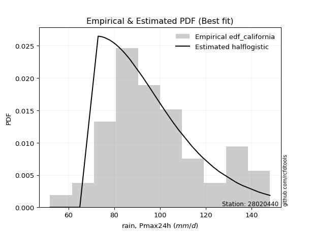</img>

</div>


### 2. EDF Hazen (1930)

Hazen method for plotting positions is a formula used to estimate the empirical cumulative probability distribution of flood events or other hydrological data. This formula often results in biased estimations, particularly when extrapolating to extreme events (high return periods).

<div align="center">


$P=(m-0.5)/n$


</div>


**2.1. Empirical values**

<div align="center">

|                | 0                   | 1                   | 2                    | 3                   | 4                   | 5                   | 6                   | 7                   | 8                   | 9                  | 10                 | 11                 | 12                  | 13                  | 14                  | 15                 | 16                  | 17                  | 18                  | 19                 | 20                 | 21                 | 22                  | 23                  | 24                 | 25                 | 26                 | 27                  | 28                 | 29                  | 30        | 31                 | 32                 | 33                 | 34                 | 35                 | 36                 | 37                 | 38                 | 39                 | 40                 | 41                | 42                 | 43                 | 44                 | 45                 | 46                 | 47                 | 48                 | 49                 | 50                 | 51                 | 52                | 53                 | 54                 | 55                 | 56                 | 57                 | 58                 | 59                 | 60                 |
|:---------------|:--------------------|:--------------------|:---------------------|:--------------------|:--------------------|:--------------------|:--------------------|:--------------------|:--------------------|:-------------------|:-------------------|:-------------------|:--------------------|:--------------------|:--------------------|:-------------------|:--------------------|:--------------------|:--------------------|:-------------------|:-------------------|:-------------------|:--------------------|:--------------------|:-------------------|:-------------------|:-------------------|:--------------------|:-------------------|:--------------------|:----------|:-------------------|:-------------------|:-------------------|:-------------------|:-------------------|:-------------------|:-------------------|:-------------------|:-------------------|:-------------------|:------------------|:-------------------|:-------------------|:-------------------|:-------------------|:-------------------|:-------------------|:-------------------|:-------------------|:-------------------|:-------------------|:------------------|:-------------------|:-------------------|:-------------------|:-------------------|:-------------------|:-------------------|:-------------------|:-------------------|
| date           | 1961                | 2005                | 1994                 | 1964                | 1991                | 1997                | 1974                | 2015                | 1967                | 2018               | 1992               | 2004               | 2009                | 2001                | 1989                | 1976               | 1982                | 1963                | 2014                | 1977               | 1990               | 1993               | 2008                | 2002                | 2011               | 2006               | 1978               | 2000                | 1998               | 1968                | 2003      | 1969               | 1984               | 1995               | 1960               | 1975               | 1983               | 2020               | 2017               | 1999               | 2021               | 1971              | 1979               | 1981               | 2019               | 2012               | 1986               | 1965               | 1996               | 1985               | 1987               | 1980               | 1970              | 1973               | 1988               | 1959               | 1972               | 2007               | 2013               | 2010               | 2016               |
| x              | 52.0                | 62.0                | 65.0                 | 73.0                | 74.5                | 75.0                | 76.0                | 78.0                | 79.0                | 80.0               | 80.5               | 81.0               | 82.0                | 82.0                | 83.7                | 84.0               | 84.0                | 85.0                | 85.0                | 86.0               | 86.4               | 86.5               | 87.0                | 87.0                | 92.0               | 92.0               | 93.0               | 94.0                | 94.0               | 95.0                | 96.0      | 97.0               | 97.6               | 98.0               | 100.0              | 100.0              | 100.5              | 101.0              | 101.0              | 102.0              | 102.0              | 103.0             | 105.0              | 106.0              | 108.0              | 108.0              | 114.0              | 117.0              | 118.0              | 118.6              | 123.2              | 126.0              | 133.0             | 134.0              | 134.0              | 135.0              | 136.0              | 143.0              | 145.0              | 148.0              | 151.0              |
| m              | 1                   | 2                   | 3                    | 4                   | 5                   | 6                   | 7                   | 8                   | 9                   | 10                 | 11                 | 12                 | 13                  | 14                  | 15                  | 16                 | 17                  | 18                  | 19                  | 20                 | 21                 | 22                 | 23                  | 24                  | 25                 | 26                 | 27                 | 28                  | 29                 | 30                  | 31        | 32                 | 33                 | 34                 | 35                 | 36                 | 37                 | 38                 | 39                 | 40                 | 41                 | 42                | 43                 | 44                 | 45                 | 46                 | 47                 | 48                 | 49                 | 50                 | 51                 | 52                 | 53                | 54                 | 55                 | 56                 | 57                 | 58                 | 59                 | 60                 | 61                 |
| empirical_dist | edf_hazen           | edf_hazen           | edf_hazen            | edf_hazen           | edf_hazen           | edf_hazen           | edf_hazen           | edf_hazen           | edf_hazen           | edf_hazen          | edf_hazen          | edf_hazen          | edf_hazen           | edf_hazen           | edf_hazen           | edf_hazen          | edf_hazen           | edf_hazen           | edf_hazen           | edf_hazen          | edf_hazen          | edf_hazen          | edf_hazen           | edf_hazen           | edf_hazen          | edf_hazen          | edf_hazen          | edf_hazen           | edf_hazen          | edf_hazen           | edf_hazen | edf_hazen          | edf_hazen          | edf_hazen          | edf_hazen          | edf_hazen          | edf_hazen          | edf_hazen          | edf_hazen          | edf_hazen          | edf_hazen          | edf_hazen         | edf_hazen          | edf_hazen          | edf_hazen          | edf_hazen          | edf_hazen          | edf_hazen          | edf_hazen          | edf_hazen          | edf_hazen          | edf_hazen          | edf_hazen         | edf_hazen          | edf_hazen          | edf_hazen          | edf_hazen          | edf_hazen          | edf_hazen          | edf_hazen          | edf_hazen          |
| empirical      | 0.00819672131147541 | 0.02459016393442623 | 0.040983606557377046 | 0.05737704918032787 | 0.07377049180327869 | 0.09016393442622951 | 0.10655737704918032 | 0.12295081967213115 | 0.13934426229508196 | 0.1557377049180328 | 0.1721311475409836 | 0.1885245901639344 | 0.20491803278688525 | 0.22131147540983606 | 0.23770491803278687 | 0.2540983606557377 | 0.27049180327868855 | 0.28688524590163933 | 0.30327868852459017 | 0.319672131147541  | 0.3360655737704918 | 0.3524590163934426 | 0.36885245901639346 | 0.38524590163934425 | 0.4016393442622951 | 0.4180327868852459 | 0.4344262295081967 | 0.45081967213114754 | 0.4672131147540984 | 0.48360655737704916 | 0.5       | 0.5163934426229508 | 0.5327868852459017 | 0.5491803278688525 | 0.5655737704918032 | 0.5819672131147541 | 0.5983606557377049 | 0.6147540983606558 | 0.6311475409836066 | 0.6475409836065574 | 0.6639344262295082 | 0.680327868852459 | 0.6967213114754098 | 0.7131147540983607 | 0.7295081967213115 | 0.7459016393442623 | 0.7622950819672131 | 0.7786885245901639 | 0.7950819672131147 | 0.8114754098360656 | 0.8278688524590164 | 0.8442622950819673 | 0.860655737704918 | 0.8770491803278688 | 0.8934426229508197 | 0.9098360655737705 | 0.9262295081967213 | 0.9426229508196722 | 0.9590163934426229 | 0.9754098360655737 | 0.9918032786885246 |
| empirical_tr   | 1.0082644628099173  | 1.0252100840336136  | 1.0427350427350428   | 1.0608695652173912  | 1.079646017699115   | 1.099099099099099   | 1.1192660550458715  | 1.1401869158878506  | 1.161904761904762   | 1.1844660194174759 | 1.2079207920792079 | 1.2323232323232323 | 1.2577319587628866  | 1.2842105263157895  | 1.3118279569892473  | 1.3406593406593406 | 1.3707865168539326  | 1.4022988505747127  | 1.4352941176470588  | 1.4698795180722892 | 1.5061728395061729 | 1.5443037974683547 | 1.5844155844155845  | 1.6266666666666667  | 1.6712328767123288 | 1.7183098591549297 | 1.7681159420289854 | 1.8208955223880596  | 1.8769230769230767 | 1.9365079365079365  | 2.0       | 2.067796610169492  | 2.1403508771929824 | 2.2181818181818183 | 2.30188679245283   | 2.392156862745098  | 2.489795918367347  | 2.595744680851064  | 2.7111111111111112 | 2.837209302325582  | 2.9756097560975605 | 3.128205128205128 | 3.2972972972972974 | 3.4857142857142858 | 3.6969696969696972 | 3.935483870967743  | 4.206896551724137  | 4.518518518518518  | 4.88               | 5.304347826086957  | 5.80952380952381   | 6.42105263157895   | 7.176470588235292 | 8.133333333333331  | 9.384615384615383  | 11.090909090909092 | 13.55555555555556  | 17.42857142857144  | 24.399999999999974 | 40.66666666666662  | 121.99999999999986 |

</div>


**2.2. Kolmogorov-Smirnov fit test (sorted by Δ)**


<div align="center">

|                | 0                    | 1                   | 2                    | 3                    | 4                   | 5                   | 6                   | 7                    | 8                   | 9                    | 10                  | 11                  | 12                  | 13                  | 14                  | 15                  | 16                  | 17                  | 18                  | 19                  | 20                  | 21                  | 22                  | 23                  | 24                  | 25                  | 26                  | 27                  | 28                  | 29                  | 30                  | 31                  | 32                  | 33                  | 34                  | 35                  | 36                  | 37                  | 38                  | 39                  | 40                  | 41                  | 42                  | 43                  | 44                  | 45                  | 46                  | 47                  | 48                  | 49                  | 50                  | 51                  | 52                  | 53                  | 54                  | 55                  | 56                  | 57                  | 58                  | 59                  | 60                  | 61                  | 62                    | 63                  | 64                  | 65                  | 66                  | 67                  | 68                  | 69                  | 70                  | 71                  | 72                  | 73                  | 74                  | 75                  | 76                  | 77                  | 78                  | 79                  | 80                  | 81                  | 82                  | 83                  | 84                  | 85                  | 86                  | 87                  |
|:---------------|:---------------------|:--------------------|:---------------------|:---------------------|:--------------------|:--------------------|:--------------------|:---------------------|:--------------------|:---------------------|:--------------------|:--------------------|:--------------------|:--------------------|:--------------------|:--------------------|:--------------------|:--------------------|:--------------------|:--------------------|:--------------------|:--------------------|:--------------------|:--------------------|:--------------------|:--------------------|:--------------------|:--------------------|:--------------------|:--------------------|:--------------------|:--------------------|:--------------------|:--------------------|:--------------------|:--------------------|:--------------------|:--------------------|:--------------------|:--------------------|:--------------------|:--------------------|:--------------------|:--------------------|:--------------------|:--------------------|:--------------------|:--------------------|:--------------------|:--------------------|:--------------------|:--------------------|:--------------------|:--------------------|:--------------------|:--------------------|:--------------------|:--------------------|:--------------------|:--------------------|:--------------------|:--------------------|:----------------------|:--------------------|:--------------------|:--------------------|:--------------------|:--------------------|:--------------------|:--------------------|:--------------------|:--------------------|:--------------------|:--------------------|:--------------------|:--------------------|:--------------------|:--------------------|:--------------------|:--------------------|:--------------------|:--------------------|:--------------------|:--------------------|:--------------------|:--------------------|:--------------------|:--------------------|
| station        | 28020440             | 28020440            | 28020440             | 28020440             | 28020440            | 28020440            | 28020440            | 28020440             | 28020440            | 28020440             | 28020440            | 28020440            | 28020440            | 28020440            | 28020440            | 28020440            | 28020440            | 28020440            | 28020440            | 28020440            | 28020440            | 28020440            | 28020440            | 28020440            | 28020440            | 28020440            | 28020440            | 28020440            | 28020440            | 28020440            | 28020440            | 28020440            | 28020440            | 28020440            | 28020440            | 28020440            | 28020440            | 28020440            | 28020440            | 28020440            | 28020440            | 28020440            | 28020440            | 28020440            | 28020440            | 28020440            | 28020440            | 28020440            | 28020440            | 28020440            | 28020440            | 28020440            | 28020440            | 28020440            | 28020440            | 28020440            | 28020440            | 28020440            | 28020440            | 28020440            | 28020440            | 28020440            | 28020440              | 28020440            | 28020440            | 28020440            | 28020440            | 28020440            | 28020440            | 28020440            | 28020440            | 28020440            | 28020440            | 28020440            | 28020440            | 28020440            | 28020440            | 28020440            | 28020440            | 28020440            | 28020440            | 28020440            | 28020440            | 28020440            | 28020440            | 28020440            | 28020440            | 28020440            |
| empirical_dist | edf_hazen            | edf_hazen           | edf_hazen            | edf_hazen            | edf_hazen           | edf_hazen           | edf_hazen           | edf_hazen            | edf_hazen           | edf_hazen            | edf_hazen           | edf_hazen           | edf_hazen           | edf_hazen           | edf_hazen           | edf_hazen           | edf_hazen           | edf_hazen           | edf_hazen           | edf_hazen           | edf_hazen           | edf_hazen           | edf_hazen           | edf_hazen           | edf_hazen           | edf_hazen           | edf_hazen           | edf_hazen           | edf_hazen           | edf_hazen           | edf_hazen           | edf_hazen           | edf_hazen           | edf_hazen           | edf_hazen           | edf_hazen           | edf_hazen           | edf_hazen           | edf_hazen           | edf_hazen           | edf_hazen           | edf_hazen           | edf_hazen           | edf_hazen           | edf_hazen           | edf_hazen           | edf_hazen           | edf_hazen           | edf_hazen           | edf_hazen           | edf_hazen           | edf_hazen           | edf_hazen           | edf_hazen           | edf_hazen           | edf_hazen           | edf_hazen           | edf_hazen           | edf_hazen           | edf_hazen           | edf_hazen           | edf_hazen           | edf_hazen             | edf_hazen           | edf_hazen           | edf_hazen           | edf_hazen           | edf_hazen           | edf_hazen           | edf_hazen           | edf_hazen           | edf_hazen           | edf_hazen           | edf_hazen           | edf_hazen           | edf_hazen           | edf_hazen           | edf_hazen           | edf_hazen           | edf_hazen           | edf_hazen           | edf_hazen           | edf_hazen           | edf_hazen           | edf_hazen           | edf_hazen           | edf_hazen           | edf_hazen           |
| p_dist         | logmaxwell           | loginvgauss         | lograyleigh          | invweibull           | loginvgamma         | lognct              | logalpha            | halfnorm             | halflogistic        | moyal                | gumbel_r            | betaprime           | exponnorm           | loggumbel_r         | invgauss            | kstwobign           | logfatiguelife      | logf                | logncf              | lognakagami         | logerlang           | loggamma            | loggamma            | logt                | loglognorm          | lognorm             | lognorm             | logexponnorm        | logcrystalball      | logrice             | logjohnsonsu        | ncf                 | logpearson3         | laplace_asymmetric  | invgamma            | f                   | loggenlogistic      | mielke              | nct                 | johnsonsu           | genlogistic         | alpha               | fatiguelife         | logmielke           | logloggamma         | rayleigh            | logfisk             | gamma               | erlang              | chi2                | fisk                | pearson3            | weibull_min         | loginvweibull       | maxwell             | nakagami            | logweibull_min      | loghalfnorm         | logmoyal            | loglogistic         | rice                | loghalflogistic     | loglaplace_asymmetric | loghypsecant        | crystalball         | norm                | truncnorm           | t                   | logistic            | logkstwobign        | hypsecant           | loggumbel_l         | loglaplace          | wald                | laplace             | logwald             | gumbel_l            | loggenexpon         | loggibrat           | gibrat              | logbetaprime        | expon               | loggompertz         | logexpon            | logchi2             | logtruncnorm        | gompertz            | genexpon            |
| delta          | 0.051914360051457775 | 0.0540796141411537  | 0.054183366208448575 | 0.056845922833405615 | 0.05856685875191692 | 0.05938476612049026 | 0.05963123467501674 | 0.059902923142371084 | 0.06146876346497443 | 0.061518897547643725 | 0.0661481422481216  | 0.0666789392594726  | 0.06721166105418946 | 0.06727994552706063 | 0.0686237060708964  | 0.06918000181461975 | 0.07001575262920134 | 0.07044059545276898 | 0.07062050510590495 | 0.07093294180890997 | 0.07134410556080018 | 0.0713651871018508  | 0.0713651871018508  | 0.0717583272506922  | 0.07176753765194344 | 0.07176781541079347 | 0.07176781541079347 | 0.07176797309048888 | 0.071768322591232   | 0.07177489553996108 | 0.0722224714470141  | 0.07223672325667413 | 0.07226588371031717 | 0.07241389031925916 | 0.07249065365917828 | 0.0726819981831528  | 0.07298903888478064 | 0.0729941630072794  | 0.07306767805020709 | 0.0730724597650626  | 0.07311032126076561 | 0.07311529141359846 | 0.07372600497363013 | 0.07388674065443723 | 0.07446711180215837 | 0.07500967935551928 | 0.07540592763571657 | 0.07657707519182333 | 0.07657732260685757 | 0.0765774544802642  | 0.07750150490039148 | 0.07862046157309088 | 0.08117820520711816 | 0.08340840292094226 | 0.08446115827508416 | 0.08482989526518103 | 0.08493937796060547 | 0.08734179927601132 | 0.0907032198686919  | 0.09235605124361579 | 0.1002530039391234  | 0.1038993715811869  | 0.10530723931490199   | 0.107564757280051   | 0.11491643115166472 | 0.11491643891946868 | 0.11491644594676065 | 0.1149167245062569  | 0.11716991797483678 | 0.12918022175826982 | 0.132639647317088   | 0.13294674132084605 | 0.13375891360198872 | 0.1454893922687988  | 0.15675971352694057 | 0.15695392960967264 | 0.18205217979892296 | 0.19878062857621595 | 0.22126606158361753 | 0.23736541770331557 | 0.24643498735091285 | 0.304956114956322   | 0.3171998548692978  | 0.36516258993022155 | 0.3706626763318231  | 0.49775631327952086 | 0.7987561203954382  | 0.8438002178810594  |
| deltao         | 0.17413015670873855  | 0.17413015670873855 | 0.17413015670873855  | 0.17413015670873855  | 0.17413015670873855 | 0.17413015670873855 | 0.17413015670873855 | 0.17413015670873855  | 0.17413015670873855 | 0.17413015670873855  | 0.17413015670873855 | 0.17413015670873855 | 0.17413015670873855 | 0.17413015670873855 | 0.17413015670873855 | 0.17413015670873855 | 0.17413015670873855 | 0.17413015670873855 | 0.17413015670873855 | 0.17413015670873855 | 0.17413015670873855 | 0.17413015670873855 | 0.17413015670873855 | 0.17413015670873855 | 0.17413015670873855 | 0.17413015670873855 | 0.17413015670873855 | 0.17413015670873855 | 0.17413015670873855 | 0.17413015670873855 | 0.17413015670873855 | 0.17413015670873855 | 0.17413015670873855 | 0.17413015670873855 | 0.17413015670873855 | 0.17413015670873855 | 0.17413015670873855 | 0.17413015670873855 | 0.17413015670873855 | 0.17413015670873855 | 0.17413015670873855 | 0.17413015670873855 | 0.17413015670873855 | 0.17413015670873855 | 0.17413015670873855 | 0.17413015670873855 | 0.17413015670873855 | 0.17413015670873855 | 0.17413015670873855 | 0.17413015670873855 | 0.17413015670873855 | 0.17413015670873855 | 0.17413015670873855 | 0.17413015670873855 | 0.17413015670873855 | 0.17413015670873855 | 0.17413015670873855 | 0.17413015670873855 | 0.17413015670873855 | 0.17413015670873855 | 0.17413015670873855 | 0.17413015670873855 | 0.17413015670873855   | 0.17413015670873855 | 0.17413015670873855 | 0.17413015670873855 | 0.17413015670873855 | 0.17413015670873855 | 0.17413015670873855 | 0.17413015670873855 | 0.17413015670873855 | 0.17413015670873855 | 0.17413015670873855 | 0.17413015670873855 | 0.17413015670873855 | 0.17413015670873855 | 0.17413015670873855 | 0.17413015670873855 | 0.17413015670873855 | 0.17413015670873855 | 0.17413015670873855 | 0.17413015670873855 | 0.17413015670873855 | 0.17413015670873855 | 0.17413015670873855 | 0.17413015670873855 | 0.17413015670873855 | 0.17413015670873855 |
| eval           | Δo > Δ               | Δo > Δ              | Δo > Δ               | Δo > Δ               | Δo > Δ              | Δo > Δ              | Δo > Δ              | Δo > Δ               | Δo > Δ              | Δo > Δ               | Δo > Δ              | Δo > Δ              | Δo > Δ              | Δo > Δ              | Δo > Δ              | Δo > Δ              | Δo > Δ              | Δo > Δ              | Δo > Δ              | Δo > Δ              | Δo > Δ              | Δo > Δ              | Δo > Δ              | Δo > Δ              | Δo > Δ              | Δo > Δ              | Δo > Δ              | Δo > Δ              | Δo > Δ              | Δo > Δ              | Δo > Δ              | Δo > Δ              | Δo > Δ              | Δo > Δ              | Δo > Δ              | Δo > Δ              | Δo > Δ              | Δo > Δ              | Δo > Δ              | Δo > Δ              | Δo > Δ              | Δo > Δ              | Δo > Δ              | Δo > Δ              | Δo > Δ              | Δo > Δ              | Δo > Δ              | Δo > Δ              | Δo > Δ              | Δo > Δ              | Δo > Δ              | Δo > Δ              | Δo > Δ              | Δo > Δ              | Δo > Δ              | Δo > Δ              | Δo > Δ              | Δo > Δ              | Δo > Δ              | Δo > Δ              | Δo > Δ              | Δo > Δ              | Δo > Δ                | Δo > Δ              | Δo > Δ              | Δo > Δ              | Δo > Δ              | Δo > Δ              | Δo > Δ              | Δo > Δ              | Δo > Δ              | Δo > Δ              | Δo > Δ              | Δo > Δ              | Δo > Δ              | Δo > Δ              | Δo <= Δ             | Δo <= Δ             | Δo <= Δ             | Δo <= Δ             | Δo <= Δ             | Δo <= Δ             | Δo <= Δ             | Δo <= Δ             | Δo <= Δ             | Δo <= Δ             | Δo <= Δ             | Δo <= Δ             |
| fit            | 1                    | 1                   | 1                    | 1                    | 1                   | 1                   | 1                   | 1                    | 1                   | 1                    | 1                   | 1                   | 1                   | 1                   | 1                   | 1                   | 1                   | 1                   | 1                   | 1                   | 1                   | 1                   | 1                   | 1                   | 1                   | 1                   | 1                   | 1                   | 1                   | 1                   | 1                   | 1                   | 1                   | 1                   | 1                   | 1                   | 1                   | 1                   | 1                   | 1                   | 1                   | 1                   | 1                   | 1                   | 1                   | 1                   | 1                   | 1                   | 1                   | 1                   | 1                   | 1                   | 1                   | 1                   | 1                   | 1                   | 1                   | 1                   | 1                   | 1                   | 1                   | 1                   | 1                     | 1                   | 1                   | 1                   | 1                   | 1                   | 1                   | 1                   | 1                   | 1                   | 1                   | 1                   | 1                   | 1                   | 0                   | 0                   | 0                   | 0                   | 0                   | 0                   | 0                   | 0                   | 0                   | 0                   | 0                   | 0                   |
| n              | 61                   | 61                  | 61                   | 61                   | 61                  | 61                  | 61                  | 61                   | 61                  | 61                   | 61                  | 61                  | 61                  | 61                  | 61                  | 61                  | 61                  | 61                  | 61                  | 61                  | 61                  | 61                  | 61                  | 61                  | 61                  | 61                  | 61                  | 61                  | 61                  | 61                  | 61                  | 61                  | 61                  | 61                  | 61                  | 61                  | 61                  | 61                  | 61                  | 61                  | 61                  | 61                  | 61                  | 61                  | 61                  | 61                  | 61                  | 61                  | 61                  | 61                  | 61                  | 61                  | 61                  | 61                  | 61                  | 61                  | 61                  | 61                  | 61                  | 61                  | 61                  | 61                  | 61                    | 61                  | 61                  | 61                  | 61                  | 61                  | 61                  | 61                  | 61                  | 61                  | 61                  | 61                  | 61                  | 61                  | 61                  | 61                  | 61                  | 61                  | 61                  | 61                  | 61                  | 61                  | 61                  | 61                  | 61                  | 61                  |
| best_fit       | 1                    | 0                   | 0                    | 0                    | 0                   | 0                   | 0                   | 0                    | 0                   | 0                    | 0                   | 0                   | 0                   | 0                   | 0                   | 0                   | 0                   | 0                   | 0                   | 0                   | 0                   | 0                   | 0                   | 0                   | 0                   | 0                   | 0                   | 0                   | 0                   | 0                   | 0                   | 0                   | 0                   | 0                   | 0                   | 0                   | 0                   | 0                   | 0                   | 0                   | 0                   | 0                   | 0                   | 0                   | 0                   | 0                   | 0                   | 0                   | 0                   | 0                   | 0                   | 0                   | 0                   | 0                   | 0                   | 0                   | 0                   | 0                   | 0                   | 0                   | 0                   | 0                   | 0                     | 0                   | 0                   | 0                   | 0                   | 0                   | 0                   | 0                   | 0                   | 0                   | 0                   | 0                   | 0                   | 0                   | 0                   | 0                   | 0                   | 0                   | 0                   | 0                   | 0                   | 0                   | 0                   | 0                   | 0                   | 0                   |
| best_fit_sort  | 1                    | 2                   | 3                    | 4                    | 5                   | 6                   | 7                   | 8                    | 9                   | 10                   | 11                  | 12                  | 13                  | 14                  | 15                  | 16                  | 17                  | 18                  | 19                  | 20                  | 21                  | 22                  | 23                  | 24                  | 25                  | 26                  | 27                  | 28                  | 29                  | 30                  | 31                  | 32                  | 33                  | 34                  | 35                  | 36                  | 37                  | 38                  | 39                  | 40                  | 41                  | 42                  | 43                  | 44                  | 45                  | 46                  | 47                  | 48                  | 49                  | 50                  | 51                  | 52                  | 53                  | 54                  | 55                  | 56                  | 57                  | 58                  | 59                  | 60                  | 61                  | 62                  | 63                    | 64                  | 65                  | 66                  | 67                  | 68                  | 69                  | 70                  | 71                  | 72                  | 73                  | 74                  | 75                  | 76                  | 77                  | 78                  | 79                  | 80                  | 81                  | 82                  | 83                  | 84                  | 85                  | 86                  | 87                  | 88                  |

</div>


<div align="center">

</img>

</div>


**2.3. Best fit**

<div align="center">

|   id |   station | empirical_dist   | p_dist     |     delta |   deltao | eval   |   fit |   n |   best_fit |   best_fit_sort |
|-----:|----------:|:-----------------|:-----------|----------:|---------:|:-------|------:|----:|-----------:|----------------:|
|    0 |  28020440 | edf_hazen        | logmaxwell | 0.0519144 |  0.17413 | Δo > Δ |     1 |  61 |          1 |               1 |

</div>


<div align="center">

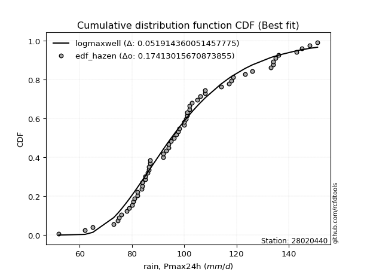</img>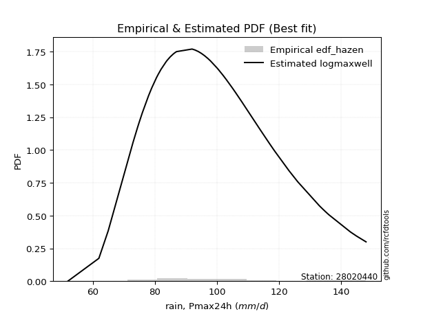</img>

</div>


### 3. EDF Weibull (1939)

Weibull plotting position formula is an empirical method used to estimate the non-exceedance probability or plotting position for a set of observed data, is often recommended or widely used in practice, particularly in flood frequency analysis.

<div align="center">


$P=m/(n+1)$


</div>


**3.1. Empirical values**

<div align="center">

|                | 0                    | 1                   | 2                   | 3                   | 4                   | 5                  | 6                   | 7                   | 8                   | 9                   | 10                 | 11                 | 12                  | 13                  | 14                  | 15                  | 16                  | 17                 | 18                 | 19                 | 20                 | 21                 | 22                 | 23                 | 24                 | 25                  | 26                  | 27                  | 28                  | 29                 | 30          | 31                 | 32                 | 33                 | 34                 | 35                 | 36                 | 37                 | 38                 | 39                 | 40                 | 41                 | 42                 | 43                 | 44                 | 45                 | 46                 | 47                 | 48                 | 49                 | 50                 | 51                 | 52                 | 53                 | 54                 | 55                 | 56                 | 57                 | 58                 | 59                | 60                 |
|:---------------|:---------------------|:--------------------|:--------------------|:--------------------|:--------------------|:-------------------|:--------------------|:--------------------|:--------------------|:--------------------|:-------------------|:-------------------|:--------------------|:--------------------|:--------------------|:--------------------|:--------------------|:-------------------|:-------------------|:-------------------|:-------------------|:-------------------|:-------------------|:-------------------|:-------------------|:--------------------|:--------------------|:--------------------|:--------------------|:-------------------|:------------|:-------------------|:-------------------|:-------------------|:-------------------|:-------------------|:-------------------|:-------------------|:-------------------|:-------------------|:-------------------|:-------------------|:-------------------|:-------------------|:-------------------|:-------------------|:-------------------|:-------------------|:-------------------|:-------------------|:-------------------|:-------------------|:-------------------|:-------------------|:-------------------|:-------------------|:-------------------|:-------------------|:-------------------|:------------------|:-------------------|
| date           | 1961                 | 2005                | 1994                | 1964                | 1991                | 1997               | 1974                | 2015                | 1967                | 2018                | 1992               | 2004               | 2009                | 2001                | 1989                | 1976                | 1982                | 1963               | 2014               | 1977               | 1990               | 1993               | 2008               | 2002               | 2011               | 2006                | 1978                | 2000                | 1998                | 1968               | 2003        | 1969               | 1984               | 1995               | 1960               | 1975               | 1983               | 2020               | 2017               | 1999               | 2021               | 1971               | 1979               | 1981               | 2019               | 2012               | 1986               | 1965               | 1996               | 1985               | 1987               | 1980               | 1970               | 1973               | 1988               | 1959               | 1972               | 2007               | 2013               | 2010              | 2016               |
| x              | 52.0                 | 62.0                | 65.0                | 73.0                | 74.5                | 75.0               | 76.0                | 78.0                | 79.0                | 80.0                | 80.5               | 81.0               | 82.0                | 82.0                | 83.7                | 84.0                | 84.0                | 85.0               | 85.0               | 86.0               | 86.4               | 86.5               | 87.0               | 87.0               | 92.0               | 92.0                | 93.0                | 94.0                | 94.0                | 95.0               | 96.0        | 97.0               | 97.6               | 98.0               | 100.0              | 100.0              | 100.5              | 101.0              | 101.0              | 102.0              | 102.0              | 103.0              | 105.0              | 106.0              | 108.0              | 108.0              | 114.0              | 117.0              | 118.0              | 118.6              | 123.2              | 126.0              | 133.0              | 134.0              | 134.0              | 135.0              | 136.0              | 143.0              | 145.0              | 148.0             | 151.0              |
| m              | 1                    | 2                   | 3                   | 4                   | 5                   | 6                  | 7                   | 8                   | 9                   | 10                  | 11                 | 12                 | 13                  | 14                  | 15                  | 16                  | 17                  | 18                 | 19                 | 20                 | 21                 | 22                 | 23                 | 24                 | 25                 | 26                  | 27                  | 28                  | 29                  | 30                 | 31          | 32                 | 33                 | 34                 | 35                 | 36                 | 37                 | 38                 | 39                 | 40                 | 41                 | 42                 | 43                 | 44                 | 45                 | 46                 | 47                 | 48                 | 49                 | 50                 | 51                 | 52                 | 53                 | 54                 | 55                 | 56                 | 57                 | 58                 | 59                 | 60                | 61                 |
| empirical_dist | edf_weibull          | edf_weibull         | edf_weibull         | edf_weibull         | edf_weibull         | edf_weibull        | edf_weibull         | edf_weibull         | edf_weibull         | edf_weibull         | edf_weibull        | edf_weibull        | edf_weibull         | edf_weibull         | edf_weibull         | edf_weibull         | edf_weibull         | edf_weibull        | edf_weibull        | edf_weibull        | edf_weibull        | edf_weibull        | edf_weibull        | edf_weibull        | edf_weibull        | edf_weibull         | edf_weibull         | edf_weibull         | edf_weibull         | edf_weibull        | edf_weibull | edf_weibull        | edf_weibull        | edf_weibull        | edf_weibull        | edf_weibull        | edf_weibull        | edf_weibull        | edf_weibull        | edf_weibull        | edf_weibull        | edf_weibull        | edf_weibull        | edf_weibull        | edf_weibull        | edf_weibull        | edf_weibull        | edf_weibull        | edf_weibull        | edf_weibull        | edf_weibull        | edf_weibull        | edf_weibull        | edf_weibull        | edf_weibull        | edf_weibull        | edf_weibull        | edf_weibull        | edf_weibull        | edf_weibull       | edf_weibull        |
| empirical      | 0.016129032258064516 | 0.03225806451612903 | 0.04838709677419355 | 0.06451612903225806 | 0.08064516129032258 | 0.0967741935483871 | 0.11290322580645161 | 0.12903225806451613 | 0.14516129032258066 | 0.16129032258064516 | 0.1774193548387097 | 0.1935483870967742 | 0.20967741935483872 | 0.22580645161290322 | 0.24193548387096775 | 0.25806451612903225 | 0.27419354838709675 | 0.2903225806451613 | 0.3064516129032258 | 0.3225806451612903 | 0.3387096774193548 | 0.3548387096774194 | 0.3709677419354839 | 0.3870967741935484 | 0.4032258064516129 | 0.41935483870967744 | 0.43548387096774194 | 0.45161290322580644 | 0.46774193548387094 | 0.4838709677419355 | 0.5         | 0.5161290322580645 | 0.532258064516129  | 0.5483870967741935 | 0.5645161290322581 | 0.5806451612903226 | 0.5967741935483871 | 0.6129032258064516 | 0.6290322580645161 | 0.6451612903225806 | 0.6612903225806451 | 0.6774193548387096 | 0.6935483870967742 | 0.7096774193548387 | 0.7258064516129032 | 0.7419354838709677 | 0.7580645161290323 | 0.7741935483870968 | 0.7903225806451613 | 0.8064516129032258 | 0.8225806451612904 | 0.8387096774193549 | 0.8548387096774194 | 0.8709677419354839 | 0.8870967741935484 | 0.9032258064516129 | 0.9193548387096774 | 0.9354838709677419 | 0.9516129032258065 | 0.967741935483871 | 0.9838709677419355 |
| empirical_tr   | 1.0163934426229508   | 1.0333333333333332  | 1.0508474576271185  | 1.0689655172413792  | 1.087719298245614   | 1.1071428571428572 | 1.1272727272727272  | 1.1481481481481481  | 1.169811320754717   | 1.1923076923076923  | 1.215686274509804  | 1.24               | 1.2653061224489797  | 1.2916666666666667  | 1.3191489361702127  | 1.3478260869565217  | 1.3777777777777778  | 1.409090909090909  | 1.441860465116279  | 1.476190476190476  | 1.5121951219512193 | 1.55               | 1.5897435897435896 | 1.631578947368421  | 1.6756756756756757 | 1.7222222222222225  | 1.7714285714285716  | 1.823529411764706   | 1.878787878787879   | 1.9375             | 2.0         | 2.0666666666666664 | 2.1379310344827585 | 2.214285714285714  | 2.2962962962962967 | 2.384615384615385  | 2.48               | 2.5833333333333335 | 2.6956521739130435 | 2.818181818181818  | 2.952380952380952  | 3.0999999999999996 | 3.2631578947368425 | 3.444444444444445  | 3.647058823529412  | 3.875              | 4.133333333333333  | 4.428571428571428  | 4.769230769230768  | 5.166666666666665  | 5.636363636363638  | 6.200000000000001  | 6.88888888888889   | 7.75               | 8.857142857142856  | 10.33333333333333  | 12.399999999999993 | 15.499999999999988 | 20.666666666666686 | 31.00000000000003 | 62.00000000000006  |

</div>


**3.2. Kolmogorov-Smirnov fit test (sorted by Δ)**


<div align="center">

|                | 0                    | 1                   | 2                   | 3                   | 4                    | 5                   | 6                   | 7                   | 8                   | 9                   | 10                  | 11                  | 12                  | 13                  | 14                  | 15                  | 16                  | 17                  | 18                  | 19                  | 20                  | 21                  | 22                  | 23                  | 24                  | 25                  | 26                  | 27                  | 28                  | 29                  | 30                  | 31                  | 32                  | 33                  | 34                  | 35                  | 36                  | 37                  | 38                  | 39                  | 40                  | 41                  | 42                  | 43                  | 44                  | 45                  | 46                  | 47                  | 48                  | 49                  | 50                  | 51                  | 52                  | 53                  | 54                  | 55                  | 56                  | 57                  | 58                  | 59                  | 60                  | 61                  | 62                    | 63                  | 64                  | 65                  | 66                  | 67                  | 68                  | 69                  | 70                  | 71                  | 72                  | 73                  | 74                  | 75                  | 76                  | 77                  | 78                  | 79                  | 80                  | 81                  | 82                  | 83                  | 84                  | 85                  | 86                  | 87                  |
|:---------------|:---------------------|:--------------------|:--------------------|:--------------------|:---------------------|:--------------------|:--------------------|:--------------------|:--------------------|:--------------------|:--------------------|:--------------------|:--------------------|:--------------------|:--------------------|:--------------------|:--------------------|:--------------------|:--------------------|:--------------------|:--------------------|:--------------------|:--------------------|:--------------------|:--------------------|:--------------------|:--------------------|:--------------------|:--------------------|:--------------------|:--------------------|:--------------------|:--------------------|:--------------------|:--------------------|:--------------------|:--------------------|:--------------------|:--------------------|:--------------------|:--------------------|:--------------------|:--------------------|:--------------------|:--------------------|:--------------------|:--------------------|:--------------------|:--------------------|:--------------------|:--------------------|:--------------------|:--------------------|:--------------------|:--------------------|:--------------------|:--------------------|:--------------------|:--------------------|:--------------------|:--------------------|:--------------------|:----------------------|:--------------------|:--------------------|:--------------------|:--------------------|:--------------------|:--------------------|:--------------------|:--------------------|:--------------------|:--------------------|:--------------------|:--------------------|:--------------------|:--------------------|:--------------------|:--------------------|:--------------------|:--------------------|:--------------------|:--------------------|:--------------------|:--------------------|:--------------------|:--------------------|:--------------------|
| station        | 28020440             | 28020440            | 28020440            | 28020440            | 28020440             | 28020440            | 28020440            | 28020440            | 28020440            | 28020440            | 28020440            | 28020440            | 28020440            | 28020440            | 28020440            | 28020440            | 28020440            | 28020440            | 28020440            | 28020440            | 28020440            | 28020440            | 28020440            | 28020440            | 28020440            | 28020440            | 28020440            | 28020440            | 28020440            | 28020440            | 28020440            | 28020440            | 28020440            | 28020440            | 28020440            | 28020440            | 28020440            | 28020440            | 28020440            | 28020440            | 28020440            | 28020440            | 28020440            | 28020440            | 28020440            | 28020440            | 28020440            | 28020440            | 28020440            | 28020440            | 28020440            | 28020440            | 28020440            | 28020440            | 28020440            | 28020440            | 28020440            | 28020440            | 28020440            | 28020440            | 28020440            | 28020440            | 28020440              | 28020440            | 28020440            | 28020440            | 28020440            | 28020440            | 28020440            | 28020440            | 28020440            | 28020440            | 28020440            | 28020440            | 28020440            | 28020440            | 28020440            | 28020440            | 28020440            | 28020440            | 28020440            | 28020440            | 28020440            | 28020440            | 28020440            | 28020440            | 28020440            | 28020440            |
| empirical_dist | edf_weibull          | edf_weibull         | edf_weibull         | edf_weibull         | edf_weibull          | edf_weibull         | edf_weibull         | edf_weibull         | edf_weibull         | edf_weibull         | edf_weibull         | edf_weibull         | edf_weibull         | edf_weibull         | edf_weibull         | edf_weibull         | edf_weibull         | edf_weibull         | edf_weibull         | edf_weibull         | edf_weibull         | edf_weibull         | edf_weibull         | edf_weibull         | edf_weibull         | edf_weibull         | edf_weibull         | edf_weibull         | edf_weibull         | edf_weibull         | edf_weibull         | edf_weibull         | edf_weibull         | edf_weibull         | edf_weibull         | edf_weibull         | edf_weibull         | edf_weibull         | edf_weibull         | edf_weibull         | edf_weibull         | edf_weibull         | edf_weibull         | edf_weibull         | edf_weibull         | edf_weibull         | edf_weibull         | edf_weibull         | edf_weibull         | edf_weibull         | edf_weibull         | edf_weibull         | edf_weibull         | edf_weibull         | edf_weibull         | edf_weibull         | edf_weibull         | edf_weibull         | edf_weibull         | edf_weibull         | edf_weibull         | edf_weibull         | edf_weibull           | edf_weibull         | edf_weibull         | edf_weibull         | edf_weibull         | edf_weibull         | edf_weibull         | edf_weibull         | edf_weibull         | edf_weibull         | edf_weibull         | edf_weibull         | edf_weibull         | edf_weibull         | edf_weibull         | edf_weibull         | edf_weibull         | edf_weibull         | edf_weibull         | edf_weibull         | edf_weibull         | edf_weibull         | edf_weibull         | edf_weibull         | edf_weibull         | edf_weibull         |
| p_dist         | invweibull           | lograyleigh         | logmaxwell          | halfnorm            | loginvgauss          | loginvgamma         | lognct              | kstwobign           | halflogistic        | logalpha            | loggumbel_r         | moyal               | invgauss            | betaprime           | gumbel_r            | exponnorm           | laplace_asymmetric  | logfatiguelife      | rayleigh            | logf                | logncf              | lognakagami         | logerlang           | loggamma            | loggamma            | loglognorm          | logexponnorm        | lognorm             | lognorm             | logcrystalball      | logrice             | logt                | logjohnsonsu        | logpearson3         | fatiguelife         | ncf                 | invgamma            | f                   | gamma               | erlang              | chi2                | loggenlogistic      | mielke              | nct                 | johnsonsu           | genlogistic         | alpha               | logloggamma         | logmielke           | pearson3            | logfisk             | loginvweibull       | weibull_min         | fisk                | maxwell             | logweibull_min      | nakagami            | loghalfnorm         | logmoyal            | loglogistic         | rice                | loghalflogistic     | loglaplace_asymmetric | loghypsecant        | crystalball         | norm                | truncnorm           | t                   | logistic            | logkstwobign        | loggumbel_l         | hypsecant           | loglaplace          | wald                | logwald             | laplace             | gumbel_l            | loggenexpon         | loggibrat           | logbetaprime        | gibrat              | expon               | loggompertz         | logexpon            | logchi2             | logtruncnorm        | gompertz            | genexpon            |
| delta          | 0.054643352714114024 | 0.05467982187787368 | 0.05773138807895639 | 0.05890314061175961 | 0.059896642168652314 | 0.06190750245357224 | 0.06286124466811593 | 0.06362738415200739 | 0.06451612903225806 | 0.06544826270251536 | 0.06569348333774283 | 0.06733592557514234 | 0.06751010962708481 | 0.06852981181367673 | 0.06855545955852826 | 0.0690625336083936  | 0.07082742812994136 | 0.07186662518340547 | 0.07210116534176991 | 0.07229146800697311 | 0.07247137766010908 | 0.07271570675567951 | 0.0731949781150043  | 0.07321605965605493 | 0.07321605965605493 | 0.07359018754957847 | 0.07359033988208596 | 0.07359039383920385 | 0.07359039383920385 | 0.07359134575358794 | 0.07359727685126755 | 0.07360919980489633 | 0.07392737460057824 | 0.07395741190795052 | 0.07398788864597483 | 0.07408759581087826 | 0.07434152621338241 | 0.07453287073735693 | 0.07457597819422562 | 0.07457614100827997 | 0.07457625076357693 | 0.07483991143898477 | 0.07484503556148353 | 0.07491855060441122 | 0.07492333231926673 | 0.07496119381496974 | 0.07496616396780259 | 0.07525709202522557 | 0.07573761320864136 | 0.07597635792422786 | 0.0772568001899207  | 0.0778557852583299  | 0.07853410155825513 | 0.07935237745459561 | 0.08181705462622113 | 0.08229527431174244 | 0.08263337768648138 | 0.08575533708669353 | 0.0891167576793741  | 0.09420692379781992 | 0.09760890029026037 | 0.1023129093918691  | 0.10715811186910612   | 0.10941562983425512 | 0.1122723275028017  | 0.11227233527060565 | 0.11227234229789762 | 0.11227262085739387 | 0.11902079052904091 | 0.12362760409565746 | 0.13030263767198302 | 0.13449051987129212 | 0.13560978615619285 | 0.1505131892016386  | 0.15616069851501374 | 0.1586105860811447  | 0.17940807615005994 | 0.19269919018383097 | 0.2257610377866847  | 0.23929590749898266 | 0.24106716281172377 | 0.2980814454692782  | 0.3103251853822539  | 0.35828792044317764 | 0.3635235964798929  | 0.4916748748871359  | 0.7937323234625984  | 0.8366611380291291  |
| deltao         | 0.17413015670873855  | 0.17413015670873855 | 0.17413015670873855 | 0.17413015670873855 | 0.17413015670873855  | 0.17413015670873855 | 0.17413015670873855 | 0.17413015670873855 | 0.17413015670873855 | 0.17413015670873855 | 0.17413015670873855 | 0.17413015670873855 | 0.17413015670873855 | 0.17413015670873855 | 0.17413015670873855 | 0.17413015670873855 | 0.17413015670873855 | 0.17413015670873855 | 0.17413015670873855 | 0.17413015670873855 | 0.17413015670873855 | 0.17413015670873855 | 0.17413015670873855 | 0.17413015670873855 | 0.17413015670873855 | 0.17413015670873855 | 0.17413015670873855 | 0.17413015670873855 | 0.17413015670873855 | 0.17413015670873855 | 0.17413015670873855 | 0.17413015670873855 | 0.17413015670873855 | 0.17413015670873855 | 0.17413015670873855 | 0.17413015670873855 | 0.17413015670873855 | 0.17413015670873855 | 0.17413015670873855 | 0.17413015670873855 | 0.17413015670873855 | 0.17413015670873855 | 0.17413015670873855 | 0.17413015670873855 | 0.17413015670873855 | 0.17413015670873855 | 0.17413015670873855 | 0.17413015670873855 | 0.17413015670873855 | 0.17413015670873855 | 0.17413015670873855 | 0.17413015670873855 | 0.17413015670873855 | 0.17413015670873855 | 0.17413015670873855 | 0.17413015670873855 | 0.17413015670873855 | 0.17413015670873855 | 0.17413015670873855 | 0.17413015670873855 | 0.17413015670873855 | 0.17413015670873855 | 0.17413015670873855   | 0.17413015670873855 | 0.17413015670873855 | 0.17413015670873855 | 0.17413015670873855 | 0.17413015670873855 | 0.17413015670873855 | 0.17413015670873855 | 0.17413015670873855 | 0.17413015670873855 | 0.17413015670873855 | 0.17413015670873855 | 0.17413015670873855 | 0.17413015670873855 | 0.17413015670873855 | 0.17413015670873855 | 0.17413015670873855 | 0.17413015670873855 | 0.17413015670873855 | 0.17413015670873855 | 0.17413015670873855 | 0.17413015670873855 | 0.17413015670873855 | 0.17413015670873855 | 0.17413015670873855 | 0.17413015670873855 |
| eval           | Δo > Δ               | Δo > Δ              | Δo > Δ              | Δo > Δ              | Δo > Δ               | Δo > Δ              | Δo > Δ              | Δo > Δ              | Δo > Δ              | Δo > Δ              | Δo > Δ              | Δo > Δ              | Δo > Δ              | Δo > Δ              | Δo > Δ              | Δo > Δ              | Δo > Δ              | Δo > Δ              | Δo > Δ              | Δo > Δ              | Δo > Δ              | Δo > Δ              | Δo > Δ              | Δo > Δ              | Δo > Δ              | Δo > Δ              | Δo > Δ              | Δo > Δ              | Δo > Δ              | Δo > Δ              | Δo > Δ              | Δo > Δ              | Δo > Δ              | Δo > Δ              | Δo > Δ              | Δo > Δ              | Δo > Δ              | Δo > Δ              | Δo > Δ              | Δo > Δ              | Δo > Δ              | Δo > Δ              | Δo > Δ              | Δo > Δ              | Δo > Δ              | Δo > Δ              | Δo > Δ              | Δo > Δ              | Δo > Δ              | Δo > Δ              | Δo > Δ              | Δo > Δ              | Δo > Δ              | Δo > Δ              | Δo > Δ              | Δo > Δ              | Δo > Δ              | Δo > Δ              | Δo > Δ              | Δo > Δ              | Δo > Δ              | Δo > Δ              | Δo > Δ                | Δo > Δ              | Δo > Δ              | Δo > Δ              | Δo > Δ              | Δo > Δ              | Δo > Δ              | Δo > Δ              | Δo > Δ              | Δo > Δ              | Δo > Δ              | Δo > Δ              | Δo > Δ              | Δo > Δ              | Δo <= Δ             | Δo <= Δ             | Δo <= Δ             | Δo <= Δ             | Δo <= Δ             | Δo <= Δ             | Δo <= Δ             | Δo <= Δ             | Δo <= Δ             | Δo <= Δ             | Δo <= Δ             | Δo <= Δ             |
| fit            | 1                    | 1                   | 1                   | 1                   | 1                    | 1                   | 1                   | 1                   | 1                   | 1                   | 1                   | 1                   | 1                   | 1                   | 1                   | 1                   | 1                   | 1                   | 1                   | 1                   | 1                   | 1                   | 1                   | 1                   | 1                   | 1                   | 1                   | 1                   | 1                   | 1                   | 1                   | 1                   | 1                   | 1                   | 1                   | 1                   | 1                   | 1                   | 1                   | 1                   | 1                   | 1                   | 1                   | 1                   | 1                   | 1                   | 1                   | 1                   | 1                   | 1                   | 1                   | 1                   | 1                   | 1                   | 1                   | 1                   | 1                   | 1                   | 1                   | 1                   | 1                   | 1                   | 1                     | 1                   | 1                   | 1                   | 1                   | 1                   | 1                   | 1                   | 1                   | 1                   | 1                   | 1                   | 1                   | 1                   | 0                   | 0                   | 0                   | 0                   | 0                   | 0                   | 0                   | 0                   | 0                   | 0                   | 0                   | 0                   |
| n              | 61                   | 61                  | 61                  | 61                  | 61                   | 61                  | 61                  | 61                  | 61                  | 61                  | 61                  | 61                  | 61                  | 61                  | 61                  | 61                  | 61                  | 61                  | 61                  | 61                  | 61                  | 61                  | 61                  | 61                  | 61                  | 61                  | 61                  | 61                  | 61                  | 61                  | 61                  | 61                  | 61                  | 61                  | 61                  | 61                  | 61                  | 61                  | 61                  | 61                  | 61                  | 61                  | 61                  | 61                  | 61                  | 61                  | 61                  | 61                  | 61                  | 61                  | 61                  | 61                  | 61                  | 61                  | 61                  | 61                  | 61                  | 61                  | 61                  | 61                  | 61                  | 61                  | 61                    | 61                  | 61                  | 61                  | 61                  | 61                  | 61                  | 61                  | 61                  | 61                  | 61                  | 61                  | 61                  | 61                  | 61                  | 61                  | 61                  | 61                  | 61                  | 61                  | 61                  | 61                  | 61                  | 61                  | 61                  | 61                  |
| best_fit       | 1                    | 0                   | 0                   | 0                   | 0                    | 0                   | 0                   | 0                   | 0                   | 0                   | 0                   | 0                   | 0                   | 0                   | 0                   | 0                   | 0                   | 0                   | 0                   | 0                   | 0                   | 0                   | 0                   | 0                   | 0                   | 0                   | 0                   | 0                   | 0                   | 0                   | 0                   | 0                   | 0                   | 0                   | 0                   | 0                   | 0                   | 0                   | 0                   | 0                   | 0                   | 0                   | 0                   | 0                   | 0                   | 0                   | 0                   | 0                   | 0                   | 0                   | 0                   | 0                   | 0                   | 0                   | 0                   | 0                   | 0                   | 0                   | 0                   | 0                   | 0                   | 0                   | 0                     | 0                   | 0                   | 0                   | 0                   | 0                   | 0                   | 0                   | 0                   | 0                   | 0                   | 0                   | 0                   | 0                   | 0                   | 0                   | 0                   | 0                   | 0                   | 0                   | 0                   | 0                   | 0                   | 0                   | 0                   | 0                   |
| best_fit_sort  | 1                    | 2                   | 3                   | 4                   | 5                    | 6                   | 7                   | 8                   | 9                   | 10                  | 11                  | 12                  | 13                  | 14                  | 15                  | 16                  | 17                  | 18                  | 19                  | 20                  | 21                  | 22                  | 23                  | 24                  | 25                  | 26                  | 27                  | 28                  | 29                  | 30                  | 31                  | 32                  | 33                  | 34                  | 35                  | 36                  | 37                  | 38                  | 39                  | 40                  | 41                  | 42                  | 43                  | 44                  | 45                  | 46                  | 47                  | 48                  | 49                  | 50                  | 51                  | 52                  | 53                  | 54                  | 55                  | 56                  | 57                  | 58                  | 59                  | 60                  | 61                  | 62                  | 63                    | 64                  | 65                  | 66                  | 67                  | 68                  | 69                  | 70                  | 71                  | 72                  | 73                  | 74                  | 75                  | 76                  | 77                  | 78                  | 79                  | 80                  | 81                  | 82                  | 83                  | 84                  | 85                  | 86                  | 87                  | 88                  |

</div>


<div align="center">

</img>

</div>


**3.3. Best fit**

<div align="center">

|   id |   station | empirical_dist   | p_dist     |     delta |   deltao | eval   |   fit |   n |   best_fit |   best_fit_sort |
|-----:|----------:|:-----------------|:-----------|----------:|---------:|:-------|------:|----:|-----------:|----------------:|
|    0 |  28020440 | edf_weibull      | invweibull | 0.0546434 |  0.17413 | Δo > Δ |     1 |  61 |          1 |               1 |

</div>


<div align="center">

</img>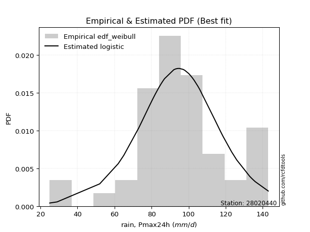</img>

</div>


### 4. EDF Beard (1943)

The Beard formula (or Beard´s plotting position formula) in hydrology is used to estimate the empirical non-exceedance probability _(P)_ of a flood event (or other extreme hydrological data point) within a given dataset.

<div align="center">


$P=(m-0.31)/(n+0.38)$


</div>


**4.1. Empirical values**

<div align="center">

|                | 0                    | 1                    | 2                   | 3                   | 4                   | 5                   | 6                   | 7                  | 8                   | 9                   | 10                  | 11                  | 12                 | 13                  | 14                  | 15                  | 16                 | 17                 | 18                 | 19                  | 20                  | 21                 | 22                  | 23                 | 24                  | 25                 | 26                  | 27                  | 28                 | 29                  | 30        | 31                 | 32                 | 33                 | 34                | 35                 | 36                 | 37                 | 38                 | 39                 | 40                 | 41                 | 42                 | 43                 | 44                 | 45                | 46                 | 47                 | 48                 | 49                 | 50                 | 51                 | 52                 | 53                 | 54                 | 55                 | 56                 | 57                | 58                 | 59                 | 60                 |
|:---------------|:---------------------|:---------------------|:--------------------|:--------------------|:--------------------|:--------------------|:--------------------|:-------------------|:--------------------|:--------------------|:--------------------|:--------------------|:-------------------|:--------------------|:--------------------|:--------------------|:-------------------|:-------------------|:-------------------|:--------------------|:--------------------|:-------------------|:--------------------|:-------------------|:--------------------|:-------------------|:--------------------|:--------------------|:-------------------|:--------------------|:----------|:-------------------|:-------------------|:-------------------|:------------------|:-------------------|:-------------------|:-------------------|:-------------------|:-------------------|:-------------------|:-------------------|:-------------------|:-------------------|:-------------------|:------------------|:-------------------|:-------------------|:-------------------|:-------------------|:-------------------|:-------------------|:-------------------|:-------------------|:-------------------|:-------------------|:-------------------|:------------------|:-------------------|:-------------------|:-------------------|
| date           | 1961                 | 2005                 | 1994                | 1964                | 1991                | 1997                | 1974                | 2015               | 1967                | 2018                | 1992                | 2004                | 2009               | 2001                | 1989                | 1976                | 1982               | 1963               | 2014               | 1977                | 1990                | 1993               | 2008                | 2002               | 2011                | 2006               | 1978                | 2000                | 1998               | 1968                | 2003      | 1969               | 1984               | 1995               | 1960              | 1975               | 1983               | 2020               | 2017               | 1999               | 2021               | 1971               | 1979               | 1981               | 2019               | 2012              | 1986               | 1965               | 1996               | 1985               | 1987               | 1980               | 1970               | 1973               | 1988               | 1959               | 1972               | 2007              | 2013               | 2010               | 2016               |
| x              | 52.0                 | 62.0                 | 65.0                | 73.0                | 74.5                | 75.0                | 76.0                | 78.0               | 79.0                | 80.0                | 80.5                | 81.0                | 82.0               | 82.0                | 83.7                | 84.0                | 84.0               | 85.0               | 85.0               | 86.0                | 86.4                | 86.5               | 87.0                | 87.0               | 92.0                | 92.0               | 93.0                | 94.0                | 94.0               | 95.0                | 96.0      | 97.0               | 97.6               | 98.0               | 100.0             | 100.0              | 100.5              | 101.0              | 101.0              | 102.0              | 102.0              | 103.0              | 105.0              | 106.0              | 108.0              | 108.0             | 114.0              | 117.0              | 118.0              | 118.6              | 123.2              | 126.0              | 133.0              | 134.0              | 134.0              | 135.0              | 136.0              | 143.0             | 145.0              | 148.0              | 151.0              |
| m              | 1                    | 2                    | 3                   | 4                   | 5                   | 6                   | 7                   | 8                  | 9                   | 10                  | 11                  | 12                  | 13                 | 14                  | 15                  | 16                  | 17                 | 18                 | 19                 | 20                  | 21                  | 22                 | 23                  | 24                 | 25                  | 26                 | 27                  | 28                  | 29                 | 30                  | 31        | 32                 | 33                 | 34                 | 35                | 36                 | 37                 | 38                 | 39                 | 40                 | 41                 | 42                 | 43                 | 44                 | 45                 | 46                | 47                 | 48                 | 49                 | 50                 | 51                 | 52                 | 53                 | 54                 | 55                 | 56                 | 57                 | 58                | 59                 | 60                 | 61                 |
| empirical_dist | edf_beard            | edf_beard            | edf_beard           | edf_beard           | edf_beard           | edf_beard           | edf_beard           | edf_beard          | edf_beard           | edf_beard           | edf_beard           | edf_beard           | edf_beard          | edf_beard           | edf_beard           | edf_beard           | edf_beard          | edf_beard          | edf_beard          | edf_beard           | edf_beard           | edf_beard          | edf_beard           | edf_beard          | edf_beard           | edf_beard          | edf_beard           | edf_beard           | edf_beard          | edf_beard           | edf_beard | edf_beard          | edf_beard          | edf_beard          | edf_beard         | edf_beard          | edf_beard          | edf_beard          | edf_beard          | edf_beard          | edf_beard          | edf_beard          | edf_beard          | edf_beard          | edf_beard          | edf_beard         | edf_beard          | edf_beard          | edf_beard          | edf_beard          | edf_beard          | edf_beard          | edf_beard          | edf_beard          | edf_beard          | edf_beard          | edf_beard          | edf_beard         | edf_beard          | edf_beard          | edf_beard          |
| empirical      | 0.011241446725317692 | 0.027533398501140435 | 0.04382535027696318 | 0.06011730205278592 | 0.07640925382860866 | 0.09270120560443142 | 0.10899315738025415 | 0.1252851091560769 | 0.14157706093189962 | 0.15786901270772238 | 0.17416096448354512 | 0.19045291625936786 | 0.2067448680351906 | 0.22303681981101334 | 0.23932877158683608 | 0.25562072336265884 | 0.2719126751384816 | 0.2882046269143043 | 0.3044965786901271 | 0.32078853046594985 | 0.33708048224177256 | 0.3533724340175953 | 0.36966438579341804 | 0.3859563375692408 | 0.40224828934506357 | 0.4185402411208863 | 0.43483219289670905 | 0.45112414467253176 | 0.4674160964483545 | 0.48370804822417723 | 0.5       | 0.5162919517758228 | 0.5325839035516454 | 0.5488758553274682 | 0.565167807103291 | 0.5814597588791136 | 0.5977517106549364 | 0.6140436624307591 | 0.6303356142065819 | 0.6466275659824047 | 0.6629195177582273 | 0.6792114695340501 | 0.6955034213098729 | 0.7117953730856956 | 0.7280873248615184 | 0.744379276637341 | 0.7606712284131638 | 0.7769631801889866 | 0.7932551319648093 | 0.8095470837406321 | 0.8258390355164548 | 0.8421309872922775 | 0.8584229390681003 | 0.8747148908439231 | 0.8910068426197457 | 0.9072987943955685 | 0.9235907461713913 | 0.939882697947214 | 0.9561746497230368 | 0.9724666014988594 | 0.9887585532746822 |
| empirical_tr   | 1.0113692535837864   | 1.0283129502429218   | 1.0458340432782416  | 1.06396255850234    | 1.0827306403245722  | 1.102172741964446   | 1.1223258365331872  | 1.143229651704228  | 1.1649269311064718  | 1.187463726059199   | 1.210889721838627   | 1.2352586033407125  | 1.2606284658040665 | 1.2870622772069615  | 1.3146284000856714  | 1.3434011818778726  | 1.3734616245245022 | 1.4048981460288397 | 1.4378074490513    | 1.4722955145118735  | 1.5084787417055787  | 1.5464852607709751 | 1.5864564486947532  | 1.6285486866542849 | 1.672935404742437   | 1.7198094704398992 | 1.7693859901989046  | 1.821905609973286   | 1.8776384215356376 | 1.936888608393815   | 2.0       | 2.067362748400135  | 2.1394214011850816 | 2.216684723726977  | 2.299737729486699 | 2.38925652004671   | 2.4860267314702305 | 2.5909666525960318 | 2.7051564565888055 | 2.829875518672199  | 2.9666505558240686 | 3.117318435754189  | 3.284109149277688  | 3.46975692481628   | 3.6776512881965244 | 3.912045889101337 | 4.178352620830496  | 4.483564645726807  | 4.836879432624112  | 5.250641573994867  | 5.7418147801683785 | 6.334365325077396  | 7.063291139240503  | 7.981794538361506  | 9.17488789237667   | 10.787346221441112 | 13.08742004264391  | 16.6341463414634  | 22.817843866170985 | 36.31952662721877  | 88.95652173912964  |

</div>


**4.2. Kolmogorov-Smirnov fit test (sorted by Δ)**


<div align="center">

|                | 0                    | 1                    | 2                    | 3                   | 4                    | 5                   | 6                   | 7                    | 8                   | 9                   | 10                  | 11                  | 12                  | 13                  | 14                  | 15                  | 16                  | 17                  | 18                  | 19                  | 20                  | 21                  | 22                  | 23                  | 24                  | 25                  | 26                  | 27                  | 28                  | 29                  | 30                  | 31                  | 32                  | 33                  | 34                  | 35                  | 36                  | 37                  | 38                  | 39                  | 40                  | 41                  | 42                  | 43                  | 44                  | 45                  | 46                  | 47                  | 48                  | 49                  | 50                  | 51                  | 52                  | 53                  | 54                  | 55                  | 56                  | 57                  | 58                  | 59                  | 60                  | 61                  | 62                    | 63                  | 64                  | 65                  | 66                  | 67                  | 68                  | 69                  | 70                  | 71                  | 72                  | 73                  | 74                  | 75                  | 76                  | 77                  | 78                  | 79                  | 80                  | 81                  | 82                  | 83                  | 84                  | 85                  | 86                  | 87                  |
|:---------------|:---------------------|:---------------------|:---------------------|:--------------------|:---------------------|:--------------------|:--------------------|:---------------------|:--------------------|:--------------------|:--------------------|:--------------------|:--------------------|:--------------------|:--------------------|:--------------------|:--------------------|:--------------------|:--------------------|:--------------------|:--------------------|:--------------------|:--------------------|:--------------------|:--------------------|:--------------------|:--------------------|:--------------------|:--------------------|:--------------------|:--------------------|:--------------------|:--------------------|:--------------------|:--------------------|:--------------------|:--------------------|:--------------------|:--------------------|:--------------------|:--------------------|:--------------------|:--------------------|:--------------------|:--------------------|:--------------------|:--------------------|:--------------------|:--------------------|:--------------------|:--------------------|:--------------------|:--------------------|:--------------------|:--------------------|:--------------------|:--------------------|:--------------------|:--------------------|:--------------------|:--------------------|:--------------------|:----------------------|:--------------------|:--------------------|:--------------------|:--------------------|:--------------------|:--------------------|:--------------------|:--------------------|:--------------------|:--------------------|:--------------------|:--------------------|:--------------------|:--------------------|:--------------------|:--------------------|:--------------------|:--------------------|:--------------------|:--------------------|:--------------------|:--------------------|:--------------------|:--------------------|:--------------------|
| station        | 28020440             | 28020440             | 28020440             | 28020440            | 28020440             | 28020440            | 28020440            | 28020440             | 28020440            | 28020440            | 28020440            | 28020440            | 28020440            | 28020440            | 28020440            | 28020440            | 28020440            | 28020440            | 28020440            | 28020440            | 28020440            | 28020440            | 28020440            | 28020440            | 28020440            | 28020440            | 28020440            | 28020440            | 28020440            | 28020440            | 28020440            | 28020440            | 28020440            | 28020440            | 28020440            | 28020440            | 28020440            | 28020440            | 28020440            | 28020440            | 28020440            | 28020440            | 28020440            | 28020440            | 28020440            | 28020440            | 28020440            | 28020440            | 28020440            | 28020440            | 28020440            | 28020440            | 28020440            | 28020440            | 28020440            | 28020440            | 28020440            | 28020440            | 28020440            | 28020440            | 28020440            | 28020440            | 28020440              | 28020440            | 28020440            | 28020440            | 28020440            | 28020440            | 28020440            | 28020440            | 28020440            | 28020440            | 28020440            | 28020440            | 28020440            | 28020440            | 28020440            | 28020440            | 28020440            | 28020440            | 28020440            | 28020440            | 28020440            | 28020440            | 28020440            | 28020440            | 28020440            | 28020440            |
| empirical_dist | edf_beard            | edf_beard            | edf_beard            | edf_beard           | edf_beard            | edf_beard           | edf_beard           | edf_beard            | edf_beard           | edf_beard           | edf_beard           | edf_beard           | edf_beard           | edf_beard           | edf_beard           | edf_beard           | edf_beard           | edf_beard           | edf_beard           | edf_beard           | edf_beard           | edf_beard           | edf_beard           | edf_beard           | edf_beard           | edf_beard           | edf_beard           | edf_beard           | edf_beard           | edf_beard           | edf_beard           | edf_beard           | edf_beard           | edf_beard           | edf_beard           | edf_beard           | edf_beard           | edf_beard           | edf_beard           | edf_beard           | edf_beard           | edf_beard           | edf_beard           | edf_beard           | edf_beard           | edf_beard           | edf_beard           | edf_beard           | edf_beard           | edf_beard           | edf_beard           | edf_beard           | edf_beard           | edf_beard           | edf_beard           | edf_beard           | edf_beard           | edf_beard           | edf_beard           | edf_beard           | edf_beard           | edf_beard           | edf_beard             | edf_beard           | edf_beard           | edf_beard           | edf_beard           | edf_beard           | edf_beard           | edf_beard           | edf_beard           | edf_beard           | edf_beard           | edf_beard           | edf_beard           | edf_beard           | edf_beard           | edf_beard           | edf_beard           | edf_beard           | edf_beard           | edf_beard           | edf_beard           | edf_beard           | edf_beard           | edf_beard           | edf_beard           | edf_beard           |
| p_dist         | lograyleigh          | logmaxwell           | invweibull           | loginvgauss         | halfnorm             | loginvgamma         | lognct              | halflogistic         | logalpha            | moyal               | loggumbel_r         | gumbel_r            | kstwobign           | betaprime           | invgauss            | exponnorm           | logfatiguelife      | logf                | logncf              | lognakagami         | laplace_asymmetric  | logerlang           | loggamma            | loggamma            | loglognorm          | logexponnorm        | lognorm             | lognorm             | logcrystalball      | logrice             | logt                | logjohnsonsu        | logpearson3         | fatiguelife         | ncf                 | invgamma            | f                   | loggenlogistic      | mielke              | nct                 | johnsonsu           | genlogistic         | alpha               | rayleigh            | logloggamma         | logmielke           | gamma               | erlang              | chi2                | logfisk             | pearson3            | fisk                | weibull_min         | loginvweibull       | maxwell             | nakagami            | logweibull_min      | loghalfnorm         | logmoyal            | loglogistic         | rice                | loghalflogistic     | loglaplace_asymmetric | loghypsecant        | crystalball         | norm                | truncnorm           | t                   | logistic            | logkstwobign        | loggumbel_l         | hypsecant           | loglaplace          | wald                | logwald             | laplace             | gumbel_l            | loggenexpon         | loggibrat           | gibrat              | logbetaprime        | expon               | loggompertz         | logexpon            | logchi2             | logtruncnorm        | gompertz            | genexpon            |
| delta          | 0.052052058418758984 | 0.054147158688275465 | 0.055729523514996715 | 0.05631241277797139 | 0.057771615352681494 | 0.05886280966028523 | 0.06009520205038682 | 0.060859818382205944 | 0.06186403331183443 | 0.06375169618446141 | 0.06667100044429214 | 0.06685857817801816 | 0.06704869402493016 | 0.06738937518936916 | 0.06760879759961558 | 0.06792209698408602 | 0.0707261885590979  | 0.07115103138266554 | 0.07133094103580151 | 0.07157527013137194 | 0.07180494523649067 | 0.07205454149069673 | 0.07207562303174736 | 0.07207562303174736 | 0.0724497509252709  | 0.07244990325777839 | 0.07244995721489628 | 0.07244995721489628 | 0.07245090912928037 | 0.07245684022695997 | 0.07246876318058876 | 0.07278693797627067 | 0.07281697528364295 | 0.07284745202166726 | 0.07294715918657069 | 0.07320108958907484 | 0.07339243411304935 | 0.0736994748146772  | 0.07370459893717596 | 0.07377811398010364 | 0.07378289569495916 | 0.07382075719066217 | 0.07382572734349502 | 0.07389328003711038 | 0.074116655400918   | 0.07459717658433379 | 0.0755621667205425  | 0.07556241413557674 | 0.07556254600898338 | 0.07611636356561313 | 0.07760555310181005 | 0.07821194083028804 | 0.08016329673583733 | 0.08127709513125267 | 0.08344624980380333 | 0.0838149867939002  | 0.08392446948932464 | 0.08673285419324284 | 0.09009427478592341 | 0.09306648717351235 | 0.09923809546784257 | 0.10329042649841841 | 0.10601767524479855   | 0.10827519320994755 | 0.1139015226803839  | 0.11390153044818785 | 0.11390153747547982 | 0.11390181603497607 | 0.11788035390473334 | 0.12704891396858023 | 0.13193183284956522 | 0.13335008324698455 | 0.13446934953188527 | 0.14741771836423226 | 0.15664945706828842 | 0.15747014945683713 | 0.18103727132764214 | 0.1964463390922702  | 0.2229914059847948  | 0.23878628956310863 | 0.2436947344784548  | 0.30231735293099204 | 0.3145610928439678  | 0.36252382790489157 | 0.36792242345936504 | 0.4954220237955751  | 0.7968277943000047  | 0.8410599650086014  |
| deltao         | 0.17413015670873855  | 0.17413015670873855  | 0.17413015670873855  | 0.17413015670873855 | 0.17413015670873855  | 0.17413015670873855 | 0.17413015670873855 | 0.17413015670873855  | 0.17413015670873855 | 0.17413015670873855 | 0.17413015670873855 | 0.17413015670873855 | 0.17413015670873855 | 0.17413015670873855 | 0.17413015670873855 | 0.17413015670873855 | 0.17413015670873855 | 0.17413015670873855 | 0.17413015670873855 | 0.17413015670873855 | 0.17413015670873855 | 0.17413015670873855 | 0.17413015670873855 | 0.17413015670873855 | 0.17413015670873855 | 0.17413015670873855 | 0.17413015670873855 | 0.17413015670873855 | 0.17413015670873855 | 0.17413015670873855 | 0.17413015670873855 | 0.17413015670873855 | 0.17413015670873855 | 0.17413015670873855 | 0.17413015670873855 | 0.17413015670873855 | 0.17413015670873855 | 0.17413015670873855 | 0.17413015670873855 | 0.17413015670873855 | 0.17413015670873855 | 0.17413015670873855 | 0.17413015670873855 | 0.17413015670873855 | 0.17413015670873855 | 0.17413015670873855 | 0.17413015670873855 | 0.17413015670873855 | 0.17413015670873855 | 0.17413015670873855 | 0.17413015670873855 | 0.17413015670873855 | 0.17413015670873855 | 0.17413015670873855 | 0.17413015670873855 | 0.17413015670873855 | 0.17413015670873855 | 0.17413015670873855 | 0.17413015670873855 | 0.17413015670873855 | 0.17413015670873855 | 0.17413015670873855 | 0.17413015670873855   | 0.17413015670873855 | 0.17413015670873855 | 0.17413015670873855 | 0.17413015670873855 | 0.17413015670873855 | 0.17413015670873855 | 0.17413015670873855 | 0.17413015670873855 | 0.17413015670873855 | 0.17413015670873855 | 0.17413015670873855 | 0.17413015670873855 | 0.17413015670873855 | 0.17413015670873855 | 0.17413015670873855 | 0.17413015670873855 | 0.17413015670873855 | 0.17413015670873855 | 0.17413015670873855 | 0.17413015670873855 | 0.17413015670873855 | 0.17413015670873855 | 0.17413015670873855 | 0.17413015670873855 | 0.17413015670873855 |
| eval           | Δo > Δ               | Δo > Δ               | Δo > Δ               | Δo > Δ              | Δo > Δ               | Δo > Δ              | Δo > Δ              | Δo > Δ               | Δo > Δ              | Δo > Δ              | Δo > Δ              | Δo > Δ              | Δo > Δ              | Δo > Δ              | Δo > Δ              | Δo > Δ              | Δo > Δ              | Δo > Δ              | Δo > Δ              | Δo > Δ              | Δo > Δ              | Δo > Δ              | Δo > Δ              | Δo > Δ              | Δo > Δ              | Δo > Δ              | Δo > Δ              | Δo > Δ              | Δo > Δ              | Δo > Δ              | Δo > Δ              | Δo > Δ              | Δo > Δ              | Δo > Δ              | Δo > Δ              | Δo > Δ              | Δo > Δ              | Δo > Δ              | Δo > Δ              | Δo > Δ              | Δo > Δ              | Δo > Δ              | Δo > Δ              | Δo > Δ              | Δo > Δ              | Δo > Δ              | Δo > Δ              | Δo > Δ              | Δo > Δ              | Δo > Δ              | Δo > Δ              | Δo > Δ              | Δo > Δ              | Δo > Δ              | Δo > Δ              | Δo > Δ              | Δo > Δ              | Δo > Δ              | Δo > Δ              | Δo > Δ              | Δo > Δ              | Δo > Δ              | Δo > Δ                | Δo > Δ              | Δo > Δ              | Δo > Δ              | Δo > Δ              | Δo > Δ              | Δo > Δ              | Δo > Δ              | Δo > Δ              | Δo > Δ              | Δo > Δ              | Δo > Δ              | Δo > Δ              | Δo > Δ              | Δo <= Δ             | Δo <= Δ             | Δo <= Δ             | Δo <= Δ             | Δo <= Δ             | Δo <= Δ             | Δo <= Δ             | Δo <= Δ             | Δo <= Δ             | Δo <= Δ             | Δo <= Δ             | Δo <= Δ             |
| fit            | 1                    | 1                    | 1                    | 1                   | 1                    | 1                   | 1                   | 1                    | 1                   | 1                   | 1                   | 1                   | 1                   | 1                   | 1                   | 1                   | 1                   | 1                   | 1                   | 1                   | 1                   | 1                   | 1                   | 1                   | 1                   | 1                   | 1                   | 1                   | 1                   | 1                   | 1                   | 1                   | 1                   | 1                   | 1                   | 1                   | 1                   | 1                   | 1                   | 1                   | 1                   | 1                   | 1                   | 1                   | 1                   | 1                   | 1                   | 1                   | 1                   | 1                   | 1                   | 1                   | 1                   | 1                   | 1                   | 1                   | 1                   | 1                   | 1                   | 1                   | 1                   | 1                   | 1                     | 1                   | 1                   | 1                   | 1                   | 1                   | 1                   | 1                   | 1                   | 1                   | 1                   | 1                   | 1                   | 1                   | 0                   | 0                   | 0                   | 0                   | 0                   | 0                   | 0                   | 0                   | 0                   | 0                   | 0                   | 0                   |
| n              | 61                   | 61                   | 61                   | 61                  | 61                   | 61                  | 61                  | 61                   | 61                  | 61                  | 61                  | 61                  | 61                  | 61                  | 61                  | 61                  | 61                  | 61                  | 61                  | 61                  | 61                  | 61                  | 61                  | 61                  | 61                  | 61                  | 61                  | 61                  | 61                  | 61                  | 61                  | 61                  | 61                  | 61                  | 61                  | 61                  | 61                  | 61                  | 61                  | 61                  | 61                  | 61                  | 61                  | 61                  | 61                  | 61                  | 61                  | 61                  | 61                  | 61                  | 61                  | 61                  | 61                  | 61                  | 61                  | 61                  | 61                  | 61                  | 61                  | 61                  | 61                  | 61                  | 61                    | 61                  | 61                  | 61                  | 61                  | 61                  | 61                  | 61                  | 61                  | 61                  | 61                  | 61                  | 61                  | 61                  | 61                  | 61                  | 61                  | 61                  | 61                  | 61                  | 61                  | 61                  | 61                  | 61                  | 61                  | 61                  |
| best_fit       | 1                    | 0                    | 0                    | 0                   | 0                    | 0                   | 0                   | 0                    | 0                   | 0                   | 0                   | 0                   | 0                   | 0                   | 0                   | 0                   | 0                   | 0                   | 0                   | 0                   | 0                   | 0                   | 0                   | 0                   | 0                   | 0                   | 0                   | 0                   | 0                   | 0                   | 0                   | 0                   | 0                   | 0                   | 0                   | 0                   | 0                   | 0                   | 0                   | 0                   | 0                   | 0                   | 0                   | 0                   | 0                   | 0                   | 0                   | 0                   | 0                   | 0                   | 0                   | 0                   | 0                   | 0                   | 0                   | 0                   | 0                   | 0                   | 0                   | 0                   | 0                   | 0                   | 0                     | 0                   | 0                   | 0                   | 0                   | 0                   | 0                   | 0                   | 0                   | 0                   | 0                   | 0                   | 0                   | 0                   | 0                   | 0                   | 0                   | 0                   | 0                   | 0                   | 0                   | 0                   | 0                   | 0                   | 0                   | 0                   |
| best_fit_sort  | 1                    | 2                    | 3                    | 4                   | 5                    | 6                   | 7                   | 8                    | 9                   | 10                  | 11                  | 12                  | 13                  | 14                  | 15                  | 16                  | 17                  | 18                  | 19                  | 20                  | 21                  | 22                  | 23                  | 24                  | 25                  | 26                  | 27                  | 28                  | 29                  | 30                  | 31                  | 32                  | 33                  | 34                  | 35                  | 36                  | 37                  | 38                  | 39                  | 40                  | 41                  | 42                  | 43                  | 44                  | 45                  | 46                  | 47                  | 48                  | 49                  | 50                  | 51                  | 52                  | 53                  | 54                  | 55                  | 56                  | 57                  | 58                  | 59                  | 60                  | 61                  | 62                  | 63                    | 64                  | 65                  | 66                  | 67                  | 68                  | 69                  | 70                  | 71                  | 72                  | 73                  | 74                  | 75                  | 76                  | 77                  | 78                  | 79                  | 80                  | 81                  | 82                  | 83                  | 84                  | 85                  | 86                  | 87                  | 88                  |

</div>


<div align="center">

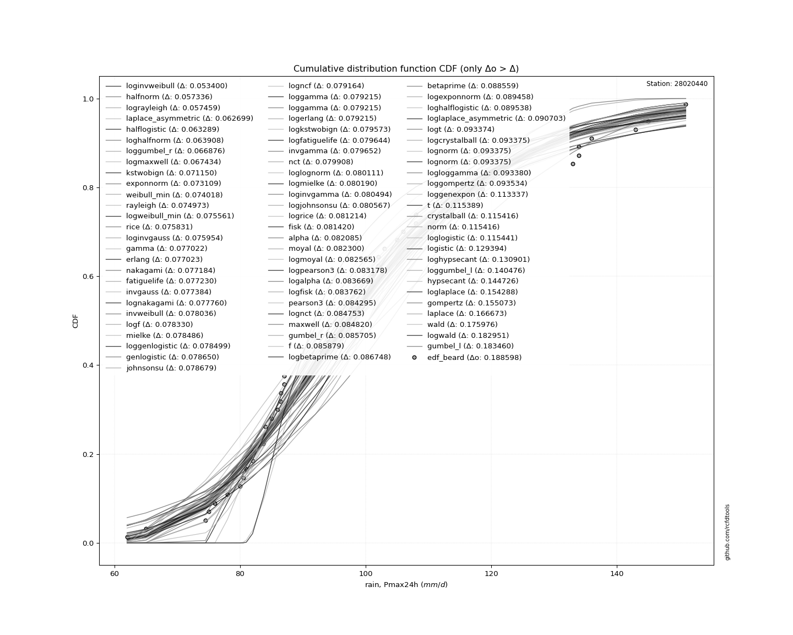</img>

</div>


**4.3. Best fit**

<div align="center">

|   id |   station | empirical_dist   | p_dist      |     delta |   deltao | eval   |   fit |   n |   best_fit |   best_fit_sort |
|-----:|----------:|:-----------------|:------------|----------:|---------:|:-------|------:|----:|-----------:|----------------:|
|    0 |  28020440 | edf_beard        | lograyleigh | 0.0520521 |  0.17413 | Δo > Δ |     1 |  61 |          1 |               1 |

</div>


<div align="center">

</img></img>

</div>


### 5. EDF Chegodayev (1955)

The Chegodayev formula is an empirical plotting position formula used in hydrological frequency analysis to estimate the exceedance probability or return period of a specific event from a set of observed data. It is primarily used for plotting observed data points on probability paper to fit a theoretical distribution, particularly for analyzing extreme events like maximum flood flows or rainfall intensities. The constant _b_ value in the generalized plotting position formula is 0.3.

<div align="center">


$P=(m-b)/(n+1-2b)$


</div>


**5.1. Empirical values**

<div align="center">

|                | 0                    | 1                   | 2                   | 3                   | 4                   | 5                   | 6                   | 7                  | 8                   | 9                   | 10                 | 11                  | 12                 | 13                  | 14                  | 15                 | 16                 | 17                  | 18                 | 19                  | 20                  | 21                 | 22                 | 23                  | 24                 | 25                 | 26                 | 27                 | 28                  | 29                 | 30             | 31                 | 32                 | 33                 | 34                 | 35                 | 36                 | 37                 | 38                 | 39                 | 40                 | 41                 | 42                 | 43                 | 44                 | 45                 | 46                 | 47                 | 48                 | 49                 | 50                 | 51                 | 52                 | 53                 | 54                 | 55                 | 56                 | 57                 | 58                 | 59                | 60                 |
|:---------------|:---------------------|:--------------------|:--------------------|:--------------------|:--------------------|:--------------------|:--------------------|:-------------------|:--------------------|:--------------------|:-------------------|:--------------------|:-------------------|:--------------------|:--------------------|:-------------------|:-------------------|:--------------------|:-------------------|:--------------------|:--------------------|:-------------------|:-------------------|:--------------------|:-------------------|:-------------------|:-------------------|:-------------------|:--------------------|:-------------------|:---------------|:-------------------|:-------------------|:-------------------|:-------------------|:-------------------|:-------------------|:-------------------|:-------------------|:-------------------|:-------------------|:-------------------|:-------------------|:-------------------|:-------------------|:-------------------|:-------------------|:-------------------|:-------------------|:-------------------|:-------------------|:-------------------|:-------------------|:-------------------|:-------------------|:-------------------|:-------------------|:-------------------|:-------------------|:------------------|:-------------------|
| date           | 1961                 | 2005                | 1994                | 1964                | 1991                | 1997                | 1974                | 2015               | 1967                | 2018                | 1992               | 2004                | 2009               | 2001                | 1989                | 1976               | 1982               | 1963                | 2014               | 1977                | 1990                | 1993               | 2008               | 2002                | 2011               | 2006               | 1978               | 2000               | 1998                | 1968               | 2003           | 1969               | 1984               | 1995               | 1960               | 1975               | 1983               | 2020               | 2017               | 1999               | 2021               | 1971               | 1979               | 1981               | 2019               | 2012               | 1986               | 1965               | 1996               | 1985               | 1987               | 1980               | 1970               | 1973               | 1988               | 1959               | 1972               | 2007               | 2013               | 2010              | 2016               |
| x              | 52.0                 | 62.0                | 65.0                | 73.0                | 74.5                | 75.0                | 76.0                | 78.0               | 79.0                | 80.0                | 80.5               | 81.0                | 82.0               | 82.0                | 83.7                | 84.0               | 84.0               | 85.0                | 85.0               | 86.0                | 86.4                | 86.5               | 87.0               | 87.0                | 92.0               | 92.0               | 93.0               | 94.0               | 94.0                | 95.0               | 96.0           | 97.0               | 97.6               | 98.0               | 100.0              | 100.0              | 100.5              | 101.0              | 101.0              | 102.0              | 102.0              | 103.0              | 105.0              | 106.0              | 108.0              | 108.0              | 114.0              | 117.0              | 118.0              | 118.6              | 123.2              | 126.0              | 133.0              | 134.0              | 134.0              | 135.0              | 136.0              | 143.0              | 145.0              | 148.0             | 151.0              |
| m              | 1                    | 2                   | 3                   | 4                   | 5                   | 6                   | 7                   | 8                  | 9                   | 10                  | 11                 | 12                  | 13                 | 14                  | 15                  | 16                 | 17                 | 18                  | 19                 | 20                  | 21                  | 22                 | 23                 | 24                  | 25                 | 26                 | 27                 | 28                 | 29                  | 30                 | 31             | 32                 | 33                 | 34                 | 35                 | 36                 | 37                 | 38                 | 39                 | 40                 | 41                 | 42                 | 43                 | 44                 | 45                 | 46                 | 47                 | 48                 | 49                 | 50                 | 51                 | 52                 | 53                 | 54                 | 55                 | 56                 | 57                 | 58                 | 59                 | 60                | 61                 |
| empirical_dist | edf_chegodayev       | edf_chegodayev      | edf_chegodayev      | edf_chegodayev      | edf_chegodayev      | edf_chegodayev      | edf_chegodayev      | edf_chegodayev     | edf_chegodayev      | edf_chegodayev      | edf_chegodayev     | edf_chegodayev      | edf_chegodayev     | edf_chegodayev      | edf_chegodayev      | edf_chegodayev     | edf_chegodayev     | edf_chegodayev      | edf_chegodayev     | edf_chegodayev      | edf_chegodayev      | edf_chegodayev     | edf_chegodayev     | edf_chegodayev      | edf_chegodayev     | edf_chegodayev     | edf_chegodayev     | edf_chegodayev     | edf_chegodayev      | edf_chegodayev     | edf_chegodayev | edf_chegodayev     | edf_chegodayev     | edf_chegodayev     | edf_chegodayev     | edf_chegodayev     | edf_chegodayev     | edf_chegodayev     | edf_chegodayev     | edf_chegodayev     | edf_chegodayev     | edf_chegodayev     | edf_chegodayev     | edf_chegodayev     | edf_chegodayev     | edf_chegodayev     | edf_chegodayev     | edf_chegodayev     | edf_chegodayev     | edf_chegodayev     | edf_chegodayev     | edf_chegodayev     | edf_chegodayev     | edf_chegodayev     | edf_chegodayev     | edf_chegodayev     | edf_chegodayev     | edf_chegodayev     | edf_chegodayev     | edf_chegodayev    | edf_chegodayev     |
| empirical      | 0.011400651465798045 | 0.02768729641693811 | 0.04397394136807818 | 0.06026058631921825 | 0.07654723127035831 | 0.09283387622149837 | 0.10912052117263844 | 0.1254071661237785 | 0.14169381107491855 | 0.15798045602605862 | 0.1742671009771987 | 0.19055374592833876 | 0.2068403908794788 | 0.22312703583061888 | 0.23941368078175895 | 0.255700325732899  | 0.2719869706840391 | 0.28827361563517917 | 0.3045602605863192 | 0.32084690553745926 | 0.33713355048859933 | 0.3534201954397394 | 0.3697068403908795 | 0.38599348534201955 | 0.4022801302931596 | 0.4185667752442997 | 0.4348534201954397 | 0.4511400651465798 | 0.46742671009771986 | 0.4837133550488599 | 0.5            | 0.5162866449511401 | 0.5325732899022801 | 0.5488599348534202 | 0.5651465798045603 | 0.5814332247557004 | 0.5977198697068404 | 0.6140065146579805 | 0.6302931596091206 | 0.6465798045602607 | 0.6628664495114007 | 0.6791530944625408 | 0.6954397394136809 | 0.7117263843648209 | 0.728013029315961  | 0.7442996742671011 | 0.7605863192182412 | 0.7768729641693811 | 0.7931596091205212 | 0.8094462540716613 | 0.8257328990228013 | 0.8420195439739414 | 0.8583061889250815 | 0.8745928338762216 | 0.8908794788273616 | 0.9071661237785017 | 0.9234527687296418 | 0.9397394136807818 | 0.9560260586319219 | 0.972312703583062 | 0.9885993485342021 |
| empirical_tr   | 1.0115321252059308   | 1.0284757118927974  | 1.0459965928449744  | 1.0641247833622185  | 1.0828924162257496  | 1.1023339317773788  | 1.1224862888482634  | 1.143389199255121  | 1.1650853889943074  | 1.1876208897485492  | 1.2110453648915187 | 1.2354124748490944  | 1.2607802874743326 | 1.2872117400419287  | 1.3147751605995717  | 1.3435448577680524 | 1.3736017897091723 | 1.405034324942792   | 1.4379391100702574 | 1.4724220623501196  | 1.5085995085995085  | 1.5465994962216623 | 1.58656330749354   | 1.6286472148541113  | 1.6730245231607628 | 1.7198879551820727 | 1.7694524495677233 | 1.8219584569732936 | 1.8776758409785932  | 1.9369085173501577 | 2.0            | 2.0673400673400675 | 2.1393728222996518 | 2.216606498194946  | 2.2996254681647943 | 2.389105058365759  | 2.48582995951417   | 2.5907172995780594 | 2.704845814977974  | 2.829493087557604  | 2.966183574879228  | 3.1167512690355337 | 3.2834224598930493 | 3.4689265536723175 | 3.6766467065868276 | 3.910828025477709  | 4.176870748299322  | 4.481751824817518  | 4.834645669291339  | 5.247863247863249  | 5.738317757009347  | 6.329896907216496  | 7.057471264367819  | 7.974025974025977  | 9.164179104477617  | 10.771929824561411 | 13.063829787234056 | 16.594594594594618 | 22.740740740740787 | 36.11764705882366 | 87.71428571428653  |

</div>


**5.2. Kolmogorov-Smirnov fit test (sorted by Δ)**


<div align="center">

|                | 0                   | 1                   | 2                   | 3                    | 4                   | 5                    | 6                    | 7                   | 8                   | 9                   | 10                  | 11                  | 12                  | 13                  | 14                  | 15                  | 16                  | 17                  | 18                  | 19                  | 20                  | 21                  | 22                  | 23                  | 24                  | 25                  | 26                  | 27                  | 28                  | 29                  | 30                  | 31                  | 32                  | 33                  | 34                  | 35                  | 36                  | 37                  | 38                  | 39                  | 40                  | 41                  | 42                  | 43                  | 44                  | 45                  | 46                  | 47                  | 48                  | 49                  | 50                  | 51                  | 52                  | 53                  | 54                  | 55                  | 56                  | 57                  | 58                  | 59                  | 60                  | 61                  | 62                    | 63                  | 64                  | 65                  | 66                  | 67                  | 68                  | 69                  | 70                  | 71                  | 72                  | 73                  | 74                  | 75                  | 76                  | 77                  | 78                  | 79                  | 80                  | 81                  | 82                  | 83                  | 84                  | 85                  | 86                  | 87                  |
|:---------------|:--------------------|:--------------------|:--------------------|:---------------------|:--------------------|:---------------------|:---------------------|:--------------------|:--------------------|:--------------------|:--------------------|:--------------------|:--------------------|:--------------------|:--------------------|:--------------------|:--------------------|:--------------------|:--------------------|:--------------------|:--------------------|:--------------------|:--------------------|:--------------------|:--------------------|:--------------------|:--------------------|:--------------------|:--------------------|:--------------------|:--------------------|:--------------------|:--------------------|:--------------------|:--------------------|:--------------------|:--------------------|:--------------------|:--------------------|:--------------------|:--------------------|:--------------------|:--------------------|:--------------------|:--------------------|:--------------------|:--------------------|:--------------------|:--------------------|:--------------------|:--------------------|:--------------------|:--------------------|:--------------------|:--------------------|:--------------------|:--------------------|:--------------------|:--------------------|:--------------------|:--------------------|:--------------------|:----------------------|:--------------------|:--------------------|:--------------------|:--------------------|:--------------------|:--------------------|:--------------------|:--------------------|:--------------------|:--------------------|:--------------------|:--------------------|:--------------------|:--------------------|:--------------------|:--------------------|:--------------------|:--------------------|:--------------------|:--------------------|:--------------------|:--------------------|:--------------------|:--------------------|:--------------------|
| station        | 28020440            | 28020440            | 28020440            | 28020440             | 28020440            | 28020440             | 28020440             | 28020440            | 28020440            | 28020440            | 28020440            | 28020440            | 28020440            | 28020440            | 28020440            | 28020440            | 28020440            | 28020440            | 28020440            | 28020440            | 28020440            | 28020440            | 28020440            | 28020440            | 28020440            | 28020440            | 28020440            | 28020440            | 28020440            | 28020440            | 28020440            | 28020440            | 28020440            | 28020440            | 28020440            | 28020440            | 28020440            | 28020440            | 28020440            | 28020440            | 28020440            | 28020440            | 28020440            | 28020440            | 28020440            | 28020440            | 28020440            | 28020440            | 28020440            | 28020440            | 28020440            | 28020440            | 28020440            | 28020440            | 28020440            | 28020440            | 28020440            | 28020440            | 28020440            | 28020440            | 28020440            | 28020440            | 28020440              | 28020440            | 28020440            | 28020440            | 28020440            | 28020440            | 28020440            | 28020440            | 28020440            | 28020440            | 28020440            | 28020440            | 28020440            | 28020440            | 28020440            | 28020440            | 28020440            | 28020440            | 28020440            | 28020440            | 28020440            | 28020440            | 28020440            | 28020440            | 28020440            | 28020440            |
| empirical_dist | edf_chegodayev      | edf_chegodayev      | edf_chegodayev      | edf_chegodayev       | edf_chegodayev      | edf_chegodayev       | edf_chegodayev       | edf_chegodayev      | edf_chegodayev      | edf_chegodayev      | edf_chegodayev      | edf_chegodayev      | edf_chegodayev      | edf_chegodayev      | edf_chegodayev      | edf_chegodayev      | edf_chegodayev      | edf_chegodayev      | edf_chegodayev      | edf_chegodayev      | edf_chegodayev      | edf_chegodayev      | edf_chegodayev      | edf_chegodayev      | edf_chegodayev      | edf_chegodayev      | edf_chegodayev      | edf_chegodayev      | edf_chegodayev      | edf_chegodayev      | edf_chegodayev      | edf_chegodayev      | edf_chegodayev      | edf_chegodayev      | edf_chegodayev      | edf_chegodayev      | edf_chegodayev      | edf_chegodayev      | edf_chegodayev      | edf_chegodayev      | edf_chegodayev      | edf_chegodayev      | edf_chegodayev      | edf_chegodayev      | edf_chegodayev      | edf_chegodayev      | edf_chegodayev      | edf_chegodayev      | edf_chegodayev      | edf_chegodayev      | edf_chegodayev      | edf_chegodayev      | edf_chegodayev      | edf_chegodayev      | edf_chegodayev      | edf_chegodayev      | edf_chegodayev      | edf_chegodayev      | edf_chegodayev      | edf_chegodayev      | edf_chegodayev      | edf_chegodayev      | edf_chegodayev        | edf_chegodayev      | edf_chegodayev      | edf_chegodayev      | edf_chegodayev      | edf_chegodayev      | edf_chegodayev      | edf_chegodayev      | edf_chegodayev      | edf_chegodayev      | edf_chegodayev      | edf_chegodayev      | edf_chegodayev      | edf_chegodayev      | edf_chegodayev      | edf_chegodayev      | edf_chegodayev      | edf_chegodayev      | edf_chegodayev      | edf_chegodayev      | edf_chegodayev      | edf_chegodayev      | edf_chegodayev      | edf_chegodayev      | edf_chegodayev      | edf_chegodayev      |
| p_dist         | lograyleigh         | logmaxwell          | invweibull          | loginvgauss          | halfnorm            | loginvgamma          | lognct               | halflogistic        | logalpha            | moyal               | loggumbel_r         | gumbel_r            | kstwobign           | betaprime           | invgauss            | exponnorm           | logfatiguelife      | logf                | logncf              | lognakagami         | laplace_asymmetric  | logerlang           | loggamma            | loggamma            | loglognorm          | logexponnorm        | lognorm             | lognorm             | logcrystalball      | logrice             | logt                | logjohnsonsu        | logpearson3         | fatiguelife         | ncf                 | invgamma            | f                   | loggenlogistic      | mielke              | nct                 | johnsonsu           | rayleigh            | genlogistic         | alpha               | logloggamma         | logmielke           | gamma               | erlang              | chi2                | logfisk             | pearson3            | fisk                | weibull_min         | loginvweibull       | maxwell             | nakagami            | logweibull_min      | loghalfnorm         | logmoyal            | loglogistic         | rice                | loghalflogistic     | loglaplace_asymmetric | loghypsecant        | crystalball         | norm                | truncnorm           | t                   | logistic            | logkstwobign        | loggumbel_l         | hypsecant           | loglaplace          | wald                | logwald             | laplace             | gumbel_l            | loggenexpon         | loggibrat           | gibrat              | logbetaprime        | expon               | loggompertz         | logexpon            | logchi2             | logtruncnorm        | gompertz            | genexpon            |
| delta          | 0.05194061510042275 | 0.05426390883129428 | 0.05567114844348742 | 0.056429162920990206 | 0.05766017203434526 | 0.058899957433063976 | 0.060132349823165565 | 0.06082797743410989 | 0.06198078345485325 | 0.06386844632748023 | 0.06663915949619609 | 0.0668957259507969  | 0.06693725070659393 | 0.0674265229621479  | 0.06755572935278897 | 0.06795924475686477 | 0.07076333633187665 | 0.07118817915544429 | 0.07136808880858025 | 0.07161241790415068 | 0.07177310428839462 | 0.07209168926347548 | 0.0721127708045261  | 0.0721127708045261  | 0.07248689869804964 | 0.07248705103055714 | 0.07248710498767502 | 0.07248710498767502 | 0.07248805690205912 | 0.07249398799973872 | 0.0725059109533675  | 0.07282408574904942 | 0.0728541230564217  | 0.072884599794446   | 0.07298430695934943 | 0.07323823736185359 | 0.0734295818858281  | 0.07373662258745595 | 0.0737417467099547  | 0.07381526175288239 | 0.0738200434677379  | 0.07383490496560108 | 0.07385790496344091 | 0.07386287511627376 | 0.07415380317369674 | 0.07463432435711254 | 0.0755090984737159  | 0.07550934588875013 | 0.07550947776215677 | 0.07615351133839188 | 0.07755248485498345 | 0.07824908860306679 | 0.08011022848901073 | 0.08116565181291643 | 0.08339318155697673 | 0.0837619185470736  | 0.08387140124249803 | 0.08670101324514679 | 0.09006243383782736 | 0.09310363494629109 | 0.09918502722101596 | 0.10325858555032236 | 0.1060548230175773    | 0.1083123409827263  | 0.11384845443355729 | 0.11384846220136124 | 0.11384846922865322 | 0.11384874778814946 | 0.11791750167751208 | 0.126937470650244   | 0.13187876460273862 | 0.1333872310197633  | 0.13450649730466402 | 0.14751854803320316 | 0.1566335365942404  | 0.15750729722961587 | 0.18098420308081553 | 0.1963242821245686  | 0.22308162200440035 | 0.23886058510866612 | 0.24355145021202249 | 0.30217937548924245 | 0.3144231154022181  | 0.36238585046314187 | 0.3677791391929327  | 0.49529996682787353 | 0.7967269646310339  | 0.840916680742169   |
| deltao         | 0.17413015670873855 | 0.17413015670873855 | 0.17413015670873855 | 0.17413015670873855  | 0.17413015670873855 | 0.17413015670873855  | 0.17413015670873855  | 0.17413015670873855 | 0.17413015670873855 | 0.17413015670873855 | 0.17413015670873855 | 0.17413015670873855 | 0.17413015670873855 | 0.17413015670873855 | 0.17413015670873855 | 0.17413015670873855 | 0.17413015670873855 | 0.17413015670873855 | 0.17413015670873855 | 0.17413015670873855 | 0.17413015670873855 | 0.17413015670873855 | 0.17413015670873855 | 0.17413015670873855 | 0.17413015670873855 | 0.17413015670873855 | 0.17413015670873855 | 0.17413015670873855 | 0.17413015670873855 | 0.17413015670873855 | 0.17413015670873855 | 0.17413015670873855 | 0.17413015670873855 | 0.17413015670873855 | 0.17413015670873855 | 0.17413015670873855 | 0.17413015670873855 | 0.17413015670873855 | 0.17413015670873855 | 0.17413015670873855 | 0.17413015670873855 | 0.17413015670873855 | 0.17413015670873855 | 0.17413015670873855 | 0.17413015670873855 | 0.17413015670873855 | 0.17413015670873855 | 0.17413015670873855 | 0.17413015670873855 | 0.17413015670873855 | 0.17413015670873855 | 0.17413015670873855 | 0.17413015670873855 | 0.17413015670873855 | 0.17413015670873855 | 0.17413015670873855 | 0.17413015670873855 | 0.17413015670873855 | 0.17413015670873855 | 0.17413015670873855 | 0.17413015670873855 | 0.17413015670873855 | 0.17413015670873855   | 0.17413015670873855 | 0.17413015670873855 | 0.17413015670873855 | 0.17413015670873855 | 0.17413015670873855 | 0.17413015670873855 | 0.17413015670873855 | 0.17413015670873855 | 0.17413015670873855 | 0.17413015670873855 | 0.17413015670873855 | 0.17413015670873855 | 0.17413015670873855 | 0.17413015670873855 | 0.17413015670873855 | 0.17413015670873855 | 0.17413015670873855 | 0.17413015670873855 | 0.17413015670873855 | 0.17413015670873855 | 0.17413015670873855 | 0.17413015670873855 | 0.17413015670873855 | 0.17413015670873855 | 0.17413015670873855 |
| eval           | Δo > Δ              | Δo > Δ              | Δo > Δ              | Δo > Δ               | Δo > Δ              | Δo > Δ               | Δo > Δ               | Δo > Δ              | Δo > Δ              | Δo > Δ              | Δo > Δ              | Δo > Δ              | Δo > Δ              | Δo > Δ              | Δo > Δ              | Δo > Δ              | Δo > Δ              | Δo > Δ              | Δo > Δ              | Δo > Δ              | Δo > Δ              | Δo > Δ              | Δo > Δ              | Δo > Δ              | Δo > Δ              | Δo > Δ              | Δo > Δ              | Δo > Δ              | Δo > Δ              | Δo > Δ              | Δo > Δ              | Δo > Δ              | Δo > Δ              | Δo > Δ              | Δo > Δ              | Δo > Δ              | Δo > Δ              | Δo > Δ              | Δo > Δ              | Δo > Δ              | Δo > Δ              | Δo > Δ              | Δo > Δ              | Δo > Δ              | Δo > Δ              | Δo > Δ              | Δo > Δ              | Δo > Δ              | Δo > Δ              | Δo > Δ              | Δo > Δ              | Δo > Δ              | Δo > Δ              | Δo > Δ              | Δo > Δ              | Δo > Δ              | Δo > Δ              | Δo > Δ              | Δo > Δ              | Δo > Δ              | Δo > Δ              | Δo > Δ              | Δo > Δ                | Δo > Δ              | Δo > Δ              | Δo > Δ              | Δo > Δ              | Δo > Δ              | Δo > Δ              | Δo > Δ              | Δo > Δ              | Δo > Δ              | Δo > Δ              | Δo > Δ              | Δo > Δ              | Δo > Δ              | Δo <= Δ             | Δo <= Δ             | Δo <= Δ             | Δo <= Δ             | Δo <= Δ             | Δo <= Δ             | Δo <= Δ             | Δo <= Δ             | Δo <= Δ             | Δo <= Δ             | Δo <= Δ             | Δo <= Δ             |
| fit            | 1                   | 1                   | 1                   | 1                    | 1                   | 1                    | 1                    | 1                   | 1                   | 1                   | 1                   | 1                   | 1                   | 1                   | 1                   | 1                   | 1                   | 1                   | 1                   | 1                   | 1                   | 1                   | 1                   | 1                   | 1                   | 1                   | 1                   | 1                   | 1                   | 1                   | 1                   | 1                   | 1                   | 1                   | 1                   | 1                   | 1                   | 1                   | 1                   | 1                   | 1                   | 1                   | 1                   | 1                   | 1                   | 1                   | 1                   | 1                   | 1                   | 1                   | 1                   | 1                   | 1                   | 1                   | 1                   | 1                   | 1                   | 1                   | 1                   | 1                   | 1                   | 1                   | 1                     | 1                   | 1                   | 1                   | 1                   | 1                   | 1                   | 1                   | 1                   | 1                   | 1                   | 1                   | 1                   | 1                   | 0                   | 0                   | 0                   | 0                   | 0                   | 0                   | 0                   | 0                   | 0                   | 0                   | 0                   | 0                   |
| n              | 61                  | 61                  | 61                  | 61                   | 61                  | 61                   | 61                   | 61                  | 61                  | 61                  | 61                  | 61                  | 61                  | 61                  | 61                  | 61                  | 61                  | 61                  | 61                  | 61                  | 61                  | 61                  | 61                  | 61                  | 61                  | 61                  | 61                  | 61                  | 61                  | 61                  | 61                  | 61                  | 61                  | 61                  | 61                  | 61                  | 61                  | 61                  | 61                  | 61                  | 61                  | 61                  | 61                  | 61                  | 61                  | 61                  | 61                  | 61                  | 61                  | 61                  | 61                  | 61                  | 61                  | 61                  | 61                  | 61                  | 61                  | 61                  | 61                  | 61                  | 61                  | 61                  | 61                    | 61                  | 61                  | 61                  | 61                  | 61                  | 61                  | 61                  | 61                  | 61                  | 61                  | 61                  | 61                  | 61                  | 61                  | 61                  | 61                  | 61                  | 61                  | 61                  | 61                  | 61                  | 61                  | 61                  | 61                  | 61                  |
| best_fit       | 1                   | 0                   | 0                   | 0                    | 0                   | 0                    | 0                    | 0                   | 0                   | 0                   | 0                   | 0                   | 0                   | 0                   | 0                   | 0                   | 0                   | 0                   | 0                   | 0                   | 0                   | 0                   | 0                   | 0                   | 0                   | 0                   | 0                   | 0                   | 0                   | 0                   | 0                   | 0                   | 0                   | 0                   | 0                   | 0                   | 0                   | 0                   | 0                   | 0                   | 0                   | 0                   | 0                   | 0                   | 0                   | 0                   | 0                   | 0                   | 0                   | 0                   | 0                   | 0                   | 0                   | 0                   | 0                   | 0                   | 0                   | 0                   | 0                   | 0                   | 0                   | 0                   | 0                     | 0                   | 0                   | 0                   | 0                   | 0                   | 0                   | 0                   | 0                   | 0                   | 0                   | 0                   | 0                   | 0                   | 0                   | 0                   | 0                   | 0                   | 0                   | 0                   | 0                   | 0                   | 0                   | 0                   | 0                   | 0                   |
| best_fit_sort  | 1                   | 2                   | 3                   | 4                    | 5                   | 6                    | 7                    | 8                   | 9                   | 10                  | 11                  | 12                  | 13                  | 14                  | 15                  | 16                  | 17                  | 18                  | 19                  | 20                  | 21                  | 22                  | 23                  | 24                  | 25                  | 26                  | 27                  | 28                  | 29                  | 30                  | 31                  | 32                  | 33                  | 34                  | 35                  | 36                  | 37                  | 38                  | 39                  | 40                  | 41                  | 42                  | 43                  | 44                  | 45                  | 46                  | 47                  | 48                  | 49                  | 50                  | 51                  | 52                  | 53                  | 54                  | 55                  | 56                  | 57                  | 58                  | 59                  | 60                  | 61                  | 62                  | 63                    | 64                  | 65                  | 66                  | 67                  | 68                  | 69                  | 70                  | 71                  | 72                  | 73                  | 74                  | 75                  | 76                  | 77                  | 78                  | 79                  | 80                  | 81                  | 82                  | 83                  | 84                  | 85                  | 86                  | 87                  | 88                  |

</div>


<div align="center">

</img>

</div>


**5.3. Best fit**

<div align="center">

|   id |   station | empirical_dist   | p_dist      |     delta |   deltao | eval   |   fit |   n |   best_fit |   best_fit_sort |
|-----:|----------:|:-----------------|:------------|----------:|---------:|:-------|------:|----:|-----------:|----------------:|
|    0 |  28020440 | edf_chegodayev   | lograyleigh | 0.0519406 |  0.17413 | Δo > Δ |     1 |  61 |          1 |               1 |

</div>


<div align="center">

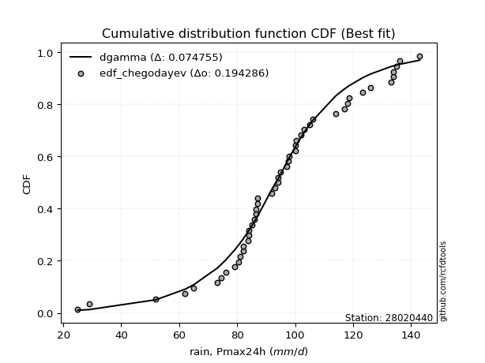</img>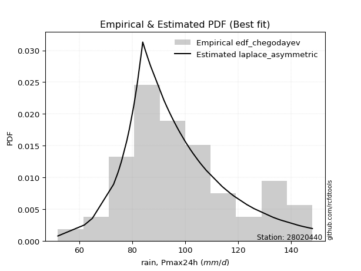</img>

</div>


### 6. EDF Blom (1958)

The Blom formula is a specific "plotting position" formula used in hydrology and statistical analysis to estimate the empirical cumulative probability (or non-exceedance probability) of a data series. It is particularly recommended for data that are approximately normally distributed. The constant _a_ is set to 0.375 (or 3/8).

<div align="center">


$P=(m-a)/(n+1-2a)$


</div>


**6.1. Empirical values**

<div align="center">

|                | 0                   | 1                    | 2                   | 3                   | 4                   | 5                   | 6                   | 7                   | 8                   | 9                   | 10                  | 11                  | 12                  | 13                  | 14                  | 15                  | 16                 | 17                  | 18                 | 19                  | 20                 | 21                  | 22                 | 23                  | 24                 | 25                  | 26                 | 27                  | 28                 | 29                  | 30       | 31                 | 32                 | 33                 | 34                 | 35                 | 36                 | 37                 | 38                 | 39                 | 40                 | 41                 | 42                 | 43                 | 44                 | 45                 | 46                 | 47                 | 48                 | 49                | 50                | 51                 | 52                 | 53                 | 54                 | 55                 | 56                 | 57                 | 58                 | 59                 | 60                 |
|:---------------|:--------------------|:---------------------|:--------------------|:--------------------|:--------------------|:--------------------|:--------------------|:--------------------|:--------------------|:--------------------|:--------------------|:--------------------|:--------------------|:--------------------|:--------------------|:--------------------|:-------------------|:--------------------|:-------------------|:--------------------|:-------------------|:--------------------|:-------------------|:--------------------|:-------------------|:--------------------|:-------------------|:--------------------|:-------------------|:--------------------|:---------|:-------------------|:-------------------|:-------------------|:-------------------|:-------------------|:-------------------|:-------------------|:-------------------|:-------------------|:-------------------|:-------------------|:-------------------|:-------------------|:-------------------|:-------------------|:-------------------|:-------------------|:-------------------|:------------------|:------------------|:-------------------|:-------------------|:-------------------|:-------------------|:-------------------|:-------------------|:-------------------|:-------------------|:-------------------|:-------------------|
| date           | 1961                | 2005                 | 1994                | 1964                | 1991                | 1997                | 1974                | 2015                | 1967                | 2018                | 1992                | 2004                | 2009                | 2001                | 1989                | 1976                | 1982               | 1963                | 2014               | 1977                | 1990               | 1993                | 2008               | 2002                | 2011               | 2006                | 1978               | 2000                | 1998               | 1968                | 2003     | 1969               | 1984               | 1995               | 1960               | 1975               | 1983               | 2020               | 2017               | 1999               | 2021               | 1971               | 1979               | 1981               | 2019               | 2012               | 1986               | 1965               | 1996               | 1985              | 1987              | 1980               | 1970               | 1973               | 1988               | 1959               | 1972               | 2007               | 2013               | 2010               | 2016               |
| x              | 52.0                | 62.0                 | 65.0                | 73.0                | 74.5                | 75.0                | 76.0                | 78.0                | 79.0                | 80.0                | 80.5                | 81.0                | 82.0                | 82.0                | 83.7                | 84.0                | 84.0               | 85.0                | 85.0               | 86.0                | 86.4               | 86.5                | 87.0               | 87.0                | 92.0               | 92.0                | 93.0               | 94.0                | 94.0               | 95.0                | 96.0     | 97.0               | 97.6               | 98.0               | 100.0              | 100.0              | 100.5              | 101.0              | 101.0              | 102.0              | 102.0              | 103.0              | 105.0              | 106.0              | 108.0              | 108.0              | 114.0              | 117.0              | 118.0              | 118.6             | 123.2             | 126.0              | 133.0              | 134.0              | 134.0              | 135.0              | 136.0              | 143.0              | 145.0              | 148.0              | 151.0              |
| m              | 1                   | 2                    | 3                   | 4                   | 5                   | 6                   | 7                   | 8                   | 9                   | 10                  | 11                  | 12                  | 13                  | 14                  | 15                  | 16                  | 17                 | 18                  | 19                 | 20                  | 21                 | 22                  | 23                 | 24                  | 25                 | 26                  | 27                 | 28                  | 29                 | 30                  | 31       | 32                 | 33                 | 34                 | 35                 | 36                 | 37                 | 38                 | 39                 | 40                 | 41                 | 42                 | 43                 | 44                 | 45                 | 46                 | 47                 | 48                 | 49                 | 50                | 51                | 52                 | 53                 | 54                 | 55                 | 56                 | 57                 | 58                 | 59                 | 60                 | 61                 |
| empirical_dist | edf_blom            | edf_blom             | edf_blom            | edf_blom            | edf_blom            | edf_blom            | edf_blom            | edf_blom            | edf_blom            | edf_blom            | edf_blom            | edf_blom            | edf_blom            | edf_blom            | edf_blom            | edf_blom            | edf_blom           | edf_blom            | edf_blom           | edf_blom            | edf_blom           | edf_blom            | edf_blom           | edf_blom            | edf_blom           | edf_blom            | edf_blom           | edf_blom            | edf_blom           | edf_blom            | edf_blom | edf_blom           | edf_blom           | edf_blom           | edf_blom           | edf_blom           | edf_blom           | edf_blom           | edf_blom           | edf_blom           | edf_blom           | edf_blom           | edf_blom           | edf_blom           | edf_blom           | edf_blom           | edf_blom           | edf_blom           | edf_blom           | edf_blom          | edf_blom          | edf_blom           | edf_blom           | edf_blom           | edf_blom           | edf_blom           | edf_blom           | edf_blom           | edf_blom           | edf_blom           | edf_blom           |
| empirical      | 0.01020408163265306 | 0.026530612244897958 | 0.04285714285714286 | 0.05918367346938776 | 0.07551020408163266 | 0.09183673469387756 | 0.10816326530612246 | 0.12448979591836734 | 0.14081632653061224 | 0.15714285714285714 | 0.17346938775510204 | 0.18979591836734694 | 0.20612244897959184 | 0.22244897959183674 | 0.23877551020408164 | 0.25510204081632654 | 0.2714285714285714 | 0.28775510204081634 | 0.3040816326530612 | 0.32040816326530613 | 0.336734693877551  | 0.35306122448979593 | 0.3693877551020408 | 0.38571428571428573 | 0.4020408163265306 | 0.41836734693877553 | 0.4346938775510204 | 0.45102040816326533 | 0.4673469387755102 | 0.48367346938775513 | 0.5      | 0.5163265306122449 | 0.5326530612244897 | 0.5489795918367347 | 0.5653061224489796 | 0.5816326530612245 | 0.5979591836734693 | 0.6142857142857143 | 0.6306122448979592 | 0.6469387755102041 | 0.6632653061224489 | 0.6795918367346939 | 0.6959183673469388 | 0.7122448979591837 | 0.7285714285714285 | 0.7448979591836735 | 0.7612244897959184 | 0.7775510204081633 | 0.7938775510204081 | 0.810204081632653 | 0.826530612244898 | 0.8428571428571429 | 0.8591836734693877 | 0.8755102040816326 | 0.8918367346938776 | 0.9081632653061225 | 0.9244897959183673 | 0.9408163265306122 | 0.9571428571428572 | 0.9734693877551021 | 0.9897959183673469 |
| empirical_tr   | 1.0103092783505154  | 1.0272536687631026   | 1.044776119402985   | 1.0629067245119306  | 1.0816777041942605  | 1.101123595505618   | 1.1212814645308924  | 1.1421911421911422  | 1.163895486935867   | 1.1864406779661016  | 1.2098765432098766  | 1.234256926952141   | 1.2596401028277635  | 1.2860892388451444  | 1.3136729222520107  | 1.3424657534246573  | 1.372549019607843  | 1.4040114613180517  | 1.436950146627566  | 1.4714714714714716  | 1.5076923076923079 | 1.5457413249211356  | 1.5857605177993528 | 1.627906976744186   | 1.6723549488054605 | 1.719298245614035   | 1.7689530685920578 | 1.8215613382899631  | 1.8773946360153257 | 1.9367588932806326  | 2.0      | 2.067510548523207  | 2.1397379912663754 | 2.2171945701357467 | 2.300469483568075  | 2.3902439024390243 | 2.4873096446700504 | 2.592592592592593  | 2.707182320441989  | 2.832369942196532  | 2.9696969696969693 | 3.1210191082802554 | 3.288590604026846  | 3.475177304964539  | 3.684210526315789  | 3.920000000000001  | 4.188034188034188  | 4.495412844036697  | 4.8514851485148505 | 5.268817204301074 | 5.764705882352942 | 6.363636363636364  | 7.1014492753623175 | 8.032786885245898  | 9.245283018867928  | 10.88888888888889  | 13.24324324324324  | 16.896551724137918 | 23.333333333333357 | 37.692307692307715 | 97.99999999999989  |

</div>


**6.2. Kolmogorov-Smirnov fit test (sorted by Δ)**


<div align="center">

|                | 0                   | 1                   | 2                    | 3                   | 4                   | 5                   | 6                   | 7                   | 8                   | 9                   | 10                  | 11                  | 12                  | 13                  | 14                  | 15                  | 16                  | 17                  | 18                  | 19                  | 20                  | 21                  | 22                  | 23                  | 24                  | 25                  | 26                  | 27                  | 28                  | 29                  | 30                  | 31                  | 32                  | 33                  | 34                  | 35                  | 36                  | 37                  | 38                  | 39                  | 40                  | 41                  | 42                  | 43                  | 44                  | 45                  | 46                  | 47                  | 48                  | 49                  | 50                  | 51                  | 52                  | 53                  | 54                  | 55                  | 56                  | 57                  | 58                  | 59                  | 60                  | 61                  | 62                    | 63                  | 64                  | 65                  | 66                  | 67                  | 68                  | 69                  | 70                  | 71                  | 72                  | 73                  | 74                  | 75                  | 76                  | 77                  | 78                  | 79                  | 80                  | 81                  | 82                  | 83                  | 84                  | 85                  | 86                  | 87                  |
|:---------------|:--------------------|:--------------------|:---------------------|:--------------------|:--------------------|:--------------------|:--------------------|:--------------------|:--------------------|:--------------------|:--------------------|:--------------------|:--------------------|:--------------------|:--------------------|:--------------------|:--------------------|:--------------------|:--------------------|:--------------------|:--------------------|:--------------------|:--------------------|:--------------------|:--------------------|:--------------------|:--------------------|:--------------------|:--------------------|:--------------------|:--------------------|:--------------------|:--------------------|:--------------------|:--------------------|:--------------------|:--------------------|:--------------------|:--------------------|:--------------------|:--------------------|:--------------------|:--------------------|:--------------------|:--------------------|:--------------------|:--------------------|:--------------------|:--------------------|:--------------------|:--------------------|:--------------------|:--------------------|:--------------------|:--------------------|:--------------------|:--------------------|:--------------------|:--------------------|:--------------------|:--------------------|:--------------------|:----------------------|:--------------------|:--------------------|:--------------------|:--------------------|:--------------------|:--------------------|:--------------------|:--------------------|:--------------------|:--------------------|:--------------------|:--------------------|:--------------------|:--------------------|:--------------------|:--------------------|:--------------------|:--------------------|:--------------------|:--------------------|:--------------------|:--------------------|:--------------------|:--------------------|:--------------------|
| station        | 28020440            | 28020440            | 28020440             | 28020440            | 28020440            | 28020440            | 28020440            | 28020440            | 28020440            | 28020440            | 28020440            | 28020440            | 28020440            | 28020440            | 28020440            | 28020440            | 28020440            | 28020440            | 28020440            | 28020440            | 28020440            | 28020440            | 28020440            | 28020440            | 28020440            | 28020440            | 28020440            | 28020440            | 28020440            | 28020440            | 28020440            | 28020440            | 28020440            | 28020440            | 28020440            | 28020440            | 28020440            | 28020440            | 28020440            | 28020440            | 28020440            | 28020440            | 28020440            | 28020440            | 28020440            | 28020440            | 28020440            | 28020440            | 28020440            | 28020440            | 28020440            | 28020440            | 28020440            | 28020440            | 28020440            | 28020440            | 28020440            | 28020440            | 28020440            | 28020440            | 28020440            | 28020440            | 28020440              | 28020440            | 28020440            | 28020440            | 28020440            | 28020440            | 28020440            | 28020440            | 28020440            | 28020440            | 28020440            | 28020440            | 28020440            | 28020440            | 28020440            | 28020440            | 28020440            | 28020440            | 28020440            | 28020440            | 28020440            | 28020440            | 28020440            | 28020440            | 28020440            | 28020440            |
| empirical_dist | edf_blom            | edf_blom            | edf_blom             | edf_blom            | edf_blom            | edf_blom            | edf_blom            | edf_blom            | edf_blom            | edf_blom            | edf_blom            | edf_blom            | edf_blom            | edf_blom            | edf_blom            | edf_blom            | edf_blom            | edf_blom            | edf_blom            | edf_blom            | edf_blom            | edf_blom            | edf_blom            | edf_blom            | edf_blom            | edf_blom            | edf_blom            | edf_blom            | edf_blom            | edf_blom            | edf_blom            | edf_blom            | edf_blom            | edf_blom            | edf_blom            | edf_blom            | edf_blom            | edf_blom            | edf_blom            | edf_blom            | edf_blom            | edf_blom            | edf_blom            | edf_blom            | edf_blom            | edf_blom            | edf_blom            | edf_blom            | edf_blom            | edf_blom            | edf_blom            | edf_blom            | edf_blom            | edf_blom            | edf_blom            | edf_blom            | edf_blom            | edf_blom            | edf_blom            | edf_blom            | edf_blom            | edf_blom            | edf_blom              | edf_blom            | edf_blom            | edf_blom            | edf_blom            | edf_blom            | edf_blom            | edf_blom            | edf_blom            | edf_blom            | edf_blom            | edf_blom            | edf_blom            | edf_blom            | edf_blom            | edf_blom            | edf_blom            | edf_blom            | edf_blom            | edf_blom            | edf_blom            | edf_blom            | edf_blom            | edf_blom            | edf_blom            | edf_blom            |
| p_dist         | lograyleigh         | logmaxwell          | loginvgauss          | invweibull          | halfnorm            | loginvgamma         | lognct              | halflogistic        | logalpha            | moyal               | gumbel_r            | loggumbel_r         | betaprime           | exponnorm           | kstwobign           | invgauss            | logfatiguelife      | logf                | logncf              | lognakagami         | logerlang           | loggamma            | loggamma            | laplace_asymmetric  | loglognorm          | logexponnorm        | lognorm             | lognorm             | logcrystalball      | logrice             | logt                | logjohnsonsu        | logpearson3         | ncf                 | invgamma            | fatiguelife         | f                   | loggenlogistic      | mielke              | nct                 | johnsonsu           | genlogistic         | alpha               | logloggamma         | rayleigh            | logmielke           | logfisk             | gamma               | erlang              | chi2                | pearson3            | fisk                | weibull_min         | loginvweibull       | maxwell             | nakagami            | logweibull_min      | loghalfnorm         | logmoyal            | loglogistic         | rice                | loghalflogistic     | loglaplace_asymmetric | loghypsecant        | crystalball         | norm                | truncnorm           | t                   | logistic            | logkstwobign        | loggumbel_l         | hypsecant           | loglaplace          | wald                | logwald             | laplace             | gumbel_l            | loggenexpon         | loggibrat           | gibrat              | logbetaprime        | expon               | loggompertz         | logexpon            | logchi2             | logtruncnorm        | gompertz            | genexpon            |
| delta          | 0.05277821398362423 | 0.05338642428698803 | 0.055551678376683955 | 0.05610989071564054 | 0.05849777091754674 | 0.05862075780533016 | 0.05985315019543175 | 0.06106729140073891 | 0.061103298910547   | 0.06299096178317398 | 0.06661652632306309 | 0.0668784734628251  | 0.06714732333441409 | 0.06768004512913095 | 0.0677748495897954  | 0.06795458596383719 | 0.07048413670414283 | 0.07090897952771047 | 0.07108888918084644 | 0.07133321827641687 | 0.07181248963574166 | 0.07183357117679229 | 0.07183357117679229 | 0.07201241825502364 | 0.07220769907031582 | 0.07220785140282332 | 0.0722079053599412  | 0.0722079053599412  | 0.0722088572743253  | 0.0722147883720049  | 0.07222671132563369 | 0.0725448861213156  | 0.07257492342868788 | 0.07270510733161561 | 0.07295903773411977 | 0.07305688486657091 | 0.07315038225809428 | 0.07345742295972213 | 0.07346254708222089 | 0.07353606212514857 | 0.07354084384000409 | 0.0735787053357071  | 0.07358367548853995 | 0.07387460354596292 | 0.0742736472377542  | 0.07435512472937872 | 0.07587431171065806 | 0.07590795508476411 | 0.07590820249979835 | 0.07590833437320499 | 0.07795134146603167 | 0.07796988897533297 | 0.08050908510005894 | 0.08200325069611791 | 0.08379203816802494 | 0.08416077515812181 | 0.08427025785354625 | 0.0869403272117758  | 0.09030174780445638 | 0.09282443531855727 | 0.09958388383206418 | 0.10349789951695137 | 0.10577562338984348   | 0.10803314135499248 | 0.1142473110446055  | 0.11424731881240946 | 0.11424732583970143 | 0.11424760439919768 | 0.11763830204977826 | 0.12777506953344547 | 0.13227762121378683 | 0.13310803139202948 | 0.1342272976769302  | 0.14676072047221134 | 0.15675319357755485 | 0.15722809760188206 | 0.18138305969186375 | 0.19724165232997976 | 0.2224035657656182  | 0.23830218585319843 | 0.24462836306185298 | 0.30321640267796807 | 0.3154601425909438  | 0.36342287765186754 | 0.3688560520427632  | 0.4962173370332847  | 0.7974847921920256  | 0.8419935935919994  |
| deltao         | 0.17413015670873855 | 0.17413015670873855 | 0.17413015670873855  | 0.17413015670873855 | 0.17413015670873855 | 0.17413015670873855 | 0.17413015670873855 | 0.17413015670873855 | 0.17413015670873855 | 0.17413015670873855 | 0.17413015670873855 | 0.17413015670873855 | 0.17413015670873855 | 0.17413015670873855 | 0.17413015670873855 | 0.17413015670873855 | 0.17413015670873855 | 0.17413015670873855 | 0.17413015670873855 | 0.17413015670873855 | 0.17413015670873855 | 0.17413015670873855 | 0.17413015670873855 | 0.17413015670873855 | 0.17413015670873855 | 0.17413015670873855 | 0.17413015670873855 | 0.17413015670873855 | 0.17413015670873855 | 0.17413015670873855 | 0.17413015670873855 | 0.17413015670873855 | 0.17413015670873855 | 0.17413015670873855 | 0.17413015670873855 | 0.17413015670873855 | 0.17413015670873855 | 0.17413015670873855 | 0.17413015670873855 | 0.17413015670873855 | 0.17413015670873855 | 0.17413015670873855 | 0.17413015670873855 | 0.17413015670873855 | 0.17413015670873855 | 0.17413015670873855 | 0.17413015670873855 | 0.17413015670873855 | 0.17413015670873855 | 0.17413015670873855 | 0.17413015670873855 | 0.17413015670873855 | 0.17413015670873855 | 0.17413015670873855 | 0.17413015670873855 | 0.17413015670873855 | 0.17413015670873855 | 0.17413015670873855 | 0.17413015670873855 | 0.17413015670873855 | 0.17413015670873855 | 0.17413015670873855 | 0.17413015670873855   | 0.17413015670873855 | 0.17413015670873855 | 0.17413015670873855 | 0.17413015670873855 | 0.17413015670873855 | 0.17413015670873855 | 0.17413015670873855 | 0.17413015670873855 | 0.17413015670873855 | 0.17413015670873855 | 0.17413015670873855 | 0.17413015670873855 | 0.17413015670873855 | 0.17413015670873855 | 0.17413015670873855 | 0.17413015670873855 | 0.17413015670873855 | 0.17413015670873855 | 0.17413015670873855 | 0.17413015670873855 | 0.17413015670873855 | 0.17413015670873855 | 0.17413015670873855 | 0.17413015670873855 | 0.17413015670873855 |
| eval           | Δo > Δ              | Δo > Δ              | Δo > Δ               | Δo > Δ              | Δo > Δ              | Δo > Δ              | Δo > Δ              | Δo > Δ              | Δo > Δ              | Δo > Δ              | Δo > Δ              | Δo > Δ              | Δo > Δ              | Δo > Δ              | Δo > Δ              | Δo > Δ              | Δo > Δ              | Δo > Δ              | Δo > Δ              | Δo > Δ              | Δo > Δ              | Δo > Δ              | Δo > Δ              | Δo > Δ              | Δo > Δ              | Δo > Δ              | Δo > Δ              | Δo > Δ              | Δo > Δ              | Δo > Δ              | Δo > Δ              | Δo > Δ              | Δo > Δ              | Δo > Δ              | Δo > Δ              | Δo > Δ              | Δo > Δ              | Δo > Δ              | Δo > Δ              | Δo > Δ              | Δo > Δ              | Δo > Δ              | Δo > Δ              | Δo > Δ              | Δo > Δ              | Δo > Δ              | Δo > Δ              | Δo > Δ              | Δo > Δ              | Δo > Δ              | Δo > Δ              | Δo > Δ              | Δo > Δ              | Δo > Δ              | Δo > Δ              | Δo > Δ              | Δo > Δ              | Δo > Δ              | Δo > Δ              | Δo > Δ              | Δo > Δ              | Δo > Δ              | Δo > Δ                | Δo > Δ              | Δo > Δ              | Δo > Δ              | Δo > Δ              | Δo > Δ              | Δo > Δ              | Δo > Δ              | Δo > Δ              | Δo > Δ              | Δo > Δ              | Δo > Δ              | Δo > Δ              | Δo > Δ              | Δo <= Δ             | Δo <= Δ             | Δo <= Δ             | Δo <= Δ             | Δo <= Δ             | Δo <= Δ             | Δo <= Δ             | Δo <= Δ             | Δo <= Δ             | Δo <= Δ             | Δo <= Δ             | Δo <= Δ             |
| fit            | 1                   | 1                   | 1                    | 1                   | 1                   | 1                   | 1                   | 1                   | 1                   | 1                   | 1                   | 1                   | 1                   | 1                   | 1                   | 1                   | 1                   | 1                   | 1                   | 1                   | 1                   | 1                   | 1                   | 1                   | 1                   | 1                   | 1                   | 1                   | 1                   | 1                   | 1                   | 1                   | 1                   | 1                   | 1                   | 1                   | 1                   | 1                   | 1                   | 1                   | 1                   | 1                   | 1                   | 1                   | 1                   | 1                   | 1                   | 1                   | 1                   | 1                   | 1                   | 1                   | 1                   | 1                   | 1                   | 1                   | 1                   | 1                   | 1                   | 1                   | 1                   | 1                   | 1                     | 1                   | 1                   | 1                   | 1                   | 1                   | 1                   | 1                   | 1                   | 1                   | 1                   | 1                   | 1                   | 1                   | 0                   | 0                   | 0                   | 0                   | 0                   | 0                   | 0                   | 0                   | 0                   | 0                   | 0                   | 0                   |
| n              | 61                  | 61                  | 61                   | 61                  | 61                  | 61                  | 61                  | 61                  | 61                  | 61                  | 61                  | 61                  | 61                  | 61                  | 61                  | 61                  | 61                  | 61                  | 61                  | 61                  | 61                  | 61                  | 61                  | 61                  | 61                  | 61                  | 61                  | 61                  | 61                  | 61                  | 61                  | 61                  | 61                  | 61                  | 61                  | 61                  | 61                  | 61                  | 61                  | 61                  | 61                  | 61                  | 61                  | 61                  | 61                  | 61                  | 61                  | 61                  | 61                  | 61                  | 61                  | 61                  | 61                  | 61                  | 61                  | 61                  | 61                  | 61                  | 61                  | 61                  | 61                  | 61                  | 61                    | 61                  | 61                  | 61                  | 61                  | 61                  | 61                  | 61                  | 61                  | 61                  | 61                  | 61                  | 61                  | 61                  | 61                  | 61                  | 61                  | 61                  | 61                  | 61                  | 61                  | 61                  | 61                  | 61                  | 61                  | 61                  |
| best_fit       | 1                   | 0                   | 0                    | 0                   | 0                   | 0                   | 0                   | 0                   | 0                   | 0                   | 0                   | 0                   | 0                   | 0                   | 0                   | 0                   | 0                   | 0                   | 0                   | 0                   | 0                   | 0                   | 0                   | 0                   | 0                   | 0                   | 0                   | 0                   | 0                   | 0                   | 0                   | 0                   | 0                   | 0                   | 0                   | 0                   | 0                   | 0                   | 0                   | 0                   | 0                   | 0                   | 0                   | 0                   | 0                   | 0                   | 0                   | 0                   | 0                   | 0                   | 0                   | 0                   | 0                   | 0                   | 0                   | 0                   | 0                   | 0                   | 0                   | 0                   | 0                   | 0                   | 0                     | 0                   | 0                   | 0                   | 0                   | 0                   | 0                   | 0                   | 0                   | 0                   | 0                   | 0                   | 0                   | 0                   | 0                   | 0                   | 0                   | 0                   | 0                   | 0                   | 0                   | 0                   | 0                   | 0                   | 0                   | 0                   |
| best_fit_sort  | 1                   | 2                   | 3                    | 4                   | 5                   | 6                   | 7                   | 8                   | 9                   | 10                  | 11                  | 12                  | 13                  | 14                  | 15                  | 16                  | 17                  | 18                  | 19                  | 20                  | 21                  | 22                  | 23                  | 24                  | 25                  | 26                  | 27                  | 28                  | 29                  | 30                  | 31                  | 32                  | 33                  | 34                  | 35                  | 36                  | 37                  | 38                  | 39                  | 40                  | 41                  | 42                  | 43                  | 44                  | 45                  | 46                  | 47                  | 48                  | 49                  | 50                  | 51                  | 52                  | 53                  | 54                  | 55                  | 56                  | 57                  | 58                  | 59                  | 60                  | 61                  | 62                  | 63                    | 64                  | 65                  | 66                  | 67                  | 68                  | 69                  | 70                  | 71                  | 72                  | 73                  | 74                  | 75                  | 76                  | 77                  | 78                  | 79                  | 80                  | 81                  | 82                  | 83                  | 84                  | 85                  | 86                  | 87                  | 88                  |

</div>


<div align="center">

</img>

</div>


**6.3. Best fit**

<div align="center">

|   id |   station | empirical_dist   | p_dist      |     delta |   deltao | eval   |   fit |   n |   best_fit |   best_fit_sort |
|-----:|----------:|:-----------------|:------------|----------:|---------:|:-------|------:|----:|-----------:|----------------:|
|    0 |  28020440 | edf_blom         | lograyleigh | 0.0527782 |  0.17413 | Δo > Δ |     1 |  61 |          1 |               1 |

</div>


<div align="center">

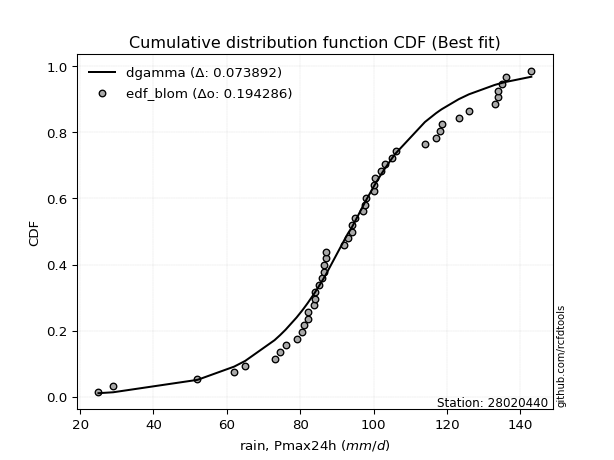</img>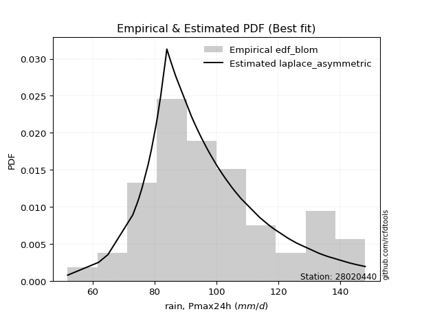</img>

</div>


### 7. EDF Tukey (1962)

In hydrology, the Tukey formula is used as a plotting position formula to estimate the empirical probability or frequency of a flood event (or other hydrological data). The formula parameter is given as _c=0.333_ (or 1/3).

<div align="center">


$P=(m-c)/(n+1-2c)$


</div>


**7.1. Empirical values**

<div align="center">

|                | 0                    | 1                   | 2                    | 3                    | 4                   | 5                   | 6                   | 7                  | 8                   | 9                   | 10                  | 11                  | 12                  | 13                  | 14                 | 15                 | 16                 | 17                  | 18                  | 19                  | 20                  | 21                 | 22                 | 23                 | 24                  | 25                  | 26                  | 27                  | 28                 | 29                 | 30        | 31                 | 32                 | 33                 | 34                 | 35                 | 36                 | 37                 | 38                 | 39                 | 40                 | 41                 | 42                 | 43                 | 44                 | 45                 | 46                 | 47                 | 48                 | 49                 | 50                 | 51                | 52                 | 53        | 54                 | 55                | 56                 | 57                 | 58                 | 59                 | 60                 |
|:---------------|:---------------------|:--------------------|:---------------------|:---------------------|:--------------------|:--------------------|:--------------------|:-------------------|:--------------------|:--------------------|:--------------------|:--------------------|:--------------------|:--------------------|:-------------------|:-------------------|:-------------------|:--------------------|:--------------------|:--------------------|:--------------------|:-------------------|:-------------------|:-------------------|:--------------------|:--------------------|:--------------------|:--------------------|:-------------------|:-------------------|:----------|:-------------------|:-------------------|:-------------------|:-------------------|:-------------------|:-------------------|:-------------------|:-------------------|:-------------------|:-------------------|:-------------------|:-------------------|:-------------------|:-------------------|:-------------------|:-------------------|:-------------------|:-------------------|:-------------------|:-------------------|:------------------|:-------------------|:----------|:-------------------|:------------------|:-------------------|:-------------------|:-------------------|:-------------------|:-------------------|
| date           | 1961                 | 2005                | 1994                 | 1964                 | 1991                | 1997                | 1974                | 2015               | 1967                | 2018                | 1992                | 2004                | 2009                | 2001                | 1989               | 1976               | 1982               | 1963                | 2014                | 1977                | 1990                | 1993               | 2008               | 2002               | 2011                | 2006                | 1978                | 2000                | 1998               | 1968               | 2003      | 1969               | 1984               | 1995               | 1960               | 1975               | 1983               | 2020               | 2017               | 1999               | 2021               | 1971               | 1979               | 1981               | 2019               | 2012               | 1986               | 1965               | 1996               | 1985               | 1987               | 1980              | 1970               | 1973      | 1988               | 1959              | 1972               | 2007               | 2013               | 2010               | 2016               |
| x              | 52.0                 | 62.0                | 65.0                 | 73.0                 | 74.5                | 75.0                | 76.0                | 78.0               | 79.0                | 80.0                | 80.5                | 81.0                | 82.0                | 82.0                | 83.7               | 84.0               | 84.0               | 85.0                | 85.0                | 86.0                | 86.4                | 86.5               | 87.0               | 87.0               | 92.0                | 92.0                | 93.0                | 94.0                | 94.0               | 95.0               | 96.0      | 97.0               | 97.6               | 98.0               | 100.0              | 100.0              | 100.5              | 101.0              | 101.0              | 102.0              | 102.0              | 103.0              | 105.0              | 106.0              | 108.0              | 108.0              | 114.0              | 117.0              | 118.0              | 118.6              | 123.2              | 126.0             | 133.0              | 134.0     | 134.0              | 135.0             | 136.0              | 143.0              | 145.0              | 148.0              | 151.0              |
| m              | 1                    | 2                   | 3                    | 4                    | 5                   | 6                   | 7                   | 8                  | 9                   | 10                  | 11                  | 12                  | 13                  | 14                  | 15                 | 16                 | 17                 | 18                  | 19                  | 20                  | 21                  | 22                 | 23                 | 24                 | 25                  | 26                  | 27                  | 28                  | 29                 | 30                 | 31        | 32                 | 33                 | 34                 | 35                 | 36                 | 37                 | 38                 | 39                 | 40                 | 41                 | 42                 | 43                 | 44                 | 45                 | 46                 | 47                 | 48                 | 49                 | 50                 | 51                 | 52                | 53                 | 54        | 55                 | 56                | 57                 | 58                 | 59                 | 60                 | 61                 |
| empirical_dist | edf_tukey            | edf_tukey           | edf_tukey            | edf_tukey            | edf_tukey           | edf_tukey           | edf_tukey           | edf_tukey          | edf_tukey           | edf_tukey           | edf_tukey           | edf_tukey           | edf_tukey           | edf_tukey           | edf_tukey          | edf_tukey          | edf_tukey          | edf_tukey           | edf_tukey           | edf_tukey           | edf_tukey           | edf_tukey          | edf_tukey          | edf_tukey          | edf_tukey           | edf_tukey           | edf_tukey           | edf_tukey           | edf_tukey          | edf_tukey          | edf_tukey | edf_tukey          | edf_tukey          | edf_tukey          | edf_tukey          | edf_tukey          | edf_tukey          | edf_tukey          | edf_tukey          | edf_tukey          | edf_tukey          | edf_tukey          | edf_tukey          | edf_tukey          | edf_tukey          | edf_tukey          | edf_tukey          | edf_tukey          | edf_tukey          | edf_tukey          | edf_tukey          | edf_tukey         | edf_tukey          | edf_tukey | edf_tukey          | edf_tukey         | edf_tukey          | edf_tukey          | edf_tukey          | edf_tukey          | edf_tukey          |
| empirical      | 0.010869565217391304 | 0.02717391304347826 | 0.043478260869565216 | 0.059782608695652176 | 0.07608695652173914 | 0.09239130434782608 | 0.10869565217391304 | 0.125              | 0.14130434782608695 | 0.15760869565217392 | 0.17391304347826086 | 0.19021739130434784 | 0.20652173913043478 | 0.22282608695652173 | 0.2391304347826087 | 0.2554347826086957 | 0.2717391304347826 | 0.28804347826086957 | 0.30434782608695654 | 0.32065217391304346 | 0.33695652173913043 | 0.3532608695652174 | 0.3695652173913043 | 0.3858695652173913 | 0.40217391304347827 | 0.41847826086956524 | 0.43478260869565216 | 0.45108695652173914 | 0.4673913043478261 | 0.483695652173913  | 0.5       | 0.5163043478260869 | 0.532608695652174  | 0.5489130434782609 | 0.5652173913043478 | 0.5815217391304348 | 0.5978260869565217 | 0.6141304347826086 | 0.6304347826086957 | 0.6467391304347826 | 0.6630434782608695 | 0.6793478260869565 | 0.6956521739130435 | 0.7119565217391305 | 0.7282608695652174 | 0.7445652173913043 | 0.7608695652173914 | 0.7771739130434783 | 0.7934782608695652 | 0.8097826086956522 | 0.8260869565217391 | 0.842391304347826 | 0.8586956521739131 | 0.875     | 0.8913043478260869 | 0.907608695652174 | 0.9239130434782609 | 0.9402173913043478 | 0.9565217391304348 | 0.9728260869565217 | 0.9891304347826086 |
| empirical_tr   | 1.010989010989011    | 1.0279329608938548  | 1.0454545454545454   | 1.0635838150289019   | 1.0823529411764705  | 1.1017964071856288  | 1.1219512195121952  | 1.1428571428571428 | 1.1645569620253164  | 1.1870967741935485  | 1.2105263157894737  | 1.2348993288590604  | 1.2602739726027399  | 1.2867132867132867  | 1.3142857142857143 | 1.343065693430657  | 1.373134328358209  | 1.4045801526717558  | 1.4375              | 1.472               | 1.5081967213114753  | 1.546218487394958  | 1.586206896551724  | 1.6283185840707965 | 1.6727272727272728  | 1.719626168224299   | 1.769230769230769   | 1.8217821782178218  | 1.8775510204081636 | 1.9368421052631581 | 2.0       | 2.0674157303370784 | 2.1395348837209305 | 2.216867469879518  | 2.3                | 2.38961038961039   | 2.4864864864864864 | 2.5915492957746475 | 2.7058823529411766 | 2.8307692307692305 | 2.9677419354838706 | 3.1186440677966103 | 3.2857142857142856 | 3.4716981132075477 | 3.68               | 3.914893617021276  | 4.1818181818181825 | 4.487804878048781  | 4.842105263157894  | 5.257142857142858  | 5.75               | 6.344827586206895 | 7.076923076923078  | 8.0       | 9.199999999999998  | 10.82352941176471 | 13.142857142857142 | 16.727272727272716 | 23.000000000000014 | 36.79999999999999  | 91.99999999999959  |

</div>


**7.2. Kolmogorov-Smirnov fit test (sorted by Δ)**


<div align="center">

|                | 0                   | 1                   | 2                   | 3                    | 4                   | 5                    | 6                   | 7                   | 8                   | 9                   | 10                  | 11                  | 12                  | 13                  | 14                  | 15                  | 16                  | 17                  | 18                  | 19                  | 20                  | 21                  | 22                  | 23                  | 24                  | 25                  | 26                  | 27                  | 28                  | 29                  | 30                  | 31                  | 32                  | 33                  | 34                  | 35                  | 36                  | 37                  | 38                  | 39                  | 40                  | 41                  | 42                  | 43                  | 44                  | 45                  | 46                  | 47                  | 48                  | 49                  | 50                  | 51                  | 52                  | 53                  | 54                  | 55                  | 56                  | 57                  | 58                  | 59                  | 60                  | 61                  | 62                    | 63                  | 64                  | 65                  | 66                  | 67                  | 68                  | 69                  | 70                  | 71                  | 72                  | 73                  | 74                  | 75                  | 76                  | 77                  | 78                  | 79                  | 80                  | 81                  | 82                  | 83                  | 84                  | 85                  | 86                  | 87                  |
|:---------------|:--------------------|:--------------------|:--------------------|:---------------------|:--------------------|:---------------------|:--------------------|:--------------------|:--------------------|:--------------------|:--------------------|:--------------------|:--------------------|:--------------------|:--------------------|:--------------------|:--------------------|:--------------------|:--------------------|:--------------------|:--------------------|:--------------------|:--------------------|:--------------------|:--------------------|:--------------------|:--------------------|:--------------------|:--------------------|:--------------------|:--------------------|:--------------------|:--------------------|:--------------------|:--------------------|:--------------------|:--------------------|:--------------------|:--------------------|:--------------------|:--------------------|:--------------------|:--------------------|:--------------------|:--------------------|:--------------------|:--------------------|:--------------------|:--------------------|:--------------------|:--------------------|:--------------------|:--------------------|:--------------------|:--------------------|:--------------------|:--------------------|:--------------------|:--------------------|:--------------------|:--------------------|:--------------------|:----------------------|:--------------------|:--------------------|:--------------------|:--------------------|:--------------------|:--------------------|:--------------------|:--------------------|:--------------------|:--------------------|:--------------------|:--------------------|:--------------------|:--------------------|:--------------------|:--------------------|:--------------------|:--------------------|:--------------------|:--------------------|:--------------------|:--------------------|:--------------------|:--------------------|:--------------------|
| station        | 28020440            | 28020440            | 28020440            | 28020440             | 28020440            | 28020440             | 28020440            | 28020440            | 28020440            | 28020440            | 28020440            | 28020440            | 28020440            | 28020440            | 28020440            | 28020440            | 28020440            | 28020440            | 28020440            | 28020440            | 28020440            | 28020440            | 28020440            | 28020440            | 28020440            | 28020440            | 28020440            | 28020440            | 28020440            | 28020440            | 28020440            | 28020440            | 28020440            | 28020440            | 28020440            | 28020440            | 28020440            | 28020440            | 28020440            | 28020440            | 28020440            | 28020440            | 28020440            | 28020440            | 28020440            | 28020440            | 28020440            | 28020440            | 28020440            | 28020440            | 28020440            | 28020440            | 28020440            | 28020440            | 28020440            | 28020440            | 28020440            | 28020440            | 28020440            | 28020440            | 28020440            | 28020440            | 28020440              | 28020440            | 28020440            | 28020440            | 28020440            | 28020440            | 28020440            | 28020440            | 28020440            | 28020440            | 28020440            | 28020440            | 28020440            | 28020440            | 28020440            | 28020440            | 28020440            | 28020440            | 28020440            | 28020440            | 28020440            | 28020440            | 28020440            | 28020440            | 28020440            | 28020440            |
| empirical_dist | edf_tukey           | edf_tukey           | edf_tukey           | edf_tukey            | edf_tukey           | edf_tukey            | edf_tukey           | edf_tukey           | edf_tukey           | edf_tukey           | edf_tukey           | edf_tukey           | edf_tukey           | edf_tukey           | edf_tukey           | edf_tukey           | edf_tukey           | edf_tukey           | edf_tukey           | edf_tukey           | edf_tukey           | edf_tukey           | edf_tukey           | edf_tukey           | edf_tukey           | edf_tukey           | edf_tukey           | edf_tukey           | edf_tukey           | edf_tukey           | edf_tukey           | edf_tukey           | edf_tukey           | edf_tukey           | edf_tukey           | edf_tukey           | edf_tukey           | edf_tukey           | edf_tukey           | edf_tukey           | edf_tukey           | edf_tukey           | edf_tukey           | edf_tukey           | edf_tukey           | edf_tukey           | edf_tukey           | edf_tukey           | edf_tukey           | edf_tukey           | edf_tukey           | edf_tukey           | edf_tukey           | edf_tukey           | edf_tukey           | edf_tukey           | edf_tukey           | edf_tukey           | edf_tukey           | edf_tukey           | edf_tukey           | edf_tukey           | edf_tukey             | edf_tukey           | edf_tukey           | edf_tukey           | edf_tukey           | edf_tukey           | edf_tukey           | edf_tukey           | edf_tukey           | edf_tukey           | edf_tukey           | edf_tukey           | edf_tukey           | edf_tukey           | edf_tukey           | edf_tukey           | edf_tukey           | edf_tukey           | edf_tukey           | edf_tukey           | edf_tukey           | edf_tukey           | edf_tukey           | edf_tukey           | edf_tukey           | edf_tukey           |
| p_dist         | lograyleigh         | logmaxwell          | invweibull          | loginvgauss          | halfnorm            | loginvgamma          | lognct              | halflogistic        | logalpha            | moyal               | loggumbel_r         | gumbel_r            | betaprime           | kstwobign           | invgauss            | exponnorm           | logfatiguelife      | logf                | logncf              | lognakagami         | laplace_asymmetric  | logerlang           | loggamma            | loggamma            | loglognorm          | logexponnorm        | lognorm             | lognorm             | logcrystalball      | logrice             | logt                | logjohnsonsu        | logpearson3         | fatiguelife         | ncf                 | invgamma            | f                   | loggenlogistic      | mielke              | nct                 | johnsonsu           | genlogistic         | alpha               | rayleigh            | logloggamma         | logmielke           | gamma               | erlang              | chi2                | logfisk             | pearson3            | fisk                | weibull_min         | loginvweibull       | maxwell             | nakagami            | logweibull_min      | loghalfnorm         | logmoyal            | loglogistic         | rice                | loghalflogistic     | loglaplace_asymmetric | loghypsecant        | crystalball         | norm                | truncnorm           | t                   | logistic            | logkstwobign        | loggumbel_l         | hypsecant           | loglaplace          | wald                | logwald             | laplace             | gumbel_l            | loggenexpon         | loggibrat           | gibrat              | logbetaprime        | expon               | loggompertz         | logexpon            | logchi2             | logtruncnorm        | gompertz            | genexpon            |
| delta          | 0.05231237547430745 | 0.05387444558246268 | 0.05586588006790316 | 0.056039699672158605 | 0.05803193240822996 | 0.058776037308435725 | 0.06000842969853731 | 0.06093419468379124 | 0.06159132020602165 | 0.06347898307864863 | 0.06674537674587744 | 0.06677180582616865 | 0.06730260283751965 | 0.06730901108047863 | 0.06773275810225776 | 0.06783532463223652 | 0.0706394162072484  | 0.07106425903081603 | 0.071244168683952   | 0.07148849777952243 | 0.07187932153807597 | 0.07196776913884723 | 0.07198885067989785 | 0.07198885067989785 | 0.07236297857342139 | 0.07236313090592889 | 0.07236318486304677 | 0.07236318486304677 | 0.07236413677743087 | 0.07237006787511047 | 0.07238199082873925 | 0.07270016562442116 | 0.07273020293179344 | 0.07283505700499149 | 0.07286038683472118 | 0.07311431723722533 | 0.07330566176119985 | 0.0736127024628277  | 0.07361782658532645 | 0.07369134162825414 | 0.07369612334310965 | 0.07373398483881266 | 0.07373895499164551 | 0.07402963659001682 | 0.07402988304906849 | 0.07451040423248428 | 0.07568612722318468 | 0.07568637463821892 | 0.07568650651162556 | 0.07602959121376363 | 0.07772951360445224 | 0.07812516847843853 | 0.08028725723847951 | 0.08153741218680113 | 0.08357021030644551 | 0.08393894729654239 | 0.08404842999196682 | 0.08680723049482814 | 0.09016865108750871 | 0.09297971482166284 | 0.09936205597048475 | 0.10336480280000371 | 0.10593090289294904   | 0.10818842085809804 | 0.11402548318302608 | 0.11402549095083003 | 0.114025497978122   | 0.11402577653761825 | 0.11779358155288383 | 0.1273092310241287  | 0.1320557933522074  | 0.13326331089513505 | 0.13438257718003577 | 0.14718219340921224 | 0.15668664521908104 | 0.15738337710498762 | 0.18116123183028432 | 0.1967314482483471  | 0.2227806731303032  | 0.23861274485940961 | 0.24402942783558856 | 0.3026396502378616  | 0.31488339015083733 | 0.3628461252117611  | 0.3682571168164988  | 0.49570713295165203 | 0.7970633192550248  | 0.841394658365735   |
| deltao         | 0.17413015670873855 | 0.17413015670873855 | 0.17413015670873855 | 0.17413015670873855  | 0.17413015670873855 | 0.17413015670873855  | 0.17413015670873855 | 0.17413015670873855 | 0.17413015670873855 | 0.17413015670873855 | 0.17413015670873855 | 0.17413015670873855 | 0.17413015670873855 | 0.17413015670873855 | 0.17413015670873855 | 0.17413015670873855 | 0.17413015670873855 | 0.17413015670873855 | 0.17413015670873855 | 0.17413015670873855 | 0.17413015670873855 | 0.17413015670873855 | 0.17413015670873855 | 0.17413015670873855 | 0.17413015670873855 | 0.17413015670873855 | 0.17413015670873855 | 0.17413015670873855 | 0.17413015670873855 | 0.17413015670873855 | 0.17413015670873855 | 0.17413015670873855 | 0.17413015670873855 | 0.17413015670873855 | 0.17413015670873855 | 0.17413015670873855 | 0.17413015670873855 | 0.17413015670873855 | 0.17413015670873855 | 0.17413015670873855 | 0.17413015670873855 | 0.17413015670873855 | 0.17413015670873855 | 0.17413015670873855 | 0.17413015670873855 | 0.17413015670873855 | 0.17413015670873855 | 0.17413015670873855 | 0.17413015670873855 | 0.17413015670873855 | 0.17413015670873855 | 0.17413015670873855 | 0.17413015670873855 | 0.17413015670873855 | 0.17413015670873855 | 0.17413015670873855 | 0.17413015670873855 | 0.17413015670873855 | 0.17413015670873855 | 0.17413015670873855 | 0.17413015670873855 | 0.17413015670873855 | 0.17413015670873855   | 0.17413015670873855 | 0.17413015670873855 | 0.17413015670873855 | 0.17413015670873855 | 0.17413015670873855 | 0.17413015670873855 | 0.17413015670873855 | 0.17413015670873855 | 0.17413015670873855 | 0.17413015670873855 | 0.17413015670873855 | 0.17413015670873855 | 0.17413015670873855 | 0.17413015670873855 | 0.17413015670873855 | 0.17413015670873855 | 0.17413015670873855 | 0.17413015670873855 | 0.17413015670873855 | 0.17413015670873855 | 0.17413015670873855 | 0.17413015670873855 | 0.17413015670873855 | 0.17413015670873855 | 0.17413015670873855 |
| eval           | Δo > Δ              | Δo > Δ              | Δo > Δ              | Δo > Δ               | Δo > Δ              | Δo > Δ               | Δo > Δ              | Δo > Δ              | Δo > Δ              | Δo > Δ              | Δo > Δ              | Δo > Δ              | Δo > Δ              | Δo > Δ              | Δo > Δ              | Δo > Δ              | Δo > Δ              | Δo > Δ              | Δo > Δ              | Δo > Δ              | Δo > Δ              | Δo > Δ              | Δo > Δ              | Δo > Δ              | Δo > Δ              | Δo > Δ              | Δo > Δ              | Δo > Δ              | Δo > Δ              | Δo > Δ              | Δo > Δ              | Δo > Δ              | Δo > Δ              | Δo > Δ              | Δo > Δ              | Δo > Δ              | Δo > Δ              | Δo > Δ              | Δo > Δ              | Δo > Δ              | Δo > Δ              | Δo > Δ              | Δo > Δ              | Δo > Δ              | Δo > Δ              | Δo > Δ              | Δo > Δ              | Δo > Δ              | Δo > Δ              | Δo > Δ              | Δo > Δ              | Δo > Δ              | Δo > Δ              | Δo > Δ              | Δo > Δ              | Δo > Δ              | Δo > Δ              | Δo > Δ              | Δo > Δ              | Δo > Δ              | Δo > Δ              | Δo > Δ              | Δo > Δ                | Δo > Δ              | Δo > Δ              | Δo > Δ              | Δo > Δ              | Δo > Δ              | Δo > Δ              | Δo > Δ              | Δo > Δ              | Δo > Δ              | Δo > Δ              | Δo > Δ              | Δo > Δ              | Δo > Δ              | Δo <= Δ             | Δo <= Δ             | Δo <= Δ             | Δo <= Δ             | Δo <= Δ             | Δo <= Δ             | Δo <= Δ             | Δo <= Δ             | Δo <= Δ             | Δo <= Δ             | Δo <= Δ             | Δo <= Δ             |
| fit            | 1                   | 1                   | 1                   | 1                    | 1                   | 1                    | 1                   | 1                   | 1                   | 1                   | 1                   | 1                   | 1                   | 1                   | 1                   | 1                   | 1                   | 1                   | 1                   | 1                   | 1                   | 1                   | 1                   | 1                   | 1                   | 1                   | 1                   | 1                   | 1                   | 1                   | 1                   | 1                   | 1                   | 1                   | 1                   | 1                   | 1                   | 1                   | 1                   | 1                   | 1                   | 1                   | 1                   | 1                   | 1                   | 1                   | 1                   | 1                   | 1                   | 1                   | 1                   | 1                   | 1                   | 1                   | 1                   | 1                   | 1                   | 1                   | 1                   | 1                   | 1                   | 1                   | 1                     | 1                   | 1                   | 1                   | 1                   | 1                   | 1                   | 1                   | 1                   | 1                   | 1                   | 1                   | 1                   | 1                   | 0                   | 0                   | 0                   | 0                   | 0                   | 0                   | 0                   | 0                   | 0                   | 0                   | 0                   | 0                   |
| n              | 61                  | 61                  | 61                  | 61                   | 61                  | 61                   | 61                  | 61                  | 61                  | 61                  | 61                  | 61                  | 61                  | 61                  | 61                  | 61                  | 61                  | 61                  | 61                  | 61                  | 61                  | 61                  | 61                  | 61                  | 61                  | 61                  | 61                  | 61                  | 61                  | 61                  | 61                  | 61                  | 61                  | 61                  | 61                  | 61                  | 61                  | 61                  | 61                  | 61                  | 61                  | 61                  | 61                  | 61                  | 61                  | 61                  | 61                  | 61                  | 61                  | 61                  | 61                  | 61                  | 61                  | 61                  | 61                  | 61                  | 61                  | 61                  | 61                  | 61                  | 61                  | 61                  | 61                    | 61                  | 61                  | 61                  | 61                  | 61                  | 61                  | 61                  | 61                  | 61                  | 61                  | 61                  | 61                  | 61                  | 61                  | 61                  | 61                  | 61                  | 61                  | 61                  | 61                  | 61                  | 61                  | 61                  | 61                  | 61                  |
| best_fit       | 1                   | 0                   | 0                   | 0                    | 0                   | 0                    | 0                   | 0                   | 0                   | 0                   | 0                   | 0                   | 0                   | 0                   | 0                   | 0                   | 0                   | 0                   | 0                   | 0                   | 0                   | 0                   | 0                   | 0                   | 0                   | 0                   | 0                   | 0                   | 0                   | 0                   | 0                   | 0                   | 0                   | 0                   | 0                   | 0                   | 0                   | 0                   | 0                   | 0                   | 0                   | 0                   | 0                   | 0                   | 0                   | 0                   | 0                   | 0                   | 0                   | 0                   | 0                   | 0                   | 0                   | 0                   | 0                   | 0                   | 0                   | 0                   | 0                   | 0                   | 0                   | 0                   | 0                     | 0                   | 0                   | 0                   | 0                   | 0                   | 0                   | 0                   | 0                   | 0                   | 0                   | 0                   | 0                   | 0                   | 0                   | 0                   | 0                   | 0                   | 0                   | 0                   | 0                   | 0                   | 0                   | 0                   | 0                   | 0                   |
| best_fit_sort  | 1                   | 2                   | 3                   | 4                    | 5                   | 6                    | 7                   | 8                   | 9                   | 10                  | 11                  | 12                  | 13                  | 14                  | 15                  | 16                  | 17                  | 18                  | 19                  | 20                  | 21                  | 22                  | 23                  | 24                  | 25                  | 26                  | 27                  | 28                  | 29                  | 30                  | 31                  | 32                  | 33                  | 34                  | 35                  | 36                  | 37                  | 38                  | 39                  | 40                  | 41                  | 42                  | 43                  | 44                  | 45                  | 46                  | 47                  | 48                  | 49                  | 50                  | 51                  | 52                  | 53                  | 54                  | 55                  | 56                  | 57                  | 58                  | 59                  | 60                  | 61                  | 62                  | 63                    | 64                  | 65                  | 66                  | 67                  | 68                  | 69                  | 70                  | 71                  | 72                  | 73                  | 74                  | 75                  | 76                  | 77                  | 78                  | 79                  | 80                  | 81                  | 82                  | 83                  | 84                  | 85                  | 86                  | 87                  | 88                  |

</div>


<div align="center">

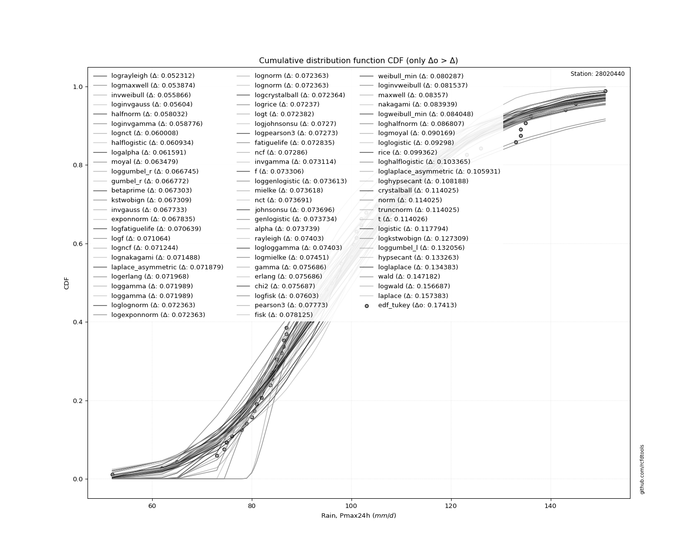</img>

</div>


**7.3. Best fit**

<div align="center">

|   id |   station | empirical_dist   | p_dist      |     delta |   deltao | eval   |   fit |   n |   best_fit |   best_fit_sort |
|-----:|----------:|:-----------------|:------------|----------:|---------:|:-------|------:|----:|-----------:|----------------:|
|    0 |  28020440 | edf_tukey        | lograyleigh | 0.0523124 |  0.17413 | Δo > Δ |     1 |  61 |          1 |               1 |

</div>


<div align="center">

</img>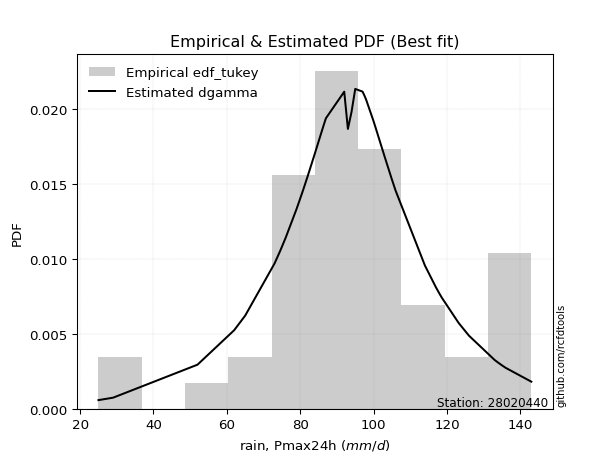</img>

</div>


### 8. EDF Gringorten (1963)

Gringorten plotting position formula is essential for estimating the probability and return periods of extreme events like floods and heavy rainfall. The constant _a=0.44_.

<div align="center">


$P=(m-a)/(n+1-2a)$


</div>


**8.1. Empirical values**

<div align="center">

|                | 0                    | 1                    | 2                    | 3                    | 4                   | 5                   | 6                   | 7                   | 8                   | 9                   | 10                  | 11                 | 12                 | 13                  | 14                  | 15                 | 16                 | 17                 | 18                 | 19                 | 20                  | 21                  | 22                  | 23                 | 24                 | 25                 | 26                  | 27                  | 28                  | 29                 | 30             | 31                 | 32                 | 33                 | 34                 | 35                 | 36                 | 37                 | 38                | 39                 | 40                 | 41                 | 42                 | 43                 | 44                 | 45                 | 46                 | 47                 | 48                 | 49                 | 50                 | 51                | 52                 | 53                 | 54                 | 55                 | 56                 | 57                 | 58                 | 59                | 60                 |
|:---------------|:---------------------|:---------------------|:---------------------|:---------------------|:--------------------|:--------------------|:--------------------|:--------------------|:--------------------|:--------------------|:--------------------|:-------------------|:-------------------|:--------------------|:--------------------|:-------------------|:-------------------|:-------------------|:-------------------|:-------------------|:--------------------|:--------------------|:--------------------|:-------------------|:-------------------|:-------------------|:--------------------|:--------------------|:--------------------|:-------------------|:---------------|:-------------------|:-------------------|:-------------------|:-------------------|:-------------------|:-------------------|:-------------------|:------------------|:-------------------|:-------------------|:-------------------|:-------------------|:-------------------|:-------------------|:-------------------|:-------------------|:-------------------|:-------------------|:-------------------|:-------------------|:------------------|:-------------------|:-------------------|:-------------------|:-------------------|:-------------------|:-------------------|:-------------------|:------------------|:-------------------|
| date           | 1961                 | 2005                 | 1994                 | 1964                 | 1991                | 1997                | 1974                | 2015                | 1967                | 2018                | 1992                | 2004               | 2009               | 2001                | 1989                | 1976               | 1982               | 1963               | 2014               | 1977               | 1990                | 1993                | 2008                | 2002               | 2011               | 2006               | 1978                | 2000                | 1998                | 1968               | 2003           | 1969               | 1984               | 1995               | 1960               | 1975               | 1983               | 2020               | 2017              | 1999               | 2021               | 1971               | 1979               | 1981               | 2019               | 2012               | 1986               | 1965               | 1996               | 1985               | 1987               | 1980              | 1970               | 1973               | 1988               | 1959               | 1972               | 2007               | 2013               | 2010              | 2016               |
| x              | 52.0                 | 62.0                 | 65.0                 | 73.0                 | 74.5                | 75.0                | 76.0                | 78.0                | 79.0                | 80.0                | 80.5                | 81.0               | 82.0               | 82.0                | 83.7                | 84.0               | 84.0               | 85.0               | 85.0               | 86.0               | 86.4                | 86.5                | 87.0                | 87.0               | 92.0               | 92.0               | 93.0                | 94.0                | 94.0                | 95.0               | 96.0           | 97.0               | 97.6               | 98.0               | 100.0              | 100.0              | 100.5              | 101.0              | 101.0             | 102.0              | 102.0              | 103.0              | 105.0              | 106.0              | 108.0              | 108.0              | 114.0              | 117.0              | 118.0              | 118.6              | 123.2              | 126.0             | 133.0              | 134.0              | 134.0              | 135.0              | 136.0              | 143.0              | 145.0              | 148.0             | 151.0              |
| m              | 1                    | 2                    | 3                    | 4                    | 5                   | 6                   | 7                   | 8                   | 9                   | 10                  | 11                  | 12                 | 13                 | 14                  | 15                  | 16                 | 17                 | 18                 | 19                 | 20                 | 21                  | 22                  | 23                  | 24                 | 25                 | 26                 | 27                  | 28                  | 29                  | 30                 | 31             | 32                 | 33                 | 34                 | 35                 | 36                 | 37                 | 38                 | 39                | 40                 | 41                 | 42                 | 43                 | 44                 | 45                 | 46                 | 47                 | 48                 | 49                 | 50                 | 51                 | 52                | 53                 | 54                 | 55                 | 56                 | 57                 | 58                 | 59                 | 60                | 61                 |
| empirical_dist | edf_gringorten       | edf_gringorten       | edf_gringorten       | edf_gringorten       | edf_gringorten      | edf_gringorten      | edf_gringorten      | edf_gringorten      | edf_gringorten      | edf_gringorten      | edf_gringorten      | edf_gringorten     | edf_gringorten     | edf_gringorten      | edf_gringorten      | edf_gringorten     | edf_gringorten     | edf_gringorten     | edf_gringorten     | edf_gringorten     | edf_gringorten      | edf_gringorten      | edf_gringorten      | edf_gringorten     | edf_gringorten     | edf_gringorten     | edf_gringorten      | edf_gringorten      | edf_gringorten      | edf_gringorten     | edf_gringorten | edf_gringorten     | edf_gringorten     | edf_gringorten     | edf_gringorten     | edf_gringorten     | edf_gringorten     | edf_gringorten     | edf_gringorten    | edf_gringorten     | edf_gringorten     | edf_gringorten     | edf_gringorten     | edf_gringorten     | edf_gringorten     | edf_gringorten     | edf_gringorten     | edf_gringorten     | edf_gringorten     | edf_gringorten     | edf_gringorten     | edf_gringorten    | edf_gringorten     | edf_gringorten     | edf_gringorten     | edf_gringorten     | edf_gringorten     | edf_gringorten     | edf_gringorten     | edf_gringorten    | edf_gringorten     |
| empirical      | 0.009162303664921467 | 0.025523560209424086 | 0.041884816753926704 | 0.058246073298429325 | 0.07460732984293193 | 0.09096858638743455 | 0.10732984293193717 | 0.12369109947643979 | 0.14005235602094243 | 0.15641361256544503 | 0.17277486910994766 | 0.1891361256544503 | 0.2054973821989529 | 0.22185863874345552 | 0.23821989528795814 | 0.2545811518324608 | 0.2709424083769633 | 0.287303664921466  | 0.3036649214659686 | 0.3200261780104712 | 0.33638743455497383 | 0.35274869109947643 | 0.36910994764397903 | 0.3854712041884817 | 0.4018324607329843 | 0.4181937172774869 | 0.43455497382198954 | 0.45091623036649214 | 0.46727748691099474 | 0.4836387434554974 | 0.5            | 0.5163612565445026 | 0.5327225130890053 | 0.5490837696335079 | 0.5654450261780105 | 0.5818062827225131 | 0.5981675392670158 | 0.6145287958115184 | 0.630890052356021 | 0.6472513089005236 | 0.6636125654450262 | 0.6799738219895288 | 0.6963350785340314 | 0.7126963350785341 | 0.7290575916230367 | 0.7454188481675393 | 0.7617801047120419 | 0.7781413612565445 | 0.7945026178010471 | 0.8108638743455499 | 0.8272251308900525 | 0.843586387434555 | 0.8599476439790577 | 0.8763089005235603 | 0.8926701570680629 | 0.9090314136125656 | 0.9253926701570682 | 0.9417539267015708 | 0.9581151832460734 | 0.974476439790576 | 0.9908376963350786 |
| empirical_tr   | 1.0092470277410832   | 1.0261920752182672   | 1.0437158469945356   | 1.0618485059068798   | 1.0806223479490806  | 1.1000719942404606  | 1.1202346041055717  | 1.1411501120238983  | 1.162861491628615   | 1.1854150504266874  | 1.2088607594936709  | 1.2332526230831315 | 1.2586490939044481 | 1.2851135407905805  | 1.3127147766323024  | 1.3415276558384548 | 1.3716337522441653 | 1.4031221303948578 | 1.4360902255639096 | 1.4706448508180943 | 1.5069033530571991  | 1.544994944388271   | 1.5850622406639001  | 1.6272630457933972 | 1.6717724288840263 | 1.718785151856018  | 1.7685185185185188  | 1.8212157330154948  | 1.8771498771498774  | 1.9366286438529785 | 2.0            | 2.06765899864682   | 2.140056022408964  | 2.2177068214804065 | 2.3012048192771086 | 2.391236306729265  | 2.4885993485342026 | 2.5942275042444827 | 2.709219858156029 | 2.8348794063079783 | 2.9727626459143974 | 3.124744376278119  | 3.293103448275862  | 3.4806378132118465 | 3.6908212560386486 | 3.9280205655527003 | 4.197802197802199  | 4.507374631268437  | 4.866242038216561  | 5.287197231833913  | 5.787878787878791  | 6.393305439330547 | 7.1401869158878535 | 8.084656084656087  | 9.31707317073171   | 10.992805755395699 | 13.403508771929843 | 17.168539325842723 | 23.87500000000004  | 39.17948717948725 | 109.14285714285752 |

</div>


**8.2. Kolmogorov-Smirnov fit test (sorted by Δ)**


<div align="center">

|                | 0                   | 1                    | 2                    | 3                   | 4                    | 5                    | 6                   | 7                   | 8                   | 9                   | 10                  | 11                  | 12                  | 13                  | 14                  | 15                  | 16                  | 17                  | 18                  | 19                  | 20                  | 21                  | 22                  | 23                  | 24                  | 25                  | 26                  | 27                  | 28                  | 29                  | 30                  | 31                  | 32                  | 33                  | 34                  | 35                  | 36                  | 37                  | 38                  | 39                  | 40                  | 41                  | 42                  | 43                  | 44                  | 45                  | 46                  | 47                  | 48                  | 49                  | 50                  | 51                  | 52                  | 53                  | 54                  | 55                  | 56                  | 57                  | 58                  | 59                  | 60                  | 61                  | 62                    | 63                  | 64                  | 65                  | 66                  | 67                  | 68                  | 69                  | 70                  | 71                  | 72                  | 73                  | 74                  | 75                  | 76                  | 77                  | 78                  | 79                  | 80                  | 81                  | 82                  | 83                  | 84                  | 85                  | 86                  | 87                  |
|:---------------|:--------------------|:---------------------|:---------------------|:--------------------|:---------------------|:---------------------|:--------------------|:--------------------|:--------------------|:--------------------|:--------------------|:--------------------|:--------------------|:--------------------|:--------------------|:--------------------|:--------------------|:--------------------|:--------------------|:--------------------|:--------------------|:--------------------|:--------------------|:--------------------|:--------------------|:--------------------|:--------------------|:--------------------|:--------------------|:--------------------|:--------------------|:--------------------|:--------------------|:--------------------|:--------------------|:--------------------|:--------------------|:--------------------|:--------------------|:--------------------|:--------------------|:--------------------|:--------------------|:--------------------|:--------------------|:--------------------|:--------------------|:--------------------|:--------------------|:--------------------|:--------------------|:--------------------|:--------------------|:--------------------|:--------------------|:--------------------|:--------------------|:--------------------|:--------------------|:--------------------|:--------------------|:--------------------|:----------------------|:--------------------|:--------------------|:--------------------|:--------------------|:--------------------|:--------------------|:--------------------|:--------------------|:--------------------|:--------------------|:--------------------|:--------------------|:--------------------|:--------------------|:--------------------|:--------------------|:--------------------|:--------------------|:--------------------|:--------------------|:--------------------|:--------------------|:--------------------|:--------------------|:--------------------|
| station        | 28020440            | 28020440             | 28020440             | 28020440            | 28020440             | 28020440             | 28020440            | 28020440            | 28020440            | 28020440            | 28020440            | 28020440            | 28020440            | 28020440            | 28020440            | 28020440            | 28020440            | 28020440            | 28020440            | 28020440            | 28020440            | 28020440            | 28020440            | 28020440            | 28020440            | 28020440            | 28020440            | 28020440            | 28020440            | 28020440            | 28020440            | 28020440            | 28020440            | 28020440            | 28020440            | 28020440            | 28020440            | 28020440            | 28020440            | 28020440            | 28020440            | 28020440            | 28020440            | 28020440            | 28020440            | 28020440            | 28020440            | 28020440            | 28020440            | 28020440            | 28020440            | 28020440            | 28020440            | 28020440            | 28020440            | 28020440            | 28020440            | 28020440            | 28020440            | 28020440            | 28020440            | 28020440            | 28020440              | 28020440            | 28020440            | 28020440            | 28020440            | 28020440            | 28020440            | 28020440            | 28020440            | 28020440            | 28020440            | 28020440            | 28020440            | 28020440            | 28020440            | 28020440            | 28020440            | 28020440            | 28020440            | 28020440            | 28020440            | 28020440            | 28020440            | 28020440            | 28020440            | 28020440            |
| empirical_dist | edf_gringorten      | edf_gringorten       | edf_gringorten       | edf_gringorten      | edf_gringorten       | edf_gringorten       | edf_gringorten      | edf_gringorten      | edf_gringorten      | edf_gringorten      | edf_gringorten      | edf_gringorten      | edf_gringorten      | edf_gringorten      | edf_gringorten      | edf_gringorten      | edf_gringorten      | edf_gringorten      | edf_gringorten      | edf_gringorten      | edf_gringorten      | edf_gringorten      | edf_gringorten      | edf_gringorten      | edf_gringorten      | edf_gringorten      | edf_gringorten      | edf_gringorten      | edf_gringorten      | edf_gringorten      | edf_gringorten      | edf_gringorten      | edf_gringorten      | edf_gringorten      | edf_gringorten      | edf_gringorten      | edf_gringorten      | edf_gringorten      | edf_gringorten      | edf_gringorten      | edf_gringorten      | edf_gringorten      | edf_gringorten      | edf_gringorten      | edf_gringorten      | edf_gringorten      | edf_gringorten      | edf_gringorten      | edf_gringorten      | edf_gringorten      | edf_gringorten      | edf_gringorten      | edf_gringorten      | edf_gringorten      | edf_gringorten      | edf_gringorten      | edf_gringorten      | edf_gringorten      | edf_gringorten      | edf_gringorten      | edf_gringorten      | edf_gringorten      | edf_gringorten        | edf_gringorten      | edf_gringorten      | edf_gringorten      | edf_gringorten      | edf_gringorten      | edf_gringorten      | edf_gringorten      | edf_gringorten      | edf_gringorten      | edf_gringorten      | edf_gringorten      | edf_gringorten      | edf_gringorten      | edf_gringorten      | edf_gringorten      | edf_gringorten      | edf_gringorten      | edf_gringorten      | edf_gringorten      | edf_gringorten      | edf_gringorten      | edf_gringorten      | edf_gringorten      | edf_gringorten      | edf_gringorten      |
| p_dist         | logmaxwell          | lograyleigh          | loginvgauss          | invweibull          | loginvgamma          | halfnorm             | lognct              | logalpha            | halflogistic        | moyal               | gumbel_r            | betaprime           | loggumbel_r         | exponnorm           | invgauss            | kstwobign           | logfatiguelife      | logf                | logncf              | lognakagami         | logerlang           | loggamma            | loggamma            | loglognorm          | logexponnorm        | lognorm             | lognorm             | logcrystalball      | logrice             | logt                | laplace_asymmetric  | logjohnsonsu        | logpearson3         | ncf                 | invgamma            | f                   | loggenlogistic      | mielke              | nct                 | johnsonsu           | genlogistic         | alpha               | fatiguelife         | logmielke           | logloggamma         | rayleigh            | logfisk             | gamma               | erlang              | chi2                | fisk                | pearson3            | weibull_min         | loginvweibull       | maxwell             | nakagami            | logweibull_min      | loghalfnorm         | logmoyal            | loglogistic         | rice                | loghalflogistic     | loglaplace_asymmetric | loghypsecant        | crystalball         | norm                | truncnorm           | t                   | logistic            | logkstwobign        | loggumbel_l         | hypsecant           | loglaplace          | wald                | logwald             | laplace             | gumbel_l            | loggenexpon         | loggibrat           | gibrat              | logbetaprime        | expon               | loggompertz         | logexpon            | logchi2             | logtruncnorm        | gompertz            | genexpon            |
| delta          | 0.05262245377731811 | 0.053507458561036336 | 0.054787707867014035 | 0.05649187597047545 | 0.058377676279526114 | 0.059227015494958846 | 0.0596100686696277  | 0.06033932840087708 | 0.06127564699428523 | 0.06222699127350406 | 0.06637344479725904 | 0.06690424180861004 | 0.06708682905637142 | 0.0674369636033269  | 0.06830184528641448 | 0.06850409416720751 | 0.07024105517833878 | 0.07066589800190642 | 0.07084580765504239 | 0.07109013675061282 | 0.07156940810993762 | 0.07159048965098824 | 0.07159048965098824 | 0.07196461754451178 | 0.07196476987701927 | 0.07196482383413716 | 0.07196482383413716 | 0.07196577574852125 | 0.07197170684620086 | 0.07198362979982964 | 0.07222077384856995 | 0.07230180459551155 | 0.07233184190288383 | 0.07246202580581157 | 0.07271595620831572 | 0.07290730073229024 | 0.07321434143391808 | 0.07321946555641684 | 0.07329298059934453 | 0.07329776231420004 | 0.07333562380990305 | 0.0733405939627359  | 0.0734041441891482  | 0.07411204320357467 | 0.07414525101767644 | 0.07465563249258911 | 0.07563123018485401 | 0.0762552144073414  | 0.07625546182237564 | 0.07625559369578228 | 0.07772680744952892 | 0.07829860078860895 | 0.08085634442263623 | 0.08273249527353002 | 0.08413929749060223 | 0.0845080344806991  | 0.08461751717612354 | 0.08714868280532212 | 0.0905101033980027  | 0.09258135379275323 | 0.09993114315464147 | 0.10370625511049769 | 0.10553254186403943   | 0.10779005982918843 | 0.11459457036718279 | 0.11459457813498675 | 0.11459458516227872 | 0.11459486372177496 | 0.11739522052397422 | 0.12850431411085758 | 0.13262488053636412 | 0.13286494986622543 | 0.13398421615112616 | 0.14610092775931469 | 0.15685737137432804 | 0.156985016076078   | 0.18173031901444103 | 0.1980403487719073  | 0.22181322491723698 | 0.23781602280159034 | 0.2455659632328114  | 0.3041192769166688  | 0.3163630168296445  | 0.36432575189056826 | 0.3697936522137216  | 0.4970160334752122  | 0.7981445849049225  | 0.8429311937629579  |
| deltao         | 0.17413015670873855 | 0.17413015670873855  | 0.17413015670873855  | 0.17413015670873855 | 0.17413015670873855  | 0.17413015670873855  | 0.17413015670873855 | 0.17413015670873855 | 0.17413015670873855 | 0.17413015670873855 | 0.17413015670873855 | 0.17413015670873855 | 0.17413015670873855 | 0.17413015670873855 | 0.17413015670873855 | 0.17413015670873855 | 0.17413015670873855 | 0.17413015670873855 | 0.17413015670873855 | 0.17413015670873855 | 0.17413015670873855 | 0.17413015670873855 | 0.17413015670873855 | 0.17413015670873855 | 0.17413015670873855 | 0.17413015670873855 | 0.17413015670873855 | 0.17413015670873855 | 0.17413015670873855 | 0.17413015670873855 | 0.17413015670873855 | 0.17413015670873855 | 0.17413015670873855 | 0.17413015670873855 | 0.17413015670873855 | 0.17413015670873855 | 0.17413015670873855 | 0.17413015670873855 | 0.17413015670873855 | 0.17413015670873855 | 0.17413015670873855 | 0.17413015670873855 | 0.17413015670873855 | 0.17413015670873855 | 0.17413015670873855 | 0.17413015670873855 | 0.17413015670873855 | 0.17413015670873855 | 0.17413015670873855 | 0.17413015670873855 | 0.17413015670873855 | 0.17413015670873855 | 0.17413015670873855 | 0.17413015670873855 | 0.17413015670873855 | 0.17413015670873855 | 0.17413015670873855 | 0.17413015670873855 | 0.17413015670873855 | 0.17413015670873855 | 0.17413015670873855 | 0.17413015670873855 | 0.17413015670873855   | 0.17413015670873855 | 0.17413015670873855 | 0.17413015670873855 | 0.17413015670873855 | 0.17413015670873855 | 0.17413015670873855 | 0.17413015670873855 | 0.17413015670873855 | 0.17413015670873855 | 0.17413015670873855 | 0.17413015670873855 | 0.17413015670873855 | 0.17413015670873855 | 0.17413015670873855 | 0.17413015670873855 | 0.17413015670873855 | 0.17413015670873855 | 0.17413015670873855 | 0.17413015670873855 | 0.17413015670873855 | 0.17413015670873855 | 0.17413015670873855 | 0.17413015670873855 | 0.17413015670873855 | 0.17413015670873855 |
| eval           | Δo > Δ              | Δo > Δ               | Δo > Δ               | Δo > Δ              | Δo > Δ               | Δo > Δ               | Δo > Δ              | Δo > Δ              | Δo > Δ              | Δo > Δ              | Δo > Δ              | Δo > Δ              | Δo > Δ              | Δo > Δ              | Δo > Δ              | Δo > Δ              | Δo > Δ              | Δo > Δ              | Δo > Δ              | Δo > Δ              | Δo > Δ              | Δo > Δ              | Δo > Δ              | Δo > Δ              | Δo > Δ              | Δo > Δ              | Δo > Δ              | Δo > Δ              | Δo > Δ              | Δo > Δ              | Δo > Δ              | Δo > Δ              | Δo > Δ              | Δo > Δ              | Δo > Δ              | Δo > Δ              | Δo > Δ              | Δo > Δ              | Δo > Δ              | Δo > Δ              | Δo > Δ              | Δo > Δ              | Δo > Δ              | Δo > Δ              | Δo > Δ              | Δo > Δ              | Δo > Δ              | Δo > Δ              | Δo > Δ              | Δo > Δ              | Δo > Δ              | Δo > Δ              | Δo > Δ              | Δo > Δ              | Δo > Δ              | Δo > Δ              | Δo > Δ              | Δo > Δ              | Δo > Δ              | Δo > Δ              | Δo > Δ              | Δo > Δ              | Δo > Δ                | Δo > Δ              | Δo > Δ              | Δo > Δ              | Δo > Δ              | Δo > Δ              | Δo > Δ              | Δo > Δ              | Δo > Δ              | Δo > Δ              | Δo > Δ              | Δo > Δ              | Δo > Δ              | Δo > Δ              | Δo <= Δ             | Δo <= Δ             | Δo <= Δ             | Δo <= Δ             | Δo <= Δ             | Δo <= Δ             | Δo <= Δ             | Δo <= Δ             | Δo <= Δ             | Δo <= Δ             | Δo <= Δ             | Δo <= Δ             |
| fit            | 1                   | 1                    | 1                    | 1                   | 1                    | 1                    | 1                   | 1                   | 1                   | 1                   | 1                   | 1                   | 1                   | 1                   | 1                   | 1                   | 1                   | 1                   | 1                   | 1                   | 1                   | 1                   | 1                   | 1                   | 1                   | 1                   | 1                   | 1                   | 1                   | 1                   | 1                   | 1                   | 1                   | 1                   | 1                   | 1                   | 1                   | 1                   | 1                   | 1                   | 1                   | 1                   | 1                   | 1                   | 1                   | 1                   | 1                   | 1                   | 1                   | 1                   | 1                   | 1                   | 1                   | 1                   | 1                   | 1                   | 1                   | 1                   | 1                   | 1                   | 1                   | 1                   | 1                     | 1                   | 1                   | 1                   | 1                   | 1                   | 1                   | 1                   | 1                   | 1                   | 1                   | 1                   | 1                   | 1                   | 0                   | 0                   | 0                   | 0                   | 0                   | 0                   | 0                   | 0                   | 0                   | 0                   | 0                   | 0                   |
| n              | 61                  | 61                   | 61                   | 61                  | 61                   | 61                   | 61                  | 61                  | 61                  | 61                  | 61                  | 61                  | 61                  | 61                  | 61                  | 61                  | 61                  | 61                  | 61                  | 61                  | 61                  | 61                  | 61                  | 61                  | 61                  | 61                  | 61                  | 61                  | 61                  | 61                  | 61                  | 61                  | 61                  | 61                  | 61                  | 61                  | 61                  | 61                  | 61                  | 61                  | 61                  | 61                  | 61                  | 61                  | 61                  | 61                  | 61                  | 61                  | 61                  | 61                  | 61                  | 61                  | 61                  | 61                  | 61                  | 61                  | 61                  | 61                  | 61                  | 61                  | 61                  | 61                  | 61                    | 61                  | 61                  | 61                  | 61                  | 61                  | 61                  | 61                  | 61                  | 61                  | 61                  | 61                  | 61                  | 61                  | 61                  | 61                  | 61                  | 61                  | 61                  | 61                  | 61                  | 61                  | 61                  | 61                  | 61                  | 61                  |
| best_fit       | 1                   | 0                    | 0                    | 0                   | 0                    | 0                    | 0                   | 0                   | 0                   | 0                   | 0                   | 0                   | 0                   | 0                   | 0                   | 0                   | 0                   | 0                   | 0                   | 0                   | 0                   | 0                   | 0                   | 0                   | 0                   | 0                   | 0                   | 0                   | 0                   | 0                   | 0                   | 0                   | 0                   | 0                   | 0                   | 0                   | 0                   | 0                   | 0                   | 0                   | 0                   | 0                   | 0                   | 0                   | 0                   | 0                   | 0                   | 0                   | 0                   | 0                   | 0                   | 0                   | 0                   | 0                   | 0                   | 0                   | 0                   | 0                   | 0                   | 0                   | 0                   | 0                   | 0                     | 0                   | 0                   | 0                   | 0                   | 0                   | 0                   | 0                   | 0                   | 0                   | 0                   | 0                   | 0                   | 0                   | 0                   | 0                   | 0                   | 0                   | 0                   | 0                   | 0                   | 0                   | 0                   | 0                   | 0                   | 0                   |
| best_fit_sort  | 1                   | 2                    | 3                    | 4                   | 5                    | 6                    | 7                   | 8                   | 9                   | 10                  | 11                  | 12                  | 13                  | 14                  | 15                  | 16                  | 17                  | 18                  | 19                  | 20                  | 21                  | 22                  | 23                  | 24                  | 25                  | 26                  | 27                  | 28                  | 29                  | 30                  | 31                  | 32                  | 33                  | 34                  | 35                  | 36                  | 37                  | 38                  | 39                  | 40                  | 41                  | 42                  | 43                  | 44                  | 45                  | 46                  | 47                  | 48                  | 49                  | 50                  | 51                  | 52                  | 53                  | 54                  | 55                  | 56                  | 57                  | 58                  | 59                  | 60                  | 61                  | 62                  | 63                    | 64                  | 65                  | 66                  | 67                  | 68                  | 69                  | 70                  | 71                  | 72                  | 73                  | 74                  | 75                  | 76                  | 77                  | 78                  | 79                  | 80                  | 81                  | 82                  | 83                  | 84                  | 85                  | 86                  | 87                  | 88                  |

</div>


<div align="center">

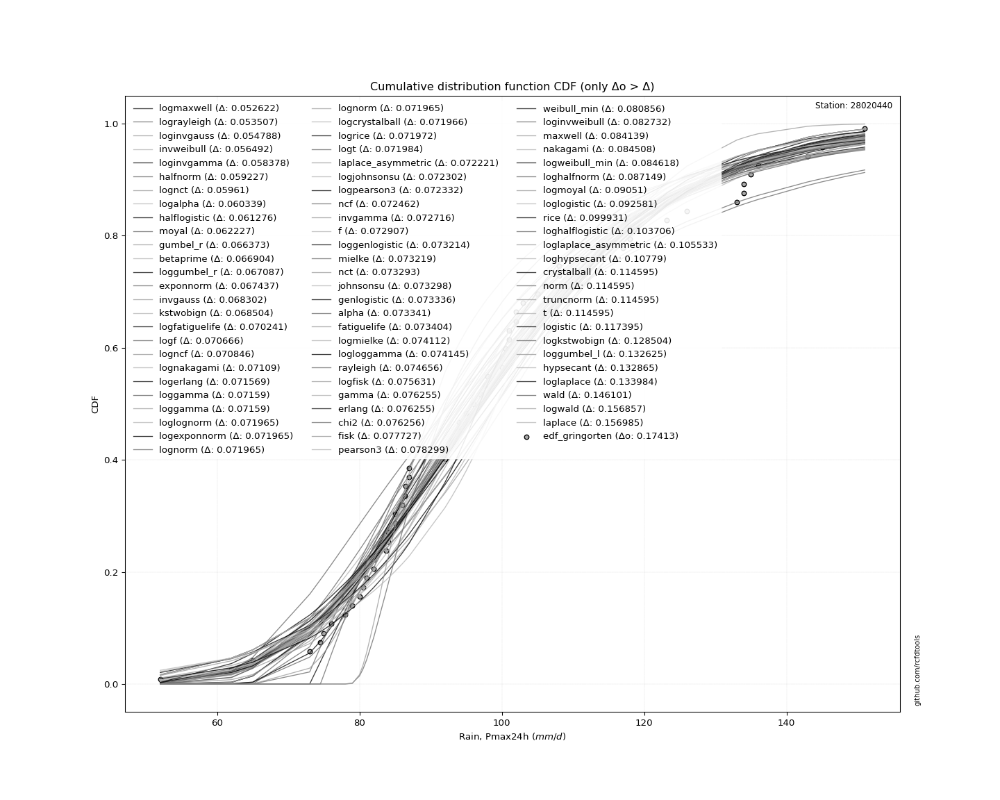</img>

</div>


**8.3. Best fit**

<div align="center">

|   id |   station | empirical_dist   | p_dist     |     delta |   deltao | eval   |   fit |   n |   best_fit |   best_fit_sort |
|-----:|----------:|:-----------------|:-----------|----------:|---------:|:-------|------:|----:|-----------:|----------------:|
|    0 |  28020440 | edf_gringorten   | logmaxwell | 0.0526225 |  0.17413 | Δo > Δ |     1 |  61 |          1 |               1 |

</div>


<div align="center">

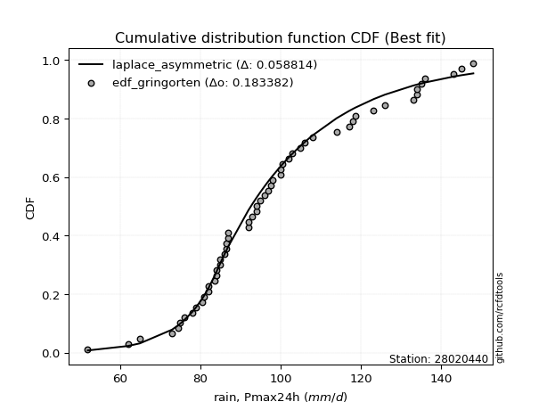</img>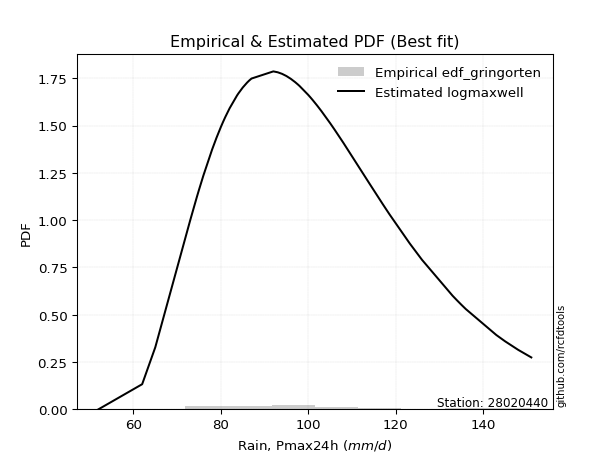</img>

</div>


### 9. EDF Filliben (1975)

The specific values of the constants (0.3175) (often denoted as $alpha$) and (0.365) are derived from a method proposed by James J. Filliben in a 1975 paper. This particular formula is the mean value of the $i$-th order statistic of the normal distribution and is considered a robust and effective plotting position formula for the normal probability plot correlation coefficient test for normality.

<div align="center">


$P=(m-0.3175)/(n+0.365)$


</div>


**9.1. Empirical values**

<div align="center">

|                | 0                    | 1                    | 2                   | 3                    | 4                   | 5                  | 6                   | 7                   | 8                   | 9                  | 10                  | 11                  | 12                 | 13                 | 14                  | 15                  | 16                 | 17                 | 18                 | 19                 | 20                  | 21                  | 22                 | 23                  | 24                  | 25                  | 26                 | 27                 | 28                  | 29                 | 30           | 31                 | 32                 | 33                 | 34                 | 35                 | 36                 | 37                 | 38                 | 39                 | 40                 | 41                 | 42                 | 43                 | 44                 | 45                 | 46                 | 47                 | 48                 | 49                 | 50                 | 51                 | 52                 | 53                 | 54                 | 55                 | 56                 | 57                 | 58                 | 59                 | 60                 |
|:---------------|:---------------------|:---------------------|:--------------------|:---------------------|:--------------------|:-------------------|:--------------------|:--------------------|:--------------------|:-------------------|:--------------------|:--------------------|:-------------------|:-------------------|:--------------------|:--------------------|:-------------------|:-------------------|:-------------------|:-------------------|:--------------------|:--------------------|:-------------------|:--------------------|:--------------------|:--------------------|:-------------------|:-------------------|:--------------------|:-------------------|:-------------|:-------------------|:-------------------|:-------------------|:-------------------|:-------------------|:-------------------|:-------------------|:-------------------|:-------------------|:-------------------|:-------------------|:-------------------|:-------------------|:-------------------|:-------------------|:-------------------|:-------------------|:-------------------|:-------------------|:-------------------|:-------------------|:-------------------|:-------------------|:-------------------|:-------------------|:-------------------|:-------------------|:-------------------|:-------------------|:-------------------|
| date           | 1961                 | 2005                 | 1994                | 1964                 | 1991                | 1997               | 1974                | 2015                | 1967                | 2018               | 1992                | 2004                | 2009               | 2001               | 1989                | 1976                | 1982               | 1963               | 2014               | 1977               | 1990                | 1993                | 2008               | 2002                | 2011                | 2006                | 1978               | 2000               | 1998                | 1968               | 2003         | 1969               | 1984               | 1995               | 1960               | 1975               | 1983               | 2020               | 2017               | 1999               | 2021               | 1971               | 1979               | 1981               | 2019               | 2012               | 1986               | 1965               | 1996               | 1985               | 1987               | 1980               | 1970               | 1973               | 1988               | 1959               | 1972               | 2007               | 2013               | 2010               | 2016               |
| x              | 52.0                 | 62.0                 | 65.0                | 73.0                 | 74.5                | 75.0               | 76.0                | 78.0                | 79.0                | 80.0               | 80.5                | 81.0                | 82.0               | 82.0               | 83.7                | 84.0                | 84.0               | 85.0               | 85.0               | 86.0               | 86.4                | 86.5                | 87.0               | 87.0                | 92.0                | 92.0                | 93.0               | 94.0               | 94.0                | 95.0               | 96.0         | 97.0               | 97.6               | 98.0               | 100.0              | 100.0              | 100.5              | 101.0              | 101.0              | 102.0              | 102.0              | 103.0              | 105.0              | 106.0              | 108.0              | 108.0              | 114.0              | 117.0              | 118.0              | 118.6              | 123.2              | 126.0              | 133.0              | 134.0              | 134.0              | 135.0              | 136.0              | 143.0              | 145.0              | 148.0              | 151.0              |
| m              | 1                    | 2                    | 3                   | 4                    | 5                   | 6                  | 7                   | 8                   | 9                   | 10                 | 11                  | 12                  | 13                 | 14                 | 15                  | 16                  | 17                 | 18                 | 19                 | 20                 | 21                  | 22                  | 23                 | 24                  | 25                  | 26                  | 27                 | 28                 | 29                  | 30                 | 31           | 32                 | 33                 | 34                 | 35                 | 36                 | 37                 | 38                 | 39                 | 40                 | 41                 | 42                 | 43                 | 44                 | 45                 | 46                 | 47                 | 48                 | 49                 | 50                 | 51                 | 52                 | 53                 | 54                 | 55                 | 56                 | 57                 | 58                 | 59                 | 60                 | 61                 |
| empirical_dist | edf_filliben         | edf_filliben         | edf_filliben        | edf_filliben         | edf_filliben        | edf_filliben       | edf_filliben        | edf_filliben        | edf_filliben        | edf_filliben       | edf_filliben        | edf_filliben        | edf_filliben       | edf_filliben       | edf_filliben        | edf_filliben        | edf_filliben       | edf_filliben       | edf_filliben       | edf_filliben       | edf_filliben        | edf_filliben        | edf_filliben       | edf_filliben        | edf_filliben        | edf_filliben        | edf_filliben       | edf_filliben       | edf_filliben        | edf_filliben       | edf_filliben | edf_filliben       | edf_filliben       | edf_filliben       | edf_filliben       | edf_filliben       | edf_filliben       | edf_filliben       | edf_filliben       | edf_filliben       | edf_filliben       | edf_filliben       | edf_filliben       | edf_filliben       | edf_filliben       | edf_filliben       | edf_filliben       | edf_filliben       | edf_filliben       | edf_filliben       | edf_filliben       | edf_filliben       | edf_filliben       | edf_filliben       | edf_filliben       | edf_filliben       | edf_filliben       | edf_filliben       | edf_filliben       | edf_filliben       | edf_filliben       |
| empirical      | 0.011121975067220728 | 0.027417909231646706 | 0.04371384339607268 | 0.060009777560498655 | 0.07630571172492463 | 0.0926016458893506 | 0.10889758005377657 | 0.12519351421820255 | 0.14148944838262853 | 0.1577853825470545 | 0.17408131671148047 | 0.19037725087590643 | 0.2066731850403324 | 0.2229691192047584 | 0.23926505336918436 | 0.25556098753361034 | 0.2718569216980363 | 0.2881528558624623 | 0.3044487900268883 | 0.3207447241913143 | 0.33704065835574026 | 0.35333659252016625 | 0.3696325266845922 | 0.38592846084901816 | 0.40222439501344415 | 0.41852032917787013 | 0.4348162633422961 | 0.4511121975067221 | 0.46740813167114803 | 0.483704065835574  | 0.5          | 0.516295934164426  | 0.5325918683288519 | 0.5488878024932778 | 0.5651837366577038 | 0.5814796708221298 | 0.5977756049865558 | 0.6140715391509818 | 0.6303674733154078 | 0.6466634074798338 | 0.6629593416442597 | 0.6792552758086857 | 0.6955512099731116 | 0.7118471441375376 | 0.7281430783019636 | 0.7444390124663895 | 0.7607349466308155 | 0.7770308807952415 | 0.7933268149596675 | 0.8096227491240935 | 0.8259186832885195 | 0.8422146174529455 | 0.8585105516173714 | 0.8748064857817973 | 0.8911024199462233 | 0.9073983541106493 | 0.9236942882750753 | 0.9399902224395013 | 0.9562861566039272 | 0.9725820907683532 | 0.9888780249327792 |
| empirical_tr   | 1.0112470646397231   | 1.0281908432119968   | 1.0457120947471563  | 1.0638408529450005   | 1.0826092709390023  | 1.10205181161047   | 1.1222054587848032  | 1.1431099520327854  | 1.1648080482133536  | 1.1873458133797707 | 1.2107729492428354  | 1.235143159060031   | 1.2605145586196271 | 1.2869501389398625 | 1.3145182884378515  | 1.3432933836808405  | 1.373356459463996  | 1.4047959709265725 | 1.4377086628009137 | 1.4722005637857614 | 1.508388127573281   | 1.5463995463995466  | 1.5863762683383957 | 1.6284747561865587  | 1.672868534042118   | 1.7197505780144327  | 1.769336120521877  | 1.8218659541304831 | 1.8776103419261072  | 1.9368736684289434 | 2.0          | 2.0673797692242903 | 2.1394578575786625 | 2.2167434299647786 | 2.2998219806989595 | 2.389370193711671  | 2.4861744150714067 | 2.591153805552623  | 2.7053896175465666 | 2.8301625735039777 | 2.967001087876224  | 3.1177441890003808 | 3.2846246487354462 | 3.4703803195249527 | 3.6784055147609758 | 3.9129603060736478 | 4.17946534990635   | 4.484926000365429  | 4.838557066824363  | 5.2527284399743195 | 5.744441844137607  | 6.337722695584817  | 7.06766484307515   | 7.987634233647893  | 9.18294051627384   | 10.798944126704782 | 13.105178857447928 | 16.663951120162906 | 22.876048462255316 | 36.472511144130664 | 89.91208791208742  |

</div>


**9.2. Kolmogorov-Smirnov fit test (sorted by Δ)**


<div align="center">

|                | 0                   | 1                   | 2                   | 3                    | 4                   | 5                   | 6                   | 7                    | 8                   | 9                   | 10                  | 11                  | 12                  | 13                  | 14                  | 15                  | 16                  | 17                  | 18                  | 19                  | 20                  | 21                  | 22                  | 23                  | 24                  | 25                  | 26                  | 27                  | 28                  | 29                  | 30                  | 31                  | 32                  | 33                  | 34                  | 35                  | 36                  | 37                  | 38                  | 39                  | 40                  | 41                  | 42                  | 43                  | 44                  | 45                  | 46                  | 47                  | 48                  | 49                  | 50                  | 51                  | 52                  | 53                  | 54                  | 55                  | 56                  | 57                  | 58                  | 59                  | 60                  | 61                  | 62                    | 63                  | 64                  | 65                  | 66                  | 67                  | 68                  | 69                  | 70                  | 71                  | 72                  | 73                  | 74                  | 75                  | 76                  | 77                  | 78                  | 79                  | 80                  | 81                  | 82                  | 83                  | 84                  | 85                  | 86                  | 87                  |
|:---------------|:--------------------|:--------------------|:--------------------|:---------------------|:--------------------|:--------------------|:--------------------|:---------------------|:--------------------|:--------------------|:--------------------|:--------------------|:--------------------|:--------------------|:--------------------|:--------------------|:--------------------|:--------------------|:--------------------|:--------------------|:--------------------|:--------------------|:--------------------|:--------------------|:--------------------|:--------------------|:--------------------|:--------------------|:--------------------|:--------------------|:--------------------|:--------------------|:--------------------|:--------------------|:--------------------|:--------------------|:--------------------|:--------------------|:--------------------|:--------------------|:--------------------|:--------------------|:--------------------|:--------------------|:--------------------|:--------------------|:--------------------|:--------------------|:--------------------|:--------------------|:--------------------|:--------------------|:--------------------|:--------------------|:--------------------|:--------------------|:--------------------|:--------------------|:--------------------|:--------------------|:--------------------|:--------------------|:----------------------|:--------------------|:--------------------|:--------------------|:--------------------|:--------------------|:--------------------|:--------------------|:--------------------|:--------------------|:--------------------|:--------------------|:--------------------|:--------------------|:--------------------|:--------------------|:--------------------|:--------------------|:--------------------|:--------------------|:--------------------|:--------------------|:--------------------|:--------------------|:--------------------|:--------------------|
| station        | 28020440            | 28020440            | 28020440            | 28020440             | 28020440            | 28020440            | 28020440            | 28020440             | 28020440            | 28020440            | 28020440            | 28020440            | 28020440            | 28020440            | 28020440            | 28020440            | 28020440            | 28020440            | 28020440            | 28020440            | 28020440            | 28020440            | 28020440            | 28020440            | 28020440            | 28020440            | 28020440            | 28020440            | 28020440            | 28020440            | 28020440            | 28020440            | 28020440            | 28020440            | 28020440            | 28020440            | 28020440            | 28020440            | 28020440            | 28020440            | 28020440            | 28020440            | 28020440            | 28020440            | 28020440            | 28020440            | 28020440            | 28020440            | 28020440            | 28020440            | 28020440            | 28020440            | 28020440            | 28020440            | 28020440            | 28020440            | 28020440            | 28020440            | 28020440            | 28020440            | 28020440            | 28020440            | 28020440              | 28020440            | 28020440            | 28020440            | 28020440            | 28020440            | 28020440            | 28020440            | 28020440            | 28020440            | 28020440            | 28020440            | 28020440            | 28020440            | 28020440            | 28020440            | 28020440            | 28020440            | 28020440            | 28020440            | 28020440            | 28020440            | 28020440            | 28020440            | 28020440            | 28020440            |
| empirical_dist | edf_filliben        | edf_filliben        | edf_filliben        | edf_filliben         | edf_filliben        | edf_filliben        | edf_filliben        | edf_filliben         | edf_filliben        | edf_filliben        | edf_filliben        | edf_filliben        | edf_filliben        | edf_filliben        | edf_filliben        | edf_filliben        | edf_filliben        | edf_filliben        | edf_filliben        | edf_filliben        | edf_filliben        | edf_filliben        | edf_filliben        | edf_filliben        | edf_filliben        | edf_filliben        | edf_filliben        | edf_filliben        | edf_filliben        | edf_filliben        | edf_filliben        | edf_filliben        | edf_filliben        | edf_filliben        | edf_filliben        | edf_filliben        | edf_filliben        | edf_filliben        | edf_filliben        | edf_filliben        | edf_filliben        | edf_filliben        | edf_filliben        | edf_filliben        | edf_filliben        | edf_filliben        | edf_filliben        | edf_filliben        | edf_filliben        | edf_filliben        | edf_filliben        | edf_filliben        | edf_filliben        | edf_filliben        | edf_filliben        | edf_filliben        | edf_filliben        | edf_filliben        | edf_filliben        | edf_filliben        | edf_filliben        | edf_filliben        | edf_filliben          | edf_filliben        | edf_filliben        | edf_filliben        | edf_filliben        | edf_filliben        | edf_filliben        | edf_filliben        | edf_filliben        | edf_filliben        | edf_filliben        | edf_filliben        | edf_filliben        | edf_filliben        | edf_filliben        | edf_filliben        | edf_filliben        | edf_filliben        | edf_filliben        | edf_filliben        | edf_filliben        | edf_filliben        | edf_filliben        | edf_filliben        | edf_filliben        | edf_filliben        |
| p_dist         | lograyleigh         | logmaxwell          | invweibull          | loginvgauss          | halfnorm            | loginvgamma         | lognct              | halflogistic         | logalpha            | moyal               | loggumbel_r         | gumbel_r            | kstwobign           | betaprime           | invgauss            | exponnorm           | logfatiguelife      | logf                | logncf              | lognakagami         | laplace_asymmetric  | logerlang           | loggamma            | loggamma            | loglognorm          | logexponnorm        | lognorm             | lognorm             | logcrystalball      | logrice             | logt                | logjohnsonsu        | logpearson3         | fatiguelife         | ncf                 | invgamma            | f                   | loggenlogistic      | mielke              | nct                 | johnsonsu           | genlogistic         | alpha               | rayleigh            | logloggamma         | logmielke           | gamma               | erlang              | chi2                | logfisk             | pearson3            | fisk                | weibull_min         | loginvweibull       | maxwell             | nakagami            | logweibull_min      | loghalfnorm         | logmoyal            | loglogistic         | rice                | loghalflogistic     | loglaplace_asymmetric | loghypsecant        | crystalball         | norm                | truncnorm           | t                   | logistic            | logkstwobign        | loggumbel_l         | hypsecant           | loglaplace          | wald                | logwald             | laplace             | gumbel_l            | loggenexpon         | loggibrat           | gibrat              | logbetaprime        | expon               | loggompertz         | logexpon            | logchi2             | logtruncnorm        | gompertz            | genexpon            |
| delta          | 0.05213568857942688 | 0.05405954613900432 | 0.05577332978963234 | 0.056224800228700245 | 0.05785524551334939 | 0.05883493294006259 | 0.06006732533016418 | 0.060883712713825366 | 0.06177642076256329 | 0.06366408363519027 | 0.06669489477591156 | 0.06683070145779552 | 0.06713232418559806 | 0.06736149846914652 | 0.06764862148564799 | 0.06789422026386338 | 0.07069831183887526 | 0.0711231546624429  | 0.07130306431557887 | 0.0715473934111493  | 0.07182883956811009 | 0.07202666477047409 | 0.07204774631152472 | 0.07204774631152472 | 0.07242187420504825 | 0.07242202653755575 | 0.07242208049467364 | 0.07242208049467364 | 0.07242303240905773 | 0.07242896350673733 | 0.07244088646036612 | 0.07275906125604803 | 0.0727890985634203  | 0.07281957530144462 | 0.07291928246634805 | 0.0731732128688522  | 0.07336455739282671 | 0.07367159809445456 | 0.07367672221695332 | 0.073750237259881   | 0.07375501897473652 | 0.07379288047043953 | 0.07379785062327238 | 0.073937086311746   | 0.07408877868069536 | 0.07456929986411115 | 0.07560199060657491 | 0.07560223802160915 | 0.07560236989501579 | 0.07608848684539049 | 0.07764537698784246 | 0.0781840641100654  | 0.08020312062186974 | 0.08136072529192057 | 0.08348607368983574 | 0.08385481067993261 | 0.08396429337535705 | 0.08675674852486226 | 0.09011816911754283 | 0.0930386104532897  | 0.09927791935387498 | 0.10331432083003783 | 0.1059897985245759    | 0.10824731648972491 | 0.1139413465664163  | 0.11394135433422026 | 0.11394136136151223 | 0.11394163992100848 | 0.1178524771845107  | 0.12713254412924813 | 0.13197165673559763 | 0.1333222065267619  | 0.13444147281166263 | 0.14734205298077083 | 0.15666140423409808 | 0.15744227273661449 | 0.18107709521367454 | 0.19653793403014455 | 0.22292370537853987 | 0.23873053612266334 | 0.24380225897074206 | 0.3024208950346761  | 0.31466463494765184 | 0.3626273700085756  | 0.36802994795165234 | 0.49551361873344946 | 0.7969034596834661  | 0.8411674895008886  |
| deltao         | 0.17413015670873855 | 0.17413015670873855 | 0.17413015670873855 | 0.17413015670873855  | 0.17413015670873855 | 0.17413015670873855 | 0.17413015670873855 | 0.17413015670873855  | 0.17413015670873855 | 0.17413015670873855 | 0.17413015670873855 | 0.17413015670873855 | 0.17413015670873855 | 0.17413015670873855 | 0.17413015670873855 | 0.17413015670873855 | 0.17413015670873855 | 0.17413015670873855 | 0.17413015670873855 | 0.17413015670873855 | 0.17413015670873855 | 0.17413015670873855 | 0.17413015670873855 | 0.17413015670873855 | 0.17413015670873855 | 0.17413015670873855 | 0.17413015670873855 | 0.17413015670873855 | 0.17413015670873855 | 0.17413015670873855 | 0.17413015670873855 | 0.17413015670873855 | 0.17413015670873855 | 0.17413015670873855 | 0.17413015670873855 | 0.17413015670873855 | 0.17413015670873855 | 0.17413015670873855 | 0.17413015670873855 | 0.17413015670873855 | 0.17413015670873855 | 0.17413015670873855 | 0.17413015670873855 | 0.17413015670873855 | 0.17413015670873855 | 0.17413015670873855 | 0.17413015670873855 | 0.17413015670873855 | 0.17413015670873855 | 0.17413015670873855 | 0.17413015670873855 | 0.17413015670873855 | 0.17413015670873855 | 0.17413015670873855 | 0.17413015670873855 | 0.17413015670873855 | 0.17413015670873855 | 0.17413015670873855 | 0.17413015670873855 | 0.17413015670873855 | 0.17413015670873855 | 0.17413015670873855 | 0.17413015670873855   | 0.17413015670873855 | 0.17413015670873855 | 0.17413015670873855 | 0.17413015670873855 | 0.17413015670873855 | 0.17413015670873855 | 0.17413015670873855 | 0.17413015670873855 | 0.17413015670873855 | 0.17413015670873855 | 0.17413015670873855 | 0.17413015670873855 | 0.17413015670873855 | 0.17413015670873855 | 0.17413015670873855 | 0.17413015670873855 | 0.17413015670873855 | 0.17413015670873855 | 0.17413015670873855 | 0.17413015670873855 | 0.17413015670873855 | 0.17413015670873855 | 0.17413015670873855 | 0.17413015670873855 | 0.17413015670873855 |
| eval           | Δo > Δ              | Δo > Δ              | Δo > Δ              | Δo > Δ               | Δo > Δ              | Δo > Δ              | Δo > Δ              | Δo > Δ               | Δo > Δ              | Δo > Δ              | Δo > Δ              | Δo > Δ              | Δo > Δ              | Δo > Δ              | Δo > Δ              | Δo > Δ              | Δo > Δ              | Δo > Δ              | Δo > Δ              | Δo > Δ              | Δo > Δ              | Δo > Δ              | Δo > Δ              | Δo > Δ              | Δo > Δ              | Δo > Δ              | Δo > Δ              | Δo > Δ              | Δo > Δ              | Δo > Δ              | Δo > Δ              | Δo > Δ              | Δo > Δ              | Δo > Δ              | Δo > Δ              | Δo > Δ              | Δo > Δ              | Δo > Δ              | Δo > Δ              | Δo > Δ              | Δo > Δ              | Δo > Δ              | Δo > Δ              | Δo > Δ              | Δo > Δ              | Δo > Δ              | Δo > Δ              | Δo > Δ              | Δo > Δ              | Δo > Δ              | Δo > Δ              | Δo > Δ              | Δo > Δ              | Δo > Δ              | Δo > Δ              | Δo > Δ              | Δo > Δ              | Δo > Δ              | Δo > Δ              | Δo > Δ              | Δo > Δ              | Δo > Δ              | Δo > Δ                | Δo > Δ              | Δo > Δ              | Δo > Δ              | Δo > Δ              | Δo > Δ              | Δo > Δ              | Δo > Δ              | Δo > Δ              | Δo > Δ              | Δo > Δ              | Δo > Δ              | Δo > Δ              | Δo > Δ              | Δo <= Δ             | Δo <= Δ             | Δo <= Δ             | Δo <= Δ             | Δo <= Δ             | Δo <= Δ             | Δo <= Δ             | Δo <= Δ             | Δo <= Δ             | Δo <= Δ             | Δo <= Δ             | Δo <= Δ             |
| fit            | 1                   | 1                   | 1                   | 1                    | 1                   | 1                   | 1                   | 1                    | 1                   | 1                   | 1                   | 1                   | 1                   | 1                   | 1                   | 1                   | 1                   | 1                   | 1                   | 1                   | 1                   | 1                   | 1                   | 1                   | 1                   | 1                   | 1                   | 1                   | 1                   | 1                   | 1                   | 1                   | 1                   | 1                   | 1                   | 1                   | 1                   | 1                   | 1                   | 1                   | 1                   | 1                   | 1                   | 1                   | 1                   | 1                   | 1                   | 1                   | 1                   | 1                   | 1                   | 1                   | 1                   | 1                   | 1                   | 1                   | 1                   | 1                   | 1                   | 1                   | 1                   | 1                   | 1                     | 1                   | 1                   | 1                   | 1                   | 1                   | 1                   | 1                   | 1                   | 1                   | 1                   | 1                   | 1                   | 1                   | 0                   | 0                   | 0                   | 0                   | 0                   | 0                   | 0                   | 0                   | 0                   | 0                   | 0                   | 0                   |
| n              | 61                  | 61                  | 61                  | 61                   | 61                  | 61                  | 61                  | 61                   | 61                  | 61                  | 61                  | 61                  | 61                  | 61                  | 61                  | 61                  | 61                  | 61                  | 61                  | 61                  | 61                  | 61                  | 61                  | 61                  | 61                  | 61                  | 61                  | 61                  | 61                  | 61                  | 61                  | 61                  | 61                  | 61                  | 61                  | 61                  | 61                  | 61                  | 61                  | 61                  | 61                  | 61                  | 61                  | 61                  | 61                  | 61                  | 61                  | 61                  | 61                  | 61                  | 61                  | 61                  | 61                  | 61                  | 61                  | 61                  | 61                  | 61                  | 61                  | 61                  | 61                  | 61                  | 61                    | 61                  | 61                  | 61                  | 61                  | 61                  | 61                  | 61                  | 61                  | 61                  | 61                  | 61                  | 61                  | 61                  | 61                  | 61                  | 61                  | 61                  | 61                  | 61                  | 61                  | 61                  | 61                  | 61                  | 61                  | 61                  |
| best_fit       | 1                   | 0                   | 0                   | 0                    | 0                   | 0                   | 0                   | 0                    | 0                   | 0                   | 0                   | 0                   | 0                   | 0                   | 0                   | 0                   | 0                   | 0                   | 0                   | 0                   | 0                   | 0                   | 0                   | 0                   | 0                   | 0                   | 0                   | 0                   | 0                   | 0                   | 0                   | 0                   | 0                   | 0                   | 0                   | 0                   | 0                   | 0                   | 0                   | 0                   | 0                   | 0                   | 0                   | 0                   | 0                   | 0                   | 0                   | 0                   | 0                   | 0                   | 0                   | 0                   | 0                   | 0                   | 0                   | 0                   | 0                   | 0                   | 0                   | 0                   | 0                   | 0                   | 0                     | 0                   | 0                   | 0                   | 0                   | 0                   | 0                   | 0                   | 0                   | 0                   | 0                   | 0                   | 0                   | 0                   | 0                   | 0                   | 0                   | 0                   | 0                   | 0                   | 0                   | 0                   | 0                   | 0                   | 0                   | 0                   |
| best_fit_sort  | 1                   | 2                   | 3                   | 4                    | 5                   | 6                   | 7                   | 8                    | 9                   | 10                  | 11                  | 12                  | 13                  | 14                  | 15                  | 16                  | 17                  | 18                  | 19                  | 20                  | 21                  | 22                  | 23                  | 24                  | 25                  | 26                  | 27                  | 28                  | 29                  | 30                  | 31                  | 32                  | 33                  | 34                  | 35                  | 36                  | 37                  | 38                  | 39                  | 40                  | 41                  | 42                  | 43                  | 44                  | 45                  | 46                  | 47                  | 48                  | 49                  | 50                  | 51                  | 52                  | 53                  | 54                  | 55                  | 56                  | 57                  | 58                  | 59                  | 60                  | 61                  | 62                  | 63                    | 64                  | 65                  | 66                  | 67                  | 68                  | 69                  | 70                  | 71                  | 72                  | 73                  | 74                  | 75                  | 76                  | 77                  | 78                  | 79                  | 80                  | 81                  | 82                  | 83                  | 84                  | 85                  | 86                  | 87                  | 88                  |

</div>


<div align="center">

</img>

</div>


**9.3. Best fit**

<div align="center">

|   id |   station | empirical_dist   | p_dist      |     delta |   deltao | eval   |   fit |   n |   best_fit |   best_fit_sort |
|-----:|----------:|:-----------------|:------------|----------:|---------:|:-------|------:|----:|-----------:|----------------:|
|    0 |  28020440 | edf_filliben     | lograyleigh | 0.0521357 |  0.17413 | Δo > Δ |     1 |  61 |          1 |               1 |

</div>


<div align="center">

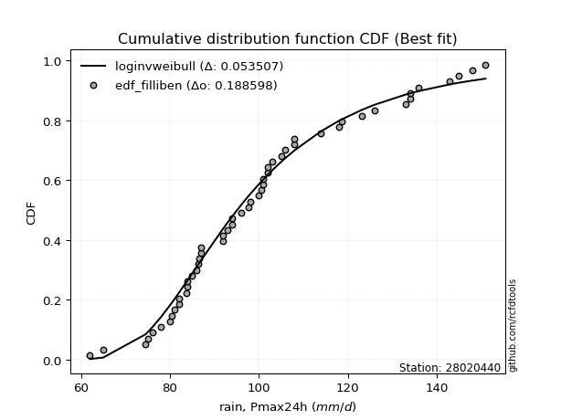</img>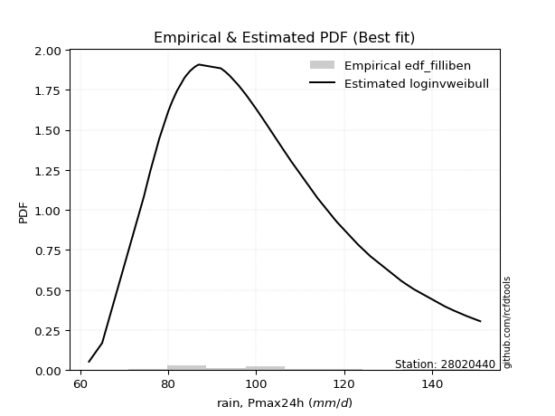</img>

</div>


### 10. EDF Jenkinson (1977)

The Jenkinson formula in hydrology is an empirical plotting position formula used to estimate the non-exceedance probability _(P)_ or return period _(T)_ of a given ordered observation within a sample. It is a widely used method in the frequency analysis of extreme events such as floods and rainfall, as it provides a distribution-free way to plot data. _a≈0.31_ and _b≈0.38_ are constants derived to approximate the median of the probability distribution for the given rank.

<div align="center">


$P=(m-a)/(n+b)$


</div>


**10.1. Empirical values**

<div align="center">

|                | 0                    | 1                    | 2                   | 3                   | 4                   | 5                   | 6                   | 7                  | 8                   | 9                   | 10                  | 11                  | 12                 | 13                  | 14                  | 15                  | 16                 | 17                 | 18                 | 19                  | 20                  | 21                 | 22                  | 23                 | 24                  | 25                 | 26                  | 27                  | 28                 | 29                  | 30            | 31                 | 32                 | 33                 | 34                | 35                 | 36                 | 37                 | 38                 | 39                 | 40                 | 41                 | 42                 | 43                 | 44                 | 45                | 46                 | 47                 | 48                 | 49                 | 50                 | 51                 | 52                 | 53                 | 54                 | 55                 | 56                 | 57                | 58                 | 59                 | 60                 |
|:---------------|:---------------------|:---------------------|:--------------------|:--------------------|:--------------------|:--------------------|:--------------------|:-------------------|:--------------------|:--------------------|:--------------------|:--------------------|:-------------------|:--------------------|:--------------------|:--------------------|:-------------------|:-------------------|:-------------------|:--------------------|:--------------------|:-------------------|:--------------------|:-------------------|:--------------------|:-------------------|:--------------------|:--------------------|:-------------------|:--------------------|:--------------|:-------------------|:-------------------|:-------------------|:------------------|:-------------------|:-------------------|:-------------------|:-------------------|:-------------------|:-------------------|:-------------------|:-------------------|:-------------------|:-------------------|:------------------|:-------------------|:-------------------|:-------------------|:-------------------|:-------------------|:-------------------|:-------------------|:-------------------|:-------------------|:-------------------|:-------------------|:------------------|:-------------------|:-------------------|:-------------------|
| date           | 1961                 | 2005                 | 1994                | 1964                | 1991                | 1997                | 1974                | 2015               | 1967                | 2018                | 1992                | 2004                | 2009               | 2001                | 1989                | 1976                | 1982               | 1963               | 2014               | 1977                | 1990                | 1993               | 2008                | 2002               | 2011                | 2006               | 1978                | 2000                | 1998               | 1968                | 2003          | 1969               | 1984               | 1995               | 1960              | 1975               | 1983               | 2020               | 2017               | 1999               | 2021               | 1971               | 1979               | 1981               | 2019               | 2012              | 1986               | 1965               | 1996               | 1985               | 1987               | 1980               | 1970               | 1973               | 1988               | 1959               | 1972               | 2007              | 2013               | 2010               | 2016               |
| x              | 52.0                 | 62.0                 | 65.0                | 73.0                | 74.5                | 75.0                | 76.0                | 78.0               | 79.0                | 80.0                | 80.5                | 81.0                | 82.0               | 82.0                | 83.7                | 84.0                | 84.0               | 85.0               | 85.0               | 86.0                | 86.4                | 86.5               | 87.0                | 87.0               | 92.0                | 92.0               | 93.0                | 94.0                | 94.0               | 95.0                | 96.0          | 97.0               | 97.6               | 98.0               | 100.0             | 100.0              | 100.5              | 101.0              | 101.0              | 102.0              | 102.0              | 103.0              | 105.0              | 106.0              | 108.0              | 108.0             | 114.0              | 117.0              | 118.0              | 118.6              | 123.2              | 126.0              | 133.0              | 134.0              | 134.0              | 135.0              | 136.0              | 143.0             | 145.0              | 148.0              | 151.0              |
| m              | 1                    | 2                    | 3                   | 4                   | 5                   | 6                   | 7                   | 8                  | 9                   | 10                  | 11                  | 12                  | 13                 | 14                  | 15                  | 16                  | 17                 | 18                 | 19                 | 20                  | 21                  | 22                 | 23                  | 24                 | 25                  | 26                 | 27                  | 28                  | 29                 | 30                  | 31            | 32                 | 33                 | 34                 | 35                | 36                 | 37                 | 38                 | 39                 | 40                 | 41                 | 42                 | 43                 | 44                 | 45                 | 46                | 47                 | 48                 | 49                 | 50                 | 51                 | 52                 | 53                 | 54                 | 55                 | 56                 | 57                 | 58                | 59                 | 60                 | 61                 |
| empirical_dist | edf_jenkinson        | edf_jenkinson        | edf_jenkinson       | edf_jenkinson       | edf_jenkinson       | edf_jenkinson       | edf_jenkinson       | edf_jenkinson      | edf_jenkinson       | edf_jenkinson       | edf_jenkinson       | edf_jenkinson       | edf_jenkinson      | edf_jenkinson       | edf_jenkinson       | edf_jenkinson       | edf_jenkinson      | edf_jenkinson      | edf_jenkinson      | edf_jenkinson       | edf_jenkinson       | edf_jenkinson      | edf_jenkinson       | edf_jenkinson      | edf_jenkinson       | edf_jenkinson      | edf_jenkinson       | edf_jenkinson       | edf_jenkinson      | edf_jenkinson       | edf_jenkinson | edf_jenkinson      | edf_jenkinson      | edf_jenkinson      | edf_jenkinson     | edf_jenkinson      | edf_jenkinson      | edf_jenkinson      | edf_jenkinson      | edf_jenkinson      | edf_jenkinson      | edf_jenkinson      | edf_jenkinson      | edf_jenkinson      | edf_jenkinson      | edf_jenkinson     | edf_jenkinson      | edf_jenkinson      | edf_jenkinson      | edf_jenkinson      | edf_jenkinson      | edf_jenkinson      | edf_jenkinson      | edf_jenkinson      | edf_jenkinson      | edf_jenkinson      | edf_jenkinson      | edf_jenkinson     | edf_jenkinson      | edf_jenkinson      | edf_jenkinson      |
| empirical      | 0.011241446725317692 | 0.027533398501140435 | 0.04382535027696318 | 0.06011730205278592 | 0.07640925382860866 | 0.09270120560443142 | 0.10899315738025415 | 0.1252851091560769 | 0.14157706093189962 | 0.15786901270772238 | 0.17416096448354512 | 0.19045291625936786 | 0.2067448680351906 | 0.22303681981101334 | 0.23932877158683608 | 0.25562072336265884 | 0.2719126751384816 | 0.2882046269143043 | 0.3044965786901271 | 0.32078853046594985 | 0.33708048224177256 | 0.3533724340175953 | 0.36966438579341804 | 0.3859563375692408 | 0.40224828934506357 | 0.4185402411208863 | 0.43483219289670905 | 0.45112414467253176 | 0.4674160964483545 | 0.48370804822417723 | 0.5           | 0.5162919517758228 | 0.5325839035516454 | 0.5488758553274682 | 0.565167807103291 | 0.5814597588791136 | 0.5977517106549364 | 0.6140436624307591 | 0.6303356142065819 | 0.6466275659824047 | 0.6629195177582273 | 0.6792114695340501 | 0.6955034213098729 | 0.7117953730856956 | 0.7280873248615184 | 0.744379276637341 | 0.7606712284131638 | 0.7769631801889866 | 0.7932551319648093 | 0.8095470837406321 | 0.8258390355164548 | 0.8421309872922775 | 0.8584229390681003 | 0.8747148908439231 | 0.8910068426197457 | 0.9072987943955685 | 0.9235907461713913 | 0.939882697947214 | 0.9561746497230368 | 0.9724666014988594 | 0.9887585532746822 |
| empirical_tr   | 1.0113692535837864   | 1.0283129502429218   | 1.0458340432782416  | 1.06396255850234    | 1.0827306403245722  | 1.102172741964446   | 1.1223258365331872  | 1.143229651704228  | 1.1649269311064718  | 1.187463726059199   | 1.210889721838627   | 1.2352586033407125  | 1.2606284658040665 | 1.2870622772069615  | 1.3146284000856714  | 1.3434011818778726  | 1.3734616245245022 | 1.4048981460288397 | 1.4378074490513    | 1.4722955145118735  | 1.5084787417055787  | 1.5464852607709751 | 1.5864564486947532  | 1.6285486866542849 | 1.672935404742437   | 1.7198094704398992 | 1.7693859901989046  | 1.821905609973286   | 1.8776384215356376 | 1.936888608393815   | 2.0           | 2.067362748400135  | 2.1394214011850816 | 2.216684723726977  | 2.299737729486699 | 2.38925652004671   | 2.4860267314702305 | 2.5909666525960318 | 2.7051564565888055 | 2.829875518672199  | 2.9666505558240686 | 3.117318435754189  | 3.284109149277688  | 3.46975692481628   | 3.6776512881965244 | 3.912045889101337 | 4.178352620830496  | 4.483564645726807  | 4.836879432624112  | 5.250641573994867  | 5.7418147801683785 | 6.334365325077396  | 7.063291139240503  | 7.981794538361506  | 9.17488789237667   | 10.787346221441112 | 13.08742004264391  | 16.6341463414634  | 22.817843866170985 | 36.31952662721877  | 88.95652173912964  |

</div>


**10.2. Kolmogorov-Smirnov fit test (sorted by Δ)**


<div align="center">

|                | 0                    | 1                    | 2                    | 3                   | 4                    | 5                   | 6                   | 7                    | 8                   | 9                   | 10                  | 11                  | 12                  | 13                  | 14                  | 15                  | 16                  | 17                  | 18                  | 19                  | 20                  | 21                  | 22                  | 23                  | 24                  | 25                  | 26                  | 27                  | 28                  | 29                  | 30                  | 31                  | 32                  | 33                  | 34                  | 35                  | 36                  | 37                  | 38                  | 39                  | 40                  | 41                  | 42                  | 43                  | 44                  | 45                  | 46                  | 47                  | 48                  | 49                  | 50                  | 51                  | 52                  | 53                  | 54                  | 55                  | 56                  | 57                  | 58                  | 59                  | 60                  | 61                  | 62                    | 63                  | 64                  | 65                  | 66                  | 67                  | 68                  | 69                  | 70                  | 71                  | 72                  | 73                  | 74                  | 75                  | 76                  | 77                  | 78                  | 79                  | 80                  | 81                  | 82                  | 83                  | 84                  | 85                  | 86                  | 87                  |
|:---------------|:---------------------|:---------------------|:---------------------|:--------------------|:---------------------|:--------------------|:--------------------|:---------------------|:--------------------|:--------------------|:--------------------|:--------------------|:--------------------|:--------------------|:--------------------|:--------------------|:--------------------|:--------------------|:--------------------|:--------------------|:--------------------|:--------------------|:--------------------|:--------------------|:--------------------|:--------------------|:--------------------|:--------------------|:--------------------|:--------------------|:--------------------|:--------------------|:--------------------|:--------------------|:--------------------|:--------------------|:--------------------|:--------------------|:--------------------|:--------------------|:--------------------|:--------------------|:--------------------|:--------------------|:--------------------|:--------------------|:--------------------|:--------------------|:--------------------|:--------------------|:--------------------|:--------------------|:--------------------|:--------------------|:--------------------|:--------------------|:--------------------|:--------------------|:--------------------|:--------------------|:--------------------|:--------------------|:----------------------|:--------------------|:--------------------|:--------------------|:--------------------|:--------------------|:--------------------|:--------------------|:--------------------|:--------------------|:--------------------|:--------------------|:--------------------|:--------------------|:--------------------|:--------------------|:--------------------|:--------------------|:--------------------|:--------------------|:--------------------|:--------------------|:--------------------|:--------------------|:--------------------|:--------------------|
| station        | 28020440             | 28020440             | 28020440             | 28020440            | 28020440             | 28020440            | 28020440            | 28020440             | 28020440            | 28020440            | 28020440            | 28020440            | 28020440            | 28020440            | 28020440            | 28020440            | 28020440            | 28020440            | 28020440            | 28020440            | 28020440            | 28020440            | 28020440            | 28020440            | 28020440            | 28020440            | 28020440            | 28020440            | 28020440            | 28020440            | 28020440            | 28020440            | 28020440            | 28020440            | 28020440            | 28020440            | 28020440            | 28020440            | 28020440            | 28020440            | 28020440            | 28020440            | 28020440            | 28020440            | 28020440            | 28020440            | 28020440            | 28020440            | 28020440            | 28020440            | 28020440            | 28020440            | 28020440            | 28020440            | 28020440            | 28020440            | 28020440            | 28020440            | 28020440            | 28020440            | 28020440            | 28020440            | 28020440              | 28020440            | 28020440            | 28020440            | 28020440            | 28020440            | 28020440            | 28020440            | 28020440            | 28020440            | 28020440            | 28020440            | 28020440            | 28020440            | 28020440            | 28020440            | 28020440            | 28020440            | 28020440            | 28020440            | 28020440            | 28020440            | 28020440            | 28020440            | 28020440            | 28020440            |
| empirical_dist | edf_jenkinson        | edf_jenkinson        | edf_jenkinson        | edf_jenkinson       | edf_jenkinson        | edf_jenkinson       | edf_jenkinson       | edf_jenkinson        | edf_jenkinson       | edf_jenkinson       | edf_jenkinson       | edf_jenkinson       | edf_jenkinson       | edf_jenkinson       | edf_jenkinson       | edf_jenkinson       | edf_jenkinson       | edf_jenkinson       | edf_jenkinson       | edf_jenkinson       | edf_jenkinson       | edf_jenkinson       | edf_jenkinson       | edf_jenkinson       | edf_jenkinson       | edf_jenkinson       | edf_jenkinson       | edf_jenkinson       | edf_jenkinson       | edf_jenkinson       | edf_jenkinson       | edf_jenkinson       | edf_jenkinson       | edf_jenkinson       | edf_jenkinson       | edf_jenkinson       | edf_jenkinson       | edf_jenkinson       | edf_jenkinson       | edf_jenkinson       | edf_jenkinson       | edf_jenkinson       | edf_jenkinson       | edf_jenkinson       | edf_jenkinson       | edf_jenkinson       | edf_jenkinson       | edf_jenkinson       | edf_jenkinson       | edf_jenkinson       | edf_jenkinson       | edf_jenkinson       | edf_jenkinson       | edf_jenkinson       | edf_jenkinson       | edf_jenkinson       | edf_jenkinson       | edf_jenkinson       | edf_jenkinson       | edf_jenkinson       | edf_jenkinson       | edf_jenkinson       | edf_jenkinson         | edf_jenkinson       | edf_jenkinson       | edf_jenkinson       | edf_jenkinson       | edf_jenkinson       | edf_jenkinson       | edf_jenkinson       | edf_jenkinson       | edf_jenkinson       | edf_jenkinson       | edf_jenkinson       | edf_jenkinson       | edf_jenkinson       | edf_jenkinson       | edf_jenkinson       | edf_jenkinson       | edf_jenkinson       | edf_jenkinson       | edf_jenkinson       | edf_jenkinson       | edf_jenkinson       | edf_jenkinson       | edf_jenkinson       | edf_jenkinson       | edf_jenkinson       |
| p_dist         | lograyleigh          | logmaxwell           | invweibull           | loginvgauss         | halfnorm             | loginvgamma         | lognct              | halflogistic         | logalpha            | moyal               | loggumbel_r         | gumbel_r            | kstwobign           | betaprime           | invgauss            | exponnorm           | logfatiguelife      | logf                | logncf              | lognakagami         | laplace_asymmetric  | logerlang           | loggamma            | loggamma            | loglognorm          | logexponnorm        | lognorm             | lognorm             | logcrystalball      | logrice             | logt                | logjohnsonsu        | logpearson3         | fatiguelife         | ncf                 | invgamma            | f                   | loggenlogistic      | mielke              | nct                 | johnsonsu           | genlogistic         | alpha               | rayleigh            | logloggamma         | logmielke           | gamma               | erlang              | chi2                | logfisk             | pearson3            | fisk                | weibull_min         | loginvweibull       | maxwell             | nakagami            | logweibull_min      | loghalfnorm         | logmoyal            | loglogistic         | rice                | loghalflogistic     | loglaplace_asymmetric | loghypsecant        | crystalball         | norm                | truncnorm           | t                   | logistic            | logkstwobign        | loggumbel_l         | hypsecant           | loglaplace          | wald                | logwald             | laplace             | gumbel_l            | loggenexpon         | loggibrat           | gibrat              | logbetaprime        | expon               | loggompertz         | logexpon            | logchi2             | logtruncnorm        | gompertz            | genexpon            |
| delta          | 0.052052058418758984 | 0.054147158688275465 | 0.055729523514996715 | 0.05631241277797139 | 0.057771615352681494 | 0.05886280966028523 | 0.06009520205038682 | 0.060859818382205944 | 0.06186403331183443 | 0.06375169618446141 | 0.06667100044429214 | 0.06685857817801816 | 0.06704869402493016 | 0.06738937518936916 | 0.06760879759961558 | 0.06792209698408602 | 0.0707261885590979  | 0.07115103138266554 | 0.07133094103580151 | 0.07157527013137194 | 0.07180494523649067 | 0.07205454149069673 | 0.07207562303174736 | 0.07207562303174736 | 0.0724497509252709  | 0.07244990325777839 | 0.07244995721489628 | 0.07244995721489628 | 0.07245090912928037 | 0.07245684022695997 | 0.07246876318058876 | 0.07278693797627067 | 0.07281697528364295 | 0.07284745202166726 | 0.07294715918657069 | 0.07320108958907484 | 0.07339243411304935 | 0.0736994748146772  | 0.07370459893717596 | 0.07377811398010364 | 0.07378289569495916 | 0.07382075719066217 | 0.07382572734349502 | 0.07389328003711038 | 0.074116655400918   | 0.07459717658433379 | 0.0755621667205425  | 0.07556241413557674 | 0.07556254600898338 | 0.07611636356561313 | 0.07760555310181005 | 0.07821194083028804 | 0.08016329673583733 | 0.08127709513125267 | 0.08344624980380333 | 0.0838149867939002  | 0.08392446948932464 | 0.08673285419324284 | 0.09009427478592341 | 0.09306648717351235 | 0.09923809546784257 | 0.10329042649841841 | 0.10601767524479855   | 0.10827519320994755 | 0.1139015226803839  | 0.11390153044818785 | 0.11390153747547982 | 0.11390181603497607 | 0.11788035390473334 | 0.12704891396858023 | 0.13193183284956522 | 0.13335008324698455 | 0.13446934953188527 | 0.14741771836423226 | 0.15664945706828842 | 0.15747014945683713 | 0.18103727132764214 | 0.1964463390922702  | 0.2229914059847948  | 0.23878628956310863 | 0.2436947344784548  | 0.30231735293099204 | 0.3145610928439678  | 0.36252382790489157 | 0.36792242345936504 | 0.4954220237955751  | 0.7968277943000047  | 0.8410599650086014  |
| deltao         | 0.17413015670873855  | 0.17413015670873855  | 0.17413015670873855  | 0.17413015670873855 | 0.17413015670873855  | 0.17413015670873855 | 0.17413015670873855 | 0.17413015670873855  | 0.17413015670873855 | 0.17413015670873855 | 0.17413015670873855 | 0.17413015670873855 | 0.17413015670873855 | 0.17413015670873855 | 0.17413015670873855 | 0.17413015670873855 | 0.17413015670873855 | 0.17413015670873855 | 0.17413015670873855 | 0.17413015670873855 | 0.17413015670873855 | 0.17413015670873855 | 0.17413015670873855 | 0.17413015670873855 | 0.17413015670873855 | 0.17413015670873855 | 0.17413015670873855 | 0.17413015670873855 | 0.17413015670873855 | 0.17413015670873855 | 0.17413015670873855 | 0.17413015670873855 | 0.17413015670873855 | 0.17413015670873855 | 0.17413015670873855 | 0.17413015670873855 | 0.17413015670873855 | 0.17413015670873855 | 0.17413015670873855 | 0.17413015670873855 | 0.17413015670873855 | 0.17413015670873855 | 0.17413015670873855 | 0.17413015670873855 | 0.17413015670873855 | 0.17413015670873855 | 0.17413015670873855 | 0.17413015670873855 | 0.17413015670873855 | 0.17413015670873855 | 0.17413015670873855 | 0.17413015670873855 | 0.17413015670873855 | 0.17413015670873855 | 0.17413015670873855 | 0.17413015670873855 | 0.17413015670873855 | 0.17413015670873855 | 0.17413015670873855 | 0.17413015670873855 | 0.17413015670873855 | 0.17413015670873855 | 0.17413015670873855   | 0.17413015670873855 | 0.17413015670873855 | 0.17413015670873855 | 0.17413015670873855 | 0.17413015670873855 | 0.17413015670873855 | 0.17413015670873855 | 0.17413015670873855 | 0.17413015670873855 | 0.17413015670873855 | 0.17413015670873855 | 0.17413015670873855 | 0.17413015670873855 | 0.17413015670873855 | 0.17413015670873855 | 0.17413015670873855 | 0.17413015670873855 | 0.17413015670873855 | 0.17413015670873855 | 0.17413015670873855 | 0.17413015670873855 | 0.17413015670873855 | 0.17413015670873855 | 0.17413015670873855 | 0.17413015670873855 |
| eval           | Δo > Δ               | Δo > Δ               | Δo > Δ               | Δo > Δ              | Δo > Δ               | Δo > Δ              | Δo > Δ              | Δo > Δ               | Δo > Δ              | Δo > Δ              | Δo > Δ              | Δo > Δ              | Δo > Δ              | Δo > Δ              | Δo > Δ              | Δo > Δ              | Δo > Δ              | Δo > Δ              | Δo > Δ              | Δo > Δ              | Δo > Δ              | Δo > Δ              | Δo > Δ              | Δo > Δ              | Δo > Δ              | Δo > Δ              | Δo > Δ              | Δo > Δ              | Δo > Δ              | Δo > Δ              | Δo > Δ              | Δo > Δ              | Δo > Δ              | Δo > Δ              | Δo > Δ              | Δo > Δ              | Δo > Δ              | Δo > Δ              | Δo > Δ              | Δo > Δ              | Δo > Δ              | Δo > Δ              | Δo > Δ              | Δo > Δ              | Δo > Δ              | Δo > Δ              | Δo > Δ              | Δo > Δ              | Δo > Δ              | Δo > Δ              | Δo > Δ              | Δo > Δ              | Δo > Δ              | Δo > Δ              | Δo > Δ              | Δo > Δ              | Δo > Δ              | Δo > Δ              | Δo > Δ              | Δo > Δ              | Δo > Δ              | Δo > Δ              | Δo > Δ                | Δo > Δ              | Δo > Δ              | Δo > Δ              | Δo > Δ              | Δo > Δ              | Δo > Δ              | Δo > Δ              | Δo > Δ              | Δo > Δ              | Δo > Δ              | Δo > Δ              | Δo > Δ              | Δo > Δ              | Δo <= Δ             | Δo <= Δ             | Δo <= Δ             | Δo <= Δ             | Δo <= Δ             | Δo <= Δ             | Δo <= Δ             | Δo <= Δ             | Δo <= Δ             | Δo <= Δ             | Δo <= Δ             | Δo <= Δ             |
| fit            | 1                    | 1                    | 1                    | 1                   | 1                    | 1                   | 1                   | 1                    | 1                   | 1                   | 1                   | 1                   | 1                   | 1                   | 1                   | 1                   | 1                   | 1                   | 1                   | 1                   | 1                   | 1                   | 1                   | 1                   | 1                   | 1                   | 1                   | 1                   | 1                   | 1                   | 1                   | 1                   | 1                   | 1                   | 1                   | 1                   | 1                   | 1                   | 1                   | 1                   | 1                   | 1                   | 1                   | 1                   | 1                   | 1                   | 1                   | 1                   | 1                   | 1                   | 1                   | 1                   | 1                   | 1                   | 1                   | 1                   | 1                   | 1                   | 1                   | 1                   | 1                   | 1                   | 1                     | 1                   | 1                   | 1                   | 1                   | 1                   | 1                   | 1                   | 1                   | 1                   | 1                   | 1                   | 1                   | 1                   | 0                   | 0                   | 0                   | 0                   | 0                   | 0                   | 0                   | 0                   | 0                   | 0                   | 0                   | 0                   |
| n              | 61                   | 61                   | 61                   | 61                  | 61                   | 61                  | 61                  | 61                   | 61                  | 61                  | 61                  | 61                  | 61                  | 61                  | 61                  | 61                  | 61                  | 61                  | 61                  | 61                  | 61                  | 61                  | 61                  | 61                  | 61                  | 61                  | 61                  | 61                  | 61                  | 61                  | 61                  | 61                  | 61                  | 61                  | 61                  | 61                  | 61                  | 61                  | 61                  | 61                  | 61                  | 61                  | 61                  | 61                  | 61                  | 61                  | 61                  | 61                  | 61                  | 61                  | 61                  | 61                  | 61                  | 61                  | 61                  | 61                  | 61                  | 61                  | 61                  | 61                  | 61                  | 61                  | 61                    | 61                  | 61                  | 61                  | 61                  | 61                  | 61                  | 61                  | 61                  | 61                  | 61                  | 61                  | 61                  | 61                  | 61                  | 61                  | 61                  | 61                  | 61                  | 61                  | 61                  | 61                  | 61                  | 61                  | 61                  | 61                  |
| best_fit       | 1                    | 0                    | 0                    | 0                   | 0                    | 0                   | 0                   | 0                    | 0                   | 0                   | 0                   | 0                   | 0                   | 0                   | 0                   | 0                   | 0                   | 0                   | 0                   | 0                   | 0                   | 0                   | 0                   | 0                   | 0                   | 0                   | 0                   | 0                   | 0                   | 0                   | 0                   | 0                   | 0                   | 0                   | 0                   | 0                   | 0                   | 0                   | 0                   | 0                   | 0                   | 0                   | 0                   | 0                   | 0                   | 0                   | 0                   | 0                   | 0                   | 0                   | 0                   | 0                   | 0                   | 0                   | 0                   | 0                   | 0                   | 0                   | 0                   | 0                   | 0                   | 0                   | 0                     | 0                   | 0                   | 0                   | 0                   | 0                   | 0                   | 0                   | 0                   | 0                   | 0                   | 0                   | 0                   | 0                   | 0                   | 0                   | 0                   | 0                   | 0                   | 0                   | 0                   | 0                   | 0                   | 0                   | 0                   | 0                   |
| best_fit_sort  | 1                    | 2                    | 3                    | 4                   | 5                    | 6                   | 7                   | 8                    | 9                   | 10                  | 11                  | 12                  | 13                  | 14                  | 15                  | 16                  | 17                  | 18                  | 19                  | 20                  | 21                  | 22                  | 23                  | 24                  | 25                  | 26                  | 27                  | 28                  | 29                  | 30                  | 31                  | 32                  | 33                  | 34                  | 35                  | 36                  | 37                  | 38                  | 39                  | 40                  | 41                  | 42                  | 43                  | 44                  | 45                  | 46                  | 47                  | 48                  | 49                  | 50                  | 51                  | 52                  | 53                  | 54                  | 55                  | 56                  | 57                  | 58                  | 59                  | 60                  | 61                  | 62                  | 63                    | 64                  | 65                  | 66                  | 67                  | 68                  | 69                  | 70                  | 71                  | 72                  | 73                  | 74                  | 75                  | 76                  | 77                  | 78                  | 79                  | 80                  | 81                  | 82                  | 83                  | 84                  | 85                  | 86                  | 87                  | 88                  |

</div>


<div align="center">

</img>

</div>


**10.3. Best fit**

<div align="center">

|   id |   station | empirical_dist   | p_dist      |     delta |   deltao | eval   |   fit |   n |   best_fit |   best_fit_sort |
|-----:|----------:|:-----------------|:------------|----------:|---------:|:-------|------:|----:|-----------:|----------------:|
|    0 |  28020440 | edf_jenkinson    | lograyleigh | 0.0520521 |  0.17413 | Δo > Δ |     1 |  61 |          1 |               1 |

</div>


<div align="center">

</img>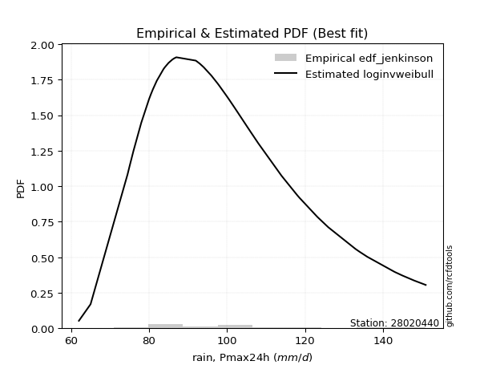</img>

</div>


### 11. EDF Cunnane (1978)

Cunnane´s work in statistical hydrology has focused on the performance and evaluation of different probability distributions (such as GEV, Gumbel, Lognormal) for flood frequency estimation. _b_ is a constant, typically set to 0.4.

<div align="center">


$P=(m-b)/(n+1-2b)$


</div>


**11.1. Empirical values**

<div align="center">

|                | 0                   | 1                    | 2                    | 3                    | 4                   | 5                  | 6                   | 7                  | 8                   | 9                  | 10                  | 11                 | 12                  | 13                 | 14                  | 15                 | 16                 | 17                  | 18                 | 19                  | 20                 | 21                  | 22                 | 23                  | 24                 | 25                  | 26                 | 27                  | 28                 | 29                  | 30          | 31                 | 32                 | 33                 | 34                | 35                 | 36                 | 37                 | 38                 | 39                 | 40                 | 41                 | 42                | 43                 | 44                 | 45                 | 46                | 47                 | 48                 | 49                 | 50                | 51                 | 52                 | 53                 | 54                | 55                 | 56                 | 57                 | 58                 | 59                 | 60                 |
|:---------------|:--------------------|:---------------------|:---------------------|:---------------------|:--------------------|:-------------------|:--------------------|:-------------------|:--------------------|:-------------------|:--------------------|:-------------------|:--------------------|:-------------------|:--------------------|:-------------------|:-------------------|:--------------------|:-------------------|:--------------------|:-------------------|:--------------------|:-------------------|:--------------------|:-------------------|:--------------------|:-------------------|:--------------------|:-------------------|:--------------------|:------------|:-------------------|:-------------------|:-------------------|:------------------|:-------------------|:-------------------|:-------------------|:-------------------|:-------------------|:-------------------|:-------------------|:------------------|:-------------------|:-------------------|:-------------------|:------------------|:-------------------|:-------------------|:-------------------|:------------------|:-------------------|:-------------------|:-------------------|:------------------|:-------------------|:-------------------|:-------------------|:-------------------|:-------------------|:-------------------|
| date           | 1961                | 2005                 | 1994                 | 1964                 | 1991                | 1997               | 1974                | 2015               | 1967                | 2018               | 1992                | 2004               | 2009                | 2001               | 1989                | 1976               | 1982               | 1963                | 2014               | 1977                | 1990               | 1993                | 2008               | 2002                | 2011               | 2006                | 1978               | 2000                | 1998               | 1968                | 2003        | 1969               | 1984               | 1995               | 1960              | 1975               | 1983               | 2020               | 2017               | 1999               | 2021               | 1971               | 1979              | 1981               | 2019               | 2012               | 1986              | 1965               | 1996               | 1985               | 1987              | 1980               | 1970               | 1973               | 1988              | 1959               | 1972               | 2007               | 2013               | 2010               | 2016               |
| x              | 52.0                | 62.0                 | 65.0                 | 73.0                 | 74.5                | 75.0               | 76.0                | 78.0               | 79.0                | 80.0               | 80.5                | 81.0               | 82.0                | 82.0               | 83.7                | 84.0               | 84.0               | 85.0                | 85.0               | 86.0                | 86.4               | 86.5                | 87.0               | 87.0                | 92.0               | 92.0                | 93.0               | 94.0                | 94.0               | 95.0                | 96.0        | 97.0               | 97.6               | 98.0               | 100.0             | 100.0              | 100.5              | 101.0              | 101.0              | 102.0              | 102.0              | 103.0              | 105.0             | 106.0              | 108.0              | 108.0              | 114.0             | 117.0              | 118.0              | 118.6              | 123.2             | 126.0              | 133.0              | 134.0              | 134.0             | 135.0              | 136.0              | 143.0              | 145.0              | 148.0              | 151.0              |
| m              | 1                   | 2                    | 3                    | 4                    | 5                   | 6                  | 7                   | 8                  | 9                   | 10                 | 11                  | 12                 | 13                  | 14                 | 15                  | 16                 | 17                 | 18                  | 19                 | 20                  | 21                 | 22                  | 23                 | 24                  | 25                 | 26                  | 27                 | 28                  | 29                 | 30                  | 31          | 32                 | 33                 | 34                 | 35                | 36                 | 37                 | 38                 | 39                 | 40                 | 41                 | 42                 | 43                | 44                 | 45                 | 46                 | 47                | 48                 | 49                 | 50                 | 51                | 52                 | 53                 | 54                 | 55                | 56                 | 57                 | 58                 | 59                 | 60                 | 61                 |
| empirical_dist | edf_cunnane         | edf_cunnane          | edf_cunnane          | edf_cunnane          | edf_cunnane         | edf_cunnane        | edf_cunnane         | edf_cunnane        | edf_cunnane         | edf_cunnane        | edf_cunnane         | edf_cunnane        | edf_cunnane         | edf_cunnane        | edf_cunnane         | edf_cunnane        | edf_cunnane        | edf_cunnane         | edf_cunnane        | edf_cunnane         | edf_cunnane        | edf_cunnane         | edf_cunnane        | edf_cunnane         | edf_cunnane        | edf_cunnane         | edf_cunnane        | edf_cunnane         | edf_cunnane        | edf_cunnane         | edf_cunnane | edf_cunnane        | edf_cunnane        | edf_cunnane        | edf_cunnane       | edf_cunnane        | edf_cunnane        | edf_cunnane        | edf_cunnane        | edf_cunnane        | edf_cunnane        | edf_cunnane        | edf_cunnane       | edf_cunnane        | edf_cunnane        | edf_cunnane        | edf_cunnane       | edf_cunnane        | edf_cunnane        | edf_cunnane        | edf_cunnane       | edf_cunnane        | edf_cunnane        | edf_cunnane        | edf_cunnane       | edf_cunnane        | edf_cunnane        | edf_cunnane        | edf_cunnane        | edf_cunnane        | edf_cunnane        |
| empirical      | 0.00980392156862745 | 0.026143790849673203 | 0.042483660130718956 | 0.058823529411764705 | 0.07516339869281045 | 0.0915032679738562 | 0.10784313725490195 | 0.1241830065359477 | 0.14052287581699346 | 0.1568627450980392 | 0.17320261437908496 | 0.1895424836601307 | 0.20588235294117646 | 0.2222222222222222 | 0.23856209150326796 | 0.2549019607843137 | 0.2712418300653595 | 0.28758169934640526 | 0.303921568627451  | 0.32026143790849676 | 0.3366013071895425 | 0.35294117647058826 | 0.369281045751634  | 0.38562091503267976 | 0.4019607843137255 | 0.41830065359477125 | 0.434640522875817  | 0.45098039215686275 | 0.4673202614379085 | 0.48366013071895425 | 0.5         | 0.5163398692810458 | 0.5326797385620915 | 0.5490196078431373 | 0.565359477124183 | 0.5816993464052288 | 0.5980392156862745 | 0.6143790849673203 | 0.630718954248366  | 0.6470588235294118 | 0.6633986928104575 | 0.6797385620915033 | 0.696078431372549 | 0.7124183006535948 | 0.7287581699346405 | 0.7450980392156863 | 0.761437908496732 | 0.7777777777777778 | 0.7941176470588235 | 0.8104575163398693 | 0.826797385620915 | 0.8431372549019608 | 0.8594771241830065 | 0.8758169934640523 | 0.892156862745098 | 0.9084967320261438 | 0.9248366013071895 | 0.9411764705882353 | 0.957516339869281  | 0.9738562091503268 | 0.9901960784313725 |
| empirical_tr   | 1.00990099009901    | 1.0268456375838926   | 1.0443686006825939   | 1.0625               | 1.0812720848056536  | 1.1007194244604317 | 1.120879120879121   | 1.1417910447761195 | 1.1634980988593155  | 1.1860465116279069 | 1.2094861660079053  | 1.2338709677419355 | 1.259259259259259   | 1.2857142857142856 | 1.313304721030043   | 1.3421052631578947 | 1.3721973094170403 | 1.4036697247706424  | 1.4366197183098592 | 1.471153846153846   | 1.5073891625615765 | 1.5454545454545456  | 1.5854922279792747 | 1.627659574468085   | 1.6721311475409837 | 1.7191011235955058  | 1.7687861271676302 | 1.8214285714285712  | 1.8773006134969326 | 1.9367088607594938  | 2.0         | 2.067567567567568  | 2.13986013986014   | 2.217391304347826  | 2.300751879699248 | 2.3906250000000004 | 2.4878048780487805 | 2.593220338983051  | 2.7079646017699113 | 2.8333333333333335 | 2.9708737864077666 | 3.122448979591837  | 3.290322580645161 | 3.4772727272727275 | 3.686746987951807  | 3.9230769230769234 | 4.191780821917807 | 4.5                | 4.857142857142856  | 5.275862068965518  | 5.773584905660376 | 6.375              | 7.116279069767439  | 8.052631578947368  | 9.272727272727268 | 10.928571428571427 | 13.304347826086945 | 16.999999999999996 | 23.538461538461497 | 38.24999999999997  | 101.9999999999992  |

</div>


**11.2. Kolmogorov-Smirnov fit test (sorted by Δ)**


<div align="center">

|                | 0                    | 1                    | 2                   | 3                    | 4                    | 5                    | 6                   | 7                   | 8                   | 9                   | 10                  | 11                  | 12                  | 13                  | 14                  | 15                  | 16                  | 17                  | 18                  | 19                  | 20                  | 21                  | 22                  | 23                  | 24                  | 25                  | 26                  | 27                  | 28                  | 29                  | 30                  | 31                  | 32                  | 33                  | 34                  | 35                  | 36                  | 37                  | 38                  | 39                  | 40                  | 41                  | 42                  | 43                  | 44                  | 45                  | 46                  | 47                  | 48                  | 49                  | 50                  | 51                  | 52                  | 53                  | 54                  | 55                  | 56                  | 57                  | 58                  | 59                  | 60                  | 61                  | 62                    | 63                  | 64                  | 65                  | 66                  | 67                  | 68                  | 69                  | 70                  | 71                  | 72                  | 73                  | 74                  | 75                  | 76                  | 77                  | 78                  | 79                  | 80                  | 81                  | 82                  | 83                  | 84                  | 85                  | 86                  | 87                  |
|:---------------|:---------------------|:---------------------|:--------------------|:---------------------|:---------------------|:---------------------|:--------------------|:--------------------|:--------------------|:--------------------|:--------------------|:--------------------|:--------------------|:--------------------|:--------------------|:--------------------|:--------------------|:--------------------|:--------------------|:--------------------|:--------------------|:--------------------|:--------------------|:--------------------|:--------------------|:--------------------|:--------------------|:--------------------|:--------------------|:--------------------|:--------------------|:--------------------|:--------------------|:--------------------|:--------------------|:--------------------|:--------------------|:--------------------|:--------------------|:--------------------|:--------------------|:--------------------|:--------------------|:--------------------|:--------------------|:--------------------|:--------------------|:--------------------|:--------------------|:--------------------|:--------------------|:--------------------|:--------------------|:--------------------|:--------------------|:--------------------|:--------------------|:--------------------|:--------------------|:--------------------|:--------------------|:--------------------|:----------------------|:--------------------|:--------------------|:--------------------|:--------------------|:--------------------|:--------------------|:--------------------|:--------------------|:--------------------|:--------------------|:--------------------|:--------------------|:--------------------|:--------------------|:--------------------|:--------------------|:--------------------|:--------------------|:--------------------|:--------------------|:--------------------|:--------------------|:--------------------|:--------------------|:--------------------|
| station        | 28020440             | 28020440             | 28020440            | 28020440             | 28020440             | 28020440             | 28020440            | 28020440            | 28020440            | 28020440            | 28020440            | 28020440            | 28020440            | 28020440            | 28020440            | 28020440            | 28020440            | 28020440            | 28020440            | 28020440            | 28020440            | 28020440            | 28020440            | 28020440            | 28020440            | 28020440            | 28020440            | 28020440            | 28020440            | 28020440            | 28020440            | 28020440            | 28020440            | 28020440            | 28020440            | 28020440            | 28020440            | 28020440            | 28020440            | 28020440            | 28020440            | 28020440            | 28020440            | 28020440            | 28020440            | 28020440            | 28020440            | 28020440            | 28020440            | 28020440            | 28020440            | 28020440            | 28020440            | 28020440            | 28020440            | 28020440            | 28020440            | 28020440            | 28020440            | 28020440            | 28020440            | 28020440            | 28020440              | 28020440            | 28020440            | 28020440            | 28020440            | 28020440            | 28020440            | 28020440            | 28020440            | 28020440            | 28020440            | 28020440            | 28020440            | 28020440            | 28020440            | 28020440            | 28020440            | 28020440            | 28020440            | 28020440            | 28020440            | 28020440            | 28020440            | 28020440            | 28020440            | 28020440            |
| empirical_dist | edf_cunnane          | edf_cunnane          | edf_cunnane         | edf_cunnane          | edf_cunnane          | edf_cunnane          | edf_cunnane         | edf_cunnane         | edf_cunnane         | edf_cunnane         | edf_cunnane         | edf_cunnane         | edf_cunnane         | edf_cunnane         | edf_cunnane         | edf_cunnane         | edf_cunnane         | edf_cunnane         | edf_cunnane         | edf_cunnane         | edf_cunnane         | edf_cunnane         | edf_cunnane         | edf_cunnane         | edf_cunnane         | edf_cunnane         | edf_cunnane         | edf_cunnane         | edf_cunnane         | edf_cunnane         | edf_cunnane         | edf_cunnane         | edf_cunnane         | edf_cunnane         | edf_cunnane         | edf_cunnane         | edf_cunnane         | edf_cunnane         | edf_cunnane         | edf_cunnane         | edf_cunnane         | edf_cunnane         | edf_cunnane         | edf_cunnane         | edf_cunnane         | edf_cunnane         | edf_cunnane         | edf_cunnane         | edf_cunnane         | edf_cunnane         | edf_cunnane         | edf_cunnane         | edf_cunnane         | edf_cunnane         | edf_cunnane         | edf_cunnane         | edf_cunnane         | edf_cunnane         | edf_cunnane         | edf_cunnane         | edf_cunnane         | edf_cunnane         | edf_cunnane           | edf_cunnane         | edf_cunnane         | edf_cunnane         | edf_cunnane         | edf_cunnane         | edf_cunnane         | edf_cunnane         | edf_cunnane         | edf_cunnane         | edf_cunnane         | edf_cunnane         | edf_cunnane         | edf_cunnane         | edf_cunnane         | edf_cunnane         | edf_cunnane         | edf_cunnane         | edf_cunnane         | edf_cunnane         | edf_cunnane         | edf_cunnane         | edf_cunnane         | edf_cunnane         | edf_cunnane         | edf_cunnane         |
| p_dist         | lograyleigh          | logmaxwell           | loginvgauss         | invweibull           | loginvgamma          | halfnorm             | lognct              | logalpha            | halflogistic        | moyal               | gumbel_r            | loggumbel_r         | betaprime           | exponnorm           | kstwobign           | invgauss            | logfatiguelife      | logf                | logncf              | lognakagami         | logerlang           | loggamma            | loggamma            | laplace_asymmetric  | loglognorm          | logexponnorm        | lognorm             | lognorm             | logcrystalball      | logrice             | logt                | logjohnsonsu        | logpearson3         | ncf                 | invgamma            | f                   | fatiguelife         | loggenlogistic      | mielke              | nct                 | johnsonsu           | genlogistic         | alpha               | logloggamma         | logmielke           | rayleigh            | logfisk             | gamma               | erlang              | chi2                | fisk                | pearson3            | weibull_min         | loginvweibull       | maxwell             | nakagami            | logweibull_min      | loghalfnorm         | logmoyal            | loglogistic         | rice                | loghalflogistic     | loglaplace_asymmetric | loghypsecant        | crystalball         | norm                | truncnorm           | t                   | logistic            | logkstwobign        | loggumbel_l         | hypsecant           | loglaplace          | wald                | logwald             | laplace             | gumbel_l            | loggenexpon         | loggibrat           | gibrat              | logbetaprime        | expon               | loggompertz         | logexpon            | logchi2             | logtruncnorm        | gompertz            | genexpon            |
| delta          | 0.053058326028442154 | 0.053092973573369284 | 0.05525822766306521 | 0.056256616072449916 | 0.058527387123724184 | 0.058777882962364664 | 0.05975977951382577 | 0.06080984819692825 | 0.06114732341354401 | 0.06269751106955523 | 0.06652315564145711 | 0.0669585054756302  | 0.06705395265280811 | 0.06758667444752497 | 0.06805496163461333 | 0.06808797265184574 | 0.07039076602253685 | 0.0708156088461045  | 0.07099551849924046 | 0.07123984759481089 | 0.07171911895413569 | 0.07174020049518631 | 0.07174020049518631 | 0.07209245026782873 | 0.07211432838870985 | 0.07211448072121734 | 0.07211453467833523 | 0.07211453467833523 | 0.07211548659271932 | 0.07212141769039893 | 0.07213334064402771 | 0.07245151543970962 | 0.0724815527470819  | 0.07261173665000964 | 0.0728656670525138  | 0.0730570115764883  | 0.07319027155457947 | 0.07336405227811615 | 0.07336917640061491 | 0.0734426914435426  | 0.07344747315839811 | 0.07348533465410112 | 0.07349030480693397 | 0.0739313783831077  | 0.07426175404777274 | 0.07442037259456358 | 0.07578094102905208 | 0.07604134177277266 | 0.0760415891878069  | 0.07604172106121354 | 0.07787651829372699 | 0.07808472815404022 | 0.0806424717880675  | 0.08228336274093584 | 0.08392542485603349 | 0.08429416184613037 | 0.0844036445415548  | 0.0870203592245809  | 0.09038177981726148 | 0.0927310646369513  | 0.09971727052007273 | 0.10357793152975647 | 0.1056822527082375    | 0.1079397706733865  | 0.11438069773261406 | 0.11438070550041801 | 0.11438071252770998 | 0.11438099108720623 | 0.11754493136817229 | 0.1280551815782634  | 0.13241100790179539 | 0.1330146607104235  | 0.13413392699532423 | 0.1465072857649951  | 0.15679320958395743 | 0.15713472692027608 | 0.1815164463798723  | 0.19754844171239938 | 0.22217680839600368 | 0.23811544448998653 | 0.244988507119476   | 0.30356320806679027 | 0.315806947979766   | 0.36376968304068974 | 0.36921619610038625 | 0.4965241264157043  | 0.7977382268992419  | 0.8423537376496225  |
| deltao         | 0.17413015670873855  | 0.17413015670873855  | 0.17413015670873855 | 0.17413015670873855  | 0.17413015670873855  | 0.17413015670873855  | 0.17413015670873855 | 0.17413015670873855 | 0.17413015670873855 | 0.17413015670873855 | 0.17413015670873855 | 0.17413015670873855 | 0.17413015670873855 | 0.17413015670873855 | 0.17413015670873855 | 0.17413015670873855 | 0.17413015670873855 | 0.17413015670873855 | 0.17413015670873855 | 0.17413015670873855 | 0.17413015670873855 | 0.17413015670873855 | 0.17413015670873855 | 0.17413015670873855 | 0.17413015670873855 | 0.17413015670873855 | 0.17413015670873855 | 0.17413015670873855 | 0.17413015670873855 | 0.17413015670873855 | 0.17413015670873855 | 0.17413015670873855 | 0.17413015670873855 | 0.17413015670873855 | 0.17413015670873855 | 0.17413015670873855 | 0.17413015670873855 | 0.17413015670873855 | 0.17413015670873855 | 0.17413015670873855 | 0.17413015670873855 | 0.17413015670873855 | 0.17413015670873855 | 0.17413015670873855 | 0.17413015670873855 | 0.17413015670873855 | 0.17413015670873855 | 0.17413015670873855 | 0.17413015670873855 | 0.17413015670873855 | 0.17413015670873855 | 0.17413015670873855 | 0.17413015670873855 | 0.17413015670873855 | 0.17413015670873855 | 0.17413015670873855 | 0.17413015670873855 | 0.17413015670873855 | 0.17413015670873855 | 0.17413015670873855 | 0.17413015670873855 | 0.17413015670873855 | 0.17413015670873855   | 0.17413015670873855 | 0.17413015670873855 | 0.17413015670873855 | 0.17413015670873855 | 0.17413015670873855 | 0.17413015670873855 | 0.17413015670873855 | 0.17413015670873855 | 0.17413015670873855 | 0.17413015670873855 | 0.17413015670873855 | 0.17413015670873855 | 0.17413015670873855 | 0.17413015670873855 | 0.17413015670873855 | 0.17413015670873855 | 0.17413015670873855 | 0.17413015670873855 | 0.17413015670873855 | 0.17413015670873855 | 0.17413015670873855 | 0.17413015670873855 | 0.17413015670873855 | 0.17413015670873855 | 0.17413015670873855 |
| eval           | Δo > Δ               | Δo > Δ               | Δo > Δ              | Δo > Δ               | Δo > Δ               | Δo > Δ               | Δo > Δ              | Δo > Δ              | Δo > Δ              | Δo > Δ              | Δo > Δ              | Δo > Δ              | Δo > Δ              | Δo > Δ              | Δo > Δ              | Δo > Δ              | Δo > Δ              | Δo > Δ              | Δo > Δ              | Δo > Δ              | Δo > Δ              | Δo > Δ              | Δo > Δ              | Δo > Δ              | Δo > Δ              | Δo > Δ              | Δo > Δ              | Δo > Δ              | Δo > Δ              | Δo > Δ              | Δo > Δ              | Δo > Δ              | Δo > Δ              | Δo > Δ              | Δo > Δ              | Δo > Δ              | Δo > Δ              | Δo > Δ              | Δo > Δ              | Δo > Δ              | Δo > Δ              | Δo > Δ              | Δo > Δ              | Δo > Δ              | Δo > Δ              | Δo > Δ              | Δo > Δ              | Δo > Δ              | Δo > Δ              | Δo > Δ              | Δo > Δ              | Δo > Δ              | Δo > Δ              | Δo > Δ              | Δo > Δ              | Δo > Δ              | Δo > Δ              | Δo > Δ              | Δo > Δ              | Δo > Δ              | Δo > Δ              | Δo > Δ              | Δo > Δ                | Δo > Δ              | Δo > Δ              | Δo > Δ              | Δo > Δ              | Δo > Δ              | Δo > Δ              | Δo > Δ              | Δo > Δ              | Δo > Δ              | Δo > Δ              | Δo > Δ              | Δo > Δ              | Δo > Δ              | Δo <= Δ             | Δo <= Δ             | Δo <= Δ             | Δo <= Δ             | Δo <= Δ             | Δo <= Δ             | Δo <= Δ             | Δo <= Δ             | Δo <= Δ             | Δo <= Δ             | Δo <= Δ             | Δo <= Δ             |
| fit            | 1                    | 1                    | 1                   | 1                    | 1                    | 1                    | 1                   | 1                   | 1                   | 1                   | 1                   | 1                   | 1                   | 1                   | 1                   | 1                   | 1                   | 1                   | 1                   | 1                   | 1                   | 1                   | 1                   | 1                   | 1                   | 1                   | 1                   | 1                   | 1                   | 1                   | 1                   | 1                   | 1                   | 1                   | 1                   | 1                   | 1                   | 1                   | 1                   | 1                   | 1                   | 1                   | 1                   | 1                   | 1                   | 1                   | 1                   | 1                   | 1                   | 1                   | 1                   | 1                   | 1                   | 1                   | 1                   | 1                   | 1                   | 1                   | 1                   | 1                   | 1                   | 1                   | 1                     | 1                   | 1                   | 1                   | 1                   | 1                   | 1                   | 1                   | 1                   | 1                   | 1                   | 1                   | 1                   | 1                   | 0                   | 0                   | 0                   | 0                   | 0                   | 0                   | 0                   | 0                   | 0                   | 0                   | 0                   | 0                   |
| n              | 61                   | 61                   | 61                  | 61                   | 61                   | 61                   | 61                  | 61                  | 61                  | 61                  | 61                  | 61                  | 61                  | 61                  | 61                  | 61                  | 61                  | 61                  | 61                  | 61                  | 61                  | 61                  | 61                  | 61                  | 61                  | 61                  | 61                  | 61                  | 61                  | 61                  | 61                  | 61                  | 61                  | 61                  | 61                  | 61                  | 61                  | 61                  | 61                  | 61                  | 61                  | 61                  | 61                  | 61                  | 61                  | 61                  | 61                  | 61                  | 61                  | 61                  | 61                  | 61                  | 61                  | 61                  | 61                  | 61                  | 61                  | 61                  | 61                  | 61                  | 61                  | 61                  | 61                    | 61                  | 61                  | 61                  | 61                  | 61                  | 61                  | 61                  | 61                  | 61                  | 61                  | 61                  | 61                  | 61                  | 61                  | 61                  | 61                  | 61                  | 61                  | 61                  | 61                  | 61                  | 61                  | 61                  | 61                  | 61                  |
| best_fit       | 1                    | 0                    | 0                   | 0                    | 0                    | 0                    | 0                   | 0                   | 0                   | 0                   | 0                   | 0                   | 0                   | 0                   | 0                   | 0                   | 0                   | 0                   | 0                   | 0                   | 0                   | 0                   | 0                   | 0                   | 0                   | 0                   | 0                   | 0                   | 0                   | 0                   | 0                   | 0                   | 0                   | 0                   | 0                   | 0                   | 0                   | 0                   | 0                   | 0                   | 0                   | 0                   | 0                   | 0                   | 0                   | 0                   | 0                   | 0                   | 0                   | 0                   | 0                   | 0                   | 0                   | 0                   | 0                   | 0                   | 0                   | 0                   | 0                   | 0                   | 0                   | 0                   | 0                     | 0                   | 0                   | 0                   | 0                   | 0                   | 0                   | 0                   | 0                   | 0                   | 0                   | 0                   | 0                   | 0                   | 0                   | 0                   | 0                   | 0                   | 0                   | 0                   | 0                   | 0                   | 0                   | 0                   | 0                   | 0                   |
| best_fit_sort  | 1                    | 2                    | 3                   | 4                    | 5                    | 6                    | 7                   | 8                   | 9                   | 10                  | 11                  | 12                  | 13                  | 14                  | 15                  | 16                  | 17                  | 18                  | 19                  | 20                  | 21                  | 22                  | 23                  | 24                  | 25                  | 26                  | 27                  | 28                  | 29                  | 30                  | 31                  | 32                  | 33                  | 34                  | 35                  | 36                  | 37                  | 38                  | 39                  | 40                  | 41                  | 42                  | 43                  | 44                  | 45                  | 46                  | 47                  | 48                  | 49                  | 50                  | 51                  | 52                  | 53                  | 54                  | 55                  | 56                  | 57                  | 58                  | 59                  | 60                  | 61                  | 62                  | 63                    | 64                  | 65                  | 66                  | 67                  | 68                  | 69                  | 70                  | 71                  | 72                  | 73                  | 74                  | 75                  | 76                  | 77                  | 78                  | 79                  | 80                  | 81                  | 82                  | 83                  | 84                  | 85                  | 86                  | 87                  | 88                  |

</div>


<div align="center">

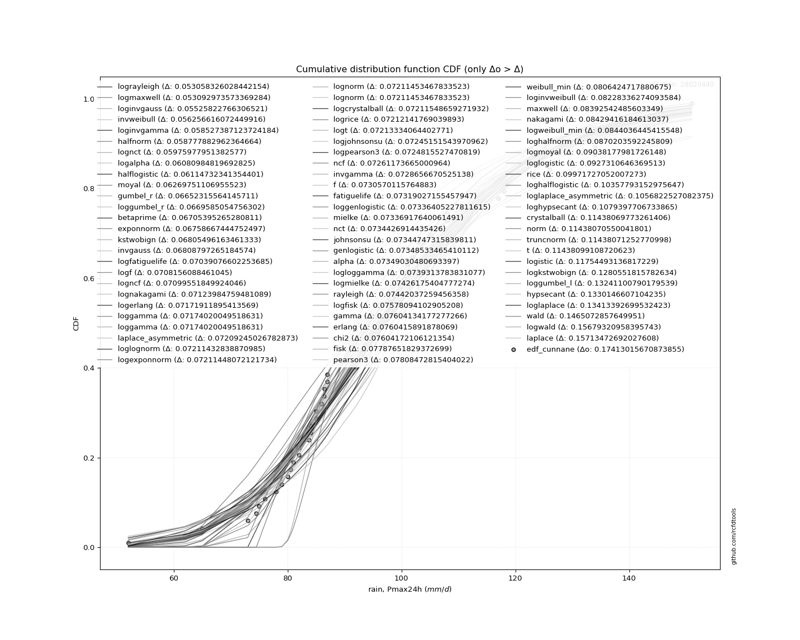</img>

</div>


**11.3. Best fit**

<div align="center">

|   id |   station | empirical_dist   | p_dist      |     delta |   deltao | eval   |   fit |   n |   best_fit |   best_fit_sort |
|-----:|----------:|:-----------------|:------------|----------:|---------:|:-------|------:|----:|-----------:|----------------:|
|    0 |  28020440 | edf_cunnane      | lograyleigh | 0.0530583 |  0.17413 | Δo > Δ |     1 |  61 |          1 |               1 |

</div>


<div align="center">

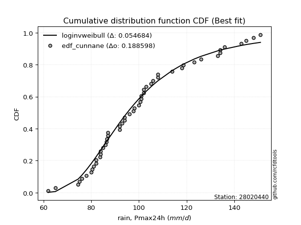</img></img>

</div>


### 12. EDF Adamowski (1981)

The Adamowski formula in hydrology refers to a specific plotting position formula used for estimating the non-parametric empirical distribution of hydrological events (like flood peaks) to calculate their return periods. This formula provides an alternative to traditional parametric methods (like the Gumbel or Log Pearson Type III distributions). 

<div align="center">


$P=(m-0.25)/(n+0.5)$


</div>


**12.1. Empirical values**

<div align="center">

|                | 0                    | 1                    | 2                    | 3                   | 4                   | 5                   | 6                   | 7                   | 8                   | 9                   | 10                  | 11                 | 12                 | 13                  | 14                  | 15                  | 16                  | 17                 | 18                 | 19                  | 20                  | 21                  | 22                 | 23                 | 24                 | 25                 | 26                 | 27                  | 28                  | 29                 | 30            | 31                 | 32                 | 33                 | 34                 | 35                 | 36                 | 37                 | 38                 | 39                 | 40                 | 41                 | 42                 | 43                 | 44                 | 45                 | 46                 | 47                 | 48                 | 49                 | 50                 | 51                 | 52                 | 53                 | 54                 | 55                 | 56                 | 57                 | 58                 | 59                 | 60                 |
|:---------------|:---------------------|:---------------------|:---------------------|:--------------------|:--------------------|:--------------------|:--------------------|:--------------------|:--------------------|:--------------------|:--------------------|:-------------------|:-------------------|:--------------------|:--------------------|:--------------------|:--------------------|:-------------------|:-------------------|:--------------------|:--------------------|:--------------------|:-------------------|:-------------------|:-------------------|:-------------------|:-------------------|:--------------------|:--------------------|:-------------------|:--------------|:-------------------|:-------------------|:-------------------|:-------------------|:-------------------|:-------------------|:-------------------|:-------------------|:-------------------|:-------------------|:-------------------|:-------------------|:-------------------|:-------------------|:-------------------|:-------------------|:-------------------|:-------------------|:-------------------|:-------------------|:-------------------|:-------------------|:-------------------|:-------------------|:-------------------|:-------------------|:-------------------|:-------------------|:-------------------|:-------------------|
| date           | 1961                 | 2005                 | 1994                 | 1964                | 1991                | 1997                | 1974                | 2015                | 1967                | 2018                | 1992                | 2004               | 2009               | 2001                | 1989                | 1976                | 1982                | 1963               | 2014               | 1977                | 1990                | 1993                | 2008               | 2002               | 2011               | 2006               | 1978               | 2000                | 1998                | 1968               | 2003          | 1969               | 1984               | 1995               | 1960               | 1975               | 1983               | 2020               | 2017               | 1999               | 2021               | 1971               | 1979               | 1981               | 2019               | 2012               | 1986               | 1965               | 1996               | 1985               | 1987               | 1980               | 1970               | 1973               | 1988               | 1959               | 1972               | 2007               | 2013               | 2010               | 2016               |
| x              | 52.0                 | 62.0                 | 65.0                 | 73.0                | 74.5                | 75.0                | 76.0                | 78.0                | 79.0                | 80.0                | 80.5                | 81.0               | 82.0               | 82.0                | 83.7                | 84.0                | 84.0                | 85.0               | 85.0               | 86.0                | 86.4                | 86.5                | 87.0               | 87.0               | 92.0               | 92.0               | 93.0               | 94.0                | 94.0                | 95.0               | 96.0          | 97.0               | 97.6               | 98.0               | 100.0              | 100.0              | 100.5              | 101.0              | 101.0              | 102.0              | 102.0              | 103.0              | 105.0              | 106.0              | 108.0              | 108.0              | 114.0              | 117.0              | 118.0              | 118.6              | 123.2              | 126.0              | 133.0              | 134.0              | 134.0              | 135.0              | 136.0              | 143.0              | 145.0              | 148.0              | 151.0              |
| m              | 1                    | 2                    | 3                    | 4                   | 5                   | 6                   | 7                   | 8                   | 9                   | 10                  | 11                  | 12                 | 13                 | 14                  | 15                  | 16                  | 17                  | 18                 | 19                 | 20                  | 21                  | 22                  | 23                 | 24                 | 25                 | 26                 | 27                 | 28                  | 29                  | 30                 | 31            | 32                 | 33                 | 34                 | 35                 | 36                 | 37                 | 38                 | 39                 | 40                 | 41                 | 42                 | 43                 | 44                 | 45                 | 46                 | 47                 | 48                 | 49                 | 50                 | 51                 | 52                 | 53                 | 54                 | 55                 | 56                 | 57                 | 58                 | 59                 | 60                 | 61                 |
| empirical_dist | edf_adamowski        | edf_adamowski        | edf_adamowski        | edf_adamowski       | edf_adamowski       | edf_adamowski       | edf_adamowski       | edf_adamowski       | edf_adamowski       | edf_adamowski       | edf_adamowski       | edf_adamowski      | edf_adamowski      | edf_adamowski       | edf_adamowski       | edf_adamowski       | edf_adamowski       | edf_adamowski      | edf_adamowski      | edf_adamowski       | edf_adamowski       | edf_adamowski       | edf_adamowski      | edf_adamowski      | edf_adamowski      | edf_adamowski      | edf_adamowski      | edf_adamowski       | edf_adamowski       | edf_adamowski      | edf_adamowski | edf_adamowski      | edf_adamowski      | edf_adamowski      | edf_adamowski      | edf_adamowski      | edf_adamowski      | edf_adamowski      | edf_adamowski      | edf_adamowski      | edf_adamowski      | edf_adamowski      | edf_adamowski      | edf_adamowski      | edf_adamowski      | edf_adamowski      | edf_adamowski      | edf_adamowski      | edf_adamowski      | edf_adamowski      | edf_adamowski      | edf_adamowski      | edf_adamowski      | edf_adamowski      | edf_adamowski      | edf_adamowski      | edf_adamowski      | edf_adamowski      | edf_adamowski      | edf_adamowski      | edf_adamowski      |
| empirical      | 0.012195121951219513 | 0.028455284552845527 | 0.044715447154471545 | 0.06097560975609756 | 0.07723577235772358 | 0.09349593495934959 | 0.10975609756097561 | 0.12601626016260162 | 0.14227642276422764 | 0.15853658536585366 | 0.17479674796747968 | 0.1910569105691057 | 0.2073170731707317 | 0.22357723577235772 | 0.23983739837398374 | 0.25609756097560976 | 0.27235772357723576 | 0.2886178861788618 | 0.3048780487804878 | 0.32113821138211385 | 0.33739837398373984 | 0.35365853658536583 | 0.3699186991869919 | 0.3861788617886179 | 0.4024390243902439 | 0.4186991869918699 | 0.4349593495934959 | 0.45121951219512196 | 0.46747967479674796 | 0.483739837398374  | 0.5           | 0.516260162601626  | 0.532520325203252  | 0.5487804878048781 | 0.5650406504065041 | 0.5813008130081301 | 0.5975609756097561 | 0.6138211382113821 | 0.6300813008130082 | 0.6463414634146342 | 0.6626016260162602 | 0.6788617886178862 | 0.6951219512195121 | 0.7113821138211383 | 0.7276422764227642 | 0.7439024390243902 | 0.7601626016260162 | 0.7764227642276422 | 0.7926829268292683 | 0.8089430894308943 | 0.8252032520325203 | 0.8414634146341463 | 0.8577235772357723 | 0.8739837398373984 | 0.8902439024390244 | 0.9065040650406504 | 0.9227642276422764 | 0.9390243902439024 | 0.9552845528455285 | 0.9715447154471545 | 0.9878048780487805 |
| empirical_tr   | 1.0123456790123457   | 1.0292887029288702   | 1.0468085106382978   | 1.064935064935065   | 1.0837004405286343  | 1.1031390134529149  | 1.1232876712328768  | 1.1441860465116278  | 1.1658767772511849  | 1.1884057971014492  | 1.2118226600985222  | 1.236180904522613  | 1.2615384615384615 | 1.2879581151832462  | 1.3155080213903745  | 1.3442622950819672  | 1.3743016759776536  | 1.4057142857142857 | 1.4385964912280702 | 1.473053892215569   | 1.50920245398773    | 1.5471698113207546  | 1.5870967741935482 | 1.6291390728476822 | 1.6734693877551021 | 1.7202797202797202 | 1.7697841726618704 | 1.8222222222222222  | 1.8778625954198476  | 1.9370078740157481 | 2.0           | 2.0672268907563023 | 2.1391304347826083 | 2.2162162162162162 | 2.2990654205607477 | 2.3883495145631066 | 2.484848484848485  | 2.589473684210526  | 2.7032967032967035 | 2.827586206896552  | 2.963855421686747  | 3.113924050632911  | 3.2799999999999994 | 3.4647887323943665 | 3.6716417910447765 | 3.9047619047619047 | 4.169491525423728  | 4.472727272727272  | 4.8235294117647065 | 5.23404255319149   | 5.720930232558139  | 6.307692307692307  | 7.028571428571426  | 7.935483870967744  | 9.111111111111112  | 10.695652173913043 | 12.947368421052627 | 16.399999999999984 | 22.36363636363638  | 35.14285714285716  | 81.99999999999993  |

</div>


**12.2. Kolmogorov-Smirnov fit test (sorted by Δ)**


<div align="center">

|                | 0                   | 1                   | 2                    | 3                   | 4                   | 5                    | 6                    | 7                   | 8                   | 9                   | 10                  | 11                  | 12                  | 13                  | 14                  | 15                  | 16                  | 17                  | 18                  | 19                  | 20                  | 21                  | 22                  | 23                  | 24                  | 25                  | 26                  | 27                  | 28                  | 29                  | 30                  | 31                  | 32                  | 33                  | 34                  | 35                  | 36                  | 37                  | 38                  | 39                  | 40                  | 41                  | 42                  | 43                  | 44                  | 45                  | 46                  | 47                  | 48                  | 49                  | 50                  | 51                  | 52                  | 53                  | 54                  | 55                  | 56                  | 57                  | 58                  | 59                  | 60                  | 61                  | 62                    | 63                  | 64                  | 65                  | 66                  | 67                  | 68                  | 69                  | 70                  | 71                  | 72                  | 73                  | 74                  | 75                  | 76                  | 77                  | 78                  | 79                  | 80                  | 81                  | 82                  | 83                  | 84                  | 85                  | 86                  | 87                  |
|:---------------|:--------------------|:--------------------|:---------------------|:--------------------|:--------------------|:---------------------|:---------------------|:--------------------|:--------------------|:--------------------|:--------------------|:--------------------|:--------------------|:--------------------|:--------------------|:--------------------|:--------------------|:--------------------|:--------------------|:--------------------|:--------------------|:--------------------|:--------------------|:--------------------|:--------------------|:--------------------|:--------------------|:--------------------|:--------------------|:--------------------|:--------------------|:--------------------|:--------------------|:--------------------|:--------------------|:--------------------|:--------------------|:--------------------|:--------------------|:--------------------|:--------------------|:--------------------|:--------------------|:--------------------|:--------------------|:--------------------|:--------------------|:--------------------|:--------------------|:--------------------|:--------------------|:--------------------|:--------------------|:--------------------|:--------------------|:--------------------|:--------------------|:--------------------|:--------------------|:--------------------|:--------------------|:--------------------|:----------------------|:--------------------|:--------------------|:--------------------|:--------------------|:--------------------|:--------------------|:--------------------|:--------------------|:--------------------|:--------------------|:--------------------|:--------------------|:--------------------|:--------------------|:--------------------|:--------------------|:--------------------|:--------------------|:--------------------|:--------------------|:--------------------|:--------------------|:--------------------|:--------------------|:--------------------|
| station        | 28020440            | 28020440            | 28020440             | 28020440            | 28020440            | 28020440             | 28020440             | 28020440            | 28020440            | 28020440            | 28020440            | 28020440            | 28020440            | 28020440            | 28020440            | 28020440            | 28020440            | 28020440            | 28020440            | 28020440            | 28020440            | 28020440            | 28020440            | 28020440            | 28020440            | 28020440            | 28020440            | 28020440            | 28020440            | 28020440            | 28020440            | 28020440            | 28020440            | 28020440            | 28020440            | 28020440            | 28020440            | 28020440            | 28020440            | 28020440            | 28020440            | 28020440            | 28020440            | 28020440            | 28020440            | 28020440            | 28020440            | 28020440            | 28020440            | 28020440            | 28020440            | 28020440            | 28020440            | 28020440            | 28020440            | 28020440            | 28020440            | 28020440            | 28020440            | 28020440            | 28020440            | 28020440            | 28020440              | 28020440            | 28020440            | 28020440            | 28020440            | 28020440            | 28020440            | 28020440            | 28020440            | 28020440            | 28020440            | 28020440            | 28020440            | 28020440            | 28020440            | 28020440            | 28020440            | 28020440            | 28020440            | 28020440            | 28020440            | 28020440            | 28020440            | 28020440            | 28020440            | 28020440            |
| empirical_dist | edf_adamowski       | edf_adamowski       | edf_adamowski        | edf_adamowski       | edf_adamowski       | edf_adamowski        | edf_adamowski        | edf_adamowski       | edf_adamowski       | edf_adamowski       | edf_adamowski       | edf_adamowski       | edf_adamowski       | edf_adamowski       | edf_adamowski       | edf_adamowski       | edf_adamowski       | edf_adamowski       | edf_adamowski       | edf_adamowski       | edf_adamowski       | edf_adamowski       | edf_adamowski       | edf_adamowski       | edf_adamowski       | edf_adamowski       | edf_adamowski       | edf_adamowski       | edf_adamowski       | edf_adamowski       | edf_adamowski       | edf_adamowski       | edf_adamowski       | edf_adamowski       | edf_adamowski       | edf_adamowski       | edf_adamowski       | edf_adamowski       | edf_adamowski       | edf_adamowski       | edf_adamowski       | edf_adamowski       | edf_adamowski       | edf_adamowski       | edf_adamowski       | edf_adamowski       | edf_adamowski       | edf_adamowski       | edf_adamowski       | edf_adamowski       | edf_adamowski       | edf_adamowski       | edf_adamowski       | edf_adamowski       | edf_adamowski       | edf_adamowski       | edf_adamowski       | edf_adamowski       | edf_adamowski       | edf_adamowski       | edf_adamowski       | edf_adamowski       | edf_adamowski         | edf_adamowski       | edf_adamowski       | edf_adamowski       | edf_adamowski       | edf_adamowski       | edf_adamowski       | edf_adamowski       | edf_adamowski       | edf_adamowski       | edf_adamowski       | edf_adamowski       | edf_adamowski       | edf_adamowski       | edf_adamowski       | edf_adamowski       | edf_adamowski       | edf_adamowski       | edf_adamowski       | edf_adamowski       | edf_adamowski       | edf_adamowski       | edf_adamowski       | edf_adamowski       | edf_adamowski       | edf_adamowski       |
| p_dist         | lograyleigh         | logmaxwell          | invweibull           | loginvgauss         | halfnorm            | loginvgamma          | lognct               | halflogistic        | logalpha            | moyal               | kstwobign           | loggumbel_r         | gumbel_r            | invgauss            | betaprime           | exponnorm           | logfatiguelife      | logf                | logncf              | laplace_asymmetric  | lognakagami         | logerlang           | loggamma            | loggamma            | loglognorm          | logexponnorm        | lognorm             | lognorm             | logcrystalball      | logrice             | logt                | logjohnsonsu        | logpearson3         | fatiguelife         | ncf                 | invgamma            | rayleigh            | f                   | loggenlogistic      | mielke              | nct                 | johnsonsu           | genlogistic         | alpha               | logloggamma         | logmielke           | gamma               | erlang              | chi2                | logfisk             | pearson3            | fisk                | weibull_min         | loginvweibull       | maxwell             | nakagami            | logweibull_min      | loghalfnorm         | logmoyal            | loglogistic         | rice                | loghalflogistic     | loglaplace_asymmetric | loghypsecant        | crystalball         | norm                | truncnorm           | t                   | logistic            | logkstwobign        | loggumbel_l         | hypsecant           | loglaplace          | wald                | logwald             | laplace             | gumbel_l            | loggenexpon         | loggibrat           | gibrat              | logbetaprime        | expon               | loggompertz         | logexpon            | logchi2             | logtruncnorm        | gompertz            | genexpon            |
| delta          | 0.05179495431952075 | 0.05484652052060346 | 0.055379842598832774 | 0.05701177461029938 | 0.05710404269455022 | 0.059085333879662305 | 0.060317726269763894 | 0.06140025788805403 | 0.06256339514416243 | 0.06445105801678941 | 0.06638112136679888 | 0.06648026539911178 | 0.06708110239739523 | 0.06729090585764841 | 0.06761189940874623 | 0.0681446212034631  | 0.07094871277847498 | 0.07137355560204262 | 0.07155346525517858 | 0.07161421019131031 | 0.07179779435074901 | 0.0722770657100738  | 0.07229814725112443 | 0.07229814725112443 | 0.07267227514464797 | 0.07267242747715547 | 0.07267248143427335 | 0.07267248143427335 | 0.07267343334865745 | 0.07267936444633705 | 0.07269128739996583 | 0.07300946219564775 | 0.07303949950302002 | 0.07306997624104433 | 0.07316968340594776 | 0.07342361380845192 | 0.07354359912094643 | 0.07361495833242643 | 0.07392199903405428 | 0.07392712315655303 | 0.07400063819948072 | 0.07400541991433623 | 0.07404328141003924 | 0.07404825156287209 | 0.07433917962029507 | 0.07481970080371086 | 0.07524427497857533 | 0.07524452239360957 | 0.07524465426701621 | 0.0763388877849902  | 0.07728766135984289 | 0.07843446504966511 | 0.07984540499387016 | 0.08060952247312139 | 0.08312835806183616 | 0.08349709505193303 | 0.08360657774735747 | 0.08654211914806248 | 0.08990353974074305 | 0.09328901139288942 | 0.0989202037258754  | 0.10309969145323805 | 0.10624019946417562   | 0.10849771742932462 | 0.11358363093841672 | 0.11358363870622068 | 0.11358364573351265 | 0.1135839242930089  | 0.11810287812411041 | 0.12638134131044895 | 0.13161394110759805 | 0.13357260746636163 | 0.13469187375126235 | 0.1480217126739701  | 0.15655408954569822 | 0.1576926736762142  | 0.18071937958567497 | 0.19571518808574548 | 0.2235318219461392  | 0.23923133800186278 | 0.24283642677514317 | 0.3014908344018772  | 0.31373457431485285 | 0.3616973093757766  | 0.3670641157560534  | 0.49469087278905044 | 0.7962237999902669  | 0.8402016573052897  |
| deltao         | 0.17413015670873855 | 0.17413015670873855 | 0.17413015670873855  | 0.17413015670873855 | 0.17413015670873855 | 0.17413015670873855  | 0.17413015670873855  | 0.17413015670873855 | 0.17413015670873855 | 0.17413015670873855 | 0.17413015670873855 | 0.17413015670873855 | 0.17413015670873855 | 0.17413015670873855 | 0.17413015670873855 | 0.17413015670873855 | 0.17413015670873855 | 0.17413015670873855 | 0.17413015670873855 | 0.17413015670873855 | 0.17413015670873855 | 0.17413015670873855 | 0.17413015670873855 | 0.17413015670873855 | 0.17413015670873855 | 0.17413015670873855 | 0.17413015670873855 | 0.17413015670873855 | 0.17413015670873855 | 0.17413015670873855 | 0.17413015670873855 | 0.17413015670873855 | 0.17413015670873855 | 0.17413015670873855 | 0.17413015670873855 | 0.17413015670873855 | 0.17413015670873855 | 0.17413015670873855 | 0.17413015670873855 | 0.17413015670873855 | 0.17413015670873855 | 0.17413015670873855 | 0.17413015670873855 | 0.17413015670873855 | 0.17413015670873855 | 0.17413015670873855 | 0.17413015670873855 | 0.17413015670873855 | 0.17413015670873855 | 0.17413015670873855 | 0.17413015670873855 | 0.17413015670873855 | 0.17413015670873855 | 0.17413015670873855 | 0.17413015670873855 | 0.17413015670873855 | 0.17413015670873855 | 0.17413015670873855 | 0.17413015670873855 | 0.17413015670873855 | 0.17413015670873855 | 0.17413015670873855 | 0.17413015670873855   | 0.17413015670873855 | 0.17413015670873855 | 0.17413015670873855 | 0.17413015670873855 | 0.17413015670873855 | 0.17413015670873855 | 0.17413015670873855 | 0.17413015670873855 | 0.17413015670873855 | 0.17413015670873855 | 0.17413015670873855 | 0.17413015670873855 | 0.17413015670873855 | 0.17413015670873855 | 0.17413015670873855 | 0.17413015670873855 | 0.17413015670873855 | 0.17413015670873855 | 0.17413015670873855 | 0.17413015670873855 | 0.17413015670873855 | 0.17413015670873855 | 0.17413015670873855 | 0.17413015670873855 | 0.17413015670873855 |
| eval           | Δo > Δ              | Δo > Δ              | Δo > Δ               | Δo > Δ              | Δo > Δ              | Δo > Δ               | Δo > Δ               | Δo > Δ              | Δo > Δ              | Δo > Δ              | Δo > Δ              | Δo > Δ              | Δo > Δ              | Δo > Δ              | Δo > Δ              | Δo > Δ              | Δo > Δ              | Δo > Δ              | Δo > Δ              | Δo > Δ              | Δo > Δ              | Δo > Δ              | Δo > Δ              | Δo > Δ              | Δo > Δ              | Δo > Δ              | Δo > Δ              | Δo > Δ              | Δo > Δ              | Δo > Δ              | Δo > Δ              | Δo > Δ              | Δo > Δ              | Δo > Δ              | Δo > Δ              | Δo > Δ              | Δo > Δ              | Δo > Δ              | Δo > Δ              | Δo > Δ              | Δo > Δ              | Δo > Δ              | Δo > Δ              | Δo > Δ              | Δo > Δ              | Δo > Δ              | Δo > Δ              | Δo > Δ              | Δo > Δ              | Δo > Δ              | Δo > Δ              | Δo > Δ              | Δo > Δ              | Δo > Δ              | Δo > Δ              | Δo > Δ              | Δo > Δ              | Δo > Δ              | Δo > Δ              | Δo > Δ              | Δo > Δ              | Δo > Δ              | Δo > Δ                | Δo > Δ              | Δo > Δ              | Δo > Δ              | Δo > Δ              | Δo > Δ              | Δo > Δ              | Δo > Δ              | Δo > Δ              | Δo > Δ              | Δo > Δ              | Δo > Δ              | Δo > Δ              | Δo > Δ              | Δo <= Δ             | Δo <= Δ             | Δo <= Δ             | Δo <= Δ             | Δo <= Δ             | Δo <= Δ             | Δo <= Δ             | Δo <= Δ             | Δo <= Δ             | Δo <= Δ             | Δo <= Δ             | Δo <= Δ             |
| fit            | 1                   | 1                   | 1                    | 1                   | 1                   | 1                    | 1                    | 1                   | 1                   | 1                   | 1                   | 1                   | 1                   | 1                   | 1                   | 1                   | 1                   | 1                   | 1                   | 1                   | 1                   | 1                   | 1                   | 1                   | 1                   | 1                   | 1                   | 1                   | 1                   | 1                   | 1                   | 1                   | 1                   | 1                   | 1                   | 1                   | 1                   | 1                   | 1                   | 1                   | 1                   | 1                   | 1                   | 1                   | 1                   | 1                   | 1                   | 1                   | 1                   | 1                   | 1                   | 1                   | 1                   | 1                   | 1                   | 1                   | 1                   | 1                   | 1                   | 1                   | 1                   | 1                   | 1                     | 1                   | 1                   | 1                   | 1                   | 1                   | 1                   | 1                   | 1                   | 1                   | 1                   | 1                   | 1                   | 1                   | 0                   | 0                   | 0                   | 0                   | 0                   | 0                   | 0                   | 0                   | 0                   | 0                   | 0                   | 0                   |
| n              | 61                  | 61                  | 61                   | 61                  | 61                  | 61                   | 61                   | 61                  | 61                  | 61                  | 61                  | 61                  | 61                  | 61                  | 61                  | 61                  | 61                  | 61                  | 61                  | 61                  | 61                  | 61                  | 61                  | 61                  | 61                  | 61                  | 61                  | 61                  | 61                  | 61                  | 61                  | 61                  | 61                  | 61                  | 61                  | 61                  | 61                  | 61                  | 61                  | 61                  | 61                  | 61                  | 61                  | 61                  | 61                  | 61                  | 61                  | 61                  | 61                  | 61                  | 61                  | 61                  | 61                  | 61                  | 61                  | 61                  | 61                  | 61                  | 61                  | 61                  | 61                  | 61                  | 61                    | 61                  | 61                  | 61                  | 61                  | 61                  | 61                  | 61                  | 61                  | 61                  | 61                  | 61                  | 61                  | 61                  | 61                  | 61                  | 61                  | 61                  | 61                  | 61                  | 61                  | 61                  | 61                  | 61                  | 61                  | 61                  |
| best_fit       | 1                   | 0                   | 0                    | 0                   | 0                   | 0                    | 0                    | 0                   | 0                   | 0                   | 0                   | 0                   | 0                   | 0                   | 0                   | 0                   | 0                   | 0                   | 0                   | 0                   | 0                   | 0                   | 0                   | 0                   | 0                   | 0                   | 0                   | 0                   | 0                   | 0                   | 0                   | 0                   | 0                   | 0                   | 0                   | 0                   | 0                   | 0                   | 0                   | 0                   | 0                   | 0                   | 0                   | 0                   | 0                   | 0                   | 0                   | 0                   | 0                   | 0                   | 0                   | 0                   | 0                   | 0                   | 0                   | 0                   | 0                   | 0                   | 0                   | 0                   | 0                   | 0                   | 0                     | 0                   | 0                   | 0                   | 0                   | 0                   | 0                   | 0                   | 0                   | 0                   | 0                   | 0                   | 0                   | 0                   | 0                   | 0                   | 0                   | 0                   | 0                   | 0                   | 0                   | 0                   | 0                   | 0                   | 0                   | 0                   |
| best_fit_sort  | 1                   | 2                   | 3                    | 4                   | 5                   | 6                    | 7                    | 8                   | 9                   | 10                  | 11                  | 12                  | 13                  | 14                  | 15                  | 16                  | 17                  | 18                  | 19                  | 20                  | 21                  | 22                  | 23                  | 24                  | 25                  | 26                  | 27                  | 28                  | 29                  | 30                  | 31                  | 32                  | 33                  | 34                  | 35                  | 36                  | 37                  | 38                  | 39                  | 40                  | 41                  | 42                  | 43                  | 44                  | 45                  | 46                  | 47                  | 48                  | 49                  | 50                  | 51                  | 52                  | 53                  | 54                  | 55                  | 56                  | 57                  | 58                  | 59                  | 60                  | 61                  | 62                  | 63                    | 64                  | 65                  | 66                  | 67                  | 68                  | 69                  | 70                  | 71                  | 72                  | 73                  | 74                  | 75                  | 76                  | 77                  | 78                  | 79                  | 80                  | 81                  | 82                  | 83                  | 84                  | 85                  | 86                  | 87                  | 88                  |

</div>


<div align="center">

</img>

</div>


**12.3. Best fit**

<div align="center">

|   id |   station | empirical_dist   | p_dist      |    delta |   deltao | eval   |   fit |   n |   best_fit |   best_fit_sort |
|-----:|----------:|:-----------------|:------------|---------:|---------:|:-------|------:|----:|-----------:|----------------:|
|    0 |  28020440 | edf_adamowski    | lograyleigh | 0.051795 |  0.17413 | Δo > Δ |     1 |  61 |          1 |               1 |

</div>


<div align="center">

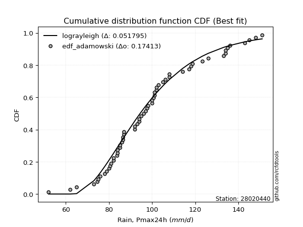</img>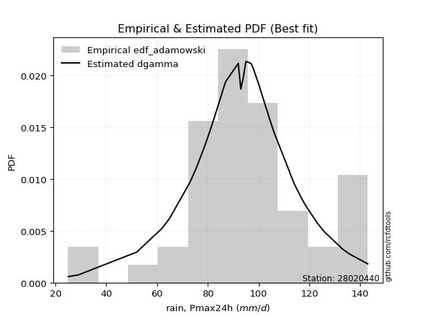</img>

</div>


## C. Best fit & Estimate extreme values for specific return periods - Tr

Best fit in probability distribution analysis means finding the theoretical distribution (like Normal, Poisson, Exponential) that most accurately mirrors your real-world data´s patterns (shape, center, spread) for better predictions, using methods like visual checks (Q-Q plots), goodness-of-fit tests (Kolmogorov-Smirnov, Chi-Squared), and information criteria (AIC) to score and select the simplest, most representative model.


### 1. Best fit (ordered by delta Δ)

:file_folder:Table: [bestfit_28020440.csv](table/bestfit_28020440.csv)

<div align="center">

|   id |   station | empirical_dist   | p_dist      |     delta |   deltao | eval   |   fit |   n |   best_fit |   best_fit_sort |
|-----:|----------:|:-----------------|:------------|----------:|---------:|:-------|------:|----:|-----------:|----------------:|
|    0 |  28020440 | edf_california   | lograyleigh | 0.0466301 |  0.17413 | Δo > Δ |     1 |  61 |          1 |               1 |
|    1 |  28020440 | edf_adamowski    | lograyleigh | 0.051795  |  0.17413 | Δo > Δ |     1 |  61 |          1 |               2 |
|    2 |  28020440 | edf_hazen        | logmaxwell  | 0.0519144 |  0.17413 | Δo > Δ |     1 |  61 |          1 |               3 |
|    3 |  28020440 | edf_chegodayev   | lograyleigh | 0.0519406 |  0.17413 | Δo > Δ |     1 |  61 |          1 |               4 |
|    4 |  28020440 | edf_jenkinson    | lograyleigh | 0.0520521 |  0.17413 | Δo > Δ |     1 |  61 |          1 |               5 |
|    5 |  28020440 | edf_beard        | lograyleigh | 0.0520521 |  0.17413 | Δo > Δ |     1 |  61 |          1 |               6 |
|    6 |  28020440 | edf_filliben     | lograyleigh | 0.0521357 |  0.17413 | Δo > Δ |     1 |  61 |          1 |               7 |
|    7 |  28020440 | edf_tukey        | lograyleigh | 0.0523124 |  0.17413 | Δo > Δ |     1 |  61 |          1 |               8 |
|    8 |  28020440 | edf_gringorten   | logmaxwell  | 0.0526225 |  0.17413 | Δo > Δ |     1 |  61 |          1 |               9 |
|    9 |  28020440 | edf_blom         | lograyleigh | 0.0527782 |  0.17413 | Δo > Δ |     1 |  61 |          1 |              10 |
|   10 |  28020440 | edf_cunnane      | lograyleigh | 0.0530583 |  0.17413 | Δo > Δ |     1 |  61 |          1 |              11 |
|   11 |  28020440 | edf_weibull      | invweibull  | 0.0546434 |  0.17413 | Δo > Δ |     1 |  61 |          1 |              12 |

</div>


### 2. Extreme values

In hydrology, a return period (or recurrence interval $Tr$) is the statistical average time between extreme events like floods or droughts of a specific magnitude, indicating how rare an event is, with a 100-year flood, for example, having a 1% chance of occurring in any given year, not that it happens exactly every century. It is a key tool for infrastructure design (like bridges or dams) and risk assessment, calculated from historical data to determine the probability of future events, although it is important to remember it is statistical average, and events can cluster or be missed.

:file_folder:Table: [extreme_28020440.csv](table/extreme_28020440.csv)

> risk_rate: assuming the return period as the project useful life.

|   id |      tr |   prob_l |     prob_g |    alpha |   betaprime |     chi2 |   crystalball |   erlang |    expon |   exponnorm |        f |   fatiguelife |     fisk |    gamma |   genexpon |   genlogistic |   gibrat |   gompertz |   gumbel_l |   gumbel_r |   halflogistic |   halfnorm |   hypsecant |   invgamma |   invgauss |   invweibull |   johnsonsu |   kstwobign |   laplace |   laplace_asymmetric |   loggamma |   logistic |   lognorm |   maxwell |   mielke |    moyal |   nakagami |      ncf |      nct |     norm |   pearson3 |   rayleigh |     rice |        t |   truncnorm |     wald |   weibull_min |   logalpha |   logbetaprime |          logchi2 |   logcrystalball |   logerlang |   logexpon |   logexponnorm |     logf |   logfatiguelife |   logfisk |   loggenexpon |   loggenlogistic |   loggibrat |   loggompertz |   loggumbel_l |   loggumbel_r |   loghalflogistic |   loghalfnorm |   loghypsecant |   loginvgamma |   loginvgauss |   loginvweibull |   logjohnsonsu |   logkstwobign |   loglaplace |   loglaplace_asymmetric |   logloggamma |   loglogistic |   loglognorm |   logmaxwell |   logmielke |   logmoyal |   lognakagami |   logncf |   lognct |   logpearson3 |   lograyleigh |   logrice |     logt |   logtruncnorm |   logwald |   logweibull_min |   station |   n |   risk_rate |
|-----:|--------:|---------:|-----------:|---------:|------------:|---------:|--------------:|---------:|---------:|------------:|---------:|--------------:|---------:|---------:|-----------:|--------------:|---------:|-----------:|-----------:|-----------:|---------------:|-----------:|------------:|-----------:|-----------:|-------------:|------------:|------------:|----------:|---------------------:|-----------:|-----------:|----------:|----------:|---------:|---------:|-----------:|---------:|---------:|---------:|-----------:|-----------:|---------:|---------:|------------:|---------:|--------------:|-----------:|---------------:|-----------------:|-----------------:|------------:|-----------:|---------------:|---------:|-----------------:|----------:|--------------:|-----------------:|------------:|--------------:|--------------:|--------------:|------------------:|--------------:|---------------:|--------------:|--------------:|----------------:|---------------:|---------------:|-------------:|------------------------:|--------------:|--------------:|-------------:|-------------:|------------:|-----------:|--------------:|---------:|---------:|--------------:|--------------:|----------:|---------:|---------------:|----------:|-----------------:|----------:|----:|------------:|
|    0 |    2    | 0.5      | 0.5        |  96.8314 |     96.4648 |  97.0995 |       99.2705 |  97.0995 |  84.7654 |     95.6915 |  96.8912 |       96.9632 |  96.3402 |  97.0994 |    58.2893 |       96.3555 |  92.6192 |    135.235 |    102.911 |    95.6302 |        93.8204 |    94.7347 |     99.2705 |    96.8644 |    96.6185 |      95.7527 |     96.0953 |     95.5647 |   99.2705 |              93.201  |    96.8441 |    99.2705 |   96.8732 |   97.3753 |  95.913  |  94.455  |    97.5277 |  96.8733 |  96.7482 |  99.2705 |    97.2017 |    96.7032 |  98.2723 |  99.2705 |     99.2705 |  92.0876 |       97.2772 |    96.0096 |         94.162 |     83.8572      |          96.8733 |      96.843 |    80.0372 |        96.8732 |  96.7865 |          96.7505 |   96.0634 |       89.8709 |          95.9127 |     90.6509 |       83.3829 |       100.459 |       93.4159 |           91.7424 |       92.5839 |        96.8732 |       96.0188 |       95.5107 |         94.2494 |        96.8998 |        92.8508 |      96.8732 |                 95.4868 |       97.0223 |       96.8732 |      96.8732 |      95.0579 |     96.0626 |    92.3263 |       96.8199 |  96.7979 |  95.9918 |       96.9023 |       94.4222 |   96.8736 |  96.8733 |        70.1359 |   90.1692 |          97.4292 |  28020440 |  61 |    0.75     |
|    1 |    2.33 | 0.570815 | 0.429185   | 100.685  |    100.353  | 101.044  |      103.225  | 101.044  |  91.9846 |     99.2945 | 100.777  |      100.883  |  99.8575 | 101.044  |    59.675  |      100.068  |  94.6223 |    136.065 |    106.351 |    99.2942 |        97.5876 |    99.0023 |    102.435  |   100.744  |   100.57   |      99.7621 |     99.7482 |     99.9253 |  101.663  |              96.8265 |   100.745  |   102.754  |  100.774  |  101.484  |  99.4735 |  97.9234 |   101.517  | 100.762  | 100.579  | 103.225  |   101.161  |   100.872  | 102.424  | 103.225  |    103.225  |  94.6804 |      101.297  |    99.9069 |        103.144 |     99.6552      |         100.774  |     100.743 |    88.0151 |       100.774  | 100.69   |         100.651  |   99.5774 |       95.3291 |          99.473  |     92.4815 |       90.2383 |       103.969 |       96.8962 |           95.2589 |       96.6141 |        99.9825 |       99.9568 |       99.4701 |         98.8808 |       100.801  |        97.9617 |      99.2153 |                 98.273  |      100.93   |      100.302  |     100.774  |      99.0372 |     99.6324 |    95.5792 |      100.724  | 100.703  |  99.8956 |      100.803  |       98.4344 |  100.774  | 100.773  |        74.4555 |   92.5339 |         101.515  |  28020440 |  61 |    0.729209 |
|    2 |    5    | 0.8      | 0.2        | 116.484  |    116.502  | 116.95   |      117.92   | 116.95   | 128.079  |    115.209  | 116.655  |      116.808  | 114.678  | 116.95   |    66.6033 |      115.756  | 106.154  |    138.745 |    117.465 |   115.212  |       114.633  |   117.05   |    115.129  |   116.608  |   116.76   |     117.181  |    115.521  |    118.448  |  113.627  |             114.953  |   116.687  |   116.206  |  116.697  |  117.653  | 115.054  | 113.99   |   117.491  | 116.646  | 116.371  | 117.92   |   117.06   |   117.562  | 118.128  | 117.92   |    117.92   | 109.195  |      117.469  |   116.277  |        146.529 |    275.696       |         116.697  |     116.686 |   141.538  |       116.697  | 116.68   |         116.638  |  114.764  |      120.724  |         115.053  |    103.764  |      124.277  |       116.168 |      113.585  |          112.933  |      115.69   |       113.491  |      116.604  |      116.428  |        121.793  |       116.707  |       123      |     111.802  |                113.471  |      116.791  |      114.718  |     116.697  |     116.385  |    115.1    |   112.207  |      116.691  | 116.701  | 116.437  |      116.707  |      116.279  |  116.697  | 116.695  |        96.4843 |  106.964  |         117.587  |  28020440 |  61 |    0.67232  |
|    3 |   10    | 0.9      | 0.1        | 128.465  |    128.907  | 128.616  |      127.668  | 128.616  | 160.844  |    128.914  | 128.595  |      128.63   | 126.974  | 128.616  |    72.8925 |      128.249  | 119.3    |    140.238 |    123.653 |   128.177  |       128.789  |   130.404  |    125.265  |   128.547  |   128.902  |     131.368  |    128.495  |    132.551  |  124.488  |             131.408  |   128.649  |   126.113  |  128.625  |  129.032  | 128.481  | 127.978  |   128.881  | 128.574  | 128.456  | 127.668  |   128.666  |   129.463  | 128.707  | 127.668  |    127.668  | 124.599  |      129.062  |   129.04   |        187.069 |    789.64        |         128.625  |     128.648 |   217.853  |       128.625  | 128.716  |         128.683  |  127.838  |      142.881  |         128.481  |    118.312  |      154.903  |       123.571 |      129.281  |          130.079  |      132.192  |       125.576  |      129.695  |      129.994  |        144.325  |       128.603  |       146.274  |     124.606  |                129.294  |      128.578  |      126.644  |     128.625  |     130.386  |    128.303  |   129.023  |      128.685  | 128.746  | 129.492  |      128.6    |      130.945  |  128.625  | 128.623  |       114.822  |  124.746  |         128.945  |  28020440 |  61 |    0.651322 |
|    4 |   15    | 0.933333 | 0.0666667  | 134.971  |    135.679  | 134.779  |      132.532  | 134.779  | 180.011  |    136.903  | 135.026  |      134.926  | 134.216  | 134.779  |    76.5715 |      135.243  | 128.367  |    140.914 |    126.455 |   135.492  |       136.8    |   137.354  |    131.05   |   134.983  |   135.407  |     139.373  |    135.932  |    140.037  |  130.841  |             141.033  |   135.075  |   131.511  |  135.025  |  134.871  | 136.53   | 136.096  |   134.75   | 134.991  | 135.059  | 132.532  |   134.782  |   135.594  | 134.019  | 132.533  |    132.532  | 134.49   |      135.052  |   136.071  |        212.067 |   1510.15        |         135.025  |     135.074 |   280.362  |       135.025  | 135.194  |         135.171  |  135.745  |      155.846  |         136.531  |    129.519  |      172.722  |       127.076 |      139.075  |          140.911  |      141.69   |       133.042  |      136.948  |      137.589  |        158.831  |       134.981  |       160.369  |     132.764  |                139.554  |      134.87   |      133.655  |     135.025  |     138.21   |    136.184  |   139.915  |      135.132  | 135.231  | 136.742  |      134.975  |      139.21   |  135.026  | 135.024  |       123.772  |  137.695  |         134.805  |  28020440 |  61 |    0.644736 |
|    5 |   20    | 0.95     | 0.05       | 139.442  |    140.343  | 138.94   |      135.718  | 138.94   | 193.61   |    142.571  | 139.422  |      139.199  | 139.461  | 138.94   |    79.1818 |      140.126  | 135.479  |    141.335 |    128.199 |   140.614  |       142.413  |   141.987  |    135.131  |   139.383  |   139.835  |     144.977  |    141.205  |    145.081  |  135.348  |             147.862  |   139.459  |   135.242  |  139.389  |  138.745  | 142.41   | 141.845  |   138.651  | 139.374  | 139.614  | 135.718  |   138.906  |   139.67   | 137.508  | 135.719  |    135.718  | 141.861  |      139.039  |   140.939  |        230.523 |   2417.81        |         139.389  |     139.458 |   335.314  |       139.389  | 139.618  |         139.603  |  141.567  |      165.11   |         142.412  |    139.048  |      185.327  |       129.309 |      146.371  |          149.033  |      148.399  |       138.574  |      141.984  |      142.895  |        169.846  |       139.327  |       170.623  |     138.875  |                147.323  |      139.147  |      138.727  |     139.389  |     143.661  |    141.93   |   148.181  |      139.532  | 139.66   | 141.785  |      139.317  |      144.99   |  139.389  | 139.388  |       129.136  |  148.211  |         138.709  |  28020440 |  61 |    0.641514 |
|    6 |   25    | 0.96     | 0.04       | 142.846  |    143.898  | 142.067  |      138.063  | 142.067  | 204.158  |    146.968  | 142.754  |      142.42   | 143.611  | 142.067  |    81.2065 |      143.882  | 141.408  |    141.634 |    129.44  |   144.559  |       146.737  |   145.435  |    138.289  |   142.72   |   143.181  |     149.294  |    145.307  |    148.858  |  138.845  |             153.16   |   142.777  |   138.096  |  142.69   |  141.622  | 147.088  | 146.302  |   141.549  | 142.695  | 143.092  | 138.063  |   142.002  |   142.698  | 140.081  | 138.064  |    138.063  | 147.765  |      142.004  |   144.663  |        245.294 |   3500.73        |         142.69   |     142.776 |   385.252  |       142.69   | 142.97   |         142.963  |  146.231  |      172.349  |         147.09   |    147.526  |      195.084  |       130.921 |      152.25   |          155.609  |      153.596  |       143.012  |      145.845  |      146.98   |        178.849  |       142.614  |       178.73   |     143.808  |                153.646  |      142.377  |      142.737  |     142.69   |     147.846  |    146.495  |   154.922  |      142.864  | 143.016  | 145.656  |      142.602  |      149.44   |  142.691  | 142.691  |       132.723  |  157.21   |         141.616  |  28020440 |  61 |    0.639603 |
|    7 |   50    | 0.98     | 0.02       | 153.171  |    154.687  | 151.323  |      144.779  | 151.323  | 236.923  |    160.624  | 152.779  |      152.012  | 157.066  | 151.323  |    87.4958 |      155.431  | 162.309  |    142.447 |    132.81  |   156.712  |       160.061  |   155.455  |    148.081  |   152.764  |   153.177  |     162.592  |    158.199  |    159.952  |  149.705  |             169.614  |   152.729  |   146.816  |  152.585  |  149.965  | 162.393  | 160.136  |   149.962  | 152.673  | 153.684  | 144.779  |   151.154  |   151.487  | 147.467  | 144.779  |    144.779  | 167.042  |      150.625  |   156.033  |        293.983 |  11305.9         |         152.584  |     152.728 |   592.971  |       152.585  | 153.037  |         153.055  |  161.706  |      195.218  |         162.399  |    181.748  |      225.293  |       135.4   |      171.889  |          177.751  |      169.758  |       157.699  |      157.681  |      159.591  |        209.694  |       152.457  |       204.832  |     160.277  |                175.071  |      152.02   |      155.719  |     152.585  |     160.686  |    161.401  |   177.867  |      152.859  | 153.095  | 157.545  |      152.437  |      163.144  |  152.585  | 152.588  |       140.941  |  190.575  |         150.093  |  28020440 |  61 |    0.63583  |
|    8 |   75    | 0.986667 | 0.0133333  | 159.091  |    160.874  | 156.476  |      148.382  | 156.476  | 256.09   |    168.612  | 158.468  |      157.387  | 165.403  | 156.476  |    91.1748 |      162.134  | 176.426  |    142.858 |    134.514 |   163.775  |       167.806  |   160.91   |    153.803  |   158.467  |   158.8    |     170.322  |    165.888  |    166.055  |  156.058  |             179.24   |   158.356  |   151.852  |  158.173  |  154.501  | 171.967  | 168.226  |   154.539  | 158.328  | 159.788  | 148.382  |   156.241  |   156.269  | 151.44   | 148.383  |    148.382  | 178.904  |      155.322  |   162.598  |        324.629 |  22736.1         |         158.173  |     158.355 |   763.116  |       158.173  | 158.737  |         158.772  |  171.567  |      208.914  |         171.975  |    209.249  |      242.9    |       137.723 |      184.448  |          192.042  |      179.26   |       166.97   |      164.544  |      166.962  |        230.012  |       158.013  |       220.784  |     170.772  |                188.963  |      157.444  |      163.748  |     158.173  |     168.129  |    170.705  |   192.828  |      158.513  | 158.804  | 164.456  |      157.988  |      171.12   |  158.174  | 158.179  |       144.056  |  214.536  |         154.734  |  28020440 |  61 |    0.634587 |
|    9 |  100    | 0.99     | 0.01       | 163.26   |    165.226  | 160.035  |      150.819  | 160.035  | 269.689  |    174.28   | 162.445  |      161.116  | 171.552  | 160.035  |    93.7851 |      166.876  | 187.361  |    143.127 |    135.628 |   168.775  |       173.288  |   164.626  |    157.862  |   162.457  |   162.709  |     175.793  |    171.427  |    170.237  |  160.566  |             186.069  |   162.28   |   155.408  |  162.069  |  157.59   | 179.069  | 173.966  |   157.657  | 162.279  | 164.096  | 150.819  |   159.752  |   159.527  | 154.13   | 150.82   |    150.819  | 187.552  |      158.525  |   167.236  |        347.429 |  37498.5         |         162.069  |     162.279 |   912.688  |       162.069  | 162.716  |         162.765  |  178.976  |      218.793  |         179.079  |    233.383  |      255.367  |       139.263 |      193.887  |          202.846  |      186.036  |       173.875  |      169.404  |      172.207  |        245.571  |       161.884  |       232.426  |     178.632  |                199.483  |      161.216  |      169.665  |     162.069  |     173.395  |    177.599  |   204.2    |      162.458  | 162.789  | 169.357  |      161.854  |      176.776  |  162.07   | 162.077  |       145.698  |  233.885  |         157.91   |  28020440 |  61 |    0.633968 |
|   10 |  200    | 0.995    | 0.005      | 173.244  |    175.632  | 168.334  |      156.347  | 168.334  | 302.454  |    187.936  | 171.876  |      169.855  | 187.249  | 168.334  |   100.074  |      178.27   | 217.112  |    143.711 |    138.05  |   180.794  |       186.467  |   173.124  |    167.641  |   171.921  |   171.896  |     188.945  |    185.092  |    179.868  |  171.426  |             202.524  |   171.549  |   163.937  |  171.265  |  164.659  | 197.337  | 187.794  |   164.792  | 171.634  | 174.454  | 156.347  |   167.929  |   166.982  | 160.244  | 156.348  |    156.347  | 209.095  |      165.862  |   178.385  |        406.264 | 126859           |         171.264  |     171.548 |  1404.79   |       171.265  | 172.129  |         172.213  |  198.411  |      243.197  |         197.354  |    314.078  |      285.323  |       142.672 |      218.604  |          231.375  |      202.511  |       191.705  |      181.131  |      184.944  |        287.42   |       171.016  |       261.629  |     199.088  |                227.3    |      170.088  |      184.746  |     171.265  |     186.072  |    195.301  |   234.428  |      171.779  | 172.218  | 181.209  |      170.975  |      190.432  |  171.265  | 171.278  |       148.274  |  290.01   |         165.219  |  28020440 |  61 |    0.633042 |
|   11 |  250    | 0.996    | 0.004      | 176.453  |    178.967  | 170.932  |      158.037  | 170.932  | 313.002  |    192.333  | 174.876  |      172.604  | 192.586  | 170.932  |   102.099  |      181.932  | 227.787  |    143.883 |    138.763 |   184.657  |       190.704  |   175.739  |    170.789  |   174.934  |   174.793  |     193.173  |    189.597  |    182.849  |  174.923  |             207.821  |   174.487  |   166.675  |  174.178  |  166.835  | 203.591  | 192.246  |   166.989  | 174.607  | 177.792  | 158.037  |   170.488  |   169.276  | 162.114  | 158.038  |    158.037  | 216.222  |      168.122  |   181.977  |        426.454 | 188454           |         174.177  |     174.487 |  1614      |       174.178  | 175.116  |         175.213  |  205.192  |      251.245  |         203.61   |    349.391  |      294.944  |       143.691 |      227.201  |          241.373  |      207.867  |       197.825  |      184.921  |      189.084  |        302.334  |       173.907  |       271.389  |     206.16   |                237.056  |      172.89   |      189.866  |     174.178  |     190.158  |    201.353  |   245.082  |      174.735  | 175.21   | 185.047  |      173.863  |      194.844  |  174.178  | 174.193  |       148.807  |  311.398  |         167.483  |  28020440 |  61 |    0.632858 |
|   12 |  500    | 0.998    | 0.002      | 186.437  |    189.315  | 178.812  |      163.046  | 178.812  | 345.768  |    205.989  | 184.117  |      180.98   | 210.121  | 178.811  |   108.388  |      193.296  | 264.679  |    144.376 |    140.806 |   196.65   |       203.854  |   183.534  |    180.567  |   184.216  |   183.64   |     206.296  |    203.95   |    191.782  |  185.783  |             224.276  |   183.504  |   175.168  |  183.11   |  173.327  | 224.279  | 206.074  |   173.542  | 183.752  | 188.205  | 163.046  |   178.238  |   176.123  | 167.668  | 163.048  |    163.046  | 238.883  |      174.873  |   193.173  |        493.383 | 650086           |         183.11   |     183.503 |  2484.24   |       183.111  | 184.293  |         184.432  |  228.096  |      276.881  |         224.308  |    504.934  |      324.763  |       146.652 |      256.098  |          275.241  |      224.693  |       218.11   |      196.772  |      202.102  |        353.735  |       182.769  |       302.875  |     229.769  |                270.111  |      181.457  |      206.665  |     183.111  |     202.891  |    221.342  |   281.362  |      183.809  | 184.405  | 197.071  |      182.711  |      208.625  |  183.111  | 183.134  |       149.891  |  390.46   |         174.276  |  28020440 |  61 |    0.632489 |
|   13 |  750    | 0.998667 | 0.00133333 | 192.31   |    195.373  | 183.301  |      165.83   | 183.301  | 364.934  |    213.977  | 189.481  |      185.779  | 221.093  | 183.301  |   112.067  |      199.939  | 289.077  |    144.639 |    141.898 |   203.661  |       211.542  |   187.889  |    186.287  |   189.609  |   188.72   |     213.968  |    212.613  |    196.8    |  192.136  |             233.901  |   188.715  |   180.129  |  188.269  |  176.959  | 237.327  | 214.163  |   177.206  | 189.054  | 194.345  | 165.83   |   182.65   |   179.951  | 170.756  | 165.831  |    165.83   | 252.47   |      178.652  |   199.765  |        535.685 |      1.34862e+06 |         188.269  |     188.714 |  3197.06   |       188.269  | 189.605  |         189.77   |  242.918  |      292.345  |         237.363  |    644.166  |      342.164  |       148.26  |      274.665  |          297.201  |      234.678  |       230.927  |      203.775  |      209.843  |        387.741  |       187.883  |       322.139  |     244.814  |                291.545  |      186.387  |      217.159  |     188.269  |     210.381  |    233.929  |   305.025  |      189.055  | 189.727  | 204.194  |      187.817  |      216.752  |  188.27   | 188.298  |       150.258  |  447.189  |         178.102  |  28020440 |  61 |    0.632366 |
|   14 | 1000    | 0.999    | 0.001      | 196.498  |    199.681  | 186.44   |      167.746  | 186.44   | 378.533  |    219.645  | 193.275  |      189.143  | 229.219  | 186.44   |   114.678  |      204.65   | 307.748  |    144.816 |    142.633 |   208.634  |       216.995  |   190.897  |    190.345  |   193.424  |   192.287  |     219.41   |    218.885  |    200.276  |  196.644  |             240.73   |   192.389  |   183.648  |  191.905  |  179.469  | 247.039  | 219.902  |   179.738  | 192.8    | 198.731  | 167.746  |   185.733  |   182.597  | 172.884  | 167.747  |    167.746  | 262.244  |      181.265  |   204.467  |        567.205 |      2.26808e+06 |         191.905  |     192.389 |  3823.68   |       191.905  | 193.353  |         193.538  |  254.14   |      303.534  |         247.08   |    776.128  |      354.491  |       149.351 |      288.646  |          313.832  |      241.832  |       240.475  |      208.782  |      215.4    |        413.827  |       191.486  |       336.199  |     256.082  |                307.776  |      189.854  |      224.923  |     191.906  |     215.719  |    243.287  |   323.012  |      192.756  | 193.483  | 209.294  |      191.414  |      222.553  |  191.906  | 191.938  |       150.442  |  493.027  |         180.758  |  28020440 |  61 |    0.632305 |

<div align="center">

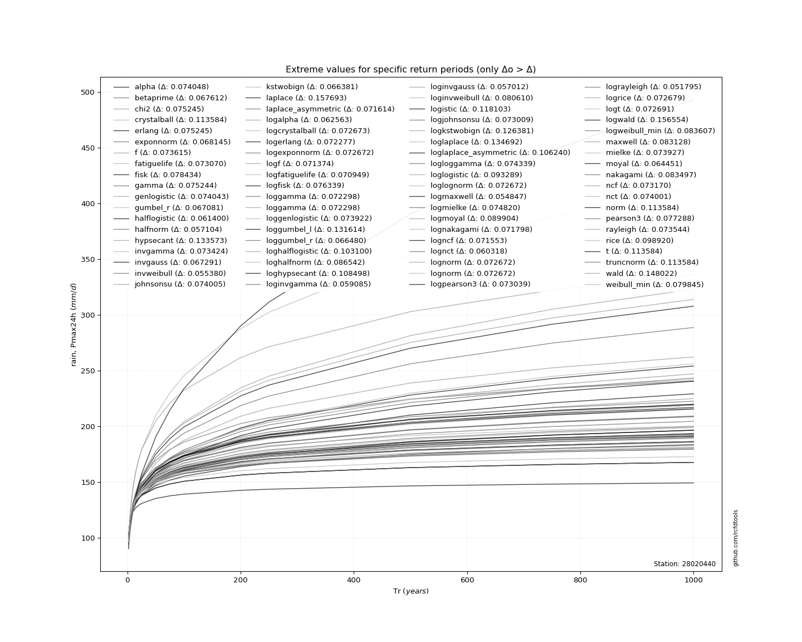</img>

</div>


<div align="center">

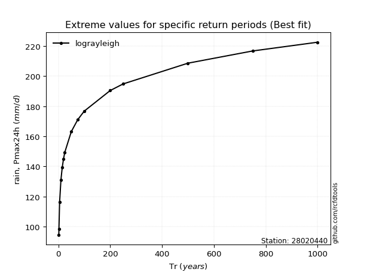</img>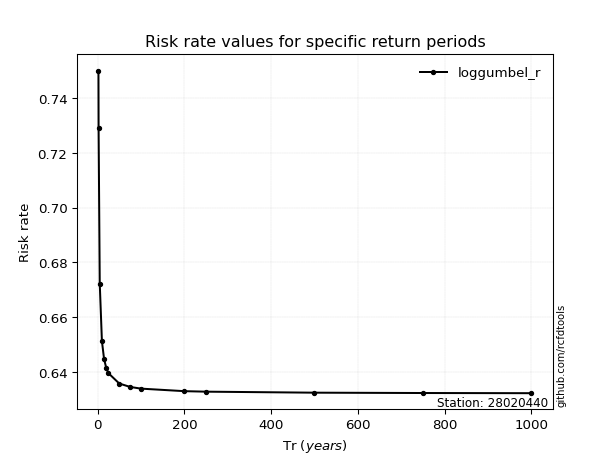</img>

</div>


<sub>**APP DISCLAIMER**: NO WARRANTY - This software is provided by [github.com/rcfdtools](https://github.com/rcfdtools) "as is", without any express or implied warranty, including warranties of merchantability, fitness for a particular purpose, or non-infringement. There is no guarantee that the software will be error-free or operate without interruption. LIMITATION OF LIABILITY - Neither the authors nor copyright holders will be liable for claims or damages arising from the software or its use. You are responsible for determining if the software is appropriate for your use and assume all associated risks, including errors, legal compliance, and data loss. NO PROFESSIONAL ADVICE - The software provides general information and does not offer professional advice. It should not replace consultation with professional advisors.</sub>