<div align="center">


</div>

# PMP Station (rain, Pmax24h): 28020460

Probable Maximum Precipitation (PMP) is the greatest amount of rainfall for a specific duration that is meteorologically possible for a given location, acting as a "worst-case" scenario for extreme storms, crucial for designing safety-critical infrastructure like bridges, river deviations, dams, spillways, and nuclear plants to prevent catastrophic failure. PMP is calculated by hydrologists using meteorological data to determine the upper limit of extreme rainfall, often leading to the Probable Maximum Flood (PMF) for flood control design, and is increasingly being studied for climate change impacts.

<div align="center">

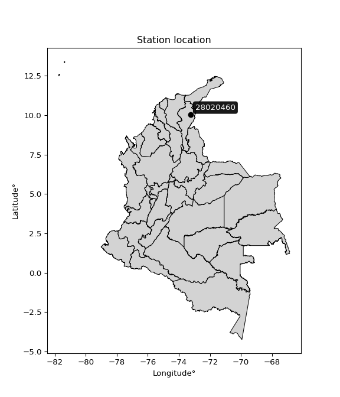</img>

</div>


## A. General information


### 1. General running parameters

• app_version: _v20251228_. • runtime: _2025-12-28 10:36:19.550669_. • Python version: _3.14.0_. • SciPy version: _1.16.3_. • Pandas version: _2.3.3_. • NumPy version: _2.3.5_. • Stations dataset (station_dataset_file): _dataset/pmax24h_in/conventional_cesarcolombia_1959_2022.csv_. • Stations catalog (station_catalog_file): _dataset/CNE_IDEAM.xls_. • Minimum year to eval til year_max (date_min): _1900_. • Maximum year to eval since year_min (date_max): _2024_. • Creates, save and include plots into reports (create_plot): _True_. • Plot only fit distributions with Δo > Δ (plot_only_fit): _True_. • Eval low extreme values, if False, evaluates high extreme values (low_extreme): _False_. • Eval every SciPy distribution as logarithmic (pdist_logarithmic_on): _True_. • Standard deviation normalized (ddof): _1.0_. • Return periods to eval in years (Tr): _[2, 2.33, 5, 10, 15, 20, 25, 50, 75, 100, 200, 250, 500, 750, 1000]_. • Minimum data sample per station, 0 means any (minimum_sample): _5_. • Z-Score maximum threshold to adjust a value, 0 means disable (zscore_max): _3.5_. • Z-Score minimum threshold to adjust a value, 0 means disable (zscore_min): _-2.5_. • Avoid zeros, e.g. rain = 0 (avoid_zeros): _True_. • Avoid null values (avoid_nans): _True_. [:file_folder:Dataset file.](../../dataset/pmax24h_in/conventional_cesarcolombia_1959_2022.csv)

> Delta Degrees of Freedom (DDOF): is a parameter used in the formulas for calculating variance and standard deviation. When ddof=0, the divisor is $N$ (the total number of observations) and this is used when your data set is the entire population. When ddof=1, the divisor is $N-1$ and this is used when your data set is a sample drawn from a larger population. Using $N-1$ provides an unbiased estimate of the population variance (known as Bessel´s correction).


### 2. Station info and location

|   id |   CODIGO | NOMBRE                | CATEGORIA     | TECNOLOGIA   | ESTADO     | FECHA_INSTALACION   | FECHA_SUSPENSION   |   ALTITUD |   LATITUD |   LONGITUD | DEPARTAMENTO   | MUNICIPIO       | AREA_OPERATIVA                                         | ENTIDAD                                                     | AREA_HIDROGRAFICA   | ZONA_HIDROGRAFICA   | SUBZONA_HIDROGRAFICA   |   CORRIENTE | Catalogo   |
|-----:|---------:|:----------------------|:--------------|:-------------|:-----------|:--------------------|:-------------------|----------:|----------:|-----------:|:---------------|:----------------|:-------------------------------------------------------|:------------------------------------------------------------|:--------------------|:--------------------|:-----------------------|------------:|:-----------|
|    0 | 28020460 | CODAZZI DC [28020460] | Pluviométrica | Convencional | Suspendida | 15/11/1979          | 21/10/2024         |        90 |   10.0446 |   -73.2434 | Cesar          | Agustín Codazzi | Area Operativa 05 - Magdalena-Cesar-Guajira-San Andrés | INSTITUTO DE HIDROLOGIA METEOROLOGIA Y ESTUDIOS AMBIENTALES | Magdalena Cauca     | Cesar               | Medio Cesar            |         nan | CNE_IDEAM  |

<div align="center">

Map location in: [:earth_americas:Google](http://maps.google.com/maps?q=10.04463889,-73.24338889) [:earth_americas:OSM](https://www.openstreetmap.org/#map=18/10.04463889/-73.24338889&layers=P) [:earth_americas:Bing](https://www.bing.com/maps?cp=10.04463889~-73.24338889&lvl=18) [:earth_americas:Apple](https://maps.apple.com/frame?center=10.04463889%2C-73.24338889&span=0.003%2C0.006)

</div>


<div align="center">

```geojson
{
  "type": "Feature",
  "geometry": {
    "type": "Point", 
    "coordinates": [-73.24338889, 10.04463889]
  }, 
  "properties": {
    "Name": "28020460"
  }
}
```

</div>


### 3. Discrete values table and plot

|               |           0 |             1 |           2 |           3 |           4 |           5 |           6 |           7 |           8 |          9 |          10 |         11 |          12 |          13 |        14 |          15 |         16 |         17 |          18 |         19 |          20 |          21 |         22 |          23 |          24 |          25 |        26 |         27 |         28 |          29 |         30 |          31 |         32 |          33 |          34 |         35 |        36 |           37 |         38 |         39 |          40 |
|:--------------|------------:|--------------:|------------:|------------:|------------:|------------:|------------:|------------:|------------:|-----------:|------------:|-----------:|------------:|------------:|----------:|------------:|-----------:|-----------:|------------:|-----------:|------------:|------------:|-----------:|------------:|------------:|------------:|----------:|-----------:|-----------:|------------:|-----------:|------------:|-----------:|------------:|------------:|-----------:|----------:|-------------:|-----------:|-----------:|------------:|
| Date          | 1980        | 1981          | 1982        | 1983        | 1984        | 1985        | 1986        | 1987        | 1988        | 1989       | 1990        | 1991       | 1992        | 1993        | 1994      | 1995        | 1996       | 1997       | 1998        | 1999       | 2000        | 2001        | 2002       | 2003        | 2004        | 2005        | 2006      | 2007       | 2008       | 2009        | 2010       | 2011        | 2012       | 2013        | 2014        | 2015       | 2016      | 2017         | 2018       | 2019       | 2020        |
| Value         |   90        |  110          |  120        |  100        |  130        |   91        |  135        |  120        |  135        |   60       |   96        |   70       |   85        |   96        |  140      |  115        |  150       |   70       |   95        |   70       |   90        |  100        |  150       |   97        |   90        |   90        |   74      |  150       |  150       |  120        |  150       |   98        |  162       |   90        |  137        |  142       |   80      |  112         |   75       |  138       |  130        |
| Value_initial |   90        |  110          |  120        |  100        |  130        |   91        |  135        |  120        |  135        |   60       |   96        |   70       |   85        |   96        |  140      |  115        |  150       |   70       |   95        |   70       |   90        |  100        |  150       |   97        |   90        |   90        |   74      |  150       |  150       |  120        |  150       |   98        |  162       |   90        |  137        |  142       |   80      |  112         |   75       |  138       |  130        |
| count         |   41        |   41          |   41        |   41        |   41        |   41        |   41        |   41        |   41        |   41       |   41        |   41       |   41        |   41        |   41      |   41        |   41       |   41       |   41        |   41       |   41        |   41        |   41       |   41        |   41        |   41        |   41      |   41       |   41       |   41        |   41       |   41        |   41       |   41        |   41        |   41       |   41      |   41         |   41       |   41       |   41        |
| mean          |  109.829    |  109.829      |  109.829    |  109.829    |  109.829    |  109.829    |  109.829    |  109.829    |  109.829    |  109.829   |  109.829    |  109.829   |  109.829    |  109.829    |  109.829  |  109.829    |  109.829   |  109.829   |  109.829    |  109.829   |  109.829    |  109.829    |  109.829   |  109.829    |  109.829    |  109.829    |  109.829  |  109.829   |  109.829   |  109.829    |  109.829   |  109.829    |  109.829   |  109.829    |  109.829    |  109.829   |  109.829  |  109.829     |  109.829   |  109.829   |  109.829    |
| std           |   27.9981   |   27.9981     |   27.9981   |   27.9981   |   27.9981   |   27.9981   |   27.9981   |   27.9981   |   27.9981   |   27.9981  |   27.9981   |   27.9981  |   27.9981   |   27.9981   |   27.9981 |   27.9981   |   27.9981  |   27.9981  |   27.9981   |   27.9981  |   27.9981   |   27.9981   |   27.9981  |   27.9981   |   27.9981   |   27.9981   |   27.9981 |   27.9981  |   27.9981  |   27.9981   |   27.9981  |   27.9981   |   27.9981  |   27.9981   |   27.9981   |   27.9981  |   27.9981 |   27.9981    |   27.9981  |   27.9981  |   27.9981   |
| zscore        |   -0.708236 |    0.00609797 |    0.363265 |   -0.351069 |    0.720431 |   -0.672519 |    0.899015 |    0.363265 |    0.899015 |   -1.77974 |   -0.493935 |   -1.42257 |   -0.886819 |   -0.493935 |    1.0776 |    0.184681 |    1.43476 |   -1.42257 |   -0.529652 |   -1.42257 |   -0.708236 |   -0.351069 |    1.43476 |   -0.458219 |   -0.708236 |   -0.708236 |   -1.2797 |    1.43476 |    1.43476 |    0.363265 |    1.43476 |   -0.422502 |    1.86337 |   -0.708236 |    0.970448 |    1.14903 |   -1.0654 |    0.0775313 |   -1.24399 |    1.00616 |    0.720431 |

<div align="center">

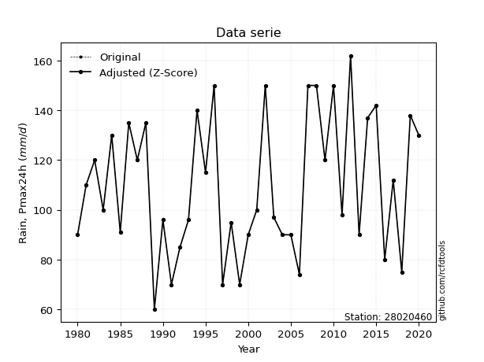</img>

</div>


> The initial value (value_initial) correspond to the initial obtained or null completed value, and value (value) is adjusted only when the initial value is outside the valid range definite through the Z-Score value. If Z-Score is active, values out of range or outliers are replaced with the station mean value


### 4. Active continuous probability distributions from SciPy (44 of 104 available)

[scipy.stats](https://docs.scipy.org/doc/scipy/reference/stats.html) is a Python´s powerful submodule within the SciPy library for comprehensive statistical analysis, offering over 130 probability distributions (like Normal, Poisson), functions for descriptive stats (mean, variance), hypothesis testing (t-tests, chi-square), random variable generation, and statistical tests, making it essential for data science, modeling, and research. It provides tools to explore, model, and draw conclusions from data efficiently, working seamlessly with NumPy.

<div align="center">

|   id | p_dist             |   n_parameter | fit_method   | label                                                                       | active   | ref                                                                                                        |
|-----:|:-------------------|--------------:|:-------------|:----------------------------------------------------------------------------|:---------|:-----------------------------------------------------------------------------------------------------------|
|    0 | alpha              |             3 | MLE          | Alpha                                                                       | True     | [:mortar_board:](https://docs.scipy.org/doc/scipy/reference/generated/scipy.stats.alpha.html)              |
|    1 | betaprime          |             4 | MLE          | Beta prime                                                                  | True     | [:mortar_board:](https://docs.scipy.org/doc/scipy/reference/generated/scipy.stats.betaprime.html)          |
|    2 | chi2               |             3 | MLE          | Chi²                                                                        | True     | [:mortar_board:](https://docs.scipy.org/doc/scipy/reference/generated/scipy.stats.chi2.html)               |
|    3 | crystalball        |             4 | MLE          | Crystalball                                                                 | True     | [:mortar_board:](https://docs.scipy.org/doc/scipy/reference/generated/scipy.stats.crystalball.html)        |
|    4 | erlang             |             3 | MLE          | Erlang                                                                      | True     | [:mortar_board:](https://docs.scipy.org/doc/scipy/reference/generated/scipy.stats.erlang.html)             |
|    5 | expon              |             2 | MLE          | Exponential                                                                 | True     | [:mortar_board:](https://docs.scipy.org/doc/scipy/reference/generated/scipy.stats.expon.html)              |
|    6 | exponnorm          |             3 | MLE          | Exponentially modified Normal                                               | True     | [:mortar_board:](https://docs.scipy.org/doc/scipy/reference/generated/scipy.stats.exponnorm.html)          |
|    7 | f                  |             4 | MLE          | F                                                                           | True     | [:mortar_board:](https://docs.scipy.org/doc/scipy/reference/generated/scipy.stats.f.html)                  |
|    8 | fatiguelife        |             3 | MLE          | Fatigue-life (Birnbaum-Saunders)                                            | True     | [:mortar_board:](https://docs.scipy.org/doc/scipy/reference/generated/scipy.stats.fatiguelife.html)        |
|    9 | fisk               |             3 | MLE          | Fisk                                                                        | True     | [:mortar_board:](https://docs.scipy.org/doc/scipy/reference/generated/scipy.stats.fisk.html)               |
|   10 | gamma              |             3 | MLE          | Gamma                                                                       | True     | [:mortar_board:](https://docs.scipy.org/doc/scipy/reference/generated/scipy.stats.gamma.html)              |
|   11 | genexpon           |             5 | MLE          | Generalized exponential                                                     | True     | [:mortar_board:](https://docs.scipy.org/doc/scipy/reference/generated/scipy.stats.genexpon.html)           |
|   12 | genlogistic        |             3 | MLE          | Generalized logistic                                                        | True     | [:mortar_board:](https://docs.scipy.org/doc/scipy/reference/generated/scipy.stats.genlogistic.html)        |
|   13 | gibrat             |             2 | MM           | Gibrat                                                                      | True     | [:mortar_board:](https://docs.scipy.org/doc/scipy/reference/generated/scipy.stats.gibrat.html)             |
|   14 | gompertz           |             3 | MLE          | Gompertz (or truncated Gumbel)                                              | True     | [:mortar_board:](https://docs.scipy.org/doc/scipy/reference/generated/scipy.stats.gompertz.html)           |
|   15 | gumbel_l           |             2 | MM           | Gumbel Left Skew                                                            | True     | [:mortar_board:](https://docs.scipy.org/doc/scipy/reference/generated/scipy.stats.gumbel_l.html)           |
|   16 | gumbel_r           |             2 | MM           | Gumbel Right Skew                                                           | True     | [:mortar_board:](https://docs.scipy.org/doc/scipy/reference/generated/scipy.stats.gumbel_r.html)           |
|   17 | halflogistic       |             2 | MM           | Half-logistic                                                               | True     | [:mortar_board:](https://docs.scipy.org/doc/scipy/reference/generated/scipy.stats.halflogistic.html)       |
|   18 | halfnorm           |             2 | MM           | Half Normal                                                                 | True     | [:mortar_board:](https://docs.scipy.org/doc/scipy/reference/generated/scipy.stats.halfnorm.html)           |
|   19 | hypsecant          |             2 | MM           | hyperbolic secant                                                           | True     | [:mortar_board:](https://docs.scipy.org/doc/scipy/reference/generated/scipy.stats.hypsecant.html)          |
|   20 | invgamma           |             3 | MLE          | Inverted gamma                                                              | True     | [:mortar_board:](https://docs.scipy.org/doc/scipy/reference/generated/scipy.stats.invgamma.html)           |
|   21 | invgauss           |             3 | MLE          | Inverse Gaussian                                                            | True     | [:mortar_board:](https://docs.scipy.org/doc/scipy/reference/generated/scipy.stats.invgauss.html)           |
|   22 | invweibull         |             3 | MLE          | Inverted Weibull                                                            | True     | [:mortar_board:](https://docs.scipy.org/doc/scipy/reference/generated/scipy.stats.invweibull.html)         |
|   23 | johnsonsu          |             4 | MLE          | Johnson Su                                                                  | True     | [:mortar_board:](https://docs.scipy.org/doc/scipy/reference/generated/scipy.stats.johnsonsu.html)          |
|   24 | kstwobign          |             2 | MLE          | Limiting distribution of scaled Kolmogorov-Smirnov two-sided test statistic | True     | [:mortar_board:](https://docs.scipy.org/doc/scipy/reference/generated/scipy.stats.kstwobign.html)          |
|   25 | laplace            |             2 | MM           | Laplace                                                                     | True     | [:mortar_board:](https://docs.scipy.org/doc/scipy/reference/generated/scipy.stats.laplace.html)            |
|   26 | laplace_asymmetric |             3 | MLE          | Asymmetric Laplace                                                          | True     | [:mortar_board:](https://docs.scipy.org/doc/scipy/reference/generated/scipy.stats.laplace_asymmetric.html) |
|   27 | loggamma           |             3 | MLE          | Log gamma                                                                   | True     | [:mortar_board:](https://docs.scipy.org/doc/scipy/reference/generated/scipy.stats.loggamma.html)           |
|   28 | logistic           |             2 | MM           | Logistic (or Sech-squared)                                                  | True     | [:mortar_board:](https://docs.scipy.org/doc/scipy/reference/generated/scipy.stats.logistic.html)           |
|   29 | lognorm            |             3 | MLE          | Log Normal                                                                  | True     | [:mortar_board:](https://docs.scipy.org/doc/scipy/reference/generated/scipy.stats.lognorm.html)            |
|   30 | maxwell            |             2 | MM           | Maxwell                                                                     | True     | [:mortar_board:](https://docs.scipy.org/doc/scipy/reference/generated/scipy.stats.maxwell.html)            |
|   31 | mielke             |             4 | MLE          | Mielke Beta-Kappa / Dagum                                                   | True     | [:mortar_board:](https://docs.scipy.org/doc/scipy/reference/generated/scipy.stats.mielke.html)             |
|   32 | moyal              |             2 | MM           | Moyal                                                                       | True     | [:mortar_board:](https://docs.scipy.org/doc/scipy/reference/generated/scipy.stats.moyal.html)              |
|   33 | nakagami           |             3 | MLE          | Nakagami                                                                    | True     | [:mortar_board:](https://docs.scipy.org/doc/scipy/reference/generated/scipy.stats.nakagami.html)           |
|   34 | ncf                |             5 | MLE          | Non-central F distribution                                                  | True     | [:mortar_board:](https://docs.scipy.org/doc/scipy/reference/generated/scipy.stats.ncf.html)                |
|   35 | nct                |             4 | MLE          | Non-central Student’s t                                                     | True     | [:mortar_board:](https://docs.scipy.org/doc/scipy/reference/generated/scipy.stats.nct.html)                |
|   36 | norm               |             2 | MM           | Normal                                                                      | True     | [:mortar_board:](https://docs.scipy.org/doc/scipy/reference/generated/scipy.stats.norm.html)               |
|   37 | pearson3           |             3 | MM           | Pearson type III                                                            | True     | [:mortar_board:](https://docs.scipy.org/doc/scipy/reference/generated/scipy.stats.pearson3.html)           |
|   38 | rayleigh           |             2 | MM           | Rayleigh                                                                    | True     | [:mortar_board:](https://docs.scipy.org/doc/scipy/reference/generated/scipy.stats.rayleigh.html)           |
|   39 | rice               |             3 | MLE          | Rice                                                                        | True     | [:mortar_board:](https://docs.scipy.org/doc/scipy/reference/generated/scipy.stats.rice.html)               |
|   40 | t                  |             3 | MLE          | Student’s t                                                                 | True     | [:mortar_board:](https://docs.scipy.org/doc/scipy/reference/generated/scipy.stats.t.html)                  |
|   41 | truncnorm          |             4 | MLE          | Truncated normal                                                            | True     | [:mortar_board:](https://docs.scipy.org/doc/scipy/reference/generated/scipy.stats.truncnorm.html)          |
|   42 | wald               |             2 | MM           | Wald                                                                        | True     | [:mortar_board:](https://docs.scipy.org/doc/scipy/reference/generated/scipy.stats.wald.html)               |
|   43 | weibull_min        |             3 | MLE          | Weibull minimum                                                             | True     | [:mortar_board:](https://docs.scipy.org/doc/scipy/reference/generated/scipy.stats.weibull_min.html)        |

</div>

> **n_parameter:** # arguments & localization & scale.
>
> **Fit methods:** (MLE) maximum likelihood, (MM) L-moments.
>
>**Inactive:** foldnorm, gennorm, norminvgauss, powernorm, powerlognorm, skewnorm, genextreme, anglit, arcsine, argus, beta, bradford, burr, burr12, cauchy, cosine, halfcauchy, foldcauchy, skewcauchy, wrapcauchy, dgamma, gengamma, exponweib, exponpow, truncexpon, gausshyper, genhalflogistic, genhyperbolic, geninvgauss, halfgennorm, johnsonsb, kappa4, kappa3, ksone, kstwo, loglaplace, levy, levy_l, levy_stable, ncx2, pareto, genpareto, truncpareto, lomax, powerlaw, rdist, rel_breitwigner, recipinvgauss, semicircular, studentized_range, trapezoid, triang, truncweibull_min, tukeylambda, uniform, loguniform, vonmises, vonmises_line, weibull_max, dweibull, 


## B. Probability distributions vs. Empirical distributions

A continuous probability distribution (CPD) describes probabilities for variables that can take any value within a range (like rain any time), unlike discrete variables with specific outcomes (like temperature). It uses a Probability Density Function (PDF), a curve where the total area under it equals 1, and the probability of the variable falling within an interval (a to b) is found by calculating the area under the curve between those points. A key feature is that the probability of hitting any single exact value is zero, so probabilities are always expressed for ranges, e.g., $P(a ≤ X ≤ b)$.

<div align="center">

Distributions parameters from station values
|    |   station | p_dist                |   n |               loc |            scale | shape                  | shape1                | shape2             | shape3   |
|---:|----------:|:----------------------|----:|------------------:|-----------------:|:-----------------------|:----------------------|:-------------------|:---------|
|  0 |  28020460 | alpha                 |  41 |    -210.714       |   3709.18        | 11.663804849602052     |                       |                    |          |
|  1 |  28020460 | betaprime             |  41 |     -13.5865      |      0.423179    | 5325.012143649868      | 19.281436409458735    |                    |          |
|  2 |  28020460 | chi2                  |  41 |      60           |      1.76718     | 0.20704651087517517    |                       |                    |          |
|  3 |  28020460 | crystalball           |  41 |     109.829       |     27.6546      | 7751.424223791071      | 7461.756783881565     |                    |          |
|  4 |  28020460 | erlang                |  41 |     -92.7676      |      3.79769     | 53.32571060950383      |                       |                    |          |
|  5 |  28020460 | expon                 |  41 |      60           |     49.8293      |                        |                       |                    |          |
|  6 |  28020460 | exponnorm             |  41 |     106.625       |     27.4684      | 0.11663647847145853    |                       |                    |          |
|  7 |  28020460 | f                     |  41 |      23.5835      |     86.2351      | 18.401036253398473     | 137329.25792827393    |                    |          |
|  8 |  28020460 | fatiguelife           |  41 |     -46.8749      |    154.238       | 0.17882306104553344    |                       |                    |          |
|  9 |  28020460 | fisk                  |  41 |      -0.707299    |    107.54        | 6.4424880595361405     |                       |                    |          |
| 10 |  28020460 | gamma                 |  41 |     -91.5415      |      3.75149     | 53.62265252426192      |                       |                    |          |
| 11 |  28020460 | genexpon              |  41 |      59.9942      |      1.89045     | 0.03795647550086527    | 5.815858458668407e-08 | 2.8952121209019928 |          |
| 12 |  28020460 | genlogistic           |  41 |     -14.3343      |     24.2059      | 97.1807110490739       |                       |                    |          |
| 13 |  28020460 | gibrat                |  41 |      88.7323      |     12.796       |                        |                       |                    |          |
| 14 |  28020460 | gompertz              |  41 |      95           |      4.03646     | 1.3080533629819003e-06 |                       |                    |          |
| 15 |  28020460 | gumbel_l              |  41 |     122.275       |     21.5622      |                        |                       |                    |          |
| 16 |  28020460 | gumbel_r              |  41 |      97.3832      |     21.5622      |                        |                       |                    |          |
| 17 |  28020460 | halflogistic          |  41 |      77.0521      |     23.6437      |                        |                       |                    |          |
| 18 |  28020460 | halfnorm              |  41 |      73.2255      |     45.8761      |                        |                       |                    |          |
| 19 |  28020460 | hypsecant             |  41 |     109.829       |     17.6055      |                        |                       |                    |          |
| 20 |  28020460 | invgamma              |  41 |    -138.453       |  19809.7         | 80.77709514173534      |                       |                    |          |
| 21 |  28020460 | invgauss              |  41 |      27.089       |    602.164       | 0.13656718170072513    |                       |                    |          |
| 22 |  28020460 | invweibull            |  41 |      -1.11153e+09 |      1.11153e+09 | 45668171.48149352      |                       |                    |          |
| 23 |  28020460 | johnsonsu             |  41 |     -70.779       |     57.9125      | -12.624624628749014    | 6.843251769148891     |                    |          |
| 24 |  28020460 | kstwobign             |  41 |      10.7174      |    113.395       |                        |                       |                    |          |
| 25 |  28020460 | laplace               |  41 |     109.829       |     19.5547      |                        |                       |                    |          |
| 26 |  28020460 | laplace_asymmetric    |  41 |      90           |     19.6324      | 0.6152685536198801     |                       |                    |          |
| 27 |  28020460 | loggamma              |  41 |   -4912.59        |    759.812       | 742.9280959893485      |                       |                    |          |
| 28 |  28020460 | logistic              |  41 |     109.829       |     15.2468      |                        |                       |                    |          |
| 29 |  28020460 | lognorm               |  41 |     -74.954       |    182.711       | 0.15055659827684295    |                       |                    |          |
| 30 |  28020460 | maxwell               |  41 |      44.2995      |     41.0647      |                        |                       |                    |          |
| 31 |  28020460 | mielke                |  41 |    -899.776       |    801.41        | 333405.4518207774      | 41.514218456185795    |                    |          |
| 32 |  28020460 | moyal                 |  41 |      94.0146      |     12.4489      |                        |                       |                    |          |
| 33 |  28020460 | nakagami              |  41 |      55.6401      |     60.8378      | 0.9819001004430521     |                       |                    |          |
| 34 |  28020460 | ncf                   |  41 |      -0.387367    |      1.65079e-06 | 1.3432606965492111e-06 | 8.806143817629984     | 84.77534238569132  |          |
| 35 |  28020460 | nct                   |  41 |    -585.04        |     27.6227      | 123162.77341347816     | 25.155530448126598    |                    |          |
| 36 |  28020460 | norm                  |  41 |     109.829       |     27.6546      |                        |                       |                    |          |
| 37 |  28020460 | pearson3              |  41 |     109.829       |     27.6545      | 0.13569462067179494    |                       |                    |          |
| 38 |  28020460 | rayleigh              |  41 |      56.9244      |     42.2119      |                        |                       |                    |          |
| 39 |  28020460 | rice                  |  41 |      54.1025      |     33.9929      | 1.1616206388728942     |                       |                    |          |
| 40 |  28020460 | t                     |  41 |     109.828       |     27.6545      | 26127674.263537526     |                       |                    |          |
| 41 |  28020460 | truncnorm             |  41 |     109.829       |     27.6546      | -1086.6683030881968    | 2097.938813275861     |                    |          |
| 42 |  28020460 | wald                  |  41 |      82.1747      |     27.6546      |                        |                       |                    |          |
| 43 |  28020460 | weibull_min           |  41 |      52.3191      |     64.9949      | 2.217724678416233      |                       |                    |          |
| 44 |  28020460 | logalpha              |  41 |      -4.10569     |    293.644       | 33.510753089570045     |                       |                    |          |
| 45 |  28020460 | logbetaprime          |  41 |       2.15533     |     33.0533      | 96.3939666197328       | 1269.7392973168648    |                    |          |
| 46 |  28020460 | logchi2               |  41 |       4.09434     |      0.920687    | 1.1427015162388754     |                       |                    |          |
| 47 |  28020460 | logcrystalball        |  41 |       4.666       |      0.259688    | 5.778615828569929      | 4240.716342002659     |                    |          |
| 48 |  28020460 | logerlang             |  41 |      -0.195218    |      0.0139935   | 347.3083230374642      |                       |                    |          |
| 49 |  28020460 | logexpon              |  41 |       4.09434     |      0.571656    |                        |                       |                    |          |
| 50 |  28020460 | logexponnorm          |  41 |       4.66575     |      0.259687    | 0.000976687312213208   |                       |                    |          |
| 51 |  28020460 | logf                  |  41 |      -8.10004     |     12.7634      | 6917.073548309432      | 15975.778375550035    |                    |          |
| 52 |  28020460 | logfatiguelife        |  41 |     -37.9829      |     42.6483      | 0.0060922917394507226  |                       |                    |          |
| 53 |  28020460 | logfisk               |  41 | -313521           | 313525           | 2006800.4756791908     |                       |                    |          |
| 54 |  28020460 | loggamma              |  41 |      -0.158975    |      0.0141882   | 340.06174141375016     |                       |                    |          |
| 55 |  28020460 | loggenexpon           |  41 |       4.09434     |      0.720117    | 0.1757108320588545     | 1.9855810048971518    | 1.873449572623925  |          |
| 56 |  28020460 | loggenlogistic        |  41 |       4.66289     |      0.15803     | 1.0334223178228954     |                       |                    |          |
| 57 |  28020460 | loggibrat             |  41 |       4.46789     |      0.120159    |                        |                       |                    |          |
| 58 |  28020460 | loggompertz           |  41 |       4.09434     |      0.265371    | 0.08266311484522887    |                       |                    |          |
| 59 |  28020460 | loggumbel_l           |  41 |       4.78287     |      0.202478    |                        |                       |                    |          |
| 60 |  28020460 | loggumbel_r           |  41 |       4.54913     |      0.202478    |                        |                       |                    |          |
| 61 |  28020460 | loghalflogistic       |  41 |       4.35823     |      0.222009    |                        |                       |                    |          |
| 62 |  28020460 | loghalfnorm           |  41 |       4.32227     |      0.430805    |                        |                       |                    |          |
| 63 |  28020460 | loghypsecant          |  41 |       4.666       |      0.165322    |                        |                       |                    |          |
| 64 |  28020460 | loginvgamma           |  41 |       1.222       |    581.93        | 169.81853968955193     |                       |                    |          |
| 65 |  28020460 | loginvgauss           |  41 |       2.55998     |    128.392       | 0.01638934372357992    |                       |                    |          |
| 66 |  28020460 | loginvweibull         |  41 |      -3.10616e+07 |      3.10616e+07 | 122840971.23395312     |                       |                    |          |
| 67 |  28020460 | logjohnsonsu          |  41 |       5.8581      |      0.0127435   | 23.59777216832839      | 4.531475429665637     |                    |          |
| 68 |  28020460 | logkstwobign          |  41 |       3.62394     |      1.19377     |                        |                       |                    |          |
| 69 |  28020460 | loglaplace            |  41 |       4.666       |      0.183627    |                        |                       |                    |          |
| 70 |  28020460 | loglaplace_asymmetric |  41 |       4.56435     |      0.211555    | 0.787652082069642      |                       |                    |          |
| 71 |  28020460 | logloggamma           |  41 |       3.92814     |      0.52849     | 4.529412381626779      |                       |                    |          |
| 72 |  28020460 | loglogistic           |  41 |       4.666       |      0.143173    |                        |                       |                    |          |
| 73 |  28020460 | loglognorm            |  41 |  -32763.9         |  32768.6         | 7.924912456276766e-06  |                       |                    |          |
| 74 |  28020460 | logmaxwell            |  41 |       4.05065     |      0.385614    |                        |                       |                    |          |
| 75 |  28020460 | logmielke             |  41 |      -0.207871    |      4.98669     | 23.515669906353125     | 37.70674757289096     |                    |          |
| 76 |  28020460 | logmoyal              |  41 |       4.51749     |      0.116901    |                        |                       |                    |          |
| 77 |  28020460 | lognakagami           |  41 |     -43.932       |     48.5987      | 8733.474425607123      |                       |                    |          |
| 78 |  28020460 | logncf                |  41 |     -38.057       |     38.2302      | 96331.85289903001      | 120328.05015655037    | 11320.91384709614  |          |
| 79 |  28020460 | lognct                |  41 |      -0.733493    |      0.154669    | 328.05673442921614     | 34.80694573602774     |                    |          |
| 80 |  28020460 | lognorm               |  41 |       4.666       |      0.259688    |                        |                       |                    |          |
| 81 |  28020460 | logpearson3           |  41 |       4.666       |      0.259688    | -0.21162212557533572   |                       |                    |          |
| 82 |  28020460 | lograyleigh           |  41 |       4.16924     |      0.396355    |                        |                       |                    |          |
| 83 |  28020460 | logrice               |  41 |       4.00744     |      0.281793    | 2.0763122389252837     |                       |                    |          |
| 84 |  28020460 | logt                  |  41 |       4.66601     |      0.259684    | 15606861.634034935     |                       |                    |          |
| 85 |  28020460 | logtruncnorm          |  41 |      -0.0759957   |      1.54123     | 2.7058528542696214     | 3.3503073799100718    |                    |          |
| 86 |  28020460 | logwald               |  41 |       4.40633     |      0.259669    |                        |                       |                    |          |
| 87 |  28020460 | logweibull_min        |  41 |       3.63098     |      1.13494     | 4.661943626952049      |                       |                    |          |

</div>

> **loc** (Location parameter): This shifts the distribution along the x-axis. For many common distributions, like the normal (Gaussian) distribution, loc represents the mean $μ$. For others, like the uniform distribution, it might represent the minimum value, or for the beta distribution, the left end of the support interval.
>
> **scale** (Scale parameter): This determines the width or spread of the distribution. For the normal distribution, scale represents the standard deviation $σ$. For a uniform distribution, it defines the length of the interval (from $loc$ to $loc + scale$).
>
> **shape** (Shape parameters): Refers to parameters that define the specific form of a probability distribution, distinct from its location (loc) and scale (scale). These parameters are required arguments for most distribution functions. For example, a normal (Gaussian) distribution is fully defined by its location (mean) and scale (standard deviation), so it has no specific shape parameters beyond loc and scale. However, other distributions have intrinsic properties that need specification, as Gamma distribution that takes a shape parameter, often named $a$ or $alpha$.


### 0. Cumulative distribution values - CDF (88 evaluated)

Cumulative Distribution Function (CDF), denoted as $F$<sub>$X$</sub>$(x)$, is a function that gives the probability that a random variable $X$ will take a value less than or equal to a specific value, $x$ (i.e., $(P(X≥x)$. It essentially "accumulates" probabilities from a given point up to the far right (positive infinity), providing a complete picture of the distribution´s probabilities for both discrete (like rain) and continuous (like temperature) variables, helping to find probabilities over ranges or above certain values.

<div align="center">

CDF ordered by x ascending and calculating $log(f(x))$ separately
|   id |   Station |   date |   x |   count |    mean |     std |      zscore |   Value_initial |   station |   m |     alpha |   alpha_pdf |   betaprime |   betaprime_pdf |     chi2 |    chi2_pdf |   crystalball |   crystalball_pdf |    erlang |   erlang_pdf |    expon |   expon_pdf |   exponnorm |   exponnorm_pdf |         f |      f_pdf |   fatiguelife |   fatiguelife_pdf |      fisk |   fisk_pdf |     gamma |   gamma_pdf |   genexpon |   genexpon_pdf |   genlogistic |   genlogistic_pdf |    gibrat |   gibrat_pdf |    gompertz |   gompertz_pdf |   gumbel_l |   gumbel_l_pdf |   gumbel_r |   gumbel_r_pdf |   halflogistic |   halflogistic_pdf |   halfnorm |   halfnorm_pdf |   hypsecant |   hypsecant_pdf |   invgamma |   invgamma_pdf |   invgauss |   invgauss_pdf |   invweibull |   invweibull_pdf |   johnsonsu |   johnsonsu_pdf |   kstwobign |   kstwobign_pdf |   laplace |   laplace_pdf |   laplace_asymmetric |   laplace_asymmetric_pdf |   loggamma |   loggamma_pdf |   logistic |   logistic_pdf |   lognorm |   lognorm_pdf |   maxwell |   maxwell_pdf |   mielke |   mielke_pdf |       moyal |   moyal_pdf |   nakagami |   nakagami_pdf |      ncf |    ncf_pdf |       nct |    nct_pdf |      norm |   norm_pdf |   pearson3 |   pearson3_pdf |   rayleigh |   rayleigh_pdf |      rice |   rice_pdf |         t |      t_pdf |   truncnorm |   truncnorm_pdf |       wald |   wald_pdf |   weibull_min |   weibull_min_pdf |   logalpha |   logalpha_pdf |   logbetaprime |   logbetaprime_pdf |    logchi2 |   logchi2_pdf |   logcrystalball |   logcrystalball_pdf |   logerlang |   logerlang_pdf |   logexpon |   logexpon_pdf |   logexponnorm |   logexponnorm_pdf |      logf |   logf_pdf |   logfatiguelife |   logfatiguelife_pdf |   logfisk |   logfisk_pdf |   loggenexpon |   loggenexpon_pdf |   loggenlogistic |   loggenlogistic_pdf |   loggibrat |   loggibrat_pdf |   loggompertz |   loggompertz_pdf |   loggumbel_l |   loggumbel_l_pdf |   loggumbel_r |   loggumbel_r_pdf |   loghalflogistic |   loghalflogistic_pdf |   loghalfnorm |   loghalfnorm_pdf |   loghypsecant |   loghypsecant_pdf |   loginvgamma |   loginvgamma_pdf |   loginvgauss |   loginvgauss_pdf |   loginvweibull |   loginvweibull_pdf |   logjohnsonsu |   logjohnsonsu_pdf |   logkstwobign |   logkstwobign_pdf |   loglaplace |   loglaplace_pdf |   loglaplace_asymmetric |   loglaplace_asymmetric_pdf |   logloggamma |   logloggamma_pdf |   loglogistic |   loglogistic_pdf |   loglognorm |   loglognorm_pdf |   logmaxwell |   logmaxwell_pdf |   logmielke |   logmielke_pdf |    logmoyal |   logmoyal_pdf |   lognakagami |   lognakagami_pdf |    logncf |   logncf_pdf |    lognct |   lognct_pdf |   logpearson3 |   logpearson3_pdf |   lograyleigh |   lograyleigh_pdf |    logrice |   logrice_pdf |      logt |   logt_pdf |   logtruncnorm |   logtruncnorm_pdf |   logwald |   logwald_pdf |   logweibull_min |   logweibull_min_pdf |
|-----:|----------:|-------:|----:|--------:|--------:|--------:|------------:|----------------:|----------:|----:|----------:|------------:|------------:|----------------:|---------:|------------:|--------------:|------------------:|----------:|-------------:|---------:|------------:|------------:|----------------:|----------:|-----------:|--------------:|------------------:|----------:|-----------:|----------:|------------:|-----------:|---------------:|--------------:|------------------:|----------:|-------------:|------------:|---------------:|-----------:|---------------:|-----------:|---------------:|---------------:|-------------------:|-----------:|---------------:|------------:|----------------:|-----------:|---------------:|-----------:|---------------:|-------------:|-----------------:|------------:|----------------:|------------:|----------------:|----------:|--------------:|---------------------:|-------------------------:|-----------:|---------------:|-----------:|---------------:|----------:|--------------:|----------:|--------------:|---------:|-------------:|------------:|------------:|-----------:|---------------:|---------:|-----------:|----------:|-----------:|----------:|-----------:|-----------:|---------------:|-----------:|---------------:|----------:|-----------:|----------:|-----------:|------------:|----------------:|-----------:|-----------:|--------------:|------------------:|-----------:|---------------:|---------------:|-------------------:|-----------:|--------------:|-----------------:|---------------------:|------------:|----------------:|-----------:|---------------:|---------------:|-------------------:|----------:|-----------:|-----------------:|---------------------:|----------:|--------------:|--------------:|------------------:|-----------------:|---------------------:|------------:|----------------:|--------------:|------------------:|--------------:|------------------:|--------------:|------------------:|------------------:|----------------------:|--------------:|------------------:|---------------:|-------------------:|--------------:|------------------:|--------------:|------------------:|----------------:|--------------------:|---------------:|-------------------:|---------------:|-------------------:|-------------:|-----------------:|------------------------:|----------------------------:|--------------:|------------------:|--------------:|------------------:|-------------:|-----------------:|-------------:|-----------------:|------------:|----------------:|------------:|---------------:|--------------:|------------------:|----------:|-------------:|----------:|-------------:|--------------:|------------------:|--------------:|------------------:|-----------:|--------------:|----------:|-----------:|---------------:|-------------------:|----------:|--------------:|-----------------:|---------------------:|
|    0 |  28020460 |   1989 |  60 |      41 | 109.829 | 27.9981 | -1.77974    |              60 |  28020460 |   1 | 0.0207924 |  0.00253259 |   0.0116735 |      0.00212556 | 0.034042 | 2.47989e+11 |     0.0357849 |        0.0028454  | 0.0274609 |   0.00275557 | 0        |  0.0200685  |   0.0356966 |      0.00284414 | 0.0149769 | 0.00240693 |     0.0195601 |        0.00252799 | 0.0245115 | 0.00253749 | 0.0265413 |  0.00270634 | 0.00011723 |     0.0200756  |     0.0122071 |        0.00217221 | 0         |   0          | 0           |    0           |  0.0541563 |    0.00244236  | 0.00347628 |    0.000912801 |      0         |         0          |  0         |     0          |   0.0375128 |      0.00212582 |  0.0222962 |     0.00258202 | 0.00756423 |     0.00192936 |    0.011824  |       0.0021558  |   0.0230926 |      0.00261595 |  0.00840223 |      0.00205663 | 0.0391114 |    0.0020001  |            0.0229133 |               0.00189692 |  0.0119427 |       0.129353 |  0.0366789 |     0.00231744 | 0.0138566 |      0.136208 | 0.0142294 |    0.00264008 |      nan |          nan | 8.84429e-05 | 5.77874e-05 | 0.00557762 |     0.0025059  | 0.11501  | 0.00670893 | 0.0357895 | 0.00284631 | 0.0357849 | 0.0028454  |  0.0315744 |     0.00280094 | 0.00265076 |     0.00172147 | 0.0076462 | 0.00258667 | 0.0357893 | 0.00284569 |   0.0357849 |      0.0028454  | 0          | 0          |    0.00873427 |        0.00251083 |  0.0107433 |       0.123899 |      0.010129  |           0.122204 | 1.9913e-09 |   1.28097e+06 |        0.0138566 |             0.136208 |   0.0118639 |        0.128929 |   0        |       1.7493   |      0.0138562 |           0.136205 | 0.0128375 |   0.132587 |        0.0134529 |             0.13451  | 0.0243186 |      0.151873 |   5.06206e-10 |          0.244003 |        0.0236147 |             0.15031  |   0         |        0        |   1.44822e-08 |          0.3115   |     0.0328057 |          0.159334 |   7.86343e-05 |        0.00367027 |         0         |              0        |      0        |          0        |      0.0200457 |           0.121172 |    0.00831407 |          0.109178 |    0.00778431 |          0.110539 |      0.00336875 |           0.0758482 |      0.0297649 |           0.173673 |     0.00225367 |          0.0713415 |    0.0222306 |         0.121064 |               0.0228072 |                    0.136872 |     0.0252296 |          0.164953 |     0.0181146 |          0.12423  |    0.0138562 |         0.136206 |  0.000385454 |        0.0263967 |   0.0309846 |        0.168715 | 9.98393e-10 |    1.63468e-07 |     0.0138325 |          0.136371 | 0.0135849 |     0.13527  | 0.0112359 |     0.127671 |     0.0185314 |          0.152115 |     0         |          0        | 0.00565777 |      0.133599 | 0.0138543 |   0.13619  |    9.04379e-08 |           2.21633  | 0         |      0        |        0.0152383 |             0.15214  |
|    1 |  28020460 |   1991 |  70 |      41 | 109.829 | 27.9981 | -1.42257    |              70 |  28020460 |   2 | 0.0606237 |  0.00565274 |   0.051697  |      0.00621447 | 0.997982 | 0.000716681 |     0.0748996 |        0.00511347 | 0.0677202 |   0.00546403 | 0.18183  |  0.0164195  |   0.0748156 |      0.00511592 | 0.0561193 | 0.00605622 |     0.0598316 |        0.00574194 | 0.0628899 | 0.00536984 | 0.0663735 |  0.0054342  | 0.182004   |     0.0164238  |     0.0530243 |        0.00633741 | 0         |   0          | 0           |    0           |  0.0847257 |    0.003758    | 0.0284181  |    0.00469289  |      0         |         0          |  0         |     0          |   0.0660393 |      0.00372422 |  0.0620363 |     0.00556746 | 0.0502874  |     0.00700019 |    0.0527337 |       0.00637525 |   0.0630123 |      0.00556399 |  0.0525318  |      0.00711353 | 0.0652222 |    0.00333536 |            0.0524356 |               0.00434099 |  0.0520208 |       0.432175 |  0.0683504 |     0.00417653 | 0.0539481 |      0.421874 | 0.0580468 |    0.00625694 |      nan |          nan | 0.00870212  | 0.00269184  | 0.0565492  |     0.00752195 | 0.188201 | 0.00779407 | 0.0749172 | 0.00511515 | 0.0748996 | 0.00511347 |  0.0711585 |     0.00526658 | 0.0468429  |     0.00699446 | 0.0546948 | 0.00675333 | 0.0749076 | 0.0051139  |   0.0748996 |      0.00511347 | 0          | 0          |    0.0542133  |        0.00661226 |  0.0506527 |       0.43844  |      0.0503314 |           0.445026 | 0.264102   |   0.927802    |        0.0539481 |             0.421874 |   0.0519231 |        0.432678 |   0.236358 |       1.33584  |      0.0539468 |           0.421867 | 0.0529166 |   0.427343 |        0.053412  |             0.422463 | 0.0626667 |      0.375978 |   0.106407    |          1.03205  |        0.0618914 |             0.377326 |   0         |        0        |   0.0630333   |          0.521746 |     0.0689278 |          0.32841  |   0.0121074   |        0.263936   |         0         |              0        |      0        |          0        |      0.0508378 |           0.306201 |    0.046651   |          0.437999 |    0.0481907  |          0.467082 |      0.0452948  |           0.554328  |      0.0708028 |           0.381318 |     0.0528381  |          0.678049  |    0.0514673 |         0.280282 |               0.0575223 |                    0.345206 |     0.0659249 |          0.388764 |     0.0513641 |          0.340328 |    0.0539475 |         0.421876 |  0.0332124   |        0.477498  |   0.0704412 |        0.366428 | 0.00157809  |    0.0732026   |     0.0540139 |          0.422966 | 0.0536498 |     0.422836 | 0.051922  |     0.444433 |     0.0594439 |          0.410252 |     0.0197913 |          0.494486 | 0.0504262  |      0.477676 | 0.0539416 |   0.421839 |    0.298856    |           1.68239  | 0         |      0        |        0.0568944 |             0.417069 |
|    2 |  28020460 |   1999 |  70 |      41 | 109.829 | 27.9981 | -1.42257    |              70 |  28020460 |   3 | 0.0606237 |  0.00565274 |   0.051697  |      0.00621447 | 0.997982 | 0.000716681 |     0.0748996 |        0.00511347 | 0.0677202 |   0.00546403 | 0.18183  |  0.0164195  |   0.0748156 |      0.00511592 | 0.0561193 | 0.00605622 |     0.0598316 |        0.00574194 | 0.0628899 | 0.00536984 | 0.0663735 |  0.0054342  | 0.182004   |     0.0164238  |     0.0530243 |        0.00633741 | 0         |   0          | 0           |    0           |  0.0847257 |    0.003758    | 0.0284181  |    0.00469289  |      0         |         0          |  0         |     0          |   0.0660393 |      0.00372422 |  0.0620363 |     0.00556746 | 0.0502874  |     0.00700019 |    0.0527337 |       0.00637525 |   0.0630123 |      0.00556399 |  0.0525318  |      0.00711353 | 0.0652222 |    0.00333536 |            0.0524356 |               0.00434099 |  0.0520208 |       0.432175 |  0.0683504 |     0.00417653 | 0.0539481 |      0.421874 | 0.0580468 |    0.00625694 |      nan |          nan | 0.00870212  | 0.00269184  | 0.0565492  |     0.00752195 | 0.188201 | 0.00779407 | 0.0749172 | 0.00511515 | 0.0748996 | 0.00511347 |  0.0711585 |     0.00526658 | 0.0468429  |     0.00699446 | 0.0546948 | 0.00675333 | 0.0749076 | 0.0051139  |   0.0748996 |      0.00511347 | 0          | 0          |    0.0542133  |        0.00661226 |  0.0506527 |       0.43844  |      0.0503314 |           0.445026 | 0.264102   |   0.927802    |        0.0539481 |             0.421874 |   0.0519231 |        0.432678 |   0.236358 |       1.33584  |      0.0539468 |           0.421867 | 0.0529166 |   0.427343 |        0.053412  |             0.422463 | 0.0626667 |      0.375978 |   0.106407    |          1.03205  |        0.0618914 |             0.377326 |   0         |        0        |   0.0630333   |          0.521746 |     0.0689278 |          0.32841  |   0.0121074   |        0.263936   |         0         |              0        |      0        |          0        |      0.0508378 |           0.306201 |    0.046651   |          0.437999 |    0.0481907  |          0.467082 |      0.0452948  |           0.554328  |      0.0708028 |           0.381318 |     0.0528381  |          0.678049  |    0.0514673 |         0.280282 |               0.0575223 |                    0.345206 |     0.0659249 |          0.388764 |     0.0513641 |          0.340328 |    0.0539475 |         0.421876 |  0.0332124   |        0.477498  |   0.0704412 |        0.366428 | 0.00157809  |    0.0732026   |     0.0540139 |          0.422966 | 0.0536498 |     0.422836 | 0.051922  |     0.444433 |     0.0594439 |          0.410252 |     0.0197913 |          0.494486 | 0.0504262  |      0.477676 | 0.0539416 |   0.421839 |    0.298856    |           1.68239  | 0         |      0        |        0.0568944 |             0.417069 |
|    3 |  28020460 |   1997 |  70 |      41 | 109.829 | 27.9981 | -1.42257    |              70 |  28020460 |   4 | 0.0606237 |  0.00565274 |   0.051697  |      0.00621447 | 0.997982 | 0.000716681 |     0.0748996 |        0.00511347 | 0.0677202 |   0.00546403 | 0.18183  |  0.0164195  |   0.0748156 |      0.00511592 | 0.0561193 | 0.00605622 |     0.0598316 |        0.00574194 | 0.0628899 | 0.00536984 | 0.0663735 |  0.0054342  | 0.182004   |     0.0164238  |     0.0530243 |        0.00633741 | 0         |   0          | 0           |    0           |  0.0847257 |    0.003758    | 0.0284181  |    0.00469289  |      0         |         0          |  0         |     0          |   0.0660393 |      0.00372422 |  0.0620363 |     0.00556746 | 0.0502874  |     0.00700019 |    0.0527337 |       0.00637525 |   0.0630123 |      0.00556399 |  0.0525318  |      0.00711353 | 0.0652222 |    0.00333536 |            0.0524356 |               0.00434099 |  0.0520208 |       0.432175 |  0.0683504 |     0.00417653 | 0.0539481 |      0.421874 | 0.0580468 |    0.00625694 |      nan |          nan | 0.00870212  | 0.00269184  | 0.0565492  |     0.00752195 | 0.188201 | 0.00779407 | 0.0749172 | 0.00511515 | 0.0748996 | 0.00511347 |  0.0711585 |     0.00526658 | 0.0468429  |     0.00699446 | 0.0546948 | 0.00675333 | 0.0749076 | 0.0051139  |   0.0748996 |      0.00511347 | 0          | 0          |    0.0542133  |        0.00661226 |  0.0506527 |       0.43844  |      0.0503314 |           0.445026 | 0.264102   |   0.927802    |        0.0539481 |             0.421874 |   0.0519231 |        0.432678 |   0.236358 |       1.33584  |      0.0539468 |           0.421867 | 0.0529166 |   0.427343 |        0.053412  |             0.422463 | 0.0626667 |      0.375978 |   0.106407    |          1.03205  |        0.0618914 |             0.377326 |   0         |        0        |   0.0630333   |          0.521746 |     0.0689278 |          0.32841  |   0.0121074   |        0.263936   |         0         |              0        |      0        |          0        |      0.0508378 |           0.306201 |    0.046651   |          0.437999 |    0.0481907  |          0.467082 |      0.0452948  |           0.554328  |      0.0708028 |           0.381318 |     0.0528381  |          0.678049  |    0.0514673 |         0.280282 |               0.0575223 |                    0.345206 |     0.0659249 |          0.388764 |     0.0513641 |          0.340328 |    0.0539475 |         0.421876 |  0.0332124   |        0.477498  |   0.0704412 |        0.366428 | 0.00157809  |    0.0732026   |     0.0540139 |          0.422966 | 0.0536498 |     0.422836 | 0.051922  |     0.444433 |     0.0594439 |          0.410252 |     0.0197913 |          0.494486 | 0.0504262  |      0.477676 | 0.0539416 |   0.421839 |    0.298856    |           1.68239  | 0         |      0        |        0.0568944 |             0.417069 |
|    4 |  28020460 |   2006 |  74 |      41 | 109.829 | 27.9981 | -1.2797     |              74 |  28020460 |   5 | 0.086296  |  0.00720135 |   0.0805755 |      0.00823515 | 0.999493 | 0.000170929 |     0.0975567 |        0.00623224 | 0.0921928 |   0.00678876 | 0.244941 |  0.0151529  |   0.0974864 |      0.00623662 | 0.0837856 | 0.00778486 |     0.0859066 |        0.00731042 | 0.0873132 | 0.00687214 | 0.090762  |  0.00677752 | 0.24513    |     0.0151563  |     0.0824685 |        0.00839328 | 0         |   0          | 0           |    0           |  0.101094  |    0.00444309  | 0.0519315  |    0.00712379  |      0         |         0          |  0.0134701 |     0.0173897  |   0.0827149 |      0.00464556 |  0.0872195 |     0.00704148 | 0.082968   |     0.00932262 |    0.0823673 |       0.00844871 |   0.0881393 |      0.00701673 |  0.0855171  |      0.00935473 | 0.0800261 |    0.00409242 |            0.0730201 |               0.00604511 |  0.0806238 |       0.602092 |  0.0870691 |     0.00521344 | 0.0816989 |      0.581635 | 0.0862135 |    0.00782475 |      nan |          nan | 0.0254721   | 0.00590205  | 0.0900785  |     0.00920676 | 0.219848 | 0.00801042 | 0.0975816 | 0.00623417 | 0.0975567 | 0.00623224 |  0.0946168 |     0.00647979 | 0.0785604  |     0.00883021 | 0.0847762 | 0.00826851 | 0.0975665 | 0.00623272 |   0.0975567 |      0.00623224 | 0          | 0          |    0.0838874  |        0.00821038 |  0.0798178 |       0.616194 |      0.0799572 |           0.62601  | 0.311536   |   0.788934    |        0.0816989 |             0.581635 |   0.0805771 |        0.603472 |   0.307097 |       1.2121   |      0.0816972 |           0.581627 | 0.0811267 |   0.592787 |        0.0812385 |             0.583806 | 0.087104  |      0.508969 |   0.167862    |          1.16789  |        0.0864615 |             0.512494 |   0         |        0        |   0.094737    |          0.621517 |     0.0896925 |          0.422487 |   0.034925    |        0.57862    |         0         |              0        |      0        |          0        |      0.0710043 |           0.425937 |    0.0761001  |          0.627059 |    0.0795861  |          0.66757  |      0.0834065  |           0.819362  |      0.0949906 |           0.492796 |     0.098342   |          0.95457   |    0.0696561 |         0.379334 |               0.0802913 |                    0.481849 |     0.0908091 |          0.510789 |     0.0739215 |          0.478141 |    0.0816985 |         0.581639 |  0.0664183   |        0.720055  |   0.0937793 |        0.477779 | 0.012722    |    0.381622    |     0.0818358 |          0.583089 | 0.0814826 |     0.58362  | 0.0814263 |     0.622337 |     0.0860578 |          0.551911 |     0.0562099 |          0.80996  | 0.0815754  |      0.646939 | 0.0816903 |   0.581597 |    0.387755    |           1.51953  | 0         |      0        |        0.0838144 |             0.555481 |
|    5 |  28020460 |   2018 |  75 |      41 | 109.829 | 27.9981 | -1.24399    |              75 |  28020460 |   6 | 0.0936974 |  0.00760197 |   0.0890648 |      0.00874299 | 0.999637 | 0.000121081 |     0.103936  |        0.0065269  | 0.0991535 |   0.00713333 | 0.259943 |  0.0148519  |   0.10387   |      0.00653177 | 0.0917881 | 0.00821981 |     0.0934181 |        0.00771295 | 0.0943854 | 0.00727385 | 0.0977142 |  0.00712761 | 0.260135   |     0.014855   |     0.0911193 |        0.00890755 | 0         |   0          | 0           |    0           |  0.10563   |    0.00463052  | 0.0593808  |    0.00777651  |      0         |         0          |  0.0308552 |     0.0173792  |   0.0874901 |      0.00490716 |  0.0944516 |     0.00742337 | 0.0925693  |     0.00987734 |    0.091075  |       0.00896585 |   0.095344  |      0.00739329 |  0.0951376  |      0.00988326 | 0.084225  |    0.00430714 |            0.0793225 |               0.00656687 |  0.0890066 |       0.647146 |  0.0924257 |     0.0055017  | 0.0897906 |      0.624248 | 0.0942322 |    0.00821213 |      nan |          nan | 0.0318561   | 0.00687419  | 0.0994797  |     0.00959312 | 0.227877 | 0.00804708 | 0.103963  | 0.00652888 | 0.103936  | 0.0065269  |  0.101255  |     0.00679768 | 0.0876045  |     0.00925559 | 0.0932254 | 0.00862856 | 0.103946  | 0.00652738 |   0.103936  |      0.0065269  | 0          | 0          |    0.0922904  |        0.00859425 |  0.0884029 |       0.663199 |      0.0886781 |           0.673581 | 0.321948   |   0.76265     |        0.0897906 |             0.624249 |   0.0889801 |        0.64878  |   0.323177 |       1.18397  |      0.0897889 |           0.624241 | 0.0893776 |   0.636814 |        0.0893621 |             0.62682  | 0.0941826 |      0.546064 |   0.183694    |          1.19043  |        0.0935915 |             0.550192 |   0         |        0        |   0.103254    |          0.647612 |     0.0955369 |          0.448546 |   0.0433097   |        0.671509   |         0         |              0        |      0        |          0        |      0.0769538 |           0.460956 |    0.0848499  |          0.676854 |    0.0888948  |          0.719572 |      0.0948362  |           0.883478  |      0.101807  |           0.522967 |     0.111565   |          1.01509   |    0.0749386 |         0.408102 |               0.0870268 |                    0.52227  |     0.0978855 |          0.543813 |     0.0806016 |          0.517589 |    0.0897903 |         0.624253 |  0.076485    |        0.779827  |   0.100398  |        0.508626 | 0.0186503   |    0.504566    |     0.0899475 |          0.625772 | 0.0896025 |     0.626463 | 0.0900937 |     0.669312 |     0.0937195 |          0.589885 |     0.0675545 |          0.879896 | 0.0905519  |      0.690704 | 0.0897815 |   0.62421  |    0.407901    |           1.48233  | 0         |      0        |        0.0915153 |             0.592117 |
|    6 |  28020460 |   2016 |  80 |      41 | 109.829 | 27.9981 | -1.0654     |              80 |  28020460 |   7 | 0.136748  |  0.00961321 |   0.138939  |      0.0111598  | 0.999929 | 2.27344e-05 |     0.140375  |        0.00806308 | 0.1392    |   0.00888949 | 0.330598 |  0.0134339  |   0.140339  |      0.00807032 | 0.138211  | 0.0103201  |     0.137011  |        0.00971316 | 0.135967  | 0.00937786 | 0.137809  |  0.00891545 | 0.330804   |     0.0134361  |     0.141852  |        0.0113306  | 0         |   0          | 0           |    0           |  0.131312  |    0.00567132  | 0.106526   |    0.0110634   |      0.0622589 |         0.0210653  |  0.117397  |     0.0172036  |   0.115672  |      0.00642661 |  0.136388  |     0.00934937 | 0.148353   |     0.0123368  |    0.142115  |       0.0113924  |   0.137068  |      0.00929515 |  0.150585   |      0.0121926  | 0.108764  |    0.00556205 |            0.119996  |               0.00993409 |  0.138118  |       0.87768  |  0.123854  |     0.00711718 | 0.137082  |      0.844881 | 0.139995  |    0.0100638  |      nan |          nan | 0.0791348   | 0.0120465   | 0.151866   |     0.0112963  | 0.268399 | 0.0081367  | 0.140412  | 0.00806519 | 0.140375  | 0.00806308 |  0.139321  |     0.00843909 | 0.138791   |     0.011153   | 0.140633  | 0.0102952  | 0.140388  | 0.0080636  |   0.140375  |      0.00806308 | 0          | 0          |    0.139828   |        0.0103802  |  0.138833  |       0.902082 |      0.139822  |           0.913225 | 0.367684   |   0.660407    |        0.137082  |             0.844882 |   0.13824   |        0.88069  |   0.395433 |       1.05757  |      0.13708   |           0.844873 | 0.137687  |   0.863566 |        0.136879  |             0.849226 | 0.135814  |      0.751247 |   0.262873    |          1.25076  |        0.135587  |             0.758415 |   0         |        0        |   0.149344    |          0.783467 |     0.128996  |          0.594107 |   0.102027    |        1.15014    |         0.0535374 |              2.2457   |      0.110326 |          1.83434  |      0.113056  |           0.669563 |    0.136554   |          0.927136 |    0.143582   |          0.975245 |      0.161223   |           1.16359   |      0.140648  |           0.685423 |     0.18521    |          1.25054   |    0.106499  |         0.579974 |               0.128192  |                    0.769312 |     0.138538  |          0.72082  |     0.120954  |          0.742623 |    0.137082  |         0.844888 |  0.135882    |        1.05625   |   0.138546  |        0.679985 | 0.0742619   |    1.23838     |     0.137345  |          0.846572 | 0.137066  |     0.847891 | 0.140905  |     0.907703 |     0.138092  |          0.789367 |     0.134201  |          1.17269  | 0.142146   |      0.909712 | 0.137071  |   0.844844 |    0.498053    |           1.31438  | 0         |      0        |        0.135764  |             0.782737 |
|    7 |  28020460 |   1992 |  85 |      41 | 109.829 | 27.9981 | -0.886819   |              85 |  28020460 |   8 | 0.189615  |  0.011496   |   0.199957  |      0.0131569  | 0.999986 | 4.52291e-06 |     0.184637  |        0.00964048 | 0.187978  |   0.0106028  | 0.394508 |  0.0121513  |   0.184642  |      0.0096496  | 0.194528  | 0.0121457  |     0.190281  |        0.011553   | 0.188169  | 0.0114829  | 0.186804  |  0.010664   | 0.394722   |     0.0121528  |     0.203626  |        0.0132788  | 0         |   0          | 0           |    0           |  0.162646  |    0.00689344  | 0.169332   |    0.0139464   |      0.166511  |         0.020561   |  0.202558  |     0.0168287  |   0.152398  |      0.00832935 |  0.18778   |     0.0111761  | 0.214758   |     0.0140952  |    0.204173  |       0.0133277  |   0.188144  |      0.0111064  |  0.215891   |      0.0138047  | 0.140454  |    0.00718258 |            0.181525  |               0.0150279  |  0.198048  |       1.09783  |  0.164037  |     0.00899395 | 0.194875  |      1.06128  | 0.194475  |    0.0116794  |      nan |          nan | 0.15092     | 0.0164082   | 0.211764   |     0.0125931  | 0.309019 | 0.00809109 | 0.184684  | 0.00964248 | 0.184637  | 0.00964048 |  0.185659  |     0.0100874  | 0.198432   |     0.0126298  | 0.195744  | 0.0117019  | 0.184652  | 0.009641   |   0.184637  |      0.00964048 | 0.00456986 | 0.00854758 |    0.195618   |        0.0118822  |  0.200392  |       1.12634  |      0.201986  |           1.13451  | 0.405457   |   0.588727    |        0.194875  |             1.06128  |   0.198394  |        1.10216  |   0.456265 |       0.951156 |      0.194872  |           1.06127  | 0.196727  |   1.08317  |        0.19497   |             1.06661  | 0.188091  |      0.977479 |   0.338856    |          1.24768  |        0.188374  |             0.986937 |   0         |        0        |   0.201065    |          0.924684 |     0.169991  |          0.763767 |   0.184165    |        1.5389     |         0.187867  |              2.17267  |      0.220093 |          1.78116  |      0.161329  |           0.934598 |    0.199804   |          1.15571  |    0.209653   |          1.19895  |      0.237896   |           1.35094   |      0.187439  |           0.86149  |     0.265299   |          1.37589   |    0.148159  |         0.806847 |               0.184445  |                    1.1069   |     0.187875  |          0.909651 |     0.173647  |          1.00224  |    0.194876  |         1.06129  |  0.20683     |        1.27543   |   0.185529  |        0.875162 | 0.168423    |    1.82057     |     0.195236  |          1.06276  | 0.195045  |     1.06425  | 0.20278   |     1.13107  |     0.192068  |          0.992484 |     0.21173   |          1.37188  | 0.203535   |      1.11329  | 0.194861  |   1.06125  |    0.573352    |           1.17212  | 0.0192425 |      2.08603  |        0.189037  |             0.97598  |
|    8 |  28020460 |   2005 |  90 |      41 | 109.829 | 27.9981 | -0.708236   |              90 |  28020460 |   9 | 0.251186  |  0.0130671  |   0.269461  |      0.0145304  | 0.999997 | 9.33352e-07 |     0.236677  |        0.0111558  | 0.244923  |   0.0121333  | 0.452315 |  0.0109912  |   0.236731  |      0.0111659  | 0.258938  | 0.0135357  |     0.251984  |        0.0130607  | 0.250366  | 0.0133302  | 0.24414   |  0.012228   | 0.452536   |     0.010992   |     0.273505  |        0.0145513  | 0.0103913 |   0.0217395  | 0           |    0           |  0.200553  |    0.00829898  | 0.244547   |    0.0159727   |      0.267169  |         0.0196378  |  0.285373  |     0.0162675  |   0.199601  |      0.0106089  |  0.247702  |     0.0127353  | 0.28798    |     0.0150627  |    0.274241  |       0.0145772  |   0.247705  |      0.0126629  |  0.287383   |      0.0146713  | 0.181375  |    0.00927527 |            0.274603  |               0.0227336  |  0.266288  |       1.28455  |  0.214072  |     0.0110348  | 0.261097  |      1.25177  | 0.25622   |    0.0129549  |      nan |          nan | 0.240007    | 0.0188808   | 0.27709    |     0.0134664  | 0.349132 | 0.00793834 | 0.236733  | 0.0111574  | 0.236677  | 0.0111558  |  0.240003  |     0.0116207  | 0.264337   |     0.0136558  | 0.25714   | 0.0128023  | 0.236695  | 0.0111563  |   0.236677  |      0.0111558  | 0.14748    | 0.0386361  |    0.258065   |        0.0130343  |  0.270249  |       1.31169  |      0.272152  |           1.31388  | 0.437514   |   0.534744    |        0.261097  |             1.25177  |   0.266912  |        1.28988  |   0.508002 |       0.860653 |      0.261094  |           1.25176  | 0.264199  |   1.27294  |        0.261499  |             1.25698  | 0.250377  |      1.20135  |   0.40913     |          1.20602  |        0.251225  |             1.21128  |   0.0924694 |        5.19117  |   0.257918    |          1.06531  |     0.218929  |          0.953164 |   0.279208    |        1.75927    |         0.308471  |              2.03785  |      0.319747 |          1.70129  |      0.223335  |           1.24276  |    0.271265   |          1.33713  |    0.28324    |          1.36702  |      0.318094   |           1.4409    |      0.241778  |           1.04125  |     0.345347   |          1.41299   |    0.202261  |         1.10148  |               0.25992   |                    1.55985  |     0.245219  |          1.09725  |     0.238527  |          1.26862  |    0.261098  |         1.25178  |  0.284294    |        1.42453   |   0.241399  |        1.08237  | 0.280777    |    2.05746     |     0.261528  |          1.25268  | 0.261413  |     1.25376  | 0.272878  |     1.31535  |     0.254258  |          1.18164  |     0.293752  |          1.48609  | 0.272167   |      1.2829   | 0.261082  |   1.25175  |    0.63682     |           1.05064  | 0.22954   |      4.02693  |        0.25006   |             1.15796  |
|    9 |  28020460 |   2004 |  90 |      41 | 109.829 | 27.9981 | -0.708236   |              90 |  28020460 |  10 | 0.251186  |  0.0130671  |   0.269461  |      0.0145304  | 0.999997 | 9.33352e-07 |     0.236677  |        0.0111558  | 0.244923  |   0.0121333  | 0.452315 |  0.0109912  |   0.236731  |      0.0111659  | 0.258938  | 0.0135357  |     0.251984  |        0.0130607  | 0.250366  | 0.0133302  | 0.24414   |  0.012228   | 0.452536   |     0.010992   |     0.273505  |        0.0145513  | 0.0103913 |   0.0217395  | 0           |    0           |  0.200553  |    0.00829898  | 0.244547   |    0.0159727   |      0.267169  |         0.0196378  |  0.285373  |     0.0162675  |   0.199601  |      0.0106089  |  0.247702  |     0.0127353  | 0.28798    |     0.0150627  |    0.274241  |       0.0145772  |   0.247705  |      0.0126629  |  0.287383   |      0.0146713  | 0.181375  |    0.00927527 |            0.274603  |               0.0227336  |  0.266288  |       1.28455  |  0.214072  |     0.0110348  | 0.261097  |      1.25177  | 0.25622   |    0.0129549  |      nan |          nan | 0.240007    | 0.0188808   | 0.27709    |     0.0134664  | 0.349132 | 0.00793834 | 0.236733  | 0.0111574  | 0.236677  | 0.0111558  |  0.240003  |     0.0116207  | 0.264337   |     0.0136558  | 0.25714   | 0.0128023  | 0.236695  | 0.0111563  |   0.236677  |      0.0111558  | 0.14748    | 0.0386361  |    0.258065   |        0.0130343  |  0.270249  |       1.31169  |      0.272152  |           1.31388  | 0.437514   |   0.534744    |        0.261097  |             1.25177  |   0.266912  |        1.28988  |   0.508002 |       0.860653 |      0.261094  |           1.25176  | 0.264199  |   1.27294  |        0.261499  |             1.25698  | 0.250377  |      1.20135  |   0.40913     |          1.20602  |        0.251225  |             1.21128  |   0.0924694 |        5.19117  |   0.257918    |          1.06531  |     0.218929  |          0.953164 |   0.279208    |        1.75927    |         0.308471  |              2.03785  |      0.319747 |          1.70129  |      0.223335  |           1.24276  |    0.271265   |          1.33713  |    0.28324    |          1.36702  |      0.318094   |           1.4409    |      0.241778  |           1.04125  |     0.345347   |          1.41299   |    0.202261  |         1.10148  |               0.25992   |                    1.55985  |     0.245219  |          1.09725  |     0.238527  |          1.26862  |    0.261098  |         1.25178  |  0.284294    |        1.42453   |   0.241399  |        1.08237  | 0.280777    |    2.05746     |     0.261528  |          1.25268  | 0.261413  |     1.25376  | 0.272878  |     1.31535  |     0.254258  |          1.18164  |     0.293752  |          1.48609  | 0.272167   |      1.2829   | 0.261082  |   1.25175  |    0.63682     |           1.05064  | 0.22954   |      4.02693  |        0.25006   |             1.15796  |
|   10 |  28020460 |   2000 |  90 |      41 | 109.829 | 27.9981 | -0.708236   |              90 |  28020460 |  11 | 0.251186  |  0.0130671  |   0.269461  |      0.0145304  | 0.999997 | 9.33352e-07 |     0.236677  |        0.0111558  | 0.244923  |   0.0121333  | 0.452315 |  0.0109912  |   0.236731  |      0.0111659  | 0.258938  | 0.0135357  |     0.251984  |        0.0130607  | 0.250366  | 0.0133302  | 0.24414   |  0.012228   | 0.452536   |     0.010992   |     0.273505  |        0.0145513  | 0.0103913 |   0.0217395  | 0           |    0           |  0.200553  |    0.00829898  | 0.244547   |    0.0159727   |      0.267169  |         0.0196378  |  0.285373  |     0.0162675  |   0.199601  |      0.0106089  |  0.247702  |     0.0127353  | 0.28798    |     0.0150627  |    0.274241  |       0.0145772  |   0.247705  |      0.0126629  |  0.287383   |      0.0146713  | 0.181375  |    0.00927527 |            0.274603  |               0.0227336  |  0.266288  |       1.28455  |  0.214072  |     0.0110348  | 0.261097  |      1.25177  | 0.25622   |    0.0129549  |      nan |          nan | 0.240007    | 0.0188808   | 0.27709    |     0.0134664  | 0.349132 | 0.00793834 | 0.236733  | 0.0111574  | 0.236677  | 0.0111558  |  0.240003  |     0.0116207  | 0.264337   |     0.0136558  | 0.25714   | 0.0128023  | 0.236695  | 0.0111563  |   0.236677  |      0.0111558  | 0.14748    | 0.0386361  |    0.258065   |        0.0130343  |  0.270249  |       1.31169  |      0.272152  |           1.31388  | 0.437514   |   0.534744    |        0.261097  |             1.25177  |   0.266912  |        1.28988  |   0.508002 |       0.860653 |      0.261094  |           1.25176  | 0.264199  |   1.27294  |        0.261499  |             1.25698  | 0.250377  |      1.20135  |   0.40913     |          1.20602  |        0.251225  |             1.21128  |   0.0924694 |        5.19117  |   0.257918    |          1.06531  |     0.218929  |          0.953164 |   0.279208    |        1.75927    |         0.308471  |              2.03785  |      0.319747 |          1.70129  |      0.223335  |           1.24276  |    0.271265   |          1.33713  |    0.28324    |          1.36702  |      0.318094   |           1.4409    |      0.241778  |           1.04125  |     0.345347   |          1.41299   |    0.202261  |         1.10148  |               0.25992   |                    1.55985  |     0.245219  |          1.09725  |     0.238527  |          1.26862  |    0.261098  |         1.25178  |  0.284294    |        1.42453   |   0.241399  |        1.08237  | 0.280777    |    2.05746     |     0.261528  |          1.25268  | 0.261413  |     1.25376  | 0.272878  |     1.31535  |     0.254258  |          1.18164  |     0.293752  |          1.48609  | 0.272167   |      1.2829   | 0.261082  |   1.25175  |    0.63682     |           1.05064  | 0.22954   |      4.02693  |        0.25006   |             1.15796  |
|   11 |  28020460 |   1980 |  90 |      41 | 109.829 | 27.9981 | -0.708236   |              90 |  28020460 |  12 | 0.251186  |  0.0130671  |   0.269461  |      0.0145304  | 0.999997 | 9.33352e-07 |     0.236677  |        0.0111558  | 0.244923  |   0.0121333  | 0.452315 |  0.0109912  |   0.236731  |      0.0111659  | 0.258938  | 0.0135357  |     0.251984  |        0.0130607  | 0.250366  | 0.0133302  | 0.24414   |  0.012228   | 0.452536   |     0.010992   |     0.273505  |        0.0145513  | 0.0103913 |   0.0217395  | 0           |    0           |  0.200553  |    0.00829898  | 0.244547   |    0.0159727   |      0.267169  |         0.0196378  |  0.285373  |     0.0162675  |   0.199601  |      0.0106089  |  0.247702  |     0.0127353  | 0.28798    |     0.0150627  |    0.274241  |       0.0145772  |   0.247705  |      0.0126629  |  0.287383   |      0.0146713  | 0.181375  |    0.00927527 |            0.274603  |               0.0227336  |  0.266288  |       1.28455  |  0.214072  |     0.0110348  | 0.261097  |      1.25177  | 0.25622   |    0.0129549  |      nan |          nan | 0.240007    | 0.0188808   | 0.27709    |     0.0134664  | 0.349132 | 0.00793834 | 0.236733  | 0.0111574  | 0.236677  | 0.0111558  |  0.240003  |     0.0116207  | 0.264337   |     0.0136558  | 0.25714   | 0.0128023  | 0.236695  | 0.0111563  |   0.236677  |      0.0111558  | 0.14748    | 0.0386361  |    0.258065   |        0.0130343  |  0.270249  |       1.31169  |      0.272152  |           1.31388  | 0.437514   |   0.534744    |        0.261097  |             1.25177  |   0.266912  |        1.28988  |   0.508002 |       0.860653 |      0.261094  |           1.25176  | 0.264199  |   1.27294  |        0.261499  |             1.25698  | 0.250377  |      1.20135  |   0.40913     |          1.20602  |        0.251225  |             1.21128  |   0.0924694 |        5.19117  |   0.257918    |          1.06531  |     0.218929  |          0.953164 |   0.279208    |        1.75927    |         0.308471  |              2.03785  |      0.319747 |          1.70129  |      0.223335  |           1.24276  |    0.271265   |          1.33713  |    0.28324    |          1.36702  |      0.318094   |           1.4409    |      0.241778  |           1.04125  |     0.345347   |          1.41299   |    0.202261  |         1.10148  |               0.25992   |                    1.55985  |     0.245219  |          1.09725  |     0.238527  |          1.26862  |    0.261098  |         1.25178  |  0.284294    |        1.42453   |   0.241399  |        1.08237  | 0.280777    |    2.05746     |     0.261528  |          1.25268  | 0.261413  |     1.25376  | 0.272878  |     1.31535  |     0.254258  |          1.18164  |     0.293752  |          1.48609  | 0.272167   |      1.2829   | 0.261082  |   1.25175  |    0.63682     |           1.05064  | 0.22954   |      4.02693  |        0.25006   |             1.15796  |
|   12 |  28020460 |   2013 |  90 |      41 | 109.829 | 27.9981 | -0.708236   |              90 |  28020460 |  13 | 0.251186  |  0.0130671  |   0.269461  |      0.0145304  | 0.999997 | 9.33352e-07 |     0.236677  |        0.0111558  | 0.244923  |   0.0121333  | 0.452315 |  0.0109912  |   0.236731  |      0.0111659  | 0.258938  | 0.0135357  |     0.251984  |        0.0130607  | 0.250366  | 0.0133302  | 0.24414   |  0.012228   | 0.452536   |     0.010992   |     0.273505  |        0.0145513  | 0.0103913 |   0.0217395  | 0           |    0           |  0.200553  |    0.00829898  | 0.244547   |    0.0159727   |      0.267169  |         0.0196378  |  0.285373  |     0.0162675  |   0.199601  |      0.0106089  |  0.247702  |     0.0127353  | 0.28798    |     0.0150627  |    0.274241  |       0.0145772  |   0.247705  |      0.0126629  |  0.287383   |      0.0146713  | 0.181375  |    0.00927527 |            0.274603  |               0.0227336  |  0.266288  |       1.28455  |  0.214072  |     0.0110348  | 0.261097  |      1.25177  | 0.25622   |    0.0129549  |      nan |          nan | 0.240007    | 0.0188808   | 0.27709    |     0.0134664  | 0.349132 | 0.00793834 | 0.236733  | 0.0111574  | 0.236677  | 0.0111558  |  0.240003  |     0.0116207  | 0.264337   |     0.0136558  | 0.25714   | 0.0128023  | 0.236695  | 0.0111563  |   0.236677  |      0.0111558  | 0.14748    | 0.0386361  |    0.258065   |        0.0130343  |  0.270249  |       1.31169  |      0.272152  |           1.31388  | 0.437514   |   0.534744    |        0.261097  |             1.25177  |   0.266912  |        1.28988  |   0.508002 |       0.860653 |      0.261094  |           1.25176  | 0.264199  |   1.27294  |        0.261499  |             1.25698  | 0.250377  |      1.20135  |   0.40913     |          1.20602  |        0.251225  |             1.21128  |   0.0924694 |        5.19117  |   0.257918    |          1.06531  |     0.218929  |          0.953164 |   0.279208    |        1.75927    |         0.308471  |              2.03785  |      0.319747 |          1.70129  |      0.223335  |           1.24276  |    0.271265   |          1.33713  |    0.28324    |          1.36702  |      0.318094   |           1.4409    |      0.241778  |           1.04125  |     0.345347   |          1.41299   |    0.202261  |         1.10148  |               0.25992   |                    1.55985  |     0.245219  |          1.09725  |     0.238527  |          1.26862  |    0.261098  |         1.25178  |  0.284294    |        1.42453   |   0.241399  |        1.08237  | 0.280777    |    2.05746     |     0.261528  |          1.25268  | 0.261413  |     1.25376  | 0.272878  |     1.31535  |     0.254258  |          1.18164  |     0.293752  |          1.48609  | 0.272167   |      1.2829   | 0.261082  |   1.25175  |    0.63682     |           1.05064  | 0.22954   |      4.02693  |        0.25006   |             1.15796  |
|   13 |  28020460 |   1985 |  91 |      41 | 109.829 | 27.9981 | -0.672519   |              91 |  28020460 |  14 | 0.264387  |  0.0133304  |   0.284089  |      0.0147214  | 0.999998 | 6.8297e-07  |     0.247976  |        0.0114413  | 0.257193  |   0.0124057  | 0.463197 |  0.0107728  |   0.24804   |      0.0114515  | 0.272584  | 0.0137521  |     0.265171  |        0.0133102  | 0.263855  | 0.0136452  | 0.256509  |  0.0125064  | 0.463418   |     0.0107735  |     0.288142  |        0.0147175  | 0.0417833 |   0.0393689  | 0           |    0           |  0.209002  |    0.00860105  | 0.260664   |    0.0162539   |      0.286693  |         0.0194091  |  0.301574  |     0.0161346  |   0.210455  |      0.0111019  |  0.260572  |     0.0130021  | 0.303095   |     0.015164   |    0.288902  |       0.0147383  |   0.260504  |      0.0129308  |  0.302101   |      0.0147603  | 0.190892  |    0.00976193 |            0.296984  |               0.0220321  |  0.280659  |       1.31633  |  0.225313  |     0.0114481  | 0.275115  |      1.28516  | 0.26928   |    0.0131624  |      nan |          nan | 0.259019    | 0.0191301   | 0.29062    |     0.0135902  | 0.35705  | 0.00789726 | 0.248034  | 0.0114428  | 0.247976  | 0.0114413  |  0.251766  |     0.0119025  | 0.278069   |     0.013806   | 0.270034  | 0.0129822  | 0.247994  | 0.0114418  |   0.247976  |      0.0114413  | 0.186235   | 0.0387037  |    0.271193   |        0.0132186  |  0.284916  |       1.34256  |      0.286834  |           1.34332  | 0.443371   |   0.525454    |        0.275115  |             1.28516  |   0.281343  |        1.3218   |   0.517421 |       0.844177 |      0.275112  |           1.28516  | 0.278447  |   1.30572  |        0.275573  |             1.29021  | 0.263884  |      1.24334  |   0.422394    |          1.19467  |        0.264841  |             1.25309  |   0.15188   |        5.47174  |   0.269842    |          1.09276  |     0.22968   |          0.992772 |   0.298782    |        1.78262    |         0.330813  |              2.00569  |      0.338445 |          1.68285  |      0.237419  |           1.3066   |    0.286204   |          1.36633  |    0.298491   |          1.39285  |      0.334061   |           1.44853   |      0.253479  |           1.07663  |     0.360958   |          1.41227   |    0.214806  |         1.16979  |               0.277741  |                    1.66679  |     0.257544  |          1.13336  |     0.252827  |          1.31942  |    0.275116  |         1.28517  |  0.300154    |        1.4458    |   0.253587  |        1.12372  | 0.30358     |    2.06819     |     0.275555  |          1.28592  | 0.275451  |     1.28686  | 0.287583  |     1.34599  |     0.267507  |          1.21633  |     0.310252  |          1.49989  | 0.286503   |      1.31153  | 0.2751    |   1.28514  |    0.648307    |           1.02848  | 0.273166  |      3.86115  |        0.263043  |             1.19181  |
|   14 |  28020460 |   1998 |  95 |      41 | 109.829 | 27.9981 | -0.529652   |              95 |  28020460 |  15 | 0.319525  |  0.0141836  |   0.344087  |      0.0152032  | 0.999999 | 1.97534e-07 |     0.295899  |        0.0124941  | 0.308788  |   0.0133513  | 0.504604 |  0.00994186 |   0.296004  |      0.0125039  | 0.329002  | 0.0143979  |     0.320121  |        0.0141101  | 0.320608  | 0.0146623  | 0.30855   |  0.0134725  | 0.504827   |     0.0099421  |     0.347914  |        0.015093   | 0.237701  |   0.0493387  | 9.47393e-13 |    3.2406e-07  |  0.245915  |    0.00987102  | 0.327303   |    0.0169535   |      0.362315  |         0.0183712  |  0.364955  |     0.0155394  |   0.258914  |      0.0131376  |  0.314453  |     0.0138884  | 0.364148   |     0.0152909  |    0.348717  |       0.0150938  |   0.314117  |      0.013827   |  0.361483   |      0.014867   | 0.23422   |    0.0119777  |            0.379813  |               0.0194363  |  0.339666  |       1.4219   |  0.274359  |     0.0130576  | 0.332956  |      1.39952  | 0.32334   |    0.0138213  |      nan |          nan | 0.336454    | 0.0194074   | 0.345728   |     0.0139203  | 0.388267 | 0.00770428 | 0.295962  | 0.012495   | 0.295899  | 0.0124941  |  0.301466  |     0.0129144  | 0.334229   |     0.0142266  | 0.323195  | 0.0135603  | 0.295919  | 0.0124945  |   0.295899  |      0.0124941  | 0.332271   | 0.0335009  |    0.325307   |        0.013795   |  0.344943  |       1.44267  |      0.346768  |           1.43745  | 0.465243   |   0.492143    |        0.332956  |             1.39952  |   0.340592  |        1.42768  |   0.552403 |       0.782983 |      0.332953  |           1.39951  | 0.337098  |   1.41622  |        0.333611  |             1.40353  | 0.320705  |      1.39443  |   0.472708    |          1.14269  |        0.32205   |             1.40246  |   0.36894   |        4.38707  |   0.319131    |          1.19832  |     0.275822  |          1.15423  |   0.376507    |        1.81639    |         0.41416   |              1.86585  |      0.409161 |          1.60286  |      0.298987  |           1.55406  |    0.347077   |          1.45761  |    0.360196   |          1.46947  |      0.396568   |           1.45056   |      0.30274   |           1.21294  |     0.421322   |          1.38916   |    0.27151   |         1.4786   |               0.359547  |                    2.15773  |     0.309255  |          1.26927  |     0.313645  |          1.50357  |    0.332957  |         1.39952  |  0.363739    |        1.50384   |   0.305374  |        1.28298  | 0.392057    |    2.02507     |     0.333414  |          1.39958  | 0.333336  |     1.39979  | 0.347739  |     1.44519  |     0.322576  |          1.3408   |     0.375536  |          1.52892  | 0.345058   |      1.4061   | 0.33294   |   1.39951  |    0.690756    |           0.946134 | 0.421877  |      3.04424  |        0.317025  |             1.31547  |
|   15 |  28020460 |   1993 |  96 |      41 | 109.829 | 27.9981 | -0.493935   |              96 |  28020460 |  16 | 0.333791  |  0.0143439  |   0.359318  |      0.0152549  | 1        | 1.45143e-07 |     0.308512  |        0.0127304  | 0.322239  |   0.0135479  | 0.514447 |  0.00974433 |   0.308627  |      0.01274    | 0.343455  | 0.014504   |     0.334307  |        0.0142581  | 0.335366  | 0.014849   | 0.322124  |  0.0136732  | 0.51467    |     0.00974447 |     0.363022  |        0.0151176  | 0.285803  |   0.0467761  | 3.67733e-07 |    4.15162e-07 |  0.255951  |    0.010202    | 0.344296   |    0.0170255   |      0.380544  |         0.0180849  |  0.380413  |     0.0153758  |   0.272307  |      0.0136484  |  0.32843   |     0.0140614  | 0.379425   |     0.0152587  |    0.363823  |       0.0151137  |   0.328034  |      0.0140037  |  0.376336   |      0.014837   | 0.246509  |    0.0126061  |            0.398947  |               0.0188367  |  0.354666  |       1.44265  |  0.287608  |     0.0134382  | 0.347735  |      1.42294  | 0.337223  |    0.0139421  |      nan |          nan | 0.355822    | 0.0193201   | 0.35967    |     0.0139626  | 0.395944 | 0.00764975 | 0.308576  | 0.0127311  | 0.308512  | 0.0127304  |  0.314491  |     0.0131342  | 0.348488   |     0.0142875  | 0.336811  | 0.0136687  | 0.308533  | 0.0127308  |   0.308512  |      0.0127304  | 0.364913   | 0.0317805  |    0.339155   |        0.0138984  |  0.360152  |       1.46167  |      0.361914  |           1.45495  | 0.470357   |   0.484649    |        0.347735  |             1.42294  |   0.355653  |        1.44845  |   0.560527 |       0.768772 |      0.347732  |           1.42293  | 0.352045  |   1.43837  |        0.348431  |             1.42661  | 0.335479  |      1.42694  |   0.4846      |          1.12847  |        0.336904  |             1.43432  |   0.413036  |        4.03739  |   0.331811    |          1.22334  |     0.288121  |          1.19485  |   0.395508    |        1.81189    |         0.433506  |              1.82892  |      0.425834 |          1.58158  |      0.31556   |           1.61111  |    0.362428   |          1.474    |    0.375651   |          1.48206  |      0.41173    |           1.44492   |      0.31561   |           1.24522  |     0.435818   |          1.37922   |    0.287443  |         1.56536  |               0.382867  |                    2.29768  |     0.322711  |          1.30057  |     0.329599  |          1.54333  |    0.347736  |         1.42294  |  0.379531    |        1.51196   |   0.319004  |        1.32029  | 0.413126    |    1.99811     |     0.348193  |          1.42282  | 0.348116  |     1.42281  | 0.362973  |     1.46397  |     0.336759  |          1.36787  |     0.391555  |          1.53026  | 0.35988    |      1.42456  | 0.347719  |   1.42293  |    0.700563    |           0.926998 | 0.452747  |      2.85352  |        0.330945  |             1.34302  |
|   16 |  28020460 |   1990 |  96 |      41 | 109.829 | 27.9981 | -0.493935   |              96 |  28020460 |  17 | 0.333791  |  0.0143439  |   0.359318  |      0.0152549  | 1        | 1.45143e-07 |     0.308512  |        0.0127304  | 0.322239  |   0.0135479  | 0.514447 |  0.00974433 |   0.308627  |      0.01274    | 0.343455  | 0.014504   |     0.334307  |        0.0142581  | 0.335366  | 0.014849   | 0.322124  |  0.0136732  | 0.51467    |     0.00974447 |     0.363022  |        0.0151176  | 0.285803  |   0.0467761  | 3.67733e-07 |    4.15162e-07 |  0.255951  |    0.010202    | 0.344296   |    0.0170255   |      0.380544  |         0.0180849  |  0.380413  |     0.0153758  |   0.272307  |      0.0136484  |  0.32843   |     0.0140614  | 0.379425   |     0.0152587  |    0.363823  |       0.0151137  |   0.328034  |      0.0140037  |  0.376336   |      0.014837   | 0.246509  |    0.0126061  |            0.398947  |               0.0188367  |  0.354666  |       1.44265  |  0.287608  |     0.0134382  | 0.347735  |      1.42294  | 0.337223  |    0.0139421  |      nan |          nan | 0.355822    | 0.0193201   | 0.35967    |     0.0139626  | 0.395944 | 0.00764975 | 0.308576  | 0.0127311  | 0.308512  | 0.0127304  |  0.314491  |     0.0131342  | 0.348488   |     0.0142875  | 0.336811  | 0.0136687  | 0.308533  | 0.0127308  |   0.308512  |      0.0127304  | 0.364913   | 0.0317805  |    0.339155   |        0.0138984  |  0.360152  |       1.46167  |      0.361914  |           1.45495  | 0.470357   |   0.484649    |        0.347735  |             1.42294  |   0.355653  |        1.44845  |   0.560527 |       0.768772 |      0.347732  |           1.42293  | 0.352045  |   1.43837  |        0.348431  |             1.42661  | 0.335479  |      1.42694  |   0.4846      |          1.12847  |        0.336904  |             1.43432  |   0.413036  |        4.03739  |   0.331811    |          1.22334  |     0.288121  |          1.19485  |   0.395508    |        1.81189    |         0.433506  |              1.82892  |      0.425834 |          1.58158  |      0.31556   |           1.61111  |    0.362428   |          1.474    |    0.375651   |          1.48206  |      0.41173    |           1.44492   |      0.31561   |           1.24522  |     0.435818   |          1.37922   |    0.287443  |         1.56536  |               0.382867  |                    2.29768  |     0.322711  |          1.30057  |     0.329599  |          1.54333  |    0.347736  |         1.42294  |  0.379531    |        1.51196   |   0.319004  |        1.32029  | 0.413126    |    1.99811     |     0.348193  |          1.42282  | 0.348116  |     1.42281  | 0.362973  |     1.46397  |     0.336759  |          1.36787  |     0.391555  |          1.53026  | 0.35988    |      1.42456  | 0.347719  |   1.42293  |    0.700563    |           0.926998 | 0.452747  |      2.85352  |        0.330945  |             1.34302  |
|   17 |  28020460 |   2003 |  97 |      41 | 109.829 | 27.9981 | -0.458219   |              97 |  28020460 |  18 | 0.348206  |  0.0144822  |   0.374588  |      0.0152804  | 1        | 1.06721e-07 |     0.321356  |        0.0129542  | 0.335878  |   0.0137272  | 0.524094 |  0.00955073 |   0.32148   |      0.0129635  | 0.358003  | 0.0145879  |     0.34863   |        0.0143847  | 0.350296  | 0.0150064  | 0.33589   |  0.013856   | 0.524317   |     0.00955077 |     0.378141  |        0.0151163  | 0.331139  |   0.0438631  | 8.38844e-07 |    5.31876e-07 |  0.266321  |    0.0105373   | 0.361341   |    0.0170586   |      0.398482  |         0.0177893  |  0.395705  |     0.0152067  |   0.286208  |      0.0141531  |  0.342569  |     0.014214   | 0.394658   |     0.0152033  |    0.378936  |       0.0151079  |   0.342117  |      0.0141604  |  0.39115    |      0.0147865  | 0.259443  |    0.0132675  |            0.417492  |               0.0182555  |  0.369713  |       1.46108  |  0.301231  |     0.0138056  | 0.362592  |      1.44419  | 0.351218  |    0.0140451  |      nan |          nan | 0.375077    | 0.0191804   | 0.373648   |     0.0139893  | 0.403566 | 0.00759305 | 0.32142   | 0.0129548  | 0.321356  | 0.0129542  |  0.327729  |     0.0133392  | 0.362799   |     0.0143313  | 0.350528  | 0.0137623  | 0.321377  | 0.0129546  |   0.321356  |      0.0129542  | 0.395835   | 0.0300686  |    0.353098   |        0.0139853  |  0.375386  |       1.47824  |      0.377071  |           1.47005  | 0.475342   |   0.477445    |        0.362593  |             1.44419  |   0.37076   |        1.46687  |   0.568422 |       0.754961 |      0.362589  |           1.44419  | 0.367056  |   1.45826  |        0.363324  |             1.44749  | 0.350424  |      1.45699  |   0.496219    |          1.11391  |        0.351922  |             1.46364  |   0.453155  |        3.70902  |   0.344614    |          1.24768  |     0.300712  |          1.23535  |   0.414242    |        1.80303    |         0.452265  |              1.79149  |      0.442112 |          1.5599   |      0.332538  |           1.66502  |    0.377776   |          1.48785  |    0.391064   |          1.49212  |      0.426665   |           1.43721   |      0.328677  |           1.27657  |     0.450053   |          1.36794   |    0.304131  |         1.65624  |               0.406224  |                    2.21072  |     0.336345  |          1.33059  |     0.345785  |          1.58003  |    0.362594  |         1.44419  |  0.395231    |        1.51769   |   0.332873  |        1.3562   | 0.433672    |    1.96656     |     0.363048  |          1.44388  | 0.36297   |     1.44365  | 0.37823   |     1.48031  |     0.351066  |          1.39317  |     0.40741   |          1.52947  | 0.374729   |      1.44092  | 0.362576  |   1.44418  |    0.710073    |           0.9084   | 0.481383  |      2.67484  |        0.344998  |             1.36906  |
|   18 |  28020460 |   2011 |  98 |      41 | 109.829 | 27.9981 | -0.422502   |              98 |  28020460 |  19 | 0.362748  |  0.0145983  |   0.389871  |      0.0152805  | 1        | 7.85218e-08 |     0.334416  |        0.0131647  | 0.349688  |   0.0138886  | 0.53355  |  0.00936097 |   0.334549  |      0.0131737  | 0.372624  | 0.0146501  |     0.363069  |        0.0144899  | 0.365369  | 0.0151341  | 0.34983   |  0.0140206  | 0.533773   |     0.00936092 |     0.393246  |        0.01509    | 0.373502  |   0.0408639  | 1.4424e-06  |    6.81401e-07 |  0.277027  |    0.0108765   | 0.378401   |    0.0170544   |      0.41612   |         0.0174855  |  0.410825  |     0.0150323  |   0.30061   |      0.0146475  |  0.356851  |     0.0143459  | 0.409824   |     0.0151261  |    0.39403   |       0.0150773  |   0.356348  |      0.0142968  |  0.405903   |      0.0147169  | 0.273056  |    0.0139637  |            0.435464  |               0.0176922  |  0.384783  |       1.47718  |  0.315214  |     0.0141574  | 0.377504  |      1.46324  | 0.365308  |    0.0141302  |      nan |          nan | 0.394167    | 0.0189933   | 0.387644   |     0.0140007  | 0.41113  | 0.00753433 | 0.334481  | 0.0131651  | 0.334416  | 0.0131647  |  0.341164  |     0.0135285  | 0.377145   |     0.0143582  | 0.364331  | 0.0138411  | 0.334438  | 0.0131651  |   0.334416  |      0.0131647  | 0.425065   | 0.028401   |    0.36712    |        0.014056   |  0.390622  |       1.49238  |      0.392216  |           1.48275  | 0.480203   |   0.470513    |        0.377504  |             1.46324  |   0.385889  |        1.48294  |   0.576096 |       0.741537 |      0.377501  |           1.46324  | 0.382104  |   1.47586  |        0.378268  |             1.46614  | 0.36551   |      1.48442  |   0.507568    |          1.09906  |        0.367072  |             1.49028  |   0.489625  |        3.40645  |   0.357533    |          1.27128  |     0.313589  |          1.27561  |   0.432672    |        1.79023    |         0.470446  |              1.75371  |      0.457999 |          1.53785  |      0.349875  |           1.71519  |    0.393096   |          1.49919  |    0.406409   |          1.4997   |      0.441358   |           1.42761   |      0.341927  |           1.30692  |     0.464021   |          1.35547   |    0.321602  |         1.75139  |               0.42847   |                    2.12789  |     0.35014   |          1.35923  |     0.362164  |          1.61344  |    0.377506  |         1.46324  |  0.410816    |        1.52113   |   0.34696   |        1.39052  | 0.453665    |    1.93124     |     0.377956  |          1.46274  | 0.377874  |     1.46228  | 0.393486  |     1.49423  |     0.365477  |          1.41663  |     0.423085  |          1.52668  | 0.389582   |      1.45517  | 0.377488  |   1.46324  |    0.719297    |           0.890321 | 0.507956  |      2.50858  |        0.359167  |             1.39353  |
|   19 |  28020460 |   1983 | 100 |      41 | 109.829 | 27.9981 | -0.351069   |             100 |  28020460 |  20 | 0.392124  |  0.0147635  |   0.420375  |      0.0152079  | 1        | 4.25858e-08 |     0.361134  |        0.0135429  | 0.377745  |   0.0141563  | 0.551901 |  0.00899269 |   0.361284  |      0.0135511  | 0.401998  | 0.0147103  |     0.392209  |        0.0146358  | 0.395822  | 0.0152988  | 0.378156  |  0.0142928  | 0.552124   |     0.00899247 |     0.423318  |        0.0149671  | 0.449396  |   0.0351206  | 3.20624e-06 |    1.11838e-06 |  0.299466  |    0.0115632   | 0.412419   |    0.016941    |      0.450466  |         0.0168561  |  0.440529  |     0.0146686  |   0.330857  |      0.0155871  |  0.385757  |     0.0145466  | 0.439875   |     0.0149114  |    0.424069  |       0.0149467  |   0.385166  |      0.0145076  |  0.435156   |      0.0145249  | 0.302462  |    0.0154674  |            0.469763  |               0.0166174  |  0.414896  |       1.50246  |  0.34419   |     0.0148047  | 0.407397  |      1.49466  | 0.393697  |    0.0142474  |      nan |          nan | 0.431683    | 0.0184975   | 0.415633   |     0.013979   | 0.426077 | 0.00741142 | 0.361199  | 0.0135429  | 0.361134  | 0.0135429  |  0.368562  |     0.0138579  | 0.405877   |     0.0143627  | 0.392136  | 0.0139545  | 0.361156  | 0.0135432  |   0.361134  |      0.0135429  | 0.478689   | 0.0252743  |    0.395336   |        0.0141487  |  0.421001  |       1.51349  |      0.422372  |           1.50114  | 0.489575   |   0.457398    |        0.407397  |             1.49466  |   0.416117  |        1.50808  |   0.590815 |       0.715788 |      0.407394  |           1.49466  | 0.412221  |   1.50417  |        0.408211  |             1.49671  | 0.395987  |      1.53094  |   0.529468    |          1.06872  |        0.39765   |             1.53505  |   0.552975  |        2.88046  |   0.383672    |          1.31603  |     0.340161  |          1.35489  |   0.4685      |        1.75439    |         0.50511   |              1.67755  |      0.488616 |          1.49285  |      0.385434  |           1.80202  |    0.423555   |          1.51458  |    0.436804   |          1.50777  |      0.469967   |           1.40342   |      0.368914  |           1.36418  |     0.491129   |          1.32746   |    0.359004  |         1.95507  |               0.469883  |                    1.97371  |     0.378142  |          1.41203  |     0.395351  |          1.66964  |    0.407398  |         1.49467  |  0.441565    |        1.52152   |   0.375701  |        1.45362  | 0.4919      |    1.85208     |     0.407835  |          1.49379  | 0.407739  |     1.49286  | 0.423898  |     1.5149   |     0.394524  |          1.4578   |     0.453828  |          1.51556  | 0.419218   |      1.47737  | 0.407381  |   1.49467  |    0.736931    |           0.855644 | 0.555573  |      2.21211  |        0.387774  |             1.43751  |
|   20 |  28020460 |   2001 | 100 |      41 | 109.829 | 27.9981 | -0.351069   |             100 |  28020460 |  21 | 0.392124  |  0.0147635  |   0.420375  |      0.0152079  | 1        | 4.25858e-08 |     0.361134  |        0.0135429  | 0.377745  |   0.0141563  | 0.551901 |  0.00899269 |   0.361284  |      0.0135511  | 0.401998  | 0.0147103  |     0.392209  |        0.0146358  | 0.395822  | 0.0152988  | 0.378156  |  0.0142928  | 0.552124   |     0.00899247 |     0.423318  |        0.0149671  | 0.449396  |   0.0351206  | 3.20624e-06 |    1.11838e-06 |  0.299466  |    0.0115632   | 0.412419   |    0.016941    |      0.450466  |         0.0168561  |  0.440529  |     0.0146686  |   0.330857  |      0.0155871  |  0.385757  |     0.0145466  | 0.439875   |     0.0149114  |    0.424069  |       0.0149467  |   0.385166  |      0.0145076  |  0.435156   |      0.0145249  | 0.302462  |    0.0154674  |            0.469763  |               0.0166174  |  0.414896  |       1.50246  |  0.34419   |     0.0148047  | 0.407397  |      1.49466  | 0.393697  |    0.0142474  |      nan |          nan | 0.431683    | 0.0184975   | 0.415633   |     0.013979   | 0.426077 | 0.00741142 | 0.361199  | 0.0135429  | 0.361134  | 0.0135429  |  0.368562  |     0.0138579  | 0.405877   |     0.0143627  | 0.392136  | 0.0139545  | 0.361156  | 0.0135432  |   0.361134  |      0.0135429  | 0.478689   | 0.0252743  |    0.395336   |        0.0141487  |  0.421001  |       1.51349  |      0.422372  |           1.50114  | 0.489575   |   0.457398    |        0.407397  |             1.49466  |   0.416117  |        1.50808  |   0.590815 |       0.715788 |      0.407394  |           1.49466  | 0.412221  |   1.50417  |        0.408211  |             1.49671  | 0.395987  |      1.53094  |   0.529468    |          1.06872  |        0.39765   |             1.53505  |   0.552975  |        2.88046  |   0.383672    |          1.31603  |     0.340161  |          1.35489  |   0.4685      |        1.75439    |         0.50511   |              1.67755  |      0.488616 |          1.49285  |      0.385434  |           1.80202  |    0.423555   |          1.51458  |    0.436804   |          1.50777  |      0.469967   |           1.40342   |      0.368914  |           1.36418  |     0.491129   |          1.32746   |    0.359004  |         1.95507  |               0.469883  |                    1.97371  |     0.378142  |          1.41203  |     0.395351  |          1.66964  |    0.407398  |         1.49467  |  0.441565    |        1.52152   |   0.375701  |        1.45362  | 0.4919      |    1.85208     |     0.407835  |          1.49379  | 0.407739  |     1.49286  | 0.423898  |     1.5149   |     0.394524  |          1.4578   |     0.453828  |          1.51556  | 0.419218   |      1.47737  | 0.407381  |   1.49467  |    0.736931    |           0.855644 | 0.555573  |      2.21211  |        0.387774  |             1.43751  |
|   21 |  28020460 |   1981 | 110 |      41 | 109.829 | 27.9981 |  0.00609797 |             110 |  28020460 |  22 | 0.539206  |  0.0143168  |   0.566201  |      0.0136792  | 1        | 2.05879e-09 |     0.502463  |        0.0144256  | 0.521847  |   0.0143444  | 0.633379 |  0.00735755 |   0.502665  |      0.0144273  | 0.546372  | 0.0138755  |     0.537763  |        0.0141578  | 0.546618  | 0.014422   | 0.523619  |  0.0144712  | 0.633596   |     0.00735667 |     0.56577   |        0.0132737  | 0.694295  |   0.0164869  | 5.24579e-05 |    1.33197e-05 |  0.432164  |    0.0149035   | 0.572907   |    0.0148003   |      0.602306  |         0.0134756  |  0.577219  |     0.0126131  |   0.503087  |      0.0180793  |  0.531736  |     0.0143186  | 0.580229   |     0.0129641  |    0.566188  |       0.0132323  |   0.531044  |      0.0143382  |  0.572632   |      0.0127973  | 0.504346  |    0.025347   |            0.612417  |               0.0121466  |  0.559596  |       1.50044  |  0.502799  |     0.0163964  | 0.552813  |      1.52276  | 0.535413  |    0.0138301  |      nan |          nan | 0.598736    | 0.014683    | 0.551965   |     0.0130867  | 0.496823 | 0.00672138 | 0.502519  | 0.0144237  | 0.502463  | 0.0144256  |  0.511484  |     0.0144141  | 0.546371   |     0.0135122  | 0.531363  | 0.0136572  | 0.502487  | 0.0144257  |   0.502463  |      0.0144256  | 0.670554   | 0.0142931  |    0.535777   |        0.0136968  |  0.565731  |       1.49008  |      0.565442  |           1.469    | 0.53051    |   0.403615    |        0.552813  |             1.52276  |   0.561281  |        1.50422  |   0.653653 |       0.605865 |      0.55281   |           1.52276  | 0.557755  |   1.51559  |        0.553608  |             1.52029  | 0.546823  |      1.58616  |   0.624059    |          0.914144 |        0.548428  |             1.58093  |   0.745517  |        1.37914  |   0.517529    |          1.47538  |     0.486082  |          1.68962  |   0.622789    |        1.45656    |         0.647392  |              1.30824  |      0.620014 |          1.25978  |      0.56591   |           1.88426  |    0.567121   |          1.46579  |    0.578262   |          1.43068  |      0.59573    |           1.22031   |      0.509484  |           1.56112  |     0.609741   |          1.15215   |    0.585597  |         2.25677  |               0.628242  |                    1.38411  |     0.521591  |          1.56883  |     0.559916  |          1.72106  |    0.552815  |         1.52275  |  0.583017    |        1.42042   |   0.524227  |        1.61989  | 0.647534    |    1.40541     |     0.553089  |          1.52033  | 0.552801  |     1.51735  | 0.568659  |     1.48933  |     0.539065  |          1.54288  |     0.592701  |          1.37731  | 0.561223   |      1.47194  | 0.552799  |   1.52278  |    0.811237    |           0.707767 | 0.716199  |      1.26442  |        0.53147   |             1.5484   |
|   22 |  28020460 |   2017 | 112 |      41 | 109.829 | 27.9981 |  0.0775313  |             112 |  28020460 |  23 | 0.567537  |  0.0140045  |   0.593093  |      0.0132068  | 1        | 1.12872e-09 |     0.531283  |        0.0143815  | 0.550361  |   0.0141584  | 0.647803 |  0.00706808 |   0.531487  |      0.0143816  | 0.573779  | 0.0135227  |     0.565783  |        0.0138523  | 0.575021  | 0.0139686  | 0.552379  |  0.0142772  | 0.648018   |     0.00706711 |     0.591839  |        0.0127901  | 0.725059  |   0.014339   | 8.6936e-05  |    2.18608e-05 |  0.462554  |    0.0154768   | 0.601886   |    0.0141716   |      0.628572  |         0.0127919  |  0.602002  |     0.0121683  |   0.539148  |      0.0179436  |  0.560116  |     0.0140498  | 0.605661   |     0.012465   |    0.592173  |       0.0127478  |   0.559474  |      0.0140803  |  0.597785   |      0.012353   | 0.552534  |    0.0228827  |            0.635965  |               0.0114087  |  0.586439  |       1.47799  |  0.535533  |     0.0163141  | 0.580103  |      1.50517  | 0.56282   |    0.013568   |      nan |          nan | 0.62725     | 0.013831    | 0.577835   |     0.0127774  | 0.510119 | 0.00657443 | 0.531334  | 0.0143793  | 0.531283  | 0.0143815  |  0.54021   |     0.0143     | 0.573086   |     0.0131956  | 0.558465  | 0.0134367  | 0.531307  | 0.0143815  |   0.531283  |      0.0143815  | 0.697658   | 0.0128433  |    0.562925   |        0.0134424  |  0.592354  |       1.46397  |      0.59168   |           1.44231  | 0.537702   |   0.394698    |        0.580103  |             1.50517  |   0.588188  |        1.48124  |   0.6644   |       0.587066 |      0.5801    |           1.50517  | 0.584889  |   1.49504  |        0.580846  |             1.50192  | 0.575218  |      1.56398  |   0.640261    |          0.884134 |        0.576716  |             1.5573   |   0.768849  |        1.21504  |   0.544267    |          1.49153  |     0.516956  |          1.73592  |   0.648413    |        1.38736    |         0.670349  |              1.24011  |      0.642295 |          1.2133   |      0.599422  |           1.83223  |    0.593274   |          1.43614  |    0.603749   |          1.39752  |      0.617336   |           1.1776    |      0.537787  |           1.57912  |     0.63016    |          1.11413   |    0.624329  |         2.04584  |               0.652363  |                    1.29431  |     0.54994   |          1.5765   |     0.590655  |          1.68873  |    0.580105  |         1.50516  |  0.6083      |        1.38517   |   0.553422  |        1.6187   | 0.672091    |    1.32073     |     0.580334  |          1.50254  | 0.579989  |     1.49929  | 0.595265  |     1.46282  |     0.566816  |          1.53618  |     0.617173  |          1.33847  | 0.587563   |      1.45073  | 0.580089  |   1.5052   |    0.823761    |           0.682535 | 0.737893  |      1.14593  |        0.559377  |             1.54804  |
|   23 |  28020460 |   1995 | 115 |      41 | 109.829 | 27.9981 |  0.184681   |             115 |  28020460 |  24 | 0.608715  |  0.0134269  |   0.631575  |      0.0124372  | 1        | 4.5932e-10  |     0.57416   |        0.0141759  | 0.592267  |   0.0137551  | 0.668381 |  0.0066551  |   0.574361  |      0.0141737  | 0.61345   | 0.0129091  |     0.606527  |        0.0132914  | 0.615764  | 0.0131736  | 0.59462   |  0.0138589  | 0.668593   |     0.00665399 |     0.629062  |        0.0120174  | 0.763994  |   0.0117264  | 0.000184234 |    4.59623e-05 |  0.51013   |    0.0162126   | 0.642913   |    0.0131714   |      0.665429  |         0.0117834  |  0.637491  |     0.0114894  |   0.592172  |      0.0173275  |  0.601521  |     0.0135325  | 0.641893   |     0.0116847  |    0.629269  |       0.0119755  |   0.600993  |      0.0135774  |  0.633805   |      0.0116552  | 0.616176  |    0.0196282  |            0.668631  |               0.0103849  |  0.62495   |       1.43363  |  0.583981  |     0.0159343  | 0.619415  |      1.46689  | 0.602823  |    0.0130831  |      nan |          nan | 0.666848    | 0.0125744   | 0.615394   |     0.0122504  | 0.529508 | 0.00635175 | 0.574204  | 0.0141732  | 0.57416   | 0.0141759  |  0.582692  |     0.013995   | 0.611874   |     0.0126501  | 0.598172  | 0.0130178  | 0.574184  | 0.0141758  |   0.57416   |      0.0141759  | 0.733323   | 0.0109922  |    0.602575   |        0.0129751  |  0.630429  |       1.41483  |      0.629178  |           1.393    | 0.547969   |   0.382216    |        0.619416  |             1.46689  |   0.626773  |        1.43603  |   0.679565 |       0.560539 |      0.619413  |           1.4669   | 0.623881  |   1.45284  |        0.620059  |             1.46263  | 0.615944  |      1.51414  |   0.663051    |          0.840295 |        0.617242  |             1.50578  |   0.798237  |        1.01589  |   0.583894    |          1.50448  |     0.563567  |          1.78714  |   0.68372     |        1.28387    |         0.701836  |              1.1428   |      0.673459 |          1.14456  |      0.646508  |           1.72502  |    0.630557   |          1.38294  |    0.639957   |          1.34046  |      0.647611   |           1.11273   |      0.579728  |           1.59137  |     0.658858   |          1.05708   |    0.674695  |         1.77155  |               0.684946  |                    1.17299  |     0.591604  |          1.57291  |     0.634436  |          1.6199   |    0.619417  |         1.46688  |  0.644153    |        1.32629   |   0.595961  |        1.59566  | 0.705408    |    1.20113     |     0.619574  |          1.46406  | 0.61914   |     1.46053  | 0.633302  |     1.4131   |     0.607147  |          1.51268  |     0.651743  |          1.2762   | 0.625386   |      1.409    | 0.619402  |   1.46693  |    0.841329    |           0.646979 | 0.766143  |      0.99587  |        0.600146  |             1.53394  |
|   24 |  28020460 |   1982 | 120 |      41 | 109.829 | 27.9981 |  0.363265   |             120 |  28020460 |  25 | 0.672974  |  0.0122369  |   0.690347  |      0.0110585  | 1        | 1.03241e-10 |     0.64348   |        0.0134825  | 0.65878   |   0.0127961  | 0.700042 |  0.00601972 |   0.643661  |      0.0134767  | 0.67509   | 0.0117185  |     0.670206  |        0.0121423  | 0.677904  | 0.011654   | 0.661578  |  0.0128694  | 0.700248   |     0.00601843 |     0.685787  |        0.0106655  | 0.814194  |   0.00855999 | 0.000638881 |    0.000158551 |  0.593371  |    0.0169698   | 0.704463   |    0.0114454   |      0.720282  |         0.0101759  |  0.692075  |     0.0103423  |   0.674439  |      0.0154325  |  0.666523  |     0.0124236  | 0.696986   |     0.0103503  |    0.685793  |       0.0106276  |   0.666266  |      0.0124859  |  0.689078   |      0.010449   | 0.702774  |    0.0151997  |            0.716692  |               0.00887873 |  0.684011  |       1.33708  |  0.660848  |     0.0147     | 0.680048  |      1.37699  | 0.665805  |    0.0120727  |      nan |          nan | 0.724721    | 0.0106068   | 0.674177   |     0.0112391  | 0.560335 | 0.00597916 | 0.64351   | 0.0134794  | 0.64348   | 0.0134825  |  0.650746  |     0.0131638  | 0.672545   |     0.0115916  | 0.661102  | 0.0121152  | 0.643503  | 0.0134823  |   0.64348   |      0.0134825  | 0.781955   | 0.00858313 |    0.665113   |        0.0120044  |  0.688558  |       1.31251  |      0.6864    |           1.29206  | 0.563831   |   0.363475    |        0.680048  |             1.37699  |   0.685905  |        1.338    |   0.702554 |       0.520322 |      0.680046  |           1.377    | 0.683804  |   1.35806  |        0.680483  |             1.37155  | 0.67804   |      1.3973   |   0.69733     |          0.770907 |        0.678946  |             1.38747  |   0.836024  |        0.773575 |   0.647858    |          1.49469  |     0.640509  |          1.81641  |   0.73482     |        1.11824    |         0.747277  |              0.994501 |      0.719811 |          1.03378  |      0.715324  |           1.50141  |    0.687242   |          1.27722  |    0.694755   |          1.23171  |      0.692697   |           1.00582   |      0.647224  |           1.57213  |     0.701866   |          0.963868  |    0.741992  |         1.40507  |               0.731114  |                    1.0011   |     0.657773  |          1.52858  |     0.700264  |          1.46601  |    0.680049  |         1.37699  |  0.698332    |        1.21722   |   0.66221   |        1.50761  | 0.752673    |    1.0233      |     0.680082  |          1.37405  | 0.679494  |     1.3704   | 0.691337  |     1.30985  |     0.670161  |          1.44194  |     0.703747  |          1.16589  | 0.683515   |      1.31819  | 0.680037  |   1.37703  |    0.867705    |           0.593215 | 0.804214  |      0.80182  |        0.664368  |             1.47707  |
|   25 |  28020460 |   1987 | 120 |      41 | 109.829 | 27.9981 |  0.363265   |             120 |  28020460 |  26 | 0.672974  |  0.0122369  |   0.690347  |      0.0110585  | 1        | 1.03241e-10 |     0.64348   |        0.0134825  | 0.65878   |   0.0127961  | 0.700042 |  0.00601972 |   0.643661  |      0.0134767  | 0.67509   | 0.0117185  |     0.670206  |        0.0121423  | 0.677904  | 0.011654   | 0.661578  |  0.0128694  | 0.700248   |     0.00601843 |     0.685787  |        0.0106655  | 0.814194  |   0.00855999 | 0.000638881 |    0.000158551 |  0.593371  |    0.0169698   | 0.704463   |    0.0114454   |      0.720282  |         0.0101759  |  0.692075  |     0.0103423  |   0.674439  |      0.0154325  |  0.666523  |     0.0124236  | 0.696986   |     0.0103503  |    0.685793  |       0.0106276  |   0.666266  |      0.0124859  |  0.689078   |      0.010449   | 0.702774  |    0.0151997  |            0.716692  |               0.00887873 |  0.684011  |       1.33708  |  0.660848  |     0.0147     | 0.680048  |      1.37699  | 0.665805  |    0.0120727  |      nan |          nan | 0.724721    | 0.0106068   | 0.674177   |     0.0112391  | 0.560335 | 0.00597916 | 0.64351   | 0.0134794  | 0.64348   | 0.0134825  |  0.650746  |     0.0131638  | 0.672545   |     0.0115916  | 0.661102  | 0.0121152  | 0.643503  | 0.0134823  |   0.64348   |      0.0134825  | 0.781955   | 0.00858313 |    0.665113   |        0.0120044  |  0.688558  |       1.31251  |      0.6864    |           1.29206  | 0.563831   |   0.363475    |        0.680048  |             1.37699  |   0.685905  |        1.338    |   0.702554 |       0.520322 |      0.680046  |           1.377    | 0.683804  |   1.35806  |        0.680483  |             1.37155  | 0.67804   |      1.3973   |   0.69733     |          0.770907 |        0.678946  |             1.38747  |   0.836024  |        0.773575 |   0.647858    |          1.49469  |     0.640509  |          1.81641  |   0.73482     |        1.11824    |         0.747277  |              0.994501 |      0.719811 |          1.03378  |      0.715324  |           1.50141  |    0.687242   |          1.27722  |    0.694755   |          1.23171  |      0.692697   |           1.00582   |      0.647224  |           1.57213  |     0.701866   |          0.963868  |    0.741992  |         1.40507  |               0.731114  |                    1.0011   |     0.657773  |          1.52858  |     0.700264  |          1.46601  |    0.680049  |         1.37699  |  0.698332    |        1.21722   |   0.66221   |        1.50761  | 0.752673    |    1.0233      |     0.680082  |          1.37405  | 0.679494  |     1.3704   | 0.691337  |     1.30985  |     0.670161  |          1.44194  |     0.703747  |          1.16589  | 0.683515   |      1.31819  | 0.680037  |   1.37703  |    0.867705    |           0.593215 | 0.804214  |      0.80182  |        0.664368  |             1.47707  |
|   26 |  28020460 |   2009 | 120 |      41 | 109.829 | 27.9981 |  0.363265   |             120 |  28020460 |  27 | 0.672974  |  0.0122369  |   0.690347  |      0.0110585  | 1        | 1.03241e-10 |     0.64348   |        0.0134825  | 0.65878   |   0.0127961  | 0.700042 |  0.00601972 |   0.643661  |      0.0134767  | 0.67509   | 0.0117185  |     0.670206  |        0.0121423  | 0.677904  | 0.011654   | 0.661578  |  0.0128694  | 0.700248   |     0.00601843 |     0.685787  |        0.0106655  | 0.814194  |   0.00855999 | 0.000638881 |    0.000158551 |  0.593371  |    0.0169698   | 0.704463   |    0.0114454   |      0.720282  |         0.0101759  |  0.692075  |     0.0103423  |   0.674439  |      0.0154325  |  0.666523  |     0.0124236  | 0.696986   |     0.0103503  |    0.685793  |       0.0106276  |   0.666266  |      0.0124859  |  0.689078   |      0.010449   | 0.702774  |    0.0151997  |            0.716692  |               0.00887873 |  0.684011  |       1.33708  |  0.660848  |     0.0147     | 0.680048  |      1.37699  | 0.665805  |    0.0120727  |      nan |          nan | 0.724721    | 0.0106068   | 0.674177   |     0.0112391  | 0.560335 | 0.00597916 | 0.64351   | 0.0134794  | 0.64348   | 0.0134825  |  0.650746  |     0.0131638  | 0.672545   |     0.0115916  | 0.661102  | 0.0121152  | 0.643503  | 0.0134823  |   0.64348   |      0.0134825  | 0.781955   | 0.00858313 |    0.665113   |        0.0120044  |  0.688558  |       1.31251  |      0.6864    |           1.29206  | 0.563831   |   0.363475    |        0.680048  |             1.37699  |   0.685905  |        1.338    |   0.702554 |       0.520322 |      0.680046  |           1.377    | 0.683804  |   1.35806  |        0.680483  |             1.37155  | 0.67804   |      1.3973   |   0.69733     |          0.770907 |        0.678946  |             1.38747  |   0.836024  |        0.773575 |   0.647858    |          1.49469  |     0.640509  |          1.81641  |   0.73482     |        1.11824    |         0.747277  |              0.994501 |      0.719811 |          1.03378  |      0.715324  |           1.50141  |    0.687242   |          1.27722  |    0.694755   |          1.23171  |      0.692697   |           1.00582   |      0.647224  |           1.57213  |     0.701866   |          0.963868  |    0.741992  |         1.40507  |               0.731114  |                    1.0011   |     0.657773  |          1.52858  |     0.700264  |          1.46601  |    0.680049  |         1.37699  |  0.698332    |        1.21722   |   0.66221   |        1.50761  | 0.752673    |    1.0233      |     0.680082  |          1.37405  | 0.679494  |     1.3704   | 0.691337  |     1.30985  |     0.670161  |          1.44194  |     0.703747  |          1.16589  | 0.683515   |      1.31819  | 0.680037  |   1.37703  |    0.867705    |           0.593215 | 0.804214  |      0.80182  |        0.664368  |             1.47707  |
|   27 |  28020460 |   2020 | 130 |      41 | 109.829 | 27.9981 |  0.720431   |             130 |  28020460 |  28 | 0.781516  |  0.00942324 |   0.786916  |      0.00828613 | 1        | 5.30956e-12 |     0.767116  |        0.0110566  | 0.774152  |   0.0101676  | 0.754583 |  0.00492516 |   0.767213  |      0.0110466  | 0.779087  | 0.00905701 |     0.778286  |        0.0094251  | 0.778496  | 0.00849946 | 0.777344  |  0.0101738  | 0.754775   |     0.00492363 |     0.779031  |        0.00802605 | 0.879191  |   0.00487039 | 0.00759706  |    0.00187526  |  0.760889  |    0.015867    | 0.802264   |    0.00819736  |      0.807466  |         0.00735923 |  0.784122  |     0.00808685 |   0.803994  |      0.0104429  |  0.777395  |     0.00968248 | 0.78747    |     0.00779402 |    0.778722  |       0.00800184 |   0.777825  |      0.00975134 |  0.781555   |      0.0080738  | 0.821764  |    0.00911471 |            0.792913  |               0.00649001 |  0.781778  |       1.09604  |  0.789672  |     0.0108935  | 0.781143  |      1.13678  | 0.774445  |    0.00958815 |      nan |          nan | 0.813688    | 0.00734552  | 0.775251   |     0.00894045 | 0.616458 | 0.00525157 | 0.767113  | 0.0110535  | 0.767116  | 0.0110566  |  0.770415  |     0.0106207  | 0.776525   |     0.00916497 | 0.771018  | 0.00978146 | 0.767135  | 0.0110561  |   0.767116  |      0.0110566  | 0.850606   | 0.00543885 |    0.7735     |        0.00960265 |  0.784155  |       1.06802  |      0.780608  |           1.05451  | 0.591638   |   0.332087    |        0.781143  |             1.13678  |   0.783636  |        1.09428  |   0.741418 |       0.452338 |      0.781141  |           1.13679  | 0.783201  |   1.11461  |        0.78111   |             1.13092  | 0.778529  |      1.10363  |   0.754024    |          0.647514 |        0.778661  |             1.09484  |   0.88527   |        0.484881 |   0.763136    |          1.35933  |     0.781092  |          1.64237  |   0.812601    |        0.832817   |         0.816767  |              0.749723 |      0.794377 |          0.831368 |      0.817075  |           1.04657  |    0.780084   |          1.03653  |    0.784031   |          0.994676 |      0.765263   |           0.809678  |      0.767285  |           1.39809  |     0.772078   |          0.792022  |    0.83315   |         0.908634 |               0.800408  |                    0.743112 |     0.772851  |          1.32183  |     0.80339   |          1.10324  |    0.781144  |         1.13677  |  0.786602    |        0.984758  |   0.77199   |        1.21479  | 0.822942    |    0.744748    |     0.780956  |          1.13434  | 0.780103  |     1.13157  | 0.786658  |     1.06383  |     0.777225  |          1.21577  |     0.788162  |          0.94161  | 0.780266   |      1.08951  | 0.781135  |   1.13682  |    0.911482    |           0.502867 | 0.857443  |      0.547822 |        0.774956  |             1.26542  |
|   28 |  28020460 |   1984 | 130 |      41 | 109.829 | 27.9981 |  0.720431   |             130 |  28020460 |  29 | 0.781516  |  0.00942324 |   0.786916  |      0.00828613 | 1        | 5.30956e-12 |     0.767116  |        0.0110566  | 0.774152  |   0.0101676  | 0.754583 |  0.00492516 |   0.767213  |      0.0110466  | 0.779087  | 0.00905701 |     0.778286  |        0.0094251  | 0.778496  | 0.00849946 | 0.777344  |  0.0101738  | 0.754775   |     0.00492363 |     0.779031  |        0.00802605 | 0.879191  |   0.00487039 | 0.00759706  |    0.00187526  |  0.760889  |    0.015867    | 0.802264   |    0.00819736  |      0.807466  |         0.00735923 |  0.784122  |     0.00808685 |   0.803994  |      0.0104429  |  0.777395  |     0.00968248 | 0.78747    |     0.00779402 |    0.778722  |       0.00800184 |   0.777825  |      0.00975134 |  0.781555   |      0.0080738  | 0.821764  |    0.00911471 |            0.792913  |               0.00649001 |  0.781778  |       1.09604  |  0.789672  |     0.0108935  | 0.781143  |      1.13678  | 0.774445  |    0.00958815 |      nan |          nan | 0.813688    | 0.00734552  | 0.775251   |     0.00894045 | 0.616458 | 0.00525157 | 0.767113  | 0.0110535  | 0.767116  | 0.0110566  |  0.770415  |     0.0106207  | 0.776525   |     0.00916497 | 0.771018  | 0.00978146 | 0.767135  | 0.0110561  |   0.767116  |      0.0110566  | 0.850606   | 0.00543885 |    0.7735     |        0.00960265 |  0.784155  |       1.06802  |      0.780608  |           1.05451  | 0.591638   |   0.332087    |        0.781143  |             1.13678  |   0.783636  |        1.09428  |   0.741418 |       0.452338 |      0.781141  |           1.13679  | 0.783201  |   1.11461  |        0.78111   |             1.13092  | 0.778529  |      1.10363  |   0.754024    |          0.647514 |        0.778661  |             1.09484  |   0.88527   |        0.484881 |   0.763136    |          1.35933  |     0.781092  |          1.64237  |   0.812601    |        0.832817   |         0.816767  |              0.749723 |      0.794377 |          0.831368 |      0.817075  |           1.04657  |    0.780084   |          1.03653  |    0.784031   |          0.994676 |      0.765263   |           0.809678  |      0.767285  |           1.39809  |     0.772078   |          0.792022  |    0.83315   |         0.908634 |               0.800408  |                    0.743112 |     0.772851  |          1.32183  |     0.80339   |          1.10324  |    0.781144  |         1.13677  |  0.786602    |        0.984758  |   0.77199   |        1.21479  | 0.822942    |    0.744748    |     0.780956  |          1.13434  | 0.780103  |     1.13157  | 0.786658  |     1.06383  |     0.777225  |          1.21577  |     0.788162  |          0.94161  | 0.780266   |      1.08951  | 0.781135  |   1.13682  |    0.911482    |           0.502867 | 0.857443  |      0.547822 |        0.774956  |             1.26542  |
|   29 |  28020460 |   1986 | 135 |      41 | 109.829 | 27.9981 |  0.899015   |             135 |  28020460 |  30 | 0.825047  |  0.00799854 |   0.825134  |      0.00702057 | 1        | 1.21286e-12 |     0.818637  |        0.00953347 | 0.821344  |   0.00870653 | 0.778014 |  0.00445494 |   0.818684  |      0.00952346 | 0.821058  | 0.00774174 |     0.821932  |        0.00804067 | 0.817392  | 0.007086   | 0.824493  |  0.00868376 | 0.778198   |     0.00445335 |     0.816153  |        0.00684256 | 0.900659  |   0.00377483 | 0.0259785   |    0.00635195  |  0.835401  |    0.013773    | 0.839692   |    0.00680409  |      0.841251  |         0.00618126 |  0.821876  |     0.0070246  |   0.850422  |      0.00818687 |  0.822218  |     0.00825215 | 0.823542   |     0.00665353 |    0.815743  |       0.00682564 |   0.822973  |      0.00831223 |  0.819148   |      0.00697648 | 0.861978  |    0.00705825 |            0.822948  |               0.00554871 |  0.820748  |       0.968488 |  0.839011  |     0.00885902 | 0.821577  |      1.00487  | 0.819083  |    0.0082682  |      nan |          nan | 0.847121    | 0.00606453  | 0.817002   |     0.00776328 | 0.641844 | 0.00490539 | 0.81862   | 0.00953096 | 0.818637  | 0.00953347 |  0.819799  |     0.00912305 | 0.819229   |     0.00792087 | 0.816707  | 0.00848968 | 0.818653  | 0.00953295 |   0.818637  |      0.00953347 | 0.87509    | 0.00439901 |    0.818288   |        0.00831179 |  0.82209   |       0.941998 |      0.818116  |           0.932888 | 0.603917   |   0.318771    |        0.821577  |             1.00487  |   0.822519  |        0.965694 |   0.757938 |       0.423439 |      0.821575  |           1.00488  | 0.822814  |   0.983826 |        0.821331  |             0.999586 | 0.817378  |      0.95545  |   0.777434    |          0.593567 |        0.817207  |             0.948251 |   0.901819  |        0.395895 |   0.81232     |          1.24168  |     0.839644  |          1.44959  |   0.841788    |        0.716021   |         0.843166  |              0.651034 |      0.824039 |          0.741263 |      0.852939  |           0.858229 |    0.816928   |          0.915936 |    0.819381   |          0.878836 |      0.794182   |           0.723772  |      0.817517  |           1.25857  |     0.80051    |          0.715318  |    0.864148  |         0.739826 |               0.826572  |                    0.645699 |     0.820113  |          1.17895  |     0.841738  |          0.930447 |    0.821576  |         1.00486  |  0.821633    |        0.871841  |   0.81473   |        1.04928  | 0.84899     |    0.638124    |     0.821306  |          1.00292  | 0.820363  |     1.00096  | 0.824424  |     0.937252 |     0.820582  |          1.07975  |     0.821688  |          0.835425 | 0.819089   |      0.967078 | 0.82157   |   1.00491  |    0.929733    |           0.464742 | 0.876452  |      0.462475 |        0.82019   |             1.12873  |
|   30 |  28020460 |   1988 | 135 |      41 | 109.829 | 27.9981 |  0.899015   |             135 |  28020460 |  31 | 0.825047  |  0.00799854 |   0.825134  |      0.00702057 | 1        | 1.21286e-12 |     0.818637  |        0.00953347 | 0.821344  |   0.00870653 | 0.778014 |  0.00445494 |   0.818684  |      0.00952346 | 0.821058  | 0.00774174 |     0.821932  |        0.00804067 | 0.817392  | 0.007086   | 0.824493  |  0.00868376 | 0.778198   |     0.00445335 |     0.816153  |        0.00684256 | 0.900659  |   0.00377483 | 0.0259785   |    0.00635195  |  0.835401  |    0.013773    | 0.839692   |    0.00680409  |      0.841251  |         0.00618126 |  0.821876  |     0.0070246  |   0.850422  |      0.00818687 |  0.822218  |     0.00825215 | 0.823542   |     0.00665353 |    0.815743  |       0.00682564 |   0.822973  |      0.00831223 |  0.819148   |      0.00697648 | 0.861978  |    0.00705825 |            0.822948  |               0.00554871 |  0.820748  |       0.968488 |  0.839011  |     0.00885902 | 0.821577  |      1.00487  | 0.819083  |    0.0082682  |      nan |          nan | 0.847121    | 0.00606453  | 0.817002   |     0.00776328 | 0.641844 | 0.00490539 | 0.81862   | 0.00953096 | 0.818637  | 0.00953347 |  0.819799  |     0.00912305 | 0.819229   |     0.00792087 | 0.816707  | 0.00848968 | 0.818653  | 0.00953295 |   0.818637  |      0.00953347 | 0.87509    | 0.00439901 |    0.818288   |        0.00831179 |  0.82209   |       0.941998 |      0.818116  |           0.932888 | 0.603917   |   0.318771    |        0.821577  |             1.00487  |   0.822519  |        0.965694 |   0.757938 |       0.423439 |      0.821575  |           1.00488  | 0.822814  |   0.983826 |        0.821331  |             0.999586 | 0.817378  |      0.95545  |   0.777434    |          0.593567 |        0.817207  |             0.948251 |   0.901819  |        0.395895 |   0.81232     |          1.24168  |     0.839644  |          1.44959  |   0.841788    |        0.716021   |         0.843166  |              0.651034 |      0.824039 |          0.741263 |      0.852939  |           0.858229 |    0.816928   |          0.915936 |    0.819381   |          0.878836 |      0.794182   |           0.723772  |      0.817517  |           1.25857  |     0.80051    |          0.715318  |    0.864148  |         0.739826 |               0.826572  |                    0.645699 |     0.820113  |          1.17895  |     0.841738  |          0.930447 |    0.821576  |         1.00486  |  0.821633    |        0.871841  |   0.81473   |        1.04928  | 0.84899     |    0.638124    |     0.821306  |          1.00292  | 0.820363  |     1.00096  | 0.824424  |     0.937252 |     0.820582  |          1.07975  |     0.821688  |          0.835425 | 0.819089   |      0.967078 | 0.82157   |   1.00491  |    0.929733    |           0.464742 | 0.876452  |      0.462475 |        0.82019   |             1.12873  |
|   31 |  28020460 |   2014 | 137 |      41 | 109.829 | 27.9981 |  0.970448   |             137 |  28020460 |  32 | 0.840492  |  0.00744938 |   0.8387    |      0.00654863 | 1        | 6.72679e-13 |     0.837074  |        0.00890282 | 0.838174  |   0.00812461 | 0.786747 |  0.00427967 |   0.837101  |      0.00889314 | 0.836034  | 0.00723661 |     0.837475  |        0.00750461 | 0.831042  | 0.00656899 | 0.841267  |  0.00809194 | 0.786928   |     0.00427806 |     0.829396  |        0.00640321 | 0.90785   |   0.00342379 | 0.0422828   |    0.0102509   |  0.861875  |    0.0126811   | 0.852789   |    0.00629808  |      0.853182  |         0.00575375 |  0.835516  |     0.00661781 |   0.865987  |      0.0073891  |  0.838163  |     0.00769471 | 0.836423   |     0.00622971 |    0.828954  |       0.00638902 |   0.839033  |      0.00774974 |  0.832683   |      0.00656127 | 0.875396  |    0.00637204 |            0.833705  |               0.0052116  |  0.834621  |       0.918196 |  0.855952  |     0.00808686 | 0.835968  |      0.952253 | 0.835097  |    0.0077468  |      nan |          nan | 0.858792    | 0.00561188  | 0.832066   |     0.00730178 | 0.651521 | 0.00477113 | 0.837053  | 0.00890059 | 0.837074  | 0.00890282 |  0.837437  |     0.00851546 | 0.834582   |     0.0074338  | 0.833167  | 0.00797078 | 0.83709   | 0.0089023  |   0.837074  |      0.00890282 | 0.883534   | 0.00405125 |    0.834398   |        0.00779863 |  0.835581  |       0.892748 |      0.831485  |           0.885411 | 0.608568   |   0.313809    |        0.835968  |             0.952252 |   0.836348  |        0.915057 |   0.764086 |       0.412685 |      0.835966  |           0.95226  | 0.836902  |   0.932032 |        0.835647  |             0.947302 | 0.831011  |      0.898868 |   0.786014    |          0.573371 |        0.83074   |             0.892367 |   0.907424  |        0.366796 |   0.830187    |          1.18749  |     0.860299  |          1.35801  |   0.852006    |        0.673942   |         0.852477  |              0.615477 |      0.83469  |          0.707386 |      0.865068  |           0.791949 |    0.830054   |          0.869211 |    0.831977   |          0.834289 |      0.80459    |           0.691828  |      0.835572  |           1.19626  |     0.810817   |          0.686451  |    0.874604  |         0.682886 |               0.835812  |                    0.611296 |     0.837005  |          1.11784  |     0.854946  |          0.866176 |    0.835968  |         0.952245 |  0.834134    |        0.828388  |   0.829683  |        0.984411 | 0.858095    |    0.600507    |     0.83567   |          0.950517 | 0.834701  |     0.948916 | 0.837844  |     0.887821 |     0.836051  |          1.02387  |     0.833675  |          0.794835 | 0.832954   |      0.918512 | 0.835961  |   0.952289 |    0.936463    |           0.450608 | 0.883039  |      0.433613 |        0.836369  |             1.07125  |
|   32 |  28020460 |   2019 | 138 |      41 | 109.829 | 27.9981 |  1.00616    |             138 |  28020460 |  33 | 0.847807  |  0.00718099 |   0.845134  |      0.00632062 | 1        | 5.01079e-13 |     0.845819  |        0.00858646 | 0.846154  |   0.0078367  | 0.790984 |  0.00419464 |   0.845836  |      0.00857701 | 0.843147  | 0.00698981 |     0.844848  |        0.00724205 | 0.837487  | 0.00632152 | 0.849213  |  0.0077995  | 0.791163   |     0.00419303 |     0.835693  |        0.00619119 | 0.911193  |   0.00326353 | 0.0538448   |    0.0129742   |  0.874264  |    0.0120917   | 0.858966   |    0.00605621  |      0.858833  |         0.00554916 |  0.842034  |     0.00641876 |   0.873188  |      0.00701398 |  0.84572   |     0.00742112 | 0.842549   |     0.00602503 |    0.835237  |       0.00617832 |   0.846644  |      0.00747338 |  0.839143   |      0.00635915 | 0.881608  |    0.00605438 |            0.838836  |               0.00505081 |  0.841208  |       0.893358 |  0.863851  |     0.00771391 | 0.842798  |      0.926161 | 0.842715  |    0.00748926 |      nan |          nan | 0.864297    | 0.00539754  | 0.839253   |     0.00707424 | 0.656258 | 0.00470496 | 0.845795  | 0.00858438 | 0.845819  | 0.00858646 |  0.845801  |     0.00821289 | 0.841896   |     0.00719386 | 0.841008  | 0.00771277 | 0.845834  | 0.00858594 |   0.845819  |      0.00858646 | 0.887504   | 0.00388977 |    0.842069   |        0.00754445 |  0.841986  |       0.868504 |      0.83784   |           0.862044 | 0.610842   |   0.311399    |        0.842798  |             0.926161 |   0.842912  |        0.890062 |   0.767068 |       0.407468 |      0.842797  |           0.926169 | 0.843587  |   0.906415 |        0.842443  |             0.921393 | 0.837448  |      0.871326 |   0.790148    |          0.563559 |        0.837131  |             0.865178 |   0.910043  |        0.35339  |   0.838721    |          1.15915  |     0.870001  |          1.30991  |   0.856835    |        0.653849   |         0.856891  |              0.598484 |      0.839775 |          0.690911 |      0.870714  |           0.7607   |    0.836292   |          0.846278 |    0.837965   |          0.812481 |      0.809565   |           0.67637   |      0.844156  |           1.16407  |     0.815758   |          0.672404  |    0.879473  |         0.656368 |               0.840199  |                    0.594965 |     0.845022  |          1.08678  |     0.861133  |          0.835234 |    0.842798  |         0.926154 |  0.840082    |        0.8071    |   0.836727  |        0.952599 | 0.862397    |    0.582677    |     0.842489  |          0.924537 | 0.841508  |     0.923119 | 0.844212  |     0.863496 |     0.843396  |          0.995873 |     0.839383  |          0.774991 | 0.839547   |      0.894463 | 0.842792  |   0.926196 |    0.939715    |           0.443763 | 0.886143  |      0.42014  |        0.844054  |             1.04219  |
|   33 |  28020460 |   1994 | 140 |      41 | 109.829 | 27.9981 |  1.0776     |             140 |  28020460 |  34 | 0.861643  |  0.00665827 |   0.857332  |      0.00588097 | 1        | 2.7816e-13  |     0.86236   |        0.0079558  | 0.861259  |   0.00726974 | 0.799207 |  0.00402961 |   0.862359  |      0.00794692 | 0.856643  | 0.00650901 |     0.858816  |        0.00672952 | 0.849652  | 0.00584892 | 0.864234  |  0.00722433 | 0.799383   |     0.00402799 |     0.847663  |        0.00578271 | 0.917421  |   0.00297005 | 0.08684     |    0.0205518   |  0.897214  |    0.0108453   | 0.870612   |    0.00559457  |      0.869536  |         0.00515795 |  0.854481  |     0.00602983 |   0.886502  |      0.006311   |  0.860025  |     0.0068862  | 0.854202   |     0.00563027 |    0.847184  |       0.00577233 |   0.861048  |      0.00693255 |  0.851466   |      0.00596625 | 0.893118  |    0.00546577 |            0.848627  |               0.00474394 |  0.85371   |       0.844456 |  0.878556  |     0.00699789 | 0.855754  |      0.874604 | 0.857185  |    0.0069824  |      nan |          nan | 0.874681    | 0.00499173  | 0.852953   |     0.00662683 | 0.665538 | 0.00457461 | 0.862333  | 0.00795402 | 0.86236   | 0.0079558  |  0.861626  |     0.0076136  | 0.85581    |     0.00672259 | 0.855922  | 0.00720182 | 0.862374  | 0.00795528 |   0.86236   |      0.0079558  | 0.894979   | 0.0035893  |    0.856655   |        0.00704282 |  0.854139  |       0.820911 |      0.849913  |           0.816173 | 0.615288   |   0.306715    |        0.855754  |             0.874604 |   0.855365  |        0.840875 |   0.772858 |       0.39734  |      0.855752  |           0.874611 | 0.856265  |   0.855916 |        0.855332  |             0.870229 | 0.849599  |      0.817891 |   0.798119    |          0.544495 |        0.849199  |             0.812444 |   0.914947  |        0.328617 |   0.854981    |          1.10036  |     0.888138  |          1.21017  |   0.865964    |        0.615486   |         0.865267  |              0.565997 |      0.849485 |          0.658886 |      0.881231  |           0.701854 |    0.848145   |          0.801373 |    0.849348   |          0.769875 |      0.819081   |           0.646467  |      0.860434  |           1.09812  |     0.825236   |          0.64508   |    0.888557  |         0.606899 |               0.848534  |                    0.563931 |     0.860209  |          1.02403  |     0.87272   |          0.77584  |    0.855753  |         0.874597 |  0.851394    |        0.765469  |   0.849985  |        0.890532 | 0.870535    |    0.548852    |     0.855422  |          0.873206 | 0.854424  |     0.872156 | 0.856293  |     0.815758 |     0.857324  |          0.940009 |     0.850255  |          0.73625  | 0.852075   |      0.84699  | 0.855748  |   0.874638 |    0.946004    |           0.430497 | 0.892004  |      0.394931 |        0.858631  |             0.983749 |
|   34 |  28020460 |   2015 | 142 |      41 | 109.829 | 27.9981 |  1.14903    |             142 |  28020460 |  35 | 0.874454  |  0.00615619 |   0.868673  |      0.00546351 | 1        | 1.54499e-13 |     0.877647  |        0.007333   | 0.875243  |   0.0067178  | 0.807107 |  0.00387108 |   0.877629  |      0.00732484 | 0.869195  | 0.00604663 |     0.871778  |        0.00623565 | 0.860902  | 0.00540607 | 0.878121  |  0.00666535 | 0.80728    |     0.00386944 |     0.858837  |        0.00539503 | 0.923095  |   0.00270868 | 0.138519    |    0.0318225   |  0.917605  |    0.00953878  | 0.881364   |    0.00516196  |      0.879481  |         0.00479015 |  0.866162  |     0.00565372 |   0.898473  |      0.00566953 |  0.873278  |     0.00636992 | 0.865084   |     0.00525505 |    0.85834   |       0.00538699 |   0.874387  |      0.00641    |  0.863018   |      0.00558882 | 0.903509  |    0.00493438 |            0.857824  |               0.00445573 |  0.865349  |       0.796761 |  0.891872  |     0.00632505 | 0.867801  |      0.824108 | 0.870653  |    0.00648875 |      nan |          nan | 0.884283    | 0.00461495  | 0.865768   |     0.0061912  | 0.674559 | 0.00444697 | 0.877616  | 0.00733154 | 0.877647  | 0.007333   |  0.876264  |     0.00702626 | 0.868795   |     0.00626447 | 0.869822  | 0.00670026 | 0.87766   | 0.00733249 |   0.877647  |      0.007333   | 0.90188    | 0.0033161  |    0.870248   |        0.00655247 |  0.865455  |       0.774659 |      0.861173  |           0.771585 | 0.619607   |   0.302203    |        0.867801  |             0.824108 |   0.866951  |        0.792936 |   0.778425 |       0.387602 |      0.867799  |           0.824116 | 0.868056  |   0.806596 |        0.86732   |             0.820153 | 0.860836  |      0.766792 |   0.805712    |          0.526157 |        0.860363  |             0.762032 |   0.919447  |        0.306275 |   0.870159    |          1.03929  |     0.904578  |          1.10722  |   0.874437    |        0.579458   |         0.873077  |              0.535421 |      0.858612 |          0.628082 |      0.890798  |           0.64766  |    0.859203   |          0.757859 |    0.859975   |          0.728695 |      0.828047   |           0.617891  |      0.875535  |           1.03066  |     0.834198   |          0.618767  |    0.896841  |         0.561783 |               0.856326  |                    0.534922 |     0.874289  |          0.960967 |     0.883325  |          0.71984  |    0.8678    |         0.824102 |  0.861966    |        0.725171  |   0.862192  |        0.830866 | 0.878095    |    0.517328    |     0.867451  |          0.822937 | 0.866441  |     0.822256 | 0.867534  |     0.769386 |     0.870265  |          0.884663 |     0.860432  |          0.698815 | 0.86376    |      0.800527 | 0.867796  |   0.824141 |    0.95202     |           0.417771 | 0.897441  |      0.371827 |        0.872171  |             0.92529  |
|   35 |  28020460 |   2010 | 150 |      41 | 109.829 | 27.9981 |  1.43476    |             150 |  28020460 |  36 | 0.91635   |  0.00438298 |   0.906355  |      0.00401549 | 1        | 1.47795e-14 |     0.926831  |        0.00502295 | 0.920742  |   0.00471889 | 0.835717 |  0.00329691 |   0.926762  |      0.00501845 | 0.910764  | 0.00440227 |     0.914386  |        0.00447699 | 0.897909  | 0.00391869 | 0.923122  |  0.0046499  | 0.835877   |     0.00329526 |     0.896397  |        0.00404801 | 0.94134   |   0.00191017 | 0.661086    |    0.0908489   |  0.973152  |    0.00450437  | 0.916548   |    0.0037041   |      0.912564  |         0.00353638 |  0.905775  |     0.00428742 |   0.93522   |      0.00365418 |  0.91662   |     0.00452906 | 0.901686   |     0.00394563 |    0.895867  |       0.00404747 |   0.917946  |      0.00454337 |  0.902155   |      0.00423792 | 0.935907  |    0.00327763 |            0.889352  |               0.00346764 |  0.90413   |       0.621129 |  0.933062  |     0.00409643 | 0.907764  |      0.636817 | 0.915157  |    0.00468797 |      nan |          nan | 0.915942    | 0.00336359  | 0.908745   |     0.00459501 | 0.708174 | 0.00396452 | 0.926793  | 0.00502272 | 0.926831  | 0.00502295 |  0.923624  |     0.00487542 | 0.912044   |     0.00459441 | 0.915806  | 0.00484095 | 0.92684   | 0.0050225  |   0.926831  |      0.00502295 | 0.924706   | 0.00244281 |    0.915264   |        0.00474842 |  0.903197  |       0.60551  |      0.898912  |           0.608261 | 0.635711   |   0.285687    |        0.907764  |             0.636817 |   0.905503  |        0.616697 |   0.798682 |       0.352166 |      0.907763  |           0.636823 | 0.907201  |   0.624647 |        0.907115  |             0.634656 | 0.897805  |      0.587278 |   0.832695    |          0.459603 |        0.89714   |             0.584949 |   0.934199  |        0.235847 |   0.92024     |          0.78488  |     0.954032  |          0.6992   |   0.902708    |        0.456334   |         0.899447  |              0.430153 |      0.889927 |          0.516708 |      0.921238  |           0.471569 |    0.896319   |          0.599417 |    0.895744   |          0.579388 |      0.859061   |           0.516115  |      0.924627  |           0.759697 |     0.865448   |          0.523225  |    0.923462  |         0.416814 |               0.882846  |                    0.436183 |     0.92022   |          0.716065 |     0.917368  |          0.529456 |    0.907763  |         0.636813 |  0.897617    |        0.578388  |   0.901805  |        0.620635 | 0.903429    |    0.411027    |     0.907374  |          0.636503 | 0.906364  |     0.637203 | 0.904979  |     0.599985 |     0.912952  |          0.67495  |     0.894936  |          0.562707 | 0.902844   |      0.627999 | 0.90776   |   0.636843 |    0.973634    |           0.371742 | 0.91566   |      0.2964   |        0.916672  |             0.699697 |
|   36 |  28020460 |   1996 | 150 |      41 | 109.829 | 27.9981 |  1.43476    |             150 |  28020460 |  37 | 0.91635   |  0.00438298 |   0.906355  |      0.00401549 | 1        | 1.47795e-14 |     0.926831  |        0.00502295 | 0.920742  |   0.00471889 | 0.835717 |  0.00329691 |   0.926762  |      0.00501845 | 0.910764  | 0.00440227 |     0.914386  |        0.00447699 | 0.897909  | 0.00391869 | 0.923122  |  0.0046499  | 0.835877   |     0.00329526 |     0.896397  |        0.00404801 | 0.94134   |   0.00191017 | 0.661086    |    0.0908489   |  0.973152  |    0.00450437  | 0.916548   |    0.0037041   |      0.912564  |         0.00353638 |  0.905775  |     0.00428742 |   0.93522   |      0.00365418 |  0.91662   |     0.00452906 | 0.901686   |     0.00394563 |    0.895867  |       0.00404747 |   0.917946  |      0.00454337 |  0.902155   |      0.00423792 | 0.935907  |    0.00327763 |            0.889352  |               0.00346764 |  0.90413   |       0.621129 |  0.933062  |     0.00409643 | 0.907764  |      0.636817 | 0.915157  |    0.00468797 |      nan |          nan | 0.915942    | 0.00336359  | 0.908745   |     0.00459501 | 0.708174 | 0.00396452 | 0.926793  | 0.00502272 | 0.926831  | 0.00502295 |  0.923624  |     0.00487542 | 0.912044   |     0.00459441 | 0.915806  | 0.00484095 | 0.92684   | 0.0050225  |   0.926831  |      0.00502295 | 0.924706   | 0.00244281 |    0.915264   |        0.00474842 |  0.903197  |       0.60551  |      0.898912  |           0.608261 | 0.635711   |   0.285687    |        0.907764  |             0.636817 |   0.905503  |        0.616697 |   0.798682 |       0.352166 |      0.907763  |           0.636823 | 0.907201  |   0.624647 |        0.907115  |             0.634656 | 0.897805  |      0.587278 |   0.832695    |          0.459603 |        0.89714   |             0.584949 |   0.934199  |        0.235847 |   0.92024     |          0.78488  |     0.954032  |          0.6992   |   0.902708    |        0.456334   |         0.899447  |              0.430153 |      0.889927 |          0.516708 |      0.921238  |           0.471569 |    0.896319   |          0.599417 |    0.895744   |          0.579388 |      0.859061   |           0.516115  |      0.924627  |           0.759697 |     0.865448   |          0.523225  |    0.923462  |         0.416814 |               0.882846  |                    0.436183 |     0.92022   |          0.716065 |     0.917368  |          0.529456 |    0.907763  |         0.636813 |  0.897617    |        0.578388  |   0.901805  |        0.620635 | 0.903429    |    0.411027    |     0.907374  |          0.636503 | 0.906364  |     0.637203 | 0.904979  |     0.599985 |     0.912952  |          0.67495  |     0.894936  |          0.562707 | 0.902844   |      0.627999 | 0.90776   |   0.636843 |    0.973634    |           0.371742 | 0.91566   |      0.2964   |        0.916672  |             0.699697 |
|   37 |  28020460 |   2008 | 150 |      41 | 109.829 | 27.9981 |  1.43476    |             150 |  28020460 |  38 | 0.91635   |  0.00438298 |   0.906355  |      0.00401549 | 1        | 1.47795e-14 |     0.926831  |        0.00502295 | 0.920742  |   0.00471889 | 0.835717 |  0.00329691 |   0.926762  |      0.00501845 | 0.910764  | 0.00440227 |     0.914386  |        0.00447699 | 0.897909  | 0.00391869 | 0.923122  |  0.0046499  | 0.835877   |     0.00329526 |     0.896397  |        0.00404801 | 0.94134   |   0.00191017 | 0.661086    |    0.0908489   |  0.973152  |    0.00450437  | 0.916548   |    0.0037041   |      0.912564  |         0.00353638 |  0.905775  |     0.00428742 |   0.93522   |      0.00365418 |  0.91662   |     0.00452906 | 0.901686   |     0.00394563 |    0.895867  |       0.00404747 |   0.917946  |      0.00454337 |  0.902155   |      0.00423792 | 0.935907  |    0.00327763 |            0.889352  |               0.00346764 |  0.90413   |       0.621129 |  0.933062  |     0.00409643 | 0.907764  |      0.636817 | 0.915157  |    0.00468797 |      nan |          nan | 0.915942    | 0.00336359  | 0.908745   |     0.00459501 | 0.708174 | 0.00396452 | 0.926793  | 0.00502272 | 0.926831  | 0.00502295 |  0.923624  |     0.00487542 | 0.912044   |     0.00459441 | 0.915806  | 0.00484095 | 0.92684   | 0.0050225  |   0.926831  |      0.00502295 | 0.924706   | 0.00244281 |    0.915264   |        0.00474842 |  0.903197  |       0.60551  |      0.898912  |           0.608261 | 0.635711   |   0.285687    |        0.907764  |             0.636817 |   0.905503  |        0.616697 |   0.798682 |       0.352166 |      0.907763  |           0.636823 | 0.907201  |   0.624647 |        0.907115  |             0.634656 | 0.897805  |      0.587278 |   0.832695    |          0.459603 |        0.89714   |             0.584949 |   0.934199  |        0.235847 |   0.92024     |          0.78488  |     0.954032  |          0.6992   |   0.902708    |        0.456334   |         0.899447  |              0.430153 |      0.889927 |          0.516708 |      0.921238  |           0.471569 |    0.896319   |          0.599417 |    0.895744   |          0.579388 |      0.859061   |           0.516115  |      0.924627  |           0.759697 |     0.865448   |          0.523225  |    0.923462  |         0.416814 |               0.882846  |                    0.436183 |     0.92022   |          0.716065 |     0.917368  |          0.529456 |    0.907763  |         0.636813 |  0.897617    |        0.578388  |   0.901805  |        0.620635 | 0.903429    |    0.411027    |     0.907374  |          0.636503 | 0.906364  |     0.637203 | 0.904979  |     0.599985 |     0.912952  |          0.67495  |     0.894936  |          0.562707 | 0.902844   |      0.627999 | 0.90776   |   0.636843 |    0.973634    |           0.371742 | 0.91566   |      0.2964   |        0.916672  |             0.699697 |
|   38 |  28020460 |   2007 | 150 |      41 | 109.829 | 27.9981 |  1.43476    |             150 |  28020460 |  39 | 0.91635   |  0.00438298 |   0.906355  |      0.00401549 | 1        | 1.47795e-14 |     0.926831  |        0.00502295 | 0.920742  |   0.00471889 | 0.835717 |  0.00329691 |   0.926762  |      0.00501845 | 0.910764  | 0.00440227 |     0.914386  |        0.00447699 | 0.897909  | 0.00391869 | 0.923122  |  0.0046499  | 0.835877   |     0.00329526 |     0.896397  |        0.00404801 | 0.94134   |   0.00191017 | 0.661086    |    0.0908489   |  0.973152  |    0.00450437  | 0.916548   |    0.0037041   |      0.912564  |         0.00353638 |  0.905775  |     0.00428742 |   0.93522   |      0.00365418 |  0.91662   |     0.00452906 | 0.901686   |     0.00394563 |    0.895867  |       0.00404747 |   0.917946  |      0.00454337 |  0.902155   |      0.00423792 | 0.935907  |    0.00327763 |            0.889352  |               0.00346764 |  0.90413   |       0.621129 |  0.933062  |     0.00409643 | 0.907764  |      0.636817 | 0.915157  |    0.00468797 |      nan |          nan | 0.915942    | 0.00336359  | 0.908745   |     0.00459501 | 0.708174 | 0.00396452 | 0.926793  | 0.00502272 | 0.926831  | 0.00502295 |  0.923624  |     0.00487542 | 0.912044   |     0.00459441 | 0.915806  | 0.00484095 | 0.92684   | 0.0050225  |   0.926831  |      0.00502295 | 0.924706   | 0.00244281 |    0.915264   |        0.00474842 |  0.903197  |       0.60551  |      0.898912  |           0.608261 | 0.635711   |   0.285687    |        0.907764  |             0.636817 |   0.905503  |        0.616697 |   0.798682 |       0.352166 |      0.907763  |           0.636823 | 0.907201  |   0.624647 |        0.907115  |             0.634656 | 0.897805  |      0.587278 |   0.832695    |          0.459603 |        0.89714   |             0.584949 |   0.934199  |        0.235847 |   0.92024     |          0.78488  |     0.954032  |          0.6992   |   0.902708    |        0.456334   |         0.899447  |              0.430153 |      0.889927 |          0.516708 |      0.921238  |           0.471569 |    0.896319   |          0.599417 |    0.895744   |          0.579388 |      0.859061   |           0.516115  |      0.924627  |           0.759697 |     0.865448   |          0.523225  |    0.923462  |         0.416814 |               0.882846  |                    0.436183 |     0.92022   |          0.716065 |     0.917368  |          0.529456 |    0.907763  |         0.636813 |  0.897617    |        0.578388  |   0.901805  |        0.620635 | 0.903429    |    0.411027    |     0.907374  |          0.636503 | 0.906364  |     0.637203 | 0.904979  |     0.599985 |     0.912952  |          0.67495  |     0.894936  |          0.562707 | 0.902844   |      0.627999 | 0.90776   |   0.636843 |    0.973634    |           0.371742 | 0.91566   |      0.2964   |        0.916672  |             0.699697 |
|   39 |  28020460 |   2002 | 150 |      41 | 109.829 | 27.9981 |  1.43476    |             150 |  28020460 |  40 | 0.91635   |  0.00438298 |   0.906355  |      0.00401549 | 1        | 1.47795e-14 |     0.926831  |        0.00502295 | 0.920742  |   0.00471889 | 0.835717 |  0.00329691 |   0.926762  |      0.00501845 | 0.910764  | 0.00440227 |     0.914386  |        0.00447699 | 0.897909  | 0.00391869 | 0.923122  |  0.0046499  | 0.835877   |     0.00329526 |     0.896397  |        0.00404801 | 0.94134   |   0.00191017 | 0.661086    |    0.0908489   |  0.973152  |    0.00450437  | 0.916548   |    0.0037041   |      0.912564  |         0.00353638 |  0.905775  |     0.00428742 |   0.93522   |      0.00365418 |  0.91662   |     0.00452906 | 0.901686   |     0.00394563 |    0.895867  |       0.00404747 |   0.917946  |      0.00454337 |  0.902155   |      0.00423792 | 0.935907  |    0.00327763 |            0.889352  |               0.00346764 |  0.90413   |       0.621129 |  0.933062  |     0.00409643 | 0.907764  |      0.636817 | 0.915157  |    0.00468797 |      nan |          nan | 0.915942    | 0.00336359  | 0.908745   |     0.00459501 | 0.708174 | 0.00396452 | 0.926793  | 0.00502272 | 0.926831  | 0.00502295 |  0.923624  |     0.00487542 | 0.912044   |     0.00459441 | 0.915806  | 0.00484095 | 0.92684   | 0.0050225  |   0.926831  |      0.00502295 | 0.924706   | 0.00244281 |    0.915264   |        0.00474842 |  0.903197  |       0.60551  |      0.898912  |           0.608261 | 0.635711   |   0.285687    |        0.907764  |             0.636817 |   0.905503  |        0.616697 |   0.798682 |       0.352166 |      0.907763  |           0.636823 | 0.907201  |   0.624647 |        0.907115  |             0.634656 | 0.897805  |      0.587278 |   0.832695    |          0.459603 |        0.89714   |             0.584949 |   0.934199  |        0.235847 |   0.92024     |          0.78488  |     0.954032  |          0.6992   |   0.902708    |        0.456334   |         0.899447  |              0.430153 |      0.889927 |          0.516708 |      0.921238  |           0.471569 |    0.896319   |          0.599417 |    0.895744   |          0.579388 |      0.859061   |           0.516115  |      0.924627  |           0.759697 |     0.865448   |          0.523225  |    0.923462  |         0.416814 |               0.882846  |                    0.436183 |     0.92022   |          0.716065 |     0.917368  |          0.529456 |    0.907763  |         0.636813 |  0.897617    |        0.578388  |   0.901805  |        0.620635 | 0.903429    |    0.411027    |     0.907374  |          0.636503 | 0.906364  |     0.637203 | 0.904979  |     0.599985 |     0.912952  |          0.67495  |     0.894936  |          0.562707 | 0.902844   |      0.627999 | 0.90776   |   0.636843 |    0.973634    |           0.371742 | 0.91566   |      0.2964   |        0.916672  |             0.699697 |
|   40 |  28020460 |   2012 | 162 |      41 | 109.829 | 27.9981 |  1.86337    |             162 |  28020460 |  41 | 0.956552  |  0.00246031 |   0.944493  |      0.00245205 | 1        | 4.42995e-16 |     0.970387  |        0.00243406 | 0.963082  |   0.00250008 | 0.870877 |  0.00259131 |   0.970296  |      0.00243464 | 0.951878  | 0.00257432 |     0.955646  |        0.00253719 | 0.935098  | 0.00240303 | 0.964626  |  0.00243413 | 0.871017   |     0.00258972 |     0.935536  |        0.0025745  | 0.959507  |   0.00118792 | 1           |    3.41402e-09 |  0.998184  |    0.000531479 | 0.951278   |    0.00220362  |      0.946434  |         0.00220489 |  0.947021  |     0.0026744  |   0.96715   |      0.0018626  |  0.957968  |     0.00250986 | 0.939793   |     0.00250055 |    0.935043  |       0.00258019 |   0.959273  |      0.00249465 |  0.943108   |      0.00267718 | 0.965302  |    0.00177439 |            0.924035  |               0.00238071 |  0.943518  |       0.410642 |  0.968378  |     0.00200845 | 0.947755  |      0.411276 | 0.958233  |    0.00262529 |      nan |          nan | 0.948029    | 0.00208441  | 0.951993   |     0.00272199 | 0.751818 | 0.00332648 | 0.970355  | 0.00243496 | 0.970387  | 0.00243406 |  0.966668  |     0.00247774 | 0.954867   |     0.00266146 | 0.960044  | 0.00266775 | 0.970391  | 0.00243377 |   0.970387  |      0.00243406 | 0.948465   | 0.001588   |    0.958886   |        0.00265308 |  0.94175   |       0.404382 |      0.937916  |           0.412799 | 0.656874   |   0.264682    |        0.947755  |             0.411276 |   0.944544  |        0.406181 |   0.82404  |       0.307808 |      0.947755  |           0.411281 | 0.946559  |   0.406804 |        0.947035  |             0.411482 | 0.934971  |      0.389169 |   0.864825    |          0.377572 |        0.934227  |             0.389252 |   0.949541  |        0.167643 |   0.966871    |          0.435699 |     0.988935  |          0.246128 |   0.932403    |        0.322304   |         0.927841  |              0.3133   |      0.924351 |          0.382249 |      0.950399  |           0.298812 |    0.934922   |          0.411092 |    0.93326    |          0.402384 |      0.893998   |           0.396165  |      0.969137  |           0.409622 |     0.901084   |          0.406222  |    0.949666  |         0.274109 |               0.912034  |                    0.327511 |     0.963118  |          0.410657 |     0.95001   |          0.331703 |    0.947755  |         0.411276 |  0.935116    |        0.402506  |   0.940274  |        0.392616 | 0.930433    |    0.296793    |     0.94738   |          0.411911 | 0.946486  |     0.414079 | 0.943111  |     0.399059 |     0.954602  |          0.417101 |     0.931726  |          0.399111 | 0.942804   |      0.418037 | 0.947754  |   0.411293 |    1           |           0.314867 | 0.935307  |      0.218761 |        0.95926   |             0.417317 |


</div>

An Empirical Distribution Function (EDF) is a step-function estimate of a true cumulative distribution function (CDF) based on observed sample data, representing the proportion of data points less than or equal to a given value. It is calculated by ordering your data and jumping up by $1/n$ (where $n$ is sample size) at each unique data point, allowing analysis without assuming an underlying population distribution, and it gets closer to the true CDF as the sample size grows.


### 1. Empirical - EDF California (1923)

California´s estimates the true probability distribution of water-related data (like rainfall, streamflow) using observed samples, crucial for risk assessment.

<div align="center">


$P=m/n$


</div>


**1.1. Empirical values**

<div align="center">

|                | 0                    | 1                   | 2                   | 3                  | 4                   | 5                   | 6                   | 7                  | 8                   | 9                   | 10                 | 11                 | 12                 | 13                  | 14                  | 15                 | 16                 | 17                  | 18                 | 19                 | 20                 | 21                 | 22                 | 23                 | 24                 | 25                 | 26                 | 27                 | 28                 | 29                 | 30                 | 31                 | 32                 | 33                 | 34                 | 35                 | 36                 | 37                 | 38                 | 39                 | 40             |
|:---------------|:---------------------|:--------------------|:--------------------|:-------------------|:--------------------|:--------------------|:--------------------|:-------------------|:--------------------|:--------------------|:-------------------|:-------------------|:-------------------|:--------------------|:--------------------|:-------------------|:-------------------|:--------------------|:-------------------|:-------------------|:-------------------|:-------------------|:-------------------|:-------------------|:-------------------|:-------------------|:-------------------|:-------------------|:-------------------|:-------------------|:-------------------|:-------------------|:-------------------|:-------------------|:-------------------|:-------------------|:-------------------|:-------------------|:-------------------|:-------------------|:---------------|
| date           | 1989                 | 1991                | 1999                | 1997               | 2006                | 2018                | 2016                | 1992               | 2005                | 2004                | 2000               | 1980               | 2013               | 1985                | 1998                | 1993               | 1990               | 2003                | 2011               | 1983               | 2001               | 1981               | 2017               | 1995               | 1982               | 1987               | 2009               | 2020               | 1984               | 1986               | 1988               | 2014               | 2019               | 1994               | 2015               | 2010               | 1996               | 2008               | 2007               | 2002               | 2012           |
| x              | 60.0                 | 70.0                | 70.0                | 70.0               | 74.0                | 75.0                | 80.0                | 85.0               | 90.0                | 90.0                | 90.0               | 90.0               | 90.0               | 91.0                | 95.0                | 96.0               | 96.0               | 97.0                | 98.0               | 100.0              | 100.0              | 110.0              | 112.0              | 115.0              | 120.0              | 120.0              | 120.0              | 130.0              | 130.0              | 135.0              | 135.0              | 137.0              | 138.0              | 140.0              | 142.0              | 150.0              | 150.0              | 150.0              | 150.0              | 150.0              | 162.0          |
| m              | 1                    | 2                   | 3                   | 4                  | 5                   | 6                   | 7                   | 8                  | 9                   | 10                  | 11                 | 12                 | 13                 | 14                  | 15                  | 16                 | 17                 | 18                  | 19                 | 20                 | 21                 | 22                 | 23                 | 24                 | 25                 | 26                 | 27                 | 28                 | 29                 | 30                 | 31                 | 32                 | 33                 | 34                 | 35                 | 36                 | 37                 | 38                 | 39                 | 40                 | 41             |
| empirical_dist | edf_california       | edf_california      | edf_california      | edf_california     | edf_california      | edf_california      | edf_california      | edf_california     | edf_california      | edf_california      | edf_california     | edf_california     | edf_california     | edf_california      | edf_california      | edf_california     | edf_california     | edf_california      | edf_california     | edf_california     | edf_california     | edf_california     | edf_california     | edf_california     | edf_california     | edf_california     | edf_california     | edf_california     | edf_california     | edf_california     | edf_california     | edf_california     | edf_california     | edf_california     | edf_california     | edf_california     | edf_california     | edf_california     | edf_california     | edf_california     | edf_california |
| empirical      | 0.024390243902439025 | 0.04878048780487805 | 0.07317073170731707 | 0.0975609756097561 | 0.12195121951219512 | 0.14634146341463414 | 0.17073170731707318 | 0.1951219512195122 | 0.21951219512195122 | 0.24390243902439024 | 0.2682926829268293 | 0.2926829268292683 | 0.3170731707317073 | 0.34146341463414637 | 0.36585365853658536 | 0.3902439024390244 | 0.4146341463414634 | 0.43902439024390244 | 0.4634146341463415 | 0.4878048780487805 | 0.5121951219512195 | 0.5365853658536586 | 0.5609756097560976 | 0.5853658536585366 | 0.6097560975609756 | 0.6341463414634146 | 0.6585365853658537 | 0.6829268292682927 | 0.7073170731707317 | 0.7317073170731707 | 0.7560975609756098 | 0.7804878048780488 | 0.8048780487804879 | 0.8292682926829268 | 0.8536585365853658 | 0.8780487804878049 | 0.9024390243902439 | 0.926829268292683  | 0.9512195121951219 | 0.975609756097561  | 1.0            |
| empirical_tr   | 1.0250000000000001   | 1.0512820512820513  | 1.0789473684210527  | 1.1081081081081081 | 1.1388888888888888  | 1.1714285714285715  | 1.2058823529411766  | 1.2424242424242424 | 1.28125             | 1.3225806451612903  | 1.3666666666666667 | 1.413793103448276  | 1.4642857142857144 | 1.5185185185185186  | 1.5769230769230769  | 1.6400000000000001 | 1.708333333333333  | 1.7826086956521738  | 1.8636363636363635 | 1.9523809523809523 | 2.0500000000000003 | 2.1578947368421053 | 2.277777777777778  | 2.411764705882353  | 2.5625             | 2.7333333333333334 | 2.928571428571429  | 3.153846153846154  | 3.416666666666666  | 3.727272727272727  | 4.1000000000000005 | 4.555555555555556  | 5.125000000000001  | 5.857142857142856  | 6.833333333333332  | 8.200000000000001  | 10.250000000000002 | 13.666666666666675 | 20.499999999999982 | 40.999999999999964 | inf            |

</div>


**1.2. Kolmogorov-Smirnov fit test (sorted by Δ)**


<div align="center">

|                | 0                   | 1                   | 2                   | 3                   | 4                   | 5                   | 6                   | 7                   | 8                   | 9                   | 10                  | 11                  | 12                  | 13                  | 14                  | 15                  | 16                  | 17                  | 18                  | 19                  | 20                  | 21                  | 22                  | 23                  | 24                  | 25                  | 26                  | 27                  | 28                  | 29                  | 30                  | 31                  | 32                  | 33                  | 34                  | 35                  | 36                  | 37                  | 38                  | 39                  | 40                  | 41                  | 42                  | 43                    | 44                  | 45                  | 46                  | 47                  | 48                  | 49                  | 50                  | 51                  | 52                  | 53                  | 54                  | 55                  | 56                  | 57                  | 58                  | 59                  | 60                  | 61                  | 62                  | 63                  | 64                  | 65                  | 66                  | 67                  | 68                  | 69                  | 70                  | 71                  | 72                  | 73                  | 74                  | 75                  | 76                  | 77                  | 78                  | 79                  | 80                  | 81                  | 82                  | 83                  | 84                  | 85                  | 86                  | 87                  |
|:---------------|:--------------------|:--------------------|:--------------------|:--------------------|:--------------------|:--------------------|:--------------------|:--------------------|:--------------------|:--------------------|:--------------------|:--------------------|:--------------------|:--------------------|:--------------------|:--------------------|:--------------------|:--------------------|:--------------------|:--------------------|:--------------------|:--------------------|:--------------------|:--------------------|:--------------------|:--------------------|:--------------------|:--------------------|:--------------------|:--------------------|:--------------------|:--------------------|:--------------------|:--------------------|:--------------------|:--------------------|:--------------------|:--------------------|:--------------------|:--------------------|:--------------------|:--------------------|:--------------------|:----------------------|:--------------------|:--------------------|:--------------------|:--------------------|:--------------------|:--------------------|:--------------------|:--------------------|:--------------------|:--------------------|:--------------------|:--------------------|:--------------------|:--------------------|:--------------------|:--------------------|:--------------------|:--------------------|:--------------------|:--------------------|:--------------------|:--------------------|:--------------------|:--------------------|:--------------------|:--------------------|:--------------------|:--------------------|:--------------------|:--------------------|:--------------------|:--------------------|:--------------------|:--------------------|:--------------------|:--------------------|:--------------------|:--------------------|:--------------------|:--------------------|:--------------------|:--------------------|:--------------------|:--------------------|
| station        | 28020460            | 28020460            | 28020460            | 28020460            | 28020460            | 28020460            | 28020460            | 28020460            | 28020460            | 28020460            | 28020460            | 28020460            | 28020460            | 28020460            | 28020460            | 28020460            | 28020460            | 28020460            | 28020460            | 28020460            | 28020460            | 28020460            | 28020460            | 28020460            | 28020460            | 28020460            | 28020460            | 28020460            | 28020460            | 28020460            | 28020460            | 28020460            | 28020460            | 28020460            | 28020460            | 28020460            | 28020460            | 28020460            | 28020460            | 28020460            | 28020460            | 28020460            | 28020460            | 28020460              | 28020460            | 28020460            | 28020460            | 28020460            | 28020460            | 28020460            | 28020460            | 28020460            | 28020460            | 28020460            | 28020460            | 28020460            | 28020460            | 28020460            | 28020460            | 28020460            | 28020460            | 28020460            | 28020460            | 28020460            | 28020460            | 28020460            | 28020460            | 28020460            | 28020460            | 28020460            | 28020460            | 28020460            | 28020460            | 28020460            | 28020460            | 28020460            | 28020460            | 28020460            | 28020460            | 28020460            | 28020460            | 28020460            | 28020460            | 28020460            | 28020460            | 28020460            | 28020460            | 28020460            |
| empirical_dist | edf_california      | edf_california      | edf_california      | edf_california      | edf_california      | edf_california      | edf_california      | edf_california      | edf_california      | edf_california      | edf_california      | edf_california      | edf_california      | edf_california      | edf_california      | edf_california      | edf_california      | edf_california      | edf_california      | edf_california      | edf_california      | edf_california      | edf_california      | edf_california      | edf_california      | edf_california      | edf_california      | edf_california      | edf_california      | edf_california      | edf_california      | edf_california      | edf_california      | edf_california      | edf_california      | edf_california      | edf_california      | edf_california      | edf_california      | edf_california      | edf_california      | edf_california      | edf_california      | edf_california        | edf_california      | edf_california      | edf_california      | edf_california      | edf_california      | edf_california      | edf_california      | edf_california      | edf_california      | edf_california      | edf_california      | edf_california      | edf_california      | edf_california      | edf_california      | edf_california      | edf_california      | edf_california      | edf_california      | edf_california      | edf_california      | edf_california      | edf_california      | edf_california      | edf_california      | edf_california      | edf_california      | edf_california      | edf_california      | edf_california      | edf_california      | edf_california      | edf_california      | edf_california      | edf_california      | edf_california      | edf_california      | edf_california      | edf_california      | edf_california      | edf_california      | edf_california      | edf_california      | edf_california      |
| p_dist         | invweibull          | genlogistic         | nakagami            | loginvgamma         | logrice             | logbetaprime        | kstwobign           | loggamma            | loggamma            | logf                | logerlang           | loginvgauss         | logalpha            | logmaxwell          | lognct              | logfatiguelife      | betaprime           | lognakagami         | logncf              | invgauss            | loglognorm          | logcrystalball      | lognorm             | lognorm             | logexponnorm        | logt                | lograyleigh         | rayleigh            | laplace_asymmetric  | f                   | loggenlogistic      | halfnorm            | logfisk             | fisk                | loginvweibull       | weibull_min         | logpearson3         | maxwell             | gumbel_r            | fatiguelife         | rice                | alpha               | loglogistic         | loglaplace_asymmetric | logweibull_min      | logkstwobign        | invgamma            | johnsonsu           | loggompertz         | loggumbel_r         | moyal               | gamma               | logloggamma         | loghypsecant        | erlang              | logmielke           | logmoyal            | logjohnsonsu        | pearson3            | loghalfnorm         | loghalflogistic     | halflogistic        | exponnorm           | nct                 | t                   | norm                | crystalball         | truncnorm           | loglaplace          | logistic            | loggumbel_l         | hypsecant           | loggenexpon         | wald                | logwald             | laplace             | gumbel_l            | loggibrat           | expon               | genexpon            | ncf                 | logexpon            | gibrat              | logchi2             | logtruncnorm        | gompertz            | chi2                | mielke              |
| delta          | 0.09579562595045288 | 0.09610380245797123 | 0.09656179689866207 | 0.09715724261474723 | 0.097339483203569   | 0.09768088047286494 | 0.09862838517902772 | 0.098851002585991   | 0.098851002585991   | 0.10027410804104409 | 0.10070870515921859 | 0.10110383651882304 | 0.10122783525124135 | 0.10367536401657917 | 0.10373082981810489 | 0.10398450062947234 | 0.10398891874892968 | 0.104360093285436   | 0.10445597023568065 | 0.10454339266018797 | 0.10479663622066054 | 0.10479811047712895 | 0.10479816608355597 | 0.10479816608355597 | 0.10480154948874798 | 0.10481426223033352 | 0.10523551166886091 | 0.10631850378296326 | 0.1099858443912457  | 0.11019707149935082 | 0.11454486667637281 | 0.11548626712771144 | 0.11620849366144187 | 0.11637293089506784 | 0.11654916970113749 | 0.11685957078219888 | 0.11767064032024721 | 0.11849820293065444 | 0.11933683700072184 | 0.119986271972299   | 0.12005894141659057 | 0.12007072726391138 | 0.12046305292536774 | 0.1213578943936876    | 0.12442103306432273 | 0.1258345822107995  | 0.12643769282011763 | 0.1270291001460967  | 0.12852278919412863 | 0.129674200104139   | 0.1307614754527776  | 0.13403908501654155 | 0.13405286994020077 | 0.13414816669508356 | 0.13445000064445017 | 0.1364941510602961  | 0.14291733877717228 | 0.14328073986224577 | 0.14363319851351025 | 0.14634146341463414 | 0.14634146341463414 | 0.14634146341463414 | 0.15091110361497428 | 0.15099579375538658 | 0.15103919635456492 | 0.15106140152038072 | 0.1510614066686149  | 0.1510614077530329  | 0.15319093270084327 | 0.16800546372765995 | 0.17203397581266183 | 0.18133773807126358 | 0.18961763372042992 | 0.19055208859403944 | 0.19445765814824467 | 0.20973358979370188 | 0.21272954703202607 | 0.22626805336504974 | 0.23280325697561252 | 0.23302353160722075 | 0.26743544656357054 | 0.2884900040796272  | 0.30668189693795017 | 0.34312571859728036 | 0.417308183445147   | 0.7510332043189424  | 0.9492018008814121  | nan                 |
| deltao         | 0.21239631616850427 | 0.21239631616850427 | 0.21239631616850427 | 0.21239631616850427 | 0.21239631616850427 | 0.21239631616850427 | 0.21239631616850427 | 0.21239631616850427 | 0.21239631616850427 | 0.21239631616850427 | 0.21239631616850427 | 0.21239631616850427 | 0.21239631616850427 | 0.21239631616850427 | 0.21239631616850427 | 0.21239631616850427 | 0.21239631616850427 | 0.21239631616850427 | 0.21239631616850427 | 0.21239631616850427 | 0.21239631616850427 | 0.21239631616850427 | 0.21239631616850427 | 0.21239631616850427 | 0.21239631616850427 | 0.21239631616850427 | 0.21239631616850427 | 0.21239631616850427 | 0.21239631616850427 | 0.21239631616850427 | 0.21239631616850427 | 0.21239631616850427 | 0.21239631616850427 | 0.21239631616850427 | 0.21239631616850427 | 0.21239631616850427 | 0.21239631616850427 | 0.21239631616850427 | 0.21239631616850427 | 0.21239631616850427 | 0.21239631616850427 | 0.21239631616850427 | 0.21239631616850427 | 0.21239631616850427   | 0.21239631616850427 | 0.21239631616850427 | 0.21239631616850427 | 0.21239631616850427 | 0.21239631616850427 | 0.21239631616850427 | 0.21239631616850427 | 0.21239631616850427 | 0.21239631616850427 | 0.21239631616850427 | 0.21239631616850427 | 0.21239631616850427 | 0.21239631616850427 | 0.21239631616850427 | 0.21239631616850427 | 0.21239631616850427 | 0.21239631616850427 | 0.21239631616850427 | 0.21239631616850427 | 0.21239631616850427 | 0.21239631616850427 | 0.21239631616850427 | 0.21239631616850427 | 0.21239631616850427 | 0.21239631616850427 | 0.21239631616850427 | 0.21239631616850427 | 0.21239631616850427 | 0.21239631616850427 | 0.21239631616850427 | 0.21239631616850427 | 0.21239631616850427 | 0.21239631616850427 | 0.21239631616850427 | 0.21239631616850427 | 0.21239631616850427 | 0.21239631616850427 | 0.21239631616850427 | 0.21239631616850427 | 0.21239631616850427 | 0.21239631616850427 | 0.21239631616850427 | 0.21239631616850427 | 0.21239631616850427 |
| eval           | Δo > Δ              | Δo > Δ              | Δo > Δ              | Δo > Δ              | Δo > Δ              | Δo > Δ              | Δo > Δ              | Δo > Δ              | Δo > Δ              | Δo > Δ              | Δo > Δ              | Δo > Δ              | Δo > Δ              | Δo > Δ              | Δo > Δ              | Δo > Δ              | Δo > Δ              | Δo > Δ              | Δo > Δ              | Δo > Δ              | Δo > Δ              | Δo > Δ              | Δo > Δ              | Δo > Δ              | Δo > Δ              | Δo > Δ              | Δo > Δ              | Δo > Δ              | Δo > Δ              | Δo > Δ              | Δo > Δ              | Δo > Δ              | Δo > Δ              | Δo > Δ              | Δo > Δ              | Δo > Δ              | Δo > Δ              | Δo > Δ              | Δo > Δ              | Δo > Δ              | Δo > Δ              | Δo > Δ              | Δo > Δ              | Δo > Δ                | Δo > Δ              | Δo > Δ              | Δo > Δ              | Δo > Δ              | Δo > Δ              | Δo > Δ              | Δo > Δ              | Δo > Δ              | Δo > Δ              | Δo > Δ              | Δo > Δ              | Δo > Δ              | Δo > Δ              | Δo > Δ              | Δo > Δ              | Δo > Δ              | Δo > Δ              | Δo > Δ              | Δo > Δ              | Δo > Δ              | Δo > Δ              | Δo > Δ              | Δo > Δ              | Δo > Δ              | Δo > Δ              | Δo > Δ              | Δo > Δ              | Δo > Δ              | Δo > Δ              | Δo > Δ              | Δo > Δ              | Δo > Δ              | Δo <= Δ             | Δo <= Δ             | Δo <= Δ             | Δo <= Δ             | Δo <= Δ             | Δo <= Δ             | Δo <= Δ             | Δo <= Δ             | Δo <= Δ             | Δo <= Δ             | Δo <= Δ             | Δo <= Δ             |
| fit            | 1                   | 1                   | 1                   | 1                   | 1                   | 1                   | 1                   | 1                   | 1                   | 1                   | 1                   | 1                   | 1                   | 1                   | 1                   | 1                   | 1                   | 1                   | 1                   | 1                   | 1                   | 1                   | 1                   | 1                   | 1                   | 1                   | 1                   | 1                   | 1                   | 1                   | 1                   | 1                   | 1                   | 1                   | 1                   | 1                   | 1                   | 1                   | 1                   | 1                   | 1                   | 1                   | 1                   | 1                     | 1                   | 1                   | 1                   | 1                   | 1                   | 1                   | 1                   | 1                   | 1                   | 1                   | 1                   | 1                   | 1                   | 1                   | 1                   | 1                   | 1                   | 1                   | 1                   | 1                   | 1                   | 1                   | 1                   | 1                   | 1                   | 1                   | 1                   | 1                   | 1                   | 1                   | 1                   | 1                   | 0                   | 0                   | 0                   | 0                   | 0                   | 0                   | 0                   | 0                   | 0                   | 0                   | 0                   | 0                   |
| n              | 41                  | 41                  | 41                  | 41                  | 41                  | 41                  | 41                  | 41                  | 41                  | 41                  | 41                  | 41                  | 41                  | 41                  | 41                  | 41                  | 41                  | 41                  | 41                  | 41                  | 41                  | 41                  | 41                  | 41                  | 41                  | 41                  | 41                  | 41                  | 41                  | 41                  | 41                  | 41                  | 41                  | 41                  | 41                  | 41                  | 41                  | 41                  | 41                  | 41                  | 41                  | 41                  | 41                  | 41                    | 41                  | 41                  | 41                  | 41                  | 41                  | 41                  | 41                  | 41                  | 41                  | 41                  | 41                  | 41                  | 41                  | 41                  | 41                  | 41                  | 41                  | 41                  | 41                  | 41                  | 41                  | 41                  | 41                  | 41                  | 41                  | 41                  | 41                  | 41                  | 41                  | 41                  | 41                  | 41                  | 41                  | 41                  | 41                  | 41                  | 41                  | 41                  | 41                  | 41                  | 41                  | 41                  | 41                  | 41                  |
| best_fit       | 1                   | 0                   | 0                   | 0                   | 0                   | 0                   | 0                   | 0                   | 0                   | 0                   | 0                   | 0                   | 0                   | 0                   | 0                   | 0                   | 0                   | 0                   | 0                   | 0                   | 0                   | 0                   | 0                   | 0                   | 0                   | 0                   | 0                   | 0                   | 0                   | 0                   | 0                   | 0                   | 0                   | 0                   | 0                   | 0                   | 0                   | 0                   | 0                   | 0                   | 0                   | 0                   | 0                   | 0                     | 0                   | 0                   | 0                   | 0                   | 0                   | 0                   | 0                   | 0                   | 0                   | 0                   | 0                   | 0                   | 0                   | 0                   | 0                   | 0                   | 0                   | 0                   | 0                   | 0                   | 0                   | 0                   | 0                   | 0                   | 0                   | 0                   | 0                   | 0                   | 0                   | 0                   | 0                   | 0                   | 0                   | 0                   | 0                   | 0                   | 0                   | 0                   | 0                   | 0                   | 0                   | 0                   | 0                   | 0                   |
| best_fit_sort  | 1                   | 2                   | 3                   | 4                   | 5                   | 6                   | 7                   | 8                   | 9                   | 10                  | 11                  | 12                  | 13                  | 14                  | 15                  | 16                  | 17                  | 18                  | 19                  | 20                  | 21                  | 22                  | 23                  | 24                  | 25                  | 26                  | 27                  | 28                  | 29                  | 30                  | 31                  | 32                  | 33                  | 34                  | 35                  | 36                  | 37                  | 38                  | 39                  | 40                  | 41                  | 42                  | 43                  | 44                    | 45                  | 46                  | 47                  | 48                  | 49                  | 50                  | 51                  | 52                  | 53                  | 54                  | 55                  | 56                  | 57                  | 58                  | 59                  | 60                  | 61                  | 62                  | 63                  | 64                  | 65                  | 66                  | 67                  | 68                  | 69                  | 70                  | 71                  | 72                  | 73                  | 74                  | 75                  | 76                  | 77                  | 78                  | 79                  | 80                  | 81                  | 82                  | 83                  | 84                  | 85                  | 86                  | 87                  | 88                  |

</div>


<div align="center">

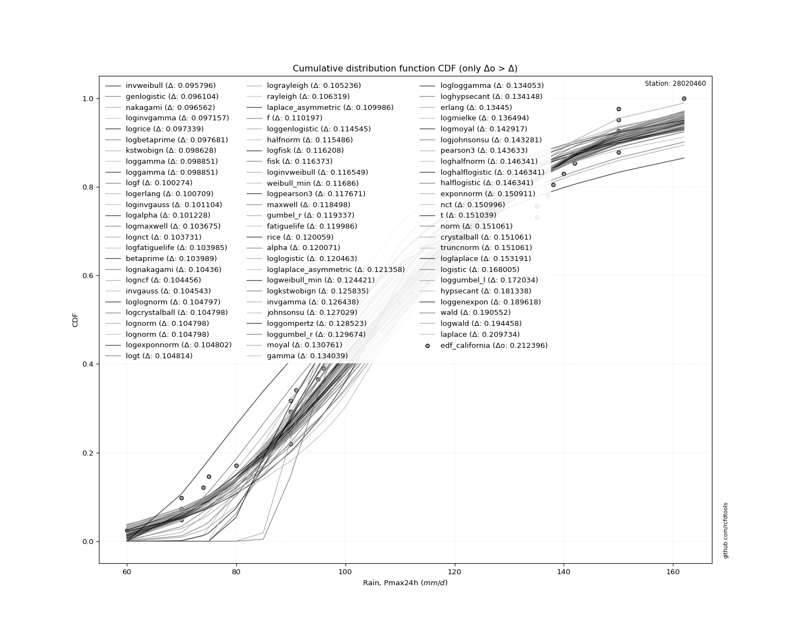</img>

</div>


**1.3. Best fit**

<div align="center">

|   id |   station | empirical_dist   | p_dist     |     delta |   deltao | eval   |   fit |   n |   best_fit |   best_fit_sort |
|-----:|----------:|:-----------------|:-----------|----------:|---------:|:-------|------:|----:|-----------:|----------------:|
|    0 |  28020460 | edf_california   | invweibull | 0.0957956 | 0.212396 | Δo > Δ |     1 |  41 |          1 |               1 |

</div>


<div align="center">

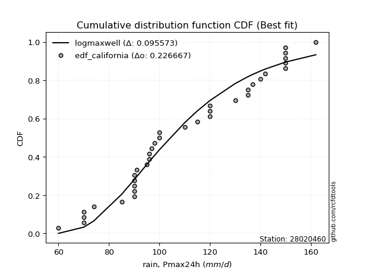</img>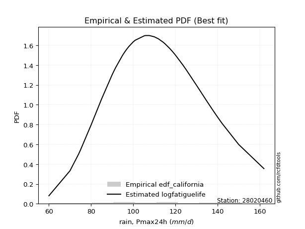</img>

</div>


### 2. Empirical - EDF Hazen (1930)

Hazen method for plotting positions is a formula used to estimate the empirical cumulative probability distribution of flood events or other hydrological data. This formula often results in biased estimations, particularly when extrapolating to extreme events (high return periods).

<div align="center">


$P=(m-0.5)/n$


</div>


**2.1. Empirical values**

<div align="center">

|                | 0                    | 1                    | 2                   | 3                   | 4                   | 5                   | 6                   | 7                   | 8                  | 9                   | 10                  | 11                 | 12                 | 13                  | 14                  | 15                 | 16                 | 17                 | 18                  | 19                  | 20        | 21                 | 22                 | 23                 | 24                 | 25                 | 26                 | 27                 | 28                 | 29                 | 30                 | 31                 | 32                 | 33                 | 34                 | 35                 | 36                 | 37                 | 38                 | 39                 | 40                 |
|:---------------|:---------------------|:---------------------|:--------------------|:--------------------|:--------------------|:--------------------|:--------------------|:--------------------|:-------------------|:--------------------|:--------------------|:-------------------|:-------------------|:--------------------|:--------------------|:-------------------|:-------------------|:-------------------|:--------------------|:--------------------|:----------|:-------------------|:-------------------|:-------------------|:-------------------|:-------------------|:-------------------|:-------------------|:-------------------|:-------------------|:-------------------|:-------------------|:-------------------|:-------------------|:-------------------|:-------------------|:-------------------|:-------------------|:-------------------|:-------------------|:-------------------|
| date           | 1989                 | 1991                 | 1999                | 1997                | 2006                | 2018                | 2016                | 1992                | 2005               | 2004                | 2000                | 1980               | 2013               | 1985                | 1998                | 1993               | 1990               | 2003               | 2011                | 1983                | 2001      | 1981               | 2017               | 1995               | 1982               | 1987               | 2009               | 2020               | 1984               | 1986               | 1988               | 2014               | 2019               | 1994               | 2015               | 2010               | 1996               | 2008               | 2007               | 2002               | 2012               |
| x              | 60.0                 | 70.0                 | 70.0                | 70.0                | 74.0                | 75.0                | 80.0                | 85.0                | 90.0               | 90.0                | 90.0                | 90.0               | 90.0               | 91.0                | 95.0                | 96.0               | 96.0               | 97.0               | 98.0                | 100.0               | 100.0     | 110.0              | 112.0              | 115.0              | 120.0              | 120.0              | 120.0              | 130.0              | 130.0              | 135.0              | 135.0              | 137.0              | 138.0              | 140.0              | 142.0              | 150.0              | 150.0              | 150.0              | 150.0              | 150.0              | 162.0              |
| m              | 1                    | 2                    | 3                   | 4                   | 5                   | 6                   | 7                   | 8                   | 9                  | 10                  | 11                  | 12                 | 13                 | 14                  | 15                  | 16                 | 17                 | 18                 | 19                  | 20                  | 21        | 22                 | 23                 | 24                 | 25                 | 26                 | 27                 | 28                 | 29                 | 30                 | 31                 | 32                 | 33                 | 34                 | 35                 | 36                 | 37                 | 38                 | 39                 | 40                 | 41                 |
| empirical_dist | edf_hazen            | edf_hazen            | edf_hazen           | edf_hazen           | edf_hazen           | edf_hazen           | edf_hazen           | edf_hazen           | edf_hazen          | edf_hazen           | edf_hazen           | edf_hazen          | edf_hazen          | edf_hazen           | edf_hazen           | edf_hazen          | edf_hazen          | edf_hazen          | edf_hazen           | edf_hazen           | edf_hazen | edf_hazen          | edf_hazen          | edf_hazen          | edf_hazen          | edf_hazen          | edf_hazen          | edf_hazen          | edf_hazen          | edf_hazen          | edf_hazen          | edf_hazen          | edf_hazen          | edf_hazen          | edf_hazen          | edf_hazen          | edf_hazen          | edf_hazen          | edf_hazen          | edf_hazen          | edf_hazen          |
| empirical      | 0.012195121951219513 | 0.036585365853658534 | 0.06097560975609756 | 0.08536585365853659 | 0.10975609756097561 | 0.13414634146341464 | 0.15853658536585366 | 0.18292682926829268 | 0.2073170731707317 | 0.23170731707317074 | 0.25609756097560976 | 0.2804878048780488 | 0.3048780487804878 | 0.32926829268292684 | 0.35365853658536583 | 0.3780487804878049 | 0.4024390243902439 | 0.4268292682926829 | 0.45121951219512196 | 0.47560975609756095 | 0.5       | 0.524390243902439  | 0.5487804878048781 | 0.573170731707317  | 0.5975609756097561 | 0.6219512195121951 | 0.6463414634146342 | 0.6707317073170732 | 0.6951219512195121 | 0.7195121951219512 | 0.7439024390243902 | 0.7682926829268293 | 0.7926829268292683 | 0.8170731707317073 | 0.8414634146341463 | 0.8658536585365854 | 0.8902439024390244 | 0.9146341463414634 | 0.9390243902439024 | 0.9634146341463414 | 0.9878048780487805 |
| empirical_tr   | 1.0123456790123457   | 1.0379746835443038   | 1.064935064935065   | 1.0933333333333333  | 1.1232876712328768  | 1.1549295774647887  | 1.1884057971014492  | 1.2238805970149254  | 1.2615384615384615 | 1.3015873015873016  | 1.3442622950819672  | 1.3898305084745763 | 1.4385964912280702 | 1.490909090909091   | 1.5471698113207546  | 1.607843137254902  | 1.6734693877551021 | 1.7446808510638296 | 1.8222222222222222  | 1.9069767441860463  | 2.0       | 2.1025641025641026 | 2.2162162162162162 | 2.3428571428571425 | 2.484848484848485  | 2.6451612903225805 | 2.827586206896552  | 3.037037037037037  | 3.2799999999999994 | 3.5652173913043477 | 3.9047619047619047 | 4.315789473684211  | 4.8235294117647065 | 5.466666666666665  | 6.307692307692307  | 7.454545454545454  | 9.111111111111112  | 11.714285714285719 | 16.399999999999984 | 27.33333333333331  | 81.99999999999993  |

</div>


**2.2. Kolmogorov-Smirnov fit test (sorted by Δ)**


<div align="center">

|                | 0                   | 1                   | 2                   | 3                   | 4                   | 5                   | 6                   | 7                   | 8                   | 9                   | 10                  | 11                  | 12                  | 13                  | 14                  | 15                  | 16                  | 17                  | 18                  | 19                  | 20                  | 21                  | 22                  | 23                  | 24                  | 25                  | 26                  | 27                  | 28                  | 29                  | 30                  | 31                  | 32                  | 33                  | 34                  | 35                  | 36                  | 37                  | 38                  | 39                  | 40                  | 41                  | 42                  | 43                  | 44                  | 45                  | 46                  | 47                  | 48                  | 49                  | 50                  | 51                  | 52                  | 53                    | 54                  | 55                  | 56                  | 57                  | 58                  | 59                  | 60                  | 61                  | 62                  | 63                  | 64                  | 65                  | 66                  | 67                  | 68                  | 69                  | 70                  | 71                  | 72                  | 73                  | 74                  | 75                  | 76                  | 77                  | 78                  | 79                  | 80                  | 81                  | 82                  | 83                  | 84                  | 85                  | 86                  | 87                  |
|:---------------|:--------------------|:--------------------|:--------------------|:--------------------|:--------------------|:--------------------|:--------------------|:--------------------|:--------------------|:--------------------|:--------------------|:--------------------|:--------------------|:--------------------|:--------------------|:--------------------|:--------------------|:--------------------|:--------------------|:--------------------|:--------------------|:--------------------|:--------------------|:--------------------|:--------------------|:--------------------|:--------------------|:--------------------|:--------------------|:--------------------|:--------------------|:--------------------|:--------------------|:--------------------|:--------------------|:--------------------|:--------------------|:--------------------|:--------------------|:--------------------|:--------------------|:--------------------|:--------------------|:--------------------|:--------------------|:--------------------|:--------------------|:--------------------|:--------------------|:--------------------|:--------------------|:--------------------|:--------------------|:----------------------|:--------------------|:--------------------|:--------------------|:--------------------|:--------------------|:--------------------|:--------------------|:--------------------|:--------------------|:--------------------|:--------------------|:--------------------|:--------------------|:--------------------|:--------------------|:--------------------|:--------------------|:--------------------|:--------------------|:--------------------|:--------------------|:--------------------|:--------------------|:--------------------|:--------------------|:--------------------|:--------------------|:--------------------|:--------------------|:--------------------|:--------------------|:--------------------|:--------------------|:--------------------|
| station        | 28020460            | 28020460            | 28020460            | 28020460            | 28020460            | 28020460            | 28020460            | 28020460            | 28020460            | 28020460            | 28020460            | 28020460            | 28020460            | 28020460            | 28020460            | 28020460            | 28020460            | 28020460            | 28020460            | 28020460            | 28020460            | 28020460            | 28020460            | 28020460            | 28020460            | 28020460            | 28020460            | 28020460            | 28020460            | 28020460            | 28020460            | 28020460            | 28020460            | 28020460            | 28020460            | 28020460            | 28020460            | 28020460            | 28020460            | 28020460            | 28020460            | 28020460            | 28020460            | 28020460            | 28020460            | 28020460            | 28020460            | 28020460            | 28020460            | 28020460            | 28020460            | 28020460            | 28020460            | 28020460              | 28020460            | 28020460            | 28020460            | 28020460            | 28020460            | 28020460            | 28020460            | 28020460            | 28020460            | 28020460            | 28020460            | 28020460            | 28020460            | 28020460            | 28020460            | 28020460            | 28020460            | 28020460            | 28020460            | 28020460            | 28020460            | 28020460            | 28020460            | 28020460            | 28020460            | 28020460            | 28020460            | 28020460            | 28020460            | 28020460            | 28020460            | 28020460            | 28020460            | 28020460            |
| empirical_dist | edf_hazen           | edf_hazen           | edf_hazen           | edf_hazen           | edf_hazen           | edf_hazen           | edf_hazen           | edf_hazen           | edf_hazen           | edf_hazen           | edf_hazen           | edf_hazen           | edf_hazen           | edf_hazen           | edf_hazen           | edf_hazen           | edf_hazen           | edf_hazen           | edf_hazen           | edf_hazen           | edf_hazen           | edf_hazen           | edf_hazen           | edf_hazen           | edf_hazen           | edf_hazen           | edf_hazen           | edf_hazen           | edf_hazen           | edf_hazen           | edf_hazen           | edf_hazen           | edf_hazen           | edf_hazen           | edf_hazen           | edf_hazen           | edf_hazen           | edf_hazen           | edf_hazen           | edf_hazen           | edf_hazen           | edf_hazen           | edf_hazen           | edf_hazen           | edf_hazen           | edf_hazen           | edf_hazen           | edf_hazen           | edf_hazen           | edf_hazen           | edf_hazen           | edf_hazen           | edf_hazen           | edf_hazen             | edf_hazen           | edf_hazen           | edf_hazen           | edf_hazen           | edf_hazen           | edf_hazen           | edf_hazen           | edf_hazen           | edf_hazen           | edf_hazen           | edf_hazen           | edf_hazen           | edf_hazen           | edf_hazen           | edf_hazen           | edf_hazen           | edf_hazen           | edf_hazen           | edf_hazen           | edf_hazen           | edf_hazen           | edf_hazen           | edf_hazen           | edf_hazen           | edf_hazen           | edf_hazen           | edf_hazen           | edf_hazen           | edf_hazen           | edf_hazen           | edf_hazen           | edf_hazen           | edf_hazen           | edf_hazen           |
| p_dist         | nakagami            | weibull_min         | rayleigh            | maxwell             | logpearson3         | fisk                | fatiguelife         | logfisk             | rice                | loggenlogistic      | invweibull          | genlogistic         | f                   | loginvgamma         | logncf              | logrice             | logbetaprime        | lognakagami         | logfatiguelife      | logt                | logexponnorm        | lognorm             | lognorm             | logcrystalball      | loglognorm          | loginvweibull       | alpha               | kstwobign           | loggamma            | loggamma            | logweibull_min      | logf                | logerlang           | loginvgauss         | halfnorm            | logalpha            | invgamma            | johnsonsu           | logmaxwell          | lognct              | betaprime           | loggompertz         | invgauss            | lograyleigh         | gamma               | logloggamma         | laplace_asymmetric  | erlang              | logmielke           | logjohnsonsu        | pearson3            | gumbel_r            | loglogistic         | loglaplace_asymmetric | loghalfnorm         | halflogistic        | logkstwobign        | exponnorm           | nct                 | t                   | norm                | crystalball         | truncnorm           | loggumbel_r         | moyal               | loghypsecant        | loghalflogistic     | logmoyal            | logistic            | loggumbel_l         | loglaplace          | hypsecant           | wald                | laplace             | gumbel_l            | loggenexpon         | logwald             | loggibrat           | expon               | genexpon            | ncf                 | gibrat              | logexpon            | logchi2             | logtruncnorm        | gompertz            | chi2                | mielke              |
| delta          | 0.10451965736325397 | 0.10466444883097936 | 0.10579303962720765 | 0.10630308097943492 | 0.10649316055373925 | 0.10776459796706173 | 0.10779115002107947 | 0.10779738106783887 | 0.10786381946537105 | 0.10792971196241741 | 0.1079907479016724  | 0.10829892440919076 | 0.10835493597416102 | 0.10935236456596675 | 0.10937088880915902 | 0.10953460515478852 | 0.10987600242408446 | 0.11022451087835283 | 0.11037808938876992 | 0.11040321765115124 | 0.11040953995160674 | 0.11041156527999763 | 0.11041156527999763 | 0.11041159143942869 | 0.11041183842655045 | 0.11077718149364654 | 0.11078390551017481 | 0.11082350713024725 | 0.11104612453721052 | 0.11104612453721052 | 0.1122259111131032  | 0.11246922999226361 | 0.11290382711043812 | 0.11329895847004257 | 0.11339028617739688 | 0.11342295720246087 | 0.11424257086889811 | 0.11483397819487717 | 0.1158704859677987  | 0.11592595176932441 | 0.1161840407001492  | 0.1163276672429091  | 0.1167385146114075  | 0.11743063362008044 | 0.12184396306532203 | 0.12185774798898125 | 0.12218096634246522 | 0.12225487869323065 | 0.12429902910907659 | 0.13108561791102624 | 0.13143807656229073 | 0.13153195895194136 | 0.13265817487658726 | 0.13355301634490713   | 0.13414634146341464 | 0.13673400951972858 | 0.138029704162019   | 0.13871598166375476 | 0.13880067180416705 | 0.1388440744033454  | 0.1388662795691612  | 0.13886628471739537 | 0.13886628580181337 | 0.14186932205535852 | 0.14295659740399713 | 0.14634328864630308 | 0.14971596237120632 | 0.1551124607283918  | 0.15581034177644043 | 0.1598388538614423  | 0.16241861570184224 | 0.16914261612004405 | 0.1843936786197179  | 0.19753846784248236 | 0.20053442508080654 | 0.20181275567164944 | 0.2066527800994642  | 0.23846317531626926 | 0.24499837892683204 | 0.24521865355844027 | 0.255240324612351   | 0.29448677498673065 | 0.30068512603084674 | 0.33093059664606084 | 0.4295033053963665  | 0.7388380823677229  | 0.9613969228326317  | nan                 |
| deltao         | 0.21239631616850427 | 0.21239631616850427 | 0.21239631616850427 | 0.21239631616850427 | 0.21239631616850427 | 0.21239631616850427 | 0.21239631616850427 | 0.21239631616850427 | 0.21239631616850427 | 0.21239631616850427 | 0.21239631616850427 | 0.21239631616850427 | 0.21239631616850427 | 0.21239631616850427 | 0.21239631616850427 | 0.21239631616850427 | 0.21239631616850427 | 0.21239631616850427 | 0.21239631616850427 | 0.21239631616850427 | 0.21239631616850427 | 0.21239631616850427 | 0.21239631616850427 | 0.21239631616850427 | 0.21239631616850427 | 0.21239631616850427 | 0.21239631616850427 | 0.21239631616850427 | 0.21239631616850427 | 0.21239631616850427 | 0.21239631616850427 | 0.21239631616850427 | 0.21239631616850427 | 0.21239631616850427 | 0.21239631616850427 | 0.21239631616850427 | 0.21239631616850427 | 0.21239631616850427 | 0.21239631616850427 | 0.21239631616850427 | 0.21239631616850427 | 0.21239631616850427 | 0.21239631616850427 | 0.21239631616850427 | 0.21239631616850427 | 0.21239631616850427 | 0.21239631616850427 | 0.21239631616850427 | 0.21239631616850427 | 0.21239631616850427 | 0.21239631616850427 | 0.21239631616850427 | 0.21239631616850427 | 0.21239631616850427   | 0.21239631616850427 | 0.21239631616850427 | 0.21239631616850427 | 0.21239631616850427 | 0.21239631616850427 | 0.21239631616850427 | 0.21239631616850427 | 0.21239631616850427 | 0.21239631616850427 | 0.21239631616850427 | 0.21239631616850427 | 0.21239631616850427 | 0.21239631616850427 | 0.21239631616850427 | 0.21239631616850427 | 0.21239631616850427 | 0.21239631616850427 | 0.21239631616850427 | 0.21239631616850427 | 0.21239631616850427 | 0.21239631616850427 | 0.21239631616850427 | 0.21239631616850427 | 0.21239631616850427 | 0.21239631616850427 | 0.21239631616850427 | 0.21239631616850427 | 0.21239631616850427 | 0.21239631616850427 | 0.21239631616850427 | 0.21239631616850427 | 0.21239631616850427 | 0.21239631616850427 | 0.21239631616850427 |
| eval           | Δo > Δ              | Δo > Δ              | Δo > Δ              | Δo > Δ              | Δo > Δ              | Δo > Δ              | Δo > Δ              | Δo > Δ              | Δo > Δ              | Δo > Δ              | Δo > Δ              | Δo > Δ              | Δo > Δ              | Δo > Δ              | Δo > Δ              | Δo > Δ              | Δo > Δ              | Δo > Δ              | Δo > Δ              | Δo > Δ              | Δo > Δ              | Δo > Δ              | Δo > Δ              | Δo > Δ              | Δo > Δ              | Δo > Δ              | Δo > Δ              | Δo > Δ              | Δo > Δ              | Δo > Δ              | Δo > Δ              | Δo > Δ              | Δo > Δ              | Δo > Δ              | Δo > Δ              | Δo > Δ              | Δo > Δ              | Δo > Δ              | Δo > Δ              | Δo > Δ              | Δo > Δ              | Δo > Δ              | Δo > Δ              | Δo > Δ              | Δo > Δ              | Δo > Δ              | Δo > Δ              | Δo > Δ              | Δo > Δ              | Δo > Δ              | Δo > Δ              | Δo > Δ              | Δo > Δ              | Δo > Δ                | Δo > Δ              | Δo > Δ              | Δo > Δ              | Δo > Δ              | Δo > Δ              | Δo > Δ              | Δo > Δ              | Δo > Δ              | Δo > Δ              | Δo > Δ              | Δo > Δ              | Δo > Δ              | Δo > Δ              | Δo > Δ              | Δo > Δ              | Δo > Δ              | Δo > Δ              | Δo > Δ              | Δo > Δ              | Δo > Δ              | Δo > Δ              | Δo > Δ              | Δo > Δ              | Δo <= Δ             | Δo <= Δ             | Δo <= Δ             | Δo <= Δ             | Δo <= Δ             | Δo <= Δ             | Δo <= Δ             | Δo <= Δ             | Δo <= Δ             | Δo <= Δ             | Δo <= Δ             |
| fit            | 1                   | 1                   | 1                   | 1                   | 1                   | 1                   | 1                   | 1                   | 1                   | 1                   | 1                   | 1                   | 1                   | 1                   | 1                   | 1                   | 1                   | 1                   | 1                   | 1                   | 1                   | 1                   | 1                   | 1                   | 1                   | 1                   | 1                   | 1                   | 1                   | 1                   | 1                   | 1                   | 1                   | 1                   | 1                   | 1                   | 1                   | 1                   | 1                   | 1                   | 1                   | 1                   | 1                   | 1                   | 1                   | 1                   | 1                   | 1                   | 1                   | 1                   | 1                   | 1                   | 1                   | 1                     | 1                   | 1                   | 1                   | 1                   | 1                   | 1                   | 1                   | 1                   | 1                   | 1                   | 1                   | 1                   | 1                   | 1                   | 1                   | 1                   | 1                   | 1                   | 1                   | 1                   | 1                   | 1                   | 1                   | 0                   | 0                   | 0                   | 0                   | 0                   | 0                   | 0                   | 0                   | 0                   | 0                   | 0                   |
| n              | 41                  | 41                  | 41                  | 41                  | 41                  | 41                  | 41                  | 41                  | 41                  | 41                  | 41                  | 41                  | 41                  | 41                  | 41                  | 41                  | 41                  | 41                  | 41                  | 41                  | 41                  | 41                  | 41                  | 41                  | 41                  | 41                  | 41                  | 41                  | 41                  | 41                  | 41                  | 41                  | 41                  | 41                  | 41                  | 41                  | 41                  | 41                  | 41                  | 41                  | 41                  | 41                  | 41                  | 41                  | 41                  | 41                  | 41                  | 41                  | 41                  | 41                  | 41                  | 41                  | 41                  | 41                    | 41                  | 41                  | 41                  | 41                  | 41                  | 41                  | 41                  | 41                  | 41                  | 41                  | 41                  | 41                  | 41                  | 41                  | 41                  | 41                  | 41                  | 41                  | 41                  | 41                  | 41                  | 41                  | 41                  | 41                  | 41                  | 41                  | 41                  | 41                  | 41                  | 41                  | 41                  | 41                  | 41                  | 41                  |
| best_fit       | 1                   | 0                   | 0                   | 0                   | 0                   | 0                   | 0                   | 0                   | 0                   | 0                   | 0                   | 0                   | 0                   | 0                   | 0                   | 0                   | 0                   | 0                   | 0                   | 0                   | 0                   | 0                   | 0                   | 0                   | 0                   | 0                   | 0                   | 0                   | 0                   | 0                   | 0                   | 0                   | 0                   | 0                   | 0                   | 0                   | 0                   | 0                   | 0                   | 0                   | 0                   | 0                   | 0                   | 0                   | 0                   | 0                   | 0                   | 0                   | 0                   | 0                   | 0                   | 0                   | 0                   | 0                     | 0                   | 0                   | 0                   | 0                   | 0                   | 0                   | 0                   | 0                   | 0                   | 0                   | 0                   | 0                   | 0                   | 0                   | 0                   | 0                   | 0                   | 0                   | 0                   | 0                   | 0                   | 0                   | 0                   | 0                   | 0                   | 0                   | 0                   | 0                   | 0                   | 0                   | 0                   | 0                   | 0                   | 0                   |
| best_fit_sort  | 1                   | 2                   | 3                   | 4                   | 5                   | 6                   | 7                   | 8                   | 9                   | 10                  | 11                  | 12                  | 13                  | 14                  | 15                  | 16                  | 17                  | 18                  | 19                  | 20                  | 21                  | 22                  | 23                  | 24                  | 25                  | 26                  | 27                  | 28                  | 29                  | 30                  | 31                  | 32                  | 33                  | 34                  | 35                  | 36                  | 37                  | 38                  | 39                  | 40                  | 41                  | 42                  | 43                  | 44                  | 45                  | 46                  | 47                  | 48                  | 49                  | 50                  | 51                  | 52                  | 53                  | 54                    | 55                  | 56                  | 57                  | 58                  | 59                  | 60                  | 61                  | 62                  | 63                  | 64                  | 65                  | 66                  | 67                  | 68                  | 69                  | 70                  | 71                  | 72                  | 73                  | 74                  | 75                  | 76                  | 77                  | 78                  | 79                  | 80                  | 81                  | 82                  | 83                  | 84                  | 85                  | 86                  | 87                  | 88                  |

</div>


<div align="center">

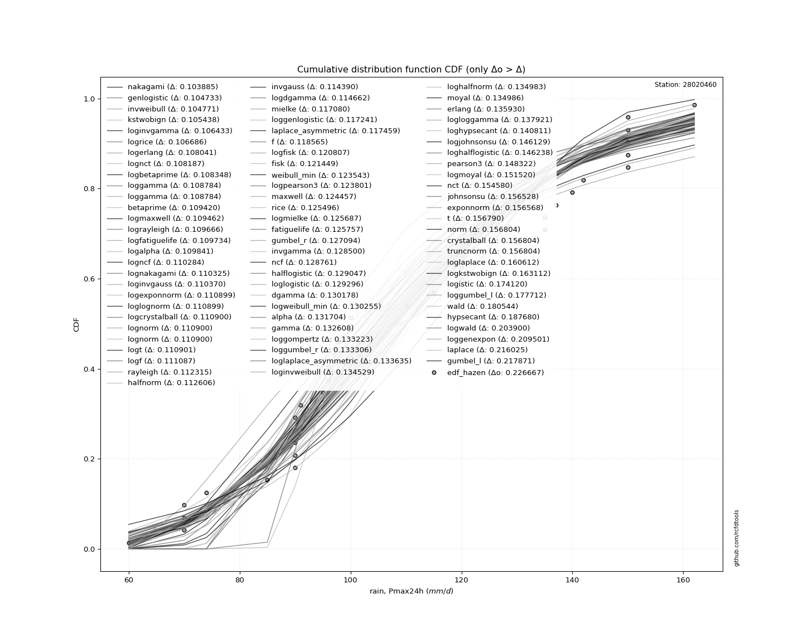</img>

</div>


**2.3. Best fit**

<div align="center">

|   id |   station | empirical_dist   | p_dist   |   delta |   deltao | eval   |   fit |   n |   best_fit |   best_fit_sort |
|-----:|----------:|:-----------------|:---------|--------:|---------:|:-------|------:|----:|-----------:|----------------:|
|    0 |  28020460 | edf_hazen        | nakagami | 0.10452 | 0.212396 | Δo > Δ |     1 |  41 |          1 |               1 |

</div>


<div align="center">

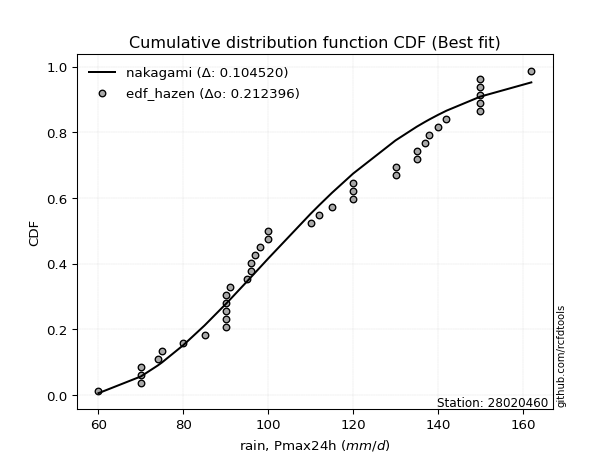</img>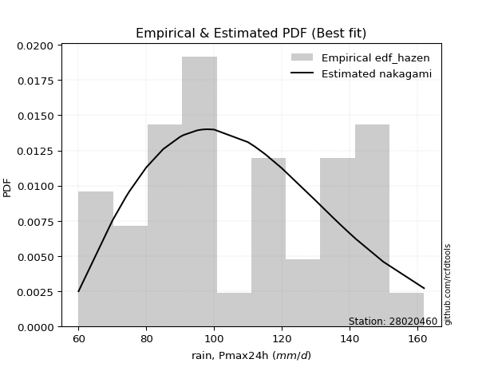</img>

</div>


### 3. Empirical - EDF Weibull (1939)

Weibull plotting position formula is an empirical method used to estimate the non-exceedance probability or plotting position for a set of observed data, is often recommended or widely used in practice, particularly in flood frequency analysis.

<div align="center">


$P=m/(n+1)$


</div>


**3.1. Empirical values**

<div align="center">

|                | 0                    | 1                    | 2                   | 3                   | 4                   | 5                   | 6                   | 7                   | 8                   | 9                   | 10                 | 11                 | 12                  | 13                 | 14                  | 15                  | 16                  | 17                  | 18                 | 19                  | 20          | 21                 | 22                 | 23                 | 24                 | 25                 | 26                 | 27                 | 28                 | 29                 | 30                 | 31                 | 32                 | 33                 | 34                 | 35                 | 36                 | 37                 | 38                 | 39                 | 40                 |
|:---------------|:---------------------|:---------------------|:--------------------|:--------------------|:--------------------|:--------------------|:--------------------|:--------------------|:--------------------|:--------------------|:-------------------|:-------------------|:--------------------|:-------------------|:--------------------|:--------------------|:--------------------|:--------------------|:-------------------|:--------------------|:------------|:-------------------|:-------------------|:-------------------|:-------------------|:-------------------|:-------------------|:-------------------|:-------------------|:-------------------|:-------------------|:-------------------|:-------------------|:-------------------|:-------------------|:-------------------|:-------------------|:-------------------|:-------------------|:-------------------|:-------------------|
| date           | 1989                 | 1991                 | 1999                | 1997                | 2006                | 2018                | 2016                | 1992                | 2005                | 2004                | 2000               | 1980               | 2013                | 1985               | 1998                | 1993                | 1990                | 2003                | 2011               | 1983                | 2001        | 1981               | 2017               | 1995               | 1982               | 1987               | 2009               | 2020               | 1984               | 1986               | 1988               | 2014               | 2019               | 1994               | 2015               | 2010               | 1996               | 2008               | 2007               | 2002               | 2012               |
| x              | 60.0                 | 70.0                 | 70.0                | 70.0                | 74.0                | 75.0                | 80.0                | 85.0                | 90.0                | 90.0                | 90.0               | 90.0               | 90.0                | 91.0               | 95.0                | 96.0                | 96.0                | 97.0                | 98.0               | 100.0               | 100.0       | 110.0              | 112.0              | 115.0              | 120.0              | 120.0              | 120.0              | 130.0              | 130.0              | 135.0              | 135.0              | 137.0              | 138.0              | 140.0              | 142.0              | 150.0              | 150.0              | 150.0              | 150.0              | 150.0              | 162.0              |
| m              | 1                    | 2                    | 3                   | 4                   | 5                   | 6                   | 7                   | 8                   | 9                   | 10                  | 11                 | 12                 | 13                  | 14                 | 15                  | 16                  | 17                  | 18                  | 19                 | 20                  | 21          | 22                 | 23                 | 24                 | 25                 | 26                 | 27                 | 28                 | 29                 | 30                 | 31                 | 32                 | 33                 | 34                 | 35                 | 36                 | 37                 | 38                 | 39                 | 40                 | 41                 |
| empirical_dist | edf_weibull          | edf_weibull          | edf_weibull         | edf_weibull         | edf_weibull         | edf_weibull         | edf_weibull         | edf_weibull         | edf_weibull         | edf_weibull         | edf_weibull        | edf_weibull        | edf_weibull         | edf_weibull        | edf_weibull         | edf_weibull         | edf_weibull         | edf_weibull         | edf_weibull        | edf_weibull         | edf_weibull | edf_weibull        | edf_weibull        | edf_weibull        | edf_weibull        | edf_weibull        | edf_weibull        | edf_weibull        | edf_weibull        | edf_weibull        | edf_weibull        | edf_weibull        | edf_weibull        | edf_weibull        | edf_weibull        | edf_weibull        | edf_weibull        | edf_weibull        | edf_weibull        | edf_weibull        | edf_weibull        |
| empirical      | 0.023809523809523808 | 0.047619047619047616 | 0.07142857142857142 | 0.09523809523809523 | 0.11904761904761904 | 0.14285714285714285 | 0.16666666666666666 | 0.19047619047619047 | 0.21428571428571427 | 0.23809523809523808 | 0.2619047619047619 | 0.2857142857142857 | 0.30952380952380953 | 0.3333333333333333 | 0.35714285714285715 | 0.38095238095238093 | 0.40476190476190477 | 0.42857142857142855 | 0.4523809523809524 | 0.47619047619047616 | 0.5         | 0.5238095238095238 | 0.5476190476190477 | 0.5714285714285714 | 0.5952380952380952 | 0.6190476190476191 | 0.6428571428571429 | 0.6666666666666666 | 0.6904761904761905 | 0.7142857142857143 | 0.7380952380952381 | 0.7619047619047619 | 0.7857142857142857 | 0.8095238095238095 | 0.8333333333333334 | 0.8571428571428571 | 0.8809523809523809 | 0.9047619047619048 | 0.9285714285714286 | 0.9523809523809523 | 0.9761904761904762 |
| empirical_tr   | 1.024390243902439    | 1.05                 | 1.0769230769230769  | 1.1052631578947367  | 1.135135135135135   | 1.1666666666666665  | 1.2                 | 1.2352941176470589  | 1.2727272727272727  | 1.3125              | 1.3548387096774193 | 1.4                | 1.4482758620689655  | 1.4999999999999998 | 1.5555555555555558  | 1.6153846153846154  | 1.68                | 1.75                | 1.826086956521739  | 1.909090909090909   | 2.0         | 2.1                | 2.210526315789474  | 2.333333333333333  | 2.4705882352941178 | 2.625              | 2.8000000000000003 | 2.9999999999999996 | 3.230769230769231  | 3.5                | 3.818181818181819  | 4.199999999999999  | 4.666666666666666  | 5.25               | 6.000000000000002  | 6.999999999999997  | 8.399999999999999  | 10.5               | 14.000000000000007 | 20.999999999999975 | 41.99999999999995  |

</div>


**3.2. Kolmogorov-Smirnov fit test (sorted by Δ)**


<div align="center">

|                | 0                   | 1                   | 2                   | 3                   | 4                   | 5                   | 6                   | 7                   | 8                   | 9                   | 10                  | 11                  | 12                  | 13                  | 14                  | 15                  | 16                  | 17                  | 18                  | 19                  | 20                  | 21                  | 22                  | 23                  | 24                  | 25                  | 26                  | 27                  | 28                  | 29                  | 30                  | 31                  | 32                  | 33                  | 34                  | 35                  | 36                  | 37                  | 38                  | 39                  | 40                  | 41                  | 42                  | 43                  | 44                  | 45                  | 46                  | 47                  | 48                  | 49                  | 50                  | 51                  | 52                  | 53                    | 54                  | 55                  | 56                  | 57                  | 58                  | 59                  | 60                  | 61                  | 62                  | 63                  | 64                  | 65                  | 66                  | 67                  | 68                  | 69                  | 70                  | 71                  | 72                  | 73                  | 74                  | 75                  | 76                  | 77                  | 78                  | 79                  | 80                  | 81                  | 82                  | 83                  | 84                  | 85                  | 86                  | 87                  |
|:---------------|:--------------------|:--------------------|:--------------------|:--------------------|:--------------------|:--------------------|:--------------------|:--------------------|:--------------------|:--------------------|:--------------------|:--------------------|:--------------------|:--------------------|:--------------------|:--------------------|:--------------------|:--------------------|:--------------------|:--------------------|:--------------------|:--------------------|:--------------------|:--------------------|:--------------------|:--------------------|:--------------------|:--------------------|:--------------------|:--------------------|:--------------------|:--------------------|:--------------------|:--------------------|:--------------------|:--------------------|:--------------------|:--------------------|:--------------------|:--------------------|:--------------------|:--------------------|:--------------------|:--------------------|:--------------------|:--------------------|:--------------------|:--------------------|:--------------------|:--------------------|:--------------------|:--------------------|:--------------------|:----------------------|:--------------------|:--------------------|:--------------------|:--------------------|:--------------------|:--------------------|:--------------------|:--------------------|:--------------------|:--------------------|:--------------------|:--------------------|:--------------------|:--------------------|:--------------------|:--------------------|:--------------------|:--------------------|:--------------------|:--------------------|:--------------------|:--------------------|:--------------------|:--------------------|:--------------------|:--------------------|:--------------------|:--------------------|:--------------------|:--------------------|:--------------------|:--------------------|:--------------------|:--------------------|
| station        | 28020460            | 28020460            | 28020460            | 28020460            | 28020460            | 28020460            | 28020460            | 28020460            | 28020460            | 28020460            | 28020460            | 28020460            | 28020460            | 28020460            | 28020460            | 28020460            | 28020460            | 28020460            | 28020460            | 28020460            | 28020460            | 28020460            | 28020460            | 28020460            | 28020460            | 28020460            | 28020460            | 28020460            | 28020460            | 28020460            | 28020460            | 28020460            | 28020460            | 28020460            | 28020460            | 28020460            | 28020460            | 28020460            | 28020460            | 28020460            | 28020460            | 28020460            | 28020460            | 28020460            | 28020460            | 28020460            | 28020460            | 28020460            | 28020460            | 28020460            | 28020460            | 28020460            | 28020460            | 28020460              | 28020460            | 28020460            | 28020460            | 28020460            | 28020460            | 28020460            | 28020460            | 28020460            | 28020460            | 28020460            | 28020460            | 28020460            | 28020460            | 28020460            | 28020460            | 28020460            | 28020460            | 28020460            | 28020460            | 28020460            | 28020460            | 28020460            | 28020460            | 28020460            | 28020460            | 28020460            | 28020460            | 28020460            | 28020460            | 28020460            | 28020460            | 28020460            | 28020460            | 28020460            |
| empirical_dist | edf_weibull         | edf_weibull         | edf_weibull         | edf_weibull         | edf_weibull         | edf_weibull         | edf_weibull         | edf_weibull         | edf_weibull         | edf_weibull         | edf_weibull         | edf_weibull         | edf_weibull         | edf_weibull         | edf_weibull         | edf_weibull         | edf_weibull         | edf_weibull         | edf_weibull         | edf_weibull         | edf_weibull         | edf_weibull         | edf_weibull         | edf_weibull         | edf_weibull         | edf_weibull         | edf_weibull         | edf_weibull         | edf_weibull         | edf_weibull         | edf_weibull         | edf_weibull         | edf_weibull         | edf_weibull         | edf_weibull         | edf_weibull         | edf_weibull         | edf_weibull         | edf_weibull         | edf_weibull         | edf_weibull         | edf_weibull         | edf_weibull         | edf_weibull         | edf_weibull         | edf_weibull         | edf_weibull         | edf_weibull         | edf_weibull         | edf_weibull         | edf_weibull         | edf_weibull         | edf_weibull         | edf_weibull           | edf_weibull         | edf_weibull         | edf_weibull         | edf_weibull         | edf_weibull         | edf_weibull         | edf_weibull         | edf_weibull         | edf_weibull         | edf_weibull         | edf_weibull         | edf_weibull         | edf_weibull         | edf_weibull         | edf_weibull         | edf_weibull         | edf_weibull         | edf_weibull         | edf_weibull         | edf_weibull         | edf_weibull         | edf_weibull         | edf_weibull         | edf_weibull         | edf_weibull         | edf_weibull         | edf_weibull         | edf_weibull         | edf_weibull         | edf_weibull         | edf_weibull         | edf_weibull         | edf_weibull         | edf_weibull         |
| p_dist         | loginvweibull       | weibull_min         | maxwell             | rice                | nakagami            | rayleigh            | logpearson3         | fatiguelife         | fisk                | logfisk             | loggenlogistic      | invweibull          | logweibull_min      | genlogistic         | f                   | loginvgamma         | logncf              | logrice             | logbetaprime        | invgamma            | lognakagami         | logfatiguelife      | logt                | logexponnorm        | lognorm             | lognorm             | logcrystalball      | loglognorm          | johnsonsu           | alpha               | kstwobign           | loggamma            | loggamma            | loggompertz         | logf                | logerlang           | loginvgauss         | halfnorm            | logalpha            | logmaxwell          | lognct              | betaprime           | invgauss            | lograyleigh         | gamma               | logloggamma         | erlang              | logmielke           | laplace_asymmetric  | logkstwobign        | logjohnsonsu        | pearson3            | gumbel_r            | loglaplace_asymmetric | loglogistic         | exponnorm           | nct                 | t                   | norm                | crystalball         | truncnorm           | halflogistic        | loghalfnorm         | loggumbel_r         | moyal               | loghypsecant        | loghalflogistic     | logistic            | logmoyal            | loggumbel_l         | loglaplace          | hypsecant           | wald                | loggenexpon         | laplace             | gumbel_l            | logwald             | expon               | genexpon            | loggibrat           | ncf                 | logexpon            | gibrat              | logchi2             | logtruncnorm        | gompertz            | chi2                | mielke              |
| delta          | 0.10380854037866397 | 0.10683319273780167 | 0.10777820484735712 | 0.10786381946537105 | 0.10858469801366055 | 0.10985808027761423 | 0.11055820120414583 | 0.11161979716695047 | 0.11182963861746831 | 0.11186242171824545 | 0.11199475261282399 | 0.11205578855207898 | 0.1122259111131032  | 0.11236396505959734 | 0.1124199766245676  | 0.11341740521637333 | 0.1134359294595656  | 0.1135996458051951  | 0.11394104307449104 | 0.11424257086889811 | 0.11428955152875941 | 0.1144431300391765  | 0.11446825830155782 | 0.11447458060201332 | 0.11447660593040421 | 0.11447660593040421 | 0.11447663208983527 | 0.11447687907695703 | 0.11483397819487717 | 0.11484894616058139 | 0.11488854778065383 | 0.1151111651876171  | 0.1151111651876171  | 0.1163276672429091  | 0.11653427064267019 | 0.1169688677608447  | 0.11736399912044915 | 0.11745532682780346 | 0.11748799785286745 | 0.11993552661820528 | 0.11999099241973099 | 0.12024908135055579 | 0.12080355526181408 | 0.12149567427048702 | 0.12184396306532203 | 0.12185774798898125 | 0.12225487869323065 | 0.12429902910907659 | 0.1262460069928718  | 0.13106106304703644 | 0.13108561791102624 | 0.13143807656229073 | 0.13559699960234795 | 0.13587589671656797   | 0.13672321552699385 | 0.13871598166375476 | 0.13880067180416705 | 0.1388440744033454  | 0.1388662795691612  | 0.13886628471739537 | 0.13886628580181337 | 0.14285714285714285 | 0.14285714285714285 | 0.1459343627057651  | 0.1470216380544037  | 0.15040832929670966 | 0.15203884274286716 | 0.15581034177644043 | 0.15743534110005264 | 0.1598388538614423  | 0.16648365635224882 | 0.16914261612004405 | 0.18671655899137873 | 0.19484411455666686 | 0.19753846784248236 | 0.20053442508080654 | 0.20897566047112504 | 0.23802973781184947 | 0.2382500124434577  | 0.2407860556879301  | 0.24420664284696192 | 0.2937164849158641  | 0.2991325357300524  | 0.3193161947877565  | 0.42253466428138386 | 0.7318694412527402  | 0.9503632410672427  | nan                 |
| deltao         | 0.21239631616850427 | 0.21239631616850427 | 0.21239631616850427 | 0.21239631616850427 | 0.21239631616850427 | 0.21239631616850427 | 0.21239631616850427 | 0.21239631616850427 | 0.21239631616850427 | 0.21239631616850427 | 0.21239631616850427 | 0.21239631616850427 | 0.21239631616850427 | 0.21239631616850427 | 0.21239631616850427 | 0.21239631616850427 | 0.21239631616850427 | 0.21239631616850427 | 0.21239631616850427 | 0.21239631616850427 | 0.21239631616850427 | 0.21239631616850427 | 0.21239631616850427 | 0.21239631616850427 | 0.21239631616850427 | 0.21239631616850427 | 0.21239631616850427 | 0.21239631616850427 | 0.21239631616850427 | 0.21239631616850427 | 0.21239631616850427 | 0.21239631616850427 | 0.21239631616850427 | 0.21239631616850427 | 0.21239631616850427 | 0.21239631616850427 | 0.21239631616850427 | 0.21239631616850427 | 0.21239631616850427 | 0.21239631616850427 | 0.21239631616850427 | 0.21239631616850427 | 0.21239631616850427 | 0.21239631616850427 | 0.21239631616850427 | 0.21239631616850427 | 0.21239631616850427 | 0.21239631616850427 | 0.21239631616850427 | 0.21239631616850427 | 0.21239631616850427 | 0.21239631616850427 | 0.21239631616850427 | 0.21239631616850427   | 0.21239631616850427 | 0.21239631616850427 | 0.21239631616850427 | 0.21239631616850427 | 0.21239631616850427 | 0.21239631616850427 | 0.21239631616850427 | 0.21239631616850427 | 0.21239631616850427 | 0.21239631616850427 | 0.21239631616850427 | 0.21239631616850427 | 0.21239631616850427 | 0.21239631616850427 | 0.21239631616850427 | 0.21239631616850427 | 0.21239631616850427 | 0.21239631616850427 | 0.21239631616850427 | 0.21239631616850427 | 0.21239631616850427 | 0.21239631616850427 | 0.21239631616850427 | 0.21239631616850427 | 0.21239631616850427 | 0.21239631616850427 | 0.21239631616850427 | 0.21239631616850427 | 0.21239631616850427 | 0.21239631616850427 | 0.21239631616850427 | 0.21239631616850427 | 0.21239631616850427 | 0.21239631616850427 |
| eval           | Δo > Δ              | Δo > Δ              | Δo > Δ              | Δo > Δ              | Δo > Δ              | Δo > Δ              | Δo > Δ              | Δo > Δ              | Δo > Δ              | Δo > Δ              | Δo > Δ              | Δo > Δ              | Δo > Δ              | Δo > Δ              | Δo > Δ              | Δo > Δ              | Δo > Δ              | Δo > Δ              | Δo > Δ              | Δo > Δ              | Δo > Δ              | Δo > Δ              | Δo > Δ              | Δo > Δ              | Δo > Δ              | Δo > Δ              | Δo > Δ              | Δo > Δ              | Δo > Δ              | Δo > Δ              | Δo > Δ              | Δo > Δ              | Δo > Δ              | Δo > Δ              | Δo > Δ              | Δo > Δ              | Δo > Δ              | Δo > Δ              | Δo > Δ              | Δo > Δ              | Δo > Δ              | Δo > Δ              | Δo > Δ              | Δo > Δ              | Δo > Δ              | Δo > Δ              | Δo > Δ              | Δo > Δ              | Δo > Δ              | Δo > Δ              | Δo > Δ              | Δo > Δ              | Δo > Δ              | Δo > Δ                | Δo > Δ              | Δo > Δ              | Δo > Δ              | Δo > Δ              | Δo > Δ              | Δo > Δ              | Δo > Δ              | Δo > Δ              | Δo > Δ              | Δo > Δ              | Δo > Δ              | Δo > Δ              | Δo > Δ              | Δo > Δ              | Δo > Δ              | Δo > Δ              | Δo > Δ              | Δo > Δ              | Δo > Δ              | Δo > Δ              | Δo > Δ              | Δo > Δ              | Δo > Δ              | Δo <= Δ             | Δo <= Δ             | Δo <= Δ             | Δo <= Δ             | Δo <= Δ             | Δo <= Δ             | Δo <= Δ             | Δo <= Δ             | Δo <= Δ             | Δo <= Δ             | Δo <= Δ             |
| fit            | 1                   | 1                   | 1                   | 1                   | 1                   | 1                   | 1                   | 1                   | 1                   | 1                   | 1                   | 1                   | 1                   | 1                   | 1                   | 1                   | 1                   | 1                   | 1                   | 1                   | 1                   | 1                   | 1                   | 1                   | 1                   | 1                   | 1                   | 1                   | 1                   | 1                   | 1                   | 1                   | 1                   | 1                   | 1                   | 1                   | 1                   | 1                   | 1                   | 1                   | 1                   | 1                   | 1                   | 1                   | 1                   | 1                   | 1                   | 1                   | 1                   | 1                   | 1                   | 1                   | 1                   | 1                     | 1                   | 1                   | 1                   | 1                   | 1                   | 1                   | 1                   | 1                   | 1                   | 1                   | 1                   | 1                   | 1                   | 1                   | 1                   | 1                   | 1                   | 1                   | 1                   | 1                   | 1                   | 1                   | 1                   | 0                   | 0                   | 0                   | 0                   | 0                   | 0                   | 0                   | 0                   | 0                   | 0                   | 0                   |
| n              | 41                  | 41                  | 41                  | 41                  | 41                  | 41                  | 41                  | 41                  | 41                  | 41                  | 41                  | 41                  | 41                  | 41                  | 41                  | 41                  | 41                  | 41                  | 41                  | 41                  | 41                  | 41                  | 41                  | 41                  | 41                  | 41                  | 41                  | 41                  | 41                  | 41                  | 41                  | 41                  | 41                  | 41                  | 41                  | 41                  | 41                  | 41                  | 41                  | 41                  | 41                  | 41                  | 41                  | 41                  | 41                  | 41                  | 41                  | 41                  | 41                  | 41                  | 41                  | 41                  | 41                  | 41                    | 41                  | 41                  | 41                  | 41                  | 41                  | 41                  | 41                  | 41                  | 41                  | 41                  | 41                  | 41                  | 41                  | 41                  | 41                  | 41                  | 41                  | 41                  | 41                  | 41                  | 41                  | 41                  | 41                  | 41                  | 41                  | 41                  | 41                  | 41                  | 41                  | 41                  | 41                  | 41                  | 41                  | 41                  |
| best_fit       | 1                   | 0                   | 0                   | 0                   | 0                   | 0                   | 0                   | 0                   | 0                   | 0                   | 0                   | 0                   | 0                   | 0                   | 0                   | 0                   | 0                   | 0                   | 0                   | 0                   | 0                   | 0                   | 0                   | 0                   | 0                   | 0                   | 0                   | 0                   | 0                   | 0                   | 0                   | 0                   | 0                   | 0                   | 0                   | 0                   | 0                   | 0                   | 0                   | 0                   | 0                   | 0                   | 0                   | 0                   | 0                   | 0                   | 0                   | 0                   | 0                   | 0                   | 0                   | 0                   | 0                   | 0                     | 0                   | 0                   | 0                   | 0                   | 0                   | 0                   | 0                   | 0                   | 0                   | 0                   | 0                   | 0                   | 0                   | 0                   | 0                   | 0                   | 0                   | 0                   | 0                   | 0                   | 0                   | 0                   | 0                   | 0                   | 0                   | 0                   | 0                   | 0                   | 0                   | 0                   | 0                   | 0                   | 0                   | 0                   |
| best_fit_sort  | 1                   | 2                   | 3                   | 4                   | 5                   | 6                   | 7                   | 8                   | 9                   | 10                  | 11                  | 12                  | 13                  | 14                  | 15                  | 16                  | 17                  | 18                  | 19                  | 20                  | 21                  | 22                  | 23                  | 24                  | 25                  | 26                  | 27                  | 28                  | 29                  | 30                  | 31                  | 32                  | 33                  | 34                  | 35                  | 36                  | 37                  | 38                  | 39                  | 40                  | 41                  | 42                  | 43                  | 44                  | 45                  | 46                  | 47                  | 48                  | 49                  | 50                  | 51                  | 52                  | 53                  | 54                    | 55                  | 56                  | 57                  | 58                  | 59                  | 60                  | 61                  | 62                  | 63                  | 64                  | 65                  | 66                  | 67                  | 68                  | 69                  | 70                  | 71                  | 72                  | 73                  | 74                  | 75                  | 76                  | 77                  | 78                  | 79                  | 80                  | 81                  | 82                  | 83                  | 84                  | 85                  | 86                  | 87                  | 88                  |

</div>


<div align="center">

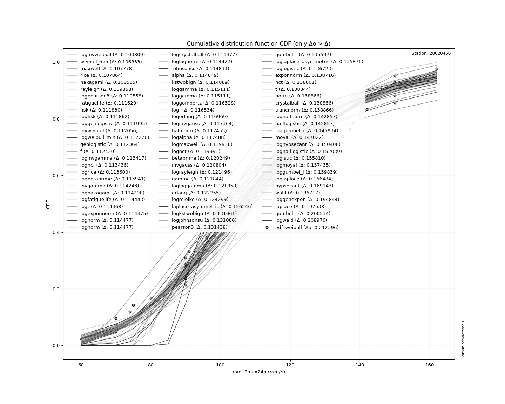</img>

</div>


**3.3. Best fit**

<div align="center">

|   id |   station | empirical_dist   | p_dist        |    delta |   deltao | eval   |   fit |   n |   best_fit |   best_fit_sort |
|-----:|----------:|:-----------------|:--------------|---------:|---------:|:-------|------:|----:|-----------:|----------------:|
|    0 |  28020460 | edf_weibull      | loginvweibull | 0.103809 | 0.212396 | Δo > Δ |     1 |  41 |          1 |               1 |

</div>


<div align="center">

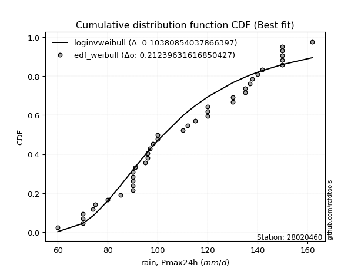</img>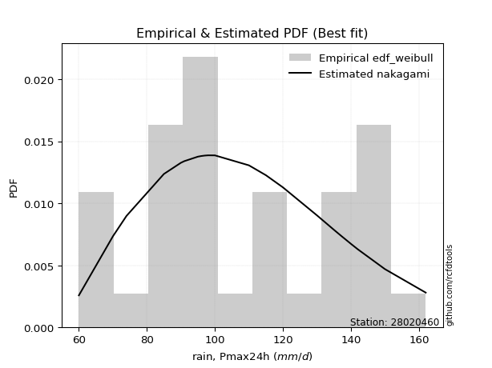</img>

</div>


### 4. Empirical - EDF Beard (1943)

The Beard formula (or Beard´s plotting position formula) in hydrology is used to estimate the empirical non-exceedance probability _(P)_ of a flood event (or other extreme hydrological data point) within a given dataset.

<div align="center">


$P=(m-0.31)/(n+0.38)$


</div>


**4.1. Empirical values**

<div align="center">

|                | 0                    | 1                   | 2                   | 3                   | 4                   | 5                  | 6                   | 7                   | 8                  | 9                   | 10                 | 11                 | 12                  | 13                 | 14                  | 15                  | 16                  | 17                  | 18                  | 19                 | 20        | 21                 | 22                 | 23                 | 24                 | 25                 | 26                 | 27                 | 28                 | 29                 | 30                 | 31                 | 32                 | 33                 | 34                 | 35                | 36                 | 37                 | 38                 | 39                | 40                 |
|:---------------|:---------------------|:--------------------|:--------------------|:--------------------|:--------------------|:-------------------|:--------------------|:--------------------|:-------------------|:--------------------|:-------------------|:-------------------|:--------------------|:-------------------|:--------------------|:--------------------|:--------------------|:--------------------|:--------------------|:-------------------|:----------|:-------------------|:-------------------|:-------------------|:-------------------|:-------------------|:-------------------|:-------------------|:-------------------|:-------------------|:-------------------|:-------------------|:-------------------|:-------------------|:-------------------|:------------------|:-------------------|:-------------------|:-------------------|:------------------|:-------------------|
| date           | 1989                 | 1991                | 1999                | 1997                | 2006                | 2018               | 2016                | 1992                | 2005               | 2004                | 2000               | 1980               | 2013                | 1985               | 1998                | 1993                | 1990                | 2003                | 2011                | 1983               | 2001      | 1981               | 2017               | 1995               | 1982               | 1987               | 2009               | 2020               | 1984               | 1986               | 1988               | 2014               | 2019               | 1994               | 2015               | 2010              | 1996               | 2008               | 2007               | 2002              | 2012               |
| x              | 60.0                 | 70.0                | 70.0                | 70.0                | 74.0                | 75.0               | 80.0                | 85.0                | 90.0               | 90.0                | 90.0               | 90.0               | 90.0                | 91.0               | 95.0                | 96.0                | 96.0                | 97.0                | 98.0                | 100.0              | 100.0     | 110.0              | 112.0              | 115.0              | 120.0              | 120.0              | 120.0              | 130.0              | 130.0              | 135.0              | 135.0              | 137.0              | 138.0              | 140.0              | 142.0              | 150.0             | 150.0              | 150.0              | 150.0              | 150.0             | 162.0              |
| m              | 1                    | 2                   | 3                   | 4                   | 5                   | 6                  | 7                   | 8                   | 9                  | 10                  | 11                 | 12                 | 13                  | 14                 | 15                  | 16                  | 17                  | 18                  | 19                  | 20                 | 21        | 22                 | 23                 | 24                 | 25                 | 26                 | 27                 | 28                 | 29                 | 30                 | 31                 | 32                 | 33                 | 34                 | 35                 | 36                | 37                 | 38                 | 39                 | 40                | 41                 |
| empirical_dist | edf_beard            | edf_beard           | edf_beard           | edf_beard           | edf_beard           | edf_beard          | edf_beard           | edf_beard           | edf_beard          | edf_beard           | edf_beard          | edf_beard          | edf_beard           | edf_beard          | edf_beard           | edf_beard           | edf_beard           | edf_beard           | edf_beard           | edf_beard          | edf_beard | edf_beard          | edf_beard          | edf_beard          | edf_beard          | edf_beard          | edf_beard          | edf_beard          | edf_beard          | edf_beard          | edf_beard          | edf_beard          | edf_beard          | edf_beard          | edf_beard          | edf_beard         | edf_beard          | edf_beard          | edf_beard          | edf_beard         | edf_beard          |
| empirical      | 0.016674722087965197 | 0.04084098598356694 | 0.06500724987916867 | 0.08917351377477041 | 0.11333977767037216 | 0.1375060415659739 | 0.16167230546157563 | 0.18583856935717738 | 0.2100048332527791 | 0.23417109714838083 | 0.2583373610439826 | 0.2825036249395843 | 0.30666988883518603 | 0.3308361527307878 | 0.35500241662638954 | 0.37916868052199126 | 0.40333494441759304 | 0.42750120831319477 | 0.45166747220879655 | 0.4758337361043983 | 0.5       | 0.5241662638956017 | 0.5483325277912035 | 0.5724987916868052 | 0.5966650555824069 | 0.6208313194780087 | 0.6449975833736105 | 0.6691638472692122 | 0.6933301111648139 | 0.7174963750604156 | 0.7416626389560174 | 0.7658289028516191 | 0.7899951667472208 | 0.8141614306428225 | 0.8383276945384243 | 0.862493958434026 | 0.8866602223296277 | 0.9108264862252294 | 0.9349927501208312 | 0.959159014016433 | 0.9833252779120347 |
| empirical_tr   | 1.0169574834111574   | 1.0425799949609473  | 1.0695270095631946  | 1.0979039533032635  | 1.127827745979831   | 1.1594284113196973 | 1.192850965696166   | 1.228257643217572   | 1.2658305292138268 | 1.3057746923319657  | 1.34832192896709   | 1.3937352643987873 | 1.4423143952596722  | 1.4944023113037197 | 1.5503934057699513  | 1.6107434799532891  | 1.6759821790198464  | 1.7467285774588435  | 1.8237108858527986  | 1.9077916090364224 | 2.0       | 2.101574403250381  | 2.2140181915462813 | 2.339174674957603  | 2.479328939484721  | 2.6373486297004463 | 2.8168822328114365 | 3.022644265887509  | 3.260835303388495  | 3.539777587681779  | 3.87090739008419   | 4.270381836945304  | 4.761795166858456  | 5.381014304291285  | 6.185351270553061  | 7.272407732864669 | 8.823027718550097  | 11.214092140921391 | 15.382899628252751 | 24.48520710059168 | 59.97101449275335  |

</div>


**4.2. Kolmogorov-Smirnov fit test (sorted by Δ)**


<div align="center">

|                | 0                   | 1                   | 2                   | 3                   | 4                   | 5                   | 6                   | 7                   | 8                   | 9                   | 10                  | 11                  | 12                  | 13                  | 14                  | 15                  | 16                  | 17                  | 18                  | 19                  | 20                  | 21                  | 22                  | 23                  | 24                  | 25                  | 26                  | 27                  | 28                  | 29                  | 30                  | 31                  | 32                  | 33                  | 34                  | 35                  | 36                  | 37                  | 38                  | 39                  | 40                  | 41                  | 42                  | 43                  | 44                  | 45                  | 46                  | 47                  | 48                  | 49                  | 50                  | 51                  | 52                  | 53                    | 54                  | 55                  | 56                  | 57                  | 58                  | 59                  | 60                  | 61                  | 62                  | 63                  | 64                  | 65                  | 66                  | 67                  | 68                  | 69                  | 70                  | 71                  | 72                  | 73                  | 74                  | 75                  | 76                  | 77                  | 78                  | 79                  | 80                  | 81                  | 82                  | 83                  | 84                  | 85                  | 86                  | 87                  |
|:---------------|:--------------------|:--------------------|:--------------------|:--------------------|:--------------------|:--------------------|:--------------------|:--------------------|:--------------------|:--------------------|:--------------------|:--------------------|:--------------------|:--------------------|:--------------------|:--------------------|:--------------------|:--------------------|:--------------------|:--------------------|:--------------------|:--------------------|:--------------------|:--------------------|:--------------------|:--------------------|:--------------------|:--------------------|:--------------------|:--------------------|:--------------------|:--------------------|:--------------------|:--------------------|:--------------------|:--------------------|:--------------------|:--------------------|:--------------------|:--------------------|:--------------------|:--------------------|:--------------------|:--------------------|:--------------------|:--------------------|:--------------------|:--------------------|:--------------------|:--------------------|:--------------------|:--------------------|:--------------------|:----------------------|:--------------------|:--------------------|:--------------------|:--------------------|:--------------------|:--------------------|:--------------------|:--------------------|:--------------------|:--------------------|:--------------------|:--------------------|:--------------------|:--------------------|:--------------------|:--------------------|:--------------------|:--------------------|:--------------------|:--------------------|:--------------------|:--------------------|:--------------------|:--------------------|:--------------------|:--------------------|:--------------------|:--------------------|:--------------------|:--------------------|:--------------------|:--------------------|:--------------------|:--------------------|
| station        | 28020460            | 28020460            | 28020460            | 28020460            | 28020460            | 28020460            | 28020460            | 28020460            | 28020460            | 28020460            | 28020460            | 28020460            | 28020460            | 28020460            | 28020460            | 28020460            | 28020460            | 28020460            | 28020460            | 28020460            | 28020460            | 28020460            | 28020460            | 28020460            | 28020460            | 28020460            | 28020460            | 28020460            | 28020460            | 28020460            | 28020460            | 28020460            | 28020460            | 28020460            | 28020460            | 28020460            | 28020460            | 28020460            | 28020460            | 28020460            | 28020460            | 28020460            | 28020460            | 28020460            | 28020460            | 28020460            | 28020460            | 28020460            | 28020460            | 28020460            | 28020460            | 28020460            | 28020460            | 28020460              | 28020460            | 28020460            | 28020460            | 28020460            | 28020460            | 28020460            | 28020460            | 28020460            | 28020460            | 28020460            | 28020460            | 28020460            | 28020460            | 28020460            | 28020460            | 28020460            | 28020460            | 28020460            | 28020460            | 28020460            | 28020460            | 28020460            | 28020460            | 28020460            | 28020460            | 28020460            | 28020460            | 28020460            | 28020460            | 28020460            | 28020460            | 28020460            | 28020460            | 28020460            |
| empirical_dist | edf_beard           | edf_beard           | edf_beard           | edf_beard           | edf_beard           | edf_beard           | edf_beard           | edf_beard           | edf_beard           | edf_beard           | edf_beard           | edf_beard           | edf_beard           | edf_beard           | edf_beard           | edf_beard           | edf_beard           | edf_beard           | edf_beard           | edf_beard           | edf_beard           | edf_beard           | edf_beard           | edf_beard           | edf_beard           | edf_beard           | edf_beard           | edf_beard           | edf_beard           | edf_beard           | edf_beard           | edf_beard           | edf_beard           | edf_beard           | edf_beard           | edf_beard           | edf_beard           | edf_beard           | edf_beard           | edf_beard           | edf_beard           | edf_beard           | edf_beard           | edf_beard           | edf_beard           | edf_beard           | edf_beard           | edf_beard           | edf_beard           | edf_beard           | edf_beard           | edf_beard           | edf_beard           | edf_beard             | edf_beard           | edf_beard           | edf_beard           | edf_beard           | edf_beard           | edf_beard           | edf_beard           | edf_beard           | edf_beard           | edf_beard           | edf_beard           | edf_beard           | edf_beard           | edf_beard           | edf_beard           | edf_beard           | edf_beard           | edf_beard           | edf_beard           | edf_beard           | edf_beard           | edf_beard           | edf_beard           | edf_beard           | edf_beard           | edf_beard           | edf_beard           | edf_beard           | edf_beard           | edf_beard           | edf_beard           | edf_beard           | edf_beard           | edf_beard           |
| p_dist         | weibull_min         | nakagami            | maxwell             | rayleigh            | rice                | logpearson3         | loginvweibull       | fatiguelife         | fisk                | logfisk             | loggenlogistic      | invweibull          | genlogistic         | f                   | loginvgamma         | logncf              | logrice             | logbetaprime        | lognakagami         | logfatiguelife      | logt                | logexponnorm        | lognorm             | lognorm             | logcrystalball      | loglognorm          | logweibull_min      | alpha               | kstwobign           | loggamma            | loggamma            | logf                | invgamma            | logerlang           | johnsonsu           | loginvgauss         | halfnorm            | logalpha            | loggompertz         | logmaxwell          | lognct              | betaprime           | invgauss            | lograyleigh         | gamma               | logloggamma         | erlang              | laplace_asymmetric  | logmielke           | logjohnsonsu        | pearson3            | gumbel_r            | loglogistic         | loglaplace_asymmetric | logkstwobign        | loghalfnorm         | halflogistic        | exponnorm           | nct                 | t                   | norm                | crystalball         | truncnorm           | loggumbel_r         | moyal               | loghypsecant        | loghalflogistic     | logistic            | logmoyal            | loggumbel_l         | loglaplace          | hypsecant           | wald                | laplace             | loggenexpon         | gumbel_l            | logwald             | loggibrat           | expon               | genexpon            | ncf                 | gibrat              | logexpon            | logchi2             | logtruncnorm        | gompertz            | chi2                | mielke              |
| delta          | 0.10466444883097936 | 0.106087517411115   | 0.10630308097943492 | 0.10736089967506868 | 0.10786381946537105 | 0.10806102060160028 | 0.10808942141159913 | 0.10912261656440492 | 0.10933245801492275 | 0.1093652411156999  | 0.10949757201027843 | 0.10955860794953343 | 0.10986678445705178 | 0.10992279602202204 | 0.11092022461382778 | 0.11093874885702004 | 0.11110246520264955 | 0.11144386247194549 | 0.11179237092621386 | 0.11194594943663094 | 0.11197107769901227 | 0.11197739999946776 | 0.11197942532785865 | 0.11197942532785865 | 0.11197945148728972 | 0.11197969847441147 | 0.1122259111131032  | 0.11235176555803583 | 0.11239136717810827 | 0.11261398458507155 | 0.11261398458507155 | 0.11403709004012463 | 0.11424257086889811 | 0.11447168715829914 | 0.11483397819487717 | 0.11486681851790359 | 0.1149581462252579  | 0.1149908172503219  | 0.1163276672429091  | 0.11743834601565972 | 0.11749381181718543 | 0.11775190074801023 | 0.11830637465926852 | 0.11899849366794146 | 0.12184396306532203 | 0.12185774798898125 | 0.12225487869323065 | 0.12374882639032625 | 0.12429902910907659 | 0.13108561791102624 | 0.13143807656229073 | 0.1330998189998024  | 0.1342260349244483  | 0.1344489363722563    | 0.1353419440799716  | 0.1375060415659739  | 0.1383018695675896  | 0.13871598166375476 | 0.13880067180416705 | 0.1388440744033454  | 0.1388662795691612  | 0.13886628471739537 | 0.13886628580181337 | 0.14343718210321954 | 0.14452445745185816 | 0.1479111486941641  | 0.1506118823985555  | 0.15581034177644043 | 0.15600838075574097 | 0.1598388538614423  | 0.16398647574970326 | 0.16914261612004405 | 0.18528959864706707 | 0.19753846784248236 | 0.19912499558960203 | 0.20053442508080654 | 0.20754870012681337 | 0.23935909534361843 | 0.24231061884478464 | 0.24253089347639287 | 0.2509847044824426  | 0.2962786150414289  | 0.29799736594879933 | 0.3264509965093151  | 0.4268155453143191  | 0.7361503222856753  | 0.9571413027027234  | nan                 |
| deltao         | 0.21239631616850427 | 0.21239631616850427 | 0.21239631616850427 | 0.21239631616850427 | 0.21239631616850427 | 0.21239631616850427 | 0.21239631616850427 | 0.21239631616850427 | 0.21239631616850427 | 0.21239631616850427 | 0.21239631616850427 | 0.21239631616850427 | 0.21239631616850427 | 0.21239631616850427 | 0.21239631616850427 | 0.21239631616850427 | 0.21239631616850427 | 0.21239631616850427 | 0.21239631616850427 | 0.21239631616850427 | 0.21239631616850427 | 0.21239631616850427 | 0.21239631616850427 | 0.21239631616850427 | 0.21239631616850427 | 0.21239631616850427 | 0.21239631616850427 | 0.21239631616850427 | 0.21239631616850427 | 0.21239631616850427 | 0.21239631616850427 | 0.21239631616850427 | 0.21239631616850427 | 0.21239631616850427 | 0.21239631616850427 | 0.21239631616850427 | 0.21239631616850427 | 0.21239631616850427 | 0.21239631616850427 | 0.21239631616850427 | 0.21239631616850427 | 0.21239631616850427 | 0.21239631616850427 | 0.21239631616850427 | 0.21239631616850427 | 0.21239631616850427 | 0.21239631616850427 | 0.21239631616850427 | 0.21239631616850427 | 0.21239631616850427 | 0.21239631616850427 | 0.21239631616850427 | 0.21239631616850427 | 0.21239631616850427   | 0.21239631616850427 | 0.21239631616850427 | 0.21239631616850427 | 0.21239631616850427 | 0.21239631616850427 | 0.21239631616850427 | 0.21239631616850427 | 0.21239631616850427 | 0.21239631616850427 | 0.21239631616850427 | 0.21239631616850427 | 0.21239631616850427 | 0.21239631616850427 | 0.21239631616850427 | 0.21239631616850427 | 0.21239631616850427 | 0.21239631616850427 | 0.21239631616850427 | 0.21239631616850427 | 0.21239631616850427 | 0.21239631616850427 | 0.21239631616850427 | 0.21239631616850427 | 0.21239631616850427 | 0.21239631616850427 | 0.21239631616850427 | 0.21239631616850427 | 0.21239631616850427 | 0.21239631616850427 | 0.21239631616850427 | 0.21239631616850427 | 0.21239631616850427 | 0.21239631616850427 | 0.21239631616850427 |
| eval           | Δo > Δ              | Δo > Δ              | Δo > Δ              | Δo > Δ              | Δo > Δ              | Δo > Δ              | Δo > Δ              | Δo > Δ              | Δo > Δ              | Δo > Δ              | Δo > Δ              | Δo > Δ              | Δo > Δ              | Δo > Δ              | Δo > Δ              | Δo > Δ              | Δo > Δ              | Δo > Δ              | Δo > Δ              | Δo > Δ              | Δo > Δ              | Δo > Δ              | Δo > Δ              | Δo > Δ              | Δo > Δ              | Δo > Δ              | Δo > Δ              | Δo > Δ              | Δo > Δ              | Δo > Δ              | Δo > Δ              | Δo > Δ              | Δo > Δ              | Δo > Δ              | Δo > Δ              | Δo > Δ              | Δo > Δ              | Δo > Δ              | Δo > Δ              | Δo > Δ              | Δo > Δ              | Δo > Δ              | Δo > Δ              | Δo > Δ              | Δo > Δ              | Δo > Δ              | Δo > Δ              | Δo > Δ              | Δo > Δ              | Δo > Δ              | Δo > Δ              | Δo > Δ              | Δo > Δ              | Δo > Δ                | Δo > Δ              | Δo > Δ              | Δo > Δ              | Δo > Δ              | Δo > Δ              | Δo > Δ              | Δo > Δ              | Δo > Δ              | Δo > Δ              | Δo > Δ              | Δo > Δ              | Δo > Δ              | Δo > Δ              | Δo > Δ              | Δo > Δ              | Δo > Δ              | Δo > Δ              | Δo > Δ              | Δo > Δ              | Δo > Δ              | Δo > Δ              | Δo > Δ              | Δo > Δ              | Δo <= Δ             | Δo <= Δ             | Δo <= Δ             | Δo <= Δ             | Δo <= Δ             | Δo <= Δ             | Δo <= Δ             | Δo <= Δ             | Δo <= Δ             | Δo <= Δ             | Δo <= Δ             |
| fit            | 1                   | 1                   | 1                   | 1                   | 1                   | 1                   | 1                   | 1                   | 1                   | 1                   | 1                   | 1                   | 1                   | 1                   | 1                   | 1                   | 1                   | 1                   | 1                   | 1                   | 1                   | 1                   | 1                   | 1                   | 1                   | 1                   | 1                   | 1                   | 1                   | 1                   | 1                   | 1                   | 1                   | 1                   | 1                   | 1                   | 1                   | 1                   | 1                   | 1                   | 1                   | 1                   | 1                   | 1                   | 1                   | 1                   | 1                   | 1                   | 1                   | 1                   | 1                   | 1                   | 1                   | 1                     | 1                   | 1                   | 1                   | 1                   | 1                   | 1                   | 1                   | 1                   | 1                   | 1                   | 1                   | 1                   | 1                   | 1                   | 1                   | 1                   | 1                   | 1                   | 1                   | 1                   | 1                   | 1                   | 1                   | 0                   | 0                   | 0                   | 0                   | 0                   | 0                   | 0                   | 0                   | 0                   | 0                   | 0                   |
| n              | 41                  | 41                  | 41                  | 41                  | 41                  | 41                  | 41                  | 41                  | 41                  | 41                  | 41                  | 41                  | 41                  | 41                  | 41                  | 41                  | 41                  | 41                  | 41                  | 41                  | 41                  | 41                  | 41                  | 41                  | 41                  | 41                  | 41                  | 41                  | 41                  | 41                  | 41                  | 41                  | 41                  | 41                  | 41                  | 41                  | 41                  | 41                  | 41                  | 41                  | 41                  | 41                  | 41                  | 41                  | 41                  | 41                  | 41                  | 41                  | 41                  | 41                  | 41                  | 41                  | 41                  | 41                    | 41                  | 41                  | 41                  | 41                  | 41                  | 41                  | 41                  | 41                  | 41                  | 41                  | 41                  | 41                  | 41                  | 41                  | 41                  | 41                  | 41                  | 41                  | 41                  | 41                  | 41                  | 41                  | 41                  | 41                  | 41                  | 41                  | 41                  | 41                  | 41                  | 41                  | 41                  | 41                  | 41                  | 41                  |
| best_fit       | 1                   | 0                   | 0                   | 0                   | 0                   | 0                   | 0                   | 0                   | 0                   | 0                   | 0                   | 0                   | 0                   | 0                   | 0                   | 0                   | 0                   | 0                   | 0                   | 0                   | 0                   | 0                   | 0                   | 0                   | 0                   | 0                   | 0                   | 0                   | 0                   | 0                   | 0                   | 0                   | 0                   | 0                   | 0                   | 0                   | 0                   | 0                   | 0                   | 0                   | 0                   | 0                   | 0                   | 0                   | 0                   | 0                   | 0                   | 0                   | 0                   | 0                   | 0                   | 0                   | 0                   | 0                     | 0                   | 0                   | 0                   | 0                   | 0                   | 0                   | 0                   | 0                   | 0                   | 0                   | 0                   | 0                   | 0                   | 0                   | 0                   | 0                   | 0                   | 0                   | 0                   | 0                   | 0                   | 0                   | 0                   | 0                   | 0                   | 0                   | 0                   | 0                   | 0                   | 0                   | 0                   | 0                   | 0                   | 0                   |
| best_fit_sort  | 1                   | 2                   | 3                   | 4                   | 5                   | 6                   | 7                   | 8                   | 9                   | 10                  | 11                  | 12                  | 13                  | 14                  | 15                  | 16                  | 17                  | 18                  | 19                  | 20                  | 21                  | 22                  | 23                  | 24                  | 25                  | 26                  | 27                  | 28                  | 29                  | 30                  | 31                  | 32                  | 33                  | 34                  | 35                  | 36                  | 37                  | 38                  | 39                  | 40                  | 41                  | 42                  | 43                  | 44                  | 45                  | 46                  | 47                  | 48                  | 49                  | 50                  | 51                  | 52                  | 53                  | 54                    | 55                  | 56                  | 57                  | 58                  | 59                  | 60                  | 61                  | 62                  | 63                  | 64                  | 65                  | 66                  | 67                  | 68                  | 69                  | 70                  | 71                  | 72                  | 73                  | 74                  | 75                  | 76                  | 77                  | 78                  | 79                  | 80                  | 81                  | 82                  | 83                  | 84                  | 85                  | 86                  | 87                  | 88                  |

</div>


<div align="center">

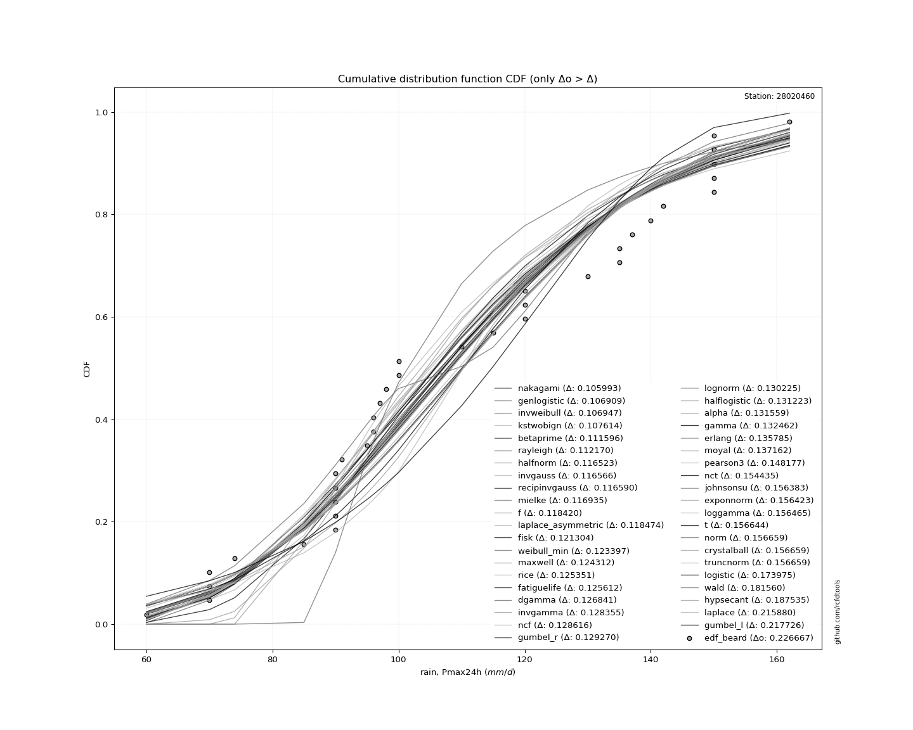</img>

</div>


**4.3. Best fit**

<div align="center">

|   id |   station | empirical_dist   | p_dist      |    delta |   deltao | eval   |   fit |   n |   best_fit |   best_fit_sort |
|-----:|----------:|:-----------------|:------------|---------:|---------:|:-------|------:|----:|-----------:|----------------:|
|    0 |  28020460 | edf_beard        | weibull_min | 0.104664 | 0.212396 | Δo > Δ |     1 |  41 |          1 |               1 |

</div>


<div align="center">

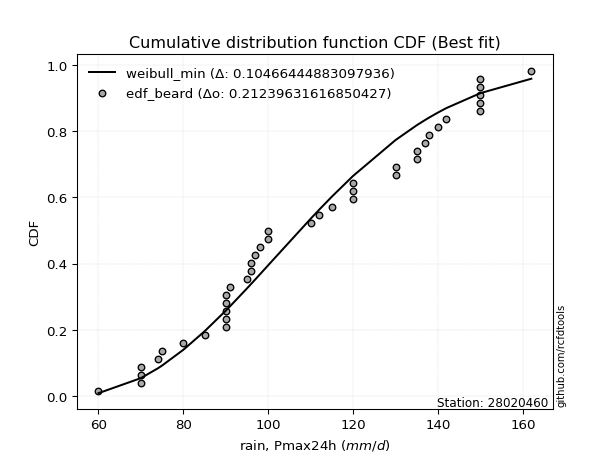</img></img>

</div>


### 5. Empirical - EDF Chegodayev (1955)

The Chegodayev formula is an empirical plotting position formula used in hydrological frequency analysis to estimate the exceedance probability or return period of a specific event from a set of observed data. It is primarily used for plotting observed data points on probability paper to fit a theoretical distribution, particularly for analyzing extreme events like maximum flood flows or rainfall intensities. The constant _b_ value in the generalized plotting position formula is 0.3.

<div align="center">


$P=(m-b)/(n+1-2b)$


</div>


**5.1. Empirical values**

<div align="center">

|                | 0                    | 1                   | 2                   | 3                   | 4                   | 5                   | 6                   | 7                   | 8                   | 9                   | 10                 | 11                 | 12                  | 13                  | 14                  | 15                  | 16                 | 17                 | 18                  | 19                 | 20             | 21                 | 22                 | 23                 | 24                 | 25                 | 26                | 27                 | 28                 | 29                | 30                 | 31                 | 32                 | 33                 | 34                 | 35                 | 36                 | 37                 | 38                 | 39                | 40                 |
|:---------------|:---------------------|:--------------------|:--------------------|:--------------------|:--------------------|:--------------------|:--------------------|:--------------------|:--------------------|:--------------------|:-------------------|:-------------------|:--------------------|:--------------------|:--------------------|:--------------------|:-------------------|:-------------------|:--------------------|:-------------------|:---------------|:-------------------|:-------------------|:-------------------|:-------------------|:-------------------|:------------------|:-------------------|:-------------------|:------------------|:-------------------|:-------------------|:-------------------|:-------------------|:-------------------|:-------------------|:-------------------|:-------------------|:-------------------|:------------------|:-------------------|
| date           | 1989                 | 1991                | 1999                | 1997                | 2006                | 2018                | 2016                | 1992                | 2005                | 2004                | 2000               | 1980               | 2013                | 1985                | 1998                | 1993                | 1990               | 2003               | 2011                | 1983               | 2001           | 1981               | 2017               | 1995               | 1982               | 1987               | 2009              | 2020               | 1984               | 1986              | 1988               | 2014               | 2019               | 1994               | 2015               | 2010               | 1996               | 2008               | 2007               | 2002              | 2012               |
| x              | 60.0                 | 70.0                | 70.0                | 70.0                | 74.0                | 75.0                | 80.0                | 85.0                | 90.0                | 90.0                | 90.0               | 90.0               | 90.0                | 91.0                | 95.0                | 96.0                | 96.0               | 97.0               | 98.0                | 100.0              | 100.0          | 110.0              | 112.0              | 115.0              | 120.0              | 120.0              | 120.0             | 130.0              | 130.0              | 135.0             | 135.0              | 137.0              | 138.0              | 140.0              | 142.0              | 150.0              | 150.0              | 150.0              | 150.0              | 150.0             | 162.0              |
| m              | 1                    | 2                   | 3                   | 4                   | 5                   | 6                   | 7                   | 8                   | 9                   | 10                  | 11                 | 12                 | 13                  | 14                  | 15                  | 16                  | 17                 | 18                 | 19                  | 20                 | 21             | 22                 | 23                 | 24                 | 25                 | 26                 | 27                | 28                 | 29                 | 30                | 31                 | 32                 | 33                 | 34                 | 35                 | 36                 | 37                 | 38                 | 39                 | 40                | 41                 |
| empirical_dist | edf_chegodayev       | edf_chegodayev      | edf_chegodayev      | edf_chegodayev      | edf_chegodayev      | edf_chegodayev      | edf_chegodayev      | edf_chegodayev      | edf_chegodayev      | edf_chegodayev      | edf_chegodayev     | edf_chegodayev     | edf_chegodayev      | edf_chegodayev      | edf_chegodayev      | edf_chegodayev      | edf_chegodayev     | edf_chegodayev     | edf_chegodayev      | edf_chegodayev     | edf_chegodayev | edf_chegodayev     | edf_chegodayev     | edf_chegodayev     | edf_chegodayev     | edf_chegodayev     | edf_chegodayev    | edf_chegodayev     | edf_chegodayev     | edf_chegodayev    | edf_chegodayev     | edf_chegodayev     | edf_chegodayev     | edf_chegodayev     | edf_chegodayev     | edf_chegodayev     | edf_chegodayev     | edf_chegodayev     | edf_chegodayev     | edf_chegodayev    | edf_chegodayev     |
| empirical      | 0.016908212560386472 | 0.04106280193236715 | 0.06521739130434784 | 0.08937198067632851 | 0.11352657004830918 | 0.13768115942028986 | 0.16183574879227053 | 0.18599033816425123 | 0.21014492753623187 | 0.23429951690821255 | 0.2584541062801932 | 0.2826086956521739 | 0.30676328502415456 | 0.33091787439613524 | 0.35507246376811596 | 0.37922705314009664 | 0.4033816425120773 | 0.427536231884058  | 0.45169082125603865 | 0.4758454106280193 | 0.5            | 0.5241545893719807 | 0.5483091787439613 | 0.572463768115942  | 0.5966183574879227 | 0.6207729468599034 | 0.644927536231884 | 0.6690821256038647 | 0.6932367149758454 | 0.717391304347826 | 0.7415458937198067 | 0.7657004830917874 | 0.7898550724637682 | 0.8140096618357489 | 0.8381642512077295 | 0.8623188405797102 | 0.8864734299516909 | 0.9106280193236715 | 0.9347826086956523 | 0.958937198067633 | 0.9830917874396137 |
| empirical_tr   | 1.017199017199017    | 1.0428211586901763  | 1.0697674418604652  | 1.0981432360742704  | 1.1280653950953679  | 1.1596638655462184  | 1.1930835734870318  | 1.228486646884273   | 1.2660550458715598  | 1.305993690851735   | 1.3485342019543975 | 1.3939393939393938 | 1.4425087108013939  | 1.494584837545126   | 1.550561797752809   | 1.6108949416342413  | 1.6761133603238867 | 1.7468354430379747 | 1.8237885462555066  | 1.9078341013824884 | 2.0            | 2.1015228426395938 | 2.213903743315508  | 2.3389830508474576 | 2.4790419161676644 | 2.6369426751592355 | 2.816326530612245 | 3.0218978102189777 | 3.259842519685039  | 3.538461538461538 | 3.869158878504672  | 4.268041237113401  | 4.7586206896551735 | 5.376623376623378  | 6.179104477611943  | 7.263157894736845  | 8.808510638297877  | 11.189189189189195 | 15.33333333333337  | 24.35294117647068 | 59.14285714285766  |

</div>


**5.2. Kolmogorov-Smirnov fit test (sorted by Δ)**


<div align="center">

|                | 0                   | 1                   | 2                   | 3                   | 4                   | 5                   | 6                   | 7                   | 8                   | 9                   | 10                  | 11                  | 12                  | 13                  | 14                  | 15                  | 16                  | 17                  | 18                  | 19                  | 20                  | 21                  | 22                  | 23                  | 24                  | 25                  | 26                  | 27                  | 28                  | 29                  | 30                  | 31                  | 32                  | 33                  | 34                  | 35                  | 36                  | 37                  | 38                  | 39                  | 40                  | 41                  | 42                  | 43                  | 44                  | 45                  | 46                  | 47                  | 48                  | 49                  | 50                  | 51                  | 52                  | 53                    | 54                  | 55                  | 56                  | 57                  | 58                  | 59                  | 60                  | 61                  | 62                  | 63                  | 64                  | 65                  | 66                  | 67                  | 68                  | 69                  | 70                  | 71                  | 72                  | 73                  | 74                  | 75                  | 76                  | 77                  | 78                  | 79                  | 80                  | 81                  | 82                  | 83                  | 84                  | 85                  | 86                  | 87                  |
|:---------------|:--------------------|:--------------------|:--------------------|:--------------------|:--------------------|:--------------------|:--------------------|:--------------------|:--------------------|:--------------------|:--------------------|:--------------------|:--------------------|:--------------------|:--------------------|:--------------------|:--------------------|:--------------------|:--------------------|:--------------------|:--------------------|:--------------------|:--------------------|:--------------------|:--------------------|:--------------------|:--------------------|:--------------------|:--------------------|:--------------------|:--------------------|:--------------------|:--------------------|:--------------------|:--------------------|:--------------------|:--------------------|:--------------------|:--------------------|:--------------------|:--------------------|:--------------------|:--------------------|:--------------------|:--------------------|:--------------------|:--------------------|:--------------------|:--------------------|:--------------------|:--------------------|:--------------------|:--------------------|:----------------------|:--------------------|:--------------------|:--------------------|:--------------------|:--------------------|:--------------------|:--------------------|:--------------------|:--------------------|:--------------------|:--------------------|:--------------------|:--------------------|:--------------------|:--------------------|:--------------------|:--------------------|:--------------------|:--------------------|:--------------------|:--------------------|:--------------------|:--------------------|:--------------------|:--------------------|:--------------------|:--------------------|:--------------------|:--------------------|:--------------------|:--------------------|:--------------------|:--------------------|:--------------------|
| station        | 28020460            | 28020460            | 28020460            | 28020460            | 28020460            | 28020460            | 28020460            | 28020460            | 28020460            | 28020460            | 28020460            | 28020460            | 28020460            | 28020460            | 28020460            | 28020460            | 28020460            | 28020460            | 28020460            | 28020460            | 28020460            | 28020460            | 28020460            | 28020460            | 28020460            | 28020460            | 28020460            | 28020460            | 28020460            | 28020460            | 28020460            | 28020460            | 28020460            | 28020460            | 28020460            | 28020460            | 28020460            | 28020460            | 28020460            | 28020460            | 28020460            | 28020460            | 28020460            | 28020460            | 28020460            | 28020460            | 28020460            | 28020460            | 28020460            | 28020460            | 28020460            | 28020460            | 28020460            | 28020460              | 28020460            | 28020460            | 28020460            | 28020460            | 28020460            | 28020460            | 28020460            | 28020460            | 28020460            | 28020460            | 28020460            | 28020460            | 28020460            | 28020460            | 28020460            | 28020460            | 28020460            | 28020460            | 28020460            | 28020460            | 28020460            | 28020460            | 28020460            | 28020460            | 28020460            | 28020460            | 28020460            | 28020460            | 28020460            | 28020460            | 28020460            | 28020460            | 28020460            | 28020460            |
| empirical_dist | edf_chegodayev      | edf_chegodayev      | edf_chegodayev      | edf_chegodayev      | edf_chegodayev      | edf_chegodayev      | edf_chegodayev      | edf_chegodayev      | edf_chegodayev      | edf_chegodayev      | edf_chegodayev      | edf_chegodayev      | edf_chegodayev      | edf_chegodayev      | edf_chegodayev      | edf_chegodayev      | edf_chegodayev      | edf_chegodayev      | edf_chegodayev      | edf_chegodayev      | edf_chegodayev      | edf_chegodayev      | edf_chegodayev      | edf_chegodayev      | edf_chegodayev      | edf_chegodayev      | edf_chegodayev      | edf_chegodayev      | edf_chegodayev      | edf_chegodayev      | edf_chegodayev      | edf_chegodayev      | edf_chegodayev      | edf_chegodayev      | edf_chegodayev      | edf_chegodayev      | edf_chegodayev      | edf_chegodayev      | edf_chegodayev      | edf_chegodayev      | edf_chegodayev      | edf_chegodayev      | edf_chegodayev      | edf_chegodayev      | edf_chegodayev      | edf_chegodayev      | edf_chegodayev      | edf_chegodayev      | edf_chegodayev      | edf_chegodayev      | edf_chegodayev      | edf_chegodayev      | edf_chegodayev      | edf_chegodayev        | edf_chegodayev      | edf_chegodayev      | edf_chegodayev      | edf_chegodayev      | edf_chegodayev      | edf_chegodayev      | edf_chegodayev      | edf_chegodayev      | edf_chegodayev      | edf_chegodayev      | edf_chegodayev      | edf_chegodayev      | edf_chegodayev      | edf_chegodayev      | edf_chegodayev      | edf_chegodayev      | edf_chegodayev      | edf_chegodayev      | edf_chegodayev      | edf_chegodayev      | edf_chegodayev      | edf_chegodayev      | edf_chegodayev      | edf_chegodayev      | edf_chegodayev      | edf_chegodayev      | edf_chegodayev      | edf_chegodayev      | edf_chegodayev      | edf_chegodayev      | edf_chegodayev      | edf_chegodayev      | edf_chegodayev      | edf_chegodayev      |
| p_dist         | weibull_min         | nakagami            | maxwell             | rayleigh            | rice                | loginvweibull       | logpearson3         | fatiguelife         | fisk                | logfisk             | loggenlogistic      | invweibull          | genlogistic         | f                   | loginvgamma         | logncf              | logrice             | logbetaprime        | lognakagami         | logfatiguelife      | logt                | logexponnorm        | lognorm             | lognorm             | logcrystalball      | loglognorm          | logweibull_min      | alpha               | kstwobign           | loggamma            | loggamma            | logf                | invgamma            | logerlang           | johnsonsu           | loginvgauss         | halfnorm            | logalpha            | loggompertz         | logmaxwell          | lognct              | betaprime           | invgauss            | lograyleigh         | gamma               | logloggamma         | erlang              | laplace_asymmetric  | logmielke           | logjohnsonsu        | pearson3            | gumbel_r            | loglogistic         | loglaplace_asymmetric | logkstwobign        | loghalfnorm         | halflogistic        | exponnorm           | nct                 | t                   | norm                | crystalball         | truncnorm           | loggumbel_r         | moyal               | loghypsecant        | loghalflogistic     | logistic            | logmoyal            | loggumbel_l         | loglaplace          | hypsecant           | wald                | laplace             | loggenexpon         | gumbel_l            | logwald             | loggibrat           | expon               | genexpon            | ncf                 | gibrat              | logexpon            | logchi2             | logtruncnorm        | gompertz            | chi2                | mielke              |
| delta          | 0.10466444883097936 | 0.10616923907646247 | 0.10630308097943492 | 0.10744262134041616 | 0.10786381946537105 | 0.10794932712814637 | 0.10814274226694776 | 0.1092043382297524  | 0.10941417968027023 | 0.10944696278104737 | 0.10957929367562591 | 0.1096403296148809  | 0.10994850612239926 | 0.11000451768736952 | 0.11100194627917526 | 0.11102047052236752 | 0.11118418686799703 | 0.11152558413729297 | 0.11187409259156134 | 0.11202767110197842 | 0.11205279936435975 | 0.11205912166481524 | 0.11206114699320613 | 0.11206114699320613 | 0.1120611731526372  | 0.11206142013975895 | 0.1122259111131032  | 0.11243348722338331 | 0.11247308884345575 | 0.11269570625041903 | 0.11269570625041903 | 0.11411881170547211 | 0.11424257086889811 | 0.11455340882364662 | 0.11483397819487717 | 0.11494854018325107 | 0.11503986789060539 | 0.11507253891566938 | 0.1163276672429091  | 0.1175200676810072  | 0.11757553348253291 | 0.11783362241335771 | 0.118388096324616   | 0.11908021533328894 | 0.12184396306532203 | 0.12185774798898125 | 0.12225487869323065 | 0.12383054805567373 | 0.12429902910907659 | 0.13108561791102624 | 0.13143807656229073 | 0.13318154066514987 | 0.13430775658979577 | 0.1344956344667405    | 0.13520184979651884 | 0.13768115942028986 | 0.1383835912329371  | 0.13871598166375476 | 0.13880067180416705 | 0.1388440744033454  | 0.1388662795691612  | 0.13886628471739537 | 0.13886628580181337 | 0.14351890376856702 | 0.14460617911720564 | 0.14799287035951159 | 0.1506585804930397  | 0.15581034177644043 | 0.15605507885022518 | 0.1598388538614423  | 0.16406819741505074 | 0.16914261612004405 | 0.18533629674155128 | 0.19753846784248236 | 0.19898490130614926 | 0.20053442508080654 | 0.20759539822129758 | 0.23940579343810264 | 0.24217052456133187 | 0.2423907991929401  | 0.2507628885336426  | 0.2963720112303974  | 0.29785727166534653 | 0.32621750603689403 | 0.4266754510308663  | 0.7360102280022227  | 0.9569194867539231  | nan                 |
| deltao         | 0.21239631616850427 | 0.21239631616850427 | 0.21239631616850427 | 0.21239631616850427 | 0.21239631616850427 | 0.21239631616850427 | 0.21239631616850427 | 0.21239631616850427 | 0.21239631616850427 | 0.21239631616850427 | 0.21239631616850427 | 0.21239631616850427 | 0.21239631616850427 | 0.21239631616850427 | 0.21239631616850427 | 0.21239631616850427 | 0.21239631616850427 | 0.21239631616850427 | 0.21239631616850427 | 0.21239631616850427 | 0.21239631616850427 | 0.21239631616850427 | 0.21239631616850427 | 0.21239631616850427 | 0.21239631616850427 | 0.21239631616850427 | 0.21239631616850427 | 0.21239631616850427 | 0.21239631616850427 | 0.21239631616850427 | 0.21239631616850427 | 0.21239631616850427 | 0.21239631616850427 | 0.21239631616850427 | 0.21239631616850427 | 0.21239631616850427 | 0.21239631616850427 | 0.21239631616850427 | 0.21239631616850427 | 0.21239631616850427 | 0.21239631616850427 | 0.21239631616850427 | 0.21239631616850427 | 0.21239631616850427 | 0.21239631616850427 | 0.21239631616850427 | 0.21239631616850427 | 0.21239631616850427 | 0.21239631616850427 | 0.21239631616850427 | 0.21239631616850427 | 0.21239631616850427 | 0.21239631616850427 | 0.21239631616850427   | 0.21239631616850427 | 0.21239631616850427 | 0.21239631616850427 | 0.21239631616850427 | 0.21239631616850427 | 0.21239631616850427 | 0.21239631616850427 | 0.21239631616850427 | 0.21239631616850427 | 0.21239631616850427 | 0.21239631616850427 | 0.21239631616850427 | 0.21239631616850427 | 0.21239631616850427 | 0.21239631616850427 | 0.21239631616850427 | 0.21239631616850427 | 0.21239631616850427 | 0.21239631616850427 | 0.21239631616850427 | 0.21239631616850427 | 0.21239631616850427 | 0.21239631616850427 | 0.21239631616850427 | 0.21239631616850427 | 0.21239631616850427 | 0.21239631616850427 | 0.21239631616850427 | 0.21239631616850427 | 0.21239631616850427 | 0.21239631616850427 | 0.21239631616850427 | 0.21239631616850427 | 0.21239631616850427 |
| eval           | Δo > Δ              | Δo > Δ              | Δo > Δ              | Δo > Δ              | Δo > Δ              | Δo > Δ              | Δo > Δ              | Δo > Δ              | Δo > Δ              | Δo > Δ              | Δo > Δ              | Δo > Δ              | Δo > Δ              | Δo > Δ              | Δo > Δ              | Δo > Δ              | Δo > Δ              | Δo > Δ              | Δo > Δ              | Δo > Δ              | Δo > Δ              | Δo > Δ              | Δo > Δ              | Δo > Δ              | Δo > Δ              | Δo > Δ              | Δo > Δ              | Δo > Δ              | Δo > Δ              | Δo > Δ              | Δo > Δ              | Δo > Δ              | Δo > Δ              | Δo > Δ              | Δo > Δ              | Δo > Δ              | Δo > Δ              | Δo > Δ              | Δo > Δ              | Δo > Δ              | Δo > Δ              | Δo > Δ              | Δo > Δ              | Δo > Δ              | Δo > Δ              | Δo > Δ              | Δo > Δ              | Δo > Δ              | Δo > Δ              | Δo > Δ              | Δo > Δ              | Δo > Δ              | Δo > Δ              | Δo > Δ                | Δo > Δ              | Δo > Δ              | Δo > Δ              | Δo > Δ              | Δo > Δ              | Δo > Δ              | Δo > Δ              | Δo > Δ              | Δo > Δ              | Δo > Δ              | Δo > Δ              | Δo > Δ              | Δo > Δ              | Δo > Δ              | Δo > Δ              | Δo > Δ              | Δo > Δ              | Δo > Δ              | Δo > Δ              | Δo > Δ              | Δo > Δ              | Δo > Δ              | Δo > Δ              | Δo <= Δ             | Δo <= Δ             | Δo <= Δ             | Δo <= Δ             | Δo <= Δ             | Δo <= Δ             | Δo <= Δ             | Δo <= Δ             | Δo <= Δ             | Δo <= Δ             | Δo <= Δ             |
| fit            | 1                   | 1                   | 1                   | 1                   | 1                   | 1                   | 1                   | 1                   | 1                   | 1                   | 1                   | 1                   | 1                   | 1                   | 1                   | 1                   | 1                   | 1                   | 1                   | 1                   | 1                   | 1                   | 1                   | 1                   | 1                   | 1                   | 1                   | 1                   | 1                   | 1                   | 1                   | 1                   | 1                   | 1                   | 1                   | 1                   | 1                   | 1                   | 1                   | 1                   | 1                   | 1                   | 1                   | 1                   | 1                   | 1                   | 1                   | 1                   | 1                   | 1                   | 1                   | 1                   | 1                   | 1                     | 1                   | 1                   | 1                   | 1                   | 1                   | 1                   | 1                   | 1                   | 1                   | 1                   | 1                   | 1                   | 1                   | 1                   | 1                   | 1                   | 1                   | 1                   | 1                   | 1                   | 1                   | 1                   | 1                   | 0                   | 0                   | 0                   | 0                   | 0                   | 0                   | 0                   | 0                   | 0                   | 0                   | 0                   |
| n              | 41                  | 41                  | 41                  | 41                  | 41                  | 41                  | 41                  | 41                  | 41                  | 41                  | 41                  | 41                  | 41                  | 41                  | 41                  | 41                  | 41                  | 41                  | 41                  | 41                  | 41                  | 41                  | 41                  | 41                  | 41                  | 41                  | 41                  | 41                  | 41                  | 41                  | 41                  | 41                  | 41                  | 41                  | 41                  | 41                  | 41                  | 41                  | 41                  | 41                  | 41                  | 41                  | 41                  | 41                  | 41                  | 41                  | 41                  | 41                  | 41                  | 41                  | 41                  | 41                  | 41                  | 41                    | 41                  | 41                  | 41                  | 41                  | 41                  | 41                  | 41                  | 41                  | 41                  | 41                  | 41                  | 41                  | 41                  | 41                  | 41                  | 41                  | 41                  | 41                  | 41                  | 41                  | 41                  | 41                  | 41                  | 41                  | 41                  | 41                  | 41                  | 41                  | 41                  | 41                  | 41                  | 41                  | 41                  | 41                  |
| best_fit       | 1                   | 0                   | 0                   | 0                   | 0                   | 0                   | 0                   | 0                   | 0                   | 0                   | 0                   | 0                   | 0                   | 0                   | 0                   | 0                   | 0                   | 0                   | 0                   | 0                   | 0                   | 0                   | 0                   | 0                   | 0                   | 0                   | 0                   | 0                   | 0                   | 0                   | 0                   | 0                   | 0                   | 0                   | 0                   | 0                   | 0                   | 0                   | 0                   | 0                   | 0                   | 0                   | 0                   | 0                   | 0                   | 0                   | 0                   | 0                   | 0                   | 0                   | 0                   | 0                   | 0                   | 0                     | 0                   | 0                   | 0                   | 0                   | 0                   | 0                   | 0                   | 0                   | 0                   | 0                   | 0                   | 0                   | 0                   | 0                   | 0                   | 0                   | 0                   | 0                   | 0                   | 0                   | 0                   | 0                   | 0                   | 0                   | 0                   | 0                   | 0                   | 0                   | 0                   | 0                   | 0                   | 0                   | 0                   | 0                   |
| best_fit_sort  | 1                   | 2                   | 3                   | 4                   | 5                   | 6                   | 7                   | 8                   | 9                   | 10                  | 11                  | 12                  | 13                  | 14                  | 15                  | 16                  | 17                  | 18                  | 19                  | 20                  | 21                  | 22                  | 23                  | 24                  | 25                  | 26                  | 27                  | 28                  | 29                  | 30                  | 31                  | 32                  | 33                  | 34                  | 35                  | 36                  | 37                  | 38                  | 39                  | 40                  | 41                  | 42                  | 43                  | 44                  | 45                  | 46                  | 47                  | 48                  | 49                  | 50                  | 51                  | 52                  | 53                  | 54                    | 55                  | 56                  | 57                  | 58                  | 59                  | 60                  | 61                  | 62                  | 63                  | 64                  | 65                  | 66                  | 67                  | 68                  | 69                  | 70                  | 71                  | 72                  | 73                  | 74                  | 75                  | 76                  | 77                  | 78                  | 79                  | 80                  | 81                  | 82                  | 83                  | 84                  | 85                  | 86                  | 87                  | 88                  |

</div>


<div align="center">

</img>

</div>


**5.3. Best fit**

<div align="center">

|   id |   station | empirical_dist   | p_dist      |    delta |   deltao | eval   |   fit |   n |   best_fit |   best_fit_sort |
|-----:|----------:|:-----------------|:------------|---------:|---------:|:-------|------:|----:|-----------:|----------------:|
|    0 |  28020460 | edf_chegodayev   | weibull_min | 0.104664 | 0.212396 | Δo > Δ |     1 |  41 |          1 |               1 |

</div>


<div align="center">

</img>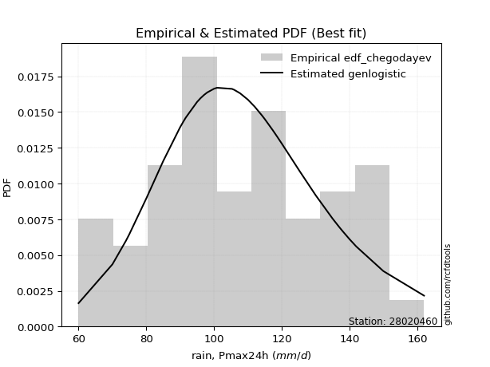</img>

</div>


### 6. Empirical - EDF Blom (1958)

The Blom formula is a specific "plotting position" formula used in hydrology and statistical analysis to estimate the empirical cumulative probability (or non-exceedance probability) of a data series. It is particularly recommended for data that are approximately normally distributed. The constant _a_ is set to 0.375 (or 3/8).

<div align="center">


$P=(m-a)/(n+1-2a)$


</div>


**6.1. Empirical values**

<div align="center">

|                | 0                    | 1                   | 2                   | 3                   | 4                   | 5                   | 6                  | 7                   | 8                   | 9                   | 10                  | 11                 | 12                  | 13                 | 14                  | 15                 | 16                 | 17                  | 18                  | 19                  | 20       | 21                 | 22                 | 23                 | 24                 | 25                 | 26                 | 27                 | 28                 | 29                 | 30                 | 31                 | 32                 | 33                 | 34                 | 35                 | 36                 | 37                 | 38                 | 39                 | 40                 |
|:---------------|:---------------------|:--------------------|:--------------------|:--------------------|:--------------------|:--------------------|:-------------------|:--------------------|:--------------------|:--------------------|:--------------------|:-------------------|:--------------------|:-------------------|:--------------------|:-------------------|:-------------------|:--------------------|:--------------------|:--------------------|:---------|:-------------------|:-------------------|:-------------------|:-------------------|:-------------------|:-------------------|:-------------------|:-------------------|:-------------------|:-------------------|:-------------------|:-------------------|:-------------------|:-------------------|:-------------------|:-------------------|:-------------------|:-------------------|:-------------------|:-------------------|
| date           | 1989                 | 1991                | 1999                | 1997                | 2006                | 2018                | 2016               | 1992                | 2005                | 2004                | 2000                | 1980               | 2013                | 1985               | 1998                | 1993               | 1990               | 2003                | 2011                | 1983                | 2001     | 1981               | 2017               | 1995               | 1982               | 1987               | 2009               | 2020               | 1984               | 1986               | 1988               | 2014               | 2019               | 1994               | 2015               | 2010               | 1996               | 2008               | 2007               | 2002               | 2012               |
| x              | 60.0                 | 70.0                | 70.0                | 70.0                | 74.0                | 75.0                | 80.0               | 85.0                | 90.0                | 90.0                | 90.0                | 90.0               | 90.0                | 91.0               | 95.0                | 96.0               | 96.0               | 97.0                | 98.0                | 100.0               | 100.0    | 110.0              | 112.0              | 115.0              | 120.0              | 120.0              | 120.0              | 130.0              | 130.0              | 135.0              | 135.0              | 137.0              | 138.0              | 140.0              | 142.0              | 150.0              | 150.0              | 150.0              | 150.0              | 150.0              | 162.0              |
| m              | 1                    | 2                   | 3                   | 4                   | 5                   | 6                   | 7                  | 8                   | 9                   | 10                  | 11                  | 12                 | 13                  | 14                 | 15                  | 16                 | 17                 | 18                  | 19                  | 20                  | 21       | 22                 | 23                 | 24                 | 25                 | 26                 | 27                 | 28                 | 29                 | 30                 | 31                 | 32                 | 33                 | 34                 | 35                 | 36                 | 37                 | 38                 | 39                 | 40                 | 41                 |
| empirical_dist | edf_blom             | edf_blom            | edf_blom            | edf_blom            | edf_blom            | edf_blom            | edf_blom           | edf_blom            | edf_blom            | edf_blom            | edf_blom            | edf_blom           | edf_blom            | edf_blom           | edf_blom            | edf_blom           | edf_blom           | edf_blom            | edf_blom            | edf_blom            | edf_blom | edf_blom           | edf_blom           | edf_blom           | edf_blom           | edf_blom           | edf_blom           | edf_blom           | edf_blom           | edf_blom           | edf_blom           | edf_blom           | edf_blom           | edf_blom           | edf_blom           | edf_blom           | edf_blom           | edf_blom           | edf_blom           | edf_blom           | edf_blom           |
| empirical      | 0.015151515151515152 | 0.03939393939393939 | 0.06363636363636363 | 0.08787878787878788 | 0.11212121212121212 | 0.13636363636363635 | 0.1606060606060606 | 0.18484848484848485 | 0.20909090909090908 | 0.23333333333333334 | 0.25757575757575757 | 0.2818181818181818 | 0.30606060606060603 | 0.3303030303030303 | 0.35454545454545455 | 0.3787878787878788 | 0.403030303030303  | 0.42727272727272725 | 0.45151515151515154 | 0.47575757575757577 | 0.5      | 0.5242424242424243 | 0.5484848484848485 | 0.5727272727272728 | 0.5969696969696969 | 0.6212121212121212 | 0.6454545454545455 | 0.6696969696969697 | 0.693939393939394  | 0.7181818181818181 | 0.7424242424242424 | 0.7666666666666667 | 0.7909090909090909 | 0.8151515151515152 | 0.8393939393939394 | 0.8636363636363636 | 0.8878787878787879 | 0.9121212121212121 | 0.9363636363636364 | 0.9606060606060606 | 0.9848484848484849 |
| empirical_tr   | 1.0153846153846153   | 1.0410094637223974  | 1.0679611650485437  | 1.0963455149501662  | 1.1262798634812285  | 1.1578947368421053  | 1.1913357400722022 | 1.2267657992565055  | 1.264367816091954   | 1.3043478260869565  | 1.346938775510204   | 1.3924050632911391 | 1.4410480349344978  | 1.493212669683258  | 1.5492957746478873  | 1.6097560975609757 | 1.6751269035532996 | 1.746031746031746   | 1.8232044198895028  | 1.9075144508670523  | 2.0      | 2.1019108280254777 | 2.2147651006711406 | 2.3404255319148937 | 2.4812030075187965 | 2.64               | 2.8205128205128207 | 3.0275229357798166 | 3.2673267326732676 | 3.548387096774193  | 3.8823529411764706 | 4.2857142857142865 | 4.782608695652174  | 5.409836065573772  | 6.226415094339622  | 7.333333333333334  | 8.918918918918923  | 11.379310344827585 | 15.714285714285722 | 25.384615384615365 | 66.00000000000006  |

</div>


**6.2. Kolmogorov-Smirnov fit test (sorted by Δ)**


<div align="center">

|                | 0                   | 1                   | 2                   | 3                   | 4                   | 5                   | 6                   | 7                   | 8                   | 9                   | 10                  | 11                  | 12                  | 13                  | 14                  | 15                  | 16                  | 17                  | 18                  | 19                  | 20                  | 21                  | 22                  | 23                  | 24                  | 25                  | 26                  | 27                  | 28                  | 29                  | 30                  | 31                  | 32                  | 33                  | 34                  | 35                  | 36                  | 37                  | 38                  | 39                  | 40                  | 41                  | 42                  | 43                  | 44                  | 45                  | 46                  | 47                  | 48                  | 49                  | 50                  | 51                  | 52                  | 53                    | 54                  | 55                  | 56                  | 57                  | 58                  | 59                  | 60                  | 61                  | 62                  | 63                  | 64                  | 65                  | 66                  | 67                  | 68                  | 69                  | 70                  | 71                  | 72                  | 73                  | 74                  | 75                  | 76                  | 77                  | 78                  | 79                  | 80                  | 81                  | 82                  | 83                  | 84                  | 85                  | 86                  | 87                  |
|:---------------|:--------------------|:--------------------|:--------------------|:--------------------|:--------------------|:--------------------|:--------------------|:--------------------|:--------------------|:--------------------|:--------------------|:--------------------|:--------------------|:--------------------|:--------------------|:--------------------|:--------------------|:--------------------|:--------------------|:--------------------|:--------------------|:--------------------|:--------------------|:--------------------|:--------------------|:--------------------|:--------------------|:--------------------|:--------------------|:--------------------|:--------------------|:--------------------|:--------------------|:--------------------|:--------------------|:--------------------|:--------------------|:--------------------|:--------------------|:--------------------|:--------------------|:--------------------|:--------------------|:--------------------|:--------------------|:--------------------|:--------------------|:--------------------|:--------------------|:--------------------|:--------------------|:--------------------|:--------------------|:----------------------|:--------------------|:--------------------|:--------------------|:--------------------|:--------------------|:--------------------|:--------------------|:--------------------|:--------------------|:--------------------|:--------------------|:--------------------|:--------------------|:--------------------|:--------------------|:--------------------|:--------------------|:--------------------|:--------------------|:--------------------|:--------------------|:--------------------|:--------------------|:--------------------|:--------------------|:--------------------|:--------------------|:--------------------|:--------------------|:--------------------|:--------------------|:--------------------|:--------------------|:--------------------|
| station        | 28020460            | 28020460            | 28020460            | 28020460            | 28020460            | 28020460            | 28020460            | 28020460            | 28020460            | 28020460            | 28020460            | 28020460            | 28020460            | 28020460            | 28020460            | 28020460            | 28020460            | 28020460            | 28020460            | 28020460            | 28020460            | 28020460            | 28020460            | 28020460            | 28020460            | 28020460            | 28020460            | 28020460            | 28020460            | 28020460            | 28020460            | 28020460            | 28020460            | 28020460            | 28020460            | 28020460            | 28020460            | 28020460            | 28020460            | 28020460            | 28020460            | 28020460            | 28020460            | 28020460            | 28020460            | 28020460            | 28020460            | 28020460            | 28020460            | 28020460            | 28020460            | 28020460            | 28020460            | 28020460              | 28020460            | 28020460            | 28020460            | 28020460            | 28020460            | 28020460            | 28020460            | 28020460            | 28020460            | 28020460            | 28020460            | 28020460            | 28020460            | 28020460            | 28020460            | 28020460            | 28020460            | 28020460            | 28020460            | 28020460            | 28020460            | 28020460            | 28020460            | 28020460            | 28020460            | 28020460            | 28020460            | 28020460            | 28020460            | 28020460            | 28020460            | 28020460            | 28020460            | 28020460            |
| empirical_dist | edf_blom            | edf_blom            | edf_blom            | edf_blom            | edf_blom            | edf_blom            | edf_blom            | edf_blom            | edf_blom            | edf_blom            | edf_blom            | edf_blom            | edf_blom            | edf_blom            | edf_blom            | edf_blom            | edf_blom            | edf_blom            | edf_blom            | edf_blom            | edf_blom            | edf_blom            | edf_blom            | edf_blom            | edf_blom            | edf_blom            | edf_blom            | edf_blom            | edf_blom            | edf_blom            | edf_blom            | edf_blom            | edf_blom            | edf_blom            | edf_blom            | edf_blom            | edf_blom            | edf_blom            | edf_blom            | edf_blom            | edf_blom            | edf_blom            | edf_blom            | edf_blom            | edf_blom            | edf_blom            | edf_blom            | edf_blom            | edf_blom            | edf_blom            | edf_blom            | edf_blom            | edf_blom            | edf_blom              | edf_blom            | edf_blom            | edf_blom            | edf_blom            | edf_blom            | edf_blom            | edf_blom            | edf_blom            | edf_blom            | edf_blom            | edf_blom            | edf_blom            | edf_blom            | edf_blom            | edf_blom            | edf_blom            | edf_blom            | edf_blom            | edf_blom            | edf_blom            | edf_blom            | edf_blom            | edf_blom            | edf_blom            | edf_blom            | edf_blom            | edf_blom            | edf_blom            | edf_blom            | edf_blom            | edf_blom            | edf_blom            | edf_blom            | edf_blom            |
| p_dist         | weibull_min         | nakagami            | maxwell             | rayleigh            | logpearson3         | rice                | fatiguelife         | fisk                | logfisk             | loggenlogistic      | loginvweibull       | invweibull          | genlogistic         | f                   | loginvgamma         | logncf              | logrice             | logbetaprime        | lognakagami         | logfatiguelife      | logt                | logexponnorm        | lognorm             | lognorm             | logcrystalball      | loglognorm          | alpha               | kstwobign           | loggamma            | loggamma            | logweibull_min      | logf                | logerlang           | invgamma            | loginvgauss         | halfnorm            | logalpha            | johnsonsu           | loggompertz         | logmaxwell          | lognct              | betaprime           | invgauss            | lograyleigh         | gamma               | logloggamma         | erlang              | laplace_asymmetric  | logmielke           | logjohnsonsu        | pearson3            | gumbel_r            | loglogistic         | loglaplace_asymmetric | logkstwobign        | loghalfnorm         | halflogistic        | exponnorm           | nct                 | t                   | norm                | crystalball         | truncnorm           | loggumbel_r         | moyal               | loghypsecant        | loghalflogistic     | logmoyal            | logistic            | loggumbel_l         | loglaplace          | hypsecant           | wald                | laplace             | loggenexpon         | gumbel_l            | logwald             | loggibrat           | expon               | genexpon            | ncf                 | gibrat              | logexpon            | logchi2             | logtruncnorm        | gompertz            | chi2                | mielke              |
| delta          | 0.10466444883097936 | 0.1055543949833575  | 0.10630308097943492 | 0.10682777724731118 | 0.10752789817384278 | 0.10786381946537105 | 0.10858949413664742 | 0.10879933558716526 | 0.1088321186879424  | 0.10896444958252094 | 0.10900334557346916 | 0.10902548552177593 | 0.10933366202929429 | 0.10938967359426455 | 0.11038710218607029 | 0.11040562642926255 | 0.11056934277489205 | 0.110910740044188   | 0.11125924849845636 | 0.11141282700887345 | 0.11143795527125477 | 0.11144427757171027 | 0.11144630290010116 | 0.11144630290010116 | 0.11144632905953222 | 0.11144657604665398 | 0.11181864313027834 | 0.11185824475035078 | 0.11208086215731405 | 0.11208086215731405 | 0.1122259111131032  | 0.11350396761236714 | 0.11393856473054165 | 0.11424257086889811 | 0.1143336960901461  | 0.11442502379750041 | 0.1144576948225644  | 0.11483397819487717 | 0.1163276672429091  | 0.11690522358790223 | 0.11696068938942794 | 0.11721877832025274 | 0.11777325223151103 | 0.11846537124018397 | 0.12184396306532203 | 0.12185774798898125 | 0.12225487869323065 | 0.12321570396256876 | 0.12429902910907659 | 0.13108561791102624 | 0.13143807656229073 | 0.1325666965720449  | 0.1336929124966908  | 0.13414429498496627   | 0.13625586824184163 | 0.13636363636363635 | 0.13776874713983212 | 0.13871598166375476 | 0.13880067180416705 | 0.1388440744033454  | 0.1388662795691612  | 0.13886628471739537 | 0.13886628580181337 | 0.14290405967546205 | 0.14399133502410066 | 0.14737802626640661 | 0.15030724101126547 | 0.15570373936845094 | 0.15581034177644043 | 0.1598388538614423  | 0.16345335332194577 | 0.16914261612004405 | 0.18498495725977704 | 0.19753846784248236 | 0.20003891975147206 | 0.20053442508080654 | 0.20724405873952334 | 0.2390544539563284  | 0.24322454300665466 | 0.2434448176382629  | 0.25243175107207017 | 0.2956693322668489  | 0.2989112901106693  | 0.3279742034457652  | 0.42772946947618906 | 0.7370642464475454  | 0.9585883492923508  | nan                 |
| deltao         | 0.21239631616850427 | 0.21239631616850427 | 0.21239631616850427 | 0.21239631616850427 | 0.21239631616850427 | 0.21239631616850427 | 0.21239631616850427 | 0.21239631616850427 | 0.21239631616850427 | 0.21239631616850427 | 0.21239631616850427 | 0.21239631616850427 | 0.21239631616850427 | 0.21239631616850427 | 0.21239631616850427 | 0.21239631616850427 | 0.21239631616850427 | 0.21239631616850427 | 0.21239631616850427 | 0.21239631616850427 | 0.21239631616850427 | 0.21239631616850427 | 0.21239631616850427 | 0.21239631616850427 | 0.21239631616850427 | 0.21239631616850427 | 0.21239631616850427 | 0.21239631616850427 | 0.21239631616850427 | 0.21239631616850427 | 0.21239631616850427 | 0.21239631616850427 | 0.21239631616850427 | 0.21239631616850427 | 0.21239631616850427 | 0.21239631616850427 | 0.21239631616850427 | 0.21239631616850427 | 0.21239631616850427 | 0.21239631616850427 | 0.21239631616850427 | 0.21239631616850427 | 0.21239631616850427 | 0.21239631616850427 | 0.21239631616850427 | 0.21239631616850427 | 0.21239631616850427 | 0.21239631616850427 | 0.21239631616850427 | 0.21239631616850427 | 0.21239631616850427 | 0.21239631616850427 | 0.21239631616850427 | 0.21239631616850427   | 0.21239631616850427 | 0.21239631616850427 | 0.21239631616850427 | 0.21239631616850427 | 0.21239631616850427 | 0.21239631616850427 | 0.21239631616850427 | 0.21239631616850427 | 0.21239631616850427 | 0.21239631616850427 | 0.21239631616850427 | 0.21239631616850427 | 0.21239631616850427 | 0.21239631616850427 | 0.21239631616850427 | 0.21239631616850427 | 0.21239631616850427 | 0.21239631616850427 | 0.21239631616850427 | 0.21239631616850427 | 0.21239631616850427 | 0.21239631616850427 | 0.21239631616850427 | 0.21239631616850427 | 0.21239631616850427 | 0.21239631616850427 | 0.21239631616850427 | 0.21239631616850427 | 0.21239631616850427 | 0.21239631616850427 | 0.21239631616850427 | 0.21239631616850427 | 0.21239631616850427 | 0.21239631616850427 |
| eval           | Δo > Δ              | Δo > Δ              | Δo > Δ              | Δo > Δ              | Δo > Δ              | Δo > Δ              | Δo > Δ              | Δo > Δ              | Δo > Δ              | Δo > Δ              | Δo > Δ              | Δo > Δ              | Δo > Δ              | Δo > Δ              | Δo > Δ              | Δo > Δ              | Δo > Δ              | Δo > Δ              | Δo > Δ              | Δo > Δ              | Δo > Δ              | Δo > Δ              | Δo > Δ              | Δo > Δ              | Δo > Δ              | Δo > Δ              | Δo > Δ              | Δo > Δ              | Δo > Δ              | Δo > Δ              | Δo > Δ              | Δo > Δ              | Δo > Δ              | Δo > Δ              | Δo > Δ              | Δo > Δ              | Δo > Δ              | Δo > Δ              | Δo > Δ              | Δo > Δ              | Δo > Δ              | Δo > Δ              | Δo > Δ              | Δo > Δ              | Δo > Δ              | Δo > Δ              | Δo > Δ              | Δo > Δ              | Δo > Δ              | Δo > Δ              | Δo > Δ              | Δo > Δ              | Δo > Δ              | Δo > Δ                | Δo > Δ              | Δo > Δ              | Δo > Δ              | Δo > Δ              | Δo > Δ              | Δo > Δ              | Δo > Δ              | Δo > Δ              | Δo > Δ              | Δo > Δ              | Δo > Δ              | Δo > Δ              | Δo > Δ              | Δo > Δ              | Δo > Δ              | Δo > Δ              | Δo > Δ              | Δo > Δ              | Δo > Δ              | Δo > Δ              | Δo > Δ              | Δo > Δ              | Δo > Δ              | Δo <= Δ             | Δo <= Δ             | Δo <= Δ             | Δo <= Δ             | Δo <= Δ             | Δo <= Δ             | Δo <= Δ             | Δo <= Δ             | Δo <= Δ             | Δo <= Δ             | Δo <= Δ             |
| fit            | 1                   | 1                   | 1                   | 1                   | 1                   | 1                   | 1                   | 1                   | 1                   | 1                   | 1                   | 1                   | 1                   | 1                   | 1                   | 1                   | 1                   | 1                   | 1                   | 1                   | 1                   | 1                   | 1                   | 1                   | 1                   | 1                   | 1                   | 1                   | 1                   | 1                   | 1                   | 1                   | 1                   | 1                   | 1                   | 1                   | 1                   | 1                   | 1                   | 1                   | 1                   | 1                   | 1                   | 1                   | 1                   | 1                   | 1                   | 1                   | 1                   | 1                   | 1                   | 1                   | 1                   | 1                     | 1                   | 1                   | 1                   | 1                   | 1                   | 1                   | 1                   | 1                   | 1                   | 1                   | 1                   | 1                   | 1                   | 1                   | 1                   | 1                   | 1                   | 1                   | 1                   | 1                   | 1                   | 1                   | 1                   | 0                   | 0                   | 0                   | 0                   | 0                   | 0                   | 0                   | 0                   | 0                   | 0                   | 0                   |
| n              | 41                  | 41                  | 41                  | 41                  | 41                  | 41                  | 41                  | 41                  | 41                  | 41                  | 41                  | 41                  | 41                  | 41                  | 41                  | 41                  | 41                  | 41                  | 41                  | 41                  | 41                  | 41                  | 41                  | 41                  | 41                  | 41                  | 41                  | 41                  | 41                  | 41                  | 41                  | 41                  | 41                  | 41                  | 41                  | 41                  | 41                  | 41                  | 41                  | 41                  | 41                  | 41                  | 41                  | 41                  | 41                  | 41                  | 41                  | 41                  | 41                  | 41                  | 41                  | 41                  | 41                  | 41                    | 41                  | 41                  | 41                  | 41                  | 41                  | 41                  | 41                  | 41                  | 41                  | 41                  | 41                  | 41                  | 41                  | 41                  | 41                  | 41                  | 41                  | 41                  | 41                  | 41                  | 41                  | 41                  | 41                  | 41                  | 41                  | 41                  | 41                  | 41                  | 41                  | 41                  | 41                  | 41                  | 41                  | 41                  |
| best_fit       | 1                   | 0                   | 0                   | 0                   | 0                   | 0                   | 0                   | 0                   | 0                   | 0                   | 0                   | 0                   | 0                   | 0                   | 0                   | 0                   | 0                   | 0                   | 0                   | 0                   | 0                   | 0                   | 0                   | 0                   | 0                   | 0                   | 0                   | 0                   | 0                   | 0                   | 0                   | 0                   | 0                   | 0                   | 0                   | 0                   | 0                   | 0                   | 0                   | 0                   | 0                   | 0                   | 0                   | 0                   | 0                   | 0                   | 0                   | 0                   | 0                   | 0                   | 0                   | 0                   | 0                   | 0                     | 0                   | 0                   | 0                   | 0                   | 0                   | 0                   | 0                   | 0                   | 0                   | 0                   | 0                   | 0                   | 0                   | 0                   | 0                   | 0                   | 0                   | 0                   | 0                   | 0                   | 0                   | 0                   | 0                   | 0                   | 0                   | 0                   | 0                   | 0                   | 0                   | 0                   | 0                   | 0                   | 0                   | 0                   |
| best_fit_sort  | 1                   | 2                   | 3                   | 4                   | 5                   | 6                   | 7                   | 8                   | 9                   | 10                  | 11                  | 12                  | 13                  | 14                  | 15                  | 16                  | 17                  | 18                  | 19                  | 20                  | 21                  | 22                  | 23                  | 24                  | 25                  | 26                  | 27                  | 28                  | 29                  | 30                  | 31                  | 32                  | 33                  | 34                  | 35                  | 36                  | 37                  | 38                  | 39                  | 40                  | 41                  | 42                  | 43                  | 44                  | 45                  | 46                  | 47                  | 48                  | 49                  | 50                  | 51                  | 52                  | 53                  | 54                    | 55                  | 56                  | 57                  | 58                  | 59                  | 60                  | 61                  | 62                  | 63                  | 64                  | 65                  | 66                  | 67                  | 68                  | 69                  | 70                  | 71                  | 72                  | 73                  | 74                  | 75                  | 76                  | 77                  | 78                  | 79                  | 80                  | 81                  | 82                  | 83                  | 84                  | 85                  | 86                  | 87                  | 88                  |

</div>


<div align="center">

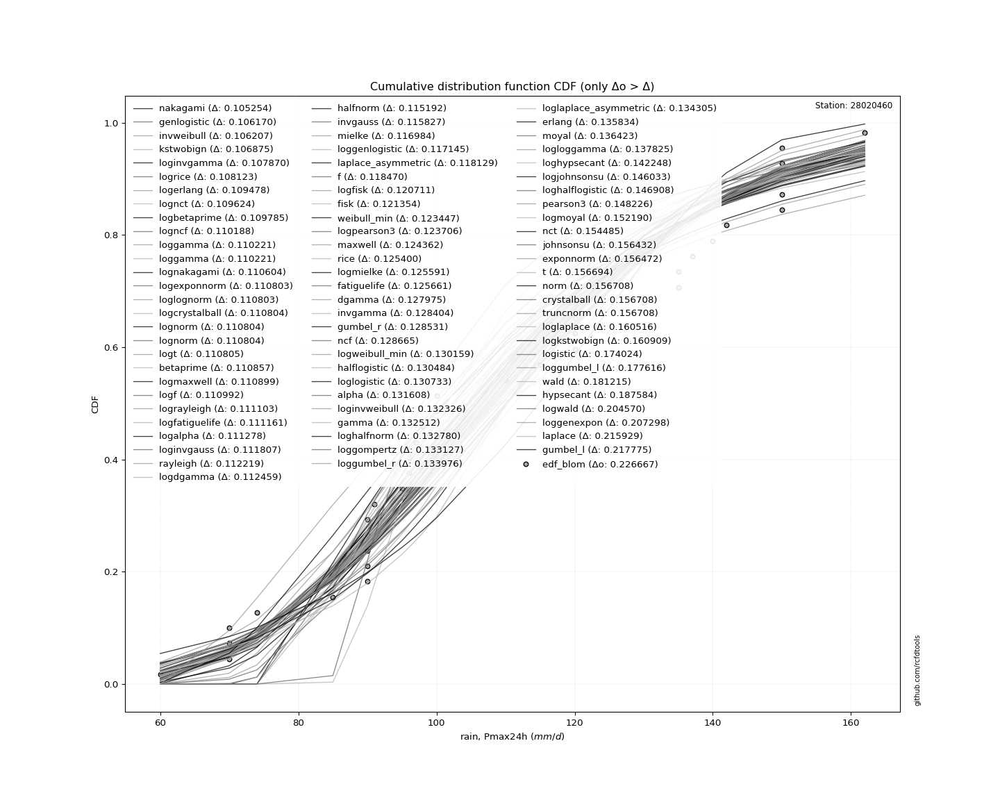</img>

</div>


**6.3. Best fit**

<div align="center">

|   id |   station | empirical_dist   | p_dist      |    delta |   deltao | eval   |   fit |   n |   best_fit |   best_fit_sort |
|-----:|----------:|:-----------------|:------------|---------:|---------:|:-------|------:|----:|-----------:|----------------:|
|    0 |  28020460 | edf_blom         | weibull_min | 0.104664 | 0.212396 | Δo > Δ |     1 |  41 |          1 |               1 |

</div>


<div align="center">

</img>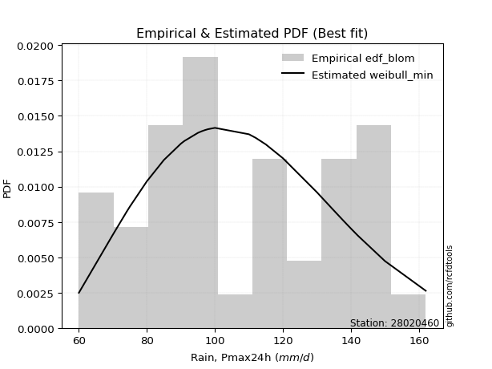</img>

</div>


### 7. Empirical - EDF Tukey (1962)

In hydrology, the Tukey formula is used as a plotting position formula to estimate the empirical probability or frequency of a flood event (or other hydrological data). The formula parameter is given as _c=0.333_ (or 1/3).

<div align="center">


$P=(m-c)/(n+1-2c)$


</div>


**7.1. Empirical values**

<div align="center">

|                | 0                    | 1                   | 2                   | 3                   | 4                   | 5                   | 6                   | 7                   | 8                   | 9                   | 10                  | 11                  | 12                 | 13                  | 14                 | 15                 | 16                 | 17                 | 18                  | 19                  | 20        | 21                 | 22                 | 23                 | 24                 | 25                 | 26                 | 27                 | 28                 | 29                | 30                 | 31                 | 32                 | 33                 | 34                 | 35                 | 36                 | 37                 | 38                 | 39                 | 40                 |
|:---------------|:---------------------|:--------------------|:--------------------|:--------------------|:--------------------|:--------------------|:--------------------|:--------------------|:--------------------|:--------------------|:--------------------|:--------------------|:-------------------|:--------------------|:-------------------|:-------------------|:-------------------|:-------------------|:--------------------|:--------------------|:----------|:-------------------|:-------------------|:-------------------|:-------------------|:-------------------|:-------------------|:-------------------|:-------------------|:------------------|:-------------------|:-------------------|:-------------------|:-------------------|:-------------------|:-------------------|:-------------------|:-------------------|:-------------------|:-------------------|:-------------------|
| date           | 1989                 | 1991                | 1999                | 1997                | 2006                | 2018                | 2016                | 1992                | 2005                | 2004                | 2000                | 1980                | 2013               | 1985                | 1998               | 1993               | 1990               | 2003               | 2011                | 1983                | 2001      | 1981               | 2017               | 1995               | 1982               | 1987               | 2009               | 2020               | 1984               | 1986              | 1988               | 2014               | 2019               | 1994               | 2015               | 2010               | 1996               | 2008               | 2007               | 2002               | 2012               |
| x              | 60.0                 | 70.0                | 70.0                | 70.0                | 74.0                | 75.0                | 80.0                | 85.0                | 90.0                | 90.0                | 90.0                | 90.0                | 90.0               | 91.0                | 95.0               | 96.0               | 96.0               | 97.0               | 98.0                | 100.0               | 100.0     | 110.0              | 112.0              | 115.0              | 120.0              | 120.0              | 120.0              | 130.0              | 130.0              | 135.0             | 135.0              | 137.0              | 138.0              | 140.0              | 142.0              | 150.0              | 150.0              | 150.0              | 150.0              | 150.0              | 162.0              |
| m              | 1                    | 2                   | 3                   | 4                   | 5                   | 6                   | 7                   | 8                   | 9                   | 10                  | 11                  | 12                  | 13                 | 14                  | 15                 | 16                 | 17                 | 18                 | 19                  | 20                  | 21        | 22                 | 23                 | 24                 | 25                 | 26                 | 27                 | 28                 | 29                 | 30                | 31                 | 32                 | 33                 | 34                 | 35                 | 36                 | 37                 | 38                 | 39                 | 40                 | 41                 |
| empirical_dist | edf_tukey            | edf_tukey           | edf_tukey           | edf_tukey           | edf_tukey           | edf_tukey           | edf_tukey           | edf_tukey           | edf_tukey           | edf_tukey           | edf_tukey           | edf_tukey           | edf_tukey          | edf_tukey           | edf_tukey          | edf_tukey          | edf_tukey          | edf_tukey          | edf_tukey           | edf_tukey           | edf_tukey | edf_tukey          | edf_tukey          | edf_tukey          | edf_tukey          | edf_tukey          | edf_tukey          | edf_tukey          | edf_tukey          | edf_tukey         | edf_tukey          | edf_tukey          | edf_tukey          | edf_tukey          | edf_tukey          | edf_tukey          | edf_tukey          | edf_tukey          | edf_tukey          | edf_tukey          | edf_tukey          |
| empirical      | 0.016129032258064516 | 0.04032258064516129 | 0.06451612903225806 | 0.08870967741935484 | 0.11290322580645161 | 0.13709677419354838 | 0.16129032258064516 | 0.18548387096774194 | 0.20967741935483872 | 0.23387096774193547 | 0.25806451612903225 | 0.28225806451612906 | 0.3064516129032258 | 0.33064516129032256 | 0.3548387096774194 | 0.3790322580645161 | 0.4032258064516129 | 0.4274193548387097 | 0.45161290322580644 | 0.47580645161290325 | 0.5       | 0.5241935483870968 | 0.5483870967741935 | 0.5725806451612904 | 0.5967741935483871 | 0.6209677419354839 | 0.6451612903225806 | 0.6693548387096774 | 0.6935483870967742 | 0.717741935483871 | 0.7419354838709677 | 0.7661290322580645 | 0.7903225806451613 | 0.8145161290322581 | 0.8387096774193549 | 0.8629032258064516 | 0.8870967741935484 | 0.9112903225806451 | 0.9354838709677419 | 0.9596774193548387 | 0.9838709677419355 |
| empirical_tr   | 1.0163934426229508   | 1.042016806722689   | 1.0689655172413792  | 1.0973451327433628  | 1.1272727272727272  | 1.158878504672897   | 1.1923076923076923  | 1.2277227722772277  | 1.2653061224489797  | 1.305263157894737   | 1.3478260869565217  | 1.393258426966292   | 1.441860465116279  | 1.4939759036144578  | 1.55               | 1.6103896103896105 | 1.6756756756756757 | 1.7464788732394367 | 1.823529411764706   | 1.9076923076923078  | 2.0       | 2.101694915254237  | 2.214285714285714  | 2.3396226415094343 | 2.48               | 2.6382978723404253 | 2.818181818181818  | 3.0243902439024386 | 3.2631578947368425 | 3.542857142857143 | 3.875              | 4.275862068965517  | 4.769230769230768  | 5.391304347826089  | 6.200000000000001  | 7.294117647058824  | 8.857142857142856  | 11.272727272727268 | 15.499999999999988 | 24.800000000000022 | 62.00000000000006  |

</div>


**7.2. Kolmogorov-Smirnov fit test (sorted by Δ)**


<div align="center">

|                | 0                   | 1                   | 2                   | 3                   | 4                   | 5                   | 6                   | 7                   | 8                   | 9                   | 10                  | 11                  | 12                  | 13                  | 14                  | 15                  | 16                  | 17                  | 18                  | 19                  | 20                  | 21                  | 22                  | 23                  | 24                  | 25                  | 26                  | 27                  | 28                  | 29                  | 30                  | 31                  | 32                  | 33                  | 34                  | 35                  | 36                  | 37                  | 38                  | 39                  | 40                  | 41                  | 42                  | 43                  | 44                  | 45                  | 46                  | 47                  | 48                  | 49                  | 50                  | 51                  | 52                  | 53                    | 54                  | 55                  | 56                  | 57                  | 58                  | 59                  | 60                  | 61                  | 62                  | 63                  | 64                  | 65                  | 66                  | 67                  | 68                  | 69                  | 70                  | 71                  | 72                  | 73                  | 74                  | 75                  | 76                  | 77                  | 78                  | 79                  | 80                  | 81                  | 82                  | 83                  | 84                  | 85                  | 86                  | 87                  |
|:---------------|:--------------------|:--------------------|:--------------------|:--------------------|:--------------------|:--------------------|:--------------------|:--------------------|:--------------------|:--------------------|:--------------------|:--------------------|:--------------------|:--------------------|:--------------------|:--------------------|:--------------------|:--------------------|:--------------------|:--------------------|:--------------------|:--------------------|:--------------------|:--------------------|:--------------------|:--------------------|:--------------------|:--------------------|:--------------------|:--------------------|:--------------------|:--------------------|:--------------------|:--------------------|:--------------------|:--------------------|:--------------------|:--------------------|:--------------------|:--------------------|:--------------------|:--------------------|:--------------------|:--------------------|:--------------------|:--------------------|:--------------------|:--------------------|:--------------------|:--------------------|:--------------------|:--------------------|:--------------------|:----------------------|:--------------------|:--------------------|:--------------------|:--------------------|:--------------------|:--------------------|:--------------------|:--------------------|:--------------------|:--------------------|:--------------------|:--------------------|:--------------------|:--------------------|:--------------------|:--------------------|:--------------------|:--------------------|:--------------------|:--------------------|:--------------------|:--------------------|:--------------------|:--------------------|:--------------------|:--------------------|:--------------------|:--------------------|:--------------------|:--------------------|:--------------------|:--------------------|:--------------------|:--------------------|
| station        | 28020460            | 28020460            | 28020460            | 28020460            | 28020460            | 28020460            | 28020460            | 28020460            | 28020460            | 28020460            | 28020460            | 28020460            | 28020460            | 28020460            | 28020460            | 28020460            | 28020460            | 28020460            | 28020460            | 28020460            | 28020460            | 28020460            | 28020460            | 28020460            | 28020460            | 28020460            | 28020460            | 28020460            | 28020460            | 28020460            | 28020460            | 28020460            | 28020460            | 28020460            | 28020460            | 28020460            | 28020460            | 28020460            | 28020460            | 28020460            | 28020460            | 28020460            | 28020460            | 28020460            | 28020460            | 28020460            | 28020460            | 28020460            | 28020460            | 28020460            | 28020460            | 28020460            | 28020460            | 28020460              | 28020460            | 28020460            | 28020460            | 28020460            | 28020460            | 28020460            | 28020460            | 28020460            | 28020460            | 28020460            | 28020460            | 28020460            | 28020460            | 28020460            | 28020460            | 28020460            | 28020460            | 28020460            | 28020460            | 28020460            | 28020460            | 28020460            | 28020460            | 28020460            | 28020460            | 28020460            | 28020460            | 28020460            | 28020460            | 28020460            | 28020460            | 28020460            | 28020460            | 28020460            |
| empirical_dist | edf_tukey           | edf_tukey           | edf_tukey           | edf_tukey           | edf_tukey           | edf_tukey           | edf_tukey           | edf_tukey           | edf_tukey           | edf_tukey           | edf_tukey           | edf_tukey           | edf_tukey           | edf_tukey           | edf_tukey           | edf_tukey           | edf_tukey           | edf_tukey           | edf_tukey           | edf_tukey           | edf_tukey           | edf_tukey           | edf_tukey           | edf_tukey           | edf_tukey           | edf_tukey           | edf_tukey           | edf_tukey           | edf_tukey           | edf_tukey           | edf_tukey           | edf_tukey           | edf_tukey           | edf_tukey           | edf_tukey           | edf_tukey           | edf_tukey           | edf_tukey           | edf_tukey           | edf_tukey           | edf_tukey           | edf_tukey           | edf_tukey           | edf_tukey           | edf_tukey           | edf_tukey           | edf_tukey           | edf_tukey           | edf_tukey           | edf_tukey           | edf_tukey           | edf_tukey           | edf_tukey           | edf_tukey             | edf_tukey           | edf_tukey           | edf_tukey           | edf_tukey           | edf_tukey           | edf_tukey           | edf_tukey           | edf_tukey           | edf_tukey           | edf_tukey           | edf_tukey           | edf_tukey           | edf_tukey           | edf_tukey           | edf_tukey           | edf_tukey           | edf_tukey           | edf_tukey           | edf_tukey           | edf_tukey           | edf_tukey           | edf_tukey           | edf_tukey           | edf_tukey           | edf_tukey           | edf_tukey           | edf_tukey           | edf_tukey           | edf_tukey           | edf_tukey           | edf_tukey           | edf_tukey           | edf_tukey           | edf_tukey           |
| p_dist         | weibull_min         | nakagami            | maxwell             | rayleigh            | rice                | logpearson3         | loginvweibull       | fatiguelife         | fisk                | logfisk             | loggenlogistic      | invweibull          | genlogistic         | f                   | loginvgamma         | logncf              | logrice             | logbetaprime        | lognakagami         | logfatiguelife      | logt                | logexponnorm        | lognorm             | lognorm             | logcrystalball      | loglognorm          | alpha               | kstwobign           | logweibull_min      | loggamma            | loggamma            | logf                | invgamma            | logerlang           | loginvgauss         | halfnorm            | logalpha            | johnsonsu           | loggompertz         | logmaxwell          | lognct              | betaprime           | invgauss            | lograyleigh         | gamma               | logloggamma         | erlang              | laplace_asymmetric  | logmielke           | logjohnsonsu        | pearson3            | gumbel_r            | loglogistic         | loglaplace_asymmetric | logkstwobign        | loghalfnorm         | halflogistic        | exponnorm           | nct                 | t                   | norm                | crystalball         | truncnorm           | loggumbel_r         | moyal               | loghypsecant        | loghalflogistic     | logistic            | logmoyal            | loggumbel_l         | loglaplace          | hypsecant           | wald                | laplace             | loggenexpon         | gumbel_l            | logwald             | loggibrat           | expon               | genexpon            | ncf                 | gibrat              | logexpon            | logchi2             | logtruncnorm        | gompertz            | chi2                | mielke              |
| delta          | 0.10466444883097936 | 0.1058965259706498  | 0.10630308097943492 | 0.10716990823460348 | 0.10786381946537105 | 0.10787002916113508 | 0.10841683530953952 | 0.10893162512393972 | 0.10914146657445756 | 0.1091742496752347  | 0.10930658056981324 | 0.10936761650906823 | 0.10967579301658659 | 0.10973180458155685 | 0.11072923317336258 | 0.11074775741655485 | 0.11091147376218435 | 0.1112528710314803  | 0.11160137948574866 | 0.11175495799616575 | 0.11178008625854707 | 0.11178640855900257 | 0.11178843388739346 | 0.11178843388739346 | 0.11178846004682452 | 0.11178870703394628 | 0.11216077411757064 | 0.11220037573764308 | 0.1122259111131032  | 0.11242299314460635 | 0.11242299314460635 | 0.11384609859965944 | 0.11424257086889811 | 0.11428069571783395 | 0.1146758270774384  | 0.11476715478479271 | 0.1147998258098567  | 0.11483397819487717 | 0.1163276672429091  | 0.11724735457519453 | 0.11730282037672024 | 0.11756090930754504 | 0.11811538321880333 | 0.11880750222747627 | 0.12184396306532203 | 0.12185774798898125 | 0.12225487869323065 | 0.12355783494986106 | 0.12429902910907659 | 0.13108561791102624 | 0.13143807656229073 | 0.1329088275593372  | 0.1340350434839831  | 0.13433979840627608   | 0.135669357977912   | 0.13709677419354838 | 0.13811087812712441 | 0.13871598166375476 | 0.13880067180416705 | 0.1388440744033454  | 0.1388662795691612  | 0.13886628471739537 | 0.13886628580181337 | 0.14324619066275435 | 0.14433346601139296 | 0.1477201572536989  | 0.15050274443257528 | 0.15581034177644043 | 0.15589924278976075 | 0.1598388538614423  | 0.16379548430923807 | 0.16914261612004405 | 0.18518046068108684 | 0.19753846784248236 | 0.19945240948754242 | 0.20053442508080654 | 0.20743956216083315 | 0.2392499573776382  | 0.24263803274272502 | 0.24285830737433325 | 0.25150310982084834 | 0.29606033910946866 | 0.29832477984673966 | 0.32699668633921586 | 0.4271429592122594  | 0.7364777361836158  | 0.957659708041129   | nan                 |
| deltao         | 0.21239631616850427 | 0.21239631616850427 | 0.21239631616850427 | 0.21239631616850427 | 0.21239631616850427 | 0.21239631616850427 | 0.21239631616850427 | 0.21239631616850427 | 0.21239631616850427 | 0.21239631616850427 | 0.21239631616850427 | 0.21239631616850427 | 0.21239631616850427 | 0.21239631616850427 | 0.21239631616850427 | 0.21239631616850427 | 0.21239631616850427 | 0.21239631616850427 | 0.21239631616850427 | 0.21239631616850427 | 0.21239631616850427 | 0.21239631616850427 | 0.21239631616850427 | 0.21239631616850427 | 0.21239631616850427 | 0.21239631616850427 | 0.21239631616850427 | 0.21239631616850427 | 0.21239631616850427 | 0.21239631616850427 | 0.21239631616850427 | 0.21239631616850427 | 0.21239631616850427 | 0.21239631616850427 | 0.21239631616850427 | 0.21239631616850427 | 0.21239631616850427 | 0.21239631616850427 | 0.21239631616850427 | 0.21239631616850427 | 0.21239631616850427 | 0.21239631616850427 | 0.21239631616850427 | 0.21239631616850427 | 0.21239631616850427 | 0.21239631616850427 | 0.21239631616850427 | 0.21239631616850427 | 0.21239631616850427 | 0.21239631616850427 | 0.21239631616850427 | 0.21239631616850427 | 0.21239631616850427 | 0.21239631616850427   | 0.21239631616850427 | 0.21239631616850427 | 0.21239631616850427 | 0.21239631616850427 | 0.21239631616850427 | 0.21239631616850427 | 0.21239631616850427 | 0.21239631616850427 | 0.21239631616850427 | 0.21239631616850427 | 0.21239631616850427 | 0.21239631616850427 | 0.21239631616850427 | 0.21239631616850427 | 0.21239631616850427 | 0.21239631616850427 | 0.21239631616850427 | 0.21239631616850427 | 0.21239631616850427 | 0.21239631616850427 | 0.21239631616850427 | 0.21239631616850427 | 0.21239631616850427 | 0.21239631616850427 | 0.21239631616850427 | 0.21239631616850427 | 0.21239631616850427 | 0.21239631616850427 | 0.21239631616850427 | 0.21239631616850427 | 0.21239631616850427 | 0.21239631616850427 | 0.21239631616850427 | 0.21239631616850427 |
| eval           | Δo > Δ              | Δo > Δ              | Δo > Δ              | Δo > Δ              | Δo > Δ              | Δo > Δ              | Δo > Δ              | Δo > Δ              | Δo > Δ              | Δo > Δ              | Δo > Δ              | Δo > Δ              | Δo > Δ              | Δo > Δ              | Δo > Δ              | Δo > Δ              | Δo > Δ              | Δo > Δ              | Δo > Δ              | Δo > Δ              | Δo > Δ              | Δo > Δ              | Δo > Δ              | Δo > Δ              | Δo > Δ              | Δo > Δ              | Δo > Δ              | Δo > Δ              | Δo > Δ              | Δo > Δ              | Δo > Δ              | Δo > Δ              | Δo > Δ              | Δo > Δ              | Δo > Δ              | Δo > Δ              | Δo > Δ              | Δo > Δ              | Δo > Δ              | Δo > Δ              | Δo > Δ              | Δo > Δ              | Δo > Δ              | Δo > Δ              | Δo > Δ              | Δo > Δ              | Δo > Δ              | Δo > Δ              | Δo > Δ              | Δo > Δ              | Δo > Δ              | Δo > Δ              | Δo > Δ              | Δo > Δ                | Δo > Δ              | Δo > Δ              | Δo > Δ              | Δo > Δ              | Δo > Δ              | Δo > Δ              | Δo > Δ              | Δo > Δ              | Δo > Δ              | Δo > Δ              | Δo > Δ              | Δo > Δ              | Δo > Δ              | Δo > Δ              | Δo > Δ              | Δo > Δ              | Δo > Δ              | Δo > Δ              | Δo > Δ              | Δo > Δ              | Δo > Δ              | Δo > Δ              | Δo > Δ              | Δo <= Δ             | Δo <= Δ             | Δo <= Δ             | Δo <= Δ             | Δo <= Δ             | Δo <= Δ             | Δo <= Δ             | Δo <= Δ             | Δo <= Δ             | Δo <= Δ             | Δo <= Δ             |
| fit            | 1                   | 1                   | 1                   | 1                   | 1                   | 1                   | 1                   | 1                   | 1                   | 1                   | 1                   | 1                   | 1                   | 1                   | 1                   | 1                   | 1                   | 1                   | 1                   | 1                   | 1                   | 1                   | 1                   | 1                   | 1                   | 1                   | 1                   | 1                   | 1                   | 1                   | 1                   | 1                   | 1                   | 1                   | 1                   | 1                   | 1                   | 1                   | 1                   | 1                   | 1                   | 1                   | 1                   | 1                   | 1                   | 1                   | 1                   | 1                   | 1                   | 1                   | 1                   | 1                   | 1                   | 1                     | 1                   | 1                   | 1                   | 1                   | 1                   | 1                   | 1                   | 1                   | 1                   | 1                   | 1                   | 1                   | 1                   | 1                   | 1                   | 1                   | 1                   | 1                   | 1                   | 1                   | 1                   | 1                   | 1                   | 0                   | 0                   | 0                   | 0                   | 0                   | 0                   | 0                   | 0                   | 0                   | 0                   | 0                   |
| n              | 41                  | 41                  | 41                  | 41                  | 41                  | 41                  | 41                  | 41                  | 41                  | 41                  | 41                  | 41                  | 41                  | 41                  | 41                  | 41                  | 41                  | 41                  | 41                  | 41                  | 41                  | 41                  | 41                  | 41                  | 41                  | 41                  | 41                  | 41                  | 41                  | 41                  | 41                  | 41                  | 41                  | 41                  | 41                  | 41                  | 41                  | 41                  | 41                  | 41                  | 41                  | 41                  | 41                  | 41                  | 41                  | 41                  | 41                  | 41                  | 41                  | 41                  | 41                  | 41                  | 41                  | 41                    | 41                  | 41                  | 41                  | 41                  | 41                  | 41                  | 41                  | 41                  | 41                  | 41                  | 41                  | 41                  | 41                  | 41                  | 41                  | 41                  | 41                  | 41                  | 41                  | 41                  | 41                  | 41                  | 41                  | 41                  | 41                  | 41                  | 41                  | 41                  | 41                  | 41                  | 41                  | 41                  | 41                  | 41                  |
| best_fit       | 1                   | 0                   | 0                   | 0                   | 0                   | 0                   | 0                   | 0                   | 0                   | 0                   | 0                   | 0                   | 0                   | 0                   | 0                   | 0                   | 0                   | 0                   | 0                   | 0                   | 0                   | 0                   | 0                   | 0                   | 0                   | 0                   | 0                   | 0                   | 0                   | 0                   | 0                   | 0                   | 0                   | 0                   | 0                   | 0                   | 0                   | 0                   | 0                   | 0                   | 0                   | 0                   | 0                   | 0                   | 0                   | 0                   | 0                   | 0                   | 0                   | 0                   | 0                   | 0                   | 0                   | 0                     | 0                   | 0                   | 0                   | 0                   | 0                   | 0                   | 0                   | 0                   | 0                   | 0                   | 0                   | 0                   | 0                   | 0                   | 0                   | 0                   | 0                   | 0                   | 0                   | 0                   | 0                   | 0                   | 0                   | 0                   | 0                   | 0                   | 0                   | 0                   | 0                   | 0                   | 0                   | 0                   | 0                   | 0                   |
| best_fit_sort  | 1                   | 2                   | 3                   | 4                   | 5                   | 6                   | 7                   | 8                   | 9                   | 10                  | 11                  | 12                  | 13                  | 14                  | 15                  | 16                  | 17                  | 18                  | 19                  | 20                  | 21                  | 22                  | 23                  | 24                  | 25                  | 26                  | 27                  | 28                  | 29                  | 30                  | 31                  | 32                  | 33                  | 34                  | 35                  | 36                  | 37                  | 38                  | 39                  | 40                  | 41                  | 42                  | 43                  | 44                  | 45                  | 46                  | 47                  | 48                  | 49                  | 50                  | 51                  | 52                  | 53                  | 54                    | 55                  | 56                  | 57                  | 58                  | 59                  | 60                  | 61                  | 62                  | 63                  | 64                  | 65                  | 66                  | 67                  | 68                  | 69                  | 70                  | 71                  | 72                  | 73                  | 74                  | 75                  | 76                  | 77                  | 78                  | 79                  | 80                  | 81                  | 82                  | 83                  | 84                  | 85                  | 86                  | 87                  | 88                  |

</div>


<div align="center">

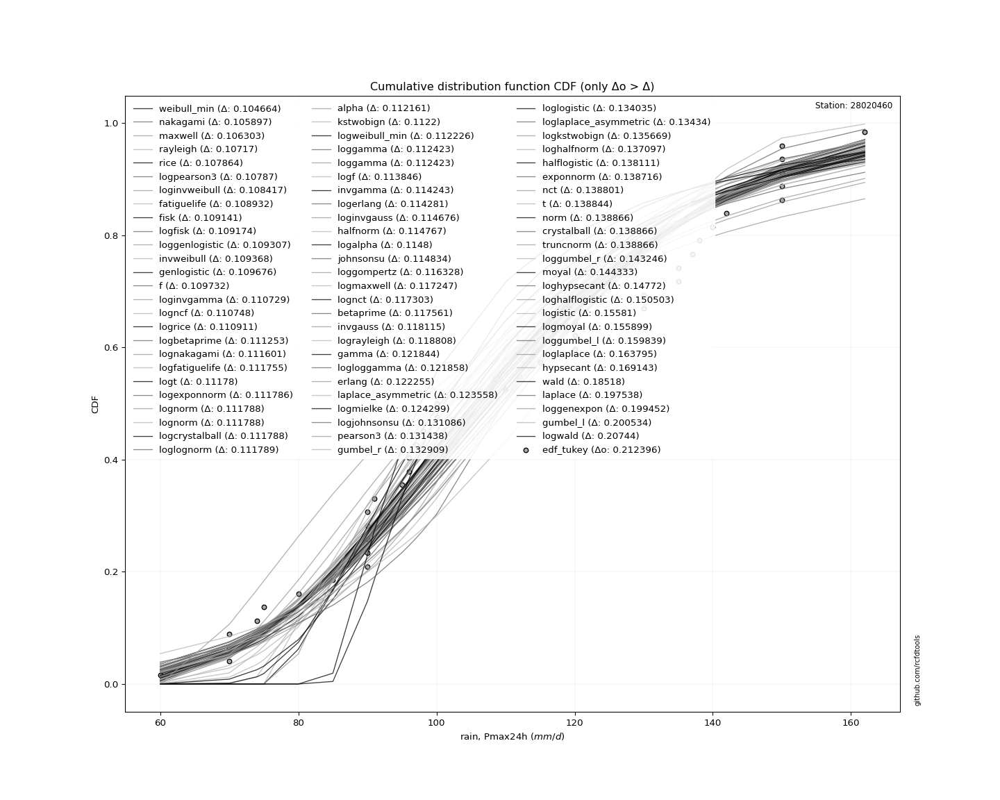</img>

</div>


**7.3. Best fit**

<div align="center">

|   id |   station | empirical_dist   | p_dist      |    delta |   deltao | eval   |   fit |   n |   best_fit |   best_fit_sort |
|-----:|----------:|:-----------------|:------------|---------:|---------:|:-------|------:|----:|-----------:|----------------:|
|    0 |  28020460 | edf_tukey        | weibull_min | 0.104664 | 0.212396 | Δo > Δ |     1 |  41 |          1 |               1 |

</div>


<div align="center">

</img>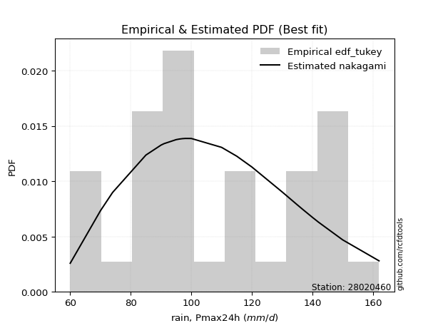</img>

</div>


### 8. Empirical - EDF Gringorten (1963)

Gringorten plotting position formula is essential for estimating the probability and return periods of extreme events like floods and heavy rainfall. The constant _a=0.44_.

<div align="center">


$P=(m-a)/(n+1-2a)$


</div>


**8.1. Empirical values**

<div align="center">

|                | 0                    | 1                   | 2                   | 3                   | 4                   | 5                   | 6                   | 7                   | 8                   | 9                  | 10                 | 11                  | 12                  | 13                 | 14                 | 15                  | 16                 | 17                 | 18                  | 19                  | 20             | 21                 | 22                 | 23                 | 24                 | 25                 | 26                 | 27                 | 28                 | 29                 | 30                 | 31                 | 32                 | 33                 | 34                | 35                | 36                 | 37                 | 38                 | 39                 | 40                 |
|:---------------|:---------------------|:--------------------|:--------------------|:--------------------|:--------------------|:--------------------|:--------------------|:--------------------|:--------------------|:-------------------|:-------------------|:--------------------|:--------------------|:-------------------|:-------------------|:--------------------|:-------------------|:-------------------|:--------------------|:--------------------|:---------------|:-------------------|:-------------------|:-------------------|:-------------------|:-------------------|:-------------------|:-------------------|:-------------------|:-------------------|:-------------------|:-------------------|:-------------------|:-------------------|:------------------|:------------------|:-------------------|:-------------------|:-------------------|:-------------------|:-------------------|
| date           | 1989                 | 1991                | 1999                | 1997                | 2006                | 2018                | 2016                | 1992                | 2005                | 2004               | 2000               | 1980                | 2013                | 1985               | 1998               | 1993                | 1990               | 2003               | 2011                | 1983                | 2001           | 1981               | 2017               | 1995               | 1982               | 1987               | 2009               | 2020               | 1984               | 1986               | 1988               | 2014               | 2019               | 1994               | 2015              | 2010              | 1996               | 2008               | 2007               | 2002               | 2012               |
| x              | 60.0                 | 70.0                | 70.0                | 70.0                | 74.0                | 75.0                | 80.0                | 85.0                | 90.0                | 90.0               | 90.0               | 90.0                | 90.0                | 91.0               | 95.0               | 96.0                | 96.0               | 97.0               | 98.0                | 100.0               | 100.0          | 110.0              | 112.0              | 115.0              | 120.0              | 120.0              | 120.0              | 130.0              | 130.0              | 135.0              | 135.0              | 137.0              | 138.0              | 140.0              | 142.0             | 150.0             | 150.0              | 150.0              | 150.0              | 150.0              | 162.0              |
| m              | 1                    | 2                   | 3                   | 4                   | 5                   | 6                   | 7                   | 8                   | 9                   | 10                 | 11                 | 12                  | 13                  | 14                 | 15                 | 16                  | 17                 | 18                 | 19                  | 20                  | 21             | 22                 | 23                 | 24                 | 25                 | 26                 | 27                 | 28                 | 29                 | 30                 | 31                 | 32                 | 33                 | 34                 | 35                | 36                | 37                 | 38                 | 39                 | 40                 | 41                 |
| empirical_dist | edf_gringorten       | edf_gringorten      | edf_gringorten      | edf_gringorten      | edf_gringorten      | edf_gringorten      | edf_gringorten      | edf_gringorten      | edf_gringorten      | edf_gringorten     | edf_gringorten     | edf_gringorten      | edf_gringorten      | edf_gringorten     | edf_gringorten     | edf_gringorten      | edf_gringorten     | edf_gringorten     | edf_gringorten      | edf_gringorten      | edf_gringorten | edf_gringorten     | edf_gringorten     | edf_gringorten     | edf_gringorten     | edf_gringorten     | edf_gringorten     | edf_gringorten     | edf_gringorten     | edf_gringorten     | edf_gringorten     | edf_gringorten     | edf_gringorten     | edf_gringorten     | edf_gringorten    | edf_gringorten    | edf_gringorten     | edf_gringorten     | edf_gringorten     | edf_gringorten     | edf_gringorten     |
| empirical      | 0.013618677042801558 | 0.03793774319066148 | 0.06225680933852141 | 0.08657587548638133 | 0.11089494163424124 | 0.13521400778210116 | 0.15953307392996108 | 0.18385214007782102 | 0.20817120622568097 | 0.2324902723735409 | 0.2568093385214008 | 0.28112840466926076 | 0.30544747081712065 | 0.3297665369649806 | 0.3540856031128405 | 0.37840466926070043 | 0.4027237354085603 | 0.4270428015564202 | 0.45136186770428016 | 0.47568093385214005 | 0.5            | 0.52431906614786   | 0.5486381322957199 | 0.5729571984435797 | 0.5972762645914397 | 0.6215953307392996 | 0.6459143968871596 | 0.6702334630350195 | 0.6945525291828794 | 0.7188715953307393 | 0.7431906614785992 | 0.7675097276264592 | 0.7918287937743191 | 0.8161478599221791 | 0.840466926070039 | 0.864785992217899 | 0.8891050583657588 | 0.9134241245136188 | 0.9377431906614787 | 0.9620622568093387 | 0.9863813229571986 |
| empirical_tr   | 1.0138067061143983   | 1.0394337714863497  | 1.066390041493776   | 1.0947816826411076  | 1.1247264770240701  | 1.156355455568054   | 1.1898148148148149  | 1.2252681764004767  | 1.262899262899263   | 1.302915082382763  | 1.3455497382198953 | 1.39106901217862    | 1.4397759103641457  | 1.4920174165457185 | 1.5481927710843375 | 1.6087636932707354  | 1.6742671009771988 | 1.7453310696095077 | 1.8226950354609928  | 1.9072356215213357  | 2.0            | 2.1022494887525562 | 2.2155172413793105 | 2.3416856492027334 | 2.4830917874396135 | 2.6426735218508997 | 2.8241758241758244 | 3.0324483775811215 | 3.273885350318471  | 3.557093425605536  | 3.8939393939393945 | 4.301255230125524  | 4.803738317757011  | 5.439153439153442  | 6.268292682926834 | 7.395683453237418 | 9.017543859649129  | 11.55056179775282  | 16.06250000000003  | 26.358974358974454 | 73.42857142857228  |

</div>


**8.2. Kolmogorov-Smirnov fit test (sorted by Δ)**


<div align="center">

|                | 0                   | 1                   | 2                   | 3                   | 4                   | 5                   | 6                   | 7                   | 8                   | 9                   | 10                  | 11                  | 12                  | 13                  | 14                  | 15                  | 16                  | 17                  | 18                  | 19                  | 20                  | 21                  | 22                  | 23                  | 24                  | 25                  | 26                  | 27                  | 28                  | 29                  | 30                  | 31                  | 32                  | 33                  | 34                  | 35                  | 36                  | 37                  | 38                  | 39                  | 40                  | 41                  | 42                  | 43                  | 44                  | 45                  | 46                  | 47                  | 48                  | 49                  | 50                  | 51                  | 52                  | 53                    | 54                  | 55                  | 56                  | 57                  | 58                  | 59                  | 60                  | 61                  | 62                  | 63                  | 64                  | 65                  | 66                  | 67                  | 68                  | 69                  | 70                  | 71                  | 72                  | 73                  | 74                  | 75                  | 76                  | 77                  | 78                  | 79                  | 80                  | 81                  | 82                  | 83                  | 84                  | 85                  | 86                  | 87                  |
|:---------------|:--------------------|:--------------------|:--------------------|:--------------------|:--------------------|:--------------------|:--------------------|:--------------------|:--------------------|:--------------------|:--------------------|:--------------------|:--------------------|:--------------------|:--------------------|:--------------------|:--------------------|:--------------------|:--------------------|:--------------------|:--------------------|:--------------------|:--------------------|:--------------------|:--------------------|:--------------------|:--------------------|:--------------------|:--------------------|:--------------------|:--------------------|:--------------------|:--------------------|:--------------------|:--------------------|:--------------------|:--------------------|:--------------------|:--------------------|:--------------------|:--------------------|:--------------------|:--------------------|:--------------------|:--------------------|:--------------------|:--------------------|:--------------------|:--------------------|:--------------------|:--------------------|:--------------------|:--------------------|:----------------------|:--------------------|:--------------------|:--------------------|:--------------------|:--------------------|:--------------------|:--------------------|:--------------------|:--------------------|:--------------------|:--------------------|:--------------------|:--------------------|:--------------------|:--------------------|:--------------------|:--------------------|:--------------------|:--------------------|:--------------------|:--------------------|:--------------------|:--------------------|:--------------------|:--------------------|:--------------------|:--------------------|:--------------------|:--------------------|:--------------------|:--------------------|:--------------------|:--------------------|:--------------------|
| station        | 28020460            | 28020460            | 28020460            | 28020460            | 28020460            | 28020460            | 28020460            | 28020460            | 28020460            | 28020460            | 28020460            | 28020460            | 28020460            | 28020460            | 28020460            | 28020460            | 28020460            | 28020460            | 28020460            | 28020460            | 28020460            | 28020460            | 28020460            | 28020460            | 28020460            | 28020460            | 28020460            | 28020460            | 28020460            | 28020460            | 28020460            | 28020460            | 28020460            | 28020460            | 28020460            | 28020460            | 28020460            | 28020460            | 28020460            | 28020460            | 28020460            | 28020460            | 28020460            | 28020460            | 28020460            | 28020460            | 28020460            | 28020460            | 28020460            | 28020460            | 28020460            | 28020460            | 28020460            | 28020460              | 28020460            | 28020460            | 28020460            | 28020460            | 28020460            | 28020460            | 28020460            | 28020460            | 28020460            | 28020460            | 28020460            | 28020460            | 28020460            | 28020460            | 28020460            | 28020460            | 28020460            | 28020460            | 28020460            | 28020460            | 28020460            | 28020460            | 28020460            | 28020460            | 28020460            | 28020460            | 28020460            | 28020460            | 28020460            | 28020460            | 28020460            | 28020460            | 28020460            | 28020460            |
| empirical_dist | edf_gringorten      | edf_gringorten      | edf_gringorten      | edf_gringorten      | edf_gringorten      | edf_gringorten      | edf_gringorten      | edf_gringorten      | edf_gringorten      | edf_gringorten      | edf_gringorten      | edf_gringorten      | edf_gringorten      | edf_gringorten      | edf_gringorten      | edf_gringorten      | edf_gringorten      | edf_gringorten      | edf_gringorten      | edf_gringorten      | edf_gringorten      | edf_gringorten      | edf_gringorten      | edf_gringorten      | edf_gringorten      | edf_gringorten      | edf_gringorten      | edf_gringorten      | edf_gringorten      | edf_gringorten      | edf_gringorten      | edf_gringorten      | edf_gringorten      | edf_gringorten      | edf_gringorten      | edf_gringorten      | edf_gringorten      | edf_gringorten      | edf_gringorten      | edf_gringorten      | edf_gringorten      | edf_gringorten      | edf_gringorten      | edf_gringorten      | edf_gringorten      | edf_gringorten      | edf_gringorten      | edf_gringorten      | edf_gringorten      | edf_gringorten      | edf_gringorten      | edf_gringorten      | edf_gringorten      | edf_gringorten        | edf_gringorten      | edf_gringorten      | edf_gringorten      | edf_gringorten      | edf_gringorten      | edf_gringorten      | edf_gringorten      | edf_gringorten      | edf_gringorten      | edf_gringorten      | edf_gringorten      | edf_gringorten      | edf_gringorten      | edf_gringorten      | edf_gringorten      | edf_gringorten      | edf_gringorten      | edf_gringorten      | edf_gringorten      | edf_gringorten      | edf_gringorten      | edf_gringorten      | edf_gringorten      | edf_gringorten      | edf_gringorten      | edf_gringorten      | edf_gringorten      | edf_gringorten      | edf_gringorten      | edf_gringorten      | edf_gringorten      | edf_gringorten      | edf_gringorten      | edf_gringorten      |
| p_dist         | weibull_min         | nakagami            | rayleigh            | maxwell             | logpearson3         | rice                | fatiguelife         | fisk                | logfisk             | loggenlogistic      | invweibull          | genlogistic         | f                   | loginvgamma         | logncf              | loginvweibull       | logrice             | logbetaprime        | lognakagami         | logfatiguelife      | logt                | logexponnorm        | lognorm             | lognorm             | logcrystalball      | loglognorm          | alpha               | kstwobign           | loggamma            | loggamma            | logweibull_min      | logf                | logerlang           | loginvgauss         | halfnorm            | logalpha            | invgamma            | johnsonsu           | loggompertz         | logmaxwell          | lognct              | betaprime           | invgauss            | lograyleigh         | gamma               | logloggamma         | erlang              | laplace_asymmetric  | logmielke           | logjohnsonsu        | pearson3            | gumbel_r            | loglogistic         | loglaplace_asymmetric | loghalfnorm         | logkstwobign        | halflogistic        | exponnorm           | nct                 | t                   | norm                | crystalball         | truncnorm           | loggumbel_r         | moyal               | loghypsecant        | loghalflogistic     | logmoyal            | logistic            | loggumbel_l         | loglaplace          | hypsecant           | wald                | laplace             | gumbel_l            | loggenexpon         | logwald             | loggibrat           | expon               | genexpon            | ncf                 | gibrat              | logexpon            | logchi2             | logtruncnorm        | gompertz            | chi2                | mielke              |
| delta          | 0.10466444883097936 | 0.10501790164530767 | 0.10629128390926135 | 0.10630308097943492 | 0.10699140483579295 | 0.10786381946537105 | 0.10805300079859759 | 0.10826284224911542 | 0.10829562534989257 | 0.1084279562444711  | 0.1084889921837261  | 0.10879716869124445 | 0.10885318025621471 | 0.10985060884802045 | 0.10986913309121271 | 0.10992304843869727 | 0.11003284943684222 | 0.11037424670613816 | 0.11072275516040653 | 0.11087633367082361 | 0.11090146193320494 | 0.11090778423366043 | 0.11090980956205132 | 0.11090980956205132 | 0.11090983572148239 | 0.11091008270860414 | 0.1112821497922285  | 0.11132175141230094 | 0.11154436881926422 | 0.11154436881926422 | 0.1122259111131032  | 0.1129674742743173  | 0.11340207139249181 | 0.11379720275209626 | 0.11388853045945058 | 0.11392120148451457 | 0.11424257086889811 | 0.11483397819487717 | 0.1163276672429091  | 0.11636873024985239 | 0.1164241960513781  | 0.1166822849822029  | 0.11723675889346119 | 0.11792887790213413 | 0.12184396306532203 | 0.12185774798898125 | 0.12225487869323065 | 0.12267921062451892 | 0.12429902910907659 | 0.13108561791102624 | 0.13143807656229073 | 0.13203020323399506 | 0.13315641915864096 | 0.13383772736322352   | 0.13521400778210116 | 0.13717557110706974 | 0.13723225380178228 | 0.13871598166375476 | 0.13880067180416705 | 0.1388440744033454  | 0.1388662795691612  | 0.13886628471739537 | 0.13886628580181337 | 0.1423675663374122  | 0.14345484168605083 | 0.14684153292835678 | 0.15000067338952272 | 0.1553971717467082  | 0.15581034177644043 | 0.1598388538614423  | 0.16291685998389593 | 0.16914261612004405 | 0.1846783896380343  | 0.19753846784248236 | 0.20053442508080654 | 0.20095862261670017 | 0.2069374911177806  | 0.23874788633458566 | 0.24414424587188277 | 0.244364520503491   | 0.25388794727534825 | 0.2950561970233635  | 0.29983099297589744 | 0.32950704155447896 | 0.4286491723414172  | 0.7379839493127737  | 0.9600445454956288  | nan                 |
| deltao         | 0.21239631616850427 | 0.21239631616850427 | 0.21239631616850427 | 0.21239631616850427 | 0.21239631616850427 | 0.21239631616850427 | 0.21239631616850427 | 0.21239631616850427 | 0.21239631616850427 | 0.21239631616850427 | 0.21239631616850427 | 0.21239631616850427 | 0.21239631616850427 | 0.21239631616850427 | 0.21239631616850427 | 0.21239631616850427 | 0.21239631616850427 | 0.21239631616850427 | 0.21239631616850427 | 0.21239631616850427 | 0.21239631616850427 | 0.21239631616850427 | 0.21239631616850427 | 0.21239631616850427 | 0.21239631616850427 | 0.21239631616850427 | 0.21239631616850427 | 0.21239631616850427 | 0.21239631616850427 | 0.21239631616850427 | 0.21239631616850427 | 0.21239631616850427 | 0.21239631616850427 | 0.21239631616850427 | 0.21239631616850427 | 0.21239631616850427 | 0.21239631616850427 | 0.21239631616850427 | 0.21239631616850427 | 0.21239631616850427 | 0.21239631616850427 | 0.21239631616850427 | 0.21239631616850427 | 0.21239631616850427 | 0.21239631616850427 | 0.21239631616850427 | 0.21239631616850427 | 0.21239631616850427 | 0.21239631616850427 | 0.21239631616850427 | 0.21239631616850427 | 0.21239631616850427 | 0.21239631616850427 | 0.21239631616850427   | 0.21239631616850427 | 0.21239631616850427 | 0.21239631616850427 | 0.21239631616850427 | 0.21239631616850427 | 0.21239631616850427 | 0.21239631616850427 | 0.21239631616850427 | 0.21239631616850427 | 0.21239631616850427 | 0.21239631616850427 | 0.21239631616850427 | 0.21239631616850427 | 0.21239631616850427 | 0.21239631616850427 | 0.21239631616850427 | 0.21239631616850427 | 0.21239631616850427 | 0.21239631616850427 | 0.21239631616850427 | 0.21239631616850427 | 0.21239631616850427 | 0.21239631616850427 | 0.21239631616850427 | 0.21239631616850427 | 0.21239631616850427 | 0.21239631616850427 | 0.21239631616850427 | 0.21239631616850427 | 0.21239631616850427 | 0.21239631616850427 | 0.21239631616850427 | 0.21239631616850427 | 0.21239631616850427 |
| eval           | Δo > Δ              | Δo > Δ              | Δo > Δ              | Δo > Δ              | Δo > Δ              | Δo > Δ              | Δo > Δ              | Δo > Δ              | Δo > Δ              | Δo > Δ              | Δo > Δ              | Δo > Δ              | Δo > Δ              | Δo > Δ              | Δo > Δ              | Δo > Δ              | Δo > Δ              | Δo > Δ              | Δo > Δ              | Δo > Δ              | Δo > Δ              | Δo > Δ              | Δo > Δ              | Δo > Δ              | Δo > Δ              | Δo > Δ              | Δo > Δ              | Δo > Δ              | Δo > Δ              | Δo > Δ              | Δo > Δ              | Δo > Δ              | Δo > Δ              | Δo > Δ              | Δo > Δ              | Δo > Δ              | Δo > Δ              | Δo > Δ              | Δo > Δ              | Δo > Δ              | Δo > Δ              | Δo > Δ              | Δo > Δ              | Δo > Δ              | Δo > Δ              | Δo > Δ              | Δo > Δ              | Δo > Δ              | Δo > Δ              | Δo > Δ              | Δo > Δ              | Δo > Δ              | Δo > Δ              | Δo > Δ                | Δo > Δ              | Δo > Δ              | Δo > Δ              | Δo > Δ              | Δo > Δ              | Δo > Δ              | Δo > Δ              | Δo > Δ              | Δo > Δ              | Δo > Δ              | Δo > Δ              | Δo > Δ              | Δo > Δ              | Δo > Δ              | Δo > Δ              | Δo > Δ              | Δo > Δ              | Δo > Δ              | Δo > Δ              | Δo > Δ              | Δo > Δ              | Δo > Δ              | Δo > Δ              | Δo <= Δ             | Δo <= Δ             | Δo <= Δ             | Δo <= Δ             | Δo <= Δ             | Δo <= Δ             | Δo <= Δ             | Δo <= Δ             | Δo <= Δ             | Δo <= Δ             | Δo <= Δ             |
| fit            | 1                   | 1                   | 1                   | 1                   | 1                   | 1                   | 1                   | 1                   | 1                   | 1                   | 1                   | 1                   | 1                   | 1                   | 1                   | 1                   | 1                   | 1                   | 1                   | 1                   | 1                   | 1                   | 1                   | 1                   | 1                   | 1                   | 1                   | 1                   | 1                   | 1                   | 1                   | 1                   | 1                   | 1                   | 1                   | 1                   | 1                   | 1                   | 1                   | 1                   | 1                   | 1                   | 1                   | 1                   | 1                   | 1                   | 1                   | 1                   | 1                   | 1                   | 1                   | 1                   | 1                   | 1                     | 1                   | 1                   | 1                   | 1                   | 1                   | 1                   | 1                   | 1                   | 1                   | 1                   | 1                   | 1                   | 1                   | 1                   | 1                   | 1                   | 1                   | 1                   | 1                   | 1                   | 1                   | 1                   | 1                   | 0                   | 0                   | 0                   | 0                   | 0                   | 0                   | 0                   | 0                   | 0                   | 0                   | 0                   |
| n              | 41                  | 41                  | 41                  | 41                  | 41                  | 41                  | 41                  | 41                  | 41                  | 41                  | 41                  | 41                  | 41                  | 41                  | 41                  | 41                  | 41                  | 41                  | 41                  | 41                  | 41                  | 41                  | 41                  | 41                  | 41                  | 41                  | 41                  | 41                  | 41                  | 41                  | 41                  | 41                  | 41                  | 41                  | 41                  | 41                  | 41                  | 41                  | 41                  | 41                  | 41                  | 41                  | 41                  | 41                  | 41                  | 41                  | 41                  | 41                  | 41                  | 41                  | 41                  | 41                  | 41                  | 41                    | 41                  | 41                  | 41                  | 41                  | 41                  | 41                  | 41                  | 41                  | 41                  | 41                  | 41                  | 41                  | 41                  | 41                  | 41                  | 41                  | 41                  | 41                  | 41                  | 41                  | 41                  | 41                  | 41                  | 41                  | 41                  | 41                  | 41                  | 41                  | 41                  | 41                  | 41                  | 41                  | 41                  | 41                  |
| best_fit       | 1                   | 0                   | 0                   | 0                   | 0                   | 0                   | 0                   | 0                   | 0                   | 0                   | 0                   | 0                   | 0                   | 0                   | 0                   | 0                   | 0                   | 0                   | 0                   | 0                   | 0                   | 0                   | 0                   | 0                   | 0                   | 0                   | 0                   | 0                   | 0                   | 0                   | 0                   | 0                   | 0                   | 0                   | 0                   | 0                   | 0                   | 0                   | 0                   | 0                   | 0                   | 0                   | 0                   | 0                   | 0                   | 0                   | 0                   | 0                   | 0                   | 0                   | 0                   | 0                   | 0                   | 0                     | 0                   | 0                   | 0                   | 0                   | 0                   | 0                   | 0                   | 0                   | 0                   | 0                   | 0                   | 0                   | 0                   | 0                   | 0                   | 0                   | 0                   | 0                   | 0                   | 0                   | 0                   | 0                   | 0                   | 0                   | 0                   | 0                   | 0                   | 0                   | 0                   | 0                   | 0                   | 0                   | 0                   | 0                   |
| best_fit_sort  | 1                   | 2                   | 3                   | 4                   | 5                   | 6                   | 7                   | 8                   | 9                   | 10                  | 11                  | 12                  | 13                  | 14                  | 15                  | 16                  | 17                  | 18                  | 19                  | 20                  | 21                  | 22                  | 23                  | 24                  | 25                  | 26                  | 27                  | 28                  | 29                  | 30                  | 31                  | 32                  | 33                  | 34                  | 35                  | 36                  | 37                  | 38                  | 39                  | 40                  | 41                  | 42                  | 43                  | 44                  | 45                  | 46                  | 47                  | 48                  | 49                  | 50                  | 51                  | 52                  | 53                  | 54                    | 55                  | 56                  | 57                  | 58                  | 59                  | 60                  | 61                  | 62                  | 63                  | 64                  | 65                  | 66                  | 67                  | 68                  | 69                  | 70                  | 71                  | 72                  | 73                  | 74                  | 75                  | 76                  | 77                  | 78                  | 79                  | 80                  | 81                  | 82                  | 83                  | 84                  | 85                  | 86                  | 87                  | 88                  |

</div>


<div align="center">

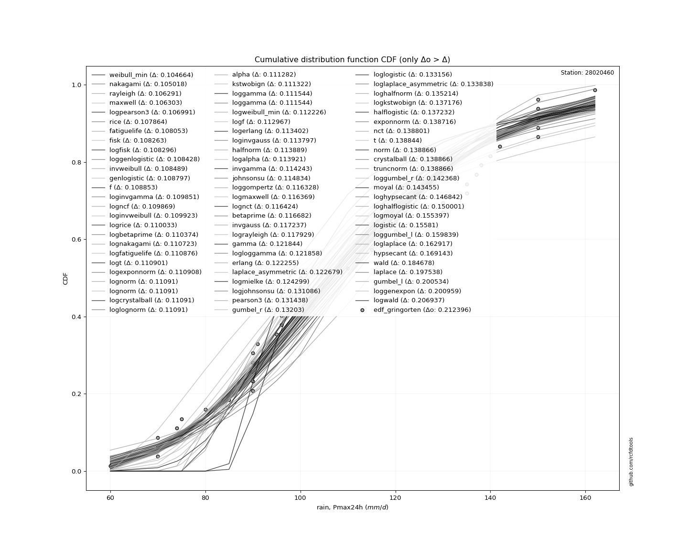</img>

</div>


**8.3. Best fit**

<div align="center">

|   id |   station | empirical_dist   | p_dist      |    delta |   deltao | eval   |   fit |   n |   best_fit |   best_fit_sort |
|-----:|----------:|:-----------------|:------------|---------:|---------:|:-------|------:|----:|-----------:|----------------:|
|    0 |  28020460 | edf_gringorten   | weibull_min | 0.104664 | 0.212396 | Δo > Δ |     1 |  41 |          1 |               1 |

</div>


<div align="center">

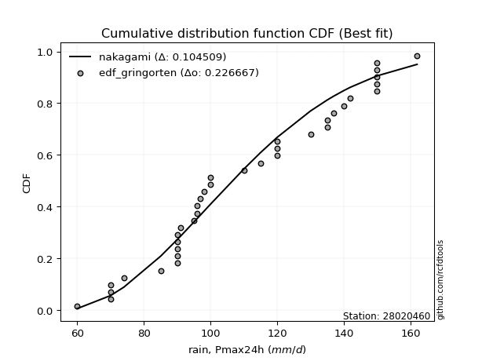</img>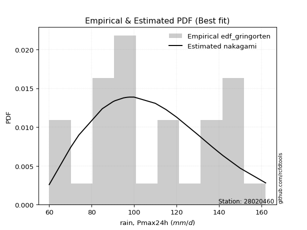</img>

</div>


### 9. Empirical - EDF Filliben (1975)

The specific values of the constants (0.3175) (often denoted as $alpha$) and (0.365) are derived from a method proposed by James J. Filliben in a 1975 paper. This particular formula is the mean value of the $i$-th order statistic of the normal distribution and is considered a robust and effective plotting position formula for the normal probability plot correlation coefficient test for normality.

<div align="center">


$P=(m-0.3175)/(n+0.365)$


</div>


**9.1. Empirical values**

<div align="center">

|                | 0                   | 1                    | 2                   | 3                   | 4                   | 5                   | 6                   | 7                   | 8                  | 9                   | 10                 | 11                 | 12                 | 13                 | 14                 | 15                  | 16                  | 17                 | 18                 | 19                 | 20           | 21                 | 22                 | 23                 | 24                 | 25                 | 26                 | 27                 | 28                 | 29                 | 30                | 31                 | 32                 | 33                 | 34                 | 35                 | 36                 | 37                 | 38                 | 39                 | 40                 |
|:---------------|:--------------------|:---------------------|:--------------------|:--------------------|:--------------------|:--------------------|:--------------------|:--------------------|:-------------------|:--------------------|:-------------------|:-------------------|:-------------------|:-------------------|:-------------------|:--------------------|:--------------------|:-------------------|:-------------------|:-------------------|:-------------|:-------------------|:-------------------|:-------------------|:-------------------|:-------------------|:-------------------|:-------------------|:-------------------|:-------------------|:------------------|:-------------------|:-------------------|:-------------------|:-------------------|:-------------------|:-------------------|:-------------------|:-------------------|:-------------------|:-------------------|
| date           | 1989                | 1991                 | 1999                | 1997                | 2006                | 2018                | 2016                | 1992                | 2005               | 2004                | 2000               | 1980               | 2013               | 1985               | 1998               | 1993                | 1990                | 2003               | 2011               | 1983               | 2001         | 1981               | 2017               | 1995               | 1982               | 1987               | 2009               | 2020               | 1984               | 1986               | 1988              | 2014               | 2019               | 1994               | 2015               | 2010               | 1996               | 2008               | 2007               | 2002               | 2012               |
| x              | 60.0                | 70.0                 | 70.0                | 70.0                | 74.0                | 75.0                | 80.0                | 85.0                | 90.0               | 90.0                | 90.0               | 90.0               | 90.0               | 91.0               | 95.0               | 96.0                | 96.0                | 97.0               | 98.0               | 100.0              | 100.0        | 110.0              | 112.0              | 115.0              | 120.0              | 120.0              | 120.0              | 130.0              | 130.0              | 135.0              | 135.0             | 137.0              | 138.0              | 140.0              | 142.0              | 150.0              | 150.0              | 150.0              | 150.0              | 150.0              | 162.0              |
| m              | 1                   | 2                    | 3                   | 4                   | 5                   | 6                   | 7                   | 8                   | 9                  | 10                  | 11                 | 12                 | 13                 | 14                 | 15                 | 16                  | 17                  | 18                 | 19                 | 20                 | 21           | 22                 | 23                 | 24                 | 25                 | 26                 | 27                 | 28                 | 29                 | 30                 | 31                | 32                 | 33                 | 34                 | 35                 | 36                 | 37                 | 38                 | 39                 | 40                 | 41                 |
| empirical_dist | edf_filliben        | edf_filliben         | edf_filliben        | edf_filliben        | edf_filliben        | edf_filliben        | edf_filliben        | edf_filliben        | edf_filliben       | edf_filliben        | edf_filliben       | edf_filliben       | edf_filliben       | edf_filliben       | edf_filliben       | edf_filliben        | edf_filliben        | edf_filliben       | edf_filliben       | edf_filliben       | edf_filliben | edf_filliben       | edf_filliben       | edf_filliben       | edf_filliben       | edf_filliben       | edf_filliben       | edf_filliben       | edf_filliben       | edf_filliben       | edf_filliben      | edf_filliben       | edf_filliben       | edf_filliben       | edf_filliben       | edf_filliben       | edf_filliben       | edf_filliben       | edf_filliben       | edf_filliben       | edf_filliben       |
| empirical      | 0.01649945606188807 | 0.040674483258793664 | 0.06484951045569926 | 0.08902453765260486 | 0.11319956484951045 | 0.13737459204641606 | 0.16154961924332165 | 0.18572464644022724 | 0.2098996736371328 | 0.23407470083403842 | 0.258249728030944  | 0.2824247552278496 | 0.3065997824247552 | 0.3307748096216608 | 0.3549498368185664 | 0.37912486401547196 | 0.40329989121237764 | 0.4274749184092832 | 0.4516499456061888 | 0.4758249728030944 | 0.5          | 0.5241750271969056 | 0.5483500543938112 | 0.5725250815907168 | 0.5967001087876224 | 0.6208751359845279 | 0.6450501631814336 | 0.6692251903783392 | 0.6934002175752447 | 0.7175752447721504 | 0.741750271969056 | 0.7659252991659615 | 0.7901003263628671 | 0.8142753535597727 | 0.8384503807566782 | 0.8626254079535839 | 0.8868004351504895 | 0.910975462347395  | 0.9351504895443006 | 0.9593255167412063 | 0.9835005439381118 |
| empirical_tr   | 1.0167762551465618  | 1.0423990423990424   | 1.0693466037613908  | 1.0977244078816426  | 1.1276494241123152  | 1.1592517340432984  | 1.1926764218265695  | 1.2280858012320939  | 1.2656620515566435 | 1.3056103527183778  | 1.3481626334229608 | 1.3935820769813863 | 1.4421685696853483 | 1.4942653300821818 | 1.5502670289515599 | 1.6106298062883284  | 1.6758837232857289  | 1.7466483690488757 | 1.8236525956133585 | 1.9077597140551132 | 2.0          | 2.1016131080909437 | 2.2141041081225747 | 2.3393185352749897 | 2.4795444327888503 | 2.6376534353578824 | 2.817299506214882  | 3.0232048236798827 | 3.261580918588606  | 3.540766103145731  | 3.872220922068804 | 4.2721404595920465 | 4.764180823495535  | 5.384315001627072  | 6.190048634493074  | 7.279366476022874  | 8.833956219967959  | 11.232858112695164 | 15.420316868592693 | 24.58543833580976  | 60.60805860805819  |

</div>


**9.2. Kolmogorov-Smirnov fit test (sorted by Δ)**


<div align="center">

|                | 0                   | 1                   | 2                   | 3                   | 4                   | 5                   | 6                   | 7                   | 8                   | 9                   | 10                  | 11                  | 12                  | 13                  | 14                  | 15                  | 16                  | 17                  | 18                  | 19                  | 20                  | 21                  | 22                  | 23                  | 24                  | 25                  | 26                  | 27                  | 28                  | 29                  | 30                  | 31                  | 32                  | 33                  | 34                  | 35                  | 36                  | 37                  | 38                  | 39                  | 40                  | 41                  | 42                  | 43                  | 44                  | 45                  | 46                  | 47                  | 48                  | 49                  | 50                  | 51                  | 52                  | 53                    | 54                  | 55                  | 56                  | 57                  | 58                  | 59                  | 60                  | 61                  | 62                  | 63                  | 64                  | 65                  | 66                  | 67                  | 68                  | 69                  | 70                  | 71                  | 72                  | 73                  | 74                  | 75                  | 76                  | 77                  | 78                  | 79                  | 80                  | 81                  | 82                  | 83                  | 84                  | 85                  | 86                  | 87                  |
|:---------------|:--------------------|:--------------------|:--------------------|:--------------------|:--------------------|:--------------------|:--------------------|:--------------------|:--------------------|:--------------------|:--------------------|:--------------------|:--------------------|:--------------------|:--------------------|:--------------------|:--------------------|:--------------------|:--------------------|:--------------------|:--------------------|:--------------------|:--------------------|:--------------------|:--------------------|:--------------------|:--------------------|:--------------------|:--------------------|:--------------------|:--------------------|:--------------------|:--------------------|:--------------------|:--------------------|:--------------------|:--------------------|:--------------------|:--------------------|:--------------------|:--------------------|:--------------------|:--------------------|:--------------------|:--------------------|:--------------------|:--------------------|:--------------------|:--------------------|:--------------------|:--------------------|:--------------------|:--------------------|:----------------------|:--------------------|:--------------------|:--------------------|:--------------------|:--------------------|:--------------------|:--------------------|:--------------------|:--------------------|:--------------------|:--------------------|:--------------------|:--------------------|:--------------------|:--------------------|:--------------------|:--------------------|:--------------------|:--------------------|:--------------------|:--------------------|:--------------------|:--------------------|:--------------------|:--------------------|:--------------------|:--------------------|:--------------------|:--------------------|:--------------------|:--------------------|:--------------------|:--------------------|:--------------------|
| station        | 28020460            | 28020460            | 28020460            | 28020460            | 28020460            | 28020460            | 28020460            | 28020460            | 28020460            | 28020460            | 28020460            | 28020460            | 28020460            | 28020460            | 28020460            | 28020460            | 28020460            | 28020460            | 28020460            | 28020460            | 28020460            | 28020460            | 28020460            | 28020460            | 28020460            | 28020460            | 28020460            | 28020460            | 28020460            | 28020460            | 28020460            | 28020460            | 28020460            | 28020460            | 28020460            | 28020460            | 28020460            | 28020460            | 28020460            | 28020460            | 28020460            | 28020460            | 28020460            | 28020460            | 28020460            | 28020460            | 28020460            | 28020460            | 28020460            | 28020460            | 28020460            | 28020460            | 28020460            | 28020460              | 28020460            | 28020460            | 28020460            | 28020460            | 28020460            | 28020460            | 28020460            | 28020460            | 28020460            | 28020460            | 28020460            | 28020460            | 28020460            | 28020460            | 28020460            | 28020460            | 28020460            | 28020460            | 28020460            | 28020460            | 28020460            | 28020460            | 28020460            | 28020460            | 28020460            | 28020460            | 28020460            | 28020460            | 28020460            | 28020460            | 28020460            | 28020460            | 28020460            | 28020460            |
| empirical_dist | edf_filliben        | edf_filliben        | edf_filliben        | edf_filliben        | edf_filliben        | edf_filliben        | edf_filliben        | edf_filliben        | edf_filliben        | edf_filliben        | edf_filliben        | edf_filliben        | edf_filliben        | edf_filliben        | edf_filliben        | edf_filliben        | edf_filliben        | edf_filliben        | edf_filliben        | edf_filliben        | edf_filliben        | edf_filliben        | edf_filliben        | edf_filliben        | edf_filliben        | edf_filliben        | edf_filliben        | edf_filliben        | edf_filliben        | edf_filliben        | edf_filliben        | edf_filliben        | edf_filliben        | edf_filliben        | edf_filliben        | edf_filliben        | edf_filliben        | edf_filliben        | edf_filliben        | edf_filliben        | edf_filliben        | edf_filliben        | edf_filliben        | edf_filliben        | edf_filliben        | edf_filliben        | edf_filliben        | edf_filliben        | edf_filliben        | edf_filliben        | edf_filliben        | edf_filliben        | edf_filliben        | edf_filliben          | edf_filliben        | edf_filliben        | edf_filliben        | edf_filliben        | edf_filliben        | edf_filliben        | edf_filliben        | edf_filliben        | edf_filliben        | edf_filliben        | edf_filliben        | edf_filliben        | edf_filliben        | edf_filliben        | edf_filliben        | edf_filliben        | edf_filliben        | edf_filliben        | edf_filliben        | edf_filliben        | edf_filliben        | edf_filliben        | edf_filliben        | edf_filliben        | edf_filliben        | edf_filliben        | edf_filliben        | edf_filliben        | edf_filliben        | edf_filliben        | edf_filliben        | edf_filliben        | edf_filliben        | edf_filliben        |
| p_dist         | weibull_min         | nakagami            | maxwell             | rayleigh            | rice                | logpearson3         | loginvweibull       | fatiguelife         | fisk                | logfisk             | loggenlogistic      | invweibull          | genlogistic         | f                   | loginvgamma         | logncf              | logrice             | logbetaprime        | lognakagami         | logfatiguelife      | logt                | logexponnorm        | lognorm             | lognorm             | logcrystalball      | loglognorm          | logweibull_min      | alpha               | kstwobign           | loggamma            | loggamma            | logf                | invgamma            | logerlang           | loginvgauss         | johnsonsu           | halfnorm            | logalpha            | loggompertz         | logmaxwell          | lognct              | betaprime           | invgauss            | lograyleigh         | gamma               | logloggamma         | erlang              | laplace_asymmetric  | logmielke           | logjohnsonsu        | pearson3            | gumbel_r            | loglogistic         | loglaplace_asymmetric | logkstwobign        | loghalfnorm         | halflogistic        | exponnorm           | nct                 | t                   | norm                | crystalball         | truncnorm           | loggumbel_r         | moyal               | loghypsecant        | loghalflogistic     | logistic            | logmoyal            | loggumbel_l         | loglaplace          | hypsecant           | wald                | laplace             | loggenexpon         | gumbel_l            | logwald             | loggibrat           | expon               | genexpon            | ncf                 | gibrat              | logexpon            | logchi2             | logtruncnorm        | gompertz            | chi2                | mielke              |
| delta          | 0.10466444883097936 | 0.10602617430198802 | 0.10630308097943492 | 0.1072995565659417  | 0.10786381946537105 | 0.1079996774924733  | 0.10819458102724544 | 0.10906127345527794 | 0.10927111490579577 | 0.10930389800657292 | 0.10943622890115146 | 0.10949726484040645 | 0.1098054413479248  | 0.10986145291289506 | 0.1108588815047008  | 0.11087740574789307 | 0.11104112209352257 | 0.11138251936281851 | 0.11173102781708688 | 0.11188460632750397 | 0.11190973458988529 | 0.11191605689034079 | 0.11191808221873167 | 0.11191808221873167 | 0.11191810837816274 | 0.1119183553652845  | 0.1122259111131032  | 0.11229042244890886 | 0.1123300240689813  | 0.11255264147594457 | 0.11255264147594457 | 0.11397574693099766 | 0.11424257086889811 | 0.11441034404917216 | 0.11480547540877661 | 0.11483397819487717 | 0.11489680311613093 | 0.11492947414119492 | 0.1163276672429091  | 0.11737700290653275 | 0.11743246870805846 | 0.11769055763888325 | 0.11824503155014154 | 0.11893715055881449 | 0.12184396306532203 | 0.12185774798898125 | 0.12225487869323065 | 0.12368748328119927 | 0.12429902910907659 | 0.13108561791102624 | 0.13143807656229073 | 0.1330384758906754  | 0.1341646918153213  | 0.13441388316704084   | 0.1354471036956179  | 0.13737459204641606 | 0.13824052645846263 | 0.13871598166375476 | 0.13880067180416705 | 0.1388440744033454  | 0.1388662795691612  | 0.13886628471739537 | 0.13886628580181337 | 0.14337583899409256 | 0.14446311434273118 | 0.14784980558503713 | 0.15057682919334003 | 0.15581034177644043 | 0.1559733275505255  | 0.1598388538614423  | 0.1639251326405763  | 0.16914261612004405 | 0.1852545454418516  | 0.19753846784248236 | 0.19923015520524834 | 0.20053442508080654 | 0.2075136469215979  | 0.23932404213840297 | 0.24241577846043094 | 0.24263605309203917 | 0.25115120720721584 | 0.29620850863099807 | 0.2981025255644456  | 0.3266262625353922  | 0.42692070492996537 | 0.7362554819013216  | 0.9573078054274966  | nan                 |
| deltao         | 0.21239631616850427 | 0.21239631616850427 | 0.21239631616850427 | 0.21239631616850427 | 0.21239631616850427 | 0.21239631616850427 | 0.21239631616850427 | 0.21239631616850427 | 0.21239631616850427 | 0.21239631616850427 | 0.21239631616850427 | 0.21239631616850427 | 0.21239631616850427 | 0.21239631616850427 | 0.21239631616850427 | 0.21239631616850427 | 0.21239631616850427 | 0.21239631616850427 | 0.21239631616850427 | 0.21239631616850427 | 0.21239631616850427 | 0.21239631616850427 | 0.21239631616850427 | 0.21239631616850427 | 0.21239631616850427 | 0.21239631616850427 | 0.21239631616850427 | 0.21239631616850427 | 0.21239631616850427 | 0.21239631616850427 | 0.21239631616850427 | 0.21239631616850427 | 0.21239631616850427 | 0.21239631616850427 | 0.21239631616850427 | 0.21239631616850427 | 0.21239631616850427 | 0.21239631616850427 | 0.21239631616850427 | 0.21239631616850427 | 0.21239631616850427 | 0.21239631616850427 | 0.21239631616850427 | 0.21239631616850427 | 0.21239631616850427 | 0.21239631616850427 | 0.21239631616850427 | 0.21239631616850427 | 0.21239631616850427 | 0.21239631616850427 | 0.21239631616850427 | 0.21239631616850427 | 0.21239631616850427 | 0.21239631616850427   | 0.21239631616850427 | 0.21239631616850427 | 0.21239631616850427 | 0.21239631616850427 | 0.21239631616850427 | 0.21239631616850427 | 0.21239631616850427 | 0.21239631616850427 | 0.21239631616850427 | 0.21239631616850427 | 0.21239631616850427 | 0.21239631616850427 | 0.21239631616850427 | 0.21239631616850427 | 0.21239631616850427 | 0.21239631616850427 | 0.21239631616850427 | 0.21239631616850427 | 0.21239631616850427 | 0.21239631616850427 | 0.21239631616850427 | 0.21239631616850427 | 0.21239631616850427 | 0.21239631616850427 | 0.21239631616850427 | 0.21239631616850427 | 0.21239631616850427 | 0.21239631616850427 | 0.21239631616850427 | 0.21239631616850427 | 0.21239631616850427 | 0.21239631616850427 | 0.21239631616850427 | 0.21239631616850427 |
| eval           | Δo > Δ              | Δo > Δ              | Δo > Δ              | Δo > Δ              | Δo > Δ              | Δo > Δ              | Δo > Δ              | Δo > Δ              | Δo > Δ              | Δo > Δ              | Δo > Δ              | Δo > Δ              | Δo > Δ              | Δo > Δ              | Δo > Δ              | Δo > Δ              | Δo > Δ              | Δo > Δ              | Δo > Δ              | Δo > Δ              | Δo > Δ              | Δo > Δ              | Δo > Δ              | Δo > Δ              | Δo > Δ              | Δo > Δ              | Δo > Δ              | Δo > Δ              | Δo > Δ              | Δo > Δ              | Δo > Δ              | Δo > Δ              | Δo > Δ              | Δo > Δ              | Δo > Δ              | Δo > Δ              | Δo > Δ              | Δo > Δ              | Δo > Δ              | Δo > Δ              | Δo > Δ              | Δo > Δ              | Δo > Δ              | Δo > Δ              | Δo > Δ              | Δo > Δ              | Δo > Δ              | Δo > Δ              | Δo > Δ              | Δo > Δ              | Δo > Δ              | Δo > Δ              | Δo > Δ              | Δo > Δ                | Δo > Δ              | Δo > Δ              | Δo > Δ              | Δo > Δ              | Δo > Δ              | Δo > Δ              | Δo > Δ              | Δo > Δ              | Δo > Δ              | Δo > Δ              | Δo > Δ              | Δo > Δ              | Δo > Δ              | Δo > Δ              | Δo > Δ              | Δo > Δ              | Δo > Δ              | Δo > Δ              | Δo > Δ              | Δo > Δ              | Δo > Δ              | Δo > Δ              | Δo > Δ              | Δo <= Δ             | Δo <= Δ             | Δo <= Δ             | Δo <= Δ             | Δo <= Δ             | Δo <= Δ             | Δo <= Δ             | Δo <= Δ             | Δo <= Δ             | Δo <= Δ             | Δo <= Δ             |
| fit            | 1                   | 1                   | 1                   | 1                   | 1                   | 1                   | 1                   | 1                   | 1                   | 1                   | 1                   | 1                   | 1                   | 1                   | 1                   | 1                   | 1                   | 1                   | 1                   | 1                   | 1                   | 1                   | 1                   | 1                   | 1                   | 1                   | 1                   | 1                   | 1                   | 1                   | 1                   | 1                   | 1                   | 1                   | 1                   | 1                   | 1                   | 1                   | 1                   | 1                   | 1                   | 1                   | 1                   | 1                   | 1                   | 1                   | 1                   | 1                   | 1                   | 1                   | 1                   | 1                   | 1                   | 1                     | 1                   | 1                   | 1                   | 1                   | 1                   | 1                   | 1                   | 1                   | 1                   | 1                   | 1                   | 1                   | 1                   | 1                   | 1                   | 1                   | 1                   | 1                   | 1                   | 1                   | 1                   | 1                   | 1                   | 0                   | 0                   | 0                   | 0                   | 0                   | 0                   | 0                   | 0                   | 0                   | 0                   | 0                   |
| n              | 41                  | 41                  | 41                  | 41                  | 41                  | 41                  | 41                  | 41                  | 41                  | 41                  | 41                  | 41                  | 41                  | 41                  | 41                  | 41                  | 41                  | 41                  | 41                  | 41                  | 41                  | 41                  | 41                  | 41                  | 41                  | 41                  | 41                  | 41                  | 41                  | 41                  | 41                  | 41                  | 41                  | 41                  | 41                  | 41                  | 41                  | 41                  | 41                  | 41                  | 41                  | 41                  | 41                  | 41                  | 41                  | 41                  | 41                  | 41                  | 41                  | 41                  | 41                  | 41                  | 41                  | 41                    | 41                  | 41                  | 41                  | 41                  | 41                  | 41                  | 41                  | 41                  | 41                  | 41                  | 41                  | 41                  | 41                  | 41                  | 41                  | 41                  | 41                  | 41                  | 41                  | 41                  | 41                  | 41                  | 41                  | 41                  | 41                  | 41                  | 41                  | 41                  | 41                  | 41                  | 41                  | 41                  | 41                  | 41                  |
| best_fit       | 1                   | 0                   | 0                   | 0                   | 0                   | 0                   | 0                   | 0                   | 0                   | 0                   | 0                   | 0                   | 0                   | 0                   | 0                   | 0                   | 0                   | 0                   | 0                   | 0                   | 0                   | 0                   | 0                   | 0                   | 0                   | 0                   | 0                   | 0                   | 0                   | 0                   | 0                   | 0                   | 0                   | 0                   | 0                   | 0                   | 0                   | 0                   | 0                   | 0                   | 0                   | 0                   | 0                   | 0                   | 0                   | 0                   | 0                   | 0                   | 0                   | 0                   | 0                   | 0                   | 0                   | 0                     | 0                   | 0                   | 0                   | 0                   | 0                   | 0                   | 0                   | 0                   | 0                   | 0                   | 0                   | 0                   | 0                   | 0                   | 0                   | 0                   | 0                   | 0                   | 0                   | 0                   | 0                   | 0                   | 0                   | 0                   | 0                   | 0                   | 0                   | 0                   | 0                   | 0                   | 0                   | 0                   | 0                   | 0                   |
| best_fit_sort  | 1                   | 2                   | 3                   | 4                   | 5                   | 6                   | 7                   | 8                   | 9                   | 10                  | 11                  | 12                  | 13                  | 14                  | 15                  | 16                  | 17                  | 18                  | 19                  | 20                  | 21                  | 22                  | 23                  | 24                  | 25                  | 26                  | 27                  | 28                  | 29                  | 30                  | 31                  | 32                  | 33                  | 34                  | 35                  | 36                  | 37                  | 38                  | 39                  | 40                  | 41                  | 42                  | 43                  | 44                  | 45                  | 46                  | 47                  | 48                  | 49                  | 50                  | 51                  | 52                  | 53                  | 54                    | 55                  | 56                  | 57                  | 58                  | 59                  | 60                  | 61                  | 62                  | 63                  | 64                  | 65                  | 66                  | 67                  | 68                  | 69                  | 70                  | 71                  | 72                  | 73                  | 74                  | 75                  | 76                  | 77                  | 78                  | 79                  | 80                  | 81                  | 82                  | 83                  | 84                  | 85                  | 86                  | 87                  | 88                  |

</div>


<div align="center">

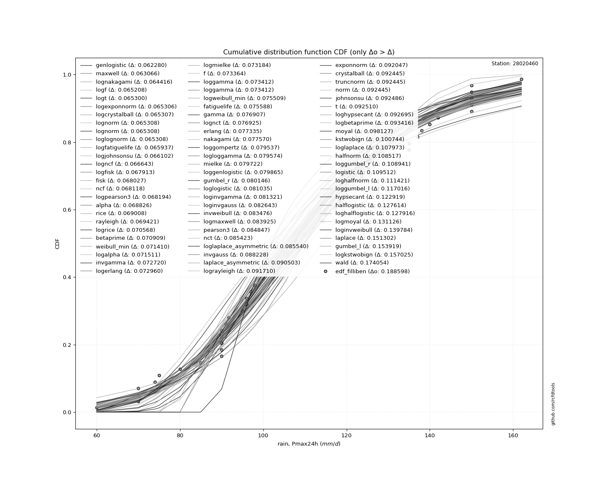</img>

</div>


**9.3. Best fit**

<div align="center">

|   id |   station | empirical_dist   | p_dist      |    delta |   deltao | eval   |   fit |   n |   best_fit |   best_fit_sort |
|-----:|----------:|:-----------------|:------------|---------:|---------:|:-------|------:|----:|-----------:|----------------:|
|    0 |  28020460 | edf_filliben     | weibull_min | 0.104664 | 0.212396 | Δo > Δ |     1 |  41 |          1 |               1 |

</div>


<div align="center">

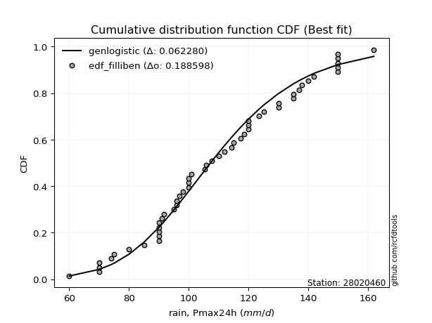</img></img>

</div>


### 10. Empirical - EDF Jenkinson (1977)

The Jenkinson formula in hydrology is an empirical plotting position formula used to estimate the non-exceedance probability _(P)_ or return period _(T)_ of a given ordered observation within a sample. It is a widely used method in the frequency analysis of extreme events such as floods and rainfall, as it provides a distribution-free way to plot data. _a≈0.31_ and _b≈0.38_ are constants derived to approximate the median of the probability distribution for the given rank.

<div align="center">


$P=(m-a)/(n+b)$


</div>


**10.1. Empirical values**

<div align="center">

|                | 0                    | 1                   | 2                   | 3                   | 4                   | 5                  | 6                   | 7                   | 8                  | 9                   | 10                 | 11                 | 12                  | 13                 | 14                  | 15                  | 16                  | 17                  | 18                  | 19                 | 20            | 21                 | 22                 | 23                 | 24                 | 25                 | 26                 | 27                 | 28                 | 29                 | 30                 | 31                 | 32                 | 33                 | 34                 | 35                | 36                 | 37                 | 38                 | 39                | 40                 |
|:---------------|:---------------------|:--------------------|:--------------------|:--------------------|:--------------------|:-------------------|:--------------------|:--------------------|:-------------------|:--------------------|:-------------------|:-------------------|:--------------------|:-------------------|:--------------------|:--------------------|:--------------------|:--------------------|:--------------------|:-------------------|:--------------|:-------------------|:-------------------|:-------------------|:-------------------|:-------------------|:-------------------|:-------------------|:-------------------|:-------------------|:-------------------|:-------------------|:-------------------|:-------------------|:-------------------|:------------------|:-------------------|:-------------------|:-------------------|:------------------|:-------------------|
| date           | 1989                 | 1991                | 1999                | 1997                | 2006                | 2018               | 2016                | 1992                | 2005               | 2004                | 2000               | 1980               | 2013                | 1985               | 1998                | 1993                | 1990                | 2003                | 2011                | 1983               | 2001          | 1981               | 2017               | 1995               | 1982               | 1987               | 2009               | 2020               | 1984               | 1986               | 1988               | 2014               | 2019               | 1994               | 2015               | 2010              | 1996               | 2008               | 2007               | 2002              | 2012               |
| x              | 60.0                 | 70.0                | 70.0                | 70.0                | 74.0                | 75.0               | 80.0                | 85.0                | 90.0               | 90.0                | 90.0               | 90.0               | 90.0                | 91.0               | 95.0                | 96.0                | 96.0                | 97.0                | 98.0                | 100.0              | 100.0         | 110.0              | 112.0              | 115.0              | 120.0              | 120.0              | 120.0              | 130.0              | 130.0              | 135.0              | 135.0              | 137.0              | 138.0              | 140.0              | 142.0              | 150.0             | 150.0              | 150.0              | 150.0              | 150.0             | 162.0              |
| m              | 1                    | 2                   | 3                   | 4                   | 5                   | 6                  | 7                   | 8                   | 9                  | 10                  | 11                 | 12                 | 13                  | 14                 | 15                  | 16                  | 17                  | 18                  | 19                  | 20                 | 21            | 22                 | 23                 | 24                 | 25                 | 26                 | 27                 | 28                 | 29                 | 30                 | 31                 | 32                 | 33                 | 34                 | 35                 | 36                | 37                 | 38                 | 39                 | 40                | 41                 |
| empirical_dist | edf_jenkinson        | edf_jenkinson       | edf_jenkinson       | edf_jenkinson       | edf_jenkinson       | edf_jenkinson      | edf_jenkinson       | edf_jenkinson       | edf_jenkinson      | edf_jenkinson       | edf_jenkinson      | edf_jenkinson      | edf_jenkinson       | edf_jenkinson      | edf_jenkinson       | edf_jenkinson       | edf_jenkinson       | edf_jenkinson       | edf_jenkinson       | edf_jenkinson      | edf_jenkinson | edf_jenkinson      | edf_jenkinson      | edf_jenkinson      | edf_jenkinson      | edf_jenkinson      | edf_jenkinson      | edf_jenkinson      | edf_jenkinson      | edf_jenkinson      | edf_jenkinson      | edf_jenkinson      | edf_jenkinson      | edf_jenkinson      | edf_jenkinson      | edf_jenkinson     | edf_jenkinson      | edf_jenkinson      | edf_jenkinson      | edf_jenkinson     | edf_jenkinson      |
| empirical      | 0.016674722087965197 | 0.04084098598356694 | 0.06500724987916867 | 0.08917351377477041 | 0.11333977767037216 | 0.1375060415659739 | 0.16167230546157563 | 0.18583856935717738 | 0.2100048332527791 | 0.23417109714838083 | 0.2583373610439826 | 0.2825036249395843 | 0.30666988883518603 | 0.3308361527307878 | 0.35500241662638954 | 0.37916868052199126 | 0.40333494441759304 | 0.42750120831319477 | 0.45166747220879655 | 0.4758337361043983 | 0.5           | 0.5241662638956017 | 0.5483325277912035 | 0.5724987916868052 | 0.5966650555824069 | 0.6208313194780087 | 0.6449975833736105 | 0.6691638472692122 | 0.6933301111648139 | 0.7174963750604156 | 0.7416626389560174 | 0.7658289028516191 | 0.7899951667472208 | 0.8141614306428225 | 0.8383276945384243 | 0.862493958434026 | 0.8866602223296277 | 0.9108264862252294 | 0.9349927501208312 | 0.959159014016433 | 0.9833252779120347 |
| empirical_tr   | 1.0169574834111574   | 1.0425799949609473  | 1.0695270095631946  | 1.0979039533032635  | 1.127827745979831   | 1.1594284113196973 | 1.192850965696166   | 1.228257643217572   | 1.2658305292138268 | 1.3057746923319657  | 1.34832192896709   | 1.3937352643987873 | 1.4423143952596722  | 1.4944023113037197 | 1.5503934057699513  | 1.6107434799532891  | 1.6759821790198464  | 1.7467285774588435  | 1.8237108858527986  | 1.9077916090364224 | 2.0           | 2.101574403250381  | 2.2140181915462813 | 2.339174674957603  | 2.479328939484721  | 2.6373486297004463 | 2.8168822328114365 | 3.022644265887509  | 3.260835303388495  | 3.539777587681779  | 3.87090739008419   | 4.270381836945304  | 4.761795166858456  | 5.381014304291285  | 6.185351270553061  | 7.272407732864669 | 8.823027718550097  | 11.214092140921391 | 15.382899628252751 | 24.48520710059168 | 59.97101449275335  |

</div>


**10.2. Kolmogorov-Smirnov fit test (sorted by Δ)**


<div align="center">

|                | 0                   | 1                   | 2                   | 3                   | 4                   | 5                   | 6                   | 7                   | 8                   | 9                   | 10                  | 11                  | 12                  | 13                  | 14                  | 15                  | 16                  | 17                  | 18                  | 19                  | 20                  | 21                  | 22                  | 23                  | 24                  | 25                  | 26                  | 27                  | 28                  | 29                  | 30                  | 31                  | 32                  | 33                  | 34                  | 35                  | 36                  | 37                  | 38                  | 39                  | 40                  | 41                  | 42                  | 43                  | 44                  | 45                  | 46                  | 47                  | 48                  | 49                  | 50                  | 51                  | 52                  | 53                    | 54                  | 55                  | 56                  | 57                  | 58                  | 59                  | 60                  | 61                  | 62                  | 63                  | 64                  | 65                  | 66                  | 67                  | 68                  | 69                  | 70                  | 71                  | 72                  | 73                  | 74                  | 75                  | 76                  | 77                  | 78                  | 79                  | 80                  | 81                  | 82                  | 83                  | 84                  | 85                  | 86                  | 87                  |
|:---------------|:--------------------|:--------------------|:--------------------|:--------------------|:--------------------|:--------------------|:--------------------|:--------------------|:--------------------|:--------------------|:--------------------|:--------------------|:--------------------|:--------------------|:--------------------|:--------------------|:--------------------|:--------------------|:--------------------|:--------------------|:--------------------|:--------------------|:--------------------|:--------------------|:--------------------|:--------------------|:--------------------|:--------------------|:--------------------|:--------------------|:--------------------|:--------------------|:--------------------|:--------------------|:--------------------|:--------------------|:--------------------|:--------------------|:--------------------|:--------------------|:--------------------|:--------------------|:--------------------|:--------------------|:--------------------|:--------------------|:--------------------|:--------------------|:--------------------|:--------------------|:--------------------|:--------------------|:--------------------|:----------------------|:--------------------|:--------------------|:--------------------|:--------------------|:--------------------|:--------------------|:--------------------|:--------------------|:--------------------|:--------------------|:--------------------|:--------------------|:--------------------|:--------------------|:--------------------|:--------------------|:--------------------|:--------------------|:--------------------|:--------------------|:--------------------|:--------------------|:--------------------|:--------------------|:--------------------|:--------------------|:--------------------|:--------------------|:--------------------|:--------------------|:--------------------|:--------------------|:--------------------|:--------------------|
| station        | 28020460            | 28020460            | 28020460            | 28020460            | 28020460            | 28020460            | 28020460            | 28020460            | 28020460            | 28020460            | 28020460            | 28020460            | 28020460            | 28020460            | 28020460            | 28020460            | 28020460            | 28020460            | 28020460            | 28020460            | 28020460            | 28020460            | 28020460            | 28020460            | 28020460            | 28020460            | 28020460            | 28020460            | 28020460            | 28020460            | 28020460            | 28020460            | 28020460            | 28020460            | 28020460            | 28020460            | 28020460            | 28020460            | 28020460            | 28020460            | 28020460            | 28020460            | 28020460            | 28020460            | 28020460            | 28020460            | 28020460            | 28020460            | 28020460            | 28020460            | 28020460            | 28020460            | 28020460            | 28020460              | 28020460            | 28020460            | 28020460            | 28020460            | 28020460            | 28020460            | 28020460            | 28020460            | 28020460            | 28020460            | 28020460            | 28020460            | 28020460            | 28020460            | 28020460            | 28020460            | 28020460            | 28020460            | 28020460            | 28020460            | 28020460            | 28020460            | 28020460            | 28020460            | 28020460            | 28020460            | 28020460            | 28020460            | 28020460            | 28020460            | 28020460            | 28020460            | 28020460            | 28020460            |
| empirical_dist | edf_jenkinson       | edf_jenkinson       | edf_jenkinson       | edf_jenkinson       | edf_jenkinson       | edf_jenkinson       | edf_jenkinson       | edf_jenkinson       | edf_jenkinson       | edf_jenkinson       | edf_jenkinson       | edf_jenkinson       | edf_jenkinson       | edf_jenkinson       | edf_jenkinson       | edf_jenkinson       | edf_jenkinson       | edf_jenkinson       | edf_jenkinson       | edf_jenkinson       | edf_jenkinson       | edf_jenkinson       | edf_jenkinson       | edf_jenkinson       | edf_jenkinson       | edf_jenkinson       | edf_jenkinson       | edf_jenkinson       | edf_jenkinson       | edf_jenkinson       | edf_jenkinson       | edf_jenkinson       | edf_jenkinson       | edf_jenkinson       | edf_jenkinson       | edf_jenkinson       | edf_jenkinson       | edf_jenkinson       | edf_jenkinson       | edf_jenkinson       | edf_jenkinson       | edf_jenkinson       | edf_jenkinson       | edf_jenkinson       | edf_jenkinson       | edf_jenkinson       | edf_jenkinson       | edf_jenkinson       | edf_jenkinson       | edf_jenkinson       | edf_jenkinson       | edf_jenkinson       | edf_jenkinson       | edf_jenkinson         | edf_jenkinson       | edf_jenkinson       | edf_jenkinson       | edf_jenkinson       | edf_jenkinson       | edf_jenkinson       | edf_jenkinson       | edf_jenkinson       | edf_jenkinson       | edf_jenkinson       | edf_jenkinson       | edf_jenkinson       | edf_jenkinson       | edf_jenkinson       | edf_jenkinson       | edf_jenkinson       | edf_jenkinson       | edf_jenkinson       | edf_jenkinson       | edf_jenkinson       | edf_jenkinson       | edf_jenkinson       | edf_jenkinson       | edf_jenkinson       | edf_jenkinson       | edf_jenkinson       | edf_jenkinson       | edf_jenkinson       | edf_jenkinson       | edf_jenkinson       | edf_jenkinson       | edf_jenkinson       | edf_jenkinson       | edf_jenkinson       |
| p_dist         | weibull_min         | nakagami            | maxwell             | rayleigh            | rice                | logpearson3         | loginvweibull       | fatiguelife         | fisk                | logfisk             | loggenlogistic      | invweibull          | genlogistic         | f                   | loginvgamma         | logncf              | logrice             | logbetaprime        | lognakagami         | logfatiguelife      | logt                | logexponnorm        | lognorm             | lognorm             | logcrystalball      | loglognorm          | logweibull_min      | alpha               | kstwobign           | loggamma            | loggamma            | logf                | invgamma            | logerlang           | johnsonsu           | loginvgauss         | halfnorm            | logalpha            | loggompertz         | logmaxwell          | lognct              | betaprime           | invgauss            | lograyleigh         | gamma               | logloggamma         | erlang              | laplace_asymmetric  | logmielke           | logjohnsonsu        | pearson3            | gumbel_r            | loglogistic         | loglaplace_asymmetric | logkstwobign        | loghalfnorm         | halflogistic        | exponnorm           | nct                 | t                   | norm                | crystalball         | truncnorm           | loggumbel_r         | moyal               | loghypsecant        | loghalflogistic     | logistic            | logmoyal            | loggumbel_l         | loglaplace          | hypsecant           | wald                | laplace             | loggenexpon         | gumbel_l            | logwald             | loggibrat           | expon               | genexpon            | ncf                 | gibrat              | logexpon            | logchi2             | logtruncnorm        | gompertz            | chi2                | mielke              |
| delta          | 0.10466444883097936 | 0.106087517411115   | 0.10630308097943492 | 0.10736089967506868 | 0.10786381946537105 | 0.10806102060160028 | 0.10808942141159913 | 0.10912261656440492 | 0.10933245801492275 | 0.1093652411156999  | 0.10949757201027843 | 0.10955860794953343 | 0.10986678445705178 | 0.10992279602202204 | 0.11092022461382778 | 0.11093874885702004 | 0.11110246520264955 | 0.11144386247194549 | 0.11179237092621386 | 0.11194594943663094 | 0.11197107769901227 | 0.11197739999946776 | 0.11197942532785865 | 0.11197942532785865 | 0.11197945148728972 | 0.11197969847441147 | 0.1122259111131032  | 0.11235176555803583 | 0.11239136717810827 | 0.11261398458507155 | 0.11261398458507155 | 0.11403709004012463 | 0.11424257086889811 | 0.11447168715829914 | 0.11483397819487717 | 0.11486681851790359 | 0.1149581462252579  | 0.1149908172503219  | 0.1163276672429091  | 0.11743834601565972 | 0.11749381181718543 | 0.11775190074801023 | 0.11830637465926852 | 0.11899849366794146 | 0.12184396306532203 | 0.12185774798898125 | 0.12225487869323065 | 0.12374882639032625 | 0.12429902910907659 | 0.13108561791102624 | 0.13143807656229073 | 0.1330998189998024  | 0.1342260349244483  | 0.1344489363722563    | 0.1353419440799716  | 0.1375060415659739  | 0.1383018695675896  | 0.13871598166375476 | 0.13880067180416705 | 0.1388440744033454  | 0.1388662795691612  | 0.13886628471739537 | 0.13886628580181337 | 0.14343718210321954 | 0.14452445745185816 | 0.1479111486941641  | 0.1506118823985555  | 0.15581034177644043 | 0.15600838075574097 | 0.1598388538614423  | 0.16398647574970326 | 0.16914261612004405 | 0.18528959864706707 | 0.19753846784248236 | 0.19912499558960203 | 0.20053442508080654 | 0.20754870012681337 | 0.23935909534361843 | 0.24231061884478464 | 0.24253089347639287 | 0.2509847044824426  | 0.2962786150414289  | 0.29799736594879933 | 0.3264509965093151  | 0.4268155453143191  | 0.7361503222856753  | 0.9571413027027234  | nan                 |
| deltao         | 0.21239631616850427 | 0.21239631616850427 | 0.21239631616850427 | 0.21239631616850427 | 0.21239631616850427 | 0.21239631616850427 | 0.21239631616850427 | 0.21239631616850427 | 0.21239631616850427 | 0.21239631616850427 | 0.21239631616850427 | 0.21239631616850427 | 0.21239631616850427 | 0.21239631616850427 | 0.21239631616850427 | 0.21239631616850427 | 0.21239631616850427 | 0.21239631616850427 | 0.21239631616850427 | 0.21239631616850427 | 0.21239631616850427 | 0.21239631616850427 | 0.21239631616850427 | 0.21239631616850427 | 0.21239631616850427 | 0.21239631616850427 | 0.21239631616850427 | 0.21239631616850427 | 0.21239631616850427 | 0.21239631616850427 | 0.21239631616850427 | 0.21239631616850427 | 0.21239631616850427 | 0.21239631616850427 | 0.21239631616850427 | 0.21239631616850427 | 0.21239631616850427 | 0.21239631616850427 | 0.21239631616850427 | 0.21239631616850427 | 0.21239631616850427 | 0.21239631616850427 | 0.21239631616850427 | 0.21239631616850427 | 0.21239631616850427 | 0.21239631616850427 | 0.21239631616850427 | 0.21239631616850427 | 0.21239631616850427 | 0.21239631616850427 | 0.21239631616850427 | 0.21239631616850427 | 0.21239631616850427 | 0.21239631616850427   | 0.21239631616850427 | 0.21239631616850427 | 0.21239631616850427 | 0.21239631616850427 | 0.21239631616850427 | 0.21239631616850427 | 0.21239631616850427 | 0.21239631616850427 | 0.21239631616850427 | 0.21239631616850427 | 0.21239631616850427 | 0.21239631616850427 | 0.21239631616850427 | 0.21239631616850427 | 0.21239631616850427 | 0.21239631616850427 | 0.21239631616850427 | 0.21239631616850427 | 0.21239631616850427 | 0.21239631616850427 | 0.21239631616850427 | 0.21239631616850427 | 0.21239631616850427 | 0.21239631616850427 | 0.21239631616850427 | 0.21239631616850427 | 0.21239631616850427 | 0.21239631616850427 | 0.21239631616850427 | 0.21239631616850427 | 0.21239631616850427 | 0.21239631616850427 | 0.21239631616850427 | 0.21239631616850427 |
| eval           | Δo > Δ              | Δo > Δ              | Δo > Δ              | Δo > Δ              | Δo > Δ              | Δo > Δ              | Δo > Δ              | Δo > Δ              | Δo > Δ              | Δo > Δ              | Δo > Δ              | Δo > Δ              | Δo > Δ              | Δo > Δ              | Δo > Δ              | Δo > Δ              | Δo > Δ              | Δo > Δ              | Δo > Δ              | Δo > Δ              | Δo > Δ              | Δo > Δ              | Δo > Δ              | Δo > Δ              | Δo > Δ              | Δo > Δ              | Δo > Δ              | Δo > Δ              | Δo > Δ              | Δo > Δ              | Δo > Δ              | Δo > Δ              | Δo > Δ              | Δo > Δ              | Δo > Δ              | Δo > Δ              | Δo > Δ              | Δo > Δ              | Δo > Δ              | Δo > Δ              | Δo > Δ              | Δo > Δ              | Δo > Δ              | Δo > Δ              | Δo > Δ              | Δo > Δ              | Δo > Δ              | Δo > Δ              | Δo > Δ              | Δo > Δ              | Δo > Δ              | Δo > Δ              | Δo > Δ              | Δo > Δ                | Δo > Δ              | Δo > Δ              | Δo > Δ              | Δo > Δ              | Δo > Δ              | Δo > Δ              | Δo > Δ              | Δo > Δ              | Δo > Δ              | Δo > Δ              | Δo > Δ              | Δo > Δ              | Δo > Δ              | Δo > Δ              | Δo > Δ              | Δo > Δ              | Δo > Δ              | Δo > Δ              | Δo > Δ              | Δo > Δ              | Δo > Δ              | Δo > Δ              | Δo > Δ              | Δo <= Δ             | Δo <= Δ             | Δo <= Δ             | Δo <= Δ             | Δo <= Δ             | Δo <= Δ             | Δo <= Δ             | Δo <= Δ             | Δo <= Δ             | Δo <= Δ             | Δo <= Δ             |
| fit            | 1                   | 1                   | 1                   | 1                   | 1                   | 1                   | 1                   | 1                   | 1                   | 1                   | 1                   | 1                   | 1                   | 1                   | 1                   | 1                   | 1                   | 1                   | 1                   | 1                   | 1                   | 1                   | 1                   | 1                   | 1                   | 1                   | 1                   | 1                   | 1                   | 1                   | 1                   | 1                   | 1                   | 1                   | 1                   | 1                   | 1                   | 1                   | 1                   | 1                   | 1                   | 1                   | 1                   | 1                   | 1                   | 1                   | 1                   | 1                   | 1                   | 1                   | 1                   | 1                   | 1                   | 1                     | 1                   | 1                   | 1                   | 1                   | 1                   | 1                   | 1                   | 1                   | 1                   | 1                   | 1                   | 1                   | 1                   | 1                   | 1                   | 1                   | 1                   | 1                   | 1                   | 1                   | 1                   | 1                   | 1                   | 0                   | 0                   | 0                   | 0                   | 0                   | 0                   | 0                   | 0                   | 0                   | 0                   | 0                   |
| n              | 41                  | 41                  | 41                  | 41                  | 41                  | 41                  | 41                  | 41                  | 41                  | 41                  | 41                  | 41                  | 41                  | 41                  | 41                  | 41                  | 41                  | 41                  | 41                  | 41                  | 41                  | 41                  | 41                  | 41                  | 41                  | 41                  | 41                  | 41                  | 41                  | 41                  | 41                  | 41                  | 41                  | 41                  | 41                  | 41                  | 41                  | 41                  | 41                  | 41                  | 41                  | 41                  | 41                  | 41                  | 41                  | 41                  | 41                  | 41                  | 41                  | 41                  | 41                  | 41                  | 41                  | 41                    | 41                  | 41                  | 41                  | 41                  | 41                  | 41                  | 41                  | 41                  | 41                  | 41                  | 41                  | 41                  | 41                  | 41                  | 41                  | 41                  | 41                  | 41                  | 41                  | 41                  | 41                  | 41                  | 41                  | 41                  | 41                  | 41                  | 41                  | 41                  | 41                  | 41                  | 41                  | 41                  | 41                  | 41                  |
| best_fit       | 1                   | 0                   | 0                   | 0                   | 0                   | 0                   | 0                   | 0                   | 0                   | 0                   | 0                   | 0                   | 0                   | 0                   | 0                   | 0                   | 0                   | 0                   | 0                   | 0                   | 0                   | 0                   | 0                   | 0                   | 0                   | 0                   | 0                   | 0                   | 0                   | 0                   | 0                   | 0                   | 0                   | 0                   | 0                   | 0                   | 0                   | 0                   | 0                   | 0                   | 0                   | 0                   | 0                   | 0                   | 0                   | 0                   | 0                   | 0                   | 0                   | 0                   | 0                   | 0                   | 0                   | 0                     | 0                   | 0                   | 0                   | 0                   | 0                   | 0                   | 0                   | 0                   | 0                   | 0                   | 0                   | 0                   | 0                   | 0                   | 0                   | 0                   | 0                   | 0                   | 0                   | 0                   | 0                   | 0                   | 0                   | 0                   | 0                   | 0                   | 0                   | 0                   | 0                   | 0                   | 0                   | 0                   | 0                   | 0                   |
| best_fit_sort  | 1                   | 2                   | 3                   | 4                   | 5                   | 6                   | 7                   | 8                   | 9                   | 10                  | 11                  | 12                  | 13                  | 14                  | 15                  | 16                  | 17                  | 18                  | 19                  | 20                  | 21                  | 22                  | 23                  | 24                  | 25                  | 26                  | 27                  | 28                  | 29                  | 30                  | 31                  | 32                  | 33                  | 34                  | 35                  | 36                  | 37                  | 38                  | 39                  | 40                  | 41                  | 42                  | 43                  | 44                  | 45                  | 46                  | 47                  | 48                  | 49                  | 50                  | 51                  | 52                  | 53                  | 54                    | 55                  | 56                  | 57                  | 58                  | 59                  | 60                  | 61                  | 62                  | 63                  | 64                  | 65                  | 66                  | 67                  | 68                  | 69                  | 70                  | 71                  | 72                  | 73                  | 74                  | 75                  | 76                  | 77                  | 78                  | 79                  | 80                  | 81                  | 82                  | 83                  | 84                  | 85                  | 86                  | 87                  | 88                  |

</div>


<div align="center">

</img>

</div>


**10.3. Best fit**

<div align="center">

|   id |   station | empirical_dist   | p_dist      |    delta |   deltao | eval   |   fit |   n |   best_fit |   best_fit_sort |
|-----:|----------:|:-----------------|:------------|---------:|---------:|:-------|------:|----:|-----------:|----------------:|
|    0 |  28020460 | edf_jenkinson    | weibull_min | 0.104664 | 0.212396 | Δo > Δ |     1 |  41 |          1 |               1 |

</div>


<div align="center">

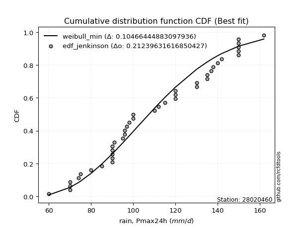</img></img>

</div>


### 11. Empirical - EDF Cunnane (1978)

Cunnane´s work in statistical hydrology has focused on the performance and evaluation of different probability distributions (such as GEV, Gumbel, Lognormal) for flood frequency estimation. _b_ is a constant, typically set to 0.4.

<div align="center">


$P=(m-b)/(n+1-2b)$


</div>


**11.1. Empirical values**

<div align="center">

|                | 0                    | 1                    | 2                   | 3                   | 4                   | 5                   | 6                   | 7                  | 8                  | 9                   | 10                  | 11                 | 12                 | 13                  | 14                 | 15                  | 16                 | 17                 | 18                  | 19                  | 20          | 21                 | 22                 | 23                 | 24                 | 25                 | 26                 | 27                 | 28                 | 29                 | 30                 | 31                 | 32                 | 33                 | 34                 | 35                 | 36                 | 37                 | 38                 | 39                 | 40                 |
|:---------------|:---------------------|:---------------------|:--------------------|:--------------------|:--------------------|:--------------------|:--------------------|:-------------------|:-------------------|:--------------------|:--------------------|:-------------------|:-------------------|:--------------------|:-------------------|:--------------------|:-------------------|:-------------------|:--------------------|:--------------------|:------------|:-------------------|:-------------------|:-------------------|:-------------------|:-------------------|:-------------------|:-------------------|:-------------------|:-------------------|:-------------------|:-------------------|:-------------------|:-------------------|:-------------------|:-------------------|:-------------------|:-------------------|:-------------------|:-------------------|:-------------------|
| date           | 1989                 | 1991                 | 1999                | 1997                | 2006                | 2018                | 2016                | 1992               | 2005               | 2004                | 2000                | 1980               | 2013               | 1985                | 1998               | 1993                | 1990               | 2003               | 2011                | 1983                | 2001        | 1981               | 2017               | 1995               | 1982               | 1987               | 2009               | 2020               | 1984               | 1986               | 1988               | 2014               | 2019               | 1994               | 2015               | 2010               | 1996               | 2008               | 2007               | 2002               | 2012               |
| x              | 60.0                 | 70.0                 | 70.0                | 70.0                | 74.0                | 75.0                | 80.0                | 85.0               | 90.0               | 90.0                | 90.0                | 90.0               | 90.0               | 91.0                | 95.0               | 96.0                | 96.0               | 97.0               | 98.0                | 100.0               | 100.0       | 110.0              | 112.0              | 115.0              | 120.0              | 120.0              | 120.0              | 130.0              | 130.0              | 135.0              | 135.0              | 137.0              | 138.0              | 140.0              | 142.0              | 150.0              | 150.0              | 150.0              | 150.0              | 150.0              | 162.0              |
| m              | 1                    | 2                    | 3                   | 4                   | 5                   | 6                   | 7                   | 8                  | 9                  | 10                  | 11                  | 12                 | 13                 | 14                  | 15                 | 16                  | 17                 | 18                 | 19                  | 20                  | 21          | 22                 | 23                 | 24                 | 25                 | 26                 | 27                 | 28                 | 29                 | 30                 | 31                 | 32                 | 33                 | 34                 | 35                 | 36                 | 37                 | 38                 | 39                 | 40                 | 41                 |
| empirical_dist | edf_cunnane          | edf_cunnane          | edf_cunnane         | edf_cunnane         | edf_cunnane         | edf_cunnane         | edf_cunnane         | edf_cunnane        | edf_cunnane        | edf_cunnane         | edf_cunnane         | edf_cunnane        | edf_cunnane        | edf_cunnane         | edf_cunnane        | edf_cunnane         | edf_cunnane        | edf_cunnane        | edf_cunnane         | edf_cunnane         | edf_cunnane | edf_cunnane        | edf_cunnane        | edf_cunnane        | edf_cunnane        | edf_cunnane        | edf_cunnane        | edf_cunnane        | edf_cunnane        | edf_cunnane        | edf_cunnane        | edf_cunnane        | edf_cunnane        | edf_cunnane        | edf_cunnane        | edf_cunnane        | edf_cunnane        | edf_cunnane        | edf_cunnane        | edf_cunnane        | edf_cunnane        |
| empirical      | 0.014563106796116504 | 0.038834951456310676 | 0.06310679611650485 | 0.08737864077669903 | 0.11165048543689318 | 0.13592233009708737 | 0.16019417475728154 | 0.1844660194174757 | 0.2087378640776699 | 0.23300970873786406 | 0.25728155339805825 | 0.2815533980582524 | 0.3058252427184466 | 0.33009708737864074 | 0.3543689320388349 | 0.37864077669902907 | 0.4029126213592233 | 0.4271844660194175 | 0.45145631067961167 | 0.47572815533980584 | 0.5         | 0.5242718446601942 | 0.5485436893203883 | 0.5728155339805825 | 0.5970873786407767 | 0.6213592233009708 | 0.645631067961165  | 0.6699029126213593 | 0.6941747572815534 | 0.7184466019417476 | 0.7427184466019418 | 0.7669902912621359 | 0.7912621359223301 | 0.8155339805825242 | 0.8398058252427184 | 0.8640776699029126 | 0.8883495145631067 | 0.9126213592233009 | 0.9368932038834951 | 0.9611650485436893 | 0.9854368932038835 |
| empirical_tr   | 1.0147783251231528   | 1.0404040404040404   | 1.067357512953368   | 1.0957446808510638  | 1.1256830601092895  | 1.1573033707865168  | 1.1907514450867052  | 1.226190476190476  | 1.2638036809815951 | 1.3037974683544304  | 1.34640522875817    | 1.3918918918918919 | 1.4405594405594404 | 1.4927536231884058  | 1.5488721804511276 | 1.6093749999999998  | 1.67479674796748   | 1.7457627118644068 | 1.8230088495575223  | 1.9074074074074074  | 2.0         | 2.1020408163265305 | 2.21505376344086   | 2.340909090909091  | 2.4819277108433733 | 2.6410256410256405 | 2.8219178082191774 | 3.0294117647058827 | 3.26984126984127   | 3.5517241379310347 | 3.8867924528301887 | 4.291666666666667  | 4.790697674418604  | 5.421052631578947  | 6.24242424242424   | 7.357142857142854  | 8.95652173913043   | 11.444444444444436 | 15.846153846153825 | 25.75000000000001  | 68.6666666666667   |

</div>


**11.2. Kolmogorov-Smirnov fit test (sorted by Δ)**


<div align="center">

|                | 0                   | 1                   | 2                   | 3                   | 4                   | 5                   | 6                   | 7                   | 8                   | 9                   | 10                  | 11                  | 12                  | 13                  | 14                  | 15                  | 16                  | 17                  | 18                  | 19                  | 20                  | 21                  | 22                  | 23                  | 24                  | 25                  | 26                  | 27                  | 28                  | 29                  | 30                  | 31                  | 32                  | 33                  | 34                  | 35                  | 36                  | 37                  | 38                  | 39                  | 40                  | 41                  | 42                  | 43                  | 44                  | 45                  | 46                  | 47                  | 48                  | 49                  | 50                  | 51                  | 52                  | 53                    | 54                  | 55                  | 56                  | 57                  | 58                  | 59                  | 60                  | 61                  | 62                  | 63                  | 64                  | 65                  | 66                  | 67                  | 68                  | 69                  | 70                  | 71                  | 72                  | 73                  | 74                  | 75                  | 76                  | 77                  | 78                  | 79                  | 80                  | 81                  | 82                  | 83                  | 84                  | 85                  | 86                  | 87                  |
|:---------------|:--------------------|:--------------------|:--------------------|:--------------------|:--------------------|:--------------------|:--------------------|:--------------------|:--------------------|:--------------------|:--------------------|:--------------------|:--------------------|:--------------------|:--------------------|:--------------------|:--------------------|:--------------------|:--------------------|:--------------------|:--------------------|:--------------------|:--------------------|:--------------------|:--------------------|:--------------------|:--------------------|:--------------------|:--------------------|:--------------------|:--------------------|:--------------------|:--------------------|:--------------------|:--------------------|:--------------------|:--------------------|:--------------------|:--------------------|:--------------------|:--------------------|:--------------------|:--------------------|:--------------------|:--------------------|:--------------------|:--------------------|:--------------------|:--------------------|:--------------------|:--------------------|:--------------------|:--------------------|:----------------------|:--------------------|:--------------------|:--------------------|:--------------------|:--------------------|:--------------------|:--------------------|:--------------------|:--------------------|:--------------------|:--------------------|:--------------------|:--------------------|:--------------------|:--------------------|:--------------------|:--------------------|:--------------------|:--------------------|:--------------------|:--------------------|:--------------------|:--------------------|:--------------------|:--------------------|:--------------------|:--------------------|:--------------------|:--------------------|:--------------------|:--------------------|:--------------------|:--------------------|:--------------------|
| station        | 28020460            | 28020460            | 28020460            | 28020460            | 28020460            | 28020460            | 28020460            | 28020460            | 28020460            | 28020460            | 28020460            | 28020460            | 28020460            | 28020460            | 28020460            | 28020460            | 28020460            | 28020460            | 28020460            | 28020460            | 28020460            | 28020460            | 28020460            | 28020460            | 28020460            | 28020460            | 28020460            | 28020460            | 28020460            | 28020460            | 28020460            | 28020460            | 28020460            | 28020460            | 28020460            | 28020460            | 28020460            | 28020460            | 28020460            | 28020460            | 28020460            | 28020460            | 28020460            | 28020460            | 28020460            | 28020460            | 28020460            | 28020460            | 28020460            | 28020460            | 28020460            | 28020460            | 28020460            | 28020460              | 28020460            | 28020460            | 28020460            | 28020460            | 28020460            | 28020460            | 28020460            | 28020460            | 28020460            | 28020460            | 28020460            | 28020460            | 28020460            | 28020460            | 28020460            | 28020460            | 28020460            | 28020460            | 28020460            | 28020460            | 28020460            | 28020460            | 28020460            | 28020460            | 28020460            | 28020460            | 28020460            | 28020460            | 28020460            | 28020460            | 28020460            | 28020460            | 28020460            | 28020460            |
| empirical_dist | edf_cunnane         | edf_cunnane         | edf_cunnane         | edf_cunnane         | edf_cunnane         | edf_cunnane         | edf_cunnane         | edf_cunnane         | edf_cunnane         | edf_cunnane         | edf_cunnane         | edf_cunnane         | edf_cunnane         | edf_cunnane         | edf_cunnane         | edf_cunnane         | edf_cunnane         | edf_cunnane         | edf_cunnane         | edf_cunnane         | edf_cunnane         | edf_cunnane         | edf_cunnane         | edf_cunnane         | edf_cunnane         | edf_cunnane         | edf_cunnane         | edf_cunnane         | edf_cunnane         | edf_cunnane         | edf_cunnane         | edf_cunnane         | edf_cunnane         | edf_cunnane         | edf_cunnane         | edf_cunnane         | edf_cunnane         | edf_cunnane         | edf_cunnane         | edf_cunnane         | edf_cunnane         | edf_cunnane         | edf_cunnane         | edf_cunnane         | edf_cunnane         | edf_cunnane         | edf_cunnane         | edf_cunnane         | edf_cunnane         | edf_cunnane         | edf_cunnane         | edf_cunnane         | edf_cunnane         | edf_cunnane           | edf_cunnane         | edf_cunnane         | edf_cunnane         | edf_cunnane         | edf_cunnane         | edf_cunnane         | edf_cunnane         | edf_cunnane         | edf_cunnane         | edf_cunnane         | edf_cunnane         | edf_cunnane         | edf_cunnane         | edf_cunnane         | edf_cunnane         | edf_cunnane         | edf_cunnane         | edf_cunnane         | edf_cunnane         | edf_cunnane         | edf_cunnane         | edf_cunnane         | edf_cunnane         | edf_cunnane         | edf_cunnane         | edf_cunnane         | edf_cunnane         | edf_cunnane         | edf_cunnane         | edf_cunnane         | edf_cunnane         | edf_cunnane         | edf_cunnane         | edf_cunnane         |
| p_dist         | weibull_min         | nakagami            | maxwell             | rayleigh            | logpearson3         | rice                | fatiguelife         | fisk                | logfisk             | loggenlogistic      | invweibull          | genlogistic         | f                   | loginvweibull       | loginvgamma         | logncf              | logrice             | logbetaprime        | lognakagami         | logfatiguelife      | logt                | logexponnorm        | lognorm             | lognorm             | logcrystalball      | loglognorm          | alpha               | kstwobign           | loggamma            | loggamma            | logweibull_min      | logf                | logerlang           | loginvgauss         | halfnorm            | invgamma            | logalpha            | johnsonsu           | loggompertz         | logmaxwell          | lognct              | betaprime           | invgauss            | lograyleigh         | gamma               | logloggamma         | erlang              | laplace_asymmetric  | logmielke           | logjohnsonsu        | pearson3            | gumbel_r            | loglogistic         | loglaplace_asymmetric | loghalfnorm         | logkstwobign        | halflogistic        | exponnorm           | nct                 | t                   | norm                | crystalball         | truncnorm           | loggumbel_r         | moyal               | loghypsecant        | loghalflogistic     | logmoyal            | logistic            | loggumbel_l         | loglaplace          | hypsecant           | wald                | laplace             | loggenexpon         | gumbel_l            | logwald             | loggibrat           | expon               | genexpon            | ncf                 | gibrat              | logexpon            | logchi2             | logtruncnorm        | gompertz            | chi2                | mielke              |
| delta          | 0.10466444883097936 | 0.10534845205896792 | 0.10630308097943492 | 0.1066218343229216  | 0.1073219552494532  | 0.10786381946537105 | 0.10838355121225784 | 0.10859339266277568 | 0.10862617576355282 | 0.10875850665813136 | 0.10881954259738635 | 0.10912771910490471 | 0.10918373066987497 | 0.10935639058670835 | 0.1101811592616807  | 0.11019968350487297 | 0.11036339985050247 | 0.11070479711979841 | 0.11105330557406679 | 0.11120688408448387 | 0.1112320123468652  | 0.11123833464732069 | 0.11124035997571158 | 0.11124035997571158 | 0.11124038613514264 | 0.1112406331222644  | 0.11161270020588876 | 0.1116523018259612  | 0.11187491923292447 | 0.11187491923292447 | 0.1122259111131032  | 0.11329802468797756 | 0.11373262180615207 | 0.11412775316575652 | 0.11421908087311083 | 0.11424257086889811 | 0.11425175189817482 | 0.11483397819487717 | 0.1163276672429091  | 0.11669928066351265 | 0.11675474646503836 | 0.11701283539586316 | 0.11756730930712145 | 0.11825942831579439 | 0.12184396306532203 | 0.12185774798898125 | 0.12225487869323065 | 0.12300976103817918 | 0.12429902910907659 | 0.13108561791102624 | 0.13143807656229073 | 0.13236075364765532 | 0.13348696957230122 | 0.13402661331388654   | 0.13592233009708737 | 0.13660891325508082 | 0.13756280421544254 | 0.13871598166375476 | 0.13880067180416705 | 0.1388440744033454  | 0.1388662795691612  | 0.13886628471739537 | 0.13886628580181337 | 0.14269811675107247 | 0.14378539209971108 | 0.14717208334201703 | 0.15018955934018574 | 0.15558605769737122 | 0.15581034177644043 | 0.1598388538614423  | 0.1632474103975562  | 0.16914261612004405 | 0.1848672755886973  | 0.19753846784248236 | 0.20039196476471124 | 0.20053442508080654 | 0.2071263770684436  | 0.23893677228524868 | 0.24357758801989385 | 0.24379786265150208 | 0.25299073900969893 | 0.2954339689246894  | 0.2992643351239085  | 0.32856261180116386 | 0.42808251448942825 | 0.7374172914607846  | 0.9591473372299796  | nan                 |
| deltao         | 0.21239631616850427 | 0.21239631616850427 | 0.21239631616850427 | 0.21239631616850427 | 0.21239631616850427 | 0.21239631616850427 | 0.21239631616850427 | 0.21239631616850427 | 0.21239631616850427 | 0.21239631616850427 | 0.21239631616850427 | 0.21239631616850427 | 0.21239631616850427 | 0.21239631616850427 | 0.21239631616850427 | 0.21239631616850427 | 0.21239631616850427 | 0.21239631616850427 | 0.21239631616850427 | 0.21239631616850427 | 0.21239631616850427 | 0.21239631616850427 | 0.21239631616850427 | 0.21239631616850427 | 0.21239631616850427 | 0.21239631616850427 | 0.21239631616850427 | 0.21239631616850427 | 0.21239631616850427 | 0.21239631616850427 | 0.21239631616850427 | 0.21239631616850427 | 0.21239631616850427 | 0.21239631616850427 | 0.21239631616850427 | 0.21239631616850427 | 0.21239631616850427 | 0.21239631616850427 | 0.21239631616850427 | 0.21239631616850427 | 0.21239631616850427 | 0.21239631616850427 | 0.21239631616850427 | 0.21239631616850427 | 0.21239631616850427 | 0.21239631616850427 | 0.21239631616850427 | 0.21239631616850427 | 0.21239631616850427 | 0.21239631616850427 | 0.21239631616850427 | 0.21239631616850427 | 0.21239631616850427 | 0.21239631616850427   | 0.21239631616850427 | 0.21239631616850427 | 0.21239631616850427 | 0.21239631616850427 | 0.21239631616850427 | 0.21239631616850427 | 0.21239631616850427 | 0.21239631616850427 | 0.21239631616850427 | 0.21239631616850427 | 0.21239631616850427 | 0.21239631616850427 | 0.21239631616850427 | 0.21239631616850427 | 0.21239631616850427 | 0.21239631616850427 | 0.21239631616850427 | 0.21239631616850427 | 0.21239631616850427 | 0.21239631616850427 | 0.21239631616850427 | 0.21239631616850427 | 0.21239631616850427 | 0.21239631616850427 | 0.21239631616850427 | 0.21239631616850427 | 0.21239631616850427 | 0.21239631616850427 | 0.21239631616850427 | 0.21239631616850427 | 0.21239631616850427 | 0.21239631616850427 | 0.21239631616850427 | 0.21239631616850427 |
| eval           | Δo > Δ              | Δo > Δ              | Δo > Δ              | Δo > Δ              | Δo > Δ              | Δo > Δ              | Δo > Δ              | Δo > Δ              | Δo > Δ              | Δo > Δ              | Δo > Δ              | Δo > Δ              | Δo > Δ              | Δo > Δ              | Δo > Δ              | Δo > Δ              | Δo > Δ              | Δo > Δ              | Δo > Δ              | Δo > Δ              | Δo > Δ              | Δo > Δ              | Δo > Δ              | Δo > Δ              | Δo > Δ              | Δo > Δ              | Δo > Δ              | Δo > Δ              | Δo > Δ              | Δo > Δ              | Δo > Δ              | Δo > Δ              | Δo > Δ              | Δo > Δ              | Δo > Δ              | Δo > Δ              | Δo > Δ              | Δo > Δ              | Δo > Δ              | Δo > Δ              | Δo > Δ              | Δo > Δ              | Δo > Δ              | Δo > Δ              | Δo > Δ              | Δo > Δ              | Δo > Δ              | Δo > Δ              | Δo > Δ              | Δo > Δ              | Δo > Δ              | Δo > Δ              | Δo > Δ              | Δo > Δ                | Δo > Δ              | Δo > Δ              | Δo > Δ              | Δo > Δ              | Δo > Δ              | Δo > Δ              | Δo > Δ              | Δo > Δ              | Δo > Δ              | Δo > Δ              | Δo > Δ              | Δo > Δ              | Δo > Δ              | Δo > Δ              | Δo > Δ              | Δo > Δ              | Δo > Δ              | Δo > Δ              | Δo > Δ              | Δo > Δ              | Δo > Δ              | Δo > Δ              | Δo > Δ              | Δo <= Δ             | Δo <= Δ             | Δo <= Δ             | Δo <= Δ             | Δo <= Δ             | Δo <= Δ             | Δo <= Δ             | Δo <= Δ             | Δo <= Δ             | Δo <= Δ             | Δo <= Δ             |
| fit            | 1                   | 1                   | 1                   | 1                   | 1                   | 1                   | 1                   | 1                   | 1                   | 1                   | 1                   | 1                   | 1                   | 1                   | 1                   | 1                   | 1                   | 1                   | 1                   | 1                   | 1                   | 1                   | 1                   | 1                   | 1                   | 1                   | 1                   | 1                   | 1                   | 1                   | 1                   | 1                   | 1                   | 1                   | 1                   | 1                   | 1                   | 1                   | 1                   | 1                   | 1                   | 1                   | 1                   | 1                   | 1                   | 1                   | 1                   | 1                   | 1                   | 1                   | 1                   | 1                   | 1                   | 1                     | 1                   | 1                   | 1                   | 1                   | 1                   | 1                   | 1                   | 1                   | 1                   | 1                   | 1                   | 1                   | 1                   | 1                   | 1                   | 1                   | 1                   | 1                   | 1                   | 1                   | 1                   | 1                   | 1                   | 0                   | 0                   | 0                   | 0                   | 0                   | 0                   | 0                   | 0                   | 0                   | 0                   | 0                   |
| n              | 41                  | 41                  | 41                  | 41                  | 41                  | 41                  | 41                  | 41                  | 41                  | 41                  | 41                  | 41                  | 41                  | 41                  | 41                  | 41                  | 41                  | 41                  | 41                  | 41                  | 41                  | 41                  | 41                  | 41                  | 41                  | 41                  | 41                  | 41                  | 41                  | 41                  | 41                  | 41                  | 41                  | 41                  | 41                  | 41                  | 41                  | 41                  | 41                  | 41                  | 41                  | 41                  | 41                  | 41                  | 41                  | 41                  | 41                  | 41                  | 41                  | 41                  | 41                  | 41                  | 41                  | 41                    | 41                  | 41                  | 41                  | 41                  | 41                  | 41                  | 41                  | 41                  | 41                  | 41                  | 41                  | 41                  | 41                  | 41                  | 41                  | 41                  | 41                  | 41                  | 41                  | 41                  | 41                  | 41                  | 41                  | 41                  | 41                  | 41                  | 41                  | 41                  | 41                  | 41                  | 41                  | 41                  | 41                  | 41                  |
| best_fit       | 1                   | 0                   | 0                   | 0                   | 0                   | 0                   | 0                   | 0                   | 0                   | 0                   | 0                   | 0                   | 0                   | 0                   | 0                   | 0                   | 0                   | 0                   | 0                   | 0                   | 0                   | 0                   | 0                   | 0                   | 0                   | 0                   | 0                   | 0                   | 0                   | 0                   | 0                   | 0                   | 0                   | 0                   | 0                   | 0                   | 0                   | 0                   | 0                   | 0                   | 0                   | 0                   | 0                   | 0                   | 0                   | 0                   | 0                   | 0                   | 0                   | 0                   | 0                   | 0                   | 0                   | 0                     | 0                   | 0                   | 0                   | 0                   | 0                   | 0                   | 0                   | 0                   | 0                   | 0                   | 0                   | 0                   | 0                   | 0                   | 0                   | 0                   | 0                   | 0                   | 0                   | 0                   | 0                   | 0                   | 0                   | 0                   | 0                   | 0                   | 0                   | 0                   | 0                   | 0                   | 0                   | 0                   | 0                   | 0                   |
| best_fit_sort  | 1                   | 2                   | 3                   | 4                   | 5                   | 6                   | 7                   | 8                   | 9                   | 10                  | 11                  | 12                  | 13                  | 14                  | 15                  | 16                  | 17                  | 18                  | 19                  | 20                  | 21                  | 22                  | 23                  | 24                  | 25                  | 26                  | 27                  | 28                  | 29                  | 30                  | 31                  | 32                  | 33                  | 34                  | 35                  | 36                  | 37                  | 38                  | 39                  | 40                  | 41                  | 42                  | 43                  | 44                  | 45                  | 46                  | 47                  | 48                  | 49                  | 50                  | 51                  | 52                  | 53                  | 54                    | 55                  | 56                  | 57                  | 58                  | 59                  | 60                  | 61                  | 62                  | 63                  | 64                  | 65                  | 66                  | 67                  | 68                  | 69                  | 70                  | 71                  | 72                  | 73                  | 74                  | 75                  | 76                  | 77                  | 78                  | 79                  | 80                  | 81                  | 82                  | 83                  | 84                  | 85                  | 86                  | 87                  | 88                  |

</div>


<div align="center">

</img>

</div>


**11.3. Best fit**

<div align="center">

|   id |   station | empirical_dist   | p_dist      |    delta |   deltao | eval   |   fit |   n |   best_fit |   best_fit_sort |
|-----:|----------:|:-----------------|:------------|---------:|---------:|:-------|------:|----:|-----------:|----------------:|
|    0 |  28020460 | edf_cunnane      | weibull_min | 0.104664 | 0.212396 | Δo > Δ |     1 |  41 |          1 |               1 |

</div>


<div align="center">

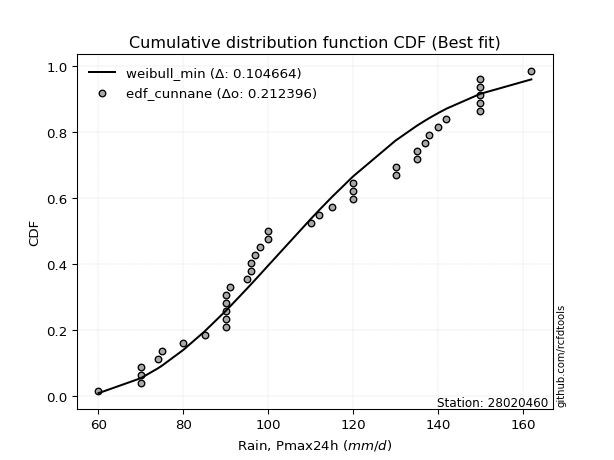</img></img>

</div>


### 12. Empirical - EDF Adamowski (1981)

The Adamowski formula in hydrology refers to a specific plotting position formula used for estimating the non-parametric empirical distribution of hydrological events (like flood peaks) to calculate their return periods. This formula provides an alternative to traditional parametric methods (like the Gumbel or Log Pearson Type III distributions). 

<div align="center">


$P=(m-0.25)/(n+0.5)$


</div>


**12.1. Empirical values**

<div align="center">

|                | 0                    | 1                   | 2                   | 3                   | 4                  | 5                   | 6                   | 7                   | 8                   | 9                   | 10                  | 11                  | 12                 | 13                 | 14                  | 15                 | 16                 | 17                  | 18                  | 19                 | 20            | 21                 | 22                 | 23                 | 24                 | 25                 | 26                 | 27                 | 28                 | 29                 | 30                 | 31                 | 32                 | 33                 | 34                 | 35                 | 36                 | 37                 | 38                 | 39                 | 40                 |
|:---------------|:---------------------|:--------------------|:--------------------|:--------------------|:-------------------|:--------------------|:--------------------|:--------------------|:--------------------|:--------------------|:--------------------|:--------------------|:-------------------|:-------------------|:--------------------|:-------------------|:-------------------|:--------------------|:--------------------|:-------------------|:--------------|:-------------------|:-------------------|:-------------------|:-------------------|:-------------------|:-------------------|:-------------------|:-------------------|:-------------------|:-------------------|:-------------------|:-------------------|:-------------------|:-------------------|:-------------------|:-------------------|:-------------------|:-------------------|:-------------------|:-------------------|
| date           | 1989                 | 1991                | 1999                | 1997                | 2006               | 2018                | 2016                | 1992                | 2005                | 2004                | 2000                | 1980                | 2013               | 1985               | 1998                | 1993               | 1990               | 2003                | 2011                | 1983               | 2001          | 1981               | 2017               | 1995               | 1982               | 1987               | 2009               | 2020               | 1984               | 1986               | 1988               | 2014               | 2019               | 1994               | 2015               | 2010               | 1996               | 2008               | 2007               | 2002               | 2012               |
| x              | 60.0                 | 70.0                | 70.0                | 70.0                | 74.0               | 75.0                | 80.0                | 85.0                | 90.0                | 90.0                | 90.0                | 90.0                | 90.0               | 91.0               | 95.0                | 96.0               | 96.0               | 97.0                | 98.0                | 100.0              | 100.0         | 110.0              | 112.0              | 115.0              | 120.0              | 120.0              | 120.0              | 130.0              | 130.0              | 135.0              | 135.0              | 137.0              | 138.0              | 140.0              | 142.0              | 150.0              | 150.0              | 150.0              | 150.0              | 150.0              | 162.0              |
| m              | 1                    | 2                   | 3                   | 4                   | 5                  | 6                   | 7                   | 8                   | 9                   | 10                  | 11                  | 12                  | 13                 | 14                 | 15                  | 16                 | 17                 | 18                  | 19                  | 20                 | 21            | 22                 | 23                 | 24                 | 25                 | 26                 | 27                 | 28                 | 29                 | 30                 | 31                 | 32                 | 33                 | 34                 | 35                 | 36                 | 37                 | 38                 | 39                 | 40                 | 41                 |
| empirical_dist | edf_adamowski        | edf_adamowski       | edf_adamowski       | edf_adamowski       | edf_adamowski      | edf_adamowski       | edf_adamowski       | edf_adamowski       | edf_adamowski       | edf_adamowski       | edf_adamowski       | edf_adamowski       | edf_adamowski      | edf_adamowski      | edf_adamowski       | edf_adamowski      | edf_adamowski      | edf_adamowski       | edf_adamowski       | edf_adamowski      | edf_adamowski | edf_adamowski      | edf_adamowski      | edf_adamowski      | edf_adamowski      | edf_adamowski      | edf_adamowski      | edf_adamowski      | edf_adamowski      | edf_adamowski      | edf_adamowski      | edf_adamowski      | edf_adamowski      | edf_adamowski      | edf_adamowski      | edf_adamowski      | edf_adamowski      | edf_adamowski      | edf_adamowski      | edf_adamowski      | edf_adamowski      |
| empirical      | 0.018072289156626505 | 0.04216867469879518 | 0.06626506024096386 | 0.09036144578313253 | 0.1144578313253012 | 0.13855421686746988 | 0.16265060240963855 | 0.18674698795180722 | 0.21084337349397592 | 0.23493975903614459 | 0.25903614457831325 | 0.28313253012048195 | 0.3072289156626506 | 0.3313253012048193 | 0.35542168674698793 | 0.3795180722891566 | 0.4036144578313253 | 0.42771084337349397 | 0.45180722891566266 | 0.4759036144578313 | 0.5           | 0.5240963855421686 | 0.5481927710843374 | 0.572289156626506  | 0.5963855421686747 | 0.6204819277108434 | 0.6445783132530121 | 0.6686746987951807 | 0.6927710843373494 | 0.7168674698795181 | 0.7409638554216867 | 0.7650602409638554 | 0.7891566265060241 | 0.8132530120481928 | 0.8373493975903614 | 0.8614457831325302 | 0.8855421686746988 | 0.9096385542168675 | 0.9337349397590361 | 0.9578313253012049 | 0.9819277108433735 |
| empirical_tr   | 1.01840490797546     | 1.0440251572327044  | 1.070967741935484   | 1.099337748344371   | 1.129251700680272  | 1.1608391608391608  | 1.1942446043165469  | 1.2296296296296296  | 1.2671755725190839  | 1.3070866141732285  | 1.3495934959349594  | 1.3949579831932772  | 1.4434782608695653 | 1.4954954954954955 | 1.5514018691588785  | 1.6116504854368934 | 1.676767676767677  | 1.7473684210526315  | 1.8241758241758244  | 1.908045977011494  | 2.0           | 2.10126582278481   | 2.2133333333333334 | 2.3380281690140845 | 2.4776119402985075 | 2.6349206349206353 | 2.8135593220338984 | 3.018181818181818  | 3.2549019607843133 | 3.5319148936170217 | 3.86046511627907   | 4.2564102564102555 | 4.742857142857144  | 5.35483870967742   | 6.148148148148147  | 7.217391304347829  | 8.73684210526316   | 11.066666666666665 | 15.090909090909081 | 23.714285714285733 | 55.33333333333333  |

</div>


**12.2. Kolmogorov-Smirnov fit test (sorted by Δ)**


<div align="center">

|                | 0                   | 1                   | 2                   | 3                   | 4                   | 5                   | 6                   | 7                   | 8                   | 9                   | 10                  | 11                  | 12                  | 13                  | 14                  | 15                  | 16                  | 17                  | 18                  | 19                  | 20                  | 21                  | 22                  | 23                  | 24                  | 25                  | 26                  | 27                  | 28                  | 29                  | 30                  | 31                  | 32                  | 33                  | 34                  | 35                  | 36                  | 37                  | 38                  | 39                  | 40                  | 41                  | 42                  | 43                  | 44                  | 45                  | 46                  | 47                  | 48                  | 49                  | 50                  | 51                  | 52                  | 53                  | 54                    | 55                  | 56                  | 57                  | 58                  | 59                  | 60                  | 61                  | 62                  | 63                  | 64                  | 65                  | 66                  | 67                  | 68                  | 69                  | 70                  | 71                  | 72                  | 73                  | 74                  | 75                  | 76                  | 77                  | 78                  | 79                  | 80                  | 81                  | 82                  | 83                  | 84                  | 85                  | 86                  | 87                  |
|:---------------|:--------------------|:--------------------|:--------------------|:--------------------|:--------------------|:--------------------|:--------------------|:--------------------|:--------------------|:--------------------|:--------------------|:--------------------|:--------------------|:--------------------|:--------------------|:--------------------|:--------------------|:--------------------|:--------------------|:--------------------|:--------------------|:--------------------|:--------------------|:--------------------|:--------------------|:--------------------|:--------------------|:--------------------|:--------------------|:--------------------|:--------------------|:--------------------|:--------------------|:--------------------|:--------------------|:--------------------|:--------------------|:--------------------|:--------------------|:--------------------|:--------------------|:--------------------|:--------------------|:--------------------|:--------------------|:--------------------|:--------------------|:--------------------|:--------------------|:--------------------|:--------------------|:--------------------|:--------------------|:--------------------|:----------------------|:--------------------|:--------------------|:--------------------|:--------------------|:--------------------|:--------------------|:--------------------|:--------------------|:--------------------|:--------------------|:--------------------|:--------------------|:--------------------|:--------------------|:--------------------|:--------------------|:--------------------|:--------------------|:--------------------|:--------------------|:--------------------|:--------------------|:--------------------|:--------------------|:--------------------|:--------------------|:--------------------|:--------------------|:--------------------|:--------------------|:--------------------|:--------------------|:--------------------|
| station        | 28020460            | 28020460            | 28020460            | 28020460            | 28020460            | 28020460            | 28020460            | 28020460            | 28020460            | 28020460            | 28020460            | 28020460            | 28020460            | 28020460            | 28020460            | 28020460            | 28020460            | 28020460            | 28020460            | 28020460            | 28020460            | 28020460            | 28020460            | 28020460            | 28020460            | 28020460            | 28020460            | 28020460            | 28020460            | 28020460            | 28020460            | 28020460            | 28020460            | 28020460            | 28020460            | 28020460            | 28020460            | 28020460            | 28020460            | 28020460            | 28020460            | 28020460            | 28020460            | 28020460            | 28020460            | 28020460            | 28020460            | 28020460            | 28020460            | 28020460            | 28020460            | 28020460            | 28020460            | 28020460            | 28020460              | 28020460            | 28020460            | 28020460            | 28020460            | 28020460            | 28020460            | 28020460            | 28020460            | 28020460            | 28020460            | 28020460            | 28020460            | 28020460            | 28020460            | 28020460            | 28020460            | 28020460            | 28020460            | 28020460            | 28020460            | 28020460            | 28020460            | 28020460            | 28020460            | 28020460            | 28020460            | 28020460            | 28020460            | 28020460            | 28020460            | 28020460            | 28020460            | 28020460            |
| empirical_dist | edf_adamowski       | edf_adamowski       | edf_adamowski       | edf_adamowski       | edf_adamowski       | edf_adamowski       | edf_adamowski       | edf_adamowski       | edf_adamowski       | edf_adamowski       | edf_adamowski       | edf_adamowski       | edf_adamowski       | edf_adamowski       | edf_adamowski       | edf_adamowski       | edf_adamowski       | edf_adamowski       | edf_adamowski       | edf_adamowski       | edf_adamowski       | edf_adamowski       | edf_adamowski       | edf_adamowski       | edf_adamowski       | edf_adamowski       | edf_adamowski       | edf_adamowski       | edf_adamowski       | edf_adamowski       | edf_adamowski       | edf_adamowski       | edf_adamowski       | edf_adamowski       | edf_adamowski       | edf_adamowski       | edf_adamowski       | edf_adamowski       | edf_adamowski       | edf_adamowski       | edf_adamowski       | edf_adamowski       | edf_adamowski       | edf_adamowski       | edf_adamowski       | edf_adamowski       | edf_adamowski       | edf_adamowski       | edf_adamowski       | edf_adamowski       | edf_adamowski       | edf_adamowski       | edf_adamowski       | edf_adamowski       | edf_adamowski         | edf_adamowski       | edf_adamowski       | edf_adamowski       | edf_adamowski       | edf_adamowski       | edf_adamowski       | edf_adamowski       | edf_adamowski       | edf_adamowski       | edf_adamowski       | edf_adamowski       | edf_adamowski       | edf_adamowski       | edf_adamowski       | edf_adamowski       | edf_adamowski       | edf_adamowski       | edf_adamowski       | edf_adamowski       | edf_adamowski       | edf_adamowski       | edf_adamowski       | edf_adamowski       | edf_adamowski       | edf_adamowski       | edf_adamowski       | edf_adamowski       | edf_adamowski       | edf_adamowski       | edf_adamowski       | edf_adamowski       | edf_adamowski       | edf_adamowski       |
| p_dist         | weibull_min         | maxwell             | nakagami            | loginvweibull       | rayleigh            | rice                | logpearson3         | fatiguelife         | fisk                | logfisk             | loggenlogistic      | invweibull          | genlogistic         | f                   | loginvgamma         | logncf              | logrice             | logbetaprime        | logweibull_min      | lognakagami         | logfatiguelife      | logt                | logexponnorm        | lognorm             | lognorm             | logcrystalball      | loglognorm          | alpha               | kstwobign           | loggamma            | loggamma            | invgamma            | logf                | johnsonsu           | logerlang           | loginvgauss         | halfnorm            | logalpha            | loggompertz         | logmaxwell          | lognct              | betaprime           | invgauss            | lograyleigh         | gamma               | logloggamma         | erlang              | laplace_asymmetric  | logmielke           | logjohnsonsu        | pearson3            | gumbel_r            | logkstwobign        | loglogistic         | loglaplace_asymmetric | loghalfnorm         | exponnorm           | halflogistic        | nct                 | t                   | norm                | crystalball         | truncnorm           | loggumbel_r         | moyal               | loghypsecant        | loghalflogistic     | logistic            | logmoyal            | loggumbel_l         | loglaplace          | hypsecant           | wald                | laplace             | loggenexpon         | gumbel_l            | logwald             | loggibrat           | expon               | genexpon            | ncf                 | gibrat              | logexpon            | logchi2             | logtruncnorm        | gompertz            | chi2                | mielke              |
| delta          | 0.1048251606092876  | 0.10630308097943492 | 0.10657666588514647 | 0.10725088117040232 | 0.10785004814910015 | 0.10786381946537105 | 0.10855016907563175 | 0.10961176503843639 | 0.10982160648895423 | 0.10985438958973137 | 0.10998672048430991 | 0.1100477564235649  | 0.11035593293108326 | 0.11041194449605352 | 0.11140937308785925 | 0.11142789733105152 | 0.11159161367668102 | 0.11193301094597696 | 0.1122259111131032  | 0.11228151940024533 | 0.11243509791066242 | 0.11246022617304374 | 0.11246654847349924 | 0.11246857380189013 | 0.11246857380189013 | 0.11246859996132119 | 0.11246884694844295 | 0.11284091403206731 | 0.11288051565213975 | 0.11310313305910302 | 0.11310313305910302 | 0.11424257086889811 | 0.11452623851415611 | 0.11483397819487717 | 0.11496083563233062 | 0.11535596699193507 | 0.11544729469928938 | 0.11547996572435337 | 0.1163276672429091  | 0.1179274944896912  | 0.11798296029121691 | 0.1182410492220417  | 0.1187955231333     | 0.11948764214197294 | 0.12184396306532203 | 0.12185774798898125 | 0.12225487869323065 | 0.12423797486435773 | 0.12429902910907659 | 0.13108561791102624 | 0.13143807656229073 | 0.13358896747383386 | 0.1345034038387748  | 0.13471518339847977 | 0.13472844978598852   | 0.13855421686746988 | 0.13871598166375476 | 0.13879101804162108 | 0.13880067180416705 | 0.1388440744033454  | 0.1388662795691612  | 0.13886628471739537 | 0.13886628580181337 | 0.14392633057725102 | 0.14501360592588963 | 0.14840029716819558 | 0.15089139581228772 | 0.15581034177644043 | 0.1562878941694732  | 0.1598388538614423  | 0.16447562422373474 | 0.16914261612004405 | 0.1855691120607993  | 0.19753846784248236 | 0.19828645534840522 | 0.20053442508080654 | 0.2078282135405456  | 0.23963860875735066 | 0.24147207860358783 | 0.24169235323519606 | 0.24965701576721444 | 0.29683764186889344 | 0.2971588257076025  | 0.32505342944065385 | 0.42597700507312225 | 0.7353117820444787  | 0.9558136139874951  | nan                 |
| deltao         | 0.21239631616850427 | 0.21239631616850427 | 0.21239631616850427 | 0.21239631616850427 | 0.21239631616850427 | 0.21239631616850427 | 0.21239631616850427 | 0.21239631616850427 | 0.21239631616850427 | 0.21239631616850427 | 0.21239631616850427 | 0.21239631616850427 | 0.21239631616850427 | 0.21239631616850427 | 0.21239631616850427 | 0.21239631616850427 | 0.21239631616850427 | 0.21239631616850427 | 0.21239631616850427 | 0.21239631616850427 | 0.21239631616850427 | 0.21239631616850427 | 0.21239631616850427 | 0.21239631616850427 | 0.21239631616850427 | 0.21239631616850427 | 0.21239631616850427 | 0.21239631616850427 | 0.21239631616850427 | 0.21239631616850427 | 0.21239631616850427 | 0.21239631616850427 | 0.21239631616850427 | 0.21239631616850427 | 0.21239631616850427 | 0.21239631616850427 | 0.21239631616850427 | 0.21239631616850427 | 0.21239631616850427 | 0.21239631616850427 | 0.21239631616850427 | 0.21239631616850427 | 0.21239631616850427 | 0.21239631616850427 | 0.21239631616850427 | 0.21239631616850427 | 0.21239631616850427 | 0.21239631616850427 | 0.21239631616850427 | 0.21239631616850427 | 0.21239631616850427 | 0.21239631616850427 | 0.21239631616850427 | 0.21239631616850427 | 0.21239631616850427   | 0.21239631616850427 | 0.21239631616850427 | 0.21239631616850427 | 0.21239631616850427 | 0.21239631616850427 | 0.21239631616850427 | 0.21239631616850427 | 0.21239631616850427 | 0.21239631616850427 | 0.21239631616850427 | 0.21239631616850427 | 0.21239631616850427 | 0.21239631616850427 | 0.21239631616850427 | 0.21239631616850427 | 0.21239631616850427 | 0.21239631616850427 | 0.21239631616850427 | 0.21239631616850427 | 0.21239631616850427 | 0.21239631616850427 | 0.21239631616850427 | 0.21239631616850427 | 0.21239631616850427 | 0.21239631616850427 | 0.21239631616850427 | 0.21239631616850427 | 0.21239631616850427 | 0.21239631616850427 | 0.21239631616850427 | 0.21239631616850427 | 0.21239631616850427 | 0.21239631616850427 |
| eval           | Δo > Δ              | Δo > Δ              | Δo > Δ              | Δo > Δ              | Δo > Δ              | Δo > Δ              | Δo > Δ              | Δo > Δ              | Δo > Δ              | Δo > Δ              | Δo > Δ              | Δo > Δ              | Δo > Δ              | Δo > Δ              | Δo > Δ              | Δo > Δ              | Δo > Δ              | Δo > Δ              | Δo > Δ              | Δo > Δ              | Δo > Δ              | Δo > Δ              | Δo > Δ              | Δo > Δ              | Δo > Δ              | Δo > Δ              | Δo > Δ              | Δo > Δ              | Δo > Δ              | Δo > Δ              | Δo > Δ              | Δo > Δ              | Δo > Δ              | Δo > Δ              | Δo > Δ              | Δo > Δ              | Δo > Δ              | Δo > Δ              | Δo > Δ              | Δo > Δ              | Δo > Δ              | Δo > Δ              | Δo > Δ              | Δo > Δ              | Δo > Δ              | Δo > Δ              | Δo > Δ              | Δo > Δ              | Δo > Δ              | Δo > Δ              | Δo > Δ              | Δo > Δ              | Δo > Δ              | Δo > Δ              | Δo > Δ                | Δo > Δ              | Δo > Δ              | Δo > Δ              | Δo > Δ              | Δo > Δ              | Δo > Δ              | Δo > Δ              | Δo > Δ              | Δo > Δ              | Δo > Δ              | Δo > Δ              | Δo > Δ              | Δo > Δ              | Δo > Δ              | Δo > Δ              | Δo > Δ              | Δo > Δ              | Δo > Δ              | Δo > Δ              | Δo > Δ              | Δo > Δ              | Δo > Δ              | Δo <= Δ             | Δo <= Δ             | Δo <= Δ             | Δo <= Δ             | Δo <= Δ             | Δo <= Δ             | Δo <= Δ             | Δo <= Δ             | Δo <= Δ             | Δo <= Δ             | Δo <= Δ             |
| fit            | 1                   | 1                   | 1                   | 1                   | 1                   | 1                   | 1                   | 1                   | 1                   | 1                   | 1                   | 1                   | 1                   | 1                   | 1                   | 1                   | 1                   | 1                   | 1                   | 1                   | 1                   | 1                   | 1                   | 1                   | 1                   | 1                   | 1                   | 1                   | 1                   | 1                   | 1                   | 1                   | 1                   | 1                   | 1                   | 1                   | 1                   | 1                   | 1                   | 1                   | 1                   | 1                   | 1                   | 1                   | 1                   | 1                   | 1                   | 1                   | 1                   | 1                   | 1                   | 1                   | 1                   | 1                   | 1                     | 1                   | 1                   | 1                   | 1                   | 1                   | 1                   | 1                   | 1                   | 1                   | 1                   | 1                   | 1                   | 1                   | 1                   | 1                   | 1                   | 1                   | 1                   | 1                   | 1                   | 1                   | 1                   | 0                   | 0                   | 0                   | 0                   | 0                   | 0                   | 0                   | 0                   | 0                   | 0                   | 0                   |
| n              | 41                  | 41                  | 41                  | 41                  | 41                  | 41                  | 41                  | 41                  | 41                  | 41                  | 41                  | 41                  | 41                  | 41                  | 41                  | 41                  | 41                  | 41                  | 41                  | 41                  | 41                  | 41                  | 41                  | 41                  | 41                  | 41                  | 41                  | 41                  | 41                  | 41                  | 41                  | 41                  | 41                  | 41                  | 41                  | 41                  | 41                  | 41                  | 41                  | 41                  | 41                  | 41                  | 41                  | 41                  | 41                  | 41                  | 41                  | 41                  | 41                  | 41                  | 41                  | 41                  | 41                  | 41                  | 41                    | 41                  | 41                  | 41                  | 41                  | 41                  | 41                  | 41                  | 41                  | 41                  | 41                  | 41                  | 41                  | 41                  | 41                  | 41                  | 41                  | 41                  | 41                  | 41                  | 41                  | 41                  | 41                  | 41                  | 41                  | 41                  | 41                  | 41                  | 41                  | 41                  | 41                  | 41                  | 41                  | 41                  |
| best_fit       | 1                   | 0                   | 0                   | 0                   | 0                   | 0                   | 0                   | 0                   | 0                   | 0                   | 0                   | 0                   | 0                   | 0                   | 0                   | 0                   | 0                   | 0                   | 0                   | 0                   | 0                   | 0                   | 0                   | 0                   | 0                   | 0                   | 0                   | 0                   | 0                   | 0                   | 0                   | 0                   | 0                   | 0                   | 0                   | 0                   | 0                   | 0                   | 0                   | 0                   | 0                   | 0                   | 0                   | 0                   | 0                   | 0                   | 0                   | 0                   | 0                   | 0                   | 0                   | 0                   | 0                   | 0                   | 0                     | 0                   | 0                   | 0                   | 0                   | 0                   | 0                   | 0                   | 0                   | 0                   | 0                   | 0                   | 0                   | 0                   | 0                   | 0                   | 0                   | 0                   | 0                   | 0                   | 0                   | 0                   | 0                   | 0                   | 0                   | 0                   | 0                   | 0                   | 0                   | 0                   | 0                   | 0                   | 0                   | 0                   |
| best_fit_sort  | 1                   | 2                   | 3                   | 4                   | 5                   | 6                   | 7                   | 8                   | 9                   | 10                  | 11                  | 12                  | 13                  | 14                  | 15                  | 16                  | 17                  | 18                  | 19                  | 20                  | 21                  | 22                  | 23                  | 24                  | 25                  | 26                  | 27                  | 28                  | 29                  | 30                  | 31                  | 32                  | 33                  | 34                  | 35                  | 36                  | 37                  | 38                  | 39                  | 40                  | 41                  | 42                  | 43                  | 44                  | 45                  | 46                  | 47                  | 48                  | 49                  | 50                  | 51                  | 52                  | 53                  | 54                  | 55                    | 56                  | 57                  | 58                  | 59                  | 60                  | 61                  | 62                  | 63                  | 64                  | 65                  | 66                  | 67                  | 68                  | 69                  | 70                  | 71                  | 72                  | 73                  | 74                  | 75                  | 76                  | 77                  | 78                  | 79                  | 80                  | 81                  | 82                  | 83                  | 84                  | 85                  | 86                  | 87                  | 88                  |

</div>


<div align="center">

</img>

</div>


**12.3. Best fit**

<div align="center">

|   id |   station | empirical_dist   | p_dist      |    delta |   deltao | eval   |   fit |   n |   best_fit |   best_fit_sort |
|-----:|----------:|:-----------------|:------------|---------:|---------:|:-------|------:|----:|-----------:|----------------:|
|    0 |  28020460 | edf_adamowski    | weibull_min | 0.104825 | 0.212396 | Δo > Δ |     1 |  41 |          1 |               1 |

</div>


<div align="center">

</img></img>

</div>


## C. Best fit & Estimate extreme values for specific return periods - Tr


### 1. Best fit (ordered by delta Δ)

<div align="center">

|   id |   station | empirical_dist   | p_dist        |     delta |   deltao | eval   |   fit |   n |   best_fit |   best_fit_sort |
|-----:|----------:|:-----------------|:--------------|----------:|---------:|:-------|------:|----:|-----------:|----------------:|
|    0 |  28020460 | edf_california   | invweibull    | 0.0957956 | 0.212396 | Δo > Δ |     1 |  41 |          1 |               1 |
|    1 |  28020460 | edf_weibull      | loginvweibull | 0.103809  | 0.212396 | Δo > Δ |     1 |  41 |          1 |               2 |
|    2 |  28020460 | edf_hazen        | nakagami      | 0.10452   | 0.212396 | Δo > Δ |     1 |  41 |          1 |               3 |
|    3 |  28020460 | edf_cunnane      | weibull_min   | 0.104664  | 0.212396 | Δo > Δ |     1 |  41 |          1 |               4 |
|    4 |  28020460 | edf_blom         | weibull_min   | 0.104664  | 0.212396 | Δo > Δ |     1 |  41 |          1 |               5 |
|    5 |  28020460 | edf_jenkinson    | weibull_min   | 0.104664  | 0.212396 | Δo > Δ |     1 |  41 |          1 |               6 |
|    6 |  28020460 | edf_filliben     | weibull_min   | 0.104664  | 0.212396 | Δo > Δ |     1 |  41 |          1 |               7 |
|    7 |  28020460 | edf_gringorten   | weibull_min   | 0.104664  | 0.212396 | Δo > Δ |     1 |  41 |          1 |               8 |
|    8 |  28020460 | edf_tukey        | weibull_min   | 0.104664  | 0.212396 | Δo > Δ |     1 |  41 |          1 |               9 |
|    9 |  28020460 | edf_chegodayev   | weibull_min   | 0.104664  | 0.212396 | Δo > Δ |     1 |  41 |          1 |              10 |
|   10 |  28020460 | edf_beard        | weibull_min   | 0.104664  | 0.212396 | Δo > Δ |     1 |  41 |          1 |              11 |
|   11 |  28020460 | edf_adamowski    | weibull_min   | 0.104825  | 0.212396 | Δo > Δ |     1 |  41 |          1 |              12 |

</div>

:file_folder:Tables: [bestfit_28020460.csv](table/bestfit_28020460.csv) | [extreme_28020460.csv](table/extreme_28020460.csv)


### 2. Extreme values

In hydrology, a return period (or recurrence interval $Tr$) is the statistical average time between extreme events like floods or droughts of a specific magnitude, indicating how rare an event is, with a 100-year flood, for example, having a 1% chance of occurring in any given year, not that it happens exactly every century. It is a key tool for infrastructure design (like bridges or dams) and risk assessment, calculated from historical data to determine the probability of future events, although it is important to remember it is statistical average, and events can cluster or be missed.

> risk_rate: assuming the return period as the project useful life.

|   id |      tr |   prob_l |     prob_g |   alpha |   betaprime |    chi2 |   crystalball |   erlang |   expon |   exponnorm |       f |   fatiguelife |    fisk |   gamma |   genexpon |   genlogistic |   gibrat |   gompertz |   gumbel_l |   gumbel_r |   halflogistic |   halfnorm |   hypsecant |   invgamma |   invgauss |   invweibull |   johnsonsu |   kstwobign |   laplace |   laplace_asymmetric |   loggamma |   logistic |   lognorm |   maxwell |   mielke |   moyal |   nakagami |     ncf |     nct |    norm |   pearson3 |   rayleigh |    rice |       t |   truncnorm |    wald |   weibull_min |   logalpha |   logbetaprime |          logchi2 |   logcrystalball |   logerlang |   logexpon |   logexponnorm |    logf |   logfatiguelife |   logfisk |   loggenexpon |   loggenlogistic |   loggibrat |   loggompertz |   loggumbel_l |   loggumbel_r |   loghalflogistic |   loghalfnorm |   loghypsecant |   loginvgamma |   loginvgauss |   loginvweibull |   logjohnsonsu |   logkstwobign |   loglaplace |   loglaplace_asymmetric |   logloggamma |   loglogistic |   loglognorm |   logmaxwell |   logmielke |   logmoyal |   lognakagami |   logncf |   lognct |   logpearson3 |   lograyleigh |   logrice |    logt |   logtruncnorm |   logwald |   logweibull_min |   station |   n |   risk_rate |
|-----:|--------:|---------:|-----------:|--------:|------------:|--------:|--------------:|---------:|--------:|------------:|--------:|--------------:|--------:|--------:|-----------:|--------------:|---------:|-----------:|-----------:|-----------:|---------------:|-----------:|------------:|-----------:|-----------:|-------------:|------------:|------------:|----------:|---------------------:|-----------:|-----------:|----------:|----------:|---------:|--------:|-----------:|--------:|--------:|--------:|-----------:|-----------:|--------:|--------:|------------:|--------:|--------------:|-----------:|---------------:|-----------------:|-----------------:|------------:|-----------:|---------------:|--------:|-----------------:|----------:|--------------:|-----------------:|------------:|--------------:|--------------:|--------------:|------------------:|--------------:|---------------:|--------------:|--------------:|----------------:|---------------:|---------------:|-------------:|------------------------:|--------------:|--------------:|-------------:|-------------:|------------:|-----------:|--------------:|---------:|---------:|--------------:|--------------:|----------:|--------:|---------------:|----------:|-----------------:|----------:|----:|------------:|
|    0 |    2    | 0.5      | 0.5        | 107.293 |     105.326 | 60.0027 |       109.829 |  108.482 |  94.539 |     109.815 | 106.716 |       107.363 | 106.833 | 108.374 |    94.5168 |       105.231 |  101.528 |    148.202 |    114.372 |    105.286 |        103.027 |    104.168 |     109.829 |    107.801 |    104.117 |      105.189 |     107.851 |     104.56  |   109.829 |              101.874 |    105.759 |    109.829 |   106.272 |   107.464 |  104.256 | 103.819 |    106.106 | 110.474 | 109.825 | 109.829 |    109.204 |    106.625 | 107.72  | 109.828 |     109.829 | 100.865 |       107.413 |    105.318 |        105.278 |    102.343       |          106.272 |     105.654 |    89.1737 |        106.272 | 105.921 |          106.213 |   106.819 |       97.3306 |          106.704 |     98.3028 |       108.695 |       110.904 |       101.833 |           99.6969 |       100.77  |        106.272 |       105.163 |       104.288 |         102.188 |        109.332 |        100.673 |      106.272 |                 101.583 |       108.492 |       106.272 |      106.272 |      103.938 |     108.364 |    100.44  |       106.248 |  106.261 |  105.115 |       107.249 |       103.122 |   105.564 | 106.273 |        80.1188 |   97.6927 |          107.782 |  28020460 |  41 |    0.75     |
|    1 |    2.33 | 0.570815 | 0.429185   | 112.234 |     110.338 | 60.0096 |       114.764 |  113.453 | 102.149 |     114.75  | 111.781 |       112.364 | 111.7   | 113.299 |   102.123  |       110.381 |  104.028 |    149.006 |    118.666 |    109.859 |        107.729 |    109.495 |     113.779 |    112.765 |    109.279 |      110.351 |     112.809 |     109.858 |   112.816 |              106.747 |    110.828 |    114.177 |   111.313 |   112.591 |  109.398 | 108.148 |    111.453 | 121.772 | 114.761 | 114.764 |    114.155 |    111.828 | 112.923 | 114.763 |     114.764 | 104.101 |       112.589 |    110.377 |        110.404 |    122.355       |          111.313 |     110.701 |    97.3089 |        111.313 | 110.955 |          111.256 |   111.686 |      104.066  |          111.577 |    100.638  |       114.004 |       115.467 |       106.301 |          104.197  |       105.938 |        110.287 |       110.278 |       109.431 |         107.818 |        114.358 |        106.447 |      109.294 |                 105.837 |       113.492 |       110.701 |      111.312 |      109.064 |     113.212 |    104.607 |       111.294 |  111.318 |  110.159 |       112.292 |       108.285 |   110.721 | 111.314 |        84.8166 |  100.707  |          112.831 |  28020460 |  41 |    0.729209 |
|    2 |    5    | 0.8      | 0.2        | 132.024 |     131.621 | 60.2667 |       133.104 |  132.642 | 140.197 |     133.097 | 132.394 |       132.388 | 132.651 | 132.304 |   140.153  |       132.726 |  118.421 |    151.603 |    132.536 |    129.725 |        129.003 |    132.018 |     129.621 |    132.422 |    131.649 |      132.776 |     132.356 |     132.362 |   127.747 |              131.111 |    132.238 |    130.966 |   132.232 |   132.771 |  132.046 | 128.199 |    132.878 | 178.295 | 133.105 | 133.104 |    132.903 |    132.658 | 133.088 | 133.102 |     133.104 | 122.215 |       132.87  |    131.99  |        132.485 |    339.747       |          132.232 |     132.006 |   150.564  |        132.232 | 132.022 |          132.248 |   132.65  |      140.487  |          132.655 |    115.201  |       133.685 |       131.529 |       128.103 |          127.235  |       130.891 |        127.977 |       132.602 |       132.159 |         136.103 |        133.173 |        134.904 |      125.745 |                 129.929 |       132.778 |       129.604 |      132.232 |      131.82  |     133.17  |    126.28  |       132.26  |  132.371 |  131.674 |       132.529 |       131.677 |   132.443 | 132.233 |       108.294  |  119.379  |          132.674 |  28020460 |  41 |    0.67232  |
|    3 |   10    | 0.9      | 0.1        | 146.547 |     148.465 | 60.9874 |       145.27  |  146.001 | 174.736 |     145.277 | 147.671 |       146.991 | 150.54  | 145.534 |   174.676  |       150.905 |  134.826 |    153.048 |    140.259 |    145.906 |        146.67  |    148.685 |     142.271 |    146.602 |    149.576 |      151.041 |     146.365 |     149.496 |   141.301 |              153.229 |    149.022 |    143.33  |   148.236 |   146.973 |  150.868 | 145.657 |    148.165 | 234.136 | 145.276 | 145.27  |    145.647 |    147.51  | 146.946 | 145.268 |     145.27  | 141.439 |       146.988 |    149.22  |        150.27  |    953.924       |          148.236 |     148.696 |   223.773  |        148.236 | 148.328 |          148.373 |   150.567 |      180.276  |          150.745 |    134.388  |       146.437 |       141.422 |       149.124 |          150.194  |       153.067 |        144.12  |       150.937 |       151.124 |         164.542 |        145.631 |        161.57  |      142.813 |                 156.516 |       146.131 |       145.56  |      148.236 |      150.625 |     149.568 |    148.775 |       148.321 |  148.545 |  148.784 |       147.285 |       151.382 |   149.33  | 148.237 |       127.132  |  142.995  |          146.681 |  28020460 |  41 |    0.651322 |
|    4 |   15    | 0.933333 | 0.0666667  | 154.265 |     157.836 | 61.6078 |       151.341 |  152.858 | 194.94  |     151.357 | 155.787 |       154.693 | 161.276 | 152.324 |   194.87   |       161.158 |  146.142 |    153.703 |    143.756 |    155.035 |        156.667 |    157.358 |     149.491 |    154.047 |    159.538 |      161.346 |     153.687 |     158.592 |   149.23  |              166.166 |    158.288 |    150.066 |   156.932 |   154.259 |  161.637 | 155.789 |    156.043 | 270.037 | 151.349 | 151.341 |    152.1   |    155.162 | 153.956 | 151.339 |     151.341 | 153.784 |       154.171 |    158.842 |        160.263 |   1792.26        |          156.932 |     157.905 |   282.144  |        156.933 | 157.257 |          157.158 |   161.328 |      207.637  |          161.631 |    149.455  |       152.667 |       146.143 |       162.472 |          164.977  |       166.056 |        154.229 |       161.381 |       162.03  |         183.135 |        151.799 |        177.807 |      153.852 |                 174.524 |       152.947 |       155.065 |      156.933 |      161.292 |     159.305 |    163.625 |       157.056 |  157.359 |  158.325 |       155.053 |       162.66  |   158.584 | 156.933 |       136.059  |  160.569  |          153.902 |  28020460 |  41 |    0.644736 |
|    5 |   20    | 0.95     | 0.05       | 159.502 |     164.36  | 62.119  |       155.317 |  157.417 | 209.275 |     155.34  | 161.283 |       159.89  | 169.139 | 156.84  |   209.199  |       168.336 |  155.019 |    154.111 |    145.933 |    161.427 |        163.672 |    163.141 |     154.584 |    159.062 |    166.449 |      168.561 |     158.608 |     164.72  |   154.856 |              175.346 |    164.707 |    154.722 |   162.902 |   159.095 |  169.244 | 162.964 |    161.28  | 297.256 | 155.327 | 155.317 |    156.358 |    160.249 | 158.573 | 155.315 |     155.317 | 162.984 |       158.915 |    165.554 |        167.257 |   2827.99        |          162.902 |     164.284 |   332.578  |        162.902 | 163.413 |          163.199 |   169.211 |      229.251  |          169.614 |    162.446  |       156.694 |       149.162 |       172.522 |          176.193  |       175.323 |        161.785 |       168.753 |       169.767 |         197.39  |        155.812 |        189.655 |      162.198 |                 188.544 |       157.462 |       161.995 |      162.902 |      168.785 |     166.42  |    175.03  |       163.055 |  163.418 |  164.974 |       160.287 |       170.617 |   164.966 | 162.903 |       141.318  |  175.056  |          158.71  |  28020460 |  41 |    0.641514 |
|    6 |   25    | 0.96     | 0.04       | 163.455 |     169.372 | 62.5498 |       158.244 |  160.809 | 220.394 |     158.273 | 165.421 |       163.796 | 175.411 | 160.198 |   220.312  |       173.864 |  162.419 |    154.401 |    147.482 |    166.351 |        169.069 |    167.443 |     158.526 |    162.827 |    171.738 |      174.118 |     162.294 |     169.309 |   159.219 |              182.466 |    169.62  |    158.284 |   167.441 |   162.685 |  175.14  | 168.526 |    165.171 | 319.472 | 158.255 | 158.244 |    159.51  |    164.028 | 161.984 | 158.242 |     158.244 | 170.352 |       162.425 |    170.716 |        172.65  |   4044.83        |          167.441 |     169.166 |   377.827  |        167.442 | 168.109 |          167.797 |   175.501 |      247.426  |          175.988 |    174.136  |       159.631 |       151.347 |       180.686 |          185.351  |       182.552 |        167.885 |       174.47  |       175.79  |         209.123 |        158.751 |        199.043 |      168.982 |                 200.19  |       160.812 |       167.505 |      167.442 |      174.573 |     172.096 |    184.414 |       167.618 |  168.031 |  170.084 |       164.215 |       176.78  |   169.834 | 167.442 |       144.796  |  187.596  |          162.289 |  28020460 |  41 |    0.639603 |
|    7 |   50    | 0.98     | 0.02       | 175.254 |     184.782 | 64.0421 |       166.625 |  170.688 | 254.933 |     166.673 | 177.707 |       175.357 | 196.045 | 169.979 |   254.835  |       190.894 |  188.503 |    155.188 |    151.687 |    181.518 |        185.698 |    179.949 |     170.746 |    173.963 |    187.857 |      191.239 |     173.162 |     182.787 |   172.774 |              204.584 |    184.626 |    169.167 |   181.152 |   173.097 |  193.508 | 185.791 |    176.466 | 395.397 | 166.641 | 166.625 |    168.616 |    174.998 | 171.799 | 166.623 |     166.625 | 194.41  |       172.546 |    186.621 |        189.325 |  12523.1         |          181.152 |     184.069 |   561.537  |        181.152 | 182.37  |          181.71  |   196.205 |      312.971  |          196.992 |    222.468  |       167.912 |       157.443 |       208.343 |          216.674  |       205.3   |        188.3   |       192.341 |       194.728 |         249.831 |        167.085 |        229.386 |      191.919 |                 241.154 |       170.518 |       185.528 |      181.152 |      192.504 |     190.817 |    216.874 |       181.409 |  181.991 |  185.811 |       175.814 |       195.959 |   184.608 | 181.152 |       152.64   |  235.143  |          172.722 |  28020460 |  41 |    0.63583  |
|    8 |   75    | 0.986667 | 0.0133333  | 181.898 |     193.751 | 65.001  |       171.122 |  176.09  | 275.137 |     171.183 | 184.569 |       181.796 | 209.047 | 175.329 |   275.03   |       200.791 |  206.121 |    155.586 |    153.814 |    190.333 |        195.364 |    186.757 |     177.888 |    180.163 |    197.12  |      201.19  |     179.189 |     190.202 |   180.702 |              217.521 |    193.289 |    175.452 |   188.965 |   178.758 |  204.329 | 195.888 |    182.612 | 445.274 | 171.14  | 171.122 |    173.551 |    180.966 | 177.092 | 171.12  |     171.122 | 209.214 |       178.013 |    195.896 |        199.091 |  24511.3         |          188.965 |     192.67  |   708.015  |        188.966 | 190.549 |          189.657 |   209.257 |      358.756  |          210.249 |    262.492  |       172.275 |       160.619 |       226.324 |          237.26   |       218.853 |        201.361 |       202.941 |       206.035 |         277.041 |        171.499 |        248.01  |      206.754 |                 268.9   |       175.794 |       196.808 |      188.966 |      203.014 |     202.68  |    238.442 |       189.274 |  189.965 |  194.971 |       182.252 |       207.254 |   193.074 | 188.966 |       155.568  |  270.21   |          178.43  |  28020460 |  41 |    0.634587 |
|    9 |  100    | 0.99     | 0.01       | 186.522 |     200.118 | 65.7119 |       174.163 |  179.785 | 289.472 |     174.233 | 189.317 |       186.246 | 218.74  | 178.987 |   289.358  |       207.796 |  219.769 |    155.846 |    155.205 |    196.573 |        202.205 |    191.394 |     182.954 |    184.448 |    203.635 |      208.233 |     183.345 |     195.282 |   186.328 |              226.701 |    199.406 |    179.89  |   194.44  |   182.614 |  212.051 | 203.051 |    186.798 | 483.412 | 174.184 | 174.163 |    176.908 |    185.032 | 180.681 | 174.162 |     174.163 | 220.008 |       181.722 |    202.488 |        206.049 |  39623.2         |          194.44  |     198.743 |   834.573  |        194.441 | 196.301 |          195.232 |   218.992 |      395.141  |          220.143 |    298.384  |       175.195 |       162.73  |       239.98  |          253.002  |       228.594 |        211.171 |       210.552 |       214.185 |         298.071 |        174.459 |        261.637 |      217.969 |                 290.501 |       179.388 |       205.183 |      194.441 |      210.499 |     211.569 |    255.033 |       194.787 |  195.559 |  201.475 |       186.692 |       215.32  |   199.025 | 194.441 |       157.1    |  299.032  |          182.333 |  28020460 |  41 |    0.633968 |
|   10 |  200    | 0.995    | 0.005      | 197.427 |     215.528 | 67.5087 |       181.063 |  188.287 | 324.011 |     181.156 | 200.414 |       196.63  | 243.859 | 187.404 |   323.88   |       224.635 |  256.9   |    156.412 |    158.228 |    211.573 |        218.653 |    202.001 |     195.158 |    194.454 |    219.181 |      225.165 |     193.018 |     206.984 |   199.882 |              248.818 |    214.103 |    190.535 |   207.455 |   191.436 |  230.839 | 220.31  |    196.378 | 585.804 | 181.088 | 181.063 |    184.582 |    194.335 | 188.844 | 181.061 |     181.063 | 246.894 |       190.168 |    218.463 |        222.966 | 127412           |          207.455 |     213.329 |  1240.37   |        207.455 | 210.047 |          208.51  |   244.231 |      498.388  |          245.82  |    422.864  |       181.725 |       167.416 |       276.279 |          295.255  |       252.536 |        236.813 |       229.268 |       234.326 |         355.398 |        181.091 |        295.937 |      247.556 |                 349.947 |       187.616 |       226.753 |      207.456 |      228.679 |     234.8   |    299.902 |       207.901 |  208.883 |  217.222 |       197.017 |       234.975 |   213.228 | 207.455 |       159.491  |  384.906  |          191.315 |  28020460 |  41 |    0.633042 |
|   11 |  250    | 0.996    | 0.004      | 200.88  |     220.523 | 68.1085 |       183.171 |  190.919 | 335.13  |     183.272 | 203.896 |       199.884 | 252.517 | 190.01  |   334.994  |       230.049 |  270.222 |    156.579 |    159.117 |    216.395 |        223.941 |    205.264 |     199.087 |    197.593 |    224.148 |      230.608 |     196.044 |     210.606 |   204.246 |              255.939 |    218.834 |    193.953 |   211.603 |   194.151 |  236.947 | 225.865 |    199.327 | 622.245 | 183.198 | 183.171 |    186.943 |    197.198 | 191.345 | 183.169 |     183.171 | 255.788 |       192.756 |    223.647 |        228.471 | 186091           |          211.603 |     218.022 |  1409.12   |        211.603 | 214.45  |          212.749 |   252.935 |      536.991  |          254.682 |    479.217  |       183.695 |       168.821 |       289.078 |          310.284  |       260.394 |        245.713 |       235.422 |       240.978 |         376.075 |        183.094 |        307.438 |      257.91  |                 371.562 |       190.15  |       234.148 |      211.604 |      234.585 |     242.879 |    315.964 |       212.083 |  213.137 |  222.327 |       200.243 |       241.379 |   217.772 | 211.603 |       159.983  |  418.433  |          194.095 |  28020460 |  41 |    0.632858 |
|   12 |  500    | 0.998    | 0.002      | 211.472 |     236.188 | 70.0248 |       189.424 |  198.819 | 369.669 |     189.549 | 214.473 |       209.761 | 281.369 | 197.831 |   369.517  |       246.852 |  316.264 |    157.056 |    161.667 |    231.362 |        240.353 |    214.993 |     211.29  |    207.134 |    239.486 |      247.503 |     205.212 |     221.458 |   217.8   |              278.056 |    233.564 |    204.551 |   224.399 |   202.255 |  256.113 | 243.123 |    208.125 | 747.702 | 189.455 | 189.424 |    193.99  |    205.743 | 198.776 | 189.422 |     189.424 | 284.07  |       200.448 |    239.92  |        245.797 | 608004           |          224.399 |     232.633 |  2094.28   |        224.399 | 228.093 |          225.846 |   281.953 |      676.859  |          284.254 |    738.418  |       189.468 |       172.912 |       332.701 |          361.983  |       285.304 |        275.547 |       254.991 |       262.218 |         448.233 |        188.962 |        344.648 |      292.917 |                 447.594 |       197.718 |       258.651 |      224.401 |      253.132 |     270.082 |    371.551 |       224.989 |  226.281 |  238.333 |       210     |       261.542 |   231.836 | 224.399 |       160.981  |  545.705  |          202.434 |  28020460 |  41 |    0.632489 |
|   13 |  750    | 0.998667 | 0.00133333 | 217.595 |     245.476 | 71.1776 |       192.897 |  203.268 | 389.873 |     193.038 | 220.512 |       215.397 | 299.724 | 202.235 |   389.711  |       256.675 |  346.714 |    157.311 |    163.03  |    240.112 |        249.948 |    220.428 |     218.428 |    212.588 |    248.406 |      257.38  |     210.434 |     227.555 |   225.729 |              290.994 |    242.223 |    210.744 |   231.838 |   206.787 |  267.468 | 253.219 |    213.044 | 830.625 | 192.931 | 192.897 |    197.933 |    210.521 | 202.913 | 192.895 |     192.897 | 301.027 |       204.73  |    249.578 |        256.111 |      1.22069e+06 |          231.838 |     241.22  |  2640.58   |        231.839 | 236.068 |          233.475 |   300.423 |      774.913  |          303.095 |    982.837  |       192.632 |       175.139 |       361.192 |          396.108  |       300.244 |        294.651 |       266.786 |       275.08  |         496.669 |        192.175 |        367.494 |      315.559 |                 499.092 |       201.956 |       274.137 |      231.84  |      264.138 |     287.619 |    408.497 |       232.497 |  233.937 |  247.822 |       215.545 |       273.544 |   240.045 | 231.838 |       161.319  |  639.893  |          207.128 |  28020460 |  41 |    0.632366 |
|   14 | 1000    | 0.999    | 0.001      | 221.915 |     252.13  | 72.0077 |       195.288 |  206.357 | 404.208 |     195.44  | 224.738 |       219.339 | 313.46  | 205.293 |   404.04   |       263.642 |  370.016 |    157.483 |    163.947 |    246.319 |        256.754 |    224.182 |     223.493 |    216.41  |    254.716 |      264.386 |     214.085 |     231.779 |   231.354 |              300.173 |    248.393 |    215.135 |   237.104 |   209.919 |  275.589 | 260.381 |    216.444 | 894.206 | 195.324 | 195.288 |    200.66  |    213.823 | 205.764 | 195.286 |     195.288 | 313.225 |       207.682 |    256.501 |        263.518 |      2.00503e+06 |          237.104 |     247.338 |  3112.58   |        237.104 | 241.732 |          238.88  |   314.25  |      852.952  |          317.209 |   1223.23   |       194.792 |       176.654 |       382.869 |          422.248  |       311.016 |        309.003 |       275.322 |       284.414 |         534.167 |        194.366 |        384.204 |      332.677 |                 539.185 |       204.888 |       285.678 |      237.106 |      272.023 |     300.863 |    436.918 |       237.813 |  239.362 |  254.619 |       219.413 |       282.157 |   245.868 | 237.103 |       161.488  |  717.545  |          210.385 |  28020460 |  41 |    0.632305 |

<div align="center">

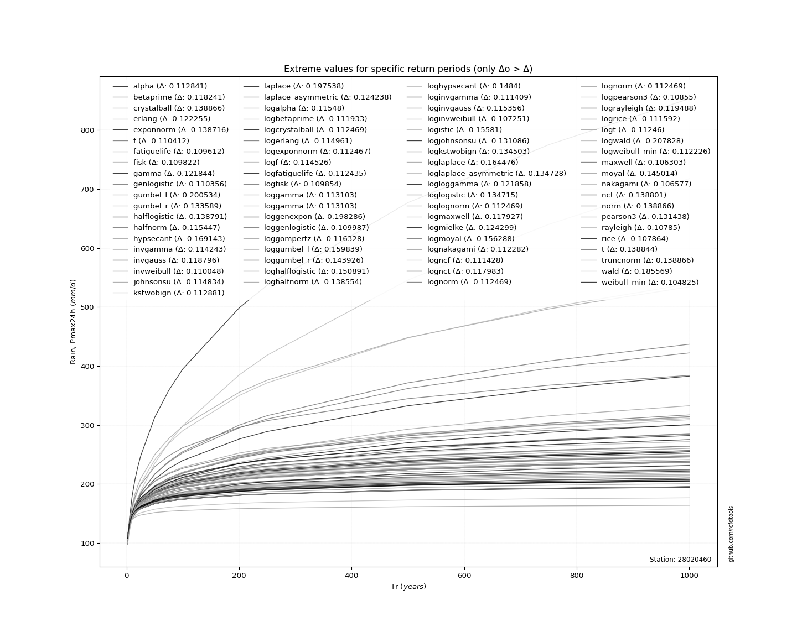</img>

</div>


<div align="center">

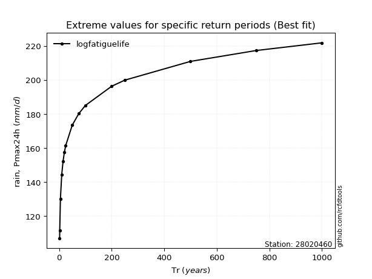</img>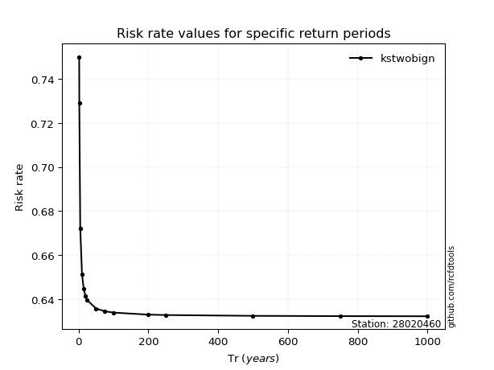</img>

</div>


<sub>**APP DISCLAIMER**: NO WARRANTY - This software is provided by [github.com/rcfdtools](https://github.com/rcfdtools) "as is", without any express or implied warranty, including warranties of merchantability, fitness for a particular purpose, or non-infringement. There is no guarantee that the software will be error-free or operate without interruption. LIMITATION OF LIABILITY - Neither the authors nor copyright holders will be liable for claims or damages arising from the software or its use. You are responsible for determining if the software is appropriate for your use and assume all associated risks, including errors, legal compliance, and data loss. NO PROFESSIONAL ADVICE - The software provides general information and does not offer professional advice. It should not replace consultation with professional advisors.</sub>