<div align="center">


</div>

# PMP Station (rain, Pmax24h): 28020600

Probable Maximum Precipitation (PMP) is the greatest amount of rainfall for a specific duration that is meteorologically possible for a given location, acting as a "worst-case" scenario for extreme storms, crucial for designing safety-critical infrastructure like bridges, river deviations, dams, spillways, and nuclear plants to prevent catastrophic failure. PMP is calculated by hydrologists using meteorological data to determine the upper limit of extreme rainfall, often leading to the Probable Maximum Flood (PMF) for flood control design, and is increasingly being studied for climate change impacts.

<div align="center">

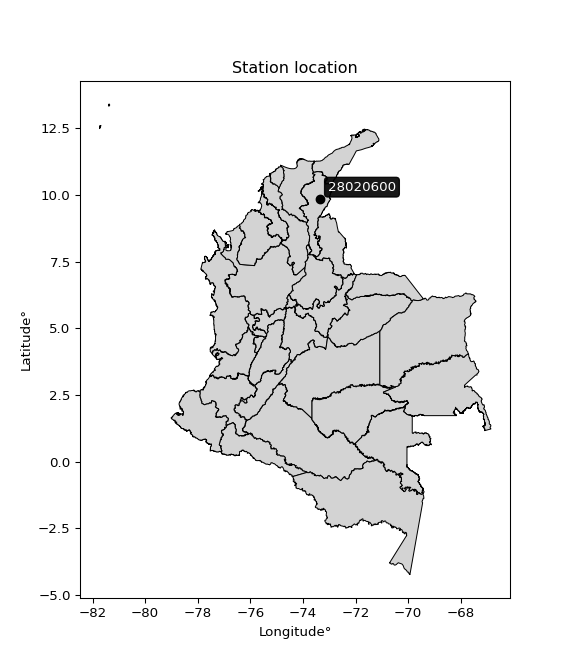</img>

</div>


## A. General information


### 1. General running parameters

• app_version: _v20251227_. • runtime: _2025-12-28 08:30:21.244080_. • Python version: _3.14.0_. • SciPy version: _1.16.3_. • Pandas version: _2.3.3_. • NumPy version: _2.3.5_. • Stations dataset (station_dataset_file): _dataset/pmax24h_in/conventional_cesarcolombia_1959_2022.csv_. • Stations catalog (station_catalog_file): _dataset/CNE_IDEAM.xls_. • Minimum year to eval til year_max (date_min): _1900_. • Maximum year to eval since year_min (date_max): _2024_. • Creates, save and include plots into reports (create_plot): _True_. • Plot only fit distributions with Δo > Δ (plot_only_fit): _True_. • Eval low extreme values, if False, evaluates high extreme values (low_extreme): _False_. • Eval every SciPy distribution as logarithmic (pdist_logarithmic_on): _True_. • Standard deviation normalized (ddof): _1.0_. • Return periods to eval in years (Tr): _[2, 2.33, 5, 10, 15, 20, 25, 50, 75, 100, 200, 250, 500, 750, 1000]_. • Minimum data sample per station, 0 means any (minimum_sample): _5_. • Z-Score maximum threshold to adjust a value, 0 means disable (zscore_max): _3.5_. • Z-Score minimum threshold to adjust a value, 0 means disable (zscore_min): _-2.5_. • Avoid zeros, e.g. rain = 0 (avoid_zeros): _True_. • Avoid null values (avoid_nans): _True_. [:file_folder:Dataset file.](../../dataset/pmax24h_in/conventional_cesarcolombia_1959_2022.csv)

> Delta Degrees of Freedom (DDOF): is a parameter used in the formulas for calculating variance and standard deviation. When ddof=0, the divisor is $N$ (the total number of observations) and this is used when your data set is the entire population. When ddof=1, the divisor is $N-1$ and this is used when your data set is a sample drawn from a larger population. Using $N-1$ provides an unbiased estimate of the population variance (known as Bessel´s correction).


### 2. Station info and location

|   id |   CODIGO | NOMBRE               | CATEGORIA     | TECNOLOGIA   | ESTADO   | FECHA_INSTALACION   |   FECHA_SUSPENSION |   ALTITUD |   LATITUD |   LONGITUD | DEPARTAMENTO   | MUNICIPIO       | AREA_OPERATIVA                                         | ENTIDAD                                                     | AREA_HIDROGRAFICA   | ZONA_HIDROGRAFICA   | SUBZONA_HIDROGRAFICA   |   CORRIENTE | Catalogo   |
|-----:|---------:|:---------------------|:--------------|:-------------|:---------|:--------------------|-------------------:|----------:|----------:|-----------:|:---------------|:----------------|:-------------------------------------------------------|:------------------------------------------------------------|:--------------------|:--------------------|:-----------------------|------------:|:-----------|
|    0 | 28020600 | EL RETORNO[28020600] | Pluviométrica | Convencional | Activa   | 15/02/1979          |                nan |       150 |   9.85472 |   -73.3572 | Cesar          | Agustín Codazzi | Area Operativa 05 - Magdalena-Cesar-Guajira-San Andrés | INSTITUTO DE HIDROLOGIA METEOROLOGIA Y ESTUDIOS AMBIENTALES | Magdalena Cauca     | Cesar               | Medio Cesar            |         nan | CNE_IDEAM  |

<div align="center">

Map location in: [:earth_americas:Google](http://maps.google.com/maps?q=9.854722222,-73.35716667) [:earth_americas:OSM](https://www.openstreetmap.org/#map=18/9.854722222/-73.35716667&layers=P) [:earth_americas:Bing](https://www.bing.com/maps?cp=9.854722222~-73.35716667&lvl=18) [:earth_americas:Apple](https://maps.apple.com/frame?center=9.854722222%2C-73.35716667&span=0.003%2C0.006)

</div>


<div align="center">

```geojson
{
  "type": "Feature",
  "geometry": {
    "type": "Point", 
    "coordinates": [-73.35716667, 9.854722222]
  }, 
  "properties": {
    "Name": "28020600"
  }
}
```

</div>


### 3. Discrete values table and plot

|               |           0 |         1 |           2 |          3 |          4 |           5 |            6 |           7 |            8 |           9 |          10 |          11 |         12 |          13 |         14 |          15 |          16 |          17 |        18 |          19 |         20 |          21 |          22 |         23 |          24 |         25 |          26 |         27 |          28 |         29 |           30 |         31 |         32 |         33 |         34 |          35 |         36 |          37 |         38 |          39 |
|:--------------|------------:|----------:|------------:|-----------:|-----------:|------------:|-------------:|------------:|-------------:|------------:|------------:|------------:|-----------:|------------:|-----------:|------------:|------------:|------------:|----------:|------------:|-----------:|------------:|------------:|-----------:|------------:|-----------:|------------:|-----------:|------------:|-----------:|-------------:|-----------:|-----------:|-----------:|-----------:|------------:|-----------:|------------:|-----------:|------------:|
| Date          | 1981        | 1982      | 1983        | 1984       | 1985       | 1986        | 1987         | 1988        | 1989         | 1990        | 1991        | 1992        | 1993       | 1994        | 1995       | 1996        | 1997        | 1998        | 1999      | 2000        | 2001       | 2002        | 2003        | 2004       | 2005        | 2006       | 2007        | 2008       | 2009        | 2010       | 2011         | 2012       | 2013       | 2014       | 2015       | 2016        | 2017       | 2018        | 2019       | 2021        |
| Value         |  103.23     |  118      |   80        |   67       |   97       |   98        |   93         |   82        |   93         |  113        |  112.1      |   75        |   95       |  100.3      |  135.1     |   85.4      |   73        |  110        |   99      |   94.7      |   43.4     |   98        |   79.2      |   97       |   72        |  115       |   75        |   62       |   81        |  133       |   91         |   63.4752  |  140       |   53       |   65       |   98        |  116       |   78        |  122       |   90        |
| Value_initial |  103.23     |  118      |   80        |   67       |   97       |   98        |   93         |   82        |   93         |  113        |  112.1      |   75        |   95       |  100.3      |  135.1     |   85.4      |   73        |  110        |   99      |   94.7      |   43.4     |   98        |   79.2      |   97       |   72        |  115       |   75        |   62       |   81        |  133       |   91         |   63.4752  |  140       |   53       |   65       |   98        |  116       |   78        |  122       |   90        |
| count         |   40        |   40      |   40        |   40       |   40       |   40        |   40         |   40        |   40         |   40        |   40        |   40        |   40       |   40        |   40       |   40        |   40        |   40        |   40      |   40        |   40       |   40        |   40        |   40       |   40        |   40       |   40        |   40       |   40        |   40       |   40         |   40       |   40       |   40       |   40       |   40        |   40       |   40        |   40       |   40        |
| mean          |   92.3976   |   92.3976 |   92.3976   |   92.3976  |   92.3976  |   92.3976   |   92.3976    |   92.3976   |   92.3976    |   92.3976   |   92.3976   |   92.3976   |   92.3976  |   92.3976   |   92.3976  |   92.3976   |   92.3976   |   92.3976   |   92.3976 |   92.3976   |   92.3976  |   92.3976   |   92.3976   |   92.3976  |   92.3976   |   92.3976  |   92.3976   |   92.3976  |   92.3976   |   92.3976  |   92.3976    |   92.3976  |   92.3976  |   92.3976  |   92.3976  |   92.3976   |   92.3976  |   92.3976   |   92.3976  |   92.3976   |
| std           |   22.1704   |   22.1704 |   22.1704   |   22.1704  |   22.1704  |   22.1704   |   22.1704    |   22.1704   |   22.1704    |   22.1704   |   22.1704   |   22.1704   |   22.1704  |   22.1704   |   22.1704  |   22.1704   |   22.1704   |   22.1704   |   22.1704 |   22.1704   |   22.1704  |   22.1704   |   22.1704   |   22.1704  |   22.1704   |   22.1704  |   22.1704   |   22.1704  |   22.1704   |   22.1704  |   22.1704    |   22.1704  |   22.1704  |   22.1704  |   22.1704  |   22.1704   |   22.1704  |   22.1704   |   22.1704  |   22.1704   |
| zscore        |    0.488612 |    1.1548 |   -0.559197 |   -1.14556 |    0.20759 |    0.252695 |    0.0271695 |   -0.468986 |    0.0271695 |    0.929271 |    0.888677 |   -0.784722 |    0.11738 |    0.356437 |    1.92609 |   -0.315629 |   -0.874932 |    0.793956 |    0.2978 |    0.103848 |   -2.21004 |    0.252695 |   -0.595281 |    0.20759 |   -0.920037 |    1.01948 |   -0.784722 |   -1.37109 |   -0.514092 |    1.83137 |   -0.0630406 |   -1.30455 |    2.14711 |   -1.77703 |   -1.23577 |    0.252695 |    1.06459 |   -0.649407 |    1.33522 |   -0.108146 |

<div align="center">

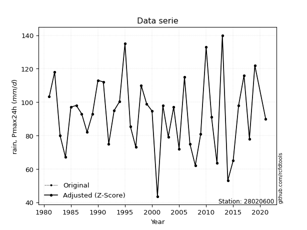</img>

</div>


> The initial value (value_initial) correspond to the initial obtained or null completed value, and value (value) is adjusted only when the initial value is outside the valid range definite through the Z-Score value. If Z-Score is active, values out of range or outliers are replaced with the station mean value


### 4. Active continuous probability distributions from SciPy (44 of 104 available)

[scipy.stats](https://docs.scipy.org/doc/scipy/reference/stats.html) is a Python´s powerful submodule within the SciPy library for comprehensive statistical analysis, offering over 130 probability distributions (like Normal, Poisson), functions for descriptive stats (mean, variance), hypothesis testing (t-tests, chi-square), random variable generation, and statistical tests, making it essential for data science, modeling, and research. It provides tools to explore, model, and draw conclusions from data efficiently, working seamlessly with NumPy.

<div align="center">

|   id | p_dist             |   n_parameter | fit_method   | label                                                                       | active   | ref                                                                                                        |
|-----:|:-------------------|--------------:|:-------------|:----------------------------------------------------------------------------|:---------|:-----------------------------------------------------------------------------------------------------------|
|    0 | alpha              |             3 | MLE          | Alpha                                                                       | True     | [:mortar_board:](https://docs.scipy.org/doc/scipy/reference/generated/scipy.stats.alpha.html)              |
|    1 | betaprime          |             4 | MLE          | Beta prime                                                                  | True     | [:mortar_board:](https://docs.scipy.org/doc/scipy/reference/generated/scipy.stats.betaprime.html)          |
|    2 | chi2               |             3 | MLE          | Chi²                                                                        | True     | [:mortar_board:](https://docs.scipy.org/doc/scipy/reference/generated/scipy.stats.chi2.html)               |
|    3 | crystalball        |             4 | MLE          | Crystalball                                                                 | True     | [:mortar_board:](https://docs.scipy.org/doc/scipy/reference/generated/scipy.stats.crystalball.html)        |
|    4 | erlang             |             3 | MLE          | Erlang                                                                      | True     | [:mortar_board:](https://docs.scipy.org/doc/scipy/reference/generated/scipy.stats.erlang.html)             |
|    5 | expon              |             2 | MLE          | Exponential                                                                 | True     | [:mortar_board:](https://docs.scipy.org/doc/scipy/reference/generated/scipy.stats.expon.html)              |
|    6 | exponnorm          |             3 | MLE          | Exponentially modified Normal                                               | True     | [:mortar_board:](https://docs.scipy.org/doc/scipy/reference/generated/scipy.stats.exponnorm.html)          |
|    7 | f                  |             4 | MLE          | F                                                                           | True     | [:mortar_board:](https://docs.scipy.org/doc/scipy/reference/generated/scipy.stats.f.html)                  |
|    8 | fatiguelife        |             3 | MLE          | Fatigue-life (Birnbaum-Saunders)                                            | True     | [:mortar_board:](https://docs.scipy.org/doc/scipy/reference/generated/scipy.stats.fatiguelife.html)        |
|    9 | fisk               |             3 | MLE          | Fisk                                                                        | True     | [:mortar_board:](https://docs.scipy.org/doc/scipy/reference/generated/scipy.stats.fisk.html)               |
|   10 | gamma              |             3 | MLE          | Gamma                                                                       | True     | [:mortar_board:](https://docs.scipy.org/doc/scipy/reference/generated/scipy.stats.gamma.html)              |
|   11 | genexpon           |             5 | MLE          | Generalized exponential                                                     | True     | [:mortar_board:](https://docs.scipy.org/doc/scipy/reference/generated/scipy.stats.genexpon.html)           |
|   12 | genlogistic        |             3 | MLE          | Generalized logistic                                                        | True     | [:mortar_board:](https://docs.scipy.org/doc/scipy/reference/generated/scipy.stats.genlogistic.html)        |
|   13 | gibrat             |             2 | MM           | Gibrat                                                                      | True     | [:mortar_board:](https://docs.scipy.org/doc/scipy/reference/generated/scipy.stats.gibrat.html)             |
|   14 | gompertz           |             3 | MLE          | Gompertz (or truncated Gumbel)                                              | True     | [:mortar_board:](https://docs.scipy.org/doc/scipy/reference/generated/scipy.stats.gompertz.html)           |
|   15 | gumbel_l           |             2 | MM           | Gumbel Left Skew                                                            | True     | [:mortar_board:](https://docs.scipy.org/doc/scipy/reference/generated/scipy.stats.gumbel_l.html)           |
|   16 | gumbel_r           |             2 | MM           | Gumbel Right Skew                                                           | True     | [:mortar_board:](https://docs.scipy.org/doc/scipy/reference/generated/scipy.stats.gumbel_r.html)           |
|   17 | halflogistic       |             2 | MM           | Half-logistic                                                               | True     | [:mortar_board:](https://docs.scipy.org/doc/scipy/reference/generated/scipy.stats.halflogistic.html)       |
|   18 | halfnorm           |             2 | MM           | Half Normal                                                                 | True     | [:mortar_board:](https://docs.scipy.org/doc/scipy/reference/generated/scipy.stats.halfnorm.html)           |
|   19 | hypsecant          |             2 | MM           | hyperbolic secant                                                           | True     | [:mortar_board:](https://docs.scipy.org/doc/scipy/reference/generated/scipy.stats.hypsecant.html)          |
|   20 | invgamma           |             3 | MLE          | Inverted gamma                                                              | True     | [:mortar_board:](https://docs.scipy.org/doc/scipy/reference/generated/scipy.stats.invgamma.html)           |
|   21 | invgauss           |             3 | MLE          | Inverse Gaussian                                                            | True     | [:mortar_board:](https://docs.scipy.org/doc/scipy/reference/generated/scipy.stats.invgauss.html)           |
|   22 | invweibull         |             3 | MLE          | Inverted Weibull                                                            | True     | [:mortar_board:](https://docs.scipy.org/doc/scipy/reference/generated/scipy.stats.invweibull.html)         |
|   23 | johnsonsu          |             4 | MLE          | Johnson Su                                                                  | True     | [:mortar_board:](https://docs.scipy.org/doc/scipy/reference/generated/scipy.stats.johnsonsu.html)          |
|   24 | kstwobign          |             2 | MLE          | Limiting distribution of scaled Kolmogorov-Smirnov two-sided test statistic | True     | [:mortar_board:](https://docs.scipy.org/doc/scipy/reference/generated/scipy.stats.kstwobign.html)          |
|   25 | laplace            |             2 | MM           | Laplace                                                                     | True     | [:mortar_board:](https://docs.scipy.org/doc/scipy/reference/generated/scipy.stats.laplace.html)            |
|   26 | laplace_asymmetric |             3 | MLE          | Asymmetric Laplace                                                          | True     | [:mortar_board:](https://docs.scipy.org/doc/scipy/reference/generated/scipy.stats.laplace_asymmetric.html) |
|   27 | loggamma           |             3 | MLE          | Log gamma                                                                   | True     | [:mortar_board:](https://docs.scipy.org/doc/scipy/reference/generated/scipy.stats.loggamma.html)           |
|   28 | logistic           |             2 | MM           | Logistic (or Sech-squared)                                                  | True     | [:mortar_board:](https://docs.scipy.org/doc/scipy/reference/generated/scipy.stats.logistic.html)           |
|   29 | lognorm            |             3 | MLE          | Log Normal                                                                  | True     | [:mortar_board:](https://docs.scipy.org/doc/scipy/reference/generated/scipy.stats.lognorm.html)            |
|   30 | maxwell            |             2 | MM           | Maxwell                                                                     | True     | [:mortar_board:](https://docs.scipy.org/doc/scipy/reference/generated/scipy.stats.maxwell.html)            |
|   31 | mielke             |             4 | MLE          | Mielke Beta-Kappa / Dagum                                                   | True     | [:mortar_board:](https://docs.scipy.org/doc/scipy/reference/generated/scipy.stats.mielke.html)             |
|   32 | moyal              |             2 | MM           | Moyal                                                                       | True     | [:mortar_board:](https://docs.scipy.org/doc/scipy/reference/generated/scipy.stats.moyal.html)              |
|   33 | nakagami           |             3 | MLE          | Nakagami                                                                    | True     | [:mortar_board:](https://docs.scipy.org/doc/scipy/reference/generated/scipy.stats.nakagami.html)           |
|   34 | ncf                |             5 | MLE          | Non-central F distribution                                                  | True     | [:mortar_board:](https://docs.scipy.org/doc/scipy/reference/generated/scipy.stats.ncf.html)                |
|   35 | nct                |             4 | MLE          | Non-central Student’s t                                                     | True     | [:mortar_board:](https://docs.scipy.org/doc/scipy/reference/generated/scipy.stats.nct.html)                |
|   36 | norm               |             2 | MM           | Normal                                                                      | True     | [:mortar_board:](https://docs.scipy.org/doc/scipy/reference/generated/scipy.stats.norm.html)               |
|   37 | pearson3           |             3 | MM           | Pearson type III                                                            | True     | [:mortar_board:](https://docs.scipy.org/doc/scipy/reference/generated/scipy.stats.pearson3.html)           |
|   38 | rayleigh           |             2 | MM           | Rayleigh                                                                    | True     | [:mortar_board:](https://docs.scipy.org/doc/scipy/reference/generated/scipy.stats.rayleigh.html)           |
|   39 | rice               |             3 | MLE          | Rice                                                                        | True     | [:mortar_board:](https://docs.scipy.org/doc/scipy/reference/generated/scipy.stats.rice.html)               |
|   40 | t                  |             3 | MLE          | Student’s t                                                                 | True     | [:mortar_board:](https://docs.scipy.org/doc/scipy/reference/generated/scipy.stats.t.html)                  |
|   41 | truncnorm          |             4 | MLE          | Truncated normal                                                            | True     | [:mortar_board:](https://docs.scipy.org/doc/scipy/reference/generated/scipy.stats.truncnorm.html)          |
|   42 | wald               |             2 | MM           | Wald                                                                        | True     | [:mortar_board:](https://docs.scipy.org/doc/scipy/reference/generated/scipy.stats.wald.html)               |
|   43 | weibull_min        |             3 | MLE          | Weibull minimum                                                             | True     | [:mortar_board:](https://docs.scipy.org/doc/scipy/reference/generated/scipy.stats.weibull_min.html)        |

</div>

> **n_parameter:** # arguments & localization & scale.
>
> **Fit methods:** (MLE) maximum likelihood, (MM) L-moments.
>
>**Inactive:** foldnorm, gennorm, norminvgauss, powernorm, powerlognorm, skewnorm, genextreme, anglit, arcsine, argus, beta, bradford, burr, burr12, cauchy, cosine, halfcauchy, foldcauchy, skewcauchy, wrapcauchy, dgamma, gengamma, exponweib, exponpow, truncexpon, gausshyper, genhalflogistic, genhyperbolic, geninvgauss, halfgennorm, johnsonsb, kappa4, kappa3, ksone, kstwo, loglaplace, levy, levy_l, levy_stable, ncx2, pareto, genpareto, truncpareto, lomax, powerlaw, rdist, rel_breitwigner, recipinvgauss, semicircular, studentized_range, trapezoid, triang, truncweibull_min, tukeylambda, uniform, loguniform, vonmises, vonmises_line, weibull_max, dweibull, 


## B. Probability distributions vs. Empirical distributions

A continuous probability distribution (CPD) describes probabilities for variables that can take any value within a range (like rain any time), unlike discrete variables with specific outcomes (like temperature). It uses a Probability Density Function (PDF), a curve where the total area under it equals 1, and the probability of the variable falling within an interval (a to b) is found by calculating the area under the curve between those points. A key feature is that the probability of hitting any single exact value is zero, so probabilities are always expressed for ranges, e.g., $P(a ≤ X ≤ b)$.

<div align="center">

Distributions parameters from station values
|    |   station | p_dist                |   n |              loc |           scale | shape                  | shape1             | shape2              | shape3   |
|---:|----------:|:----------------------|----:|-----------------:|----------------:|:-----------------------|:-------------------|:--------------------|:---------|
|  0 |  28020600 | alpha                 |  40 |   -267.759       |  5921.23        | 16.499337552063437     |                    |                     |          |
|  1 |  28020600 | betaprime             |  40 |    -86.5353      | 11550.4         | 65.6584206431265       | 4233.5680735417245 |                     |          |
|  2 |  28020600 | chi2                  |  40 |    -99.7747      |     1.24677     | 154.00205263745644     |                    |                     |          |
|  3 |  28020600 | crystalball           |  40 |     92.3976      |    21.8916      | 7610.2335712953645     | 1551.2397474977797 |                     |          |
|  4 |  28020600 | erlang                |  40 |   -290.363       |     1.25277     | 305.52457188545475     |                    |                     |          |
|  5 |  28020600 | expon                 |  40 |     43.4         |    48.9976      |                        |                    |                     |          |
|  6 |  28020600 | exponnorm             |  40 |     87.4184      |    21.3191      | 0.23355763046257616    |                    |                     |          |
|  7 |  28020600 | f                     |  40 |   -262.724       |   355.116       | 528.1937117875993      | 126654.76441997843 |                     |          |
|  8 |  28020600 | fatiguelife           |  40 |   -452.899       |   544.86        | 0.040149597579263056   |                    |                     |          |
|  9 |  28020600 | fisk                  |  40 |   -348.641       |   440.521       | 35.0294297430729       |                    |                     |          |
| 10 |  28020600 | gamma                 |  40 |   -279.534       |     1.28818     | 288.72480641812126     |                    |                     |          |
| 11 |  28020600 | genexpon              |  40 |     38.2763      |     8.80641     | 0.0015200071524950143  | 0.4822730740318905 | 0.12475558365139053 |          |
| 12 |  28020600 | genlogistic           |  40 |     85.1535      |    13.9883      | 1.4144437244157388     |                    |                     |          |
| 13 |  28020600 | gibrat                |  40 |     75.6972      |    10.1293      |                        |                    |                     |          |
| 14 |  28020600 | gompertz              |  40 |   -192.745       |    21.6199      | 1.1222207060483952e-06 |                    |                     |          |
| 15 |  28020600 | gumbel_l              |  40 |    102.25        |    17.0688      |                        |                    |                     |          |
| 16 |  28020600 | gumbel_r              |  40 |     82.5453      |    17.0688      |                        |                    |                     |          |
| 17 |  28020600 | halflogistic          |  40 |     66.4511      |    18.7165      |                        |                    |                     |          |
| 18 |  28020600 | halfnorm              |  40 |     63.4218      |    36.3159      |                        |                    |                     |          |
| 19 |  28020600 | hypsecant             |  40 |     92.3976      |    13.9366      |                        |                    |                     |          |
| 20 |  28020600 | invgamma              |  40 |   -184.29        | 42910.7         | 155.93544473520717     |                    |                     |          |
| 21 |  28020600 | invgauss              |  40 |    -59.0001      |  6656.48        | 0.022731887069675952   |                    |                     |          |
| 22 |  28020600 | invweibull            |  40 |     -2.42294e+09 |     2.42294e+09 | 116243744.1655032      |                    |                     |          |
| 23 |  28020600 | johnsonsu             |  40 |   -306.956       |   263.734       | -26.28837416664635     | 21.87475139883474  |                     |          |
| 24 |  28020600 | kstwobign             |  40 |      4.81287     |   100.683       |                        |                    |                     |          |
| 25 |  28020600 | laplace               |  40 |     92.3976      |    15.4797      |                        |                    |                     |          |
| 26 |  28020600 | laplace_asymmetric    |  40 |     95           |    17.1921      | 1.0785091083535727     |                    |                     |          |
| 27 |  28020600 | loggamma              |  40 |  -5287.17        |   759.682       | 1189.9960788322996     |                    |                     |          |
| 28 |  28020600 | logistic              |  40 |     92.3976      |    12.0695      |                        |                    |                     |          |
| 29 |  28020600 | lognorm               |  40 |   -463.576       |   555.543       | 0.039368393217587595   |                    |                     |          |
| 30 |  28020600 | maxwell               |  40 |     40.5238      |    32.5071      |                        |                    |                     |          |
| 31 |  28020600 | mielke                |  40 |     -2.28729     |   104.861       | 5.122255332481426      | 9.713270762401251  |                     |          |
| 32 |  28020600 | moyal                 |  40 |     79.8786      |     9.85467     |                        |                    |                     |          |
| 33 |  28020600 | nakagami              |  40 |     46.1416      |    51.5821      | 1.3585903083385338     |                    |                     |          |
| 34 |  28020600 | ncf                   |  40 |     -8.65274     |     0.013895    | 0.011804241116691306   | 1521.027146428598  | 85.72825114946734   |          |
| 35 |  28020600 | nct                   |  40 |     -0.941133    |    21.1217      | 159.98179308557792     | 4.398241853182886  |                     |          |
| 36 |  28020600 | norm                  |  40 |     92.3976      |    21.8916      |                        |                    |                     |          |
| 37 |  28020600 | pearson3              |  40 |     92.3976      |    21.8915      | 0.09597812590970434    |                    |                     |          |
| 38 |  28020600 | rayleigh              |  40 |     50.5178      |    33.4153      |                        |                    |                     |          |
| 39 |  28020600 | rice                  |  40 |     35.6622      |    23.5579      | 2.1595526269116054     |                    |                     |          |
| 40 |  28020600 | t                     |  40 |     92.3974      |    21.8895      | 9286.029173343388      |                    |                     |          |
| 41 |  28020600 | truncnorm             |  40 |     92.3976      |    21.8916      | -967.9454071148685     | 821.2467980406882  |                     |          |
| 42 |  28020600 | wald                  |  40 |     70.5061      |    21.8916      |                        |                    |                     |          |
| 43 |  28020600 | weibull_min           |  40 |     28.5508      |    71.2751      | 3.20136004023477       |                    |                     |          |
| 44 |  28020600 | logalpha              |  40 |     -4.838       |   336.77        | 36.10767436051404      |                    |                     |          |
| 45 |  28020600 | logbetaprime          |  40 |     -4.60652     |    12.8763      | 610.1427477024276      | 864.4120158838159  |                     |          |
| 46 |  28020600 | logchi2               |  40 |      1.6385      |     0.01227     | 232.70487520117376     |                    |                     |          |
| 47 |  28020600 | logcrystalball        |  40 |      4.49606     |     0.251133    | 31.645083312335004     | 887.9229649190794  |                     |          |
| 48 |  28020600 | logerlang             |  40 |     -0.0689694   |     0.0145726   | 313.1463660872889      |                    |                     |          |
| 49 |  28020600 | logexpon              |  40 |      3.77046     |     0.725602    |                        |                    |                     |          |
| 50 |  28020600 | logexponnorm          |  40 |      4.49587     |     0.251132    | 0.0007532928615311775  |                    |                     |          |
| 51 |  28020600 | logf                  |  40 |   -235.416       |   239.912       | 6193280.370783921      | 2567883.607653443  |                     |          |
| 52 |  28020600 | logfatiguelife        |  40 |   -101.985       |   106.481       | 0.0023530709525293467  |                    |                     |          |
| 53 |  28020600 | logfisk               |  40 |     -1.02866e+06 |     1.02866e+06 | 7280915.013104174      |                    |                     |          |
| 54 |  28020600 | loggamma              |  40 |      0.457555    |     0.016319    | 247.53050834641473     |                    |                     |          |
| 55 |  28020600 | loggenexpon           |  40 |      3.77046     | 21904.6         | 2240.0514173722822     | 80402.13914739442  | 25268.2135133885    |          |
| 56 |  28020600 | loggenlogistic        |  40 |      4.634       |     0.104417    | 0.5158417920267155     |                    |                     |          |
| 57 |  28020600 | loggibrat             |  40 |      4.30448     |     0.116202    |                        |                    |                     |          |
| 58 |  28020600 | loggompertz           |  40 |      3.72869     |     0.227679    | 0.021311208407897457   |                    |                     |          |
| 59 |  28020600 | loggumbel_l           |  40 |      4.60908     |     0.195808    |                        |                    |                     |          |
| 60 |  28020600 | loggumbel_r           |  40 |      4.38304     |     0.195808    |                        |                    |                     |          |
| 61 |  28020600 | loghalflogistic       |  40 |      4.19839     |     0.214726    |                        |                    |                     |          |
| 62 |  28020600 | loghalfnorm           |  40 |      4.16366     |     0.416606    |                        |                    |                     |          |
| 63 |  28020600 | loghypsecant          |  40 |      4.49606     |     0.159876    |                        |                    |                     |          |
| 64 |  28020600 | loginvgamma           |  40 |     -1.41072     |  3086.56        | 523.6709722510423      |                    |                     |          |
| 65 |  28020600 | loginvgauss           |  40 |      1.78365     |   276.59        | 0.009782596758561649   |                    |                     |          |
| 66 |  28020600 | loginvweibull         |  40 |     -6.57767e+07 |     6.57767e+07 | 234412961.29859674     |                    |                     |          |
| 67 |  28020600 | logjohnsonsu          |  40 |      5.60492     |     0.185733    | 11.101478741122506     | 4.508168554001017  |                     |          |
| 68 |  28020600 | logkstwobign          |  40 |      3.28042     |     1.4028      |                        |                    |                     |          |
| 69 |  28020600 | loglaplace            |  40 |      4.49606     |     0.177578    |                        |                    |                     |          |
| 70 |  28020600 | loglaplace_asymmetric |  40 |      4.58497     |     0.182796    | 1.2724494326239097     |                    |                     |          |
| 71 |  28020600 | logloggamma           |  40 |      4.22473     |     0.366679    | 2.576460725496184      |                    |                     |          |
| 72 |  28020600 | loglogistic           |  40 |      4.49606     |     0.138457    |                        |                    |                     |          |
| 73 |  28020600 | loglognorm            |  40 | -16380.2         | 16384.7         | 1.5327328618886874e-05 |                    |                     |          |
| 74 |  28020600 | logmaxwell            |  40 |      3.90101     |     0.372893    |                        |                    |                     |          |
| 75 |  28020600 | logmielke             |  40 |      3.32665     |     1.40388     | 4.322335464535234      | 16.78542362535434  |                     |          |
| 76 |  28020600 | logmoyal              |  40 |      4.35245     |     0.11305     |                        |                    |                     |          |
| 77 |  28020600 | lognakagami           |  40 |    -67.4001      |    71.897       | 20427.473419406935     |                    |                     |          |
| 78 |  28020600 | logncf                |  40 |    -61.7267      |    63.7086      | 294984.6120362994      | 258613.44308270322 | 11641.913102603077  |          |
| 79 |  28020600 | lognct                |  40 |     21.8143      |     0.250989    | 637667.1791329856      | -68.99984074896167 |                     |          |
| 80 |  28020600 | lognorm               |  40 |      4.49606     |     0.251133    |                        |                    |                     |          |
| 81 |  28020600 | logpearson3           |  40 |      4.49606     |     0.251133    | -0.5896766626640191    |                    |                     |          |
| 82 |  28020600 | lograyleigh           |  40 |      4.0156      |     0.383352    |                        |                    |                     |          |
| 83 |  28020600 | logrice               |  40 |    -96.8525      |     0.251047    | 403.7029021049957      |                    |                     |          |
| 84 |  28020600 | logt                  |  40 |      4.50393     |     0.234053    | 15.02106105598622      |                    |                     |          |
| 85 |  28020600 | logtruncnorm          |  40 |     -0.166113    |     1.14621     | 3.4344115769874572     | 4.4561962919345675 |                     |          |
| 86 |  28020600 | logwald               |  40 |      4.24489     |     0.251169    |                        |                    |                     |          |
| 87 |  28020600 | logweibull_min        |  40 |      2.59382     |     2.00821     | 9.084695206418449      |                    |                     |          |

</div>

> **loc** (Location parameter): This shifts the distribution along the x-axis. For many common distributions, like the normal (Gaussian) distribution, loc represents the mean $μ$. For others, like the uniform distribution, it might represent the minimum value, or for the beta distribution, the left end of the support interval.
>
> **scale** (Scale parameter): This determines the width or spread of the distribution. For the normal distribution, scale represents the standard deviation $σ$. For a uniform distribution, it defines the length of the interval (from $loc$ to $loc + scale$).
>
> **shape** (Shape parameters): Refers to parameters that define the specific form of a probability distribution, distinct from its location (loc) and scale (scale). These parameters are required arguments for most distribution functions. For example, a normal (Gaussian) distribution is fully defined by its location (mean) and scale (standard deviation), so it has no specific shape parameters beyond loc and scale. However, other distributions have intrinsic properties that need specification, as Gamma distribution that takes a shape parameter, often named $a$ or $alpha$.


### 0. Cumulative distribution values - CDF (88 evaluated)

Cumulative Distribution Function (CDF), denoted as $F$<sub>$X$</sub>$(x)$, is a function that gives the probability that a random variable $X$ will take a value less than or equal to a specific value, $x$ (i.e., $(P(X≥x)$. It essentially "accumulates" probabilities from a given point up to the far right (positive infinity), providing a complete picture of the distribution´s probabilities for both discrete (like rain) and continuous (like temperature) variables, helping to find probabilities over ranges or above certain values.

<div align="center">

CDF ordered by x ascending and calculating $log(f(x))$ separately
|   id |   Station |   date |        x |   count |    mean |     std |     zscore |   Value_initial |   station |   m |      alpha |   alpha_pdf |   betaprime |   betaprime_pdf |       chi2 |   chi2_pdf |   crystalball |   crystalball_pdf |    erlang |   erlang_pdf |    expon |   expon_pdf |   exponnorm |   exponnorm_pdf |          f |      f_pdf |   fatiguelife |   fatiguelife_pdf |      fisk |   fisk_pdf |     gamma |   gamma_pdf |   genexpon |   genexpon_pdf |   genlogistic |   genlogistic_pdf |    gibrat |   gibrat_pdf |   gompertz |   gompertz_pdf |   gumbel_l |   gumbel_l_pdf |    gumbel_r |   gumbel_r_pdf |   halflogistic |   halflogistic_pdf |   halfnorm |   halfnorm_pdf |   hypsecant |   hypsecant_pdf |   invgamma |   invgamma_pdf |   invgauss |   invgauss_pdf |   invweibull |   invweibull_pdf |   johnsonsu |   johnsonsu_pdf |   kstwobign |   kstwobign_pdf |   laplace |   laplace_pdf |   laplace_asymmetric |   laplace_asymmetric_pdf |   loggamma |   loggamma_pdf |   logistic |   logistic_pdf |    lognorm |   lognorm_pdf |     maxwell |   maxwell_pdf |    mielke |   mielke_pdf |       moyal |   moyal_pdf |   nakagami |   nakagami_pdf |        ncf |    ncf_pdf |       nct |    nct_pdf |      norm |   norm_pdf |   pearson3 |   pearson3_pdf |   rayleigh |   rayleigh_pdf |       rice |   rice_pdf |         t |      t_pdf |   truncnorm |   truncnorm_pdf |       wald |   wald_pdf |   weibull_min |   weibull_min_pdf |   logalpha |   logalpha_pdf |   logbetaprime |   logbetaprime_pdf |    logchi2 |   logchi2_pdf |   logcrystalball |   logcrystalball_pdf |   logerlang |   logerlang_pdf |   logexpon |   logexpon_pdf |   logexponnorm |   logexponnorm_pdf |       logf |   logf_pdf |   logfatiguelife |   logfatiguelife_pdf |    logfisk |   logfisk_pdf |   loggenexpon |   loggenexpon_pdf |   loggenlogistic |   loggenlogistic_pdf |   loggibrat |   loggibrat_pdf |   loggompertz |   loggompertz_pdf |   loggumbel_l |   loggumbel_l_pdf |   loggumbel_r |   loggumbel_r_pdf |   loghalflogistic |   loghalflogistic_pdf |   loghalfnorm |   loghalfnorm_pdf |   loghypsecant |   loghypsecant_pdf |   loginvgamma |   loginvgamma_pdf |   loginvgauss |   loginvgauss_pdf |   loginvweibull |   loginvweibull_pdf |   logjohnsonsu |   logjohnsonsu_pdf |   logkstwobign |   logkstwobign_pdf |   loglaplace |   loglaplace_pdf |   loglaplace_asymmetric |   loglaplace_asymmetric_pdf |   logloggamma |   logloggamma_pdf |   loglogistic |   loglogistic_pdf |   loglognorm |   loglognorm_pdf |   logmaxwell |   logmaxwell_pdf |   logmielke |   logmielke_pdf |    logmoyal |   logmoyal_pdf |   lognakagami |   lognakagami_pdf |     logncf |   logncf_pdf |     lognct |   lognct_pdf |   logpearson3 |   logpearson3_pdf |   lograyleigh |   lograyleigh_pdf |    logrice |   logrice_pdf |       logt |   logt_pdf |   logtruncnorm |   logtruncnorm_pdf |   logwald |   logwald_pdf |   logweibull_min |   logweibull_min_pdf |
|-----:|----------:|-------:|---------:|--------:|--------:|--------:|-----------:|----------------:|----------:|----:|-----------:|------------:|------------:|----------------:|-----------:|-----------:|--------------:|------------------:|----------:|-------------:|---------:|------------:|------------:|----------------:|-----------:|-----------:|--------------:|------------------:|----------:|-----------:|----------:|------------:|-----------:|---------------:|--------------:|------------------:|----------:|-------------:|-----------:|---------------:|-----------:|---------------:|------------:|---------------:|---------------:|-------------------:|-----------:|---------------:|------------:|----------------:|-----------:|---------------:|-----------:|---------------:|-------------:|-----------------:|------------:|----------------:|------------:|----------------:|----------:|--------------:|---------------------:|-------------------------:|-----------:|---------------:|-----------:|---------------:|-----------:|--------------:|------------:|--------------:|----------:|-------------:|------------:|------------:|-----------:|---------------:|-----------:|-----------:|----------:|-----------:|----------:|-----------:|-----------:|---------------:|-----------:|---------------:|-----------:|-----------:|----------:|-----------:|------------:|----------------:|-----------:|-----------:|--------------:|------------------:|-----------:|---------------:|---------------:|-------------------:|-----------:|--------------:|-----------------:|---------------------:|------------:|----------------:|-----------:|---------------:|---------------:|-------------------:|-----------:|-----------:|-----------------:|---------------------:|-----------:|--------------:|--------------:|------------------:|-----------------:|---------------------:|------------:|----------------:|--------------:|------------------:|--------------:|------------------:|--------------:|------------------:|------------------:|----------------------:|--------------:|------------------:|---------------:|-------------------:|--------------:|------------------:|--------------:|------------------:|----------------:|--------------------:|---------------:|-------------------:|---------------:|-------------------:|-------------:|-----------------:|------------------------:|----------------------------:|--------------:|------------------:|--------------:|------------------:|-------------:|-----------------:|-------------:|-----------------:|------------:|----------------:|------------:|---------------:|--------------:|------------------:|-----------:|-------------:|-----------:|-------------:|--------------:|------------------:|--------------:|------------------:|-----------:|--------------:|-----------:|-----------:|---------------:|-------------------:|----------:|--------------:|-----------------:|---------------------:|
|    0 |  28020600 |   2001 |  43.4    |      40 | 92.3976 | 22.1704 | -2.21004   |         43.4    |  28020600 |   1 | 0.00569888 | 0.000993419 |  0.00790896 |      0.00121286 | 0.00784217 | 0.00119954 |     0.0126041 |        0.00148877 | 0.0101396 |   0.00135031 | 0        |  0.0204091  |   0.0121879 |      0.0014632  | 0.00992356 | 0.00133597 |     0.0100124 |        0.00134045 | 0.0165588 | 0.00145505 | 0.0100309 |  0.00134208 |  0.0107672 |     0.00396361 |     0.0136815 |        0.00131687 | 0         |   0          |  0.0602908 |     0.00270291 |  0.0313143 |    0.00180557  | 4.97544e-05 |    2.88824e-05 |      0         |         0          | 0          |     0          |   0.0189182 |      0.00135665 | 0.00677277 |     0.00110661 |  0.0055591 |     0.00105202 |   0.00196821 |      0.000588342 |   0.0101511 |      0.00134699 |  0.00147186 |     0.000602612 | 0.021101  |    0.00136314 |            0.0332626 |               0.00179393 | 0.00135752 |      0.0198221 |  0.0169625 |     0.00138157 | 0.00193041 |     0.0244472 | 0.000183785 |   0.000191397 | 0.0141815 |   0.00158947 | 1.95156e-10 | 4.10627e-10 | 0          |     0          | 0.00571669 | 0.00103388 | 0.0111133 | 0.00139229 | 0.0126041 | 0.00148877 |  0.0105102 |     0.00137192 | 0          |     0          | 0.00542462 | 0.0014495  | 0.0126095 | 0.00148882 |   0.0126041 |      0.00148877 | 0          | 0          |    0.00657195 |        0.00141219 |  0.0012926 |      0.0193575 |      0.0623793 |           0.275785 | 0.00147316 |     0.0220796 |       0.00193041 |            0.0244472 |  0.00157833 |       0.0222574 |   0        |       1.37817  |     0.00193038 |           0.024447 | 0.00194961 |  0.0246851 |        0.0018313 |            0.0235177 | 0.00531322 |     0.0374074 |   1.46964e-08 |          0.102265 |        0.0140353 |            0.0693193 |    0        |        0        |    0.00428215 |          0.111969 |     0.0137077 |         0.0695238 |   1.20529e-10 |       1.40586e-08 |          0        |              0        |     0         |          0        |     0.00680466 |          0.0425588 |    0.00122548 |         0.0187122 |    0.00100169 |         0.0173887 |     0.000256932 |          0.00756938 |     0.00915111 |          0.0603018 |    0.000291916 |           0.011449 |   0.00840225 |        0.0473159 |               0.0186346 |                    0.080115 |    0.00923258 |         0.0597126 |    0.00526896 |         0.0378544 |   0.00193014 |        0.0244452 |   0          |         0        |  0.00689055 |       0.0671084 | 2.57199e-39 |    1.96899e-36 |    0.00192351 |          0.024413 | 0.00190093 |    0.0242773 | 0.00195578 |    0.0246992 |    0.00772877 |         0.0565993 |     0         |          0        | 0.00192429 |     0.0243853 | 0.00340991 |  0.0298023 |     2.2947e-07 |          3.2648    | 0         |      0        |       0.00774767 |            0.0595864 |
|    1 |  28020600 |   2014 |  53      |      40 | 92.3976 | 22.1704 | -1.77703   |         53      |  28020600 |   2 | 0.0249556  | 0.00335857  |  0.0294006  |      0.0035603  | 0.0291576  | 0.00354079 |     0.0359562 |        0.00360855 | 0.0325044 |   0.00357051 | 0.177928 |  0.0167778  |   0.0353232 |      0.00359342 | 0.032169   | 0.00356257 |     0.0322806 |        0.00356168 | 0.0378076 | 0.00317275 | 0.0323136 |  0.00356267 |  0.0778798 |     0.00966636 |     0.0338245 |        0.00310815 | 0         |   0          |  0.0923948 |     0.00406984 |  0.0543032 |    0.00309345  | 0.00353149  |    0.00116815  |      0         |         0          | 0          |     0          |   0.0376408 |      0.00269457 | 0.0272273  |     0.00347194 |  0.0265666 |     0.00369402 |   0.0196231  |      0.00370086  |   0.0324463 |      0.00355892 |  0.0239899  |     0.00486492  | 0.0392318 |    0.00253441 |            0.0558228 |               0.00301065 | 0.0167245  |      0.177812  |  0.0368184 |     0.00293823 | 0.0181482  |     0.17751   | 0.0143886   |   0.00335879  | 0.0376369 |   0.00348004 | 9.19762e-05 | 7.55692e-05 | 0.00514257 |     0.00201672 | 0.0258219  | 0.00349611 | 0.0336385 | 0.00355051 | 0.0359562 | 0.00360855 |  0.0330204 |     0.00357407 | 0.00275513 |     0.00221688 | 0.0307412  | 0.00402326 | 0.0359602 | 0.00360817 |   0.0359562 |      0.00360855 | 0          | 0          |    0.0320161  |        0.00412433 |  0.0167659 |      0.180842  |      0.137585  |           0.483218 | 0.0186727  |     0.197669  |       0.0181482  |            0.17751   |  0.0180067  |       0.186329  |   0.240733 |       1.0464   |     0.0181481  |           0.17751  | 0.0182952  |  0.178688  |        0.0177077 |            0.175094  | 0.0215034  |     0.148929  |   0.094112    |          0.777209 |        0.0376383 |            0.185619  |    0        |        0        |    0.0394716  |          0.259805 |     0.0375741 |         0.188242  |   0.000266243 |       0.011192    |          0        |              0        |     0         |          0        |     0.0237386  |          0.148344  |    0.0165563  |         0.180717  |    0.0173795  |         0.200033  |     0.0173265   |          0.250419   |     0.0327033  |          0.200243  |    0.0310412   |           0.414059 |   0.0258891  |        0.14579   |               0.0439984 |                    0.18916  |    0.0324401  |         0.197106  |    0.0219379  |         0.15497   |   0.0181475  |        0.177509  |   0.00168816 |         0.072597 |  0.0343626  |       0.23076   | 5.93855e-08 |    7.96484e-06 |    0.0181471  |          0.177663 | 0.0181265  |    0.178021  | 0.0182763  |    0.178306  |    0.0309816  |         0.202759  |     0         |          0        | 0.018116   |     0.177303  | 0.018815   |  0.155055  |     0.488761   |          1.76693   | 0         |      0        |       0.0318228  |            0.206652  |
|    2 |  28020600 |   2008 |  62      |      40 | 92.3976 | 22.1704 | -1.37109   |         62      |  28020600 |   3 | 0.0725719  | 0.00751659  |  0.0776517  |      0.00740872 | 0.0773606  | 0.00742862 |     0.0824841 |        0.00694952 | 0.0797044 |   0.0071548  | 0.315872 |  0.0139625  |   0.0818623 |      0.00697141 | 0.0793787  | 0.00716664 |     0.07944   |        0.00715607 | 0.0786794 | 0.00618361 | 0.0794693 |  0.00715382 |  0.18117   |     0.0129409  |     0.0751329 |        0.00637853 | 0         |   0          |  0.136707  |     0.00586986 |  0.0902625 |    0.00504198  | 0.0357094   |    0.00697155  |      0         |         0          | 0          |     0          |   0.0715795 |      0.0050929  | 0.0752622  |     0.00746854 |  0.0785041 |     0.00810774 |   0.0778775  |      0.00953727  |   0.0795109 |      0.0071374  |  0.096376   |     0.011204    | 0.0701682 |    0.00453292 |            0.0907014 |               0.00489172 | 0.071366   |      0.565955  |  0.0745672 |     0.00571749 | 0.0709093  |     0.53998   | 0.0673909   |   0.00861273  | 0.0812098 |   0.00641523 | 0.013243    | 0.0046637   | 0.0472574  |     0.00766343 | 0.0748759  | 0.00767469 | 0.0802166 | 0.00703538 | 0.0824841 | 0.00694952 |  0.0800748 |     0.00711604 | 0.0573286  |     0.00969381 | 0.0822442  | 0.00760494 | 0.0824829 | 0.00694882 |   0.0824841 |      0.00694952 | 0          | 0          |    0.0849293  |        0.00777304 |  0.0725892 |      0.578498  |      0.226753  |           0.650638 | 0.0780849  |     0.604503  |       0.0709093  |            0.53998   |  0.0741929  |       0.575796  |   0.388327 |       0.842987 |     0.0709095  |           0.539983 | 0.0713024  |  0.541734  |        0.0701119 |            0.538403  | 0.0625224  |     0.414868  |   0.238432    |          1.02079  |        0.0814301 |            0.399169  |    0        |        0        |    0.0963648  |          0.486748 |     0.0817815 |         0.400098  |   0.0248533   |       0.468966    |          0        |              0        |     0         |          0        |     0.0631369  |          0.392327  |    0.072677   |         0.58307   |    0.0797046  |         0.642065  |     0.0983737   |          0.812992   |     0.0821208  |          0.458957  |    0.140506    |           0.957922 |   0.0626181  |        0.352624  |               0.0863543 |                    0.37126  |    0.0812167  |         0.454456  |    0.0650969  |         0.439554  |   0.070909   |        0.539988  |   0.0531738  |         0.654677 |  0.0881943  |       0.476181  | 0.00675164  |    0.243796    |    0.0709522  |          0.540327 | 0.0710704  |    0.541712  | 0.0711725  |    0.540734  |    0.0817019  |         0.473721  |     0.0414411 |          0.727497 | 0.0708406  |     0.539764  | 0.0641197  |  0.468429  |     0.706867   |          1.06831   | 0         |      0        |       0.0825853  |            0.468522  |
|    3 |  28020600 |   2012 |  63.4752 |      40 | 92.3976 | 22.1704 | -1.30455   |         63.4752 |  28020600 |   4 | 0.0842668  | 0.0083436   |  0.089134   |      0.00816266 | 0.0888818  | 0.00819587 |     0.0932225 |        0.00761387 | 0.0907799 |   0.00786551 | 0.336162 |  0.0135484  |   0.092639  |      0.00764386 | 0.0904745  | 0.00788125 |     0.0905191 |        0.00786913 | 0.0882805 | 0.00684131 | 0.0905445 |  0.00786615 |  0.200519  |     0.0132821  |     0.0850646 |        0.00709512 | 0         |   0          |  0.145622  |     0.00621945 |  0.0979981 |    0.00545038  | 0.0470551   |    0.00842596  |      0         |         0          | 0.00117345 |     0.0219707  |   0.079493  |      0.0056448  | 0.0868569  |     0.00825539 |  0.0910828 |     0.0089487  |   0.0927169  |      0.0105787   |   0.0905606 |      0.00784798 |  0.113602   |     0.0121389   | 0.0771841 |    0.00498616 |            0.0982124 |               0.00529681 | 0.0856175  |      0.646971  |  0.0834526 |     0.00633734 | 0.084501   |     0.616897  | 0.080778    |   0.00953621  | 0.0911162 |   0.00702152 | 0.0215318   | 0.00662949  | 0.059332   |     0.00870759 | 0.0867957  | 0.00848959 | 0.0911047 | 0.00773119 | 0.0932225 | 0.00761387 |  0.0910873 |     0.00781889 | 0.0724252  |     0.010764   | 0.0939624  | 0.00828545 | 0.0932203 | 0.00761316 |   0.0932225 |      0.00761387 | 0          | 0          |    0.0968837  |        0.00843607 |  0.0871517 |      0.660848  |      0.242321  |           0.673285 | 0.0932515  |     0.686096  |       0.084501   |            0.616897  |  0.0886692  |       0.656217  |   0.407832 |       0.816106 |     0.0845012  |           0.616901 | 0.0849346  |  0.61858   |        0.0836714 |            0.615751  | 0.0730179  |     0.479087  |   0.262628    |          1.03635  |        0.0913689 |            0.447016  |    0        |        0        |    0.108342   |          0.532553 |     0.0917236 |         0.446266  |   0.037754    |       0.631779    |          0        |              0        |     0         |          0        |     0.073059   |          0.452971  |    0.0873579  |         0.666347  |    0.0958194  |         0.729078  |     0.118532    |          0.900844   |     0.0935496  |          0.513861  |    0.163757    |           1.01833  |   0.071484   |        0.40255   |               0.0955409 |                    0.410755 |    0.0925418  |         0.509572  |    0.0762283  |         0.508589  |   0.0845009  |        0.616907  |   0.0698807  |         0.766455 |  0.0999501  |       0.524226  | 0.0146352   |    0.437615    |    0.0845517  |          0.617217 | 0.0847035  |    0.618683  | 0.0847806  |    0.617538  |    0.0935006  |         0.530537  |     0.0601659 |          0.863667 | 0.0844274  |     0.616707  | 0.0759726  |  0.54088   |     0.731045   |          0.989083  | 0         |      0        |       0.0942361  |            0.523138  |
|    4 |  28020600 |   2015 |  65      |      40 | 92.3976 | 22.1704 | -1.23577   |         65      |  28020600 |   5 | 0.0976574  | 0.00922342  |  0.102189   |      0.00896424 | 0.102      | 0.00901335 |     0.105373  |        0.00832755 | 0.10335   |   0.00862629 | 0.356503 |  0.0131332  |   0.104842  |      0.0083662  | 0.103072   | 0.00864603 |     0.103097  |        0.00863243 | 0.0992626 | 0.0075717  | 0.103117  |  0.00862869 |  0.221005  |     0.0135797  |     0.0964815 |        0.00788829 | 0         |   0          |  0.155392  |     0.00659763 |  0.10665   |    0.00590253  | 0.0611006   |    0.010006    |      0         |         0          | 0.0346638  |     0.02195    |   0.0885719 |      0.00627365 | 0.10008    |     0.00909157 |  0.105399  |     0.00983023 |   0.109653   |      0.0116285   |   0.103104  |      0.00860896 |  0.1328     |     0.0130285   | 0.0851741 |    0.00550232 |            0.10663   |               0.00575081 | 0.10199    |      0.733056  |  0.0936383 |     0.00703182 | 0.100116   |     0.699416  | 0.0960409   |   0.0104806   | 0.102325  |   0.00768616 | 0.0333864   | 0.00896069  | 0.0734317  |     0.00978447 | 0.100396   | 0.00935185 | 0.10346   | 0.00847832 | 0.105373  | 0.00832755 |  0.103581  |     0.00857177 | 0.0896423  |     0.0118074  | 0.107144   | 0.00900714 | 0.10537   | 0.00832685 |   0.105373  |      0.00832755 | 0          | 0          |    0.110276   |        0.00913077 |  0.103867  |      0.74803   |      0.258564  |           0.695076 | 0.110549   |     0.771688  |       0.100116   |            0.699416  |  0.105252   |       0.741474  |   0.426891 |       0.789839 |     0.100116   |           0.699421 | 0.100588   |  0.70096   |        0.0992647 |            0.698778  | 0.0852386  |     0.551896  |   0.287367    |          1.04715  |        0.102607  |            0.500761  |    0        |        0        |    0.121568   |          0.582309 |     0.102917  |         0.497575  |   0.0548825   |       0.813552    |          0        |              0        |     0.0205439 |          1.91457  |     0.0846255  |          0.523106  |    0.104215   |         0.754436  |    0.114195   |         0.819368  |     0.140918    |          0.984097   |     0.106452   |          0.573933  |    0.188569    |           1.07062  |   0.081708   |        0.460125  |               0.105806  |                    0.454889 |    0.105346   |         0.570049  |    0.0892129  |         0.586854  |   0.100116   |        0.699428  |   0.0894139  |         0.879019 |  0.113003   |       0.576043  | 0.0279514   |    0.692805    |    0.100173   |          0.699681 | 0.10036    |    0.701173  | 0.100409   |    0.69991   |    0.10682    |         0.592366  |     0.0822072 |          0.991663 | 0.100038   |     0.699262  | 0.08975    |  0.62104   |     0.753631   |          0.914674  | 0         |      0        |       0.107352   |            0.582659  |
|    5 |  28020600 |   1984 |  67      |      40 | 92.3976 | 22.1704 | -1.14556   |         67      |  28020600 |   6 | 0.117278   | 0.0103998   |  0.121188   |      0.0100374  | 0.12112    | 0.0101104  |     0.122993  |        0.00929739 | 0.121626  |   0.00965448 | 0.38224  |  0.0126079  |   0.12255   |      0.00934749 | 0.121393   | 0.00967919 |     0.121389  |        0.00966395 | 0.115425  | 0.00860499 | 0.1214    |  0.00965923 |  0.248488  |     0.013888   |     0.11336   |        0.00900335 | 0         |   0          |  0.169104  |     0.00711958 |  0.119087  |    0.0065439   | 0.0832282   |    0.0121227   |      0.0146636 |         0.0267086  | 0.0784891  |     0.0218643  |   0.102022  |      0.00719576 | 0.119378   |     0.0102092  |  0.126219  |     0.0109877  |   0.13423    |      0.0129325   |   0.121347  |      0.00963797 |  0.159916   |     0.0140605   | 0.0969213 |    0.0062612  |            0.118775  |               0.00640581 | 0.125928   |      0.847344  |  0.10868   |     0.00802597 | 0.12298    |     0.810406  | 0.118215    |   0.011686    | 0.118615  |   0.00861505 | 0.0545907   | 0.0122684   | 0.0943942  |     0.011171   | 0.120245   | 0.0104979  | 0.121425  | 0.00949211 | 0.122993  | 0.00929739 |  0.121738  |     0.00959033 | 0.114541   |     0.0130705  | 0.126122   | 0.00997316 | 0.122988  | 0.00929674 |   0.122993  |      0.00929739 | 0          | 0          |    0.129455   |        0.0100488  |  0.128274  |      0.86321   |      0.280028  |           0.721111 | 0.135627   |     0.883598  |       0.12298    |            0.810406  |  0.129425   |       0.854401  |   0.450334 |       0.75753  |     0.12298    |           0.810412 | 0.123495   |  0.811669  |        0.122121  |            0.810502  | 0.10352    |     0.656871  |   0.319226    |          1.05421  |        0.118928  |            0.578058  |    0        |        0        |    0.140242   |          0.651071 |     0.119078  |         0.5704    |   0.0832117   |       1.05662     |          0.014682 |              2.32805  |     0.0784602 |          1.90593  |     0.102012   |          0.627205  |    0.128832   |         0.870666  |    0.140789   |         0.935674  |     0.172222    |          1.07959    |     0.12509    |          0.657338  |    0.221865    |           1.12429  |   0.0969128  |        0.545748  |               0.12053   |                    0.518191 |    0.123879   |         0.654293  |    0.10867    |         0.699572  |   0.12298    |        0.81042   |   0.118185   |         1.0186   |  0.131524   |       0.647206  | 0.054574    |    1.06925     |    0.123044   |          0.810553 | 0.123276   |    0.811981  | 0.123285   |    0.810665  |    0.126046   |         0.677619  |     0.114544  |          1.13932  | 0.122898   |     0.81031   | 0.11024    |  0.73287   |     0.780005   |          0.827242  | 0         |      0        |       0.12624    |            0.664983  |
|    6 |  28020600 |   2005 |  72      |      40 | 92.3976 | 22.1704 | -0.920037  |         72      |  28020600 |   7 | 0.1766     | 0.0132989   |  0.178097   |      0.0127069  | 0.178567   | 0.0128513  |     0.175731  |        0.0118062  | 0.176452  |   0.0122735  | 0.44217  |  0.0113848  |   0.175607  |      0.0118824  | 0.176368   | 0.0123078  |     0.176282  |        0.0122904  | 0.165535  | 0.0115032  | 0.176264  |  0.0122837  |  0.319124  |     0.01428    |     0.165907  |        0.0120646  | 0         |   0          |  0.208205  |     0.00854986 |  0.156294  |    0.00840066  | 0.156475    |    0.0170041   |      0.14716   |         0.0261359  | 0.186732   |     0.0213662  |   0.144767  |      0.0100331  | 0.177394   |     0.0129717  |  0.188156  |     0.0137327  |   0.205997   |      0.015614    |   0.1761    |      0.0122618  |  0.235269   |     0.0159009   | 0.133875  |    0.00864841 |            0.155539  |               0.00838854 | 0.196831   |      1.12107   |  0.155773  |     0.0108959  | 0.191162   |     1.08462   | 0.183649    |   0.0144005   | 0.167992  |   0.01119    | 0.135846    | 0.0198542   | 0.158397   |     0.0143398  | 0.179812   | 0.0132939  | 0.175392  | 0.0120986  | 0.175731  | 0.0118062  |  0.176195  |     0.0121921  | 0.186696   |     0.0156474  | 0.182072   | 0.012397   | 0.175724  | 0.0118059  |   0.175731  |      0.0118062  | 0.00034057 | 0.00176606 |    0.185389   |        0.012307   |  0.200312  |      1.13595   |      0.333899  |           0.773449 | 0.208708   |     1.14348   |       0.191162   |            1.08462   |  0.20069    |       1.12391   |   0.50224  |       0.685996 |     0.191163   |           1.08462  | 0.19173    |  1.08473   |        0.190377  |            1.08661   | 0.161207   |     0.957088  |   0.394951    |          1.04417  |        0.168325  |            0.805274  |    0        |        0        |    0.193625   |          0.837678 |     0.167321  |         0.778672  |   0.178781    |       1.57189     |          0.180285 |              2.25286  |     0.213806  |          1.84602  |     0.15807    |          0.948564  |    0.201472   |         1.14495   |    0.217733   |         1.19617   |     0.2564      |          1.24363    |     0.180307   |          0.882959  |    0.30578     |           1.19462  |   0.145346   |        0.818493  |               0.164241  |                    0.706114 |    0.178992   |         0.883538  |    0.170148   |         1.0198    |   0.191163   |        1.08463   |   0.202346   |         1.30734  |  0.184832   |       0.839747  | 0.16206     |    1.85653     |    0.19122    |          1.08425  | 0.191534   |    1.08498   | 0.19146    |    1.08415   |    0.182804   |         0.90467   |     0.206964  |          1.4088   | 0.19108    |     1.0847    | 0.173469   |  1.02943   |     0.83292    |          0.649811  | 0.0127146 |      1.73032  |       0.181872   |            0.88657   |
|    7 |  28020600 |   1997 |  73      |      40 | 92.3976 | 22.1704 | -0.874932  |         73      |  28020600 |   8 | 0.190173   | 0.0138457   |  0.19106    |      0.0132177  | 0.191682   | 0.0133774  |     0.187788  |        0.0123068  | 0.188983  |   0.0127871  | 0.45344  |  0.0111548  |   0.187742  |      0.0123871  | 0.188934   | 0.0128226  |     0.18883   |        0.0128052  | 0.177347  | 0.0121208  | 0.188806  |  0.0127982  |  0.333415  |     0.0142988  |     0.17829   |        0.0127008  | 0         |   0          |  0.216907  |     0.00885619 |  0.164902  |    0.00881666  | 0.173893    |    0.0178216   |      0.173188  |         0.0259131  | 0.208026   |     0.0212197  |   0.155128  |      0.0106956  | 0.190629   |     0.0134957  |  0.20214   |     0.0142318  |   0.221821   |      0.0160258   |   0.18862   |      0.0127768  |  0.251293   |     0.0161403   | 0.142808  |    0.00922555 |            0.164158  |               0.00885337 | 0.21264    |      1.17097   |  0.166982  |     0.0115249  | 0.206479   |     1.13621   | 0.198288    |   0.0148731   | 0.179456  |   0.0117396  | 0.156292    | 0.0210101   | 0.173019   |     0.0148988  | 0.193369   | 0.0138174  | 0.187749  | 0.0126144  | 0.187788  | 0.0123068  |  0.188644  |     0.012704   | 0.202551   |     0.0160565  | 0.194705   | 0.0128676  | 0.18778   | 0.0123065  |   0.187788  |      0.0123068  | 0.00789775 | 0.0151066  |    0.197914   |        0.0127402  |  0.216321  |      1.18508   |      0.344625  |           0.78176  | 0.2248     |     1.1895    |       0.206479   |            1.13621   |  0.216532   |       1.17291   |   0.511612 |       0.673079 |     0.20648    |           1.13622  | 0.207047   |  1.13604   |        0.205725  |            1.13856   | 0.174849   |     1.0212    |   0.409315    |          1.03847  |        0.179781  |            0.856259  |    0        |        0        |    0.205449   |          0.876946 |     0.178375  |         0.824411  |   0.200992    |       1.64697     |          0.21117  |              2.22471  |     0.23915   |          1.82852  |     0.171659   |          1.02241   |    0.217607   |         1.19417   |    0.23454    |         1.24052   |     0.273698    |          1.26385    |     0.192808   |          0.929858  |    0.322295    |           1.1996   |   0.157086   |        0.884603  |               0.174275  |                    0.749254 |    0.191508   |         0.931397  |    0.18468    |         1.08751   |   0.206481   |        1.13623   |   0.220696   |         1.35279  |  0.196695   |       0.88051   | 0.188365    |    1.95419     |    0.206532   |          1.13572  | 0.206854   |    1.13622   | 0.20677    |    1.13559   |    0.195602   |         0.9512    |     0.22666   |          1.44639  | 0.206398   |     1.13634   | 0.188076   |  1.08859   |     0.841677   |          0.620153  | 0.047792  |      3.24264  |       0.194417   |            0.932531  |
|    8 |  28020600 |   2007 |  75      |      40 | 92.3976 | 22.1704 | -0.784722  |         75      |  28020600 |   9 | 0.218914   | 0.0148809   |  0.218484   |      0.0141948  | 0.219456   | 0.0143854  |     0.213389  |        0.0132889  | 0.215562  |   0.0137841  | 0.4753   |  0.0107087  |   0.213511  |      0.0133762  | 0.215586   | 0.0138211  |     0.215447  |        0.0138042  | 0.202836  | 0.0133699  | 0.215409  |  0.0137969  |  0.362007  |     0.0142822  |     0.20496   |        0.0139664  | 0         |   0          |  0.235247  |     0.00948704 |  0.183402  |    0.0096931   | 0.211       |    0.0192336   |      0.22449   |         0.0253681  | 0.250137   |     0.020882   |   0.177916  |      0.0121117  | 0.218629   |     0.0144921  |  0.231547  |     0.0151579  |   0.254588   |      0.0167103   |   0.215182  |      0.0137769  |  0.283956   |     0.0164958   | 0.162505  |    0.0104979  |            0.182855  |               0.00986174 | 0.245558   |      1.26356   |  0.191319  |     0.0128188  | 0.23852    |     1.23371   | 0.228913    |   0.0157323   | 0.204051  |   0.0128596  | 0.200244    | 0.0228306   | 0.203862   |     0.0159221  | 0.222006   | 0.0148056  | 0.213991  | 0.0136207  | 0.213389  | 0.0132889  |  0.215054  |     0.0136994  | 0.235397   |     0.0167647  | 0.221358   | 0.013778   | 0.213381  | 0.0132888  |   0.213389  |      0.0132889  | 0.0685641  | 0.0420749  |    0.224237   |        0.0135757  |  0.249595  |      1.27561   |      0.365957  |           0.79629  | 0.258107   |     1.27359   |       0.23852    |            1.23371   |  0.249479   |       1.26374   |   0.52947  |       0.648468 |     0.238521   |           1.23371  | 0.239075   |  1.23292   |        0.237837  |            1.23668   | 0.204186   |     1.15014   |   0.4372      |          1.02425  |        0.204348  |            0.963045  |    0.014281 |        2.79005  |    0.230222   |          0.956695 |     0.201925  |         0.919311  |   0.247185    |       1.76434     |          0.270435 |              2.15825  |     0.288053  |          1.78899  |     0.201356   |          1.17712   |    0.251126   |         1.28465   |    0.269164   |         1.31964   |     0.308281    |          1.29282    |     0.219208   |          1.02407   |    0.354776    |           1.20231  |   0.182911   |        1.03003   |               0.19575   |                    0.84158  |    0.217978   |         1.02771   |    0.215896   |         1.22266   |   0.238522   |        1.23372   |   0.258345   |         1.43052  |  0.221611   |       0.963956  | 0.243123    |    2.08426     |    0.238555   |          1.23293  | 0.238884   |    1.2329    | 0.23879    |    1.23278   |    0.222562   |         1.04396   |     0.266608  |          1.50656  | 0.238444   |     1.23392   | 0.219057   |  1.20348   |     0.857692   |          0.565666  | 0.153973  |      4.2635   |       0.220864   |            1.02485   |
|    9 |  28020600 |   1992 |  75      |      40 | 92.3976 | 22.1704 | -0.784722  |         75      |  28020600 |  10 | 0.218914   | 0.0148809   |  0.218484   |      0.0141948  | 0.219456   | 0.0143854  |     0.213389  |        0.0132889  | 0.215562  |   0.0137841  | 0.4753   |  0.0107087  |   0.213511  |      0.0133762  | 0.215586   | 0.0138211  |     0.215447  |        0.0138042  | 0.202836  | 0.0133699  | 0.215409  |  0.0137969  |  0.362007  |     0.0142822  |     0.20496   |        0.0139664  | 0         |   0          |  0.235247  |     0.00948704 |  0.183402  |    0.0096931   | 0.211       |    0.0192336   |      0.22449   |         0.0253681  | 0.250137   |     0.020882   |   0.177916  |      0.0121117  | 0.218629   |     0.0144921  |  0.231547  |     0.0151579  |   0.254588   |      0.0167103   |   0.215182  |      0.0137769  |  0.283956   |     0.0164958   | 0.162505  |    0.0104979  |            0.182855  |               0.00986174 | 0.245558   |      1.26356   |  0.191319  |     0.0128188  | 0.23852    |     1.23371   | 0.228913    |   0.0157323   | 0.204051  |   0.0128596  | 0.200244    | 0.0228306   | 0.203862   |     0.0159221  | 0.222006   | 0.0148056  | 0.213991  | 0.0136207  | 0.213389  | 0.0132889  |  0.215054  |     0.0136994  | 0.235397   |     0.0167647  | 0.221358   | 0.013778   | 0.213381  | 0.0132888  |   0.213389  |      0.0132889  | 0.0685641  | 0.0420749  |    0.224237   |        0.0135757  |  0.249595  |      1.27561   |      0.365957  |           0.79629  | 0.258107   |     1.27359   |       0.23852    |            1.23371   |  0.249479   |       1.26374   |   0.52947  |       0.648468 |     0.238521   |           1.23371  | 0.239075   |  1.23292   |        0.237837  |            1.23668   | 0.204186   |     1.15014   |   0.4372      |          1.02425  |        0.204348  |            0.963045  |    0.014281 |        2.79005  |    0.230222   |          0.956695 |     0.201925  |         0.919311  |   0.247185    |       1.76434     |          0.270435 |              2.15825  |     0.288053  |          1.78899  |     0.201356   |          1.17712   |    0.251126   |         1.28465   |    0.269164   |         1.31964   |     0.308281    |          1.29282    |     0.219208   |          1.02407   |    0.354776    |           1.20231  |   0.182911   |        1.03003   |               0.19575   |                    0.84158  |    0.217978   |         1.02771   |    0.215896   |         1.22266   |   0.238522   |        1.23372   |   0.258345   |         1.43052  |  0.221611   |       0.963956  | 0.243123    |    2.08426     |    0.238555   |          1.23293  | 0.238884   |    1.2329    | 0.23879    |    1.23278   |    0.222562   |         1.04396   |     0.266608  |          1.50656  | 0.238444   |     1.23392   | 0.219057   |  1.20348   |     0.857692   |          0.565666  | 0.153973  |      4.2635   |       0.220864   |            1.02485   |
|   10 |  28020600 |   2018 |  78      |      40 | 92.3976 | 22.1704 | -0.649407  |         78      |  28020600 |  11 | 0.265665   | 0.0162438   |  0.263094   |      0.0155116  | 0.264705   | 0.015746   |     0.255372  |        0.0146794  | 0.259028  |   0.0151661  | 0.506463 |  0.0100727  |   0.255767  |      0.0147726  | 0.259163   | 0.0152027  |     0.258977  |        0.0151877  | 0.245737  | 0.0152182  | 0.258916  |  0.0151805  |  0.404666  |     0.0141336  |     0.249616  |        0.0157785  | 0.0692631 |   0.0578327  |  0.265175  |     0.0104726  |  0.214582  |    0.0111144   | 0.271141    |    0.020732    |      0.299093  |         0.0243246  | 0.311895   |     0.0202699  |   0.217679  |      0.0144299  | 0.264152   |     0.0158179  |  0.278852  |     0.0163318  |   0.305834   |      0.017383    |   0.258634  |      0.0151642  |  0.333895   |     0.0167417   | 0.197257  |    0.012743   |            0.214968  |               0.0115937  | 0.297496   |      1.38113   |  0.232741  |     0.0147954  | 0.289483   |     1.3619    | 0.277763    |   0.0167845   | 0.245175  |   0.0145541  | 0.271329    | 0.0243171   | 0.253619   |     0.0171935  | 0.26843    | 0.0161019  | 0.257002  | 0.0150287  | 0.255372  | 0.0146794  |  0.258269  |     0.0150844  | 0.286952   |     0.0175501  | 0.264615   | 0.0150344  | 0.255364  | 0.0146796  |   0.255372  |      0.0146794  | 0.210942   | 0.0483733  |    0.266727   |        0.0147277  |  0.301928  |      1.38902   |      0.397534  |           0.813046 | 0.310171   |     1.37731   |       0.289483   |            1.3619    |  0.301376   |       1.37887   |   0.554228 |       0.614347 |     0.289484   |           1.36191  | 0.289988   |  1.36016   |        0.288932  |            1.3656    | 0.25299    |     1.33765   |   0.476866    |          0.997257 |        0.245395  |            1.13272   |    0.211964 |        5.54787  |    0.2701     |          1.07767  |     0.240864  |         1.06839   |   0.318565    |       1.86109     |          0.352819 |              2.03869  |     0.356913  |          1.72023  |     0.252201   |          1.41753   |    0.303804   |         1.39743   |    0.322835   |         1.41255   |     0.359427    |          1.31069    |     0.262104   |          1.16356   |    0.40177     |           1.19137  |   0.228119   |        1.28461   |               0.231704  |                    0.996153 |    0.261083   |         1.17061   |    0.267671   |         1.41577   |   0.289485   |        1.36191   |   0.316212   |         1.51442  |  0.26192    |       1.09302   | 0.32643     |    2.13964     |    0.289479   |          1.36067  | 0.289789   |    1.35972   | 0.289708   |    1.36056   |    0.266168   |         1.17949   |     0.32691   |          1.56232  | 0.289417   |     1.36222   | 0.269402   |  1.36123   |     0.878453   |          0.494512  | 0.314834  |      3.7843   |       0.263737   |            1.16166   |
|   11 |  28020600 |   2003 |  79.2    |      40 | 92.3976 | 22.1704 | -0.595281  |         79.2    |  28020600 |  12 | 0.285443   | 0.0167116   |  0.281991   |      0.015976   | 0.283893   | 0.0162263  |     0.2733    |        0.0151954  | 0.277532  |   0.0156678  | 0.518403 |  0.00982899 |   0.273807  |      0.0152892  | 0.27771    | 0.0157034  |     0.277506  |        0.0156895  | 0.264426  | 0.015925   | 0.277437  |  0.0156825  |  0.42157   |     0.0140364  |     0.268957  |        0.0164487  | 0.144148  |   0.0648104  |  0.277985  |     0.0108774  |  0.228279  |    0.011716    | 0.296262    |    0.0211149   |      0.327995  |         0.0238404  | 0.336054   |     0.0199919  |   0.235576  |      0.0154021  | 0.283414   |     0.0162787  |  0.298687  |     0.0167189  |   0.326792   |      0.017535    |   0.277137  |      0.0156681  |  0.353996   |     0.0167521   | 0.213157  |    0.0137701  |            0.22934   |               0.0123688  | 0.318886   |      1.42015   |  0.250965  |     0.015575   | 0.310617   |     1.40602   | 0.29811     |   0.0171201   | 0.263041  |   0.0152207  | 0.300654    | 0.0245242   | 0.274504   |     0.0176061  | 0.288023   | 0.0165458  | 0.275349  | 0.0155444  | 0.2733    | 0.0151954  |  0.276677  |     0.0155892  | 0.308151   |     0.0177719  | 0.282932   | 0.0154894  | 0.273292  | 0.0151957  |   0.2733    |      0.0151954  | 0.267729   | 0.0460786  |    0.284654   |        0.0151464  |  0.323424  |      1.42609   |      0.409987  |           0.818131 | 0.33146    |     1.41069   |       0.310617   |            1.40602   |  0.322724   |       1.41702   |   0.56351  |       0.601555 |     0.310619   |           1.40603  | 0.311093   |  1.40392   |        0.310124  |            1.40993   | 0.273952   |     1.40784   |   0.491999    |          0.984962 |        0.26322   |            1.20256   |    0.293495 |        5.09957  |    0.28692    |          1.12585  |     0.25764   |         1.1295    |   0.347107    |       1.87573     |          0.383546 |              1.986    |     0.382949  |          1.69013  |     0.274567   |          1.51219   |    0.325424   |         1.43408   |    0.344622   |         1.44074   |     0.379441    |          1.3104     |     0.280283   |          1.2177    |    0.419898    |           1.18292  |   0.248599   |        1.39994   |               0.247423  |                    1.06373  |    0.279379   |         1.22614   |    0.289831   |         1.48659   |   0.31062    |        1.40603   |   0.339516   |         1.53736  |  0.279007   |       1.14556   | 0.35901     |    2.12536     |    0.310593   |          1.40462  | 0.310886   |    1.40328   | 0.310821   |    1.40454   |    0.284574   |         1.23148   |     0.35086   |          1.57417  | 0.310557   |     1.40639   | 0.290619   |  1.41753   |     0.885808   |          0.469151  | 0.370203  |      3.46743  |       0.281879   |            1.21484   |
|   12 |  28020600 |   1983 |  80      |      40 | 92.3976 | 22.1704 | -0.559197  |         80      |  28020600 |  13 | 0.298928   | 0.016996    |  0.294888   |      0.016263   | 0.296994   | 0.0165232  |     0.285588  |        0.0155235  | 0.290193  |   0.0159829  | 0.526202 |  0.00966981 |   0.28617   |      0.0156171  | 0.290399   | 0.0160175  |     0.290185  |        0.0160045  | 0.277349  | 0.0163792  | 0.29011   |  0.0159977  |  0.43277   |     0.0139607  |     0.282286  |        0.0168715  | 0.195953  |   0.0642663  |  0.286796  |     0.0111497  |  0.237815  |    0.0121264   | 0.313232    |    0.0213022   |      0.346932  |         0.023499   | 0.35197    |     0.0197967  |   0.24816   |      0.0160566  | 0.296551   |     0.0165611  |  0.312156  |     0.0169488  |   0.340848   |      0.0176006   |   0.289799  |      0.0159847  |  0.367391   |     0.0167335   | 0.224463  |    0.0145005  |            0.239452  |               0.0129142  | 0.333278   |      1.44348   |  0.263629  |     0.0160843  | 0.324885   |     1.43296   | 0.311886    |   0.0173157   | 0.275393  |   0.0156566  | 0.32029     | 0.024553    | 0.288688   |     0.0178494  | 0.301369   | 0.0168155  | 0.287916  | 0.01587    | 0.285588  | 0.0155235  |  0.289276  |     0.0159069  | 0.322417   |     0.0178909  | 0.295439   | 0.0157751  | 0.285581  | 0.0155239  |   0.285588  |      0.0155235  | 0.30381    | 0.0440852  |    0.296877   |        0.0154101  |  0.337869  |      1.44806   |      0.418224  |           0.821027 | 0.345738   |     1.43029   |       0.324885   |            1.43295   |  0.337082   |       1.4398    |   0.569514 |       0.593281 |     0.324887   |           1.43296  | 0.325339   |  1.43061   |        0.324432  |            1.43697   | 0.288326   |     1.45237   |   0.501855    |          0.976382 |        0.27554   |            1.24936   |    0.342959 |        4.7404   |    0.298396   |          1.15773  |     0.269197  |         1.17048   |   0.365978    |       1.87876     |          0.403325 |              1.94976  |     0.399831  |          1.66938  |     0.290074   |          1.57346   |    0.339948   |         1.45572   |    0.359184   |         1.45668   |     0.392601    |          1.30814    |     0.292699   |          1.25299   |    0.431754    |           1.17622  |   0.263075   |        1.48146   |               0.258348  |                    1.1107   |    0.291885   |         1.26234   |    0.304997   |         1.53097   |   0.324888   |        1.43296   |   0.35503    |         1.54944  |  0.290697   |       1.18074   | 0.380284    |    2.10702     |    0.324846   |          1.43144  | 0.325124   |    1.42983   | 0.325073   |    1.43138   |    0.297121   |         1.26518   |     0.366708  |          1.57905  | 0.324828   |     1.43335   | 0.305043   |  1.45248   |     0.890442   |          0.453126  | 0.404004  |      3.25978  |       0.294264   |            1.24955   |
|   13 |  28020600 |   2009 |  81      |      40 | 92.3976 | 22.1704 | -0.514092  |         81      |  28020600 |  14 | 0.316088   | 0.0173188   |  0.311319   |      0.0165946  | 0.313691   | 0.0168662  |     0.301309  |        0.0159137  | 0.306364  |   0.0163529  | 0.535774 |  0.00947446 |   0.301984  |      0.0160063  | 0.306603   | 0.0163861  |     0.306377  |        0.0163743  | 0.294002  | 0.0169231  | 0.306295  |  0.0163678  |  0.446678  |     0.0138544  |     0.299409  |        0.0173686  | 0.258752  |   0.0610166  |  0.298116  |     0.0114921  |  0.250202  |    0.0126491   | 0.334621    |    0.0214619   |      0.37021   |         0.023053   | 0.371641   |     0.019542   |   0.264626  |      0.016875   | 0.313277   |     0.0168845  |  0.329235  |     0.0172034  |   0.358473   |      0.0176437   |   0.305972  |      0.0163566  |  0.384102   |     0.0166833   | 0.239442  |    0.0154682  |            0.25272   |               0.0136298  | 0.351375   |      1.46955   |  0.280025  |     0.0167042  | 0.34288    |     1.46371   | 0.329311    |   0.0175283   | 0.291317  |   0.0161883  | 0.344815    | 0.0244775   | 0.306675   |     0.0181173  | 0.31834    | 0.0171216  | 0.30398   | 0.0162541  | 0.301309  | 0.0159137  |  0.305372  |     0.0162809  | 0.34037    |     0.0180077  | 0.311384   | 0.0161107  | 0.301302  | 0.0159143  |   0.301309  |      0.0159137  | 0.346556   | 0.0413857  |    0.312445   |        0.0157212  |  0.356011  |      1.47238   |      0.428443  |           0.82411  | 0.363642   |     1.45178   |       0.34288    |            1.46371   |  0.355129   |       1.46524   |   0.576821 |       0.58321  |     0.342882   |           1.46372  | 0.343303   |  1.46107   |        0.342477  |            1.46783   | 0.306698   |     1.50504   |   0.513916    |          0.96528  |        0.291423  |            1.3078    |    0.399045 |        4.29129  |    0.313022   |          1.19716  |     0.284056  |         1.22179   |   0.389306    |       1.87565     |          0.42726  |              1.90347  |     0.420405  |          1.64276  |     0.31008    |          1.64698   |    0.358183   |         1.47959   |    0.377387   |         1.47343   |     0.408823    |          1.3032     |     0.308532   |          1.29602   |    0.446308    |           1.16676  |   0.282137   |        1.58881   |               0.272521  |                    1.17164  |    0.307841   |         1.30648   |    0.324341   |         1.58276   |   0.342883   |        1.46372   |   0.374353   |         1.56105  |  0.305638   |       1.22479   | 0.406274    |    2.07588     |    0.342822   |          1.46206  | 0.343077   |    1.46012   | 0.343048   |    1.46204   |    0.313092   |         1.30606   |     0.386345  |          1.58196  | 0.342828   |     1.46414   | 0.323341   |  1.49303   |     0.895951   |          0.434027  | 0.442952  |      3.01296  |       0.31005    |            1.29192   |
|   14 |  28020600 |   1988 |  82      |      40 | 92.3976 | 22.1704 | -0.468986  |         82      |  28020600 |  15 | 0.333553   | 0.017604    |  0.328066   |      0.0168946  | 0.330715   | 0.0171764  |     0.317407  |        0.0162797  | 0.32289   |   0.0166947  | 0.545152 |  0.00928305 |   0.318174  |      0.0163705  | 0.323162   | 0.016726   |     0.322924  |        0.0167155  | 0.311184  | 0.0174357  | 0.322836  |  0.0167095  |  0.460474  |     0.0137359  |     0.31701   |        0.0178265  | 0.317593  |   0.0565584  |  0.30978   |     0.0118361  |  0.263117  |    0.0131813   | 0.356129    |    0.0215417   |      0.393032  |         0.0225877  | 0.39105    |     0.0192759  |   0.281907  |      0.0176853  | 0.330309   |     0.0171735  |  0.34655   |     0.0174209  |   0.376121   |      0.0176451   |   0.322503  |      0.0167002  |  0.400748   |     0.0166048   | 0.255421  |    0.0165004  |            0.266724  |               0.014385   | 0.369548   |      1.49217   |  0.297029  |     0.0173001  | 0.361011   |     1.49116   | 0.346931    |   0.0177051   | 0.307763  |   0.0167014  | 0.369208    | 0.0242903   | 0.324909   |     0.0183444  | 0.3356     | 0.017392   | 0.320415  | 0.016611   | 0.317407  | 0.0162797  |  0.321829  |     0.0166273  | 0.358421   |     0.0180894  | 0.327652   | 0.0164206  | 0.317401  | 0.0162804  |   0.317407  |      0.0162797  | 0.386567   | 0.0386409  |    0.328313   |        0.0160104  |  0.374209  |      1.49321   |      0.438571  |           0.82661  | 0.38157    |     1.46995   |       0.361011   |            1.49116   |  0.373246   |       1.48727   |   0.583917 |       0.573431 |     0.361013   |           1.49117  | 0.3614     |  1.48824   |        0.36066   |            1.49534   | 0.325468   |     1.55391   |   0.52569     |          0.953811 |        0.307826  |            1.36581   |    0.449084 |        3.87009  |    0.32795    |          1.23599  |     0.299361  |         1.27299   |   0.412265    |       1.86562     |          0.450328 |              1.85633  |     0.440395  |          1.61547  |     0.330716   |          1.71599   |    0.376466   |         1.49991   |    0.395551   |         1.4867    |     0.424772    |          1.29611    |     0.324691   |          1.33765   |    0.460561    |           1.15624  |   0.302321   |        1.70247   |               0.287283  |                    1.2351   |    0.324135   |         1.34917   |    0.344056   |         1.62998   |   0.361014   |        1.49116   |   0.39356    |         1.56894  |  0.320935   |       1.2688    | 0.431515    |    2.03722     |    0.360932   |          1.48937  | 0.361162   |    1.4871    | 0.361158   |    1.48939   |    0.32936    |         1.34537   |     0.405756  |          1.58153  | 0.360965   |     1.49161   | 0.34189    |  1.52986   |     0.901165   |          0.415905  | 0.4785    |      2.78401  |       0.326155   |            1.33298   |
|   15 |  28020600 |   1996 |  85.4    |      40 | 92.3976 | 22.1704 | -0.315629  |         85.4    |  28020600 |  16 | 0.394682   | 0.0182762   |  0.386923   |      0.0176595  | 0.390576   | 0.0179652  |     0.374617  |        0.0173159  | 0.381334  |   0.0176204  | 0.575645 |  0.00866073 |   0.375674  |      0.0173946  | 0.381699   | 0.0176433  |     0.381434  |        0.0176378  | 0.37306   | 0.0188759  | 0.381329  |  0.0176339  |  0.506386  |     0.0132512  |     0.379838  |        0.0190347  | 0.482843  |   0.0410781  |  0.352013  |     0.0130043  |  0.311076  |    0.0150397   | 0.429133    |    0.0212693   |      0.466987  |         0.0208886  | 0.454952   |     0.0182941  |   0.346496  |      0.0202351  | 0.390027   |     0.0178826  |  0.406681  |     0.0178764  |   0.435758   |      0.017366    |   0.380975  |      0.0176315  |  0.456512   |     0.0161529   | 0.31816   |    0.0205534  |            0.320405  |               0.0172801  | 0.431335   |      1.54326   |  0.358983  |     0.0190658  | 0.423094   |     1.55896   | 0.407812    |   0.0180385   | 0.367272  |   0.0182435  | 0.449842    | 0.0229934   | 0.388207   |     0.0188116  | 0.395943   | 0.0180304  | 0.378669  | 0.0175932  | 0.374617  | 0.0173159  |  0.380076  |     0.0175731  | 0.420079   |     0.0181169  | 0.385009   | 0.0172618  | 0.374613  | 0.0173169  |   0.374617  |      0.0173159  | 0.502984   | 0.0301247  |    0.384195   |        0.0168127  |  0.435913  |      1.53814   |      0.472263  |           0.830997 | 0.442169   |     1.5073    |       0.423094   |            1.55896   |  0.4348     |       1.53677   |   0.606574 |       0.542206 |     0.423097   |           1.55897  | 0.423347   |  1.55523   |        0.422914  |            1.56312   | 0.391456   |     1.68612   |   0.563621    |          0.912735 |        0.367173  |            1.55384   |    0.581841 |        2.73339  |    0.380735   |          1.3614   |     0.354541  |         1.44314   |   0.486724    |       1.78987     |          0.522457 |              1.69294  |     0.504095  |          1.51889  |     0.404475   |          1.90199   |    0.438405   |         1.54288   |    0.456489   |         1.50713   |     0.476735    |          1.25859    |     0.381702   |          1.4661    |    0.506714    |           1.11411  |   0.380039   |        2.14013   |               0.34211   |                    1.47082  |    0.381679   |         1.48066   |    0.412935   |         1.75087   |   0.423098   |        1.55896   |   0.457455   |         1.57028  |  0.37547    |       1.41586   | 0.511033    |    1.8688      |    0.422934   |          1.55679  | 0.423051   |    1.55349   | 0.423165   |    1.55697   |    0.386511   |         1.46499   |     0.469644  |          1.55812  | 0.423068   |     1.55948   | 0.406126   |  1.62504   |     0.916919   |          0.360836  | 0.577998  |      2.14421  |       0.382947   |            1.46016   |
|   16 |  28020600 |   2021 |  90      |      40 | 92.3976 | 22.1704 | -0.108146  |         90      |  28020600 |  17 | 0.479441   | 0.0184316   |  0.469296   |      0.0180237  | 0.474373   | 0.0183306  |     0.456394  |        0.0181146  | 0.464067  |   0.018219   | 0.613671 |  0.00788464 |   0.45775   |      0.0181637  | 0.464504   | 0.0182269  |     0.464231  |        0.0182289  | 0.462615  | 0.0198531  | 0.464117  |  0.0182289  |  0.565522  |     0.0124337  |     0.469303  |        0.0196574  | 0.63496   |   0.0262809  |  0.415359  |     0.0145149  |  0.386074  |    0.017548    | 0.524067    |    0.0198385   |      0.557429  |         0.0184135  | 0.535748   |     0.0168087  |   0.445506  |      0.022506   | 0.473186   |     0.0181377  |  0.489038  |     0.0178026  |   0.513674   |      0.0164171   |   0.463773  |      0.0182356  |  0.528722   |     0.015186    | 0.428255  |    0.0276656  |            0.410622  |               0.0221457  | 0.512818   |      1.55213   |  0.450499  |     0.0205104  | 0.505954   |     1.58839   | 0.490636    |   0.0178555   | 0.454654  |   0.0195742  | 0.549587    | 0.0202532   | 0.474834   |     0.0187185  | 0.479549   | 0.018184   | 0.461461  | 0.018271   | 0.456394  | 0.0181146  |  0.462669  |     0.0182064  | 0.502442   |     0.0175936  | 0.465954   | 0.0178133  | 0.456395  | 0.0181158  |   0.456394  |      0.0181146  | 0.620565   | 0.0215414  |    0.46311    |        0.0173967  |  0.516924  |      1.53944   |      0.51582   |           0.827836 | 0.521381   |     1.50248   |       0.505954   |            1.58839   |  0.515906   |       1.54444   |   0.634016 |       0.504387 |     0.505957   |           1.5884   | 0.505993   |  1.58399   |        0.505979  |            1.59199   | 0.482543   |     1.76735   |   0.609994    |          0.854245 |        0.454348  |            1.75821   |    0.698252 |        1.78467  |    0.456067   |          1.50566  |     0.435779  |         1.64911   |   0.57648     |       1.62166     |          0.605558 |              1.47467  |     0.580263  |          1.38306  |     0.507461   |          1.99043   |    0.519588   |         1.54122   |    0.535124   |         1.48105   |     0.540929    |          1.18454    |     0.462283   |          1.59775   |    0.563452    |           1.04685  |   0.510442   |        2.75686   |               0.428669  |                    1.84296  |    0.463086   |         1.6142    |    0.506767   |         1.80529   |   0.505957   |        1.58839   |   0.538755   |         1.51985  |  0.454584   |       1.59645   | 0.602277    |    1.60552     |    0.505671   |          1.58594  | 0.505585   |    1.58159   | 0.505917   |    1.58635   |    0.466701   |         1.5839    |     0.549638  |          1.48388  | 0.505956   |     1.58894   | 0.4931     |  1.67611   |     0.934202   |          0.29981   | 0.673991  |      1.55326  |       0.463208   |            1.59179   |
|   17 |  28020600 |   2011 |  91      |      40 | 92.3976 | 22.1704 | -0.0630406 |         91      |  28020600 |  18 | 0.497836   | 0.0183531   |  0.48731    |      0.0179991  | 0.492692   | 0.0183011  |     0.474547  |        0.0181865  | 0.482301  |   0.0182432  | 0.621476 |  0.00772536 |   0.475949  |      0.0182276  | 0.482745   | 0.0182477  |     0.482474  |        0.0182512  | 0.482495  | 0.0198949  | 0.48236   |  0.0182521  |  0.577858  |     0.0122369  |     0.48895   |        0.0196283  | 0.66005   |   0.0239426  |  0.430028  |     0.0148206  |  0.403883  |    0.018067    | 0.543694    |    0.0194103   |      0.575568  |         0.0178645  | 0.552386   |     0.0164671  |   0.468132  |      0.0227255  | 0.491301   |     0.0180865  |  0.506786  |     0.0176876  |   0.529956   |      0.0161441   |   0.482025  |      0.0182607  |  0.543784   |     0.0149357   | 0.456834  |    0.0295118  |            0.433376  |               0.0233729  | 0.529936   |      1.54574   |  0.471082  |     0.0206442  | 0.523494   |     1.58581   | 0.50843     |   0.0177261   | 0.474303  |   0.0197132  | 0.569508    | 0.0195867   | 0.493494   |     0.0185956  | 0.497699   | 0.0181116  | 0.479755  | 0.0183112  | 0.474547  | 0.0181865  |  0.480895  |     0.0182388  | 0.519943   |     0.0174047  | 0.483783   | 0.0178379  | 0.47455   | 0.0181877  |   0.474547  |      0.0181865  | 0.641363   | 0.0200755  |    0.480532   |        0.0174411  |  0.533894  |      1.53164   |      0.524958  |           0.825921 | 0.537939   |     1.49399   |       0.523494   |            1.58581   |  0.532939   |       1.53792   |   0.639547 |       0.496764 |     0.523497   |           1.58582  | 0.523483   |  1.58134   |        0.523558  |            1.58923   | 0.502089   |     1.76948   |   0.619362    |          0.841355 |        0.47396   |            1.79079   |    0.717154 |        1.63904  |    0.472851   |          1.53177  |     0.454218  |         1.68783   |   0.594169    |       1.57971     |          0.621599 |              1.42883  |     0.595382  |          1.3533   |     0.52942    |          1.98248   |    0.536574   |         1.53277   |    0.551422   |         1.46848   |     0.553917    |          1.16614    |     0.480056   |          1.61865   |    0.574934    |           1.03131  |   0.539977   |        2.59054   |               0.449525  |                    1.93263  |    0.481041   |         1.6351    |    0.526694   |         1.80047   |   0.523497   |        1.58581   |   0.555456   |         1.50254  |  0.472415   |       1.63058   | 0.619702    |    1.54839     |    0.523184   |          1.58334  | 0.523048   |    1.57884   | 0.523435   |    1.5838    |    0.484306   |         1.60217   |     0.56592   |          1.46288  | 0.523502   |     1.58636   | 0.511622   |  1.6756    |     0.937451   |          0.288259  | 0.690606  |      1.45524  |       0.480916   |            1.61293   |
|   18 |  28020600 |   1987 |  93      |      40 | 92.3976 | 22.1704 |  0.0271695 |         93      |  28020600 |  19 | 0.534297   | 0.0180833   |  0.523175   |      0.017842   | 0.529147   | 0.0181288  |     0.510976  |        0.0182167  | 0.518747  |   0.0181775  | 0.636615 |  0.00741637 |   0.512443  |      0.0182406  | 0.519193   | 0.0181749  |     0.518932  |        0.0181814  | 0.522221  | 0.01979    | 0.518822  |  0.0181843  |  0.601926  |     0.0118278  |     0.528015  |        0.0193986  | 0.703825  |   0.0199774  |  0.460252  |     0.015395   |  0.441012  |    0.0190478   | 0.581589    |    0.0184674   |      0.610199  |         0.0167675  | 0.584625   |     0.0157687  |   0.513754  |      0.0228185  | 0.527287   |     0.0178751  |  0.541855  |     0.0173609  |   0.561655   |      0.0155443   |   0.518507  |      0.0181959  |  0.573129   |     0.0144036   | 0.519083  |    0.0310677  |            0.482736  |               0.026035   | 0.563335   |      1.52509   |  0.512474  |     0.0207006  | 0.557839   |     1.57185   | 0.543555    |   0.0173801   | 0.513866  |   0.0198077  | 0.607328    | 0.0182303   | 0.530361   |     0.01825    | 0.533694   | 0.0178598  | 0.516367  | 0.0182749  | 0.510976  | 0.0182167  |  0.517348  |     0.0181892  | 0.55432    |     0.0169567  | 0.519427   | 0.0177834  | 0.510981  | 0.0182179  |   0.510976  |      0.0182167  | 0.678856   | 0.01749    |    0.515432   |        0.0174385  |  0.566958  |      1.50846   |      0.542862  |           0.820914 | 0.570175   |     1.4701    |       0.557839   |            1.57185   |  0.566166   |       1.51712   |   0.650186 |       0.482101 |     0.557842   |           1.57185  | 0.557729   |  1.56731   |        0.557972  |            1.57484   | 0.54047    |     1.75792   |   0.637374    |          0.815574 |        0.513465  |            1.8399    |    0.750022 |        1.39294  |    0.50666    |          1.57716  |     0.491678  |         1.75658   |   0.627579    |       1.4932      |          0.65169  |              1.33962  |     0.624159  |          1.29394  |     0.572121   |          1.94009   |    0.569649   |         1.50833   |    0.583022   |         1.43719   |     0.578857    |          1.12779    |     0.515622   |          1.65132   |    0.597014    |           0.999706 |   0.592984   |        2.29204   |               0.493567  |                    2.12197  |    0.516959   |         1.66723   |    0.565593   |         1.77454   |   0.557841   |        1.57183   |   0.5877     |         1.46253  |  0.508537   |       1.69079   | 0.65215     |    1.43707     |    0.557475   |          1.56937  | 0.557239   |    1.56464   | 0.557737   |    1.5699    |    0.519459   |         1.62993   |     0.597234  |          1.41693  | 0.557859   |     1.57238   | 0.54794    |  1.66303   |     0.943481   |          0.266744  | 0.72033   |      1.28367  |       0.516364   |            1.64622   |
|   19 |  28020600 |   1989 |  93      |      40 | 92.3976 | 22.1704 |  0.0271695 |         93      |  28020600 |  20 | 0.534297   | 0.0180833   |  0.523175   |      0.017842   | 0.529147   | 0.0181288  |     0.510976  |        0.0182167  | 0.518747  |   0.0181775  | 0.636615 |  0.00741637 |   0.512443  |      0.0182406  | 0.519193   | 0.0181749  |     0.518932  |        0.0181814  | 0.522221  | 0.01979    | 0.518822  |  0.0181843  |  0.601926  |     0.0118278  |     0.528015  |        0.0193986  | 0.703825  |   0.0199774  |  0.460252  |     0.015395   |  0.441012  |    0.0190478   | 0.581589    |    0.0184674   |      0.610199  |         0.0167675  | 0.584625   |     0.0157687  |   0.513754  |      0.0228185  | 0.527287   |     0.0178751  |  0.541855  |     0.0173609  |   0.561655   |      0.0155443   |   0.518507  |      0.0181959  |  0.573129   |     0.0144036   | 0.519083  |    0.0310677  |            0.482736  |               0.026035   | 0.563335   |      1.52509   |  0.512474  |     0.0207006  | 0.557839   |     1.57185   | 0.543555    |   0.0173801   | 0.513866  |   0.0198077  | 0.607328    | 0.0182303   | 0.530361   |     0.01825    | 0.533694   | 0.0178598  | 0.516367  | 0.0182749  | 0.510976  | 0.0182167  |  0.517348  |     0.0181892  | 0.55432    |     0.0169567  | 0.519427   | 0.0177834  | 0.510981  | 0.0182179  |   0.510976  |      0.0182167  | 0.678856   | 0.01749    |    0.515432   |        0.0174385  |  0.566958  |      1.50846   |      0.542862  |           0.820914 | 0.570175   |     1.4701    |       0.557839   |            1.57185   |  0.566166   |       1.51712   |   0.650186 |       0.482101 |     0.557842   |           1.57185  | 0.557729   |  1.56731   |        0.557972  |            1.57484   | 0.54047    |     1.75792   |   0.637374    |          0.815574 |        0.513465  |            1.8399    |    0.750022 |        1.39294  |    0.50666    |          1.57716  |     0.491678  |         1.75658   |   0.627579    |       1.4932      |          0.65169  |              1.33962  |     0.624159  |          1.29394  |     0.572121   |          1.94009   |    0.569649   |         1.50833   |    0.583022   |         1.43719   |     0.578857    |          1.12779    |     0.515622   |          1.65132   |    0.597014    |           0.999706 |   0.592984   |        2.29204   |               0.493567  |                    2.12197  |    0.516959   |         1.66723   |    0.565593   |         1.77454   |   0.557841   |        1.57183   |   0.5877     |         1.46253  |  0.508537   |       1.69079   | 0.65215     |    1.43707     |    0.557475   |          1.56937  | 0.557239   |    1.56464   | 0.557737   |    1.5699    |    0.519459   |         1.62993   |     0.597234  |          1.41693  | 0.557859   |     1.57238   | 0.54794    |  1.66303   |     0.943481   |          0.266744  | 0.72033   |      1.28367  |       0.516364   |            1.64622   |
|   20 |  28020600 |   2000 |  94.7    |      40 | 92.3976 | 22.1704 |  0.103848  |         94.7    |  28020600 |  21 | 0.564764   | 0.0177431   |  0.553314   |      0.0175997  | 0.559759   | 0.0178682  |     0.54188   |        0.0181231  | 0.549517  |   0.0180041  | 0.649007 |  0.00716347 |   0.543375  |      0.0181317  | 0.549953   | 0.0179956  |     0.549705  |        0.0180044  | 0.555649  | 0.0195084  | 0.549601  |  0.0180089  |  0.621728  |     0.0114665  |     0.560703  |        0.0190336  | 0.735375  |   0.0172242  |  0.486805  |     0.015835   |  0.474044  |    0.0197991   | 0.612252    |    0.0175981   |      0.637917  |         0.0158433  | 0.610918   |     0.0151622  |   0.552348  |      0.0225317  | 0.557443   |     0.0175872  |  0.571065  |     0.0169896  |   0.587614   |      0.014989    |   0.549308  |      0.0180228  |  0.597211   |     0.0139246   | 0.569101  |    0.0278364  |            0.529088  |               0.0285349  | 0.590745   |      1.50002   |  0.547546  |     0.0205262  | 0.586139   |     1.55139   | 0.57279     |   0.0170015   | 0.547464  |   0.019689   | 0.637338    | 0.0170774   | 0.561066   |     0.0178595  | 0.563797   | 0.0175405  | 0.547321  | 0.0181231  | 0.54188   | 0.0181231  |  0.548149  |     0.0180289  | 0.582774   |     0.0165093  | 0.549542   | 0.0176297  | 0.541887  | 0.0181242  |   0.54188   |      0.0181231  | 0.706951   | 0.0156069  |    0.545006   |        0.01734    |  0.59405   |      1.48161   |      0.557685  |           0.815513 | 0.596572   |     1.44329   |       0.586138   |            1.55139   |  0.593431   |       1.49203   |   0.658811 |       0.470214 |     0.586142   |           1.5514   | 0.585947   |  1.54689   |        0.586323  |            1.554     | 0.572106   |     1.73271   |   0.65195     |          0.793758 |        0.547031  |            1.86323   |    0.773665 |        1.22207  |    0.535518   |          1.60787  |     0.523946  |         1.80452   |   0.653954    |       1.41847     |          0.675293 |              1.26668  |     0.647145  |          1.24389  |     0.606752   |          1.88006   |    0.596729   |         1.48047   |    0.608772   |         1.40495   |     0.598983    |          1.09405    |     0.545709   |          1.6691    |    0.614878    |           0.97251  |   0.632456   |        2.06976   |               0.533542  |                    2.29383  |    0.547327   |         1.68402   |    0.597419   |         1.73707   |   0.586141   |        1.55138   |   0.613848   |         1.4237   |  0.53955    |       1.73172   | 0.677358    |    1.34653     |    0.58573    |          1.54897  | 0.585408   |    1.54414   | 0.586002   |    1.54955   |    0.549126   |         1.64405   |     0.622522  |          1.37449  | 0.586168   |     1.55191   | 0.577882   |  1.64108   |     0.948159   |          0.249979  | 0.742434  |      1.15943  |       0.546365   |            1.66468   |
|   21 |  28020600 |   1993 |  95      |      40 | 92.3976 | 22.1704 |  0.11738   |         95      |  28020600 |  22 | 0.570076   | 0.0176732   |  0.558586   |      0.0175471  | 0.565111   | 0.0178118  |     0.547313  |        0.0180953  | 0.554912  |   0.0179626  | 0.65115  |  0.00711974 |   0.54881   |      0.0181011  | 0.555345   | 0.0179531  |     0.5551    |        0.0179623  | 0.561492  | 0.0194412  | 0.554998  |  0.0179671  |  0.625158  |     0.0114017  |     0.566402  |        0.0189541  | 0.740476  |   0.0167881  |  0.491566  |     0.0159073  |  0.480003  |    0.0199219   | 0.617508    |    0.0174399   |      0.642646  |         0.0156815  | 0.61545    |     0.0150542  |   0.559095  |      0.0224474  | 0.56271    |     0.0175266  |  0.576151  |     0.0169159  |   0.592095   |      0.0148875   |   0.554709  |      0.0179813  |  0.601376   |     0.013838    | 0.577372  |    0.0273022  |            0.537718  |               0.0290003  | 0.595481   |      1.49495   |  0.553696  |     0.0204746  | 0.591039   |     1.54703   | 0.577879    |   0.0169272   | 0.553365  |   0.0196489  | 0.642431    | 0.0168755   | 0.566412   |     0.017782   | 0.56905    | 0.0174747  | 0.552752  | 0.018085   | 0.547313  | 0.0180953  |  0.553552  |     0.0179897  | 0.587714   |     0.0164246  | 0.554825   | 0.0175926  | 0.54732   | 0.0180964  |   0.547313  |      0.0180953  | 0.711587   | 0.015301   |    0.550204   |        0.0173135  |  0.598728  |      1.47626   |      0.560262  |           0.814458 | 0.601128   |     1.438     |       0.591038   |            1.54703   |  0.598142   |       1.48696   |   0.660295 |       0.468169 |     0.591042   |           1.54703  | 0.590833   |  1.54254   |        0.591231  |            1.54956   | 0.577577   |     1.72691   |   0.654455    |          0.789924 |        0.552928  |            1.8655    |    0.777487 |        1.19496  |    0.540611   |          1.61249  |     0.529665  |         1.81187   |   0.658419    |       1.40527     |          0.67928  |              1.25411  |     0.651066  |          1.23511  |     0.612679   |          1.86753   |    0.601403   |         1.47494   |    0.613206   |         1.39878   |     0.602434    |          1.08802    |     0.550992   |          1.67126   |    0.617946    |           0.967696 |   0.638945   |        2.03322   |               0.540846  |                    2.32524  |    0.552657   |         1.68596   |    0.602901   |         1.72914   |   0.591041   |        1.54701   |   0.61834    |         1.41646  |  0.545037   |       1.73782   | 0.681592    |    1.331       |    0.590623   |          1.54461  | 0.590285   |    1.53978   | 0.590897   |    1.5452    |    0.554328   |         1.64562   |     0.626857  |          1.36674  | 0.59107    |     1.54753   | 0.583065   |  1.63622   |     0.948945   |          0.247156  | 0.746069  |      1.13928  |       0.551634   |            1.66697   |
|   22 |  28020600 |   2004 |  97      |      40 | 92.3976 | 22.1704 |  0.20759   |         97      |  28020600 |  23 | 0.604906   | 0.0171371   |  0.593278   |      0.0171242  | 0.600305   | 0.0173607  |     0.583258  |        0.0178253  | 0.590502  |   0.0176052  | 0.665102 |  0.00683498 |   0.584748  |      0.0178128  | 0.59091    | 0.0175893  |     0.590686  |        0.0176008  | 0.599836  | 0.0188677  | 0.590595  |  0.0176074  |  0.647524  |     0.0109628  |     0.603704  |        0.0183186  | 0.771381  |   0.0142058  |  0.52383   |     0.0163418  |  0.520602  |    0.0206497   | 0.651315    |    0.0163608   |      0.67294   |         0.0146168  | 0.644834   |     0.0143285  |   0.603257  |      0.0216486  | 0.597309   |     0.0170528  |  0.609449  |     0.0163667  |   0.621178   |      0.0141897   |   0.590336  |      0.0176235  |  0.628465   |     0.0132483   | 0.628596  |    0.023993   |            0.592228  |               0.0255808  | 0.626242   |      1.45659   |  0.594192  |     0.0199784  | 0.622927   |     1.51255   | 0.6112      |   0.0163796   | 0.592293  |   0.0192386  | 0.674851    | 0.015552    | 0.601417   |     0.0172058  | 0.603512   | 0.0169688  | 0.588608  | 0.0177472  | 0.583258  | 0.0178253  |  0.589211  |     0.0176465  | 0.61997    |     0.0158203  | 0.589709   | 0.0172704  | 0.583267  | 0.0178263  |   0.583258  |      0.0178253  | 0.740279   | 0.01344    |    0.584605   |        0.017068   |  0.629082  |      1.43632   |      0.577152  |           0.806689 | 0.630693   |     1.39889   |       0.622927   |            1.51255   |  0.628737   |       1.4487    |   0.669911 |       0.454918 |     0.62293    |           1.51255  | 0.622629   |  1.50819   |        0.623168  |            1.5146    | 0.613085   |     1.67899   |   0.670648    |          0.764534 |        0.591844  |            1.86614   |    0.800655 |        1.03395  |    0.574478   |          1.63674  |     0.567856  |         1.85165   |   0.686787    |       1.31786     |          0.704555 |              1.17266  |     0.676194  |          1.17711  |     0.65063    |          1.77218   |    0.631718   |         1.43391   |    0.641898   |         1.35454   |     0.624682    |          1.04747    |     0.585905   |          1.67807   |    0.637774    |           0.935585 |   0.678914   |        1.80814   |               0.591526  |                    2.54312  |    0.587857   |         1.69091   |    0.638311   |         1.66745   |   0.622929   |        1.51253   |   0.64733    |         1.36562  |  0.581595   |       1.76872   | 0.708275    |    1.23116     |    0.622462   |          1.51025  | 0.622023   |    1.50542   | 0.622749   |    1.51087   |    0.58867    |         1.64903   |     0.654782  |          1.3134   | 0.622968   |     1.51302   | 0.616765   |  1.59681   |     0.953906   |          0.229294  | 0.7685    |      1.01686  |       0.586466   |            1.67467   |
|   23 |  28020600 |   1985 |  97      |      40 | 92.3976 | 22.1704 |  0.20759   |         97      |  28020600 |  24 | 0.604906   | 0.0171371   |  0.593278   |      0.0171242  | 0.600305   | 0.0173607  |     0.583258  |        0.0178253  | 0.590502  |   0.0176052  | 0.665102 |  0.00683498 |   0.584748  |      0.0178128  | 0.59091    | 0.0175893  |     0.590686  |        0.0176008  | 0.599836  | 0.0188677  | 0.590595  |  0.0176074  |  0.647524  |     0.0109628  |     0.603704  |        0.0183186  | 0.771381  |   0.0142058  |  0.52383   |     0.0163418  |  0.520602  |    0.0206497   | 0.651315    |    0.0163608   |      0.67294   |         0.0146168  | 0.644834   |     0.0143285  |   0.603257  |      0.0216486  | 0.597309   |     0.0170528  |  0.609449  |     0.0163667  |   0.621178   |      0.0141897   |   0.590336  |      0.0176235  |  0.628465   |     0.0132483   | 0.628596  |    0.023993   |            0.592228  |               0.0255808  | 0.626242   |      1.45659   |  0.594192  |     0.0199784  | 0.622927   |     1.51255   | 0.6112      |   0.0163796   | 0.592293  |   0.0192386  | 0.674851    | 0.015552    | 0.601417   |     0.0172058  | 0.603512   | 0.0169688  | 0.588608  | 0.0177472  | 0.583258  | 0.0178253  |  0.589211  |     0.0176465  | 0.61997    |     0.0158203  | 0.589709   | 0.0172704  | 0.583267  | 0.0178263  |   0.583258  |      0.0178253  | 0.740279   | 0.01344    |    0.584605   |        0.017068   |  0.629082  |      1.43632   |      0.577152  |           0.806689 | 0.630693   |     1.39889   |       0.622927   |            1.51255   |  0.628737   |       1.4487    |   0.669911 |       0.454918 |     0.62293    |           1.51255  | 0.622629   |  1.50819   |        0.623168  |            1.5146    | 0.613085   |     1.67899   |   0.670648    |          0.764534 |        0.591844  |            1.86614   |    0.800655 |        1.03395  |    0.574478   |          1.63674  |     0.567856  |         1.85165   |   0.686787    |       1.31786     |          0.704555 |              1.17266  |     0.676194  |          1.17711  |     0.65063    |          1.77218   |    0.631718   |         1.43391   |    0.641898   |         1.35454   |     0.624682    |          1.04747    |     0.585905   |          1.67807   |    0.637774    |           0.935585 |   0.678914   |        1.80814   |               0.591526  |                    2.54312  |    0.587857   |         1.69091   |    0.638311   |         1.66745   |   0.622929   |        1.51253   |   0.64733    |         1.36562  |  0.581595   |       1.76872   | 0.708275    |    1.23116     |    0.622462   |          1.51025  | 0.622023   |    1.50542   | 0.622749   |    1.51087   |    0.58867    |         1.64903   |     0.654782  |          1.3134   | 0.622968   |     1.51302   | 0.616765   |  1.59681   |     0.953906   |          0.229294  | 0.7685    |      1.01686  |       0.586466   |            1.67467   |
|   24 |  28020600 |   1986 |  98      |      40 | 92.3976 | 22.1704 |  0.252695  |         98      |  28020600 |  25 | 0.62189    | 0.0168269   |  0.610277   |      0.0168687  | 0.617532   | 0.0170889  |     0.600991  |        0.0176365  | 0.607996  |   0.0173761  | 0.671868 |  0.00669689 |   0.602465  |      0.0176151  | 0.608386   | 0.0173573  |     0.608174  |        0.0173698  | 0.618526  | 0.0185053  | 0.60809   |  0.0173772  |  0.658375  |     0.0107398  |     0.621835  |        0.0179383  | 0.785025  |   0.0131002  |  0.540265  |     0.0165247  |  0.541404  |    0.0209455   | 0.667401    |    0.0158109   |      0.687295  |         0.0140952  | 0.65898    |     0.013963   |   0.624644  |      0.021111   | 0.614225   |     0.0167734  |  0.625663  |     0.0160577  |   0.635188   |      0.0138301   |   0.607848  |      0.017394   |  0.641563   |     0.0129471   | 0.65183   |    0.0224921  |            0.617022  |               0.0240253  | 0.641071   |      1.43474   |  0.614005  |     0.0196366  | 0.638338   |     1.49208   | 0.627429    |   0.0160743   | 0.611389  |   0.0189435  | 0.69008     | 0.0149087   | 0.618463   |     0.0168818  | 0.620336   | 0.0166752  | 0.606248  | 0.0175258  | 0.600991  | 0.0176365  |  0.606749  |     0.0174238  | 0.635629   |     0.0154948  | 0.606878   | 0.0170623  | 0.601002  | 0.0176374  |   0.600991  |      0.0176365  | 0.7533     | 0.0126145  |    0.601592   |        0.0169011  |  0.6437    |      1.41385   |      0.585404  |           0.802354 | 0.64493    |     1.37708   |       0.638337   |            1.49208   |  0.643486   |       1.42693   |   0.674544 |       0.448533 |     0.638341   |           1.49208  | 0.637995   |  1.48783   |        0.638598  |            1.49389   | 0.630158   |     1.6496    |   0.678425    |          0.751971 |        0.610943  |            1.85702   |    0.810899 |        0.964646 |    0.591307   |          1.64444  |     0.58692   |         1.86515   |   0.700083    |       1.27482     |          0.716381 |              1.13353  |     0.688121  |          1.14852  |     0.668534   |          1.71837   |    0.646309   |         1.41094   |    0.655669   |         1.3306    |     0.635321    |          1.02707    |     0.603111   |          1.67651   |    0.647287    |           0.91957  |   0.696934   |        1.70667   |               0.618194  |                    2.65777  |    0.605189   |         1.68819   |    0.655232   |         1.63158   |   0.638339   |        1.49206   |   0.661199   |         1.33877  |  0.599783   |       1.77727   | 0.720658    |    1.18372     |    0.637849   |          1.48985  | 0.637361   |    1.48508   | 0.638142   |    1.49049   |    0.605571   |         1.64614   |     0.668113  |          1.28584  | 0.638384   |     1.49253   | 0.633023   |  1.57295   |     0.956215   |          0.220954  | 0.778648  |      0.962572 |       0.60364    |            1.67356   |
|   25 |  28020600 |   2002 |  98      |      40 | 92.3976 | 22.1704 |  0.252695  |         98      |  28020600 |  26 | 0.62189    | 0.0168269   |  0.610277   |      0.0168687  | 0.617532   | 0.0170889  |     0.600991  |        0.0176365  | 0.607996  |   0.0173761  | 0.671868 |  0.00669689 |   0.602465  |      0.0176151  | 0.608386   | 0.0173573  |     0.608174  |        0.0173698  | 0.618526  | 0.0185053  | 0.60809   |  0.0173772  |  0.658375  |     0.0107398  |     0.621835  |        0.0179383  | 0.785025  |   0.0131002  |  0.540265  |     0.0165247  |  0.541404  |    0.0209455   | 0.667401    |    0.0158109   |      0.687295  |         0.0140952  | 0.65898    |     0.013963   |   0.624644  |      0.021111   | 0.614225   |     0.0167734  |  0.625663  |     0.0160577  |   0.635188   |      0.0138301   |   0.607848  |      0.017394   |  0.641563   |     0.0129471   | 0.65183   |    0.0224921  |            0.617022  |               0.0240253  | 0.641071   |      1.43474   |  0.614005  |     0.0196366  | 0.638338   |     1.49208   | 0.627429    |   0.0160743   | 0.611389  |   0.0189435  | 0.69008     | 0.0149087   | 0.618463   |     0.0168818  | 0.620336   | 0.0166752  | 0.606248  | 0.0175258  | 0.600991  | 0.0176365  |  0.606749  |     0.0174238  | 0.635629   |     0.0154948  | 0.606878   | 0.0170623  | 0.601002  | 0.0176374  |   0.600991  |      0.0176365  | 0.7533     | 0.0126145  |    0.601592   |        0.0169011  |  0.6437    |      1.41385   |      0.585404  |           0.802354 | 0.64493    |     1.37708   |       0.638337   |            1.49208   |  0.643486   |       1.42693   |   0.674544 |       0.448533 |     0.638341   |           1.49208  | 0.637995   |  1.48783   |        0.638598  |            1.49389   | 0.630158   |     1.6496    |   0.678425    |          0.751971 |        0.610943  |            1.85702   |    0.810899 |        0.964646 |    0.591307   |          1.64444  |     0.58692   |         1.86515   |   0.700083    |       1.27482     |          0.716381 |              1.13353  |     0.688121  |          1.14852  |     0.668534   |          1.71837   |    0.646309   |         1.41094   |    0.655669   |         1.3306    |     0.635321    |          1.02707    |     0.603111   |          1.67651   |    0.647287    |           0.91957  |   0.696934   |        1.70667   |               0.618194  |                    2.65777  |    0.605189   |         1.68819   |    0.655232   |         1.63158   |   0.638339   |        1.49206   |   0.661199   |         1.33877  |  0.599783   |       1.77727   | 0.720658    |    1.18372     |    0.637849   |          1.48985  | 0.637361   |    1.48508   | 0.638142   |    1.49049   |    0.605571   |         1.64614   |     0.668113  |          1.28584  | 0.638384   |     1.49253   | 0.633023   |  1.57295   |     0.956215   |          0.220954  | 0.778648  |      0.962572 |       0.60364    |            1.67356   |
|   26 |  28020600 |   2016 |  98      |      40 | 92.3976 | 22.1704 |  0.252695  |         98      |  28020600 |  27 | 0.62189    | 0.0168269   |  0.610277   |      0.0168687  | 0.617532   | 0.0170889  |     0.600991  |        0.0176365  | 0.607996  |   0.0173761  | 0.671868 |  0.00669689 |   0.602465  |      0.0176151  | 0.608386   | 0.0173573  |     0.608174  |        0.0173698  | 0.618526  | 0.0185053  | 0.60809   |  0.0173772  |  0.658375  |     0.0107398  |     0.621835  |        0.0179383  | 0.785025  |   0.0131002  |  0.540265  |     0.0165247  |  0.541404  |    0.0209455   | 0.667401    |    0.0158109   |      0.687295  |         0.0140952  | 0.65898    |     0.013963   |   0.624644  |      0.021111   | 0.614225   |     0.0167734  |  0.625663  |     0.0160577  |   0.635188   |      0.0138301   |   0.607848  |      0.017394   |  0.641563   |     0.0129471   | 0.65183   |    0.0224921  |            0.617022  |               0.0240253  | 0.641071   |      1.43474   |  0.614005  |     0.0196366  | 0.638338   |     1.49208   | 0.627429    |   0.0160743   | 0.611389  |   0.0189435  | 0.69008     | 0.0149087   | 0.618463   |     0.0168818  | 0.620336   | 0.0166752  | 0.606248  | 0.0175258  | 0.600991  | 0.0176365  |  0.606749  |     0.0174238  | 0.635629   |     0.0154948  | 0.606878   | 0.0170623  | 0.601002  | 0.0176374  |   0.600991  |      0.0176365  | 0.7533     | 0.0126145  |    0.601592   |        0.0169011  |  0.6437    |      1.41385   |      0.585404  |           0.802354 | 0.64493    |     1.37708   |       0.638337   |            1.49208   |  0.643486   |       1.42693   |   0.674544 |       0.448533 |     0.638341   |           1.49208  | 0.637995   |  1.48783   |        0.638598  |            1.49389   | 0.630158   |     1.6496    |   0.678425    |          0.751971 |        0.610943  |            1.85702   |    0.810899 |        0.964646 |    0.591307   |          1.64444  |     0.58692   |         1.86515   |   0.700083    |       1.27482     |          0.716381 |              1.13353  |     0.688121  |          1.14852  |     0.668534   |          1.71837   |    0.646309   |         1.41094   |    0.655669   |         1.3306    |     0.635321    |          1.02707    |     0.603111   |          1.67651   |    0.647287    |           0.91957  |   0.696934   |        1.70667   |               0.618194  |                    2.65777  |    0.605189   |         1.68819   |    0.655232   |         1.63158   |   0.638339   |        1.49206   |   0.661199   |         1.33877  |  0.599783   |       1.77727   | 0.720658    |    1.18372     |    0.637849   |          1.48985  | 0.637361   |    1.48508   | 0.638142   |    1.49049   |    0.605571   |         1.64614   |     0.668113  |          1.28584  | 0.638384   |     1.49253   | 0.633023   |  1.57295   |     0.956215   |          0.220954  | 0.778648  |      0.962572 |       0.60364    |            1.67356   |
|   27 |  28020600 |   1999 |  99      |      40 | 92.3976 | 22.1704 |  0.2978    |         99      |  28020600 |  28 | 0.638552   | 0.0164914   |  0.627006   |      0.0165859  | 0.634473   | 0.0167887  |     0.618519  |        0.0174133  | 0.625244  |   0.0171154  | 0.678497 |  0.0065616  |   0.619967  |      0.0173832  | 0.625614   | 0.017094   |     0.625415  |        0.0171072  | 0.636831  | 0.0180982  | 0.625339  |  0.0171154  |  0.669003  |     0.0105151  |     0.639568  |        0.0175219  | 0.797616  |   0.0120997  |  0.556871  |     0.0166819  |  0.562476  |    0.0211888   | 0.682935    |    0.0152583   |      0.701133  |         0.0135819  | 0.67276    |     0.0135965  |   0.645454  |      0.0204965  | 0.630847   |     0.016468   |  0.641558  |     0.0157285  |   0.648837   |      0.0134655   |   0.625114  |      0.0171327  |  0.654358   |     0.0126428   | 0.673611  |    0.021085   |            0.64031   |               0.0225644  | 0.65552    |      1.41131   |  0.633446  |     0.019238   | 0.653374   |     1.46967   | 0.643343    |   0.0157502   | 0.630162  |   0.0185924  | 0.704673    | 0.0142802   | 0.635174   |     0.0165364  | 0.636854   | 0.016357   | 0.623649  | 0.0172713  | 0.618519  | 0.0174133  |  0.624048  |     0.0171691  | 0.650955   |     0.0151556  | 0.623824   | 0.0168246  | 0.618531  | 0.0174142  |   0.618519  |      0.0174133  | 0.765528   | 0.0118507  |    0.618398   |        0.0167057  |  0.657934  |      1.38993   |      0.593527  |           0.79774  | 0.658795   |     1.35396   |       0.653374   |            1.46967   |  0.657855   |       1.4036    |   0.679066 |       0.442301 |     0.653377   |           1.46968  | 0.652989   |  1.46555   |        0.653651  |            1.47125   | 0.646743   |     1.61709   |   0.685996    |          0.739511 |        0.629724  |            1.84176   |    0.820368 |        0.901663 |    0.608028   |          1.64908  |     0.605905  |         1.87412   |   0.71281     |       1.23241     |          0.727696 |              1.09549  |     0.699637  |          1.12023  |     0.685694   |          1.66169   |    0.660511   |         1.38655   |    0.669053   |         1.30565   |     0.645644    |          1.00667    |     0.620109   |          1.67165   |    0.656542    |           0.903617 |   0.713775   |        1.61183   |               0.644245  |                    2.47643  |    0.6223     |         1.68204   |    0.671603   |         1.59293   |   0.653375   |        1.46966   |   0.674652   |         1.31116  |  0.617849   |       1.78082   | 0.732442    |    1.13798     |    0.652863   |          1.46754  | 0.652327   |    1.46284   | 0.653163   |    1.46817   |    0.622256   |         1.64021   |     0.681025  |          1.25785  | 0.653424   |     1.4701    | 0.648861   |  1.54664   |     0.958418   |          0.212981  | 0.788162  |      0.91231  |       0.620611   |            1.66914   |
|   28 |  28020600 |   1994 | 100.3    |      40 | 92.3976 | 22.1704 |  0.356437  |        100.3    |  28020600 |  29 | 0.659689   | 0.0160213   |  0.648309   |      0.0161806  | 0.656024   | 0.0163592  |     0.640942  |        0.0170741  | 0.64725   |   0.016732   | 0.686915 |  0.0063898  |   0.642343  |      0.017033   | 0.647591   | 0.0167075  |     0.647409  |        0.0167216  | 0.659983  | 0.0175096  | 0.647344  |  0.0167307  |  0.682482  |     0.0102212  |     0.661969  |        0.0169333  | 0.812575  |   0.0109375  |  0.578668  |     0.0168443  |  0.590181  |    0.0214177   | 0.702304    |    0.0145404   |      0.718363  |         0.0129286  | 0.690126   |     0.0131196  |   0.671529  |      0.0196032  | 0.651979   |     0.0160358  |  0.661712  |     0.0152734  |   0.666031   |      0.0129866   |   0.647142  |      0.0167484  |  0.670535   |     0.0122442   | 0.699902  |    0.0193866  |            0.668479  |               0.0207973  | 0.673722   |      1.37876   |  0.658078  |     0.018643   | 0.672343   |     1.43792   | 0.663531    |   0.0153036   | 0.653994  |   0.018059   | 0.72272     | 0.0134879   | 0.656364   |     0.0160586  | 0.657832   | 0.01591    | 0.645862  | 0.0168936  | 0.640942  | 0.0170741  |  0.646128  |     0.0167926  | 0.670361   |     0.0146968  | 0.645473   | 0.0164733  | 0.640954  | 0.0170748  |   0.640942  |      0.0170741  | 0.780333   | 0.0109412  |    0.639929   |        0.0164106  |  0.675854  |      1.35692   |      0.603893  |           0.791352 | 0.676253   |     1.32218   |       0.672343   |            1.43792   |  0.675958   |       1.3712    |   0.684784 |       0.43442  |     0.672346   |           1.43792  | 0.671906   |  1.43398   |        0.672639  |            1.43919   | 0.667543   |     1.57083   |   0.695539    |          0.723483 |        0.653575  |            1.81308   |    0.831643 |        0.828085 |    0.629556   |          1.65041  |     0.630394  |         1.87876   |   0.728535    |       1.17841     |          0.741674 |              1.04766  |     0.714015  |          1.08395  |     0.706876   |          1.58508   |    0.678383   |         1.35297   |    0.685868   |         1.27191   |     0.658605    |          0.980229   |     0.641851   |          1.66047   |    0.668196    |           0.883009 |   0.734049   |        1.49766   |               0.675128  |                    2.26145  |    0.644165   |         1.66899   |    0.692039   |         1.53926   |   0.672345   |        1.43791   |   0.691518   |         1.27433  |  0.64107    |       1.7776    | 0.746914    |    1.08104     |    0.671806   |          1.43592  | 0.671209   |    1.43135   | 0.672114   |    1.43655   |    0.64358    |         1.62803   |     0.697196  |          1.22097  | 0.672399   |     1.43832   | 0.668798   |  1.50916   |     0.961132   |          0.203133  | 0.799668  |      0.852376 |       0.642323   |            1.65849   |
|   29 |  28020600 |   1981 | 103.23   |      40 | 92.3976 | 22.1704 |  0.488612  |        103.23   |  28020600 |  30 | 0.704949   | 0.0148452   |  0.69423    |      0.0151324  | 0.702382   | 0.0152514  |     0.689642  |        0.0161236  | 0.694827  |   0.0157041  | 0.705091 |  0.00601885 |   0.69089   |      0.0160608  | 0.695087   | 0.0156744  |     0.694949  |        0.0156896  | 0.709122  | 0.01599    | 0.694913  |  0.0157002  |  0.711458  |     0.00955526 |     0.70947   |        0.0154573  | 0.841334  |   0.00878871 |  0.628348  |     0.0170149  |  0.653239  |    0.0215166   | 0.742568    |    0.0129487   |      0.754162  |         0.0115203  | 0.726999   |     0.0120481  |   0.725712  |      0.0173343  | 0.697399   |     0.0149377  |  0.70486   |     0.0141567  |   0.702496   |      0.0119011   |   0.694763  |      0.0157178  |  0.705092   |     0.011341    | 0.751659  |    0.0160431  |            0.72415   |               0.0173049  | 0.712295   |      1.29833   |  0.710443  |     0.0170442  | 0.712623   |     1.35722   | 0.7068      |   0.0142105   | 0.704841  |   0.0165894  | 0.759753    | 0.0118143   | 0.70173    |     0.0148838  | 0.702844   | 0.0147868  | 0.69392   | 0.0158693  | 0.689642  | 0.0161236  |  0.693901  |     0.0157766  | 0.711844   |     0.0136036  | 0.692404   | 0.0155237  | 0.689656  | 0.016124   |   0.689642  |      0.0161236  | 0.809733   | 0.00918698 |    0.686862   |        0.0155863  |  0.713791  |      1.27613   |      0.626459  |           0.77549  | 0.713237   |     1.24483   |       0.712623   |            1.35722   |  0.714319   |       1.29119   |   0.697049 |       0.417516 |     0.712626   |           1.35722  | 0.712079   |  1.35379   |        0.712946  |            1.35782   | 0.711139   |     1.45397   |   0.715865    |          0.68815  |        0.70449   |            1.71545   |    0.853433 |        0.690478 |    0.676909   |          1.63353  |     0.684315  |         1.85891   |   0.760786    |       1.06227     |          0.770374 |              0.946612 |     0.744083  |          1.00448  |     0.749987   |          1.40789   |    0.71619    |         1.27108   |    0.721359   |         1.19183   |     0.685987    |          0.921399   |     0.68909    |          1.61572   |    0.692967    |           0.837298 |   0.773862   |        1.27346   |               0.73414   |                    1.85066  |    0.691583   |         1.61945   |    0.734516   |         1.4084    |   0.712624   |        1.3572    |   0.726995   |         1.18865  |  0.691785   |       1.73642   | 0.77632     |    0.962966    |    0.712032   |          1.35556  | 0.71131    |    1.35144   | 0.712358   |    1.35614   |    0.689872   |         1.58278   |     0.731151  |          1.13673  | 0.712689   |     1.35754   | 0.710921   |  1.41364   |     0.966685   |          0.182892  | 0.822493  |      0.736318 |       0.68952    |            1.61471   |
|   30 |  28020600 |   1998 | 110      |      40 | 92.3976 | 22.1704 |  0.793956  |        110      |  28020600 |  31 | 0.795232   | 0.0117815   |  0.787147   |      0.0122428  | 0.795613   | 0.0122175  |     0.789322  |        0.0131899  | 0.791399  |   0.012722   | 0.743146 |  0.00524216 |   0.790029  |      0.0130987  | 0.791443   | 0.0126897  |     0.791406  |        0.0127035  | 0.804084  | 0.0120318  | 0.791446  |  0.0127147  |  0.770983  |     0.00804105 |     0.80156   |        0.0117336  | 0.888728  |   0.005527   |  0.741725  |     0.0161719  |  0.792924  |    0.0191037   | 0.818573    |    0.00960069  |      0.822139  |         0.00865778 | 0.800363   |     0.00965229 |   0.824548  |      0.0119614  | 0.788778   |     0.0119986  |  0.791202  |     0.0113204  |   0.774768   |      0.00948559  |   0.791403  |      0.0127279  |  0.774902   |     0.00930267  | 0.83963   |    0.01036    |            0.819599  |               0.0113171  | 0.78835    |      1.09127   |  0.811291  |     0.0126847  | 0.792173   |     1.14059   | 0.793686    |   0.0114228   | 0.803417  |   0.01245    | 0.82828     | 0.00857686  | 0.792444   |     0.0118773  | 0.793108   | 0.011828   | 0.791526  | 0.0128538  | 0.789322  | 0.0131899  |  0.791002  |     0.0128005  | 0.794921   |     0.0109249  | 0.788369   | 0.0127172  | 0.789336  | 0.0131895  |   0.789322  |      0.0131899  | 0.861354   | 0.00628686 |    0.784093   |        0.0130086  |  0.788485  |      1.07128   |      0.674412  |           0.732757 | 0.786247   |     1.04991   |       0.792173   |            1.14059   |  0.789955   |       1.08526   |   0.722441 |       0.382522 |     0.792176   |           1.14059  | 0.791457   |  1.13866   |        0.792494  |            1.13999   | 0.794212   |     1.15683   |   0.757124    |          0.611404 |        0.803286  |            1.37303   |    0.889919 |        0.475084 |    0.77692    |          1.4908   |     0.797055  |         1.65295   |   0.820647    |       0.828422    |          0.823999 |              0.747523 |     0.802448  |          0.834963 |     0.827127   |          1.02891   |    0.790509   |         1.06472   |    0.790991   |         0.998091  |     0.740412    |          0.793045   |     0.786225   |          1.42191   |    0.742959    |           0.737194 |   0.841864   |        0.890519  |               0.829144  |                    1.18934  |    0.788578   |         1.41378   |    0.814029   |         1.09338   |   0.792173   |        1.14057   |   0.796164   |         0.987771 |  0.794954   |       1.47516   | 0.830132    |    0.739846    |    0.791508   |          1.13991  | 0.790569   |    1.13733   | 0.791863   |    1.14023   |    0.785091   |         1.3964    |     0.797273  |          0.944782 | 0.792254   |     1.14073   | 0.792903   |  1.16079   |     0.977047   |          0.144771  | 0.862696  |      0.54167  |       0.78662    |            1.42137   |
|   31 |  28020600 |   1991 | 112.1    |      40 | 92.3976 | 22.1704 |  0.888677  |        112.1    |  28020600 |  32 | 0.818948   | 0.0108073   |  0.811854   |      0.011287   | 0.820224   | 0.0112204  |     0.815939  |        0.0121547  | 0.817053  |   0.0117068  | 0.753922 |  0.00502223 |   0.816453  |      0.0120619  | 0.81703    | 0.0116763  |     0.817021  |        0.0116888  | 0.828075  | 0.0108239  | 0.817083  |  0.0116993  |  0.787392  |     0.00758846 |     0.825011  |        0.0106074  | 0.899588  |   0.00483549 |  0.775037  |     0.0155229  |  0.831501  |    0.0175799   | 0.837765    |    0.00868831  |      0.839502  |         0.00788707 | 0.819889   |     0.00894734 |   0.8481    |      0.0104904  | 0.812974   |     0.0110454  |  0.814036  |     0.0104283  |   0.793951   |      0.00878883  |   0.817066  |      0.0117105  |  0.793802   |     0.00870043  | 0.859975  |    0.00904571 |            0.841866  |               0.0099202  | 0.808363   |      1.02518   |  0.8365    |     0.0113317  | 0.813076   |     1.06974   | 0.816744    |   0.0105383   | 0.828186  |   0.0111468  | 0.845404    | 0.0077449   | 0.816384   |     0.0109243  | 0.816947   | 0.0108772  | 0.817438  | 0.0118202  | 0.815939  | 0.0121547  |  0.816816  |     0.0117816  | 0.816989   |     0.0100935  | 0.81406    | 0.0117461  | 0.815953  | 0.0121542  |   0.815939  |      0.0121547  | 0.873844   | 0.00562252 |    0.810443   |        0.0120793  |  0.808133  |      1.0065    |      0.688133  |           0.718221 | 0.805521   |     0.988392  |       0.813076   |            1.06974   |  0.809859   |       1.01952   |   0.729582 |       0.372681 |     0.813079   |           1.06974  | 0.812328   |  1.0683    |        0.813382  |            1.06887   | 0.815229   |     1.06617   |   0.768475    |          0.589102 |        0.828119  |            1.2528    |    0.898446 |        0.427758 |    0.804462   |          1.41991  |     0.827357  |         1.54873   |   0.835717    |       0.765968    |          0.837632 |              0.694775 |     0.81778   |          0.786715 |     0.845622   |          0.9282    |    0.810031   |         0.999734  |    0.809303   |         0.938557  |     0.755058    |          0.756025   |     0.81237    |          1.34166   |    0.756623    |           0.707996 |   0.857838   |        0.80056   |               0.850218  |                    1.04264  |    0.814539   |         1.33034   |    0.833826   |         1.00075   |   0.813075   |        1.06972   |   0.814271   |         0.927222 |  0.821784   |       1.36031   | 0.843578    |    0.682898    |    0.8124     |          1.06938  | 0.811418   |    1.06735   | 0.81276    |    1.06958   |    0.810792   |         1.32034   |     0.8146    |          0.887886 | 0.813159   |     1.06982   | 0.814092   |  1.08002   |     0.979691   |          0.134958  | 0.872502  |      0.496206 |       0.812751   |            1.34076   |
|   32 |  28020600 |   1990 | 113      |      40 | 92.3976 | 22.1704 |  0.929271  |        113      |  28020600 |  33 | 0.828489   | 0.010394    |  0.821828   |      0.0108769  | 0.83013    | 0.0107936  |     0.826676  |        0.0117033  | 0.827391  |   0.0112682  | 0.758401 |  0.00493083 |   0.827106  |      0.0116109  | 0.827342   | 0.0112387  |     0.827343  |        0.0112506  | 0.83759   | 0.0103222  | 0.827415  |  0.0112607  |  0.794136  |     0.00739795 |     0.834346  |        0.0101393  | 0.90382   |   0.00457231 |  0.78886   |     0.0151884  |  0.846989  |    0.0168284   | 0.845417    |    0.00831734  |      0.846458  |         0.00757375 | 0.827808   |     0.00865235 |   0.857274  |      0.00990137 | 0.822732   |     0.0106385  |  0.823251  |     0.0100504  |   0.80173    |      0.0084999   |   0.827408  |      0.011271   |  0.801519   |     0.00844813  | 0.867884  |    0.00853479 |            0.850547  |               0.00937563 | 0.816449   |      0.996997  |  0.846445  |     0.010769   | 0.821509   |     1.03935   | 0.826059    |   0.010162    | 0.837973  |   0.0106039  | 0.852223    | 0.00741148  | 0.826034   |     0.0105195  | 0.826554   | 0.0104724  | 0.827875  | 0.0113731  | 0.826676  | 0.0117033  |  0.827222  |     0.0113408  | 0.825914   |     0.0097416  | 0.824442   | 0.0113242  | 0.826689  | 0.0117027  |   0.826676  |      0.0117033  | 0.878786   | 0.00536387 |    0.82113    |        0.0116703  |  0.816071  |      0.978941  |      0.693851  |           0.711855 | 0.81332    |     0.962212  |       0.821509   |            1.03935   |  0.817899   |       0.991479  |   0.732545 |       0.368597 |     0.821512   |           1.03934  | 0.82075    |  1.03812   |        0.821808  |            1.03838   | 0.823603   |     1.0283    |   0.773149    |          0.579769 |        0.837932  |            1.20131   |    0.901793 |        0.409522 |    0.815683   |          1.38627  |     0.839546  |         1.49938   |   0.84174     |       0.740617    |          0.843102 |              0.673368 |     0.823991  |          0.766686 |     0.852882   |          0.887789  |    0.817914   |         0.972115  |    0.816708   |         0.913402  |     0.761042    |          0.740607   |     0.822953   |          1.30514   |    0.762236    |           0.695772 |   0.864098   |        0.765309  |               0.858327  |                    0.98619  |    0.825027   |         1.2926    |    0.841675   |         0.962452  |   0.821508   |        1.03933   |   0.821583   |         0.901759 |  0.832456   |       1.30852   | 0.848947    |    0.660045    |    0.820831   |          1.03912  | 0.819833   |    1.03734   | 0.821192   |    1.03927   |    0.821213   |         1.28579   |     0.821605  |          0.864048 | 0.821592   |     1.0394    | 0.822591   |  1.04572   |     0.980754   |          0.131001  | 0.876398  |      0.478373 |       0.823327   |            1.30403   |
|   33 |  28020600 |   2006 | 115      |      40 | 92.3976 | 22.1704 |  1.01948   |        115      |  28020600 |  34 | 0.84837    | 0.00949155  |  0.842675   |      0.00997198 | 0.850775   | 0.00985447 |     0.849074  |        0.0106944  | 0.848954  |   0.0102956  | 0.768064 |  0.00473361 |   0.849321  |      0.0106047  | 0.848848   | 0.0102689  |     0.848872  |        0.0102792  | 0.857152  | 0.00925087 | 0.848963  |  0.0102883  |  0.808515  |     0.00698287 |     0.853614  |        0.00913779 | 0.912428  |   0.00404849 |  0.818403  |     0.0143293  |  0.878836  |    0.0149823   | 0.861261    |    0.00753635  |      0.860937  |         0.00691334 | 0.84447    |     0.00801352 |   0.875839  |      0.0086848  | 0.843112   |     0.00974536 |  0.842523  |     0.00922543 |   0.818105   |      0.00787994  |   0.848974  |      0.0102965  |  0.817865   |     0.00790101  | 0.883897  |    0.00750034 |            0.86817   |               0.00827011 | 0.833396   |      0.935007  |  0.866769  |     0.00956797 | 0.839155   |     0.972197  | 0.845555    |   0.00933748  | 0.858009  |   0.00944413 | 0.866342    | 0.00671767  | 0.846183   |     0.00963349 | 0.846609   | 0.00958518 | 0.849627  | 0.0103808  | 0.849074  | 0.0106944  |  0.848923  |     0.010362   | 0.844625   |     0.00897286 | 0.84615    | 0.0103834  | 0.849085  | 0.0106936  |   0.849074  |      0.0106944  | 0.888978   | 0.00483847 |    0.84355    |        0.0107472  |  0.832715  |      0.918449  |      0.706214  |           0.697458 | 0.829697   |     0.904729  |       0.839155   |            0.972197  |  0.834753   |       0.929801  |   0.738935 |       0.359791 |     0.839158   |           0.97219  | 0.838379   |  0.971425  |        0.839435  |            0.971054  | 0.840926   |     0.946827  |   0.783142    |          0.559517 |        0.858018  |            1.08872   |    0.908649 |        0.372787 |    0.839309   |          1.3054   |     0.864836  |         1.38146   |   0.854261    |       0.687216    |          0.854516 |              0.628248 |     0.837062  |          0.723576 |     0.867711   |          0.803831  |    0.834438   |         0.911559  |    0.83225    |         0.858501  |     0.773742    |          0.707329   |     0.845116   |          1.22037   |    0.774209    |           0.669237 |   0.876883   |        0.693313  |               0.874615  |                    0.872814 |    0.846948   |         1.20551   |    0.857839   |         0.880788  |   0.839154   |        0.972182  |   0.836917   |         0.846398 |  0.854385   |       1.19065   | 0.860104    |    0.61236     |    0.838475   |          0.972256 | 0.837452   |    0.971015  | 0.838838   |    0.972294  |    0.843076   |         1.20566   |     0.836309  |          0.81237  | 0.839239   |     0.972202  | 0.840279   |  0.970697  |     0.982979   |          0.1227    | 0.884466  |      0.441874 |       0.845465   |            1.2187    |
|   34 |  28020600 |   2017 | 116      |      40 | 92.3976 | 22.1704 |  1.06459   |        116      |  28020600 |  35 | 0.857641   | 0.00905097  |  0.852423   |      0.00952577 | 0.860398   | 0.00939268 |     0.859516  |        0.0101911  | 0.859008  |   0.00981386 | 0.77275  |  0.00463798 |   0.859675  |      0.0101038  | 0.858877   | 0.00978886 |     0.85891   |        0.0097983  | 0.866146  | 0.00874051 | 0.85901   |  0.00980679 |  0.815396  |     0.00677989 |     0.862511  |        0.00865927 | 0.916358  |   0.0038146  |  0.832493  |     0.0138433  |  0.893324  |    0.0139867   | 0.868612    |    0.00716817  |      0.867694  |         0.00660133 | 0.852328   |     0.00770325 |   0.884241  |      0.00812426 | 0.852638   |     0.00930694 |  0.851547  |     0.00882251 |   0.825835   |      0.00758178  |   0.859029  |      0.00981394 |  0.825632   |     0.00763484  | 0.89116   |    0.00703113 |            0.876186  |               0.00776724 | 0.84136    |      0.904472  |  0.87605   |     0.00899679 | 0.847428   |     0.938984  | 0.85469     |   0.00893306  | 0.867176  |   0.00889258 | 0.872896    | 0.00639407  | 0.855599   |     0.00919973 | 0.855976   | 0.00915044 | 0.859762  | 0.00988904 | 0.859516  | 0.0101911  |  0.859042  |     0.00987668 | 0.853409   |     0.00859685 | 0.856298   | 0.00991484 | 0.859527  | 0.0101903  |   0.859516  |      0.0101911  | 0.893695   | 0.00459894 |    0.854065   |        0.010282   |  0.840538  |      0.888706  |      0.712221  |           0.690148 | 0.837408   |     0.876448  |       0.847428   |            0.938984  |  0.842672   |       0.899415  |   0.742031 |       0.355524 |     0.847431   |           0.938977 | 0.846647   |  0.938433  |        0.847699  |            0.937769  | 0.848953   |     0.907629  |   0.787944    |          0.549642 |        0.867207  |            1.03395   |    0.911804 |        0.356172 |    0.850425   |          1.26218  |     0.876528  |         1.31901   |   0.860101    |       0.661986    |          0.859863 |              0.606904 |     0.843236  |          0.702744 |     0.874501   |          0.764799  |    0.842202   |         0.881814  |    0.839567   |         0.831644  |     0.779796    |          0.691204   |     0.855493   |          1.1765    |    0.779947    |           0.656299 |   0.882742   |        0.660321  |               0.881948  |                    0.821764 |    0.857193   |         1.16069   |    0.865296   |         0.841843  |   0.847427   |        0.93897   |   0.844128   |         0.819412 |  0.864437   |       1.13131   | 0.865308    |    0.590029    |    0.84675    |          0.939183 | 0.845717   |    0.93821   | 0.847113   |    0.939163  |    0.853336   |         1.16419   |     0.843234  |          0.78724  | 0.847512   |     0.938967  | 0.848524   |  0.934001  |     0.984024   |          0.118789  | 0.888218  |      0.425095 |       0.855827   |            1.17451   |
|   35 |  28020600 |   1982 | 118      |      40 | 92.3976 | 22.1704 |  1.1548    |        118      |  28020600 |  36 | 0.874882   | 0.00819643  |  0.870597   |      0.00865227 | 0.878277   | 0.00849145 |     0.878901  |        0.00919666 | 0.877685  |   0.00886785 | 0.781839 |  0.00445248 |   0.878891  |      0.00911591 | 0.877507   | 0.00884648 |     0.877558  |        0.00885419 | 0.88265   | 0.00777541 | 0.877674  |  0.00886136 |  0.828557  |     0.00638373 |     0.87891   |        0.00775086 | 0.923558  |   0.00339515 |  0.859128  |     0.0127704  |  0.919231  |    0.0119064   | 0.882246    |    0.00647567  |      0.8803    |         0.00601266 | 0.867129   |     0.00710211 |   0.899441  |      0.00709606 | 0.870392   |     0.00845225 |  0.868404  |     0.00804003 |   0.840421   |      0.00700976  |   0.877705  |      0.00886654 |  0.840381   |     0.00711806  | 0.904352  |    0.00617894 |            0.890785  |               0.00685137 | 0.856308   |      0.844597  |  0.892952  |     0.00791991 | 0.862921   |     0.873649  | 0.871763    |   0.00814433  | 0.883907  |   0.00785336 | 0.885072    | 0.00579066  | 0.873149   |     0.00835551 | 0.873425   | 0.00830412 | 0.87857   | 0.00892322 | 0.878901  | 0.00919666 |  0.877837  |     0.00892271 | 0.869866   |     0.00786482 | 0.8752     | 0.00898952 | 0.878909  | 0.00919577 |   0.878901  |      0.00919666 | 0.902447   | 0.00416095 |    0.873699   |        0.00935285 |  0.855231  |      0.830475  |      0.723893  |           0.675351 | 0.851916   |     0.821034  |       0.862921   |            0.87365   |  0.857537   |       0.839824  |   0.748038 |       0.347246 |     0.862923   |           0.873642 | 0.862133   |  0.873523  |        0.863169  |            0.872324  | 0.863823   |     0.832611  |   0.797174    |          0.530392 |        0.883975  |            0.928629  |    0.91763  |        0.325986 |    0.871235   |          1.17131  |     0.897978  |         1.18929   |   0.871006    |       0.614336    |          0.869889 |              0.56652  |     0.854904  |          0.662518 |     0.886947   |          0.692358  |    0.856777   |         0.823631  |    0.853334   |         0.779281  |     0.791344    |          0.659983   |     0.874843   |          1.08678   |    0.79095     |           0.631083 |   0.893503   |        0.599719  |               0.895192  |                    0.729572 |    0.876259   |         1.06955   |    0.879049   |         0.767906  |   0.862919   |        0.873637  |   0.857686   |         0.766953 |  0.882774   |       1.01418   | 0.875032    |    0.54817     |    0.862248   |          0.874116 | 0.861202   |    0.873666  | 0.86261    |    0.873978  |    0.872517   |         1.0793    |     0.856273  |          0.73848  | 0.863004   |     0.87359   | 0.863878   |  0.862629  |     0.985991   |          0.111411  | 0.895216  |      0.39415  |       0.875137   |            1.08415   |
|   36 |  28020600 |   2019 | 122      |      40 | 92.3976 | 22.1704 |  1.33522   |        122      |  28020600 |  37 | 0.904445   | 0.0066163   |  0.901869   |      0.00701051 | 0.908817   | 0.00680872 |     0.911849  |        0.00730425 | 0.909533  |   0.00708419 | 0.798941 |  0.00410343 |   0.911551  |      0.00724171 | 0.909285   | 0.00707075 |     0.90936   |        0.00707508 | 0.910255  | 0.00608018 | 0.909498  |  0.0070793  |  0.852572  |     0.0056333  |     0.906599  |        0.00613983 | 0.935715  |   0.00271494 |  0.905412  |     0.0103173  |  0.958441  |    0.00774421  | 0.905642    |    0.00525867  |      0.902207  |         0.0049695  | 0.89326    |     0.00598222 |   0.924256  |      0.00538378 | 0.900954   |     0.0068569  |  0.897603  |     0.00658641 |   0.866325   |      0.00596409  |   0.909543  |      0.00708107 |  0.866887   |     0.00614978  | 0.926133  |    0.00477189 |            0.915023  |               0.00533088 | 0.882554   |      0.73083   |  0.920756  |     0.00604535 | 0.889953   |     0.748977  | 0.901336    |   0.00666693  | 0.911587  |   0.00604836 | 0.906073    | 0.00474353  | 0.903368   |     0.00678177 | 0.903432   | 0.006728   | 0.910564  | 0.00710324 | 0.911849  | 0.00730425 |  0.909869  |     0.00712146 | 0.898541   |     0.00649527 | 0.907583   | 0.00722606 | 0.911854  | 0.00730333 |   0.911849  |      0.00730425 | 0.917561   | 0.00342463 |    0.907462   |        0.00754538 |  0.881062  |      0.720097  |      0.74591   |           0.645259 | 0.877519   |     0.715759  |       0.889953   |            0.748977  |  0.883632   |       0.726566  |   0.759352 |       0.331653 |     0.889956   |           0.748969 | 0.889175   |  0.749608  |        0.890155  |            0.747548  | 0.889276   |     0.696934  |   0.814243    |          0.493871 |        0.911704  |            0.738936  |    0.927631 |        0.275739 |    0.907109   |          0.978212 |     0.933211  |         0.923081  |   0.890042    |       0.529488    |          0.887547 |              0.494259 |     0.875729  |          0.587721 |     0.907895   |          0.568094  |    0.882384   |         0.713528  |    0.877654   |         0.680626  |     0.812363    |          0.60162    |     0.908053   |          0.90469   |    0.811186    |           0.583276 |   0.911731   |        0.497071  |               0.916898  |                    0.578479 |    0.908874   |         0.886594  |    0.902404   |         0.63609   |   0.889952   |        0.748968  |   0.881598   |         0.668583 |  0.912891   |       0.796112  | 0.892051    |    0.474519    |    0.889304   |          0.749917 | 0.88826    |    0.750437  | 0.889658   |    0.749552  |    0.905632   |         0.906295  |     0.879355  |          0.647249 | 0.890033   |     0.748846  | 0.890391   |  0.729553  |     0.989481   |          0.0982522 | 0.907448  |      0.341177 |       0.908239   |            0.900893  |
|   37 |  28020600 |   2010 | 133      |      40 | 92.3976 | 22.1704 |  1.83137   |        133      |  28020600 |  38 | 0.957673   | 0.0033261   |  0.958198   |      0.00349487 | 0.962708   | 0.00327374 |     0.968181  |        0.00326335 | 0.964988  |   0.00330088 | 0.839371 |  0.0032783  |   0.967521  |      0.00325831 | 0.964701   | 0.00330563 |     0.964784  |        0.00330361 | 0.957955  | 0.00292936 | 0.964927  |  0.00330083 |  0.904473  |     0.00388067 |     0.955512  |        0.0030591  | 0.958444  |   0.00155111 |  0.980206  |     0.0035911  |  0.997663  |    0.000829529 | 0.949302    |    0.00289363  |      0.94446   |         0.00288505 | 0.944625   |     0.00350551 |   0.96547   |      0.00247279 | 0.956346   |     0.00347286 |  0.951792  |     0.00349383 |   0.918831   |      0.00373168  |   0.96496   |      0.00329825 |  0.921828   |     0.00395332  | 0.963706  |    0.00234464 |            0.95738   |               0.00267368 | 0.933965   |      0.469962  |  0.966562  |     0.00267781 | 0.941796   |     0.463166  | 0.955869    |   0.0034731   | 0.958265  |   0.0028176  | 0.946163    | 0.00272741  | 0.95816    |     0.00343092 | 0.957702   | 0.00339559 | 0.965856  | 0.00326417 | 0.968181  | 0.00326335 |  0.965487  |     0.00329692 | 0.952475   |     0.0035107  | 0.964451   | 0.00339965 | 0.968178  | 0.00326289 |   0.968181  |      0.00326334 | 0.947046   | 0.00206837 |    0.966586   |        0.00348084 |  0.931921  |      0.46764   |      0.798063  |           0.562015 | 0.928464   |     0.473042  |       0.941796   |            0.463166  |  0.934723   |       0.466742  |   0.786345 |       0.294452 |     0.941798   |           0.463158 | 0.941137   |  0.465127  |        0.941882  |            0.461986  | 0.936695   |     0.419707  |   0.853022    |          0.406292 |        0.9584    |            0.374365  |    0.947144 |        0.183988 |    0.969248   |          0.473155 |     0.985089  |         0.320265  |   0.927785    |       0.355157    |          0.923347 |              0.343298 |     0.918895  |          0.41833  |     0.946076   |          0.335674  |    0.932732   |         0.462504  |    0.926352   |         0.455938  |     0.858323    |          0.467316   |     0.966238   |          0.458052  |    0.856505    |           0.469065 |   0.945715   |        0.305696  |               0.954435  |                    0.317179 |    0.965766   |         0.448275  |    0.945201   |         0.374095  |   0.941794   |        0.463166  |   0.92934    |         0.446009 |  0.961713   |       0.373953  | 0.926191    |    0.325513    |    0.941268   |          0.464901 | 0.940357   |    0.467283  | 0.941568   |    0.464073  |    0.964679   |         0.473232  |     0.925979  |          0.4406   | 0.94186    |     0.462931  | 0.940258   |  0.440795  |     0.996711   |          0.0706771 | 0.932169  |      0.238703 |       0.966056   |            0.454261  |
|   38 |  28020600 |   1995 | 135.1    |      40 | 92.3976 | 22.1704 |  1.92609   |        135.1    |  28020600 |  39 | 0.964173   | 0.00287364  |  0.965012   |      0.00300374 | 0.969065   | 0.00279081 |     0.97445   |        0.00271892 | 0.971368  |   0.00278624 | 0.84611  |  0.00314076 |   0.973788  |      0.00272231 | 0.971094   | 0.00279303 |     0.971171  |        0.00279044 | 0.963682  | 0.00253439 | 0.971308  |  0.00278686 |  0.912324  |     0.00359855 |     0.961509  |        0.00266093 | 0.961545  |   0.0014049  |  0.986733  |     0.00265245 |  0.998943  |    0.00042439  | 0.955037    |    0.0025741   |      0.950208  |         0.00259411 | 0.951589   |     0.00313264 |   0.970292  |      0.00212853 | 0.963135   |     0.00300096 |  0.958661  |     0.00305556 |   0.926316   |      0.00340152  |   0.971336  |      0.00278418 |  0.929766   |     0.00361026  | 0.96831   |    0.0020472  |            0.962641  |               0.00234366 | 0.941007   |      0.429403  |  0.971751  |     0.00227439 | 0.948704   |     0.419137  | 0.962675    |   0.00301649  | 0.963764  |   0.00242889 | 0.951597    | 0.00245283  | 0.964862   |     0.0029604  | 0.964336   | 0.00293173 | 0.972156  | 0.00274656 | 0.97445   | 0.00271892 |  0.971854  |     0.00277743 | 0.959384   |     0.00307669 | 0.971023   | 0.00286974 | 0.974446  | 0.00271859 |   0.97445   |      0.00271892 | 0.951196   | 0.00188686 |    0.973282   |        0.00290796 |  0.938937  |      0.428371  |      0.806745  |           0.546425 | 0.935573   |     0.434928  |       0.948704   |            0.419137  |  0.941715   |       0.426336  |   0.790909 |       0.288163 |     0.948706   |           0.419129 | 0.948076   |  0.421227  |        0.948772  |            0.418052  | 0.942961   |     0.380698  |   0.859271    |          0.391559 |        0.963892  |            0.327664  |    0.949929 |        0.171648 |    0.976039   |          0.394928 |     0.989496  |         0.244409  |   0.933148    |       0.329744    |          0.928548 |              0.320872 |     0.925237  |          0.391494 |     0.951089   |          0.30473   |    0.93967    |         0.423552  |    0.933217   |         0.420832  |     0.865473    |          0.445622   |     0.972874   |          0.390079  |    0.863703    |           0.449943 |   0.950299   |        0.279882  |               0.959143  |                    0.284409 |    0.972268   |         0.382739  |    0.950775   |         0.338025  |   0.948702   |        0.419138  |   0.936053   |         0.411338 |  0.967155   |       0.321947  | 0.931119    |    0.303891    |    0.948203   |          0.420941 | 0.947332   |    0.423528  | 0.94849    |    0.42006   |    0.971556   |         0.405521  |     0.932626  |          0.408219 | 0.948763   |     0.418896  | 0.946828   |  0.398392  |     0.997786   |          0.0665354 | 0.935794  |      0.22423  |       0.972638   |            0.386876  |
|   39 |  28020600 |   2013 | 140      |      40 | 92.3976 | 22.1704 |  2.14711   |        140      |  28020600 |  40 | 0.976032   | 0.00200902  |  0.977315   |      0.00206399 | 0.980389   | 0.00187852 |     0.985165  |        0.00171356 | 0.982531  |   0.00182298 | 0.860755 |  0.00284186 |   0.984557  |      0.00173099 | 0.982298   | 0.00183259 |     0.982361  |        0.00182939 | 0.974206  | 0.00180139 | 0.982477  |  0.00182467 |  0.928462  |     0.00300283 |     0.972617  |        0.0019117  | 0.967711  |   0.00112452 |  0.995582  |     0.00110801 |  0.999892  |    5.79294e-05 | 0.966064    |    0.00195406  |      0.961456  |         0.00201969 | 0.965027   |     0.00237848 |   0.979091  |      0.00149921 | 0.975514   |     0.00209509 |  0.97145   |     0.0022023  |   0.941289   |      0.00273238  |   0.982492  |      0.00182231 |  0.945663   |     0.00289837  | 0.976909  |    0.00149172 |            0.972527  |               0.00172344 | 0.95478    |      0.345775  |  0.980998  |     0.00154446 | 0.961992   |     0.329162  | 0.975182    |   0.00212805  | 0.973826  |   0.00171958 | 0.962242    | 0.0019143   | 0.977043   |     0.00205441 | 0.976417   | 0.00204187 | 0.983121  | 0.00178322 | 0.985165  | 0.00171356 |  0.982954  |     0.00180706 | 0.972278   |     0.00222162 | 0.98251    | 0.00187223 | 0.98516   | 0.00171348 |   0.985165  |      0.00171356 | 0.959532   | 0.00153    |    0.984751   |        0.0018324  |  0.95272   |      0.347276  |      0.825578  |           0.510796 | 0.949627   |     0.355781  |       0.961992   |            0.329163  |  0.955385   |       0.343029  |   0.800927 |       0.274355 |     0.961993   |           0.329155 | 0.961442   |  0.331423  |        0.962025  |            0.328312  | 0.955103   |     0.303513  |   0.872643    |          0.359432 |        0.973935  |            0.240146  |    0.955594 |        0.147178 |    0.98731    |          0.244578 |     0.995768  |         0.118111  |   0.943951    |       0.278071    |          0.939139 |              0.274809 |     0.938159  |          0.334932 |     0.960831   |          0.244375  |    0.953294   |         0.343187  |    0.946882   |         0.347898  |     0.880512    |          0.399308   |     0.984316   |          0.257536  |    0.878984    |           0.408367 |   0.959334   |        0.229004  |               0.968117  |                    0.221941 |    0.983546   |         0.255579  |    0.961513   |         0.267272  |   0.96199    |        0.329166  |   0.949397   |         0.339346 |  0.976849   |       0.227317  | 0.941141    |    0.259851    |    0.961557   |          0.331039 | 0.960783   |    0.333935  | 0.96181    |    0.330079  |    0.983526   |         0.271303  |     0.945941  |          0.340649 | 0.962042   |     0.328918  | 0.959461   |  0.313445  |     1          |          0.0579574 | 0.943247  |      0.194948 |       0.983995   |            0.25607   |


</div>

An Empirical Distribution Function (EDF) is a step-function estimate of a true cumulative distribution function (CDF) based on observed sample data, representing the proportion of data points less than or equal to a given value. It is calculated by ordering your data and jumping up by $1/n$ (where $n$ is sample size) at each unique data point, allowing analysis without assuming an underlying population distribution, and it gets closer to the true CDF as the sample size grows.


### 1. Empirical - EDF California (1923)

California´s estimates the true probability distribution of water-related data (like rainfall, streamflow) using observed samples, crucial for risk assessment.

<div align="center">


$P=m/n$


</div>


**1.1. Empirical values**

<div align="center">

|                | 0                  | 1                  | 2                 | 3                  | 4                  | 5                  | 6                  | 7              | 8                  | 9                  | 10                 | 11                 | 12                 | 13                 | 14             | 15                 | 16                 | 17                 | 18                 | 19             | 20                 | 21                 | 22                | 23             | 24                 | 25                | 26                 | 27                | 28                 | 29             | 30                | 31                | 32                | 33                | 34             | 35                 | 36                 | 37                 | 38                 | 39             |
|:---------------|:-------------------|:-------------------|:------------------|:-------------------|:-------------------|:-------------------|:-------------------|:---------------|:-------------------|:-------------------|:-------------------|:-------------------|:-------------------|:-------------------|:---------------|:-------------------|:-------------------|:-------------------|:-------------------|:---------------|:-------------------|:-------------------|:------------------|:---------------|:-------------------|:------------------|:-------------------|:------------------|:-------------------|:---------------|:------------------|:------------------|:------------------|:------------------|:---------------|:-------------------|:-------------------|:-------------------|:-------------------|:---------------|
| date           | 2001               | 2014               | 2008              | 2012               | 2015               | 1984               | 2005               | 1997           | 2007               | 1992               | 2018               | 2003               | 1983               | 2009               | 1988           | 1996               | 2021               | 2011               | 1987               | 1989           | 2000               | 1993               | 2004              | 1985           | 1986               | 2002              | 2016               | 1999              | 1994               | 1981           | 1998              | 1991              | 1990              | 2006              | 2017           | 1982               | 2019               | 2010               | 1995               | 2013           |
| x              | 43.4               | 53.0               | 62.0              | 63.47518361        | 65.0               | 67.0               | 72.0               | 73.0           | 75.0               | 75.0               | 78.0               | 79.2               | 80.0               | 81.0               | 82.0           | 85.4               | 90.0               | 91.0               | 93.0               | 93.0           | 94.7               | 95.0               | 97.0              | 97.0           | 98.0               | 98.0              | 98.0               | 99.0              | 100.3              | 103.2303848    | 110.0             | 112.1             | 113.0             | 115.0             | 116.0          | 118.0              | 122.0              | 133.0              | 135.1              | 140.0          |
| m              | 1                  | 2                  | 3                 | 4                  | 5                  | 6                  | 7                  | 8              | 9                  | 10                 | 11                 | 12                 | 13                 | 14                 | 15             | 16                 | 17                 | 18                 | 19                 | 20             | 21                 | 22                 | 23                | 24             | 25                 | 26                | 27                 | 28                | 29                 | 30             | 31                | 32                | 33                | 34                | 35             | 36                 | 37                 | 38                 | 39                 | 40             |
| empirical_dist | edf_california     | edf_california     | edf_california    | edf_california     | edf_california     | edf_california     | edf_california     | edf_california | edf_california     | edf_california     | edf_california     | edf_california     | edf_california     | edf_california     | edf_california | edf_california     | edf_california     | edf_california     | edf_california     | edf_california | edf_california     | edf_california     | edf_california    | edf_california | edf_california     | edf_california    | edf_california     | edf_california    | edf_california     | edf_california | edf_california    | edf_california    | edf_california    | edf_california    | edf_california | edf_california     | edf_california     | edf_california     | edf_california     | edf_california |
| empirical      | 0.025              | 0.05               | 0.075             | 0.1                | 0.125              | 0.15               | 0.175              | 0.2            | 0.225              | 0.25               | 0.275              | 0.3                | 0.325              | 0.35               | 0.375          | 0.4                | 0.425              | 0.45               | 0.475              | 0.5            | 0.525              | 0.55               | 0.575             | 0.6            | 0.625              | 0.65              | 0.675              | 0.7               | 0.725              | 0.75           | 0.775             | 0.8               | 0.825             | 0.85              | 0.875          | 0.9                | 0.925              | 0.95               | 0.975              | 1.0            |
| empirical_tr   | 1.0256410256410258 | 1.0526315789473684 | 1.081081081081081 | 1.1111111111111112 | 1.1428571428571428 | 1.1764705882352942 | 1.2121212121212122 | 1.25           | 1.2903225806451613 | 1.3333333333333333 | 1.3793103448275863 | 1.4285714285714286 | 1.4814814814814814 | 1.5384615384615383 | 1.6            | 1.6666666666666667 | 1.7391304347826089 | 1.8181818181818181 | 1.9047619047619047 | 2.0            | 2.1052631578947367 | 2.2222222222222223 | 2.352941176470588 | 2.5            | 2.6666666666666665 | 2.857142857142857 | 3.0769230769230775 | 3.333333333333333 | 3.6363636363636362 | 4.0            | 4.444444444444445 | 5.000000000000001 | 5.714285714285713 | 6.666666666666666 | 8.0            | 10.000000000000002 | 13.333333333333341 | 19.999999999999982 | 39.999999999999964 | inf            |

</div>


**1.2. Kolmogorov-Smirnov fit test (sorted by Δ)**


<div align="center">

|                | 0                   | 1                   | 2                  | 3                  | 4                   | 5                   | 6                   | 7                  | 8                   | 9                   | 10                  | 11                  | 12                  | 13                  | 14                  | 15                  | 16                  | 17                  | 18                  | 19                  | 20                 | 21                  | 22                  | 23                 | 24                  | 25                  | 26                  | 27                  | 28                  | 29                  | 30                  | 31                  | 32                 | 33                  | 34                  | 35                  | 36                  | 37                  | 38                  | 39                  | 40                  | 41                  | 42                  | 43                 | 44                  | 45                  | 46                    | 47                 | 48                 | 49                  | 50                  | 51                 | 52                  | 53                  | 54                  | 55                  | 56                  | 57                  | 58                  | 59                  | 60                 | 61                  | 62                  | 63                  | 64                  | 65                  | 66                 | 67                  | 68                 | 69                  | 70                  | 71                 | 72                  | 73                  | 74                 | 75                  | 76                  | 77                  | 78                  | 79                 | 80                  | 81                 | 82                  | 83                 | 84                  | 85                 | 86                  | 87                 |
|:---------------|:--------------------|:--------------------|:-------------------|:-------------------|:--------------------|:--------------------|:--------------------|:-------------------|:--------------------|:--------------------|:--------------------|:--------------------|:--------------------|:--------------------|:--------------------|:--------------------|:--------------------|:--------------------|:--------------------|:--------------------|:-------------------|:--------------------|:--------------------|:-------------------|:--------------------|:--------------------|:--------------------|:--------------------|:--------------------|:--------------------|:--------------------|:--------------------|:-------------------|:--------------------|:--------------------|:--------------------|:--------------------|:--------------------|:--------------------|:--------------------|:--------------------|:--------------------|:--------------------|:-------------------|:--------------------|:--------------------|:----------------------|:-------------------|:-------------------|:--------------------|:--------------------|:-------------------|:--------------------|:--------------------|:--------------------|:--------------------|:--------------------|:--------------------|:--------------------|:--------------------|:-------------------|:--------------------|:--------------------|:--------------------|:--------------------|:--------------------|:-------------------|:--------------------|:-------------------|:--------------------|:--------------------|:-------------------|:--------------------|:--------------------|:-------------------|:--------------------|:--------------------|:--------------------|:--------------------|:-------------------|:--------------------|:-------------------|:--------------------|:-------------------|:--------------------|:-------------------|:--------------------|:-------------------|
| station        | 28020600            | 28020600            | 28020600           | 28020600           | 28020600            | 28020600            | 28020600            | 28020600           | 28020600            | 28020600            | 28020600            | 28020600            | 28020600            | 28020600            | 28020600            | 28020600            | 28020600            | 28020600            | 28020600            | 28020600            | 28020600           | 28020600            | 28020600            | 28020600           | 28020600            | 28020600            | 28020600            | 28020600            | 28020600            | 28020600            | 28020600            | 28020600            | 28020600           | 28020600            | 28020600            | 28020600            | 28020600            | 28020600            | 28020600            | 28020600            | 28020600            | 28020600            | 28020600            | 28020600           | 28020600            | 28020600            | 28020600              | 28020600           | 28020600           | 28020600            | 28020600            | 28020600           | 28020600            | 28020600            | 28020600            | 28020600            | 28020600            | 28020600            | 28020600            | 28020600            | 28020600           | 28020600            | 28020600            | 28020600            | 28020600            | 28020600            | 28020600           | 28020600            | 28020600           | 28020600            | 28020600            | 28020600           | 28020600            | 28020600            | 28020600           | 28020600            | 28020600            | 28020600            | 28020600            | 28020600           | 28020600            | 28020600           | 28020600            | 28020600           | 28020600            | 28020600           | 28020600            | 28020600           |
| empirical_dist | edf_california      | edf_california      | edf_california     | edf_california     | edf_california      | edf_california      | edf_california      | edf_california     | edf_california      | edf_california      | edf_california      | edf_california      | edf_california      | edf_california      | edf_california      | edf_california      | edf_california      | edf_california      | edf_california      | edf_california      | edf_california     | edf_california      | edf_california      | edf_california     | edf_california      | edf_california      | edf_california      | edf_california      | edf_california      | edf_california      | edf_california      | edf_california      | edf_california     | edf_california      | edf_california      | edf_california      | edf_california      | edf_california      | edf_california      | edf_california      | edf_california      | edf_california      | edf_california      | edf_california     | edf_california      | edf_california      | edf_california        | edf_california     | edf_california     | edf_california      | edf_california      | edf_california     | edf_california      | edf_california      | edf_california      | edf_california      | edf_california      | edf_california      | edf_california      | edf_california      | edf_california     | edf_california      | edf_california      | edf_california      | edf_california      | edf_california      | edf_california     | edf_california      | edf_california     | edf_california      | edf_california      | edf_california     | edf_california      | edf_california      | edf_california     | edf_california      | edf_california      | edf_california      | edf_california      | edf_california     | edf_california      | edf_california     | edf_california      | edf_california     | edf_california      | edf_california     | edf_california      | edf_california     |
| p_dist         | genlogistic         | fisk                | alpha              | logfisk            | invgauss            | ncf                 | maxwell             | nakagami           | chi2                | mielke              | loggenlogistic      | logt                | invgamma            | betaprime           | f                   | fatiguelife         | gamma               | erlang              | johnsonsu           | logistic            | pearson3           | nct                 | rayleigh            | rice               | logloggamma         | logpearson3         | logncf              | lognakagami         | exponnorm           | logweibull_min      | logf                | lognct              | logcrystalball     | lognorm             | lognorm             | loglognorm          | logexponnorm        | logrice             | logfatiguelife      | logjohnsonsu        | logmielke           | t                   | norm                | truncnorm          | crystalball         | weibull_min         | loglaplace_asymmetric | loggamma           | loggamma           | invweibull          | loglogistic         | logerlang          | logalpha            | hypsecant           | loggumbel_l         | loginvgamma         | loggompertz         | logchi2             | loghypsecant        | kstwobign           | gumbel_r           | laplace_asymmetric  | loginvgauss         | halfnorm            | logmaxwell          | loglaplace          | loginvweibull      | laplace             | lograyleigh        | moyal               | halflogistic        | gumbel_l           | logkstwobign        | genexpon            | gompertz           | loggumbel_r         | loghalfnorm         | logmoyal            | logbetaprime        | loghalflogistic    | wald                | loggenexpon        | logwald             | gibrat             | expon               | loggibrat          | logexpon            | logtruncnorm       |
| delta          | 0.06303051338327281 | 0.06501670252594394 | 0.0653112675597155 | 0.0654695981232033 | 0.06685522539657418 | 0.06716812533689132 | 0.06855472562650933 | 0.0686364186256021 | 0.06897626774558718 | 0.07100599925967555 | 0.07142495726370535 | 0.07294044295835345 | 0.07302097947458563 | 0.07669113139498485 | 0.07740936333213588 | 0.07759096568148516 | 0.07765594572250722 | 0.07774995766787163 | 0.07785814629336918 | 0.07797060871988354 | 0.0788716727135893 | 0.07913821349486139 | 0.07931970325938587 | 0.0795273931801942 | 0.08083496967439308 | 0.08142020974565178 | 0.08223891881467205 | 0.08247491872971369 | 0.08265699545598892 | 0.08267732322570931 | 0.08272908156623882 | 0.08273680344642187 | 0.0828385648243204 | 0.08283867251447063 | 0.08283867251447063 | 0.08284137410620196 | 0.08284171808124108 | 0.08285867771896893 | 0.08297243701105605 | 0.08314926370285147 | 0.08392969415734253 | 0.08404568186861872 | 0.08405815156055396 | 0.0840581559698822 | 0.08405815627164503 | 0.08507146828026857 | 0.08771742234724134   | 0.0883350719081456 | 0.0883350719081456 | 0.08867373366060766 | 0.09059298240012459 | 0.0911659399190885 | 0.09195830453178266 | 0.09309312650446494 | 0.09460644815437835 | 0.09464869110050522 | 0.09544401870079355 | 0.09638116532441582 | 0.09712075643109952 | 0.10372174251476812 | 0.1065891503065195 | 0.10827554454080573 | 0.11012424994573639 | 0.11074771669553257 | 0.11375518082319053 | 0.11798430844213148 | 0.1194877140455447 | 0.11957935136070669 | 0.1246376279160955 | 0.13232803390077408 | 0.13533641829315993 | 0.1375243060000393 | 0.13845226714527065 | 0.14412367267647147 | 0.1463321595734135 | 0.15257933034949722 | 0.15526349751782026 | 0.17727701607359697 | 0.17909040268866583 | 0.1805580195936824 | 0.20385630221204132 | 0.2199508477652225 | 0.24899147866209298 | 0.25               | 0.26717031754627335 | 0.2750216733574459 | 0.32723965359642465 | 0.6579197264182832 |
| deltao         | 0.2150348808914498  | 0.2150348808914498  | 0.2150348808914498 | 0.2150348808914498 | 0.2150348808914498  | 0.2150348808914498  | 0.2150348808914498  | 0.2150348808914498 | 0.2150348808914498  | 0.2150348808914498  | 0.2150348808914498  | 0.2150348808914498  | 0.2150348808914498  | 0.2150348808914498  | 0.2150348808914498  | 0.2150348808914498  | 0.2150348808914498  | 0.2150348808914498  | 0.2150348808914498  | 0.2150348808914498  | 0.2150348808914498 | 0.2150348808914498  | 0.2150348808914498  | 0.2150348808914498 | 0.2150348808914498  | 0.2150348808914498  | 0.2150348808914498  | 0.2150348808914498  | 0.2150348808914498  | 0.2150348808914498  | 0.2150348808914498  | 0.2150348808914498  | 0.2150348808914498 | 0.2150348808914498  | 0.2150348808914498  | 0.2150348808914498  | 0.2150348808914498  | 0.2150348808914498  | 0.2150348808914498  | 0.2150348808914498  | 0.2150348808914498  | 0.2150348808914498  | 0.2150348808914498  | 0.2150348808914498 | 0.2150348808914498  | 0.2150348808914498  | 0.2150348808914498    | 0.2150348808914498 | 0.2150348808914498 | 0.2150348808914498  | 0.2150348808914498  | 0.2150348808914498 | 0.2150348808914498  | 0.2150348808914498  | 0.2150348808914498  | 0.2150348808914498  | 0.2150348808914498  | 0.2150348808914498  | 0.2150348808914498  | 0.2150348808914498  | 0.2150348808914498 | 0.2150348808914498  | 0.2150348808914498  | 0.2150348808914498  | 0.2150348808914498  | 0.2150348808914498  | 0.2150348808914498 | 0.2150348808914498  | 0.2150348808914498 | 0.2150348808914498  | 0.2150348808914498  | 0.2150348808914498 | 0.2150348808914498  | 0.2150348808914498  | 0.2150348808914498 | 0.2150348808914498  | 0.2150348808914498  | 0.2150348808914498  | 0.2150348808914498  | 0.2150348808914498 | 0.2150348808914498  | 0.2150348808914498 | 0.2150348808914498  | 0.2150348808914498 | 0.2150348808914498  | 0.2150348808914498 | 0.2150348808914498  | 0.2150348808914498 |
| eval           | Δo > Δ              | Δo > Δ              | Δo > Δ             | Δo > Δ             | Δo > Δ              | Δo > Δ              | Δo > Δ              | Δo > Δ             | Δo > Δ              | Δo > Δ              | Δo > Δ              | Δo > Δ              | Δo > Δ              | Δo > Δ              | Δo > Δ              | Δo > Δ              | Δo > Δ              | Δo > Δ              | Δo > Δ              | Δo > Δ              | Δo > Δ             | Δo > Δ              | Δo > Δ              | Δo > Δ             | Δo > Δ              | Δo > Δ              | Δo > Δ              | Δo > Δ              | Δo > Δ              | Δo > Δ              | Δo > Δ              | Δo > Δ              | Δo > Δ             | Δo > Δ              | Δo > Δ              | Δo > Δ              | Δo > Δ              | Δo > Δ              | Δo > Δ              | Δo > Δ              | Δo > Δ              | Δo > Δ              | Δo > Δ              | Δo > Δ             | Δo > Δ              | Δo > Δ              | Δo > Δ                | Δo > Δ             | Δo > Δ             | Δo > Δ              | Δo > Δ              | Δo > Δ             | Δo > Δ              | Δo > Δ              | Δo > Δ              | Δo > Δ              | Δo > Δ              | Δo > Δ              | Δo > Δ              | Δo > Δ              | Δo > Δ             | Δo > Δ              | Δo > Δ              | Δo > Δ              | Δo > Δ              | Δo > Δ              | Δo > Δ             | Δo > Δ              | Δo > Δ             | Δo > Δ              | Δo > Δ              | Δo > Δ             | Δo > Δ              | Δo > Δ              | Δo > Δ             | Δo > Δ              | Δo > Δ              | Δo > Δ              | Δo > Δ              | Δo > Δ             | Δo > Δ              | Δo <= Δ            | Δo <= Δ             | Δo <= Δ            | Δo <= Δ             | Δo <= Δ            | Δo <= Δ             | Δo <= Δ            |
| fit            | 1                   | 1                   | 1                  | 1                  | 1                   | 1                   | 1                   | 1                  | 1                   | 1                   | 1                   | 1                   | 1                   | 1                   | 1                   | 1                   | 1                   | 1                   | 1                   | 1                   | 1                  | 1                   | 1                   | 1                  | 1                   | 1                   | 1                   | 1                   | 1                   | 1                   | 1                   | 1                   | 1                  | 1                   | 1                   | 1                   | 1                   | 1                   | 1                   | 1                   | 1                   | 1                   | 1                   | 1                  | 1                   | 1                   | 1                     | 1                  | 1                  | 1                   | 1                   | 1                  | 1                   | 1                   | 1                   | 1                   | 1                   | 1                   | 1                   | 1                   | 1                  | 1                   | 1                   | 1                   | 1                   | 1                   | 1                  | 1                   | 1                  | 1                   | 1                   | 1                  | 1                   | 1                   | 1                  | 1                   | 1                   | 1                   | 1                   | 1                  | 1                   | 0                  | 0                   | 0                  | 0                   | 0                  | 0                   | 0                  |
| n              | 40                  | 40                  | 40                 | 40                 | 40                  | 40                  | 40                  | 40                 | 40                  | 40                  | 40                  | 40                  | 40                  | 40                  | 40                  | 40                  | 40                  | 40                  | 40                  | 40                  | 40                 | 40                  | 40                  | 40                 | 40                  | 40                  | 40                  | 40                  | 40                  | 40                  | 40                  | 40                  | 40                 | 40                  | 40                  | 40                  | 40                  | 40                  | 40                  | 40                  | 40                  | 40                  | 40                  | 40                 | 40                  | 40                  | 40                    | 40                 | 40                 | 40                  | 40                  | 40                 | 40                  | 40                  | 40                  | 40                  | 40                  | 40                  | 40                  | 40                  | 40                 | 40                  | 40                  | 40                  | 40                  | 40                  | 40                 | 40                  | 40                 | 40                  | 40                  | 40                 | 40                  | 40                  | 40                 | 40                  | 40                  | 40                  | 40                  | 40                 | 40                  | 40                 | 40                  | 40                 | 40                  | 40                 | 40                  | 40                 |
| best_fit       | 1                   | 0                   | 0                  | 0                  | 0                   | 0                   | 0                   | 0                  | 0                   | 0                   | 0                   | 0                   | 0                   | 0                   | 0                   | 0                   | 0                   | 0                   | 0                   | 0                   | 0                  | 0                   | 0                   | 0                  | 0                   | 0                   | 0                   | 0                   | 0                   | 0                   | 0                   | 0                   | 0                  | 0                   | 0                   | 0                   | 0                   | 0                   | 0                   | 0                   | 0                   | 0                   | 0                   | 0                  | 0                   | 0                   | 0                     | 0                  | 0                  | 0                   | 0                   | 0                  | 0                   | 0                   | 0                   | 0                   | 0                   | 0                   | 0                   | 0                   | 0                  | 0                   | 0                   | 0                   | 0                   | 0                   | 0                  | 0                   | 0                  | 0                   | 0                   | 0                  | 0                   | 0                   | 0                  | 0                   | 0                   | 0                   | 0                   | 0                  | 0                   | 0                  | 0                   | 0                  | 0                   | 0                  | 0                   | 0                  |
| best_fit_sort  | 1                   | 2                   | 3                  | 4                  | 5                   | 6                   | 7                   | 8                  | 9                   | 10                  | 11                  | 12                  | 13                  | 14                  | 15                  | 16                  | 17                  | 18                  | 19                  | 20                  | 21                 | 22                  | 23                  | 24                 | 25                  | 26                  | 27                  | 28                  | 29                  | 30                  | 31                  | 32                  | 33                 | 34                  | 35                  | 36                  | 37                  | 38                  | 39                  | 40                  | 41                  | 42                  | 43                  | 44                 | 45                  | 46                  | 47                    | 48                 | 49                 | 50                  | 51                  | 52                 | 53                  | 54                  | 55                  | 56                  | 57                  | 58                  | 59                  | 60                  | 61                 | 62                  | 63                  | 64                  | 65                  | 66                  | 67                 | 68                  | 69                 | 70                  | 71                  | 72                 | 73                  | 74                  | 75                 | 76                  | 77                  | 78                  | 79                  | 80                 | 81                  | 82                 | 83                  | 84                 | 85                  | 86                 | 87                  | 88                 |

</div>


<div align="center">

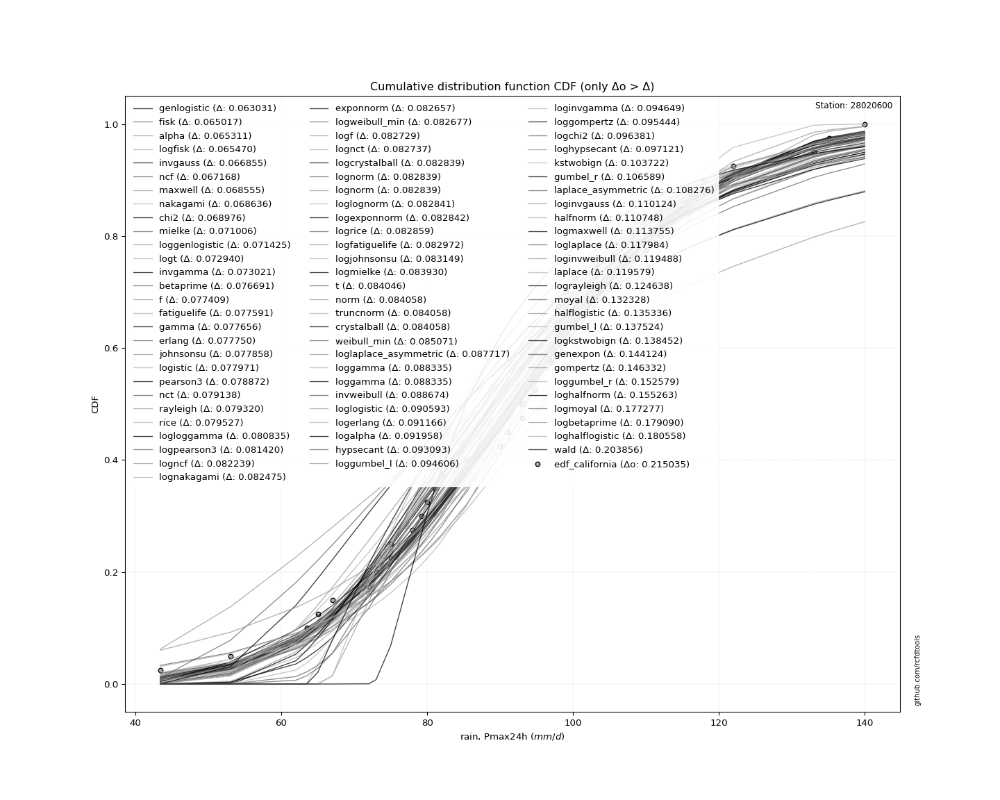</img>

</div>


**1.3. Best fit**

<div align="center">

|   id |   station | empirical_dist   | p_dist      |     delta |   deltao | eval   |   fit |   n |   best_fit |   best_fit_sort |
|-----:|----------:|:-----------------|:------------|----------:|---------:|:-------|------:|----:|-----------:|----------------:|
|    0 |  28020600 | edf_california   | genlogistic | 0.0630305 | 0.215035 | Δo > Δ |     1 |  40 |          1 |               1 |

</div>


<div align="center">

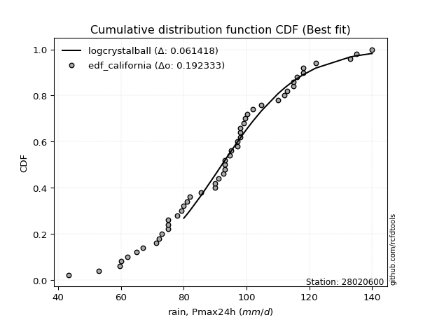</img>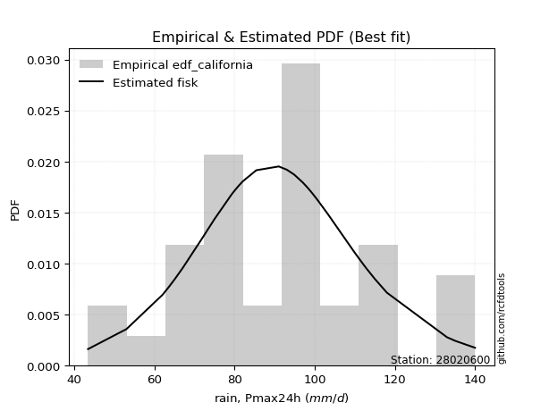</img>

</div>


### 2. Empirical - EDF Hazen (1930)

Hazen method for plotting positions is a formula used to estimate the empirical cumulative probability distribution of flood events or other hydrological data. This formula often results in biased estimations, particularly when extrapolating to extreme events (high return periods).

<div align="center">


$P=(m-0.5)/n$


</div>


**2.1. Empirical values**

<div align="center">

|                | 0                  | 1                  | 2                  | 3                 | 4                  | 5                  | 6                  | 7                  | 8                  | 9                  | 10                 | 11                 | 12                 | 13                | 14                 | 15                 | 16                | 17                 | 18                 | 19                 | 20                | 21                | 22                 | 23                 | 24                | 25                | 26                | 27        | 28                 | 29               | 30                | 31                | 32                | 33                | 34                | 35                | 36                 | 37        | 38                 | 39                |
|:---------------|:-------------------|:-------------------|:-------------------|:------------------|:-------------------|:-------------------|:-------------------|:-------------------|:-------------------|:-------------------|:-------------------|:-------------------|:-------------------|:------------------|:-------------------|:-------------------|:------------------|:-------------------|:-------------------|:-------------------|:------------------|:------------------|:-------------------|:-------------------|:------------------|:------------------|:------------------|:----------|:-------------------|:-----------------|:------------------|:------------------|:------------------|:------------------|:------------------|:------------------|:-------------------|:----------|:-------------------|:------------------|
| date           | 2001               | 2014               | 2008               | 2012              | 2015               | 1984               | 2005               | 1997               | 2007               | 1992               | 2018               | 2003               | 1983               | 2009              | 1988               | 1996               | 2021              | 2011               | 1987               | 1989               | 2000              | 1993              | 2004               | 1985               | 1986              | 2002              | 2016              | 1999      | 1994               | 1981             | 1998              | 1991              | 1990              | 2006              | 2017              | 1982              | 2019               | 2010      | 1995               | 2013              |
| x              | 43.4               | 53.0               | 62.0               | 63.47518361       | 65.0               | 67.0               | 72.0               | 73.0               | 75.0               | 75.0               | 78.0               | 79.2               | 80.0               | 81.0              | 82.0               | 85.4               | 90.0              | 91.0               | 93.0               | 93.0               | 94.7              | 95.0              | 97.0               | 97.0               | 98.0              | 98.0              | 98.0              | 99.0      | 100.3              | 103.2303848      | 110.0             | 112.1             | 113.0             | 115.0             | 116.0             | 118.0             | 122.0              | 133.0     | 135.1              | 140.0             |
| m              | 1                  | 2                  | 3                  | 4                 | 5                  | 6                  | 7                  | 8                  | 9                  | 10                 | 11                 | 12                 | 13                 | 14                | 15                 | 16                 | 17                | 18                 | 19                 | 20                 | 21                | 22                | 23                 | 24                 | 25                | 26                | 27                | 28        | 29                 | 30               | 31                | 32                | 33                | 34                | 35                | 36                | 37                 | 38        | 39                 | 40                |
| empirical_dist | edf_hazen          | edf_hazen          | edf_hazen          | edf_hazen         | edf_hazen          | edf_hazen          | edf_hazen          | edf_hazen          | edf_hazen          | edf_hazen          | edf_hazen          | edf_hazen          | edf_hazen          | edf_hazen         | edf_hazen          | edf_hazen          | edf_hazen         | edf_hazen          | edf_hazen          | edf_hazen          | edf_hazen         | edf_hazen         | edf_hazen          | edf_hazen          | edf_hazen         | edf_hazen         | edf_hazen         | edf_hazen | edf_hazen          | edf_hazen        | edf_hazen         | edf_hazen         | edf_hazen         | edf_hazen         | edf_hazen         | edf_hazen         | edf_hazen          | edf_hazen | edf_hazen          | edf_hazen         |
| empirical      | 0.0125             | 0.0375             | 0.0625             | 0.0875            | 0.1125             | 0.1375             | 0.1625             | 0.1875             | 0.2125             | 0.2375             | 0.2625             | 0.2875             | 0.3125             | 0.3375            | 0.3625             | 0.3875             | 0.4125            | 0.4375             | 0.4625             | 0.4875             | 0.5125            | 0.5375            | 0.5625             | 0.5875             | 0.6125            | 0.6375            | 0.6625            | 0.6875    | 0.7125             | 0.7375           | 0.7625            | 0.7875            | 0.8125            | 0.8375            | 0.8625            | 0.8875            | 0.9125             | 0.9375    | 0.9625             | 0.9875            |
| empirical_tr   | 1.0126582278481011 | 1.0389610389610389 | 1.0666666666666667 | 1.095890410958904 | 1.1267605633802817 | 1.1594202898550725 | 1.1940298507462686 | 1.2307692307692308 | 1.2698412698412698 | 1.3114754098360657 | 1.3559322033898304 | 1.4035087719298245 | 1.4545454545454546 | 1.509433962264151 | 1.5686274509803924 | 1.6326530612244896 | 1.702127659574468 | 1.7777777777777777 | 1.8604651162790697 | 1.9512195121951221 | 2.051282051282051 | 2.162162162162162 | 2.2857142857142856 | 2.4242424242424243 | 2.580645161290323 | 2.758620689655172 | 2.962962962962963 | 3.2       | 3.4782608695652177 | 3.80952380952381 | 4.210526315789473 | 4.705882352941176 | 5.333333333333333 | 6.153846153846155 | 7.272727272727275 | 8.888888888888886 | 11.428571428571425 | 16.0      | 26.666666666666682 | 80.00000000000028 |

</div>


**2.2. Kolmogorov-Smirnov fit test (sorted by Δ)**


<div align="center">

|                | 0                   | 1                   | 2                   | 3                   | 4                   | 5                   | 6                  | 7                   | 8                   | 9                   | 10                  | 11                  | 12                  | 13                  | 14                  | 15                  | 16                  | 17                  | 18                  | 19                  | 20                  | 21                  | 22                  | 23                  | 24                  | 25                 | 26                  | 27                  | 28                  | 29                  | 30                    | 31                  | 32                  | 33                  | 34                  | 35                 | 36                 | 37                 | 38                  | 39                 | 40                  | 41                  | 42                  | 43                  | 44                  | 45                  | 46                  | 47                  | 48                  | 49                  | 50                  | 51                  | 52                  | 53                  | 54                  | 55                  | 56                  | 57                  | 58                  | 59                  | 60                  | 61                  | 62                  | 63                 | 64                  | 65                  | 66                  | 67                 | 68                  | 69                  | 70                  | 71                  | 72                  | 73                  | 74                  | 75                  | 76                  | 77                  | 78                  | 79                 | 80                  | 81                  | 82                 | 83                 | 84                  | 85                  | 86                  | 87                 |
|:---------------|:--------------------|:--------------------|:--------------------|:--------------------|:--------------------|:--------------------|:-------------------|:--------------------|:--------------------|:--------------------|:--------------------|:--------------------|:--------------------|:--------------------|:--------------------|:--------------------|:--------------------|:--------------------|:--------------------|:--------------------|:--------------------|:--------------------|:--------------------|:--------------------|:--------------------|:-------------------|:--------------------|:--------------------|:--------------------|:--------------------|:----------------------|:--------------------|:--------------------|:--------------------|:--------------------|:-------------------|:-------------------|:-------------------|:--------------------|:-------------------|:--------------------|:--------------------|:--------------------|:--------------------|:--------------------|:--------------------|:--------------------|:--------------------|:--------------------|:--------------------|:--------------------|:--------------------|:--------------------|:--------------------|:--------------------|:--------------------|:--------------------|:--------------------|:--------------------|:--------------------|:--------------------|:--------------------|:--------------------|:-------------------|:--------------------|:--------------------|:--------------------|:-------------------|:--------------------|:--------------------|:--------------------|:--------------------|:--------------------|:--------------------|:--------------------|:--------------------|:--------------------|:--------------------|:--------------------|:-------------------|:--------------------|:--------------------|:-------------------|:-------------------|:--------------------|:--------------------|:--------------------|:-------------------|
| station        | 28020600            | 28020600            | 28020600            | 28020600            | 28020600            | 28020600            | 28020600           | 28020600            | 28020600            | 28020600            | 28020600            | 28020600            | 28020600            | 28020600            | 28020600            | 28020600            | 28020600            | 28020600            | 28020600            | 28020600            | 28020600            | 28020600            | 28020600            | 28020600            | 28020600            | 28020600           | 28020600            | 28020600            | 28020600            | 28020600            | 28020600              | 28020600            | 28020600            | 28020600            | 28020600            | 28020600           | 28020600           | 28020600           | 28020600            | 28020600           | 28020600            | 28020600            | 28020600            | 28020600            | 28020600            | 28020600            | 28020600            | 28020600            | 28020600            | 28020600            | 28020600            | 28020600            | 28020600            | 28020600            | 28020600            | 28020600            | 28020600            | 28020600            | 28020600            | 28020600            | 28020600            | 28020600            | 28020600            | 28020600           | 28020600            | 28020600            | 28020600            | 28020600           | 28020600            | 28020600            | 28020600            | 28020600            | 28020600            | 28020600            | 28020600            | 28020600            | 28020600            | 28020600            | 28020600            | 28020600           | 28020600            | 28020600            | 28020600           | 28020600           | 28020600            | 28020600            | 28020600            | 28020600           |
| empirical_dist | edf_hazen           | edf_hazen           | edf_hazen           | edf_hazen           | edf_hazen           | edf_hazen           | edf_hazen          | edf_hazen           | edf_hazen           | edf_hazen           | edf_hazen           | edf_hazen           | edf_hazen           | edf_hazen           | edf_hazen           | edf_hazen           | edf_hazen           | edf_hazen           | edf_hazen           | edf_hazen           | edf_hazen           | edf_hazen           | edf_hazen           | edf_hazen           | edf_hazen           | edf_hazen          | edf_hazen           | edf_hazen           | edf_hazen           | edf_hazen           | edf_hazen             | edf_hazen           | edf_hazen           | edf_hazen           | edf_hazen           | edf_hazen          | edf_hazen          | edf_hazen          | edf_hazen           | edf_hazen          | edf_hazen           | edf_hazen           | edf_hazen           | edf_hazen           | edf_hazen           | edf_hazen           | edf_hazen           | edf_hazen           | edf_hazen           | edf_hazen           | edf_hazen           | edf_hazen           | edf_hazen           | edf_hazen           | edf_hazen           | edf_hazen           | edf_hazen           | edf_hazen           | edf_hazen           | edf_hazen           | edf_hazen           | edf_hazen           | edf_hazen           | edf_hazen          | edf_hazen           | edf_hazen           | edf_hazen           | edf_hazen          | edf_hazen           | edf_hazen           | edf_hazen           | edf_hazen           | edf_hazen           | edf_hazen           | edf_hazen           | edf_hazen           | edf_hazen           | edf_hazen           | edf_hazen           | edf_hazen          | edf_hazen           | edf_hazen           | edf_hazen          | edf_hazen          | edf_hazen           | edf_hazen           | edf_hazen           | edf_hazen          |
| p_dist         | mielke              | loggenlogistic      | fisk                | betaprime           | invgamma            | f                   | fatiguelife        | gamma               | erlang              | johnsonsu           | logistic            | genlogistic         | pearson3            | nct                 | chi2                | rice                | nakagami            | logloggamma         | logpearson3         | exponnorm           | logweibull_min      | logjohnsonsu        | ncf                 | logmielke           | t                   | norm               | truncnorm           | crystalball         | alpha               | weibull_min         | loglaplace_asymmetric | logfisk             | invgauss            | hypsecant           | maxwell             | loggumbel_l        | loggompertz        | logt               | rayleigh            | logncf             | lognakagami         | logf                | lognct              | logcrystalball      | lognorm             | lognorm             | loglognorm          | logexponnorm        | logrice             | logfatiguelife      | laplace_asymmetric  | loggamma            | loggamma            | invweibull          | loglogistic         | logerlang           | logalpha            | laplace             | loginvgamma         | logchi2             | loghypsecant        | kstwobign           | gumbel_r            | loginvgauss        | halfnorm            | gumbel_l            | logmaxwell          | loginvweibull      | loglaplace          | gompertz            | lograyleigh         | moyal               | halflogistic        | logkstwobign        | genexpon            | loggumbel_r         | loghalfnorm         | logbetaprime        | logmoyal            | loghalflogistic    | wald                | loggenexpon         | gibrat             | logwald            | expon               | loggibrat           | logexpon            | logtruncnorm       |
| delta          | 0.05850599925967559 | 0.05892495726370539 | 0.05972103141589358 | 0.06419113139498489 | 0.06478651375418754 | 0.06490936333213593 | 0.0650909656814852 | 0.06515594572250727 | 0.06524995766787167 | 0.06535814629336922 | 0.06547060871988353 | 0.06551477602044808 | 0.06637167271358935 | 0.06663821349486143 | 0.06664681528802208 | 0.06702739318019424 | 0.06786121434933057 | 0.06833496967439312 | 0.06892020974565183 | 0.07015699545598897 | 0.07017732322570935 | 0.07064926370285152 | 0.07119404469404378 | 0.07142969415734257 | 0.07154568186861876 | 0.071558151560554  | 0.07155815596988224 | 0.07155815627164508 | 0.07179740400530554 | 0.07257146828026861 | 0.07521742234724133   | 0.07796959812320325 | 0.07935522539657414 | 0.08059312650446493 | 0.08105472562650928 | 0.0821064481543784 | 0.0829440187007936 | 0.0854404429583534 | 0.09181970325938582 | 0.094738918814672  | 0.09497491872971364 | 0.09522908156623877 | 0.09523680344642182 | 0.09533856482432035 | 0.09533867251447059 | 0.09533867251447059 | 0.09534137410620191 | 0.09534171808124103 | 0.09535867771896889 | 0.09547243701105601 | 0.09577554454080572 | 0.10083507190814556 | 0.10083507190814556 | 0.10117373366060767 | 0.10309298240012454 | 0.10366593991908846 | 0.10445830453178262 | 0.10707935136070668 | 0.10714869110050518 | 0.10888116532441583 | 0.10962075643109948 | 0.11622174251476813 | 0.11908915030651945 | 0.1226242499457364 | 0.12324771669553258 | 0.12502430600003933 | 0.12625518082319054 | 0.1284293386927714 | 0.13048430844213144 | 0.13383215957341354 | 0.13713762791609552 | 0.14482803390077403 | 0.14769929291231854 | 0.15095226714527066 | 0.15662367267647145 | 0.16507933034949718 | 0.16776349751782027 | 0.17139900484006423 | 0.18977701607359698 | 0.1930580195936824 | 0.21635630221204127 | 0.23245084776522248 | 0.2413246822320837 | 0.261491478662093  | 0.27967031754627336 | 0.28752167335744583 | 0.33973965359642466 | 0.6704197264182832 |
| deltao         | 0.2150348808914498  | 0.2150348808914498  | 0.2150348808914498  | 0.2150348808914498  | 0.2150348808914498  | 0.2150348808914498  | 0.2150348808914498 | 0.2150348808914498  | 0.2150348808914498  | 0.2150348808914498  | 0.2150348808914498  | 0.2150348808914498  | 0.2150348808914498  | 0.2150348808914498  | 0.2150348808914498  | 0.2150348808914498  | 0.2150348808914498  | 0.2150348808914498  | 0.2150348808914498  | 0.2150348808914498  | 0.2150348808914498  | 0.2150348808914498  | 0.2150348808914498  | 0.2150348808914498  | 0.2150348808914498  | 0.2150348808914498 | 0.2150348808914498  | 0.2150348808914498  | 0.2150348808914498  | 0.2150348808914498  | 0.2150348808914498    | 0.2150348808914498  | 0.2150348808914498  | 0.2150348808914498  | 0.2150348808914498  | 0.2150348808914498 | 0.2150348808914498 | 0.2150348808914498 | 0.2150348808914498  | 0.2150348808914498 | 0.2150348808914498  | 0.2150348808914498  | 0.2150348808914498  | 0.2150348808914498  | 0.2150348808914498  | 0.2150348808914498  | 0.2150348808914498  | 0.2150348808914498  | 0.2150348808914498  | 0.2150348808914498  | 0.2150348808914498  | 0.2150348808914498  | 0.2150348808914498  | 0.2150348808914498  | 0.2150348808914498  | 0.2150348808914498  | 0.2150348808914498  | 0.2150348808914498  | 0.2150348808914498  | 0.2150348808914498  | 0.2150348808914498  | 0.2150348808914498  | 0.2150348808914498  | 0.2150348808914498 | 0.2150348808914498  | 0.2150348808914498  | 0.2150348808914498  | 0.2150348808914498 | 0.2150348808914498  | 0.2150348808914498  | 0.2150348808914498  | 0.2150348808914498  | 0.2150348808914498  | 0.2150348808914498  | 0.2150348808914498  | 0.2150348808914498  | 0.2150348808914498  | 0.2150348808914498  | 0.2150348808914498  | 0.2150348808914498 | 0.2150348808914498  | 0.2150348808914498  | 0.2150348808914498 | 0.2150348808914498 | 0.2150348808914498  | 0.2150348808914498  | 0.2150348808914498  | 0.2150348808914498 |
| eval           | Δo > Δ              | Δo > Δ              | Δo > Δ              | Δo > Δ              | Δo > Δ              | Δo > Δ              | Δo > Δ             | Δo > Δ              | Δo > Δ              | Δo > Δ              | Δo > Δ              | Δo > Δ              | Δo > Δ              | Δo > Δ              | Δo > Δ              | Δo > Δ              | Δo > Δ              | Δo > Δ              | Δo > Δ              | Δo > Δ              | Δo > Δ              | Δo > Δ              | Δo > Δ              | Δo > Δ              | Δo > Δ              | Δo > Δ             | Δo > Δ              | Δo > Δ              | Δo > Δ              | Δo > Δ              | Δo > Δ                | Δo > Δ              | Δo > Δ              | Δo > Δ              | Δo > Δ              | Δo > Δ             | Δo > Δ             | Δo > Δ             | Δo > Δ              | Δo > Δ             | Δo > Δ              | Δo > Δ              | Δo > Δ              | Δo > Δ              | Δo > Δ              | Δo > Δ              | Δo > Δ              | Δo > Δ              | Δo > Δ              | Δo > Δ              | Δo > Δ              | Δo > Δ              | Δo > Δ              | Δo > Δ              | Δo > Δ              | Δo > Δ              | Δo > Δ              | Δo > Δ              | Δo > Δ              | Δo > Δ              | Δo > Δ              | Δo > Δ              | Δo > Δ              | Δo > Δ             | Δo > Δ              | Δo > Δ              | Δo > Δ              | Δo > Δ             | Δo > Δ              | Δo > Δ              | Δo > Δ              | Δo > Δ              | Δo > Δ              | Δo > Δ              | Δo > Δ              | Δo > Δ              | Δo > Δ              | Δo > Δ              | Δo > Δ              | Δo > Δ             | Δo <= Δ             | Δo <= Δ             | Δo <= Δ            | Δo <= Δ            | Δo <= Δ             | Δo <= Δ             | Δo <= Δ             | Δo <= Δ            |
| fit            | 1                   | 1                   | 1                   | 1                   | 1                   | 1                   | 1                  | 1                   | 1                   | 1                   | 1                   | 1                   | 1                   | 1                   | 1                   | 1                   | 1                   | 1                   | 1                   | 1                   | 1                   | 1                   | 1                   | 1                   | 1                   | 1                  | 1                   | 1                   | 1                   | 1                   | 1                     | 1                   | 1                   | 1                   | 1                   | 1                  | 1                  | 1                  | 1                   | 1                  | 1                   | 1                   | 1                   | 1                   | 1                   | 1                   | 1                   | 1                   | 1                   | 1                   | 1                   | 1                   | 1                   | 1                   | 1                   | 1                   | 1                   | 1                   | 1                   | 1                   | 1                   | 1                   | 1                   | 1                  | 1                   | 1                   | 1                   | 1                  | 1                   | 1                   | 1                   | 1                   | 1                   | 1                   | 1                   | 1                   | 1                   | 1                   | 1                   | 1                  | 0                   | 0                   | 0                  | 0                  | 0                   | 0                   | 0                   | 0                  |
| n              | 40                  | 40                  | 40                  | 40                  | 40                  | 40                  | 40                 | 40                  | 40                  | 40                  | 40                  | 40                  | 40                  | 40                  | 40                  | 40                  | 40                  | 40                  | 40                  | 40                  | 40                  | 40                  | 40                  | 40                  | 40                  | 40                 | 40                  | 40                  | 40                  | 40                  | 40                    | 40                  | 40                  | 40                  | 40                  | 40                 | 40                 | 40                 | 40                  | 40                 | 40                  | 40                  | 40                  | 40                  | 40                  | 40                  | 40                  | 40                  | 40                  | 40                  | 40                  | 40                  | 40                  | 40                  | 40                  | 40                  | 40                  | 40                  | 40                  | 40                  | 40                  | 40                  | 40                  | 40                 | 40                  | 40                  | 40                  | 40                 | 40                  | 40                  | 40                  | 40                  | 40                  | 40                  | 40                  | 40                  | 40                  | 40                  | 40                  | 40                 | 40                  | 40                  | 40                 | 40                 | 40                  | 40                  | 40                  | 40                 |
| best_fit       | 1                   | 0                   | 0                   | 0                   | 0                   | 0                   | 0                  | 0                   | 0                   | 0                   | 0                   | 0                   | 0                   | 0                   | 0                   | 0                   | 0                   | 0                   | 0                   | 0                   | 0                   | 0                   | 0                   | 0                   | 0                   | 0                  | 0                   | 0                   | 0                   | 0                   | 0                     | 0                   | 0                   | 0                   | 0                   | 0                  | 0                  | 0                  | 0                   | 0                  | 0                   | 0                   | 0                   | 0                   | 0                   | 0                   | 0                   | 0                   | 0                   | 0                   | 0                   | 0                   | 0                   | 0                   | 0                   | 0                   | 0                   | 0                   | 0                   | 0                   | 0                   | 0                   | 0                   | 0                  | 0                   | 0                   | 0                   | 0                  | 0                   | 0                   | 0                   | 0                   | 0                   | 0                   | 0                   | 0                   | 0                   | 0                   | 0                   | 0                  | 0                   | 0                   | 0                  | 0                  | 0                   | 0                   | 0                   | 0                  |
| best_fit_sort  | 1                   | 2                   | 3                   | 4                   | 5                   | 6                   | 7                  | 8                   | 9                   | 10                  | 11                  | 12                  | 13                  | 14                  | 15                  | 16                  | 17                  | 18                  | 19                  | 20                  | 21                  | 22                  | 23                  | 24                  | 25                  | 26                 | 27                  | 28                  | 29                  | 30                  | 31                    | 32                  | 33                  | 34                  | 35                  | 36                 | 37                 | 38                 | 39                  | 40                 | 41                  | 42                  | 43                  | 44                  | 45                  | 46                  | 47                  | 48                  | 49                  | 50                  | 51                  | 52                  | 53                  | 54                  | 55                  | 56                  | 57                  | 58                  | 59                  | 60                  | 61                  | 62                  | 63                  | 64                 | 65                  | 66                  | 67                  | 68                 | 69                  | 70                  | 71                  | 72                  | 73                  | 74                  | 75                  | 76                  | 77                  | 78                  | 79                  | 80                 | 81                  | 82                  | 83                 | 84                 | 85                  | 86                  | 87                  | 88                 |

</div>


<div align="center">

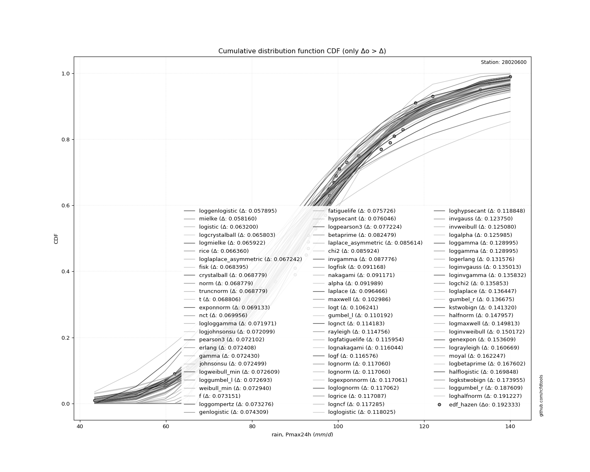</img>

</div>


**2.3. Best fit**

<div align="center">

|   id |   station | empirical_dist   | p_dist   |    delta |   deltao | eval   |   fit |   n |   best_fit |   best_fit_sort |
|-----:|----------:|:-----------------|:---------|---------:|---------:|:-------|------:|----:|-----------:|----------------:|
|    0 |  28020600 | edf_hazen        | mielke   | 0.058506 | 0.215035 | Δo > Δ |     1 |  40 |          1 |               1 |

</div>


<div align="center">

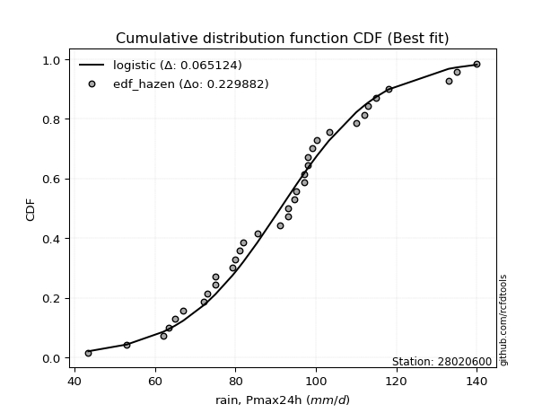</img>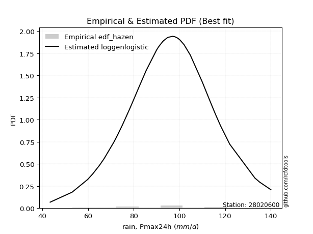</img>

</div>


### 3. Empirical - EDF Weibull (1939)

Weibull plotting position formula is an empirical method used to estimate the non-exceedance probability or plotting position for a set of observed data, is often recommended or widely used in practice, particularly in flood frequency analysis.

<div align="center">


$P=m/(n+1)$


</div>


**3.1. Empirical values**

<div align="center">

|                | 0                    | 1                   | 2                   | 3                  | 4                   | 5                   | 6                   | 7                  | 8                   | 9                   | 10                 | 11                 | 12                 | 13                  | 14                  | 15                 | 16                 | 17                  | 18                 | 19                 | 20                 | 21                 | 22                 | 23                 | 24                 | 25                 | 26                 | 27                 | 28                 | 29                 | 30                 | 31                 | 32                 | 33                 | 34                 | 35                 | 36                 | 37                 | 38                 | 39                 |
|:---------------|:---------------------|:--------------------|:--------------------|:-------------------|:--------------------|:--------------------|:--------------------|:-------------------|:--------------------|:--------------------|:-------------------|:-------------------|:-------------------|:--------------------|:--------------------|:-------------------|:-------------------|:--------------------|:-------------------|:-------------------|:-------------------|:-------------------|:-------------------|:-------------------|:-------------------|:-------------------|:-------------------|:-------------------|:-------------------|:-------------------|:-------------------|:-------------------|:-------------------|:-------------------|:-------------------|:-------------------|:-------------------|:-------------------|:-------------------|:-------------------|
| date           | 2001                 | 2014                | 2008                | 2012               | 2015                | 1984                | 2005                | 1997               | 2007                | 1992                | 2018               | 2003               | 1983               | 2009                | 1988                | 1996               | 2021               | 2011                | 1987               | 1989               | 2000               | 1993               | 2004               | 1985               | 1986               | 2002               | 2016               | 1999               | 1994               | 1981               | 1998               | 1991               | 1990               | 2006               | 2017               | 1982               | 2019               | 2010               | 1995               | 2013               |
| x              | 43.4                 | 53.0                | 62.0                | 63.47518361        | 65.0                | 67.0                | 72.0                | 73.0               | 75.0                | 75.0                | 78.0               | 79.2               | 80.0               | 81.0                | 82.0                | 85.4               | 90.0               | 91.0                | 93.0               | 93.0               | 94.7               | 95.0               | 97.0               | 97.0               | 98.0               | 98.0               | 98.0               | 99.0               | 100.3              | 103.2303848        | 110.0              | 112.1              | 113.0              | 115.0              | 116.0              | 118.0              | 122.0              | 133.0              | 135.1              | 140.0              |
| m              | 1                    | 2                   | 3                   | 4                  | 5                   | 6                   | 7                   | 8                  | 9                   | 10                  | 11                 | 12                 | 13                 | 14                  | 15                  | 16                 | 17                 | 18                  | 19                 | 20                 | 21                 | 22                 | 23                 | 24                 | 25                 | 26                 | 27                 | 28                 | 29                 | 30                 | 31                 | 32                 | 33                 | 34                 | 35                 | 36                 | 37                 | 38                 | 39                 | 40                 |
| empirical_dist | edf_weibull          | edf_weibull         | edf_weibull         | edf_weibull        | edf_weibull         | edf_weibull         | edf_weibull         | edf_weibull        | edf_weibull         | edf_weibull         | edf_weibull        | edf_weibull        | edf_weibull        | edf_weibull         | edf_weibull         | edf_weibull        | edf_weibull        | edf_weibull         | edf_weibull        | edf_weibull        | edf_weibull        | edf_weibull        | edf_weibull        | edf_weibull        | edf_weibull        | edf_weibull        | edf_weibull        | edf_weibull        | edf_weibull        | edf_weibull        | edf_weibull        | edf_weibull        | edf_weibull        | edf_weibull        | edf_weibull        | edf_weibull        | edf_weibull        | edf_weibull        | edf_weibull        | edf_weibull        |
| empirical      | 0.024390243902439025 | 0.04878048780487805 | 0.07317073170731707 | 0.0975609756097561 | 0.12195121951219512 | 0.14634146341463414 | 0.17073170731707318 | 0.1951219512195122 | 0.21951219512195122 | 0.24390243902439024 | 0.2682926829268293 | 0.2926829268292683 | 0.3170731707317073 | 0.34146341463414637 | 0.36585365853658536 | 0.3902439024390244 | 0.4146341463414634 | 0.43902439024390244 | 0.4634146341463415 | 0.4878048780487805 | 0.5121951219512195 | 0.5365853658536586 | 0.5609756097560976 | 0.5853658536585366 | 0.6097560975609756 | 0.6341463414634146 | 0.6585365853658537 | 0.6829268292682927 | 0.7073170731707317 | 0.7317073170731707 | 0.7560975609756098 | 0.7804878048780488 | 0.8048780487804879 | 0.8292682926829268 | 0.8536585365853658 | 0.8780487804878049 | 0.9024390243902439 | 0.926829268292683  | 0.9512195121951219 | 0.975609756097561  |
| empirical_tr   | 1.0250000000000001   | 1.0512820512820513  | 1.0789473684210527  | 1.1081081081081081 | 1.1388888888888888  | 1.1714285714285715  | 1.2058823529411766  | 1.2424242424242424 | 1.28125             | 1.3225806451612903  | 1.3666666666666667 | 1.413793103448276  | 1.4642857142857144 | 1.5185185185185186  | 1.5769230769230769  | 1.6400000000000001 | 1.708333333333333  | 1.7826086956521738  | 1.8636363636363635 | 1.9523809523809523 | 2.0500000000000003 | 2.1578947368421053 | 2.277777777777778  | 2.411764705882353  | 2.5625             | 2.7333333333333334 | 2.928571428571429  | 3.153846153846154  | 3.416666666666666  | 3.727272727272727  | 4.1000000000000005 | 4.555555555555556  | 5.125000000000001  | 5.857142857142856  | 6.833333333333332  | 8.200000000000001  | 10.250000000000002 | 13.666666666666675 | 20.499999999999982 | 40.999999999999964 |

</div>


**3.2. Kolmogorov-Smirnov fit test (sorted by Δ)**


<div align="center">

|                | 0                   | 1                   | 2                   | 3                    | 4                    | 5                   | 6                    | 7                   | 8                   | 9                    | 10                  | 11                   | 12                  | 13                  | 14                  | 15                  | 16                  | 17                 | 18                  | 19                  | 20                  | 21                  | 22                  | 23                  | 24                  | 25                 | 26                  | 27                 | 28                  | 29                  | 30                  | 31                  | 32                  | 33                  | 34                    | 35                  | 36                 | 37                  | 38                  | 39                  | 40                  | 41                  | 42                  | 43                  | 44                  | 45                  | 46                  | 47                  | 48                  | 49                  | 50                  | 51                  | 52                  | 53                  | 54                  | 55                  | 56                  | 57                  | 58                  | 59                  | 60                  | 61                  | 62                  | 63                  | 64                  | 65                  | 66                  | 67                  | 68                 | 69                  | 70                 | 71                  | 72                  | 73                  | 74                  | 75                  | 76                 | 77                  | 78                  | 79                 | 80                 | 81                 | 82                  | 83                 | 84                  | 85                  | 86                  | 87                 |
|:---------------|:--------------------|:--------------------|:--------------------|:---------------------|:---------------------|:--------------------|:---------------------|:--------------------|:--------------------|:---------------------|:--------------------|:---------------------|:--------------------|:--------------------|:--------------------|:--------------------|:--------------------|:-------------------|:--------------------|:--------------------|:--------------------|:--------------------|:--------------------|:--------------------|:--------------------|:-------------------|:--------------------|:-------------------|:--------------------|:--------------------|:--------------------|:--------------------|:--------------------|:--------------------|:----------------------|:--------------------|:-------------------|:--------------------|:--------------------|:--------------------|:--------------------|:--------------------|:--------------------|:--------------------|:--------------------|:--------------------|:--------------------|:--------------------|:--------------------|:--------------------|:--------------------|:--------------------|:--------------------|:--------------------|:--------------------|:--------------------|:--------------------|:--------------------|:--------------------|:--------------------|:--------------------|:--------------------|:--------------------|:--------------------|:--------------------|:--------------------|:--------------------|:--------------------|:-------------------|:--------------------|:-------------------|:--------------------|:--------------------|:--------------------|:--------------------|:--------------------|:-------------------|:--------------------|:--------------------|:-------------------|:-------------------|:-------------------|:--------------------|:-------------------|:--------------------|:--------------------|:--------------------|:-------------------|
| station        | 28020600            | 28020600            | 28020600            | 28020600             | 28020600             | 28020600            | 28020600             | 28020600            | 28020600            | 28020600             | 28020600            | 28020600             | 28020600            | 28020600            | 28020600            | 28020600            | 28020600            | 28020600           | 28020600            | 28020600            | 28020600            | 28020600            | 28020600            | 28020600            | 28020600            | 28020600           | 28020600            | 28020600           | 28020600            | 28020600            | 28020600            | 28020600            | 28020600            | 28020600            | 28020600              | 28020600            | 28020600           | 28020600            | 28020600            | 28020600            | 28020600            | 28020600            | 28020600            | 28020600            | 28020600            | 28020600            | 28020600            | 28020600            | 28020600            | 28020600            | 28020600            | 28020600            | 28020600            | 28020600            | 28020600            | 28020600            | 28020600            | 28020600            | 28020600            | 28020600            | 28020600            | 28020600            | 28020600            | 28020600            | 28020600            | 28020600            | 28020600            | 28020600            | 28020600           | 28020600            | 28020600           | 28020600            | 28020600            | 28020600            | 28020600            | 28020600            | 28020600           | 28020600            | 28020600            | 28020600           | 28020600           | 28020600           | 28020600            | 28020600           | 28020600            | 28020600            | 28020600            | 28020600           |
| empirical_dist | edf_weibull         | edf_weibull         | edf_weibull         | edf_weibull          | edf_weibull          | edf_weibull         | edf_weibull          | edf_weibull         | edf_weibull         | edf_weibull          | edf_weibull         | edf_weibull          | edf_weibull         | edf_weibull         | edf_weibull         | edf_weibull         | edf_weibull         | edf_weibull        | edf_weibull         | edf_weibull         | edf_weibull         | edf_weibull         | edf_weibull         | edf_weibull         | edf_weibull         | edf_weibull        | edf_weibull         | edf_weibull        | edf_weibull         | edf_weibull         | edf_weibull         | edf_weibull         | edf_weibull         | edf_weibull         | edf_weibull           | edf_weibull         | edf_weibull        | edf_weibull         | edf_weibull         | edf_weibull         | edf_weibull         | edf_weibull         | edf_weibull         | edf_weibull         | edf_weibull         | edf_weibull         | edf_weibull         | edf_weibull         | edf_weibull         | edf_weibull         | edf_weibull         | edf_weibull         | edf_weibull         | edf_weibull         | edf_weibull         | edf_weibull         | edf_weibull         | edf_weibull         | edf_weibull         | edf_weibull         | edf_weibull         | edf_weibull         | edf_weibull         | edf_weibull         | edf_weibull         | edf_weibull         | edf_weibull         | edf_weibull         | edf_weibull        | edf_weibull         | edf_weibull        | edf_weibull         | edf_weibull         | edf_weibull         | edf_weibull         | edf_weibull         | edf_weibull        | edf_weibull         | edf_weibull         | edf_weibull        | edf_weibull        | edf_weibull        | edf_weibull         | edf_weibull        | edf_weibull         | edf_weibull         | edf_weibull         | edf_weibull        |
| p_dist         | loggenlogistic      | mielke              | fisk                | f                    | betaprime            | fatiguelife         | gamma                | erlang              | johnsonsu           | pearson3             | nct                 | rice                 | logloggamma         | logpearson3         | invgamma            | genlogistic         | exponnorm           | logweibull_min     | logjohnsonsu        | chi2                | logmielke           | t                   | norm                | truncnorm           | crystalball         | nakagami           | weibull_min         | logistic           | ncf                 | alpha               | loggumbel_l         | logfisk             | loggompertz         | invgauss            | loglaplace_asymmetric | maxwell             | hypsecant          | logt                | rayleigh            | logncf              | lognakagami         | logf                | lognct              | logcrystalball      | lognorm             | lognorm             | loglognorm          | logexponnorm        | logrice             | logfatiguelife      | invweibull          | laplace_asymmetric  | loggamma            | loggamma            | loglogistic         | logerlang           | logalpha            | loginvgamma         | logchi2             | loghypsecant        | laplace             | kstwobign           | gumbel_r            | gumbel_l            | loginvgauss         | halfnorm            | logmaxwell          | loginvweibull       | gompertz           | loglaplace          | lograyleigh        | moyal               | halflogistic        | logkstwobign        | genexpon            | logbetaprime        | loggumbel_r        | loghalfnorm         | logmoyal            | loghalflogistic    | wald               | loggenexpon        | gibrat              | logwald            | expon               | loggibrat           | logexpon            | logtruncnorm       |
| delta          | 0.05802785194463839 | 0.05809039658237142 | 0.05880639726955211 | 0.059726436502867575 | 0.059760452906035766 | 0.05990803885221685 | 0.059973018893238916 | 0.06006703083860332 | 0.06017521946410087 | 0.061188745884320994 | 0.06145528666559308 | 0.061844466350925886 | 0.06315204284512477 | 0.06373728291638348 | 0.06387187960784607 | 0.06460014187410662 | 0.06497406862672062 | 0.064994396396441  | 0.06546633687358316 | 0.06573218114168061 | 0.06624676732807422 | 0.06636275503935041 | 0.06637522473128565 | 0.06637522914061389 | 0.06637522944237673 | 0.0669465802029891 | 0.06738854145100026 | 0.0688242672564689 | 0.07027941054770231 | 0.07088276985896408 | 0.07702172929927886 | 0.07705496397686179 | 0.07776109187152525 | 0.07844059125023267 | 0.0785710808838267    | 0.08014009148016782 | 0.0839467850410503 | 0.08452580881201194 | 0.09090506911304436 | 0.09382428466833054 | 0.09406028458337218 | 0.09431444741989731 | 0.09432216930008036 | 0.09442393067797888 | 0.09442403836812913 | 0.09442403836812913 | 0.09442673995986045 | 0.09442708393489957 | 0.09444404357262742 | 0.09455780286471455 | 0.09903958731914425 | 0.09912920307739109 | 0.09992043776180409 | 0.09992043776180409 | 0.10217834825378308 | 0.10275130577274699 | 0.10354367038544116 | 0.10623405695416371 | 0.10676075066754548 | 0.10870612228475801 | 0.11043300989729204 | 0.11408759617330472 | 0.11817451616017799 | 0.12045113526833207 | 0.12049010360427298 | 0.12121041210051792 | 0.12428505859834432 | 0.12629519235130798 | 0.1286492327441452 | 0.12956967429578997 | 0.1350034815746321 | 0.14391339975443257 | 0.14678465876597707 | 0.14881812080380724 | 0.15088788964213057 | 0.16316729752299106 | 0.1641646962031557 | 0.16562935117635685 | 0.18873550615827822 | 0.190923873252219  | 0.2154416680656998 | 0.2242191404481493 | 0.24390243902439024 | 0.2593573323206296 | 0.27143861022920013 | 0.28660703921110436 | 0.33150794627935143 | 0.66218801910121   |
| deltao         | 0.2150348808914498  | 0.2150348808914498  | 0.2150348808914498  | 0.2150348808914498   | 0.2150348808914498   | 0.2150348808914498  | 0.2150348808914498   | 0.2150348808914498  | 0.2150348808914498  | 0.2150348808914498   | 0.2150348808914498  | 0.2150348808914498   | 0.2150348808914498  | 0.2150348808914498  | 0.2150348808914498  | 0.2150348808914498  | 0.2150348808914498  | 0.2150348808914498 | 0.2150348808914498  | 0.2150348808914498  | 0.2150348808914498  | 0.2150348808914498  | 0.2150348808914498  | 0.2150348808914498  | 0.2150348808914498  | 0.2150348808914498 | 0.2150348808914498  | 0.2150348808914498 | 0.2150348808914498  | 0.2150348808914498  | 0.2150348808914498  | 0.2150348808914498  | 0.2150348808914498  | 0.2150348808914498  | 0.2150348808914498    | 0.2150348808914498  | 0.2150348808914498 | 0.2150348808914498  | 0.2150348808914498  | 0.2150348808914498  | 0.2150348808914498  | 0.2150348808914498  | 0.2150348808914498  | 0.2150348808914498  | 0.2150348808914498  | 0.2150348808914498  | 0.2150348808914498  | 0.2150348808914498  | 0.2150348808914498  | 0.2150348808914498  | 0.2150348808914498  | 0.2150348808914498  | 0.2150348808914498  | 0.2150348808914498  | 0.2150348808914498  | 0.2150348808914498  | 0.2150348808914498  | 0.2150348808914498  | 0.2150348808914498  | 0.2150348808914498  | 0.2150348808914498  | 0.2150348808914498  | 0.2150348808914498  | 0.2150348808914498  | 0.2150348808914498  | 0.2150348808914498  | 0.2150348808914498  | 0.2150348808914498  | 0.2150348808914498 | 0.2150348808914498  | 0.2150348808914498 | 0.2150348808914498  | 0.2150348808914498  | 0.2150348808914498  | 0.2150348808914498  | 0.2150348808914498  | 0.2150348808914498 | 0.2150348808914498  | 0.2150348808914498  | 0.2150348808914498 | 0.2150348808914498 | 0.2150348808914498 | 0.2150348808914498  | 0.2150348808914498 | 0.2150348808914498  | 0.2150348808914498  | 0.2150348808914498  | 0.2150348808914498 |
| eval           | Δo > Δ              | Δo > Δ              | Δo > Δ              | Δo > Δ               | Δo > Δ               | Δo > Δ              | Δo > Δ               | Δo > Δ              | Δo > Δ              | Δo > Δ               | Δo > Δ              | Δo > Δ               | Δo > Δ              | Δo > Δ              | Δo > Δ              | Δo > Δ              | Δo > Δ              | Δo > Δ             | Δo > Δ              | Δo > Δ              | Δo > Δ              | Δo > Δ              | Δo > Δ              | Δo > Δ              | Δo > Δ              | Δo > Δ             | Δo > Δ              | Δo > Δ             | Δo > Δ              | Δo > Δ              | Δo > Δ              | Δo > Δ              | Δo > Δ              | Δo > Δ              | Δo > Δ                | Δo > Δ              | Δo > Δ             | Δo > Δ              | Δo > Δ              | Δo > Δ              | Δo > Δ              | Δo > Δ              | Δo > Δ              | Δo > Δ              | Δo > Δ              | Δo > Δ              | Δo > Δ              | Δo > Δ              | Δo > Δ              | Δo > Δ              | Δo > Δ              | Δo > Δ              | Δo > Δ              | Δo > Δ              | Δo > Δ              | Δo > Δ              | Δo > Δ              | Δo > Δ              | Δo > Δ              | Δo > Δ              | Δo > Δ              | Δo > Δ              | Δo > Δ              | Δo > Δ              | Δo > Δ              | Δo > Δ              | Δo > Δ              | Δo > Δ              | Δo > Δ             | Δo > Δ              | Δo > Δ             | Δo > Δ              | Δo > Δ              | Δo > Δ              | Δo > Δ              | Δo > Δ              | Δo > Δ             | Δo > Δ              | Δo > Δ              | Δo > Δ             | Δo <= Δ            | Δo <= Δ            | Δo <= Δ             | Δo <= Δ            | Δo <= Δ             | Δo <= Δ             | Δo <= Δ             | Δo <= Δ            |
| fit            | 1                   | 1                   | 1                   | 1                    | 1                    | 1                   | 1                    | 1                   | 1                   | 1                    | 1                   | 1                    | 1                   | 1                   | 1                   | 1                   | 1                   | 1                  | 1                   | 1                   | 1                   | 1                   | 1                   | 1                   | 1                   | 1                  | 1                   | 1                  | 1                   | 1                   | 1                   | 1                   | 1                   | 1                   | 1                     | 1                   | 1                  | 1                   | 1                   | 1                   | 1                   | 1                   | 1                   | 1                   | 1                   | 1                   | 1                   | 1                   | 1                   | 1                   | 1                   | 1                   | 1                   | 1                   | 1                   | 1                   | 1                   | 1                   | 1                   | 1                   | 1                   | 1                   | 1                   | 1                   | 1                   | 1                   | 1                   | 1                   | 1                  | 1                   | 1                  | 1                   | 1                   | 1                   | 1                   | 1                   | 1                  | 1                   | 1                   | 1                  | 0                  | 0                  | 0                   | 0                  | 0                   | 0                   | 0                   | 0                  |
| n              | 40                  | 40                  | 40                  | 40                   | 40                   | 40                  | 40                   | 40                  | 40                  | 40                   | 40                  | 40                   | 40                  | 40                  | 40                  | 40                  | 40                  | 40                 | 40                  | 40                  | 40                  | 40                  | 40                  | 40                  | 40                  | 40                 | 40                  | 40                 | 40                  | 40                  | 40                  | 40                  | 40                  | 40                  | 40                    | 40                  | 40                 | 40                  | 40                  | 40                  | 40                  | 40                  | 40                  | 40                  | 40                  | 40                  | 40                  | 40                  | 40                  | 40                  | 40                  | 40                  | 40                  | 40                  | 40                  | 40                  | 40                  | 40                  | 40                  | 40                  | 40                  | 40                  | 40                  | 40                  | 40                  | 40                  | 40                  | 40                  | 40                 | 40                  | 40                 | 40                  | 40                  | 40                  | 40                  | 40                  | 40                 | 40                  | 40                  | 40                 | 40                 | 40                 | 40                  | 40                 | 40                  | 40                  | 40                  | 40                 |
| best_fit       | 1                   | 0                   | 0                   | 0                    | 0                    | 0                   | 0                    | 0                   | 0                   | 0                    | 0                   | 0                    | 0                   | 0                   | 0                   | 0                   | 0                   | 0                  | 0                   | 0                   | 0                   | 0                   | 0                   | 0                   | 0                   | 0                  | 0                   | 0                  | 0                   | 0                   | 0                   | 0                   | 0                   | 0                   | 0                     | 0                   | 0                  | 0                   | 0                   | 0                   | 0                   | 0                   | 0                   | 0                   | 0                   | 0                   | 0                   | 0                   | 0                   | 0                   | 0                   | 0                   | 0                   | 0                   | 0                   | 0                   | 0                   | 0                   | 0                   | 0                   | 0                   | 0                   | 0                   | 0                   | 0                   | 0                   | 0                   | 0                   | 0                  | 0                   | 0                  | 0                   | 0                   | 0                   | 0                   | 0                   | 0                  | 0                   | 0                   | 0                  | 0                  | 0                  | 0                   | 0                  | 0                   | 0                   | 0                   | 0                  |
| best_fit_sort  | 1                   | 2                   | 3                   | 4                    | 5                    | 6                   | 7                    | 8                   | 9                   | 10                   | 11                  | 12                   | 13                  | 14                  | 15                  | 16                  | 17                  | 18                 | 19                  | 20                  | 21                  | 22                  | 23                  | 24                  | 25                  | 26                 | 27                  | 28                 | 29                  | 30                  | 31                  | 32                  | 33                  | 34                  | 35                    | 36                  | 37                 | 38                  | 39                  | 40                  | 41                  | 42                  | 43                  | 44                  | 45                  | 46                  | 47                  | 48                  | 49                  | 50                  | 51                  | 52                  | 53                  | 54                  | 55                  | 56                  | 57                  | 58                  | 59                  | 60                  | 61                  | 62                  | 63                  | 64                  | 65                  | 66                  | 67                  | 68                  | 69                 | 70                  | 71                 | 72                  | 73                  | 74                  | 75                  | 76                  | 77                 | 78                  | 79                  | 80                 | 81                 | 82                 | 83                  | 84                 | 85                  | 86                  | 87                  | 88                 |

</div>


<div align="center">

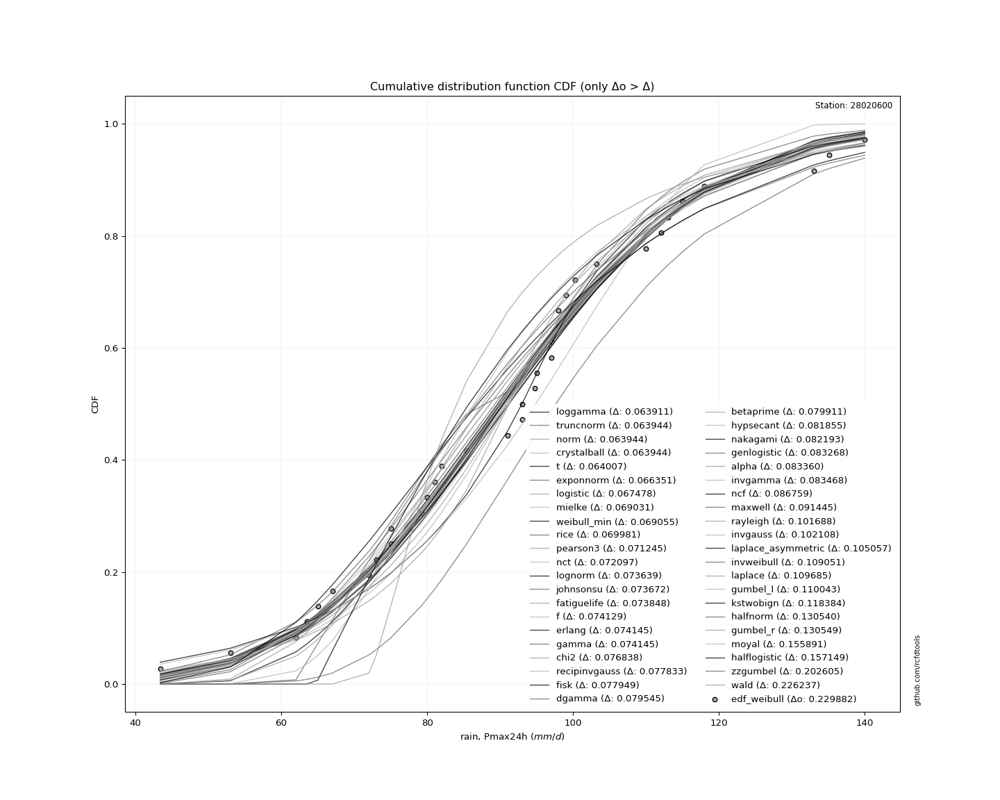</img>

</div>


**3.3. Best fit**

<div align="center">

|   id |   station | empirical_dist   | p_dist         |     delta |   deltao | eval   |   fit |   n |   best_fit |   best_fit_sort |
|-----:|----------:|:-----------------|:---------------|----------:|---------:|:-------|------:|----:|-----------:|----------------:|
|    0 |  28020600 | edf_weibull      | loggenlogistic | 0.0580279 | 0.215035 | Δo > Δ |     1 |  40 |          1 |               1 |

</div>


<div align="center">

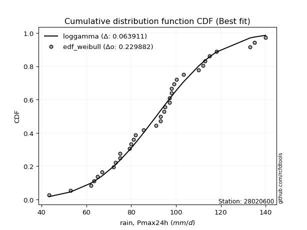</img>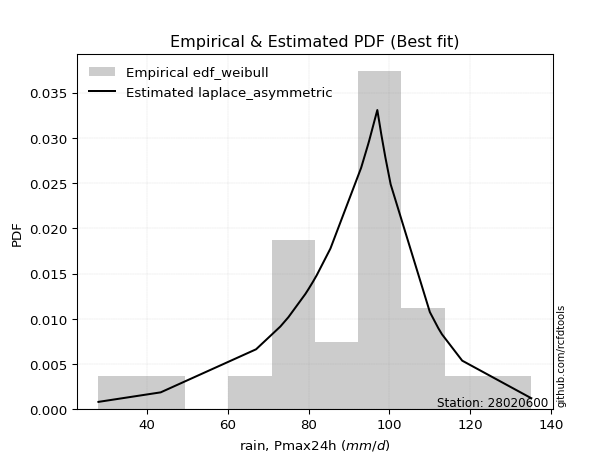</img>

</div>


### 4. Empirical - EDF Beard (1943)

The Beard formula (or Beard´s plotting position formula) in hydrology is used to estimate the empirical non-exceedance probability _(P)_ of a flood event (or other extreme hydrological data point) within a given dataset.

<div align="center">


$P=(m-0.31)/(n+0.38)$


</div>


**4.1. Empirical values**

<div align="center">

|                | 0                    | 1                   | 2                  | 3                  | 4                   | 5                   | 6                   | 7                   | 8                   | 9                   | 10                  | 11                 | 12                  | 13                 | 14                  | 15                  | 16                  | 17                 | 18                  | 19                  | 20                 | 21                 | 22                 | 23                 | 24                 | 25                 | 26                 | 27                 | 28                 | 29                 | 30                 | 31                 | 32                 | 33                 | 34                 | 35                 | 36                 | 37                 | 38                 | 39                 |
|:---------------|:---------------------|:--------------------|:-------------------|:-------------------|:--------------------|:--------------------|:--------------------|:--------------------|:--------------------|:--------------------|:--------------------|:-------------------|:--------------------|:-------------------|:--------------------|:--------------------|:--------------------|:-------------------|:--------------------|:--------------------|:-------------------|:-------------------|:-------------------|:-------------------|:-------------------|:-------------------|:-------------------|:-------------------|:-------------------|:-------------------|:-------------------|:-------------------|:-------------------|:-------------------|:-------------------|:-------------------|:-------------------|:-------------------|:-------------------|:-------------------|
| date           | 2001                 | 2014                | 2008               | 2012               | 2015                | 1984                | 2005                | 1997                | 2007                | 1992                | 2018                | 2003               | 1983                | 2009               | 1988                | 1996                | 2021                | 2011               | 1987                | 1989                | 2000               | 1993               | 2004               | 1985               | 1986               | 2002               | 2016               | 1999               | 1994               | 1981               | 1998               | 1991               | 1990               | 2006               | 2017               | 1982               | 2019               | 2010               | 1995               | 2013               |
| x              | 43.4                 | 53.0                | 62.0               | 63.47518361        | 65.0                | 67.0                | 72.0                | 73.0                | 75.0                | 75.0                | 78.0                | 79.2               | 80.0                | 81.0               | 82.0                | 85.4                | 90.0                | 91.0               | 93.0                | 93.0                | 94.7               | 95.0               | 97.0               | 97.0               | 98.0               | 98.0               | 98.0               | 99.0               | 100.3              | 103.2303848        | 110.0              | 112.1              | 113.0              | 115.0              | 116.0              | 118.0              | 122.0              | 133.0              | 135.1              | 140.0              |
| m              | 1                    | 2                   | 3                  | 4                  | 5                   | 6                   | 7                   | 8                   | 9                   | 10                  | 11                  | 12                 | 13                  | 14                 | 15                  | 16                  | 17                  | 18                 | 19                  | 20                  | 21                 | 22                 | 23                 | 24                 | 25                 | 26                 | 27                 | 28                 | 29                 | 30                 | 31                 | 32                 | 33                 | 34                 | 35                 | 36                 | 37                 | 38                 | 39                 | 40                 |
| empirical_dist | edf_beard            | edf_beard           | edf_beard          | edf_beard          | edf_beard           | edf_beard           | edf_beard           | edf_beard           | edf_beard           | edf_beard           | edf_beard           | edf_beard          | edf_beard           | edf_beard          | edf_beard           | edf_beard           | edf_beard           | edf_beard          | edf_beard           | edf_beard           | edf_beard          | edf_beard          | edf_beard          | edf_beard          | edf_beard          | edf_beard          | edf_beard          | edf_beard          | edf_beard          | edf_beard          | edf_beard          | edf_beard          | edf_beard          | edf_beard          | edf_beard          | edf_beard          | edf_beard          | edf_beard          | edf_beard          | edf_beard          |
| empirical      | 0.017087667161961365 | 0.04185240217929668 | 0.066617137196632  | 0.0913818722139673 | 0.11614660723130263 | 0.14091134224863794 | 0.16567607726597325 | 0.19044081228330856 | 0.21520554730064387 | 0.23997028231797918 | 0.26473501733531446 | 0.2894997523526498 | 0.31426448736998513 | 0.3390292223873204 | 0.36379395740465575 | 0.38855869242199104 | 0.41332342743932643 | 0.4380881624566617 | 0.46285289747399705 | 0.48761763249133233 | 0.5123823675086676 | 0.537147102526003  | 0.5619118375433383 | 0.5866765725606736 | 0.611441307578009  | 0.6362060425953442 | 0.6609707776126795 | 0.6857355126300149 | 0.7105002476473502 | 0.7352649826646854 | 0.7600297176820208 | 0.7847944526993561 | 0.8095591877166913 | 0.8343239227340267 | 0.8590886577513619 | 0.8838533927686972 | 0.9086181277860326 | 0.9333828628033679 | 0.9581475978207032 | 0.9829123328380385 |
| empirical_tr   | 1.017384731670446    | 1.0436805376066167  | 1.0713717166357124 | 1.1005723630417008 | 1.1314093583636873  | 1.164024214471029   | 1.1985752448797862  | 1.2352401345977364  | 1.2742189965288735  | 1.315738025415445   | 1.36005389019872    | 1.407459044963402  | 1.4582881906825569  | 1.5129261895841137 | 1.5718178279486181  | 1.6354799513973268  | 1.7045166737019841  | 1.7796386073159982 | 1.8616874135546335  | 1.9516674722087968  | 2.0507872016251905 | 2.1605136436597108 | 2.282645562464669  | 2.4194128220491313 | 2.5736137667304018 | 2.748808713410483  | 2.949598246895544  | 3.182033096926714  | 3.454234388366125  | 3.7773620205799805 | 4.167182662538699  | 4.646720368239356  | 5.250975292587774  | 6.035874439461881  | 7.0966608084358445 | 8.609808102345406  | 10.943089430894295 | 15.011152416356856 | 23.89349112426031  | 58.52173913043423  |

</div>


**4.2. Kolmogorov-Smirnov fit test (sorted by Δ)**


<div align="center">

|                | 0                   | 1                   | 2                   | 3                   | 4                   | 5                   | 6                   | 7                   | 8                  | 9                   | 10                  | 11                  | 12                  | 13                  | 14                  | 15                 | 16                  | 17                  | 18                  | 19                  | 20                  | 21                 | 22                  | 23                  | 24                  | 25                  | 26                  | 27                 | 28                  | 29                  | 30                    | 31                  | 32                  | 33                  | 34                  | 35                  | 36                 | 37                  | 38                 | 39                  | 40                  | 41                  | 42                 | 43                  | 44                  | 45                  | 46                  | 47                 | 48                  | 49                  | 50                  | 51                  | 52                  | 53                  | 54                  | 55                  | 56                  | 57                  | 58                  | 59                  | 60                  | 61                  | 62                  | 63                  | 64                  | 65                 | 66                 | 67                  | 68                 | 69                  | 70                  | 71                 | 72                 | 73                 | 74                 | 75                  | 76                  | 77                 | 78                  | 79                  | 80                  | 81                  | 82                  | 83                  | 84                 | 85                 | 86                 | 87                 |
|:---------------|:--------------------|:--------------------|:--------------------|:--------------------|:--------------------|:--------------------|:--------------------|:--------------------|:-------------------|:--------------------|:--------------------|:--------------------|:--------------------|:--------------------|:--------------------|:-------------------|:--------------------|:--------------------|:--------------------|:--------------------|:--------------------|:-------------------|:--------------------|:--------------------|:--------------------|:--------------------|:--------------------|:-------------------|:--------------------|:--------------------|:----------------------|:--------------------|:--------------------|:--------------------|:--------------------|:--------------------|:-------------------|:--------------------|:-------------------|:--------------------|:--------------------|:--------------------|:-------------------|:--------------------|:--------------------|:--------------------|:--------------------|:-------------------|:--------------------|:--------------------|:--------------------|:--------------------|:--------------------|:--------------------|:--------------------|:--------------------|:--------------------|:--------------------|:--------------------|:--------------------|:--------------------|:--------------------|:--------------------|:--------------------|:--------------------|:-------------------|:-------------------|:--------------------|:-------------------|:--------------------|:--------------------|:-------------------|:-------------------|:-------------------|:-------------------|:--------------------|:--------------------|:-------------------|:--------------------|:--------------------|:--------------------|:--------------------|:--------------------|:--------------------|:-------------------|:-------------------|:-------------------|:-------------------|
| station        | 28020600            | 28020600            | 28020600            | 28020600            | 28020600            | 28020600            | 28020600            | 28020600            | 28020600           | 28020600            | 28020600            | 28020600            | 28020600            | 28020600            | 28020600            | 28020600           | 28020600            | 28020600            | 28020600            | 28020600            | 28020600            | 28020600           | 28020600            | 28020600            | 28020600            | 28020600            | 28020600            | 28020600           | 28020600            | 28020600            | 28020600              | 28020600            | 28020600            | 28020600            | 28020600            | 28020600            | 28020600           | 28020600            | 28020600           | 28020600            | 28020600            | 28020600            | 28020600           | 28020600            | 28020600            | 28020600            | 28020600            | 28020600           | 28020600            | 28020600            | 28020600            | 28020600            | 28020600            | 28020600            | 28020600            | 28020600            | 28020600            | 28020600            | 28020600            | 28020600            | 28020600            | 28020600            | 28020600            | 28020600            | 28020600            | 28020600           | 28020600           | 28020600            | 28020600           | 28020600            | 28020600            | 28020600           | 28020600           | 28020600           | 28020600           | 28020600            | 28020600            | 28020600           | 28020600            | 28020600            | 28020600            | 28020600            | 28020600            | 28020600            | 28020600           | 28020600           | 28020600           | 28020600           |
| empirical_dist | edf_beard           | edf_beard           | edf_beard           | edf_beard           | edf_beard           | edf_beard           | edf_beard           | edf_beard           | edf_beard          | edf_beard           | edf_beard           | edf_beard           | edf_beard           | edf_beard           | edf_beard           | edf_beard          | edf_beard           | edf_beard           | edf_beard           | edf_beard           | edf_beard           | edf_beard          | edf_beard           | edf_beard           | edf_beard           | edf_beard           | edf_beard           | edf_beard          | edf_beard           | edf_beard           | edf_beard             | edf_beard           | edf_beard           | edf_beard           | edf_beard           | edf_beard           | edf_beard          | edf_beard           | edf_beard          | edf_beard           | edf_beard           | edf_beard           | edf_beard          | edf_beard           | edf_beard           | edf_beard           | edf_beard           | edf_beard          | edf_beard           | edf_beard           | edf_beard           | edf_beard           | edf_beard           | edf_beard           | edf_beard           | edf_beard           | edf_beard           | edf_beard           | edf_beard           | edf_beard           | edf_beard           | edf_beard           | edf_beard           | edf_beard           | edf_beard           | edf_beard          | edf_beard          | edf_beard           | edf_beard          | edf_beard           | edf_beard           | edf_beard          | edf_beard          | edf_beard          | edf_beard          | edf_beard           | edf_beard           | edf_beard          | edf_beard           | edf_beard           | edf_beard           | edf_beard           | edf_beard           | edf_beard           | edf_beard          | edf_beard          | edf_beard          | edf_beard          |
| p_dist         | mielke              | loggenlogistic      | fisk                | betaprime           | f                   | fatiguelife         | gamma               | erlang              | johnsonsu          | pearson3            | invgamma            | nct                 | rice                | genlogistic         | chi2                | logloggamma        | logistic            | logpearson3         | nakagami            | exponnorm           | logweibull_min      | logjohnsonsu       | logmielke           | t                   | norm                | truncnorm           | crystalball         | weibull_min        | ncf                 | alpha               | loglaplace_asymmetric | logfisk             | invgauss            | loggumbel_l         | maxwell             | loggompertz         | hypsecant          | logt                | rayleigh           | logncf              | lognakagami         | logf                | lognct             | logcrystalball      | lognorm             | lognorm             | loglognorm          | logexponnorm       | logrice             | logfatiguelife      | laplace_asymmetric  | invweibull          | loggamma            | loggamma            | loglogistic         | logerlang           | logalpha            | loginvgamma         | logchi2             | laplace             | loghypsecant        | kstwobign           | gumbel_r            | loginvgauss         | halfnorm            | gumbel_l           | logmaxwell         | loginvweibull       | loglaplace         | gompertz            | lograyleigh         | moyal              | halflogistic       | logkstwobign       | genexpon           | loggumbel_r         | loghalfnorm         | logbetaprime       | logmoyal            | loghalflogistic     | wald                | loggenexpon         | gibrat              | logwald             | expon              | loggibrat          | logexpon           | logtruncnorm       |
| delta          | 0.05650624690702577 | 0.05692520491105557 | 0.05936813394189655 | 0.06219137904233507 | 0.06290961097948611 | 0.06309121332883538 | 0.06315619336985745 | 0.06325020531522185 | 0.0633583939407194 | 0.06437192036093953 | 0.06443361628019051 | 0.06463846114221161 | 0.06502764082754442 | 0.06516187854645106 | 0.06629391781402505 | 0.0663352173217433 | 0.06676456612453929 | 0.06692045739300201 | 0.06750831687533354 | 0.06815724310333915 | 0.06817757087305953 | 0.0686495113502017 | 0.06942994180469275 | 0.06954592951596894 | 0.06955839920790419 | 0.06955840361723242 | 0.06955840391899526 | 0.0705717159276188 | 0.07084114722004675 | 0.07144450653130852 | 0.07651137975189709   | 0.07761670064920623 | 0.07900232792257711 | 0.08010669580172858 | 0.08070182815251226 | 0.08094426634814378 | 0.0818870839091207 | 0.08508754548435637 | 0.0914668057853888 | 0.09438602134067497 | 0.09462202125571662 | 0.09487618409224174 | 0.0948839059724248 | 0.09498566735032332 | 0.09498577504047356 | 0.09498577504047356 | 0.09498847663220489 | 0.094988820607244  | 0.09500578024497186 | 0.09511953953705898 | 0.09706950194546149 | 0.10035030622128122 | 0.10048217443414853 | 0.10048217443414853 | 0.10274008492612752 | 0.10331304244509143 | 0.10410540705778559 | 0.10679579362650815 | 0.10805773788508938 | 0.10837330876536244 | 0.10926785895710245 | 0.11539831507544168 | 0.11873625283252243 | 0.12180082250640994 | 0.12242428925620613 | 0.1232598186300542 | 0.1254317533838641 | 0.12760591125344495 | 0.1301314109681344 | 0.13183240722076373 | 0.13631420047676907 | 0.144475136426777  | 0.1473463954383215 | 0.1501288397059442 | 0.1534475954104982 | 0.16472643287550015 | 0.16694007007849382 | 0.168222927574091  | 0.18929724283062266 | 0.19223459215435595 | 0.21600340473804425 | 0.22927477049924924 | 0.24097178475808667 | 0.26066805122276654 | 0.2764942402803001 | 0.2871687758834488 | 0.3365635763304514 | 0.6672436491523099 |
| deltao         | 0.2150348808914498  | 0.2150348808914498  | 0.2150348808914498  | 0.2150348808914498  | 0.2150348808914498  | 0.2150348808914498  | 0.2150348808914498  | 0.2150348808914498  | 0.2150348808914498 | 0.2150348808914498  | 0.2150348808914498  | 0.2150348808914498  | 0.2150348808914498  | 0.2150348808914498  | 0.2150348808914498  | 0.2150348808914498 | 0.2150348808914498  | 0.2150348808914498  | 0.2150348808914498  | 0.2150348808914498  | 0.2150348808914498  | 0.2150348808914498 | 0.2150348808914498  | 0.2150348808914498  | 0.2150348808914498  | 0.2150348808914498  | 0.2150348808914498  | 0.2150348808914498 | 0.2150348808914498  | 0.2150348808914498  | 0.2150348808914498    | 0.2150348808914498  | 0.2150348808914498  | 0.2150348808914498  | 0.2150348808914498  | 0.2150348808914498  | 0.2150348808914498 | 0.2150348808914498  | 0.2150348808914498 | 0.2150348808914498  | 0.2150348808914498  | 0.2150348808914498  | 0.2150348808914498 | 0.2150348808914498  | 0.2150348808914498  | 0.2150348808914498  | 0.2150348808914498  | 0.2150348808914498 | 0.2150348808914498  | 0.2150348808914498  | 0.2150348808914498  | 0.2150348808914498  | 0.2150348808914498  | 0.2150348808914498  | 0.2150348808914498  | 0.2150348808914498  | 0.2150348808914498  | 0.2150348808914498  | 0.2150348808914498  | 0.2150348808914498  | 0.2150348808914498  | 0.2150348808914498  | 0.2150348808914498  | 0.2150348808914498  | 0.2150348808914498  | 0.2150348808914498 | 0.2150348808914498 | 0.2150348808914498  | 0.2150348808914498 | 0.2150348808914498  | 0.2150348808914498  | 0.2150348808914498 | 0.2150348808914498 | 0.2150348808914498 | 0.2150348808914498 | 0.2150348808914498  | 0.2150348808914498  | 0.2150348808914498 | 0.2150348808914498  | 0.2150348808914498  | 0.2150348808914498  | 0.2150348808914498  | 0.2150348808914498  | 0.2150348808914498  | 0.2150348808914498 | 0.2150348808914498 | 0.2150348808914498 | 0.2150348808914498 |
| eval           | Δo > Δ              | Δo > Δ              | Δo > Δ              | Δo > Δ              | Δo > Δ              | Δo > Δ              | Δo > Δ              | Δo > Δ              | Δo > Δ             | Δo > Δ              | Δo > Δ              | Δo > Δ              | Δo > Δ              | Δo > Δ              | Δo > Δ              | Δo > Δ             | Δo > Δ              | Δo > Δ              | Δo > Δ              | Δo > Δ              | Δo > Δ              | Δo > Δ             | Δo > Δ              | Δo > Δ              | Δo > Δ              | Δo > Δ              | Δo > Δ              | Δo > Δ             | Δo > Δ              | Δo > Δ              | Δo > Δ                | Δo > Δ              | Δo > Δ              | Δo > Δ              | Δo > Δ              | Δo > Δ              | Δo > Δ             | Δo > Δ              | Δo > Δ             | Δo > Δ              | Δo > Δ              | Δo > Δ              | Δo > Δ             | Δo > Δ              | Δo > Δ              | Δo > Δ              | Δo > Δ              | Δo > Δ             | Δo > Δ              | Δo > Δ              | Δo > Δ              | Δo > Δ              | Δo > Δ              | Δo > Δ              | Δo > Δ              | Δo > Δ              | Δo > Δ              | Δo > Δ              | Δo > Δ              | Δo > Δ              | Δo > Δ              | Δo > Δ              | Δo > Δ              | Δo > Δ              | Δo > Δ              | Δo > Δ             | Δo > Δ             | Δo > Δ              | Δo > Δ             | Δo > Δ              | Δo > Δ              | Δo > Δ             | Δo > Δ             | Δo > Δ             | Δo > Δ             | Δo > Δ              | Δo > Δ              | Δo > Δ             | Δo > Δ              | Δo > Δ              | Δo <= Δ             | Δo <= Δ             | Δo <= Δ             | Δo <= Δ             | Δo <= Δ            | Δo <= Δ            | Δo <= Δ            | Δo <= Δ            |
| fit            | 1                   | 1                   | 1                   | 1                   | 1                   | 1                   | 1                   | 1                   | 1                  | 1                   | 1                   | 1                   | 1                   | 1                   | 1                   | 1                  | 1                   | 1                   | 1                   | 1                   | 1                   | 1                  | 1                   | 1                   | 1                   | 1                   | 1                   | 1                  | 1                   | 1                   | 1                     | 1                   | 1                   | 1                   | 1                   | 1                   | 1                  | 1                   | 1                  | 1                   | 1                   | 1                   | 1                  | 1                   | 1                   | 1                   | 1                   | 1                  | 1                   | 1                   | 1                   | 1                   | 1                   | 1                   | 1                   | 1                   | 1                   | 1                   | 1                   | 1                   | 1                   | 1                   | 1                   | 1                   | 1                   | 1                  | 1                  | 1                   | 1                  | 1                   | 1                   | 1                  | 1                  | 1                  | 1                  | 1                   | 1                   | 1                  | 1                   | 1                   | 0                   | 0                   | 0                   | 0                   | 0                  | 0                  | 0                  | 0                  |
| n              | 40                  | 40                  | 40                  | 40                  | 40                  | 40                  | 40                  | 40                  | 40                 | 40                  | 40                  | 40                  | 40                  | 40                  | 40                  | 40                 | 40                  | 40                  | 40                  | 40                  | 40                  | 40                 | 40                  | 40                  | 40                  | 40                  | 40                  | 40                 | 40                  | 40                  | 40                    | 40                  | 40                  | 40                  | 40                  | 40                  | 40                 | 40                  | 40                 | 40                  | 40                  | 40                  | 40                 | 40                  | 40                  | 40                  | 40                  | 40                 | 40                  | 40                  | 40                  | 40                  | 40                  | 40                  | 40                  | 40                  | 40                  | 40                  | 40                  | 40                  | 40                  | 40                  | 40                  | 40                  | 40                  | 40                 | 40                 | 40                  | 40                 | 40                  | 40                  | 40                 | 40                 | 40                 | 40                 | 40                  | 40                  | 40                 | 40                  | 40                  | 40                  | 40                  | 40                  | 40                  | 40                 | 40                 | 40                 | 40                 |
| best_fit       | 1                   | 0                   | 0                   | 0                   | 0                   | 0                   | 0                   | 0                   | 0                  | 0                   | 0                   | 0                   | 0                   | 0                   | 0                   | 0                  | 0                   | 0                   | 0                   | 0                   | 0                   | 0                  | 0                   | 0                   | 0                   | 0                   | 0                   | 0                  | 0                   | 0                   | 0                     | 0                   | 0                   | 0                   | 0                   | 0                   | 0                  | 0                   | 0                  | 0                   | 0                   | 0                   | 0                  | 0                   | 0                   | 0                   | 0                   | 0                  | 0                   | 0                   | 0                   | 0                   | 0                   | 0                   | 0                   | 0                   | 0                   | 0                   | 0                   | 0                   | 0                   | 0                   | 0                   | 0                   | 0                   | 0                  | 0                  | 0                   | 0                  | 0                   | 0                   | 0                  | 0                  | 0                  | 0                  | 0                   | 0                   | 0                  | 0                   | 0                   | 0                   | 0                   | 0                   | 0                   | 0                  | 0                  | 0                  | 0                  |
| best_fit_sort  | 1                   | 2                   | 3                   | 4                   | 5                   | 6                   | 7                   | 8                   | 9                  | 10                  | 11                  | 12                  | 13                  | 14                  | 15                  | 16                 | 17                  | 18                  | 19                  | 20                  | 21                  | 22                 | 23                  | 24                  | 25                  | 26                  | 27                  | 28                 | 29                  | 30                  | 31                    | 32                  | 33                  | 34                  | 35                  | 36                  | 37                 | 38                  | 39                 | 40                  | 41                  | 42                  | 43                 | 44                  | 45                  | 46                  | 47                  | 48                 | 49                  | 50                  | 51                  | 52                  | 53                  | 54                  | 55                  | 56                  | 57                  | 58                  | 59                  | 60                  | 61                  | 62                  | 63                  | 64                  | 65                  | 66                 | 67                 | 68                  | 69                 | 70                  | 71                  | 72                 | 73                 | 74                 | 75                 | 76                  | 77                  | 78                 | 79                  | 80                  | 81                  | 82                  | 83                  | 84                  | 85                 | 86                 | 87                 | 88                 |

</div>


<div align="center">

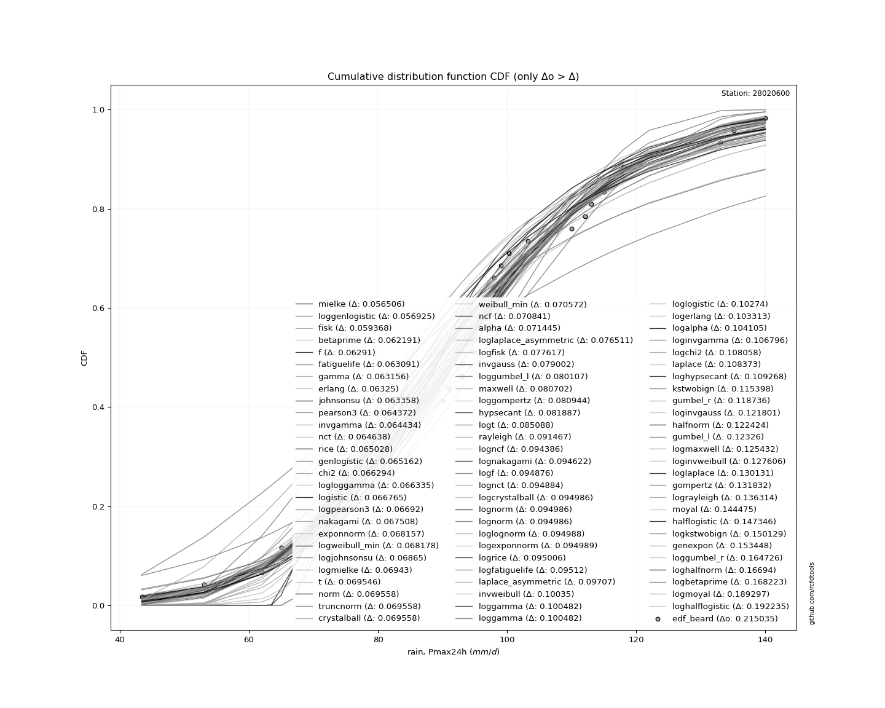</img>

</div>


**4.3. Best fit**

<div align="center">

|   id |   station | empirical_dist   | p_dist   |     delta |   deltao | eval   |   fit |   n |   best_fit |   best_fit_sort |
|-----:|----------:|:-----------------|:---------|----------:|---------:|:-------|------:|----:|-----------:|----------------:|
|    0 |  28020600 | edf_beard        | mielke   | 0.0565062 | 0.215035 | Δo > Δ |     1 |  40 |          1 |               1 |

</div>


<div align="center">

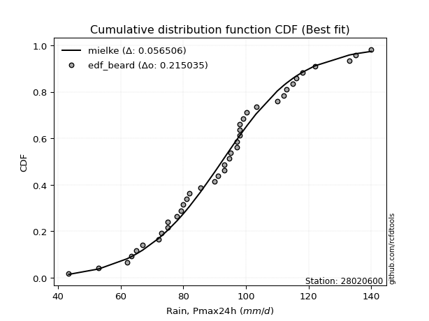</img></img>

</div>


### 5. Empirical - EDF Chegodayev (1955)

The Chegodayev formula is an empirical plotting position formula used in hydrological frequency analysis to estimate the exceedance probability or return period of a specific event from a set of observed data. It is primarily used for plotting observed data points on probability paper to fit a theoretical distribution, particularly for analyzing extreme events like maximum flood flows or rainfall intensities. The constant _b_ value in the generalized plotting position formula is 0.3.

<div align="center">


$P=(m-b)/(n+1-2b)$


</div>


**5.1. Empirical values**

<div align="center">

|                | 0                    | 1                   | 2                   | 3                  | 4                   | 5                  | 6                   | 7                  | 8                   | 9                  | 10                  | 11                 | 12                  | 13                 | 14                  | 15                 | 16                  | 17                 | 18                 | 19                 | 20                 | 21                 | 22                 | 23                 | 24                 | 25                 | 26                 | 27                 | 28                 | 29                 | 30                 | 31                 | 32                 | 33                 | 34                | 35                 | 36                 | 37                 | 38                | 39                 |
|:---------------|:---------------------|:--------------------|:--------------------|:-------------------|:--------------------|:-------------------|:--------------------|:-------------------|:--------------------|:-------------------|:--------------------|:-------------------|:--------------------|:-------------------|:--------------------|:-------------------|:--------------------|:-------------------|:-------------------|:-------------------|:-------------------|:-------------------|:-------------------|:-------------------|:-------------------|:-------------------|:-------------------|:-------------------|:-------------------|:-------------------|:-------------------|:-------------------|:-------------------|:-------------------|:------------------|:-------------------|:-------------------|:-------------------|:------------------|:-------------------|
| date           | 2001                 | 2014                | 2008                | 2012               | 2015                | 1984               | 2005                | 1997               | 2007                | 1992               | 2018                | 2003               | 1983                | 2009               | 1988                | 1996               | 2021                | 2011               | 1987               | 1989               | 2000               | 1993               | 2004               | 1985               | 1986               | 2002               | 2016               | 1999               | 1994               | 1981               | 1998               | 1991               | 1990               | 2006               | 2017              | 1982               | 2019               | 2010               | 1995              | 2013               |
| x              | 43.4                 | 53.0                | 62.0                | 63.47518361        | 65.0                | 67.0               | 72.0                | 73.0               | 75.0                | 75.0               | 78.0                | 79.2               | 80.0                | 81.0               | 82.0                | 85.4               | 90.0                | 91.0               | 93.0               | 93.0               | 94.7               | 95.0               | 97.0               | 97.0               | 98.0               | 98.0               | 98.0               | 99.0               | 100.3              | 103.2303848        | 110.0              | 112.1              | 113.0              | 115.0              | 116.0             | 118.0              | 122.0              | 133.0              | 135.1             | 140.0              |
| m              | 1                    | 2                   | 3                   | 4                  | 5                   | 6                  | 7                   | 8                  | 9                   | 10                 | 11                  | 12                 | 13                  | 14                 | 15                  | 16                 | 17                  | 18                 | 19                 | 20                 | 21                 | 22                 | 23                 | 24                 | 25                 | 26                 | 27                 | 28                 | 29                 | 30                 | 31                 | 32                 | 33                 | 34                 | 35                | 36                 | 37                 | 38                 | 39                | 40                 |
| empirical_dist | edf_chegodayev       | edf_chegodayev      | edf_chegodayev      | edf_chegodayev     | edf_chegodayev      | edf_chegodayev     | edf_chegodayev      | edf_chegodayev     | edf_chegodayev      | edf_chegodayev     | edf_chegodayev      | edf_chegodayev     | edf_chegodayev      | edf_chegodayev     | edf_chegodayev      | edf_chegodayev     | edf_chegodayev      | edf_chegodayev     | edf_chegodayev     | edf_chegodayev     | edf_chegodayev     | edf_chegodayev     | edf_chegodayev     | edf_chegodayev     | edf_chegodayev     | edf_chegodayev     | edf_chegodayev     | edf_chegodayev     | edf_chegodayev     | edf_chegodayev     | edf_chegodayev     | edf_chegodayev     | edf_chegodayev     | edf_chegodayev     | edf_chegodayev    | edf_chegodayev     | edf_chegodayev     | edf_chegodayev     | edf_chegodayev    | edf_chegodayev     |
| empirical      | 0.017326732673267325 | 0.04207920792079208 | 0.06683168316831684 | 0.0915841584158416 | 0.11633663366336634 | 0.1410891089108911 | 0.16584158415841585 | 0.1905940594059406 | 0.21534653465346534 | 0.2400990099009901 | 0.26485148514851486 | 0.2896039603960396 | 0.31435643564356436 | 0.3391089108910891 | 0.36386138613861385 | 0.3886138613861386 | 0.41336633663366334 | 0.4381188118811881 | 0.4628712871287129 | 0.4876237623762376 | 0.5123762376237624 | 0.5371287128712872 | 0.5618811881188119 | 0.5866336633663366 | 0.6113861386138614 | 0.6361386138613861 | 0.6608910891089109 | 0.6856435643564357 | 0.7103960396039604 | 0.7351485148514851 | 0.7599009900990099 | 0.7846534653465347 | 0.8094059405940595 | 0.8341584158415842 | 0.858910891089109 | 0.8836633663366338 | 0.9084158415841586 | 0.9331683168316832 | 0.957920792079208 | 0.9826732673267328 |
| empirical_tr   | 1.0176322418136021   | 1.0439276485788114  | 1.0716180371352786  | 1.1008174386920981 | 1.1316526610644257  | 1.1642651296829971 | 1.198813056379822   | 1.235474006116208  | 1.2744479495268137  | 1.3159609120521172 | 1.3602693602693603  | 1.4076655052264808 | 1.4584837545126355  | 1.5131086142322097 | 1.5719844357976653  | 1.6356275303643726 | 1.7046413502109703  | 1.779735682819383  | 1.8617511520737327 | 1.9516908212560387 | 2.050761421319797  | 2.160427807486631  | 2.282485875706215  | 2.4191616766467066 | 2.573248407643312  | 2.748299319727891  | 2.9489051094890515 | 3.181102362204725  | 3.4529914529914527 | 3.7757009345794392 | 4.164948453608248  | 4.643678160919541  | 5.246753246753248  | 6.029850746268659  | 7.087719298245619 | 8.595744680851073  | 10.918918918918935 | 14.962962962962974 | 23.76470588235298 | 57.714285714286035 |

</div>


**5.2. Kolmogorov-Smirnov fit test (sorted by Δ)**


<div align="center">

|                | 0                   | 1                   | 2                    | 3                   | 4                   | 5                   | 6                   | 7                   | 8                   | 9                   | 10                  | 11                  | 12                  | 13                  | 14                  | 15                 | 16                  | 17                  | 18                 | 19                  | 20                  | 21                  | 22                  | 23                 | 24                  | 25                  | 26                  | 27                  | 28                  | 29                  | 30                    | 31                  | 32                  | 33                  | 34                  | 35                  | 36                  | 37                  | 38                  | 39                  | 40                  | 41                 | 42                  | 43                  | 44                  | 45                  | 46                  | 47                  | 48                  | 49                  | 50                  | 51                 | 52                  | 53                  | 54                  | 55                  | 56                  | 57                 | 58                  | 59                  | 60                 | 61                  | 62                  | 63                  | 64                  | 65                  | 66                  | 67                  | 68                  | 69                  | 70                  | 71                  | 72                  | 73                 | 74                 | 75                 | 76                 | 77                 | 78                 | 79                  | 80                 | 81                  | 82                  | 83                 | 84                  | 85                  | 86                  | 87                 |
|:---------------|:--------------------|:--------------------|:---------------------|:--------------------|:--------------------|:--------------------|:--------------------|:--------------------|:--------------------|:--------------------|:--------------------|:--------------------|:--------------------|:--------------------|:--------------------|:-------------------|:--------------------|:--------------------|:-------------------|:--------------------|:--------------------|:--------------------|:--------------------|:-------------------|:--------------------|:--------------------|:--------------------|:--------------------|:--------------------|:--------------------|:----------------------|:--------------------|:--------------------|:--------------------|:--------------------|:--------------------|:--------------------|:--------------------|:--------------------|:--------------------|:--------------------|:-------------------|:--------------------|:--------------------|:--------------------|:--------------------|:--------------------|:--------------------|:--------------------|:--------------------|:--------------------|:-------------------|:--------------------|:--------------------|:--------------------|:--------------------|:--------------------|:-------------------|:--------------------|:--------------------|:-------------------|:--------------------|:--------------------|:--------------------|:--------------------|:--------------------|:--------------------|:--------------------|:--------------------|:--------------------|:--------------------|:--------------------|:--------------------|:-------------------|:-------------------|:-------------------|:-------------------|:-------------------|:-------------------|:--------------------|:-------------------|:--------------------|:--------------------|:-------------------|:--------------------|:--------------------|:--------------------|:-------------------|
| station        | 28020600            | 28020600            | 28020600             | 28020600            | 28020600            | 28020600            | 28020600            | 28020600            | 28020600            | 28020600            | 28020600            | 28020600            | 28020600            | 28020600            | 28020600            | 28020600           | 28020600            | 28020600            | 28020600           | 28020600            | 28020600            | 28020600            | 28020600            | 28020600           | 28020600            | 28020600            | 28020600            | 28020600            | 28020600            | 28020600            | 28020600              | 28020600            | 28020600            | 28020600            | 28020600            | 28020600            | 28020600            | 28020600            | 28020600            | 28020600            | 28020600            | 28020600           | 28020600            | 28020600            | 28020600            | 28020600            | 28020600            | 28020600            | 28020600            | 28020600            | 28020600            | 28020600           | 28020600            | 28020600            | 28020600            | 28020600            | 28020600            | 28020600           | 28020600            | 28020600            | 28020600           | 28020600            | 28020600            | 28020600            | 28020600            | 28020600            | 28020600            | 28020600            | 28020600            | 28020600            | 28020600            | 28020600            | 28020600            | 28020600           | 28020600           | 28020600           | 28020600           | 28020600           | 28020600           | 28020600            | 28020600           | 28020600            | 28020600            | 28020600           | 28020600            | 28020600            | 28020600            | 28020600           |
| empirical_dist | edf_chegodayev      | edf_chegodayev      | edf_chegodayev       | edf_chegodayev      | edf_chegodayev      | edf_chegodayev      | edf_chegodayev      | edf_chegodayev      | edf_chegodayev      | edf_chegodayev      | edf_chegodayev      | edf_chegodayev      | edf_chegodayev      | edf_chegodayev      | edf_chegodayev      | edf_chegodayev     | edf_chegodayev      | edf_chegodayev      | edf_chegodayev     | edf_chegodayev      | edf_chegodayev      | edf_chegodayev      | edf_chegodayev      | edf_chegodayev     | edf_chegodayev      | edf_chegodayev      | edf_chegodayev      | edf_chegodayev      | edf_chegodayev      | edf_chegodayev      | edf_chegodayev        | edf_chegodayev      | edf_chegodayev      | edf_chegodayev      | edf_chegodayev      | edf_chegodayev      | edf_chegodayev      | edf_chegodayev      | edf_chegodayev      | edf_chegodayev      | edf_chegodayev      | edf_chegodayev     | edf_chegodayev      | edf_chegodayev      | edf_chegodayev      | edf_chegodayev      | edf_chegodayev      | edf_chegodayev      | edf_chegodayev      | edf_chegodayev      | edf_chegodayev      | edf_chegodayev     | edf_chegodayev      | edf_chegodayev      | edf_chegodayev      | edf_chegodayev      | edf_chegodayev      | edf_chegodayev     | edf_chegodayev      | edf_chegodayev      | edf_chegodayev     | edf_chegodayev      | edf_chegodayev      | edf_chegodayev      | edf_chegodayev      | edf_chegodayev      | edf_chegodayev      | edf_chegodayev      | edf_chegodayev      | edf_chegodayev      | edf_chegodayev      | edf_chegodayev      | edf_chegodayev      | edf_chegodayev     | edf_chegodayev     | edf_chegodayev     | edf_chegodayev     | edf_chegodayev     | edf_chegodayev     | edf_chegodayev      | edf_chegodayev     | edf_chegodayev      | edf_chegodayev      | edf_chegodayev     | edf_chegodayev      | edf_chegodayev      | edf_chegodayev      | edf_chegodayev     |
| p_dist         | mielke              | loggenlogistic      | fisk                 | betaprime           | f                   | fatiguelife         | gamma               | erlang              | johnsonsu           | pearson3            | invgamma            | nct                 | rice                | genlogistic         | logloggamma         | chi2               | logpearson3         | logistic            | nakagami           | exponnorm           | logweibull_min      | logjohnsonsu        | logmielke           | t                  | norm                | truncnorm           | crystalball         | weibull_min         | ncf                 | alpha               | loglaplace_asymmetric | logfisk             | invgauss            | loggumbel_l         | maxwell             | loggompertz         | hypsecant           | logt                | rayleigh            | logncf              | lognakagami         | logf               | lognct              | logcrystalball      | lognorm             | lognorm             | loglognorm          | logexponnorm        | logrice             | logfatiguelife      | laplace_asymmetric  | invweibull         | loggamma            | loggamma            | loglogistic         | logerlang           | logalpha            | loginvgamma        | logchi2             | laplace             | loghypsecant       | kstwobign           | gumbel_r            | loginvgauss         | halfnorm            | gumbel_l            | logmaxwell          | loginvweibull       | loglaplace          | gompertz            | lograyleigh         | moyal               | halflogistic        | logkstwobign       | genexpon           | loggumbel_r        | loghalfnorm        | logbetaprime       | logmoyal           | loghalflogistic     | wald               | loggenexpon         | gibrat              | logwald            | expon               | loggibrat           | logexpon            | logtruncnorm       |
| delta          | 0.05640203886363593 | 0.05682099686766573 | 0.059349744287180706 | 0.06208717099894523 | 0.06280540293609627 | 0.06298700528544554 | 0.06305198532646761 | 0.06314599727183201 | 0.06325418589732956 | 0.06426771231754969 | 0.06441522662547466 | 0.06453425309882177 | 0.06492343278415458 | 0.06514348889173521 | 0.06623100927835346 | 0.0662755281593092 | 0.06681624934961217 | 0.06683199485849739 | 0.0674899272206177 | 0.06805303505994931 | 0.06807336282966969 | 0.06854530330681186 | 0.06932573376130291 | 0.0694417214725791 | 0.06945419116451435 | 0.06945419557384258 | 0.06945419587560542 | 0.07046750788422895 | 0.07082275756533091 | 0.07142611687659267 | 0.07657880848585519   | 0.07759831099449038 | 0.07898393826786126 | 0.08000248775833874 | 0.08068343849779641 | 0.08084005830475394 | 0.08195451264307879 | 0.08506915582964053 | 0.09144841613067295 | 0.09436763168595913 | 0.09460363160100077 | 0.0948577944375259 | 0.09486551631770895 | 0.09496727769560748 | 0.09496738538575772 | 0.09496738538575772 | 0.09497008697748904 | 0.09497043095252816 | 0.09498739059025602 | 0.09510114988234314 | 0.09713693067941959 | 0.1003073970269443 | 0.10046378477943269 | 0.10046378477943269 | 0.10272169527141167 | 0.10329465279037559 | 0.10408701740306975 | 0.1067774039717923 | 0.10801482869075246 | 0.10844073749932054 | 0.1092494693023866 | 0.11535540588110477 | 0.11871786317780658 | 0.12175791331207303 | 0.12238138006186922 | 0.12316787035647503 | 0.12538884418952717 | 0.12756300205910803 | 0.13011302131341856 | 0.13172819917737388 | 0.13627129128243215 | 0.14445674677206116 | 0.14732800578360566 | 0.1500859305116073 | 0.1532820885180556 | 0.1647080432207843 | 0.1668971608841569 | 0.1680574206816484 | 0.1892788531759068 | 0.19219168296001904 | 0.2159850150833284 | 0.22910926360680664 | 0.24095339510337083 | 0.2606251420284296 | 0.27632873338785746 | 0.28715038622873296 | 0.33639806943800876 | 0.6670781422598673 |
| deltao         | 0.2150348808914498  | 0.2150348808914498  | 0.2150348808914498   | 0.2150348808914498  | 0.2150348808914498  | 0.2150348808914498  | 0.2150348808914498  | 0.2150348808914498  | 0.2150348808914498  | 0.2150348808914498  | 0.2150348808914498  | 0.2150348808914498  | 0.2150348808914498  | 0.2150348808914498  | 0.2150348808914498  | 0.2150348808914498 | 0.2150348808914498  | 0.2150348808914498  | 0.2150348808914498 | 0.2150348808914498  | 0.2150348808914498  | 0.2150348808914498  | 0.2150348808914498  | 0.2150348808914498 | 0.2150348808914498  | 0.2150348808914498  | 0.2150348808914498  | 0.2150348808914498  | 0.2150348808914498  | 0.2150348808914498  | 0.2150348808914498    | 0.2150348808914498  | 0.2150348808914498  | 0.2150348808914498  | 0.2150348808914498  | 0.2150348808914498  | 0.2150348808914498  | 0.2150348808914498  | 0.2150348808914498  | 0.2150348808914498  | 0.2150348808914498  | 0.2150348808914498 | 0.2150348808914498  | 0.2150348808914498  | 0.2150348808914498  | 0.2150348808914498  | 0.2150348808914498  | 0.2150348808914498  | 0.2150348808914498  | 0.2150348808914498  | 0.2150348808914498  | 0.2150348808914498 | 0.2150348808914498  | 0.2150348808914498  | 0.2150348808914498  | 0.2150348808914498  | 0.2150348808914498  | 0.2150348808914498 | 0.2150348808914498  | 0.2150348808914498  | 0.2150348808914498 | 0.2150348808914498  | 0.2150348808914498  | 0.2150348808914498  | 0.2150348808914498  | 0.2150348808914498  | 0.2150348808914498  | 0.2150348808914498  | 0.2150348808914498  | 0.2150348808914498  | 0.2150348808914498  | 0.2150348808914498  | 0.2150348808914498  | 0.2150348808914498 | 0.2150348808914498 | 0.2150348808914498 | 0.2150348808914498 | 0.2150348808914498 | 0.2150348808914498 | 0.2150348808914498  | 0.2150348808914498 | 0.2150348808914498  | 0.2150348808914498  | 0.2150348808914498 | 0.2150348808914498  | 0.2150348808914498  | 0.2150348808914498  | 0.2150348808914498 |
| eval           | Δo > Δ              | Δo > Δ              | Δo > Δ               | Δo > Δ              | Δo > Δ              | Δo > Δ              | Δo > Δ              | Δo > Δ              | Δo > Δ              | Δo > Δ              | Δo > Δ              | Δo > Δ              | Δo > Δ              | Δo > Δ              | Δo > Δ              | Δo > Δ             | Δo > Δ              | Δo > Δ              | Δo > Δ             | Δo > Δ              | Δo > Δ              | Δo > Δ              | Δo > Δ              | Δo > Δ             | Δo > Δ              | Δo > Δ              | Δo > Δ              | Δo > Δ              | Δo > Δ              | Δo > Δ              | Δo > Δ                | Δo > Δ              | Δo > Δ              | Δo > Δ              | Δo > Δ              | Δo > Δ              | Δo > Δ              | Δo > Δ              | Δo > Δ              | Δo > Δ              | Δo > Δ              | Δo > Δ             | Δo > Δ              | Δo > Δ              | Δo > Δ              | Δo > Δ              | Δo > Δ              | Δo > Δ              | Δo > Δ              | Δo > Δ              | Δo > Δ              | Δo > Δ             | Δo > Δ              | Δo > Δ              | Δo > Δ              | Δo > Δ              | Δo > Δ              | Δo > Δ             | Δo > Δ              | Δo > Δ              | Δo > Δ             | Δo > Δ              | Δo > Δ              | Δo > Δ              | Δo > Δ              | Δo > Δ              | Δo > Δ              | Δo > Δ              | Δo > Δ              | Δo > Δ              | Δo > Δ              | Δo > Δ              | Δo > Δ              | Δo > Δ             | Δo > Δ             | Δo > Δ             | Δo > Δ             | Δo > Δ             | Δo > Δ             | Δo > Δ              | Δo <= Δ            | Δo <= Δ             | Δo <= Δ             | Δo <= Δ            | Δo <= Δ             | Δo <= Δ             | Δo <= Δ             | Δo <= Δ            |
| fit            | 1                   | 1                   | 1                    | 1                   | 1                   | 1                   | 1                   | 1                   | 1                   | 1                   | 1                   | 1                   | 1                   | 1                   | 1                   | 1                  | 1                   | 1                   | 1                  | 1                   | 1                   | 1                   | 1                   | 1                  | 1                   | 1                   | 1                   | 1                   | 1                   | 1                   | 1                     | 1                   | 1                   | 1                   | 1                   | 1                   | 1                   | 1                   | 1                   | 1                   | 1                   | 1                  | 1                   | 1                   | 1                   | 1                   | 1                   | 1                   | 1                   | 1                   | 1                   | 1                  | 1                   | 1                   | 1                   | 1                   | 1                   | 1                  | 1                   | 1                   | 1                  | 1                   | 1                   | 1                   | 1                   | 1                   | 1                   | 1                   | 1                   | 1                   | 1                   | 1                   | 1                   | 1                  | 1                  | 1                  | 1                  | 1                  | 1                  | 1                   | 0                  | 0                   | 0                   | 0                  | 0                   | 0                   | 0                   | 0                  |
| n              | 40                  | 40                  | 40                   | 40                  | 40                  | 40                  | 40                  | 40                  | 40                  | 40                  | 40                  | 40                  | 40                  | 40                  | 40                  | 40                 | 40                  | 40                  | 40                 | 40                  | 40                  | 40                  | 40                  | 40                 | 40                  | 40                  | 40                  | 40                  | 40                  | 40                  | 40                    | 40                  | 40                  | 40                  | 40                  | 40                  | 40                  | 40                  | 40                  | 40                  | 40                  | 40                 | 40                  | 40                  | 40                  | 40                  | 40                  | 40                  | 40                  | 40                  | 40                  | 40                 | 40                  | 40                  | 40                  | 40                  | 40                  | 40                 | 40                  | 40                  | 40                 | 40                  | 40                  | 40                  | 40                  | 40                  | 40                  | 40                  | 40                  | 40                  | 40                  | 40                  | 40                  | 40                 | 40                 | 40                 | 40                 | 40                 | 40                 | 40                  | 40                 | 40                  | 40                  | 40                 | 40                  | 40                  | 40                  | 40                 |
| best_fit       | 1                   | 0                   | 0                    | 0                   | 0                   | 0                   | 0                   | 0                   | 0                   | 0                   | 0                   | 0                   | 0                   | 0                   | 0                   | 0                  | 0                   | 0                   | 0                  | 0                   | 0                   | 0                   | 0                   | 0                  | 0                   | 0                   | 0                   | 0                   | 0                   | 0                   | 0                     | 0                   | 0                   | 0                   | 0                   | 0                   | 0                   | 0                   | 0                   | 0                   | 0                   | 0                  | 0                   | 0                   | 0                   | 0                   | 0                   | 0                   | 0                   | 0                   | 0                   | 0                  | 0                   | 0                   | 0                   | 0                   | 0                   | 0                  | 0                   | 0                   | 0                  | 0                   | 0                   | 0                   | 0                   | 0                   | 0                   | 0                   | 0                   | 0                   | 0                   | 0                   | 0                   | 0                  | 0                  | 0                  | 0                  | 0                  | 0                  | 0                   | 0                  | 0                   | 0                   | 0                  | 0                   | 0                   | 0                   | 0                  |
| best_fit_sort  | 1                   | 2                   | 3                    | 4                   | 5                   | 6                   | 7                   | 8                   | 9                   | 10                  | 11                  | 12                  | 13                  | 14                  | 15                  | 16                 | 17                  | 18                  | 19                 | 20                  | 21                  | 22                  | 23                  | 24                 | 25                  | 26                  | 27                  | 28                  | 29                  | 30                  | 31                    | 32                  | 33                  | 34                  | 35                  | 36                  | 37                  | 38                  | 39                  | 40                  | 41                  | 42                 | 43                  | 44                  | 45                  | 46                  | 47                  | 48                  | 49                  | 50                  | 51                  | 52                 | 53                  | 54                  | 55                  | 56                  | 57                  | 58                 | 59                  | 60                  | 61                 | 62                  | 63                  | 64                  | 65                  | 66                  | 67                  | 68                  | 69                  | 70                  | 71                  | 72                  | 73                  | 74                 | 75                 | 76                 | 77                 | 78                 | 79                 | 80                  | 81                 | 82                  | 83                  | 84                 | 85                  | 86                  | 87                  | 88                 |

</div>


<div align="center">

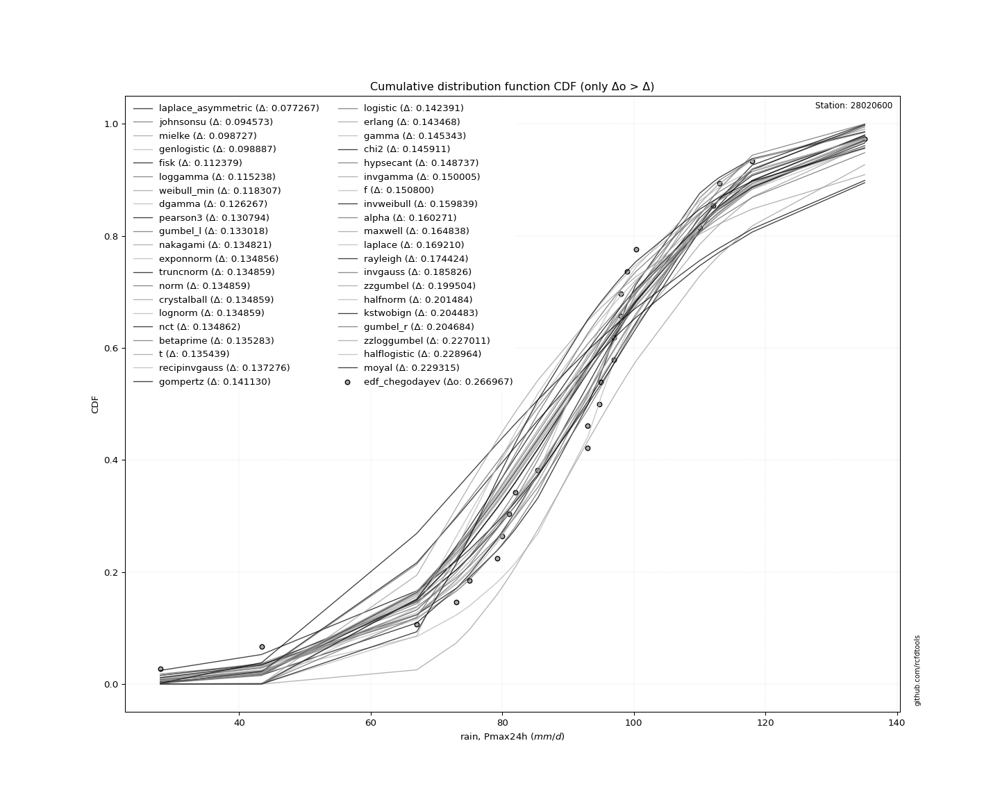</img>

</div>


**5.3. Best fit**

<div align="center">

|   id |   station | empirical_dist   | p_dist   |    delta |   deltao | eval   |   fit |   n |   best_fit |   best_fit_sort |
|-----:|----------:|:-----------------|:---------|---------:|---------:|:-------|------:|----:|-----------:|----------------:|
|    0 |  28020600 | edf_chegodayev   | mielke   | 0.056402 | 0.215035 | Δo > Δ |     1 |  40 |          1 |               1 |

</div>


<div align="center">

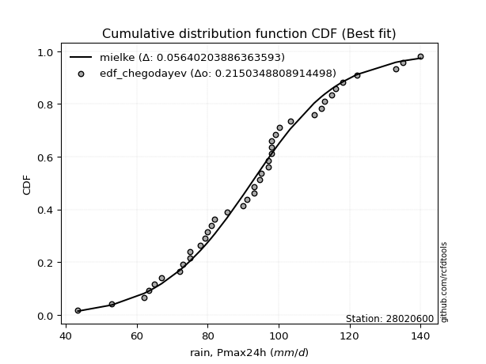</img>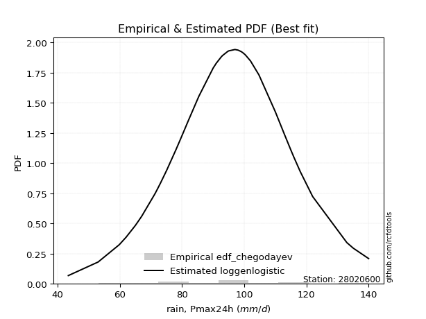</img>

</div>


### 6. Empirical - EDF Blom (1958)

The Blom formula is a specific "plotting position" formula used in hydrology and statistical analysis to estimate the empirical cumulative probability (or non-exceedance probability) of a data series. It is particularly recommended for data that are approximately normally distributed. The constant _a_ is set to 0.375 (or 3/8).

<div align="center">


$P=(m-a)/(n+1-2a)$


</div>


**6.1. Empirical values**

<div align="center">

|                | 0                    | 1                    | 2                   | 3                   | 4                   | 5                   | 6                   | 7                   | 8                   | 9                  | 10                 | 11                 | 12                 | 13                 | 14                  | 15                  | 16                  | 17                  | 18                  | 19                  | 20                 | 21                 | 22                 | 23                 | 24                 | 25                 | 26                 | 27                 | 28                 | 29                 | 30                 | 31                 | 32                 | 33                 | 34                | 35                 | 36                 | 37                 | 38                 | 39                |
|:---------------|:---------------------|:---------------------|:--------------------|:--------------------|:--------------------|:--------------------|:--------------------|:--------------------|:--------------------|:-------------------|:-------------------|:-------------------|:-------------------|:-------------------|:--------------------|:--------------------|:--------------------|:--------------------|:--------------------|:--------------------|:-------------------|:-------------------|:-------------------|:-------------------|:-------------------|:-------------------|:-------------------|:-------------------|:-------------------|:-------------------|:-------------------|:-------------------|:-------------------|:-------------------|:------------------|:-------------------|:-------------------|:-------------------|:-------------------|:------------------|
| date           | 2001                 | 2014                 | 2008                | 2012                | 2015                | 1984                | 2005                | 1997                | 2007                | 1992               | 2018               | 2003               | 1983               | 2009               | 1988                | 1996                | 2021                | 2011                | 1987                | 1989                | 2000               | 1993               | 2004               | 1985               | 1986               | 2002               | 2016               | 1999               | 1994               | 1981               | 1998               | 1991               | 1990               | 2006               | 2017              | 1982               | 2019               | 2010               | 1995               | 2013              |
| x              | 43.4                 | 53.0                 | 62.0                | 63.47518361         | 65.0                | 67.0                | 72.0                | 73.0                | 75.0                | 75.0               | 78.0               | 79.2               | 80.0               | 81.0               | 82.0                | 85.4                | 90.0                | 91.0                | 93.0                | 93.0                | 94.7               | 95.0               | 97.0               | 97.0               | 98.0               | 98.0               | 98.0               | 99.0               | 100.3              | 103.2303848        | 110.0              | 112.1              | 113.0              | 115.0              | 116.0             | 118.0              | 122.0              | 133.0              | 135.1              | 140.0             |
| m              | 1                    | 2                    | 3                   | 4                   | 5                   | 6                   | 7                   | 8                   | 9                   | 10                 | 11                 | 12                 | 13                 | 14                 | 15                  | 16                  | 17                  | 18                  | 19                  | 20                  | 21                 | 22                 | 23                 | 24                 | 25                 | 26                 | 27                 | 28                 | 29                 | 30                 | 31                 | 32                 | 33                 | 34                 | 35                | 36                 | 37                 | 38                 | 39                 | 40                |
| empirical_dist | edf_blom             | edf_blom             | edf_blom            | edf_blom            | edf_blom            | edf_blom            | edf_blom            | edf_blom            | edf_blom            | edf_blom           | edf_blom           | edf_blom           | edf_blom           | edf_blom           | edf_blom            | edf_blom            | edf_blom            | edf_blom            | edf_blom            | edf_blom            | edf_blom           | edf_blom           | edf_blom           | edf_blom           | edf_blom           | edf_blom           | edf_blom           | edf_blom           | edf_blom           | edf_blom           | edf_blom           | edf_blom           | edf_blom           | edf_blom           | edf_blom          | edf_blom           | edf_blom           | edf_blom           | edf_blom           | edf_blom          |
| empirical      | 0.015527950310559006 | 0.040372670807453416 | 0.06521739130434782 | 0.09006211180124224 | 0.11490683229813664 | 0.13975155279503104 | 0.16459627329192547 | 0.18944099378881987 | 0.21428571428571427 | 0.2391304347826087 | 0.2639751552795031 | 0.2888198757763975 | 0.3136645962732919 | 0.3385093167701863 | 0.36335403726708076 | 0.38819875776397517 | 0.41304347826086957 | 0.43788819875776397 | 0.46273291925465837 | 0.48757763975155277 | 0.5124223602484472 | 0.5372670807453416 | 0.562111801242236  | 0.5869565217391305 | 0.6118012422360248 | 0.6366459627329193 | 0.6614906832298136 | 0.6863354037267081 | 0.7111801242236024 | 0.7360248447204969 | 0.7608695652173914 | 0.7857142857142857 | 0.8105590062111802 | 0.8354037267080745 | 0.860248447204969 | 0.8850931677018633 | 0.9099378881987578 | 0.9347826086956522 | 0.9596273291925466 | 0.984472049689441 |
| empirical_tr   | 1.0157728706624605   | 1.0420711974110033   | 1.069767441860465   | 1.098976109215017   | 1.1298245614035087  | 1.1624548736462095  | 1.1970260223048328  | 1.2337164750957854  | 1.2727272727272727  | 1.3142857142857143 | 1.358649789029536  | 1.406113537117904  | 1.4570135746606334 | 1.5117370892018778 | 1.570731707317073   | 1.634517766497462   | 1.703703703703704   | 1.7790055248618784  | 1.8612716763005779  | 1.9515151515151514  | 2.050955414012739  | 2.1610738255033555 | 2.2836879432624113 | 2.421052631578948  | 2.576              | 2.7521367521367526 | 2.954128440366972  | 3.1881188118811883 | 3.462365591397849  | 3.788235294117647  | 4.1818181818181825 | 4.666666666666666  | 5.278688524590165  | 6.075471698113207  | 7.155555555555556 | 8.702702702702698  | 11.10344827586207  | 15.333333333333343 | 24.769230769230756 | 64.4000000000001  |

</div>


**6.2. Kolmogorov-Smirnov fit test (sorted by Δ)**


<div align="center">

|                | 0                    | 1                   | 2                   | 3                   | 4                   | 5                   | 6                   | 7                   | 8                   | 9                   | 10                  | 11                  | 12                  | 13                  | 14                 | 15                  | 16                  | 17                  | 18                  | 19                  | 20                  | 21                  | 22                  | 23                  | 24                  | 25                  | 26                 | 27                  | 28                  | 29                 | 30                    | 31                 | 32                  | 33                  | 34                  | 35                 | 36                  | 37                  | 38                  | 39                  | 40                 | 41                  | 42                  | 43                 | 44                  | 45                  | 46                  | 47                  | 48                  | 49                  | 50                 | 51                  | 52                  | 53                  | 54                 | 55                  | 56                  | 57                  | 58                  | 59                  | 60                  | 61                  | 62                 | 63                 | 64                 | 65                  | 66                  | 67                 | 68                 | 69                  | 70                  | 71                  | 72                 | 73                  | 74                 | 75                  | 76                  | 77                  | 78                  | 79                  | 80                  | 81                  | 82                  | 83                 | 84                  | 85                 | 86                  | 87                 |
|:---------------|:---------------------|:--------------------|:--------------------|:--------------------|:--------------------|:--------------------|:--------------------|:--------------------|:--------------------|:--------------------|:--------------------|:--------------------|:--------------------|:--------------------|:-------------------|:--------------------|:--------------------|:--------------------|:--------------------|:--------------------|:--------------------|:--------------------|:--------------------|:--------------------|:--------------------|:--------------------|:-------------------|:--------------------|:--------------------|:-------------------|:----------------------|:-------------------|:--------------------|:--------------------|:--------------------|:-------------------|:--------------------|:--------------------|:--------------------|:--------------------|:-------------------|:--------------------|:--------------------|:-------------------|:--------------------|:--------------------|:--------------------|:--------------------|:--------------------|:--------------------|:-------------------|:--------------------|:--------------------|:--------------------|:-------------------|:--------------------|:--------------------|:--------------------|:--------------------|:--------------------|:--------------------|:--------------------|:-------------------|:-------------------|:-------------------|:--------------------|:--------------------|:-------------------|:-------------------|:--------------------|:--------------------|:--------------------|:-------------------|:--------------------|:-------------------|:--------------------|:--------------------|:--------------------|:--------------------|:--------------------|:--------------------|:--------------------|:--------------------|:-------------------|:--------------------|:-------------------|:--------------------|:-------------------|
| station        | 28020600             | 28020600            | 28020600            | 28020600            | 28020600            | 28020600            | 28020600            | 28020600            | 28020600            | 28020600            | 28020600            | 28020600            | 28020600            | 28020600            | 28020600           | 28020600            | 28020600            | 28020600            | 28020600            | 28020600            | 28020600            | 28020600            | 28020600            | 28020600            | 28020600            | 28020600            | 28020600           | 28020600            | 28020600            | 28020600           | 28020600              | 28020600           | 28020600            | 28020600            | 28020600            | 28020600           | 28020600            | 28020600            | 28020600            | 28020600            | 28020600           | 28020600            | 28020600            | 28020600           | 28020600            | 28020600            | 28020600            | 28020600            | 28020600            | 28020600            | 28020600           | 28020600            | 28020600            | 28020600            | 28020600           | 28020600            | 28020600            | 28020600            | 28020600            | 28020600            | 28020600            | 28020600            | 28020600           | 28020600           | 28020600           | 28020600            | 28020600            | 28020600           | 28020600           | 28020600            | 28020600            | 28020600            | 28020600           | 28020600            | 28020600           | 28020600            | 28020600            | 28020600            | 28020600            | 28020600            | 28020600            | 28020600            | 28020600            | 28020600           | 28020600            | 28020600           | 28020600            | 28020600           |
| empirical_dist | edf_blom             | edf_blom            | edf_blom            | edf_blom            | edf_blom            | edf_blom            | edf_blom            | edf_blom            | edf_blom            | edf_blom            | edf_blom            | edf_blom            | edf_blom            | edf_blom            | edf_blom           | edf_blom            | edf_blom            | edf_blom            | edf_blom            | edf_blom            | edf_blom            | edf_blom            | edf_blom            | edf_blom            | edf_blom            | edf_blom            | edf_blom           | edf_blom            | edf_blom            | edf_blom           | edf_blom              | edf_blom           | edf_blom            | edf_blom            | edf_blom            | edf_blom           | edf_blom            | edf_blom            | edf_blom            | edf_blom            | edf_blom           | edf_blom            | edf_blom            | edf_blom           | edf_blom            | edf_blom            | edf_blom            | edf_blom            | edf_blom            | edf_blom            | edf_blom           | edf_blom            | edf_blom            | edf_blom            | edf_blom           | edf_blom            | edf_blom            | edf_blom            | edf_blom            | edf_blom            | edf_blom            | edf_blom            | edf_blom           | edf_blom           | edf_blom           | edf_blom            | edf_blom            | edf_blom           | edf_blom           | edf_blom            | edf_blom            | edf_blom            | edf_blom           | edf_blom            | edf_blom           | edf_blom            | edf_blom            | edf_blom            | edf_blom            | edf_blom            | edf_blom            | edf_blom            | edf_blom            | edf_blom           | edf_blom            | edf_blom           | edf_blom            | edf_blom           |
| p_dist         | mielke               | loggenlogistic      | fisk                | betaprime           | f                   | fatiguelife         | gamma               | erlang              | johnsonsu           | invgamma            | pearson3            | genlogistic         | nct                 | rice                | logistic           | chi2                | logloggamma         | logpearson3         | nakagami            | exponnorm           | logweibull_min      | logjohnsonsu        | logmielke           | t                   | norm                | truncnorm           | crystalball        | ncf                 | weibull_min         | alpha              | loglaplace_asymmetric | logfisk            | invgauss            | loggumbel_l         | maxwell             | hypsecant          | loggompertz         | logt                | rayleigh            | logncf              | lognakagami        | logf                | lognct              | logcrystalball     | lognorm             | lognorm             | loglognorm          | logexponnorm        | logrice             | logfatiguelife      | laplace_asymmetric | loggamma            | loggamma            | invweibull          | loglogistic        | logerlang           | logalpha            | loginvgamma         | laplace             | logchi2             | loghypsecant        | kstwobign           | gumbel_r           | loginvgauss        | halfnorm           | gumbel_l            | logmaxwell          | loginvweibull      | loglaplace         | gompertz            | lograyleigh         | moyal               | halflogistic       | logkstwobign        | genexpon           | loggumbel_r         | loghalfnorm         | logbetaprime        | logmoyal            | loghalflogistic     | wald                | loggenexpon         | gibrat              | logwald            | expon               | loggibrat          | logexpon            | logtruncnorm       |
| delta          | 0.057186123483278006 | 0.05760508148730781 | 0.05948811216123523 | 0.06287125561858731 | 0.06358948755573834 | 0.06377108990508762 | 0.06383606994610969 | 0.06393008189147409 | 0.06403827051697164 | 0.06455359449952919 | 0.06505179693719176 | 0.06528185676578974 | 0.06531833771846385 | 0.06570751740379666 | 0.0663246459869643 | 0.06641389603336373 | 0.06701509389799554 | 0.06760033396925424 | 0.06762829509467222 | 0.06883711967959139 | 0.06885744744931177 | 0.06932938792645393 | 0.07010981838094499 | 0.07022580609222118 | 0.07023827578415642 | 0.07023828019348466 | 0.0702382804952475 | 0.07096112543938543 | 0.07125159250387103 | 0.0715644847506472 | 0.0760714596143221    | 0.0777366788685449 | 0.07912230614191579 | 0.08078657237798081 | 0.08082180637185093 | 0.0814471637715457 | 0.08162414292439601 | 0.08520752370369505 | 0.09158678400472747 | 0.09450599956001365 | 0.0947419994750553 | 0.09499616231158042 | 0.09500388419176348 | 0.095105645569662  | 0.09510575325981224 | 0.09510575325981224 | 0.09510845485154357 | 0.09510879882658269 | 0.09512575846431054 | 0.09523951775639766 | 0.0966295818078865 | 0.10060215265348721 | 0.10060215265348721 | 0.10063025539973808 | 0.1028600631454662 | 0.10343302066443011 | 0.10422538527712427 | 0.10691577184584683 | 0.10793338862778745 | 0.10833768706354624 | 0.10938783717644113 | 0.11567826425389854 | 0.1188562310518611 | 0.1220807716848668 | 0.122704238434663  | 0.12385970972674742 | 0.12571170256232095 | 0.1278858604319018 | 0.1302513891874731 | 0.13251228379701596 | 0.13659414965522593 | 0.14459511464611569 | 0.1474663736576602 | 0.15040878888440107 | 0.154527399384546  | 0.16484641109483883 | 0.16722001925695068 | 0.16930273154813877 | 0.18941722104996134 | 0.19251454133281282 | 0.21612338295738293 | 0.23035457447329702 | 0.24109176297742535 | 0.2609480004012234 | 0.27757404425434784 | 0.2872887541027875 | 0.33764338030449914 | 0.6683234531263577 |
| deltao         | 0.2150348808914498   | 0.2150348808914498  | 0.2150348808914498  | 0.2150348808914498  | 0.2150348808914498  | 0.2150348808914498  | 0.2150348808914498  | 0.2150348808914498  | 0.2150348808914498  | 0.2150348808914498  | 0.2150348808914498  | 0.2150348808914498  | 0.2150348808914498  | 0.2150348808914498  | 0.2150348808914498 | 0.2150348808914498  | 0.2150348808914498  | 0.2150348808914498  | 0.2150348808914498  | 0.2150348808914498  | 0.2150348808914498  | 0.2150348808914498  | 0.2150348808914498  | 0.2150348808914498  | 0.2150348808914498  | 0.2150348808914498  | 0.2150348808914498 | 0.2150348808914498  | 0.2150348808914498  | 0.2150348808914498 | 0.2150348808914498    | 0.2150348808914498 | 0.2150348808914498  | 0.2150348808914498  | 0.2150348808914498  | 0.2150348808914498 | 0.2150348808914498  | 0.2150348808914498  | 0.2150348808914498  | 0.2150348808914498  | 0.2150348808914498 | 0.2150348808914498  | 0.2150348808914498  | 0.2150348808914498 | 0.2150348808914498  | 0.2150348808914498  | 0.2150348808914498  | 0.2150348808914498  | 0.2150348808914498  | 0.2150348808914498  | 0.2150348808914498 | 0.2150348808914498  | 0.2150348808914498  | 0.2150348808914498  | 0.2150348808914498 | 0.2150348808914498  | 0.2150348808914498  | 0.2150348808914498  | 0.2150348808914498  | 0.2150348808914498  | 0.2150348808914498  | 0.2150348808914498  | 0.2150348808914498 | 0.2150348808914498 | 0.2150348808914498 | 0.2150348808914498  | 0.2150348808914498  | 0.2150348808914498 | 0.2150348808914498 | 0.2150348808914498  | 0.2150348808914498  | 0.2150348808914498  | 0.2150348808914498 | 0.2150348808914498  | 0.2150348808914498 | 0.2150348808914498  | 0.2150348808914498  | 0.2150348808914498  | 0.2150348808914498  | 0.2150348808914498  | 0.2150348808914498  | 0.2150348808914498  | 0.2150348808914498  | 0.2150348808914498 | 0.2150348808914498  | 0.2150348808914498 | 0.2150348808914498  | 0.2150348808914498 |
| eval           | Δo > Δ               | Δo > Δ              | Δo > Δ              | Δo > Δ              | Δo > Δ              | Δo > Δ              | Δo > Δ              | Δo > Δ              | Δo > Δ              | Δo > Δ              | Δo > Δ              | Δo > Δ              | Δo > Δ              | Δo > Δ              | Δo > Δ             | Δo > Δ              | Δo > Δ              | Δo > Δ              | Δo > Δ              | Δo > Δ              | Δo > Δ              | Δo > Δ              | Δo > Δ              | Δo > Δ              | Δo > Δ              | Δo > Δ              | Δo > Δ             | Δo > Δ              | Δo > Δ              | Δo > Δ             | Δo > Δ                | Δo > Δ             | Δo > Δ              | Δo > Δ              | Δo > Δ              | Δo > Δ             | Δo > Δ              | Δo > Δ              | Δo > Δ              | Δo > Δ              | Δo > Δ             | Δo > Δ              | Δo > Δ              | Δo > Δ             | Δo > Δ              | Δo > Δ              | Δo > Δ              | Δo > Δ              | Δo > Δ              | Δo > Δ              | Δo > Δ             | Δo > Δ              | Δo > Δ              | Δo > Δ              | Δo > Δ             | Δo > Δ              | Δo > Δ              | Δo > Δ              | Δo > Δ              | Δo > Δ              | Δo > Δ              | Δo > Δ              | Δo > Δ             | Δo > Δ             | Δo > Δ             | Δo > Δ              | Δo > Δ              | Δo > Δ             | Δo > Δ             | Δo > Δ              | Δo > Δ              | Δo > Δ              | Δo > Δ             | Δo > Δ              | Δo > Δ             | Δo > Δ              | Δo > Δ              | Δo > Δ              | Δo > Δ              | Δo > Δ              | Δo <= Δ             | Δo <= Δ             | Δo <= Δ             | Δo <= Δ            | Δo <= Δ             | Δo <= Δ            | Δo <= Δ             | Δo <= Δ            |
| fit            | 1                    | 1                   | 1                   | 1                   | 1                   | 1                   | 1                   | 1                   | 1                   | 1                   | 1                   | 1                   | 1                   | 1                   | 1                  | 1                   | 1                   | 1                   | 1                   | 1                   | 1                   | 1                   | 1                   | 1                   | 1                   | 1                   | 1                  | 1                   | 1                   | 1                  | 1                     | 1                  | 1                   | 1                   | 1                   | 1                  | 1                   | 1                   | 1                   | 1                   | 1                  | 1                   | 1                   | 1                  | 1                   | 1                   | 1                   | 1                   | 1                   | 1                   | 1                  | 1                   | 1                   | 1                   | 1                  | 1                   | 1                   | 1                   | 1                   | 1                   | 1                   | 1                   | 1                  | 1                  | 1                  | 1                   | 1                   | 1                  | 1                  | 1                   | 1                   | 1                   | 1                  | 1                   | 1                  | 1                   | 1                   | 1                   | 1                   | 1                   | 0                   | 0                   | 0                   | 0                  | 0                   | 0                  | 0                   | 0                  |
| n              | 40                   | 40                  | 40                  | 40                  | 40                  | 40                  | 40                  | 40                  | 40                  | 40                  | 40                  | 40                  | 40                  | 40                  | 40                 | 40                  | 40                  | 40                  | 40                  | 40                  | 40                  | 40                  | 40                  | 40                  | 40                  | 40                  | 40                 | 40                  | 40                  | 40                 | 40                    | 40                 | 40                  | 40                  | 40                  | 40                 | 40                  | 40                  | 40                  | 40                  | 40                 | 40                  | 40                  | 40                 | 40                  | 40                  | 40                  | 40                  | 40                  | 40                  | 40                 | 40                  | 40                  | 40                  | 40                 | 40                  | 40                  | 40                  | 40                  | 40                  | 40                  | 40                  | 40                 | 40                 | 40                 | 40                  | 40                  | 40                 | 40                 | 40                  | 40                  | 40                  | 40                 | 40                  | 40                 | 40                  | 40                  | 40                  | 40                  | 40                  | 40                  | 40                  | 40                  | 40                 | 40                  | 40                 | 40                  | 40                 |
| best_fit       | 1                    | 0                   | 0                   | 0                   | 0                   | 0                   | 0                   | 0                   | 0                   | 0                   | 0                   | 0                   | 0                   | 0                   | 0                  | 0                   | 0                   | 0                   | 0                   | 0                   | 0                   | 0                   | 0                   | 0                   | 0                   | 0                   | 0                  | 0                   | 0                   | 0                  | 0                     | 0                  | 0                   | 0                   | 0                   | 0                  | 0                   | 0                   | 0                   | 0                   | 0                  | 0                   | 0                   | 0                  | 0                   | 0                   | 0                   | 0                   | 0                   | 0                   | 0                  | 0                   | 0                   | 0                   | 0                  | 0                   | 0                   | 0                   | 0                   | 0                   | 0                   | 0                   | 0                  | 0                  | 0                  | 0                   | 0                   | 0                  | 0                  | 0                   | 0                   | 0                   | 0                  | 0                   | 0                  | 0                   | 0                   | 0                   | 0                   | 0                   | 0                   | 0                   | 0                   | 0                  | 0                   | 0                  | 0                   | 0                  |
| best_fit_sort  | 1                    | 2                   | 3                   | 4                   | 5                   | 6                   | 7                   | 8                   | 9                   | 10                  | 11                  | 12                  | 13                  | 14                  | 15                 | 16                  | 17                  | 18                  | 19                  | 20                  | 21                  | 22                  | 23                  | 24                  | 25                  | 26                  | 27                 | 28                  | 29                  | 30                 | 31                    | 32                 | 33                  | 34                  | 35                  | 36                 | 37                  | 38                  | 39                  | 40                  | 41                 | 42                  | 43                  | 44                 | 45                  | 46                  | 47                  | 48                  | 49                  | 50                  | 51                 | 52                  | 53                  | 54                  | 55                 | 56                  | 57                  | 58                  | 59                  | 60                  | 61                  | 62                  | 63                 | 64                 | 65                 | 66                  | 67                  | 68                 | 69                 | 70                  | 71                  | 72                  | 73                 | 74                  | 75                 | 76                  | 77                  | 78                  | 79                  | 80                  | 81                  | 82                  | 83                  | 84                 | 85                  | 86                 | 87                  | 88                 |

</div>


<div align="center">

</img>

</div>


**6.3. Best fit**

<div align="center">

|   id |   station | empirical_dist   | p_dist   |     delta |   deltao | eval   |   fit |   n |   best_fit |   best_fit_sort |
|-----:|----------:|:-----------------|:---------|----------:|---------:|:-------|------:|----:|-----------:|----------------:|
|    0 |  28020600 | edf_blom         | mielke   | 0.0571861 | 0.215035 | Δo > Δ |     1 |  40 |          1 |               1 |

</div>


<div align="center">

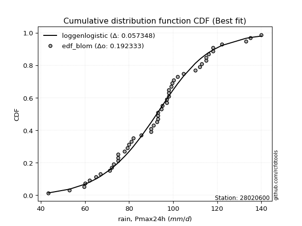</img>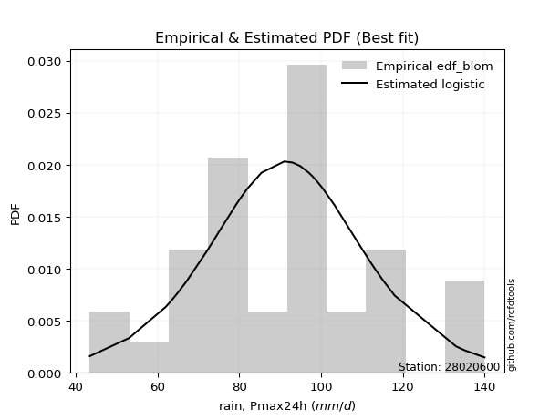</img>

</div>


### 7. Empirical - EDF Tukey (1962)

In hydrology, the Tukey formula is used as a plotting position formula to estimate the empirical probability or frequency of a flood event (or other hydrological data). The formula parameter is given as _c=0.333_ (or 1/3).

<div align="center">


$P=(m-c)/(n+1-2c)$


</div>


**7.1. Empirical values**

<div align="center">

|                | 0                   | 1                   | 2                   | 3                   | 4                   | 5                   | 6                  | 7                   | 8                   | 9                  | 10                 | 11                 | 12                 | 13                  | 14                  | 15                 | 16                 | 17                 | 18                 | 19                  | 20                 | 21                 | 22                 | 23                 | 24                 | 25                 | 26                 | 27                 | 28                 | 29                 | 30                 | 31                 | 32                 | 33                 | 34                | 35                 | 36                 | 37                 | 38                 | 39                 |
|:---------------|:--------------------|:--------------------|:--------------------|:--------------------|:--------------------|:--------------------|:-------------------|:--------------------|:--------------------|:-------------------|:-------------------|:-------------------|:-------------------|:--------------------|:--------------------|:-------------------|:-------------------|:-------------------|:-------------------|:--------------------|:-------------------|:-------------------|:-------------------|:-------------------|:-------------------|:-------------------|:-------------------|:-------------------|:-------------------|:-------------------|:-------------------|:-------------------|:-------------------|:-------------------|:------------------|:-------------------|:-------------------|:-------------------|:-------------------|:-------------------|
| date           | 2001                | 2014                | 2008                | 2012                | 2015                | 1984                | 2005               | 1997                | 2007                | 1992               | 2018               | 2003               | 1983               | 2009                | 1988                | 1996               | 2021               | 2011               | 1987               | 1989                | 2000               | 1993               | 2004               | 1985               | 1986               | 2002               | 2016               | 1999               | 1994               | 1981               | 1998               | 1991               | 1990               | 2006               | 2017              | 1982               | 2019               | 2010               | 1995               | 2013               |
| x              | 43.4                | 53.0                | 62.0                | 63.47518361         | 65.0                | 67.0                | 72.0               | 73.0                | 75.0                | 75.0               | 78.0               | 79.2               | 80.0               | 81.0                | 82.0                | 85.4               | 90.0               | 91.0               | 93.0               | 93.0                | 94.7               | 95.0               | 97.0               | 97.0               | 98.0               | 98.0               | 98.0               | 99.0               | 100.3              | 103.2303848        | 110.0              | 112.1              | 113.0              | 115.0              | 116.0             | 118.0              | 122.0              | 133.0              | 135.1              | 140.0              |
| m              | 1                   | 2                   | 3                   | 4                   | 5                   | 6                   | 7                  | 8                   | 9                   | 10                 | 11                 | 12                 | 13                 | 14                  | 15                  | 16                 | 17                 | 18                 | 19                 | 20                  | 21                 | 22                 | 23                 | 24                 | 25                 | 26                 | 27                 | 28                 | 29                 | 30                 | 31                 | 32                 | 33                 | 34                 | 35                | 36                 | 37                 | 38                 | 39                 | 40                 |
| empirical_dist | edf_tukey           | edf_tukey           | edf_tukey           | edf_tukey           | edf_tukey           | edf_tukey           | edf_tukey          | edf_tukey           | edf_tukey           | edf_tukey          | edf_tukey          | edf_tukey          | edf_tukey          | edf_tukey           | edf_tukey           | edf_tukey          | edf_tukey          | edf_tukey          | edf_tukey          | edf_tukey           | edf_tukey          | edf_tukey          | edf_tukey          | edf_tukey          | edf_tukey          | edf_tukey          | edf_tukey          | edf_tukey          | edf_tukey          | edf_tukey          | edf_tukey          | edf_tukey          | edf_tukey          | edf_tukey          | edf_tukey         | edf_tukey          | edf_tukey          | edf_tukey          | edf_tukey          | edf_tukey          |
| empirical      | 0.01652892561983471 | 0.04132231404958678 | 0.06611570247933884 | 0.09090909090909091 | 0.11570247933884298 | 0.14049586776859505 | 0.1652892561983471 | 0.19008264462809918 | 0.21487603305785125 | 0.2396694214876033 | 0.2644628099173554 | 0.2892561983471074 | 0.3140495867768595 | 0.33884297520661155 | 0.36363636363636365 | 0.3884297520661157 | 0.4132231404958678 | 0.4380165289256198 | 0.4628099173553719 | 0.48760330578512395 | 0.512396694214876  | 0.5371900826446281 | 0.5619834710743802 | 0.5867768595041323 | 0.6115702479338843 | 0.6363636363636364 | 0.6611570247933884 | 0.6859504132231405 | 0.7107438016528925 | 0.7355371900826446 | 0.7603305785123967 | 0.7851239669421488 | 0.8099173553719008 | 0.8347107438016529 | 0.859504132231405 | 0.8842975206611571 | 0.9090909090909091 | 0.9338842975206612 | 0.9586776859504132 | 0.9834710743801653 |
| empirical_tr   | 1.0168067226890756  | 1.043103448275862   | 1.0707964601769913  | 1.1                 | 1.1308411214953271  | 1.1634615384615383  | 1.198019801980198  | 1.2346938775510206  | 1.2736842105263158  | 1.315217391304348  | 1.3595505617977528 | 1.4069767441860463 | 1.457831325301205  | 1.5125              | 1.5714285714285714  | 1.6351351351351353 | 1.704225352112676  | 1.7794117647058822 | 1.8615384615384616 | 1.9516129032258063  | 2.0508474576271185 | 2.1607142857142856 | 2.2830188679245285 | 2.4200000000000004 | 2.574468085106383  | 2.75               | 2.951219512195122  | 3.18421052631579   | 3.457142857142857  | 3.78125            | 4.172413793103448  | 4.653846153846155  | 5.260869565217391  | 6.05               | 7.117647058823531 | 8.642857142857146  | 10.999999999999996 | 15.125             | 24.200000000000017 | 60.5000000000002   |

</div>


**7.2. Kolmogorov-Smirnov fit test (sorted by Δ)**


<div align="center">

|                | 0                    | 1                    | 2                    | 3                    | 4                   | 5                  | 6                   | 7                   | 8                   | 9                   | 10                  | 11                  | 12                  | 13                  | 14                  | 15                  | 16                  | 17                  | 18                  | 19                  | 20                  | 21                  | 22                  | 23                  | 24                  | 25                  | 26                  | 27                  | 28                  | 29                  | 30                    | 31                  | 32                  | 33                 | 34                  | 35                 | 36                  | 37                  | 38                  | 39                  | 40                  | 41                  | 42                  | 43                  | 44                 | 45                 | 46                  | 47                  | 48                 | 49                  | 50                  | 51                  | 52                  | 53                  | 54                  | 55                  | 56                  | 57                  | 58                  | 59                  | 60                  | 61                  | 62                  | 63                 | 64                  | 65                  | 66                  | 67                 | 68                  | 69                  | 70                  | 71                  | 72                  | 73                  | 74                  | 75                  | 76                  | 77                  | 78                 | 79                 | 80                  | 81                  | 82                 | 83                 | 84                 | 85                  | 86                  | 87                 |
|:---------------|:---------------------|:---------------------|:---------------------|:---------------------|:--------------------|:-------------------|:--------------------|:--------------------|:--------------------|:--------------------|:--------------------|:--------------------|:--------------------|:--------------------|:--------------------|:--------------------|:--------------------|:--------------------|:--------------------|:--------------------|:--------------------|:--------------------|:--------------------|:--------------------|:--------------------|:--------------------|:--------------------|:--------------------|:--------------------|:--------------------|:----------------------|:--------------------|:--------------------|:-------------------|:--------------------|:-------------------|:--------------------|:--------------------|:--------------------|:--------------------|:--------------------|:--------------------|:--------------------|:--------------------|:-------------------|:-------------------|:--------------------|:--------------------|:-------------------|:--------------------|:--------------------|:--------------------|:--------------------|:--------------------|:--------------------|:--------------------|:--------------------|:--------------------|:--------------------|:--------------------|:--------------------|:--------------------|:--------------------|:-------------------|:--------------------|:--------------------|:--------------------|:-------------------|:--------------------|:--------------------|:--------------------|:--------------------|:--------------------|:--------------------|:--------------------|:--------------------|:--------------------|:--------------------|:-------------------|:-------------------|:--------------------|:--------------------|:-------------------|:-------------------|:-------------------|:--------------------|:--------------------|:-------------------|
| station        | 28020600             | 28020600             | 28020600             | 28020600             | 28020600            | 28020600           | 28020600            | 28020600            | 28020600            | 28020600            | 28020600            | 28020600            | 28020600            | 28020600            | 28020600            | 28020600            | 28020600            | 28020600            | 28020600            | 28020600            | 28020600            | 28020600            | 28020600            | 28020600            | 28020600            | 28020600            | 28020600            | 28020600            | 28020600            | 28020600            | 28020600              | 28020600            | 28020600            | 28020600           | 28020600            | 28020600           | 28020600            | 28020600            | 28020600            | 28020600            | 28020600            | 28020600            | 28020600            | 28020600            | 28020600           | 28020600           | 28020600            | 28020600            | 28020600           | 28020600            | 28020600            | 28020600            | 28020600            | 28020600            | 28020600            | 28020600            | 28020600            | 28020600            | 28020600            | 28020600            | 28020600            | 28020600            | 28020600            | 28020600           | 28020600            | 28020600            | 28020600            | 28020600           | 28020600            | 28020600            | 28020600            | 28020600            | 28020600            | 28020600            | 28020600            | 28020600            | 28020600            | 28020600            | 28020600           | 28020600           | 28020600            | 28020600            | 28020600           | 28020600           | 28020600           | 28020600            | 28020600            | 28020600           |
| empirical_dist | edf_tukey            | edf_tukey            | edf_tukey            | edf_tukey            | edf_tukey           | edf_tukey          | edf_tukey           | edf_tukey           | edf_tukey           | edf_tukey           | edf_tukey           | edf_tukey           | edf_tukey           | edf_tukey           | edf_tukey           | edf_tukey           | edf_tukey           | edf_tukey           | edf_tukey           | edf_tukey           | edf_tukey           | edf_tukey           | edf_tukey           | edf_tukey           | edf_tukey           | edf_tukey           | edf_tukey           | edf_tukey           | edf_tukey           | edf_tukey           | edf_tukey             | edf_tukey           | edf_tukey           | edf_tukey          | edf_tukey           | edf_tukey          | edf_tukey           | edf_tukey           | edf_tukey           | edf_tukey           | edf_tukey           | edf_tukey           | edf_tukey           | edf_tukey           | edf_tukey          | edf_tukey          | edf_tukey           | edf_tukey           | edf_tukey          | edf_tukey           | edf_tukey           | edf_tukey           | edf_tukey           | edf_tukey           | edf_tukey           | edf_tukey           | edf_tukey           | edf_tukey           | edf_tukey           | edf_tukey           | edf_tukey           | edf_tukey           | edf_tukey           | edf_tukey          | edf_tukey           | edf_tukey           | edf_tukey           | edf_tukey          | edf_tukey           | edf_tukey           | edf_tukey           | edf_tukey           | edf_tukey           | edf_tukey           | edf_tukey           | edf_tukey           | edf_tukey           | edf_tukey           | edf_tukey          | edf_tukey          | edf_tukey           | edf_tukey           | edf_tukey          | edf_tukey          | edf_tukey          | edf_tukey           | edf_tukey           | edf_tukey          |
| p_dist         | mielke               | loggenlogistic       | fisk                 | betaprime            | f                   | fatiguelife        | gamma               | erlang              | johnsonsu           | invgamma            | pearson3            | nct                 | genlogistic         | rice                | chi2                | logloggamma         | logistic            | logpearson3         | nakagami            | exponnorm           | logweibull_min      | logjohnsonsu        | logmielke           | t                   | norm                | truncnorm           | crystalball         | weibull_min         | ncf                 | alpha               | loglaplace_asymmetric | logfisk             | invgauss            | loggumbel_l        | maxwell             | loggompertz        | hypsecant           | logt                | rayleigh            | logncf              | lognakagami         | logf                | lognct              | logcrystalball      | lognorm            | lognorm            | loglognorm          | logexponnorm        | logrice            | logfatiguelife      | laplace_asymmetric  | invweibull          | loggamma            | loggamma            | loglogistic         | logerlang           | logalpha            | loginvgamma         | logchi2             | laplace             | loghypsecant        | kstwobign           | gumbel_r            | loginvgauss        | halfnorm            | gumbel_l            | logmaxwell          | loginvweibull      | loglaplace          | gompertz            | lograyleigh         | moyal               | halflogistic        | logkstwobign        | genexpon            | loggumbel_r         | loghalfnorm         | logbetaprime        | logmoyal           | loghalflogistic    | wald                | loggenexpon         | gibrat             | logwald            | expon              | loggibrat           | logexpon            | logtruncnorm       |
| delta          | 0.056749800912568094 | 0.057168758916597895 | 0.059411114060521686 | 0.062434933047877395 | 0.06315316498502843 | 0.0633347673343777 | 0.06339974737539977 | 0.06349375932076418 | 0.06360194794626173 | 0.06447659639881564 | 0.06461547436648185 | 0.06488201514775394 | 0.06520485866507619 | 0.06527119483308674 | 0.06633689793265019 | 0.06657877132728562 | 0.06660697235624718 | 0.06716401139854433 | 0.06755129699395868 | 0.06840079710888147 | 0.06842112487860186 | 0.06889306535574402 | 0.06967349581023508 | 0.06978948352151126 | 0.06980195321344651 | 0.06980195762277475 | 0.06980195792453758 | 0.07081526993316112 | 0.07088412733867189 | 0.07148748664993365 | 0.07635378598360498   | 0.07765968076783136 | 0.07904530804120224 | 0.0803502498072709 | 0.08074480827113739 | 0.0811878203536861 | 0.08172949014082859 | 0.08513052560298151 | 0.09150978590401393 | 0.09442900145930011 | 0.09466500137434175 | 0.09491916421086688 | 0.09492688609104993 | 0.09502864746894846 | 0.0950287551590987 | 0.0950287551590987 | 0.09503145675083002 | 0.09503180072586914 | 0.095048760363597  | 0.09516251965568412 | 0.09691190817716938 | 0.10045059316473987 | 0.10052515455277367 | 0.10052515455277367 | 0.10278306504475265 | 0.10335602256371657 | 0.10414838717641073 | 0.10683877374513329 | 0.10815802482854803 | 0.10821571499707033 | 0.10931083907572758 | 0.11549860201890033 | 0.11877923295114756 | 0.1219011094498686 | 0.12252457619966478 | 0.12347471922317987 | 0.12553204032732274 | 0.1277061981969036 | 0.13017439108675954 | 0.13207596122630605 | 0.13641448742022771 | 0.14451811654540214 | 0.14738937555694664 | 0.15022912664940286 | 0.15383441647812435 | 0.16476941299412529 | 0.16704035702195247 | 0.16860974864171713 | 0.1893402229492478 | 0.1923348790978146 | 0.21604638485666938 | 0.22966159156687538 | 0.2410147648767118 | 0.2607683381662252 | 0.2768810613479262 | 0.28721175600207394 | 0.33695039739807753 | 0.667630470219936  |
| deltao         | 0.2150348808914498   | 0.2150348808914498   | 0.2150348808914498   | 0.2150348808914498   | 0.2150348808914498  | 0.2150348808914498 | 0.2150348808914498  | 0.2150348808914498  | 0.2150348808914498  | 0.2150348808914498  | 0.2150348808914498  | 0.2150348808914498  | 0.2150348808914498  | 0.2150348808914498  | 0.2150348808914498  | 0.2150348808914498  | 0.2150348808914498  | 0.2150348808914498  | 0.2150348808914498  | 0.2150348808914498  | 0.2150348808914498  | 0.2150348808914498  | 0.2150348808914498  | 0.2150348808914498  | 0.2150348808914498  | 0.2150348808914498  | 0.2150348808914498  | 0.2150348808914498  | 0.2150348808914498  | 0.2150348808914498  | 0.2150348808914498    | 0.2150348808914498  | 0.2150348808914498  | 0.2150348808914498 | 0.2150348808914498  | 0.2150348808914498 | 0.2150348808914498  | 0.2150348808914498  | 0.2150348808914498  | 0.2150348808914498  | 0.2150348808914498  | 0.2150348808914498  | 0.2150348808914498  | 0.2150348808914498  | 0.2150348808914498 | 0.2150348808914498 | 0.2150348808914498  | 0.2150348808914498  | 0.2150348808914498 | 0.2150348808914498  | 0.2150348808914498  | 0.2150348808914498  | 0.2150348808914498  | 0.2150348808914498  | 0.2150348808914498  | 0.2150348808914498  | 0.2150348808914498  | 0.2150348808914498  | 0.2150348808914498  | 0.2150348808914498  | 0.2150348808914498  | 0.2150348808914498  | 0.2150348808914498  | 0.2150348808914498 | 0.2150348808914498  | 0.2150348808914498  | 0.2150348808914498  | 0.2150348808914498 | 0.2150348808914498  | 0.2150348808914498  | 0.2150348808914498  | 0.2150348808914498  | 0.2150348808914498  | 0.2150348808914498  | 0.2150348808914498  | 0.2150348808914498  | 0.2150348808914498  | 0.2150348808914498  | 0.2150348808914498 | 0.2150348808914498 | 0.2150348808914498  | 0.2150348808914498  | 0.2150348808914498 | 0.2150348808914498 | 0.2150348808914498 | 0.2150348808914498  | 0.2150348808914498  | 0.2150348808914498 |
| eval           | Δo > Δ               | Δo > Δ               | Δo > Δ               | Δo > Δ               | Δo > Δ              | Δo > Δ             | Δo > Δ              | Δo > Δ              | Δo > Δ              | Δo > Δ              | Δo > Δ              | Δo > Δ              | Δo > Δ              | Δo > Δ              | Δo > Δ              | Δo > Δ              | Δo > Δ              | Δo > Δ              | Δo > Δ              | Δo > Δ              | Δo > Δ              | Δo > Δ              | Δo > Δ              | Δo > Δ              | Δo > Δ              | Δo > Δ              | Δo > Δ              | Δo > Δ              | Δo > Δ              | Δo > Δ              | Δo > Δ                | Δo > Δ              | Δo > Δ              | Δo > Δ             | Δo > Δ              | Δo > Δ             | Δo > Δ              | Δo > Δ              | Δo > Δ              | Δo > Δ              | Δo > Δ              | Δo > Δ              | Δo > Δ              | Δo > Δ              | Δo > Δ             | Δo > Δ             | Δo > Δ              | Δo > Δ              | Δo > Δ             | Δo > Δ              | Δo > Δ              | Δo > Δ              | Δo > Δ              | Δo > Δ              | Δo > Δ              | Δo > Δ              | Δo > Δ              | Δo > Δ              | Δo > Δ              | Δo > Δ              | Δo > Δ              | Δo > Δ              | Δo > Δ              | Δo > Δ             | Δo > Δ              | Δo > Δ              | Δo > Δ              | Δo > Δ             | Δo > Δ              | Δo > Δ              | Δo > Δ              | Δo > Δ              | Δo > Δ              | Δo > Δ              | Δo > Δ              | Δo > Δ              | Δo > Δ              | Δo > Δ              | Δo > Δ             | Δo > Δ             | Δo <= Δ             | Δo <= Δ             | Δo <= Δ            | Δo <= Δ            | Δo <= Δ            | Δo <= Δ             | Δo <= Δ             | Δo <= Δ            |
| fit            | 1                    | 1                    | 1                    | 1                    | 1                   | 1                  | 1                   | 1                   | 1                   | 1                   | 1                   | 1                   | 1                   | 1                   | 1                   | 1                   | 1                   | 1                   | 1                   | 1                   | 1                   | 1                   | 1                   | 1                   | 1                   | 1                   | 1                   | 1                   | 1                   | 1                   | 1                     | 1                   | 1                   | 1                  | 1                   | 1                  | 1                   | 1                   | 1                   | 1                   | 1                   | 1                   | 1                   | 1                   | 1                  | 1                  | 1                   | 1                   | 1                  | 1                   | 1                   | 1                   | 1                   | 1                   | 1                   | 1                   | 1                   | 1                   | 1                   | 1                   | 1                   | 1                   | 1                   | 1                  | 1                   | 1                   | 1                   | 1                  | 1                   | 1                   | 1                   | 1                   | 1                   | 1                   | 1                   | 1                   | 1                   | 1                   | 1                  | 1                  | 0                   | 0                   | 0                  | 0                  | 0                  | 0                   | 0                   | 0                  |
| n              | 40                   | 40                   | 40                   | 40                   | 40                  | 40                 | 40                  | 40                  | 40                  | 40                  | 40                  | 40                  | 40                  | 40                  | 40                  | 40                  | 40                  | 40                  | 40                  | 40                  | 40                  | 40                  | 40                  | 40                  | 40                  | 40                  | 40                  | 40                  | 40                  | 40                  | 40                    | 40                  | 40                  | 40                 | 40                  | 40                 | 40                  | 40                  | 40                  | 40                  | 40                  | 40                  | 40                  | 40                  | 40                 | 40                 | 40                  | 40                  | 40                 | 40                  | 40                  | 40                  | 40                  | 40                  | 40                  | 40                  | 40                  | 40                  | 40                  | 40                  | 40                  | 40                  | 40                  | 40                 | 40                  | 40                  | 40                  | 40                 | 40                  | 40                  | 40                  | 40                  | 40                  | 40                  | 40                  | 40                  | 40                  | 40                  | 40                 | 40                 | 40                  | 40                  | 40                 | 40                 | 40                 | 40                  | 40                  | 40                 |
| best_fit       | 1                    | 0                    | 0                    | 0                    | 0                   | 0                  | 0                   | 0                   | 0                   | 0                   | 0                   | 0                   | 0                   | 0                   | 0                   | 0                   | 0                   | 0                   | 0                   | 0                   | 0                   | 0                   | 0                   | 0                   | 0                   | 0                   | 0                   | 0                   | 0                   | 0                   | 0                     | 0                   | 0                   | 0                  | 0                   | 0                  | 0                   | 0                   | 0                   | 0                   | 0                   | 0                   | 0                   | 0                   | 0                  | 0                  | 0                   | 0                   | 0                  | 0                   | 0                   | 0                   | 0                   | 0                   | 0                   | 0                   | 0                   | 0                   | 0                   | 0                   | 0                   | 0                   | 0                   | 0                  | 0                   | 0                   | 0                   | 0                  | 0                   | 0                   | 0                   | 0                   | 0                   | 0                   | 0                   | 0                   | 0                   | 0                   | 0                  | 0                  | 0                   | 0                   | 0                  | 0                  | 0                  | 0                   | 0                   | 0                  |
| best_fit_sort  | 1                    | 2                    | 3                    | 4                    | 5                   | 6                  | 7                   | 8                   | 9                   | 10                  | 11                  | 12                  | 13                  | 14                  | 15                  | 16                  | 17                  | 18                  | 19                  | 20                  | 21                  | 22                  | 23                  | 24                  | 25                  | 26                  | 27                  | 28                  | 29                  | 30                  | 31                    | 32                  | 33                  | 34                 | 35                  | 36                 | 37                  | 38                  | 39                  | 40                  | 41                  | 42                  | 43                  | 44                  | 45                 | 46                 | 47                  | 48                  | 49                 | 50                  | 51                  | 52                  | 53                  | 54                  | 55                  | 56                  | 57                  | 58                  | 59                  | 60                  | 61                  | 62                  | 63                  | 64                 | 65                  | 66                  | 67                  | 68                 | 69                  | 70                  | 71                  | 72                  | 73                  | 74                  | 75                  | 76                  | 77                  | 78                  | 79                 | 80                 | 81                  | 82                  | 83                 | 84                 | 85                 | 86                  | 87                  | 88                 |

</div>


<div align="center">

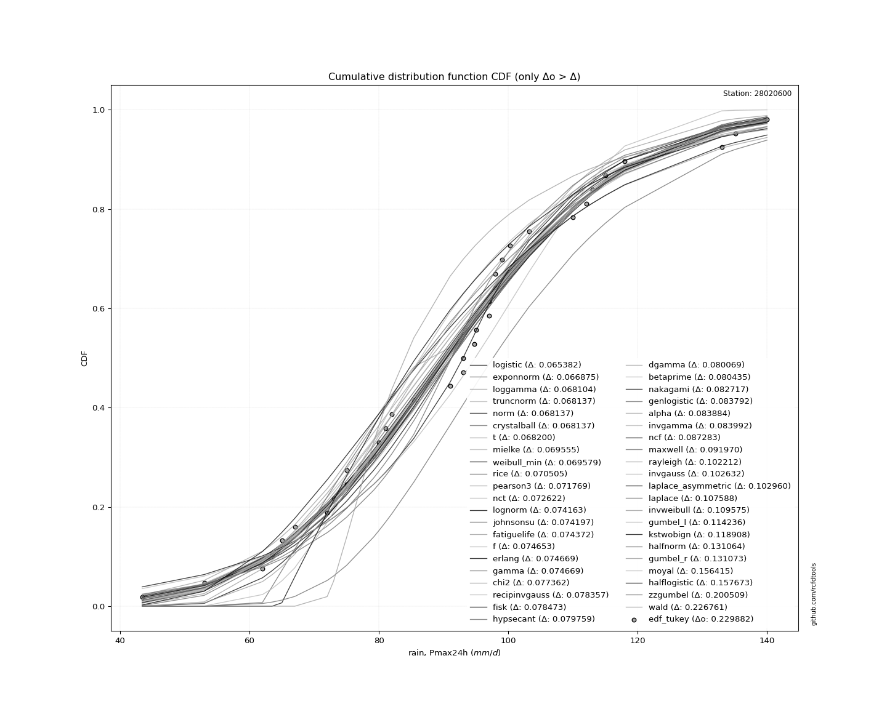</img>

</div>


**7.3. Best fit**

<div align="center">

|   id |   station | empirical_dist   | p_dist   |     delta |   deltao | eval   |   fit |   n |   best_fit |   best_fit_sort |
|-----:|----------:|:-----------------|:---------|----------:|---------:|:-------|------:|----:|-----------:|----------------:|
|    0 |  28020600 | edf_tukey        | mielke   | 0.0567498 | 0.215035 | Δo > Δ |     1 |  40 |          1 |               1 |

</div>


<div align="center">

</img></img>

</div>


### 8. Empirical - EDF Gringorten (1963)

Gringorten plotting position formula is essential for estimating the probability and return periods of extreme events like floods and heavy rainfall. The constant _a=0.44_.

<div align="center">


$P=(m-a)/(n+1-2a)$


</div>


**8.1. Empirical values**

<div align="center">

|                | 0                   | 1                    | 2                  | 3                   | 4                   | 5                   | 6                   | 7                   | 8                   | 9                   | 10                  | 11                 | 12                | 13                 | 14                  | 15                 | 16                  | 17                  | 18                 | 19                  | 20                 | 21                 | 22                 | 23                 | 24                 | 25                 | 26                 | 27                 | 28                 | 29                 | 30                 | 31                 | 32                 | 33                 | 34                 | 35                 | 36                 | 37                 | 38                 | 39                 |
|:---------------|:--------------------|:---------------------|:-------------------|:--------------------|:--------------------|:--------------------|:--------------------|:--------------------|:--------------------|:--------------------|:--------------------|:-------------------|:------------------|:-------------------|:--------------------|:-------------------|:--------------------|:--------------------|:-------------------|:--------------------|:-------------------|:-------------------|:-------------------|:-------------------|:-------------------|:-------------------|:-------------------|:-------------------|:-------------------|:-------------------|:-------------------|:-------------------|:-------------------|:-------------------|:-------------------|:-------------------|:-------------------|:-------------------|:-------------------|:-------------------|
| date           | 2001                | 2014                 | 2008               | 2012                | 2015                | 1984                | 2005                | 1997                | 2007                | 1992                | 2018                | 2003               | 1983              | 2009               | 1988                | 1996               | 2021                | 2011                | 1987               | 1989                | 2000               | 1993               | 2004               | 1985               | 1986               | 2002               | 2016               | 1999               | 1994               | 1981               | 1998               | 1991               | 1990               | 2006               | 2017               | 1982               | 2019               | 2010               | 1995               | 2013               |
| x              | 43.4                | 53.0                 | 62.0               | 63.47518361         | 65.0                | 67.0                | 72.0                | 73.0                | 75.0                | 75.0                | 78.0                | 79.2               | 80.0              | 81.0               | 82.0                | 85.4               | 90.0                | 91.0                | 93.0               | 93.0                | 94.7               | 95.0               | 97.0               | 97.0               | 98.0               | 98.0               | 98.0               | 99.0               | 100.3              | 103.2303848        | 110.0              | 112.1              | 113.0              | 115.0              | 116.0              | 118.0              | 122.0              | 133.0              | 135.1              | 140.0              |
| m              | 1                   | 2                    | 3                  | 4                   | 5                   | 6                   | 7                   | 8                   | 9                   | 10                  | 11                  | 12                 | 13                | 14                 | 15                  | 16                 | 17                  | 18                  | 19                 | 20                  | 21                 | 22                 | 23                 | 24                 | 25                 | 26                 | 27                 | 28                 | 29                 | 30                 | 31                 | 32                 | 33                 | 34                 | 35                 | 36                 | 37                 | 38                 | 39                 | 40                 |
| empirical_dist | edf_gringorten      | edf_gringorten       | edf_gringorten     | edf_gringorten      | edf_gringorten      | edf_gringorten      | edf_gringorten      | edf_gringorten      | edf_gringorten      | edf_gringorten      | edf_gringorten      | edf_gringorten     | edf_gringorten    | edf_gringorten     | edf_gringorten      | edf_gringorten     | edf_gringorten      | edf_gringorten      | edf_gringorten     | edf_gringorten      | edf_gringorten     | edf_gringorten     | edf_gringorten     | edf_gringorten     | edf_gringorten     | edf_gringorten     | edf_gringorten     | edf_gringorten     | edf_gringorten     | edf_gringorten     | edf_gringorten     | edf_gringorten     | edf_gringorten     | edf_gringorten     | edf_gringorten     | edf_gringorten     | edf_gringorten     | edf_gringorten     | edf_gringorten     | edf_gringorten     |
| empirical      | 0.01395812562313061 | 0.038883349950149554 | 0.0638085742771685 | 0.08873379860418744 | 0.11365902293120637 | 0.13858424725822532 | 0.16350947158524426 | 0.18843469591226322 | 0.21335992023928219 | 0.23828514456630112 | 0.26321036889332006 | 0.288135593220339  | 0.313060817547358 | 0.3379860418743769 | 0.36291126620139585 | 0.3878364905284148 | 0.41276171485543367 | 0.43768693918245266 | 0.4626121635094716 | 0.48753738783649053 | 0.5124626121635095 | 0.5373878364905285 | 0.5623130608175474 | 0.5872382851445663 | 0.6121635094715853 | 0.6370887337986042 | 0.6620139581256231 | 0.6869391824526421 | 0.711864406779661  | 0.7367896311066799 | 0.7617148554336989 | 0.7866400797607178 | 0.8115653040877369 | 0.8364905284147558 | 0.8614157527417748 | 0.8863409770687938 | 0.9112662013958127 | 0.9361914257228316 | 0.9611166500498506 | 0.9860418743768695 |
| empirical_tr   | 1.0141557128412537  | 1.0404564315352698   | 1.068157614483493  | 1.097374179431072   | 1.1282339707536557  | 1.1608796296296295  | 1.195470798569726   | 1.2321867321867321  | 1.2712294043092522  | 1.3128272251308901  | 1.3572395128552097  | 1.4047619047619049 | 1.455732946298984 | 1.510542168674699  | 1.569640062597809   | 1.6335504885993488 | 1.7028862478777589  | 1.7783687943262414  | 1.8608534322820036 | 1.9513618677042803  | 2.051124744376278  | 2.161637931034483  | 2.284738041002278  | 2.422705314009662  | 2.57840616966581   | 2.7554945054945055 | 2.9587020648967552 | 3.194267515923567  | 3.4705882352941178 | 3.799242424242424  | 4.196652719665272  | 4.686915887850467  | 5.306878306878309  | 6.1158536585365875 | 7.215827338129505  | 8.7982456140351    | 11.269662921348333 | 15.671875000000036 | 25.717948717948808 | 71.6428571428578   |

</div>


**8.2. Kolmogorov-Smirnov fit test (sorted by Δ)**


<div align="center">

|                | 0                    | 1                    | 2                  | 3                   | 4                   | 5                   | 6                   | 7                   | 8                   | 9                   | 10                  | 11                  | 12                  | 13                  | 14                  | 15                 | 16                 | 17                  | 18                  | 19                  | 20                  | 21                 | 22                  | 23                  | 24                  | 25                  | 26                  | 27                 | 28                  | 29                 | 30                    | 31                  | 32                  | 33                  | 34                 | 35                  | 36                  | 37                  | 38                  | 39                  | 40                  | 41                 | 42                  | 43                  | 44                  | 45                  | 46                  | 47                  | 48                  | 49                  | 50                  | 51                  | 52                  | 53                  | 54                  | 55                  | 56                  | 57                 | 58                  | 59                  | 60                 | 61                  | 62                  | 63                 | 64                  | 65                 | 66                  | 67                 | 68                  | 69                  | 70                  | 71                  | 72                  | 73                  | 74                 | 75                 | 76                  | 77                  | 78                 | 79                 | 80                 | 81                  | 82                  | 83                 | 84                 | 85                  | 86                 | 87                 |
|:---------------|:---------------------|:---------------------|:-------------------|:--------------------|:--------------------|:--------------------|:--------------------|:--------------------|:--------------------|:--------------------|:--------------------|:--------------------|:--------------------|:--------------------|:--------------------|:-------------------|:-------------------|:--------------------|:--------------------|:--------------------|:--------------------|:-------------------|:--------------------|:--------------------|:--------------------|:--------------------|:--------------------|:-------------------|:--------------------|:-------------------|:----------------------|:--------------------|:--------------------|:--------------------|:-------------------|:--------------------|:--------------------|:--------------------|:--------------------|:--------------------|:--------------------|:-------------------|:--------------------|:--------------------|:--------------------|:--------------------|:--------------------|:--------------------|:--------------------|:--------------------|:--------------------|:--------------------|:--------------------|:--------------------|:--------------------|:--------------------|:--------------------|:-------------------|:--------------------|:--------------------|:-------------------|:--------------------|:--------------------|:-------------------|:--------------------|:-------------------|:--------------------|:-------------------|:--------------------|:--------------------|:--------------------|:--------------------|:--------------------|:--------------------|:-------------------|:-------------------|:--------------------|:--------------------|:-------------------|:-------------------|:-------------------|:--------------------|:--------------------|:-------------------|:-------------------|:--------------------|:-------------------|:-------------------|
| station        | 28020600             | 28020600             | 28020600           | 28020600            | 28020600            | 28020600            | 28020600            | 28020600            | 28020600            | 28020600            | 28020600            | 28020600            | 28020600            | 28020600            | 28020600            | 28020600           | 28020600           | 28020600            | 28020600            | 28020600            | 28020600            | 28020600           | 28020600            | 28020600            | 28020600            | 28020600            | 28020600            | 28020600           | 28020600            | 28020600           | 28020600              | 28020600            | 28020600            | 28020600            | 28020600           | 28020600            | 28020600            | 28020600            | 28020600            | 28020600            | 28020600            | 28020600           | 28020600            | 28020600            | 28020600            | 28020600            | 28020600            | 28020600            | 28020600            | 28020600            | 28020600            | 28020600            | 28020600            | 28020600            | 28020600            | 28020600            | 28020600            | 28020600           | 28020600            | 28020600            | 28020600           | 28020600            | 28020600            | 28020600           | 28020600            | 28020600           | 28020600            | 28020600           | 28020600            | 28020600            | 28020600            | 28020600            | 28020600            | 28020600            | 28020600           | 28020600           | 28020600            | 28020600            | 28020600           | 28020600           | 28020600           | 28020600            | 28020600            | 28020600           | 28020600           | 28020600            | 28020600           | 28020600           |
| empirical_dist | edf_gringorten       | edf_gringorten       | edf_gringorten     | edf_gringorten      | edf_gringorten      | edf_gringorten      | edf_gringorten      | edf_gringorten      | edf_gringorten      | edf_gringorten      | edf_gringorten      | edf_gringorten      | edf_gringorten      | edf_gringorten      | edf_gringorten      | edf_gringorten     | edf_gringorten     | edf_gringorten      | edf_gringorten      | edf_gringorten      | edf_gringorten      | edf_gringorten     | edf_gringorten      | edf_gringorten      | edf_gringorten      | edf_gringorten      | edf_gringorten      | edf_gringorten     | edf_gringorten      | edf_gringorten     | edf_gringorten        | edf_gringorten      | edf_gringorten      | edf_gringorten      | edf_gringorten     | edf_gringorten      | edf_gringorten      | edf_gringorten      | edf_gringorten      | edf_gringorten      | edf_gringorten      | edf_gringorten     | edf_gringorten      | edf_gringorten      | edf_gringorten      | edf_gringorten      | edf_gringorten      | edf_gringorten      | edf_gringorten      | edf_gringorten      | edf_gringorten      | edf_gringorten      | edf_gringorten      | edf_gringorten      | edf_gringorten      | edf_gringorten      | edf_gringorten      | edf_gringorten     | edf_gringorten      | edf_gringorten      | edf_gringorten     | edf_gringorten      | edf_gringorten      | edf_gringorten     | edf_gringorten      | edf_gringorten     | edf_gringorten      | edf_gringorten     | edf_gringorten      | edf_gringorten      | edf_gringorten      | edf_gringorten      | edf_gringorten      | edf_gringorten      | edf_gringorten     | edf_gringorten     | edf_gringorten      | edf_gringorten      | edf_gringorten     | edf_gringorten     | edf_gringorten     | edf_gringorten      | edf_gringorten      | edf_gringorten     | edf_gringorten     | edf_gringorten      | edf_gringorten     | edf_gringorten     |
| p_dist         | mielke               | loggenlogistic       | fisk               | betaprime           | f                   | fatiguelife         | gamma               | erlang              | invgamma            | johnsonsu           | genlogistic         | pearson3            | logistic            | nct                 | rice                | chi2               | logloggamma        | nakagami            | logpearson3         | exponnorm           | logweibull_min      | logjohnsonsu       | logmielke           | t                   | norm                | truncnorm           | crystalball         | ncf                | alpha               | weibull_min        | loglaplace_asymmetric | logfisk             | invgauss            | maxwell             | hypsecant          | loggumbel_l         | loggompertz         | logt                | rayleigh            | logncf              | lognakagami         | logf               | lognct              | logcrystalball      | lognorm             | lognorm             | loglognorm          | logexponnorm        | logrice             | logfatiguelife      | laplace_asymmetric  | loggamma            | loggamma            | invweibull          | loglogistic         | logerlang           | logalpha            | loginvgamma        | laplace             | logchi2             | loghypsecant       | kstwobign           | gumbel_r            | loginvgauss        | halfnorm            | gumbel_l           | logmaxwell          | loginvweibull      | loglaplace          | gompertz            | lograyleigh         | moyal               | halflogistic        | logkstwobign        | genexpon           | loggumbel_r        | loghalfnorm         | logbetaprime        | logmoyal           | loghalflogistic    | wald               | loggenexpon         | gibrat              | logwald            | expon              | loggibrat           | logexpon           | logtruncnorm       |
| delta          | 0.057870406039336575 | 0.058289364043366376 | 0.059608867906422  | 0.06355553817464588 | 0.06427377011179691 | 0.06445537246114619 | 0.06452035250216825 | 0.06461436444753266 | 0.06467435024471596 | 0.06472255307303021 | 0.06540261251097651 | 0.06573607949325033 | 0.06588187492127939 | 0.06600262027452242 | 0.06639179995985522 | 0.0665346517785505 | 0.0676993764540541 | 0.06774905083985899 | 0.06828461652531281 | 0.06952140223564995 | 0.06954173000537034 | 0.0700136704825125 | 0.07079410093700356 | 0.07091008864827975 | 0.07092255834021499 | 0.07092256274954323 | 0.07092256305130606 | 0.0710818811845722 | 0.07168524049583397 | 0.0719358750599296 | 0.07562868854863719   | 0.07785743461373168 | 0.07924306188710256 | 0.08094256211703771 | 0.0810043927058608 | 0.08147085493403938 | 0.08230842548045458 | 0.08532827944888183 | 0.09170753974991425 | 0.09462675530520043 | 0.09486275522024207 | 0.0951169180567672 | 0.09512463993695025 | 0.09522640131484877 | 0.09522650900499902 | 0.09522650900499902 | 0.09522921059673034 | 0.09522955457176946 | 0.09524651420949731 | 0.09536027350158444 | 0.09618681074220159 | 0.10072290839867398 | 0.10072290839867398 | 0.10091201880517398 | 0.10298081889065297 | 0.10355377640961688 | 0.10434614102231105 | 0.1070365275910336 | 0.10749061756210254 | 0.10861945046898214 | 0.1095085929216279 | 0.11596002765933444 | 0.11897698679704788 | 0.1223625350903027 | 0.12298600184009889 | 0.1244634884526814 | 0.12599346596775685 | 0.1281676238373377 | 0.13037214493265986 | 0.13319656635307453 | 0.13687591306066182 | 0.14471587039130246 | 0.14758712940284696 | 0.15069055228983697 | 0.1556142010912272 | 0.1649671668400256 | 0.16750178266238658 | 0.17038953325481998 | 0.1895379767951481 | 0.1927963047382487 | 0.2162441387025697 | 0.23144137617997823 | 0.24121251872261212 | 0.2612297638066593 | 0.2786608459610291 | 0.28740950984797425 | 0.3387301820111804 | 0.669410254833039  |
| deltao         | 0.2150348808914498   | 0.2150348808914498   | 0.2150348808914498 | 0.2150348808914498  | 0.2150348808914498  | 0.2150348808914498  | 0.2150348808914498  | 0.2150348808914498  | 0.2150348808914498  | 0.2150348808914498  | 0.2150348808914498  | 0.2150348808914498  | 0.2150348808914498  | 0.2150348808914498  | 0.2150348808914498  | 0.2150348808914498 | 0.2150348808914498 | 0.2150348808914498  | 0.2150348808914498  | 0.2150348808914498  | 0.2150348808914498  | 0.2150348808914498 | 0.2150348808914498  | 0.2150348808914498  | 0.2150348808914498  | 0.2150348808914498  | 0.2150348808914498  | 0.2150348808914498 | 0.2150348808914498  | 0.2150348808914498 | 0.2150348808914498    | 0.2150348808914498  | 0.2150348808914498  | 0.2150348808914498  | 0.2150348808914498 | 0.2150348808914498  | 0.2150348808914498  | 0.2150348808914498  | 0.2150348808914498  | 0.2150348808914498  | 0.2150348808914498  | 0.2150348808914498 | 0.2150348808914498  | 0.2150348808914498  | 0.2150348808914498  | 0.2150348808914498  | 0.2150348808914498  | 0.2150348808914498  | 0.2150348808914498  | 0.2150348808914498  | 0.2150348808914498  | 0.2150348808914498  | 0.2150348808914498  | 0.2150348808914498  | 0.2150348808914498  | 0.2150348808914498  | 0.2150348808914498  | 0.2150348808914498 | 0.2150348808914498  | 0.2150348808914498  | 0.2150348808914498 | 0.2150348808914498  | 0.2150348808914498  | 0.2150348808914498 | 0.2150348808914498  | 0.2150348808914498 | 0.2150348808914498  | 0.2150348808914498 | 0.2150348808914498  | 0.2150348808914498  | 0.2150348808914498  | 0.2150348808914498  | 0.2150348808914498  | 0.2150348808914498  | 0.2150348808914498 | 0.2150348808914498 | 0.2150348808914498  | 0.2150348808914498  | 0.2150348808914498 | 0.2150348808914498 | 0.2150348808914498 | 0.2150348808914498  | 0.2150348808914498  | 0.2150348808914498 | 0.2150348808914498 | 0.2150348808914498  | 0.2150348808914498 | 0.2150348808914498 |
| eval           | Δo > Δ               | Δo > Δ               | Δo > Δ             | Δo > Δ              | Δo > Δ              | Δo > Δ              | Δo > Δ              | Δo > Δ              | Δo > Δ              | Δo > Δ              | Δo > Δ              | Δo > Δ              | Δo > Δ              | Δo > Δ              | Δo > Δ              | Δo > Δ             | Δo > Δ             | Δo > Δ              | Δo > Δ              | Δo > Δ              | Δo > Δ              | Δo > Δ             | Δo > Δ              | Δo > Δ              | Δo > Δ              | Δo > Δ              | Δo > Δ              | Δo > Δ             | Δo > Δ              | Δo > Δ             | Δo > Δ                | Δo > Δ              | Δo > Δ              | Δo > Δ              | Δo > Δ             | Δo > Δ              | Δo > Δ              | Δo > Δ              | Δo > Δ              | Δo > Δ              | Δo > Δ              | Δo > Δ             | Δo > Δ              | Δo > Δ              | Δo > Δ              | Δo > Δ              | Δo > Δ              | Δo > Δ              | Δo > Δ              | Δo > Δ              | Δo > Δ              | Δo > Δ              | Δo > Δ              | Δo > Δ              | Δo > Δ              | Δo > Δ              | Δo > Δ              | Δo > Δ             | Δo > Δ              | Δo > Δ              | Δo > Δ             | Δo > Δ              | Δo > Δ              | Δo > Δ             | Δo > Δ              | Δo > Δ             | Δo > Δ              | Δo > Δ             | Δo > Δ              | Δo > Δ              | Δo > Δ              | Δo > Δ              | Δo > Δ              | Δo > Δ              | Δo > Δ             | Δo > Δ             | Δo > Δ              | Δo > Δ              | Δo > Δ             | Δo > Δ             | Δo <= Δ            | Δo <= Δ             | Δo <= Δ             | Δo <= Δ            | Δo <= Δ            | Δo <= Δ             | Δo <= Δ            | Δo <= Δ            |
| fit            | 1                    | 1                    | 1                  | 1                   | 1                   | 1                   | 1                   | 1                   | 1                   | 1                   | 1                   | 1                   | 1                   | 1                   | 1                   | 1                  | 1                  | 1                   | 1                   | 1                   | 1                   | 1                  | 1                   | 1                   | 1                   | 1                   | 1                   | 1                  | 1                   | 1                  | 1                     | 1                   | 1                   | 1                   | 1                  | 1                   | 1                   | 1                   | 1                   | 1                   | 1                   | 1                  | 1                   | 1                   | 1                   | 1                   | 1                   | 1                   | 1                   | 1                   | 1                   | 1                   | 1                   | 1                   | 1                   | 1                   | 1                   | 1                  | 1                   | 1                   | 1                  | 1                   | 1                   | 1                  | 1                   | 1                  | 1                   | 1                  | 1                   | 1                   | 1                   | 1                   | 1                   | 1                   | 1                  | 1                  | 1                   | 1                   | 1                  | 1                  | 0                  | 0                   | 0                   | 0                  | 0                  | 0                   | 0                  | 0                  |
| n              | 40                   | 40                   | 40                 | 40                  | 40                  | 40                  | 40                  | 40                  | 40                  | 40                  | 40                  | 40                  | 40                  | 40                  | 40                  | 40                 | 40                 | 40                  | 40                  | 40                  | 40                  | 40                 | 40                  | 40                  | 40                  | 40                  | 40                  | 40                 | 40                  | 40                 | 40                    | 40                  | 40                  | 40                  | 40                 | 40                  | 40                  | 40                  | 40                  | 40                  | 40                  | 40                 | 40                  | 40                  | 40                  | 40                  | 40                  | 40                  | 40                  | 40                  | 40                  | 40                  | 40                  | 40                  | 40                  | 40                  | 40                  | 40                 | 40                  | 40                  | 40                 | 40                  | 40                  | 40                 | 40                  | 40                 | 40                  | 40                 | 40                  | 40                  | 40                  | 40                  | 40                  | 40                  | 40                 | 40                 | 40                  | 40                  | 40                 | 40                 | 40                 | 40                  | 40                  | 40                 | 40                 | 40                  | 40                 | 40                 |
| best_fit       | 1                    | 0                    | 0                  | 0                   | 0                   | 0                   | 0                   | 0                   | 0                   | 0                   | 0                   | 0                   | 0                   | 0                   | 0                   | 0                  | 0                  | 0                   | 0                   | 0                   | 0                   | 0                  | 0                   | 0                   | 0                   | 0                   | 0                   | 0                  | 0                   | 0                  | 0                     | 0                   | 0                   | 0                   | 0                  | 0                   | 0                   | 0                   | 0                   | 0                   | 0                   | 0                  | 0                   | 0                   | 0                   | 0                   | 0                   | 0                   | 0                   | 0                   | 0                   | 0                   | 0                   | 0                   | 0                   | 0                   | 0                   | 0                  | 0                   | 0                   | 0                  | 0                   | 0                   | 0                  | 0                   | 0                  | 0                   | 0                  | 0                   | 0                   | 0                   | 0                   | 0                   | 0                   | 0                  | 0                  | 0                   | 0                   | 0                  | 0                  | 0                  | 0                   | 0                   | 0                  | 0                  | 0                   | 0                  | 0                  |
| best_fit_sort  | 1                    | 2                    | 3                  | 4                   | 5                   | 6                   | 7                   | 8                   | 9                   | 10                  | 11                  | 12                  | 13                  | 14                  | 15                  | 16                 | 17                 | 18                  | 19                  | 20                  | 21                  | 22                 | 23                  | 24                  | 25                  | 26                  | 27                  | 28                 | 29                  | 30                 | 31                    | 32                  | 33                  | 34                  | 35                 | 36                  | 37                  | 38                  | 39                  | 40                  | 41                  | 42                 | 43                  | 44                  | 45                  | 46                  | 47                  | 48                  | 49                  | 50                  | 51                  | 52                  | 53                  | 54                  | 55                  | 56                  | 57                  | 58                 | 59                  | 60                  | 61                 | 62                  | 63                  | 64                 | 65                  | 66                 | 67                  | 68                 | 69                  | 70                  | 71                  | 72                  | 73                  | 74                  | 75                 | 76                 | 77                  | 78                  | 79                 | 80                 | 81                 | 82                  | 83                  | 84                 | 85                 | 86                  | 87                 | 88                 |

</div>


<div align="center">

</img>

</div>


**8.3. Best fit**

<div align="center">

|   id |   station | empirical_dist   | p_dist   |     delta |   deltao | eval   |   fit |   n |   best_fit |   best_fit_sort |
|-----:|----------:|:-----------------|:---------|----------:|---------:|:-------|------:|----:|-----------:|----------------:|
|    0 |  28020600 | edf_gringorten   | mielke   | 0.0578704 | 0.215035 | Δo > Δ |     1 |  40 |          1 |               1 |

</div>


<div align="center">

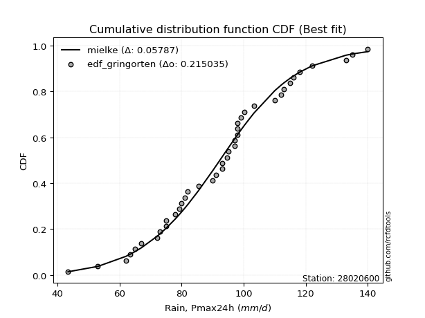</img>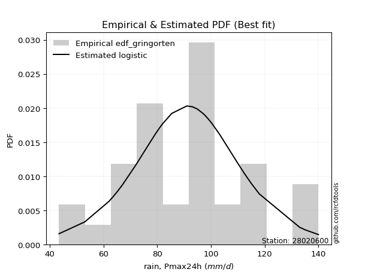</img>

</div>


### 9. Empirical - EDF Filliben (1975)

The specific values of the constants (0.3175) (often denoted as $alpha$) and (0.365) are derived from a method proposed by James J. Filliben in a 1975 paper. This particular formula is the mean value of the $i$-th order statistic of the normal distribution and is considered a robust and effective plotting position formula for the normal probability plot correlation coefficient test for normality.

<div align="center">


$P=(m-0.3175)/(n+0.365)$


</div>


**9.1. Empirical values**

<div align="center">

|                | 0                    | 1                    | 2                   | 3                  | 4                   | 5                   | 6                   | 7                   | 8                   | 9                   | 10                  | 11                 | 12                 | 13                  | 14                  | 15                 | 16                  | 17                 | 18                 | 19                  | 20                | 21                 | 22                 | 23                 | 24                 | 25                 | 26                 | 27                 | 28                 | 29                 | 30                 | 31                 | 32                 | 33                | 34                | 35                 | 36                 | 37                 | 38                 | 39                 |
|:---------------|:---------------------|:---------------------|:--------------------|:-------------------|:--------------------|:--------------------|:--------------------|:--------------------|:--------------------|:--------------------|:--------------------|:-------------------|:-------------------|:--------------------|:--------------------|:-------------------|:--------------------|:-------------------|:-------------------|:--------------------|:------------------|:-------------------|:-------------------|:-------------------|:-------------------|:-------------------|:-------------------|:-------------------|:-------------------|:-------------------|:-------------------|:-------------------|:-------------------|:------------------|:------------------|:-------------------|:-------------------|:-------------------|:-------------------|:-------------------|
| date           | 2001                 | 2014                 | 2008                | 2012               | 2015                | 1984                | 2005                | 1997                | 2007                | 1992                | 2018                | 2003               | 1983               | 2009                | 1988                | 1996               | 2021                | 2011               | 1987               | 1989                | 2000              | 1993               | 2004               | 1985               | 1986               | 2002               | 2016               | 1999               | 1994               | 1981               | 1998               | 1991               | 1990               | 2006              | 2017              | 1982               | 2019               | 2010               | 1995               | 2013               |
| x              | 43.4                 | 53.0                 | 62.0                | 63.47518361        | 65.0                | 67.0                | 72.0                | 73.0                | 75.0                | 75.0                | 78.0                | 79.2               | 80.0               | 81.0                | 82.0                | 85.4               | 90.0                | 91.0               | 93.0               | 93.0                | 94.7              | 95.0               | 97.0               | 97.0               | 98.0               | 98.0               | 98.0               | 99.0               | 100.3              | 103.2303848        | 110.0              | 112.1              | 113.0              | 115.0             | 116.0             | 118.0              | 122.0              | 133.0              | 135.1              | 140.0              |
| m              | 1                    | 2                    | 3                   | 4                  | 5                   | 6                   | 7                   | 8                   | 9                   | 10                  | 11                  | 12                 | 13                 | 14                  | 15                  | 16                 | 17                  | 18                 | 19                 | 20                  | 21                | 22                 | 23                 | 24                 | 25                 | 26                 | 27                 | 28                 | 29                 | 30                 | 31                 | 32                 | 33                 | 34                | 35                | 36                 | 37                 | 38                 | 39                 | 40                 |
| empirical_dist | edf_filliben         | edf_filliben         | edf_filliben        | edf_filliben       | edf_filliben        | edf_filliben        | edf_filliben        | edf_filliben        | edf_filliben        | edf_filliben        | edf_filliben        | edf_filliben       | edf_filliben       | edf_filliben        | edf_filliben        | edf_filliben       | edf_filliben        | edf_filliben       | edf_filliben       | edf_filliben        | edf_filliben      | edf_filliben       | edf_filliben       | edf_filliben       | edf_filliben       | edf_filliben       | edf_filliben       | edf_filliben       | edf_filliben       | edf_filliben       | edf_filliben       | edf_filliben       | edf_filliben       | edf_filliben      | edf_filliben      | edf_filliben       | edf_filliben       | edf_filliben       | edf_filliben       | edf_filliben       |
| empirical      | 0.016908212560386472 | 0.041682150377802554 | 0.06645608819521863 | 0.0912300260126347 | 0.11600396383005078 | 0.14077790164746687 | 0.16555183946488294 | 0.19032577728229902 | 0.21509971509971507 | 0.23987365291713114 | 0.26464759073454724 | 0.2894215285519633 | 0.3141954663693794 | 0.33896940418679544 | 0.36374334200421155 | 0.3885172798216276 | 0.41329121763904375 | 0.4380651554564598 | 0.4628390932738759 | 0.48761303109129195 | 0.512386968908708 | 0.5371609067261242 | 0.5619348445435401 | 0.5867087823609562 | 0.6114827201783724 | 0.6362566579957885 | 0.6610305958132044 | 0.6858045336306205 | 0.7105784714480367 | 0.7353524092654528 | 0.7601263470828689 | 0.7849002849002849 | 0.8096742227177008 | 0.834448160535117 | 0.859222098352533 | 0.8839960361699492 | 0.9087699739873651 | 0.9335439118047812 | 0.9583178496221973 | 0.9830917874396135 |
| empirical_tr   | 1.017199017199017    | 1.0434951205325405   | 1.0711868904663968  | 1.100388468615825  | 1.1312267918447418  | 1.1638434368918043  | 1.1983967935871744  | 1.2350646370381704  | 1.2740471869328494  | 1.3155707650941089  | 1.359892192369241   | 1.4073041052906823 | 1.4581414250880518 | 1.5127892813641899  | 1.5716927869171615  | 1.6353691886964448 | 1.7044230972236885  | 1.7795657445166981 | 1.8616395710826705 | 1.9516499456061887  | 2.050806554045472 | 2.160578081091931  | 2.282765446062491  | 2.419601378690244  | 2.5738880918220945 | 2.7491912140303083 | 2.9501187648456053 | 3.182732111176818  | 3.455167986304301  | 3.778609875965364  | 4.16886134779241   | 4.649006622516556  | 5.25414904002603   | 6.040404040404036 | 7.103387593488777 | 8.620395088093963  | 10.961303462321775 | 15.047530288909572 | 23.991084695393702 | 59.14285714285688  |

</div>


**9.2. Kolmogorov-Smirnov fit test (sorted by Δ)**


<div align="center">

|                | 0                   | 1                   | 2                  | 3                   | 4                   | 5                   | 6                  | 7                  | 8                   | 9                   | 10                  | 11                  | 12                  | 13                 | 14                 | 15                  | 16                  | 17                  | 18                  | 19                 | 20                  | 21                  | 22                 | 23                  | 24                  | 25                  | 26                  | 27                  | 28                 | 29                  | 30                    | 31                  | 32                  | 33                  | 34                 | 35                  | 36                  | 37                  | 38                  | 39                  | 40                  | 41                  | 42                  | 43                  | 44                  | 45                  | 46                  | 47                  | 48                  | 49                  | 50                  | 51                 | 52                  | 53                  | 54                  | 55                  | 56                  | 57                 | 58                  | 59                  | 60                 | 61                  | 62                  | 63                  | 64                  | 65                  | 66                  | 67                  | 68                  | 69                  | 70                  | 71                  | 72                  | 73                  | 74                  | 75                 | 76                 | 77                 | 78                 | 79                  | 80                 | 81                  | 82                  | 83                 | 84                 | 85                  | 86                 | 87                 |
|:---------------|:--------------------|:--------------------|:-------------------|:--------------------|:--------------------|:--------------------|:-------------------|:-------------------|:--------------------|:--------------------|:--------------------|:--------------------|:--------------------|:-------------------|:-------------------|:--------------------|:--------------------|:--------------------|:--------------------|:-------------------|:--------------------|:--------------------|:-------------------|:--------------------|:--------------------|:--------------------|:--------------------|:--------------------|:-------------------|:--------------------|:----------------------|:--------------------|:--------------------|:--------------------|:-------------------|:--------------------|:--------------------|:--------------------|:--------------------|:--------------------|:--------------------|:--------------------|:--------------------|:--------------------|:--------------------|:--------------------|:--------------------|:--------------------|:--------------------|:--------------------|:--------------------|:-------------------|:--------------------|:--------------------|:--------------------|:--------------------|:--------------------|:-------------------|:--------------------|:--------------------|:-------------------|:--------------------|:--------------------|:--------------------|:--------------------|:--------------------|:--------------------|:--------------------|:--------------------|:--------------------|:--------------------|:--------------------|:--------------------|:--------------------|:--------------------|:-------------------|:-------------------|:-------------------|:-------------------|:--------------------|:-------------------|:--------------------|:--------------------|:-------------------|:-------------------|:--------------------|:-------------------|:-------------------|
| station        | 28020600            | 28020600            | 28020600           | 28020600            | 28020600            | 28020600            | 28020600           | 28020600           | 28020600            | 28020600            | 28020600            | 28020600            | 28020600            | 28020600           | 28020600           | 28020600            | 28020600            | 28020600            | 28020600            | 28020600           | 28020600            | 28020600            | 28020600           | 28020600            | 28020600            | 28020600            | 28020600            | 28020600            | 28020600           | 28020600            | 28020600              | 28020600            | 28020600            | 28020600            | 28020600           | 28020600            | 28020600            | 28020600            | 28020600            | 28020600            | 28020600            | 28020600            | 28020600            | 28020600            | 28020600            | 28020600            | 28020600            | 28020600            | 28020600            | 28020600            | 28020600            | 28020600           | 28020600            | 28020600            | 28020600            | 28020600            | 28020600            | 28020600           | 28020600            | 28020600            | 28020600           | 28020600            | 28020600            | 28020600            | 28020600            | 28020600            | 28020600            | 28020600            | 28020600            | 28020600            | 28020600            | 28020600            | 28020600            | 28020600            | 28020600            | 28020600           | 28020600           | 28020600           | 28020600           | 28020600            | 28020600           | 28020600            | 28020600            | 28020600           | 28020600           | 28020600            | 28020600           | 28020600           |
| empirical_dist | edf_filliben        | edf_filliben        | edf_filliben       | edf_filliben        | edf_filliben        | edf_filliben        | edf_filliben       | edf_filliben       | edf_filliben        | edf_filliben        | edf_filliben        | edf_filliben        | edf_filliben        | edf_filliben       | edf_filliben       | edf_filliben        | edf_filliben        | edf_filliben        | edf_filliben        | edf_filliben       | edf_filliben        | edf_filliben        | edf_filliben       | edf_filliben        | edf_filliben        | edf_filliben        | edf_filliben        | edf_filliben        | edf_filliben       | edf_filliben        | edf_filliben          | edf_filliben        | edf_filliben        | edf_filliben        | edf_filliben       | edf_filliben        | edf_filliben        | edf_filliben        | edf_filliben        | edf_filliben        | edf_filliben        | edf_filliben        | edf_filliben        | edf_filliben        | edf_filliben        | edf_filliben        | edf_filliben        | edf_filliben        | edf_filliben        | edf_filliben        | edf_filliben        | edf_filliben       | edf_filliben        | edf_filliben        | edf_filliben        | edf_filliben        | edf_filliben        | edf_filliben       | edf_filliben        | edf_filliben        | edf_filliben       | edf_filliben        | edf_filliben        | edf_filliben        | edf_filliben        | edf_filliben        | edf_filliben        | edf_filliben        | edf_filliben        | edf_filliben        | edf_filliben        | edf_filliben        | edf_filliben        | edf_filliben        | edf_filliben        | edf_filliben       | edf_filliben       | edf_filliben       | edf_filliben       | edf_filliben        | edf_filliben       | edf_filliben        | edf_filliben        | edf_filliben       | edf_filliben       | edf_filliben        | edf_filliben       | edf_filliben       |
| p_dist         | mielke              | loggenlogistic      | fisk               | betaprime           | f                   | fatiguelife         | gamma              | erlang             | johnsonsu           | invgamma            | pearson3            | nct                 | rice                | genlogistic        | chi2               | logloggamma         | logistic            | logpearson3         | nakagami            | exponnorm          | logweibull_min      | logjohnsonsu        | logmielke          | t                   | norm                | truncnorm           | crystalball         | weibull_min         | ncf                | alpha               | loglaplace_asymmetric | logfisk             | invgauss            | loggumbel_l         | maxwell            | loggompertz         | hypsecant           | logt                | rayleigh            | logncf              | lognakagami         | logf                | lognct              | logcrystalball      | lognorm             | lognorm             | loglognorm          | logexponnorm        | logrice             | logfatiguelife      | laplace_asymmetric  | invweibull         | loggamma            | loggamma            | loglogistic         | logerlang           | logalpha            | loginvgamma        | logchi2             | laplace             | loghypsecant       | kstwobign           | gumbel_r            | loginvgauss         | halfnorm            | gumbel_l            | logmaxwell          | loginvweibull       | loglaplace          | gompertz            | lograyleigh         | moyal               | halflogistic        | logkstwobign        | genexpon            | loggumbel_r        | loghalfnorm        | logbetaprime       | logmoyal           | loghalflogistic     | wald               | loggenexpon         | gibrat              | logwald            | expon              | loggibrat           | logexpon           | logtruncnorm       |
| delta          | 0.05658447070771222 | 0.05700342871174202 | 0.0593819381420177 | 0.06226960284302152 | 0.06298783478017256 | 0.06316943712952183 | 0.0632344171705439 | 0.0633284291159083 | 0.06343661774140585 | 0.06444742048031166 | 0.06445014416162598 | 0.06471668494289806 | 0.06510586462823087 | 0.0651756827465722 | 0.0663077220141462 | 0.06641344112242975 | 0.06671395072409508 | 0.06699868119368846 | 0.06752212107545469 | 0.0682354669040256 | 0.06825579467374598 | 0.06872773515088815 | 0.0695081656053792 | 0.06962415331665539 | 0.06963662300859064 | 0.06963662741791887 | 0.06963662771968171 | 0.07064993972830524 | 0.0708549514201679 | 0.07145831073142966 | 0.07646076435145288   | 0.07763050484932738 | 0.07901613212269826 | 0.08018491960241503 | 0.0807156323526334 | 0.08102249014883023 | 0.08183646850867649 | 0.08510134968447752 | 0.09148060998550994 | 0.09439982554079612 | 0.09463582545583776 | 0.09488998829236289 | 0.09489771017254595 | 0.09499947155044447 | 0.09499957924059471 | 0.09499957924059471 | 0.09500228083232604 | 0.09500262480736515 | 0.09501958444509301 | 0.09513334373718013 | 0.09701888654501728 | 0.1003825160215639 | 0.10049597863426968 | 0.10049597863426968 | 0.10275388912624867 | 0.10332684664521258 | 0.10411921125790674 | 0.1068095978266293 | 0.10808994768537206 | 0.10832269336491823 | 0.1092816631572236 | 0.11543052487572436 | 0.11875005703264357 | 0.12183303230669262 | 0.12245649905648881 | 0.12332883963065988 | 0.12546396318414677 | 0.12763812105372763 | 0.13014521516825556 | 0.13191063102145018 | 0.13634641027705174 | 0.14448894062689815 | 0.14736019963844266 | 0.15016104950622688 | 0.15357183321158852 | 0.1647402370756213 | 0.1669722798787765 | 0.1683471653751813 | 0.1893110470307438 | 0.19226680195463863 | 0.2160172089381654 | 0.22939900830033955 | 0.24098558895820782 | 0.2607002610230492 | 0.2766184780813904 | 0.28718258008356995 | 0.3366878141315417 | 0.6673678869534002 |
| deltao         | 0.2150348808914498  | 0.2150348808914498  | 0.2150348808914498 | 0.2150348808914498  | 0.2150348808914498  | 0.2150348808914498  | 0.2150348808914498 | 0.2150348808914498 | 0.2150348808914498  | 0.2150348808914498  | 0.2150348808914498  | 0.2150348808914498  | 0.2150348808914498  | 0.2150348808914498 | 0.2150348808914498 | 0.2150348808914498  | 0.2150348808914498  | 0.2150348808914498  | 0.2150348808914498  | 0.2150348808914498 | 0.2150348808914498  | 0.2150348808914498  | 0.2150348808914498 | 0.2150348808914498  | 0.2150348808914498  | 0.2150348808914498  | 0.2150348808914498  | 0.2150348808914498  | 0.2150348808914498 | 0.2150348808914498  | 0.2150348808914498    | 0.2150348808914498  | 0.2150348808914498  | 0.2150348808914498  | 0.2150348808914498 | 0.2150348808914498  | 0.2150348808914498  | 0.2150348808914498  | 0.2150348808914498  | 0.2150348808914498  | 0.2150348808914498  | 0.2150348808914498  | 0.2150348808914498  | 0.2150348808914498  | 0.2150348808914498  | 0.2150348808914498  | 0.2150348808914498  | 0.2150348808914498  | 0.2150348808914498  | 0.2150348808914498  | 0.2150348808914498  | 0.2150348808914498 | 0.2150348808914498  | 0.2150348808914498  | 0.2150348808914498  | 0.2150348808914498  | 0.2150348808914498  | 0.2150348808914498 | 0.2150348808914498  | 0.2150348808914498  | 0.2150348808914498 | 0.2150348808914498  | 0.2150348808914498  | 0.2150348808914498  | 0.2150348808914498  | 0.2150348808914498  | 0.2150348808914498  | 0.2150348808914498  | 0.2150348808914498  | 0.2150348808914498  | 0.2150348808914498  | 0.2150348808914498  | 0.2150348808914498  | 0.2150348808914498  | 0.2150348808914498  | 0.2150348808914498 | 0.2150348808914498 | 0.2150348808914498 | 0.2150348808914498 | 0.2150348808914498  | 0.2150348808914498 | 0.2150348808914498  | 0.2150348808914498  | 0.2150348808914498 | 0.2150348808914498 | 0.2150348808914498  | 0.2150348808914498 | 0.2150348808914498 |
| eval           | Δo > Δ              | Δo > Δ              | Δo > Δ             | Δo > Δ              | Δo > Δ              | Δo > Δ              | Δo > Δ             | Δo > Δ             | Δo > Δ              | Δo > Δ              | Δo > Δ              | Δo > Δ              | Δo > Δ              | Δo > Δ             | Δo > Δ             | Δo > Δ              | Δo > Δ              | Δo > Δ              | Δo > Δ              | Δo > Δ             | Δo > Δ              | Δo > Δ              | Δo > Δ             | Δo > Δ              | Δo > Δ              | Δo > Δ              | Δo > Δ              | Δo > Δ              | Δo > Δ             | Δo > Δ              | Δo > Δ                | Δo > Δ              | Δo > Δ              | Δo > Δ              | Δo > Δ             | Δo > Δ              | Δo > Δ              | Δo > Δ              | Δo > Δ              | Δo > Δ              | Δo > Δ              | Δo > Δ              | Δo > Δ              | Δo > Δ              | Δo > Δ              | Δo > Δ              | Δo > Δ              | Δo > Δ              | Δo > Δ              | Δo > Δ              | Δo > Δ              | Δo > Δ             | Δo > Δ              | Δo > Δ              | Δo > Δ              | Δo > Δ              | Δo > Δ              | Δo > Δ             | Δo > Δ              | Δo > Δ              | Δo > Δ             | Δo > Δ              | Δo > Δ              | Δo > Δ              | Δo > Δ              | Δo > Δ              | Δo > Δ              | Δo > Δ              | Δo > Δ              | Δo > Δ              | Δo > Δ              | Δo > Δ              | Δo > Δ              | Δo > Δ              | Δo > Δ              | Δo > Δ             | Δo > Δ             | Δo > Δ             | Δo > Δ             | Δo > Δ              | Δo <= Δ            | Δo <= Δ             | Δo <= Δ             | Δo <= Δ            | Δo <= Δ            | Δo <= Δ             | Δo <= Δ            | Δo <= Δ            |
| fit            | 1                   | 1                   | 1                  | 1                   | 1                   | 1                   | 1                  | 1                  | 1                   | 1                   | 1                   | 1                   | 1                   | 1                  | 1                  | 1                   | 1                   | 1                   | 1                   | 1                  | 1                   | 1                   | 1                  | 1                   | 1                   | 1                   | 1                   | 1                   | 1                  | 1                   | 1                     | 1                   | 1                   | 1                   | 1                  | 1                   | 1                   | 1                   | 1                   | 1                   | 1                   | 1                   | 1                   | 1                   | 1                   | 1                   | 1                   | 1                   | 1                   | 1                   | 1                   | 1                  | 1                   | 1                   | 1                   | 1                   | 1                   | 1                  | 1                   | 1                   | 1                  | 1                   | 1                   | 1                   | 1                   | 1                   | 1                   | 1                   | 1                   | 1                   | 1                   | 1                   | 1                   | 1                   | 1                   | 1                  | 1                  | 1                  | 1                  | 1                   | 0                  | 0                   | 0                   | 0                  | 0                  | 0                   | 0                  | 0                  |
| n              | 40                  | 40                  | 40                 | 40                  | 40                  | 40                  | 40                 | 40                 | 40                  | 40                  | 40                  | 40                  | 40                  | 40                 | 40                 | 40                  | 40                  | 40                  | 40                  | 40                 | 40                  | 40                  | 40                 | 40                  | 40                  | 40                  | 40                  | 40                  | 40                 | 40                  | 40                    | 40                  | 40                  | 40                  | 40                 | 40                  | 40                  | 40                  | 40                  | 40                  | 40                  | 40                  | 40                  | 40                  | 40                  | 40                  | 40                  | 40                  | 40                  | 40                  | 40                  | 40                 | 40                  | 40                  | 40                  | 40                  | 40                  | 40                 | 40                  | 40                  | 40                 | 40                  | 40                  | 40                  | 40                  | 40                  | 40                  | 40                  | 40                  | 40                  | 40                  | 40                  | 40                  | 40                  | 40                  | 40                 | 40                 | 40                 | 40                 | 40                  | 40                 | 40                  | 40                  | 40                 | 40                 | 40                  | 40                 | 40                 |
| best_fit       | 1                   | 0                   | 0                  | 0                   | 0                   | 0                   | 0                  | 0                  | 0                   | 0                   | 0                   | 0                   | 0                   | 0                  | 0                  | 0                   | 0                   | 0                   | 0                   | 0                  | 0                   | 0                   | 0                  | 0                   | 0                   | 0                   | 0                   | 0                   | 0                  | 0                   | 0                     | 0                   | 0                   | 0                   | 0                  | 0                   | 0                   | 0                   | 0                   | 0                   | 0                   | 0                   | 0                   | 0                   | 0                   | 0                   | 0                   | 0                   | 0                   | 0                   | 0                   | 0                  | 0                   | 0                   | 0                   | 0                   | 0                   | 0                  | 0                   | 0                   | 0                  | 0                   | 0                   | 0                   | 0                   | 0                   | 0                   | 0                   | 0                   | 0                   | 0                   | 0                   | 0                   | 0                   | 0                   | 0                  | 0                  | 0                  | 0                  | 0                   | 0                  | 0                   | 0                   | 0                  | 0                  | 0                   | 0                  | 0                  |
| best_fit_sort  | 1                   | 2                   | 3                  | 4                   | 5                   | 6                   | 7                  | 8                  | 9                   | 10                  | 11                  | 12                  | 13                  | 14                 | 15                 | 16                  | 17                  | 18                  | 19                  | 20                 | 21                  | 22                  | 23                 | 24                  | 25                  | 26                  | 27                  | 28                  | 29                 | 30                  | 31                    | 32                  | 33                  | 34                  | 35                 | 36                  | 37                  | 38                  | 39                  | 40                  | 41                  | 42                  | 43                  | 44                  | 45                  | 46                  | 47                  | 48                  | 49                  | 50                  | 51                  | 52                 | 53                  | 54                  | 55                  | 56                  | 57                  | 58                 | 59                  | 60                  | 61                 | 62                  | 63                  | 64                  | 65                  | 66                  | 67                  | 68                  | 69                  | 70                  | 71                  | 72                  | 73                  | 74                  | 75                  | 76                 | 77                 | 78                 | 79                 | 80                  | 81                 | 82                  | 83                  | 84                 | 85                 | 86                  | 87                 | 88                 |

</div>


<div align="center">

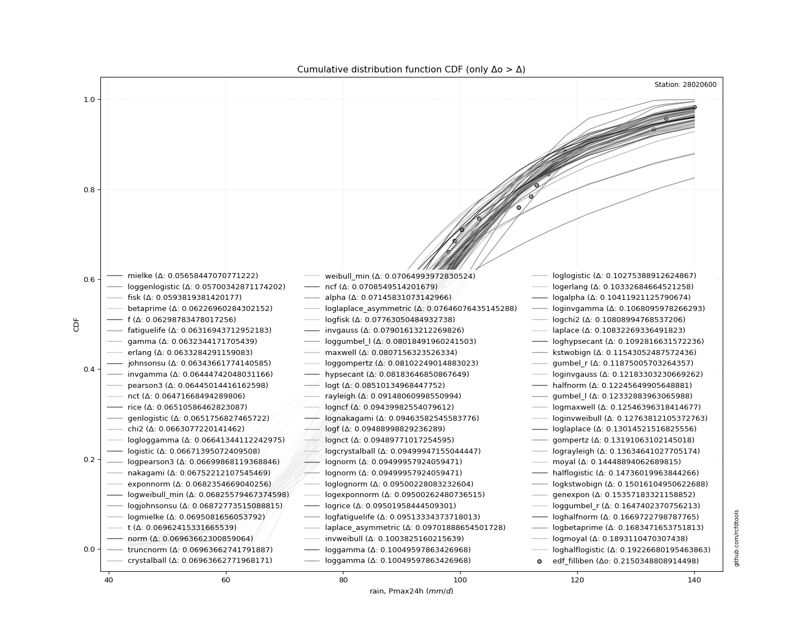</img>

</div>


**9.3. Best fit**

<div align="center">

|   id |   station | empirical_dist   | p_dist   |     delta |   deltao | eval   |   fit |   n |   best_fit |   best_fit_sort |
|-----:|----------:|:-----------------|:---------|----------:|---------:|:-------|------:|----:|-----------:|----------------:|
|    0 |  28020600 | edf_filliben     | mielke   | 0.0565845 | 0.215035 | Δo > Δ |     1 |  40 |          1 |               1 |

</div>


<div align="center">

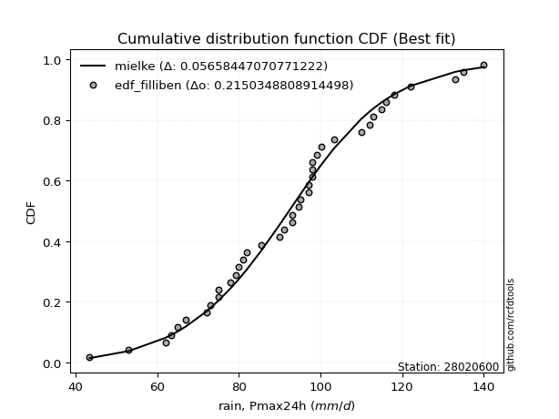</img>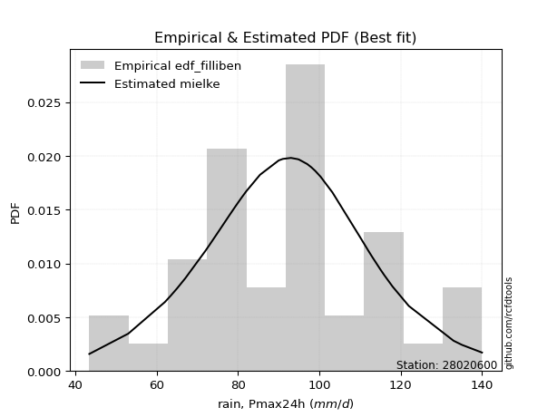</img>

</div>


### 10. Empirical - EDF Jenkinson (1977)

The Jenkinson formula in hydrology is an empirical plotting position formula used to estimate the non-exceedance probability _(P)_ or return period _(T)_ of a given ordered observation within a sample. It is a widely used method in the frequency analysis of extreme events such as floods and rainfall, as it provides a distribution-free way to plot data. _a≈0.31_ and _b≈0.38_ are constants derived to approximate the median of the probability distribution for the given rank.

<div align="center">


$P=(m-a)/(n+b)$


</div>


**10.1. Empirical values**

<div align="center">

|                | 0                    | 1                   | 2                  | 3                  | 4                   | 5                   | 6                   | 7                   | 8                   | 9                   | 10                  | 11                 | 12                  | 13                 | 14                  | 15                  | 16                  | 17                 | 18                  | 19                  | 20                 | 21                 | 22                 | 23                 | 24                 | 25                 | 26                 | 27                 | 28                 | 29                 | 30                 | 31                 | 32                 | 33                 | 34                 | 35                 | 36                 | 37                 | 38                 | 39                 |
|:---------------|:---------------------|:--------------------|:-------------------|:-------------------|:--------------------|:--------------------|:--------------------|:--------------------|:--------------------|:--------------------|:--------------------|:-------------------|:--------------------|:-------------------|:--------------------|:--------------------|:--------------------|:-------------------|:--------------------|:--------------------|:-------------------|:-------------------|:-------------------|:-------------------|:-------------------|:-------------------|:-------------------|:-------------------|:-------------------|:-------------------|:-------------------|:-------------------|:-------------------|:-------------------|:-------------------|:-------------------|:-------------------|:-------------------|:-------------------|:-------------------|
| date           | 2001                 | 2014                | 2008               | 2012               | 2015                | 1984                | 2005                | 1997                | 2007                | 1992                | 2018                | 2003               | 1983                | 2009               | 1988                | 1996                | 2021                | 2011               | 1987                | 1989                | 2000               | 1993               | 2004               | 1985               | 1986               | 2002               | 2016               | 1999               | 1994               | 1981               | 1998               | 1991               | 1990               | 2006               | 2017               | 1982               | 2019               | 2010               | 1995               | 2013               |
| x              | 43.4                 | 53.0                | 62.0               | 63.47518361        | 65.0                | 67.0                | 72.0                | 73.0                | 75.0                | 75.0                | 78.0                | 79.2               | 80.0                | 81.0               | 82.0                | 85.4                | 90.0                | 91.0               | 93.0                | 93.0                | 94.7               | 95.0               | 97.0               | 97.0               | 98.0               | 98.0               | 98.0               | 99.0               | 100.3              | 103.2303848        | 110.0              | 112.1              | 113.0              | 115.0              | 116.0              | 118.0              | 122.0              | 133.0              | 135.1              | 140.0              |
| m              | 1                    | 2                   | 3                  | 4                  | 5                   | 6                   | 7                   | 8                   | 9                   | 10                  | 11                  | 12                 | 13                  | 14                 | 15                  | 16                  | 17                  | 18                 | 19                  | 20                  | 21                 | 22                 | 23                 | 24                 | 25                 | 26                 | 27                 | 28                 | 29                 | 30                 | 31                 | 32                 | 33                 | 34                 | 35                 | 36                 | 37                 | 38                 | 39                 | 40                 |
| empirical_dist | edf_jenkinson        | edf_jenkinson       | edf_jenkinson      | edf_jenkinson      | edf_jenkinson       | edf_jenkinson       | edf_jenkinson       | edf_jenkinson       | edf_jenkinson       | edf_jenkinson       | edf_jenkinson       | edf_jenkinson      | edf_jenkinson       | edf_jenkinson      | edf_jenkinson       | edf_jenkinson       | edf_jenkinson       | edf_jenkinson      | edf_jenkinson       | edf_jenkinson       | edf_jenkinson      | edf_jenkinson      | edf_jenkinson      | edf_jenkinson      | edf_jenkinson      | edf_jenkinson      | edf_jenkinson      | edf_jenkinson      | edf_jenkinson      | edf_jenkinson      | edf_jenkinson      | edf_jenkinson      | edf_jenkinson      | edf_jenkinson      | edf_jenkinson      | edf_jenkinson      | edf_jenkinson      | edf_jenkinson      | edf_jenkinson      | edf_jenkinson      |
| empirical      | 0.017087667161961365 | 0.04185240217929668 | 0.066617137196632  | 0.0913818722139673 | 0.11614660723130263 | 0.14091134224863794 | 0.16567607726597325 | 0.19044081228330856 | 0.21520554730064387 | 0.23997028231797918 | 0.26473501733531446 | 0.2894997523526498 | 0.31426448736998513 | 0.3390292223873204 | 0.36379395740465575 | 0.38855869242199104 | 0.41332342743932643 | 0.4380881624566617 | 0.46285289747399705 | 0.48761763249133233 | 0.5123823675086676 | 0.537147102526003  | 0.5619118375433383 | 0.5866765725606736 | 0.611441307578009  | 0.6362060425953442 | 0.6609707776126795 | 0.6857355126300149 | 0.7105002476473502 | 0.7352649826646854 | 0.7600297176820208 | 0.7847944526993561 | 0.8095591877166913 | 0.8343239227340267 | 0.8590886577513619 | 0.8838533927686972 | 0.9086181277860326 | 0.9333828628033679 | 0.9581475978207032 | 0.9829123328380385 |
| empirical_tr   | 1.017384731670446    | 1.0436805376066167  | 1.0713717166357124 | 1.1005723630417008 | 1.1314093583636873  | 1.164024214471029   | 1.1985752448797862  | 1.2352401345977364  | 1.2742189965288735  | 1.315738025415445   | 1.36005389019872    | 1.407459044963402  | 1.4582881906825569  | 1.5129261895841137 | 1.5718178279486181  | 1.6354799513973268  | 1.7045166737019841  | 1.7796386073159982 | 1.8616874135546335  | 1.9516674722087968  | 2.0507872016251905 | 2.1605136436597108 | 2.282645562464669  | 2.4194128220491313 | 2.5736137667304018 | 2.748808713410483  | 2.949598246895544  | 3.182033096926714  | 3.454234388366125  | 3.7773620205799805 | 4.167182662538699  | 4.646720368239356  | 5.250975292587774  | 6.035874439461881  | 7.0966608084358445 | 8.609808102345406  | 10.943089430894295 | 15.011152416356856 | 23.89349112426031  | 58.52173913043423  |

</div>


**10.2. Kolmogorov-Smirnov fit test (sorted by Δ)**


<div align="center">

|                | 0                   | 1                   | 2                   | 3                   | 4                   | 5                   | 6                   | 7                   | 8                  | 9                   | 10                  | 11                  | 12                  | 13                  | 14                  | 15                 | 16                  | 17                  | 18                  | 19                  | 20                  | 21                 | 22                  | 23                  | 24                  | 25                  | 26                  | 27                 | 28                  | 29                  | 30                    | 31                  | 32                  | 33                  | 34                  | 35                  | 36                 | 37                  | 38                 | 39                  | 40                  | 41                  | 42                 | 43                  | 44                  | 45                  | 46                  | 47                 | 48                  | 49                  | 50                  | 51                  | 52                  | 53                  | 54                  | 55                  | 56                  | 57                  | 58                  | 59                  | 60                  | 61                  | 62                  | 63                  | 64                  | 65                 | 66                 | 67                  | 68                 | 69                  | 70                  | 71                 | 72                 | 73                 | 74                 | 75                  | 76                  | 77                 | 78                  | 79                  | 80                  | 81                  | 82                  | 83                  | 84                 | 85                 | 86                 | 87                 |
|:---------------|:--------------------|:--------------------|:--------------------|:--------------------|:--------------------|:--------------------|:--------------------|:--------------------|:-------------------|:--------------------|:--------------------|:--------------------|:--------------------|:--------------------|:--------------------|:-------------------|:--------------------|:--------------------|:--------------------|:--------------------|:--------------------|:-------------------|:--------------------|:--------------------|:--------------------|:--------------------|:--------------------|:-------------------|:--------------------|:--------------------|:----------------------|:--------------------|:--------------------|:--------------------|:--------------------|:--------------------|:-------------------|:--------------------|:-------------------|:--------------------|:--------------------|:--------------------|:-------------------|:--------------------|:--------------------|:--------------------|:--------------------|:-------------------|:--------------------|:--------------------|:--------------------|:--------------------|:--------------------|:--------------------|:--------------------|:--------------------|:--------------------|:--------------------|:--------------------|:--------------------|:--------------------|:--------------------|:--------------------|:--------------------|:--------------------|:-------------------|:-------------------|:--------------------|:-------------------|:--------------------|:--------------------|:-------------------|:-------------------|:-------------------|:-------------------|:--------------------|:--------------------|:-------------------|:--------------------|:--------------------|:--------------------|:--------------------|:--------------------|:--------------------|:-------------------|:-------------------|:-------------------|:-------------------|
| station        | 28020600            | 28020600            | 28020600            | 28020600            | 28020600            | 28020600            | 28020600            | 28020600            | 28020600           | 28020600            | 28020600            | 28020600            | 28020600            | 28020600            | 28020600            | 28020600           | 28020600            | 28020600            | 28020600            | 28020600            | 28020600            | 28020600           | 28020600            | 28020600            | 28020600            | 28020600            | 28020600            | 28020600           | 28020600            | 28020600            | 28020600              | 28020600            | 28020600            | 28020600            | 28020600            | 28020600            | 28020600           | 28020600            | 28020600           | 28020600            | 28020600            | 28020600            | 28020600           | 28020600            | 28020600            | 28020600            | 28020600            | 28020600           | 28020600            | 28020600            | 28020600            | 28020600            | 28020600            | 28020600            | 28020600            | 28020600            | 28020600            | 28020600            | 28020600            | 28020600            | 28020600            | 28020600            | 28020600            | 28020600            | 28020600            | 28020600           | 28020600           | 28020600            | 28020600           | 28020600            | 28020600            | 28020600           | 28020600           | 28020600           | 28020600           | 28020600            | 28020600            | 28020600           | 28020600            | 28020600            | 28020600            | 28020600            | 28020600            | 28020600            | 28020600           | 28020600           | 28020600           | 28020600           |
| empirical_dist | edf_jenkinson       | edf_jenkinson       | edf_jenkinson       | edf_jenkinson       | edf_jenkinson       | edf_jenkinson       | edf_jenkinson       | edf_jenkinson       | edf_jenkinson      | edf_jenkinson       | edf_jenkinson       | edf_jenkinson       | edf_jenkinson       | edf_jenkinson       | edf_jenkinson       | edf_jenkinson      | edf_jenkinson       | edf_jenkinson       | edf_jenkinson       | edf_jenkinson       | edf_jenkinson       | edf_jenkinson      | edf_jenkinson       | edf_jenkinson       | edf_jenkinson       | edf_jenkinson       | edf_jenkinson       | edf_jenkinson      | edf_jenkinson       | edf_jenkinson       | edf_jenkinson         | edf_jenkinson       | edf_jenkinson       | edf_jenkinson       | edf_jenkinson       | edf_jenkinson       | edf_jenkinson      | edf_jenkinson       | edf_jenkinson      | edf_jenkinson       | edf_jenkinson       | edf_jenkinson       | edf_jenkinson      | edf_jenkinson       | edf_jenkinson       | edf_jenkinson       | edf_jenkinson       | edf_jenkinson      | edf_jenkinson       | edf_jenkinson       | edf_jenkinson       | edf_jenkinson       | edf_jenkinson       | edf_jenkinson       | edf_jenkinson       | edf_jenkinson       | edf_jenkinson       | edf_jenkinson       | edf_jenkinson       | edf_jenkinson       | edf_jenkinson       | edf_jenkinson       | edf_jenkinson       | edf_jenkinson       | edf_jenkinson       | edf_jenkinson      | edf_jenkinson      | edf_jenkinson       | edf_jenkinson      | edf_jenkinson       | edf_jenkinson       | edf_jenkinson      | edf_jenkinson      | edf_jenkinson      | edf_jenkinson      | edf_jenkinson       | edf_jenkinson       | edf_jenkinson      | edf_jenkinson       | edf_jenkinson       | edf_jenkinson       | edf_jenkinson       | edf_jenkinson       | edf_jenkinson       | edf_jenkinson      | edf_jenkinson      | edf_jenkinson      | edf_jenkinson      |
| p_dist         | mielke              | loggenlogistic      | fisk                | betaprime           | f                   | fatiguelife         | gamma               | erlang              | johnsonsu          | pearson3            | invgamma            | nct                 | rice                | genlogistic         | chi2                | logloggamma        | logistic            | logpearson3         | nakagami            | exponnorm           | logweibull_min      | logjohnsonsu       | logmielke           | t                   | norm                | truncnorm           | crystalball         | weibull_min        | ncf                 | alpha               | loglaplace_asymmetric | logfisk             | invgauss            | loggumbel_l         | maxwell             | loggompertz         | hypsecant          | logt                | rayleigh           | logncf              | lognakagami         | logf                | lognct             | logcrystalball      | lognorm             | lognorm             | loglognorm          | logexponnorm       | logrice             | logfatiguelife      | laplace_asymmetric  | invweibull          | loggamma            | loggamma            | loglogistic         | logerlang           | logalpha            | loginvgamma         | logchi2             | laplace             | loghypsecant        | kstwobign           | gumbel_r            | loginvgauss         | halfnorm            | gumbel_l           | logmaxwell         | loginvweibull       | loglaplace         | gompertz            | lograyleigh         | moyal              | halflogistic       | logkstwobign       | genexpon           | loggumbel_r         | loghalfnorm         | logbetaprime       | logmoyal            | loghalflogistic     | wald                | loggenexpon         | gibrat              | logwald             | expon              | loggibrat          | logexpon           | logtruncnorm       |
| delta          | 0.05650624690702577 | 0.05692520491105557 | 0.05936813394189655 | 0.06219137904233507 | 0.06290961097948611 | 0.06309121332883538 | 0.06315619336985745 | 0.06325020531522185 | 0.0633583939407194 | 0.06437192036093953 | 0.06443361628019051 | 0.06463846114221161 | 0.06502764082754442 | 0.06516187854645106 | 0.06629391781402505 | 0.0663352173217433 | 0.06676456612453929 | 0.06692045739300201 | 0.06750831687533354 | 0.06815724310333915 | 0.06817757087305953 | 0.0686495113502017 | 0.06942994180469275 | 0.06954592951596894 | 0.06955839920790419 | 0.06955840361723242 | 0.06955840391899526 | 0.0705717159276188 | 0.07084114722004675 | 0.07144450653130852 | 0.07651137975189709   | 0.07761670064920623 | 0.07900232792257711 | 0.08010669580172858 | 0.08070182815251226 | 0.08094426634814378 | 0.0818870839091207 | 0.08508754548435637 | 0.0914668057853888 | 0.09438602134067497 | 0.09462202125571662 | 0.09487618409224174 | 0.0948839059724248 | 0.09498566735032332 | 0.09498577504047356 | 0.09498577504047356 | 0.09498847663220489 | 0.094988820607244  | 0.09500578024497186 | 0.09511953953705898 | 0.09706950194546149 | 0.10035030622128122 | 0.10048217443414853 | 0.10048217443414853 | 0.10274008492612752 | 0.10331304244509143 | 0.10410540705778559 | 0.10679579362650815 | 0.10805773788508938 | 0.10837330876536244 | 0.10926785895710245 | 0.11539831507544168 | 0.11873625283252243 | 0.12180082250640994 | 0.12242428925620613 | 0.1232598186300542 | 0.1254317533838641 | 0.12760591125344495 | 0.1301314109681344 | 0.13183240722076373 | 0.13631420047676907 | 0.144475136426777  | 0.1473463954383215 | 0.1501288397059442 | 0.1534475954104982 | 0.16472643287550015 | 0.16694007007849382 | 0.168222927574091  | 0.18929724283062266 | 0.19223459215435595 | 0.21600340473804425 | 0.22927477049924924 | 0.24097178475808667 | 0.26066805122276654 | 0.2764942402803001 | 0.2871687758834488 | 0.3365635763304514 | 0.6672436491523099 |
| deltao         | 0.2150348808914498  | 0.2150348808914498  | 0.2150348808914498  | 0.2150348808914498  | 0.2150348808914498  | 0.2150348808914498  | 0.2150348808914498  | 0.2150348808914498  | 0.2150348808914498 | 0.2150348808914498  | 0.2150348808914498  | 0.2150348808914498  | 0.2150348808914498  | 0.2150348808914498  | 0.2150348808914498  | 0.2150348808914498 | 0.2150348808914498  | 0.2150348808914498  | 0.2150348808914498  | 0.2150348808914498  | 0.2150348808914498  | 0.2150348808914498 | 0.2150348808914498  | 0.2150348808914498  | 0.2150348808914498  | 0.2150348808914498  | 0.2150348808914498  | 0.2150348808914498 | 0.2150348808914498  | 0.2150348808914498  | 0.2150348808914498    | 0.2150348808914498  | 0.2150348808914498  | 0.2150348808914498  | 0.2150348808914498  | 0.2150348808914498  | 0.2150348808914498 | 0.2150348808914498  | 0.2150348808914498 | 0.2150348808914498  | 0.2150348808914498  | 0.2150348808914498  | 0.2150348808914498 | 0.2150348808914498  | 0.2150348808914498  | 0.2150348808914498  | 0.2150348808914498  | 0.2150348808914498 | 0.2150348808914498  | 0.2150348808914498  | 0.2150348808914498  | 0.2150348808914498  | 0.2150348808914498  | 0.2150348808914498  | 0.2150348808914498  | 0.2150348808914498  | 0.2150348808914498  | 0.2150348808914498  | 0.2150348808914498  | 0.2150348808914498  | 0.2150348808914498  | 0.2150348808914498  | 0.2150348808914498  | 0.2150348808914498  | 0.2150348808914498  | 0.2150348808914498 | 0.2150348808914498 | 0.2150348808914498  | 0.2150348808914498 | 0.2150348808914498  | 0.2150348808914498  | 0.2150348808914498 | 0.2150348808914498 | 0.2150348808914498 | 0.2150348808914498 | 0.2150348808914498  | 0.2150348808914498  | 0.2150348808914498 | 0.2150348808914498  | 0.2150348808914498  | 0.2150348808914498  | 0.2150348808914498  | 0.2150348808914498  | 0.2150348808914498  | 0.2150348808914498 | 0.2150348808914498 | 0.2150348808914498 | 0.2150348808914498 |
| eval           | Δo > Δ              | Δo > Δ              | Δo > Δ              | Δo > Δ              | Δo > Δ              | Δo > Δ              | Δo > Δ              | Δo > Δ              | Δo > Δ             | Δo > Δ              | Δo > Δ              | Δo > Δ              | Δo > Δ              | Δo > Δ              | Δo > Δ              | Δo > Δ             | Δo > Δ              | Δo > Δ              | Δo > Δ              | Δo > Δ              | Δo > Δ              | Δo > Δ             | Δo > Δ              | Δo > Δ              | Δo > Δ              | Δo > Δ              | Δo > Δ              | Δo > Δ             | Δo > Δ              | Δo > Δ              | Δo > Δ                | Δo > Δ              | Δo > Δ              | Δo > Δ              | Δo > Δ              | Δo > Δ              | Δo > Δ             | Δo > Δ              | Δo > Δ             | Δo > Δ              | Δo > Δ              | Δo > Δ              | Δo > Δ             | Δo > Δ              | Δo > Δ              | Δo > Δ              | Δo > Δ              | Δo > Δ             | Δo > Δ              | Δo > Δ              | Δo > Δ              | Δo > Δ              | Δo > Δ              | Δo > Δ              | Δo > Δ              | Δo > Δ              | Δo > Δ              | Δo > Δ              | Δo > Δ              | Δo > Δ              | Δo > Δ              | Δo > Δ              | Δo > Δ              | Δo > Δ              | Δo > Δ              | Δo > Δ             | Δo > Δ             | Δo > Δ              | Δo > Δ             | Δo > Δ              | Δo > Δ              | Δo > Δ             | Δo > Δ             | Δo > Δ             | Δo > Δ             | Δo > Δ              | Δo > Δ              | Δo > Δ             | Δo > Δ              | Δo > Δ              | Δo <= Δ             | Δo <= Δ             | Δo <= Δ             | Δo <= Δ             | Δo <= Δ            | Δo <= Δ            | Δo <= Δ            | Δo <= Δ            |
| fit            | 1                   | 1                   | 1                   | 1                   | 1                   | 1                   | 1                   | 1                   | 1                  | 1                   | 1                   | 1                   | 1                   | 1                   | 1                   | 1                  | 1                   | 1                   | 1                   | 1                   | 1                   | 1                  | 1                   | 1                   | 1                   | 1                   | 1                   | 1                  | 1                   | 1                   | 1                     | 1                   | 1                   | 1                   | 1                   | 1                   | 1                  | 1                   | 1                  | 1                   | 1                   | 1                   | 1                  | 1                   | 1                   | 1                   | 1                   | 1                  | 1                   | 1                   | 1                   | 1                   | 1                   | 1                   | 1                   | 1                   | 1                   | 1                   | 1                   | 1                   | 1                   | 1                   | 1                   | 1                   | 1                   | 1                  | 1                  | 1                   | 1                  | 1                   | 1                   | 1                  | 1                  | 1                  | 1                  | 1                   | 1                   | 1                  | 1                   | 1                   | 0                   | 0                   | 0                   | 0                   | 0                  | 0                  | 0                  | 0                  |
| n              | 40                  | 40                  | 40                  | 40                  | 40                  | 40                  | 40                  | 40                  | 40                 | 40                  | 40                  | 40                  | 40                  | 40                  | 40                  | 40                 | 40                  | 40                  | 40                  | 40                  | 40                  | 40                 | 40                  | 40                  | 40                  | 40                  | 40                  | 40                 | 40                  | 40                  | 40                    | 40                  | 40                  | 40                  | 40                  | 40                  | 40                 | 40                  | 40                 | 40                  | 40                  | 40                  | 40                 | 40                  | 40                  | 40                  | 40                  | 40                 | 40                  | 40                  | 40                  | 40                  | 40                  | 40                  | 40                  | 40                  | 40                  | 40                  | 40                  | 40                  | 40                  | 40                  | 40                  | 40                  | 40                  | 40                 | 40                 | 40                  | 40                 | 40                  | 40                  | 40                 | 40                 | 40                 | 40                 | 40                  | 40                  | 40                 | 40                  | 40                  | 40                  | 40                  | 40                  | 40                  | 40                 | 40                 | 40                 | 40                 |
| best_fit       | 1                   | 0                   | 0                   | 0                   | 0                   | 0                   | 0                   | 0                   | 0                  | 0                   | 0                   | 0                   | 0                   | 0                   | 0                   | 0                  | 0                   | 0                   | 0                   | 0                   | 0                   | 0                  | 0                   | 0                   | 0                   | 0                   | 0                   | 0                  | 0                   | 0                   | 0                     | 0                   | 0                   | 0                   | 0                   | 0                   | 0                  | 0                   | 0                  | 0                   | 0                   | 0                   | 0                  | 0                   | 0                   | 0                   | 0                   | 0                  | 0                   | 0                   | 0                   | 0                   | 0                   | 0                   | 0                   | 0                   | 0                   | 0                   | 0                   | 0                   | 0                   | 0                   | 0                   | 0                   | 0                   | 0                  | 0                  | 0                   | 0                  | 0                   | 0                   | 0                  | 0                  | 0                  | 0                  | 0                   | 0                   | 0                  | 0                   | 0                   | 0                   | 0                   | 0                   | 0                   | 0                  | 0                  | 0                  | 0                  |
| best_fit_sort  | 1                   | 2                   | 3                   | 4                   | 5                   | 6                   | 7                   | 8                   | 9                  | 10                  | 11                  | 12                  | 13                  | 14                  | 15                  | 16                 | 17                  | 18                  | 19                  | 20                  | 21                  | 22                 | 23                  | 24                  | 25                  | 26                  | 27                  | 28                 | 29                  | 30                  | 31                    | 32                  | 33                  | 34                  | 35                  | 36                  | 37                 | 38                  | 39                 | 40                  | 41                  | 42                  | 43                 | 44                  | 45                  | 46                  | 47                  | 48                 | 49                  | 50                  | 51                  | 52                  | 53                  | 54                  | 55                  | 56                  | 57                  | 58                  | 59                  | 60                  | 61                  | 62                  | 63                  | 64                  | 65                  | 66                 | 67                 | 68                  | 69                 | 70                  | 71                  | 72                 | 73                 | 74                 | 75                 | 76                  | 77                  | 78                 | 79                  | 80                  | 81                  | 82                  | 83                  | 84                  | 85                 | 86                 | 87                 | 88                 |

</div>


<div align="center">

</img>

</div>


**10.3. Best fit**

<div align="center">

|   id |   station | empirical_dist   | p_dist   |     delta |   deltao | eval   |   fit |   n |   best_fit |   best_fit_sort |
|-----:|----------:|:-----------------|:---------|----------:|---------:|:-------|------:|----:|-----------:|----------------:|
|    0 |  28020600 | edf_jenkinson    | mielke   | 0.0565062 | 0.215035 | Δo > Δ |     1 |  40 |          1 |               1 |

</div>


<div align="center">

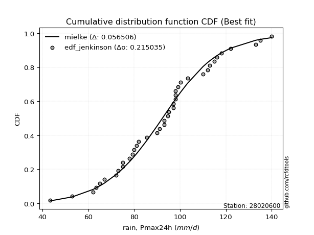</img></img>

</div>


### 11. Empirical - EDF Cunnane (1978)

Cunnane´s work in statistical hydrology has focused on the performance and evaluation of different probability distributions (such as GEV, Gumbel, Lognormal) for flood frequency estimation. _b_ is a constant, typically set to 0.4.

<div align="center">


$P=(m-b)/(n+1-2b)$


</div>


**11.1. Empirical values**

<div align="center">

|                | 0                    | 1                   | 2                   | 3                   | 4                   | 5                   | 6                   | 7                   | 8                   | 9                  | 10                  | 11                 | 12                 | 13                  | 14               | 15                  | 16                 | 17                  | 18                 | 19                  | 20                 | 21                 | 22                 | 23                 | 24                 | 25                 | 26                 | 27                 | 28                 | 29                | 30                 | 31                 | 32                 | 33                | 34                 | 35                 | 36                 | 37                 | 38                 | 39                 |
|:---------------|:---------------------|:--------------------|:--------------------|:--------------------|:--------------------|:--------------------|:--------------------|:--------------------|:--------------------|:-------------------|:--------------------|:-------------------|:-------------------|:--------------------|:-----------------|:--------------------|:-------------------|:--------------------|:-------------------|:--------------------|:-------------------|:-------------------|:-------------------|:-------------------|:-------------------|:-------------------|:-------------------|:-------------------|:-------------------|:------------------|:-------------------|:-------------------|:-------------------|:------------------|:-------------------|:-------------------|:-------------------|:-------------------|:-------------------|:-------------------|
| date           | 2001                 | 2014                | 2008                | 2012                | 2015                | 1984                | 2005                | 1997                | 2007                | 1992               | 2018                | 2003               | 1983               | 2009                | 1988             | 1996                | 2021               | 2011                | 1987               | 1989                | 2000               | 1993               | 2004               | 1985               | 1986               | 2002               | 2016               | 1999               | 1994               | 1981              | 1998               | 1991               | 1990               | 2006              | 2017               | 1982               | 2019               | 2010               | 1995               | 2013               |
| x              | 43.4                 | 53.0                | 62.0                | 63.47518361         | 65.0                | 67.0                | 72.0                | 73.0                | 75.0                | 75.0               | 78.0                | 79.2               | 80.0               | 81.0                | 82.0             | 85.4                | 90.0               | 91.0                | 93.0               | 93.0                | 94.7               | 95.0               | 97.0               | 97.0               | 98.0               | 98.0               | 98.0               | 99.0               | 100.3              | 103.2303848       | 110.0              | 112.1              | 113.0              | 115.0             | 116.0              | 118.0              | 122.0              | 133.0              | 135.1              | 140.0              |
| m              | 1                    | 2                   | 3                   | 4                   | 5                   | 6                   | 7                   | 8                   | 9                   | 10                 | 11                  | 12                 | 13                 | 14                  | 15               | 16                  | 17                 | 18                  | 19                 | 20                  | 21                 | 22                 | 23                 | 24                 | 25                 | 26                 | 27                 | 28                 | 29                 | 30                | 31                 | 32                 | 33                 | 34                | 35                 | 36                 | 37                 | 38                 | 39                 | 40                 |
| empirical_dist | edf_cunnane          | edf_cunnane         | edf_cunnane         | edf_cunnane         | edf_cunnane         | edf_cunnane         | edf_cunnane         | edf_cunnane         | edf_cunnane         | edf_cunnane        | edf_cunnane         | edf_cunnane        | edf_cunnane        | edf_cunnane         | edf_cunnane      | edf_cunnane         | edf_cunnane        | edf_cunnane         | edf_cunnane        | edf_cunnane         | edf_cunnane        | edf_cunnane        | edf_cunnane        | edf_cunnane        | edf_cunnane        | edf_cunnane        | edf_cunnane        | edf_cunnane        | edf_cunnane        | edf_cunnane       | edf_cunnane        | edf_cunnane        | edf_cunnane        | edf_cunnane       | edf_cunnane        | edf_cunnane        | edf_cunnane        | edf_cunnane        | edf_cunnane        | edf_cunnane        |
| empirical      | 0.014925373134328356 | 0.03980099502487562 | 0.06467661691542288 | 0.08955223880597014 | 0.11442786069651739 | 0.13930348258706465 | 0.16417910447761191 | 0.18905472636815918 | 0.21393034825870644 | 0.2388059701492537 | 0.26368159203980096 | 0.2885572139303482 | 0.3134328358208955 | 0.33830845771144274 | 0.36318407960199 | 0.38805970149253727 | 0.4129353233830846 | 0.43781094527363185 | 0.4626865671641791 | 0.48756218905472637 | 0.5124378109452736 | 0.5373134328358209 | 0.5621890547263682 | 0.5870646766169154 | 0.6119402985074627 | 0.6368159203980099 | 0.6616915422885572 | 0.6865671641791045 | 0.7114427860696517 | 0.736318407960199 | 0.7611940298507462 | 0.7860696517412935 | 0.8109452736318408 | 0.835820895522388 | 0.8606965174129353 | 0.8855721393034826 | 0.9104477611940298 | 0.9353233830845771 | 0.9601990049751243 | 0.9850746268656716 |
| empirical_tr   | 1.0151515151515151   | 1.0414507772020727  | 1.069148936170213   | 1.098360655737705   | 1.1292134831460674  | 1.161849710982659   | 1.1964285714285714  | 1.2331288343558282  | 1.2721518987341773  | 1.3137254901960784 | 1.3581081081081081  | 1.4055944055944056 | 1.4565217391304348 | 1.5112781954887218  | 1.5703125        | 1.6341463414634148  | 1.7033898305084747 | 1.7787610619469028  | 1.8611111111111112 | 1.9514563106796117  | 2.0510204081632653 | 2.161290322580645  | 2.284090909090909  | 2.4216867469879517 | 2.5769230769230766 | 2.7534246575342465 | 2.955882352941176  | 3.1904761904761902 | 3.46551724137931   | 3.792452830188679 | 4.1875             | 4.674418604651162  | 5.289473684210526  | 6.09090909090909  | 7.178571428571427  | 8.739130434782606  | 11.166666666666663 | 15.461538461538453 | 25.124999999999975 | 66.9999999999998   |

</div>


**11.2. Kolmogorov-Smirnov fit test (sorted by Δ)**


<div align="center">

|                | 0                   | 1                   | 2                   | 3                   | 4                   | 5                  | 6                   | 7                   | 8                   | 9                   | 10                  | 11                 | 12                  | 13                  | 14                  | 15                  | 16                  | 17                  | 18                  | 19                  | 20                  | 21                  | 22                  | 23                  | 24                 | 25                  | 26                  | 27                 | 28                  | 29                  | 30                    | 31                  | 32                  | 33                 | 34                 | 35                  | 36                 | 37                  | 38                  | 39                  | 40                  | 41                  | 42                  | 43                  | 44                 | 45                 | 46                  | 47                  | 48                 | 49                  | 50                  | 51                  | 52                  | 53                  | 54                  | 55                  | 56                  | 57                  | 58                 | 59                  | 60                  | 61                  | 62                  | 63                  | 64                  | 65                  | 66                  | 67                 | 68                  | 69                  | 70                 | 71                  | 72                  | 73                  | 74                  | 75                 | 76                  | 77                  | 78                 | 79                 | 80                 | 81                  | 82                 | 83                 | 84                 | 85                  | 86                 | 87                 |
|:---------------|:--------------------|:--------------------|:--------------------|:--------------------|:--------------------|:-------------------|:--------------------|:--------------------|:--------------------|:--------------------|:--------------------|:-------------------|:--------------------|:--------------------|:--------------------|:--------------------|:--------------------|:--------------------|:--------------------|:--------------------|:--------------------|:--------------------|:--------------------|:--------------------|:-------------------|:--------------------|:--------------------|:-------------------|:--------------------|:--------------------|:----------------------|:--------------------|:--------------------|:-------------------|:-------------------|:--------------------|:-------------------|:--------------------|:--------------------|:--------------------|:--------------------|:--------------------|:--------------------|:--------------------|:-------------------|:-------------------|:--------------------|:--------------------|:-------------------|:--------------------|:--------------------|:--------------------|:--------------------|:--------------------|:--------------------|:--------------------|:--------------------|:--------------------|:-------------------|:--------------------|:--------------------|:--------------------|:--------------------|:--------------------|:--------------------|:--------------------|:--------------------|:-------------------|:--------------------|:--------------------|:-------------------|:--------------------|:--------------------|:--------------------|:--------------------|:-------------------|:--------------------|:--------------------|:-------------------|:-------------------|:-------------------|:--------------------|:-------------------|:-------------------|:-------------------|:--------------------|:-------------------|:-------------------|
| station        | 28020600            | 28020600            | 28020600            | 28020600            | 28020600            | 28020600           | 28020600            | 28020600            | 28020600            | 28020600            | 28020600            | 28020600           | 28020600            | 28020600            | 28020600            | 28020600            | 28020600            | 28020600            | 28020600            | 28020600            | 28020600            | 28020600            | 28020600            | 28020600            | 28020600           | 28020600            | 28020600            | 28020600           | 28020600            | 28020600            | 28020600              | 28020600            | 28020600            | 28020600           | 28020600           | 28020600            | 28020600           | 28020600            | 28020600            | 28020600            | 28020600            | 28020600            | 28020600            | 28020600            | 28020600           | 28020600           | 28020600            | 28020600            | 28020600           | 28020600            | 28020600            | 28020600            | 28020600            | 28020600            | 28020600            | 28020600            | 28020600            | 28020600            | 28020600           | 28020600            | 28020600            | 28020600            | 28020600            | 28020600            | 28020600            | 28020600            | 28020600            | 28020600           | 28020600            | 28020600            | 28020600           | 28020600            | 28020600            | 28020600            | 28020600            | 28020600           | 28020600            | 28020600            | 28020600           | 28020600           | 28020600           | 28020600            | 28020600           | 28020600           | 28020600           | 28020600            | 28020600           | 28020600           |
| empirical_dist | edf_cunnane         | edf_cunnane         | edf_cunnane         | edf_cunnane         | edf_cunnane         | edf_cunnane        | edf_cunnane         | edf_cunnane         | edf_cunnane         | edf_cunnane         | edf_cunnane         | edf_cunnane        | edf_cunnane         | edf_cunnane         | edf_cunnane         | edf_cunnane         | edf_cunnane         | edf_cunnane         | edf_cunnane         | edf_cunnane         | edf_cunnane         | edf_cunnane         | edf_cunnane         | edf_cunnane         | edf_cunnane        | edf_cunnane         | edf_cunnane         | edf_cunnane        | edf_cunnane         | edf_cunnane         | edf_cunnane           | edf_cunnane         | edf_cunnane         | edf_cunnane        | edf_cunnane        | edf_cunnane         | edf_cunnane        | edf_cunnane         | edf_cunnane         | edf_cunnane         | edf_cunnane         | edf_cunnane         | edf_cunnane         | edf_cunnane         | edf_cunnane        | edf_cunnane        | edf_cunnane         | edf_cunnane         | edf_cunnane        | edf_cunnane         | edf_cunnane         | edf_cunnane         | edf_cunnane         | edf_cunnane         | edf_cunnane         | edf_cunnane         | edf_cunnane         | edf_cunnane         | edf_cunnane        | edf_cunnane         | edf_cunnane         | edf_cunnane         | edf_cunnane         | edf_cunnane         | edf_cunnane         | edf_cunnane         | edf_cunnane         | edf_cunnane        | edf_cunnane         | edf_cunnane         | edf_cunnane        | edf_cunnane         | edf_cunnane         | edf_cunnane         | edf_cunnane         | edf_cunnane        | edf_cunnane         | edf_cunnane         | edf_cunnane        | edf_cunnane        | edf_cunnane        | edf_cunnane         | edf_cunnane        | edf_cunnane        | edf_cunnane        | edf_cunnane         | edf_cunnane        | edf_cunnane        |
| p_dist         | mielke              | loggenlogistic      | fisk                | betaprime           | f                   | fatiguelife        | gamma               | erlang              | johnsonsu           | invgamma            | pearson3            | genlogistic        | nct                 | rice                | logistic            | chi2                | logloggamma         | nakagami            | logpearson3         | exponnorm           | logweibull_min      | logjohnsonsu        | logmielke           | t                   | norm               | truncnorm           | crystalball         | ncf                | weibull_min         | alpha               | loglaplace_asymmetric | logfisk             | invgauss            | maxwell            | loggumbel_l        | hypsecant           | loggompertz        | logt                | rayleigh            | logncf              | lognakagami         | logf                | lognct              | logcrystalball      | lognorm            | lognorm            | loglognorm          | logexponnorm        | logrice            | logfatiguelife      | laplace_asymmetric  | loggamma            | loggamma            | invweibull          | loglogistic         | logerlang           | logalpha            | loginvgamma         | laplace            | logchi2             | loghypsecant        | kstwobign           | gumbel_r            | loginvgauss         | halfnorm            | gumbel_l            | logmaxwell          | loginvweibull      | loglaplace          | gompertz            | lograyleigh        | moyal               | halflogistic        | logkstwobign        | genexpon            | loggumbel_r        | loghalfnorm         | logbetaprime        | logmoyal           | loghalflogistic    | wald               | loggenexpon         | gibrat             | logwald            | expon              | loggibrat           | logexpon           | logtruncnorm       |
| delta          | 0.05744878532932729 | 0.05786774333335709 | 0.05953446425171449 | 0.06313391746463659 | 0.06385214940178763 | 0.0640337517511369 | 0.06409873179215897 | 0.06419274373752337 | 0.06430093236302092 | 0.06459994659000845 | 0.06531445878324105 | 0.065328208856269  | 0.06558099956451313 | 0.06597017924984594 | 0.06615468832187354 | 0.06646024812384299 | 0.06727775574404482 | 0.06767464718515148 | 0.06786299581530353 | 0.06909978152564067 | 0.06912010929536105 | 0.06959204977250322 | 0.07037248022699427 | 0.07048846793827046 | 0.0705009376302057 | 0.07050094203953394 | 0.07050094234129678 | 0.0710074775298647 | 0.07151425434992031 | 0.07161083684112646 | 0.07590150194923134   | 0.07778303095902417 | 0.07916865823239505 | 0.0808681584623302 | 0.0810492342240301 | 0.08127720610645495 | 0.0818868047704453 | 0.08525387579417432 | 0.09163313609520674 | 0.09455235165049292 | 0.09478835156553456 | 0.09504251440205969 | 0.09505023628224274 | 0.09515199766014126 | 0.0951521053502915 | 0.0951521053502915 | 0.09515480694202283 | 0.09515515091706195 | 0.0951721105547898 | 0.09528586984687692 | 0.09645962414279574 | 0.10064850474396647 | 0.10064850474396647 | 0.10073841027752306 | 0.10290641523594546 | 0.10347937275490937 | 0.10427173736760353 | 0.10696212393632609 | 0.1077634309626967 | 0.10844584194133122 | 0.10943418926692039 | 0.11578641913168353 | 0.11890258314234037 | 0.12218892656265179 | 0.12281239331244798 | 0.12409147017914379 | 0.12581985744010593 | 0.1279940153096868 | 0.13029774127795235 | 0.13277494564306525 | 0.1367023045330109 | 0.14464146673659495 | 0.14751272574813945 | 0.15051694376218605 | 0.15494456819885954 | 0.1648927631853181 | 0.16732817413473566 | 0.16971990036245233 | 0.1894635731404406 | 0.1926226962105978 | 0.2161697350478622 | 0.23077174328761058 | 0.2411381150679046 | 0.2610561552790084 | 0.2779912130686614 | 0.28733510619326674 | 0.3380605491188127 | 0.6687406219406713 |
| deltao         | 0.2150348808914498  | 0.2150348808914498  | 0.2150348808914498  | 0.2150348808914498  | 0.2150348808914498  | 0.2150348808914498 | 0.2150348808914498  | 0.2150348808914498  | 0.2150348808914498  | 0.2150348808914498  | 0.2150348808914498  | 0.2150348808914498 | 0.2150348808914498  | 0.2150348808914498  | 0.2150348808914498  | 0.2150348808914498  | 0.2150348808914498  | 0.2150348808914498  | 0.2150348808914498  | 0.2150348808914498  | 0.2150348808914498  | 0.2150348808914498  | 0.2150348808914498  | 0.2150348808914498  | 0.2150348808914498 | 0.2150348808914498  | 0.2150348808914498  | 0.2150348808914498 | 0.2150348808914498  | 0.2150348808914498  | 0.2150348808914498    | 0.2150348808914498  | 0.2150348808914498  | 0.2150348808914498 | 0.2150348808914498 | 0.2150348808914498  | 0.2150348808914498 | 0.2150348808914498  | 0.2150348808914498  | 0.2150348808914498  | 0.2150348808914498  | 0.2150348808914498  | 0.2150348808914498  | 0.2150348808914498  | 0.2150348808914498 | 0.2150348808914498 | 0.2150348808914498  | 0.2150348808914498  | 0.2150348808914498 | 0.2150348808914498  | 0.2150348808914498  | 0.2150348808914498  | 0.2150348808914498  | 0.2150348808914498  | 0.2150348808914498  | 0.2150348808914498  | 0.2150348808914498  | 0.2150348808914498  | 0.2150348808914498 | 0.2150348808914498  | 0.2150348808914498  | 0.2150348808914498  | 0.2150348808914498  | 0.2150348808914498  | 0.2150348808914498  | 0.2150348808914498  | 0.2150348808914498  | 0.2150348808914498 | 0.2150348808914498  | 0.2150348808914498  | 0.2150348808914498 | 0.2150348808914498  | 0.2150348808914498  | 0.2150348808914498  | 0.2150348808914498  | 0.2150348808914498 | 0.2150348808914498  | 0.2150348808914498  | 0.2150348808914498 | 0.2150348808914498 | 0.2150348808914498 | 0.2150348808914498  | 0.2150348808914498 | 0.2150348808914498 | 0.2150348808914498 | 0.2150348808914498  | 0.2150348808914498 | 0.2150348808914498 |
| eval           | Δo > Δ              | Δo > Δ              | Δo > Δ              | Δo > Δ              | Δo > Δ              | Δo > Δ             | Δo > Δ              | Δo > Δ              | Δo > Δ              | Δo > Δ              | Δo > Δ              | Δo > Δ             | Δo > Δ              | Δo > Δ              | Δo > Δ              | Δo > Δ              | Δo > Δ              | Δo > Δ              | Δo > Δ              | Δo > Δ              | Δo > Δ              | Δo > Δ              | Δo > Δ              | Δo > Δ              | Δo > Δ             | Δo > Δ              | Δo > Δ              | Δo > Δ             | Δo > Δ              | Δo > Δ              | Δo > Δ                | Δo > Δ              | Δo > Δ              | Δo > Δ             | Δo > Δ             | Δo > Δ              | Δo > Δ             | Δo > Δ              | Δo > Δ              | Δo > Δ              | Δo > Δ              | Δo > Δ              | Δo > Δ              | Δo > Δ              | Δo > Δ             | Δo > Δ             | Δo > Δ              | Δo > Δ              | Δo > Δ             | Δo > Δ              | Δo > Δ              | Δo > Δ              | Δo > Δ              | Δo > Δ              | Δo > Δ              | Δo > Δ              | Δo > Δ              | Δo > Δ              | Δo > Δ             | Δo > Δ              | Δo > Δ              | Δo > Δ              | Δo > Δ              | Δo > Δ              | Δo > Δ              | Δo > Δ              | Δo > Δ              | Δo > Δ             | Δo > Δ              | Δo > Δ              | Δo > Δ             | Δo > Δ              | Δo > Δ              | Δo > Δ              | Δo > Δ              | Δo > Δ             | Δo > Δ              | Δo > Δ              | Δo > Δ             | Δo > Δ             | Δo <= Δ            | Δo <= Δ             | Δo <= Δ            | Δo <= Δ            | Δo <= Δ            | Δo <= Δ             | Δo <= Δ            | Δo <= Δ            |
| fit            | 1                   | 1                   | 1                   | 1                   | 1                   | 1                  | 1                   | 1                   | 1                   | 1                   | 1                   | 1                  | 1                   | 1                   | 1                   | 1                   | 1                   | 1                   | 1                   | 1                   | 1                   | 1                   | 1                   | 1                   | 1                  | 1                   | 1                   | 1                  | 1                   | 1                   | 1                     | 1                   | 1                   | 1                  | 1                  | 1                   | 1                  | 1                   | 1                   | 1                   | 1                   | 1                   | 1                   | 1                   | 1                  | 1                  | 1                   | 1                   | 1                  | 1                   | 1                   | 1                   | 1                   | 1                   | 1                   | 1                   | 1                   | 1                   | 1                  | 1                   | 1                   | 1                   | 1                   | 1                   | 1                   | 1                   | 1                   | 1                  | 1                   | 1                   | 1                  | 1                   | 1                   | 1                   | 1                   | 1                  | 1                   | 1                   | 1                  | 1                  | 0                  | 0                   | 0                  | 0                  | 0                  | 0                   | 0                  | 0                  |
| n              | 40                  | 40                  | 40                  | 40                  | 40                  | 40                 | 40                  | 40                  | 40                  | 40                  | 40                  | 40                 | 40                  | 40                  | 40                  | 40                  | 40                  | 40                  | 40                  | 40                  | 40                  | 40                  | 40                  | 40                  | 40                 | 40                  | 40                  | 40                 | 40                  | 40                  | 40                    | 40                  | 40                  | 40                 | 40                 | 40                  | 40                 | 40                  | 40                  | 40                  | 40                  | 40                  | 40                  | 40                  | 40                 | 40                 | 40                  | 40                  | 40                 | 40                  | 40                  | 40                  | 40                  | 40                  | 40                  | 40                  | 40                  | 40                  | 40                 | 40                  | 40                  | 40                  | 40                  | 40                  | 40                  | 40                  | 40                  | 40                 | 40                  | 40                  | 40                 | 40                  | 40                  | 40                  | 40                  | 40                 | 40                  | 40                  | 40                 | 40                 | 40                 | 40                  | 40                 | 40                 | 40                 | 40                  | 40                 | 40                 |
| best_fit       | 1                   | 0                   | 0                   | 0                   | 0                   | 0                  | 0                   | 0                   | 0                   | 0                   | 0                   | 0                  | 0                   | 0                   | 0                   | 0                   | 0                   | 0                   | 0                   | 0                   | 0                   | 0                   | 0                   | 0                   | 0                  | 0                   | 0                   | 0                  | 0                   | 0                   | 0                     | 0                   | 0                   | 0                  | 0                  | 0                   | 0                  | 0                   | 0                   | 0                   | 0                   | 0                   | 0                   | 0                   | 0                  | 0                  | 0                   | 0                   | 0                  | 0                   | 0                   | 0                   | 0                   | 0                   | 0                   | 0                   | 0                   | 0                   | 0                  | 0                   | 0                   | 0                   | 0                   | 0                   | 0                   | 0                   | 0                   | 0                  | 0                   | 0                   | 0                  | 0                   | 0                   | 0                   | 0                   | 0                  | 0                   | 0                   | 0                  | 0                  | 0                  | 0                   | 0                  | 0                  | 0                  | 0                   | 0                  | 0                  |
| best_fit_sort  | 1                   | 2                   | 3                   | 4                   | 5                   | 6                  | 7                   | 8                   | 9                   | 10                  | 11                  | 12                 | 13                  | 14                  | 15                  | 16                  | 17                  | 18                  | 19                  | 20                  | 21                  | 22                  | 23                  | 24                  | 25                 | 26                  | 27                  | 28                 | 29                  | 30                  | 31                    | 32                  | 33                  | 34                 | 35                 | 36                  | 37                 | 38                  | 39                  | 40                  | 41                  | 42                  | 43                  | 44                  | 45                 | 46                 | 47                  | 48                  | 49                 | 50                  | 51                  | 52                  | 53                  | 54                  | 55                  | 56                  | 57                  | 58                  | 59                 | 60                  | 61                  | 62                  | 63                  | 64                  | 65                  | 66                  | 67                  | 68                 | 69                  | 70                  | 71                 | 72                  | 73                  | 74                  | 75                  | 76                 | 77                  | 78                  | 79                 | 80                 | 81                 | 82                  | 83                 | 84                 | 85                 | 86                  | 87                 | 88                 |

</div>


<div align="center">

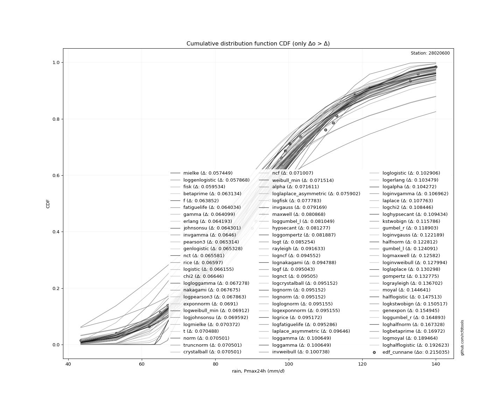</img>

</div>


**11.3. Best fit**

<div align="center">

|   id |   station | empirical_dist   | p_dist   |     delta |   deltao | eval   |   fit |   n |   best_fit |   best_fit_sort |
|-----:|----------:|:-----------------|:---------|----------:|---------:|:-------|------:|----:|-----------:|----------------:|
|    0 |  28020600 | edf_cunnane      | mielke   | 0.0574488 | 0.215035 | Δo > Δ |     1 |  40 |          1 |               1 |

</div>


<div align="center">

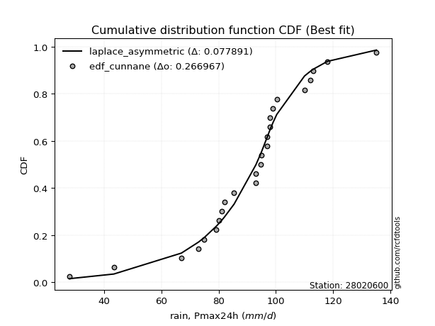</img></img>

</div>


### 12. Empirical - EDF Adamowski (1981)

The Adamowski formula in hydrology refers to a specific plotting position formula used for estimating the non-parametric empirical distribution of hydrological events (like flood peaks) to calculate their return periods. This formula provides an alternative to traditional parametric methods (like the Gumbel or Log Pearson Type III distributions). 

<div align="center">


$P=(m-0.25)/(n+0.5)$


</div>


**12.1. Empirical values**

<div align="center">

|                | 0                    | 1                    | 2                   | 3                   | 4                   | 5                  | 6                   | 7                   | 8                   | 9                   | 10                 | 11                  | 12                 | 13                 | 14                  | 15                 | 16                  | 17                 | 18                  | 19                 | 20                 | 21                 | 22                 | 23                 | 24                 | 25                 | 26                 | 27                 | 28                 | 29                 | 30                 | 31                 | 32                | 33                 | 34                 | 35                 | 36                 | 37                 | 38                 | 39                 |
|:---------------|:---------------------|:---------------------|:--------------------|:--------------------|:--------------------|:-------------------|:--------------------|:--------------------|:--------------------|:--------------------|:-------------------|:--------------------|:-------------------|:-------------------|:--------------------|:-------------------|:--------------------|:-------------------|:--------------------|:-------------------|:-------------------|:-------------------|:-------------------|:-------------------|:-------------------|:-------------------|:-------------------|:-------------------|:-------------------|:-------------------|:-------------------|:-------------------|:------------------|:-------------------|:-------------------|:-------------------|:-------------------|:-------------------|:-------------------|:-------------------|
| date           | 2001                 | 2014                 | 2008                | 2012                | 2015                | 1984               | 2005                | 1997                | 2007                | 1992                | 2018               | 2003                | 1983               | 2009               | 1988                | 1996               | 2021                | 2011               | 1987                | 1989               | 2000               | 1993               | 2004               | 1985               | 1986               | 2002               | 2016               | 1999               | 1994               | 1981               | 1998               | 1991               | 1990              | 2006               | 2017               | 1982               | 2019               | 2010               | 1995               | 2013               |
| x              | 43.4                 | 53.0                 | 62.0                | 63.47518361         | 65.0                | 67.0               | 72.0                | 73.0                | 75.0                | 75.0                | 78.0               | 79.2                | 80.0               | 81.0               | 82.0                | 85.4               | 90.0                | 91.0               | 93.0                | 93.0               | 94.7               | 95.0               | 97.0               | 97.0               | 98.0               | 98.0               | 98.0               | 99.0               | 100.3              | 103.2303848        | 110.0              | 112.1              | 113.0             | 115.0              | 116.0              | 118.0              | 122.0              | 133.0              | 135.1              | 140.0              |
| m              | 1                    | 2                    | 3                   | 4                   | 5                   | 6                  | 7                   | 8                   | 9                   | 10                  | 11                 | 12                  | 13                 | 14                 | 15                  | 16                 | 17                  | 18                 | 19                  | 20                 | 21                 | 22                 | 23                 | 24                 | 25                 | 26                 | 27                 | 28                 | 29                 | 30                 | 31                 | 32                 | 33                | 34                 | 35                 | 36                 | 37                 | 38                 | 39                 | 40                 |
| empirical_dist | edf_adamowski        | edf_adamowski        | edf_adamowski       | edf_adamowski       | edf_adamowski       | edf_adamowski      | edf_adamowski       | edf_adamowski       | edf_adamowski       | edf_adamowski       | edf_adamowski      | edf_adamowski       | edf_adamowski      | edf_adamowski      | edf_adamowski       | edf_adamowski      | edf_adamowski       | edf_adamowski      | edf_adamowski       | edf_adamowski      | edf_adamowski      | edf_adamowski      | edf_adamowski      | edf_adamowski      | edf_adamowski      | edf_adamowski      | edf_adamowski      | edf_adamowski      | edf_adamowski      | edf_adamowski      | edf_adamowski      | edf_adamowski      | edf_adamowski     | edf_adamowski      | edf_adamowski      | edf_adamowski      | edf_adamowski      | edf_adamowski      | edf_adamowski      | edf_adamowski      |
| empirical      | 0.018518518518518517 | 0.043209876543209874 | 0.06790123456790123 | 0.09259259259259259 | 0.11728395061728394 | 0.1419753086419753 | 0.16666666666666666 | 0.19135802469135801 | 0.21604938271604937 | 0.24074074074074073 | 0.2654320987654321 | 0.29012345679012347 | 0.3148148148148148 | 0.3395061728395062 | 0.36419753086419754 | 0.3888888888888889 | 0.41358024691358025 | 0.4382716049382716 | 0.46296296296296297 | 0.4876543209876543 | 0.5123456790123457 | 0.5370370370370371 | 0.5617283950617284 | 0.5864197530864198 | 0.6111111111111112 | 0.6358024691358025 | 0.6604938271604939 | 0.6851851851851852 | 0.7098765432098766 | 0.7345679012345679 | 0.7592592592592593 | 0.7839506172839507 | 0.808641975308642 | 0.8333333333333334 | 0.8580246913580247 | 0.8827160493827161 | 0.9074074074074074 | 0.9320987654320988 | 0.9567901234567902 | 0.9814814814814815 |
| empirical_tr   | 1.0188679245283019   | 1.0451612903225806   | 1.0728476821192052  | 1.1020408163265305  | 1.132867132867133   | 1.1654676258992804 | 1.2                 | 1.2366412213740456  | 1.2755905511811023  | 1.3170731707317072  | 1.361344537815126  | 1.408695652173913   | 1.4594594594594597 | 1.514018691588785  | 1.5728155339805827  | 1.6363636363636362 | 1.705263157894737   | 1.7802197802197801 | 1.8620689655172415  | 1.9518072289156625 | 2.0506329113924053 | 2.16               | 2.2816901408450705 | 2.4179104477611943 | 2.5714285714285716 | 2.745762711864407  | 2.9454545454545458 | 3.1764705882352944 | 3.446808510638298  | 3.7674418604651168 | 4.153846153846154  | 4.628571428571429  | 5.225806451612904 | 6.000000000000002  | 7.043478260869567  | 8.526315789473687  | 10.800000000000004 | 14.727272727272734 | 23.14285714285716  | 54.000000000000085 |

</div>


**12.2. Kolmogorov-Smirnov fit test (sorted by Δ)**


<div align="center">

|                | 0                   | 1                  | 2                    | 3                    | 4                   | 5                   | 6                   | 7                   | 8                   | 9                   | 10                 | 11                  | 12                 | 13                  | 14                  | 15                  | 16                  | 17                  | 18                  | 19                  | 20                  | 21                  | 22                  | 23                  | 24                  | 25                  | 26                  | 27                  | 28                  | 29                 | 30                    | 31                  | 32                 | 33                  | 34                  | 35                  | 36                  | 37                  | 38                  | 39                  | 40                 | 41                  | 42                  | 43                 | 44                  | 45                  | 46                  | 47                  | 48                  | 49                  | 50                  | 51                 | 52                  | 53                  | 54                 | 55                  | 56                  | 57                  | 58                  | 59                  | 60                  | 61                  | 62                  | 63                  | 64                  | 65                  | 66                  | 67                  | 68                 | 69                 | 70                  | 71                 | 72                 | 73                  | 74                 | 75                  | 76                 | 77                  | 78                  | 79                  | 80                  | 81                  | 82                  | 83                 | 84                 | 85                 | 86                 | 87                 |
|:---------------|:--------------------|:-------------------|:---------------------|:---------------------|:--------------------|:--------------------|:--------------------|:--------------------|:--------------------|:--------------------|:-------------------|:--------------------|:-------------------|:--------------------|:--------------------|:--------------------|:--------------------|:--------------------|:--------------------|:--------------------|:--------------------|:--------------------|:--------------------|:--------------------|:--------------------|:--------------------|:--------------------|:--------------------|:--------------------|:-------------------|:----------------------|:--------------------|:-------------------|:--------------------|:--------------------|:--------------------|:--------------------|:--------------------|:--------------------|:--------------------|:-------------------|:--------------------|:--------------------|:-------------------|:--------------------|:--------------------|:--------------------|:--------------------|:--------------------|:--------------------|:--------------------|:-------------------|:--------------------|:--------------------|:-------------------|:--------------------|:--------------------|:--------------------|:--------------------|:--------------------|:--------------------|:--------------------|:--------------------|:--------------------|:--------------------|:--------------------|:--------------------|:--------------------|:-------------------|:-------------------|:--------------------|:-------------------|:-------------------|:--------------------|:-------------------|:--------------------|:-------------------|:--------------------|:--------------------|:--------------------|:--------------------|:--------------------|:--------------------|:-------------------|:-------------------|:-------------------|:-------------------|:-------------------|
| station        | 28020600            | 28020600           | 28020600             | 28020600             | 28020600            | 28020600            | 28020600            | 28020600            | 28020600            | 28020600            | 28020600           | 28020600            | 28020600           | 28020600            | 28020600            | 28020600            | 28020600            | 28020600            | 28020600            | 28020600            | 28020600            | 28020600            | 28020600            | 28020600            | 28020600            | 28020600            | 28020600            | 28020600            | 28020600            | 28020600           | 28020600              | 28020600            | 28020600           | 28020600            | 28020600            | 28020600            | 28020600            | 28020600            | 28020600            | 28020600            | 28020600           | 28020600            | 28020600            | 28020600           | 28020600            | 28020600            | 28020600            | 28020600            | 28020600            | 28020600            | 28020600            | 28020600           | 28020600            | 28020600            | 28020600           | 28020600            | 28020600            | 28020600            | 28020600            | 28020600            | 28020600            | 28020600            | 28020600            | 28020600            | 28020600            | 28020600            | 28020600            | 28020600            | 28020600           | 28020600           | 28020600            | 28020600           | 28020600           | 28020600            | 28020600           | 28020600            | 28020600           | 28020600            | 28020600            | 28020600            | 28020600            | 28020600            | 28020600            | 28020600           | 28020600           | 28020600           | 28020600           | 28020600           |
| empirical_dist | edf_adamowski       | edf_adamowski      | edf_adamowski        | edf_adamowski        | edf_adamowski       | edf_adamowski       | edf_adamowski       | edf_adamowski       | edf_adamowski       | edf_adamowski       | edf_adamowski      | edf_adamowski       | edf_adamowski      | edf_adamowski       | edf_adamowski       | edf_adamowski       | edf_adamowski       | edf_adamowski       | edf_adamowski       | edf_adamowski       | edf_adamowski       | edf_adamowski       | edf_adamowski       | edf_adamowski       | edf_adamowski       | edf_adamowski       | edf_adamowski       | edf_adamowski       | edf_adamowski       | edf_adamowski      | edf_adamowski         | edf_adamowski       | edf_adamowski      | edf_adamowski       | edf_adamowski       | edf_adamowski       | edf_adamowski       | edf_adamowski       | edf_adamowski       | edf_adamowski       | edf_adamowski      | edf_adamowski       | edf_adamowski       | edf_adamowski      | edf_adamowski       | edf_adamowski       | edf_adamowski       | edf_adamowski       | edf_adamowski       | edf_adamowski       | edf_adamowski       | edf_adamowski      | edf_adamowski       | edf_adamowski       | edf_adamowski      | edf_adamowski       | edf_adamowski       | edf_adamowski       | edf_adamowski       | edf_adamowski       | edf_adamowski       | edf_adamowski       | edf_adamowski       | edf_adamowski       | edf_adamowski       | edf_adamowski       | edf_adamowski       | edf_adamowski       | edf_adamowski      | edf_adamowski      | edf_adamowski       | edf_adamowski      | edf_adamowski      | edf_adamowski       | edf_adamowski      | edf_adamowski       | edf_adamowski      | edf_adamowski       | edf_adamowski       | edf_adamowski       | edf_adamowski       | edf_adamowski       | edf_adamowski       | edf_adamowski      | edf_adamowski      | edf_adamowski      | edf_adamowski      | edf_adamowski      |
| p_dist         | loggenlogistic      | mielke             | fisk                 | betaprime            | f                   | fatiguelife         | gamma               | erlang              | johnsonsu           | pearson3            | nct                | invgamma            | rice               | genlogistic         | logloggamma         | chi2                | logpearson3         | logistic            | nakagami            | exponnorm           | logweibull_min      | logjohnsonsu        | logmielke           | t                   | norm                | truncnorm           | crystalball         | weibull_min         | ncf                 | alpha              | loglaplace_asymmetric | logfisk             | invgauss           | loggumbel_l         | loggompertz         | maxwell             | hypsecant           | logt                | rayleigh            | logncf              | lognakagami        | logf                | lognct              | logcrystalball     | lognorm             | lognorm             | loglognorm          | logexponnorm        | logrice             | logfatiguelife      | laplace_asymmetric  | invweibull         | loggamma            | loggamma            | loglogistic        | logerlang           | logalpha            | loginvgamma         | logchi2             | laplace             | loghypsecant        | kstwobign           | gumbel_r            | loginvgauss         | halfnorm            | gumbel_l            | logmaxwell          | loginvweibull       | loglaplace         | gompertz           | lograyleigh         | moyal              | halflogistic       | logkstwobign        | genexpon           | loggumbel_r         | loghalfnorm        | logbetaprime        | logmoyal            | loghalflogistic     | wald                | loggenexpon         | gibrat              | logwald            | expon              | loggibrat          | logexpon           | logtruncnorm       |
| delta          | 0.05637172427225057 | 0.0564342689099836 | 0.059258068452930635 | 0.061567674604861455 | 0.06228590654201249 | 0.06246750889136177 | 0.06253248893238383 | 0.06262650087774824 | 0.06273468950324579 | 0.06374821592346591 | 0.064014756704738  | 0.06432355079122459 | 0.0644039363900708 | 0.06505181305748514 | 0.06571151288426968 | 0.06618385232505913 | 0.06629675295552839 | 0.06716813958408108 | 0.06739825138636762 | 0.06753353866586553 | 0.06755386643558592 | 0.06802580691272808 | 0.06880623736721914 | 0.06892222507849532 | 0.06893469477043057 | 0.06893469917975881 | 0.06893469948152164 | 0.06994801149014518 | 0.07073108173108084 | 0.0713344410423426 | 0.07691495321143887   | 0.07750663516024031 | 0.0788922624336112 | 0.07948299136425496 | 0.08032056191067016 | 0.08059176266354634 | 0.08229065736866248 | 0.08497747999539046 | 0.09135674029642288 | 0.09427595585170906 | 0.0945119557667507 | 0.09476611860327583 | 0.09477384048345888 | 0.0948756018613574 | 0.09487570955150765 | 0.09487570955150765 | 0.09487841114323897 | 0.09487875511827809 | 0.09489571475600594 | 0.09500947404809307 | 0.09747307540500327 | 0.1000934867470274 | 0.10037210894518261 | 0.10037210894518261 | 0.1026300194371616 | 0.10320297695612551 | 0.10399534156881968 | 0.10668572813754224 | 0.10780091841083556 | 0.10877688222490423 | 0.10915779346813653 | 0.11514149560118786 | 0.11862618734355651 | 0.12154400303215612 | 0.12216746978195231 | 0.12270949118522456 | 0.12517493390961026 | 0.12734909177919113 | 0.1300213454791685 | 0.1312087027832901 | 0.13605738100251524 | 0.1443650709378111 | 0.1472363299493556 | 0.14987202023169038 | 0.1524570060098048 | 0.16461636738653423 | 0.16668325060424   | 0.16723233817339758 | 0.18918717734165674 | 0.19197777268010213 | 0.21589333924907833 | 0.22828418109855583 | 0.24086171926912076 | 0.2604112317485127 | 0.2755036508796067 | 0.2870587103944829 | 0.335572986929758  | 0.6662530597516165 |
| deltao         | 0.2150348808914498  | 0.2150348808914498 | 0.2150348808914498   | 0.2150348808914498   | 0.2150348808914498  | 0.2150348808914498  | 0.2150348808914498  | 0.2150348808914498  | 0.2150348808914498  | 0.2150348808914498  | 0.2150348808914498 | 0.2150348808914498  | 0.2150348808914498 | 0.2150348808914498  | 0.2150348808914498  | 0.2150348808914498  | 0.2150348808914498  | 0.2150348808914498  | 0.2150348808914498  | 0.2150348808914498  | 0.2150348808914498  | 0.2150348808914498  | 0.2150348808914498  | 0.2150348808914498  | 0.2150348808914498  | 0.2150348808914498  | 0.2150348808914498  | 0.2150348808914498  | 0.2150348808914498  | 0.2150348808914498 | 0.2150348808914498    | 0.2150348808914498  | 0.2150348808914498 | 0.2150348808914498  | 0.2150348808914498  | 0.2150348808914498  | 0.2150348808914498  | 0.2150348808914498  | 0.2150348808914498  | 0.2150348808914498  | 0.2150348808914498 | 0.2150348808914498  | 0.2150348808914498  | 0.2150348808914498 | 0.2150348808914498  | 0.2150348808914498  | 0.2150348808914498  | 0.2150348808914498  | 0.2150348808914498  | 0.2150348808914498  | 0.2150348808914498  | 0.2150348808914498 | 0.2150348808914498  | 0.2150348808914498  | 0.2150348808914498 | 0.2150348808914498  | 0.2150348808914498  | 0.2150348808914498  | 0.2150348808914498  | 0.2150348808914498  | 0.2150348808914498  | 0.2150348808914498  | 0.2150348808914498  | 0.2150348808914498  | 0.2150348808914498  | 0.2150348808914498  | 0.2150348808914498  | 0.2150348808914498  | 0.2150348808914498 | 0.2150348808914498 | 0.2150348808914498  | 0.2150348808914498 | 0.2150348808914498 | 0.2150348808914498  | 0.2150348808914498 | 0.2150348808914498  | 0.2150348808914498 | 0.2150348808914498  | 0.2150348808914498  | 0.2150348808914498  | 0.2150348808914498  | 0.2150348808914498  | 0.2150348808914498  | 0.2150348808914498 | 0.2150348808914498 | 0.2150348808914498 | 0.2150348808914498 | 0.2150348808914498 |
| eval           | Δo > Δ              | Δo > Δ             | Δo > Δ               | Δo > Δ               | Δo > Δ              | Δo > Δ              | Δo > Δ              | Δo > Δ              | Δo > Δ              | Δo > Δ              | Δo > Δ             | Δo > Δ              | Δo > Δ             | Δo > Δ              | Δo > Δ              | Δo > Δ              | Δo > Δ              | Δo > Δ              | Δo > Δ              | Δo > Δ              | Δo > Δ              | Δo > Δ              | Δo > Δ              | Δo > Δ              | Δo > Δ              | Δo > Δ              | Δo > Δ              | Δo > Δ              | Δo > Δ              | Δo > Δ             | Δo > Δ                | Δo > Δ              | Δo > Δ             | Δo > Δ              | Δo > Δ              | Δo > Δ              | Δo > Δ              | Δo > Δ              | Δo > Δ              | Δo > Δ              | Δo > Δ             | Δo > Δ              | Δo > Δ              | Δo > Δ             | Δo > Δ              | Δo > Δ              | Δo > Δ              | Δo > Δ              | Δo > Δ              | Δo > Δ              | Δo > Δ              | Δo > Δ             | Δo > Δ              | Δo > Δ              | Δo > Δ             | Δo > Δ              | Δo > Δ              | Δo > Δ              | Δo > Δ              | Δo > Δ              | Δo > Δ              | Δo > Δ              | Δo > Δ              | Δo > Δ              | Δo > Δ              | Δo > Δ              | Δo > Δ              | Δo > Δ              | Δo > Δ             | Δo > Δ             | Δo > Δ              | Δo > Δ             | Δo > Δ             | Δo > Δ              | Δo > Δ             | Δo > Δ              | Δo > Δ             | Δo > Δ              | Δo > Δ              | Δo > Δ              | Δo <= Δ             | Δo <= Δ             | Δo <= Δ             | Δo <= Δ            | Δo <= Δ            | Δo <= Δ            | Δo <= Δ            | Δo <= Δ            |
| fit            | 1                   | 1                  | 1                    | 1                    | 1                   | 1                   | 1                   | 1                   | 1                   | 1                   | 1                  | 1                   | 1                  | 1                   | 1                   | 1                   | 1                   | 1                   | 1                   | 1                   | 1                   | 1                   | 1                   | 1                   | 1                   | 1                   | 1                   | 1                   | 1                   | 1                  | 1                     | 1                   | 1                  | 1                   | 1                   | 1                   | 1                   | 1                   | 1                   | 1                   | 1                  | 1                   | 1                   | 1                  | 1                   | 1                   | 1                   | 1                   | 1                   | 1                   | 1                   | 1                  | 1                   | 1                   | 1                  | 1                   | 1                   | 1                   | 1                   | 1                   | 1                   | 1                   | 1                   | 1                   | 1                   | 1                   | 1                   | 1                   | 1                  | 1                  | 1                   | 1                  | 1                  | 1                   | 1                  | 1                   | 1                  | 1                   | 1                   | 1                   | 0                   | 0                   | 0                   | 0                  | 0                  | 0                  | 0                  | 0                  |
| n              | 40                  | 40                 | 40                   | 40                   | 40                  | 40                  | 40                  | 40                  | 40                  | 40                  | 40                 | 40                  | 40                 | 40                  | 40                  | 40                  | 40                  | 40                  | 40                  | 40                  | 40                  | 40                  | 40                  | 40                  | 40                  | 40                  | 40                  | 40                  | 40                  | 40                 | 40                    | 40                  | 40                 | 40                  | 40                  | 40                  | 40                  | 40                  | 40                  | 40                  | 40                 | 40                  | 40                  | 40                 | 40                  | 40                  | 40                  | 40                  | 40                  | 40                  | 40                  | 40                 | 40                  | 40                  | 40                 | 40                  | 40                  | 40                  | 40                  | 40                  | 40                  | 40                  | 40                  | 40                  | 40                  | 40                  | 40                  | 40                  | 40                 | 40                 | 40                  | 40                 | 40                 | 40                  | 40                 | 40                  | 40                 | 40                  | 40                  | 40                  | 40                  | 40                  | 40                  | 40                 | 40                 | 40                 | 40                 | 40                 |
| best_fit       | 1                   | 0                  | 0                    | 0                    | 0                   | 0                   | 0                   | 0                   | 0                   | 0                   | 0                  | 0                   | 0                  | 0                   | 0                   | 0                   | 0                   | 0                   | 0                   | 0                   | 0                   | 0                   | 0                   | 0                   | 0                   | 0                   | 0                   | 0                   | 0                   | 0                  | 0                     | 0                   | 0                  | 0                   | 0                   | 0                   | 0                   | 0                   | 0                   | 0                   | 0                  | 0                   | 0                   | 0                  | 0                   | 0                   | 0                   | 0                   | 0                   | 0                   | 0                   | 0                  | 0                   | 0                   | 0                  | 0                   | 0                   | 0                   | 0                   | 0                   | 0                   | 0                   | 0                   | 0                   | 0                   | 0                   | 0                   | 0                   | 0                  | 0                  | 0                   | 0                  | 0                  | 0                   | 0                  | 0                   | 0                  | 0                   | 0                   | 0                   | 0                   | 0                   | 0                   | 0                  | 0                  | 0                  | 0                  | 0                  |
| best_fit_sort  | 1                   | 2                  | 3                    | 4                    | 5                   | 6                   | 7                   | 8                   | 9                   | 10                  | 11                 | 12                  | 13                 | 14                  | 15                  | 16                  | 17                  | 18                  | 19                  | 20                  | 21                  | 22                  | 23                  | 24                  | 25                  | 26                  | 27                  | 28                  | 29                  | 30                 | 31                    | 32                  | 33                 | 34                  | 35                  | 36                  | 37                  | 38                  | 39                  | 40                  | 41                 | 42                  | 43                  | 44                 | 45                  | 46                  | 47                  | 48                  | 49                  | 50                  | 51                  | 52                 | 53                  | 54                  | 55                 | 56                  | 57                  | 58                  | 59                  | 60                  | 61                  | 62                  | 63                  | 64                  | 65                  | 66                  | 67                  | 68                  | 69                 | 70                 | 71                  | 72                 | 73                 | 74                  | 75                 | 76                  | 77                 | 78                  | 79                  | 80                  | 81                  | 82                  | 83                  | 84                 | 85                 | 86                 | 87                 | 88                 |

</div>


<div align="center">

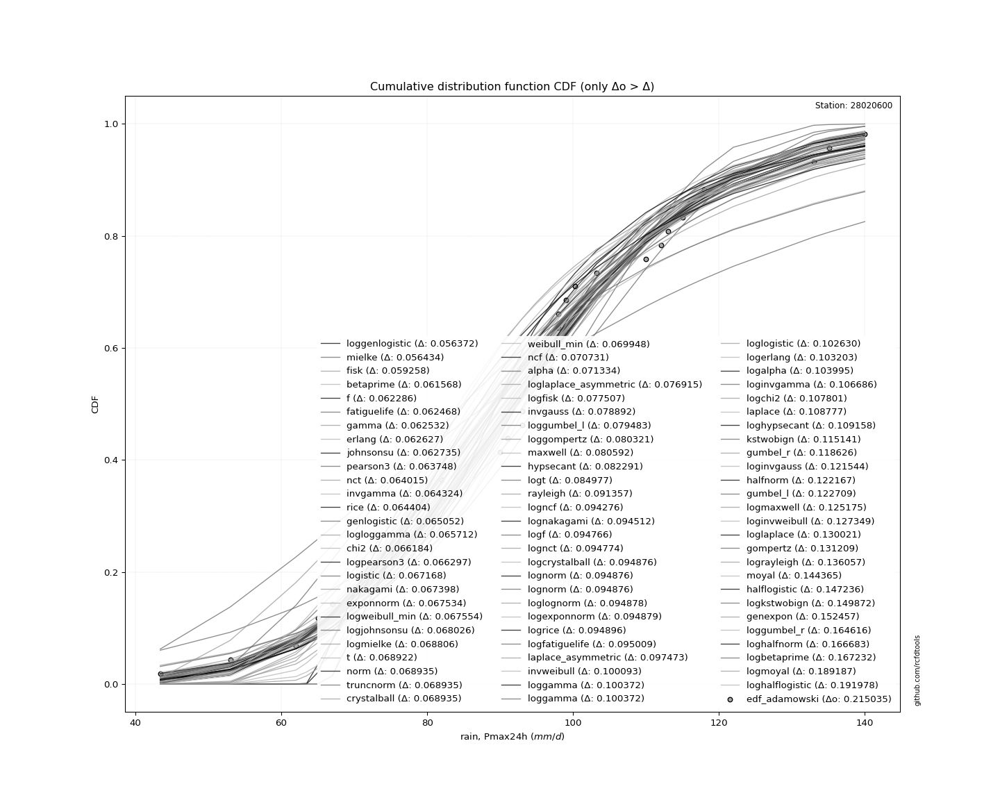</img>

</div>


**12.3. Best fit**

<div align="center">

|   id |   station | empirical_dist   | p_dist         |     delta |   deltao | eval   |   fit |   n |   best_fit |   best_fit_sort |
|-----:|----------:|:-----------------|:---------------|----------:|---------:|:-------|------:|----:|-----------:|----------------:|
|    0 |  28020600 | edf_adamowski    | loggenlogistic | 0.0563717 | 0.215035 | Δo > Δ |     1 |  40 |          1 |               1 |

</div>


<div align="center">

</img>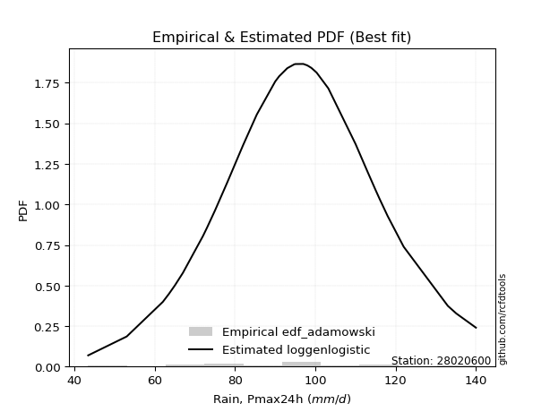</img>

</div>


## C. Best fit & Estimate extreme values for specific return periods - Tr


### 1. Best fit (ordered by delta Δ)

<div align="center">

|   id |   station | empirical_dist   | p_dist         |     delta |   deltao | eval   |   fit |   n |   best_fit |   best_fit_sort |
|-----:|----------:|:-----------------|:---------------|----------:|---------:|:-------|------:|----:|-----------:|----------------:|
|    0 |  28020600 | edf_adamowski    | loggenlogistic | 0.0563717 | 0.215035 | Δo > Δ |     1 |  40 |          1 |               1 |
|    1 |  28020600 | edf_chegodayev   | mielke         | 0.056402  | 0.215035 | Δo > Δ |     1 |  40 |          1 |               2 |
|    2 |  28020600 | edf_jenkinson    | mielke         | 0.0565062 | 0.215035 | Δo > Δ |     1 |  40 |          1 |               3 |
|    3 |  28020600 | edf_beard        | mielke         | 0.0565062 | 0.215035 | Δo > Δ |     1 |  40 |          1 |               4 |
|    4 |  28020600 | edf_filliben     | mielke         | 0.0565845 | 0.215035 | Δo > Δ |     1 |  40 |          1 |               5 |
|    5 |  28020600 | edf_tukey        | mielke         | 0.0567498 | 0.215035 | Δo > Δ |     1 |  40 |          1 |               6 |
|    6 |  28020600 | edf_blom         | mielke         | 0.0571861 | 0.215035 | Δo > Δ |     1 |  40 |          1 |               7 |
|    7 |  28020600 | edf_cunnane      | mielke         | 0.0574488 | 0.215035 | Δo > Δ |     1 |  40 |          1 |               8 |
|    8 |  28020600 | edf_gringorten   | mielke         | 0.0578704 | 0.215035 | Δo > Δ |     1 |  40 |          1 |               9 |
|    9 |  28020600 | edf_weibull      | loggenlogistic | 0.0580279 | 0.215035 | Δo > Δ |     1 |  40 |          1 |              10 |
|   10 |  28020600 | edf_hazen        | mielke         | 0.058506  | 0.215035 | Δo > Δ |     1 |  40 |          1 |              11 |
|   11 |  28020600 | edf_california   | genlogistic    | 0.0630305 | 0.215035 | Δo > Δ |     1 |  40 |          1 |              12 |

</div>

:file_folder:Tables: [bestfit_28020600.csv](table/bestfit_28020600.csv) | [extreme_28020600.csv](table/extreme_28020600.csv)


### 2. Extreme values

In hydrology, a return period (or recurrence interval $Tr$) is the statistical average time between extreme events like floods or droughts of a specific magnitude, indicating how rare an event is, with a 100-year flood, for example, having a 1% chance of occurring in any given year, not that it happens exactly every century. It is a key tool for infrastructure design (like bridges or dams) and risk assessment, calculated from historical data to determine the probability of future events, although it is important to remember it is statistical average, and events can cluster or be missed.

> risk_rate: assuming the return period as the project useful life.

|   id |      tr |   prob_l |     prob_g |    alpha |   betaprime |     chi2 |   crystalball |   erlang |    expon |   exponnorm |        f |   fatiguelife |     fisk |    gamma |   genexpon |   genlogistic |   gibrat |   gompertz |   gumbel_l |   gumbel_r |   halflogistic |   halfnorm |   hypsecant |   invgamma |   invgauss |   invweibull |   johnsonsu |   kstwobign |   laplace |   laplace_asymmetric |   loggamma |   logistic |   lognorm |   maxwell |   mielke |    moyal |   nakagami |      ncf |      nct |     norm |   pearson3 |   rayleigh |     rice |        t |   truncnorm |     wald |   weibull_min |   logalpha |   logbetaprime |   logchi2 |   logcrystalball |   logerlang |   logexpon |   logexponnorm |     logf |   logfatiguelife |   logfisk |   loggenexpon |   loggenlogistic |   loggibrat |   loggompertz |   loggumbel_l |   loggumbel_r |   loghalflogistic |   loghalfnorm |   loghypsecant |   loginvgamma |   loginvgauss |   loginvweibull |   logjohnsonsu |   logkstwobign |   loglaplace |   loglaplace_asymmetric |   logloggamma |   loglogistic |   loglognorm |   logmaxwell |   logmielke |   logmoyal |   lognakagami |   logncf |   lognct |   logpearson3 |   lograyleigh |   logrice |     logt |   logtruncnorm |   logwald |   logweibull_min |   station |   n |   risk_rate |
|-----:|--------:|---------:|-----------:|---------:|------------:|---------:|--------------:|---------:|---------:|------------:|---------:|--------------:|---------:|---------:|-----------:|--------------:|---------:|-----------:|-----------:|-----------:|---------------:|-----------:|------------:|-----------:|-----------:|-------------:|------------:|------------:|----------:|---------------------:|-----------:|-----------:|----------:|----------:|---------:|---------:|-----------:|---------:|---------:|---------:|-----------:|-----------:|---------:|---------:|------------:|---------:|--------------:|-----------:|---------------:|----------:|-----------------:|------------:|-----------:|---------------:|---------:|-----------------:|----------:|--------------:|-----------------:|------------:|--------------:|--------------:|--------------:|------------------:|--------------:|---------------:|--------------:|--------------:|----------------:|---------------:|---------------:|-------------:|------------------------:|--------------:|--------------:|-------------:|-------------:|------------:|-----------:|--------------:|---------:|---------:|--------------:|--------------:|----------:|---------:|---------------:|----------:|-----------------:|----------:|----:|------------:|
|    0 |    2    | 0.5      | 0.5        |  91.1179 |     91.7057 |  91.3996 |       92.3976 |  91.9703 |  77.3626 |     92.3182 |  91.9459 |       91.9605 |  91.8801 |  91.9667 |    84.9195 |       91.5635 |  85.8265 |    95.5281 |    95.9941 |    88.8012 |        87.0132 |    87.9164 |     92.3976 |    91.4814 |    90.6169 |      89.1725 |     91.9845 |     88.1357 |   92.3976 |              93.6515 |    89.2606 |    92.3976 |   89.6633 |   90.5253 |  92.3    |  87.6401 |    91.3503 |  91.1271 |  92.1054 |  92.3976 |    92.0475 |    89.8613 |  91.9092 |  92.3974 |     92.3976 |  85.3013 |       92.1156 |    89.0177 |        88.2989 |   88.7316 |          89.6633 |     89.079  |    71.7658 |        89.6632 |  89.66   |          89.6627 |   90.8926 |       79.8483 |          92.3194 |     83.1527 |       92.6071 |       93.4399 |       86.0393 |           84.2921 |       85.1706 |        89.6633 |       88.8659 |       87.9051 |         87.008  |        92.1211 |        84.8885 |      89.6633 |                 93.2806 |       92.0551 |       89.6633 |      89.6631 |      87.7582 |     92.5298 |    84.901  |       89.6788 |  89.6828 |  89.6649 |       91.8918 |       87.0918 |   89.6633 |  90.3712 |        53.3416 |   82.6522 |          92.0764 |  28020600 |  40 |    0.75     |
|    1 |    2.33 | 0.570815 | 0.429185   |  95.0418 |     95.6996 |  95.3208 |       96.3042 |  95.8888 |  84.8455 |     96.2208 |  95.865  |       95.8783 |  95.481  |  95.8838 |    90.4272 |       95.2333 |  87.8054 |    99.8331 |    99.3928 |    92.4211 |        90.735  |    92.1326 |     95.5241 |    95.4638 |    94.6853 |      93.5929 |     95.8992 |     92.8396 |   94.7617 |              96.1842 |    93.4582 |    95.8396 |   93.773  |   94.584  |  95.8914 |  91.0668 |    95.2481 |  95.1011 |  96.0028 |  96.3042 |    95.9635 |    93.98   |  95.9122 |  96.3037 |     96.3042 |  87.8629 |       96.1948 |    93.2384 |        96.2425 |   93.0405 |          93.773  |     93.2858 |    80.1759 |        93.7728 |  93.7818 |          93.7635 |   94.6295 |       86.079  |          95.9142 |     85.0619 |       96.7831 |       97.1551 |       89.6874 |           87.9691 |       89.3913 |        92.9375 |       93.072  |       92.2171 |         92.3429 |        96.1314 |        90.6383 |      92.1282 |                 96.1992 |       96.0272 |       93.2745 |      93.7728 |      91.9406 |     96.4095 |    88.3048 |       93.796  |  93.8127 |  93.78   |       95.9555 |       91.3058 |   93.7715 |  94.2939 |        55.7298 |   85.1174 |          96.0973 |  28020600 |  40 |    0.729209 |
|    2 |    5    | 0.8      | 0.2        | 110.408  |    111.071  | 110.362  |      110.822  | 110.685  | 122.259  |    110.772  | 110.683  |      110.685  | 109.663  | 110.682  |   113.802  |      109.867  |  99.1985 |   113.741  |   110.373  |   108.147  |       107.575  |   109.962  |    108.065  |   110.952  |   110.789  |     112.797  |    110.684  |    112.821  |  106.582  |             108.356  |   111.202  |   109.129  |  110.766  |  110.559  | 109.727  | 106.939  |   110.644  | 110.589  | 110.668  | 110.822  |   110.712  |   110.469  | 110.93   | 110.821  |    110.822  | 102.203  |      111.249  |   111.21   |       133.461  |  111.481  |         110.766  |    111.038  |   139.529  |       110.766  | 110.839  |         110.735  |  110.558  |      118.634  |         109.739  |     96.9387 |      111.75   |      110.197  |      107.419  |          106.718  |      109.679  |       107.317  |      111      |      111.012  |        119.587  |       111.086  |       119.734  |     105.507  |                107.539  |      110.903  |      108.636  |     110.766  |     110.431  |    110.379  |   105.941  |      110.833  | 110.929  | 110.797  |      111.199  |      110.319  |  110.758  | 110.682  |        68.7099 |  100.339  |         111.055  |  28020600 |  40 |    0.67232  |
|    3 |   10    | 0.9      | 0.1        | 121.34   |    121.735  | 120.751  |      120.453  | 120.705  | 156.221  |    120.477  | 120.735  |      120.726  | 120.397  | 120.709  |   131.87   |      120.958  | 112.185  |   121.484  |   116.486  |   120.956  |       121.561  |   123.156  |    118.079  |   121.861  |   122.367  |     128.439  |    120.703  |    128.034  |  117.311  |             119.405  |   125.127  |   118.917  |  123.705  |  121.801  | 120.197  | 120.759  |   121.51   | 121.497  | 120.575  | 120.453  |   120.668  |   122.226  | 120.981  | 120.452  |    120.453  | 117.42   |      121.038  |   125.468  |       166.792  |  126.197  |         123.705  |    124.939  |   230.724  |       123.705  | 123.841  |         123.673  |  123.978  |      152.321  |         120.182  |    112.512  |      121.135  |      118.202  |      124.422  |          125.29   |      127.602  |       120.382  |      125.24   |      126.399  |        147.616  |       120.947  |       148.003  |     119.326  |                118.799  |      120.82   |      121.545  |     123.706  |     125.631  |    120.151  |   124.141  |      123.818  | 124.002  | 123.756  |      121.257  |      126.25   |  123.691  | 123.678  |        81.7717 |  119.481  |         120.919  |  28020600 |  40 |    0.651322 |
|    4 |   15    | 0.933333 | 0.0666667  | 127.036  |    127.198  | 126.06   |      125.259  | 125.767  | 176.088  |    125.34   | 125.818  |      125.803  | 126.35   | 125.776  |   141.674  |      127.062  | 121.143  |   124.99   |   119.254  |   128.183  |       129.475  |   130.022  |    123.794  |   127.506  |   128.425  |     137.264  |    125.767  |    136.11   |  123.588  |             125.868  |   132.822  |   124.25   |  130.717  |  127.569  | 126.121  | 128.779  |   127.091  | 127.131  | 125.58   | 125.259  |   125.688  |   128.284  | 126.016  | 125.258  |    125.259  | 127.193  |      125.845  |   133.406  |       186.764  |  134.415  |         130.717  |    132.608  |   309.645  |       130.716  | 130.893  |         130.69   |  131.964  |      174.564  |         126.091  |    124.689  |      125.653  |      122.016  |      135.176  |          137.199  |      138.059  |       128.539  |      133.174  |      135.137  |        166.237  |       125.82   |       165.63   |     128.235  |                125.924  |      125.771  |      129.212  |     130.717  |     134.225  |    125.559  |   136.104  |      130.859  | 131.101  | 130.779  |      126.207  |      135.335  |  130.7    | 131.023  |        89.7409 |  133.657  |         125.81   |  28020600 |  40 |    0.644736 |
|    5 |   20    | 0.95     | 0.05       | 130.857  |    130.828  | 129.582  |      128.406  | 129.104  | 190.184  |    128.532  | 129.171  |      129.151  | 130.509  | 129.117  |   148.386  |      131.297  | 128.17   |   127.173  |   120.978  |   133.243  |       135.02   |   134.6    |    127.826  |   131.277  |   132.495  |     143.443  |    129.107  |    141.551  |  128.041  |             130.454  |   138.156  |   127.935  |  135.523  |  131.397  | 130.334  | 134.459  |   130.795  | 130.89   | 128.881  | 128.406  |   128.993  |   132.31   | 129.319  | 128.406  |    128.406  | 134.475  |      128.962  |   138.933  |       201.259  |  140.147  |         135.523  |    137.919  |   381.522  |       135.522  | 135.728  |         135.501  |  137.782  |      191.688  |         130.293  |    135.156  |      128.553  |      124.452  |      143.255  |          146.211  |      145.502  |       134.623  |      138.7    |      141.293  |        180.657  |       128.989  |       178.673  |     134.956  |                131.237  |      129.012  |      134.793  |     135.523  |     140.25   |    129.396  |   145.268  |      135.686  | 135.972  | 135.592  |      129.411  |      141.734  |  135.503  | 136.21   |        95.4093 |  145.304  |         129.001  |  28020600 |  40 |    0.641514 |
|    6 |   25    | 0.96     | 0.04       | 133.717  |    133.525  | 132.197  |      130.723  | 131.572  | 201.117  |    130.886  | 131.651  |      131.628  | 133.716  | 131.588  |   153.477  |      134.543  | 134.028  |   128.726  |   122.204  |   137.14   |       139.292  |   138.005  |    130.946  |   134.092  |   135.545  |     148.202  |    131.578  |    145.626  |  131.495  |             134.011  |   142.24   |   130.755  |  139.173  |  134.239  | 133.629  | 138.862  |   133.547  | 133.693  | 131.323  | 130.723  |   131.436  |   135.301  | 131.753  | 130.723  |    130.723  | 140.308  |      131.241  |   143.178  |       212.716  |  144.554  |         139.173  |    141.983  |   448.578  |       139.172  | 139.401  |         139.157  |  142.406  |      205.817  |         133.58   |    144.551  |      130.658  |      126.215  |      149.805  |          153.556  |      151.3    |       139.529  |      142.946  |      146.059  |        192.611  |       131.309  |       189.111  |     140.411  |                135.512  |      131.396  |      139.224  |     139.174  |     144.898  |    132.405  |   152.793  |      139.354  | 139.675  | 139.249  |      131.748  |      146.682  |  139.152  | 140.242  |        99.7484 |  155.361  |         131.342  |  28020600 |  40 |    0.639603 |
|    7 |   50    | 0.98     | 0.02       | 142.14   |    141.374  | 139.795  |      137.357  | 138.692  | 235.08   |    137.652  | 138.811  |      138.779  | 143.645  | 138.719  |   168.775  |      144.485  | 154.676  |   132.943  |   125.533  |   149.147  |       152.456  |   147.905  |    140.62   |   142.339  |   144.531  |     162.864  |    138.71   |    157.592  |  142.225  |             145.061  |   154.722  |   139.37   |  150.179  |  142.481  | 144.134  | 152.53   |   141.527  | 141.886  | 138.376  | 137.357  |   138.476  |   143.985  | 138.735  | 137.359  |    137.357  | 159.352  |      137.691  |   156.229  |       249.672  |  158.123  |         150.179  |    154.391  |   741.765  |       150.178  | 150.483  |         150.187  |  157.515  |      255.032  |         144.064  |    183.187  |      136.554  |      131.128  |      171.927  |          178.588  |      169.496  |       155.906  |      156.003  |      160.914  |        234.639  |       137.884  |       223.422  |     158.803  |                149.701  |      138.215  |      153.686  |     150.18   |     159.266  |    142.103  |   178.73   |      150.417  | 150.855  | 150.273  |      138.32   |      162.048  |  150.152  | 152.953  |       112.358  |  193.302  |         138.016  |  28020600 |  40 |    0.63583  |
|    8 |   75    | 0.986667 | 0.0133333  | 146.807  |    145.661  | 143.938  |      140.917  | 142.545  | 254.947  |    141.298  | 142.689  |      142.651  | 149.473  | 142.579  |   177.435  |      150.238  | 168.623  |   135.075  |   127.216  |   156.125  |       160.107  |   153.294  |    146.273  |   146.881  |   149.51   |     171.385  |    142.572  |    164.176  |  148.501  |             151.524  |   161.934  |   144.345  |  156.439  |  146.962  | 150.531  | 160.522  |   145.867  | 146.384  | 142.2    | 140.917  |   142.28   |   148.71   | 142.488  | 140.92   |    140.917  | 171.071  |      141.105  |   163.821  |       272.357  |  166.029  |         156.439  |    161.551  |   995.494  |       156.438  | 156.789  |         156.464  |  166.962  |      288.067  |         150.451  |    214.97   |      139.639  |      133.685  |      186.256  |          194.974  |      180.305  |       166.352  |      163.601  |      169.692  |        263.162  |       141.366  |       244.886  |     170.658  |                158.679  |      141.867  |      162.713  |     156.44   |     167.667  |    148.126  |   195.893  |      156.712  | 157.224  | 156.543  |      141.763  |      171.073  |  156.408  | 160.602  |       118.726  |  221.121  |         141.576  |  28020600 |  40 |    0.634587 |
|    9 |  100    | 0.99     | 0.01       | 150.024  |    148.591  | 146.766  |      143.325  | 145.163  | 269.042  |    143.771  | 145.325  |      145.284  | 153.629  | 145.203  |   183.475  |      154.302  | 179.426  |   136.47   |   128.317  |   161.064  |       165.523  |   156.965  |    150.283  |   150.001  |   152.941  |     177.417  |    145.198  |    168.687  |  152.954  |             156.11   |   167.029  |   147.858  |  160.82   |  150.015  | 155.204  | 166.193  |   148.823  | 149.467  | 144.802  | 143.325  |   144.864  |   151.928  | 145.028  | 143.329  |    143.325  | 179.616  |      143.396  |   169.208  |       288.974  |  171.643  |         160.82   |    166.605  |  1226.58   |       160.819  | 161.205  |         160.86   |  173.971  |      313.668  |         155.119  |    243.334  |      141.695  |      135.384  |      197.114  |          207.472  |      188.061  |       174.183  |      168.994  |      175.98   |        285.421  |       143.701  |       260.772  |     179.603  |                165.374  |      144.333  |      169.404  |     160.822  |     173.642  |    152.596  |   209.059  |      161.12   | 161.686  | 160.932  |      144.054  |      177.508  |  160.787  | 166.159  |       122.652  |  243.896  |         143.976  |  28020600 |  40 |    0.633968 |
|   10 |  200    | 0.995    | 0.005      | 157.51   |    155.328  | 153.261  |      148.787  | 151.142  | 303.005  |    149.404  | 151.347  |      151.298  | 163.74   | 151.194  |   197.738  |      164.058  | 208.819  |   139.501  |   130.71   |   172.938  |       178.543  |   165.362  |    159.944  |   157.222  |   160.916  |     191.917  |    151.198  |    179.077  |  163.684  |             167.159  |   179.28   |   156.285  |  171.218  |  156.998  | 166.98   | 179.855  |   155.586  | 156.584  | 150.753  | 148.787  |   150.758  |   159.293  | 150.796  | 148.793  |    148.787  | 200.899  |      148.538  |   182.235  |       330.926  |  185.234  |         171.218  |    178.746  |  2028.25   |       171.217  | 171.689  |         171.298  |  192.006  |      383.725  |         166.892  |    340.912  |      146.271  |      139.153  |      225.879  |          240.898  |      207.076  |       194.598  |      182.039  |      191.386  |        346.947  |       148.935  |       301.39   |     203.128  |                182.689  |      149.918  |      186.598  |     171.22   |     188.124  |    164.156  |   244.53   |      171.585  | 172.29   | 171.349  |      149.131  |      193.157  |  171.18   | 180.093  |       129.957  |  311.353  |         149.396  |  28020600 |  40 |    0.633042 |
|   11 |  250    | 0.996    | 0.004      | 159.851  |    157.412  | 155.268  |      150.456  | 152.98   | 313.939  |    151.133  | 153.199  |      153.148  | 167.029  | 153.036  |   202.256  |      167.192  | 219.365  |   140.393  |   131.414  |   176.756  |       182.729  |   167.945  |    163.054  |   159.47   |   163.408  |     196.579  |    153.043  |    182.293  |  167.138  |             170.716  |   183.226  |   158.99   |  174.528  |  159.148  | 170.94   | 184.253  |   157.668  | 158.793  | 152.586  | 150.456  |   152.568  |   161.56   | 152.56   | 150.463  |    150.456  | 207.94   |      150.094  |   186.454  |       345.04   |  189.639  |         174.528  |    182.652  |  2384.74   |       174.527  | 175.028  |         174.622  |  198.184  |      409.087  |         170.852  |    384.755  |      147.646  |      140.281  |      235.99   |          252.749  |      213.304  |       201.666  |      186.265  |      196.433  |        369.417  |       150.516  |       315.2    |     211.339  |                188.64   |      151.621  |      192.48   |     174.53   |     192.821  |    168.145  |   257.184  |      174.917  | 175.669  | 174.665  |      150.647  |      198.247  |  174.488  | 184.77   |       131.694  |  337.55   |         151.046  |  28020600 |  40 |    0.632858 |
|   12 |  500    | 0.998    | 0.002      | 166.949  |    163.663  | 161.281  |      155.405  | 158.46   | 347.901  |    156.282  | 158.724  |      158.666  | 177.365  | 158.529  |   216.101  |      176.912  | 255.813  |   142.95   |   133.433  |   188.604  |       195.721  |   175.646  |    172.715  |   166.252  |   170.947  |     211.047  |    158.548  |    191.929  |  177.868  |             181.765  |   195.521  |   167.38   |  184.724  |  165.562  | 183.809  | 197.914  |   163.881  | 165.438  | 158.063  | 155.405  |   157.96   |   168.324  | 157.797  | 155.415  |    155.405  | 230.328  |      154.668  |   199.672  |       390.907  |  203.448  |         184.724  |    194.813  |  3943.38   |       184.723  | 185.317  |         184.868  |  218.636  |      497.957  |         183.733  |    584.48   |      151.661  |      143.568  |      270.348  |          293.374  |      233.007  |       225.3    |      199.507  |      212.428  |        448.858  |       155.151  |       360.49   |     239.021  |                208.391  |      156.662  |      211.927  |     184.727  |     207.544  |    181.487  |   300.82   |      185.186  | 186.092  | 184.879  |      155.037  |      214.243  |  184.678  | 199.996  |       135.539  |  436.409  |         155.919  |  28020600 |  40 |    0.632489 |
|   13 |  750    | 0.998667 | 0.00133333 | 170.994  |    167.18   | 164.66   |      158.155  | 161.523  | 367.768  |    159.158  | 161.814  |      161.752  | 183.499  | 161.6    |   224.088  |      182.591  | 279.917  |   144.316  |   134.512  |   195.53   |       203.316  |   179.949  |    178.365  |   170.096  |   175.233  |     219.506  |    161.628  |    197.342  |  184.145  |             188.228  |   202.755  |   172.282  |  190.643  |  169.15   | 191.761  | 205.906  |   167.356  | 169.191  | 161.132  | 158.155  |   160.972  |   172.106  | 160.708  | 158.166  |    158.155  | 243.751  |      157.183  |   207.499  |       419.23   |  211.63   |         190.643  |    201.96   |  5292.26   |       190.642  | 191.294  |         190.82   |  231.548  |      557.908  |         191.698  |    770.653  |      153.852  |      145.355  |      292.706  |          320.084  |      244.796  |       240.388  |      207.35   |      222.025  |        502.992  |       157.691  |       388.73   |     256.865  |                220.89   |      159.456  |      224.185  |     190.647  |     216.264  |    190.034  |   329.702  |      191.15   | 192.151  | 190.81   |      157.405  |      223.744  |  190.594  | 209.458  |       136.949  |  509.072  |         158.615  |  28020600 |  40 |    0.632366 |
|   14 | 1000    | 0.999    | 0.001      | 173.824  |    169.621  | 167.003  |      160.048  | 163.64   | 381.864  |    161.146  | 163.95   |      163.886  | 187.892  | 163.723  |   229.712  |      186.619  | 298.362  |   145.236  |   135.238  |   200.444  |       208.704  |   182.92   |    182.375  |   172.775  |   178.226  |     225.505  |    163.757  |    201.092  |  188.598  |             192.814  |   207.913  |   175.758  |  194.829  |  171.63   | 197.604  | 211.576  |   169.757  | 171.801  | 163.257  | 160.048  |   163.052  |   174.72   | 162.713  | 160.06   |    160.048  | 253.407  |      158.903  |   213.102  |       440.028  |  217.489  |         194.829  |    207.051  |  6520.74   |       194.828  | 195.521  |         195.03   |  241.164  |      604.475  |         197.554  |    952.265  |      155.344  |      146.571  |      309.677  |          340.492  |      253.284  |       251.703  |      212.964  |      228.95   |        545.305  |       159.424  |       409.582  |     270.329  |                230.21   |      161.376  |      233.306  |     194.833  |     222.504  |    196.467  |   351.86   |      195.368  | 196.439  | 195.003  |      159.005  |      230.555  |  194.776  | 216.45   |       137.682  |  568.712  |         160.467  |  28020600 |  40 |    0.632305 |

<div align="center">

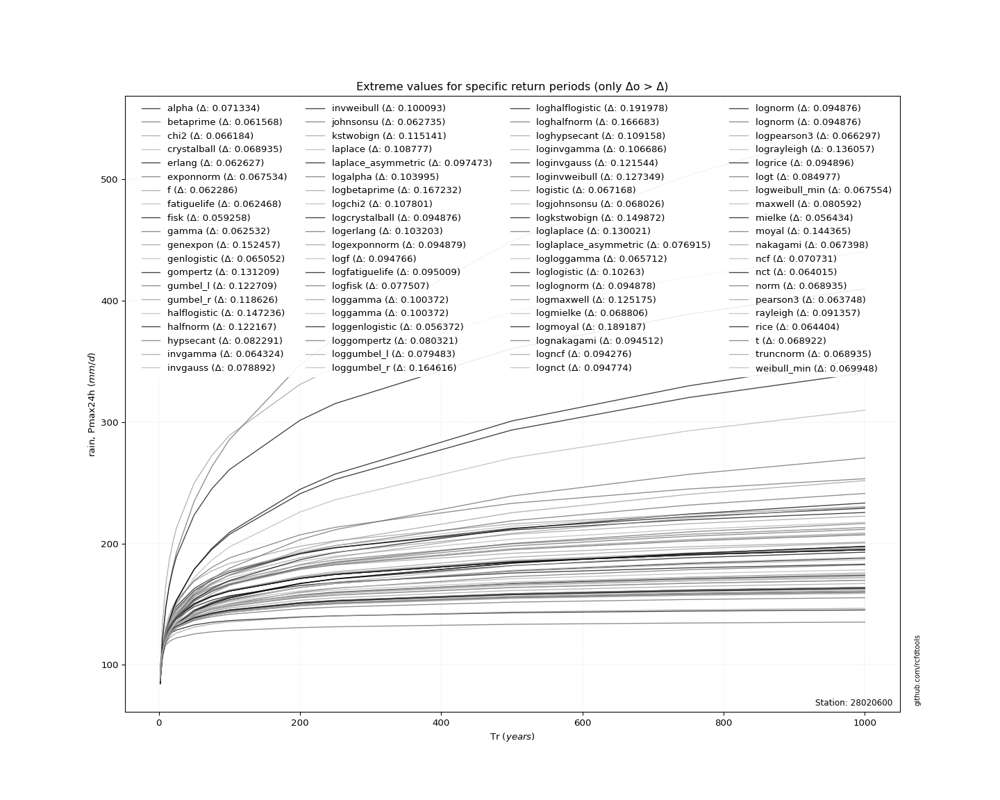</img>

</div>


<div align="center">

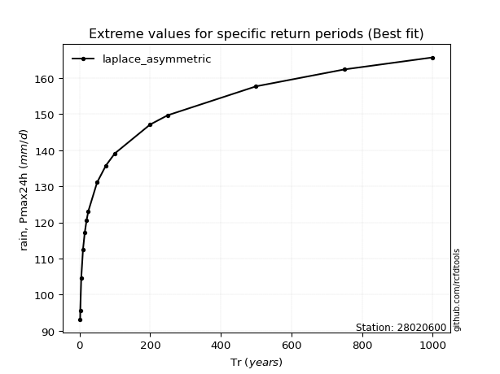</img>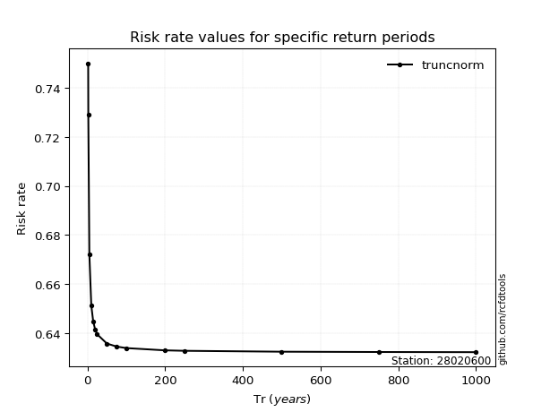</img>

</div>


<sub>**APP DISCLAIMER**: NO WARRANTY - This software is provided by [github.com/rcfdtools](https://github.com/rcfdtools) "as is", without any express or implied warranty, including warranties of merchantability, fitness for a particular purpose, or non-infringement. There is no guarantee that the software will be error-free or operate without interruption. LIMITATION OF LIABILITY - Neither the authors nor copyright holders will be liable for claims or damages arising from the software or its use. You are responsible for determining if the software is appropriate for your use and assume all associated risks, including errors, legal compliance, and data loss. NO PROFESSIONAL ADVICE - The software provides general information and does not offer professional advice. It should not replace consultation with professional advisors.</sub>