<div align="center">


</div>

# PMP Station (Rain, Pmax24h): 2802500079

Probable Maximum Precipitation (PMP) is the greatest amount of rainfall for a specific duration that is meteorologically possible for a given location, acting as a "worst-case" scenario for extreme storms, crucial for designing safety-critical infrastructure like bridges, river deviations, dams, spillways, and nuclear plants to prevent catastrophic failure. PMP is calculated by hydrologists using meteorological data to determine the upper limit of extreme rainfall, often leading to the Probable Maximum Flood (PMF) for flood control design, and is increasingly being studied for climate change impacts. Probable Maximum Precipitation (PMP) is the theoretical upper limit of rainfall, a deterministic estimate for extreme events, while probability distributions (like GEV, Gumbel) describe the likelihood and frequency of various precipitation amounts, including rare ones, showing how often events occur, with PMP representing the extreme end of these distributions, used for critical infrastructure design to ensure safety against the worst conceivable weather, unlike standard statistical forecasts which cover typical probabilities.

The most common probability distributions in hydrology, used for analyzing floods, rainfall, and streamflow, include the Normal, Log-Normal, Gumbel, Gamma (including Log-Pearson Type III), and Generalized Extreme Value (GEV) distributions, often chosen based on the data´s skewness and whether modeling extremes or general conditions, with Gumbel and GEV popular for extreme events like floods, while the Normal distribution serves as a baseline, though often requiring transformations for skewed hydrological data. These distributions help in designing water infrastructure, managing water resources, and forecasting hydrologic events.

> Hydrological data often isn´t perfectly normal (it´s skewed), so different distributions are needed for different applications, such as: **Flood Frequency Analysis**: Using Gumbel, GEV, or Log-Pearson Type III for predicting extreme flood magnitudes and their return periods, **Rainfall Analysis**: Normal for annual totals, but Log-Normal, Weibull, or GEV for intensity or extreme daily rainfall, **Streamflow Modeling**: Gamma and Log-Normal for maximum flows, GEV for minimum flows, and Kappa for daily flows.

<div align="center">

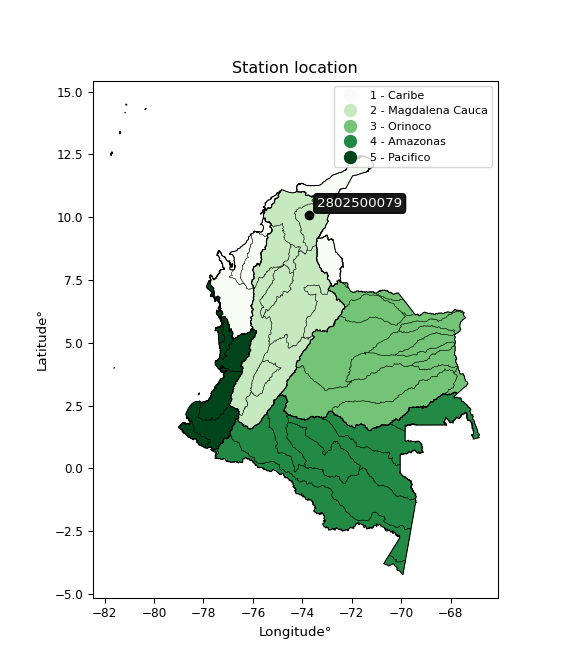</img>

</div>


## A. General information


### 1. General running parameters

• app_version: _v20260103_. • runtime: _2026-01-05 16:20:51.132608_. • Python version: _3.14.0_. • SciPy version: _1.16.3_. • Pandas version: _2.3.3_. • NumPy version: _2.3.5_. • Stations dataset (station_dataset_file): _dataset/pmax24h_in/automatic_colombia_2003_2024.csv_. • Stations catalog (station_catalog_file): _dataset/CNE.xls_. • Minimum year to eval til year_max (date_min): _1900_. • Maximum year to eval since year_min (date_max): _2024_. • Creates, save and include plots into reports (create_plot): _True_. • Plot only fit distributions with Δo > Δ (plot_only_fit): _True_. • Plot only simple graphs avoiding multiple CDFs and multiple Extreme values plots (plot_only_simple): _True_. • Eval low extreme values, if False, evaluates high extreme values (low_extreme): _False_. • Eval every SciPy distribution as logarithmic (pdist_logarithmic_on): _True_. • Standard deviation normalized (ddof): _1.0_. • Return periods to eval in years (Tr): _[2, 2.33, 5, 10, 15, 20, 25, 50, 75, 100, 200, 250, 500, 750, 1000]_. • Minimum data sample per station, 0 means any (minimum_sample): _5_. • Z-Score maximum threshold to adjust a value, 0 means disable (zscore_max): _3.5_. • Z-Score minimum threshold to adjust a value, 0 means disable (zscore_min): _-2.5_. • Avoid zeros, e.g. rain = 0 (avoid_zeros): _True_. • Avoid null values (avoid_nans): _True_. 

[:file_folder:Dataset file](../../dataset/pmax24h_in/automatic_colombia_2003_2024.csv)

> Delta Degrees of Freedom (DDOF): is a parameter used in the formulas for calculating variance and standard deviation. When ddof=0, the divisor is $N$ (the total number of observations) and this is used when your data set is the entire population. When ddof=1, the divisor is $N-1$ and this is used when your data set is a sample drawn from a larger population. Using $N-1$ provides an unbiased estimate of the population variance (known as Bessel´s correction).


### 2. Station info and location

|   id |     CODIGO | NOMBRE                | CATEGORIA               | TECNOLOGIA                | ESTADO   | FECHA_INSTALACION   |   FECHA_SUSPENSION |   ALTITUD |   LATITUD |   LONGITUD | DEPARTAMENTO   | MUNICIPIO   | AREA_OPERATIVA                                         | ENTIDAD                                                     | AREA_HIDROGRAFICA   | ZONA_HIDROGRAFICA   | SUBZONA_HIDROGRAFICA   |   CORRIENTE | Catalogo   |   Version |
|-----:|-----------:|:----------------------|:------------------------|:--------------------------|:---------|:--------------------|-------------------:|----------:|----------:|-----------:|:---------------|:------------|:-------------------------------------------------------|:------------------------------------------------------------|:--------------------|:--------------------|:-----------------------|------------:|:-----------|----------:|
|    0 | 2802500079 | CARACOLI [2802500079] | Climatológica Principal | Automática con Telemetría | Activa   | 23/12/2016          |                nan |       120 |   10.0887 |   -73.7317 | Cesar          | Valledupar  | Area Operativa 05 - Magdalena-Cesar-Guajira-San Andrés | INSTITUTO DE HIDROLOGIA METEOROLOGIA Y ESTUDIOS AMBIENTALES | Magdalena Cauca     | Cesar               | Medio Cesar            |         nan | CNE_IDEAM  |  20251226 |

<div align="center">

Dynamic map: [:earth_americas:Google](http://maps.google.com/maps?q=10.088694444,-73.731666667) [:earth_americas:OSM](https://www.openstreetmap.org/#map=18/10.088694444/-73.731666667&layers=P) [:earth_americas:Bing](https://www.bing.com/maps?cp=10.088694444~-73.731666667&lvl=18) [:earth_americas:Apple](https://maps.apple.com/frame?center=10.088694444%2C-73.731666667&span=0.003%2C0.006)

</div>


<div align="center">

```geojson
{
  "type": "Feature",
  "geometry": {
    "type": "Point", 
    "coordinates": [-73.731666667, 10.088694444]
  }, 
  "properties": {
    "Name": "2802500079"
  }
}
```

</div>


### 3. Discrete values table and plot

<div align="center">

|               |           0 |           1 |            2 |           3 |          4 |          5 |
|:--------------|------------:|------------:|-------------:|------------:|-----------:|-----------:|
| Date          | 2019        | 2020        | 2021         | 2022        | 2023       | 2024       |
| Value         |  114        |   66.4      |   96.6       |   84.2      |   54.2     |  151.2     |
| Value_initial |  114        |   66.4      |   96.6       |   84.2      |   54.2     |  151.2     |
| count         |    6        |    6        |    6         |    6        |    6       |    6       |
| mean          |   94.4333   |   94.4333   |   94.4333    |   94.4333   |   94.4333  |   94.4333  |
| std           |   34.9837   |   34.9837   |   34.9837    |   34.9837   |   34.9837  |   34.9837  |
| zscore        |    0.559307 |   -0.801324 |    0.0619335 |   -0.292517 |   -1.15006 |    1.62266 |


</div>


<div align="center">

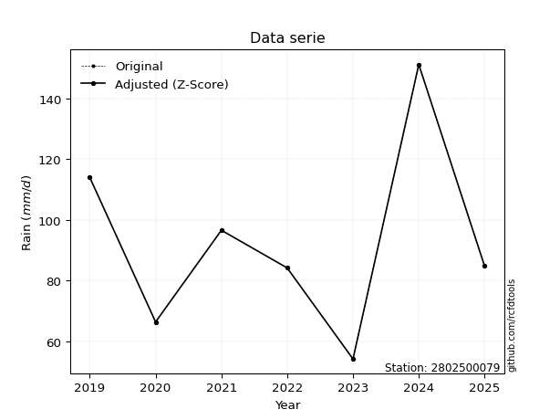</img>

</div>


> The initial value (value_initial) correspond to the initial obtained or null completed value, and value (value) is adjusted only when the initial value is outside the valid range (outlier) definite through the Z-Score value. If Z-Score is active, values out of range or outliers are replaced with the station mean value. A Z-Score (or standard score) measures how many standard deviations a data point is from the mean of a dataset, indicating its relative position; positive scores mean above the mean, negative mean below, and a score of zero is exactly at the mean, allowing for comparison of values from different distributions. It´s calculated using the formula $z=(x–μ)/σ$, where $x$ is the data point, $μ$ is the mean, and $σ$ is the standard deviation, helping identify outliers and understand probability.
>
> <sub>**Note**: In this study, "completing" (filling gaps in) and "extending" (forecasting or lengthening the historical record) rainfall data series are avoided for certain critical analyses because they introduce artificial bias and uncertainty, which can distort the statistics of rare events (extremes), alter day-to-day variability, and compromise the integrity and homogeneity of the original data. Some reasons against Completing/Extending rainfall data are: **Distortion of Extremes and Variability**: The primary issue is that most gap-filling or extension methods rely on averaging or regression with nearby stations, which inherently smooths the data. Rainfall is highly variable in space and time, with a large percentage of zero values and occasional large storms. Infilling methods often underestimate the highest values and overestimate the lowest (zero) values, which severely distorts analyses focused on flood frequency, drought severity, and intensity-duration-frequency (IDF) curves, **Loss of Data Homogeneity**: Infilled or extended data are synthetic estimates, not actual measurements. Combining these estimates with observed data can violate the assumption of data homogeneity, which requires that the data properties do not change over time. Inhomogeneity can lead to incorrect conclusions about long-term trends or changes in climate patterns, **Propagation of Errors**: Errors and biases from the original data (e.g., wind-induced undercatch, instrument errors, site changes) or the data used for imputation can propagate through the analysis, leading to unreliable hydrological models and inaccurate predictions, **Compromised Statistical Integrity**: For statistical analyses, especially those involving the frequency of events, using artificial data can introduce time bias or autocorrelation that doesn´t exist in reality, making it difficult to assess the true probability of events, **Difficulty in Validation**: It is difficult to accurately validate the quality of filled or extended data, especially for past periods where ground-truth measurements are unavailable. The reliability of imputation techniques heavily depends on the density of the surrounding station network and the complexity of the local topography.</sub>


### 4. Active continuous probability distributions from SciPy (44 of 104 available)

A Probability Density Function (PDF) describes the relative likelihood of a continuous random variable falling within a specific range, where the total area under its curve equals 1, and the area over any interval gives the actual probability for that range. Unlike discrete probabilities (like rolling a die), a PDF shows density, not direct probability for a single point (which is zero), with higher points indicating higher likelihood, often visualized as a bell curve for normal distributions.

A log of a probability density function (log-PDF) is simply the logarithm of the PDF´s value, denoted as $log(f(x))$, useful for converting multiplication of probabilities into addition, improving numerical stability with tiny numbers, and connecting to information theory concepts like entropy. Instead of dealing with very small probabilities (e.g., 0.000001), log-PDFs use negative numbers (e.g., $log(0.00001) ≈ -11.51$ that are easier for computers to handle, preventing underflow errors and simplifying complex calculations. In this study, each active probability distribution from SciPy is also evaluated in the $log$ form.

[scipy.stats](https://docs.scipy.org/doc/scipy/reference/stats.html) is a Python´s powerful submodule within the SciPy library for comprehensive statistical analysis, offering over 130 probability distributions (like Normal, Poisson), functions for descriptive stats (mean, variance), hypothesis testing (t-tests, chi-square), random variable generation, and statistical tests, making it essential for data science, modeling, and research. It provides tools to explore, model, and draw conclusions from data efficiently, working seamlessly with NumPy.

<div align="center">

|   id | p_dist             |   n_parameter | fit_method   | label                                                                       | active   | ref                                                                                                        |
|-----:|:-------------------|--------------:|:-------------|:----------------------------------------------------------------------------|:---------|:-----------------------------------------------------------------------------------------------------------|
|    0 | alpha              |             3 | MLE          | Alpha                                                                       | True     | [:mortar_board:](https://docs.scipy.org/doc/scipy/reference/generated/scipy.stats.alpha.html)              |
|    1 | betaprime          |             4 | MLE          | Beta prime                                                                  | True     | [:mortar_board:](https://docs.scipy.org/doc/scipy/reference/generated/scipy.stats.betaprime.html)          |
|    2 | chi2               |             3 | MLE          | Chi²                                                                        | True     | [:mortar_board:](https://docs.scipy.org/doc/scipy/reference/generated/scipy.stats.chi2.html)               |
|    3 | crystalball        |             4 | MLE          | Crystalball                                                                 | True     | [:mortar_board:](https://docs.scipy.org/doc/scipy/reference/generated/scipy.stats.crystalball.html)        |
|    4 | erlang             |             3 | MLE          | Erlang                                                                      | True     | [:mortar_board:](https://docs.scipy.org/doc/scipy/reference/generated/scipy.stats.erlang.html)             |
|    5 | expon              |             2 | MLE          | Exponential                                                                 | True     | [:mortar_board:](https://docs.scipy.org/doc/scipy/reference/generated/scipy.stats.expon.html)              |
|    6 | exponnorm          |             3 | MLE          | Exponentially modified Normal                                               | True     | [:mortar_board:](https://docs.scipy.org/doc/scipy/reference/generated/scipy.stats.exponnorm.html)          |
|    7 | f                  |             4 | MLE          | F                                                                           | True     | [:mortar_board:](https://docs.scipy.org/doc/scipy/reference/generated/scipy.stats.f.html)                  |
|    8 | fatiguelife        |             3 | MLE          | Fatigue-life (Birnbaum-Saunders)                                            | True     | [:mortar_board:](https://docs.scipy.org/doc/scipy/reference/generated/scipy.stats.fatiguelife.html)        |
|    9 | fisk               |             3 | MLE          | Fisk                                                                        | True     | [:mortar_board:](https://docs.scipy.org/doc/scipy/reference/generated/scipy.stats.fisk.html)               |
|   10 | gamma              |             3 | MLE          | Gamma                                                                       | True     | [:mortar_board:](https://docs.scipy.org/doc/scipy/reference/generated/scipy.stats.gamma.html)              |
|   11 | genexpon           |             5 | MLE          | Generalized exponential                                                     | True     | [:mortar_board:](https://docs.scipy.org/doc/scipy/reference/generated/scipy.stats.genexpon.html)           |
|   12 | genlogistic        |             3 | MLE          | Generalized logistic                                                        | True     | [:mortar_board:](https://docs.scipy.org/doc/scipy/reference/generated/scipy.stats.genlogistic.html)        |
|   13 | gibrat             |             2 | MM           | Gibrat                                                                      | True     | [:mortar_board:](https://docs.scipy.org/doc/scipy/reference/generated/scipy.stats.gibrat.html)             |
|   14 | gompertz           |             3 | MLE          | Gompertz (or truncated Gumbel)                                              | True     | [:mortar_board:](https://docs.scipy.org/doc/scipy/reference/generated/scipy.stats.gompertz.html)           |
|   15 | gumbel_l           |             2 | MM           | Gumbel Left Skew                                                            | True     | [:mortar_board:](https://docs.scipy.org/doc/scipy/reference/generated/scipy.stats.gumbel_l.html)           |
|   16 | gumbel_r           |             2 | MM           | Gumbel Right Skew                                                           | True     | [:mortar_board:](https://docs.scipy.org/doc/scipy/reference/generated/scipy.stats.gumbel_r.html)           |
|   17 | halflogistic       |             2 | MM           | Half-logistic                                                               | True     | [:mortar_board:](https://docs.scipy.org/doc/scipy/reference/generated/scipy.stats.halflogistic.html)       |
|   18 | halfnorm           |             2 | MM           | Half Normal                                                                 | True     | [:mortar_board:](https://docs.scipy.org/doc/scipy/reference/generated/scipy.stats.halfnorm.html)           |
|   19 | hypsecant          |             2 | MM           | hyperbolic secant                                                           | True     | [:mortar_board:](https://docs.scipy.org/doc/scipy/reference/generated/scipy.stats.hypsecant.html)          |
|   20 | invgamma           |             3 | MLE          | Inverted gamma                                                              | True     | [:mortar_board:](https://docs.scipy.org/doc/scipy/reference/generated/scipy.stats.invgamma.html)           |
|   21 | invgauss           |             3 | MLE          | Inverse Gaussian                                                            | True     | [:mortar_board:](https://docs.scipy.org/doc/scipy/reference/generated/scipy.stats.invgauss.html)           |
|   22 | invweibull         |             3 | MLE          | Inverted Weibull                                                            | True     | [:mortar_board:](https://docs.scipy.org/doc/scipy/reference/generated/scipy.stats.invweibull.html)         |
|   23 | johnsonsu          |             4 | MLE          | Johnson Su                                                                  | True     | [:mortar_board:](https://docs.scipy.org/doc/scipy/reference/generated/scipy.stats.johnsonsu.html)          |
|   24 | kstwobign          |             2 | MLE          | Limiting distribution of scaled Kolmogorov-Smirnov two-sided test statistic | True     | [:mortar_board:](https://docs.scipy.org/doc/scipy/reference/generated/scipy.stats.kstwobign.html)          |
|   25 | laplace            |             2 | MM           | Laplace                                                                     | True     | [:mortar_board:](https://docs.scipy.org/doc/scipy/reference/generated/scipy.stats.laplace.html)            |
|   26 | laplace_asymmetric |             3 | MLE          | Asymmetric Laplace                                                          | True     | [:mortar_board:](https://docs.scipy.org/doc/scipy/reference/generated/scipy.stats.laplace_asymmetric.html) |
|   27 | loggamma           |             3 | MLE          | Log gamma                                                                   | True     | [:mortar_board:](https://docs.scipy.org/doc/scipy/reference/generated/scipy.stats.loggamma.html)           |
|   28 | logistic           |             2 | MM           | Logistic (or Sech-squared)                                                  | True     | [:mortar_board:](https://docs.scipy.org/doc/scipy/reference/generated/scipy.stats.logistic.html)           |
|   29 | lognorm            |             3 | MLE          | Log Normal                                                                  | True     | [:mortar_board:](https://docs.scipy.org/doc/scipy/reference/generated/scipy.stats.lognorm.html)            |
|   30 | maxwell            |             2 | MM           | Maxwell                                                                     | True     | [:mortar_board:](https://docs.scipy.org/doc/scipy/reference/generated/scipy.stats.maxwell.html)            |
|   31 | mielke             |             4 | MLE          | Mielke Beta-Kappa / Dagum                                                   | True     | [:mortar_board:](https://docs.scipy.org/doc/scipy/reference/generated/scipy.stats.mielke.html)             |
|   32 | moyal              |             2 | MM           | Moyal                                                                       | True     | [:mortar_board:](https://docs.scipy.org/doc/scipy/reference/generated/scipy.stats.moyal.html)              |
|   33 | nakagami           |             3 | MLE          | Nakagami                                                                    | True     | [:mortar_board:](https://docs.scipy.org/doc/scipy/reference/generated/scipy.stats.nakagami.html)           |
|   34 | ncf                |             5 | MLE          | Non-central F distribution                                                  | True     | [:mortar_board:](https://docs.scipy.org/doc/scipy/reference/generated/scipy.stats.ncf.html)                |
|   35 | nct                |             4 | MLE          | Non-central Student’s t                                                     | True     | [:mortar_board:](https://docs.scipy.org/doc/scipy/reference/generated/scipy.stats.nct.html)                |
|   36 | norm               |             2 | MM           | Normal                                                                      | True     | [:mortar_board:](https://docs.scipy.org/doc/scipy/reference/generated/scipy.stats.norm.html)               |
|   37 | pearson3           |             3 | MM           | Pearson type III                                                            | True     | [:mortar_board:](https://docs.scipy.org/doc/scipy/reference/generated/scipy.stats.pearson3.html)           |
|   38 | rayleigh           |             2 | MM           | Rayleigh                                                                    | True     | [:mortar_board:](https://docs.scipy.org/doc/scipy/reference/generated/scipy.stats.rayleigh.html)           |
|   39 | rice               |             3 | MLE          | Rice                                                                        | True     | [:mortar_board:](https://docs.scipy.org/doc/scipy/reference/generated/scipy.stats.rice.html)               |
|   40 | t                  |             3 | MLE          | Student’s t                                                                 | True     | [:mortar_board:](https://docs.scipy.org/doc/scipy/reference/generated/scipy.stats.t.html)                  |
|   41 | truncnorm          |             4 | MLE          | Truncated normal                                                            | True     | [:mortar_board:](https://docs.scipy.org/doc/scipy/reference/generated/scipy.stats.truncnorm.html)          |
|   42 | wald               |             2 | MM           | Wald                                                                        | True     | [:mortar_board:](https://docs.scipy.org/doc/scipy/reference/generated/scipy.stats.wald.html)               |
|   43 | weibull_min        |             3 | MLE          | Weibull minimum                                                             | True     | [:mortar_board:](https://docs.scipy.org/doc/scipy/reference/generated/scipy.stats.weibull_min.html)        |

</div>

> **n_parameter:** # arguments & localization & scale.
>
> **Fit methods:** (MLE) maximum likelihood, (MM) L-moments.
>
>**Inactive** (With the only purpose of prevent loops, zero divisions, infinite values, over high estimated values or horizontal trending for recurrence intervals estimations, the follow distributions were disabled.)**:** foldnorm, gennorm, norminvgauss, powernorm, powerlognorm, skewnorm, genextreme, anglit, arcsine, argus, beta, bradford, burr, burr12, cauchy, cosine, halfcauchy, foldcauchy, skewcauchy, wrapcauchy, dgamma, gengamma, exponweib, exponpow, truncexpon, gausshyper, genhalflogistic, genhyperbolic, geninvgauss, halfgennorm, johnsonsb, kappa4, kappa3, ksone, kstwo, loglaplace, levy, levy_l, levy_stable, ncx2, pareto, genpareto, truncpareto, lomax, powerlaw, rdist, rel_breitwigner, recipinvgauss, semicircular, studentized_range, trapezoid, triang, truncweibull_min, tukeylambda, uniform, loguniform, vonmises, vonmises_line, weibull_max, dweibull, 


## B. Probability (PDF) vs. Empirical (EDF) distributions functions

A continuous probability distribution (CPD) describes probabilities for variables that can take any value within a range (like rain any time), unlike discrete variables with specific outcomes (like temperature). It uses a Probability Density Function (PDF), a curve where the total area under it equals 1, and the probability of the variable falling within an interval (a to b) is found by calculating the area under the curve between those points. A key feature is that the probability of hitting any single exact value is zero, so probabilities are always expressed for ranges, e.g., $P(a ≤ X ≤ b)$.

<div align="center">

Distributions parameters from station values
|    |    station | p_dist                |   n |          loc |          scale | shape                 | shape1             | shape2                | shape3   |
|---:|-----------:|:----------------------|----:|-------------:|---------------:|:----------------------|:-------------------|:----------------------|:---------|
|  0 | 2802500079 | alpha                 |   6 |   -72.1773   |  880.739       | 5.4747806024826655    |                    |                       |          |
|  1 | 2802500079 | betaprime             |   6 |    -0.800201 |    5.47376     | 153.87745628370192    | 9.816446548336188  |                       |          |
|  2 | 2802500079 | chi2                  |   6 |    54.2      |    1.87779     | 0.18955210211872447   |                    |                       |          |
|  3 | 2802500079 | crystalball           |   6 |    94.4333   |   31.9356      | 7232.045075810143     | 3832.3721942729467 |                       |          |
|  4 | 2802500079 | erlang                |   6 |    54.2      |   52.8631      | 0.2575367833000335    |                    |                       |          |
|  5 | 2802500079 | expon                 |   6 |    54.2      |   40.2333      |                       |                    |                       |          |
|  6 | 2802500079 | exponnorm             |   6 |    54.1545   |    0.0137054   | 2911.888240859387     |                    |                       |          |
|  7 | 2802500079 | f                     |   6 |    -0.917324 |   85.8802      | 340.10793812043397    | 19.57406344531394  |                       |          |
|  8 | 2802500079 | fatiguelife           |   6 |    54.2      |    1.85026e-05 | 1476.985416387969     |                    |                       |          |
|  9 | 2802500079 | fisk                  |   6 |    36.2449   |   50.6279      | 2.7532410179666607    |                    |                       |          |
| 10 | 2802500079 | gamma                 |   6 |    54.2      |   34.2715      | 0.8985049081211645    |                    |                       |          |
| 11 | 2802500079 | genexpon              |   6 |    54.2      |    5.28494e+06 | 1879291.7934725145    | 10384.933530169768 | 2508454.186629177     |          |
| 12 | 2802500079 | genlogistic           |   6 |   -94.8295   |   25.5836      | 906.6140208961476     |                    |                       |          |
| 13 | 2802500079 | gibrat                |   6 |    70.0705   |   14.7768      |                       |                    |                       |          |
| 14 | 2802500079 | gompertz              |   6 |    54.2      |   68.0761      | 0.9654995011655927    |                    |                       |          |
| 15 | 2802500079 | gumbel_l              |   6 |   108.806    |   24.9001      |                       |                    |                       |          |
| 16 | 2802500079 | gumbel_r              |   6 |    80.0606   |   24.9001      |                       |                    |                       |          |
| 17 | 2802500079 | halflogistic          |   6 |    56.5822   |   27.3038      |                       |                    |                       |          |
| 18 | 2802500079 | halfnorm              |   6 |    52.1631   |   52.9779      |                       |                    |                       |          |
| 19 | 2802500079 | hypsecant             |   6 |    94.4333   |   20.3309      |                       |                    |                       |          |
| 20 | 2802500079 | invgamma              |   6 |    -1.30163  |  802.434       | 9.35215825532489      |                    |                       |          |
| 21 | 2802500079 | invgauss              |   6 |    30.042    |  204.37        | 0.3149694065109694    |                    |                       |          |
| 22 | 2802500079 | invweibull            |   6 |    54.2      |    1.43706     | 0.0543708119330847    |                    |                       |          |
| 23 | 2802500079 | johnsonsu             |   6 |    29.9078   |    1.85163     | -7.778144754799953    | 1.8917242522619047 |                       |          |
| 24 | 2802500079 | kstwobign             |   6 |    -9.90635  |  119.592       |                       |                    |                       |          |
| 25 | 2802500079 | laplace               |   6 |    94.4333   |   22.5819      |                       |                    |                       |          |
| 26 | 2802500079 | laplace_asymmetric    |   6 |    84.2      |   24.5981      | 0.8133936466931324    |                    |                       |          |
| 27 | 2802500079 | loggamma              |   6 | -8387.52     | 1181.75        | 1309.8380423684816    |                    |                       |          |
| 28 | 2802500079 | logistic              |   6 |    94.4333   |   17.607       |                       |                    |                       |          |
| 29 | 2802500079 | lognorm               |   6 |    54.2      |    0.0928222   | 13.521271483753873    |                    |                       |          |
| 30 | 2802500079 | maxwell               |   6 |    18.7593   |   47.4217      |                       |                    |                       |          |
| 31 | 2802500079 | mielke                |   6 |     0.724307 |   30.7888      | 67.11226340698468     | 3.3404661771231705 |                       |          |
| 32 | 2802500079 | moyal                 |   6 |    76.1705   |   14.3761      |                       |                    |                       |          |
| 33 | 2802500079 | nakagami              |   6 |    54.2      |   61.2143      | 0.21619929534300691   |                    |                       |          |
| 34 | 2802500079 | ncf                   |   6 |     1.12082  |   38.3056      | 224.70880240100507    | 18.706595788835273 | 265.9315813638833     |          |
| 35 | 2802500079 | nct                   |   6 |    -1.35266  |   11.1592      | 6.060873144803974     | 7.517645564536814  |                       |          |
| 36 | 2802500079 | norm                  |   6 |    94.4333   |   31.9356      |                       |                    |                       |          |
| 37 | 2802500079 | pearson3              |   6 |    94.4333   |   31.9357      | 0.5229547869166222    |                    |                       |          |
| 38 | 2802500079 | rayleigh              |   6 |    33.3386   |   48.7466      |                       |                    |                       |          |
| 39 | 2802500079 | rice                  |   6 |    38.7109   |   45.414       | 0.0016272343111218008 |                    |                       |          |
| 40 | 2802500079 | t                     |   6 |    94.3399   |   31.9068      | 18856.789127122778    |                    |                       |          |
| 41 | 2802500079 | truncnorm             |   6 |    94.4333   |   31.9356      | -1462.627378666226    | 1630.8271440670464 |                       |          |
| 42 | 2802500079 | wald                  |   6 |    62.4977   |   31.9356      |                       |                    |                       |          |
| 43 | 2802500079 | weibull_min           |   6 |    54.2      |   25.2069      | 0.6194659143571395    |                    |                       |          |
| 44 | 2802500079 | logalpha              |   6 |    -2.92797  |  162.659       | 21.974887209634616    |                    |                       |          |
| 45 | 2802500079 | logbetaprime          |   6 |    -1.17451  |   10.674       | 430.9329800327607     | 812.891352422499   |                       |          |
| 46 | 2802500079 | logchi2               |   6 |     3.99268  |    0.994114    | 1.0236524448376882    |                    |                       |          |
| 47 | 2802500079 | logcrystalball        |   6 |     4.49116  |    0.337562    | 6.454345214238838     | 76.68767210336799  |                       |          |
| 48 | 2802500079 | logerlang             |   6 |    -6.94924  |    0.0099656   | 1147.9731685878555    |                    |                       |          |
| 49 | 2802500079 | logexpon              |   6 |     3.99268  |    0.498478    |                       |                    |                       |          |
| 50 | 2802500079 | logexponnorm          |   6 |     4.47452  |    0.337152    | 0.049361145130899106  |                    |                       |          |
| 51 | 2802500079 | logf                  |   6 |    -3.51426  |    7.99655     | 2987.2395027529556    | 1803.8346654210686 |                       |          |
| 52 | 2802500079 | logfatiguelife        |   6 |    -0.901205 |    5.38178     | 0.06270260433540259   |                    |                       |          |
| 53 | 2802500079 | logfisk               |   6 |    -0.133693 |    4.61655     | 22.766364026914676    |                    |                       |          |
| 54 | 2802500079 | loggamma              |   6 |    -6.70494  |    0.0101628   | 1101.65656484181      |                    |                       |          |
| 55 | 2802500079 | loggenexpon           |   6 |     3.99159  |    0.00881196  | 0.009644509092776171  | 3.101764263497449  | 6.238483378020492e-05 |          |
| 56 | 2802500079 | loggenlogistic        |   6 |     2.96139  |    0.302033    | 91.74718631063058     |                    |                       |          |
| 57 | 2802500079 | loggibrat             |   6 |     4.23368  |    0.15617     |                       |                    |                       |          |
| 58 | 2802500079 | loggompertz           |   6 |     3.99268  |    0.594759    | 0.5850063743085607    |                    |                       |          |
| 59 | 2802500079 | loggumbel_l           |   6 |     4.64308  |    0.263196    |                       |                    |                       |          |
| 60 | 2802500079 | loggumbel_r           |   6 |     4.33924  |    0.263196    |                       |                    |                       |          |
| 61 | 2802500079 | loghalflogistic       |   6 |     4.09099  |    0.288655    |                       |                    |                       |          |
| 62 | 2802500079 | loghalfnorm           |   6 |     4.04438  |    0.559956    |                       |                    |                       |          |
| 63 | 2802500079 | loghypsecant          |   6 |     4.49116  |    0.214898    |                       |                    |                       |          |
| 64 | 2802500079 | loginvgamma           |   6 |     0.188097 |  691.522       | 161.7583110078658     |                    |                       |          |
| 65 | 2802500079 | loginvgauss           |   6 |     2.56011  |   59.5709      | 0.03241141368514289   |                    |                       |          |
| 66 | 2802500079 | loginvweibull         |   6 | -6179.77     | 6184.1         | 20390.811969918155    |                    |                       |          |
| 67 | 2802500079 | logjohnsonsu          |   6 |    -1.87685  |    2.79975     | -32.10579318263625    | 20.59435854333563  |                       |          |
| 68 | 2802500079 | logkstwobign          |   6 |     3.2691   |    1.39598     |                       |                    |                       |          |
| 69 | 2802500079 | loglaplace            |   6 |     4.49116  |    0.238692    |                       |                    |                       |          |
| 70 | 2802500079 | loglaplace_asymmetric |   6 |     4.57058  |    0.275452    | 1.1544939588022216    |                    |                       |          |
| 71 | 2802500079 | logloggamma           |   6 |   -44.7927   |    7.84079     | 537.2102268239344     |                    |                       |          |
| 72 | 2802500079 | loglogistic           |   6 |     4.49116  |    0.186108    |                       |                    |                       |          |
| 73 | 2802500079 | loglognorm            |   6 |     3.99268  |    0.0016114   | 12.94309412478452     |                    |                       |          |
| 74 | 2802500079 | logmaxwell            |   6 |     3.69128  |    0.50125     |                       |                    |                       |          |
| 75 | 2802500079 | logmielke             |   6 |   -16.9361   |   20.9331      | 328.8091983979673     | 80.58726469505137  |                       |          |
| 76 | 2802500079 | logmoyal              |   6 |     4.29812  |    0.151956    |                       |                    |                       |          |
| 77 | 2802500079 | lognakagami           |   6 |     3.99268  |    0.607758    | 0.35654314619881744   |                    |                       |          |
| 78 | 2802500079 | logncf                |   6 |    -0.412383 |    3.30044     | 487.3188675643719     | 1852.4542834537024 | 235.90460862129112    |          |
| 79 | 2802500079 | lognct                |   6 |     0.933066 |    0.307794    | 337.81713275070126    | 11.534278611512143 |                       |          |
| 80 | 2802500079 | lognorm               |   6 |     4.49116  |    0.337562    |                       |                    |                       |          |
| 81 | 2802500079 | logpearson3           |   6 |     4.49116  |    0.337562    | 0.05241812898955974   |                    |                       |          |
| 82 | 2802500079 | lograyleigh           |   6 |     3.84538  |    0.515254    |                       |                    |                       |          |
| 83 | 2802500079 | logrice               |   6 |     3.82384  |    0.408214    | 1.1645504358288805    |                    |                       |          |
| 84 | 2802500079 | logt                  |   6 |     4.49116  |    0.337561    | 407254366.25460607    |                    |                       |          |
| 85 | 2802500079 | logtruncnorm          |   6 |    -0.178518 |    1.37529     | 3.032959075081704     | 3.778933988712091  |                       |          |
| 86 | 2802500079 | logwald               |   6 |     4.15355  |    0.337604    |                       |                    |                       |          |
| 87 | 2802500079 | logweibull_min        |   6 |     3.8515   |    0.720382    | 1.9594150066279235    |                    |                       |          |

</div>

> **loc** (Location parameter): This shifts the distribution along the x-axis. For many common distributions, like the normal (Gaussian) distribution, loc represents the mean $μ$. For others, like the uniform distribution, it might represent the minimum value, or for the beta distribution, the left end of the support interval.
>
> **scale** (Scale parameter): This determines the width or spread of the distribution. For the normal distribution, scale represents the standard deviation $σ$. For a uniform distribution, it defines the length of the interval (from $loc$ to $loc + scale$).
>
> **shape** (Shape parameters): Refers to parameters that define the specific form of a probability distribution, distinct from its location (loc) and scale (scale). These parameters are required arguments for most distribution functions. For example, a normal (Gaussian) distribution is fully defined by its location (mean) and scale (standard deviation), so it has no specific shape parameters beyond loc and scale. However, other distributions have intrinsic properties that need specification, as Gamma distribution that takes a shape parameter, often named $a$ or $alpha$.


### 0. Cumulative distribution values - CDF (88 evaluated)

Cumulative Distribution Function (CDF), denoted as $F$<sub>$X$</sub>$(x)$, is a function that gives the probability that a random variable $X$ will take a value less than or equal to a specific value, $x$ (i.e., $(P(X≥x)$. It essentially "accumulates" probabilities from a given point up to the far right (positive infinity), providing a complete picture of the distribution´s probabilities for both discrete (like rain) and continuous (like temperature) variables, helping to find probabilities over ranges or above certain values. Each station is evaluated separately ordering the $x$ values ascending, calculating the CDF and PDF values for the activated distributions and their logarithmic forms.

<div align="center">

CDF ordered by x ascending and calculating $log(f(x))$ separately
|   id |    Station |   date |     x |   count |    mean |     std |     zscore |   Value_initial |    station |   m |     alpha |   alpha_pdf |   betaprime |   betaprime_pdf |      chi2 |    chi2_pdf |   crystalball |   crystalball_pdf |      erlang |   erlang_pdf |    expon |   expon_pdf |   exponnorm |   exponnorm_pdf |         f |      f_pdf |   fatiguelife |   fatiguelife_pdf |      fisk |   fisk_pdf |      gamma |   gamma_pdf |   genexpon |   genexpon_pdf |   genlogistic |   genlogistic_pdf |   gibrat |   gibrat_pdf |    gompertz |   gompertz_pdf |   gumbel_l |   gumbel_l_pdf |   gumbel_r |   gumbel_r_pdf |   halflogistic |   halflogistic_pdf |   halfnorm |   halfnorm_pdf |   hypsecant |   hypsecant_pdf |   invgamma |   invgamma_pdf |   invgauss |   invgauss_pdf |   invweibull |   invweibull_pdf |   johnsonsu |   johnsonsu_pdf |   kstwobign |   kstwobign_pdf |   laplace |   laplace_pdf |   laplace_asymmetric |   laplace_asymmetric_pdf |   loggamma |   loggamma_pdf |   logistic |   logistic_pdf |   lognorm |   lognorm_pdf |   maxwell |   maxwell_pdf |    mielke |   mielke_pdf |     moyal |   moyal_pdf |    nakagami |   nakagami_pdf |       ncf |    ncf_pdf |       nct |    nct_pdf |     norm |   norm_pdf |   pearson3 |   pearson3_pdf |   rayleigh |   rayleigh_pdf |      rice |   rice_pdf |        t |      t_pdf |   truncnorm |   truncnorm_pdf |      wald |   wald_pdf |   weibull_min |   weibull_min_pdf |   logalpha |   logalpha_pdf |   logbetaprime |   logbetaprime_pdf |     logchi2 |   logchi2_pdf |   logcrystalball |   logcrystalball_pdf |   logerlang |   logerlang_pdf |   logexpon |   logexpon_pdf |   logexponnorm |   logexponnorm_pdf |      logf |   logf_pdf |   logfatiguelife |   logfatiguelife_pdf |   logfisk |   logfisk_pdf |   loggenexpon |   loggenexpon_pdf |   loggenlogistic |   loggenlogistic_pdf |   loggibrat |   loggibrat_pdf |   loggompertz |   loggompertz_pdf |   loggumbel_l |   loggumbel_l_pdf |   loggumbel_r |   loggumbel_r_pdf |   loghalflogistic |   loghalflogistic_pdf |   loghalfnorm |   loghalfnorm_pdf |   loghypsecant |   loghypsecant_pdf |   loginvgamma |   loginvgamma_pdf |   loginvgauss |   loginvgauss_pdf |   loginvweibull |   loginvweibull_pdf |   logjohnsonsu |   logjohnsonsu_pdf |   logkstwobign |   logkstwobign_pdf |   loglaplace |   loglaplace_pdf |   loglaplace_asymmetric |   loglaplace_asymmetric_pdf |   logloggamma |   logloggamma_pdf |   loglogistic |   loglogistic_pdf |   loglognorm |   loglognorm_pdf |   logmaxwell |   logmaxwell_pdf |   logmielke |   logmielke_pdf |   logmoyal |   logmoyal_pdf |   lognakagami |   lognakagami_pdf |    logncf |   logncf_pdf |    lognct |   lognct_pdf |   logpearson3 |   logpearson3_pdf |   lograyleigh |   lograyleigh_pdf |   logrice |   logrice_pdf |      logt |   logt_pdf |   logtruncnorm |   logtruncnorm_pdf |   logwald |   logwald_pdf |   logweibull_min |   logweibull_min_pdf |
|-----:|-----------:|-------:|------:|--------:|--------:|--------:|-----------:|----------------:|-----------:|----:|----------:|------------:|------------:|----------------:|----------:|------------:|--------------:|------------------:|------------:|-------------:|---------:|------------:|------------:|----------------:|----------:|-----------:|--------------:|------------------:|----------:|-----------:|-----------:|------------:|-----------:|---------------:|--------------:|------------------:|---------:|-------------:|------------:|---------------:|-----------:|---------------:|-----------:|---------------:|---------------:|-------------------:|-----------:|---------------:|------------:|----------------:|-----------:|---------------:|-----------:|---------------:|-------------:|-----------------:|------------:|----------------:|------------:|----------------:|----------:|--------------:|---------------------:|-------------------------:|-----------:|---------------:|-----------:|---------------:|----------:|--------------:|----------:|--------------:|----------:|-------------:|----------:|------------:|------------:|---------------:|----------:|-----------:|----------:|-----------:|---------:|-----------:|-----------:|---------------:|-----------:|---------------:|----------:|-----------:|---------:|-----------:|------------:|----------------:|----------:|-----------:|--------------:|------------------:|-----------:|---------------:|---------------:|-------------------:|------------:|--------------:|-----------------:|---------------------:|------------:|----------------:|-----------:|---------------:|---------------:|-------------------:|----------:|-----------:|-----------------:|---------------------:|----------:|--------------:|--------------:|------------------:|-----------------:|---------------------:|------------:|----------------:|--------------:|------------------:|--------------:|------------------:|--------------:|------------------:|------------------:|----------------------:|--------------:|------------------:|---------------:|-------------------:|--------------:|------------------:|--------------:|------------------:|----------------:|--------------------:|---------------:|-------------------:|---------------:|-------------------:|-------------:|-----------------:|------------------------:|----------------------------:|--------------:|------------------:|--------------:|------------------:|-------------:|-----------------:|-------------:|-----------------:|------------:|----------------:|-----------:|---------------:|--------------:|------------------:|----------:|-------------:|----------:|-------------:|--------------:|------------------:|--------------:|------------------:|----------:|--------------:|----------:|-----------:|---------------:|-------------------:|----------:|--------------:|-----------------:|---------------------:|
|    0 | 2802500079 |   2023 |  54.2 |       6 | 94.4333 | 34.9837 | -1.15006   |            54.2 | 2802500079 |   1 | 0.0675426 |  0.00720302 |   0.0624187 |      0.00770743 | 0.0421981 | 5.62862e+11 |      0.103866 |        0.0056492  | 9.03436e-05 |  3.27451e+09 | 0        |  0.024855   |  0.00113897 |      0.0250173  | 0.0623697 | 0.00771097 |     0.0439769 |       2.7249e+10  | 0.0544704 | 0.00789755 | 8.4256e-15 |  1.06545    | 5.4531e-09 |    0.355594    |     0.0690729 |        0.00720508 | 0        |   0          | 4.90658e-11 |     0.0141826  |   0.105581 |     0.00400802 |  0.0592978 |     0.00672797 |       0        |         0          |  0.0306703 |     0.0150496  |   0.0874378 |      0.00424686 |  0.0616075 |     0.00776552 |  0.0527277 |     0.00921786 |   0.00249003 |      1.14236e+11 |   0.0553897 |      0.00868607 |   0.0638622 |      0.00755812 | 0.0841791 |    0.00372772 |            0.0888973 |               0.00444311 |  0.0681788 |       0.402077 |   0.092367 |     0.00476147 | 0.0698778 |      0.397224 | 0.0941446 |    0.00710771 | 0.0523478 |   0.0089713  | 0.0317828 |  0.00594349 | 1.01123e-07 |    6.15381e+06 | 0.0615943 | 0.0077663  | 0.0601799 | 0.00769284 | 0.103866 | 0.0056492  |  0.0896433 |     0.00663519 |  0.0875058 |     0.00801099 | 0.0565031 | 0.00708574 | 0.104197 | 0.00566692 |    0.103866 |      0.0056492  | 0         | 0          |   2.32996e-10 |    20313.1        |  0.0631936 |       0.421276 |      0.0654261 |           0.409796 | 1.10065e-08 |   1.26853e+07 |        0.0698778 |             0.397224 |   0.0683792 |        0.40232  |   0        |       2.00611  |      0.0698717 |           0.397241 | 0.0661129 |   0.407819 |        0.0647356 |             0.412359 | 0.0720571 |      0.368912 |    0.00119785 |          1.09589  |        0.0513384 |             0.496632 |    0        |        0        |   1.05753e-08 |          0.983603 |     0.0810163 |          0.294997 |     0.0239642 |          0.339729 |          0        |              0        |      0        |          0        |      0.0623876 |           0.288457 |     0.0620105 |          0.424891 |     0.0568894 |          0.44982  |       0.0515266 |            0.503888 |      0.0663515 |           0.407998 |      0.0490036 |           0.554245 |    0.0619443 |         0.259516 |               0.0928272 |                    0.291903 |     0.0718513 |          0.396368 |     0.0642576 |          0.323085 |    0.0127289 |      5.71873e+12 |    0.0519366 |         0.480347 |   0.0571497 |        0.452652 | 0.00629574 |       0.171774 |   1.25087e-11 |      20085.5      | 0.0654169 |     0.410452 | 0.0674233 |     0.403376 |     0.0684506 |          0.401392 |     0.0400381 |          0.532606 | 0.0428114 |      0.499907 | 0.0698777 |   0.397224 |    2.70342e-06 |           2.57709  | 0         |      0        |         0.040204 |             0.546613 |
|    1 | 2802500079 |   2020 |  66.4 |       6 | 94.4333 | 34.9837 | -0.801324  |            66.4 | 2802500079 |   2 | 0.189213  |  0.0124139  |   0.193902  |      0.0132963  | 0.998919  | 0.000353769 |      0.190024 |        0.00849792 | 0.723929    |  0.0126959   | 0.261572 |  0.0183536  |  0.26423    |      0.0184363  | 0.193941  | 0.0133053  |     0.708764  |       0.00772813  | 0.193631  | 0.0142558  | 0.349385   |  0.0212166  | 0.987197   |    0.00457767  |     0.190163  |        0.0123266  | 0        |   0          | 0.172629    |     0.0140374  |   0.166505 |     0.00609646 |  0.177133  |     0.0123128  |       0.177875 |         0.0177331  |  0.211865  |     0.0145266  |   0.157076  |      0.00741623 |  0.194511  |     0.0134379  |  0.210412  |     0.015278   |   0.410567   |      0.00162887  |   0.204289  |      0.0146795  |   0.189743  |      0.0125839  | 0.144489  |    0.00639843 |            0.16357   |               0.00817526 |  0.191342  |       0.822489 |   0.169079 |     0.00797928 | 0.19071   |      0.805742 | 0.200989  |    0.010252   | 0.214623  |   0.0161717  | 0.160113  |  0.014534   | 0.390554    |    0.0137448   | 0.194517  | 0.0134398  | 0.194504  | 0.0137311  | 0.190024 | 0.00849792 |  0.193076  |     0.010211   |  0.205465  |     0.0110547  | 0.169617  | 0.0111482  | 0.190609 | 0.00852131 |    0.190024 |      0.00849792 | 0.0109153 | 0.012495   |   0.471612    |        0.0171151  |  0.195257  |       0.884441 |      0.192409  |           0.849726 | 0.339031    |   0.798544    |        0.19071   |             0.805743 |   0.191501  |        0.821773 |   0.334537 |       1.33499  |      0.190712  |           0.805803 | 0.19211   |   0.842695 |        0.192837  |             0.857171 | 0.188147  |      0.803233 |    0.240639   |          1.21706  |        0.216938  |             1.08851  |    0        |        0        |   0.211798    |          1.09069  |     0.166997  |          0.578295 |     0.178127  |          1.16763  |          0.179402 |              1.67642  |      0.213017 |          1.37382  |      0.157675  |           0.704079 |     0.19583   |          0.896287 |     0.201284  |          0.961724 |       0.219058  |            1.09678  |      0.192284  |           0.8419   |      0.229599  |           1.13992  |    0.145006  |         0.6075   |               0.175764  |                    0.552703 |     0.191549  |          0.795889 |     0.169724  |          0.757184 |    0.645668  |      0.141587    |    0.201816  |         0.971531 |   0.209372  |        1.0371   | 0.161287   |       1.37875  |   0.352035    |          1.20069  | 0.192583  |     0.850653 | 0.191477  |     0.829566 |     0.191246  |          0.819712 |     0.206357  |          1.04722  | 0.195991  |      0.97375  | 0.19071   |   0.805744 |    0.4204      |           1.62914  | 0.0119987 |      1.24656  |         0.209616 |             1.05843  |
|    2 | 2802500079 |   2022 |  84.2 |       6 | 94.4333 | 34.9837 | -0.292517  |            84.2 | 2802500079 |   3 | 0.43748   |  0.0141917  |   0.450122  |      0.0141306  | 0.999995  | 1.36964e-06 |      0.374319 |        0.0118669  | 0.859566    |  0.00464837  | 0.525574 |  0.0117919  |  0.52898    |      0.0118024  | 0.450263  | 0.0141318  |     0.805689  |       0.00395305  | 0.462737  | 0.0142735  | 0.630087   |  0.01152    | 0.999978   |    7.88076e-06 |     0.436856  |        0.0141347  | 0.482136 |   0.0282063  | 0.414133    |     0.0129105  |   0.310818 |     0.0103031  |  0.428767  |     0.0145822  |       0.466627 |         0.0143251  |  0.454637  |     0.012544   |   0.346148  |      0.013863   |  0.452255  |     0.0141416  |  0.478457  |     0.0136458  |   0.428393   |      0.000658168 |   0.469901  |      0.0138529  |   0.434395  |      0.0137779  | 0.317807  |    0.0140735  |            0.398174  |               0.0199008  |  0.435898  |       1.1714   |   0.358655 |     0.0130642  | 0.431831  |      1.16454  | 0.407501  |    0.0123647  | 0.493965  |   0.0136997  | 0.449446  |  0.0157676  | 0.571922    |    0.00789804  | 0.452283  | 0.0141421  | 0.45766   | 0.0143223  | 0.374319 | 0.0118669  |  0.404416  |     0.0128392  |  0.419767  |     0.0124195  | 0.394471  | 0.0133555  | 0.375321 | 0.0118875  |    0.374319 |      0.0118669  | 0.502465  | 0.0206766  |   0.671712    |        0.00755063 |  0.451453  |       1.18867  |      0.442242  |           1.18002  | 0.484849    |   0.485496    |        0.431832  |             1.16454  |   0.435785  |        1.1701   |   0.586756 |       0.829011 |      0.431846  |           1.16457  | 0.44057   |   1.17761  |        0.443919  |             1.18093  | 0.438746  |      1.22757  |    0.516192   |          1.06111  |        0.496959  |             1.14615  |    0.59675  |        1.94047  |   0.473729    |          1.08566  |     0.362676  |          1.09082  |     0.496693  |          1.3206   |          0.531872 |              1.24216  |      0.512548 |          1.11967  |      0.415166  |           1.42892  |     0.453956  |          1.18985  |     0.46821   |          1.1842   |       0.499626  |            1.14311  |      0.440526  |           1.1769   |      0.509887  |           1.1162   |    0.392199  |         1.64311  |               0.370915  |                    1.16637  |     0.4303    |          1.15802  |     0.42276   |          1.31125  |    0.667674  |      0.063695    |    0.466234  |         1.16617  |   0.492186  |        1.20783  | 0.52141    |       1.37056  |   0.589164    |          0.829536 | 0.44249   |     1.17951  | 0.437576  |     1.17467  |     0.435168  |          1.16969  |     0.478337  |          1.15501  | 0.459049  |      1.16397  | 0.431832  |   1.16454  |    0.716835    |           0.926713 | 0.58978   |      1.53986  |         0.481963 |             1.14769  |
|    3 | 2802500079 |   2021 |  96.6 |       6 | 94.4333 | 34.9837 |  0.0619335 |            96.6 | 2802500079 |   4 | 0.60119   |  0.0119358  |   0.610164  |      0.011486   | 1         | 3.68698e-08 |      0.527045 |        0.0124634  | 0.904768    |  0.00284366  | 0.651408 |  0.00866426 |  0.654777   |      0.00865032 | 0.610287  | 0.0114826  |     0.8473    |       0.00285167  | 0.61866   | 0.010762   | 0.747871   |  0.00774582 | 1          |    9.35454e-08 |     0.600411  |        0.0119689  | 0.720793 |   0.0126712  | 0.565859    |     0.0114784  |   0.458007 |     0.0133321  |  0.597698  |     0.012354   |       0.62479  |         0.011164   |  0.598408  |     0.0105942  |   0.533858  |      0.015568   |  0.611923  |     0.0114254  |  0.628216  |     0.0104845  |   0.435214   |      0.000464283 |   0.623026  |      0.0107694  |   0.594133  |      0.0117762  | 0.545744  |    0.0201159  |            0.600612  |               0.0132067  |  0.597019  |       1.14212  |   0.530725 |     0.0141452  | 0.593002  |      1.14957  | 0.558818  |    0.0117854  | 0.639582  |   0.0098497  | 0.623158  |  0.0120852  | 0.65829     |    0.00616233  | 0.611952  | 0.0114251  | 0.617833  | 0.0113396  | 0.527045 | 0.0124634  |  0.561439  |     0.0121769  |  0.569192  |     0.0114692  | 0.556219  | 0.0124562  | 0.528234 | 0.0124719  |    0.527045 |      0.0124634  | 0.693846  | 0.0112963  |   0.748441    |        0.00507218 |  0.611355  |       1.10882  |      0.602931  |           1.12784  | 0.545074    |   0.396849    |        0.593003  |             1.14957  |   0.596753  |        1.14129  |   0.686302 |       0.629312 |      0.593017  |           1.14954  | 0.601324  |   1.13105  |        0.604303  |             1.12284  | 0.60552   |      1.15599  |    0.650348   |          0.886142 |        0.641263  |             0.941068 |    0.779005 |        0.881155 |   0.617397    |          0.994376 |     0.531969  |          1.35009  |     0.660201  |          1.04152  |          0.680865 |              0.929178 |      0.652636 |          0.916287 |      0.615048  |           1.38551  |     0.613383  |          1.10137  |     0.623613  |          1.05322  |       0.643309  |            0.93568  |      0.601229  |           1.13102  |      0.6503    |           0.918882 |    0.641518  |         1.50186  |               0.571341  |                    1.79663  |     0.591171  |          1.15188  |     0.605095  |          1.28396  |    0.675256  |      0.0481028   |    0.620134  |         1.05155  |   0.645586  |        1.00378  | 0.683279   |       0.985594 |   0.691943    |          0.670435 | 0.603053  |     1.12662  | 0.598669  |     1.13845  |     0.596201  |          1.14259  |     0.628594  |          1.01452  | 0.61385   |      1.06707  | 0.593003  |   1.14958  |    0.824856    |           0.659632 | 0.747513  |      0.841664 |         0.630815 |             1.00243  |
|    4 | 2802500079 |   2019 | 114   |       6 | 94.4333 | 34.9837 |  0.559307  |           114   | 2802500079 |   5 | 0.771602  |  0.00768533 |   0.772719  |      0.00730656 | 1         | 2.62639e-10 |      0.729959 |        0.0103543  | 0.941965    |  0.00158509  | 0.773799 |  0.00562224 |  0.776771   |      0.00559348 | 0.772768  | 0.00730224 |     0.888234  |       0.00193563  | 0.765183  | 0.00636224 | 0.851785   |  0.0045021  | 1          |    1.85801e-10 |     0.772248  |        0.00780027 | 0.862039 |   0.00501632 | 0.742971    |     0.00877476 |   0.708274 |     0.0144332  |  0.77423   |     0.00795638 |       0.782374 |         0.00710325 |  0.756879  |     0.00762084 |   0.767718  |      0.0104377  |  0.773234  |     0.00723724 |  0.775311  |     0.00662339 |   0.441972   |      0.000328111 |   0.77393   |      0.00676328 |   0.766682  |      0.00804657 | 0.789785  |    0.00930902 |            0.775346  |               0.00742871 |  0.767896  |       0.891792 |   0.752371 |     0.0105815  | 0.766053  |      0.908097 | 0.74214   |    0.00903176 | 0.773172  |   0.00582816 | 0.788481  |  0.00718182 | 0.750775    |    0.00457534  | 0.773257  | 0.00723673 | 0.776007  | 0.00701088 | 0.729959 | 0.0103543  |  0.748227  |     0.00903419 |  0.745647  |     0.00863405 | 0.746961  | 0.00923718 | 0.731106 | 0.0103413  |    0.729959 |      0.0103543  | 0.831752  | 0.00542953 |   0.818718    |        0.00320688 |  0.773857  |       0.832889 |      0.770108  |           0.865487 | 0.60431     |   0.322866    |        0.766053  |             0.908096 |   0.767569  |        0.891875 |   0.774982 |       0.45141  |      0.766059  |           0.908031 | 0.769363  |   0.871721 |        0.770388  |             0.858445 | 0.771403  |      0.824377 |    0.77789    |          0.654147 |        0.773342  |             0.657201 |    0.878735 |        0.401025 |   0.76709     |          0.799698 |     0.759364  |          1.30237  |     0.801475  |          0.673899 |          0.806735 |              0.604839 |      0.783351 |          0.664242 |      0.802989  |           0.859343 |     0.774308  |          0.822927 |     0.77541   |          0.769052 |       0.774519  |            0.65249  |      0.769317  |           0.87224  |      0.780662  |           0.657873 |    0.820887  |         0.750393 |               0.785887  |                    0.897407 |     0.765275  |          0.917045 |     0.788625  |          0.895696 |    0.68223   |      0.0370514   |    0.773523  |         0.787576 |   0.785342  |        0.685149 | 0.812982   |       0.603973 |   0.788906    |          0.504907 | 0.770025  |     0.864401 | 0.768455  |     0.883497 |     0.767329  |          0.894032 |     0.775644  |          0.752805 | 0.771009  |      0.814262 | 0.766054  |   0.908096 |    0.914042    |           0.432068 | 0.850071  |      0.447424 |         0.775907 |             0.742339 |
|    5 | 2802500079 |   2024 | 151.2 |       6 | 94.4333 | 34.9837 |  1.62266   |           151.2 | 2802500079 |   6 | 0.937232  |  0.00217803 |   0.932941  |      0.00219503 | 1         | 8.46064e-15 |      0.96226  |        0.00257354 | 0.977759    |  0.000547606 | 0.910269 |  0.00223027 |  0.912111   |      0.00220224 | 0.932898  | 0.00219429 |     0.939456  |       0.000958645 | 0.905318  | 0.00205297 | 0.951736   |  0.00144773 | 1          |    3.1075e-16  |     0.941401  |        0.00222195 | 0.955715 |   0.00115337 | 0.952566    |     0.00279682 |   0.995864 |     0.00091162 |  0.944177  |     0.0021781  |       0.939372 |         0.00215317 |  0.938433  |     0.00262416 |   0.96103   |      0.00191198 |  0.93207   |     0.00218618 |  0.926031  |     0.00221828 |   0.451439   |      0.000201248 |   0.925722  |      0.00219126 |   0.946944  |      0.00239045 | 0.95952   |    0.00179257 |            0.934342  |               0.00217113 |  0.939483  |       0.344791 |   0.961731 |     0.00209034 | 0.940916  |      0.348661 | 0.949667  |    0.00265659 | 0.904819  |   0.00200405 | 0.941353  |  0.00203607 | 0.878402    |    0.0024833   | 0.932078  | 0.00218594 | 0.928902  | 0.00211676 | 0.96226  | 0.00257354 |  0.949834  |     0.00251582 |  0.946227  |     0.00266717 | 0.953471  | 0.00253777 | 0.962623 | 0.00255525 |    0.96226  |      0.00257354 | 0.943418  | 0.00152801 |   0.900174    |        0.00146904 |  0.933946  |       0.330699 |      0.936678  |           0.33957  | 0.682781    |   0.239375    |        0.940917  |             0.348661 |   0.939303  |        0.345469 |   0.872305 |       0.25617  |      0.940909  |           0.348647 | 0.93718   |   0.341204 |        0.935769  |             0.338832 | 0.924115  |      0.309868 |    0.91241    |          0.319221 |        0.90394   |             0.302088 |    0.946806 |        0.138027 |   0.93267     |          0.371671 |     0.984475  |          0.2457   |     0.927111  |          0.266591 |          0.922683 |              0.257498 |      0.91811  |          0.313679 |      0.945438  |           0.252653 |     0.9327    |          0.329353 |     0.92506   |          0.323124 |       0.904201  |            0.300206 |      0.937254  |           0.34137  |      0.913548  |           0.310374 |    0.945135  |         0.229858 |               0.934446  |                    0.274753 |     0.942     |          0.350596 |     0.94449   |          0.281711 |    0.691046  |      0.0265294   |    0.928485  |         0.33503  |   0.916892  |        0.288933 | 0.925573   |       0.244183 |   0.898482    |          0.284193 | 0.936472  |     0.339748 | 0.938369  |     0.342967 |     0.939476  |          0.345932 |     0.925153  |          0.33076  | 0.931514  |      0.343154 | 0.940917  |   0.348659 |    0.999998    |           0.203099 | 0.931719  |      0.178936 |         0.923761 |             0.329445 |


</div>

An Empirical Distribution Function (EDF) is a step-function estimate of a true cumulative distribution function (CDF) based on observed sample data, representing the proportion of data points less than or equal to a given value. It is calculated by ordering your data and jumping up by $1/n$ (where $n$ is sample size) at each unique data point, allowing analysis without assuming an underlying population distribution, and it gets closer to the true CDF as the sample size grows. For the empirical probability calculations, the parameter $m$ correspond to the order number which means the position of the $x$ values in an ascending order list.

The Kolmogorov-Smirnov (K-S) test is a non-parametric statistical test used to determine if a sample data set comes from a specific theoretical distribution (one-sample) or if two different samples come from the same underlying distribution (two-sample), by comparing their cumulative distribution functions (CDFs). It calculates the maximum vertical difference (D statistic) between these functions, with a small p-value indicating a significant difference and rejection of the null hypothesis (that the data/samples match).


### 1. EDF California (1923)

California´s estimates the true probability distribution of water-related data (like rainfall, streamflow) using observed samples, crucial for risk assessment.

<div align="center">


$P=m/n$


</div>


**1.1. Empirical values**

<div align="center">

|                | 0                   | 1                  | 2              | 3                  | 4                  | 5              |
|:---------------|:--------------------|:-------------------|:---------------|:-------------------|:-------------------|:---------------|
| date           | 2023                | 2020               | 2022           | 2021               | 2019               | 2024           |
| x              | 54.2                | 66.4               | 84.2           | 96.6               | 114.0              | 151.2          |
| m              | 1                   | 2                  | 3              | 4                  | 5                  | 6              |
| empirical_dist | edf_california      | edf_california     | edf_california | edf_california     | edf_california     | edf_california |
| empirical      | 0.16666666666666666 | 0.3333333333333333 | 0.5            | 0.6666666666666666 | 0.8333333333333334 | 1.0            |
| empirical_tr   | 1.2                 | 1.4999999999999998 | 2.0            | 2.9999999999999996 | 6.000000000000002  | inf            |

</div>


**1.2. Kolmogorov-Smirnov fit test (sorted by Δ)**


<div align="center">

|                | 0                   | 1                   | 2                   | 3                   | 4                  | 5                  | 6                  | 7                   | 8                   | 9                   | 10                 | 11                  | 12                  | 13                  | 14                  | 15                 | 16                 | 17                 | 18                  | 19                  | 20                  | 21                  | 22                  | 23                  | 24                 | 25                 | 26                  | 27                  | 28                  | 29                  | 30                  | 31                  | 32                  | 33                  | 34                  | 35                  | 36                  | 37                 | 38                  | 39                  | 40                  | 41                  | 42                  | 43                  | 44                 | 45                  | 46                 | 47                 | 48                  | 49                 | 50                    | 51                 | 52                 | 53                  | 54                 | 55                  | 56                  | 57                  | 58                  | 59                  | 60                | 61                  | 62                  | 63                  | 64                  | 65                  | 66                  | 67                  | 68                  | 69                  | 70                  | 71                  | 72                 | 73                  | 74                 | 75                  | 76                  | 77                 | 78                  | 79                  | 80                 | 81                 | 82                 | 83                  | 84                  | 85                 | 86                 | 87                 |
|:---------------|:--------------------|:--------------------|:--------------------|:--------------------|:-------------------|:-------------------|:-------------------|:--------------------|:--------------------|:--------------------|:-------------------|:--------------------|:--------------------|:--------------------|:--------------------|:-------------------|:-------------------|:-------------------|:--------------------|:--------------------|:--------------------|:--------------------|:--------------------|:--------------------|:-------------------|:-------------------|:--------------------|:--------------------|:--------------------|:--------------------|:--------------------|:--------------------|:--------------------|:--------------------|:--------------------|:--------------------|:--------------------|:-------------------|:--------------------|:--------------------|:--------------------|:--------------------|:--------------------|:--------------------|:-------------------|:--------------------|:-------------------|:-------------------|:--------------------|:-------------------|:----------------------|:-------------------|:-------------------|:--------------------|:-------------------|:--------------------|:--------------------|:--------------------|:--------------------|:--------------------|:------------------|:--------------------|:--------------------|:--------------------|:--------------------|:--------------------|:--------------------|:--------------------|:--------------------|:--------------------|:--------------------|:--------------------|:-------------------|:--------------------|:-------------------|:--------------------|:--------------------|:-------------------|:--------------------|:--------------------|:-------------------|:-------------------|:-------------------|:--------------------|:--------------------|:-------------------|:-------------------|:-------------------|
| station        | 2802500079          | 2802500079          | 2802500079          | 2802500079          | 2802500079         | 2802500079         | 2802500079         | 2802500079          | 2802500079          | 2802500079          | 2802500079         | 2802500079          | 2802500079          | 2802500079          | 2802500079          | 2802500079         | 2802500079         | 2802500079         | 2802500079          | 2802500079          | 2802500079          | 2802500079          | 2802500079          | 2802500079          | 2802500079         | 2802500079         | 2802500079          | 2802500079          | 2802500079          | 2802500079          | 2802500079          | 2802500079          | 2802500079          | 2802500079          | 2802500079          | 2802500079          | 2802500079          | 2802500079         | 2802500079          | 2802500079          | 2802500079          | 2802500079          | 2802500079          | 2802500079          | 2802500079         | 2802500079          | 2802500079         | 2802500079         | 2802500079          | 2802500079         | 2802500079            | 2802500079         | 2802500079         | 2802500079          | 2802500079         | 2802500079          | 2802500079          | 2802500079          | 2802500079          | 2802500079          | 2802500079        | 2802500079          | 2802500079          | 2802500079          | 2802500079          | 2802500079          | 2802500079          | 2802500079          | 2802500079          | 2802500079          | 2802500079          | 2802500079          | 2802500079         | 2802500079          | 2802500079         | 2802500079          | 2802500079          | 2802500079         | 2802500079          | 2802500079          | 2802500079         | 2802500079         | 2802500079         | 2802500079          | 2802500079          | 2802500079         | 2802500079         | 2802500079         |
| empirical_dist | edf_california      | edf_california      | edf_california      | edf_california      | edf_california     | edf_california     | edf_california     | edf_california      | edf_california      | edf_california      | edf_california     | edf_california      | edf_california      | edf_california      | edf_california      | edf_california     | edf_california     | edf_california     | edf_california      | edf_california      | edf_california      | edf_california      | edf_california      | edf_california      | edf_california     | edf_california     | edf_california      | edf_california      | edf_california      | edf_california      | edf_california      | edf_california      | edf_california      | edf_california      | edf_california      | edf_california      | edf_california      | edf_california     | edf_california      | edf_california      | edf_california      | edf_california      | edf_california      | edf_california      | edf_california     | edf_california      | edf_california     | edf_california     | edf_california      | edf_california     | edf_california        | edf_california     | edf_california     | edf_california      | edf_california     | edf_california      | edf_california      | edf_california      | edf_california      | edf_california      | edf_california    | edf_california      | edf_california      | edf_california      | edf_california      | edf_california      | edf_california      | edf_california      | edf_california      | edf_california      | edf_california      | edf_california      | edf_california     | edf_california      | edf_california     | edf_california      | edf_california      | edf_california     | edf_california      | edf_california      | edf_california     | edf_california     | edf_california     | edf_california      | edf_california      | edf_california     | edf_california     | edf_california     |
| p_dist         | loginvweibull       | loggenlogistic      | logkstwobign        | mielke              | invgauss           | logmielke          | logweibull_min     | lograyleigh         | rayleigh            | johnsonsu           | logmaxwell         | loginvgauss         | maxwell             | halfnorm            | logrice             | loginvgamma        | logalpha           | ncf                | invgamma            | nct                 | f                   | betaprime           | fisk                | pearson3            | logfatiguelife     | logncf             | logbetaprime        | logjohnsonsu        | logf                | logloggamma         | logerlang           | lognct              | loggamma            | loggamma            | logpearson3         | logexponnorm        | logt                | logcrystalball     | lognorm             | lognorm             | t                   | genlogistic         | crystalball         | norm                | truncnorm          | kstwobign           | alpha              | logfisk            | loggumbel_r         | gumbel_r           | loglaplace_asymmetric | loglogistic        | rice               | logistic            | loggenexpon        | exponnorm           | loggumbel_l         | nakagami            | loggompertz         | gompertz            | lognakagami       | gamma               | loghalfnorm         | expon               | logexpon            | halflogistic        | loghalflogistic     | laplace_asymmetric  | weibull_min         | logmoyal            | moyal               | loghypsecant        | hypsecant          | loglaplace          | laplace            | gumbel_l            | logtruncnorm        | loglognorm         | logchi2             | logwald             | wald               | gibrat             | loggibrat          | fatiguelife         | erlang              | invweibull         | genexpon           | chi2               |
| delta          | 0.11514009951483109 | 0.11639530941360168 | 0.11766303152069695 | 0.11871038539457707 | 0.1229214625547643 | 0.1239609416894486 | 0.1264626828518263 | 0.12697626782723248 | 0.12786808567698252 | 0.12904480093702203 | 0.1315175387353624 | 0.13204947770287437 | 0.13234474882848896 | 0.13599637681154908 | 0.13734190680401737 | 0.1375037861925687 | 0.1380763980815084 | 0.1388166073259409 | 0.13882200043823498 | 0.13882950744949968 | 0.13939223371633463 | 0.13943143193839302 | 0.13970237473926375 | 0.14025773368783365 | 0.1404960430595169 | 0.1407508052937858 | 0.14092478922309884 | 0.14104975054404117 | 0.14122353958489944 | 0.14178432816525818 | 0.14183234029434724 | 0.14185677455973933 | 0.14199165880988807 | 0.14199165880988807 | 0.14208724934210115 | 0.14262092412809618 | 0.14262307152219283 | 0.1426231230177039 | 0.14262322659226728 | 0.14262322659226728 | 0.14272407620254896 | 0.14316984064964397 | 0.14330908245315446 | 0.14330909028143968 | 0.1433090903797381 | 0.14359013262895584 | 0.1441206148837863 | 0.1451865258546879 | 0.15520659850405796 | 0.1562004361524936 | 0.15756960608592654   | 0.1636096511261465 | 0.1637159050021624 | 0.16425391822901964 | 0.1654688153759656 | 0.16552769229510603 | 0.16633602623297233 | 0.16666656554367476 | 0.16666665609141174 | 0.16666666661760082 | 0.166666666654158 | 0.16666666666665822 | 0.16666666666666666 | 0.16666666666666666 | 0.16666666666666666 | 0.16666666666666666 | 0.16666666666666666 | 0.16976336406482398 | 0.17171221632812628 | 0.17204666349018788 | 0.17321999145308548 | 0.17565824595555382 | 0.1762571893401404 | 0.18832782711310897 | 0.1888445921648915 | 0.20865920479838462 | 0.21683491663451826 | 0.3123341898195277 | 0.31721885554197626 | 0.32133464986862104 | 0.3224180560250712 | 0.3333333333333333 | 0.3333333333333333 | 0.37543049158075575 | 0.39059597049443734 | 0.5485613162771454 | 0.6538638892915252 | 0.6655856841716752 |
| deltao         | 0.530385761606      | 0.530385761606      | 0.530385761606      | 0.530385761606      | 0.530385761606     | 0.530385761606     | 0.530385761606     | 0.530385761606      | 0.530385761606      | 0.530385761606      | 0.530385761606     | 0.530385761606      | 0.530385761606      | 0.530385761606      | 0.530385761606      | 0.530385761606     | 0.530385761606     | 0.530385761606     | 0.530385761606      | 0.530385761606      | 0.530385761606      | 0.530385761606      | 0.530385761606      | 0.530385761606      | 0.530385761606     | 0.530385761606     | 0.530385761606      | 0.530385761606      | 0.530385761606      | 0.530385761606      | 0.530385761606      | 0.530385761606      | 0.530385761606      | 0.530385761606      | 0.530385761606      | 0.530385761606      | 0.530385761606      | 0.530385761606     | 0.530385761606      | 0.530385761606      | 0.530385761606      | 0.530385761606      | 0.530385761606      | 0.530385761606      | 0.530385761606     | 0.530385761606      | 0.530385761606     | 0.530385761606     | 0.530385761606      | 0.530385761606     | 0.530385761606        | 0.530385761606     | 0.530385761606     | 0.530385761606      | 0.530385761606     | 0.530385761606      | 0.530385761606      | 0.530385761606      | 0.530385761606      | 0.530385761606      | 0.530385761606    | 0.530385761606      | 0.530385761606      | 0.530385761606      | 0.530385761606      | 0.530385761606      | 0.530385761606      | 0.530385761606      | 0.530385761606      | 0.530385761606      | 0.530385761606      | 0.530385761606      | 0.530385761606     | 0.530385761606      | 0.530385761606     | 0.530385761606      | 0.530385761606      | 0.530385761606     | 0.530385761606      | 0.530385761606      | 0.530385761606     | 0.530385761606     | 0.530385761606     | 0.530385761606      | 0.530385761606      | 0.530385761606     | 0.530385761606     | 0.530385761606     |
| eval           | Δo > Δ              | Δo > Δ              | Δo > Δ              | Δo > Δ              | Δo > Δ             | Δo > Δ             | Δo > Δ             | Δo > Δ              | Δo > Δ              | Δo > Δ              | Δo > Δ             | Δo > Δ              | Δo > Δ              | Δo > Δ              | Δo > Δ              | Δo > Δ             | Δo > Δ             | Δo > Δ             | Δo > Δ              | Δo > Δ              | Δo > Δ              | Δo > Δ              | Δo > Δ              | Δo > Δ              | Δo > Δ             | Δo > Δ             | Δo > Δ              | Δo > Δ              | Δo > Δ              | Δo > Δ              | Δo > Δ              | Δo > Δ              | Δo > Δ              | Δo > Δ              | Δo > Δ              | Δo > Δ              | Δo > Δ              | Δo > Δ             | Δo > Δ              | Δo > Δ              | Δo > Δ              | Δo > Δ              | Δo > Δ              | Δo > Δ              | Δo > Δ             | Δo > Δ              | Δo > Δ             | Δo > Δ             | Δo > Δ              | Δo > Δ             | Δo > Δ                | Δo > Δ             | Δo > Δ             | Δo > Δ              | Δo > Δ             | Δo > Δ              | Δo > Δ              | Δo > Δ              | Δo > Δ              | Δo > Δ              | Δo > Δ            | Δo > Δ              | Δo > Δ              | Δo > Δ              | Δo > Δ              | Δo > Δ              | Δo > Δ              | Δo > Δ              | Δo > Δ              | Δo > Δ              | Δo > Δ              | Δo > Δ              | Δo > Δ             | Δo > Δ              | Δo > Δ             | Δo > Δ              | Δo > Δ              | Δo > Δ             | Δo > Δ              | Δo > Δ              | Δo > Δ             | Δo > Δ             | Δo > Δ             | Δo > Δ              | Δo > Δ              | Δo <= Δ            | Δo <= Δ            | Δo <= Δ            |
| fit            | 1                   | 1                   | 1                   | 1                   | 1                  | 1                  | 1                  | 1                   | 1                   | 1                   | 1                  | 1                   | 1                   | 1                   | 1                   | 1                  | 1                  | 1                  | 1                   | 1                   | 1                   | 1                   | 1                   | 1                   | 1                  | 1                  | 1                   | 1                   | 1                   | 1                   | 1                   | 1                   | 1                   | 1                   | 1                   | 1                   | 1                   | 1                  | 1                   | 1                   | 1                   | 1                   | 1                   | 1                   | 1                  | 1                   | 1                  | 1                  | 1                   | 1                  | 1                     | 1                  | 1                  | 1                   | 1                  | 1                   | 1                   | 1                   | 1                   | 1                   | 1                 | 1                   | 1                   | 1                   | 1                   | 1                   | 1                   | 1                   | 1                   | 1                   | 1                   | 1                   | 1                  | 1                   | 1                  | 1                   | 1                   | 1                  | 1                   | 1                   | 1                  | 1                  | 1                  | 1                   | 1                   | 0                  | 0                  | 0                  |
| n              | 6                   | 6                   | 6                   | 6                   | 6                  | 6                  | 6                  | 6                   | 6                   | 6                   | 6                  | 6                   | 6                   | 6                   | 6                   | 6                  | 6                  | 6                  | 6                   | 6                   | 6                   | 6                   | 6                   | 6                   | 6                  | 6                  | 6                   | 6                   | 6                   | 6                   | 6                   | 6                   | 6                   | 6                   | 6                   | 6                   | 6                   | 6                  | 6                   | 6                   | 6                   | 6                   | 6                   | 6                   | 6                  | 6                   | 6                  | 6                  | 6                   | 6                  | 6                     | 6                  | 6                  | 6                   | 6                  | 6                   | 6                   | 6                   | 6                   | 6                   | 6                 | 6                   | 6                   | 6                   | 6                   | 6                   | 6                   | 6                   | 6                   | 6                   | 6                   | 6                   | 6                  | 6                   | 6                  | 6                   | 6                   | 6                  | 6                   | 6                   | 6                  | 6                  | 6                  | 6                   | 6                   | 6                  | 6                  | 6                  |
| best_fit       | 1                   | 0                   | 0                   | 0                   | 0                  | 0                  | 0                  | 0                   | 0                   | 0                   | 0                  | 0                   | 0                   | 0                   | 0                   | 0                  | 0                  | 0                  | 0                   | 0                   | 0                   | 0                   | 0                   | 0                   | 0                  | 0                  | 0                   | 0                   | 0                   | 0                   | 0                   | 0                   | 0                   | 0                   | 0                   | 0                   | 0                   | 0                  | 0                   | 0                   | 0                   | 0                   | 0                   | 0                   | 0                  | 0                   | 0                  | 0                  | 0                   | 0                  | 0                     | 0                  | 0                  | 0                   | 0                  | 0                   | 0                   | 0                   | 0                   | 0                   | 0                 | 0                   | 0                   | 0                   | 0                   | 0                   | 0                   | 0                   | 0                   | 0                   | 0                   | 0                   | 0                  | 0                   | 0                  | 0                   | 0                   | 0                  | 0                   | 0                   | 0                  | 0                  | 0                  | 0                   | 0                   | 0                  | 0                  | 0                  |
| best_fit_sort  | 1                   | 2                   | 3                   | 4                   | 5                  | 6                  | 7                  | 8                   | 9                   | 10                  | 11                 | 12                  | 13                  | 14                  | 15                  | 16                 | 17                 | 18                 | 19                  | 20                  | 21                  | 22                  | 23                  | 24                  | 25                 | 26                 | 27                  | 28                  | 29                  | 30                  | 31                  | 32                  | 33                  | 34                  | 35                  | 36                  | 37                  | 38                 | 39                  | 40                  | 41                  | 42                  | 43                  | 44                  | 45                 | 46                  | 47                 | 48                 | 49                  | 50                 | 51                    | 52                 | 53                 | 54                  | 55                 | 56                  | 57                  | 58                  | 59                  | 60                  | 61                | 62                  | 63                  | 64                  | 65                  | 66                  | 67                  | 68                  | 69                  | 70                  | 71                  | 72                  | 73                 | 74                  | 75                 | 76                  | 77                  | 78                 | 79                  | 80                  | 81                 | 82                 | 83                 | 84                  | 85                  | 86                 | 87                 | 88                 |

</div>


**1.3. Best fit**

<div align="center">

|   id |    station | empirical_dist   | p_dist        |   delta |   deltao | eval   |   fit |   n |   best_fit |   best_fit_sort |
|-----:|-----------:|:-----------------|:--------------|--------:|---------:|:-------|------:|----:|-----------:|----------------:|
|    0 | 2802500079 | edf_california   | loginvweibull | 0.11514 | 0.530386 | Δo > Δ |     1 |   6 |          1 |               1 |

</div>


<div align="center">

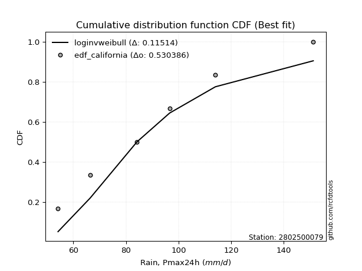</img>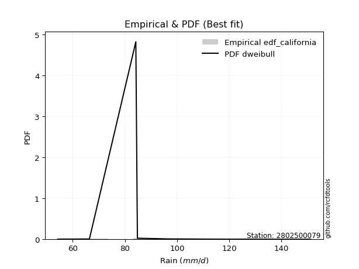</img>

</div>


### 2. EDF Hazen (1930)

Hazen method for plotting positions is a formula used to estimate the empirical cumulative probability distribution of flood events or other hydrological data. This formula often results in biased estimations, particularly when extrapolating to extreme events (high return periods).

<div align="center">


$P=(m-0.5)/n$


</div>


**2.1. Empirical values**

<div align="center">

|                | 0                   | 1                  | 2                  | 3                  | 4         | 5                  |
|:---------------|:--------------------|:-------------------|:-------------------|:-------------------|:----------|:-------------------|
| date           | 2023                | 2020               | 2022               | 2021               | 2019      | 2024               |
| x              | 54.2                | 66.4               | 84.2               | 96.6               | 114.0     | 151.2              |
| m              | 1                   | 2                  | 3                  | 4                  | 5         | 6                  |
| empirical_dist | edf_hazen           | edf_hazen          | edf_hazen          | edf_hazen          | edf_hazen | edf_hazen          |
| empirical      | 0.08333333333333333 | 0.25               | 0.4166666666666667 | 0.5833333333333334 | 0.75      | 0.9166666666666666 |
| empirical_tr   | 1.090909090909091   | 1.3333333333333333 | 1.7142857142857144 | 2.4000000000000004 | 4.0       | 11.999999999999995 |

</div>


**2.2. Kolmogorov-Smirnov fit test (sorted by Δ)**


<div align="center">

|                | 0                  | 1                   | 2                   | 3                   | 4                   | 5                   | 6                   | 7                    | 8                    | 9                   | 10                  | 11                   | 12                  | 13                  | 14                  | 15                  | 16                  | 17                  | 18                   | 19                  | 20                  | 21                  | 22                  | 23                   | 24                  | 25                  | 26                  | 27                  | 28                  | 29                 | 30                  | 31                  | 32                  | 33                   | 34                  | 35                  | 36                  | 37                   | 38                  | 39                   | 40                  | 41                  | 42                  | 43                  | 44                    | 45                  | 46                  | 47                  | 48                  | 49                  | 50                  | 51                  | 52                 | 53                  | 54                 | 55                  | 56                  | 57                  | 58                  | 59                 | 60                  | 61                  | 62                  | 63                  | 64                  | 65                  | 66                  | 67                  | 68                  | 69                  | 70                  | 71                 | 72                 | 73                 | 74                  | 75                 | 76                 | 77                  | 78             | 79             | 80                 | 81                 | 82                | 83                  | 84                 | 85                  | 86                 | 87                 |
|:---------------|:-------------------|:--------------------|:--------------------|:--------------------|:--------------------|:--------------------|:--------------------|:---------------------|:---------------------|:--------------------|:--------------------|:---------------------|:--------------------|:--------------------|:--------------------|:--------------------|:--------------------|:--------------------|:---------------------|:--------------------|:--------------------|:--------------------|:--------------------|:---------------------|:--------------------|:--------------------|:--------------------|:--------------------|:--------------------|:-------------------|:--------------------|:--------------------|:--------------------|:---------------------|:--------------------|:--------------------|:--------------------|:---------------------|:--------------------|:---------------------|:--------------------|:--------------------|:--------------------|:--------------------|:----------------------|:--------------------|:--------------------|:--------------------|:--------------------|:--------------------|:--------------------|:--------------------|:-------------------|:--------------------|:-------------------|:--------------------|:--------------------|:--------------------|:--------------------|:-------------------|:--------------------|:--------------------|:--------------------|:--------------------|:--------------------|:--------------------|:--------------------|:--------------------|:--------------------|:--------------------|:--------------------|:-------------------|:-------------------|:-------------------|:--------------------|:-------------------|:-------------------|:--------------------|:---------------|:---------------|:-------------------|:-------------------|:------------------|:--------------------|:-------------------|:--------------------|:-------------------|:-------------------|
| station        | 2802500079         | 2802500079          | 2802500079          | 2802500079          | 2802500079          | 2802500079          | 2802500079          | 2802500079           | 2802500079           | 2802500079          | 2802500079          | 2802500079           | 2802500079          | 2802500079          | 2802500079          | 2802500079          | 2802500079          | 2802500079          | 2802500079           | 2802500079          | 2802500079          | 2802500079          | 2802500079          | 2802500079           | 2802500079          | 2802500079          | 2802500079          | 2802500079          | 2802500079          | 2802500079         | 2802500079          | 2802500079          | 2802500079          | 2802500079           | 2802500079          | 2802500079          | 2802500079          | 2802500079           | 2802500079          | 2802500079           | 2802500079          | 2802500079          | 2802500079          | 2802500079          | 2802500079            | 2802500079          | 2802500079          | 2802500079          | 2802500079          | 2802500079          | 2802500079          | 2802500079          | 2802500079         | 2802500079          | 2802500079         | 2802500079          | 2802500079          | 2802500079          | 2802500079          | 2802500079         | 2802500079          | 2802500079          | 2802500079          | 2802500079          | 2802500079          | 2802500079          | 2802500079          | 2802500079          | 2802500079          | 2802500079          | 2802500079          | 2802500079         | 2802500079         | 2802500079         | 2802500079          | 2802500079         | 2802500079         | 2802500079          | 2802500079     | 2802500079     | 2802500079         | 2802500079         | 2802500079        | 2802500079          | 2802500079         | 2802500079          | 2802500079         | 2802500079         |
| empirical_dist | edf_hazen          | edf_hazen           | edf_hazen           | edf_hazen           | edf_hazen           | edf_hazen           | edf_hazen           | edf_hazen            | edf_hazen            | edf_hazen           | edf_hazen           | edf_hazen            | edf_hazen           | edf_hazen           | edf_hazen           | edf_hazen           | edf_hazen           | edf_hazen           | edf_hazen            | edf_hazen           | edf_hazen           | edf_hazen           | edf_hazen           | edf_hazen            | edf_hazen           | edf_hazen           | edf_hazen           | edf_hazen           | edf_hazen           | edf_hazen          | edf_hazen           | edf_hazen           | edf_hazen           | edf_hazen            | edf_hazen           | edf_hazen           | edf_hazen           | edf_hazen            | edf_hazen           | edf_hazen            | edf_hazen           | edf_hazen           | edf_hazen           | edf_hazen           | edf_hazen             | edf_hazen           | edf_hazen           | edf_hazen           | edf_hazen           | edf_hazen           | edf_hazen           | edf_hazen           | edf_hazen          | edf_hazen           | edf_hazen          | edf_hazen           | edf_hazen           | edf_hazen           | edf_hazen           | edf_hazen          | edf_hazen           | edf_hazen           | edf_hazen           | edf_hazen           | edf_hazen           | edf_hazen           | edf_hazen           | edf_hazen           | edf_hazen           | edf_hazen           | edf_hazen           | edf_hazen          | edf_hazen          | edf_hazen          | edf_hazen           | edf_hazen          | edf_hazen          | edf_hazen           | edf_hazen      | edf_hazen      | edf_hazen          | edf_hazen          | edf_hazen         | edf_hazen           | edf_hazen          | edf_hazen           | edf_hazen          | edf_hazen          |
| p_dist         | rayleigh           | maxwell             | logmaxwell          | loginvgauss         | halfnorm            | johnsonsu           | logrice             | loginvgamma          | logalpha             | ncf                 | invgamma            | nct                  | f                   | betaprime           | fisk                | pearson3            | logfatiguelife      | logncf              | logbetaprime         | logjohnsonsu        | logf                | logloggamma         | logerlang           | lognct               | loggamma            | loggamma            | logpearson3         | logexponnorm        | logt                | logcrystalball     | lognorm             | lognorm             | t                   | genlogistic          | crystalball         | norm                | truncnorm           | kstwobign            | alpha               | lograyleigh          | invgauss            | logfisk             | logweibull_min      | gumbel_r            | loglaplace_asymmetric | logmielke           | mielke              | loggumbel_r         | loglogistic         | loggenlogistic      | rice                | logistic            | loginvweibull      | loggumbel_l         | loggompertz        | gompertz            | halflogistic        | laplace_asymmetric  | moyal               | loghypsecant       | hypsecant           | logkstwobign        | loghalfnorm         | loggenexpon         | logmoyal            | loglaplace          | laplace             | expon               | exponnorm           | loghalflogistic     | gumbel_l            | nakagami           | logexpon           | lognakagami        | gamma               | logchi2            | logwald            | wald                | gibrat         | loggibrat      | weibull_min        | logtruncnorm       | loglognorm        | fatiguelife         | invweibull         | erlang              | genexpon           | chi2               |
| delta          | 0.0445347523436492 | 0.04901141549515564 | 0.04956772694356665 | 0.05154353484360141 | 0.05266304347821574 | 0.05323448297297978 | 0.05400857347068405 | 0.054170452859235385 | 0.054743064748175085 | 0.05548327399260758 | 0.05548866710490166 | 0.055496174116166364 | 0.05605890038300132 | 0.05609809860505971 | 0.05636904140593044 | 0.05692440035450033 | 0.05716270972618359 | 0.05741747196045249 | 0.057591455889765525 | 0.05771641721070786 | 0.05789020625156613 | 0.05845099483192487 | 0.05849900696101393 | 0.058523441226406014 | 0.05865832547655475 | 0.05865832547655475 | 0.05875391600876784 | 0.05928759079476287 | 0.05928973818885952 | 0.0592897896843706 | 0.05928989325893397 | 0.05928989325893397 | 0.05939074286921564 | 0.059836507316310655 | 0.05997574911982115 | 0.05997575694810636 | 0.05997575704640479 | 0.060256799295622526 | 0.06078728155045299 | 0.061670111759641044 | 0.06179005053098602 | 0.06185319252135457 | 0.06529620276442166 | 0.07286710281916028 | 0.07423627275259323   | 0.07551928722175172 | 0.07729789237829893 | 0.08002612357386435 | 0.08027631779281319 | 0.08029211958156801 | 0.08038257166882909 | 0.08092058489568632 | 0.0829589928981872 | 0.08300269289963902 | 0.0833333227580784 | 0.08333333328426748 | 0.08333333333333333 | 0.08643003073149066 | 0.08988665811975216 | 0.0923249126222205 | 0.09292385600680708 | 0.09321995875281402 | 0.09588153422164042 | 0.09952515571253245 | 0.10474336865545314 | 0.10499449377977566 | 0.10551125883155818 | 0.10890768730034944 | 0.11231330666926281 | 0.11520518124491091 | 0.12532587146505136 | 0.1552555584895668 | 0.1700897365318726 | 0.1724972891489585 | 0.21342005939771974 | 0.2338855222086429 | 0.2380013165352877 | 0.23908472269173783 | 0.25           | 0.25           | 0.2550455496614596 | 0.3001682499678516 | 0.395667523152861 | 0.45876382491408907 | 0.4652279829438121 | 0.47392930382777065 | 0.7371972226248585 | 0.7489190175050086 |
| deltao         | 0.530385761606     | 0.530385761606      | 0.530385761606      | 0.530385761606      | 0.530385761606      | 0.530385761606      | 0.530385761606      | 0.530385761606       | 0.530385761606       | 0.530385761606      | 0.530385761606      | 0.530385761606       | 0.530385761606      | 0.530385761606      | 0.530385761606      | 0.530385761606      | 0.530385761606      | 0.530385761606      | 0.530385761606       | 0.530385761606      | 0.530385761606      | 0.530385761606      | 0.530385761606      | 0.530385761606       | 0.530385761606      | 0.530385761606      | 0.530385761606      | 0.530385761606      | 0.530385761606      | 0.530385761606     | 0.530385761606      | 0.530385761606      | 0.530385761606      | 0.530385761606       | 0.530385761606      | 0.530385761606      | 0.530385761606      | 0.530385761606       | 0.530385761606      | 0.530385761606       | 0.530385761606      | 0.530385761606      | 0.530385761606      | 0.530385761606      | 0.530385761606        | 0.530385761606      | 0.530385761606      | 0.530385761606      | 0.530385761606      | 0.530385761606      | 0.530385761606      | 0.530385761606      | 0.530385761606     | 0.530385761606      | 0.530385761606     | 0.530385761606      | 0.530385761606      | 0.530385761606      | 0.530385761606      | 0.530385761606     | 0.530385761606      | 0.530385761606      | 0.530385761606      | 0.530385761606      | 0.530385761606      | 0.530385761606      | 0.530385761606      | 0.530385761606      | 0.530385761606      | 0.530385761606      | 0.530385761606      | 0.530385761606     | 0.530385761606     | 0.530385761606     | 0.530385761606      | 0.530385761606     | 0.530385761606     | 0.530385761606      | 0.530385761606 | 0.530385761606 | 0.530385761606     | 0.530385761606     | 0.530385761606    | 0.530385761606      | 0.530385761606     | 0.530385761606      | 0.530385761606     | 0.530385761606     |
| eval           | Δo > Δ             | Δo > Δ              | Δo > Δ              | Δo > Δ              | Δo > Δ              | Δo > Δ              | Δo > Δ              | Δo > Δ               | Δo > Δ               | Δo > Δ              | Δo > Δ              | Δo > Δ               | Δo > Δ              | Δo > Δ              | Δo > Δ              | Δo > Δ              | Δo > Δ              | Δo > Δ              | Δo > Δ               | Δo > Δ              | Δo > Δ              | Δo > Δ              | Δo > Δ              | Δo > Δ               | Δo > Δ              | Δo > Δ              | Δo > Δ              | Δo > Δ              | Δo > Δ              | Δo > Δ             | Δo > Δ              | Δo > Δ              | Δo > Δ              | Δo > Δ               | Δo > Δ              | Δo > Δ              | Δo > Δ              | Δo > Δ               | Δo > Δ              | Δo > Δ               | Δo > Δ              | Δo > Δ              | Δo > Δ              | Δo > Δ              | Δo > Δ                | Δo > Δ              | Δo > Δ              | Δo > Δ              | Δo > Δ              | Δo > Δ              | Δo > Δ              | Δo > Δ              | Δo > Δ             | Δo > Δ              | Δo > Δ             | Δo > Δ              | Δo > Δ              | Δo > Δ              | Δo > Δ              | Δo > Δ             | Δo > Δ              | Δo > Δ              | Δo > Δ              | Δo > Δ              | Δo > Δ              | Δo > Δ              | Δo > Δ              | Δo > Δ              | Δo > Δ              | Δo > Δ              | Δo > Δ              | Δo > Δ             | Δo > Δ             | Δo > Δ             | Δo > Δ              | Δo > Δ             | Δo > Δ             | Δo > Δ              | Δo > Δ         | Δo > Δ         | Δo > Δ             | Δo > Δ             | Δo > Δ            | Δo > Δ              | Δo > Δ             | Δo > Δ              | Δo <= Δ            | Δo <= Δ            |
| fit            | 1                  | 1                   | 1                   | 1                   | 1                   | 1                   | 1                   | 1                    | 1                    | 1                   | 1                   | 1                    | 1                   | 1                   | 1                   | 1                   | 1                   | 1                   | 1                    | 1                   | 1                   | 1                   | 1                   | 1                    | 1                   | 1                   | 1                   | 1                   | 1                   | 1                  | 1                   | 1                   | 1                   | 1                    | 1                   | 1                   | 1                   | 1                    | 1                   | 1                    | 1                   | 1                   | 1                   | 1                   | 1                     | 1                   | 1                   | 1                   | 1                   | 1                   | 1                   | 1                   | 1                  | 1                   | 1                  | 1                   | 1                   | 1                   | 1                   | 1                  | 1                   | 1                   | 1                   | 1                   | 1                   | 1                   | 1                   | 1                   | 1                   | 1                   | 1                   | 1                  | 1                  | 1                  | 1                   | 1                  | 1                  | 1                   | 1              | 1              | 1                  | 1                  | 1                 | 1                   | 1                  | 1                   | 0                  | 0                  |
| n              | 6                  | 6                   | 6                   | 6                   | 6                   | 6                   | 6                   | 6                    | 6                    | 6                   | 6                   | 6                    | 6                   | 6                   | 6                   | 6                   | 6                   | 6                   | 6                    | 6                   | 6                   | 6                   | 6                   | 6                    | 6                   | 6                   | 6                   | 6                   | 6                   | 6                  | 6                   | 6                   | 6                   | 6                    | 6                   | 6                   | 6                   | 6                    | 6                   | 6                    | 6                   | 6                   | 6                   | 6                   | 6                     | 6                   | 6                   | 6                   | 6                   | 6                   | 6                   | 6                   | 6                  | 6                   | 6                  | 6                   | 6                   | 6                   | 6                   | 6                  | 6                   | 6                   | 6                   | 6                   | 6                   | 6                   | 6                   | 6                   | 6                   | 6                   | 6                   | 6                  | 6                  | 6                  | 6                   | 6                  | 6                  | 6                   | 6              | 6              | 6                  | 6                  | 6                 | 6                   | 6                  | 6                   | 6                  | 6                  |
| best_fit       | 1                  | 0                   | 0                   | 0                   | 0                   | 0                   | 0                   | 0                    | 0                    | 0                   | 0                   | 0                    | 0                   | 0                   | 0                   | 0                   | 0                   | 0                   | 0                    | 0                   | 0                   | 0                   | 0                   | 0                    | 0                   | 0                   | 0                   | 0                   | 0                   | 0                  | 0                   | 0                   | 0                   | 0                    | 0                   | 0                   | 0                   | 0                    | 0                   | 0                    | 0                   | 0                   | 0                   | 0                   | 0                     | 0                   | 0                   | 0                   | 0                   | 0                   | 0                   | 0                   | 0                  | 0                   | 0                  | 0                   | 0                   | 0                   | 0                   | 0                  | 0                   | 0                   | 0                   | 0                   | 0                   | 0                   | 0                   | 0                   | 0                   | 0                   | 0                   | 0                  | 0                  | 0                  | 0                   | 0                  | 0                  | 0                   | 0              | 0              | 0                  | 0                  | 0                 | 0                   | 0                  | 0                   | 0                  | 0                  |
| best_fit_sort  | 1                  | 2                   | 3                   | 4                   | 5                   | 6                   | 7                   | 8                    | 9                    | 10                  | 11                  | 12                   | 13                  | 14                  | 15                  | 16                  | 17                  | 18                  | 19                   | 20                  | 21                  | 22                  | 23                  | 24                   | 25                  | 26                  | 27                  | 28                  | 29                  | 30                 | 31                  | 32                  | 33                  | 34                   | 35                  | 36                  | 37                  | 38                   | 39                  | 40                   | 41                  | 42                  | 43                  | 44                  | 45                    | 46                  | 47                  | 48                  | 49                  | 50                  | 51                  | 52                  | 53                 | 54                  | 55                 | 56                  | 57                  | 58                  | 59                  | 60                 | 61                  | 62                  | 63                  | 64                  | 65                  | 66                  | 67                  | 68                  | 69                  | 70                  | 71                  | 72                 | 73                 | 74                 | 75                  | 76                 | 77                 | 78                  | 79             | 80             | 81                 | 82                 | 83                | 84                  | 85                 | 86                  | 87                 | 88                 |

</div>


**2.3. Best fit**

<div align="center">

|   id |    station | empirical_dist   | p_dist   |     delta |   deltao | eval   |   fit |   n |   best_fit |   best_fit_sort |
|-----:|-----------:|:-----------------|:---------|----------:|---------:|:-------|------:|----:|-----------:|----------------:|
|    0 | 2802500079 | edf_hazen        | rayleigh | 0.0445348 | 0.530386 | Δo > Δ |     1 |   6 |          1 |               1 |

</div>


<div align="center">

</img>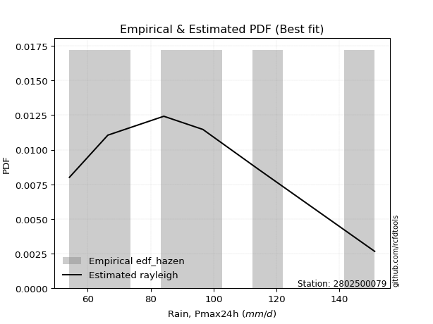</img>

</div>


### 3. EDF Weibull (1939)

Weibull plotting position formula is an empirical method used to estimate the non-exceedance probability or plotting position for a set of observed data, is often recommended or widely used in practice, particularly in flood frequency analysis.

<div align="center">


$P=m/(n+1)$


</div>


**3.1. Empirical values**

<div align="center">

|                | 0                   | 1                  | 2                   | 3                  | 4                  | 5                  |
|:---------------|:--------------------|:-------------------|:--------------------|:-------------------|:-------------------|:-------------------|
| date           | 2023                | 2020               | 2022                | 2021               | 2019               | 2024               |
| x              | 54.2                | 66.4               | 84.2                | 96.6               | 114.0              | 151.2              |
| m              | 1                   | 2                  | 3                   | 4                  | 5                  | 6                  |
| empirical_dist | edf_weibull         | edf_weibull        | edf_weibull         | edf_weibull        | edf_weibull        | edf_weibull        |
| empirical      | 0.14285714285714285 | 0.2857142857142857 | 0.42857142857142855 | 0.5714285714285714 | 0.7142857142857143 | 0.8571428571428571 |
| empirical_tr   | 1.1666666666666665  | 1.4                | 1.75                | 2.333333333333333  | 3.5                | 6.999999999999997  |

</div>


**3.2. Kolmogorov-Smirnov fit test (sorted by Δ)**


<div align="center">

|                | 0                   | 1                   | 2                   | 3                   | 4                   | 5                   | 6                   | 7                   | 8                   | 9                   | 10                  | 11                  | 12                  | 13                  | 14                  | 15                  | 16                  | 17                  | 18                  | 19                  | 20                  | 21                  | 22                  | 23                  | 24                  | 25                  | 26                  | 27                  | 28                  | 29                  | 30                  | 31                  | 32                  | 33                 | 34                  | 35                  | 36                  | 37                  | 38                  | 39                  | 40                 | 41                  | 42                  | 43                  | 44                  | 45                  | 46                  | 47                  | 48                    | 49                  | 50                  | 51                  | 52                  | 53                  | 54                  | 55                  | 56                  | 57                 | 58                  | 59                  | 60                  | 61                  | 62                  | 63                 | 64                  | 65                  | 66                  | 67                  | 68                  | 69                  | 70                  | 71                  | 72                  | 73                  | 74                  | 75                  | 76                  | 77                 | 78                  | 79                 | 80                 | 81                 | 82                 | 83                 | 84                  | 85                  | 86                 | 87                 |
|:---------------|:--------------------|:--------------------|:--------------------|:--------------------|:--------------------|:--------------------|:--------------------|:--------------------|:--------------------|:--------------------|:--------------------|:--------------------|:--------------------|:--------------------|:--------------------|:--------------------|:--------------------|:--------------------|:--------------------|:--------------------|:--------------------|:--------------------|:--------------------|:--------------------|:--------------------|:--------------------|:--------------------|:--------------------|:--------------------|:--------------------|:--------------------|:--------------------|:--------------------|:-------------------|:--------------------|:--------------------|:--------------------|:--------------------|:--------------------|:--------------------|:-------------------|:--------------------|:--------------------|:--------------------|:--------------------|:--------------------|:--------------------|:--------------------|:----------------------|:--------------------|:--------------------|:--------------------|:--------------------|:--------------------|:--------------------|:--------------------|:--------------------|:-------------------|:--------------------|:--------------------|:--------------------|:--------------------|:--------------------|:-------------------|:--------------------|:--------------------|:--------------------|:--------------------|:--------------------|:--------------------|:--------------------|:--------------------|:--------------------|:--------------------|:--------------------|:--------------------|:--------------------|:-------------------|:--------------------|:-------------------|:-------------------|:-------------------|:-------------------|:-------------------|:--------------------|:--------------------|:-------------------|:-------------------|
| station        | 2802500079          | 2802500079          | 2802500079          | 2802500079          | 2802500079          | 2802500079          | 2802500079          | 2802500079          | 2802500079          | 2802500079          | 2802500079          | 2802500079          | 2802500079          | 2802500079          | 2802500079          | 2802500079          | 2802500079          | 2802500079          | 2802500079          | 2802500079          | 2802500079          | 2802500079          | 2802500079          | 2802500079          | 2802500079          | 2802500079          | 2802500079          | 2802500079          | 2802500079          | 2802500079          | 2802500079          | 2802500079          | 2802500079          | 2802500079         | 2802500079          | 2802500079          | 2802500079          | 2802500079          | 2802500079          | 2802500079          | 2802500079         | 2802500079          | 2802500079          | 2802500079          | 2802500079          | 2802500079          | 2802500079          | 2802500079          | 2802500079            | 2802500079          | 2802500079          | 2802500079          | 2802500079          | 2802500079          | 2802500079          | 2802500079          | 2802500079          | 2802500079         | 2802500079          | 2802500079          | 2802500079          | 2802500079          | 2802500079          | 2802500079         | 2802500079          | 2802500079          | 2802500079          | 2802500079          | 2802500079          | 2802500079          | 2802500079          | 2802500079          | 2802500079          | 2802500079          | 2802500079          | 2802500079          | 2802500079          | 2802500079         | 2802500079          | 2802500079         | 2802500079         | 2802500079         | 2802500079         | 2802500079         | 2802500079          | 2802500079          | 2802500079         | 2802500079         |
| empirical_dist | edf_weibull         | edf_weibull         | edf_weibull         | edf_weibull         | edf_weibull         | edf_weibull         | edf_weibull         | edf_weibull         | edf_weibull         | edf_weibull         | edf_weibull         | edf_weibull         | edf_weibull         | edf_weibull         | edf_weibull         | edf_weibull         | edf_weibull         | edf_weibull         | edf_weibull         | edf_weibull         | edf_weibull         | edf_weibull         | edf_weibull         | edf_weibull         | edf_weibull         | edf_weibull         | edf_weibull         | edf_weibull         | edf_weibull         | edf_weibull         | edf_weibull         | edf_weibull         | edf_weibull         | edf_weibull        | edf_weibull         | edf_weibull         | edf_weibull         | edf_weibull         | edf_weibull         | edf_weibull         | edf_weibull        | edf_weibull         | edf_weibull         | edf_weibull         | edf_weibull         | edf_weibull         | edf_weibull         | edf_weibull         | edf_weibull           | edf_weibull         | edf_weibull         | edf_weibull         | edf_weibull         | edf_weibull         | edf_weibull         | edf_weibull         | edf_weibull         | edf_weibull        | edf_weibull         | edf_weibull         | edf_weibull         | edf_weibull         | edf_weibull         | edf_weibull        | edf_weibull         | edf_weibull         | edf_weibull         | edf_weibull         | edf_weibull         | edf_weibull         | edf_weibull         | edf_weibull         | edf_weibull         | edf_weibull         | edf_weibull         | edf_weibull         | edf_weibull         | edf_weibull        | edf_weibull         | edf_weibull        | edf_weibull        | edf_weibull        | edf_weibull        | edf_weibull        | edf_weibull         | edf_weibull         | edf_weibull        | edf_weibull        |
| p_dist         | logmielke           | loginvgauss         | johnsonsu           | rayleigh            | loginvgamma         | invgauss            | logalpha            | mielke              | logmaxwell          | ncf                 | invgamma            | nct                 | loginvweibull       | loggenlogistic      | f                   | betaprime           | fisk                | maxwell             | pearson3            | logfatiguelife      | logncf              | logbetaprime        | logjohnsonsu        | logf                | logkstwobign        | logloggamma         | logerlang           | lognct              | loggamma            | loggamma            | logpearson3         | logexponnorm        | logt                | logcrystalball     | lognorm             | lognorm             | genlogistic         | kstwobign           | alpha               | logfisk             | logrice            | logweibull_min      | lograyleigh         | norm                | truncnorm           | crystalball         | t                   | gumbel_r            | loglaplace_asymmetric | halfnorm            | loglogistic         | rice                | logistic            | loggumbel_r         | laplace_asymmetric  | moyal               | loggumbel_l         | loghypsecant       | hypsecant           | logmoyal            | gumbel_l            | loglaplace          | laplace             | loggenexpon        | exponnorm           | loggompertz         | gompertz            | expon               | loghalflogistic     | halflogistic        | loghalfnorm         | nakagami            | logexpon            | lognakagami         | logchi2             | gamma               | weibull_min         | logwald            | wald                | gibrat             | loggibrat          | logtruncnorm       | loglognorm         | invweibull         | fatiguelife         | erlang              | genexpon           | chi2               |
| delta          | 0.08570741352357207 | 0.08596774259788653 | 0.08746747743704128 | 0.08908376401959173 | 0.08988473857352108 | 0.09012940876203346 | 0.09045735046246078 | 0.09050933158236166 | 0.09092054422147297 | 0.09119755970689328 | 0.09120295281918736 | 0.09121045983045206 | 0.09133057570530728 | 0.09151877319485965 | 0.09177318609728702 | 0.09181238431934541 | 0.09208332712021614 | 0.09252380858987808 | 0.09269164117191941 | 0.09287699544046929 | 0.09313175767473819 | 0.09330574160405122 | 0.09343070292499356 | 0.09360449196585183 | 0.09385350771117314 | 0.09416528054621057 | 0.09421329267529963 | 0.09423772694069171 | 0.09437261119084045 | 0.09437261119084045 | 0.09446820172305354 | 0.09500187650904857 | 0.09500402390314522 | 0.0950040753986563 | 0.09500417897321967 | 0.09500417897321967 | 0.09555079303059635 | 0.09597108500990822 | 0.09650156726473869 | 0.09756747823564027 | 0.1000457483432109 | 0.10265315904230249 | 0.10281902839609047 | 0.10511684990164738 | 0.10511685062977649 | 0.10511685231075252 | 0.10547999854078405 | 0.10858138853344598 | 0.10995055846687893   | 0.11218685300202526 | 0.11599060350709889 | 0.11609685738311479 | 0.11663487060997202 | 0.11889291439754998 | 0.12214431644577636 | 0.12560094383403786 | 0.12733187138195556 | 0.1280391983365062 | 0.12863814172109278 | 0.13656140186616553 | 0.13872092339149766 | 0.14070877949406135 | 0.14122554454584388 | 0.1416592915664418 | 0.14171816848558222 | 0.14285713228188793 | 0.14285714280807701 | 0.14285714285714285 | 0.14285714285714285 | 0.14285714285714285 | 0.14285714285714285 | 0.14335079658480493 | 0.15818497462711073 | 0.16059252724419665 | 0.17436171268483336 | 0.20151529749295788 | 0.24314078775669773 | 0.2737156022495734 | 0.27479900840602356 | 0.2857142857142857 | 0.2857142857142857 | 0.2882634880630897 | 0.3599532374385753 | 0.4057041734200026 | 0.42304953919980337 | 0.43821501811348496 | 0.7014829369105728 | 0.7132047317907229 |
| deltao         | 0.530385761606      | 0.530385761606      | 0.530385761606      | 0.530385761606      | 0.530385761606      | 0.530385761606      | 0.530385761606      | 0.530385761606      | 0.530385761606      | 0.530385761606      | 0.530385761606      | 0.530385761606      | 0.530385761606      | 0.530385761606      | 0.530385761606      | 0.530385761606      | 0.530385761606      | 0.530385761606      | 0.530385761606      | 0.530385761606      | 0.530385761606      | 0.530385761606      | 0.530385761606      | 0.530385761606      | 0.530385761606      | 0.530385761606      | 0.530385761606      | 0.530385761606      | 0.530385761606      | 0.530385761606      | 0.530385761606      | 0.530385761606      | 0.530385761606      | 0.530385761606     | 0.530385761606      | 0.530385761606      | 0.530385761606      | 0.530385761606      | 0.530385761606      | 0.530385761606      | 0.530385761606     | 0.530385761606      | 0.530385761606      | 0.530385761606      | 0.530385761606      | 0.530385761606      | 0.530385761606      | 0.530385761606      | 0.530385761606        | 0.530385761606      | 0.530385761606      | 0.530385761606      | 0.530385761606      | 0.530385761606      | 0.530385761606      | 0.530385761606      | 0.530385761606      | 0.530385761606     | 0.530385761606      | 0.530385761606      | 0.530385761606      | 0.530385761606      | 0.530385761606      | 0.530385761606     | 0.530385761606      | 0.530385761606      | 0.530385761606      | 0.530385761606      | 0.530385761606      | 0.530385761606      | 0.530385761606      | 0.530385761606      | 0.530385761606      | 0.530385761606      | 0.530385761606      | 0.530385761606      | 0.530385761606      | 0.530385761606     | 0.530385761606      | 0.530385761606     | 0.530385761606     | 0.530385761606     | 0.530385761606     | 0.530385761606     | 0.530385761606      | 0.530385761606      | 0.530385761606     | 0.530385761606     |
| eval           | Δo > Δ              | Δo > Δ              | Δo > Δ              | Δo > Δ              | Δo > Δ              | Δo > Δ              | Δo > Δ              | Δo > Δ              | Δo > Δ              | Δo > Δ              | Δo > Δ              | Δo > Δ              | Δo > Δ              | Δo > Δ              | Δo > Δ              | Δo > Δ              | Δo > Δ              | Δo > Δ              | Δo > Δ              | Δo > Δ              | Δo > Δ              | Δo > Δ              | Δo > Δ              | Δo > Δ              | Δo > Δ              | Δo > Δ              | Δo > Δ              | Δo > Δ              | Δo > Δ              | Δo > Δ              | Δo > Δ              | Δo > Δ              | Δo > Δ              | Δo > Δ             | Δo > Δ              | Δo > Δ              | Δo > Δ              | Δo > Δ              | Δo > Δ              | Δo > Δ              | Δo > Δ             | Δo > Δ              | Δo > Δ              | Δo > Δ              | Δo > Δ              | Δo > Δ              | Δo > Δ              | Δo > Δ              | Δo > Δ                | Δo > Δ              | Δo > Δ              | Δo > Δ              | Δo > Δ              | Δo > Δ              | Δo > Δ              | Δo > Δ              | Δo > Δ              | Δo > Δ             | Δo > Δ              | Δo > Δ              | Δo > Δ              | Δo > Δ              | Δo > Δ              | Δo > Δ             | Δo > Δ              | Δo > Δ              | Δo > Δ              | Δo > Δ              | Δo > Δ              | Δo > Δ              | Δo > Δ              | Δo > Δ              | Δo > Δ              | Δo > Δ              | Δo > Δ              | Δo > Δ              | Δo > Δ              | Δo > Δ             | Δo > Δ              | Δo > Δ             | Δo > Δ             | Δo > Δ             | Δo > Δ             | Δo > Δ             | Δo > Δ              | Δo > Δ              | Δo <= Δ            | Δo <= Δ            |
| fit            | 1                   | 1                   | 1                   | 1                   | 1                   | 1                   | 1                   | 1                   | 1                   | 1                   | 1                   | 1                   | 1                   | 1                   | 1                   | 1                   | 1                   | 1                   | 1                   | 1                   | 1                   | 1                   | 1                   | 1                   | 1                   | 1                   | 1                   | 1                   | 1                   | 1                   | 1                   | 1                   | 1                   | 1                  | 1                   | 1                   | 1                   | 1                   | 1                   | 1                   | 1                  | 1                   | 1                   | 1                   | 1                   | 1                   | 1                   | 1                   | 1                     | 1                   | 1                   | 1                   | 1                   | 1                   | 1                   | 1                   | 1                   | 1                  | 1                   | 1                   | 1                   | 1                   | 1                   | 1                  | 1                   | 1                   | 1                   | 1                   | 1                   | 1                   | 1                   | 1                   | 1                   | 1                   | 1                   | 1                   | 1                   | 1                  | 1                   | 1                  | 1                  | 1                  | 1                  | 1                  | 1                   | 1                   | 0                  | 0                  |
| n              | 6                   | 6                   | 6                   | 6                   | 6                   | 6                   | 6                   | 6                   | 6                   | 6                   | 6                   | 6                   | 6                   | 6                   | 6                   | 6                   | 6                   | 6                   | 6                   | 6                   | 6                   | 6                   | 6                   | 6                   | 6                   | 6                   | 6                   | 6                   | 6                   | 6                   | 6                   | 6                   | 6                   | 6                  | 6                   | 6                   | 6                   | 6                   | 6                   | 6                   | 6                  | 6                   | 6                   | 6                   | 6                   | 6                   | 6                   | 6                   | 6                     | 6                   | 6                   | 6                   | 6                   | 6                   | 6                   | 6                   | 6                   | 6                  | 6                   | 6                   | 6                   | 6                   | 6                   | 6                  | 6                   | 6                   | 6                   | 6                   | 6                   | 6                   | 6                   | 6                   | 6                   | 6                   | 6                   | 6                   | 6                   | 6                  | 6                   | 6                  | 6                  | 6                  | 6                  | 6                  | 6                   | 6                   | 6                  | 6                  |
| best_fit       | 1                   | 0                   | 0                   | 0                   | 0                   | 0                   | 0                   | 0                   | 0                   | 0                   | 0                   | 0                   | 0                   | 0                   | 0                   | 0                   | 0                   | 0                   | 0                   | 0                   | 0                   | 0                   | 0                   | 0                   | 0                   | 0                   | 0                   | 0                   | 0                   | 0                   | 0                   | 0                   | 0                   | 0                  | 0                   | 0                   | 0                   | 0                   | 0                   | 0                   | 0                  | 0                   | 0                   | 0                   | 0                   | 0                   | 0                   | 0                   | 0                     | 0                   | 0                   | 0                   | 0                   | 0                   | 0                   | 0                   | 0                   | 0                  | 0                   | 0                   | 0                   | 0                   | 0                   | 0                  | 0                   | 0                   | 0                   | 0                   | 0                   | 0                   | 0                   | 0                   | 0                   | 0                   | 0                   | 0                   | 0                   | 0                  | 0                   | 0                  | 0                  | 0                  | 0                  | 0                  | 0                   | 0                   | 0                  | 0                  |
| best_fit_sort  | 1                   | 2                   | 3                   | 4                   | 5                   | 6                   | 7                   | 8                   | 9                   | 10                  | 11                  | 12                  | 13                  | 14                  | 15                  | 16                  | 17                  | 18                  | 19                  | 20                  | 21                  | 22                  | 23                  | 24                  | 25                  | 26                  | 27                  | 28                  | 29                  | 30                  | 31                  | 32                  | 33                  | 34                 | 35                  | 36                  | 37                  | 38                  | 39                  | 40                  | 41                 | 42                  | 43                  | 44                  | 45                  | 46                  | 47                  | 48                  | 49                    | 50                  | 51                  | 52                  | 53                  | 54                  | 55                  | 56                  | 57                  | 58                 | 59                  | 60                  | 61                  | 62                  | 63                  | 64                 | 65                  | 66                  | 67                  | 68                  | 69                  | 70                  | 71                  | 72                  | 73                  | 74                  | 75                  | 76                  | 77                  | 78                 | 79                  | 80                 | 81                 | 82                 | 83                 | 84                 | 85                  | 86                  | 87                 | 88                 |

</div>


**3.3. Best fit**

<div align="center">

|   id |    station | empirical_dist   | p_dist    |     delta |   deltao | eval   |   fit |   n |   best_fit |   best_fit_sort |
|-----:|-----------:|:-----------------|:----------|----------:|---------:|:-------|------:|----:|-----------:|----------------:|
|    0 | 2802500079 | edf_weibull      | logmielke | 0.0857074 | 0.530386 | Δo > Δ |     1 |   6 |          1 |               1 |

</div>


<div align="center">

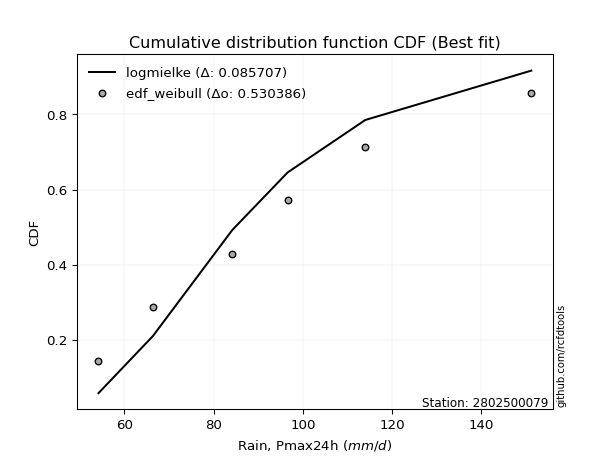</img>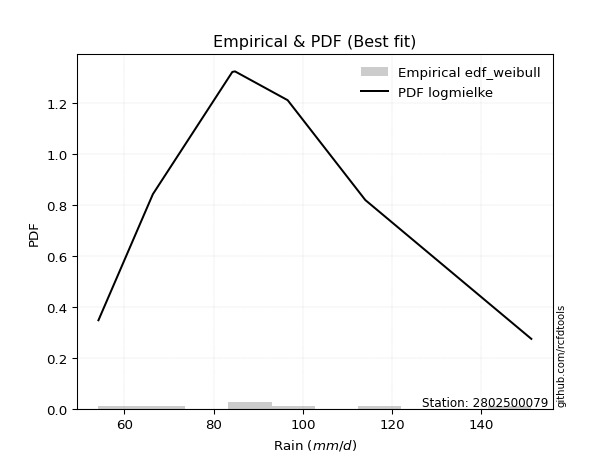</img>

</div>


### 4. EDF Beard (1943)

The Beard formula (or Beard´s plotting position formula) in hydrology is used to estimate the empirical non-exceedance probability _(P)_ of a flood event (or other extreme hydrological data point) within a given dataset.

<div align="center">


$P=(m-0.31)/(n+0.38)$


</div>


**4.1. Empirical values**

<div align="center">

|                | 0                   | 1                   | 2                  | 3                  | 4                  | 5                  |
|:---------------|:--------------------|:--------------------|:-------------------|:-------------------|:-------------------|:-------------------|
| date           | 2023                | 2020                | 2022               | 2021               | 2019               | 2024               |
| x              | 54.2                | 66.4                | 84.2               | 96.6               | 114.0              | 151.2              |
| m              | 1                   | 2                   | 3                  | 4                  | 5                  | 6                  |
| empirical_dist | edf_beard           | edf_beard           | edf_beard          | edf_beard          | edf_beard          | edf_beard          |
| empirical      | 0.10815047021943573 | 0.26489028213166144 | 0.4216300940438871 | 0.5783699059561128 | 0.7351097178683387 | 0.8918495297805643 |
| empirical_tr   | 1.1212653778558874  | 1.3603411513859276  | 1.7289972899728996 | 2.3717472118959106 | 3.7751479289940844 | 9.246376811594207  |

</div>


**4.2. Kolmogorov-Smirnov fit test (sorted by Δ)**


<div align="center">

|                | 0                    | 1                   | 2                   | 3                   | 4                   | 5                   | 6                   | 7                   | 8                   | 9                   | 10                  | 11                  | 12                 | 13                 | 14                  | 15                  | 16                  | 17                  | 18                  | 19                  | 20                  | 21                  | 22                  | 23                 | 24                  | 25                 | 26                  | 27                  | 28                  | 29                  | 30                  | 31                 | 32                  | 33                  | 34                 | 35                 | 36                  | 37                  | 38                  | 39                 | 40                  | 41                  | 42                  | 43                  | 44                  | 45                  | 46                  | 47                  | 48                  | 49                  | 50                    | 51                  | 52                  | 53                  | 54                  | 55                 | 56                 | 57                 | 58                  | 59                  | 60                  | 61                  | 62                 | 63                  | 64                  | 65                  | 66                  | 67                  | 68                  | 69                  | 70                  | 71                  | 72                  | 73                  | 74                 | 75                  | 76                  | 77                  | 78                 | 79                  | 80                  | 81                  | 82                 | 83                 | 84                  | 85                 | 86                 | 87                 |
|:---------------|:---------------------|:--------------------|:--------------------|:--------------------|:--------------------|:--------------------|:--------------------|:--------------------|:--------------------|:--------------------|:--------------------|:--------------------|:-------------------|:-------------------|:--------------------|:--------------------|:--------------------|:--------------------|:--------------------|:--------------------|:--------------------|:--------------------|:--------------------|:-------------------|:--------------------|:-------------------|:--------------------|:--------------------|:--------------------|:--------------------|:--------------------|:-------------------|:--------------------|:--------------------|:-------------------|:-------------------|:--------------------|:--------------------|:--------------------|:-------------------|:--------------------|:--------------------|:--------------------|:--------------------|:--------------------|:--------------------|:--------------------|:--------------------|:--------------------|:--------------------|:----------------------|:--------------------|:--------------------|:--------------------|:--------------------|:-------------------|:-------------------|:-------------------|:--------------------|:--------------------|:--------------------|:--------------------|:-------------------|:--------------------|:--------------------|:--------------------|:--------------------|:--------------------|:--------------------|:--------------------|:--------------------|:--------------------|:--------------------|:--------------------|:-------------------|:--------------------|:--------------------|:--------------------|:-------------------|:--------------------|:--------------------|:--------------------|:-------------------|:-------------------|:--------------------|:-------------------|:-------------------|:-------------------|
| station        | 2802500079           | 2802500079          | 2802500079          | 2802500079          | 2802500079          | 2802500079          | 2802500079          | 2802500079          | 2802500079          | 2802500079          | 2802500079          | 2802500079          | 2802500079         | 2802500079         | 2802500079          | 2802500079          | 2802500079          | 2802500079          | 2802500079          | 2802500079          | 2802500079          | 2802500079          | 2802500079          | 2802500079         | 2802500079          | 2802500079         | 2802500079          | 2802500079          | 2802500079          | 2802500079          | 2802500079          | 2802500079         | 2802500079          | 2802500079          | 2802500079         | 2802500079         | 2802500079          | 2802500079          | 2802500079          | 2802500079         | 2802500079          | 2802500079          | 2802500079          | 2802500079          | 2802500079          | 2802500079          | 2802500079          | 2802500079          | 2802500079          | 2802500079          | 2802500079            | 2802500079          | 2802500079          | 2802500079          | 2802500079          | 2802500079         | 2802500079         | 2802500079         | 2802500079          | 2802500079          | 2802500079          | 2802500079          | 2802500079         | 2802500079          | 2802500079          | 2802500079          | 2802500079          | 2802500079          | 2802500079          | 2802500079          | 2802500079          | 2802500079          | 2802500079          | 2802500079          | 2802500079         | 2802500079          | 2802500079          | 2802500079          | 2802500079         | 2802500079          | 2802500079          | 2802500079          | 2802500079         | 2802500079         | 2802500079          | 2802500079         | 2802500079         | 2802500079         |
| empirical_dist | edf_beard            | edf_beard           | edf_beard           | edf_beard           | edf_beard           | edf_beard           | edf_beard           | edf_beard           | edf_beard           | edf_beard           | edf_beard           | edf_beard           | edf_beard          | edf_beard          | edf_beard           | edf_beard           | edf_beard           | edf_beard           | edf_beard           | edf_beard           | edf_beard           | edf_beard           | edf_beard           | edf_beard          | edf_beard           | edf_beard          | edf_beard           | edf_beard           | edf_beard           | edf_beard           | edf_beard           | edf_beard          | edf_beard           | edf_beard           | edf_beard          | edf_beard          | edf_beard           | edf_beard           | edf_beard           | edf_beard          | edf_beard           | edf_beard           | edf_beard           | edf_beard           | edf_beard           | edf_beard           | edf_beard           | edf_beard           | edf_beard           | edf_beard           | edf_beard             | edf_beard           | edf_beard           | edf_beard           | edf_beard           | edf_beard          | edf_beard          | edf_beard          | edf_beard           | edf_beard           | edf_beard           | edf_beard           | edf_beard          | edf_beard           | edf_beard           | edf_beard           | edf_beard           | edf_beard           | edf_beard           | edf_beard           | edf_beard           | edf_beard           | edf_beard           | edf_beard           | edf_beard          | edf_beard           | edf_beard           | edf_beard           | edf_beard          | edf_beard           | edf_beard           | edf_beard           | edf_beard          | edf_beard          | edf_beard           | edf_beard          | edf_beard          | edf_beard          |
| p_dist         | invgauss             | rayleigh            | johnsonsu           | logmaxwell          | loginvgauss         | maxwell             | logweibull_min      | lograyleigh         | logrice             | loginvgamma         | logalpha            | ncf                 | invgamma           | nct                | logmielke           | f                   | betaprime           | fisk                | pearson3            | logfatiguelife      | logncf              | mielke              | logbetaprime        | logjohnsonsu       | logf                | logloggamma        | logerlang           | lognct              | loggamma            | loggamma            | logpearson3         | logexponnorm       | logt                | logcrystalball      | lognorm            | lognorm            | t                   | genlogistic         | crystalball         | norm               | truncnorm           | kstwobign           | loggenlogistic      | alpha               | logfisk             | halfnorm            | loginvweibull       | loggumbel_r         | gumbel_r            | logkstwobign        | loglaplace_asymmetric | loglogistic         | rice                | logistic            | loggumbel_l         | laplace_asymmetric | moyal              | logmoyal           | loggenexpon         | loghypsecant        | exponnorm           | hypsecant           | loggompertz        | gompertz            | expon               | halflogistic        | loghalfnorm         | loghalflogistic     | loglaplace          | gumbel_l            | laplace             | nakagami            | logexpon            | lognakagami         | gamma              | logchi2             | weibull_min         | logwald             | wald               | gibrat              | loggibrat           | logtruncnorm        | loglognorm         | invweibull         | fatiguelife         | erlang             | genexpon           | chi2               |
| delta          | 0.056826623153765576 | 0.05942503447531064 | 0.06060174973535015 | 0.06307448753369052 | 0.06360642650120249 | 0.06390169762681708 | 0.06794648640459536 | 0.06811235575838337 | 0.06889885560234549 | 0.06906073499089682 | 0.06963334687983652 | 0.07037355612426902 | 0.0703789492365631 | 0.0703864562478278 | 0.07055585984453128 | 0.07094918251466276 | 0.07098838073672115 | 0.07125932353759187 | 0.07181468248616177 | 0.07205299185784503 | 0.07230775409211393 | 0.07233446500107849 | 0.07248173802142696 | 0.0726066993423693 | 0.07278048838322757 | 0.0733412769635863 | 0.07338928909267536 | 0.07341372335806745 | 0.07354860760821619 | 0.07354860760821619 | 0.07364419814042927 | 0.0741778729264243 | 0.07418002032052096 | 0.07418007181603203 | 0.0741801753905954 | 0.0741801753905954 | 0.07428102500087708 | 0.07472678944797209 | 0.07486603125148258 | 0.0748660390797678 | 0.07486603917806622 | 0.07514708142728396 | 0.07532869220434757 | 0.07567756368211442 | 0.07674347465301601 | 0.07748018036431814 | 0.07799556552096676 | 0.08676354730238608 | 0.08775738495082172 | 0.08825653137559358 | 0.08912655488425467   | 0.09516659992447463 | 0.09527285380049053 | 0.09581086702734776 | 0.09789297503130046 | 0.1013203128631521 | 0.1047769402514136 | 0.1049091866144708 | 0.10695261892873469 | 0.10721519475388194 | 0.10734987929204237 | 0.10781413813846852 | 0.1081504596441808 | 0.10815047017036988 | 0.10815047021943573 | 0.10815047021943573 | 0.10815047021943573 | 0.11024175386769047 | 0.11988477591143709 | 0.12036244408783081 | 0.12040154096321962 | 0.15029213111234635 | 0.16512630915465215 | 0.16753386177173807 | 0.2084566320204993 | 0.20906838532254057 | 0.25008212228423915 | 0.25289159866694916 | 0.2539750048233993 | 0.26489028213166144 | 0.26489028213166144 | 0.29520482259063113 | 0.3807772410211996 | 0.4404108460577098 | 0.44387354278242763 | 0.4590390216961092 | 0.7223069404931971 | 0.7340287353733471 |
| deltao         | 0.530385761606       | 0.530385761606      | 0.530385761606      | 0.530385761606      | 0.530385761606      | 0.530385761606      | 0.530385761606      | 0.530385761606      | 0.530385761606      | 0.530385761606      | 0.530385761606      | 0.530385761606      | 0.530385761606     | 0.530385761606     | 0.530385761606      | 0.530385761606      | 0.530385761606      | 0.530385761606      | 0.530385761606      | 0.530385761606      | 0.530385761606      | 0.530385761606      | 0.530385761606      | 0.530385761606     | 0.530385761606      | 0.530385761606     | 0.530385761606      | 0.530385761606      | 0.530385761606      | 0.530385761606      | 0.530385761606      | 0.530385761606     | 0.530385761606      | 0.530385761606      | 0.530385761606     | 0.530385761606     | 0.530385761606      | 0.530385761606      | 0.530385761606      | 0.530385761606     | 0.530385761606      | 0.530385761606      | 0.530385761606      | 0.530385761606      | 0.530385761606      | 0.530385761606      | 0.530385761606      | 0.530385761606      | 0.530385761606      | 0.530385761606      | 0.530385761606        | 0.530385761606      | 0.530385761606      | 0.530385761606      | 0.530385761606      | 0.530385761606     | 0.530385761606     | 0.530385761606     | 0.530385761606      | 0.530385761606      | 0.530385761606      | 0.530385761606      | 0.530385761606     | 0.530385761606      | 0.530385761606      | 0.530385761606      | 0.530385761606      | 0.530385761606      | 0.530385761606      | 0.530385761606      | 0.530385761606      | 0.530385761606      | 0.530385761606      | 0.530385761606      | 0.530385761606     | 0.530385761606      | 0.530385761606      | 0.530385761606      | 0.530385761606     | 0.530385761606      | 0.530385761606      | 0.530385761606      | 0.530385761606     | 0.530385761606     | 0.530385761606      | 0.530385761606     | 0.530385761606     | 0.530385761606     |
| eval           | Δo > Δ               | Δo > Δ              | Δo > Δ              | Δo > Δ              | Δo > Δ              | Δo > Δ              | Δo > Δ              | Δo > Δ              | Δo > Δ              | Δo > Δ              | Δo > Δ              | Δo > Δ              | Δo > Δ             | Δo > Δ             | Δo > Δ              | Δo > Δ              | Δo > Δ              | Δo > Δ              | Δo > Δ              | Δo > Δ              | Δo > Δ              | Δo > Δ              | Δo > Δ              | Δo > Δ             | Δo > Δ              | Δo > Δ             | Δo > Δ              | Δo > Δ              | Δo > Δ              | Δo > Δ              | Δo > Δ              | Δo > Δ             | Δo > Δ              | Δo > Δ              | Δo > Δ             | Δo > Δ             | Δo > Δ              | Δo > Δ              | Δo > Δ              | Δo > Δ             | Δo > Δ              | Δo > Δ              | Δo > Δ              | Δo > Δ              | Δo > Δ              | Δo > Δ              | Δo > Δ              | Δo > Δ              | Δo > Δ              | Δo > Δ              | Δo > Δ                | Δo > Δ              | Δo > Δ              | Δo > Δ              | Δo > Δ              | Δo > Δ             | Δo > Δ             | Δo > Δ             | Δo > Δ              | Δo > Δ              | Δo > Δ              | Δo > Δ              | Δo > Δ             | Δo > Δ              | Δo > Δ              | Δo > Δ              | Δo > Δ              | Δo > Δ              | Δo > Δ              | Δo > Δ              | Δo > Δ              | Δo > Δ              | Δo > Δ              | Δo > Δ              | Δo > Δ             | Δo > Δ              | Δo > Δ              | Δo > Δ              | Δo > Δ             | Δo > Δ              | Δo > Δ              | Δo > Δ              | Δo > Δ             | Δo > Δ             | Δo > Δ              | Δo > Δ             | Δo <= Δ            | Δo <= Δ            |
| fit            | 1                    | 1                   | 1                   | 1                   | 1                   | 1                   | 1                   | 1                   | 1                   | 1                   | 1                   | 1                   | 1                  | 1                  | 1                   | 1                   | 1                   | 1                   | 1                   | 1                   | 1                   | 1                   | 1                   | 1                  | 1                   | 1                  | 1                   | 1                   | 1                   | 1                   | 1                   | 1                  | 1                   | 1                   | 1                  | 1                  | 1                   | 1                   | 1                   | 1                  | 1                   | 1                   | 1                   | 1                   | 1                   | 1                   | 1                   | 1                   | 1                   | 1                   | 1                     | 1                   | 1                   | 1                   | 1                   | 1                  | 1                  | 1                  | 1                   | 1                   | 1                   | 1                   | 1                  | 1                   | 1                   | 1                   | 1                   | 1                   | 1                   | 1                   | 1                   | 1                   | 1                   | 1                   | 1                  | 1                   | 1                   | 1                   | 1                  | 1                   | 1                   | 1                   | 1                  | 1                  | 1                   | 1                  | 0                  | 0                  |
| n              | 6                    | 6                   | 6                   | 6                   | 6                   | 6                   | 6                   | 6                   | 6                   | 6                   | 6                   | 6                   | 6                  | 6                  | 6                   | 6                   | 6                   | 6                   | 6                   | 6                   | 6                   | 6                   | 6                   | 6                  | 6                   | 6                  | 6                   | 6                   | 6                   | 6                   | 6                   | 6                  | 6                   | 6                   | 6                  | 6                  | 6                   | 6                   | 6                   | 6                  | 6                   | 6                   | 6                   | 6                   | 6                   | 6                   | 6                   | 6                   | 6                   | 6                   | 6                     | 6                   | 6                   | 6                   | 6                   | 6                  | 6                  | 6                  | 6                   | 6                   | 6                   | 6                   | 6                  | 6                   | 6                   | 6                   | 6                   | 6                   | 6                   | 6                   | 6                   | 6                   | 6                   | 6                   | 6                  | 6                   | 6                   | 6                   | 6                  | 6                   | 6                   | 6                   | 6                  | 6                  | 6                   | 6                  | 6                  | 6                  |
| best_fit       | 1                    | 0                   | 0                   | 0                   | 0                   | 0                   | 0                   | 0                   | 0                   | 0                   | 0                   | 0                   | 0                  | 0                  | 0                   | 0                   | 0                   | 0                   | 0                   | 0                   | 0                   | 0                   | 0                   | 0                  | 0                   | 0                  | 0                   | 0                   | 0                   | 0                   | 0                   | 0                  | 0                   | 0                   | 0                  | 0                  | 0                   | 0                   | 0                   | 0                  | 0                   | 0                   | 0                   | 0                   | 0                   | 0                   | 0                   | 0                   | 0                   | 0                   | 0                     | 0                   | 0                   | 0                   | 0                   | 0                  | 0                  | 0                  | 0                   | 0                   | 0                   | 0                   | 0                  | 0                   | 0                   | 0                   | 0                   | 0                   | 0                   | 0                   | 0                   | 0                   | 0                   | 0                   | 0                  | 0                   | 0                   | 0                   | 0                  | 0                   | 0                   | 0                   | 0                  | 0                  | 0                   | 0                  | 0                  | 0                  |
| best_fit_sort  | 1                    | 2                   | 3                   | 4                   | 5                   | 6                   | 7                   | 8                   | 9                   | 10                  | 11                  | 12                  | 13                 | 14                 | 15                  | 16                  | 17                  | 18                  | 19                  | 20                  | 21                  | 22                  | 23                  | 24                 | 25                  | 26                 | 27                  | 28                  | 29                  | 30                  | 31                  | 32                 | 33                  | 34                  | 35                 | 36                 | 37                  | 38                  | 39                  | 40                 | 41                  | 42                  | 43                  | 44                  | 45                  | 46                  | 47                  | 48                  | 49                  | 50                  | 51                    | 52                  | 53                  | 54                  | 55                  | 56                 | 57                 | 58                 | 59                  | 60                  | 61                  | 62                  | 63                 | 64                  | 65                  | 66                  | 67                  | 68                  | 69                  | 70                  | 71                  | 72                  | 73                  | 74                  | 75                 | 76                  | 77                  | 78                  | 79                 | 80                  | 81                  | 82                  | 83                 | 84                 | 85                  | 86                 | 87                 | 88                 |

</div>


**4.3. Best fit**

<div align="center">

|   id |    station | empirical_dist   | p_dist   |     delta |   deltao | eval   |   fit |   n |   best_fit |   best_fit_sort |
|-----:|-----------:|:-----------------|:---------|----------:|---------:|:-------|------:|----:|-----------:|----------------:|
|    0 | 2802500079 | edf_beard        | invgauss | 0.0568266 | 0.530386 | Δo > Δ |     1 |   6 |          1 |               1 |

</div>


<div align="center">

</img>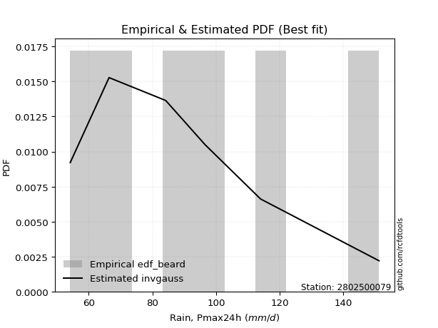</img>

</div>


### 5. EDF Chegodayev (1955)

The Chegodayev formula is an empirical plotting position formula used in hydrological frequency analysis to estimate the exceedance probability or return period of a specific event from a set of observed data. It is primarily used for plotting observed data points on probability paper to fit a theoretical distribution, particularly for analyzing extreme events like maximum flood flows or rainfall intensities. The constant _b_ value in the generalized plotting position formula is 0.3.

<div align="center">


$P=(m-b)/(n+1-2b)$


</div>


**5.1. Empirical values**

<div align="center">

|                | 0                   | 1                  | 2                  | 3                  | 4                 | 5                 |
|:---------------|:--------------------|:-------------------|:-------------------|:-------------------|:------------------|:------------------|
| date           | 2023                | 2020               | 2022               | 2021               | 2019              | 2024              |
| x              | 54.2                | 66.4               | 84.2               | 96.6               | 114.0             | 151.2             |
| m              | 1                   | 2                  | 3                  | 4                  | 5                 | 6                 |
| empirical_dist | edf_chegodayev      | edf_chegodayev     | edf_chegodayev     | edf_chegodayev     | edf_chegodayev    | edf_chegodayev    |
| empirical      | 0.10937499999999999 | 0.265625           | 0.421875           | 0.578125           | 0.734375          | 0.890625          |
| empirical_tr   | 1.1228070175438596  | 1.3617021276595744 | 1.7297297297297298 | 2.3703703703703702 | 3.764705882352941 | 9.142857142857142 |

</div>


**5.2. Kolmogorov-Smirnov fit test (sorted by Δ)**


<div align="center">

|                | 0                    | 1                  | 2                    | 3                   | 4                   | 5                   | 6                   | 7                   | 8                   | 9                   | 10                 | 11                  | 12                  | 13                  | 14                  | 15                  | 16                  | 17                  | 18                  | 19                  | 20                  | 21                  | 22                  | 23                  | 24                  | 25                  | 26                  | 27                  | 28                  | 29                  | 30                  | 31                  | 32                  | 33                 | 34                  | 35                  | 36                  | 37                 | 38                  | 39                  | 40                  | 41                  | 42                  | 43                  | 44                  | 45                  | 46                 | 47                  | 48                  | 49                  | 50                    | 51                  | 52                  | 53                  | 54                  | 55                  | 56                  | 57                  | 58                 | 59                  | 60                  | 61                  | 62                  | 63                  | 64                  | 65                  | 66                  | 67                 | 68                | 69                  | 70                  | 71                  | 72                  | 73                 | 74                  | 75                  | 76                  | 77                 | 78                  | 79             | 80             | 81                  | 82                | 83                 | 84                  | 85                  | 86                 | 87                 |
|:---------------|:---------------------|:-------------------|:---------------------|:--------------------|:--------------------|:--------------------|:--------------------|:--------------------|:--------------------|:--------------------|:-------------------|:--------------------|:--------------------|:--------------------|:--------------------|:--------------------|:--------------------|:--------------------|:--------------------|:--------------------|:--------------------|:--------------------|:--------------------|:--------------------|:--------------------|:--------------------|:--------------------|:--------------------|:--------------------|:--------------------|:--------------------|:--------------------|:--------------------|:-------------------|:--------------------|:--------------------|:--------------------|:-------------------|:--------------------|:--------------------|:--------------------|:--------------------|:--------------------|:--------------------|:--------------------|:--------------------|:-------------------|:--------------------|:--------------------|:--------------------|:----------------------|:--------------------|:--------------------|:--------------------|:--------------------|:--------------------|:--------------------|:--------------------|:-------------------|:--------------------|:--------------------|:--------------------|:--------------------|:--------------------|:--------------------|:--------------------|:--------------------|:-------------------|:------------------|:--------------------|:--------------------|:--------------------|:--------------------|:-------------------|:--------------------|:--------------------|:--------------------|:-------------------|:--------------------|:---------------|:---------------|:--------------------|:------------------|:-------------------|:--------------------|:--------------------|:-------------------|:-------------------|
| station        | 2802500079           | 2802500079         | 2802500079           | 2802500079          | 2802500079          | 2802500079          | 2802500079          | 2802500079          | 2802500079          | 2802500079          | 2802500079         | 2802500079          | 2802500079          | 2802500079          | 2802500079          | 2802500079          | 2802500079          | 2802500079          | 2802500079          | 2802500079          | 2802500079          | 2802500079          | 2802500079          | 2802500079          | 2802500079          | 2802500079          | 2802500079          | 2802500079          | 2802500079          | 2802500079          | 2802500079          | 2802500079          | 2802500079          | 2802500079         | 2802500079          | 2802500079          | 2802500079          | 2802500079         | 2802500079          | 2802500079          | 2802500079          | 2802500079          | 2802500079          | 2802500079          | 2802500079          | 2802500079          | 2802500079         | 2802500079          | 2802500079          | 2802500079          | 2802500079            | 2802500079          | 2802500079          | 2802500079          | 2802500079          | 2802500079          | 2802500079          | 2802500079          | 2802500079         | 2802500079          | 2802500079          | 2802500079          | 2802500079          | 2802500079          | 2802500079          | 2802500079          | 2802500079          | 2802500079         | 2802500079        | 2802500079          | 2802500079          | 2802500079          | 2802500079          | 2802500079         | 2802500079          | 2802500079          | 2802500079          | 2802500079         | 2802500079          | 2802500079     | 2802500079     | 2802500079          | 2802500079        | 2802500079         | 2802500079          | 2802500079          | 2802500079         | 2802500079         |
| empirical_dist | edf_chegodayev       | edf_chegodayev     | edf_chegodayev       | edf_chegodayev      | edf_chegodayev      | edf_chegodayev      | edf_chegodayev      | edf_chegodayev      | edf_chegodayev      | edf_chegodayev      | edf_chegodayev     | edf_chegodayev      | edf_chegodayev      | edf_chegodayev      | edf_chegodayev      | edf_chegodayev      | edf_chegodayev      | edf_chegodayev      | edf_chegodayev      | edf_chegodayev      | edf_chegodayev      | edf_chegodayev      | edf_chegodayev      | edf_chegodayev      | edf_chegodayev      | edf_chegodayev      | edf_chegodayev      | edf_chegodayev      | edf_chegodayev      | edf_chegodayev      | edf_chegodayev      | edf_chegodayev      | edf_chegodayev      | edf_chegodayev     | edf_chegodayev      | edf_chegodayev      | edf_chegodayev      | edf_chegodayev     | edf_chegodayev      | edf_chegodayev      | edf_chegodayev      | edf_chegodayev      | edf_chegodayev      | edf_chegodayev      | edf_chegodayev      | edf_chegodayev      | edf_chegodayev     | edf_chegodayev      | edf_chegodayev      | edf_chegodayev      | edf_chegodayev        | edf_chegodayev      | edf_chegodayev      | edf_chegodayev      | edf_chegodayev      | edf_chegodayev      | edf_chegodayev      | edf_chegodayev      | edf_chegodayev     | edf_chegodayev      | edf_chegodayev      | edf_chegodayev      | edf_chegodayev      | edf_chegodayev      | edf_chegodayev      | edf_chegodayev      | edf_chegodayev      | edf_chegodayev     | edf_chegodayev    | edf_chegodayev      | edf_chegodayev      | edf_chegodayev      | edf_chegodayev      | edf_chegodayev     | edf_chegodayev      | edf_chegodayev      | edf_chegodayev      | edf_chegodayev     | edf_chegodayev      | edf_chegodayev | edf_chegodayev | edf_chegodayev      | edf_chegodayev    | edf_chegodayev     | edf_chegodayev      | edf_chegodayev      | edf_chegodayev     | edf_chegodayev     |
| p_dist         | invgauss             | rayleigh           | johnsonsu            | logmaxwell          | loginvgauss         | maxwell             | logweibull_min      | lograyleigh         | logrice             | loginvgamma         | logmielke          | logalpha            | ncf                 | invgamma            | nct                 | f                   | betaprime           | fisk                | mielke              | pearson3            | logfatiguelife      | logncf              | logbetaprime        | logjohnsonsu        | logf                | logloggamma         | logerlang           | lognct              | loggamma            | loggamma            | logpearson3         | logexponnorm        | logt                | logcrystalball     | lognorm             | lognorm             | t                   | loggenlogistic     | genlogistic         | crystalball         | norm                | truncnorm           | kstwobign           | alpha               | logfisk             | loginvweibull       | halfnorm           | loggumbel_r         | logkstwobign        | gumbel_r            | loglaplace_asymmetric | loglogistic         | rice                | logistic            | loggumbel_l         | laplace_asymmetric  | logmoyal            | moyal               | loghypsecant       | loggenexpon         | exponnorm           | hypsecant           | loggompertz         | gompertz            | expon               | halflogistic        | loghalfnorm         | loghalflogistic    | gumbel_l          | loglaplace          | laplace             | nakagami            | logexpon            | lognakagami        | logchi2             | gamma               | weibull_min         | logwald            | wald                | gibrat         | loggibrat      | logtruncnorm        | loglognorm        | invweibull         | fatiguelife         | erlang              | genexpon           | chi2               |
| delta          | 0.056647265904890595 | 0.0601597523436492 | 0.061336467603688716 | 0.06380920540202908 | 0.06434114436954105 | 0.06463641549515564 | 0.06917101618515961 | 0.06933688553894762 | 0.06963357347068405 | 0.06979545285923539 | 0.0703109538884184 | 0.07036806474817509 | 0.07110827399260758 | 0.07111366710490166 | 0.07112117411616636 | 0.07168390038300132 | 0.07172309860505971 | 0.07199404140593044 | 0.07208955904496561 | 0.07254940035450033 | 0.07278770972618359 | 0.07304247196045249 | 0.07321645588976552 | 0.07334141721070786 | 0.07351520625156613 | 0.07407599483192487 | 0.07412400696101393 | 0.07414844122640601 | 0.07428332547655475 | 0.07428332547655475 | 0.07437891600876784 | 0.07491259079476287 | 0.07491473818885952 | 0.0749147896843706 | 0.07491489325893397 | 0.07491489325893397 | 0.07501574286921564 | 0.0750837862482347 | 0.07546150731631066 | 0.07560074911982115 | 0.07560075694810636 | 0.07560075704640479 | 0.07588179929562253 | 0.07641228155045299 | 0.07747819252135457 | 0.07775065956485389 | 0.0787047101448824 | 0.08749826517072465 | 0.08801162541948071 | 0.08849210281916028 | 0.08986127275259323   | 0.09590131779281319 | 0.09600757166882909 | 0.09654558489568632 | 0.09862769289963902 | 0.10205503073149066 | 0.10515409257058361 | 0.10551165811975216 | 0.1079499126222205 | 0.10817714870929894 | 0.10823602562843936 | 0.10854885600680708 | 0.10937498942474505 | 0.10937499995093414 | 0.10937499999999999 | 0.10937499999999999 | 0.10937499999999999 | 0.1099968479115776 | 0.120117538131718 | 0.12061949377977566 | 0.12113625883155818 | 0.15004722515623348 | 0.16488140319853928 | 0.1672889558156252 | 0.20784385554197626 | 0.20821172606438643 | 0.24983721632812628 | 0.2536263165352877 | 0.25470972269173786 | 0.265625       | 0.265625       | 0.29495991663451826 | 0.380042523152861 | 0.4391863162771455 | 0.44313882491408907 | 0.45830430382777065 | 0.7215722226248585 | 0.7332940175050086 |
| deltao         | 0.530385761606       | 0.530385761606     | 0.530385761606       | 0.530385761606      | 0.530385761606      | 0.530385761606      | 0.530385761606      | 0.530385761606      | 0.530385761606      | 0.530385761606      | 0.530385761606     | 0.530385761606      | 0.530385761606      | 0.530385761606      | 0.530385761606      | 0.530385761606      | 0.530385761606      | 0.530385761606      | 0.530385761606      | 0.530385761606      | 0.530385761606      | 0.530385761606      | 0.530385761606      | 0.530385761606      | 0.530385761606      | 0.530385761606      | 0.530385761606      | 0.530385761606      | 0.530385761606      | 0.530385761606      | 0.530385761606      | 0.530385761606      | 0.530385761606      | 0.530385761606     | 0.530385761606      | 0.530385761606      | 0.530385761606      | 0.530385761606     | 0.530385761606      | 0.530385761606      | 0.530385761606      | 0.530385761606      | 0.530385761606      | 0.530385761606      | 0.530385761606      | 0.530385761606      | 0.530385761606     | 0.530385761606      | 0.530385761606      | 0.530385761606      | 0.530385761606        | 0.530385761606      | 0.530385761606      | 0.530385761606      | 0.530385761606      | 0.530385761606      | 0.530385761606      | 0.530385761606      | 0.530385761606     | 0.530385761606      | 0.530385761606      | 0.530385761606      | 0.530385761606      | 0.530385761606      | 0.530385761606      | 0.530385761606      | 0.530385761606      | 0.530385761606     | 0.530385761606    | 0.530385761606      | 0.530385761606      | 0.530385761606      | 0.530385761606      | 0.530385761606     | 0.530385761606      | 0.530385761606      | 0.530385761606      | 0.530385761606     | 0.530385761606      | 0.530385761606 | 0.530385761606 | 0.530385761606      | 0.530385761606    | 0.530385761606     | 0.530385761606      | 0.530385761606      | 0.530385761606     | 0.530385761606     |
| eval           | Δo > Δ               | Δo > Δ             | Δo > Δ               | Δo > Δ              | Δo > Δ              | Δo > Δ              | Δo > Δ              | Δo > Δ              | Δo > Δ              | Δo > Δ              | Δo > Δ             | Δo > Δ              | Δo > Δ              | Δo > Δ              | Δo > Δ              | Δo > Δ              | Δo > Δ              | Δo > Δ              | Δo > Δ              | Δo > Δ              | Δo > Δ              | Δo > Δ              | Δo > Δ              | Δo > Δ              | Δo > Δ              | Δo > Δ              | Δo > Δ              | Δo > Δ              | Δo > Δ              | Δo > Δ              | Δo > Δ              | Δo > Δ              | Δo > Δ              | Δo > Δ             | Δo > Δ              | Δo > Δ              | Δo > Δ              | Δo > Δ             | Δo > Δ              | Δo > Δ              | Δo > Δ              | Δo > Δ              | Δo > Δ              | Δo > Δ              | Δo > Δ              | Δo > Δ              | Δo > Δ             | Δo > Δ              | Δo > Δ              | Δo > Δ              | Δo > Δ                | Δo > Δ              | Δo > Δ              | Δo > Δ              | Δo > Δ              | Δo > Δ              | Δo > Δ              | Δo > Δ              | Δo > Δ             | Δo > Δ              | Δo > Δ              | Δo > Δ              | Δo > Δ              | Δo > Δ              | Δo > Δ              | Δo > Δ              | Δo > Δ              | Δo > Δ             | Δo > Δ            | Δo > Δ              | Δo > Δ              | Δo > Δ              | Δo > Δ              | Δo > Δ             | Δo > Δ              | Δo > Δ              | Δo > Δ              | Δo > Δ             | Δo > Δ              | Δo > Δ         | Δo > Δ         | Δo > Δ              | Δo > Δ            | Δo > Δ             | Δo > Δ              | Δo > Δ              | Δo <= Δ            | Δo <= Δ            |
| fit            | 1                    | 1                  | 1                    | 1                   | 1                   | 1                   | 1                   | 1                   | 1                   | 1                   | 1                  | 1                   | 1                   | 1                   | 1                   | 1                   | 1                   | 1                   | 1                   | 1                   | 1                   | 1                   | 1                   | 1                   | 1                   | 1                   | 1                   | 1                   | 1                   | 1                   | 1                   | 1                   | 1                   | 1                  | 1                   | 1                   | 1                   | 1                  | 1                   | 1                   | 1                   | 1                   | 1                   | 1                   | 1                   | 1                   | 1                  | 1                   | 1                   | 1                   | 1                     | 1                   | 1                   | 1                   | 1                   | 1                   | 1                   | 1                   | 1                  | 1                   | 1                   | 1                   | 1                   | 1                   | 1                   | 1                   | 1                   | 1                  | 1                 | 1                   | 1                   | 1                   | 1                   | 1                  | 1                   | 1                   | 1                   | 1                  | 1                   | 1              | 1              | 1                   | 1                 | 1                  | 1                   | 1                   | 0                  | 0                  |
| n              | 6                    | 6                  | 6                    | 6                   | 6                   | 6                   | 6                   | 6                   | 6                   | 6                   | 6                  | 6                   | 6                   | 6                   | 6                   | 6                   | 6                   | 6                   | 6                   | 6                   | 6                   | 6                   | 6                   | 6                   | 6                   | 6                   | 6                   | 6                   | 6                   | 6                   | 6                   | 6                   | 6                   | 6                  | 6                   | 6                   | 6                   | 6                  | 6                   | 6                   | 6                   | 6                   | 6                   | 6                   | 6                   | 6                   | 6                  | 6                   | 6                   | 6                   | 6                     | 6                   | 6                   | 6                   | 6                   | 6                   | 6                   | 6                   | 6                  | 6                   | 6                   | 6                   | 6                   | 6                   | 6                   | 6                   | 6                   | 6                  | 6                 | 6                   | 6                   | 6                   | 6                   | 6                  | 6                   | 6                   | 6                   | 6                  | 6                   | 6              | 6              | 6                   | 6                 | 6                  | 6                   | 6                   | 6                  | 6                  |
| best_fit       | 1                    | 0                  | 0                    | 0                   | 0                   | 0                   | 0                   | 0                   | 0                   | 0                   | 0                  | 0                   | 0                   | 0                   | 0                   | 0                   | 0                   | 0                   | 0                   | 0                   | 0                   | 0                   | 0                   | 0                   | 0                   | 0                   | 0                   | 0                   | 0                   | 0                   | 0                   | 0                   | 0                   | 0                  | 0                   | 0                   | 0                   | 0                  | 0                   | 0                   | 0                   | 0                   | 0                   | 0                   | 0                   | 0                   | 0                  | 0                   | 0                   | 0                   | 0                     | 0                   | 0                   | 0                   | 0                   | 0                   | 0                   | 0                   | 0                  | 0                   | 0                   | 0                   | 0                   | 0                   | 0                   | 0                   | 0                   | 0                  | 0                 | 0                   | 0                   | 0                   | 0                   | 0                  | 0                   | 0                   | 0                   | 0                  | 0                   | 0              | 0              | 0                   | 0                 | 0                  | 0                   | 0                   | 0                  | 0                  |
| best_fit_sort  | 1                    | 2                  | 3                    | 4                   | 5                   | 6                   | 7                   | 8                   | 9                   | 10                  | 11                 | 12                  | 13                  | 14                  | 15                  | 16                  | 17                  | 18                  | 19                  | 20                  | 21                  | 22                  | 23                  | 24                  | 25                  | 26                  | 27                  | 28                  | 29                  | 30                  | 31                  | 32                  | 33                  | 34                 | 35                  | 36                  | 37                  | 38                 | 39                  | 40                  | 41                  | 42                  | 43                  | 44                  | 45                  | 46                  | 47                 | 48                  | 49                  | 50                  | 51                    | 52                  | 53                  | 54                  | 55                  | 56                  | 57                  | 58                  | 59                 | 60                  | 61                  | 62                  | 63                  | 64                  | 65                  | 66                  | 67                  | 68                 | 69                | 70                  | 71                  | 72                  | 73                  | 74                 | 75                  | 76                  | 77                  | 78                 | 79                  | 80             | 81             | 82                  | 83                | 84                 | 85                  | 86                  | 87                 | 88                 |

</div>


**5.3. Best fit**

<div align="center">

|   id |    station | empirical_dist   | p_dist   |     delta |   deltao | eval   |   fit |   n |   best_fit |   best_fit_sort |
|-----:|-----------:|:-----------------|:---------|----------:|---------:|:-------|------:|----:|-----------:|----------------:|
|    0 | 2802500079 | edf_chegodayev   | invgauss | 0.0566473 | 0.530386 | Δo > Δ |     1 |   6 |          1 |               1 |

</div>


<div align="center">

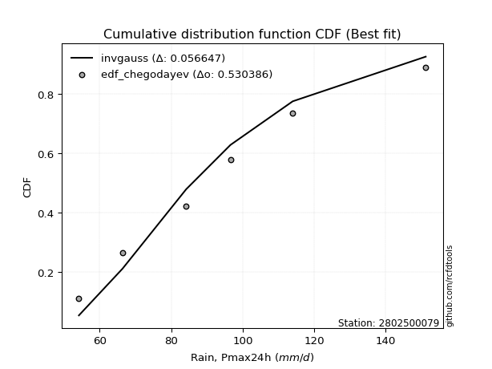</img>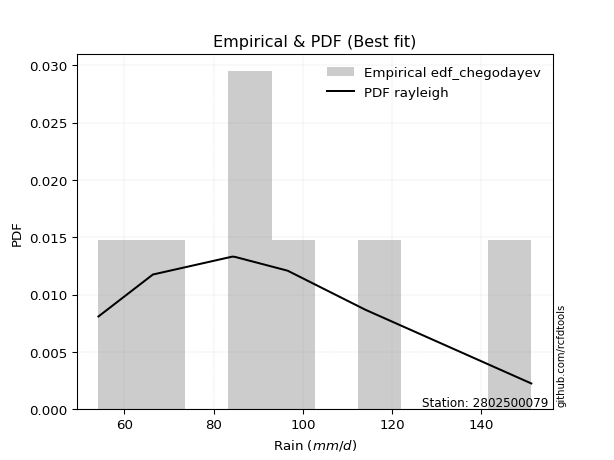</img>

</div>


### 6. EDF Blom (1958)

The Blom formula is a specific "plotting position" formula used in hydrology and statistical analysis to estimate the empirical cumulative probability (or non-exceedance probability) of a data series. It is particularly recommended for data that are approximately normally distributed. The constant _a_ is set to 0.375 (or 3/8).

<div align="center">


$P=(m-a)/(n+1-2a)$


</div>


**6.1. Empirical values**

<div align="center">

|                | 0                  | 1                  | 2                  | 3                 | 4                 | 5                  |
|:---------------|:-------------------|:-------------------|:-------------------|:------------------|:------------------|:-------------------|
| date           | 2023               | 2020               | 2022               | 2021              | 2019              | 2024               |
| x              | 54.2               | 66.4               | 84.2               | 96.6              | 114.0             | 151.2              |
| m              | 1                  | 2                  | 3                  | 4                 | 5                 | 6                  |
| empirical_dist | edf_blom           | edf_blom           | edf_blom           | edf_blom          | edf_blom          | edf_blom           |
| empirical      | 0.1                | 0.26               | 0.42               | 0.58              | 0.74              | 0.9                |
| empirical_tr   | 1.1111111111111112 | 1.3513513513513513 | 1.7241379310344827 | 2.380952380952381 | 3.846153846153846 | 10.000000000000002 |

</div>


**6.2. Kolmogorov-Smirnov fit test (sorted by Δ)**


<div align="center">

|                | 0                   | 1                    | 2                   | 3                   | 4                   | 5                   | 6                    | 7                   | 8                   | 9                  | 10                 | 11                  | 12                  | 13                  | 14                  | 15                  | 16                  | 17                  | 18                 | 19                 | 20                  | 21                  | 22                  | 23                  | 24                  | 25                  | 26                  | 27                  | 28                  | 29                  | 30                  | 31                 | 32                  | 33                  | 34                  | 35                  | 36                  | 37                  | 38                  | 39                 | 40                  | 41                | 42                  | 43                  | 44                  | 45                  | 46                 | 47                  | 48                 | 49                    | 50                  | 51                 | 52                 | 53                  | 54                  | 55                  | 56                  | 57                  | 58                  | 59                  | 60             | 61             | 62                  | 63                  | 64                  | 65                  | 66                  | 67                  | 68                  | 69                  | 70                  | 71                 | 72                 | 73                 | 74                  | 75                  | 76                 | 77                  | 78                 | 79             | 80             | 81                 | 82                | 83                 | 84                  | 85                  | 86                 | 87                 |
|:---------------|:--------------------|:---------------------|:--------------------|:--------------------|:--------------------|:--------------------|:---------------------|:--------------------|:--------------------|:-------------------|:-------------------|:--------------------|:--------------------|:--------------------|:--------------------|:--------------------|:--------------------|:--------------------|:-------------------|:-------------------|:--------------------|:--------------------|:--------------------|:--------------------|:--------------------|:--------------------|:--------------------|:--------------------|:--------------------|:--------------------|:--------------------|:-------------------|:--------------------|:--------------------|:--------------------|:--------------------|:--------------------|:--------------------|:--------------------|:-------------------|:--------------------|:------------------|:--------------------|:--------------------|:--------------------|:--------------------|:-------------------|:--------------------|:-------------------|:----------------------|:--------------------|:-------------------|:-------------------|:--------------------|:--------------------|:--------------------|:--------------------|:--------------------|:--------------------|:--------------------|:---------------|:---------------|:--------------------|:--------------------|:--------------------|:--------------------|:--------------------|:--------------------|:--------------------|:--------------------|:--------------------|:-------------------|:-------------------|:-------------------|:--------------------|:--------------------|:-------------------|:--------------------|:-------------------|:---------------|:---------------|:-------------------|:------------------|:-------------------|:--------------------|:--------------------|:-------------------|:-------------------|
| station        | 2802500079          | 2802500079           | 2802500079          | 2802500079          | 2802500079          | 2802500079          | 2802500079           | 2802500079          | 2802500079          | 2802500079         | 2802500079         | 2802500079          | 2802500079          | 2802500079          | 2802500079          | 2802500079          | 2802500079          | 2802500079          | 2802500079         | 2802500079         | 2802500079          | 2802500079          | 2802500079          | 2802500079          | 2802500079          | 2802500079          | 2802500079          | 2802500079          | 2802500079          | 2802500079          | 2802500079          | 2802500079         | 2802500079          | 2802500079          | 2802500079          | 2802500079          | 2802500079          | 2802500079          | 2802500079          | 2802500079         | 2802500079          | 2802500079        | 2802500079          | 2802500079          | 2802500079          | 2802500079          | 2802500079         | 2802500079          | 2802500079         | 2802500079            | 2802500079          | 2802500079         | 2802500079         | 2802500079          | 2802500079          | 2802500079          | 2802500079          | 2802500079          | 2802500079          | 2802500079          | 2802500079     | 2802500079     | 2802500079          | 2802500079          | 2802500079          | 2802500079          | 2802500079          | 2802500079          | 2802500079          | 2802500079          | 2802500079          | 2802500079         | 2802500079         | 2802500079         | 2802500079          | 2802500079          | 2802500079         | 2802500079          | 2802500079         | 2802500079     | 2802500079     | 2802500079         | 2802500079        | 2802500079         | 2802500079          | 2802500079          | 2802500079         | 2802500079         |
| empirical_dist | edf_blom            | edf_blom             | edf_blom            | edf_blom            | edf_blom            | edf_blom            | edf_blom             | edf_blom            | edf_blom            | edf_blom           | edf_blom           | edf_blom            | edf_blom            | edf_blom            | edf_blom            | edf_blom            | edf_blom            | edf_blom            | edf_blom           | edf_blom           | edf_blom            | edf_blom            | edf_blom            | edf_blom            | edf_blom            | edf_blom            | edf_blom            | edf_blom            | edf_blom            | edf_blom            | edf_blom            | edf_blom           | edf_blom            | edf_blom            | edf_blom            | edf_blom            | edf_blom            | edf_blom            | edf_blom            | edf_blom           | edf_blom            | edf_blom          | edf_blom            | edf_blom            | edf_blom            | edf_blom            | edf_blom           | edf_blom            | edf_blom           | edf_blom              | edf_blom            | edf_blom           | edf_blom           | edf_blom            | edf_blom            | edf_blom            | edf_blom            | edf_blom            | edf_blom            | edf_blom            | edf_blom       | edf_blom       | edf_blom            | edf_blom            | edf_blom            | edf_blom            | edf_blom            | edf_blom            | edf_blom            | edf_blom            | edf_blom            | edf_blom           | edf_blom           | edf_blom           | edf_blom            | edf_blom            | edf_blom           | edf_blom            | edf_blom           | edf_blom       | edf_blom       | edf_blom           | edf_blom          | edf_blom           | edf_blom            | edf_blom            | edf_blom           | edf_blom           |
| p_dist         | rayleigh            | johnsonsu            | logmaxwell          | invgauss            | loginvgauss         | maxwell             | lograyleigh          | logweibull_min      | logrice             | loginvgamma        | logalpha           | ncf                 | invgamma            | nct                 | f                   | betaprime           | fisk                | pearson3            | logfatiguelife     | logncf             | logbetaprime        | logjohnsonsu        | logf                | logloggamma         | logerlang           | lognct              | loggamma            | loggamma            | logpearson3         | logexponnorm        | logt                | logcrystalball     | lognorm             | lognorm             | halfnorm            | t                   | genlogistic         | crystalball         | norm                | truncnorm          | kstwobign           | alpha             | logfisk             | logmielke           | mielke              | loggenlogistic      | loginvweibull      | loggumbel_r         | gumbel_r           | loglaplace_asymmetric | logkstwobign        | loglogistic        | rice               | logistic            | loggumbel_l         | laplace_asymmetric  | loggenexpon         | moyal               | loggompertz         | gompertz            | halflogistic   | loghalfnorm    | loghypsecant        | hypsecant           | logmoyal            | expon               | exponnorm           | loghalflogistic     | loglaplace          | laplace             | gumbel_l            | nakagami           | logexpon           | lognakagami        | gamma               | logchi2             | logwald            | wald                | weibull_min        | gibrat         | loggibrat      | logtruncnorm       | loglognorm        | invweibull         | fatiguelife         | erlang              | genexpon           | chi2               |
| delta          | 0.05453475234364921 | 0.055711467603688725 | 0.05818420540202909 | 0.05845671719765272 | 0.05871614436954106 | 0.05901141549515565 | 0.059961885538947636 | 0.06196286943108836 | 0.06400857347068406 | 0.0641704528592354 | 0.0647430647481751 | 0.06548327399260759 | 0.06548866710490167 | 0.06549617411616637 | 0.06605890038300133 | 0.06609809860505972 | 0.06636904140593045 | 0.06692440035450034 | 0.0671627097261836 | 0.0674174719604525 | 0.06759145588976553 | 0.06771641721070787 | 0.06789020625156614 | 0.06845099483192488 | 0.06849900696101394 | 0.06852344122640602 | 0.06865832547655476 | 0.06865832547655476 | 0.06875391600876785 | 0.06928759079476288 | 0.06928973818885953 | 0.0692897896843706 | 0.06928989325893398 | 0.06928989325893398 | 0.06932971014488241 | 0.06939074286921565 | 0.06983650731631066 | 0.06997574911982116 | 0.06997575694810637 | 0.0699757570464048 | 0.07025679929562254 | 0.070787281550453 | 0.07185319252135458 | 0.07218595388841842 | 0.07396455904496563 | 0.07695878624823471 | 0.0796256595648539 | 0.08187326517072466 | 0.0828671028191603 | 0.08423627275259324   | 0.08988662541948073 | 0.0902763177928132 | 0.0903825716688291 | 0.09092058489568633 | 0.09300269289963903 | 0.09643003073149067 | 0.09880214870929896 | 0.09988665811975217 | 0.09999998942474507 | 0.09999999995093416 | 0.1            | 0.1            | 0.10232491262222052 | 0.10292385600680709 | 0.10327909257058365 | 0.10557435396701614 | 0.10897997333592951 | 0.11187184791157762 | 0.11499449377977566 | 0.11551125883155819 | 0.12199253813171795 | 0.1519222251562335 | 0.1667564031985393 | 0.1691639558156252 | 0.21008672606438644 | 0.21721885554197629 | 0.2480013165352877 | 0.24908472269173784 | 0.2517122163281263 | 0.26           | 0.26           | 0.2968349166345183 | 0.385667523152861 | 0.4485613162771455 | 0.44876382491408906 | 0.46392930382777064 | 0.7271972226248585 | 0.7389190175050085 |
| deltao         | 0.530385761606      | 0.530385761606       | 0.530385761606      | 0.530385761606      | 0.530385761606      | 0.530385761606      | 0.530385761606       | 0.530385761606      | 0.530385761606      | 0.530385761606     | 0.530385761606     | 0.530385761606      | 0.530385761606      | 0.530385761606      | 0.530385761606      | 0.530385761606      | 0.530385761606      | 0.530385761606      | 0.530385761606     | 0.530385761606     | 0.530385761606      | 0.530385761606      | 0.530385761606      | 0.530385761606      | 0.530385761606      | 0.530385761606      | 0.530385761606      | 0.530385761606      | 0.530385761606      | 0.530385761606      | 0.530385761606      | 0.530385761606     | 0.530385761606      | 0.530385761606      | 0.530385761606      | 0.530385761606      | 0.530385761606      | 0.530385761606      | 0.530385761606      | 0.530385761606     | 0.530385761606      | 0.530385761606    | 0.530385761606      | 0.530385761606      | 0.530385761606      | 0.530385761606      | 0.530385761606     | 0.530385761606      | 0.530385761606     | 0.530385761606        | 0.530385761606      | 0.530385761606     | 0.530385761606     | 0.530385761606      | 0.530385761606      | 0.530385761606      | 0.530385761606      | 0.530385761606      | 0.530385761606      | 0.530385761606      | 0.530385761606 | 0.530385761606 | 0.530385761606      | 0.530385761606      | 0.530385761606      | 0.530385761606      | 0.530385761606      | 0.530385761606      | 0.530385761606      | 0.530385761606      | 0.530385761606      | 0.530385761606     | 0.530385761606     | 0.530385761606     | 0.530385761606      | 0.530385761606      | 0.530385761606     | 0.530385761606      | 0.530385761606     | 0.530385761606 | 0.530385761606 | 0.530385761606     | 0.530385761606    | 0.530385761606     | 0.530385761606      | 0.530385761606      | 0.530385761606     | 0.530385761606     |
| eval           | Δo > Δ              | Δo > Δ               | Δo > Δ              | Δo > Δ              | Δo > Δ              | Δo > Δ              | Δo > Δ               | Δo > Δ              | Δo > Δ              | Δo > Δ             | Δo > Δ             | Δo > Δ              | Δo > Δ              | Δo > Δ              | Δo > Δ              | Δo > Δ              | Δo > Δ              | Δo > Δ              | Δo > Δ             | Δo > Δ             | Δo > Δ              | Δo > Δ              | Δo > Δ              | Δo > Δ              | Δo > Δ              | Δo > Δ              | Δo > Δ              | Δo > Δ              | Δo > Δ              | Δo > Δ              | Δo > Δ              | Δo > Δ             | Δo > Δ              | Δo > Δ              | Δo > Δ              | Δo > Δ              | Δo > Δ              | Δo > Δ              | Δo > Δ              | Δo > Δ             | Δo > Δ              | Δo > Δ            | Δo > Δ              | Δo > Δ              | Δo > Δ              | Δo > Δ              | Δo > Δ             | Δo > Δ              | Δo > Δ             | Δo > Δ                | Δo > Δ              | Δo > Δ             | Δo > Δ             | Δo > Δ              | Δo > Δ              | Δo > Δ              | Δo > Δ              | Δo > Δ              | Δo > Δ              | Δo > Δ              | Δo > Δ         | Δo > Δ         | Δo > Δ              | Δo > Δ              | Δo > Δ              | Δo > Δ              | Δo > Δ              | Δo > Δ              | Δo > Δ              | Δo > Δ              | Δo > Δ              | Δo > Δ             | Δo > Δ             | Δo > Δ             | Δo > Δ              | Δo > Δ              | Δo > Δ             | Δo > Δ              | Δo > Δ             | Δo > Δ         | Δo > Δ         | Δo > Δ             | Δo > Δ            | Δo > Δ             | Δo > Δ              | Δo > Δ              | Δo <= Δ            | Δo <= Δ            |
| fit            | 1                   | 1                    | 1                   | 1                   | 1                   | 1                   | 1                    | 1                   | 1                   | 1                  | 1                  | 1                   | 1                   | 1                   | 1                   | 1                   | 1                   | 1                   | 1                  | 1                  | 1                   | 1                   | 1                   | 1                   | 1                   | 1                   | 1                   | 1                   | 1                   | 1                   | 1                   | 1                  | 1                   | 1                   | 1                   | 1                   | 1                   | 1                   | 1                   | 1                  | 1                   | 1                 | 1                   | 1                   | 1                   | 1                   | 1                  | 1                   | 1                  | 1                     | 1                   | 1                  | 1                  | 1                   | 1                   | 1                   | 1                   | 1                   | 1                   | 1                   | 1              | 1              | 1                   | 1                   | 1                   | 1                   | 1                   | 1                   | 1                   | 1                   | 1                   | 1                  | 1                  | 1                  | 1                   | 1                   | 1                  | 1                   | 1                  | 1              | 1              | 1                  | 1                 | 1                  | 1                   | 1                   | 0                  | 0                  |
| n              | 6                   | 6                    | 6                   | 6                   | 6                   | 6                   | 6                    | 6                   | 6                   | 6                  | 6                  | 6                   | 6                   | 6                   | 6                   | 6                   | 6                   | 6                   | 6                  | 6                  | 6                   | 6                   | 6                   | 6                   | 6                   | 6                   | 6                   | 6                   | 6                   | 6                   | 6                   | 6                  | 6                   | 6                   | 6                   | 6                   | 6                   | 6                   | 6                   | 6                  | 6                   | 6                 | 6                   | 6                   | 6                   | 6                   | 6                  | 6                   | 6                  | 6                     | 6                   | 6                  | 6                  | 6                   | 6                   | 6                   | 6                   | 6                   | 6                   | 6                   | 6              | 6              | 6                   | 6                   | 6                   | 6                   | 6                   | 6                   | 6                   | 6                   | 6                   | 6                  | 6                  | 6                  | 6                   | 6                   | 6                  | 6                   | 6                  | 6              | 6              | 6                  | 6                 | 6                  | 6                   | 6                   | 6                  | 6                  |
| best_fit       | 1                   | 0                    | 0                   | 0                   | 0                   | 0                   | 0                    | 0                   | 0                   | 0                  | 0                  | 0                   | 0                   | 0                   | 0                   | 0                   | 0                   | 0                   | 0                  | 0                  | 0                   | 0                   | 0                   | 0                   | 0                   | 0                   | 0                   | 0                   | 0                   | 0                   | 0                   | 0                  | 0                   | 0                   | 0                   | 0                   | 0                   | 0                   | 0                   | 0                  | 0                   | 0                 | 0                   | 0                   | 0                   | 0                   | 0                  | 0                   | 0                  | 0                     | 0                   | 0                  | 0                  | 0                   | 0                   | 0                   | 0                   | 0                   | 0                   | 0                   | 0              | 0              | 0                   | 0                   | 0                   | 0                   | 0                   | 0                   | 0                   | 0                   | 0                   | 0                  | 0                  | 0                  | 0                   | 0                   | 0                  | 0                   | 0                  | 0              | 0              | 0                  | 0                 | 0                  | 0                   | 0                   | 0                  | 0                  |
| best_fit_sort  | 1                   | 2                    | 3                   | 4                   | 5                   | 6                   | 7                    | 8                   | 9                   | 10                 | 11                 | 12                  | 13                  | 14                  | 15                  | 16                  | 17                  | 18                  | 19                 | 20                 | 21                  | 22                  | 23                  | 24                  | 25                  | 26                  | 27                  | 28                  | 29                  | 30                  | 31                  | 32                 | 33                  | 34                  | 35                  | 36                  | 37                  | 38                  | 39                  | 40                 | 41                  | 42                | 43                  | 44                  | 45                  | 46                  | 47                 | 48                  | 49                 | 50                    | 51                  | 52                 | 53                 | 54                  | 55                  | 56                  | 57                  | 58                  | 59                  | 60                  | 61             | 62             | 63                  | 64                  | 65                  | 66                  | 67                  | 68                  | 69                  | 70                  | 71                  | 72                 | 73                 | 74                 | 75                  | 76                  | 77                 | 78                  | 79                 | 80             | 81             | 82                 | 83                | 84                 | 85                  | 86                  | 87                 | 88                 |

</div>


**6.3. Best fit**

<div align="center">

|   id |    station | empirical_dist   | p_dist   |     delta |   deltao | eval   |   fit |   n |   best_fit |   best_fit_sort |
|-----:|-----------:|:-----------------|:---------|----------:|---------:|:-------|------:|----:|-----------:|----------------:|
|    0 | 2802500079 | edf_blom         | rayleigh | 0.0545348 | 0.530386 | Δo > Δ |     1 |   6 |          1 |               1 |

</div>


<div align="center">

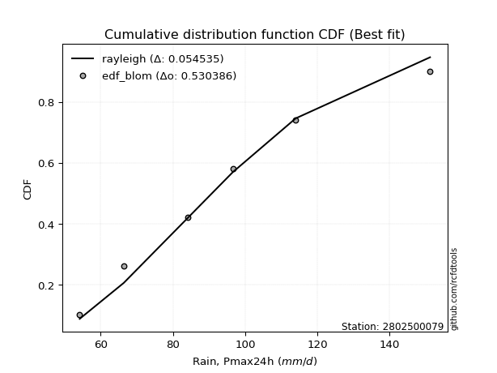</img>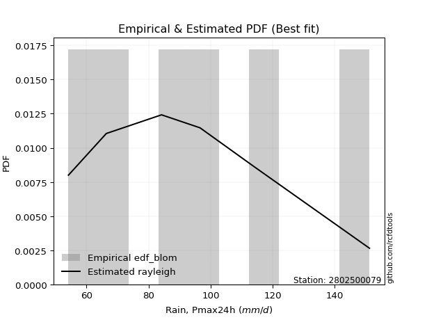</img>

</div>


### 7. EDF Tukey (1962)

In hydrology, the Tukey formula is used as a plotting position formula to estimate the empirical probability or frequency of a flood event (or other hydrological data). The formula parameter is given as _c=0.333_ (or 1/3).

<div align="center">


$P=(m-c)/(n+1-2c)$


</div>


**7.1. Empirical values**

<div align="center">

|                | 0                   | 1                  | 2                   | 3                  | 4                  | 5                  |
|:---------------|:--------------------|:-------------------|:--------------------|:-------------------|:-------------------|:-------------------|
| date           | 2023                | 2020               | 2022                | 2021               | 2019               | 2024               |
| x              | 54.2                | 66.4               | 84.2                | 96.6               | 114.0              | 151.2              |
| m              | 1                   | 2                  | 3                   | 4                  | 5                  | 6                  |
| empirical_dist | edf_tukey           | edf_tukey          | edf_tukey           | edf_tukey          | edf_tukey          | edf_tukey          |
| empirical      | 0.10526315789473684 | 0.2631578947368421 | 0.42105263157894735 | 0.5789473684210527 | 0.7368421052631579 | 0.8947368421052632 |
| empirical_tr   | 1.1176470588235294  | 1.357142857142857  | 1.7272727272727273  | 2.375              | 3.7999999999999994 | 9.5                |

</div>


**7.2. Kolmogorov-Smirnov fit test (sorted by Δ)**


<div align="center">

|                | 0                   | 1                    | 2                    | 3                    | 4                    | 5                   | 6                   | 7                   | 8                   | 9                   | 10                  | 11                  | 12                  | 13                  | 14                  | 15                 | 16                  | 17                  | 18                  | 19                  | 20                  | 21                  | 22                  | 23                  | 24                  | 25                  | 26                 | 27                  | 28                  | 29                  | 30                  | 31                  | 32                  | 33                  | 34                  | 35                  | 36                  | 37                  | 38                  | 39                  | 40                  | 41                  | 42                  | 43                  | 44                  | 45                  | 46                  | 47                  | 48                  | 49                    | 50                  | 51                  | 52                  | 53                  | 54                  | 55                  | 56                  | 57                  | 58                  | 59                 | 60                  | 61                  | 62                  | 63                  | 64                 | 65                  | 66                  | 67                  | 68                  | 69                  | 70                  | 71                  | 72                  | 73                  | 74                  | 75                  | 76                  | 77                 | 78                  | 79                 | 80                 | 81                 | 82                  | 83                  | 84                | 85                  | 86                 | 87                 |
|:---------------|:--------------------|:---------------------|:---------------------|:---------------------|:---------------------|:--------------------|:--------------------|:--------------------|:--------------------|:--------------------|:--------------------|:--------------------|:--------------------|:--------------------|:--------------------|:-------------------|:--------------------|:--------------------|:--------------------|:--------------------|:--------------------|:--------------------|:--------------------|:--------------------|:--------------------|:--------------------|:-------------------|:--------------------|:--------------------|:--------------------|:--------------------|:--------------------|:--------------------|:--------------------|:--------------------|:--------------------|:--------------------|:--------------------|:--------------------|:--------------------|:--------------------|:--------------------|:--------------------|:--------------------|:--------------------|:--------------------|:--------------------|:--------------------|:--------------------|:----------------------|:--------------------|:--------------------|:--------------------|:--------------------|:--------------------|:--------------------|:--------------------|:--------------------|:--------------------|:-------------------|:--------------------|:--------------------|:--------------------|:--------------------|:-------------------|:--------------------|:--------------------|:--------------------|:--------------------|:--------------------|:--------------------|:--------------------|:--------------------|:--------------------|:--------------------|:--------------------|:--------------------|:-------------------|:--------------------|:-------------------|:-------------------|:-------------------|:--------------------|:--------------------|:------------------|:--------------------|:-------------------|:-------------------|
| station        | 2802500079          | 2802500079           | 2802500079           | 2802500079           | 2802500079           | 2802500079          | 2802500079          | 2802500079          | 2802500079          | 2802500079          | 2802500079          | 2802500079          | 2802500079          | 2802500079          | 2802500079          | 2802500079         | 2802500079          | 2802500079          | 2802500079          | 2802500079          | 2802500079          | 2802500079          | 2802500079          | 2802500079          | 2802500079          | 2802500079          | 2802500079         | 2802500079          | 2802500079          | 2802500079          | 2802500079          | 2802500079          | 2802500079          | 2802500079          | 2802500079          | 2802500079          | 2802500079          | 2802500079          | 2802500079          | 2802500079          | 2802500079          | 2802500079          | 2802500079          | 2802500079          | 2802500079          | 2802500079          | 2802500079          | 2802500079          | 2802500079          | 2802500079            | 2802500079          | 2802500079          | 2802500079          | 2802500079          | 2802500079          | 2802500079          | 2802500079          | 2802500079          | 2802500079          | 2802500079         | 2802500079          | 2802500079          | 2802500079          | 2802500079          | 2802500079         | 2802500079          | 2802500079          | 2802500079          | 2802500079          | 2802500079          | 2802500079          | 2802500079          | 2802500079          | 2802500079          | 2802500079          | 2802500079          | 2802500079          | 2802500079         | 2802500079          | 2802500079         | 2802500079         | 2802500079         | 2802500079          | 2802500079          | 2802500079        | 2802500079          | 2802500079         | 2802500079         |
| empirical_dist | edf_tukey           | edf_tukey            | edf_tukey            | edf_tukey            | edf_tukey            | edf_tukey           | edf_tukey           | edf_tukey           | edf_tukey           | edf_tukey           | edf_tukey           | edf_tukey           | edf_tukey           | edf_tukey           | edf_tukey           | edf_tukey          | edf_tukey           | edf_tukey           | edf_tukey           | edf_tukey           | edf_tukey           | edf_tukey           | edf_tukey           | edf_tukey           | edf_tukey           | edf_tukey           | edf_tukey          | edf_tukey           | edf_tukey           | edf_tukey           | edf_tukey           | edf_tukey           | edf_tukey           | edf_tukey           | edf_tukey           | edf_tukey           | edf_tukey           | edf_tukey           | edf_tukey           | edf_tukey           | edf_tukey           | edf_tukey           | edf_tukey           | edf_tukey           | edf_tukey           | edf_tukey           | edf_tukey           | edf_tukey           | edf_tukey           | edf_tukey             | edf_tukey           | edf_tukey           | edf_tukey           | edf_tukey           | edf_tukey           | edf_tukey           | edf_tukey           | edf_tukey           | edf_tukey           | edf_tukey          | edf_tukey           | edf_tukey           | edf_tukey           | edf_tukey           | edf_tukey          | edf_tukey           | edf_tukey           | edf_tukey           | edf_tukey           | edf_tukey           | edf_tukey           | edf_tukey           | edf_tukey           | edf_tukey           | edf_tukey           | edf_tukey           | edf_tukey           | edf_tukey          | edf_tukey           | edf_tukey          | edf_tukey          | edf_tukey          | edf_tukey           | edf_tukey           | edf_tukey         | edf_tukey           | edf_tukey          | edf_tukey          |
| p_dist         | invgauss            | rayleigh             | johnsonsu            | logmaxwell           | loginvgauss          | maxwell             | logweibull_min      | lograyleigh         | logrice             | loginvgamma         | logalpha            | ncf                 | invgamma            | nct                 | f                   | betaprime          | fisk                | pearson3            | logfatiguelife      | logncf              | logbetaprime        | logjohnsonsu        | logf                | logmielke           | logloggamma         | logerlang           | lognct             | loggamma            | loggamma            | logpearson3         | logexponnorm        | logt                | logcrystalball      | lognorm             | lognorm             | t                   | mielke              | genlogistic         | crystalball         | norm                | truncnorm           | kstwobign           | alpha               | halfnorm            | logfisk             | loggenlogistic      | loginvweibull       | loggumbel_r         | gumbel_r            | loglaplace_asymmetric | logkstwobign        | loglogistic         | rice                | logistic            | loggumbel_l         | laplace_asymmetric  | moyal               | loggenexpon         | logmoyal            | loggompertz        | gompertz            | loghalfnorm         | expon               | halflogistic        | loghypsecant       | hypsecant           | exponnorm           | loghalflogistic     | loglaplace          | laplace             | gumbel_l            | nakagami            | logexpon            | lognakagami         | gamma               | logchi2             | weibull_min         | logwald            | wald                | gibrat             | loggibrat          | logtruncnorm       | loglognorm          | invweibull          | fatiguelife       | erlang              | genexpon           | chi2               |
| delta          | 0.05740408561870536 | 0.057692647080491294 | 0.058869362340530806 | 0.061342100138871175 | 0.061874039106383144 | 0.06216931023199773 | 0.06505917407989648 | 0.06522504343368446 | 0.06716646820752614 | 0.06732834759607748 | 0.06790095948501718 | 0.06864116872944967 | 0.06864656184174375 | 0.06865406885300845 | 0.06921679511984341 | 0.0692559933419018 | 0.06952693614277253 | 0.07008229509134242 | 0.07032060446302568 | 0.07057536669729458 | 0.07074935062660762 | 0.07087431194754995 | 0.07104810098840822 | 0.07113332230947106 | 0.07160888956876696 | 0.07165690169785602 | 0.0716813359632481 | 0.07181622021339684 | 0.07181622021339684 | 0.07191181074560993 | 0.07244548553160496 | 0.07244763292570161 | 0.07244768442121269 | 0.07244778799577606 | 0.07244778799577606 | 0.07254863760605773 | 0.07291192746601827 | 0.07299440205315275 | 0.07313364385666324 | 0.07313365168494845 | 0.07313365178324688 | 0.07341469403246462 | 0.07394517628729508 | 0.07459286803961925 | 0.07501108725819666 | 0.07590615466928735 | 0.07857302798590654 | 0.08503115990756674 | 0.08602499755600237 | 0.08739416748943532   | 0.08883399384053337 | 0.09343421252965528 | 0.09354046640567118 | 0.09407847963252841 | 0.09616058763648111 | 0.09958792546833276 | 0.10304455285659425 | 0.10406530660403579 | 0.10433172414953096 | 0.1052631473194819 | 0.10526315784567099 | 0.10526315789473684 | 0.10526315789473684 | 0.10526315789473684 | 0.1054828073590626 | 0.10608175074364917 | 0.10792734175698215 | 0.11081921633263025 | 0.11815238851661775 | 0.11866915356840027 | 0.12093990655277065 | 0.15086959357728613 | 0.16570377161959193 | 0.16811132423667785 | 0.20903409448543908 | 0.21195569764723943 | 0.25065958474917893 | 0.2511592112721298 | 0.25224261742857995 | 0.2631578947368421 | 0.2631578947368421 | 0.2957822850555709 | 0.38250962841601893 | 0.44329815838240866 | 0.445605930177247 | 0.46077140909092856 | 0.7240393278880164 | 0.7357611227681664 |
| deltao         | 0.530385761606      | 0.530385761606       | 0.530385761606       | 0.530385761606       | 0.530385761606       | 0.530385761606      | 0.530385761606      | 0.530385761606      | 0.530385761606      | 0.530385761606      | 0.530385761606      | 0.530385761606      | 0.530385761606      | 0.530385761606      | 0.530385761606      | 0.530385761606     | 0.530385761606      | 0.530385761606      | 0.530385761606      | 0.530385761606      | 0.530385761606      | 0.530385761606      | 0.530385761606      | 0.530385761606      | 0.530385761606      | 0.530385761606      | 0.530385761606     | 0.530385761606      | 0.530385761606      | 0.530385761606      | 0.530385761606      | 0.530385761606      | 0.530385761606      | 0.530385761606      | 0.530385761606      | 0.530385761606      | 0.530385761606      | 0.530385761606      | 0.530385761606      | 0.530385761606      | 0.530385761606      | 0.530385761606      | 0.530385761606      | 0.530385761606      | 0.530385761606      | 0.530385761606      | 0.530385761606      | 0.530385761606      | 0.530385761606      | 0.530385761606        | 0.530385761606      | 0.530385761606      | 0.530385761606      | 0.530385761606      | 0.530385761606      | 0.530385761606      | 0.530385761606      | 0.530385761606      | 0.530385761606      | 0.530385761606     | 0.530385761606      | 0.530385761606      | 0.530385761606      | 0.530385761606      | 0.530385761606     | 0.530385761606      | 0.530385761606      | 0.530385761606      | 0.530385761606      | 0.530385761606      | 0.530385761606      | 0.530385761606      | 0.530385761606      | 0.530385761606      | 0.530385761606      | 0.530385761606      | 0.530385761606      | 0.530385761606     | 0.530385761606      | 0.530385761606     | 0.530385761606     | 0.530385761606     | 0.530385761606      | 0.530385761606      | 0.530385761606    | 0.530385761606      | 0.530385761606     | 0.530385761606     |
| eval           | Δo > Δ              | Δo > Δ               | Δo > Δ               | Δo > Δ               | Δo > Δ               | Δo > Δ              | Δo > Δ              | Δo > Δ              | Δo > Δ              | Δo > Δ              | Δo > Δ              | Δo > Δ              | Δo > Δ              | Δo > Δ              | Δo > Δ              | Δo > Δ             | Δo > Δ              | Δo > Δ              | Δo > Δ              | Δo > Δ              | Δo > Δ              | Δo > Δ              | Δo > Δ              | Δo > Δ              | Δo > Δ              | Δo > Δ              | Δo > Δ             | Δo > Δ              | Δo > Δ              | Δo > Δ              | Δo > Δ              | Δo > Δ              | Δo > Δ              | Δo > Δ              | Δo > Δ              | Δo > Δ              | Δo > Δ              | Δo > Δ              | Δo > Δ              | Δo > Δ              | Δo > Δ              | Δo > Δ              | Δo > Δ              | Δo > Δ              | Δo > Δ              | Δo > Δ              | Δo > Δ              | Δo > Δ              | Δo > Δ              | Δo > Δ                | Δo > Δ              | Δo > Δ              | Δo > Δ              | Δo > Δ              | Δo > Δ              | Δo > Δ              | Δo > Δ              | Δo > Δ              | Δo > Δ              | Δo > Δ             | Δo > Δ              | Δo > Δ              | Δo > Δ              | Δo > Δ              | Δo > Δ             | Δo > Δ              | Δo > Δ              | Δo > Δ              | Δo > Δ              | Δo > Δ              | Δo > Δ              | Δo > Δ              | Δo > Δ              | Δo > Δ              | Δo > Δ              | Δo > Δ              | Δo > Δ              | Δo > Δ             | Δo > Δ              | Δo > Δ             | Δo > Δ             | Δo > Δ             | Δo > Δ              | Δo > Δ              | Δo > Δ            | Δo > Δ              | Δo <= Δ            | Δo <= Δ            |
| fit            | 1                   | 1                    | 1                    | 1                    | 1                    | 1                   | 1                   | 1                   | 1                   | 1                   | 1                   | 1                   | 1                   | 1                   | 1                   | 1                  | 1                   | 1                   | 1                   | 1                   | 1                   | 1                   | 1                   | 1                   | 1                   | 1                   | 1                  | 1                   | 1                   | 1                   | 1                   | 1                   | 1                   | 1                   | 1                   | 1                   | 1                   | 1                   | 1                   | 1                   | 1                   | 1                   | 1                   | 1                   | 1                   | 1                   | 1                   | 1                   | 1                   | 1                     | 1                   | 1                   | 1                   | 1                   | 1                   | 1                   | 1                   | 1                   | 1                   | 1                  | 1                   | 1                   | 1                   | 1                   | 1                  | 1                   | 1                   | 1                   | 1                   | 1                   | 1                   | 1                   | 1                   | 1                   | 1                   | 1                   | 1                   | 1                  | 1                   | 1                  | 1                  | 1                  | 1                   | 1                   | 1                 | 1                   | 0                  | 0                  |
| n              | 6                   | 6                    | 6                    | 6                    | 6                    | 6                   | 6                   | 6                   | 6                   | 6                   | 6                   | 6                   | 6                   | 6                   | 6                   | 6                  | 6                   | 6                   | 6                   | 6                   | 6                   | 6                   | 6                   | 6                   | 6                   | 6                   | 6                  | 6                   | 6                   | 6                   | 6                   | 6                   | 6                   | 6                   | 6                   | 6                   | 6                   | 6                   | 6                   | 6                   | 6                   | 6                   | 6                   | 6                   | 6                   | 6                   | 6                   | 6                   | 6                   | 6                     | 6                   | 6                   | 6                   | 6                   | 6                   | 6                   | 6                   | 6                   | 6                   | 6                  | 6                   | 6                   | 6                   | 6                   | 6                  | 6                   | 6                   | 6                   | 6                   | 6                   | 6                   | 6                   | 6                   | 6                   | 6                   | 6                   | 6                   | 6                  | 6                   | 6                  | 6                  | 6                  | 6                   | 6                   | 6                 | 6                   | 6                  | 6                  |
| best_fit       | 1                   | 0                    | 0                    | 0                    | 0                    | 0                   | 0                   | 0                   | 0                   | 0                   | 0                   | 0                   | 0                   | 0                   | 0                   | 0                  | 0                   | 0                   | 0                   | 0                   | 0                   | 0                   | 0                   | 0                   | 0                   | 0                   | 0                  | 0                   | 0                   | 0                   | 0                   | 0                   | 0                   | 0                   | 0                   | 0                   | 0                   | 0                   | 0                   | 0                   | 0                   | 0                   | 0                   | 0                   | 0                   | 0                   | 0                   | 0                   | 0                   | 0                     | 0                   | 0                   | 0                   | 0                   | 0                   | 0                   | 0                   | 0                   | 0                   | 0                  | 0                   | 0                   | 0                   | 0                   | 0                  | 0                   | 0                   | 0                   | 0                   | 0                   | 0                   | 0                   | 0                   | 0                   | 0                   | 0                   | 0                   | 0                  | 0                   | 0                  | 0                  | 0                  | 0                   | 0                   | 0                 | 0                   | 0                  | 0                  |
| best_fit_sort  | 1                   | 2                    | 3                    | 4                    | 5                    | 6                   | 7                   | 8                   | 9                   | 10                  | 11                  | 12                  | 13                  | 14                  | 15                  | 16                 | 17                  | 18                  | 19                  | 20                  | 21                  | 22                  | 23                  | 24                  | 25                  | 26                  | 27                 | 28                  | 29                  | 30                  | 31                  | 32                  | 33                  | 34                  | 35                  | 36                  | 37                  | 38                  | 39                  | 40                  | 41                  | 42                  | 43                  | 44                  | 45                  | 46                  | 47                  | 48                  | 49                  | 50                    | 51                  | 52                  | 53                  | 54                  | 55                  | 56                  | 57                  | 58                  | 59                  | 60                 | 61                  | 62                  | 63                  | 64                  | 65                 | 66                  | 67                  | 68                  | 69                  | 70                  | 71                  | 72                  | 73                  | 74                  | 75                  | 76                  | 77                  | 78                 | 79                  | 80                 | 81                 | 82                 | 83                  | 84                  | 85                | 86                  | 87                 | 88                 |

</div>


**7.3. Best fit**

<div align="center">

|   id |    station | empirical_dist   | p_dist   |     delta |   deltao | eval   |   fit |   n |   best_fit |   best_fit_sort |
|-----:|-----------:|:-----------------|:---------|----------:|---------:|:-------|------:|----:|-----------:|----------------:|
|    0 | 2802500079 | edf_tukey        | invgauss | 0.0574041 | 0.530386 | Δo > Δ |     1 |   6 |          1 |               1 |

</div>


<div align="center">

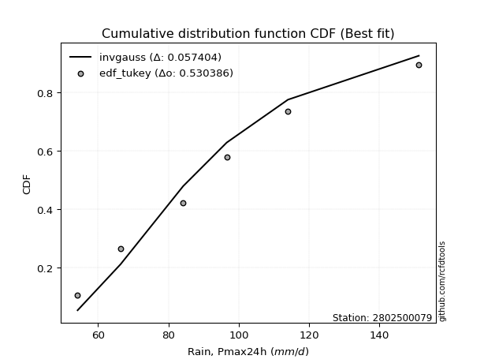</img>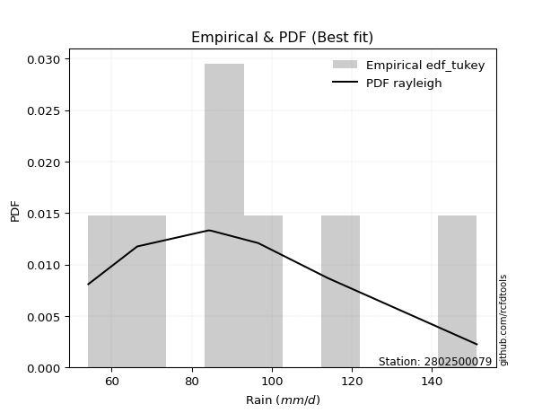</img>

</div>


### 8. EDF Gringorten (1963)

Gringorten plotting position formula is essential for estimating the probability and return periods of extreme events like floods and heavy rainfall. The constant _a=0.44_.

<div align="center">


$P=(m-a)/(n+1-2a)$


</div>


**8.1. Empirical values**

<div align="center">

|                | 0                   | 1                  | 2                   | 3                  | 4                  | 5                  |
|:---------------|:--------------------|:-------------------|:--------------------|:-------------------|:-------------------|:-------------------|
| date           | 2023                | 2020               | 2022                | 2021               | 2019               | 2024               |
| x              | 54.2                | 66.4               | 84.2                | 96.6               | 114.0              | 151.2              |
| m              | 1                   | 2                  | 3                   | 4                  | 5                  | 6                  |
| empirical_dist | edf_gringorten      | edf_gringorten     | edf_gringorten      | edf_gringorten     | edf_gringorten     | edf_gringorten     |
| empirical      | 0.09150326797385622 | 0.2549019607843137 | 0.41830065359477125 | 0.5816993464052288 | 0.7450980392156862 | 0.9084967320261437 |
| empirical_tr   | 1.1007194244604317  | 1.3421052631578947 | 1.7191011235955058  | 2.3906250000000004 | 3.9230769230769216 | 10.928571428571415 |

</div>


**8.2. Kolmogorov-Smirnov fit test (sorted by Δ)**


<div align="center">

|                | 0                   | 1                   | 2                   | 3                   | 4                   | 5                   | 6                   | 7                   | 8                    | 9                   | 10                  | 11                  | 12                  | 13                   | 14                  | 15                  | 16                   | 17                  | 18                 | 19                 | 20                  | 21                  | 22                  | 23                  | 24                  | 25                  | 26                  | 27                  | 28                  | 29                 | 30                  | 31                  | 32                 | 33                  | 34                  | 35                  | 36                  | 37                  | 38                  | 39                 | 40                  | 41                 | 42                  | 43                  | 44                  | 45                  | 46                  | 47                  | 48                    | 49                  | 50                 | 51                 | 52                  | 53                  | 54                  | 55                  | 56                  | 57                  | 58                  | 59                  | 60                  | 61                  | 62                  | 63                  | 64                  | 65                  | 66                  | 67                  | 68                  | 69                  | 70                 | 71                  | 72                  | 73                  | 74                  | 75                  | 76                 | 77                  | 78                | 79                 | 80                 | 81                | 82                 | 83                  | 84                  | 85                  | 86                 | 87                 |
|:---------------|:--------------------|:--------------------|:--------------------|:--------------------|:--------------------|:--------------------|:--------------------|:--------------------|:---------------------|:--------------------|:--------------------|:--------------------|:--------------------|:---------------------|:--------------------|:--------------------|:---------------------|:--------------------|:-------------------|:-------------------|:--------------------|:--------------------|:--------------------|:--------------------|:--------------------|:--------------------|:--------------------|:--------------------|:--------------------|:-------------------|:--------------------|:--------------------|:-------------------|:--------------------|:--------------------|:--------------------|:--------------------|:--------------------|:--------------------|:-------------------|:--------------------|:-------------------|:--------------------|:--------------------|:--------------------|:--------------------|:--------------------|:--------------------|:----------------------|:--------------------|:-------------------|:-------------------|:--------------------|:--------------------|:--------------------|:--------------------|:--------------------|:--------------------|:--------------------|:--------------------|:--------------------|:--------------------|:--------------------|:--------------------|:--------------------|:--------------------|:--------------------|:--------------------|:--------------------|:--------------------|:-------------------|:--------------------|:--------------------|:--------------------|:--------------------|:--------------------|:-------------------|:--------------------|:------------------|:-------------------|:-------------------|:------------------|:-------------------|:--------------------|:--------------------|:--------------------|:-------------------|:-------------------|
| station        | 2802500079          | 2802500079          | 2802500079          | 2802500079          | 2802500079          | 2802500079          | 2802500079          | 2802500079          | 2802500079           | 2802500079          | 2802500079          | 2802500079          | 2802500079          | 2802500079           | 2802500079          | 2802500079          | 2802500079           | 2802500079          | 2802500079         | 2802500079         | 2802500079          | 2802500079          | 2802500079          | 2802500079          | 2802500079          | 2802500079          | 2802500079          | 2802500079          | 2802500079          | 2802500079         | 2802500079          | 2802500079          | 2802500079         | 2802500079          | 2802500079          | 2802500079          | 2802500079          | 2802500079          | 2802500079          | 2802500079         | 2802500079          | 2802500079         | 2802500079          | 2802500079          | 2802500079          | 2802500079          | 2802500079          | 2802500079          | 2802500079            | 2802500079          | 2802500079         | 2802500079         | 2802500079          | 2802500079          | 2802500079          | 2802500079          | 2802500079          | 2802500079          | 2802500079          | 2802500079          | 2802500079          | 2802500079          | 2802500079          | 2802500079          | 2802500079          | 2802500079          | 2802500079          | 2802500079          | 2802500079          | 2802500079          | 2802500079         | 2802500079          | 2802500079          | 2802500079          | 2802500079          | 2802500079          | 2802500079         | 2802500079          | 2802500079        | 2802500079         | 2802500079         | 2802500079        | 2802500079         | 2802500079          | 2802500079          | 2802500079          | 2802500079         | 2802500079         |
| empirical_dist | edf_gringorten      | edf_gringorten      | edf_gringorten      | edf_gringorten      | edf_gringorten      | edf_gringorten      | edf_gringorten      | edf_gringorten      | edf_gringorten       | edf_gringorten      | edf_gringorten      | edf_gringorten      | edf_gringorten      | edf_gringorten       | edf_gringorten      | edf_gringorten      | edf_gringorten       | edf_gringorten      | edf_gringorten     | edf_gringorten     | edf_gringorten      | edf_gringorten      | edf_gringorten      | edf_gringorten      | edf_gringorten      | edf_gringorten      | edf_gringorten      | edf_gringorten      | edf_gringorten      | edf_gringorten     | edf_gringorten      | edf_gringorten      | edf_gringorten     | edf_gringorten      | edf_gringorten      | edf_gringorten      | edf_gringorten      | edf_gringorten      | edf_gringorten      | edf_gringorten     | edf_gringorten      | edf_gringorten     | edf_gringorten      | edf_gringorten      | edf_gringorten      | edf_gringorten      | edf_gringorten      | edf_gringorten      | edf_gringorten        | edf_gringorten      | edf_gringorten     | edf_gringorten     | edf_gringorten      | edf_gringorten      | edf_gringorten      | edf_gringorten      | edf_gringorten      | edf_gringorten      | edf_gringorten      | edf_gringorten      | edf_gringorten      | edf_gringorten      | edf_gringorten      | edf_gringorten      | edf_gringorten      | edf_gringorten      | edf_gringorten      | edf_gringorten      | edf_gringorten      | edf_gringorten      | edf_gringorten     | edf_gringorten      | edf_gringorten      | edf_gringorten      | edf_gringorten      | edf_gringorten      | edf_gringorten     | edf_gringorten      | edf_gringorten    | edf_gringorten     | edf_gringorten     | edf_gringorten    | edf_gringorten     | edf_gringorten      | edf_gringorten      | edf_gringorten      | edf_gringorten     | edf_gringorten     |
| p_dist         | rayleigh            | johnsonsu           | logmaxwell          | loginvgauss         | maxwell             | logrice             | loginvgamma         | logalpha            | lograyleigh          | invgauss            | ncf                 | invgamma            | nct                 | halfnorm             | f                   | betaprime           | fisk                 | pearson3            | logfatiguelife     | logncf             | logbetaprime        | logjohnsonsu        | logf                | logloggamma         | logerlang           | lognct              | loggamma            | loggamma            | logpearson3         | logweibull_min     | logexponnorm        | logt                | logcrystalball     | lognorm             | lognorm             | t                   | genlogistic         | crystalball         | norm                | truncnorm          | kstwobign           | alpha              | logfisk             | logmielke           | mielke              | gumbel_r            | loggumbel_r         | loggenlogistic      | loglaplace_asymmetric | loginvweibull       | loglogistic        | rice               | logistic            | loggumbel_l         | laplace_asymmetric  | loggompertz         | gompertz            | halflogistic        | logkstwobign        | loghalfnorm         | moyal               | loghypsecant        | hypsecant           | loggenexpon         | logmoyal            | expon               | loglaplace          | laplace             | exponnorm           | loghalflogistic     | gumbel_l           | nakagami            | logexpon            | lognakagami         | gamma               | logchi2             | logwald            | wald                | weibull_min       | gibrat             | loggibrat          | logtruncnorm      | loglognorm         | fatiguelife         | invweibull          | erlang              | genexpon           | chi2               |
| delta          | 0.04943671312796291 | 0.05160049604487521 | 0.05308616618634279 | 0.05361810515385476 | 0.05391337627946935 | 0.05891053425499776 | 0.05907241364354909 | 0.05964502553248879 | 0.060036124831536475 | 0.06015606360288145 | 0.06038523477692129 | 0.06039062788921537 | 0.06039813490048007 | 0.060832978118738626 | 0.06096086116731503 | 0.06100005938937342 | 0.061271002190244145 | 0.06182636113881404 | 0.0620646705104973 | 0.0623194327447662 | 0.06249341667407923 | 0.06261837799502157 | 0.06279216703587984 | 0.06335295561623858 | 0.06340096774532764 | 0.06342540201071972 | 0.06356028626086846 | 0.06356028626086846 | 0.06365587679308155 | 0.0636622158363171 | 0.06418955157907658 | 0.06419169897317323 | 0.0641917504686843 | 0.06419185404324768 | 0.06419185404324768 | 0.06429270365352935 | 0.06473846810062436 | 0.06487770990413486 | 0.06487771773242007 | 0.0648777178307185 | 0.06515876007993623 | 0.0656892423347667 | 0.06675515330566828 | 0.07388530029364715 | 0.07566390545019436 | 0.07776906360347399 | 0.07850136000887464 | 0.07865813265346344 | 0.07913823353690694   | 0.08132500597008263 | 0.0851782785771269 | 0.0852845324531428 | 0.08582254568000003 | 0.08790465368395273 | 0.09133199151580437 | 0.09150325739860128 | 0.09150326792479037 | 0.09150326797385622 | 0.09158597182470946 | 0.09424754729353585 | 0.09478861890406587 | 0.09722687340653421 | 0.09782581679112079 | 0.09789116878442788 | 0.10310938172734857 | 0.10727370037224487 | 0.10989645456408936 | 0.11041321961587189 | 0.11067931974115824 | 0.11357119431680635 | 0.1236918845369468 | 0.15362157156146222 | 0.16845574960376802 | 0.17086330222085394 | 0.21178607246961517 | 0.22571558756811994 | 0.2429032773196014 | 0.24398668347605154 | 0.253411562733355 | 0.2549019607843137 | 0.2549019607843137 | 0.298534263039747 | 0.3907655623685473 | 0.45386186412977536 | 0.45705804830328917 | 0.46902734304345695 | 0.7322952618405448 | 0.7440170567206948 |
| deltao         | 0.530385761606      | 0.530385761606      | 0.530385761606      | 0.530385761606      | 0.530385761606      | 0.530385761606      | 0.530385761606      | 0.530385761606      | 0.530385761606       | 0.530385761606      | 0.530385761606      | 0.530385761606      | 0.530385761606      | 0.530385761606       | 0.530385761606      | 0.530385761606      | 0.530385761606       | 0.530385761606      | 0.530385761606     | 0.530385761606     | 0.530385761606      | 0.530385761606      | 0.530385761606      | 0.530385761606      | 0.530385761606      | 0.530385761606      | 0.530385761606      | 0.530385761606      | 0.530385761606      | 0.530385761606     | 0.530385761606      | 0.530385761606      | 0.530385761606     | 0.530385761606      | 0.530385761606      | 0.530385761606      | 0.530385761606      | 0.530385761606      | 0.530385761606      | 0.530385761606     | 0.530385761606      | 0.530385761606     | 0.530385761606      | 0.530385761606      | 0.530385761606      | 0.530385761606      | 0.530385761606      | 0.530385761606      | 0.530385761606        | 0.530385761606      | 0.530385761606     | 0.530385761606     | 0.530385761606      | 0.530385761606      | 0.530385761606      | 0.530385761606      | 0.530385761606      | 0.530385761606      | 0.530385761606      | 0.530385761606      | 0.530385761606      | 0.530385761606      | 0.530385761606      | 0.530385761606      | 0.530385761606      | 0.530385761606      | 0.530385761606      | 0.530385761606      | 0.530385761606      | 0.530385761606      | 0.530385761606     | 0.530385761606      | 0.530385761606      | 0.530385761606      | 0.530385761606      | 0.530385761606      | 0.530385761606     | 0.530385761606      | 0.530385761606    | 0.530385761606     | 0.530385761606     | 0.530385761606    | 0.530385761606     | 0.530385761606      | 0.530385761606      | 0.530385761606      | 0.530385761606     | 0.530385761606     |
| eval           | Δo > Δ              | Δo > Δ              | Δo > Δ              | Δo > Δ              | Δo > Δ              | Δo > Δ              | Δo > Δ              | Δo > Δ              | Δo > Δ               | Δo > Δ              | Δo > Δ              | Δo > Δ              | Δo > Δ              | Δo > Δ               | Δo > Δ              | Δo > Δ              | Δo > Δ               | Δo > Δ              | Δo > Δ             | Δo > Δ             | Δo > Δ              | Δo > Δ              | Δo > Δ              | Δo > Δ              | Δo > Δ              | Δo > Δ              | Δo > Δ              | Δo > Δ              | Δo > Δ              | Δo > Δ             | Δo > Δ              | Δo > Δ              | Δo > Δ             | Δo > Δ              | Δo > Δ              | Δo > Δ              | Δo > Δ              | Δo > Δ              | Δo > Δ              | Δo > Δ             | Δo > Δ              | Δo > Δ             | Δo > Δ              | Δo > Δ              | Δo > Δ              | Δo > Δ              | Δo > Δ              | Δo > Δ              | Δo > Δ                | Δo > Δ              | Δo > Δ             | Δo > Δ             | Δo > Δ              | Δo > Δ              | Δo > Δ              | Δo > Δ              | Δo > Δ              | Δo > Δ              | Δo > Δ              | Δo > Δ              | Δo > Δ              | Δo > Δ              | Δo > Δ              | Δo > Δ              | Δo > Δ              | Δo > Δ              | Δo > Δ              | Δo > Δ              | Δo > Δ              | Δo > Δ              | Δo > Δ             | Δo > Δ              | Δo > Δ              | Δo > Δ              | Δo > Δ              | Δo > Δ              | Δo > Δ             | Δo > Δ              | Δo > Δ            | Δo > Δ             | Δo > Δ             | Δo > Δ            | Δo > Δ             | Δo > Δ              | Δo > Δ              | Δo > Δ              | Δo <= Δ            | Δo <= Δ            |
| fit            | 1                   | 1                   | 1                   | 1                   | 1                   | 1                   | 1                   | 1                   | 1                    | 1                   | 1                   | 1                   | 1                   | 1                    | 1                   | 1                   | 1                    | 1                   | 1                  | 1                  | 1                   | 1                   | 1                   | 1                   | 1                   | 1                   | 1                   | 1                   | 1                   | 1                  | 1                   | 1                   | 1                  | 1                   | 1                   | 1                   | 1                   | 1                   | 1                   | 1                  | 1                   | 1                  | 1                   | 1                   | 1                   | 1                   | 1                   | 1                   | 1                     | 1                   | 1                  | 1                  | 1                   | 1                   | 1                   | 1                   | 1                   | 1                   | 1                   | 1                   | 1                   | 1                   | 1                   | 1                   | 1                   | 1                   | 1                   | 1                   | 1                   | 1                   | 1                  | 1                   | 1                   | 1                   | 1                   | 1                   | 1                  | 1                   | 1                 | 1                  | 1                  | 1                 | 1                  | 1                   | 1                   | 1                   | 0                  | 0                  |
| n              | 6                   | 6                   | 6                   | 6                   | 6                   | 6                   | 6                   | 6                   | 6                    | 6                   | 6                   | 6                   | 6                   | 6                    | 6                   | 6                   | 6                    | 6                   | 6                  | 6                  | 6                   | 6                   | 6                   | 6                   | 6                   | 6                   | 6                   | 6                   | 6                   | 6                  | 6                   | 6                   | 6                  | 6                   | 6                   | 6                   | 6                   | 6                   | 6                   | 6                  | 6                   | 6                  | 6                   | 6                   | 6                   | 6                   | 6                   | 6                   | 6                     | 6                   | 6                  | 6                  | 6                   | 6                   | 6                   | 6                   | 6                   | 6                   | 6                   | 6                   | 6                   | 6                   | 6                   | 6                   | 6                   | 6                   | 6                   | 6                   | 6                   | 6                   | 6                  | 6                   | 6                   | 6                   | 6                   | 6                   | 6                  | 6                   | 6                 | 6                  | 6                  | 6                 | 6                  | 6                   | 6                   | 6                   | 6                  | 6                  |
| best_fit       | 1                   | 0                   | 0                   | 0                   | 0                   | 0                   | 0                   | 0                   | 0                    | 0                   | 0                   | 0                   | 0                   | 0                    | 0                   | 0                   | 0                    | 0                   | 0                  | 0                  | 0                   | 0                   | 0                   | 0                   | 0                   | 0                   | 0                   | 0                   | 0                   | 0                  | 0                   | 0                   | 0                  | 0                   | 0                   | 0                   | 0                   | 0                   | 0                   | 0                  | 0                   | 0                  | 0                   | 0                   | 0                   | 0                   | 0                   | 0                   | 0                     | 0                   | 0                  | 0                  | 0                   | 0                   | 0                   | 0                   | 0                   | 0                   | 0                   | 0                   | 0                   | 0                   | 0                   | 0                   | 0                   | 0                   | 0                   | 0                   | 0                   | 0                   | 0                  | 0                   | 0                   | 0                   | 0                   | 0                   | 0                  | 0                   | 0                 | 0                  | 0                  | 0                 | 0                  | 0                   | 0                   | 0                   | 0                  | 0                  |
| best_fit_sort  | 1                   | 2                   | 3                   | 4                   | 5                   | 6                   | 7                   | 8                   | 9                    | 10                  | 11                  | 12                  | 13                  | 14                   | 15                  | 16                  | 17                   | 18                  | 19                 | 20                 | 21                  | 22                  | 23                  | 24                  | 25                  | 26                  | 27                  | 28                  | 29                  | 30                 | 31                  | 32                  | 33                 | 34                  | 35                  | 36                  | 37                  | 38                  | 39                  | 40                 | 41                  | 42                 | 43                  | 44                  | 45                  | 46                  | 47                  | 48                  | 49                    | 50                  | 51                 | 52                 | 53                  | 54                  | 55                  | 56                  | 57                  | 58                  | 59                  | 60                  | 61                  | 62                  | 63                  | 64                  | 65                  | 66                  | 67                  | 68                  | 69                  | 70                  | 71                 | 72                  | 73                  | 74                  | 75                  | 76                  | 77                 | 78                  | 79                | 80                 | 81                 | 82                | 83                 | 84                  | 85                  | 86                  | 87                 | 88                 |

</div>


**8.3. Best fit**

<div align="center">

|   id |    station | empirical_dist   | p_dist   |     delta |   deltao | eval   |   fit |   n |   best_fit |   best_fit_sort |
|-----:|-----------:|:-----------------|:---------|----------:|---------:|:-------|------:|----:|-----------:|----------------:|
|    0 | 2802500079 | edf_gringorten   | rayleigh | 0.0494367 | 0.530386 | Δo > Δ |     1 |   6 |          1 |               1 |

</div>


<div align="center">

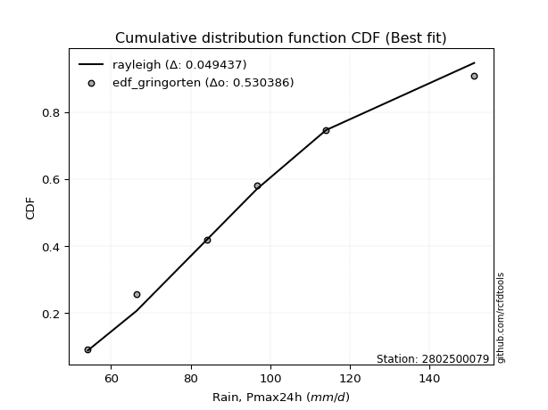</img>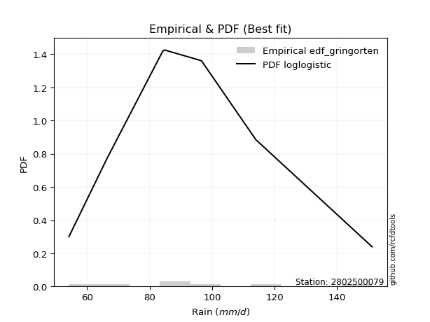</img>

</div>


### 9. EDF Filliben (1975)

The specific values of the constants (0.3175) (often denoted as $alpha$) and (0.365) are derived from a method proposed by James J. Filliben in a 1975 paper. This particular formula is the mean value of the $i$-th order statistic of the normal distribution and is considered a robust and effective plotting position formula for the normal probability plot correlation coefficient test for normality.

<div align="center">


$P=(m-0.3175)/(n+0.365)$


</div>


**9.1. Empirical values**

<div align="center">

|                | 0                   | 1                   | 2                  | 3                  | 4                  | 5                  |
|:---------------|:--------------------|:--------------------|:-------------------|:-------------------|:-------------------|:-------------------|
| date           | 2023                | 2020                | 2022               | 2021               | 2019               | 2024               |
| x              | 54.2                | 66.4                | 84.2               | 96.6               | 114.0              | 151.2              |
| m              | 1                   | 2                   | 3                  | 4                  | 5                  | 6                  |
| empirical_dist | edf_filliben        | edf_filliben        | edf_filliben       | edf_filliben       | edf_filliben       | edf_filliben       |
| empirical      | 0.10722702278083267 | 0.26433621366849963 | 0.4214454045561665 | 0.5785545954438335 | 0.7356637863315004 | 0.8927729772191673 |
| empirical_tr   | 1.1201055873295205  | 1.3593166043780034  | 1.7284453496266123 | 2.3727865796831313 | 3.783060921248143  | 9.326007326007321  |

</div>


**9.2. Kolmogorov-Smirnov fit test (sorted by Δ)**


<div align="center">

|                | 0                   | 1                    | 2                   | 3                   | 4                   | 5                   | 6                  | 7                  | 8                   | 9                   | 10                  | 11                  | 12                 | 13                | 14                  | 15                  | 16                  | 17                  | 18                  | 19                  | 20                  | 21                  | 22                  | 23                  | 24                  | 25                 | 26                  | 27                  | 28                  | 29                  | 30                  | 31                 | 32                  | 33                  | 34                 | 35                 | 36                  | 37                  | 38                  | 39                | 40                  | 41                  | 42                  | 43                  | 44                 | 45                  | 46                  | 47                  | 48                  | 49                  | 50                    | 51                  | 52                  | 53                  | 54                  | 55                 | 56                  | 57                  | 58                  | 59                  | 60                  | 61                  | 62                  | 63                  | 64                  | 65                  | 66                  | 67                  | 68                  | 69                  | 70                  | 71                  | 72                  | 73                  | 74                 | 75                  | 76                  | 77                  | 78                 | 79                  | 80                  | 81                  | 82                 | 83                  | 84                  | 85                | 86                | 87                |
|:---------------|:--------------------|:---------------------|:--------------------|:--------------------|:--------------------|:--------------------|:-------------------|:-------------------|:--------------------|:--------------------|:--------------------|:--------------------|:-------------------|:------------------|:--------------------|:--------------------|:--------------------|:--------------------|:--------------------|:--------------------|:--------------------|:--------------------|:--------------------|:--------------------|:--------------------|:-------------------|:--------------------|:--------------------|:--------------------|:--------------------|:--------------------|:-------------------|:--------------------|:--------------------|:-------------------|:-------------------|:--------------------|:--------------------|:--------------------|:------------------|:--------------------|:--------------------|:--------------------|:--------------------|:-------------------|:--------------------|:--------------------|:--------------------|:--------------------|:--------------------|:----------------------|:--------------------|:--------------------|:--------------------|:--------------------|:-------------------|:--------------------|:--------------------|:--------------------|:--------------------|:--------------------|:--------------------|:--------------------|:--------------------|:--------------------|:--------------------|:--------------------|:--------------------|:--------------------|:--------------------|:--------------------|:--------------------|:--------------------|:--------------------|:-------------------|:--------------------|:--------------------|:--------------------|:-------------------|:--------------------|:--------------------|:--------------------|:-------------------|:--------------------|:--------------------|:------------------|:------------------|:------------------|
| station        | 2802500079          | 2802500079           | 2802500079          | 2802500079          | 2802500079          | 2802500079          | 2802500079         | 2802500079         | 2802500079          | 2802500079          | 2802500079          | 2802500079          | 2802500079         | 2802500079        | 2802500079          | 2802500079          | 2802500079          | 2802500079          | 2802500079          | 2802500079          | 2802500079          | 2802500079          | 2802500079          | 2802500079          | 2802500079          | 2802500079         | 2802500079          | 2802500079          | 2802500079          | 2802500079          | 2802500079          | 2802500079         | 2802500079          | 2802500079          | 2802500079         | 2802500079         | 2802500079          | 2802500079          | 2802500079          | 2802500079        | 2802500079          | 2802500079          | 2802500079          | 2802500079          | 2802500079         | 2802500079          | 2802500079          | 2802500079          | 2802500079          | 2802500079          | 2802500079            | 2802500079          | 2802500079          | 2802500079          | 2802500079          | 2802500079         | 2802500079          | 2802500079          | 2802500079          | 2802500079          | 2802500079          | 2802500079          | 2802500079          | 2802500079          | 2802500079          | 2802500079          | 2802500079          | 2802500079          | 2802500079          | 2802500079          | 2802500079          | 2802500079          | 2802500079          | 2802500079          | 2802500079         | 2802500079          | 2802500079          | 2802500079          | 2802500079         | 2802500079          | 2802500079          | 2802500079          | 2802500079         | 2802500079          | 2802500079          | 2802500079        | 2802500079        | 2802500079        |
| empirical_dist | edf_filliben        | edf_filliben         | edf_filliben        | edf_filliben        | edf_filliben        | edf_filliben        | edf_filliben       | edf_filliben       | edf_filliben        | edf_filliben        | edf_filliben        | edf_filliben        | edf_filliben       | edf_filliben      | edf_filliben        | edf_filliben        | edf_filliben        | edf_filliben        | edf_filliben        | edf_filliben        | edf_filliben        | edf_filliben        | edf_filliben        | edf_filliben        | edf_filliben        | edf_filliben       | edf_filliben        | edf_filliben        | edf_filliben        | edf_filliben        | edf_filliben        | edf_filliben       | edf_filliben        | edf_filliben        | edf_filliben       | edf_filliben       | edf_filliben        | edf_filliben        | edf_filliben        | edf_filliben      | edf_filliben        | edf_filliben        | edf_filliben        | edf_filliben        | edf_filliben       | edf_filliben        | edf_filliben        | edf_filliben        | edf_filliben        | edf_filliben        | edf_filliben          | edf_filliben        | edf_filliben        | edf_filliben        | edf_filliben        | edf_filliben       | edf_filliben        | edf_filliben        | edf_filliben        | edf_filliben        | edf_filliben        | edf_filliben        | edf_filliben        | edf_filliben        | edf_filliben        | edf_filliben        | edf_filliben        | edf_filliben        | edf_filliben        | edf_filliben        | edf_filliben        | edf_filliben        | edf_filliben        | edf_filliben        | edf_filliben       | edf_filliben        | edf_filliben        | edf_filliben        | edf_filliben       | edf_filliben        | edf_filliben        | edf_filliben        | edf_filliben       | edf_filliben        | edf_filliben        | edf_filliben      | edf_filliben      | edf_filliben      |
| p_dist         | invgauss            | rayleigh             | johnsonsu           | logmaxwell          | loginvgauss         | maxwell             | logweibull_min     | lograyleigh        | logrice             | loginvgamma         | logalpha            | ncf                 | invgamma           | nct               | f                   | betaprime           | fisk                | logmielke           | pearson3            | logfatiguelife      | logncf              | logbetaprime        | logjohnsonsu        | logf                | mielke              | logloggamma        | logerlang           | lognct              | loggamma            | loggamma            | logpearson3         | logexponnorm       | logt                | logcrystalball      | lognorm            | lognorm            | t                   | genlogistic         | crystalball         | norm              | truncnorm           | kstwobign           | alpha               | loggenlogistic      | logfisk            | halfnorm            | loginvweibull       | loggumbel_r         | gumbel_r            | logkstwobign        | loglaplace_asymmetric | loglogistic         | rice                | logistic            | loggumbel_l         | laplace_asymmetric | moyal               | logmoyal            | loggenexpon         | loghypsecant        | loggompertz         | gompertz            | expon               | loghalfnorm         | halflogistic        | hypsecant           | exponnorm           | loghalflogistic     | loglaplace          | laplace             | gumbel_l            | nakagami            | logexpon            | lognakagami         | gamma              | logchi2             | weibull_min         | logwald             | wald               | gibrat              | loggibrat           | logtruncnorm        | loglognorm         | invweibull          | fatiguelife         | erlang            | genexpon          | chi2              |
| delta          | 0.05701131264148618 | 0.058870966012148834 | 0.06004768127218835 | 0.06252041907052872 | 0.06305235803804068 | 0.06334762916365527 | 0.0670230389659923 | 0.0671889083197803 | 0.06834478713918368 | 0.06850666652773502 | 0.06907927841667472 | 0.06981948766110721 | 0.0698248807734013 | 0.069832387784666 | 0.07039511405150095 | 0.07043431227355934 | 0.07070525507443007 | 0.07074054933225188 | 0.07126061402299996 | 0.07149892339468322 | 0.07175368562895212 | 0.07192766955826516 | 0.07205263087920749 | 0.07222641992006576 | 0.07251915448879909 | 0.0727872085004245 | 0.07283522062951356 | 0.07285965489490565 | 0.07299453914505438 | 0.07299453914505438 | 0.07309012967726747 | 0.0736238044632625 | 0.07362595185735915 | 0.07362600335287023 | 0.0736261069274336 | 0.0736261069274336 | 0.07372695653771527 | 0.07417272098481029 | 0.07431196278832078 | 0.074311970616606 | 0.07431197071490442 | 0.07459301296412216 | 0.07512349521895262 | 0.07551338169206817 | 0.0761894061898542 | 0.07655673292571508 | 0.07818025500868736 | 0.08620947883922428 | 0.08720331648765992 | 0.08844122086331418 | 0.08857248642109286   | 0.09461253146131282 | 0.09471878533732872 | 0.09525679856418595 | 0.09733890656813865 | 0.1007662443999903 | 0.10422287178825179 | 0.10472449712675014 | 0.10602917149013162 | 0.10666112629072014 | 0.10722701220557773 | 0.10722702273176682 | 0.10722702278083267 | 0.10722702278083267 | 0.10722702278083267 | 0.10726006967530671 | 0.10753456877976297 | 0.11042644335541107 | 0.11933070744827529 | 0.11984747250005781 | 0.12054713357555147 | 0.15047682060006695 | 0.16531099864237275 | 0.16771855125945867 | 0.2086413215082199 | 0.20999183276114353 | 0.25026681177195975 | 0.25233753020378735 | 0.2534209363602375 | 0.26433621366849963 | 0.26433621366849963 | 0.29538951207835173 | 0.3813313094843614 | 0.44133429349631276 | 0.44442761124558944 | 0.459593090159271 | 0.722861008956359 | 0.734582803836509 |
| deltao         | 0.530385761606      | 0.530385761606       | 0.530385761606      | 0.530385761606      | 0.530385761606      | 0.530385761606      | 0.530385761606     | 0.530385761606     | 0.530385761606      | 0.530385761606      | 0.530385761606      | 0.530385761606      | 0.530385761606     | 0.530385761606    | 0.530385761606      | 0.530385761606      | 0.530385761606      | 0.530385761606      | 0.530385761606      | 0.530385761606      | 0.530385761606      | 0.530385761606      | 0.530385761606      | 0.530385761606      | 0.530385761606      | 0.530385761606     | 0.530385761606      | 0.530385761606      | 0.530385761606      | 0.530385761606      | 0.530385761606      | 0.530385761606     | 0.530385761606      | 0.530385761606      | 0.530385761606     | 0.530385761606     | 0.530385761606      | 0.530385761606      | 0.530385761606      | 0.530385761606    | 0.530385761606      | 0.530385761606      | 0.530385761606      | 0.530385761606      | 0.530385761606     | 0.530385761606      | 0.530385761606      | 0.530385761606      | 0.530385761606      | 0.530385761606      | 0.530385761606        | 0.530385761606      | 0.530385761606      | 0.530385761606      | 0.530385761606      | 0.530385761606     | 0.530385761606      | 0.530385761606      | 0.530385761606      | 0.530385761606      | 0.530385761606      | 0.530385761606      | 0.530385761606      | 0.530385761606      | 0.530385761606      | 0.530385761606      | 0.530385761606      | 0.530385761606      | 0.530385761606      | 0.530385761606      | 0.530385761606      | 0.530385761606      | 0.530385761606      | 0.530385761606      | 0.530385761606     | 0.530385761606      | 0.530385761606      | 0.530385761606      | 0.530385761606     | 0.530385761606      | 0.530385761606      | 0.530385761606      | 0.530385761606     | 0.530385761606      | 0.530385761606      | 0.530385761606    | 0.530385761606    | 0.530385761606    |
| eval           | Δo > Δ              | Δo > Δ               | Δo > Δ              | Δo > Δ              | Δo > Δ              | Δo > Δ              | Δo > Δ             | Δo > Δ             | Δo > Δ              | Δo > Δ              | Δo > Δ              | Δo > Δ              | Δo > Δ             | Δo > Δ            | Δo > Δ              | Δo > Δ              | Δo > Δ              | Δo > Δ              | Δo > Δ              | Δo > Δ              | Δo > Δ              | Δo > Δ              | Δo > Δ              | Δo > Δ              | Δo > Δ              | Δo > Δ             | Δo > Δ              | Δo > Δ              | Δo > Δ              | Δo > Δ              | Δo > Δ              | Δo > Δ             | Δo > Δ              | Δo > Δ              | Δo > Δ             | Δo > Δ             | Δo > Δ              | Δo > Δ              | Δo > Δ              | Δo > Δ            | Δo > Δ              | Δo > Δ              | Δo > Δ              | Δo > Δ              | Δo > Δ             | Δo > Δ              | Δo > Δ              | Δo > Δ              | Δo > Δ              | Δo > Δ              | Δo > Δ                | Δo > Δ              | Δo > Δ              | Δo > Δ              | Δo > Δ              | Δo > Δ             | Δo > Δ              | Δo > Δ              | Δo > Δ              | Δo > Δ              | Δo > Δ              | Δo > Δ              | Δo > Δ              | Δo > Δ              | Δo > Δ              | Δo > Δ              | Δo > Δ              | Δo > Δ              | Δo > Δ              | Δo > Δ              | Δo > Δ              | Δo > Δ              | Δo > Δ              | Δo > Δ              | Δo > Δ             | Δo > Δ              | Δo > Δ              | Δo > Δ              | Δo > Δ             | Δo > Δ              | Δo > Δ              | Δo > Δ              | Δo > Δ             | Δo > Δ              | Δo > Δ              | Δo > Δ            | Δo <= Δ           | Δo <= Δ           |
| fit            | 1                   | 1                    | 1                   | 1                   | 1                   | 1                   | 1                  | 1                  | 1                   | 1                   | 1                   | 1                   | 1                  | 1                 | 1                   | 1                   | 1                   | 1                   | 1                   | 1                   | 1                   | 1                   | 1                   | 1                   | 1                   | 1                  | 1                   | 1                   | 1                   | 1                   | 1                   | 1                  | 1                   | 1                   | 1                  | 1                  | 1                   | 1                   | 1                   | 1                 | 1                   | 1                   | 1                   | 1                   | 1                  | 1                   | 1                   | 1                   | 1                   | 1                   | 1                     | 1                   | 1                   | 1                   | 1                   | 1                  | 1                   | 1                   | 1                   | 1                   | 1                   | 1                   | 1                   | 1                   | 1                   | 1                   | 1                   | 1                   | 1                   | 1                   | 1                   | 1                   | 1                   | 1                   | 1                  | 1                   | 1                   | 1                   | 1                  | 1                   | 1                   | 1                   | 1                  | 1                   | 1                   | 1                 | 0                 | 0                 |
| n              | 6                   | 6                    | 6                   | 6                   | 6                   | 6                   | 6                  | 6                  | 6                   | 6                   | 6                   | 6                   | 6                  | 6                 | 6                   | 6                   | 6                   | 6                   | 6                   | 6                   | 6                   | 6                   | 6                   | 6                   | 6                   | 6                  | 6                   | 6                   | 6                   | 6                   | 6                   | 6                  | 6                   | 6                   | 6                  | 6                  | 6                   | 6                   | 6                   | 6                 | 6                   | 6                   | 6                   | 6                   | 6                  | 6                   | 6                   | 6                   | 6                   | 6                   | 6                     | 6                   | 6                   | 6                   | 6                   | 6                  | 6                   | 6                   | 6                   | 6                   | 6                   | 6                   | 6                   | 6                   | 6                   | 6                   | 6                   | 6                   | 6                   | 6                   | 6                   | 6                   | 6                   | 6                   | 6                  | 6                   | 6                   | 6                   | 6                  | 6                   | 6                   | 6                   | 6                  | 6                   | 6                   | 6                 | 6                 | 6                 |
| best_fit       | 1                   | 0                    | 0                   | 0                   | 0                   | 0                   | 0                  | 0                  | 0                   | 0                   | 0                   | 0                   | 0                  | 0                 | 0                   | 0                   | 0                   | 0                   | 0                   | 0                   | 0                   | 0                   | 0                   | 0                   | 0                   | 0                  | 0                   | 0                   | 0                   | 0                   | 0                   | 0                  | 0                   | 0                   | 0                  | 0                  | 0                   | 0                   | 0                   | 0                 | 0                   | 0                   | 0                   | 0                   | 0                  | 0                   | 0                   | 0                   | 0                   | 0                   | 0                     | 0                   | 0                   | 0                   | 0                   | 0                  | 0                   | 0                   | 0                   | 0                   | 0                   | 0                   | 0                   | 0                   | 0                   | 0                   | 0                   | 0                   | 0                   | 0                   | 0                   | 0                   | 0                   | 0                   | 0                  | 0                   | 0                   | 0                   | 0                  | 0                   | 0                   | 0                   | 0                  | 0                   | 0                   | 0                 | 0                 | 0                 |
| best_fit_sort  | 1                   | 2                    | 3                   | 4                   | 5                   | 6                   | 7                  | 8                  | 9                   | 10                  | 11                  | 12                  | 13                 | 14                | 15                  | 16                  | 17                  | 18                  | 19                  | 20                  | 21                  | 22                  | 23                  | 24                  | 25                  | 26                 | 27                  | 28                  | 29                  | 30                  | 31                  | 32                 | 33                  | 34                  | 35                 | 36                 | 37                  | 38                  | 39                  | 40                | 41                  | 42                  | 43                  | 44                  | 45                 | 46                  | 47                  | 48                  | 49                  | 50                  | 51                    | 52                  | 53                  | 54                  | 55                  | 56                 | 57                  | 58                  | 59                  | 60                  | 61                  | 62                  | 63                  | 64                  | 65                  | 66                  | 67                  | 68                  | 69                  | 70                  | 71                  | 72                  | 73                  | 74                  | 75                 | 76                  | 77                  | 78                  | 79                 | 80                  | 81                  | 82                  | 83                 | 84                  | 85                  | 86                | 87                | 88                |

</div>


**9.3. Best fit**

<div align="center">

|   id |    station | empirical_dist   | p_dist   |     delta |   deltao | eval   |   fit |   n |   best_fit |   best_fit_sort |
|-----:|-----------:|:-----------------|:---------|----------:|---------:|:-------|------:|----:|-----------:|----------------:|
|    0 | 2802500079 | edf_filliben     | invgauss | 0.0570113 | 0.530386 | Δo > Δ |     1 |   6 |          1 |               1 |

</div>


<div align="center">

</img></img>

</div>


### 10. EDF Jenkinson (1977)

The Jenkinson formula in hydrology is an empirical plotting position formula used to estimate the non-exceedance probability _(P)_ or return period _(T)_ of a given ordered observation within a sample. It is a widely used method in the frequency analysis of extreme events such as floods and rainfall, as it provides a distribution-free way to plot data. _a≈0.31_ and _b≈0.38_ are constants derived to approximate the median of the probability distribution for the given rank.

<div align="center">


$P=(m-a)/(n+b)$


</div>


**10.1. Empirical values**

<div align="center">

|                | 0                   | 1                   | 2                  | 3                  | 4                  | 5                  |
|:---------------|:--------------------|:--------------------|:-------------------|:-------------------|:-------------------|:-------------------|
| date           | 2023                | 2020                | 2022               | 2021               | 2019               | 2024               |
| x              | 54.2                | 66.4                | 84.2               | 96.6               | 114.0              | 151.2              |
| m              | 1                   | 2                   | 3                  | 4                  | 5                  | 6                  |
| empirical_dist | edf_jenkinson       | edf_jenkinson       | edf_jenkinson      | edf_jenkinson      | edf_jenkinson      | edf_jenkinson      |
| empirical      | 0.10815047021943573 | 0.26489028213166144 | 0.4216300940438871 | 0.5783699059561128 | 0.7351097178683387 | 0.8918495297805643 |
| empirical_tr   | 1.1212653778558874  | 1.3603411513859276  | 1.7289972899728996 | 2.3717472118959106 | 3.7751479289940844 | 9.246376811594207  |

</div>


**10.2. Kolmogorov-Smirnov fit test (sorted by Δ)**


<div align="center">

|                | 0                    | 1                   | 2                   | 3                   | 4                   | 5                   | 6                   | 7                   | 8                   | 9                   | 10                  | 11                  | 12                 | 13                 | 14                  | 15                  | 16                  | 17                  | 18                  | 19                  | 20                  | 21                  | 22                  | 23                 | 24                  | 25                 | 26                  | 27                  | 28                  | 29                  | 30                  | 31                 | 32                  | 33                  | 34                 | 35                 | 36                  | 37                  | 38                  | 39                 | 40                  | 41                  | 42                  | 43                  | 44                  | 45                  | 46                  | 47                  | 48                  | 49                  | 50                    | 51                  | 52                  | 53                  | 54                  | 55                 | 56                 | 57                 | 58                  | 59                  | 60                  | 61                  | 62                 | 63                  | 64                  | 65                  | 66                  | 67                  | 68                  | 69                  | 70                  | 71                  | 72                  | 73                  | 74                 | 75                  | 76                  | 77                  | 78                 | 79                  | 80                  | 81                  | 82                 | 83                 | 84                  | 85                 | 86                 | 87                 |
|:---------------|:---------------------|:--------------------|:--------------------|:--------------------|:--------------------|:--------------------|:--------------------|:--------------------|:--------------------|:--------------------|:--------------------|:--------------------|:-------------------|:-------------------|:--------------------|:--------------------|:--------------------|:--------------------|:--------------------|:--------------------|:--------------------|:--------------------|:--------------------|:-------------------|:--------------------|:-------------------|:--------------------|:--------------------|:--------------------|:--------------------|:--------------------|:-------------------|:--------------------|:--------------------|:-------------------|:-------------------|:--------------------|:--------------------|:--------------------|:-------------------|:--------------------|:--------------------|:--------------------|:--------------------|:--------------------|:--------------------|:--------------------|:--------------------|:--------------------|:--------------------|:----------------------|:--------------------|:--------------------|:--------------------|:--------------------|:-------------------|:-------------------|:-------------------|:--------------------|:--------------------|:--------------------|:--------------------|:-------------------|:--------------------|:--------------------|:--------------------|:--------------------|:--------------------|:--------------------|:--------------------|:--------------------|:--------------------|:--------------------|:--------------------|:-------------------|:--------------------|:--------------------|:--------------------|:-------------------|:--------------------|:--------------------|:--------------------|:-------------------|:-------------------|:--------------------|:-------------------|:-------------------|:-------------------|
| station        | 2802500079           | 2802500079          | 2802500079          | 2802500079          | 2802500079          | 2802500079          | 2802500079          | 2802500079          | 2802500079          | 2802500079          | 2802500079          | 2802500079          | 2802500079         | 2802500079         | 2802500079          | 2802500079          | 2802500079          | 2802500079          | 2802500079          | 2802500079          | 2802500079          | 2802500079          | 2802500079          | 2802500079         | 2802500079          | 2802500079         | 2802500079          | 2802500079          | 2802500079          | 2802500079          | 2802500079          | 2802500079         | 2802500079          | 2802500079          | 2802500079         | 2802500079         | 2802500079          | 2802500079          | 2802500079          | 2802500079         | 2802500079          | 2802500079          | 2802500079          | 2802500079          | 2802500079          | 2802500079          | 2802500079          | 2802500079          | 2802500079          | 2802500079          | 2802500079            | 2802500079          | 2802500079          | 2802500079          | 2802500079          | 2802500079         | 2802500079         | 2802500079         | 2802500079          | 2802500079          | 2802500079          | 2802500079          | 2802500079         | 2802500079          | 2802500079          | 2802500079          | 2802500079          | 2802500079          | 2802500079          | 2802500079          | 2802500079          | 2802500079          | 2802500079          | 2802500079          | 2802500079         | 2802500079          | 2802500079          | 2802500079          | 2802500079         | 2802500079          | 2802500079          | 2802500079          | 2802500079         | 2802500079         | 2802500079          | 2802500079         | 2802500079         | 2802500079         |
| empirical_dist | edf_jenkinson        | edf_jenkinson       | edf_jenkinson       | edf_jenkinson       | edf_jenkinson       | edf_jenkinson       | edf_jenkinson       | edf_jenkinson       | edf_jenkinson       | edf_jenkinson       | edf_jenkinson       | edf_jenkinson       | edf_jenkinson      | edf_jenkinson      | edf_jenkinson       | edf_jenkinson       | edf_jenkinson       | edf_jenkinson       | edf_jenkinson       | edf_jenkinson       | edf_jenkinson       | edf_jenkinson       | edf_jenkinson       | edf_jenkinson      | edf_jenkinson       | edf_jenkinson      | edf_jenkinson       | edf_jenkinson       | edf_jenkinson       | edf_jenkinson       | edf_jenkinson       | edf_jenkinson      | edf_jenkinson       | edf_jenkinson       | edf_jenkinson      | edf_jenkinson      | edf_jenkinson       | edf_jenkinson       | edf_jenkinson       | edf_jenkinson      | edf_jenkinson       | edf_jenkinson       | edf_jenkinson       | edf_jenkinson       | edf_jenkinson       | edf_jenkinson       | edf_jenkinson       | edf_jenkinson       | edf_jenkinson       | edf_jenkinson       | edf_jenkinson         | edf_jenkinson       | edf_jenkinson       | edf_jenkinson       | edf_jenkinson       | edf_jenkinson      | edf_jenkinson      | edf_jenkinson      | edf_jenkinson       | edf_jenkinson       | edf_jenkinson       | edf_jenkinson       | edf_jenkinson      | edf_jenkinson       | edf_jenkinson       | edf_jenkinson       | edf_jenkinson       | edf_jenkinson       | edf_jenkinson       | edf_jenkinson       | edf_jenkinson       | edf_jenkinson       | edf_jenkinson       | edf_jenkinson       | edf_jenkinson      | edf_jenkinson       | edf_jenkinson       | edf_jenkinson       | edf_jenkinson      | edf_jenkinson       | edf_jenkinson       | edf_jenkinson       | edf_jenkinson      | edf_jenkinson      | edf_jenkinson       | edf_jenkinson      | edf_jenkinson      | edf_jenkinson      |
| p_dist         | invgauss             | rayleigh            | johnsonsu           | logmaxwell          | loginvgauss         | maxwell             | logweibull_min      | lograyleigh         | logrice             | loginvgamma         | logalpha            | ncf                 | invgamma           | nct                | logmielke           | f                   | betaprime           | fisk                | pearson3            | logfatiguelife      | logncf              | mielke              | logbetaprime        | logjohnsonsu       | logf                | logloggamma        | logerlang           | lognct              | loggamma            | loggamma            | logpearson3         | logexponnorm       | logt                | logcrystalball      | lognorm            | lognorm            | t                   | genlogistic         | crystalball         | norm               | truncnorm           | kstwobign           | loggenlogistic      | alpha               | logfisk             | halfnorm            | loginvweibull       | loggumbel_r         | gumbel_r            | logkstwobign        | loglaplace_asymmetric | loglogistic         | rice                | logistic            | loggumbel_l         | laplace_asymmetric | moyal              | logmoyal           | loggenexpon         | loghypsecant        | exponnorm           | hypsecant           | loggompertz        | gompertz            | expon               | halflogistic        | loghalfnorm         | loghalflogistic     | loglaplace          | gumbel_l            | laplace             | nakagami            | logexpon            | lognakagami         | gamma              | logchi2             | weibull_min         | logwald             | wald               | gibrat              | loggibrat           | logtruncnorm        | loglognorm         | invweibull         | fatiguelife         | erlang             | genexpon           | chi2               |
| delta          | 0.056826623153765576 | 0.05942503447531064 | 0.06060174973535015 | 0.06307448753369052 | 0.06360642650120249 | 0.06390169762681708 | 0.06794648640459536 | 0.06811235575838337 | 0.06889885560234549 | 0.06906073499089682 | 0.06963334687983652 | 0.07037355612426902 | 0.0703789492365631 | 0.0703864562478278 | 0.07055585984453128 | 0.07094918251466276 | 0.07098838073672115 | 0.07125932353759187 | 0.07181468248616177 | 0.07205299185784503 | 0.07230775409211393 | 0.07233446500107849 | 0.07248173802142696 | 0.0726066993423693 | 0.07278048838322757 | 0.0733412769635863 | 0.07338928909267536 | 0.07341372335806745 | 0.07354860760821619 | 0.07354860760821619 | 0.07364419814042927 | 0.0741778729264243 | 0.07418002032052096 | 0.07418007181603203 | 0.0741801753905954 | 0.0741801753905954 | 0.07428102500087708 | 0.07472678944797209 | 0.07486603125148258 | 0.0748660390797678 | 0.07486603917806622 | 0.07514708142728396 | 0.07532869220434757 | 0.07567756368211442 | 0.07674347465301601 | 0.07748018036431814 | 0.07799556552096676 | 0.08676354730238608 | 0.08775738495082172 | 0.08825653137559358 | 0.08912655488425467   | 0.09516659992447463 | 0.09527285380049053 | 0.09581086702734776 | 0.09789297503130046 | 0.1013203128631521 | 0.1047769402514136 | 0.1049091866144708 | 0.10695261892873469 | 0.10721519475388194 | 0.10734987929204237 | 0.10781413813846852 | 0.1081504596441808 | 0.10815047017036988 | 0.10815047021943573 | 0.10815047021943573 | 0.10815047021943573 | 0.11024175386769047 | 0.11988477591143709 | 0.12036244408783081 | 0.12040154096321962 | 0.15029213111234635 | 0.16512630915465215 | 0.16753386177173807 | 0.2084566320204993 | 0.20906838532254057 | 0.25008212228423915 | 0.25289159866694916 | 0.2539750048233993 | 0.26489028213166144 | 0.26489028213166144 | 0.29520482259063113 | 0.3807772410211996 | 0.4404108460577098 | 0.44387354278242763 | 0.4590390216961092 | 0.7223069404931971 | 0.7340287353733471 |
| deltao         | 0.530385761606       | 0.530385761606      | 0.530385761606      | 0.530385761606      | 0.530385761606      | 0.530385761606      | 0.530385761606      | 0.530385761606      | 0.530385761606      | 0.530385761606      | 0.530385761606      | 0.530385761606      | 0.530385761606     | 0.530385761606     | 0.530385761606      | 0.530385761606      | 0.530385761606      | 0.530385761606      | 0.530385761606      | 0.530385761606      | 0.530385761606      | 0.530385761606      | 0.530385761606      | 0.530385761606     | 0.530385761606      | 0.530385761606     | 0.530385761606      | 0.530385761606      | 0.530385761606      | 0.530385761606      | 0.530385761606      | 0.530385761606     | 0.530385761606      | 0.530385761606      | 0.530385761606     | 0.530385761606     | 0.530385761606      | 0.530385761606      | 0.530385761606      | 0.530385761606     | 0.530385761606      | 0.530385761606      | 0.530385761606      | 0.530385761606      | 0.530385761606      | 0.530385761606      | 0.530385761606      | 0.530385761606      | 0.530385761606      | 0.530385761606      | 0.530385761606        | 0.530385761606      | 0.530385761606      | 0.530385761606      | 0.530385761606      | 0.530385761606     | 0.530385761606     | 0.530385761606     | 0.530385761606      | 0.530385761606      | 0.530385761606      | 0.530385761606      | 0.530385761606     | 0.530385761606      | 0.530385761606      | 0.530385761606      | 0.530385761606      | 0.530385761606      | 0.530385761606      | 0.530385761606      | 0.530385761606      | 0.530385761606      | 0.530385761606      | 0.530385761606      | 0.530385761606     | 0.530385761606      | 0.530385761606      | 0.530385761606      | 0.530385761606     | 0.530385761606      | 0.530385761606      | 0.530385761606      | 0.530385761606     | 0.530385761606     | 0.530385761606      | 0.530385761606     | 0.530385761606     | 0.530385761606     |
| eval           | Δo > Δ               | Δo > Δ              | Δo > Δ              | Δo > Δ              | Δo > Δ              | Δo > Δ              | Δo > Δ              | Δo > Δ              | Δo > Δ              | Δo > Δ              | Δo > Δ              | Δo > Δ              | Δo > Δ             | Δo > Δ             | Δo > Δ              | Δo > Δ              | Δo > Δ              | Δo > Δ              | Δo > Δ              | Δo > Δ              | Δo > Δ              | Δo > Δ              | Δo > Δ              | Δo > Δ             | Δo > Δ              | Δo > Δ             | Δo > Δ              | Δo > Δ              | Δo > Δ              | Δo > Δ              | Δo > Δ              | Δo > Δ             | Δo > Δ              | Δo > Δ              | Δo > Δ             | Δo > Δ             | Δo > Δ              | Δo > Δ              | Δo > Δ              | Δo > Δ             | Δo > Δ              | Δo > Δ              | Δo > Δ              | Δo > Δ              | Δo > Δ              | Δo > Δ              | Δo > Δ              | Δo > Δ              | Δo > Δ              | Δo > Δ              | Δo > Δ                | Δo > Δ              | Δo > Δ              | Δo > Δ              | Δo > Δ              | Δo > Δ             | Δo > Δ             | Δo > Δ             | Δo > Δ              | Δo > Δ              | Δo > Δ              | Δo > Δ              | Δo > Δ             | Δo > Δ              | Δo > Δ              | Δo > Δ              | Δo > Δ              | Δo > Δ              | Δo > Δ              | Δo > Δ              | Δo > Δ              | Δo > Δ              | Δo > Δ              | Δo > Δ              | Δo > Δ             | Δo > Δ              | Δo > Δ              | Δo > Δ              | Δo > Δ             | Δo > Δ              | Δo > Δ              | Δo > Δ              | Δo > Δ             | Δo > Δ             | Δo > Δ              | Δo > Δ             | Δo <= Δ            | Δo <= Δ            |
| fit            | 1                    | 1                   | 1                   | 1                   | 1                   | 1                   | 1                   | 1                   | 1                   | 1                   | 1                   | 1                   | 1                  | 1                  | 1                   | 1                   | 1                   | 1                   | 1                   | 1                   | 1                   | 1                   | 1                   | 1                  | 1                   | 1                  | 1                   | 1                   | 1                   | 1                   | 1                   | 1                  | 1                   | 1                   | 1                  | 1                  | 1                   | 1                   | 1                   | 1                  | 1                   | 1                   | 1                   | 1                   | 1                   | 1                   | 1                   | 1                   | 1                   | 1                   | 1                     | 1                   | 1                   | 1                   | 1                   | 1                  | 1                  | 1                  | 1                   | 1                   | 1                   | 1                   | 1                  | 1                   | 1                   | 1                   | 1                   | 1                   | 1                   | 1                   | 1                   | 1                   | 1                   | 1                   | 1                  | 1                   | 1                   | 1                   | 1                  | 1                   | 1                   | 1                   | 1                  | 1                  | 1                   | 1                  | 0                  | 0                  |
| n              | 6                    | 6                   | 6                   | 6                   | 6                   | 6                   | 6                   | 6                   | 6                   | 6                   | 6                   | 6                   | 6                  | 6                  | 6                   | 6                   | 6                   | 6                   | 6                   | 6                   | 6                   | 6                   | 6                   | 6                  | 6                   | 6                  | 6                   | 6                   | 6                   | 6                   | 6                   | 6                  | 6                   | 6                   | 6                  | 6                  | 6                   | 6                   | 6                   | 6                  | 6                   | 6                   | 6                   | 6                   | 6                   | 6                   | 6                   | 6                   | 6                   | 6                   | 6                     | 6                   | 6                   | 6                   | 6                   | 6                  | 6                  | 6                  | 6                   | 6                   | 6                   | 6                   | 6                  | 6                   | 6                   | 6                   | 6                   | 6                   | 6                   | 6                   | 6                   | 6                   | 6                   | 6                   | 6                  | 6                   | 6                   | 6                   | 6                  | 6                   | 6                   | 6                   | 6                  | 6                  | 6                   | 6                  | 6                  | 6                  |
| best_fit       | 1                    | 0                   | 0                   | 0                   | 0                   | 0                   | 0                   | 0                   | 0                   | 0                   | 0                   | 0                   | 0                  | 0                  | 0                   | 0                   | 0                   | 0                   | 0                   | 0                   | 0                   | 0                   | 0                   | 0                  | 0                   | 0                  | 0                   | 0                   | 0                   | 0                   | 0                   | 0                  | 0                   | 0                   | 0                  | 0                  | 0                   | 0                   | 0                   | 0                  | 0                   | 0                   | 0                   | 0                   | 0                   | 0                   | 0                   | 0                   | 0                   | 0                   | 0                     | 0                   | 0                   | 0                   | 0                   | 0                  | 0                  | 0                  | 0                   | 0                   | 0                   | 0                   | 0                  | 0                   | 0                   | 0                   | 0                   | 0                   | 0                   | 0                   | 0                   | 0                   | 0                   | 0                   | 0                  | 0                   | 0                   | 0                   | 0                  | 0                   | 0                   | 0                   | 0                  | 0                  | 0                   | 0                  | 0                  | 0                  |
| best_fit_sort  | 1                    | 2                   | 3                   | 4                   | 5                   | 6                   | 7                   | 8                   | 9                   | 10                  | 11                  | 12                  | 13                 | 14                 | 15                  | 16                  | 17                  | 18                  | 19                  | 20                  | 21                  | 22                  | 23                  | 24                 | 25                  | 26                 | 27                  | 28                  | 29                  | 30                  | 31                  | 32                 | 33                  | 34                  | 35                 | 36                 | 37                  | 38                  | 39                  | 40                 | 41                  | 42                  | 43                  | 44                  | 45                  | 46                  | 47                  | 48                  | 49                  | 50                  | 51                    | 52                  | 53                  | 54                  | 55                  | 56                 | 57                 | 58                 | 59                  | 60                  | 61                  | 62                  | 63                 | 64                  | 65                  | 66                  | 67                  | 68                  | 69                  | 70                  | 71                  | 72                  | 73                  | 74                  | 75                 | 76                  | 77                  | 78                  | 79                 | 80                  | 81                  | 82                  | 83                 | 84                 | 85                  | 86                 | 87                 | 88                 |

</div>


**10.3. Best fit**

<div align="center">

|   id |    station | empirical_dist   | p_dist   |     delta |   deltao | eval   |   fit |   n |   best_fit |   best_fit_sort |
|-----:|-----------:|:-----------------|:---------|----------:|---------:|:-------|------:|----:|-----------:|----------------:|
|    0 | 2802500079 | edf_jenkinson    | invgauss | 0.0568266 | 0.530386 | Δo > Δ |     1 |   6 |          1 |               1 |

</div>


<div align="center">

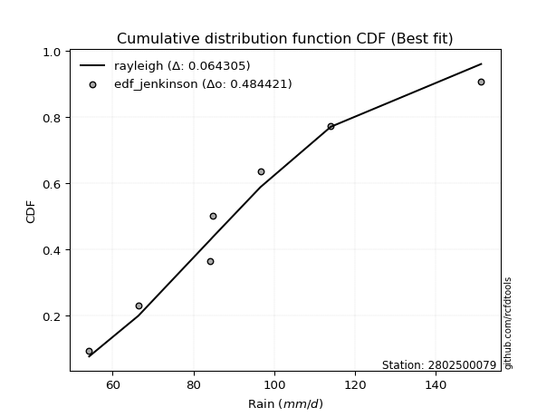</img>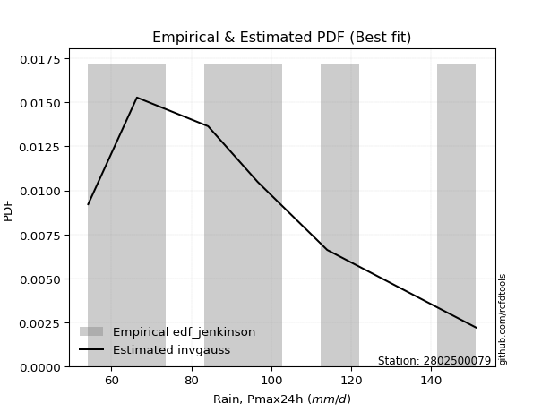</img>

</div>


### 11. EDF Cunnane (1978)

Cunnane´s work in statistical hydrology has focused on the performance and evaluation of different probability distributions (such as GEV, Gumbel, Lognormal) for flood frequency estimation. _b_ is a constant, typically set to 0.4.

<div align="center">


$P=(m-b)/(n+1-2b)$


</div>


**11.1. Empirical values**

<div align="center">

|                | 0                  | 1                   | 2                   | 3                  | 4                  | 5                  |
|:---------------|:-------------------|:--------------------|:--------------------|:-------------------|:-------------------|:-------------------|
| date           | 2023               | 2020                | 2022                | 2021               | 2019               | 2024               |
| x              | 54.2               | 66.4                | 84.2                | 96.6               | 114.0              | 151.2              |
| m              | 1                  | 2                   | 3                   | 4                  | 5                  | 6                  |
| empirical_dist | edf_cunnane        | edf_cunnane         | edf_cunnane         | edf_cunnane        | edf_cunnane        | edf_cunnane        |
| empirical      | 0.0967741935483871 | 0.25806451612903225 | 0.41935483870967744 | 0.5806451612903226 | 0.7419354838709676 | 0.9032258064516128 |
| empirical_tr   | 1.1071428571428572 | 1.3478260869565217  | 1.7222222222222225  | 2.384615384615385  | 3.8749999999999982 | 10.333333333333318 |

</div>


**11.2. Kolmogorov-Smirnov fit test (sorted by Δ)**


<div align="center">

|                | 0                    | 1                   | 2                    | 3                    | 4                   | 5                    | 6                   | 7                  | 8                    | 9                   | 10                  | 11                  | 12                  | 13                  | 14                  | 15                  | 16                  | 17                  | 18                  | 19                  | 20                  | 21                  | 22                  | 23                 | 24                  | 25                  | 26                  | 27                | 28                | 29                  | 30                  | 31                  | 32                  | 33                  | 34                  | 35                  | 36                 | 37                 | 38                  | 39                  | 40                  | 41                  | 42                  | 43                  | 44                  | 45                  | 46                 | 47                  | 48                  | 49                    | 50                  | 51                  | 52                  | 53                  | 54                  | 55                  | 56                  | 57                  | 58                 | 59                 | 60                 | 61                  | 62                  | 63                  | 64                  | 65                  | 66                  | 67                  | 68                 | 69                  | 70                  | 71                  | 72                  | 73                  | 74                | 75                  | 76                  | 77                  | 78                  | 79                  | 80                  | 81                 | 82                  | 83                 | 84                  | 85                 | 86                 | 87                 |
|:---------------|:---------------------|:--------------------|:---------------------|:---------------------|:--------------------|:---------------------|:--------------------|:-------------------|:---------------------|:--------------------|:--------------------|:--------------------|:--------------------|:--------------------|:--------------------|:--------------------|:--------------------|:--------------------|:--------------------|:--------------------|:--------------------|:--------------------|:--------------------|:-------------------|:--------------------|:--------------------|:--------------------|:------------------|:------------------|:--------------------|:--------------------|:--------------------|:--------------------|:--------------------|:--------------------|:--------------------|:-------------------|:-------------------|:--------------------|:--------------------|:--------------------|:--------------------|:--------------------|:--------------------|:--------------------|:--------------------|:-------------------|:--------------------|:--------------------|:----------------------|:--------------------|:--------------------|:--------------------|:--------------------|:--------------------|:--------------------|:--------------------|:--------------------|:-------------------|:-------------------|:-------------------|:--------------------|:--------------------|:--------------------|:--------------------|:--------------------|:--------------------|:--------------------|:-------------------|:--------------------|:--------------------|:--------------------|:--------------------|:--------------------|:------------------|:--------------------|:--------------------|:--------------------|:--------------------|:--------------------|:--------------------|:-------------------|:--------------------|:-------------------|:--------------------|:-------------------|:-------------------|:-------------------|
| station        | 2802500079           | 2802500079          | 2802500079           | 2802500079           | 2802500079          | 2802500079           | 2802500079          | 2802500079         | 2802500079           | 2802500079          | 2802500079          | 2802500079          | 2802500079          | 2802500079          | 2802500079          | 2802500079          | 2802500079          | 2802500079          | 2802500079          | 2802500079          | 2802500079          | 2802500079          | 2802500079          | 2802500079         | 2802500079          | 2802500079          | 2802500079          | 2802500079        | 2802500079        | 2802500079          | 2802500079          | 2802500079          | 2802500079          | 2802500079          | 2802500079          | 2802500079          | 2802500079         | 2802500079         | 2802500079          | 2802500079          | 2802500079          | 2802500079          | 2802500079          | 2802500079          | 2802500079          | 2802500079          | 2802500079         | 2802500079          | 2802500079          | 2802500079            | 2802500079          | 2802500079          | 2802500079          | 2802500079          | 2802500079          | 2802500079          | 2802500079          | 2802500079          | 2802500079         | 2802500079         | 2802500079         | 2802500079          | 2802500079          | 2802500079          | 2802500079          | 2802500079          | 2802500079          | 2802500079          | 2802500079         | 2802500079          | 2802500079          | 2802500079          | 2802500079          | 2802500079          | 2802500079        | 2802500079          | 2802500079          | 2802500079          | 2802500079          | 2802500079          | 2802500079          | 2802500079         | 2802500079          | 2802500079         | 2802500079          | 2802500079         | 2802500079         | 2802500079         |
| empirical_dist | edf_cunnane          | edf_cunnane         | edf_cunnane          | edf_cunnane          | edf_cunnane         | edf_cunnane          | edf_cunnane         | edf_cunnane        | edf_cunnane          | edf_cunnane         | edf_cunnane         | edf_cunnane         | edf_cunnane         | edf_cunnane         | edf_cunnane         | edf_cunnane         | edf_cunnane         | edf_cunnane         | edf_cunnane         | edf_cunnane         | edf_cunnane         | edf_cunnane         | edf_cunnane         | edf_cunnane        | edf_cunnane         | edf_cunnane         | edf_cunnane         | edf_cunnane       | edf_cunnane       | edf_cunnane         | edf_cunnane         | edf_cunnane         | edf_cunnane         | edf_cunnane         | edf_cunnane         | edf_cunnane         | edf_cunnane        | edf_cunnane        | edf_cunnane         | edf_cunnane         | edf_cunnane         | edf_cunnane         | edf_cunnane         | edf_cunnane         | edf_cunnane         | edf_cunnane         | edf_cunnane        | edf_cunnane         | edf_cunnane         | edf_cunnane           | edf_cunnane         | edf_cunnane         | edf_cunnane         | edf_cunnane         | edf_cunnane         | edf_cunnane         | edf_cunnane         | edf_cunnane         | edf_cunnane        | edf_cunnane        | edf_cunnane        | edf_cunnane         | edf_cunnane         | edf_cunnane         | edf_cunnane         | edf_cunnane         | edf_cunnane         | edf_cunnane         | edf_cunnane        | edf_cunnane         | edf_cunnane         | edf_cunnane         | edf_cunnane         | edf_cunnane         | edf_cunnane       | edf_cunnane         | edf_cunnane         | edf_cunnane         | edf_cunnane         | edf_cunnane         | edf_cunnane         | edf_cunnane        | edf_cunnane         | edf_cunnane        | edf_cunnane         | edf_cunnane        | edf_cunnane        | edf_cunnane        |
| p_dist         | rayleigh             | johnsonsu           | logmaxwell           | loginvgauss          | maxwell             | lograyleigh          | invgauss            | logrice            | loginvgamma          | logweibull_min      | logalpha            | ncf                 | invgamma            | nct                 | f                   | betaprime           | fisk                | pearson3            | logfatiguelife      | logncf              | logbetaprime        | logjohnsonsu        | logf                | halfnorm           | logloggamma         | logerlang           | lognct              | loggamma          | loggamma          | logpearson3         | logexponnorm        | logt                | logcrystalball      | lognorm             | lognorm             | t                   | genlogistic        | crystalball        | norm                | truncnorm           | kstwobign           | alpha               | logfisk             | logmielke           | mielke              | loggenlogistic      | loggumbel_r        | loginvweibull       | gumbel_r            | loglaplace_asymmetric | loglogistic         | rice                | logistic            | logkstwobign        | loggumbel_l         | laplace_asymmetric  | loggompertz         | gompertz            | halflogistic       | loghalfnorm        | loggenexpon        | moyal               | loghypsecant        | hypsecant           | logmoyal            | expon               | exponnorm           | loghalflogistic     | loglaplace         | laplace             | gumbel_l            | nakagami            | logexpon            | lognakagami         | gamma             | logchi2             | logwald             | wald                | weibull_min         | gibrat              | loggibrat           | logtruncnorm       | loglognorm          | fatiguelife        | invweibull          | erlang             | genexpon           | chi2               |
| delta          | 0.052599268472681454 | 0.05377598373272097 | 0.056248721531061335 | 0.056780660498573304 | 0.05707593162418789 | 0.058981939716630294 | 0.05910187848797527 | 0.0620730895997163 | 0.062234968988267636 | 0.06260803072141091 | 0.06280758087720734 | 0.06354779012163983 | 0.06355318323393391 | 0.06356069024519861 | 0.06412341651203357 | 0.06416261473409196 | 0.06443355753496269 | 0.06498891648353258 | 0.06522722585521584 | 0.06548198808948474 | 0.06565597201879778 | 0.06578093333974011 | 0.06595472238059838 | 0.0661039036932695 | 0.06651551096095712 | 0.06656352309004618 | 0.06658795735543827 | 0.066722841605587 | 0.066722841605587 | 0.06681843213780009 | 0.06735210692379512 | 0.06735425431789177 | 0.06735430581340285 | 0.06735440938796622 | 0.06735440938796622 | 0.06745525899824789 | 0.0679010234453429 | 0.0680402652488534 | 0.06804027307713861 | 0.06804027317543704 | 0.06832131542465478 | 0.06885179767948524 | 0.06991770865038682 | 0.07283111517874097 | 0.07460972033528818 | 0.07760394753855726 | 0.0799377812997569 | 0.08027082085517645 | 0.08093161894819254 | 0.08230078888162548   | 0.08834083392184544 | 0.08844708779786134 | 0.08898510102471857 | 0.09053178670980327 | 0.09106720902867127 | 0.09449454686052292 | 0.09677418297313216 | 0.09677419349932125 | 0.0967741935483871 | 0.0967741935483871 | 0.0968369836695217 | 0.09795117424878441 | 0.10038942875125276 | 0.10098837213583933 | 0.10263393128026099 | 0.10621951525733869 | 0.10962513462625206 | 0.11251700920190016 | 0.1130590099088079 | 0.11357577496059043 | 0.12263769942204061 | 0.15256738644655604 | 0.16740156448886184 | 0.16980911710594776 | 0.210731887354709 | 0.22044466199358903 | 0.24606583266431994 | 0.24714923882077008 | 0.25235737761844884 | 0.25806451612903225 | 0.25806451612903225 | 0.2974800779248408 | 0.38760300702382877 | 0.4506993087850568 | 0.45178712272875826 | 0.4658647876987384 | 0.7291327064958263 | 0.7408545013759763 |
| deltao         | 0.530385761606       | 0.530385761606      | 0.530385761606       | 0.530385761606       | 0.530385761606      | 0.530385761606       | 0.530385761606      | 0.530385761606     | 0.530385761606       | 0.530385761606      | 0.530385761606      | 0.530385761606      | 0.530385761606      | 0.530385761606      | 0.530385761606      | 0.530385761606      | 0.530385761606      | 0.530385761606      | 0.530385761606      | 0.530385761606      | 0.530385761606      | 0.530385761606      | 0.530385761606      | 0.530385761606     | 0.530385761606      | 0.530385761606      | 0.530385761606      | 0.530385761606    | 0.530385761606    | 0.530385761606      | 0.530385761606      | 0.530385761606      | 0.530385761606      | 0.530385761606      | 0.530385761606      | 0.530385761606      | 0.530385761606     | 0.530385761606     | 0.530385761606      | 0.530385761606      | 0.530385761606      | 0.530385761606      | 0.530385761606      | 0.530385761606      | 0.530385761606      | 0.530385761606      | 0.530385761606     | 0.530385761606      | 0.530385761606      | 0.530385761606        | 0.530385761606      | 0.530385761606      | 0.530385761606      | 0.530385761606      | 0.530385761606      | 0.530385761606      | 0.530385761606      | 0.530385761606      | 0.530385761606     | 0.530385761606     | 0.530385761606     | 0.530385761606      | 0.530385761606      | 0.530385761606      | 0.530385761606      | 0.530385761606      | 0.530385761606      | 0.530385761606      | 0.530385761606     | 0.530385761606      | 0.530385761606      | 0.530385761606      | 0.530385761606      | 0.530385761606      | 0.530385761606    | 0.530385761606      | 0.530385761606      | 0.530385761606      | 0.530385761606      | 0.530385761606      | 0.530385761606      | 0.530385761606     | 0.530385761606      | 0.530385761606     | 0.530385761606      | 0.530385761606     | 0.530385761606     | 0.530385761606     |
| eval           | Δo > Δ               | Δo > Δ              | Δo > Δ               | Δo > Δ               | Δo > Δ              | Δo > Δ               | Δo > Δ              | Δo > Δ             | Δo > Δ               | Δo > Δ              | Δo > Δ              | Δo > Δ              | Δo > Δ              | Δo > Δ              | Δo > Δ              | Δo > Δ              | Δo > Δ              | Δo > Δ              | Δo > Δ              | Δo > Δ              | Δo > Δ              | Δo > Δ              | Δo > Δ              | Δo > Δ             | Δo > Δ              | Δo > Δ              | Δo > Δ              | Δo > Δ            | Δo > Δ            | Δo > Δ              | Δo > Δ              | Δo > Δ              | Δo > Δ              | Δo > Δ              | Δo > Δ              | Δo > Δ              | Δo > Δ             | Δo > Δ             | Δo > Δ              | Δo > Δ              | Δo > Δ              | Δo > Δ              | Δo > Δ              | Δo > Δ              | Δo > Δ              | Δo > Δ              | Δo > Δ             | Δo > Δ              | Δo > Δ              | Δo > Δ                | Δo > Δ              | Δo > Δ              | Δo > Δ              | Δo > Δ              | Δo > Δ              | Δo > Δ              | Δo > Δ              | Δo > Δ              | Δo > Δ             | Δo > Δ             | Δo > Δ             | Δo > Δ              | Δo > Δ              | Δo > Δ              | Δo > Δ              | Δo > Δ              | Δo > Δ              | Δo > Δ              | Δo > Δ             | Δo > Δ              | Δo > Δ              | Δo > Δ              | Δo > Δ              | Δo > Δ              | Δo > Δ            | Δo > Δ              | Δo > Δ              | Δo > Δ              | Δo > Δ              | Δo > Δ              | Δo > Δ              | Δo > Δ             | Δo > Δ              | Δo > Δ             | Δo > Δ              | Δo > Δ             | Δo <= Δ            | Δo <= Δ            |
| fit            | 1                    | 1                   | 1                    | 1                    | 1                   | 1                    | 1                   | 1                  | 1                    | 1                   | 1                   | 1                   | 1                   | 1                   | 1                   | 1                   | 1                   | 1                   | 1                   | 1                   | 1                   | 1                   | 1                   | 1                  | 1                   | 1                   | 1                   | 1                 | 1                 | 1                   | 1                   | 1                   | 1                   | 1                   | 1                   | 1                   | 1                  | 1                  | 1                   | 1                   | 1                   | 1                   | 1                   | 1                   | 1                   | 1                   | 1                  | 1                   | 1                   | 1                     | 1                   | 1                   | 1                   | 1                   | 1                   | 1                   | 1                   | 1                   | 1                  | 1                  | 1                  | 1                   | 1                   | 1                   | 1                   | 1                   | 1                   | 1                   | 1                  | 1                   | 1                   | 1                   | 1                   | 1                   | 1                 | 1                   | 1                   | 1                   | 1                   | 1                   | 1                   | 1                  | 1                   | 1                  | 1                   | 1                  | 0                  | 0                  |
| n              | 6                    | 6                   | 6                    | 6                    | 6                   | 6                    | 6                   | 6                  | 6                    | 6                   | 6                   | 6                   | 6                   | 6                   | 6                   | 6                   | 6                   | 6                   | 6                   | 6                   | 6                   | 6                   | 6                   | 6                  | 6                   | 6                   | 6                   | 6                 | 6                 | 6                   | 6                   | 6                   | 6                   | 6                   | 6                   | 6                   | 6                  | 6                  | 6                   | 6                   | 6                   | 6                   | 6                   | 6                   | 6                   | 6                   | 6                  | 6                   | 6                   | 6                     | 6                   | 6                   | 6                   | 6                   | 6                   | 6                   | 6                   | 6                   | 6                  | 6                  | 6                  | 6                   | 6                   | 6                   | 6                   | 6                   | 6                   | 6                   | 6                  | 6                   | 6                   | 6                   | 6                   | 6                   | 6                 | 6                   | 6                   | 6                   | 6                   | 6                   | 6                   | 6                  | 6                   | 6                  | 6                   | 6                  | 6                  | 6                  |
| best_fit       | 1                    | 0                   | 0                    | 0                    | 0                   | 0                    | 0                   | 0                  | 0                    | 0                   | 0                   | 0                   | 0                   | 0                   | 0                   | 0                   | 0                   | 0                   | 0                   | 0                   | 0                   | 0                   | 0                   | 0                  | 0                   | 0                   | 0                   | 0                 | 0                 | 0                   | 0                   | 0                   | 0                   | 0                   | 0                   | 0                   | 0                  | 0                  | 0                   | 0                   | 0                   | 0                   | 0                   | 0                   | 0                   | 0                   | 0                  | 0                   | 0                   | 0                     | 0                   | 0                   | 0                   | 0                   | 0                   | 0                   | 0                   | 0                   | 0                  | 0                  | 0                  | 0                   | 0                   | 0                   | 0                   | 0                   | 0                   | 0                   | 0                  | 0                   | 0                   | 0                   | 0                   | 0                   | 0                 | 0                   | 0                   | 0                   | 0                   | 0                   | 0                   | 0                  | 0                   | 0                  | 0                   | 0                  | 0                  | 0                  |
| best_fit_sort  | 1                    | 2                   | 3                    | 4                    | 5                   | 6                    | 7                   | 8                  | 9                    | 10                  | 11                  | 12                  | 13                  | 14                  | 15                  | 16                  | 17                  | 18                  | 19                  | 20                  | 21                  | 22                  | 23                  | 24                 | 25                  | 26                  | 27                  | 28                | 29                | 30                  | 31                  | 32                  | 33                  | 34                  | 35                  | 36                  | 37                 | 38                 | 39                  | 40                  | 41                  | 42                  | 43                  | 44                  | 45                  | 46                  | 47                 | 48                  | 49                  | 50                    | 51                  | 52                  | 53                  | 54                  | 55                  | 56                  | 57                  | 58                  | 59                 | 60                 | 61                 | 62                  | 63                  | 64                  | 65                  | 66                  | 67                  | 68                  | 69                 | 70                  | 71                  | 72                  | 73                  | 74                  | 75                | 76                  | 77                  | 78                  | 79                  | 80                  | 81                  | 82                 | 83                  | 84                 | 85                  | 86                 | 87                 | 88                 |

</div>


**11.3. Best fit**

<div align="center">

|   id |    station | empirical_dist   | p_dist   |     delta |   deltao | eval   |   fit |   n |   best_fit |   best_fit_sort |
|-----:|-----------:|:-----------------|:---------|----------:|---------:|:-------|------:|----:|-----------:|----------------:|
|    0 | 2802500079 | edf_cunnane      | rayleigh | 0.0525993 | 0.530386 | Δo > Δ |     1 |   6 |          1 |               1 |

</div>


<div align="center">

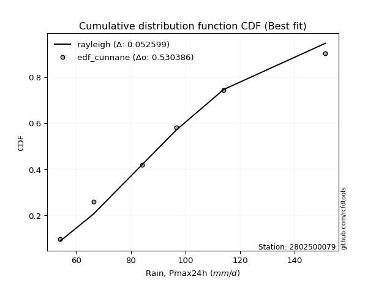</img>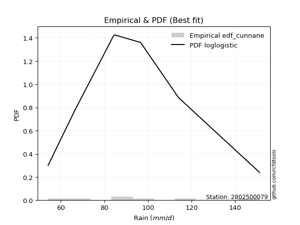</img>

</div>


### 12. EDF Adamowski (1981)

The Adamowski formula in hydrology refers to a specific plotting position formula used for estimating the non-parametric empirical distribution of hydrological events (like flood peaks) to calculate their return periods. This formula provides an alternative to traditional parametric methods (like the Gumbel or Log Pearson Type III distributions). 

<div align="center">


$P=(m-0.25)/(n+0.5)$


</div>


**12.1. Empirical values**

<div align="center">

|                | 0                   | 1                  | 2                  | 3                  | 4                  | 5                  |
|:---------------|:--------------------|:-------------------|:-------------------|:-------------------|:-------------------|:-------------------|
| date           | 2023                | 2020               | 2022               | 2021               | 2019               | 2024               |
| x              | 54.2                | 66.4               | 84.2               | 96.6               | 114.0              | 151.2              |
| m              | 1                   | 2                  | 3                  | 4                  | 5                  | 6                  |
| empirical_dist | edf_adamowski       | edf_adamowski      | edf_adamowski      | edf_adamowski      | edf_adamowski      | edf_adamowski      |
| empirical      | 0.11538461538461539 | 0.2692307692307692 | 0.4230769230769231 | 0.5769230769230769 | 0.7307692307692307 | 0.8846153846153846 |
| empirical_tr   | 1.1304347826086958  | 1.3684210526315788 | 1.7333333333333334 | 2.3636363636363633 | 3.7142857142857135 | 8.666666666666664  |

</div>


**12.2. Kolmogorov-Smirnov fit test (sorted by Δ)**


<div align="center">

|                | 0                 | 1                   | 2                   | 3                  | 4                   | 5                   | 6                   | 7                   | 8                   | 9                  | 10                  | 11                 | 12                 | 13                  | 14                  | 15                  | 16                  | 17                  | 18                  | 19                  | 20                  | 21                  | 22                  | 23                  | 24                  | 25                  | 26                  | 27                  | 28                  | 29                  | 30                  | 31                  | 32                  | 33                  | 34                  | 35                  | 36                  | 37                  | 38                  | 39                  | 40                  | 41                  | 42                | 43                  | 44                 | 45                  | 46                 | 47                  | 48                  | 49                 | 50                    | 51                  | 52                  | 53                  | 54                  | 55                  | 56                  | 57                  | 58                  | 59                 | 60                  | 61                  | 62                  | 63                  | 64                  | 65                  | 66                  | 67                  | 68                  | 69                  | 70                 | 71                 | 72                 | 73                  | 74                  | 75                  | 76                 | 77                  | 78                 | 79                 | 80                 | 81                 | 82                 | 83                 | 84                  | 85                  | 86                 | 87                 |
|:---------------|:------------------|:--------------------|:--------------------|:-------------------|:--------------------|:--------------------|:--------------------|:--------------------|:--------------------|:-------------------|:--------------------|:-------------------|:-------------------|:--------------------|:--------------------|:--------------------|:--------------------|:--------------------|:--------------------|:--------------------|:--------------------|:--------------------|:--------------------|:--------------------|:--------------------|:--------------------|:--------------------|:--------------------|:--------------------|:--------------------|:--------------------|:--------------------|:--------------------|:--------------------|:--------------------|:--------------------|:--------------------|:--------------------|:--------------------|:--------------------|:--------------------|:--------------------|:------------------|:--------------------|:-------------------|:--------------------|:-------------------|:--------------------|:--------------------|:-------------------|:----------------------|:--------------------|:--------------------|:--------------------|:--------------------|:--------------------|:--------------------|:--------------------|:--------------------|:-------------------|:--------------------|:--------------------|:--------------------|:--------------------|:--------------------|:--------------------|:--------------------|:--------------------|:--------------------|:--------------------|:-------------------|:-------------------|:-------------------|:--------------------|:--------------------|:--------------------|:-------------------|:--------------------|:-------------------|:-------------------|:-------------------|:-------------------|:-------------------|:-------------------|:--------------------|:--------------------|:-------------------|:-------------------|
| station        | 2802500079        | 2802500079          | 2802500079          | 2802500079         | 2802500079          | 2802500079          | 2802500079          | 2802500079          | 2802500079          | 2802500079         | 2802500079          | 2802500079         | 2802500079         | 2802500079          | 2802500079          | 2802500079          | 2802500079          | 2802500079          | 2802500079          | 2802500079          | 2802500079          | 2802500079          | 2802500079          | 2802500079          | 2802500079          | 2802500079          | 2802500079          | 2802500079          | 2802500079          | 2802500079          | 2802500079          | 2802500079          | 2802500079          | 2802500079          | 2802500079          | 2802500079          | 2802500079          | 2802500079          | 2802500079          | 2802500079          | 2802500079          | 2802500079          | 2802500079        | 2802500079          | 2802500079         | 2802500079          | 2802500079         | 2802500079          | 2802500079          | 2802500079         | 2802500079            | 2802500079          | 2802500079          | 2802500079          | 2802500079          | 2802500079          | 2802500079          | 2802500079          | 2802500079          | 2802500079         | 2802500079          | 2802500079          | 2802500079          | 2802500079          | 2802500079          | 2802500079          | 2802500079          | 2802500079          | 2802500079          | 2802500079          | 2802500079         | 2802500079         | 2802500079         | 2802500079          | 2802500079          | 2802500079          | 2802500079         | 2802500079          | 2802500079         | 2802500079         | 2802500079         | 2802500079         | 2802500079         | 2802500079         | 2802500079          | 2802500079          | 2802500079         | 2802500079         |
| empirical_dist | edf_adamowski     | edf_adamowski       | edf_adamowski       | edf_adamowski      | edf_adamowski       | edf_adamowski       | edf_adamowski       | edf_adamowski       | edf_adamowski       | edf_adamowski      | edf_adamowski       | edf_adamowski      | edf_adamowski      | edf_adamowski       | edf_adamowski       | edf_adamowski       | edf_adamowski       | edf_adamowski       | edf_adamowski       | edf_adamowski       | edf_adamowski       | edf_adamowski       | edf_adamowski       | edf_adamowski       | edf_adamowski       | edf_adamowski       | edf_adamowski       | edf_adamowski       | edf_adamowski       | edf_adamowski       | edf_adamowski       | edf_adamowski       | edf_adamowski       | edf_adamowski       | edf_adamowski       | edf_adamowski       | edf_adamowski       | edf_adamowski       | edf_adamowski       | edf_adamowski       | edf_adamowski       | edf_adamowski       | edf_adamowski     | edf_adamowski       | edf_adamowski      | edf_adamowski       | edf_adamowski      | edf_adamowski       | edf_adamowski       | edf_adamowski      | edf_adamowski         | edf_adamowski       | edf_adamowski       | edf_adamowski       | edf_adamowski       | edf_adamowski       | edf_adamowski       | edf_adamowski       | edf_adamowski       | edf_adamowski      | edf_adamowski       | edf_adamowski       | edf_adamowski       | edf_adamowski       | edf_adamowski       | edf_adamowski       | edf_adamowski       | edf_adamowski       | edf_adamowski       | edf_adamowski       | edf_adamowski      | edf_adamowski      | edf_adamowski      | edf_adamowski       | edf_adamowski       | edf_adamowski       | edf_adamowski      | edf_adamowski       | edf_adamowski      | edf_adamowski      | edf_adamowski      | edf_adamowski      | edf_adamowski      | edf_adamowski      | edf_adamowski       | edf_adamowski       | edf_adamowski      | edf_adamowski      |
| p_dist         | invgauss          | rayleigh            | johnsonsu           | logmaxwell         | loginvgauss         | maxwell             | logmielke           | mielke              | logrice             | loginvgamma        | loggenlogistic      | logalpha           | ncf                | invgamma            | nct                 | logweibull_min      | f                   | betaprime           | lograyleigh         | fisk                | pearson3            | logfatiguelife      | loginvweibull       | logncf              | logbetaprime        | logjohnsonsu        | logf                | logloggamma         | logerlang           | lognct              | loggamma            | loggamma            | logpearson3         | logexponnorm        | logt                | logcrystalball      | lognorm             | lognorm             | t                   | genlogistic         | crystalball         | norm                | truncnorm         | kstwobign           | alpha              | logfisk             | halfnorm           | logkstwobign        | loggumbel_r         | gumbel_r           | loglaplace_asymmetric | loglogistic         | rice                | logistic            | loggumbel_l         | laplace_asymmetric  | logmoyal            | moyal               | loghypsecant        | hypsecant          | loggenexpon         | exponnorm           | loggompertz         | gompertz            | expon               | halflogistic        | loghalfnorm         | loghalflogistic     | gumbel_l            | loglaplace          | laplace            | nakagami           | logexpon           | lognakagami         | logchi2             | gamma               | weibull_min        | logwald             | wald               | gibrat             | loggibrat          | logtruncnorm       | loglognorm         | invweibull         | fatiguelife         | erlang              | genexpon           | chi2               |
| delta          | 0.062656881289506 | 0.06376552157441842 | 0.06494223683445793 | 0.0674149746327983 | 0.06794691360031027 | 0.06824218472592486 | 0.06910903081149533 | 0.07088763596804254 | 0.07323934270145327 | 0.0734012220900046 | 0.07388186317131162 | 0.0739738339789443 | 0.0747140432233768 | 0.07471943633567088 | 0.07472694334693558 | 0.07518063156977503 | 0.07528966961377054 | 0.07532886783582893 | 0.07534650092356301 | 0.07559981063669965 | 0.07615516958526955 | 0.07639347895695281 | 0.07654873648793081 | 0.07664824119122171 | 0.07682222512053474 | 0.07694718644147708 | 0.07712097548233535 | 0.07768176406269409 | 0.07772977619178315 | 0.07775421045717523 | 0.07788909470732397 | 0.07788909470732397 | 0.07798468523953705 | 0.07851836002553209 | 0.07852050741962874 | 0.07852055891513982 | 0.07852066248970319 | 0.07852066248970319 | 0.07862151209998486 | 0.07906727654707987 | 0.07920651835059037 | 0.07920652617887558 | 0.079206526277174 | 0.07948756852639174 | 0.0800180507812222 | 0.08108396175212379 | 0.0847143255294978 | 0.08680970234255764 | 0.09142038692502252 | 0.0920978720499295 | 0.09346704198336245   | 0.09950708702358241 | 0.09961334089959831 | 0.10015135412645554 | 0.10223346213040824 | 0.10566079996225988 | 0.10908887439363808 | 0.10911742735052138 | 0.11155568185298972 | 0.1121546252375763 | 0.11418676409391434 | 0.11424564101305476 | 0.11538460480936046 | 0.11538461533554954 | 0.11538461538461539 | 0.11538461538461539 | 0.11538461538461539 | 0.11538461538461539 | 0.11891561505479487 | 0.12422526301054487 | 0.1247420280623274 | 0.1488453020793104 | 0.1636794801216162 | 0.16608703273870212 | 0.20183424015736084 | 0.20700980298746335 | 0.2486352932512032 | 0.25723208576605694 | 0.2583154919225071 | 0.2692307692307692 | 0.2692307692307692 | 0.2937579935575952 | 0.3764367539220918 | 0.4331767008925301 | 0.43953305568331985 | 0.45469853459700144 | 0.7179664533940893 | 0.7296882482742393 |
| deltao         | 0.530385761606    | 0.530385761606      | 0.530385761606      | 0.530385761606     | 0.530385761606      | 0.530385761606      | 0.530385761606      | 0.530385761606      | 0.530385761606      | 0.530385761606     | 0.530385761606      | 0.530385761606     | 0.530385761606     | 0.530385761606      | 0.530385761606      | 0.530385761606      | 0.530385761606      | 0.530385761606      | 0.530385761606      | 0.530385761606      | 0.530385761606      | 0.530385761606      | 0.530385761606      | 0.530385761606      | 0.530385761606      | 0.530385761606      | 0.530385761606      | 0.530385761606      | 0.530385761606      | 0.530385761606      | 0.530385761606      | 0.530385761606      | 0.530385761606      | 0.530385761606      | 0.530385761606      | 0.530385761606      | 0.530385761606      | 0.530385761606      | 0.530385761606      | 0.530385761606      | 0.530385761606      | 0.530385761606      | 0.530385761606    | 0.530385761606      | 0.530385761606     | 0.530385761606      | 0.530385761606     | 0.530385761606      | 0.530385761606      | 0.530385761606     | 0.530385761606        | 0.530385761606      | 0.530385761606      | 0.530385761606      | 0.530385761606      | 0.530385761606      | 0.530385761606      | 0.530385761606      | 0.530385761606      | 0.530385761606     | 0.530385761606      | 0.530385761606      | 0.530385761606      | 0.530385761606      | 0.530385761606      | 0.530385761606      | 0.530385761606      | 0.530385761606      | 0.530385761606      | 0.530385761606      | 0.530385761606     | 0.530385761606     | 0.530385761606     | 0.530385761606      | 0.530385761606      | 0.530385761606      | 0.530385761606     | 0.530385761606      | 0.530385761606     | 0.530385761606     | 0.530385761606     | 0.530385761606     | 0.530385761606     | 0.530385761606     | 0.530385761606      | 0.530385761606      | 0.530385761606     | 0.530385761606     |
| eval           | Δo > Δ            | Δo > Δ              | Δo > Δ              | Δo > Δ             | Δo > Δ              | Δo > Δ              | Δo > Δ              | Δo > Δ              | Δo > Δ              | Δo > Δ             | Δo > Δ              | Δo > Δ             | Δo > Δ             | Δo > Δ              | Δo > Δ              | Δo > Δ              | Δo > Δ              | Δo > Δ              | Δo > Δ              | Δo > Δ              | Δo > Δ              | Δo > Δ              | Δo > Δ              | Δo > Δ              | Δo > Δ              | Δo > Δ              | Δo > Δ              | Δo > Δ              | Δo > Δ              | Δo > Δ              | Δo > Δ              | Δo > Δ              | Δo > Δ              | Δo > Δ              | Δo > Δ              | Δo > Δ              | Δo > Δ              | Δo > Δ              | Δo > Δ              | Δo > Δ              | Δo > Δ              | Δo > Δ              | Δo > Δ            | Δo > Δ              | Δo > Δ             | Δo > Δ              | Δo > Δ             | Δo > Δ              | Δo > Δ              | Δo > Δ             | Δo > Δ                | Δo > Δ              | Δo > Δ              | Δo > Δ              | Δo > Δ              | Δo > Δ              | Δo > Δ              | Δo > Δ              | Δo > Δ              | Δo > Δ             | Δo > Δ              | Δo > Δ              | Δo > Δ              | Δo > Δ              | Δo > Δ              | Δo > Δ              | Δo > Δ              | Δo > Δ              | Δo > Δ              | Δo > Δ              | Δo > Δ             | Δo > Δ             | Δo > Δ             | Δo > Δ              | Δo > Δ              | Δo > Δ              | Δo > Δ             | Δo > Δ              | Δo > Δ             | Δo > Δ             | Δo > Δ             | Δo > Δ             | Δo > Δ             | Δo > Δ             | Δo > Δ              | Δo > Δ              | Δo <= Δ            | Δo <= Δ            |
| fit            | 1                 | 1                   | 1                   | 1                  | 1                   | 1                   | 1                   | 1                   | 1                   | 1                  | 1                   | 1                  | 1                  | 1                   | 1                   | 1                   | 1                   | 1                   | 1                   | 1                   | 1                   | 1                   | 1                   | 1                   | 1                   | 1                   | 1                   | 1                   | 1                   | 1                   | 1                   | 1                   | 1                   | 1                   | 1                   | 1                   | 1                   | 1                   | 1                   | 1                   | 1                   | 1                   | 1                 | 1                   | 1                  | 1                   | 1                  | 1                   | 1                   | 1                  | 1                     | 1                   | 1                   | 1                   | 1                   | 1                   | 1                   | 1                   | 1                   | 1                  | 1                   | 1                   | 1                   | 1                   | 1                   | 1                   | 1                   | 1                   | 1                   | 1                   | 1                  | 1                  | 1                  | 1                   | 1                   | 1                   | 1                  | 1                   | 1                  | 1                  | 1                  | 1                  | 1                  | 1                  | 1                   | 1                   | 0                  | 0                  |
| n              | 6                 | 6                   | 6                   | 6                  | 6                   | 6                   | 6                   | 6                   | 6                   | 6                  | 6                   | 6                  | 6                  | 6                   | 6                   | 6                   | 6                   | 6                   | 6                   | 6                   | 6                   | 6                   | 6                   | 6                   | 6                   | 6                   | 6                   | 6                   | 6                   | 6                   | 6                   | 6                   | 6                   | 6                   | 6                   | 6                   | 6                   | 6                   | 6                   | 6                   | 6                   | 6                   | 6                 | 6                   | 6                  | 6                   | 6                  | 6                   | 6                   | 6                  | 6                     | 6                   | 6                   | 6                   | 6                   | 6                   | 6                   | 6                   | 6                   | 6                  | 6                   | 6                   | 6                   | 6                   | 6                   | 6                   | 6                   | 6                   | 6                   | 6                   | 6                  | 6                  | 6                  | 6                   | 6                   | 6                   | 6                  | 6                   | 6                  | 6                  | 6                  | 6                  | 6                  | 6                  | 6                   | 6                   | 6                  | 6                  |
| best_fit       | 1                 | 0                   | 0                   | 0                  | 0                   | 0                   | 0                   | 0                   | 0                   | 0                  | 0                   | 0                  | 0                  | 0                   | 0                   | 0                   | 0                   | 0                   | 0                   | 0                   | 0                   | 0                   | 0                   | 0                   | 0                   | 0                   | 0                   | 0                   | 0                   | 0                   | 0                   | 0                   | 0                   | 0                   | 0                   | 0                   | 0                   | 0                   | 0                   | 0                   | 0                   | 0                   | 0                 | 0                   | 0                  | 0                   | 0                  | 0                   | 0                   | 0                  | 0                     | 0                   | 0                   | 0                   | 0                   | 0                   | 0                   | 0                   | 0                   | 0                  | 0                   | 0                   | 0                   | 0                   | 0                   | 0                   | 0                   | 0                   | 0                   | 0                   | 0                  | 0                  | 0                  | 0                   | 0                   | 0                   | 0                  | 0                   | 0                  | 0                  | 0                  | 0                  | 0                  | 0                  | 0                   | 0                   | 0                  | 0                  |
| best_fit_sort  | 1                 | 2                   | 3                   | 4                  | 5                   | 6                   | 7                   | 8                   | 9                   | 10                 | 11                  | 12                 | 13                 | 14                  | 15                  | 16                  | 17                  | 18                  | 19                  | 20                  | 21                  | 22                  | 23                  | 24                  | 25                  | 26                  | 27                  | 28                  | 29                  | 30                  | 31                  | 32                  | 33                  | 34                  | 35                  | 36                  | 37                  | 38                  | 39                  | 40                  | 41                  | 42                  | 43                | 44                  | 45                 | 46                  | 47                 | 48                  | 49                  | 50                 | 51                    | 52                  | 53                  | 54                  | 55                  | 56                  | 57                  | 58                  | 59                  | 60                 | 61                  | 62                  | 63                  | 64                  | 65                  | 66                  | 67                  | 68                  | 69                  | 70                  | 71                 | 72                 | 73                 | 74                  | 75                  | 76                  | 77                 | 78                  | 79                 | 80                 | 81                 | 82                 | 83                 | 84                 | 85                  | 86                  | 87                 | 88                 |

</div>


**12.3. Best fit**

<div align="center">

|   id |    station | empirical_dist   | p_dist   |     delta |   deltao | eval   |   fit |   n |   best_fit |   best_fit_sort |
|-----:|-----------:|:-----------------|:---------|----------:|---------:|:-------|------:|----:|-----------:|----------------:|
|    0 | 2802500079 | edf_adamowski    | invgauss | 0.0626569 | 0.530386 | Δo > Δ |     1 |   6 |          1 |               1 |

</div>


<div align="center">

</img>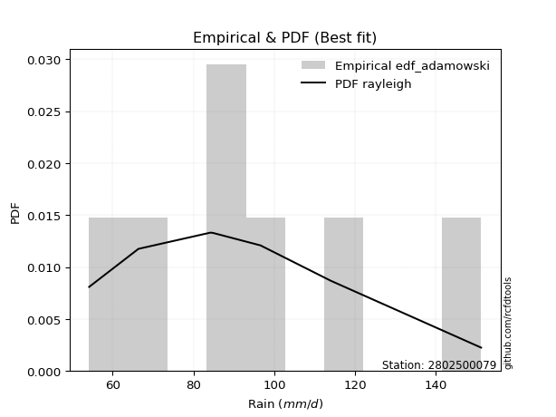</img>

</div>


## C. Best fit & Estimate extreme values for specific return periods - Tr

Best fit in probability distribution analysis means finding the theoretical distribution (like Normal, Poisson, Exponential) that most accurately mirrors your real-world data´s patterns (shape, center, spread) for better predictions, using methods like visual checks (Q-Q plots), goodness-of-fit tests (Kolmogorov-Smirnov, Chi-Squared), and information criteria (AIC) to score and select the simplest, most representative model.


### 1. Best fit (ordered by delta Δ)

<div align="center">

|   id |    station | empirical_dist   | p_dist        |     delta |   deltao | eval   |   fit |   n |   best_fit |   best_fit_sort |
|-----:|-----------:|:-----------------|:--------------|----------:|---------:|:-------|------:|----:|-----------:|----------------:|
|    0 | 2802500079 | edf_hazen        | rayleigh      | 0.0445348 | 0.530386 | Δo > Δ |     1 |   6 |          1 |               1 |
|    1 | 2802500079 | edf_gringorten   | rayleigh      | 0.0494367 | 0.530386 | Δo > Δ |     1 |   6 |          1 |               2 |
|    2 | 2802500079 | edf_cunnane      | rayleigh      | 0.0525993 | 0.530386 | Δo > Δ |     1 |   6 |          1 |               3 |
|    3 | 2802500079 | edf_blom         | rayleigh      | 0.0545348 | 0.530386 | Δo > Δ |     1 |   6 |          1 |               4 |
|    4 | 2802500079 | edf_chegodayev   | invgauss      | 0.0566473 | 0.530386 | Δo > Δ |     1 |   6 |          1 |               5 |
|    5 | 2802500079 | edf_jenkinson    | invgauss      | 0.0568266 | 0.530386 | Δo > Δ |     1 |   6 |          1 |               6 |
|    6 | 2802500079 | edf_beard        | invgauss      | 0.0568266 | 0.530386 | Δo > Δ |     1 |   6 |          1 |               7 |
|    7 | 2802500079 | edf_filliben     | invgauss      | 0.0570113 | 0.530386 | Δo > Δ |     1 |   6 |          1 |               8 |
|    8 | 2802500079 | edf_tukey        | invgauss      | 0.0574041 | 0.530386 | Δo > Δ |     1 |   6 |          1 |               9 |
|    9 | 2802500079 | edf_adamowski    | invgauss      | 0.0626569 | 0.530386 | Δo > Δ |     1 |   6 |          1 |              10 |
|   10 | 2802500079 | edf_weibull      | logmielke     | 0.0857074 | 0.530386 | Δo > Δ |     1 |   6 |          1 |              11 |
|   11 | 2802500079 | edf_california   | loginvweibull | 0.11514   | 0.530386 | Δo > Δ |     1 |   6 |          1 |              12 |

</div>

:file_folder:Tables: [bestfit_2802500079.csv](table/bestfit_2802500079.csv) | [extreme_2802500079.csv](table/extreme_2802500079.csv)


### 2. Extreme values

In hydrology, a return period (or recurrence interval $Tr$) is the statistical average time between extreme events like floods or droughts of a specific magnitude, indicating how rare an event is, with a 100-year flood, for example, having a 1% chance of occurring in any given year, not that it happens exactly every century. It is a key tool for infrastructure design (like bridges or dams) and risk assessment, calculated from historical data to determine the probability of future events, although it is important to remember it is statistical average, and events can cluster or be missed.

> risk_rate: assuming the return period as the project useful life.

|   id |      tr |   prob_l |     prob_g |    alpha |   betaprime |    chi2 |   crystalball |   erlang |    expon |   exponnorm |        f |   fatiguelife |     fisk |    gamma |   genexpon |   genlogistic |   gibrat |   gompertz |   gumbel_l |   gumbel_r |   halflogistic |   halfnorm |   hypsecant |   invgamma |   invgauss |      invweibull |   johnsonsu |   kstwobign |   laplace |   laplace_asymmetric |   loggamma |   logistic |   lognorm |   maxwell |   mielke |    moyal |   nakagami |      ncf |      nct |     norm |   pearson3 |   rayleigh |     rice |        t |   truncnorm |     wald |   weibull_min |   logalpha |   logbetaprime |          logchi2 |   logcrystalball |   logerlang |   logexpon |   logexponnorm |     logf |   logfatiguelife |   logfisk |   loggenexpon |   loggenlogistic |   loggibrat |   loggompertz |   loggumbel_l |   loggumbel_r |   loghalflogistic |   loghalfnorm |   loghypsecant |   loginvgamma |   loginvgauss |   loginvweibull |   logjohnsonsu |   logkstwobign |   loglaplace |   loglaplace_asymmetric |   logloggamma |   loglogistic |   loglognorm |   logmaxwell |   logmielke |   logmoyal |   lognakagami |   logncf |   lognct |   logpearson3 |   lograyleigh |   logrice |     logt |   logtruncnorm |   logwald |   logweibull_min |    station |   n |   risk_rate |
|-----:|--------:|---------:|-----------:|---------:|------------:|--------:|--------------:|---------:|---------:|------------:|---------:|--------------:|---------:|---------:|-----------:|--------------:|---------:|-----------:|-----------:|-----------:|---------------:|-----------:|------------:|-----------:|-----------:|----------------:|------------:|------------:|----------:|---------------------:|-----------:|-----------:|----------:|----------:|---------:|---------:|-----------:|---------:|---------:|---------:|-----------:|-----------:|---------:|---------:|------------:|---------:|--------------:|-----------:|---------------:|-----------------:|-----------------:|------------:|-----------:|---------------:|---------:|-----------------:|----------:|--------------:|-----------------:|------------:|--------------:|--------------:|--------------:|------------------:|--------------:|---------------:|--------------:|--------------:|----------------:|---------------:|---------------:|-------------:|------------------------:|--------------:|--------------:|-------------:|-------------:|------------:|-----------:|--------------:|---------:|---------:|--------------:|--------------:|----------:|---------:|---------------:|----------:|-----------------:|-----------:|----:|------------:|
|    0 |    2    | 0.5      | 0.5        |  88.6948 |     87.8072 | 54.2015 |       94.4333 |  56.7239 |  82.0876 |     81.8171 |  87.7966 |       54.2    |  86.8728 |  74.6021 |    56.1455 |       88.7546 |  84.8473 |    91.0368 |    99.6799 |    89.1868 |        86.5785 |    87.8961 |     94.4333 |    87.65   |    85.8015 |  1270.52        |     86.4125 |     89.0649 |   94.4333 |              89.8055 |    88.9018 |    94.4333 |   89.2248 |   91.702  |  84.6428 |  87.4931 |    75.9676 |  87.6478 |  87.2188 |  94.4333 |    91.6614 |    90.7333 |  92.1819 |  94.3399 |     94.4333 |  84.0811 |       68.1497 |    87.7121 |        88.4102 |     86.9384      |          89.2248 |     88.9154 |    76.5696 |        89.2236 |  88.5403 |          88.2858 |   88.4874 |       82.9349 |          84.424  |     80.6283 |       86.2728 |       94.3126 |       84.4114 |           82.1144 |       83.268  |        89.2248 |       87.5276 |       86.5028 |         84.2276 |        88.5458 |        83.4609 |      89.2248 |                 92.5884 |       89.3617 |       89.2248 |  54.2874     |      86.6857 |     84.7479 |    82.9137 |       76.2113 |  88.3941 |  88.768  |       88.9621 |       85.8026 |   87.2283 |  89.2247 |        69.9344 |   79.9754 |          85.5401 | 2802500079 |   6 |    0.75     |
|    1 |    2.33 | 0.570815 | 0.429185   |  94.1151 |     93.2912 | 54.2061 |      100.132  |  58.5351 |  88.2321 |     87.9121 |  93.2804 |       55.4854 |  92.398  |  79.4452 |    56.5735 |       94.1821 |  87.7341 |    97.0329 |   104.638  |    94.4675 |        92.0079 |    94.0468 |     98.9942 |    93.1331 |    91.4494 | 60175.5         |     92.005  |     94.6522 |   97.8821 |              94.424  |    94.4266 |    99.4545 |   94.7647 |   97.6228 |  90.232  |  92.4919 |    84.0601 |  93.1306 |  92.6382 | 100.132  |    97.3731 |    96.7417 |  97.7795 | 100.034  |    100.132  |  87.818  |       73.4382 |    93.192  |        93.9196 |    103.377       |          94.7647 |     94.4466 |    82.6263 |        94.7635 |  94.0565 |          93.7973 |   93.7895 |       88.7857 |          90.0283 |     83.1262 |       92.2631 |       99.3872 |       89.257  |           86.9656 |       88.8611 |        93.6316 |       93.0075 |       92.0157 |         89.8231 |        94.064  |        89.0857 |      92.5373 |                 96.5717 |       94.9166 |       94.0882 |  55.0868     |      92.2841 |     90.0564 |    87.4125 |       82.3876 |  93.9069 |  94.2864 |       94.4938 |       91.4286 |   92.8556 |  94.7646 |        73.6749 |   83.1979 |          91.1855 | 2802500079 |   6 |    0.729209 |
|    2 |    5    | 0.8      | 0.2        | 117.917  |    117.957  | 54.4278 |      121.311  |  74.1762 | 118.953  |    118.385  | 117.952  |       82.7903 | 120.01   | 104.162  |    58.7114 |      117.758  | 104.355  |   120.978  |   120.656  |   117.409  |       116.575  |   120.057  |    117.289  |   117.918  |   117.938  |     1.37548e+12 |    118.088  |    118.386  |  115.125  |             117.515  |   118.365  |   118.842  |  118.541  |  120.927  | 118.958  | 115.647  |   125.828  | 117.915  | 117.616  | 121.311  |   120.184  |   120.796  | 120.189  | 121.194  |    121.311  | 108.737  |      108.544  |   117.783  |       118.181  |    288.756       |         118.541  |    118.412  |   120.898  |       118.54   | 118.258  |         118.176  |  118.239  |      118.071  |         118.98   |     99.0885 |      118.984  |      117.723  |      113.751  |          112.757  |      116.979  |       113.607  |      117.762  |      117.86   |        118.781  |       118.262  |       117.524  |     111.038  |                115.87   |      118.601  |      115.487  |   2.4558e+39 |     118.06   |    116.54   |   111.652  |      116.586  | 118.199  | 118.329  |      118.435  |      117.897  |  118.31   | 118.541  |        93.1835 |  103.789  |         117.91   | 2802500079 |   6 |    0.67232  |
|    3 |   10    | 0.9      | 0.1        | 137.861  |    139.05   | 55.1253 |      135.361  |  94.9728 | 146.841  |    146.048  | 139.058  |      120.491  | 148.7    | 126.992  |    60.6508 |      136.959  | 123.3    |   137.206  |   129.574  |   136.095  |       136.977  |   139.304  |    131.898  |   139.256  |   141.147  |     1.35706e+18 |    141.179  |    136.456  |  130.778  |             138.477  |   137.734  |   133.12   |  137.519  |  137.327  | 148.869  | 135.807  |   160.622  | 139.252  | 139.902  | 135.361  |   136.73   |   137.947  | 136.168  | 135.232  |    135.361  | 130.937  |      151.082  |   138.722  |       138.271  |    839.264       |         137.519  |    137.8    |   170.796  |       137.52   | 138.195  |         138.486  |  141.263  |      145.734  |         149.278  |    121.054  |      140.085  |      129.359  |      138.591  |          139.899  |      143.369  |       132.576  |      139.03   |      141.199  |        149.141  |       138.181  |       145.121  |     131.016  |                136.708  |      137.329  |      134.3    | inf          |     140.407  |    143.33   |   138.17   |      152.015  | 138.33   | 137.954  |      137.774  |      141.331  |  139.738  | 137.519  |       110.498  |  131.243  |         141.756  | 2802500079 |   6 |    0.651322 |
|    4 |   15    | 0.933333 | 0.0666667  | 149.465  |    151.379  | 55.7496 |      142.371  | 108.977  | 163.154  |    162.229  | 151.399  |      145.149  | 168.275  | 140.445  |    61.785  |      147.791  | 136.368  |   145.168  |   133.612  |   146.637  |       148.522  |   149.32   |    140.235  |   151.784  |   154.666  |     3.26921e+21 |    154.873  |    146.049  |  139.934  |             150.739  |   148.627  |   140.899  |  148.097  |  145.741  | 168.933  | 147.507  |   179.222  | 151.78   | 153.368  | 142.371  |   145.418  |   146.784  | 144.401  | 142.237  |    142.371  | 145.193  |      180.08   |   150.921  |       149.748  |   1621.41        |         148.097  |    148.704  |   209.052  |       148.1    | 149.545  |         150.133  |  156.063  |      162.664  |         169.651  |    138.982  |      151.471  |      135.001  |      154.928  |          158.061  |      159.38   |       144.79   |      151.492  |      155.323  |        169.578  |       149.515  |       162.317  |     144.33   |                150.594  |      147.702  |      145.81   | inf          |     153.467  |    161.053  |   156.359  |      174.709  | 149.836  | 149.064  |      148.639  |      155.168  |  152.012  | 148.097  |       119.542  |  152.59   |         155.908  | 2802500079 |   6 |    0.644736 |
|    5 |   20    | 0.95     | 0.05       | 157.785  |    160.214  | 56.2712 |      146.963  | 119.514  | 174.728  |    173.71   | 160.243  |      163.404  | 183.762  | 150.022  |    62.5896 |      155.375  | 146.618  |   150.301  |   136.126  |   154.019  |       156.611  |   155.998  |    146.116  |   160.783  |   164.271  |     7.62648e+23 |    164.742  |    152.511  |  146.43   |             159.439  |   156.252  |   146.276  |  155.462  |  151.326  | 184.567  | 155.793  |   191.712  | 160.779  | 163.222  | 146.963  |   151.266  |   152.658  | 149.873  | 146.825  |    146.963  | 155.816  |      202.362  |   159.643  |       157.857  |   2616           |         155.461  |    156.335  |   241.287  |       155.465  | 157.547  |         158.38   |  167.379  |      175.064  |         185.547  |    154.885  |      159.207  |      138.636  |      167.5    |          172.173  |      171.036  |       154.077  |      160.432  |      165.648  |        185.532  |       157.503  |       175.034  |     154.589  |                161.293  |      154.898  |      154.337  | inf          |     162.799  |    174.771  |   170.671  |      191.73   | 157.967  | 156.871  |      156.238  |      165.107  |  160.681  | 155.461  |       125.217  |  170.725  |         166.102  | 2802500079 |   6 |    0.641514 |
|    6 |   25    | 0.96     | 0.04       | 164.32   |    167.139  | 56.714  |      150.343  | 127.974  | 183.706  |    182.616  | 167.176  |      177.909  | 196.826  | 157.465  |    63.2138 |      161.217  | 155.164  |   154.031  |   137.915  |   159.704  |       162.844  |   160.966  |    150.668  |   167.851  |   171.736  |     5.0841e+25  |    172.501  |    157.352  |  151.469  |             166.187  |   162.128  |   150.389  |  161.116  |  155.472  | 197.588  | 162.216  |   201.032  | 167.847  | 171.069  | 150.343  |   155.651  |   157.022  | 153.939  | 150.202  |    150.343  | 164.325  |      220.581  |   166.469  |       164.147  |   3811.27        |         161.116  |    162.217  |   269.676  |       161.12   | 163.746  |         164.789  |  176.7    |      184.919  |         198.798  |    169.524  |      165.036  |      141.283  |      177.875  |          183.899  |      180.258  |       161.671  |      167.445  |      173.857  |        198.838  |       163.69   |       185.209  |     163.046  |                170.113  |      160.408  |      161.196  | inf          |     170.092  |    186.147  |   182.66   |      205.474  | 164.276  | 162.907  |      162.093  |      172.902  |  167.4    | 161.116  |       129.138  |  186.794  |         174.112  | 2802500079 |   6 |    0.639603 |
|    7 |   50    | 0.98     | 0.02       | 185.271  |    189.187  | 58.2615 |      160.021  | 155.531  | 211.594  |    210.278  | 189.254  |      224.447  | 244.35   | 180.654  |    65.1524 |      179.213  | 185.287  |   164.466  |   142.771  |   177.219  |       182.047  |   175.408  |    164.78   |   190.423  |   195.04   |     2.1123e+31  |    197.278  |    171.566  |  167.122  |             187.149  |   180.283  |   162.957  |  178.471  |  167.496  | 243.767  | 182.155  |   228.18   | 190.419  | 196.775  | 160.021  |   168.59   |   169.69   | 165.741  | 159.873  |    160.021  | 192.107  |      282.145  |   188.136  |       183.81   |  12562.1         |         178.471  |    180.386  |   380.977  |       178.479  | 183.074  |         184.875  |  209.246  |      216.946  |         245.864  |    233.072  |      182.312  |      148.724  |      214.051  |          225.292  |      209.984  |       187.679  |      189.796  |      200.633  |        246.128  |       182.972  |       218.634  |     192.381  |                200.706  |      177.242  |      184.096  | inf          |     193.143  |    226.225  |   225.513  |      251.309  | 184.002  | 181.652  |      180.166  |      197.675  |  188.345  | 178.471  |       138.574  |  250.562  |         199.657  | 2802500079 |   6 |    0.63583  |
|    8 |   75    | 0.986667 | 0.0133333  | 198.119  |    202.541  | 59.2627 |      165.214  | 172.37   | 227.907  |    226.46   | 202.629  |      252.475  | 277.964  | 194.257  |    66.2864 |      189.673  | 205.632  |   169.902  |   145.227  |   187.4    |       193.209  |   183.27   |    173.028  |   204.145  |   208.765  |     3.89463e+34 |    212.303  |    179.386  |  176.278  |             199.41   |   190.899  |   170.215  |  188.542  |  174.033  | 275.424  | 193.814  |   242.963  | 204.14   | 212.886  | 165.214  |   175.767  |   176.582  | 172.162  | 165.063  |    165.214  | 209.203  |      321.482  |   201.213  |       195.463  |  25580.5         |         188.541  |    191.01   |   466.311  |       188.552  | 194.494  |         196.816  |  231.271  |      236.738  |         278.181  |    288.983  |      191.917  |      152.635  |      238.369  |          253.511  |      228.178  |       204.774  |      203.348  |      217.303  |        278.627  |       194.361  |       239.532  |     211.931  |                221.093  |      186.959  |      198.776  | inf          |     206.961  |    253.529  |   255.092  |      280.425  | 195.696  | 192.683  |      190.724  |      212.613  |  200.706  | 188.541  |       142.342  |  300.195  |         215.12   | 2802500079 |   6 |    0.634587 |
|    9 |  100    | 0.99     | 0.01       | 207.562  |    212.253  | 60.007  |      168.727  | 184.576  | 239.481  |    237.941  | 212.358  |      272.641  | 304.916  | 203.923  |    67.091  |      197.076  | 221.392  |   173.512  |   146.833  |   194.605  |       201.11   |   188.625  |    178.878  |   214.146  |   218.549  |     7.97646e+36 |    223.222  |    184.745  |  182.774  |             208.11   |   198.451  |   175.34   |  195.673  |  178.486  | 300.289  | 202.086  |   253.027  | 214.141  | 224.859  | 168.727  |   180.715  |   181.277  | 176.536  | 168.573  |    168.727  | 221.668  |      350.815  |   210.702  |       203.823  |  42575.6         |         195.673  |    198.567  |   538.214  |       195.685  | 202.673  |         205.398  |  248.478  |      251.281  |         303.59   |    341.359  |      198.538  |      155.248  |      257.232  |          275.595  |      241.466  |       217.836  |      213.21   |      229.629  |        304.189  |       202.514  |       254.992  |     226.995  |                236.801  |      193.818  |      209.84   | inf          |     216.935  |    274.905  |   278.4    |      302.164  | 204.087  | 200.563  |      198.231  |      223.431  |  209.546  | 195.673  |       144.376  |  342.476  |         226.345  | 2802500079 |   6 |    0.633968 |
|   10 |  200    | 0.995    | 0.005      | 231.636  |    236.557  | 61.8941 |      176.694  | 214.71   | 267.369  |    265.604  | 236.708  |      322.006  | 382.465  | 227.251  |    69.0296 |      214.874  | 264.271  |   181.495  |   150.324  |   211.927  |       220.104  |   200.874  |    192.971  |   239.252  |   242.275  |     2.87419e+42 |    250.475  |    197.086  |  198.427  |             229.072  |   216.775  |   187.633  |  212.865  |  188.673  | 369.659  | 222.016  |   276.009  | 239.246  | 255.769  | 176.694  |   192.222  |   192.021  | 186.545  | 176.535  |    176.694  | 252.716  |      426.156  |   234.372  |       224.342  | 147319           |         212.865  |    216.903  |   760.348  |       212.883  | 222.697  |         226.517  |  296.272  |      288.114  |         374.577  |    537.054  |      213.906  |      161.085  |      308.917  |          336.883  |      274.841  |       252.828  |      237.902  |      261.189  |        375.659  |       222.468  |       294.503  |     267.837  |                279.388  |      210.28   |      238.957  | inf          |     241.599  |    334.329  |   343.683  |      358.4    | 224.687  | 219.791  |      216.431  |      250.301  |  231.132  | 212.865  |       147.642  |  475.525  |         254.312  | 2802500079 |   6 |    0.633042 |
|   11 |  250    | 0.996    | 0.004      | 239.841  |    244.676  | 62.5252 |      179.129  | 224.597  | 276.347  |    274.509  | 244.844  |      338.093  | 411.831  | 234.772  |    69.6537 |      220.595  | 279.656  |   183.878  |   151.351  |   217.496  |       226.21   |   204.642  |    197.508  |   247.662  |   249.96   |     1.75758e+44 |    259.547  |    200.905  |  203.466  |             235.82   |   222.725  |   191.579  |  218.415  |  191.809  | 395.208  | 228.432  |   283.067  | 247.656  | 266.396  | 179.129  |   195.817  |   195.328  | 189.626  | 178.968  |    179.129  | 262.987  |      451.77   |   242.256  |       231.075  | 220479           |         218.415  |    222.856  |   849.806  |       218.434  | 229.252  |         233.463  |  313.849  |      300.532  |         400.754  |    631.878  |      218.695  |      162.843  |      327.647  |          359.348  |      286.009  |       265.248  |      246.154  |      271.949  |        402.03   |       228.998  |       307.93   |     282.489  |                294.665  |      215.572  |      249.136  | inf          |     249.741  |    356.16   |   367.799  |      377.71   | 231.448  | 226.067  |      222.336  |      259.205  |  238.18   | 218.414  |       148.329  |  530.067  |         263.607  | 2802500079 |   6 |    0.632858 |
|   12 |  500    | 0.998    | 0.002      | 267.009  |    270.901  | 64.545  |      186.349  | 255.786  | 304.234  |    302.172  | 271.128  |      388.561  | 519.707  | 258.16   |    71.5922 |      238.354  | 332.826  |   190.79   |   154.296  |   234.78   |       245.163  |   215.877  |    211.601  |   274.902  |   273.97   |     6.15932e+49 |    288.7    |    212.351  |  219.118  |             256.782  |   241.403  |   203.819  |  235.737  |  201.167  | 486.328  | 248.362  |   304.071  | 274.895  | 301.741  | 186.349  |   206.696  |   205.195  | 198.819  | 186.184  |    186.349  | 295.647  |      535.397  |   267.644  |       252.434  | 778610           |         235.737  |    241.543  |  1200.54   |       235.762  | 250.001  |         255.547  |  376.645  |      340.936  |         494.234  |   1108.35   |      233.136  |      167.991  |      393.324  |          439.071  |      322.071  |       307.853  |      272.817  |      307.411  |        496.264  |       249.66   |       351.946  |     333.315  |                347.658  |      232.025  |      283.545  | inf          |     275.706  |    433.889  |   454.044  |      441.64   | 252.899  | 245.877  |      240.861  |      287.7    |  260.413  | 235.736  |       149.739  |  748.645  |         293.433  | 2802500079 |   6 |    0.632489 |
|   13 |  750    | 0.998667 | 0.00133333 | 284.249  |    286.997  | 65.7617 |      190.36   | 274.317  | 320.548  |    318.353  | 287.263  |      418.38   | 596.551  | 271.858  |    72.7262 |      248.736  | 367.989  |   194.529  |   155.87   |   244.885  |       256.243  |   222.154  |    219.844  |   291.675  |   288.11   |     1.07376e+53 |    306.466  |    218.781  |  228.275  |             269.043  |   252.486  |   210.97   |  245.946  |  206.4    | 549.054  | 260.02   |   315.779  | 291.667  | 324.199  | 190.36   |   212.881  |   210.713  | 203.959  | 190.193  |    190.36   | 315.23   |      587.085  |   283.17   |       265.264  |      1.63796e+06 |         245.946  |    252.631  |  1469.45   |       245.976  | 262.432  |         268.847  |  420.089  |      365.903  |         558.679  |   1607.2    |      241.308  |      170.809  |      437.658  |          493.635  |      344.162  |       335.881  |      289.186  |      329.685  |        561.278  |       262.033  |       379.378  |     367.186  |                382.971  |      241.677  |      305.808  | inf          |     291.388  |    487.342  |   513.587  |      481.923  | 265.788  | 257.707  |      251.844  |      304.978  |  273.677  | 245.946  |       150.221  |  920.83   |         311.577  | 2802500079 |   6 |    0.632366 |
|   14 | 1000    | 0.999    | 0.001      | 297.174  |    298.778  | 66.6383 |      193.122  | 287.577  | 332.122  |    329.834  | 299.074  |      439.65   | 658.34   | 281.584  |    73.5308 |      256.1    | 394.898  |   197.063  |   156.929  |   252.052  |       264.102  |   226.488  |    225.693  |   303.976  |   298.182  |     2.13866e+55 |    319.402  |    223.235  |  234.771  |             277.743  |   260.427  |   216.041  |  253.231  |  210.018  | 598.401  | 268.292  |   323.853  | 303.968  | 341.003  | 193.122  |   217.199  |   214.526  | 207.511  | 192.953  |    193.122  | 329.316  |      624.964  |   294.508  |       274.529  |      2.78241e+06 |         253.231  |    260.575  |  1696.03   |       253.264  | 271.394  |         278.466  |  454.443  |      384.237  |         609.424  |   2135.89   |      246.992  |      172.732  |      472.104  |          536.403  |      360.297  |       357.302  |      301.168  |      346.223  |        612.497  |       270.95   |       399.626  |     393.286  |                410.181  |      248.545  |      322.647  | inf          |     302.746  |    529.391  |   560.512  |      511.853  | 275.095  | 266.219  |      259.71   |      317.521  |  283.211  | 253.231  |       150.464  | 1068.68   |         324.774  | 2802500079 |   6 |    0.632305 |

<div align="center">

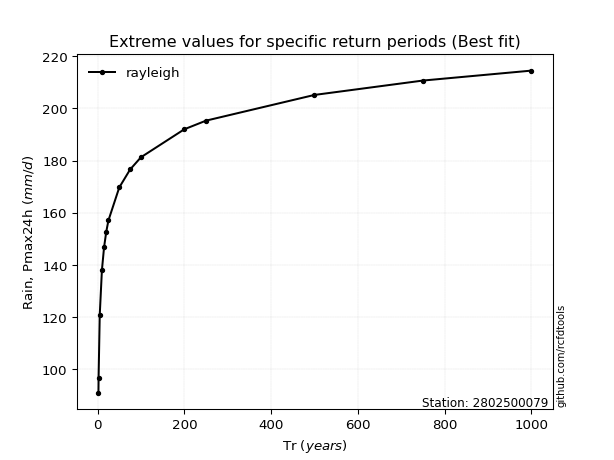</img>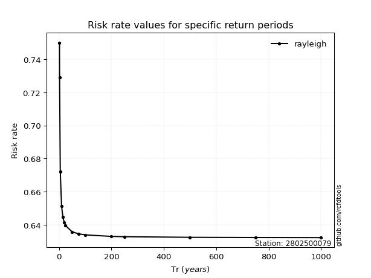</img>

</div>


<sub>**APP DISCLAIMER**: NO WARRANTY - This software is provided by [github.com/rcfdtools](https://github.com/rcfdtools) "as is", without any express or implied warranty, including warranties of merchantability, fitness for a particular purpose, or non-infringement. There is no guarantee that the software will be error-free or operate without interruption. LIMITATION OF LIABILITY - Neither the authors nor copyright holders will be liable for claims or damages arising from the software or its use. You are responsible for determining if the software is appropriate for your use and assume all associated risks, including errors, legal compliance, and data loss. NO PROFESSIONAL ADVICE - The software provides general information and does not offer professional advice. It should not replace consultation with professional advisors.</sub>