<div align="center">


</div>

# Station (rain, Pmax24h): 28025070

Probable Maximum Precipitation (PMP) is the greatest amount of rainfall for a specific duration that is meteorologically possible for a given location, acting as a "worst-case" scenario for extreme storms, crucial for designing safety-critical infrastructure like bridges, river deviations, dams, spillways, and nuclear plants to prevent catastrophic failure. PMP is calculated by hydrologists using meteorological data to determine the upper limit of extreme rainfall, often leading to the Probable Maximum Flood (PMF) for flood control design, and is increasingly being studied for climate change impacts.

<div align="center">

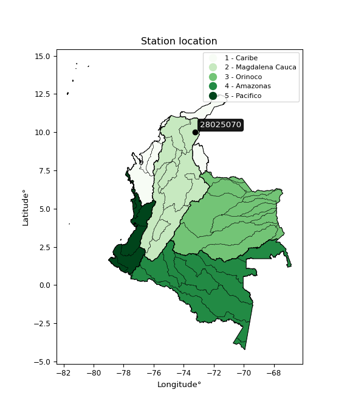</img>

</div>


## A. General information


### 1. General running parameters

• app_version: _v20251225_. • runtime: _2025-12-26 10:39:04.566250_. • Python version: _3.14.0_. • SciPy version: _1.16.3_. • Pandas version: _2.3.3_. • NumPy version: _2.3.5_. • Stations dataset (station_dataset_file): _dataset/pmax24h_in/conventional_cesarcolombia_1959_2015.csv_. • Stations catalog (station_catalog_file): _dataset/CNE_IDEAM.xls_. • Plot only fit distributions with Δo > Δ (plot_only_fit): _True_. • Eval low extreme values, if False, evaluates high extreme values (low_extreme): _False_. • Eval every SciPy distribution as logarithmic (pdist_logarithmic_on): _True_. • Standard deviation normalized (ddof): _1.0_. • Return periods to eval in years (Tr): _[2, 2.33, 5, 10, 15, 20, 25, 50, 75, 100, 200, 250, 500, 750, 1000]_. • Minimum data sample per station, 0 means any (minimum_sample): _5_. • Z-Score threshold to adjust a value, 0 means disable (zscore): _3.5_. • Avoid zeros, e.g. rain = 0 (avoid_zeros): _True_. • Avoid null values (avoid_nans): _True_. [:file_folder:Dataset file.](../../dataset/pmax24h_in/conventional_cesarcolombia_1959_2015.csv)


### 2. Station info and location

|   id |   CODIGO | NOMBRE                       | CATEGORIA               | TECNOLOGIA   | ESTADO   | FECHA_INSTALACION   |   FECHA_SUSPENSION |   ALTITUD |   LATITUD |   LONGITUD | DEPARTAMENTO   | MUNICIPIO       | AREA_OPERATIVA                                         | ENTIDAD                                                     | AREA_HIDROGRAFICA   | ZONA_HIDROGRAFICA   | SUBZONA_HIDROGRAFICA   |   CORRIENTE | OBSERVACION                                                                                                                   | SUBRED                                                                               |
|-----:|---------:|:-----------------------------|:------------------------|:-------------|:---------|:--------------------|-------------------:|----------:|----------:|-----------:|:---------------|:----------------|:-------------------------------------------------------|:------------------------------------------------------------|:--------------------|:--------------------|:-----------------------|------------:|:------------------------------------------------------------------------------------------------------------------------------|:-------------------------------------------------------------------------------------|
|    0 | 28025070 | MOTILONIA CODAZZI [28025070] | Climatológica Ordinaria | Convencional | Activa   | 15/01/1956          |                nan |       180 |   10.0018 |   -73.2494 | Cesar          | Agustín Codazzi | Area Operativa 05 - Magdalena-Cesar-Guajira-San Andrés | INSTITUTO DE HIDROLOGIA METEOROLOGIA Y ESTUDIOS AMBIENTALES | Magdalena Cauca     | Cesar               | Medio Cesar            |         nan | |20/06/2024$lhurtado$Se actualiza categoría. La estación ya no cuenta con instrumentos para toma de temperaturas en el suelo. | Radiación Visible,Radición Global,Norte de Cesar y La Guajira,Radiación Ultravioleta |

<div align="center">

Map location in: [:earth_americas:Google](http://maps.google.com/maps?q=10.00180556,-73.24938889) [:earth_americas:OSM](https://www.openstreetmap.org/#map=18/10.00180556/-73.24938889&layers=P) [:earth_americas:Bing](https://www.bing.com/maps?cp=10.00180556~-73.24938889&lvl=18) [:earth_americas:Apple](https://maps.apple.com/frame?center=10.00180556%2C-73.24938889&span=0.003%2C0.006)

</div>


<div align="center">

```geojson
{
  "type": "Feature",
  "geometry": {
    "type": "Point", 
    "coordinates": [-73.24938889, 10.00180556]
  }, 
  "properties": {
    "Name": "28025070"
  }
}
```

</div>


### 3. Discrete values table and plot

|               |           0 |           1 |          2 |           3 |           4 |           5 |          6 |           7 |          8 |          9 |          10 |          11 |        12 |          13 |          14 |         15 |          16 |         17 |          18 |          19 |          20 |         21 |          22 |         23 |          24 |        25 |         26 |          27 |          28 |         29 |         30 |           31 |          32 |         33 |         34 |          35 |         36 |          37 |          38 |          39 |          40 |          41 |
|:--------------|------------:|------------:|-----------:|------------:|------------:|------------:|-----------:|------------:|-----------:|-----------:|------------:|------------:|----------:|------------:|------------:|-----------:|------------:|-----------:|------------:|------------:|------------:|-----------:|------------:|-----------:|------------:|----------:|-----------:|------------:|------------:|-----------:|-----------:|-------------:|------------:|-----------:|-----------:|------------:|-----------:|------------:|------------:|------------:|------------:|------------:|
| Date          | 1973        | 1974        | 1975       | 1976        | 1978        | 1979        | 1980       | 1981        | 1982       | 1983       | 1984        | 1985        | 1986      | 1987        | 1988        | 1989       | 1990        | 1991       | 1992        | 1993        | 1994        | 1995       | 1996        | 1997       | 1998        | 1999      | 2000       | 2001        | 2002        | 2003       | 2004       | 2005         | 2006        | 2007       | 2008       | 2009        | 2010       | 2011        | 2012        | 2013        | 2014        | 2015        |
| Value         |   97.5569   |   91.5      |  136.5     |  103.1      |   98.8      |   78.4      |  134.2     |   93.6382   |   87.3     |  140.8     |  100.4      |  100.2      |  194.4    |  106.5      |   85.6      |  111.4     |   88.2      |   64.9     |  110.5      |   93.9      |   79.2      |  145.8     |  129.1      |   51.9     |   91        |   76.3    |   69       |   88.4      |   98.7      |   75.3     |   75.5     |  106         |  115.5      |  136.5     |  152.6     |   97        |  134       |  124        |   93        |   96        |   85        |  112        |
| Value_initial |   97.5569   |   91.5      |  136.5     |  103.1      |   98.8      |   78.4      |  134.2     |   93.6382   |   87.3     |  140.8     |  100.4      |  100.2      |  194.4    |  106.5      |   85.6      |  111.4     |   88.2      |   64.9     |  110.5      |   93.9      |   79.2      |  145.8     |  129.1      |   51.9     |   91        |   76.3    |   69       |   88.4      |   98.7      |   75.3     |   75.5     |  106         |  115.5      |  136.5     |  152.6     |   97        |  134       |  124        |   93        |   96        |   85        |  112        |
| count         |   42        |   42        |   42       |   42        |   42        |   42        |   42       |   42        |   42       |   42       |   42        |   42        |   42      |   42        |   42        |   42       |   42        |   42       |   42        |   42        |   42        |   42       |   42        |   42       |   42        |   42      |   42       |   42        |   42        |   42       |   42       |   42         |   42        |   42       |   42       |   42        |   42       |   42        |   42        |   42        |   42        |   42        |
| mean          |  103.562    |  103.562    |  103.562   |  103.562    |  103.562    |  103.562    |  103.562   |  103.562    |  103.562   |  103.562   |  103.562    |  103.562    |  103.562  |  103.562    |  103.562    |  103.562   |  103.562    |  103.562   |  103.562    |  103.562    |  103.562    |  103.562   |  103.562    |  103.562   |  103.562    |  103.562  |  103.562   |  103.562    |  103.562    |  103.562   |  103.562   |  103.562     |  103.562    |  103.562   |  103.562   |  103.562    |  103.562   |  103.562    |  103.562    |  103.562    |  103.562    |  103.562    |
| std           |   27.2264   |   27.2264   |   27.2264  |   27.2264   |   27.2264   |   27.2264   |   27.2264  |   27.2264   |   27.2264  |   27.2264  |   27.2264   |   27.2264   |   27.2264 |   27.2264   |   27.2264   |   27.2264  |   27.2264   |   27.2264  |   27.2264   |   27.2264   |   27.2264   |   27.2264  |   27.2264   |   27.2264  |   27.2264   |   27.2264 |   27.2264  |   27.2264   |   27.2264   |   27.2264  |   27.2264  |   27.2264    |   27.2264   |   27.2264  |   27.2264  |   27.2264   |   27.2264  |   27.2264   |   27.2264   |   27.2264   |   27.2264   |   27.2264   |
| zscore        |   -0.220555 |   -0.443018 |    1.20979 |   -0.016961 |   -0.174896 |   -0.924168 |    1.12531 |   -0.364486 |   -0.59728 |    1.36772 |   -0.116129 |   -0.123475 |    3.3364 |    0.107918 |   -0.659719 |    0.28789 |   -0.564224 |   -1.42001 |    0.254834 |   -0.354868 |   -0.894785 |    1.55137 |    0.937994 |   -1.89749 |   -0.461382 |   -1.0013 |   -1.26942 |   -0.556878 |   -0.178569 |   -1.03803 |   -1.03068 |    0.0895533 |    0.438479 |    1.20979 |    1.80113 |   -0.241008 |    1.11797 |    0.750676 |   -0.387924 |   -0.277737 |   -0.681757 |    0.309928 |

<div align="center">

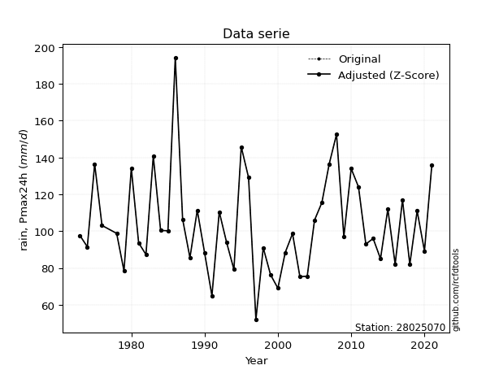</img>

</div>

> If Z-Score is active, values out of range or outliers are replaced with the station mean value.


### 4. Active continuous probability distributions from SciPy (46 of 104 available)

[scipy.stats](https://docs.scipy.org/doc/scipy/reference/stats.html) is a Python´s powerful submodule within the SciPy library for comprehensive statistical analysis, offering over 130 probability distributions (like Normal, Poisson), functions for descriptive stats (mean, variance), hypothesis testing (t-tests, chi-square), random variable generation, and statistical tests, making it essential for data science, modeling, and research. It provides tools to explore, model, and draw conclusions from data efficiently, working seamlessly with NumPy.

<div align="center">

|   id | p_dist             |   n_parameter | fit_method   | label                                                                       | active   | ref                                                                                                        |
|-----:|:-------------------|--------------:|:-------------|:----------------------------------------------------------------------------|:---------|:-----------------------------------------------------------------------------------------------------------|
|    0 | alpha              |             3 | MLE          | Alpha                                                                       | True     | [:mortar_board:](https://docs.scipy.org/doc/scipy/reference/generated/scipy.stats.alpha.html)              |
|    1 | betaprime          |             4 | MLE          | Beta prime                                                                  | True     | [:mortar_board:](https://docs.scipy.org/doc/scipy/reference/generated/scipy.stats.betaprime.html)          |
|    2 | chi2               |             3 | MLE          | Chi²                                                                        | True     | [:mortar_board:](https://docs.scipy.org/doc/scipy/reference/generated/scipy.stats.chi2.html)               |
|    3 | crystalball        |             4 | MLE          | Crystalball                                                                 | True     | [:mortar_board:](https://docs.scipy.org/doc/scipy/reference/generated/scipy.stats.crystalball.html)        |
|    4 | dgamma             |             3 | MLE          | Double gamma                                                                | True     | [:mortar_board:](https://docs.scipy.org/doc/scipy/reference/generated/scipy.stats.dgamma.html)             |
|    5 | erlang             |             3 | MLE          | Erlang                                                                      | True     | [:mortar_board:](https://docs.scipy.org/doc/scipy/reference/generated/scipy.stats.erlang.html)             |
|    6 | expon              |             2 | MLE          | Exponential                                                                 | True     | [:mortar_board:](https://docs.scipy.org/doc/scipy/reference/generated/scipy.stats.expon.html)              |
|    7 | exponnorm          |             3 | MLE          | Exponentially modified Normal                                               | True     | [:mortar_board:](https://docs.scipy.org/doc/scipy/reference/generated/scipy.stats.exponnorm.html)          |
|    8 | f                  |             4 | MLE          | F                                                                           | True     | [:mortar_board:](https://docs.scipy.org/doc/scipy/reference/generated/scipy.stats.f.html)                  |
|    9 | fatiguelife        |             3 | MLE          | Fatigue-life (Birnbaum-Saunders)                                            | True     | [:mortar_board:](https://docs.scipy.org/doc/scipy/reference/generated/scipy.stats.fatiguelife.html)        |
|   10 | fisk               |             3 | MLE          | Fisk                                                                        | True     | [:mortar_board:](https://docs.scipy.org/doc/scipy/reference/generated/scipy.stats.fisk.html)               |
|   11 | gamma              |             3 | MLE          | Gamma                                                                       | True     | [:mortar_board:](https://docs.scipy.org/doc/scipy/reference/generated/scipy.stats.gamma.html)              |
|   12 | genexpon           |             5 | MLE          | Generalized exponential                                                     | True     | [:mortar_board:](https://docs.scipy.org/doc/scipy/reference/generated/scipy.stats.genexpon.html)           |
|   13 | genlogistic        |             3 | MLE          | Generalized logistic                                                        | True     | [:mortar_board:](https://docs.scipy.org/doc/scipy/reference/generated/scipy.stats.genlogistic.html)        |
|   14 | gibrat             |             2 | MM           | Gibrat                                                                      | True     | [:mortar_board:](https://docs.scipy.org/doc/scipy/reference/generated/scipy.stats.gibrat.html)             |
|   15 | gompertz           |             3 | MLE          | Gompertz (or truncated Gumbel)                                              | True     | [:mortar_board:](https://docs.scipy.org/doc/scipy/reference/generated/scipy.stats.gompertz.html)           |
|   16 | gumbel_l           |             2 | MM           | Gumbel Left Skew                                                            | True     | [:mortar_board:](https://docs.scipy.org/doc/scipy/reference/generated/scipy.stats.gumbel_l.html)           |
|   17 | gumbel_r           |             2 | MM           | Gumbel Right Skew                                                           | True     | [:mortar_board:](https://docs.scipy.org/doc/scipy/reference/generated/scipy.stats.gumbel_r.html)           |
|   18 | halflogistic       |             2 | MM           | Half-logistic                                                               | True     | [:mortar_board:](https://docs.scipy.org/doc/scipy/reference/generated/scipy.stats.halflogistic.html)       |
|   19 | halfnorm           |             2 | MM           | Half Normal                                                                 | True     | [:mortar_board:](https://docs.scipy.org/doc/scipy/reference/generated/scipy.stats.halfnorm.html)           |
|   20 | hypsecant          |             2 | MM           | hyperbolic secant                                                           | True     | [:mortar_board:](https://docs.scipy.org/doc/scipy/reference/generated/scipy.stats.hypsecant.html)          |
|   21 | invgamma           |             3 | MLE          | Inverted gamma                                                              | True     | [:mortar_board:](https://docs.scipy.org/doc/scipy/reference/generated/scipy.stats.invgamma.html)           |
|   22 | invgauss           |             3 | MLE          | Inverse Gaussian                                                            | True     | [:mortar_board:](https://docs.scipy.org/doc/scipy/reference/generated/scipy.stats.invgauss.html)           |
|   23 | invweibull         |             3 | MLE          | Inverted Weibull                                                            | True     | [:mortar_board:](https://docs.scipy.org/doc/scipy/reference/generated/scipy.stats.invweibull.html)         |
|   24 | johnsonsu          |             4 | MLE          | Johnson Su                                                                  | True     | [:mortar_board:](https://docs.scipy.org/doc/scipy/reference/generated/scipy.stats.johnsonsu.html)          |
|   25 | kstwobign          |             2 | MLE          | Limiting distribution of scaled Kolmogorov-Smirnov two-sided test statistic | True     | [:mortar_board:](https://docs.scipy.org/doc/scipy/reference/generated/scipy.stats.kstwobign.html)          |
|   26 | laplace            |             2 | MM           | Laplace                                                                     | True     | [:mortar_board:](https://docs.scipy.org/doc/scipy/reference/generated/scipy.stats.laplace.html)            |
|   27 | laplace_asymmetric |             3 | MLE          | Asymmetric Laplace                                                          | True     | [:mortar_board:](https://docs.scipy.org/doc/scipy/reference/generated/scipy.stats.laplace_asymmetric.html) |
|   28 | loggamma           |             3 | MLE          | Log gamma                                                                   | True     | [:mortar_board:](https://docs.scipy.org/doc/scipy/reference/generated/scipy.stats.loggamma.html)           |
|   29 | logistic           |             2 | MM           | Logistic (or Sech-squared)                                                  | True     | [:mortar_board:](https://docs.scipy.org/doc/scipy/reference/generated/scipy.stats.logistic.html)           |
|   30 | lognorm            |             3 | MLE          | Log Normal                                                                  | True     | [:mortar_board:](https://docs.scipy.org/doc/scipy/reference/generated/scipy.stats.lognorm.html)            |
|   31 | maxwell            |             2 | MM           | Maxwell                                                                     | True     | [:mortar_board:](https://docs.scipy.org/doc/scipy/reference/generated/scipy.stats.maxwell.html)            |
|   32 | mielke             |             4 | MLE          | Mielke Beta-Kappa / Dagum                                                   | True     | [:mortar_board:](https://docs.scipy.org/doc/scipy/reference/generated/scipy.stats.mielke.html)             |
|   33 | moyal              |             2 | MM           | Moyal                                                                       | True     | [:mortar_board:](https://docs.scipy.org/doc/scipy/reference/generated/scipy.stats.moyal.html)              |
|   34 | nakagami           |             3 | MLE          | Nakagami                                                                    | True     | [:mortar_board:](https://docs.scipy.org/doc/scipy/reference/generated/scipy.stats.nakagami.html)           |
|   35 | ncf                |             5 | MLE          | Non-central F distribution                                                  | True     | [:mortar_board:](https://docs.scipy.org/doc/scipy/reference/generated/scipy.stats.ncf.html)                |
|   36 | nct                |             4 | MLE          | Non-central Student’s t                                                     | True     | [:mortar_board:](https://docs.scipy.org/doc/scipy/reference/generated/scipy.stats.nct.html)                |
|   37 | norm               |             2 | MM           | Normal                                                                      | True     | [:mortar_board:](https://docs.scipy.org/doc/scipy/reference/generated/scipy.stats.norm.html)               |
|   38 | pareto             |             3 | MLE          | Pareto                                                                      | True     | [:mortar_board:](https://docs.scipy.org/doc/scipy/reference/generated/scipy.stats.pareto.html)             |
|   39 | pearson3           |             3 | MM           | Pearson type III                                                            | True     | [:mortar_board:](https://docs.scipy.org/doc/scipy/reference/generated/scipy.stats.pearson3.html)           |
|   40 | rayleigh           |             2 | MM           | Rayleigh                                                                    | True     | [:mortar_board:](https://docs.scipy.org/doc/scipy/reference/generated/scipy.stats.rayleigh.html)           |
|   41 | rice               |             3 | MLE          | Rice                                                                        | True     | [:mortar_board:](https://docs.scipy.org/doc/scipy/reference/generated/scipy.stats.rice.html)               |
|   42 | t                  |             3 | MLE          | Student’s t                                                                 | True     | [:mortar_board:](https://docs.scipy.org/doc/scipy/reference/generated/scipy.stats.t.html)                  |
|   43 | truncnorm          |             4 | MLE          | Truncated normal                                                            | True     | [:mortar_board:](https://docs.scipy.org/doc/scipy/reference/generated/scipy.stats.truncnorm.html)          |
|   44 | wald               |             2 | MM           | Wald                                                                        | True     | [:mortar_board:](https://docs.scipy.org/doc/scipy/reference/generated/scipy.stats.wald.html)               |
|   45 | weibull_min        |             3 | MLE          | Weibull minimum                                                             | True     | [:mortar_board:](https://docs.scipy.org/doc/scipy/reference/generated/scipy.stats.weibull_min.html)        |

</div>

> **n_parameter:** # arguments & localization & scale.
>
> **Fit methods:** (MLE) maximum likelihood, (MM) L-moments.
>
>**Inactive:** foldnorm, gennorm, norminvgauss, powernorm, powerlognorm, skewnorm, genextreme, anglit, arcsine, argus, beta, bradford, burr, burr12, cauchy, cosine, halfcauchy, foldcauchy, skewcauchy, wrapcauchy, gengamma, exponweib, exponpow, truncexpon, gausshyper, genhalflogistic, genhyperbolic, geninvgauss, halfgennorm, johnsonsb, kappa4, kappa3, ksone, kstwo, loglaplace, levy, levy_l, levy_stable, ncx2, genpareto, truncpareto, lomax, powerlaw, rdist, rel_breitwigner, recipinvgauss, semicircular, studentized_range, trapezoid, triang, truncweibull_min, tukeylambda, uniform, loguniform, vonmises, vonmises_line, weibull_max, dweibull, 


## B. Probability distributions vs. Empirical distributions

A continuous probability distribution (CPD) describes probabilities for variables that can take any value within a range (like rain any time), unlike discrete variables with specific outcomes (like temperature). It uses a Probability Density Function (PDF), a curve where the total area under it equals 1, and the probability of the variable falling within an interval (a to b) is found by calculating the area under the curve between those points. A key feature is that the probability of hitting any single exact value is zero, so probabilities are always expressed for ranges, e.g., $P(a ≤ X ≤ b)$.

<div align="center">

Distributions parameters
|    |   station | p_dist                |   n |             loc |          scale | shape                 | shape1               | shape2             | shape3   |
|---:|----------:|:----------------------|----:|----------------:|---------------:|:----------------------|:---------------------|:-------------------|:---------|
|  0 |  28025070 | alpha                 |  42 |   -80.2473      | 1315.73        | 7.301248313935113     |                      |                    |          |
|  1 |  28025070 | betaprime             |  42 |    -0.565577    |   32.3752      | 66.65080573694266     | 21.72780420715854    |                    |          |
|  2 |  28025070 | chi2                  |  42 |    29.3005      |    4.70379     | 15.787559984974195    |                      |                    |          |
|  3 |  28025070 | crystalball           |  42 |   103.562       |   26.9003      | 7112.643748668666     | 9775.517745120389    |                    |          |
|  4 |  28025070 | dgamma                |  42 |    98.7         |   20.202       | 0.9484854328247443    |                      |                    |          |
|  5 |  28025070 | erlang                |  42 |    29.3005      |    9.40758     | 7.893776094985938     |                      |                    |          |
|  6 |  28025070 | expon                 |  42 |    51.9         |   51.6618      |                       |                      |                    |          |
|  7 |  28025070 | exponnorm             |  42 |    80.0822      |   14.2665      | 1.6457853460576541    |                      |                    |          |
|  8 |  28025070 | f                     |  42 |   -16.9974      |  115.653       | 435.9686451202829     | 49.33137034134137    |                    |          |
|  9 |  28025070 | fatiguelife           |  42 |     2.46885     |   97.7786      | 0.2603898663304352    |                      |                    |          |
| 10 |  28025070 | fisk                  |  42 |    -0.701523    |  100.476       | 7.160363428665156     |                      |                    |          |
| 11 |  28025070 | gamma                 |  42 |    29.3004      |    9.40757     | 7.8937941419265645    |                      |                    |          |
| 12 |  28025070 | genexpon              |  42 |    51.9         |    2.08102     | 0.02864019288214121   | 0.012033115491451942 | 1.1502482992843637 |          |
| 13 |  28025070 | genlogistic           |  42 |    60.579       |   19.4894      | 5.552961239672828     |                      |                    |          |
| 14 |  28025070 | gibrat                |  42 |    83.0402      |   12.447       |                       |                      |                    |          |
| 15 |  28025070 | gompertz              |  42 |    41.8639      |    4.08639     | 2.584787758026535e-15 |                      |                    |          |
| 16 |  28025070 | gumbel_l              |  42 |   115.668       |   20.9741      |                       |                      |                    |          |
| 17 |  28025070 | gumbel_r              |  42 |    91.4552      |   20.9741      |                       |                      |                    |          |
| 18 |  28025070 | halflogistic          |  42 |    71.6787      |   22.9988      |                       |                      |                    |          |
| 19 |  28025070 | halfnorm              |  42 |    67.9563      |   44.6249      |                       |                      |                    |          |
| 20 |  28025070 | hypsecant             |  42 |   103.562       |   17.1253      |                       |                      |                    |          |
| 21 |  28025070 | invgamma              |  42 |   -22.6261      | 2949.45        | 24.376716523156716    |                      |                    |          |
| 22 |  28025070 | invgauss              |  42 |    10.1425      | 1097.54        | 0.0848458018341231    |                      |                    |          |
| 23 |  28025070 | invweibull            |  42 |    -2.32414e+08 |    2.32414e+08 | 10596004.237922225    |                      |                    |          |
| 24 |  28025070 | johnsonsu             |  42 |    75.0182      |   31.3416      | -1.2509209421161867   | 1.7530394787442372   |                    |          |
| 25 |  28025070 | kstwobign             |  42 |     9.85628     |  108.195       |                       |                      |                    |          |
| 26 |  28025070 | laplace               |  42 |   103.562       |   19.0214      |                       |                      |                    |          |
| 27 |  28025070 | laplace_asymmetric    |  42 |    91.5         |   17.9668      | 0.7191746888375761    |                      |                    |          |
| 28 |  28025070 | loggamma              |  42 | -7892.88        | 1090.1         | 1534.2143776073142    |                      |                    |          |
| 29 |  28025070 | logistic              |  42 |   103.562       |   14.8309      |                       |                      |                    |          |
| 30 |  28025070 | lognorm               |  42 |     5.13486     |   95.0016      | 0.2654255043561528    |                      |                    |          |
| 31 |  28025070 | maxwell               |  42 |    39.8193      |   39.9447      |                       |                      |                    |          |
| 32 |  28025070 | mielke                |  42 |    -0.486084    |   94.881       | 8.49755410419722      | 6.629997470961702    |                    |          |
| 33 |  28025070 | moyal                 |  42 |    88.1784      |   12.1094      |                       |                      |                    |          |
| 34 |  28025070 | nakagami              |  42 |    63.8266      |   48.1232      | 0.717626465727675     |                      |                    |          |
| 35 |  28025070 | ncf                   |  42 |    -1.02925     |    1.23745     | 2.081148719769419     | 53.89829112405778    | 167.45362272702687 |          |
| 36 |  28025070 | nct                   |  42 |    -0.0971145   |   14.6463      | 13.775423441677852    | 6.682857260968365    |                    |          |
| 37 |  28025070 | norm                  |  42 |   103.562       |   26.9003      |                       |                      |                    |          |
| 38 |  28025070 | pareto                |  42 |    -8.58993e+09 |    8.58993e+09 | 166272504.4711531     |                      |                    |          |
| 39 |  28025070 | pearson3              |  42 |   103.562       |   26.9003      | 0.96305159338521      |                      |                    |          |
| 40 |  28025070 | rayleigh              |  42 |    52.0998      |   41.0607      |                       |                      |                    |          |
| 41 |  28025070 | rice                  |  42 |    48.8885      |   43.086       | 0.0009543012032955907 |                      |                    |          |
| 42 |  28025070 | t                     |  42 |   103.589       |   26.8664      | 24.27440359364431     |                      |                    |          |
| 43 |  28025070 | truncnorm             |  42 |   103.562       |   26.9003      | -1035.4379788525912   | 1880.4728649021802   |                    |          |
| 44 |  28025070 | wald                  |  42 |    76.6614      |   26.9003      |                       |                      |                    |          |
| 45 |  28025070 | weibull_min           |  42 |    63.3289      |   45.8959      | 1.6378618907528504    |                      |                    |          |
| 46 |  28025070 | logalpha              |  42 |    -2.78369     |  216.458       | 29.31775994212522     |                      |                    |          |
| 47 |  28025070 | logbetaprime          |  42 |    -4.40188     |   12.5102      | 581.5710326206586     | 807.4515132912916    |                    |          |
| 48 |  28025070 | logchi2               |  42 |     3.94932     |    0.963085    | 1.0851898611779167    |                      |                    |          |
| 49 |  28025070 | logcrystalball        |  42 |     4.61323     |    0.244835    | 1.8621011043873197    | 1345.2676949730758   |                    |          |
| 50 |  28025070 | logdgamma             |  42 |     4.58574     |    0.18022     | 1.0619726221634604    |                      |                    |          |
| 51 |  28025070 | logerlang             |  42 |    -1.90578     |    0.00970946  | 670.8835844337755     |                      |                    |          |
| 52 |  28025070 | logexpon              |  42 |     3.94932     |    0.658948    |                       |                      |                    |          |
| 53 |  28025070 | logexponnorm          |  42 |     4.50686     |    0.230183    | 0.4405463057428942    |                      |                    |          |
| 54 |  28025070 | logf                  |  42 |    -8.02682     |   12.6308      | 34202.958151570274    | 5931.589326653615    |                    |          |
| 55 |  28025070 | logfatiguelife        |  42 |    -5.98361     |   10.5889      | 0.023733478651020903  |                      |                    |          |
| 56 |  28025070 | logfisk               |  42 |     0.0519172   |    4.5481      | 32.4132878340435      |                      |                    |          |
| 57 |  28025070 | loggamma              |  42 |    -1.94811     |    0.00964475  | 679.7861626602157     |                      |                    |          |
| 58 |  28025070 | loggenexpon           |  42 |     3.94932     |    0.513145    | 0.06462377944956418   | 1.460430209348616    | 0.9869978819347228 |          |
| 59 |  28025070 | loggenlogistic        |  42 |     4.54453     |    0.152533    | 1.3086883117821535    |                      |                    |          |
| 60 |  28025070 | loggibrat             |  42 |     4.41647     |    0.116331    |                       |                      |                    |          |
| 61 |  28025070 | loggompertz           |  42 |     3.94932     |    0.297556    | 0.08258736849414608   |                      |                    |          |
| 62 |  28025070 | loggumbel_l           |  42 |     4.72142     |    0.196038    |                       |                      |                    |          |
| 63 |  28025070 | loggumbel_r           |  42 |     4.49511     |    0.196038    |                       |                      |                    |          |
| 64 |  28025070 | loghalflogistic       |  42 |     4.31026     |    0.214968    |                       |                      |                    |          |
| 65 |  28025070 | loghalfnorm           |  42 |     4.2755      |    0.417057    |                       |                      |                    |          |
| 66 |  28025070 | loghypsecant          |  42 |     4.60827     |    0.160064    |                       |                      |                    |          |
| 67 |  28025070 | loginvgamma           |  42 |    -0.0881704   | 1610.77        | 344.1054639036157     |                      |                    |          |
| 68 |  28025070 | loginvgauss           |  42 |     2.37413     |  169.091       | 0.013194661467550692  |                      |                    |          |
| 69 |  28025070 | loginvweibull         |  42 |    -1.58485e+07 |    1.58485e+07 | 62472747.75287381     |                      |                    |          |
| 70 |  28025070 | logjohnsonsu          |  42 |     4.51655     |    0.542213    | -0.3681426954651843   | 2.378070270390701    |                    |          |
| 71 |  28025070 | logkstwobign          |  42 |     3.50704     |    1.27233     |                       |                      |                    |          |
| 72 |  28025070 | loglaplace            |  42 |     4.60827     |    0.177787    |                       |                      |                    |          |
| 73 |  28025070 | loglaplace_asymmetric |  42 |     4.56435     |    0.188838    | 0.8904249015170591    |                      |                    |          |
| 74 |  28025070 | logloggamma           |  42 |   -53.1704      |    8.28371     | 1069.8788369507402    |                      |                    |          |
| 75 |  28025070 | loglogistic           |  42 |     4.60827     |    0.13862     |                       |                      |                    |          |
| 76 |  28025070 | loglognorm            |  42 |    -5.79098     |   10.3962      | 0.024171428597500273  |                      |                    |          |
| 77 |  28025070 | logmaxwell            |  42 |     4.01253     |    0.373324    |                       |                      |                    |          |
| 78 |  28025070 | logmielke             |  42 |  -142.677       |  147.235       | 1206.8015796514524    | 983.2614259220006    |                    |          |
| 79 |  28025070 | logmoyal              |  42 |     4.46448     |    0.113182    |                       |                      |                    |          |
| 80 |  28025070 | lognakagami           |  42 |     0.0515842   |    4.56361     | 82.26408178608321     |                      |                    |          |
| 81 |  28025070 | logncf                |  42 |    -3.75574     |    5.83701     | 3145.445763994092     | 6130.230039281305    | 1360.1359087884803 |          |
| 82 |  28025070 | lognct                |  42 |     0.701809    |    0.0273317   | 121.40221679134191    | 142.01666470861687   |                    |          |
| 83 |  28025070 | lognorm               |  42 |     4.60827     |    0.251428    |                       |                      |                    |          |
| 84 |  28025070 | logpareto             |  42 |    -6.71089e+07 |    6.71089e+07 | 101842455.56374943    |                      |                    |          |
| 85 |  28025070 | logpearson3           |  42 |     4.60827     |    0.251428    | 0.08976955627435218   |                      |                    |          |
| 86 |  28025070 | lograyleigh           |  42 |     4.12732     |    0.383744    |                       |                      |                    |          |
| 87 |  28025070 | logrice               |  42 |     3.80358     |    0.260921    | 2.905132046976723     |                      |                    |          |
| 88 |  28025070 | logt                  |  42 |     4.60827     |    0.251413    | 19431.73050671692     |                      |                    |          |
| 89 |  28025070 | logtruncnorm          |  42 |    -0.12632     |    2.12234     | 1.9201179285628536    | 2.5721400860413786   |                    |          |
| 90 |  28025070 | logwald               |  42 |     4.35682     |    0.251448    |                       |                      |                    |          |
| 91 |  28025070 | logweibull_min        |  42 |     3.74094     |    0.958186    | 3.7476602026601604    |                      |                    |          |

</div>

> **loc** (Location parameter): This shifts the distribution along the x-axis. For many common distributions, like the normal (Gaussian) distribution, loc represents the mean $μ$. For others, like the uniform distribution, it might represent the minimum value, or for the beta distribution, the left end of the support interval.
>
> **scale** (Scale parameter): This determines the width or spread of the distribution. For the normal distribution, scale represents the standard deviation $σ$. For a uniform distribution, it defines the length of the interval (from $loc$ to $loc + scale$).
>
> **shape** (Shape parameters): Refers to parameters that define the specific form of a probability distribution, distinct from its location (loc) and scale (scale). These parameters are required arguments for most distribution functions. For example, a normal (Gaussian) distribution is fully defined by its location (mean) and scale (standard deviation), so it has no specific shape parameters beyond loc and scale. However, other distributions have intrinsic properties that need specification, as Gamma distribution that takes a shape parameter, often named $a$ or $alpha$.


### 0. Cumulative distribution values - CDF (92 evaluated)

> Ordered by x ascending and calculating $log(f(x))$ separately. 

|   id |   Station |   date |        x |   count |    mean |     std |     zscore |   Value_initial |   station |   m |      alpha |   alpha_pdf |   betaprime |   betaprime_pdf |       chi2 |    chi2_pdf |   crystalball |   crystalball_pdf |    dgamma |   dgamma_pdf |     erlang |   erlang_pdf |    expon |   expon_pdf |   exponnorm |   exponnorm_pdf |          f |       f_pdf |   fatiguelife |   fatiguelife_pdf |       fisk |   fisk_pdf |      gamma |   gamma_pdf |    genexpon |   genexpon_pdf |   genlogistic |   genlogistic_pdf |    gibrat |   gibrat_pdf |    gompertz |   gompertz_pdf |   gumbel_l |   gumbel_l_pdf |   gumbel_r |   gumbel_r_pdf |   halflogistic |   halflogistic_pdf |   halfnorm |   halfnorm_pdf |   hypsecant |   hypsecant_pdf |   invgamma |   invgamma_pdf |   invgauss |   invgauss_pdf |   invweibull |   invweibull_pdf |   johnsonsu |   johnsonsu_pdf |   kstwobign |   kstwobign_pdf |   laplace |   laplace_pdf |   laplace_asymmetric |   laplace_asymmetric_pdf |   loggamma |   loggamma_pdf |   logistic |   logistic_pdf |    lognorm |   lognorm_pdf |    maxwell |   maxwell_pdf |     mielke |   mielke_pdf |       moyal |   moyal_pdf |   nakagami |   nakagami_pdf |        ncf |     ncf_pdf |        nct |     nct_pdf |      norm |    norm_pdf |   pareto |   pareto_pdf |    pearson3 |   pearson3_pdf |   rayleigh |   rayleigh_pdf |       rice |    rice_pdf |         t |       t_pdf |   truncnorm |   truncnorm_pdf |       wald |    wald_pdf |   weibull_min |   weibull_min_pdf |   logalpha |   logalpha_pdf |   logbetaprime |   logbetaprime_pdf |     logchi2 |   logchi2_pdf |   logcrystalball |   logcrystalball_pdf |   logdgamma |   logdgamma_pdf |   logerlang |   logerlang_pdf |   logexpon |   logexpon_pdf |   logexponnorm |   logexponnorm_pdf |       logf |   logf_pdf |   logfatiguelife |   logfatiguelife_pdf |    logfisk |   logfisk_pdf |   loggenexpon |   loggenexpon_pdf |   loggenlogistic |   loggenlogistic_pdf |   loggibrat |   loggibrat_pdf |   loggompertz |   loggompertz_pdf |   loggumbel_l |   loggumbel_l_pdf |   loggumbel_r |   loggumbel_r_pdf |   loghalflogistic |   loghalflogistic_pdf |   loghalfnorm |   loghalfnorm_pdf |   loghypsecant |   loghypsecant_pdf |   loginvgamma |   loginvgamma_pdf |   loginvgauss |   loginvgauss_pdf |   loginvweibull |   loginvweibull_pdf |   logjohnsonsu |   logjohnsonsu_pdf |   logkstwobign |   logkstwobign_pdf |   loglaplace |   loglaplace_pdf |   loglaplace_asymmetric |   loglaplace_asymmetric_pdf |   logloggamma |   logloggamma_pdf |   loglogistic |   loglogistic_pdf |   loglognorm |   loglognorm_pdf |   logmaxwell |   logmaxwell_pdf |   logmielke |   logmielke_pdf |    logmoyal |   logmoyal_pdf |   lognakagami |   lognakagami_pdf |     logncf |   logncf_pdf |     lognct |   lognct_pdf |   logpareto |   logpareto_pdf |   logpearson3 |   logpearson3_pdf |   lograyleigh |   lograyleigh_pdf |    logrice |   logrice_pdf |       logt |   logt_pdf |   logtruncnorm |   logtruncnorm_pdf |     logwald |   logwald_pdf |   logweibull_min |   logweibull_min_pdf |
|-----:|----------:|-------:|---------:|--------:|--------:|--------:|-----------:|----------------:|----------:|----:|-----------:|------------:|------------:|----------------:|-----------:|------------:|--------------:|------------------:|----------:|-------------:|-----------:|-------------:|---------:|------------:|------------:|----------------:|-----------:|------------:|--------------:|------------------:|-----------:|-----------:|-----------:|------------:|------------:|---------------:|--------------:|------------------:|----------:|-------------:|------------:|---------------:|-----------:|---------------:|-----------:|---------------:|---------------:|-------------------:|-----------:|---------------:|------------:|----------------:|-----------:|---------------:|-----------:|---------------:|-------------:|-----------------:|------------:|----------------:|------------:|----------------:|----------:|--------------:|---------------------:|-------------------------:|-----------:|---------------:|-----------:|---------------:|-----------:|--------------:|-----------:|--------------:|-----------:|-------------:|------------:|------------:|-----------:|---------------:|-----------:|------------:|-----------:|------------:|----------:|------------:|---------:|-------------:|------------:|---------------:|-----------:|---------------:|-----------:|------------:|----------:|------------:|------------:|----------------:|-----------:|------------:|--------------:|------------------:|-----------:|---------------:|---------------:|-------------------:|------------:|--------------:|-----------------:|---------------------:|------------:|----------------:|------------:|----------------:|-----------:|---------------:|---------------:|-------------------:|-----------:|-----------:|-----------------:|---------------------:|-----------:|--------------:|--------------:|------------------:|-----------------:|---------------------:|------------:|----------------:|--------------:|------------------:|--------------:|------------------:|--------------:|------------------:|------------------:|----------------------:|--------------:|------------------:|---------------:|-------------------:|--------------:|------------------:|--------------:|------------------:|----------------:|--------------------:|---------------:|-------------------:|---------------:|-------------------:|-------------:|-----------------:|------------------------:|----------------------------:|--------------:|------------------:|--------------:|------------------:|-------------:|-----------------:|-------------:|-----------------:|------------:|----------------:|------------:|---------------:|--------------:|------------------:|-----------:|-------------:|-----------:|-------------:|------------:|----------------:|--------------:|------------------:|--------------:|------------------:|-----------:|--------------:|-----------:|-----------:|---------------:|-------------------:|------------:|--------------:|-----------------:|---------------------:|
|    0 |  28025070 |   1997 |  51.9    |      42 | 103.562 | 27.2264 | -1.89749   |         51.9    |  28025070 |   1 | 0.00396196 | 0.000885001 |  0.00303538 |     0.000777369 | 0.00385234 | 0.000993981 |     0.0273981 |       0.0023456   | 0.0449808 |  0.00226364  | 0.00385235 |  0.000993984 | 0        |  0.0193567  |  0.00455073 |     0.000833071 | 0.00386815 | 0.000897093 |    0.00378453 |       0.000927306 | 0.00962238 | 0.00129724 | 0.00385235 | 0.000993982 | 1.07382e-08 |     0.0137626  |    0.00539668 |       0.000937228 | 0         |  0           | 2.75487e-14 |    7.37412e-15 |  0.0466934 |    0.00217344  | 0.00137084 |    0.000430867 |      0         |        0           |  0         |    0           |   0.0311458 |     0.0018158   | 0.00382529 |    0.000890981 | 0.00331194 |    0.000898622 |   0.00242087 |      0.00066483  |  0.00717021 |     0.000895954 |  0.00182568 |     0.000666113 | 0.03307   |   0.00173857  |            0.0159087 |              0.0012312   | 0.00345828 |      0.0443849 |  0.0297888 |    0.00194873  | 0.00438593 |     0.0511655 | 0.00715869 |   0.00174536  | 0.00626903 |  0.000997464 | 7.73144e-06 | 6.67892e-06 | 0          |    0           | 0.00421565 | 0.000940097 | 0.00436378 | 0.000906348 | 0.0273981 | 0.0023456   | 0        |   0.0193567  | 0.000154372 |    0.000148827 |  0         |    0           | 0.00243975 | 0.00161829  | 0.0330829 | 0.00244529  |   0.0273981 |     0.0023456   | 0          | 0           |    0          |       0           |  0.0023196 |      0.0346287 |      0.0821196 |           0.332294 | 3.68755e-09 |    4.5055e+06 |      nan         |           nan        |   0.0165837 |       0.0907151 |  0.00346042 |       0.0444264 |   0        |       1.51757  |     0.00337202 |          0.0428175 | 0.00349673 |  0.0446338 |       0.00351964 |            0.0448301 | 0.00666231 |     0.0550389 |   9.61641e-10 |          0.125937 |       0.00589948 |            0.0496138 |   0         |       0         |   5.11957e-08 |         0.277553  |     0.019288  |       0.0974344   |   9.34801e-08 |       7.71803e-06 |         0         |              0        |     0         |          0        |      0.0103741 |          0.0648005 |    0.00232367 |         0.0350784 |    0.00137742 |         0.0253729 |     0.000273612 |          0.00884814 |     0.00552969 |          0.0479275 |    0.000265399 |          0.0116533 |    0.0122829 |        0.069088  |               0.0114059 |                   0.067833  |    0.00511477 |         0.0567391 |    0.00854657 |         0.0611279 |   0.00350747 |        0.0447262 |    0         |        0         |  0.00659256 |       0.053353  | 2.11977e-22 |    8.96803e-20 |    0.00367541 |         0.0461203 | 0.00344443 |    0.0443042 | 0.00147396 |    0.025786  |    0        |        1.51757  |    0.00330221 |         0.0431408 |    0          |         0         | 0.00288168 |     0.0477853 | 0.00438734 |  0.0511691 |    0.000668224 |           1.32948  | 0           |   0           |       0.00328146 |            0.0589209 |
|    1 |  28025070 |   1991 |  64.9    |      42 | 103.562 | 27.2264 | -1.42001   |         64.9    |  28025070 |   2 | 0.0389043  | 0.00526152  |  0.0375584  |     0.00537302  | 0.0431072  | 0.00572392  |     0.0753273 |       0.00527972  | 0.0866474 |  0.00438083  | 0.0431073  |  0.00572392  | 0.222473 |  0.0150503  |  0.0350584  |     0.00462377  | 0.0396969  | 0.00537945  |    0.0411543  |       0.0055618   | 0.0451053  | 0.00470115 | 0.0431072  | 0.00572391  | 0.216223    |     0.0153154  |    0.0381016  |       0.00482873  | 0         |  0           | 7.22967e-13 |    1.77553e-13 |  0.0850399 |    0.00387702  | 0.0288117  |    0.00487241  |      0         |        0           |  0         |    0           |   0.0663509 |     0.00384644  | 0.039584   |    0.0053786   | 0.0426089  |    0.00595291  |   0.0357892  |      0.00543365  |  0.0353447  |     0.00414616  |  0.0419266  |     0.00649968  | 0.0655011 |   0.00344355  |            0.0435086 |              0.00336721  | 0.0393287  |      0.35388   |  0.0686999 |    0.00431397  | 0.0416561  |     0.354206  | 0.0585704  |   0.00646598  | 0.0380831  |  0.00456272  | 0.00892902  | 0.00282222  | 0.00368134 |    0.00492151  | 0.0402719  | 0.0053366   | 0.0388807  | 0.00516682  | 0.0753273 | 0.00527972  | 0.222473 |   0.0150503  | 0.0304658   |    0.00581311  |  0.0474287 |    0.00723204  | 0.0667201  | 0.00804958  | 0.0813134 | 0.00521585  |   0.0753273 |     0.00527972  | 0          | 0           |    0.00396945 |       0.00412994  |  0.0360837 |      0.35437   |      0.182167  |           0.56519  | 0.336068    |    0.756201   |        0.0423299 |             0.321108 |   0.0561444 |       0.305277  |  0.0393694  |       0.35425   |   0.287675 |       1.081    |     0.0382272  |          0.34664   | 0.0393852  |  0.353529  |       0.0394613  |            0.353654  | 0.0392806  |     0.296827  |   0.13692     |          0.967077 |       0.0369342  |            0.291403  |   0         |       0         |   0.0883172   |         0.536339  |     0.0590946 |       0.292357    |   0.00565494  |       0.149286    |         0         |              0        |     0         |          0        |      0.041865  |          0.260798  |    0.0367705  |         0.361478  |    0.0340093  |         0.368018  |     0.0334071   |          0.4476     |     0.0367719  |          0.298052  |    0.0529367   |          0.636889  |    0.0431851 |        0.242905  |               0.043099  |                   0.256318  |    0.0441369  |         0.362061  |    0.0414431  |         0.28658   |   0.0394211  |        0.353589  |    0.0199348 |        0.359422  |  0.0386699  |       0.295339  | 0.000286973 |    0.0177989   |    0.0399455  |         0.354274  | 0.0393489  |    0.354554  | 0.0330148  |    0.35368   |    0.287675 |        1.081    |    0.0388875  |         0.353573  |    0.00701414 |         0.307021  | 0.040607   |     0.364566  | 0.0416549  |  0.354174  |    0.269249    |           1.08003  | 0           |   0           |       0.0492219  |            0.416414  |
|    2 |  28025070 |   2000 |  69      |      42 | 103.562 | 27.2264 | -1.26942   |         69      |  28025070 |   3 | 0.0649464  | 0.00748471  |  0.0642813  |     0.00770125  | 0.0708902  | 0.00784835  |     0.0994296 |       0.00649681  | 0.106629  |  0.00540243  | 0.0708903  |  0.00784836  | 0.281794 |  0.0139021  |  0.0583738  |     0.00682573  | 0.066226   | 0.00759853  |    0.0683968  |       0.00775477  | 0.0679562  | 0.00650666 | 0.0708901  | 0.00784835  | 0.276574    |     0.014139   |    0.0621658  |       0.00697213  | 0         |  0           | 1.97625e-12 |    4.8425e-13  |  0.102428  |    0.00462445  | 0.0540863  |    0.00752257  |      0         |        0           |  0.0186597 |    0.0178749   |   0.0841126 |     0.00485464  | 0.066121   |    0.00760335  | 0.0717549  |    0.00828321  |   0.0631433  |      0.00795218  |  0.0564261  |     0.0062352   |  0.0738499  |     0.00906177  | 0.0812568 |   0.00427186  |            0.0597557 |              0.0046246   | 0.0662483  |      0.532187  |  0.0886375 |    0.00544679  | 0.068357   |     0.524337  | 0.0885659  |   0.00816337  | 0.0608123  |  0.00660002  | 0.0272758   | 0.00636035  | 0.0350658  |    0.00968147  | 0.0665046  | 0.00749633  | 0.0644868  | 0.00737098  | 0.0994296 | 0.00649681  | 0.281794 |   0.0139021  | 0.0600092   |    0.00859992  |  0.0812151 |    0.00920985  | 0.103216   | 0.00971542  | 0.10504   | 0.00637849  |   0.0994296 |     0.00649681  | 0          | 0           |    0.0320328  |       0.0091016   |  0.0634491 |      0.546916  |      0.218693  |           0.626628 | 0.379144    |    0.65571    |        0.066887  |             0.488099 |   0.0783028 |       0.424613  |  0.0663158  |       0.532689  |   0.350911 |       0.985038 |     0.064713   |          0.525666  | 0.0662714  |  0.531445  |       0.0663484  |            0.531332  | 0.061881   |     0.449919  |   0.199337    |          1.06191  |       0.0593657  |            0.450479  |   0         |       0         |   0.124079    |         0.633097  |     0.0798849 |       0.39077     |   0.0226786   |       0.438022    |         0         |              0        |     0         |          0        |      0.0612836 |          0.380508  |    0.0646516  |         0.55655   |    0.0628373  |         0.581439  |     0.0692662   |          0.728956   |     0.05976    |          0.461907  |    0.10031     |          0.90451   |    0.0609504 |        0.342829  |               0.0620424 |                   0.368979  |    0.0712408  |         0.529307  |    0.0630214  |         0.425984  |   0.0663078  |        0.531393  |    0.0500847 |        0.631305  |  0.0612642  |       0.451537  | 0.00565928  |    0.212181    |    0.0668259  |         0.530391  | 0.0663251  |    0.533377  | 0.0607746  |    0.561209  |    0.350911 |        0.985038 |    0.065831   |         0.533351  |    0.037981   |         0.69764   | 0.0681108  |     0.540039  | 0.0683536  |  0.524297  |    0.333505    |           1.01827  | 0           |   0           |       0.0796263  |            0.580343  |
|    3 |  28025070 |   2003 |  75.3    |      42 | 103.562 | 27.2264 | -1.03803   |         75.3    |  28025070 |   4 | 0.123541   | 0.0111028   |  0.124548   |     0.0113946   | 0.130697   | 0.0110898   |     0.146719  |       0.00854022  | 0.146818  |  0.00747064  | 0.130697   |  0.0110898   | 0.364248 |  0.012306   |  0.113826   |     0.0108567   | 0.125346   | 0.0111436   |    0.128119   |       0.0111626   | 0.119316   | 0.00989993 | 0.130697   | 0.0110898   | 0.360385    |     0.0125012  |    0.117796   |       0.0107287   | 0         |  0           | 9.24361e-12 |    2.26268e-12 |  0.135776  |    0.00601266  | 0.115291   |    0.0118748   |      0.0785664 |        0.0216061   |  0.130714  |    0.0176393   |   0.120757  |     0.00688347  | 0.125299   |    0.0111567   | 0.135124   |    0.0117578   |   0.125844   |      0.0118919   |  0.108386   |     0.0104059   |  0.14223    |     0.0124835   | 0.113162  |   0.00594919  |            0.0973033 |              0.00753047  | 0.126174   |      0.848926  |  0.129476  |    0.0075998   | 0.127012   |     0.827903  | 0.147899   |   0.0106224   | 0.114176   |  0.0104471   | 0.0887714   | 0.0131751   | 0.108517   |    0.0132553   | 0.124719   | 0.0109646   | 0.12241    | 0.0110141   | 0.146719  | 0.00854022  | 0.364248 |   0.012306   | 0.126859    |    0.0124742   |  0.147536  |    0.0117304   | 0.171288   | 0.0117903   | 0.151367  | 0.00835825  |   0.146719  |     0.00854022  | 0          | 0           |    0.104777   |       0.0135567   |  0.12566   |      0.885889  |      0.276943  |           0.704326 | 0.431745    |    0.554442   |        0.122474  |             0.795879 |   0.12561   |       0.67742   |  0.126292   |       0.849555  |   0.431515 |       0.862716 |     0.124282   |          0.848297  | 0.126111   |  0.847757  |       0.126159   |            0.847191  | 0.114207   |     0.768008  |   0.295052    |          1.11443  |       0.112319   |            0.782385  |   0         |       0         |   0.18607     |         0.789073  |     0.121915  |       0.582344    |   0.0885065   |       1.09469     |         0.0260973 |              2.32434  |     0.0877792 |          1.90154  |      0.105143  |          0.645002  |    0.127799   |         0.897126  |    0.129283   |         0.945888  |     0.150783    |          1.12449    |     0.113862   |          0.795391  |    0.192852    |          1.18911   |    0.099635  |        0.560419  |               0.104318  |                   0.620402  |    0.130041   |         0.82582   |    0.112159   |         0.718365  |   0.126134   |        0.847492  |    0.123243  |        1.03931   |  0.114024   |       0.776509  | 0.0599881   |    1.13055     |    0.12643    |         0.843396  | 0.126388   |    0.850847  | 0.125278   |    0.923259  |    0.431515 |        0.862716 |    0.125965   |         0.852515  |    0.12015    |         1.1601    | 0.128361   |     0.847706  | 0.127005   |  0.82787   |    0.418792    |           0.93489  | 0           |   0           |       0.141792   |            0.84714   |
|    4 |  28025070 |   2004 |  75.5    |      42 | 103.562 | 27.2264 | -1.03068   |         75.5    |  28025070 |   5 | 0.125772   | 0.0112138   |  0.126838   |     0.0115056   | 0.132925   | 0.0111861   |     0.148433  |       0.00860695  | 0.148319  |  0.0075483   | 0.132925   |  0.0111862   | 0.366704 |  0.0122585  |  0.11601    |     0.0109893   | 0.127586   | 0.0112512   |    0.130362   |       0.0112645   | 0.121308   | 0.0100161  | 0.132924   | 0.0111861   | 0.362881    |     0.0124524  |    0.119954   |       0.0108491   | 0         |  0           | 9.70741e-12 |    2.37618e-12 |  0.136983  |    0.00606179  | 0.117679   |    0.0120057   |      0.0828861 |        0.0215909   |  0.134241  |    0.0176262   |   0.122141  |     0.00695848  | 0.127541   |    0.0112645   | 0.137486   |    0.0118583   |   0.128234   |      0.0120078   |  0.110482   |     0.0105492   |  0.144736   |     0.0125743   | 0.114358  |   0.00601207  |            0.0988211 |              0.00764793  | 0.128439   |      0.859257  |  0.131004  |    0.00767597  | 0.129221   |     0.837879  | 0.150031   |   0.0106947   | 0.116278   |  0.0105772   | 0.0914269   | 0.0133805   | 0.111176   |    0.0133362   | 0.126923   | 0.0110704   | 0.124624   | 0.0111268   | 0.148433  | 0.00860695  | 0.366704 |   0.0122585  | 0.129365    |    0.0125804   |  0.149889  |    0.0117989   | 0.173651   | 0.0118457   | 0.153045  | 0.00842352  |   0.148433  |     0.00860695  | 0          | 0           |    0.107499   |       0.0136591   |  0.128024  |      0.896791  |      0.278814  |           0.706443 | 0.433212    |    0.551884   |        0.124598  |             0.806173 |   0.12742   |       0.687034  |  0.128559   |       0.859887  |   0.433799 |       0.85925  |     0.126546   |          0.8589    | 0.128373   |  0.858081  |       0.12842    |            0.857502  | 0.11626    |     0.779514  |   0.298008    |          1.11473  |       0.11441    |            0.79433   |   0         |       0         |   0.18817     |         0.794085  |     0.123469  |       0.589232    |   0.0914381   |       1.11575     |         0.0322616 |              2.3235   |     0.0928212 |          1.90017  |      0.106868  |          0.655183  |    0.130193   |         0.908017  |    0.131807   |         0.957272  |     0.15378     |          1.13491    |     0.115987   |          0.807173  |    0.196014    |          1.19532   |    0.101133  |        0.568843  |               0.105977  |                   0.630266  |    0.132245   |         0.835549  |    0.114079   |         0.72908   |   0.128395   |        0.85781   |    0.126016  |        1.05101   |  0.116099   |       0.788222  | 0.0630315   |    1.16411     |    0.128681   |         0.853622  | 0.128659   |    0.861195  | 0.127742   |    0.934733  |    0.433799 |        0.85925  |    0.128241   |         0.862912  |    0.123243   |         1.17181   | 0.130623   |     0.857698  | 0.129214   |  0.837847  |    0.421269    |           0.932444 | 0           |   0           |       0.14405    |            0.855561  |
|    5 |  28025070 |   1999 |  76.3    |      42 | 103.562 | 27.2264 | -1.0013    |         76.3    |  28025070 |   6 | 0.134919   | 0.0116518   |  0.136218   |     0.0119423   | 0.142026   | 0.0115651   |     0.155426  |       0.00887423  | 0.154485  |  0.00786742  | 0.142026   |  0.0115651   | 0.376435 |  0.0120701  |  0.125014   |     0.0115185   | 0.136757   | 0.0116753   |    0.139535   |       0.0116655   | 0.129507   | 0.0104832  | 0.142026   | 0.0115651   | 0.372765    |     0.0122592  |    0.128825   |       0.0113274   | 0         |  0           | 1.18072e-11 |    2.89003e-12 |  0.141912  |    0.0062615   | 0.12749    |    0.0125199   |      0.100132  |        0.0215223   |  0.148319  |    0.01757     |   0.12783   |     0.00726539  | 0.136723   |    0.0116893   | 0.147131   |    0.012252    |   0.138023   |      0.0124615   |  0.119151   |     0.0111237   |  0.154937   |     0.0129243   | 0.11927   |   0.00627032  |            0.105133  |              0.00813641  | 0.137713   |      0.900486  |  0.137268  |    0.00798502  | 0.138263   |     0.877757  | 0.158701   |   0.0109792   | 0.124948   |  0.0110985   | 0.102454    | 0.01418     | 0.12197    |    0.0136447   | 0.135947   | 0.0114882   | 0.133704   | 0.0115725   | 0.155426  | 0.00887423  | 0.376435 |   0.0120701  | 0.139595    |    0.0129922   |  0.159436  |    0.0120653   | 0.183215   | 0.0120606   | 0.159888  | 0.00868538  |   0.155426  |     0.00887423  | 0          | 0           |    0.118584   |       0.0140484   |  0.137705  |      0.940168  |      0.286304  |           0.71469  | 0.438976    |    0.541953   |        0.133313  |             0.847428 |   0.134868  |       0.72656   |  0.137839   |       0.901122  |   0.442784 |       0.845615 |     0.135822   |          0.901254  | 0.137635   |  0.899289  |       0.137675   |            0.898656  | 0.124721   |     0.8262    |   0.309761    |          1.11523  |       0.123037   |            0.842717  |   0         |       0         |   0.196645    |         0.814129  |     0.129826  |       0.617271    |   0.103636    |       1.19839     |         0.0567277 |              2.31844  |     0.112818  |          1.89398  |      0.113992  |          0.69704   |    0.139992   |         0.951312  |    0.142135   |         1.00232   |     0.165955    |          1.17492    |     0.124745   |          0.854751  |    0.208737    |          1.21851   |    0.10731   |        0.603588  |               0.112833  |                   0.671039  |    0.141256   |         0.874438  |    0.121992   |         0.772689  |   0.137654   |        0.898992  |    0.137335  |        1.09671   |  0.124656   |       0.835696  | 0.075998    |    1.29568     |    0.137894   |         0.894451  | 0.137953   |    0.902491  | 0.137834   |    0.980243  |    0.442784 |        0.845615 |    0.137554   |         0.904393  |    0.135833   |         1.21684   | 0.139873   |     0.897568  | 0.138255   |  0.877728  |    0.431046    |           0.922772 | 0           |   0           |       0.153244   |            0.889068  |
|    6 |  28025070 |   1979 |  78.4    |      42 | 103.562 | 27.2264 | -0.924168  |         78.4    |  28025070 |   7 | 0.160554   | 0.0127481   |  0.162451   |     0.0130241   | 0.167314   | 0.0125047   |     0.174799  |       0.00957561  | 0.17194   |  0.00877364  | 0.167314   |  0.0125047   | 0.401274 |  0.0115893  |  0.150642   |     0.0128804   | 0.1624     | 0.0127323   |    0.165092   |       0.01266     | 0.152819   | 0.0117194  | 0.167314   | 0.0125047   | 0.397988    |     0.0117663  |    0.153903   |       0.0125457   | 0         |  0           | 1.9741e-11  |    4.83155e-12 |  0.155631  |    0.00681023  | 0.155132   |    0.013783    |      0.145092  |        0.0212826   |  0.185041  |    0.0173968   |   0.143975  |     0.00812342  | 0.162398   |    0.0127479   | 0.173887   |    0.0132119   |   0.165377   |      0.0135679   |  0.144089   |     0.0126212   |  0.182961   |     0.0137407   | 0.133192  |   0.00700223  |            0.123686  |              0.00957228  | 0.16361    |      1.00715   |  0.154913  |    0.00882716  | 0.163501   |     0.981465  | 0.182512   |   0.0116878   | 0.149689   |  0.0124605   | 0.13428     | 0.0160777   | 0.151387   |    0.0143461   | 0.161184   | 0.0125336   | 0.159196   | 0.0126918   | 0.174799  | 0.00957561  | 0.401274 |   0.0115893  | 0.167933    |    0.0139704   |  0.185461  |    0.0127063   | 0.209093   | 0.0125732   | 0.178852  | 0.00937565  |   0.174799  |     0.00957561  | 0.000221   | 0.00103725  |    0.149042   |       0.0149253   |  0.164744  |      1.05131   |      0.305984  |           0.73468  | 0.453361    |    0.517982   |        0.157784  |             0.955493 |   0.156082  |       0.838725  |  0.163754   |       1.00778   |   0.465277 |       0.811481 |     0.161783   |          1.01111   | 0.163499   |  1.00593   |       0.16352    |            1.00517   | 0.148853   |     0.952834  |   0.34001     |          1.11191  |       0.147672   |            0.97321   |   0         |       0         |   0.219459    |         0.866582  |     0.147617  |       0.69447     |   0.138944    |       1.39887     |         0.119368  |              2.29278  |     0.163968  |          1.87259  |      0.13449   |          0.815449  |    0.167327   |         1.06194   |    0.1709     |         1.11582   |     0.19914     |          1.26676    |     0.149665   |          0.981883  |    0.242519    |          1.26731   |    0.125015  |        0.703176  |               0.132606  |                   0.788632  |    0.166369   |         0.975594  |    0.144571   |         0.892154  |   0.163509   |        1.00558   |    0.168643  |        1.20774   |  0.14907    |       0.963996  | 0.115526    |    1.60778     |    0.163614   |         1.00021   | 0.163907   |    1.00928   | 0.166024   |    1.09569   |    0.465277 |        0.811481 |    0.163566   |         1.01161   |    0.170327   |         1.32124   | 0.165643   |     1.00067   | 0.163493   |  0.981445  |    0.455766    |           0.898216 | 3.69945e-12 |   1.89024e-08 |       0.178555   |            0.975244  |
|    7 |  28025070 |   1994 |  79.2    |      42 | 103.562 | 27.2264 | -0.894785  |         79.2    |  28025070 |   8 | 0.170911   | 0.0131411   |  0.173025   |     0.0134076   | 0.177452   | 0.012839    |     0.182566  |       0.00984136  | 0.179107  |  0.00914697  | 0.177453   |  0.012839    | 0.410474 |  0.0114113  |  0.161147   |     0.0133818   | 0.172738   | 0.0131097   |    0.175363   |       0.0130136   | 0.162383   | 0.0121889  | 0.177452   | 0.012839    | 0.407328    |     0.0115837  |    0.164118   |       0.0129898   | 0         |  0           | 2.40105e-11 |    5.87637e-12 |  0.161166  |    0.00702862  | 0.166337   |    0.0142254   |      0.162074  |        0.0211692   |  0.198929  |    0.0173212   |   0.150612  |     0.0084702   | 0.172748   |    0.0131257   | 0.184592   |    0.0135468   |   0.176387   |      0.0139529   |  0.154409   |     0.0131778   |  0.194064   |     0.0140117   | 0.138914  |   0.00730301  |            0.131586  |              0.0101837   | 0.174037   |      1.04681   |  0.162107  |    0.00915845  | 0.173662   |     1.02026   | 0.191964   |   0.0119418   | 0.159862   |  0.0129698   | 0.147399    | 0.0167111   | 0.162957   |    0.0145751   | 0.171362   | 0.0129085   | 0.169511   | 0.0130943   | 0.182566  | 0.00984136  | 0.410474 |   0.0114113  | 0.179243    |    0.0143019   |  0.195715  |    0.0129279   | 0.219223   | 0.0127486   | 0.186458  | 0.00963838  |   0.182566  |     0.00984136  | 0.00295622 | 0.00663229  |    0.161097   |       0.0152074   |  0.175625  |      1.09219   |      0.313478  |           0.741666 | 0.458576    |    0.509561   |        0.167691  |             0.996199 |   0.164829  |       0.884781  |  0.174187   |       1.04744   |   0.473452 |       0.799074 |     0.172256   |          1.05205   | 0.173913   |  1.0456    |       0.173926   |            1.0448    | 0.158776   |     1.00214   |   0.351285    |          1.10906  |       0.157808   |            1.02367   |   0         |       0         |   0.228358    |         0.886437  |     0.154823  |       0.7252      |   0.153497    |       1.46739     |         0.142575  |              2.27864  |     0.18293   |          1.86263  |      0.143012  |          0.863709  |    0.178315   |         1.10251   |    0.182437   |         1.1568    |     0.212154    |          1.29661    |     0.159881   |          1.0306    |    0.255459    |          1.28158   |    0.132362  |        0.7445    |               0.140859  |                   0.837715  |    0.176466   |         1.01345   |    0.153866   |         0.939198  |   0.17392    |        1.04523   |    0.181102  |        1.24638   |  0.159109   |       1.01374   | 0.132373    |    1.7096      |    0.173969   |         1.0396    | 0.174355   |    1.04898   | 0.177362   |    1.13767   |    0.473452 |        0.799074 |    0.174038   |         1.05144   |    0.183919   |         1.35586   | 0.175997   |     1.03902   | 0.173654   |  1.02024   |    0.464839    |           0.889165 | 0.000122908 |   0.0707094   |       0.188618   |            1.0072    |
|    8 |  28025070 |   2014 |  85      |      42 | 103.562 | 27.2264 | -0.681757  |         85      |  28025070 |   9 | 0.254325   | 0.0154507   |  0.257677   |     0.0155989   | 0.258003   | 0.0147908   |     0.245091  |       0.0116886   | 0.241115  |  0.0124126   | 0.258003   |  0.0147908   | 0.47308  |  0.0101994  |  0.24826    |     0.0164647   | 0.255651   | 0.0153131   |    0.257252   |       0.0150647   | 0.242534   | 0.0153491  | 0.258002   | 0.0147908   | 0.470846    |     0.0103423  |    0.247784   |       0.0156853   | 0.032255  |  0.0368644   | 9.92777e-11 |    2.42954e-11 |  0.206836  |    0.00876301  | 0.256561   |    0.0166407   |      0.281775  |        0.0200141   |  0.297489  |    0.0166221   |   0.207663  |     0.011284    | 0.255757   |    0.0153291   | 0.269028   |    0.015392    |   0.26397    |      0.0160292   |  0.241453   |     0.0166227   |  0.279667   |     0.015316    | 0.188438  |   0.00990665  |            0.206135  |              0.0159532   | 0.257398   |      1.30525   |  0.22243   |    0.0116618   | 0.255045   |     1.27726   | 0.265957   |   0.0134792   | 0.244998   |  0.0162257   | 0.254186    | 0.0196092   | 0.251162   |    0.0156889   | 0.25312    | 0.0151252   | 0.252866   | 0.0154766   | 0.245091  | 0.0116886   | 0.47308  |   0.0101994  | 0.267715    |    0.015998    |  0.274581  |    0.0141558   | 0.296177   | 0.0136911   | 0.247782  | 0.0114827   |   0.245091  |     0.0116886   | 0.176433   | 0.0398671   |    0.253658   |       0.0165031   |  0.262285  |      1.35059   |      0.367414  |           0.782172 | 0.492692    |    0.457663   |        0.247935  |             1.26994  |   0.240453  |       1.27745   |  0.257589   |       1.30576   |   0.527003 |       0.717806 |     0.256315   |          1.3197    | 0.257198   |  1.30435   |       0.257147   |            1.30339   | 0.242067   |     1.35442   |   0.428441    |          1.06886  |       0.242731   |            1.37664   |   0.0679386 |       5.01122   |   0.295929    |         1.02565   |     0.214334  |       0.96676     |   0.270679    |       1.80439     |         0.29856   |              2.1186   |     0.311415  |          1.76549  |      0.217357  |          1.25484   |    0.265587   |         1.35714   |    0.273378   |         1.40356   |     0.309298    |          1.43068    |     0.244699   |          1.36523   |    0.348139    |          1.32579   |    0.196973  |        1.10792   |               0.21445   |                   1.27538   |    0.257159   |         1.26491   |    0.232411   |         1.28695   |   0.257174   |        1.3039    |    0.277371  |        1.46089   |  0.24322    |       1.36458   | 0.270786    |    2.11676     |    0.256783   |         1.29737   | 0.25787    |    1.30732   | 0.267286   |    1.39477   |    0.527003 |        0.717806 |    0.257748   |         1.31021   |    0.286535   |         1.52778   | 0.258515   |     1.28969   | 0.255037   |  1.27728   |    0.525503    |           0.828112 | 0.209925    |   4.21394     |       0.267393   |            1.21742   |
|    9 |  28025070 |   1988 |  85.6    |      42 | 103.562 | 27.2264 | -0.659719  |         85.6    |  28025070 |  10 | 0.263649   | 0.0156275   |  0.267085   |     0.0157601   | 0.266922   | 0.0149407   |     0.252157  |       0.0118669   | 0.248683  |  0.0128163   | 0.266923   |  0.0149407   | 0.479164 |  0.0100817  |  0.258213   |     0.0167091   | 0.26489    | 0.0154806   |    0.266338   |       0.0152201   | 0.251829   | 0.0156323  | 0.266922   | 0.0149407   | 0.477015    |     0.0102217  |    0.25726    |       0.0158985   | 0.0568761 |  0.0446226   | 1.14979e-10 |    2.81378e-11 |  0.212152  |    0.00895688  | 0.266595   |    0.0168038   |      0.293739  |        0.0198645   |  0.307436  |    0.0165355   |   0.214528  |     0.0115999   | 0.265005   |    0.0154963   | 0.278303   |    0.015521    |   0.273629   |      0.0161675   |  0.251509   |     0.0168941   |  0.288878   |     0.0153873   | 0.194477  |   0.0102241   |            0.215933  |              0.0167114   | 0.26666    |      1.32814   |  0.229506  |    0.0119233   | 0.264111   |     1.30051   | 0.274082   |   0.0136049   | 0.254816   |  0.016497    | 0.265993    | 0.0197401   | 0.260595   |    0.0157546   | 0.262248   | 0.015297    | 0.262208   | 0.0156603   | 0.252157  | 0.0118669   | 0.479164 |   0.0100817  | 0.277346    |    0.016103    |  0.283102  |    0.0142447   | 0.304412   | 0.0137557   | 0.254725  | 0.0116625   |   0.252157  |     0.0118669   | 0.200284   | 0.0395849   |    0.263581   |       0.0165699   |  0.271863  |      1.3726    |      0.372927  |           0.785376 | 0.495895    |    0.453051   |        0.256956  |             1.29508  |   0.249602  |       1.32415   |  0.266855   |       1.32863   |   0.532026 |       0.710184 |     0.265682   |          1.34344   | 0.266454   |  1.3273    |       0.266396   |            1.32634   | 0.251713   |     1.38824   |   0.43594     |          1.06319  |       0.252531   |            1.40967   |   0.105036  |       5.47548   |   0.303192    |         1.03936   |     0.221228  |       0.993286    |   0.283438    |       1.82285     |         0.313389  |              2.09749  |     0.323791  |          1.75335  |      0.226335  |          1.29785   |    0.275209   |         1.37864   |    0.283321   |         1.42328   |     0.319384    |          1.43694    |     0.254411   |          1.39606   |    0.357463    |          1.32541   |    0.204923  |        1.15263   |               0.223611  |                   1.32986   |    0.266137   |         1.28774   |    0.241586   |         1.32176   |   0.266427   |        1.32685   |    0.287702  |        1.4764    |  0.252936   |       1.39776   | 0.285719    |    2.12836     |    0.26599    |         1.32034   | 0.267146   |    1.33018   | 0.277171   |    1.41576   |    0.532026 |        0.710184 |    0.267044   |         1.33305   |    0.297319   |         1.53826   | 0.267665   |     1.31203   | 0.264103   |  1.30053   |    0.531307    |           0.82222  | 0.239274    |   4.12558     |       0.276024   |            1.2365    |
|   10 |  28025070 |   1982 |  87.3    |      42 | 103.562 | 27.2264 | -0.59728   |         87.3    |  28025070 |  11 | 0.290597   | 0.0160591   |  0.29422    |     0.0161462   | 0.292647   | 0.0153093   |     0.272749  |       0.0123537   | 0.271495  |  0.0140416   | 0.292647   |  0.0153093   | 0.496024 |  0.0097553  |  0.287148   |     0.0173086   | 0.291568   | 0.015889    |    0.292547   |       0.0155991   | 0.279044   | 0.0163692  | 0.292647   | 0.0153093   | 0.494106    |     0.00988765 |    0.284751   |       0.0164252   | 0.141802  |  0.052706    | 1.743e-10   |    4.26544e-11 |  0.227854  |    0.0095195   | 0.295497   |    0.0171754   |      0.327131  |        0.0194137   |  0.335329  |    0.0162765   |   0.235019  |     0.0125102   | 0.291709   |    0.0159036   | 0.304958   |    0.0158224   |   0.301396   |      0.01648     |  0.280814   |     0.0175552   |  0.31517    |     0.0155295   | 0.212659  |   0.01118     |            0.246296  |              0.0190613   | 0.293379   |      1.38825   |  0.2504    |    0.012656    | 0.2903     |     1.3621    | 0.29749    |   0.0139247   | 0.283458   |  0.0171776   | 0.299765    | 0.0199551   | 0.287507   |    0.0158952   | 0.288626   | 0.0157202   | 0.289228   | 0.0161103   | 0.272749  | 0.0123537   | 0.496024 |   0.0097553  | 0.30493     |    0.0163317   |  0.307507  |    0.014458    | 0.327931   | 0.0139061   | 0.274974  | 0.0121546   |   0.272749  |     0.0123537   | 0.266058   | 0.0375673   |    0.291872   |       0.0166988   |  0.299426  |      1.4294    |      0.388453  |           0.793496 | 0.504681    |    0.440611   |        0.283092  |             1.36207  |   0.276983  |       1.4626    |  0.293583   |       1.38868   |   0.545785 |       0.689303 |     0.292724   |          1.40574   | 0.293158   |  1.38757   |       0.293082   |            1.38663   | 0.279916   |     1.47898   |   0.456682    |          1.04601  |       0.281127   |            1.49731   |   0.215241  |       5.52888   |   0.324004    |         1.0772    |     0.241505  |       1.0695      |   0.319682    |       1.85972     |         0.354025  |              2.03441  |     0.357921  |          1.71725  |      0.253052  |          1.4196    |    0.302876   |         1.43391   |    0.31181    |         1.47275   |     0.347765    |          1.44792    |     0.282679   |          1.4776    |    0.383488    |          1.32038   |    0.22889   |        1.28745   |               0.251354  |                   1.49485   |    0.292065   |         1.34838   |    0.268521   |         1.41695   |   0.293122   |        1.38713   |    0.317117  |        1.51367   |  0.281304   |       1.48622   | 0.327713    |    2.13691     |    0.292558   |         1.38078   | 0.293904   |    1.39013   | 0.305548   |    1.46888   |    0.545785 |        0.689303 |    0.293858   |         1.39292   |    0.327811   |         1.56127   | 0.294054   |     1.37087   | 0.290293   |  1.36213   |    0.547316    |           0.805922 | 0.317066    |   3.76811     |       0.300846   |            1.28737   |
|   11 |  28025070 |   1990 |  88.2    |      42 | 103.562 | 27.2264 | -0.564224  |         88.2    |  28025070 |  12 | 0.305137   | 0.0162457   |  0.308827   |     0.0163083   | 0.3065     | 0.0154707   |     0.283978  |       0.0125991   | 0.284445  |  0.0147437   | 0.3065     |  0.0154707   | 0.504727 |  0.00958683 |  0.302845   |     0.0175676   | 0.30595    | 0.0160652   |    0.306662   |       0.0157628   | 0.293935   | 0.0167156  | 0.306499   | 0.0154707   | 0.502927    |     0.00971524 |    0.29964    |       0.0166562   | 0.189272  |  0.0524683   | 2.17244e-10 |    5.31636e-11 |  0.236559  |    0.00982485  | 0.311022   |    0.0173185   |      0.34449   |        0.0191603   |  0.349913  |    0.0161315   |   0.246497  |     0.0129977   | 0.306103   |    0.0160791   | 0.319255   |    0.015944    |   0.316284   |      0.0165988   |  0.296745   |     0.0178378   |  0.329167   |     0.0155707   | 0.222962  |   0.0117217   |            0.264063  |              0.0204363   | 0.307767   |      1.41708   |  0.261962  |    0.0130361   | 0.304425   |     1.39199   | 0.31009    |   0.014072    | 0.299058   |  0.0174817   | 0.317741    | 0.019982    | 0.301836   |    0.0159435   | 0.302859   | 0.0159055   | 0.303817   | 0.0163055   | 0.283978  | 0.0125991   | 0.504727 |   0.00958683 | 0.319667    |    0.016413    |  0.320561  |    0.0145481   | 0.340475   | 0.0139663   | 0.286025  | 0.0124035   |   0.283978  |     0.0125991   | 0.299219   | 0.0360968   |    0.306917   |       0.0167327   |  0.314225  |      1.45602   |      0.396611  |           0.797232 | 0.509168    |    0.434374   |        0.297231  |             1.39479  |   0.292376  |       1.53943   |  0.307975   |       1.41747   |   0.5528   |       0.678657 |     0.307296   |          1.43559   | 0.307539   |  1.4165    |       0.307454   |            1.41558   | 0.295315   |     1.52344   |   0.467361    |          1.03635  |       0.296703   |            1.53966   |   0.270566  |       5.24228   |   0.335152    |         1.09659   |     0.252684  |       1.11034     |   0.338817    |       1.87056     |         0.374713  |              1.99934  |     0.375432  |          1.69722  |      0.267938  |          1.48315   |    0.317716   |         1.45969   |    0.327032   |         1.49507   |     0.362628    |          1.44998    |     0.298038   |          1.51688   |    0.397007    |          1.31557   |    0.242483  |        1.3639    |               0.267163  |                   1.58887   |    0.306047   |         1.37788   |    0.2833     |         1.46474   |   0.307499   |        1.41606   |    0.332725  |        1.52952   |  0.29677    |       1.52923   | 0.349595    |    2.12877     |    0.306871   |         1.40987   | 0.308311   |    1.41887   | 0.32074    |    1.49315   |    0.5528   |        0.678657 |    0.308293   |         1.42157   |    0.343869   |         1.56967   | 0.308261   |     1.39922   | 0.304418   |  1.39203   |    0.555538    |           0.797523 | 0.354631    |   3.55609     |       0.314179   |            1.31228   |
|   12 |  28025070 |   2001 |  88.4    |      42 | 103.562 | 27.2264 | -0.556878  |         88.4    |  28025070 |  13 | 0.30839    | 0.0162832   |  0.312092   |     0.0163403   | 0.309597   | 0.0155034   |     0.286504  |       0.0126523   | 0.28741   |  0.0149051   | 0.309597   |  0.0155034   | 0.506641 |  0.00954978 |  0.306364   |     0.0176196   | 0.309166   | 0.0161005   |    0.309818   |       0.0157957   | 0.297285   | 0.0167881  | 0.309597   | 0.0155034   | 0.504866    |     0.00967734 |    0.302976   |       0.0167029   | 0.19974   |  0.0521928   | 2.28142e-10 |    5.58303e-11 |  0.238531  |    0.00989337  | 0.314488   |    0.0173453   |      0.348316  |        0.0191026   |  0.353136  |    0.0160986   |   0.249107  |     0.0131062   | 0.309323   |    0.0161142   | 0.322446   |    0.0159675   |   0.319606   |      0.0166209   |  0.300318   |     0.0178941   |  0.332282   |     0.0155767   | 0.225319  |   0.0118456   |            0.268182  |              0.020755    | 0.310984   |      1.4232    |  0.264578  |    0.0131196   | 0.307585   |     1.39836   | 0.312907   |   0.0141026   | 0.302561   |  0.0175437   | 0.321737    | 0.0199804   | 0.305025   |    0.0159518   | 0.306044   | 0.015943    | 0.307082   | 0.0163448   | 0.286504  | 0.0126523   | 0.506641 |   0.00954978 | 0.322951    |    0.0164274   |  0.323473  |    0.014566    | 0.343269   | 0.0139778   | 0.288512  | 0.0124577   |   0.286504  |     0.0126523   | 0.306404   | 0.0357507   |    0.310265   |       0.0167372   |  0.317529  |      1.46161   |      0.398418  |           0.798011 | 0.51015     |    0.433018   |        0.300398  |             1.40179  |   0.295882  |       1.55681   |  0.311192   |       1.42358   |   0.554335 |       0.676329 |     0.310555   |          1.44192   | 0.310755   |  1.42264   |       0.310667   |            1.42172   | 0.298776   |     1.53294   |   0.469706    |          1.03415  |       0.300201   |            1.54866   |   0.282356  |       5.16771   |   0.337641    |         1.10084   |     0.255209  |       1.11945     |   0.343055    |       1.8722      |         0.379232  |              1.99142  |     0.379272  |          1.69269  |      0.271314  |          1.49712   |    0.321029   |         1.46509   |    0.330424   |         1.49967   |     0.365913    |          1.45011    |     0.301483   |          1.52521   |    0.399985    |          1.31432   |    0.245592  |        1.38139   |               0.270786  |                   1.61042   |    0.309175   |         1.38419   |    0.28663    |         1.47507   |   0.310714   |        1.4222    |    0.336193  |        1.53268   |  0.300244   |       1.53839   | 0.354414    |    2.12592     |    0.310071   |         1.41605   | 0.311531   |    1.42496   | 0.324128   |    1.49817   |    0.554335 |        0.676329 |    0.311519   |         1.42764   |    0.347426   |         1.5712    | 0.311437   |     1.40524   | 0.307578   |  1.3984    |    0.557343    |           0.795677 | 0.362632    |   3.50884     |       0.317157   |            1.31762   |
|   13 |  28025070 |   1998 |  91      |      42 | 103.562 | 27.2264 | -0.461382  |         91      |  28025070 |  14 | 0.351242   | 0.0166398   |  0.355002   |     0.0166275   | 0.350364   | 0.0158233   |     0.320259  |       0.0132984   | 0.329071  |  0.0172083   | 0.350364   |  0.0158233   | 0.530856 |  0.00908106 |  0.352881   |     0.0181036   | 0.351513   | 0.016436    |    0.351341   |       0.0161097   | 0.342019   | 0.017572   | 0.350364   | 0.0158233   | 0.529399    |     0.00919785 |    0.347057   |       0.0171582   | 0.327411  |  0.045353    | 4.31053e-10 |    1.05486e-10 |  0.265429  |    0.0108034   | 0.359896   |    0.0175355   |      0.396973  |        0.0183143   |  0.394416  |    0.015648    |   0.285011  |     0.0145064   | 0.351702   |    0.0164472   | 0.364256   |    0.016159    |   0.363069   |      0.0167706   |  0.3476     |     0.0184101   |  0.372796   |     0.0155596   | 0.258322  |   0.0135806   |            0.327957  |              0.0253812   | 0.353287   |      1.49271   |  0.300063  |    0.0141613   | 0.349224   |     1.47199   | 0.350029   |   0.0144306   | 0.349052   |  0.0181592   | 0.373451    | 0.0197323   | 0.346573   |    0.0159851   | 0.348021   | 0.0163097   | 0.350123   | 0.0167215   | 0.320259  | 0.0132984   | 0.530856 |   0.00908106 | 0.365802    |    0.0164999   |  0.361585  |    0.01473     | 0.379754   | 0.01407     | 0.321776  | 0.0131163   |   0.320259  |     0.0132984   | 0.393281   | 0.0310595   |    0.353771   |       0.0167002   |  0.360835  |      1.52311   |      0.421679  |           0.806467 | 0.522457    |    0.416334   |        0.342251  |             1.48329  |   0.344363  |       1.79178   |  0.353505   |       1.49298   |   0.573515 |       0.647221 |     0.353435   |          1.51365   | 0.353046   |  1.49246   |       0.352933   |            1.49163   | 0.344856   |     1.64235   |   0.499258    |          1.00427  |       0.346631   |            1.65044   |   0.417229  |       4.13517   |   0.370324    |         1.1536    |     0.289372  |       1.23831     |   0.397402    |       1.87069     |         0.435436  |              1.88492  |     0.427466  |          1.63152  |      0.317248  |          1.66979   |    0.364399   |         1.52409   |    0.374637   |         1.54741   |     0.407872    |          1.44186    |     0.34712    |          1.61951   |    0.437795    |          1.29268   |    0.289085  |        1.62602   |               0.321734  |                   1.91341   |    0.350394   |         1.45724   |    0.331215   |         1.59798   |   0.352993   |        1.49207   |    0.381101  |        1.56243   |  0.346413   |       1.64287   | 0.415214    |    2.06068     |    0.352182   |         1.48662   | 0.353881   |    1.49413   | 0.368378   |    1.5514    |    0.573515 |        0.647221 |    0.353942   |         1.49647   |    0.393152   |         1.58056   | 0.353209   |     1.4742    | 0.349219   |  1.47204   |    0.580068    |           0.772355 | 0.45577     |   2.92741     |       0.356286   |            1.38025   |
|   14 |  28025070 |   1974 |  91.5    |      42 | 103.562 | 27.2264 | -0.443018  |         91.5    |  28025070 |  15 | 0.359572   | 0.0166808   |  0.363323   |     0.0166557   | 0.358285   | 0.0158628   |     0.326937  |       0.013412    | 0.337797  |  0.0177006   | 0.358286   |  0.0158628   | 0.535375 |  0.0089936  |  0.361946   |     0.0181558   | 0.359741   | 0.0164745   |    0.359405   |       0.0161462   | 0.350835   | 0.017687   | 0.358285   | 0.0158628   | 0.533975    |     0.00910841 |    0.35565    |       0.0172133   | 0.349692  |  0.0437694   | 4.87158e-10 |    1.19215e-10 |  0.270875  |    0.010982    | 0.368665   |    0.0175397   |      0.406091  |        0.0181551   |  0.402217  |    0.0155568   |   0.29233   |     0.0147697   | 0.359936   |    0.0164851   | 0.372339   |    0.0161723   |   0.371455   |      0.0167713   |  0.356819   |     0.0184637   |  0.380571   |     0.0155372   | 0.265202  |   0.0139423   |            0.340896  |              0.0263826   | 0.361497   |      1.50391   |  0.307191  |    0.01435     | 0.357324   |     1.48412   | 0.357256   |   0.0144787   | 0.358151   |  0.0182361   | 0.383295    | 0.0196413   | 0.354563   |    0.0159761   | 0.356188   | 0.0163546   | 0.358495   | 0.0167656   | 0.326937  | 0.013412    | 0.535375 |   0.0089936  | 0.37405     |    0.0164906   |  0.368954  |    0.0147471   | 0.386791   | 0.0140755   | 0.328364  | 0.0132325   |   0.326937  |     0.013412    | 0.408588   | 0.0301686   |    0.362114   |       0.016674    |  0.369207  |      1.53256   |      0.426102  |           0.807747 | 0.52473     |    0.413311   |        0.350416  |             1.49686  |   0.354309  |       1.83841   |  0.361716   |       1.50415   |   0.577047 |       0.641862 |     0.361761   |          1.52516   | 0.361255   |  1.50372   |       0.361137   |            1.50291   | 0.353905   |     1.66013   |   0.504744    |          0.998281 |       0.355719   |            1.66659   |   0.439373  |       3.94836   |   0.376671    |         1.16319   |     0.29622   |       1.26114     |   0.40764     |       1.86599     |         0.445707  |              1.86387  |     0.436372  |          1.61933  |      0.326482  |          1.70041   |    0.372775   |         1.53306   |    0.383135   |         1.55408   |     0.415763    |          1.43835    |     0.356035   |          1.6345    |    0.444864    |          1.2875    |    0.298133  |        1.67692   |               0.332391  |                   1.97679   |    0.358412   |         1.46934   |    0.340029   |         1.61889   |   0.3612     |        1.50334   |    0.389672  |        1.56583   |  0.355462   |       1.65964   | 0.426458    |    2.04319     |    0.360359   |         1.49807   | 0.362098   |    1.50526   | 0.3769     |    1.55908   |    0.577047 |        0.641862 |    0.362172   |         1.50751   |    0.401812   |         1.58026   | 0.361318   |     1.48541   | 0.357318   |  1.48417   |    0.584288    |           0.768008 | 0.471531    |   2.8259      |       0.363878   |            1.39081   |
|   15 |  28025070 |   2012 |  93      |      42 | 103.562 | 27.2264 | -0.387924  |         93      |  28025070 |  16 | 0.384657   | 0.016752    |  0.388342   |     0.0166903   | 0.382145   | 0.0159396   |     0.347298  |       0.0137302   | 0.365521  |  0.0192957   | 0.382145   |  0.0159396   | 0.548671 |  0.00873622 |  0.389254   |     0.0182344   | 0.384512   | 0.0165407   |    0.383681   |       0.0162109   | 0.377583   | 0.017959   | 0.382145   | 0.0159396   | 0.54744     |     0.00884525 |    0.38156    |       0.0173172   | 0.411799  |  0.0390723   | 7.03215e-10 |    1.72088e-10 |  0.287753  |    0.0115231   | 0.394951   |    0.0174933   |      0.432958  |        0.017665    |  0.425342  |    0.0152747   |   0.315065  |     0.0155373   | 0.384721   |    0.0165496   | 0.396603   |    0.0161688   |   0.396585   |      0.0167223   |  0.384587   |     0.0185392   |  0.403807   |     0.0154359   | 0.286962  |   0.0150863   |            0.379306  |              0.0248451   | 0.386198   |      1.53324   |  0.329125  |    0.0148879   | 0.381727   |     1.51645   | 0.379066   |   0.014594    | 0.385633   |  0.0183862   | 0.412512    | 0.0192975   | 0.378491   |    0.0159211   | 0.380793   | 0.0164413   | 0.383712   | 0.0168443   | 0.347298  | 0.0137302   | 0.548671 |   0.00873622 | 0.398741    |    0.0164205   |  0.391098  |    0.0147713   | 0.407904   | 0.0140693   | 0.348462  | 0.0135587   |   0.347298  |     0.0137302   | 0.45189    | 0.0275966   |    0.387047   |       0.0165613   |  0.394329  |      1.55632   |      0.439264  |           0.810948 | 0.531379    |    0.404571   |        0.375061  |             1.53334  |   0.385342  |       1.97899   |  0.386421   |       1.53341   |   0.587356 |       0.626217 |     0.386813   |          1.55515   | 0.385954   |  1.53323   |       0.385824   |            1.53251   | 0.38129    |     1.70656   |   0.520829    |          0.979969 |       0.383168   |            1.70797   |   0.499316  |       3.43526   |   0.395812    |         1.1908    |     0.31728   |       1.3292      |   0.437823    |       1.84462     |         0.475498  |              1.80004  |     0.462403  |          1.58207  |      0.354836  |          1.7854    |    0.397894   |         1.55539   |    0.408538   |         1.56938   |     0.439046    |          1.42459    |     0.382939   |          1.6731    |    0.465663    |          1.27032   |    0.326687  |        1.83752   |               0.36614   |                   2.17751   |    0.382575   |         1.50174   |    0.366825   |         1.67555   |   0.385893   |        1.53289   |    0.41519   |        1.57179   |  0.382814   |       1.70303   | 0.459213    |    1.98377     |    0.384971   |         1.52819   | 0.386819   |    1.53434   | 0.402409   |    1.5773    |    0.587356 |        0.626217 |    0.386927   |         1.53633   |    0.427478   |         1.57568   | 0.38572    |     1.51502   | 0.381722   |  1.51651   |    0.596672    |           0.755221 | 0.515151    |   2.54416     |       0.386732   |            1.41952   |
|   16 |  28025070 |   1981 |  93.6382 |      42 | 103.562 | 27.2264 | -0.364486  |         93.6382 |  28025070 |  17 | 0.39535    | 0.0167593   |  0.398991   |     0.0166828   | 0.392322   | 0.0159537   |     0.3561    |       0.0138548   | 0.378069  |  0.0200372   | 0.392322   |  0.0159537   | 0.554212 |  0.00862897 |  0.400891   |     0.018233    | 0.39507    | 0.0165471   |    0.394029   |       0.0162185   | 0.389071   | 0.018041   | 0.392322   | 0.0159537   | 0.553049    |     0.00873561 |    0.392617   |       0.017334    | 0.436119  |  0.0371597   | 8.22073e-10 |    2.01174e-10 |  0.295181  |    0.0117552   | 0.4061     |    0.0174482   |      0.444163  |        0.0174513   |  0.435051  |    0.015151    |   0.325081  |     0.0158506   | 0.395284   |    0.0165552   | 0.406915   |    0.0161482   |   0.407243   |      0.0166793   |  0.396418   |     0.0185337   |  0.413639   |     0.0153782   | 0.296753  |   0.015601    |            0.39496   |              0.0242185   | 0.39672    |      1.54377   |  0.338695  |    0.0151023   | 0.392138   |     1.52835   | 0.388391   |   0.0146299   | 0.397376   |  0.0184137   | 0.424771    | 0.0191225   | 0.388641   |    0.0158854   | 0.391291   | 0.0164566   | 0.394465   | 0.016854    | 0.3561    | 0.0138548   | 0.554212 |   0.00862897 | 0.409205    |    0.0163726   |  0.400524  |    0.0147696   | 0.416878   | 0.0140565   | 0.357155  | 0.0136867   |   0.3561    |     0.0138548   | 0.469168   | 0.0265572   |    0.397596   |       0.0164987   |  0.405     |      1.56437   |      0.444813  |           0.812025 | 0.534134    |    0.400993   |        0.385593  |             1.54691  |   0.399078  |       2.03805   |  0.396943   |       1.54391   |   0.591616 |       0.619752 |     0.397485   |          1.56585   | 0.396476   |  1.54384   |       0.396341   |            1.54315   | 0.393018   |     1.72308   |   0.527503    |          0.972042 |       0.394898   |            1.72232   |   0.52213   |       3.23924   |   0.403993    |         1.20199   |     0.326468  |       1.35787     |   0.450397    |       1.83255     |         0.487714  |              1.77267  |     0.473167  |          1.56595  |      0.367158  |          1.81796   |    0.408557   |         1.56284   |    0.419286   |         1.57379   |     0.448764    |          1.4174     |     0.394428   |          1.68657   |    0.474323    |          1.26233   |    0.339497  |        1.90958   |               0.381338  |                   2.26789   |    0.392886   |         1.51374   |    0.378357   |         1.69675   |   0.396412   |        1.54351   |    0.425941  |        1.57249   |  0.394513   |       1.71827   | 0.472684    |    1.9559      |    0.39546    |         1.53909   | 0.397348   |    1.54477   | 0.413215   |    1.58289   |    0.591616 |        0.619752 |    0.397469   |         1.54663   |    0.438242   |         1.57214   | 0.396118   |     1.52578   | 0.392134   |  1.52842   |    0.601819    |           0.749894 | 0.532171    |   2.43449     |       0.396477   |            1.43037   |
|   17 |  28025070 |   1993 |  93.9    |      42 | 103.562 | 27.2264 | -0.354868  |         93.9    |  28025070 |  18 | 0.399738   | 0.0167583   |  0.403358   |     0.016676    | 0.3965     | 0.0159564   |     0.359734  |       0.013904    | 0.383357  |  0.0203542   | 0.3965     |  0.0159564   | 0.556466 |  0.00858535 |  0.405664   |     0.0182265   | 0.399403   | 0.0165461   |    0.398276   |       0.0162182   | 0.393798   | 0.0180687  | 0.3965     | 0.0159564   | 0.555331    |     0.00869102 |    0.397156   |       0.0173362   | 0.445749  |  0.0363955   | 8.76474e-10 |    2.14487e-10 |  0.298272  |    0.0118507   | 0.410666   |    0.0174254   |      0.448721  |        0.0173628   |  0.439011  |    0.0150997   |   0.329248  |     0.0159763   | 0.399619   |    0.0165539   | 0.411142   |    0.0161366   |   0.411608   |      0.016658    |  0.401269   |     0.0185252   |  0.417663   |     0.0153522   | 0.300866  |   0.0158172   |            0.401268  |              0.023966    | 0.401036   |      1.54776   |  0.34266   |    0.0151875   | 0.396412   |     1.53291   | 0.392224   |   0.0146424   | 0.402199   |  0.0184188   | 0.429768    | 0.0190462   | 0.392798   |    0.0158687   | 0.395601   | 0.0164593   | 0.398878   | 0.016854    | 0.359734  | 0.013904    | 0.556466 |   0.00858535 | 0.413489    |    0.0163499   |  0.404391  |    0.0147668   | 0.420558   | 0.0140495   | 0.360746  | 0.0137373   |   0.359734  |     0.013904    | 0.476067   | 0.0261412   |    0.401913   |       0.0164706   |  0.409373  |      1.56732   |      0.447081  |           0.812419 | 0.535252    |    0.399549   |        0.38992   |             1.55213  |   0.404802  |       2.06191   |  0.40126    |       1.54788   |   0.593343 |       0.617131 |     0.401864   |          1.56988   | 0.400792   |  1.54785   |       0.400656   |            1.54719   | 0.397838   |     1.72928   |   0.530213    |          0.968769 |       0.399715   |            1.72763   |   0.531068  |       3.16257   |   0.407356    |         1.20648   |     0.330276  |       1.36956     |   0.455507    |       1.82712     |         0.492648  |              1.76142  |     0.47753   |          1.5593   |      0.372252  |          1.83063   |    0.412925   |         1.56554   |    0.423683   |         1.57525   |     0.452717    |          1.41423    |     0.399144   |          1.69159   |    0.477843    |          1.25895   |    0.344872  |        1.93981   |               0.387724  |                   2.30587   |    0.39712    |         1.51834   |    0.383106   |         1.70492   |   0.400728   |        1.54754   |    0.430332  |        1.57246   |  0.39932    |       1.72396   | 0.478129    |    1.94409     |    0.399763   |         1.54323   | 0.401667   |    1.54871   | 0.417638   |    1.58483   |    0.593343 |        0.617131 |    0.401794   |         1.55051   |    0.44263    |         1.57043   | 0.400384   |     1.52987   | 0.396408   |  1.53298   |    0.60391     |           0.747728 | 0.538908    |   2.39118     |       0.400477   |            1.43459   |
|   18 |  28025070 |   2013 |  96      |      42 | 103.562 | 27.2264 | -0.277737  |         96      |  28025070 |  19 | 0.434864   | 0.0166721   |  0.438265   |     0.0165468   | 0.429983   | 0.0159136   |     0.389315  |       0.0142559   | 0.429022  |  0.0232633   | 0.429983   |  0.0159136   | 0.574133 |  0.00824336 |  0.443797   |     0.0180556   | 0.434085   | 0.0164632   |    0.432281   |       0.016148    | 0.431885   | 0.018168   | 0.429983   | 0.0159136   | 0.573212    |     0.00834152 |    0.433511   |       0.0172603   | 0.516103  |  0.030758    | 1.46529e-09 |    3.58579e-10 |  0.323964  |    0.0126191   | 0.447006   |    0.0171603   |      0.484426  |        0.0166385   |  0.470279  |    0.0146759   |   0.363805  |     0.0169115   | 0.434315   |    0.0164684   | 0.444883   |    0.0159794   |   0.446356   |      0.016415    |  0.440008   |     0.0183326   |  0.449648   |     0.015097    | 0.335985  |   0.0176635   |            0.44954   |              0.0220338   | 0.435567   |      1.5727    |  0.375225  |    0.0158069   | 0.430667   |     1.56268   | 0.423043   |   0.0146957   | 0.440827   |  0.0183335   | 0.469061    | 0.0183529   | 0.425951   |    0.0156931   | 0.430132   | 0.0164064   | 0.434211   | 0.0167723   | 0.389315  | 0.0142559   | 0.574133 |   0.00824336 | 0.447588    |    0.0161085   |  0.435347  |    0.0147026   | 0.449977   | 0.0139584   | 0.389989  | 0.0141      |   0.389315  |     0.0142559   | 0.527626   | 0.0230295   |    0.436229   |       0.0161977   |  0.444242  |      1.5837    |      0.465077  |           0.814594 | 0.543965    |    0.388425   |        0.424656  |             1.58684  |   0.452373  |       2.2308    |  0.435793   |       1.57273   |   0.606766 |       0.59676  |     0.436885   |          1.5948    | 0.435328   |  1.57305   |       0.435178   |            1.57252   | 0.43654    |     1.76685   |   0.551348    |          0.942186 |       0.438304   |            1.75827   |   0.594821  |       2.62118   |   0.43442     |         1.24022   |     0.361587  |       1.46146     |   0.495372    |       1.77503     |         0.530611  |              1.67106  |     0.511424  |          1.50518  |      0.413738  |          1.91606   |    0.447734   |         1.58004   |    0.458598   |         1.57984   |     0.483686    |          1.38482    |     0.436919   |          1.72111   |    0.505374    |          1.22988   |    0.390559  |        2.19679   |               0.442231  |                   2.63003   |    0.431058   |         1.54873   |    0.421449   |         1.75899   |   0.435258   |        1.5728    |    0.465062  |        1.56618   |  0.43786    |       1.75763   | 0.520038    |    1.84364     |    0.434208   |         1.56949   | 0.436215   |    1.57328   | 0.452804   |    1.59293   |    0.606766 |        0.59676  |    0.436377   |         1.57464   |    0.477173   |         1.55163   | 0.434531   |     1.55601   | 0.430665   |  1.56275   |    0.620259    |           0.730742 | 0.588231    |   2.07723     |       0.43254    |            1.46335   |
|   19 |  28025070 |   2009 |  97      |      42 | 103.562 | 27.2264 | -0.241008  |         97      |  28025070 |  20 | 0.451495   | 0.0165841   |  0.454761   |     0.016441    | 0.445869   | 0.0158547   |     0.403643  |       0.0143957   | 0.453138  |  0.0250333   | 0.445869   |  0.0158547   | 0.582297 |  0.00808533 |  0.46178    |     0.0179039   | 0.450509   | 0.0163793   |    0.448394   |       0.0160738   | 0.450043   | 0.0181391  | 0.445869   | 0.0158547   | 0.581473    |     0.00818007 |    0.450728   |       0.0171682   | 0.54566   |  0.0283906   | 1.87155e-09 |    4.57998e-10 |  0.336766  |    0.0129847   | 0.464082   |    0.0169863   |      0.500889  |        0.0162858   |  0.484851  |    0.0144671   |   0.380915  |     0.0173015   | 0.450744   |    0.0163832   | 0.460808   |    0.0158669   |   0.462694   |      0.0162575   |  0.458262   |     0.0181687   |  0.464673   |     0.0149489   | 0.354121  |   0.018617    |            0.471138  |              0.0211693   | 0.451906   |      1.58026   |  0.39116   |    0.0160579   | 0.446915   |     1.57264   | 0.437739   |   0.0146922   | 0.459107   |  0.0182176   | 0.48723     | 0.0179802   | 0.441591   |    0.0155848   | 0.446506   | 0.0163369   | 0.450942   | 0.0166848   | 0.403643  | 0.0143957   | 0.582297 |   0.00808533 | 0.463624    |    0.0159591   |  0.450023  |    0.0146467   | 0.463905   | 0.0138938   | 0.404162  | 0.0142445   |   0.403643  |     0.0143957   | 0.549977   | 0.021688    |    0.452349   |       0.01604     |  0.460674  |      1.58709   |      0.473521  |           0.815037 | 0.547964    |    0.3834     |        0.441165  |             1.59888  |   0.475734  |       2.26779   |  0.452132   |       1.58024   |   0.612902 |       0.587449 |     0.453452   |          1.60208   | 0.451671   |  1.58073   |       0.451516   |            1.58027   | 0.454907   |     1.77709   |   0.561046    |          0.929375 |       0.456565   |            1.76544   |   0.620842  |       2.40451   |   0.447349    |         1.25482   |     0.376951  |       1.50371     |   0.513616    |       1.74564     |         0.547706  |              1.62819  |     0.526887  |          1.47904  |      0.433753  |          1.94573   |    0.464123   |         1.58259   |    0.474961   |         1.57777   |     0.497953    |          1.3686     |     0.454797   |          1.72855   |    0.518043    |          1.21498   |    0.414     |        2.32864   |               0.46883   |                   2.50461   |    0.447164   |         1.55911   |    0.439776   |         1.77733   |   0.451599   |        1.58051   |    0.48126   |        1.55961   |  0.456122   |       1.76624   | 0.538884    |    1.79331     |    0.450517   |         1.57771   | 0.452559   |    1.58066   | 0.469311   |    1.59236   |    0.612902 |        0.587449 |    0.452734   |         1.58179   |    0.493192   |         1.53975   | 0.450701   |     1.56432   | 0.446913   |  1.57271   |    0.627791    |           0.72289  | 0.609072    |   1.94672     |       0.447761   |            1.47389   |
|   20 |  28025070 |   1973 |  97.5569 |      42 | 103.562 | 27.2264 | -0.220555  |         97.5569 |  28025070 |  21 | 0.460713   | 0.0165227   |  0.463897   |     0.0163705   | 0.454686   | 0.0158116   |     0.411679  |       0.0144654   | 0.467408  |  0.0262645   | 0.454686   |  0.0158116   | 0.586776 |  0.00799865 |  0.471722   |     0.0178013   | 0.459614   | 0.0163209   |    0.457331   |       0.0160217   | 0.460134   | 0.0181024  | 0.454686   | 0.0158116   | 0.586003    |     0.00809152 |    0.460271   |       0.0171023   | 0.561124  |  0.0271585   | 2.14479e-09 |    5.24863e-10 |  0.344054  |    0.0131875   | 0.473511   |    0.0168774   |      0.509903  |        0.0160878   |  0.492874  |    0.0143489   |   0.390605  |     0.0175002   | 0.459851   |    0.0163241   | 0.469624   |    0.0157944   |   0.471721   |      0.0161591   |  0.46835    |     0.0180591   |  0.472972   |     0.0148596   | 0.364642  |   0.0191701   |            0.482796  |              0.0207026   | 0.460961   |      1.58329   |  0.400138  |    0.0161842   | 0.45593    |     1.57701   | 0.445918   |   0.0146824   | 0.469229   |  0.0181333   | 0.497182    | 0.0177631   | 0.450251   |    0.0155179   | 0.45559    | 0.0162864   | 0.460216   | 0.0166233   | 0.411679  | 0.0144654   | 0.586776 |   0.00799865 | 0.472486    |    0.0158671   |  0.458169  |    0.0146087   | 0.47163    | 0.013852    | 0.412115  | 0.0143167   |   0.411679  |     0.0144654   | 0.561856   | 0.0209789   |    0.461255   |       0.0159451   |  0.469761  |      1.58779   |      0.478187  |           0.815124 | 0.550151    |    0.380672   |        0.450334  |             1.60433  |   0.488664  |       2.23716   |  0.461187   |       1.58324   |   0.61625  |       0.582368 |     0.462631   |          1.60489   | 0.460729   |  1.58382   |       0.460572   |            1.5834    | 0.465091   |     1.78068   |   0.566346    |          0.922213 |       0.466678   |            1.76742   |   0.634287  |       2.29388   |   0.454554    |         1.26252   |     0.385625  |       1.52671     |   0.523559    |       1.72823     |         0.556959  |              1.60442  |     0.535312  |          1.46441  |      0.444931  |          1.95895   |    0.473184   |         1.58284   |    0.483987   |         1.5755    |     0.505761    |          1.35905    |     0.464699   |          1.73088   |    0.524973    |          1.20644   |    0.427548  |        2.40484   |               0.482976  |                   2.43791   |    0.456102   |         1.56375   |    0.449974   |         1.78544   |   0.460655   |        1.58362   |    0.490175  |        1.55502   |  0.466242   |       1.769     | 0.549069    |    1.76489     |    0.459559   |         1.5811    | 0.461616   |    1.58358   | 0.478422   |    1.59087   |    0.61625  |        0.582368 |    0.461797   |         1.58459   |    0.501986   |         1.5324    | 0.459666   |     1.56781   | 0.455929   |  1.57709   |    0.631917    |           0.718581 | 0.62002     |   1.87881     |       0.456213   |            1.47887   |
|   21 |  28025070 |   2002 |  98.7    |      42 | 103.562 | 27.2264 | -0.178569  |         98.7    |  28025070 |  22 | 0.479517   | 0.0163702   |  0.482517   |     0.0162013   | 0.472701   | 0.0157011   |     0.428288  |       0.0145901   | 0.5       |  0.144636    | 0.472701   |  0.0157011   | 0.595819 |  0.0078236  |  0.491934   |     0.0175523   | 0.478191   | 0.016176    |    0.475575   |       0.0158917   | 0.480765   | 0.017982   | 0.472701   | 0.0157011   | 0.595151    |     0.00791274 |    0.47973    |       0.0169357   | 0.590806  |  0.0248128   | 2.83711e-09 |    6.94283e-10 |  0.359366  |    0.0136012   | 0.492665   |    0.0166286   |      0.52806   |        0.0156781   |  0.509137  |    0.0141025   |   0.410823  |     0.0178625   | 0.478431   |    0.0161778   | 0.487585   |    0.0156249   |   0.490067   |      0.0159351   |  0.488848   |     0.0177964   |  0.489848   |     0.0146624   | 0.387228  |   0.0203575   |            0.505929  |              0.0197767   | 0.47943    |      1.58691   |  0.418773  |    0.0164118   | 0.474342   |     1.58342   | 0.462682   |   0.0146448   | 0.48984    |  0.0179185   | 0.517225    | 0.0172996   | 0.467905   |    0.0153667   | 0.474137   | 0.0161575   | 0.479135   | 0.0164698   | 0.428288  | 0.0145901   | 0.595819 |   0.0078236  | 0.490508    |    0.0156597   |  0.474818  |    0.0145159   | 0.48741    | 0.013754    | 0.428557  | 0.014446    |   0.428288  |     0.0145901   | 0.585042   | 0.0196045   |    0.479364   |       0.0157355   |  0.488255  |      1.58665   |      0.487682  |           0.814957 | 0.554553    |    0.375224   |        0.469076  |             1.61276  |   0.513669  |       2.24911   |  0.479655   |       1.5868    |   0.622975 |       0.572162 |     0.481348   |          1.6079    | 0.479205   |  1.58756   |       0.479043   |            1.58723   | 0.485856   |     1.78338   |   0.577003    |          0.907471 |       0.487271   |            1.76707   |   0.659781  |       2.08693   |   0.469349    |         1.27732   |     0.403679  |       1.57257     |   0.543475    |       1.69047     |         0.575367  |              1.55593  |     0.552196  |          1.43425  |      0.467875  |          1.97852   |    0.491615   |         1.58081   |    0.502302   |         1.56844   |     0.521474    |          1.33838    |     0.484873   |          1.73172   |    0.538924    |          1.18843   |    0.456501  |        2.56769   |               0.51061   |                   2.30761   |    0.474363   |         1.57077   |    0.47085    |         1.79737   |   0.479129   |        1.5874    |    0.508227  |        1.54364   |  0.486862   |       1.77019   | 0.569287    |    1.70605     |    0.478007   |         1.5855    | 0.480087   |    1.58699   | 0.496926   |    1.58528   |    0.622975 |        0.572162 |    0.480278   |         1.58774   |    0.519743   |         1.51575   | 0.477961   |     1.57249   | 0.474342   |  1.5835    |    0.640237    |           0.709876 | 0.641142    |   1.74916     |       0.473492   |            1.48714   |
|   22 |  28025070 |   1978 |  98.8    |      42 | 103.562 | 27.2264 | -0.174896  |         98.8    |  28025070 |  23 | 0.481153   | 0.0163552   |  0.484137   |     0.0161849   | 0.47427    | 0.01569     |     0.429748  |       0.0145998   | 0.503314  |  0.0313546   | 0.47427    |  0.01569     | 0.5966   |  0.00780847 |  0.493688   |     0.0175282   | 0.479808   | 0.0161618   |    0.477163   |       0.0158788   | 0.482562   | 0.0179687  | 0.47427    | 0.01569     | 0.595941    |     0.00789729 |    0.481423   |       0.0169192   | 0.593278  |  0.0246188   | 2.90739e-09 |    7.11483e-10 |  0.360728  |    0.0136371   | 0.494327   |    0.0166053   |      0.529626  |        0.015642    |  0.510546  |    0.0140808   |   0.412611  |     0.017891    | 0.480048   |    0.0161634   | 0.489146   |    0.0156088   |   0.49166    |      0.0159142   |  0.490627   |     0.0177711   |  0.491313   |     0.0146443   | 0.389269  |   0.0204648   |            0.507903  |              0.0196977   | 0.481037   |      1.58706   |  0.420415  |    0.0164296   | 0.475946   |     1.58382   | 0.464147   |   0.0146404   | 0.491631   |  0.0178971   | 0.518953    | 0.0172581   | 0.469441   |    0.0153526   | 0.475752   | 0.0161447   | 0.480781   | 0.0164547   | 0.429748  | 0.0145998   | 0.5966   |   0.00780847 | 0.492073    |    0.0156405   |  0.476269  |    0.0145069   | 0.488785   | 0.0137446   | 0.430002  | 0.0144561   |   0.429748  |     0.0145998   | 0.586996   | 0.0194893   |    0.480937   |       0.0157162   |  0.489862  |      1.58639   |      0.488508  |           0.81492  | 0.554933    |    0.374757   |        0.470709  |             1.61333  |   0.515951  |       2.25712   |  0.481262   |       1.58695   |   0.623554 |       0.571284 |     0.482977   |          1.60799   | 0.480813   |  1.58772   |       0.480651   |            1.5874    | 0.487662   |     1.78332   |   0.577922    |          0.90618  |       0.48906    |            1.76676   |   0.661886  |       2.07002   |   0.470643    |         1.27854   |     0.405273  |       1.57649     |   0.545186    |       1.68705     |         0.576941  |              1.55172  |     0.553648  |          1.4316   |      0.469879  |          1.97974   |    0.493215   |         1.58047   |    0.50389    |         1.56767   |     0.522828    |          1.33651    |     0.486626   |          1.73155   |    0.540126    |          1.18683   |    0.459109  |        2.58236   |               0.512942  |                   2.29662   |    0.475954   |         1.57123   |    0.47267    |         1.79811   |   0.480737   |        1.58757   |    0.509789  |        1.54253   |  0.488655   |       1.77002   | 0.571012    |    1.70089     |    0.479613   |         1.58572   | 0.481695   |    1.58713   | 0.498531   |    1.58464   |    0.623554 |        0.571284 |    0.481886   |         1.58785   |    0.521277   |         1.5142    | 0.479554   |     1.57274   | 0.475946   |  1.58389   |    0.640956    |           0.709123 | 0.642907    |   1.73841     |       0.474998   |            1.48774   |
|   23 |  28025070 |   1985 | 100.2    |      42 | 103.562 | 27.2264 | -0.123475  |        100.2    |  28025070 |  24 | 0.503891   | 0.0161196   |  0.506624   |     0.0159326   | 0.496117   | 0.0155133   |     0.450273  |       0.014715    | 0.541815  |  0.0254459   | 0.496118   |  0.0155133   | 0.607385 |  0.00759971 |  0.517973   |     0.0171544   | 0.502283   | 0.015938    |    0.499257   |       0.0156766   | 0.507566   | 0.0177369  | 0.496117   | 0.0155133   | 0.606847    |     0.00768413 |    0.504933   |       0.0166578   | 0.62593   |  0.0220806   | 4.09537e-09 |    1.0022e-09  |  0.380169  |    0.0141351   | 0.517335   |    0.0162561   |      0.55117   |        0.0151358   |  0.530044  |    0.0137719   |   0.437912  |     0.0182347   | 0.502524   |    0.015938    | 0.510831   |    0.015363    |   0.513724   |      0.0156002   |  0.515241   |     0.0173823   |  0.511632   |     0.0143778   | 0.419     |   0.0220278   |            0.534721  |              0.0186242   | 0.50337    |      1.58653   |  0.443573  |    0.016642    | 0.498257   |     1.58669   | 0.484592   |   0.0145609   | 0.516458   |  0.017558    | 0.5427      | 0.0166629   | 0.49079    |    0.0151411   | 0.498217   | 0.0159399   | 0.503656   | 0.0162164   | 0.450273  | 0.014715    | 0.607385 |   0.00759971 | 0.513772    |    0.0153531   |  0.496482  |    0.0143651   | 0.50793    | 0.013601    | 0.450329  | 0.0145758   |   0.450273  |     0.014715    | 0.613192   | 0.0179574   |    0.502744   |       0.0154323   |  0.512145  |      1.58013   |      0.499969  |           0.814054 | 0.560161    |    0.368368   |        0.493451  |             1.61829  |   0.547707  |       2.23059   |  0.503592   |       1.58635   |   0.631507 |       0.559215 |     0.505597   |          1.60642   | 0.503156   |  1.58733   |       0.50299    |            1.58712   | 0.512726   |     1.77774   |   0.590545    |          0.888098 |       0.513868   |            1.75803   |   0.68944   |       1.85144   |   0.488748    |         1.29461   |     0.427832  |       1.62956     |   0.568579    |       1.63758     |         0.598362  |              1.49316  |     0.573531  |          1.39449  |      0.497816  |          1.98859   |    0.515408   |         1.57321   |    0.525862   |         1.55458   |     0.541446    |          1.30942    |     0.510954   |          1.72512   |    0.556666    |          1.16399   |    0.49692   |        2.79504   |               0.544208  |                   2.14919   |    0.498094   |         1.57496   |    0.498019   |         1.80347   |   0.503078   |        1.58723   |    0.531375  |        1.525     |  0.513521   |       1.76302   | 0.594437    |    1.62865     |    0.501933   |         1.58613   | 0.504027   |    1.58633   | 0.520752   |    1.57311   |    0.631507 |        0.559215 |    0.504226   |         1.58674   |    0.542423   |         1.49104   | 0.501695   |     1.57366   | 0.498258   |  1.58677   |    0.65086     |           0.69873  | 0.666356    |   1.597       |       0.49598    |            1.49402   |
|   24 |  28025070 |   1984 | 100.4    |      42 | 103.562 | 27.2264 | -0.116129  |        100.4    |  28025070 |  25 | 0.507112   | 0.0160822   |  0.509807   |     0.0158931   | 0.499217   | 0.0154848   |     0.453217  |       0.0147283   | 0.546862  |  0.0250333   | 0.499217   |  0.0154848   | 0.608902 |  0.00757034 |  0.521398   |     0.0170958   | 0.505467   | 0.0159024   |    0.502389   |       0.0156443   | 0.511109   | 0.0176971  | 0.499217   | 0.0154848   | 0.608381    |     0.00765415 |    0.50826    |       0.016616    | 0.630312  |  0.0217437   | 4.3008e-09  |    1.05247e-09 |  0.383003  |    0.0142053   | 0.520581   |    0.0162029   |      0.55419   |        0.0150632   |  0.532794  |    0.0137273   |   0.441563  |     0.0182748   | 0.505708   |    0.0159022   | 0.5139     |    0.0153249   |   0.516839   |      0.0155523   |  0.518712   |     0.0173218   |  0.514503   |     0.0143378   | 0.423429  |   0.0222606   |            0.538431  |              0.0184757   | 0.506533   |      1.58605   |  0.446904  |    0.0166666   | 0.501421   |     1.5867    | 0.487502   |   0.0145468   | 0.519964   |  0.0175037   | 0.546024    | 0.0165761   | 0.493815   |    0.0151088   | 0.501401   | 0.0159069   | 0.506896   | 0.0161784   | 0.453217  | 0.0147283   | 0.608902 |   0.00757034 | 0.516838    |    0.0153095   |  0.499353  |    0.0143426   | 0.510648   | 0.0135786   | 0.453246  | 0.0145896   |   0.453217  |     0.0147283   | 0.616763   | 0.0177504   |    0.505826   |       0.0153897   |  0.515294  |      1.57885   |      0.501592  |           0.813877 | 0.560895    |    0.367478   |        0.496678  |             1.61857  |   0.552142  |       2.21824   |  0.506755   |       1.58586   |   0.63262  |       0.557525 |     0.5088     |          1.60577   | 0.506321   |  1.58687   |       0.506154   |            1.58667   | 0.516269   |     1.77624   |   0.592313    |          0.885516 |       0.517372   |            1.75612   |   0.693103  |       1.82279   |   0.491332    |         1.29673   |     0.431088  |       1.63685     |   0.571838    |       1.6303      |         0.601331  |              1.48487  |     0.576306  |          1.38919  |      0.501781  |          1.98861   |    0.518544   |         1.5718    |    0.528959   |         1.55236   |     0.544053    |          1.30543    |     0.514392   |          1.72361   |    0.558984    |          1.16067   |    0.502512  |        2.79823   |               0.548473  |                   2.12907   |    0.501235   |         1.5751    |    0.501615   |         1.80348   |   0.506243   |        1.58677   |    0.534413  |        1.52221   |  0.517035   |       1.76135   | 0.597675    |    1.61837     |    0.505096   |         1.58579   | 0.507189   |    1.58582   | 0.523887   |    1.57109   |    0.63262  |        0.557525 |    0.50739    |         1.58618   |    0.545393   |         1.48752   | 0.504833   |     1.5734    | 0.501422   |  1.58677   |    0.652252    |           0.697268 | 0.669521    |   1.57812     |       0.49896    |            1.4946    |
|   25 |  28025070 |   1976 | 103.1    |      42 | 103.562 | 27.2264 | -0.016961  |        103.1    |  28025070 |  26 | 0.549771   | 0.0154928   |  0.551925   |     0.0152831   | 0.540437   | 0.0150262   |     0.493152  |       0.0148282   | 0.608402  |  0.0208545   | 0.540437   |  0.0150262   | 0.628817 |  0.00718486 |  0.566385   |     0.0161965   | 0.54768    | 0.0153422   |    0.54397    |       0.0151339   | 0.558027   | 0.0170131  | 0.540437   | 0.0150262   | 0.628512    |     0.0072607  |    0.552271   |       0.0159559   | 0.683405  |  0.0177471   | 8.32724e-09 |    2.0378e-09  |  0.422607  |    0.0151197   | 0.563291   |    0.0154145   |      0.593536  |        0.0140815   |  0.569032  |    0.0131125   |   0.491418  |     0.0185804   | 0.547916   |    0.015339    | 0.554522   |    0.0147464   |   0.557899   |      0.0148434   |  0.56428    |     0.0164029   |  0.552449   |     0.0137582   | 0.488008  |   0.0256557   |            0.585714  |              0.016583    | 0.548452   |      1.57032   |  0.492216  |    0.0168526   | 0.543442   |     1.57729   | 0.526462   |   0.0142931   | 0.566117   |  0.016648    | 0.58917     | 0.0153774   | 0.533976   |    0.0146263   | 0.543672   | 0.0153804   | 0.549804   | 0.0155798   | 0.493152  | 0.0148282   | 0.628817 |   0.00718486 | 0.557327    |    0.0146661   |  0.537619  |    0.0139868   | 0.546861   | 0.0132328   | 0.492814  | 0.0146945   |   0.493152  |     0.0148282   | 0.661164   | 0.0152183   |    0.546558   |       0.0147688   |  0.556883  |      1.55276   |      0.523147  |           0.810256 | 0.570492    |    0.355972   |        0.539585  |             1.61199  |   0.608317  |       2.00654   |  0.548668   |       1.57001   |   0.647121 |       0.535518 |     0.551207   |          1.58726   | 0.548265   |  1.57136   |       0.548096   |            1.57138   | 0.562988   |     1.73977   |   0.615353    |          0.850784 |       0.563498   |            1.71565   |   0.736858  |       1.48871   |   0.526081    |         1.32084   |     0.475752  |       1.72699     |   0.613767    |       1.5283      |         0.639279  |              1.37537  |     0.612225  |          1.31757  |      0.554289  |          1.95979   |    0.559923   |         1.54408   |    0.569688   |         1.5147    |     0.577959    |          1.24905    |     0.559738   |          1.68974   |    0.589183    |          1.11486   |    0.571493  |        2.41023   |               0.601581  |                   1.87866   |    0.542973   |         1.56763   |    0.549314   |         1.78595   |   0.548185   |        1.57137   |    0.574255  |        1.47856   |  0.563337   |       1.72359   | 0.638807    |    1.48185     |    0.547032   |         1.57185   | 0.549096   |    1.56961   | 0.565144   |    1.53565   |    0.647121 |        0.535518 |    0.549297   |         1.56937   |    0.584197   |         1.43547   | 0.546457   |     1.56084   | 0.543445   |  1.57736   |    0.670499    |           0.67803  | 0.708292    |   1.35105     |       0.538657   |            1.49487   |
|   26 |  28025070 |   2005 | 106      |      42 | 103.562 | 27.2264 |  0.0895533 |        106      |  28025070 |  27 | 0.593602   | 0.0147136   |  0.595134   |     0.0144965   | 0.583135   | 0.0144002   |     0.53611   |       0.0147696   | 0.663968  |  0.0176007   | 0.583135   |  0.0144002   | 0.64908  |  0.00679265 |  0.611741   |     0.015061    | 0.591127   | 0.0146001   |    0.586899   |       0.0144518   | 0.605984   | 0.0160228  | 0.583135   | 0.0144002   | 0.648982    |     0.00686061 |    0.597312   |       0.0150828   | 0.72982   |  0.0144059   | 1.6932e-08  |    4.14351e-09 |  0.467767  |    0.0160038   | 0.606627   |    0.0144567   |      0.632849  |        0.0130333   |  0.606076  |    0.012432    |   0.545167  |     0.0184003   | 0.591349   |    0.0145942   | 0.596247   |    0.0140131   |   0.599713   |      0.0139799   |  0.61022    |     0.0152597   |  0.591362   |     0.0130693   | 0.560154  |   0.0231238   |            0.631119  |              0.0147656   | 0.591575   |      1.53583   |  0.541008  |    0.0167433   | 0.586845   |     1.54896   | 0.567369   |   0.013898    | 0.612814   |  0.0155291   | 0.631871    | 0.0140724   | 0.575536   |    0.0140222   | 0.587276   | 0.0146692   | 0.593868   | 0.0147869   | 0.53611   | 0.0147696   | 0.64908  |   0.00679265 | 0.598743    |    0.0138832   |  0.577508  |    0.0135069   | 0.584598   | 0.0127797   | 0.535385  | 0.0146355   |   0.53611   |     0.0147696   | 0.701934   | 0.0129716   |    0.588325   |       0.0140242   |  0.59938   |      1.5085    |      0.545542  |           0.803994 | 0.580208    |    0.344581   |        0.583975  |             1.58511  |   0.660653  |       1.76802   |  0.591781   |       1.53542   |   0.661668 |       0.513443 |     0.594749   |          1.54894   | 0.591419   |  1.53705   |       0.591254   |            1.53729   | 0.610369   |     1.67157   |   0.638444    |          0.813989 |       0.610183   |            1.646     |   0.774225  |       1.21673   |   0.562968    |         1.33705   |     0.524768  |       1.80348     |   0.654599    |       1.41491     |         0.675871  |              1.26344  |     0.647718  |          1.24127  |      0.607608  |          1.87608   |    0.60216    |         1.4985    |    0.610986   |         1.46048   |     0.61173     |          1.18509    |     0.605825   |          1.62906   |    0.619414    |          1.06437   |    0.633398  |        2.06204   |               0.65043   |                   1.64832   |    0.58614    |         1.54161   |    0.59821    |         1.73392   |   0.591342   |        1.53717   |    0.614498  |        1.42103   |  0.610271   |       1.65584   | 0.677971    |    1.34271     |    0.590222   |         1.53912   | 0.592192   |    1.53464   | 0.607045   |    1.48281   |    0.661668 |        0.513443 |    0.592379   |         1.53384   |    0.623156   |         1.37197   | 0.589367   |     1.53002   | 0.58685    |  1.54903   |    0.689034    |           0.658378 | 0.742965    |   1.1552      |       0.579955   |            1.48016   |
|   27 |  28025070 |   1987 | 106.5    |      42 | 103.562 | 27.2264 |  0.107918  |        106.5    |  28025070 |  28 | 0.600923   | 0.0145669   |  0.602345   |     0.0143499   | 0.590305   | 0.0142804   |     0.543488  |       0.0147422   | 0.672645  |  0.0171119   | 0.590306   |  0.0142804   | 0.652459 |  0.00672723 |  0.61922    |     0.0148532   | 0.598392   | 0.0144602   |    0.594092   |       0.0143226   | 0.613947   | 0.0158311  | 0.590305   | 0.0142804   | 0.652396    |     0.00679389 |    0.604812   |       0.0149188   | 0.736898  |  0.0139109   | 1.91358e-08 |    4.68282e-09 |  0.475804  |    0.0161424   | 0.613812   |    0.0142834   |      0.639321  |        0.0128543   |  0.612262  |    0.0123131   |   0.554347  |     0.0183169   | 0.598612   |    0.0144538   | 0.60322    |    0.0138773   |   0.606664   |      0.0138232   |  0.617798   |     0.0150518   |  0.597866   |     0.0129453   | 0.571565  |   0.0225238   |            0.638428  |              0.014473    | 0.598785   |      1.52823   |  0.549367  |    0.0166923   | 0.594119   |     1.54234   | 0.574298   |   0.0138182   | 0.620527   |  0.0153212   | 0.638851    | 0.013849    | 0.582519   |    0.0139102   | 0.594577   | 0.0145339   | 0.601224   | 0.0146376   | 0.543488  | 0.0147422   | 0.652459 |   0.00672723 | 0.605649    |    0.0137408   |  0.584238  |    0.013415    | 0.590967   | 0.0126939   | 0.542696  | 0.0146075   |   0.543488  |     0.0147422   | 0.708333   | 0.0126266   |    0.595303   |       0.0138893   |  0.606458  |      1.4994    |      0.549323  |           0.802685 | 0.581825    |    0.342709   |        0.591419  |             1.57858  |   0.66888   |       1.72874   |  0.598988   |       1.52781   |   0.664076 |       0.509789 |     0.602019   |          1.54062   | 0.598635   |  1.52949   |       0.598471   |            1.52976   | 0.618202   |     1.6573    |   0.64226     |          0.807721 |       0.617896   |            1.63175   |   0.779856  |       1.17692   |   0.569264    |         1.33879   |     0.533281  |       1.81421     |   0.661211    |       1.3953      |         0.681773  |              1.2448   |     0.653528  |          1.22823  |      0.616393  |          1.85717   |    0.60919    |         1.48921   |    0.617834   |         1.44993   |     0.617281    |          1.17387    |     0.613462   |          1.61647   |    0.624402    |          1.0556    |    0.642974  |        2.00817   |               0.658101  |                   1.61215   |    0.59338    |         1.5354    |    0.606342   |         1.72192   |   0.598558   |        1.52962   |    0.62116   |        1.4102    |  0.618031   |       1.64181   | 0.684235    |    1.31971     |    0.597448   |         1.53181   | 0.599396   |    1.52698   | 0.613998   |    1.4724    |    0.664076 |        0.509789 |    0.59958    |         1.52608   |    0.629585   |         1.3604    | 0.596551   |     1.52307   | 0.594124   |  1.54241   |    0.692125    |           0.65509  | 0.748331    |   1.12554     |       0.586912   |            1.47614   |
|   28 |  28025070 |   1992 | 110.5    |      42 | 103.562 | 27.2264 |  0.254834  |        110.5    |  28025070 |  29 | 0.656703   | 0.0132987   |  0.657277   |     0.0130949   | 0.645366   | 0.0132229   |     0.601767  |       0.0143452   | 0.734062  |  0.0137419   | 0.645366   |  0.0132228   | 0.678353 |  0.00622601 |  0.675211   |     0.0131301   | 0.653856   | 0.0132471   |    0.649177   |       0.0131949   | 0.673981   | 0.0141486  | 0.645365   | 0.0132229   | 0.678536    |     0.00628298 |    0.66172    |       0.013511    | 0.7856    |  0.0106234   | 5.09285e-08 |    1.2463e-08  |  0.542325  |    0.0170552   | 0.668096   |    0.0128472   |      0.687914  |        0.0114522   |  0.659594  |    0.01135     |   0.625572  |     0.0171595   | 0.654044   |    0.0132381   | 0.65645    |    0.0127191   |   0.659373   |      0.0125196   |  0.674592   |     0.0133342   |  0.647606   |     0.0119156   | 0.652818  |   0.0182522   |            0.691923  |              0.0123317   | 0.653824   |      1.45272   |  0.614868  |    0.015967    | 0.649806   |     1.47348   | 0.628136   |   0.01307     | 0.678347   |  0.0135688   | 0.690735    | 0.0121099   | 0.636271   |    0.0129472   | 0.650401   | 0.0133516   | 0.657244   | 0.0133474   | 0.601767  | 0.0143452   | 0.678353 |   0.00622601 | 0.658254    |    0.0125482   |  0.63631   |    0.0125978   | 0.640271   | 0.0119389   | 0.600418  | 0.0142      |   0.601767  |     0.0143452   | 0.753854   | 0.0102374   |    0.648628   |       0.0127604   |  0.660239  |      1.41388   |      0.578698  |           0.790045 | 0.594198    |    0.328606   |        0.648436  |             1.50895  |   0.727207  |       1.44156   |  0.65401    |       1.45218   |   0.682356 |       0.482048 |     0.657402   |          1.45888   | 0.653723   |  1.4541    |       0.653574   |            1.45463   | 0.676949   |     1.52338   |   0.671135    |          0.758604 |       0.675737   |            1.50049   |   0.818172  |       0.915159  |   0.618736    |         1.34135   |     0.601367  |       1.87019     |   0.709812    |       1.24105     |         0.725034  |              1.10325  |     0.696925  |          1.12573  |      0.681652  |          1.67351   |    0.662575   |         1.40269   |    0.669616   |         1.35574   |     0.658907    |          1.08353    |     0.670985   |          1.49849   |    0.662039    |          0.985637  |    0.709843  |        1.63205   |               0.712662  |                   1.35488   |    0.648872   |         1.46979   |    0.667732   |         1.60054   |   0.653653   |        1.45435   |    0.67147   |        1.31631   |  0.676262   |       1.51126   | 0.729672    |    1.14743     |    0.652656   |         1.45825   | 0.654379   |    1.45094   | 0.666618   |    1.37843   |    0.682356 |        0.482048 |    0.654517   |         1.44944   |    0.677985   |         1.26327   | 0.651492   |     1.45255   | 0.649814   |  1.47353   |    0.715809    |           0.629784 | 0.785944    |   0.92295     |       0.640562   |            1.42969   |
|   29 |  28025070 |   1989 | 111.4    |      42 | 103.562 | 27.2264 |  0.28789   |        111.4    |  28025070 |  30 | 0.668536   | 0.0129962   |  0.668929   |     0.0127979   | 0.657151   | 0.0129652   |     0.61462   |       0.014214    | 0.746135  |  0.0130935   | 0.657151   |  0.0129652   | 0.683908 |  0.00611849 |  0.686851   |     0.0127376   | 0.665648   | 0.0129568   |    0.660931   |       0.0129231   | 0.686534   | 0.013746   | 0.65715    | 0.0129652   | 0.684141    |     0.00617343 |    0.673731   |       0.013178    | 0.794887  |  0.0100219   | 6.34762e-08 |    1.55336e-08 |  0.557743  |    0.0172032   | 0.67951    |    0.0125179   |      0.698083  |        0.0111458   |  0.669711  |    0.0111316   |   0.640854  |     0.0167968   | 0.665828   |    0.0129473   | 0.667774   |    0.0124456   |   0.670506   |      0.0122192   |  0.686417   |     0.0129434   |  0.658223   |     0.0116777   | 0.668862  |   0.0174087   |            0.702824  |              0.0118953   | 0.665527   |      1.43259   |  0.629134  |    0.0157323   | 0.661683   |     1.45454   | 0.639813   |   0.0128778   | 0.690377   |  0.0131634   | 0.701465    | 0.0117345   | 0.64782    |    0.0127166   | 0.66229    | 0.0130665   | 0.669119   | 0.01304     | 0.61462   | 0.014214    | 0.683908 |   0.00611849 | 0.669423    |    0.012271    |  0.647558  |    0.0123963   | 0.650933   | 0.0117543   | 0.613139  | 0.0140654   |   0.61462   |     0.014214    | 0.76286    | 0.00977901  |    0.659994   |       0.0124973   |  0.67162   |      1.39203   |      0.585093  |           0.78671  | 0.596851    |    0.325631   |        0.660599  |             1.4895   |   0.738664  |       1.38374   |  0.665708   |       1.43203   |   0.686242 |       0.47615  |     0.66915    |          1.43729   | 0.665437   |  1.43398   |       0.665293   |            1.43456   | 0.68917    |     1.48961   |   0.677245    |          0.747834 |       0.687777   |            1.4678    |   0.825401  |       0.867663  |   0.629608    |         1.33911   |     0.616558  |       1.87492     |   0.719742    |       1.2074      |         0.733862  |              1.07329  |     0.705965  |          1.1032   |      0.695039  |          1.62687   |    0.673865   |         1.38072   |    0.68052    |         1.33263   |     0.667615    |          1.0633     |     0.68302    |          1.46864   |    0.669971    |          0.970037  |    0.722784  |        1.55926   |               0.723445  |                   1.30403   |    0.660721   |         1.45155   |    0.680586   |         1.56824   |   0.66537    |        1.43425   |    0.682057  |        1.2938    |  0.688389   |       1.4785    | 0.738834    |    1.11162     |    0.664406   |         1.43848   | 0.666067   |    1.43071   | 0.677705   |    1.35516   |    0.686242 |        0.47615  |    0.666193   |         1.4291    |    0.688141   |         1.2406    | 0.663199   |     1.43347   | 0.661691   |  1.45459   |    0.720896    |           0.624323 | 0.793273    |   0.884587    |       0.652105   |            1.416     |
|   30 |  28025070 |   2015 | 112      |      42 | 103.562 | 27.2264 |  0.309928  |        112      |  28025070 |  31 | 0.676273   | 0.0127922   |  0.676548   |     0.0125979   | 0.664877   | 0.0127903   |     0.62312   |       0.0141184   | 0.753866  |  0.0126801   | 0.664877   |  0.0127903   | 0.687558 |  0.00604784 |  0.694416   |     0.0124768   | 0.673363   | 0.0127608   |    0.66863    |       0.0127392   | 0.6947     | 0.013475   | 0.664877   | 0.0127903   | 0.687824    |     0.00610145 |    0.681571   |       0.0129542   | 0.800786  |  0.00964439  | 7.35154e-08 |    1.79903e-08 |  0.568091  |    0.0172882   | 0.686955   |    0.0122981   |      0.70471   |        0.0109437   |  0.676346  |    0.0109859   |   0.650856  |     0.0165385   | 0.673538   |    0.0127511   | 0.675187   |    0.0122614   |   0.677777   |      0.0120184   |  0.694105   |     0.0126835   |  0.665182   |     0.0115185   | 0.679144  |   0.0168681   |            0.709876  |              0.0116131   | 0.673185   |      1.41862   |  0.638523  |    0.0155628   | 0.669461   |     1.44131   | 0.6475     |   0.0127454   | 0.698194   |  0.0128929   | 0.708431    | 0.0114881   | 0.655403   |    0.0125605   | 0.670072   | 0.0128736   | 0.67688    | 0.0128327   | 0.62312   | 0.0141184   | 0.687558 |   0.00604784 | 0.67673     |    0.0120851   |  0.654954  |    0.0122589   | 0.657948   | 0.0116286   | 0.621549  | 0.0139673   |   0.62312   |     0.0141184   | 0.768639   | 0.00948748  |    0.66744    |       0.0123208   |  0.679057  |      1.37703   |      0.589313  |           0.784396 | 0.598595    |    0.323685   |        0.668563  |             1.47587  |   0.745997  |       1.34655   |  0.673363   |       1.41805   |   0.688789 |       0.472284 |     0.67683    |          1.42235   | 0.673103   |  1.42002   |       0.672962   |            1.42063   | 0.69711    |     1.4666    |   0.681243    |          0.740717 |       0.695602   |            1.44558   |   0.829981  |       0.8379    |   0.636796    |         1.33705   |     0.626634  |       1.87637     |   0.726168    |       1.18525     |         0.739574  |              1.05371  |     0.711851  |          1.0883   |      0.703693  |          1.59518   |    0.681241   |         1.36566   |    0.687636   |         1.31692   |     0.67329     |          1.04987    |     0.690854   |          1.44825   |    0.675154    |          0.959686  |    0.731035  |        1.51286   |               0.730361  |                   1.27142   |    0.668484   |         1.43878   |    0.68895    |         1.54594   |   0.673037   |        1.42031   |    0.688966  |        1.27859   |  0.696271   |       1.45618   | 0.744743    |    1.08835     |    0.672096   |         1.42474   | 0.673715   |    1.41669   | 0.684942   |    1.33932   |    0.688789 |        0.472284 |    0.673832   |         1.41501   |    0.694764   |         1.22539   | 0.670863   |     1.4202    | 0.669469   |  1.44135   |    0.72424     |           0.620729 | 0.797959    |   0.860261    |       0.659685   |            1.40628   |
|   31 |  28025070 |   2006 | 115.5    |      42 | 103.562 | 27.2264 |  0.438479  |        115.5    |  28025070 |  32 | 0.718932   | 0.0115803   |  0.718576   |     0.0114151   | 0.707809   | 0.0117329   |     0.671404  |       0.0134395   | 0.794368  |  0.0105355   | 0.707809   |  0.0117329   | 0.708024 |  0.00565168 |  0.73546    |     0.0109891   | 0.715991   | 0.0115927   |    0.711299   |       0.0116363   | 0.739076   | 0.011883   | 0.707809   | 0.0117329   | 0.708465    |     0.00569803 |    0.724605   |       0.0116358   | 0.831101  |  0.00776347  | 1.73122e-07 |    4.23655e-08 |  0.629167  |    0.0175391   | 0.727765   |    0.0110263   |      0.740997  |        0.00980319  |  0.713309  |    0.0101363   |   0.705841  |     0.0148343   | 0.716129   |    0.011582    | 0.716198   |    0.0111704   |   0.717794   |      0.0108507   |  0.735877   |     0.0111967   |  0.703864   |     0.0105847   | 0.73307   |   0.0140332   |            0.747803  |              0.0100949   | 0.71551    |      1.3299    |  0.691033  |    0.014396    | 0.712537   |     1.35582   | 0.690681   |   0.0119138   | 0.740576   |  0.011334    | 0.746208    | 0.0101183   | 0.697734   |    0.0116208   | 0.71312    | 0.0117184   | 0.719649   | 0.0116026   | 0.671404  | 0.0134395   | 0.708024 |   0.00565168 | 0.717119    |    0.010994    |  0.696405  |    0.0114165   | 0.697321   | 0.0108608   | 0.669278  | 0.013273    |   0.671404  |     0.0134395   | 0.799123   | 0.00798496  |    0.708744   |       0.0112792   |  0.720028  |      1.284     |      0.613229  |           0.769555 | 0.608388    |    0.31289    |        0.712659  |             1.38724  |   0.784337  |       1.14995   |  0.715669   |       1.32928   |   0.702988 |       0.450736 |     0.719183   |          1.32805   | 0.71547    |  1.33128   |       0.71535    |            1.33204   | 0.740123   |     1.32722   |   0.703412    |          0.70025  |       0.738048   |            1.31162   |   0.853396  |       0.689941  |   0.677655    |         1.31592   |     0.684198  |       1.85682     |   0.760719    |       1.06128     |         0.770319  |              0.945742 |     0.744033  |          1.00353  |      0.749898  |          1.40663   |    0.72186    |         1.27258   |    0.726717   |         1.22179   |     0.704412    |          0.972932   |     0.733534   |          1.3238    |    0.703771    |          0.900283  |    0.773782  |        1.27241   |               0.766779  |                   1.0997    |    0.711522   |         1.35578   |    0.734427   |         1.40705   |   0.715414   |        1.33164   |    0.726924  |        1.18746   |  0.739029   |       1.32116   | 0.776259    |    0.962083    |    0.714626   |         1.33703   | 0.715975   |    1.32769   | 0.724695   |    1.24292   |    0.702988 |        0.450736 |    0.716036   |         1.32573   |    0.731101   |         1.1357    | 0.713293   |     1.33511   | 0.712546   |  1.35584   |    0.743027    |           0.600457 | 0.822453    |   0.7357      |       0.701994   |            1.34091   |
|   32 |  28025070 |   2011 | 124      |      42 | 103.562 | 27.2264 |  0.750676  |        124      |  28025070 |  33 | 0.80494    | 0.00869735  |  0.803539   |     0.00861751  | 0.796278   | 0.00909017  |     0.776306  |       0.0111123   | 0.866702  |  0.00677276  | 0.796278   |  0.00909016  | 0.75232  |  0.00479427 |  0.814925   |     0.00783804  | 0.802459   | 0.0087848   |    0.798647   |       0.00893526  | 0.824433   | 0.00831117 | 0.796278   | 0.00909017  | 0.753089    |     0.00482586 |    0.810269   |       0.00858325  | 0.883196  |  0.00479153  | 1.38586e-06 |    3.39139e-07 |  0.774109  |    0.0160225   | 0.80905    |    0.00817358  |      0.813563  |        0.00735069  |  0.790842  |    0.00812584  |   0.812601  |     0.0103215   | 0.802505   |    0.00877447  | 0.799947   |    0.00856623  |   0.798476   |      0.0081926   |  0.816944   |     0.00799423  |  0.784349   |     0.00837928  | 0.829263  |   0.00897603  |            0.820536  |              0.00718356  | 0.801497   |      1.08502   |  0.798682  |    0.0108414   | 0.800454   |     1.11197   | 0.782411   |   0.00962895  | 0.822032   |  0.00795618  | 0.819765    | 0.00731405  | 0.78645    |    0.00924867  | 0.800682   | 0.0089103   | 0.805697   | 0.00868783  | 0.776306  | 0.0111123   | 0.75232  |   0.00479427 | 0.79953     |    0.00843511  |  0.78414   |    0.00920556  | 0.781187   | 0.00885335  | 0.772632  | 0.0109209   |   0.776306  |     0.0111123   | 0.855096   | 0.00539182  |    0.793924   |       0.0087871   |  0.802691  |      1.03955   |      0.666399  |           0.725917 | 0.62978     |    0.290059   |        0.802431  |             1.13213  |   0.852584  |       0.792981  |  0.801611   |       1.08438   |   0.733331 |       0.404689 |     0.804623   |          1.07209   | 0.801546   |  1.08609   |       0.801488   |            1.08699   | 0.822436   |     0.992684  |   0.749902    |          0.609994 |       0.819755   |            0.990984  |   0.893345  |       0.455416  |   0.767656    |         1.20415   |     0.809061  |       1.61274     |   0.826642    |       0.802799    |         0.829421  |              0.725831 |     0.80853   |          0.815143 |      0.83454   |          0.987786  |    0.803752   |         1.02958   |    0.8051     |         0.983515  |     0.767326    |          0.801069   |     0.816638   |          1.01575   |    0.762884    |          0.765549  |    0.848273  |        0.853422  |               0.833141  |                   0.786786  |    0.7996     |         1.11614   |    0.821929   |         1.05585   |   0.801519   |        1.08651   |    0.803339  |        0.963084  |  0.821264   |       0.996014  | 0.835484    |    0.716385    |    0.801153   |         1.09269   | 0.801795   |    1.08261   | 0.804406   |    0.999408  |    0.733331 |        0.404689 |    0.801711   |         1.08062   |    0.80416    |         0.921572  | 0.799876   |     1.09582   | 0.800463   |  1.11196   |    0.784061    |           0.555721 | 0.866615    |   0.522819    |       0.79036    |            1.13726   |
|   33 |  28025070 |   1996 | 129.1    |      42 | 103.562 | 27.2264 |  0.937994  |        129.1    |  28025070 |  34 | 0.845264   | 0.0071457   |  0.843578   |     0.00711227  | 0.838762   | 0.0075889   |     0.828782  |       0.00945016  | 0.897086  |  0.00521218  | 0.838762   |  0.00758889  | 0.775602 |  0.00434359 |  0.850945   |     0.0063357   | 0.843289   | 0.00725394  |    0.840324   |       0.0074309   | 0.8622     | 0.00655408 | 0.838762   | 0.0075889   | 0.776514    |     0.00436802 |    0.849889   |       0.00698992  | 0.904642  |  0.00367972  | 4.82766e-06 |    1.1814e-06  |  0.850015  |    0.0135669   | 0.846913   |    0.00670925  |      0.847822  |        0.00611333  |  0.829366  |    0.00699355  |   0.859053  |     0.00796403  | 0.843287   |    0.00724516  | 0.839944   |    0.007142    |   0.83664    |      0.00680329  |  0.853615   |     0.00643318  |  0.823931   |     0.00715936  | 0.869418  |   0.00686502  |            0.853675  |              0.00585709  | 0.842212   |      0.934954  |  0.848381  |    0.00867315  | 0.842202   |     0.958969  | 0.827888   |   0.00820868  | 0.858316   |  0.00632485  | 0.853557    | 0.00597832  | 0.830047   |    0.00785882  | 0.842119   | 0.00736512  | 0.845946   | 0.00712647  | 0.828782  | 0.00945016  | 0.775602 |   0.00434359 | 0.838957    |    0.00704992  |  0.827668  |    0.00787056  | 0.823228   | 0.00763798  | 0.82415   | 0.00926975  |   0.828782  |     0.00945016  | 0.879751   | 0.00432429  |    0.835155   |       0.00740038  |  0.841675  |      0.895099  |      0.695068  |           0.696144 | 0.64123     |    0.278235   |        0.844843  |             0.971739 |   0.881363  |       0.640328  |  0.8423     |       0.934357  |   0.749154 |       0.380677 |     0.844729   |          0.917993  | 0.842299   |  0.935751  |       0.842275   |            0.936608  | 0.85885    |     0.817142  |   0.773502    |          0.561437 |       0.856231   |            0.821602  |   0.909821  |       0.366186  |   0.814228    |         1.10245   |     0.869158  |       1.3574      |   0.856414    |       0.677144    |         0.856492  |              0.619677 |     0.839349  |          0.715123 |      0.870224  |          0.788501  |    0.842363   |         0.8866    |    0.841988   |         0.847514  |     0.797768    |          0.710503   |     0.854146   |          0.847407  |    0.792257    |          0.692453  |    0.87905   |        0.680308  |               0.862022  |                   0.650606  |    0.841543   |         0.964297  |    0.860595   |         0.865473  |   0.842288   |        0.936155  |    0.839576  |        0.835557  |  0.857886   |       0.823865  | 0.862022    |    0.603426    |    0.842165   |         0.941924  | 0.842415   |    0.9327    | 0.841862   |    0.85979   |    0.749154 |        0.380677 |    0.842256   |         0.931001  |    0.838886   |         0.802259  | 0.841053   |     0.946854  | 0.842211   |  0.958941  |    0.80597     |           0.531564 | 0.885856    |   0.435156    |       0.833453   |            0.999244  |
|   34 |  28025070 |   2010 | 134      |      42 | 103.562 | 27.2264 |  1.11797   |        134      |  28025070 |  35 | 0.87699    | 0.00583467  |  0.875231   |     0.00583638  | 0.872666   | 0.00627301  |     0.871081  |       0.00781865  | 0.919679  |  0.00405824  | 0.872666   |  0.00627301  | 0.795908 |  0.00395055 |  0.87899    |     0.0051505   | 0.875564   | 0.00594805  |    0.873481   |       0.00612803  | 0.890807   | 0.0051706  | 0.872666   | 0.00627301  | 0.796924    |     0.0039691  |    0.88082    |       0.00567026  | 0.920665  |  0.00289895  | 1.60139e-05 |    3.91882e-06 |  0.908965  |    0.0104017   | 0.876744   |    0.00549854  |      0.875201  |        0.00508774  |  0.86112   |    0.00598053  |   0.893369  |     0.00611072  | 0.875522   |    0.00594113  | 0.871877   |    0.00591719  |   0.867055   |      0.00563906  |  0.88199    |     0.00518868  |  0.856342   |     0.0060872   | 0.899073  |   0.00530598  |            0.879736  |              0.00481394  | 0.874471   |      0.797723  |  0.886185  |    0.00680075  | 0.875281   |     0.817452  | 0.864855   |   0.00689191  | 0.886057   |  0.00504261  | 0.880155    | 0.00491104  | 0.865439   |    0.00660272  | 0.874894   | 0.00604072  | 0.877566   | 0.0058116   | 0.871081  | 0.00781865  | 0.795908 |   0.00395055 | 0.870529    |    0.00586131  |  0.863201  |    0.00664533  | 0.85788    | 0.00651588  | 0.86564   | 0.00767234  |   0.871081  |     0.00781865  | 0.898914   | 0.00352928  |    0.868389   |       0.00618551  |  0.872584  |      0.765303  |      0.720447  |           0.666011 | 0.651401    |    0.26795    |        0.878274  |             0.823688 |   0.902997  |       0.524871  |  0.874539   |       0.79719   |   0.762941 |       0.359753 |     0.876316   |          0.778874  | 0.874583   |  0.798244  |       0.87459    |            0.798994  | 0.886543   |     0.672788  |   0.793613    |          0.518625 |       0.884168   |            0.681072  |   0.922225  |       0.302308  |   0.853209    |         0.987304  |     0.914513  |       1.07248     |   0.879698    |       0.575179    |         0.877932  |              0.533186 |     0.864355  |          0.628387 |      0.896639  |          0.634457  |    0.872984   |         0.758355  |    0.871297   |         0.727194  |     0.822768    |          0.632693   |     0.883014   |          0.704885  |    0.816841    |          0.627981  |    0.901915  |        0.551703  |               0.884249  |                   0.545798  |    0.874828   |         0.823067  |    0.889827   |         0.707221  |   0.874587   |        0.798597  |    0.868574  |        0.722286  |  0.885864   |       0.681133  | 0.882794    |    0.514034    |    0.874664   |         0.803573  | 0.874596   |    0.795731  | 0.871567   |    0.736164  |    0.762941 |        0.359753 |    0.87438    |         0.794432  |    0.866793   |         0.696994  | 0.873755   |     0.809379  | 0.875288   |  0.817414  |    0.825368    |           0.510008 | 0.900802    |   0.369371    |       0.868191   |            0.865242  |
|   35 |  28025070 |   1980 | 134.2    |      42 | 103.562 | 27.2264 |  1.12531   |        134.2    |  28025070 |  36 | 0.878152   | 0.00578513  |  0.876394   |     0.00578805  | 0.873915   | 0.00622238  |     0.872639  |       0.00775293  | 0.920486  |  0.0040171   | 0.873915   |  0.00622238  | 0.796696 |  0.00393528 |  0.880015   |     0.005107    | 0.876748   | 0.00589846  |    0.874702   |       0.00607818  | 0.891836   | 0.00512018 | 0.873915   | 0.00622238  | 0.797716    |     0.00395361 |    0.881949   |       0.00562086  | 0.921242  |  0.0028717   | 1.68172e-05 |    4.11539e-06 |  0.911031  |    0.010263    | 0.877839   |    0.00545316  |      0.876214  |        0.00504914  |  0.862312  |    0.00594093  |   0.894584  |     0.00604365  | 0.876706   |    0.00589162  | 0.873056   |    0.00587042  |   0.868179   |      0.00559512  |  0.883023   |     0.00514288  |  0.857556   |     0.00604568  | 0.900128  |   0.00525048  |            0.880695  |              0.00477555  | 0.875657   |      0.792336  |  0.887538  |    0.00673016  | 0.876496   |     0.811873  | 0.866228   |   0.0068399   | 0.887061   |  0.00499582  | 0.881133    | 0.00487156  | 0.866755   |    0.00655357  | 0.876097   | 0.00599033  | 0.878724   | 0.005762    | 0.872639  | 0.00775293  | 0.796696 |   0.00393528 | 0.871697    |    0.00581594  |  0.864525  |    0.00659707  | 0.859178   | 0.00647151  | 0.867168  | 0.00760848  |   0.872639  |     0.00775293  | 0.899617   | 0.00350072  |    0.869621   |       0.00613865  |  0.873721  |      0.760244  |      0.721439  |           0.664759 | 0.651801    |    0.26755    |        0.879498  |             0.817861 |   0.903777  |       0.520699  |  0.875724   |       0.791806  |   0.763477 |       0.35894  |     0.877474   |          0.77345   | 0.87577    |  0.792846  |       0.875778   |            0.793591  | 0.887542   |     0.667408  |   0.794385    |          0.516955 |       0.885179   |            0.675808  |   0.922675  |       0.300052  |   0.854678    |         0.982337  |     0.916104  |       1.06056     |   0.880553    |       0.571374    |         0.878724  |              0.529947 |     0.86529   |          0.625038 |      0.897581  |          0.628876  |    0.874111   |         0.75336   |    0.872378   |         0.722532  |     0.82371     |          0.629704   |     0.884061   |          0.699496  |    0.817776    |          0.625468  |    0.902734  |        0.547095  |               0.88506   |                   0.541973  |    0.876051   |         0.817485  |    0.890878   |         0.701306  |   0.875774   |        0.793197  |    0.869648  |        0.717882  |  0.886876   |       0.675789  | 0.883558    |    0.510731    |    0.875859   |         0.798135  | 0.875779   |    0.790357  | 0.872661   |    0.731374  |    0.763477 |        0.35894  |    0.875561   |         0.789076  |    0.86783    |         0.69291   | 0.874958   |     0.80396   | 0.876503   |  0.811834  |    0.826128    |           0.50916  | 0.901351    |   0.366994    |       0.869477   |            0.859835  |
|   36 |  28025070 |   2007 | 136.5    |      42 | 103.562 | 27.2264 |  1.20979   |        136.5    |  28025070 |  37 | 0.890821   | 0.00523798  |  0.889084   |     0.00525358  | 0.887572   | 0.00565866  |     0.889609  |       0.00700788  | 0.929205  |  0.00357325  | 0.887572   |  0.00565866  | 0.805549 |  0.00376393 |  0.891206   |     0.0046319   | 0.889676   | 0.00534952  |    0.888038   |       0.00552443  | 0.902972   | 0.00457245 | 0.887572   | 0.00565866  | 0.806608    |     0.00377982 |    0.894244   |       0.00507745  | 0.927504  |  0.00258003  | 2.95251e-05 |    7.22512e-06 |  0.932786  |    0.00865203  | 0.889799   |    0.00495337  |      0.887331  |        0.00462293  |  0.875461  |    0.00549604  |   0.907634  |     0.00531815  | 0.889619   |    0.0053436   | 0.885954   |    0.0053513   |   0.880482   |      0.00510953  |  0.894267   |     0.00464244  |  0.870922   |     0.00558127  | 0.911503  |   0.0046525   |            0.891188  |              0.00435553  | 0.888605   |      0.73181   |  0.902112  |    0.00595418  | 0.889756   |     0.749058  | 0.881282   |   0.006254    | 0.897956   |  0.00448679  | 0.891833    | 0.00443879  | 0.881189   |    0.00600178  | 0.889225   | 0.00543205  | 0.891339   | 0.00521451  | 0.889609  | 0.00700788  | 0.805549 |   0.00376393 | 0.884488    |    0.00531202  |  0.879069  |    0.0060538   | 0.873484   | 0.00597086  | 0.883833  | 0.00688698  |   0.889609  |     0.00700788  | 0.907306   | 0.00319124  |    0.883133   |       0.00561571  |  0.886156  |      0.703556  |      0.732613  |           0.650272 | 0.656309    |    0.263058   |        0.892837  |             0.752332 |   0.912235  |       0.475397  |  0.888663   |       0.731315  |   0.769499 |       0.349802 |     0.890098   |          0.712686  | 0.888725   |  0.732196  |       0.888745   |            0.732876  | 0.898376   |     0.608341  |   0.80301     |          0.498171 |       0.896166   |            0.61786   |   0.927564  |       0.275762  |   0.87088     |         0.924109  |     0.932968  |       0.92411     |   0.889903    |       0.529494    |         0.887423  |              0.494212 |     0.875591  |          0.587594 |      0.907746  |          0.568322  |    0.886435   |         0.697396  |    0.884211   |         0.670403  |     0.834125    |          0.596351   |     0.895437   |          0.639962  |    0.828164    |          0.597232  |    0.9116    |        0.497223  |               0.893911  |                   0.50024   |    0.889406   |         0.754571  |    0.902237   |         0.636315  |   0.888735   |        0.732516  |    0.881426  |        0.668545  |  0.897855   |       0.617006  | 0.891926    |    0.474503    |    0.8889     |         0.736992  | 0.888694   |    0.72998   | 0.884632   |    0.677825  |    0.769499 |        0.349802 |    0.888457   |         0.728906  |    0.879214   |         0.647166  | 0.8881     |     0.742965  | 0.889763   |  0.749017  |    0.834699    |           0.499581 | 0.907365    |   0.341152    |       0.883566   |            0.79834   |
|   37 |  28025070 |   1975 | 136.5    |      42 | 103.562 | 27.2264 |  1.20979   |        136.5    |  28025070 |  38 | 0.890821   | 0.00523798  |  0.889084   |     0.00525358  | 0.887572   | 0.00565866  |     0.889609  |       0.00700788  | 0.929205  |  0.00357325  | 0.887572   |  0.00565866  | 0.805549 |  0.00376393 |  0.891206   |     0.0046319   | 0.889676   | 0.00534952  |    0.888038   |       0.00552443  | 0.902972   | 0.00457245 | 0.887572   | 0.00565866  | 0.806608    |     0.00377982 |    0.894244   |       0.00507745  | 0.927504  |  0.00258003  | 2.95251e-05 |    7.22512e-06 |  0.932786  |    0.00865203  | 0.889799   |    0.00495337  |      0.887331  |        0.00462293  |  0.875461  |    0.00549604  |   0.907634  |     0.00531815  | 0.889619   |    0.0053436   | 0.885954   |    0.0053513   |   0.880482   |      0.00510953  |  0.894267   |     0.00464244  |  0.870922   |     0.00558127  | 0.911503  |   0.0046525   |            0.891188  |              0.00435553  | 0.888605   |      0.73181   |  0.902112  |    0.00595418  | 0.889756   |     0.749058  | 0.881282   |   0.006254    | 0.897956   |  0.00448679  | 0.891833    | 0.00443879  | 0.881189   |    0.00600178  | 0.889225   | 0.00543205  | 0.891339   | 0.00521451  | 0.889609  | 0.00700788  | 0.805549 |   0.00376393 | 0.884488    |    0.00531202  |  0.879069  |    0.0060538   | 0.873484   | 0.00597086  | 0.883833  | 0.00688698  |   0.889609  |     0.00700788  | 0.907306   | 0.00319124  |    0.883133   |       0.00561571  |  0.886156  |      0.703556  |      0.732613  |           0.650272 | 0.656309    |    0.263058   |        0.892837  |             0.752332 |   0.912235  |       0.475397  |  0.888663   |       0.731315  |   0.769499 |       0.349802 |     0.890098   |          0.712686  | 0.888725   |  0.732196  |       0.888745   |            0.732876  | 0.898376   |     0.608341  |   0.80301     |          0.498171 |       0.896166   |            0.61786   |   0.927564  |       0.275762  |   0.87088     |         0.924109  |     0.932968  |       0.92411     |   0.889903    |       0.529494    |         0.887423  |              0.494212 |     0.875591  |          0.587594 |      0.907746  |          0.568322  |    0.886435   |         0.697396  |    0.884211   |         0.670403  |     0.834125    |          0.596351   |     0.895437   |          0.639962  |    0.828164    |          0.597232  |    0.9116    |        0.497223  |               0.893911  |                   0.50024   |    0.889406   |         0.754571  |    0.902237   |         0.636315  |   0.888735   |        0.732516  |    0.881426  |        0.668545  |  0.897855   |       0.617006  | 0.891926    |    0.474503    |    0.8889     |         0.736992  | 0.888694   |    0.72998   | 0.884632   |    0.677825  |    0.769499 |        0.349802 |    0.888457   |         0.728906  |    0.879214   |         0.647166  | 0.8881     |     0.742965  | 0.889763   |  0.749017  |    0.834699    |           0.499581 | 0.907365    |   0.341152    |       0.883566   |            0.79834   |
|   38 |  28025070 |   1983 | 140.8    |      42 | 103.562 | 27.2264 |  1.36772   |        140.8    |  28025070 |  39 | 0.91133    | 0.00432461  |  0.909701   |     0.00435794  | 0.909796   | 0.00469844  |     0.916867  |       0.00568898  | 0.943007  |  0.00287219  | 0.909796   |  0.00469844  | 0.821078 |  0.00346333 |  0.909409   |     0.00385784  | 0.910649   | 0.00442784  |    0.909731   |       0.00458651  | 0.920682   | 0.00369534 | 0.909796   | 0.00469844  | 0.822197    |     0.00347514 |    0.914092   |       0.00417904  | 0.937586  |  0.00212696  | 8.45622e-05 |    2.06927e-05 |  0.963638  |    0.0057458   | 0.909267   |    0.00412348  |      0.905638  |        0.00390934  |  0.897396  |    0.00471797  |   0.927945  |     0.00417169  | 0.91057    |    0.00442358  | 0.907033   |    0.00447254  |   0.900661   |      0.00429617  |  0.912425   |     0.00382816  |  0.893164   |     0.00477805  | 0.929409  |   0.00371115  |            0.908393  |              0.00366682  | 0.909648   |      0.626264  |  0.924899  |    0.00468352  | 0.911266   |     0.639103  | 0.905932   |   0.00522738  | 0.91543    |  0.00366791  | 0.909346    | 0.00372697  | 0.904897   |    0.00504136  | 0.910516   | 0.00449304  | 0.911749   | 0.0043022   | 0.916867  | 0.00568898  | 0.821078 |   0.00346333 | 0.905452    |    0.00445781  |  0.903023  |    0.00510202  | 0.897234   | 0.00508802  | 0.910681  | 0.00562073  |   0.916867  |     0.00568898  | 0.919926   | 0.00269517  |    0.905314   |       0.00471865  |  0.906435  |      0.605284  |      0.75236   |           0.622891 | 0.664344    |    0.255145   |        0.914378  |             0.637995 |   0.925818  |       0.402465  |  0.909692   |       0.625837  |   0.780097 |       0.333718 |     0.910552   |          0.607588  | 0.909776   |  0.626438  |       0.909816   |            0.626985  | 0.915701   |     0.511102  |   0.817944    |          0.465076 |       0.913808   |            0.521815  |   0.935503  |       0.237404  |   0.897816    |         0.811678  |     0.957822  |       0.681147    |   0.905223    |       0.459794    |         0.901806  |              0.434357 |     0.892798  |          0.522697 |      0.923826  |          0.471368  |    0.906543   |         0.600417  |    0.90359    |         0.580422  |     0.851719    |          0.538853   |     0.913711   |          0.540411  |    0.845912    |          0.547626  |    0.925752  |        0.417625  |               0.908345  |                   0.432179  |    0.911081   |         0.644152  |    0.920274   |         0.529289  |   0.909795   |        0.626695  |    0.900818  |        0.582893  |  0.91545    |       0.519716  | 0.905695    |    0.414662    |    0.910085   |         0.630236  | 0.909685   |    0.624735  | 0.904204   |    0.585461  |    0.780097 |        0.333718 |    0.90942    |         0.624052  |    0.898041   |         0.567768  | 0.90947    |     0.636141  | 0.911271   |  0.639058  |    0.849928    |           0.48248  | 0.917281    |   0.299325    |       0.906605   |            0.687876  |
|   39 |  28025070 |   1995 | 145.8    |      42 | 103.562 | 27.2264 |  1.55137   |        145.8    |  28025070 |  40 | 0.93065    | 0.00343258  |  0.929221   |     0.00347783  | 0.930814   | 0.00373651  |     0.941813  |       0.00432302  | 0.955693  |  0.00222954  | 0.930814   |  0.00373651  | 0.837583 |  0.00314384 |  0.926784   |     0.0031182   | 0.930449   | 0.00352077  |    0.930261   |       0.00365303  | 0.937044   | 0.00288329 | 0.930814   | 0.00373651  | 0.838751    |     0.0031516  |    0.932743   |       0.00331139  | 0.947151  |  0.00171738  | 0.000287424 |    7.03269e-05 |  0.9851    |    0.00298817  | 0.927797   |    0.00331508  |      0.923369  |        0.00320429  |  0.918911  |    0.00390479  |   0.946088  |     0.00313307  | 0.930353   |    0.00351825  | 0.927143   |    0.00359669  |   0.920076   |      0.00349417  |  0.929562   |     0.00305525  |  0.914938   |     0.00395041  | 0.945726  |   0.00285331  |            0.925009  |              0.00300172  | 0.929564   |      0.517046  |  0.945214  |    0.00349164  | 0.931543   |     0.52493   | 0.929347   |   0.00416323  | 0.931781   |  0.00290313  | 0.926202    | 0.00303842  | 0.927568   |    0.00405033  | 0.930595   | 0.00356732  | 0.930963   | 0.00341309  | 0.941813  | 0.00432302  | 0.837583 |   0.00314384 | 0.925546    |    0.00360367  |  0.926004  |    0.00411241  | 0.920308   | 0.00416024  | 0.935453  | 0.00432224  |   0.941813  |     0.00432302  | 0.932191   | 0.00222797  |    0.926572   |       0.00380819  |  0.92576   |      0.504123  |      0.773542  |           0.590919 | 0.673098    |    0.246656   |        0.934545  |             0.519922 |   0.938622  |       0.333516  |  0.929594   |       0.516698  |   0.791439 |       0.316506 |     0.929842   |          0.500033  | 0.929695   |  0.517013  |       0.92975    |            0.517399  | 0.931856   |     0.417471  |   0.83355     |          0.429718 |       0.930343   |            0.428451  |   0.943146  |       0.201831  |   0.923851    |         0.680132  |     0.977238  |       0.439212    |   0.92004     |       0.391119    |         0.9159    |              0.374768 |     0.909843  |          0.455191 |      0.938644  |          0.380954  |    0.925723   |         0.500605  |    0.922205   |         0.488074  |     0.869469    |          0.479391   |     0.93082    |          0.442696  |    0.864092    |          0.49493   |    0.938984  |        0.343198  |               0.922251  |                   0.36661   |    0.93152    |         0.529141  |    0.936897   |         0.426497  |   0.929721   |        0.517194  |    0.919585  |        0.494168  |  0.931894   |       0.42537   | 0.919117    |    0.356085    |    0.930115   |         0.519626  | 0.929553   |    0.515872  | 0.922953   |    0.490822  |    0.791439 |        0.316506 |    0.929272   |         0.515615  |    0.916393   |         0.485381  | 0.929698   |     0.525035  | 0.931547   |  0.524886  |    0.866437    |           0.463821 | 0.927007    |   0.259278    |       0.928518   |            0.569386  |
|   40 |  28025070 |   2008 | 152.6    |      42 | 103.562 | 27.2264 |  1.80113   |        152.6    |  28025070 |  41 | 0.950593   | 0.00247912  |  0.949494   |     0.00252909  | 0.952478   | 0.00268159  |     0.965845  |       0.00281535  | 0.968523  |  0.0015813   | 0.952478   |  0.00268159  | 0.857614 |  0.00275611 |  0.945194   |     0.0023342   | 0.950911   | 0.0025431   |    0.951485   |       0.00263492  | 0.953698   | 0.00206251 | 0.952478   | 0.00268159  | 0.858819    |     0.00275937 |    0.951983   |       0.00239302  | 0.957348  |  0.00130501  | 0.00151687  |    0.00037092  |  0.997024  |    0.000825372 | 0.947252   |    0.0024474   |      0.942419  |        0.00243156  |  0.942143  |    0.00295879  |   0.963708  |     0.0021146   | 0.950804   |    0.00254247  | 0.948193   |    0.00263641  |   0.940735   |      0.00262028  |  0.947452   |     0.00224796  |  0.938462   |     0.0030013   | 0.962039  |   0.00199569  |            0.942879  |              0.00228644  | 0.950208   |      0.392247  |  0.964651  |    0.00229924  | 0.95241    |     0.394321  | 0.9534     |   0.00295799  | 0.948711   |  0.00211947  | 0.944234    | 0.00229885  | 0.951143   |    0.00292617  | 0.951298   | 0.00256864  | 0.950791   | 0.00246469  | 0.965845  | 0.00281535  | 0.857614 |   0.00275611 | 0.946713    |    0.0026618   |  0.949982  |    0.00298154  | 0.944813   | 0.00308314  | 0.959776  | 0.00289812  |   0.965845  |     0.00281535  | 0.945586   | 0.00173568  |    0.948866   |       0.00278943  |  0.946036  |      0.388723  |      0.799502  |           0.547889 | 0.684101    |    0.236176   |        0.9551    |             0.385962 |   0.952099  |       0.260733  |  0.950225   |       0.391997  |   0.805379 |       0.295351 |     0.949785   |          0.378717  | 0.950332   |  0.39201   |       0.950401   |            0.392193  | 0.948527   |     0.318038  |   0.852142    |          0.386565 |       0.9475     |            0.328181  |   0.951466  |       0.16474   |   0.950957    |         0.510555  |     0.991544  |       0.205874    |   0.936087    |       0.315378    |         0.931419  |              0.308089 |     0.928748  |          0.375976 |      0.953787  |          0.287701  |    0.945873   |         0.386709  |    0.941984   |         0.382637  |     0.889702    |          0.409867   |     0.948499   |          0.336946  |    0.885179    |          0.431222  |    0.952784  |        0.265578  |               0.937288  |                   0.295703  |    0.952549   |         0.397186  |    0.953764   |         0.318125  |   0.950365   |        0.392096  |    0.939714  |        0.391557  |  0.948892   |       0.324393  | 0.933832    |    0.291635    |    0.950838   |         0.393154  | 0.950154   |    0.39152   | 0.942801   |    0.383074  |    0.805379 |        0.295351 |    0.949873   |         0.391742  |    0.936285   |         0.389625  | 0.950644   |     0.397478  | 0.952412   |  0.394283  |    0.887041    |           0.440349 | 0.937805    |   0.216023    |       0.951205   |            0.429164  |
|   41 |  28025070 |   1986 | 194.4    |      42 | 103.562 | 27.2264 |  3.3364    |        194.4    |  28025070 |  42 | 0.993974   | 0.000297708 |  0.994095   |     0.000305218 | 0.996513   | 0.00023591  |     0.999633  |       4.95458e-05 | 0.996119  |  0.000193897 | 0.996513   |  0.00023591  | 0.936602 |  0.00122717 |  0.99076    |     0.000393532 | 0.994796   | 0.000283798 |    0.995848   |       0.000259167 | 0.991436   | 0.0003116  | 0.996513   | 0.00023591  | 0.937631    |     0.001219   |    0.994232   |       0.000294948 | 0.985785  |  0.000324709 | 1           |    5.65585e-18 |  1         |    5.9214e-19  | 0.992641   |    0.000349551 |      0.990416  |        0.000414728 |  0.995396  |    0.000322829 |   0.996836  |     0.000184752 | 0.994746   |    0.000285356 | 0.994652   |    0.000304872 |   0.990955   |      0.000410484 |  0.99031    |     0.00036828  |  0.994056   |     0.000374805 | 0.995783  |   0.000221677 |            0.989281  |              0.000429054 | 0.99477    |      0.0561442 |  0.997817  |    0.000146864 | 0.99575    |     0.0497409 | 0.998163   |   0.000167456 | 0.989259   |  0.000361923 | 0.990065    | 0.000410182 | 0.997614   |    0.000201992 | 0.995121   | 0.000274416 | 0.993989   | 0.000297837 | 0.999633  | 4.95458e-05 | 0.936602 |   0.00122717 | 0.994352    |    0.000320792 |  0.997534  |    0.000208125 | 0.996664   | 0.000261518 | 0.998775  | 0.000112288 |   0.999633  |     4.95458e-05 | 0.984311   | 0.000440223 |    0.996217   |       0.000263623 |  0.992668  |      0.0677477 |      0.904433  |           0.32381  | 0.735387    |    0.189854   |        0.996366  |             0.044365 |   0.98723   |       0.0699108 |  0.994767   |       0.0561495 |   0.865219 |       0.20454  |     0.993498   |          0.0596032 | 0.994807   |  0.0558622 |       0.994847   |            0.0556392 | 0.988499   |     0.0706221 |   0.922835    |          0.212014 |       0.988852   |            0.072366  |   0.976861  |       0.0641717 |   0.998998    |         0.0235302 |     1         |       6.25009e-06 |   0.980974    |       0.0961256   |         0.977234  |              0.104698 |     0.982891  |          0.111487 |      0.9898    |          0.0637158 |    0.992504   |         0.068534  |    0.990291   |         0.0788679 |     0.955994    |          0.16959    |     0.989921   |          0.0687515 |    0.956991    |          0.187338  |    0.987902  |        0.0680453 |               0.979975  |                   0.0944242 |    0.99594    |         0.0486876 |    0.991617   |         0.0599671 |   0.994826   |        0.0557568 |    0.989996  |        0.0834244 |  0.989393   |       0.0698155 | 0.97727     |    0.100388    |    0.995082   |         0.0542542 | 0.994712   |    0.0564367 | 0.990663   |    0.0767128 |    0.865219 |        0.20454  |    0.994604   |         0.0571453 |    0.988119   |         0.0921886 | 0.995229   |     0.0538023 | 0.995749   |  0.049744  |    0.979968    |           0.331636 | 0.972062    |   0.0883713   |       0.996856   |            0.0444076 |

An Empirical Distribution Function (EDF) is a step-function estimate of a true cumulative distribution function (CDF) based on observed sample data, representing the proportion of data points less than or equal to a given value. It is calculated by ordering your data and jumping up by $1/n$ (where $n$ is sample size) at each unique data point, allowing analysis without assuming an underlying population distribution, and it gets closer to the true CDF as the sample size grows.


### 1. Empirical - EDF California (1923)

California´s estimates the true probability distribution of water-related data (like rainfall, streamflow) using observed samples, crucial for risk assessment.

<div align="center">


$P=m/n$


</div>


**1.1. Empirical values**

<div align="center">

|                | 0                    | 1                    | 2                   | 3                   | 4                   | 5                   | 6                   | 7                   | 8                   | 9                   | 10                 | 11                 | 12                  | 13                 | 14                  | 15                  | 16                  | 17                  | 18                 | 19                  | 20               | 21                 | 22                 | 23                 | 24                 | 25                 | 26                 | 27                 | 28                 | 29                 | 30                 | 31                 | 32                 | 33                 | 34                 | 35                 | 36                 | 37                 | 38                 | 39                 | 40                 | 41             |
|:---------------|:---------------------|:---------------------|:--------------------|:--------------------|:--------------------|:--------------------|:--------------------|:--------------------|:--------------------|:--------------------|:-------------------|:-------------------|:--------------------|:-------------------|:--------------------|:--------------------|:--------------------|:--------------------|:-------------------|:--------------------|:-----------------|:-------------------|:-------------------|:-------------------|:-------------------|:-------------------|:-------------------|:-------------------|:-------------------|:-------------------|:-------------------|:-------------------|:-------------------|:-------------------|:-------------------|:-------------------|:-------------------|:-------------------|:-------------------|:-------------------|:-------------------|:---------------|
| date           | 1997                 | 1991                 | 2000                | 2003                | 2004                | 1999                | 1979                | 1994                | 2014                | 1988                | 1982               | 1990               | 2001                | 1998               | 1974                | 2012                | 1981                | 1993                | 2013               | 2009                | 1973             | 2002               | 1978               | 1985               | 1984               | 1976               | 2005               | 1987               | 1992               | 1989               | 2015               | 2006               | 2011               | 1996               | 2010               | 1980               | 2007               | 1975               | 1983               | 1995               | 2008               | 1986           |
| x              | 51.9                 | 64.9                 | 69.0                | 75.3                | 75.5                | 76.3                | 78.4                | 79.2                | 85.0                | 85.6                | 87.3               | 88.2               | 88.4                | 91.0               | 91.5                | 93.0                | 93.6381523448394    | 93.9                | 96.0               | 97.0                | 97.5568649570023 | 98.7               | 98.8               | 100.2              | 100.4              | 103.1              | 106.0              | 106.5              | 110.5              | 111.4              | 112.0              | 115.5              | 124.0              | 129.1              | 134.0              | 134.2              | 136.5              | 136.5              | 140.8              | 145.8              | 152.6              | 194.4          |
| m              | 1                    | 2                    | 3                   | 4                   | 5                   | 6                   | 7                   | 8                   | 9                   | 10                  | 11                 | 12                 | 13                  | 14                 | 15                  | 16                  | 17                  | 18                  | 19                 | 20                  | 21               | 22                 | 23                 | 24                 | 25                 | 26                 | 27                 | 28                 | 29                 | 30                 | 31                 | 32                 | 33                 | 34                 | 35                 | 36                 | 37                 | 38                 | 39                 | 40                 | 41                 | 42             |
| empirical_dist | edf_california       | edf_california       | edf_california      | edf_california      | edf_california      | edf_california      | edf_california      | edf_california      | edf_california      | edf_california      | edf_california     | edf_california     | edf_california      | edf_california     | edf_california      | edf_california      | edf_california      | edf_california      | edf_california     | edf_california      | edf_california   | edf_california     | edf_california     | edf_california     | edf_california     | edf_california     | edf_california     | edf_california     | edf_california     | edf_california     | edf_california     | edf_california     | edf_california     | edf_california     | edf_california     | edf_california     | edf_california     | edf_california     | edf_california     | edf_california     | edf_california     | edf_california |
| empirical      | 0.023809523809523808 | 0.047619047619047616 | 0.07142857142857142 | 0.09523809523809523 | 0.11904761904761904 | 0.14285714285714285 | 0.16666666666666666 | 0.19047619047619047 | 0.21428571428571427 | 0.23809523809523808 | 0.2619047619047619 | 0.2857142857142857 | 0.30952380952380953 | 0.3333333333333333 | 0.35714285714285715 | 0.38095238095238093 | 0.40476190476190477 | 0.42857142857142855 | 0.4523809523809524 | 0.47619047619047616 | 0.5              | 0.5238095238095238 | 0.5476190476190477 | 0.5714285714285714 | 0.5952380952380952 | 0.6190476190476191 | 0.6428571428571429 | 0.6666666666666666 | 0.6904761904761905 | 0.7142857142857143 | 0.7380952380952381 | 0.7619047619047619 | 0.7857142857142857 | 0.8095238095238095 | 0.8333333333333334 | 0.8571428571428571 | 0.8809523809523809 | 0.9047619047619048 | 0.9285714285714286 | 0.9523809523809523 | 0.9761904761904762 | 1.0            |
| empirical_tr   | 1.024390243902439    | 1.05                 | 1.0769230769230769  | 1.1052631578947367  | 1.135135135135135   | 1.1666666666666665  | 1.2                 | 1.2352941176470589  | 1.2727272727272727  | 1.3125              | 1.3548387096774193 | 1.4                | 1.4482758620689655  | 1.4999999999999998 | 1.5555555555555558  | 1.6153846153846154  | 1.68                | 1.75                | 1.826086956521739  | 1.909090909090909   | 2.0              | 2.1                | 2.210526315789474  | 2.333333333333333  | 2.4705882352941178 | 2.625              | 2.8000000000000003 | 2.9999999999999996 | 3.230769230769231  | 3.5                | 3.818181818181819  | 4.199999999999999  | 4.666666666666666  | 5.25               | 6.000000000000002  | 6.999999999999997  | 8.399999999999999  | 10.5               | 14.000000000000007 | 20.999999999999975 | 41.99999999999995  | inf            |

</div>


**1.2. Kolmogorov-Smirnov fit test (sorted by Δ)**


<div align="center">

|                | 0                   | 1                     | 2                  | 3                   | 4                   | 5                   | 6                   | 7                   | 8                   | 9                   | 10                  | 11                  | 12                  | 13                  | 14                  | 15                  | 16                  | 17                  | 18                | 19                  | 20                  | 21                  | 22                  | 23                 | 24                  | 25                  | 26                  | 27                 | 28                  | 29                  | 30                  | 31                 | 32                  | 33                 | 34                  | 35                  | 36                  | 37                  | 38                  | 39                  | 40                  | 41                  | 42                  | 43                  | 44                  | 45                  | 46                 | 47                 | 48                  | 49                  | 50                  | 51                  | 52                  | 53                  | 54                  | 55                  | 56                  | 57                  | 58                  | 59                  | 60                  | 61                  | 62                 | 63                  | 64                 | 65                  | 66                  | 67                  | 68                 | 69                  | 70                  | 71                 | 72                  | 73                  | 74                  | 75                 | 76                 | 77                 | 78                  | 79                 | 80                  | 81                  | 82                  | 83                  | 84                  | 85                 | 86                  | 87                 | 88                 | 89                 | 90                  | 91                |
|:---------------|:--------------------|:----------------------|:-------------------|:--------------------|:--------------------|:--------------------|:--------------------|:--------------------|:--------------------|:--------------------|:--------------------|:--------------------|:--------------------|:--------------------|:--------------------|:--------------------|:--------------------|:--------------------|:------------------|:--------------------|:--------------------|:--------------------|:--------------------|:-------------------|:--------------------|:--------------------|:--------------------|:-------------------|:--------------------|:--------------------|:--------------------|:-------------------|:--------------------|:-------------------|:--------------------|:--------------------|:--------------------|:--------------------|:--------------------|:--------------------|:--------------------|:--------------------|:--------------------|:--------------------|:--------------------|:--------------------|:-------------------|:-------------------|:--------------------|:--------------------|:--------------------|:--------------------|:--------------------|:--------------------|:--------------------|:--------------------|:--------------------|:--------------------|:--------------------|:--------------------|:--------------------|:--------------------|:-------------------|:--------------------|:-------------------|:--------------------|:--------------------|:--------------------|:-------------------|:--------------------|:--------------------|:-------------------|:--------------------|:--------------------|:--------------------|:-------------------|:-------------------|:-------------------|:--------------------|:-------------------|:--------------------|:--------------------|:--------------------|:--------------------|:--------------------|:-------------------|:--------------------|:-------------------|:-------------------|:-------------------|:--------------------|:------------------|
| station        | 28025070            | 28025070              | 28025070           | 28025070            | 28025070            | 28025070            | 28025070            | 28025070            | 28025070            | 28025070            | 28025070            | 28025070            | 28025070            | 28025070            | 28025070            | 28025070            | 28025070            | 28025070            | 28025070          | 28025070            | 28025070            | 28025070            | 28025070            | 28025070           | 28025070            | 28025070            | 28025070            | 28025070           | 28025070            | 28025070            | 28025070            | 28025070           | 28025070            | 28025070           | 28025070            | 28025070            | 28025070            | 28025070            | 28025070            | 28025070            | 28025070            | 28025070            | 28025070            | 28025070            | 28025070            | 28025070            | 28025070           | 28025070           | 28025070            | 28025070            | 28025070            | 28025070            | 28025070            | 28025070            | 28025070            | 28025070            | 28025070            | 28025070            | 28025070            | 28025070            | 28025070            | 28025070            | 28025070           | 28025070            | 28025070           | 28025070            | 28025070            | 28025070            | 28025070           | 28025070            | 28025070            | 28025070           | 28025070            | 28025070            | 28025070            | 28025070           | 28025070           | 28025070           | 28025070            | 28025070           | 28025070            | 28025070            | 28025070            | 28025070            | 28025070            | 28025070           | 28025070            | 28025070           | 28025070           | 28025070           | 28025070            | 28025070          |
| empirical_dist | edf_california      | edf_california        | edf_california     | edf_california      | edf_california      | edf_california      | edf_california      | edf_california      | edf_california      | edf_california      | edf_california      | edf_california      | edf_california      | edf_california      | edf_california      | edf_california      | edf_california      | edf_california      | edf_california    | edf_california      | edf_california      | edf_california      | edf_california      | edf_california     | edf_california      | edf_california      | edf_california      | edf_california     | edf_california      | edf_california      | edf_california      | edf_california     | edf_california      | edf_california     | edf_california      | edf_california      | edf_california      | edf_california      | edf_california      | edf_california      | edf_california      | edf_california      | edf_california      | edf_california      | edf_california      | edf_california      | edf_california     | edf_california     | edf_california      | edf_california      | edf_california      | edf_california      | edf_california      | edf_california      | edf_california      | edf_california      | edf_california      | edf_california      | edf_california      | edf_california      | edf_california      | edf_california      | edf_california     | edf_california      | edf_california     | edf_california      | edf_california      | edf_california      | edf_california     | edf_california      | edf_california      | edf_california     | edf_california      | edf_california      | edf_california      | edf_california     | edf_california     | edf_california     | edf_california      | edf_california     | edf_california      | edf_california      | edf_california      | edf_california      | edf_california      | edf_california     | edf_california      | edf_california     | edf_california     | edf_california     | edf_california      | edf_california    |
| p_dist         | moyal               | loglaplace_asymmetric | laplace_asymmetric | logmaxwell          | loggumbel_r         | loginvgauss         | lognct              | halflogistic        | logdgamma           | lograyleigh         | exponnorm           | gumbel_r            | mielke              | johnsonsu           | loginvgamma         | loggenlogistic      | logmielke           | invweibull          | pearson3          | logfisk             | logalpha            | kstwobign           | logjohnsonsu        | invgauss           | logmoyal            | halfnorm            | fisk                | rice               | betaprime           | logexponnorm        | genlogistic         | dgamma             | logpearson3         | logncf             | alpha               | nct                 | logerlang           | loggamma            | loggamma            | logf                | loglognorm          | logfatiguelife      | weibull_min         | invgamma            | f                   | lognakagami         | logrice            | loglaplace         | fatiguelife         | loghypsecant        | loglogistic         | logt                | lognorm             | lognorm             | ncf                 | logloggamma         | loginvweibull       | rayleigh            | erlang              | chi2                | gamma               | logweibull_min      | loghalfnorm        | logcrystalball      | nakagami           | loghalflogistic     | loggompertz         | maxwell             | logkstwobign       | t                   | norm                | crystalball        | truncnorm           | logistic            | hypsecant           | loggumbel_l        | laplace            | logbetaprime       | wald                | logwald            | loggibrat           | gibrat              | gumbel_l            | loggenexpon         | genexpon            | pareto             | expon               | logtruncnorm       | logexpon           | logpareto          | logchi2             | gompertz          |
| delta          | 0.04921397523446369 | 0.05249788219109941   | 0.0588902418880215 | 0.06308482597714674 | 0.06406899435352104 | 0.06627885845142178 | 0.07135092915943642 | 0.07142857142857142 | 0.07183962090760032 | 0.07224942465417863 | 0.07383994332973798 | 0.07465741919730617 | 0.07527417178975782 | 0.07652632258490999 | 0.07669441408000044 | 0.07786634383444635 | 0.07820335129850808 | 0.07839860636070684 | 0.078399721008512 | 0.07896879190247919 | 0.07994369628569564 | 0.08073498721891925 | 0.08084593253039907 | 0.0813383994027903 | 0.08188077792427645 | 0.08320322074936129 | 0.08412887829623206 | 0.0845901602720549 | 0.08543141304426916 | 0.08643840517668944 | 0.08697780934775146 | 0.0875623317461175 | 0.08784853558324801 | 0.0880487756673044 | 0.08812652253722864 | 0.08834219404757648 | 0.08848290179059082 | 0.08870469087002386 | 0.08870469087002386 | 0.08891722406971836 | 0.08899528651776878 | 0.08908360884770916 | 0.08941195381708711 | 0.08952985843748074 | 0.08977070512246066 | 0.09014238127020657 | 0.0904054422044317 | 0.0927256934083448 | 0.09284915616885614 | 0.09345708977851641 | 0.09362289914375554 | 0.09381604236546526 | 0.09381705406963381 | 0.09381705406963381 | 0.09383668422494063 | 0.09400312838128777 | 0.09501221012767866 | 0.09588487253901512 | 0.09602075686838923 | 0.09602093817952378 | 0.09602106845723657 | 0.09627843438663286 | 0.0971295762111187 | 0.09855979739563964 | 0.1014231318411069 | 0.10210279487823543 | 0.10390628591917728 | 0.10773580345772554 | 0.1338527934687884 | 0.14199217982053192 | 0.14202085419577376 | 0.1420208607183257 | 0.14202086855656726 | 0.14833430697847533 | 0.15367556569283963 | 0.1641496093226732 | 0.1718092002464971 | 0.1817048345928044 | 0.18751996670826487 | 0.1903532823907047 | 0.19047619047619047 | 0.19047619047619047 | 0.21223471202453315 | 0.21415543850716526 | 0.26514729082170857 | 0.2690094430716594 | 0.26900944907471885 | 0.3235542360875388 | 0.3362773893837231 | 0.3362773894181984 | 0.33650672821872507 | 0.974673602968816 |
| deltao         | 0.209852555948445   | 0.209852555948445     | 0.209852555948445  | 0.209852555948445   | 0.209852555948445   | 0.209852555948445   | 0.209852555948445   | 0.209852555948445   | 0.209852555948445   | 0.209852555948445   | 0.209852555948445   | 0.209852555948445   | 0.209852555948445   | 0.209852555948445   | 0.209852555948445   | 0.209852555948445   | 0.209852555948445   | 0.209852555948445   | 0.209852555948445 | 0.209852555948445   | 0.209852555948445   | 0.209852555948445   | 0.209852555948445   | 0.209852555948445  | 0.209852555948445   | 0.209852555948445   | 0.209852555948445   | 0.209852555948445  | 0.209852555948445   | 0.209852555948445   | 0.209852555948445   | 0.209852555948445  | 0.209852555948445   | 0.209852555948445  | 0.209852555948445   | 0.209852555948445   | 0.209852555948445   | 0.209852555948445   | 0.209852555948445   | 0.209852555948445   | 0.209852555948445   | 0.209852555948445   | 0.209852555948445   | 0.209852555948445   | 0.209852555948445   | 0.209852555948445   | 0.209852555948445  | 0.209852555948445  | 0.209852555948445   | 0.209852555948445   | 0.209852555948445   | 0.209852555948445   | 0.209852555948445   | 0.209852555948445   | 0.209852555948445   | 0.209852555948445   | 0.209852555948445   | 0.209852555948445   | 0.209852555948445   | 0.209852555948445   | 0.209852555948445   | 0.209852555948445   | 0.209852555948445  | 0.209852555948445   | 0.209852555948445  | 0.209852555948445   | 0.209852555948445   | 0.209852555948445   | 0.209852555948445  | 0.209852555948445   | 0.209852555948445   | 0.209852555948445  | 0.209852555948445   | 0.209852555948445   | 0.209852555948445   | 0.209852555948445  | 0.209852555948445  | 0.209852555948445  | 0.209852555948445   | 0.209852555948445  | 0.209852555948445   | 0.209852555948445   | 0.209852555948445   | 0.209852555948445   | 0.209852555948445   | 0.209852555948445  | 0.209852555948445   | 0.209852555948445  | 0.209852555948445  | 0.209852555948445  | 0.209852555948445   | 0.209852555948445 |
| eval           | Δo > Δ              | Δo > Δ                | Δo > Δ             | Δo > Δ              | Δo > Δ              | Δo > Δ              | Δo > Δ              | Δo > Δ              | Δo > Δ              | Δo > Δ              | Δo > Δ              | Δo > Δ              | Δo > Δ              | Δo > Δ              | Δo > Δ              | Δo > Δ              | Δo > Δ              | Δo > Δ              | Δo > Δ            | Δo > Δ              | Δo > Δ              | Δo > Δ              | Δo > Δ              | Δo > Δ             | Δo > Δ              | Δo > Δ              | Δo > Δ              | Δo > Δ             | Δo > Δ              | Δo > Δ              | Δo > Δ              | Δo > Δ             | Δo > Δ              | Δo > Δ             | Δo > Δ              | Δo > Δ              | Δo > Δ              | Δo > Δ              | Δo > Δ              | Δo > Δ              | Δo > Δ              | Δo > Δ              | Δo > Δ              | Δo > Δ              | Δo > Δ              | Δo > Δ              | Δo > Δ             | Δo > Δ             | Δo > Δ              | Δo > Δ              | Δo > Δ              | Δo > Δ              | Δo > Δ              | Δo > Δ              | Δo > Δ              | Δo > Δ              | Δo > Δ              | Δo > Δ              | Δo > Δ              | Δo > Δ              | Δo > Δ              | Δo > Δ              | Δo > Δ             | Δo > Δ              | Δo > Δ             | Δo > Δ              | Δo > Δ              | Δo > Δ              | Δo > Δ             | Δo > Δ              | Δo > Δ              | Δo > Δ             | Δo > Δ              | Δo > Δ              | Δo > Δ              | Δo > Δ             | Δo > Δ             | Δo > Δ             | Δo > Δ              | Δo > Δ             | Δo > Δ              | Δo > Δ              | Δo <= Δ             | Δo <= Δ             | Δo <= Δ             | Δo <= Δ            | Δo <= Δ             | Δo <= Δ            | Δo <= Δ            | Δo <= Δ            | Δo <= Δ             | Δo <= Δ           |
| fit            | 1                   | 1                     | 1                  | 1                   | 1                   | 1                   | 1                   | 1                   | 1                   | 1                   | 1                   | 1                   | 1                   | 1                   | 1                   | 1                   | 1                   | 1                   | 1                 | 1                   | 1                   | 1                   | 1                   | 1                  | 1                   | 1                   | 1                   | 1                  | 1                   | 1                   | 1                   | 1                  | 1                   | 1                  | 1                   | 1                   | 1                   | 1                   | 1                   | 1                   | 1                   | 1                   | 1                   | 1                   | 1                   | 1                   | 1                  | 1                  | 1                   | 1                   | 1                   | 1                   | 1                   | 1                   | 1                   | 1                   | 1                   | 1                   | 1                   | 1                   | 1                   | 1                   | 1                  | 1                   | 1                  | 1                   | 1                   | 1                   | 1                  | 1                   | 1                   | 1                  | 1                   | 1                   | 1                   | 1                  | 1                  | 1                  | 1                   | 1                  | 1                   | 1                   | 0                   | 0                   | 0                   | 0                  | 0                   | 0                  | 0                  | 0                  | 0                   | 0                 |
| n              | 42                  | 42                    | 42                 | 42                  | 42                  | 42                  | 42                  | 42                  | 42                  | 42                  | 42                  | 42                  | 42                  | 42                  | 42                  | 42                  | 42                  | 42                  | 42                | 42                  | 42                  | 42                  | 42                  | 42                 | 42                  | 42                  | 42                  | 42                 | 42                  | 42                  | 42                  | 42                 | 42                  | 42                 | 42                  | 42                  | 42                  | 42                  | 42                  | 42                  | 42                  | 42                  | 42                  | 42                  | 42                  | 42                  | 42                 | 42                 | 42                  | 42                  | 42                  | 42                  | 42                  | 42                  | 42                  | 42                  | 42                  | 42                  | 42                  | 42                  | 42                  | 42                  | 42                 | 42                  | 42                 | 42                  | 42                  | 42                  | 42                 | 42                  | 42                  | 42                 | 42                  | 42                  | 42                  | 42                 | 42                 | 42                 | 42                  | 42                 | 42                  | 42                  | 42                  | 42                  | 42                  | 42                 | 42                  | 42                 | 42                 | 42                 | 42                  | 42                |
| best_fit       | 1                   | 0                     | 0                  | 0                   | 0                   | 0                   | 0                   | 0                   | 0                   | 0                   | 0                   | 0                   | 0                   | 0                   | 0                   | 0                   | 0                   | 0                   | 0                 | 0                   | 0                   | 0                   | 0                   | 0                  | 0                   | 0                   | 0                   | 0                  | 0                   | 0                   | 0                   | 0                  | 0                   | 0                  | 0                   | 0                   | 0                   | 0                   | 0                   | 0                   | 0                   | 0                   | 0                   | 0                   | 0                   | 0                   | 0                  | 0                  | 0                   | 0                   | 0                   | 0                   | 0                   | 0                   | 0                   | 0                   | 0                   | 0                   | 0                   | 0                   | 0                   | 0                   | 0                  | 0                   | 0                  | 0                   | 0                   | 0                   | 0                  | 0                   | 0                   | 0                  | 0                   | 0                   | 0                   | 0                  | 0                  | 0                  | 0                   | 0                  | 0                   | 0                   | 0                   | 0                   | 0                   | 0                  | 0                   | 0                  | 0                  | 0                  | 0                   | 0                 |
| best_fit_sort  | 1                   | 2                     | 3                  | 4                   | 5                   | 6                   | 7                   | 8                   | 9                   | 10                  | 11                  | 12                  | 13                  | 14                  | 15                  | 16                  | 17                  | 18                  | 19                | 20                  | 21                  | 22                  | 23                  | 24                 | 25                  | 26                  | 27                  | 28                 | 29                  | 30                  | 31                  | 32                 | 33                  | 34                 | 35                  | 36                  | 37                  | 38                  | 39                  | 40                  | 41                  | 42                  | 43                  | 44                  | 45                  | 46                  | 47                 | 48                 | 49                  | 50                  | 51                  | 52                  | 53                  | 54                  | 55                  | 56                  | 57                  | 58                  | 59                  | 60                  | 61                  | 62                  | 63                 | 64                  | 65                 | 66                  | 67                  | 68                  | 69                 | 70                  | 71                  | 72                 | 73                  | 74                  | 75                  | 76                 | 77                 | 78                 | 79                  | 80                 | 81                  | 82                  | 83                  | 84                  | 85                  | 86                 | 87                  | 88                 | 89                 | 90                 | 91                  | 92                |

</div>


<div align="center">

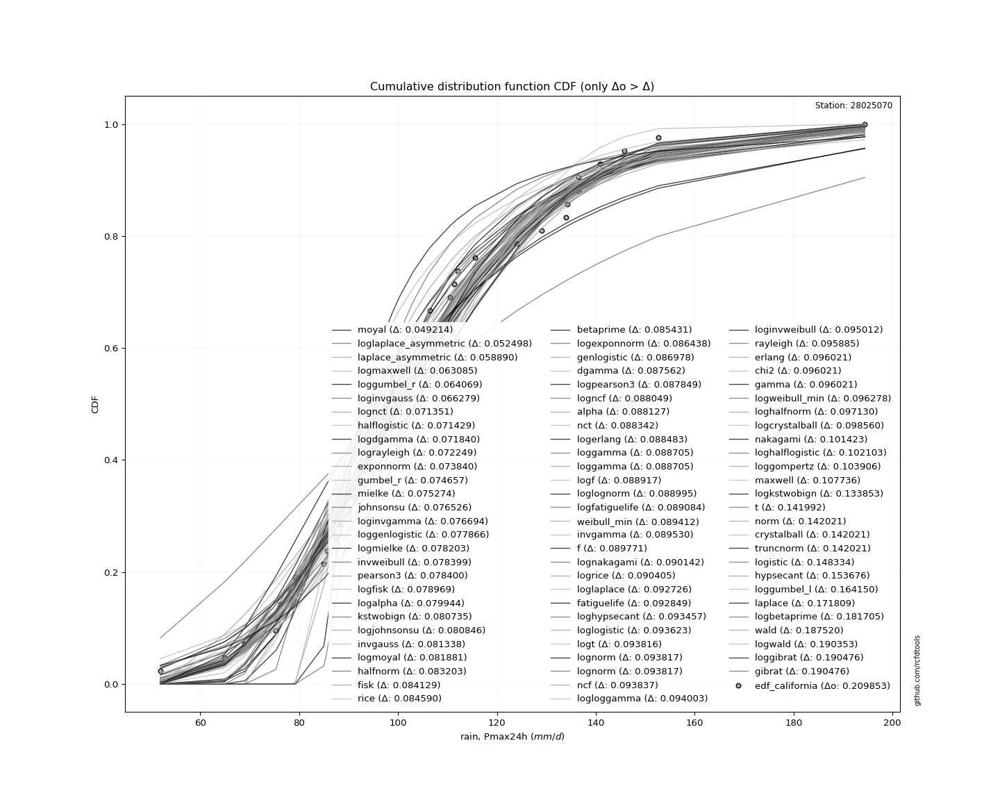</img>

</div>


**1.3. Best fit**

<div align="center">

|   id |   station | empirical_dist   | p_dist   |    delta |   deltao | eval   |   fit |   n |   best_fit |   best_fit_sort |
|-----:|----------:|:-----------------|:---------|---------:|---------:|:-------|------:|----:|-----------:|----------------:|
|    0 |  28025070 | edf_california   | moyal    | 0.049214 | 0.209853 | Δo > Δ |     1 |  42 |          1 |               1 |

</div>


<div align="center">

</img>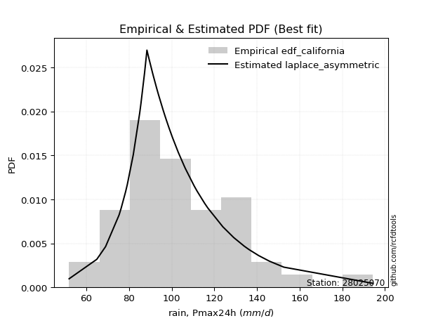</img>

</div>


### 2. Empirical - EDF Hazen (1930)

Hazen method for plotting positions is a formula used to estimate the empirical cumulative probability distribution of flood events or other hydrological data. This formula often results in biased estimations, particularly when extrapolating to extreme events (high return periods).

<div align="center">


$P=(m-0.5)/n$


</div>


**2.1. Empirical values**

<div align="center">

|                | 0                    | 1                   | 2                   | 3                   | 4                   | 5                   | 6                   | 7                   | 8                   | 9                  | 10                 | 11                  | 12                 | 13                  | 14                  | 15                  | 16                  | 17                 | 18                  | 19                 | 20                 | 21                 | 22                 | 23                 | 24                 | 25                 | 26                 | 27                 | 28                 | 29                 | 30                 | 31        | 32                 | 33                 | 34                 | 35                 | 36                 | 37                 | 38                 | 39                 | 40                 | 41                 |
|:---------------|:---------------------|:--------------------|:--------------------|:--------------------|:--------------------|:--------------------|:--------------------|:--------------------|:--------------------|:-------------------|:-------------------|:--------------------|:-------------------|:--------------------|:--------------------|:--------------------|:--------------------|:-------------------|:--------------------|:-------------------|:-------------------|:-------------------|:-------------------|:-------------------|:-------------------|:-------------------|:-------------------|:-------------------|:-------------------|:-------------------|:-------------------|:----------|:-------------------|:-------------------|:-------------------|:-------------------|:-------------------|:-------------------|:-------------------|:-------------------|:-------------------|:-------------------|
| date           | 1997                 | 1991                | 2000                | 2003                | 2004                | 1999                | 1979                | 1994                | 2014                | 1988               | 1982               | 1990                | 2001               | 1998                | 1974                | 2012                | 1981                | 1993               | 2013                | 2009               | 1973               | 2002               | 1978               | 1985               | 1984               | 1976               | 2005               | 1987               | 1992               | 1989               | 2015               | 2006      | 2011               | 1996               | 2010               | 1980               | 2007               | 1975               | 1983               | 1995               | 2008               | 1986               |
| x              | 51.9                 | 64.9                | 69.0                | 75.3                | 75.5                | 76.3                | 78.4                | 79.2                | 85.0                | 85.6               | 87.3               | 88.2                | 88.4               | 91.0                | 91.5                | 93.0                | 93.6381523448394    | 93.9               | 96.0                | 97.0               | 97.5568649570023   | 98.7               | 98.8               | 100.2              | 100.4              | 103.1              | 106.0              | 106.5              | 110.5              | 111.4              | 112.0              | 115.5     | 124.0              | 129.1              | 134.0              | 134.2              | 136.5              | 136.5              | 140.8              | 145.8              | 152.6              | 194.4              |
| m              | 1                    | 2                   | 3                   | 4                   | 5                   | 6                   | 7                   | 8                   | 9                   | 10                 | 11                 | 12                  | 13                 | 14                  | 15                  | 16                  | 17                  | 18                 | 19                  | 20                 | 21                 | 22                 | 23                 | 24                 | 25                 | 26                 | 27                 | 28                 | 29                 | 30                 | 31                 | 32        | 33                 | 34                 | 35                 | 36                 | 37                 | 38                 | 39                 | 40                 | 41                 | 42                 |
| empirical_dist | edf_hazen            | edf_hazen           | edf_hazen           | edf_hazen           | edf_hazen           | edf_hazen           | edf_hazen           | edf_hazen           | edf_hazen           | edf_hazen          | edf_hazen          | edf_hazen           | edf_hazen          | edf_hazen           | edf_hazen           | edf_hazen           | edf_hazen           | edf_hazen          | edf_hazen           | edf_hazen          | edf_hazen          | edf_hazen          | edf_hazen          | edf_hazen          | edf_hazen          | edf_hazen          | edf_hazen          | edf_hazen          | edf_hazen          | edf_hazen          | edf_hazen          | edf_hazen | edf_hazen          | edf_hazen          | edf_hazen          | edf_hazen          | edf_hazen          | edf_hazen          | edf_hazen          | edf_hazen          | edf_hazen          | edf_hazen          |
| empirical      | 0.011904761904761904 | 0.03571428571428571 | 0.05952380952380952 | 0.08333333333333333 | 0.10714285714285714 | 0.13095238095238096 | 0.15476190476190477 | 0.17857142857142858 | 0.20238095238095238 | 0.2261904761904762 | 0.25               | 0.27380952380952384 | 0.2976190476190476 | 0.32142857142857145 | 0.34523809523809523 | 0.36904761904761907 | 0.39285714285714285 | 0.4166666666666667 | 0.44047619047619047 | 0.4642857142857143 | 0.4880952380952381 | 0.5119047619047619 | 0.5357142857142857 | 0.5595238095238095 | 0.5833333333333334 | 0.6071428571428571 | 0.6309523809523809 | 0.6547619047619048 | 0.6785714285714286 | 0.7023809523809523 | 0.7261904761904762 | 0.75      | 0.7738095238095238 | 0.7976190476190477 | 0.8214285714285714 | 0.8452380952380952 | 0.8690476190476191 | 0.8928571428571429 | 0.9166666666666666 | 0.9404761904761905 | 0.9642857142857143 | 0.9880952380952381 |
| empirical_tr   | 1.0120481927710843   | 1.037037037037037   | 1.0632911392405064  | 1.090909090909091   | 1.1199999999999999  | 1.1506849315068493  | 1.1830985915492958  | 1.2173913043478262  | 1.253731343283582   | 1.2923076923076922 | 1.3333333333333333 | 1.3770491803278688  | 1.4237288135593222 | 1.4736842105263157  | 1.5272727272727273  | 1.5849056603773586  | 1.6470588235294117  | 1.7142857142857144 | 1.7872340425531914  | 1.8666666666666667 | 1.9534883720930234 | 2.048780487804878  | 2.1538461538461537 | 2.27027027027027   | 2.4000000000000004 | 2.545454545454545  | 2.7096774193548385 | 2.896551724137931  | 3.1111111111111116 | 3.3599999999999994 | 3.652173913043478  | 4.0       | 4.421052631578948  | 4.941176470588236  | 5.599999999999999  | 6.461538461538462  | 7.636363636363638  | 9.333333333333337  | 11.999999999999995 | 16.799999999999997 | 28.000000000000014 | 84.0000000000003   |

</div>


**2.2. Kolmogorov-Smirnov fit test (sorted by Δ)**


<div align="center">

|                | 0                   | 1                   | 2                    | 3                   | 4                     | 5                   | 6                   | 7                   | 8                   | 9                   | 10                  | 11                  | 12                  | 13                  | 14                  | 15                 | 16                  | 17                  | 18                 | 19                  | 20                  | 21                  | 22                 | 23                  | 24                 | 25                  | 26                  | 27                  | 28                  | 29                | 30                | 31                 | 32                  | 33                 | 34                  | 35                  | 36                  | 37                 | 38                  | 39                  | 40                  | 41                  | 42                 | 43                  | 44                  | 45                 | 46                  | 47                  | 48                  | 49                  | 50                  | 51                  | 52                  | 53                  | 54                 | 55                  | 56                | 57                  | 58                  | 59                  | 60                  | 61                  | 62                  | 63                  | 64                  | 65                  | 66                  | 67                  | 68                  | 69                 | 70                  | 71                 | 72                  | 73                  | 74                  | 75                  | 76                  | 77                  | 78                 | 79                  | 80                  | 81                  | 82                  | 83                  | 84                 | 85                  | 86                  | 87                 | 88                | 89                 | 90                | 91                 |
|:---------------|:--------------------|:--------------------|:---------------------|:--------------------|:----------------------|:--------------------|:--------------------|:--------------------|:--------------------|:--------------------|:--------------------|:--------------------|:--------------------|:--------------------|:--------------------|:-------------------|:--------------------|:--------------------|:-------------------|:--------------------|:--------------------|:--------------------|:-------------------|:--------------------|:-------------------|:--------------------|:--------------------|:--------------------|:--------------------|:------------------|:------------------|:-------------------|:--------------------|:-------------------|:--------------------|:--------------------|:--------------------|:-------------------|:--------------------|:--------------------|:--------------------|:--------------------|:-------------------|:--------------------|:--------------------|:-------------------|:--------------------|:--------------------|:--------------------|:--------------------|:--------------------|:--------------------|:--------------------|:--------------------|:-------------------|:--------------------|:------------------|:--------------------|:--------------------|:--------------------|:--------------------|:--------------------|:--------------------|:--------------------|:--------------------|:--------------------|:--------------------|:--------------------|:--------------------|:-------------------|:--------------------|:-------------------|:--------------------|:--------------------|:--------------------|:--------------------|:--------------------|:--------------------|:-------------------|:--------------------|:--------------------|:--------------------|:--------------------|:--------------------|:-------------------|:--------------------|:--------------------|:-------------------|:------------------|:-------------------|:------------------|:-------------------|
| station        | 28025070            | 28025070            | 28025070             | 28025070            | 28025070              | 28025070            | 28025070            | 28025070            | 28025070            | 28025070            | 28025070            | 28025070            | 28025070            | 28025070            | 28025070            | 28025070           | 28025070            | 28025070            | 28025070           | 28025070            | 28025070            | 28025070            | 28025070           | 28025070            | 28025070           | 28025070            | 28025070            | 28025070            | 28025070            | 28025070          | 28025070          | 28025070           | 28025070            | 28025070           | 28025070            | 28025070            | 28025070            | 28025070           | 28025070            | 28025070            | 28025070            | 28025070            | 28025070           | 28025070            | 28025070            | 28025070           | 28025070            | 28025070            | 28025070            | 28025070            | 28025070            | 28025070            | 28025070            | 28025070            | 28025070           | 28025070            | 28025070          | 28025070            | 28025070            | 28025070            | 28025070            | 28025070            | 28025070            | 28025070            | 28025070            | 28025070            | 28025070            | 28025070            | 28025070            | 28025070           | 28025070            | 28025070           | 28025070            | 28025070            | 28025070            | 28025070            | 28025070            | 28025070            | 28025070           | 28025070            | 28025070            | 28025070            | 28025070            | 28025070            | 28025070           | 28025070            | 28025070            | 28025070           | 28025070          | 28025070           | 28025070          | 28025070           |
| empirical_dist | edf_hazen           | edf_hazen           | edf_hazen            | edf_hazen           | edf_hazen             | edf_hazen           | edf_hazen           | edf_hazen           | edf_hazen           | edf_hazen           | edf_hazen           | edf_hazen           | edf_hazen           | edf_hazen           | edf_hazen           | edf_hazen          | edf_hazen           | edf_hazen           | edf_hazen          | edf_hazen           | edf_hazen           | edf_hazen           | edf_hazen          | edf_hazen           | edf_hazen          | edf_hazen           | edf_hazen           | edf_hazen           | edf_hazen           | edf_hazen         | edf_hazen         | edf_hazen          | edf_hazen           | edf_hazen          | edf_hazen           | edf_hazen           | edf_hazen           | edf_hazen          | edf_hazen           | edf_hazen           | edf_hazen           | edf_hazen           | edf_hazen          | edf_hazen           | edf_hazen           | edf_hazen          | edf_hazen           | edf_hazen           | edf_hazen           | edf_hazen           | edf_hazen           | edf_hazen           | edf_hazen           | edf_hazen           | edf_hazen          | edf_hazen           | edf_hazen         | edf_hazen           | edf_hazen           | edf_hazen           | edf_hazen           | edf_hazen           | edf_hazen           | edf_hazen           | edf_hazen           | edf_hazen           | edf_hazen           | edf_hazen           | edf_hazen           | edf_hazen          | edf_hazen           | edf_hazen          | edf_hazen           | edf_hazen           | edf_hazen           | edf_hazen           | edf_hazen           | edf_hazen           | edf_hazen          | edf_hazen           | edf_hazen           | edf_hazen           | edf_hazen           | edf_hazen           | edf_hazen          | edf_hazen           | edf_hazen           | edf_hazen          | edf_hazen         | edf_hazen          | edf_hazen         | edf_hazen          |
| p_dist         | laplace_asymmetric  | moyal               | exponnorm            | gumbel_r            | loglaplace_asymmetric | johnsonsu           | mielke              | loginvgamma         | lognct              | loggenlogistic      | logmielke           | invweibull          | pearson3            | logfisk             | logalpha            | logjohnsonsu       | invgauss            | loginvgauss         | fisk               | betaprime           | logexponnorm        | logmaxwell          | genlogistic        | logpearson3         | loggumbel_r        | logncf              | alpha               | nct                 | logerlang           | loggamma          | loggamma          | logf               | loglognorm          | logfatiguelife     | kstwobign           | weibull_min         | invgamma            | f                  | lognakagami         | logrice             | halflogistic        | fatiguelife         | loglaplace         | loghypsecant        | loglogistic         | logt               | lognorm             | lognorm             | ncf                 | logloggamma         | logdgamma           | rayleigh            | erlang              | chi2                | gamma              | lograyleigh         | logweibull_min    | logcrystalball      | nakagami            | logmoyal            | rice                | halfnorm            | maxwell             | dgamma              | loggompertz         | loginvweibull       | loghalfnorm         | loghalflogistic     | t                   | norm               | crystalball         | truncnorm          | logistic            | hypsecant           | logkstwobign        | loggumbel_l         | laplace             | wald                | logwald            | gibrat              | loggibrat           | logbetaprime        | gumbel_l            | loggenexpon         | genexpon           | pareto              | expon               | logtruncnorm       | logexpon          | logpareto          | logchi2           | gompertz           |
| delta          | 0.05830704709280754 | 0.05872646115095703 | 0.061935181424976116 | 0.06275265729254431 | 0.06440264409586127   | 0.06462156068014813 | 0.06462834717362298 | 0.06478965217523858 | 0.06490460785170937 | 0.06596158192968449 | 0.06629858939374622 | 0.06649384445594497 | 0.06649495910375014 | 0.06706402999771732 | 0.06803893438093378 | 0.0689411706256372 | 0.06943363749802844 | 0.07099696937517469 | 0.0722241163914702 | 0.07352665113950729 | 0.07453364327192757 | 0.07498958788190863 | 0.0750730474429896 | 0.07594377367848615 | 0.0759737562582829 | 0.07614401376254254 | 0.07622176063246677 | 0.07643743214281462 | 0.07657813988582896 | 0.076799928965262 | 0.076799928965262 | 0.0770124621649565 | 0.07709052461300692 | 0.0771788469429473 | 0.07728589160310312 | 0.07750719191232525 | 0.07762509653271887 | 0.0778659432176988 | 0.07823761936544471 | 0.07850068029966983 | 0.07939406424690276 | 0.08094439426409428 | 0.0814313504510562 | 0.08155232787375455 | 0.08171813723899368 | 0.0819112804607034 | 0.08191229216487195 | 0.08191229216487195 | 0.08193192232017876 | 0.08209836647652591 | 0.08374438281236218 | 0.08398011063425326 | 0.08411599496362737 | 0.08411617627476192 | 0.0841163065524747 | 0.08415418655894052 | 0.084373672481871 | 0.08665503549087777 | 0.08951836993634504 | 0.09378553982903831 | 0.09379647880163744 | 0.09510798265412318 | 0.09583104155296368 | 0.09946709365087936 | 0.10273695249782432 | 0.10691697203244055 | 0.10903433811588059 | 0.11400755678299729 | 0.13008741791577005 | 0.1301160922910119 | 0.13011609881356384 | 0.1301161066518054 | 0.13642954507371347 | 0.14177080378807777 | 0.14575755537355028 | 0.15224484741791133 | 0.15990443834173523 | 0.17561520480350298 | 0.1784485204859428 | 0.17857142857142858 | 0.17857142857142858 | 0.19360959649756632 | 0.20032995011977128 | 0.22606020041192715 | 0.2770520527264705 | 0.28091420497642133 | 0.28091421097948077 | 0.3354589979923007 | 0.348182151288485 | 0.3481821513229603 | 0.348411490123487 | 0.9627688410640541 |
| deltao         | 0.209852555948445   | 0.209852555948445   | 0.209852555948445    | 0.209852555948445   | 0.209852555948445     | 0.209852555948445   | 0.209852555948445   | 0.209852555948445   | 0.209852555948445   | 0.209852555948445   | 0.209852555948445   | 0.209852555948445   | 0.209852555948445   | 0.209852555948445   | 0.209852555948445   | 0.209852555948445  | 0.209852555948445   | 0.209852555948445   | 0.209852555948445  | 0.209852555948445   | 0.209852555948445   | 0.209852555948445   | 0.209852555948445  | 0.209852555948445   | 0.209852555948445  | 0.209852555948445   | 0.209852555948445   | 0.209852555948445   | 0.209852555948445   | 0.209852555948445 | 0.209852555948445 | 0.209852555948445  | 0.209852555948445   | 0.209852555948445  | 0.209852555948445   | 0.209852555948445   | 0.209852555948445   | 0.209852555948445  | 0.209852555948445   | 0.209852555948445   | 0.209852555948445   | 0.209852555948445   | 0.209852555948445  | 0.209852555948445   | 0.209852555948445   | 0.209852555948445  | 0.209852555948445   | 0.209852555948445   | 0.209852555948445   | 0.209852555948445   | 0.209852555948445   | 0.209852555948445   | 0.209852555948445   | 0.209852555948445   | 0.209852555948445  | 0.209852555948445   | 0.209852555948445 | 0.209852555948445   | 0.209852555948445   | 0.209852555948445   | 0.209852555948445   | 0.209852555948445   | 0.209852555948445   | 0.209852555948445   | 0.209852555948445   | 0.209852555948445   | 0.209852555948445   | 0.209852555948445   | 0.209852555948445   | 0.209852555948445  | 0.209852555948445   | 0.209852555948445  | 0.209852555948445   | 0.209852555948445   | 0.209852555948445   | 0.209852555948445   | 0.209852555948445   | 0.209852555948445   | 0.209852555948445  | 0.209852555948445   | 0.209852555948445   | 0.209852555948445   | 0.209852555948445   | 0.209852555948445   | 0.209852555948445  | 0.209852555948445   | 0.209852555948445   | 0.209852555948445  | 0.209852555948445 | 0.209852555948445  | 0.209852555948445 | 0.209852555948445  |
| eval           | Δo > Δ              | Δo > Δ              | Δo > Δ               | Δo > Δ              | Δo > Δ                | Δo > Δ              | Δo > Δ              | Δo > Δ              | Δo > Δ              | Δo > Δ              | Δo > Δ              | Δo > Δ              | Δo > Δ              | Δo > Δ              | Δo > Δ              | Δo > Δ             | Δo > Δ              | Δo > Δ              | Δo > Δ             | Δo > Δ              | Δo > Δ              | Δo > Δ              | Δo > Δ             | Δo > Δ              | Δo > Δ             | Δo > Δ              | Δo > Δ              | Δo > Δ              | Δo > Δ              | Δo > Δ            | Δo > Δ            | Δo > Δ             | Δo > Δ              | Δo > Δ             | Δo > Δ              | Δo > Δ              | Δo > Δ              | Δo > Δ             | Δo > Δ              | Δo > Δ              | Δo > Δ              | Δo > Δ              | Δo > Δ             | Δo > Δ              | Δo > Δ              | Δo > Δ             | Δo > Δ              | Δo > Δ              | Δo > Δ              | Δo > Δ              | Δo > Δ              | Δo > Δ              | Δo > Δ              | Δo > Δ              | Δo > Δ             | Δo > Δ              | Δo > Δ            | Δo > Δ              | Δo > Δ              | Δo > Δ              | Δo > Δ              | Δo > Δ              | Δo > Δ              | Δo > Δ              | Δo > Δ              | Δo > Δ              | Δo > Δ              | Δo > Δ              | Δo > Δ              | Δo > Δ             | Δo > Δ              | Δo > Δ             | Δo > Δ              | Δo > Δ              | Δo > Δ              | Δo > Δ              | Δo > Δ              | Δo > Δ              | Δo > Δ             | Δo > Δ              | Δo > Δ              | Δo > Δ              | Δo > Δ              | Δo <= Δ             | Δo <= Δ            | Δo <= Δ             | Δo <= Δ             | Δo <= Δ            | Δo <= Δ           | Δo <= Δ            | Δo <= Δ           | Δo <= Δ            |
| fit            | 1                   | 1                   | 1                    | 1                   | 1                     | 1                   | 1                   | 1                   | 1                   | 1                   | 1                   | 1                   | 1                   | 1                   | 1                   | 1                  | 1                   | 1                   | 1                  | 1                   | 1                   | 1                   | 1                  | 1                   | 1                  | 1                   | 1                   | 1                   | 1                   | 1                 | 1                 | 1                  | 1                   | 1                  | 1                   | 1                   | 1                   | 1                  | 1                   | 1                   | 1                   | 1                   | 1                  | 1                   | 1                   | 1                  | 1                   | 1                   | 1                   | 1                   | 1                   | 1                   | 1                   | 1                   | 1                  | 1                   | 1                 | 1                   | 1                   | 1                   | 1                   | 1                   | 1                   | 1                   | 1                   | 1                   | 1                   | 1                   | 1                   | 1                  | 1                   | 1                  | 1                   | 1                   | 1                   | 1                   | 1                   | 1                   | 1                  | 1                   | 1                   | 1                   | 1                   | 0                   | 0                  | 0                   | 0                   | 0                  | 0                 | 0                  | 0                 | 0                  |
| n              | 42                  | 42                  | 42                   | 42                  | 42                    | 42                  | 42                  | 42                  | 42                  | 42                  | 42                  | 42                  | 42                  | 42                  | 42                  | 42                 | 42                  | 42                  | 42                 | 42                  | 42                  | 42                  | 42                 | 42                  | 42                 | 42                  | 42                  | 42                  | 42                  | 42                | 42                | 42                 | 42                  | 42                 | 42                  | 42                  | 42                  | 42                 | 42                  | 42                  | 42                  | 42                  | 42                 | 42                  | 42                  | 42                 | 42                  | 42                  | 42                  | 42                  | 42                  | 42                  | 42                  | 42                  | 42                 | 42                  | 42                | 42                  | 42                  | 42                  | 42                  | 42                  | 42                  | 42                  | 42                  | 42                  | 42                  | 42                  | 42                  | 42                 | 42                  | 42                 | 42                  | 42                  | 42                  | 42                  | 42                  | 42                  | 42                 | 42                  | 42                  | 42                  | 42                  | 42                  | 42                 | 42                  | 42                  | 42                 | 42                | 42                 | 42                | 42                 |
| best_fit       | 1                   | 0                   | 0                    | 0                   | 0                     | 0                   | 0                   | 0                   | 0                   | 0                   | 0                   | 0                   | 0                   | 0                   | 0                   | 0                  | 0                   | 0                   | 0                  | 0                   | 0                   | 0                   | 0                  | 0                   | 0                  | 0                   | 0                   | 0                   | 0                   | 0                 | 0                 | 0                  | 0                   | 0                  | 0                   | 0                   | 0                   | 0                  | 0                   | 0                   | 0                   | 0                   | 0                  | 0                   | 0                   | 0                  | 0                   | 0                   | 0                   | 0                   | 0                   | 0                   | 0                   | 0                   | 0                  | 0                   | 0                 | 0                   | 0                   | 0                   | 0                   | 0                   | 0                   | 0                   | 0                   | 0                   | 0                   | 0                   | 0                   | 0                  | 0                   | 0                  | 0                   | 0                   | 0                   | 0                   | 0                   | 0                   | 0                  | 0                   | 0                   | 0                   | 0                   | 0                   | 0                  | 0                   | 0                   | 0                  | 0                 | 0                  | 0                 | 0                  |
| best_fit_sort  | 1                   | 2                   | 3                    | 4                   | 5                     | 6                   | 7                   | 8                   | 9                   | 10                  | 11                  | 12                  | 13                  | 14                  | 15                  | 16                 | 17                  | 18                  | 19                 | 20                  | 21                  | 22                  | 23                 | 24                  | 25                 | 26                  | 27                  | 28                  | 29                  | 30                | 31                | 32                 | 33                  | 34                 | 35                  | 36                  | 37                  | 38                 | 39                  | 40                  | 41                  | 42                  | 43                 | 44                  | 45                  | 46                 | 47                  | 48                  | 49                  | 50                  | 51                  | 52                  | 53                  | 54                  | 55                 | 56                  | 57                | 58                  | 59                  | 60                  | 61                  | 62                  | 63                  | 64                  | 65                  | 66                  | 67                  | 68                  | 69                  | 70                 | 71                  | 72                 | 73                  | 74                  | 75                  | 76                  | 77                  | 78                  | 79                 | 80                  | 81                  | 82                  | 83                  | 84                  | 85                 | 86                  | 87                  | 88                 | 89                | 90                 | 91                | 92                 |

</div>


<div align="center">

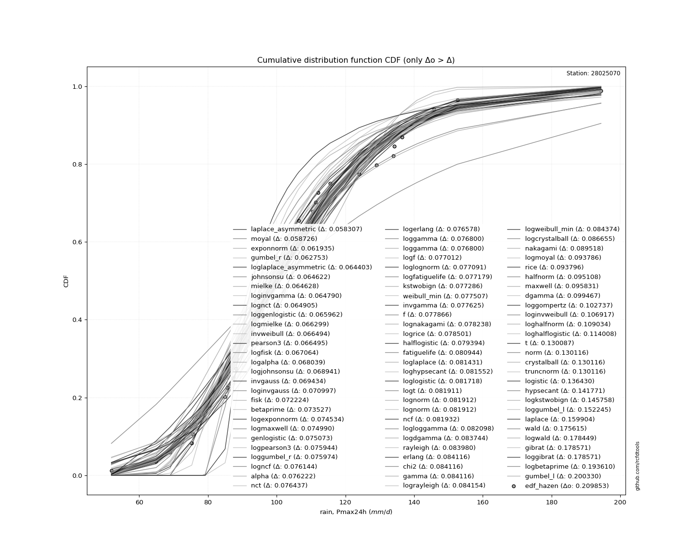</img>

</div>


**2.3. Best fit**

<div align="center">

|   id |   station | empirical_dist   | p_dist             |    delta |   deltao | eval   |   fit |   n |   best_fit |   best_fit_sort |
|-----:|----------:|:-----------------|:-------------------|---------:|---------:|:-------|------:|----:|-----------:|----------------:|
|    0 |  28025070 | edf_hazen        | laplace_asymmetric | 0.058307 | 0.209853 | Δo > Δ |     1 |  42 |          1 |               1 |

</div>


<div align="center">

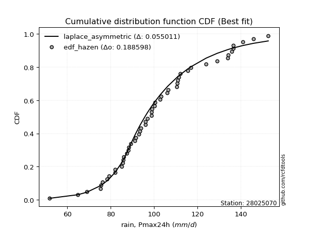</img>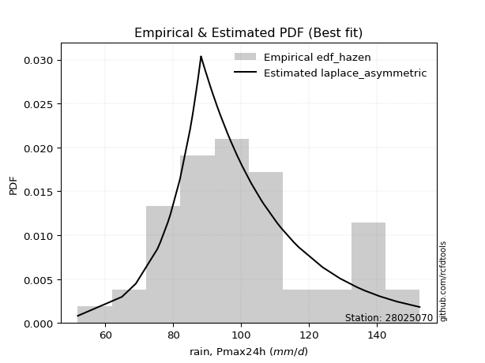</img>

</div>


### 3. Empirical - EDF Weibull (1939)

Weibull plotting position formula is an empirical method used to estimate the non-exceedance probability or plotting position for a set of observed data, is often recommended or widely used in practice, particularly in flood frequency analysis.

<div align="center">


$P=m/(n+1)$


</div>


**3.1. Empirical values**

<div align="center">

|                | 0                    | 1                    | 2                   | 3                   | 4                   | 5                   | 6                   | 7                   | 8                   | 9                   | 10                 | 11                  | 12                 | 13                  | 14                 | 15                  | 16                 | 17                 | 18                 | 19                  | 20                 | 21                 | 22                 | 23                 | 24                 | 25                 | 26                | 27                 | 28                 | 29                 | 30                 | 31                 | 32                 | 33                 | 34                | 35                 | 36                 | 37                 | 38                 | 39                 | 40                 | 41                 |
|:---------------|:---------------------|:---------------------|:--------------------|:--------------------|:--------------------|:--------------------|:--------------------|:--------------------|:--------------------|:--------------------|:-------------------|:--------------------|:-------------------|:--------------------|:-------------------|:--------------------|:-------------------|:-------------------|:-------------------|:--------------------|:-------------------|:-------------------|:-------------------|:-------------------|:-------------------|:-------------------|:------------------|:-------------------|:-------------------|:-------------------|:-------------------|:-------------------|:-------------------|:-------------------|:------------------|:-------------------|:-------------------|:-------------------|:-------------------|:-------------------|:-------------------|:-------------------|
| date           | 1997                 | 1991                 | 2000                | 2003                | 2004                | 1999                | 1979                | 1994                | 2014                | 1988                | 1982               | 1990                | 2001               | 1998                | 1974               | 2012                | 1981               | 1993               | 2013               | 2009                | 1973               | 2002               | 1978               | 1985               | 1984               | 1976               | 2005              | 1987               | 1992               | 1989               | 2015               | 2006               | 2011               | 1996               | 2010              | 1980               | 2007               | 1975               | 1983               | 1995               | 2008               | 1986               |
| x              | 51.9                 | 64.9                 | 69.0                | 75.3                | 75.5                | 76.3                | 78.4                | 79.2                | 85.0                | 85.6                | 87.3               | 88.2                | 88.4               | 91.0                | 91.5               | 93.0                | 93.6381523448394   | 93.9               | 96.0               | 97.0                | 97.5568649570023   | 98.7               | 98.8               | 100.2              | 100.4              | 103.1              | 106.0             | 106.5              | 110.5              | 111.4              | 112.0              | 115.5              | 124.0              | 129.1              | 134.0             | 134.2              | 136.5              | 136.5              | 140.8              | 145.8              | 152.6              | 194.4              |
| m              | 1                    | 2                    | 3                   | 4                   | 5                   | 6                   | 7                   | 8                   | 9                   | 10                  | 11                 | 12                  | 13                 | 14                  | 15                 | 16                  | 17                 | 18                 | 19                 | 20                  | 21                 | 22                 | 23                 | 24                 | 25                 | 26                 | 27                | 28                 | 29                 | 30                 | 31                 | 32                 | 33                 | 34                 | 35                | 36                 | 37                 | 38                 | 39                 | 40                 | 41                 | 42                 |
| empirical_dist | edf_weibull          | edf_weibull          | edf_weibull         | edf_weibull         | edf_weibull         | edf_weibull         | edf_weibull         | edf_weibull         | edf_weibull         | edf_weibull         | edf_weibull        | edf_weibull         | edf_weibull        | edf_weibull         | edf_weibull        | edf_weibull         | edf_weibull        | edf_weibull        | edf_weibull        | edf_weibull         | edf_weibull        | edf_weibull        | edf_weibull        | edf_weibull        | edf_weibull        | edf_weibull        | edf_weibull       | edf_weibull        | edf_weibull        | edf_weibull        | edf_weibull        | edf_weibull        | edf_weibull        | edf_weibull        | edf_weibull       | edf_weibull        | edf_weibull        | edf_weibull        | edf_weibull        | edf_weibull        | edf_weibull        | edf_weibull        |
| empirical      | 0.023255813953488372 | 0.046511627906976744 | 0.06976744186046512 | 0.09302325581395349 | 0.11627906976744186 | 0.13953488372093023 | 0.16279069767441862 | 0.18604651162790697 | 0.20930232558139536 | 0.23255813953488372 | 0.2558139534883721 | 0.27906976744186046 | 0.3023255813953488 | 0.32558139534883723 | 0.3488372093023256 | 0.37209302325581395 | 0.3953488372093023 | 0.4186046511627907 | 0.4418604651162791 | 0.46511627906976744 | 0.4883720930232558 | 0.5116279069767442 | 0.5348837209302325 | 0.5581395348837209 | 0.5813953488372093 | 0.6046511627906976 | 0.627906976744186 | 0.6511627906976745 | 0.6744186046511628 | 0.6976744186046512 | 0.7209302325581395 | 0.7441860465116279 | 0.7674418604651163 | 0.7906976744186046 | 0.813953488372093 | 0.8372093023255814 | 0.8604651162790697 | 0.8837209302325582 | 0.9069767441860465 | 0.9302325581395349 | 0.9534883720930233 | 0.9767441860465116 |
| empirical_tr   | 1.023809523809524    | 1.048780487804878    | 1.075               | 1.1025641025641024  | 1.131578947368421   | 1.1621621621621623  | 1.1944444444444446  | 1.2285714285714286  | 1.2647058823529413  | 1.303030303030303   | 1.34375            | 1.3870967741935485  | 1.4333333333333333 | 1.4827586206896552  | 1.5357142857142856 | 1.5925925925925926  | 1.653846153846154  | 1.7200000000000002 | 1.7916666666666667 | 1.8695652173913042  | 1.9545454545454544 | 2.047619047619048  | 2.15               | 2.263157894736842  | 2.3888888888888893 | 2.5294117647058822 | 2.6875            | 2.866666666666667  | 3.071428571428571  | 3.307692307692308  | 3.5833333333333326 | 3.9090909090909087 | 4.300000000000001  | 4.777777777777777  | 5.375             | 6.142857142857144  | 7.166666666666665  | 8.600000000000001  | 10.749999999999993 | 14.33333333333333  | 21.500000000000014 | 42.99999999999992  |

</div>


**3.2. Kolmogorov-Smirnov fit test (sorted by Δ)**


<div align="center">

|                | 0                  | 1                   | 2                   | 3                   | 4                   | 5                  | 6                  | 7                   | 8                   | 9                  | 10                  | 11                  | 12                  | 13                  | 14                  | 15                  | 16                    | 17                  | 18                  | 19                 | 20                  | 21                  | 22                 | 23                  | 24                  | 25                  | 26                 | 27                  | 28                  | 29                  | 30                  | 31                  | 32                  | 33                  | 34                  | 35                  | 36                  | 37                  | 38                  | 39                 | 40                 | 41                  | 42                  | 43                  | 44                  | 45                  | 46                  | 47                  | 48                  | 49                  | 50                  | 51                  | 52                  | 53                  | 54                  | 55                  | 56                  | 57                  | 58                 | 59                  | 60                  | 61                  | 62                  | 63                  | 64                  | 65                  | 66                  | 67                  | 68                  | 69                  | 70                 | 71                  | 72                  | 73                 | 74                  | 75                 | 76                 | 77                  | 78                  | 79                 | 80                  | 81                  | 82                  | 83                  | 84                 | 85                  | 86                 | 87                  | 88                  | 89                  | 90                 | 91                 |
|:---------------|:-------------------|:--------------------|:--------------------|:--------------------|:--------------------|:-------------------|:-------------------|:--------------------|:--------------------|:-------------------|:--------------------|:--------------------|:--------------------|:--------------------|:--------------------|:--------------------|:----------------------|:--------------------|:--------------------|:-------------------|:--------------------|:--------------------|:-------------------|:--------------------|:--------------------|:--------------------|:-------------------|:--------------------|:--------------------|:--------------------|:--------------------|:--------------------|:--------------------|:--------------------|:--------------------|:--------------------|:--------------------|:--------------------|:--------------------|:-------------------|:-------------------|:--------------------|:--------------------|:--------------------|:--------------------|:--------------------|:--------------------|:--------------------|:--------------------|:--------------------|:--------------------|:--------------------|:--------------------|:--------------------|:--------------------|:--------------------|:--------------------|:--------------------|:-------------------|:--------------------|:--------------------|:--------------------|:--------------------|:--------------------|:--------------------|:--------------------|:--------------------|:--------------------|:--------------------|:--------------------|:-------------------|:--------------------|:--------------------|:-------------------|:--------------------|:-------------------|:-------------------|:--------------------|:--------------------|:-------------------|:--------------------|:--------------------|:--------------------|:--------------------|:-------------------|:--------------------|:-------------------|:--------------------|:--------------------|:--------------------|:-------------------|:-------------------|
| station        | 28025070           | 28025070            | 28025070            | 28025070            | 28025070            | 28025070           | 28025070           | 28025070            | 28025070            | 28025070           | 28025070            | 28025070            | 28025070            | 28025070            | 28025070            | 28025070            | 28025070              | 28025070            | 28025070            | 28025070           | 28025070            | 28025070            | 28025070           | 28025070            | 28025070            | 28025070            | 28025070           | 28025070            | 28025070            | 28025070            | 28025070            | 28025070            | 28025070            | 28025070            | 28025070            | 28025070            | 28025070            | 28025070            | 28025070            | 28025070           | 28025070           | 28025070            | 28025070            | 28025070            | 28025070            | 28025070            | 28025070            | 28025070            | 28025070            | 28025070            | 28025070            | 28025070            | 28025070            | 28025070            | 28025070            | 28025070            | 28025070            | 28025070            | 28025070           | 28025070            | 28025070            | 28025070            | 28025070            | 28025070            | 28025070            | 28025070            | 28025070            | 28025070            | 28025070            | 28025070            | 28025070           | 28025070            | 28025070            | 28025070           | 28025070            | 28025070           | 28025070           | 28025070            | 28025070            | 28025070           | 28025070            | 28025070            | 28025070            | 28025070            | 28025070           | 28025070            | 28025070           | 28025070            | 28025070            | 28025070            | 28025070           | 28025070           |
| empirical_dist | edf_weibull        | edf_weibull         | edf_weibull         | edf_weibull         | edf_weibull         | edf_weibull        | edf_weibull        | edf_weibull         | edf_weibull         | edf_weibull        | edf_weibull         | edf_weibull         | edf_weibull         | edf_weibull         | edf_weibull         | edf_weibull         | edf_weibull           | edf_weibull         | edf_weibull         | edf_weibull        | edf_weibull         | edf_weibull         | edf_weibull        | edf_weibull         | edf_weibull         | edf_weibull         | edf_weibull        | edf_weibull         | edf_weibull         | edf_weibull         | edf_weibull         | edf_weibull         | edf_weibull         | edf_weibull         | edf_weibull         | edf_weibull         | edf_weibull         | edf_weibull         | edf_weibull         | edf_weibull        | edf_weibull        | edf_weibull         | edf_weibull         | edf_weibull         | edf_weibull         | edf_weibull         | edf_weibull         | edf_weibull         | edf_weibull         | edf_weibull         | edf_weibull         | edf_weibull         | edf_weibull         | edf_weibull         | edf_weibull         | edf_weibull         | edf_weibull         | edf_weibull         | edf_weibull        | edf_weibull         | edf_weibull         | edf_weibull         | edf_weibull         | edf_weibull         | edf_weibull         | edf_weibull         | edf_weibull         | edf_weibull         | edf_weibull         | edf_weibull         | edf_weibull        | edf_weibull         | edf_weibull         | edf_weibull        | edf_weibull         | edf_weibull        | edf_weibull        | edf_weibull         | edf_weibull         | edf_weibull        | edf_weibull         | edf_weibull         | edf_weibull         | edf_weibull         | edf_weibull        | edf_weibull         | edf_weibull        | edf_weibull         | edf_weibull         | edf_weibull         | edf_weibull        | edf_weibull        |
| p_dist         | lognct             | gumbel_r            | loginvgamma         | loginvgauss         | invweibull          | pearson3           | exponnorm          | laplace_asymmetric  | logalpha            | moyal              | invgauss            | johnsonsu           | logmaxwell          | logjohnsonsu        | loggenlogistic      | kstwobign           | loglaplace_asymmetric | betaprime           | loggumbel_r         | logmielke          | mielke              | halflogistic        | logfisk            | logexponnorm        | genlogistic         | logpearson3         | logncf             | alpha               | nct                 | logerlang           | loggamma            | loggamma            | logf                | loglognorm          | logfatiguelife      | weibull_min         | invgamma            | f                   | lognakagami         | logrice            | fisk               | lograyleigh         | fatiguelife         | loglogistic         | logt                | lognorm             | lognorm             | ncf                 | logloggamma         | rayleigh            | erlang              | chi2                | gamma               | logweibull_min      | loghypsecant        | logcrystalball      | rice                | nakagami            | halfnorm           | loglaplace          | logmoyal            | logdgamma           | loggompertz         | maxwell             | loginvweibull       | loghalfnorm         | dgamma              | loghalflogistic     | t                   | norm                | crystalball        | truncnorm           | logistic            | logkstwobign       | hypsecant           | loggumbel_l        | laplace            | wald                | logbetaprime        | logwald            | loggibrat           | gibrat              | gumbel_l            | loggenexpon         | genexpon           | pareto              | expon              | logtruncnorm        | logexpon            | logpareto           | logchi2            | gompertz           |
| delta          | 0.0579832346512664 | 0.06279067382376513 | 0.06285166767911454 | 0.06407559617473171 | 0.06455585995982094 | 0.0645569746076261 | 0.0650361804798475 | 0.06578213014928591 | 0.06610094988480975 | 0.0662015442074354 | 0.06749565300190441 | 0.06803684709013946 | 0.06806821468146565 | 0.06906006219319061 | 0.07021414912306789 | 0.07036451840266014 | 0.07132401729630433   | 0.07158866664338326 | 0.07182093233801712 | 0.0719107147264687 | 0.07210343023010135 | 0.07247269104645979 | 0.0725893453137969 | 0.07259565877580354 | 0.07313506294686556 | 0.07400578918236211 | 0.0742060292664185 | 0.07428377613634274 | 0.07449944764669059 | 0.07464015538970492 | 0.07486194446913796 | 0.07486194446913796 | 0.07507447766883246 | 0.07515254011688288 | 0.07524086244682326 | 0.07556920741620121 | 0.07568711203659484 | 0.07592795872157476 | 0.07629963486932068 | 0.0765626958035458 | 0.0768535917728922 | 0.07723281335849755 | 0.07900640976797024 | 0.07978015274286965 | 0.07997329596457936 | 0.07997430766874791 | 0.07997430766874791 | 0.07999393782405473 | 0.08016038198040187 | 0.08204212613812922 | 0.08217801046750334 | 0.08217819177863789 | 0.08217832205635067 | 0.08243568798574696 | 0.08268593018483639 | 0.08471705099475374 | 0.08687510560119446 | 0.08758038544022101 | 0.0881866094536802 | 0.08835272365149927 | 0.08963271590877253 | 0.09066575601280524 | 0.09304703001720416 | 0.09389305705683965 | 0.09999559883199757 | 0.10211296491543762 | 0.10638846685132242 | 0.10985473286273151 | 0.12814943341964602 | 0.12817810779488786 | 0.1281781143174398 | 0.12817812215568136 | 0.13449156057758943 | 0.1388361821731073 | 0.13983281929195374 | 0.1503068629217873 | 0.1579664538456112 | 0.18309028785998138 | 0.18391967401694614 | 0.1859236035424212 | 0.18604651162790697 | 0.18604651162790697 | 0.19839196562364725 | 0.21913882721148417 | 0.2673621302458503 | 0.27122428249580116 | 0.2712242884988606 | 0.32576907551168055 | 0.33849222880786484 | 0.33849222884234015 | 0.3387215676428668 | 0.9519714988713631 |
| deltao         | 0.209852555948445  | 0.209852555948445   | 0.209852555948445   | 0.209852555948445   | 0.209852555948445   | 0.209852555948445  | 0.209852555948445  | 0.209852555948445   | 0.209852555948445   | 0.209852555948445  | 0.209852555948445   | 0.209852555948445   | 0.209852555948445   | 0.209852555948445   | 0.209852555948445   | 0.209852555948445   | 0.209852555948445     | 0.209852555948445   | 0.209852555948445   | 0.209852555948445  | 0.209852555948445   | 0.209852555948445   | 0.209852555948445  | 0.209852555948445   | 0.209852555948445   | 0.209852555948445   | 0.209852555948445  | 0.209852555948445   | 0.209852555948445   | 0.209852555948445   | 0.209852555948445   | 0.209852555948445   | 0.209852555948445   | 0.209852555948445   | 0.209852555948445   | 0.209852555948445   | 0.209852555948445   | 0.209852555948445   | 0.209852555948445   | 0.209852555948445  | 0.209852555948445  | 0.209852555948445   | 0.209852555948445   | 0.209852555948445   | 0.209852555948445   | 0.209852555948445   | 0.209852555948445   | 0.209852555948445   | 0.209852555948445   | 0.209852555948445   | 0.209852555948445   | 0.209852555948445   | 0.209852555948445   | 0.209852555948445   | 0.209852555948445   | 0.209852555948445   | 0.209852555948445   | 0.209852555948445   | 0.209852555948445  | 0.209852555948445   | 0.209852555948445   | 0.209852555948445   | 0.209852555948445   | 0.209852555948445   | 0.209852555948445   | 0.209852555948445   | 0.209852555948445   | 0.209852555948445   | 0.209852555948445   | 0.209852555948445   | 0.209852555948445  | 0.209852555948445   | 0.209852555948445   | 0.209852555948445  | 0.209852555948445   | 0.209852555948445  | 0.209852555948445  | 0.209852555948445   | 0.209852555948445   | 0.209852555948445  | 0.209852555948445   | 0.209852555948445   | 0.209852555948445   | 0.209852555948445   | 0.209852555948445  | 0.209852555948445   | 0.209852555948445  | 0.209852555948445   | 0.209852555948445   | 0.209852555948445   | 0.209852555948445  | 0.209852555948445  |
| eval           | Δo > Δ             | Δo > Δ              | Δo > Δ              | Δo > Δ              | Δo > Δ              | Δo > Δ             | Δo > Δ             | Δo > Δ              | Δo > Δ              | Δo > Δ             | Δo > Δ              | Δo > Δ              | Δo > Δ              | Δo > Δ              | Δo > Δ              | Δo > Δ              | Δo > Δ                | Δo > Δ              | Δo > Δ              | Δo > Δ             | Δo > Δ              | Δo > Δ              | Δo > Δ             | Δo > Δ              | Δo > Δ              | Δo > Δ              | Δo > Δ             | Δo > Δ              | Δo > Δ              | Δo > Δ              | Δo > Δ              | Δo > Δ              | Δo > Δ              | Δo > Δ              | Δo > Δ              | Δo > Δ              | Δo > Δ              | Δo > Δ              | Δo > Δ              | Δo > Δ             | Δo > Δ             | Δo > Δ              | Δo > Δ              | Δo > Δ              | Δo > Δ              | Δo > Δ              | Δo > Δ              | Δo > Δ              | Δo > Δ              | Δo > Δ              | Δo > Δ              | Δo > Δ              | Δo > Δ              | Δo > Δ              | Δo > Δ              | Δo > Δ              | Δo > Δ              | Δo > Δ              | Δo > Δ             | Δo > Δ              | Δo > Δ              | Δo > Δ              | Δo > Δ              | Δo > Δ              | Δo > Δ              | Δo > Δ              | Δo > Δ              | Δo > Δ              | Δo > Δ              | Δo > Δ              | Δo > Δ             | Δo > Δ              | Δo > Δ              | Δo > Δ             | Δo > Δ              | Δo > Δ             | Δo > Δ             | Δo > Δ              | Δo > Δ              | Δo > Δ             | Δo > Δ              | Δo > Δ              | Δo > Δ              | Δo <= Δ             | Δo <= Δ            | Δo <= Δ             | Δo <= Δ            | Δo <= Δ             | Δo <= Δ             | Δo <= Δ             | Δo <= Δ            | Δo <= Δ            |
| fit            | 1                  | 1                   | 1                   | 1                   | 1                   | 1                  | 1                  | 1                   | 1                   | 1                  | 1                   | 1                   | 1                   | 1                   | 1                   | 1                   | 1                     | 1                   | 1                   | 1                  | 1                   | 1                   | 1                  | 1                   | 1                   | 1                   | 1                  | 1                   | 1                   | 1                   | 1                   | 1                   | 1                   | 1                   | 1                   | 1                   | 1                   | 1                   | 1                   | 1                  | 1                  | 1                   | 1                   | 1                   | 1                   | 1                   | 1                   | 1                   | 1                   | 1                   | 1                   | 1                   | 1                   | 1                   | 1                   | 1                   | 1                   | 1                   | 1                  | 1                   | 1                   | 1                   | 1                   | 1                   | 1                   | 1                   | 1                   | 1                   | 1                   | 1                   | 1                  | 1                   | 1                   | 1                  | 1                   | 1                  | 1                  | 1                   | 1                   | 1                  | 1                   | 1                   | 1                   | 0                   | 0                  | 0                   | 0                  | 0                   | 0                   | 0                   | 0                  | 0                  |
| n              | 42                 | 42                  | 42                  | 42                  | 42                  | 42                 | 42                 | 42                  | 42                  | 42                 | 42                  | 42                  | 42                  | 42                  | 42                  | 42                  | 42                    | 42                  | 42                  | 42                 | 42                  | 42                  | 42                 | 42                  | 42                  | 42                  | 42                 | 42                  | 42                  | 42                  | 42                  | 42                  | 42                  | 42                  | 42                  | 42                  | 42                  | 42                  | 42                  | 42                 | 42                 | 42                  | 42                  | 42                  | 42                  | 42                  | 42                  | 42                  | 42                  | 42                  | 42                  | 42                  | 42                  | 42                  | 42                  | 42                  | 42                  | 42                  | 42                 | 42                  | 42                  | 42                  | 42                  | 42                  | 42                  | 42                  | 42                  | 42                  | 42                  | 42                  | 42                 | 42                  | 42                  | 42                 | 42                  | 42                 | 42                 | 42                  | 42                  | 42                 | 42                  | 42                  | 42                  | 42                  | 42                 | 42                  | 42                 | 42                  | 42                  | 42                  | 42                 | 42                 |
| best_fit       | 1                  | 0                   | 0                   | 0                   | 0                   | 0                  | 0                  | 0                   | 0                   | 0                  | 0                   | 0                   | 0                   | 0                   | 0                   | 0                   | 0                     | 0                   | 0                   | 0                  | 0                   | 0                   | 0                  | 0                   | 0                   | 0                   | 0                  | 0                   | 0                   | 0                   | 0                   | 0                   | 0                   | 0                   | 0                   | 0                   | 0                   | 0                   | 0                   | 0                  | 0                  | 0                   | 0                   | 0                   | 0                   | 0                   | 0                   | 0                   | 0                   | 0                   | 0                   | 0                   | 0                   | 0                   | 0                   | 0                   | 0                   | 0                   | 0                  | 0                   | 0                   | 0                   | 0                   | 0                   | 0                   | 0                   | 0                   | 0                   | 0                   | 0                   | 0                  | 0                   | 0                   | 0                  | 0                   | 0                  | 0                  | 0                   | 0                   | 0                  | 0                   | 0                   | 0                   | 0                   | 0                  | 0                   | 0                  | 0                   | 0                   | 0                   | 0                  | 0                  |
| best_fit_sort  | 1                  | 2                   | 3                   | 4                   | 5                   | 6                  | 7                  | 8                   | 9                   | 10                 | 11                  | 12                  | 13                  | 14                  | 15                  | 16                  | 17                    | 18                  | 19                  | 20                 | 21                  | 22                  | 23                 | 24                  | 25                  | 26                  | 27                 | 28                  | 29                  | 30                  | 31                  | 32                  | 33                  | 34                  | 35                  | 36                  | 37                  | 38                  | 39                  | 40                 | 41                 | 42                  | 43                  | 44                  | 45                  | 46                  | 47                  | 48                  | 49                  | 50                  | 51                  | 52                  | 53                  | 54                  | 55                  | 56                  | 57                  | 58                  | 59                 | 60                  | 61                  | 62                  | 63                  | 64                  | 65                  | 66                  | 67                  | 68                  | 69                  | 70                  | 71                 | 72                  | 73                  | 74                 | 75                  | 76                 | 77                 | 78                  | 79                  | 80                 | 81                  | 82                  | 83                  | 84                  | 85                 | 86                  | 87                 | 88                  | 89                  | 90                  | 91                 | 92                 |

</div>


<div align="center">

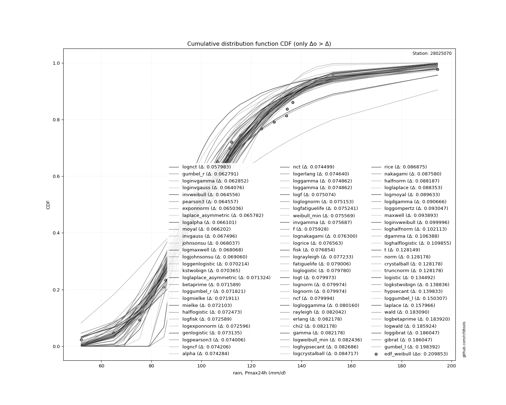</img>

</div>


**3.3. Best fit**

<div align="center">

|   id |   station | empirical_dist   | p_dist   |     delta |   deltao | eval   |   fit |   n |   best_fit |   best_fit_sort |
|-----:|----------:|:-----------------|:---------|----------:|---------:|:-------|------:|----:|-----------:|----------------:|
|    0 |  28025070 | edf_weibull      | lognct   | 0.0579832 | 0.209853 | Δo > Δ |     1 |  42 |          1 |               1 |

</div>


<div align="center">

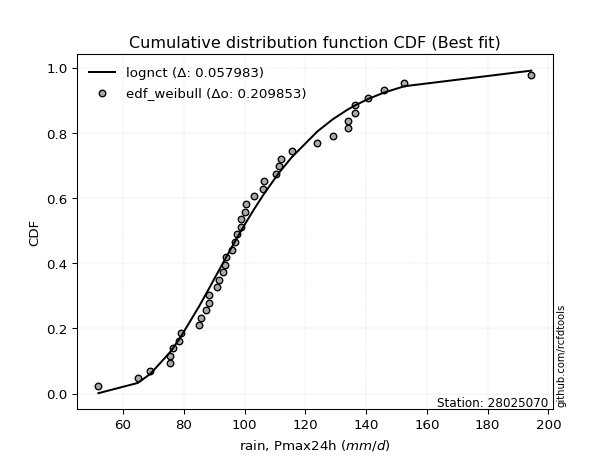</img></img>

</div>


### 4. Empirical - EDF Beard (1943)

The Beard formula (or Beard´s plotting position formula) in hydrology is used to estimate the empirical non-exceedance probability _(P)_ of a flood event (or other extreme hydrological data point) within a given dataset.

<div align="center">


$P=(m-0.31)/(n+0.38)$


</div>


**4.1. Empirical values**

<div align="center">

|                | 0                    | 1                   | 2                   | 3                   | 4                   | 5                  | 6                   | 7                   | 8                   | 9                   | 10                 | 11                  | 12                 | 13                 | 14                 | 15                 | 16                 | 17                 | 18                 | 19                  | 20                  | 21                 | 22                 | 23                 | 24                 | 25                 | 26                 | 27                 | 28                 | 29                 | 30                 | 31                 | 32                 | 33                 | 34                 | 35                 | 36                 | 37                 | 38                 | 39                 | 40                 | 41                 |
|:---------------|:---------------------|:--------------------|:--------------------|:--------------------|:--------------------|:-------------------|:--------------------|:--------------------|:--------------------|:--------------------|:-------------------|:--------------------|:-------------------|:-------------------|:-------------------|:-------------------|:-------------------|:-------------------|:-------------------|:--------------------|:--------------------|:-------------------|:-------------------|:-------------------|:-------------------|:-------------------|:-------------------|:-------------------|:-------------------|:-------------------|:-------------------|:-------------------|:-------------------|:-------------------|:-------------------|:-------------------|:-------------------|:-------------------|:-------------------|:-------------------|:-------------------|:-------------------|
| date           | 1997                 | 1991                | 2000                | 2003                | 2004                | 1999               | 1979                | 1994                | 2014                | 1988                | 1982               | 1990                | 2001               | 1998               | 1974               | 2012               | 1981               | 1993               | 2013               | 2009                | 1973                | 2002               | 1978               | 1985               | 1984               | 1976               | 2005               | 1987               | 1992               | 1989               | 2015               | 2006               | 2011               | 1996               | 2010               | 1980               | 2007               | 1975               | 1983               | 1995               | 2008               | 1986               |
| x              | 51.9                 | 64.9                | 69.0                | 75.3                | 75.5                | 76.3               | 78.4                | 79.2                | 85.0                | 85.6                | 87.3               | 88.2                | 88.4               | 91.0               | 91.5               | 93.0               | 93.6381523448394   | 93.9               | 96.0               | 97.0                | 97.5568649570023    | 98.7               | 98.8               | 100.2              | 100.4              | 103.1              | 106.0              | 106.5              | 110.5              | 111.4              | 112.0              | 115.5              | 124.0              | 129.1              | 134.0              | 134.2              | 136.5              | 136.5              | 140.8              | 145.8              | 152.6              | 194.4              |
| m              | 1                    | 2                   | 3                   | 4                   | 5                   | 6                  | 7                   | 8                   | 9                   | 10                  | 11                 | 12                  | 13                 | 14                 | 15                 | 16                 | 17                 | 18                 | 19                 | 20                  | 21                  | 22                 | 23                 | 24                 | 25                 | 26                 | 27                 | 28                 | 29                 | 30                 | 31                 | 32                 | 33                 | 34                 | 35                 | 36                 | 37                 | 38                 | 39                 | 40                 | 41                 | 42                 |
| empirical_dist | edf_beard            | edf_beard           | edf_beard           | edf_beard           | edf_beard           | edf_beard          | edf_beard           | edf_beard           | edf_beard           | edf_beard           | edf_beard          | edf_beard           | edf_beard          | edf_beard          | edf_beard          | edf_beard          | edf_beard          | edf_beard          | edf_beard          | edf_beard           | edf_beard           | edf_beard          | edf_beard          | edf_beard          | edf_beard          | edf_beard          | edf_beard          | edf_beard          | edf_beard          | edf_beard          | edf_beard          | edf_beard          | edf_beard          | edf_beard          | edf_beard          | edf_beard          | edf_beard          | edf_beard          | edf_beard          | edf_beard          | edf_beard          | edf_beard          |
| empirical      | 0.016281264747522416 | 0.03987730061349693 | 0.06347333647947144 | 0.08706937234544596 | 0.11066540821142049 | 0.134261444077395  | 0.15785747994336952 | 0.18145351580934402 | 0.20504955167531852 | 0.22864558754129305 | 0.2522416234072676 | 0.27583765927324205 | 0.2994336951392166 | 0.3230297310051911 | 0.3466257668711656 | 0.3702218027371401 | 0.3938178386031147 | 0.4174138744690892 | 0.4410099103350637 | 0.46460594620103823 | 0.48820198206701276 | 0.5117980179329873 | 0.5353940537989618 | 0.5589900896649362 | 0.5825861255309108 | 0.6061821613968853 | 0.6297781972628599 | 0.6533742331288344 | 0.6769702689948088 | 0.7005663048607834 | 0.7241623407267579 | 0.7477583765927324 | 0.7713544124587068 | 0.7949504483246813 | 0.8185464841906559 | 0.8421425200566304 | 0.8657385559226048 | 0.8893345917885794 | 0.9129306276545539 | 0.9365266635205285 | 0.960122699386503  | 0.9837187352524774 |
| empirical_tr   | 1.0165507315903095   | 1.0415335463258786  | 1.0677752582514486  | 1.0953734815197727  | 1.1244361899708144  | 1.1550831289179613 | 1.1874474642757076  | 1.221677716921303   | 1.2579400415553577  | 1.2964209238299174  | 1.3373303881350582 | 1.3809058325187358  | 1.4274166385988547 | 1.4771697455559427 | 1.5305164319248825 | 1.5878606219557885 | 1.6496691319579604 | 1.7164844066423652 | 1.788940481215703  | 1.867783164389599   | 1.953895804518211   | 2.0483325277912035 | 2.1523616048755714 | 2.2675227394328514 | 2.395703787450537  | 2.5392450569203113 | 2.701083492670491  | 2.8849557522123894 | 3.0956902848794736 | 3.339637509850276  | 3.6253207869974333 | 3.9644527595883994 | 4.373581011351908  | 4.876869965477557  | 5.511053315994796  | 6.3348281016442405 | 7.448154657293489  | 9.03624733475479   | 11.485094850948492 | 15.754646840148684 | 25.076923076923013 | 61.420289855071914 |

</div>


**4.2. Kolmogorov-Smirnov fit test (sorted by Δ)**


<div align="center">

|                | 0                   | 1                   | 2                   | 3                   | 4                    | 5                   | 6                   | 7                   | 8                   | 9                  | 10                    | 11                  | 12                  | 13                  | 14                  | 15                  | 16                  | 17                 | 18                  | 19                  | 20                  | 21                  | 22                  | 23                  | 24                  | 25                 | 26                | 27                  | 28                  | 29                  | 30                  | 31                  | 32                  | 33                  | 34                  | 35                  | 36                 | 37                  | 38                  | 39                  | 40                  | 41                  | 42                | 43                  | 44                  | 45                 | 46                 | 47                  | 48                  | 49                  | 50                  | 51                  | 52                  | 53                  | 54                  | 55                  | 56                  | 57                  | 58                 | 59                 | 60                  | 61                  | 62                  | 63                  | 64                  | 65                  | 66                  | 67                  | 68                 | 69                  | 70                 | 71                  | 72                  | 73                  | 74                  | 75                 | 76                 | 77                  | 78                  | 79                  | 80                  | 81                  | 82                  | 83                | 84                 | 85                  | 86                  | 87                 | 88                  | 89                  | 90                 | 91                 |
|:---------------|:--------------------|:--------------------|:--------------------|:--------------------|:---------------------|:--------------------|:--------------------|:--------------------|:--------------------|:-------------------|:----------------------|:--------------------|:--------------------|:--------------------|:--------------------|:--------------------|:--------------------|:-------------------|:--------------------|:--------------------|:--------------------|:--------------------|:--------------------|:--------------------|:--------------------|:-------------------|:------------------|:--------------------|:--------------------|:--------------------|:--------------------|:--------------------|:--------------------|:--------------------|:--------------------|:--------------------|:-------------------|:--------------------|:--------------------|:--------------------|:--------------------|:--------------------|:------------------|:--------------------|:--------------------|:-------------------|:-------------------|:--------------------|:--------------------|:--------------------|:--------------------|:--------------------|:--------------------|:--------------------|:--------------------|:--------------------|:--------------------|:--------------------|:-------------------|:-------------------|:--------------------|:--------------------|:--------------------|:--------------------|:--------------------|:--------------------|:--------------------|:--------------------|:-------------------|:--------------------|:-------------------|:--------------------|:--------------------|:--------------------|:--------------------|:-------------------|:-------------------|:--------------------|:--------------------|:--------------------|:--------------------|:--------------------|:--------------------|:------------------|:-------------------|:--------------------|:--------------------|:-------------------|:--------------------|:--------------------|:-------------------|:-------------------|
| station        | 28025070            | 28025070            | 28025070            | 28025070            | 28025070             | 28025070            | 28025070            | 28025070            | 28025070            | 28025070           | 28025070              | 28025070            | 28025070            | 28025070            | 28025070            | 28025070            | 28025070            | 28025070           | 28025070            | 28025070            | 28025070            | 28025070            | 28025070            | 28025070            | 28025070            | 28025070           | 28025070          | 28025070            | 28025070            | 28025070            | 28025070            | 28025070            | 28025070            | 28025070            | 28025070            | 28025070            | 28025070           | 28025070            | 28025070            | 28025070            | 28025070            | 28025070            | 28025070          | 28025070            | 28025070            | 28025070           | 28025070           | 28025070            | 28025070            | 28025070            | 28025070            | 28025070            | 28025070            | 28025070            | 28025070            | 28025070            | 28025070            | 28025070            | 28025070           | 28025070           | 28025070            | 28025070            | 28025070            | 28025070            | 28025070            | 28025070            | 28025070            | 28025070            | 28025070           | 28025070            | 28025070           | 28025070            | 28025070            | 28025070            | 28025070            | 28025070           | 28025070           | 28025070            | 28025070            | 28025070            | 28025070            | 28025070            | 28025070            | 28025070          | 28025070           | 28025070            | 28025070            | 28025070           | 28025070            | 28025070            | 28025070           | 28025070           |
| empirical_dist | edf_beard           | edf_beard           | edf_beard           | edf_beard           | edf_beard            | edf_beard           | edf_beard           | edf_beard           | edf_beard           | edf_beard          | edf_beard             | edf_beard           | edf_beard           | edf_beard           | edf_beard           | edf_beard           | edf_beard           | edf_beard          | edf_beard           | edf_beard           | edf_beard           | edf_beard           | edf_beard           | edf_beard           | edf_beard           | edf_beard          | edf_beard         | edf_beard           | edf_beard           | edf_beard           | edf_beard           | edf_beard           | edf_beard           | edf_beard           | edf_beard           | edf_beard           | edf_beard          | edf_beard           | edf_beard           | edf_beard           | edf_beard           | edf_beard           | edf_beard         | edf_beard           | edf_beard           | edf_beard          | edf_beard          | edf_beard           | edf_beard           | edf_beard           | edf_beard           | edf_beard           | edf_beard           | edf_beard           | edf_beard           | edf_beard           | edf_beard           | edf_beard           | edf_beard          | edf_beard          | edf_beard           | edf_beard           | edf_beard           | edf_beard           | edf_beard           | edf_beard           | edf_beard           | edf_beard           | edf_beard          | edf_beard           | edf_beard          | edf_beard           | edf_beard           | edf_beard           | edf_beard           | edf_beard          | edf_beard          | edf_beard           | edf_beard           | edf_beard           | edf_beard           | edf_beard           | edf_beard           | edf_beard         | edf_beard          | edf_beard           | edf_beard           | edf_beard          | edf_beard           | edf_beard           | edf_beard          | edf_beard          |
| p_dist         | exponnorm           | laplace_asymmetric  | moyal               | gumbel_r            | lognct               | johnsonsu           | loginvgamma         | loggenlogistic      | invweibull          | pearson3           | loglaplace_asymmetric | logalpha            | logmielke           | mielke              | logfisk             | logjohnsonsu        | loginvgauss         | invgauss           | fisk                | logmaxwell          | betaprime           | logexponnorm        | genlogistic         | loggumbel_r         | kstwobign           | logpearson3        | logncf            | alpha               | nct                 | logerlang           | loggamma            | loggamma            | logf                | loglognorm          | logfatiguelife      | halflogistic        | weibull_min        | invgamma            | f                   | lognakagami         | logrice             | fatiguelife         | loghypsecant      | loglogistic         | logt                | lognorm            | lognorm            | ncf                 | logloggamma         | lograyleigh         | rayleigh            | erlang              | chi2                | gamma               | logweibull_min      | loglaplace          | logcrystalball      | logdgamma           | nakagami           | rice               | logmoyal            | halfnorm            | maxwell             | loggompertz         | dgamma              | loginvweibull       | loghalfnorm         | loghalflogistic     | t                  | norm                | crystalball        | truncnorm           | logistic            | hypsecant           | logkstwobign        | loggumbel_l        | laplace            | wald                | logwald             | gibrat              | loggibrat           | logbetaprime        | gumbel_l            | loggenexpon       | genexpon           | pareto              | expon               | logtruncnorm       | logexpon            | logpareto           | logchi2            | gompertz           |
| delta          | 0.06118797362255357 | 0.06118913433072304 | 0.06160854838887253 | 0.06200544949012177 | 0.062236008557343236 | 0.06387435287772558 | 0.06404244437281603 | 0.06562115330450502 | 0.06574663665352243 | 0.0657477513013276 | 0.06707124339022763   | 0.06729172657851124 | 0.06731771890790583 | 0.06751043441153848 | 0.06799634949523403 | 0.06819396282321466 | 0.06832837008080855 | 0.0686864296956059 | 0.07226059595432932 | 0.07232098858754249 | 0.07277944333708475 | 0.07378643546950503 | 0.07432583964056705 | 0.07437259668166324 | 0.07461729230873698 | 0.0751965658760636 | 0.07539680596012  | 0.07547455283004423 | 0.07569022434039208 | 0.07583093208340641 | 0.07605272116283945 | 0.07605272116283945 | 0.07626525436253395 | 0.07634331681058437 | 0.07643163914052475 | 0.07672546495253663 | 0.0767599841099027 | 0.07687788873029633 | 0.07711873541527625 | 0.07749041156302217 | 0.07775347249724729 | 0.08019718646167173 | 0.080805120071332 | 0.08097092943657114 | 0.08116407265828085 | 0.0811650843624494 | 0.0811650843624494 | 0.08118471451775622 | 0.08135115867410336 | 0.08148558726457439 | 0.08323290283183071 | 0.08336878716120483 | 0.08336896847233938 | 0.08336909875005216 | 0.08362646467944845 | 0.08409994974542256 | 0.08590782768845523 | 0.08641298210672854 | 0.0887711621339225 | 0.0911278795072713 | 0.09218438025241865 | 0.09243938335975704 | 0.09508383375054114 | 0.09900091348571169 | 0.10213569294524572 | 0.10424837273807441 | 0.10636573882151446 | 0.11240639720637763 | 0.1293402101133475 | 0.12936888448858935 | 0.1293688910111413 | 0.12936889884938285 | 0.13568233727129092 | 0.14102359598565523 | 0.14308895607918415 | 0.1514976396154888 | 0.1591572305393127 | 0.17849729204141843 | 0.18133060772385826 | 0.18145351580934402 | 0.18145351580934402 | 0.18987355748545368 | 0.19958274231734874 | 0.223391601117561 | 0.2733160137143579 | 0.27717816596430866 | 0.27717817196736816 | 0.3317229589801881 | 0.34444611227637234 | 0.34444611231084765 | 0.3446754511113743 | 0.9586058261648428 |
| deltao         | 0.209852555948445   | 0.209852555948445   | 0.209852555948445   | 0.209852555948445   | 0.209852555948445    | 0.209852555948445   | 0.209852555948445   | 0.209852555948445   | 0.209852555948445   | 0.209852555948445  | 0.209852555948445     | 0.209852555948445   | 0.209852555948445   | 0.209852555948445   | 0.209852555948445   | 0.209852555948445   | 0.209852555948445   | 0.209852555948445  | 0.209852555948445   | 0.209852555948445   | 0.209852555948445   | 0.209852555948445   | 0.209852555948445   | 0.209852555948445   | 0.209852555948445   | 0.209852555948445  | 0.209852555948445 | 0.209852555948445   | 0.209852555948445   | 0.209852555948445   | 0.209852555948445   | 0.209852555948445   | 0.209852555948445   | 0.209852555948445   | 0.209852555948445   | 0.209852555948445   | 0.209852555948445  | 0.209852555948445   | 0.209852555948445   | 0.209852555948445   | 0.209852555948445   | 0.209852555948445   | 0.209852555948445 | 0.209852555948445   | 0.209852555948445   | 0.209852555948445  | 0.209852555948445  | 0.209852555948445   | 0.209852555948445   | 0.209852555948445   | 0.209852555948445   | 0.209852555948445   | 0.209852555948445   | 0.209852555948445   | 0.209852555948445   | 0.209852555948445   | 0.209852555948445   | 0.209852555948445   | 0.209852555948445  | 0.209852555948445  | 0.209852555948445   | 0.209852555948445   | 0.209852555948445   | 0.209852555948445   | 0.209852555948445   | 0.209852555948445   | 0.209852555948445   | 0.209852555948445   | 0.209852555948445  | 0.209852555948445   | 0.209852555948445  | 0.209852555948445   | 0.209852555948445   | 0.209852555948445   | 0.209852555948445   | 0.209852555948445  | 0.209852555948445  | 0.209852555948445   | 0.209852555948445   | 0.209852555948445   | 0.209852555948445   | 0.209852555948445   | 0.209852555948445   | 0.209852555948445 | 0.209852555948445  | 0.209852555948445   | 0.209852555948445   | 0.209852555948445  | 0.209852555948445   | 0.209852555948445   | 0.209852555948445  | 0.209852555948445  |
| eval           | Δo > Δ              | Δo > Δ              | Δo > Δ              | Δo > Δ              | Δo > Δ               | Δo > Δ              | Δo > Δ              | Δo > Δ              | Δo > Δ              | Δo > Δ             | Δo > Δ                | Δo > Δ              | Δo > Δ              | Δo > Δ              | Δo > Δ              | Δo > Δ              | Δo > Δ              | Δo > Δ             | Δo > Δ              | Δo > Δ              | Δo > Δ              | Δo > Δ              | Δo > Δ              | Δo > Δ              | Δo > Δ              | Δo > Δ             | Δo > Δ            | Δo > Δ              | Δo > Δ              | Δo > Δ              | Δo > Δ              | Δo > Δ              | Δo > Δ              | Δo > Δ              | Δo > Δ              | Δo > Δ              | Δo > Δ             | Δo > Δ              | Δo > Δ              | Δo > Δ              | Δo > Δ              | Δo > Δ              | Δo > Δ            | Δo > Δ              | Δo > Δ              | Δo > Δ             | Δo > Δ             | Δo > Δ              | Δo > Δ              | Δo > Δ              | Δo > Δ              | Δo > Δ              | Δo > Δ              | Δo > Δ              | Δo > Δ              | Δo > Δ              | Δo > Δ              | Δo > Δ              | Δo > Δ             | Δo > Δ             | Δo > Δ              | Δo > Δ              | Δo > Δ              | Δo > Δ              | Δo > Δ              | Δo > Δ              | Δo > Δ              | Δo > Δ              | Δo > Δ             | Δo > Δ              | Δo > Δ             | Δo > Δ              | Δo > Δ              | Δo > Δ              | Δo > Δ              | Δo > Δ             | Δo > Δ             | Δo > Δ              | Δo > Δ              | Δo > Δ              | Δo > Δ              | Δo > Δ              | Δo > Δ              | Δo <= Δ           | Δo <= Δ            | Δo <= Δ             | Δo <= Δ             | Δo <= Δ            | Δo <= Δ             | Δo <= Δ             | Δo <= Δ            | Δo <= Δ            |
| fit            | 1                   | 1                   | 1                   | 1                   | 1                    | 1                   | 1                   | 1                   | 1                   | 1                  | 1                     | 1                   | 1                   | 1                   | 1                   | 1                   | 1                   | 1                  | 1                   | 1                   | 1                   | 1                   | 1                   | 1                   | 1                   | 1                  | 1                 | 1                   | 1                   | 1                   | 1                   | 1                   | 1                   | 1                   | 1                   | 1                   | 1                  | 1                   | 1                   | 1                   | 1                   | 1                   | 1                 | 1                   | 1                   | 1                  | 1                  | 1                   | 1                   | 1                   | 1                   | 1                   | 1                   | 1                   | 1                   | 1                   | 1                   | 1                   | 1                  | 1                  | 1                   | 1                   | 1                   | 1                   | 1                   | 1                   | 1                   | 1                   | 1                  | 1                   | 1                  | 1                   | 1                   | 1                   | 1                   | 1                  | 1                  | 1                   | 1                   | 1                   | 1                   | 1                   | 1                   | 0                 | 0                  | 0                   | 0                   | 0                  | 0                   | 0                   | 0                  | 0                  |
| n              | 42                  | 42                  | 42                  | 42                  | 42                   | 42                  | 42                  | 42                  | 42                  | 42                 | 42                    | 42                  | 42                  | 42                  | 42                  | 42                  | 42                  | 42                 | 42                  | 42                  | 42                  | 42                  | 42                  | 42                  | 42                  | 42                 | 42                | 42                  | 42                  | 42                  | 42                  | 42                  | 42                  | 42                  | 42                  | 42                  | 42                 | 42                  | 42                  | 42                  | 42                  | 42                  | 42                | 42                  | 42                  | 42                 | 42                 | 42                  | 42                  | 42                  | 42                  | 42                  | 42                  | 42                  | 42                  | 42                  | 42                  | 42                  | 42                 | 42                 | 42                  | 42                  | 42                  | 42                  | 42                  | 42                  | 42                  | 42                  | 42                 | 42                  | 42                 | 42                  | 42                  | 42                  | 42                  | 42                 | 42                 | 42                  | 42                  | 42                  | 42                  | 42                  | 42                  | 42                | 42                 | 42                  | 42                  | 42                 | 42                  | 42                  | 42                 | 42                 |
| best_fit       | 1                   | 0                   | 0                   | 0                   | 0                    | 0                   | 0                   | 0                   | 0                   | 0                  | 0                     | 0                   | 0                   | 0                   | 0                   | 0                   | 0                   | 0                  | 0                   | 0                   | 0                   | 0                   | 0                   | 0                   | 0                   | 0                  | 0                 | 0                   | 0                   | 0                   | 0                   | 0                   | 0                   | 0                   | 0                   | 0                   | 0                  | 0                   | 0                   | 0                   | 0                   | 0                   | 0                 | 0                   | 0                   | 0                  | 0                  | 0                   | 0                   | 0                   | 0                   | 0                   | 0                   | 0                   | 0                   | 0                   | 0                   | 0                   | 0                  | 0                  | 0                   | 0                   | 0                   | 0                   | 0                   | 0                   | 0                   | 0                   | 0                  | 0                   | 0                  | 0                   | 0                   | 0                   | 0                   | 0                  | 0                  | 0                   | 0                   | 0                   | 0                   | 0                   | 0                   | 0                 | 0                  | 0                   | 0                   | 0                  | 0                   | 0                   | 0                  | 0                  |
| best_fit_sort  | 1                   | 2                   | 3                   | 4                   | 5                    | 6                   | 7                   | 8                   | 9                   | 10                 | 11                    | 12                  | 13                  | 14                  | 15                  | 16                  | 17                  | 18                 | 19                  | 20                  | 21                  | 22                  | 23                  | 24                  | 25                  | 26                 | 27                | 28                  | 29                  | 30                  | 31                  | 32                  | 33                  | 34                  | 35                  | 36                  | 37                 | 38                  | 39                  | 40                  | 41                  | 42                  | 43                | 44                  | 45                  | 46                 | 47                 | 48                  | 49                  | 50                  | 51                  | 52                  | 53                  | 54                  | 55                  | 56                  | 57                  | 58                  | 59                 | 60                 | 61                  | 62                  | 63                  | 64                  | 65                  | 66                  | 67                  | 68                  | 69                 | 70                  | 71                 | 72                  | 73                  | 74                  | 75                  | 76                 | 77                 | 78                  | 79                  | 80                  | 81                  | 82                  | 83                  | 84                | 85                 | 86                  | 87                  | 88                 | 89                  | 90                  | 91                 | 92                 |

</div>


<div align="center">

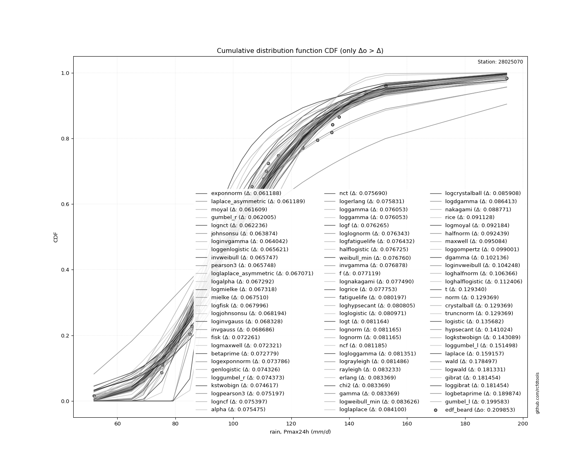</img>

</div>


**4.3. Best fit**

<div align="center">

|   id |   station | empirical_dist   | p_dist    |    delta |   deltao | eval   |   fit |   n |   best_fit |   best_fit_sort |
|-----:|----------:|:-----------------|:----------|---------:|---------:|:-------|------:|----:|-----------:|----------------:|
|    0 |  28025070 | edf_beard        | exponnorm | 0.061188 | 0.209853 | Δo > Δ |     1 |  42 |          1 |               1 |

</div>


<div align="center">

</img></img>

</div>


### 5. Empirical - EDF Chegodayev (1955)

The Chegodayev formula is an empirical plotting position formula used in hydrological frequency analysis to estimate the exceedance probability or return period of a specific event from a set of observed data. It is primarily used for plotting observed data points on probability paper to fit a theoretical distribution, particularly for analyzing extreme events like maximum flood flows or rainfall intensities. The constant _b_ value in the generalized plotting position formula is 0.3.

<div align="center">


$P=(m-b)/(n+1-2b)$


</div>


**5.1. Empirical values**

<div align="center">

|                | 0                   | 1                   | 2                   | 3                   | 4                   | 5                   | 6                   | 7                   | 8                  | 9                   | 10                 | 11                  | 12                  | 13                 | 14                 | 15                  | 16                 | 17                  | 18                 | 19                  | 20                 | 21                 | 22                 | 23                 | 24                 | 25                 | 26                 | 27                 | 28                 | 29                 | 30                 | 31                 | 32                 | 33                | 34                 | 35                 | 36                 | 37                 | 38                 | 39                 | 40                 | 41                 |
|:---------------|:--------------------|:--------------------|:--------------------|:--------------------|:--------------------|:--------------------|:--------------------|:--------------------|:-------------------|:--------------------|:-------------------|:--------------------|:--------------------|:-------------------|:-------------------|:--------------------|:-------------------|:--------------------|:-------------------|:--------------------|:-------------------|:-------------------|:-------------------|:-------------------|:-------------------|:-------------------|:-------------------|:-------------------|:-------------------|:-------------------|:-------------------|:-------------------|:-------------------|:------------------|:-------------------|:-------------------|:-------------------|:-------------------|:-------------------|:-------------------|:-------------------|:-------------------|
| date           | 1997                | 1991                | 2000                | 2003                | 2004                | 1999                | 1979                | 1994                | 2014               | 1988                | 1982               | 1990                | 2001                | 1998               | 1974               | 2012                | 1981               | 1993                | 2013               | 2009                | 1973               | 2002               | 1978               | 1985               | 1984               | 1976               | 2005               | 1987               | 1992               | 1989               | 2015               | 2006               | 2011               | 1996              | 2010               | 1980               | 2007               | 1975               | 1983               | 1995               | 2008               | 1986               |
| x              | 51.9                | 64.9                | 69.0                | 75.3                | 75.5                | 76.3                | 78.4                | 79.2                | 85.0               | 85.6                | 87.3               | 88.2                | 88.4                | 91.0               | 91.5               | 93.0                | 93.6381523448394   | 93.9                | 96.0               | 97.0                | 97.5568649570023   | 98.7               | 98.8               | 100.2              | 100.4              | 103.1              | 106.0              | 106.5              | 110.5              | 111.4              | 112.0              | 115.5              | 124.0              | 129.1             | 134.0              | 134.2              | 136.5              | 136.5              | 140.8              | 145.8              | 152.6              | 194.4              |
| m              | 1                   | 2                   | 3                   | 4                   | 5                   | 6                   | 7                   | 8                   | 9                  | 10                  | 11                 | 12                  | 13                  | 14                 | 15                 | 16                  | 17                 | 18                  | 19                 | 20                  | 21                 | 22                 | 23                 | 24                 | 25                 | 26                 | 27                 | 28                 | 29                 | 30                 | 31                 | 32                 | 33                 | 34                | 35                 | 36                 | 37                 | 38                 | 39                 | 40                 | 41                 | 42                 |
| empirical_dist | edf_chegodayev      | edf_chegodayev      | edf_chegodayev      | edf_chegodayev      | edf_chegodayev      | edf_chegodayev      | edf_chegodayev      | edf_chegodayev      | edf_chegodayev     | edf_chegodayev      | edf_chegodayev     | edf_chegodayev      | edf_chegodayev      | edf_chegodayev     | edf_chegodayev     | edf_chegodayev      | edf_chegodayev     | edf_chegodayev      | edf_chegodayev     | edf_chegodayev      | edf_chegodayev     | edf_chegodayev     | edf_chegodayev     | edf_chegodayev     | edf_chegodayev     | edf_chegodayev     | edf_chegodayev     | edf_chegodayev     | edf_chegodayev     | edf_chegodayev     | edf_chegodayev     | edf_chegodayev     | edf_chegodayev     | edf_chegodayev    | edf_chegodayev     | edf_chegodayev     | edf_chegodayev     | edf_chegodayev     | edf_chegodayev     | edf_chegodayev     | edf_chegodayev     | edf_chegodayev     |
| empirical      | 0.01650943396226415 | 0.04009433962264151 | 0.06367924528301887 | 0.08726415094339623 | 0.11084905660377359 | 0.13443396226415094 | 0.15801886792452832 | 0.18160377358490568 | 0.205188679245283  | 0.22877358490566038 | 0.2523584905660377 | 0.27594339622641506 | 0.29952830188679247 | 0.3231132075471698 | 0.3466981132075472 | 0.37028301886792453 | 0.3938679245283019 | 0.41745283018867924 | 0.4410377358490566 | 0.46462264150943394 | 0.4882075471698113 | 0.5117924528301887 | 0.535377358490566  | 0.5589622641509434 | 0.5825471698113207 | 0.6061320754716981 | 0.6297169811320755 | 0.6533018867924528 | 0.6768867924528302 | 0.7004716981132075 | 0.7240566037735849 | 0.7476415094339622 | 0.7712264150943398 | 0.794811320754717 | 0.8183962264150945 | 0.8419811320754718 | 0.8655660377358492 | 0.8891509433962265 | 0.9127358490566039 | 0.9363207547169813 | 0.9599056603773586 | 0.983490566037736  |
| empirical_tr   | 1.0167865707434052  | 1.0417690417690417  | 1.0680100755667505  | 1.0956072351421189  | 1.1246684350132627  | 1.1553133514986376  | 1.1876750700280112  | 1.2219020172910662  | 1.2581602373887242 | 1.2966360856269112  | 1.337539432176656  | 1.3811074918566775  | 1.4276094276094276  | 1.4773519163763067 | 1.5306859205776173 | 1.5880149812734081  | 1.649805447470817  | 1.716599190283401   | 1.7890295358649788 | 1.8678414096916296  | 1.9539170506912442 | 2.0483091787439616 | 2.1522842639593907 | 2.267379679144385  | 2.3954802259887003 | 2.538922155688623  | 2.7006369426751595 | 2.8843537414965987 | 3.0948905109489053 | 3.338582677165354  | 3.6239316239316244 | 3.962616822429906  | 4.371134020618559  | 4.873563218390807 | 5.50649350649351   | 6.328358208955226  | 7.438596491228076  | 9.021276595744686  | 11.459459459459472 | 15.703703703703741 | 24.941176470588292 | 60.571428571429095 |

</div>


**5.2. Kolmogorov-Smirnov fit test (sorted by Δ)**


<div align="center">

|                | 0                    | 1                    | 2                    | 3                   | 4                    | 5                   | 6                   | 7                   | 8                   | 9                   | 10                    | 11                  | 12                  | 13                  | 14                  | 15                  | 16                  | 17                  | 18                  | 19                  | 20                  | 21                  | 22                  | 23                  | 24                 | 25                  | 26                  | 27                  | 28                  | 29                 | 30                  | 31                  | 32                  | 33                  | 34                  | 35                  | 36                  | 37                  | 38                  | 39                  | 40                  | 41                  | 42                  | 43                  | 44                  | 45                  | 46                  | 47                 | 48                  | 49                  | 50                 | 51                  | 52                  | 53                  | 54                  | 55                  | 56                  | 57                 | 58                  | 59                  | 60                  | 61                  | 62                  | 63                  | 64                  | 65                  | 66                  | 67                  | 68                 | 69                  | 70                  | 71                  | 72                 | 73                 | 74                  | 75                  | 76                  | 77                  | 78                 | 79                  | 80                  | 81                 | 82                  | 83                  | 84                  | 85                 | 86                  | 87                 | 88                 | 89                 | 90                  | 91                 |
|:---------------|:---------------------|:---------------------|:---------------------|:--------------------|:---------------------|:--------------------|:--------------------|:--------------------|:--------------------|:--------------------|:----------------------|:--------------------|:--------------------|:--------------------|:--------------------|:--------------------|:--------------------|:--------------------|:--------------------|:--------------------|:--------------------|:--------------------|:--------------------|:--------------------|:-------------------|:--------------------|:--------------------|:--------------------|:--------------------|:-------------------|:--------------------|:--------------------|:--------------------|:--------------------|:--------------------|:--------------------|:--------------------|:--------------------|:--------------------|:--------------------|:--------------------|:--------------------|:--------------------|:--------------------|:--------------------|:--------------------|:--------------------|:-------------------|:--------------------|:--------------------|:-------------------|:--------------------|:--------------------|:--------------------|:--------------------|:--------------------|:--------------------|:-------------------|:--------------------|:--------------------|:--------------------|:--------------------|:--------------------|:--------------------|:--------------------|:--------------------|:--------------------|:--------------------|:-------------------|:--------------------|:--------------------|:--------------------|:-------------------|:-------------------|:--------------------|:--------------------|:--------------------|:--------------------|:-------------------|:--------------------|:--------------------|:-------------------|:--------------------|:--------------------|:--------------------|:-------------------|:--------------------|:-------------------|:-------------------|:-------------------|:--------------------|:-------------------|
| station        | 28025070             | 28025070             | 28025070             | 28025070            | 28025070             | 28025070            | 28025070            | 28025070            | 28025070            | 28025070            | 28025070              | 28025070            | 28025070            | 28025070            | 28025070            | 28025070            | 28025070            | 28025070            | 28025070            | 28025070            | 28025070            | 28025070            | 28025070            | 28025070            | 28025070           | 28025070            | 28025070            | 28025070            | 28025070            | 28025070           | 28025070            | 28025070            | 28025070            | 28025070            | 28025070            | 28025070            | 28025070            | 28025070            | 28025070            | 28025070            | 28025070            | 28025070            | 28025070            | 28025070            | 28025070            | 28025070            | 28025070            | 28025070           | 28025070            | 28025070            | 28025070           | 28025070            | 28025070            | 28025070            | 28025070            | 28025070            | 28025070            | 28025070           | 28025070            | 28025070            | 28025070            | 28025070            | 28025070            | 28025070            | 28025070            | 28025070            | 28025070            | 28025070            | 28025070           | 28025070            | 28025070            | 28025070            | 28025070           | 28025070           | 28025070            | 28025070            | 28025070            | 28025070            | 28025070           | 28025070            | 28025070            | 28025070           | 28025070            | 28025070            | 28025070            | 28025070           | 28025070            | 28025070           | 28025070           | 28025070           | 28025070            | 28025070           |
| empirical_dist | edf_chegodayev       | edf_chegodayev       | edf_chegodayev       | edf_chegodayev      | edf_chegodayev       | edf_chegodayev      | edf_chegodayev      | edf_chegodayev      | edf_chegodayev      | edf_chegodayev      | edf_chegodayev        | edf_chegodayev      | edf_chegodayev      | edf_chegodayev      | edf_chegodayev      | edf_chegodayev      | edf_chegodayev      | edf_chegodayev      | edf_chegodayev      | edf_chegodayev      | edf_chegodayev      | edf_chegodayev      | edf_chegodayev      | edf_chegodayev      | edf_chegodayev     | edf_chegodayev      | edf_chegodayev      | edf_chegodayev      | edf_chegodayev      | edf_chegodayev     | edf_chegodayev      | edf_chegodayev      | edf_chegodayev      | edf_chegodayev      | edf_chegodayev      | edf_chegodayev      | edf_chegodayev      | edf_chegodayev      | edf_chegodayev      | edf_chegodayev      | edf_chegodayev      | edf_chegodayev      | edf_chegodayev      | edf_chegodayev      | edf_chegodayev      | edf_chegodayev      | edf_chegodayev      | edf_chegodayev     | edf_chegodayev      | edf_chegodayev      | edf_chegodayev     | edf_chegodayev      | edf_chegodayev      | edf_chegodayev      | edf_chegodayev      | edf_chegodayev      | edf_chegodayev      | edf_chegodayev     | edf_chegodayev      | edf_chegodayev      | edf_chegodayev      | edf_chegodayev      | edf_chegodayev      | edf_chegodayev      | edf_chegodayev      | edf_chegodayev      | edf_chegodayev      | edf_chegodayev      | edf_chegodayev     | edf_chegodayev      | edf_chegodayev      | edf_chegodayev      | edf_chegodayev     | edf_chegodayev     | edf_chegodayev      | edf_chegodayev      | edf_chegodayev      | edf_chegodayev      | edf_chegodayev     | edf_chegodayev      | edf_chegodayev      | edf_chegodayev     | edf_chegodayev      | edf_chegodayev      | edf_chegodayev      | edf_chegodayev     | edf_chegodayev      | edf_chegodayev     | edf_chegodayev     | edf_chegodayev     | edf_chegodayev      | edf_chegodayev     |
| p_dist         | exponnorm            | laplace_asymmetric   | moyal                | gumbel_r            | lognct               | johnsonsu           | loginvgamma         | invweibull          | pearson3            | loggenlogistic      | loglaplace_asymmetric | logalpha            | logmielke           | mielke              | logfisk             | logjohnsonsu        | loginvgauss         | invgauss            | logmaxwell          | fisk                | betaprime           | logexponnorm        | genlogistic         | loggumbel_r         | kstwobign          | logpearson3         | logncf              | alpha               | nct                 | logerlang          | loggamma            | loggamma            | logf                | loglognorm          | logfatiguelife      | halflogistic        | weibull_min         | invgamma            | f                   | lognakagami         | logrice             | fatiguelife         | loghypsecant        | loglogistic         | logt                | lognorm             | lognorm             | ncf                | logloggamma         | lograyleigh         | rayleigh           | erlang              | chi2                | gamma               | logweibull_min      | loglaplace          | logcrystalball      | logdgamma          | nakagami            | rice                | logmoyal            | halfnorm            | maxwell             | loggompertz         | dgamma              | loginvweibull       | loghalfnorm         | loghalflogistic     | t                  | norm                | crystalball         | truncnorm           | logistic           | hypsecant          | logkstwobign        | loggumbel_l         | laplace             | wald                | logwald            | gibrat              | loggibrat           | logbetaprime       | gumbel_l            | loggenexpon         | genexpon            | pareto             | expon               | logtruncnorm       | logexpon           | logpareto          | logchi2             | gompertz           |
| delta          | 0.061149017902963454 | 0.061339392106284474 | 0.061758806164433966 | 0.06196649377053165 | 0.062096880987378755 | 0.06383539715813547 | 0.06400348865322592 | 0.06570768093393231 | 0.06570879558173748 | 0.06577141108006646 | 0.06721037096019189   | 0.06725277085892112 | 0.06746797668346727 | 0.06766069218709991 | 0.06814660727079547 | 0.06815500710362454 | 0.06818924251084407 | 0.06864747397601578 | 0.07218186101757801 | 0.07241085372989076 | 0.07274048761749463 | 0.07374747974991491 | 0.07428688392097693 | 0.07428912013968453 | 0.0744781647387725 | 0.07515761015647349 | 0.07535785024052988 | 0.07543559711045411 | 0.07565126862080196 | 0.0757919763638163 | 0.07601376544324934 | 0.07601376544324934 | 0.07622629864294383 | 0.07630436109099425 | 0.07639268342093464 | 0.07658633738257214 | 0.07672102839031258 | 0.07683893301070621 | 0.07707977969568613 | 0.07745145584343205 | 0.07771451677765717 | 0.08015823074208162 | 0.08076616435174189 | 0.08093197371698102 | 0.08112511693869073 | 0.08112612864285929 | 0.08112612864285929 | 0.0811457587981661 | 0.08131220295451325 | 0.08134645969460991 | 0.0831939471122406 | 0.08332983144161471 | 0.08333001275274926 | 0.08333014303046204 | 0.08358750895985834 | 0.08423907731538682 | 0.08586887196886511 | 0.0865521096766928 | 0.08873220641433238 | 0.09098875193730682 | 0.09210090371043994 | 0.09230025578979256 | 0.09504487803095102 | 0.09880613488776141 | 0.10227482051520997 | 0.10410924516810993 | 0.10622661125154997 | 0.11232292066439892 | 0.1293012543937574 | 0.12932992876899924 | 0.12932993529155118 | 0.12932994312979273 | 0.1356433815517008 | 0.1409846402660651 | 0.14294982850921967 | 0.15145868389589867 | 0.15911827481972257 | 0.17864754981698008 | 0.1814808654994199 | 0.18160377358490568 | 0.18160377358490568 | 0.1896787788875034 | 0.19954378659775862 | 0.22325247354759653 | 0.27312123511640757 | 0.2769833873663584 | 0.27698339336941785 | 0.3315281803822378 | 0.3442513336784221 | 0.3442513337128974 | 0.34448067251342407 | 0.9583887871556984 |
| deltao         | 0.209852555948445    | 0.209852555948445    | 0.209852555948445    | 0.209852555948445   | 0.209852555948445    | 0.209852555948445   | 0.209852555948445   | 0.209852555948445   | 0.209852555948445   | 0.209852555948445   | 0.209852555948445     | 0.209852555948445   | 0.209852555948445   | 0.209852555948445   | 0.209852555948445   | 0.209852555948445   | 0.209852555948445   | 0.209852555948445   | 0.209852555948445   | 0.209852555948445   | 0.209852555948445   | 0.209852555948445   | 0.209852555948445   | 0.209852555948445   | 0.209852555948445  | 0.209852555948445   | 0.209852555948445   | 0.209852555948445   | 0.209852555948445   | 0.209852555948445  | 0.209852555948445   | 0.209852555948445   | 0.209852555948445   | 0.209852555948445   | 0.209852555948445   | 0.209852555948445   | 0.209852555948445   | 0.209852555948445   | 0.209852555948445   | 0.209852555948445   | 0.209852555948445   | 0.209852555948445   | 0.209852555948445   | 0.209852555948445   | 0.209852555948445   | 0.209852555948445   | 0.209852555948445   | 0.209852555948445  | 0.209852555948445   | 0.209852555948445   | 0.209852555948445  | 0.209852555948445   | 0.209852555948445   | 0.209852555948445   | 0.209852555948445   | 0.209852555948445   | 0.209852555948445   | 0.209852555948445  | 0.209852555948445   | 0.209852555948445   | 0.209852555948445   | 0.209852555948445   | 0.209852555948445   | 0.209852555948445   | 0.209852555948445   | 0.209852555948445   | 0.209852555948445   | 0.209852555948445   | 0.209852555948445  | 0.209852555948445   | 0.209852555948445   | 0.209852555948445   | 0.209852555948445  | 0.209852555948445  | 0.209852555948445   | 0.209852555948445   | 0.209852555948445   | 0.209852555948445   | 0.209852555948445  | 0.209852555948445   | 0.209852555948445   | 0.209852555948445  | 0.209852555948445   | 0.209852555948445   | 0.209852555948445   | 0.209852555948445  | 0.209852555948445   | 0.209852555948445  | 0.209852555948445  | 0.209852555948445  | 0.209852555948445   | 0.209852555948445  |
| eval           | Δo > Δ               | Δo > Δ               | Δo > Δ               | Δo > Δ              | Δo > Δ               | Δo > Δ              | Δo > Δ              | Δo > Δ              | Δo > Δ              | Δo > Δ              | Δo > Δ                | Δo > Δ              | Δo > Δ              | Δo > Δ              | Δo > Δ              | Δo > Δ              | Δo > Δ              | Δo > Δ              | Δo > Δ              | Δo > Δ              | Δo > Δ              | Δo > Δ              | Δo > Δ              | Δo > Δ              | Δo > Δ             | Δo > Δ              | Δo > Δ              | Δo > Δ              | Δo > Δ              | Δo > Δ             | Δo > Δ              | Δo > Δ              | Δo > Δ              | Δo > Δ              | Δo > Δ              | Δo > Δ              | Δo > Δ              | Δo > Δ              | Δo > Δ              | Δo > Δ              | Δo > Δ              | Δo > Δ              | Δo > Δ              | Δo > Δ              | Δo > Δ              | Δo > Δ              | Δo > Δ              | Δo > Δ             | Δo > Δ              | Δo > Δ              | Δo > Δ             | Δo > Δ              | Δo > Δ              | Δo > Δ              | Δo > Δ              | Δo > Δ              | Δo > Δ              | Δo > Δ             | Δo > Δ              | Δo > Δ              | Δo > Δ              | Δo > Δ              | Δo > Δ              | Δo > Δ              | Δo > Δ              | Δo > Δ              | Δo > Δ              | Δo > Δ              | Δo > Δ             | Δo > Δ              | Δo > Δ              | Δo > Δ              | Δo > Δ             | Δo > Δ             | Δo > Δ              | Δo > Δ              | Δo > Δ              | Δo > Δ              | Δo > Δ             | Δo > Δ              | Δo > Δ              | Δo > Δ             | Δo > Δ              | Δo <= Δ             | Δo <= Δ             | Δo <= Δ            | Δo <= Δ             | Δo <= Δ            | Δo <= Δ            | Δo <= Δ            | Δo <= Δ             | Δo <= Δ            |
| fit            | 1                    | 1                    | 1                    | 1                   | 1                    | 1                   | 1                   | 1                   | 1                   | 1                   | 1                     | 1                   | 1                   | 1                   | 1                   | 1                   | 1                   | 1                   | 1                   | 1                   | 1                   | 1                   | 1                   | 1                   | 1                  | 1                   | 1                   | 1                   | 1                   | 1                  | 1                   | 1                   | 1                   | 1                   | 1                   | 1                   | 1                   | 1                   | 1                   | 1                   | 1                   | 1                   | 1                   | 1                   | 1                   | 1                   | 1                   | 1                  | 1                   | 1                   | 1                  | 1                   | 1                   | 1                   | 1                   | 1                   | 1                   | 1                  | 1                   | 1                   | 1                   | 1                   | 1                   | 1                   | 1                   | 1                   | 1                   | 1                   | 1                  | 1                   | 1                   | 1                   | 1                  | 1                  | 1                   | 1                   | 1                   | 1                   | 1                  | 1                   | 1                   | 1                  | 1                   | 0                   | 0                   | 0                  | 0                   | 0                  | 0                  | 0                  | 0                   | 0                  |
| n              | 42                   | 42                   | 42                   | 42                  | 42                   | 42                  | 42                  | 42                  | 42                  | 42                  | 42                    | 42                  | 42                  | 42                  | 42                  | 42                  | 42                  | 42                  | 42                  | 42                  | 42                  | 42                  | 42                  | 42                  | 42                 | 42                  | 42                  | 42                  | 42                  | 42                 | 42                  | 42                  | 42                  | 42                  | 42                  | 42                  | 42                  | 42                  | 42                  | 42                  | 42                  | 42                  | 42                  | 42                  | 42                  | 42                  | 42                  | 42                 | 42                  | 42                  | 42                 | 42                  | 42                  | 42                  | 42                  | 42                  | 42                  | 42                 | 42                  | 42                  | 42                  | 42                  | 42                  | 42                  | 42                  | 42                  | 42                  | 42                  | 42                 | 42                  | 42                  | 42                  | 42                 | 42                 | 42                  | 42                  | 42                  | 42                  | 42                 | 42                  | 42                  | 42                 | 42                  | 42                  | 42                  | 42                 | 42                  | 42                 | 42                 | 42                 | 42                  | 42                 |
| best_fit       | 1                    | 0                    | 0                    | 0                   | 0                    | 0                   | 0                   | 0                   | 0                   | 0                   | 0                     | 0                   | 0                   | 0                   | 0                   | 0                   | 0                   | 0                   | 0                   | 0                   | 0                   | 0                   | 0                   | 0                   | 0                  | 0                   | 0                   | 0                   | 0                   | 0                  | 0                   | 0                   | 0                   | 0                   | 0                   | 0                   | 0                   | 0                   | 0                   | 0                   | 0                   | 0                   | 0                   | 0                   | 0                   | 0                   | 0                   | 0                  | 0                   | 0                   | 0                  | 0                   | 0                   | 0                   | 0                   | 0                   | 0                   | 0                  | 0                   | 0                   | 0                   | 0                   | 0                   | 0                   | 0                   | 0                   | 0                   | 0                   | 0                  | 0                   | 0                   | 0                   | 0                  | 0                  | 0                   | 0                   | 0                   | 0                   | 0                  | 0                   | 0                   | 0                  | 0                   | 0                   | 0                   | 0                  | 0                   | 0                  | 0                  | 0                  | 0                   | 0                  |
| best_fit_sort  | 1                    | 2                    | 3                    | 4                   | 5                    | 6                   | 7                   | 8                   | 9                   | 10                  | 11                    | 12                  | 13                  | 14                  | 15                  | 16                  | 17                  | 18                  | 19                  | 20                  | 21                  | 22                  | 23                  | 24                  | 25                 | 26                  | 27                  | 28                  | 29                  | 30                 | 31                  | 32                  | 33                  | 34                  | 35                  | 36                  | 37                  | 38                  | 39                  | 40                  | 41                  | 42                  | 43                  | 44                  | 45                  | 46                  | 47                  | 48                 | 49                  | 50                  | 51                 | 52                  | 53                  | 54                  | 55                  | 56                  | 57                  | 58                 | 59                  | 60                  | 61                  | 62                  | 63                  | 64                  | 65                  | 66                  | 67                  | 68                  | 69                 | 70                  | 71                  | 72                  | 73                 | 74                 | 75                  | 76                  | 77                  | 78                  | 79                 | 80                  | 81                  | 82                 | 83                  | 84                  | 85                  | 86                 | 87                  | 88                 | 89                 | 90                 | 91                  | 92                 |

</div>


<div align="center">

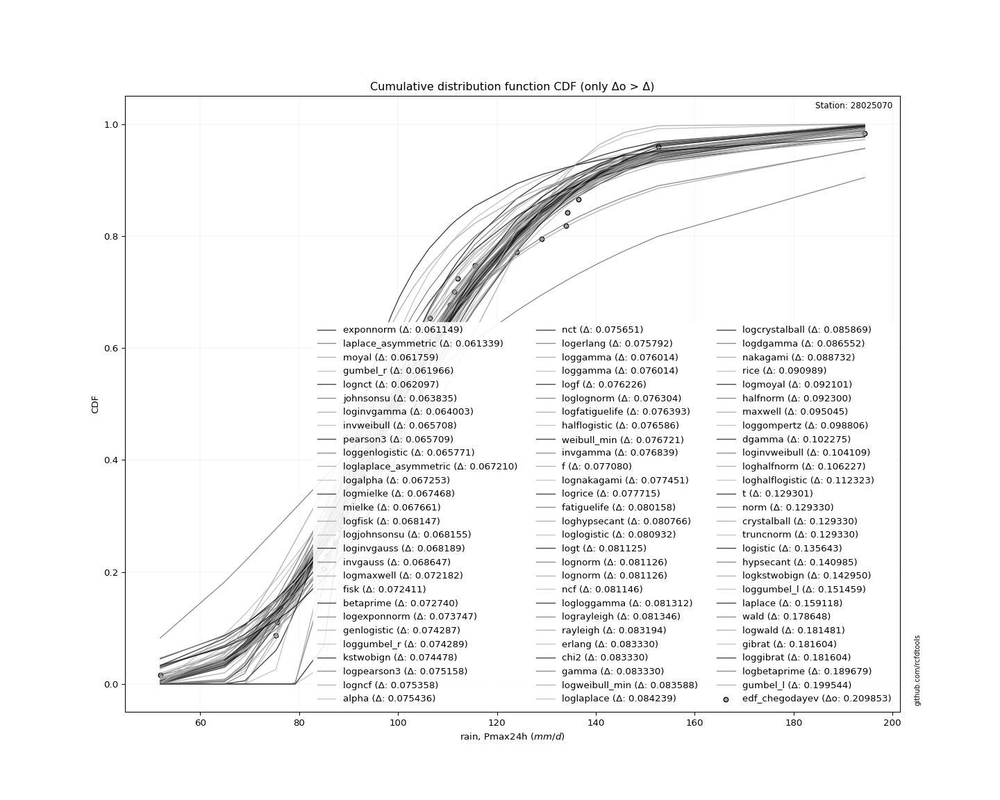</img>

</div>


**5.3. Best fit**

<div align="center">

|   id |   station | empirical_dist   | p_dist    |    delta |   deltao | eval   |   fit |   n |   best_fit |   best_fit_sort |
|-----:|----------:|:-----------------|:----------|---------:|---------:|:-------|------:|----:|-----------:|----------------:|
|    0 |  28025070 | edf_chegodayev   | exponnorm | 0.061149 | 0.209853 | Δo > Δ |     1 |  42 |          1 |               1 |

</div>


<div align="center">

</img>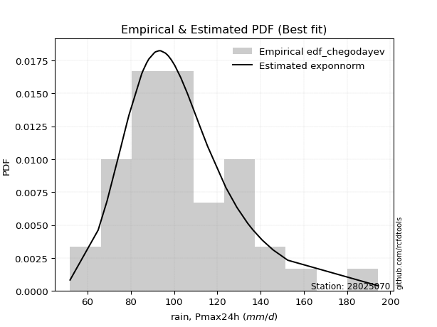</img>

</div>


### 6. Empirical - EDF Blom (1958)

The Blom formula is a specific "plotting position" formula used in hydrology and statistical analysis to estimate the empirical cumulative probability (or non-exceedance probability) of a data series. It is particularly recommended for data that are approximately normally distributed. The constant _a_ is set to 0.375 (or 3/8).

<div align="center">


$P=(m-a)/(n+1-2a)$


</div>


**6.1. Empirical values**

<div align="center">

|                | 0                    | 1                    | 2                  | 3                   | 4                   | 5                   | 6                   | 7                  | 8                   | 9                   | 10                 | 11                  | 12                 | 13                 | 14                  | 15                 | 16                  | 17                 | 18                 | 19                  | 20                 | 21                 | 22                 | 23                 | 24                 | 25                 | 26                 | 27                 | 28                 | 29                 | 30                 | 31                 | 32                | 33                 | 34                 | 35                 | 36                 | 37                 | 38                 | 39                 | 40                 | 41                |
|:---------------|:---------------------|:---------------------|:-------------------|:--------------------|:--------------------|:--------------------|:--------------------|:-------------------|:--------------------|:--------------------|:-------------------|:--------------------|:-------------------|:-------------------|:--------------------|:-------------------|:--------------------|:-------------------|:-------------------|:--------------------|:-------------------|:-------------------|:-------------------|:-------------------|:-------------------|:-------------------|:-------------------|:-------------------|:-------------------|:-------------------|:-------------------|:-------------------|:------------------|:-------------------|:-------------------|:-------------------|:-------------------|:-------------------|:-------------------|:-------------------|:-------------------|:------------------|
| date           | 1997                 | 1991                 | 2000               | 2003                | 2004                | 1999                | 1979                | 1994               | 2014                | 1988                | 1982               | 1990                | 2001               | 1998               | 1974                | 2012               | 1981                | 1993               | 2013               | 2009                | 1973               | 2002               | 1978               | 1985               | 1984               | 1976               | 2005               | 1987               | 1992               | 1989               | 2015               | 2006               | 2011              | 1996               | 2010               | 1980               | 2007               | 1975               | 1983               | 1995               | 2008               | 1986              |
| x              | 51.9                 | 64.9                 | 69.0               | 75.3                | 75.5                | 76.3                | 78.4                | 79.2               | 85.0                | 85.6                | 87.3               | 88.2                | 88.4               | 91.0               | 91.5                | 93.0               | 93.6381523448394    | 93.9               | 96.0               | 97.0                | 97.5568649570023   | 98.7               | 98.8               | 100.2              | 100.4              | 103.1              | 106.0              | 106.5              | 110.5              | 111.4              | 112.0              | 115.5              | 124.0             | 129.1              | 134.0              | 134.2              | 136.5              | 136.5              | 140.8              | 145.8              | 152.6              | 194.4             |
| m              | 1                    | 2                    | 3                  | 4                   | 5                   | 6                   | 7                   | 8                  | 9                   | 10                  | 11                 | 12                  | 13                 | 14                 | 15                  | 16                 | 17                  | 18                 | 19                 | 20                  | 21                 | 22                 | 23                 | 24                 | 25                 | 26                 | 27                 | 28                 | 29                 | 30                 | 31                 | 32                 | 33                | 34                 | 35                 | 36                 | 37                 | 38                 | 39                 | 40                 | 41                 | 42                |
| empirical_dist | edf_blom             | edf_blom             | edf_blom           | edf_blom            | edf_blom            | edf_blom            | edf_blom            | edf_blom           | edf_blom            | edf_blom            | edf_blom           | edf_blom            | edf_blom           | edf_blom           | edf_blom            | edf_blom           | edf_blom            | edf_blom           | edf_blom           | edf_blom            | edf_blom           | edf_blom           | edf_blom           | edf_blom           | edf_blom           | edf_blom           | edf_blom           | edf_blom           | edf_blom           | edf_blom           | edf_blom           | edf_blom           | edf_blom          | edf_blom           | edf_blom           | edf_blom           | edf_blom           | edf_blom           | edf_blom           | edf_blom           | edf_blom           | edf_blom          |
| empirical      | 0.014792899408284023 | 0.038461538461538464 | 0.0621301775147929 | 0.08579881656804733 | 0.10946745562130178 | 0.13313609467455623 | 0.15680473372781065 | 0.1804733727810651 | 0.20414201183431951 | 0.22781065088757396 | 0.2514792899408284 | 0.27514792899408286 | 0.2988165680473373 | 0.3224852071005917 | 0.34615384615384615 | 0.3698224852071006 | 0.39349112426035504 | 0.4171597633136095 | 0.4408284023668639 | 0.46449704142011833 | 0.4881656804733728 | 0.5118343195266272 | 0.5355029585798816 | 0.5591715976331361 | 0.5828402366863905 | 0.606508875739645  | 0.6301775147928994 | 0.6538461538461539 | 0.6775147928994083 | 0.7011834319526628 | 0.7248520710059172 | 0.7485207100591716 | 0.772189349112426 | 0.7958579881656804 | 0.8195266272189349 | 0.8431952662721893 | 0.8668639053254438 | 0.8905325443786982 | 0.9142011834319527 | 0.9378698224852071 | 0.9615384615384616 | 0.985207100591716 |
| empirical_tr   | 1.015015015015015    | 1.04                 | 1.0662460567823344 | 1.093851132686084   | 1.1229235880398671  | 1.1535836177474403  | 1.1859649122807019  | 1.220216606498195  | 1.2565055762081785  | 1.2950191570881224  | 1.3359683794466404 | 1.3795918367346938  | 1.4261603375527427 | 1.4759825327510916 | 1.5294117647058822  | 1.5868544600938967 | 1.6487804878048782  | 1.715736040609137  | 1.7883597883597881 | 1.8674033149171272  | 1.9537572254335258 | 2.0484848484848484 | 2.1528662420382165 | 2.2684563758389262 | 2.3971631205673756 | 2.5413533834586466 | 2.704              | 2.888888888888889  | 3.1009174311926606 | 3.346534653465347  | 3.634408602150538  | 3.976470588235295  | 4.389610389610389 | 4.89855072463768   | 5.540983606557376  | 6.377358490566037  | 7.51111111111111   | 9.135135135135135  | 11.655172413793105 | 16.0952380952381   | 26.000000000000018 | 67.60000000000016 |

</div>


**6.2. Kolmogorov-Smirnov fit test (sorted by Δ)**


<div align="center">

|                | 0                   | 1                   | 2                   | 3                   | 4                   | 5                   | 6                   | 7                   | 8                   | 9                   | 10                    | 11                  | 12                 | 13                  | 14                  | 15                  | 16                  | 17                  | 18                  | 19                  | 20                 | 21                  | 22                  | 23                  | 24                  | 25                  | 26                  | 27                  | 28                  | 29                 | 30                  | 31                  | 32                  | 33                  | 34                  | 35                  | 36                  | 37                  | 38                  | 39                  | 40                  | 41                  | 42                  | 43                  | 44                  | 45                  | 46                  | 47                 | 48                  | 49                 | 50                  | 51                 | 52                  | 53                  | 54                  | 55                  | 56                  | 57                  | 58                  | 59                  | 60                  | 61                  | 62                  | 63                  | 64                 | 65                  | 66                  | 67                  | 68                 | 69                  | 70                  | 71                  | 72                 | 73                 | 74                  | 75                  | 76                  | 77                 | 78                  | 79                 | 80                 | 81                 | 82                  | 83                  | 84                  | 85                 | 86                  | 87                 | 88                | 89                 | 90                  | 91                 |
|:---------------|:--------------------|:--------------------|:--------------------|:--------------------|:--------------------|:--------------------|:--------------------|:--------------------|:--------------------|:--------------------|:----------------------|:--------------------|:-------------------|:--------------------|:--------------------|:--------------------|:--------------------|:--------------------|:--------------------|:--------------------|:-------------------|:--------------------|:--------------------|:--------------------|:--------------------|:--------------------|:--------------------|:--------------------|:--------------------|:-------------------|:--------------------|:--------------------|:--------------------|:--------------------|:--------------------|:--------------------|:--------------------|:--------------------|:--------------------|:--------------------|:--------------------|:--------------------|:--------------------|:--------------------|:--------------------|:--------------------|:--------------------|:-------------------|:--------------------|:-------------------|:--------------------|:-------------------|:--------------------|:--------------------|:--------------------|:--------------------|:--------------------|:--------------------|:--------------------|:--------------------|:--------------------|:--------------------|:--------------------|:--------------------|:-------------------|:--------------------|:--------------------|:--------------------|:-------------------|:--------------------|:--------------------|:--------------------|:-------------------|:-------------------|:--------------------|:--------------------|:--------------------|:-------------------|:--------------------|:-------------------|:-------------------|:-------------------|:--------------------|:--------------------|:--------------------|:-------------------|:--------------------|:-------------------|:------------------|:-------------------|:--------------------|:-------------------|
| station        | 28025070            | 28025070            | 28025070            | 28025070            | 28025070            | 28025070            | 28025070            | 28025070            | 28025070            | 28025070            | 28025070              | 28025070            | 28025070           | 28025070            | 28025070            | 28025070            | 28025070            | 28025070            | 28025070            | 28025070            | 28025070           | 28025070            | 28025070            | 28025070            | 28025070            | 28025070            | 28025070            | 28025070            | 28025070            | 28025070           | 28025070            | 28025070            | 28025070            | 28025070            | 28025070            | 28025070            | 28025070            | 28025070            | 28025070            | 28025070            | 28025070            | 28025070            | 28025070            | 28025070            | 28025070            | 28025070            | 28025070            | 28025070           | 28025070            | 28025070           | 28025070            | 28025070           | 28025070            | 28025070            | 28025070            | 28025070            | 28025070            | 28025070            | 28025070            | 28025070            | 28025070            | 28025070            | 28025070            | 28025070            | 28025070           | 28025070            | 28025070            | 28025070            | 28025070           | 28025070            | 28025070            | 28025070            | 28025070           | 28025070           | 28025070            | 28025070            | 28025070            | 28025070           | 28025070            | 28025070           | 28025070           | 28025070           | 28025070            | 28025070            | 28025070            | 28025070           | 28025070            | 28025070           | 28025070          | 28025070           | 28025070            | 28025070           |
| empirical_dist | edf_blom            | edf_blom            | edf_blom            | edf_blom            | edf_blom            | edf_blom            | edf_blom            | edf_blom            | edf_blom            | edf_blom            | edf_blom              | edf_blom            | edf_blom           | edf_blom            | edf_blom            | edf_blom            | edf_blom            | edf_blom            | edf_blom            | edf_blom            | edf_blom           | edf_blom            | edf_blom            | edf_blom            | edf_blom            | edf_blom            | edf_blom            | edf_blom            | edf_blom            | edf_blom           | edf_blom            | edf_blom            | edf_blom            | edf_blom            | edf_blom            | edf_blom            | edf_blom            | edf_blom            | edf_blom            | edf_blom            | edf_blom            | edf_blom            | edf_blom            | edf_blom            | edf_blom            | edf_blom            | edf_blom            | edf_blom           | edf_blom            | edf_blom           | edf_blom            | edf_blom           | edf_blom            | edf_blom            | edf_blom            | edf_blom            | edf_blom            | edf_blom            | edf_blom            | edf_blom            | edf_blom            | edf_blom            | edf_blom            | edf_blom            | edf_blom           | edf_blom            | edf_blom            | edf_blom            | edf_blom           | edf_blom            | edf_blom            | edf_blom            | edf_blom           | edf_blom           | edf_blom            | edf_blom            | edf_blom            | edf_blom           | edf_blom            | edf_blom           | edf_blom           | edf_blom           | edf_blom            | edf_blom            | edf_blom            | edf_blom           | edf_blom            | edf_blom           | edf_blom          | edf_blom           | edf_blom            | edf_blom           |
| p_dist         | laplace_asymmetric  | moyal               | exponnorm           | gumbel_r            | lognct              | johnsonsu           | loginvgamma         | loggenlogistic      | invweibull          | pearson3            | loglaplace_asymmetric | logmielke           | mielke             | logfisk             | logalpha            | logjohnsonsu        | invgauss            | loginvgauss         | fisk                | betaprime           | logmaxwell         | logexponnorm        | genlogistic         | loggumbel_r         | logpearson3         | kstwobign           | logncf              | alpha               | nct                 | logerlang          | loggamma            | loggamma            | logf                | loglognorm          | logfatiguelife      | weibull_min         | invgamma            | f                   | halflogistic        | lognakagami         | logrice             | fatiguelife         | loghypsecant        | loglogistic         | logt                | lognorm             | lognorm             | ncf                | logloggamma         | lograyleigh        | loglaplace          | rayleigh           | erlang              | chi2                | gamma               | logweibull_min      | logdgamma           | logcrystalball      | nakagami            | rice                | logmoyal            | halfnorm            | maxwell             | loggompertz         | dgamma             | loginvweibull       | loghalfnorm         | loghalflogistic     | t                  | norm                | crystalball         | truncnorm           | logistic           | hypsecant          | logkstwobign        | loggumbel_l         | laplace             | wald               | logwald             | gibrat             | loggibrat          | logbetaprime       | gumbel_l            | loggenexpon         | genexpon            | pareto             | expon               | logtruncnorm       | logexpon          | logpareto          | logchi2             | gompertz           |
| delta          | 0.06020899130244406 | 0.06062840536059355 | 0.06144208477803326 | 0.06225956064560145 | 0.06314354839834224 | 0.06412846403320527 | 0.06429655552829572 | 0.06546848528274163 | 0.06600074780900211 | 0.06600186245680728 | 0.06616370354922851   | 0.06633757587962685 | 0.0665302913832595 | 0.06701620646695505 | 0.06754583773399092 | 0.06844807397869435 | 0.06894054085108559 | 0.06923590992180756 | 0.07173101974452734 | 0.07303355449256443 | 0.0732285284285415 | 0.07404054662498472 | 0.07457995079604673 | 0.07491712058626265 | 0.07545067703154329 | 0.07552483214973599 | 0.07565091711559968 | 0.07572866398552391 | 0.07594433549587176 | 0.0760850432388861 | 0.07630683231831914 | 0.07630683231831914 | 0.07651936551801364 | 0.07659742796606406 | 0.07668575029600444 | 0.07701409526538239 | 0.07713199988577601 | 0.07737284657075594 | 0.07763300479353563 | 0.07774452271850185 | 0.07800758365272698 | 0.08045129761715142 | 0.08105923122681169 | 0.08122504059205082 | 0.08141818381376054 | 0.08141919551792909 | 0.08141919551792909 | 0.0814388256732359 | 0.08160526982958305 | 0.0823931271055734 | 0.08319240990442345 | 0.0834870139873104 | 0.08362289831668451 | 0.08362307962781906 | 0.08362320990553185 | 0.08388057583492814 | 0.08550544226572943 | 0.08616193884393492 | 0.08902527328940218 | 0.09203541934827031 | 0.09272890415701807 | 0.09334692320075605 | 0.09533794490602082 | 0.10027146926311031 | 0.1012281531042466 | 0.10515591257907342 | 0.10727327866251346 | 0.11295092111097704 | 0.1295943212688272 | 0.12962299564406904 | 0.12962300216662098 | 0.12962301000486254 | 0.1359364484267706 | 0.1412777071411349 | 0.14399649592018315 | 0.15175175077096847 | 0.15941134169479237 | 0.1775171490131395 | 0.18035046469557933 | 0.1804733727810651 | 0.1804733727810651 | 0.1911441132628523 | 0.19983685347282842 | 0.22429914095856002 | 0.27458656949175647 | 0.2784487217417073 | 0.27844872774476676 | 0.3329935147575867 | 0.345716668053771 | 0.3457166680882463 | 0.34594600688877297 | 0.9600215883168014 |
| deltao         | 0.209852555948445   | 0.209852555948445   | 0.209852555948445   | 0.209852555948445   | 0.209852555948445   | 0.209852555948445   | 0.209852555948445   | 0.209852555948445   | 0.209852555948445   | 0.209852555948445   | 0.209852555948445     | 0.209852555948445   | 0.209852555948445  | 0.209852555948445   | 0.209852555948445   | 0.209852555948445   | 0.209852555948445   | 0.209852555948445   | 0.209852555948445   | 0.209852555948445   | 0.209852555948445  | 0.209852555948445   | 0.209852555948445   | 0.209852555948445   | 0.209852555948445   | 0.209852555948445   | 0.209852555948445   | 0.209852555948445   | 0.209852555948445   | 0.209852555948445  | 0.209852555948445   | 0.209852555948445   | 0.209852555948445   | 0.209852555948445   | 0.209852555948445   | 0.209852555948445   | 0.209852555948445   | 0.209852555948445   | 0.209852555948445   | 0.209852555948445   | 0.209852555948445   | 0.209852555948445   | 0.209852555948445   | 0.209852555948445   | 0.209852555948445   | 0.209852555948445   | 0.209852555948445   | 0.209852555948445  | 0.209852555948445   | 0.209852555948445  | 0.209852555948445   | 0.209852555948445  | 0.209852555948445   | 0.209852555948445   | 0.209852555948445   | 0.209852555948445   | 0.209852555948445   | 0.209852555948445   | 0.209852555948445   | 0.209852555948445   | 0.209852555948445   | 0.209852555948445   | 0.209852555948445   | 0.209852555948445   | 0.209852555948445  | 0.209852555948445   | 0.209852555948445   | 0.209852555948445   | 0.209852555948445  | 0.209852555948445   | 0.209852555948445   | 0.209852555948445   | 0.209852555948445  | 0.209852555948445  | 0.209852555948445   | 0.209852555948445   | 0.209852555948445   | 0.209852555948445  | 0.209852555948445   | 0.209852555948445  | 0.209852555948445  | 0.209852555948445  | 0.209852555948445   | 0.209852555948445   | 0.209852555948445   | 0.209852555948445  | 0.209852555948445   | 0.209852555948445  | 0.209852555948445 | 0.209852555948445  | 0.209852555948445   | 0.209852555948445  |
| eval           | Δo > Δ              | Δo > Δ              | Δo > Δ              | Δo > Δ              | Δo > Δ              | Δo > Δ              | Δo > Δ              | Δo > Δ              | Δo > Δ              | Δo > Δ              | Δo > Δ                | Δo > Δ              | Δo > Δ             | Δo > Δ              | Δo > Δ              | Δo > Δ              | Δo > Δ              | Δo > Δ              | Δo > Δ              | Δo > Δ              | Δo > Δ             | Δo > Δ              | Δo > Δ              | Δo > Δ              | Δo > Δ              | Δo > Δ              | Δo > Δ              | Δo > Δ              | Δo > Δ              | Δo > Δ             | Δo > Δ              | Δo > Δ              | Δo > Δ              | Δo > Δ              | Δo > Δ              | Δo > Δ              | Δo > Δ              | Δo > Δ              | Δo > Δ              | Δo > Δ              | Δo > Δ              | Δo > Δ              | Δo > Δ              | Δo > Δ              | Δo > Δ              | Δo > Δ              | Δo > Δ              | Δo > Δ             | Δo > Δ              | Δo > Δ             | Δo > Δ              | Δo > Δ             | Δo > Δ              | Δo > Δ              | Δo > Δ              | Δo > Δ              | Δo > Δ              | Δo > Δ              | Δo > Δ              | Δo > Δ              | Δo > Δ              | Δo > Δ              | Δo > Δ              | Δo > Δ              | Δo > Δ             | Δo > Δ              | Δo > Δ              | Δo > Δ              | Δo > Δ             | Δo > Δ              | Δo > Δ              | Δo > Δ              | Δo > Δ             | Δo > Δ             | Δo > Δ              | Δo > Δ              | Δo > Δ              | Δo > Δ             | Δo > Δ              | Δo > Δ             | Δo > Δ             | Δo > Δ             | Δo > Δ              | Δo <= Δ             | Δo <= Δ             | Δo <= Δ            | Δo <= Δ             | Δo <= Δ            | Δo <= Δ           | Δo <= Δ            | Δo <= Δ             | Δo <= Δ            |
| fit            | 1                   | 1                   | 1                   | 1                   | 1                   | 1                   | 1                   | 1                   | 1                   | 1                   | 1                     | 1                   | 1                  | 1                   | 1                   | 1                   | 1                   | 1                   | 1                   | 1                   | 1                  | 1                   | 1                   | 1                   | 1                   | 1                   | 1                   | 1                   | 1                   | 1                  | 1                   | 1                   | 1                   | 1                   | 1                   | 1                   | 1                   | 1                   | 1                   | 1                   | 1                   | 1                   | 1                   | 1                   | 1                   | 1                   | 1                   | 1                  | 1                   | 1                  | 1                   | 1                  | 1                   | 1                   | 1                   | 1                   | 1                   | 1                   | 1                   | 1                   | 1                   | 1                   | 1                   | 1                   | 1                  | 1                   | 1                   | 1                   | 1                  | 1                   | 1                   | 1                   | 1                  | 1                  | 1                   | 1                   | 1                   | 1                  | 1                   | 1                  | 1                  | 1                  | 1                   | 0                   | 0                   | 0                  | 0                   | 0                  | 0                 | 0                  | 0                   | 0                  |
| n              | 42                  | 42                  | 42                  | 42                  | 42                  | 42                  | 42                  | 42                  | 42                  | 42                  | 42                    | 42                  | 42                 | 42                  | 42                  | 42                  | 42                  | 42                  | 42                  | 42                  | 42                 | 42                  | 42                  | 42                  | 42                  | 42                  | 42                  | 42                  | 42                  | 42                 | 42                  | 42                  | 42                  | 42                  | 42                  | 42                  | 42                  | 42                  | 42                  | 42                  | 42                  | 42                  | 42                  | 42                  | 42                  | 42                  | 42                  | 42                 | 42                  | 42                 | 42                  | 42                 | 42                  | 42                  | 42                  | 42                  | 42                  | 42                  | 42                  | 42                  | 42                  | 42                  | 42                  | 42                  | 42                 | 42                  | 42                  | 42                  | 42                 | 42                  | 42                  | 42                  | 42                 | 42                 | 42                  | 42                  | 42                  | 42                 | 42                  | 42                 | 42                 | 42                 | 42                  | 42                  | 42                  | 42                 | 42                  | 42                 | 42                | 42                 | 42                  | 42                 |
| best_fit       | 1                   | 0                   | 0                   | 0                   | 0                   | 0                   | 0                   | 0                   | 0                   | 0                   | 0                     | 0                   | 0                  | 0                   | 0                   | 0                   | 0                   | 0                   | 0                   | 0                   | 0                  | 0                   | 0                   | 0                   | 0                   | 0                   | 0                   | 0                   | 0                   | 0                  | 0                   | 0                   | 0                   | 0                   | 0                   | 0                   | 0                   | 0                   | 0                   | 0                   | 0                   | 0                   | 0                   | 0                   | 0                   | 0                   | 0                   | 0                  | 0                   | 0                  | 0                   | 0                  | 0                   | 0                   | 0                   | 0                   | 0                   | 0                   | 0                   | 0                   | 0                   | 0                   | 0                   | 0                   | 0                  | 0                   | 0                   | 0                   | 0                  | 0                   | 0                   | 0                   | 0                  | 0                  | 0                   | 0                   | 0                   | 0                  | 0                   | 0                  | 0                  | 0                  | 0                   | 0                   | 0                   | 0                  | 0                   | 0                  | 0                 | 0                  | 0                   | 0                  |
| best_fit_sort  | 1                   | 2                   | 3                   | 4                   | 5                   | 6                   | 7                   | 8                   | 9                   | 10                  | 11                    | 12                  | 13                 | 14                  | 15                  | 16                  | 17                  | 18                  | 19                  | 20                  | 21                 | 22                  | 23                  | 24                  | 25                  | 26                  | 27                  | 28                  | 29                  | 30                 | 31                  | 32                  | 33                  | 34                  | 35                  | 36                  | 37                  | 38                  | 39                  | 40                  | 41                  | 42                  | 43                  | 44                  | 45                  | 46                  | 47                  | 48                 | 49                  | 50                 | 51                  | 52                 | 53                  | 54                  | 55                  | 56                  | 57                  | 58                  | 59                  | 60                  | 61                  | 62                  | 63                  | 64                  | 65                 | 66                  | 67                  | 68                  | 69                 | 70                  | 71                  | 72                  | 73                 | 74                 | 75                  | 76                  | 77                  | 78                 | 79                  | 80                 | 81                 | 82                 | 83                  | 84                  | 85                  | 86                 | 87                  | 88                 | 89                | 90                 | 91                  | 92                 |

</div>


<div align="center">

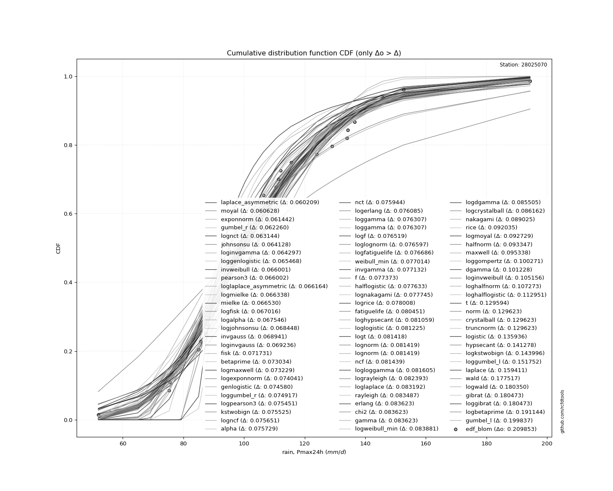</img>

</div>


**6.3. Best fit**

<div align="center">

|   id |   station | empirical_dist   | p_dist             |    delta |   deltao | eval   |   fit |   n |   best_fit |   best_fit_sort |
|-----:|----------:|:-----------------|:-------------------|---------:|---------:|:-------|------:|----:|-----------:|----------------:|
|    0 |  28025070 | edf_blom         | laplace_asymmetric | 0.060209 | 0.209853 | Δo > Δ |     1 |  42 |          1 |               1 |

</div>


<div align="center">

</img></img>

</div>


### 7. Empirical - EDF Tukey (1962)

In hydrology, the Tukey formula is used as a plotting position formula to estimate the empirical probability or frequency of a flood event (or other hydrological data). The formula parameter is given as _c=0.333_ (or 1/3).

<div align="center">


$P=(m-c)/(n+1-2c)$


</div>


**7.1. Empirical values**

<div align="center">

|                | 0                    | 1                   | 2                   | 3                   | 4                   | 5                   | 6                   | 7                   | 8                  | 9                  | 10                  | 11                 | 12                 | 13                 | 14                 | 15                 | 16                 | 17                  | 18                 | 19                 | 20                 | 21                 | 22                 | 23                 | 24                 | 25                 | 26                 | 27                 | 28                 | 29                 | 30                 | 31                 | 32                 | 33                 | 34                 | 35                | 36                 | 37                | 38                 | 39                | 40                 | 41                 |
|:---------------|:---------------------|:--------------------|:--------------------|:--------------------|:--------------------|:--------------------|:--------------------|:--------------------|:-------------------|:-------------------|:--------------------|:-------------------|:-------------------|:-------------------|:-------------------|:-------------------|:-------------------|:--------------------|:-------------------|:-------------------|:-------------------|:-------------------|:-------------------|:-------------------|:-------------------|:-------------------|:-------------------|:-------------------|:-------------------|:-------------------|:-------------------|:-------------------|:-------------------|:-------------------|:-------------------|:------------------|:-------------------|:------------------|:-------------------|:------------------|:-------------------|:-------------------|
| date           | 1997                 | 1991                | 2000                | 2003                | 2004                | 1999                | 1979                | 1994                | 2014               | 1988               | 1982                | 1990               | 2001               | 1998               | 1974               | 2012               | 1981               | 1993                | 2013               | 2009               | 1973               | 2002               | 1978               | 1985               | 1984               | 1976               | 2005               | 1987               | 1992               | 1989               | 2015               | 2006               | 2011               | 1996               | 2010               | 1980              | 2007               | 1975              | 1983               | 1995              | 2008               | 1986               |
| x              | 51.9                 | 64.9                | 69.0                | 75.3                | 75.5                | 76.3                | 78.4                | 79.2                | 85.0               | 85.6               | 87.3                | 88.2               | 88.4               | 91.0               | 91.5               | 93.0               | 93.6381523448394   | 93.9                | 96.0               | 97.0               | 97.5568649570023   | 98.7               | 98.8               | 100.2              | 100.4              | 103.1              | 106.0              | 106.5              | 110.5              | 111.4              | 112.0              | 115.5              | 124.0              | 129.1              | 134.0              | 134.2             | 136.5              | 136.5             | 140.8              | 145.8             | 152.6              | 194.4              |
| m              | 1                    | 2                   | 3                   | 4                   | 5                   | 6                   | 7                   | 8                   | 9                  | 10                 | 11                  | 12                 | 13                 | 14                 | 15                 | 16                 | 17                 | 18                  | 19                 | 20                 | 21                 | 22                 | 23                 | 24                 | 25                 | 26                 | 27                 | 28                 | 29                 | 30                 | 31                 | 32                 | 33                 | 34                 | 35                 | 36                | 37                 | 38                | 39                 | 40                | 41                 | 42                 |
| empirical_dist | edf_tukey            | edf_tukey           | edf_tukey           | edf_tukey           | edf_tukey           | edf_tukey           | edf_tukey           | edf_tukey           | edf_tukey          | edf_tukey          | edf_tukey           | edf_tukey          | edf_tukey          | edf_tukey          | edf_tukey          | edf_tukey          | edf_tukey          | edf_tukey           | edf_tukey          | edf_tukey          | edf_tukey          | edf_tukey          | edf_tukey          | edf_tukey          | edf_tukey          | edf_tukey          | edf_tukey          | edf_tukey          | edf_tukey          | edf_tukey          | edf_tukey          | edf_tukey          | edf_tukey          | edf_tukey          | edf_tukey          | edf_tukey         | edf_tukey          | edf_tukey         | edf_tukey          | edf_tukey         | edf_tukey          | edf_tukey          |
| empirical      | 0.015748031496062992 | 0.03937007874015748 | 0.06299212598425197 | 0.08661417322834646 | 0.11023622047244094 | 0.13385826771653545 | 0.15748031496062992 | 0.18110236220472442 | 0.2047244094488189 | 0.2283464566929134 | 0.25196850393700787 | 0.2755905511811024 | 0.2992125984251969 | 0.3228346456692913 | 0.3464566929133858 | 0.3700787401574803 | 0.3937007874015748 | 0.41732283464566927 | 0.4409448818897638 | 0.4645669291338583 | 0.4881889763779528 | 0.5118110236220472 | 0.5354330708661418 | 0.5590551181102362 | 0.5826771653543307 | 0.6062992125984252 | 0.6299212598425197 | 0.6535433070866141 | 0.6771653543307087 | 0.7007874015748031 | 0.7244094488188977 | 0.7480314960629921 | 0.7716535433070866 | 0.7952755905511811 | 0.8188976377952756 | 0.84251968503937  | 0.8661417322834646 | 0.889763779527559 | 0.9133858267716536 | 0.937007874015748 | 0.9606299212598425 | 0.984251968503937  |
| empirical_tr   | 1.016                | 1.040983606557377   | 1.0672268907563025  | 1.0948275862068966  | 1.1238938053097345  | 1.1545454545454545  | 1.1869158878504673  | 1.2211538461538463  | 1.2574257425742574 | 1.2959183673469388 | 1.3368421052631578  | 1.3804347826086956 | 1.4269662921348316 | 1.4767441860465116 | 1.530120481927711  | 1.5875             | 1.6493506493506493 | 1.716216216216216   | 1.7887323943661972 | 1.8676470588235297 | 1.953846153846154  | 2.0483870967741935 | 2.152542372881356  | 2.267857142857143  | 2.3962264150943393 | 2.54               | 2.702127659574468  | 2.886363636363636  | 3.097560975609756  | 3.3421052631578947 | 3.628571428571429  | 3.96875            | 4.379310344827585  | 4.884615384615385  | 5.521739130434782  | 6.349999999999998 | 7.470588235294119  | 9.07142857142857  | 11.54545454545455  | 15.875            | 25.399999999999974 | 63.500000000000114 |

</div>


**7.2. Kolmogorov-Smirnov fit test (sorted by Δ)**


<div align="center">

|                | 0                   | 1                   | 2                   | 3                    | 4                   | 5                   | 6                   | 7                   | 8                   | 9                   | 10                    | 11                  | 12                 | 13                  | 14                  | 15                  | 16                  | 17                  | 18                  | 19                  | 20                 | 21                  | 22                 | 23                  | 24                  | 25                  | 26                  | 27                  | 28                  | 29                  | 30                 | 31                 | 32                 | 33                  | 34                 | 35                  | 36                  | 37                  | 38                 | 39                  | 40                  | 41                  | 42                  | 43                  | 44                 | 45                  | 46                  | 47                  | 48                  | 49                  | 50                  | 51                  | 52                  | 53                  | 54                 | 55                  | 56                  | 57                  | 58                  | 59                  | 60                  | 61                  | 62                  | 63                  | 64                 | 65                  | 66                  | 67                  | 68                  | 69                 | 70                  | 71                 | 72                  | 73                  | 74                  | 75                  | 76                  | 77                  | 78                  | 79                  | 80                  | 81                  | 82                  | 83                  | 84                  | 85                 | 86                 | 87                  | 88                  | 89                  | 90                  | 91                 |
|:---------------|:--------------------|:--------------------|:--------------------|:---------------------|:--------------------|:--------------------|:--------------------|:--------------------|:--------------------|:--------------------|:----------------------|:--------------------|:-------------------|:--------------------|:--------------------|:--------------------|:--------------------|:--------------------|:--------------------|:--------------------|:-------------------|:--------------------|:-------------------|:--------------------|:--------------------|:--------------------|:--------------------|:--------------------|:--------------------|:--------------------|:-------------------|:-------------------|:-------------------|:--------------------|:-------------------|:--------------------|:--------------------|:--------------------|:-------------------|:--------------------|:--------------------|:--------------------|:--------------------|:--------------------|:-------------------|:--------------------|:--------------------|:--------------------|:--------------------|:--------------------|:--------------------|:--------------------|:--------------------|:--------------------|:-------------------|:--------------------|:--------------------|:--------------------|:--------------------|:--------------------|:--------------------|:--------------------|:--------------------|:--------------------|:-------------------|:--------------------|:--------------------|:--------------------|:--------------------|:-------------------|:--------------------|:-------------------|:--------------------|:--------------------|:--------------------|:--------------------|:--------------------|:--------------------|:--------------------|:--------------------|:--------------------|:--------------------|:--------------------|:--------------------|:--------------------|:-------------------|:-------------------|:--------------------|:--------------------|:--------------------|:--------------------|:-------------------|
| station        | 28025070            | 28025070            | 28025070            | 28025070             | 28025070            | 28025070            | 28025070            | 28025070            | 28025070            | 28025070            | 28025070              | 28025070            | 28025070           | 28025070            | 28025070            | 28025070            | 28025070            | 28025070            | 28025070            | 28025070            | 28025070           | 28025070            | 28025070           | 28025070            | 28025070            | 28025070            | 28025070            | 28025070            | 28025070            | 28025070            | 28025070           | 28025070           | 28025070           | 28025070            | 28025070           | 28025070            | 28025070            | 28025070            | 28025070           | 28025070            | 28025070            | 28025070            | 28025070            | 28025070            | 28025070           | 28025070            | 28025070            | 28025070            | 28025070            | 28025070            | 28025070            | 28025070            | 28025070            | 28025070            | 28025070           | 28025070            | 28025070            | 28025070            | 28025070            | 28025070            | 28025070            | 28025070            | 28025070            | 28025070            | 28025070           | 28025070            | 28025070            | 28025070            | 28025070            | 28025070           | 28025070            | 28025070           | 28025070            | 28025070            | 28025070            | 28025070            | 28025070            | 28025070            | 28025070            | 28025070            | 28025070            | 28025070            | 28025070            | 28025070            | 28025070            | 28025070           | 28025070           | 28025070            | 28025070            | 28025070            | 28025070            | 28025070           |
| empirical_dist | edf_tukey           | edf_tukey           | edf_tukey           | edf_tukey            | edf_tukey           | edf_tukey           | edf_tukey           | edf_tukey           | edf_tukey           | edf_tukey           | edf_tukey             | edf_tukey           | edf_tukey          | edf_tukey           | edf_tukey           | edf_tukey           | edf_tukey           | edf_tukey           | edf_tukey           | edf_tukey           | edf_tukey          | edf_tukey           | edf_tukey          | edf_tukey           | edf_tukey           | edf_tukey           | edf_tukey           | edf_tukey           | edf_tukey           | edf_tukey           | edf_tukey          | edf_tukey          | edf_tukey          | edf_tukey           | edf_tukey          | edf_tukey           | edf_tukey           | edf_tukey           | edf_tukey          | edf_tukey           | edf_tukey           | edf_tukey           | edf_tukey           | edf_tukey           | edf_tukey          | edf_tukey           | edf_tukey           | edf_tukey           | edf_tukey           | edf_tukey           | edf_tukey           | edf_tukey           | edf_tukey           | edf_tukey           | edf_tukey          | edf_tukey           | edf_tukey           | edf_tukey           | edf_tukey           | edf_tukey           | edf_tukey           | edf_tukey           | edf_tukey           | edf_tukey           | edf_tukey          | edf_tukey           | edf_tukey           | edf_tukey           | edf_tukey           | edf_tukey          | edf_tukey           | edf_tukey          | edf_tukey           | edf_tukey           | edf_tukey           | edf_tukey           | edf_tukey           | edf_tukey           | edf_tukey           | edf_tukey           | edf_tukey           | edf_tukey           | edf_tukey           | edf_tukey           | edf_tukey           | edf_tukey          | edf_tukey          | edf_tukey           | edf_tukey           | edf_tukey           | edf_tukey           | edf_tukey          |
| p_dist         | laplace_asymmetric  | moyal               | exponnorm           | gumbel_r             | lognct              | johnsonsu           | loginvgamma         | loggenlogistic      | invweibull          | pearson3            | loglaplace_asymmetric | logmielke           | mielke             | logalpha            | logfisk             | logjohnsonsu        | loginvgauss         | invgauss            | fisk                | logmaxwell          | betaprime          | logexponnorm        | genlogistic        | loggumbel_r         | kstwobign           | logpearson3         | logncf              | alpha               | nct                 | logerlang           | loggamma           | loggamma           | logf               | loglognorm          | logfatiguelife     | weibull_min         | invgamma            | halflogistic        | f                  | lognakagami         | logrice             | fatiguelife         | loghypsecant        | loglogistic         | logt               | lognorm             | lognorm             | ncf                 | logloggamma         | lograyleigh         | rayleigh            | erlang              | chi2                | gamma               | logweibull_min     | loglaplace          | logcrystalball      | logdgamma           | nakagami            | rice                | logmoyal            | halfnorm            | maxwell             | loggompertz         | dgamma             | loginvweibull       | loghalfnorm         | loghalflogistic     | t                   | norm               | crystalball         | truncnorm          | logistic            | hypsecant           | logkstwobign        | loggumbel_l         | laplace             | wald                | logwald             | gibrat              | loggibrat           | logbetaprime        | gumbel_l            | loggenexpon         | genexpon            | pareto             | expon              | logtruncnorm        | logexpon            | logpareto           | logchi2             | gompertz           |
| delta          | 0.06083798072610336 | 0.06125739478425285 | 0.06127901344597342 | 0.062096489313541614 | 0.06256115078384286 | 0.06396539270114543 | 0.06413348419623588 | 0.06530541395068179 | 0.06583767647694228 | 0.06583879112474744 | 0.06674610116372781   | 0.06696656530328615 | 0.0671592808069188 | 0.06738276640193108 | 0.06764519589061435 | 0.06828500264663451 | 0.06865351230730818 | 0.06877746951902575 | 0.07190944234970964 | 0.07264613081404211 | 0.0728704831605046 | 0.07387747529292488 | 0.0744168794639869 | 0.07456768201756303 | 0.07494243453523661 | 0.07528760569948345 | 0.07548784578353984 | 0.07556559265346408 | 0.07578126416381192 | 0.07592197190682626 | 0.0761437609862593 | 0.0761437609862593 | 0.0763562941859538 | 0.07643435663400422 | 0.0765226789639446 | 0.07685102393332255 | 0.07696892855371618 | 0.07705060717903625 | 0.0772097752386961 | 0.07758145138644201 | 0.07784451232066714 | 0.08028822628509158 | 0.08089615989475185 | 0.08106196925999098 | 0.0812551124817007 | 0.08125612418586925 | 0.08125612418586925 | 0.08127575434117607 | 0.08144219849752321 | 0.08181072949107401 | 0.08332394265525056 | 0.08345982698462467 | 0.08346000829575922 | 0.08346013857347201 | 0.0837175045028683 | 0.08377480751892274 | 0.08599886751187508 | 0.08608783988022872 | 0.08886220195734235 | 0.09145302173377093 | 0.09237946558831844 | 0.09276452558625667 | 0.09517487357396098 | 0.09945611260281119 | 0.1018105507187459 | 0.10457351496457404 | 0.10669088104801408 | 0.11260148254227742 | 0.12943124993676736 | 0.1294599243120092 | 0.12945993083456114 | 0.1294599386728027 | 0.13577337709471077 | 0.14111463580907507 | 0.14341409830568377 | 0.15158867943890864 | 0.15924827036273254 | 0.17814613843679883 | 0.18097945411923866 | 0.18110236220472442 | 0.18110236220472442 | 0.19032875660255316 | 0.19967378214076859 | 0.22371674334406064 | 0.27377121283145733 | 0.2776333650814082 | 0.2776333710844676 | 0.33217815809728757 | 0.34490131139347185 | 0.34490131142794717 | 0.34513065022847383 | 0.9591130480381823 |
| deltao         | 0.209852555948445   | 0.209852555948445   | 0.209852555948445   | 0.209852555948445    | 0.209852555948445   | 0.209852555948445   | 0.209852555948445   | 0.209852555948445   | 0.209852555948445   | 0.209852555948445   | 0.209852555948445     | 0.209852555948445   | 0.209852555948445  | 0.209852555948445   | 0.209852555948445   | 0.209852555948445   | 0.209852555948445   | 0.209852555948445   | 0.209852555948445   | 0.209852555948445   | 0.209852555948445  | 0.209852555948445   | 0.209852555948445  | 0.209852555948445   | 0.209852555948445   | 0.209852555948445   | 0.209852555948445   | 0.209852555948445   | 0.209852555948445   | 0.209852555948445   | 0.209852555948445  | 0.209852555948445  | 0.209852555948445  | 0.209852555948445   | 0.209852555948445  | 0.209852555948445   | 0.209852555948445   | 0.209852555948445   | 0.209852555948445  | 0.209852555948445   | 0.209852555948445   | 0.209852555948445   | 0.209852555948445   | 0.209852555948445   | 0.209852555948445  | 0.209852555948445   | 0.209852555948445   | 0.209852555948445   | 0.209852555948445   | 0.209852555948445   | 0.209852555948445   | 0.209852555948445   | 0.209852555948445   | 0.209852555948445   | 0.209852555948445  | 0.209852555948445   | 0.209852555948445   | 0.209852555948445   | 0.209852555948445   | 0.209852555948445   | 0.209852555948445   | 0.209852555948445   | 0.209852555948445   | 0.209852555948445   | 0.209852555948445  | 0.209852555948445   | 0.209852555948445   | 0.209852555948445   | 0.209852555948445   | 0.209852555948445  | 0.209852555948445   | 0.209852555948445  | 0.209852555948445   | 0.209852555948445   | 0.209852555948445   | 0.209852555948445   | 0.209852555948445   | 0.209852555948445   | 0.209852555948445   | 0.209852555948445   | 0.209852555948445   | 0.209852555948445   | 0.209852555948445   | 0.209852555948445   | 0.209852555948445   | 0.209852555948445  | 0.209852555948445  | 0.209852555948445   | 0.209852555948445   | 0.209852555948445   | 0.209852555948445   | 0.209852555948445  |
| eval           | Δo > Δ              | Δo > Δ              | Δo > Δ              | Δo > Δ               | Δo > Δ              | Δo > Δ              | Δo > Δ              | Δo > Δ              | Δo > Δ              | Δo > Δ              | Δo > Δ                | Δo > Δ              | Δo > Δ             | Δo > Δ              | Δo > Δ              | Δo > Δ              | Δo > Δ              | Δo > Δ              | Δo > Δ              | Δo > Δ              | Δo > Δ             | Δo > Δ              | Δo > Δ             | Δo > Δ              | Δo > Δ              | Δo > Δ              | Δo > Δ              | Δo > Δ              | Δo > Δ              | Δo > Δ              | Δo > Δ             | Δo > Δ             | Δo > Δ             | Δo > Δ              | Δo > Δ             | Δo > Δ              | Δo > Δ              | Δo > Δ              | Δo > Δ             | Δo > Δ              | Δo > Δ              | Δo > Δ              | Δo > Δ              | Δo > Δ              | Δo > Δ             | Δo > Δ              | Δo > Δ              | Δo > Δ              | Δo > Δ              | Δo > Δ              | Δo > Δ              | Δo > Δ              | Δo > Δ              | Δo > Δ              | Δo > Δ             | Δo > Δ              | Δo > Δ              | Δo > Δ              | Δo > Δ              | Δo > Δ              | Δo > Δ              | Δo > Δ              | Δo > Δ              | Δo > Δ              | Δo > Δ             | Δo > Δ              | Δo > Δ              | Δo > Δ              | Δo > Δ              | Δo > Δ             | Δo > Δ              | Δo > Δ             | Δo > Δ              | Δo > Δ              | Δo > Δ              | Δo > Δ              | Δo > Δ              | Δo > Δ              | Δo > Δ              | Δo > Δ              | Δo > Δ              | Δo > Δ              | Δo > Δ              | Δo <= Δ             | Δo <= Δ             | Δo <= Δ            | Δo <= Δ            | Δo <= Δ             | Δo <= Δ             | Δo <= Δ             | Δo <= Δ             | Δo <= Δ            |
| fit            | 1                   | 1                   | 1                   | 1                    | 1                   | 1                   | 1                   | 1                   | 1                   | 1                   | 1                     | 1                   | 1                  | 1                   | 1                   | 1                   | 1                   | 1                   | 1                   | 1                   | 1                  | 1                   | 1                  | 1                   | 1                   | 1                   | 1                   | 1                   | 1                   | 1                   | 1                  | 1                  | 1                  | 1                   | 1                  | 1                   | 1                   | 1                   | 1                  | 1                   | 1                   | 1                   | 1                   | 1                   | 1                  | 1                   | 1                   | 1                   | 1                   | 1                   | 1                   | 1                   | 1                   | 1                   | 1                  | 1                   | 1                   | 1                   | 1                   | 1                   | 1                   | 1                   | 1                   | 1                   | 1                  | 1                   | 1                   | 1                   | 1                   | 1                  | 1                   | 1                  | 1                   | 1                   | 1                   | 1                   | 1                   | 1                   | 1                   | 1                   | 1                   | 1                   | 1                   | 0                   | 0                   | 0                  | 0                  | 0                   | 0                   | 0                   | 0                   | 0                  |
| n              | 42                  | 42                  | 42                  | 42                   | 42                  | 42                  | 42                  | 42                  | 42                  | 42                  | 42                    | 42                  | 42                 | 42                  | 42                  | 42                  | 42                  | 42                  | 42                  | 42                  | 42                 | 42                  | 42                 | 42                  | 42                  | 42                  | 42                  | 42                  | 42                  | 42                  | 42                 | 42                 | 42                 | 42                  | 42                 | 42                  | 42                  | 42                  | 42                 | 42                  | 42                  | 42                  | 42                  | 42                  | 42                 | 42                  | 42                  | 42                  | 42                  | 42                  | 42                  | 42                  | 42                  | 42                  | 42                 | 42                  | 42                  | 42                  | 42                  | 42                  | 42                  | 42                  | 42                  | 42                  | 42                 | 42                  | 42                  | 42                  | 42                  | 42                 | 42                  | 42                 | 42                  | 42                  | 42                  | 42                  | 42                  | 42                  | 42                  | 42                  | 42                  | 42                  | 42                  | 42                  | 42                  | 42                 | 42                 | 42                  | 42                  | 42                  | 42                  | 42                 |
| best_fit       | 1                   | 0                   | 0                   | 0                    | 0                   | 0                   | 0                   | 0                   | 0                   | 0                   | 0                     | 0                   | 0                  | 0                   | 0                   | 0                   | 0                   | 0                   | 0                   | 0                   | 0                  | 0                   | 0                  | 0                   | 0                   | 0                   | 0                   | 0                   | 0                   | 0                   | 0                  | 0                  | 0                  | 0                   | 0                  | 0                   | 0                   | 0                   | 0                  | 0                   | 0                   | 0                   | 0                   | 0                   | 0                  | 0                   | 0                   | 0                   | 0                   | 0                   | 0                   | 0                   | 0                   | 0                   | 0                  | 0                   | 0                   | 0                   | 0                   | 0                   | 0                   | 0                   | 0                   | 0                   | 0                  | 0                   | 0                   | 0                   | 0                   | 0                  | 0                   | 0                  | 0                   | 0                   | 0                   | 0                   | 0                   | 0                   | 0                   | 0                   | 0                   | 0                   | 0                   | 0                   | 0                   | 0                  | 0                  | 0                   | 0                   | 0                   | 0                   | 0                  |
| best_fit_sort  | 1                   | 2                   | 3                   | 4                    | 5                   | 6                   | 7                   | 8                   | 9                   | 10                  | 11                    | 12                  | 13                 | 14                  | 15                  | 16                  | 17                  | 18                  | 19                  | 20                  | 21                 | 22                  | 23                 | 24                  | 25                  | 26                  | 27                  | 28                  | 29                  | 30                  | 31                 | 32                 | 33                 | 34                  | 35                 | 36                  | 37                  | 38                  | 39                 | 40                  | 41                  | 42                  | 43                  | 44                  | 45                 | 46                  | 47                  | 48                  | 49                  | 50                  | 51                  | 52                  | 53                  | 54                  | 55                 | 56                  | 57                  | 58                  | 59                  | 60                  | 61                  | 62                  | 63                  | 64                  | 65                 | 66                  | 67                  | 68                  | 69                  | 70                 | 71                  | 72                 | 73                  | 74                  | 75                  | 76                  | 77                  | 78                  | 79                  | 80                  | 81                  | 82                  | 83                  | 84                  | 85                  | 86                 | 87                 | 88                  | 89                  | 90                  | 91                  | 92                 |

</div>


<div align="center">

</img>

</div>


**7.3. Best fit**

<div align="center">

|   id |   station | empirical_dist   | p_dist             |    delta |   deltao | eval   |   fit |   n |   best_fit |   best_fit_sort |
|-----:|----------:|:-----------------|:-------------------|---------:|---------:|:-------|------:|----:|-----------:|----------------:|
|    0 |  28025070 | edf_tukey        | laplace_asymmetric | 0.060838 | 0.209853 | Δo > Δ |     1 |  42 |          1 |               1 |

</div>


<div align="center">

</img></img>

</div>


### 8. Empirical - EDF Gringorten (1963)

Gringorten plotting position formula is essential for estimating the probability and return periods of extreme events like floods and heavy rainfall. The constant _a=0.44_.

<div align="center">


$P=(m-a)/(n+1-2a)$


</div>


**8.1. Empirical values**

<div align="center">

|                | 0                    | 1                   | 2                    | 3                  | 4                   | 5                   | 6                  | 7                  | 8                  | 9                   | 10                  | 11                  | 12                 | 13                 | 14                  | 15                 | 16                  | 17                 | 18                 | 19                  | 20                 | 21                 | 22                 | 23                 | 24                 | 25                 | 26                | 27                 | 28                 | 29                 | 30                 | 31                 | 32                 | 33                 | 34                 | 35                 | 36                 | 37                 | 38                 | 39                | 40                 | 41                 |
|:---------------|:---------------------|:--------------------|:---------------------|:-------------------|:--------------------|:--------------------|:-------------------|:-------------------|:-------------------|:--------------------|:--------------------|:--------------------|:-------------------|:-------------------|:--------------------|:-------------------|:--------------------|:-------------------|:-------------------|:--------------------|:-------------------|:-------------------|:-------------------|:-------------------|:-------------------|:-------------------|:------------------|:-------------------|:-------------------|:-------------------|:-------------------|:-------------------|:-------------------|:-------------------|:-------------------|:-------------------|:-------------------|:-------------------|:-------------------|:------------------|:-------------------|:-------------------|
| date           | 1997                 | 1991                | 2000                 | 2003               | 2004                | 1999                | 1979               | 1994               | 2014               | 1988                | 1982                | 1990                | 2001               | 1998               | 1974                | 2012               | 1981                | 1993               | 2013               | 2009                | 1973               | 2002               | 1978               | 1985               | 1984               | 1976               | 2005              | 1987               | 1992               | 1989               | 2015               | 2006               | 2011               | 1996               | 2010               | 1980               | 2007               | 1975               | 1983               | 1995              | 2008               | 1986               |
| x              | 51.9                 | 64.9                | 69.0                 | 75.3               | 75.5                | 76.3                | 78.4               | 79.2               | 85.0               | 85.6                | 87.3                | 88.2                | 88.4               | 91.0               | 91.5                | 93.0               | 93.6381523448394    | 93.9               | 96.0               | 97.0                | 97.5568649570023   | 98.7               | 98.8               | 100.2              | 100.4              | 103.1              | 106.0             | 106.5              | 110.5              | 111.4              | 112.0              | 115.5              | 124.0              | 129.1              | 134.0              | 134.2              | 136.5              | 136.5              | 140.8              | 145.8             | 152.6              | 194.4              |
| m              | 1                    | 2                   | 3                    | 4                  | 5                   | 6                   | 7                  | 8                  | 9                  | 10                  | 11                  | 12                  | 13                 | 14                 | 15                  | 16                 | 17                  | 18                 | 19                 | 20                  | 21                 | 22                 | 23                 | 24                 | 25                 | 26                 | 27                | 28                 | 29                 | 30                 | 31                 | 32                 | 33                 | 34                 | 35                 | 36                 | 37                 | 38                 | 39                 | 40                | 41                 | 42                 |
| empirical_dist | edf_gringorten       | edf_gringorten      | edf_gringorten       | edf_gringorten     | edf_gringorten      | edf_gringorten      | edf_gringorten     | edf_gringorten     | edf_gringorten     | edf_gringorten      | edf_gringorten      | edf_gringorten      | edf_gringorten     | edf_gringorten     | edf_gringorten      | edf_gringorten     | edf_gringorten      | edf_gringorten     | edf_gringorten     | edf_gringorten      | edf_gringorten     | edf_gringorten     | edf_gringorten     | edf_gringorten     | edf_gringorten     | edf_gringorten     | edf_gringorten    | edf_gringorten     | edf_gringorten     | edf_gringorten     | edf_gringorten     | edf_gringorten     | edf_gringorten     | edf_gringorten     | edf_gringorten     | edf_gringorten     | edf_gringorten     | edf_gringorten     | edf_gringorten     | edf_gringorten    | edf_gringorten     | edf_gringorten     |
| empirical      | 0.013295346628679964 | 0.03703703703703704 | 0.060778727445394115 | 0.0845204178537512 | 0.10826210826210826 | 0.13200379867046533 | 0.1557454890788224 | 0.1794871794871795 | 0.2032288698955366 | 0.22697056030389368 | 0.25071225071225073 | 0.27445394112060784 | 0.2981956315289649 | 0.321937321937322  | 0.34567901234567905 | 0.3694207027540361 | 0.39316239316239315 | 0.4169040835707502 | 0.4406457739791073 | 0.46438746438746437 | 0.4881291547958215 | 0.5118708452041786 | 0.5356125356125356 | 0.5593542260208927 | 0.5830959164292497 | 0.6068376068376068 | 0.630579297245964 | 0.654320987654321  | 0.6780626780626781 | 0.7018043684710351 | 0.7255460588793923 | 0.7492877492877493 | 0.7730294396961065 | 0.7967711301044635 | 0.8205128205128206 | 0.8442545109211776 | 0.8679962013295348 | 0.8917378917378919 | 0.9154795821462489 | 0.939221272554606 | 0.962962962962963  | 0.9867046533713202 |
| empirical_tr   | 1.0134744947064485   | 1.0384615384615385  | 1.064711830131446    | 1.0923236514522823 | 1.121405750798722   | 1.1520787746170678  | 1.1844769403824522 | 1.21875            | 1.2550655542312277 | 1.2936117936117937  | 1.334600760456274   | 1.3782722513089005  | 1.4248985115020298 | 1.4747899159663869 | 1.5283018867924527  | 1.585843373493976  | 1.6478873239436618  | 1.714983713355049  | 1.7877758913412565 | 1.8670212765957446  | 1.953617810760668  | 2.04863813229572   | 2.1533742331288344 | 2.269396551724138  | 2.398633257403189  | 2.543478260869565  | 2.70694087403599  | 2.8928571428571432 | 3.106194690265487  | 3.3535031847133756 | 3.643598615916956  | 3.988636363636364  | 4.405857740585777  | 4.920560747663554  | 5.571428571428574  | 6.420731707317076  | 7.575539568345333  | 9.236842105263168  | 11.831460674157318 | 16.45312500000002 | 27.000000000000043 | 75.21428571428655  |

</div>


**8.2. Kolmogorov-Smirnov fit test (sorted by Δ)**


<div align="center">

|                | 0                   | 1                    | 2                    | 3                   | 4                   | 5                  | 6                   | 7                     | 8                   | 9                   | 10                  | 11                  | 12                  | 13                  | 14                  | 15                  | 16                  | 17                  | 18                  | 19                  | 20                  | 21                  | 22                  | 23                  | 24                  | 25                  | 26                  | 27                  | 28                  | 29                 | 30                  | 31                  | 32                  | 33                  | 34                  | 35                  | 36                  | 37                  | 38                  | 39                 | 40                  | 41                  | 42                  | 43                  | 44                  | 45                  | 46                  | 47                  | 48                  | 49                  | 50                  | 51                  | 52                  | 53                  | 54                  | 55                  | 56                  | 57                  | 58                  | 59                  | 60                  | 61                  | 62                  | 63                  | 64                  | 65                  | 66                  | 67                  | 68                  | 69                  | 70                 | 71                  | 72                  | 73                  | 74                  | 75                 | 76                 | 77                 | 78                  | 79                 | 80                 | 81                  | 82                  | 83                  | 84                 | 85                  | 86                 | 87                  | 88                  | 89                  | 90                 | 91                 |
|:---------------|:--------------------|:---------------------|:---------------------|:--------------------|:--------------------|:-------------------|:--------------------|:----------------------|:--------------------|:--------------------|:--------------------|:--------------------|:--------------------|:--------------------|:--------------------|:--------------------|:--------------------|:--------------------|:--------------------|:--------------------|:--------------------|:--------------------|:--------------------|:--------------------|:--------------------|:--------------------|:--------------------|:--------------------|:--------------------|:-------------------|:--------------------|:--------------------|:--------------------|:--------------------|:--------------------|:--------------------|:--------------------|:--------------------|:--------------------|:-------------------|:--------------------|:--------------------|:--------------------|:--------------------|:--------------------|:--------------------|:--------------------|:--------------------|:--------------------|:--------------------|:--------------------|:--------------------|:--------------------|:--------------------|:--------------------|:--------------------|:--------------------|:--------------------|:--------------------|:--------------------|:--------------------|:--------------------|:--------------------|:--------------------|:--------------------|:--------------------|:--------------------|:--------------------|:--------------------|:--------------------|:-------------------|:--------------------|:--------------------|:--------------------|:--------------------|:-------------------|:-------------------|:-------------------|:--------------------|:-------------------|:-------------------|:--------------------|:--------------------|:--------------------|:-------------------|:--------------------|:-------------------|:--------------------|:--------------------|:--------------------|:-------------------|:-------------------|
| station        | 28025070            | 28025070             | 28025070             | 28025070            | 28025070            | 28025070           | 28025070            | 28025070              | 28025070            | 28025070            | 28025070            | 28025070            | 28025070            | 28025070            | 28025070            | 28025070            | 28025070            | 28025070            | 28025070            | 28025070            | 28025070            | 28025070            | 28025070            | 28025070            | 28025070            | 28025070            | 28025070            | 28025070            | 28025070            | 28025070           | 28025070            | 28025070            | 28025070            | 28025070            | 28025070            | 28025070            | 28025070            | 28025070            | 28025070            | 28025070           | 28025070            | 28025070            | 28025070            | 28025070            | 28025070            | 28025070            | 28025070            | 28025070            | 28025070            | 28025070            | 28025070            | 28025070            | 28025070            | 28025070            | 28025070            | 28025070            | 28025070            | 28025070            | 28025070            | 28025070            | 28025070            | 28025070            | 28025070            | 28025070            | 28025070            | 28025070            | 28025070            | 28025070            | 28025070            | 28025070            | 28025070           | 28025070            | 28025070            | 28025070            | 28025070            | 28025070           | 28025070           | 28025070           | 28025070            | 28025070           | 28025070           | 28025070            | 28025070            | 28025070            | 28025070           | 28025070            | 28025070           | 28025070            | 28025070            | 28025070            | 28025070           | 28025070           |
| empirical_dist | edf_gringorten      | edf_gringorten       | edf_gringorten       | edf_gringorten      | edf_gringorten      | edf_gringorten     | edf_gringorten      | edf_gringorten        | edf_gringorten      | edf_gringorten      | edf_gringorten      | edf_gringorten      | edf_gringorten      | edf_gringorten      | edf_gringorten      | edf_gringorten      | edf_gringorten      | edf_gringorten      | edf_gringorten      | edf_gringorten      | edf_gringorten      | edf_gringorten      | edf_gringorten      | edf_gringorten      | edf_gringorten      | edf_gringorten      | edf_gringorten      | edf_gringorten      | edf_gringorten      | edf_gringorten     | edf_gringorten      | edf_gringorten      | edf_gringorten      | edf_gringorten      | edf_gringorten      | edf_gringorten      | edf_gringorten      | edf_gringorten      | edf_gringorten      | edf_gringorten     | edf_gringorten      | edf_gringorten      | edf_gringorten      | edf_gringorten      | edf_gringorten      | edf_gringorten      | edf_gringorten      | edf_gringorten      | edf_gringorten      | edf_gringorten      | edf_gringorten      | edf_gringorten      | edf_gringorten      | edf_gringorten      | edf_gringorten      | edf_gringorten      | edf_gringorten      | edf_gringorten      | edf_gringorten      | edf_gringorten      | edf_gringorten      | edf_gringorten      | edf_gringorten      | edf_gringorten      | edf_gringorten      | edf_gringorten      | edf_gringorten      | edf_gringorten      | edf_gringorten      | edf_gringorten      | edf_gringorten     | edf_gringorten      | edf_gringorten      | edf_gringorten      | edf_gringorten      | edf_gringorten     | edf_gringorten     | edf_gringorten     | edf_gringorten      | edf_gringorten     | edf_gringorten     | edf_gringorten      | edf_gringorten      | edf_gringorten      | edf_gringorten     | edf_gringorten      | edf_gringorten     | edf_gringorten      | edf_gringorten      | edf_gringorten      | edf_gringorten     | edf_gringorten     |
| p_dist         | laplace_asymmetric  | moyal                | exponnorm            | gumbel_r            | lognct              | johnsonsu          | loginvgamma         | loglaplace_asymmetric | mielke              | loggenlogistic      | logmielke           | invweibull          | pearson3            | logfisk             | logalpha            | logjohnsonsu        | invgauss            | loginvgauss         | fisk                | betaprime           | logmaxwell          | logexponnorm        | genlogistic         | loggumbel_r         | logpearson3         | logncf              | alpha               | nct                 | logerlang           | kstwobign          | loggamma            | loggamma            | logf                | loglognorm          | logfatiguelife      | weibull_min         | invgamma            | f                   | lognakagami         | logrice            | halflogistic        | fatiguelife         | loghypsecant        | loglogistic         | logt                | lognorm             | lognorm             | ncf                 | logloggamma         | loglaplace          | lograyleigh         | rayleigh            | erlang              | chi2                | gamma               | logweibull_min      | logdgamma           | logcrystalball      | nakagami            | rice                | logmoyal            | halfnorm            | maxwell             | dgamma              | loggompertz         | loginvweibull       | loghalfnorm         | loghalflogistic     | t                   | norm                | crystalball        | truncnorm           | logistic            | hypsecant           | logkstwobign        | loggumbel_l        | laplace            | wald               | logwald             | gibrat             | loggibrat          | logbetaprime        | gumbel_l            | loggenexpon         | genexpon           | pareto              | expon              | logtruncnorm        | logexpon            | logpareto           | logchi2            | gompertz           |
| delta          | 0.05922279800855834 | 0.059642212066707834 | 0.061697764520892484 | 0.06251524038846068 | 0.06405669033712516 | 0.0643841437760645 | 0.06455223527115495 | 0.0652505616104454    | 0.06554409808937378 | 0.06572416502560086 | 0.06606117248966259 | 0.06625642755186134 | 0.06625754219966651 | 0.06682661309363369 | 0.06780151747685015 | 0.06870375372155357 | 0.06919622059394481 | 0.07014905186059048 | 0.07198669948738656 | 0.07328923423542366 | 0.07414167036732441 | 0.07429622636784394 | 0.07483563053890596 | 0.07546500574953235 | 0.07570635677440252 | 0.07590659685845891 | 0.07598434372838314 | 0.07620001523873099 | 0.07634072298174532 | 0.0764379740885189 | 0.07656251206117837 | 0.07656251206117837 | 0.07677504526087287 | 0.07685310770892329 | 0.07694143003886367 | 0.07726977500824161 | 0.07738767962863524 | 0.07762852631361516 | 0.07800020246136108 | 0.0782632633955862 | 0.07854614673231855 | 0.08070697736001065 | 0.08131491096967092 | 0.08148072033491005 | 0.08167386355661976 | 0.08167487526078832 | 0.08167487526078832 | 0.08169450541609513 | 0.08186094957244228 | 0.08227926796564033 | 0.08330626904435631 | 0.08374269373016963 | 0.08387857805954374 | 0.08387875937067829 | 0.08387888964839108 | 0.08413625557778737 | 0.08459230032694631 | 0.08641761858679414 | 0.08928095303226141 | 0.09294856128705323 | 0.09327678932028777 | 0.09426006513953897 | 0.09559362464888005 | 0.10031501116546349 | 0.10154986797740645 | 0.10606905451785634 | 0.10818642060129638 | 0.11349880627424674 | 0.12985000101168642 | 0.12987867538692827 | 0.1298786819094802 | 0.12987868974772177 | 0.13619212816962983 | 0.14153338688399414 | 0.14490963785896607 | 0.1520074305138277 | 0.1596670214376516 | 0.1765309557192539 | 0.17936427140169373 | 0.1794871794871795 | 0.1794871794871795 | 0.19242251197714844 | 0.20009253321568765 | 0.22521228289734294 | 0.2758649682060526 | 0.27972712045600345 | 0.2797271264590629 | 0.33427191347188284 | 0.34699506676806713 | 0.34699506680254244 | 0.3472244056030691 | 0.9614460897413029 |
| deltao         | 0.209852555948445   | 0.209852555948445    | 0.209852555948445    | 0.209852555948445   | 0.209852555948445   | 0.209852555948445  | 0.209852555948445   | 0.209852555948445     | 0.209852555948445   | 0.209852555948445   | 0.209852555948445   | 0.209852555948445   | 0.209852555948445   | 0.209852555948445   | 0.209852555948445   | 0.209852555948445   | 0.209852555948445   | 0.209852555948445   | 0.209852555948445   | 0.209852555948445   | 0.209852555948445   | 0.209852555948445   | 0.209852555948445   | 0.209852555948445   | 0.209852555948445   | 0.209852555948445   | 0.209852555948445   | 0.209852555948445   | 0.209852555948445   | 0.209852555948445  | 0.209852555948445   | 0.209852555948445   | 0.209852555948445   | 0.209852555948445   | 0.209852555948445   | 0.209852555948445   | 0.209852555948445   | 0.209852555948445   | 0.209852555948445   | 0.209852555948445  | 0.209852555948445   | 0.209852555948445   | 0.209852555948445   | 0.209852555948445   | 0.209852555948445   | 0.209852555948445   | 0.209852555948445   | 0.209852555948445   | 0.209852555948445   | 0.209852555948445   | 0.209852555948445   | 0.209852555948445   | 0.209852555948445   | 0.209852555948445   | 0.209852555948445   | 0.209852555948445   | 0.209852555948445   | 0.209852555948445   | 0.209852555948445   | 0.209852555948445   | 0.209852555948445   | 0.209852555948445   | 0.209852555948445   | 0.209852555948445   | 0.209852555948445   | 0.209852555948445   | 0.209852555948445   | 0.209852555948445   | 0.209852555948445   | 0.209852555948445   | 0.209852555948445  | 0.209852555948445   | 0.209852555948445   | 0.209852555948445   | 0.209852555948445   | 0.209852555948445  | 0.209852555948445  | 0.209852555948445  | 0.209852555948445   | 0.209852555948445  | 0.209852555948445  | 0.209852555948445   | 0.209852555948445   | 0.209852555948445   | 0.209852555948445  | 0.209852555948445   | 0.209852555948445  | 0.209852555948445   | 0.209852555948445   | 0.209852555948445   | 0.209852555948445  | 0.209852555948445  |
| eval           | Δo > Δ              | Δo > Δ               | Δo > Δ               | Δo > Δ              | Δo > Δ              | Δo > Δ             | Δo > Δ              | Δo > Δ                | Δo > Δ              | Δo > Δ              | Δo > Δ              | Δo > Δ              | Δo > Δ              | Δo > Δ              | Δo > Δ              | Δo > Δ              | Δo > Δ              | Δo > Δ              | Δo > Δ              | Δo > Δ              | Δo > Δ              | Δo > Δ              | Δo > Δ              | Δo > Δ              | Δo > Δ              | Δo > Δ              | Δo > Δ              | Δo > Δ              | Δo > Δ              | Δo > Δ             | Δo > Δ              | Δo > Δ              | Δo > Δ              | Δo > Δ              | Δo > Δ              | Δo > Δ              | Δo > Δ              | Δo > Δ              | Δo > Δ              | Δo > Δ             | Δo > Δ              | Δo > Δ              | Δo > Δ              | Δo > Δ              | Δo > Δ              | Δo > Δ              | Δo > Δ              | Δo > Δ              | Δo > Δ              | Δo > Δ              | Δo > Δ              | Δo > Δ              | Δo > Δ              | Δo > Δ              | Δo > Δ              | Δo > Δ              | Δo > Δ              | Δo > Δ              | Δo > Δ              | Δo > Δ              | Δo > Δ              | Δo > Δ              | Δo > Δ              | Δo > Δ              | Δo > Δ              | Δo > Δ              | Δo > Δ              | Δo > Δ              | Δo > Δ              | Δo > Δ              | Δo > Δ             | Δo > Δ              | Δo > Δ              | Δo > Δ              | Δo > Δ              | Δo > Δ             | Δo > Δ             | Δo > Δ             | Δo > Δ              | Δo > Δ             | Δo > Δ             | Δo > Δ              | Δo > Δ              | Δo <= Δ             | Δo <= Δ            | Δo <= Δ             | Δo <= Δ            | Δo <= Δ             | Δo <= Δ             | Δo <= Δ             | Δo <= Δ            | Δo <= Δ            |
| fit            | 1                   | 1                    | 1                    | 1                   | 1                   | 1                  | 1                   | 1                     | 1                   | 1                   | 1                   | 1                   | 1                   | 1                   | 1                   | 1                   | 1                   | 1                   | 1                   | 1                   | 1                   | 1                   | 1                   | 1                   | 1                   | 1                   | 1                   | 1                   | 1                   | 1                  | 1                   | 1                   | 1                   | 1                   | 1                   | 1                   | 1                   | 1                   | 1                   | 1                  | 1                   | 1                   | 1                   | 1                   | 1                   | 1                   | 1                   | 1                   | 1                   | 1                   | 1                   | 1                   | 1                   | 1                   | 1                   | 1                   | 1                   | 1                   | 1                   | 1                   | 1                   | 1                   | 1                   | 1                   | 1                   | 1                   | 1                   | 1                   | 1                   | 1                   | 1                  | 1                   | 1                   | 1                   | 1                   | 1                  | 1                  | 1                  | 1                   | 1                  | 1                  | 1                   | 1                   | 0                   | 0                  | 0                   | 0                  | 0                   | 0                   | 0                   | 0                  | 0                  |
| n              | 42                  | 42                   | 42                   | 42                  | 42                  | 42                 | 42                  | 42                    | 42                  | 42                  | 42                  | 42                  | 42                  | 42                  | 42                  | 42                  | 42                  | 42                  | 42                  | 42                  | 42                  | 42                  | 42                  | 42                  | 42                  | 42                  | 42                  | 42                  | 42                  | 42                 | 42                  | 42                  | 42                  | 42                  | 42                  | 42                  | 42                  | 42                  | 42                  | 42                 | 42                  | 42                  | 42                  | 42                  | 42                  | 42                  | 42                  | 42                  | 42                  | 42                  | 42                  | 42                  | 42                  | 42                  | 42                  | 42                  | 42                  | 42                  | 42                  | 42                  | 42                  | 42                  | 42                  | 42                  | 42                  | 42                  | 42                  | 42                  | 42                  | 42                  | 42                 | 42                  | 42                  | 42                  | 42                  | 42                 | 42                 | 42                 | 42                  | 42                 | 42                 | 42                  | 42                  | 42                  | 42                 | 42                  | 42                 | 42                  | 42                  | 42                  | 42                 | 42                 |
| best_fit       | 1                   | 0                    | 0                    | 0                   | 0                   | 0                  | 0                   | 0                     | 0                   | 0                   | 0                   | 0                   | 0                   | 0                   | 0                   | 0                   | 0                   | 0                   | 0                   | 0                   | 0                   | 0                   | 0                   | 0                   | 0                   | 0                   | 0                   | 0                   | 0                   | 0                  | 0                   | 0                   | 0                   | 0                   | 0                   | 0                   | 0                   | 0                   | 0                   | 0                  | 0                   | 0                   | 0                   | 0                   | 0                   | 0                   | 0                   | 0                   | 0                   | 0                   | 0                   | 0                   | 0                   | 0                   | 0                   | 0                   | 0                   | 0                   | 0                   | 0                   | 0                   | 0                   | 0                   | 0                   | 0                   | 0                   | 0                   | 0                   | 0                   | 0                   | 0                  | 0                   | 0                   | 0                   | 0                   | 0                  | 0                  | 0                  | 0                   | 0                  | 0                  | 0                   | 0                   | 0                   | 0                  | 0                   | 0                  | 0                   | 0                   | 0                   | 0                  | 0                  |
| best_fit_sort  | 1                   | 2                    | 3                    | 4                   | 5                   | 6                  | 7                   | 8                     | 9                   | 10                  | 11                  | 12                  | 13                  | 14                  | 15                  | 16                  | 17                  | 18                  | 19                  | 20                  | 21                  | 22                  | 23                  | 24                  | 25                  | 26                  | 27                  | 28                  | 29                  | 30                 | 31                  | 32                  | 33                  | 34                  | 35                  | 36                  | 37                  | 38                  | 39                  | 40                 | 41                  | 42                  | 43                  | 44                  | 45                  | 46                  | 47                  | 48                  | 49                  | 50                  | 51                  | 52                  | 53                  | 54                  | 55                  | 56                  | 57                  | 58                  | 59                  | 60                  | 61                  | 62                  | 63                  | 64                  | 65                  | 66                  | 67                  | 68                  | 69                  | 70                  | 71                 | 72                  | 73                  | 74                  | 75                  | 76                 | 77                 | 78                 | 79                  | 80                 | 81                 | 82                  | 83                  | 84                  | 85                 | 86                  | 87                 | 88                  | 89                  | 90                  | 91                 | 92                 |

</div>


<div align="center">

</img>

</div>


**8.3. Best fit**

<div align="center">

|   id |   station | empirical_dist   | p_dist             |     delta |   deltao | eval   |   fit |   n |   best_fit |   best_fit_sort |
|-----:|----------:|:-----------------|:-------------------|----------:|---------:|:-------|------:|----:|-----------:|----------------:|
|    0 |  28025070 | edf_gringorten   | laplace_asymmetric | 0.0592228 | 0.209853 | Δo > Δ |     1 |  42 |          1 |               1 |

</div>


<div align="center">

</img>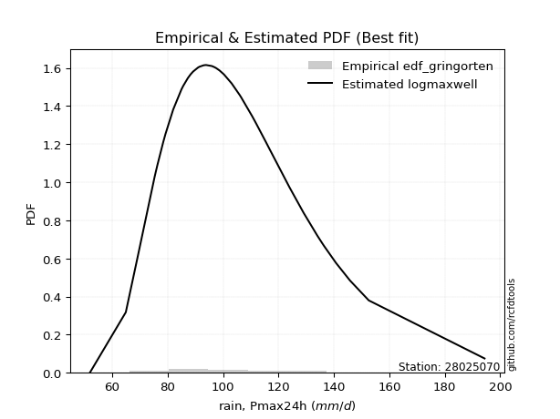</img>

</div>


### 9. Empirical - EDF Jenkinson (1977)

The Jenkinson formula in hydrology is an empirical plotting position formula used to estimate the non-exceedance probability _(P)_ or return period _(T)_ of a given ordered observation within a sample. It is a widely used method in the frequency analysis of extreme events such as floods and rainfall, as it provides a distribution-free way to plot data. _a≈0.31_ and _b≈0.38_ are constants derived to approximate the median of the probability distribution for the given rank.

<div align="center">


$P=(m-a)/(n+b)$


</div>


**9.1. Empirical values**

<div align="center">

|                | 0                    | 1                   | 2                   | 3                   | 4                   | 5                  | 6                   | 7                   | 8                   | 9                   | 10                 | 11                  | 12                 | 13                 | 14                 | 15                 | 16                 | 17                 | 18                 | 19                  | 20                  | 21                 | 22                 | 23                 | 24                 | 25                 | 26                 | 27                 | 28                 | 29                 | 30                 | 31                 | 32                 | 33                 | 34                 | 35                 | 36                 | 37                 | 38                 | 39                 | 40                 | 41                 |
|:---------------|:---------------------|:--------------------|:--------------------|:--------------------|:--------------------|:-------------------|:--------------------|:--------------------|:--------------------|:--------------------|:-------------------|:--------------------|:-------------------|:-------------------|:-------------------|:-------------------|:-------------------|:-------------------|:-------------------|:--------------------|:--------------------|:-------------------|:-------------------|:-------------------|:-------------------|:-------------------|:-------------------|:-------------------|:-------------------|:-------------------|:-------------------|:-------------------|:-------------------|:-------------------|:-------------------|:-------------------|:-------------------|:-------------------|:-------------------|:-------------------|:-------------------|:-------------------|
| date           | 1997                 | 1991                | 2000                | 2003                | 2004                | 1999               | 1979                | 1994                | 2014                | 1988                | 1982               | 1990                | 2001               | 1998               | 1974               | 2012               | 1981               | 1993               | 2013               | 2009                | 1973                | 2002               | 1978               | 1985               | 1984               | 1976               | 2005               | 1987               | 1992               | 1989               | 2015               | 2006               | 2011               | 1996               | 2010               | 1980               | 2007               | 1975               | 1983               | 1995               | 2008               | 1986               |
| x              | 51.9                 | 64.9                | 69.0                | 75.3                | 75.5                | 76.3               | 78.4                | 79.2                | 85.0                | 85.6                | 87.3               | 88.2                | 88.4               | 91.0               | 91.5               | 93.0               | 93.6381523448394   | 93.9               | 96.0               | 97.0                | 97.5568649570023    | 98.7               | 98.8               | 100.2              | 100.4              | 103.1              | 106.0              | 106.5              | 110.5              | 111.4              | 112.0              | 115.5              | 124.0              | 129.1              | 134.0              | 134.2              | 136.5              | 136.5              | 140.8              | 145.8              | 152.6              | 194.4              |
| m              | 1                    | 2                   | 3                   | 4                   | 5                   | 6                  | 7                   | 8                   | 9                   | 10                  | 11                 | 12                  | 13                 | 14                 | 15                 | 16                 | 17                 | 18                 | 19                 | 20                  | 21                  | 22                 | 23                 | 24                 | 25                 | 26                 | 27                 | 28                 | 29                 | 30                 | 31                 | 32                 | 33                 | 34                 | 35                 | 36                 | 37                 | 38                 | 39                 | 40                 | 41                 | 42                 |
| empirical_dist | edf_jenkinson        | edf_jenkinson       | edf_jenkinson       | edf_jenkinson       | edf_jenkinson       | edf_jenkinson      | edf_jenkinson       | edf_jenkinson       | edf_jenkinson       | edf_jenkinson       | edf_jenkinson      | edf_jenkinson       | edf_jenkinson      | edf_jenkinson      | edf_jenkinson      | edf_jenkinson      | edf_jenkinson      | edf_jenkinson      | edf_jenkinson      | edf_jenkinson       | edf_jenkinson       | edf_jenkinson      | edf_jenkinson      | edf_jenkinson      | edf_jenkinson      | edf_jenkinson      | edf_jenkinson      | edf_jenkinson      | edf_jenkinson      | edf_jenkinson      | edf_jenkinson      | edf_jenkinson      | edf_jenkinson      | edf_jenkinson      | edf_jenkinson      | edf_jenkinson      | edf_jenkinson      | edf_jenkinson      | edf_jenkinson      | edf_jenkinson      | edf_jenkinson      | edf_jenkinson      |
| empirical      | 0.016281264747522416 | 0.03987730061349693 | 0.06347333647947144 | 0.08706937234544596 | 0.11066540821142049 | 0.134261444077395  | 0.15785747994336952 | 0.18145351580934402 | 0.20504955167531852 | 0.22864558754129305 | 0.2522416234072676 | 0.27583765927324205 | 0.2994336951392166 | 0.3230297310051911 | 0.3466257668711656 | 0.3702218027371401 | 0.3938178386031147 | 0.4174138744690892 | 0.4410099103350637 | 0.46460594620103823 | 0.48820198206701276 | 0.5117980179329873 | 0.5353940537989618 | 0.5589900896649362 | 0.5825861255309108 | 0.6061821613968853 | 0.6297781972628599 | 0.6533742331288344 | 0.6769702689948088 | 0.7005663048607834 | 0.7241623407267579 | 0.7477583765927324 | 0.7713544124587068 | 0.7949504483246813 | 0.8185464841906559 | 0.8421425200566304 | 0.8657385559226048 | 0.8893345917885794 | 0.9129306276545539 | 0.9365266635205285 | 0.960122699386503  | 0.9837187352524774 |
| empirical_tr   | 1.0165507315903095   | 1.0415335463258786  | 1.0677752582514486  | 1.0953734815197727  | 1.1244361899708144  | 1.1550831289179613 | 1.1874474642757076  | 1.221677716921303   | 1.2579400415553577  | 1.2964209238299174  | 1.3373303881350582 | 1.3809058325187358  | 1.4274166385988547 | 1.4771697455559427 | 1.5305164319248825 | 1.5878606219557885 | 1.6496691319579604 | 1.7164844066423652 | 1.788940481215703  | 1.867783164389599   | 1.953895804518211   | 2.0483325277912035 | 2.1523616048755714 | 2.2675227394328514 | 2.395703787450537  | 2.5392450569203113 | 2.701083492670491  | 2.8849557522123894 | 3.0956902848794736 | 3.339637509850276  | 3.6253207869974333 | 3.9644527595883994 | 4.373581011351908  | 4.876869965477557  | 5.511053315994796  | 6.3348281016442405 | 7.448154657293489  | 9.03624733475479   | 11.485094850948492 | 15.754646840148684 | 25.076923076923013 | 61.420289855071914 |

</div>


**9.2. Kolmogorov-Smirnov fit test (sorted by Δ)**


<div align="center">

|                | 0                   | 1                   | 2                   | 3                   | 4                    | 5                   | 6                   | 7                   | 8                   | 9                  | 10                    | 11                  | 12                  | 13                  | 14                  | 15                  | 16                  | 17                 | 18                  | 19                  | 20                  | 21                  | 22                  | 23                  | 24                  | 25                 | 26                | 27                  | 28                  | 29                  | 30                  | 31                  | 32                  | 33                  | 34                  | 35                  | 36                 | 37                  | 38                  | 39                  | 40                  | 41                  | 42                | 43                  | 44                  | 45                 | 46                 | 47                  | 48                  | 49                  | 50                  | 51                  | 52                  | 53                  | 54                  | 55                  | 56                  | 57                  | 58                 | 59                 | 60                  | 61                  | 62                  | 63                  | 64                  | 65                  | 66                  | 67                  | 68                 | 69                  | 70                 | 71                  | 72                  | 73                  | 74                  | 75                 | 76                 | 77                  | 78                  | 79                  | 80                  | 81                  | 82                  | 83                | 84                 | 85                  | 86                  | 87                 | 88                  | 89                  | 90                 | 91                 |
|:---------------|:--------------------|:--------------------|:--------------------|:--------------------|:---------------------|:--------------------|:--------------------|:--------------------|:--------------------|:-------------------|:----------------------|:--------------------|:--------------------|:--------------------|:--------------------|:--------------------|:--------------------|:-------------------|:--------------------|:--------------------|:--------------------|:--------------------|:--------------------|:--------------------|:--------------------|:-------------------|:------------------|:--------------------|:--------------------|:--------------------|:--------------------|:--------------------|:--------------------|:--------------------|:--------------------|:--------------------|:-------------------|:--------------------|:--------------------|:--------------------|:--------------------|:--------------------|:------------------|:--------------------|:--------------------|:-------------------|:-------------------|:--------------------|:--------------------|:--------------------|:--------------------|:--------------------|:--------------------|:--------------------|:--------------------|:--------------------|:--------------------|:--------------------|:-------------------|:-------------------|:--------------------|:--------------------|:--------------------|:--------------------|:--------------------|:--------------------|:--------------------|:--------------------|:-------------------|:--------------------|:-------------------|:--------------------|:--------------------|:--------------------|:--------------------|:-------------------|:-------------------|:--------------------|:--------------------|:--------------------|:--------------------|:--------------------|:--------------------|:------------------|:-------------------|:--------------------|:--------------------|:-------------------|:--------------------|:--------------------|:-------------------|:-------------------|
| station        | 28025070            | 28025070            | 28025070            | 28025070            | 28025070             | 28025070            | 28025070            | 28025070            | 28025070            | 28025070           | 28025070              | 28025070            | 28025070            | 28025070            | 28025070            | 28025070            | 28025070            | 28025070           | 28025070            | 28025070            | 28025070            | 28025070            | 28025070            | 28025070            | 28025070            | 28025070           | 28025070          | 28025070            | 28025070            | 28025070            | 28025070            | 28025070            | 28025070            | 28025070            | 28025070            | 28025070            | 28025070           | 28025070            | 28025070            | 28025070            | 28025070            | 28025070            | 28025070          | 28025070            | 28025070            | 28025070           | 28025070           | 28025070            | 28025070            | 28025070            | 28025070            | 28025070            | 28025070            | 28025070            | 28025070            | 28025070            | 28025070            | 28025070            | 28025070           | 28025070           | 28025070            | 28025070            | 28025070            | 28025070            | 28025070            | 28025070            | 28025070            | 28025070            | 28025070           | 28025070            | 28025070           | 28025070            | 28025070            | 28025070            | 28025070            | 28025070           | 28025070           | 28025070            | 28025070            | 28025070            | 28025070            | 28025070            | 28025070            | 28025070          | 28025070           | 28025070            | 28025070            | 28025070           | 28025070            | 28025070            | 28025070           | 28025070           |
| empirical_dist | edf_jenkinson       | edf_jenkinson       | edf_jenkinson       | edf_jenkinson       | edf_jenkinson        | edf_jenkinson       | edf_jenkinson       | edf_jenkinson       | edf_jenkinson       | edf_jenkinson      | edf_jenkinson         | edf_jenkinson       | edf_jenkinson       | edf_jenkinson       | edf_jenkinson       | edf_jenkinson       | edf_jenkinson       | edf_jenkinson      | edf_jenkinson       | edf_jenkinson       | edf_jenkinson       | edf_jenkinson       | edf_jenkinson       | edf_jenkinson       | edf_jenkinson       | edf_jenkinson      | edf_jenkinson     | edf_jenkinson       | edf_jenkinson       | edf_jenkinson       | edf_jenkinson       | edf_jenkinson       | edf_jenkinson       | edf_jenkinson       | edf_jenkinson       | edf_jenkinson       | edf_jenkinson      | edf_jenkinson       | edf_jenkinson       | edf_jenkinson       | edf_jenkinson       | edf_jenkinson       | edf_jenkinson     | edf_jenkinson       | edf_jenkinson       | edf_jenkinson      | edf_jenkinson      | edf_jenkinson       | edf_jenkinson       | edf_jenkinson       | edf_jenkinson       | edf_jenkinson       | edf_jenkinson       | edf_jenkinson       | edf_jenkinson       | edf_jenkinson       | edf_jenkinson       | edf_jenkinson       | edf_jenkinson      | edf_jenkinson      | edf_jenkinson       | edf_jenkinson       | edf_jenkinson       | edf_jenkinson       | edf_jenkinson       | edf_jenkinson       | edf_jenkinson       | edf_jenkinson       | edf_jenkinson      | edf_jenkinson       | edf_jenkinson      | edf_jenkinson       | edf_jenkinson       | edf_jenkinson       | edf_jenkinson       | edf_jenkinson      | edf_jenkinson      | edf_jenkinson       | edf_jenkinson       | edf_jenkinson       | edf_jenkinson       | edf_jenkinson       | edf_jenkinson       | edf_jenkinson     | edf_jenkinson      | edf_jenkinson       | edf_jenkinson       | edf_jenkinson      | edf_jenkinson       | edf_jenkinson       | edf_jenkinson      | edf_jenkinson      |
| p_dist         | exponnorm           | laplace_asymmetric  | moyal               | gumbel_r            | lognct               | johnsonsu           | loginvgamma         | loggenlogistic      | invweibull          | pearson3           | loglaplace_asymmetric | logalpha            | logmielke           | mielke              | logfisk             | logjohnsonsu        | loginvgauss         | invgauss           | fisk                | logmaxwell          | betaprime           | logexponnorm        | genlogistic         | loggumbel_r         | kstwobign           | logpearson3        | logncf            | alpha               | nct                 | logerlang           | loggamma            | loggamma            | logf                | loglognorm          | logfatiguelife      | halflogistic        | weibull_min        | invgamma            | f                   | lognakagami         | logrice             | fatiguelife         | loghypsecant      | loglogistic         | logt                | lognorm            | lognorm            | ncf                 | logloggamma         | lograyleigh         | rayleigh            | erlang              | chi2                | gamma               | logweibull_min      | loglaplace          | logcrystalball      | logdgamma           | nakagami           | rice               | logmoyal            | halfnorm            | maxwell             | loggompertz         | dgamma              | loginvweibull       | loghalfnorm         | loghalflogistic     | t                  | norm                | crystalball        | truncnorm           | logistic            | hypsecant           | logkstwobign        | loggumbel_l        | laplace            | wald                | logwald             | gibrat              | loggibrat           | logbetaprime        | gumbel_l            | loggenexpon       | genexpon           | pareto              | expon               | logtruncnorm       | logexpon            | logpareto           | logchi2            | gompertz           |
| delta          | 0.06118797362255357 | 0.06118913433072304 | 0.06160854838887253 | 0.06200544949012177 | 0.062236008557343236 | 0.06387435287772558 | 0.06404244437281603 | 0.06562115330450502 | 0.06574663665352243 | 0.0657477513013276 | 0.06707124339022763   | 0.06729172657851124 | 0.06731771890790583 | 0.06751043441153848 | 0.06799634949523403 | 0.06819396282321466 | 0.06832837008080855 | 0.0686864296956059 | 0.07226059595432932 | 0.07232098858754249 | 0.07277944333708475 | 0.07378643546950503 | 0.07432583964056705 | 0.07437259668166324 | 0.07461729230873698 | 0.0751965658760636 | 0.07539680596012  | 0.07547455283004423 | 0.07569022434039208 | 0.07583093208340641 | 0.07605272116283945 | 0.07605272116283945 | 0.07626525436253395 | 0.07634331681058437 | 0.07643163914052475 | 0.07672546495253663 | 0.0767599841099027 | 0.07687788873029633 | 0.07711873541527625 | 0.07749041156302217 | 0.07775347249724729 | 0.08019718646167173 | 0.080805120071332 | 0.08097092943657114 | 0.08116407265828085 | 0.0811650843624494 | 0.0811650843624494 | 0.08118471451775622 | 0.08135115867410336 | 0.08148558726457439 | 0.08323290283183071 | 0.08336878716120483 | 0.08336896847233938 | 0.08336909875005216 | 0.08362646467944845 | 0.08409994974542256 | 0.08590782768845523 | 0.08641298210672854 | 0.0887711621339225 | 0.0911278795072713 | 0.09218438025241865 | 0.09243938335975704 | 0.09508383375054114 | 0.09900091348571169 | 0.10213569294524572 | 0.10424837273807441 | 0.10636573882151446 | 0.11240639720637763 | 0.1293402101133475 | 0.12936888448858935 | 0.1293688910111413 | 0.12936889884938285 | 0.13568233727129092 | 0.14102359598565523 | 0.14308895607918415 | 0.1514976396154888 | 0.1591572305393127 | 0.17849729204141843 | 0.18133060772385826 | 0.18145351580934402 | 0.18145351580934402 | 0.18987355748545368 | 0.19958274231734874 | 0.223391601117561 | 0.2733160137143579 | 0.27717816596430866 | 0.27717817196736816 | 0.3317229589801881 | 0.34444611227637234 | 0.34444611231084765 | 0.3446754511113743 | 0.9586058261648428 |
| deltao         | 0.209852555948445   | 0.209852555948445   | 0.209852555948445   | 0.209852555948445   | 0.209852555948445    | 0.209852555948445   | 0.209852555948445   | 0.209852555948445   | 0.209852555948445   | 0.209852555948445  | 0.209852555948445     | 0.209852555948445   | 0.209852555948445   | 0.209852555948445   | 0.209852555948445   | 0.209852555948445   | 0.209852555948445   | 0.209852555948445  | 0.209852555948445   | 0.209852555948445   | 0.209852555948445   | 0.209852555948445   | 0.209852555948445   | 0.209852555948445   | 0.209852555948445   | 0.209852555948445  | 0.209852555948445 | 0.209852555948445   | 0.209852555948445   | 0.209852555948445   | 0.209852555948445   | 0.209852555948445   | 0.209852555948445   | 0.209852555948445   | 0.209852555948445   | 0.209852555948445   | 0.209852555948445  | 0.209852555948445   | 0.209852555948445   | 0.209852555948445   | 0.209852555948445   | 0.209852555948445   | 0.209852555948445 | 0.209852555948445   | 0.209852555948445   | 0.209852555948445  | 0.209852555948445  | 0.209852555948445   | 0.209852555948445   | 0.209852555948445   | 0.209852555948445   | 0.209852555948445   | 0.209852555948445   | 0.209852555948445   | 0.209852555948445   | 0.209852555948445   | 0.209852555948445   | 0.209852555948445   | 0.209852555948445  | 0.209852555948445  | 0.209852555948445   | 0.209852555948445   | 0.209852555948445   | 0.209852555948445   | 0.209852555948445   | 0.209852555948445   | 0.209852555948445   | 0.209852555948445   | 0.209852555948445  | 0.209852555948445   | 0.209852555948445  | 0.209852555948445   | 0.209852555948445   | 0.209852555948445   | 0.209852555948445   | 0.209852555948445  | 0.209852555948445  | 0.209852555948445   | 0.209852555948445   | 0.209852555948445   | 0.209852555948445   | 0.209852555948445   | 0.209852555948445   | 0.209852555948445 | 0.209852555948445  | 0.209852555948445   | 0.209852555948445   | 0.209852555948445  | 0.209852555948445   | 0.209852555948445   | 0.209852555948445  | 0.209852555948445  |
| eval           | Δo > Δ              | Δo > Δ              | Δo > Δ              | Δo > Δ              | Δo > Δ               | Δo > Δ              | Δo > Δ              | Δo > Δ              | Δo > Δ              | Δo > Δ             | Δo > Δ                | Δo > Δ              | Δo > Δ              | Δo > Δ              | Δo > Δ              | Δo > Δ              | Δo > Δ              | Δo > Δ             | Δo > Δ              | Δo > Δ              | Δo > Δ              | Δo > Δ              | Δo > Δ              | Δo > Δ              | Δo > Δ              | Δo > Δ             | Δo > Δ            | Δo > Δ              | Δo > Δ              | Δo > Δ              | Δo > Δ              | Δo > Δ              | Δo > Δ              | Δo > Δ              | Δo > Δ              | Δo > Δ              | Δo > Δ             | Δo > Δ              | Δo > Δ              | Δo > Δ              | Δo > Δ              | Δo > Δ              | Δo > Δ            | Δo > Δ              | Δo > Δ              | Δo > Δ             | Δo > Δ             | Δo > Δ              | Δo > Δ              | Δo > Δ              | Δo > Δ              | Δo > Δ              | Δo > Δ              | Δo > Δ              | Δo > Δ              | Δo > Δ              | Δo > Δ              | Δo > Δ              | Δo > Δ             | Δo > Δ             | Δo > Δ              | Δo > Δ              | Δo > Δ              | Δo > Δ              | Δo > Δ              | Δo > Δ              | Δo > Δ              | Δo > Δ              | Δo > Δ             | Δo > Δ              | Δo > Δ             | Δo > Δ              | Δo > Δ              | Δo > Δ              | Δo > Δ              | Δo > Δ             | Δo > Δ             | Δo > Δ              | Δo > Δ              | Δo > Δ              | Δo > Δ              | Δo > Δ              | Δo > Δ              | Δo <= Δ           | Δo <= Δ            | Δo <= Δ             | Δo <= Δ             | Δo <= Δ            | Δo <= Δ             | Δo <= Δ             | Δo <= Δ            | Δo <= Δ            |
| fit            | 1                   | 1                   | 1                   | 1                   | 1                    | 1                   | 1                   | 1                   | 1                   | 1                  | 1                     | 1                   | 1                   | 1                   | 1                   | 1                   | 1                   | 1                  | 1                   | 1                   | 1                   | 1                   | 1                   | 1                   | 1                   | 1                  | 1                 | 1                   | 1                   | 1                   | 1                   | 1                   | 1                   | 1                   | 1                   | 1                   | 1                  | 1                   | 1                   | 1                   | 1                   | 1                   | 1                 | 1                   | 1                   | 1                  | 1                  | 1                   | 1                   | 1                   | 1                   | 1                   | 1                   | 1                   | 1                   | 1                   | 1                   | 1                   | 1                  | 1                  | 1                   | 1                   | 1                   | 1                   | 1                   | 1                   | 1                   | 1                   | 1                  | 1                   | 1                  | 1                   | 1                   | 1                   | 1                   | 1                  | 1                  | 1                   | 1                   | 1                   | 1                   | 1                   | 1                   | 0                 | 0                  | 0                   | 0                   | 0                  | 0                   | 0                   | 0                  | 0                  |
| n              | 42                  | 42                  | 42                  | 42                  | 42                   | 42                  | 42                  | 42                  | 42                  | 42                 | 42                    | 42                  | 42                  | 42                  | 42                  | 42                  | 42                  | 42                 | 42                  | 42                  | 42                  | 42                  | 42                  | 42                  | 42                  | 42                 | 42                | 42                  | 42                  | 42                  | 42                  | 42                  | 42                  | 42                  | 42                  | 42                  | 42                 | 42                  | 42                  | 42                  | 42                  | 42                  | 42                | 42                  | 42                  | 42                 | 42                 | 42                  | 42                  | 42                  | 42                  | 42                  | 42                  | 42                  | 42                  | 42                  | 42                  | 42                  | 42                 | 42                 | 42                  | 42                  | 42                  | 42                  | 42                  | 42                  | 42                  | 42                  | 42                 | 42                  | 42                 | 42                  | 42                  | 42                  | 42                  | 42                 | 42                 | 42                  | 42                  | 42                  | 42                  | 42                  | 42                  | 42                | 42                 | 42                  | 42                  | 42                 | 42                  | 42                  | 42                 | 42                 |
| best_fit       | 1                   | 0                   | 0                   | 0                   | 0                    | 0                   | 0                   | 0                   | 0                   | 0                  | 0                     | 0                   | 0                   | 0                   | 0                   | 0                   | 0                   | 0                  | 0                   | 0                   | 0                   | 0                   | 0                   | 0                   | 0                   | 0                  | 0                 | 0                   | 0                   | 0                   | 0                   | 0                   | 0                   | 0                   | 0                   | 0                   | 0                  | 0                   | 0                   | 0                   | 0                   | 0                   | 0                 | 0                   | 0                   | 0                  | 0                  | 0                   | 0                   | 0                   | 0                   | 0                   | 0                   | 0                   | 0                   | 0                   | 0                   | 0                   | 0                  | 0                  | 0                   | 0                   | 0                   | 0                   | 0                   | 0                   | 0                   | 0                   | 0                  | 0                   | 0                  | 0                   | 0                   | 0                   | 0                   | 0                  | 0                  | 0                   | 0                   | 0                   | 0                   | 0                   | 0                   | 0                 | 0                  | 0                   | 0                   | 0                  | 0                   | 0                   | 0                  | 0                  |
| best_fit_sort  | 1                   | 2                   | 3                   | 4                   | 5                    | 6                   | 7                   | 8                   | 9                   | 10                 | 11                    | 12                  | 13                  | 14                  | 15                  | 16                  | 17                  | 18                 | 19                  | 20                  | 21                  | 22                  | 23                  | 24                  | 25                  | 26                 | 27                | 28                  | 29                  | 30                  | 31                  | 32                  | 33                  | 34                  | 35                  | 36                  | 37                 | 38                  | 39                  | 40                  | 41                  | 42                  | 43                | 44                  | 45                  | 46                 | 47                 | 48                  | 49                  | 50                  | 51                  | 52                  | 53                  | 54                  | 55                  | 56                  | 57                  | 58                  | 59                 | 60                 | 61                  | 62                  | 63                  | 64                  | 65                  | 66                  | 67                  | 68                  | 69                 | 70                  | 71                 | 72                  | 73                  | 74                  | 75                  | 76                 | 77                 | 78                  | 79                  | 80                  | 81                  | 82                  | 83                  | 84                | 85                 | 86                  | 87                  | 88                 | 89                  | 90                  | 91                 | 92                 |

</div>


<div align="center">

</img>

</div>


**9.3. Best fit**

<div align="center">

|   id |   station | empirical_dist   | p_dist    |    delta |   deltao | eval   |   fit |   n |   best_fit |   best_fit_sort |
|-----:|----------:|:-----------------|:----------|---------:|---------:|:-------|------:|----:|-----------:|----------------:|
|    0 |  28025070 | edf_jenkinson    | exponnorm | 0.061188 | 0.209853 | Δo > Δ |     1 |  42 |          1 |               1 |

</div>


<div align="center">

</img>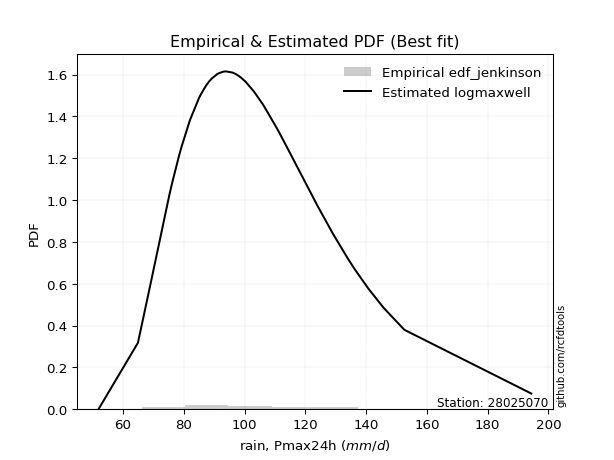</img>

</div>


### 10. Empirical - EDF Cunnane (1978)

Cunnane´s work in statistical hydrology has focused on the performance and evaluation of different probability distributions (such as GEV, Gumbel, Lognormal) for flood frequency estimation. _b_ is a constant, typically set to 0.4.

<div align="center">


$P=(m-b)/(n+1-2b)$


</div>


**10.1. Empirical values**

<div align="center">

|                | 0                    | 1                    | 2                    | 3                   | 4                   | 5                   | 6                   | 7                  | 8                   | 9                   | 10                  | 11                 | 12                 | 13                 | 14                 | 15                 | 16                 | 17                 | 18                  | 19                  | 20                 | 21                 | 22                 | 23                 | 24                 | 25                 | 26                 | 27                 | 28                 | 29                 | 30                 | 31                 | 32                 | 33                 | 34                 | 35                 | 36                 | 37                 | 38                 | 39                | 40                | 41                |
|:---------------|:---------------------|:---------------------|:---------------------|:--------------------|:--------------------|:--------------------|:--------------------|:-------------------|:--------------------|:--------------------|:--------------------|:-------------------|:-------------------|:-------------------|:-------------------|:-------------------|:-------------------|:-------------------|:--------------------|:--------------------|:-------------------|:-------------------|:-------------------|:-------------------|:-------------------|:-------------------|:-------------------|:-------------------|:-------------------|:-------------------|:-------------------|:-------------------|:-------------------|:-------------------|:-------------------|:-------------------|:-------------------|:-------------------|:-------------------|:------------------|:------------------|:------------------|
| date           | 1997                 | 1991                 | 2000                 | 2003                | 2004                | 1999                | 1979                | 1994               | 2014                | 1988                | 1982                | 1990               | 2001               | 1998               | 1974               | 2012               | 1981               | 1993               | 2013                | 2009                | 1973               | 2002               | 1978               | 1985               | 1984               | 1976               | 2005               | 1987               | 1992               | 1989               | 2015               | 2006               | 2011               | 1996               | 2010               | 1980               | 2007               | 1975               | 1983               | 1995              | 2008              | 1986              |
| x              | 51.9                 | 64.9                 | 69.0                 | 75.3                | 75.5                | 76.3                | 78.4                | 79.2               | 85.0                | 85.6                | 87.3                | 88.2               | 88.4               | 91.0               | 91.5               | 93.0               | 93.6381523448394   | 93.9               | 96.0                | 97.0                | 97.5568649570023   | 98.7               | 98.8               | 100.2              | 100.4              | 103.1              | 106.0              | 106.5              | 110.5              | 111.4              | 112.0              | 115.5              | 124.0              | 129.1              | 134.0              | 134.2              | 136.5              | 136.5              | 140.8              | 145.8             | 152.6             | 194.4             |
| m              | 1                    | 2                    | 3                    | 4                   | 5                   | 6                   | 7                   | 8                  | 9                   | 10                  | 11                  | 12                 | 13                 | 14                 | 15                 | 16                 | 17                 | 18                 | 19                  | 20                  | 21                 | 22                 | 23                 | 24                 | 25                 | 26                 | 27                 | 28                 | 29                 | 30                 | 31                 | 32                 | 33                 | 34                 | 35                 | 36                 | 37                 | 38                 | 39                 | 40                | 41                | 42                |
| empirical_dist | edf_cunnane          | edf_cunnane          | edf_cunnane          | edf_cunnane         | edf_cunnane         | edf_cunnane         | edf_cunnane         | edf_cunnane        | edf_cunnane         | edf_cunnane         | edf_cunnane         | edf_cunnane        | edf_cunnane        | edf_cunnane        | edf_cunnane        | edf_cunnane        | edf_cunnane        | edf_cunnane        | edf_cunnane         | edf_cunnane         | edf_cunnane        | edf_cunnane        | edf_cunnane        | edf_cunnane        | edf_cunnane        | edf_cunnane        | edf_cunnane        | edf_cunnane        | edf_cunnane        | edf_cunnane        | edf_cunnane        | edf_cunnane        | edf_cunnane        | edf_cunnane        | edf_cunnane        | edf_cunnane        | edf_cunnane        | edf_cunnane        | edf_cunnane        | edf_cunnane       | edf_cunnane       | edf_cunnane       |
| empirical      | 0.014218009478672985 | 0.037914691943127965 | 0.061611374407582936 | 0.08530805687203791 | 0.10900473933649288 | 0.13270142180094785 | 0.15639810426540282 | 0.1800947867298578 | 0.20379146919431276 | 0.22748815165876776 | 0.25118483412322273 | 0.2748815165876777 | 0.2985781990521327 | 0.3222748815165877 | 0.3459715639810426 | 0.3696682464454976 | 0.3933649289099526 | 0.4170616113744076 | 0.44075829383886256 | 0.46445497630331756 | 0.4881516587677725 | 0.5118483412322274 | 0.5355450236966824 | 0.5592417061611374 | 0.5829383886255924 | 0.6066350710900474 | 0.6303317535545023 | 0.6540284360189573 | 0.6777251184834123 | 0.7014218009478673 | 0.7251184834123222 | 0.7488151658767772 | 0.7725118483412322 | 0.7962085308056872 | 0.8199052132701422 | 0.8436018957345971 | 0.8672985781990521 | 0.8909952606635071 | 0.9146919431279621 | 0.938388625592417 | 0.962085308056872 | 0.985781990521327 |
| empirical_tr   | 1.0144230769230769   | 1.0394088669950738   | 1.0656565656565655   | 1.093264248704663   | 1.122340425531915   | 1.1530054644808743  | 1.1853932584269662  | 1.2196531791907514 | 1.255952380952381   | 1.294478527607362   | 1.3354430379746836  | 1.3790849673202614 | 1.4256756756756757 | 1.4755244755244754 | 1.5289855072463765 | 1.586466165413534  | 1.6484374999999998 | 1.715447154471545  | 1.7881355932203389  | 1.8672566371681416  | 1.953703703703704  | 2.0485436893203883 | 2.1530612244897958 | 2.2688172043010755 | 2.397727272727273  | 2.5421686746987953 | 2.705128205128205  | 2.8904109589041096 | 3.1029411764705883 | 3.3492063492063493 | 3.637931034482758  | 3.9811320754716975 | 4.395833333333333  | 4.906976744186046  | 5.552631578947369  | 6.393939393939392  | 7.535714285714284  | 9.17391304347826   | 11.722222222222223 | 16.23076923076921 | 26.37499999999996 | 70.33333333333316 |

</div>


**10.2. Kolmogorov-Smirnov fit test (sorted by Δ)**


<div align="center">

|                | 0                   | 1                   | 2                    | 3                   | 4                 | 5                  | 6                   | 7                   | 8                     | 9                   | 10                  | 11                  | 12                  | 13                  | 14                  | 15                  | 16                  | 17                  | 18                  | 19                  | 20                  | 21                  | 22                  | 23                  | 24                  | 25                  | 26                  | 27                  | 28                  | 29                  | 30                  | 31                  | 32                  | 33                  | 34                  | 35                  | 36                  | 37                  | 38                  | 39                  | 40                 | 41                  | 42                  | 43                  | 44                  | 45                  | 46                  | 47                  | 48                  | 49                  | 50                  | 51                  | 52                  | 53                  | 54                  | 55                  | 56                  | 57                  | 58                  | 59                  | 60                  | 61                 | 62                  | 63                  | 64                  | 65                  | 66                  | 67                  | 68                  | 69                  | 70                 | 71                  | 72                  | 73                  | 74                 | 75                 | 76                 | 77                 | 78                  | 79                 | 80                 | 81                  | 82                  | 83                  | 84                 | 85                  | 86                 | 87                  | 88                 | 89                  | 90                 | 91                 |
|:---------------|:--------------------|:--------------------|:---------------------|:--------------------|:------------------|:-------------------|:--------------------|:--------------------|:----------------------|:--------------------|:--------------------|:--------------------|:--------------------|:--------------------|:--------------------|:--------------------|:--------------------|:--------------------|:--------------------|:--------------------|:--------------------|:--------------------|:--------------------|:--------------------|:--------------------|:--------------------|:--------------------|:--------------------|:--------------------|:--------------------|:--------------------|:--------------------|:--------------------|:--------------------|:--------------------|:--------------------|:--------------------|:--------------------|:--------------------|:--------------------|:-------------------|:--------------------|:--------------------|:--------------------|:--------------------|:--------------------|:--------------------|:--------------------|:--------------------|:--------------------|:--------------------|:--------------------|:--------------------|:--------------------|:--------------------|:--------------------|:--------------------|:--------------------|:--------------------|:--------------------|:--------------------|:-------------------|:--------------------|:--------------------|:--------------------|:--------------------|:--------------------|:--------------------|:--------------------|:--------------------|:-------------------|:--------------------|:--------------------|:--------------------|:-------------------|:-------------------|:-------------------|:-------------------|:--------------------|:-------------------|:-------------------|:--------------------|:--------------------|:--------------------|:-------------------|:--------------------|:-------------------|:--------------------|:-------------------|:--------------------|:-------------------|:-------------------|
| station        | 28025070            | 28025070            | 28025070             | 28025070            | 28025070          | 28025070           | 28025070            | 28025070            | 28025070              | 28025070            | 28025070            | 28025070            | 28025070            | 28025070            | 28025070            | 28025070            | 28025070            | 28025070            | 28025070            | 28025070            | 28025070            | 28025070            | 28025070            | 28025070            | 28025070            | 28025070            | 28025070            | 28025070            | 28025070            | 28025070            | 28025070            | 28025070            | 28025070            | 28025070            | 28025070            | 28025070            | 28025070            | 28025070            | 28025070            | 28025070            | 28025070           | 28025070            | 28025070            | 28025070            | 28025070            | 28025070            | 28025070            | 28025070            | 28025070            | 28025070            | 28025070            | 28025070            | 28025070            | 28025070            | 28025070            | 28025070            | 28025070            | 28025070            | 28025070            | 28025070            | 28025070            | 28025070           | 28025070            | 28025070            | 28025070            | 28025070            | 28025070            | 28025070            | 28025070            | 28025070            | 28025070           | 28025070            | 28025070            | 28025070            | 28025070           | 28025070           | 28025070           | 28025070           | 28025070            | 28025070           | 28025070           | 28025070            | 28025070            | 28025070            | 28025070           | 28025070            | 28025070           | 28025070            | 28025070           | 28025070            | 28025070           | 28025070           |
| empirical_dist | edf_cunnane         | edf_cunnane         | edf_cunnane          | edf_cunnane         | edf_cunnane       | edf_cunnane        | edf_cunnane         | edf_cunnane         | edf_cunnane           | edf_cunnane         | edf_cunnane         | edf_cunnane         | edf_cunnane         | edf_cunnane         | edf_cunnane         | edf_cunnane         | edf_cunnane         | edf_cunnane         | edf_cunnane         | edf_cunnane         | edf_cunnane         | edf_cunnane         | edf_cunnane         | edf_cunnane         | edf_cunnane         | edf_cunnane         | edf_cunnane         | edf_cunnane         | edf_cunnane         | edf_cunnane         | edf_cunnane         | edf_cunnane         | edf_cunnane         | edf_cunnane         | edf_cunnane         | edf_cunnane         | edf_cunnane         | edf_cunnane         | edf_cunnane         | edf_cunnane         | edf_cunnane        | edf_cunnane         | edf_cunnane         | edf_cunnane         | edf_cunnane         | edf_cunnane         | edf_cunnane         | edf_cunnane         | edf_cunnane         | edf_cunnane         | edf_cunnane         | edf_cunnane         | edf_cunnane         | edf_cunnane         | edf_cunnane         | edf_cunnane         | edf_cunnane         | edf_cunnane         | edf_cunnane         | edf_cunnane         | edf_cunnane         | edf_cunnane        | edf_cunnane         | edf_cunnane         | edf_cunnane         | edf_cunnane         | edf_cunnane         | edf_cunnane         | edf_cunnane         | edf_cunnane         | edf_cunnane        | edf_cunnane         | edf_cunnane         | edf_cunnane         | edf_cunnane        | edf_cunnane        | edf_cunnane        | edf_cunnane        | edf_cunnane         | edf_cunnane        | edf_cunnane        | edf_cunnane         | edf_cunnane         | edf_cunnane         | edf_cunnane        | edf_cunnane         | edf_cunnane        | edf_cunnane         | edf_cunnane        | edf_cunnane         | edf_cunnane        | edf_cunnane        |
| p_dist         | laplace_asymmetric  | moyal               | exponnorm            | gumbel_r            | lognct            | johnsonsu          | loginvgamma         | loggenlogistic      | loglaplace_asymmetric | logmielke           | invweibull          | pearson3            | mielke              | logfisk             | logalpha            | logjohnsonsu        | invgauss            | loginvgauss         | fisk                | betaprime           | logmaxwell          | logexponnorm        | genlogistic         | loggumbel_r         | logpearson3         | logncf              | alpha               | kstwobign           | nct                 | logerlang           | loggamma            | loggamma            | logf                | loglognorm          | logfatiguelife      | weibull_min         | invgamma            | f                   | lognakagami         | halflogistic        | logrice            | fatiguelife         | loghypsecant        | loglogistic         | logt                | lognorm             | lognorm             | ncf                 | logloggamma         | lograyleigh         | loglaplace          | rayleigh            | erlang              | chi2                | gamma               | logweibull_min      | logdgamma           | logcrystalball      | nakagami            | rice                | logmoyal            | halfnorm           | maxwell             | loggompertz         | dgamma              | loginvweibull       | loghalfnorm         | loghalflogistic     | t                   | norm                | crystalball        | truncnorm           | logistic            | hypsecant           | logkstwobign       | loggumbel_l        | laplace            | wald               | logwald             | gibrat             | loggibrat          | logbetaprime        | gumbel_l            | loggenexpon         | genexpon           | pareto              | expon              | logtruncnorm        | logexpon           | logpareto           | logchi2            | gompertz           |
| delta          | 0.05983040525123673 | 0.06024981930938622 | 0.061540236717235186 | 0.06235771258480338 | 0.063494091038349 | 0.0642266159724072 | 0.06439470746749765 | 0.06556663722194356 | 0.06581316090922174   | 0.06595898982841952 | 0.06609889974820404 | 0.06610001439600921 | 0.06615170533205217 | 0.06666908528997639 | 0.06764398967319285 | 0.06854622591789628 | 0.06903869279028751 | 0.06958645256181431 | 0.07182917168372926 | 0.07313170643176636 | 0.07357907106854825 | 0.07413869856418664 | 0.07467810273524866 | 0.07512744617026668 | 0.07554882897074522 | 0.07574906905480161 | 0.07582681592472584 | 0.07587537478974274 | 0.07604248743507369 | 0.07618319517808803 | 0.07640498425752107 | 0.07640498425752107 | 0.07661751745721557 | 0.07669557990526599 | 0.07678390223520637 | 0.07711224720458432 | 0.07723015182497794 | 0.07747099850995787 | 0.07784267465770378 | 0.07798354743354238 | 0.0781057355919289 | 0.08054944955635335 | 0.08115738316601362 | 0.08132319253125275 | 0.08151633575296247 | 0.08151734745713102 | 0.08151734745713102 | 0.08153697761243783 | 0.08170342176878498 | 0.08274366974558015 | 0.08284186726441667 | 0.08358516592651233 | 0.08372105025588644 | 0.08372123156702099 | 0.08372136184473378 | 0.08397872777413007 | 0.08515489962572265 | 0.08626009078313684 | 0.08912342522860411 | 0.09238596198827706 | 0.09293922974102209 | 0.0936974658407628 | 0.09543609684522275 | 0.10076222895911974 | 0.10087761046423982 | 0.10550645521908017 | 0.10762382130252021 | 0.11316124669498107 | 0.12969247320802912 | 0.12972114758327097 | 0.1297211541058229 | 0.12972116194406447 | 0.13603460036597254 | 0.14137585908033684 | 0.1443470385601899 | 0.1518499027101704 | 0.1595094936339943 | 0.1771385629619322 | 0.17997187864437203 | 0.1800947867298578 | 0.1800947867298578 | 0.19163487295886172 | 0.19993500541203035 | 0.22464968359856677 | 0.2750773291877659 | 0.27893948143771674 | 0.2789394874407762 | 0.33348427445359613 | 0.3462074277497804 | 0.34620742778425573 | 0.3464367665847824 | 0.9605684348352118 |
| deltao         | 0.209852555948445   | 0.209852555948445   | 0.209852555948445    | 0.209852555948445   | 0.209852555948445 | 0.209852555948445  | 0.209852555948445   | 0.209852555948445   | 0.209852555948445     | 0.209852555948445   | 0.209852555948445   | 0.209852555948445   | 0.209852555948445   | 0.209852555948445   | 0.209852555948445   | 0.209852555948445   | 0.209852555948445   | 0.209852555948445   | 0.209852555948445   | 0.209852555948445   | 0.209852555948445   | 0.209852555948445   | 0.209852555948445   | 0.209852555948445   | 0.209852555948445   | 0.209852555948445   | 0.209852555948445   | 0.209852555948445   | 0.209852555948445   | 0.209852555948445   | 0.209852555948445   | 0.209852555948445   | 0.209852555948445   | 0.209852555948445   | 0.209852555948445   | 0.209852555948445   | 0.209852555948445   | 0.209852555948445   | 0.209852555948445   | 0.209852555948445   | 0.209852555948445  | 0.209852555948445   | 0.209852555948445   | 0.209852555948445   | 0.209852555948445   | 0.209852555948445   | 0.209852555948445   | 0.209852555948445   | 0.209852555948445   | 0.209852555948445   | 0.209852555948445   | 0.209852555948445   | 0.209852555948445   | 0.209852555948445   | 0.209852555948445   | 0.209852555948445   | 0.209852555948445   | 0.209852555948445   | 0.209852555948445   | 0.209852555948445   | 0.209852555948445   | 0.209852555948445  | 0.209852555948445   | 0.209852555948445   | 0.209852555948445   | 0.209852555948445   | 0.209852555948445   | 0.209852555948445   | 0.209852555948445   | 0.209852555948445   | 0.209852555948445  | 0.209852555948445   | 0.209852555948445   | 0.209852555948445   | 0.209852555948445  | 0.209852555948445  | 0.209852555948445  | 0.209852555948445  | 0.209852555948445   | 0.209852555948445  | 0.209852555948445  | 0.209852555948445   | 0.209852555948445   | 0.209852555948445   | 0.209852555948445  | 0.209852555948445   | 0.209852555948445  | 0.209852555948445   | 0.209852555948445  | 0.209852555948445   | 0.209852555948445  | 0.209852555948445  |
| eval           | Δo > Δ              | Δo > Δ              | Δo > Δ               | Δo > Δ              | Δo > Δ            | Δo > Δ             | Δo > Δ              | Δo > Δ              | Δo > Δ                | Δo > Δ              | Δo > Δ              | Δo > Δ              | Δo > Δ              | Δo > Δ              | Δo > Δ              | Δo > Δ              | Δo > Δ              | Δo > Δ              | Δo > Δ              | Δo > Δ              | Δo > Δ              | Δo > Δ              | Δo > Δ              | Δo > Δ              | Δo > Δ              | Δo > Δ              | Δo > Δ              | Δo > Δ              | Δo > Δ              | Δo > Δ              | Δo > Δ              | Δo > Δ              | Δo > Δ              | Δo > Δ              | Δo > Δ              | Δo > Δ              | Δo > Δ              | Δo > Δ              | Δo > Δ              | Δo > Δ              | Δo > Δ             | Δo > Δ              | Δo > Δ              | Δo > Δ              | Δo > Δ              | Δo > Δ              | Δo > Δ              | Δo > Δ              | Δo > Δ              | Δo > Δ              | Δo > Δ              | Δo > Δ              | Δo > Δ              | Δo > Δ              | Δo > Δ              | Δo > Δ              | Δo > Δ              | Δo > Δ              | Δo > Δ              | Δo > Δ              | Δo > Δ              | Δo > Δ             | Δo > Δ              | Δo > Δ              | Δo > Δ              | Δo > Δ              | Δo > Δ              | Δo > Δ              | Δo > Δ              | Δo > Δ              | Δo > Δ             | Δo > Δ              | Δo > Δ              | Δo > Δ              | Δo > Δ             | Δo > Δ             | Δo > Δ             | Δo > Δ             | Δo > Δ              | Δo > Δ             | Δo > Δ             | Δo > Δ              | Δo > Δ              | Δo <= Δ             | Δo <= Δ            | Δo <= Δ             | Δo <= Δ            | Δo <= Δ             | Δo <= Δ            | Δo <= Δ             | Δo <= Δ            | Δo <= Δ            |
| fit            | 1                   | 1                   | 1                    | 1                   | 1                 | 1                  | 1                   | 1                   | 1                     | 1                   | 1                   | 1                   | 1                   | 1                   | 1                   | 1                   | 1                   | 1                   | 1                   | 1                   | 1                   | 1                   | 1                   | 1                   | 1                   | 1                   | 1                   | 1                   | 1                   | 1                   | 1                   | 1                   | 1                   | 1                   | 1                   | 1                   | 1                   | 1                   | 1                   | 1                   | 1                  | 1                   | 1                   | 1                   | 1                   | 1                   | 1                   | 1                   | 1                   | 1                   | 1                   | 1                   | 1                   | 1                   | 1                   | 1                   | 1                   | 1                   | 1                   | 1                   | 1                   | 1                  | 1                   | 1                   | 1                   | 1                   | 1                   | 1                   | 1                   | 1                   | 1                  | 1                   | 1                   | 1                   | 1                  | 1                  | 1                  | 1                  | 1                   | 1                  | 1                  | 1                   | 1                   | 0                   | 0                  | 0                   | 0                  | 0                   | 0                  | 0                   | 0                  | 0                  |
| n              | 42                  | 42                  | 42                   | 42                  | 42                | 42                 | 42                  | 42                  | 42                    | 42                  | 42                  | 42                  | 42                  | 42                  | 42                  | 42                  | 42                  | 42                  | 42                  | 42                  | 42                  | 42                  | 42                  | 42                  | 42                  | 42                  | 42                  | 42                  | 42                  | 42                  | 42                  | 42                  | 42                  | 42                  | 42                  | 42                  | 42                  | 42                  | 42                  | 42                  | 42                 | 42                  | 42                  | 42                  | 42                  | 42                  | 42                  | 42                  | 42                  | 42                  | 42                  | 42                  | 42                  | 42                  | 42                  | 42                  | 42                  | 42                  | 42                  | 42                  | 42                  | 42                 | 42                  | 42                  | 42                  | 42                  | 42                  | 42                  | 42                  | 42                  | 42                 | 42                  | 42                  | 42                  | 42                 | 42                 | 42                 | 42                 | 42                  | 42                 | 42                 | 42                  | 42                  | 42                  | 42                 | 42                  | 42                 | 42                  | 42                 | 42                  | 42                 | 42                 |
| best_fit       | 1                   | 0                   | 0                    | 0                   | 0                 | 0                  | 0                   | 0                   | 0                     | 0                   | 0                   | 0                   | 0                   | 0                   | 0                   | 0                   | 0                   | 0                   | 0                   | 0                   | 0                   | 0                   | 0                   | 0                   | 0                   | 0                   | 0                   | 0                   | 0                   | 0                   | 0                   | 0                   | 0                   | 0                   | 0                   | 0                   | 0                   | 0                   | 0                   | 0                   | 0                  | 0                   | 0                   | 0                   | 0                   | 0                   | 0                   | 0                   | 0                   | 0                   | 0                   | 0                   | 0                   | 0                   | 0                   | 0                   | 0                   | 0                   | 0                   | 0                   | 0                   | 0                  | 0                   | 0                   | 0                   | 0                   | 0                   | 0                   | 0                   | 0                   | 0                  | 0                   | 0                   | 0                   | 0                  | 0                  | 0                  | 0                  | 0                   | 0                  | 0                  | 0                   | 0                   | 0                   | 0                  | 0                   | 0                  | 0                   | 0                  | 0                   | 0                  | 0                  |
| best_fit_sort  | 1                   | 2                   | 3                    | 4                   | 5                 | 6                  | 7                   | 8                   | 9                     | 10                  | 11                  | 12                  | 13                  | 14                  | 15                  | 16                  | 17                  | 18                  | 19                  | 20                  | 21                  | 22                  | 23                  | 24                  | 25                  | 26                  | 27                  | 28                  | 29                  | 30                  | 31                  | 32                  | 33                  | 34                  | 35                  | 36                  | 37                  | 38                  | 39                  | 40                  | 41                 | 42                  | 43                  | 44                  | 45                  | 46                  | 47                  | 48                  | 49                  | 50                  | 51                  | 52                  | 53                  | 54                  | 55                  | 56                  | 57                  | 58                  | 59                  | 60                  | 61                  | 62                 | 63                  | 64                  | 65                  | 66                  | 67                  | 68                  | 69                  | 70                  | 71                 | 72                  | 73                  | 74                  | 75                 | 76                 | 77                 | 78                 | 79                  | 80                 | 81                 | 82                  | 83                  | 84                  | 85                 | 86                  | 87                 | 88                  | 89                 | 90                  | 91                 | 92                 |

</div>


<div align="center">

</img>

</div>


**10.3. Best fit**

<div align="center">

|   id |   station | empirical_dist   | p_dist             |     delta |   deltao | eval   |   fit |   n |   best_fit |   best_fit_sort |
|-----:|----------:|:-----------------|:-------------------|----------:|---------:|:-------|------:|----:|-----------:|----------------:|
|    0 |  28025070 | edf_cunnane      | laplace_asymmetric | 0.0598304 | 0.209853 | Δo > Δ |     1 |  42 |          1 |               1 |

</div>


<div align="center">

</img>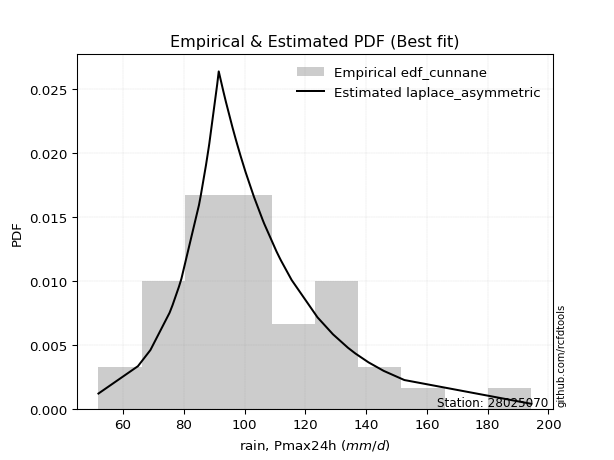</img>

</div>


### 11. Empirical - EDF Adamowski (1981)

The Adamowski formula in hydrology refers to a specific plotting position formula used for estimating the non-parametric empirical distribution of hydrological events (like flood peaks) to calculate their return periods. This formula provides an alternative to traditional parametric methods (like the Gumbel or Log Pearson Type III distributions). 

<div align="center">


$P=(m-0.25)/(n+0.5)$


</div>


**11.1. Empirical values**

<div align="center">

|                | 0                   | 1                    | 2                   | 3                   | 4                   | 5                   | 6                  | 7                   | 8                   | 9                   | 10                 | 11                  | 12                 | 13                 | 14                  | 15                  | 16                 | 17                 | 18                 | 19                 | 20                  | 21                 | 22                 | 23                 | 24                 | 25                 | 26                 | 27                 | 28                 | 29                | 30                 | 31                 | 32                 | 33                 | 34                 | 35                 | 36                 | 37                | 38                 | 39                 | 40                 | 41                 |
|:---------------|:--------------------|:---------------------|:--------------------|:--------------------|:--------------------|:--------------------|:-------------------|:--------------------|:--------------------|:--------------------|:-------------------|:--------------------|:-------------------|:-------------------|:--------------------|:--------------------|:-------------------|:-------------------|:-------------------|:-------------------|:--------------------|:-------------------|:-------------------|:-------------------|:-------------------|:-------------------|:-------------------|:-------------------|:-------------------|:------------------|:-------------------|:-------------------|:-------------------|:-------------------|:-------------------|:-------------------|:-------------------|:------------------|:-------------------|:-------------------|:-------------------|:-------------------|
| date           | 1997                | 1991                 | 2000                | 2003                | 2004                | 1999                | 1979               | 1994                | 2014                | 1988                | 1982               | 1990                | 2001               | 1998               | 1974                | 2012                | 1981               | 1993               | 2013               | 2009               | 1973                | 2002               | 1978               | 1985               | 1984               | 1976               | 2005               | 1987               | 1992               | 1989              | 2015               | 2006               | 2011               | 1996               | 2010               | 1980               | 2007               | 1975              | 1983               | 1995               | 2008               | 1986               |
| x              | 51.9                | 64.9                 | 69.0                | 75.3                | 75.5                | 76.3                | 78.4               | 79.2                | 85.0                | 85.6                | 87.3               | 88.2                | 88.4               | 91.0               | 91.5                | 93.0                | 93.6381523448394   | 93.9               | 96.0               | 97.0               | 97.5568649570023    | 98.7               | 98.8               | 100.2              | 100.4              | 103.1              | 106.0              | 106.5              | 110.5              | 111.4             | 112.0              | 115.5              | 124.0              | 129.1              | 134.0              | 134.2              | 136.5              | 136.5             | 140.8              | 145.8              | 152.6              | 194.4              |
| m              | 1                   | 2                    | 3                   | 4                   | 5                   | 6                   | 7                  | 8                   | 9                   | 10                  | 11                 | 12                  | 13                 | 14                 | 15                  | 16                  | 17                 | 18                 | 19                 | 20                 | 21                  | 22                 | 23                 | 24                 | 25                 | 26                 | 27                 | 28                 | 29                 | 30                | 31                 | 32                 | 33                 | 34                 | 35                 | 36                 | 37                 | 38                | 39                 | 40                 | 41                 | 42                 |
| empirical_dist | edf_adamowski       | edf_adamowski        | edf_adamowski       | edf_adamowski       | edf_adamowski       | edf_adamowski       | edf_adamowski      | edf_adamowski       | edf_adamowski       | edf_adamowski       | edf_adamowski      | edf_adamowski       | edf_adamowski      | edf_adamowski      | edf_adamowski       | edf_adamowski       | edf_adamowski      | edf_adamowski      | edf_adamowski      | edf_adamowski      | edf_adamowski       | edf_adamowski      | edf_adamowski      | edf_adamowski      | edf_adamowski      | edf_adamowski      | edf_adamowski      | edf_adamowski      | edf_adamowski      | edf_adamowski     | edf_adamowski      | edf_adamowski      | edf_adamowski      | edf_adamowski      | edf_adamowski      | edf_adamowski      | edf_adamowski      | edf_adamowski     | edf_adamowski      | edf_adamowski      | edf_adamowski      | edf_adamowski      |
| empirical      | 0.01764705882352941 | 0.041176470588235294 | 0.06470588235294118 | 0.08823529411764706 | 0.11176470588235295 | 0.13529411764705881 | 0.1588235294117647 | 0.18235294117647058 | 0.20588235294117646 | 0.22941176470588234 | 0.2529411764705882 | 0.27647058823529413 | 0.3                | 0.3235294117647059 | 0.34705882352941175 | 0.37058823529411766 | 0.3941176470588235 | 0.4176470588235294 | 0.4411764705882353 | 0.4647058823529412 | 0.48823529411764705 | 0.5117647058823529 | 0.5352941176470588 | 0.5588235294117647 | 0.5823529411764706 | 0.6058823529411764 | 0.6294117647058823 | 0.6529411764705882 | 0.6764705882352942 | 0.7               | 0.7235294117647059 | 0.7470588235294118 | 0.7705882352941177 | 0.7941176470588235 | 0.8176470588235294 | 0.8411764705882353 | 0.8647058823529412 | 0.888235294117647 | 0.9117647058823529 | 0.9352941176470588 | 0.9588235294117647 | 0.9823529411764705 |
| empirical_tr   | 1.0179640718562875  | 1.0429447852760736   | 1.069182389937107   | 1.096774193548387   | 1.1258278145695364  | 1.1564625850340136  | 1.1888111888111887 | 1.223021582733813   | 1.259259259259259   | 1.297709923664122   | 1.3385826771653544 | 1.3821138211382114  | 1.4285714285714286 | 1.4782608695652173 | 1.5315315315315314  | 1.588785046728972   | 1.6504854368932036 | 1.7171717171717173 | 1.7894736842105263 | 1.8681318681318682 | 1.9540229885057472  | 2.048192771084337  | 2.151898734177215  | 2.2666666666666666 | 2.394366197183099  | 2.5373134328358207 | 2.698412698412698  | 2.88135593220339   | 3.0909090909090913 | 3.333333333333333 | 3.6170212765957444 | 3.9534883720930236 | 4.3589743589743595 | 4.857142857142856  | 5.483870967741935  | 6.296296296296297  | 7.391304347826089  | 8.947368421052628 | 11.33333333333333  | 15.454545454545457 | 24.285714285714306 | 56.66666666666651  |

</div>


**11.2. Kolmogorov-Smirnov fit test (sorted by Δ)**


<div align="center">

|                | 0                    | 1                    | 2                   | 3                    | 4                   | 5                   | 6                  | 7                   | 8                  | 9                   | 10                  | 11                  | 12                    | 13                  | 14                  | 15                  | 16                 | 17                  | 18                  | 19                  | 20                  | 21                  | 22                  | 23                  | 24                  | 25                 | 26                 | 27                  | 28                  | 29                  | 30                  | 31                  | 32                  | 33                  | 34                  | 35                  | 36                 | 37                  | 38                  | 39                  | 40                  | 41                  | 42                  | 43                  | 44                  | 45                  | 46                 | 47                 | 48                  | 49                  | 50                  | 51                  | 52                  | 53                  | 54                  | 55                 | 56                  | 57                  | 58                 | 59                  | 60                 | 61                  | 62                  | 63                  | 64                  | 65                  | 66                  | 67                  | 68                 | 69                  | 70                 | 71                  | 72                  | 73                  | 74                 | 75                 | 76                 | 77                | 78                  | 79                  | 80                  | 81                  | 82                  | 83                  | 84                 | 85                  | 86                | 87                  | 88                  | 89                  | 90                 | 91                 |
|:---------------|:---------------------|:---------------------|:--------------------|:---------------------|:--------------------|:--------------------|:-------------------|:--------------------|:-------------------|:--------------------|:--------------------|:--------------------|:----------------------|:--------------------|:--------------------|:--------------------|:-------------------|:--------------------|:--------------------|:--------------------|:--------------------|:--------------------|:--------------------|:--------------------|:--------------------|:-------------------|:-------------------|:--------------------|:--------------------|:--------------------|:--------------------|:--------------------|:--------------------|:--------------------|:--------------------|:--------------------|:-------------------|:--------------------|:--------------------|:--------------------|:--------------------|:--------------------|:--------------------|:--------------------|:--------------------|:--------------------|:-------------------|:-------------------|:--------------------|:--------------------|:--------------------|:--------------------|:--------------------|:--------------------|:--------------------|:-------------------|:--------------------|:--------------------|:-------------------|:--------------------|:-------------------|:--------------------|:--------------------|:--------------------|:--------------------|:--------------------|:--------------------|:--------------------|:-------------------|:--------------------|:-------------------|:--------------------|:--------------------|:--------------------|:-------------------|:-------------------|:-------------------|:------------------|:--------------------|:--------------------|:--------------------|:--------------------|:--------------------|:--------------------|:-------------------|:--------------------|:------------------|:--------------------|:--------------------|:--------------------|:-------------------|:-------------------|
| station        | 28025070             | 28025070             | 28025070            | 28025070             | 28025070            | 28025070            | 28025070           | 28025070            | 28025070           | 28025070            | 28025070            | 28025070            | 28025070              | 28025070            | 28025070            | 28025070            | 28025070           | 28025070            | 28025070            | 28025070            | 28025070            | 28025070            | 28025070            | 28025070            | 28025070            | 28025070           | 28025070           | 28025070            | 28025070            | 28025070            | 28025070            | 28025070            | 28025070            | 28025070            | 28025070            | 28025070            | 28025070           | 28025070            | 28025070            | 28025070            | 28025070            | 28025070            | 28025070            | 28025070            | 28025070            | 28025070            | 28025070           | 28025070           | 28025070            | 28025070            | 28025070            | 28025070            | 28025070            | 28025070            | 28025070            | 28025070           | 28025070            | 28025070            | 28025070           | 28025070            | 28025070           | 28025070            | 28025070            | 28025070            | 28025070            | 28025070            | 28025070            | 28025070            | 28025070           | 28025070            | 28025070           | 28025070            | 28025070            | 28025070            | 28025070           | 28025070           | 28025070           | 28025070          | 28025070            | 28025070            | 28025070            | 28025070            | 28025070            | 28025070            | 28025070           | 28025070            | 28025070          | 28025070            | 28025070            | 28025070            | 28025070           | 28025070           |
| empirical_dist | edf_adamowski        | edf_adamowski        | edf_adamowski       | edf_adamowski        | edf_adamowski       | edf_adamowski       | edf_adamowski      | edf_adamowski       | edf_adamowski      | edf_adamowski       | edf_adamowski       | edf_adamowski       | edf_adamowski         | edf_adamowski       | edf_adamowski       | edf_adamowski       | edf_adamowski      | edf_adamowski       | edf_adamowski       | edf_adamowski       | edf_adamowski       | edf_adamowski       | edf_adamowski       | edf_adamowski       | edf_adamowski       | edf_adamowski      | edf_adamowski      | edf_adamowski       | edf_adamowski       | edf_adamowski       | edf_adamowski       | edf_adamowski       | edf_adamowski       | edf_adamowski       | edf_adamowski       | edf_adamowski       | edf_adamowski      | edf_adamowski       | edf_adamowski       | edf_adamowski       | edf_adamowski       | edf_adamowski       | edf_adamowski       | edf_adamowski       | edf_adamowski       | edf_adamowski       | edf_adamowski      | edf_adamowski      | edf_adamowski       | edf_adamowski       | edf_adamowski       | edf_adamowski       | edf_adamowski       | edf_adamowski       | edf_adamowski       | edf_adamowski      | edf_adamowski       | edf_adamowski       | edf_adamowski      | edf_adamowski       | edf_adamowski      | edf_adamowski       | edf_adamowski       | edf_adamowski       | edf_adamowski       | edf_adamowski       | edf_adamowski       | edf_adamowski       | edf_adamowski      | edf_adamowski       | edf_adamowski      | edf_adamowski       | edf_adamowski       | edf_adamowski       | edf_adamowski      | edf_adamowski      | edf_adamowski      | edf_adamowski     | edf_adamowski       | edf_adamowski       | edf_adamowski       | edf_adamowski       | edf_adamowski       | edf_adamowski       | edf_adamowski      | edf_adamowski       | edf_adamowski     | edf_adamowski       | edf_adamowski       | edf_adamowski       | edf_adamowski      | edf_adamowski      |
| p_dist         | exponnorm            | lognct               | gumbel_r            | laplace_asymmetric   | moyal               | loginvgamma         | johnsonsu          | invweibull          | pearson3           | loggenlogistic      | logalpha            | loginvgauss         | loglaplace_asymmetric | logjohnsonsu        | logmielke           | mielke              | invgauss           | logfisk             | logmaxwell          | betaprime           | fisk                | logexponnorm        | kstwobign           | loggumbel_r         | genlogistic         | logpearson3        | logncf             | alpha               | nct                 | logerlang           | loggamma            | loggamma            | halflogistic        | logf                | loglognorm          | logfatiguelife      | weibull_min        | invgamma            | f                   | lognakagami         | logrice             | fatiguelife         | loghypsecant        | lograyleigh         | loglogistic         | logt                | lognorm            | lognorm            | ncf                 | logloggamma         | rayleigh            | erlang              | chi2                | gamma               | logweibull_min      | loglaplace         | logcrystalball      | logdgamma           | nakagami           | rice                | halfnorm           | logmoyal            | maxwell             | loggompertz         | dgamma              | loginvweibull       | loghalfnorm         | loghalflogistic     | t                  | norm                | crystalball        | truncnorm           | logistic            | hypsecant           | logkstwobign       | loggumbel_l        | laplace            | wald              | logwald             | gibrat              | loggibrat           | logbetaprime        | gumbel_l            | loggenexpon         | genexpon           | pareto              | expon             | logtruncnorm        | logexpon            | logpareto           | logchi2            | gompertz           |
| delta          | 0.061342610028411126 | 0.061403207291485296 | 0.06177226513568157 | 0.062088559697849544 | 0.06250797375599904 | 0.06380926001837584 | 0.0643432766387031 | 0.06551345229908223 | 0.0655145669468874 | 0.06652057867163153 | 0.06705854222407104 | 0.06749556881495061 | 0.06790404465608546   | 0.06796077846877446 | 0.06821714427503234 | 0.06840985977866498 | 0.0684532453411657 | 0.06889577486236054 | 0.07148818732168455 | 0.07254625898264455 | 0.07316002132145583 | 0.07355325111506483 | 0.07378449104287904 | 0.07387291592214845 | 0.07409265528612685 | 0.0749633815216234 | 0.0751636216056798 | 0.07524136847560403 | 0.07545703998595188 | 0.07559774772896621 | 0.07581953680839926 | 0.07581953680839926 | 0.07589266368667869 | 0.07603207000809376 | 0.07611013245614417 | 0.07619845478608456 | 0.0765267997554625 | 0.07664470437585613 | 0.07688555106083605 | 0.07725722720858197 | 0.07752028814280709 | 0.07996400210723154 | 0.08057193571689181 | 0.08065278599871645 | 0.08073774508213094 | 0.08093088830384065 | 0.0809319000080092 | 0.0809319000080092 | 0.08095153016331602 | 0.08111797431966317 | 0.08299971847739052 | 0.08313560280676463 | 0.08313578411789918 | 0.08313591439561197 | 0.08339328032500826 | 0.0849327510112804 | 0.08567464333401503 | 0.08724578337258637 | 0.0885379777794823 | 0.09029507824141336 | 0.0916065820938991 | 0.09168469949290387 | 0.09485064939610094 | 0.09783499171351058 | 0.10296849421110355 | 0.10341557147221647 | 0.10553293755565651 | 0.11190671644686284 | 0.1291070257589073 | 0.12913570013414916 | 0.1291357066567011 | 0.12913571449494265 | 0.13544915291685072 | 0.14079041163121503 | 0.1422561548133262 | 0.1512644552610486 | 0.1589240461848725 | 0.179396717408545 | 0.18223003309098482 | 0.18235294117647058 | 0.18235294117647058 | 0.18870763571325255 | 0.19934955796290854 | 0.22255879985170307 | 0.2721500919421567 | 0.27601224419210757 | 0.276012250195167 | 0.33055703720798696 | 0.34328019050417125 | 0.34328019053864656 | 0.3435095293391732 | 0.9573066561901046 |
| deltao         | 0.209852555948445    | 0.209852555948445    | 0.209852555948445   | 0.209852555948445    | 0.209852555948445   | 0.209852555948445   | 0.209852555948445  | 0.209852555948445   | 0.209852555948445  | 0.209852555948445   | 0.209852555948445   | 0.209852555948445   | 0.209852555948445     | 0.209852555948445   | 0.209852555948445   | 0.209852555948445   | 0.209852555948445  | 0.209852555948445   | 0.209852555948445   | 0.209852555948445   | 0.209852555948445   | 0.209852555948445   | 0.209852555948445   | 0.209852555948445   | 0.209852555948445   | 0.209852555948445  | 0.209852555948445  | 0.209852555948445   | 0.209852555948445   | 0.209852555948445   | 0.209852555948445   | 0.209852555948445   | 0.209852555948445   | 0.209852555948445   | 0.209852555948445   | 0.209852555948445   | 0.209852555948445  | 0.209852555948445   | 0.209852555948445   | 0.209852555948445   | 0.209852555948445   | 0.209852555948445   | 0.209852555948445   | 0.209852555948445   | 0.209852555948445   | 0.209852555948445   | 0.209852555948445  | 0.209852555948445  | 0.209852555948445   | 0.209852555948445   | 0.209852555948445   | 0.209852555948445   | 0.209852555948445   | 0.209852555948445   | 0.209852555948445   | 0.209852555948445  | 0.209852555948445   | 0.209852555948445   | 0.209852555948445  | 0.209852555948445   | 0.209852555948445  | 0.209852555948445   | 0.209852555948445   | 0.209852555948445   | 0.209852555948445   | 0.209852555948445   | 0.209852555948445   | 0.209852555948445   | 0.209852555948445  | 0.209852555948445   | 0.209852555948445  | 0.209852555948445   | 0.209852555948445   | 0.209852555948445   | 0.209852555948445  | 0.209852555948445  | 0.209852555948445  | 0.209852555948445 | 0.209852555948445   | 0.209852555948445   | 0.209852555948445   | 0.209852555948445   | 0.209852555948445   | 0.209852555948445   | 0.209852555948445  | 0.209852555948445   | 0.209852555948445 | 0.209852555948445   | 0.209852555948445   | 0.209852555948445   | 0.209852555948445  | 0.209852555948445  |
| eval           | Δo > Δ               | Δo > Δ               | Δo > Δ              | Δo > Δ               | Δo > Δ              | Δo > Δ              | Δo > Δ             | Δo > Δ              | Δo > Δ             | Δo > Δ              | Δo > Δ              | Δo > Δ              | Δo > Δ                | Δo > Δ              | Δo > Δ              | Δo > Δ              | Δo > Δ             | Δo > Δ              | Δo > Δ              | Δo > Δ              | Δo > Δ              | Δo > Δ              | Δo > Δ              | Δo > Δ              | Δo > Δ              | Δo > Δ             | Δo > Δ             | Δo > Δ              | Δo > Δ              | Δo > Δ              | Δo > Δ              | Δo > Δ              | Δo > Δ              | Δo > Δ              | Δo > Δ              | Δo > Δ              | Δo > Δ             | Δo > Δ              | Δo > Δ              | Δo > Δ              | Δo > Δ              | Δo > Δ              | Δo > Δ              | Δo > Δ              | Δo > Δ              | Δo > Δ              | Δo > Δ             | Δo > Δ             | Δo > Δ              | Δo > Δ              | Δo > Δ              | Δo > Δ              | Δo > Δ              | Δo > Δ              | Δo > Δ              | Δo > Δ             | Δo > Δ              | Δo > Δ              | Δo > Δ             | Δo > Δ              | Δo > Δ             | Δo > Δ              | Δo > Δ              | Δo > Δ              | Δo > Δ              | Δo > Δ              | Δo > Δ              | Δo > Δ              | Δo > Δ             | Δo > Δ              | Δo > Δ             | Δo > Δ              | Δo > Δ              | Δo > Δ              | Δo > Δ             | Δo > Δ             | Δo > Δ             | Δo > Δ            | Δo > Δ              | Δo > Δ              | Δo > Δ              | Δo > Δ              | Δo > Δ              | Δo <= Δ             | Δo <= Δ            | Δo <= Δ             | Δo <= Δ           | Δo <= Δ             | Δo <= Δ             | Δo <= Δ             | Δo <= Δ            | Δo <= Δ            |
| fit            | 1                    | 1                    | 1                   | 1                    | 1                   | 1                   | 1                  | 1                   | 1                  | 1                   | 1                   | 1                   | 1                     | 1                   | 1                   | 1                   | 1                  | 1                   | 1                   | 1                   | 1                   | 1                   | 1                   | 1                   | 1                   | 1                  | 1                  | 1                   | 1                   | 1                   | 1                   | 1                   | 1                   | 1                   | 1                   | 1                   | 1                  | 1                   | 1                   | 1                   | 1                   | 1                   | 1                   | 1                   | 1                   | 1                   | 1                  | 1                  | 1                   | 1                   | 1                   | 1                   | 1                   | 1                   | 1                   | 1                  | 1                   | 1                   | 1                  | 1                   | 1                  | 1                   | 1                   | 1                   | 1                   | 1                   | 1                   | 1                   | 1                  | 1                   | 1                  | 1                   | 1                   | 1                   | 1                  | 1                  | 1                  | 1                 | 1                   | 1                   | 1                   | 1                   | 1                   | 0                   | 0                  | 0                   | 0                 | 0                   | 0                   | 0                   | 0                  | 0                  |
| n              | 42                   | 42                   | 42                  | 42                   | 42                  | 42                  | 42                 | 42                  | 42                 | 42                  | 42                  | 42                  | 42                    | 42                  | 42                  | 42                  | 42                 | 42                  | 42                  | 42                  | 42                  | 42                  | 42                  | 42                  | 42                  | 42                 | 42                 | 42                  | 42                  | 42                  | 42                  | 42                  | 42                  | 42                  | 42                  | 42                  | 42                 | 42                  | 42                  | 42                  | 42                  | 42                  | 42                  | 42                  | 42                  | 42                  | 42                 | 42                 | 42                  | 42                  | 42                  | 42                  | 42                  | 42                  | 42                  | 42                 | 42                  | 42                  | 42                 | 42                  | 42                 | 42                  | 42                  | 42                  | 42                  | 42                  | 42                  | 42                  | 42                 | 42                  | 42                 | 42                  | 42                  | 42                  | 42                 | 42                 | 42                 | 42                | 42                  | 42                  | 42                  | 42                  | 42                  | 42                  | 42                 | 42                  | 42                | 42                  | 42                  | 42                  | 42                 | 42                 |
| best_fit       | 1                    | 0                    | 0                   | 0                    | 0                   | 0                   | 0                  | 0                   | 0                  | 0                   | 0                   | 0                   | 0                     | 0                   | 0                   | 0                   | 0                  | 0                   | 0                   | 0                   | 0                   | 0                   | 0                   | 0                   | 0                   | 0                  | 0                  | 0                   | 0                   | 0                   | 0                   | 0                   | 0                   | 0                   | 0                   | 0                   | 0                  | 0                   | 0                   | 0                   | 0                   | 0                   | 0                   | 0                   | 0                   | 0                   | 0                  | 0                  | 0                   | 0                   | 0                   | 0                   | 0                   | 0                   | 0                   | 0                  | 0                   | 0                   | 0                  | 0                   | 0                  | 0                   | 0                   | 0                   | 0                   | 0                   | 0                   | 0                   | 0                  | 0                   | 0                  | 0                   | 0                   | 0                   | 0                  | 0                  | 0                  | 0                 | 0                   | 0                   | 0                   | 0                   | 0                   | 0                   | 0                  | 0                   | 0                 | 0                   | 0                   | 0                   | 0                  | 0                  |
| best_fit_sort  | 1                    | 2                    | 3                   | 4                    | 5                   | 6                   | 7                  | 8                   | 9                  | 10                  | 11                  | 12                  | 13                    | 14                  | 15                  | 16                  | 17                 | 18                  | 19                  | 20                  | 21                  | 22                  | 23                  | 24                  | 25                  | 26                 | 27                 | 28                  | 29                  | 30                  | 31                  | 32                  | 33                  | 34                  | 35                  | 36                  | 37                 | 38                  | 39                  | 40                  | 41                  | 42                  | 43                  | 44                  | 45                  | 46                  | 47                 | 48                 | 49                  | 50                  | 51                  | 52                  | 53                  | 54                  | 55                  | 56                 | 57                  | 58                  | 59                 | 60                  | 61                 | 62                  | 63                  | 64                  | 65                  | 66                  | 67                  | 68                  | 69                 | 70                  | 71                 | 72                  | 73                  | 74                  | 75                 | 76                 | 77                 | 78                | 79                  | 80                  | 81                  | 82                  | 83                  | 84                  | 85                 | 86                  | 87                | 88                  | 89                  | 90                  | 91                 | 92                 |

</div>


<div align="center">

</img>

</div>


**11.3. Best fit**

<div align="center">

|   id |   station | empirical_dist   | p_dist    |     delta |   deltao | eval   |   fit |   n |   best_fit |   best_fit_sort |
|-----:|----------:|:-----------------|:----------|----------:|---------:|:-------|------:|----:|-----------:|----------------:|
|    0 |  28025070 | edf_adamowski    | exponnorm | 0.0613426 | 0.209853 | Δo > Δ |     1 |  42 |          1 |               1 |

</div>


<div align="center">

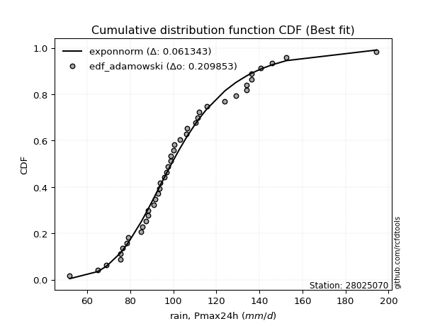</img></img>

</div>


## C. Best fit & Estimate extreme values for specific return periods - Tr


### 1. Best fit (ordered by delta Δ)

<div align="center">

|   id |   station | empirical_dist   | p_dist             |     delta |   deltao | eval   |   fit |   n |   best_fit |   best_fit_sort |
|-----:|----------:|:-----------------|:-------------------|----------:|---------:|:-------|------:|----:|-----------:|----------------:|
|    0 |  28025070 | edf_california   | moyal              | 0.049214  | 0.209853 | Δo > Δ |     1 |  42 |          1 |               1 |
|    1 |  28025070 | edf_weibull      | lognct             | 0.0579832 | 0.209853 | Δo > Δ |     1 |  42 |          1 |               2 |
|    2 |  28025070 | edf_hazen        | laplace_asymmetric | 0.058307  | 0.209853 | Δo > Δ |     1 |  42 |          1 |               3 |
|    3 |  28025070 | edf_gringorten   | laplace_asymmetric | 0.0592228 | 0.209853 | Δo > Δ |     1 |  42 |          1 |               4 |
|    4 |  28025070 | edf_cunnane      | laplace_asymmetric | 0.0598304 | 0.209853 | Δo > Δ |     1 |  42 |          1 |               5 |
|    5 |  28025070 | edf_blom         | laplace_asymmetric | 0.060209  | 0.209853 | Δo > Δ |     1 |  42 |          1 |               6 |
|    6 |  28025070 | edf_tukey        | laplace_asymmetric | 0.060838  | 0.209853 | Δo > Δ |     1 |  42 |          1 |               7 |
|    7 |  28025070 | edf_chegodayev   | exponnorm          | 0.061149  | 0.209853 | Δo > Δ |     1 |  42 |          1 |               8 |
|    8 |  28025070 | edf_jenkinson    | exponnorm          | 0.061188  | 0.209853 | Δo > Δ |     1 |  42 |          1 |               9 |
|    9 |  28025070 | edf_beard        | exponnorm          | 0.061188  | 0.209853 | Δo > Δ |     1 |  42 |          1 |              10 |
|   10 |  28025070 | edf_adamowski    | exponnorm          | 0.0613426 | 0.209853 | Δo > Δ |     1 |  42 |          1 |              11 |

</div>

:file_folder:Tables: [bestfit_28025070.csv](table/bestfit_28025070.csv) | [extreme_28025070.csv](table/extreme_28025070.csv)


### 2. Extreme values

In hydrology, a return period (or recurrence interval $Tr$) is the statistical average time between extreme events like floods or droughts of a specific magnitude, indicating how rare an event is, with a 100-year flood, for example, having a 1% chance of occurring in any given year, not that it happens exactly every century. It is a key tool for infrastructure design (like bridges or dams) and risk assessment, calculated from historical data to determine the probability of future events, although it is important to remember it is statistical average, and events can cluster or be missed.

> risk_rate: assuming the return period as the project useful life.

|   id |      tr |   prob_l |     prob_g |    alpha |   betaprime |    chi2 |   crystalball |   dgamma |   erlang |    expon |   exponnorm |       f |   fatiguelife |     fisk |   gamma |   genexpon |   genlogistic |   gibrat |   gompertz |   gumbel_l |   gumbel_r |   halflogistic |   halfnorm |   hypsecant |   invgamma |   invgauss |   invweibull |   johnsonsu |   kstwobign |   laplace |   laplace_asymmetric |   loggamma |   logistic |   lognorm |   maxwell |   mielke |    moyal |   nakagami |     ncf |      nct |    norm |   pareto |   pearson3 |   rayleigh |     rice |       t |   truncnorm |     wald |   weibull_min |   logalpha |   logbetaprime |          logchi2 |   logcrystalball |   logdgamma |   logerlang |   logexpon |   logexponnorm |    logf |   logfatiguelife |   logfisk |   loggenexpon |   loggenlogistic |   loggibrat |   loggompertz |   loggumbel_l |   loggumbel_r |   loghalflogistic |   loghalfnorm |   loghypsecant |   loginvgamma |   loginvgauss |   loginvweibull |   logjohnsonsu |   logkstwobign |   loglaplace |   loglaplace_asymmetric |   logloggamma |   loglogistic |   loglognorm |   logmaxwell |   logmielke |   logmoyal |   lognakagami |   logncf |   lognct |   logpareto |   logpearson3 |   lograyleigh |   logrice |    logt |   logtruncnorm |   logwald |   logweibull_min |   station |   n |   risk_rate |
|-----:|--------:|---------:|-----------:|---------:|------------:|--------:|--------------:|---------:|---------:|---------:|------------:|--------:|--------------:|---------:|--------:|-----------:|--------------:|---------:|-----------:|-----------:|-----------:|---------------:|-----------:|------------:|-----------:|-----------:|-------------:|------------:|------------:|----------:|---------------------:|-----------:|-----------:|----------:|----------:|---------:|---------:|-----------:|--------:|---------:|--------:|---------:|-----------:|-----------:|---------:|--------:|------------:|---------:|--------------:|-----------:|---------------:|-----------------:|-----------------:|------------:|------------:|-----------:|---------------:|--------:|-----------------:|----------:|--------------:|-----------------:|------------:|--------------:|--------------:|--------------:|------------------:|--------------:|---------------:|--------------:|--------------:|----------------:|---------------:|---------------:|-------------:|------------------------:|--------------:|--------------:|-------------:|-------------:|------------:|-----------:|--------------:|---------:|---------:|------------:|--------------:|--------------:|----------:|--------:|---------------:|----------:|-----------------:|----------:|----:|------------:|
|    0 |    2    | 0.5      | 0.5        |  99.9589 |     99.7853 | 100.451 |       103.562 |   98.7   |  100.451 |  87.7092 |      99.161 | 100.057 |       100.247 |  99.7744 | 100.451 |    87.8996 |       99.9044 |  95.4872 |    177.624 |    107.981 |    99.1425 |        96.9454 |    98.0553 |     103.562 |    100.042 |     99.498 |      99.3259 |     99.3295 |     99.3954 |   103.562 |               98.402 |    99.9874 |    103.562 |   100.31  |   101.261 |   99.269 |  97.7158 |    100.81  | 100.312 |  99.9748 | 103.562 |  87.7092 |    99.3085 |    100.445 |  99.6183 | 103.589 |     103.562 |  94.8418 |       100.022 |    99.4338 |        100.204 |     86.3843      |          100.606 |     98.0758 |     99.9734 |    81.9465 |        99.8516 | 100.001 |          100.011 |   99.4861 |       91.0673 |          99.4141 |     93.0185 |       101.072 |       104.54  |       96.2512 |           94.2946 |       95.2786 |        100.31  |       99.2253 |       98.5553 |         97.1453 |        99.5665 |        95.5825 |      100.31  |                 98.2521 |       100.321 |       100.31  |      100.006 |      98.1763 |     99.4356 |    94.9762 |       100.078 |   99.946 |  98.8916 |     81.9465 |       99.9335 |       97.4306 |   100.092 | 100.31  |        82.461  |   92.4581 |          100.47  |  28025070 |  42 |    0.75     |
|    1 |    2.33 | 0.570815 | 0.429185   | 104.474  |    104.349  | 105.15  |       108.362 |  101.393 |  105.15  |  95.5991 |     103.374 | 104.626 |       104.898 | 103.857  | 105.15  |    95.7134 |      104.274  |  97.9189 |    178.438 |    112.157 |   103.591  |       101.519  |   103.236  |     107.404 |    104.611 |    104.215 |     103.978  |    103.5    |    104.45   |   106.467 |              102.217 |   104.586  |    107.791 |   104.913 |   106.248 |  103.383 | 101.926  |    105.664 | 104.889 | 104.464  | 108.362 |  95.5991 |   104.027  |    105.506 | 104.929  | 108.435 |     108.362 |  97.9895 |       104.766 |   104.033  |        109.406 |    103.194       |          105.126 |    101.26   |    104.572  |    90.6224 |       104.387  | 104.597 |          104.609 |  103.566  |       98.0324 |         103.542  |     95.1568 |       106.623 |       108.702 |      100.337  |           98.4128 |      100.005  |        103.977 |      103.832  |      103.177  |        102.515  |       103.781  |       101.436  |      103.071 |                101.486  |       104.955 |       104.355 |      104.603 |     102.861  |    103.549  |    98.7886 |       104.679 |  104.543 | 103.482  |     90.6224 |      104.53   |      102.15   |   104.729 | 104.913 |        89.9229 |   95.2189 |          105.349 |  28025070 |  42 |    0.729209 |
|    2 |    5    | 0.8      | 0.2        | 123.438  |    123.592  | 124.412 |       126.202 |  116.042 |  124.412 | 135.046  |     122.167 | 123.722 |       124.152 | 121.238  | 124.412 |   134.781  |      122.83   | 111.919  |    181.067 |    125.65  |   122.915  |       122.212  |   125.145  |     122.814 |    123.716 |    124.006 |     124.187  |    121.969  |    125.922  |   120.991 |              121.293 |   123.829  |    124.122 |   123.949 |   125.878 |  121.386 | 121.431  |    125.499 | 123.924 | 123.352  | 126.202 | 135.046  |   124.056  |    125.768 | 126.19   | 126.605 |     126.202 | 115.61   |       124.699 |   123.681  |        152.739 |    290.143       |          123.735 |    117.143  |    123.816  |   149.883  |       123.47   | 123.824 |          123.831 |  121.36   |      135.683  |         121.652  |    108.459  |       127.47  |       123.312 |      120.2    |          119.413  |      122.73   |        120.086 |      123.552  |      123.364  |        129.508  |       122.051  |       130.573  |      118.057 |                119.326  |       124.044 |       121.563 |      123.827 |     123.573  |    121.495  |   118.544  |       123.869 |  123.795 | 123.459  |    149.883  |      123.804  |      123.446  |   124.014 | 123.948 |       127.667  |  112.268  |          125.069 |  28025070 |  42 |    0.67232  |
|    3 |   10    | 0.9      | 0.1        | 138.324  |    138.676  | 138.805 |       138.036 |  129.667 |  138.805 | 170.856  |     138.479 | 138.515 |       138.772 | 135.86   | 138.805 |   170.245  |      137.663  | 127.877  |    182.53  |    133.161 |   138.655  |       139.397  |   141.358  |     135.119 |    138.529 |    139.278 |     140.647  |    137.77   |    142.27   |   134.176 |              138.61  |   138.728  |    136.149 |   138.447 |   139.692 |  136.961 | 138.412  |    139.848 | 138.574 | 138.225  | 138.036 | 170.856  |   139.607  |    140.215 | 141.349  | 138.983 |     138.036 | 134.31   |       139.699 |   139.349  |        191.802 |    835.856       |          137.839 |    133.248  |    138.718  |   236.655  |       138.48   | 138.703 |          138.696 |  136.868  |      176.764  |         137.364  |    125.904  |       141.182 |       132.28  |      139.25   |          140.221  |      142.808  |        134.723 |      139.314  |      139.944  |        156.666  |       137.496  |       158.251  |      133.54  |                138.222  |       138.5   |       136.026 |      138.7   |     140.603  |    136.98   |   138.934  |       138.652 |  138.716 | 139.81   |    236.655  |      138.768  |      141.29   |   138.795 | 138.445 |       157.238  |  133.711  |          139.486 |  28025070 |  42 |    0.651322 |
|    4 |   15    | 0.933333 | 0.0666667  | 146.596  |    147.016  | 146.485 |       143.942 |  137.691 |  146.485 | 191.803  |     148     | 146.635 |       146.658 | 144.552  | 146.485 |   190.991  |      145.979  | 138.884  |    183.193 |    136.563 |   147.535  |       149.122  |   149.795  |     142.142 |    146.664 |    147.591 |     149.933  |    147.07   |    150.949  |   141.888 |              148.739 |   146.89   |    142.701 |   146.303 |   146.78  |  146.341 | 148.268  |    147.272 | 146.582 | 146.506  | 143.942 | 191.803  |   148.07   |    147.658 | 149.16   | 145.316 |     143.942 | 146.318  |       147.649 |   148.104  |        215.305 |   1600.2         |          145.463 |    143.598  |    146.882  |   309.136  |       146.843  | 146.851 |          146.834 |  146.322  |      204.984  |         146.842  |    139.546  |       147.934 |       136.554 |      151.3    |          153.564  |      154.524  |        143.863 |      148.133  |      149.382  |        174.43   |       146.644  |       175.255  |      143.522 |                150.634  |       146.306 |       144.617 |      146.843 |     150.233  |    146.299  |   152.34   |       146.723 |  146.896 | 149.107  |    309.136  |      146.98   |      151.47   |   146.834 | 146.302 |       170.696  |  149.594  |          147.07  |  28025070 |  42 |    0.644736 |
|    5 |   20    | 0.95     | 0.05       | 152.362  |    152.801  | 151.697 |       147.809 |  143.399 |  151.697 | 206.665  |     154.755 | 152.245 |       152.044 | 150.881  | 151.697 |   205.71   |      151.788  | 147.519  |    183.606 |    138.681 |   153.752  |       155.936  |   155.419  |     147.096 |    152.286 |    153.297 |     156.435  |    153.764  |    156.795  |   147.36  |              155.926 |   152.519  |    147.231 |   151.688 |   151.484 |  153.217 | 155.247  |    152.213 | 152.101 | 152.282  | 147.809 | 206.665  |   153.871  |    152.606 | 154.352  | 149.533 |     147.809 | 155.266  |       153.011 |   154.214  |        232.403 |   2561.92        |          150.682 |    151.402  |    152.513  |   373.661  |       152.687  | 152.471 |          152.445 |  153.318  |      227.264  |         153.794  |    151.274  |       152.316 |       139.284 |      160.354  |          163.663  |      162.865  |        150.681 |      154.292  |      156.039  |        188.054  |       153.291  |       187.728  |      151.054 |                160.11   |       151.644 |       150.871 |      152.459 |     156.985  |    153.127  |   162.61   |       152.277 |  152.54  | 155.664  |    373.661  |      152.65   |      158.638  |   152.354 | 151.688 |       178.412  |  162.645  |          152.176 |  28025070 |  42 |    0.641514 |
|    6 |   25    | 0.96     | 0.04       | 156.797  |    157.233  | 155.626 |       150.656 |  147.833 |  155.626 | 218.193  |     159.994 | 156.531 |       156.124 | 155.908  | 155.626 |   217.127  |      156.256  | 154.717  |    183.899 |    140.188 |   158.542  |       161.186  |   159.605  |     150.93  |    156.582 |    157.632 |     161.444  |    159.027  |    161.175  |   151.605 |              161.501 |   156.814  |    150.695 |   155.779 |   154.976 |  158.701 | 160.657  |    155.887 | 156.31  | 156.726  | 150.656 | 218.193  |   158.274  |    156.282 | 158.209  | 152.678 |     150.656 | 162.434  |       157.032 |   158.915  |        245.941 |   3707.96        |          154.642 |    157.735  |    156.809  |   432.849  |       157.193  | 156.758 |          156.724 |  158.943  |      245.993  |         159.343  |    161.801  |       155.521 |       141.259 |      167.694  |          171.894  |      169.361  |        156.179 |      159.033  |      161.199  |        199.269  |       158.564  |       197.649  |      157.167 |                167.869  |       155.693 |       155.836 |      156.742 |     162.193  |    158.574  |   171.044  |       156.509 |  156.848 | 160.746  |    432.849  |      156.978  |      164.183  |   156.553 | 155.778 |       183.419  |  173.915  |          156.006 |  28025070 |  42 |    0.639603 |
|    7 |   50    | 0.98     | 0.02       | 170.487  |    170.802  | 167.321 |       158.808 |  161.636 |  167.321 | 254.002  |     176.269 | 169.587 |       168.356 | 172.324  | 167.321 |   252.591  |      170.001  | 180.09   |    184.696 |    144.278 |   173.295  |       177.361  |   171.769  |     162.817 |    169.674 |    170.7   |     176.872  |    175.864  |    174.034  |   164.789 |              178.818 |   169.863  |    161.281 |   168.113 |   165.104 |  176.734 | 177.452  |    166.557 | 169.096 | 170.444  | 158.808 | 254.002  |   171.511  |    166.953 | 169.406  | 161.893 |     158.808 | 185.836  |       168.881 |   173.409  |        289.73  |  11941.5         |          166.567 |    179.093  |    169.862  |   683.439  |       171.179  | 169.783 |          169.719 |  177.725  |      313.512  |         177.604  |    205.102  |       164.595 |       146.764 |      192.489  |          199.949  |      189.753  |        174.532 |      173.66   |      177.311  |        238.197  |       175.79   |       229.915  |      177.779 |                194.452  |       167.868 |       172.044 |      169.753 |     178.296  |    176.482  |   200.115  |       169.333 |  169.943 | 176.619  |    683.439  |      170.146  |      181.4    |   169.238 | 168.114 |       194.419  |  216.439  |          167.304 |  28025070 |  42 |    0.63583  |
|    8 |   75    | 0.986667 | 0.0133333  | 178.506  |    178.66   | 173.868 |       163.183 |  169.726 |  173.868 | 274.949  |     185.789 | 177.105 |       175.263 | 182.578  | 173.868 |   273.336  |      177.981  | 197.227  |    185.099 |    146.347 |   181.87   |       186.763  |   178.391  |     169.764 |    177.216 |    178.121 |     185.84   |    186.108  |    181.109  |   172.502 |              188.947 |   177.35   |    167.395 |   175.129 |   170.611 |  188.082 | 187.273  |    172.365 | 176.435 | 178.472  | 163.183 | 274.949  |   179.002  |    172.758 | 175.498  | 166.983 |     163.183 | 200.236  |       175.431 |   181.87   |        316.695 |  23952.9         |          173.339 |    192.872  |    177.353  |   892.76   |       179.441  | 177.255 |          177.172 |  189.783  |      360.671  |         189.107  |    240.73   |       169.399 |       149.629 |      208.552  |          218.317  |      201.867  |        186.24  |      182.206  |      186.852  |        264.23   |       186.585  |       249.863  |      191.067 |                211.913  |       174.773 |       182.162 |      177.216 |     187.712  |    187.753  |   219.355  |       176.67  |  177.463 | 186.027  |    892.76   |      177.713  |      191.514  |   176.47  | 175.13  |       198.416  |  247.625  |          173.569 |  28025070 |  42 |    0.634587 |
|    9 |  100    | 0.99     | 0.01       | 184.226  |    184.22   | 178.406 |       166.141 |  175.472 |  178.406 | 289.811  |     192.544 | 182.409 |       180.074 | 190.182  | 178.406 |   288.055  |      183.627  | 210.503  |    185.363 |    147.7   |   187.939  |       193.418  |   182.902  |     174.692 |    182.538 |    183.307 |     192.187  |    193.573  |    185.957  |   177.974 |              196.134 |   182.618  |    171.712 |   180.039 |   174.362 |  196.533 | 194.241  |    176.321 | 181.601 | 184.194  | 166.141 | 289.811  |   184.225  |    176.713 | 179.648  | 170.491 |     166.141 | 210.735  |       179.935 |   187.886  |        336.485 |  39420.7         |          178.074 |    203.275  |    182.624  |  1079.1    |       185.374  | 182.513 |          182.415 |  198.885  |      398.152  |         197.68   |    272.531  |       172.622 |       151.534 |      220.724  |          232.328  |      210.56   |        195.018 |      188.285  |      193.695  |        284.356  |       194.623  |       264.52   |      201.094 |                225.244  |       179.596 |       189.661 |      182.467 |     194.409  |    196.148  |   234.116  |       181.823 |  182.756 | 192.779  |   1079.1    |      183.042  |      198.725  |   181.539 | 180.042 |       200.483  |  273.16   |          177.888 |  28025070 |  42 |    0.633968 |
|   10 |  200    | 0.995    | 0.005      | 198.189  |    197.622  | 189.027 |       172.852 |  189.332 |  189.027 | 325.621  |     208.819 | 195.134 |       191.413 | 209.732  | 189.027 |   323.52   |      197.194  | 246.621  |    185.936 |    150.64  |   202.53   |       209.418  |   193.22   |     186.563 |    195.311 |    195.58  |     207.446  |    212.286  |    197.122  |   191.159 |              213.451 |   195.213  |    182.066 |   191.694 |   182.943 |  218.394 | 211.029  |    185.374 | 193.963 | 198.128  | 172.852 | 325.621  |   196.542  |    185.763 | 189.144  | 178.66  |     172.852 | 236.888  |       190.356 |   202.482  |        386.582 | 132550           |          189.299 |    230.666  |    195.226  |  1703.83   |       200.015  | 195.083 |          194.943 |  222.926  |      504.557  |         219.874  |    381.959  |       179.852 |       155.756 |      252.975  |          269.804  |      231.875  |        217.903 |      203.042  |      210.492  |        339.24   |       215.481  |       301.634  |      227.467 |                260.913  |       191.015 |       208.935 |      195.017 |     210.642  |    217.869  |   273.889  |       194.11  |  195.419 | 209.375  |   1703.83   |      195.798  |      216.263  |   193.59  | 191.699 |       203.675  |  348.806  |          187.928 |  28025070 |  42 |    0.633042 |
|   11 |  250    | 0.996    | 0.004      | 202.755  |    201.95   | 192.365 |       174.903 |  193.797 |  192.365 | 337.149  |     214.058 | 199.226 |       194.997 | 216.423  | 192.365 |   334.937  |      201.554  | 259.58   |    186.104 |    151.506 |   207.221  |       214.561  |   196.394  |     190.385 |    199.42  |    199.473 |     212.351  |    218.542  |    200.577  |   195.403 |              219.026 |   199.249  |    185.391 |   195.404 |   185.584 |  225.917 | 216.433  |    188.16  | 197.929 | 202.672  | 174.903 | 337.149  |   200.438  |    188.548 | 192.067  | 181.221 |     174.903 | 245.54   |       193.596 |   207.223  |        403.476 | 196475           |          192.869 |    240.237  |    199.264  |  1973.72   |       204.856  | 199.111 |          198.956 |  231.366  |      544.362  |         227.517  |    431.139  |       182.04  |       157.021 |      264.313  |          283.092  |      238.856  |        225.827 |      207.836  |      216.006  |        359.044  |       222.698  |       314.143  |      236.672 |                273.557  |       194.641 |       215.529 |      199.038 |     215.907  |    225.346  |   288.079  |       198.038 |  199.479 | 214.829  |   1973.72   |      199.889  |      221.968  |   197.432 | 195.41  |       204.327  |  378.188  |          191.063 |  28025070 |  42 |    0.632858 |
|   12 |  500    | 0.998    | 0.002      | 217.222  |    215.47   | 202.517 |       180.985 |  207.679 |  202.517 | 372.958  |     230.333 | 211.962 |       205.962 | 238.56   | 202.517 |   370.401  |      215.086  | 304.367  |    186.587 |    153.986 |   221.78   |       230.526  |   205.858  |     202.255 |    212.213 |    211.423 |     227.577  |    238.736  |    210.932  |   208.588 |              236.342 |   211.763  |    195.701 |   206.834 |   193.466 |  250.936 | 233.22   |    196.47  | 210.24  | 217.016  | 180.985 | 372.958  |   212.354  |    196.86  | 200.788  | 189.009 |     180.985 | 273.05   |       203.35  |   222.118  |        458.503 | 672717           |          203.853 |    272.546  |    211.785  |  3116.36   |       220.388  | 211.6   |          211.394 |  260.054  |      688.706  |         252.958  |    655.247  |       188.467 |       160.704 |      302.842  |          328.649  |      260.944  |        252.325 |      222.908  |      233.506  |        428.179  |       246.906  |       354.823  |      267.711 |                316.876  |       205.787 |       237.331 |      211.503 |     232.413  |    250.221  |   337.02   |       210.189 |  212.074 | 232.173  |   3116.36   |      212.589  |      239.897  |   209.285 | 206.843 |       205.644  |  489.088  |          200.551 |  28025070 |  42 |    0.632489 |
|   13 |  750    | 0.998667 | 0.00133333 | 225.915  |    223.452  | 208.322 |       184.364 |  215.806 |  208.322 | 393.905  |     239.853 | 219.446 |       212.273 | 252.523  | 208.322 |   391.146  |      222.996  | 333.986  |    186.846 |    155.312 |   230.291  |       239.859  |   211.144  |     209.199 |    219.733 |    218.326 |     236.477  |    251.109  |    216.749  |   216.3   |              246.472 |   219.082  |    201.724 |   213.47  |   197.875 |  266.816 | 243.04   |    201.115 | 217.456 | 225.59   | 184.364 | 393.905  |   219.211  |    201.507 | 205.665  | 193.47  |     184.364 | 289.545  |       208.859 |   230.97   |        492.573 |      1.38897e+06 |          210.223 |    293.406  |    219.11   |  4070.83   |       229.869  | 218.906 |          218.667 |  278.76   |      790.008  |         269.121  |    864.226  |       191.999 |       162.708 |      327.918  |          358.606  |      274.162  |        269.245 |      231.868  |      244.029  |        474.607  |       262.473  |       379.945  |      287.722 |                345.329  |       212.241 |       251.075 |      218.793 |     242.189  |    266.018  |   369.416  |       217.277 |  219.446 | 242.625  |   4070.83   |      220.027  |      250.547  |   216.177 | 213.481 |       206.088  |  570.621  |          205.944 |  28025070 |  42 |    0.632366 |
|   14 | 1000    | 0.999    | 0.001      | 232.202  |    229.155  | 212.388 |       186.69  |  221.574 |  212.388 | 408.767  |     246.608 | 224.779 |       216.711 | 262.916  | 212.388 |   405.865  |      228.607  | 356.652  |    187.02  |    156.204 |   236.329  |       246.479  |   214.796  |     214.126 |    225.093 |    223.19  |     242.791  |    260.15   |    220.779  |   221.772 |              253.659 |   224.282  |    205.995 |   218.162 |   200.922 |  278.682 | 250.008  |    204.325 | 222.588 | 231.765  | 186.69  | 408.767  |   224.031  |    204.719 | 209.036  | 196.603 |     186.69  | 301.41   |       212.688 |   237.32   |        517.632 |      2.32777e+06 |          214.724 |    309.16   |    224.314  |  4920.52   |       236.796  | 224.095 |          223.832 |  292.991  |      870.696  |         281.205  |   1068.14   |       194.415 |       164.07  |      346.954  |          381.497  |      283.678  |        281.933 |      238.297  |      251.633  |        510.561  |       274.223  |       398.385  |      302.82  |                367.054  |       216.797 |       261.302 |      223.971 |     249.185  |    277.825  |   394.274  |       222.304 |  224.686 | 250.189  |   4920.52   |      225.315  |      258.181  |   221.056 | 218.175 |       206.31   |  637.55   |          209.708 |  28025070 |  42 |    0.632305 |

<div align="center">

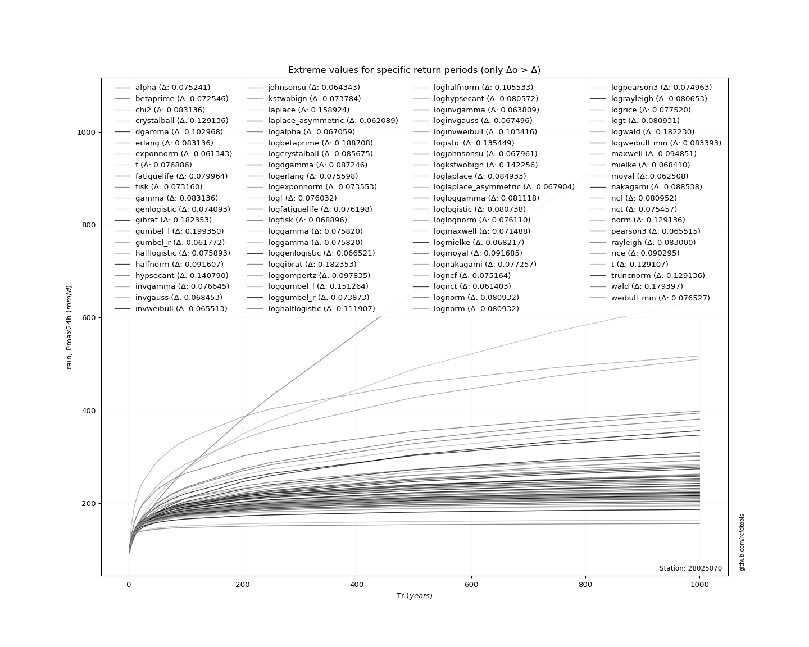</img>

</div>


<div align="center">

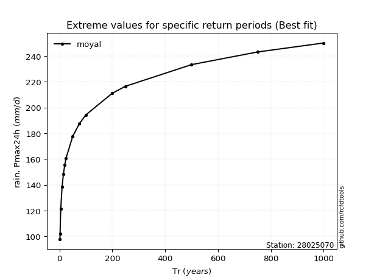</img>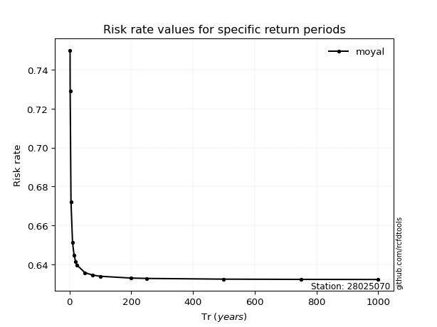</img>

</div>


<sub>**APP DISCLAIMER**: NO WARRANTY - This software is provided by [github.com/rcfdtools](https://github.com/rcfdtools) "as is", without any express or implied warranty, including warranties of merchantability, fitness for a particular purpose, or non-infringement. There is no guarantee that the software will be error-free or operate without interruption. LIMITATION OF LIABILITY - Neither the authors nor copyright holders will be liable for claims or damages arising from the software or its use. You are responsible for determining if the software is appropriate for your use and assume all associated risks, including errors, legal compliance, and data loss. NO PROFESSIONAL ADVICE - The software provides general information and does not offer professional advice. It should not replace consultation with professional advisors.</sub>