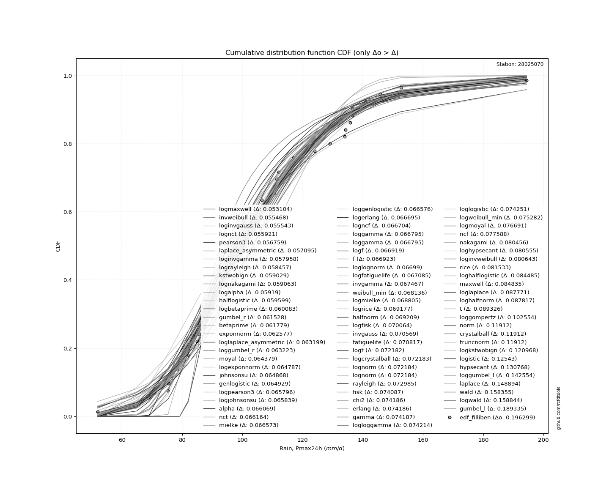
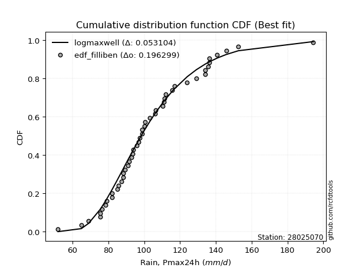
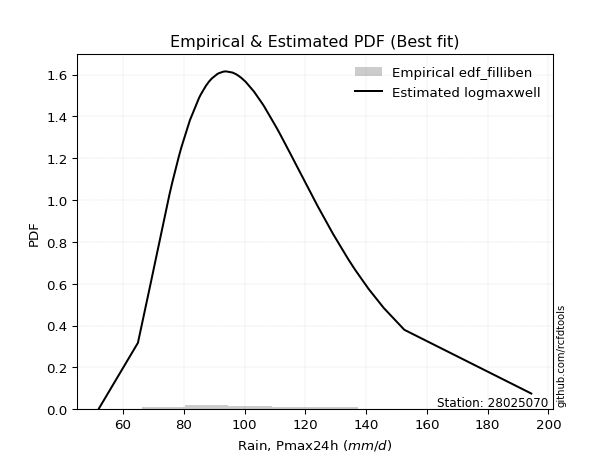

<div align="center">


</div>

# PMP Station (Rain, Pmax24h): 28025070

Probable Maximum Precipitation (PMP) is the greatest amount of rainfall for a specific duration that is meteorologically possible for a given location, acting as a "worst-case" scenario for extreme storms, crucial for designing safety-critical infrastructure like bridges, river deviations, dams, spillways, and nuclear plants to prevent catastrophic failure. PMP is calculated by hydrologists using meteorological data to determine the upper limit of extreme rainfall, often leading to the Probable Maximum Flood (PMF) for flood control design, and is increasingly being studied for climate change impacts. Probable Maximum Precipitation (PMP) is the theoretical upper limit of rainfall, a deterministic estimate for extreme events, while probability distributions (like GEV, Gumbel) describe the likelihood and frequency of various precipitation amounts, including rare ones, showing how often events occur, with PMP representing the extreme end of these distributions, used for critical infrastructure design to ensure safety against the worst conceivable weather, unlike standard statistical forecasts which cover typical probabilities.

The most common probability distributions in hydrology, used for analyzing floods, rainfall, and streamflow, include the Normal, Log-Normal, Gumbel, Gamma (including Log-Pearson Type III), and Generalized Extreme Value (GEV) distributions, often chosen based on the data´s skewness and whether modeling extremes or general conditions, with Gumbel and GEV popular for extreme events like floods, while the Normal distribution serves as a baseline, though often requiring transformations for skewed hydrological data. These distributions help in designing water infrastructure, managing water resources, and forecasting hydrologic events.

> Hydrological data often isn´t perfectly normal (it´s skewed), so different distributions are needed for different applications, such as: **Flood Frequency Analysis**: Using Gumbel, GEV, or Log-Pearson Type III for predicting extreme flood magnitudes and their return periods, **Rainfall Analysis**: Normal for annual totals, but Log-Normal, Weibull, or GEV for intensity or extreme daily rainfall, **Streamflow Modeling**: Gamma and Log-Normal for maximum flows, GEV for minimum flows, and Kappa for daily flows.

<div align="center">

</img>

</div>


## A. General information


### 1. General running parameters

• app_version: _v20260108_. • runtime: _2026-01-08 09:19:35.839451_. • Python version: _3.14.0_. • SciPy version: _1.16.3_. • Pandas version: _2.3.3_. • NumPy version: _2.3.5_. • Stations dataset (station_dataset_file): _dataset/pmax24h_in/conventional_cesarcolombia_1959_2022.csv_. • Stations catalog (station_catalog_file): _dataset/CNE.xls_. • Minimum year to eval til year_max (date_min): _1900_. • Maximum year to eval since year_min (date_max): _2024_. • Creates, save and include plots into reports (create_plot): _True_. • Plot only fit distributions with Δo > Δ (plot_only_fit): _True_. • Plot only simple graphs avoiding multiple CDFs and multiple Extreme values plots (plot_only_simple): _False_. • Eval low extreme values, if False, evaluates high extreme values (low_extreme): _False_. • Eval every SciPy distribution as logarithmic (pdist_logarithmic_on): _True_. • Standard deviation normalized (ddof): _1.0_. • Return periods to eval in years (Tr): _[2, 2.33, 5, 10, 15, 20, 25, 50, 75, 100, 200, 250, 500, 750, 1000]_. • Minimum data sample per station, 0 means any (minimum_sample): _5_. • Z-Score maximum threshold to adjust a value, 0 means disable (zscore_max): _3.5_. • Z-Score minimum threshold to adjust a value, 0 means disable (zscore_min): _-2.5_. • Avoid zeros, e.g. rain = 0 (avoid_zeros): _True_. • Avoid null values (avoid_nans): _True_. 

:file_folder:Table: [dataset.csv](../../dataset/pmax24h_in/conventional_cesarcolombia_1959_2022.csv)

> Delta Degrees of Freedom (DDOF): is a parameter used in the formulas for calculating variance and standard deviation. When ddof=0, the divisor is $N$ (the total number of observations) and this is used when your data set is the entire population. When ddof=1, the divisor is $N-1$ and this is used when your data set is a sample drawn from a larger population. Using $N-1$ provides an unbiased estimate of the population variance (known as Bessel´s correction).


### 2. Station info and location

|   id |   CODIGO | NOMBRE                       | CATEGORIA               | TECNOLOGIA   | ESTADO   | FECHA_INSTALACION   |   FECHA_SUSPENSION |   ALTITUD |   LATITUD |   LONGITUD | DEPARTAMENTO   | MUNICIPIO       | AREA_OPERATIVA                                         | ENTIDAD                                                     | AREA_HIDROGRAFICA   | ZONA_HIDROGRAFICA   | SUBZONA_HIDROGRAFICA   |   CORRIENTE | Catalogo   |   Version |
|-----:|---------:|:-----------------------------|:------------------------|:-------------|:---------|:--------------------|-------------------:|----------:|----------:|-----------:|:---------------|:----------------|:-------------------------------------------------------|:------------------------------------------------------------|:--------------------|:--------------------|:-----------------------|------------:|:-----------|----------:|
|    0 | 28025070 | MOTILONIA CODAZZI [28025070] | Climatológica Ordinaria | Convencional | Activa   | 15/01/1956          |                nan |       180 |   10.0018 |   -73.2494 | Cesar          | Agustín Codazzi | Area Operativa 05 - Magdalena-Cesar-Guajira-San Andrés | INSTITUTO DE HIDROLOGIA METEOROLOGIA Y ESTUDIOS AMBIENTALES | Magdalena Cauca     | Cesar               | Medio Cesar            |         nan | CNE_IDEAM  |  20251226 |

<div align="center">

Dynamic map: [:earth_americas:Google](http://maps.google.com/maps?q=10.00180556,-73.24938889) [:earth_americas:OSM](https://www.openstreetmap.org/#map=18/10.00180556/-73.24938889&layers=P) [:earth_americas:Bing](https://www.bing.com/maps?cp=10.00180556~-73.24938889&lvl=18) [:earth_americas:Apple](https://maps.apple.com/frame?center=10.00180556%2C-73.24938889&span=0.003%2C0.006)

</div>


<div align="center">

```geojson
{
  "type": "Feature",
  "geometry": {
    "type": "Point", 
    "coordinates": [-73.24938889, 10.00180556]
  }, 
  "properties": {
    "Name": "28025070"
  }
}
```

</div>


### 3. Discrete values table and plot

<div align="center">

|               |           0 |           1 |          2 |            3 |           4 |           5 |          6 |           7 |           8 |          9 |          10 |          11 |         12 |          13 |          14 |         15 |         16 |         17 |          18 |          19 |          20 |         21 |          22 |         23 |          24 |         25 |         26 |          27 |          28 |         29 |         30 |           31 |          32 |         33 |         34 |          35 |        36 |          37 |          38 |          39 |          40 |          41 |          42 |          43 |          44 |          45 |          46 |         47 |
|:--------------|------------:|------------:|-----------:|-------------:|------------:|------------:|-----------:|------------:|------------:|-----------:|------------:|------------:|-----------:|------------:|------------:|-----------:|-----------:|-----------:|------------:|------------:|------------:|-----------:|------------:|-----------:|------------:|-----------:|-----------:|------------:|------------:|-----------:|-----------:|-------------:|------------:|-----------:|-----------:|------------:|----------:|------------:|------------:|------------:|------------:|------------:|------------:|------------:|------------:|------------:|------------:|-----------:|
| Date          | 1973        | 1974        | 1975       | 1976         | 1978        | 1979        | 1980       | 1981        | 1982        | 1983       | 1984        | 1985        | 1986       | 1987        | 1988        | 1989       | 1990       | 1991       | 1992        | 1993        | 1994        | 1995       | 1996        | 1997       | 1998        | 1999       | 2000       | 2001        | 2002        | 2003       | 2004       | 2005         | 2006        | 2007       | 2008       | 2009        | 2010      | 2011        | 2012        | 2013        | 2014        | 2015        | 2016        | 2017        | 2018        | 2019        | 2020        | 2021       |
| Value         |   97.5569   |   91.5      |  136.5     |  103.1       |   98.8      |   78.4      |  134.2     |   93.6382   |   87.3      |  140.8     |  100.4      |  100.2      |  194.4     |  106.5      |   85.6      |  111.4     |   88.2     |   64.9     |  110.5      |   93.9      |   79.2      |  145.8     |  129.1      |   51.9     |   91        |   76.3     |   69       |   88.4      |   98.7      |   75.3     |   75.5     |  106         |  115.5      |  136.5     |  152.6     |   97        |  134      |  124        |   93        |   96        |   85        |  112        |   82        |  117        |   82        |  111        |   89.2      |  135.8     |
| Value_initial |   97.5569   |   91.5      |  136.5     |  103.1       |   98.8      |   78.4      |  134.2     |   93.6382   |   87.3      |  140.8     |  100.4      |  100.2      |  194.4     |  106.5      |   85.6      |  111.4     |   88.2     |   64.9     |  110.5      |   93.9      |   79.2      |  145.8     |  129.1      |   51.9     |   91        |   76.3     |   69       |   88.4      |   98.7      |   75.3     |   75.5     |  106         |  115.5      |  136.5     |  152.6     |   97        |  134      |  124        |   93        |   96        |   85        |  112        |   82        |  117        |   82        |  111        |   89.2      |  135.8     |
| count         |   48        |   48        |   48       |   48         |   48        |   48        |   48       |   48        |   48        |   48       |   48        |   48        |   48       |   48        |   48        |   48       |   48       |   48       |   48        |   48        |   48        |   48       |   48        |   48       |   48        |   48       |   48       |   48        |   48        |   48       |   48       |   48         |   48        |   48       |   48       |   48        |   48      |   48        |   48        |   48        |   48        |   48        |   48        |   48        |   48        |   48        |   48        |   48       |
| mean          |  103.471    |  103.471    |  103.471   |  103.471     |  103.471    |  103.471    |  103.471   |  103.471    |  103.471    |  103.471   |  103.471    |  103.471    |  103.471   |  103.471    |  103.471    |  103.471   |  103.471   |  103.471   |  103.471    |  103.471    |  103.471    |  103.471   |  103.471    |  103.471   |  103.471    |  103.471   |  103.471   |  103.471    |  103.471    |  103.471   |  103.471   |  103.471     |  103.471    |  103.471   |  103.471   |  103.471    |  103.471  |  103.471    |  103.471    |  103.471    |  103.471    |  103.471    |  103.471    |  103.471    |  103.471    |  103.471    |  103.471    |  103.471   |
| std           |   26.4186   |   26.4186   |   26.4186  |   26.4186    |   26.4186   |   26.4186   |   26.4186  |   26.4186   |   26.4186   |   26.4186  |   26.4186   |   26.4186   |   26.4186  |   26.4186   |   26.4186   |   26.4186  |   26.4186  |   26.4186  |   26.4186   |   26.4186   |   26.4186   |   26.4186  |   26.4186   |   26.4186  |   26.4186   |   26.4186  |   26.4186  |   26.4186   |   26.4186   |   26.4186  |   26.4186  |   26.4186    |   26.4186   |   26.4186  |   26.4186  |   26.4186   |   26.4186 |   26.4186   |   26.4186   |   26.4186   |   26.4186   |   26.4186   |   26.4186   |   26.4186   |   26.4186   |   26.4186   |   26.4186   |   26.4186  |
| zscore        |   -0.223852 |   -0.453118 |    1.25023 |   -0.0140329 |   -0.176797 |   -0.948981 |    1.16317 |   -0.372184 |   -0.612097 |    1.41299 |   -0.116234 |   -0.123804 |    3.44187 |    0.114664 |   -0.676445 |    0.30014 |   -0.57803 |   -1.45998 |    0.266073 |   -0.362272 |   -0.918699 |    1.60225 |    0.970122 |   -1.95206 |   -0.472044 |   -1.02847 |   -1.30479 |   -0.570459 |   -0.180582 |   -1.06632 |   -1.05875 |    0.0957383 |    0.455334 |    1.25023 |    1.85965 |   -0.244931 |    1.1556 |    0.777077 |   -0.396339 |   -0.282783 |   -0.699156 |    0.322851 |   -0.812713 |    0.512112 |   -0.812713 |    0.284999 |   -0.540178 |    1.22373 |


</div>


<div align="center">

</img>

</div>


> The initial value (value_initial) correspond to the initial obtained or null completed value, and value (value) is adjusted only when the initial value is outside the valid range (outlier) definite through the Z-Score value. If Z-Score is active, values out of range or outliers are replaced with the station mean value. A Z-Score (or standard score) measures how many standard deviations a data point is from the mean of a dataset, indicating its relative position; positive scores mean above the mean, negative mean below, and a score of zero is exactly at the mean, allowing for comparison of values from different distributions. It´s calculated using the formula $z=(x–μ)/σ$, where $x$ is the data point, $μ$ is the mean, and $σ$ is the standard deviation, helping identify outliers and understand probability.
>
> <sub>**Note**: In this study, "completing" (filling gaps in) and "extending" (forecasting or lengthening the historical record) rainfall data series are avoided for certain critical analyses because they introduce artificial bias and uncertainty, which can distort the statistics of rare events (extremes), alter day-to-day variability, and compromise the integrity and homogeneity of the original data. Some reasons against Completing/Extending rainfall data are: **Distortion of Extremes and Variability**: The primary issue is that most gap-filling or extension methods rely on averaging or regression with nearby stations, which inherently smooths the data. Rainfall is highly variable in space and time, with a large percentage of zero values and occasional large storms. Infilling methods often underestimate the highest values and overestimate the lowest (zero) values, which severely distorts analyses focused on flood frequency, drought severity, and intensity-duration-frequency (IDF) curves, **Loss of Data Homogeneity**: Infilled or extended data are synthetic estimates, not actual measurements. Combining these estimates with observed data can violate the assumption of data homogeneity, which requires that the data properties do not change over time. Inhomogeneity can lead to incorrect conclusions about long-term trends or changes in climate patterns, **Propagation of Errors**: Errors and biases from the original data (e.g., wind-induced undercatch, instrument errors, site changes) or the data used for imputation can propagate through the analysis, leading to unreliable hydrological models and inaccurate predictions, **Compromised Statistical Integrity**: For statistical analyses, especially those involving the frequency of events, using artificial data can introduce time bias or autocorrelation that doesn´t exist in reality, making it difficult to assess the true probability of events, **Difficulty in Validation**: It is difficult to accurately validate the quality of filled or extended data, especially for past periods where ground-truth measurements are unavailable. The reliability of imputation techniques heavily depends on the density of the surrounding station network and the complexity of the local topography.</sub>


### 4. Active continuous probability distributions from SciPy (44 of 104 available)

A Probability Density Function (PDF) describes the relative likelihood of a continuous random variable falling within a specific range, where the total area under its curve equals 1, and the area over any interval gives the actual probability for that range. Unlike discrete probabilities (like rolling a die), a PDF shows density, not direct probability for a single point (which is zero), with higher points indicating higher likelihood, often visualized as a bell curve for normal distributions.

A log of a probability density function (log-PDF) is simply the logarithm of the PDF´s value, denoted as $log(f(x))$, useful for converting multiplication of probabilities into addition, improving numerical stability with tiny numbers, and connecting to information theory concepts like entropy. Instead of dealing with very small probabilities (e.g., 0.000001), log-PDFs use negative numbers (e.g., $log(0.00001) ≈ -11.51$ that are easier for computers to handle, preventing underflow errors and simplifying complex calculations. In this study, each active probability distribution from SciPy is also evaluated in the $log$ form.

[scipy.stats](https://docs.scipy.org/doc/scipy/reference/stats.html) is a Python´s powerful submodule within the SciPy library for comprehensive statistical analysis, offering over 130 probability distributions (like Normal, Poisson), functions for descriptive stats (mean, variance), hypothesis testing (t-tests, chi-square), random variable generation, and statistical tests, making it essential for data science, modeling, and research. It provides tools to explore, model, and draw conclusions from data efficiently, working seamlessly with NumPy.

<div align="center">

|   id | p_dist             |   n_parameter | fit_method   | label                                                                       | active   | ref                                                                                                        |
|-----:|:-------------------|--------------:|:-------------|:----------------------------------------------------------------------------|:---------|:-----------------------------------------------------------------------------------------------------------|
|    0 | alpha              |             3 | MLE          | Alpha                                                                       | True     | [:mortar_board:](https://docs.scipy.org/doc/scipy/reference/generated/scipy.stats.alpha.html)              |
|    1 | betaprime          |             4 | MLE          | Beta prime                                                                  | True     | [:mortar_board:](https://docs.scipy.org/doc/scipy/reference/generated/scipy.stats.betaprime.html)          |
|    2 | chi2               |             3 | MLE          | Chi²                                                                        | True     | [:mortar_board:](https://docs.scipy.org/doc/scipy/reference/generated/scipy.stats.chi2.html)               |
|    3 | crystalball        |             4 | MLE          | Crystalball                                                                 | True     | [:mortar_board:](https://docs.scipy.org/doc/scipy/reference/generated/scipy.stats.crystalball.html)        |
|    4 | erlang             |             3 | MLE          | Erlang                                                                      | True     | [:mortar_board:](https://docs.scipy.org/doc/scipy/reference/generated/scipy.stats.erlang.html)             |
|    5 | expon              |             2 | MLE          | Exponential                                                                 | True     | [:mortar_board:](https://docs.scipy.org/doc/scipy/reference/generated/scipy.stats.expon.html)              |
|    6 | exponnorm          |             3 | MLE          | Exponentially modified Normal                                               | True     | [:mortar_board:](https://docs.scipy.org/doc/scipy/reference/generated/scipy.stats.exponnorm.html)          |
|    7 | f                  |             4 | MLE          | F                                                                           | True     | [:mortar_board:](https://docs.scipy.org/doc/scipy/reference/generated/scipy.stats.f.html)                  |
|    8 | fatiguelife        |             3 | MLE          | Fatigue-life (Birnbaum-Saunders)                                            | True     | [:mortar_board:](https://docs.scipy.org/doc/scipy/reference/generated/scipy.stats.fatiguelife.html)        |
|    9 | fisk               |             3 | MLE          | Fisk                                                                        | True     | [:mortar_board:](https://docs.scipy.org/doc/scipy/reference/generated/scipy.stats.fisk.html)               |
|   10 | gamma              |             3 | MLE          | Gamma                                                                       | True     | [:mortar_board:](https://docs.scipy.org/doc/scipy/reference/generated/scipy.stats.gamma.html)              |
|   11 | genexpon           |             5 | MLE          | Generalized exponential                                                     | True     | [:mortar_board:](https://docs.scipy.org/doc/scipy/reference/generated/scipy.stats.genexpon.html)           |
|   12 | genlogistic        |             3 | MLE          | Generalized logistic                                                        | True     | [:mortar_board:](https://docs.scipy.org/doc/scipy/reference/generated/scipy.stats.genlogistic.html)        |
|   13 | gibrat             |             2 | MM           | Gibrat                                                                      | True     | [:mortar_board:](https://docs.scipy.org/doc/scipy/reference/generated/scipy.stats.gibrat.html)             |
|   14 | gompertz           |             3 | MLE          | Gompertz (or truncated Gumbel)                                              | True     | [:mortar_board:](https://docs.scipy.org/doc/scipy/reference/generated/scipy.stats.gompertz.html)           |
|   15 | gumbel_l           |             2 | MM           | Gumbel Left Skew                                                            | True     | [:mortar_board:](https://docs.scipy.org/doc/scipy/reference/generated/scipy.stats.gumbel_l.html)           |
|   16 | gumbel_r           |             2 | MM           | Gumbel Right Skew                                                           | True     | [:mortar_board:](https://docs.scipy.org/doc/scipy/reference/generated/scipy.stats.gumbel_r.html)           |
|   17 | halflogistic       |             2 | MM           | Half-logistic                                                               | True     | [:mortar_board:](https://docs.scipy.org/doc/scipy/reference/generated/scipy.stats.halflogistic.html)       |
|   18 | halfnorm           |             2 | MM           | Half Normal                                                                 | True     | [:mortar_board:](https://docs.scipy.org/doc/scipy/reference/generated/scipy.stats.halfnorm.html)           |
|   19 | hypsecant          |             2 | MM           | hyperbolic secant                                                           | True     | [:mortar_board:](https://docs.scipy.org/doc/scipy/reference/generated/scipy.stats.hypsecant.html)          |
|   20 | invgamma           |             3 | MLE          | Inverted gamma                                                              | True     | [:mortar_board:](https://docs.scipy.org/doc/scipy/reference/generated/scipy.stats.invgamma.html)           |
|   21 | invgauss           |             3 | MLE          | Inverse Gaussian                                                            | True     | [:mortar_board:](https://docs.scipy.org/doc/scipy/reference/generated/scipy.stats.invgauss.html)           |
|   22 | invweibull         |             3 | MLE          | Inverted Weibull                                                            | True     | [:mortar_board:](https://docs.scipy.org/doc/scipy/reference/generated/scipy.stats.invweibull.html)         |
|   23 | johnsonsu          |             4 | MLE          | Johnson Su                                                                  | True     | [:mortar_board:](https://docs.scipy.org/doc/scipy/reference/generated/scipy.stats.johnsonsu.html)          |
|   24 | kstwobign          |             2 | MLE          | Limiting distribution of scaled Kolmogorov-Smirnov two-sided test statistic | True     | [:mortar_board:](https://docs.scipy.org/doc/scipy/reference/generated/scipy.stats.kstwobign.html)          |
|   25 | laplace            |             2 | MM           | Laplace                                                                     | True     | [:mortar_board:](https://docs.scipy.org/doc/scipy/reference/generated/scipy.stats.laplace.html)            |
|   26 | laplace_asymmetric |             3 | MLE          | Asymmetric Laplace                                                          | True     | [:mortar_board:](https://docs.scipy.org/doc/scipy/reference/generated/scipy.stats.laplace_asymmetric.html) |
|   27 | loggamma           |             3 | MLE          | Log gamma                                                                   | True     | [:mortar_board:](https://docs.scipy.org/doc/scipy/reference/generated/scipy.stats.loggamma.html)           |
|   28 | logistic           |             2 | MM           | Logistic (or Sech-squared)                                                  | True     | [:mortar_board:](https://docs.scipy.org/doc/scipy/reference/generated/scipy.stats.logistic.html)           |
|   29 | lognorm            |             3 | MLE          | Log Normal                                                                  | True     | [:mortar_board:](https://docs.scipy.org/doc/scipy/reference/generated/scipy.stats.lognorm.html)            |
|   30 | maxwell            |             2 | MM           | Maxwell                                                                     | True     | [:mortar_board:](https://docs.scipy.org/doc/scipy/reference/generated/scipy.stats.maxwell.html)            |
|   31 | mielke             |             4 | MLE          | Mielke Beta-Kappa / Dagum                                                   | True     | [:mortar_board:](https://docs.scipy.org/doc/scipy/reference/generated/scipy.stats.mielke.html)             |
|   32 | moyal              |             2 | MM           | Moyal                                                                       | True     | [:mortar_board:](https://docs.scipy.org/doc/scipy/reference/generated/scipy.stats.moyal.html)              |
|   33 | nakagami           |             3 | MLE          | Nakagami                                                                    | True     | [:mortar_board:](https://docs.scipy.org/doc/scipy/reference/generated/scipy.stats.nakagami.html)           |
|   34 | ncf                |             5 | MLE          | Non-central F distribution                                                  | True     | [:mortar_board:](https://docs.scipy.org/doc/scipy/reference/generated/scipy.stats.ncf.html)                |
|   35 | nct                |             4 | MLE          | Non-central Student’s t                                                     | True     | [:mortar_board:](https://docs.scipy.org/doc/scipy/reference/generated/scipy.stats.nct.html)                |
|   36 | norm               |             2 | MM           | Normal                                                                      | True     | [:mortar_board:](https://docs.scipy.org/doc/scipy/reference/generated/scipy.stats.norm.html)               |
|   37 | pearson3           |             3 | MM           | Pearson type III                                                            | True     | [:mortar_board:](https://docs.scipy.org/doc/scipy/reference/generated/scipy.stats.pearson3.html)           |
|   38 | rayleigh           |             2 | MM           | Rayleigh                                                                    | True     | [:mortar_board:](https://docs.scipy.org/doc/scipy/reference/generated/scipy.stats.rayleigh.html)           |
|   39 | rice               |             3 | MLE          | Rice                                                                        | True     | [:mortar_board:](https://docs.scipy.org/doc/scipy/reference/generated/scipy.stats.rice.html)               |
|   40 | t                  |             3 | MLE          | Student’s t                                                                 | True     | [:mortar_board:](https://docs.scipy.org/doc/scipy/reference/generated/scipy.stats.t.html)                  |
|   41 | truncnorm          |             4 | MLE          | Truncated normal                                                            | True     | [:mortar_board:](https://docs.scipy.org/doc/scipy/reference/generated/scipy.stats.truncnorm.html)          |
|   42 | wald               |             2 | MM           | Wald                                                                        | True     | [:mortar_board:](https://docs.scipy.org/doc/scipy/reference/generated/scipy.stats.wald.html)               |
|   43 | weibull_min        |             3 | MLE          | Weibull minimum                                                             | True     | [:mortar_board:](https://docs.scipy.org/doc/scipy/reference/generated/scipy.stats.weibull_min.html)        |

</div>

> **n_parameter:** # arguments & localization & scale.
>
> **Fit methods:** (MLE) maximum likelihood, (MM) L-moments.
>
>**Inactive** (With the only purpose of prevent loops, zero divisions, infinite values, over high estimated values or horizontal trending for recurrence intervals estimations, the follow distributions were disabled.)**:** foldnorm, gennorm, norminvgauss, powernorm, powerlognorm, skewnorm, genextreme, anglit, arcsine, argus, beta, bradford, burr, burr12, cauchy, cosine, halfcauchy, foldcauchy, skewcauchy, wrapcauchy, dgamma, gengamma, exponweib, exponpow, truncexpon, gausshyper, genhalflogistic, genhyperbolic, geninvgauss, halfgennorm, johnsonsb, kappa4, kappa3, ksone, kstwo, loglaplace, levy, levy_l, levy_stable, ncx2, pareto, genpareto, truncpareto, lomax, powerlaw, rdist, rel_breitwigner, recipinvgauss, semicircular, studentized_range, trapezoid, triang, truncweibull_min, tukeylambda, uniform, loguniform, vonmises, vonmises_line, weibull_max, dweibull, 


## B. Probability (PDF) vs. Empirical (EDF) distributions functions

A continuous probability distribution (CPD) describes probabilities for variables that can take any value within a range (like rain any time), unlike discrete variables with specific outcomes (like temperature). It uses a Probability Density Function (PDF), a curve where the total area under it equals 1, and the probability of the variable falling within an interval (a to b) is found by calculating the area under the curve between those points. A key feature is that the probability of hitting any single exact value is zero, so probabilities are always expressed for ranges, e.g., $P(a ≤ X ≤ b)$.

<div align="center">

Distributions parameters from station values
|    |   station | p_dist                |   n |             loc |          scale | shape                 | shape1               | shape2             | shape3   |
|---:|----------:|:----------------------|----:|----------------:|---------------:|:----------------------|:---------------------|:-------------------|:---------|
|  0 |  28025070 | alpha                 |  48 |   -78.3571      | 1322.3         | 7.412953081473211     |                      |                    |          |
|  1 |  28025070 | betaprime             |  48 |    -0.575726    |   28.3374      | 77.4726025022812      | 22.12023672728658    |                    |          |
|  2 |  28025070 | chi2                  |  48 |    29.5793      |    4.46796     | 16.538073825006926    |                      |                    |          |
|  3 |  28025070 | crystalball           |  48 |   103.471       |   26.142       | 7124.0734617932       | 9721.137266305966    |                    |          |
|  4 |  28025070 | erlang                |  48 |    29.5793      |    8.93592     | 8.269034273630052     |                      |                    |          |
|  5 |  28025070 | expon                 |  48 |    51.9         |   51.5707      |                       |                      |                    |          |
|  6 |  28025070 | exponnorm             |  48 |    80.4981      |   13.8961      | 1.6531702909644275    |                      |                    |          |
|  7 |  28025070 | f                     |  48 |    -0.591261    |   99.9894      | 104.43702239079474    | 51.24757894181086    |                    |          |
|  8 |  28025070 | fatiguelife           |  48 |     3.25806     |   97.0456      | 0.25549579799010425   |                      |                    |          |
|  9 |  28025070 | fisk                  |  48 |    -0.793601    |  100.63        | 7.315434596450771     |                      |                    |          |
| 10 |  28025070 | gamma                 |  48 |    29.5792      |    8.93592     | 8.269043062691104     |                      |                    |          |
| 11 |  28025070 | genexpon              |  48 |    51.9         |    2.07255     | 0.02520215227920361   | 0.015510941908448142 | 1.1527245212778312 |          |
| 12 |  28025070 | genlogistic           |  48 |    60.8683      |   19.0518      | 5.7149823578003405    |                      |                    |          |
| 13 |  28025070 | gibrat                |  48 |    83.5277      |   12.096       |                       |                      |                    |          |
| 14 |  28025070 | gompertz              |  48 |    41.8639      |    4.08639     | 2.948641760484398e-15 |                      |                    |          |
| 15 |  28025070 | gumbel_l              |  48 |   115.236       |   20.3828      |                       |                      |                    |          |
| 16 |  28025070 | gumbel_r              |  48 |    91.7055      |   20.3828      |                       |                      |                    |          |
| 17 |  28025070 | halflogistic          |  48 |    72.4864      |   22.3505      |                       |                      |                    |          |
| 18 |  28025070 | halfnorm              |  48 |    68.8691      |   43.3668      |                       |                      |                    |          |
| 19 |  28025070 | hypsecant             |  48 |   103.471       |   16.6425      |                       |                      |                    |          |
| 20 |  28025070 | invgamma              |  48 |   -21.4017      | 3018.26        | 25.173762289251044    |                      |                    |          |
| 21 |  28025070 | invgauss              |  48 |     2.71521     | 1536.91        | 0.06555716593908353   |                      |                    |          |
| 22 |  28025070 | invweibull            |  48 |    -2.03998e+09 |    2.03998e+09 | 95382908.2603895      |                      |                    |          |
| 23 |  28025070 | johnsonsu             |  48 |    73.0158      |   31.4639      | -1.397291960172199    | 1.8362029904430854   |                    |          |
| 24 |  28025070 | kstwobign             |  48 |    11.9225      |  105.702       |                       |                      |                    |          |
| 25 |  28025070 | laplace               |  48 |   103.471       |   18.4852      |                       |                      |                    |          |
| 26 |  28025070 | laplace_asymmetric    |  48 |    88.4         |   16.9524      | 0.6498374161191853    |                      |                    |          |
| 27 |  28025070 | loggamma              |  48 | -6412.29        |  921.308       | 1179.1769606279768    |                      |                    |          |
| 28 |  28025070 | logistic              |  48 |   103.471       |   14.4128      |                       |                      |                    |          |
| 29 |  28025070 | lognorm               |  48 |     5.96525     |   94.2308      | 0.26069788647168146   |                      |                    |          |
| 30 |  28025070 | maxwell               |  48 |    41.5253      |   38.8186      |                       |                      |                    |          |
| 31 |  28025070 | mielke                |  48 |    -0.514214    |   93.4702      | 9.232835968896268     | 6.6220096070623065   |                    |          |
| 32 |  28025070 | moyal                 |  48 |    88.5211      |   11.768       |                       |                      |                    |          |
| 33 |  28025070 | nakagami              |  48 |    63.7098      |   47.7228      | 0.7554894598478987    |                      |                    |          |
| 34 |  28025070 | ncf                   |  48 |    -0.936542    |    2.78785     | 3.5610907207708085    | 73.8458225837067     | 126.27007723098394 |          |
| 35 |  28025070 | nct                   |  48 |    -0.0943384   |   14.131       | 14.274091159835884    | 6.935009576365088    |                    |          |
| 36 |  28025070 | norm                  |  48 |   103.471       |   26.142       |                       |                      |                    |          |
| 37 |  28025070 | pearson3              |  48 |   103.471       |   26.1419      | 0.9442098249690363    |                      |                    |          |
| 38 |  28025070 | rayleigh              |  48 |    53.4596      |   39.9031      |                       |                      |                    |          |
| 39 |  28025070 | rice                  |  48 |    48.7177      |   33.7902      | 1.1064297302237607    |                      |                    |          |
| 40 |  28025070 | t                     |  48 |   101.169       |   21.9622      | 6.71399683659706      |                      |                    |          |
| 41 |  28025070 | truncnorm             |  48 |   103.471       |   26.142       | -1001.6377154978211   | 1856.0200560067087   |                    |          |
| 42 |  28025070 | wald                  |  48 |    77.3288      |   26.142       |                       |                      |                    |          |
| 43 |  28025070 | weibull_min           |  48 |    63.3727      |   45.7417      | 1.6764710486368286    |                      |                    |          |
| 44 |  28025070 | logalpha              |  48 |    -3.12805     |  244.062       | 31.58270828275549     |                      |                    |          |
| 45 |  28025070 | logbetaprime          |  48 |     0.717555    |    2.3971      | 640.6225239958517     | 395.50731517631505   |                    |          |
| 46 |  28025070 | logchi2               |  48 |     3.94932     |    0.963085    | 1.0851898611779167    |                      |                    |          |
| 47 |  28025070 | logcrystalball        |  48 |     4.60905     |    0.244769    | 678.4660061855959     | 1356.874169310963    |                    |          |
| 48 |  28025070 | logerlang             |  48 |    -1.41875     |    0.00994537  | 606.086328510416      |                      |                    |          |
| 49 |  28025070 | logexpon              |  48 |     3.94932     |    0.659731    |                       |                      |                    |          |
| 50 |  28025070 | logexponnorm          |  48 |     4.51019     |    0.224017    | 0.4413135340129789    |                      |                    |          |
| 51 |  28025070 | logf                  |  48 |    -5.64322     |   10.2484      | 10293.28528080243     | 5330.35986812956     |                    |          |
| 52 |  28025070 | logfatiguelife        |  48 |    -4.96234     |    9.56826     | 0.02556763868749748   |                      |                    |          |
| 53 |  28025070 | logfisk               |  48 |    -0.0947038   |    4.69541     | 34.16383829548718     |                      |                    |          |
| 54 |  28025070 | loggamma              |  48 |    -1.42222     |    0.00993553  | 607.0410295783786     |                      |                    |          |
| 55 |  28025070 | loggenexpon           |  48 |     3.94932     |    0.512518    | 0.05704838570272672   | 1.4631782172101941   | 0.9881831310317701 |          |
| 56 |  28025070 | loggenlogistic        |  48 |     4.53321     |    0.151598    | 1.3871014260309618    |                      |                    |          |
| 57 |  28025070 | loggibrat             |  48 |     4.42231     |    0.113262    |                       |                      |                    |          |
| 58 |  28025070 | loggompertz           |  48 |     3.92836     |    0.28359     | 0.06562480492132927   |                      |                    |          |
| 59 |  28025070 | loggumbel_l           |  48 |     4.71921     |    0.190846    |                       |                      |                    |          |
| 60 |  28025070 | loggumbel_r           |  48 |     4.49889     |    0.190846    |                       |                      |                    |          |
| 61 |  28025070 | loghalflogistic       |  48 |     4.31897     |    0.209249    |                       |                      |                    |          |
| 62 |  28025070 | loghalfnorm           |  48 |     4.28509     |    0.406028    |                       |                      |                    |          |
| 63 |  28025070 | loghypsecant          |  48 |     4.60905     |    0.155825    |                       |                      |                    |          |
| 64 |  28025070 | loginvgamma           |  48 |     0.0196354   | 1578.75        | 344.9935400892259     |                      |                    |          |
| 65 |  28025070 | loginvgauss           |  48 |     2.37297     |  177.81        | 0.012557150646481822  |                      |                    |          |
| 66 |  28025070 | loginvweibull         |  48 |    -2.23975e+07 |    2.23975e+07 | 90616843.51674779     |                      |                    |          |
| 67 |  28025070 | logjohnsonsu          |  48 |     4.49856     |    0.600896    | -0.45628703735467     | 2.6687272043378636   |                    |          |
| 68 |  28025070 | logkstwobign          |  48 |     3.52916     |    1.24859     |                       |                      |                    |          |
| 69 |  28025070 | loglaplace            |  48 |     4.60905     |    0.173078    |                       |                      |                    |          |
| 70 |  28025070 | loglaplace_asymmetric |  48 |     4.53943     |    0.184794    | 0.8294684902624231    |                      |                    |          |
| 71 |  28025070 | logloggamma           |  48 |   -45.4551      |    7.36809     | 893.6035131454828     |                      |                    |          |
| 72 |  28025070 | loglogistic           |  48 |     4.60905     |    0.134948    |                       |                      |                    |          |
| 73 |  28025070 | loglognorm            |  48 |    -4.78978     |    9.39564     | 0.026034964148711023  |                      |                    |          |
| 74 |  28025070 | logmaxwell            |  48 |     4.02901     |    0.363484    |                       |                      |                    |          |
| 75 |  28025070 | logmielke             |  48 |  -118.757       |  123.3         | 1103.1522556408022    | 828.099590798593     |                    |          |
| 76 |  28025070 | logmoyal              |  48 |     4.46908     |    0.110185    |                       |                      |                    |          |
| 77 |  28025070 | lognakagami           |  48 |     4.09723     |    0.57079     | 1.4099524871028315    |                      |                    |          |
| 78 |  28025070 | logncf                |  48 |    -3.45562     |    5.527       | 3074.5760116830024    | 5974.506935939855    | 1410.1321613522464 |          |
| 79 |  28025070 | lognct                |  48 |     0.800952    |    0.0241043   | 120.74711417259493    | 156.9534736739442    |                    |          |
| 80 |  28025070 | lognorm               |  48 |     4.60905     |    0.244769    |                       |                      |                    |          |
| 81 |  28025070 | logpearson3           |  48 |     4.60905     |    0.244769    | 0.09606356804059905   |                      |                    |          |
| 82 |  28025070 | lograyleigh           |  48 |     4.1408      |    0.373608    |                       |                      |                    |          |
| 83 |  28025070 | logrice               |  48 |     3.80133     |    0.253185    | 3.0186645220392054    |                      |                    |          |
| 84 |  28025070 | logt                  |  48 |     4.60905     |    0.244754    | 19434.43361292108     |                      |                    |          |
| 85 |  28025070 | logtruncnorm          |  48 |    -0.126796    |    1.84792     | 2.205791097208304     | 2.920433795199047    |                    |          |
| 86 |  28025070 | logwald               |  48 |     4.36423     |    0.244817    |                       |                      |                    |          |
| 87 |  28025070 | logweibull_min        |  48 |     3.75322     |    0.944793    | 3.7964983754594224    |                      |                    |          |

</div>

> **loc** (Location parameter): This shifts the distribution along the x-axis. For many common distributions, like the normal (Gaussian) distribution, loc represents the mean $μ$. For others, like the uniform distribution, it might represent the minimum value, or for the beta distribution, the left end of the support interval.
>
> **scale** (Scale parameter): This determines the width or spread of the distribution. For the normal distribution, scale represents the standard deviation $σ$. For a uniform distribution, it defines the length of the interval (from $loc$ to $loc + scale$).
>
> **shape** (Shape parameters): Refers to parameters that define the specific form of a probability distribution, distinct from its location (loc) and scale (scale). These parameters are required arguments for most distribution functions. For example, a normal (Gaussian) distribution is fully defined by its location (mean) and scale (standard deviation), so it has no specific shape parameters beyond loc and scale. However, other distributions have intrinsic properties that need specification, as Gamma distribution that takes a shape parameter, often named $a$ or $alpha$.


### 0. Cumulative distribution values - CDF (88 evaluated)

Cumulative Distribution Function (CDF), denoted as $F$<sub>$X$</sub>$(x)$, is a function that gives the probability that a random variable $X$ will take a value less than or equal to a specific value, $x$ (i.e., $(P(X≥x)$. It essentially "accumulates" probabilities from a given point up to the far right (positive infinity), providing a complete picture of the distribution´s probabilities for both discrete (like rain) and continuous (like temperature) variables, helping to find probabilities over ranges or above certain values. Each station is evaluated separately ordering the $x$ values ascending, calculating the CDF and PDF values for the activated distributions and their logarithmic forms.

<div align="center">

CDF ordered by x ascending and calculating $log(f(x))$ separately
|   id |   Station |   date |        x |   count |    mean |     std |     zscore |   Value_initial |   station |   m |     alpha |   alpha_pdf |   betaprime |   betaprime_pdf |      chi2 |    chi2_pdf |   crystalball |   crystalball_pdf |    erlang |   erlang_pdf |    expon |   expon_pdf |   exponnorm |   exponnorm_pdf |          f |       f_pdf |   fatiguelife |   fatiguelife_pdf |       fisk |    fisk_pdf |      gamma |   gamma_pdf |    genexpon |   genexpon_pdf |   genlogistic |   genlogistic_pdf |    gibrat |   gibrat_pdf |    gompertz |   gompertz_pdf |   gumbel_l |   gumbel_l_pdf |   gumbel_r |   gumbel_r_pdf |   halflogistic |   halflogistic_pdf |   halfnorm |   halfnorm_pdf |   hypsecant |   hypsecant_pdf |   invgamma |   invgamma_pdf |   invgauss |   invgauss_pdf |   invweibull |   invweibull_pdf |   johnsonsu |   johnsonsu_pdf |   kstwobign |   kstwobign_pdf |   laplace |   laplace_pdf |   laplace_asymmetric |   laplace_asymmetric_pdf |   loggamma |   loggamma_pdf |   logistic |   logistic_pdf |    lognorm |   lognorm_pdf |    maxwell |   maxwell_pdf |     mielke |   mielke_pdf |      moyal |   moyal_pdf |   nakagami |   nakagami_pdf |        ncf |     ncf_pdf |        nct |     nct_pdf |      norm |    norm_pdf |    pearson3 |   pearson3_pdf |   rayleigh |   rayleigh_pdf |      rice |    rice_pdf |         t |       t_pdf |   truncnorm |   truncnorm_pdf |        wald |    wald_pdf |   weibull_min |   weibull_min_pdf |   logalpha |   logalpha_pdf |   logbetaprime |   logbetaprime_pdf |     logchi2 |   logchi2_pdf |   logcrystalball |   logcrystalball_pdf |   logerlang |   logerlang_pdf |   logexpon |   logexpon_pdf |   logexponnorm |   logexponnorm_pdf |       logf |   logf_pdf |   logfatiguelife |   logfatiguelife_pdf |    logfisk |   logfisk_pdf |   loggenexpon |   loggenexpon_pdf |   loggenlogistic |   loggenlogistic_pdf |   loggibrat |   loggibrat_pdf |   loggompertz |   loggompertz_pdf |   loggumbel_l |   loggumbel_l_pdf |   loggumbel_r |   loggumbel_r_pdf |   loghalflogistic |   loghalflogistic_pdf |   loghalfnorm |   loghalfnorm_pdf |   loghypsecant |   loghypsecant_pdf |   loginvgamma |   loginvgamma_pdf |   loginvgauss |   loginvgauss_pdf |   loginvweibull |   loginvweibull_pdf |   logjohnsonsu |   logjohnsonsu_pdf |   logkstwobign |   logkstwobign_pdf |   loglaplace |   loglaplace_pdf |   loglaplace_asymmetric |   loglaplace_asymmetric_pdf |   logloggamma |   logloggamma_pdf |   loglogistic |   loglogistic_pdf |   loglognorm |   loglognorm_pdf |   logmaxwell |   logmaxwell_pdf |   logmielke |   logmielke_pdf |   logmoyal |   logmoyal_pdf |   lognakagami |   lognakagami_pdf |     logncf |   logncf_pdf |    lognct |   lognct_pdf |   logpearson3 |   logpearson3_pdf |   lograyleigh |   lograyleigh_pdf |    logrice |   logrice_pdf |       logt |   logt_pdf |   logtruncnorm |   logtruncnorm_pdf |   logwald |   logwald_pdf |   logweibull_min |   logweibull_min_pdf |
|-----:|----------:|-------:|---------:|--------:|--------:|--------:|-----------:|----------------:|----------:|----:|----------:|------------:|------------:|----------------:|----------:|------------:|--------------:|------------------:|----------:|-------------:|---------:|------------:|------------:|----------------:|-----------:|------------:|--------------:|------------------:|-----------:|------------:|-----------:|------------:|------------:|---------------:|--------------:|------------------:|----------:|-------------:|------------:|---------------:|-----------:|---------------:|-----------:|---------------:|---------------:|-------------------:|-----------:|---------------:|------------:|----------------:|-----------:|---------------:|-----------:|---------------:|-------------:|-----------------:|------------:|----------------:|------------:|----------------:|----------:|--------------:|---------------------:|-------------------------:|-----------:|---------------:|-----------:|---------------:|-----------:|--------------:|-----------:|--------------:|-----------:|-------------:|-----------:|------------:|-----------:|---------------:|-----------:|------------:|-----------:|------------:|----------:|------------:|------------:|---------------:|-----------:|---------------:|----------:|------------:|----------:|------------:|------------:|----------------:|------------:|------------:|--------------:|------------------:|-----------:|---------------:|---------------:|-------------------:|------------:|--------------:|-----------------:|---------------------:|------------:|----------------:|-----------:|---------------:|---------------:|-------------------:|-----------:|-----------:|-----------------:|---------------------:|-----------:|--------------:|--------------:|------------------:|-----------------:|---------------------:|------------:|----------------:|--------------:|------------------:|--------------:|------------------:|--------------:|------------------:|------------------:|----------------------:|--------------:|------------------:|---------------:|-------------------:|--------------:|------------------:|--------------:|------------------:|----------------:|--------------------:|---------------:|-------------------:|---------------:|-------------------:|-------------:|-----------------:|------------------------:|----------------------------:|--------------:|------------------:|--------------:|------------------:|-------------:|-----------------:|-------------:|-----------------:|------------:|----------------:|-----------:|---------------:|--------------:|------------------:|-----------:|-------------:|----------:|-------------:|--------------:|------------------:|--------------:|------------------:|-----------:|--------------:|-----------:|-----------:|---------------:|-------------------:|----------:|--------------:|-----------------:|---------------------:|
|    0 |  28025070 |   1997 |  51.9    |      48 | 103.471 | 26.4186 | -1.95206   |         51.9    |  28025070 |   1 | 0.0030862 | 0.000731459 |  0.00235397 |     0.000640687 | 0.0029964 | 0.000820325 |     0.0242638 |       0.00218031  | 0.0029964 |  0.000820326 | 0        |  0.0193908  |  0.00364388 |     0.000703086 | 0.00281469 | 0.000714583 |    0.00291308 |       0.000760114 | 0.00872531 | 0.00120076  | 0.00299641 | 0.000820326 | 3.33891e-08 |     0.01216    |    0.00423959 |       0.000782836 | 0         |  0           | 3.14267e-14 |    8.41216e-15 |  0.0437351 |    0.00209807  | 0.00086822 |    0.00030026  |      0         |        0           | 0          |    0           |   0.0286959 |     0.00172192  | 0.00295677 |    0.000732318 |  0.0028997 |    0.00075662  |   0.00170731 |      0.000508731 |  0.00535581 |     0.000744894 |  0.00119035 |     0.000483836 | 0.0307153 |   0.00166162  |            0.0108066 |              0.000980963 | 0.00266426 |      0.0362884 |  0.0271694 |    0.00183387  | 0.00351603 |     0.0431152 | 0.00496984 |   0.00141665  | 0.00465041 |   0.00080178 | 2.1411e-06 | 2.12784e-06 | 0          |    0           | 0.00442093 | 0.000929604 | 0.00340713 | 0.000752687 | 0.0242638 | 0.0021803   | 7.71585e-05 |    8.59788e-05 |  0         |    0           | 0.0024026 | 0.00150865  | 0.030687  | 0.0020236   |   0.0242638 |     0.0021803   | 0           | 0           |    0          |       0           | 0.00185287 |      0.0288211 |     0.00190898 |          0.0297701 | 3.68755e-09 |    4.5055e+06 |       0.00351603 |            0.0431153 |   0.0026706 |       0.0363606 |   0        |       1.51577  |     0.00264666 |          0.0353895 | 0.00268996 |  0.0364662 |       0.00270872 |            0.0366439 | 0.00604653 |     0.0507721 |   5.65477e-11 |          0.11131  |       0.00464622 |            0.0416279 |   0         |       0         |    0.00502178 |         0.247908  |     0.0175458 |       0.091126    |   1.84465e-08 |        1.7213e-06 |        0          |             0         |     0         |          0        |     0.00922853 |          0.0592155 |    0.00174847 |         0.027918  |    0.00106427 |         0.0205232 |     0.000147285 |          0.00525765 |     0.00411261 |          0.039814  |    0.000138186 |         0.00683766 |    0.0110546 |        0.0638707 |              0.00867458 |                   0.0565927 |    0.00412355 |         0.04794   |    0.00747436 |         0.0549729 |   0.00269806 |        0.0365432 |    0         |        0         |   0.0047882 |       0.0422659 | 3.8583e-26 |    1.97547e-23 |    0          |         0         | 0.00267353 |    0.0363457 | 0.0010958 |    0.0203363 |    0.00251502 |         0.0349827 |    0          |         0         | 0.00235782 |     0.039723  | 0.00351737 |  0.0431199 |    1.00353e-07 |           1.58588  | 0         |   0           |       0.00255268 |            0.049356  |
|    1 |  28025070 |   1991 |  64.9    |      48 | 103.471 | 26.4186 | -1.45998   |         64.9    |  28025070 |   2 | 0.0345872 | 0.00493035  |  0.0337106  |     0.00507627  | 0.038499  | 0.00538329  |     0.0700479 |       0.00513881  | 0.038499  |  0.00538329  | 0.222818 |  0.0150702  |  0.0312661  |     0.00433401  | 0.0349315  | 0.00505677  |    0.0365994  |       0.00522083  | 0.0423037  | 0.00451153  | 0.038499   | 0.00538329  | 0.214885    |     0.0154185  |    0.0337574  |       0.00452938  | 0         |  0           | 8.24737e-13 |    2.02547e-13 |  0.0811426 |    0.00381487  | 0.0241099  |    0.0044063   |      0         |        0           | 0          |    0           |   0.0625111 |     0.00373202  | 0.0351652  |    0.00504144  |  0.0365049 |    0.00521462  |   0.0311113  |      0.00504794  |  0.0310332  |     0.00395439  |  0.0368246  |     0.00613257  | 0.0620555 |   0.00335705  |            0.0351711 |              0.00319263  | 0.0349008  |      0.331119  |  0.0643959 |    0.00418025  | 0.0373666  |     0.333059  | 0.0521424  |   0.00621698  | 0.0326923  |   0.00421747 | 0.00636958 | 0.0022383   | 0.00332433 |    0.00421923  | 0.0387059  | 0.00503525  | 0.0345873  | 0.00484897  | 0.0700479 | 0.00513881  | 0.0261907   |    0.00533272  |  0.0402664 |    0.00689569  | 0.0607921 | 0.00734165  | 0.0722277 | 0.00470002  |   0.0700479 |     0.00513881  | 0           | 0           |    0.00334327 |       0.00366356  | 0.0324193  |      0.332189  |     0.0331626  |          0.337274  | 0.336068    |    0.756201   |       0.0373666  |            0.333059  |   0.0349475 |       0.331423  |   0.287388 |       1.08016  |     0.0340241  |          0.323952  | 0.0349385  |  0.330842  |       0.0350127  |            0.331016  | 0.0368207  |     0.283914  |   0.134631    |          0.961332 |       0.0326994  |            0.273783  |   0         |       0         |    0.0858742  |         0.500955  |     0.055506  |       0.282617    |   0.00400503  |        0.115845   |        0          |             0         |     0         |          0        |     0.0386917  |          0.247692  |    0.0322479  |         0.333716  |    0.0304418  |         0.344019  |     0.0281107   |          0.406204   |     0.0328827  |          0.286609  |    0.0468658   |         0.603141   |    0.040219  |        0.232375  |              0.0372887  |                   0.243271  |    0.0394462  |         0.338883  |    0.0379656  |         0.270654  |   0.0349708  |        0.330919  |    0.0157267 |        0.317838  |   0.0328378 |       0.272     | 0.00012544 |    0.00888268  |    0.00428232 |         0.158051  | 0.0349146  |    0.33107   | 0.0292894 |    0.33008   |    0.0344163  |         0.330548  |    0.00367175 |         0.228737  | 0.0363486  |     0.34079   | 0.0373658  |  0.333029  |    0.31043     |           1.20563  | 0         |   0           |       0.0448667  |            0.396673  |
|    2 |  28025070 |   2000 |  69      |      48 | 103.471 | 26.4186 | -1.30479   |         69      |  28025070 |   3 | 0.0593255 | 0.0071901   |  0.0593022  |     0.00745639  | 0.0649716 | 0.00755928  |     0.0936517 |       0.00639761  | 0.0649716 |  0.00755928  | 0.282214 |  0.0139185  |  0.0534123  |     0.00655493  | 0.0602516  | 0.00734144  |    0.0625249  |       0.00746344  | 0.0643579  | 0.00631156  | 0.0649716  | 0.00755928  | 0.275632    |     0.014229   |    0.0566508  |       0.00671052  | 0         |  0           | 2.25444e-12 |    5.52417e-13 |  0.0983053 |    0.00457772  | 0.0475309  |    0.00710388  |      0         |        0           | 0.00240904 |    0.0183984   |   0.0798113 |     0.00474555  | 0.0603851  |    0.00730838  |  0.062412  |    0.00746108  |   0.0569934  |      0.00763424  |  0.0514433  |     0.00610731  |  0.0674819  |     0.00882234  | 0.0774652 |   0.00419067  |            0.0510293 |              0.00463215  | 0.0604465  |      0.510892  |  0.0838099 |    0.00532761  | 0.0627826  |     0.504219  | 0.0813157  |   0.00801512  | 0.0540665  |   0.00629512 | 0.0219072  | 0.00561968  | 0.031547   |    0.00896288  | 0.0634985  | 0.00710126  | 0.0589434  | 0.00708896  | 0.0936517 | 0.00639761  | 0.0538738   |    0.00819024  |  0.0730325 |    0.00904718  | 0.0942526 | 0.00895573  | 0.094092  | 0.00600661  |   0.0936517 |     0.00639761  | 0           | 0           |    0.0293723  |       0.00862067  | 0.0584156  |      0.525257  |     0.0594605  |          0.529679  | 0.379144    |    0.65571    |       0.0627827  |            0.50422   |   0.0605134 |       0.51124   |   0.350578 |       0.984374 |     0.0591145  |          0.503565  | 0.0604581  |  0.510318  |       0.0605367  |            0.510267  | 0.0585655  |     0.435141  |   0.196764    |          1.05833  |       0.054077   |            0.4344    |   0         |       0         |    0.119495   |         0.598877  |     0.0757012 |       0.381254    |   0.0182327   |        0.382579   |        0          |             0         |     0         |          0        |     0.0572418  |          0.365371  |    0.0583841  |         0.528233  |    0.0577789  |         0.557731  |     0.0615705   |          0.694397   |     0.0552616  |          0.453895  |    0.0925815   |         0.885243   |    0.0572987 |        0.331058  |              0.0556089  |                   0.36279   |    0.065119   |         0.506414  |    0.0585012  |         0.408148  |   0.0604924  |        0.510298  |    0.0434625 |        0.59601   |   0.0540447 |       0.430516  | 0.00367878 |    0.154887    |    0.0220869  |         0.43986   | 0.0604565  |    0.510823  | 0.0556101 |    0.538824  |    0.0599752  |         0.511997  |    0.0307034  |         0.647926  | 0.0623985  |     0.517106  | 0.0627797  |  0.504179  |    0.381496    |           1.11552  | 0         |   0           |       0.0741155  |            0.562882  |
|    3 |  28025070 |   2003 |  75.3    |      48 | 103.471 | 26.4186 | -1.06632   |         75.3    |  28025070 |   4 | 0.116523  | 0.0109727   |  0.118545   |     0.0113299   | 0.123454  | 0.0109733   |     0.140605  |       0.00853912  | 0.123454  |  0.0109733   | 0.364756 |  0.0123179  |  0.107554   |     0.0107355   | 0.118321   | 0.0110812   |    0.120917   |       0.0110479   | 0.114603   | 0.00975499  | 0.123454   | 0.0109733   | 0.359952    |     0.012573   |    0.111109   |       0.0106384   | 0         |  0           | 1.05448e-11 |    2.5812e-12  |  0.131473  |    0.00600629  | 0.106842   |    0.0117227   |      0.0628594 |        0.0222825   | 0.117888   |    0.0181973   |   0.115856  |     0.00680876  | 0.118188   |    0.011033    |  0.120817  |    0.0110546   |   0.118378   |      0.0118109   |  0.103096   |     0.0104444   |  0.135169   |     0.0125051   | 0.108923  |   0.00589247  |            0.090403  |              0.00820628  | 0.118923   |      0.838896  |  0.124057  |    0.00753959  | 0.120025   |     0.817381  | 0.140282   |   0.0106567   | 0.106027   |   0.0103299  | 0.0794788  | 0.0127739   | 0.101641   |    0.0129174   | 0.119021   | 0.0105316   | 0.115537   | 0.0108924   | 0.140605  | 0.00853912  | 0.118882    |    0.0123174   |  0.13911   |    0.0118085   | 0.157673  | 0.0111034   | 0.139448  | 0.0084813   |   0.140605  |     0.00853912  | 0           | 0           |    0.0997058  |       0.0132912   | 0.11912    |      0.8752    |     0.120366   |          0.87448   | 0.431745    |    0.554442   |       0.120025   |            0.817382  |   0.11902   |       0.839221  |   0.431134 |       0.862269 |     0.117109   |          0.836307  | 0.118869   |  0.838029  |       0.118923   |            0.837507  | 0.109627   |     0.755109  |   0.292281    |          1.11337  |       0.106037   |            0.777783  |   0         |       0         |    0.178693   |         0.76018   |     0.116997  |       0.575698    |   0.0793801   |        1.05378    |        0.00599372 |             2.38942   |     0.071421  |          1.95722  |     0.0997308  |          0.629599  |    0.119387   |         0.87854   |    0.122554   |         0.933495  |     0.14121     |          1.11835    |     0.109015   |          0.795894  |    0.184523    |         1.19413    |    0.0949263 |        0.54846   |              0.0983335  |                   0.641525  |    0.122211   |         0.811315  |    0.106123   |         0.702945  |   0.118893   |        0.837805  |    0.114503  |        1.02814   |   0.105526  |       0.770971  | 0.0507279  |    1.04897     |    0.0821595  |         0.942314  | 0.118929   |    0.8389    | 0.11862   |    0.913575  |    0.118676   |         0.842931  |    0.110358   |         1.15156   | 0.121008   |     0.834926  | 0.120018   |  0.817346  |    0.473689    |           0.996627 | 0         |   0           |       0.135098   |            0.838657  |
|    4 |  28025070 |   2004 |  75.5    |      48 | 103.471 | 26.4186 | -1.05875   |         75.5    |  28025070 |   5 | 0.11873   | 0.0110905   |  0.120823   |     0.0114478   | 0.125659  | 0.0110763   |     0.14232   |       0.00860956  | 0.125659  |  0.0110763   | 0.367215 |  0.0122702  |  0.109715   |     0.0108751   | 0.120549   | 0.011196    |    0.123138   |       0.0111567   | 0.116566   | 0.00987413  | 0.125659   | 0.0110763   | 0.362462    |     0.0125237  |    0.113249   |       0.010766    | 0         |  0           | 1.10739e-11 |    2.71067e-12 |  0.13268   |    0.00605709  | 0.109201   |    0.0118646   |      0.0673146 |        0.0222695   | 0.121526   |    0.0181847   |   0.117225  |     0.0068856   | 0.120406   |    0.0111477   |  0.123039  |    0.0111637   |   0.120753   |      0.0119357   |  0.1052     |     0.0105934   |  0.13768    |     0.012604    | 0.110108  |   0.00595657  |            0.0920593 |              0.00835662  | 0.121162   |      0.849737  |  0.125573  |    0.00761851  | 0.122207   |     0.827806  | 0.142421   |   0.0107349   | 0.108107   |   0.010468   | 0.0820561  | 0.0129984   | 0.104234   |    0.0130107   | 0.121139   | 0.010639    | 0.117727   | 0.0110118   | 0.14232   | 0.00860956  | 0.121357    |    0.0124329   |  0.141479  |    0.0118838   | 0.1599    | 0.011164    | 0.141153  | 0.00856815  |   0.14232   |     0.00860956  | 0           | 0           |    0.102375   |       0.0134017   | 0.121457   |      0.886628  |     0.122701   |          0.885669  | 0.433212    |    0.551884   |       0.122207   |            0.827807  |   0.12126   |       0.850059  |   0.433417 |       0.858809 |     0.119342   |          0.847396  | 0.121106   |  0.848867  |       0.121159   |            0.84833   | 0.111646   |     0.766808  |   0.295234    |          1.11373  |       0.108116   |            0.790271  |   0         |       0         |    0.180717   |         0.765433  |     0.118534  |       0.58274     |   0.0822051   |        1.07622    |        0.0123314  |             2.38914   |     0.0766111 |          1.95603  |     0.101414   |          0.639869  |    0.121733   |         0.889924  |    0.125046   |         0.945412  |     0.144192    |          1.12978    |     0.111142   |          0.807965  |    0.187699    |         1.201      |    0.0963923 |        0.556931  |              0.10005    |                   0.652723  |    0.124376   |         0.821459  |    0.108002   |         0.713888  |   0.12113    |        0.848636  |    0.117247  |        1.04072   |   0.107588  |       0.783408  | 0.0535575  |    1.08455     |    0.0846794  |         0.957724  | 0.121168   |    0.849745  | 0.12106   |    0.925617  |    0.120926   |         0.853854  |    0.113429   |         1.16443   | 0.123236   |     0.845398  | 0.1222     |  0.827771  |    0.476328    |           0.993188 | 0         |   0           |       0.137334   |            0.847454  |
|    5 |  28025070 |   1999 |  76.3    |      48 | 103.471 | 26.4186 | -1.02847   |         76.3    |  28025070 |   6 | 0.127789  | 0.0115565   |  0.130168   |     0.0119128   | 0.134683  | 0.0114826   |     0.14932   |       0.00889196  | 0.134683  |  0.0114826   | 0.376955 |  0.0120814  |  0.118639   |     0.011433    | 0.129688   | 0.0116494   |    0.132236   |       0.0115859   | 0.124657   | 0.0103542   | 0.134683   | 0.0114826   | 0.372402    |     0.0123285  |    0.122065   |       0.0112738   | 0         |  0           | 1.34693e-11 |    3.29685e-12 |  0.137608  |    0.00626376  | 0.118917   |    0.0124229   |      0.0851069 |        0.0222089   | 0.136052   |    0.0181304   |   0.122859  |     0.00720031  | 0.129506   |    0.0116008   |  0.132143  |    0.0115941   |   0.130498   |      0.0124254   |  0.113914   |     0.0111905   |  0.147917   |     0.0129859   | 0.114978  |   0.00622002  |            0.0989933 |              0.00898605  | 0.130347   |      0.893079  |  0.131795  |    0.00793913  | 0.131152   |     0.869551  | 0.151133   |   0.011043    | 0.116703   |   0.0110222  | 0.0928082  | 0.0138765   | 0.114787   |    0.0133677   | 0.12982    | 0.0110647   | 0.126726   | 0.0114847   | 0.14932   | 0.00889196  | 0.131484    |    0.0128824   |  0.151104  |    0.0121771   | 0.168926  | 0.0114012   | 0.148148  | 0.0089198   |   0.14932   |     0.00889196  | 0           | 0           |    0.113267   |       0.0138238   | 0.131042   |      0.932197  |     0.132271   |          0.930247  | 0.438976    |    0.541953   |       0.131152   |            0.869552  |   0.130448  |       0.89339   |   0.442397 |       0.845197 |     0.128507   |          0.891782  | 0.130282   |  0.892201  |       0.130328   |            0.891605  | 0.119977   |     0.81436   |   0.306978    |          1.11449  |       0.116712   |            0.840918  |   0         |       0         |    0.188895   |         0.786487  |     0.124826  |       0.611433    |   0.0940163   |        1.16472    |        0.0375004  |             2.38614   |     0.0972002 |          1.9505   |     0.10838    |          0.682161  |    0.131352   |         0.935282  |    0.13526    |         0.992666  |     0.156334    |          1.17377    |     0.119914   |          0.856688  |    0.200496    |         1.2267     |    0.102445  |        0.591901  |              0.107172   |                   0.699186  |    0.133248   |         0.862089  |    0.115761   |         0.758514  |   0.130302   |        0.891944  |    0.128477  |        1.08995   |   0.11611   |       0.833894  | 0.0657329  |    1.22545     |    0.0950948  |         1.01842   | 0.130353   |    0.893107  | 0.131068  |    0.97347   |    0.130156   |         0.897513  |    0.125966   |         1.21397   | 0.132367   |     0.887264  | 0.131145   |  0.869519  |    0.486724    |           0.97962  | 0         |   0           |       0.146451   |            0.882509  |
|    6 |  28025070 |   1979 |  78.4    |      48 | 103.471 | 26.4186 | -0.948981  |         78.4    |  28025070 |   7 | 0.153304  | 0.0127296   |  0.156418   |     0.0130702   | 0.159875  | 0.0124962   |     0.168774  |       0.0096351   | 0.159875  |  0.0124962   | 0.401816 |  0.0115993  |  0.144172   |     0.0128771   | 0.155359   | 0.0127843   |    0.157706   |       0.0126569   | 0.147739   | 0.011631    | 0.159875   | 0.0124962   | 0.397765    |     0.0118303  |    0.147116   |       0.0125734   | 0         |  0           | 2.25199e-11 |    5.51168e-12 |  0.151352  |    0.00683285  | 0.146479   |    0.0138042   |      0.131526  |        0.0219839   | 0.173954   |    0.0179595   |   0.138892  |     0.00808332  | 0.155076   |    0.0127368   |  0.157634  |    0.0126681   |   0.157876   |      0.0136263   |  0.139052   |     0.0127442   |  0.176154   |     0.0138803   | 0.128811  |   0.00696834  |            0.119783  |              0.0108732   | 0.156123   |      1.00575   |  0.14938   |    0.00881614  | 0.156238   |     0.978644  | 0.175141   |   0.0118123   | 0.141378   |   0.0124747  | 0.124221   | 0.0159877   | 0.143752   |    0.0141918   | 0.1542     | 0.0121439   | 0.152112   | 0.0126792   | 0.168774  | 0.0096351   | 0.159695    |    0.0139589   |  0.177435  |    0.0128843   | 0.193491  | 0.011984    | 0.167872  | 0.00987135  |   0.168774  |     0.0096351   | 2.08347e-06 | 2.46023e-05 |    0.143344   |       0.0147864   | 0.157949   |      1.04965   |     0.159086   |          1.04486   | 0.453361    |    0.517982   |       0.156238   |            0.978645  |   0.156232  |       1.00602   |   0.464879 |       0.81112  |     0.154289   |          1.00752   | 0.156034   |  1.00488   |       0.156063   |            1.00414   | 0.143826   |     0.943994  |   0.337216    |          1.11177  |       0.141384   |            0.977917  |   0         |       0         |    0.210998   |         0.841922  |     0.142485  |       0.690688    |   0.128637    |        1.38229    |        0.102039   |             2.36462   |     0.149903  |          1.93031  |     0.128496   |          0.802403  |    0.158332   |         1.0519    |    0.163847   |         1.11241   |     0.189625    |          1.27562    |     0.144926   |          0.98669   |    0.234581    |         1.2813     |    0.119845  |        0.692433  |              0.127941   |                   0.834681  |    0.158094   |         0.968356  |    0.137999   |         0.88149   |   0.156047   |        1.00456   |    0.159725  |        1.21014   |   0.140589  |       0.970845  | 0.103754   |    1.56817     |    0.124814   |         1.16918   | 0.156131   |    1.00583   | 0.159162  |    1.09545   |    0.156063   |         1.01089   |    0.160532   |         1.32925   | 0.157934   |     0.996131  | 0.156231   |  0.978621  |    0.512855    |           0.945377 | 0         |   0           |       0.171642   |            0.973052  |
|    7 |  28025070 |   1994 |  79.2    |      48 | 103.471 | 26.4186 | -0.918699  |         79.2    |  28025070 |   8 | 0.163658  | 0.0131526   |  0.16704    |     0.0134825   | 0.170018  | 0.012859    |     0.176595  |       0.00991742  | 0.170018  |  0.012859    | 0.411024 |  0.0114207  |  0.154688   |     0.0134115   | 0.16575    | 0.0131912   |    0.167986   |       0.01304     | 0.157239   | 0.0121185   | 0.170018   | 0.012859    | 0.407156    |     0.0116458  |    0.157366   |       0.0130492   | 0         |  0           | 2.73904e-11 |    6.70357e-12 |  0.156909  |    0.00705984  | 0.157719   |    0.0142913   |      0.14907   |        0.0218738   | 0.188291   |    0.0178838   |   0.145501  |     0.00844147  | 0.165429   |    0.0131447   |  0.167923  |    0.0130522   |   0.168946   |      0.0140465   |  0.149479   |     0.0133205   |  0.18738    |     0.0141785   | 0.134508  |   0.00727654  |            0.128805  |              0.0116922   | 0.166547   |      1.04783   |  0.156571  |    0.00916242  | 0.166382   |     1.01964   | 0.184702   |   0.0120888   | 0.151576   |   0.0130193  | 0.1373     | 0.0167013   | 0.155217   |    0.0144653   | 0.164073   | 0.0125365   | 0.162429   | 0.0131112   | 0.176595  | 0.00991742  | 0.171011    |    0.0143271   |  0.187841  |    0.0131293   | 0.203162  | 0.0121904   | 0.175917  | 0.0102426   |   0.176595  |     0.00991742  | 0.000488957 | 0.00193417  |    0.155301   |       0.0151007   | 0.168826   |      1.09309   |     0.169909   |          1.08716   | 0.458576    |    0.509561   |       0.166382   |            1.01964   |   0.166659  |       1.04808   |   0.473051 |       0.798733 |     0.164737   |          1.05087   | 0.16645    |  1.04698   |       0.166471   |            1.04619   | 0.153666   |     0.994722  |   0.34849     |          1.10914  |       0.151581   |            1.03102   |   0         |       0         |    0.219653   |         0.863037  |     0.149657  |       0.722333    |   0.143057    |        1.4576     |        0.125982   |             2.35158   |     0.169452  |          1.92061  |     0.13689    |          0.851659  |    0.16923    |         1.09493   |    0.175362   |         1.15588   |     0.202747    |          1.30901    |     0.155196   |          1.03643   |    0.247673    |         1.29748    |    0.127085  |        0.734265  |              0.136702   |                   0.891837  |    0.168128   |         1.00833   |    0.147195   |         0.930196  |   0.166459   |        1.04664   |    0.172226  |        1.25216   |   0.150715  |       1.02409   | 0.120263   |    1.68259     |    0.136958   |         1.22278   | 0.166556   |    1.04794   | 0.17051   |    1.14002   |    0.16654    |         1.05318   |    0.174224   |         1.36763   | 0.168254   |     1.03683   | 0.166374   |  1.01962   |    0.522389    |           0.932831 | 5.061e-08 |   0.000106238 |       0.181692   |            1.00676   |
|    8 |  28025070 |   2016 |  82      |      48 | 103.471 | 26.4186 | -0.812713  |         82      |  28025070 |   9 | 0.202424  | 0.0145007   |  0.206658   |     0.0147749   | 0.20768   | 0.0140093   |     0.205734  |       0.0108917   | 0.20768   |  0.0140093   | 0.44215  |  0.0108172  |  0.194741   |     0.0151612   | 0.204541   | 0.014479    |    0.206243   |       0.014251    | 0.19353    | 0.0137905   | 0.207679   | 0.0140093   | 0.438883    |     0.0110225  |    0.196112   |       0.0145908   | 0         |  0           | 5.43503e-11 |    1.3301e-11  |  0.177835  |    0.00789839  | 0.199912   |    0.0157895   |      0.209671  |        0.0213874   | 0.237949   |    0.0175742   |   0.170989  |     0.00978719  | 0.204098   |    0.0144387   |  0.206218  |    0.0142662   |   0.210142   |      0.0153276   |  0.189468   |     0.0152017   |  0.228345   |     0.0150336   | 0.156506  |   0.00846659  |            0.166079  |              0.0150758   | 0.205419   |      1.18881   |  0.183967  |    0.010416    | 0.204226   |     1.15818   | 0.219823   |   0.0129753   | 0.190609   |   0.0148319  | 0.187083   | 0.0187329   | 0.19689    |    0.0152607   | 0.200995   | 0.0138066   | 0.201126   | 0.0144925   | 0.205734  | 0.0108917   | 0.212732    |    0.0154226   |  0.225692  |    0.0138791   | 0.238232  | 0.0128413   | 0.20644   | 0.0115633   |   0.205734  |     0.0108917   | 0.0455819   | 0.0305976   |    0.198901   |       0.0159896   | 0.209325   |      1.23662   |     0.210131   |          1.22652   | 0.475805    |    0.482692   |       0.204226   |            1.15818   |   0.205539  |       1.18899   |   0.500083 |       0.757758 |     0.203795   |          1.19651   | 0.205294   |  1.18807   |       0.205285   |            1.18715   | 0.191325   |     1.17425   |   0.38679     |          1.09415  |       0.190611   |            1.2161    |   0         |       0         |    0.250908   |         0.936445  |     0.176742  |       0.83896     |   0.197726    |        1.67931    |        0.206653   |             2.28746   |     0.235493  |          1.87887  |     0.169636   |          1.03783   |    0.209762   |         1.23661   |    0.217998   |         1.2959    |     0.24994     |          1.40209    |     0.194177   |          1.20732   |    0.293495    |         1.33608    |    0.155336  |        0.897493  |              0.171479   |                   1.11873   |    0.205523   |         1.14374   |    0.182527   |         1.10569   |   0.205291   |        1.18767   |    0.218044  |        1.3814    |   0.189522  |       1.21046   | 0.18449    |    1.99189     |    0.182436   |         1.39095   | 0.205433   |    1.18901   | 0.212671  |    1.28464   |    0.205608   |         1.19465   |    0.223762   |         1.47879   | 0.206667   |     1.17351   | 0.204218   |  1.15818   |    0.554066    |           0.890939 | 0.0415495 |   3.15027     |       0.218649   |            1.11996   |
|    9 |  28025070 |   2018 |  82      |      48 | 103.471 | 26.4186 | -0.812713  |         82      |  28025070 |  10 | 0.202424  | 0.0145007   |  0.206658   |     0.0147749   | 0.20768   | 0.0140093   |     0.205734  |       0.0108917   | 0.20768   |  0.0140093   | 0.44215  |  0.0108172  |  0.194741   |     0.0151612   | 0.204541   | 0.014479    |    0.206243   |       0.014251    | 0.19353    | 0.0137905   | 0.207679   | 0.0140093   | 0.438883    |     0.0110225  |    0.196112   |       0.0145908   | 0         |  0           | 5.43503e-11 |    1.3301e-11  |  0.177835  |    0.00789839  | 0.199912   |    0.0157895   |      0.209671  |        0.0213874   | 0.237949   |    0.0175742   |   0.170989  |     0.00978719  | 0.204098   |    0.0144387   |  0.206218  |    0.0142662   |   0.210142   |      0.0153276   |  0.189468   |     0.0152017   |  0.228345   |     0.0150336   | 0.156506  |   0.00846659  |            0.166079  |              0.0150758   | 0.205419   |      1.18881   |  0.183967  |    0.010416    | 0.204226   |     1.15818   | 0.219823   |   0.0129753   | 0.190609   |   0.0148319  | 0.187083   | 0.0187329   | 0.19689    |    0.0152607   | 0.200995   | 0.0138066   | 0.201126   | 0.0144925   | 0.205734  | 0.0108917   | 0.212732    |    0.0154226   |  0.225692  |    0.0138791   | 0.238232  | 0.0128413   | 0.20644   | 0.0115633   |   0.205734  |     0.0108917   | 0.0455819   | 0.0305976   |    0.198901   |       0.0159896   | 0.209325   |      1.23662   |     0.210131   |          1.22652   | 0.475805    |    0.482692   |       0.204226   |            1.15818   |   0.205539  |       1.18899   |   0.500083 |       0.757758 |     0.203795   |          1.19651   | 0.205294   |  1.18807   |       0.205285   |            1.18715   | 0.191325   |     1.17425   |   0.38679     |          1.09415  |       0.190611   |            1.2161    |   0         |       0         |    0.250908   |         0.936445  |     0.176742  |       0.83896     |   0.197726    |        1.67931    |        0.206653   |             2.28746   |     0.235493  |          1.87887  |     0.169636   |          1.03783   |    0.209762   |         1.23661   |    0.217998   |         1.2959    |     0.24994     |          1.40209    |     0.194177   |          1.20732   |    0.293495    |         1.33608    |    0.155336  |        0.897493  |              0.171479   |                   1.11873   |    0.205523   |         1.14374   |    0.182527   |         1.10569   |   0.205291   |        1.18767   |    0.218044  |        1.3814    |   0.189522  |       1.21046   | 0.18449    |    1.99189     |    0.182436   |         1.39095   | 0.205433   |    1.18901   | 0.212671  |    1.28464   |    0.205608   |         1.19465   |    0.223762   |         1.47879   | 0.206667   |     1.17351   | 0.204218   |  1.15818   |    0.554066    |           0.890939 | 0.0415495 |   3.15027     |       0.218649   |            1.11996   |
|   10 |  28025070 |   2014 |  85      |      48 | 103.471 | 26.4186 | -0.699156  |         85      |  28025070 |  11 | 0.247759  | 0.0156708   |  0.252695   |     0.0158617   | 0.251269  | 0.0150073   |     0.239921  |       0.0118896   | 0.251269  |  0.0150073   | 0.473675 |  0.0102059  |  0.242673   |     0.0167306   | 0.249713   | 0.0155847   |    0.250628   |       0.0152921   | 0.237425   | 0.0154381   | 0.251269   | 0.0150073   | 0.470995    |     0.0103917  |    0.242021   |       0.0159597   | 0.0175994 |  0.0294958   | 1.13253e-10 |    2.77154e-11 |  0.20297   |    0.00887105  | 0.249189   |    0.0169878   |      0.27285   |        0.0207055   | 0.290081   |    0.0171688   |   0.202695  |     0.0113728   | 0.249163   |    0.0155544   |  0.250652  |    0.0153092   |   0.257739   |      0.0163389   |  0.237676   |     0.0168641   |  0.274421   |     0.0156302   | 0.184083  |   0.00995844  |            0.218064  |              0.0197946   | 0.250612   |      1.32426   |  0.217287  |    0.0118001   | 0.248309   |     1.29359   | 0.259983   |   0.0137699   | 0.237702   |   0.0165062  | 0.24549    | 0.0200583   | 0.243627   |    0.0158552   | 0.244188   | 0.0149473   | 0.246489   | 0.0156976   | 0.239921  | 0.0118896   | 0.260336    |    0.0162549   |  0.268301  |    0.0144939   | 0.277644  | 0.0134106   | 0.243255  | 0.0129739   |   0.239921  |     0.0118896   | 0.158696    | 0.0410074   |    0.247879   |       0.0166077   | 0.256225   |      1.37078   |     0.256589   |          1.35632   | 0.492692    |    0.457663   |       0.248309   |            1.29359   |   0.250736  |       1.32435   |   0.526583 |       0.717591 |     0.249354   |          1.33693   | 0.250463   |  1.32373   |       0.25042    |            1.32274   | 0.236891   |     1.36113   |   0.425698    |          1.07016  |       0.2377     |            1.40295   |   0.0429758 |       4.49049   |    0.285936   |         1.01324   |     0.209253  |       0.972772    |   0.261138    |        1.83725    |        0.287219   |             2.19238   |     0.302031  |          1.82257  |     0.210779   |          1.25596   |    0.256619   |         1.3683    |    0.266875   |         1.42062   |     0.301516    |          1.46256    |     0.240643   |          1.37673   |    0.34184     |         1.3508     |    0.191177  |        1.10457   |              0.21678    |                   1.41426   |    0.249041   |         1.27672   |    0.225647   |         1.2948    |   0.250445   |        1.3233    |    0.26968   |        1.48771   |   0.236454  |       1.40001   | 0.259576   |    2.16205     |    0.235094   |         1.53425   | 0.250635   |    1.32456   | 0.261246  |    1.41519   |    0.251012   |         1.33013   |    0.278465   |         1.56032   | 0.251245   |     1.30562   | 0.248301   |  1.29361   |    0.585326    |           0.849275 | 0.187518  |   4.37041     |       0.260903   |            1.23046   |
|   11 |  28025070 |   1988 |  85.6    |      48 | 103.471 | 26.4186 | -0.676445  |         85.6    |  28025070 |  12 | 0.25722   | 0.0158667   |  0.262266   |     0.0160388   | 0.260324  | 0.0151752   |     0.247113  |       0.0120808   | 0.260324  |  0.0151752   | 0.479763 |  0.0100878  |  0.252792   |     0.0169964   | 0.259119   | 0.0157683   |    0.259856   |       0.0154657   | 0.246778   | 0.0157394   | 0.260324   | 0.0151752   | 0.477194    |     0.01027    |    0.251667   |       0.0161917   | 0.0388468 |  0.040606    | 1.31165e-10 |    3.20987e-11 |  0.208354  |    0.00907435  | 0.259438   |    0.0171735   |      0.285227  |        0.0205509   | 0.300356   |    0.017079    |   0.209618  |     0.0117045   | 0.258552   |    0.0157403   |  0.259891  |    0.015483    |   0.267589   |      0.0164941   |  0.247878   |     0.017141    |  0.283825   |     0.0157116   | 0.190156  |   0.010287    |            0.23027   |              0.0209026   | 0.260014   |      1.34893   |  0.22445   |    0.0120776   | 0.257497   |     1.31857   | 0.268287   |   0.0139081   | 0.247694   |   0.0167962  | 0.257575   | 0.02022     | 0.253168   |    0.0159444   | 0.253216   | 0.0151442   | 0.255969   | 0.0158999   | 0.247113  | 0.0120808   | 0.270127    |    0.0163792   |  0.277027  |    0.0145935   | 0.28572   | 0.013508    | 0.251122  | 0.0132498   |   0.247113  |     0.0120808   | 0.183311    | 0.0409733   |    0.25787    |       0.0166932   | 0.265951   |      1.3947    |     0.266211   |          1.37942   | 0.495895    |    0.453051   |       0.257497   |            1.31857   |   0.260138  |       1.34899   |   0.531603 |       0.709981 |     0.258848   |          1.36252   | 0.259861   |  1.34844   |       0.259811   |            1.34745   | 0.246591   |     1.39669   |   0.433206    |          1.06459  |       0.247691   |            1.43768   |   0.077784  |       5.31672   |    0.293116   |         1.02824   |     0.216192  |       1.00044     |   0.274139    |        1.85893    |        0.302565   |             2.17075   |     0.314807  |          1.81008  |     0.219771   |          1.30096   |    0.266326   |         1.39168   |    0.276943   |         1.44204   |     0.311831    |          1.47016    |     0.250437   |          1.40798   |    0.351343    |         1.35095    |    0.199106  |        1.15039   |              0.226959   |                   1.48068   |    0.258108   |         1.30135   |    0.234884   |         1.33172   |   0.25984    |        1.34801   |    0.280206  |        1.50495   |   0.246426  |       1.43543   | 0.274843   |    2.17807     |    0.24597    |         1.55813   | 0.260039   |    1.34924   | 0.27128   |    1.43784   |    0.260455   |         1.35473   |    0.289483   |         1.5723    | 0.260514   |     1.3298    | 0.257489   |  1.31859   |    0.591271    |           0.841312 | 0.218062  |   4.3065      |       0.26963    |            1.25094   |
|   12 |  28025070 |   1982 |  87.3    |      48 | 103.471 | 26.4186 | -0.612097  |         87.3    |  28025070 |  13 | 0.284619  | 0.0163483   |  0.28991    |     0.0164657   | 0.286489  | 0.0155915   |     0.268099  |       0.0126033   | 0.286488  |  0.0155915   | 0.496633 |  0.00976071 |  0.282263   |     0.0176508   | 0.286322   | 0.0162177   |    0.286524   |       0.0158922   | 0.27422    | 0.0165272   | 0.286488   | 0.0155915   | 0.494364    |     0.00993267 |    0.279699   |       0.016766    | 0.121969  |  0.0536399   | 1.98836e-10 |    4.86587e-11 |  0.224279  |    0.00966522  | 0.289017   |    0.0176005   |      0.319772  |        0.0200834   | 0.329164   |    0.0168097   |   0.230328  |     0.0126632   | 0.285713   |    0.0161966   |  0.286588  |    0.0159099   |   0.295948   |      0.0168482   |  0.277614   |     0.0178136   |  0.310688   |     0.0158772   | 0.208474  |   0.0112779   |            0.268693  |              0.0243904   | 0.287189   |      1.41381   |  0.245646  |    0.0128569   | 0.284088   |     1.3849    | 0.292238   |   0.0142603   | 0.276885   |   0.0175221  | 0.292226   | 0.0205045   | 0.280455   |    0.016146    | 0.279397   | 0.0156411   | 0.283438   | 0.0163986   | 0.268099  | 0.0126033   | 0.298224    |    0.0166572   |  0.302049  |    0.0148336   | 0.308899  | 0.0137538   | 0.274299  | 0.0140109   |   0.268099  |     0.0126033   | 0.251748    | 0.0392303   |    0.286413   |       0.0168717   | 0.294      |      1.45664   |     0.293937   |          1.43916   | 0.504681    |    0.440611   |       0.284088   |            1.3849    |   0.287314  |       1.41382   |   0.545359 |       0.68913  |     0.286316   |          1.42988   | 0.287029   |  1.41347   |       0.286959   |            1.41249   | 0.275009   |     1.49243   |   0.453978    |          1.04767  |       0.276881   |            1.52964   |   0.189772  |       5.76475   |    0.313747   |         1.06991   |     0.236644  |       1.08009     |   0.311172    |        1.90345    |        0.344624   |             2.10571   |     0.350042  |          1.77281  |     0.24661    |          1.42897   |    0.2943     |         1.45208   |    0.305847   |         1.49603   |     0.340898    |          1.48428    |     0.278949   |          1.49054   |    0.377881    |         1.34708    |    0.223064  |        1.28881   |              0.258028   |                   1.68336   |    0.284353   |         1.36695   |    0.262075   |         1.43308   |   0.286999   |        1.41305   |    0.310226  |        1.54659   |   0.275593  |       1.52955   | 0.317914   |    2.19604     |    0.27721    |         1.61709   | 0.28722    |    1.41417   | 0.300135  |    1.4953    |    0.287742   |         1.41934   |    0.320682   |         1.59897   | 0.287303   |     1.3937    | 0.28408    |  1.38493   |    0.6076      |           0.819383 | 0.299653  |   3.96403     |       0.294775   |            1.30568   |
|   13 |  28025070 |   1990 |  88.2    |      48 | 103.471 | 26.4186 | -0.57803   |         88.2    |  28025070 |  14 | 0.299429  | 0.0165586   |  0.304813   |     0.0166464   | 0.300606  | 0.0157758   |     0.279561  |       0.0128669   | 0.300606  |  0.0157758   | 0.505342 |  0.00959185 |  0.29828    |     0.017935    | 0.301008   | 0.0164126   |    0.300913   |       0.0160786   | 0.289264   | 0.0168999   | 0.300606   | 0.0157757   | 0.503225    |     0.00975861 |    0.294905   |       0.0170187   | 0.170744  |  0.0543122   | 2.47825e-10 |    6.06473e-11 |  0.233122  |    0.0099864   | 0.304935   |    0.0177678   |      0.337729  |        0.0198193   | 0.344226   |    0.0166585   |   0.241956  |     0.0131783   | 0.300382   |    0.0163952   |  0.300993  |    0.0160962   |   0.311176   |      0.0169851   |  0.293778   |     0.0180999   |  0.325002   |     0.0159278   | 0.218875  |   0.0118406   |            0.291566  |              0.0264667   | 0.301851   |      1.445     |  0.2574    |    0.0132622   | 0.298459   |     1.41718   | 0.305147   |   0.0144228   | 0.292804   |   0.0178452  | 0.310709   | 0.0205579   | 0.295023   |    0.0162234   | 0.293577   | 0.0158667   | 0.298298   | 0.0166169   | 0.279561  | 0.0128669   | 0.313264    |    0.0167611   |  0.315447  |    0.0149358   | 0.321328  | 0.0138656   | 0.287084  | 0.014398    |   0.279561  |     0.0128669   | 0.28641     | 0.0377556   |    0.301625   |       0.0169297   | 0.309091   |      1.48581   |     0.308843   |          1.46726   | 0.509168    |    0.434374   |       0.298459   |            1.41718   |   0.301977  |       1.44498   |   0.552373 |       0.6785   |     0.301149   |          1.46225   | 0.301688   |  1.44474   |       0.301608   |            1.44378   | 0.290559   |     1.53954   |   0.464675    |          1.03813  |       0.2928     |            1.57393   |   0.247781  |       5.52006   |    0.324831   |         1.09139   |     0.247941  |       1.12285     |   0.330772    |        1.91748    |        0.366036   |             2.06935   |     0.368119  |          1.75204  |     0.261611   |          1.49615   |    0.309341   |         1.48043   |    0.321319   |         1.52053   |     0.356141    |          1.48762    |     0.294443   |          1.53029   |    0.391677    |         1.3427     |    0.236682  |        1.36749   |              0.275884   |                   1.79986   |    0.298539   |         1.39901   |    0.277037   |         1.48418   |   0.301654   |        1.44432   |    0.326182  |        1.56443   |   0.291517  |       1.57508   | 0.340421   |    2.19119     |    0.293932   |         1.64316   | 0.301887   |    1.44538   | 0.315609  |    1.52163   |    0.30246    |         1.45033   |    0.337135   |         1.60895   | 0.301757   |     1.42459   | 0.298452   |  1.41721   |    0.615946    |           0.808137 | 0.339192  |   3.7441      |       0.308305   |            1.33259   |
|   14 |  28025070 |   2001 |  88.4    |      48 | 103.471 | 26.4186 | -0.570459  |         88.4    |  28025070 |  15 | 0.302745  | 0.0166011   |  0.308146   |     0.0166823   | 0.303765  | 0.0158133   |     0.28214   |       0.0129242   | 0.303765  |  0.0158133   | 0.507256 |  0.00955472 |  0.301873   |     0.0179921   | 0.304295   | 0.0164518   |    0.304133   |       0.0161163   | 0.292652   | 0.0169782   | 0.303764   | 0.0158133   | 0.505173    |     0.00972034 |    0.298313   |       0.0170699   | 0.181592  |  0.0541537   | 2.60257e-10 |    6.36894e-11 |  0.235127  |    0.0100585   | 0.308492   |    0.0177996   |      0.341687  |        0.0197591   | 0.347554   |    0.0166241   |   0.244603  |     0.0132931   | 0.303665   |    0.0164353   |  0.304216  |    0.0161339   |   0.314575   |      0.0170108   |  0.297404   |     0.0181568   |  0.328189   |     0.0159357   | 0.221256  |   0.0119694   |            0.296908  |              0.0269516   | 0.305132   |      1.45162   |  0.260062  |    0.0133513   | 0.301677   |     1.42407   | 0.308035   |   0.0144567   | 0.296379   |   0.017911   | 0.314821   | 0.0205612   | 0.298269   |    0.0162379   | 0.296755   | 0.0159132   | 0.301626   | 0.0166611   | 0.28214   | 0.0129242   | 0.316618    |    0.0167802   |  0.318436  |    0.0149562   | 0.324104  | 0.0138887   | 0.289972  | 0.0144822   |   0.28214   |     0.0129242   | 0.293925    | 0.0374005   |    0.305012   |       0.0169392   | 0.312464   |      1.49194   |     0.312173   |          1.47316   | 0.51015     |    0.433018   |       0.301677   |            1.42407   |   0.305257  |       1.45159   |   0.553907 |       0.676174 |     0.304469   |          1.46911   | 0.304968   |  1.45138   |       0.304886   |            1.45042   | 0.294058   |     1.54963   |   0.467024    |          1.03596  |       0.296375   |            1.58332   |   0.260203  |       5.44822   |    0.327308   |         1.09611   |     0.250495  |       1.1324      |   0.335117    |        1.91975    |        0.370714   |             2.06112   |     0.372082  |          1.74734  |     0.265016   |          1.51095   |    0.312701   |         1.48638   |    0.324768   |         1.52559   |     0.359511    |          1.48799    |     0.297919   |          1.53872   |    0.394717    |         1.34152    |    0.2398    |        1.3855    |              0.279991   |                   1.82665   |    0.301715   |         1.40586   |    0.280411   |         1.49525   |   0.304933   |        1.45097   |    0.32973   |        1.56801   |   0.295095  |       1.58475   | 0.345381   |    2.18893     |    0.29766    |         1.64848   | 0.305168   |    1.452     | 0.319062  |    1.52709   |    0.305753   |         1.4569    |    0.340781   |         1.61079   | 0.304991   |     1.43117   | 0.30167    |  1.42411   |    0.617773    |           0.805671 | 0.347616  |   3.69441     |       0.31133    |            1.33836   |
|   15 |  28025070 |   2020 |  89.2    |      48 | 103.471 | 26.4186 | -0.540178  |         89.2    |  28025070 |  16 | 0.316089  | 0.0167556   |  0.321545   |     0.0168105   | 0.316472  | 0.015951    |     0.292569  |       0.0131481   | 0.316472  |  0.015951    | 0.514841 |  0.00940764 |  0.316351   |     0.0181982   | 0.317515   | 0.016594    |    0.317082   |       0.0162535   | 0.306355   | 0.0172739   | 0.316471   | 0.015951    | 0.512889    |     0.00956878 |    0.312046   |       0.0172569   | 0.224439  |  0.0527985   | 3.16538e-10 |    7.74622e-11 |  0.24329   |    0.0103495   | 0.322777   |    0.017907    |      0.357397  |        0.0195134   | 0.360797   |    0.0164838   |   0.255422  |     0.0137527   | 0.316873   |    0.0165809   |  0.31718   |    0.016271    |   0.32822    |      0.0170971   |  0.312014   |     0.0183601   |  0.340946   |     0.0159554   | 0.231042  |   0.0124988   |            0.318142  |              0.0261377   | 0.318325   |      1.47696   |  0.270884  |    0.0137035   | 0.314627   |     1.45058   | 0.319652   |   0.0145837   | 0.310807   |   0.0181517  | 0.331266   | 0.020545    | 0.311279   |    0.0162863   | 0.309556   | 0.016086    | 0.31502    | 0.016822    | 0.292569  | 0.0131481   | 0.330069    |    0.0168426   |  0.330431  |    0.0150294   | 0.33525   | 0.0139748   | 0.30169   | 0.0148119   |   0.292569  |     0.0131481   | 0.323259    | 0.03592     |    0.318576   |       0.016966    | 0.326011   |      1.51518   |     0.325547   |          1.49553   | 0.514027    |    0.427703   |       0.314627   |            1.45058   |   0.31845   |       1.4769    |   0.559957 |       0.667003 |     0.317824   |          1.49539   | 0.318159   |  1.47679   |       0.318069   |            1.47586   | 0.308195   |     1.58848   |   0.476317    |          1.02712  |       0.310803   |            1.61914   |   0.307882  |       5.12968   |    0.337267   |         1.11474   |     0.260869  |       1.17071     |   0.352444    |        1.92591    |        0.389133   |             2.02767   |     0.387739  |          1.72823  |     0.278892   |          1.56942   |    0.326194   |         1.50889   |    0.338599   |         1.54442   |     0.372919    |          1.48824    |     0.311928   |          1.57094   |    0.406779    |         1.33614    |    0.252613  |        1.45953   |              0.29694    |                   1.93723   |    0.314501   |         1.43229   |    0.294077   |         1.53834   |   0.31812    |        1.47639   |    0.343916  |        1.58094   |   0.309541  |       1.62172   | 0.365048   |    2.17599     |    0.312601   |         1.66803   | 0.318364   |    1.47735   | 0.332913  |    1.54752   |    0.318992   |         1.48201   |    0.355322   |         1.61687   | 0.318      |     1.45641   | 0.31462    |  1.45062   |    0.624988    |           0.795925 | 0.380007  |   3.49646     |       0.323489   |            1.36069   |
|   16 |  28025070 |   1998 |  91      |      48 | 103.471 | 26.4186 | -0.472044  |         91      |  28025070 |  17 | 0.3465    | 0.0170133   |  0.352001   |     0.0170099   | 0.345412  | 0.0161885   |     0.316667  |       0.0136194   | 0.345412  |  0.0161885   | 0.531483 |  0.00908495 |  0.349434   |     0.0185292   | 0.347612   | 0.0168281   |    0.346562   |       0.0164837   | 0.337973   | 0.0178314   | 0.345412   | 0.0161884   | 0.529812    |     0.00923635 |    0.343414   |       0.0175715   | 0.315017  |  0.0475418   | 4.91731e-10 |    1.20335e-10 |  0.262517  |    0.0110178   | 0.355149   |    0.0180376   |      0.392004  |        0.0189332   | 0.390173   |    0.0161522   |   0.281103  |     0.0147793   | 0.346954   |    0.0168227   |  0.34669   |    0.0165005   |   0.359103   |      0.0171959   |  0.345375   |     0.018675    |  0.36966    |     0.0159341   | 0.254671  |   0.0137771   |            0.363603  |              0.024395    | 0.348347   |      1.52705   |  0.296243  |    0.0144651   | 0.344153   |     1.50387   | 0.346126   |   0.0148204   | 0.343875   |   0.0185594  | 0.368103   | 0.0203499   | 0.340655   |    0.0163409   | 0.338807   | 0.016397    | 0.345562   | 0.0170916   | 0.316667  | 0.0136194   | 0.360456    |    0.0169033   |  0.357598  |    0.0151458   | 0.360553  | 0.0141317   | 0.328986  | 0.0155048   |   0.316667  |     0.0136194   | 0.384807    | 0.0324621   |    0.349123   |       0.0169611   | 0.356744   |      1.55981   |     0.355871   |          1.53847   | 0.522457    |    0.416334   |       0.344153   |            1.50387   |   0.34847   |       1.52694   |   0.573083 |       0.647107 |     0.348232   |          1.54725   | 0.34818    |  1.52707   |       0.348071   |            1.52619   | 0.340729   |     1.66631   |   0.496633    |          1.00638  |       0.343871   |            1.68896   |   0.402778  |       4.37094   |    0.359944   |         1.15517   |     0.285119  |       1.25726     |   0.390935    |        1.92392    |        0.428874   |             1.94999   |     0.421825  |          1.68362  |     0.311513   |          1.69495   |    0.356786   |         1.55194   |    0.369814   |         1.57864   |     0.402604    |          1.48195    |     0.343964   |          1.63414   |    0.433324    |         1.32041    |    0.283521  |        1.63812   |              0.338279   |                   2.20692   |    0.343662   |         1.4857    |    0.325718   |         1.62748   |   0.348133   |        1.52669   |    0.37573   |        1.60217   |   0.342687  |       1.69417   | 0.408077   |    2.12729     |    0.346289   |         1.70223   | 0.348395   |    1.52748   | 0.364224  |    1.58517   |    0.34911    |         1.53151   |    0.387705   |         1.62329   | 0.347612   |     1.50672   | 0.344147   |  1.50392   |    0.640676    |           0.774664 | 0.445583  |   3.07384     |       0.351139   |            1.40635   |
|   17 |  28025070 |   1974 |  91.5    |      48 | 103.471 | 26.4186 | -0.453118  |         91.5    |  28025070 |  18 | 0.355019  | 0.0170629   |  0.360515   |     0.0170439   | 0.353519  | 0.0162368   |     0.323508  |       0.0137417   | 0.353519  |  0.0162368   | 0.536003 |  0.00899729 |  0.358713   |     0.0185884   | 0.356038   | 0.0168723   |    0.354815   |       0.0165286   | 0.346921   | 0.0179583   | 0.353519   | 0.0162368   | 0.534407    |     0.00914607 |    0.352215   |       0.0176329   | 0.338373  |  0.0458759   | 5.55734e-10 |    1.35997e-10 |  0.268073  |    0.0112063   | 0.364171   |    0.0180476   |      0.401429  |        0.0187659   | 0.398225   |    0.0160564   |   0.288563  |     0.0150597   | 0.355377   |    0.016869    |  0.354952  |    0.0165451   |   0.367703   |      0.0172008   |  0.354726   |     0.018728    |  0.377622   |     0.015913    | 0.261654  |   0.0141548   |            0.375685  |              0.0239319   | 0.356748   |      1.53923   |  0.303526  |    0.0146674   | 0.352429   |     1.51705   | 0.35355    |   0.014874    | 0.353175   |   0.0186393  | 0.378256   | 0.0202607   | 0.348826   |    0.0163432   | 0.347023   | 0.0164643   | 0.354121   | 0.0171439   | 0.323508  | 0.0137417   | 0.368908    |    0.0169014   |  0.365177  |    0.0151665   | 0.367628  | 0.0141662   | 0.336784  | 0.0156836   |   0.323508  |     0.0137417   | 0.4008      | 0.0315118   |    0.3576     |       0.0169445   | 0.36532    |      1.57032   |     0.364329   |          1.54857   | 0.52473     |    0.413311   |       0.35243    |            1.51705   |   0.356871  |       1.53911   |   0.576614 |       0.641755 |     0.356745   |          1.55983   | 0.356581   |  1.5393    |       0.356468   |            1.53845   | 0.349912   |     1.68538   |   0.502131    |          1.00045  |       0.353172   |            1.70556   |   0.426175  |       4.16999   |    0.366303   |         1.16601   |     0.292074  |       1.28129     |   0.401467    |        1.91983    |        0.439499   |             1.92795   |     0.431016  |          1.67088  |     0.320891   |          1.7278    |    0.365318   |         1.56202   |    0.378485   |         1.58617   |     0.410716    |          1.47866    |     0.35296    |          1.64933   |    0.440545    |         1.31524    |    0.292641  |        1.69081   |              0.35059    |                   2.28724   |    0.351839   |         1.499     |    0.334698   |         1.65008   |   0.356533   |        1.53893   |    0.38452   |        1.60621   |   0.352018  |       1.7115    | 0.419686   |    2.10979     |    0.355636   |         1.7094    | 0.356798   |    1.53967   | 0.372933  |    1.5936    |    0.357535   |         1.5435    |    0.3966     |         1.6234    | 0.355903   |     1.51907   | 0.352424   |  1.51711   |    0.644905    |           0.768918 | 0.462126  |   2.9647      |       0.358877   |            1.41786   |
|   18 |  28025070 |   2012 |  93      |      48 | 103.471 | 26.4186 | -0.396339  |         93      |  28025070 |  19 | 0.380694  | 0.0171558   |  0.386127   |     0.0170916   | 0.377957  | 0.0163366   |     0.344382  |       0.0140843   | 0.377957  |  0.0163366   | 0.549305 |  0.00873936 |  0.386682   |     0.0186817   | 0.381415   | 0.0169519   |    0.379682   |       0.0166145   | 0.374101   | 0.0182625   | 0.377957   | 0.0163366   | 0.547926    |     0.00888051 |    0.378765   |       0.0177507   | 0.403418  |  0.0408765   | 8.02205e-10 |    1.96312e-10 |  0.285311  |    0.011778    | 0.391229   |    0.0180129   |      0.429193  |        0.01825     | 0.422089   |    0.0157597   |   0.311772  |     0.0158786   | 0.380755   |    0.0169547   |  0.379842  |    0.01663     |   0.393484   |      0.0171601   |  0.382888   |     0.0187998   |  0.401423   |     0.0158128   | 0.283771  |   0.0153513   |            0.41057   |              0.0225946   | 0.382045   |      1.57119   |  0.325966  |    0.0152442   | 0.377392   |     1.55228   | 0.375963   |   0.0150033   | 0.381265   |   0.0187922  | 0.408401   | 0.0199137   | 0.373328   |    0.0163181   | 0.371843   | 0.0166161   | 0.379922   | 0.0172433   | 0.344382  | 0.0140843   | 0.394229    |    0.0168495   |  0.387956  |    0.0151988   | 0.388942  | 0.014246    | 0.360689  | 0.016179    |   0.344382  |     0.0140843   | 0.445983    | 0.0287615   |    0.382958   |       0.0168578   | 0.39108    |      1.5969    |     0.389726   |          1.57413   | 0.531379    |    0.404571   |       0.377392   |            1.55228   |   0.382166  |       1.57101   |   0.586922 |       0.626131 |     0.382386   |          1.59273   | 0.381881   |  1.5714    |       0.381754   |            1.57063   | 0.377737   |     1.73541   |   0.518252    |          0.982281 |       0.381263   |            1.74777   |   0.489384  |       3.61601   |    0.38552    |         1.19737   |     0.313491  |       1.35303     |   0.432535    |        1.89946    |        0.470307   |             1.86097   |     0.45787   |          1.63189  |     0.349744   |          1.81935   |    0.390933   |         1.5874    |    0.404429   |         1.6037    |     0.434657    |          1.46522    |     0.38011    |          1.68847   |    0.461795    |         1.29795    |    0.321467  |        1.85736   |              0.389826   |                   2.54321   |    0.376512   |         1.53474   |    0.362041   |         1.71152   |   0.381826   |        1.57106   |    0.410708  |        1.61372   |   0.380223  |       1.75585   | 0.453516   |    2.04925     |    0.383571   |         1.7251    | 0.382103   |    1.57163   | 0.39902   |    1.61372   |    0.382897   |         1.57484   |    0.422975   |         1.61966   | 0.380877   |     1.55178   | 0.377388   |  1.55234   |    0.657271    |           0.752075 | 0.507826  |   2.66163     |       0.382193   |            1.44928   |
|   19 |  28025070 |   1981 |  93.6382 |      48 | 103.471 | 26.4186 | -0.372184  |         93.6382 |  28025070 |  20 | 0.391647  | 0.0171704   |  0.397034   |     0.017088    | 0.38839   | 0.0163589   |     0.353413  |       0.0142185   | 0.38839   |  0.0163589   | 0.554847 |  0.00863189 |  0.398605   |     0.0186838   | 0.392237   | 0.0169622   |    0.39029    |       0.0166295   | 0.385786   | 0.0183564   | 0.38839    | 0.0163589   | 0.553558    |     0.00876988 |    0.3901     |       0.0177711   | 0.428847  |  0.0388292   | 9.37794e-10 |    2.29493e-10 |  0.292905  |    0.0120235   | 0.402711   |    0.0179701   |      0.440768  |        0.0180248   | 0.432105   |    0.0156295   |   0.322012  |     0.0162134   | 0.391579   |    0.0169675   |  0.39046   |    0.0166445   |   0.404422   |      0.0171186   |  0.394884   |     0.0187922   |  0.411496   |     0.0157545   | 0.293739  |   0.0158905   |            0.424814  |              0.0220486   | 0.39283    |      1.58268   |  0.335768  |    0.0154743   | 0.388052   |     1.56527   | 0.385551   |   0.0150439   | 0.393267   |   0.0188183  | 0.421053   | 0.0197337   | 0.383734   |    0.0162933   | 0.38246    | 0.0166583   | 0.390932   | 0.01726     | 0.353413  | 0.0142185   | 0.404969    |    0.0168074   |  0.397656  |    0.0151994   | 0.398041  | 0.0142692   | 0.371075  | 0.0163696   |   0.353413  |     0.0142185   | 0.46398     | 0.0276492   |    0.3937     |       0.0168049   | 0.402032   |      1.60598   |     0.400521   |          1.58286   | 0.534134    |    0.400993   |       0.388052   |            1.56527   |   0.392949  |       1.58249   |   0.591182 |       0.619674 |     0.393318   |          1.60451   | 0.392667   |  1.58295   |       0.392535   |            1.58222   | 0.389667   |     1.75331   |   0.524942    |          0.974409 |       0.393266   |            1.76222   |   0.51338   |       3.40418   |    0.393752   |         1.21017   |     0.322847  |       1.38328     |   0.445484    |        1.88747    |        0.482934   |             1.83221   |     0.468972  |          1.61499  |     0.362307   |          1.85458   |    0.401818   |         1.596     |    0.415414   |         1.60892   |     0.444653    |          1.45802    |     0.391704   |          1.70218   |    0.470644    |         1.28985    |    0.334423  |        1.93221   |              0.407611   |                   2.659     |    0.387053   |         1.54804   |    0.373825   |         1.73459   |   0.39261    |        1.58264   |    0.421748  |        1.61491   |   0.392284  |       1.77116   | 0.467433   |    2.0205      |    0.395383   |         1.72923   | 0.39289    |    1.58313   | 0.410077  |    1.61997   |    0.393705   |         1.58606   |    0.43404    |         1.61632   | 0.391531   |     1.56371   | 0.388048   |  1.56534   |    0.66239     |           0.745085 | 0.525621  |   2.54373     |       0.392145   |            1.4612    |
|   20 |  28025070 |   1993 |  93.9    |      48 | 103.471 | 26.4186 | -0.362272  |         93.9    |  28025070 |  21 | 0.396144  | 0.0171722   |  0.401507   |     0.0170825   | 0.392674  | 0.0163646   |     0.357143  |       0.0142714   | 0.392674  |  0.0163646   | 0.557102 |  0.00858817 |  0.403497   |     0.0186782   | 0.396679   | 0.0169625   |    0.394644   |       0.0166319   | 0.390597   | 0.0183888   | 0.392674   | 0.0163646   | 0.555848    |     0.00872488 |    0.394754   |       0.0177745   | 0.438907  |  0.0380105   | 9.99853e-10 |    2.4468e-10  |  0.296067  |    0.0121245   | 0.407413   |    0.0179479   |      0.445475  |        0.0179314   | 0.43619    |    0.0155754   |   0.326275  |     0.0163478   | 0.396022   |    0.0169688   |  0.394819  |    0.0166467   |   0.408902   |      0.0170977   |  0.399803   |     0.0187827   |  0.415618   |     0.015728    | 0.297929  |   0.0161172   |            0.430558  |              0.0218284   | 0.397255   |      1.58703   |  0.339832  |    0.0155657   | 0.39243    |     1.57026   | 0.389492   |   0.0150582   | 0.398195   |   0.0188223  | 0.42621    | 0.0196549   | 0.387999   |    0.0162807   | 0.386824   | 0.0166717   | 0.395452   | 0.0172624   | 0.357143  | 0.0142714   | 0.409367    |    0.0167868   |  0.401636  |    0.0151974   | 0.401778  | 0.0142769   | 0.375371  | 0.0164441   |   0.357143  |     0.0142714   | 0.471162    | 0.027204    |    0.398097   |       0.0167805   | 0.406521   |      1.60932   |     0.404946   |          1.58607   | 0.535252    |    0.399549   |       0.39243    |            1.57026   |   0.397374  |       1.58684   |   0.592908 |       0.617057 |     0.397805   |          1.60896   | 0.397093   |  1.58733   |       0.39696    |            1.58662   | 0.394573   |     1.76005   |   0.527659    |          0.971158 |       0.398194   |            1.76754   |   0.52277   |       3.32136   |    0.397139   |         1.21531   |     0.326727  |       1.39563     |   0.450747    |        1.88203    |        0.488034   |             1.82038   |     0.473472  |          1.60801  |     0.367505   |          1.86832   |    0.406279   |         1.59915   |    0.41991    |         1.61069   |     0.44872     |          1.45482    |     0.396465   |          1.70729   |    0.474241    |         1.28642    |    0.339862  |        1.96364   |              0.41499    |                   2.62588   |    0.391383   |         1.55316   |    0.378681   |         1.7435    |   0.397036   |        1.58702   |    0.426258  |        1.61506   |   0.397238  |       1.77682   | 0.473058   |    2.00829     |    0.400213   |         1.7305    | 0.397317   |    1.58749   | 0.414604  |    1.62214   |    0.39814    |         1.59029   |    0.438551   |         1.61467   | 0.395904   |     1.56826   | 0.392426   |  1.57032   |    0.664466    |           0.742246 | 0.532659  |   2.4972      |       0.396232   |            1.46584   |
|   21 |  28025070 |   2013 |  96      |      48 | 103.471 | 26.4186 | -0.282783  |         96      |  28025070 |  22 | 0.432157  | 0.0171009   |  0.437274   |     0.0169575   | 0.427036  | 0.0163405   |     0.387525  |       0.01465     | 0.427036  |  0.0163405   | 0.574775 |  0.00824548 |  0.442579   |     0.0185052   | 0.432242   | 0.0168841   |    0.429537   |       0.0165774   | 0.429389   | 0.0185176   | 0.427036   | 0.0163405   | 0.573798    |     0.00837229 |    0.432033   |       0.0177001   | 0.512218  |  0.0319713   | 1.67156e-09 |    4.09056e-10 |  0.322381  |    0.0129378   | 0.444848   |    0.0176785   |      0.482333  |        0.0171664   | 0.468433   |    0.0151284   |   0.361683  |     0.0173488   | 0.431607   |    0.0168981   |  0.42974   |    0.0165902   |   0.444571   |      0.0168506   |  0.439073   |     0.0185804   |  0.448386   |     0.015465    | 0.333773  |   0.0180563   |            0.474601  |              0.0201401   | 0.432683   |      1.61437   |  0.373241  |    0.0162308   | 0.427545   |     1.60292   | 0.421196   |   0.0151211   | 0.437657   |   0.0187208  | 0.466752   | 0.0189317   | 0.422047   |    0.0161322   | 0.42189    | 0.0167011   | 0.431659   | 0.0171943   | 0.387525  | 0.01465     | 0.444397    |    0.0165559   |  0.433499  |    0.0151352   | 0.431796  | 0.0143001   | 0.410469  | 0.0169573   |   0.387525  |     0.01465     | 0.524721    | 0.0238776   |    0.433092   |       0.0165324   | 0.44235    |      1.62825   |     0.440251   |          1.60429   | 0.543965    |    0.388425   |       0.427545   |            1.60292   |   0.432797  |       1.61411   |   0.60633  |       0.596713 |     0.433723   |          1.63661   | 0.43253    |  1.61486   |       0.432382   |            1.61428   | 0.433998   |     1.80125   |   0.548849    |          0.944733 |       0.437659   |            1.79735   |   0.589546  |       2.73768   |    0.424456   |         1.25436   |     0.358673  |       1.49276     |   0.491817    |        1.82879    |        0.527249   |             1.72524   |     0.508415  |          1.55118  |     0.409913   |          1.96148   |    0.441867   |         1.6167    |    0.455631   |         1.61715   |     0.48058     |          1.42475    |     0.434595   |          1.73755   |    0.502373    |         1.25672    |    0.386191  |        2.23131   |              0.470279   |                   2.37771   |    0.426134   |         1.58718   |    0.417936   |         1.80266   |   0.432466   |        1.61461   |    0.461941  |        1.60961   |   0.436937  |       1.80917   | 0.516342   |    1.90357     |    0.438534   |         1.73218   | 0.432755   |    1.61482   | 0.450612  |    1.63159   |    0.433629   |         1.61663   |    0.474075   |         1.59585   | 0.430936   |     1.59753   | 0.427542   |  1.60299   |    0.680637    |           0.720084 | 0.584066  |   2.16046     |       0.429021   |            1.49766   |
|   22 |  28025070 |   2009 |  97      |      48 | 103.471 | 26.4186 | -0.244931  |         97      |  28025070 |  23 | 0.449218  | 0.0170159   |  0.45418    |     0.0168501   | 0.443352  | 0.0162869   |     0.402252  |       0.0148002   | 0.443352  |  0.0162869   | 0.582941 |  0.00808713 |  0.461009   |     0.018347    | 0.449086   | 0.0167988   |    0.446081   |       0.0165069   | 0.447901   | 0.0184982   | 0.443352   | 0.0162869   | 0.582088    |     0.00820943 |    0.449689   |       0.0176043   | 0.542905  |  0.0294407   | 2.13501e-09 |    5.22469e-10 |  0.335513  |    0.0133251   | 0.462439   |    0.0174977   |      0.499313  |        0.0167935   | 0.483452   |    0.0149077   |   0.379244  |     0.0177665   | 0.448467   |    0.0168161   |  0.446297  |    0.0165186   |   0.461343   |      0.0166875   |  0.457572   |     0.018411    |  0.463775   |     0.0153109   | 0.352326  |   0.01906     |            0.49436   |              0.0193827   | 0.449458   |      1.62271   |  0.389609  |    0.0165002   | 0.444215   |     1.61391   | 0.436319   |   0.0151196   | 0.456317   |   0.0185927  | 0.48549    | 0.0185399   | 0.438131   |    0.016033    | 0.438577   | 0.0166674   | 0.448813   | 0.0171094   | 0.402252  | 0.0148002   | 0.460881    |    0.0164077   |  0.448607  |    0.0150779   | 0.446091  | 0.0142873   | 0.427524  | 0.0171456   |   0.402252  |     0.0148002   | 0.547875    | 0.0224466   |    0.449551   |       0.0163836   | 0.459248   |      1.63247   |     0.4569     |          1.60837   | 0.547964    |    0.3834     |       0.444215   |            1.61391   |   0.449569  |       1.62243   |   0.612465 |       0.587413 |     0.450728   |          1.64482   | 0.44931    |  1.62328   |       0.449157   |            1.62278   | 0.452728   |     1.81278   |   0.558573    |          0.931986 |       0.456321   |            1.80367   |   0.61669   |       2.50495   |    0.437544   |         1.27145   |     0.374374  |       1.53747     |   0.510613    |        1.79834    |        0.544893   |             1.68004   |     0.524347  |          1.52369  |     0.430415   |          1.99413   |    0.458642   |         1.62036   |    0.472383   |         1.61565   |     0.495259    |          1.40798    |     0.452644   |          1.74534   |    0.515318    |         1.24143    |    0.41002   |        2.36899   |              0.494355   |                   2.26964   |    0.442645   |         1.59897   |    0.436726   |         1.82289   |   0.449244   |        1.62306   |    0.478589  |        1.6031    |   0.455727  |       1.81651   | 0.535797   |    1.85078     |    0.456465   |         1.72798   | 0.449535   |    1.62315   | 0.467521  |    1.63131   |    0.450425   |         1.62448   |    0.490551   |         1.58367   | 0.447543   |     1.60699   | 0.444213   |  1.61399   |    0.688046    |           0.709894 | 0.605722  |   2.02089     |       0.444604   |            1.50943   |
|   23 |  28025070 |   1973 |  97.5569 |      48 | 103.471 | 26.4186 | -0.223852  |         97.5569 |  28025070 |  24 | 0.458677  | 0.0169551   |  0.463544   |     0.0167778   | 0.452411  | 0.0162458   |     0.410515  |       0.0148751   | 0.452411  |  0.0162458   | 0.58742  |  0.00800027 |  0.471196   |     0.0182392   | 0.458425   | 0.0167387   |    0.45526    |       0.0164559   | 0.458194   | 0.0184653   | 0.452411   | 0.0162458   | 0.586635    |     0.00812011 |    0.459473   |       0.0175351   | 0.558931  |  0.0281259   | 2.44671e-09 |    5.98747e-10 |  0.342993  |    0.01354     | 0.472152   |    0.0173837   |      0.508607  |        0.016584    | 0.491718   |    0.0147829   |   0.389197  |     0.0179792   | 0.457815   |    0.0167576   |  0.455482  |    0.016467    |   0.470607   |      0.0165851   |  0.467794   |     0.0182982   |  0.472276   |     0.0152179   | 0.363102  |   0.0196429   |            0.505039  |              0.0189733   | 0.458757   |      1.62607   |  0.398835  |    0.0166356   | 0.453468   |     1.61877   | 0.444736   |   0.0151101   | 0.466646   |   0.0185006  | 0.495751   | 0.0183111   | 0.447042   |    0.0159702   | 0.44785    | 0.0166357   | 0.458324   | 0.0170482   | 0.410515  | 0.0148751   | 0.469992    |    0.0163154   |  0.456993  |    0.0150385   | 0.454043  | 0.0142737   | 0.437097  | 0.0172339   |   0.410515  |     0.0148751   | 0.560163    | 0.0216913   |    0.45865    |       0.0162928   | 0.468596   |      1.63352   |     0.46611    |          1.60941   | 0.550151    |    0.380672   |       0.453468   |            1.61877   |   0.458867  |       1.62578   |   0.615813 |       0.582338 |     0.460153   |          1.64804   | 0.458613   |  1.62669   |       0.458457   |            1.62623   | 0.463118   |     1.81695   |   0.563888    |          0.924858 |       0.466651   |            1.80504   |   0.630687  |       2.38637   |    0.444849   |         1.28053   |     0.383245  |       1.56183     |   0.520856    |        1.78021    |        0.554439   |             1.65496   |     0.533025  |          1.50829  |     0.441873   |          2.00878   |    0.467921   |         1.62114   |    0.481627   |         1.61361   |     0.503291    |          1.39805    |     0.462643   |          1.74788   |    0.522399    |         1.23265    |    0.423808  |        2.44865   |              0.507182   |                   2.21207   |    0.451814   |         1.60432   |    0.447187   |         1.83189   |   0.458545   |        1.62649   |    0.487753  |        1.59847   |   0.466132  |       1.81839   | 0.546306   |    1.82091     |    0.466347   |         1.72433   | 0.458836   |    1.6265    | 0.476856  |    1.62989   |    0.459733   |         1.62756   |    0.499595   |         1.57608   | 0.456754   |     1.61102   | 0.453467   |  1.61885   |    0.692094    |           0.704318 | 0.617081  |   1.94838     |       0.453261   |            1.51504   |
|   24 |  28025070 |   2002 |  98.7    |      48 | 103.471 | 26.4186 | -0.180582  |         98.7    |  28025070 |  25 | 0.477974  | 0.0168016   |  0.482626   |     0.0166028   | 0.470923  | 0.0161373   |     0.427598  |       0.0150086   | 0.470923  |  0.0161373   | 0.596465 |  0.00782489 |  0.491901   |     0.0179768   | 0.477477   | 0.0165883   |    0.474      |       0.016326    | 0.479242   | 0.01835     | 0.470923   | 0.0161373   | 0.595814    |     0.0079398  |    0.479422   |       0.0173595   | 0.589629  |  0.0256277   | 3.23648e-09 |    7.92016e-10 |  0.358722  |    0.0139782   | 0.491878   |    0.0171223   |      0.527317  |        0.0161504   | 0.508469   |    0.0145223   |   0.409978  |     0.0183665   | 0.476891   |    0.0166105   |  0.474234  |    0.0163356   |   0.489435   |      0.016351    |  0.488561   |     0.0180283   |  0.489556   |     0.0150118   | 0.386265  |   0.020896    |            0.52626   |              0.0181599   | 0.477727   |      1.63015   |  0.417996  |    0.0168791   | 0.472371   |     1.62596   | 0.461989   |   0.0150717   | 0.487667   |   0.0182677  | 0.516405   | 0.0178217   | 0.465217   |    0.015825    | 0.466817   | 0.016543    | 0.477728   | 0.0168931   | 0.427598  | 0.0150086   | 0.488526    |    0.0161054   |  0.47413   |    0.0149414   | 0.470337  | 0.0142313   | 0.456884  | 0.0173768   |   0.427598  |     0.0150086   | 0.584112    | 0.0202297   |    0.477161   |       0.0160898   | 0.487625   |      1.63287   |     0.484859   |          1.60884   | 0.554553    |    0.375224   |       0.472371   |            1.62596   |   0.477833  |       1.62984   |   0.622538 |       0.572145 |     0.479377   |          1.65166   | 0.477591   |  1.63086   |       0.47743    |            1.63049   | 0.484311   |     1.82055   |   0.574576    |          0.910179 |       0.487674   |            1.80322   |   0.657172  |       2.16504   |    0.45987    |         1.29813   |     0.401724  |       1.61039     |   0.541368    |        1.74075    |        0.573421   |             1.60381   |     0.550412  |          1.47653  |     0.465413   |          2.0307    |    0.486803   |         1.61999   |    0.500388   |         1.60682   |     0.519454    |          1.37652    |     0.483018   |          1.74914   |    0.536652    |         1.2141     |    0.453315  |        2.61914   |              0.532289   |                   2.09937   |    0.470555   |         1.61256   |    0.468612   |         1.84526   |   0.477521   |        1.6307    |    0.50631   |        1.58681   |   0.487316  |       1.81749   | 0.567159   |    1.75898     |    0.486379   |         1.7141    | 0.477811   |    1.63057   | 0.495814  |    1.62426   |    0.478718   |         1.63107   |    0.517857   |         1.5588    | 0.475557   |     1.61658   | 0.472371   |  1.62604   |    0.700233    |           0.693084 | 0.638962  |   1.81019     |       0.470968   |            1.52444   |
|   25 |  28025070 |   1978 |  98.8    |      48 | 103.471 | 26.4186 | -0.176797  |         98.8    |  28025070 |  26 | 0.479654  | 0.0167864   |  0.484286   |     0.0165859   | 0.472536  | 0.0161263   |     0.429099  |       0.015019    | 0.472536  |  0.0161263   | 0.597247 |  0.00780973 |  0.493698   |     0.0179514   | 0.479135   | 0.0165735   |    0.475632   |       0.016313    | 0.481077   | 0.0183369   | 0.472536   | 0.0161263   | 0.596607    |     0.00792422 |    0.481157   |       0.0173421   | 0.592182  |  0.0254215   | 3.31666e-09 |    8.11637e-10 |  0.360122  |    0.0140163   | 0.493589   |    0.0170977   |      0.52893   |        0.0161123   | 0.50992    |    0.0144992   |   0.411816  |     0.0183971   | 0.478551   |    0.0165959   |  0.475867  |    0.0163226   |   0.491069   |      0.016329    |  0.490363   |     0.0180024   |  0.491056   |     0.0149929   | 0.38836   |   0.0210093   |            0.528073  |              0.0180904   | 0.479378   |      1.63033   |  0.419685  |    0.0168981   | 0.474018   |     1.62642   | 0.463496   |   0.0150671   | 0.489493   |   0.0182447  | 0.518185   | 0.0177778   | 0.466799   |    0.0158113   | 0.468471   | 0.0165332   | 0.479416   | 0.0168777   | 0.429099  | 0.015019    | 0.490135    |    0.0160858   |  0.475624  |    0.0149319   | 0.47176   | 0.0142266   | 0.458622  | 0.0173868   |   0.429099  |     0.015019    | 0.586129    | 0.0201073   |    0.478769   |       0.016071    | 0.489279   |      1.63264   |     0.486488   |          1.60863   | 0.554933    |    0.374757   |       0.474018   |            1.62642   |   0.479484  |       1.63002   |   0.623117 |       0.571268 |     0.481049   |          1.65179   | 0.479242   |  1.63105   |       0.479081   |            1.63069   | 0.486155   |     1.82056   |   0.575498    |          0.908893 |       0.4895     |            1.80277   |   0.659356  |       2.14699   |    0.461185   |         1.2996    |     0.403357  |       1.61454     |   0.543129    |        1.73717    |        0.575043   |             1.59936   |     0.551906  |          1.47375  |     0.46747    |          2.03208   |    0.488443   |         1.61972   |    0.502015   |         1.60606   |     0.520847    |          1.37457    |     0.484789   |          1.749     |    0.53788     |         1.21244    |    0.455975  |        2.63451   |              0.53441    |                   2.08985   |    0.472188   |         1.61311   |    0.470481   |         1.84611   |   0.479173   |        1.63089   |    0.507916  |        1.58566   |   0.489156  |       1.81711   | 0.568938   |    1.75354     |    0.488114   |         1.71303   | 0.479463   |    1.63075   | 0.497458  |    1.6236    |    0.48037    |         1.6312    |    0.519435   |         1.55719   | 0.477194   |     1.61689   | 0.474018   |  1.62649   |    0.700935    |           0.692114 | 0.640789  |   1.79874     |       0.472512   |            1.52513   |
|   26 |  28025070 |   1985 | 100.2    |      48 | 103.471 | 26.4186 | -0.123804  |        100.2    |  28025070 |  27 | 0.502992  | 0.0165452   |  0.507327   |     0.016323    | 0.494993  | 0.015948    |     0.450217  |       0.0151416   | 0.494993  |  0.015948    | 0.608033 |  0.00760057 |  0.518561   |     0.0175562   | 0.50218    | 0.0163394   |    0.498331   |       0.0161069   | 0.506597   | 0.0181055   | 0.494993   | 0.015948    | 0.60755     |     0.00770926 |    0.505249   |       0.0170655   | 0.625845  |  0.0227278   | 4.67187e-09 |    1.14328e-09 |  0.380115  |    0.0145438   | 0.517273   |    0.0167287   |      0.551113  |        0.0155763   | 0.529991   |    0.0141724   |   0.437842  |     0.0187628   | 0.50163    |    0.0163653   |  0.498578  |    0.0161147   |   0.513704   |      0.0159993   |  0.515295   |     0.0176043   |  0.511854   |     0.0147137   | 0.418916  |   0.0226623   |            0.552732  |              0.0171451   | 0.502322   |      1.62995   |  0.443509  |    0.0171243   | 0.496933   |     1.62982   | 0.484536   |   0.0149835   | 0.514789   |   0.0178804  | 0.542636   | 0.017148    | 0.488793   |    0.0156031   | 0.491507   | 0.0163673   | 0.50288    | 0.0166332   | 0.450217  | 0.0151416   | 0.512453    |    0.0157915   |  0.496427  |    0.0147823   | 0.491625  | 0.0141466   | 0.483041  | 0.0174838   |   0.450217  |     0.0151416   | 0.613123    | 0.0184825   |    0.501076   |       0.0157919   | 0.512214   |      1.62653   |     0.509088   |          1.60285   | 0.560161    |    0.368368   |       0.496933   |            1.62982   |   0.502423  |       1.6296    |   0.63107  |       0.559213 |     0.504289   |          1.65052   | 0.502196   |  1.63076   |       0.502031   |            1.63051   | 0.511747   |     1.8155    |   0.58816     |          0.890877 |       0.514799   |            1.79181   |   0.687889  |       1.9141    |    0.47961    |         1.31901   |     0.426473  |       1.67074     |   0.567211    |        1.68525    |        0.597111   |             1.53754   |     0.572368  |          1.43465  |     0.496156   |          2.04259   |    0.511194   |         1.61314   |    0.524527   |         1.59294   |     0.539991    |          1.34623    |     0.509365   |          1.74307   |    0.554775    |         1.18886    |    0.494593  |        2.85763   |              0.562906   |                   1.96194   |    0.494926   |         1.61794   |    0.496514   |         1.85247   |   0.502125   |        1.63065   |    0.530104  |        1.56745   |   0.514663  |       1.80699   | 0.593076   |    1.67738     |    0.512099   |         1.69544   | 0.502412   |    1.63034   | 0.520225  |    1.61165   |    0.50332    |         1.63011   |    0.541179   |         1.53298   | 0.499962   |     1.61846   | 0.496934   |  1.6299    |    0.710579    |           0.678764 | 0.665023  |   1.64844     |       0.494028   |            1.53249   |
|   27 |  28025070 |   1984 | 100.4    |      48 | 103.471 | 26.4186 | -0.116234  |        100.4    |  28025070 |  28 | 0.506297  | 0.0165066   |  0.510588   |     0.0162816   | 0.49818   | 0.0159189   |     0.453246  |       0.0151557   | 0.49818   |  0.0159189   | 0.60955  |  0.00757115 |  0.522066   |     0.0174942   | 0.505444   | 0.016302    |    0.501549   |       0.0160737   | 0.510214   | 0.0180653   | 0.49818    | 0.0159189   | 0.609089    |     0.00767903 |    0.508658   |       0.0170213   | 0.630355  |  0.0223711   | 4.90621e-09 |    1.20062e-09 |  0.383031  |    0.0146181   | 0.520613   |    0.0166724   |      0.55422   |        0.0154995   | 0.532821   |    0.0141251   |   0.441599  |     0.0188053   | 0.504899   |    0.0163284   |  0.501798  |    0.0160813   |   0.516899   |      0.015949    |  0.51881    |     0.0175424   |  0.514792   |     0.0146718   | 0.423473  |   0.0229088   |            0.556148  |              0.0170142   | 0.505571   |      1.62946   |  0.446937  |    0.0171503   | 0.500183   |     1.62987   | 0.487531   |   0.0149686   | 0.518359   |   0.0178224  | 0.546057   | 0.0170561   | 0.49191    |    0.015571    | 0.494778   | 0.0163395   | 0.506203   | 0.016594    | 0.453246  | 0.0151557   | 0.515607    |    0.0157466   |  0.499381  |    0.0147584   | 0.494453  | 0.0141329   | 0.486539  | 0.017491    |   0.453246  |     0.0151557   | 0.616798    | 0.0182632   |    0.50423    |       0.0157496   | 0.515456   |      1.62523   |     0.512283   |          1.60162   | 0.560895    |    0.367478   |       0.500183   |            1.62987   |   0.505672  |       1.62911   |   0.632183 |       0.557525 |     0.507579   |          1.64988   | 0.505448   |  1.63028   |       0.505282   |            1.63005   | 0.515366   |     1.81402   |   0.589934    |          0.888304 |       0.51837    |            1.78956   |   0.691675  |       1.88364   |    0.482243   |         1.32159   |     0.429812  |       1.67845     |   0.570564    |        1.67759    |        0.600169   |             1.5288    |     0.575223  |          1.42905  |     0.500229   |          2.04274   |    0.514409   |         1.61179   |    0.527701   |         1.59069   |     0.542671    |          1.34204    |     0.51284    |          1.74163   |    0.557143    |         1.18543    |    0.500324  |        2.887     |              0.566801   |                   1.94446   |    0.498152   |         1.6182    |    0.500208   |         1.85256   |   0.505376   |        1.63018   |    0.533226  |        1.56455   |   0.518264  |       1.80484   | 0.59641    |    1.66653     |    0.515477   |         1.69253   | 0.505662   |    1.62985   | 0.523437  |    1.60955   |    0.50657    |         1.62952   |    0.544232   |         1.52929   | 0.503189   |     1.61826   | 0.500184   |  1.62995   |    0.711931    |           0.67689  | 0.66829   |   1.6284      |       0.497084   |            1.5332    |
|   28 |  28025070 |   1976 | 103.1    |      48 | 103.471 | 26.4186 | -0.0140329 |        103.1    |  28025070 |  29 | 0.550075  | 0.0158947   |  0.553717   |     0.0156418   | 0.540555  | 0.0154457   |     0.494343  |       0.0152591   | 0.540555  |  0.0154457   | 0.629466 |  0.00718496 |  0.56806    |     0.0165421   | 0.548697   | 0.0157124   |    0.544267   |       0.0155443   | 0.558109   | 0.0173654   | 0.540555   | 0.0154457   | 0.629282    |     0.00728236 |    0.553711   |       0.0163211   | 0.684826  |  0.0181543   | 9.49944e-09 |    2.32466e-09 |  0.423823  |    0.0155852   | 0.564528   |    0.0158358   |      0.594666  |        0.0144599   | 0.570084   |    0.0134738   |   0.49291   |     0.0191216   | 0.548231   |    0.0157436   |  0.544531  |    0.0155484   |   0.558979   |      0.0152018   |  0.564947   |     0.0166041   |  0.553601   |     0.0140631   | 0.490072  |   0.0265117   |            0.599789  |              0.0153413   | 0.548633   |      1.61276   |  0.49357   |    0.0173428   | 0.543349   |     1.62024   | 0.52761    |   0.0146982   | 0.565301   |   0.0169128  | 0.590404   | 0.0157863   | 0.533315   |    0.0150828   | 0.538299   | 0.01587     | 0.550204   | 0.015972    | 0.494343  | 0.0152591   | 0.557247    |    0.0150797   |  0.538742  |    0.0143802   | 0.532311  | 0.0138936   | 0.533745  | 0.0174258   |   0.494343  |     0.0152591   | 0.662384    | 0.0155895   |    0.545936   |       0.0151281   | 0.558266   |      1.5981    |     0.554482   |          1.57581   | 0.570492    |    0.355972   |       0.54335    |            1.62024   |   0.548723  |       1.61238   |   0.646685 |       0.535544 |     0.551151   |          1.6306    | 0.548533   |  1.61373   |       0.548364   |            1.61373   | 0.563082   |     1.77681   |   0.613049    |          0.853671 |       0.565317   |            1.74389   |   0.736766  |       1.52975   |    0.517733   |         1.35176   |     0.475651  |       1.77378     |   0.613677    |        1.57012    |        0.639201   |             1.4132    |     0.612148  |          1.35352  |     0.554174   |          2.01323   |    0.556854   |         1.58421   |    0.569434   |         1.55193   |     0.577513    |          1.28281    |     0.558676   |          1.70867   |    0.587978    |         1.13801    |    0.571352  |        2.47662   |              0.615447   |                   1.72611   |    0.541048   |         1.61158   |    0.54921    |         1.83462   |   0.54846    |        1.61373   |    0.574166  |        1.5187    |   0.565629  |       1.75987   | 0.638721   |    1.52247     |    0.559794   |         1.64471   | 0.548733   |    1.61309   | 0.565693  |    1.57229   |    0.549616   |         1.61153   |    0.584111   |         1.47455   | 0.546007   |     1.60564   | 0.543353   |  1.62032   |    0.729566    |           0.652363 | 0.708211  |   1.38813     |       0.537823   |            1.5346    |
|   29 |  28025070 |   2005 | 106      |      48 | 103.471 | 26.4186 |  0.0957383 |        106      |  28025070 |  30 | 0.595021  | 0.0150786   |  0.597907   |     0.0148134   | 0.584431  | 0.0147909   |     0.538538  |       0.0151894   | 0.584431  |  0.0147909   | 0.649728 |  0.00679207 |  0.614325   |     0.0153415   | 0.59316    | 0.0149289   |    0.588341   |       0.0148296   | 0.607041   | 0.0163403   | 0.584431   | 0.0147909   | 0.64981     |     0.0068791  |    0.599737   |       0.0153953   | 0.732175  |  0.0146539   | 1.93155e-08 |    4.72678e-09 |  0.470402  |    0.0165155   | 0.608999   |    0.0148177   |      0.634987  |        0.0133508   | 0.608117   |    0.0127525   |   0.548191  |     0.0189076   | 0.592789   |    0.0149632   |  0.588612  |    0.01483     |   0.601764   |      0.0142902   |  0.61144    |     0.0154388   |  0.593349   |     0.013339    | 0.56394   |   0.0235898   |            0.641895  |              0.0137272   | 0.592902   |      1.57579   |  0.54376   |    0.0172128   | 0.587923   |     1.59013   | 0.569652   |   0.0142746   | 0.61268    |   0.015735   | 0.634179   | 0.0144049   | 0.576172   |    0.0144584   | 0.583382   | 0.0151954   | 0.595354   | 0.0151418   | 0.538538  | 0.0151894   | 0.599812    |    0.014261    |  0.579726  |    0.013868    | 0.572101  | 0.0135305   | 0.583779  | 0.0170253   |   0.538538  |     0.0151894   | 0.704057    | 0.0132299   |    0.588729   |       0.0143713   | 0.601987   |      1.55117   |     0.597614   |          1.5311    | 0.580208    |    0.344581   |       0.587923   |            1.59013   |   0.592981  |       1.57538   |   0.661232 |       0.513493 |     0.595865   |          1.5899    | 0.59283    |  1.57685   |       0.592665   |            1.57708   | 0.611455   |     1.70583   |   0.636221    |          0.816949 |       0.6127     |            1.66805   |   0.775062  |       1.2436    |    0.555559   |         1.37374   |     0.526025  |       1.85422     |   0.655583    |        1.45042    |        0.676757   |             1.29511   |     0.64858   |          1.27301  |     0.608913   |          1.92433   |    0.600191   |         1.53742   |    0.611735   |         1.49538   |     0.612173    |          1.21544    |     0.6053     |          1.64878   |    0.618825    |         1.08565    |    0.63483   |        2.10986   |              0.660467   |                   1.52403   |    0.585429   |         1.58486   |    0.599417   |         1.77932   |   0.592759   |        1.57695   |    0.615479  |        1.45788   |   0.613453  |       1.68366   | 0.678905   |    1.37573     |    0.604533   |         1.57833   | 0.59301    |    1.57603   | 0.60857   |    1.5164    |    0.593833   |         1.57331   |    0.624105   |         1.40745   | 0.590141   |     1.57317   | 0.587928   |  1.5902    |    0.747316    |           0.627536 | 0.743763  |   1.18195     |       0.580226   |            1.51981   |
|   30 |  28025070 |   1987 | 106.5    |      48 | 103.471 | 26.4186 |  0.114664  |        106.5    |  28025070 |  31 | 0.602522  | 0.0149245   |  0.605276   |     0.0146589   | 0.591795  | 0.014665    |     0.546125  |       0.0151585   | 0.591795  |  0.014665    | 0.653107 |  0.00672654 |  0.621942   |     0.0151222   | 0.600588   | 0.0147811   |    0.595722   |       0.0146937   | 0.615161   | 0.0161411   | 0.591795   | 0.014665    | 0.653233    |     0.00681186 |    0.607391   |       0.0152217   | 0.739372  |  0.0141374   | 2.18295e-08 |    5.34201e-09 |  0.478696  |    0.0166606   | 0.616362   |    0.0146334   |      0.641615  |        0.0131615   | 0.614462   |    0.0126264   |   0.557622  |     0.0188138   | 0.600234   |    0.0148157   |  0.595993  |    0.0146935   |   0.608868   |      0.0141248   |  0.619106   |     0.015227    |  0.599986   |     0.0132086   | 0.575576  |   0.0229603   |            0.648693  |              0.0134667   | 0.600299   |      1.56764   |  0.552352  |    0.0171555   | 0.59539    |     1.58306   | 0.576768   |   0.0141888   | 0.620494   |   0.0155172  | 0.641322   | 0.0141687   | 0.583372   |    0.0143417   | 0.590947   | 0.0150639   | 0.602886   | 0.0149851   | 0.546125  | 0.0151585   | 0.606906    |    0.0141115   |  0.586636  |    0.0137698   | 0.578849  | 0.0134575   | 0.592266  | 0.0169234   |   0.546125  |     0.0151585   | 0.710581    | 0.0128687   |    0.59588    |       0.0142332   | 0.609264   |      1.54147   |     0.604797   |          1.52185   | 0.581825    |    0.342709   |       0.59539    |            1.58306   |   0.600376  |       1.56722   |   0.66364  |       0.509843 |     0.603327   |          1.58103   | 0.600232   |  1.56871   |       0.600067   |            1.56898   | 0.619448   |     1.6909    |   0.64005     |          0.810691 |       0.620514   |            1.65272   |   0.780815  |       1.20189   |    0.56203    |         1.37639   |     0.534777  |       1.86542     |   0.66236     |        1.42972    |        0.682805   |             1.27546   |     0.654538  |          1.25925  |     0.617922   |          1.90416   |    0.607404   |         1.52781   |    0.618747   |         1.48434   |     0.617865    |          1.20361    |     0.613029   |          1.63629   |    0.623913    |         1.07656    |    0.644625  |        2.05327   |              0.667564   |                   1.49217   |    0.592872   |         1.57838   |    0.60776    |         1.76651   |   0.600161   |        1.56882   |    0.622312  |        1.44641   |   0.62134   |       1.66816   | 0.685321   |    1.3515      |    0.611931   |         1.56561   | 0.600408   |    1.56786   | 0.61568   |    1.50538   |    0.601218   |         1.56496   |    0.6307     |         1.39521   | 0.597527   |     1.56578   | 0.595395   |  1.58312   |    0.75026     |           0.623405 | 0.749251  |   1.15083     |       0.587368   |            1.51565   |
|   31 |  28025070 |   1992 | 110.5    |      48 | 103.471 | 26.4186 |  0.266073  |        110.5    |  28025070 |  32 | 0.659604  | 0.0135901   |  0.66131    |     0.0133359   | 0.648282  | 0.0135493   |     0.605992  |       0.0147188   | 0.648282  |  0.0135493   | 0.678997 |  0.00622453 |  0.678826   |     0.0133092   | 0.657202   | 0.0135004   |    0.652172   |       0.0135043   | 0.676301   | 0.0143897   | 0.648282   | 0.0135493   | 0.679438    |     0.0062971  |    0.665351   |       0.0137338   | 0.788704  |  0.0107237   | 5.80976e-08 |    1.42173e-08 |  0.547364  |    0.0176026   | 0.671869   |    0.0131089   |      0.691278  |        0.0116806   | 0.662931   |    0.0116057   |   0.630616  |     0.0175386   | 0.656989   |    0.0135353   |  0.652433  |    0.0134997   |   0.662642   |      0.0127501   |  0.676538   |     0.0134777   |  0.650676   |     0.0121269   | 0.65816   |   0.0184927   |            0.698633  |              0.0115523   | 0.656694   |      1.48654   |  0.619567  |    0.0163538   | 0.652495   |     1.5093    | 0.631982   |   0.0133852   | 0.678949   |   0.0136925  | 0.694289   | 0.0123339   | 0.638757   |    0.0133294   | 0.648915   | 0.0138866   | 0.660167   | 0.0136289   | 0.605992  | 0.0147188   | 0.660872    |    0.0128568   |  0.640016  |    0.0128959   | 0.63137   | 0.012775    | 0.657887  | 0.0158009   |   0.605992  |     0.0147188   | 0.756852    | 0.0103768   |    0.650518   |       0.01307     | 0.664493   |      1.45001   |     0.659376   |          1.43453   | 0.594198    |    0.328606   |       0.652495   |            1.5093    |   0.656756  |       1.48612   |   0.681923 |       0.482131 |     0.660103   |          1.49366   | 0.656667   |  1.48763   |       0.656518   |            1.48818   | 0.679322   |     1.55058   |   0.669036    |          0.761623 |       0.678973   |            1.51308   |   0.819824  |       0.92875   |    0.613007   |         1.38505   |     0.604785  |       1.92243     |   0.712073    |        1.26701    |        0.727055   |             1.12639   |     0.698975  |          1.1511   |     0.6847     |          1.7084    |    0.662148   |         1.43756   |    0.671714   |         1.38537   |     0.660498    |          1.10835    |     0.671293   |          1.51872   |    0.662273    |         1.00391    |    0.71281   |        1.65931   |              0.71827    |                   1.26458   |    0.649889   |         1.50915   |    0.67065    |         1.63676   |   0.656603   |        1.48787   |    0.673856  |        1.34683   |   0.680332  |       1.52634   | 0.731761   |    1.17029     |    0.667654   |         1.45366   | 0.656809   |    1.48662   | 0.669416  |    1.40581   |    0.657488   |         1.48252   |    0.68028    |         1.29235   | 0.653962   |     1.49046   | 0.652503   |  1.50935   |    0.772659    |           0.591834 | 0.787613  |   0.93894     |       0.642438   |            1.4668    |
|   32 |  28025070 |   2019 | 111      |      48 | 103.471 | 26.4186 |  0.284999  |        111      |  28025070 |  33 | 0.666355  | 0.0134137   |  0.667934   |     0.0131626   | 0.655019  | 0.0133987   |     0.613332  |       0.0146406   | 0.655019  |  0.0133987   | 0.682094 |  0.00616447 |  0.685424   |     0.0130805   | 0.66391    | 0.0133309   |    0.658885   |       0.0133455   | 0.683438   | 0.0141573   | 0.655019   | 0.0133987   | 0.682571    |     0.00623556 |    0.67217    |       0.0135392   | 0.793977  |  0.0103729   | 6.56594e-08 |    1.60678e-08 |  0.556187  |    0.0176881   | 0.678375   |    0.0129151   |      0.697073  |        0.0115006   | 0.668702   |    0.0114772   |   0.639332  |     0.0173231   | 0.663714   |    0.0133656   |  0.659144  |    0.0133404   |   0.668973   |      0.0125745   |  0.683221   |     0.0132565   |  0.656705   |     0.0119883   | 0.667283  |   0.0179992   |            0.704354  |              0.011333    | 0.663378   |      1.47467   |  0.627709  |    0.0162141   | 0.659284   |     1.49817   | 0.638646   |   0.0132716   | 0.685737   |   0.0134595  | 0.700401   | 0.0121135   | 0.645388   |    0.0131944   | 0.655819   | 0.0137266   | 0.666936   | 0.0134498   | 0.613332  | 0.0146406   | 0.66726     |    0.0126947   |  0.646435  |    0.012777    | 0.637733  | 0.0126783   | 0.665744  | 0.0156266   |   0.613332  |     0.0146406   | 0.761973    | 0.0101089   |    0.657015   |       0.0129189   | 0.67101    |      1.43711   |     0.665825   |          1.4222    | 0.595677    |    0.326945   |       0.659284   |            1.49817   |   0.663438  |       1.47425   |   0.684092 |       0.478843 |     0.666818   |          1.48096   | 0.663357   |  1.47576   |       0.66321    |            1.47633   | 0.686279   |     1.53104   |   0.672461    |          0.755629 |       0.685761   |            1.49405   |   0.823954  |       0.900886  |    0.619259   |         1.38454   |     0.613471  |       1.92519     |   0.717748    |        1.24725    |        0.732101   |             1.1088    |     0.704142  |          1.13787  |     0.692351   |          1.68099   |    0.66861    |         1.42488   |    0.677938   |         1.37192   |     0.665475    |          1.09649    |     0.678113   |          1.50224   |    0.666785    |         0.994903   |    0.720204  |        1.61659   |              0.723921   |                   1.23921   |    0.656678   |         1.49855   |    0.677997   |         1.61778   |   0.663293   |        1.47601   |    0.679906  |        1.33361   |   0.687179  |       1.50695   | 0.736997   |    1.14927     |    0.674183   |         1.43867   | 0.663494   |    1.47473   | 0.675732  |    1.3922    |    0.664154   |         1.47052   |    0.686085   |         1.27904   | 0.660665   |     1.47925   | 0.659292   |  1.49822   |    0.775322    |           0.588063 | 0.791801  |   0.916431    |       0.649043   |            1.45889   |
|   33 |  28025070 |   1989 | 111.4    |      48 | 103.471 | 26.4186 |  0.30014   |        111.4    |  28025070 |  34 | 0.671692  | 0.0132715   |  0.673171   |     0.0130231   | 0.660354  | 0.0132768   |     0.619175  |       0.0145745   | 0.660354  |  0.0132768   | 0.68455  |  0.00611684 |  0.690619   |     0.0128979   | 0.669215   | 0.0131942   |    0.664198   |       0.0132172   | 0.689063   | 0.0139702   | 0.660354   | 0.0132768   | 0.685055    |     0.00618675 |    0.677554   |       0.0133828   | 0.798072  |  0.0101024   | 7.24116e-08 |    1.77202e-08 |  0.563275  |    0.0177505   | 0.68351    |    0.01276     |      0.701644  |        0.0113576   | 0.673272   |    0.0113743   |   0.646226  |     0.0171435   | 0.669033   |    0.0132288   |  0.664454  |    0.0132118   |   0.673975   |      0.0124338   |  0.688488   |     0.0130797   |  0.661478   |     0.0118772   | 0.674405  |   0.0176139   |            0.708853  |              0.0111605   | 0.668665   |      1.46493   |  0.634171  |    0.0160967   | 0.664657   |     1.489     | 0.643936   |   0.0131789   | 0.691083   |   0.0132729  | 0.705211   | 0.0119388   | 0.650644   |    0.0130854   | 0.661284   | 0.013597    | 0.672288   | 0.0133055   | 0.619175  | 0.0145745   | 0.672312    |    0.0125645   |  0.651526  |    0.0126806   | 0.642789  | 0.0125993   | 0.671966  | 0.0154824   |   0.619175  |     0.0145745   | 0.765974    | 0.00990077  |    0.662158   |       0.0127974   | 0.676161   |      1.42659   |     0.670923   |          1.41215   | 0.596851    |    0.325631   |       0.664657   |            1.489     |   0.668724  |       1.46451   |   0.68581  |       0.47624  |     0.672126   |          1.47056   | 0.668648   |  1.46602   |       0.668503   |            1.46662   | 0.691758   |     1.51518   |   0.675171    |          0.750858 |       0.691108   |            1.47865   |   0.827156  |       0.879429  |    0.624238   |         1.38388   |     0.620399  |       1.92666     |   0.722206    |        1.23156    |        0.736064   |             1.09489   |     0.708216  |          1.12734  |     0.698358   |          1.65878   |    0.673717   |         1.41454   |    0.682853   |         1.36104   |     0.669403    |          1.08703    |     0.683492   |          1.48884   |    0.670351    |         0.987713   |    0.725959  |        1.58334   |              0.728343   |                   1.21936   |    0.662053   |         1.4898    |    0.683789   |         1.60226   |   0.668585   |        1.46628   |    0.684684  |        1.32294   |   0.692572  |       1.49126   | 0.741102   |    1.13271     |    0.679336   |         1.42655   | 0.668781   |    1.46498   | 0.68072   |    1.38117   |    0.669426   |         1.46068   |    0.690667   |         1.26834   | 0.66597    |     1.47003   | 0.664665   |  1.48904   |    0.777432    |           0.585074 | 0.795066  |   0.89897     |       0.654279   |            1.45229   |
|   34 |  28025070 |   2015 | 112      |      48 | 103.471 | 26.4186 |  0.322851  |        112      |  28025070 |  35 | 0.679591  | 0.0130567   |  0.680922   |     0.0128126   | 0.668265  | 0.0130917   |     0.627889  |       0.0144696   | 0.668265  |  0.0130917   | 0.688199 |  0.00604609 |  0.698276   |     0.0126249   | 0.67707    | 0.0129877   |    0.67207    |       0.0130229   | 0.697361   | 0.0136879   | 0.668265   | 0.0130917   | 0.688745    |     0.00611426 |    0.685513   |       0.0131471   | 0.804016  |  0.00971307  | 8.3864e-08  |    2.05228e-08 |  0.573951  |    0.0178339   | 0.691097   |    0.0125274   |      0.708395  |        0.0111447   | 0.680051   |    0.01122     |   0.656428  |     0.0168629   | 0.676908   |    0.0130218   |  0.672323  |    0.0130169   |   0.681372   |      0.0122225   |  0.696257   |     0.0128151   |  0.668554   |     0.0117101   | 0.684804  |   0.0170513   |            0.715473  |              0.0109068   | 0.676494   |      1.44995   |  0.643774  |    0.0159115   | 0.672617   |     1.47481   | 0.651801   |   0.0130368   | 0.698963   |   0.0129934  | 0.712297   | 0.0116798   | 0.658446   |    0.0129201   | 0.669383   | 0.0134      | 0.680206   | 0.0130875   | 0.627889  | 0.0144696   | 0.679792    |    0.0123685   |  0.659091  |    0.0125338   | 0.650312  | 0.0124781   | 0.681189  | 0.0152587   |   0.627889  |     0.0144696   | 0.771824    | 0.00959834  |    0.669782   |       0.0126141   | 0.683781   |      1.41051   |     0.678467   |          1.39678   | 0.598595    |    0.323685   |       0.672617   |            1.47481   |   0.676551  |       1.44954   |   0.688358 |       0.472378 |     0.679983   |          1.45459   | 0.676482   |  1.45103   |       0.676341   |            1.45166   | 0.699832   |     1.49104   |   0.679185    |          0.743743 |       0.698988   |            1.45529   |   0.831796  |       0.848564  |    0.631668   |         1.38245   |     0.630751  |       1.92762     |   0.728759    |        1.20825    |        0.74189    |             1.07432   |     0.714229  |          1.11163  |     0.707178   |          1.62512   |    0.681273   |         1.39875   |    0.69012    |         1.34449   |     0.675204    |          1.07288    |     0.691435   |          1.4684    |    0.675628    |         0.976963   |    0.734334  |        1.53495   |              0.734815   |                   1.19031   |    0.67002    |         1.47623   |    0.692332   |         1.57845   |   0.676421   |        1.4513    |    0.691747  |        1.30679   |   0.700519  |       1.46745   | 0.74712    |    1.10831     |    0.68695    |         1.40819   | 0.67661    |    1.44998   | 0.688095  |    1.3644    |    0.677232   |         1.44556   |    0.697436   |         1.25223   | 0.673828   |     1.45581   | 0.672625   |  1.47485   |    0.780563    |           0.580634 | 0.799827  |   0.873651    |       0.662052   |            1.44196   |
|   35 |  28025070 |   2006 | 115.5    |      48 | 103.471 | 26.4186 |  0.455334  |        115.5    |  28025070 |  36 | 0.723064  | 0.011781    |  0.723594   |     0.0115686   | 0.712144  | 0.0119725   |     0.677296  |       0.0137276   | 0.712144  |  0.0119725   | 0.708658 |  0.00564937 |  0.739723   |     0.0110736   | 0.720384   | 0.0117583   |    0.715623   |       0.0118576   | 0.742368   | 0.0120311   | 0.712144   | 0.0119725   | 0.709426    |     0.00570801 |    0.729106   |       0.0117627   | 0.834472  |  0.00778006  | 1.97492e-07 |    4.83292e-08 |  0.636885  |    0.018047    | 0.732582   |    0.0111842   |      0.74528   |        0.00994516  | 0.717746   |    0.0103209   |   0.712318  |     0.015027    | 0.720337   |    0.0117895   |  0.71585   |    0.0118489   |   0.721999   |      0.0109961   |  0.738441   |     0.0113008   |  0.707827   |     0.0107316   | 0.739174  |   0.01411     |            0.751196  |              0.00953739  | 0.719687   |      1.35491   |  0.697332  |    0.0146439   | 0.716633   |     1.38322   | 0.695899   |   0.0121455   | 0.741615   |   0.0113893  | 0.750624   | 0.0102435   | 0.701934   |    0.0119215   | 0.714213   | 0.0122065   | 0.723756   | 0.0117946   | 0.677296  | 0.0137276   | 0.721069    |    0.0112176   |  0.701404  |    0.0116344   | 0.692674  | 0.0117133   | 0.73212   | 0.0138078   |   0.677296  |     0.0137276   | 0.8026      | 0.00804426  |    0.712039   |       0.0115295   | 0.725681   |      1.31079   |     0.72001    |          1.30133   | 0.608388    |    0.31289    |       0.716633   |            1.38322   |   0.719731  |       1.35452   |   0.70256  |       0.450851 |     0.72323    |          1.35382   | 0.719708   |  1.35591   |       0.719588   |            1.3567    | 0.743496   |     1.34505   |   0.701447    |          0.703276 |       0.74164    |            1.31542   |   0.855457  |       0.695618  |    0.673969   |         1.36394   |     0.689819  |       1.90257     |   0.763918    |        1.07794    |        0.773185   |             0.961021  |     0.747058  |          1.0223   |     0.754134   |          1.42556   |    0.72284    |         1.30098   |    0.729972   |         1.24426   |     0.70697     |          0.991854   |     0.734726   |          1.34324   |    0.704742    |         0.91528    |    0.777606  |        1.28494   |              0.769026   |                   1.03675   |    0.714131   |         1.38789   |    0.73867    |         1.43045   |   0.719656   |        1.35625   |    0.730489  |        1.21013   |   0.743501  |       1.32469   | 0.779158   |    0.976152    |    0.728605   |         1.29786   | 0.719802   |    1.35482   | 0.728534  |    1.26244   |    0.720279   |         1.34989   |    0.734519   |         1.15728   | 0.717263   |     1.36461   | 0.716643   |  1.38324   |    0.798045    |           0.55575  | 0.824656  |   0.744349    |       0.705397   |            1.37231   |
|   36 |  28025070 |   2017 | 117      |      48 | 103.471 | 26.4186 |  0.512112  |        117      |  28025070 |  37 | 0.740323  | 0.0112312   |  0.740546   |     0.011035    | 0.729734  | 0.0114794   |     0.697607  |       0.0133479   | 0.729733  |  0.0114794   | 0.71701  |  0.00548741 |  0.755856   |     0.01044     | 0.737622   | 0.0112269   |    0.733029   |       0.0113491   | 0.759888   | 0.0113314   | 0.729733   | 0.0114794   | 0.717863    |     0.00554227 |    0.746307   |       0.0111741   | 0.845623  |  0.00710004  | 2.8508e-07  |    6.97634e-08 |  0.663918  |    0.0179791   | 0.748936   |    0.0106226   |      0.759829  |        0.0094553   | 0.73294    |    0.00993813  |   0.734224  |     0.0141778   | 0.737622   |    0.0112564   |  0.733242  |    0.0113395   |   0.738105   |      0.01048     |  0.754921   |     0.0106757   |  0.723611   |     0.0103142   | 0.759503  |   0.0130103   |            0.765099  |              0.00900446  | 0.736889   |      1.31104   |  0.718836  |    0.014023    | 0.734206   |     1.34021   | 0.713812   |   0.0117367   | 0.758199   |   0.0107267  | 0.765556   | 0.00966932  | 0.719486   |    0.0114804   | 0.732129   | 0.0116805   | 0.741031   | 0.0112384   | 0.697607  | 0.0133479   | 0.737526    |    0.0107261   |  0.718555  |    0.0112313   | 0.70998   | 0.0113595   | 0.752327  | 0.0131299   |   0.697607  |     0.0133479   | 0.814232    | 0.00747377  |    0.728982   |       0.0110614   | 0.742306   |      1.26577   |     0.736525   |          1.25817   | 0.612397    |    0.308535   |       0.734207   |            1.34021   |   0.736928  |       1.31065   |   0.708321 |       0.442118 |     0.740403   |          1.3076    | 0.736923   |  1.31199   |       0.736813   |            1.31282   | 0.760442   |     1.28141   |   0.710413    |          0.686499 |       0.758223   |            1.25495   |   0.86408   |       0.641823  |    0.691487   |         1.35073   |     0.714206  |       1.87561     |   0.777486    |        1.02536    |        0.785293   |             0.915931  |     0.76001   |          0.985325 |     0.771984   |          1.34131   |    0.739344   |         1.25691   |    0.745743   |         1.20006   |     0.719551    |          0.958155   |     0.751701   |          1.28774   |    0.716385    |         0.889492   |    0.793583  |        1.19262   |              0.782023   |                   0.978412  |    0.731772   |         1.34607   |    0.756703   |         1.36425   |   0.736875   |        1.31235   |    0.745832  |        1.16797   |   0.760196  |       1.26293   | 0.791419   |    0.924645    |    0.745041   |         1.24961   | 0.737003   |    1.31089   | 0.744534  |    1.21733   |    0.737416   |         1.30586   |    0.749189   |         1.11652   | 0.734599   |     1.32207   | 0.734216   |  1.34022   |    0.80515     |           0.545591 | 0.833952  |   0.697164    |       0.722887   |            1.33815   |
|   37 |  28025070 |   2011 | 124      |      48 | 103.471 | 26.4186 |  0.777077  |        124      |  28025070 |  38 | 0.810159  | 0.00875835  |  0.809292   |     0.00864341  | 0.802004  | 0.00918085  |     0.783861  |       0.0112114   | 0.802004  |  0.00918086  | 0.752929 |  0.00479091 |  0.819429   |     0.00782225  | 0.807684   | 0.0088214   |    0.804223   |       0.00901248  | 0.828405   | 0.00833289  | 0.802004   | 0.00918086  | 0.75411     |     0.00483024 |    0.815276   |       0.00858514  | 0.886426  |  0.00475351  | 1.58094e-06 |    3.86879e-07 |  0.78502   |    0.0162131   | 0.81459    |    0.00819555  |      0.818549  |        0.00738188  | 0.796368   |    0.00820058  |   0.819571  |     0.0102702   | 0.807856   |    0.00884111  |  0.80436   |    0.00900083  |   0.803397   |      0.00822303  |  0.82013    |     0.00803857  |  0.78914    |     0.00843079  | 0.835316  |   0.00890897  |            0.820382  |              0.0068853   | 0.80689    |      1.09421   |  0.806024  |    0.010848    | 0.805927   |     1.12314   | 0.788956   |   0.00971086  | 0.823233   |   0.0079489  | 0.82472    | 0.00732633  | 0.792544   |    0.00939302  | 0.805287   | 0.00923797  | 0.810833   | 0.00874391  | 0.783861  | 0.0112114   | 0.804788    |    0.0085238   |  0.790398  |    0.00928582  | 0.783344  | 0.00957247  | 0.832734  | 0.00984299  |   0.783861  |     0.0112114   | 0.858742    | 0.00538265  |    0.798851   |       0.00892012  | 0.80965    |      1.04953   |     0.80367    |          1.0502    | 0.62978     |    0.290059   |       0.805927   |            1.12314   |   0.806908  |       1.09391   |   0.732912 |       0.404843 |     0.809924   |          1.08165   | 0.80697    |  1.09485   |       0.806913   |            1.09578   | 0.826556   |     0.996497  |   0.748149    |          0.612939 |       0.82325    |            0.9855    |   0.895564  |       0.45513   |    0.767377   |         1.25007   |     0.816998  |       1.62846     |   0.830586    |        0.807859   |        0.833007   |             0.731425  |     0.812538  |          0.824331 |     0.839377   |          0.987602  |    0.806311   |         1.04552   |    0.80951    |         0.993618  |     0.770917    |          0.811487   |     0.819073   |          1.03071   |    0.764739    |         0.775528   |    0.85245   |        0.852506  |              0.832067   |                   0.753786  |    0.803956   |         1.13278   |    0.827109   |         1.05966   |   0.806945   |        1.09525   |    0.808055  |        0.972958  |   0.82552   |       0.987887  | 0.839003   |    0.720583    |    0.811193   |         1.02661   | 0.806989   |    1.09388   | 0.809171  |    1.00616   |    0.80711    |         1.08905   |    0.808683   |         0.931314  | 0.805366   |     1.10888   | 0.805936   |  1.12313   |    0.835565    |           0.50179  | 0.869169  |   0.524841    |       0.795525   |            1.15477   |
|   38 |  28025070 |   1996 | 129.1    |      48 | 103.471 | 26.4186 |  0.970122  |        129.1    |  28025070 |  39 | 0.850626  | 0.00714351  |  0.849315   |     0.00708275  | 0.844753  | 0.0076048   |     0.836553  |       0.00943753  | 0.844753  |  0.0076048   | 0.776193 |  0.0043398  |  0.855283   |     0.0062893   | 0.84855    | 0.00723409  |    0.846109   |       0.0074385   | 0.866155   | 0.00652906  | 0.844753   | 0.00760481  | 0.777551    |     0.00436978 |    0.854776   |       0.00694438  | 0.90765   |  0.00363214  | 5.50724e-06 |    1.3477e-06  |  0.861133  |    0.0134504   | 0.852421   |    0.00667772  |      0.852845  |        0.00609953  | 0.835129   |    0.00701314  |   0.865555  |     0.00784038  | 0.848804   |    0.00724649  |  0.846187  |    0.00742719  |   0.841589   |      0.00678641  |  0.856951   |     0.00644883  |  0.828865   |     0.00716566  | 0.875023  |   0.00676094  |            0.852277  |              0.00566264  | 0.847804   |      0.935882  |  0.855478  |    0.00857816  | 0.847943   |     0.961239  | 0.834643   |   0.00821106  | 0.859436   |   0.00630266 | 0.858464   | 0.00595012  | 0.836649   |    0.00791559  | 0.848111   | 0.00758139  | 0.851205   | 0.00712174  | 0.836553  | 0.00943753  | 0.844496    |    0.00707359  |  0.834147  |    0.00787887  | 0.828693  | 0.00821025  | 0.877133  | 0.00761346  |   0.836553  |     0.00943753  | 0.883297    | 0.00429592  |    0.840586   |       0.00746634  | 0.848854   |      0.896207  |     0.843006   |          0.901945  | 0.64123     |    0.278235   |       0.847943   |            0.961239  |   0.847812  |       0.935641  |   0.748741 |       0.38085  |     0.850241   |          0.919153  | 0.847905   |  0.936271  |       0.847885   |            0.93714   | 0.863      |     0.815134  |   0.771867    |          0.564299 |       0.859446   |            0.813483  |   0.911995  |       0.36439   |    0.81568    |         1.14177   |     0.877251  |       1.34916     |   0.860464    |        0.677583   |        0.86022    |             0.621321  |     0.843632  |          0.719673 |     0.87492    |          0.7822    |    0.845424   |         0.895675  |    0.846673   |         0.851217  |     0.801695    |          0.716907   |     0.857109   |          0.858531  |    0.794461    |         0.699857   |    0.883103  |        0.675399  |              0.859859   |                   0.629038  |    0.846385   |         0.971864  |    0.865757   |         0.861232  |   0.847896   |        0.936647  |    0.844556  |        0.838964  |   0.861746  |       0.812717  | 0.865632   |    0.603944    |    0.849483   |         0.874336  | 0.847889   |    0.935473  | 0.846769  |    0.860288  |    0.847827   |         0.931324  |    0.84368    |         0.806093  | 0.846882   |     0.950774  | 0.847952   |  0.961209  |    0.85521     |           0.473216 | 0.888446  |   0.435084    |       0.839142   |            1.00769   |
|   39 |  28025070 |   2010 | 134      |      48 | 103.471 | 26.4186 |  1.1556    |        134      |  28025070 |  40 | 0.882227  | 0.0057885   |  0.880725   |     0.00576946  | 0.878591  | 0.00623263  |     0.878562  |       0.00771654  | 0.878591  |  0.00623263  | 0.796479 |  0.00394644 |  0.883057   |     0.00508796  | 0.880627   | 0.0058898   |    0.879172   |       0.00608454  | 0.894567   | 0.00511871  | 0.878591   | 0.00623263  | 0.797964    |     0.00396878 |    0.885409   |       0.00559632  | 0.923433  |  0.00284915  | 1.82682e-05 |    4.47045e-06 |  0.918792  |    0.0100031   | 0.882007   |    0.00543303  |      0.880078  |        0.00504379  | 0.866868   |    0.00595645  |   0.899179  |     0.00595725  | 0.880926   |    0.00589606  |  0.879197  |    0.00607456  |   0.871839   |      0.00559083  |  0.885348   |     0.00518261  |  0.86122    |     0.00605925  | 0.904124  |   0.00518663  |            0.877574  |              0.00469294  | 0.879975   |      0.792221  |  0.89266   |    0.00664813  | 0.880969   |     0.8126    | 0.871463   |   0.00683208  | 0.887053   |   0.00501509 | 0.884858   | 0.00485804  | 0.872138   |    0.00658779  | 0.881696   | 0.00615695  | 0.882693   | 0.00576485  | 0.878562  | 0.00771654  | 0.87606     |    0.00583645  |  0.869577  |    0.00659715  | 0.865754  | 0.00692553  | 0.909806  | 0.00577909  |   0.878562  |     0.00771654  | 0.902293    | 0.00349079  |    0.874002   |       0.00619539  | 0.879669   |      0.759406  |     0.874109   |          0.768964  | 0.651401    |    0.26795    |       0.880969   |            0.812599  |   0.879975  |       0.792043  |   0.762536 |       0.359941 |     0.881747   |          0.773589  | 0.880086   |  0.792384  |       0.880096   |            0.793135  | 0.890544   |     0.667023  |   0.792083    |          0.521393 |       0.887056   |            0.671832  |   0.924317  |       0.299745  |    0.855963   |         1.01749   |     0.921899  |       1.04345     |   0.883703    |        0.572484   |        0.881667   |             0.532053  |     0.868737  |          0.62926  |     0.901034   |          0.624926  |    0.876276   |         0.761816  |    0.876023   |         0.725847  |     0.826874    |          0.635971   |     0.886319   |          0.712128  |    0.81928     |         0.63323    |    0.90574   |        0.544609  |              0.881438   |                   0.532179  |    0.879806   |         0.823054  |    0.894731   |         0.697953  |   0.88009    |        0.792709  |    0.873583  |        0.720606  |   0.889284  |       0.668904  | 0.886375   |    0.512112    |    0.879543   |         0.74103   | 0.880043   |    0.791781  | 0.876401  |    0.731938  |    0.879843   |         0.788514  |    0.87164    |         0.696167  | 0.879588   |     0.805888  | 0.880977   |  0.812559  |    0.872366    |           0.448066 | 0.903363  |   0.368013    |       0.874041   |            0.865561  |
|   40 |  28025070 |   1980 | 134.2    |      48 | 103.471 | 26.4186 |  1.16317   |        134.2    |  28025070 |  41 | 0.88338   | 0.0057375   |  0.881874   |     0.00571991  | 0.879832  | 0.00618004  |     0.880098  |       0.00764768  | 0.879832  |  0.00618005  | 0.797267 |  0.00393116 |  0.88407    |     0.00504401  | 0.8818     | 0.00583896  |    0.880383   |       0.00603294  | 0.895586   | 0.00506751  | 0.879832   | 0.00618005  | 0.798756    |     0.00395321 |    0.886523   |       0.00554607  | 0.924     |  0.0028219   | 1.91845e-05 |    4.69469e-06 |  0.920778  |    0.00985474  | 0.883089   |    0.00538658  |      0.881083  |        0.00500421  | 0.868055   |    0.00591527  |   0.900364  |     0.00588957  | 0.8821     |    0.00584499  |  0.880407  |    0.00602302  |   0.872953   |      0.00554587  |  0.88638    |     0.00513604  |  0.862427   |     0.00601653  | 0.905156  |   0.00513081  |            0.878509  |              0.0046571   | 0.881152   |      0.786607  |  0.893982  |    0.00657595  | 0.882177   |     0.806764  | 0.872824   |   0.00677788  | 0.888051   |   0.0049682  | 0.885826   | 0.00481779  | 0.87345    |    0.00653603  | 0.882922   | 0.00610276  | 0.883841   | 0.00571385  | 0.880098  | 0.00764768  | 0.877222    |    0.00578939  |  0.870891  |    0.00654688  | 0.867134  | 0.00687436  | 0.910955  | 0.00571157  |   0.880098  |     0.00764768  | 0.902988    | 0.00346194  |    0.875237   |       0.00614645  | 0.880798   |      0.754096  |     0.875252   |          0.763787  | 0.651801    |    0.26755    |       0.882177   |            0.806763  |   0.881152  |       0.786432  |   0.763072 |       0.359128 |     0.882897   |          0.767938  | 0.881264   |  0.786761  |       0.881274   |            0.787506  | 0.891534   |     0.661523  |   0.792859    |          0.519719 |       0.888054   |            0.666544  |   0.924762  |       0.297467  |    0.857476   |         1.01211   |     0.923446  |       1.03081     |   0.884554    |        0.568574   |        0.882458   |             0.528719  |     0.869673  |          0.625777 |     0.901962   |          0.619255  |    0.877408   |         0.756616  |    0.877102   |         0.721003  |     0.82782     |          0.632868   |     0.887377   |          0.706583  |    0.820223    |         0.630636   |    0.906549  |        0.539936  |              0.882229   |                   0.528628  |    0.88103    |         0.817193  |    0.895767   |         0.691881  |   0.881268   |        0.787084  |    0.874655  |        0.716019  |   0.890278  |       0.663544  | 0.887136   |    0.508728    |    0.880644   |         0.735892  | 0.88122    |    0.786166  | 0.877489  |    0.726982  |    0.881015   |         0.782938  |    0.872675   |         0.691913  | 0.880786   |     0.800201  | 0.882184   |  0.806722  |    0.873033    |           0.447084 | 0.90391   |   0.365595    |       0.875327   |            0.859845  |
|   41 |  28025070 |   2021 | 135.8    |      48 | 103.471 | 26.4186 |  1.22373   |        135.8    |  28025070 |  42 | 0.89224   | 0.00534169  |  0.890716   |     0.00533505  | 0.889389  | 0.00576958  |     0.891897  |       0.00710348  | 0.889389  |  0.00576958  | 0.803461 |  0.00381107 |  0.891867   |     0.00470554  | 0.890823   | 0.0054437   |    0.889712   |       0.00563082  | 0.903375   | 0.00467483  | 0.889389   | 0.00576958  | 0.804983    |     0.0038309  |    0.895083   |       0.00515722  | 0.928347  |  0.00261511  | 2.83788e-05 |    6.94461e-06 |  0.935594  |    0.00866593  | 0.891417   |    0.00502688  |      0.888842  |        0.004697    | 0.877259   |    0.00559166  |   0.909368  |     0.00537255  | 0.891132   |    0.00544801  |  0.88972   |    0.00562148  |   0.881545   |      0.00519676  |  0.894307   |     0.00477708  |  0.871784   |     0.00568175  | 0.91302   |   0.00470539  |            0.885737  |              0.00438005  | 0.890213   |      0.742494  |  0.904053  |    0.00601834  | 0.891466   |     0.760849  | 0.883325   |   0.00635122  | 0.895709   |   0.00460807 | 0.893283   | 0.00450706  | 0.883581   |    0.00612956  | 0.892346   | 0.00568077  | 0.892664   | 0.00531827  | 0.891897  | 0.00710348  | 0.88619     |    0.00542263  |  0.881048  |    0.00615137  | 0.877809  | 0.0064698   | 0.919673  | 0.00519261  |   0.891897  |     0.00710348  | 0.908349    | 0.00324106  |    0.884763   |       0.0057636   | 0.889488   |      0.712456  |     0.884063   |          0.723146  | 0.654953    |    0.264405   |       0.891466   |            0.760848  |   0.89021   |       0.742338  |   0.76729  |       0.352734 |     0.891735   |          0.723636  | 0.890325   |  0.742582  |       0.890345   |            0.743279  | 0.899121   |     0.619021  |   0.798941    |          0.506537 |       0.895709   |            0.625591  |   0.928184  |       0.280107  |    0.869215   |         0.96839   |     0.935067  |       0.930346    |   0.891112    |        0.5383     |        0.88857    |             0.502854  |     0.876928  |          0.598489 |     0.909041   |          0.575813  |    0.886133   |         0.715815  |    0.885421   |         0.683062  |     0.835177    |          0.608598   |     0.895494   |          0.663463  |    0.827576    |         0.610232   |    0.912734  |        0.5042    |              0.88833    |                   0.501241  |    0.890441   |         0.771028  |    0.903687   |         0.644963  |   0.890334   |        0.742884  |    0.882927  |        0.680042  |   0.897895  |       0.622066  | 0.893009   |    0.482585    |    0.889127   |         0.695679  | 0.890275   |    0.742051  | 0.885874  |    0.688176  |    0.890034   |         0.739133  |    0.880677   |         0.658559  | 0.890004   |     0.755456  | 0.891473   |  0.760805  |    0.878286    |           0.439343 | 0.908132  |   0.347032    |       0.885249   |            0.814514  |
|   42 |  28025070 |   2007 | 136.5    |      48 | 103.471 | 26.4186 |  1.25023   |        136.5    |  28025070 |  43 | 0.895921  | 0.00517531  |  0.894393   |     0.00517306  | 0.893367  | 0.00559576  |     0.896788  |       0.00686964  | 0.893367  |  0.00559576  | 0.80611  |  0.00375969 |  0.895111   |     0.00456461  | 0.894575   | 0.00527719  |    0.893594   |       0.00546089  | 0.906591   | 0.00451223  | 0.893367   | 0.00559577  | 0.807646    |     0.00377858 |    0.898635   |       0.00499437  | 0.930147  |  0.00253057  | 3.36812e-05 |    8.24215e-06 |  0.94148   |    0.00814919  | 0.894883   |    0.00487606  |      0.892084  |        0.00456782  | 0.881124   |    0.00545337  |   0.913054  |     0.00515964  | 0.894887   |    0.00528079  |  0.893595  |    0.00545182  |   0.885131   |      0.00504989  |  0.897598   |     0.00462746  |  0.875712   |     0.00553923  | 0.916252  |   0.00453054  |            0.888762  |              0.00426408  | 0.893982   |      0.723657  |  0.908184  |    0.00578553  | 0.895327   |     0.741211  | 0.887707   |   0.00616869  | 0.898882   |   0.00445863 | 0.896392   | 0.00437726  | 0.887811   |    0.00595611  | 0.89626    | 0.00550268  | 0.896328   | 0.00515208  | 0.896788  | 0.00686964  | 0.889931    |    0.00526763  |  0.885295  |    0.00598219  | 0.882276  | 0.00629572  | 0.923232  | 0.00497738  |   0.896788  |     0.00686964  | 0.910585    | 0.00314969  |    0.88874    |       0.00560099  | 0.893105   |      0.694718  |     0.887736   |          0.705808  | 0.656309    |    0.263058   |       0.895327   |            0.741211  |   0.893979  |       0.723509  |   0.769097 |       0.349996 |     0.895407   |          0.704774  | 0.894095   |  0.723717  |       0.894118   |            0.724392  | 0.902258   |     0.601247  |   0.80153     |          0.500888 |       0.898881   |            0.60842   |   0.929605  |       0.272968  |    0.874144   |         0.948943  |     0.939739  |       0.886987    |   0.893847    |        0.5256     |        0.891128   |             0.491979  |     0.879975  |          0.58687  |     0.911955   |          0.557847  |    0.889768   |         0.698424  |    0.888892   |         0.666919  |     0.838279    |          0.598283   |     0.898858   |          0.645286  |    0.830691    |         0.601499   |    0.915288  |        0.489443  |              0.890878   |                   0.489806  |    0.894354   |         0.751259  |    0.906953   |         0.625348  |   0.894105   |        0.72401   |    0.886384  |        0.664708  |   0.901048  |       0.60469   | 0.895462   |    0.471651    |    0.892659   |         0.678586  | 0.894042   |    0.723215  | 0.889369  |    0.671672  |    0.893786   |         0.720433  |    0.884027   |         0.644346  | 0.893839   |     0.736318  | 0.895334   |  0.741167  |    0.880537    |           0.436022 | 0.909897  |   0.339327    |       0.889387   |            0.794934  |
|   43 |  28025070 |   1975 | 136.5    |      48 | 103.471 | 26.4186 |  1.25023   |        136.5    |  28025070 |  44 | 0.895921  | 0.00517531  |  0.894393   |     0.00517306  | 0.893367  | 0.00559576  |     0.896788  |       0.00686964  | 0.893367  |  0.00559576  | 0.80611  |  0.00375969 |  0.895111   |     0.00456461  | 0.894575   | 0.00527719  |    0.893594   |       0.00546089  | 0.906591   | 0.00451223  | 0.893367   | 0.00559577  | 0.807646    |     0.00377858 |    0.898635   |       0.00499437  | 0.930147  |  0.00253057  | 3.36812e-05 |    8.24215e-06 |  0.94148   |    0.00814919  | 0.894883   |    0.00487606  |      0.892084  |        0.00456782  | 0.881124   |    0.00545337  |   0.913054  |     0.00515964  | 0.894887   |    0.00528079  |  0.893595  |    0.00545182  |   0.885131   |      0.00504989  |  0.897598   |     0.00462746  |  0.875712   |     0.00553923  | 0.916252  |   0.00453054  |            0.888762  |              0.00426408  | 0.893982   |      0.723657  |  0.908184  |    0.00578553  | 0.895327   |     0.741211  | 0.887707   |   0.00616869  | 0.898882   |   0.00445863 | 0.896392   | 0.00437726  | 0.887811   |    0.00595611  | 0.89626    | 0.00550268  | 0.896328   | 0.00515208  | 0.896788  | 0.00686964  | 0.889931    |    0.00526763  |  0.885295  |    0.00598219  | 0.882276  | 0.00629572  | 0.923232  | 0.00497738  |   0.896788  |     0.00686964  | 0.910585    | 0.00314969  |    0.88874    |       0.00560099  | 0.893105   |      0.694718  |     0.887736   |          0.705808  | 0.656309    |    0.263058   |       0.895327   |            0.741211  |   0.893979  |       0.723509  |   0.769097 |       0.349996 |     0.895407   |          0.704774  | 0.894095   |  0.723717  |       0.894118   |            0.724392  | 0.902258   |     0.601247  |   0.80153     |          0.500888 |       0.898881   |            0.60842   |   0.929605  |       0.272968  |    0.874144   |         0.948943  |     0.939739  |       0.886987    |   0.893847    |        0.5256     |        0.891128   |             0.491979  |     0.879975  |          0.58687  |     0.911955   |          0.557847  |    0.889768   |         0.698424  |    0.888892   |         0.666919  |     0.838279    |          0.598283   |     0.898858   |          0.645286  |    0.830691    |         0.601499   |    0.915288  |        0.489443  |              0.890878   |                   0.489806  |    0.894354   |         0.751259  |    0.906953   |         0.625348  |   0.894105   |        0.72401   |    0.886384  |        0.664708  |   0.901048  |       0.60469   | 0.895462   |    0.471651    |    0.892659   |         0.678586  | 0.894042   |    0.723215  | 0.889369  |    0.671672  |    0.893786   |         0.720433  |    0.884027   |         0.644346  | 0.893839   |     0.736318  | 0.895334   |  0.741167  |    0.880537    |           0.436022 | 0.909897  |   0.339327    |       0.889387   |            0.794934  |
|   44 |  28025070 |   1983 | 140.8    |      48 | 103.471 | 26.4186 |  1.41299   |        140.8    |  28025070 |  45 | 0.916114  | 0.00424183  |  0.914627   |     0.00426153  | 0.915253  | 0.00460626  |     0.923346  |       0.00550558  | 0.915253  |  0.00460627  | 0.821621 |  0.00345891 |  0.913013   |     0.00378621  | 0.915198   | 0.00433888  |    0.914955   |       0.00449736  | 0.924023   | 0.00362713  | 0.915253   | 0.00460627  | 0.823227    |     0.00347251 |    0.918104   |       0.00408693  | 0.94002   |  0.00207941  | 9.64652e-05 |    2.36053e-05 |  0.969954  |    0.00516675  | 0.913987   |    0.00403295  |      0.910122  |        0.00384058  | 0.902817   |    0.00464916  |   0.932682  |     0.00401485  | 0.915517   |    0.00433872  |  0.914921  |    0.00449005  |   0.905022   |      0.00422296  |  0.915664   |     0.00380102  |  0.897729   |     0.00471679  | 0.933634  |   0.00359025  |            0.905666  |              0.0036161   | 0.914713   |      0.614534  |  0.930216  |    0.00450395  | 0.916526   |     0.627149  | 0.911914   |   0.00510844  | 0.916236   |   0.0036406  | 0.913618   | 0.00365581  | 0.911226   |    0.00495281  | 0.917704   | 0.00449606  | 0.916425   | 0.00422076  | 0.923346  | 0.00550558  | 0.910646    |    0.00438754  |  0.908868  |    0.00499886  | 0.907118  | 0.00527223  | 0.942029  | 0.00380878  |   0.923346  |     0.00550558  | 0.92302     | 0.00265064  |    0.910778   |       0.00466855  | 0.913044   |      0.592382  |     0.908051   |          0.605473  | 0.664344    |    0.255145   |       0.916527   |            0.627149  |   0.914706  |       0.614432  |   0.779701 |       0.333922 |     0.915558   |          0.596176  | 0.914826   |  0.614443  |       0.914867   |            0.614975  | 0.919337   |     0.50247   |   0.816547    |          0.467701 |       0.91623    |            0.512433  |   0.937454  |       0.234376  |    0.901701   |         0.826826  |     0.963293  |       0.63564     |   0.90902     |        0.454344   |        0.905417   |             0.430637  |     0.897121  |          0.519635 |     0.927695   |          0.460035  |    0.909852   |         0.597957  |    0.908115   |         0.573937  |     0.855901    |          0.538821   |     0.91725    |          0.542671  |    0.848547    |         0.550379   |    0.929186  |        0.409143  |              0.90506    |                   0.42615   |    0.91585    |         0.636147  |    0.924618   |         0.516489  |   0.914844   |        0.614674  |    0.905607  |        0.576009  |   0.918265  |       0.50773   | 0.909123   |    0.410597    |    0.91216    |         0.580332  | 0.91476    |    0.614108  | 0.908708  |    0.576709  |    0.914431   |         0.612157  |    0.90272    |         0.562101  | 0.914931   |     0.625098  | 0.916532   |  0.627103  |    0.893754    |           0.416441 | 0.919746  |   0.29691     |       0.912232   |            0.678925  |
|   45 |  28025070 |   1995 | 145.8    |      48 | 103.471 | 26.4186 |  1.60225   |        145.8    |  28025070 |  46 | 0.934985  | 0.00333735  |  0.933639   |     0.00337274  | 0.935754  | 0.00362382  |     0.947299  |       0.00411384  | 0.935754  |  0.00362382  | 0.838104 |  0.0031393  |  0.930027   |     0.00304588  | 0.934526   | 0.00342243  |    0.93499    |       0.00354648  | 0.940036   | 0.00281295  | 0.935754   | 0.00362383  | 0.839764    |     0.00314766 |    0.936286   |       0.00321682  | 0.949356  |  0.00167319  | 0.000327878 |    8.02234e-05 |  0.98866   |    0.00249207  | 0.932045   |    0.003218    |      0.927485  |        0.0031268   | 0.92393    |    0.00381447  |   0.950067  |     0.00298801  | 0.934836   |    0.00341915  |  0.934925  |    0.00354128  |   0.924047   |      0.00341288  |  0.93264    |     0.00301842  |  0.919156   |     0.00387401  | 0.949362  |   0.00273939  |            0.92212   |              0.00298539  | 0.934169   |      0.502599  |  0.949642  |    0.00331805  | 0.936326   |     0.509784  | 0.934669   |   0.00402075  | 0.932457   |   0.00287848 | 0.930104   | 0.00296215  | 0.933362   |    0.00392767  | 0.937639   | 0.00351017  | 0.9352     | 0.00332004  | 0.947299  | 0.00411384  | 0.930335    |    0.00351416  |  0.93127   |    0.0039859   | 0.930739  | 0.00419913  | 0.958312  | 0.00275494  |   0.947299  |     0.00411384  | 0.935058    | 0.00218249  |    0.931706   |       0.00372802  | 0.931859   |      0.487971  |     0.92735    |          0.502466  | 0.673098    |    0.246656   |       0.936326   |            0.509783  |   0.934159  |       0.502542  |   0.791051 |       0.316719 |     0.9344     |          0.486026  | 0.934275   |  0.502377  |       0.934333   |            0.50274   | 0.935172   |     0.407959  |   0.832243    |          0.432234 |       0.932445   |            0.419548  |   0.944989  |       0.198703  |    0.928071   |         0.684237  |     0.981085  |       0.393248    |   0.923626    |        0.384502   |        0.919359   |             0.369844  |     0.914021  |          0.450003 |     0.942112   |          0.369448  |    0.928891   |         0.495139  |    0.926456   |         0.479086  |     0.873617    |          0.47756    |     0.934383   |          0.441898  |    0.866797    |         0.496178   |    0.942116  |        0.334437  |              0.918824   |                   0.364366  |    0.935937   |         0.517234  |    0.940777   |         0.412866  |   0.9343     |        0.502534  |    0.924087  |        0.484713  |   0.934304  |       0.41423   | 0.922386   |    0.351086    |    0.930635   |         0.480478  | 0.934201   |    0.502214  | 0.927114  |    0.480056  |    0.933819   |         0.501157  |    0.92083    |         0.477251  | 0.934709   |     0.510461  | 0.93633    |  0.509739  |    0.907915    |           0.395328 | 0.92938   |   0.256424    |       0.933743   |            0.55552   |
|   46 |  28025070 |   2008 | 152.6    |      48 | 103.471 | 26.4186 |  1.85965   |        152.6    |  28025070 |  47 | 0.954262  | 0.00238065  |  0.953192   |     0.00242434  | 0.95661   | 0.00255969  |     0.9699    |       0.00260998  | 0.95661   |  0.00255969  | 0.858104 |  0.00275149 |  0.947955   |     0.00226552  | 0.954311   | 0.00244434  |    0.955457   |       0.00252131  | 0.956223   | 0.00199637  | 0.95661    | 0.00255969  | 0.8598      |     0.00275407 |    0.954897   |       0.00230389  | 0.95927   |  0.00126605  | 0.00173021  |    0.000423043 |  0.998076  |    0.000590282 | 0.950839   |    0.00235163  |      0.945994  |        0.00235109  | 0.946488   |    0.00285293  |   0.966778  |     0.00199262  | 0.954589   |    0.00243868  |  0.955365  |    0.00251873  |   0.944143   |      0.00253736  |  0.950251   |     0.00220405  |  0.94212    |     0.00291482  | 0.964948  |   0.00189624  |            0.93999   |              0.00230036  | 0.954109   |      0.376177  |  0.967976  |    0.00215076  | 0.956448   |     0.377173  | 0.957709   |   0.00280645  | 0.949235   |   0.00209937 | 0.947613   | 0.00222261  | 0.956014   |    0.00278161  | 0.957759   | 0.00245986  | 0.954378   | 0.00236886  | 0.9699    | 0.00260998  | 0.950847    |    0.00256105  |  0.954336  |    0.00284323  | 0.954961  | 0.00297066  | 0.973384  | 0.00174977  |   0.9699    |     0.00260998  | 0.948148    | 0.00169152  |    0.953365   |       0.00268595  | 0.951338   |      0.370306  |     0.947509   |          0.385408  | 0.684101    |    0.236176   |       0.956448   |            0.377173  |   0.954098  |       0.376164  |   0.805001 |       0.295574 |     0.953664   |          0.363239  | 0.954203   |  0.375846  |       0.954272   |            0.376001  | 0.951403   |     0.308358  |   0.850946    |          0.388931 |       0.949218   |            0.320271  |   0.953167  |       0.161645  |    0.955063   |         0.502011  |     0.993515  |       0.171195    |   0.939349    |        0.307962   |        0.934629   |             0.302198  |     0.932641  |          0.368775 |     0.956742   |          0.276755  |    0.948729   |         0.378723  |    0.945775   |         0.371675  |     0.893725    |          0.40627    |     0.95195    |          0.332982  |    0.887901    |         0.430818   |    0.955519  |        0.257     |              0.933845   |                   0.296946  |    0.956348   |         0.382379  |    0.957024   |         0.304775  |   0.954233   |        0.375913  |    0.943733  |        0.380025  |   0.950828  |       0.314737  | 0.936855   |    0.285941    |    0.949895   |         0.367975  | 0.954126   |    0.375869  | 0.946436  |    0.370972  |    0.95372    |         0.375809  |    0.940298   |         0.379391  | 0.954926   |     0.380474  | 0.95645    |  0.377136  |    0.925333    |           0.369153 | 0.94004   |   0.21285     |       0.955696   |            0.411287  |
|   47 |  28025070 |   1986 | 194.4    |      48 | 103.471 | 26.4186 |  3.44187   |        194.4    |  28025070 |  48 | 0.994842  | 0.000264214 |  0.994909   |     0.000271787 | 0.997188  | 0.000199562 |     0.999748  |       3.60095e-05 | 0.997188  |  0.000199562 | 0.93691  |  0.00122337 |  0.991564   |     0.000367238 | 0.9955     | 0.000253456 |    0.996576   |       0.000223271 | 0.992208   | 0.000289767 | 0.997188   | 0.000199562 | 0.938321    |     0.00121163 |    0.99485    |       0.000269481 | 0.986637  |  0.000309195 | 1           |    1.73501e-20 |  1         |    1.84371e-21 | 0.993536   |    0.000316094 |      0.991484  |        0.000379419 | 0.996204   |    0.000278821 |   0.997302  |     0.000162109 | 0.995562   |    0.000250641 |  0.996525  |    0.000225064 |   0.991892   |      0.000377582 |  0.991452   |     0.000340192 |  0.994843   |     0.000336924 | 0.996347  |   0.000197621 |            0.987912  |              0.000463359 | 0.995608   |      0.0491075 |  0.998183  |    0.000125818 | 0.996533   |     0.0425785 | 0.998571   |   0.000136675 | 0.989363   |   0.00035807 | 0.991124   | 0.000377109 | 0.998207   |    0.000161261 | 0.996847   | 0.000203651 | 0.994846   | 0.000264911 | 0.999748  | 3.60095e-05 | 0.995289    |    0.000279899 |  0.998046  |    0.000172982 | 0.998587  | 0.000141254 | 0.997902  | 0.000114504 |   0.999748  |     3.60095e-05 | 0.985464    | 0.000417121 |    0.997084   |       0.000217797 | 0.994143   |      0.0575949 |     0.993165   |          0.064616  | 0.735387    |    0.189854   |       0.996533   |            0.0425785 |   0.995603  |       0.0491395 |   0.864898 |       0.204784 |     0.994441   |          0.0527104 | 0.995627   |  0.0489287 |       0.995663   |            0.0487087 | 0.989564   |     0.0657658 |   0.922115    |          0.213595 |       0.989344   |            0.0696474 |   0.977928  |       0.0620941 |    0.999373   |         0.0164571 |     1         |       1.55685e-06 |   0.982557    |        0.0905945  |        0.978974   |             0.0994268 |     0.984714  |          0.103721 |     0.990839   |          0.0587853 |    0.993377   |         0.0627341 |    0.99157    |         0.0713999 |     0.958687    |          0.163644   |     0.991693   |          0.0618386 |    0.959006    |         0.183092   |    0.989018  |        0.0634527 |              0.977684   |                   0.10017   |    0.996699   |         0.0416885 |    0.992588   |         0.0545187 |   0.995643   |        0.0488334 |    0.991336  |        0.0753602 |   0.9899    |       0.0668384 | 0.978932   |    0.0955811   |    0.993517   |         0.0618801 | 0.995598   |    0.0491303 | 0.991782  |    0.0698148 |    0.995436   |         0.0502278 |    0.989609   |         0.0840547 | 0.996132   |     0.0459323 | 0.996531   |  0.0425826 |    1           |           0.253961 | 0.973531  |   0.0855333   |       0.997598   |            0.0362645 |


</div>

An Empirical Distribution Function (EDF) is a step-function estimate of a true cumulative distribution function (CDF) based on observed sample data, representing the proportion of data points less than or equal to a given value. It is calculated by ordering your data and jumping up by $1/n$ (where $n$ is sample size) at each unique data point, allowing analysis without assuming an underlying population distribution, and it gets closer to the true CDF as the sample size grows. For the empirical probability calculations, the parameter $m$ correspond to the order number which means the position of the $x$ values in an ascending order list.

The Kolmogorov-Smirnov (K-S) test is a non-parametric statistical test used to determine if a sample data set comes from a specific theoretical distribution (one-sample) or if two different samples come from the same underlying distribution (two-sample), by comparing their cumulative distribution functions (CDFs). It calculates the maximum vertical difference (D statistic) between these functions, with a small p-value indicating a significant difference and rejection of the null hypothesis (that the data/samples match).


### 1. EDF California (1923)

California´s estimates the true probability distribution of water-related data (like rainfall, streamflow) using observed samples, crucial for risk assessment.

<div align="center">


$P=m/n$


</div>


**1.1. Empirical values**

<div align="center">

|                | 0                    | 1                    | 2                  | 3                   | 4                   | 5                  | 6                   | 7                   | 8                  | 9                   | 10                  | 11                 | 12                 | 13                 | 14                 | 15                 | 16                 | 17             | 18                 | 19                 | 20                 | 21                 | 22                 | 23             | 24                 | 25                 | 26                 | 27                 | 28                 | 29                 | 30                 | 31                 | 32             | 33                 | 34                 | 35             | 36                 | 37                 | 38                | 39                 | 40                 | 41             | 42                 | 43                 | 44             | 45                 | 46                 | 47             |
|:---------------|:---------------------|:---------------------|:-------------------|:--------------------|:--------------------|:-------------------|:--------------------|:--------------------|:-------------------|:--------------------|:--------------------|:-------------------|:-------------------|:-------------------|:-------------------|:-------------------|:-------------------|:---------------|:-------------------|:-------------------|:-------------------|:-------------------|:-------------------|:---------------|:-------------------|:-------------------|:-------------------|:-------------------|:-------------------|:-------------------|:-------------------|:-------------------|:---------------|:-------------------|:-------------------|:---------------|:-------------------|:-------------------|:------------------|:-------------------|:-------------------|:---------------|:-------------------|:-------------------|:---------------|:-------------------|:-------------------|:---------------|
| date           | 1997                 | 1991                 | 2000               | 2003                | 2004                | 1999               | 1979                | 1994                | 2016               | 2018                | 2014                | 1988               | 1982               | 1990               | 2001               | 2020               | 1998               | 1974           | 2012               | 1981               | 1993               | 2013               | 2009               | 1973           | 2002               | 1978               | 1985               | 1984               | 1976               | 2005               | 1987               | 1992               | 2019           | 1989               | 2015               | 2006           | 2017               | 2011               | 1996              | 2010               | 1980               | 2021           | 2007               | 1975               | 1983           | 1995               | 2008               | 1986           |
| x              | 51.9                 | 64.9                 | 69.0               | 75.3                | 75.5                | 76.3               | 78.4                | 79.2                | 82.0               | 82.0                | 85.0                | 85.6               | 87.3               | 88.2               | 88.4               | 89.2               | 91.0               | 91.5           | 93.0               | 93.63815234        | 93.9               | 96.0               | 97.0               | 97.55686496    | 98.7               | 98.8               | 100.2              | 100.4              | 103.1              | 106.0              | 106.5              | 110.5              | 111.0          | 111.4              | 112.0              | 115.5          | 117.0              | 124.0              | 129.1             | 134.0              | 134.2              | 135.8          | 136.5              | 136.5              | 140.8          | 145.8              | 152.6              | 194.4          |
| m              | 1                    | 2                    | 3                  | 4                   | 5                   | 6                  | 7                   | 8                   | 9                  | 10                  | 11                  | 12                 | 13                 | 14                 | 15                 | 16                 | 17                 | 18             | 19                 | 20                 | 21                 | 22                 | 23                 | 24             | 25                 | 26                 | 27                 | 28                 | 29                 | 30                 | 31                 | 32                 | 33             | 34                 | 35                 | 36             | 37                 | 38                 | 39                | 40                 | 41                 | 42             | 43                 | 44                 | 45             | 46                 | 47                 | 48             |
| empirical_dist | edf_california       | edf_california       | edf_california     | edf_california      | edf_california      | edf_california     | edf_california      | edf_california      | edf_california     | edf_california      | edf_california      | edf_california     | edf_california     | edf_california     | edf_california     | edf_california     | edf_california     | edf_california | edf_california     | edf_california     | edf_california     | edf_california     | edf_california     | edf_california | edf_california     | edf_california     | edf_california     | edf_california     | edf_california     | edf_california     | edf_california     | edf_california     | edf_california | edf_california     | edf_california     | edf_california | edf_california     | edf_california     | edf_california    | edf_california     | edf_california     | edf_california | edf_california     | edf_california     | edf_california | edf_california     | edf_california     | edf_california |
| empirical      | 0.020833333333333332 | 0.041666666666666664 | 0.0625             | 0.08333333333333333 | 0.10416666666666667 | 0.125              | 0.14583333333333334 | 0.16666666666666666 | 0.1875             | 0.20833333333333334 | 0.22916666666666666 | 0.25               | 0.2708333333333333 | 0.2916666666666667 | 0.3125             | 0.3333333333333333 | 0.3541666666666667 | 0.375          | 0.3958333333333333 | 0.4166666666666667 | 0.4375             | 0.4583333333333333 | 0.4791666666666667 | 0.5            | 0.5208333333333334 | 0.5416666666666666 | 0.5625             | 0.5833333333333334 | 0.6041666666666666 | 0.625              | 0.6458333333333334 | 0.6666666666666666 | 0.6875         | 0.7083333333333334 | 0.7291666666666666 | 0.75           | 0.7708333333333334 | 0.7916666666666666 | 0.8125            | 0.8333333333333334 | 0.8541666666666666 | 0.875          | 0.8958333333333334 | 0.9166666666666666 | 0.9375         | 0.9583333333333334 | 0.9791666666666666 | 1.0            |
| empirical_tr   | 1.021276595744681    | 1.0434782608695652   | 1.0666666666666667 | 1.090909090909091   | 1.1162790697674418  | 1.1428571428571428 | 1.1707317073170733  | 1.2                 | 1.2307692307692308 | 1.2631578947368423  | 1.2972972972972971  | 1.3333333333333333 | 1.3714285714285712 | 1.411764705882353  | 1.4545454545454546 | 1.4999999999999998 | 1.5483870967741937 | 1.6            | 1.6551724137931032 | 1.7142857142857144 | 1.7777777777777777 | 1.8461538461538458 | 1.9200000000000004 | 2.0            | 2.0869565217391304 | 2.1818181818181817 | 2.2857142857142856 | 2.4000000000000004 | 2.526315789473684  | 2.6666666666666665 | 2.823529411764706  | 2.9999999999999996 | 3.2            | 3.428571428571429  | 3.6923076923076916 | 4.0            | 4.363636363636364  | 4.799999999999999  | 5.333333333333333 | 6.000000000000002  | 6.857142857142855  | 8.0            | 9.600000000000003  | 11.999999999999995 | 16.0           | 24.00000000000002  | 47.999999999999915 | inf            |

</div>


**1.2. Kolmogorov-Smirnov fit test (sorted by Δ)**


<div align="center">

|                | 0                    | 1                   | 2                    | 3                   | 4                   | 5                     | 6                   | 7                   | 8                   | 9                    | 10                  | 11                  | 12                  | 13                  | 14                  | 15                  | 16                  | 17                  | 18                  | 19                  | 20                  | 21                  | 22                  | 23                  | 24                  | 25                  | 26                  | 27                  | 28                  | 29                  | 30                  | 31                  | 32                  | 33                  | 34                  | 35                  | 36                  | 37                  | 38                  | 39                  | 40                  | 41                  | 42                  | 43                  | 44                  | 45                  | 46                  | 47                  | 48                  | 49                  | 50                  | 51                  | 52                  | 53                  | 54                  | 55                  | 56                  | 57                  | 58                  | 59                  | 60                  | 61                  | 62                  | 63                  | 64                  | 65                  | 66                  | 67                  | 68                  | 69                  | 70                  | 71                  | 72                  | 73                  | 74                  | 75                  | 76                  | 77                  | 78                  | 79                  | 80                  | 81                  | 82                  | 83                  | 84                  | 85                  | 86                  | 87                  |
|:---------------|:---------------------|:--------------------|:---------------------|:--------------------|:--------------------|:----------------------|:--------------------|:--------------------|:--------------------|:---------------------|:--------------------|:--------------------|:--------------------|:--------------------|:--------------------|:--------------------|:--------------------|:--------------------|:--------------------|:--------------------|:--------------------|:--------------------|:--------------------|:--------------------|:--------------------|:--------------------|:--------------------|:--------------------|:--------------------|:--------------------|:--------------------|:--------------------|:--------------------|:--------------------|:--------------------|:--------------------|:--------------------|:--------------------|:--------------------|:--------------------|:--------------------|:--------------------|:--------------------|:--------------------|:--------------------|:--------------------|:--------------------|:--------------------|:--------------------|:--------------------|:--------------------|:--------------------|:--------------------|:--------------------|:--------------------|:--------------------|:--------------------|:--------------------|:--------------------|:--------------------|:--------------------|:--------------------|:--------------------|:--------------------|:--------------------|:--------------------|:--------------------|:--------------------|:--------------------|:--------------------|:--------------------|:--------------------|:--------------------|:--------------------|:--------------------|:--------------------|:--------------------|:--------------------|:--------------------|:--------------------|:--------------------|:--------------------|:--------------------|:--------------------|:--------------------|:--------------------|:--------------------|:--------------------|
| station        | 28025070             | 28025070            | 28025070             | 28025070            | 28025070            | 28025070              | 28025070            | 28025070            | 28025070            | 28025070             | 28025070            | 28025070            | 28025070            | 28025070            | 28025070            | 28025070            | 28025070            | 28025070            | 28025070            | 28025070            | 28025070            | 28025070            | 28025070            | 28025070            | 28025070            | 28025070            | 28025070            | 28025070            | 28025070            | 28025070            | 28025070            | 28025070            | 28025070            | 28025070            | 28025070            | 28025070            | 28025070            | 28025070            | 28025070            | 28025070            | 28025070            | 28025070            | 28025070            | 28025070            | 28025070            | 28025070            | 28025070            | 28025070            | 28025070            | 28025070            | 28025070            | 28025070            | 28025070            | 28025070            | 28025070            | 28025070            | 28025070            | 28025070            | 28025070            | 28025070            | 28025070            | 28025070            | 28025070            | 28025070            | 28025070            | 28025070            | 28025070            | 28025070            | 28025070            | 28025070            | 28025070            | 28025070            | 28025070            | 28025070            | 28025070            | 28025070            | 28025070            | 28025070            | 28025070            | 28025070            | 28025070            | 28025070            | 28025070            | 28025070            | 28025070            | 28025070            | 28025070            | 28025070            |
| empirical_dist | edf_california       | edf_california      | edf_california       | edf_california      | edf_california      | edf_california        | edf_california      | edf_california      | edf_california      | edf_california       | edf_california      | edf_california      | edf_california      | edf_california      | edf_california      | edf_california      | edf_california      | edf_california      | edf_california      | edf_california      | edf_california      | edf_california      | edf_california      | edf_california      | edf_california      | edf_california      | edf_california      | edf_california      | edf_california      | edf_california      | edf_california      | edf_california      | edf_california      | edf_california      | edf_california      | edf_california      | edf_california      | edf_california      | edf_california      | edf_california      | edf_california      | edf_california      | edf_california      | edf_california      | edf_california      | edf_california      | edf_california      | edf_california      | edf_california      | edf_california      | edf_california      | edf_california      | edf_california      | edf_california      | edf_california      | edf_california      | edf_california      | edf_california      | edf_california      | edf_california      | edf_california      | edf_california      | edf_california      | edf_california      | edf_california      | edf_california      | edf_california      | edf_california      | edf_california      | edf_california      | edf_california      | edf_california      | edf_california      | edf_california      | edf_california      | edf_california      | edf_california      | edf_california      | edf_california      | edf_california      | edf_california      | edf_california      | edf_california      | edf_california      | edf_california      | edf_california      | edf_california      | edf_california      |
| p_dist         | laplace_asymmetric   | lograyleigh         | logmaxwell           | loggumbel_r         | moyal               | loglaplace_asymmetric | loginvgauss         | lognct              | halfnorm            | exponnorm            | halflogistic        | gumbel_r            | johnsonsu           | loggenlogistic      | mielke              | logmielke           | logmoyal            | invweibull          | pearson3            | lognakagami         | logalpha            | logfisk             | kstwobign           | loginvgamma         | logjohnsonsu        | logbetaprime        | betaprime           | fisk                | genlogistic         | logexponnorm        | logpearson3         | alpha               | nct                 | logerlang           | logncf              | loggamma            | loggamma            | logf                | f                   | loglognorm          | logfatiguelife      | invgamma            | weibull_min         | loghalfnorm         | logrice             | invgauss            | fatiguelife         | loghypsecant        | loglogistic         | logt                | logcrystalball      | lognorm             | lognorm             | rayleigh            | chi2                | erlang              | gamma               | logloggamma         | loginvweibull       | logweibull_min      | ncf                 | rice                | nakagami            | loghalflogistic     | maxwell             | t                   | loglaplace          | loggompertz         | logkstwobign        | norm                | crystalball         | truncnorm           | logistic            | hypsecant           | loggumbel_l         | laplace             | wald                | logwald             | gumbel_l            | loggibrat           | loggenexpon         | gibrat              | genexpon            | expon               | logexpon            | logchi2             | logtruncnorm        | gompertz            |
| delta          | 0.044241016847698544 | 0.04984821931670608 | 0.050106905854232275 | 0.05036960127861467 | 0.05152505200114066 | 0.05160311740293455   | 0.05563248736612447 | 0.05989637952390814 | 0.06091476160289519 | 0.061266981792426844 | 0.0625              | 0.06272067340848841 | 0.064523513876521   | 0.06496365747168065 | 0.06497389406310139 | 0.06506886807336665 | 0.06509475065244297 | 0.06643454988752928 | 0.06772619634573751 | 0.06785603686437036 | 0.06787687633811446 | 0.06796768094938865 | 0.06854118524356767 | 0.06892446402566932 | 0.07049357404621392 | 0.07105024892155176 | 0.0727455198186403  | 0.07311937859966411 | 0.07467518022154263 | 0.07575390887944033 | 0.076763251309657   | 0.0770361385846734  | 0.0771304608033977  | 0.07766182825201051 | 0.07767102306325424 | 0.07776198119612387 | 0.07776198119612387 | 0.07788570980120169 | 0.07788966142169151 | 0.07795722587711773 | 0.07805164676806597 | 0.07843411678178602 | 0.07910308446805081 | 0.07920877830515499 | 0.08014409316558568 | 0.08153554419635489 | 0.08178405255869925 | 0.08310431985070699 | 0.08312564107276632 | 0.08314943197786939 | 0.08315036558290645 | 0.08315060700195487 | 0.08315060700195487 | 0.08395186796036935 | 0.085153300898058   | 0.08515336574625598 | 0.08515347275929919 | 0.08518113081753131 | 0.08544189357943643 | 0.08624884180058778 | 0.08855542110064751 | 0.08888040843831668 | 0.09142330357355105 | 0.09183529364040519 | 0.09580232638994024 | 0.09679473648601405 | 0.09763768057025474 | 0.10109038035239615 | 0.11267343789286863 | 0.13008701854464477 | 0.13008702374361936 | 0.13008703247355902 | 0.13639664506800975 | 0.14173472904244644 | 0.15352118643648438 | 0.15986049359523052 | 0.16617771002603018 | 0.16678384745034783 | 0.20030190829231614 | 0.20833333333333334 | 0.20894725558745098 | 0.2115672774358722  | 0.27661865372582084 | 0.281422451146965   | 0.3478007279319762  | 0.348411490123487   | 0.3903552652197496  | 0.9774364519157956  |
| deltao         | 0.19629909152447278  | 0.19629909152447278 | 0.19629909152447278  | 0.19629909152447278 | 0.19629909152447278 | 0.19629909152447278   | 0.19629909152447278 | 0.19629909152447278 | 0.19629909152447278 | 0.19629909152447278  | 0.19629909152447278 | 0.19629909152447278 | 0.19629909152447278 | 0.19629909152447278 | 0.19629909152447278 | 0.19629909152447278 | 0.19629909152447278 | 0.19629909152447278 | 0.19629909152447278 | 0.19629909152447278 | 0.19629909152447278 | 0.19629909152447278 | 0.19629909152447278 | 0.19629909152447278 | 0.19629909152447278 | 0.19629909152447278 | 0.19629909152447278 | 0.19629909152447278 | 0.19629909152447278 | 0.19629909152447278 | 0.19629909152447278 | 0.19629909152447278 | 0.19629909152447278 | 0.19629909152447278 | 0.19629909152447278 | 0.19629909152447278 | 0.19629909152447278 | 0.19629909152447278 | 0.19629909152447278 | 0.19629909152447278 | 0.19629909152447278 | 0.19629909152447278 | 0.19629909152447278 | 0.19629909152447278 | 0.19629909152447278 | 0.19629909152447278 | 0.19629909152447278 | 0.19629909152447278 | 0.19629909152447278 | 0.19629909152447278 | 0.19629909152447278 | 0.19629909152447278 | 0.19629909152447278 | 0.19629909152447278 | 0.19629909152447278 | 0.19629909152447278 | 0.19629909152447278 | 0.19629909152447278 | 0.19629909152447278 | 0.19629909152447278 | 0.19629909152447278 | 0.19629909152447278 | 0.19629909152447278 | 0.19629909152447278 | 0.19629909152447278 | 0.19629909152447278 | 0.19629909152447278 | 0.19629909152447278 | 0.19629909152447278 | 0.19629909152447278 | 0.19629909152447278 | 0.19629909152447278 | 0.19629909152447278 | 0.19629909152447278 | 0.19629909152447278 | 0.19629909152447278 | 0.19629909152447278 | 0.19629909152447278 | 0.19629909152447278 | 0.19629909152447278 | 0.19629909152447278 | 0.19629909152447278 | 0.19629909152447278 | 0.19629909152447278 | 0.19629909152447278 | 0.19629909152447278 | 0.19629909152447278 | 0.19629909152447278 |
| eval           | Δo > Δ               | Δo > Δ              | Δo > Δ               | Δo > Δ              | Δo > Δ              | Δo > Δ                | Δo > Δ              | Δo > Δ              | Δo > Δ              | Δo > Δ               | Δo > Δ              | Δo > Δ              | Δo > Δ              | Δo > Δ              | Δo > Δ              | Δo > Δ              | Δo > Δ              | Δo > Δ              | Δo > Δ              | Δo > Δ              | Δo > Δ              | Δo > Δ              | Δo > Δ              | Δo > Δ              | Δo > Δ              | Δo > Δ              | Δo > Δ              | Δo > Δ              | Δo > Δ              | Δo > Δ              | Δo > Δ              | Δo > Δ              | Δo > Δ              | Δo > Δ              | Δo > Δ              | Δo > Δ              | Δo > Δ              | Δo > Δ              | Δo > Δ              | Δo > Δ              | Δo > Δ              | Δo > Δ              | Δo > Δ              | Δo > Δ              | Δo > Δ              | Δo > Δ              | Δo > Δ              | Δo > Δ              | Δo > Δ              | Δo > Δ              | Δo > Δ              | Δo > Δ              | Δo > Δ              | Δo > Δ              | Δo > Δ              | Δo > Δ              | Δo > Δ              | Δo > Δ              | Δo > Δ              | Δo > Δ              | Δo > Δ              | Δo > Δ              | Δo > Δ              | Δo > Δ              | Δo > Δ              | Δo > Δ              | Δo > Δ              | Δo > Δ              | Δo > Δ              | Δo > Δ              | Δo > Δ              | Δo > Δ              | Δo > Δ              | Δo > Δ              | Δo > Δ              | Δo > Δ              | Δo > Δ              | Δo > Δ              | Δo <= Δ             | Δo <= Δ             | Δo <= Δ             | Δo <= Δ             | Δo <= Δ             | Δo <= Δ             | Δo <= Δ             | Δo <= Δ             | Δo <= Δ             | Δo <= Δ             |
| fit            | 1                    | 1                   | 1                    | 1                   | 1                   | 1                     | 1                   | 1                   | 1                   | 1                    | 1                   | 1                   | 1                   | 1                   | 1                   | 1                   | 1                   | 1                   | 1                   | 1                   | 1                   | 1                   | 1                   | 1                   | 1                   | 1                   | 1                   | 1                   | 1                   | 1                   | 1                   | 1                   | 1                   | 1                   | 1                   | 1                   | 1                   | 1                   | 1                   | 1                   | 1                   | 1                   | 1                   | 1                   | 1                   | 1                   | 1                   | 1                   | 1                   | 1                   | 1                   | 1                   | 1                   | 1                   | 1                   | 1                   | 1                   | 1                   | 1                   | 1                   | 1                   | 1                   | 1                   | 1                   | 1                   | 1                   | 1                   | 1                   | 1                   | 1                   | 1                   | 1                   | 1                   | 1                   | 1                   | 1                   | 1                   | 1                   | 0                   | 0                   | 0                   | 0                   | 0                   | 0                   | 0                   | 0                   | 0                   | 0                   |
| n              | 48                   | 48                  | 48                   | 48                  | 48                  | 48                    | 48                  | 48                  | 48                  | 48                   | 48                  | 48                  | 48                  | 48                  | 48                  | 48                  | 48                  | 48                  | 48                  | 48                  | 48                  | 48                  | 48                  | 48                  | 48                  | 48                  | 48                  | 48                  | 48                  | 48                  | 48                  | 48                  | 48                  | 48                  | 48                  | 48                  | 48                  | 48                  | 48                  | 48                  | 48                  | 48                  | 48                  | 48                  | 48                  | 48                  | 48                  | 48                  | 48                  | 48                  | 48                  | 48                  | 48                  | 48                  | 48                  | 48                  | 48                  | 48                  | 48                  | 48                  | 48                  | 48                  | 48                  | 48                  | 48                  | 48                  | 48                  | 48                  | 48                  | 48                  | 48                  | 48                  | 48                  | 48                  | 48                  | 48                  | 48                  | 48                  | 48                  | 48                  | 48                  | 48                  | 48                  | 48                  | 48                  | 48                  | 48                  | 48                  |
| best_fit       | 1                    | 0                   | 0                    | 0                   | 0                   | 0                     | 0                   | 0                   | 0                   | 0                    | 0                   | 0                   | 0                   | 0                   | 0                   | 0                   | 0                   | 0                   | 0                   | 0                   | 0                   | 0                   | 0                   | 0                   | 0                   | 0                   | 0                   | 0                   | 0                   | 0                   | 0                   | 0                   | 0                   | 0                   | 0                   | 0                   | 0                   | 0                   | 0                   | 0                   | 0                   | 0                   | 0                   | 0                   | 0                   | 0                   | 0                   | 0                   | 0                   | 0                   | 0                   | 0                   | 0                   | 0                   | 0                   | 0                   | 0                   | 0                   | 0                   | 0                   | 0                   | 0                   | 0                   | 0                   | 0                   | 0                   | 0                   | 0                   | 0                   | 0                   | 0                   | 0                   | 0                   | 0                   | 0                   | 0                   | 0                   | 0                   | 0                   | 0                   | 0                   | 0                   | 0                   | 0                   | 0                   | 0                   | 0                   | 0                   |
| best_fit_sort  | 1                    | 2                   | 3                    | 4                   | 5                   | 6                     | 7                   | 8                   | 9                   | 10                   | 11                  | 12                  | 13                  | 14                  | 15                  | 16                  | 17                  | 18                  | 19                  | 20                  | 21                  | 22                  | 23                  | 24                  | 25                  | 26                  | 27                  | 28                  | 29                  | 30                  | 31                  | 32                  | 33                  | 34                  | 35                  | 36                  | 37                  | 38                  | 39                  | 40                  | 41                  | 42                  | 43                  | 44                  | 45                  | 46                  | 47                  | 48                  | 49                  | 50                  | 51                  | 52                  | 53                  | 54                  | 55                  | 56                  | 57                  | 58                  | 59                  | 60                  | 61                  | 62                  | 63                  | 64                  | 65                  | 66                  | 67                  | 68                  | 69                  | 70                  | 71                  | 72                  | 73                  | 74                  | 75                  | 76                  | 77                  | 78                  | 79                  | 80                  | 81                  | 82                  | 83                  | 84                  | 85                  | 86                  | 87                  | 88                  |

</div>


<div align="center">

</img>

</div>


**1.3. Best fit**

<div align="center">

|   id |   station | empirical_dist   | p_dist             |    delta |   deltao | eval   |   fit |   n |   best_fit |   best_fit_sort |
|-----:|----------:|:-----------------|:-------------------|---------:|---------:|:-------|------:|----:|-----------:|----------------:|
|    0 |  28025070 | edf_california   | laplace_asymmetric | 0.044241 | 0.196299 | Δo > Δ |     1 |  48 |          1 |               1 |

</div>


<div align="center">

</img></img>

</div>


### 2. EDF Hazen (1930)

Hazen method for plotting positions is a formula used to estimate the empirical cumulative probability distribution of flood events or other hydrological data. This formula often results in biased estimations, particularly when extrapolating to extreme events (high return periods).

<div align="center">


$P=(m-0.5)/n$


</div>


**2.1. Empirical values**

<div align="center">

|                | 0                    | 1                 | 2                    | 3                   | 4                 | 5                   | 6                   | 7                  | 8                   | 9                   | 10        | 11                  | 12                 | 13                | 14                 | 15                 | 16                 | 17                 | 18                 | 19                 | 20                 | 21                 | 22                 | 23                 | 24                 | 25                 | 26                 | 27                 | 28                 | 29                 | 30                 | 31                | 32                 | 33                 | 34                 | 35                 | 36                 | 37                | 38                 | 39                 | 40        | 41                 | 42                 | 43                 | 44                 | 45                 | 46        | 47                 |
|:---------------|:---------------------|:------------------|:---------------------|:--------------------|:------------------|:--------------------|:--------------------|:-------------------|:--------------------|:--------------------|:----------|:--------------------|:-------------------|:------------------|:-------------------|:-------------------|:-------------------|:-------------------|:-------------------|:-------------------|:-------------------|:-------------------|:-------------------|:-------------------|:-------------------|:-------------------|:-------------------|:-------------------|:-------------------|:-------------------|:-------------------|:------------------|:-------------------|:-------------------|:-------------------|:-------------------|:-------------------|:------------------|:-------------------|:-------------------|:----------|:-------------------|:-------------------|:-------------------|:-------------------|:-------------------|:----------|:-------------------|
| date           | 1997                 | 1991              | 2000                 | 2003                | 2004              | 1999                | 1979                | 1994               | 2016                | 2018                | 2014      | 1988                | 1982               | 1990              | 2001               | 2020               | 1998               | 1974               | 2012               | 1981               | 1993               | 2013               | 2009               | 1973               | 2002               | 1978               | 1985               | 1984               | 1976               | 2005               | 1987               | 1992              | 2019               | 1989               | 2015               | 2006               | 2017               | 2011              | 1996               | 2010               | 1980      | 2021               | 2007               | 1975               | 1983               | 1995               | 2008      | 1986               |
| x              | 51.9                 | 64.9              | 69.0                 | 75.3                | 75.5              | 76.3                | 78.4                | 79.2               | 82.0                | 82.0                | 85.0      | 85.6                | 87.3               | 88.2              | 88.4               | 89.2               | 91.0               | 91.5               | 93.0               | 93.63815234        | 93.9               | 96.0               | 97.0               | 97.55686496        | 98.7               | 98.8               | 100.2              | 100.4              | 103.1              | 106.0              | 106.5              | 110.5             | 111.0              | 111.4              | 112.0              | 115.5              | 117.0              | 124.0             | 129.1              | 134.0              | 134.2     | 135.8              | 136.5              | 136.5              | 140.8              | 145.8              | 152.6     | 194.4              |
| m              | 1                    | 2                 | 3                    | 4                   | 5                 | 6                   | 7                   | 8                  | 9                   | 10                  | 11        | 12                  | 13                 | 14                | 15                 | 16                 | 17                 | 18                 | 19                 | 20                 | 21                 | 22                 | 23                 | 24                 | 25                 | 26                 | 27                 | 28                 | 29                 | 30                 | 31                 | 32                | 33                 | 34                 | 35                 | 36                 | 37                 | 38                | 39                 | 40                 | 41        | 42                 | 43                 | 44                 | 45                 | 46                 | 47        | 48                 |
| empirical_dist | edf_hazen            | edf_hazen         | edf_hazen            | edf_hazen           | edf_hazen         | edf_hazen           | edf_hazen           | edf_hazen          | edf_hazen           | edf_hazen           | edf_hazen | edf_hazen           | edf_hazen          | edf_hazen         | edf_hazen          | edf_hazen          | edf_hazen          | edf_hazen          | edf_hazen          | edf_hazen          | edf_hazen          | edf_hazen          | edf_hazen          | edf_hazen          | edf_hazen          | edf_hazen          | edf_hazen          | edf_hazen          | edf_hazen          | edf_hazen          | edf_hazen          | edf_hazen         | edf_hazen          | edf_hazen          | edf_hazen          | edf_hazen          | edf_hazen          | edf_hazen         | edf_hazen          | edf_hazen          | edf_hazen | edf_hazen          | edf_hazen          | edf_hazen          | edf_hazen          | edf_hazen          | edf_hazen | edf_hazen          |
| empirical      | 0.010416666666666666 | 0.03125           | 0.052083333333333336 | 0.07291666666666667 | 0.09375           | 0.11458333333333333 | 0.13541666666666666 | 0.15625            | 0.17708333333333334 | 0.19791666666666666 | 0.21875   | 0.23958333333333334 | 0.2604166666666667 | 0.28125           | 0.3020833333333333 | 0.3229166666666667 | 0.34375            | 0.3645833333333333 | 0.3854166666666667 | 0.40625            | 0.4270833333333333 | 0.4479166666666667 | 0.46875            | 0.4895833333333333 | 0.5104166666666666 | 0.53125            | 0.5520833333333334 | 0.5729166666666666 | 0.59375            | 0.6145833333333334 | 0.6354166666666666 | 0.65625           | 0.6770833333333334 | 0.6979166666666666 | 0.71875            | 0.7395833333333334 | 0.7604166666666666 | 0.78125           | 0.8020833333333334 | 0.8229166666666666 | 0.84375   | 0.8645833333333334 | 0.8854166666666666 | 0.90625            | 0.9270833333333334 | 0.9479166666666666 | 0.96875   | 0.9895833333333334 |
| empirical_tr   | 1.0105263157894737   | 1.032258064516129 | 1.054945054945055    | 1.0786516853932584  | 1.103448275862069 | 1.1294117647058823  | 1.1566265060240963  | 1.1851851851851851 | 1.2151898734177216  | 1.2467532467532467  | 1.28      | 1.315068493150685   | 1.3521126760563382 | 1.391304347826087 | 1.4328358208955223 | 1.476923076923077  | 1.5238095238095237 | 1.5737704918032784 | 1.6271186440677967 | 1.6842105263157894 | 1.7454545454545451 | 1.8113207547169814 | 1.8823529411764706 | 1.9591836734693875 | 2.0425531914893615 | 2.1333333333333333 | 2.2325581395348837 | 2.341463414634146  | 2.4615384615384617 | 2.5945945945945947 | 2.7428571428571424 | 2.909090909090909 | 3.0967741935483875 | 3.3103448275862064 | 3.5555555555555554 | 3.8400000000000007 | 4.17391304347826   | 4.571428571428571 | 5.052631578947369  | 5.64705882352941   | 6.4       | 7.384615384615387  | 8.727272727272725  | 10.666666666666666 | 13.71428571428572  | 19.199999999999985 | 32.0      | 96.00000000000034  |

</div>


**2.2. Kolmogorov-Smirnov fit test (sorted by Δ)**


<div align="center">

|                | 0                   | 1                   | 2                   | 3                    | 4                   | 5                   | 6                   | 7                    | 8                   | 9                   | 10                   | 11                  | 12                  | 13                  | 14                   | 15                  | 16                    | 17                  | 18                  | 19                  | 20                  | 21                  | 22                  | 23                  | 24                  | 25                  | 26                  | 27                  | 28                  | 29                  | 30                  | 31                  | 32                  | 33                  | 34                  | 35                  | 36                  | 37                  | 38                  | 39                  | 40                  | 41                  | 42                  | 43                  | 44                  | 45                  | 46                  | 47                  | 48                  | 49                  | 50                  | 51                  | 52                  | 53                  | 54                  | 55                  | 56                  | 57                  | 58                  | 59                  | 60                  | 61                  | 62                  | 63                  | 64                  | 65                  | 66                  | 67                  | 68                  | 69                  | 70                  | 71                  | 72                  | 73                  | 74                  | 75                  | 76                  | 77                  | 78                  | 79                  | 80                  | 81                  | 82                  | 83                  | 84                  | 85                  | 86                  | 87                  |
|:---------------|:--------------------|:--------------------|:--------------------|:---------------------|:--------------------|:--------------------|:--------------------|:---------------------|:--------------------|:--------------------|:---------------------|:--------------------|:--------------------|:--------------------|:---------------------|:--------------------|:----------------------|:--------------------|:--------------------|:--------------------|:--------------------|:--------------------|:--------------------|:--------------------|:--------------------|:--------------------|:--------------------|:--------------------|:--------------------|:--------------------|:--------------------|:--------------------|:--------------------|:--------------------|:--------------------|:--------------------|:--------------------|:--------------------|:--------------------|:--------------------|:--------------------|:--------------------|:--------------------|:--------------------|:--------------------|:--------------------|:--------------------|:--------------------|:--------------------|:--------------------|:--------------------|:--------------------|:--------------------|:--------------------|:--------------------|:--------------------|:--------------------|:--------------------|:--------------------|:--------------------|:--------------------|:--------------------|:--------------------|:--------------------|:--------------------|:--------------------|:--------------------|:--------------------|:--------------------|:--------------------|:--------------------|:--------------------|:--------------------|:--------------------|:--------------------|:--------------------|:--------------------|:--------------------|:--------------------|:--------------------|:--------------------|:--------------------|:--------------------|:--------------------|:--------------------|:--------------------|:--------------------|:--------------------|
| station        | 28025070            | 28025070            | 28025070            | 28025070             | 28025070            | 28025070            | 28025070            | 28025070             | 28025070            | 28025070            | 28025070             | 28025070            | 28025070            | 28025070            | 28025070             | 28025070            | 28025070              | 28025070            | 28025070            | 28025070            | 28025070            | 28025070            | 28025070            | 28025070            | 28025070            | 28025070            | 28025070            | 28025070            | 28025070            | 28025070            | 28025070            | 28025070            | 28025070            | 28025070            | 28025070            | 28025070            | 28025070            | 28025070            | 28025070            | 28025070            | 28025070            | 28025070            | 28025070            | 28025070            | 28025070            | 28025070            | 28025070            | 28025070            | 28025070            | 28025070            | 28025070            | 28025070            | 28025070            | 28025070            | 28025070            | 28025070            | 28025070            | 28025070            | 28025070            | 28025070            | 28025070            | 28025070            | 28025070            | 28025070            | 28025070            | 28025070            | 28025070            | 28025070            | 28025070            | 28025070            | 28025070            | 28025070            | 28025070            | 28025070            | 28025070            | 28025070            | 28025070            | 28025070            | 28025070            | 28025070            | 28025070            | 28025070            | 28025070            | 28025070            | 28025070            | 28025070            | 28025070            | 28025070            |
| empirical_dist | edf_hazen           | edf_hazen           | edf_hazen           | edf_hazen            | edf_hazen           | edf_hazen           | edf_hazen           | edf_hazen            | edf_hazen           | edf_hazen           | edf_hazen            | edf_hazen           | edf_hazen           | edf_hazen           | edf_hazen            | edf_hazen           | edf_hazen             | edf_hazen           | edf_hazen           | edf_hazen           | edf_hazen           | edf_hazen           | edf_hazen           | edf_hazen           | edf_hazen           | edf_hazen           | edf_hazen           | edf_hazen           | edf_hazen           | edf_hazen           | edf_hazen           | edf_hazen           | edf_hazen           | edf_hazen           | edf_hazen           | edf_hazen           | edf_hazen           | edf_hazen           | edf_hazen           | edf_hazen           | edf_hazen           | edf_hazen           | edf_hazen           | edf_hazen           | edf_hazen           | edf_hazen           | edf_hazen           | edf_hazen           | edf_hazen           | edf_hazen           | edf_hazen           | edf_hazen           | edf_hazen           | edf_hazen           | edf_hazen           | edf_hazen           | edf_hazen           | edf_hazen           | edf_hazen           | edf_hazen           | edf_hazen           | edf_hazen           | edf_hazen           | edf_hazen           | edf_hazen           | edf_hazen           | edf_hazen           | edf_hazen           | edf_hazen           | edf_hazen           | edf_hazen           | edf_hazen           | edf_hazen           | edf_hazen           | edf_hazen           | edf_hazen           | edf_hazen           | edf_hazen           | edf_hazen           | edf_hazen           | edf_hazen           | edf_hazen           | edf_hazen           | edf_hazen           | edf_hazen           | edf_hazen           | edf_hazen           | edf_hazen           |
| p_dist         | logmaxwell          | loginvgauss         | lognct              | laplace_asymmetric   | invweibull          | pearson3            | lognakagami         | logalpha             | loginvgamma         | gumbel_r            | halflogistic         | exponnorm           | lograyleigh         | logbetaprime        | loggumbel_r          | moyal               | loglaplace_asymmetric | kstwobign           | betaprime           | johnsonsu           | logjohnsonsu        | mielke              | loggenlogistic      | genlogistic         | logexponnorm        | logpearson3         | logmielke           | alpha               | nct                 | logerlang           | logncf              | loggamma            | loggamma            | logf                | f                   | loglognorm          | logfisk             | logfatiguelife      | invgamma            | weibull_min         | logrice             | invgauss            | halfnorm            | fatiguelife         | fisk                | loglogistic         | logt                | logcrystalball      | lognorm             | lognorm             | rayleigh            | chi2                | erlang              | gamma               | logloggamma         | logmoyal            | logweibull_min      | loghypsecant        | ncf                 | nakagami            | loginvweibull       | rice                | loghalflogistic     | maxwell             | t                   | loglaplace          | loghalfnorm         | loggompertz         | norm                | crystalball         | truncnorm           | logkstwobign        | logistic            | hypsecant           | loggumbel_l         | laplace             | wald                | logwald             | gumbel_l            | loggibrat           | gibrat              | loggenexpon         | genexpon            | expon               | logexpon            | logchi2             | logtruncnorm        | gompertz            |
| delta          | 0.05092962964620418 | 0.05310634732136943 | 0.05348393631117854 | 0.054657683514365285 | 0.05601788322086254 | 0.05730952967907077 | 0.05743937019770362 | 0.057460209671447715 | 0.05850779735900258 | 0.05909062593229697 | 0.059355474422246424 | 0.06014013974291832 | 0.06026488598337271 | 0.06063358225488502 | 0.060786267945281414 | 0.0619417186678074  | 0.06201978406960118   | 0.06225192611701051 | 0.06232885315197356 | 0.06243120101692068 | 0.06340225653971643 | 0.06413643569095684 | 0.06413885093534188 | 0.06425851355487588 | 0.0653372422127736  | 0.06634658464299026 | 0.06636774904959752 | 0.06661947191800666 | 0.06671379413673095 | 0.06724516158534377 | 0.0672543563965875  | 0.06734531452945713 | 0.06734531452945713 | 0.06746904313453495 | 0.06747299475502477 | 0.06754055921045099 | 0.06762708369486703 | 0.06763498010139923 | 0.06801745011511928 | 0.06868641780138407 | 0.06972742649891894 | 0.07111887752968815 | 0.07133142826956185 | 0.07136738589203251 | 0.07165031458300963 | 0.07270897440609958 | 0.07273276531120265 | 0.07273369891623971 | 0.07273394033528813 | 0.07273394033528813 | 0.07353520129370261 | 0.07473663423139126 | 0.07473669907958924 | 0.07473680609263245 | 0.07476446415086457 | 0.0755114173191096  | 0.07583217513392104 | 0.07811761886218249 | 0.07813875443398077 | 0.08100663690688431 | 0.08276593225624729 | 0.08475641863403686 | 0.08512406617576418 | 0.0853856597232735  | 0.08688900694147961 | 0.08722101390358805 | 0.08962544497182162 | 0.10577682620029898 | 0.11967035187797803 | 0.11967035707695262 | 0.11967036580689228 | 0.12309010455953528 | 0.125979978401343   | 0.1313180623757797  | 0.14310451976981764 | 0.14944382692856378 | 0.15576104335936353 | 0.15636718078368114 | 0.1898852416256494  | 0.19791666666666666 | 0.20115061076920554 | 0.2193639222541176  | 0.28703532039248747 | 0.29183911781363164 | 0.3582173945986428  | 0.3588281567901536  | 0.40077193188641624 | 0.967019785249129   |
| deltao         | 0.19629909152447278 | 0.19629909152447278 | 0.19629909152447278 | 0.19629909152447278  | 0.19629909152447278 | 0.19629909152447278 | 0.19629909152447278 | 0.19629909152447278  | 0.19629909152447278 | 0.19629909152447278 | 0.19629909152447278  | 0.19629909152447278 | 0.19629909152447278 | 0.19629909152447278 | 0.19629909152447278  | 0.19629909152447278 | 0.19629909152447278   | 0.19629909152447278 | 0.19629909152447278 | 0.19629909152447278 | 0.19629909152447278 | 0.19629909152447278 | 0.19629909152447278 | 0.19629909152447278 | 0.19629909152447278 | 0.19629909152447278 | 0.19629909152447278 | 0.19629909152447278 | 0.19629909152447278 | 0.19629909152447278 | 0.19629909152447278 | 0.19629909152447278 | 0.19629909152447278 | 0.19629909152447278 | 0.19629909152447278 | 0.19629909152447278 | 0.19629909152447278 | 0.19629909152447278 | 0.19629909152447278 | 0.19629909152447278 | 0.19629909152447278 | 0.19629909152447278 | 0.19629909152447278 | 0.19629909152447278 | 0.19629909152447278 | 0.19629909152447278 | 0.19629909152447278 | 0.19629909152447278 | 0.19629909152447278 | 0.19629909152447278 | 0.19629909152447278 | 0.19629909152447278 | 0.19629909152447278 | 0.19629909152447278 | 0.19629909152447278 | 0.19629909152447278 | 0.19629909152447278 | 0.19629909152447278 | 0.19629909152447278 | 0.19629909152447278 | 0.19629909152447278 | 0.19629909152447278 | 0.19629909152447278 | 0.19629909152447278 | 0.19629909152447278 | 0.19629909152447278 | 0.19629909152447278 | 0.19629909152447278 | 0.19629909152447278 | 0.19629909152447278 | 0.19629909152447278 | 0.19629909152447278 | 0.19629909152447278 | 0.19629909152447278 | 0.19629909152447278 | 0.19629909152447278 | 0.19629909152447278 | 0.19629909152447278 | 0.19629909152447278 | 0.19629909152447278 | 0.19629909152447278 | 0.19629909152447278 | 0.19629909152447278 | 0.19629909152447278 | 0.19629909152447278 | 0.19629909152447278 | 0.19629909152447278 | 0.19629909152447278 |
| eval           | Δo > Δ              | Δo > Δ              | Δo > Δ              | Δo > Δ               | Δo > Δ              | Δo > Δ              | Δo > Δ              | Δo > Δ               | Δo > Δ              | Δo > Δ              | Δo > Δ               | Δo > Δ              | Δo > Δ              | Δo > Δ              | Δo > Δ               | Δo > Δ              | Δo > Δ                | Δo > Δ              | Δo > Δ              | Δo > Δ              | Δo > Δ              | Δo > Δ              | Δo > Δ              | Δo > Δ              | Δo > Δ              | Δo > Δ              | Δo > Δ              | Δo > Δ              | Δo > Δ              | Δo > Δ              | Δo > Δ              | Δo > Δ              | Δo > Δ              | Δo > Δ              | Δo > Δ              | Δo > Δ              | Δo > Δ              | Δo > Δ              | Δo > Δ              | Δo > Δ              | Δo > Δ              | Δo > Δ              | Δo > Δ              | Δo > Δ              | Δo > Δ              | Δo > Δ              | Δo > Δ              | Δo > Δ              | Δo > Δ              | Δo > Δ              | Δo > Δ              | Δo > Δ              | Δo > Δ              | Δo > Δ              | Δo > Δ              | Δo > Δ              | Δo > Δ              | Δo > Δ              | Δo > Δ              | Δo > Δ              | Δo > Δ              | Δo > Δ              | Δo > Δ              | Δo > Δ              | Δo > Δ              | Δo > Δ              | Δo > Δ              | Δo > Δ              | Δo > Δ              | Δo > Δ              | Δo > Δ              | Δo > Δ              | Δo > Δ              | Δo > Δ              | Δo > Δ              | Δo > Δ              | Δo > Δ              | Δo > Δ              | Δo > Δ              | Δo <= Δ             | Δo <= Δ             | Δo <= Δ             | Δo <= Δ             | Δo <= Δ             | Δo <= Δ             | Δo <= Δ             | Δo <= Δ             | Δo <= Δ             |
| fit            | 1                   | 1                   | 1                   | 1                    | 1                   | 1                   | 1                   | 1                    | 1                   | 1                   | 1                    | 1                   | 1                   | 1                   | 1                    | 1                   | 1                     | 1                   | 1                   | 1                   | 1                   | 1                   | 1                   | 1                   | 1                   | 1                   | 1                   | 1                   | 1                   | 1                   | 1                   | 1                   | 1                   | 1                   | 1                   | 1                   | 1                   | 1                   | 1                   | 1                   | 1                   | 1                   | 1                   | 1                   | 1                   | 1                   | 1                   | 1                   | 1                   | 1                   | 1                   | 1                   | 1                   | 1                   | 1                   | 1                   | 1                   | 1                   | 1                   | 1                   | 1                   | 1                   | 1                   | 1                   | 1                   | 1                   | 1                   | 1                   | 1                   | 1                   | 1                   | 1                   | 1                   | 1                   | 1                   | 1                   | 1                   | 1                   | 1                   | 0                   | 0                   | 0                   | 0                   | 0                   | 0                   | 0                   | 0                   | 0                   |
| n              | 48                  | 48                  | 48                  | 48                   | 48                  | 48                  | 48                  | 48                   | 48                  | 48                  | 48                   | 48                  | 48                  | 48                  | 48                   | 48                  | 48                    | 48                  | 48                  | 48                  | 48                  | 48                  | 48                  | 48                  | 48                  | 48                  | 48                  | 48                  | 48                  | 48                  | 48                  | 48                  | 48                  | 48                  | 48                  | 48                  | 48                  | 48                  | 48                  | 48                  | 48                  | 48                  | 48                  | 48                  | 48                  | 48                  | 48                  | 48                  | 48                  | 48                  | 48                  | 48                  | 48                  | 48                  | 48                  | 48                  | 48                  | 48                  | 48                  | 48                  | 48                  | 48                  | 48                  | 48                  | 48                  | 48                  | 48                  | 48                  | 48                  | 48                  | 48                  | 48                  | 48                  | 48                  | 48                  | 48                  | 48                  | 48                  | 48                  | 48                  | 48                  | 48                  | 48                  | 48                  | 48                  | 48                  | 48                  | 48                  |
| best_fit       | 1                   | 0                   | 0                   | 0                    | 0                   | 0                   | 0                   | 0                    | 0                   | 0                   | 0                    | 0                   | 0                   | 0                   | 0                    | 0                   | 0                     | 0                   | 0                   | 0                   | 0                   | 0                   | 0                   | 0                   | 0                   | 0                   | 0                   | 0                   | 0                   | 0                   | 0                   | 0                   | 0                   | 0                   | 0                   | 0                   | 0                   | 0                   | 0                   | 0                   | 0                   | 0                   | 0                   | 0                   | 0                   | 0                   | 0                   | 0                   | 0                   | 0                   | 0                   | 0                   | 0                   | 0                   | 0                   | 0                   | 0                   | 0                   | 0                   | 0                   | 0                   | 0                   | 0                   | 0                   | 0                   | 0                   | 0                   | 0                   | 0                   | 0                   | 0                   | 0                   | 0                   | 0                   | 0                   | 0                   | 0                   | 0                   | 0                   | 0                   | 0                   | 0                   | 0                   | 0                   | 0                   | 0                   | 0                   | 0                   |
| best_fit_sort  | 1                   | 2                   | 3                   | 4                    | 5                   | 6                   | 7                   | 8                    | 9                   | 10                  | 11                   | 12                  | 13                  | 14                  | 15                   | 16                  | 17                    | 18                  | 19                  | 20                  | 21                  | 22                  | 23                  | 24                  | 25                  | 26                  | 27                  | 28                  | 29                  | 30                  | 31                  | 32                  | 33                  | 34                  | 35                  | 36                  | 37                  | 38                  | 39                  | 40                  | 41                  | 42                  | 43                  | 44                  | 45                  | 46                  | 47                  | 48                  | 49                  | 50                  | 51                  | 52                  | 53                  | 54                  | 55                  | 56                  | 57                  | 58                  | 59                  | 60                  | 61                  | 62                  | 63                  | 64                  | 65                  | 66                  | 67                  | 68                  | 69                  | 70                  | 71                  | 72                  | 73                  | 74                  | 75                  | 76                  | 77                  | 78                  | 79                  | 80                  | 81                  | 82                  | 83                  | 84                  | 85                  | 86                  | 87                  | 88                  |

</div>


<div align="center">

</img>

</div>


**2.3. Best fit**

<div align="center">

|   id |   station | empirical_dist   | p_dist     |     delta |   deltao | eval   |   fit |   n |   best_fit |   best_fit_sort |
|-----:|----------:|:-----------------|:-----------|----------:|---------:|:-------|------:|----:|-----------:|----------------:|
|    0 |  28025070 | edf_hazen        | logmaxwell | 0.0509296 | 0.196299 | Δo > Δ |     1 |  48 |          1 |               1 |

</div>


<div align="center">

</img></img>

</div>


### 3. EDF Weibull (1939)

Weibull plotting position formula is an empirical method used to estimate the non-exceedance probability or plotting position for a set of observed data, is often recommended or widely used in practice, particularly in flood frequency analysis.

<div align="center">


$P=m/(n+1)$


</div>


**3.1. Empirical values**

<div align="center">

|                | 0                   | 1                   | 2                    | 3                   | 4                   | 5                   | 6                   | 7                   | 8                  | 9                   | 10                  | 11                  | 12                 | 13                 | 14                  | 15                  | 16                 | 17                 | 18                 | 19                  | 20                  | 21                 | 22                  | 23                 | 24                 | 25                 | 26                 | 27                 | 28                 | 29                 | 30                 | 31                 | 32                 | 33                 | 34                 | 35                 | 36                 | 37                 | 38                 | 39                 | 40                 | 41                 | 42                 | 43                 | 44                 | 45                 | 46                 | 47                 |
|:---------------|:--------------------|:--------------------|:---------------------|:--------------------|:--------------------|:--------------------|:--------------------|:--------------------|:-------------------|:--------------------|:--------------------|:--------------------|:-------------------|:-------------------|:--------------------|:--------------------|:-------------------|:-------------------|:-------------------|:--------------------|:--------------------|:-------------------|:--------------------|:-------------------|:-------------------|:-------------------|:-------------------|:-------------------|:-------------------|:-------------------|:-------------------|:-------------------|:-------------------|:-------------------|:-------------------|:-------------------|:-------------------|:-------------------|:-------------------|:-------------------|:-------------------|:-------------------|:-------------------|:-------------------|:-------------------|:-------------------|:-------------------|:-------------------|
| date           | 1997                | 1991                | 2000                 | 2003                | 2004                | 1999                | 1979                | 1994                | 2016               | 2018                | 2014                | 1988                | 1982               | 1990               | 2001                | 2020                | 1998               | 1974               | 2012               | 1981                | 1993                | 2013               | 2009                | 1973               | 2002               | 1978               | 1985               | 1984               | 1976               | 2005               | 1987               | 1992               | 2019               | 1989               | 2015               | 2006               | 2017               | 2011               | 1996               | 2010               | 1980               | 2021               | 2007               | 1975               | 1983               | 1995               | 2008               | 1986               |
| x              | 51.9                | 64.9                | 69.0                 | 75.3                | 75.5                | 76.3                | 78.4                | 79.2                | 82.0               | 82.0                | 85.0                | 85.6                | 87.3               | 88.2               | 88.4                | 89.2                | 91.0               | 91.5               | 93.0               | 93.63815234         | 93.9                | 96.0               | 97.0                | 97.55686496        | 98.7               | 98.8               | 100.2              | 100.4              | 103.1              | 106.0              | 106.5              | 110.5              | 111.0              | 111.4              | 112.0              | 115.5              | 117.0              | 124.0              | 129.1              | 134.0              | 134.2              | 135.8              | 136.5              | 136.5              | 140.8              | 145.8              | 152.6              | 194.4              |
| m              | 1                   | 2                   | 3                    | 4                   | 5                   | 6                   | 7                   | 8                   | 9                  | 10                  | 11                  | 12                  | 13                 | 14                 | 15                  | 16                  | 17                 | 18                 | 19                 | 20                  | 21                  | 22                 | 23                  | 24                 | 25                 | 26                 | 27                 | 28                 | 29                 | 30                 | 31                 | 32                 | 33                 | 34                 | 35                 | 36                 | 37                 | 38                 | 39                 | 40                 | 41                 | 42                 | 43                 | 44                 | 45                 | 46                 | 47                 | 48                 |
| empirical_dist | edf_weibull         | edf_weibull         | edf_weibull          | edf_weibull         | edf_weibull         | edf_weibull         | edf_weibull         | edf_weibull         | edf_weibull        | edf_weibull         | edf_weibull         | edf_weibull         | edf_weibull        | edf_weibull        | edf_weibull         | edf_weibull         | edf_weibull        | edf_weibull        | edf_weibull        | edf_weibull         | edf_weibull         | edf_weibull        | edf_weibull         | edf_weibull        | edf_weibull        | edf_weibull        | edf_weibull        | edf_weibull        | edf_weibull        | edf_weibull        | edf_weibull        | edf_weibull        | edf_weibull        | edf_weibull        | edf_weibull        | edf_weibull        | edf_weibull        | edf_weibull        | edf_weibull        | edf_weibull        | edf_weibull        | edf_weibull        | edf_weibull        | edf_weibull        | edf_weibull        | edf_weibull        | edf_weibull        | edf_weibull        |
| empirical      | 0.02040816326530612 | 0.04081632653061224 | 0.061224489795918366 | 0.08163265306122448 | 0.10204081632653061 | 0.12244897959183673 | 0.14285714285714285 | 0.16326530612244897 | 0.1836734693877551 | 0.20408163265306123 | 0.22448979591836735 | 0.24489795918367346 | 0.2653061224489796 | 0.2857142857142857 | 0.30612244897959184 | 0.32653061224489793 | 0.3469387755102041 | 0.3673469387755102 | 0.3877551020408163 | 0.40816326530612246 | 0.42857142857142855 | 0.4489795918367347 | 0.46938775510204084 | 0.4897959183673469 | 0.5102040816326531 | 0.5306122448979592 | 0.5510204081632653 | 0.5714285714285714 | 0.5918367346938775 | 0.6122448979591837 | 0.6326530612244898 | 0.6530612244897959 | 0.673469387755102  | 0.6938775510204082 | 0.7142857142857143 | 0.7346938775510204 | 0.7551020408163265 | 0.7755102040816326 | 0.7959183673469388 | 0.8163265306122449 | 0.8367346938775511 | 0.8571428571428571 | 0.8775510204081632 | 0.8979591836734694 | 0.9183673469387755 | 0.9387755102040817 | 0.9591836734693877 | 0.9795918367346939 |
| empirical_tr   | 1.0208333333333333  | 1.0425531914893618  | 1.0652173913043477   | 1.0888888888888888  | 1.1136363636363635  | 1.1395348837209303  | 1.1666666666666665  | 1.1951219512195121  | 1.2249999999999999 | 1.2564102564102564  | 1.2894736842105263  | 1.3243243243243243  | 1.3611111111111112 | 1.4                | 1.4411764705882353  | 1.4848484848484846  | 1.5312499999999998 | 1.5806451612903225 | 1.6333333333333333 | 1.6896551724137931  | 1.75                | 1.814814814814815  | 1.8846153846153848  | 1.96               | 2.0416666666666665 | 2.130434782608696  | 2.227272727272727  | 2.333333333333333  | 2.4499999999999997 | 2.5789473684210527 | 2.7222222222222223 | 2.88235294117647   | 3.0624999999999996 | 3.2666666666666666 | 3.5                | 3.7692307692307696 | 4.083333333333332  | 4.454545454545454  | 4.8999999999999995 | 5.444444444444445  | 6.125000000000002  | 6.999999999999997  | 8.166666666666664  | 9.799999999999999  | 12.250000000000004 | 16.333333333333346 | 24.49999999999997  | 48.99999999999994  |

</div>


**3.2. Kolmogorov-Smirnov fit test (sorted by Δ)**


<div align="center">

|                | 0                   | 1                   | 2                   | 3                    | 4                   | 5                   | 6                   | 7                   | 8                   | 9                   | 10                  | 11                  | 12                  | 13                  | 14                  | 15                    | 16                  | 17                  | 18                  | 19                  | 20                  | 21                  | 22                  | 23                  | 24                  | 25                  | 26                  | 27                  | 28                  | 29                  | 30                  | 31                  | 32                  | 33                  | 34                  | 35                  | 36                  | 37                  | 38                  | 39                  | 40                  | 41                  | 42                  | 43                  | 44                  | 45                  | 46                  | 47                  | 48                  | 49                  | 50                  | 51                  | 52                  | 53                  | 54                  | 55                  | 56                  | 57                  | 58                  | 59                  | 60                  | 61                  | 62                  | 63                  | 64                  | 65                  | 66                  | 67                  | 68                  | 69                  | 70                  | 71                  | 72                  | 73                  | 74                  | 75                  | 76                  | 77                  | 78                  | 79                  | 80                  | 81                  | 82                  | 83                  | 84                  | 85                  | 86                  | 87                  |
|:---------------|:--------------------|:--------------------|:--------------------|:---------------------|:--------------------|:--------------------|:--------------------|:--------------------|:--------------------|:--------------------|:--------------------|:--------------------|:--------------------|:--------------------|:--------------------|:----------------------|:--------------------|:--------------------|:--------------------|:--------------------|:--------------------|:--------------------|:--------------------|:--------------------|:--------------------|:--------------------|:--------------------|:--------------------|:--------------------|:--------------------|:--------------------|:--------------------|:--------------------|:--------------------|:--------------------|:--------------------|:--------------------|:--------------------|:--------------------|:--------------------|:--------------------|:--------------------|:--------------------|:--------------------|:--------------------|:--------------------|:--------------------|:--------------------|:--------------------|:--------------------|:--------------------|:--------------------|:--------------------|:--------------------|:--------------------|:--------------------|:--------------------|:--------------------|:--------------------|:--------------------|:--------------------|:--------------------|:--------------------|:--------------------|:--------------------|:--------------------|:--------------------|:--------------------|:--------------------|:--------------------|:--------------------|:--------------------|:--------------------|:--------------------|:--------------------|:--------------------|:--------------------|:--------------------|:--------------------|:--------------------|:--------------------|:--------------------|:--------------------|:--------------------|:--------------------|:--------------------|:--------------------|:--------------------|
| station        | 28025070            | 28025070            | 28025070            | 28025070             | 28025070            | 28025070            | 28025070            | 28025070            | 28025070            | 28025070            | 28025070            | 28025070            | 28025070            | 28025070            | 28025070            | 28025070              | 28025070            | 28025070            | 28025070            | 28025070            | 28025070            | 28025070            | 28025070            | 28025070            | 28025070            | 28025070            | 28025070            | 28025070            | 28025070            | 28025070            | 28025070            | 28025070            | 28025070            | 28025070            | 28025070            | 28025070            | 28025070            | 28025070            | 28025070            | 28025070            | 28025070            | 28025070            | 28025070            | 28025070            | 28025070            | 28025070            | 28025070            | 28025070            | 28025070            | 28025070            | 28025070            | 28025070            | 28025070            | 28025070            | 28025070            | 28025070            | 28025070            | 28025070            | 28025070            | 28025070            | 28025070            | 28025070            | 28025070            | 28025070            | 28025070            | 28025070            | 28025070            | 28025070            | 28025070            | 28025070            | 28025070            | 28025070            | 28025070            | 28025070            | 28025070            | 28025070            | 28025070            | 28025070            | 28025070            | 28025070            | 28025070            | 28025070            | 28025070            | 28025070            | 28025070            | 28025070            | 28025070            | 28025070            |
| empirical_dist | edf_weibull         | edf_weibull         | edf_weibull         | edf_weibull          | edf_weibull         | edf_weibull         | edf_weibull         | edf_weibull         | edf_weibull         | edf_weibull         | edf_weibull         | edf_weibull         | edf_weibull         | edf_weibull         | edf_weibull         | edf_weibull           | edf_weibull         | edf_weibull         | edf_weibull         | edf_weibull         | edf_weibull         | edf_weibull         | edf_weibull         | edf_weibull         | edf_weibull         | edf_weibull         | edf_weibull         | edf_weibull         | edf_weibull         | edf_weibull         | edf_weibull         | edf_weibull         | edf_weibull         | edf_weibull         | edf_weibull         | edf_weibull         | edf_weibull         | edf_weibull         | edf_weibull         | edf_weibull         | edf_weibull         | edf_weibull         | edf_weibull         | edf_weibull         | edf_weibull         | edf_weibull         | edf_weibull         | edf_weibull         | edf_weibull         | edf_weibull         | edf_weibull         | edf_weibull         | edf_weibull         | edf_weibull         | edf_weibull         | edf_weibull         | edf_weibull         | edf_weibull         | edf_weibull         | edf_weibull         | edf_weibull         | edf_weibull         | edf_weibull         | edf_weibull         | edf_weibull         | edf_weibull         | edf_weibull         | edf_weibull         | edf_weibull         | edf_weibull         | edf_weibull         | edf_weibull         | edf_weibull         | edf_weibull         | edf_weibull         | edf_weibull         | edf_weibull         | edf_weibull         | edf_weibull         | edf_weibull         | edf_weibull         | edf_weibull         | edf_weibull         | edf_weibull         | edf_weibull         | edf_weibull         | edf_weibull         | edf_weibull         |
| p_dist         | lograyleigh         | invweibull          | kstwobign           | logmaxwell           | logbetaprime        | loginvgauss         | pearson3            | loginvgamma         | lognct              | laplace_asymmetric  | lognakagami         | logalpha            | halflogistic        | betaprime           | logpearson3         | loglaplace_asymmetric | logexponnorm        | halfnorm            | gumbel_r            | logerlang           | logncf              | loggamma            | loggamma            | alpha               | logf                | f                   | loglognorm          | logfatiguelife      | nct                 | invgamma            | exponnorm           | weibull_min         | loggumbel_r         | logrice             | moyal               | johnsonsu           | genlogistic         | invgauss            | fatiguelife         | logjohnsonsu        | mielke              | loggenlogistic      | logt                | logcrystalball      | lognorm             | lognorm             | rayleigh            | logmielke           | chi2                | erlang              | gamma               | logloggamma         | logfisk             | logweibull_min      | ncf                 | rice                | loginvweibull       | fisk                | loglogistic         | logmoyal            | nakagami            | maxwell             | loghypsecant        | loghalfnorm         | loglaplace          | loghalflogistic     | t                   | loggompertz         | logkstwobign        | norm                | crystalball         | truncnorm           | logistic            | hypsecant           | loggumbel_l         | laplace             | wald                | logwald             | gumbel_l            | loggibrat           | gibrat              | loggenexpon         | genexpon            | expon               | logexpon            | logchi2             | logtruncnorm        | gompertz            |
| delta          | 0.05537543020105978 | 0.05551282729855467 | 0.0566364233388057  | 0.057256910833292096 | 0.05914548701678979 | 0.05969648337579114 | 0.05973332457508551 | 0.05994923349276893 | 0.06007407236560025 | 0.061247819568787   | 0.06321632134742017 | 0.06334291101363076 | 0.06375174965851516 | 0.06439884981574129 | 0.06485848940489503 | 0.06520855957980531   | 0.06542089674591478 | 0.0655916323511945  | 0.06568076198671868 | 0.06575706634724854 | 0.06576626115849227 | 0.0658572192913619  | 0.0658572192913619  | 0.06590082755544857 | 0.06598094789643971 | 0.06598489951692954 | 0.06605246397235576 | 0.066146884863304   | 0.06636672217400852 | 0.06652935487702405 | 0.06673027579734003 | 0.06719832256328884 | 0.06737640399970313 | 0.06823933126082371 | 0.06853185472222911 | 0.06902133707134239 | 0.0690823258829133  | 0.06963078229159292 | 0.06987929065393728 | 0.06999239259413814 | 0.07072657174537855 | 0.0707289869897636  | 0.07124467007310742 | 0.07124560367814448 | 0.0712458450971929  | 0.0712458450971929  | 0.07204710605560738 | 0.07295788510401924 | 0.07324853899329603 | 0.07324860384149401 | 0.07324871085453721 | 0.07327636891276934 | 0.07421721974928874 | 0.07434407989582581 | 0.07665065919588554 | 0.07697564653355471 | 0.07702613633787994 | 0.07824045063743135 | 0.07840446999478135 | 0.07870019282931373 | 0.07951854166878908 | 0.08389756448517827 | 0.0847077549166042  | 0.0847359891895087  | 0.08941377170313969 | 0.08970944330026911 | 0.09347914299590132 | 0.09706083980574116 | 0.11735030864116794 | 0.1181822566398828  | 0.11818226183885738 | 0.11818227056879704 | 0.12449188316324777 | 0.12982996713768447 | 0.1416164245317224  | 0.14795573169046855 | 0.1627763494818125  | 0.16326525551247353 | 0.18839714638755417 | 0.20408163265306123 | 0.2068904066875729  | 0.21064793585955982 | 0.2783193339979297  | 0.28312313141907386 | 0.34950140820408504 | 0.35011217039559583 | 0.39205594549185846 | 0.9574534587185167  |
| deltao         | 0.19629909152447278 | 0.19629909152447278 | 0.19629909152447278 | 0.19629909152447278  | 0.19629909152447278 | 0.19629909152447278 | 0.19629909152447278 | 0.19629909152447278 | 0.19629909152447278 | 0.19629909152447278 | 0.19629909152447278 | 0.19629909152447278 | 0.19629909152447278 | 0.19629909152447278 | 0.19629909152447278 | 0.19629909152447278   | 0.19629909152447278 | 0.19629909152447278 | 0.19629909152447278 | 0.19629909152447278 | 0.19629909152447278 | 0.19629909152447278 | 0.19629909152447278 | 0.19629909152447278 | 0.19629909152447278 | 0.19629909152447278 | 0.19629909152447278 | 0.19629909152447278 | 0.19629909152447278 | 0.19629909152447278 | 0.19629909152447278 | 0.19629909152447278 | 0.19629909152447278 | 0.19629909152447278 | 0.19629909152447278 | 0.19629909152447278 | 0.19629909152447278 | 0.19629909152447278 | 0.19629909152447278 | 0.19629909152447278 | 0.19629909152447278 | 0.19629909152447278 | 0.19629909152447278 | 0.19629909152447278 | 0.19629909152447278 | 0.19629909152447278 | 0.19629909152447278 | 0.19629909152447278 | 0.19629909152447278 | 0.19629909152447278 | 0.19629909152447278 | 0.19629909152447278 | 0.19629909152447278 | 0.19629909152447278 | 0.19629909152447278 | 0.19629909152447278 | 0.19629909152447278 | 0.19629909152447278 | 0.19629909152447278 | 0.19629909152447278 | 0.19629909152447278 | 0.19629909152447278 | 0.19629909152447278 | 0.19629909152447278 | 0.19629909152447278 | 0.19629909152447278 | 0.19629909152447278 | 0.19629909152447278 | 0.19629909152447278 | 0.19629909152447278 | 0.19629909152447278 | 0.19629909152447278 | 0.19629909152447278 | 0.19629909152447278 | 0.19629909152447278 | 0.19629909152447278 | 0.19629909152447278 | 0.19629909152447278 | 0.19629909152447278 | 0.19629909152447278 | 0.19629909152447278 | 0.19629909152447278 | 0.19629909152447278 | 0.19629909152447278 | 0.19629909152447278 | 0.19629909152447278 | 0.19629909152447278 | 0.19629909152447278 |
| eval           | Δo > Δ              | Δo > Δ              | Δo > Δ              | Δo > Δ               | Δo > Δ              | Δo > Δ              | Δo > Δ              | Δo > Δ              | Δo > Δ              | Δo > Δ              | Δo > Δ              | Δo > Δ              | Δo > Δ              | Δo > Δ              | Δo > Δ              | Δo > Δ                | Δo > Δ              | Δo > Δ              | Δo > Δ              | Δo > Δ              | Δo > Δ              | Δo > Δ              | Δo > Δ              | Δo > Δ              | Δo > Δ              | Δo > Δ              | Δo > Δ              | Δo > Δ              | Δo > Δ              | Δo > Δ              | Δo > Δ              | Δo > Δ              | Δo > Δ              | Δo > Δ              | Δo > Δ              | Δo > Δ              | Δo > Δ              | Δo > Δ              | Δo > Δ              | Δo > Δ              | Δo > Δ              | Δo > Δ              | Δo > Δ              | Δo > Δ              | Δo > Δ              | Δo > Δ              | Δo > Δ              | Δo > Δ              | Δo > Δ              | Δo > Δ              | Δo > Δ              | Δo > Δ              | Δo > Δ              | Δo > Δ              | Δo > Δ              | Δo > Δ              | Δo > Δ              | Δo > Δ              | Δo > Δ              | Δo > Δ              | Δo > Δ              | Δo > Δ              | Δo > Δ              | Δo > Δ              | Δo > Δ              | Δo > Δ              | Δo > Δ              | Δo > Δ              | Δo > Δ              | Δo > Δ              | Δo > Δ              | Δo > Δ              | Δo > Δ              | Δo > Δ              | Δo > Δ              | Δo > Δ              | Δo > Δ              | Δo > Δ              | Δo > Δ              | Δo <= Δ             | Δo <= Δ             | Δo <= Δ             | Δo <= Δ             | Δo <= Δ             | Δo <= Δ             | Δo <= Δ             | Δo <= Δ             | Δo <= Δ             |
| fit            | 1                   | 1                   | 1                   | 1                    | 1                   | 1                   | 1                   | 1                   | 1                   | 1                   | 1                   | 1                   | 1                   | 1                   | 1                   | 1                     | 1                   | 1                   | 1                   | 1                   | 1                   | 1                   | 1                   | 1                   | 1                   | 1                   | 1                   | 1                   | 1                   | 1                   | 1                   | 1                   | 1                   | 1                   | 1                   | 1                   | 1                   | 1                   | 1                   | 1                   | 1                   | 1                   | 1                   | 1                   | 1                   | 1                   | 1                   | 1                   | 1                   | 1                   | 1                   | 1                   | 1                   | 1                   | 1                   | 1                   | 1                   | 1                   | 1                   | 1                   | 1                   | 1                   | 1                   | 1                   | 1                   | 1                   | 1                   | 1                   | 1                   | 1                   | 1                   | 1                   | 1                   | 1                   | 1                   | 1                   | 1                   | 1                   | 1                   | 0                   | 0                   | 0                   | 0                   | 0                   | 0                   | 0                   | 0                   | 0                   |
| n              | 48                  | 48                  | 48                  | 48                   | 48                  | 48                  | 48                  | 48                  | 48                  | 48                  | 48                  | 48                  | 48                  | 48                  | 48                  | 48                    | 48                  | 48                  | 48                  | 48                  | 48                  | 48                  | 48                  | 48                  | 48                  | 48                  | 48                  | 48                  | 48                  | 48                  | 48                  | 48                  | 48                  | 48                  | 48                  | 48                  | 48                  | 48                  | 48                  | 48                  | 48                  | 48                  | 48                  | 48                  | 48                  | 48                  | 48                  | 48                  | 48                  | 48                  | 48                  | 48                  | 48                  | 48                  | 48                  | 48                  | 48                  | 48                  | 48                  | 48                  | 48                  | 48                  | 48                  | 48                  | 48                  | 48                  | 48                  | 48                  | 48                  | 48                  | 48                  | 48                  | 48                  | 48                  | 48                  | 48                  | 48                  | 48                  | 48                  | 48                  | 48                  | 48                  | 48                  | 48                  | 48                  | 48                  | 48                  | 48                  |
| best_fit       | 1                   | 0                   | 0                   | 0                    | 0                   | 0                   | 0                   | 0                   | 0                   | 0                   | 0                   | 0                   | 0                   | 0                   | 0                   | 0                     | 0                   | 0                   | 0                   | 0                   | 0                   | 0                   | 0                   | 0                   | 0                   | 0                   | 0                   | 0                   | 0                   | 0                   | 0                   | 0                   | 0                   | 0                   | 0                   | 0                   | 0                   | 0                   | 0                   | 0                   | 0                   | 0                   | 0                   | 0                   | 0                   | 0                   | 0                   | 0                   | 0                   | 0                   | 0                   | 0                   | 0                   | 0                   | 0                   | 0                   | 0                   | 0                   | 0                   | 0                   | 0                   | 0                   | 0                   | 0                   | 0                   | 0                   | 0                   | 0                   | 0                   | 0                   | 0                   | 0                   | 0                   | 0                   | 0                   | 0                   | 0                   | 0                   | 0                   | 0                   | 0                   | 0                   | 0                   | 0                   | 0                   | 0                   | 0                   | 0                   |
| best_fit_sort  | 1                   | 2                   | 3                   | 4                    | 5                   | 6                   | 7                   | 8                   | 9                   | 10                  | 11                  | 12                  | 13                  | 14                  | 15                  | 16                    | 17                  | 18                  | 19                  | 20                  | 21                  | 22                  | 23                  | 24                  | 25                  | 26                  | 27                  | 28                  | 29                  | 30                  | 31                  | 32                  | 33                  | 34                  | 35                  | 36                  | 37                  | 38                  | 39                  | 40                  | 41                  | 42                  | 43                  | 44                  | 45                  | 46                  | 47                  | 48                  | 49                  | 50                  | 51                  | 52                  | 53                  | 54                  | 55                  | 56                  | 57                  | 58                  | 59                  | 60                  | 61                  | 62                  | 63                  | 64                  | 65                  | 66                  | 67                  | 68                  | 69                  | 70                  | 71                  | 72                  | 73                  | 74                  | 75                  | 76                  | 77                  | 78                  | 79                  | 80                  | 81                  | 82                  | 83                  | 84                  | 85                  | 86                  | 87                  | 88                  |

</div>


<div align="center">

</img>

</div>


**3.3. Best fit**

<div align="center">

|   id |   station | empirical_dist   | p_dist      |     delta |   deltao | eval   |   fit |   n |   best_fit |   best_fit_sort |
|-----:|----------:|:-----------------|:------------|----------:|---------:|:-------|------:|----:|-----------:|----------------:|
|    0 |  28025070 | edf_weibull      | lograyleigh | 0.0553754 | 0.196299 | Δo > Δ |     1 |  48 |          1 |               1 |

</div>


<div align="center">

</img></img>

</div>


### 4. EDF Beard (1943)

The Beard formula (or Beard´s plotting position formula) in hydrology is used to estimate the empirical non-exceedance probability _(P)_ of a flood event (or other extreme hydrological data point) within a given dataset.

<div align="center">


$P=(m-0.31)/(n+0.38)$


</div>


**4.1. Empirical values**

<div align="center">

|                | 0                    | 1                    | 2                   | 3                   | 4                   | 5                   | 6                   | 7                   | 8                   | 9                   | 10                 | 11                  | 12                 | 13                  | 14                  | 15                 | 16                 | 17                 | 18                  | 19                 | 20                  | 21                  | 22                 | 23                  | 24                 | 25                 | 26                 | 27                 | 28                 | 29                 | 30                 | 31                 | 32                 | 33                 | 34                 | 35                 | 36                 | 37                 | 38                 | 39                 | 40                 | 41                 | 42                | 43                | 44                 | 45                 | 46                 | 47                 |
|:---------------|:---------------------|:---------------------|:--------------------|:--------------------|:--------------------|:--------------------|:--------------------|:--------------------|:--------------------|:--------------------|:-------------------|:--------------------|:-------------------|:--------------------|:--------------------|:-------------------|:-------------------|:-------------------|:--------------------|:-------------------|:--------------------|:--------------------|:-------------------|:--------------------|:-------------------|:-------------------|:-------------------|:-------------------|:-------------------|:-------------------|:-------------------|:-------------------|:-------------------|:-------------------|:-------------------|:-------------------|:-------------------|:-------------------|:-------------------|:-------------------|:-------------------|:-------------------|:------------------|:------------------|:-------------------|:-------------------|:-------------------|:-------------------|
| date           | 1997                 | 1991                 | 2000                | 2003                | 2004                | 1999                | 1979                | 1994                | 2016                | 2018                | 2014               | 1988                | 1982               | 1990                | 2001                | 2020               | 1998               | 1974               | 2012                | 1981               | 1993                | 2013                | 2009               | 1973                | 2002               | 1978               | 1985               | 1984               | 1976               | 2005               | 1987               | 1992               | 2019               | 1989               | 2015               | 2006               | 2017               | 2011               | 1996               | 2010               | 1980               | 2021               | 2007              | 1975              | 1983               | 1995               | 2008               | 1986               |
| x              | 51.9                 | 64.9                 | 69.0                | 75.3                | 75.5                | 76.3                | 78.4                | 79.2                | 82.0                | 82.0                | 85.0               | 85.6                | 87.3               | 88.2                | 88.4                | 89.2               | 91.0               | 91.5               | 93.0                | 93.63815234        | 93.9                | 96.0                | 97.0               | 97.55686496         | 98.7               | 98.8               | 100.2              | 100.4              | 103.1              | 106.0              | 106.5              | 110.5              | 111.0              | 111.4              | 112.0              | 115.5              | 117.0              | 124.0              | 129.1              | 134.0              | 134.2              | 135.8              | 136.5             | 136.5             | 140.8              | 145.8              | 152.6              | 194.4              |
| m              | 1                    | 2                    | 3                   | 4                   | 5                   | 6                   | 7                   | 8                   | 9                   | 10                  | 11                 | 12                  | 13                 | 14                  | 15                  | 16                 | 17                 | 18                 | 19                  | 20                 | 21                  | 22                  | 23                 | 24                  | 25                 | 26                 | 27                 | 28                 | 29                 | 30                 | 31                 | 32                 | 33                 | 34                 | 35                 | 36                 | 37                 | 38                 | 39                 | 40                 | 41                 | 42                 | 43                | 44                | 45                 | 46                 | 47                 | 48                 |
| empirical_dist | edf_beard            | edf_beard            | edf_beard           | edf_beard           | edf_beard           | edf_beard           | edf_beard           | edf_beard           | edf_beard           | edf_beard           | edf_beard          | edf_beard           | edf_beard          | edf_beard           | edf_beard           | edf_beard          | edf_beard          | edf_beard          | edf_beard           | edf_beard          | edf_beard           | edf_beard           | edf_beard          | edf_beard           | edf_beard          | edf_beard          | edf_beard          | edf_beard          | edf_beard          | edf_beard          | edf_beard          | edf_beard          | edf_beard          | edf_beard          | edf_beard          | edf_beard          | edf_beard          | edf_beard          | edf_beard          | edf_beard          | edf_beard          | edf_beard          | edf_beard         | edf_beard         | edf_beard          | edf_beard          | edf_beard          | edf_beard          |
| empirical      | 0.014262091773460106 | 0.034931789995866054 | 0.05560148821827201 | 0.07627118644067796 | 0.09694088466308393 | 0.11761058288548987 | 0.13828028110789584 | 0.15894997933030178 | 0.17961967755270772 | 0.20028937577511366 | 0.2209590739975196 | 0.24162877221992557 | 0.2622984704423315 | 0.28296816866473745 | 0.30363786688714345 | 0.3243075651095494 | 0.3449772633319554 | 0.3656469615543613 | 0.38631665977676727 | 0.4069863579991732 | 0.42765605622157915 | 0.44832575444398515 | 0.4689954526663911 | 0.48966515088879703 | 0.510334849111203  | 0.5310045473336089 | 0.5516742455560149 | 0.5723439437784208 | 0.5930136420008267 | 0.6136833402232328 | 0.6343530384456387 | 0.6550227366680447 | 0.6756924348904505 | 0.6963621331128564 | 0.7170318313352624 | 0.7377015295576683 | 0.7583712277800744 | 0.7790409260024803 | 0.7997106242248863 | 0.8203803224472922 | 0.8410500206696981 | 0.8617197188921041 | 0.88238941711451  | 0.903059115336916 | 0.9237288135593219 | 0.9443985117817278 | 0.9650682100041338 | 0.9857379082265398 |
| empirical_tr   | 1.014468442021388    | 1.0361961876204755   | 1.058875027358284   | 1.0825688073394495  | 1.1073472190432594  | 1.1332864839540877  | 1.160470136723435   | 1.188989923814205   | 1.218946837994457   | 1.25045231325924    | 1.2836296099761209 | 1.318615426546743   | 1.3555617820117678 | 1.3946382242721242  | 1.436034431582072   | 1.4799632915264607 | 1.5266645629536133 | 1.5764092538286087 | 1.6295048837992592  | 1.6863018473335658 | 1.74720115565186    | 1.8126639190708131  | 1.8832230439859867 | 1.9594977723774807  | 2.0422119037568596 | 2.132216835610401  | 2.2305209774089443 | 2.338327694538424  | 2.4570848146267137 | 2.5885500267522743 | 2.7348784624081404 | 2.8987417615338527 | 3.0834926704907577 | 3.2933968686181063 | 3.533966398831262  | 3.8124507486209596 | 4.138579982891359  | 4.525724976613657  | 4.992776057791536  | 5.567318757192172  | 6.291287386215862  | 7.231689088191326  | 8.502636203866425 | 10.31556503198293 | 13.11111111111109  | 17.985130111524118 | 28.627218934911117 | 70.11594202898524  |

</div>


**4.2. Kolmogorov-Smirnov fit test (sorted by Δ)**


<div align="center">

|                | 0                    | 1                    | 2                   | 3                   | 4                    | 5                    | 6                   | 7                   | 8                    | 9                    | 10                  | 11                  | 12                   | 13                  | 14                   | 15                  | 16                    | 17                  | 18                  | 19                  | 20                  | 21                  | 22                  | 23                  | 24                  | 25                  | 26                  | 27                  | 28                  | 29                  | 30                  | 31                  | 32                  | 33                  | 34                  | 35                  | 36                  | 37                  | 38                  | 39                  | 40                  | 41                  | 42                  | 43                  | 44                  | 45                  | 46                  | 47                  | 48                  | 49                  | 50                  | 51                  | 52                  | 53                  | 54                  | 55                  | 56                  | 57                  | 58                  | 59                  | 60                  | 61                  | 62                  | 63                  | 64                  | 65                  | 66                  | 67                  | 68                  | 69                  | 70                  | 71                  | 72                  | 73                  | 74                  | 75                  | 76                  | 77                  | 78                  | 79                  | 80                  | 81                  | 82                  | 83                  | 84                  | 85                  | 86                  | 87                  |
|:---------------|:---------------------|:---------------------|:--------------------|:--------------------|:---------------------|:---------------------|:--------------------|:--------------------|:---------------------|:---------------------|:--------------------|:--------------------|:---------------------|:--------------------|:---------------------|:--------------------|:----------------------|:--------------------|:--------------------|:--------------------|:--------------------|:--------------------|:--------------------|:--------------------|:--------------------|:--------------------|:--------------------|:--------------------|:--------------------|:--------------------|:--------------------|:--------------------|:--------------------|:--------------------|:--------------------|:--------------------|:--------------------|:--------------------|:--------------------|:--------------------|:--------------------|:--------------------|:--------------------|:--------------------|:--------------------|:--------------------|:--------------------|:--------------------|:--------------------|:--------------------|:--------------------|:--------------------|:--------------------|:--------------------|:--------------------|:--------------------|:--------------------|:--------------------|:--------------------|:--------------------|:--------------------|:--------------------|:--------------------|:--------------------|:--------------------|:--------------------|:--------------------|:--------------------|:--------------------|:--------------------|:--------------------|:--------------------|:--------------------|:--------------------|:--------------------|:--------------------|:--------------------|:--------------------|:--------------------|:--------------------|:--------------------|:--------------------|:--------------------|:--------------------|:--------------------|:--------------------|:--------------------|:--------------------|
| station        | 28025070             | 28025070             | 28025070            | 28025070            | 28025070             | 28025070             | 28025070            | 28025070            | 28025070             | 28025070             | 28025070            | 28025070            | 28025070             | 28025070            | 28025070             | 28025070            | 28025070              | 28025070            | 28025070            | 28025070            | 28025070            | 28025070            | 28025070            | 28025070            | 28025070            | 28025070            | 28025070            | 28025070            | 28025070            | 28025070            | 28025070            | 28025070            | 28025070            | 28025070            | 28025070            | 28025070            | 28025070            | 28025070            | 28025070            | 28025070            | 28025070            | 28025070            | 28025070            | 28025070            | 28025070            | 28025070            | 28025070            | 28025070            | 28025070            | 28025070            | 28025070            | 28025070            | 28025070            | 28025070            | 28025070            | 28025070            | 28025070            | 28025070            | 28025070            | 28025070            | 28025070            | 28025070            | 28025070            | 28025070            | 28025070            | 28025070            | 28025070            | 28025070            | 28025070            | 28025070            | 28025070            | 28025070            | 28025070            | 28025070            | 28025070            | 28025070            | 28025070            | 28025070            | 28025070            | 28025070            | 28025070            | 28025070            | 28025070            | 28025070            | 28025070            | 28025070            | 28025070            | 28025070            |
| empirical_dist | edf_beard            | edf_beard            | edf_beard           | edf_beard           | edf_beard            | edf_beard            | edf_beard           | edf_beard           | edf_beard            | edf_beard            | edf_beard           | edf_beard           | edf_beard            | edf_beard           | edf_beard            | edf_beard           | edf_beard             | edf_beard           | edf_beard           | edf_beard           | edf_beard           | edf_beard           | edf_beard           | edf_beard           | edf_beard           | edf_beard           | edf_beard           | edf_beard           | edf_beard           | edf_beard           | edf_beard           | edf_beard           | edf_beard           | edf_beard           | edf_beard           | edf_beard           | edf_beard           | edf_beard           | edf_beard           | edf_beard           | edf_beard           | edf_beard           | edf_beard           | edf_beard           | edf_beard           | edf_beard           | edf_beard           | edf_beard           | edf_beard           | edf_beard           | edf_beard           | edf_beard           | edf_beard           | edf_beard           | edf_beard           | edf_beard           | edf_beard           | edf_beard           | edf_beard           | edf_beard           | edf_beard           | edf_beard           | edf_beard           | edf_beard           | edf_beard           | edf_beard           | edf_beard           | edf_beard           | edf_beard           | edf_beard           | edf_beard           | edf_beard           | edf_beard           | edf_beard           | edf_beard           | edf_beard           | edf_beard           | edf_beard           | edf_beard           | edf_beard           | edf_beard           | edf_beard           | edf_beard           | edf_beard           | edf_beard           | edf_beard           | edf_beard           | edf_beard           |
| p_dist         | logmaxwell           | invweibull           | loginvgauss         | lognct              | pearson3             | laplace_asymmetric   | loginvgamma         | lograyleigh         | kstwobign            | lognakagami          | logalpha            | halflogistic        | logbetaprime         | gumbel_r            | betaprime            | exponnorm           | loglaplace_asymmetric | loggumbel_r         | moyal               | logexponnorm        | johnsonsu           | genlogistic         | logpearson3         | logjohnsonsu        | alpha               | nct                 | logerlang           | mielke              | loggenlogistic      | logncf              | loggamma            | loggamma            | logf                | f                   | loglognorm          | logfatiguelife      | invgamma            | weibull_min         | logmielke           | halfnorm            | logrice             | logfisk             | invgauss            | fatiguelife         | logt                | logcrystalball      | lognorm             | lognorm             | rayleigh            | chi2                | erlang              | gamma               | fisk                | logloggamma         | loglogistic         | logweibull_min      | logmoyal            | ncf                 | nakagami            | loginvweibull       | loghypsecant        | rice                | loghalflogistic     | maxwell             | loghalfnorm         | loglaplace          | t                   | loggompertz         | norm                | crystalball         | truncnorm           | logkstwobign        | logistic            | hypsecant           | loggumbel_l         | laplace             | wald                | logwald             | gumbel_l            | loggibrat           | gibrat              | loggenexpon         | genexpon            | expon               | logexpon            | logchi2             | logtruncnorm        | gompertz            |
| delta          | 0.053203118998244814 | 0.055445160332616705 | 0.05564269154074386 | 0.05602028053055297 | 0.056736806790824934 | 0.057194027733739716 | 0.05793507447075674 | 0.05838308220770788 | 0.058897406342999226 | 0.059162529512372886 | 0.05928911917858348 | 0.05969795782346787 | 0.060060859366639185 | 0.0616269701516714  | 0.061756130263727727 | 0.06267648396229275 | 0.06324704740155651   | 0.06332261216465584 | 0.06447806288718183 | 0.06476451932452776 | 0.06496754523629511 | 0.06502853404786602 | 0.06577386175474442 | 0.06593860075909086 | 0.06604674902976082 | 0.06614107124848512 | 0.06667243869709794 | 0.06667277991033127 | 0.06667519515471632 | 0.06668163350834166 | 0.0667725916412113  | 0.0667725916412113  | 0.06689632024628911 | 0.06690027186677894 | 0.06696783632220515 | 0.0670622572131534  | 0.06744472722687345 | 0.06811369491313823 | 0.06890409326897196 | 0.06912235427204225 | 0.06915470361067311 | 0.07016342791424146 | 0.07054615464144232 | 0.07079466300378667 | 0.07216004242295682 | 0.07216097602799387 | 0.07216121744704229 | 0.07216121744704229 | 0.07296247840545678 | 0.07416391134314543 | 0.0741639761913434  | 0.07416408320438661 | 0.07418665880238406 | 0.07419174126261874 | 0.07435067815973406 | 0.0752594522456752  | 0.07673868065106493 | 0.07756603154573494 | 0.08043391401863847 | 0.08055685825872769 | 0.08065396308155692 | 0.08140189886002558 | 0.08460951163682243 | 0.08481293683502766 | 0.0877436411961568  | 0.08779373679183389 | 0.08942535116085404 | 0.10242230642628769 | 0.1190976289897322  | 0.11909763418870678 | 0.11909764291864644 | 0.12088103056201568 | 0.12540725551309717 | 0.13074533948753386 | 0.1425317968815718  | 0.14887110404031795 | 0.1584610226896653  | 0.15894992872032634 | 0.18931251873740357 | 0.20028937577511366 | 0.20335968476672514 | 0.21600940248010633 | 0.2836808006184762  | 0.28848459803962034 | 0.3548628748246315  | 0.3554736370161423  | 0.397417412112405   | 0.9633379952532628  |
| deltao         | 0.19629909152447278  | 0.19629909152447278  | 0.19629909152447278 | 0.19629909152447278 | 0.19629909152447278  | 0.19629909152447278  | 0.19629909152447278 | 0.19629909152447278 | 0.19629909152447278  | 0.19629909152447278  | 0.19629909152447278 | 0.19629909152447278 | 0.19629909152447278  | 0.19629909152447278 | 0.19629909152447278  | 0.19629909152447278 | 0.19629909152447278   | 0.19629909152447278 | 0.19629909152447278 | 0.19629909152447278 | 0.19629909152447278 | 0.19629909152447278 | 0.19629909152447278 | 0.19629909152447278 | 0.19629909152447278 | 0.19629909152447278 | 0.19629909152447278 | 0.19629909152447278 | 0.19629909152447278 | 0.19629909152447278 | 0.19629909152447278 | 0.19629909152447278 | 0.19629909152447278 | 0.19629909152447278 | 0.19629909152447278 | 0.19629909152447278 | 0.19629909152447278 | 0.19629909152447278 | 0.19629909152447278 | 0.19629909152447278 | 0.19629909152447278 | 0.19629909152447278 | 0.19629909152447278 | 0.19629909152447278 | 0.19629909152447278 | 0.19629909152447278 | 0.19629909152447278 | 0.19629909152447278 | 0.19629909152447278 | 0.19629909152447278 | 0.19629909152447278 | 0.19629909152447278 | 0.19629909152447278 | 0.19629909152447278 | 0.19629909152447278 | 0.19629909152447278 | 0.19629909152447278 | 0.19629909152447278 | 0.19629909152447278 | 0.19629909152447278 | 0.19629909152447278 | 0.19629909152447278 | 0.19629909152447278 | 0.19629909152447278 | 0.19629909152447278 | 0.19629909152447278 | 0.19629909152447278 | 0.19629909152447278 | 0.19629909152447278 | 0.19629909152447278 | 0.19629909152447278 | 0.19629909152447278 | 0.19629909152447278 | 0.19629909152447278 | 0.19629909152447278 | 0.19629909152447278 | 0.19629909152447278 | 0.19629909152447278 | 0.19629909152447278 | 0.19629909152447278 | 0.19629909152447278 | 0.19629909152447278 | 0.19629909152447278 | 0.19629909152447278 | 0.19629909152447278 | 0.19629909152447278 | 0.19629909152447278 | 0.19629909152447278 |
| eval           | Δo > Δ               | Δo > Δ               | Δo > Δ              | Δo > Δ              | Δo > Δ               | Δo > Δ               | Δo > Δ              | Δo > Δ              | Δo > Δ               | Δo > Δ               | Δo > Δ              | Δo > Δ              | Δo > Δ               | Δo > Δ              | Δo > Δ               | Δo > Δ              | Δo > Δ                | Δo > Δ              | Δo > Δ              | Δo > Δ              | Δo > Δ              | Δo > Δ              | Δo > Δ              | Δo > Δ              | Δo > Δ              | Δo > Δ              | Δo > Δ              | Δo > Δ              | Δo > Δ              | Δo > Δ              | Δo > Δ              | Δo > Δ              | Δo > Δ              | Δo > Δ              | Δo > Δ              | Δo > Δ              | Δo > Δ              | Δo > Δ              | Δo > Δ              | Δo > Δ              | Δo > Δ              | Δo > Δ              | Δo > Δ              | Δo > Δ              | Δo > Δ              | Δo > Δ              | Δo > Δ              | Δo > Δ              | Δo > Δ              | Δo > Δ              | Δo > Δ              | Δo > Δ              | Δo > Δ              | Δo > Δ              | Δo > Δ              | Δo > Δ              | Δo > Δ              | Δo > Δ              | Δo > Δ              | Δo > Δ              | Δo > Δ              | Δo > Δ              | Δo > Δ              | Δo > Δ              | Δo > Δ              | Δo > Δ              | Δo > Δ              | Δo > Δ              | Δo > Δ              | Δo > Δ              | Δo > Δ              | Δo > Δ              | Δo > Δ              | Δo > Δ              | Δo > Δ              | Δo > Δ              | Δo > Δ              | Δo > Δ              | Δo > Δ              | Δo <= Δ             | Δo <= Δ             | Δo <= Δ             | Δo <= Δ             | Δo <= Δ             | Δo <= Δ             | Δo <= Δ             | Δo <= Δ             | Δo <= Δ             |
| fit            | 1                    | 1                    | 1                   | 1                   | 1                    | 1                    | 1                   | 1                   | 1                    | 1                    | 1                   | 1                   | 1                    | 1                   | 1                    | 1                   | 1                     | 1                   | 1                   | 1                   | 1                   | 1                   | 1                   | 1                   | 1                   | 1                   | 1                   | 1                   | 1                   | 1                   | 1                   | 1                   | 1                   | 1                   | 1                   | 1                   | 1                   | 1                   | 1                   | 1                   | 1                   | 1                   | 1                   | 1                   | 1                   | 1                   | 1                   | 1                   | 1                   | 1                   | 1                   | 1                   | 1                   | 1                   | 1                   | 1                   | 1                   | 1                   | 1                   | 1                   | 1                   | 1                   | 1                   | 1                   | 1                   | 1                   | 1                   | 1                   | 1                   | 1                   | 1                   | 1                   | 1                   | 1                   | 1                   | 1                   | 1                   | 1                   | 1                   | 0                   | 0                   | 0                   | 0                   | 0                   | 0                   | 0                   | 0                   | 0                   |
| n              | 48                   | 48                   | 48                  | 48                  | 48                   | 48                   | 48                  | 48                  | 48                   | 48                   | 48                  | 48                  | 48                   | 48                  | 48                   | 48                  | 48                    | 48                  | 48                  | 48                  | 48                  | 48                  | 48                  | 48                  | 48                  | 48                  | 48                  | 48                  | 48                  | 48                  | 48                  | 48                  | 48                  | 48                  | 48                  | 48                  | 48                  | 48                  | 48                  | 48                  | 48                  | 48                  | 48                  | 48                  | 48                  | 48                  | 48                  | 48                  | 48                  | 48                  | 48                  | 48                  | 48                  | 48                  | 48                  | 48                  | 48                  | 48                  | 48                  | 48                  | 48                  | 48                  | 48                  | 48                  | 48                  | 48                  | 48                  | 48                  | 48                  | 48                  | 48                  | 48                  | 48                  | 48                  | 48                  | 48                  | 48                  | 48                  | 48                  | 48                  | 48                  | 48                  | 48                  | 48                  | 48                  | 48                  | 48                  | 48                  |
| best_fit       | 1                    | 0                    | 0                   | 0                   | 0                    | 0                    | 0                   | 0                   | 0                    | 0                    | 0                   | 0                   | 0                    | 0                   | 0                    | 0                   | 0                     | 0                   | 0                   | 0                   | 0                   | 0                   | 0                   | 0                   | 0                   | 0                   | 0                   | 0                   | 0                   | 0                   | 0                   | 0                   | 0                   | 0                   | 0                   | 0                   | 0                   | 0                   | 0                   | 0                   | 0                   | 0                   | 0                   | 0                   | 0                   | 0                   | 0                   | 0                   | 0                   | 0                   | 0                   | 0                   | 0                   | 0                   | 0                   | 0                   | 0                   | 0                   | 0                   | 0                   | 0                   | 0                   | 0                   | 0                   | 0                   | 0                   | 0                   | 0                   | 0                   | 0                   | 0                   | 0                   | 0                   | 0                   | 0                   | 0                   | 0                   | 0                   | 0                   | 0                   | 0                   | 0                   | 0                   | 0                   | 0                   | 0                   | 0                   | 0                   |
| best_fit_sort  | 1                    | 2                    | 3                   | 4                   | 5                    | 6                    | 7                   | 8                   | 9                    | 10                   | 11                  | 12                  | 13                   | 14                  | 15                   | 16                  | 17                    | 18                  | 19                  | 20                  | 21                  | 22                  | 23                  | 24                  | 25                  | 26                  | 27                  | 28                  | 29                  | 30                  | 31                  | 32                  | 33                  | 34                  | 35                  | 36                  | 37                  | 38                  | 39                  | 40                  | 41                  | 42                  | 43                  | 44                  | 45                  | 46                  | 47                  | 48                  | 49                  | 50                  | 51                  | 52                  | 53                  | 54                  | 55                  | 56                  | 57                  | 58                  | 59                  | 60                  | 61                  | 62                  | 63                  | 64                  | 65                  | 66                  | 67                  | 68                  | 69                  | 70                  | 71                  | 72                  | 73                  | 74                  | 75                  | 76                  | 77                  | 78                  | 79                  | 80                  | 81                  | 82                  | 83                  | 84                  | 85                  | 86                  | 87                  | 88                  |

</div>


<div align="center">

</img>

</div>


**4.3. Best fit**

<div align="center">

|   id |   station | empirical_dist   | p_dist     |     delta |   deltao | eval   |   fit |   n |   best_fit |   best_fit_sort |
|-----:|----------:|:-----------------|:-----------|----------:|---------:|:-------|------:|----:|-----------:|----------------:|
|    0 |  28025070 | edf_beard        | logmaxwell | 0.0532031 | 0.196299 | Δo > Δ |     1 |  48 |          1 |               1 |

</div>


<div align="center">

</img></img>

</div>


### 5. EDF Chegodayev (1955)

The Chegodayev formula is an empirical plotting position formula used in hydrological frequency analysis to estimate the exceedance probability or return period of a specific event from a set of observed data. It is primarily used for plotting observed data points on probability paper to fit a theoretical distribution, particularly for analyzing extreme events like maximum flood flows or rainfall intensities. The constant _b_ value in the generalized plotting position formula is 0.3.

<div align="center">


$P=(m-b)/(n+1-2b)$


</div>


**5.1. Empirical values**

<div align="center">

|                | 0                   | 1                   | 2                   | 3                   | 4                   | 5                   | 6                  | 7                  | 8                   | 9                   | 10                  | 11                  | 12                  | 13                 | 14                 | 15                 | 16                 | 17                 | 18                  | 19                  | 20                  | 21                  | 22                 | 23                 | 24                 | 25                 | 26                 | 27                 | 28                 | 29                 | 30                 | 31                 | 32                 | 33                 | 34                 | 35                | 36                 | 37                 | 38                 | 39                 | 40                 | 41                 | 42                 | 43                 | 44                 | 45                 | 46                 | 47                 |
|:---------------|:--------------------|:--------------------|:--------------------|:--------------------|:--------------------|:--------------------|:-------------------|:-------------------|:--------------------|:--------------------|:--------------------|:--------------------|:--------------------|:-------------------|:-------------------|:-------------------|:-------------------|:-------------------|:--------------------|:--------------------|:--------------------|:--------------------|:-------------------|:-------------------|:-------------------|:-------------------|:-------------------|:-------------------|:-------------------|:-------------------|:-------------------|:-------------------|:-------------------|:-------------------|:-------------------|:------------------|:-------------------|:-------------------|:-------------------|:-------------------|:-------------------|:-------------------|:-------------------|:-------------------|:-------------------|:-------------------|:-------------------|:-------------------|
| date           | 1997                | 1991                | 2000                | 2003                | 2004                | 1999                | 1979               | 1994               | 2016                | 2018                | 2014                | 1988                | 1982                | 1990               | 2001               | 2020               | 1998               | 1974               | 2012                | 1981                | 1993                | 2013                | 2009               | 1973               | 2002               | 1978               | 1985               | 1984               | 1976               | 2005               | 1987               | 1992               | 2019               | 1989               | 2015               | 2006              | 2017               | 2011               | 1996               | 2010               | 1980               | 2021               | 2007               | 1975               | 1983               | 1995               | 2008               | 1986               |
| x              | 51.9                | 64.9                | 69.0                | 75.3                | 75.5                | 76.3                | 78.4               | 79.2               | 82.0                | 82.0                | 85.0                | 85.6                | 87.3                | 88.2               | 88.4               | 89.2               | 91.0               | 91.5               | 93.0                | 93.63815234         | 93.9                | 96.0                | 97.0               | 97.55686496        | 98.7               | 98.8               | 100.2              | 100.4              | 103.1              | 106.0              | 106.5              | 110.5              | 111.0              | 111.4              | 112.0              | 115.5             | 117.0              | 124.0              | 129.1              | 134.0              | 134.2              | 135.8              | 136.5              | 136.5              | 140.8              | 145.8              | 152.6              | 194.4              |
| m              | 1                   | 2                   | 3                   | 4                   | 5                   | 6                   | 7                  | 8                  | 9                   | 10                  | 11                  | 12                  | 13                  | 14                 | 15                 | 16                 | 17                 | 18                 | 19                  | 20                  | 21                  | 22                  | 23                 | 24                 | 25                 | 26                 | 27                 | 28                 | 29                 | 30                 | 31                 | 32                 | 33                 | 34                 | 35                 | 36                | 37                 | 38                 | 39                 | 40                 | 41                 | 42                 | 43                 | 44                 | 45                 | 46                 | 47                 | 48                 |
| empirical_dist | edf_chegodayev      | edf_chegodayev      | edf_chegodayev      | edf_chegodayev      | edf_chegodayev      | edf_chegodayev      | edf_chegodayev     | edf_chegodayev     | edf_chegodayev      | edf_chegodayev      | edf_chegodayev      | edf_chegodayev      | edf_chegodayev      | edf_chegodayev     | edf_chegodayev     | edf_chegodayev     | edf_chegodayev     | edf_chegodayev     | edf_chegodayev      | edf_chegodayev      | edf_chegodayev      | edf_chegodayev      | edf_chegodayev     | edf_chegodayev     | edf_chegodayev     | edf_chegodayev     | edf_chegodayev     | edf_chegodayev     | edf_chegodayev     | edf_chegodayev     | edf_chegodayev     | edf_chegodayev     | edf_chegodayev     | edf_chegodayev     | edf_chegodayev     | edf_chegodayev    | edf_chegodayev     | edf_chegodayev     | edf_chegodayev     | edf_chegodayev     | edf_chegodayev     | edf_chegodayev     | edf_chegodayev     | edf_chegodayev     | edf_chegodayev     | edf_chegodayev     | edf_chegodayev     | edf_chegodayev     |
| empirical      | 0.01446280991735537 | 0.03512396694214876 | 0.05578512396694216 | 0.07644628099173555 | 0.09710743801652894 | 0.11776859504132232 | 0.1384297520661157 | 0.1590909090909091 | 0.17975206611570246 | 0.20041322314049587 | 0.22107438016528924 | 0.24173553719008264 | 0.26239669421487605 | 0.2830578512396694 | 0.3037190082644628 | 0.3243801652892562 | 0.3450413223140496 | 0.365702479338843  | 0.38636363636363635 | 0.40702479338842973 | 0.42768595041322316 | 0.44834710743801653 | 0.4690082644628099 | 0.4896694214876033 | 0.5103305785123967 | 0.53099173553719   | 0.5516528925619835 | 0.5723140495867769 | 0.5929752066115702 | 0.6136363636363636 | 0.6342975206611571 | 0.6549586776859504 | 0.6756198347107438 | 0.6962809917355373 | 0.7169421487603307 | 0.737603305785124 | 0.7582644628099174 | 0.7789256198347109 | 0.7995867768595042 | 0.8202479338842976 | 0.8409090909090909 | 0.8615702479338844 | 0.8822314049586778 | 0.9028925619834711 | 0.9235537190082646 | 0.944214876033058  | 0.9648760330578513 | 0.9855371900826447 |
| empirical_tr   | 1.0146750524109014  | 1.0364025695931478  | 1.0590809628008753  | 1.0827740492170022  | 1.1075514874141876  | 1.1334894613583137  | 1.1606714628297363 | 1.1891891891891893 | 1.2191435768261965  | 1.2506459948320412  | 1.2838196286472148  | 1.3188010899182563  | 1.3557422969187676  | 1.3948126801152738 | 1.4362017804154301 | 1.4801223241590213 | 1.526813880126183  | 1.5765472312703586 | 1.6296296296296295  | 1.6864111498257837  | 1.7472924187725631  | 1.8127340823970037  | 1.8832684824902726 | 1.9595141700404857 | 2.042194092827004  | 2.1321585903083697 | 2.230414746543779  | 2.3381642512077296 | 2.4568527918781724 | 2.588235294117647  | 2.7344632768361588 | 2.898203592814371  | 3.082802547770701  | 3.2925170068027216 | 3.5328467153284686 | 3.811023622047245 | 4.136752136752138  | 4.523364485981311  | 4.989690721649486  | 5.563218390804601  | 6.2857142857142865 | 7.223880597014929  | 8.491228070175447  | 10.297872340425537 | 13.081081081081097 | 17.925925925925966 | 28.470588235294166 | 69.14285714285764  |

</div>


**5.2. Kolmogorov-Smirnov fit test (sorted by Δ)**


<div align="center">

|                | 0                   | 1                   | 2                   | 3                   | 4                    | 5                    | 6                    | 7                    | 8                    | 9                    | 10                  | 11                  | 12                  | 13                  | 14                  | 15                  | 16                    | 17                  | 18                  | 19                  | 20                  | 21                  | 22                  | 23                  | 24                  | 25                  | 26                  | 27                  | 28                  | 29                  | 30                  | 31                  | 32                  | 33                  | 34                  | 35                  | 36                  | 37                  | 38                  | 39                  | 40                  | 41                  | 42                  | 43                  | 44                  | 45                  | 46                  | 47                  | 48                  | 49                  | 50                  | 51                  | 52                  | 53                  | 54                  | 55                  | 56                  | 57                  | 58                  | 59                  | 60                  | 61                  | 62                  | 63                  | 64                  | 65                  | 66                  | 67                  | 68                  | 69                  | 70                  | 71                  | 72                  | 73                  | 74                  | 75                  | 76                  | 77                  | 78                  | 79                  | 80                  | 81                  | 82                  | 83                  | 84                  | 85                  | 86                  | 87                  |
|:---------------|:--------------------|:--------------------|:--------------------|:--------------------|:---------------------|:---------------------|:---------------------|:---------------------|:---------------------|:---------------------|:--------------------|:--------------------|:--------------------|:--------------------|:--------------------|:--------------------|:----------------------|:--------------------|:--------------------|:--------------------|:--------------------|:--------------------|:--------------------|:--------------------|:--------------------|:--------------------|:--------------------|:--------------------|:--------------------|:--------------------|:--------------------|:--------------------|:--------------------|:--------------------|:--------------------|:--------------------|:--------------------|:--------------------|:--------------------|:--------------------|:--------------------|:--------------------|:--------------------|:--------------------|:--------------------|:--------------------|:--------------------|:--------------------|:--------------------|:--------------------|:--------------------|:--------------------|:--------------------|:--------------------|:--------------------|:--------------------|:--------------------|:--------------------|:--------------------|:--------------------|:--------------------|:--------------------|:--------------------|:--------------------|:--------------------|:--------------------|:--------------------|:--------------------|:--------------------|:--------------------|:--------------------|:--------------------|:--------------------|:--------------------|:--------------------|:--------------------|:--------------------|:--------------------|:--------------------|:--------------------|:--------------------|:--------------------|:--------------------|:--------------------|:--------------------|:--------------------|:--------------------|:--------------------|
| station        | 28025070            | 28025070            | 28025070            | 28025070            | 28025070             | 28025070             | 28025070             | 28025070             | 28025070             | 28025070             | 28025070            | 28025070            | 28025070            | 28025070            | 28025070            | 28025070            | 28025070              | 28025070            | 28025070            | 28025070            | 28025070            | 28025070            | 28025070            | 28025070            | 28025070            | 28025070            | 28025070            | 28025070            | 28025070            | 28025070            | 28025070            | 28025070            | 28025070            | 28025070            | 28025070            | 28025070            | 28025070            | 28025070            | 28025070            | 28025070            | 28025070            | 28025070            | 28025070            | 28025070            | 28025070            | 28025070            | 28025070            | 28025070            | 28025070            | 28025070            | 28025070            | 28025070            | 28025070            | 28025070            | 28025070            | 28025070            | 28025070            | 28025070            | 28025070            | 28025070            | 28025070            | 28025070            | 28025070            | 28025070            | 28025070            | 28025070            | 28025070            | 28025070            | 28025070            | 28025070            | 28025070            | 28025070            | 28025070            | 28025070            | 28025070            | 28025070            | 28025070            | 28025070            | 28025070            | 28025070            | 28025070            | 28025070            | 28025070            | 28025070            | 28025070            | 28025070            | 28025070            | 28025070            |
| empirical_dist | edf_chegodayev      | edf_chegodayev      | edf_chegodayev      | edf_chegodayev      | edf_chegodayev       | edf_chegodayev       | edf_chegodayev       | edf_chegodayev       | edf_chegodayev       | edf_chegodayev       | edf_chegodayev      | edf_chegodayev      | edf_chegodayev      | edf_chegodayev      | edf_chegodayev      | edf_chegodayev      | edf_chegodayev        | edf_chegodayev      | edf_chegodayev      | edf_chegodayev      | edf_chegodayev      | edf_chegodayev      | edf_chegodayev      | edf_chegodayev      | edf_chegodayev      | edf_chegodayev      | edf_chegodayev      | edf_chegodayev      | edf_chegodayev      | edf_chegodayev      | edf_chegodayev      | edf_chegodayev      | edf_chegodayev      | edf_chegodayev      | edf_chegodayev      | edf_chegodayev      | edf_chegodayev      | edf_chegodayev      | edf_chegodayev      | edf_chegodayev      | edf_chegodayev      | edf_chegodayev      | edf_chegodayev      | edf_chegodayev      | edf_chegodayev      | edf_chegodayev      | edf_chegodayev      | edf_chegodayev      | edf_chegodayev      | edf_chegodayev      | edf_chegodayev      | edf_chegodayev      | edf_chegodayev      | edf_chegodayev      | edf_chegodayev      | edf_chegodayev      | edf_chegodayev      | edf_chegodayev      | edf_chegodayev      | edf_chegodayev      | edf_chegodayev      | edf_chegodayev      | edf_chegodayev      | edf_chegodayev      | edf_chegodayev      | edf_chegodayev      | edf_chegodayev      | edf_chegodayev      | edf_chegodayev      | edf_chegodayev      | edf_chegodayev      | edf_chegodayev      | edf_chegodayev      | edf_chegodayev      | edf_chegodayev      | edf_chegodayev      | edf_chegodayev      | edf_chegodayev      | edf_chegodayev      | edf_chegodayev      | edf_chegodayev      | edf_chegodayev      | edf_chegodayev      | edf_chegodayev      | edf_chegodayev      | edf_chegodayev      | edf_chegodayev      | edf_chegodayev      |
| p_dist         | logmaxwell          | invweibull          | loginvgauss         | lognct              | pearson3             | laplace_asymmetric   | loginvgamma          | lograyleigh          | kstwobign            | lognakagami          | logalpha            | halflogistic        | logbetaprime        | betaprime           | gumbel_r            | exponnorm           | loglaplace_asymmetric | loggumbel_r         | moyal               | logexponnorm        | johnsonsu           | genlogistic         | logpearson3         | alpha               | logjohnsonsu        | nct                 | logerlang           | logncf              | loggamma            | loggamma            | mielke              | loggenlogistic      | logf                | f                   | loglognorm          | logfatiguelife      | invgamma            | weibull_min         | halfnorm            | logmielke           | logrice             | logfisk             | invgauss            | fatiguelife         | logt                | logcrystalball      | lognorm             | lognorm             | rayleigh            | chi2                | erlang              | gamma               | logloggamma         | fisk                | loglogistic         | logweibull_min      | logmoyal            | ncf                 | nakagami            | loginvweibull       | loghypsecant        | rice                | loghalflogistic     | maxwell             | loghalfnorm         | loglaplace          | t                   | loggompertz         | norm                | crystalball         | truncnorm           | logkstwobign        | logistic            | hypsecant           | loggumbel_l         | laplace             | wald                | logwald             | gumbel_l            | loggibrat           | gibrat              | loggenexpon         | genexpon            | expon               | logexpon            | logchi2             | logtruncnorm        | gompertz            |
| delta          | 0.05333550756123939 | 0.05541526614097281 | 0.05577508010373844 | 0.05615266909354755 | 0.056706912599181036 | 0.057326416296734295 | 0.057905180279112844 | 0.058284858435163345 | 0.058722311791941637 | 0.059294918075367464 | 0.05942150774157806 | 0.05983034638646245 | 0.06003096517499529 | 0.06172623607208383 | 0.06175935871466598 | 0.06280887252528733 | 0.06331110638365078   | 0.06345500072765042 | 0.06461045145017641 | 0.06473462513288386 | 0.06509993379928969 | 0.0651609226108606  | 0.06574396756310052 | 0.06601685483811692 | 0.06607098932208544 | 0.06611117705684122 | 0.06664254450545404 | 0.06665173931669777 | 0.0667426974495674  | 0.0667426974495674  | 0.06680516847332585 | 0.0668075837177109  | 0.06686642605464521 | 0.06687037767513504 | 0.06693794213056126 | 0.0670323630215095  | 0.06741483303522955 | 0.06808380072149434 | 0.0690070481042726  | 0.06903648183196653 | 0.06912480941902921 | 0.07029581647723604 | 0.07051626044979842 | 0.07076476881214278 | 0.07213014823131292 | 0.07213108183634998 | 0.0721313232553984  | 0.0721313232553984  | 0.07293258421381288 | 0.07413401715150153 | 0.07413408199969951 | 0.07413418901274271 | 0.07416184707097484 | 0.07431904736537864 | 0.07448306672272864 | 0.07522955805403131 | 0.0768027396331592  | 0.07753613735409104 | 0.08040401982699458 | 0.08044155209095805 | 0.0807863516445515  | 0.08122680430896799 | 0.08477606499026744 | 0.08478304264338377 | 0.08764541742361226 | 0.0878236309834779  | 0.08955773972384862 | 0.1022472118752301  | 0.1190677347980883  | 0.11906773999706288 | 0.11906774872700254 | 0.12076572439424604 | 0.12537736132145327 | 0.13071544529588996 | 0.1425019026899279  | 0.14884120984867405 | 0.15860195245027262 | 0.15909085848093366 | 0.18928262454575967 | 0.20041322314049587 | 0.20347499093449478 | 0.21583430792904873 | 0.2835057060674186  | 0.28830950348856277 | 0.35468778027357395 | 0.35529854246508474 | 0.39724231756134737 | 0.9631458183069803  |
| deltao         | 0.19629909152447278 | 0.19629909152447278 | 0.19629909152447278 | 0.19629909152447278 | 0.19629909152447278  | 0.19629909152447278  | 0.19629909152447278  | 0.19629909152447278  | 0.19629909152447278  | 0.19629909152447278  | 0.19629909152447278 | 0.19629909152447278 | 0.19629909152447278 | 0.19629909152447278 | 0.19629909152447278 | 0.19629909152447278 | 0.19629909152447278   | 0.19629909152447278 | 0.19629909152447278 | 0.19629909152447278 | 0.19629909152447278 | 0.19629909152447278 | 0.19629909152447278 | 0.19629909152447278 | 0.19629909152447278 | 0.19629909152447278 | 0.19629909152447278 | 0.19629909152447278 | 0.19629909152447278 | 0.19629909152447278 | 0.19629909152447278 | 0.19629909152447278 | 0.19629909152447278 | 0.19629909152447278 | 0.19629909152447278 | 0.19629909152447278 | 0.19629909152447278 | 0.19629909152447278 | 0.19629909152447278 | 0.19629909152447278 | 0.19629909152447278 | 0.19629909152447278 | 0.19629909152447278 | 0.19629909152447278 | 0.19629909152447278 | 0.19629909152447278 | 0.19629909152447278 | 0.19629909152447278 | 0.19629909152447278 | 0.19629909152447278 | 0.19629909152447278 | 0.19629909152447278 | 0.19629909152447278 | 0.19629909152447278 | 0.19629909152447278 | 0.19629909152447278 | 0.19629909152447278 | 0.19629909152447278 | 0.19629909152447278 | 0.19629909152447278 | 0.19629909152447278 | 0.19629909152447278 | 0.19629909152447278 | 0.19629909152447278 | 0.19629909152447278 | 0.19629909152447278 | 0.19629909152447278 | 0.19629909152447278 | 0.19629909152447278 | 0.19629909152447278 | 0.19629909152447278 | 0.19629909152447278 | 0.19629909152447278 | 0.19629909152447278 | 0.19629909152447278 | 0.19629909152447278 | 0.19629909152447278 | 0.19629909152447278 | 0.19629909152447278 | 0.19629909152447278 | 0.19629909152447278 | 0.19629909152447278 | 0.19629909152447278 | 0.19629909152447278 | 0.19629909152447278 | 0.19629909152447278 | 0.19629909152447278 | 0.19629909152447278 |
| eval           | Δo > Δ              | Δo > Δ              | Δo > Δ              | Δo > Δ              | Δo > Δ               | Δo > Δ               | Δo > Δ               | Δo > Δ               | Δo > Δ               | Δo > Δ               | Δo > Δ              | Δo > Δ              | Δo > Δ              | Δo > Δ              | Δo > Δ              | Δo > Δ              | Δo > Δ                | Δo > Δ              | Δo > Δ              | Δo > Δ              | Δo > Δ              | Δo > Δ              | Δo > Δ              | Δo > Δ              | Δo > Δ              | Δo > Δ              | Δo > Δ              | Δo > Δ              | Δo > Δ              | Δo > Δ              | Δo > Δ              | Δo > Δ              | Δo > Δ              | Δo > Δ              | Δo > Δ              | Δo > Δ              | Δo > Δ              | Δo > Δ              | Δo > Δ              | Δo > Δ              | Δo > Δ              | Δo > Δ              | Δo > Δ              | Δo > Δ              | Δo > Δ              | Δo > Δ              | Δo > Δ              | Δo > Δ              | Δo > Δ              | Δo > Δ              | Δo > Δ              | Δo > Δ              | Δo > Δ              | Δo > Δ              | Δo > Δ              | Δo > Δ              | Δo > Δ              | Δo > Δ              | Δo > Δ              | Δo > Δ              | Δo > Δ              | Δo > Δ              | Δo > Δ              | Δo > Δ              | Δo > Δ              | Δo > Δ              | Δo > Δ              | Δo > Δ              | Δo > Δ              | Δo > Δ              | Δo > Δ              | Δo > Δ              | Δo > Δ              | Δo > Δ              | Δo > Δ              | Δo > Δ              | Δo > Δ              | Δo > Δ              | Δo > Δ              | Δo <= Δ             | Δo <= Δ             | Δo <= Δ             | Δo <= Δ             | Δo <= Δ             | Δo <= Δ             | Δo <= Δ             | Δo <= Δ             | Δo <= Δ             |
| fit            | 1                   | 1                   | 1                   | 1                   | 1                    | 1                    | 1                    | 1                    | 1                    | 1                    | 1                   | 1                   | 1                   | 1                   | 1                   | 1                   | 1                     | 1                   | 1                   | 1                   | 1                   | 1                   | 1                   | 1                   | 1                   | 1                   | 1                   | 1                   | 1                   | 1                   | 1                   | 1                   | 1                   | 1                   | 1                   | 1                   | 1                   | 1                   | 1                   | 1                   | 1                   | 1                   | 1                   | 1                   | 1                   | 1                   | 1                   | 1                   | 1                   | 1                   | 1                   | 1                   | 1                   | 1                   | 1                   | 1                   | 1                   | 1                   | 1                   | 1                   | 1                   | 1                   | 1                   | 1                   | 1                   | 1                   | 1                   | 1                   | 1                   | 1                   | 1                   | 1                   | 1                   | 1                   | 1                   | 1                   | 1                   | 1                   | 1                   | 0                   | 0                   | 0                   | 0                   | 0                   | 0                   | 0                   | 0                   | 0                   |
| n              | 48                  | 48                  | 48                  | 48                  | 48                   | 48                   | 48                   | 48                   | 48                   | 48                   | 48                  | 48                  | 48                  | 48                  | 48                  | 48                  | 48                    | 48                  | 48                  | 48                  | 48                  | 48                  | 48                  | 48                  | 48                  | 48                  | 48                  | 48                  | 48                  | 48                  | 48                  | 48                  | 48                  | 48                  | 48                  | 48                  | 48                  | 48                  | 48                  | 48                  | 48                  | 48                  | 48                  | 48                  | 48                  | 48                  | 48                  | 48                  | 48                  | 48                  | 48                  | 48                  | 48                  | 48                  | 48                  | 48                  | 48                  | 48                  | 48                  | 48                  | 48                  | 48                  | 48                  | 48                  | 48                  | 48                  | 48                  | 48                  | 48                  | 48                  | 48                  | 48                  | 48                  | 48                  | 48                  | 48                  | 48                  | 48                  | 48                  | 48                  | 48                  | 48                  | 48                  | 48                  | 48                  | 48                  | 48                  | 48                  |
| best_fit       | 1                   | 0                   | 0                   | 0                   | 0                    | 0                    | 0                    | 0                    | 0                    | 0                    | 0                   | 0                   | 0                   | 0                   | 0                   | 0                   | 0                     | 0                   | 0                   | 0                   | 0                   | 0                   | 0                   | 0                   | 0                   | 0                   | 0                   | 0                   | 0                   | 0                   | 0                   | 0                   | 0                   | 0                   | 0                   | 0                   | 0                   | 0                   | 0                   | 0                   | 0                   | 0                   | 0                   | 0                   | 0                   | 0                   | 0                   | 0                   | 0                   | 0                   | 0                   | 0                   | 0                   | 0                   | 0                   | 0                   | 0                   | 0                   | 0                   | 0                   | 0                   | 0                   | 0                   | 0                   | 0                   | 0                   | 0                   | 0                   | 0                   | 0                   | 0                   | 0                   | 0                   | 0                   | 0                   | 0                   | 0                   | 0                   | 0                   | 0                   | 0                   | 0                   | 0                   | 0                   | 0                   | 0                   | 0                   | 0                   |
| best_fit_sort  | 1                   | 2                   | 3                   | 4                   | 5                    | 6                    | 7                    | 8                    | 9                    | 10                   | 11                  | 12                  | 13                  | 14                  | 15                  | 16                  | 17                    | 18                  | 19                  | 20                  | 21                  | 22                  | 23                  | 24                  | 25                  | 26                  | 27                  | 28                  | 29                  | 30                  | 31                  | 32                  | 33                  | 34                  | 35                  | 36                  | 37                  | 38                  | 39                  | 40                  | 41                  | 42                  | 43                  | 44                  | 45                  | 46                  | 47                  | 48                  | 49                  | 50                  | 51                  | 52                  | 53                  | 54                  | 55                  | 56                  | 57                  | 58                  | 59                  | 60                  | 61                  | 62                  | 63                  | 64                  | 65                  | 66                  | 67                  | 68                  | 69                  | 70                  | 71                  | 72                  | 73                  | 74                  | 75                  | 76                  | 77                  | 78                  | 79                  | 80                  | 81                  | 82                  | 83                  | 84                  | 85                  | 86                  | 87                  | 88                  |

</div>


<div align="center">

</img>

</div>


**5.3. Best fit**

<div align="center">

|   id |   station | empirical_dist   | p_dist     |     delta |   deltao | eval   |   fit |   n |   best_fit |   best_fit_sort |
|-----:|----------:|:-----------------|:-----------|----------:|---------:|:-------|------:|----:|-----------:|----------------:|
|    0 |  28025070 | edf_chegodayev   | logmaxwell | 0.0533355 | 0.196299 | Δo > Δ |     1 |  48 |          1 |               1 |

</div>


<div align="center">

</img></img>

</div>


### 6. EDF Blom (1958)

The Blom formula is a specific "plotting position" formula used in hydrology and statistical analysis to estimate the empirical cumulative probability (or non-exceedance probability) of a data series. It is particularly recommended for data that are approximately normally distributed. The constant _a_ is set to 0.375 (or 3/8).

<div align="center">


$P=(m-a)/(n+1-2a)$


</div>


**6.1. Empirical values**

<div align="center">

|                | 0                    | 1                   | 2                    | 3                   | 4                   | 5                   | 6                   | 7                   | 8                   | 9                   | 10                  | 11                  | 12                 | 13                 | 14                  | 15                 | 16                 | 17                  | 18                 | 19                 | 20                 | 21                 | 22                 | 23                 | 24                 | 25                 | 26                 | 27                | 28                 | 29                 | 30                 | 31                 | 32                 | 33                 | 34                 | 35                 | 36                 | 37                 | 38                 | 39                 | 40                 | 41                 | 42                | 43                 | 44                 | 45                 | 46                 | 47                 |
|:---------------|:---------------------|:--------------------|:---------------------|:--------------------|:--------------------|:--------------------|:--------------------|:--------------------|:--------------------|:--------------------|:--------------------|:--------------------|:-------------------|:-------------------|:--------------------|:-------------------|:-------------------|:--------------------|:-------------------|:-------------------|:-------------------|:-------------------|:-------------------|:-------------------|:-------------------|:-------------------|:-------------------|:------------------|:-------------------|:-------------------|:-------------------|:-------------------|:-------------------|:-------------------|:-------------------|:-------------------|:-------------------|:-------------------|:-------------------|:-------------------|:-------------------|:-------------------|:------------------|:-------------------|:-------------------|:-------------------|:-------------------|:-------------------|
| date           | 1997                 | 1991                | 2000                 | 2003                | 2004                | 1999                | 1979                | 1994                | 2016                | 2018                | 2014                | 1988                | 1982               | 1990               | 2001                | 2020               | 1998               | 1974                | 2012               | 1981               | 1993               | 2013               | 2009               | 1973               | 2002               | 1978               | 1985               | 1984              | 1976               | 2005               | 1987               | 1992               | 2019               | 1989               | 2015               | 2006               | 2017               | 2011               | 1996               | 2010               | 1980               | 2021               | 2007              | 1975               | 1983               | 1995               | 2008               | 1986               |
| x              | 51.9                 | 64.9                | 69.0                 | 75.3                | 75.5                | 76.3                | 78.4                | 79.2                | 82.0                | 82.0                | 85.0                | 85.6                | 87.3               | 88.2               | 88.4                | 89.2               | 91.0               | 91.5                | 93.0               | 93.63815234        | 93.9               | 96.0               | 97.0               | 97.55686496        | 98.7               | 98.8               | 100.2              | 100.4             | 103.1              | 106.0              | 106.5              | 110.5              | 111.0              | 111.4              | 112.0              | 115.5              | 117.0              | 124.0              | 129.1              | 134.0              | 134.2              | 135.8              | 136.5             | 136.5              | 140.8              | 145.8              | 152.6              | 194.4              |
| m              | 1                    | 2                   | 3                    | 4                   | 5                   | 6                   | 7                   | 8                   | 9                   | 10                  | 11                  | 12                  | 13                 | 14                 | 15                  | 16                 | 17                 | 18                  | 19                 | 20                 | 21                 | 22                 | 23                 | 24                 | 25                 | 26                 | 27                 | 28                | 29                 | 30                 | 31                 | 32                 | 33                 | 34                 | 35                 | 36                 | 37                 | 38                 | 39                 | 40                 | 41                 | 42                 | 43                | 44                 | 45                 | 46                 | 47                 | 48                 |
| empirical_dist | edf_blom             | edf_blom            | edf_blom             | edf_blom            | edf_blom            | edf_blom            | edf_blom            | edf_blom            | edf_blom            | edf_blom            | edf_blom            | edf_blom            | edf_blom           | edf_blom           | edf_blom            | edf_blom           | edf_blom           | edf_blom            | edf_blom           | edf_blom           | edf_blom           | edf_blom           | edf_blom           | edf_blom           | edf_blom           | edf_blom           | edf_blom           | edf_blom          | edf_blom           | edf_blom           | edf_blom           | edf_blom           | edf_blom           | edf_blom           | edf_blom           | edf_blom           | edf_blom           | edf_blom           | edf_blom           | edf_blom           | edf_blom           | edf_blom           | edf_blom          | edf_blom           | edf_blom           | edf_blom           | edf_blom           | edf_blom           |
| empirical      | 0.012953367875647668 | 0.03367875647668394 | 0.054404145077720206 | 0.07512953367875648 | 0.09585492227979274 | 0.11658031088082901 | 0.13730569948186527 | 0.15803108808290156 | 0.17875647668393782 | 0.19948186528497408 | 0.22020725388601037 | 0.24093264248704663 | 0.2616580310880829 | 0.2823834196891192 | 0.30310880829015546 | 0.3238341968911917 | 0.344559585492228  | 0.36528497409326427 | 0.3860103626943005 | 0.4067357512953368 | 0.4274611398963731 | 0.4481865284974093 | 0.4689119170984456 | 0.4896373056994819 | 0.5103626943005182 | 0.5310880829015544 | 0.5518134715025906 | 0.572538860103627 | 0.5932642487046632 | 0.6139896373056994 | 0.6347150259067358 | 0.655440414507772  | 0.6761658031088082 | 0.6968911917098446 | 0.7176165803108808 | 0.7383419689119171 | 0.7590673575129534 | 0.7797927461139896 | 0.8005181347150259 | 0.8212435233160622 | 0.8419689119170984 | 0.8626943005181347 | 0.883419689119171 | 0.9041450777202072 | 0.9248704663212435 | 0.9455958549222798 | 0.966321243523316  | 0.9870466321243523 |
| empirical_tr   | 1.0131233595800526   | 1.03485254691689    | 1.0575342465753423   | 1.081232492997199   | 1.1060171919770774  | 1.131964809384164   | 1.1591591591591592  | 1.1876923076923076  | 1.2176656151419558  | 1.249190938511327   | 1.282392026578073   | 1.3174061433447097  | 1.3543859649122807 | 1.3935018050541517 | 1.4349442379182156  | 1.4789272030651341 | 1.5256916996047432 | 1.5755102040816327  | 1.628691983122363  | 1.685589519650655  | 1.7466063348416287 | 1.8122065727699532 | 1.8829268292682926 | 1.9593908629441623 | 2.0423280423280423 | 2.132596685082873  | 2.23121387283237   | 2.33939393939394  | 2.4585987261146496 | 2.590604026845637  | 2.7375886524822697 | 2.9022556390977443 | 3.0879999999999996 | 3.2991452991452994 | 3.541284403669725  | 3.821782178217821  | 4.150537634408603  | 4.541176470588235  | 5.012987012987012  | 5.5942028985507255 | 6.327868852459016  | 7.283018867924526  | 8.57777777777778  | 10.432432432432432 | 13.3103448275862   | 18.38095238095239  | 29.692307692307686 | 77.19999999999973  |

</div>


**6.2. Kolmogorov-Smirnov fit test (sorted by Δ)**


<div align="center">

|                | 0                    | 1                   | 2                   | 3                   | 4                   | 5                   | 6                   | 7                   | 8                    | 9                    | 10                   | 11                  | 12                  | 13                  | 14                  | 15                  | 16                   | 17                    | 18                  | 19                  | 20                  | 21                  | 22                  | 23                  | 24                  | 25                  | 26                  | 27                  | 28                  | 29                  | 30                  | 31                  | 32                  | 33                  | 34                  | 35                  | 36                  | 37                  | 38                  | 39                  | 40                  | 41                  | 42                  | 43                  | 44                  | 45                  | 46                  | 47                  | 48                  | 49                  | 50                  | 51                  | 52                  | 53                  | 54                  | 55                  | 56                  | 57                  | 58                  | 59                  | 60                  | 61                  | 62                  | 63                  | 64                  | 65                  | 66                  | 67                  | 68                  | 69                  | 70                  | 71                  | 72                  | 73                  | 74                  | 75                  | 76                  | 77                  | 78                  | 79                  | 80                  | 81                  | 82                  | 83                  | 84                  | 85                  | 86                  | 87                  |
|:---------------|:---------------------|:--------------------|:--------------------|:--------------------|:--------------------|:--------------------|:--------------------|:--------------------|:---------------------|:---------------------|:---------------------|:--------------------|:--------------------|:--------------------|:--------------------|:--------------------|:---------------------|:----------------------|:--------------------|:--------------------|:--------------------|:--------------------|:--------------------|:--------------------|:--------------------|:--------------------|:--------------------|:--------------------|:--------------------|:--------------------|:--------------------|:--------------------|:--------------------|:--------------------|:--------------------|:--------------------|:--------------------|:--------------------|:--------------------|:--------------------|:--------------------|:--------------------|:--------------------|:--------------------|:--------------------|:--------------------|:--------------------|:--------------------|:--------------------|:--------------------|:--------------------|:--------------------|:--------------------|:--------------------|:--------------------|:--------------------|:--------------------|:--------------------|:--------------------|:--------------------|:--------------------|:--------------------|:--------------------|:--------------------|:--------------------|:--------------------|:--------------------|:--------------------|:--------------------|:--------------------|:--------------------|:--------------------|:--------------------|:--------------------|:--------------------|:--------------------|:--------------------|:--------------------|:--------------------|:--------------------|:--------------------|:--------------------|:--------------------|:--------------------|:--------------------|:--------------------|:--------------------|:--------------------|
| station        | 28025070             | 28025070            | 28025070            | 28025070            | 28025070            | 28025070            | 28025070            | 28025070            | 28025070             | 28025070             | 28025070             | 28025070            | 28025070            | 28025070            | 28025070            | 28025070            | 28025070             | 28025070              | 28025070            | 28025070            | 28025070            | 28025070            | 28025070            | 28025070            | 28025070            | 28025070            | 28025070            | 28025070            | 28025070            | 28025070            | 28025070            | 28025070            | 28025070            | 28025070            | 28025070            | 28025070            | 28025070            | 28025070            | 28025070            | 28025070            | 28025070            | 28025070            | 28025070            | 28025070            | 28025070            | 28025070            | 28025070            | 28025070            | 28025070            | 28025070            | 28025070            | 28025070            | 28025070            | 28025070            | 28025070            | 28025070            | 28025070            | 28025070            | 28025070            | 28025070            | 28025070            | 28025070            | 28025070            | 28025070            | 28025070            | 28025070            | 28025070            | 28025070            | 28025070            | 28025070            | 28025070            | 28025070            | 28025070            | 28025070            | 28025070            | 28025070            | 28025070            | 28025070            | 28025070            | 28025070            | 28025070            | 28025070            | 28025070            | 28025070            | 28025070            | 28025070            | 28025070            | 28025070            |
| empirical_dist | edf_blom             | edf_blom            | edf_blom            | edf_blom            | edf_blom            | edf_blom            | edf_blom            | edf_blom            | edf_blom             | edf_blom             | edf_blom             | edf_blom            | edf_blom            | edf_blom            | edf_blom            | edf_blom            | edf_blom             | edf_blom              | edf_blom            | edf_blom            | edf_blom            | edf_blom            | edf_blom            | edf_blom            | edf_blom            | edf_blom            | edf_blom            | edf_blom            | edf_blom            | edf_blom            | edf_blom            | edf_blom            | edf_blom            | edf_blom            | edf_blom            | edf_blom            | edf_blom            | edf_blom            | edf_blom            | edf_blom            | edf_blom            | edf_blom            | edf_blom            | edf_blom            | edf_blom            | edf_blom            | edf_blom            | edf_blom            | edf_blom            | edf_blom            | edf_blom            | edf_blom            | edf_blom            | edf_blom            | edf_blom            | edf_blom            | edf_blom            | edf_blom            | edf_blom            | edf_blom            | edf_blom            | edf_blom            | edf_blom            | edf_blom            | edf_blom            | edf_blom            | edf_blom            | edf_blom            | edf_blom            | edf_blom            | edf_blom            | edf_blom            | edf_blom            | edf_blom            | edf_blom            | edf_blom            | edf_blom            | edf_blom            | edf_blom            | edf_blom            | edf_blom            | edf_blom            | edf_blom            | edf_blom            | edf_blom            | edf_blom            | edf_blom            | edf_blom            |
| p_dist         | logmaxwell           | loginvgauss         | lognct              | invweibull          | laplace_asymmetric  | pearson3            | loginvgamma         | lognakagami         | logalpha             | halflogistic         | lograyleigh          | kstwobign           | logbetaprime        | gumbel_r            | exponnorm           | betaprime           | loggumbel_r          | loglaplace_asymmetric | moyal               | johnsonsu           | genlogistic         | logexponnorm        | logjohnsonsu        | mielke              | loggenlogistic      | logpearson3         | alpha               | nct                 | logerlang           | logncf              | loggamma            | loggamma            | logf                | f                   | loglognorm          | logfatiguelife      | invgamma            | logmielke           | weibull_min         | logfisk             | logrice             | halfnorm            | invgauss            | fatiguelife         | logt                | logcrystalball      | lognorm             | lognorm             | rayleigh            | fisk                | loglogistic         | chi2                | erlang              | gamma               | logloggamma         | logweibull_min      | logmoyal            | ncf                 | loghypsecant        | nakagami            | loginvweibull       | rice                | loghalflogistic     | maxwell             | loglaplace          | loghalfnorm         | t                   | loggompertz         | norm                | crystalball         | truncnorm           | logkstwobign        | logistic            | hypsecant           | loggumbel_l         | laplace             | wald                | logwald             | gumbel_l            | loggibrat           | gibrat              | loggenexpon         | genexpon            | expon               | logexpon            | logchi2             | logtruncnorm        | gompertz            |
| delta          | 0.052339918129474805 | 0.05477949067197385 | 0.05515707966178296 | 0.05564007665782289 | 0.05633082686496971 | 0.05693172311603112 | 0.05812999079596293 | 0.05829932864360288 | 0.058425918309813474 | 0.058834756954697864 | 0.059023521561956505 | 0.0600390591049207  | 0.06025577569184537 | 0.06076376928290139 | 0.06181328309352274 | 0.06195104658893391 | 0.062459411295885836 | 0.06282936956182916   | 0.06361486201841182 | 0.0641043443675251  | 0.064165333179096   | 0.06495943564973394 | 0.06507539989032085 | 0.06580957904156126 | 0.06581199428594631 | 0.06596877807995061 | 0.066241665354967   | 0.0663359875736913  | 0.06686735502230412 | 0.06687654983354785 | 0.06696750796641748 | 0.06696750796641748 | 0.0670912365714953  | 0.06709518819198512 | 0.06716275264741134 | 0.06725717353835958 | 0.06763964355207963 | 0.06804089240020195 | 0.06830861123834442 | 0.06930022704547145 | 0.06934961993587929 | 0.06987417438355148 | 0.0707410709666485  | 0.07098957932899286 | 0.072354958748163   | 0.07235589235320006 | 0.07235613377224848 | 0.07235613377224848 | 0.07315739473066296 | 0.07332345793361406 | 0.07348747729096405 | 0.07435882766835161 | 0.07435889251654959 | 0.0743589995295928  | 0.07438665758782492 | 0.07545436857088139 | 0.07632100281133758 | 0.07776094787094112 | 0.07979076221278691 | 0.08062883034384466 | 0.08130867837023692 | 0.08254355162194706 | 0.0843144806835362  | 0.08500785316023385 | 0.08759882046662781 | 0.08838408055040542 | 0.08856215029208403 | 0.10356395918820917 | 0.11929254531493838 | 0.11929255051391296 | 0.11929255924385262 | 0.12163285067352492 | 0.12560217183830336 | 0.13094025581274005 | 0.142726713206778   | 0.14906602036552413 | 0.1575421314422651  | 0.15803103747292613 | 0.18950743506260975 | 0.19948186528497408 | 0.2026078646552159  | 0.21715105524202782 | 0.2848224533803977  | 0.28962625080154186 | 0.35600452758655304 | 0.35661528977806384 | 0.39855906487432646 | 0.9645910287724451  |
| deltao         | 0.19629909152447278  | 0.19629909152447278 | 0.19629909152447278 | 0.19629909152447278 | 0.19629909152447278 | 0.19629909152447278 | 0.19629909152447278 | 0.19629909152447278 | 0.19629909152447278  | 0.19629909152447278  | 0.19629909152447278  | 0.19629909152447278 | 0.19629909152447278 | 0.19629909152447278 | 0.19629909152447278 | 0.19629909152447278 | 0.19629909152447278  | 0.19629909152447278   | 0.19629909152447278 | 0.19629909152447278 | 0.19629909152447278 | 0.19629909152447278 | 0.19629909152447278 | 0.19629909152447278 | 0.19629909152447278 | 0.19629909152447278 | 0.19629909152447278 | 0.19629909152447278 | 0.19629909152447278 | 0.19629909152447278 | 0.19629909152447278 | 0.19629909152447278 | 0.19629909152447278 | 0.19629909152447278 | 0.19629909152447278 | 0.19629909152447278 | 0.19629909152447278 | 0.19629909152447278 | 0.19629909152447278 | 0.19629909152447278 | 0.19629909152447278 | 0.19629909152447278 | 0.19629909152447278 | 0.19629909152447278 | 0.19629909152447278 | 0.19629909152447278 | 0.19629909152447278 | 0.19629909152447278 | 0.19629909152447278 | 0.19629909152447278 | 0.19629909152447278 | 0.19629909152447278 | 0.19629909152447278 | 0.19629909152447278 | 0.19629909152447278 | 0.19629909152447278 | 0.19629909152447278 | 0.19629909152447278 | 0.19629909152447278 | 0.19629909152447278 | 0.19629909152447278 | 0.19629909152447278 | 0.19629909152447278 | 0.19629909152447278 | 0.19629909152447278 | 0.19629909152447278 | 0.19629909152447278 | 0.19629909152447278 | 0.19629909152447278 | 0.19629909152447278 | 0.19629909152447278 | 0.19629909152447278 | 0.19629909152447278 | 0.19629909152447278 | 0.19629909152447278 | 0.19629909152447278 | 0.19629909152447278 | 0.19629909152447278 | 0.19629909152447278 | 0.19629909152447278 | 0.19629909152447278 | 0.19629909152447278 | 0.19629909152447278 | 0.19629909152447278 | 0.19629909152447278 | 0.19629909152447278 | 0.19629909152447278 | 0.19629909152447278 |
| eval           | Δo > Δ               | Δo > Δ              | Δo > Δ              | Δo > Δ              | Δo > Δ              | Δo > Δ              | Δo > Δ              | Δo > Δ              | Δo > Δ               | Δo > Δ               | Δo > Δ               | Δo > Δ              | Δo > Δ              | Δo > Δ              | Δo > Δ              | Δo > Δ              | Δo > Δ               | Δo > Δ                | Δo > Δ              | Δo > Δ              | Δo > Δ              | Δo > Δ              | Δo > Δ              | Δo > Δ              | Δo > Δ              | Δo > Δ              | Δo > Δ              | Δo > Δ              | Δo > Δ              | Δo > Δ              | Δo > Δ              | Δo > Δ              | Δo > Δ              | Δo > Δ              | Δo > Δ              | Δo > Δ              | Δo > Δ              | Δo > Δ              | Δo > Δ              | Δo > Δ              | Δo > Δ              | Δo > Δ              | Δo > Δ              | Δo > Δ              | Δo > Δ              | Δo > Δ              | Δo > Δ              | Δo > Δ              | Δo > Δ              | Δo > Δ              | Δo > Δ              | Δo > Δ              | Δo > Δ              | Δo > Δ              | Δo > Δ              | Δo > Δ              | Δo > Δ              | Δo > Δ              | Δo > Δ              | Δo > Δ              | Δo > Δ              | Δo > Δ              | Δo > Δ              | Δo > Δ              | Δo > Δ              | Δo > Δ              | Δo > Δ              | Δo > Δ              | Δo > Δ              | Δo > Δ              | Δo > Δ              | Δo > Δ              | Δo > Δ              | Δo > Δ              | Δo > Δ              | Δo > Δ              | Δo > Δ              | Δo > Δ              | Δo > Δ              | Δo <= Δ             | Δo <= Δ             | Δo <= Δ             | Δo <= Δ             | Δo <= Δ             | Δo <= Δ             | Δo <= Δ             | Δo <= Δ             | Δo <= Δ             |
| fit            | 1                    | 1                   | 1                   | 1                   | 1                   | 1                   | 1                   | 1                   | 1                    | 1                    | 1                    | 1                   | 1                   | 1                   | 1                   | 1                   | 1                    | 1                     | 1                   | 1                   | 1                   | 1                   | 1                   | 1                   | 1                   | 1                   | 1                   | 1                   | 1                   | 1                   | 1                   | 1                   | 1                   | 1                   | 1                   | 1                   | 1                   | 1                   | 1                   | 1                   | 1                   | 1                   | 1                   | 1                   | 1                   | 1                   | 1                   | 1                   | 1                   | 1                   | 1                   | 1                   | 1                   | 1                   | 1                   | 1                   | 1                   | 1                   | 1                   | 1                   | 1                   | 1                   | 1                   | 1                   | 1                   | 1                   | 1                   | 1                   | 1                   | 1                   | 1                   | 1                   | 1                   | 1                   | 1                   | 1                   | 1                   | 1                   | 1                   | 0                   | 0                   | 0                   | 0                   | 0                   | 0                   | 0                   | 0                   | 0                   |
| n              | 48                   | 48                  | 48                  | 48                  | 48                  | 48                  | 48                  | 48                  | 48                   | 48                   | 48                   | 48                  | 48                  | 48                  | 48                  | 48                  | 48                   | 48                    | 48                  | 48                  | 48                  | 48                  | 48                  | 48                  | 48                  | 48                  | 48                  | 48                  | 48                  | 48                  | 48                  | 48                  | 48                  | 48                  | 48                  | 48                  | 48                  | 48                  | 48                  | 48                  | 48                  | 48                  | 48                  | 48                  | 48                  | 48                  | 48                  | 48                  | 48                  | 48                  | 48                  | 48                  | 48                  | 48                  | 48                  | 48                  | 48                  | 48                  | 48                  | 48                  | 48                  | 48                  | 48                  | 48                  | 48                  | 48                  | 48                  | 48                  | 48                  | 48                  | 48                  | 48                  | 48                  | 48                  | 48                  | 48                  | 48                  | 48                  | 48                  | 48                  | 48                  | 48                  | 48                  | 48                  | 48                  | 48                  | 48                  | 48                  |
| best_fit       | 1                    | 0                   | 0                   | 0                   | 0                   | 0                   | 0                   | 0                   | 0                    | 0                    | 0                    | 0                   | 0                   | 0                   | 0                   | 0                   | 0                    | 0                     | 0                   | 0                   | 0                   | 0                   | 0                   | 0                   | 0                   | 0                   | 0                   | 0                   | 0                   | 0                   | 0                   | 0                   | 0                   | 0                   | 0                   | 0                   | 0                   | 0                   | 0                   | 0                   | 0                   | 0                   | 0                   | 0                   | 0                   | 0                   | 0                   | 0                   | 0                   | 0                   | 0                   | 0                   | 0                   | 0                   | 0                   | 0                   | 0                   | 0                   | 0                   | 0                   | 0                   | 0                   | 0                   | 0                   | 0                   | 0                   | 0                   | 0                   | 0                   | 0                   | 0                   | 0                   | 0                   | 0                   | 0                   | 0                   | 0                   | 0                   | 0                   | 0                   | 0                   | 0                   | 0                   | 0                   | 0                   | 0                   | 0                   | 0                   |
| best_fit_sort  | 1                    | 2                   | 3                   | 4                   | 5                   | 6                   | 7                   | 8                   | 9                    | 10                   | 11                   | 12                  | 13                  | 14                  | 15                  | 16                  | 17                   | 18                    | 19                  | 20                  | 21                  | 22                  | 23                  | 24                  | 25                  | 26                  | 27                  | 28                  | 29                  | 30                  | 31                  | 32                  | 33                  | 34                  | 35                  | 36                  | 37                  | 38                  | 39                  | 40                  | 41                  | 42                  | 43                  | 44                  | 45                  | 46                  | 47                  | 48                  | 49                  | 50                  | 51                  | 52                  | 53                  | 54                  | 55                  | 56                  | 57                  | 58                  | 59                  | 60                  | 61                  | 62                  | 63                  | 64                  | 65                  | 66                  | 67                  | 68                  | 69                  | 70                  | 71                  | 72                  | 73                  | 74                  | 75                  | 76                  | 77                  | 78                  | 79                  | 80                  | 81                  | 82                  | 83                  | 84                  | 85                  | 86                  | 87                  | 88                  |

</div>


<div align="center">

</img>

</div>


**6.3. Best fit**

<div align="center">

|   id |   station | empirical_dist   | p_dist     |     delta |   deltao | eval   |   fit |   n |   best_fit |   best_fit_sort |
|-----:|----------:|:-----------------|:-----------|----------:|---------:|:-------|------:|----:|-----------:|----------------:|
|    0 |  28025070 | edf_blom         | logmaxwell | 0.0523399 | 0.196299 | Δo > Δ |     1 |  48 |          1 |               1 |

</div>


<div align="center">

</img></img>

</div>


### 7. EDF Tukey (1962)

In hydrology, the Tukey formula is used as a plotting position formula to estimate the empirical probability or frequency of a flood event (or other hydrological data). The formula parameter is given as _c=0.333_ (or 1/3).

<div align="center">


$P=(m-c)/(n+1-2c)$


</div>


**7.1. Empirical values**

<div align="center">

|                | 0                    | 1                    | 2                   | 3                   | 4                   | 5                   | 6                   | 7                   | 8                  | 9         | 10                 | 11                 | 12                 | 13                 | 14                  | 15                  | 16                 | 17                  | 18                  | 19                 | 20                  | 21                 | 22                 | 23                 | 24                 | 25                 | 26                 | 27                 | 28                 | 29                 | 30                 | 31                 | 32                 | 33                | 34                 | 35                 | 36                 | 37                 | 38                | 39                 | 40                 | 41                 | 42                 | 43                | 44                 | 45                 | 46                 | 47                 |
|:---------------|:---------------------|:---------------------|:--------------------|:--------------------|:--------------------|:--------------------|:--------------------|:--------------------|:-------------------|:----------|:-------------------|:-------------------|:-------------------|:-------------------|:--------------------|:--------------------|:-------------------|:--------------------|:--------------------|:-------------------|:--------------------|:-------------------|:-------------------|:-------------------|:-------------------|:-------------------|:-------------------|:-------------------|:-------------------|:-------------------|:-------------------|:-------------------|:-------------------|:------------------|:-------------------|:-------------------|:-------------------|:-------------------|:------------------|:-------------------|:-------------------|:-------------------|:-------------------|:------------------|:-------------------|:-------------------|:-------------------|:-------------------|
| date           | 1997                 | 1991                 | 2000                | 2003                | 2004                | 1999                | 1979                | 1994                | 2016               | 2018      | 2014               | 1988               | 1982               | 1990               | 2001                | 2020                | 1998               | 1974                | 2012                | 1981               | 1993                | 2013               | 2009               | 1973               | 2002               | 1978               | 1985               | 1984               | 1976               | 2005               | 1987               | 1992               | 2019               | 1989              | 2015               | 2006               | 2017               | 2011               | 1996              | 2010               | 1980               | 2021               | 2007               | 1975              | 1983               | 1995               | 2008               | 1986               |
| x              | 51.9                 | 64.9                 | 69.0                | 75.3                | 75.5                | 76.3                | 78.4                | 79.2                | 82.0               | 82.0      | 85.0               | 85.6               | 87.3               | 88.2               | 88.4                | 89.2                | 91.0               | 91.5                | 93.0                | 93.63815234        | 93.9                | 96.0               | 97.0               | 97.55686496        | 98.7               | 98.8               | 100.2              | 100.4              | 103.1              | 106.0              | 106.5              | 110.5              | 111.0              | 111.4             | 112.0              | 115.5              | 117.0              | 124.0              | 129.1             | 134.0              | 134.2              | 135.8              | 136.5              | 136.5             | 140.8              | 145.8              | 152.6              | 194.4              |
| m              | 1                    | 2                    | 3                   | 4                   | 5                   | 6                   | 7                   | 8                   | 9                  | 10        | 11                 | 12                 | 13                 | 14                 | 15                  | 16                  | 17                 | 18                  | 19                  | 20                 | 21                  | 22                 | 23                 | 24                 | 25                 | 26                 | 27                 | 28                 | 29                 | 30                 | 31                 | 32                 | 33                 | 34                | 35                 | 36                 | 37                 | 38                 | 39                | 40                 | 41                 | 42                 | 43                 | 44                | 45                 | 46                 | 47                 | 48                 |
| empirical_dist | edf_tukey            | edf_tukey            | edf_tukey           | edf_tukey           | edf_tukey           | edf_tukey           | edf_tukey           | edf_tukey           | edf_tukey          | edf_tukey | edf_tukey          | edf_tukey          | edf_tukey          | edf_tukey          | edf_tukey           | edf_tukey           | edf_tukey          | edf_tukey           | edf_tukey           | edf_tukey          | edf_tukey           | edf_tukey          | edf_tukey          | edf_tukey          | edf_tukey          | edf_tukey          | edf_tukey          | edf_tukey          | edf_tukey          | edf_tukey          | edf_tukey          | edf_tukey          | edf_tukey          | edf_tukey         | edf_tukey          | edf_tukey          | edf_tukey          | edf_tukey          | edf_tukey         | edf_tukey          | edf_tukey          | edf_tukey          | edf_tukey          | edf_tukey         | edf_tukey          | edf_tukey          | edf_tukey          | edf_tukey          |
| empirical      | 0.013793103448275862 | 0.034482758620689655 | 0.05517241379310345 | 0.07586206896551724 | 0.09655172413793103 | 0.11724137931034483 | 0.13793103448275862 | 0.15862068965517243 | 0.1793103448275862 | 0.2       | 0.2206896551724138 | 0.2413793103448276 | 0.2620689655172414 | 0.2827586206896552 | 0.30344827586206896 | 0.32413793103448274 | 0.3448275862068966 | 0.36551724137931035 | 0.38620689655172413 | 0.4068965517241379 | 0.42758620689655175 | 0.4482758620689655 | 0.4689655172413793 | 0.4896551724137931 | 0.5103448275862069 | 0.5310344827586206 | 0.5517241379310345 | 0.5724137931034483 | 0.593103448275862  | 0.6137931034482759 | 0.6344827586206897 | 0.6551724137931034 | 0.6758620689655173 | 0.696551724137931 | 0.7172413793103448 | 0.7379310344827587 | 0.7586206896551724 | 0.7793103448275862 | 0.8               | 0.8206896551724138 | 0.8413793103448276 | 0.8620689655172413 | 0.8827586206896552 | 0.903448275862069 | 0.9241379310344827 | 0.9448275862068966 | 0.9655172413793104 | 0.9862068965517241 |
| empirical_tr   | 1.013986013986014    | 1.0357142857142856   | 1.0583941605839415  | 1.082089552238806   | 1.1068702290076335  | 1.1328125           | 1.1600000000000001  | 1.1885245901639343  | 1.2184873949579833 | 1.25      | 1.2831858407079646 | 1.3181818181818183 | 1.355140186915888  | 1.3942307692307692 | 1.4356435643564356  | 1.4795918367346939  | 1.5263157894736843 | 1.5760869565217392  | 1.6292134831460674  | 1.6860465116279069 | 1.7469879518072289  | 1.8125             | 1.8831168831168832 | 1.9594594594594594 | 2.0422535211267605 | 2.1323529411764706 | 2.230769230769231  | 2.338709677419355  | 2.4576271186440675 | 2.5892857142857144 | 2.735849056603774  | 2.9                | 3.0851063829787235 | 3.295454545454545 | 3.5365853658536586 | 3.815789473684211  | 4.142857142857142  | 4.53125            | 5.000000000000001 | 5.576923076923076  | 6.304347826086957  | 7.249999999999997  | 8.529411764705882  | 10.35714285714286 | 13.181818181818175 | 18.125             | 29.000000000000036 | 72.49999999999986  |

</div>


**7.2. Kolmogorov-Smirnov fit test (sorted by Δ)**


<div align="center">

|                | 0                    | 1                   | 2                   | 3                   | 4                   | 5                   | 6                   | 7                   | 8                    | 9                   | 10                  | 11                   | 12                  | 13                  | 14                  | 15                  | 16                  | 17                    | 18                  | 19                  | 20                  | 21                  | 22                  | 23                  | 24                  | 25                  | 26                  | 27                  | 28                  | 29                  | 30                  | 31                  | 32                  | 33                  | 34                  | 35                  | 36                  | 37                  | 38                  | 39                  | 40                  | 41                  | 42                  | 43                  | 44                  | 45                  | 46                  | 47                  | 48                  | 49                  | 50                  | 51                  | 52                  | 53                  | 54                  | 55                  | 56                  | 57                  | 58                  | 59                  | 60                  | 61                  | 62                  | 63                  | 64                  | 65                  | 66                  | 67                  | 68                  | 69                  | 70                  | 71                  | 72                  | 73                  | 74                  | 75                  | 76                  | 77                  | 78                  | 79                  | 80                  | 81                  | 82                  | 83                  | 84                  | 85                  | 86                  | 87                  |
|:---------------|:---------------------|:--------------------|:--------------------|:--------------------|:--------------------|:--------------------|:--------------------|:--------------------|:---------------------|:--------------------|:--------------------|:---------------------|:--------------------|:--------------------|:--------------------|:--------------------|:--------------------|:----------------------|:--------------------|:--------------------|:--------------------|:--------------------|:--------------------|:--------------------|:--------------------|:--------------------|:--------------------|:--------------------|:--------------------|:--------------------|:--------------------|:--------------------|:--------------------|:--------------------|:--------------------|:--------------------|:--------------------|:--------------------|:--------------------|:--------------------|:--------------------|:--------------------|:--------------------|:--------------------|:--------------------|:--------------------|:--------------------|:--------------------|:--------------------|:--------------------|:--------------------|:--------------------|:--------------------|:--------------------|:--------------------|:--------------------|:--------------------|:--------------------|:--------------------|:--------------------|:--------------------|:--------------------|:--------------------|:--------------------|:--------------------|:--------------------|:--------------------|:--------------------|:--------------------|:--------------------|:--------------------|:--------------------|:--------------------|:--------------------|:--------------------|:--------------------|:--------------------|:--------------------|:--------------------|:--------------------|:--------------------|:--------------------|:--------------------|:--------------------|:--------------------|:--------------------|:--------------------|:--------------------|
| station        | 28025070             | 28025070            | 28025070            | 28025070            | 28025070            | 28025070            | 28025070            | 28025070            | 28025070             | 28025070            | 28025070            | 28025070             | 28025070            | 28025070            | 28025070            | 28025070            | 28025070            | 28025070              | 28025070            | 28025070            | 28025070            | 28025070            | 28025070            | 28025070            | 28025070            | 28025070            | 28025070            | 28025070            | 28025070            | 28025070            | 28025070            | 28025070            | 28025070            | 28025070            | 28025070            | 28025070            | 28025070            | 28025070            | 28025070            | 28025070            | 28025070            | 28025070            | 28025070            | 28025070            | 28025070            | 28025070            | 28025070            | 28025070            | 28025070            | 28025070            | 28025070            | 28025070            | 28025070            | 28025070            | 28025070            | 28025070            | 28025070            | 28025070            | 28025070            | 28025070            | 28025070            | 28025070            | 28025070            | 28025070            | 28025070            | 28025070            | 28025070            | 28025070            | 28025070            | 28025070            | 28025070            | 28025070            | 28025070            | 28025070            | 28025070            | 28025070            | 28025070            | 28025070            | 28025070            | 28025070            | 28025070            | 28025070            | 28025070            | 28025070            | 28025070            | 28025070            | 28025070            | 28025070            |
| empirical_dist | edf_tukey            | edf_tukey           | edf_tukey           | edf_tukey           | edf_tukey           | edf_tukey           | edf_tukey           | edf_tukey           | edf_tukey            | edf_tukey           | edf_tukey           | edf_tukey            | edf_tukey           | edf_tukey           | edf_tukey           | edf_tukey           | edf_tukey           | edf_tukey             | edf_tukey           | edf_tukey           | edf_tukey           | edf_tukey           | edf_tukey           | edf_tukey           | edf_tukey           | edf_tukey           | edf_tukey           | edf_tukey           | edf_tukey           | edf_tukey           | edf_tukey           | edf_tukey           | edf_tukey           | edf_tukey           | edf_tukey           | edf_tukey           | edf_tukey           | edf_tukey           | edf_tukey           | edf_tukey           | edf_tukey           | edf_tukey           | edf_tukey           | edf_tukey           | edf_tukey           | edf_tukey           | edf_tukey           | edf_tukey           | edf_tukey           | edf_tukey           | edf_tukey           | edf_tukey           | edf_tukey           | edf_tukey           | edf_tukey           | edf_tukey           | edf_tukey           | edf_tukey           | edf_tukey           | edf_tukey           | edf_tukey           | edf_tukey           | edf_tukey           | edf_tukey           | edf_tukey           | edf_tukey           | edf_tukey           | edf_tukey           | edf_tukey           | edf_tukey           | edf_tukey           | edf_tukey           | edf_tukey           | edf_tukey           | edf_tukey           | edf_tukey           | edf_tukey           | edf_tukey           | edf_tukey           | edf_tukey           | edf_tukey           | edf_tukey           | edf_tukey           | edf_tukey           | edf_tukey           | edf_tukey           | edf_tukey           | edf_tukey           |
| p_dist         | logmaxwell           | loginvgauss         | invweibull          | lognct              | pearson3            | laplace_asymmetric  | loginvgamma         | lograyleigh         | lognakagami          | logalpha            | kstwobign           | halflogistic         | logbetaprime        | gumbel_r            | betaprime           | exponnorm           | loggumbel_r         | loglaplace_asymmetric | moyal               | johnsonsu           | genlogistic         | logexponnorm        | logjohnsonsu        | logpearson3         | alpha               | nct                 | mielke              | loggenlogistic      | logerlang           | logncf              | loggamma            | loggamma            | logf                | f                   | loglognorm          | logfatiguelife      | invgamma            | weibull_min         | logmielke           | logrice             | halfnorm            | logfisk             | invgauss            | fatiguelife         | logt                | logcrystalball      | lognorm             | lognorm             | rayleigh            | fisk                | loglogistic         | chi2                | erlang              | gamma               | logloggamma         | logweibull_min      | logmoyal            | ncf                 | loghypsecant        | nakagami            | loginvweibull       | rice                | loghalflogistic     | maxwell             | loglaplace          | loghalfnorm         | t                   | loggompertz         | norm                | crystalball         | truncnorm           | logkstwobign        | logistic            | hypsecant           | loggumbel_l         | laplace             | wald                | logwald             | gumbel_l            | loggibrat           | gibrat              | loggenexpon         | genexpon            | expon               | logexpon            | logchi2             | logtruncnorm        | gompertz            |
| delta          | 0.052893786273123244 | 0.05533335881562229 | 0.05551500965764422 | 0.0557109478054314  | 0.05680665611585245 | 0.05688469500861815 | 0.05800492379578426 | 0.05861258713279799 | 0.058853196787251316 | 0.05897978645346191 | 0.05930652381815994 | 0.059388625098346304 | 0.0601307086916667  | 0.06131763742654983 | 0.06182597958875524 | 0.06236715123717118 | 0.06301327943953428 | 0.06309737027649776   | 0.06416873016206026 | 0.06465821251117354 | 0.06471920132274445 | 0.06483436864955527 | 0.06562926803396929 | 0.06584371107977194 | 0.06611659835478834 | 0.06621092057351263 | 0.0663634471852097  | 0.06636586242959475 | 0.06674228802212545 | 0.06675148283336918 | 0.06684244096623881 | 0.06684244096623881 | 0.06696616957131662 | 0.06697012119180645 | 0.06703768564723267 | 0.06713210653818091 | 0.06751457655190096 | 0.06818354423816575 | 0.06859476054385039 | 0.06922455293570062 | 0.06939177309714806 | 0.06985409518911989 | 0.07061600396646983 | 0.07086451232881419 | 0.07222989174798433 | 0.07223082535302139 | 0.07223106677206981 | 0.07223106677206981 | 0.07303232773048429 | 0.0738773260772625  | 0.0740413454346125  | 0.07423376066817294 | 0.07423382551637092 | 0.07423393252941413 | 0.07426159058764625 | 0.07532930157070272 | 0.07658900352600617 | 0.07763588087076245 | 0.08034463035643535 | 0.08050376334366599 | 0.0808262770838335  | 0.0818110163351863  | 0.08422035111166953 | 0.08488278616005518 | 0.08772388746680648 | 0.0879731461212469  | 0.08911601843573247 | 0.10283142390144841 | 0.11916747831475971 | 0.1191674835137343  | 0.11916749224367396 | 0.1211504493871215  | 0.1254771048381247  | 0.13081518881256138 | 0.14260164620659932 | 0.14894095336534546 | 0.15813173301453595 | 0.158620639045197   | 0.18938236806243108 | 0.2                 | 0.20309026594161933 | 0.21641851995526706 | 0.28408991809363693 | 0.2888937155147811  | 0.3552719922997923  | 0.3558827544913031  | 0.3978265295875657  | 0.9637870266284394  |
| deltao         | 0.19629909152447278  | 0.19629909152447278 | 0.19629909152447278 | 0.19629909152447278 | 0.19629909152447278 | 0.19629909152447278 | 0.19629909152447278 | 0.19629909152447278 | 0.19629909152447278  | 0.19629909152447278 | 0.19629909152447278 | 0.19629909152447278  | 0.19629909152447278 | 0.19629909152447278 | 0.19629909152447278 | 0.19629909152447278 | 0.19629909152447278 | 0.19629909152447278   | 0.19629909152447278 | 0.19629909152447278 | 0.19629909152447278 | 0.19629909152447278 | 0.19629909152447278 | 0.19629909152447278 | 0.19629909152447278 | 0.19629909152447278 | 0.19629909152447278 | 0.19629909152447278 | 0.19629909152447278 | 0.19629909152447278 | 0.19629909152447278 | 0.19629909152447278 | 0.19629909152447278 | 0.19629909152447278 | 0.19629909152447278 | 0.19629909152447278 | 0.19629909152447278 | 0.19629909152447278 | 0.19629909152447278 | 0.19629909152447278 | 0.19629909152447278 | 0.19629909152447278 | 0.19629909152447278 | 0.19629909152447278 | 0.19629909152447278 | 0.19629909152447278 | 0.19629909152447278 | 0.19629909152447278 | 0.19629909152447278 | 0.19629909152447278 | 0.19629909152447278 | 0.19629909152447278 | 0.19629909152447278 | 0.19629909152447278 | 0.19629909152447278 | 0.19629909152447278 | 0.19629909152447278 | 0.19629909152447278 | 0.19629909152447278 | 0.19629909152447278 | 0.19629909152447278 | 0.19629909152447278 | 0.19629909152447278 | 0.19629909152447278 | 0.19629909152447278 | 0.19629909152447278 | 0.19629909152447278 | 0.19629909152447278 | 0.19629909152447278 | 0.19629909152447278 | 0.19629909152447278 | 0.19629909152447278 | 0.19629909152447278 | 0.19629909152447278 | 0.19629909152447278 | 0.19629909152447278 | 0.19629909152447278 | 0.19629909152447278 | 0.19629909152447278 | 0.19629909152447278 | 0.19629909152447278 | 0.19629909152447278 | 0.19629909152447278 | 0.19629909152447278 | 0.19629909152447278 | 0.19629909152447278 | 0.19629909152447278 | 0.19629909152447278 |
| eval           | Δo > Δ               | Δo > Δ              | Δo > Δ              | Δo > Δ              | Δo > Δ              | Δo > Δ              | Δo > Δ              | Δo > Δ              | Δo > Δ               | Δo > Δ              | Δo > Δ              | Δo > Δ               | Δo > Δ              | Δo > Δ              | Δo > Δ              | Δo > Δ              | Δo > Δ              | Δo > Δ                | Δo > Δ              | Δo > Δ              | Δo > Δ              | Δo > Δ              | Δo > Δ              | Δo > Δ              | Δo > Δ              | Δo > Δ              | Δo > Δ              | Δo > Δ              | Δo > Δ              | Δo > Δ              | Δo > Δ              | Δo > Δ              | Δo > Δ              | Δo > Δ              | Δo > Δ              | Δo > Δ              | Δo > Δ              | Δo > Δ              | Δo > Δ              | Δo > Δ              | Δo > Δ              | Δo > Δ              | Δo > Δ              | Δo > Δ              | Δo > Δ              | Δo > Δ              | Δo > Δ              | Δo > Δ              | Δo > Δ              | Δo > Δ              | Δo > Δ              | Δo > Δ              | Δo > Δ              | Δo > Δ              | Δo > Δ              | Δo > Δ              | Δo > Δ              | Δo > Δ              | Δo > Δ              | Δo > Δ              | Δo > Δ              | Δo > Δ              | Δo > Δ              | Δo > Δ              | Δo > Δ              | Δo > Δ              | Δo > Δ              | Δo > Δ              | Δo > Δ              | Δo > Δ              | Δo > Δ              | Δo > Δ              | Δo > Δ              | Δo > Δ              | Δo > Δ              | Δo > Δ              | Δo > Δ              | Δo > Δ              | Δo > Δ              | Δo <= Δ             | Δo <= Δ             | Δo <= Δ             | Δo <= Δ             | Δo <= Δ             | Δo <= Δ             | Δo <= Δ             | Δo <= Δ             | Δo <= Δ             |
| fit            | 1                    | 1                   | 1                   | 1                   | 1                   | 1                   | 1                   | 1                   | 1                    | 1                   | 1                   | 1                    | 1                   | 1                   | 1                   | 1                   | 1                   | 1                     | 1                   | 1                   | 1                   | 1                   | 1                   | 1                   | 1                   | 1                   | 1                   | 1                   | 1                   | 1                   | 1                   | 1                   | 1                   | 1                   | 1                   | 1                   | 1                   | 1                   | 1                   | 1                   | 1                   | 1                   | 1                   | 1                   | 1                   | 1                   | 1                   | 1                   | 1                   | 1                   | 1                   | 1                   | 1                   | 1                   | 1                   | 1                   | 1                   | 1                   | 1                   | 1                   | 1                   | 1                   | 1                   | 1                   | 1                   | 1                   | 1                   | 1                   | 1                   | 1                   | 1                   | 1                   | 1                   | 1                   | 1                   | 1                   | 1                   | 1                   | 1                   | 0                   | 0                   | 0                   | 0                   | 0                   | 0                   | 0                   | 0                   | 0                   |
| n              | 48                   | 48                  | 48                  | 48                  | 48                  | 48                  | 48                  | 48                  | 48                   | 48                  | 48                  | 48                   | 48                  | 48                  | 48                  | 48                  | 48                  | 48                    | 48                  | 48                  | 48                  | 48                  | 48                  | 48                  | 48                  | 48                  | 48                  | 48                  | 48                  | 48                  | 48                  | 48                  | 48                  | 48                  | 48                  | 48                  | 48                  | 48                  | 48                  | 48                  | 48                  | 48                  | 48                  | 48                  | 48                  | 48                  | 48                  | 48                  | 48                  | 48                  | 48                  | 48                  | 48                  | 48                  | 48                  | 48                  | 48                  | 48                  | 48                  | 48                  | 48                  | 48                  | 48                  | 48                  | 48                  | 48                  | 48                  | 48                  | 48                  | 48                  | 48                  | 48                  | 48                  | 48                  | 48                  | 48                  | 48                  | 48                  | 48                  | 48                  | 48                  | 48                  | 48                  | 48                  | 48                  | 48                  | 48                  | 48                  |
| best_fit       | 1                    | 0                   | 0                   | 0                   | 0                   | 0                   | 0                   | 0                   | 0                    | 0                   | 0                   | 0                    | 0                   | 0                   | 0                   | 0                   | 0                   | 0                     | 0                   | 0                   | 0                   | 0                   | 0                   | 0                   | 0                   | 0                   | 0                   | 0                   | 0                   | 0                   | 0                   | 0                   | 0                   | 0                   | 0                   | 0                   | 0                   | 0                   | 0                   | 0                   | 0                   | 0                   | 0                   | 0                   | 0                   | 0                   | 0                   | 0                   | 0                   | 0                   | 0                   | 0                   | 0                   | 0                   | 0                   | 0                   | 0                   | 0                   | 0                   | 0                   | 0                   | 0                   | 0                   | 0                   | 0                   | 0                   | 0                   | 0                   | 0                   | 0                   | 0                   | 0                   | 0                   | 0                   | 0                   | 0                   | 0                   | 0                   | 0                   | 0                   | 0                   | 0                   | 0                   | 0                   | 0                   | 0                   | 0                   | 0                   |
| best_fit_sort  | 1                    | 2                   | 3                   | 4                   | 5                   | 6                   | 7                   | 8                   | 9                    | 10                  | 11                  | 12                   | 13                  | 14                  | 15                  | 16                  | 17                  | 18                    | 19                  | 20                  | 21                  | 22                  | 23                  | 24                  | 25                  | 26                  | 27                  | 28                  | 29                  | 30                  | 31                  | 32                  | 33                  | 34                  | 35                  | 36                  | 37                  | 38                  | 39                  | 40                  | 41                  | 42                  | 43                  | 44                  | 45                  | 46                  | 47                  | 48                  | 49                  | 50                  | 51                  | 52                  | 53                  | 54                  | 55                  | 56                  | 57                  | 58                  | 59                  | 60                  | 61                  | 62                  | 63                  | 64                  | 65                  | 66                  | 67                  | 68                  | 69                  | 70                  | 71                  | 72                  | 73                  | 74                  | 75                  | 76                  | 77                  | 78                  | 79                  | 80                  | 81                  | 82                  | 83                  | 84                  | 85                  | 86                  | 87                  | 88                  |

</div>


<div align="center">

</img>

</div>


**7.3. Best fit**

<div align="center">

|   id |   station | empirical_dist   | p_dist     |     delta |   deltao | eval   |   fit |   n |   best_fit |   best_fit_sort |
|-----:|----------:|:-----------------|:-----------|----------:|---------:|:-------|------:|----:|-----------:|----------------:|
|    0 |  28025070 | edf_tukey        | logmaxwell | 0.0528938 | 0.196299 | Δo > Δ |     1 |  48 |          1 |               1 |

</div>


<div align="center">

</img></img>

</div>


### 8. EDF Gringorten (1963)

Gringorten plotting position formula is essential for estimating the probability and return periods of extreme events like floods and heavy rainfall. The constant _a=0.44_.

<div align="center">


$P=(m-a)/(n+1-2a)$


</div>


**8.1. Empirical values**

<div align="center">

|                | 0                    | 1                    | 2                   | 3                   | 4                   | 5                   | 6                   | 7                  | 8                  | 9                   | 10                  | 11                 | 12                 | 13                 | 14                  | 15                  | 16                  | 17                 | 18                 | 19                  | 20                  | 21                 | 22                 | 23                  | 24                 | 25                 | 26                 | 27                | 28                 | 29                 | 30                 | 31                 | 32                 | 33                 | 34                | 35                 | 36                 | 37                 | 38                 | 39                 | 40                 | 41                 | 42                 | 43                 | 44                 | 45                 | 46                 | 47                 |
|:---------------|:---------------------|:---------------------|:--------------------|:--------------------|:--------------------|:--------------------|:--------------------|:-------------------|:-------------------|:--------------------|:--------------------|:-------------------|:-------------------|:-------------------|:--------------------|:--------------------|:--------------------|:-------------------|:-------------------|:--------------------|:--------------------|:-------------------|:-------------------|:--------------------|:-------------------|:-------------------|:-------------------|:------------------|:-------------------|:-------------------|:-------------------|:-------------------|:-------------------|:-------------------|:------------------|:-------------------|:-------------------|:-------------------|:-------------------|:-------------------|:-------------------|:-------------------|:-------------------|:-------------------|:-------------------|:-------------------|:-------------------|:-------------------|
| date           | 1997                 | 1991                 | 2000                | 2003                | 2004                | 1999                | 1979                | 1994               | 2016               | 2018                | 2014                | 1988               | 1982               | 1990               | 2001                | 2020                | 1998                | 1974               | 2012               | 1981                | 1993                | 2013               | 2009               | 1973                | 2002               | 1978               | 1985               | 1984              | 1976               | 2005               | 1987               | 1992               | 2019               | 1989               | 2015              | 2006               | 2017               | 2011               | 1996               | 2010               | 1980               | 2021               | 2007               | 1975               | 1983               | 1995               | 2008               | 1986               |
| x              | 51.9                 | 64.9                 | 69.0                | 75.3                | 75.5                | 76.3                | 78.4                | 79.2               | 82.0               | 82.0                | 85.0                | 85.6               | 87.3               | 88.2               | 88.4                | 89.2                | 91.0                | 91.5               | 93.0               | 93.63815234         | 93.9                | 96.0               | 97.0               | 97.55686496         | 98.7               | 98.8               | 100.2              | 100.4             | 103.1              | 106.0              | 106.5              | 110.5              | 111.0              | 111.4              | 112.0             | 115.5              | 117.0              | 124.0              | 129.1              | 134.0              | 134.2              | 135.8              | 136.5              | 136.5              | 140.8              | 145.8              | 152.6              | 194.4              |
| m              | 1                    | 2                    | 3                   | 4                   | 5                   | 6                   | 7                   | 8                  | 9                  | 10                  | 11                  | 12                 | 13                 | 14                 | 15                  | 16                  | 17                  | 18                 | 19                 | 20                  | 21                  | 22                 | 23                 | 24                  | 25                 | 26                 | 27                 | 28                | 29                 | 30                 | 31                 | 32                 | 33                 | 34                 | 35                | 36                 | 37                 | 38                 | 39                 | 40                 | 41                 | 42                 | 43                 | 44                 | 45                 | 46                 | 47                 | 48                 |
| empirical_dist | edf_gringorten       | edf_gringorten       | edf_gringorten      | edf_gringorten      | edf_gringorten      | edf_gringorten      | edf_gringorten      | edf_gringorten     | edf_gringorten     | edf_gringorten      | edf_gringorten      | edf_gringorten     | edf_gringorten     | edf_gringorten     | edf_gringorten      | edf_gringorten      | edf_gringorten      | edf_gringorten     | edf_gringorten     | edf_gringorten      | edf_gringorten      | edf_gringorten     | edf_gringorten     | edf_gringorten      | edf_gringorten     | edf_gringorten     | edf_gringorten     | edf_gringorten    | edf_gringorten     | edf_gringorten     | edf_gringorten     | edf_gringorten     | edf_gringorten     | edf_gringorten     | edf_gringorten    | edf_gringorten     | edf_gringorten     | edf_gringorten     | edf_gringorten     | edf_gringorten     | edf_gringorten     | edf_gringorten     | edf_gringorten     | edf_gringorten     | edf_gringorten     | edf_gringorten     | edf_gringorten     | edf_gringorten     |
| empirical      | 0.011637572734829594 | 0.032418952618453865 | 0.05320033250207814 | 0.07398171238570242 | 0.09476309226932668 | 0.11554447215295095 | 0.13632585203657524 | 0.1571072319201995 | 0.1778886118038238 | 0.19866999168744806 | 0.21945137157107233 | 0.2402327514546966 | 0.2610141313383209 | 0.2817955112219452 | 0.30257689110556946 | 0.32335827098919373 | 0.34413965087281795 | 0.3649210307564422 | 0.3857024106400665 | 0.40648379052369077 | 0.42726517040731504 | 0.4480465502909393 | 0.4688279301745636 | 0.48960931005818786 | 0.5103906899418121 | 0.5311720698254364 | 0.5519534497090607 | 0.572734829592685 | 0.5935162094763092 | 0.6142975893599335 | 0.6350789692435578 | 0.655860349127182  | 0.6766417290108064 | 0.6974231088944307 | 0.718204488778055 | 0.7389858686616793 | 0.7597672485453035 | 0.7805486284289278 | 0.8013300083125521 | 0.8221113881961764 | 0.8428927680798006 | 0.8636741479634249 | 0.8844555278470492 | 0.9052369077306734 | 0.9260182876142977 | 0.946799667497922  | 0.9675810473815463 | 0.9883624272651705 |
| empirical_tr   | 1.0117746005046258   | 1.0335051546391751   | 1.0561896400351185  | 1.0798922800718134  | 1.1046831955922864  | 1.1306390977443608  | 1.1578440808469683  | 1.1863905325443787 | 1.2163801820020221 | 1.2479253112033195  | 1.2811501597444088  | 1.3161925601750546 | 1.3532058492688417 | 1.3923611111111114 | 1.4338498212157331  | 1.477886977886978   | 1.5247148288973384  | 1.574607329842932  | 1.6278755074424898 | 1.684873949579832   | 1.7460087082728593  | 1.8117469879518073 | 1.8826291079812207 | 1.9592833876221498  | 2.0424448217317486 | 2.132978723404255  | 2.2319109461966606 | 2.340466926070039 | 2.460122699386503  | 2.5926724137931036 | 2.7403189066059226 | 2.9057971014492754 | 3.092544987146531  | 3.304945054945056  | 3.548672566371683 | 3.8312101910828043 | 4.162629757785469  | 4.556818181818184  | 5.0334728033472835 | 5.621495327102807  | 6.36507936507937   | 7.335365853658543  | 8.654676258992815  | 10.552631578947382 | 13.516853932584294 | 18.796875000000046 | 30.84615384615397  | 85.92857142857241  |

</div>


**8.2. Kolmogorov-Smirnov fit test (sorted by Δ)**


<div align="center">

|                | 0                   | 1                   | 2                    | 3                   | 4                   | 5                   | 6                   | 7                   | 8                    | 9                   | 10                  | 11                  | 12                  | 13                  | 14                  | 15                  | 16                  | 17                    | 18                  | 19                  | 20                  | 21                  | 22                  | 23                  | 24                  | 25                  | 26                  | 27                  | 28                  | 29                  | 30                  | 31                  | 32                  | 33                  | 34                  | 35                  | 36                  | 37                  | 38                  | 39                  | 40                  | 41                  | 42                  | 43                  | 44                  | 45                  | 46                  | 47                  | 48                  | 49                  | 50                  | 51                  | 52                  | 53                  | 54                  | 55                  | 56                  | 57                  | 58                  | 59                  | 60                  | 61                  | 62                  | 63                  | 64                  | 65                  | 66                  | 67                  | 68                  | 69                  | 70                  | 71                  | 72                  | 73                  | 74                  | 75                  | 76                  | 77                  | 78                  | 79                  | 80                  | 81                  | 82                  | 83                  | 84                  | 85                  | 86                  | 87                  |
|:---------------|:--------------------|:--------------------|:---------------------|:--------------------|:--------------------|:--------------------|:--------------------|:--------------------|:---------------------|:--------------------|:--------------------|:--------------------|:--------------------|:--------------------|:--------------------|:--------------------|:--------------------|:----------------------|:--------------------|:--------------------|:--------------------|:--------------------|:--------------------|:--------------------|:--------------------|:--------------------|:--------------------|:--------------------|:--------------------|:--------------------|:--------------------|:--------------------|:--------------------|:--------------------|:--------------------|:--------------------|:--------------------|:--------------------|:--------------------|:--------------------|:--------------------|:--------------------|:--------------------|:--------------------|:--------------------|:--------------------|:--------------------|:--------------------|:--------------------|:--------------------|:--------------------|:--------------------|:--------------------|:--------------------|:--------------------|:--------------------|:--------------------|:--------------------|:--------------------|:--------------------|:--------------------|:--------------------|:--------------------|:--------------------|:--------------------|:--------------------|:--------------------|:--------------------|:--------------------|:--------------------|:--------------------|:--------------------|:--------------------|:--------------------|:--------------------|:--------------------|:--------------------|:--------------------|:--------------------|:--------------------|:--------------------|:--------------------|:--------------------|:--------------------|:--------------------|:--------------------|:--------------------|:--------------------|
| station        | 28025070            | 28025070            | 28025070             | 28025070            | 28025070            | 28025070            | 28025070            | 28025070            | 28025070             | 28025070            | 28025070            | 28025070            | 28025070            | 28025070            | 28025070            | 28025070            | 28025070            | 28025070              | 28025070            | 28025070            | 28025070            | 28025070            | 28025070            | 28025070            | 28025070            | 28025070            | 28025070            | 28025070            | 28025070            | 28025070            | 28025070            | 28025070            | 28025070            | 28025070            | 28025070            | 28025070            | 28025070            | 28025070            | 28025070            | 28025070            | 28025070            | 28025070            | 28025070            | 28025070            | 28025070            | 28025070            | 28025070            | 28025070            | 28025070            | 28025070            | 28025070            | 28025070            | 28025070            | 28025070            | 28025070            | 28025070            | 28025070            | 28025070            | 28025070            | 28025070            | 28025070            | 28025070            | 28025070            | 28025070            | 28025070            | 28025070            | 28025070            | 28025070            | 28025070            | 28025070            | 28025070            | 28025070            | 28025070            | 28025070            | 28025070            | 28025070            | 28025070            | 28025070            | 28025070            | 28025070            | 28025070            | 28025070            | 28025070            | 28025070            | 28025070            | 28025070            | 28025070            | 28025070            |
| empirical_dist | edf_gringorten      | edf_gringorten      | edf_gringorten       | edf_gringorten      | edf_gringorten      | edf_gringorten      | edf_gringorten      | edf_gringorten      | edf_gringorten       | edf_gringorten      | edf_gringorten      | edf_gringorten      | edf_gringorten      | edf_gringorten      | edf_gringorten      | edf_gringorten      | edf_gringorten      | edf_gringorten        | edf_gringorten      | edf_gringorten      | edf_gringorten      | edf_gringorten      | edf_gringorten      | edf_gringorten      | edf_gringorten      | edf_gringorten      | edf_gringorten      | edf_gringorten      | edf_gringorten      | edf_gringorten      | edf_gringorten      | edf_gringorten      | edf_gringorten      | edf_gringorten      | edf_gringorten      | edf_gringorten      | edf_gringorten      | edf_gringorten      | edf_gringorten      | edf_gringorten      | edf_gringorten      | edf_gringorten      | edf_gringorten      | edf_gringorten      | edf_gringorten      | edf_gringorten      | edf_gringorten      | edf_gringorten      | edf_gringorten      | edf_gringorten      | edf_gringorten      | edf_gringorten      | edf_gringorten      | edf_gringorten      | edf_gringorten      | edf_gringorten      | edf_gringorten      | edf_gringorten      | edf_gringorten      | edf_gringorten      | edf_gringorten      | edf_gringorten      | edf_gringorten      | edf_gringorten      | edf_gringorten      | edf_gringorten      | edf_gringorten      | edf_gringorten      | edf_gringorten      | edf_gringorten      | edf_gringorten      | edf_gringorten      | edf_gringorten      | edf_gringorten      | edf_gringorten      | edf_gringorten      | edf_gringorten      | edf_gringorten      | edf_gringorten      | edf_gringorten      | edf_gringorten      | edf_gringorten      | edf_gringorten      | edf_gringorten      | edf_gringorten      | edf_gringorten      | edf_gringorten      | edf_gringorten      |
| p_dist         | logmaxwell          | loginvgauss         | lognct               | laplace_asymmetric  | invweibull          | pearson3            | lognakagami         | logalpha            | loginvgamma          | halflogistic        | lograyleigh         | gumbel_r            | logbetaprime        | exponnorm           | kstwobign           | loggumbel_r         | betaprime           | loglaplace_asymmetric | moyal               | johnsonsu           | genlogistic         | logjohnsonsu        | mielke              | loggenlogistic      | logexponnorm        | logpearson3         | alpha               | nct                 | logerlang           | logncf              | loggamma            | loggamma            | logmielke           | logf                | f                   | loglognorm          | logfatiguelife      | invgamma            | logfisk             | weibull_min         | logrice             | halfnorm            | invgauss            | fatiguelife         | fisk                | logt                | logcrystalball      | lognorm             | lognorm             | loglogistic         | rayleigh            | chi2                | erlang              | gamma               | logloggamma         | logweibull_min      | logmoyal            | ncf                 | loghypsecant        | nakagami            | loginvweibull       | rice                | loghalflogistic     | maxwell             | loglaplace          | t                   | loghalfnorm         | loggompertz         | norm                | crystalball         | truncnorm           | logkstwobign        | logistic            | hypsecant           | loggumbel_l         | laplace             | wald                | logwald             | gumbel_l            | loggibrat           | gibrat              | loggenexpon         | genexpon            | expon               | logexpon            | logchi2             | logtruncnorm        | gompertz            |
| delta          | 0.05147205324936066 | 0.05391162579185971 | 0.054289214781668815 | 0.05546296198485556 | 0.05583604614688087 | 0.0571276926050891  | 0.05743146376348873 | 0.05755805342969933 | 0.058325960285020906 | 0.0587580097505922  | 0.05966742131171848 | 0.05989590440278725 | 0.06045174518090335 | 0.0609454182134086  | 0.06118688039797476 | 0.06159154641577169 | 0.06214701607799189 | 0.06240943494241913   | 0.06274699713829768 | 0.06323647948741096 | 0.06407667648089421 | 0.0642075350102067  | 0.06494171416144712 | 0.06494412940583216 | 0.06515540513879192 | 0.06616474756900859 | 0.06643763484402498 | 0.06653195706274928 | 0.0670633245113621  | 0.06707251932260583 | 0.06716347745547546 | 0.06716347745547546 | 0.0671730275200878  | 0.06728720606055327 | 0.0672911576810431  | 0.06735872213646932 | 0.06745314302741756 | 0.06783561304113761 | 0.06843236216535731 | 0.0685045807274024  | 0.06954558942493727 | 0.07063005669848951 | 0.07093704045570648 | 0.07118554881805084 | 0.07245559305349991 | 0.07255092823722098 | 0.07255186184225804 | 0.07255210326130646 | 0.07255210326130646 | 0.07261961241084991 | 0.07335336421972094 | 0.07455479715740959 | 0.07455486200560757 | 0.07455496901865077 | 0.0745826270768829  | 0.07565033805993937 | 0.07590106819192755 | 0.0779569173599991  | 0.07892289733267277 | 0.08082479983290264 | 0.08206456068517495 | 0.08369137291500112 | 0.08473441530294623 | 0.08520382264929183 | 0.08740285097756978 | 0.08769428541196989 | 0.0890279803001674  | 0.10471178048126323 | 0.11948851480399636 | 0.11948852000297094 | 0.1194885287329106  | 0.12238873298846295 | 0.12579814132736133 | 0.13113622530179803 | 0.14292268269583597 | 0.1492619898545821  | 0.15661827527956304 | 0.15712050580446255 | 0.18970340455166773 | 0.19866999168744806 | 0.20185198234027787 | 0.21829887653508187 | 0.2859702746734517  | 0.29077407209459594 | 0.3571523488796071  | 0.3577631110711179  | 0.3997068861673805  | 0.9658508326306753  |
| deltao         | 0.19629909152447278 | 0.19629909152447278 | 0.19629909152447278  | 0.19629909152447278 | 0.19629909152447278 | 0.19629909152447278 | 0.19629909152447278 | 0.19629909152447278 | 0.19629909152447278  | 0.19629909152447278 | 0.19629909152447278 | 0.19629909152447278 | 0.19629909152447278 | 0.19629909152447278 | 0.19629909152447278 | 0.19629909152447278 | 0.19629909152447278 | 0.19629909152447278   | 0.19629909152447278 | 0.19629909152447278 | 0.19629909152447278 | 0.19629909152447278 | 0.19629909152447278 | 0.19629909152447278 | 0.19629909152447278 | 0.19629909152447278 | 0.19629909152447278 | 0.19629909152447278 | 0.19629909152447278 | 0.19629909152447278 | 0.19629909152447278 | 0.19629909152447278 | 0.19629909152447278 | 0.19629909152447278 | 0.19629909152447278 | 0.19629909152447278 | 0.19629909152447278 | 0.19629909152447278 | 0.19629909152447278 | 0.19629909152447278 | 0.19629909152447278 | 0.19629909152447278 | 0.19629909152447278 | 0.19629909152447278 | 0.19629909152447278 | 0.19629909152447278 | 0.19629909152447278 | 0.19629909152447278 | 0.19629909152447278 | 0.19629909152447278 | 0.19629909152447278 | 0.19629909152447278 | 0.19629909152447278 | 0.19629909152447278 | 0.19629909152447278 | 0.19629909152447278 | 0.19629909152447278 | 0.19629909152447278 | 0.19629909152447278 | 0.19629909152447278 | 0.19629909152447278 | 0.19629909152447278 | 0.19629909152447278 | 0.19629909152447278 | 0.19629909152447278 | 0.19629909152447278 | 0.19629909152447278 | 0.19629909152447278 | 0.19629909152447278 | 0.19629909152447278 | 0.19629909152447278 | 0.19629909152447278 | 0.19629909152447278 | 0.19629909152447278 | 0.19629909152447278 | 0.19629909152447278 | 0.19629909152447278 | 0.19629909152447278 | 0.19629909152447278 | 0.19629909152447278 | 0.19629909152447278 | 0.19629909152447278 | 0.19629909152447278 | 0.19629909152447278 | 0.19629909152447278 | 0.19629909152447278 | 0.19629909152447278 | 0.19629909152447278 |
| eval           | Δo > Δ              | Δo > Δ              | Δo > Δ               | Δo > Δ              | Δo > Δ              | Δo > Δ              | Δo > Δ              | Δo > Δ              | Δo > Δ               | Δo > Δ              | Δo > Δ              | Δo > Δ              | Δo > Δ              | Δo > Δ              | Δo > Δ              | Δo > Δ              | Δo > Δ              | Δo > Δ                | Δo > Δ              | Δo > Δ              | Δo > Δ              | Δo > Δ              | Δo > Δ              | Δo > Δ              | Δo > Δ              | Δo > Δ              | Δo > Δ              | Δo > Δ              | Δo > Δ              | Δo > Δ              | Δo > Δ              | Δo > Δ              | Δo > Δ              | Δo > Δ              | Δo > Δ              | Δo > Δ              | Δo > Δ              | Δo > Δ              | Δo > Δ              | Δo > Δ              | Δo > Δ              | Δo > Δ              | Δo > Δ              | Δo > Δ              | Δo > Δ              | Δo > Δ              | Δo > Δ              | Δo > Δ              | Δo > Δ              | Δo > Δ              | Δo > Δ              | Δo > Δ              | Δo > Δ              | Δo > Δ              | Δo > Δ              | Δo > Δ              | Δo > Δ              | Δo > Δ              | Δo > Δ              | Δo > Δ              | Δo > Δ              | Δo > Δ              | Δo > Δ              | Δo > Δ              | Δo > Δ              | Δo > Δ              | Δo > Δ              | Δo > Δ              | Δo > Δ              | Δo > Δ              | Δo > Δ              | Δo > Δ              | Δo > Δ              | Δo > Δ              | Δo > Δ              | Δo > Δ              | Δo > Δ              | Δo > Δ              | Δo > Δ              | Δo <= Δ             | Δo <= Δ             | Δo <= Δ             | Δo <= Δ             | Δo <= Δ             | Δo <= Δ             | Δo <= Δ             | Δo <= Δ             | Δo <= Δ             |
| fit            | 1                   | 1                   | 1                    | 1                   | 1                   | 1                   | 1                   | 1                   | 1                    | 1                   | 1                   | 1                   | 1                   | 1                   | 1                   | 1                   | 1                   | 1                     | 1                   | 1                   | 1                   | 1                   | 1                   | 1                   | 1                   | 1                   | 1                   | 1                   | 1                   | 1                   | 1                   | 1                   | 1                   | 1                   | 1                   | 1                   | 1                   | 1                   | 1                   | 1                   | 1                   | 1                   | 1                   | 1                   | 1                   | 1                   | 1                   | 1                   | 1                   | 1                   | 1                   | 1                   | 1                   | 1                   | 1                   | 1                   | 1                   | 1                   | 1                   | 1                   | 1                   | 1                   | 1                   | 1                   | 1                   | 1                   | 1                   | 1                   | 1                   | 1                   | 1                   | 1                   | 1                   | 1                   | 1                   | 1                   | 1                   | 1                   | 1                   | 0                   | 0                   | 0                   | 0                   | 0                   | 0                   | 0                   | 0                   | 0                   |
| n              | 48                  | 48                  | 48                   | 48                  | 48                  | 48                  | 48                  | 48                  | 48                   | 48                  | 48                  | 48                  | 48                  | 48                  | 48                  | 48                  | 48                  | 48                    | 48                  | 48                  | 48                  | 48                  | 48                  | 48                  | 48                  | 48                  | 48                  | 48                  | 48                  | 48                  | 48                  | 48                  | 48                  | 48                  | 48                  | 48                  | 48                  | 48                  | 48                  | 48                  | 48                  | 48                  | 48                  | 48                  | 48                  | 48                  | 48                  | 48                  | 48                  | 48                  | 48                  | 48                  | 48                  | 48                  | 48                  | 48                  | 48                  | 48                  | 48                  | 48                  | 48                  | 48                  | 48                  | 48                  | 48                  | 48                  | 48                  | 48                  | 48                  | 48                  | 48                  | 48                  | 48                  | 48                  | 48                  | 48                  | 48                  | 48                  | 48                  | 48                  | 48                  | 48                  | 48                  | 48                  | 48                  | 48                  | 48                  | 48                  |
| best_fit       | 1                   | 0                   | 0                    | 0                   | 0                   | 0                   | 0                   | 0                   | 0                    | 0                   | 0                   | 0                   | 0                   | 0                   | 0                   | 0                   | 0                   | 0                     | 0                   | 0                   | 0                   | 0                   | 0                   | 0                   | 0                   | 0                   | 0                   | 0                   | 0                   | 0                   | 0                   | 0                   | 0                   | 0                   | 0                   | 0                   | 0                   | 0                   | 0                   | 0                   | 0                   | 0                   | 0                   | 0                   | 0                   | 0                   | 0                   | 0                   | 0                   | 0                   | 0                   | 0                   | 0                   | 0                   | 0                   | 0                   | 0                   | 0                   | 0                   | 0                   | 0                   | 0                   | 0                   | 0                   | 0                   | 0                   | 0                   | 0                   | 0                   | 0                   | 0                   | 0                   | 0                   | 0                   | 0                   | 0                   | 0                   | 0                   | 0                   | 0                   | 0                   | 0                   | 0                   | 0                   | 0                   | 0                   | 0                   | 0                   |
| best_fit_sort  | 1                   | 2                   | 3                    | 4                   | 5                   | 6                   | 7                   | 8                   | 9                    | 10                  | 11                  | 12                  | 13                  | 14                  | 15                  | 16                  | 17                  | 18                    | 19                  | 20                  | 21                  | 22                  | 23                  | 24                  | 25                  | 26                  | 27                  | 28                  | 29                  | 30                  | 31                  | 32                  | 33                  | 34                  | 35                  | 36                  | 37                  | 38                  | 39                  | 40                  | 41                  | 42                  | 43                  | 44                  | 45                  | 46                  | 47                  | 48                  | 49                  | 50                  | 51                  | 52                  | 53                  | 54                  | 55                  | 56                  | 57                  | 58                  | 59                  | 60                  | 61                  | 62                  | 63                  | 64                  | 65                  | 66                  | 67                  | 68                  | 69                  | 70                  | 71                  | 72                  | 73                  | 74                  | 75                  | 76                  | 77                  | 78                  | 79                  | 80                  | 81                  | 82                  | 83                  | 84                  | 85                  | 86                  | 87                  | 88                  |

</div>


<div align="center">

</img>

</div>


**8.3. Best fit**

<div align="center">

|   id |   station | empirical_dist   | p_dist     |     delta |   deltao | eval   |   fit |   n |   best_fit |   best_fit_sort |
|-----:|----------:|:-----------------|:-----------|----------:|---------:|:-------|------:|----:|-----------:|----------------:|
|    0 |  28025070 | edf_gringorten   | logmaxwell | 0.0514721 | 0.196299 | Δo > Δ |     1 |  48 |          1 |               1 |

</div>


<div align="center">

</img></img>

</div>


### 9. EDF Filliben (1975)

The specific values of the constants (0.3175) (often denoted as $alpha$) and (0.365) are derived from a method proposed by James J. Filliben in a 1975 paper. This particular formula is the mean value of the $i$-th order statistic of the normal distribution and is considered a robust and effective plotting position formula for the normal probability plot correlation coefficient test for normality.

<div align="center">


$P=(m-0.3175)/(n+0.365)$


</div>


**9.1. Empirical values**

<div align="center">

|                | 0                   | 1                   | 2                   | 3                  | 4                   | 5                   | 6                   | 7                   | 8                   | 9                   | 10                  | 11                  | 12                 | 13                  | 14                 | 15                 | 16                 | 17                  | 18                 | 19                  | 20                 | 21                  | 22                  | 23                  | 24                 | 25                 | 26                 | 27                 | 28                 | 29                 | 30                 | 31                 | 32                 | 33                 | 34                 | 35                 | 36                 | 37                 | 38                 | 39                 | 40                 | 41                 | 42                | 43                 | 44                 | 45                 | 46                 | 47                 |
|:---------------|:--------------------|:--------------------|:--------------------|:-------------------|:--------------------|:--------------------|:--------------------|:--------------------|:--------------------|:--------------------|:--------------------|:--------------------|:-------------------|:--------------------|:-------------------|:-------------------|:-------------------|:--------------------|:-------------------|:--------------------|:-------------------|:--------------------|:--------------------|:--------------------|:-------------------|:-------------------|:-------------------|:-------------------|:-------------------|:-------------------|:-------------------|:-------------------|:-------------------|:-------------------|:-------------------|:-------------------|:-------------------|:-------------------|:-------------------|:-------------------|:-------------------|:-------------------|:------------------|:-------------------|:-------------------|:-------------------|:-------------------|:-------------------|
| date           | 1997                | 1991                | 2000                | 2003               | 2004                | 1999                | 1979                | 1994                | 2016                | 2018                | 2014                | 1988                | 1982               | 1990                | 2001               | 2020               | 1998               | 1974                | 2012               | 1981                | 1993               | 2013                | 2009                | 1973                | 2002               | 1978               | 1985               | 1984               | 1976               | 2005               | 1987               | 1992               | 2019               | 1989               | 2015               | 2006               | 2017               | 2011               | 1996               | 2010               | 1980               | 2021               | 2007              | 1975               | 1983               | 1995               | 2008               | 1986               |
| x              | 51.9                | 64.9                | 69.0                | 75.3               | 75.5                | 76.3                | 78.4                | 79.2                | 82.0                | 82.0                | 85.0                | 85.6                | 87.3               | 88.2                | 88.4               | 89.2               | 91.0               | 91.5                | 93.0               | 93.63815234         | 93.9               | 96.0                | 97.0                | 97.55686496         | 98.7               | 98.8               | 100.2              | 100.4              | 103.1              | 106.0              | 106.5              | 110.5              | 111.0              | 111.4              | 112.0              | 115.5              | 117.0              | 124.0              | 129.1              | 134.0              | 134.2              | 135.8              | 136.5             | 136.5              | 140.8              | 145.8              | 152.6              | 194.4              |
| m              | 1                   | 2                   | 3                   | 4                  | 5                   | 6                   | 7                   | 8                   | 9                   | 10                  | 11                  | 12                  | 13                 | 14                  | 15                 | 16                 | 17                 | 18                  | 19                 | 20                  | 21                 | 22                  | 23                  | 24                  | 25                 | 26                 | 27                 | 28                 | 29                 | 30                 | 31                 | 32                 | 33                 | 34                 | 35                 | 36                 | 37                 | 38                 | 39                 | 40                 | 41                 | 42                 | 43                | 44                 | 45                 | 46                 | 47                 | 48                 |
| empirical_dist | edf_filliben        | edf_filliben        | edf_filliben        | edf_filliben       | edf_filliben        | edf_filliben        | edf_filliben        | edf_filliben        | edf_filliben        | edf_filliben        | edf_filliben        | edf_filliben        | edf_filliben       | edf_filliben        | edf_filliben       | edf_filliben       | edf_filliben       | edf_filliben        | edf_filliben       | edf_filliben        | edf_filliben       | edf_filliben        | edf_filliben        | edf_filliben        | edf_filliben       | edf_filliben       | edf_filliben       | edf_filliben       | edf_filliben       | edf_filliben       | edf_filliben       | edf_filliben       | edf_filliben       | edf_filliben       | edf_filliben       | edf_filliben       | edf_filliben       | edf_filliben       | edf_filliben       | edf_filliben       | edf_filliben       | edf_filliben       | edf_filliben      | edf_filliben       | edf_filliben       | edf_filliben       | edf_filliben       | edf_filliben       |
| empirical      | 0.01411144422619663 | 0.03478755298252869 | 0.05546366173886075 | 0.0761397704951928 | 0.09681587925152486 | 0.11749198800785692 | 0.13816809676418898 | 0.15884420552052103 | 0.17952031427685308 | 0.20019642303318513 | 0.22087253178951718 | 0.24154864054584924 | 0.2622247493021813 | 0.28290085805851334 | 0.3035769668148454 | 0.3242530755711775 | 0.3449291843275096 | 0.36560529308384165 | 0.3862814018401737 | 0.40695751059650576 | 0.4276336193528378 | 0.44830972810916986 | 0.46898583686550194 | 0.48966194562183396 | 0.510338054378166  | 0.5310141631344981 | 0.5516902718908302 | 0.5723663806471622 | 0.5930424894034942 | 0.6137185981598263 | 0.6343947069161584 | 0.6550708156724905 | 0.6757469244288224 | 0.6964230331851545 | 0.7170991419414865 | 0.7377752506978186 | 0.7584513594541507 | 0.7791274682104827 | 0.7998035769668148 | 0.8204796857231468 | 0.8411557944794789 | 0.8618319032358109 | 0.882508011992143 | 0.9031841207484751 | 0.9238602295048071 | 0.9445363382611391 | 0.9652124470174712 | 0.9858885557738033 |
| empirical_tr   | 1.0143134273580454  | 1.0360413431157285  | 1.0587205166092049  | 1.0824148156437083 | 1.1071939563898587  | 1.133134188484742   | 1.160319078750075   | 1.1888404104959134  | 1.218799218799219   | 1.2503069863633427  | 1.2834870297883632  | 1.3184761125877462  | 1.3554263294331954 | 1.394507316369927   | 1.43590885474653   | 1.4798439531859557 | 1.5265525132170756 | 1.5763057117249246  | 1.6294112692664027 | 1.6862198204480083  | 1.747132665041091  | 1.8126112620631503  | 1.8831889418864989  | 1.959485465410716   | 2.0422252718251874 | 2.1322605532899814 | 2.2306007148622164 | 2.338450380756678  | 2.4572589864092467 | 2.58878629733708   | 2.7351901597624773 | 2.8991458114790953 | 3.0840108401084008 | 3.2940575515068957 | 3.534807235519823  | 3.8135225704711204 | 4.139952921035736  | 4.527498244792884  | 4.995094242189516  | 5.570400230348398  | 6.295476732834359  | 7.237560793116344  | 8.511218653761544 | 10.328884143085954 | 13.13374066530887  | 18.029822926374614 | 28.745913818722062 | 70.8644688644685   |

</div>


**9.2. Kolmogorov-Smirnov fit test (sorted by Δ)**


<div align="center">

|                | 0                   | 1                    | 2                   | 3                   | 4                    | 5                    | 6                   | 7                   | 8                    | 9                    | 10                  | 11                  | 12                  | 13                  | 14                  | 15                  | 16                    | 17                  | 18                  | 19                  | 20                  | 21                  | 22                  | 23                  | 24                  | 25                  | 26                  | 27                  | 28                  | 29                  | 30                  | 31                  | 32                  | 33                  | 34                  | 35                  | 36                  | 37                  | 38                  | 39                  | 40                  | 41                  | 42                  | 43                  | 44                  | 45                  | 46                  | 47                  | 48                  | 49                  | 50                  | 51                  | 52                  | 53                  | 54                  | 55                  | 56                  | 57                  | 58                  | 59                  | 60                  | 61                  | 62                  | 63                  | 64                  | 65                  | 66                  | 67                  | 68                  | 69                  | 70                  | 71                  | 72                  | 73                  | 74                  | 75                  | 76                  | 77                  | 78                  | 79                  | 80                  | 81                  | 82                  | 83                  | 84                  | 85                  | 86                  | 87                  |
|:---------------|:--------------------|:---------------------|:--------------------|:--------------------|:---------------------|:---------------------|:--------------------|:--------------------|:---------------------|:---------------------|:--------------------|:--------------------|:--------------------|:--------------------|:--------------------|:--------------------|:----------------------|:--------------------|:--------------------|:--------------------|:--------------------|:--------------------|:--------------------|:--------------------|:--------------------|:--------------------|:--------------------|:--------------------|:--------------------|:--------------------|:--------------------|:--------------------|:--------------------|:--------------------|:--------------------|:--------------------|:--------------------|:--------------------|:--------------------|:--------------------|:--------------------|:--------------------|:--------------------|:--------------------|:--------------------|:--------------------|:--------------------|:--------------------|:--------------------|:--------------------|:--------------------|:--------------------|:--------------------|:--------------------|:--------------------|:--------------------|:--------------------|:--------------------|:--------------------|:--------------------|:--------------------|:--------------------|:--------------------|:--------------------|:--------------------|:--------------------|:--------------------|:--------------------|:--------------------|:--------------------|:--------------------|:--------------------|:--------------------|:--------------------|:--------------------|:--------------------|:--------------------|:--------------------|:--------------------|:--------------------|:--------------------|:--------------------|:--------------------|:--------------------|:--------------------|:--------------------|:--------------------|:--------------------|
| station        | 28025070            | 28025070             | 28025070            | 28025070            | 28025070             | 28025070             | 28025070            | 28025070            | 28025070             | 28025070             | 28025070            | 28025070            | 28025070            | 28025070            | 28025070            | 28025070            | 28025070              | 28025070            | 28025070            | 28025070            | 28025070            | 28025070            | 28025070            | 28025070            | 28025070            | 28025070            | 28025070            | 28025070            | 28025070            | 28025070            | 28025070            | 28025070            | 28025070            | 28025070            | 28025070            | 28025070            | 28025070            | 28025070            | 28025070            | 28025070            | 28025070            | 28025070            | 28025070            | 28025070            | 28025070            | 28025070            | 28025070            | 28025070            | 28025070            | 28025070            | 28025070            | 28025070            | 28025070            | 28025070            | 28025070            | 28025070            | 28025070            | 28025070            | 28025070            | 28025070            | 28025070            | 28025070            | 28025070            | 28025070            | 28025070            | 28025070            | 28025070            | 28025070            | 28025070            | 28025070            | 28025070            | 28025070            | 28025070            | 28025070            | 28025070            | 28025070            | 28025070            | 28025070            | 28025070            | 28025070            | 28025070            | 28025070            | 28025070            | 28025070            | 28025070            | 28025070            | 28025070            | 28025070            |
| empirical_dist | edf_filliben        | edf_filliben         | edf_filliben        | edf_filliben        | edf_filliben         | edf_filliben         | edf_filliben        | edf_filliben        | edf_filliben         | edf_filliben         | edf_filliben        | edf_filliben        | edf_filliben        | edf_filliben        | edf_filliben        | edf_filliben        | edf_filliben          | edf_filliben        | edf_filliben        | edf_filliben        | edf_filliben        | edf_filliben        | edf_filliben        | edf_filliben        | edf_filliben        | edf_filliben        | edf_filliben        | edf_filliben        | edf_filliben        | edf_filliben        | edf_filliben        | edf_filliben        | edf_filliben        | edf_filliben        | edf_filliben        | edf_filliben        | edf_filliben        | edf_filliben        | edf_filliben        | edf_filliben        | edf_filliben        | edf_filliben        | edf_filliben        | edf_filliben        | edf_filliben        | edf_filliben        | edf_filliben        | edf_filliben        | edf_filliben        | edf_filliben        | edf_filliben        | edf_filliben        | edf_filliben        | edf_filliben        | edf_filliben        | edf_filliben        | edf_filliben        | edf_filliben        | edf_filliben        | edf_filliben        | edf_filliben        | edf_filliben        | edf_filliben        | edf_filliben        | edf_filliben        | edf_filliben        | edf_filliben        | edf_filliben        | edf_filliben        | edf_filliben        | edf_filliben        | edf_filliben        | edf_filliben        | edf_filliben        | edf_filliben        | edf_filliben        | edf_filliben        | edf_filliben        | edf_filliben        | edf_filliben        | edf_filliben        | edf_filliben        | edf_filliben        | edf_filliben        | edf_filliben        | edf_filliben        | edf_filliben        | edf_filliben        |
| p_dist         | logmaxwell          | invweibull           | loginvgauss         | lognct              | pearson3             | laplace_asymmetric   | loginvgamma         | lograyleigh         | kstwobign            | lognakagami          | logalpha            | halflogistic        | logbetaprime        | gumbel_r            | betaprime           | exponnorm           | loglaplace_asymmetric | loggumbel_r         | moyal               | logexponnorm        | johnsonsu           | genlogistic         | logpearson3         | logjohnsonsu        | alpha               | nct                 | mielke              | loggenlogistic      | logerlang           | logncf              | loggamma            | loggamma            | logf                | f                   | loglognorm          | logfatiguelife      | invgamma            | weibull_min         | logmielke           | logrice             | halfnorm            | logfisk             | invgauss            | fatiguelife         | logt                | logcrystalball      | lognorm             | lognorm             | rayleigh            | fisk                | chi2                | erlang              | gamma               | logloggamma         | loglogistic         | logweibull_min      | logmoyal            | ncf                 | nakagami            | loghypsecant        | loginvweibull       | rice                | loghalflogistic     | maxwell             | loglaplace          | loghalfnorm         | t                   | loggompertz         | norm                | crystalball         | truncnorm           | logkstwobign        | logistic            | hypsecant           | loggumbel_l         | laplace             | wald                | logwald             | gumbel_l            | loggibrat           | gibrat              | loggenexpon         | genexpon            | expon               | logexpon            | logchi2             | logtruncnorm        | gompertz            |
| delta          | 0.05310375572239023 | 0.055467597201358076 | 0.05554332826488928 | 0.05592091725469839 | 0.056759243659566305 | 0.057094664457885136 | 0.05795751133949811 | 0.05845680334785808 | 0.059028822288484384 | 0.059063166236518305 | 0.0591897559027289  | 0.05959859454761329 | 0.06008329623538056 | 0.06152760687581682 | 0.0617785671324691  | 0.06257712068643817 | 0.0631989683971107    | 0.06322324888880126 | 0.06437869961132725 | 0.06478695619326913 | 0.06486818196044053 | 0.06492917077201144 | 0.0657962986234858  | 0.06583923748323628 | 0.06606918589850219 | 0.06616350811722649 | 0.06657341663447669 | 0.06657583187886174 | 0.0666948755658393  | 0.06670407037708304 | 0.06679502850995267 | 0.06679502850995267 | 0.06691875711503048 | 0.06692270873552031 | 0.06699027319094653 | 0.06708469408189477 | 0.06746716409561482 | 0.0681361317818796  | 0.06880472999311738 | 0.06917714047941448 | 0.06920889648004466 | 0.07006406463838688 | 0.07056859151018369 | 0.07081709987252804 | 0.07218247929169819 | 0.07218341289673524 | 0.07218365431578366 | 0.07218365431578366 | 0.07298491527419815 | 0.07408729552652948 | 0.0741863482118868  | 0.07418641306008478 | 0.07418652007312798 | 0.07421417813136011 | 0.07425131488387948 | 0.07528188911441658 | 0.07669060164661912 | 0.07758846841447631 | 0.08045635088737985 | 0.08055459980570234 | 0.0806434004667301  | 0.08153331480551074 | 0.08448450622526338 | 0.08483537370376903 | 0.08777129992309252 | 0.08781736233630699 | 0.08932598788499946 | 0.10255372237177285 | 0.11912006585847357 | 0.11912007105744815 | 0.11912007978738781 | 0.1209675727700181  | 0.12542969238183854 | 0.13076777635627523 | 0.14255423375031318 | 0.14889354090905932 | 0.15835524887988456 | 0.1588441549105456  | 0.18933495560614494 | 0.20019642303318513 | 0.20327314255872272 | 0.2161408184255915  | 0.2838122165639614  | 0.2886160139851055  | 0.3549942907701167  | 0.3556050529616275  | 0.39754882805789016 | 0.9634822322666002  |
| deltao         | 0.19629909152447278 | 0.19629909152447278  | 0.19629909152447278 | 0.19629909152447278 | 0.19629909152447278  | 0.19629909152447278  | 0.19629909152447278 | 0.19629909152447278 | 0.19629909152447278  | 0.19629909152447278  | 0.19629909152447278 | 0.19629909152447278 | 0.19629909152447278 | 0.19629909152447278 | 0.19629909152447278 | 0.19629909152447278 | 0.19629909152447278   | 0.19629909152447278 | 0.19629909152447278 | 0.19629909152447278 | 0.19629909152447278 | 0.19629909152447278 | 0.19629909152447278 | 0.19629909152447278 | 0.19629909152447278 | 0.19629909152447278 | 0.19629909152447278 | 0.19629909152447278 | 0.19629909152447278 | 0.19629909152447278 | 0.19629909152447278 | 0.19629909152447278 | 0.19629909152447278 | 0.19629909152447278 | 0.19629909152447278 | 0.19629909152447278 | 0.19629909152447278 | 0.19629909152447278 | 0.19629909152447278 | 0.19629909152447278 | 0.19629909152447278 | 0.19629909152447278 | 0.19629909152447278 | 0.19629909152447278 | 0.19629909152447278 | 0.19629909152447278 | 0.19629909152447278 | 0.19629909152447278 | 0.19629909152447278 | 0.19629909152447278 | 0.19629909152447278 | 0.19629909152447278 | 0.19629909152447278 | 0.19629909152447278 | 0.19629909152447278 | 0.19629909152447278 | 0.19629909152447278 | 0.19629909152447278 | 0.19629909152447278 | 0.19629909152447278 | 0.19629909152447278 | 0.19629909152447278 | 0.19629909152447278 | 0.19629909152447278 | 0.19629909152447278 | 0.19629909152447278 | 0.19629909152447278 | 0.19629909152447278 | 0.19629909152447278 | 0.19629909152447278 | 0.19629909152447278 | 0.19629909152447278 | 0.19629909152447278 | 0.19629909152447278 | 0.19629909152447278 | 0.19629909152447278 | 0.19629909152447278 | 0.19629909152447278 | 0.19629909152447278 | 0.19629909152447278 | 0.19629909152447278 | 0.19629909152447278 | 0.19629909152447278 | 0.19629909152447278 | 0.19629909152447278 | 0.19629909152447278 | 0.19629909152447278 | 0.19629909152447278 |
| eval           | Δo > Δ              | Δo > Δ               | Δo > Δ              | Δo > Δ              | Δo > Δ               | Δo > Δ               | Δo > Δ              | Δo > Δ              | Δo > Δ               | Δo > Δ               | Δo > Δ              | Δo > Δ              | Δo > Δ              | Δo > Δ              | Δo > Δ              | Δo > Δ              | Δo > Δ                | Δo > Δ              | Δo > Δ              | Δo > Δ              | Δo > Δ              | Δo > Δ              | Δo > Δ              | Δo > Δ              | Δo > Δ              | Δo > Δ              | Δo > Δ              | Δo > Δ              | Δo > Δ              | Δo > Δ              | Δo > Δ              | Δo > Δ              | Δo > Δ              | Δo > Δ              | Δo > Δ              | Δo > Δ              | Δo > Δ              | Δo > Δ              | Δo > Δ              | Δo > Δ              | Δo > Δ              | Δo > Δ              | Δo > Δ              | Δo > Δ              | Δo > Δ              | Δo > Δ              | Δo > Δ              | Δo > Δ              | Δo > Δ              | Δo > Δ              | Δo > Δ              | Δo > Δ              | Δo > Δ              | Δo > Δ              | Δo > Δ              | Δo > Δ              | Δo > Δ              | Δo > Δ              | Δo > Δ              | Δo > Δ              | Δo > Δ              | Δo > Δ              | Δo > Δ              | Δo > Δ              | Δo > Δ              | Δo > Δ              | Δo > Δ              | Δo > Δ              | Δo > Δ              | Δo > Δ              | Δo > Δ              | Δo > Δ              | Δo > Δ              | Δo > Δ              | Δo > Δ              | Δo > Δ              | Δo > Δ              | Δo > Δ              | Δo > Δ              | Δo <= Δ             | Δo <= Δ             | Δo <= Δ             | Δo <= Δ             | Δo <= Δ             | Δo <= Δ             | Δo <= Δ             | Δo <= Δ             | Δo <= Δ             |
| fit            | 1                   | 1                    | 1                   | 1                   | 1                    | 1                    | 1                   | 1                   | 1                    | 1                    | 1                   | 1                   | 1                   | 1                   | 1                   | 1                   | 1                     | 1                   | 1                   | 1                   | 1                   | 1                   | 1                   | 1                   | 1                   | 1                   | 1                   | 1                   | 1                   | 1                   | 1                   | 1                   | 1                   | 1                   | 1                   | 1                   | 1                   | 1                   | 1                   | 1                   | 1                   | 1                   | 1                   | 1                   | 1                   | 1                   | 1                   | 1                   | 1                   | 1                   | 1                   | 1                   | 1                   | 1                   | 1                   | 1                   | 1                   | 1                   | 1                   | 1                   | 1                   | 1                   | 1                   | 1                   | 1                   | 1                   | 1                   | 1                   | 1                   | 1                   | 1                   | 1                   | 1                   | 1                   | 1                   | 1                   | 1                   | 1                   | 1                   | 0                   | 0                   | 0                   | 0                   | 0                   | 0                   | 0                   | 0                   | 0                   |
| n              | 48                  | 48                   | 48                  | 48                  | 48                   | 48                   | 48                  | 48                  | 48                   | 48                   | 48                  | 48                  | 48                  | 48                  | 48                  | 48                  | 48                    | 48                  | 48                  | 48                  | 48                  | 48                  | 48                  | 48                  | 48                  | 48                  | 48                  | 48                  | 48                  | 48                  | 48                  | 48                  | 48                  | 48                  | 48                  | 48                  | 48                  | 48                  | 48                  | 48                  | 48                  | 48                  | 48                  | 48                  | 48                  | 48                  | 48                  | 48                  | 48                  | 48                  | 48                  | 48                  | 48                  | 48                  | 48                  | 48                  | 48                  | 48                  | 48                  | 48                  | 48                  | 48                  | 48                  | 48                  | 48                  | 48                  | 48                  | 48                  | 48                  | 48                  | 48                  | 48                  | 48                  | 48                  | 48                  | 48                  | 48                  | 48                  | 48                  | 48                  | 48                  | 48                  | 48                  | 48                  | 48                  | 48                  | 48                  | 48                  |
| best_fit       | 1                   | 0                    | 0                   | 0                   | 0                    | 0                    | 0                   | 0                   | 0                    | 0                    | 0                   | 0                   | 0                   | 0                   | 0                   | 0                   | 0                     | 0                   | 0                   | 0                   | 0                   | 0                   | 0                   | 0                   | 0                   | 0                   | 0                   | 0                   | 0                   | 0                   | 0                   | 0                   | 0                   | 0                   | 0                   | 0                   | 0                   | 0                   | 0                   | 0                   | 0                   | 0                   | 0                   | 0                   | 0                   | 0                   | 0                   | 0                   | 0                   | 0                   | 0                   | 0                   | 0                   | 0                   | 0                   | 0                   | 0                   | 0                   | 0                   | 0                   | 0                   | 0                   | 0                   | 0                   | 0                   | 0                   | 0                   | 0                   | 0                   | 0                   | 0                   | 0                   | 0                   | 0                   | 0                   | 0                   | 0                   | 0                   | 0                   | 0                   | 0                   | 0                   | 0                   | 0                   | 0                   | 0                   | 0                   | 0                   |
| best_fit_sort  | 1                   | 2                    | 3                   | 4                   | 5                    | 6                    | 7                   | 8                   | 9                    | 10                   | 11                  | 12                  | 13                  | 14                  | 15                  | 16                  | 17                    | 18                  | 19                  | 20                  | 21                  | 22                  | 23                  | 24                  | 25                  | 26                  | 27                  | 28                  | 29                  | 30                  | 31                  | 32                  | 33                  | 34                  | 35                  | 36                  | 37                  | 38                  | 39                  | 40                  | 41                  | 42                  | 43                  | 44                  | 45                  | 46                  | 47                  | 48                  | 49                  | 50                  | 51                  | 52                  | 53                  | 54                  | 55                  | 56                  | 57                  | 58                  | 59                  | 60                  | 61                  | 62                  | 63                  | 64                  | 65                  | 66                  | 67                  | 68                  | 69                  | 70                  | 71                  | 72                  | 73                  | 74                  | 75                  | 76                  | 77                  | 78                  | 79                  | 80                  | 81                  | 82                  | 83                  | 84                  | 85                  | 86                  | 87                  | 88                  |

</div>


<div align="center">

</img>

</div>


**9.3. Best fit**

<div align="center">

|   id |   station | empirical_dist   | p_dist     |     delta |   deltao | eval   |   fit |   n |   best_fit |   best_fit_sort |
|-----:|----------:|:-----------------|:-----------|----------:|---------:|:-------|------:|----:|-----------:|----------------:|
|    0 |  28025070 | edf_filliben     | logmaxwell | 0.0531038 | 0.196299 | Δo > Δ |     1 |  48 |          1 |               1 |

</div>


<div align="center">

</img></img>

</div>


### 10. EDF Jenkinson (1977)

The Jenkinson formula in hydrology is an empirical plotting position formula used to estimate the non-exceedance probability _(P)_ or return period _(T)_ of a given ordered observation within a sample. It is a widely used method in the frequency analysis of extreme events such as floods and rainfall, as it provides a distribution-free way to plot data. _a≈0.31_ and _b≈0.38_ are constants derived to approximate the median of the probability distribution for the given rank.

<div align="center">


$P=(m-a)/(n+b)$


</div>


**10.1. Empirical values**

<div align="center">

|                | 0                    | 1                    | 2                   | 3                   | 4                   | 5                   | 6                   | 7                   | 8                   | 9                   | 10                 | 11                  | 12                 | 13                  | 14                  | 15                 | 16                 | 17                 | 18                  | 19                 | 20                  | 21                  | 22                 | 23                  | 24                 | 25                 | 26                 | 27                 | 28                 | 29                 | 30                 | 31                 | 32                 | 33                 | 34                 | 35                 | 36                 | 37                 | 38                 | 39                 | 40                 | 41                 | 42                | 43                | 44                 | 45                 | 46                 | 47                 |
|:---------------|:---------------------|:---------------------|:--------------------|:--------------------|:--------------------|:--------------------|:--------------------|:--------------------|:--------------------|:--------------------|:-------------------|:--------------------|:-------------------|:--------------------|:--------------------|:-------------------|:-------------------|:-------------------|:--------------------|:-------------------|:--------------------|:--------------------|:-------------------|:--------------------|:-------------------|:-------------------|:-------------------|:-------------------|:-------------------|:-------------------|:-------------------|:-------------------|:-------------------|:-------------------|:-------------------|:-------------------|:-------------------|:-------------------|:-------------------|:-------------------|:-------------------|:-------------------|:------------------|:------------------|:-------------------|:-------------------|:-------------------|:-------------------|
| date           | 1997                 | 1991                 | 2000                | 2003                | 2004                | 1999                | 1979                | 1994                | 2016                | 2018                | 2014               | 1988                | 1982               | 1990                | 2001                | 2020               | 1998               | 1974               | 2012                | 1981               | 1993                | 2013                | 2009               | 1973                | 2002               | 1978               | 1985               | 1984               | 1976               | 2005               | 1987               | 1992               | 2019               | 1989               | 2015               | 2006               | 2017               | 2011               | 1996               | 2010               | 1980               | 2021               | 2007              | 1975              | 1983               | 1995               | 2008               | 1986               |
| x              | 51.9                 | 64.9                 | 69.0                | 75.3                | 75.5                | 76.3                | 78.4                | 79.2                | 82.0                | 82.0                | 85.0               | 85.6                | 87.3               | 88.2                | 88.4                | 89.2               | 91.0               | 91.5               | 93.0                | 93.63815234        | 93.9                | 96.0                | 97.0               | 97.55686496         | 98.7               | 98.8               | 100.2              | 100.4              | 103.1              | 106.0              | 106.5              | 110.5              | 111.0              | 111.4              | 112.0              | 115.5              | 117.0              | 124.0              | 129.1              | 134.0              | 134.2              | 135.8              | 136.5             | 136.5             | 140.8              | 145.8              | 152.6              | 194.4              |
| m              | 1                    | 2                    | 3                   | 4                   | 5                   | 6                   | 7                   | 8                   | 9                   | 10                  | 11                 | 12                  | 13                 | 14                  | 15                  | 16                 | 17                 | 18                 | 19                  | 20                 | 21                  | 22                  | 23                 | 24                  | 25                 | 26                 | 27                 | 28                 | 29                 | 30                 | 31                 | 32                 | 33                 | 34                 | 35                 | 36                 | 37                 | 38                 | 39                 | 40                 | 41                 | 42                 | 43                | 44                | 45                 | 46                 | 47                 | 48                 |
| empirical_dist | edf_jenkinson        | edf_jenkinson        | edf_jenkinson       | edf_jenkinson       | edf_jenkinson       | edf_jenkinson       | edf_jenkinson       | edf_jenkinson       | edf_jenkinson       | edf_jenkinson       | edf_jenkinson      | edf_jenkinson       | edf_jenkinson      | edf_jenkinson       | edf_jenkinson       | edf_jenkinson      | edf_jenkinson      | edf_jenkinson      | edf_jenkinson       | edf_jenkinson      | edf_jenkinson       | edf_jenkinson       | edf_jenkinson      | edf_jenkinson       | edf_jenkinson      | edf_jenkinson      | edf_jenkinson      | edf_jenkinson      | edf_jenkinson      | edf_jenkinson      | edf_jenkinson      | edf_jenkinson      | edf_jenkinson      | edf_jenkinson      | edf_jenkinson      | edf_jenkinson      | edf_jenkinson      | edf_jenkinson      | edf_jenkinson      | edf_jenkinson      | edf_jenkinson      | edf_jenkinson      | edf_jenkinson     | edf_jenkinson     | edf_jenkinson      | edf_jenkinson      | edf_jenkinson      | edf_jenkinson      |
| empirical      | 0.014262091773460106 | 0.034931789995866054 | 0.05560148821827201 | 0.07627118644067796 | 0.09694088466308393 | 0.11761058288548987 | 0.13828028110789584 | 0.15894997933030178 | 0.17961967755270772 | 0.20028937577511366 | 0.2209590739975196 | 0.24162877221992557 | 0.2622984704423315 | 0.28296816866473745 | 0.30363786688714345 | 0.3243075651095494 | 0.3449772633319554 | 0.3656469615543613 | 0.38631665977676727 | 0.4069863579991732 | 0.42765605622157915 | 0.44832575444398515 | 0.4689954526663911 | 0.48966515088879703 | 0.510334849111203  | 0.5310045473336089 | 0.5516742455560149 | 0.5723439437784208 | 0.5930136420008267 | 0.6136833402232328 | 0.6343530384456387 | 0.6550227366680447 | 0.6756924348904505 | 0.6963621331128564 | 0.7170318313352624 | 0.7377015295576683 | 0.7583712277800744 | 0.7790409260024803 | 0.7997106242248863 | 0.8203803224472922 | 0.8410500206696981 | 0.8617197188921041 | 0.88238941711451  | 0.903059115336916 | 0.9237288135593219 | 0.9443985117817278 | 0.9650682100041338 | 0.9857379082265398 |
| empirical_tr   | 1.014468442021388    | 1.0361961876204755   | 1.058875027358284   | 1.0825688073394495  | 1.1073472190432594  | 1.1332864839540877  | 1.160470136723435   | 1.188989923814205   | 1.218946837994457   | 1.25045231325924    | 1.2836296099761209 | 1.318615426546743   | 1.3555617820117678 | 1.3946382242721242  | 1.436034431582072   | 1.4799632915264607 | 1.5266645629536133 | 1.5764092538286087 | 1.6295048837992592  | 1.6863018473335658 | 1.74720115565186    | 1.8126639190708131  | 1.8832230439859867 | 1.9594977723774807  | 2.0422119037568596 | 2.132216835610401  | 2.2305209774089443 | 2.338327694538424  | 2.4570848146267137 | 2.5885500267522743 | 2.7348784624081404 | 2.8987417615338527 | 3.0834926704907577 | 3.2933968686181063 | 3.533966398831262  | 3.8124507486209596 | 4.138579982891359  | 4.525724976613657  | 4.992776057791536  | 5.567318757192172  | 6.291287386215862  | 7.231689088191326  | 8.502636203866425 | 10.31556503198293 | 13.11111111111109  | 17.985130111524118 | 28.627218934911117 | 70.11594202898524  |

</div>


**10.2. Kolmogorov-Smirnov fit test (sorted by Δ)**


<div align="center">

|                | 0                    | 1                    | 2                   | 3                   | 4                    | 5                    | 6                   | 7                   | 8                    | 9                    | 10                  | 11                  | 12                   | 13                  | 14                   | 15                  | 16                    | 17                  | 18                  | 19                  | 20                  | 21                  | 22                  | 23                  | 24                  | 25                  | 26                  | 27                  | 28                  | 29                  | 30                  | 31                  | 32                  | 33                  | 34                  | 35                  | 36                  | 37                  | 38                  | 39                  | 40                  | 41                  | 42                  | 43                  | 44                  | 45                  | 46                  | 47                  | 48                  | 49                  | 50                  | 51                  | 52                  | 53                  | 54                  | 55                  | 56                  | 57                  | 58                  | 59                  | 60                  | 61                  | 62                  | 63                  | 64                  | 65                  | 66                  | 67                  | 68                  | 69                  | 70                  | 71                  | 72                  | 73                  | 74                  | 75                  | 76                  | 77                  | 78                  | 79                  | 80                  | 81                  | 82                  | 83                  | 84                  | 85                  | 86                  | 87                  |
|:---------------|:---------------------|:---------------------|:--------------------|:--------------------|:---------------------|:---------------------|:--------------------|:--------------------|:---------------------|:---------------------|:--------------------|:--------------------|:---------------------|:--------------------|:---------------------|:--------------------|:----------------------|:--------------------|:--------------------|:--------------------|:--------------------|:--------------------|:--------------------|:--------------------|:--------------------|:--------------------|:--------------------|:--------------------|:--------------------|:--------------------|:--------------------|:--------------------|:--------------------|:--------------------|:--------------------|:--------------------|:--------------------|:--------------------|:--------------------|:--------------------|:--------------------|:--------------------|:--------------------|:--------------------|:--------------------|:--------------------|:--------------------|:--------------------|:--------------------|:--------------------|:--------------------|:--------------------|:--------------------|:--------------------|:--------------------|:--------------------|:--------------------|:--------------------|:--------------------|:--------------------|:--------------------|:--------------------|:--------------------|:--------------------|:--------------------|:--------------------|:--------------------|:--------------------|:--------------------|:--------------------|:--------------------|:--------------------|:--------------------|:--------------------|:--------------------|:--------------------|:--------------------|:--------------------|:--------------------|:--------------------|:--------------------|:--------------------|:--------------------|:--------------------|:--------------------|:--------------------|:--------------------|:--------------------|
| station        | 28025070             | 28025070             | 28025070            | 28025070            | 28025070             | 28025070             | 28025070            | 28025070            | 28025070             | 28025070             | 28025070            | 28025070            | 28025070             | 28025070            | 28025070             | 28025070            | 28025070              | 28025070            | 28025070            | 28025070            | 28025070            | 28025070            | 28025070            | 28025070            | 28025070            | 28025070            | 28025070            | 28025070            | 28025070            | 28025070            | 28025070            | 28025070            | 28025070            | 28025070            | 28025070            | 28025070            | 28025070            | 28025070            | 28025070            | 28025070            | 28025070            | 28025070            | 28025070            | 28025070            | 28025070            | 28025070            | 28025070            | 28025070            | 28025070            | 28025070            | 28025070            | 28025070            | 28025070            | 28025070            | 28025070            | 28025070            | 28025070            | 28025070            | 28025070            | 28025070            | 28025070            | 28025070            | 28025070            | 28025070            | 28025070            | 28025070            | 28025070            | 28025070            | 28025070            | 28025070            | 28025070            | 28025070            | 28025070            | 28025070            | 28025070            | 28025070            | 28025070            | 28025070            | 28025070            | 28025070            | 28025070            | 28025070            | 28025070            | 28025070            | 28025070            | 28025070            | 28025070            | 28025070            |
| empirical_dist | edf_jenkinson        | edf_jenkinson        | edf_jenkinson       | edf_jenkinson       | edf_jenkinson        | edf_jenkinson        | edf_jenkinson       | edf_jenkinson       | edf_jenkinson        | edf_jenkinson        | edf_jenkinson       | edf_jenkinson       | edf_jenkinson        | edf_jenkinson       | edf_jenkinson        | edf_jenkinson       | edf_jenkinson         | edf_jenkinson       | edf_jenkinson       | edf_jenkinson       | edf_jenkinson       | edf_jenkinson       | edf_jenkinson       | edf_jenkinson       | edf_jenkinson       | edf_jenkinson       | edf_jenkinson       | edf_jenkinson       | edf_jenkinson       | edf_jenkinson       | edf_jenkinson       | edf_jenkinson       | edf_jenkinson       | edf_jenkinson       | edf_jenkinson       | edf_jenkinson       | edf_jenkinson       | edf_jenkinson       | edf_jenkinson       | edf_jenkinson       | edf_jenkinson       | edf_jenkinson       | edf_jenkinson       | edf_jenkinson       | edf_jenkinson       | edf_jenkinson       | edf_jenkinson       | edf_jenkinson       | edf_jenkinson       | edf_jenkinson       | edf_jenkinson       | edf_jenkinson       | edf_jenkinson       | edf_jenkinson       | edf_jenkinson       | edf_jenkinson       | edf_jenkinson       | edf_jenkinson       | edf_jenkinson       | edf_jenkinson       | edf_jenkinson       | edf_jenkinson       | edf_jenkinson       | edf_jenkinson       | edf_jenkinson       | edf_jenkinson       | edf_jenkinson       | edf_jenkinson       | edf_jenkinson       | edf_jenkinson       | edf_jenkinson       | edf_jenkinson       | edf_jenkinson       | edf_jenkinson       | edf_jenkinson       | edf_jenkinson       | edf_jenkinson       | edf_jenkinson       | edf_jenkinson       | edf_jenkinson       | edf_jenkinson       | edf_jenkinson       | edf_jenkinson       | edf_jenkinson       | edf_jenkinson       | edf_jenkinson       | edf_jenkinson       | edf_jenkinson       |
| p_dist         | logmaxwell           | invweibull           | loginvgauss         | lognct              | pearson3             | laplace_asymmetric   | loginvgamma         | lograyleigh         | kstwobign            | lognakagami          | logalpha            | halflogistic        | logbetaprime         | gumbel_r            | betaprime            | exponnorm           | loglaplace_asymmetric | loggumbel_r         | moyal               | logexponnorm        | johnsonsu           | genlogistic         | logpearson3         | logjohnsonsu        | alpha               | nct                 | logerlang           | mielke              | loggenlogistic      | logncf              | loggamma            | loggamma            | logf                | f                   | loglognorm          | logfatiguelife      | invgamma            | weibull_min         | logmielke           | halfnorm            | logrice             | logfisk             | invgauss            | fatiguelife         | logt                | logcrystalball      | lognorm             | lognorm             | rayleigh            | chi2                | erlang              | gamma               | fisk                | logloggamma         | loglogistic         | logweibull_min      | logmoyal            | ncf                 | nakagami            | loginvweibull       | loghypsecant        | rice                | loghalflogistic     | maxwell             | loghalfnorm         | loglaplace          | t                   | loggompertz         | norm                | crystalball         | truncnorm           | logkstwobign        | logistic            | hypsecant           | loggumbel_l         | laplace             | wald                | logwald             | gumbel_l            | loggibrat           | gibrat              | loggenexpon         | genexpon            | expon               | logexpon            | logchi2             | logtruncnorm        | gompertz            |
| delta          | 0.053203118998244814 | 0.055445160332616705 | 0.05564269154074386 | 0.05602028053055297 | 0.056736806790824934 | 0.057194027733739716 | 0.05793507447075674 | 0.05838308220770788 | 0.058897406342999226 | 0.059162529512372886 | 0.05928911917858348 | 0.05969795782346787 | 0.060060859366639185 | 0.0616269701516714  | 0.061756130263727727 | 0.06267648396229275 | 0.06324704740155651   | 0.06332261216465584 | 0.06447806288718183 | 0.06476451932452776 | 0.06496754523629511 | 0.06502853404786602 | 0.06577386175474442 | 0.06593860075909086 | 0.06604674902976082 | 0.06614107124848512 | 0.06667243869709794 | 0.06667277991033127 | 0.06667519515471632 | 0.06668163350834166 | 0.0667725916412113  | 0.0667725916412113  | 0.06689632024628911 | 0.06690027186677894 | 0.06696783632220515 | 0.0670622572131534  | 0.06744472722687345 | 0.06811369491313823 | 0.06890409326897196 | 0.06912235427204225 | 0.06915470361067311 | 0.07016342791424146 | 0.07054615464144232 | 0.07079466300378667 | 0.07216004242295682 | 0.07216097602799387 | 0.07216121744704229 | 0.07216121744704229 | 0.07296247840545678 | 0.07416391134314543 | 0.0741639761913434  | 0.07416408320438661 | 0.07418665880238406 | 0.07419174126261874 | 0.07435067815973406 | 0.0752594522456752  | 0.07673868065106493 | 0.07756603154573494 | 0.08043391401863847 | 0.08055685825872769 | 0.08065396308155692 | 0.08140189886002558 | 0.08460951163682243 | 0.08481293683502766 | 0.0877436411961568  | 0.08779373679183389 | 0.08942535116085404 | 0.10242230642628769 | 0.1190976289897322  | 0.11909763418870678 | 0.11909764291864644 | 0.12088103056201568 | 0.12540725551309717 | 0.13074533948753386 | 0.1425317968815718  | 0.14887110404031795 | 0.1584610226896653  | 0.15894992872032634 | 0.18931251873740357 | 0.20028937577511366 | 0.20335968476672514 | 0.21600940248010633 | 0.2836808006184762  | 0.28848459803962034 | 0.3548628748246315  | 0.3554736370161423  | 0.397417412112405   | 0.9633379952532628  |
| deltao         | 0.19629909152447278  | 0.19629909152447278  | 0.19629909152447278 | 0.19629909152447278 | 0.19629909152447278  | 0.19629909152447278  | 0.19629909152447278 | 0.19629909152447278 | 0.19629909152447278  | 0.19629909152447278  | 0.19629909152447278 | 0.19629909152447278 | 0.19629909152447278  | 0.19629909152447278 | 0.19629909152447278  | 0.19629909152447278 | 0.19629909152447278   | 0.19629909152447278 | 0.19629909152447278 | 0.19629909152447278 | 0.19629909152447278 | 0.19629909152447278 | 0.19629909152447278 | 0.19629909152447278 | 0.19629909152447278 | 0.19629909152447278 | 0.19629909152447278 | 0.19629909152447278 | 0.19629909152447278 | 0.19629909152447278 | 0.19629909152447278 | 0.19629909152447278 | 0.19629909152447278 | 0.19629909152447278 | 0.19629909152447278 | 0.19629909152447278 | 0.19629909152447278 | 0.19629909152447278 | 0.19629909152447278 | 0.19629909152447278 | 0.19629909152447278 | 0.19629909152447278 | 0.19629909152447278 | 0.19629909152447278 | 0.19629909152447278 | 0.19629909152447278 | 0.19629909152447278 | 0.19629909152447278 | 0.19629909152447278 | 0.19629909152447278 | 0.19629909152447278 | 0.19629909152447278 | 0.19629909152447278 | 0.19629909152447278 | 0.19629909152447278 | 0.19629909152447278 | 0.19629909152447278 | 0.19629909152447278 | 0.19629909152447278 | 0.19629909152447278 | 0.19629909152447278 | 0.19629909152447278 | 0.19629909152447278 | 0.19629909152447278 | 0.19629909152447278 | 0.19629909152447278 | 0.19629909152447278 | 0.19629909152447278 | 0.19629909152447278 | 0.19629909152447278 | 0.19629909152447278 | 0.19629909152447278 | 0.19629909152447278 | 0.19629909152447278 | 0.19629909152447278 | 0.19629909152447278 | 0.19629909152447278 | 0.19629909152447278 | 0.19629909152447278 | 0.19629909152447278 | 0.19629909152447278 | 0.19629909152447278 | 0.19629909152447278 | 0.19629909152447278 | 0.19629909152447278 | 0.19629909152447278 | 0.19629909152447278 | 0.19629909152447278 |
| eval           | Δo > Δ               | Δo > Δ               | Δo > Δ              | Δo > Δ              | Δo > Δ               | Δo > Δ               | Δo > Δ              | Δo > Δ              | Δo > Δ               | Δo > Δ               | Δo > Δ              | Δo > Δ              | Δo > Δ               | Δo > Δ              | Δo > Δ               | Δo > Δ              | Δo > Δ                | Δo > Δ              | Δo > Δ              | Δo > Δ              | Δo > Δ              | Δo > Δ              | Δo > Δ              | Δo > Δ              | Δo > Δ              | Δo > Δ              | Δo > Δ              | Δo > Δ              | Δo > Δ              | Δo > Δ              | Δo > Δ              | Δo > Δ              | Δo > Δ              | Δo > Δ              | Δo > Δ              | Δo > Δ              | Δo > Δ              | Δo > Δ              | Δo > Δ              | Δo > Δ              | Δo > Δ              | Δo > Δ              | Δo > Δ              | Δo > Δ              | Δo > Δ              | Δo > Δ              | Δo > Δ              | Δo > Δ              | Δo > Δ              | Δo > Δ              | Δo > Δ              | Δo > Δ              | Δo > Δ              | Δo > Δ              | Δo > Δ              | Δo > Δ              | Δo > Δ              | Δo > Δ              | Δo > Δ              | Δo > Δ              | Δo > Δ              | Δo > Δ              | Δo > Δ              | Δo > Δ              | Δo > Δ              | Δo > Δ              | Δo > Δ              | Δo > Δ              | Δo > Δ              | Δo > Δ              | Δo > Δ              | Δo > Δ              | Δo > Δ              | Δo > Δ              | Δo > Δ              | Δo > Δ              | Δo > Δ              | Δo > Δ              | Δo > Δ              | Δo <= Δ             | Δo <= Δ             | Δo <= Δ             | Δo <= Δ             | Δo <= Δ             | Δo <= Δ             | Δo <= Δ             | Δo <= Δ             | Δo <= Δ             |
| fit            | 1                    | 1                    | 1                   | 1                   | 1                    | 1                    | 1                   | 1                   | 1                    | 1                    | 1                   | 1                   | 1                    | 1                   | 1                    | 1                   | 1                     | 1                   | 1                   | 1                   | 1                   | 1                   | 1                   | 1                   | 1                   | 1                   | 1                   | 1                   | 1                   | 1                   | 1                   | 1                   | 1                   | 1                   | 1                   | 1                   | 1                   | 1                   | 1                   | 1                   | 1                   | 1                   | 1                   | 1                   | 1                   | 1                   | 1                   | 1                   | 1                   | 1                   | 1                   | 1                   | 1                   | 1                   | 1                   | 1                   | 1                   | 1                   | 1                   | 1                   | 1                   | 1                   | 1                   | 1                   | 1                   | 1                   | 1                   | 1                   | 1                   | 1                   | 1                   | 1                   | 1                   | 1                   | 1                   | 1                   | 1                   | 1                   | 1                   | 0                   | 0                   | 0                   | 0                   | 0                   | 0                   | 0                   | 0                   | 0                   |
| n              | 48                   | 48                   | 48                  | 48                  | 48                   | 48                   | 48                  | 48                  | 48                   | 48                   | 48                  | 48                  | 48                   | 48                  | 48                   | 48                  | 48                    | 48                  | 48                  | 48                  | 48                  | 48                  | 48                  | 48                  | 48                  | 48                  | 48                  | 48                  | 48                  | 48                  | 48                  | 48                  | 48                  | 48                  | 48                  | 48                  | 48                  | 48                  | 48                  | 48                  | 48                  | 48                  | 48                  | 48                  | 48                  | 48                  | 48                  | 48                  | 48                  | 48                  | 48                  | 48                  | 48                  | 48                  | 48                  | 48                  | 48                  | 48                  | 48                  | 48                  | 48                  | 48                  | 48                  | 48                  | 48                  | 48                  | 48                  | 48                  | 48                  | 48                  | 48                  | 48                  | 48                  | 48                  | 48                  | 48                  | 48                  | 48                  | 48                  | 48                  | 48                  | 48                  | 48                  | 48                  | 48                  | 48                  | 48                  | 48                  |
| best_fit       | 1                    | 0                    | 0                   | 0                   | 0                    | 0                    | 0                   | 0                   | 0                    | 0                    | 0                   | 0                   | 0                    | 0                   | 0                    | 0                   | 0                     | 0                   | 0                   | 0                   | 0                   | 0                   | 0                   | 0                   | 0                   | 0                   | 0                   | 0                   | 0                   | 0                   | 0                   | 0                   | 0                   | 0                   | 0                   | 0                   | 0                   | 0                   | 0                   | 0                   | 0                   | 0                   | 0                   | 0                   | 0                   | 0                   | 0                   | 0                   | 0                   | 0                   | 0                   | 0                   | 0                   | 0                   | 0                   | 0                   | 0                   | 0                   | 0                   | 0                   | 0                   | 0                   | 0                   | 0                   | 0                   | 0                   | 0                   | 0                   | 0                   | 0                   | 0                   | 0                   | 0                   | 0                   | 0                   | 0                   | 0                   | 0                   | 0                   | 0                   | 0                   | 0                   | 0                   | 0                   | 0                   | 0                   | 0                   | 0                   |
| best_fit_sort  | 1                    | 2                    | 3                   | 4                   | 5                    | 6                    | 7                   | 8                   | 9                    | 10                   | 11                  | 12                  | 13                   | 14                  | 15                   | 16                  | 17                    | 18                  | 19                  | 20                  | 21                  | 22                  | 23                  | 24                  | 25                  | 26                  | 27                  | 28                  | 29                  | 30                  | 31                  | 32                  | 33                  | 34                  | 35                  | 36                  | 37                  | 38                  | 39                  | 40                  | 41                  | 42                  | 43                  | 44                  | 45                  | 46                  | 47                  | 48                  | 49                  | 50                  | 51                  | 52                  | 53                  | 54                  | 55                  | 56                  | 57                  | 58                  | 59                  | 60                  | 61                  | 62                  | 63                  | 64                  | 65                  | 66                  | 67                  | 68                  | 69                  | 70                  | 71                  | 72                  | 73                  | 74                  | 75                  | 76                  | 77                  | 78                  | 79                  | 80                  | 81                  | 82                  | 83                  | 84                  | 85                  | 86                  | 87                  | 88                  |

</div>


<div align="center">

</img>

</div>


**10.3. Best fit**

<div align="center">

|   id |   station | empirical_dist   | p_dist     |     delta |   deltao | eval   |   fit |   n |   best_fit |   best_fit_sort |
|-----:|----------:|:-----------------|:-----------|----------:|---------:|:-------|------:|----:|-----------:|----------------:|
|    0 |  28025070 | edf_jenkinson    | logmaxwell | 0.0532031 | 0.196299 | Δo > Δ |     1 |  48 |          1 |               1 |

</div>


<div align="center">

</img></img>

</div>


### 11. EDF Cunnane (1978)

Cunnane´s work in statistical hydrology has focused on the performance and evaluation of different probability distributions (such as GEV, Gumbel, Lognormal) for flood frequency estimation. _b_ is a constant, typically set to 0.4.

<div align="center">


$P=(m-b)/(n+1-2b)$


</div>


**11.1. Empirical values**

<div align="center">

|                | 0                    | 1                   | 2                   | 3                   | 4                   | 5                   | 6                   | 7                   | 8                  | 9                  | 10                  | 11                  | 12                 | 13                 | 14                 | 15                  | 16                  | 17                  | 18                  | 19                 | 20                  | 21                  | 22                  | 23                 | 24                 | 25                 | 26                 | 27                 | 28                 | 29                 | 30                 | 31                 | 32                 | 33                 | 34                 | 35                 | 36                 | 37                 | 38                 | 39                 | 40                 | 41                 | 42                 | 43                 | 44                 | 45                | 46                 | 47                |
|:---------------|:---------------------|:--------------------|:--------------------|:--------------------|:--------------------|:--------------------|:--------------------|:--------------------|:-------------------|:-------------------|:--------------------|:--------------------|:-------------------|:-------------------|:-------------------|:--------------------|:--------------------|:--------------------|:--------------------|:-------------------|:--------------------|:--------------------|:--------------------|:-------------------|:-------------------|:-------------------|:-------------------|:-------------------|:-------------------|:-------------------|:-------------------|:-------------------|:-------------------|:-------------------|:-------------------|:-------------------|:-------------------|:-------------------|:-------------------|:-------------------|:-------------------|:-------------------|:-------------------|:-------------------|:-------------------|:------------------|:-------------------|:------------------|
| date           | 1997                 | 1991                | 2000                | 2003                | 2004                | 1999                | 1979                | 1994                | 2016               | 2018               | 2014                | 1988                | 1982               | 1990               | 2001               | 2020                | 1998                | 1974                | 2012                | 1981               | 1993                | 2013                | 2009                | 1973               | 2002               | 1978               | 1985               | 1984               | 1976               | 2005               | 1987               | 1992               | 2019               | 1989               | 2015               | 2006               | 2017               | 2011               | 1996               | 2010               | 1980               | 2021               | 2007               | 1975               | 1983               | 1995              | 2008               | 1986              |
| x              | 51.9                 | 64.9                | 69.0                | 75.3                | 75.5                | 76.3                | 78.4                | 79.2                | 82.0               | 82.0               | 85.0                | 85.6                | 87.3               | 88.2               | 88.4               | 89.2                | 91.0                | 91.5                | 93.0                | 93.63815234        | 93.9                | 96.0                | 97.0                | 97.55686496        | 98.7               | 98.8               | 100.2              | 100.4              | 103.1              | 106.0              | 106.5              | 110.5              | 111.0              | 111.4              | 112.0              | 115.5              | 117.0              | 124.0              | 129.1              | 134.0              | 134.2              | 135.8              | 136.5              | 136.5              | 140.8              | 145.8             | 152.6              | 194.4             |
| m              | 1                    | 2                   | 3                   | 4                   | 5                   | 6                   | 7                   | 8                   | 9                  | 10                 | 11                  | 12                  | 13                 | 14                 | 15                 | 16                  | 17                  | 18                  | 19                  | 20                 | 21                  | 22                  | 23                  | 24                 | 25                 | 26                 | 27                 | 28                 | 29                 | 30                 | 31                 | 32                 | 33                 | 34                 | 35                 | 36                 | 37                 | 38                 | 39                 | 40                 | 41                 | 42                 | 43                 | 44                 | 45                 | 46                | 47                 | 48                |
| empirical_dist | edf_cunnane          | edf_cunnane         | edf_cunnane         | edf_cunnane         | edf_cunnane         | edf_cunnane         | edf_cunnane         | edf_cunnane         | edf_cunnane        | edf_cunnane        | edf_cunnane         | edf_cunnane         | edf_cunnane        | edf_cunnane        | edf_cunnane        | edf_cunnane         | edf_cunnane         | edf_cunnane         | edf_cunnane         | edf_cunnane        | edf_cunnane         | edf_cunnane         | edf_cunnane         | edf_cunnane        | edf_cunnane        | edf_cunnane        | edf_cunnane        | edf_cunnane        | edf_cunnane        | edf_cunnane        | edf_cunnane        | edf_cunnane        | edf_cunnane        | edf_cunnane        | edf_cunnane        | edf_cunnane        | edf_cunnane        | edf_cunnane        | edf_cunnane        | edf_cunnane        | edf_cunnane        | edf_cunnane        | edf_cunnane        | edf_cunnane        | edf_cunnane        | edf_cunnane       | edf_cunnane        | edf_cunnane       |
| empirical      | 0.012448132780082987 | 0.03319502074688797 | 0.05394190871369294 | 0.07468879668049792 | 0.09543568464730288 | 0.11618257261410787 | 0.13692946058091285 | 0.15767634854771784 | 0.1784232365145228 | 0.1991701244813278 | 0.21991701244813275 | 0.24066390041493774 | 0.2614107883817427 | 0.2821576763485477 | 0.3029045643153527 | 0.32365145228215764 | 0.34439834024896265 | 0.36514522821576767 | 0.38589211618257263 | 0.4066390041493776 | 0.42738589211618255 | 0.44813278008298757 | 0.46887966804979253 | 0.4896265560165975 | 0.5103734439834025 | 0.5311203319502075 | 0.5518672199170125 | 0.5726141078838174 | 0.5933609958506224 | 0.6141078838174274 | 0.6348547717842323 | 0.6556016597510373 | 0.6763485477178424 | 0.6970954356846473 | 0.7178423236514523 | 0.7385892116182573 | 0.7593360995850622 | 0.7800829875518672 | 0.8008298755186721 | 0.8215767634854771 | 0.8423236514522822 | 0.8630705394190871 | 0.8838174273858921 | 0.9045643153526971 | 0.925311203319502  | 0.946058091286307 | 0.966804979253112  | 0.987551867219917 |
| empirical_tr   | 1.0126050420168067   | 1.0343347639484979  | 1.0570175438596492  | 1.0807174887892377  | 1.1055045871559632  | 1.131455399061033   | 1.158653846153846   | 1.187192118226601   | 1.2171717171717171 | 1.2487046632124352 | 1.2819148936170213  | 1.3169398907103826  | 1.3539325842696628 | 1.393063583815029  | 1.4345238095238095 | 1.478527607361963   | 1.5253164556962024  | 1.5751633986928106  | 1.6283783783783783  | 1.6853146853146852 | 1.746376811594203   | 1.8120300751879699  | 1.8828125           | 1.959349593495935  | 2.042372881355932  | 2.1327433628318584 | 2.231481481481482  | 2.3398058252427183 | 2.4591836734693877 | 2.591397849462366  | 2.7386363636363633 | 2.9036144578313254 | 3.0897435897435903 | 3.301369863013698  | 3.5441176470588234 | 3.825396825396826  | 4.155172413793103  | 4.547169811320755  | 5.020833333333331  | 5.604651162790697  | 6.342105263157895  | 7.303030303030299  | 8.607142857142854  | 10.478260869565219 | 13.388888888888877 | 18.53846153846153 | 30.125000000000007 | 80.3333333333329  |

</div>


**11.2. Kolmogorov-Smirnov fit test (sorted by Δ)**


<div align="center">

|                | 0                    | 1                   | 2                   | 3                   | 4                   | 5                   | 6                   | 7                    | 8                   | 9                    | 10                   | 11                  | 12                  | 13                  | 14                  | 15                   | 16                  | 17                    | 18                  | 19                  | 20                  | 21                  | 22                  | 23                  | 24                  | 25                  | 26                  | 27                  | 28                  | 29                  | 30                  | 31                  | 32                  | 33                  | 34                  | 35                  | 36                  | 37                  | 38                  | 39                  | 40                  | 41                  | 42                  | 43                  | 44                  | 45                  | 46                  | 47                  | 48                  | 49                  | 50                  | 51                  | 52                  | 53                  | 54                  | 55                  | 56                  | 57                  | 58                  | 59                  | 60                  | 61                  | 62                  | 63                  | 64                  | 65                  | 66                  | 67                  | 68                  | 69                  | 70                  | 71                  | 72                  | 73                  | 74                  | 75                  | 76                  | 77                  | 78                  | 79                  | 80                  | 81                  | 82                  | 83                  | 84                  | 85                  | 86                  | 87                  |
|:---------------|:---------------------|:--------------------|:--------------------|:--------------------|:--------------------|:--------------------|:--------------------|:---------------------|:--------------------|:---------------------|:---------------------|:--------------------|:--------------------|:--------------------|:--------------------|:---------------------|:--------------------|:----------------------|:--------------------|:--------------------|:--------------------|:--------------------|:--------------------|:--------------------|:--------------------|:--------------------|:--------------------|:--------------------|:--------------------|:--------------------|:--------------------|:--------------------|:--------------------|:--------------------|:--------------------|:--------------------|:--------------------|:--------------------|:--------------------|:--------------------|:--------------------|:--------------------|:--------------------|:--------------------|:--------------------|:--------------------|:--------------------|:--------------------|:--------------------|:--------------------|:--------------------|:--------------------|:--------------------|:--------------------|:--------------------|:--------------------|:--------------------|:--------------------|:--------------------|:--------------------|:--------------------|:--------------------|:--------------------|:--------------------|:--------------------|:--------------------|:--------------------|:--------------------|:--------------------|:--------------------|:--------------------|:--------------------|:--------------------|:--------------------|:--------------------|:--------------------|:--------------------|:--------------------|:--------------------|:--------------------|:--------------------|:--------------------|:--------------------|:--------------------|:--------------------|:--------------------|:--------------------|:--------------------|
| station        | 28025070             | 28025070            | 28025070            | 28025070            | 28025070            | 28025070            | 28025070            | 28025070             | 28025070            | 28025070             | 28025070             | 28025070            | 28025070            | 28025070            | 28025070            | 28025070             | 28025070            | 28025070              | 28025070            | 28025070            | 28025070            | 28025070            | 28025070            | 28025070            | 28025070            | 28025070            | 28025070            | 28025070            | 28025070            | 28025070            | 28025070            | 28025070            | 28025070            | 28025070            | 28025070            | 28025070            | 28025070            | 28025070            | 28025070            | 28025070            | 28025070            | 28025070            | 28025070            | 28025070            | 28025070            | 28025070            | 28025070            | 28025070            | 28025070            | 28025070            | 28025070            | 28025070            | 28025070            | 28025070            | 28025070            | 28025070            | 28025070            | 28025070            | 28025070            | 28025070            | 28025070            | 28025070            | 28025070            | 28025070            | 28025070            | 28025070            | 28025070            | 28025070            | 28025070            | 28025070            | 28025070            | 28025070            | 28025070            | 28025070            | 28025070            | 28025070            | 28025070            | 28025070            | 28025070            | 28025070            | 28025070            | 28025070            | 28025070            | 28025070            | 28025070            | 28025070            | 28025070            | 28025070            |
| empirical_dist | edf_cunnane          | edf_cunnane         | edf_cunnane         | edf_cunnane         | edf_cunnane         | edf_cunnane         | edf_cunnane         | edf_cunnane          | edf_cunnane         | edf_cunnane          | edf_cunnane          | edf_cunnane         | edf_cunnane         | edf_cunnane         | edf_cunnane         | edf_cunnane          | edf_cunnane         | edf_cunnane           | edf_cunnane         | edf_cunnane         | edf_cunnane         | edf_cunnane         | edf_cunnane         | edf_cunnane         | edf_cunnane         | edf_cunnane         | edf_cunnane         | edf_cunnane         | edf_cunnane         | edf_cunnane         | edf_cunnane         | edf_cunnane         | edf_cunnane         | edf_cunnane         | edf_cunnane         | edf_cunnane         | edf_cunnane         | edf_cunnane         | edf_cunnane         | edf_cunnane         | edf_cunnane         | edf_cunnane         | edf_cunnane         | edf_cunnane         | edf_cunnane         | edf_cunnane         | edf_cunnane         | edf_cunnane         | edf_cunnane         | edf_cunnane         | edf_cunnane         | edf_cunnane         | edf_cunnane         | edf_cunnane         | edf_cunnane         | edf_cunnane         | edf_cunnane         | edf_cunnane         | edf_cunnane         | edf_cunnane         | edf_cunnane         | edf_cunnane         | edf_cunnane         | edf_cunnane         | edf_cunnane         | edf_cunnane         | edf_cunnane         | edf_cunnane         | edf_cunnane         | edf_cunnane         | edf_cunnane         | edf_cunnane         | edf_cunnane         | edf_cunnane         | edf_cunnane         | edf_cunnane         | edf_cunnane         | edf_cunnane         | edf_cunnane         | edf_cunnane         | edf_cunnane         | edf_cunnane         | edf_cunnane         | edf_cunnane         | edf_cunnane         | edf_cunnane         | edf_cunnane         | edf_cunnane         |
| p_dist         | logmaxwell           | loginvgauss         | lognct              | invweibull          | laplace_asymmetric  | pearson3            | lognakagami         | logalpha             | loginvgamma         | halflogistic         | lograyleigh          | logbetaprime        | gumbel_r            | kstwobign           | exponnorm           | betaprime            | loggumbel_r         | loglaplace_asymmetric | moyal               | johnsonsu           | genlogistic         | logjohnsonsu        | logexponnorm        | mielke              | loggenlogistic      | logpearson3         | alpha               | nct                 | logerlang           | logncf              | loggamma            | loggamma            | logf                | f                   | loglognorm          | logfatiguelife      | logmielke           | invgamma            | weibull_min         | logfisk             | logrice             | halfnorm            | invgauss            | fatiguelife         | logt                | logcrystalball      | lognorm             | lognorm             | fisk                | loglogistic         | rayleigh            | chi2                | erlang              | gamma               | logloggamma         | logweibull_min      | logmoyal            | ncf                 | loghypsecant        | nakagami            | loginvweibull       | rice                | loghalflogistic     | maxwell             | loglaplace          | t                   | loghalfnorm         | loggompertz         | norm                | crystalball         | truncnorm           | logkstwobign        | logistic            | hypsecant           | loggumbel_l         | laplace             | wald                | logwald             | gumbel_l            | loggibrat           | gibrat              | loggenexpon         | genexpon            | expon               | logexpon            | logchi2             | logtruncnorm        | gompertz            |
| delta          | 0.052006677960059866 | 0.05444625050255891 | 0.05482383949236802 | 0.0557153244380133  | 0.05599758669555477 | 0.05700697089622153 | 0.05796608847418794 | 0.058092678140398535 | 0.05820523857615334 | 0.058501516785282925 | 0.059270764268296694 | 0.06033102347203578 | 0.06043052911348645 | 0.06047979610317926 | 0.0614800429241078  | 0.062026294369124324 | 0.0621261711264709  | 0.06266812431856383   | 0.06328162184899688 | 0.06377110419811016 | 0.06395595477202665 | 0.06474215972090591 | 0.06503468342992436 | 0.06547633887214632 | 0.06547875411653137 | 0.06604402586014102 | 0.06631691313515742 | 0.06641123535388171 | 0.06694260280249453 | 0.06695179761373826 | 0.0670427557466079  | 0.0670427557466079  | 0.0671664843516857  | 0.06717043597217554 | 0.06723800042760175 | 0.06733242131855    | 0.06770765223078701 | 0.06771489133227004 | 0.06838385901853483 | 0.06896698687605651 | 0.0694248677160697  | 0.0701644158214291  | 0.07081631874683891 | 0.07106482710918327 | 0.07243020652835341 | 0.07243114013339047 | 0.07243138155243889 | 0.07243138155243889 | 0.07299021776419912 | 0.07315423712154911 | 0.07323264251085337 | 0.07443407544854203 | 0.07443414029674    | 0.07443424730978321 | 0.07446190536801534 | 0.0755296163510718  | 0.07615975756807225 | 0.07783619565113153 | 0.07945752204337198 | 0.08070407812403507 | 0.08159891980811454 | 0.08298428862020561 | 0.08447572592680153 | 0.08508310094042426 | 0.08752357268643729 | 0.08822891012266909 | 0.08863132325674561 | 0.10400469618646772 | 0.1193677930951288  | 0.11936779829410338 | 0.11936780702404304 | 0.12192309211140254 | 0.12567741961849377 | 0.13101550359293046 | 0.1428019609869684  | 0.14914126814571455 | 0.15718739190708136 | 0.1576762979377424  | 0.18958268284280017 | 0.1991701244813278  | 0.2023176232173383  | 0.21759179224028635 | 0.2852631903786562  | 0.2900669877998004  | 0.35644526458481157 | 0.35705602677632237 | 0.398999801872585   | 0.9650747645022411  |
| deltao         | 0.19629909152447278  | 0.19629909152447278 | 0.19629909152447278 | 0.19629909152447278 | 0.19629909152447278 | 0.19629909152447278 | 0.19629909152447278 | 0.19629909152447278  | 0.19629909152447278 | 0.19629909152447278  | 0.19629909152447278  | 0.19629909152447278 | 0.19629909152447278 | 0.19629909152447278 | 0.19629909152447278 | 0.19629909152447278  | 0.19629909152447278 | 0.19629909152447278   | 0.19629909152447278 | 0.19629909152447278 | 0.19629909152447278 | 0.19629909152447278 | 0.19629909152447278 | 0.19629909152447278 | 0.19629909152447278 | 0.19629909152447278 | 0.19629909152447278 | 0.19629909152447278 | 0.19629909152447278 | 0.19629909152447278 | 0.19629909152447278 | 0.19629909152447278 | 0.19629909152447278 | 0.19629909152447278 | 0.19629909152447278 | 0.19629909152447278 | 0.19629909152447278 | 0.19629909152447278 | 0.19629909152447278 | 0.19629909152447278 | 0.19629909152447278 | 0.19629909152447278 | 0.19629909152447278 | 0.19629909152447278 | 0.19629909152447278 | 0.19629909152447278 | 0.19629909152447278 | 0.19629909152447278 | 0.19629909152447278 | 0.19629909152447278 | 0.19629909152447278 | 0.19629909152447278 | 0.19629909152447278 | 0.19629909152447278 | 0.19629909152447278 | 0.19629909152447278 | 0.19629909152447278 | 0.19629909152447278 | 0.19629909152447278 | 0.19629909152447278 | 0.19629909152447278 | 0.19629909152447278 | 0.19629909152447278 | 0.19629909152447278 | 0.19629909152447278 | 0.19629909152447278 | 0.19629909152447278 | 0.19629909152447278 | 0.19629909152447278 | 0.19629909152447278 | 0.19629909152447278 | 0.19629909152447278 | 0.19629909152447278 | 0.19629909152447278 | 0.19629909152447278 | 0.19629909152447278 | 0.19629909152447278 | 0.19629909152447278 | 0.19629909152447278 | 0.19629909152447278 | 0.19629909152447278 | 0.19629909152447278 | 0.19629909152447278 | 0.19629909152447278 | 0.19629909152447278 | 0.19629909152447278 | 0.19629909152447278 | 0.19629909152447278 |
| eval           | Δo > Δ               | Δo > Δ              | Δo > Δ              | Δo > Δ              | Δo > Δ              | Δo > Δ              | Δo > Δ              | Δo > Δ               | Δo > Δ              | Δo > Δ               | Δo > Δ               | Δo > Δ              | Δo > Δ              | Δo > Δ              | Δo > Δ              | Δo > Δ               | Δo > Δ              | Δo > Δ                | Δo > Δ              | Δo > Δ              | Δo > Δ              | Δo > Δ              | Δo > Δ              | Δo > Δ              | Δo > Δ              | Δo > Δ              | Δo > Δ              | Δo > Δ              | Δo > Δ              | Δo > Δ              | Δo > Δ              | Δo > Δ              | Δo > Δ              | Δo > Δ              | Δo > Δ              | Δo > Δ              | Δo > Δ              | Δo > Δ              | Δo > Δ              | Δo > Δ              | Δo > Δ              | Δo > Δ              | Δo > Δ              | Δo > Δ              | Δo > Δ              | Δo > Δ              | Δo > Δ              | Δo > Δ              | Δo > Δ              | Δo > Δ              | Δo > Δ              | Δo > Δ              | Δo > Δ              | Δo > Δ              | Δo > Δ              | Δo > Δ              | Δo > Δ              | Δo > Δ              | Δo > Δ              | Δo > Δ              | Δo > Δ              | Δo > Δ              | Δo > Δ              | Δo > Δ              | Δo > Δ              | Δo > Δ              | Δo > Δ              | Δo > Δ              | Δo > Δ              | Δo > Δ              | Δo > Δ              | Δo > Δ              | Δo > Δ              | Δo > Δ              | Δo > Δ              | Δo > Δ              | Δo > Δ              | Δo > Δ              | Δo > Δ              | Δo <= Δ             | Δo <= Δ             | Δo <= Δ             | Δo <= Δ             | Δo <= Δ             | Δo <= Δ             | Δo <= Δ             | Δo <= Δ             | Δo <= Δ             |
| fit            | 1                    | 1                   | 1                   | 1                   | 1                   | 1                   | 1                   | 1                    | 1                   | 1                    | 1                    | 1                   | 1                   | 1                   | 1                   | 1                    | 1                   | 1                     | 1                   | 1                   | 1                   | 1                   | 1                   | 1                   | 1                   | 1                   | 1                   | 1                   | 1                   | 1                   | 1                   | 1                   | 1                   | 1                   | 1                   | 1                   | 1                   | 1                   | 1                   | 1                   | 1                   | 1                   | 1                   | 1                   | 1                   | 1                   | 1                   | 1                   | 1                   | 1                   | 1                   | 1                   | 1                   | 1                   | 1                   | 1                   | 1                   | 1                   | 1                   | 1                   | 1                   | 1                   | 1                   | 1                   | 1                   | 1                   | 1                   | 1                   | 1                   | 1                   | 1                   | 1                   | 1                   | 1                   | 1                   | 1                   | 1                   | 1                   | 1                   | 0                   | 0                   | 0                   | 0                   | 0                   | 0                   | 0                   | 0                   | 0                   |
| n              | 48                   | 48                  | 48                  | 48                  | 48                  | 48                  | 48                  | 48                   | 48                  | 48                   | 48                   | 48                  | 48                  | 48                  | 48                  | 48                   | 48                  | 48                    | 48                  | 48                  | 48                  | 48                  | 48                  | 48                  | 48                  | 48                  | 48                  | 48                  | 48                  | 48                  | 48                  | 48                  | 48                  | 48                  | 48                  | 48                  | 48                  | 48                  | 48                  | 48                  | 48                  | 48                  | 48                  | 48                  | 48                  | 48                  | 48                  | 48                  | 48                  | 48                  | 48                  | 48                  | 48                  | 48                  | 48                  | 48                  | 48                  | 48                  | 48                  | 48                  | 48                  | 48                  | 48                  | 48                  | 48                  | 48                  | 48                  | 48                  | 48                  | 48                  | 48                  | 48                  | 48                  | 48                  | 48                  | 48                  | 48                  | 48                  | 48                  | 48                  | 48                  | 48                  | 48                  | 48                  | 48                  | 48                  | 48                  | 48                  |
| best_fit       | 1                    | 0                   | 0                   | 0                   | 0                   | 0                   | 0                   | 0                    | 0                   | 0                    | 0                    | 0                   | 0                   | 0                   | 0                   | 0                    | 0                   | 0                     | 0                   | 0                   | 0                   | 0                   | 0                   | 0                   | 0                   | 0                   | 0                   | 0                   | 0                   | 0                   | 0                   | 0                   | 0                   | 0                   | 0                   | 0                   | 0                   | 0                   | 0                   | 0                   | 0                   | 0                   | 0                   | 0                   | 0                   | 0                   | 0                   | 0                   | 0                   | 0                   | 0                   | 0                   | 0                   | 0                   | 0                   | 0                   | 0                   | 0                   | 0                   | 0                   | 0                   | 0                   | 0                   | 0                   | 0                   | 0                   | 0                   | 0                   | 0                   | 0                   | 0                   | 0                   | 0                   | 0                   | 0                   | 0                   | 0                   | 0                   | 0                   | 0                   | 0                   | 0                   | 0                   | 0                   | 0                   | 0                   | 0                   | 0                   |
| best_fit_sort  | 1                    | 2                   | 3                   | 4                   | 5                   | 6                   | 7                   | 8                    | 9                   | 10                   | 11                   | 12                  | 13                  | 14                  | 15                  | 16                   | 17                  | 18                    | 19                  | 20                  | 21                  | 22                  | 23                  | 24                  | 25                  | 26                  | 27                  | 28                  | 29                  | 30                  | 31                  | 32                  | 33                  | 34                  | 35                  | 36                  | 37                  | 38                  | 39                  | 40                  | 41                  | 42                  | 43                  | 44                  | 45                  | 46                  | 47                  | 48                  | 49                  | 50                  | 51                  | 52                  | 53                  | 54                  | 55                  | 56                  | 57                  | 58                  | 59                  | 60                  | 61                  | 62                  | 63                  | 64                  | 65                  | 66                  | 67                  | 68                  | 69                  | 70                  | 71                  | 72                  | 73                  | 74                  | 75                  | 76                  | 77                  | 78                  | 79                  | 80                  | 81                  | 82                  | 83                  | 84                  | 85                  | 86                  | 87                  | 88                  |

</div>


<div align="center">

</img>

</div>


**11.3. Best fit**

<div align="center">

|   id |   station | empirical_dist   | p_dist     |     delta |   deltao | eval   |   fit |   n |   best_fit |   best_fit_sort |
|-----:|----------:|:-----------------|:-----------|----------:|---------:|:-------|------:|----:|-----------:|----------------:|
|    0 |  28025070 | edf_cunnane      | logmaxwell | 0.0520067 | 0.196299 | Δo > Δ |     1 |  48 |          1 |               1 |

</div>


<div align="center">

</img></img>

</div>


### 12. EDF Adamowski (1981)

The Adamowski formula in hydrology refers to a specific plotting position formula used for estimating the non-parametric empirical distribution of hydrological events (like flood peaks) to calculate their return periods. This formula provides an alternative to traditional parametric methods (like the Gumbel or Log Pearson Type III distributions). 

<div align="center">


$P=(m-0.25)/(n+0.5)$


</div>


**12.1. Empirical values**

<div align="center">

|                | 0                    | 1                   | 2                   | 3                   | 4                  | 5                   | 6                   | 7                   | 8                   | 9                   | 10                  | 11                 | 12                  | 13                  | 14                  | 15                 | 16                  | 17                  | 18                 | 19                 | 20                  | 21                 | 22                 | 23                 | 24                 | 25                 | 26                 | 27                 | 28                 | 29                 | 30                | 31                 | 32                 | 33                 | 34                 | 35                 | 36                 | 37                 | 38                 | 39                 | 40                 | 41                 | 42                 | 43                 | 44                 | 45                 | 46                 | 47                 |
|:---------------|:---------------------|:--------------------|:--------------------|:--------------------|:-------------------|:--------------------|:--------------------|:--------------------|:--------------------|:--------------------|:--------------------|:-------------------|:--------------------|:--------------------|:--------------------|:-------------------|:--------------------|:--------------------|:-------------------|:-------------------|:--------------------|:-------------------|:-------------------|:-------------------|:-------------------|:-------------------|:-------------------|:-------------------|:-------------------|:-------------------|:------------------|:-------------------|:-------------------|:-------------------|:-------------------|:-------------------|:-------------------|:-------------------|:-------------------|:-------------------|:-------------------|:-------------------|:-------------------|:-------------------|:-------------------|:-------------------|:-------------------|:-------------------|
| date           | 1997                 | 1991                | 2000                | 2003                | 2004               | 1999                | 1979                | 1994                | 2016                | 2018                | 2014                | 1988               | 1982                | 1990                | 2001                | 2020               | 1998                | 1974                | 2012               | 1981               | 1993                | 2013               | 2009               | 1973               | 2002               | 1978               | 1985               | 1984               | 1976               | 2005               | 1987              | 1992               | 2019               | 1989               | 2015               | 2006               | 2017               | 2011               | 1996               | 2010               | 1980               | 2021               | 2007               | 1975               | 1983               | 1995               | 2008               | 1986               |
| x              | 51.9                 | 64.9                | 69.0                | 75.3                | 75.5               | 76.3                | 78.4                | 79.2                | 82.0                | 82.0                | 85.0                | 85.6               | 87.3                | 88.2                | 88.4                | 89.2               | 91.0                | 91.5                | 93.0               | 93.63815234        | 93.9                | 96.0               | 97.0               | 97.55686496        | 98.7               | 98.8               | 100.2              | 100.4              | 103.1              | 106.0              | 106.5             | 110.5              | 111.0              | 111.4              | 112.0              | 115.5              | 117.0              | 124.0              | 129.1              | 134.0              | 134.2              | 135.8              | 136.5              | 136.5              | 140.8              | 145.8              | 152.6              | 194.4              |
| m              | 1                    | 2                   | 3                   | 4                   | 5                  | 6                   | 7                   | 8                   | 9                   | 10                  | 11                  | 12                 | 13                  | 14                  | 15                  | 16                 | 17                  | 18                  | 19                 | 20                 | 21                  | 22                 | 23                 | 24                 | 25                 | 26                 | 27                 | 28                 | 29                 | 30                 | 31                | 32                 | 33                 | 34                 | 35                 | 36                 | 37                 | 38                 | 39                 | 40                 | 41                 | 42                 | 43                 | 44                 | 45                 | 46                 | 47                 | 48                 |
| empirical_dist | edf_adamowski        | edf_adamowski       | edf_adamowski       | edf_adamowski       | edf_adamowski      | edf_adamowski       | edf_adamowski       | edf_adamowski       | edf_adamowski       | edf_adamowski       | edf_adamowski       | edf_adamowski      | edf_adamowski       | edf_adamowski       | edf_adamowski       | edf_adamowski      | edf_adamowski       | edf_adamowski       | edf_adamowski      | edf_adamowski      | edf_adamowski       | edf_adamowski      | edf_adamowski      | edf_adamowski      | edf_adamowski      | edf_adamowski      | edf_adamowski      | edf_adamowski      | edf_adamowski      | edf_adamowski      | edf_adamowski     | edf_adamowski      | edf_adamowski      | edf_adamowski      | edf_adamowski      | edf_adamowski      | edf_adamowski      | edf_adamowski      | edf_adamowski      | edf_adamowski      | edf_adamowski      | edf_adamowski      | edf_adamowski      | edf_adamowski      | edf_adamowski      | edf_adamowski      | edf_adamowski      | edf_adamowski      |
| empirical      | 0.015463917525773196 | 0.03608247422680412 | 0.05670103092783505 | 0.07731958762886598 | 0.0979381443298969 | 0.11855670103092783 | 0.13917525773195877 | 0.15979381443298968 | 0.18041237113402062 | 0.20103092783505155 | 0.22164948453608246 | 0.2422680412371134 | 0.26288659793814434 | 0.28350515463917525 | 0.30412371134020616 | 0.3247422680412371 | 0.34536082474226804 | 0.36597938144329895 | 0.3865979381443299 | 0.4072164948453608 | 0.42783505154639173 | 0.4484536082474227 | 0.4690721649484536 | 0.4896907216494845 | 0.5103092783505154 | 0.5309278350515464 | 0.5515463917525774 | 0.5721649484536082 | 0.5927835051546392 | 0.6134020618556701 | 0.634020618556701 | 0.654639175257732  | 0.6752577319587629 | 0.6958762886597938 | 0.7164948453608248 | 0.7371134020618557 | 0.7577319587628866 | 0.7783505154639175 | 0.7989690721649485 | 0.8195876288659794 | 0.8402061855670103 | 0.8608247422680413 | 0.8814432989690721 | 0.9020618556701031 | 0.9226804123711341 | 0.9432989690721649 | 0.9639175257731959 | 0.9845360824742269 |
| empirical_tr   | 1.0157068062827224   | 1.0374331550802138  | 1.0601092896174864  | 1.083798882681564   | 1.1085714285714285 | 1.1345029239766082  | 1.1616766467065867  | 1.1901840490797546  | 1.220125786163522   | 1.2516129032258063  | 1.2847682119205297  | 1.3197278911564627 | 1.3566433566433567  | 1.39568345323741    | 1.4370370370370371  | 1.480916030534351  | 1.5275590551181102  | 1.5772357723577237  | 1.6302521008403361 | 1.6869565217391305 | 1.7477477477477479  | 1.8130841121495327 | 1.883495145631068  | 1.9595959595959598 | 2.0421052631578944 | 2.131868131868132  | 2.2298850574712645 | 2.337349397590361  | 2.4556962025316458 | 2.586666666666667  | 2.732394366197183 | 2.8955223880597014 | 3.07936507936508   | 3.2881355932203387 | 3.5272727272727273 | 3.8039215686274517 | 4.127659574468085  | 4.511627906976744  | 4.974358974358975  | 5.542857142857142  | 6.258064516129033  | 7.185185185185188  | 8.43478260869565   | 10.210526315789476 | 12.933333333333342 | 17.63636363636363  | 27.714285714285726 | 64.6666666666669   |

</div>


**12.2. Kolmogorov-Smirnov fit test (sorted by Δ)**


<div align="center">

|                | 0                    | 1                    | 2                   | 3                   | 4                   | 5                   | 6                   | 7                   | 8                   | 9                    | 10                  | 11                   | 12                   | 13                   | 14                  | 15                  | 16                    | 17                  | 18                  | 19                  | 20                  | 21                  | 22                  | 23                  | 24                  | 25                  | 26                  | 27                  | 28                  | 29                  | 30                  | 31                  | 32                  | 33                  | 34                  | 35                  | 36                  | 37                  | 38                  | 39                  | 40                  | 41                  | 42                  | 43                  | 44                  | 45                  | 46                  | 47                  | 48                  | 49                  | 50                  | 51                  | 52                  | 53                  | 54                  | 55                  | 56                  | 57                  | 58                  | 59                  | 60                  | 61                  | 62                  | 63                  | 64                  | 65                  | 66                  | 67                  | 68                  | 69                  | 70                  | 71                  | 72                  | 73                  | 74                  | 75                  | 76                  | 77                  | 78                  | 79                  | 80                  | 81                  | 82                  | 83                  | 84                  | 85                  | 86                  | 87                  |
|:---------------|:---------------------|:---------------------|:--------------------|:--------------------|:--------------------|:--------------------|:--------------------|:--------------------|:--------------------|:---------------------|:--------------------|:---------------------|:---------------------|:---------------------|:--------------------|:--------------------|:----------------------|:--------------------|:--------------------|:--------------------|:--------------------|:--------------------|:--------------------|:--------------------|:--------------------|:--------------------|:--------------------|:--------------------|:--------------------|:--------------------|:--------------------|:--------------------|:--------------------|:--------------------|:--------------------|:--------------------|:--------------------|:--------------------|:--------------------|:--------------------|:--------------------|:--------------------|:--------------------|:--------------------|:--------------------|:--------------------|:--------------------|:--------------------|:--------------------|:--------------------|:--------------------|:--------------------|:--------------------|:--------------------|:--------------------|:--------------------|:--------------------|:--------------------|:--------------------|:--------------------|:--------------------|:--------------------|:--------------------|:--------------------|:--------------------|:--------------------|:--------------------|:--------------------|:--------------------|:--------------------|:--------------------|:--------------------|:--------------------|:--------------------|:--------------------|:--------------------|:--------------------|:--------------------|:--------------------|:--------------------|:--------------------|:--------------------|:--------------------|:--------------------|:--------------------|:--------------------|:--------------------|:--------------------|
| station        | 28025070             | 28025070             | 28025070            | 28025070            | 28025070            | 28025070            | 28025070            | 28025070            | 28025070            | 28025070             | 28025070            | 28025070             | 28025070             | 28025070             | 28025070            | 28025070            | 28025070              | 28025070            | 28025070            | 28025070            | 28025070            | 28025070            | 28025070            | 28025070            | 28025070            | 28025070            | 28025070            | 28025070            | 28025070            | 28025070            | 28025070            | 28025070            | 28025070            | 28025070            | 28025070            | 28025070            | 28025070            | 28025070            | 28025070            | 28025070            | 28025070            | 28025070            | 28025070            | 28025070            | 28025070            | 28025070            | 28025070            | 28025070            | 28025070            | 28025070            | 28025070            | 28025070            | 28025070            | 28025070            | 28025070            | 28025070            | 28025070            | 28025070            | 28025070            | 28025070            | 28025070            | 28025070            | 28025070            | 28025070            | 28025070            | 28025070            | 28025070            | 28025070            | 28025070            | 28025070            | 28025070            | 28025070            | 28025070            | 28025070            | 28025070            | 28025070            | 28025070            | 28025070            | 28025070            | 28025070            | 28025070            | 28025070            | 28025070            | 28025070            | 28025070            | 28025070            | 28025070            | 28025070            |
| empirical_dist | edf_adamowski        | edf_adamowski        | edf_adamowski       | edf_adamowski       | edf_adamowski       | edf_adamowski       | edf_adamowski       | edf_adamowski       | edf_adamowski       | edf_adamowski        | edf_adamowski       | edf_adamowski        | edf_adamowski        | edf_adamowski        | edf_adamowski       | edf_adamowski       | edf_adamowski         | edf_adamowski       | edf_adamowski       | edf_adamowski       | edf_adamowski       | edf_adamowski       | edf_adamowski       | edf_adamowski       | edf_adamowski       | edf_adamowski       | edf_adamowski       | edf_adamowski       | edf_adamowski       | edf_adamowski       | edf_adamowski       | edf_adamowski       | edf_adamowski       | edf_adamowski       | edf_adamowski       | edf_adamowski       | edf_adamowski       | edf_adamowski       | edf_adamowski       | edf_adamowski       | edf_adamowski       | edf_adamowski       | edf_adamowski       | edf_adamowski       | edf_adamowski       | edf_adamowski       | edf_adamowski       | edf_adamowski       | edf_adamowski       | edf_adamowski       | edf_adamowski       | edf_adamowski       | edf_adamowski       | edf_adamowski       | edf_adamowski       | edf_adamowski       | edf_adamowski       | edf_adamowski       | edf_adamowski       | edf_adamowski       | edf_adamowski       | edf_adamowski       | edf_adamowski       | edf_adamowski       | edf_adamowski       | edf_adamowski       | edf_adamowski       | edf_adamowski       | edf_adamowski       | edf_adamowski       | edf_adamowski       | edf_adamowski       | edf_adamowski       | edf_adamowski       | edf_adamowski       | edf_adamowski       | edf_adamowski       | edf_adamowski       | edf_adamowski       | edf_adamowski       | edf_adamowski       | edf_adamowski       | edf_adamowski       | edf_adamowski       | edf_adamowski       | edf_adamowski       | edf_adamowski       | edf_adamowski       |
| p_dist         | logmaxwell           | invweibull           | loginvgauss         | pearson3            | lognct              | loginvgamma         | lograyleigh         | kstwobign           | laplace_asymmetric  | logbetaprime         | lognakagami         | logalpha             | halflogistic         | betaprime            | gumbel_r            | exponnorm           | loglaplace_asymmetric | loggumbel_r         | logexponnorm        | moyal               | logpearson3         | johnsonsu           | genlogistic         | alpha               | nct                 | logerlang           | logncf              | loggamma            | loggamma            | logf                | f                   | logjohnsonsu        | loglognorm          | logfatiguelife      | invgamma            | mielke              | loggenlogistic      | weibull_min         | halfnorm            | logrice             | logmielke           | invgauss            | fatiguelife         | logfisk             | logt                | logcrystalball      | lognorm             | lognorm             | rayleigh            | chi2                | erlang              | gamma               | logloggamma         | fisk                | logweibull_min      | loglogistic         | logmoyal            | ncf                 | loginvweibull       | nakagami            | rice                | loghypsecant        | maxwell             | loghalflogistic     | loghalfnorm         | loglaplace          | t                   | loggompertz         | norm                | crystalball         | truncnorm           | logkstwobign        | logistic            | hypsecant           | loggumbel_l         | laplace             | wald                | logwald             | gumbel_l            | loggibrat           | gibrat              | loggenexpon         | genexpon            | expon               | logexpon            | logchi2             | logtruncnorm        | gompertz            |
| delta          | 0.053995812579557656 | 0.055266165007804124 | 0.0564353851220567  | 0.05655781146601235 | 0.05681297411186581 | 0.05775607914594416 | 0.05779495471189505 | 0.0578490051548112  | 0.05798672131505256 | 0.059881864041826605 | 0.05995522309368573 | 0.060081812759896325 | 0.060490651404780715 | 0.061577134938915146 | 0.06241966373298424 | 0.06346917754360559 | 0.06363060881186922   | 0.06411530574596869 | 0.06458552399971518 | 0.06527075646849467 | 0.06559486642993184 | 0.06576023881760795 | 0.06582122762917886 | 0.06586775370494824 | 0.06596207592367254 | 0.06649344337228535 | 0.06650263818352908 | 0.06659359631639872 | 0.06659359631639872 | 0.06671732492147653 | 0.06672127654196636 | 0.0667312943404037  | 0.06678884099739257 | 0.06688326188834082 | 0.06726573190206087 | 0.06746547349164411 | 0.06746788873602916 | 0.06793469958832565 | 0.06843194373347938 | 0.06897570828586053 | 0.0696967868502848  | 0.07036715931662973 | 0.07061566767897409 | 0.0709561214955543  | 0.07198104709814424 | 0.07198198070318129 | 0.07198222212222971 | 0.07198222212222971 | 0.0727834830806442  | 0.07398491601833285 | 0.07398498086653083 | 0.07398508787957403 | 0.07401274593780616 | 0.0749793523836969  | 0.07508045692086263 | 0.0751433717410469  | 0.07712224206137763 | 0.07738703622092236 | 0.07986644772016482 | 0.0802549186938259  | 0.08035349767183755 | 0.08144665666286977 | 0.08463394151021508 | 0.08560677130363542 | 0.08715551370034397 | 0.08797273211664647 | 0.09021804474216688 | 0.10137390523809967 | 0.11891863366491962 | 0.1189186388638942  | 0.11891864759383386 | 0.12019062002345282 | 0.1252282601882846  | 0.13056634416272128 | 0.14235280155675922 | 0.14869210871550537 | 0.1593048577923532  | 0.15979376382301425 | 0.189133523412591   | 0.20103092783505155 | 0.204050095305288   | 0.2149610012919183  | 0.2826323994302882  | 0.28743619685143235 | 0.3538144736364435  | 0.3544252358279543  | 0.39636901092421695 | 0.9621873110223249  |
| deltao         | 0.19629909152447278  | 0.19629909152447278  | 0.19629909152447278 | 0.19629909152447278 | 0.19629909152447278 | 0.19629909152447278 | 0.19629909152447278 | 0.19629909152447278 | 0.19629909152447278 | 0.19629909152447278  | 0.19629909152447278 | 0.19629909152447278  | 0.19629909152447278  | 0.19629909152447278  | 0.19629909152447278 | 0.19629909152447278 | 0.19629909152447278   | 0.19629909152447278 | 0.19629909152447278 | 0.19629909152447278 | 0.19629909152447278 | 0.19629909152447278 | 0.19629909152447278 | 0.19629909152447278 | 0.19629909152447278 | 0.19629909152447278 | 0.19629909152447278 | 0.19629909152447278 | 0.19629909152447278 | 0.19629909152447278 | 0.19629909152447278 | 0.19629909152447278 | 0.19629909152447278 | 0.19629909152447278 | 0.19629909152447278 | 0.19629909152447278 | 0.19629909152447278 | 0.19629909152447278 | 0.19629909152447278 | 0.19629909152447278 | 0.19629909152447278 | 0.19629909152447278 | 0.19629909152447278 | 0.19629909152447278 | 0.19629909152447278 | 0.19629909152447278 | 0.19629909152447278 | 0.19629909152447278 | 0.19629909152447278 | 0.19629909152447278 | 0.19629909152447278 | 0.19629909152447278 | 0.19629909152447278 | 0.19629909152447278 | 0.19629909152447278 | 0.19629909152447278 | 0.19629909152447278 | 0.19629909152447278 | 0.19629909152447278 | 0.19629909152447278 | 0.19629909152447278 | 0.19629909152447278 | 0.19629909152447278 | 0.19629909152447278 | 0.19629909152447278 | 0.19629909152447278 | 0.19629909152447278 | 0.19629909152447278 | 0.19629909152447278 | 0.19629909152447278 | 0.19629909152447278 | 0.19629909152447278 | 0.19629909152447278 | 0.19629909152447278 | 0.19629909152447278 | 0.19629909152447278 | 0.19629909152447278 | 0.19629909152447278 | 0.19629909152447278 | 0.19629909152447278 | 0.19629909152447278 | 0.19629909152447278 | 0.19629909152447278 | 0.19629909152447278 | 0.19629909152447278 | 0.19629909152447278 | 0.19629909152447278 | 0.19629909152447278 |
| eval           | Δo > Δ               | Δo > Δ               | Δo > Δ              | Δo > Δ              | Δo > Δ              | Δo > Δ              | Δo > Δ              | Δo > Δ              | Δo > Δ              | Δo > Δ               | Δo > Δ              | Δo > Δ               | Δo > Δ               | Δo > Δ               | Δo > Δ              | Δo > Δ              | Δo > Δ                | Δo > Δ              | Δo > Δ              | Δo > Δ              | Δo > Δ              | Δo > Δ              | Δo > Δ              | Δo > Δ              | Δo > Δ              | Δo > Δ              | Δo > Δ              | Δo > Δ              | Δo > Δ              | Δo > Δ              | Δo > Δ              | Δo > Δ              | Δo > Δ              | Δo > Δ              | Δo > Δ              | Δo > Δ              | Δo > Δ              | Δo > Δ              | Δo > Δ              | Δo > Δ              | Δo > Δ              | Δo > Δ              | Δo > Δ              | Δo > Δ              | Δo > Δ              | Δo > Δ              | Δo > Δ              | Δo > Δ              | Δo > Δ              | Δo > Δ              | Δo > Δ              | Δo > Δ              | Δo > Δ              | Δo > Δ              | Δo > Δ              | Δo > Δ              | Δo > Δ              | Δo > Δ              | Δo > Δ              | Δo > Δ              | Δo > Δ              | Δo > Δ              | Δo > Δ              | Δo > Δ              | Δo > Δ              | Δo > Δ              | Δo > Δ              | Δo > Δ              | Δo > Δ              | Δo > Δ              | Δo > Δ              | Δo > Δ              | Δo > Δ              | Δo > Δ              | Δo > Δ              | Δo > Δ              | Δo > Δ              | Δo > Δ              | Δo > Δ              | Δo <= Δ             | Δo <= Δ             | Δo <= Δ             | Δo <= Δ             | Δo <= Δ             | Δo <= Δ             | Δo <= Δ             | Δo <= Δ             | Δo <= Δ             |
| fit            | 1                    | 1                    | 1                   | 1                   | 1                   | 1                   | 1                   | 1                   | 1                   | 1                    | 1                   | 1                    | 1                    | 1                    | 1                   | 1                   | 1                     | 1                   | 1                   | 1                   | 1                   | 1                   | 1                   | 1                   | 1                   | 1                   | 1                   | 1                   | 1                   | 1                   | 1                   | 1                   | 1                   | 1                   | 1                   | 1                   | 1                   | 1                   | 1                   | 1                   | 1                   | 1                   | 1                   | 1                   | 1                   | 1                   | 1                   | 1                   | 1                   | 1                   | 1                   | 1                   | 1                   | 1                   | 1                   | 1                   | 1                   | 1                   | 1                   | 1                   | 1                   | 1                   | 1                   | 1                   | 1                   | 1                   | 1                   | 1                   | 1                   | 1                   | 1                   | 1                   | 1                   | 1                   | 1                   | 1                   | 1                   | 1                   | 1                   | 0                   | 0                   | 0                   | 0                   | 0                   | 0                   | 0                   | 0                   | 0                   |
| n              | 48                   | 48                   | 48                  | 48                  | 48                  | 48                  | 48                  | 48                  | 48                  | 48                   | 48                  | 48                   | 48                   | 48                   | 48                  | 48                  | 48                    | 48                  | 48                  | 48                  | 48                  | 48                  | 48                  | 48                  | 48                  | 48                  | 48                  | 48                  | 48                  | 48                  | 48                  | 48                  | 48                  | 48                  | 48                  | 48                  | 48                  | 48                  | 48                  | 48                  | 48                  | 48                  | 48                  | 48                  | 48                  | 48                  | 48                  | 48                  | 48                  | 48                  | 48                  | 48                  | 48                  | 48                  | 48                  | 48                  | 48                  | 48                  | 48                  | 48                  | 48                  | 48                  | 48                  | 48                  | 48                  | 48                  | 48                  | 48                  | 48                  | 48                  | 48                  | 48                  | 48                  | 48                  | 48                  | 48                  | 48                  | 48                  | 48                  | 48                  | 48                  | 48                  | 48                  | 48                  | 48                  | 48                  | 48                  | 48                  |
| best_fit       | 1                    | 0                    | 0                   | 0                   | 0                   | 0                   | 0                   | 0                   | 0                   | 0                    | 0                   | 0                    | 0                    | 0                    | 0                   | 0                   | 0                     | 0                   | 0                   | 0                   | 0                   | 0                   | 0                   | 0                   | 0                   | 0                   | 0                   | 0                   | 0                   | 0                   | 0                   | 0                   | 0                   | 0                   | 0                   | 0                   | 0                   | 0                   | 0                   | 0                   | 0                   | 0                   | 0                   | 0                   | 0                   | 0                   | 0                   | 0                   | 0                   | 0                   | 0                   | 0                   | 0                   | 0                   | 0                   | 0                   | 0                   | 0                   | 0                   | 0                   | 0                   | 0                   | 0                   | 0                   | 0                   | 0                   | 0                   | 0                   | 0                   | 0                   | 0                   | 0                   | 0                   | 0                   | 0                   | 0                   | 0                   | 0                   | 0                   | 0                   | 0                   | 0                   | 0                   | 0                   | 0                   | 0                   | 0                   | 0                   |
| best_fit_sort  | 1                    | 2                    | 3                   | 4                   | 5                   | 6                   | 7                   | 8                   | 9                   | 10                   | 11                  | 12                   | 13                   | 14                   | 15                  | 16                  | 17                    | 18                  | 19                  | 20                  | 21                  | 22                  | 23                  | 24                  | 25                  | 26                  | 27                  | 28                  | 29                  | 30                  | 31                  | 32                  | 33                  | 34                  | 35                  | 36                  | 37                  | 38                  | 39                  | 40                  | 41                  | 42                  | 43                  | 44                  | 45                  | 46                  | 47                  | 48                  | 49                  | 50                  | 51                  | 52                  | 53                  | 54                  | 55                  | 56                  | 57                  | 58                  | 59                  | 60                  | 61                  | 62                  | 63                  | 64                  | 65                  | 66                  | 67                  | 68                  | 69                  | 70                  | 71                  | 72                  | 73                  | 74                  | 75                  | 76                  | 77                  | 78                  | 79                  | 80                  | 81                  | 82                  | 83                  | 84                  | 85                  | 86                  | 87                  | 88                  |

</div>


<div align="center">

</img>

</div>


**12.3. Best fit**

<div align="center">

|   id |   station | empirical_dist   | p_dist     |     delta |   deltao | eval   |   fit |   n |   best_fit |   best_fit_sort |
|-----:|----------:|:-----------------|:-----------|----------:|---------:|:-------|------:|----:|-----------:|----------------:|
|    0 |  28025070 | edf_adamowski    | logmaxwell | 0.0539958 | 0.196299 | Δo > Δ |     1 |  48 |          1 |               1 |

</div>


<div align="center">

</img></img>

</div>


## C. Best fit & Estimate extreme values for specific return periods - Tr

Best fit in probability distribution analysis means finding the theoretical distribution (like Normal, Poisson, Exponential) that most accurately mirrors your real-world data´s patterns (shape, center, spread) for better predictions, using methods like visual checks (Q-Q plots), goodness-of-fit tests (Kolmogorov-Smirnov, Chi-Squared), and information criteria (AIC) to score and select the simplest, most representative model.


### 1. Best fit (ordered by delta Δ)

:file_folder:Table: [bestfit_28025070.csv](table/bestfit_28025070.csv)

<div align="center">

|   id |   station | empirical_dist   | p_dist             |     delta |   deltao | eval   |   fit |   n |   best_fit |   best_fit_sort |
|-----:|----------:|:-----------------|:-------------------|----------:|---------:|:-------|------:|----:|-----------:|----------------:|
|    0 |  28025070 | edf_california   | laplace_asymmetric | 0.044241  | 0.196299 | Δo > Δ |     1 |  48 |          1 |               1 |
|    1 |  28025070 | edf_hazen        | logmaxwell         | 0.0509296 | 0.196299 | Δo > Δ |     1 |  48 |          1 |               2 |
|    2 |  28025070 | edf_gringorten   | logmaxwell         | 0.0514721 | 0.196299 | Δo > Δ |     1 |  48 |          1 |               3 |
|    3 |  28025070 | edf_cunnane      | logmaxwell         | 0.0520067 | 0.196299 | Δo > Δ |     1 |  48 |          1 |               4 |
|    4 |  28025070 | edf_blom         | logmaxwell         | 0.0523399 | 0.196299 | Δo > Δ |     1 |  48 |          1 |               5 |
|    5 |  28025070 | edf_tukey        | logmaxwell         | 0.0528938 | 0.196299 | Δo > Δ |     1 |  48 |          1 |               6 |
|    6 |  28025070 | edf_filliben     | logmaxwell         | 0.0531038 | 0.196299 | Δo > Δ |     1 |  48 |          1 |               7 |
|    7 |  28025070 | edf_jenkinson    | logmaxwell         | 0.0532031 | 0.196299 | Δo > Δ |     1 |  48 |          1 |               8 |
|    8 |  28025070 | edf_beard        | logmaxwell         | 0.0532031 | 0.196299 | Δo > Δ |     1 |  48 |          1 |               9 |
|    9 |  28025070 | edf_chegodayev   | logmaxwell         | 0.0533355 | 0.196299 | Δo > Δ |     1 |  48 |          1 |              10 |
|   10 |  28025070 | edf_adamowski    | logmaxwell         | 0.0539958 | 0.196299 | Δo > Δ |     1 |  48 |          1 |              11 |
|   11 |  28025070 | edf_weibull      | lograyleigh        | 0.0553754 | 0.196299 | Δo > Δ |     1 |  48 |          1 |              12 |

</div>


### 2. Extreme values and % difference analysis

In hydrology, a return period (or recurrence interval $Tr$) is the statistical average time between extreme events like floods or droughts of a specific magnitude, indicating how rare an event is, with a 100-year flood, for example, having a 1% chance of occurring in any given year, not that it happens exactly every century. It is a key tool for infrastructure design (like bridges or dams) and risk assessment, calculated from historical data to determine the probability of future events, although it is important to remember it is statistical average, and events can cluster or be missed.

> risk_rate: assuming the return period as the project useful life.

:file_folder:Table: [extreme_28025070.csv](table/extreme_28025070.csv), all PDFs.  
:file_folder:Table: [extremepdiff_28025070.csv](table/extremepdiff_28025070.csv), % difference between bestfit and most used PDFs in Hydrology.

<div align="center">

Extreme values table for only best fit PDFs
|   id |      tr |   prob_l |     prob_g |   alpha |   betaprime |    chi2 |   crystalball |   erlang |    expon |   exponnorm |       f |   fatiguelife |     fisk |   gamma |   genexpon |   genlogistic |   gibrat |   gompertz |   gumbel_l |   gumbel_r |   halflogistic |   halfnorm |   hypsecant |   invgamma |   invgauss |   invweibull |   johnsonsu |   kstwobign |   laplace |   laplace_asymmetric |   loggamma |   logistic |   lognorm |   maxwell |   mielke |    moyal |   nakagami |     ncf |     nct |    norm |   pearson3 |   rayleigh |    rice |       t |   truncnorm |     wald |   weibull_min |   logalpha |   logbetaprime |          logchi2 |   logcrystalball |   logerlang |   logexpon |   logexponnorm |    logf |   logfatiguelife |   logfisk |   loggenexpon |   loggenlogistic |   loggibrat |   loggompertz |   loggumbel_l |   loggumbel_r |   loghalflogistic |   loghalfnorm |   loghypsecant |   loginvgamma |   loginvgauss |   loginvweibull |   logjohnsonsu |   logkstwobign |   loglaplace |   loglaplace_asymmetric |   logloggamma |   loglogistic |   loglognorm |   logmaxwell |   logmielke |   logmoyal |   lognakagami |   logncf |   lognct |   logpearson3 |   lograyleigh |   logrice |    logt |   logtruncnorm |   logwald |   logweibull_min |   station |   n |   risk_rate |
|-----:|--------:|---------:|-----------:|--------:|------------:|--------:|--------------:|---------:|---------:|------------:|--------:|--------------:|---------:|--------:|-----------:|--------------:|---------:|-----------:|-----------:|-----------:|---------------:|-----------:|------------:|-----------:|-----------:|-------------:|------------:|------------:|----------:|---------------------:|-----------:|-----------:|----------:|----------:|---------:|---------:|-----------:|--------:|--------:|--------:|-----------:|-----------:|--------:|--------:|------------:|---------:|--------------:|-----------:|---------------:|-----------------:|-----------------:|------------:|-----------:|---------------:|--------:|-----------------:|----------:|--------------:|-----------------:|------------:|--------------:|--------------:|--------------:|------------------:|--------------:|---------------:|--------------:|--------------:|----------------:|---------------:|---------------:|-------------:|------------------------:|--------------:|--------------:|-------------:|-------------:|------------:|-----------:|--------------:|---------:|---------:|--------------:|--------------:|----------:|--------:|---------------:|----------:|-----------------:|----------:|----:|------------:|
|    0 |    2    | 0.5      | 0.5        | 100.019 |     99.7523 | 100.514 |       103.471 |  100.514 |  87.6461 |      99.152 | 100.067 |       100.304 |  99.8363 | 100.514 |    87.8706 |        99.893 |  95.6238 |    177.086 |    107.765 |     99.176 |        97.0409 |    98.1195 |     103.471 |    100.1   |    100.288 |       99.349 |     99.3375 |     99.3989 |   103.471 |              97.2926 |    100.057 |    103.471 |   100.389 |   101.235 |  99.3781 |  97.7895 |    100.921 | 100.72  | 100.027 | 103.471 |    99.4156 |    100.442 | 100.793 | 101.169 |     103.471 |  94.9966 |       100.132 |    99.4513 |         99.634 |     86.3843      |          100.389 |     100.051 |    81.991  |         99.94  | 100.065 |          100.075 |   99.5544 |       91.3056 |          99.3777 |      93.277 |       101.75  |       104.508 |        96.432 |           94.5241 |        95.483 |        100.389 |        99.508 |       98.6762 |         97.3278 |        99.6636 |        95.8191 |      100.389 |                 97.2429 |       100.515 |       100.389 |      100.07  |      98.3089 |     99.3918 |    95.1883 |       99.4895 |  100.052 |  98.9548 |       99.9962 |       97.5819 |   100.202 | 100.389 |        77.3504 |   92.7296 |          100.591 |  28025070 |  48 |    0.75     |
|    1 |    2.33 | 0.570815 | 0.429185   | 104.419 |    104.204  | 105.086 |       108.136 |  105.086 |  95.522  |     103.267 | 104.524 |       104.83  | 103.837  | 105.086 |    95.645  |       104.158 |  97.9869 |    177.9   |    111.824 |    103.499 |       101.485  |   103.154  |     107.204 |    104.551 |    104.813 |      103.885 |    103.455  |    104.337  |   106.294 |             101.277  |    104.535 |    107.581 |   104.871 |   106.082 | 103.427  | 101.882  |    105.631 | 105.179 | 104.405 | 108.136 |   104.007  |    105.36  | 105.905 | 105.242 |     108.136 |  98.0555 |       104.768 |   103.916  |        104.179 |    103.194       |          104.871 |     104.529 |    90.6825 |        104.357 | 104.54  |          104.551 |  103.551  |       98.2942 |         103.426  |      95.364 |       107.181 |       108.556 |       100.415 |           98.5402 |       100.092 |        103.96  |       104.016 |      103.192  |        102.566  |       103.838  |       101.575  |      103.078 |                100.608  |       105.031 |       104.327 |      104.545 |     102.873  |    103.405  |    98.906  |      103.796  |  104.528 | 103.437  |      104.472  |      102.181  |   104.713 | 104.871 |        83.5761 |   95.4244 |          105.347 |  28025070 |  48 |    0.729209 |
|    2 |    5    | 0.8      | 0.2        | 122.865 |    122.946  | 123.783 |       125.472 |  123.783 | 134.9    |     121.638 | 123.143 |       123.535 | 120.833  | 123.783 |   134.516  |       122.281 | 111.592  |    180.529 |    124.936 |    122.278 |       121.595  |   124.446  |     122.18  |    123.126 |    123.52  |      123.59  |    121.619  |    125.314  |   120.409 |             121.196  |    123.23  |    123.451 |   123.353 |   125.158 | 121.251  | 120.836  |    124.804 | 123.434 | 122.79  | 125.472 |   123.444  |    125.051 | 125.784 | 120.902 |     125.472 | 115.179  |       124.129 |   122.883  |        123.57  |    290.143       |          123.353 |     123.228 |   150.072  |        122.886 | 123.222 |          123.229 |  120.923  |      136.085  |         121.249  |     108.32  |       127.369 |       122.735 |       119.719 |          118.954  |       122.172 |        119.609 |       123.262 |      122.838  |        128.796  |       121.809  |       130.137  |      117.641 |                119.265  |       123.57  |       121.041 |      123.225 |     122.992  |    121.007  |   118.113  |      122.682  |  123.219 | 122.893  |      123.202  |      122.867  |   123.406 | 123.352 |       115.908  |  112.022  |          124.484 |  28025070 |  48 |    0.67232  |
|    3 |   10    | 0.9      | 0.1        | 137.303 |    137.611  | 137.718 |       136.973 |  137.718 | 170.646  |     137.597 | 137.552 |       137.705 | 135.091  | 137.718 |   169.801  |       136.775 | 127.1    |    181.992 |    132.236 |    137.574 |       138.296  |   140.201  |     134.138 |    137.49  |    137.706 |      139.64  |    137.025  |    141.286  |   133.221 |             139.278  |    137.665 |    135.139 |   137.378 |   138.582 | 136.752  | 137.339  |    138.639 | 137.19  | 137.225 | 136.973 |   138.492  |    139.09  | 139.488 | 132.382 |     136.973 | 133.352  |       138.599 |   137.896  |        139     |    835.856       |          137.378 |     137.666 |   237.082  |        137.408 | 137.642 |          137.637 |  135.994  |      177.341  |         136.753  |     125.249 |       140.512 |       131.418 |       138.153 |          139.086  |       141.591 |        133.78  |       138.591 |      138.889  |        155.045  |       136.743  |       157.157  |      132.636 |                139.181  |       137.55  |       135.039 |      137.64  |     139.466  |    136.265  |   137.849  |      138.026  |  137.654 | 138.766  |      137.709  |      140.128  |   137.672 | 137.376 |       142.952  |  132.805  |          138.397 |  28025070 |  48 |    0.651322 |
|    4 |   15    | 0.933333 | 0.0666667  | 145.311 |    145.71   | 145.143 |       142.712 |  145.143 | 191.556  |     146.912 | 145.454 |       145.338 | 143.551  | 145.143 |   190.442  |       144.902 | 137.797  |    182.655 |    135.542 |    146.204 |       147.747  |   148.4    |     140.963 |    145.365 |    145.355 |      148.695 |    146.031  |    149.765  |   140.717 |             149.856  |    145.559 |    141.507 |   144.962 |   145.471 | 146.107  | 146.916  |    145.793 | 144.61  | 145.245 | 142.712 |   146.67   |    146.324 | 146.427 | 138.667 |     142.712 | 145.021  |       146.241 |   146.245  |        147.608 |   1600.2         |          144.962 |     145.562 |   309.793  |        145.482 | 145.528 |          145.512 |  145.153  |      205.694  |         146.111  |     138.444 |       146.953 |       135.549 |       149.78  |          151.953  |       152.888 |        142.607 |       147.149 |      147.995  |        172.149  |       145.457  |       173.713  |      142.278 |                152.339  |       145.079 |       143.335 |      145.521 |     148.758  |    145.461  |   150.782  |      146.634  |  145.55  | 147.773  |      145.659  |      149.947  |   145.411 | 144.961 |       156      |  148.141  |          145.693 |  28025070 |  48 |    0.644736 |
|    5 |   20    | 0.95     | 0.05       | 150.886 |    151.324  | 150.178 |       146.47  |  150.178 | 206.392  |     153.521 | 150.91  |       150.548 | 149.704  | 150.178 |   205.087  |       150.579 | 146.188  |    183.067 |    137.6   |    152.246 |       154.369  |   153.866  |     145.777 |    150.802 |    150.578 |      155.035 |    152.486  |    155.477  |   146.034 |             157.361  |    150.999 |    145.908 |   150.154 |   150.042 | 152.968  | 153.699  |    150.553 | 149.684 | 150.833 | 146.47  |   152.272  |    151.132 | 151.001 | 143.047 |     146.47  | 153.718  |       151.385 |   152.056  |        153.61  |   2561.92        |          150.154 |     151.003 |   374.539  |        151.117 | 150.963 |          150.938 |  151.917  |      228.084  |         152.976  |     149.761 |       151.124 |       138.186 |       158.498 |          161.672  |       160.917 |        149.183 |       153.118 |      154.405  |        185.236  |       151.725  |       185.837  |      149.542 |                162.422  |       150.221 |       149.366 |      150.952 |     155.264  |    152.202  |   160.668  |      152.643  |  150.992 | 154.117  |      151.144  |      156.852  |   150.718 | 150.153 |       163.739  |  160.71   |          150.596 |  28025070 |  48 |    0.641514 |
|    6 |   25    | 0.96     | 0.04       | 155.171 |    155.624  | 153.973 |       149.237 |  153.973 | 217.9    |     158.647 | 155.077 |       154.492 | 154.588  | 153.973 |   216.446  |       154.947 | 153.183  |    183.361 |    139.064 |    156.901 |       159.47   |   157.934  |     149.503 |    154.955 |    154.534 |      159.918 |    157.547  |    159.755  |   150.159 |             163.182  |    155.147 |    149.275 |   154.094 |   153.436 | 158.443  | 158.957  |    154.091 | 153.534 | 155.128 | 149.237 |   156.521  |    154.705 | 154.38  | 146.425 |     149.237 | 160.683  |       155.238 |   156.517  |        158.224 |   3707.96        |          154.094 |     155.152 |   433.942  |        155.458 | 155.106 |          155.074 |  157.347  |      246.909  |         158.455  |     159.898 |       154.169 |       140.094 |       165.557 |          169.581  |       167.162 |        154.479 |       157.71  |      159.367  |        195.991  |       156.663  |       195.47   |      155.43  |                170.7    |       154.117 |       154.149 |      155.092 |     160.277  |    157.581  |   168.775  |      157.264  |  155.142 | 159.03   |      155.329  |      162.187  |   154.75  | 154.093 |       168.872  |  171.543  |          154.269 |  28025070 |  48 |    0.639603 |
|    7 |   50    | 0.98     | 0.02       | 168.377 |    168.778  | 165.259 |       157.16  |  165.259 | 253.646  |     174.571 | 167.759 |       166.309 | 170.512  | 165.259 |   251.732  |       168.383 | 177.842  |    184.158 |    143.039 |    171.238 |       175.189  |   169.755  |     161.056 |    167.594 |    166.393 |      174.962 |    173.656  |    172.318  |   162.972 |             181.264  |    167.736 |    159.563 |   165.96  |   163.278 | 176.455  | 175.278  |    164.368 | 165.121 | 168.367 | 157.16  |   169.288  |    165.075 | 164.11  | 156.966 |     157.16  | 183.425  |       166.571 |   170.227  |        172.431 |  11941.5         |          165.96  |     167.745 |   685.537  |        168.915 | 167.683 |          167.622 |  175.431  |      314.797  |         176.485  |     201.426 |       162.772 |       145.406 |       189.343 |          196.467  |       186.727 |        172.125 |       171.855 |      174.825  |        233.207  |       172.572  |       226.74   |      175.242 |                199.205  |       165.813 |       169.736 |      167.656 |     175.751  |    175.269  |   196.642  |      171.472  |  167.74  | 174.356  |      168.05   |      178.724  |   166.913 | 165.96  |       180.49   |  212.26   |          165.085 |  28025070 |  48 |    0.63583  |
|    8 |   75    | 0.986667 | 0.0133333  | 176.098 |    176.388  | 171.574 |       161.411 |  171.574 | 274.556  |     183.885 | 175.056 |       172.978 | 180.443  | 171.574 |   272.372  |       176.183 | 194.496  |    184.561 |    145.049 |    179.571 |       184.327  |   176.191  |     167.807 |    174.867 |    173.089 |      183.706 |    183.401  |    179.23   |   170.467 |             191.841  |    174.952 |    165.504 |   172.698 |   168.63  | 187.795  | 184.822  |    169.961 | 171.703 | 176.1   | 161.411 |   176.508  |    170.716 | 169.358 | 163.252 |     161.411 | 197.42   |       172.824 |   178.199  |        180.711 |  23952.9         |          172.698 |     174.963 |   895.785  |        176.852 | 174.892 |          174.812 |  187.003  |      362.232  |         187.839  |     235.419 |       167.315 |       148.169 |       204.708 |          214.014  |       198.323 |        183.356 |       180.105 |      183.954  |        258.005  |       182.381  |       246.03   |      187.981 |                218.037  |       172.433 |       179.446 |      174.857 |     184.782  |    186.401  |   215.024  |      179.729  |  174.963 | 183.424  |      175.353  |      188.418  |   173.835 | 172.7   |       184.837  |  241.983  |          171.07  |  28025070 |  48 |    0.634587 |
|    9 |  100    | 0.99     | 0.01       | 181.599 |    181.771  | 175.947 |       164.286 |  175.947 | 289.392  |     190.494 | 180.2   |       177.62  | 187.799  | 175.947 |   287.017  |       181.702 | 207.397  |    184.825 |    146.364 |    185.469 |       190.794  |   180.574  |     172.595 |    179.994 |    177.754 |      189.895 |    190.479  |    183.966  |   175.785 |             199.346  |    180.026 |    169.699 |   177.411 |   172.274 | 196.242  | 191.594  |    173.772 | 176.307 | 181.605 | 164.286 |   181.539  |    174.56  | 172.917 | 167.8   |     164.286 | 207.623  |       177.118 |   183.855  |        186.594 |  39420.7         |          177.411 |     180.038 |  1083      |        182.546 | 179.961 |          179.866 |  195.721  |      399.943  |         196.299  |     265.647 |       170.359 |       150.004 |       216.331 |          227.372  |       206.633 |        191.765 |       185.968 |      190.491  |        277.134  |       189.609  |       260.186  |      197.578 |                232.469  |       177.053 |       186.635 |      179.92  |     191.197  |    194.692  |   229.098  |      185.581  |  180.043 | 189.927  |      180.494  |      195.322  |   178.682 | 177.413 |       187.114  |  266.246  |          175.19  |  28025070 |  48 |    0.633968 |
|   10 |  200    | 0.995    | 0.005      | 195.007 |    194.738  | 186.18  |       170.808 |  186.18  | 325.138  |     206.418 | 192.531 |       188.555 | 206.685  | 186.18  |   322.303  |       194.964 | 242.497  |    185.397 |    149.222 |    199.649 |       206.342  |   190.601  |     184.132 |    192.288 |    188.747 |      204.773 |    208.138  |    194.874  |   188.598 |             217.429  |    192.145 |    179.762 |   188.582 |   180.614 | 218.096  | 207.908  |    182.49  | 187.231 | 194.991 | 170.808 |   193.398  |    183.354 | 181.016 | 179.154 |     170.808 | 233.038  |       187.04  |   197.531  |        200.843 | 132550           |          188.582 |     192.162 |  1710.92   |        196.578 | 192.071 |          191.936 |  218.676  |      507.034  |         218.192  |     369.01  |       177.177 |       154.072 |       247.046 |          263      |       226.971 |        213.639 |       200.182 |      206.503  |        329.128  |       208.083  |       295.966  |      222.762 |                271.288  |       187.974 |       205.074 |      192.012 |     206.725  |    216.143  |   266.908  |      199.694  |  192.18  | 205.888  |      192.789  |      212.086  |   190.188 | 188.586 |       190.667  |  337.793  |          184.753 |  28025070 |  48 |    0.633042 |
|   11 |  250    | 0.996    | 0.004      | 199.385 |    198.922  | 189.394 |       172.801 |  189.394 | 336.646  |     211.544 | 196.493 |       192.011 | 213.141  | 189.394 |   333.662  |       199.226 | 255.09   |    185.566 |    150.063 |    204.207 |       211.341  |   193.686  |     187.846 |    196.239 |    192.222 |      209.557 |    214.016  |    198.25   |   192.723 |             223.25   |    196.026 |    182.993 |   192.134 |   183.181 | 225.618  | 213.16   |    185.173 | 190.708 | 199.35  | 172.801 |   197.147  |    186.061 | 183.498 | 182.951 |     172.801 | 241.446  |       190.121 |   201.96   |        205.465 | 196475           |          192.134 |     196.044 |  1982.27   |        201.213 | 195.949 |          195.799 |  226.712  |      547.108  |         225.729  |     415.195 |       179.237 |       155.29  |       257.818 |          275.6    |       233.621 |        221.199 |       204.795 |      211.748  |        347.834  |       214.385  |       308.006  |      231.533 |                285.116  |       191.438 |       211.372 |      195.884 |     211.754  |    223.526  |   280.361  |      204.251  |  196.067 | 211.129  |      196.731  |      217.53   |   193.851 | 192.14  |       191.399  |  365.466  |          187.735 |  28025070 |  48 |    0.632858 |
|   12 |  500    | 0.998    | 0.002      | 213.232 |    211.987  | 199.167 |       178.711 |  199.167 | 372.392  |     227.467 | 208.815 |       202.577 | 234.468  | 199.167 |   368.948  |       212.454 | 298.614  |    186.049 |    152.473 |    218.356 |       226.856  |   202.882  |     199.382 |    208.528 |    202.856 |      224.403 |    232.92   |    208.366  |   205.536 |             241.332  |    208.048 |    193.012 |   203.067 |   190.841 | 250.636  | 229.474  |    193.178 | 201.423 | 213.089 | 178.711 |   208.611  |    194.138 | 190.872 | 195.275 |     178.711 | 268.181  |       199.385 |   215.835  |        219.967 | 672717           |          203.067 |     208.071 |  3131.57   |        216.066 | 207.966 |          207.766 |  253.944  |      692.475  |         250.805  |     624.085 |       185.281 |       158.835 |       294.339 |          318.684  |       254.629 |        246.428 |       219.278 |      228.365  |        412.937  |       235.221  |       347.102  |      261.045 |                332.726  |       202.071 |       232.161 |      207.879 |     227.5    |    248.084  |   326.63   |      218.477  |  208.114 | 227.772  |      208.957  |      234.619  |   205.141 | 203.075 |       192.884  |  469.441  |          196.747 |  28025070 |  48 |    0.632489 |
|   13 |  750    | 0.998667 | 0.00133333 | 221.538 |    219.694  | 204.752 |       181.995 |  204.752 | 393.302  |     236.782 | 216.049 |       208.655 | 247.898  | 204.752 |   389.589  |       220.187 | 327.398  |    186.308 |    153.762 |    226.627 |       235.925  |   208.02   |     206.13  |    215.745 |    208.977 |      233.082 |    244.45   |    214.049  |   213.031 |             251.909  |    215.075 |    198.865 |   209.406 |   195.125 | 266.518  | 239.017  |    197.652 | 207.648 | 221.288 | 181.995 |   215.205  |    198.655 | 194.977 | 202.905 |     181.995 | 284.211  |       204.61  |   224.053  |        228.57  |      1.38897e+06 |          209.406 |     215.1   |  4092      |        225.12  | 214.99  |          214.759 |  271.637  |      794.533  |         266.728  |     817.137 |       188.597 |       160.762 |       318.039 |          346.927  |       267.177 |        262.501 |       227.877 |      238.334  |        456.503  |       248.388  |       371.203  |      280.022 |                364.181  |       208.219 |       245.24  |      214.89  |     236.812  |    263.675  |   357.159  |      226.861  |  215.158 | 237.789  |      216.113  |      244.754  |   211.697 | 209.417 |       193.386  |  545.476  |          201.861 |  28025070 |  48 |    0.632366 |
|   14 | 1000    | 0.999    | 0.001      | 227.537 |    225.199  | 208.663 |       184.255 |  208.664 | 408.138  |     243.391 | 221.201 |       212.928 | 257.885  | 208.664 |   404.233  |       225.671 | 349.425  |    186.481 |    154.629 |    232.495 |       242.359  |   211.569  |     210.917 |    220.885 |    213.281 |      239.238 |    252.851  |    217.986  |   218.349 |             259.414  |    220.065 |    203.016 |   213.886 |   198.086 | 278.386  | 245.788  |    200.744 | 212.052 | 227.187 | 184.255 |   219.839  |    201.776 | 197.808 | 208.528 |     184.255 | 295.741  |       208.24  |   229.936  |        234.735 |      2.32777e+06 |          213.886 |     220.092 |  4947.22   |        231.73  | 219.978 |          219.723 |  285.064  |      875.842  |         278.631  |    1004.31  |       190.864 |       162.073 |       336     |          368.465  |       276.202 |        274.536 |       234.042 |      245.528  |        490.165  |       258.215  |       388.874  |      294.318 |                388.286  |       212.555 |       254.959 |      219.867 |     243.47   |    275.327  |   380.534  |      232.842  |  220.16  | 245.033  |      221.199  |      252.012  |   216.334 | 213.898 |       193.638  |  607.676  |          205.428 |  28025070 |  48 |    0.632305 |


</div>


<div align="center">

</img>

</div>


<div align="center">

</img></img>

</div>


<sub>**APP DISCLAIMER**: NO WARRANTY - This software is provided by [github.com/rcfdtools](https://github.com/rcfdtools) "as is", without any express or implied warranty, including warranties of merchantability, fitness for a particular purpose, or non-infringement. There is no guarantee that the software will be error-free or operate without interruption. LIMITATION OF LIABILITY - Neither the authors nor copyright holders will be liable for claims or damages arising from the software or its use. You are responsible for determining if the software is appropriate for your use and assume all associated risks, including errors, legal compliance, and data loss. NO PROFESSIONAL ADVICE - The software provides general information and does not offer professional advice. It should not replace consultation with professional advisors.</sub>