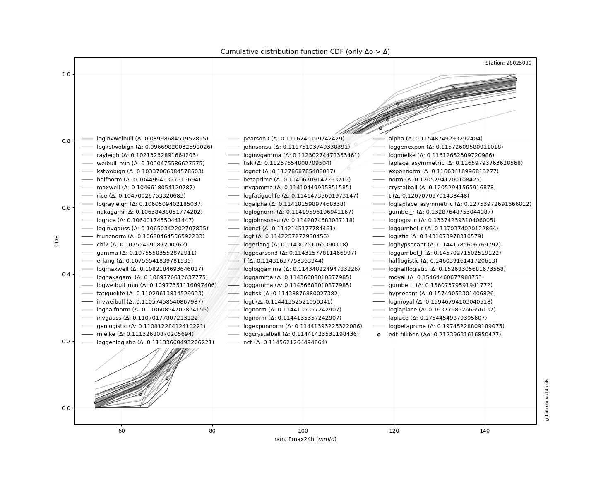

<div align="center">


</div>

# PMP Station (Rain, Pmax24h): 28025080

Probable Maximum Precipitation (PMP) is the greatest amount of rainfall for a specific duration that is meteorologically possible for a given location, acting as a "worst-case" scenario for extreme storms, crucial for designing safety-critical infrastructure like bridges, river deviations, dams, spillways, and nuclear plants to prevent catastrophic failure. PMP is calculated by hydrologists using meteorological data to determine the upper limit of extreme rainfall, often leading to the Probable Maximum Flood (PMF) for flood control design, and is increasingly being studied for climate change impacts. Probable Maximum Precipitation (PMP) is the theoretical upper limit of rainfall, a deterministic estimate for extreme events, while probability distributions (like GEV, Gumbel) describe the likelihood and frequency of various precipitation amounts, including rare ones, showing how often events occur, with PMP representing the extreme end of these distributions, used for critical infrastructure design to ensure safety against the worst conceivable weather, unlike standard statistical forecasts which cover typical probabilities.

The most common probability distributions in hydrology, used for analyzing floods, rainfall, and streamflow, include the Normal, Log-Normal, Gumbel, Gamma (including Log-Pearson Type III), and Generalized Extreme Value (GEV) distributions, often chosen based on the data´s skewness and whether modeling extremes or general conditions, with Gumbel and GEV popular for extreme events like floods, while the Normal distribution serves as a baseline, though often requiring transformations for skewed hydrological data. These distributions help in designing water infrastructure, managing water resources, and forecasting hydrologic events.

> Hydrological data often isn´t perfectly normal (it´s skewed), so different distributions are needed for different applications, such as: **Flood Frequency Analysis**: Using Gumbel, GEV, or Log-Pearson Type III for predicting extreme flood magnitudes and their return periods, **Rainfall Analysis**: Normal for annual totals, but Log-Normal, Weibull, or GEV for intensity or extreme daily rainfall, **Streamflow Modeling**: Gamma and Log-Normal for maximum flows, GEV for minimum flows, and Kappa for daily flows.

<div align="center">

</img>

</div>


## A. General information


### 1. General running parameters

• app_version: _v20260103_. • runtime: _2026-01-06 18:56:15.422800_. • Python version: _3.14.0_. • SciPy version: _1.16.3_. • Pandas version: _2.3.3_. • NumPy version: _2.3.5_. • Stations dataset (station_dataset_file): _dataset/pmax24h_in/conventional_cesarcolombia_1959_2022.csv_. • Stations catalog (station_catalog_file): _dataset/CNE.xls_. • Minimum year to eval til year_max (date_min): _1900_. • Maximum year to eval since year_min (date_max): _2024_. • Creates, save and include plots into reports (create_plot): _True_. • Plot only fit distributions with Δo > Δ (plot_only_fit): _True_. • Plot only simple graphs avoiding multiple CDFs and multiple Extreme values plots (plot_only_simple): _False_. • Eval low extreme values, if False, evaluates high extreme values (low_extreme): _False_. • Eval every SciPy distribution as logarithmic (pdist_logarithmic_on): _True_. • Standard deviation normalized (ddof): _1.0_. • Return periods to eval in years (Tr): _[2, 2.33, 5, 10, 15, 20, 25, 50, 75, 100, 200, 250, 500, 750, 1000]_. • Minimum data sample per station, 0 means any (minimum_sample): _5_. • Z-Score maximum threshold to adjust a value, 0 means disable (zscore_max): _3.5_. • Z-Score minimum threshold to adjust a value, 0 means disable (zscore_min): _-2.5_. • Avoid zeros, e.g. rain = 0 (avoid_zeros): _True_. • Avoid null values (avoid_nans): _True_. 

:file_folder:File: [Dataset values](../../dataset/pmax24h_in/conventional_cesarcolombia_1959_2022.csv)

> Delta Degrees of Freedom (DDOF): is a parameter used in the formulas for calculating variance and standard deviation. When ddof=0, the divisor is $N$ (the total number of observations) and this is used when your data set is the entire population. When ddof=1, the divisor is $N-1$ and this is used when your data set is a sample drawn from a larger population. Using $N-1$ provides an unbiased estimate of the population variance (known as Bessel´s correction).


### 2. Station info and location

|   id |   CODIGO | NOMBRE             | CATEGORIA               | TECNOLOGIA   | ESTADO     | FECHA_INSTALACION   | FECHA_SUSPENSION   |   ALTITUD |   LATITUD |   LONGITUD | DEPARTAMENTO   | MUNICIPIO   | AREA_OPERATIVA                                         | ENTIDAD                                                     | AREA_HIDROGRAFICA   | ZONA_HIDROGRAFICA   | SUBZONA_HIDROGRAFICA   |   CORRIENTE | Catalogo   |   Version |
|-----:|---------:|:-------------------|:------------------------|:-------------|:-----------|:--------------------|:-------------------|----------:|----------:|-----------:|:---------------|:------------|:-------------------------------------------------------|:------------------------------------------------------------|:--------------------|:--------------------|:-----------------------|------------:|:-----------|----------:|
|    0 | 28025080 | SOCOMBA [28025080] | Climatológica Principal | Convencional | Suspendida | 15/12/1976          | 02/07/2019         |       170 |   9.68667 |   -73.2406 | Cesar          | Becerrill   | Area Operativa 05 - Magdalena-Cesar-Guajira-San Andrés | INSTITUTO DE HIDROLOGIA METEOROLOGIA Y ESTUDIOS AMBIENTALES | Magdalena Cauca     | Cesar               | Medio Cesar            |         nan | CNE_IDEAM  |  20251226 |

<div align="center">

Dynamic map: [:earth_americas:Google](http://maps.google.com/maps?q=9.686666667,-73.24055556) [:earth_americas:OSM](https://www.openstreetmap.org/#map=18/9.686666667/-73.24055556&layers=P) [:earth_americas:Bing](https://www.bing.com/maps?cp=9.686666667~-73.24055556&lvl=18) [:earth_americas:Apple](https://maps.apple.com/frame?center=9.686666667%2C-73.24055556&span=0.003%2C0.006)

</div>


<div align="center">

```geojson
{
  "type": "Feature",
  "geometry": {
    "type": "Point", 
    "coordinates": [-73.24055556, 9.686666667]
  }, 
  "properties": {
    "Name": "28025080"
  }
}
```

</div>


### 3. Discrete values table and plot

<div align="center">

|               |          0 |           1 |           2 |           3 |           4 |          5 |           6 |           7 |           8 |          9 |         10 |          11 |         12 |         13 |         14 |          15 |         16 |         17 |         18 |          19 |          20 |          21 |          22 |          23 |         24 |         25 |         26 |          27 |         28 |          29 |          30 |          31 |          32 |          33 |          34 |           35 |          36 |         37 |          38 |          39 |         40 |
|:--------------|-----------:|------------:|------------:|------------:|------------:|-----------:|------------:|------------:|------------:|-----------:|-----------:|------------:|-----------:|-----------:|-----------:|------------:|-----------:|-----------:|-----------:|------------:|------------:|------------:|------------:|------------:|-----------:|-----------:|-----------:|------------:|-----------:|------------:|------------:|------------:|------------:|------------:|------------:|-------------:|------------:|-----------:|------------:|------------:|-----------:|
| Date          | 1972       | 1975        | 1977        | 1978        | 1979        | 1980       | 1981        | 1982        | 1983        | 1984       | 1985       | 1986        | 1987       | 1988       | 1989       | 1990        | 1991       | 1992       | 1993       | 1994        | 1995        | 1996        | 1997        | 1998        | 1999       | 2000       | 2001       | 2002        | 2003       | 2004        | 2005        | 2006        | 2007        | 2008        | 2009        | 2010         | 2011        | 2012       | 2013        | 2014        | 2015       |
| Value         |   64.0373  |   72        |   97.7      |   71.5      |  110.5      |  120.7     |  111.5      |  104.9      |   90.4      |  118.5     |  130.3     |   71.1      |   90.1     |  146.7     |   70.3     |   72.2      |   71.6     |  117       |   70       |  112.5      |  104        |  111        |   98.3      |   85.1      |  120       |   99       |  133       |   76.5388   |   70.6734  |   85        |  104        |   72        |  110        |   80        |   85.1      |   92         |   94        |   65.7614  |   77.1042   |   74.7741   |   54.3054  |
| Value_initial |   64.0373  |   72        |   97.7      |   71.5      |  110.5      |  120.7     |  111.5      |  104.9      |   90.4      |  118.5     |  130.3     |   71.1      |   90.1     |  146.7     |   70.3     |   72.2      |   71.6     |  117       |   70       |  112.5      |  104        |  111        |   98.3      |   85.1      |  120       |   99       |  133       |   76.5388   |   70.6734  |   85        |  104        |   72        |  110        |   80        |   85.1      |   92         |   94        |   65.7614  |   77.1042   |   74.7741   |   54.3054  |
| count         |   41       |   41        |   41        |   41        |   41        |   41       |   41        |   41        |   41        |   41       |   41       |   41        |   41       |   41       |   41       |   41        |   41       |   41       |   41       |   41        |   41        |   41        |   41        |   41        |   41       |   41       |   41       |   41        |   41       |   41        |   41        |   41        |   41        |   41        |   41        |   41         |   41        |   41       |   41        |   41        |   41       |
| mean          |   92.8096  |   92.8096   |   92.8096   |   92.8096   |   92.8096   |   92.8096  |   92.8096   |   92.8096   |   92.8096   |   92.8096  |   92.8096  |   92.8096   |   92.8096  |   92.8096  |   92.8096  |   92.8096   |   92.8096  |   92.8096  |   92.8096  |   92.8096   |   92.8096   |   92.8096   |   92.8096   |   92.8096   |   92.8096  |   92.8096  |   92.8096  |   92.8096   |   92.8096  |   92.8096   |   92.8096   |   92.8096   |   92.8096   |   92.8096   |   92.8096   |   92.8096    |   92.8096   |   92.8096  |   92.8096   |   92.8096   |   92.8096  |
| std           |   21.9509  |   21.9509   |   21.9509   |   21.9509   |   21.9509   |   21.9509  |   21.9509   |   21.9509   |   21.9509   |   21.9509  |   21.9509  |   21.9509   |   21.9509  |   21.9509  |   21.9509  |   21.9509   |   21.9509  |   21.9509  |   21.9509  |   21.9509   |   21.9509   |   21.9509   |   21.9509   |   21.9509   |   21.9509  |   21.9509  |   21.9509  |   21.9509   |   21.9509  |   21.9509   |   21.9509   |   21.9509   |   21.9509   |   21.9509   |   21.9509   |   21.9509    |   21.9509   |   21.9509  |   21.9509   |   21.9509   |   21.9509  |
| zscore        |   -1.31076 |   -0.948008 |    0.222787 |   -0.970786 |    0.805907 |    1.27058 |    0.851463 |    0.550792 |   -0.109773 |    1.17036 |    1.70792 |   -0.989009 |   -0.12344 |    2.45504 |   -1.02545 |   -0.938897 |   -0.96623 |    1.10202 |   -1.03912 |    0.897019 |    0.509791 |    0.828685 |    0.250121 |   -0.351221 |    1.23869 |    0.28201 |    1.83092 |   -0.741239 |   -1.00844 |   -0.355777 |    0.509791 |   -0.948008 |    0.783129 |   -0.583558 |   -0.351221 |   -0.0368834 |    0.054229 |   -1.23221 |   -0.715478 |   -0.821631 |   -1.75411 |


</div>


<div align="center">

</img>

</div>


> The initial value (value_initial) correspond to the initial obtained or null completed value, and value (value) is adjusted only when the initial value is outside the valid range (outlier) definite through the Z-Score value. If Z-Score is active, values out of range or outliers are replaced with the station mean value. A Z-Score (or standard score) measures how many standard deviations a data point is from the mean of a dataset, indicating its relative position; positive scores mean above the mean, negative mean below, and a score of zero is exactly at the mean, allowing for comparison of values from different distributions. It´s calculated using the formula $z=(x–μ)/σ$, where $x$ is the data point, $μ$ is the mean, and $σ$ is the standard deviation, helping identify outliers and understand probability.
>
> <sub>**Note**: In this study, "completing" (filling gaps in) and "extending" (forecasting or lengthening the historical record) rainfall data series are avoided for certain critical analyses because they introduce artificial bias and uncertainty, which can distort the statistics of rare events (extremes), alter day-to-day variability, and compromise the integrity and homogeneity of the original data. Some reasons against Completing/Extending rainfall data are: **Distortion of Extremes and Variability**: The primary issue is that most gap-filling or extension methods rely on averaging or regression with nearby stations, which inherently smooths the data. Rainfall is highly variable in space and time, with a large percentage of zero values and occasional large storms. Infilling methods often underestimate the highest values and overestimate the lowest (zero) values, which severely distorts analyses focused on flood frequency, drought severity, and intensity-duration-frequency (IDF) curves, **Loss of Data Homogeneity**: Infilled or extended data are synthetic estimates, not actual measurements. Combining these estimates with observed data can violate the assumption of data homogeneity, which requires that the data properties do not change over time. Inhomogeneity can lead to incorrect conclusions about long-term trends or changes in climate patterns, **Propagation of Errors**: Errors and biases from the original data (e.g., wind-induced undercatch, instrument errors, site changes) or the data used for imputation can propagate through the analysis, leading to unreliable hydrological models and inaccurate predictions, **Compromised Statistical Integrity**: For statistical analyses, especially those involving the frequency of events, using artificial data can introduce time bias or autocorrelation that doesn´t exist in reality, making it difficult to assess the true probability of events, **Difficulty in Validation**: It is difficult to accurately validate the quality of filled or extended data, especially for past periods where ground-truth measurements are unavailable. The reliability of imputation techniques heavily depends on the density of the surrounding station network and the complexity of the local topography.</sub>


### 4. Active continuous probability distributions from SciPy (44 of 104 available)

A Probability Density Function (PDF) describes the relative likelihood of a continuous random variable falling within a specific range, where the total area under its curve equals 1, and the area over any interval gives the actual probability for that range. Unlike discrete probabilities (like rolling a die), a PDF shows density, not direct probability for a single point (which is zero), with higher points indicating higher likelihood, often visualized as a bell curve for normal distributions.

A log of a probability density function (log-PDF) is simply the logarithm of the PDF´s value, denoted as $log(f(x))$, useful for converting multiplication of probabilities into addition, improving numerical stability with tiny numbers, and connecting to information theory concepts like entropy. Instead of dealing with very small probabilities (e.g., 0.000001), log-PDFs use negative numbers (e.g., $log(0.00001) ≈ -11.51$ that are easier for computers to handle, preventing underflow errors and simplifying complex calculations. In this study, each active probability distribution from SciPy is also evaluated in the $log$ form.

[scipy.stats](https://docs.scipy.org/doc/scipy/reference/stats.html) is a Python´s powerful submodule within the SciPy library for comprehensive statistical analysis, offering over 130 probability distributions (like Normal, Poisson), functions for descriptive stats (mean, variance), hypothesis testing (t-tests, chi-square), random variable generation, and statistical tests, making it essential for data science, modeling, and research. It provides tools to explore, model, and draw conclusions from data efficiently, working seamlessly with NumPy.

<div align="center">

|   id | p_dist             |   n_parameter | fit_method   | label                                                                       | active   | ref                                                                                                        |
|-----:|:-------------------|--------------:|:-------------|:----------------------------------------------------------------------------|:---------|:-----------------------------------------------------------------------------------------------------------|
|    0 | alpha              |             3 | MLE          | Alpha                                                                       | True     | [:mortar_board:](https://docs.scipy.org/doc/scipy/reference/generated/scipy.stats.alpha.html)              |
|    1 | betaprime          |             4 | MLE          | Beta prime                                                                  | True     | [:mortar_board:](https://docs.scipy.org/doc/scipy/reference/generated/scipy.stats.betaprime.html)          |
|    2 | chi2               |             3 | MLE          | Chi²                                                                        | True     | [:mortar_board:](https://docs.scipy.org/doc/scipy/reference/generated/scipy.stats.chi2.html)               |
|    3 | crystalball        |             4 | MLE          | Crystalball                                                                 | True     | [:mortar_board:](https://docs.scipy.org/doc/scipy/reference/generated/scipy.stats.crystalball.html)        |
|    4 | erlang             |             3 | MLE          | Erlang                                                                      | True     | [:mortar_board:](https://docs.scipy.org/doc/scipy/reference/generated/scipy.stats.erlang.html)             |
|    5 | expon              |             2 | MLE          | Exponential                                                                 | True     | [:mortar_board:](https://docs.scipy.org/doc/scipy/reference/generated/scipy.stats.expon.html)              |
|    6 | exponnorm          |             3 | MLE          | Exponentially modified Normal                                               | True     | [:mortar_board:](https://docs.scipy.org/doc/scipy/reference/generated/scipy.stats.exponnorm.html)          |
|    7 | f                  |             4 | MLE          | F                                                                           | True     | [:mortar_board:](https://docs.scipy.org/doc/scipy/reference/generated/scipy.stats.f.html)                  |
|    8 | fatiguelife        |             3 | MLE          | Fatigue-life (Birnbaum-Saunders)                                            | True     | [:mortar_board:](https://docs.scipy.org/doc/scipy/reference/generated/scipy.stats.fatiguelife.html)        |
|    9 | fisk               |             3 | MLE          | Fisk                                                                        | True     | [:mortar_board:](https://docs.scipy.org/doc/scipy/reference/generated/scipy.stats.fisk.html)               |
|   10 | gamma              |             3 | MLE          | Gamma                                                                       | True     | [:mortar_board:](https://docs.scipy.org/doc/scipy/reference/generated/scipy.stats.gamma.html)              |
|   11 | genexpon           |             5 | MLE          | Generalized exponential                                                     | True     | [:mortar_board:](https://docs.scipy.org/doc/scipy/reference/generated/scipy.stats.genexpon.html)           |
|   12 | genlogistic        |             3 | MLE          | Generalized logistic                                                        | True     | [:mortar_board:](https://docs.scipy.org/doc/scipy/reference/generated/scipy.stats.genlogistic.html)        |
|   13 | gibrat             |             2 | MM           | Gibrat                                                                      | True     | [:mortar_board:](https://docs.scipy.org/doc/scipy/reference/generated/scipy.stats.gibrat.html)             |
|   14 | gompertz           |             3 | MLE          | Gompertz (or truncated Gumbel)                                              | True     | [:mortar_board:](https://docs.scipy.org/doc/scipy/reference/generated/scipy.stats.gompertz.html)           |
|   15 | gumbel_l           |             2 | MM           | Gumbel Left Skew                                                            | True     | [:mortar_board:](https://docs.scipy.org/doc/scipy/reference/generated/scipy.stats.gumbel_l.html)           |
|   16 | gumbel_r           |             2 | MM           | Gumbel Right Skew                                                           | True     | [:mortar_board:](https://docs.scipy.org/doc/scipy/reference/generated/scipy.stats.gumbel_r.html)           |
|   17 | halflogistic       |             2 | MM           | Half-logistic                                                               | True     | [:mortar_board:](https://docs.scipy.org/doc/scipy/reference/generated/scipy.stats.halflogistic.html)       |
|   18 | halfnorm           |             2 | MM           | Half Normal                                                                 | True     | [:mortar_board:](https://docs.scipy.org/doc/scipy/reference/generated/scipy.stats.halfnorm.html)           |
|   19 | hypsecant          |             2 | MM           | hyperbolic secant                                                           | True     | [:mortar_board:](https://docs.scipy.org/doc/scipy/reference/generated/scipy.stats.hypsecant.html)          |
|   20 | invgamma           |             3 | MLE          | Inverted gamma                                                              | True     | [:mortar_board:](https://docs.scipy.org/doc/scipy/reference/generated/scipy.stats.invgamma.html)           |
|   21 | invgauss           |             3 | MLE          | Inverse Gaussian                                                            | True     | [:mortar_board:](https://docs.scipy.org/doc/scipy/reference/generated/scipy.stats.invgauss.html)           |
|   22 | invweibull         |             3 | MLE          | Inverted Weibull                                                            | True     | [:mortar_board:](https://docs.scipy.org/doc/scipy/reference/generated/scipy.stats.invweibull.html)         |
|   23 | johnsonsu          |             4 | MLE          | Johnson Su                                                                  | True     | [:mortar_board:](https://docs.scipy.org/doc/scipy/reference/generated/scipy.stats.johnsonsu.html)          |
|   24 | kstwobign          |             2 | MLE          | Limiting distribution of scaled Kolmogorov-Smirnov two-sided test statistic | True     | [:mortar_board:](https://docs.scipy.org/doc/scipy/reference/generated/scipy.stats.kstwobign.html)          |
|   25 | laplace            |             2 | MM           | Laplace                                                                     | True     | [:mortar_board:](https://docs.scipy.org/doc/scipy/reference/generated/scipy.stats.laplace.html)            |
|   26 | laplace_asymmetric |             3 | MLE          | Asymmetric Laplace                                                          | True     | [:mortar_board:](https://docs.scipy.org/doc/scipy/reference/generated/scipy.stats.laplace_asymmetric.html) |
|   27 | loggamma           |             3 | MLE          | Log gamma                                                                   | True     | [:mortar_board:](https://docs.scipy.org/doc/scipy/reference/generated/scipy.stats.loggamma.html)           |
|   28 | logistic           |             2 | MM           | Logistic (or Sech-squared)                                                  | True     | [:mortar_board:](https://docs.scipy.org/doc/scipy/reference/generated/scipy.stats.logistic.html)           |
|   29 | lognorm            |             3 | MLE          | Log Normal                                                                  | True     | [:mortar_board:](https://docs.scipy.org/doc/scipy/reference/generated/scipy.stats.lognorm.html)            |
|   30 | maxwell            |             2 | MM           | Maxwell                                                                     | True     | [:mortar_board:](https://docs.scipy.org/doc/scipy/reference/generated/scipy.stats.maxwell.html)            |
|   31 | mielke             |             4 | MLE          | Mielke Beta-Kappa / Dagum                                                   | True     | [:mortar_board:](https://docs.scipy.org/doc/scipy/reference/generated/scipy.stats.mielke.html)             |
|   32 | moyal              |             2 | MM           | Moyal                                                                       | True     | [:mortar_board:](https://docs.scipy.org/doc/scipy/reference/generated/scipy.stats.moyal.html)              |
|   33 | nakagami           |             3 | MLE          | Nakagami                                                                    | True     | [:mortar_board:](https://docs.scipy.org/doc/scipy/reference/generated/scipy.stats.nakagami.html)           |
|   34 | ncf                |             5 | MLE          | Non-central F distribution                                                  | True     | [:mortar_board:](https://docs.scipy.org/doc/scipy/reference/generated/scipy.stats.ncf.html)                |
|   35 | nct                |             4 | MLE          | Non-central Student’s t                                                     | True     | [:mortar_board:](https://docs.scipy.org/doc/scipy/reference/generated/scipy.stats.nct.html)                |
|   36 | norm               |             2 | MM           | Normal                                                                      | True     | [:mortar_board:](https://docs.scipy.org/doc/scipy/reference/generated/scipy.stats.norm.html)               |
|   37 | pearson3           |             3 | MM           | Pearson type III                                                            | True     | [:mortar_board:](https://docs.scipy.org/doc/scipy/reference/generated/scipy.stats.pearson3.html)           |
|   38 | rayleigh           |             2 | MM           | Rayleigh                                                                    | True     | [:mortar_board:](https://docs.scipy.org/doc/scipy/reference/generated/scipy.stats.rayleigh.html)           |
|   39 | rice               |             3 | MLE          | Rice                                                                        | True     | [:mortar_board:](https://docs.scipy.org/doc/scipy/reference/generated/scipy.stats.rice.html)               |
|   40 | t                  |             3 | MLE          | Student’s t                                                                 | True     | [:mortar_board:](https://docs.scipy.org/doc/scipy/reference/generated/scipy.stats.t.html)                  |
|   41 | truncnorm          |             4 | MLE          | Truncated normal                                                            | True     | [:mortar_board:](https://docs.scipy.org/doc/scipy/reference/generated/scipy.stats.truncnorm.html)          |
|   42 | wald               |             2 | MM           | Wald                                                                        | True     | [:mortar_board:](https://docs.scipy.org/doc/scipy/reference/generated/scipy.stats.wald.html)               |
|   43 | weibull_min        |             3 | MLE          | Weibull minimum                                                             | True     | [:mortar_board:](https://docs.scipy.org/doc/scipy/reference/generated/scipy.stats.weibull_min.html)        |

</div>

> **n_parameter:** # arguments & localization & scale.
>
> **Fit methods:** (MLE) maximum likelihood, (MM) L-moments.
>
>**Inactive** (With the only purpose of prevent loops, zero divisions, infinite values, over high estimated values or horizontal trending for recurrence intervals estimations, the follow distributions were disabled.)**:** foldnorm, gennorm, norminvgauss, powernorm, powerlognorm, skewnorm, genextreme, anglit, arcsine, argus, beta, bradford, burr, burr12, cauchy, cosine, halfcauchy, foldcauchy, skewcauchy, wrapcauchy, dgamma, gengamma, exponweib, exponpow, truncexpon, gausshyper, genhalflogistic, genhyperbolic, geninvgauss, halfgennorm, johnsonsb, kappa4, kappa3, ksone, kstwo, loglaplace, levy, levy_l, levy_stable, ncx2, pareto, genpareto, truncpareto, lomax, powerlaw, rdist, rel_breitwigner, recipinvgauss, semicircular, studentized_range, trapezoid, triang, truncweibull_min, tukeylambda, uniform, loguniform, vonmises, vonmises_line, weibull_max, dweibull, 


## B. Probability (PDF) vs. Empirical (EDF) distributions functions

A continuous probability distribution (CPD) describes probabilities for variables that can take any value within a range (like rain any time), unlike discrete variables with specific outcomes (like temperature). It uses a Probability Density Function (PDF), a curve where the total area under it equals 1, and the probability of the variable falling within an interval (a to b) is found by calculating the area under the curve between those points. A key feature is that the probability of hitting any single exact value is zero, so probabilities are always expressed for ranges, e.g., $P(a ≤ X ≤ b)$.

<div align="center">

Distributions parameters from station values
|    |   station | p_dist                |   n |             loc |          scale | shape                 | shape1              | shape2                 | shape3   |
|---:|----------:|:----------------------|----:|----------------:|---------------:|:----------------------|:--------------------|:-----------------------|:---------|
|  0 |  28025080 | alpha                 |  41 |   -74.2723      | 1300.21        | 7.910500675596794     |                     |                        |          |
|  1 |  28025080 | betaprime             |  41 |    -0.678539    |   22.3309      | 95.22523801090057     | 23.742643240532814  |                        |          |
|  2 |  28025080 | chi2                  |  41 |    43.0626      |    5.03675     | 9.876803712593091     |                     |                        |          |
|  3 |  28025080 | crystalball           |  41 |    92.8096      |   21.6815      | 7797.312582710817     | 1297.0685057931753  |                        |          |
|  4 |  28025080 | erlang                |  41 |    43.0625      |   10.0734      | 4.938436195795459     |                     |                        |          |
|  5 |  28025080 | expon                 |  41 |    54.3054      |   38.5042      |                       |                     |                        |          |
|  6 |  28025080 | exponnorm             |  41 |    78.2603      |   16.6778      | 0.872376933838804     |                     |                        |          |
|  7 |  28025080 | f                     |  41 |    -0.630147    |   89.7538      | 154.2928701259657     | 50.23578812318202   |                        |          |
|  8 |  28025080 | fatiguelife           |  41 |    22.7206      |   66.7271      | 0.31737542001836927   |                     |                        |          |
|  9 |  28025080 | fisk                  |  41 |    -0.167391    |   90.3714      | 7.14495643897858      |                     |                        |          |
| 10 |  28025080 | gamma                 |  41 |    43.0626      |   10.0735      | 4.938420323265561     |                     |                        |          |
| 11 |  28025080 | genexpon              |  41 |    53.5691      |    1.80935     | 4.581735737394762e-11 | 0.04769179520246915 | 1.3583524985563262     |          |
| 12 |  28025080 | genlogistic           |  41 |   -25.9585      |   18.1125      | 398.747501290429      |                     |                        |          |
| 13 |  28025080 | gibrat                |  41 |    76.2694      |   10.0322      |                       |                     |                        |          |
| 14 |  28025080 | gompertz              |  41 |  -323.548       |   11.5888      | 4.719325060208775e-17 |                     |                        |          |
| 15 |  28025080 | gumbel_l              |  41 |   102.567       |   16.905       |                       |                     |                        |          |
| 16 |  28025080 | gumbel_r              |  41 |    83.0518      |   16.905       |                       |                     |                        |          |
| 17 |  28025080 | halflogistic          |  41 |    67.1119      |   18.537       |                       |                     |                        |          |
| 18 |  28025080 | halfnorm              |  41 |    64.1117      |   35.9675      |                       |                     |                        |          |
| 19 |  28025080 | hypsecant             |  41 |    92.8096      |   13.8029      |                       |                     |                        |          |
| 20 |  28025080 | invgamma              |  41 |    -8.58666     | 2181.37        | 22.503167741291985    |                     |                        |          |
| 21 |  28025080 | invgauss              |  41 |    21.1058      |  731.571       | 0.09801052421316643   |                     |                        |          |
| 22 |  28025080 | invweibull            |  41 |    -7.37251e+08 |    7.37251e+08 | 40700052.58820516     |                     |                        |          |
| 23 |  28025080 | johnsonsu             |  41 |    20.9847      |    7.41493     | -9.6009748402718      | 3.2876572128804944  |                        |          |
| 24 |  28025080 | kstwobign             |  41 |    18.3574      |   85.3447      |                       |                     |                        |          |
| 25 |  28025080 | laplace               |  41 |    92.8096      |   15.3312      |                       |                     |                        |          |
| 26 |  28025080 | laplace_asymmetric    |  41 |    71.1         |   11.4546      | 0.43004861220629687   |                     |                        |          |
| 27 |  28025080 | loggamma              |  41 | -5932.16        |  827.853       | 1448.4272314307375    |                     |                        |          |
| 28 |  28025080 | logistic              |  41 |    92.8096      |   11.9537      |                       |                     |                        |          |
| 29 |  28025080 | lognorm               |  41 |    19.821       |   69.8056      | 0.30079481951956993   |                     |                        |          |
| 30 |  28025080 | maxwell               |  41 |    41.4335      |   32.1952      |                       |                     |                        |          |
| 31 |  28025080 | mielke                |  41 |    -0.276427    |   69.9063      | 16.638525016287083    | 5.624006127126446   |                        |          |
| 32 |  28025080 | moyal                 |  41 |    80.4107      |    9.76013     |                       |                     |                        |          |
| 33 |  28025080 | nakagami              |  41 |    64.0373      |   35.3221      | 0.41164761435644726   |                     |                        |          |
| 34 |  28025080 | ncf                   |  41 |    -0.082077    |    1.06134e-05 | 5.041499418439944e-07 | 14.643978562930169  | 3.2782378530006118     |          |
| 35 |  28025080 | nct                   |  41 |    -0.136499    |    9.69329     | 12.772217445810396    | 9.022020618429718   |                        |          |
| 36 |  28025080 | norm                  |  41 |    92.8096      |   21.6815      |                       |                     |                        |          |
| 37 |  28025080 | pearson3              |  41 |    92.8096      |   21.6816      | 0.4170719051692846    |                     |                        |          |
| 38 |  28025080 | rayleigh              |  41 |    51.3316      |   33.0947      |                       |                     |                        |          |
| 39 |  28025080 | rice                  |  41 |    50.8548      |   28.7203      | 0.8389678126883386    |                     |                        |          |
| 40 |  28025080 | t                     |  41 |    92.8234      |   21.6831      | 146537.65006382146    |                     |                        |          |
| 41 |  28025080 | truncnorm             |  41 |    95.0772      |   28.4475      | -1243.6895678701571   | 1.814671293759121   |                        |          |
| 42 |  28025080 | wald                  |  41 |    71.128       |   21.6816      |                       |                     |                        |          |
| 43 |  28025080 | weibull_min           |  41 |    50.8426      |   47.3969      | 2.033534143593579     |                     |                        |          |
| 44 |  28025080 | logalpha              |  41 |    -2.55364     |  213.784       | 30.325540949180677    |                     |                        |          |
| 45 |  28025080 | logbetaprime          |  41 |    -2.26836     |   17.5912      | 383.94543247297736    | 1001.2860547965065  |                        |          |
| 46 |  28025080 | logchi2               |  41 |     3.99462     |    0.312898    | 1.4951308346723156    |                     |                        |          |
| 47 |  28025080 | logcrystalball        |  41 |     4.50347     |    0.23287     | 61.07432181854429     | 352.1891145832261   |                        |          |
| 48 |  28025080 | logerlang             |  41 |    -7.84819     |    0.00438762  | 2815.0998166700983    |                     |                        |          |
| 49 |  28025080 | logexpon              |  41 |     3.99462     |    0.50885     |                       |                     |                        |          |
| 50 |  28025080 | logexponnorm          |  41 |     4.49446     |    0.232695    | 0.038720161490450836  |                     |                        |          |
| 51 |  28025080 | logf                  |  41 |    -6.99069     |   11.4906      | 20466.769334550154    | 6396.016757153891   |                        |          |
| 52 |  28025080 | logfatiguelife        |  41 |    -3.52135     |    8.02144     | 0.02902659703111009   |                     |                        |          |
| 53 |  28025080 | logfisk               |  41 |    -0.196838    |    4.69527     | 33.49021729035081     |                     |                        |          |
| 54 |  28025080 | loggamma              |  41 |    -7.88141     |    0.00437448  | 2831.1557569478628    |                     |                        |          |
| 55 |  28025080 | loggenexpon           |  41 |     3.97511     |    0.0152013   | 0.0005155502827956222 | 3.8091354220935187  | 0.00035762836058345613 |          |
| 56 |  28025080 | loggenlogistic        |  41 |     4.24448     |    0.17825     | 2.943189151153709     |                     |                        |          |
| 57 |  28025080 | loggibrat             |  41 |     4.32586     |    0.107728    |                       |                     |                        |          |
| 58 |  28025080 | loggompertz           |  41 |     3.99462     |    0.795972    | 1.1114696774701254    |                     |                        |          |
| 59 |  28025080 | loggumbel_l           |  41 |     4.60828     |    0.181568    |                       |                     |                        |          |
| 60 |  28025080 | loggumbel_r           |  41 |     4.39867     |    0.181568    |                       |                     |                        |          |
| 61 |  28025080 | loghalflogistic       |  41 |     4.22749     |    0.199081    |                       |                     |                        |          |
| 62 |  28025080 | loghalfnorm           |  41 |     4.19527     |    0.38628     |                       |                     |                        |          |
| 63 |  28025080 | loghypsecant          |  41 |     4.50347     |    0.14825     |                       |                     |                        |          |
| 64 |  28025080 | loginvgamma           |  41 |     1.03401     |  764.009       | 221.2655185887387     |                     |                        |          |
| 65 |  28025080 | loginvgauss           |  41 |     2.78706     |   88.3009      | 0.019420681328195473  |                     |                        |          |
| 66 |  28025080 | loginvweibull         |  41 |    -3.98048e+07 |    3.98048e+07 | 174945496.51338053    |                     |                        |          |
| 67 |  28025080 | logjohnsonsu          |  41 |    -4.0474      |    2.84783     | -70.39883802099337    | 38.70310399038706   |                        |          |
| 68 |  28025080 | logkstwobign          |  41 |     3.6026      |    1.03375     |                       |                     |                        |          |
| 69 |  28025080 | loglaplace            |  41 |     4.50347     |    0.164664    |                       |                     |                        |          |
| 70 |  28025080 | loglaplace_asymmetric |  41 |     4.50424     |    0.201023    | 1.0019739076235767    |                     |                        |          |
| 71 |  28025080 | logloggamma           |  41 |   -41.6891      |    6.83933     | 858.0024841499578     |                     |                        |          |
| 72 |  28025080 | loglogistic           |  41 |     4.50347     |    0.128388    |                       |                     |                        |          |
| 73 |  28025080 | loglognorm            |  41 |    -4.4909      |    8.99136     | 0.025893436408411668  |                     |                        |          |
| 74 |  28025080 | logmaxwell            |  41 |     3.95167     |    0.345792    |                       |                     |                        |          |
| 75 |  28025080 | logmielke             |  41 | -7991.53        | 7995.81        | 121132.70633482032    | 47078.46368131695   |                        |          |
| 76 |  28025080 | logmoyal              |  41 |     4.3703      |    0.104828    |                       |                     |                        |          |
| 77 |  28025080 | lognakagami           |  41 |     3.6885      |    0.847587    | 3.129612580885304     |                     |                        |          |
| 78 |  28025080 | logncf                |  41 |    -4.90142     |    9.02711     | 6398.1513459954       | 6644.335615715034   | 265.75617011769555     |          |
| 79 |  28025080 | lognct                |  41 |     0.146251    |    0.117961    | 234.6821352582699     | 36.816949808524114  |                        |          |
| 80 |  28025080 | lognorm               |  41 |     4.50347     |    0.23287     |                       |                     |                        |          |
| 81 |  28025080 | logpearson3           |  41 |     4.50347     |    0.23287     | 0.03497845343807475   |                     |                        |          |
| 82 |  28025080 | lograyleigh           |  41 |     4.05803     |    0.355411    |                       |                     |                        |          |
| 83 |  28025080 | logrice               |  41 |     3.92691     |    0.254726    | 1.9897184005678432    |                     |                        |          |
| 84 |  28025080 | logt                  |  41 |     4.50347     |    0.23287     | 171003544206.01535    |                     |                        |          |
| 85 |  28025080 | logtruncnorm          |  41 |    -0.090845    |    1.57364     | 2.5961959571911386    | 4.522907260047773   |                        |          |
| 86 |  28025080 | logwald               |  41 |     4.27055     |    0.232918    |                       |                     |                        |          |
| 87 |  28025080 | logweibull_min        |  41 |     3.84766     |    0.73424     | 3.1326562524671218    |                     |                        |          |

</div>

> **loc** (Location parameter): This shifts the distribution along the x-axis. For many common distributions, like the normal (Gaussian) distribution, loc represents the mean $μ$. For others, like the uniform distribution, it might represent the minimum value, or for the beta distribution, the left end of the support interval.
>
> **scale** (Scale parameter): This determines the width or spread of the distribution. For the normal distribution, scale represents the standard deviation $σ$. For a uniform distribution, it defines the length of the interval (from $loc$ to $loc + scale$).
>
> **shape** (Shape parameters): Refers to parameters that define the specific form of a probability distribution, distinct from its location (loc) and scale (scale). These parameters are required arguments for most distribution functions. For example, a normal (Gaussian) distribution is fully defined by its location (mean) and scale (standard deviation), so it has no specific shape parameters beyond loc and scale. However, other distributions have intrinsic properties that need specification, as Gamma distribution that takes a shape parameter, often named $a$ or $alpha$.


### 0. Cumulative distribution values - CDF (88 evaluated)

Cumulative Distribution Function (CDF), denoted as $F$<sub>$X$</sub>$(x)$, is a function that gives the probability that a random variable $X$ will take a value less than or equal to a specific value, $x$ (i.e., $(P(X≥x)$. It essentially "accumulates" probabilities from a given point up to the far right (positive infinity), providing a complete picture of the distribution´s probabilities for both discrete (like rain) and continuous (like temperature) variables, helping to find probabilities over ranges or above certain values. Each station is evaluated separately ordering the $x$ values ascending, calculating the CDF and PDF values for the activated distributions and their logarithmic forms.

<div align="center">

CDF ordered by x ascending and calculating $log(f(x))$ separately
|   id |   Station |   date |        x |   count |    mean |     std |     zscore |   Value_initial |   station |   m |     alpha |   alpha_pdf |   betaprime |   betaprime_pdf |       chi2 |   chi2_pdf |   crystalball |   crystalball_pdf |     erlang |   erlang_pdf |    expon |   expon_pdf |   exponnorm |   exponnorm_pdf |         f |      f_pdf |   fatiguelife |   fatiguelife_pdf |      fisk |   fisk_pdf |      gamma |   gamma_pdf |   genexpon |   genexpon_pdf |   genlogistic |   genlogistic_pdf |      gibrat |   gibrat_pdf |   gompertz |   gompertz_pdf |   gumbel_l |   gumbel_l_pdf |   gumbel_r |   gumbel_r_pdf |   halflogistic |   halflogistic_pdf |   halfnorm |   halfnorm_pdf |   hypsecant |   hypsecant_pdf |   invgamma |   invgamma_pdf |   invgauss |   invgauss_pdf |   invweibull |   invweibull_pdf |   johnsonsu |   johnsonsu_pdf |   kstwobign |   kstwobign_pdf |   laplace |   laplace_pdf |   laplace_asymmetric |   laplace_asymmetric_pdf |   loggamma |   loggamma_pdf |   logistic |   logistic_pdf |   lognorm |   lognorm_pdf |   maxwell |   maxwell_pdf |    mielke |   mielke_pdf |       moyal |   moyal_pdf |    nakagami |   nakagami_pdf |      ncf |    ncf_pdf |       nct |    nct_pdf |      norm |    norm_pdf |   pearson3 |   pearson3_pdf |   rayleigh |   rayleigh_pdf |       rice |   rice_pdf |         t |       t_pdf |   truncnorm |   truncnorm_pdf |        wald |    wald_pdf |   weibull_min |   weibull_min_pdf |   logalpha |   logalpha_pdf |   logbetaprime |   logbetaprime_pdf |     logchi2 |   logchi2_pdf |   logcrystalball |   logcrystalball_pdf |   logerlang |   logerlang_pdf |   logexpon |   logexpon_pdf |   logexponnorm |   logexponnorm_pdf |      logf |   logf_pdf |   logfatiguelife |   logfatiguelife_pdf |   logfisk |   logfisk_pdf |   loggenexpon |   loggenexpon_pdf |   loggenlogistic |   loggenlogistic_pdf |   loggibrat |   loggibrat_pdf |   loggompertz |   loggompertz_pdf |   loggumbel_l |   loggumbel_l_pdf |   loggumbel_r |   loggumbel_r_pdf |   loghalflogistic |   loghalflogistic_pdf |   loghalfnorm |   loghalfnorm_pdf |   loghypsecant |   loghypsecant_pdf |   loginvgamma |   loginvgamma_pdf |   loginvgauss |   loginvgauss_pdf |   loginvweibull |   loginvweibull_pdf |   logjohnsonsu |   logjohnsonsu_pdf |   logkstwobign |   logkstwobign_pdf |   loglaplace |   loglaplace_pdf |   loglaplace_asymmetric |   loglaplace_asymmetric_pdf |   logloggamma |   logloggamma_pdf |   loglogistic |   loglogistic_pdf |   loglognorm |   loglognorm_pdf |   logmaxwell |   logmaxwell_pdf |   logmielke |   logmielke_pdf |    logmoyal |   logmoyal_pdf |   lognakagami |   lognakagami_pdf |    logncf |   logncf_pdf |    lognct |   lognct_pdf |   logpearson3 |   logpearson3_pdf |   lograyleigh |   lograyleigh_pdf |    logrice |   logrice_pdf |      logt |   logt_pdf |   logtruncnorm |   logtruncnorm_pdf |     logwald |   logwald_pdf |   logweibull_min |   logweibull_min_pdf |
|-----:|----------:|-------:|---------:|--------:|--------:|--------:|-----------:|----------------:|----------:|----:|----------:|------------:|------------:|----------------:|-----------:|-----------:|--------------:|------------------:|-----------:|-------------:|---------:|------------:|------------:|----------------:|----------:|-----------:|--------------:|------------------:|----------:|-----------:|-----------:|------------:|-----------:|---------------:|--------------:|------------------:|------------:|-------------:|-----------:|---------------:|-----------:|---------------:|-----------:|---------------:|---------------:|-------------------:|-----------:|---------------:|------------:|----------------:|-----------:|---------------:|-----------:|---------------:|-------------:|-----------------:|------------:|----------------:|------------:|----------------:|----------:|--------------:|---------------------:|-------------------------:|-----------:|---------------:|-----------:|---------------:|----------:|--------------:|----------:|--------------:|----------:|-------------:|------------:|------------:|------------:|---------------:|---------:|-----------:|----------:|-----------:|----------:|------------:|-----------:|---------------:|-----------:|---------------:|-----------:|-----------:|----------:|------------:|------------:|----------------:|------------:|------------:|--------------:|------------------:|-----------:|---------------:|---------------:|-------------------:|------------:|--------------:|-----------------:|---------------------:|------------:|----------------:|-----------:|---------------:|---------------:|-------------------:|----------:|-----------:|-----------------:|---------------------:|----------:|--------------:|--------------:|------------------:|-----------------:|---------------------:|------------:|----------------:|--------------:|------------------:|--------------:|------------------:|--------------:|------------------:|------------------:|----------------------:|--------------:|------------------:|---------------:|-------------------:|--------------:|------------------:|--------------:|------------------:|----------------:|--------------------:|---------------:|-------------------:|---------------:|-------------------:|-------------:|-----------------:|------------------------:|----------------------------:|--------------:|------------------:|--------------:|------------------:|-------------:|-----------------:|-------------:|-----------------:|------------:|----------------:|------------:|---------------:|--------------:|------------------:|----------:|-------------:|----------:|-------------:|--------------:|------------------:|--------------:|------------------:|-----------:|--------------:|----------:|-----------:|---------------:|-------------------:|------------:|--------------:|-----------------:|---------------------:|
|    0 |  28025080 |   2015 |  54.3054 |      41 | 92.8096 | 21.9509 | -1.75411   |         54.3054 |  28025080 |   1 | 0.0138411 |  0.00277919 |   0.0116584 |      0.00263323 | 0.00637621 | 0.00229004 |     0.0378748 |       0.0038017   | 0.00637622 |   0.00229003 | 0        |  0.0259712  |   0.0263853 |      0.00337253 | 0.012124  | 0.00267697 |    0.00793397 |        0.00232435 | 0.0261611 | 0.00334167 | 0.00637621 |  0.00229004 | 0.00448825 |     0.0111427  |    0.00894915 |        0.00231648 | 0           |  0           | 0.00680251 |    0.000584992 |  0.0559366 |    0.00321455  | 0.00418403 |     0.00135544 |      0         |         0          |  0         |     0          |   0.0390695 |     0.00282342  |  0.0113271 |     0.0025985  | 0.00823127 |     0.00235304 |    0.0088304 |       0.00230558 |  0.00959374 |      0.00247557 |  0.00568396 |      0.00204086 | 0.0405732 |   0.00264645  |           0.00516027 |               0.00104755 |  0.0135416 |       0.153212 |  0.0383785 |    0.00308739  | 0.0144399 |      0.157387 | 0.0162048 |    0.00365715 | 0.0084442 |   0.0020615  | 0.000139575 | 0.000110131 | 0           |     0          | 0.535265 | 0.00490531 | 0.0105625 | 0.00245945 | 0.0378748 | 0.0038017   |  0.0234296 |     0.0034916  | 0.00402913 |     0.00270425 | 0.00506431 | 0.00292847 | 0.0378343 | 0.00379803  |   0.0786315 |      0.00520224 | 0           | 0           |    0.00487743 |        0.00285727 |  0.010118  |       0.134246 |       0.111209 |           0.498352 | 8.65196e-12 |   7282.22     |        0.0144397 |             0.157386 |   0.013555  |        0.15333  |   0        |       1.96521  |      0.0144371 |           0.157374 | 0.012813  |   0.149701 |        0.0124564 |             0.147952 | 0.0218526 |      0.170789 |    0.00178226 |          0.148653 |       0.00845271 |             0.111997 |   0         |        0        |   1.22503e-08 |          1.39637  |     0.0334827 |         0.181286  |   9.54984e-05 |        0.00486854 |         0         |              0        |      0        |          0        |      0.0205619 |           0.138601 |    0.00888524 |          0.127178 |    0.00681947 |          0.115198 |      0.00314372 |            0.079618 |      0.0127618 |           0.149454 |     0.00124313 |          0.0512365 |    0.0227457 |         0.138134 |               0.0399024 |                    0.198106 |     0.0153927 |          0.161757 |     0.0186446 |          0.142513 |    0.0126699 |         0.149003 |  0.000507436 |         0.035331 |  0.00845045 |        0.108    | 1.96429e-09 |    3.46278e-07 |    0.00630024 |          0.116341 | 0.0127577 |     0.149432 | 0.0101615 |     0.135456 |     0.0136309 |          0.153704 |     0         |          0        | 0.00496381 |      0.149053 | 0.0144399 |   0.157387 |    4.13484e-11 |           1.85078  | 0           |   0           |       0.00645654 |             0.137185 |
|    1 |  28025080 |   1972 |  64.0373 |      41 | 92.8096 | 21.9509 | -1.31076   |         64.0373 |  28025080 |   2 | 0.0680817 |  0.00893267 |   0.066282  |      0.00919684 | 0.0643608  | 0.0101597  |     0.0922471 |       0.00762805  | 0.0643605  |   0.0101597  | 0.223336 |  0.0201709  |   0.0799884 |      0.00803425 | 0.0668071 | 0.00914795 |    0.0636495  |        0.00978746 | 0.0799871 | 0.00818931 | 0.0643607  |  0.0101597  | 0.214024   |     0.0207092  |    0.0631303  |        0.00959547 | 0           |  0           | 0.015683   |    0.00134263  |  0.0972996 |    0.00546609  | 0.0459799  |     0.00837605 |      0         |         0          |  0         |     0          |   0.0787703 |     0.00564872  |  0.0658301 |     0.00921892 | 0.0638279  |     0.0097303  |    0.063056  |       0.00962059 |  0.0648505  |      0.00952494 |  0.0631392  |      0.0105225  | 0.0765455 |   0.0049928   |           0.0372104  |               0.00755384 |  0.0687254 |       0.579531 |  0.0826412 |    0.00634212  | 0.0698036 |      0.575334 | 0.0795568 |    0.00954753 | 0.0593117 |   0.00943892 | 0.0206911   | 0.00650775  | 1.65412e-13 |     9.58302    | 0.580763 | 0.00444959 | 0.0639922 | 0.00921841 | 0.0922471 | 0.00762805  |  0.0803515 |     0.00855319 | 0.071047   |     0.0107764  | 0.0716069  | 0.010495   | 0.0921594 | 0.00762204  |   0.142567  |      0.00801153 | 0           | 0           |    0.0715571  |        0.0106239  |  0.0642205 |       0.595879 |       0.214356 |           0.750333 | 0.359913    |      1.39954  |        0.0698032 |             0.575331 |   0.0687673 |        0.579742 |   0.276713 |       1.42141  |      0.0698002 |           0.575344 | 0.0678682 |   0.583422 |        0.0674505 |             0.585391 | 0.0751965 |      0.534622 |    0.100832   |          1.00559  |       0.0593179  |             0.604337 |   0         |        0        |   0.225663    |          1.33006  |     0.0809612 |         0.427342  |   0.0239009   |        0.491507   |         0         |              0        |      0        |          0        |      0.0623337 |           0.417782 |    0.0630917  |          0.609633 |    0.0622161  |          0.646374 |      0.0612825  |            0.752073 |      0.0678099 |           0.583727 |     0.0662748  |          0.892971  |    0.0618959 |         0.375892 |               0.0904534 |                    0.449079 |     0.0709895 |          0.571518 |     0.0641973 |          0.467925 |    0.0677003 |         0.584203 |  0.0518469   |         0.695591 |  0.0570642  |        0.580437 | 0.00626373  |    0.248011    |    0.0620991  |          0.641737 | 0.0678033 |     0.583722 | 0.0648146 |     0.601637 |     0.0688608 |          0.579366 |     0.039906  |          0.770946 | 0.0677166  |      0.656477 | 0.0698037 |   0.575334 |    0.266665    |           1.40237  | 0           |   0           |       0.0660724  |             0.641396 |
|    2 |  28025080 |   2012 |  65.7614 |      41 | 92.8096 | 21.9509 | -1.23221   |         65.7614 |  28025080 |   3 | 0.0846457 |  0.0102854  |   0.0833659 |      0.0106223  | 0.0832016  | 0.0116861  |     0.106103  |       0.00845029  | 0.0832013  |   0.0116861  | 0.257347 |  0.0192876  |   0.0947331 |      0.00907707 | 0.0837874 | 0.0105512  |    0.0818682  |        0.0113417  | 0.0950755 | 0.00932406 | 0.0832015  |  0.0116861  | 0.248937   |     0.0197948  |    0.0810655  |        0.0112097  | 0           |  0           | 0.0181759  |    0.00155406  |  0.107167  |    0.00598684  | 0.0619797  |     0.0101959  |      0         |         0          |  0.0365835 |     0.0221602  |   0.0891222 |     0.00637274  |  0.0829642 |     0.0106584  | 0.0819381  |     0.0112738  |    0.0810408 |       0.0112419  |  0.0825703  |      0.0110289  |  0.0827528  |      0.0122157  | 0.0856567 |   0.00558709  |           0.0528048  |               0.0107195  |  0.0854798 |       0.68309  |  0.0942551 |    0.00714183  | 0.0864154 |      0.676534 | 0.0969599 |    0.0106362  | 0.0771494 |   0.0112618  | 0.0341762   | 0.00918933  | 0.0651179   |     0.0310723  | 0.588367 | 0.00437192 | 0.0811844 | 0.0107275  | 0.106103  | 0.00845029  |  0.0960131 |     0.00961753 | 0.0906777  |     0.0119802  | 0.0907012  | 0.0116415  | 0.106005  | 0.00844393  |   0.156839  |      0.00854355 | 0           | 0           |    0.0909086  |        0.0118103  |  0.0815472 |       0.709892 |       0.234787 |           0.787362 | 0.395628    |      1.29171  |        0.0864149 |             0.676532 |   0.0855274 |        0.6833   |   0.313509 |       1.3491   |      0.0864123 |           0.676552 | 0.0847531 |   0.689032 |        0.0844012 |             0.692014 | 0.09064   |      0.629818 |    0.128962   |          1.10993  |       0.0771525  |             0.740457 |   0         |        0        |   0.260776    |          1.31284  |     0.0931068 |         0.488143  |   0.0397331   |        0.705862   |         0         |              0        |      0        |          0        |      0.0744661 |           0.497733 |    0.0808571  |          0.729155 |    0.0811     |          0.776421 |      0.0833653  |            0.910324 |      0.084705  |           0.689491 |     0.0923512  |          1.06786   |    0.0727336 |         0.441709 |               0.103207  |                    0.512399 |     0.0874679 |          0.670287 |     0.0778083 |          0.558885 |    0.0846114 |         0.690217 |  0.0722752   |         0.842421 |  0.0742439  |        0.715376 | 0.0160279   |    0.504341    |    0.0807807  |          0.765637 | 0.0846982 |     0.689488 | 0.0823032 |     0.716289 |     0.0856079 |          0.682697 |     0.0627942 |          0.949691 | 0.0865526  |      0.762309 | 0.0864155 |   0.676534 |    0.303085    |           1.33967  | 0           |   0           |       0.0845268  |             0.748509 |
|    3 |  28025080 |   1993 |  70      |      41 | 92.8096 | 21.9509 | -1.03912   |         70      |  28025080 |   4 | 0.135296  |  0.013583   |   0.135717  |      0.0140299  | 0.140122   | 0.0150579  |     0.146393  |       0.0105801   | 0.140121   |   0.0150578  | 0.33476  |  0.0172771  |   0.138883  |      0.0117748  | 0.135737  | 0.0139147  |    0.137646   |        0.014881   | 0.140881  | 0.0123245  | 0.140122   |  0.0150579  | 0.328328   |     0.0177042  |    0.136754   |        0.0149843  | 0           |  0           | 0.0260967  |    0.00222225  |  0.135546  |    0.00744833  | 0.114838   |     0.0147019  |      0.0777427 |         0.0268101  |  0.130041  |     0.0218882  |   0.120495  |     0.00852267  |  0.135531  |     0.0140932  | 0.137402   |     0.0148052  |    0.136893  |       0.0150279  |  0.136911   |      0.0145385  |  0.142549   |      0.0158406  | 0.112935  |   0.00736638  |           0.124841   |               0.0253432  |  0.136417  |       0.952618 |  0.129187  |    0.00941112  | 0.136772  |      0.94072  | 0.147494  |    0.0131621  | 0.134383  |   0.0156719  | 0.0882694   | 0.0162975   | 0.180296    |     0.0246879  | 0.6065   | 0.00418516 | 0.134432  | 0.0143435  | 0.146393  | 0.0105801   |  0.142385  |     0.0122547  | 0.147089   |     0.0145377  | 0.145469   | 0.0141144  | 0.146266  | 0.0105731   |   0.195829  |      0.00985147 | 0           | 0           |    0.146562   |        0.0143571  |  0.134913  |       1.00275  |       0.286477 |           0.865345 | 0.469661    |      1.08857  |        0.136771  |             0.940719 |   0.136477  |        0.952788 |   0.392809 |       1.19326  |      0.13677   |           0.940754 | 0.136208  |   0.96308  |        0.136114  |             0.968254 | 0.138008  |      0.896233 |    0.204751   |          1.30452  |       0.134377   |             1.09689  |   0         |        0        |   0.341343    |          1.26525  |     0.128778  |         0.661489  |   0.101604    |        1.2796     |         0.0527092 |              2.50456  |      0.109599 |          2.04604  |      0.11281   |           0.745115 |    0.135796   |          1.03314  |    0.139587   |          1.09692  |      0.151363   |            1.25605  |      0.1362    |           0.963878 |     0.170166   |          1.40173   |    0.106286  |         0.64547  |               0.140731  |                    0.698692 |     0.13725   |          0.92865  |     0.120681  |          0.826533 |    0.136169  |         0.965143 |  0.135494    |         1.17624  |  0.13003    |        1.07841  | 0.0738072   |    1.37624     |    0.138076   |          1.06949  | 0.136193  |     0.963875 | 0.136095  |     1.00974  |     0.136503  |          0.951645 |     0.133757  |          1.30613  | 0.142302   |      1.02451  | 0.136772  |   0.94072  |    0.382387    |           1.20172  | 0           |   0           |       0.139414   |             1.00982  |
|    4 |  28025080 |   1989 |  70.3    |      41 | 92.8096 | 21.9509 | -1.02545   |         70.3    |  28025080 |   5 | 0.139404  |  0.0138059  |   0.13996   |      0.014256   | 0.144671   | 0.0152677  |     0.14959   |       0.0107342   | 0.14467    |   0.0152676  | 0.339923 |  0.017143   |   0.142444  |      0.0119682  | 0.139945  | 0.0141386  |    0.142145   |        0.0151058  | 0.144611  | 0.0125423  | 0.144671   |  0.0152677  | 0.333618   |     0.0175648  |    0.141286   |        0.0152278  | 0           |  0           | 0.0267718  |    0.00227895  |  0.137798  |    0.00756195  | 0.119294   |     0.0150038  |      0.0857805 |         0.0267747  |  0.136603  |     0.0218576  |   0.123078  |     0.00869626  |  0.139793  |     0.0143206  | 0.141877   |     0.0150305  |    0.141438  |       0.0152718  |  0.141307   |      0.0147662  |  0.147334   |      0.0160576  | 0.115167  |   0.00751194  |           0.132681   |               0.0269346  |  0.140533  |       0.971879 |  0.132036  |    0.00958724  | 0.140835  |      0.959666 | 0.151468  |    0.0133287  | 0.139127  |   0.01596    | 0.0932299   | 0.0167705   | 0.187666    |     0.0244451  | 0.607754 | 0.00417217 | 0.138771  | 0.0145828  | 0.14959   | 0.0107342   |  0.146088  |     0.0124374  | 0.151474   |     0.0146953  | 0.149726   | 0.0142692  | 0.149461  | 0.0107271   |   0.198798  |      0.00994293 | 0           | 0           |    0.150893   |        0.0145155  |  0.139245  |       1.02335  |       0.290188 |           0.870128 | 0.474291    |      1.07661  |        0.140835  |             0.959664 |   0.140593  |        0.972045 |   0.397891 |       1.18327  |      0.140834  |           0.9597   | 0.140369  |   0.982598 |        0.140297  |             0.987895 | 0.141884  |      0.916378 |    0.210352   |          1.31511  |       0.139121   |             1.12185  |   0         |        0        |   0.346747    |          1.26163  |     0.131636  |         0.675032  |   0.107159    |        1.31815    |         0.0634136 |              2.50144  |      0.118342 |          2.0428   |      0.11604   |           0.765509 |    0.14026    |          1.0543   |    0.144325   |          1.11858  |      0.156779   |            1.27677  |      0.140364  |           0.983416 |     0.176199   |          1.41941   |    0.109082  |         0.662454 |               0.14375   |                    0.713686 |     0.141261  |          0.947229 |     0.12426   |          0.847585 |    0.140339  |         0.984711 |  0.140569    |         1.1975   |  0.134698   |        1.10438  | 0.079824    |    1.43741     |    0.142694   |          1.09008  | 0.140357  |     0.983412 | 0.140458  |     1.03033  |     0.140614  |          0.970867 |     0.139387  |          1.32678  | 0.146722   |      1.04263  | 0.140835  |   0.959666 |    0.387507    |           1.19275  | 0           |   0           |       0.143771   |             1.02771  |
|    5 |  28025080 |   2003 |  70.6734 |      41 | 92.8096 | 21.9509 | -1.00844   |         70.6734 |  28025080 |   6 | 0.144611  |  0.0140801  |   0.145335  |      0.0145333  | 0.15042    | 0.0155226  |     0.153635  |       0.0109262   | 0.15042    |   0.0155226  | 0.346294 |  0.0169775  |   0.146958  |      0.0122087  | 0.145276  | 0.0144134  |    0.147837   |        0.0153797  | 0.149345  | 0.0128133  | 0.15042    |  0.0155226  | 0.340145   |     0.0173928  |    0.147028   |        0.0155249  | 0           |  0           | 0.0276363  |    0.00235149  |  0.140649  |    0.00770529  | 0.124967   |     0.0153738  |      0.09577   |         0.0267257  |  0.144758  |     0.0218174  |   0.126366  |     0.00891644  |  0.145193  |     0.0145995  | 0.147542   |     0.0153051  |    0.147197  |       0.0155693  |  0.146874   |      0.0150446  |  0.15338    |      0.0163194  | 0.118006  |   0.00769716  |           0.14313    |               0.0290558  |  0.145745  |       0.995795 |  0.135658  |    0.00980911  | 0.145982  |      0.983207 | 0.156484  |    0.0135334  | 0.145153  |   0.0163113  | 0.0996005   | 0.0173463   | 0.19674     |     0.0241578  | 0.609309 | 0.00415604 | 0.144271  | 0.014876   | 0.153635  | 0.0109262   |  0.150775  |     0.0126634  | 0.156997   |     0.0148871  | 0.15509    | 0.014458   | 0.153503  | 0.0109192   |   0.202533  |      0.0100564  | 0           | 0           |    0.15635    |        0.0147084  |  0.144735  |       1.04886  |       0.294813 |           0.875943 | 0.479956    |      1.06207  |        0.145981  |             0.983205 |   0.145806  |        0.995955 |   0.404127 |       1.17102  |      0.145981  |           0.983242 | 0.145639  |   1.00682  |        0.145595  |             1.01226  | 0.146805  |      0.941606 |    0.217353   |          1.32773  |       0.145146   |             1.15264  |   0         |        0        |   0.353419    |          1.25708  |     0.135257  |         0.692121  |   0.114267    |        1.36516    |         0.076654  |              2.49678  |      0.129153 |          2.03844  |      0.120164  |           0.791434 |    0.145915   |          1.08046  |    0.150322   |          1.14522  |      0.16361    |            1.30173  |      0.145638  |           1.00766  |     0.183775   |          1.44032   |    0.112649  |         0.684114 |               0.147582  |                    0.732707 |     0.14634   |          0.970326 |     0.128821  |          0.874116 |    0.14562   |         1.00899  |  0.146983    |         1.22344  |  0.140634   |        1.13653  | 0.0876366   |    1.51162     |    0.148536   |          1.11542  | 0.145631  |     1.00766  | 0.145984  |     1.0558   |     0.14582   |          0.994737 |     0.146482  |          1.35163  | 0.152305   |      1.06503  | 0.145982  |   0.983206 |    0.393797    |           1.18171  | 0           |   0           |       0.149274   |             1.04979  |
|    6 |  28025080 |   1986 |  71.1    |      41 | 92.8096 | 21.9509 | -0.989009  |         71.1    |  28025080 |   7 | 0.150683  |  0.0143885  |   0.151601  |      0.0148442  | 0.157102   | 0.0158051  |     0.158342  |       0.0111458   | 0.157102   |   0.0158051  | 0.353496 |  0.0167905  |   0.152225  |      0.0124828  | 0.15149   | 0.0147216  |    0.154463   |        0.0156841  | 0.154877  | 0.0131225  | 0.157102   |  0.0158051  | 0.347523   |     0.0171983  |    0.153721   |        0.0158556  | 0           |  0           | 0.0286575  |    0.0024371   |  0.143971  |    0.00787164  | 0.131613   |     0.015788   |      0.107157  |         0.0266634  |  0.154054  |     0.0217687  |   0.130224  |     0.00917356  |  0.151488  |     0.0149119  | 0.154136   |     0.0156106  |    0.153909  |       0.0159004  |  0.153358   |      0.0153552  |  0.160403   |      0.0166069  | 0.121336  |   0.00791433  |           0.156077   |               0.0316841  |  0.151819  |       1.02301  |  0.139897  |    0.010066    | 0.151979  |      1.01001  | 0.162306  |    0.0137633  | 0.152195  |   0.0167021  | 0.107137    | 0.0179845   | 0.206978    |     0.0238473  | 0.611078 | 0.00413768 | 0.150687  | 0.0152043  | 0.158342  | 0.0111458   |  0.156232  |     0.0129193  | 0.163393   |     0.0151     | 0.161303   | 0.0146682  | 0.158207  | 0.0111387   |   0.20685   |      0.0101854  | 0           | 0           |    0.16267    |        0.0149229  |  0.151133  |       1.07777  |       0.300104 |           0.882396 | 0.486299    |      1.04593  |        0.151978  |             1.01001  |   0.151881  |        1.02316  |   0.411133 |       1.15725  |      0.151978  |           1.01005  | 0.15178   |   1.03436  |        0.15177   |             1.03995  | 0.152559  |      0.970598 |    0.225385   |          1.3414   |       0.152187   |             1.18739  |   0         |        0        |   0.360968    |          1.25183  |     0.139481  |         0.711949  |   0.12264     |        1.41743    |         0.0916602 |              2.49044  |      0.141404 |          2.03304  |      0.125017  |           0.821773 |    0.152506   |          1.11004  |    0.157303   |          1.17517  |      0.171526   |            1.32909  |      0.151785  |           1.03522  |     0.19251    |          1.46271   |    0.116842  |         0.709577 |               0.152057  |                    0.754927 |     0.152259  |          0.996645 |     0.134173  |          0.904841 |    0.151775  |         1.03659  |  0.154432    |         1.25231  |  0.147583   |        1.17294  | 0.0969805   |    1.59338     |    0.155334   |          1.14395  | 0.151778  |     1.03522  | 0.152424  |     1.08466  |     0.151888  |          1.0219   |     0.154698  |          1.37889  | 0.15879    |      1.09037  | 0.151979  |   1.01001  |    0.40087     |           1.16928  | 0           |   0           |       0.155666   |             1.07476  |
|    7 |  28025080 |   1978 |  71.5    |      41 | 92.8096 | 21.9509 | -0.970786  |         71.5    |  28025080 |   8 | 0.156496  |  0.0146729  |   0.157596  |      0.0151296  | 0.163476   | 0.0160613  |     0.162842  |       0.0113516   | 0.163475   |   0.0160613  | 0.360177 |  0.0166169  |   0.157269  |      0.0127388  | 0.157436  | 0.0150047  |    0.160792   |        0.015961   | 0.160184  | 0.0134116  | 0.163476   |  0.0160613  | 0.354366   |     0.0170179  |    0.160124   |        0.016157   | 0           |  0           | 0.0296489  |    0.00252011  |  0.147151  |    0.00803017  | 0.138005   |     0.0161676  |      0.11781   |         0.0265988  |  0.162752  |     0.0217204  |   0.133943  |     0.0094201   |  0.15751   |     0.0151986  | 0.160436   |     0.0158887  |    0.16033   |       0.016202   |  0.159557   |      0.015639   |  0.167098   |      0.0168651  | 0.124543  |   0.00812354  |           0.168656   |               0.0312118  |  0.157629  |       1.04839  |  0.143972  |    0.0103101   | 0.157716  |      1.03504  | 0.167853  |    0.013975   | 0.158947  |   0.0170577  | 0.114447    | 0.0185624   | 0.216462    |     0.023571   | 0.612729 | 0.00412051 | 0.156829  | 0.0155052  | 0.162842  | 0.0113516   |  0.161447  |     0.013157   | 0.169472   |     0.0152936  | 0.167208   | 0.01486    | 0.162704  | 0.0113445   |   0.210948  |      0.0103059  | 6.09496e-14 | 4.85387e-12 |    0.168678   |        0.0151183  |  0.157255  |       1.10463  |       0.305071 |           0.888264 | 0.492125    |      1.03121  |        0.157715  |             1.03504  |   0.157692  |        1.04853  |   0.417589 |       1.14456  |      0.157715  |           1.03507  | 0.157655  |   1.06002  |        0.157677  |             1.06575  | 0.15808   |      0.99792  |    0.232944   |          1.35351  |       0.158939   |             1.2195   |   0         |        0        |   0.367977    |          1.24686  |     0.143528  |         0.730837  |   0.130726    |        1.46492    |         0.105613  |              2.48352  |      0.152794 |          2.02757  |      0.129709  |           0.85092  |    0.15881    |          1.13745  |    0.163974   |          1.20274  |      0.179052   |            1.35361  |      0.157664  |           1.06091  |     0.200772   |          1.48227   |    0.120891  |         0.734169 |               0.156352  |                    0.77625  |     0.157919  |          1.02123  |     0.139331  |          0.934027 |    0.157662  |         1.06231  |  0.161532    |         1.27864  |  0.154258   |        1.20673  | 0.106127    |    1.66674     |    0.161826   |          1.17026  | 0.157657  |     1.0609   | 0.158584  |     1.11145  |     0.157692  |          1.04723  |     0.162503  |          1.40336  | 0.164973   |      1.11387  | 0.157716  |   1.03504  |    0.407398    |           1.15779  | 0           |   0           |       0.161761   |             1.09789  |
|    8 |  28025080 |   1991 |  71.6    |      41 | 92.8096 | 21.9509 | -0.96623   |         71.6    |  28025080 |   9 | 0.157966  |  0.0147432  |   0.159113  |      0.0152     | 0.165085   | 0.0161241  |     0.163979  |       0.0114031   | 0.165084   |   0.016124   | 0.361837 |  0.0165738  |   0.158546  |      0.0128027  | 0.15894   | 0.0150746  |    0.162391   |        0.016029   | 0.161529  | 0.0134837  | 0.165085   |  0.0161241  | 0.356065   |     0.0169731  |    0.161743   |        0.0162309  | 0           |  0           | 0.029902   |    0.00254129  |  0.147956  |    0.00807019  | 0.139626   |     0.0162611  |      0.120469  |         0.0265817  |  0.164924  |     0.0217079  |   0.134888  |     0.00948256  |  0.159033  |     0.0152692  | 0.162028   |     0.015957   |    0.161954  |       0.016276   |  0.161124   |      0.0157088  |  0.168787   |      0.016928   | 0.125358  |   0.0081767   |           0.171771   |               0.0310948  |  0.159099  |       1.05471  |  0.145006  |    0.0103716   | 0.159166  |      1.04127  | 0.169254  |    0.0140273  | 0.160657  |   0.0171448  | 0.11631     | 0.0187036   | 0.218815    |     0.023504   | 0.613141 | 0.00411623 | 0.158384  | 0.0155794  | 0.163979  | 0.0114031   |  0.162766  |     0.013216   | 0.171004   |     0.0153411  | 0.168697   | 0.0149072  | 0.163841  | 0.0113959   |   0.21198   |      0.0103359  | 3.28007e-11 | 1.62909e-09 |    0.170193   |        0.0151662  |  0.158804  |       1.11131  |       0.306313 |           0.889704 | 0.493564    |      1.0276   |        0.159166  |             1.04127  |   0.159162  |        1.05485  |   0.419187 |       1.14142  |      0.159166  |           1.04131  | 0.159141  |   1.06641  |        0.159171  |             1.07216  | 0.15948   |      1.00477  |    0.234838   |          1.35643  |       0.160649   |             1.22745  |   0         |        0        |   0.369718    |          1.24561  |     0.144553  |         0.735603  |   0.132782    |        1.47654    |         0.109083  |              2.48165  |      0.155627 |          2.02615  |      0.130903  |           0.858311 |    0.160405   |          1.14425  |    0.165659   |          1.20956  |      0.180948   |            1.35957  |      0.159152  |           1.0673   |     0.202847   |          1.48695   |    0.121922  |         0.740427 |               0.157441  |                    0.781655 |     0.15935   |          1.02736  |     0.140642  |          0.941377 |    0.159151  |         1.06871  |  0.163323    |         1.28511  |  0.15595    |        1.21511  | 0.108469    |    1.68454     |    0.163466   |          1.17677  | 0.159145  |     1.06729  | 0.160142  |     1.1181   |     0.15916   |          1.05354  |     0.164468  |          1.40931  | 0.166534   |      1.11971  | 0.159167  |   1.04127  |    0.409014    |           1.15494  | 3.80219e-95 |   1.51474e-89 |       0.163299   |             1.10363  |
|    9 |  28025080 |   1975 |  72      |      41 | 92.8096 | 21.9509 | -0.948008  |         72      |  28025080 |  10 | 0.163919  |  0.015021   |   0.165248  |      0.0154776  | 0.171584   | 0.0163696  |     0.168582  |       0.0116088   | 0.171583   |   0.0163696  | 0.368432 |  0.0164026  |   0.163718  |      0.0130573  | 0.165025  | 0.0153502  |    0.168857   |        0.0162953  | 0.16698   | 0.0137714  | 0.171584   |  0.0163696  | 0.362819   |     0.0167951  |    0.168294   |        0.0165211  | 0           |  0           | 0.0309357  |    0.00262773  |  0.151216  |    0.0082318   | 0.146204   |     0.016629   |      0.131087  |         0.0265096  |  0.173597  |     0.0216564  |   0.138731  |     0.00973568  |  0.165197  |     0.0155478  | 0.168465   |     0.0162247  |    0.168523  |       0.0165663  |  0.167463   |      0.0159831  |  0.175608   |      0.0171723  | 0.128672  |   0.00839284  |           0.184116   |               0.0306314  |  0.165045  |       1.07989  |  0.149204  |    0.0106195   | 0.165037  |      1.06613  | 0.174906  |    0.0142339  | 0.167584  |   0.0174863  | 0.123902    | 0.0192544   | 0.228164    |     0.0232433  | 0.614784 | 0.00409913 | 0.164674  | 0.0158713  | 0.168582  | 0.0116088   |  0.168099  |     0.0134504  | 0.177178   |     0.0155273  | 0.174697   | 0.0150925  | 0.168441  | 0.0116016   |   0.216138  |      0.0104555  | 1.63999e-06 | 2.42274e-05 |    0.176297   |        0.0153546  |  0.165069  |       1.13782  |       0.311285 |           0.89535  | 0.499249    |      1.01338  |        0.165036  |             1.06612  |   0.165109  |        1.08002  |   0.425511 |       1.12899  |      0.165036  |           1.06616  | 0.165153  |   1.09184  |        0.165215  |             1.09771  | 0.165154  |      1.0322   |    0.242426   |          1.36768  |       0.167575   |             1.2589   |   0         |        0        |   0.376644    |          1.24058  |     0.148705  |         0.754842  |   0.141135    |        1.522      |         0.122886  |              2.47361  |      0.166898 |          2.02021  |      0.135768  |           0.888289 |    0.166855   |          1.17122  |    0.172473   |          1.23647  |      0.188587   |            1.38269  |      0.165169  |           1.09275  |     0.211181   |          1.50482   |    0.126117  |         0.765907 |               0.161856  |                    0.803576 |     0.165142  |          1.05181  |     0.145968  |          0.970975 |    0.165176  |         1.09418  |  0.170554    |         1.3105   |  0.162813   |        1.24836  | 0.118047    |    1.75346     |    0.170094   |          1.20251  | 0.165162  |     1.09274  | 0.166445  |     1.14452  |     0.165099  |          1.07867  |     0.172385  |          1.43246  | 0.172837   |      1.14287  | 0.165037  |   1.06612  |    0.415417    |           1.14366  | 1.79853e-09 |   5.74303e-06 |       0.169511   |             1.1264   |
|   10 |  28025080 |   2006 |  72      |      41 | 92.8096 | 21.9509 | -0.948008  |         72      |  28025080 |  11 | 0.163919  |  0.015021   |   0.165248  |      0.0154776  | 0.171584   | 0.0163696  |     0.168582  |       0.0116088   | 0.171583   |   0.0163696  | 0.368432 |  0.0164026  |   0.163718  |      0.0130573  | 0.165025  | 0.0153502  |    0.168857   |        0.0162953  | 0.16698   | 0.0137714  | 0.171584   |  0.0163696  | 0.362819   |     0.0167951  |    0.168294   |        0.0165211  | 0           |  0           | 0.0309357  |    0.00262773  |  0.151216  |    0.0082318   | 0.146204   |     0.016629   |      0.131087  |         0.0265096  |  0.173597  |     0.0216564  |   0.138731  |     0.00973568  |  0.165197  |     0.0155478  | 0.168465   |     0.0162247  |    0.168523  |       0.0165663  |  0.167463   |      0.0159831  |  0.175608   |      0.0171723  | 0.128672  |   0.00839284  |           0.184116   |               0.0306314  |  0.165045  |       1.07989  |  0.149204  |    0.0106195   | 0.165037  |      1.06613  | 0.174906  |    0.0142339  | 0.167584  |   0.0174863  | 0.123902    | 0.0192544   | 0.228164    |     0.0232433  | 0.614784 | 0.00409913 | 0.164674  | 0.0158713  | 0.168582  | 0.0116088   |  0.168099  |     0.0134504  | 0.177178   |     0.0155273  | 0.174697   | 0.0150925  | 0.168441  | 0.0116016   |   0.216138  |      0.0104555  | 1.63999e-06 | 2.42274e-05 |    0.176297   |        0.0153546  |  0.165069  |       1.13782  |       0.311285 |           0.89535  | 0.499249    |      1.01338  |        0.165036  |             1.06612  |   0.165109  |        1.08002  |   0.425511 |       1.12899  |      0.165036  |           1.06616  | 0.165153  |   1.09184  |        0.165215  |             1.09771  | 0.165154  |      1.0322   |    0.242426   |          1.36768  |       0.167575   |             1.2589   |   0         |        0        |   0.376644    |          1.24058  |     0.148705  |         0.754842  |   0.141135    |        1.522      |         0.122886  |              2.47361  |      0.166898 |          2.02021  |      0.135768  |           0.888289 |    0.166855   |          1.17122  |    0.172473   |          1.23647  |      0.188587   |            1.38269  |      0.165169  |           1.09275  |     0.211181   |          1.50482   |    0.126117  |         0.765907 |               0.161856  |                    0.803576 |     0.165142  |          1.05181  |     0.145968  |          0.970975 |    0.165176  |         1.09418  |  0.170554    |         1.3105   |  0.162813   |        1.24836  | 0.118047    |    1.75346     |    0.170094   |          1.20251  | 0.165162  |     1.09274  | 0.166445  |     1.14452  |     0.165099  |          1.07867  |     0.172385  |          1.43246  | 0.172837   |      1.14287  | 0.165037  |   1.06612  |    0.415417    |           1.14366  | 1.79853e-09 |   5.74303e-06 |       0.169511   |             1.1264   |
|   11 |  28025080 |   1990 |  72.2    |      41 | 92.8096 | 21.9509 | -0.938897  |         72.2    |  28025080 |  12 | 0.166937  |  0.0151579  |   0.168358  |      0.0156138  | 0.17487    | 0.0164891  |     0.170914  |       0.0117115   | 0.174869   |   0.016489   | 0.371704 |  0.0163176  |   0.166342  |      0.0131841  | 0.168108  | 0.0154856  |    0.172129   |        0.0164251  | 0.169748  | 0.0139146  | 0.17487    |  0.0164891  | 0.366169   |     0.0167068  |    0.171612   |        0.0166626  | 0           |  0           | 0.0314656  |    0.00267202  |  0.152871  |    0.00831353  | 0.149548   |     0.0168093  |      0.136386  |         0.0264714  |  0.177925  |     0.0216296  |   0.140691  |     0.00986422  |  0.16832   |     0.0156845  | 0.171723   |     0.0163554  |    0.17185   |       0.0167079  |  0.170673   |      0.0161173  |  0.179054   |      0.0172903  | 0.130362  |   0.00850305  |           0.190219   |               0.0304022  |  0.168058  |       1.0924   |  0.15134   |    0.0107445   | 0.168011  |      1.07849  | 0.177763  |    0.0143357  | 0.171098  |   0.0176525  | 0.12778     | 0.0195212   | 0.2328      |     0.023117   | 0.615603 | 0.0040906  | 0.167863  | 0.0160145  | 0.170914  | 0.0117115   |  0.170801  |     0.0135666  | 0.180292   |     0.0156182  | 0.177724   | 0.0151833  | 0.170771  | 0.0117043   |   0.218236  |      0.010515   | 1.82827e-05 | 0.000179964 |    0.179377   |        0.0154467  |  0.168243  |       1.15096  |       0.313773 |           0.898106 | 0.50205     |      1.0064   |        0.168011  |             1.07849  |   0.168122  |        1.09254  |   0.428634 |       1.12286  |      0.168011  |           1.07853  | 0.168199  |   1.10447  |        0.168277  |             1.1104   | 0.168036  |      1.04594  |    0.246228   |          1.37306  |       0.171088   |             1.2744   |   0         |        0        |   0.380081    |          1.23804  |     0.150812  |         0.764565  |   0.145387    |        1.54409    |         0.129742  |              2.46926  |      0.172498 |          2.0171   |      0.138253  |           0.903523 |    0.170122   |          1.18456  |    0.175921   |          1.24971  |      0.192438   |            1.39383  |      0.168217  |           1.1054   |     0.215367   |          1.51326   |    0.12826   |         0.778918 |               0.164101  |                    0.81472  |     0.168077  |          1.06398  |     0.148682  |          0.985886 |    0.168229  |         1.10684  |  0.174206    |         1.32291  |  0.166298   |        1.2648   | 0.122957    |    1.7865      |    0.173447   |          1.2152   | 0.16821   |     1.10539  | 0.169638  |     1.15761  |     0.168109  |          1.09117  |     0.176374  |          1.44364  | 0.176023   |      1.15433  | 0.168011  |   1.07849  |    0.418582    |           1.13807  | 8.17281e-07 |   0.00124679  |       0.172651   |             1.13767  |
|   12 |  28025080 |   2014 |  74.7741 |      41 | 92.8096 | 21.9509 | -0.821631  |         74.7741 |  28025080 |  13 | 0.2081    |  0.0167781  |   0.210663  |      0.0172029  | 0.219114   | 0.0178246  |     0.20275   |       0.0130186   | 0.219114   |   0.0178246  | 0.412334 |  0.0152624  |   0.20234   |      0.0147684  | 0.210075  | 0.0170698  |    0.216377   |        0.0178891  | 0.207891  | 0.0156999  | 0.219114   |  0.0178246  | 0.407747   |     0.0156109  |    0.216651   |        0.0182595  | 0           |  0           | 0.0391368  |    0.00331017  |  0.175673  |    0.00942029  | 0.195585   |     0.0188789  |      0.203779  |         0.0258531  |  0.233109  |     0.0212299  |   0.168315  |     0.0116338   |  0.210811  |     0.017275   | 0.215808   |     0.017833   |    0.217004  |       0.0183031  |  0.214216   |      0.0176541  |  0.225289   |      0.0185549  | 0.154194  |   0.0100575   |           0.264815   |               0.0276016  |  0.209065  |       1.24767  |  0.181119  |    0.0124075   | 0.208504  |      1.23241  | 0.216264  |    0.0155468  | 0.219031  |   0.019495   | 0.181952    | 0.0223867   | 0.290385    |     0.0216733  | 0.625992 | 0.00398206 | 0.211294  | 0.0176702  | 0.20275   | 0.0130186   |  0.207583  |     0.0149874  | 0.221882   |     0.0166545  | 0.218205   | 0.0162324  | 0.202589  | 0.0130114   |   0.246272  |      0.0112625  | 0.0374763   | 0.0340967   |    0.220549   |        0.0165028  |  0.211406  |       1.31129  |       0.345805 |           0.929629 | 0.535835    |      0.924153 |        0.208504  |             1.23241  |   0.209134  |        1.24774  |   0.466646 |       1.04816  |      0.208506  |           1.23245  | 0.209649  |   1.26067  |        0.209944  |             1.267    | 0.207751  |      1.22186  |    0.29536    |          1.42798  |       0.219019   |             1.45767  |   0         |        0        |   0.422872    |          1.20444  |     0.179846  |         0.895566  |   0.203927    |        1.78579    |         0.215049  |              2.39539  |      0.242371 |          1.96951  |      0.173485  |           1.11314  |    0.214488   |          1.34579  |    0.222501   |          1.40591  |      0.243456   |            1.51173  |      0.209701  |           1.26167  |     0.269927   |          1.59377   |    0.158666  |         0.963575 |               0.195274  |                    0.969486 |     0.208024  |          1.21593  |     0.186621  |          1.1823   |    0.209765  |         1.2632   |  0.22312     |         1.46487  |  0.214124   |        1.46179  | 0.191848    |    2.11936     |    0.218718   |          1.36627  | 0.209693  |     1.26165  | 0.213019  |     1.31698  |     0.209069  |          1.24619  |     0.229179  |          1.56486  | 0.218939   |      1.29403  | 0.208504  |   1.23241  |    0.457239    |           1.06958  | 0.0537268   |   3.64971     |       0.21494    |             1.27492  |
|   13 |  28025080 |   2002 |  76.5388 |      41 | 92.8096 | 21.9509 | -0.741239  |         76.5388 |  28025080 |  14 | 0.238555  |  0.0177132  |   0.241832  |      0.0180941  | 0.251207   | 0.0185168  |     0.226493  |       0.0138844   | 0.251206   |   0.0185168  | 0.438659 |  0.0145787  |   0.229305  |      0.0157799  | 0.241011  | 0.0179642  |    0.248653   |        0.0186585  | 0.236604  | 0.0168245  | 0.251207   |  0.0185169  | 0.434665   |     0.0149014  |    0.249642   |        0.0190936  | 0.000148778 |  0.00213311  | 0.0454257  |    0.0038294   |  0.193011  |    0.0102369   | 0.229923   |     0.0199934  |      0.248929  |         0.0253017  |  0.270287  |     0.0208982  |   0.190004  |     0.0129625   |  0.242104  |     0.0181628  | 0.247995   |     0.0186145  |    0.250069  |       0.0191341  |  0.246132   |      0.0184861  |  0.258591   |      0.0191524  | 0.173004  |   0.0112845   |           0.311944   |               0.0258322  |  0.239322  |       1.34555  |  0.204052  |    0.013587    | 0.238401  |      1.3301   | 0.244343  |    0.0162605  | 0.254283  |   0.0204071  | 0.222694    | 0.0236983   | 0.327862    |     0.0208148  | 0.632955 | 0.00390896 | 0.243308  | 0.0185811  | 0.226493  | 0.0138844   |  0.234817  |     0.0158634  | 0.251788   |     0.0172199  | 0.247386   | 0.0168218  | 0.226319  | 0.0138774   |   0.26658   |      0.0117497  | 0.112228    | 0.0477568   |    0.250203   |        0.0170863  |  0.243154  |       1.40935  |       0.367698 |           0.947047 | 0.556807    |      0.874659 |        0.238401  |             1.3301   |   0.239391  |        1.34559  |   0.490543 |       1.00119  |      0.238403  |           1.33014  | 0.240209  |   1.35854  |        0.240652  |             1.36482  | 0.237611  |      1.33789  |    0.328962   |          1.4514   |       0.254269   |             1.56193  |   0.0139026 |        2.97182  |   0.450689    |          1.18048  |     0.201837  |         0.991031  |   0.247015    |        1.90233    |         0.270166  |              2.32822  |      0.287858 |          1.92963  |      0.201243  |           1.26882  |    0.247029   |          1.44264  |    0.256367   |          1.49562  |      0.279388   |            1.56581  |      0.240285  |           1.35954  |     0.30747    |          1.62195   |    0.182812  |         1.11021  |               0.219249  |                    1.08852  |     0.237527  |          1.31294  |     0.215779  |          1.31802  |    0.240385  |         1.36106  |  0.258221    |         1.5424   |  0.24959    |        1.57642  | 0.242923    |    2.24738     |    0.251642   |          1.45486  | 0.240277  |     1.35951  | 0.244889  |     1.41406  |     0.239289  |          1.34397  |     0.266411  |          1.62474  | 0.250136   |      1.37959  | 0.238401  |   1.3301   |    0.481677    |           1.02599  | 0.153612    |   4.59712     |       0.245676   |             1.35926  |
|   14 |  28025080 |   2013 |  77.1042 |      41 | 92.8096 | 21.9509 | -0.715478  |         77.1042 |  28025080 |  15 | 0.248648  |  0.017979   |   0.252135  |      0.0183426  | 0.26173    | 0.0186999  |     0.23442   |       0.0141541   | 0.26173    |   0.0186999  | 0.446843 |  0.0143661  |   0.238316  |      0.0160868  | 0.251241  | 0.0182147  |    0.259263   |        0.0188636  | 0.246213  | 0.0171609  | 0.26173    |  0.0186999  | 0.443029   |     0.0146809  |    0.260502   |        0.0193139  | 0.00645435  |  0.021726    | 0.0476423  |    0.00401156  |  0.198876  |    0.0105082   | 0.241315   |     0.0202937  |      0.263181  |         0.0251049  |  0.282072  |     0.0207824  |   0.197459  |     0.0134056   |  0.252446  |     0.0184095  | 0.258582   |     0.0188238  |    0.260952  |       0.0193531  |  0.25665    |      0.0187124  |  0.269464   |      0.019299   | 0.179504  |   0.0117085   |           0.326398   |               0.0252896  |  0.249335  |       1.37506  |  0.211842  |    0.0139677   | 0.248302  |      1.35967  | 0.253597  |    0.0164676  | 0.265889  |   0.0206356  | 0.236184    | 0.0240056   | 0.339558    |     0.0205544  | 0.635159 | 0.00388576 | 0.253887  | 0.0188311  | 0.23442   | 0.0141541   |  0.243862  |     0.0161241  | 0.261571   |     0.0173761  | 0.256946   | 0.016988   | 0.234243  | 0.014147    |   0.273267  |      0.0119005  | 0.13966     | 0.0490853   |    0.259912   |        0.0172488  |  0.253636  |       1.43834  |       0.374688 |           0.95192  | 0.56319     |      0.859812 |        0.248301  |             1.35967  |   0.249405  |        1.37508  |   0.49786  |       0.986813 |      0.248304  |           1.35972  | 0.250318  |   1.38792  |        0.250806  |             1.39414  | 0.247591  |      1.3736   |    0.339665   |          1.45666  |       0.265875   |             1.5911   |   0.0427488 |        4.7127   |   0.45935     |          1.17266  |     0.209247  |         1.02245   |   0.261127    |        1.93111    |         0.287217  |              2.30435  |      0.302012 |          1.91576  |      0.210771  |           1.32009  |    0.257753   |          1.47095  |    0.267471   |          1.5211   |      0.290963   |            1.57876  |      0.250401  |           1.38892  |     0.319428   |          1.62693   |    0.19117   |         1.16097  |               0.22741   |                    1.12904  |     0.247301  |          1.34242  |     0.225639  |          1.36092  |    0.250512  |         1.39042  |  0.269655    |         1.56378  |  0.261315   |        1.60892  | 0.259563    |    2.27251     |    0.262446   |          1.48041  | 0.250393  |     1.38889  | 0.255404  |     1.4427   |     0.249291  |          1.37345  |     0.278429  |          1.64017  | 0.260385   |      1.40497  | 0.248301  |   1.35967  |    0.48918     |           1.01256  | 0.187494    |   4.59371     |       0.255774   |             1.38438  |
|   15 |  28025080 |   2008 |  80      |      41 | 92.8096 | 21.9509 | -0.583558  |         80      |  28025080 |  16 | 0.302394  |  0.0190629  |   0.306786  |      0.0193195  | 0.316934   | 0.0193479  |     0.277325  |       0.0154534   | 0.316934   |   0.019348   | 0.486918 |  0.0133253  |   0.287008  |      0.0174943  | 0.305544  | 0.0192091  |    0.315079   |        0.0196001  | 0.298166  | 0.0186507  | 0.316934   |  0.019348   | 0.483959   |     0.0136021  |    0.317689   |        0.0200836  | 0.161278    |  0.0655597   | 0.060748   |    0.00507943  |  0.231389  |    0.0119654   | 0.301844   |     0.0213878  |      0.334273  |         0.0239592  |  0.341323  |     0.0201214  |   0.23967   |     0.015769    |  0.307272  |     0.0193729  | 0.314315   |     0.0195825  |    0.318241  |       0.020115   |  0.31219    |      0.0195599  |  0.326099   |      0.0197306  | 0.216823  |   0.0141426   |           0.39579    |               0.0226843  |  0.302584  |       1.50943  |  0.255098  |    0.0158966   | 0.301001  |      1.49532  | 0.302638  |    0.0173536  | 0.326831  |   0.0213228  | 0.30713     | 0.0247806   | 0.397232    |     0.0192974  | 0.646241 | 0.00376871 | 0.309928  | 0.019782   | 0.277325  | 0.0154534   |  0.292308  |     0.0172857  | 0.312847   |     0.0179862  | 0.30719    | 0.0176654  | 0.277127  | 0.0154468   |   0.308798  |      0.0126254  | 0.279809    | 0.0458875   |    0.31087    |        0.0178948  |  0.309114  |       1.56595  |       0.410171 |           0.97165  | 0.593587    |      0.790412 |        0.301001  |             1.49532  |   0.302653  |        1.50938  |   0.532955 |       0.917843 |      0.301005  |           1.49537  | 0.304019  |   1.52085  |        0.304724  |             1.52631  | 0.301377  |      1.53997  |    0.393657   |          1.46814  |       0.32682    |             1.7059   |   0.257425  |        5.74546  |   0.501839    |          1.13173  |     0.249958  |         1.18816   |   0.334207    |        2.01736    |         0.369745  |              2.16818  |      0.371247 |          1.83772  |      0.2643    |           1.58489  |    0.314342   |          1.59302  |    0.3256     |          1.62554  |      0.34998    |            1.61492  |      0.304137  |           1.52175  |     0.379527   |          1.62651   |    0.239143  |         1.45231  |               0.273089  |                    1.35582  |     0.299369  |          1.47855  |     0.279703  |          1.56922  |    0.3043    |         1.52305  |  0.328973    |         1.64744  |  0.323217   |        1.73969  | 0.344343    |    2.30131     |    0.319124   |          1.58845  | 0.304127  |     1.5217   | 0.311005  |     1.56821  |     0.30248   |          1.50779  |     0.339995  |          1.69286  | 0.31434    |      1.51768  | 0.301001  |   1.49532  |    0.525302    |           0.947589 | 0.345861    |   3.8941      |       0.308964   |             1.49715  |
|   16 |  28025080 |   2004 |  85      |      41 | 92.8096 | 21.9509 | -0.355777  |         85      |  28025080 |  17 | 0.400154  |  0.0198039  |   0.405295  |      0.0198462  | 0.414365   | 0.0194185  |     0.35935   |       0.0172443   | 0.414364   |   0.0194186  | 0.5494   |  0.0117026  |   0.378986  |      0.0191039  | 0.403618  | 0.0197852  |    0.413953   |        0.0197237  | 0.395616  | 0.0200592  | 0.414365   |  0.0194186  | 0.547679   |     0.0119225  |    0.418795   |        0.0201027  | 0.444741    |  0.0452555   | 0.0919739  |    0.00755977  |  0.297944  |    0.0146907   | 0.410185   |     0.0216229  |      0.448241  |         0.0215537  |  0.438594  |     0.0187409  |   0.328807  |     0.0198055   |  0.405967  |     0.0198653  | 0.413192   |     0.0197409  |    0.419464  |       0.0201179  |  0.411297   |      0.0198474  |  0.424433   |      0.0194031  | 0.300429  |   0.019596    |           0.499202   |               0.0188019  |  0.399269  |       1.66447  |  0.342241  |    0.018832    | 0.396975  |      1.6557   | 0.391819  |    0.0181653  | 0.432978  |   0.0208186  | 0.429242    | 0.0236407   | 0.488669    |     0.0173034  | 0.664593 | 0.00357345 | 0.410409  | 0.0201535  | 0.35935   | 0.0172443   |  0.38224   |     0.0185135  | 0.403983   |     0.0183216  | 0.397106   | 0.0181611  | 0.359123  | 0.0172393   |   0.374612  |      0.0136457  | 0.475345    | 0.0324874   |    0.401715   |        0.0182968  |  0.408553  |       1.69643  |       0.46964  |           0.9865   | 0.638423    |      0.691579 |        0.396974  |             1.65571  |   0.39933   |        1.66429  |   0.585412 |       0.814754 |      0.396981  |           1.65573  | 0.401255  |   1.67075  |        0.402222  |             1.67368  | 0.401253  |      1.73424  |    0.482023   |          1.43741  |       0.432973   |             1.76971  |   0.532187  |        3.40476  |   0.568264    |          1.05845  |     0.330778  |         1.48036   |   0.456177    |        1.97194    |         0.493282  |              1.90041  |      0.478105 |          1.68258  |      0.372924  |           1.97828  |    0.414994   |          1.7084   |    0.427147   |          1.70462  |      0.447399   |            1.58155  |      0.401419  |           1.67131  |     0.476254   |          1.5514    |    0.345584  |         2.09872  |               0.368995  |                    1.83197  |     0.394432  |          1.64314  |     0.383732  |          1.84193  |    0.401642  |         1.67195  |  0.430917    |         1.69764  |  0.432037   |        1.82161  | 0.478842    |    2.09733     |    0.418864   |          1.684    | 0.401404  |     1.67122  | 0.410461  |     1.69463  |     0.399071  |          1.66309  |     0.443202  |          1.69537  | 0.410448   |      1.63797  | 0.396974  |   1.6557   |    0.579702    |           0.848675 | 0.539805    |   2.5752      |       0.40398    |             1.6239   |
|   17 |  28025080 |   1998 |  85.1    |      41 | 92.8096 | 21.9509 | -0.351221  |         85.1    |  28025080 |  18 | 0.402135  |  0.0198044  |   0.407279  |      0.0198426  | 0.416306   | 0.0194079  |     0.361076  |       0.0172728   | 0.416306   |   0.0194079  | 0.550569 |  0.0116723  |   0.380897  |      0.0191238  | 0.405597  | 0.0197827  |    0.415925   |        0.019713   | 0.397623  | 0.0200704  | 0.416306   |  0.0194079  | 0.548869   |     0.0118911  |    0.420804   |        0.0200882  | 0.449244    |  0.044811    | 0.0927329  |    0.00761892  |  0.299416  |    0.0147469   | 0.412346   |     0.0216086  |      0.450394  |         0.0215015  |  0.440467  |     0.0187106  |   0.330791  |     0.0198787   |  0.407953  |     0.0198609  | 0.415166   |     0.0197307  |    0.421475  |       0.0201031  |  0.413282   |      0.0198392  |  0.426372   |      0.0193852  | 0.302395  |   0.0197242   |           0.501078   |               0.0187314  |  0.401227  |       1.6665   |  0.344126  |    0.0188815   | 0.398923  |      1.65787  | 0.393636  |    0.0181722  | 0.435059  |   0.0207905  | 0.431604    | 0.023595    | 0.490398    |     0.0172649  | 0.66495  | 0.00356963 | 0.412424  | 0.0201457  | 0.361076  | 0.0172728   |  0.384092  |     0.0185273  | 0.405815   |     0.0183196  | 0.398922   | 0.0181626  | 0.360848  | 0.0172678   |   0.375978  |      0.0136626  | 0.478581    | 0.0322451   |    0.403545   |        0.018296   |  0.410549  |       1.69785  |       0.4708   |           0.986568 | 0.639235    |      0.689824 |        0.398922  |             1.65787  |   0.401288  |        1.66631  |   0.586369 |       0.812873 |      0.398929  |           1.6579   | 0.403221  |   1.67265  |        0.404191  |             1.67552  | 0.403294  |      1.73668  |    0.483712   |          1.43626  |       0.435054   |             1.7694   |   0.536168  |        3.36793  |   0.569507    |          1.05696  |     0.332522  |         1.48609   |   0.458494    |        1.96916    |         0.495513  |              1.89487  |      0.480082 |          1.6793   |      0.375253  |           1.98433  |    0.417004   |          1.70948  |    0.429151   |          1.70497  |      0.449257   |            1.57994  |      0.403385  |           1.6732   |     0.478076   |          1.54923   |    0.34806   |         2.11376  |               0.371156  |                    1.8427   |     0.396365  |          1.64542  |     0.3859    |          1.84582  |    0.403609  |         1.67382  |  0.432913    |         1.69756  |  0.434179   |        1.82151  | 0.481305    |    2.09144     |    0.420844   |          1.68478  | 0.40337   |     1.67311  | 0.412454  |     1.69597  |     0.401028  |          1.66512  |     0.445195  |          1.69447  | 0.412375   |      1.63938  | 0.398922  |   1.65787  |    0.580699    |           0.84685  | 0.542821    |   2.55431     |       0.40589    |             1.62553  |
|   18 |  28025080 |   2009 |  85.1    |      41 | 92.8096 | 21.9509 | -0.351221  |         85.1    |  28025080 |  19 | 0.402135  |  0.0198044  |   0.407279  |      0.0198426  | 0.416306   | 0.0194079  |     0.361076  |       0.0172728   | 0.416306   |   0.0194079  | 0.550569 |  0.0116723  |   0.380897  |      0.0191238  | 0.405597  | 0.0197827  |    0.415925   |        0.019713   | 0.397623  | 0.0200704  | 0.416306   |  0.0194079  | 0.548869   |     0.0118911  |    0.420804   |        0.0200882  | 0.449244    |  0.044811    | 0.0927329  |    0.00761892  |  0.299416  |    0.0147469   | 0.412346   |     0.0216086  |      0.450394  |         0.0215015  |  0.440467  |     0.0187106  |   0.330791  |     0.0198787   |  0.407953  |     0.0198609  | 0.415166   |     0.0197307  |    0.421475  |       0.0201031  |  0.413282   |      0.0198392  |  0.426372   |      0.0193852  | 0.302395  |   0.0197242   |           0.501078   |               0.0187314  |  0.401227  |       1.6665   |  0.344126  |    0.0188815   | 0.398923  |      1.65787  | 0.393636  |    0.0181722  | 0.435059  |   0.0207905  | 0.431604    | 0.023595    | 0.490398    |     0.0172649  | 0.66495  | 0.00356963 | 0.412424  | 0.0201457  | 0.361076  | 0.0172728   |  0.384092  |     0.0185273  | 0.405815   |     0.0183196  | 0.398922   | 0.0181626  | 0.360848  | 0.0172678   |   0.375978  |      0.0136626  | 0.478581    | 0.0322451   |    0.403545   |        0.018296   |  0.410549  |       1.69785  |       0.4708   |           0.986568 | 0.639235    |      0.689824 |        0.398922  |             1.65787  |   0.401288  |        1.66631  |   0.586369 |       0.812873 |      0.398929  |           1.6579   | 0.403221  |   1.67265  |        0.404191  |             1.67552  | 0.403294  |      1.73668  |    0.483712   |          1.43626  |       0.435054   |             1.7694   |   0.536168  |        3.36793  |   0.569507    |          1.05696  |     0.332522  |         1.48609   |   0.458494    |        1.96916    |         0.495513  |              1.89487  |      0.480082 |          1.6793   |      0.375253  |           1.98433  |    0.417004   |          1.70948  |    0.429151   |          1.70497  |      0.449257   |            1.57994  |      0.403385  |           1.6732   |     0.478076   |          1.54923   |    0.34806   |         2.11376  |               0.371156  |                    1.8427   |     0.396365  |          1.64542  |     0.3859    |          1.84582  |    0.403609  |         1.67382  |  0.432913    |         1.69756  |  0.434179   |        1.82151  | 0.481305    |    2.09144     |    0.420844   |          1.68478  | 0.40337   |     1.67311  | 0.412454  |     1.69597  |     0.401028  |          1.66512  |     0.445195  |          1.69447  | 0.412375   |      1.63938  | 0.398922  |   1.65787  |    0.580699    |           0.84685  | 0.542821    |   2.55431     |       0.40589    |             1.62553  |
|   19 |  28025080 |   1987 |  90.1    |      41 | 92.8096 | 21.9509 | -0.12344   |         90.1    |  28025080 |  20 | 0.500136  |  0.0191985  |   0.504991  |      0.0190548  | 0.511177   | 0.0183925  |     0.450272  |       0.018257    | 0.511177   |   0.0183925  | 0.605299 |  0.0102508  |   0.477908  |      0.0194655  | 0.50315   | 0.0190506  |    0.512227   |        0.0186471  | 0.497942  | 0.019788   | 0.511177   |  0.0183925  | 0.604574   |     0.0104229  |    0.518427   |        0.0187883  | 0.625928    |  0.0273956   | 0.139138   |    0.0111293   |  0.380169  |    0.0175374   | 0.517334   |     0.020169   |      0.55117   |         0.018779   |  0.530043  |     0.0170869  |   0.437911  |     0.0226238   |  0.505665  |     0.0190375  | 0.511618   |     0.0186869  |    0.519134  |       0.0187886  |  0.510471   |      0.018862   |  0.520323   |      0.0180717  | 0.418999  |   0.0273299   |           0.58647    |               0.0155255  |  0.498214  |       1.71416  |  0.443572  |    0.0206477   | 0.495626  |      1.71305  | 0.484591  |    0.0180657  | 0.534418  |   0.0187788  | 0.542699    | 0.0206737   | 0.571986    |     0.0153835  | 0.682328 | 0.00338318 | 0.511099  | 0.019133   | 0.450272  | 0.018257    |  0.477535  |     0.018675   | 0.496482   |     0.0178228  | 0.489254   | 0.0178462  | 0.450025  | 0.0182542   |   0.446073  |      0.0143086  | 0.613191    | 0.0222798   |    0.494249   |        0.0178594  |  0.508427  |       1.71336  |       0.527027 |           0.979857 | 0.67631     |      0.610941 |        0.495625  |             1.71305  |   0.498263  |        1.71389  |   0.63027  |       0.726599 |      0.495633  |           1.71306  | 0.500371  |   1.71357  |        0.501415  |             1.71322  | 0.504437  |      1.7821   |    0.563696   |          1.35889  |       0.53442    |             1.69206  |   0.686343  |        2.02553  |   0.627736    |          0.981962 |     0.425134  |         1.75282   |   0.565858    |        1.77458    |         0.595879  |              1.61976  |      0.571216 |          1.51036  |      0.494518  |           2.1468   |    0.515059   |          1.70795  |    0.525985   |          1.67081  |      0.536555   |            1.46819  |      0.500553  |           1.71364  |     0.563063   |          1.42127   |    0.492306  |         2.98976  |               0.492786  |                    2.44656  |     0.492549  |          1.70766  |     0.495028  |          1.94703  |    0.50079   |         1.71345  |  0.528845    |         1.64885  |  0.536662   |        1.74679  | 0.591729    |    1.76767     |    0.517163   |          1.67353  | 0.500533  |     1.71353  | 0.510118  |     1.70788  |     0.497951  |          1.71333  |     0.539947  |          1.61302  | 0.507061   |      1.66251  | 0.495625  |   1.71305  |    0.626597    |           0.762281 | 0.663695    |   1.74123     |       0.500143   |             1.66218  |
|   20 |  28025080 |   1983 |  90.4    |      41 | 92.8096 | 21.9509 | -0.109773  |         90.4    |  28025080 |  21 | 0.505885  |  0.0191265  |   0.510695  |      0.0189741  | 0.516682   | 0.0183054  |     0.455754  |       0.0182868   | 0.516681   |   0.0183055  | 0.608363 |  0.0101713  |   0.483745  |      0.0194453  | 0.508853  | 0.0189731  |    0.517808   |        0.0185549  | 0.503869  | 0.0197216  | 0.516682   |  0.0183055  | 0.607688   |     0.0103408  |    0.524047   |        0.0186805  | 0.63403     |  0.0266237   | 0.142514   |    0.0113764   |  0.385454  |    0.0176992   | 0.523366   |     0.0200453  |      0.556778  |         0.0186114  |  0.535154  |     0.0169836  |   0.444712  |     0.0227141   |  0.511364  |     0.0189549  | 0.51721    |     0.0185955  |    0.524754  |       0.01868    |  0.516116   |      0.0187725  |  0.52573    |      0.0179717  | 0.427279  |   0.0278699   |           0.591102   |               0.0153516  |  0.503912  |       1.71379  |  0.449775  |    0.0207031   | 0.50132   |      1.71314  | 0.490006  |    0.0180325  | 0.540029  |   0.0186296  | 0.548871    | 0.0204729   | 0.576584    |     0.0152729  | 0.683341 | 0.00337226 | 0.516825  | 0.0190386  | 0.455754  | 0.0182868   |  0.483134  |     0.0186511  | 0.501821   |     0.0177703  | 0.494602   | 0.0178042  | 0.455506  | 0.0182842   |   0.45037   |      0.0143342  | 0.619803    | 0.0218047   |    0.499599   |        0.01781    |  0.514118  |       1.71106  |       0.530283 |           0.978871 | 0.678334    |      0.606702 |        0.50132   |             1.71315  |   0.503959  |        1.71352  |   0.632677 |       0.721868 |      0.501327  |           1.71315  | 0.506066  |   1.71279  |        0.507108  |             1.71225  | 0.510358  |      1.78022  |    0.568204   |          1.35321  |       0.540031   |             1.68421  |   0.692983  |        1.96936  |   0.630992    |          0.977445 |     0.430984  |         1.76704   |   0.571734    |        1.76047    |         0.601236  |              1.60365  |      0.576219 |          1.50005  |      0.501655  |           2.14709  |    0.520731   |          1.70468  |    0.531531   |          1.6659   |      0.541422   |            1.46002  |      0.506248  |           1.71284  |     0.567773   |          1.41274   |    0.502334  |         3.02231  |               0.500986  |                    2.48727  |     0.498227  |          1.70822  |     0.5015    |          1.9472   |    0.506484  |         1.7126   |  0.534317    |         1.6435   |  0.542455   |        1.73867  | 0.597572    |    1.7477      |    0.52272    |          1.67002  | 0.506227  |     1.71272  | 0.515791  |     1.70539  |     0.503646  |          1.713    |     0.545298  |          1.60622  | 0.512585   |      1.66108  | 0.50132   |   1.71314  |    0.629123    |           0.757596 | 0.669422    |   1.70431     |       0.505668   |             1.6617   |
|   21 |  28025080 |   2010 |  92      |      41 | 92.8096 | 21.9509 | -0.0368834 |         92      |  28025080 |  22 | 0.536147  |  0.0186851  |   0.540679  |      0.0184912  | 0.545576   | 0.0178015  |     0.485106  |       0.0183873   | 0.545575   |   0.0178015  | 0.624303 |  0.00975728 |   0.514728  |      0.0192624  | 0.538848  | 0.0185062  |    0.547077   |        0.0180207  | 0.535092  | 0.0192849  | 0.545576   |  0.0178015  | 0.623889   |     0.00991372 |    0.553451   |        0.0180631  | 0.673577    |  0.0229207   | 0.161812   |    0.0127668   |  0.41445   |    0.0185382   | 0.55488    |     0.0193331  |      0.58584   |         0.0177157  |  0.561882  |     0.016424   |   0.48134   |     0.0230215   |  0.541309  |     0.0184624  | 0.546548   |     0.018065   |    0.554155  |       0.0180589  |  0.545743   |      0.0182483  |  0.55404    |      0.0174084  | 0.474281  |   0.0309357   |           0.614941   |               0.0144566  |  0.533925  |       1.70606  |  0.483074  |    0.0208901   | 0.531344  |      1.70786  | 0.518689  |    0.0178083  | 0.56918   |   0.0178006  | 0.580758    | 0.0193812   | 0.600552    |     0.0146874  | 0.688691 | 0.00331457 | 0.546854  | 0.0184838  | 0.485106  | 0.0183873   |  0.51284   |     0.0184644  | 0.530007   |     0.0174515  | 0.522886   | 0.0175401  | 0.484855  | 0.0183854   |   0.473399  |      0.0144445  | 0.652778    | 0.0194669   |    0.527862   |        0.0175071  |  0.543995  |       1.69328  |       0.547404 |           0.972616 | 0.688786    |      0.58491  |        0.531343  |             1.70787  |   0.533968  |        1.70577  |   0.645126 |       0.697404 |      0.531351  |           1.70786  | 0.536043  |   1.70294  |        0.537067  |             1.70141  | 0.541452  |      1.76217  |    0.59167    |          1.32137  |       0.569184   |             1.63773  |   0.725124  |        1.70266  |   0.64793     |          0.953362 |     0.46262   |         1.8381    |   0.601946    |        1.68279    |         0.628628  |              1.51905  |      0.602055 |          1.44504  |      0.539225  |           2.13084  |    0.550452   |          1.68197  |    0.5605     |          1.63517  |      0.566644   |            1.41464  |      0.536225  |           1.70283  |     0.592155   |          1.3663    |    0.552632  |         2.71686  |               0.54277   |                    2.27901  |     0.528186  |          1.70543  |     0.535603  |          1.93735  |    0.536454  |         1.70235  |  0.562878    |         1.6112   |  0.572546   |        1.69011  | 0.627309    |    1.64229     |    0.551826   |          1.6466   | 0.536202  |     1.70271  | 0.545561  |     1.68673  |     0.533647  |          1.70548  |     0.573143  |          1.56715  | 0.54163    |      1.64852  | 0.531344  |   1.70786  |    0.6422      |           0.733283 | 0.69771     |   1.52457     |       0.534768   |             1.65435  |
|   22 |  28025080 |   2011 |  94      |      41 | 92.8096 | 21.9509 |  0.054229  |         94      |  28025080 |  23 | 0.572865  |  0.0180125  |   0.576967  |      0.0177784  | 0.580481   | 0.0170901  |     0.521892  |       0.0183724   | 0.580481   |   0.0170901  | 0.64332  |  0.0092634  |   0.552885  |      0.0188646  | 0.575185  | 0.0178114  |    0.582379   |        0.017267   | 0.572971  | 0.0185647  | 0.580481   |  0.0170901  | 0.643203   |     0.00940464 |    0.588736   |        0.0172086  | 0.71549     |  0.019132    | 0.189223   |    0.0146755   |  0.452515  |    0.0195099   | 0.592571   |     0.0183426  |      0.620154  |         0.0165995  |  0.594015  |     0.0157067  |   0.527417  |     0.0229756   |  0.577529  |     0.0177395  | 0.581942   |     0.0173139  |    0.589427  |       0.0172005  |  0.581504   |      0.017497   |  0.588104   |      0.016646   | 0.537353  |   0.0301769   |           0.642795   |               0.0134108  |  0.5704    |       1.68358  |  0.524875  |    0.0208623   | 0.567889  |      1.68829  | 0.553938  |    0.0174222  | 0.603698  |   0.0167095  | 0.618136    | 0.0179951   | 0.629203    |     0.0139651  | 0.695249 | 0.00324368 | 0.583042  | 0.0176872  | 0.521892  | 0.0183724   |  0.549426  |     0.0180989  | 0.564441   |     0.0169682  | 0.557563   | 0.0171206  | 0.521638  | 0.0183716   |   0.502374  |      0.0145188  | 0.689133    | 0.0169582   |    0.562425   |        0.017041   |  0.580068  |       1.65912  |       0.568218 |           0.962586 | 0.701089    |      0.559475 |        0.567888  |             1.68829  |   0.570436  |        1.68328  |   0.659812 |       0.668542 |      0.567896  |           1.68828  | 0.572424  |   1.67798  |        0.573402  |             1.67531  | 0.578954  |      1.72227  |    0.619634   |          1.27847  |       0.603702   |             1.57073  |   0.758748  |        1.43379  |   0.668111    |          0.923327 |     0.50299   |         1.91378   |   0.637061    |        1.58202    |         0.660194  |              1.41687  |      0.632397 |          1.37648  |      0.584491  |           2.07192  |    0.586221   |          1.64228  |    0.595171   |          1.58733  |      0.59643    |            1.3547   |      0.572601  |           1.6777   |     0.620903   |          1.30681   |    0.607406  |         2.38421  |               0.589247  |                    2.04735  |     0.564711  |          1.68893  |     0.576925  |          1.90113  |    0.572817  |         1.67693  |  0.597026    |         1.56293  |  0.608152   |        1.61922  | 0.661253    |    1.51494     |    0.586836   |          1.60733  | 0.572576  |     1.67758  | 0.581482  |     1.65166  |     0.570112  |          1.68326  |     0.606271  |          1.51256  | 0.576819   |      1.62193  | 0.567888  |   1.68829  |    0.657658    |           0.704423 | 0.728403    |   1.33495     |       0.570154   |             1.6344   |
|   23 |  28025080 |   1977 |  97.7    |      41 | 92.8096 | 21.9509 |  0.222787  |         97.7    |  28025080 |  24 | 0.636799  |  0.0164975  |   0.639948  |      0.0162236  | 0.641016   | 0.0156014  |     0.589226  |       0.0179379   | 0.641016   |   0.0156015  | 0.675999 |  0.00841468 |   0.620677  |      0.017694   | 0.638339  | 0.0162824  |    0.643416   |        0.015696   | 0.638612  | 0.0168489  | 0.641016   |  0.0156014  | 0.676357   |     0.00853074 |    0.649244   |        0.0154748  | 0.776081    |  0.0139564   | 0.250733   |    0.0186632   |  0.527545  |    0.0209555   | 0.656771   |     0.0163336  |      0.677812  |         0.0145809  |  0.649619  |     0.0143437  |   0.610489  |     0.0216857   |  0.640339  |     0.0161715  | 0.643154   |     0.015743   |    0.649894  |       0.0154612  |  0.643365   |      0.0159065  |  0.646914   |      0.0151253  | 0.636556  |   0.0237062   |           0.689123   |               0.0116715  |  0.634099  |       1.60939  |  0.600875  |    0.0200628   | 0.631862  |      1.6187   | 0.616677  |    0.0164371  | 0.661694  |   0.0146394  | 0.680031    | 0.0154832   | 0.678444    |     0.0126583  | 0.707013 | 0.00311609 | 0.645435  | 0.0160035  | 0.589226  | 0.0179379   |  0.614638  |     0.0170832  | 0.625258   |     0.0158649  | 0.619135   | 0.016116   | 0.588973  | 0.0179392   |   0.556074  |      0.0144676  | 0.744738    | 0.0132833   |    0.623558   |        0.0159611  |  0.642463  |       1.56709  |       0.604938 |           0.938377 | 0.721857    |      0.51705  |        0.631861  |             1.6187   |   0.634124  |        1.60909  |   0.684667 |       0.619696 |      0.631868  |           1.61867  | 0.63583   |   1.60001  |        0.636671  |             1.5956   | 0.643398  |      1.60793  |    0.667368   |          1.1927   |       0.661699   |             1.43025  |   0.806679  |        1.07116  |   0.702699    |          0.86821  |     0.57886   |         2.00585   |   0.694527    |        1.39436    |         0.711453  |              1.24028  |      0.683134 |          1.25168  |      0.661048  |           1.87812  |    0.647803   |          1.54229  |    0.654426   |          1.47781  |      0.646528   |            1.23931  |      0.635992  |           1.59945  |     0.669223   |          1.19574   |    0.689458  |         1.88591  |               0.661149  |                    1.68896  |     0.628811  |          1.62454  |     0.648138  |          1.7763   |    0.636169  |         1.59825  |  0.655377    |         1.45606  |  0.667844   |        1.46911  | 0.715493    |    1.29798     |    0.647131   |          1.51117  | 0.635961  |     1.59933  | 0.643566  |     1.55859  |     0.633808  |          1.60954  |     0.662539  |          1.39954  | 0.638072   |      1.54541  | 0.631861  |   1.6187   |    0.683892    |           0.655128 | 0.77443     |   1.06224     |       0.632118   |             1.56957  |
|   24 |  28025080 |   1997 |  98.3    |      41 | 92.8096 | 21.9509 |  0.250121  |         98.3    |  28025080 |  25 | 0.646617  |  0.0162274  |   0.649601  |      0.0159509  | 0.6503     | 0.0153454  |     0.599954  |       0.0178195   | 0.6503     |   0.0153454  | 0.681009 |  0.00828458 |   0.631224  |      0.0174587  | 0.648028  | 0.0160129  |    0.652753   |        0.0154268  | 0.648629  | 0.0165375  | 0.650301   |  0.0153454  | 0.681436   |     0.00839689 |    0.658442   |        0.0151831  | 0.784253    |  0.0132896   | 0.262138   |    0.0193558   |  0.540173  |    0.0211323   | 0.66647    |     0.0159968  |      0.686465  |         0.0142625  |  0.658158  |     0.01412    |   0.623401  |     0.0213497   |  0.64996   |     0.0158974  | 0.65252    |     0.0154734  |    0.659084  |       0.015169   |  0.652826   |      0.0156319  |  0.655913   |      0.0148706  | 0.650505  |   0.0227964   |           0.696048   |               0.0114115  |  0.643906  |       1.59394  |  0.612849  |    0.0198487   | 0.641727  |      1.60387  | 0.626483  |    0.0162486  | 0.670378  |   0.0143066  | 0.689203    | 0.0150909   | 0.685976    |     0.0124503  | 0.708877 | 0.00309583 | 0.654951  | 0.0157137  | 0.599954  | 0.0178195   |  0.624828  |     0.0168827  | 0.634717   |     0.0156646  | 0.628748   | 0.0159289  | 0.599702  | 0.0178211   |   0.564746  |      0.0144363  | 0.752557    | 0.0127839   |    0.633075   |        0.0157635  |  0.652003  |       1.5493   |       0.610669 |           0.933843 | 0.725003    |      0.510678 |        0.641727  |             1.60388  |   0.643928  |        1.59364  |   0.688439 |       0.612285 |      0.641734  |           1.60385  | 0.645578  |   1.58406  |        0.646391  |             1.57943  | 0.653175  |      1.58558  |    0.674626   |          1.17825  |       0.670383   |             1.40631  |   0.813094  |        1.02467  |   0.707987    |          0.859351 |     0.591167  |         2.01401   |   0.702973    |        1.36452    |         0.718964  |              1.2133   |      0.690736 |          1.23182  |      0.67243   |           1.83972  |    0.657189   |          1.5235   |    0.663414   |          1.45814  |      0.654058   |            1.22046  |      0.645736  |           1.58346  |     0.676489   |          1.17787   |    0.700793  |         1.81708  |               0.671333  |                    1.6382   |     0.638715  |          1.61047  |     0.658935  |          1.75047  |    0.645906  |         1.58221  |  0.664234    |         1.43713  |  0.67676    |        1.44343  | 0.72334     |    1.26538     |    0.656329   |          1.49329  | 0.645705  |     1.58335  | 0.653054  |     1.5407   |     0.643616  |          1.59416  |     0.671049  |          1.38019  | 0.647488   |      1.53017  | 0.641727  |   1.60387  |    0.68788     |           0.647598 | 0.78082     |   1.02556     |       0.641686   |             1.55606  |
|   25 |  28025080 |   2000 |  99      |      41 | 92.8096 | 21.9509 |  0.28201   |         99      |  28025080 |  26 | 0.657864  |  0.0159059  |   0.660654  |      0.0156275  | 0.660936   | 0.0150431  |     0.612375  |       0.0176652   | 0.660936   |   0.0150432  | 0.686756 |  0.00813533 |   0.643345  |      0.0171707  | 0.659125  | 0.015693   |    0.663441   |        0.0151096  | 0.660075  | 0.0161662  | 0.660937   |  0.0150431  | 0.68726    |     0.00824338 |    0.66895    |        0.0148413  | 0.793297    |  0.0125612   | 0.275973   |    0.0201754   |  0.55503   |    0.021314    | 0.67753    |     0.0156027  |      0.69632   |         0.0138949  |  0.667951  |     0.0138586  |   0.638199  |     0.0209215   |  0.660975  |     0.0155727  | 0.66324    |     0.0151555  |    0.669582  |       0.0148265  |  0.663655   |      0.0153077  |  0.666218   |      0.014572   | 0.666104  |   0.0217789   |           0.703932   |               0.0111155  |  0.655149  |       1.57488  |  0.626648  |    0.0195723   | 0.653044  |      1.58549  | 0.637778  |    0.01602    | 0.680258  |   0.0139214  | 0.699608    | 0.0146401   | 0.694607    |     0.0122091  | 0.711035 | 0.00307234 | 0.665831  | 0.0153719  | 0.612375  | 0.0176652   |  0.636561  |     0.0166379  | 0.645599   |     0.0154244  | 0.63982    | 0.0157032  | 0.612124  | 0.0176672   |   0.574836  |      0.0143918  | 0.761311    | 0.0122302   |    0.644027   |        0.0155261  |  0.662921  |       1.5277   |       0.617276 |           0.928363 | 0.728601    |      0.503407 |        0.653043  |             1.58549  |   0.65517   |        1.57458  |   0.692753 |       0.603806 |      0.65305   |           1.58546  | 0.656749  |   1.56446  |        0.657528  |             1.55958  | 0.66433   |      1.55848  |    0.682927   |          1.16126  |       0.680262   |             1.37818  |   0.820182  |        0.973906 |   0.714048    |          0.849049 |     0.605484  |         2.02094   |   0.712533    |        1.33007    |         0.727464  |              1.18242  |      0.699395 |          1.20882  |      0.685321  |           1.79339  |    0.667919   |          1.50085  |    0.673678   |          1.43468  |      0.66264    |            1.1985   |      0.656903  |           1.56382  |     0.684774   |          1.15712   |    0.713413  |         1.74044  |               0.682754  |                    1.58127  |     0.650081  |          1.59293  |     0.671245  |          1.71881  |    0.657064  |         1.56251  |  0.674352    |         1.4146   |  0.686895   |        1.41324  | 0.732187    |    1.2283      |    0.666849   |          1.47178  | 0.656871  |     1.56371  | 0.663911  |     1.51901  |     0.654861  |          1.57517  |     0.680762  |          1.35737  | 0.65828    |      1.51153  | 0.653043  |   1.58549  |    0.692445    |           0.638967 | 0.787952    |   0.984987    |       0.652669   |             1.53936  |
|   26 |  28025080 |   1995 | 104      |      41 | 92.8096 | 21.9509 |  0.509791  |        104      |  28025080 |  27 | 0.731416  |  0.0134916  |   0.732841  |      0.0132323  | 0.730639   | 0.0128296  |     0.697116  |       0.0161055   | 0.730639   |   0.0128296  | 0.724902 |  0.00714462 |   0.723445  |      0.0147898  | 0.731682  | 0.013312   |    0.733231   |        0.0128023  | 0.734015  | 0.0133915  | 0.730639   |  0.0128296  | 0.725876   |     0.00722551 |    0.737051   |        0.0124106  | 0.845361    |  0.0085797   | 0.391735   |    0.0260939   |  0.663256  |    0.0216813   | 0.748545   |     0.0128244  |      0.759481  |         0.0114147  |  0.732574  |     0.0119939  |   0.733702  |     0.0171198   |  0.732875  |     0.0131746  | 0.733239   |     0.0128397  |    0.7376    |       0.0123931  |  0.734286   |      0.0129379  |  0.733723   |      0.0124341  | 0.759024  |   0.0157181   |           0.754604   |               0.00921308 |  0.728945  |       1.41261  |  0.718321  |    0.0169267   | 0.727454  |      1.42653  | 0.71338   |    0.0141635  | 0.743231  |   0.0113181  | 0.7652      | 0.0116751   | 0.751435    |     0.0105377  | 0.725986 | 0.00290925 | 0.736491  | 0.0128905  | 0.697116  | 0.0161055   |  0.714871  |     0.0146166  | 0.718142   |     0.0135539  | 0.713954   | 0.0139012  | 0.696881  | 0.0161099   |   0.645568  |      0.0138318  | 0.813957    | 0.00902743  |    0.71711    |        0.0136648  |  0.734064  |       1.35393  |       0.661969 |           0.884059 | 0.752217    |      0.456122 |        0.727454  |             1.42653  |   0.728951  |        1.41234  |   0.721109 |       0.548082 |      0.727459  |           1.42649  | 0.729962  |   1.39976  |        0.73047   |             1.39383  | 0.735992  |      1.34416  |    0.737137   |          1.03792  |       0.743232   |             1.17698  |   0.860841  |        0.695906 |   0.754105    |          0.776734 |     0.704786  |         1.9837    |   0.772302    |        1.09902    |         0.780663  |              0.980921 |      0.755045 |          1.05072  |      0.765187  |           1.4441   |    0.737612   |          1.32279  |    0.740077   |          1.25692  |      0.71792    |            1.04566  |      0.730078  |           1.39892  |     0.738244   |          1.01379   |    0.787526  |         1.29035  |               0.751836  |                    1.23694  |     0.724982  |          1.43861  |     0.749808  |          1.46116  |    0.730168  |         1.39738  |  0.739954    |         1.24498  |  0.751232   |        1.19736  | 0.78674     |    0.992608    |    0.735339   |          1.30346  | 0.730042  |     1.39884  | 0.734623  |     1.34533  |     0.728683  |          1.41336  |     0.743576  |          1.19031  | 0.729115   |      1.35708  | 0.727454  |   1.42653  |    0.722499    |           0.5818   | 0.830415    |   0.751562    |       0.725163   |             1.39572  |
|   27 |  28025080 |   2005 | 104      |      41 | 92.8096 | 21.9509 |  0.509791  |        104      |  28025080 |  28 | 0.731416  |  0.0134916  |   0.732841  |      0.0132323  | 0.730639   | 0.0128296  |     0.697116  |       0.0161055   | 0.730639   |   0.0128296  | 0.724902 |  0.00714462 |   0.723445  |      0.0147898  | 0.731682  | 0.013312   |    0.733231   |        0.0128023  | 0.734015  | 0.0133915  | 0.730639   |  0.0128296  | 0.725876   |     0.00722551 |    0.737051   |        0.0124106  | 0.845361    |  0.0085797   | 0.391735   |    0.0260939   |  0.663256  |    0.0216813   | 0.748545   |     0.0128244  |      0.759481  |         0.0114147  |  0.732574  |     0.0119939  |   0.733702  |     0.0171198   |  0.732875  |     0.0131746  | 0.733239   |     0.0128397  |    0.7376    |       0.0123931  |  0.734286   |      0.0129379  |  0.733723   |      0.0124341  | 0.759024  |   0.0157181   |           0.754604   |               0.00921308 |  0.728945  |       1.41261  |  0.718321  |    0.0169267   | 0.727454  |      1.42653  | 0.71338   |    0.0141635  | 0.743231  |   0.0113181  | 0.7652      | 0.0116751   | 0.751435    |     0.0105377  | 0.725986 | 0.00290925 | 0.736491  | 0.0128905  | 0.697116  | 0.0161055   |  0.714871  |     0.0146166  | 0.718142   |     0.0135539  | 0.713954   | 0.0139012  | 0.696881  | 0.0161099   |   0.645568  |      0.0138318  | 0.813957    | 0.00902743  |    0.71711    |        0.0136648  |  0.734064  |       1.35393  |       0.661969 |           0.884059 | 0.752217    |      0.456122 |        0.727454  |             1.42653  |   0.728951  |        1.41234  |   0.721109 |       0.548082 |      0.727459  |           1.42649  | 0.729962  |   1.39976  |        0.73047   |             1.39383  | 0.735992  |      1.34416  |    0.737137   |          1.03792  |       0.743232   |             1.17698  |   0.860841  |        0.695906 |   0.754105    |          0.776734 |     0.704786  |         1.9837    |   0.772302    |        1.09902    |         0.780663  |              0.980921 |      0.755045 |          1.05072  |      0.765187  |           1.4441   |    0.737612   |          1.32279  |    0.740077   |          1.25692  |      0.71792    |            1.04566  |      0.730078  |           1.39892  |     0.738244   |          1.01379   |    0.787526  |         1.29035  |               0.751836  |                    1.23694  |     0.724982  |          1.43861  |     0.749808  |          1.46116  |    0.730168  |         1.39738  |  0.739954    |         1.24498  |  0.751232   |        1.19736  | 0.78674     |    0.992608    |    0.735339   |          1.30346  | 0.730042  |     1.39884  | 0.734623  |     1.34533  |     0.728683  |          1.41336  |     0.743576  |          1.19031  | 0.729115   |      1.35708  | 0.727454  |   1.42653  |    0.722499    |           0.5818   | 0.830415    |   0.751562    |       0.725163   |             1.39572  |
|   28 |  28025080 |   1982 | 104.9    |      41 | 92.8096 | 21.9509 |  0.550792  |        104.9    |  28025080 |  29 | 0.743359  |  0.0130491  |   0.744554  |      0.0127979  | 0.742006   | 0.0124305  |     0.711453  |       0.0157506   | 0.742006   |   0.0124305  | 0.731257 |  0.00697956 |   0.736545  |      0.0143207  | 0.743468  | 0.0128784  |    0.744567   |        0.0123895  | 0.745842  | 0.0128909  | 0.742006   |  0.0124305  | 0.732302   |     0.00705612 |    0.748028   |        0.0119853  | 0.852837    |  0.00804037  | 0.415671   |    0.0270914   |  0.682714  |    0.0215456   | 0.75987    |     0.0123435  |      0.769566  |         0.0109988  |  0.743219  |     0.011662   |   0.748772  |     0.0163694   |  0.744537  |     0.0127408  | 0.744608   |     0.012425   |    0.748562  |       0.0119676  |  0.745738   |      0.0125127  |  0.744743   |      0.0120552  | 0.772763  |   0.0148219   |           0.762758   |               0.00890697 |  0.740976  |       1.37976  |  0.733301  |    0.0163607   | 0.739607  |      1.39399  | 0.725964  |    0.0137979  | 0.753222  |   0.0108845  | 0.775489    | 0.0111929   | 0.760788    |     0.0102474  | 0.728591 | 0.00288075 | 0.747893  | 0.0124486  | 0.711453  | 0.0157506   |  0.727846  |     0.0142155  | 0.73018    |     0.0131967  | 0.726307   | 0.0135499  | 0.711222  | 0.0157553   |   0.657953  |      0.0136884  | 0.821871    | 0.00856587  |    0.729247   |        0.0133074  |  0.745585  |       1.3202   |       0.669549 |           0.875278 | 0.756114    |      0.448391 |        0.739607  |             1.39399  |   0.74098   |        1.3795   |   0.725791 |       0.538879 |      0.739611  |           1.39394  | 0.741882  |   1.36674  |        0.742339  |             1.36073  | 0.7474    |      1.3037   |    0.745985   |          1.01569  |       0.753222   |             1.14168  |   0.866672  |        0.658016 |   0.760743    |          0.763992 |     0.721782  |         1.96036   |   0.781607    |        1.06071    |         0.788973  |              0.948159 |      0.763981 |          1.02357  |      0.777364  |           1.38228  |    0.748864   |          1.28886  |    0.750765   |          1.22401  |      0.726817   |            1.01928  |      0.741991  |           1.36588  |     0.746874   |          0.989131  |    0.798358  |         1.22457  |               0.762268  |                    1.18494  |     0.737241  |          1.40663  |     0.762186  |          1.4118   |    0.742067  |         1.36433  |  0.750547    |         1.21363  |  0.761386   |        1.15955  | 0.795132    |    0.955395    |    0.746433   |          1.27142  | 0.741953  |     1.36581  | 0.746071  |     1.31174  |     0.740721  |          1.38058  |     0.753702  |          1.16011  | 0.740676   |      1.32634  | 0.739607  |   1.39399  |    0.727471    |           0.572284 | 0.836745    |   0.718018    |       0.737064   |             1.36627  |
|   29 |  28025080 |   2007 | 110      |      41 | 92.8096 | 21.9509 |  0.783129  |        110      |  28025080 |  30 | 0.803607  |  0.0106028  |   0.803668  |      0.0104122  | 0.799745   | 0.0102368  |     0.78607   |       0.0134374   | 0.799745   |   0.0102368  | 0.764596 |  0.0061137  |   0.802659  |      0.0116038  | 0.80299   | 0.0104897  |    0.801936   |        0.0101384  | 0.804588  | 0.010197   | 0.799746   |  0.0102368  | 0.765975   |     0.00616857 |    0.80325    |        0.00971346 | 0.88736     |  0.00567006  | 0.565833   |    0.0312576   |  0.788215  |    0.0194456   | 0.816203   |     0.00980563 |      0.820003  |         0.00883628 |  0.797983  |     0.00983042 |   0.82159   |     0.0122593   |  0.803378  |     0.0103634  | 0.802129   |     0.0101621  |    0.803693  |       0.00969608 |  0.803559   |      0.0101932  |  0.800892   |      0.00999081 | 0.837067  |   0.0106276   |           0.804099   |               0.00735486 |  0.801901  |       1.18337  |  0.808158  |    0.01297     | 0.801222  |      1.1978   | 0.790869  |    0.0116381  | 0.802896  |   0.00866369 | 0.826162    | 0.00876327  | 0.80898     |     0.00867237 | 0.74288  | 0.0027241  | 0.805193  | 0.0100603  | 0.78607   | 0.0134374   |  0.794353  |     0.0118491  | 0.792227   |     0.0111295  | 0.790176   | 0.0114814  | 0.785867  | 0.0134438   |   0.725291  |      0.0126616  | 0.859801    | 0.00643226  |    0.79184    |        0.0112302  |  0.803668  |       1.12474  |       0.709871 |           0.822221 | 0.776434    |      0.408393 |        0.801222  |             1.1978   |   0.801895  |        1.18317  |   0.750216 |       0.490878 |      0.801224  |           1.19775  | 0.802187  |   1.17064  |        0.80236   |             1.16482  | 0.803927  |      1.07794  |    0.791271   |          0.892067 |       0.802891   |             0.952878 |   0.893672  |        0.489817 |   0.795343    |          0.693671 |     0.810175  |         1.73722   |   0.827197    |        0.864302   |         0.829938  |              0.7816   |      0.809091 |          0.87819  |      0.835222  |           1.06251  |    0.805475   |          1.09475  |    0.804502   |          1.03953  |      0.771829   |            0.878568 |      0.802255  |           1.16977  |     0.79067    |          0.857259  |    0.848862  |         0.917856 |               0.812361  |                    0.935263 |     0.799506  |          1.21212  |     0.822658  |          1.13633  |    0.802259  |         1.1683   |  0.803992    |         1.03742  |  0.811594   |        0.958107 | 0.835979    |    0.771218    |    0.802465   |          1.08771  | 0.802215  |     1.16974  | 0.803778  |     1.11749  |     0.801692  |          1.18443  |     0.804802  |          0.992777 | 0.799388   |      1.1441   | 0.801222  |   1.1978   |    0.753437    |           0.522298 | 0.866963    |   0.562673    |       0.797775   |             1.18733  |
|   30 |  28025080 |   1979 | 110.5    |      41 | 92.8096 | 21.9509 |  0.805907  |        110.5    |  28025080 |  31 | 0.808851  |  0.0103729  |   0.808818  |      0.0101891  | 0.804812   | 0.0100308  |     0.792727  |       0.0131905   | 0.804812   |   0.0100308  | 0.767634 |  0.00603483 |   0.808395  |      0.0113402  | 0.808178  | 0.0102657  |    0.806953   |        0.00992866 | 0.809625  | 0.00995116 | 0.804812   |  0.0100308  | 0.769039   |     0.0060878  |    0.808055   |        0.00950564 | 0.890149    |  0.00548784  | 0.581513   |    0.0314571   |  0.797857  |    0.0191175   | 0.821048   |     0.00957637 |      0.824372  |         0.00864248 |  0.802855  |     0.00965667 |   0.827626  |     0.0118868   |  0.808504  |     0.0101414  | 0.807157   |     0.00995121 |    0.808489  |       0.00948838 |  0.808601   |      0.00997731 |  0.805839   |      0.00979786 | 0.842295  |   0.0102865   |           0.807742   |               0.00721808 |  0.807224  |       1.16367  |  0.814559  |    0.0126365   | 0.806609  |      1.178    | 0.796634  |    0.0114229  | 0.807179  |   0.00846799 | 0.83049     | 0.00855195  | 0.81328     |     0.00852483 | 0.744239 | 0.00270918 | 0.810168  | 0.00983994 | 0.792727  | 0.0131905   |  0.800219  |     0.0116145  | 0.797741   |     0.0109265  | 0.795865   | 0.0112754  | 0.792528  | 0.0131969   |   0.731593  |      0.0125435  | 0.862974    | 0.00625991  |    0.797404   |        0.0110255  |  0.808726  |       1.10561  |       0.713588 |           0.816783 | 0.778278    |      0.404789 |        0.806609  |             1.178    |   0.807216  |        1.16349  |   0.752433 |       0.486523 |      0.806611  |           1.17796  | 0.807452  |   1.15108  |        0.807599  |             1.14533  | 0.808767  |      1.05668  |    0.79529    |          0.880272 |       0.807173   |             0.935584 |   0.895864  |        0.47672  |   0.798473    |          0.686962 |     0.817988  |         1.70785   |   0.831077    |        0.846936   |         0.833449  |              0.766931 |      0.813043 |          0.864749 |      0.839977  |           1.03452  |    0.810397   |          1.07595  |    0.809177   |          1.02193  |      0.775784   |            0.865642 |      0.807516  |           1.15021  |     0.794531   |          0.845086  |    0.852968  |         0.892921 |               0.816555  |                    0.914359 |     0.804958  |          1.19235  |     0.827753  |          1.11052  |    0.807513  |         1.14877  |  0.808658    |         1.02054  |  0.815897   |        0.939739 | 0.83944     |    0.755399    |    0.807358   |          1.06985  | 0.807476  |     1.15019  | 0.808803  |     1.09851  |     0.807019  |          1.16475  |     0.809268  |          0.976909 | 0.804535   |      1.1259   | 0.806609  |   1.178    |    0.755795    |           0.517733 | 0.869486    |   0.550073    |       0.803118   |             1.1691   |
|   31 |  28025080 |   1996 | 111      |      41 | 92.8096 | 21.9509 |  0.828685  |        111      |  28025080 |  32 | 0.813981  |  0.0101454  |   0.813857  |      0.00996834 | 0.809776   | 0.00982686 |     0.79926   |       0.0129411   | 0.809776   |   0.00982687 | 0.770631 |  0.00595697 |   0.814     |      0.0110782  | 0.813256  | 0.010044   |    0.811865   |        0.00972124 | 0.81454   | 0.00970924 | 0.809777   |  0.00982686 | 0.772063   |     0.0060081  |    0.812756   |        0.00930076 | 0.892849    |  0.00531286  | 0.597281   |    0.0316065   |  0.807329  |    0.0187687   | 0.82578    |     0.00935086 |      0.828646  |         0.00845194 |  0.80764   |     0.00948417 |   0.833478  |     0.0115215   |  0.81352   |     0.00992185 | 0.81208    |     0.00974264 |    0.813182  |       0.00928364 |  0.813536   |      0.00976385 |  0.81069    |      0.00960684 | 0.847355  |   0.00995648  |           0.811318   |               0.00708385 |  0.812433  |       1.14398  |  0.820795  |    0.0123051   | 0.811883  |      1.15818  | 0.802292  |    0.0112078  | 0.811365  |   0.00827619 | 0.834714    | 0.00834522  | 0.817505    |     0.00837859 | 0.74559  | 0.00269434 | 0.815033  | 0.00962243 | 0.79926   | 0.0129411   |  0.805967  |     0.0113802  | 0.803154   |     0.0107239  | 0.801451   | 0.0110694  | 0.799064  | 0.0129477   |   0.737834  |      0.0124226  | 0.866062    | 0.00609311  |    0.802865   |        0.0108212  |  0.813674  |       1.08654  |       0.717263 |           0.811312 | 0.780097    |      0.401237 |        0.811883  |             1.15818  |   0.812424  |        1.1438   |   0.75462  |       0.482225 |      0.811884  |           1.15814  | 0.812605  |   1.13153  |        0.812725  |             1.12585  | 0.81349   |      1.03565  |    0.799238   |          0.868548 |       0.811358   |             0.918528 |   0.897988  |        0.464113 |   0.80156     |          0.680289 |     0.82563   |         1.67734   |   0.834862    |        0.829899   |         0.836879  |              0.752542 |      0.816917 |          0.851456 |      0.844585  |           1.00717  |    0.815213   |          1.05724  |    0.813751   |          1.00445  |      0.779663   |            0.852879 |      0.812665  |           1.13067  |     0.798319   |          0.833052  |    0.856944  |         0.868772 |               0.820637  |                    0.894013 |     0.810297  |          1.17255  |     0.832709  |          1.08503  |    0.812655  |         1.12925  |  0.813228    |         1.00376  |  0.820099   |        0.921639 | 0.842816    |    0.739947    |    0.812148   |          1.05206  | 0.812625  |     1.13065  | 0.81372   |     1.0796   |     0.812233  |          1.14506  |     0.813643  |          0.961162 | 0.809577   |      1.10772  | 0.811883  |   1.15818  |    0.758122    |           0.513223 | 0.871942    |   0.537866    |       0.808355   |             1.15082  |
|   32 |  28025080 |   1981 | 111.5    |      41 | 92.8096 | 21.9509 |  0.851463  |        111.5    |  28025080 |  33 | 0.818997  |  0.0099204  |   0.818787  |      0.00975011 | 0.814639   | 0.009625   |     0.805667  |       0.0126898   | 0.814639   |   0.00962501 | 0.773591 |  0.00588011 |   0.819474  |      0.0108182  | 0.818223  | 0.00982475 |    0.816675   |        0.00951622 | 0.819335  | 0.00947129 | 0.81464    |  0.009625   | 0.775047   |     0.00592943 |    0.817356   |        0.00909886 | 0.895463    |  0.00514479  | 0.613111   |    0.0317029   |  0.816622  |    0.0183996   | 0.8304     |     0.00912913 |      0.832825  |         0.00826465 |  0.812339  |     0.00931294 |   0.839149  |     0.0111638   |  0.818426  |     0.00970484 | 0.8169     |     0.00953648 |    0.817773  |       0.00908188 |  0.818365   |      0.00955293 |  0.815446   |      0.00941781 | 0.852253  |   0.00963701  |           0.814827   |               0.00695211 |  0.81753   |       1.12429  |  0.826865  |    0.0119762   | 0.817044  |      1.13836  | 0.807842  |    0.010993   | 0.815456  |   0.00808827 | 0.838836    | 0.00814302  | 0.821658    |     0.00823366 | 0.746933 | 0.00267957 | 0.819791  | 0.00940784 | 0.805667  | 0.0126898   |  0.811599  |     0.0111466  | 0.808465   |     0.010522   | 0.806935   | 0.0108637  | 0.805475  | 0.0126964   |   0.744015  |      0.0122991  | 0.869068    | 0.00593165  |    0.808225   |        0.0106175  |  0.818515  |       1.06755  |       0.720897 |           0.805811 | 0.781893    |      0.397736 |        0.817044  |             1.13836  |   0.817521  |        1.12412  |   0.756777 |       0.477985 |      0.817045  |           1.13832  | 0.817647  |   1.11201  |        0.817742  |             1.1064   | 0.818098  |      1.01485  |    0.803115   |          0.8569   |       0.815449   |             0.901712 |   0.900046  |        0.451972 |   0.804602    |          0.673652 |     0.833098  |         1.64573   |   0.838554    |        0.813189   |         0.840229  |              0.73843  |      0.820714 |          0.838311 |      0.849052  |           0.980467 |    0.819922   |          1.03863  |    0.818226   |          0.987111 |      0.783468   |            0.840278 |      0.817702  |           1.11116  |     0.802036   |          0.821156  |    0.860796  |         0.84538  |               0.82461   |                    0.874208 |     0.815522  |          1.15272  |     0.837529  |          1.05987  |    0.817687  |         1.10976  |  0.817702    |         0.987089 |  0.824201   |        0.903811 | 0.846107    |    0.724851    |    0.816836   |          1.03435  | 0.817662  |     1.11114  | 0.81853   |     1.06077  |     0.817335  |          1.12539  |     0.817928  |          0.945541 | 0.814515   |      1.08955  | 0.817043  |   1.13836  |    0.760419    |           0.508769 | 0.874332    |   0.526036    |       0.813486   |             1.1325   |
|   33 |  28025080 |   1994 | 112.5    |      41 | 92.8096 | 21.9509 |  0.897019  |        112.5    |  28025080 |  34 | 0.828695  |  0.00947821 |   0.828322  |      0.00932155 | 0.824065   | 0.00922784 |     0.818104  |       0.0121822   | 0.824065   |   0.00922785 | 0.779395 |  0.00572937 |   0.830035  |      0.0103049  | 0.827831  | 0.00939392 |    0.825989   |        0.00911363 | 0.828573  | 0.00900765 | 0.824065   |  0.00922783 | 0.780899   |     0.00577518 |    0.826256   |        0.00870412 | 0.900448    |  0.00482807  | 0.644844   |    0.0317253   |  0.83463   |    0.0176039   | 0.839312   |     0.00869711 |      0.840906  |         0.00789982 |  0.821483  |     0.0089745  |   0.849964  |     0.0104718   |  0.827917  |     0.00927881 | 0.826233   |     0.00913167 |    0.826657  |       0.00868746 |  0.827711   |      0.00913902 |  0.824677   |      0.00904587 | 0.861583  |   0.00902848  |           0.82165    |               0.00669594 |  0.827393  |       1.08503  |  0.838516  |    0.0113277   | 0.827031  |      1.09876  | 0.818621  |    0.0105647  | 0.823361  |   0.00772395 | 0.846782    | 0.00775197  | 0.829749    |     0.00794782 | 0.749598 | 0.00265027 | 0.828988  | 0.00898774 | 0.818104  | 0.0121822   |  0.822513  |     0.0106819  | 0.818786   |     0.0101205  | 0.817593   | 0.0104532  | 0.817918  | 0.012189    |   0.756188  |      0.0120446  | 0.874844    | 0.00562393  |    0.81864    |        0.010212   |  0.827878  |       1.02986  |       0.728043 |           0.794729 | 0.785413    |      0.390882 |        0.827031  |             1.09876  |   0.827382  |        1.08487  |   0.761008 |       0.469671 |      0.827032  |           1.09872  | 0.827402  |   1.07312  |        0.827448  |             1.06768  | 0.826977  |      0.974023 |    0.810663   |          0.833843 |       0.823352   |             0.868813 |   0.903978  |        0.429006 |   0.810558    |          0.660485 |     0.8475    |         1.57952   |   0.845669    |        0.780736   |         0.846699  |              0.711017 |      0.828084 |          0.812471 |      0.857574  |           0.928976 |    0.829031   |          1.00178  |    0.826887   |          0.952865 |      0.79086    |            0.815565 |      0.82745   |           1.07228  |     0.809263   |          0.797781  |    0.868143  |         0.800762 |               0.832245  |                    0.836156 |     0.825638  |          1.11305  |     0.846772  |          1.0106   |    0.827422  |         1.07093  |  0.826368    |         0.954119 |  0.832115   |        0.868981 | 0.852448    |    0.695699    |    0.825915   |          0.999244 | 0.82741   |     1.07227  | 0.827834  |     1.02341  |     0.827208  |          1.08614  |     0.826232  |          0.914697 | 0.824081   |      1.05331  | 0.827031  |   1.09876  |    0.764922    |           0.500023 | 0.878927    |   0.503451    |       0.823435   |             1.0958   |
|   34 |  28025080 |   1992 | 117      |      41 | 92.8096 | 21.9509 |  1.10202   |        117      |  28025080 |  35 | 0.867104  |  0.00763343 |   0.86616   |      0.00753585 | 0.861761   | 0.00755956 |     0.867727  |       0.00987442  | 0.861761   |   0.00755956 | 0.803728 |  0.00509742 |   0.87144   |      0.00814235 | 0.865968  | 0.00759561 |    0.863138   |        0.0074342  | 0.864756  | 0.00713188 | 0.861761   |  0.00755955 | 0.805405   |     0.00512924 |    0.861678   |        0.00708112 | 0.91942     |  0.00366996  | 0.78268    |    0.0286238   |  0.90448   |    0.0132695   | 0.874386   |     0.00694302 |      0.87302   |         0.0064152  |  0.858559  |     0.00752508 |   0.89074   |     0.00776119  |  0.86559   |     0.0075054  | 0.863442   |     0.00744318 |    0.862008  |       0.00706627 |  0.864873   |      0.00741706 |  0.861792   |      0.00747953 | 0.896791  |   0.00673195  |           0.849374   |               0.00565508 |  0.866561  |       0.91271  |  0.883261  |    0.0086259   | 0.866699  |      0.924283 | 0.861901  |    0.00868864 | 0.85473   |   0.00626627 | 0.878049    | 0.00619853  | 0.862732    |     0.00673029 | 0.761234 | 0.00252213 | 0.865435  | 0.0072548  | 0.867727  | 0.00987442  |  0.865991  |     0.00866653 | 0.860353   |     0.00837279 | 0.860539   | 0.00864905 | 0.867573  | 0.00988155  |   0.807636  |      0.0107965  | 0.8974      | 0.00445526  |    0.860574   |        0.00844369 |  0.865056  |       0.86701  |       0.758227 |           0.743938 | 0.800176    |      0.362308 |        0.866699  |             0.924285 |   0.866545  |        0.912609 |   0.778737 |       0.43483  |      0.866698  |           0.924248 | 0.866143  |   0.90298  |        0.865994  |             0.898543 | 0.861795  |      0.804362 |    0.841406   |          0.734462 |       0.854717   |             0.733028 |   0.919056  |        0.343767 |   0.835335    |          0.603099 |     0.903095  |         1.24569   |   0.873662    |        0.649883   |         0.872363  |              0.600216 |      0.857789 |          0.703609 |      0.889931  |           0.727749 |    0.865195   |          0.843608 |    0.861371   |          0.807086 |      0.820795   |            0.71241  |      0.86616   |           0.902259 |     0.8386     |          0.69943   |    0.89609   |         0.631045 |               0.862033  |                    0.687681 |     0.865847  |          0.937421 |     0.882362  |          0.808483 |    0.866085  |         0.90119  |  0.860996    |         0.812869 |  0.863338   |        0.726003 | 0.877403    |    0.580126    |    0.862115   |          0.847696 | 0.86612   |     0.902287 | 0.864789  |     0.862123 |     0.86642   |          0.913815 |     0.859504  |          0.783179 | 0.862266   |      0.894195 | 0.866699  |   0.924284 |    0.783803    |           0.463174 | 0.896914    |   0.417013    |       0.863209   |             0.932141 |
|   35 |  28025080 |   1984 | 118.5    |      41 | 92.8096 | 21.9509 |  1.17036   |        118.5    |  28025080 |  36 | 0.878132  |  0.00707561 |   0.877055  |      0.00699602 | 0.872715   | 0.00704986 |     0.881971  |       0.00911905  | 0.872715   |   0.00704986 | 0.811227 |  0.00490266 |   0.883157  |      0.00748671 | 0.876949  | 0.00705106 |    0.873904   |        0.00692488 | 0.875038  | 0.00658374 | 0.872715   |  0.00704985 | 0.812949   |     0.00493039 |    0.871933   |        0.00659608 | 0.92469     |  0.0033625   | 0.824007   |    0.0263838   |  0.923182  |    0.0116616   | 0.884409   |     0.00642633 |      0.882309  |         0.00597537 |  0.869505  |     0.00707133 |   0.901804  |     0.00700187  |  0.876443  |     0.00696973 | 0.87422    |     0.00693126 |    0.872241  |       0.00658191 |  0.875605   |      0.0068968  |  0.872648   |      0.00699835 | 0.906411  |   0.00610449  |           0.857622   |               0.00534541 |  0.877838  |       0.857806 |  0.895591  |    0.00782255  | 0.878117  |      0.868485 | 0.874484  |    0.00809209 | 0.863808  |   0.00584234 | 0.887006    | 0.00574969  | 0.87254     |     0.0063504  | 0.764986 | 0.00248075 | 0.875924  | 0.0067361  | 0.881971  | 0.00911905  |  0.878513  |     0.00803375 | 0.872495   |     0.00781941 | 0.873078   | 0.00807249 | 0.881827  | 0.00912614  |   0.823499  |      0.0103521  | 0.903836    | 0.00413179  |    0.872816   |        0.00788283 |  0.875774  |       0.815855 |       0.767595 |           0.72683  | 0.804735    |      0.353535 |        0.878117  |             0.868486 |   0.877821  |        0.857723 |   0.784207 |       0.424079 |      0.878116  |           0.868452 | 0.877301  |   0.848934 |        0.877098  |             0.844885 | 0.871714  |      0.75329  |    0.850562   |          0.703075 |       0.863793   |             0.692196 |   0.923286  |        0.320704 |   0.8429      |          0.584673 |     0.918216  |         1.12774   |   0.881694    |        0.611419   |         0.879799  |              0.567493 |      0.866537 |          0.670001 |      0.898836  |           0.670961 |    0.875626   |          0.794219 |    0.871364   |          0.761875 |      0.829668   |            0.680902 |      0.877309  |           0.848261 |     0.847316   |          0.669091  |    0.903825  |         0.584066 |               0.870521  |                    0.645373 |     0.877429  |          0.881004 |     0.892277  |          0.74866  |    0.877221  |         0.847299 |  0.871069    |         0.768724 |  0.872312   |        0.683285 | 0.884578    |    0.54667     |    0.872609   |          0.800055 | 0.87727   |     0.848301 | 0.875448  |     0.811497 |     0.87771   |          0.858887 |     0.869219  |          0.742213 | 0.873333   |      0.843376 | 0.878117  |   0.868486 |    0.78963     |           0.451739 | 0.902071    |   0.392832    |       0.874745   |             0.879086 |
|   36 |  28025080 |   1999 | 120      |      41 | 92.8096 | 21.9509 |  1.23869   |        120      |  28025080 |  37 | 0.888345  |  0.00654754 |   0.887162  |      0.00648474 | 0.882922   | 0.00656429 |     0.895093  |       0.00838126  | 0.882922   |   0.0065643  | 0.818439 |  0.00471534 |   0.893918  |      0.00686761 | 0.887135  | 0.00653496 |    0.883925   |        0.00644134 | 0.884526  | 0.00607305 | 0.882923   |  0.00656429 | 0.8202     |     0.00473926 |    0.88148    |        0.00613849 | 0.929523    |  0.0030864   | 0.861569   |    0.0236204   |  0.939459  |    0.0100433   | 0.893681   |     0.00594234 |      0.890959  |         0.00556166 |  0.879781  |     0.00663338 |   0.911779  |     0.00630994  |  0.886514  |     0.00646253 | 0.884249   |     0.00644534 |    0.881767  |       0.00612501 |  0.885577   |      0.00640393 |  0.882797   |      0.00653819 | 0.915134  |   0.00553551  |           0.865418   |               0.0050527  |  0.888292  |       0.804567 |  0.906755  |    0.00707314  | 0.8887    |      0.8143   | 0.886187  |    0.00751447 | 0.872271  |   0.00544691 | 0.895314    | 0.00533208  | 0.881789    |     0.00598386 | 0.768676 | 0.00244002 | 0.885658  | 0.00624686 | 0.895093  | 0.00838126  |  0.890104  |     0.00742527 | 0.883821   |     0.00728399 | 0.884765   | 0.00751256 | 0.89496   | 0.00838825  |   0.838688  |      0.00989855 | 0.909809    | 0.00383582  |    0.884231   |        0.00733983 |  0.885725  |       0.766527 |       0.77663  |           0.709709 | 0.809129    |      0.345103 |        0.8887    |             0.814301 |   0.888274  |        0.804502 |   0.789476 |       0.413725 |      0.888698  |           0.814269 | 0.887649  |   0.796588 |        0.887397  |             0.792941 | 0.880883  |      0.705021 |    0.859214   |          0.672615 |       0.872255   |             0.653512 |   0.927186  |        0.299787 |   0.850141    |          0.566609 |     0.931661  |         1.00994   |   0.889156    |        0.575323   |         0.886742  |              0.536688 |      0.874761 |          0.63771  |      0.906944  |           0.618798 |    0.885316   |          0.746705 |    0.880673   |          0.718474 |      0.838043   |            0.650783 |      0.887649  |           0.795967 |     0.855548   |          0.63994   |    0.910899  |         0.54111  |               0.878389  |                    0.606152 |     0.888165  |          0.826117 |     0.901338  |          0.692646 |    0.887549  |         0.795114 |  0.88047     |         0.726177 |  0.880652   |        0.642949 | 0.891257    |    0.51545     |    0.882382   |          0.754058 | 0.88761   |     0.796017 | 0.885347  |     0.762691 |     0.888178  |          0.805616 |     0.878306  |          0.702761 | 0.88363    |      0.794001 | 0.888699  |   0.8143   |    0.795243    |           0.440696 | 0.906871    |   0.370571    |       0.885476   |             0.827205 |
|   37 |  28025080 |   1980 | 120.7    |      41 | 92.8096 | 21.9509 |  1.27058   |        120.7    |  28025080 |  38 | 0.892845  |  0.00631133 |   0.891621  |      0.00625591 | 0.887441   | 0.00634601 |     0.900842  |       0.0080445   | 0.887441   |   0.00634601 | 0.82171  |  0.00463039 |   0.898629  |      0.00659153 | 0.891628  | 0.00630389 |    0.888358   |        0.0062245  | 0.888698  | 0.0058472  | 0.887441   |  0.006346   | 0.823487   |     0.00465262 |    0.885705   |        0.00593415 | 0.931642    |  0.0029672   | 0.877605   |    0.0221845   |  0.946228  |    0.00929757  | 0.897765   |     0.00572736 |      0.894787  |         0.00537726 |  0.884355  |     0.00643457 |   0.91609   |     0.00600897  |  0.890958  |     0.00623558 | 0.888684   |     0.00622747 |    0.885983  |       0.00592101 |  0.889982   |      0.00618326 |  0.887301   |      0.00633066 | 0.918922  |   0.00528845  |           0.868909   |               0.00492164 |  0.892901  |       0.780343 |  0.91159   |    0.00674216  | 0.893364  |      0.789621 | 0.891355  |    0.00725199 | 0.876022  |   0.00527169 | 0.898981    | 0.00514734  | 0.88592     |     0.00581743 | 0.770378 | 0.00242124 | 0.889954  | 0.00602852 | 0.900842  | 0.0080445   |  0.895205  |     0.00715023 | 0.888834   |     0.00704072 | 0.889934   | 0.00725754 | 0.900714  | 0.00805142  |   0.845542  |      0.00968451 | 0.912448    | 0.00370632  |    0.889282   |        0.00709302 |  0.890118  |       0.744162 |       0.780735 |           0.701725 | 0.811125    |      0.341281 |        0.893364  |             0.789622 |   0.892882  |        0.780285 |   0.791869 |       0.409022 |      0.893362  |           0.789593 | 0.892213  |   0.772787 |        0.891941  |             0.769331 | 0.884921  |      0.683447 |    0.863085   |          0.658723 |       0.876005   |             0.636179 |   0.928904  |        0.290689 |   0.853413    |          0.558305 |     0.937377  |         0.955595  |   0.892456    |        0.559252   |         0.889823  |              0.522939 |      0.878428 |          0.623086 |      0.910476  |           0.595944 |    0.889597   |          0.725196 |    0.884794   |          0.698851 |      0.841788   |            0.637193 |      0.89221   |           0.772191 |     0.859232   |          0.626735  |    0.913991  |         0.52233  |               0.881864  |                    0.588831 |     0.892897  |          0.801088 |     0.905294  |          0.667791 |    0.892105  |         0.77139  |  0.884637    |         0.706883 |  0.884339   |        0.624919 | 0.894214    |    0.501599    |    0.886707   |          0.733179 | 0.892171  |     0.772246 | 0.889719  |     0.740567 |     0.892793  |          0.781374 |     0.882342  |          0.684875 | 0.888183   |      0.771496 | 0.893364  |   0.789622 |    0.797791    |           0.435672 | 0.908997    |   0.360785    |       0.890219   |             0.803455 |
|   38 |  28025080 |   1985 | 130.3    |      41 | 92.8096 | 21.9509 |  1.70792   |        130.3    |  28025080 |  39 | 0.939997  |  0.00370113 |   0.938626  |      0.00371676 | 0.935732   | 0.00387283 |     0.958108  |       0.00412637  | 0.935733   |   0.00387283 | 0.861054 |  0.00360859 |   0.946456  |      0.00361807 | 0.938954  | 0.00373667 |    0.93565    |        0.00379032 | 0.932365  | 0.00345348 | 0.935733   |  0.00387282 | 0.862949   |     0.00361246 |    0.93105    |        0.00367208 | 0.953885    |  0.00178917  | 0.991847   |    0.00338351  |  0.994245  |    0.00175583  | 0.940711   |     0.00340112 |      0.935954  |         0.00334438 |  0.934265  |     0.00408015 |   0.957961  |     0.00303681  |  0.937877  |     0.00371756 | 0.935953   |     0.00378408 |    0.931222  |       0.0036632  |  0.936727   |      0.00372577 |  0.935928   |      0.00393846 | 0.956653  |   0.00282738  |           0.908579   |               0.00343227 |  0.941235  |       0.493823 |  0.958366  |    0.00333795  | 0.942171  |      0.496962 | 0.94542   |    0.00418422 | 0.916843  |   0.0033786  | 0.93812     | 0.00316365  | 0.9318      |     0.00383376 | 0.792431 | 0.00217738 | 0.935455  | 0.00362662 | 0.958108  | 0.00412637  |  0.947822  |     0.0040134  | 0.941971   |     0.00418387 | 0.944378   | 0.0042434  | 0.958039  | 0.0041315   |   0.924328  |      0.0067506  | 0.941       | 0.00235986  |    0.942704   |        0.0041931  |  0.936637  |       0.482224 |       0.830354 |           0.594562 | 0.835429    |      0.295099 |        0.942171  |             0.496962 |   0.941215  |        0.493848 |   0.820932 |       0.351908 |      0.942168  |           0.496952 | 0.940185  |   0.491818 |        0.939744  |             0.490831 | 0.927547  |      0.444209 |    0.906849   |          0.489357 |       0.916818   |             0.440161 |   0.947308  |        0.19767  |   0.89205     |          0.45264  |     0.985347  |         0.340816  |   0.928072    |        0.381546   |         0.923644  |              0.368897 |      0.919247 |          0.449583 |      0.946348  |           0.360194 |    0.935095   |          0.474305 |    0.929163   |          0.470088 |      0.884235   |            0.47814  |      0.940149  |           0.49156  |     0.900984   |          0.469502  |    0.945962  |         0.328168 |               0.91933   |                    0.402091 |     0.94238   |          0.503048 |     0.945504  |          0.401335 |    0.940008  |         0.491415 |  0.929693    |         0.479024 |  0.924036   |        0.423271 | 0.926454    |    0.349796    |    0.933027   |          0.486603 | 0.940117  |     0.491661 | 0.936076  |     0.481441 |     0.941194  |          0.494521 |     0.926365  |          0.473234 | 0.936576   |      0.502524 | 0.942171  |   0.496963 |    0.828728    |           0.37419  | 0.932357    |   0.256596    |       0.940346   |             0.51541  |
|   39 |  28025080 |   2001 | 133      |      41 | 92.8096 | 21.9509 |  1.83092   |        133      |  28025080 |  40 | 0.949241  |  0.00315903 |   0.947928  |      0.00318517 | 0.945455   | 0.0033401  |     0.968107  |       0.00330129  | 0.945455   |   0.0033401  | 0.870463 |  0.00336422 |   0.955409  |      0.00302943 | 0.9483    | 0.00319888 |    0.945168   |        0.00327123 | 0.94103   | 0.00297739 | 0.945455   |  0.00334009 | 0.872364   |     0.0033643  |    0.940307   |        0.00319507 | 0.958409    |  0.00156783  | 0.997692   |    0.00120937  |  0.997644  |    0.000843211 | 0.949236   |     0.00292534 |      0.944394  |         0.00291633 |  0.944545  |     0.00354371 |   0.965414  |     0.00250079  |  0.947186  |     0.0031901  | 0.945453   |     0.00326381 |    0.940457  |       0.00318723 |  0.946072   |      0.00320752 |  0.945835   |      0.00340993 | 0.963652  |   0.00237083  |           0.917392   |               0.0031014  |  0.950692  |       0.429312 |  0.966501  |    0.00270849  | 0.951677  |      0.430985 | 0.955791  |    0.00351199 | 0.925425  |   0.00298726 | 0.946101    | 0.00275699  | 0.941522    |     0.00337477 | 0.798223 | 0.00211325 | 0.944557  | 0.00312702 | 0.968107  | 0.00330129  |  0.957739  |     0.0033479  | 0.952395   |     0.00354968 | 0.954912   | 0.00357292 | 0.968051  | 0.00330578  |   0.9415    |      0.00597515 | 0.946999    | 0.0020905   |    0.95314    |        0.00354987 |  0.945916  |       0.423507 |       0.842253 |           0.565751 | 0.841366    |      0.283919 |        0.951677  |             0.430985 |   0.950673  |        0.429351 |   0.828006 |       0.338006 |      0.951674  |           0.43098  | 0.949614  |   0.428594 |        0.949159  |             0.428175 | 0.93613   |      0.393619 |    0.916465   |          0.448727 |       0.925399   |             0.397248 |   0.95117   |        0.179285 |   0.901056    |          0.425706 |     0.991157  |         0.230276  |   0.935501    |        0.34352    |         0.930861  |              0.335287 |      0.928049 |          0.409194 |      0.953253  |           0.314195 |    0.944239   |          0.418175 |    0.938269   |          0.418639 |      0.893662   |            0.441584 |      0.949574  |           0.428419 |     0.910231   |          0.432585  |    0.952291  |         0.289737 |               0.927169  |                    0.363018 |     0.951996  |          0.435633 |     0.953173  |          0.347653 |    0.949432  |         0.42842  |  0.938977    |         0.426958 |  0.932264   |        0.379772 | 0.933291    |    0.317438    |    0.942424   |          0.430541 | 0.949543  |     0.428526 | 0.945345  |     0.423317 |     0.950664  |          0.429907 |     0.935566  |          0.424565 | 0.946242   |      0.440932 | 0.951677  |   0.430986 |    0.836246    |           0.359097 | 0.937394    |   0.234964    |       0.950223   |             0.448679 |
|   40 |  28025080 |   1988 | 146.7    |      41 | 92.8096 | 21.9509 |  2.45504   |        146.7    |  28025080 |  41 | 0.978641  |  0.00136311 |   0.977834  |      0.0014022  | 0.977138   | 0.0014984  |     0.993532  |       0.000838114 | 0.977138   |   0.0014984  | 0.909245 |  0.002357   |   0.982532  |      0.00119923 | 0.978243  | 0.00139721 |    0.976335   |        0.00148706 | 0.96981   | 0.00142435 | 0.977138   |  0.0014984  | 0.91105    |     0.00234458 |    0.971523   |        0.00154955 | 0.974342    |  0.000848079 | 1          |    4.29723e-09 |  0.999999  |    9.91147e-07 | 0.9771     |     0.00133901 |      0.973053  |         0.00143408 |  0.978335  |     0.00158899 |   0.98717   |     0.000929238 |  0.977245  |     0.00141696 | 0.976507   |     0.00147919 |    0.971595  |       0.0015456  |  0.976511   |      0.00144793 |  0.978285   |      0.00153048 | 0.985127  |   0.000970091 |           0.95061    |               0.0018543  |  0.980454  |       0.198852 |  0.989103  |    0.000901704 | 0.981345  |      0.19598  | 0.986477  |    0.00126397 | 0.956046  |   0.00163195 | 0.973268    | 0.00136893  | 0.974842    |     0.00164697 | 0.825085 | 0.00181571 | 0.97447   | 0.00144475 | 0.993532  | 0.000838114 |  0.986763  |     0.00119139 | 0.984268   |     0.00136986 | 0.986277   | 0.00129644 | 0.993517  | 0.000839787 |   1         |      0.00280008 | 0.968605    | 0.00116556  |    0.984824   |        0.00134834 |  0.976138  |       0.211235 |       0.891121 |           0.432989 | 0.866799    |      0.236466 |        0.981345  |             0.195979 |   0.980441  |        0.19892  |   0.858147 |       0.278772 |      0.981342  |           0.195989 | 0.979528  |   0.202009 |        0.979131  |             0.203304 | 0.965249  |      0.216648 |    0.952014   |          0.284881 |       0.956018   |             0.239404 |   0.965349  |        0.115672 |   0.936841    |          0.30736  |     0.9997    |         0.0133852 |   0.961891    |        0.20584    |         0.957172  |              0.210522 |      0.95995  |          0.250955 |      0.975839  |           0.162821 |    0.974408   |          0.214378 |    0.969269   |          0.228524 |      0.929536   |            0.298518 |      0.979486  |           0.202103 |     0.945032   |          0.285109  |    0.973696  |         0.159744 |               0.955322  |                    0.22269  |     0.981842  |          0.195556 |     0.97762   |          0.170414 |    0.979369  |         0.202529 |  0.970557    |         0.23172  |  0.961158   |        0.222458 | 0.958178    |    0.199295    |    0.973678   |          0.223403 | 0.979466  |     0.20221  | 0.975646  |     0.212743 |     0.980463  |          0.19903  |     0.967488  |          0.239457 | 0.977486   |      0.215202 | 0.981344  |   0.19598  |    0.868179    |           0.294253 | 0.956296    |   0.156703    |       0.981234   |             0.20489  |


</div>

An Empirical Distribution Function (EDF) is a step-function estimate of a true cumulative distribution function (CDF) based on observed sample data, representing the proportion of data points less than or equal to a given value. It is calculated by ordering your data and jumping up by $1/n$ (where $n$ is sample size) at each unique data point, allowing analysis without assuming an underlying population distribution, and it gets closer to the true CDF as the sample size grows. For the empirical probability calculations, the parameter $m$ correspond to the order number which means the position of the $x$ values in an ascending order list.

The Kolmogorov-Smirnov (K-S) test is a non-parametric statistical test used to determine if a sample data set comes from a specific theoretical distribution (one-sample) or if two different samples come from the same underlying distribution (two-sample), by comparing their cumulative distribution functions (CDFs). It calculates the maximum vertical difference (D statistic) between these functions, with a small p-value indicating a significant difference and rejection of the null hypothesis (that the data/samples match).


### 1. EDF California (1923)

California´s estimates the true probability distribution of water-related data (like rainfall, streamflow) using observed samples, crucial for risk assessment.

<div align="center">


$P=m/n$


</div>


**1.1. Empirical values**

<div align="center">

|                | 0                    | 1                   | 2                   | 3                  | 4                   | 5                   | 6                   | 7                  | 8                   | 9                   | 10                 | 11                 | 12                 | 13                  | 14                  | 15                 | 16                 | 17                  | 18                 | 19                 | 20                 | 21                 | 22                 | 23                 | 24                 | 25                 | 26                 | 27                 | 28                 | 29                 | 30                 | 31                 | 32                 | 33                 | 34                 | 35                 | 36                 | 37                 | 38                 | 39                 | 40             |
|:---------------|:---------------------|:--------------------|:--------------------|:-------------------|:--------------------|:--------------------|:--------------------|:-------------------|:--------------------|:--------------------|:-------------------|:-------------------|:-------------------|:--------------------|:--------------------|:-------------------|:-------------------|:--------------------|:-------------------|:-------------------|:-------------------|:-------------------|:-------------------|:-------------------|:-------------------|:-------------------|:-------------------|:-------------------|:-------------------|:-------------------|:-------------------|:-------------------|:-------------------|:-------------------|:-------------------|:-------------------|:-------------------|:-------------------|:-------------------|:-------------------|:---------------|
| date           | 2015                 | 1972                | 2012                | 1993               | 1989                | 2003                | 1986                | 1978               | 1991                | 1975                | 2006               | 1990               | 2014               | 2002                | 2013                | 2008               | 2004               | 1998                | 2009               | 1987               | 1983               | 2010               | 2011               | 1977               | 1997               | 2000               | 1995               | 2005               | 1982               | 2007               | 1979               | 1996               | 1981               | 1994               | 1992               | 1984               | 1999               | 1980               | 1985               | 2001               | 1988           |
| x              | 54.30539141          | 64.03726275         | 65.76143509         | 70.0               | 70.3                | 70.67343048         | 71.1                | 71.5               | 71.6                | 72.0                | 72.0               | 72.2               | 74.77408407        | 76.53875301         | 77.10423898         | 80.0               | 85.0               | 85.1                | 85.1               | 90.1               | 90.4               | 92.0               | 94.0               | 97.7               | 98.3               | 99.0               | 104.0              | 104.0              | 104.9              | 110.0              | 110.5              | 111.0              | 111.5              | 112.5              | 117.0              | 118.5              | 120.0              | 120.7              | 130.3              | 133.0              | 146.7          |
| m              | 1                    | 2                   | 3                   | 4                  | 5                   | 6                   | 7                   | 8                  | 9                   | 10                  | 11                 | 12                 | 13                 | 14                  | 15                  | 16                 | 17                 | 18                  | 19                 | 20                 | 21                 | 22                 | 23                 | 24                 | 25                 | 26                 | 27                 | 28                 | 29                 | 30                 | 31                 | 32                 | 33                 | 34                 | 35                 | 36                 | 37                 | 38                 | 39                 | 40                 | 41             |
| empirical_dist | edf_california       | edf_california      | edf_california      | edf_california     | edf_california      | edf_california      | edf_california      | edf_california     | edf_california      | edf_california      | edf_california     | edf_california     | edf_california     | edf_california      | edf_california      | edf_california     | edf_california     | edf_california      | edf_california     | edf_california     | edf_california     | edf_california     | edf_california     | edf_california     | edf_california     | edf_california     | edf_california     | edf_california     | edf_california     | edf_california     | edf_california     | edf_california     | edf_california     | edf_california     | edf_california     | edf_california     | edf_california     | edf_california     | edf_california     | edf_california     | edf_california |
| empirical      | 0.024390243902439025 | 0.04878048780487805 | 0.07317073170731707 | 0.0975609756097561 | 0.12195121951219512 | 0.14634146341463414 | 0.17073170731707318 | 0.1951219512195122 | 0.21951219512195122 | 0.24390243902439024 | 0.2682926829268293 | 0.2926829268292683 | 0.3170731707317073 | 0.34146341463414637 | 0.36585365853658536 | 0.3902439024390244 | 0.4146341463414634 | 0.43902439024390244 | 0.4634146341463415 | 0.4878048780487805 | 0.5121951219512195 | 0.5365853658536586 | 0.5609756097560976 | 0.5853658536585366 | 0.6097560975609756 | 0.6341463414634146 | 0.6585365853658537 | 0.6829268292682927 | 0.7073170731707317 | 0.7317073170731707 | 0.7560975609756098 | 0.7804878048780488 | 0.8048780487804879 | 0.8292682926829268 | 0.8536585365853658 | 0.8780487804878049 | 0.9024390243902439 | 0.926829268292683  | 0.9512195121951219 | 0.975609756097561  | 1.0            |
| empirical_tr   | 1.0250000000000001   | 1.0512820512820513  | 1.0789473684210527  | 1.1081081081081081 | 1.1388888888888888  | 1.1714285714285715  | 1.2058823529411766  | 1.2424242424242424 | 1.28125             | 1.3225806451612903  | 1.3666666666666667 | 1.413793103448276  | 1.4642857142857144 | 1.5185185185185186  | 1.5769230769230769  | 1.6400000000000001 | 1.708333333333333  | 1.7826086956521738  | 1.8636363636363635 | 1.9523809523809523 | 2.0500000000000003 | 2.1578947368421053 | 2.277777777777778  | 2.411764705882353  | 2.5625             | 2.7333333333333334 | 2.928571428571429  | 3.153846153846154  | 3.416666666666666  | 3.727272727272727  | 4.1000000000000005 | 4.555555555555556  | 5.125000000000001  | 5.857142857142856  | 6.833333333333332  | 8.200000000000001  | 10.250000000000002 | 13.666666666666675 | 20.499999999999982 | 40.999999999999964 | inf            |

</div>


**1.2. Kolmogorov-Smirnov fit test (sorted by Δ)**


<div align="center">

|                | 0                   | 1                   | 2                   | 3                   | 4                   | 5                   | 6                   | 7                   | 8                   | 9                   | 10                  | 11                  | 12                  | 13                  | 14                  | 15                  | 16                  | 17                  | 18                  | 19                  | 20                  | 21                  | 22                  | 23                  | 24                  | 25                  | 26                  | 27                  | 28                  | 29                  | 30                  | 31                  | 32                  | 33                  | 34                  | 35                  | 36                  | 37                  | 38                  | 39                  | 40                  | 41                  | 42                  | 43                  | 44                  | 45                  | 46                  | 47                  | 48                  | 49                  | 50                  | 51                  | 52                  | 53                  | 54                  | 55                  | 56                  | 57                  | 58                  | 59                  | 60                    | 61                  | 62                  | 63                  | 64                  | 65                  | 66                  | 67                  | 68                  | 69                  | 70                  | 71                  | 72                  | 73                  | 74                  | 75                  | 76                  | 77                  | 78                  | 79                  | 80                  | 81                  | 82                  | 83                  | 84                  | 85                  | 86                  | 87                  |
|:---------------|:--------------------|:--------------------|:--------------------|:--------------------|:--------------------|:--------------------|:--------------------|:--------------------|:--------------------|:--------------------|:--------------------|:--------------------|:--------------------|:--------------------|:--------------------|:--------------------|:--------------------|:--------------------|:--------------------|:--------------------|:--------------------|:--------------------|:--------------------|:--------------------|:--------------------|:--------------------|:--------------------|:--------------------|:--------------------|:--------------------|:--------------------|:--------------------|:--------------------|:--------------------|:--------------------|:--------------------|:--------------------|:--------------------|:--------------------|:--------------------|:--------------------|:--------------------|:--------------------|:--------------------|:--------------------|:--------------------|:--------------------|:--------------------|:--------------------|:--------------------|:--------------------|:--------------------|:--------------------|:--------------------|:--------------------|:--------------------|:--------------------|:--------------------|:--------------------|:--------------------|:----------------------|:--------------------|:--------------------|:--------------------|:--------------------|:--------------------|:--------------------|:--------------------|:--------------------|:--------------------|:--------------------|:--------------------|:--------------------|:--------------------|:--------------------|:--------------------|:--------------------|:--------------------|:--------------------|:--------------------|:--------------------|:--------------------|:--------------------|:--------------------|:--------------------|:--------------------|:--------------------|:--------------------|
| station        | 28025080            | 28025080            | 28025080            | 28025080            | 28025080            | 28025080            | 28025080            | 28025080            | 28025080            | 28025080            | 28025080            | 28025080            | 28025080            | 28025080            | 28025080            | 28025080            | 28025080            | 28025080            | 28025080            | 28025080            | 28025080            | 28025080            | 28025080            | 28025080            | 28025080            | 28025080            | 28025080            | 28025080            | 28025080            | 28025080            | 28025080            | 28025080            | 28025080            | 28025080            | 28025080            | 28025080            | 28025080            | 28025080            | 28025080            | 28025080            | 28025080            | 28025080            | 28025080            | 28025080            | 28025080            | 28025080            | 28025080            | 28025080            | 28025080            | 28025080            | 28025080            | 28025080            | 28025080            | 28025080            | 28025080            | 28025080            | 28025080            | 28025080            | 28025080            | 28025080            | 28025080              | 28025080            | 28025080            | 28025080            | 28025080            | 28025080            | 28025080            | 28025080            | 28025080            | 28025080            | 28025080            | 28025080            | 28025080            | 28025080            | 28025080            | 28025080            | 28025080            | 28025080            | 28025080            | 28025080            | 28025080            | 28025080            | 28025080            | 28025080            | 28025080            | 28025080            | 28025080            | 28025080            |
| empirical_dist | edf_california      | edf_california      | edf_california      | edf_california      | edf_california      | edf_california      | edf_california      | edf_california      | edf_california      | edf_california      | edf_california      | edf_california      | edf_california      | edf_california      | edf_california      | edf_california      | edf_california      | edf_california      | edf_california      | edf_california      | edf_california      | edf_california      | edf_california      | edf_california      | edf_california      | edf_california      | edf_california      | edf_california      | edf_california      | edf_california      | edf_california      | edf_california      | edf_california      | edf_california      | edf_california      | edf_california      | edf_california      | edf_california      | edf_california      | edf_california      | edf_california      | edf_california      | edf_california      | edf_california      | edf_california      | edf_california      | edf_california      | edf_california      | edf_california      | edf_california      | edf_california      | edf_california      | edf_california      | edf_california      | edf_california      | edf_california      | edf_california      | edf_california      | edf_california      | edf_california      | edf_california        | edf_california      | edf_california      | edf_california      | edf_california      | edf_california      | edf_california      | edf_california      | edf_california      | edf_california      | edf_california      | edf_california      | edf_california      | edf_california      | edf_california      | edf_california      | edf_california      | edf_california      | edf_california      | edf_california      | edf_california      | edf_california      | edf_california      | edf_california      | edf_california      | edf_california      | edf_california      | edf_california      |
| p_dist         | logkstwobign        | nakagami            | truncnorm           | loginvweibull       | laplace_asymmetric  | loggenexpon         | rayleigh            | weibull_min         | kstwobign           | halfnorm            | maxwell             | rice                | lograyleigh         | logrice             | loginvgauss         | chi2                | gamma               | erlang              | logmaxwell          | lognakagami         | logweibull_min      | loghalfnorm         | fatiguelife         | invweibull          | invgauss            | genlogistic         | mielke              | loggenlogistic      | pearson3            | johnsonsu           | loginvgamma         | fisk                | lognct              | betaprime           | invgamma            | logfatiguelife      | logalpha            | loglognorm          | logjohnsonsu        | logncf              | logf                | logerlang           | logpearson3         | f                   | logloggamma         | loggamma            | loggamma            | logfisk             | logt                | lognorm             | lognorm             | logexponnorm        | logcrystalball      | nct                 | alpha               | logmielke           | exponnorm           | norm                | crystalball         | t                   | loglaplace_asymmetric | gumbel_r            | loglogistic         | loggumbel_r         | logistic            | loghypsecant        | halflogistic        | loggumbel_l         | loghalflogistic     | moyal               | gumbel_l            | hypsecant           | logmoyal            | loglaplace          | laplace             | logbetaprime        | genexpon            | expon               | loggompertz         | logtruncnorm        | wald                | logwald             | logexpon            | loggibrat           | gibrat              | logchi2             | gompertz            | ncf                 |
| delta          | 0.0838574282580905  | 0.0930776928390139  | 0.09826820760877109 | 0.10024501679670017 | 0.10375716556846593 | 0.10718965785195894 | 0.11239050051806071 | 0.11330573026417617 | 0.1136288354472037  | 0.11475758557657562 | 0.11491997701349738 | 0.1149584391346255  | 0.11630911181992237 | 0.11665991710583315 | 0.11676159362849703 | 0.1178131624734263  | 0.11781320713014778 | 0.11781358999923403 | 0.11847664096602037 | 0.11923583286519618 | 0.12003168276239273 | 0.12018503381974868 | 0.12055430994671801 | 0.12083275701009855 | 0.1209599496735499  | 0.12107045572552089 | 0.12158498030347561 | 0.12159477653348089 | 0.12199213910689244 | 0.12201010909480259 | 0.12256091638495328 | 0.12293471968851372 | 0.12304505015022038 | 0.12432526302405583 | 0.12436267095993453 | 0.12440552762115015 | 0.12443977057610206 | 0.12445413357083035 | 0.12446564041013047 | 0.12447268937986478 | 0.12448389939946428 | 0.12456068325531985 | 0.12457394971608865 | 0.12457454918505212 | 0.12460639654925093 | 0.12462505171019853 | 0.12462505171019853 | 0.1246469404016925  | 0.12467169681192208 | 0.12467170732570937 | 0.12467170732570937 | 0.12467210385463953 | 0.12467240691340303 | 0.12482029805090508 | 0.12574566453434272 | 0.12638469469862854 | 0.12753801168615173 | 0.1314332337191032  | 0.13143323737718773 | 0.13161091873240344 | 0.13844354863468708   | 0.14313465913186854 | 0.14400056470547873 | 0.14729557361370507 | 0.15401121954907684 | 0.15508238239499816 | 0.1562973330186248  | 0.15660653674321018 | 0.16294122841815425 | 0.1649027783813062  | 0.16697761763743668 | 0.16839435473208722 | 0.16972611263182386 | 0.17468367438458032 | 0.18634932051197503 | 0.18891585013473952 | 0.23076660091424114 | 0.23719899488690063 | 0.24378250350440303 | 0.28482610014813936 | 0.2926646441658918  | 0.2926821095481359  | 0.29524842151283126 | 0.32756082915552726 | 0.3593993048123086  | 0.372100383711208   | 0.3747735463668438  | 0.5319820186507351  |
| deltao         | 0.21239631616850427 | 0.21239631616850427 | 0.21239631616850427 | 0.21239631616850427 | 0.21239631616850427 | 0.21239631616850427 | 0.21239631616850427 | 0.21239631616850427 | 0.21239631616850427 | 0.21239631616850427 | 0.21239631616850427 | 0.21239631616850427 | 0.21239631616850427 | 0.21239631616850427 | 0.21239631616850427 | 0.21239631616850427 | 0.21239631616850427 | 0.21239631616850427 | 0.21239631616850427 | 0.21239631616850427 | 0.21239631616850427 | 0.21239631616850427 | 0.21239631616850427 | 0.21239631616850427 | 0.21239631616850427 | 0.21239631616850427 | 0.21239631616850427 | 0.21239631616850427 | 0.21239631616850427 | 0.21239631616850427 | 0.21239631616850427 | 0.21239631616850427 | 0.21239631616850427 | 0.21239631616850427 | 0.21239631616850427 | 0.21239631616850427 | 0.21239631616850427 | 0.21239631616850427 | 0.21239631616850427 | 0.21239631616850427 | 0.21239631616850427 | 0.21239631616850427 | 0.21239631616850427 | 0.21239631616850427 | 0.21239631616850427 | 0.21239631616850427 | 0.21239631616850427 | 0.21239631616850427 | 0.21239631616850427 | 0.21239631616850427 | 0.21239631616850427 | 0.21239631616850427 | 0.21239631616850427 | 0.21239631616850427 | 0.21239631616850427 | 0.21239631616850427 | 0.21239631616850427 | 0.21239631616850427 | 0.21239631616850427 | 0.21239631616850427 | 0.21239631616850427   | 0.21239631616850427 | 0.21239631616850427 | 0.21239631616850427 | 0.21239631616850427 | 0.21239631616850427 | 0.21239631616850427 | 0.21239631616850427 | 0.21239631616850427 | 0.21239631616850427 | 0.21239631616850427 | 0.21239631616850427 | 0.21239631616850427 | 0.21239631616850427 | 0.21239631616850427 | 0.21239631616850427 | 0.21239631616850427 | 0.21239631616850427 | 0.21239631616850427 | 0.21239631616850427 | 0.21239631616850427 | 0.21239631616850427 | 0.21239631616850427 | 0.21239631616850427 | 0.21239631616850427 | 0.21239631616850427 | 0.21239631616850427 | 0.21239631616850427 |
| eval           | Δo > Δ              | Δo > Δ              | Δo > Δ              | Δo > Δ              | Δo > Δ              | Δo > Δ              | Δo > Δ              | Δo > Δ              | Δo > Δ              | Δo > Δ              | Δo > Δ              | Δo > Δ              | Δo > Δ              | Δo > Δ              | Δo > Δ              | Δo > Δ              | Δo > Δ              | Δo > Δ              | Δo > Δ              | Δo > Δ              | Δo > Δ              | Δo > Δ              | Δo > Δ              | Δo > Δ              | Δo > Δ              | Δo > Δ              | Δo > Δ              | Δo > Δ              | Δo > Δ              | Δo > Δ              | Δo > Δ              | Δo > Δ              | Δo > Δ              | Δo > Δ              | Δo > Δ              | Δo > Δ              | Δo > Δ              | Δo > Δ              | Δo > Δ              | Δo > Δ              | Δo > Δ              | Δo > Δ              | Δo > Δ              | Δo > Δ              | Δo > Δ              | Δo > Δ              | Δo > Δ              | Δo > Δ              | Δo > Δ              | Δo > Δ              | Δo > Δ              | Δo > Δ              | Δo > Δ              | Δo > Δ              | Δo > Δ              | Δo > Δ              | Δo > Δ              | Δo > Δ              | Δo > Δ              | Δo > Δ              | Δo > Δ                | Δo > Δ              | Δo > Δ              | Δo > Δ              | Δo > Δ              | Δo > Δ              | Δo > Δ              | Δo > Δ              | Δo > Δ              | Δo > Δ              | Δo > Δ              | Δo > Δ              | Δo > Δ              | Δo > Δ              | Δo > Δ              | Δo > Δ              | Δo <= Δ             | Δo <= Δ             | Δo <= Δ             | Δo <= Δ             | Δo <= Δ             | Δo <= Δ             | Δo <= Δ             | Δo <= Δ             | Δo <= Δ             | Δo <= Δ             | Δo <= Δ             | Δo <= Δ             |
| fit            | 1                   | 1                   | 1                   | 1                   | 1                   | 1                   | 1                   | 1                   | 1                   | 1                   | 1                   | 1                   | 1                   | 1                   | 1                   | 1                   | 1                   | 1                   | 1                   | 1                   | 1                   | 1                   | 1                   | 1                   | 1                   | 1                   | 1                   | 1                   | 1                   | 1                   | 1                   | 1                   | 1                   | 1                   | 1                   | 1                   | 1                   | 1                   | 1                   | 1                   | 1                   | 1                   | 1                   | 1                   | 1                   | 1                   | 1                   | 1                   | 1                   | 1                   | 1                   | 1                   | 1                   | 1                   | 1                   | 1                   | 1                   | 1                   | 1                   | 1                   | 1                     | 1                   | 1                   | 1                   | 1                   | 1                   | 1                   | 1                   | 1                   | 1                   | 1                   | 1                   | 1                   | 1                   | 1                   | 1                   | 0                   | 0                   | 0                   | 0                   | 0                   | 0                   | 0                   | 0                   | 0                   | 0                   | 0                   | 0                   |
| n              | 41                  | 41                  | 41                  | 41                  | 41                  | 41                  | 41                  | 41                  | 41                  | 41                  | 41                  | 41                  | 41                  | 41                  | 41                  | 41                  | 41                  | 41                  | 41                  | 41                  | 41                  | 41                  | 41                  | 41                  | 41                  | 41                  | 41                  | 41                  | 41                  | 41                  | 41                  | 41                  | 41                  | 41                  | 41                  | 41                  | 41                  | 41                  | 41                  | 41                  | 41                  | 41                  | 41                  | 41                  | 41                  | 41                  | 41                  | 41                  | 41                  | 41                  | 41                  | 41                  | 41                  | 41                  | 41                  | 41                  | 41                  | 41                  | 41                  | 41                  | 41                    | 41                  | 41                  | 41                  | 41                  | 41                  | 41                  | 41                  | 41                  | 41                  | 41                  | 41                  | 41                  | 41                  | 41                  | 41                  | 41                  | 41                  | 41                  | 41                  | 41                  | 41                  | 41                  | 41                  | 41                  | 41                  | 41                  | 41                  |
| best_fit       | 1                   | 0                   | 0                   | 0                   | 0                   | 0                   | 0                   | 0                   | 0                   | 0                   | 0                   | 0                   | 0                   | 0                   | 0                   | 0                   | 0                   | 0                   | 0                   | 0                   | 0                   | 0                   | 0                   | 0                   | 0                   | 0                   | 0                   | 0                   | 0                   | 0                   | 0                   | 0                   | 0                   | 0                   | 0                   | 0                   | 0                   | 0                   | 0                   | 0                   | 0                   | 0                   | 0                   | 0                   | 0                   | 0                   | 0                   | 0                   | 0                   | 0                   | 0                   | 0                   | 0                   | 0                   | 0                   | 0                   | 0                   | 0                   | 0                   | 0                   | 0                     | 0                   | 0                   | 0                   | 0                   | 0                   | 0                   | 0                   | 0                   | 0                   | 0                   | 0                   | 0                   | 0                   | 0                   | 0                   | 0                   | 0                   | 0                   | 0                   | 0                   | 0                   | 0                   | 0                   | 0                   | 0                   | 0                   | 0                   |
| best_fit_sort  | 1                   | 2                   | 3                   | 4                   | 5                   | 6                   | 7                   | 8                   | 9                   | 10                  | 11                  | 12                  | 13                  | 14                  | 15                  | 16                  | 17                  | 18                  | 19                  | 20                  | 21                  | 22                  | 23                  | 24                  | 25                  | 26                  | 27                  | 28                  | 29                  | 30                  | 31                  | 32                  | 33                  | 34                  | 35                  | 36                  | 37                  | 38                  | 39                  | 40                  | 41                  | 42                  | 43                  | 44                  | 45                  | 46                  | 47                  | 48                  | 49                  | 50                  | 51                  | 52                  | 53                  | 54                  | 55                  | 56                  | 57                  | 58                  | 59                  | 60                  | 61                    | 62                  | 63                  | 64                  | 65                  | 66                  | 67                  | 68                  | 69                  | 70                  | 71                  | 72                  | 73                  | 74                  | 75                  | 76                  | 77                  | 78                  | 79                  | 80                  | 81                  | 82                  | 83                  | 84                  | 85                  | 86                  | 87                  | 88                  |

</div>


<div align="center">

</img>

</div>


**1.3. Best fit**

<div align="center">

|   id |   station | empirical_dist   | p_dist       |     delta |   deltao | eval   |   fit |   n |   best_fit |   best_fit_sort |
|-----:|----------:|:-----------------|:-------------|----------:|---------:|:-------|------:|----:|-----------:|----------------:|
|    0 |  28025080 | edf_california   | logkstwobign | 0.0838574 | 0.212396 | Δo > Δ |     1 |  41 |          1 |               1 |

</div>


<div align="center">

</img></img>

</div>


### 2. EDF Hazen (1930)

Hazen method for plotting positions is a formula used to estimate the empirical cumulative probability distribution of flood events or other hydrological data. This formula often results in biased estimations, particularly when extrapolating to extreme events (high return periods).

<div align="center">


$P=(m-0.5)/n$


</div>


**2.1. Empirical values**

<div align="center">

|                | 0                    | 1                    | 2                   | 3                   | 4                   | 5                   | 6                   | 7                   | 8                  | 9                   | 10                  | 11                 | 12                 | 13                  | 14                  | 15                 | 16                 | 17                 | 18                  | 19                  | 20        | 21                 | 22                 | 23                 | 24                 | 25                 | 26                 | 27                 | 28                 | 29                 | 30                 | 31                 | 32                 | 33                 | 34                 | 35                 | 36                 | 37                 | 38                 | 39                 | 40                 |
|:---------------|:---------------------|:---------------------|:--------------------|:--------------------|:--------------------|:--------------------|:--------------------|:--------------------|:-------------------|:--------------------|:--------------------|:-------------------|:-------------------|:--------------------|:--------------------|:-------------------|:-------------------|:-------------------|:--------------------|:--------------------|:----------|:-------------------|:-------------------|:-------------------|:-------------------|:-------------------|:-------------------|:-------------------|:-------------------|:-------------------|:-------------------|:-------------------|:-------------------|:-------------------|:-------------------|:-------------------|:-------------------|:-------------------|:-------------------|:-------------------|:-------------------|
| date           | 2015                 | 1972                 | 2012                | 1993                | 1989                | 2003                | 1986                | 1978                | 1991               | 1975                | 2006                | 1990               | 2014               | 2002                | 2013                | 2008               | 2004               | 1998               | 2009                | 1987                | 1983      | 2010               | 2011               | 1977               | 1997               | 2000               | 1995               | 2005               | 1982               | 2007               | 1979               | 1996               | 1981               | 1994               | 1992               | 1984               | 1999               | 1980               | 1985               | 2001               | 1988               |
| x              | 54.30539141          | 64.03726275          | 65.76143509         | 70.0                | 70.3                | 70.67343048         | 71.1                | 71.5                | 71.6               | 72.0                | 72.0                | 72.2               | 74.77408407        | 76.53875301         | 77.10423898         | 80.0               | 85.0               | 85.1               | 85.1                | 90.1                | 90.4      | 92.0               | 94.0               | 97.7               | 98.3               | 99.0               | 104.0              | 104.0              | 104.9              | 110.0              | 110.5              | 111.0              | 111.5              | 112.5              | 117.0              | 118.5              | 120.0              | 120.7              | 130.3              | 133.0              | 146.7              |
| m              | 1                    | 2                    | 3                   | 4                   | 5                   | 6                   | 7                   | 8                   | 9                  | 10                  | 11                  | 12                 | 13                 | 14                  | 15                  | 16                 | 17                 | 18                 | 19                  | 20                  | 21        | 22                 | 23                 | 24                 | 25                 | 26                 | 27                 | 28                 | 29                 | 30                 | 31                 | 32                 | 33                 | 34                 | 35                 | 36                 | 37                 | 38                 | 39                 | 40                 | 41                 |
| empirical_dist | edf_hazen            | edf_hazen            | edf_hazen           | edf_hazen           | edf_hazen           | edf_hazen           | edf_hazen           | edf_hazen           | edf_hazen          | edf_hazen           | edf_hazen           | edf_hazen          | edf_hazen          | edf_hazen           | edf_hazen           | edf_hazen          | edf_hazen          | edf_hazen          | edf_hazen           | edf_hazen           | edf_hazen | edf_hazen          | edf_hazen          | edf_hazen          | edf_hazen          | edf_hazen          | edf_hazen          | edf_hazen          | edf_hazen          | edf_hazen          | edf_hazen          | edf_hazen          | edf_hazen          | edf_hazen          | edf_hazen          | edf_hazen          | edf_hazen          | edf_hazen          | edf_hazen          | edf_hazen          | edf_hazen          |
| empirical      | 0.012195121951219513 | 0.036585365853658534 | 0.06097560975609756 | 0.08536585365853659 | 0.10975609756097561 | 0.13414634146341464 | 0.15853658536585366 | 0.18292682926829268 | 0.2073170731707317 | 0.23170731707317074 | 0.25609756097560976 | 0.2804878048780488 | 0.3048780487804878 | 0.32926829268292684 | 0.35365853658536583 | 0.3780487804878049 | 0.4024390243902439 | 0.4268292682926829 | 0.45121951219512196 | 0.47560975609756095 | 0.5       | 0.524390243902439  | 0.5487804878048781 | 0.573170731707317  | 0.5975609756097561 | 0.6219512195121951 | 0.6463414634146342 | 0.6707317073170732 | 0.6951219512195121 | 0.7195121951219512 | 0.7439024390243902 | 0.7682926829268293 | 0.7926829268292683 | 0.8170731707317073 | 0.8414634146341463 | 0.8658536585365854 | 0.8902439024390244 | 0.9146341463414634 | 0.9390243902439024 | 0.9634146341463414 | 0.9878048780487805 |
| empirical_tr   | 1.0123456790123457   | 1.0379746835443038   | 1.064935064935065   | 1.0933333333333333  | 1.1232876712328768  | 1.1549295774647887  | 1.1884057971014492  | 1.2238805970149254  | 1.2615384615384615 | 1.3015873015873016  | 1.3442622950819672  | 1.3898305084745763 | 1.4385964912280702 | 1.490909090909091   | 1.5471698113207546  | 1.607843137254902  | 1.6734693877551021 | 1.7446808510638296 | 1.8222222222222222  | 1.9069767441860463  | 2.0       | 2.1025641025641026 | 2.2162162162162162 | 2.3428571428571425 | 2.484848484848485  | 2.6451612903225805 | 2.827586206896552  | 3.037037037037037  | 3.2799999999999994 | 3.5652173913043477 | 3.9047619047619047 | 4.315789473684211  | 4.8235294117647065 | 5.466666666666665  | 6.307692307692307  | 7.454545454545454  | 9.111111111111112  | 11.714285714285719 | 16.399999999999984 | 27.33333333333331  | 81.99999999999993  |

</div>


**2.2. Kolmogorov-Smirnov fit test (sorted by Δ)**


<div align="center">

|                | 0                   | 1                   | 2                   | 3                   | 4                   | 5                   | 6                   | 7                   | 8                   | 9                   | 10                  | 11                  | 12                  | 13                  | 14                  | 15                  | 16                  | 17                  | 18                  | 19                  | 20                  | 21                  | 22                  | 23                  | 24                  | 25                  | 26                  | 27                  | 28                  | 29                  | 30                  | 31                  | 32                  | 33                  | 34                  | 35                  | 36                  | 37                  | 38                  | 39                  | 40                  | 41                  | 42                  | 43                  | 44                  | 45                  | 46                  | 47                  | 48                  | 49                  | 50                  | 51                  | 52                  | 53                  | 54                  | 55                  | 56                  | 57                  | 58                  | 59                  | 60                    | 61                  | 62                  | 63                  | 64                  | 65                  | 66                  | 67                  | 68                  | 69                  | 70                  | 71                  | 72                  | 73                  | 74                  | 75                  | 76                  | 77                  | 78                  | 79                  | 80                  | 81                  | 82                  | 83                  | 84                  | 85                  | 86                  | 87                  |
|:---------------|:--------------------|:--------------------|:--------------------|:--------------------|:--------------------|:--------------------|:--------------------|:--------------------|:--------------------|:--------------------|:--------------------|:--------------------|:--------------------|:--------------------|:--------------------|:--------------------|:--------------------|:--------------------|:--------------------|:--------------------|:--------------------|:--------------------|:--------------------|:--------------------|:--------------------|:--------------------|:--------------------|:--------------------|:--------------------|:--------------------|:--------------------|:--------------------|:--------------------|:--------------------|:--------------------|:--------------------|:--------------------|:--------------------|:--------------------|:--------------------|:--------------------|:--------------------|:--------------------|:--------------------|:--------------------|:--------------------|:--------------------|:--------------------|:--------------------|:--------------------|:--------------------|:--------------------|:--------------------|:--------------------|:--------------------|:--------------------|:--------------------|:--------------------|:--------------------|:--------------------|:----------------------|:--------------------|:--------------------|:--------------------|:--------------------|:--------------------|:--------------------|:--------------------|:--------------------|:--------------------|:--------------------|:--------------------|:--------------------|:--------------------|:--------------------|:--------------------|:--------------------|:--------------------|:--------------------|:--------------------|:--------------------|:--------------------|:--------------------|:--------------------|:--------------------|:--------------------|:--------------------|:--------------------|
| station        | 28025080            | 28025080            | 28025080            | 28025080            | 28025080            | 28025080            | 28025080            | 28025080            | 28025080            | 28025080            | 28025080            | 28025080            | 28025080            | 28025080            | 28025080            | 28025080            | 28025080            | 28025080            | 28025080            | 28025080            | 28025080            | 28025080            | 28025080            | 28025080            | 28025080            | 28025080            | 28025080            | 28025080            | 28025080            | 28025080            | 28025080            | 28025080            | 28025080            | 28025080            | 28025080            | 28025080            | 28025080            | 28025080            | 28025080            | 28025080            | 28025080            | 28025080            | 28025080            | 28025080            | 28025080            | 28025080            | 28025080            | 28025080            | 28025080            | 28025080            | 28025080            | 28025080            | 28025080            | 28025080            | 28025080            | 28025080            | 28025080            | 28025080            | 28025080            | 28025080            | 28025080              | 28025080            | 28025080            | 28025080            | 28025080            | 28025080            | 28025080            | 28025080            | 28025080            | 28025080            | 28025080            | 28025080            | 28025080            | 28025080            | 28025080            | 28025080            | 28025080            | 28025080            | 28025080            | 28025080            | 28025080            | 28025080            | 28025080            | 28025080            | 28025080            | 28025080            | 28025080            | 28025080            |
| empirical_dist | edf_hazen           | edf_hazen           | edf_hazen           | edf_hazen           | edf_hazen           | edf_hazen           | edf_hazen           | edf_hazen           | edf_hazen           | edf_hazen           | edf_hazen           | edf_hazen           | edf_hazen           | edf_hazen           | edf_hazen           | edf_hazen           | edf_hazen           | edf_hazen           | edf_hazen           | edf_hazen           | edf_hazen           | edf_hazen           | edf_hazen           | edf_hazen           | edf_hazen           | edf_hazen           | edf_hazen           | edf_hazen           | edf_hazen           | edf_hazen           | edf_hazen           | edf_hazen           | edf_hazen           | edf_hazen           | edf_hazen           | edf_hazen           | edf_hazen           | edf_hazen           | edf_hazen           | edf_hazen           | edf_hazen           | edf_hazen           | edf_hazen           | edf_hazen           | edf_hazen           | edf_hazen           | edf_hazen           | edf_hazen           | edf_hazen           | edf_hazen           | edf_hazen           | edf_hazen           | edf_hazen           | edf_hazen           | edf_hazen           | edf_hazen           | edf_hazen           | edf_hazen           | edf_hazen           | edf_hazen           | edf_hazen             | edf_hazen           | edf_hazen           | edf_hazen           | edf_hazen           | edf_hazen           | edf_hazen           | edf_hazen           | edf_hazen           | edf_hazen           | edf_hazen           | edf_hazen           | edf_hazen           | edf_hazen           | edf_hazen           | edf_hazen           | edf_hazen           | edf_hazen           | edf_hazen           | edf_hazen           | edf_hazen           | edf_hazen           | edf_hazen           | edf_hazen           | edf_hazen           | edf_hazen           | edf_hazen           | edf_hazen           |
| p_dist         | loginvweibull       | logkstwobign        | rayleigh            | weibull_min         | kstwobign           | halfnorm            | maxwell             | rice                | lograyleigh         | logrice             | loginvgauss         | nakagami            | chi2                | gamma               | erlang              | logmaxwell          | lognakagami         | logweibull_min      | fatiguelife         | invweibull          | invgauss            | genlogistic         | mielke              | loggenlogistic      | pearson3            | johnsonsu           | loghalfnorm         | loginvgamma         | truncnorm           | fisk                | lognct              | betaprime           | invgamma            | logfatiguelife      | logalpha            | loglognorm          | logjohnsonsu        | logncf              | logf                | logerlang           | logpearson3         | f                   | logloggamma         | loggamma            | loggamma            | logfisk             | logt                | lognorm             | lognorm             | logexponnorm        | logcrystalball      | nct                 | alpha               | logmielke           | exponnorm           | laplace_asymmetric  | norm                | crystalball         | loggenexpon         | t                   | loglaplace_asymmetric | gumbel_r            | loglogistic         | loggumbel_r         | logistic            | loghypsecant        | halflogistic        | loggumbel_l         | loghalflogistic     | moyal               | gumbel_l            | hypsecant           | logmoyal            | loglaplace          | laplace             | logbetaprime        | genexpon            | expon               | loggompertz         | wald                | logwald             | logtruncnorm        | logexpon            | loggibrat           | gibrat              | gompertz            | logchi2             | ncf                 |
| delta          | 0.0880498948454807  | 0.09605255020931003 | 0.10019537856684124 | 0.1011106083129567  | 0.10143371349598423 | 0.10256246362535615 | 0.10272485506227791 | 0.10276331718340603 | 0.1041139898687029  | 0.10446479515461368 | 0.10456647167727756 | 0.10527281479023343 | 0.10561804052220683 | 0.10561808517892832 | 0.10561846804801456 | 0.1062815190148009  | 0.10704071091397671 | 0.10783656081117327 | 0.10835918799549854 | 0.10863763505887908 | 0.10876482772233043 | 0.10887533377430142 | 0.10938985835225615 | 0.10939965458226142 | 0.10979701715567292 | 0.10981498714358312 | 0.10996289694174133 | 0.11036579443373382 | 0.1104633295599906  | 0.11073959773729425 | 0.11084992819900091 | 0.11213014107283636 | 0.11216754900871506 | 0.11221040566993068 | 0.11224464862488259 | 0.11225901161961088 | 0.112270518458911   | 0.11227756742864531 | 0.11228877744824481 | 0.11236556130410039 | 0.11237882776486918 | 0.11237942723383265 | 0.11241127459803146 | 0.11242992975897906 | 0.11242992975897906 | 0.11245181845047303 | 0.11247657486070262 | 0.1124765853744899  | 0.1124765853744899  | 0.11247698190342006 | 0.11247728496218357 | 0.11262517609968561 | 0.11355054258312325 | 0.11418957274740907 | 0.1153428897349322  | 0.11595228751968545 | 0.11923811176788368 | 0.11923811542596821 | 0.11938477980317845 | 0.11941579678118391 | 0.12624842668346756   | 0.13093953718064907 | 0.13180544275425926 | 0.1351004516624856  | 0.14181609759785732 | 0.14288726044377864 | 0.14410221106740534 | 0.14441141479199066 | 0.1507461064669348  | 0.15270765643008674 | 0.15478249568621716 | 0.1561992327808677  | 0.1575309906806044  | 0.1624885524333608  | 0.1741541985607555  | 0.20111097208595902 | 0.24296172286546064 | 0.24939411683812013 | 0.2559776254556225  | 0.2804695222146723  | 0.2804869875969164  | 0.2970212220993589  | 0.30744354346405073 | 0.31536570720430773 | 0.34720418286108906 | 0.36257842441562427 | 0.38429550566242754 | 0.5441771406019547  |
| deltao         | 0.21239631616850427 | 0.21239631616850427 | 0.21239631616850427 | 0.21239631616850427 | 0.21239631616850427 | 0.21239631616850427 | 0.21239631616850427 | 0.21239631616850427 | 0.21239631616850427 | 0.21239631616850427 | 0.21239631616850427 | 0.21239631616850427 | 0.21239631616850427 | 0.21239631616850427 | 0.21239631616850427 | 0.21239631616850427 | 0.21239631616850427 | 0.21239631616850427 | 0.21239631616850427 | 0.21239631616850427 | 0.21239631616850427 | 0.21239631616850427 | 0.21239631616850427 | 0.21239631616850427 | 0.21239631616850427 | 0.21239631616850427 | 0.21239631616850427 | 0.21239631616850427 | 0.21239631616850427 | 0.21239631616850427 | 0.21239631616850427 | 0.21239631616850427 | 0.21239631616850427 | 0.21239631616850427 | 0.21239631616850427 | 0.21239631616850427 | 0.21239631616850427 | 0.21239631616850427 | 0.21239631616850427 | 0.21239631616850427 | 0.21239631616850427 | 0.21239631616850427 | 0.21239631616850427 | 0.21239631616850427 | 0.21239631616850427 | 0.21239631616850427 | 0.21239631616850427 | 0.21239631616850427 | 0.21239631616850427 | 0.21239631616850427 | 0.21239631616850427 | 0.21239631616850427 | 0.21239631616850427 | 0.21239631616850427 | 0.21239631616850427 | 0.21239631616850427 | 0.21239631616850427 | 0.21239631616850427 | 0.21239631616850427 | 0.21239631616850427 | 0.21239631616850427   | 0.21239631616850427 | 0.21239631616850427 | 0.21239631616850427 | 0.21239631616850427 | 0.21239631616850427 | 0.21239631616850427 | 0.21239631616850427 | 0.21239631616850427 | 0.21239631616850427 | 0.21239631616850427 | 0.21239631616850427 | 0.21239631616850427 | 0.21239631616850427 | 0.21239631616850427 | 0.21239631616850427 | 0.21239631616850427 | 0.21239631616850427 | 0.21239631616850427 | 0.21239631616850427 | 0.21239631616850427 | 0.21239631616850427 | 0.21239631616850427 | 0.21239631616850427 | 0.21239631616850427 | 0.21239631616850427 | 0.21239631616850427 | 0.21239631616850427 |
| eval           | Δo > Δ              | Δo > Δ              | Δo > Δ              | Δo > Δ              | Δo > Δ              | Δo > Δ              | Δo > Δ              | Δo > Δ              | Δo > Δ              | Δo > Δ              | Δo > Δ              | Δo > Δ              | Δo > Δ              | Δo > Δ              | Δo > Δ              | Δo > Δ              | Δo > Δ              | Δo > Δ              | Δo > Δ              | Δo > Δ              | Δo > Δ              | Δo > Δ              | Δo > Δ              | Δo > Δ              | Δo > Δ              | Δo > Δ              | Δo > Δ              | Δo > Δ              | Δo > Δ              | Δo > Δ              | Δo > Δ              | Δo > Δ              | Δo > Δ              | Δo > Δ              | Δo > Δ              | Δo > Δ              | Δo > Δ              | Δo > Δ              | Δo > Δ              | Δo > Δ              | Δo > Δ              | Δo > Δ              | Δo > Δ              | Δo > Δ              | Δo > Δ              | Δo > Δ              | Δo > Δ              | Δo > Δ              | Δo > Δ              | Δo > Δ              | Δo > Δ              | Δo > Δ              | Δo > Δ              | Δo > Δ              | Δo > Δ              | Δo > Δ              | Δo > Δ              | Δo > Δ              | Δo > Δ              | Δo > Δ              | Δo > Δ                | Δo > Δ              | Δo > Δ              | Δo > Δ              | Δo > Δ              | Δo > Δ              | Δo > Δ              | Δo > Δ              | Δo > Δ              | Δo > Δ              | Δo > Δ              | Δo > Δ              | Δo > Δ              | Δo > Δ              | Δo > Δ              | Δo > Δ              | Δo <= Δ             | Δo <= Δ             | Δo <= Δ             | Δo <= Δ             | Δo <= Δ             | Δo <= Δ             | Δo <= Δ             | Δo <= Δ             | Δo <= Δ             | Δo <= Δ             | Δo <= Δ             | Δo <= Δ             |
| fit            | 1                   | 1                   | 1                   | 1                   | 1                   | 1                   | 1                   | 1                   | 1                   | 1                   | 1                   | 1                   | 1                   | 1                   | 1                   | 1                   | 1                   | 1                   | 1                   | 1                   | 1                   | 1                   | 1                   | 1                   | 1                   | 1                   | 1                   | 1                   | 1                   | 1                   | 1                   | 1                   | 1                   | 1                   | 1                   | 1                   | 1                   | 1                   | 1                   | 1                   | 1                   | 1                   | 1                   | 1                   | 1                   | 1                   | 1                   | 1                   | 1                   | 1                   | 1                   | 1                   | 1                   | 1                   | 1                   | 1                   | 1                   | 1                   | 1                   | 1                   | 1                     | 1                   | 1                   | 1                   | 1                   | 1                   | 1                   | 1                   | 1                   | 1                   | 1                   | 1                   | 1                   | 1                   | 1                   | 1                   | 0                   | 0                   | 0                   | 0                   | 0                   | 0                   | 0                   | 0                   | 0                   | 0                   | 0                   | 0                   |
| n              | 41                  | 41                  | 41                  | 41                  | 41                  | 41                  | 41                  | 41                  | 41                  | 41                  | 41                  | 41                  | 41                  | 41                  | 41                  | 41                  | 41                  | 41                  | 41                  | 41                  | 41                  | 41                  | 41                  | 41                  | 41                  | 41                  | 41                  | 41                  | 41                  | 41                  | 41                  | 41                  | 41                  | 41                  | 41                  | 41                  | 41                  | 41                  | 41                  | 41                  | 41                  | 41                  | 41                  | 41                  | 41                  | 41                  | 41                  | 41                  | 41                  | 41                  | 41                  | 41                  | 41                  | 41                  | 41                  | 41                  | 41                  | 41                  | 41                  | 41                  | 41                    | 41                  | 41                  | 41                  | 41                  | 41                  | 41                  | 41                  | 41                  | 41                  | 41                  | 41                  | 41                  | 41                  | 41                  | 41                  | 41                  | 41                  | 41                  | 41                  | 41                  | 41                  | 41                  | 41                  | 41                  | 41                  | 41                  | 41                  |
| best_fit       | 1                   | 0                   | 0                   | 0                   | 0                   | 0                   | 0                   | 0                   | 0                   | 0                   | 0                   | 0                   | 0                   | 0                   | 0                   | 0                   | 0                   | 0                   | 0                   | 0                   | 0                   | 0                   | 0                   | 0                   | 0                   | 0                   | 0                   | 0                   | 0                   | 0                   | 0                   | 0                   | 0                   | 0                   | 0                   | 0                   | 0                   | 0                   | 0                   | 0                   | 0                   | 0                   | 0                   | 0                   | 0                   | 0                   | 0                   | 0                   | 0                   | 0                   | 0                   | 0                   | 0                   | 0                   | 0                   | 0                   | 0                   | 0                   | 0                   | 0                   | 0                     | 0                   | 0                   | 0                   | 0                   | 0                   | 0                   | 0                   | 0                   | 0                   | 0                   | 0                   | 0                   | 0                   | 0                   | 0                   | 0                   | 0                   | 0                   | 0                   | 0                   | 0                   | 0                   | 0                   | 0                   | 0                   | 0                   | 0                   |
| best_fit_sort  | 1                   | 2                   | 3                   | 4                   | 5                   | 6                   | 7                   | 8                   | 9                   | 10                  | 11                  | 12                  | 13                  | 14                  | 15                  | 16                  | 17                  | 18                  | 19                  | 20                  | 21                  | 22                  | 23                  | 24                  | 25                  | 26                  | 27                  | 28                  | 29                  | 30                  | 31                  | 32                  | 33                  | 34                  | 35                  | 36                  | 37                  | 38                  | 39                  | 40                  | 41                  | 42                  | 43                  | 44                  | 45                  | 46                  | 47                  | 48                  | 49                  | 50                  | 51                  | 52                  | 53                  | 54                  | 55                  | 56                  | 57                  | 58                  | 59                  | 60                  | 61                    | 62                  | 63                  | 64                  | 65                  | 66                  | 67                  | 68                  | 69                  | 70                  | 71                  | 72                  | 73                  | 74                  | 75                  | 76                  | 77                  | 78                  | 79                  | 80                  | 81                  | 82                  | 83                  | 84                  | 85                  | 86                  | 87                  | 88                  |

</div>


<div align="center">

</img>

</div>


**2.3. Best fit**

<div align="center">

|   id |   station | empirical_dist   | p_dist        |     delta |   deltao | eval   |   fit |   n |   best_fit |   best_fit_sort |
|-----:|----------:|:-----------------|:--------------|----------:|---------:|:-------|------:|----:|-----------:|----------------:|
|    0 |  28025080 | edf_hazen        | loginvweibull | 0.0880499 | 0.212396 | Δo > Δ |     1 |  41 |          1 |               1 |

</div>


<div align="center">

</img></img>

</div>


### 3. EDF Weibull (1939)

Weibull plotting position formula is an empirical method used to estimate the non-exceedance probability or plotting position for a set of observed data, is often recommended or widely used in practice, particularly in flood frequency analysis.

<div align="center">


$P=m/(n+1)$


</div>


**3.1. Empirical values**

<div align="center">

|                | 0                    | 1                    | 2                   | 3                   | 4                   | 5                   | 6                   | 7                   | 8                   | 9                   | 10                 | 11                 | 12                  | 13                 | 14                  | 15                  | 16                  | 17                  | 18                 | 19                  | 20          | 21                 | 22                 | 23                 | 24                 | 25                 | 26                 | 27                 | 28                 | 29                 | 30                 | 31                 | 32                 | 33                 | 34                 | 35                 | 36                 | 37                 | 38                 | 39                 | 40                 |
|:---------------|:---------------------|:---------------------|:--------------------|:--------------------|:--------------------|:--------------------|:--------------------|:--------------------|:--------------------|:--------------------|:-------------------|:-------------------|:--------------------|:-------------------|:--------------------|:--------------------|:--------------------|:--------------------|:-------------------|:--------------------|:------------|:-------------------|:-------------------|:-------------------|:-------------------|:-------------------|:-------------------|:-------------------|:-------------------|:-------------------|:-------------------|:-------------------|:-------------------|:-------------------|:-------------------|:-------------------|:-------------------|:-------------------|:-------------------|:-------------------|:-------------------|
| date           | 2015                 | 1972                 | 2012                | 1993                | 1989                | 2003                | 1986                | 1978                | 1991                | 1975                | 2006               | 1990               | 2014                | 2002               | 2013                | 2008                | 2004                | 1998                | 2009               | 1987                | 1983        | 2010               | 2011               | 1977               | 1997               | 2000               | 1995               | 2005               | 1982               | 2007               | 1979               | 1996               | 1981               | 1994               | 1992               | 1984               | 1999               | 1980               | 1985               | 2001               | 1988               |
| x              | 54.30539141          | 64.03726275          | 65.76143509         | 70.0                | 70.3                | 70.67343048         | 71.1                | 71.5                | 71.6                | 72.0                | 72.0               | 72.2               | 74.77408407         | 76.53875301        | 77.10423898         | 80.0                | 85.0                | 85.1                | 85.1               | 90.1                | 90.4        | 92.0               | 94.0               | 97.7               | 98.3               | 99.0               | 104.0              | 104.0              | 104.9              | 110.0              | 110.5              | 111.0              | 111.5              | 112.5              | 117.0              | 118.5              | 120.0              | 120.7              | 130.3              | 133.0              | 146.7              |
| m              | 1                    | 2                    | 3                   | 4                   | 5                   | 6                   | 7                   | 8                   | 9                   | 10                  | 11                 | 12                 | 13                  | 14                 | 15                  | 16                  | 17                  | 18                  | 19                 | 20                  | 21          | 22                 | 23                 | 24                 | 25                 | 26                 | 27                 | 28                 | 29                 | 30                 | 31                 | 32                 | 33                 | 34                 | 35                 | 36                 | 37                 | 38                 | 39                 | 40                 | 41                 |
| empirical_dist | edf_weibull          | edf_weibull          | edf_weibull         | edf_weibull         | edf_weibull         | edf_weibull         | edf_weibull         | edf_weibull         | edf_weibull         | edf_weibull         | edf_weibull        | edf_weibull        | edf_weibull         | edf_weibull        | edf_weibull         | edf_weibull         | edf_weibull         | edf_weibull         | edf_weibull        | edf_weibull         | edf_weibull | edf_weibull        | edf_weibull        | edf_weibull        | edf_weibull        | edf_weibull        | edf_weibull        | edf_weibull        | edf_weibull        | edf_weibull        | edf_weibull        | edf_weibull        | edf_weibull        | edf_weibull        | edf_weibull        | edf_weibull        | edf_weibull        | edf_weibull        | edf_weibull        | edf_weibull        | edf_weibull        |
| empirical      | 0.023809523809523808 | 0.047619047619047616 | 0.07142857142857142 | 0.09523809523809523 | 0.11904761904761904 | 0.14285714285714285 | 0.16666666666666666 | 0.19047619047619047 | 0.21428571428571427 | 0.23809523809523808 | 0.2619047619047619 | 0.2857142857142857 | 0.30952380952380953 | 0.3333333333333333 | 0.35714285714285715 | 0.38095238095238093 | 0.40476190476190477 | 0.42857142857142855 | 0.4523809523809524 | 0.47619047619047616 | 0.5         | 0.5238095238095238 | 0.5476190476190477 | 0.5714285714285714 | 0.5952380952380952 | 0.6190476190476191 | 0.6428571428571429 | 0.6666666666666666 | 0.6904761904761905 | 0.7142857142857143 | 0.7380952380952381 | 0.7619047619047619 | 0.7857142857142857 | 0.8095238095238095 | 0.8333333333333334 | 0.8571428571428571 | 0.8809523809523809 | 0.9047619047619048 | 0.9285714285714286 | 0.9523809523809523 | 0.9761904761904762 |
| empirical_tr   | 1.024390243902439    | 1.05                 | 1.0769230769230769  | 1.1052631578947367  | 1.135135135135135   | 1.1666666666666665  | 1.2                 | 1.2352941176470589  | 1.2727272727272727  | 1.3125              | 1.3548387096774193 | 1.4                | 1.4482758620689655  | 1.4999999999999998 | 1.5555555555555558  | 1.6153846153846154  | 1.68                | 1.75                | 1.826086956521739  | 1.909090909090909   | 2.0         | 2.1                | 2.210526315789474  | 2.333333333333333  | 2.4705882352941178 | 2.625              | 2.8000000000000003 | 2.9999999999999996 | 3.230769230769231  | 3.5                | 3.818181818181819  | 4.199999999999999  | 4.666666666666666  | 5.25               | 6.000000000000002  | 6.999999999999997  | 8.399999999999999  | 10.5               | 14.000000000000007 | 20.999999999999975 | 41.99999999999995  |

</div>


**3.2. Kolmogorov-Smirnov fit test (sorted by Δ)**


<div align="center">

|                | 0                   | 1                   | 2                   | 3                   | 4                   | 5                   | 6                   | 7                   | 8                   | 9                   | 10                  | 11                  | 12                  | 13                  | 14                  | 15                  | 16                  | 17                  | 18                  | 19                  | 20                  | 21                  | 22                  | 23                  | 24                  | 25                  | 26                  | 27                  | 28                  | 29                  | 30                  | 31                  | 32                  | 33                  | 34                  | 35                  | 36                  | 37                  | 38                  | 39                  | 40                  | 41                  | 42                  | 43                  | 44                  | 45                  | 46                  | 47                  | 48                  | 49                  | 50                  | 51                  | 52                  | 53                  | 54                  | 55                  | 56                  | 57                  | 58                  | 59                  | 60                    | 61                  | 62                  | 63                  | 64                  | 65                  | 66                  | 67                  | 68                  | 69                  | 70                  | 71                  | 72                  | 73                  | 74                  | 75                  | 76                  | 77                  | 78                  | 79                  | 80                  | 81                  | 82                  | 83                  | 84                  | 85                  | 86                  | 87                  |
|:---------------|:--------------------|:--------------------|:--------------------|:--------------------|:--------------------|:--------------------|:--------------------|:--------------------|:--------------------|:--------------------|:--------------------|:--------------------|:--------------------|:--------------------|:--------------------|:--------------------|:--------------------|:--------------------|:--------------------|:--------------------|:--------------------|:--------------------|:--------------------|:--------------------|:--------------------|:--------------------|:--------------------|:--------------------|:--------------------|:--------------------|:--------------------|:--------------------|:--------------------|:--------------------|:--------------------|:--------------------|:--------------------|:--------------------|:--------------------|:--------------------|:--------------------|:--------------------|:--------------------|:--------------------|:--------------------|:--------------------|:--------------------|:--------------------|:--------------------|:--------------------|:--------------------|:--------------------|:--------------------|:--------------------|:--------------------|:--------------------|:--------------------|:--------------------|:--------------------|:--------------------|:----------------------|:--------------------|:--------------------|:--------------------|:--------------------|:--------------------|:--------------------|:--------------------|:--------------------|:--------------------|:--------------------|:--------------------|:--------------------|:--------------------|:--------------------|:--------------------|:--------------------|:--------------------|:--------------------|:--------------------|:--------------------|:--------------------|:--------------------|:--------------------|:--------------------|:--------------------|:--------------------|:--------------------|
| station        | 28025080            | 28025080            | 28025080            | 28025080            | 28025080            | 28025080            | 28025080            | 28025080            | 28025080            | 28025080            | 28025080            | 28025080            | 28025080            | 28025080            | 28025080            | 28025080            | 28025080            | 28025080            | 28025080            | 28025080            | 28025080            | 28025080            | 28025080            | 28025080            | 28025080            | 28025080            | 28025080            | 28025080            | 28025080            | 28025080            | 28025080            | 28025080            | 28025080            | 28025080            | 28025080            | 28025080            | 28025080            | 28025080            | 28025080            | 28025080            | 28025080            | 28025080            | 28025080            | 28025080            | 28025080            | 28025080            | 28025080            | 28025080            | 28025080            | 28025080            | 28025080            | 28025080            | 28025080            | 28025080            | 28025080            | 28025080            | 28025080            | 28025080            | 28025080            | 28025080            | 28025080              | 28025080            | 28025080            | 28025080            | 28025080            | 28025080            | 28025080            | 28025080            | 28025080            | 28025080            | 28025080            | 28025080            | 28025080            | 28025080            | 28025080            | 28025080            | 28025080            | 28025080            | 28025080            | 28025080            | 28025080            | 28025080            | 28025080            | 28025080            | 28025080            | 28025080            | 28025080            | 28025080            |
| empirical_dist | edf_weibull         | edf_weibull         | edf_weibull         | edf_weibull         | edf_weibull         | edf_weibull         | edf_weibull         | edf_weibull         | edf_weibull         | edf_weibull         | edf_weibull         | edf_weibull         | edf_weibull         | edf_weibull         | edf_weibull         | edf_weibull         | edf_weibull         | edf_weibull         | edf_weibull         | edf_weibull         | edf_weibull         | edf_weibull         | edf_weibull         | edf_weibull         | edf_weibull         | edf_weibull         | edf_weibull         | edf_weibull         | edf_weibull         | edf_weibull         | edf_weibull         | edf_weibull         | edf_weibull         | edf_weibull         | edf_weibull         | edf_weibull         | edf_weibull         | edf_weibull         | edf_weibull         | edf_weibull         | edf_weibull         | edf_weibull         | edf_weibull         | edf_weibull         | edf_weibull         | edf_weibull         | edf_weibull         | edf_weibull         | edf_weibull         | edf_weibull         | edf_weibull         | edf_weibull         | edf_weibull         | edf_weibull         | edf_weibull         | edf_weibull         | edf_weibull         | edf_weibull         | edf_weibull         | edf_weibull         | edf_weibull           | edf_weibull         | edf_weibull         | edf_weibull         | edf_weibull         | edf_weibull         | edf_weibull         | edf_weibull         | edf_weibull         | edf_weibull         | edf_weibull         | edf_weibull         | edf_weibull         | edf_weibull         | edf_weibull         | edf_weibull         | edf_weibull         | edf_weibull         | edf_weibull         | edf_weibull         | edf_weibull         | edf_weibull         | edf_weibull         | edf_weibull         | edf_weibull         | edf_weibull         | edf_weibull         | edf_weibull         |
| p_dist         | loginvweibull       | logkstwobign        | truncnorm           | rayleigh            | weibull_min         | kstwobign           | halfnorm            | maxwell             | rice                | nakagami            | lograyleigh         | loggenexpon         | logrice             | loginvgauss         | chi2                | gamma               | erlang              | logmaxwell          | lognakagami         | logweibull_min      | loghalfnorm         | fatiguelife         | invweibull          | invgauss            | genlogistic         | mielke              | loggenlogistic      | pearson3            | johnsonsu           | loginvgamma         | fisk                | lognct              | betaprime           | invgamma            | logfatiguelife      | logalpha            | loglognorm          | logjohnsonsu        | logncf              | logf                | logerlang           | logpearson3         | f                   | logloggamma         | loggamma            | loggamma            | logfisk             | laplace_asymmetric  | logt                | lognorm             | lognorm             | logexponnorm        | logcrystalball      | nct                 | alpha               | exponnorm           | logmielke           | norm                | crystalball         | t                   | loglaplace_asymmetric | gumbel_r            | loglogistic         | loggumbel_r         | logistic            | loghypsecant        | loggumbel_l         | halflogistic        | loghalflogistic     | moyal               | gumbel_l            | hypsecant           | logmoyal            | loglaplace          | laplace             | logbetaprime        | genexpon            | expon               | loggompertz         | wald                | logwald             | logtruncnorm        | logexpon            | loggibrat           | gibrat              | gompertz            | logchi2             | ncf                 |
| delta          | 0.0932763756817176  | 0.09779471048805566 | 0.10059108798043195 | 0.10542185940307813 | 0.1063370891491936  | 0.10666019433222113 | 0.10778894446159304 | 0.1079513358985148  | 0.10798979801964292 | 0.10857740084203271 | 0.1093404707049398  | 0.10951253822361981 | 0.10969127599085057 | 0.10979295251351445 | 0.11084452135844372 | 0.11084456601516521 | 0.11084494888425145 | 0.11150799985103779 | 0.1122671917502136  | 0.11306304164741016 | 0.1132163927047661  | 0.11358566883173543 | 0.11386411589511597 | 0.11399130855856732 | 0.11410181461053831 | 0.11461633918849304 | 0.11462613541849831 | 0.114913550460679   | 0.11504146797982001 | 0.1155922752699707  | 0.11596607857353114 | 0.1160764090352378  | 0.11735662190907326 | 0.11739402984495195 | 0.11743688650616757 | 0.11747112946111948 | 0.11748549245584777 | 0.1174969992951479  | 0.1175040482648822  | 0.1175152582844817  | 0.11759204214033728 | 0.11760530860110607 | 0.11760590807006954 | 0.11763775543426835 | 0.11765641059521595 | 0.11765641059521595 | 0.11767829928670992 | 0.11769444779843108 | 0.11770305569693951 | 0.11770306621072679 | 0.11770306621072679 | 0.11770346273965696 | 0.11770376579842046 | 0.1178516569359225  | 0.11877702341936014 | 0.1193718792146764  | 0.11941605358364596 | 0.122722432325375   | 0.12272243598345953 | 0.12290011733867523 | 0.12973274724095887   | 0.13616601801688596 | 0.13703192359049615 | 0.1403269324987225  | 0.14530041815534864 | 0.1474612388672734  | 0.14789573534948197 | 0.14932869190364223 | 0.15597258730317168 | 0.15793413726632363 | 0.15826681624370847 | 0.159683553338359   | 0.16275747151684128 | 0.16597287299085212 | 0.17763851911824682 | 0.1912387305064004  | 0.233089481285902   | 0.2395218752585615  | 0.2461053838760639  | 0.2856960030509092  | 0.2857134684331533  | 0.28714898051980026 | 0.2975713018844921  | 0.3194307478547142  | 0.3506885034185804  | 0.36199770432270906 | 0.3744232640828689  | 0.5331434588365656  |
| deltao         | 0.21239631616850427 | 0.21239631616850427 | 0.21239631616850427 | 0.21239631616850427 | 0.21239631616850427 | 0.21239631616850427 | 0.21239631616850427 | 0.21239631616850427 | 0.21239631616850427 | 0.21239631616850427 | 0.21239631616850427 | 0.21239631616850427 | 0.21239631616850427 | 0.21239631616850427 | 0.21239631616850427 | 0.21239631616850427 | 0.21239631616850427 | 0.21239631616850427 | 0.21239631616850427 | 0.21239631616850427 | 0.21239631616850427 | 0.21239631616850427 | 0.21239631616850427 | 0.21239631616850427 | 0.21239631616850427 | 0.21239631616850427 | 0.21239631616850427 | 0.21239631616850427 | 0.21239631616850427 | 0.21239631616850427 | 0.21239631616850427 | 0.21239631616850427 | 0.21239631616850427 | 0.21239631616850427 | 0.21239631616850427 | 0.21239631616850427 | 0.21239631616850427 | 0.21239631616850427 | 0.21239631616850427 | 0.21239631616850427 | 0.21239631616850427 | 0.21239631616850427 | 0.21239631616850427 | 0.21239631616850427 | 0.21239631616850427 | 0.21239631616850427 | 0.21239631616850427 | 0.21239631616850427 | 0.21239631616850427 | 0.21239631616850427 | 0.21239631616850427 | 0.21239631616850427 | 0.21239631616850427 | 0.21239631616850427 | 0.21239631616850427 | 0.21239631616850427 | 0.21239631616850427 | 0.21239631616850427 | 0.21239631616850427 | 0.21239631616850427 | 0.21239631616850427   | 0.21239631616850427 | 0.21239631616850427 | 0.21239631616850427 | 0.21239631616850427 | 0.21239631616850427 | 0.21239631616850427 | 0.21239631616850427 | 0.21239631616850427 | 0.21239631616850427 | 0.21239631616850427 | 0.21239631616850427 | 0.21239631616850427 | 0.21239631616850427 | 0.21239631616850427 | 0.21239631616850427 | 0.21239631616850427 | 0.21239631616850427 | 0.21239631616850427 | 0.21239631616850427 | 0.21239631616850427 | 0.21239631616850427 | 0.21239631616850427 | 0.21239631616850427 | 0.21239631616850427 | 0.21239631616850427 | 0.21239631616850427 | 0.21239631616850427 |
| eval           | Δo > Δ              | Δo > Δ              | Δo > Δ              | Δo > Δ              | Δo > Δ              | Δo > Δ              | Δo > Δ              | Δo > Δ              | Δo > Δ              | Δo > Δ              | Δo > Δ              | Δo > Δ              | Δo > Δ              | Δo > Δ              | Δo > Δ              | Δo > Δ              | Δo > Δ              | Δo > Δ              | Δo > Δ              | Δo > Δ              | Δo > Δ              | Δo > Δ              | Δo > Δ              | Δo > Δ              | Δo > Δ              | Δo > Δ              | Δo > Δ              | Δo > Δ              | Δo > Δ              | Δo > Δ              | Δo > Δ              | Δo > Δ              | Δo > Δ              | Δo > Δ              | Δo > Δ              | Δo > Δ              | Δo > Δ              | Δo > Δ              | Δo > Δ              | Δo > Δ              | Δo > Δ              | Δo > Δ              | Δo > Δ              | Δo > Δ              | Δo > Δ              | Δo > Δ              | Δo > Δ              | Δo > Δ              | Δo > Δ              | Δo > Δ              | Δo > Δ              | Δo > Δ              | Δo > Δ              | Δo > Δ              | Δo > Δ              | Δo > Δ              | Δo > Δ              | Δo > Δ              | Δo > Δ              | Δo > Δ              | Δo > Δ                | Δo > Δ              | Δo > Δ              | Δo > Δ              | Δo > Δ              | Δo > Δ              | Δo > Δ              | Δo > Δ              | Δo > Δ              | Δo > Δ              | Δo > Δ              | Δo > Δ              | Δo > Δ              | Δo > Δ              | Δo > Δ              | Δo > Δ              | Δo <= Δ             | Δo <= Δ             | Δo <= Δ             | Δo <= Δ             | Δo <= Δ             | Δo <= Δ             | Δo <= Δ             | Δo <= Δ             | Δo <= Δ             | Δo <= Δ             | Δo <= Δ             | Δo <= Δ             |
| fit            | 1                   | 1                   | 1                   | 1                   | 1                   | 1                   | 1                   | 1                   | 1                   | 1                   | 1                   | 1                   | 1                   | 1                   | 1                   | 1                   | 1                   | 1                   | 1                   | 1                   | 1                   | 1                   | 1                   | 1                   | 1                   | 1                   | 1                   | 1                   | 1                   | 1                   | 1                   | 1                   | 1                   | 1                   | 1                   | 1                   | 1                   | 1                   | 1                   | 1                   | 1                   | 1                   | 1                   | 1                   | 1                   | 1                   | 1                   | 1                   | 1                   | 1                   | 1                   | 1                   | 1                   | 1                   | 1                   | 1                   | 1                   | 1                   | 1                   | 1                   | 1                     | 1                   | 1                   | 1                   | 1                   | 1                   | 1                   | 1                   | 1                   | 1                   | 1                   | 1                   | 1                   | 1                   | 1                   | 1                   | 0                   | 0                   | 0                   | 0                   | 0                   | 0                   | 0                   | 0                   | 0                   | 0                   | 0                   | 0                   |
| n              | 41                  | 41                  | 41                  | 41                  | 41                  | 41                  | 41                  | 41                  | 41                  | 41                  | 41                  | 41                  | 41                  | 41                  | 41                  | 41                  | 41                  | 41                  | 41                  | 41                  | 41                  | 41                  | 41                  | 41                  | 41                  | 41                  | 41                  | 41                  | 41                  | 41                  | 41                  | 41                  | 41                  | 41                  | 41                  | 41                  | 41                  | 41                  | 41                  | 41                  | 41                  | 41                  | 41                  | 41                  | 41                  | 41                  | 41                  | 41                  | 41                  | 41                  | 41                  | 41                  | 41                  | 41                  | 41                  | 41                  | 41                  | 41                  | 41                  | 41                  | 41                    | 41                  | 41                  | 41                  | 41                  | 41                  | 41                  | 41                  | 41                  | 41                  | 41                  | 41                  | 41                  | 41                  | 41                  | 41                  | 41                  | 41                  | 41                  | 41                  | 41                  | 41                  | 41                  | 41                  | 41                  | 41                  | 41                  | 41                  |
| best_fit       | 1                   | 0                   | 0                   | 0                   | 0                   | 0                   | 0                   | 0                   | 0                   | 0                   | 0                   | 0                   | 0                   | 0                   | 0                   | 0                   | 0                   | 0                   | 0                   | 0                   | 0                   | 0                   | 0                   | 0                   | 0                   | 0                   | 0                   | 0                   | 0                   | 0                   | 0                   | 0                   | 0                   | 0                   | 0                   | 0                   | 0                   | 0                   | 0                   | 0                   | 0                   | 0                   | 0                   | 0                   | 0                   | 0                   | 0                   | 0                   | 0                   | 0                   | 0                   | 0                   | 0                   | 0                   | 0                   | 0                   | 0                   | 0                   | 0                   | 0                   | 0                     | 0                   | 0                   | 0                   | 0                   | 0                   | 0                   | 0                   | 0                   | 0                   | 0                   | 0                   | 0                   | 0                   | 0                   | 0                   | 0                   | 0                   | 0                   | 0                   | 0                   | 0                   | 0                   | 0                   | 0                   | 0                   | 0                   | 0                   |
| best_fit_sort  | 1                   | 2                   | 3                   | 4                   | 5                   | 6                   | 7                   | 8                   | 9                   | 10                  | 11                  | 12                  | 13                  | 14                  | 15                  | 16                  | 17                  | 18                  | 19                  | 20                  | 21                  | 22                  | 23                  | 24                  | 25                  | 26                  | 27                  | 28                  | 29                  | 30                  | 31                  | 32                  | 33                  | 34                  | 35                  | 36                  | 37                  | 38                  | 39                  | 40                  | 41                  | 42                  | 43                  | 44                  | 45                  | 46                  | 47                  | 48                  | 49                  | 50                  | 51                  | 52                  | 53                  | 54                  | 55                  | 56                  | 57                  | 58                  | 59                  | 60                  | 61                    | 62                  | 63                  | 64                  | 65                  | 66                  | 67                  | 68                  | 69                  | 70                  | 71                  | 72                  | 73                  | 74                  | 75                  | 76                  | 77                  | 78                  | 79                  | 80                  | 81                  | 82                  | 83                  | 84                  | 85                  | 86                  | 87                  | 88                  |

</div>


<div align="center">

</img>

</div>


**3.3. Best fit**

<div align="center">

|   id |   station | empirical_dist   | p_dist        |     delta |   deltao | eval   |   fit |   n |   best_fit |   best_fit_sort |
|-----:|----------:|:-----------------|:--------------|----------:|---------:|:-------|------:|----:|-----------:|----------------:|
|    0 |  28025080 | edf_weibull      | loginvweibull | 0.0932764 | 0.212396 | Δo > Δ |     1 |  41 |          1 |               1 |

</div>


<div align="center">

</img></img>

</div>


### 4. EDF Beard (1943)

The Beard formula (or Beard´s plotting position formula) in hydrology is used to estimate the empirical non-exceedance probability _(P)_ of a flood event (or other extreme hydrological data point) within a given dataset.

<div align="center">


$P=(m-0.31)/(n+0.38)$


</div>


**4.1. Empirical values**

<div align="center">

|                | 0                    | 1                   | 2                   | 3                   | 4                   | 5                  | 6                   | 7                   | 8                  | 9                   | 10                 | 11                 | 12                  | 13                 | 14                  | 15                  | 16                  | 17                  | 18                  | 19                 | 20        | 21                 | 22                 | 23                 | 24                 | 25                 | 26                 | 27                 | 28                 | 29                 | 30                 | 31                 | 32                 | 33                 | 34                 | 35                | 36                 | 37                 | 38                 | 39                | 40                 |
|:---------------|:---------------------|:--------------------|:--------------------|:--------------------|:--------------------|:-------------------|:--------------------|:--------------------|:-------------------|:--------------------|:-------------------|:-------------------|:--------------------|:-------------------|:--------------------|:--------------------|:--------------------|:--------------------|:--------------------|:-------------------|:----------|:-------------------|:-------------------|:-------------------|:-------------------|:-------------------|:-------------------|:-------------------|:-------------------|:-------------------|:-------------------|:-------------------|:-------------------|:-------------------|:-------------------|:------------------|:-------------------|:-------------------|:-------------------|:------------------|:-------------------|
| date           | 2015                 | 1972                | 2012                | 1993                | 1989                | 2003               | 1986                | 1978                | 1991               | 1975                | 2006               | 1990               | 2014                | 2002               | 2013                | 2008                | 2004                | 1998                | 2009                | 1987               | 1983      | 2010               | 2011               | 1977               | 1997               | 2000               | 1995               | 2005               | 1982               | 2007               | 1979               | 1996               | 1981               | 1994               | 1992               | 1984              | 1999               | 1980               | 1985               | 2001              | 1988               |
| x              | 54.30539141          | 64.03726275         | 65.76143509         | 70.0                | 70.3                | 70.67343048        | 71.1                | 71.5                | 71.6               | 72.0                | 72.0               | 72.2               | 74.77408407         | 76.53875301        | 77.10423898         | 80.0                | 85.0                | 85.1                | 85.1                | 90.1               | 90.4      | 92.0               | 94.0               | 97.7               | 98.3               | 99.0               | 104.0              | 104.0              | 104.9              | 110.0              | 110.5              | 111.0              | 111.5              | 112.5              | 117.0              | 118.5             | 120.0              | 120.7              | 130.3              | 133.0             | 146.7              |
| m              | 1                    | 2                   | 3                   | 4                   | 5                   | 6                  | 7                   | 8                   | 9                  | 10                  | 11                 | 12                 | 13                  | 14                 | 15                  | 16                  | 17                  | 18                  | 19                  | 20                 | 21        | 22                 | 23                 | 24                 | 25                 | 26                 | 27                 | 28                 | 29                 | 30                 | 31                 | 32                 | 33                 | 34                 | 35                 | 36                | 37                 | 38                 | 39                 | 40                | 41                 |
| empirical_dist | edf_beard            | edf_beard           | edf_beard           | edf_beard           | edf_beard           | edf_beard          | edf_beard           | edf_beard           | edf_beard          | edf_beard           | edf_beard          | edf_beard          | edf_beard           | edf_beard          | edf_beard           | edf_beard           | edf_beard           | edf_beard           | edf_beard           | edf_beard          | edf_beard | edf_beard          | edf_beard          | edf_beard          | edf_beard          | edf_beard          | edf_beard          | edf_beard          | edf_beard          | edf_beard          | edf_beard          | edf_beard          | edf_beard          | edf_beard          | edf_beard          | edf_beard         | edf_beard          | edf_beard          | edf_beard          | edf_beard         | edf_beard          |
| empirical      | 0.016674722087965197 | 0.04084098598356694 | 0.06500724987916867 | 0.08917351377477041 | 0.11333977767037216 | 0.1375060415659739 | 0.16167230546157563 | 0.18583856935717738 | 0.2100048332527791 | 0.23417109714838083 | 0.2583373610439826 | 0.2825036249395843 | 0.30666988883518603 | 0.3308361527307878 | 0.35500241662638954 | 0.37916868052199126 | 0.40333494441759304 | 0.42750120831319477 | 0.45166747220879655 | 0.4758337361043983 | 0.5       | 0.5241662638956017 | 0.5483325277912035 | 0.5724987916868052 | 0.5966650555824069 | 0.6208313194780087 | 0.6449975833736105 | 0.6691638472692122 | 0.6933301111648139 | 0.7174963750604156 | 0.7416626389560174 | 0.7658289028516191 | 0.7899951667472208 | 0.8141614306428225 | 0.8383276945384243 | 0.862493958434026 | 0.8866602223296277 | 0.9108264862252294 | 0.9349927501208312 | 0.959159014016433 | 0.9833252779120347 |
| empirical_tr   | 1.0169574834111574   | 1.0425799949609473  | 1.0695270095631946  | 1.0979039533032635  | 1.127827745979831   | 1.1594284113196973 | 1.192850965696166   | 1.228257643217572   | 1.2658305292138268 | 1.3057746923319657  | 1.34832192896709   | 1.3937352643987873 | 1.4423143952596722  | 1.4944023113037197 | 1.5503934057699513  | 1.6107434799532891  | 1.6759821790198464  | 1.7467285774588435  | 1.8237108858527986  | 1.9077916090364224 | 2.0       | 2.101574403250381  | 2.2140181915462813 | 2.339174674957603  | 2.479328939484721  | 2.6373486297004463 | 2.8168822328114365 | 3.022644265887509  | 3.260835303388495  | 3.539777587681779  | 3.87090739008419   | 4.270381836945304  | 4.761795166858456  | 5.381014304291285  | 6.185351270553061  | 7.272407732864669 | 8.823027718550097  | 11.214092140921391 | 15.382899628252751 | 24.48520710059168 | 59.97101449275335  |

</div>


**4.2. Kolmogorov-Smirnov fit test (sorted by Δ)**


<div align="center">

|                | 0                   | 1                   | 2                   | 3                   | 4                   | 5                   | 6                   | 7                   | 8                   | 9                   | 10                  | 11                  | 12                  | 13                  | 14                  | 15                  | 16                  | 17                  | 18                  | 19                  | 20                  | 21                  | 22                  | 23                  | 24                  | 25                  | 26                  | 27                  | 28                  | 29                  | 30                  | 31                  | 32                  | 33                  | 34                  | 35                  | 36                  | 37                  | 38                  | 39                  | 40                  | 41                  | 42                  | 43                  | 44                  | 45                  | 46                  | 47                  | 48                  | 49                  | 50                  | 51                  | 52                  | 53                  | 54                  | 55                  | 56                  | 57                  | 58                  | 59                  | 60                    | 61                  | 62                  | 63                  | 64                  | 65                  | 66                  | 67                  | 68                  | 69                  | 70                  | 71                  | 72                  | 73                  | 74                  | 75                  | 76                  | 77                  | 78                  | 79                  | 80                  | 81                  | 82                  | 83                  | 84                  | 85                  | 86                  | 87                  |
|:---------------|:--------------------|:--------------------|:--------------------|:--------------------|:--------------------|:--------------------|:--------------------|:--------------------|:--------------------|:--------------------|:--------------------|:--------------------|:--------------------|:--------------------|:--------------------|:--------------------|:--------------------|:--------------------|:--------------------|:--------------------|:--------------------|:--------------------|:--------------------|:--------------------|:--------------------|:--------------------|:--------------------|:--------------------|:--------------------|:--------------------|:--------------------|:--------------------|:--------------------|:--------------------|:--------------------|:--------------------|:--------------------|:--------------------|:--------------------|:--------------------|:--------------------|:--------------------|:--------------------|:--------------------|:--------------------|:--------------------|:--------------------|:--------------------|:--------------------|:--------------------|:--------------------|:--------------------|:--------------------|:--------------------|:--------------------|:--------------------|:--------------------|:--------------------|:--------------------|:--------------------|:----------------------|:--------------------|:--------------------|:--------------------|:--------------------|:--------------------|:--------------------|:--------------------|:--------------------|:--------------------|:--------------------|:--------------------|:--------------------|:--------------------|:--------------------|:--------------------|:--------------------|:--------------------|:--------------------|:--------------------|:--------------------|:--------------------|:--------------------|:--------------------|:--------------------|:--------------------|:--------------------|:--------------------|
| station        | 28025080            | 28025080            | 28025080            | 28025080            | 28025080            | 28025080            | 28025080            | 28025080            | 28025080            | 28025080            | 28025080            | 28025080            | 28025080            | 28025080            | 28025080            | 28025080            | 28025080            | 28025080            | 28025080            | 28025080            | 28025080            | 28025080            | 28025080            | 28025080            | 28025080            | 28025080            | 28025080            | 28025080            | 28025080            | 28025080            | 28025080            | 28025080            | 28025080            | 28025080            | 28025080            | 28025080            | 28025080            | 28025080            | 28025080            | 28025080            | 28025080            | 28025080            | 28025080            | 28025080            | 28025080            | 28025080            | 28025080            | 28025080            | 28025080            | 28025080            | 28025080            | 28025080            | 28025080            | 28025080            | 28025080            | 28025080            | 28025080            | 28025080            | 28025080            | 28025080            | 28025080              | 28025080            | 28025080            | 28025080            | 28025080            | 28025080            | 28025080            | 28025080            | 28025080            | 28025080            | 28025080            | 28025080            | 28025080            | 28025080            | 28025080            | 28025080            | 28025080            | 28025080            | 28025080            | 28025080            | 28025080            | 28025080            | 28025080            | 28025080            | 28025080            | 28025080            | 28025080            | 28025080            |
| empirical_dist | edf_beard           | edf_beard           | edf_beard           | edf_beard           | edf_beard           | edf_beard           | edf_beard           | edf_beard           | edf_beard           | edf_beard           | edf_beard           | edf_beard           | edf_beard           | edf_beard           | edf_beard           | edf_beard           | edf_beard           | edf_beard           | edf_beard           | edf_beard           | edf_beard           | edf_beard           | edf_beard           | edf_beard           | edf_beard           | edf_beard           | edf_beard           | edf_beard           | edf_beard           | edf_beard           | edf_beard           | edf_beard           | edf_beard           | edf_beard           | edf_beard           | edf_beard           | edf_beard           | edf_beard           | edf_beard           | edf_beard           | edf_beard           | edf_beard           | edf_beard           | edf_beard           | edf_beard           | edf_beard           | edf_beard           | edf_beard           | edf_beard           | edf_beard           | edf_beard           | edf_beard           | edf_beard           | edf_beard           | edf_beard           | edf_beard           | edf_beard           | edf_beard           | edf_beard           | edf_beard           | edf_beard             | edf_beard           | edf_beard           | edf_beard           | edf_beard           | edf_beard           | edf_beard           | edf_beard           | edf_beard           | edf_beard           | edf_beard           | edf_beard           | edf_beard           | edf_beard           | edf_beard           | edf_beard           | edf_beard           | edf_beard           | edf_beard           | edf_beard           | edf_beard           | edf_beard           | edf_beard           | edf_beard           | edf_beard           | edf_beard           | edf_beard           | edf_beard           |
| p_dist         | loginvweibull       | logkstwobign        | rayleigh            | weibull_min         | kstwobign           | halfnorm            | maxwell             | rice                | lograyleigh         | nakagami            | logrice             | loginvgauss         | truncnorm           | chi2                | gamma               | erlang              | logmaxwell          | lognakagami         | logweibull_min      | fatiguelife         | loghalfnorm         | invweibull          | invgauss            | genlogistic         | mielke              | loggenlogistic      | pearson3            | johnsonsu           | loginvgamma         | fisk                | lognct              | betaprime           | invgamma            | logfatiguelife      | logalpha            | loglognorm          | logjohnsonsu        | logncf              | logf                | logerlang           | logpearson3         | f                   | logloggamma         | loggamma            | loggamma            | logfisk             | logt                | lognorm             | lognorm             | logexponnorm        | logcrystalball      | nct                 | alpha               | loggenexpon         | logmielke           | laplace_asymmetric  | exponnorm           | norm                | crystalball         | t                   | loglaplace_asymmetric | gumbel_r            | loglogistic         | loggumbel_r         | logistic            | loghypsecant        | loggumbel_l         | halflogistic        | loghalflogistic     | moyal               | gumbel_l            | hypsecant           | logmoyal            | loglaplace          | laplace             | logbetaprime        | genexpon            | expon               | loggompertz         | wald                | logwald             | logtruncnorm        | logexpon            | loggibrat           | gibrat              | gompertz            | logchi2             | ncf                 |
| delta          | 0.0900657149070162  | 0.09672449022982188 | 0.10221119862837674 | 0.10312642837449221 | 0.10344953355751974 | 0.10457828368689165 | 0.10474067512381341 | 0.10477913724494153 | 0.1061298099302384  | 0.10643696032556516 | 0.10648061521614918 | 0.10658229173881306 | 0.10665566944375678 | 0.10763386058374233 | 0.10763390524046382 | 0.10763428810955006 | 0.1082973390763364  | 0.10905653097551221 | 0.10985238087270877 | 0.11037500805703404 | 0.11063483696225318 | 0.11065345512041458 | 0.11078064778386593 | 0.11089115383583692 | 0.11140567841379165 | 0.11141547464379692 | 0.11170288968597761 | 0.11183080720511862 | 0.11238161449526932 | 0.11275541779882975 | 0.11286574826053641 | 0.11414596113437186 | 0.11418336907025056 | 0.11422622573146618 | 0.11426046868641809 | 0.11427483168114638 | 0.1142863385204465  | 0.11429338749018081 | 0.11430459750978031 | 0.11438138136563589 | 0.11439464782640468 | 0.11439524729536815 | 0.11442709465956696 | 0.11444574982051456 | 0.11444574982051456 | 0.11446763851200853 | 0.11449239492223812 | 0.1144924054360254  | 0.1144924054360254  | 0.11449280196495557 | 0.11449310502371907 | 0.11464099616122111 | 0.11556636264465875 | 0.11557711968694463 | 0.11620539280894457 | 0.1166242275401973  | 0.1166867697759559  | 0.12058199180890738 | 0.12058199546699191 | 0.12075967682220762 | 0.12759230672449126   | 0.13295535724218457 | 0.13382126281579476 | 0.1371162717240211  | 0.14315997763888103 | 0.144250578092572   | 0.14575529483301436 | 0.14611803112894084 | 0.1527619265284703  | 0.15472347649162224 | 0.15612637572724086 | 0.1575431128218914  | 0.1595468107421399  | 0.1638324324743845  | 0.1754980786017792  | 0.19730331196972523 | 0.23915406274922685 | 0.24558645672188634 | 0.25216996533938874 | 0.2824853422762078  | 0.2825028076584519  | 0.2932135619831251  | 0.30363588334781694 | 0.3169335672521687  | 0.34854806290211277 | 0.36235444440878695 | 0.38048784554619375 | 0.5399215204720463  |
| deltao         | 0.21239631616850427 | 0.21239631616850427 | 0.21239631616850427 | 0.21239631616850427 | 0.21239631616850427 | 0.21239631616850427 | 0.21239631616850427 | 0.21239631616850427 | 0.21239631616850427 | 0.21239631616850427 | 0.21239631616850427 | 0.21239631616850427 | 0.21239631616850427 | 0.21239631616850427 | 0.21239631616850427 | 0.21239631616850427 | 0.21239631616850427 | 0.21239631616850427 | 0.21239631616850427 | 0.21239631616850427 | 0.21239631616850427 | 0.21239631616850427 | 0.21239631616850427 | 0.21239631616850427 | 0.21239631616850427 | 0.21239631616850427 | 0.21239631616850427 | 0.21239631616850427 | 0.21239631616850427 | 0.21239631616850427 | 0.21239631616850427 | 0.21239631616850427 | 0.21239631616850427 | 0.21239631616850427 | 0.21239631616850427 | 0.21239631616850427 | 0.21239631616850427 | 0.21239631616850427 | 0.21239631616850427 | 0.21239631616850427 | 0.21239631616850427 | 0.21239631616850427 | 0.21239631616850427 | 0.21239631616850427 | 0.21239631616850427 | 0.21239631616850427 | 0.21239631616850427 | 0.21239631616850427 | 0.21239631616850427 | 0.21239631616850427 | 0.21239631616850427 | 0.21239631616850427 | 0.21239631616850427 | 0.21239631616850427 | 0.21239631616850427 | 0.21239631616850427 | 0.21239631616850427 | 0.21239631616850427 | 0.21239631616850427 | 0.21239631616850427 | 0.21239631616850427   | 0.21239631616850427 | 0.21239631616850427 | 0.21239631616850427 | 0.21239631616850427 | 0.21239631616850427 | 0.21239631616850427 | 0.21239631616850427 | 0.21239631616850427 | 0.21239631616850427 | 0.21239631616850427 | 0.21239631616850427 | 0.21239631616850427 | 0.21239631616850427 | 0.21239631616850427 | 0.21239631616850427 | 0.21239631616850427 | 0.21239631616850427 | 0.21239631616850427 | 0.21239631616850427 | 0.21239631616850427 | 0.21239631616850427 | 0.21239631616850427 | 0.21239631616850427 | 0.21239631616850427 | 0.21239631616850427 | 0.21239631616850427 | 0.21239631616850427 |
| eval           | Δo > Δ              | Δo > Δ              | Δo > Δ              | Δo > Δ              | Δo > Δ              | Δo > Δ              | Δo > Δ              | Δo > Δ              | Δo > Δ              | Δo > Δ              | Δo > Δ              | Δo > Δ              | Δo > Δ              | Δo > Δ              | Δo > Δ              | Δo > Δ              | Δo > Δ              | Δo > Δ              | Δo > Δ              | Δo > Δ              | Δo > Δ              | Δo > Δ              | Δo > Δ              | Δo > Δ              | Δo > Δ              | Δo > Δ              | Δo > Δ              | Δo > Δ              | Δo > Δ              | Δo > Δ              | Δo > Δ              | Δo > Δ              | Δo > Δ              | Δo > Δ              | Δo > Δ              | Δo > Δ              | Δo > Δ              | Δo > Δ              | Δo > Δ              | Δo > Δ              | Δo > Δ              | Δo > Δ              | Δo > Δ              | Δo > Δ              | Δo > Δ              | Δo > Δ              | Δo > Δ              | Δo > Δ              | Δo > Δ              | Δo > Δ              | Δo > Δ              | Δo > Δ              | Δo > Δ              | Δo > Δ              | Δo > Δ              | Δo > Δ              | Δo > Δ              | Δo > Δ              | Δo > Δ              | Δo > Δ              | Δo > Δ                | Δo > Δ              | Δo > Δ              | Δo > Δ              | Δo > Δ              | Δo > Δ              | Δo > Δ              | Δo > Δ              | Δo > Δ              | Δo > Δ              | Δo > Δ              | Δo > Δ              | Δo > Δ              | Δo > Δ              | Δo > Δ              | Δo > Δ              | Δo <= Δ             | Δo <= Δ             | Δo <= Δ             | Δo <= Δ             | Δo <= Δ             | Δo <= Δ             | Δo <= Δ             | Δo <= Δ             | Δo <= Δ             | Δo <= Δ             | Δo <= Δ             | Δo <= Δ             |
| fit            | 1                   | 1                   | 1                   | 1                   | 1                   | 1                   | 1                   | 1                   | 1                   | 1                   | 1                   | 1                   | 1                   | 1                   | 1                   | 1                   | 1                   | 1                   | 1                   | 1                   | 1                   | 1                   | 1                   | 1                   | 1                   | 1                   | 1                   | 1                   | 1                   | 1                   | 1                   | 1                   | 1                   | 1                   | 1                   | 1                   | 1                   | 1                   | 1                   | 1                   | 1                   | 1                   | 1                   | 1                   | 1                   | 1                   | 1                   | 1                   | 1                   | 1                   | 1                   | 1                   | 1                   | 1                   | 1                   | 1                   | 1                   | 1                   | 1                   | 1                   | 1                     | 1                   | 1                   | 1                   | 1                   | 1                   | 1                   | 1                   | 1                   | 1                   | 1                   | 1                   | 1                   | 1                   | 1                   | 1                   | 0                   | 0                   | 0                   | 0                   | 0                   | 0                   | 0                   | 0                   | 0                   | 0                   | 0                   | 0                   |
| n              | 41                  | 41                  | 41                  | 41                  | 41                  | 41                  | 41                  | 41                  | 41                  | 41                  | 41                  | 41                  | 41                  | 41                  | 41                  | 41                  | 41                  | 41                  | 41                  | 41                  | 41                  | 41                  | 41                  | 41                  | 41                  | 41                  | 41                  | 41                  | 41                  | 41                  | 41                  | 41                  | 41                  | 41                  | 41                  | 41                  | 41                  | 41                  | 41                  | 41                  | 41                  | 41                  | 41                  | 41                  | 41                  | 41                  | 41                  | 41                  | 41                  | 41                  | 41                  | 41                  | 41                  | 41                  | 41                  | 41                  | 41                  | 41                  | 41                  | 41                  | 41                    | 41                  | 41                  | 41                  | 41                  | 41                  | 41                  | 41                  | 41                  | 41                  | 41                  | 41                  | 41                  | 41                  | 41                  | 41                  | 41                  | 41                  | 41                  | 41                  | 41                  | 41                  | 41                  | 41                  | 41                  | 41                  | 41                  | 41                  |
| best_fit       | 1                   | 0                   | 0                   | 0                   | 0                   | 0                   | 0                   | 0                   | 0                   | 0                   | 0                   | 0                   | 0                   | 0                   | 0                   | 0                   | 0                   | 0                   | 0                   | 0                   | 0                   | 0                   | 0                   | 0                   | 0                   | 0                   | 0                   | 0                   | 0                   | 0                   | 0                   | 0                   | 0                   | 0                   | 0                   | 0                   | 0                   | 0                   | 0                   | 0                   | 0                   | 0                   | 0                   | 0                   | 0                   | 0                   | 0                   | 0                   | 0                   | 0                   | 0                   | 0                   | 0                   | 0                   | 0                   | 0                   | 0                   | 0                   | 0                   | 0                   | 0                     | 0                   | 0                   | 0                   | 0                   | 0                   | 0                   | 0                   | 0                   | 0                   | 0                   | 0                   | 0                   | 0                   | 0                   | 0                   | 0                   | 0                   | 0                   | 0                   | 0                   | 0                   | 0                   | 0                   | 0                   | 0                   | 0                   | 0                   |
| best_fit_sort  | 1                   | 2                   | 3                   | 4                   | 5                   | 6                   | 7                   | 8                   | 9                   | 10                  | 11                  | 12                  | 13                  | 14                  | 15                  | 16                  | 17                  | 18                  | 19                  | 20                  | 21                  | 22                  | 23                  | 24                  | 25                  | 26                  | 27                  | 28                  | 29                  | 30                  | 31                  | 32                  | 33                  | 34                  | 35                  | 36                  | 37                  | 38                  | 39                  | 40                  | 41                  | 42                  | 43                  | 44                  | 45                  | 46                  | 47                  | 48                  | 49                  | 50                  | 51                  | 52                  | 53                  | 54                  | 55                  | 56                  | 57                  | 58                  | 59                  | 60                  | 61                    | 62                  | 63                  | 64                  | 65                  | 66                  | 67                  | 68                  | 69                  | 70                  | 71                  | 72                  | 73                  | 74                  | 75                  | 76                  | 77                  | 78                  | 79                  | 80                  | 81                  | 82                  | 83                  | 84                  | 85                  | 86                  | 87                  | 88                  |

</div>


<div align="center">

</img>

</div>


**4.3. Best fit**

<div align="center">

|   id |   station | empirical_dist   | p_dist        |     delta |   deltao | eval   |   fit |   n |   best_fit |   best_fit_sort |
|-----:|----------:|:-----------------|:--------------|----------:|---------:|:-------|------:|----:|-----------:|----------------:|
|    0 |  28025080 | edf_beard        | loginvweibull | 0.0900657 | 0.212396 | Δo > Δ |     1 |  41 |          1 |               1 |

</div>


<div align="center">

</img></img>

</div>


### 5. EDF Chegodayev (1955)

The Chegodayev formula is an empirical plotting position formula used in hydrological frequency analysis to estimate the exceedance probability or return period of a specific event from a set of observed data. It is primarily used for plotting observed data points on probability paper to fit a theoretical distribution, particularly for analyzing extreme events like maximum flood flows or rainfall intensities. The constant _b_ value in the generalized plotting position formula is 0.3.

<div align="center">


$P=(m-b)/(n+1-2b)$


</div>


**5.1. Empirical values**

<div align="center">

|                | 0                    | 1                   | 2                   | 3                   | 4                   | 5                   | 6                   | 7                   | 8                   | 9                   | 10                 | 11                 | 12                  | 13                  | 14                  | 15                  | 16                 | 17                 | 18                  | 19                 | 20             | 21                 | 22                 | 23                 | 24                 | 25                 | 26                | 27                 | 28                 | 29                | 30                 | 31                 | 32                 | 33                 | 34                 | 35                 | 36                 | 37                 | 38                 | 39                | 40                 |
|:---------------|:---------------------|:--------------------|:--------------------|:--------------------|:--------------------|:--------------------|:--------------------|:--------------------|:--------------------|:--------------------|:-------------------|:-------------------|:--------------------|:--------------------|:--------------------|:--------------------|:-------------------|:-------------------|:--------------------|:-------------------|:---------------|:-------------------|:-------------------|:-------------------|:-------------------|:-------------------|:------------------|:-------------------|:-------------------|:------------------|:-------------------|:-------------------|:-------------------|:-------------------|:-------------------|:-------------------|:-------------------|:-------------------|:-------------------|:------------------|:-------------------|
| date           | 2015                 | 1972                | 2012                | 1993                | 1989                | 2003                | 1986                | 1978                | 1991                | 1975                | 2006               | 1990               | 2014                | 2002                | 2013                | 2008                | 2004               | 1998               | 2009                | 1987               | 1983           | 2010               | 2011               | 1977               | 1997               | 2000               | 1995              | 2005               | 1982               | 2007              | 1979               | 1996               | 1981               | 1994               | 1992               | 1984               | 1999               | 1980               | 1985               | 2001              | 1988               |
| x              | 54.30539141          | 64.03726275         | 65.76143509         | 70.0                | 70.3                | 70.67343048         | 71.1                | 71.5                | 71.6                | 72.0                | 72.0               | 72.2               | 74.77408407         | 76.53875301         | 77.10423898         | 80.0                | 85.0               | 85.1               | 85.1                | 90.1               | 90.4           | 92.0               | 94.0               | 97.7               | 98.3               | 99.0               | 104.0             | 104.0              | 104.9              | 110.0             | 110.5              | 111.0              | 111.5              | 112.5              | 117.0              | 118.5              | 120.0              | 120.7              | 130.3              | 133.0             | 146.7              |
| m              | 1                    | 2                   | 3                   | 4                   | 5                   | 6                   | 7                   | 8                   | 9                   | 10                  | 11                 | 12                 | 13                  | 14                  | 15                  | 16                  | 17                 | 18                 | 19                  | 20                 | 21             | 22                 | 23                 | 24                 | 25                 | 26                 | 27                | 28                 | 29                 | 30                | 31                 | 32                 | 33                 | 34                 | 35                 | 36                 | 37                 | 38                 | 39                 | 40                | 41                 |
| empirical_dist | edf_chegodayev       | edf_chegodayev      | edf_chegodayev      | edf_chegodayev      | edf_chegodayev      | edf_chegodayev      | edf_chegodayev      | edf_chegodayev      | edf_chegodayev      | edf_chegodayev      | edf_chegodayev     | edf_chegodayev     | edf_chegodayev      | edf_chegodayev      | edf_chegodayev      | edf_chegodayev      | edf_chegodayev     | edf_chegodayev     | edf_chegodayev      | edf_chegodayev     | edf_chegodayev | edf_chegodayev     | edf_chegodayev     | edf_chegodayev     | edf_chegodayev     | edf_chegodayev     | edf_chegodayev    | edf_chegodayev     | edf_chegodayev     | edf_chegodayev    | edf_chegodayev     | edf_chegodayev     | edf_chegodayev     | edf_chegodayev     | edf_chegodayev     | edf_chegodayev     | edf_chegodayev     | edf_chegodayev     | edf_chegodayev     | edf_chegodayev    | edf_chegodayev     |
| empirical      | 0.016908212560386472 | 0.04106280193236715 | 0.06521739130434784 | 0.08937198067632851 | 0.11352657004830918 | 0.13768115942028986 | 0.16183574879227053 | 0.18599033816425123 | 0.21014492753623187 | 0.23429951690821255 | 0.2584541062801932 | 0.2826086956521739 | 0.30676328502415456 | 0.33091787439613524 | 0.35507246376811596 | 0.37922705314009664 | 0.4033816425120773 | 0.427536231884058  | 0.45169082125603865 | 0.4758454106280193 | 0.5            | 0.5241545893719807 | 0.5483091787439613 | 0.572463768115942  | 0.5966183574879227 | 0.6207729468599034 | 0.644927536231884 | 0.6690821256038647 | 0.6932367149758454 | 0.717391304347826 | 0.7415458937198067 | 0.7657004830917874 | 0.7898550724637682 | 0.8140096618357489 | 0.8381642512077295 | 0.8623188405797102 | 0.8864734299516909 | 0.9106280193236715 | 0.9347826086956523 | 0.958937198067633 | 0.9830917874396137 |
| empirical_tr   | 1.017199017199017    | 1.0428211586901763  | 1.0697674418604652  | 1.0981432360742704  | 1.1280653950953679  | 1.1596638655462184  | 1.1930835734870318  | 1.228486646884273   | 1.2660550458715598  | 1.305993690851735   | 1.3485342019543975 | 1.3939393939393938 | 1.4425087108013939  | 1.494584837545126   | 1.550561797752809   | 1.6108949416342413  | 1.6761133603238867 | 1.7468354430379747 | 1.8237885462555066  | 1.9078341013824884 | 2.0            | 2.1015228426395938 | 2.213903743315508  | 2.3389830508474576 | 2.4790419161676644 | 2.6369426751592355 | 2.816326530612245 | 3.0218978102189777 | 3.259842519685039  | 3.538461538461538 | 3.869158878504672  | 4.268041237113401  | 4.7586206896551735 | 5.376623376623378  | 6.179104477611943  | 7.263157894736845  | 8.808510638297877  | 11.189189189189195 | 15.33333333333337  | 24.35294117647068 | 59.14285714285766  |

</div>


**5.2. Kolmogorov-Smirnov fit test (sorted by Δ)**


<div align="center">

|                | 0                   | 1                   | 2                   | 3                   | 4                   | 5                   | 6                   | 7                   | 8                   | 9                   | 10                  | 11                  | 12                  | 13                  | 14                  | 15                  | 16                  | 17                  | 18                  | 19                  | 20                  | 21                  | 22                  | 23                  | 24                  | 25                  | 26                  | 27                  | 28                  | 29                  | 30                  | 31                  | 32                  | 33                  | 34                  | 35                  | 36                  | 37                  | 38                  | 39                  | 40                  | 41                  | 42                  | 43                  | 44                  | 45                  | 46                  | 47                  | 48                  | 49                  | 50                  | 51                  | 52                  | 53                  | 54                  | 55                  | 56                  | 57                  | 58                  | 59                  | 60                    | 61                  | 62                  | 63                  | 64                  | 65                  | 66                  | 67                  | 68                  | 69                  | 70                  | 71                  | 72                  | 73                  | 74                  | 75                  | 76                  | 77                  | 78                  | 79                  | 80                  | 81                  | 82                  | 83                  | 84                  | 85                  | 86                  | 87                  |
|:---------------|:--------------------|:--------------------|:--------------------|:--------------------|:--------------------|:--------------------|:--------------------|:--------------------|:--------------------|:--------------------|:--------------------|:--------------------|:--------------------|:--------------------|:--------------------|:--------------------|:--------------------|:--------------------|:--------------------|:--------------------|:--------------------|:--------------------|:--------------------|:--------------------|:--------------------|:--------------------|:--------------------|:--------------------|:--------------------|:--------------------|:--------------------|:--------------------|:--------------------|:--------------------|:--------------------|:--------------------|:--------------------|:--------------------|:--------------------|:--------------------|:--------------------|:--------------------|:--------------------|:--------------------|:--------------------|:--------------------|:--------------------|:--------------------|:--------------------|:--------------------|:--------------------|:--------------------|:--------------------|:--------------------|:--------------------|:--------------------|:--------------------|:--------------------|:--------------------|:--------------------|:----------------------|:--------------------|:--------------------|:--------------------|:--------------------|:--------------------|:--------------------|:--------------------|:--------------------|:--------------------|:--------------------|:--------------------|:--------------------|:--------------------|:--------------------|:--------------------|:--------------------|:--------------------|:--------------------|:--------------------|:--------------------|:--------------------|:--------------------|:--------------------|:--------------------|:--------------------|:--------------------|:--------------------|
| station        | 28025080            | 28025080            | 28025080            | 28025080            | 28025080            | 28025080            | 28025080            | 28025080            | 28025080            | 28025080            | 28025080            | 28025080            | 28025080            | 28025080            | 28025080            | 28025080            | 28025080            | 28025080            | 28025080            | 28025080            | 28025080            | 28025080            | 28025080            | 28025080            | 28025080            | 28025080            | 28025080            | 28025080            | 28025080            | 28025080            | 28025080            | 28025080            | 28025080            | 28025080            | 28025080            | 28025080            | 28025080            | 28025080            | 28025080            | 28025080            | 28025080            | 28025080            | 28025080            | 28025080            | 28025080            | 28025080            | 28025080            | 28025080            | 28025080            | 28025080            | 28025080            | 28025080            | 28025080            | 28025080            | 28025080            | 28025080            | 28025080            | 28025080            | 28025080            | 28025080            | 28025080              | 28025080            | 28025080            | 28025080            | 28025080            | 28025080            | 28025080            | 28025080            | 28025080            | 28025080            | 28025080            | 28025080            | 28025080            | 28025080            | 28025080            | 28025080            | 28025080            | 28025080            | 28025080            | 28025080            | 28025080            | 28025080            | 28025080            | 28025080            | 28025080            | 28025080            | 28025080            | 28025080            |
| empirical_dist | edf_chegodayev      | edf_chegodayev      | edf_chegodayev      | edf_chegodayev      | edf_chegodayev      | edf_chegodayev      | edf_chegodayev      | edf_chegodayev      | edf_chegodayev      | edf_chegodayev      | edf_chegodayev      | edf_chegodayev      | edf_chegodayev      | edf_chegodayev      | edf_chegodayev      | edf_chegodayev      | edf_chegodayev      | edf_chegodayev      | edf_chegodayev      | edf_chegodayev      | edf_chegodayev      | edf_chegodayev      | edf_chegodayev      | edf_chegodayev      | edf_chegodayev      | edf_chegodayev      | edf_chegodayev      | edf_chegodayev      | edf_chegodayev      | edf_chegodayev      | edf_chegodayev      | edf_chegodayev      | edf_chegodayev      | edf_chegodayev      | edf_chegodayev      | edf_chegodayev      | edf_chegodayev      | edf_chegodayev      | edf_chegodayev      | edf_chegodayev      | edf_chegodayev      | edf_chegodayev      | edf_chegodayev      | edf_chegodayev      | edf_chegodayev      | edf_chegodayev      | edf_chegodayev      | edf_chegodayev      | edf_chegodayev      | edf_chegodayev      | edf_chegodayev      | edf_chegodayev      | edf_chegodayev      | edf_chegodayev      | edf_chegodayev      | edf_chegodayev      | edf_chegodayev      | edf_chegodayev      | edf_chegodayev      | edf_chegodayev      | edf_chegodayev        | edf_chegodayev      | edf_chegodayev      | edf_chegodayev      | edf_chegodayev      | edf_chegodayev      | edf_chegodayev      | edf_chegodayev      | edf_chegodayev      | edf_chegodayev      | edf_chegodayev      | edf_chegodayev      | edf_chegodayev      | edf_chegodayev      | edf_chegodayev      | edf_chegodayev      | edf_chegodayev      | edf_chegodayev      | edf_chegodayev      | edf_chegodayev      | edf_chegodayev      | edf_chegodayev      | edf_chegodayev      | edf_chegodayev      | edf_chegodayev      | edf_chegodayev      | edf_chegodayev      | edf_chegodayev      |
| p_dist         | loginvweibull       | logkstwobign        | rayleigh            | weibull_min         | kstwobign           | halfnorm            | maxwell             | rice                | lograyleigh         | truncnorm           | nakagami            | logrice             | loginvgauss         | chi2                | gamma               | erlang              | logmaxwell          | lognakagami         | logweibull_min      | fatiguelife         | loghalfnorm         | invweibull          | invgauss            | genlogistic         | mielke              | loggenlogistic      | pearson3            | johnsonsu           | loginvgamma         | fisk                | lognct              | betaprime           | invgamma            | logfatiguelife      | logalpha            | loglognorm          | logjohnsonsu        | logncf              | logf                | logerlang           | logpearson3         | f                   | logloggamma         | loggamma            | loggamma            | logfisk             | logt                | lognorm             | lognorm             | logexponnorm        | logcrystalball      | nct                 | loggenexpon         | alpha               | logmielke           | laplace_asymmetric  | exponnorm           | norm                | crystalball         | t                   | loglaplace_asymmetric | gumbel_r            | loglogistic         | loggumbel_r         | logistic            | loghypsecant        | loggumbel_l         | halflogistic        | loghalflogistic     | moyal               | gumbel_l            | hypsecant           | logmoyal            | loglaplace          | laplace             | logbetaprime        | genexpon            | expon               | loggompertz         | wald                | logwald             | logtruncnorm        | logexpon            | loggibrat           | gibrat              | gompertz            | logchi2             | ncf                 |
| delta          | 0.09017078561960579 | 0.09675951380068504 | 0.10231626934096633 | 0.10323149908708179 | 0.10355460427010932 | 0.10468335439948123 | 0.10484574583640299 | 0.10488420795753112 | 0.10623488064282799 | 0.10645720254219868 | 0.10650700746729158 | 0.10658568592873877 | 0.10668736245140265 | 0.10773893129633191 | 0.1077389759530534  | 0.10773935882213964 | 0.10840240978892599 | 0.1091616016881018  | 0.10995745158529835 | 0.11048007876962362 | 0.11066986053311634 | 0.11075852583300416 | 0.11088571849645551 | 0.1109962245484265  | 0.11151074912638123 | 0.1115205453563865  | 0.11180796039856719 | 0.1119358779177082  | 0.1124866852078589  | 0.11286048851141933 | 0.112970818973126   | 0.11425103184696145 | 0.11428843978284015 | 0.11433129644405576 | 0.11436553939900768 | 0.11437990239373597 | 0.11439140923303609 | 0.11439845820277039 | 0.11440966822236989 | 0.11448645207822547 | 0.11449971853899427 | 0.11450031800795774 | 0.11453216537215655 | 0.11455082053310414 | 0.11455082053310414 | 0.11457270922459811 | 0.1145974656348277  | 0.11459747614861499 | 0.11459747614861499 | 0.11459787267754515 | 0.11459817573630865 | 0.1147460668738107  | 0.11537865278538653 | 0.11567143335724833 | 0.11631046352153415 | 0.11665925111106046 | 0.11675681691768233 | 0.12065203895063381 | 0.12065204260871834 | 0.12082972396393404 | 0.1276623538662177    | 0.13306042795477416 | 0.13392633352838434 | 0.1372213424366107  | 0.14323002478060745 | 0.14435564880516158 | 0.14582534197474079 | 0.14622310184153042 | 0.15286699724105987 | 0.15482854720421182 | 0.1561964228689673  | 0.15761315996361783 | 0.15965188145472947 | 0.16390247961611093 | 0.17556812574350564 | 0.1971048450681671  | 0.23895559584766873 | 0.24538798982032822 | 0.2519714984378306  | 0.2825904129887974  | 0.2826078783710415  | 0.293015095081567   | 0.3034374164462588  | 0.3170152889175161  | 0.3486181100438392  | 0.3623427698851659  | 0.38028937864463563 | 0.5396997045232461  |
| deltao         | 0.21239631616850427 | 0.21239631616850427 | 0.21239631616850427 | 0.21239631616850427 | 0.21239631616850427 | 0.21239631616850427 | 0.21239631616850427 | 0.21239631616850427 | 0.21239631616850427 | 0.21239631616850427 | 0.21239631616850427 | 0.21239631616850427 | 0.21239631616850427 | 0.21239631616850427 | 0.21239631616850427 | 0.21239631616850427 | 0.21239631616850427 | 0.21239631616850427 | 0.21239631616850427 | 0.21239631616850427 | 0.21239631616850427 | 0.21239631616850427 | 0.21239631616850427 | 0.21239631616850427 | 0.21239631616850427 | 0.21239631616850427 | 0.21239631616850427 | 0.21239631616850427 | 0.21239631616850427 | 0.21239631616850427 | 0.21239631616850427 | 0.21239631616850427 | 0.21239631616850427 | 0.21239631616850427 | 0.21239631616850427 | 0.21239631616850427 | 0.21239631616850427 | 0.21239631616850427 | 0.21239631616850427 | 0.21239631616850427 | 0.21239631616850427 | 0.21239631616850427 | 0.21239631616850427 | 0.21239631616850427 | 0.21239631616850427 | 0.21239631616850427 | 0.21239631616850427 | 0.21239631616850427 | 0.21239631616850427 | 0.21239631616850427 | 0.21239631616850427 | 0.21239631616850427 | 0.21239631616850427 | 0.21239631616850427 | 0.21239631616850427 | 0.21239631616850427 | 0.21239631616850427 | 0.21239631616850427 | 0.21239631616850427 | 0.21239631616850427 | 0.21239631616850427   | 0.21239631616850427 | 0.21239631616850427 | 0.21239631616850427 | 0.21239631616850427 | 0.21239631616850427 | 0.21239631616850427 | 0.21239631616850427 | 0.21239631616850427 | 0.21239631616850427 | 0.21239631616850427 | 0.21239631616850427 | 0.21239631616850427 | 0.21239631616850427 | 0.21239631616850427 | 0.21239631616850427 | 0.21239631616850427 | 0.21239631616850427 | 0.21239631616850427 | 0.21239631616850427 | 0.21239631616850427 | 0.21239631616850427 | 0.21239631616850427 | 0.21239631616850427 | 0.21239631616850427 | 0.21239631616850427 | 0.21239631616850427 | 0.21239631616850427 |
| eval           | Δo > Δ              | Δo > Δ              | Δo > Δ              | Δo > Δ              | Δo > Δ              | Δo > Δ              | Δo > Δ              | Δo > Δ              | Δo > Δ              | Δo > Δ              | Δo > Δ              | Δo > Δ              | Δo > Δ              | Δo > Δ              | Δo > Δ              | Δo > Δ              | Δo > Δ              | Δo > Δ              | Δo > Δ              | Δo > Δ              | Δo > Δ              | Δo > Δ              | Δo > Δ              | Δo > Δ              | Δo > Δ              | Δo > Δ              | Δo > Δ              | Δo > Δ              | Δo > Δ              | Δo > Δ              | Δo > Δ              | Δo > Δ              | Δo > Δ              | Δo > Δ              | Δo > Δ              | Δo > Δ              | Δo > Δ              | Δo > Δ              | Δo > Δ              | Δo > Δ              | Δo > Δ              | Δo > Δ              | Δo > Δ              | Δo > Δ              | Δo > Δ              | Δo > Δ              | Δo > Δ              | Δo > Δ              | Δo > Δ              | Δo > Δ              | Δo > Δ              | Δo > Δ              | Δo > Δ              | Δo > Δ              | Δo > Δ              | Δo > Δ              | Δo > Δ              | Δo > Δ              | Δo > Δ              | Δo > Δ              | Δo > Δ                | Δo > Δ              | Δo > Δ              | Δo > Δ              | Δo > Δ              | Δo > Δ              | Δo > Δ              | Δo > Δ              | Δo > Δ              | Δo > Δ              | Δo > Δ              | Δo > Δ              | Δo > Δ              | Δo > Δ              | Δo > Δ              | Δo > Δ              | Δo <= Δ             | Δo <= Δ             | Δo <= Δ             | Δo <= Δ             | Δo <= Δ             | Δo <= Δ             | Δo <= Δ             | Δo <= Δ             | Δo <= Δ             | Δo <= Δ             | Δo <= Δ             | Δo <= Δ             |
| fit            | 1                   | 1                   | 1                   | 1                   | 1                   | 1                   | 1                   | 1                   | 1                   | 1                   | 1                   | 1                   | 1                   | 1                   | 1                   | 1                   | 1                   | 1                   | 1                   | 1                   | 1                   | 1                   | 1                   | 1                   | 1                   | 1                   | 1                   | 1                   | 1                   | 1                   | 1                   | 1                   | 1                   | 1                   | 1                   | 1                   | 1                   | 1                   | 1                   | 1                   | 1                   | 1                   | 1                   | 1                   | 1                   | 1                   | 1                   | 1                   | 1                   | 1                   | 1                   | 1                   | 1                   | 1                   | 1                   | 1                   | 1                   | 1                   | 1                   | 1                   | 1                     | 1                   | 1                   | 1                   | 1                   | 1                   | 1                   | 1                   | 1                   | 1                   | 1                   | 1                   | 1                   | 1                   | 1                   | 1                   | 0                   | 0                   | 0                   | 0                   | 0                   | 0                   | 0                   | 0                   | 0                   | 0                   | 0                   | 0                   |
| n              | 41                  | 41                  | 41                  | 41                  | 41                  | 41                  | 41                  | 41                  | 41                  | 41                  | 41                  | 41                  | 41                  | 41                  | 41                  | 41                  | 41                  | 41                  | 41                  | 41                  | 41                  | 41                  | 41                  | 41                  | 41                  | 41                  | 41                  | 41                  | 41                  | 41                  | 41                  | 41                  | 41                  | 41                  | 41                  | 41                  | 41                  | 41                  | 41                  | 41                  | 41                  | 41                  | 41                  | 41                  | 41                  | 41                  | 41                  | 41                  | 41                  | 41                  | 41                  | 41                  | 41                  | 41                  | 41                  | 41                  | 41                  | 41                  | 41                  | 41                  | 41                    | 41                  | 41                  | 41                  | 41                  | 41                  | 41                  | 41                  | 41                  | 41                  | 41                  | 41                  | 41                  | 41                  | 41                  | 41                  | 41                  | 41                  | 41                  | 41                  | 41                  | 41                  | 41                  | 41                  | 41                  | 41                  | 41                  | 41                  |
| best_fit       | 1                   | 0                   | 0                   | 0                   | 0                   | 0                   | 0                   | 0                   | 0                   | 0                   | 0                   | 0                   | 0                   | 0                   | 0                   | 0                   | 0                   | 0                   | 0                   | 0                   | 0                   | 0                   | 0                   | 0                   | 0                   | 0                   | 0                   | 0                   | 0                   | 0                   | 0                   | 0                   | 0                   | 0                   | 0                   | 0                   | 0                   | 0                   | 0                   | 0                   | 0                   | 0                   | 0                   | 0                   | 0                   | 0                   | 0                   | 0                   | 0                   | 0                   | 0                   | 0                   | 0                   | 0                   | 0                   | 0                   | 0                   | 0                   | 0                   | 0                   | 0                     | 0                   | 0                   | 0                   | 0                   | 0                   | 0                   | 0                   | 0                   | 0                   | 0                   | 0                   | 0                   | 0                   | 0                   | 0                   | 0                   | 0                   | 0                   | 0                   | 0                   | 0                   | 0                   | 0                   | 0                   | 0                   | 0                   | 0                   |
| best_fit_sort  | 1                   | 2                   | 3                   | 4                   | 5                   | 6                   | 7                   | 8                   | 9                   | 10                  | 11                  | 12                  | 13                  | 14                  | 15                  | 16                  | 17                  | 18                  | 19                  | 20                  | 21                  | 22                  | 23                  | 24                  | 25                  | 26                  | 27                  | 28                  | 29                  | 30                  | 31                  | 32                  | 33                  | 34                  | 35                  | 36                  | 37                  | 38                  | 39                  | 40                  | 41                  | 42                  | 43                  | 44                  | 45                  | 46                  | 47                  | 48                  | 49                  | 50                  | 51                  | 52                  | 53                  | 54                  | 55                  | 56                  | 57                  | 58                  | 59                  | 60                  | 61                    | 62                  | 63                  | 64                  | 65                  | 66                  | 67                  | 68                  | 69                  | 70                  | 71                  | 72                  | 73                  | 74                  | 75                  | 76                  | 77                  | 78                  | 79                  | 80                  | 81                  | 82                  | 83                  | 84                  | 85                  | 86                  | 87                  | 88                  |

</div>


<div align="center">

</img>

</div>


**5.3. Best fit**

<div align="center">

|   id |   station | empirical_dist   | p_dist        |     delta |   deltao | eval   |   fit |   n |   best_fit |   best_fit_sort |
|-----:|----------:|:-----------------|:--------------|----------:|---------:|:-------|------:|----:|-----------:|----------------:|
|    0 |  28025080 | edf_chegodayev   | loginvweibull | 0.0901708 | 0.212396 | Δo > Δ |     1 |  41 |          1 |               1 |

</div>


<div align="center">

</img></img>

</div>


### 6. EDF Blom (1958)

The Blom formula is a specific "plotting position" formula used in hydrology and statistical analysis to estimate the empirical cumulative probability (or non-exceedance probability) of a data series. It is particularly recommended for data that are approximately normally distributed. The constant _a_ is set to 0.375 (or 3/8).

<div align="center">


$P=(m-a)/(n+1-2a)$


</div>


**6.1. Empirical values**

<div align="center">

|                | 0                    | 1                   | 2                   | 3                   | 4                   | 5                   | 6                  | 7                   | 8                   | 9                   | 10                  | 11                 | 12                  | 13                 | 14                  | 15                 | 16                 | 17                  | 18                  | 19                  | 20       | 21                 | 22                 | 23                 | 24                 | 25                 | 26                 | 27                 | 28                 | 29                 | 30                 | 31                 | 32                 | 33                 | 34                 | 35                 | 36                 | 37                 | 38                 | 39                 | 40                 |
|:---------------|:---------------------|:--------------------|:--------------------|:--------------------|:--------------------|:--------------------|:-------------------|:--------------------|:--------------------|:--------------------|:--------------------|:-------------------|:--------------------|:-------------------|:--------------------|:-------------------|:-------------------|:--------------------|:--------------------|:--------------------|:---------|:-------------------|:-------------------|:-------------------|:-------------------|:-------------------|:-------------------|:-------------------|:-------------------|:-------------------|:-------------------|:-------------------|:-------------------|:-------------------|:-------------------|:-------------------|:-------------------|:-------------------|:-------------------|:-------------------|:-------------------|
| date           | 2015                 | 1972                | 2012                | 1993                | 1989                | 2003                | 1986               | 1978                | 1991                | 1975                | 2006                | 1990               | 2014                | 2002               | 2013                | 2008               | 2004               | 1998                | 2009                | 1987                | 1983     | 2010               | 2011               | 1977               | 1997               | 2000               | 1995               | 2005               | 1982               | 2007               | 1979               | 1996               | 1981               | 1994               | 1992               | 1984               | 1999               | 1980               | 1985               | 2001               | 1988               |
| x              | 54.30539141          | 64.03726275         | 65.76143509         | 70.0                | 70.3                | 70.67343048         | 71.1               | 71.5                | 71.6                | 72.0                | 72.0                | 72.2               | 74.77408407         | 76.53875301        | 77.10423898         | 80.0               | 85.0               | 85.1                | 85.1                | 90.1                | 90.4     | 92.0               | 94.0               | 97.7               | 98.3               | 99.0               | 104.0              | 104.0              | 104.9              | 110.0              | 110.5              | 111.0              | 111.5              | 112.5              | 117.0              | 118.5              | 120.0              | 120.7              | 130.3              | 133.0              | 146.7              |
| m              | 1                    | 2                   | 3                   | 4                   | 5                   | 6                   | 7                  | 8                   | 9                   | 10                  | 11                  | 12                 | 13                  | 14                 | 15                  | 16                 | 17                 | 18                  | 19                  | 20                  | 21       | 22                 | 23                 | 24                 | 25                 | 26                 | 27                 | 28                 | 29                 | 30                 | 31                 | 32                 | 33                 | 34                 | 35                 | 36                 | 37                 | 38                 | 39                 | 40                 | 41                 |
| empirical_dist | edf_blom             | edf_blom            | edf_blom            | edf_blom            | edf_blom            | edf_blom            | edf_blom           | edf_blom            | edf_blom            | edf_blom            | edf_blom            | edf_blom           | edf_blom            | edf_blom           | edf_blom            | edf_blom           | edf_blom           | edf_blom            | edf_blom            | edf_blom            | edf_blom | edf_blom           | edf_blom           | edf_blom           | edf_blom           | edf_blom           | edf_blom           | edf_blom           | edf_blom           | edf_blom           | edf_blom           | edf_blom           | edf_blom           | edf_blom           | edf_blom           | edf_blom           | edf_blom           | edf_blom           | edf_blom           | edf_blom           | edf_blom           |
| empirical      | 0.015151515151515152 | 0.03939393939393939 | 0.06363636363636363 | 0.08787878787878788 | 0.11212121212121212 | 0.13636363636363635 | 0.1606060606060606 | 0.18484848484848485 | 0.20909090909090908 | 0.23333333333333334 | 0.25757575757575757 | 0.2818181818181818 | 0.30606060606060603 | 0.3303030303030303 | 0.35454545454545455 | 0.3787878787878788 | 0.403030303030303  | 0.42727272727272725 | 0.45151515151515154 | 0.47575757575757577 | 0.5      | 0.5242424242424243 | 0.5484848484848485 | 0.5727272727272728 | 0.5969696969696969 | 0.6212121212121212 | 0.6454545454545455 | 0.6696969696969697 | 0.693939393939394  | 0.7181818181818181 | 0.7424242424242424 | 0.7666666666666667 | 0.7909090909090909 | 0.8151515151515152 | 0.8393939393939394 | 0.8636363636363636 | 0.8878787878787879 | 0.9121212121212121 | 0.9363636363636364 | 0.9606060606060606 | 0.9848484848484849 |
| empirical_tr   | 1.0153846153846153   | 1.0410094637223974  | 1.0679611650485437  | 1.0963455149501662  | 1.1262798634812285  | 1.1578947368421053  | 1.1913357400722022 | 1.2267657992565055  | 1.264367816091954   | 1.3043478260869565  | 1.346938775510204   | 1.3924050632911391 | 1.4410480349344978  | 1.493212669683258  | 1.5492957746478873  | 1.6097560975609757 | 1.6751269035532996 | 1.746031746031746   | 1.8232044198895028  | 1.9075144508670523  | 2.0      | 2.1019108280254777 | 2.2147651006711406 | 2.3404255319148937 | 2.4812030075187965 | 2.64               | 2.8205128205128207 | 3.0275229357798166 | 3.2673267326732676 | 3.548387096774193  | 3.8823529411764706 | 4.2857142857142865 | 4.782608695652174  | 5.409836065573772  | 6.226415094339622  | 7.333333333333334  | 8.918918918918923  | 11.379310344827585 | 15.714285714285722 | 25.384615384615365 | 66.00000000000006  |

</div>


**6.2. Kolmogorov-Smirnov fit test (sorted by Δ)**


<div align="center">

|                | 0                   | 1                   | 2                   | 3                   | 4                   | 5                   | 6                   | 7                   | 8                   | 9                   | 10                  | 11                  | 12                  | 13                  | 14                  | 15                  | 16                  | 17                  | 18                  | 19                  | 20                  | 21                  | 22                  | 23                  | 24                  | 25                  | 26                  | 27                  | 28                  | 29                  | 30                  | 31                  | 32                  | 33                  | 34                  | 35                  | 36                  | 37                  | 38                  | 39                  | 40                  | 41                  | 42                  | 43                  | 44                  | 45                  | 46                  | 47                  | 48                  | 49                  | 50                  | 51                  | 52                  | 53                  | 54                  | 55                  | 56                  | 57                  | 58                  | 59                  | 60                    | 61                  | 62                  | 63                  | 64                  | 65                  | 66                  | 67                  | 68                  | 69                  | 70                  | 71                  | 72                  | 73                  | 74                  | 75                  | 76                  | 77                  | 78                  | 79                  | 80                  | 81                  | 82                  | 83                  | 84                  | 85                  | 86                  | 87                  |
|:---------------|:--------------------|:--------------------|:--------------------|:--------------------|:--------------------|:--------------------|:--------------------|:--------------------|:--------------------|:--------------------|:--------------------|:--------------------|:--------------------|:--------------------|:--------------------|:--------------------|:--------------------|:--------------------|:--------------------|:--------------------|:--------------------|:--------------------|:--------------------|:--------------------|:--------------------|:--------------------|:--------------------|:--------------------|:--------------------|:--------------------|:--------------------|:--------------------|:--------------------|:--------------------|:--------------------|:--------------------|:--------------------|:--------------------|:--------------------|:--------------------|:--------------------|:--------------------|:--------------------|:--------------------|:--------------------|:--------------------|:--------------------|:--------------------|:--------------------|:--------------------|:--------------------|:--------------------|:--------------------|:--------------------|:--------------------|:--------------------|:--------------------|:--------------------|:--------------------|:--------------------|:----------------------|:--------------------|:--------------------|:--------------------|:--------------------|:--------------------|:--------------------|:--------------------|:--------------------|:--------------------|:--------------------|:--------------------|:--------------------|:--------------------|:--------------------|:--------------------|:--------------------|:--------------------|:--------------------|:--------------------|:--------------------|:--------------------|:--------------------|:--------------------|:--------------------|:--------------------|:--------------------|:--------------------|
| station        | 28025080            | 28025080            | 28025080            | 28025080            | 28025080            | 28025080            | 28025080            | 28025080            | 28025080            | 28025080            | 28025080            | 28025080            | 28025080            | 28025080            | 28025080            | 28025080            | 28025080            | 28025080            | 28025080            | 28025080            | 28025080            | 28025080            | 28025080            | 28025080            | 28025080            | 28025080            | 28025080            | 28025080            | 28025080            | 28025080            | 28025080            | 28025080            | 28025080            | 28025080            | 28025080            | 28025080            | 28025080            | 28025080            | 28025080            | 28025080            | 28025080            | 28025080            | 28025080            | 28025080            | 28025080            | 28025080            | 28025080            | 28025080            | 28025080            | 28025080            | 28025080            | 28025080            | 28025080            | 28025080            | 28025080            | 28025080            | 28025080            | 28025080            | 28025080            | 28025080            | 28025080              | 28025080            | 28025080            | 28025080            | 28025080            | 28025080            | 28025080            | 28025080            | 28025080            | 28025080            | 28025080            | 28025080            | 28025080            | 28025080            | 28025080            | 28025080            | 28025080            | 28025080            | 28025080            | 28025080            | 28025080            | 28025080            | 28025080            | 28025080            | 28025080            | 28025080            | 28025080            | 28025080            |
| empirical_dist | edf_blom            | edf_blom            | edf_blom            | edf_blom            | edf_blom            | edf_blom            | edf_blom            | edf_blom            | edf_blom            | edf_blom            | edf_blom            | edf_blom            | edf_blom            | edf_blom            | edf_blom            | edf_blom            | edf_blom            | edf_blom            | edf_blom            | edf_blom            | edf_blom            | edf_blom            | edf_blom            | edf_blom            | edf_blom            | edf_blom            | edf_blom            | edf_blom            | edf_blom            | edf_blom            | edf_blom            | edf_blom            | edf_blom            | edf_blom            | edf_blom            | edf_blom            | edf_blom            | edf_blom            | edf_blom            | edf_blom            | edf_blom            | edf_blom            | edf_blom            | edf_blom            | edf_blom            | edf_blom            | edf_blom            | edf_blom            | edf_blom            | edf_blom            | edf_blom            | edf_blom            | edf_blom            | edf_blom            | edf_blom            | edf_blom            | edf_blom            | edf_blom            | edf_blom            | edf_blom            | edf_blom              | edf_blom            | edf_blom            | edf_blom            | edf_blom            | edf_blom            | edf_blom            | edf_blom            | edf_blom            | edf_blom            | edf_blom            | edf_blom            | edf_blom            | edf_blom            | edf_blom            | edf_blom            | edf_blom            | edf_blom            | edf_blom            | edf_blom            | edf_blom            | edf_blom            | edf_blom            | edf_blom            | edf_blom            | edf_blom            | edf_blom            | edf_blom            |
| p_dist         | loginvweibull       | logkstwobign        | rayleigh            | weibull_min         | kstwobign           | halfnorm            | maxwell             | rice                | lograyleigh         | logrice             | loginvgauss         | nakagami            | chi2                | gamma               | erlang              | logmaxwell          | truncnorm           | lognakagami         | logweibull_min      | fatiguelife         | invweibull          | invgauss            | genlogistic         | loghalfnorm         | mielke              | loggenlogistic      | pearson3            | johnsonsu           | loginvgamma         | fisk                | lognct              | betaprime           | invgamma            | logfatiguelife      | logalpha            | loglognorm          | logjohnsonsu        | logncf              | logf                | logerlang           | logpearson3         | f                   | logloggamma         | loggamma            | loggamma            | logfisk             | logt                | lognorm             | lognorm             | logexponnorm        | logcrystalball      | nct                 | alpha               | logmielke           | exponnorm           | laplace_asymmetric  | loggenexpon         | norm                | crystalball         | t                   | loglaplace_asymmetric | gumbel_r            | loglogistic         | loggumbel_r         | logistic            | loghypsecant        | loggumbel_l         | halflogistic        | loghalflogistic     | moyal               | gumbel_l            | hypsecant           | logmoyal            | loglaplace          | laplace             | logbetaprime        | genexpon            | expon               | loggompertz         | wald                | logwald             | logtruncnorm        | logexpon            | loggibrat           | gibrat              | gompertz            | logchi2             | ncf                 |
| delta          | 0.0893802717856137  | 0.0964960091893543  | 0.10152575550697424 | 0.1024409852530897  | 0.10276409043611723 | 0.10389284056548914 | 0.1040552320024109  | 0.10409369412353903 | 0.1054443668088359  | 0.10579517209474668 | 0.10589684861741055 | 0.10597999824463011 | 0.10694841746233982 | 0.10694846211906131 | 0.10694884498814755 | 0.1076118959549339  | 0.10795039533973931 | 0.1083710878541097  | 0.10916693775130626 | 0.10968956493563153 | 0.10996801199901207 | 0.11009520466246342 | 0.11020571071443441 | 0.1104063559217856  | 0.11072023529238914 | 0.11073003152239441 | 0.1110174465645751  | 0.11114536408371611 | 0.11169617137386681 | 0.11206997467742724 | 0.1121803051391339  | 0.11346051801296936 | 0.11349792594884806 | 0.11354078261006367 | 0.11357502556501559 | 0.11358938855974388 | 0.113600895399044   | 0.1136079443687783  | 0.1136191543883778  | 0.11369593824423338 | 0.11370920470500218 | 0.11370980417396565 | 0.11374165153816446 | 0.11376030669911205 | 0.11376030669911205 | 0.11378219539060602 | 0.11380695180083561 | 0.1138069623146229  | 0.1138069623146229  | 0.11380735884355306 | 0.11380766190231656 | 0.11395555303981861 | 0.11488091952325624 | 0.11551994968754206 | 0.11622980769502092 | 0.11639574649972972 | 0.11687184558292717 | 0.1201250297279724  | 0.12012503338605693 | 0.12030271474127263 | 0.12713534464355628   | 0.13226991412078207 | 0.13313581969439225 | 0.1364308286026186  | 0.14270301555794604 | 0.14377417840386736 | 0.14529833275207937 | 0.14543258800753833 | 0.15207648340706778 | 0.15403803337021973 | 0.15566941364630588 | 0.15708615074095642 | 0.15886136762073738 | 0.16337547039344952 | 0.17504111652084423 | 0.19859803786570773 | 0.24044878864520935 | 0.24688118261786884 | 0.25346469123537124 | 0.2817998991548053  | 0.2818173645370494  | 0.2945082878791076  | 0.30493060924379944 | 0.3164004448244112  | 0.3480911008211778  | 0.3624306047556095  | 0.38178257144217626 | 0.5413685670616738  |
| deltao         | 0.21239631616850427 | 0.21239631616850427 | 0.21239631616850427 | 0.21239631616850427 | 0.21239631616850427 | 0.21239631616850427 | 0.21239631616850427 | 0.21239631616850427 | 0.21239631616850427 | 0.21239631616850427 | 0.21239631616850427 | 0.21239631616850427 | 0.21239631616850427 | 0.21239631616850427 | 0.21239631616850427 | 0.21239631616850427 | 0.21239631616850427 | 0.21239631616850427 | 0.21239631616850427 | 0.21239631616850427 | 0.21239631616850427 | 0.21239631616850427 | 0.21239631616850427 | 0.21239631616850427 | 0.21239631616850427 | 0.21239631616850427 | 0.21239631616850427 | 0.21239631616850427 | 0.21239631616850427 | 0.21239631616850427 | 0.21239631616850427 | 0.21239631616850427 | 0.21239631616850427 | 0.21239631616850427 | 0.21239631616850427 | 0.21239631616850427 | 0.21239631616850427 | 0.21239631616850427 | 0.21239631616850427 | 0.21239631616850427 | 0.21239631616850427 | 0.21239631616850427 | 0.21239631616850427 | 0.21239631616850427 | 0.21239631616850427 | 0.21239631616850427 | 0.21239631616850427 | 0.21239631616850427 | 0.21239631616850427 | 0.21239631616850427 | 0.21239631616850427 | 0.21239631616850427 | 0.21239631616850427 | 0.21239631616850427 | 0.21239631616850427 | 0.21239631616850427 | 0.21239631616850427 | 0.21239631616850427 | 0.21239631616850427 | 0.21239631616850427 | 0.21239631616850427   | 0.21239631616850427 | 0.21239631616850427 | 0.21239631616850427 | 0.21239631616850427 | 0.21239631616850427 | 0.21239631616850427 | 0.21239631616850427 | 0.21239631616850427 | 0.21239631616850427 | 0.21239631616850427 | 0.21239631616850427 | 0.21239631616850427 | 0.21239631616850427 | 0.21239631616850427 | 0.21239631616850427 | 0.21239631616850427 | 0.21239631616850427 | 0.21239631616850427 | 0.21239631616850427 | 0.21239631616850427 | 0.21239631616850427 | 0.21239631616850427 | 0.21239631616850427 | 0.21239631616850427 | 0.21239631616850427 | 0.21239631616850427 | 0.21239631616850427 |
| eval           | Δo > Δ              | Δo > Δ              | Δo > Δ              | Δo > Δ              | Δo > Δ              | Δo > Δ              | Δo > Δ              | Δo > Δ              | Δo > Δ              | Δo > Δ              | Δo > Δ              | Δo > Δ              | Δo > Δ              | Δo > Δ              | Δo > Δ              | Δo > Δ              | Δo > Δ              | Δo > Δ              | Δo > Δ              | Δo > Δ              | Δo > Δ              | Δo > Δ              | Δo > Δ              | Δo > Δ              | Δo > Δ              | Δo > Δ              | Δo > Δ              | Δo > Δ              | Δo > Δ              | Δo > Δ              | Δo > Δ              | Δo > Δ              | Δo > Δ              | Δo > Δ              | Δo > Δ              | Δo > Δ              | Δo > Δ              | Δo > Δ              | Δo > Δ              | Δo > Δ              | Δo > Δ              | Δo > Δ              | Δo > Δ              | Δo > Δ              | Δo > Δ              | Δo > Δ              | Δo > Δ              | Δo > Δ              | Δo > Δ              | Δo > Δ              | Δo > Δ              | Δo > Δ              | Δo > Δ              | Δo > Δ              | Δo > Δ              | Δo > Δ              | Δo > Δ              | Δo > Δ              | Δo > Δ              | Δo > Δ              | Δo > Δ                | Δo > Δ              | Δo > Δ              | Δo > Δ              | Δo > Δ              | Δo > Δ              | Δo > Δ              | Δo > Δ              | Δo > Δ              | Δo > Δ              | Δo > Δ              | Δo > Δ              | Δo > Δ              | Δo > Δ              | Δo > Δ              | Δo > Δ              | Δo <= Δ             | Δo <= Δ             | Δo <= Δ             | Δo <= Δ             | Δo <= Δ             | Δo <= Δ             | Δo <= Δ             | Δo <= Δ             | Δo <= Δ             | Δo <= Δ             | Δo <= Δ             | Δo <= Δ             |
| fit            | 1                   | 1                   | 1                   | 1                   | 1                   | 1                   | 1                   | 1                   | 1                   | 1                   | 1                   | 1                   | 1                   | 1                   | 1                   | 1                   | 1                   | 1                   | 1                   | 1                   | 1                   | 1                   | 1                   | 1                   | 1                   | 1                   | 1                   | 1                   | 1                   | 1                   | 1                   | 1                   | 1                   | 1                   | 1                   | 1                   | 1                   | 1                   | 1                   | 1                   | 1                   | 1                   | 1                   | 1                   | 1                   | 1                   | 1                   | 1                   | 1                   | 1                   | 1                   | 1                   | 1                   | 1                   | 1                   | 1                   | 1                   | 1                   | 1                   | 1                   | 1                     | 1                   | 1                   | 1                   | 1                   | 1                   | 1                   | 1                   | 1                   | 1                   | 1                   | 1                   | 1                   | 1                   | 1                   | 1                   | 0                   | 0                   | 0                   | 0                   | 0                   | 0                   | 0                   | 0                   | 0                   | 0                   | 0                   | 0                   |
| n              | 41                  | 41                  | 41                  | 41                  | 41                  | 41                  | 41                  | 41                  | 41                  | 41                  | 41                  | 41                  | 41                  | 41                  | 41                  | 41                  | 41                  | 41                  | 41                  | 41                  | 41                  | 41                  | 41                  | 41                  | 41                  | 41                  | 41                  | 41                  | 41                  | 41                  | 41                  | 41                  | 41                  | 41                  | 41                  | 41                  | 41                  | 41                  | 41                  | 41                  | 41                  | 41                  | 41                  | 41                  | 41                  | 41                  | 41                  | 41                  | 41                  | 41                  | 41                  | 41                  | 41                  | 41                  | 41                  | 41                  | 41                  | 41                  | 41                  | 41                  | 41                    | 41                  | 41                  | 41                  | 41                  | 41                  | 41                  | 41                  | 41                  | 41                  | 41                  | 41                  | 41                  | 41                  | 41                  | 41                  | 41                  | 41                  | 41                  | 41                  | 41                  | 41                  | 41                  | 41                  | 41                  | 41                  | 41                  | 41                  |
| best_fit       | 1                   | 0                   | 0                   | 0                   | 0                   | 0                   | 0                   | 0                   | 0                   | 0                   | 0                   | 0                   | 0                   | 0                   | 0                   | 0                   | 0                   | 0                   | 0                   | 0                   | 0                   | 0                   | 0                   | 0                   | 0                   | 0                   | 0                   | 0                   | 0                   | 0                   | 0                   | 0                   | 0                   | 0                   | 0                   | 0                   | 0                   | 0                   | 0                   | 0                   | 0                   | 0                   | 0                   | 0                   | 0                   | 0                   | 0                   | 0                   | 0                   | 0                   | 0                   | 0                   | 0                   | 0                   | 0                   | 0                   | 0                   | 0                   | 0                   | 0                   | 0                     | 0                   | 0                   | 0                   | 0                   | 0                   | 0                   | 0                   | 0                   | 0                   | 0                   | 0                   | 0                   | 0                   | 0                   | 0                   | 0                   | 0                   | 0                   | 0                   | 0                   | 0                   | 0                   | 0                   | 0                   | 0                   | 0                   | 0                   |
| best_fit_sort  | 1                   | 2                   | 3                   | 4                   | 5                   | 6                   | 7                   | 8                   | 9                   | 10                  | 11                  | 12                  | 13                  | 14                  | 15                  | 16                  | 17                  | 18                  | 19                  | 20                  | 21                  | 22                  | 23                  | 24                  | 25                  | 26                  | 27                  | 28                  | 29                  | 30                  | 31                  | 32                  | 33                  | 34                  | 35                  | 36                  | 37                  | 38                  | 39                  | 40                  | 41                  | 42                  | 43                  | 44                  | 45                  | 46                  | 47                  | 48                  | 49                  | 50                  | 51                  | 52                  | 53                  | 54                  | 55                  | 56                  | 57                  | 58                  | 59                  | 60                  | 61                    | 62                  | 63                  | 64                  | 65                  | 66                  | 67                  | 68                  | 69                  | 70                  | 71                  | 72                  | 73                  | 74                  | 75                  | 76                  | 77                  | 78                  | 79                  | 80                  | 81                  | 82                  | 83                  | 84                  | 85                  | 86                  | 87                  | 88                  |

</div>


<div align="center">

</img>

</div>


**6.3. Best fit**

<div align="center">

|   id |   station | empirical_dist   | p_dist        |     delta |   deltao | eval   |   fit |   n |   best_fit |   best_fit_sort |
|-----:|----------:|:-----------------|:--------------|----------:|---------:|:-------|------:|----:|-----------:|----------------:|
|    0 |  28025080 | edf_blom         | loginvweibull | 0.0893803 | 0.212396 | Δo > Δ |     1 |  41 |          1 |               1 |

</div>


<div align="center">

</img></img>

</div>


### 7. EDF Tukey (1962)

In hydrology, the Tukey formula is used as a plotting position formula to estimate the empirical probability or frequency of a flood event (or other hydrological data). The formula parameter is given as _c=0.333_ (or 1/3).

<div align="center">


$P=(m-c)/(n+1-2c)$


</div>


**7.1. Empirical values**

<div align="center">

|                | 0                    | 1                   | 2                   | 3                   | 4                   | 5                   | 6                   | 7                   | 8                   | 9                   | 10                  | 11                  | 12                 | 13                  | 14                 | 15                 | 16                 | 17                 | 18                  | 19                  | 20        | 21                 | 22                 | 23                 | 24                 | 25                 | 26                 | 27                 | 28                 | 29                | 30                 | 31                 | 32                 | 33                 | 34                 | 35                 | 36                 | 37                 | 38                 | 39                 | 40                 |
|:---------------|:---------------------|:--------------------|:--------------------|:--------------------|:--------------------|:--------------------|:--------------------|:--------------------|:--------------------|:--------------------|:--------------------|:--------------------|:-------------------|:--------------------|:-------------------|:-------------------|:-------------------|:-------------------|:--------------------|:--------------------|:----------|:-------------------|:-------------------|:-------------------|:-------------------|:-------------------|:-------------------|:-------------------|:-------------------|:------------------|:-------------------|:-------------------|:-------------------|:-------------------|:-------------------|:-------------------|:-------------------|:-------------------|:-------------------|:-------------------|:-------------------|
| date           | 2015                 | 1972                | 2012                | 1993                | 1989                | 2003                | 1986                | 1978                | 1991                | 1975                | 2006                | 1990                | 2014               | 2002                | 2013               | 2008               | 2004               | 1998               | 2009                | 1987                | 1983      | 2010               | 2011               | 1977               | 1997               | 2000               | 1995               | 2005               | 1982               | 2007              | 1979               | 1996               | 1981               | 1994               | 1992               | 1984               | 1999               | 1980               | 1985               | 2001               | 1988               |
| x              | 54.30539141          | 64.03726275         | 65.76143509         | 70.0                | 70.3                | 70.67343048         | 71.1                | 71.5                | 71.6                | 72.0                | 72.0                | 72.2                | 74.77408407        | 76.53875301         | 77.10423898        | 80.0               | 85.0               | 85.1               | 85.1                | 90.1                | 90.4      | 92.0               | 94.0               | 97.7               | 98.3               | 99.0               | 104.0              | 104.0              | 104.9              | 110.0             | 110.5              | 111.0              | 111.5              | 112.5              | 117.0              | 118.5              | 120.0              | 120.7              | 130.3              | 133.0              | 146.7              |
| m              | 1                    | 2                   | 3                   | 4                   | 5                   | 6                   | 7                   | 8                   | 9                   | 10                  | 11                  | 12                  | 13                 | 14                  | 15                 | 16                 | 17                 | 18                 | 19                  | 20                  | 21        | 22                 | 23                 | 24                 | 25                 | 26                 | 27                 | 28                 | 29                 | 30                | 31                 | 32                 | 33                 | 34                 | 35                 | 36                 | 37                 | 38                 | 39                 | 40                 | 41                 |
| empirical_dist | edf_tukey            | edf_tukey           | edf_tukey           | edf_tukey           | edf_tukey           | edf_tukey           | edf_tukey           | edf_tukey           | edf_tukey           | edf_tukey           | edf_tukey           | edf_tukey           | edf_tukey          | edf_tukey           | edf_tukey          | edf_tukey          | edf_tukey          | edf_tukey          | edf_tukey           | edf_tukey           | edf_tukey | edf_tukey          | edf_tukey          | edf_tukey          | edf_tukey          | edf_tukey          | edf_tukey          | edf_tukey          | edf_tukey          | edf_tukey         | edf_tukey          | edf_tukey          | edf_tukey          | edf_tukey          | edf_tukey          | edf_tukey          | edf_tukey          | edf_tukey          | edf_tukey          | edf_tukey          | edf_tukey          |
| empirical      | 0.016129032258064516 | 0.04032258064516129 | 0.06451612903225806 | 0.08870967741935484 | 0.11290322580645161 | 0.13709677419354838 | 0.16129032258064516 | 0.18548387096774194 | 0.20967741935483872 | 0.23387096774193547 | 0.25806451612903225 | 0.28225806451612906 | 0.3064516129032258 | 0.33064516129032256 | 0.3548387096774194 | 0.3790322580645161 | 0.4032258064516129 | 0.4274193548387097 | 0.45161290322580644 | 0.47580645161290325 | 0.5       | 0.5241935483870968 | 0.5483870967741935 | 0.5725806451612904 | 0.5967741935483871 | 0.6209677419354839 | 0.6451612903225806 | 0.6693548387096774 | 0.6935483870967742 | 0.717741935483871 | 0.7419354838709677 | 0.7661290322580645 | 0.7903225806451613 | 0.8145161290322581 | 0.8387096774193549 | 0.8629032258064516 | 0.8870967741935484 | 0.9112903225806451 | 0.9354838709677419 | 0.9596774193548387 | 0.9838709677419355 |
| empirical_tr   | 1.0163934426229508   | 1.042016806722689   | 1.0689655172413792  | 1.0973451327433628  | 1.1272727272727272  | 1.158878504672897   | 1.1923076923076923  | 1.2277227722772277  | 1.2653061224489797  | 1.305263157894737   | 1.3478260869565217  | 1.393258426966292   | 1.441860465116279  | 1.4939759036144578  | 1.55               | 1.6103896103896105 | 1.6756756756756757 | 1.7464788732394367 | 1.823529411764706   | 1.9076923076923078  | 2.0       | 2.101694915254237  | 2.214285714285714  | 2.3396226415094343 | 2.48               | 2.6382978723404253 | 2.818181818181818  | 3.0243902439024386 | 3.2631578947368425 | 3.542857142857143 | 3.875              | 4.275862068965517  | 4.769230769230768  | 5.391304347826089  | 6.200000000000001  | 7.294117647058824  | 8.857142857142856  | 11.272727272727268 | 15.499999999999988 | 24.800000000000022 | 62.00000000000006  |

</div>


**7.2. Kolmogorov-Smirnov fit test (sorted by Δ)**


<div align="center">

|                | 0                   | 1                   | 2                   | 3                   | 4                   | 5                   | 6                   | 7                   | 8                   | 9                   | 10                  | 11                  | 12                  | 13                  | 14                  | 15                  | 16                  | 17                  | 18                  | 19                  | 20                  | 21                  | 22                  | 23                  | 24                  | 25                  | 26                  | 27                  | 28                  | 29                  | 30                  | 31                  | 32                  | 33                  | 34                  | 35                  | 36                  | 37                  | 38                  | 39                  | 40                  | 41                  | 42                  | 43                  | 44                  | 45                  | 46                  | 47                  | 48                  | 49                  | 50                  | 51                  | 52                  | 53                  | 54                  | 55                  | 56                  | 57                  | 58                  | 59                  | 60                    | 61                  | 62                  | 63                  | 64                  | 65                  | 66                  | 67                  | 68                  | 69                  | 70                  | 71                  | 72                  | 73                  | 74                  | 75                  | 76                  | 77                  | 78                  | 79                  | 80                  | 81                  | 82                  | 83                  | 84                  | 85                  | 86                  | 87                  |
|:---------------|:--------------------|:--------------------|:--------------------|:--------------------|:--------------------|:--------------------|:--------------------|:--------------------|:--------------------|:--------------------|:--------------------|:--------------------|:--------------------|:--------------------|:--------------------|:--------------------|:--------------------|:--------------------|:--------------------|:--------------------|:--------------------|:--------------------|:--------------------|:--------------------|:--------------------|:--------------------|:--------------------|:--------------------|:--------------------|:--------------------|:--------------------|:--------------------|:--------------------|:--------------------|:--------------------|:--------------------|:--------------------|:--------------------|:--------------------|:--------------------|:--------------------|:--------------------|:--------------------|:--------------------|:--------------------|:--------------------|:--------------------|:--------------------|:--------------------|:--------------------|:--------------------|:--------------------|:--------------------|:--------------------|:--------------------|:--------------------|:--------------------|:--------------------|:--------------------|:--------------------|:----------------------|:--------------------|:--------------------|:--------------------|:--------------------|:--------------------|:--------------------|:--------------------|:--------------------|:--------------------|:--------------------|:--------------------|:--------------------|:--------------------|:--------------------|:--------------------|:--------------------|:--------------------|:--------------------|:--------------------|:--------------------|:--------------------|:--------------------|:--------------------|:--------------------|:--------------------|:--------------------|:--------------------|
| station        | 28025080            | 28025080            | 28025080            | 28025080            | 28025080            | 28025080            | 28025080            | 28025080            | 28025080            | 28025080            | 28025080            | 28025080            | 28025080            | 28025080            | 28025080            | 28025080            | 28025080            | 28025080            | 28025080            | 28025080            | 28025080            | 28025080            | 28025080            | 28025080            | 28025080            | 28025080            | 28025080            | 28025080            | 28025080            | 28025080            | 28025080            | 28025080            | 28025080            | 28025080            | 28025080            | 28025080            | 28025080            | 28025080            | 28025080            | 28025080            | 28025080            | 28025080            | 28025080            | 28025080            | 28025080            | 28025080            | 28025080            | 28025080            | 28025080            | 28025080            | 28025080            | 28025080            | 28025080            | 28025080            | 28025080            | 28025080            | 28025080            | 28025080            | 28025080            | 28025080            | 28025080              | 28025080            | 28025080            | 28025080            | 28025080            | 28025080            | 28025080            | 28025080            | 28025080            | 28025080            | 28025080            | 28025080            | 28025080            | 28025080            | 28025080            | 28025080            | 28025080            | 28025080            | 28025080            | 28025080            | 28025080            | 28025080            | 28025080            | 28025080            | 28025080            | 28025080            | 28025080            | 28025080            |
| empirical_dist | edf_tukey           | edf_tukey           | edf_tukey           | edf_tukey           | edf_tukey           | edf_tukey           | edf_tukey           | edf_tukey           | edf_tukey           | edf_tukey           | edf_tukey           | edf_tukey           | edf_tukey           | edf_tukey           | edf_tukey           | edf_tukey           | edf_tukey           | edf_tukey           | edf_tukey           | edf_tukey           | edf_tukey           | edf_tukey           | edf_tukey           | edf_tukey           | edf_tukey           | edf_tukey           | edf_tukey           | edf_tukey           | edf_tukey           | edf_tukey           | edf_tukey           | edf_tukey           | edf_tukey           | edf_tukey           | edf_tukey           | edf_tukey           | edf_tukey           | edf_tukey           | edf_tukey           | edf_tukey           | edf_tukey           | edf_tukey           | edf_tukey           | edf_tukey           | edf_tukey           | edf_tukey           | edf_tukey           | edf_tukey           | edf_tukey           | edf_tukey           | edf_tukey           | edf_tukey           | edf_tukey           | edf_tukey           | edf_tukey           | edf_tukey           | edf_tukey           | edf_tukey           | edf_tukey           | edf_tukey           | edf_tukey             | edf_tukey           | edf_tukey           | edf_tukey           | edf_tukey           | edf_tukey           | edf_tukey           | edf_tukey           | edf_tukey           | edf_tukey           | edf_tukey           | edf_tukey           | edf_tukey           | edf_tukey           | edf_tukey           | edf_tukey           | edf_tukey           | edf_tukey           | edf_tukey           | edf_tukey           | edf_tukey           | edf_tukey           | edf_tukey           | edf_tukey           | edf_tukey           | edf_tukey           | edf_tukey           | edf_tukey           |
| p_dist         | loginvweibull       | logkstwobign        | rayleigh            | weibull_min         | kstwobign           | halfnorm            | maxwell             | rice                | lograyleigh         | logrice             | nakagami            | loginvgauss         | truncnorm           | chi2                | gamma               | erlang              | logmaxwell          | lognakagami         | logweibull_min      | fatiguelife         | invweibull          | invgauss            | loghalfnorm         | genlogistic         | mielke              | loggenlogistic      | pearson3            | johnsonsu           | loginvgamma         | fisk                | lognct              | betaprime           | invgamma            | logfatiguelife      | logalpha            | loglognorm          | logjohnsonsu        | logncf              | logf                | logerlang           | logpearson3         | f                   | logloggamma         | loggamma            | loggamma            | logfisk             | logt                | lognorm             | lognorm             | logexponnorm        | logcrystalball      | nct                 | alpha               | logmielke           | loggenexpon         | exponnorm           | laplace_asymmetric  | norm                | crystalball         | t                   | loglaplace_asymmetric | gumbel_r            | loglogistic         | loggumbel_r         | logistic            | loghypsecant        | loggumbel_l         | halflogistic        | loghalflogistic     | moyal               | gumbel_l            | hypsecant           | logmoyal            | loglaplace          | laplace             | logbetaprime        | genexpon            | expon               | loggompertz         | wald                | logwald             | logtruncnorm        | logexpon            | loggibrat           | gibrat              | gompertz            | logchi2             | ncf                 |
| delta          | 0.08982015448356095 | 0.09664263675533669 | 0.1019656382049215  | 0.10288086795103696 | 0.10320397313406449 | 0.1043327232634364  | 0.10449511470035816 | 0.10453357682148628 | 0.10588424950678316 | 0.10623505479269393 | 0.10627325337659499 | 0.10633673131535781 | 0.10711950579917234 | 0.10738830016028708 | 0.10738834481700857 | 0.10738872768609481 | 0.10805177865288115 | 0.10881097055205696 | 0.10960682044925352 | 0.11012944763357879 | 0.11040789469695933 | 0.11053508736041068 | 0.11055298348776799 | 0.11064559341238167 | 0.1111601179903364  | 0.11116991422034167 | 0.11145732926252236 | 0.11158524678166337 | 0.11213605407181407 | 0.1125098573753745  | 0.11262018783708116 | 0.11390040071091662 | 0.11393780864679531 | 0.11398066530801093 | 0.11401490826296284 | 0.11402927125769113 | 0.11404077809699126 | 0.11404782706672556 | 0.11405903708632506 | 0.11413582094218064 | 0.11414908740294943 | 0.1141496868719129  | 0.11418153423611171 | 0.11420018939705931 | 0.11420018939705931 | 0.11422207808855328 | 0.11424683449878287 | 0.11424684501257015 | 0.11424684501257015 | 0.11424724154150032 | 0.11424754460026382 | 0.11439543573776587 | 0.1153208022212035  | 0.11595983238548932 | 0.1160409560423602  | 0.11652306282698574 | 0.1165423740657121  | 0.12041828485993722 | 0.12041828851802175 | 0.12059596987323745 | 0.1274285997755211    | 0.13270979681872933 | 0.1335757023923395  | 0.13687071130056586 | 0.14299627068991086 | 0.14406743353583218 | 0.1455915878840442  | 0.1458724707054856  | 0.15251636610501504 | 0.154477916068167   | 0.1559626687782707  | 0.15737940587292124 | 0.15930125031868464 | 0.16366872552541434 | 0.17533437165280905 | 0.19776714832514078 | 0.2396178991046424  | 0.2460502930773019  | 0.2526338016948043  | 0.28223978185275256 | 0.2822572472349967  | 0.2936773983385407  | 0.30409971970323246 | 0.31674257581170345 | 0.3483843559531426  | 0.362381728900282   | 0.38095168190160933 | 0.540439925810452   |
| deltao         | 0.21239631616850427 | 0.21239631616850427 | 0.21239631616850427 | 0.21239631616850427 | 0.21239631616850427 | 0.21239631616850427 | 0.21239631616850427 | 0.21239631616850427 | 0.21239631616850427 | 0.21239631616850427 | 0.21239631616850427 | 0.21239631616850427 | 0.21239631616850427 | 0.21239631616850427 | 0.21239631616850427 | 0.21239631616850427 | 0.21239631616850427 | 0.21239631616850427 | 0.21239631616850427 | 0.21239631616850427 | 0.21239631616850427 | 0.21239631616850427 | 0.21239631616850427 | 0.21239631616850427 | 0.21239631616850427 | 0.21239631616850427 | 0.21239631616850427 | 0.21239631616850427 | 0.21239631616850427 | 0.21239631616850427 | 0.21239631616850427 | 0.21239631616850427 | 0.21239631616850427 | 0.21239631616850427 | 0.21239631616850427 | 0.21239631616850427 | 0.21239631616850427 | 0.21239631616850427 | 0.21239631616850427 | 0.21239631616850427 | 0.21239631616850427 | 0.21239631616850427 | 0.21239631616850427 | 0.21239631616850427 | 0.21239631616850427 | 0.21239631616850427 | 0.21239631616850427 | 0.21239631616850427 | 0.21239631616850427 | 0.21239631616850427 | 0.21239631616850427 | 0.21239631616850427 | 0.21239631616850427 | 0.21239631616850427 | 0.21239631616850427 | 0.21239631616850427 | 0.21239631616850427 | 0.21239631616850427 | 0.21239631616850427 | 0.21239631616850427 | 0.21239631616850427   | 0.21239631616850427 | 0.21239631616850427 | 0.21239631616850427 | 0.21239631616850427 | 0.21239631616850427 | 0.21239631616850427 | 0.21239631616850427 | 0.21239631616850427 | 0.21239631616850427 | 0.21239631616850427 | 0.21239631616850427 | 0.21239631616850427 | 0.21239631616850427 | 0.21239631616850427 | 0.21239631616850427 | 0.21239631616850427 | 0.21239631616850427 | 0.21239631616850427 | 0.21239631616850427 | 0.21239631616850427 | 0.21239631616850427 | 0.21239631616850427 | 0.21239631616850427 | 0.21239631616850427 | 0.21239631616850427 | 0.21239631616850427 | 0.21239631616850427 |
| eval           | Δo > Δ              | Δo > Δ              | Δo > Δ              | Δo > Δ              | Δo > Δ              | Δo > Δ              | Δo > Δ              | Δo > Δ              | Δo > Δ              | Δo > Δ              | Δo > Δ              | Δo > Δ              | Δo > Δ              | Δo > Δ              | Δo > Δ              | Δo > Δ              | Δo > Δ              | Δo > Δ              | Δo > Δ              | Δo > Δ              | Δo > Δ              | Δo > Δ              | Δo > Δ              | Δo > Δ              | Δo > Δ              | Δo > Δ              | Δo > Δ              | Δo > Δ              | Δo > Δ              | Δo > Δ              | Δo > Δ              | Δo > Δ              | Δo > Δ              | Δo > Δ              | Δo > Δ              | Δo > Δ              | Δo > Δ              | Δo > Δ              | Δo > Δ              | Δo > Δ              | Δo > Δ              | Δo > Δ              | Δo > Δ              | Δo > Δ              | Δo > Δ              | Δo > Δ              | Δo > Δ              | Δo > Δ              | Δo > Δ              | Δo > Δ              | Δo > Δ              | Δo > Δ              | Δo > Δ              | Δo > Δ              | Δo > Δ              | Δo > Δ              | Δo > Δ              | Δo > Δ              | Δo > Δ              | Δo > Δ              | Δo > Δ                | Δo > Δ              | Δo > Δ              | Δo > Δ              | Δo > Δ              | Δo > Δ              | Δo > Δ              | Δo > Δ              | Δo > Δ              | Δo > Δ              | Δo > Δ              | Δo > Δ              | Δo > Δ              | Δo > Δ              | Δo > Δ              | Δo > Δ              | Δo <= Δ             | Δo <= Δ             | Δo <= Δ             | Δo <= Δ             | Δo <= Δ             | Δo <= Δ             | Δo <= Δ             | Δo <= Δ             | Δo <= Δ             | Δo <= Δ             | Δo <= Δ             | Δo <= Δ             |
| fit            | 1                   | 1                   | 1                   | 1                   | 1                   | 1                   | 1                   | 1                   | 1                   | 1                   | 1                   | 1                   | 1                   | 1                   | 1                   | 1                   | 1                   | 1                   | 1                   | 1                   | 1                   | 1                   | 1                   | 1                   | 1                   | 1                   | 1                   | 1                   | 1                   | 1                   | 1                   | 1                   | 1                   | 1                   | 1                   | 1                   | 1                   | 1                   | 1                   | 1                   | 1                   | 1                   | 1                   | 1                   | 1                   | 1                   | 1                   | 1                   | 1                   | 1                   | 1                   | 1                   | 1                   | 1                   | 1                   | 1                   | 1                   | 1                   | 1                   | 1                   | 1                     | 1                   | 1                   | 1                   | 1                   | 1                   | 1                   | 1                   | 1                   | 1                   | 1                   | 1                   | 1                   | 1                   | 1                   | 1                   | 0                   | 0                   | 0                   | 0                   | 0                   | 0                   | 0                   | 0                   | 0                   | 0                   | 0                   | 0                   |
| n              | 41                  | 41                  | 41                  | 41                  | 41                  | 41                  | 41                  | 41                  | 41                  | 41                  | 41                  | 41                  | 41                  | 41                  | 41                  | 41                  | 41                  | 41                  | 41                  | 41                  | 41                  | 41                  | 41                  | 41                  | 41                  | 41                  | 41                  | 41                  | 41                  | 41                  | 41                  | 41                  | 41                  | 41                  | 41                  | 41                  | 41                  | 41                  | 41                  | 41                  | 41                  | 41                  | 41                  | 41                  | 41                  | 41                  | 41                  | 41                  | 41                  | 41                  | 41                  | 41                  | 41                  | 41                  | 41                  | 41                  | 41                  | 41                  | 41                  | 41                  | 41                    | 41                  | 41                  | 41                  | 41                  | 41                  | 41                  | 41                  | 41                  | 41                  | 41                  | 41                  | 41                  | 41                  | 41                  | 41                  | 41                  | 41                  | 41                  | 41                  | 41                  | 41                  | 41                  | 41                  | 41                  | 41                  | 41                  | 41                  |
| best_fit       | 1                   | 0                   | 0                   | 0                   | 0                   | 0                   | 0                   | 0                   | 0                   | 0                   | 0                   | 0                   | 0                   | 0                   | 0                   | 0                   | 0                   | 0                   | 0                   | 0                   | 0                   | 0                   | 0                   | 0                   | 0                   | 0                   | 0                   | 0                   | 0                   | 0                   | 0                   | 0                   | 0                   | 0                   | 0                   | 0                   | 0                   | 0                   | 0                   | 0                   | 0                   | 0                   | 0                   | 0                   | 0                   | 0                   | 0                   | 0                   | 0                   | 0                   | 0                   | 0                   | 0                   | 0                   | 0                   | 0                   | 0                   | 0                   | 0                   | 0                   | 0                     | 0                   | 0                   | 0                   | 0                   | 0                   | 0                   | 0                   | 0                   | 0                   | 0                   | 0                   | 0                   | 0                   | 0                   | 0                   | 0                   | 0                   | 0                   | 0                   | 0                   | 0                   | 0                   | 0                   | 0                   | 0                   | 0                   | 0                   |
| best_fit_sort  | 1                   | 2                   | 3                   | 4                   | 5                   | 6                   | 7                   | 8                   | 9                   | 10                  | 11                  | 12                  | 13                  | 14                  | 15                  | 16                  | 17                  | 18                  | 19                  | 20                  | 21                  | 22                  | 23                  | 24                  | 25                  | 26                  | 27                  | 28                  | 29                  | 30                  | 31                  | 32                  | 33                  | 34                  | 35                  | 36                  | 37                  | 38                  | 39                  | 40                  | 41                  | 42                  | 43                  | 44                  | 45                  | 46                  | 47                  | 48                  | 49                  | 50                  | 51                  | 52                  | 53                  | 54                  | 55                  | 56                  | 57                  | 58                  | 59                  | 60                  | 61                    | 62                  | 63                  | 64                  | 65                  | 66                  | 67                  | 68                  | 69                  | 70                  | 71                  | 72                  | 73                  | 74                  | 75                  | 76                  | 77                  | 78                  | 79                  | 80                  | 81                  | 82                  | 83                  | 84                  | 85                  | 86                  | 87                  | 88                  |

</div>


<div align="center">

</img>

</div>


**7.3. Best fit**

<div align="center">

|   id |   station | empirical_dist   | p_dist        |     delta |   deltao | eval   |   fit |   n |   best_fit |   best_fit_sort |
|-----:|----------:|:-----------------|:--------------|----------:|---------:|:-------|------:|----:|-----------:|----------------:|
|    0 |  28025080 | edf_tukey        | loginvweibull | 0.0898202 | 0.212396 | Δo > Δ |     1 |  41 |          1 |               1 |

</div>


<div align="center">

</img></img>

</div>


### 8. EDF Gringorten (1963)

Gringorten plotting position formula is essential for estimating the probability and return periods of extreme events like floods and heavy rainfall. The constant _a=0.44_.

<div align="center">


$P=(m-a)/(n+1-2a)$


</div>


**8.1. Empirical values**

<div align="center">

|                | 0                    | 1                   | 2                   | 3                   | 4                   | 5                   | 6                   | 7                   | 8                   | 9                  | 10                 | 11                  | 12                  | 13                 | 14                 | 15                  | 16                 | 17                 | 18                  | 19                  | 20             | 21                 | 22                 | 23                 | 24                 | 25                 | 26                 | 27                 | 28                 | 29                 | 30                 | 31                 | 32                 | 33                 | 34                | 35                | 36                 | 37                 | 38                 | 39                 | 40                 |
|:---------------|:---------------------|:--------------------|:--------------------|:--------------------|:--------------------|:--------------------|:--------------------|:--------------------|:--------------------|:-------------------|:-------------------|:--------------------|:--------------------|:-------------------|:-------------------|:--------------------|:-------------------|:-------------------|:--------------------|:--------------------|:---------------|:-------------------|:-------------------|:-------------------|:-------------------|:-------------------|:-------------------|:-------------------|:-------------------|:-------------------|:-------------------|:-------------------|:-------------------|:-------------------|:------------------|:------------------|:-------------------|:-------------------|:-------------------|:-------------------|:-------------------|
| date           | 2015                 | 1972                | 2012                | 1993                | 1989                | 2003                | 1986                | 1978                | 1991                | 1975               | 2006               | 1990                | 2014                | 2002               | 2013               | 2008                | 2004               | 1998               | 2009                | 1987                | 1983           | 2010               | 2011               | 1977               | 1997               | 2000               | 1995               | 2005               | 1982               | 2007               | 1979               | 1996               | 1981               | 1994               | 1992              | 1984              | 1999               | 1980               | 1985               | 2001               | 1988               |
| x              | 54.30539141          | 64.03726275         | 65.76143509         | 70.0                | 70.3                | 70.67343048         | 71.1                | 71.5                | 71.6                | 72.0               | 72.0               | 72.2                | 74.77408407         | 76.53875301        | 77.10423898        | 80.0                | 85.0               | 85.1               | 85.1                | 90.1                | 90.4           | 92.0               | 94.0               | 97.7               | 98.3               | 99.0               | 104.0              | 104.0              | 104.9              | 110.0              | 110.5              | 111.0              | 111.5              | 112.5              | 117.0             | 118.5             | 120.0              | 120.7              | 130.3              | 133.0              | 146.7              |
| m              | 1                    | 2                   | 3                   | 4                   | 5                   | 6                   | 7                   | 8                   | 9                   | 10                 | 11                 | 12                  | 13                  | 14                 | 15                 | 16                  | 17                 | 18                 | 19                  | 20                  | 21             | 22                 | 23                 | 24                 | 25                 | 26                 | 27                 | 28                 | 29                 | 30                 | 31                 | 32                 | 33                 | 34                 | 35                | 36                | 37                 | 38                 | 39                 | 40                 | 41                 |
| empirical_dist | edf_gringorten       | edf_gringorten      | edf_gringorten      | edf_gringorten      | edf_gringorten      | edf_gringorten      | edf_gringorten      | edf_gringorten      | edf_gringorten      | edf_gringorten     | edf_gringorten     | edf_gringorten      | edf_gringorten      | edf_gringorten     | edf_gringorten     | edf_gringorten      | edf_gringorten     | edf_gringorten     | edf_gringorten      | edf_gringorten      | edf_gringorten | edf_gringorten     | edf_gringorten     | edf_gringorten     | edf_gringorten     | edf_gringorten     | edf_gringorten     | edf_gringorten     | edf_gringorten     | edf_gringorten     | edf_gringorten     | edf_gringorten     | edf_gringorten     | edf_gringorten     | edf_gringorten    | edf_gringorten    | edf_gringorten     | edf_gringorten     | edf_gringorten     | edf_gringorten     | edf_gringorten     |
| empirical      | 0.013618677042801558 | 0.03793774319066148 | 0.06225680933852141 | 0.08657587548638133 | 0.11089494163424124 | 0.13521400778210116 | 0.15953307392996108 | 0.18385214007782102 | 0.20817120622568097 | 0.2324902723735409 | 0.2568093385214008 | 0.28112840466926076 | 0.30544747081712065 | 0.3297665369649806 | 0.3540856031128405 | 0.37840466926070043 | 0.4027237354085603 | 0.4270428015564202 | 0.45136186770428016 | 0.47568093385214005 | 0.5            | 0.52431906614786   | 0.5486381322957199 | 0.5729571984435797 | 0.5972762645914397 | 0.6215953307392996 | 0.6459143968871596 | 0.6702334630350195 | 0.6945525291828794 | 0.7188715953307393 | 0.7431906614785992 | 0.7675097276264592 | 0.7918287937743191 | 0.8161478599221791 | 0.840466926070039 | 0.864785992217899 | 0.8891050583657588 | 0.9134241245136188 | 0.9377431906614787 | 0.9620622568093387 | 0.9863813229571986 |
| empirical_tr   | 1.0138067061143983   | 1.0394337714863497  | 1.066390041493776   | 1.0947816826411076  | 1.1247264770240701  | 1.156355455568054   | 1.1898148148148149  | 1.2252681764004767  | 1.262899262899263   | 1.302915082382763  | 1.3455497382198953 | 1.39106901217862    | 1.4397759103641457  | 1.4920174165457185 | 1.5481927710843375 | 1.6087636932707354  | 1.6742671009771988 | 1.7453310696095077 | 1.8226950354609928  | 1.9072356215213357  | 2.0            | 2.1022494887525562 | 2.2155172413793105 | 2.3416856492027334 | 2.4830917874396135 | 2.6426735218508997 | 2.8241758241758244 | 3.0324483775811215 | 3.273885350318471  | 3.557093425605536  | 3.8939393939393945 | 4.301255230125524  | 4.803738317757011  | 5.439153439153442  | 6.268292682926834 | 7.395683453237418 | 9.017543859649129  | 11.55056179775282  | 16.06250000000003  | 26.358974358974454 | 73.42857142857228  |

</div>


**8.2. Kolmogorov-Smirnov fit test (sorted by Δ)**


<div align="center">

|                | 0                   | 1                   | 2                   | 3                   | 4                   | 5                   | 6                   | 7                   | 8                   | 9                   | 10                  | 11                  | 12                  | 13                  | 14                  | 15                  | 16                  | 17                  | 18                  | 19                  | 20                  | 21                  | 22                  | 23                  | 24                  | 25                  | 26                  | 27                  | 28                  | 29                  | 30                  | 31                  | 32                  | 33                  | 34                  | 35                  | 36                  | 37                  | 38                  | 39                  | 40                  | 41                  | 42                  | 43                  | 44                  | 45                  | 46                  | 47                  | 48                  | 49                  | 50                  | 51                  | 52                  | 53                  | 54                  | 55                  | 56                  | 57                  | 58                  | 59                  | 60                    | 61                  | 62                  | 63                  | 64                  | 65                  | 66                  | 67                  | 68                  | 69                  | 70                  | 71                  | 72                  | 73                  | 74                  | 75                  | 76                  | 77                  | 78                  | 79                  | 80                  | 81                  | 82                  | 83                  | 84                  | 85                  | 86                  | 87                  |
|:---------------|:--------------------|:--------------------|:--------------------|:--------------------|:--------------------|:--------------------|:--------------------|:--------------------|:--------------------|:--------------------|:--------------------|:--------------------|:--------------------|:--------------------|:--------------------|:--------------------|:--------------------|:--------------------|:--------------------|:--------------------|:--------------------|:--------------------|:--------------------|:--------------------|:--------------------|:--------------------|:--------------------|:--------------------|:--------------------|:--------------------|:--------------------|:--------------------|:--------------------|:--------------------|:--------------------|:--------------------|:--------------------|:--------------------|:--------------------|:--------------------|:--------------------|:--------------------|:--------------------|:--------------------|:--------------------|:--------------------|:--------------------|:--------------------|:--------------------|:--------------------|:--------------------|:--------------------|:--------------------|:--------------------|:--------------------|:--------------------|:--------------------|:--------------------|:--------------------|:--------------------|:----------------------|:--------------------|:--------------------|:--------------------|:--------------------|:--------------------|:--------------------|:--------------------|:--------------------|:--------------------|:--------------------|:--------------------|:--------------------|:--------------------|:--------------------|:--------------------|:--------------------|:--------------------|:--------------------|:--------------------|:--------------------|:--------------------|:--------------------|:--------------------|:--------------------|:--------------------|:--------------------|:--------------------|
| station        | 28025080            | 28025080            | 28025080            | 28025080            | 28025080            | 28025080            | 28025080            | 28025080            | 28025080            | 28025080            | 28025080            | 28025080            | 28025080            | 28025080            | 28025080            | 28025080            | 28025080            | 28025080            | 28025080            | 28025080            | 28025080            | 28025080            | 28025080            | 28025080            | 28025080            | 28025080            | 28025080            | 28025080            | 28025080            | 28025080            | 28025080            | 28025080            | 28025080            | 28025080            | 28025080            | 28025080            | 28025080            | 28025080            | 28025080            | 28025080            | 28025080            | 28025080            | 28025080            | 28025080            | 28025080            | 28025080            | 28025080            | 28025080            | 28025080            | 28025080            | 28025080            | 28025080            | 28025080            | 28025080            | 28025080            | 28025080            | 28025080            | 28025080            | 28025080            | 28025080            | 28025080              | 28025080            | 28025080            | 28025080            | 28025080            | 28025080            | 28025080            | 28025080            | 28025080            | 28025080            | 28025080            | 28025080            | 28025080            | 28025080            | 28025080            | 28025080            | 28025080            | 28025080            | 28025080            | 28025080            | 28025080            | 28025080            | 28025080            | 28025080            | 28025080            | 28025080            | 28025080            | 28025080            |
| empirical_dist | edf_gringorten      | edf_gringorten      | edf_gringorten      | edf_gringorten      | edf_gringorten      | edf_gringorten      | edf_gringorten      | edf_gringorten      | edf_gringorten      | edf_gringorten      | edf_gringorten      | edf_gringorten      | edf_gringorten      | edf_gringorten      | edf_gringorten      | edf_gringorten      | edf_gringorten      | edf_gringorten      | edf_gringorten      | edf_gringorten      | edf_gringorten      | edf_gringorten      | edf_gringorten      | edf_gringorten      | edf_gringorten      | edf_gringorten      | edf_gringorten      | edf_gringorten      | edf_gringorten      | edf_gringorten      | edf_gringorten      | edf_gringorten      | edf_gringorten      | edf_gringorten      | edf_gringorten      | edf_gringorten      | edf_gringorten      | edf_gringorten      | edf_gringorten      | edf_gringorten      | edf_gringorten      | edf_gringorten      | edf_gringorten      | edf_gringorten      | edf_gringorten      | edf_gringorten      | edf_gringorten      | edf_gringorten      | edf_gringorten      | edf_gringorten      | edf_gringorten      | edf_gringorten      | edf_gringorten      | edf_gringorten      | edf_gringorten      | edf_gringorten      | edf_gringorten      | edf_gringorten      | edf_gringorten      | edf_gringorten      | edf_gringorten        | edf_gringorten      | edf_gringorten      | edf_gringorten      | edf_gringorten      | edf_gringorten      | edf_gringorten      | edf_gringorten      | edf_gringorten      | edf_gringorten      | edf_gringorten      | edf_gringorten      | edf_gringorten      | edf_gringorten      | edf_gringorten      | edf_gringorten      | edf_gringorten      | edf_gringorten      | edf_gringorten      | edf_gringorten      | edf_gringorten      | edf_gringorten      | edf_gringorten      | edf_gringorten      | edf_gringorten      | edf_gringorten      | edf_gringorten      | edf_gringorten      |
| p_dist         | loginvweibull       | logkstwobign        | rayleigh            | weibull_min         | kstwobign           | halfnorm            | maxwell             | rice                | lograyleigh         | logrice             | loginvgauss         | nakagami            | chi2                | gamma               | erlang              | logmaxwell          | lognakagami         | logweibull_min      | fatiguelife         | truncnorm           | invweibull          | invgauss            | genlogistic         | mielke              | loggenlogistic      | loghalfnorm         | pearson3            | johnsonsu           | loginvgamma         | fisk                | lognct              | betaprime           | invgamma            | logfatiguelife      | logalpha            | loglognorm          | logjohnsonsu        | logncf              | logf                | logerlang           | logpearson3         | f                   | logloggamma         | loggamma            | loggamma            | logfisk             | logt                | lognorm             | lognorm             | logexponnorm        | logcrystalball      | nct                 | alpha               | logmielke           | exponnorm           | laplace_asymmetric  | loggenexpon         | norm                | crystalball         | t                   | loglaplace_asymmetric | gumbel_r            | loglogistic         | loggumbel_r         | logistic            | loghypsecant        | halflogistic        | loggumbel_l         | loghalflogistic     | moyal               | gumbel_l            | hypsecant           | logmoyal            | loglaplace          | laplace             | logbetaprime        | genexpon            | expon               | loggompertz         | wald                | logwald             | logtruncnorm        | logexpon            | loggibrat           | gibrat              | gompertz            | logchi2             | ncf                 |
| delta          | 0.08869049463669265 | 0.09626608347304733 | 0.10083597835805319 | 0.10175120810416866 | 0.10207431328719618 | 0.1032030634165681  | 0.10336545485348986 | 0.10340391697461798 | 0.10475458965991485 | 0.10510539494582563 | 0.10520707146848951 | 0.10552014681201605 | 0.10625864031341878 | 0.10625868497014027 | 0.1062590678392265  | 0.10692211880601285 | 0.10768131070518866 | 0.10847716060238521 | 0.10899978778671049 | 0.10925330773214585 | 0.10927823485009103 | 0.10940542751354237 | 0.10951593356551337 | 0.1100304581434681  | 0.11004025437347337 | 0.11017643020547863 | 0.11032766941565406 | 0.11045558693479507 | 0.11100639422494576 | 0.1113801975285062  | 0.11149052799021286 | 0.11277074086404831 | 0.11280814879992701 | 0.11285100546114263 | 0.11288524841609454 | 0.11289961141082283 | 0.11291111825012295 | 0.11291816721985726 | 0.11292937723945676 | 0.11300616109531234 | 0.11301942755608113 | 0.1130200270250446  | 0.11305187438924341 | 0.113070529550191   | 0.113070529550191   | 0.11309241824168498 | 0.11311717465191456 | 0.11311718516570185 | 0.11311718516570185 | 0.11311758169463201 | 0.11311788475339551 | 0.11326577589089756 | 0.1141911423743352  | 0.11483017253862102 | 0.11576995626240685 | 0.11616582078342275 | 0.11817475797533371 | 0.11966517829535833 | 0.11966518195344286 | 0.11984286330865856 | 0.1266754932109422    | 0.13158013697186102 | 0.1324460425454712  | 0.13574105145369755 | 0.14224316412533197 | 0.1433143269712533  | 0.1447428108586173  | 0.1448384813194653  | 0.15138670625814674 | 0.1533482562212987  | 0.1552095622136918  | 0.15662629930834235 | 0.15817159047181634 | 0.16291561896083545 | 0.17458126508823016 | 0.19990095025811427 | 0.2417517010376159  | 0.24818409501027539 | 0.2547676036277778  | 0.28111012200588426 | 0.2811275873881284  | 0.29581120027151414 | 0.306233521636206   | 0.3158639514863615  | 0.3476312493885637  | 0.36250724666104517 | 0.3830854838345828  | 0.5428247632649518  |
| deltao         | 0.21239631616850427 | 0.21239631616850427 | 0.21239631616850427 | 0.21239631616850427 | 0.21239631616850427 | 0.21239631616850427 | 0.21239631616850427 | 0.21239631616850427 | 0.21239631616850427 | 0.21239631616850427 | 0.21239631616850427 | 0.21239631616850427 | 0.21239631616850427 | 0.21239631616850427 | 0.21239631616850427 | 0.21239631616850427 | 0.21239631616850427 | 0.21239631616850427 | 0.21239631616850427 | 0.21239631616850427 | 0.21239631616850427 | 0.21239631616850427 | 0.21239631616850427 | 0.21239631616850427 | 0.21239631616850427 | 0.21239631616850427 | 0.21239631616850427 | 0.21239631616850427 | 0.21239631616850427 | 0.21239631616850427 | 0.21239631616850427 | 0.21239631616850427 | 0.21239631616850427 | 0.21239631616850427 | 0.21239631616850427 | 0.21239631616850427 | 0.21239631616850427 | 0.21239631616850427 | 0.21239631616850427 | 0.21239631616850427 | 0.21239631616850427 | 0.21239631616850427 | 0.21239631616850427 | 0.21239631616850427 | 0.21239631616850427 | 0.21239631616850427 | 0.21239631616850427 | 0.21239631616850427 | 0.21239631616850427 | 0.21239631616850427 | 0.21239631616850427 | 0.21239631616850427 | 0.21239631616850427 | 0.21239631616850427 | 0.21239631616850427 | 0.21239631616850427 | 0.21239631616850427 | 0.21239631616850427 | 0.21239631616850427 | 0.21239631616850427 | 0.21239631616850427   | 0.21239631616850427 | 0.21239631616850427 | 0.21239631616850427 | 0.21239631616850427 | 0.21239631616850427 | 0.21239631616850427 | 0.21239631616850427 | 0.21239631616850427 | 0.21239631616850427 | 0.21239631616850427 | 0.21239631616850427 | 0.21239631616850427 | 0.21239631616850427 | 0.21239631616850427 | 0.21239631616850427 | 0.21239631616850427 | 0.21239631616850427 | 0.21239631616850427 | 0.21239631616850427 | 0.21239631616850427 | 0.21239631616850427 | 0.21239631616850427 | 0.21239631616850427 | 0.21239631616850427 | 0.21239631616850427 | 0.21239631616850427 | 0.21239631616850427 |
| eval           | Δo > Δ              | Δo > Δ              | Δo > Δ              | Δo > Δ              | Δo > Δ              | Δo > Δ              | Δo > Δ              | Δo > Δ              | Δo > Δ              | Δo > Δ              | Δo > Δ              | Δo > Δ              | Δo > Δ              | Δo > Δ              | Δo > Δ              | Δo > Δ              | Δo > Δ              | Δo > Δ              | Δo > Δ              | Δo > Δ              | Δo > Δ              | Δo > Δ              | Δo > Δ              | Δo > Δ              | Δo > Δ              | Δo > Δ              | Δo > Δ              | Δo > Δ              | Δo > Δ              | Δo > Δ              | Δo > Δ              | Δo > Δ              | Δo > Δ              | Δo > Δ              | Δo > Δ              | Δo > Δ              | Δo > Δ              | Δo > Δ              | Δo > Δ              | Δo > Δ              | Δo > Δ              | Δo > Δ              | Δo > Δ              | Δo > Δ              | Δo > Δ              | Δo > Δ              | Δo > Δ              | Δo > Δ              | Δo > Δ              | Δo > Δ              | Δo > Δ              | Δo > Δ              | Δo > Δ              | Δo > Δ              | Δo > Δ              | Δo > Δ              | Δo > Δ              | Δo > Δ              | Δo > Δ              | Δo > Δ              | Δo > Δ                | Δo > Δ              | Δo > Δ              | Δo > Δ              | Δo > Δ              | Δo > Δ              | Δo > Δ              | Δo > Δ              | Δo > Δ              | Δo > Δ              | Δo > Δ              | Δo > Δ              | Δo > Δ              | Δo > Δ              | Δo > Δ              | Δo > Δ              | Δo <= Δ             | Δo <= Δ             | Δo <= Δ             | Δo <= Δ             | Δo <= Δ             | Δo <= Δ             | Δo <= Δ             | Δo <= Δ             | Δo <= Δ             | Δo <= Δ             | Δo <= Δ             | Δo <= Δ             |
| fit            | 1                   | 1                   | 1                   | 1                   | 1                   | 1                   | 1                   | 1                   | 1                   | 1                   | 1                   | 1                   | 1                   | 1                   | 1                   | 1                   | 1                   | 1                   | 1                   | 1                   | 1                   | 1                   | 1                   | 1                   | 1                   | 1                   | 1                   | 1                   | 1                   | 1                   | 1                   | 1                   | 1                   | 1                   | 1                   | 1                   | 1                   | 1                   | 1                   | 1                   | 1                   | 1                   | 1                   | 1                   | 1                   | 1                   | 1                   | 1                   | 1                   | 1                   | 1                   | 1                   | 1                   | 1                   | 1                   | 1                   | 1                   | 1                   | 1                   | 1                   | 1                     | 1                   | 1                   | 1                   | 1                   | 1                   | 1                   | 1                   | 1                   | 1                   | 1                   | 1                   | 1                   | 1                   | 1                   | 1                   | 0                   | 0                   | 0                   | 0                   | 0                   | 0                   | 0                   | 0                   | 0                   | 0                   | 0                   | 0                   |
| n              | 41                  | 41                  | 41                  | 41                  | 41                  | 41                  | 41                  | 41                  | 41                  | 41                  | 41                  | 41                  | 41                  | 41                  | 41                  | 41                  | 41                  | 41                  | 41                  | 41                  | 41                  | 41                  | 41                  | 41                  | 41                  | 41                  | 41                  | 41                  | 41                  | 41                  | 41                  | 41                  | 41                  | 41                  | 41                  | 41                  | 41                  | 41                  | 41                  | 41                  | 41                  | 41                  | 41                  | 41                  | 41                  | 41                  | 41                  | 41                  | 41                  | 41                  | 41                  | 41                  | 41                  | 41                  | 41                  | 41                  | 41                  | 41                  | 41                  | 41                  | 41                    | 41                  | 41                  | 41                  | 41                  | 41                  | 41                  | 41                  | 41                  | 41                  | 41                  | 41                  | 41                  | 41                  | 41                  | 41                  | 41                  | 41                  | 41                  | 41                  | 41                  | 41                  | 41                  | 41                  | 41                  | 41                  | 41                  | 41                  |
| best_fit       | 1                   | 0                   | 0                   | 0                   | 0                   | 0                   | 0                   | 0                   | 0                   | 0                   | 0                   | 0                   | 0                   | 0                   | 0                   | 0                   | 0                   | 0                   | 0                   | 0                   | 0                   | 0                   | 0                   | 0                   | 0                   | 0                   | 0                   | 0                   | 0                   | 0                   | 0                   | 0                   | 0                   | 0                   | 0                   | 0                   | 0                   | 0                   | 0                   | 0                   | 0                   | 0                   | 0                   | 0                   | 0                   | 0                   | 0                   | 0                   | 0                   | 0                   | 0                   | 0                   | 0                   | 0                   | 0                   | 0                   | 0                   | 0                   | 0                   | 0                   | 0                     | 0                   | 0                   | 0                   | 0                   | 0                   | 0                   | 0                   | 0                   | 0                   | 0                   | 0                   | 0                   | 0                   | 0                   | 0                   | 0                   | 0                   | 0                   | 0                   | 0                   | 0                   | 0                   | 0                   | 0                   | 0                   | 0                   | 0                   |
| best_fit_sort  | 1                   | 2                   | 3                   | 4                   | 5                   | 6                   | 7                   | 8                   | 9                   | 10                  | 11                  | 12                  | 13                  | 14                  | 15                  | 16                  | 17                  | 18                  | 19                  | 20                  | 21                  | 22                  | 23                  | 24                  | 25                  | 26                  | 27                  | 28                  | 29                  | 30                  | 31                  | 32                  | 33                  | 34                  | 35                  | 36                  | 37                  | 38                  | 39                  | 40                  | 41                  | 42                  | 43                  | 44                  | 45                  | 46                  | 47                  | 48                  | 49                  | 50                  | 51                  | 52                  | 53                  | 54                  | 55                  | 56                  | 57                  | 58                  | 59                  | 60                  | 61                    | 62                  | 63                  | 64                  | 65                  | 66                  | 67                  | 68                  | 69                  | 70                  | 71                  | 72                  | 73                  | 74                  | 75                  | 76                  | 77                  | 78                  | 79                  | 80                  | 81                  | 82                  | 83                  | 84                  | 85                  | 86                  | 87                  | 88                  |

</div>


<div align="center">

</img>

</div>


**8.3. Best fit**

<div align="center">

|   id |   station | empirical_dist   | p_dist        |     delta |   deltao | eval   |   fit |   n |   best_fit |   best_fit_sort |
|-----:|----------:|:-----------------|:--------------|----------:|---------:|:-------|------:|----:|-----------:|----------------:|
|    0 |  28025080 | edf_gringorten   | loginvweibull | 0.0886905 | 0.212396 | Δo > Δ |     1 |  41 |          1 |               1 |

</div>


<div align="center">

</img></img>

</div>


### 9. EDF Filliben (1975)

The specific values of the constants (0.3175) (often denoted as $alpha$) and (0.365) are derived from a method proposed by James J. Filliben in a 1975 paper. This particular formula is the mean value of the $i$-th order statistic of the normal distribution and is considered a robust and effective plotting position formula for the normal probability plot correlation coefficient test for normality.

<div align="center">


$P=(m-0.3175)/(n+0.365)$


</div>


**9.1. Empirical values**

<div align="center">

|                | 0                   | 1                    | 2                   | 3                   | 4                   | 5                   | 6                   | 7                   | 8                  | 9                   | 10                 | 11                 | 12                 | 13                 | 14                 | 15                  | 16                  | 17                 | 18                 | 19                 | 20           | 21                 | 22                 | 23                 | 24                 | 25                 | 26                 | 27                 | 28                 | 29                 | 30                | 31                 | 32                 | 33                 | 34                 | 35                 | 36                 | 37                 | 38                 | 39                 | 40                 |
|:---------------|:--------------------|:---------------------|:--------------------|:--------------------|:--------------------|:--------------------|:--------------------|:--------------------|:-------------------|:--------------------|:-------------------|:-------------------|:-------------------|:-------------------|:-------------------|:--------------------|:--------------------|:-------------------|:-------------------|:-------------------|:-------------|:-------------------|:-------------------|:-------------------|:-------------------|:-------------------|:-------------------|:-------------------|:-------------------|:-------------------|:------------------|:-------------------|:-------------------|:-------------------|:-------------------|:-------------------|:-------------------|:-------------------|:-------------------|:-------------------|:-------------------|
| date           | 2015                | 1972                 | 2012                | 1993                | 1989                | 2003                | 1986                | 1978                | 1991               | 1975                | 2006               | 1990               | 2014               | 2002               | 2013               | 2008                | 2004                | 1998               | 2009               | 1987               | 1983         | 2010               | 2011               | 1977               | 1997               | 2000               | 1995               | 2005               | 1982               | 2007               | 1979              | 1996               | 1981               | 1994               | 1992               | 1984               | 1999               | 1980               | 1985               | 2001               | 1988               |
| x              | 54.30539141         | 64.03726275          | 65.76143509         | 70.0                | 70.3                | 70.67343048         | 71.1                | 71.5                | 71.6               | 72.0                | 72.0               | 72.2               | 74.77408407        | 76.53875301        | 77.10423898        | 80.0                | 85.0                | 85.1               | 85.1               | 90.1               | 90.4         | 92.0               | 94.0               | 97.7               | 98.3               | 99.0               | 104.0              | 104.0              | 104.9              | 110.0              | 110.5             | 111.0              | 111.5              | 112.5              | 117.0              | 118.5              | 120.0              | 120.7              | 130.3              | 133.0              | 146.7              |
| m              | 1                   | 2                    | 3                   | 4                   | 5                   | 6                   | 7                   | 8                   | 9                  | 10                  | 11                 | 12                 | 13                 | 14                 | 15                 | 16                  | 17                  | 18                 | 19                 | 20                 | 21           | 22                 | 23                 | 24                 | 25                 | 26                 | 27                 | 28                 | 29                 | 30                 | 31                | 32                 | 33                 | 34                 | 35                 | 36                 | 37                 | 38                 | 39                 | 40                 | 41                 |
| empirical_dist | edf_filliben        | edf_filliben         | edf_filliben        | edf_filliben        | edf_filliben        | edf_filliben        | edf_filliben        | edf_filliben        | edf_filliben       | edf_filliben        | edf_filliben       | edf_filliben       | edf_filliben       | edf_filliben       | edf_filliben       | edf_filliben        | edf_filliben        | edf_filliben       | edf_filliben       | edf_filliben       | edf_filliben | edf_filliben       | edf_filliben       | edf_filliben       | edf_filliben       | edf_filliben       | edf_filliben       | edf_filliben       | edf_filliben       | edf_filliben       | edf_filliben      | edf_filliben       | edf_filliben       | edf_filliben       | edf_filliben       | edf_filliben       | edf_filliben       | edf_filliben       | edf_filliben       | edf_filliben       | edf_filliben       |
| empirical      | 0.01649945606188807 | 0.040674483258793664 | 0.06484951045569926 | 0.08902453765260486 | 0.11319956484951045 | 0.13737459204641606 | 0.16154961924332165 | 0.18572464644022724 | 0.2098996736371328 | 0.23407470083403842 | 0.258249728030944  | 0.2824247552278496 | 0.3065997824247552 | 0.3307748096216608 | 0.3549498368185664 | 0.37912486401547196 | 0.40329989121237764 | 0.4274749184092832 | 0.4516499456061888 | 0.4758249728030944 | 0.5          | 0.5241750271969056 | 0.5483500543938112 | 0.5725250815907168 | 0.5967001087876224 | 0.6208751359845279 | 0.6450501631814336 | 0.6692251903783392 | 0.6934002175752447 | 0.7175752447721504 | 0.741750271969056 | 0.7659252991659615 | 0.7901003263628671 | 0.8142753535597727 | 0.8384503807566782 | 0.8626254079535839 | 0.8868004351504895 | 0.910975462347395  | 0.9351504895443006 | 0.9593255167412063 | 0.9835005439381118 |
| empirical_tr   | 1.0167762551465618  | 1.0423990423990424   | 1.0693466037613908  | 1.0977244078816426  | 1.1276494241123152  | 1.1592517340432984  | 1.1926764218265695  | 1.2280858012320939  | 1.2656620515566435 | 1.3056103527183778  | 1.3481626334229608 | 1.3935820769813863 | 1.4421685696853483 | 1.4942653300821818 | 1.5502670289515599 | 1.6106298062883284  | 1.6758837232857289  | 1.7466483690488757 | 1.8236525956133585 | 1.9077597140551132 | 2.0          | 2.1016131080909437 | 2.2141041081225747 | 2.3393185352749897 | 2.4795444327888503 | 2.6376534353578824 | 2.817299506214882  | 3.0232048236798827 | 3.261580918588606  | 3.540766103145731  | 3.872220922068804 | 4.2721404595920465 | 4.764180823495535  | 5.384315001627072  | 6.190048634493074  | 7.279366476022874  | 8.833956219967959  | 11.232858112695164 | 15.420316868592693 | 24.58543833580976  | 60.60805860805819  |

</div>


**9.2. Kolmogorov-Smirnov fit test (sorted by Δ)**


<div align="center">

|                | 0                   | 1                   | 2                   | 3                   | 4                   | 5                   | 6                   | 7                   | 8                   | 9                   | 10                  | 11                  | 12                  | 13                  | 14                  | 15                  | 16                  | 17                  | 18                  | 19                  | 20                  | 21                  | 22                  | 23                  | 24                  | 25                  | 26                  | 27                  | 28                  | 29                  | 30                  | 31                  | 32                  | 33                  | 34                  | 35                  | 36                  | 37                  | 38                  | 39                  | 40                  | 41                  | 42                  | 43                  | 44                  | 45                  | 46                  | 47                  | 48                  | 49                  | 50                  | 51                  | 52                  | 53                  | 54                  | 55                  | 56                  | 57                  | 58                  | 59                  | 60                    | 61                  | 62                  | 63                  | 64                  | 65                  | 66                  | 67                  | 68                  | 69                  | 70                  | 71                  | 72                  | 73                  | 74                  | 75                  | 76                  | 77                  | 78                  | 79                  | 80                  | 81                  | 82                  | 83                  | 84                  | 85                  | 86                  | 87                  |
|:---------------|:--------------------|:--------------------|:--------------------|:--------------------|:--------------------|:--------------------|:--------------------|:--------------------|:--------------------|:--------------------|:--------------------|:--------------------|:--------------------|:--------------------|:--------------------|:--------------------|:--------------------|:--------------------|:--------------------|:--------------------|:--------------------|:--------------------|:--------------------|:--------------------|:--------------------|:--------------------|:--------------------|:--------------------|:--------------------|:--------------------|:--------------------|:--------------------|:--------------------|:--------------------|:--------------------|:--------------------|:--------------------|:--------------------|:--------------------|:--------------------|:--------------------|:--------------------|:--------------------|:--------------------|:--------------------|:--------------------|:--------------------|:--------------------|:--------------------|:--------------------|:--------------------|:--------------------|:--------------------|:--------------------|:--------------------|:--------------------|:--------------------|:--------------------|:--------------------|:--------------------|:----------------------|:--------------------|:--------------------|:--------------------|:--------------------|:--------------------|:--------------------|:--------------------|:--------------------|:--------------------|:--------------------|:--------------------|:--------------------|:--------------------|:--------------------|:--------------------|:--------------------|:--------------------|:--------------------|:--------------------|:--------------------|:--------------------|:--------------------|:--------------------|:--------------------|:--------------------|:--------------------|:--------------------|
| station        | 28025080            | 28025080            | 28025080            | 28025080            | 28025080            | 28025080            | 28025080            | 28025080            | 28025080            | 28025080            | 28025080            | 28025080            | 28025080            | 28025080            | 28025080            | 28025080            | 28025080            | 28025080            | 28025080            | 28025080            | 28025080            | 28025080            | 28025080            | 28025080            | 28025080            | 28025080            | 28025080            | 28025080            | 28025080            | 28025080            | 28025080            | 28025080            | 28025080            | 28025080            | 28025080            | 28025080            | 28025080            | 28025080            | 28025080            | 28025080            | 28025080            | 28025080            | 28025080            | 28025080            | 28025080            | 28025080            | 28025080            | 28025080            | 28025080            | 28025080            | 28025080            | 28025080            | 28025080            | 28025080            | 28025080            | 28025080            | 28025080            | 28025080            | 28025080            | 28025080            | 28025080              | 28025080            | 28025080            | 28025080            | 28025080            | 28025080            | 28025080            | 28025080            | 28025080            | 28025080            | 28025080            | 28025080            | 28025080            | 28025080            | 28025080            | 28025080            | 28025080            | 28025080            | 28025080            | 28025080            | 28025080            | 28025080            | 28025080            | 28025080            | 28025080            | 28025080            | 28025080            | 28025080            |
| empirical_dist | edf_filliben        | edf_filliben        | edf_filliben        | edf_filliben        | edf_filliben        | edf_filliben        | edf_filliben        | edf_filliben        | edf_filliben        | edf_filliben        | edf_filliben        | edf_filliben        | edf_filliben        | edf_filliben        | edf_filliben        | edf_filliben        | edf_filliben        | edf_filliben        | edf_filliben        | edf_filliben        | edf_filliben        | edf_filliben        | edf_filliben        | edf_filliben        | edf_filliben        | edf_filliben        | edf_filliben        | edf_filliben        | edf_filliben        | edf_filliben        | edf_filliben        | edf_filliben        | edf_filliben        | edf_filliben        | edf_filliben        | edf_filliben        | edf_filliben        | edf_filliben        | edf_filliben        | edf_filliben        | edf_filliben        | edf_filliben        | edf_filliben        | edf_filliben        | edf_filliben        | edf_filliben        | edf_filliben        | edf_filliben        | edf_filliben        | edf_filliben        | edf_filliben        | edf_filliben        | edf_filliben        | edf_filliben        | edf_filliben        | edf_filliben        | edf_filliben        | edf_filliben        | edf_filliben        | edf_filliben        | edf_filliben          | edf_filliben        | edf_filliben        | edf_filliben        | edf_filliben        | edf_filliben        | edf_filliben        | edf_filliben        | edf_filliben        | edf_filliben        | edf_filliben        | edf_filliben        | edf_filliben        | edf_filliben        | edf_filliben        | edf_filliben        | edf_filliben        | edf_filliben        | edf_filliben        | edf_filliben        | edf_filliben        | edf_filliben        | edf_filliben        | edf_filliben        | edf_filliben        | edf_filliben        | edf_filliben        | edf_filliben        |
| p_dist         | loginvweibull       | logkstwobign        | rayleigh            | weibull_min         | kstwobign           | halfnorm            | maxwell             | rice                | lograyleigh         | nakagami            | logrice             | loginvgauss         | truncnorm           | chi2                | gamma               | erlang              | logmaxwell          | lognakagami         | logweibull_min      | fatiguelife         | invweibull          | loghalfnorm         | invgauss            | genlogistic         | mielke              | loggenlogistic      | pearson3            | johnsonsu           | loginvgamma         | fisk                | lognct              | betaprime           | invgamma            | logfatiguelife      | logalpha            | loglognorm          | logjohnsonsu        | logncf              | logf                | logerlang           | logpearson3         | f                   | logloggamma         | loggamma            | loggamma            | logfisk             | logt                | lognorm             | lognorm             | logexponnorm        | logcrystalball      | nct                 | alpha               | loggenexpon         | logmielke           | laplace_asymmetric  | exponnorm           | norm                | crystalball         | t                   | loglaplace_asymmetric | gumbel_r            | loglogistic         | loggumbel_r         | logistic            | loghypsecant        | loggumbel_l         | halflogistic        | loghalflogistic     | moyal               | gumbel_l            | hypsecant           | logmoyal            | loglaplace          | laplace             | logbetaprime        | genexpon            | expon               | loggompertz         | wald                | logwald             | logtruncnorm        | logexpon            | loggibrat           | gibrat              | gompertz            | logchi2             | ncf                 |
| delta          | 0.0899868451952815  | 0.09669820032591026 | 0.10213232891664203 | 0.1030475586627575  | 0.10337066384578503 | 0.10449941397515694 | 0.1046618054120787  | 0.10470026753320683 | 0.1060509402185037  | 0.10638438051774202 | 0.10640174550441447 | 0.10650342202707835 | 0.10680464556592233 | 0.10755499087200762 | 0.10755503552872911 | 0.10755541839781535 | 0.1082184693646017  | 0.1089776612637775  | 0.10977351116097406 | 0.11029613834529933 | 0.11057458540867987 | 0.11060854705834156 | 0.11070177807213122 | 0.11081228412410221 | 0.11132680870205694 | 0.11133660493206221 | 0.1116240199742429  | 0.11175193749338391 | 0.11230274478353461 | 0.11267654808709504 | 0.1127868785488017  | 0.11406709142263716 | 0.11410449935851585 | 0.11414735601973147 | 0.11418159897468338 | 0.11419596196941167 | 0.1142074688087118  | 0.1142145177784461  | 0.1142257277980456  | 0.11430251165390118 | 0.11431577811466997 | 0.11431637758363344 | 0.11434822494783226 | 0.11436688010877985 | 0.11436688010877985 | 0.11438876880027382 | 0.11441352521050341 | 0.1144135357242907  | 0.1144135357242907  | 0.11441393225322086 | 0.11441423531198436 | 0.1145621264494864  | 0.11548749293292404 | 0.11572609580911018 | 0.11612652309720986 | 0.11659793763628568 | 0.11663418996813277 | 0.12052941200108425 | 0.12052941565916878 | 0.12070709701438448 | 0.12753972691666812   | 0.13287648753044987 | 0.13374239310406005 | 0.1370374020122864  | 0.1431073978310579  | 0.1441785606769792  | 0.14570271502519122 | 0.14603916141720613 | 0.15268305681673558 | 0.15464460677988753 | 0.15607379591941772 | 0.15749053301406826 | 0.15946794103040518 | 0.16377985266656137 | 0.17544549879395607 | 0.19745228809189075 | 0.23930303887139237 | 0.24573543284405186 | 0.25231894146155426 | 0.2824064725644731  | 0.2824239379467172  | 0.2933625381052906  | 0.30378485946998246 | 0.31687222414304167 | 0.3484954830942896  | 0.3623632077100908  | 0.38063682166835927 | 0.5400880231968196  |
| deltao         | 0.21239631616850427 | 0.21239631616850427 | 0.21239631616850427 | 0.21239631616850427 | 0.21239631616850427 | 0.21239631616850427 | 0.21239631616850427 | 0.21239631616850427 | 0.21239631616850427 | 0.21239631616850427 | 0.21239631616850427 | 0.21239631616850427 | 0.21239631616850427 | 0.21239631616850427 | 0.21239631616850427 | 0.21239631616850427 | 0.21239631616850427 | 0.21239631616850427 | 0.21239631616850427 | 0.21239631616850427 | 0.21239631616850427 | 0.21239631616850427 | 0.21239631616850427 | 0.21239631616850427 | 0.21239631616850427 | 0.21239631616850427 | 0.21239631616850427 | 0.21239631616850427 | 0.21239631616850427 | 0.21239631616850427 | 0.21239631616850427 | 0.21239631616850427 | 0.21239631616850427 | 0.21239631616850427 | 0.21239631616850427 | 0.21239631616850427 | 0.21239631616850427 | 0.21239631616850427 | 0.21239631616850427 | 0.21239631616850427 | 0.21239631616850427 | 0.21239631616850427 | 0.21239631616850427 | 0.21239631616850427 | 0.21239631616850427 | 0.21239631616850427 | 0.21239631616850427 | 0.21239631616850427 | 0.21239631616850427 | 0.21239631616850427 | 0.21239631616850427 | 0.21239631616850427 | 0.21239631616850427 | 0.21239631616850427 | 0.21239631616850427 | 0.21239631616850427 | 0.21239631616850427 | 0.21239631616850427 | 0.21239631616850427 | 0.21239631616850427 | 0.21239631616850427   | 0.21239631616850427 | 0.21239631616850427 | 0.21239631616850427 | 0.21239631616850427 | 0.21239631616850427 | 0.21239631616850427 | 0.21239631616850427 | 0.21239631616850427 | 0.21239631616850427 | 0.21239631616850427 | 0.21239631616850427 | 0.21239631616850427 | 0.21239631616850427 | 0.21239631616850427 | 0.21239631616850427 | 0.21239631616850427 | 0.21239631616850427 | 0.21239631616850427 | 0.21239631616850427 | 0.21239631616850427 | 0.21239631616850427 | 0.21239631616850427 | 0.21239631616850427 | 0.21239631616850427 | 0.21239631616850427 | 0.21239631616850427 | 0.21239631616850427 |
| eval           | Δo > Δ              | Δo > Δ              | Δo > Δ              | Δo > Δ              | Δo > Δ              | Δo > Δ              | Δo > Δ              | Δo > Δ              | Δo > Δ              | Δo > Δ              | Δo > Δ              | Δo > Δ              | Δo > Δ              | Δo > Δ              | Δo > Δ              | Δo > Δ              | Δo > Δ              | Δo > Δ              | Δo > Δ              | Δo > Δ              | Δo > Δ              | Δo > Δ              | Δo > Δ              | Δo > Δ              | Δo > Δ              | Δo > Δ              | Δo > Δ              | Δo > Δ              | Δo > Δ              | Δo > Δ              | Δo > Δ              | Δo > Δ              | Δo > Δ              | Δo > Δ              | Δo > Δ              | Δo > Δ              | Δo > Δ              | Δo > Δ              | Δo > Δ              | Δo > Δ              | Δo > Δ              | Δo > Δ              | Δo > Δ              | Δo > Δ              | Δo > Δ              | Δo > Δ              | Δo > Δ              | Δo > Δ              | Δo > Δ              | Δo > Δ              | Δo > Δ              | Δo > Δ              | Δo > Δ              | Δo > Δ              | Δo > Δ              | Δo > Δ              | Δo > Δ              | Δo > Δ              | Δo > Δ              | Δo > Δ              | Δo > Δ                | Δo > Δ              | Δo > Δ              | Δo > Δ              | Δo > Δ              | Δo > Δ              | Δo > Δ              | Δo > Δ              | Δo > Δ              | Δo > Δ              | Δo > Δ              | Δo > Δ              | Δo > Δ              | Δo > Δ              | Δo > Δ              | Δo > Δ              | Δo <= Δ             | Δo <= Δ             | Δo <= Δ             | Δo <= Δ             | Δo <= Δ             | Δo <= Δ             | Δo <= Δ             | Δo <= Δ             | Δo <= Δ             | Δo <= Δ             | Δo <= Δ             | Δo <= Δ             |
| fit            | 1                   | 1                   | 1                   | 1                   | 1                   | 1                   | 1                   | 1                   | 1                   | 1                   | 1                   | 1                   | 1                   | 1                   | 1                   | 1                   | 1                   | 1                   | 1                   | 1                   | 1                   | 1                   | 1                   | 1                   | 1                   | 1                   | 1                   | 1                   | 1                   | 1                   | 1                   | 1                   | 1                   | 1                   | 1                   | 1                   | 1                   | 1                   | 1                   | 1                   | 1                   | 1                   | 1                   | 1                   | 1                   | 1                   | 1                   | 1                   | 1                   | 1                   | 1                   | 1                   | 1                   | 1                   | 1                   | 1                   | 1                   | 1                   | 1                   | 1                   | 1                     | 1                   | 1                   | 1                   | 1                   | 1                   | 1                   | 1                   | 1                   | 1                   | 1                   | 1                   | 1                   | 1                   | 1                   | 1                   | 0                   | 0                   | 0                   | 0                   | 0                   | 0                   | 0                   | 0                   | 0                   | 0                   | 0                   | 0                   |
| n              | 41                  | 41                  | 41                  | 41                  | 41                  | 41                  | 41                  | 41                  | 41                  | 41                  | 41                  | 41                  | 41                  | 41                  | 41                  | 41                  | 41                  | 41                  | 41                  | 41                  | 41                  | 41                  | 41                  | 41                  | 41                  | 41                  | 41                  | 41                  | 41                  | 41                  | 41                  | 41                  | 41                  | 41                  | 41                  | 41                  | 41                  | 41                  | 41                  | 41                  | 41                  | 41                  | 41                  | 41                  | 41                  | 41                  | 41                  | 41                  | 41                  | 41                  | 41                  | 41                  | 41                  | 41                  | 41                  | 41                  | 41                  | 41                  | 41                  | 41                  | 41                    | 41                  | 41                  | 41                  | 41                  | 41                  | 41                  | 41                  | 41                  | 41                  | 41                  | 41                  | 41                  | 41                  | 41                  | 41                  | 41                  | 41                  | 41                  | 41                  | 41                  | 41                  | 41                  | 41                  | 41                  | 41                  | 41                  | 41                  |
| best_fit       | 1                   | 0                   | 0                   | 0                   | 0                   | 0                   | 0                   | 0                   | 0                   | 0                   | 0                   | 0                   | 0                   | 0                   | 0                   | 0                   | 0                   | 0                   | 0                   | 0                   | 0                   | 0                   | 0                   | 0                   | 0                   | 0                   | 0                   | 0                   | 0                   | 0                   | 0                   | 0                   | 0                   | 0                   | 0                   | 0                   | 0                   | 0                   | 0                   | 0                   | 0                   | 0                   | 0                   | 0                   | 0                   | 0                   | 0                   | 0                   | 0                   | 0                   | 0                   | 0                   | 0                   | 0                   | 0                   | 0                   | 0                   | 0                   | 0                   | 0                   | 0                     | 0                   | 0                   | 0                   | 0                   | 0                   | 0                   | 0                   | 0                   | 0                   | 0                   | 0                   | 0                   | 0                   | 0                   | 0                   | 0                   | 0                   | 0                   | 0                   | 0                   | 0                   | 0                   | 0                   | 0                   | 0                   | 0                   | 0                   |
| best_fit_sort  | 1                   | 2                   | 3                   | 4                   | 5                   | 6                   | 7                   | 8                   | 9                   | 10                  | 11                  | 12                  | 13                  | 14                  | 15                  | 16                  | 17                  | 18                  | 19                  | 20                  | 21                  | 22                  | 23                  | 24                  | 25                  | 26                  | 27                  | 28                  | 29                  | 30                  | 31                  | 32                  | 33                  | 34                  | 35                  | 36                  | 37                  | 38                  | 39                  | 40                  | 41                  | 42                  | 43                  | 44                  | 45                  | 46                  | 47                  | 48                  | 49                  | 50                  | 51                  | 52                  | 53                  | 54                  | 55                  | 56                  | 57                  | 58                  | 59                  | 60                  | 61                    | 62                  | 63                  | 64                  | 65                  | 66                  | 67                  | 68                  | 69                  | 70                  | 71                  | 72                  | 73                  | 74                  | 75                  | 76                  | 77                  | 78                  | 79                  | 80                  | 81                  | 82                  | 83                  | 84                  | 85                  | 86                  | 87                  | 88                  |

</div>


<div align="center">

</img>

</div>


**9.3. Best fit**

<div align="center">

|   id |   station | empirical_dist   | p_dist        |     delta |   deltao | eval   |   fit |   n |   best_fit |   best_fit_sort |
|-----:|----------:|:-----------------|:--------------|----------:|---------:|:-------|------:|----:|-----------:|----------------:|
|    0 |  28025080 | edf_filliben     | loginvweibull | 0.0899868 | 0.212396 | Δo > Δ |     1 |  41 |          1 |               1 |

</div>


<div align="center">

</img></img>

</div>


### 10. EDF Jenkinson (1977)

The Jenkinson formula in hydrology is an empirical plotting position formula used to estimate the non-exceedance probability _(P)_ or return period _(T)_ of a given ordered observation within a sample. It is a widely used method in the frequency analysis of extreme events such as floods and rainfall, as it provides a distribution-free way to plot data. _a≈0.31_ and _b≈0.38_ are constants derived to approximate the median of the probability distribution for the given rank.

<div align="center">


$P=(m-a)/(n+b)$


</div>


**10.1. Empirical values**

<div align="center">

|                | 0                    | 1                   | 2                   | 3                   | 4                   | 5                  | 6                   | 7                   | 8                  | 9                   | 10                 | 11                 | 12                  | 13                 | 14                  | 15                  | 16                  | 17                  | 18                  | 19                 | 20            | 21                 | 22                 | 23                 | 24                 | 25                 | 26                 | 27                 | 28                 | 29                 | 30                 | 31                 | 32                 | 33                 | 34                 | 35                | 36                 | 37                 | 38                 | 39                | 40                 |
|:---------------|:---------------------|:--------------------|:--------------------|:--------------------|:--------------------|:-------------------|:--------------------|:--------------------|:-------------------|:--------------------|:-------------------|:-------------------|:--------------------|:-------------------|:--------------------|:--------------------|:--------------------|:--------------------|:--------------------|:-------------------|:--------------|:-------------------|:-------------------|:-------------------|:-------------------|:-------------------|:-------------------|:-------------------|:-------------------|:-------------------|:-------------------|:-------------------|:-------------------|:-------------------|:-------------------|:------------------|:-------------------|:-------------------|:-------------------|:------------------|:-------------------|
| date           | 2015                 | 1972                | 2012                | 1993                | 1989                | 2003               | 1986                | 1978                | 1991               | 1975                | 2006               | 1990               | 2014                | 2002               | 2013                | 2008                | 2004                | 1998                | 2009                | 1987               | 1983          | 2010               | 2011               | 1977               | 1997               | 2000               | 1995               | 2005               | 1982               | 2007               | 1979               | 1996               | 1981               | 1994               | 1992               | 1984              | 1999               | 1980               | 1985               | 2001              | 1988               |
| x              | 54.30539141          | 64.03726275         | 65.76143509         | 70.0                | 70.3                | 70.67343048        | 71.1                | 71.5                | 71.6               | 72.0                | 72.0               | 72.2               | 74.77408407         | 76.53875301        | 77.10423898         | 80.0                | 85.0                | 85.1                | 85.1                | 90.1               | 90.4          | 92.0               | 94.0               | 97.7               | 98.3               | 99.0               | 104.0              | 104.0              | 104.9              | 110.0              | 110.5              | 111.0              | 111.5              | 112.5              | 117.0              | 118.5             | 120.0              | 120.7              | 130.3              | 133.0             | 146.7              |
| m              | 1                    | 2                   | 3                   | 4                   | 5                   | 6                  | 7                   | 8                   | 9                  | 10                  | 11                 | 12                 | 13                  | 14                 | 15                  | 16                  | 17                  | 18                  | 19                  | 20                 | 21            | 22                 | 23                 | 24                 | 25                 | 26                 | 27                 | 28                 | 29                 | 30                 | 31                 | 32                 | 33                 | 34                 | 35                 | 36                | 37                 | 38                 | 39                 | 40                | 41                 |
| empirical_dist | edf_jenkinson        | edf_jenkinson       | edf_jenkinson       | edf_jenkinson       | edf_jenkinson       | edf_jenkinson      | edf_jenkinson       | edf_jenkinson       | edf_jenkinson      | edf_jenkinson       | edf_jenkinson      | edf_jenkinson      | edf_jenkinson       | edf_jenkinson      | edf_jenkinson       | edf_jenkinson       | edf_jenkinson       | edf_jenkinson       | edf_jenkinson       | edf_jenkinson      | edf_jenkinson | edf_jenkinson      | edf_jenkinson      | edf_jenkinson      | edf_jenkinson      | edf_jenkinson      | edf_jenkinson      | edf_jenkinson      | edf_jenkinson      | edf_jenkinson      | edf_jenkinson      | edf_jenkinson      | edf_jenkinson      | edf_jenkinson      | edf_jenkinson      | edf_jenkinson     | edf_jenkinson      | edf_jenkinson      | edf_jenkinson      | edf_jenkinson     | edf_jenkinson      |
| empirical      | 0.016674722087965197 | 0.04084098598356694 | 0.06500724987916867 | 0.08917351377477041 | 0.11333977767037216 | 0.1375060415659739 | 0.16167230546157563 | 0.18583856935717738 | 0.2100048332527791 | 0.23417109714838083 | 0.2583373610439826 | 0.2825036249395843 | 0.30666988883518603 | 0.3308361527307878 | 0.35500241662638954 | 0.37916868052199126 | 0.40333494441759304 | 0.42750120831319477 | 0.45166747220879655 | 0.4758337361043983 | 0.5           | 0.5241662638956017 | 0.5483325277912035 | 0.5724987916868052 | 0.5966650555824069 | 0.6208313194780087 | 0.6449975833736105 | 0.6691638472692122 | 0.6933301111648139 | 0.7174963750604156 | 0.7416626389560174 | 0.7658289028516191 | 0.7899951667472208 | 0.8141614306428225 | 0.8383276945384243 | 0.862493958434026 | 0.8866602223296277 | 0.9108264862252294 | 0.9349927501208312 | 0.959159014016433 | 0.9833252779120347 |
| empirical_tr   | 1.0169574834111574   | 1.0425799949609473  | 1.0695270095631946  | 1.0979039533032635  | 1.127827745979831   | 1.1594284113196973 | 1.192850965696166   | 1.228257643217572   | 1.2658305292138268 | 1.3057746923319657  | 1.34832192896709   | 1.3937352643987873 | 1.4423143952596722  | 1.4944023113037197 | 1.5503934057699513  | 1.6107434799532891  | 1.6759821790198464  | 1.7467285774588435  | 1.8237108858527986  | 1.9077916090364224 | 2.0           | 2.101574403250381  | 2.2140181915462813 | 2.339174674957603  | 2.479328939484721  | 2.6373486297004463 | 2.8168822328114365 | 3.022644265887509  | 3.260835303388495  | 3.539777587681779  | 3.87090739008419   | 4.270381836945304  | 4.761795166858456  | 5.381014304291285  | 6.185351270553061  | 7.272407732864669 | 8.823027718550097  | 11.214092140921391 | 15.382899628252751 | 24.48520710059168 | 59.97101449275335  |

</div>


**10.2. Kolmogorov-Smirnov fit test (sorted by Δ)**


<div align="center">

|                | 0                   | 1                   | 2                   | 3                   | 4                   | 5                   | 6                   | 7                   | 8                   | 9                   | 10                  | 11                  | 12                  | 13                  | 14                  | 15                  | 16                  | 17                  | 18                  | 19                  | 20                  | 21                  | 22                  | 23                  | 24                  | 25                  | 26                  | 27                  | 28                  | 29                  | 30                  | 31                  | 32                  | 33                  | 34                  | 35                  | 36                  | 37                  | 38                  | 39                  | 40                  | 41                  | 42                  | 43                  | 44                  | 45                  | 46                  | 47                  | 48                  | 49                  | 50                  | 51                  | 52                  | 53                  | 54                  | 55                  | 56                  | 57                  | 58                  | 59                  | 60                    | 61                  | 62                  | 63                  | 64                  | 65                  | 66                  | 67                  | 68                  | 69                  | 70                  | 71                  | 72                  | 73                  | 74                  | 75                  | 76                  | 77                  | 78                  | 79                  | 80                  | 81                  | 82                  | 83                  | 84                  | 85                  | 86                  | 87                  |
|:---------------|:--------------------|:--------------------|:--------------------|:--------------------|:--------------------|:--------------------|:--------------------|:--------------------|:--------------------|:--------------------|:--------------------|:--------------------|:--------------------|:--------------------|:--------------------|:--------------------|:--------------------|:--------------------|:--------------------|:--------------------|:--------------------|:--------------------|:--------------------|:--------------------|:--------------------|:--------------------|:--------------------|:--------------------|:--------------------|:--------------------|:--------------------|:--------------------|:--------------------|:--------------------|:--------------------|:--------------------|:--------------------|:--------------------|:--------------------|:--------------------|:--------------------|:--------------------|:--------------------|:--------------------|:--------------------|:--------------------|:--------------------|:--------------------|:--------------------|:--------------------|:--------------------|:--------------------|:--------------------|:--------------------|:--------------------|:--------------------|:--------------------|:--------------------|:--------------------|:--------------------|:----------------------|:--------------------|:--------------------|:--------------------|:--------------------|:--------------------|:--------------------|:--------------------|:--------------------|:--------------------|:--------------------|:--------------------|:--------------------|:--------------------|:--------------------|:--------------------|:--------------------|:--------------------|:--------------------|:--------------------|:--------------------|:--------------------|:--------------------|:--------------------|:--------------------|:--------------------|:--------------------|:--------------------|
| station        | 28025080            | 28025080            | 28025080            | 28025080            | 28025080            | 28025080            | 28025080            | 28025080            | 28025080            | 28025080            | 28025080            | 28025080            | 28025080            | 28025080            | 28025080            | 28025080            | 28025080            | 28025080            | 28025080            | 28025080            | 28025080            | 28025080            | 28025080            | 28025080            | 28025080            | 28025080            | 28025080            | 28025080            | 28025080            | 28025080            | 28025080            | 28025080            | 28025080            | 28025080            | 28025080            | 28025080            | 28025080            | 28025080            | 28025080            | 28025080            | 28025080            | 28025080            | 28025080            | 28025080            | 28025080            | 28025080            | 28025080            | 28025080            | 28025080            | 28025080            | 28025080            | 28025080            | 28025080            | 28025080            | 28025080            | 28025080            | 28025080            | 28025080            | 28025080            | 28025080            | 28025080              | 28025080            | 28025080            | 28025080            | 28025080            | 28025080            | 28025080            | 28025080            | 28025080            | 28025080            | 28025080            | 28025080            | 28025080            | 28025080            | 28025080            | 28025080            | 28025080            | 28025080            | 28025080            | 28025080            | 28025080            | 28025080            | 28025080            | 28025080            | 28025080            | 28025080            | 28025080            | 28025080            |
| empirical_dist | edf_jenkinson       | edf_jenkinson       | edf_jenkinson       | edf_jenkinson       | edf_jenkinson       | edf_jenkinson       | edf_jenkinson       | edf_jenkinson       | edf_jenkinson       | edf_jenkinson       | edf_jenkinson       | edf_jenkinson       | edf_jenkinson       | edf_jenkinson       | edf_jenkinson       | edf_jenkinson       | edf_jenkinson       | edf_jenkinson       | edf_jenkinson       | edf_jenkinson       | edf_jenkinson       | edf_jenkinson       | edf_jenkinson       | edf_jenkinson       | edf_jenkinson       | edf_jenkinson       | edf_jenkinson       | edf_jenkinson       | edf_jenkinson       | edf_jenkinson       | edf_jenkinson       | edf_jenkinson       | edf_jenkinson       | edf_jenkinson       | edf_jenkinson       | edf_jenkinson       | edf_jenkinson       | edf_jenkinson       | edf_jenkinson       | edf_jenkinson       | edf_jenkinson       | edf_jenkinson       | edf_jenkinson       | edf_jenkinson       | edf_jenkinson       | edf_jenkinson       | edf_jenkinson       | edf_jenkinson       | edf_jenkinson       | edf_jenkinson       | edf_jenkinson       | edf_jenkinson       | edf_jenkinson       | edf_jenkinson       | edf_jenkinson       | edf_jenkinson       | edf_jenkinson       | edf_jenkinson       | edf_jenkinson       | edf_jenkinson       | edf_jenkinson         | edf_jenkinson       | edf_jenkinson       | edf_jenkinson       | edf_jenkinson       | edf_jenkinson       | edf_jenkinson       | edf_jenkinson       | edf_jenkinson       | edf_jenkinson       | edf_jenkinson       | edf_jenkinson       | edf_jenkinson       | edf_jenkinson       | edf_jenkinson       | edf_jenkinson       | edf_jenkinson       | edf_jenkinson       | edf_jenkinson       | edf_jenkinson       | edf_jenkinson       | edf_jenkinson       | edf_jenkinson       | edf_jenkinson       | edf_jenkinson       | edf_jenkinson       | edf_jenkinson       | edf_jenkinson       |
| p_dist         | loginvweibull       | logkstwobign        | rayleigh            | weibull_min         | kstwobign           | halfnorm            | maxwell             | rice                | lograyleigh         | nakagami            | logrice             | loginvgauss         | truncnorm           | chi2                | gamma               | erlang              | logmaxwell          | lognakagami         | logweibull_min      | fatiguelife         | loghalfnorm         | invweibull          | invgauss            | genlogistic         | mielke              | loggenlogistic      | pearson3            | johnsonsu           | loginvgamma         | fisk                | lognct              | betaprime           | invgamma            | logfatiguelife      | logalpha            | loglognorm          | logjohnsonsu        | logncf              | logf                | logerlang           | logpearson3         | f                   | logloggamma         | loggamma            | loggamma            | logfisk             | logt                | lognorm             | lognorm             | logexponnorm        | logcrystalball      | nct                 | alpha               | loggenexpon         | logmielke           | laplace_asymmetric  | exponnorm           | norm                | crystalball         | t                   | loglaplace_asymmetric | gumbel_r            | loglogistic         | loggumbel_r         | logistic            | loghypsecant        | loggumbel_l         | halflogistic        | loghalflogistic     | moyal               | gumbel_l            | hypsecant           | logmoyal            | loglaplace          | laplace             | logbetaprime        | genexpon            | expon               | loggompertz         | wald                | logwald             | logtruncnorm        | logexpon            | loggibrat           | gibrat              | gompertz            | logchi2             | ncf                 |
| delta          | 0.0900657149070162  | 0.09672449022982188 | 0.10221119862837674 | 0.10312642837449221 | 0.10344953355751974 | 0.10457828368689165 | 0.10474067512381341 | 0.10477913724494153 | 0.1061298099302384  | 0.10643696032556516 | 0.10648061521614918 | 0.10658229173881306 | 0.10665566944375678 | 0.10763386058374233 | 0.10763390524046382 | 0.10763428810955006 | 0.1082973390763364  | 0.10905653097551221 | 0.10985238087270877 | 0.11037500805703404 | 0.11063483696225318 | 0.11065345512041458 | 0.11078064778386593 | 0.11089115383583692 | 0.11140567841379165 | 0.11141547464379692 | 0.11170288968597761 | 0.11183080720511862 | 0.11238161449526932 | 0.11275541779882975 | 0.11286574826053641 | 0.11414596113437186 | 0.11418336907025056 | 0.11422622573146618 | 0.11426046868641809 | 0.11427483168114638 | 0.1142863385204465  | 0.11429338749018081 | 0.11430459750978031 | 0.11438138136563589 | 0.11439464782640468 | 0.11439524729536815 | 0.11442709465956696 | 0.11444574982051456 | 0.11444574982051456 | 0.11446763851200853 | 0.11449239492223812 | 0.1144924054360254  | 0.1144924054360254  | 0.11449280196495557 | 0.11449310502371907 | 0.11464099616122111 | 0.11556636264465875 | 0.11557711968694463 | 0.11620539280894457 | 0.1166242275401973  | 0.1166867697759559  | 0.12058199180890738 | 0.12058199546699191 | 0.12075967682220762 | 0.12759230672449126   | 0.13295535724218457 | 0.13382126281579476 | 0.1371162717240211  | 0.14315997763888103 | 0.144250578092572   | 0.14575529483301436 | 0.14611803112894084 | 0.1527619265284703  | 0.15472347649162224 | 0.15612637572724086 | 0.1575431128218914  | 0.1595468107421399  | 0.1638324324743845  | 0.1754980786017792  | 0.19730331196972523 | 0.23915406274922685 | 0.24558645672188634 | 0.25216996533938874 | 0.2824853422762078  | 0.2825028076584519  | 0.2932135619831251  | 0.30363588334781694 | 0.3169335672521687  | 0.34854806290211277 | 0.36235444440878695 | 0.38048784554619375 | 0.5399215204720463  |
| deltao         | 0.21239631616850427 | 0.21239631616850427 | 0.21239631616850427 | 0.21239631616850427 | 0.21239631616850427 | 0.21239631616850427 | 0.21239631616850427 | 0.21239631616850427 | 0.21239631616850427 | 0.21239631616850427 | 0.21239631616850427 | 0.21239631616850427 | 0.21239631616850427 | 0.21239631616850427 | 0.21239631616850427 | 0.21239631616850427 | 0.21239631616850427 | 0.21239631616850427 | 0.21239631616850427 | 0.21239631616850427 | 0.21239631616850427 | 0.21239631616850427 | 0.21239631616850427 | 0.21239631616850427 | 0.21239631616850427 | 0.21239631616850427 | 0.21239631616850427 | 0.21239631616850427 | 0.21239631616850427 | 0.21239631616850427 | 0.21239631616850427 | 0.21239631616850427 | 0.21239631616850427 | 0.21239631616850427 | 0.21239631616850427 | 0.21239631616850427 | 0.21239631616850427 | 0.21239631616850427 | 0.21239631616850427 | 0.21239631616850427 | 0.21239631616850427 | 0.21239631616850427 | 0.21239631616850427 | 0.21239631616850427 | 0.21239631616850427 | 0.21239631616850427 | 0.21239631616850427 | 0.21239631616850427 | 0.21239631616850427 | 0.21239631616850427 | 0.21239631616850427 | 0.21239631616850427 | 0.21239631616850427 | 0.21239631616850427 | 0.21239631616850427 | 0.21239631616850427 | 0.21239631616850427 | 0.21239631616850427 | 0.21239631616850427 | 0.21239631616850427 | 0.21239631616850427   | 0.21239631616850427 | 0.21239631616850427 | 0.21239631616850427 | 0.21239631616850427 | 0.21239631616850427 | 0.21239631616850427 | 0.21239631616850427 | 0.21239631616850427 | 0.21239631616850427 | 0.21239631616850427 | 0.21239631616850427 | 0.21239631616850427 | 0.21239631616850427 | 0.21239631616850427 | 0.21239631616850427 | 0.21239631616850427 | 0.21239631616850427 | 0.21239631616850427 | 0.21239631616850427 | 0.21239631616850427 | 0.21239631616850427 | 0.21239631616850427 | 0.21239631616850427 | 0.21239631616850427 | 0.21239631616850427 | 0.21239631616850427 | 0.21239631616850427 |
| eval           | Δo > Δ              | Δo > Δ              | Δo > Δ              | Δo > Δ              | Δo > Δ              | Δo > Δ              | Δo > Δ              | Δo > Δ              | Δo > Δ              | Δo > Δ              | Δo > Δ              | Δo > Δ              | Δo > Δ              | Δo > Δ              | Δo > Δ              | Δo > Δ              | Δo > Δ              | Δo > Δ              | Δo > Δ              | Δo > Δ              | Δo > Δ              | Δo > Δ              | Δo > Δ              | Δo > Δ              | Δo > Δ              | Δo > Δ              | Δo > Δ              | Δo > Δ              | Δo > Δ              | Δo > Δ              | Δo > Δ              | Δo > Δ              | Δo > Δ              | Δo > Δ              | Δo > Δ              | Δo > Δ              | Δo > Δ              | Δo > Δ              | Δo > Δ              | Δo > Δ              | Δo > Δ              | Δo > Δ              | Δo > Δ              | Δo > Δ              | Δo > Δ              | Δo > Δ              | Δo > Δ              | Δo > Δ              | Δo > Δ              | Δo > Δ              | Δo > Δ              | Δo > Δ              | Δo > Δ              | Δo > Δ              | Δo > Δ              | Δo > Δ              | Δo > Δ              | Δo > Δ              | Δo > Δ              | Δo > Δ              | Δo > Δ                | Δo > Δ              | Δo > Δ              | Δo > Δ              | Δo > Δ              | Δo > Δ              | Δo > Δ              | Δo > Δ              | Δo > Δ              | Δo > Δ              | Δo > Δ              | Δo > Δ              | Δo > Δ              | Δo > Δ              | Δo > Δ              | Δo > Δ              | Δo <= Δ             | Δo <= Δ             | Δo <= Δ             | Δo <= Δ             | Δo <= Δ             | Δo <= Δ             | Δo <= Δ             | Δo <= Δ             | Δo <= Δ             | Δo <= Δ             | Δo <= Δ             | Δo <= Δ             |
| fit            | 1                   | 1                   | 1                   | 1                   | 1                   | 1                   | 1                   | 1                   | 1                   | 1                   | 1                   | 1                   | 1                   | 1                   | 1                   | 1                   | 1                   | 1                   | 1                   | 1                   | 1                   | 1                   | 1                   | 1                   | 1                   | 1                   | 1                   | 1                   | 1                   | 1                   | 1                   | 1                   | 1                   | 1                   | 1                   | 1                   | 1                   | 1                   | 1                   | 1                   | 1                   | 1                   | 1                   | 1                   | 1                   | 1                   | 1                   | 1                   | 1                   | 1                   | 1                   | 1                   | 1                   | 1                   | 1                   | 1                   | 1                   | 1                   | 1                   | 1                   | 1                     | 1                   | 1                   | 1                   | 1                   | 1                   | 1                   | 1                   | 1                   | 1                   | 1                   | 1                   | 1                   | 1                   | 1                   | 1                   | 0                   | 0                   | 0                   | 0                   | 0                   | 0                   | 0                   | 0                   | 0                   | 0                   | 0                   | 0                   |
| n              | 41                  | 41                  | 41                  | 41                  | 41                  | 41                  | 41                  | 41                  | 41                  | 41                  | 41                  | 41                  | 41                  | 41                  | 41                  | 41                  | 41                  | 41                  | 41                  | 41                  | 41                  | 41                  | 41                  | 41                  | 41                  | 41                  | 41                  | 41                  | 41                  | 41                  | 41                  | 41                  | 41                  | 41                  | 41                  | 41                  | 41                  | 41                  | 41                  | 41                  | 41                  | 41                  | 41                  | 41                  | 41                  | 41                  | 41                  | 41                  | 41                  | 41                  | 41                  | 41                  | 41                  | 41                  | 41                  | 41                  | 41                  | 41                  | 41                  | 41                  | 41                    | 41                  | 41                  | 41                  | 41                  | 41                  | 41                  | 41                  | 41                  | 41                  | 41                  | 41                  | 41                  | 41                  | 41                  | 41                  | 41                  | 41                  | 41                  | 41                  | 41                  | 41                  | 41                  | 41                  | 41                  | 41                  | 41                  | 41                  |
| best_fit       | 1                   | 0                   | 0                   | 0                   | 0                   | 0                   | 0                   | 0                   | 0                   | 0                   | 0                   | 0                   | 0                   | 0                   | 0                   | 0                   | 0                   | 0                   | 0                   | 0                   | 0                   | 0                   | 0                   | 0                   | 0                   | 0                   | 0                   | 0                   | 0                   | 0                   | 0                   | 0                   | 0                   | 0                   | 0                   | 0                   | 0                   | 0                   | 0                   | 0                   | 0                   | 0                   | 0                   | 0                   | 0                   | 0                   | 0                   | 0                   | 0                   | 0                   | 0                   | 0                   | 0                   | 0                   | 0                   | 0                   | 0                   | 0                   | 0                   | 0                   | 0                     | 0                   | 0                   | 0                   | 0                   | 0                   | 0                   | 0                   | 0                   | 0                   | 0                   | 0                   | 0                   | 0                   | 0                   | 0                   | 0                   | 0                   | 0                   | 0                   | 0                   | 0                   | 0                   | 0                   | 0                   | 0                   | 0                   | 0                   |
| best_fit_sort  | 1                   | 2                   | 3                   | 4                   | 5                   | 6                   | 7                   | 8                   | 9                   | 10                  | 11                  | 12                  | 13                  | 14                  | 15                  | 16                  | 17                  | 18                  | 19                  | 20                  | 21                  | 22                  | 23                  | 24                  | 25                  | 26                  | 27                  | 28                  | 29                  | 30                  | 31                  | 32                  | 33                  | 34                  | 35                  | 36                  | 37                  | 38                  | 39                  | 40                  | 41                  | 42                  | 43                  | 44                  | 45                  | 46                  | 47                  | 48                  | 49                  | 50                  | 51                  | 52                  | 53                  | 54                  | 55                  | 56                  | 57                  | 58                  | 59                  | 60                  | 61                    | 62                  | 63                  | 64                  | 65                  | 66                  | 67                  | 68                  | 69                  | 70                  | 71                  | 72                  | 73                  | 74                  | 75                  | 76                  | 77                  | 78                  | 79                  | 80                  | 81                  | 82                  | 83                  | 84                  | 85                  | 86                  | 87                  | 88                  |

</div>


<div align="center">

</img>

</div>


**10.3. Best fit**

<div align="center">

|   id |   station | empirical_dist   | p_dist        |     delta |   deltao | eval   |   fit |   n |   best_fit |   best_fit_sort |
|-----:|----------:|:-----------------|:--------------|----------:|---------:|:-------|------:|----:|-----------:|----------------:|
|    0 |  28025080 | edf_jenkinson    | loginvweibull | 0.0900657 | 0.212396 | Δo > Δ |     1 |  41 |          1 |               1 |

</div>


<div align="center">

</img></img>

</div>


### 11. EDF Cunnane (1978)

Cunnane´s work in statistical hydrology has focused on the performance and evaluation of different probability distributions (such as GEV, Gumbel, Lognormal) for flood frequency estimation. _b_ is a constant, typically set to 0.4.

<div align="center">


$P=(m-b)/(n+1-2b)$


</div>


**11.1. Empirical values**

<div align="center">

|                | 0                    | 1                    | 2                   | 3                   | 4                   | 5                   | 6                   | 7                  | 8                  | 9                   | 10                  | 11                 | 12                 | 13                  | 14                 | 15                  | 16                 | 17                 | 18                  | 19                  | 20          | 21                 | 22                 | 23                 | 24                 | 25                 | 26                 | 27                 | 28                 | 29                 | 30                 | 31                 | 32                 | 33                 | 34                 | 35                 | 36                 | 37                 | 38                 | 39                 | 40                 |
|:---------------|:---------------------|:---------------------|:--------------------|:--------------------|:--------------------|:--------------------|:--------------------|:-------------------|:-------------------|:--------------------|:--------------------|:-------------------|:-------------------|:--------------------|:-------------------|:--------------------|:-------------------|:-------------------|:--------------------|:--------------------|:------------|:-------------------|:-------------------|:-------------------|:-------------------|:-------------------|:-------------------|:-------------------|:-------------------|:-------------------|:-------------------|:-------------------|:-------------------|:-------------------|:-------------------|:-------------------|:-------------------|:-------------------|:-------------------|:-------------------|:-------------------|
| date           | 2015                 | 1972                 | 2012                | 1993                | 1989                | 2003                | 1986                | 1978               | 1991               | 1975                | 2006                | 1990               | 2014               | 2002                | 2013               | 2008                | 2004               | 1998               | 2009                | 1987                | 1983        | 2010               | 2011               | 1977               | 1997               | 2000               | 1995               | 2005               | 1982               | 2007               | 1979               | 1996               | 1981               | 1994               | 1992               | 1984               | 1999               | 1980               | 1985               | 2001               | 1988               |
| x              | 54.30539141          | 64.03726275          | 65.76143509         | 70.0                | 70.3                | 70.67343048         | 71.1                | 71.5               | 71.6               | 72.0                | 72.0                | 72.2               | 74.77408407        | 76.53875301         | 77.10423898        | 80.0                | 85.0               | 85.1               | 85.1                | 90.1                | 90.4        | 92.0               | 94.0               | 97.7               | 98.3               | 99.0               | 104.0              | 104.0              | 104.9              | 110.0              | 110.5              | 111.0              | 111.5              | 112.5              | 117.0              | 118.5              | 120.0              | 120.7              | 130.3              | 133.0              | 146.7              |
| m              | 1                    | 2                    | 3                   | 4                   | 5                   | 6                   | 7                   | 8                  | 9                  | 10                  | 11                  | 12                 | 13                 | 14                  | 15                 | 16                  | 17                 | 18                 | 19                  | 20                  | 21          | 22                 | 23                 | 24                 | 25                 | 26                 | 27                 | 28                 | 29                 | 30                 | 31                 | 32                 | 33                 | 34                 | 35                 | 36                 | 37                 | 38                 | 39                 | 40                 | 41                 |
| empirical_dist | edf_cunnane          | edf_cunnane          | edf_cunnane         | edf_cunnane         | edf_cunnane         | edf_cunnane         | edf_cunnane         | edf_cunnane        | edf_cunnane        | edf_cunnane         | edf_cunnane         | edf_cunnane        | edf_cunnane        | edf_cunnane         | edf_cunnane        | edf_cunnane         | edf_cunnane        | edf_cunnane        | edf_cunnane         | edf_cunnane         | edf_cunnane | edf_cunnane        | edf_cunnane        | edf_cunnane        | edf_cunnane        | edf_cunnane        | edf_cunnane        | edf_cunnane        | edf_cunnane        | edf_cunnane        | edf_cunnane        | edf_cunnane        | edf_cunnane        | edf_cunnane        | edf_cunnane        | edf_cunnane        | edf_cunnane        | edf_cunnane        | edf_cunnane        | edf_cunnane        | edf_cunnane        |
| empirical      | 0.014563106796116504 | 0.038834951456310676 | 0.06310679611650485 | 0.08737864077669903 | 0.11165048543689318 | 0.13592233009708737 | 0.16019417475728154 | 0.1844660194174757 | 0.2087378640776699 | 0.23300970873786406 | 0.25728155339805825 | 0.2815533980582524 | 0.3058252427184466 | 0.33009708737864074 | 0.3543689320388349 | 0.37864077669902907 | 0.4029126213592233 | 0.4271844660194175 | 0.45145631067961167 | 0.47572815533980584 | 0.5         | 0.5242718446601942 | 0.5485436893203883 | 0.5728155339805825 | 0.5970873786407767 | 0.6213592233009708 | 0.645631067961165  | 0.6699029126213593 | 0.6941747572815534 | 0.7184466019417476 | 0.7427184466019418 | 0.7669902912621359 | 0.7912621359223301 | 0.8155339805825242 | 0.8398058252427184 | 0.8640776699029126 | 0.8883495145631067 | 0.9126213592233009 | 0.9368932038834951 | 0.9611650485436893 | 0.9854368932038835 |
| empirical_tr   | 1.0147783251231528   | 1.0404040404040404   | 1.067357512953368   | 1.0957446808510638  | 1.1256830601092895  | 1.1573033707865168  | 1.1907514450867052  | 1.226190476190476  | 1.2638036809815951 | 1.3037974683544304  | 1.34640522875817    | 1.3918918918918919 | 1.4405594405594404 | 1.4927536231884058  | 1.5488721804511276 | 1.6093749999999998  | 1.67479674796748   | 1.7457627118644068 | 1.8230088495575223  | 1.9074074074074074  | 2.0         | 2.1020408163265305 | 2.21505376344086   | 2.340909090909091  | 2.4819277108433733 | 2.6410256410256405 | 2.8219178082191774 | 3.0294117647058827 | 3.26984126984127   | 3.5517241379310347 | 3.8867924528301887 | 4.291666666666667  | 4.790697674418604  | 5.421052631578947  | 6.24242424242424   | 7.357142857142854  | 8.95652173913043   | 11.444444444444436 | 15.846153846153825 | 25.75000000000001  | 68.6666666666667   |

</div>


**11.2. Kolmogorov-Smirnov fit test (sorted by Δ)**


<div align="center">

|                | 0                   | 1                   | 2                   | 3                   | 4                   | 5                   | 6                   | 7                   | 8                   | 9                   | 10                  | 11                  | 12                  | 13                  | 14                  | 15                  | 16                  | 17                  | 18                  | 19                  | 20                  | 21                  | 22                  | 23                  | 24                  | 25                  | 26                  | 27                  | 28                  | 29                  | 30                  | 31                  | 32                  | 33                  | 34                  | 35                  | 36                  | 37                  | 38                  | 39                  | 40                  | 41                  | 42                  | 43                  | 44                  | 45                  | 46                  | 47                  | 48                  | 49                  | 50                  | 51                  | 52                  | 53                  | 54                  | 55                  | 56                  | 57                  | 58                  | 59                  | 60                    | 61                  | 62                  | 63                  | 64                  | 65                  | 66                  | 67                  | 68                  | 69                  | 70                  | 71                  | 72                  | 73                  | 74                  | 75                  | 76                  | 77                  | 78                  | 79                  | 80                  | 81                  | 82                  | 83                  | 84                  | 85                  | 86                  | 87                  |
|:---------------|:--------------------|:--------------------|:--------------------|:--------------------|:--------------------|:--------------------|:--------------------|:--------------------|:--------------------|:--------------------|:--------------------|:--------------------|:--------------------|:--------------------|:--------------------|:--------------------|:--------------------|:--------------------|:--------------------|:--------------------|:--------------------|:--------------------|:--------------------|:--------------------|:--------------------|:--------------------|:--------------------|:--------------------|:--------------------|:--------------------|:--------------------|:--------------------|:--------------------|:--------------------|:--------------------|:--------------------|:--------------------|:--------------------|:--------------------|:--------------------|:--------------------|:--------------------|:--------------------|:--------------------|:--------------------|:--------------------|:--------------------|:--------------------|:--------------------|:--------------------|:--------------------|:--------------------|:--------------------|:--------------------|:--------------------|:--------------------|:--------------------|:--------------------|:--------------------|:--------------------|:----------------------|:--------------------|:--------------------|:--------------------|:--------------------|:--------------------|:--------------------|:--------------------|:--------------------|:--------------------|:--------------------|:--------------------|:--------------------|:--------------------|:--------------------|:--------------------|:--------------------|:--------------------|:--------------------|:--------------------|:--------------------|:--------------------|:--------------------|:--------------------|:--------------------|:--------------------|:--------------------|:--------------------|
| station        | 28025080            | 28025080            | 28025080            | 28025080            | 28025080            | 28025080            | 28025080            | 28025080            | 28025080            | 28025080            | 28025080            | 28025080            | 28025080            | 28025080            | 28025080            | 28025080            | 28025080            | 28025080            | 28025080            | 28025080            | 28025080            | 28025080            | 28025080            | 28025080            | 28025080            | 28025080            | 28025080            | 28025080            | 28025080            | 28025080            | 28025080            | 28025080            | 28025080            | 28025080            | 28025080            | 28025080            | 28025080            | 28025080            | 28025080            | 28025080            | 28025080            | 28025080            | 28025080            | 28025080            | 28025080            | 28025080            | 28025080            | 28025080            | 28025080            | 28025080            | 28025080            | 28025080            | 28025080            | 28025080            | 28025080            | 28025080            | 28025080            | 28025080            | 28025080            | 28025080            | 28025080              | 28025080            | 28025080            | 28025080            | 28025080            | 28025080            | 28025080            | 28025080            | 28025080            | 28025080            | 28025080            | 28025080            | 28025080            | 28025080            | 28025080            | 28025080            | 28025080            | 28025080            | 28025080            | 28025080            | 28025080            | 28025080            | 28025080            | 28025080            | 28025080            | 28025080            | 28025080            | 28025080            |
| empirical_dist | edf_cunnane         | edf_cunnane         | edf_cunnane         | edf_cunnane         | edf_cunnane         | edf_cunnane         | edf_cunnane         | edf_cunnane         | edf_cunnane         | edf_cunnane         | edf_cunnane         | edf_cunnane         | edf_cunnane         | edf_cunnane         | edf_cunnane         | edf_cunnane         | edf_cunnane         | edf_cunnane         | edf_cunnane         | edf_cunnane         | edf_cunnane         | edf_cunnane         | edf_cunnane         | edf_cunnane         | edf_cunnane         | edf_cunnane         | edf_cunnane         | edf_cunnane         | edf_cunnane         | edf_cunnane         | edf_cunnane         | edf_cunnane         | edf_cunnane         | edf_cunnane         | edf_cunnane         | edf_cunnane         | edf_cunnane         | edf_cunnane         | edf_cunnane         | edf_cunnane         | edf_cunnane         | edf_cunnane         | edf_cunnane         | edf_cunnane         | edf_cunnane         | edf_cunnane         | edf_cunnane         | edf_cunnane         | edf_cunnane         | edf_cunnane         | edf_cunnane         | edf_cunnane         | edf_cunnane         | edf_cunnane         | edf_cunnane         | edf_cunnane         | edf_cunnane         | edf_cunnane         | edf_cunnane         | edf_cunnane         | edf_cunnane           | edf_cunnane         | edf_cunnane         | edf_cunnane         | edf_cunnane         | edf_cunnane         | edf_cunnane         | edf_cunnane         | edf_cunnane         | edf_cunnane         | edf_cunnane         | edf_cunnane         | edf_cunnane         | edf_cunnane         | edf_cunnane         | edf_cunnane         | edf_cunnane         | edf_cunnane         | edf_cunnane         | edf_cunnane         | edf_cunnane         | edf_cunnane         | edf_cunnane         | edf_cunnane         | edf_cunnane         | edf_cunnane         | edf_cunnane         | edf_cunnane         |
| p_dist         | loginvweibull       | logkstwobign        | rayleigh            | weibull_min         | kstwobign           | halfnorm            | maxwell             | rice                | lograyleigh         | logrice             | loginvgauss         | nakagami            | chi2                | gamma               | erlang              | logmaxwell          | lognakagami         | truncnorm           | logweibull_min      | fatiguelife         | invweibull          | invgauss            | genlogistic         | loghalfnorm         | mielke              | loggenlogistic      | pearson3            | johnsonsu           | loginvgamma         | fisk                | lognct              | betaprime           | invgamma            | logfatiguelife      | logalpha            | loglognorm          | logjohnsonsu        | logncf              | logf                | logerlang           | logpearson3         | f                   | logloggamma         | loggamma            | loggamma            | logfisk             | logt                | lognorm             | lognorm             | logexponnorm        | logcrystalball      | nct                 | alpha               | logmielke           | exponnorm           | laplace_asymmetric  | loggenexpon         | norm                | crystalball         | t                   | loglaplace_asymmetric | gumbel_r            | loglogistic         | loggumbel_r         | logistic            | loghypsecant        | loggumbel_l         | halflogistic        | loghalflogistic     | moyal               | gumbel_l            | hypsecant           | logmoyal            | loglaplace          | laplace             | logbetaprime        | genexpon            | expon               | loggompertz         | wald                | logwald             | logtruncnorm        | logexpon            | loggibrat           | gibrat              | gompertz            | logchi2             | ncf                 |
| delta          | 0.08911548802568431 | 0.09640774793604456 | 0.10126097174704485 | 0.10217620149316031 | 0.10249930667618784 | 0.10362805680555975 | 0.10379044824248151 | 0.10382891036360964 | 0.10517958304890651 | 0.10553038833481729 | 0.10563206485748117 | 0.10580347573801063 | 0.10668363370241044 | 0.10668367835913192 | 0.10668406122821816 | 0.10734711219500451 | 0.10810630409418032 | 0.10845054244182815 | 0.10890215399137687 | 0.10942478117570215 | 0.10970322823908268 | 0.10983042090253403 | 0.10994092695450502 | 0.11031809466847586 | 0.11045545153245975 | 0.11046524776246502 | 0.11075266280464571 | 0.11088058032378673 | 0.11143138761393742 | 0.11180519091749785 | 0.11191552137920452 | 0.11319573425303997 | 0.11323314218891867 | 0.11327599885013429 | 0.1133102418050862  | 0.11332460479981449 | 0.11333611163911461 | 0.11334316060884891 | 0.11335437062844841 | 0.11343115448430399 | 0.11344442094507279 | 0.11344502041403626 | 0.11347686777823507 | 0.11349552293918266 | 0.11349552293918266 | 0.11351741163067663 | 0.11354216804090622 | 0.11354217855469351 | 0.11354217855469351 | 0.11354257508362367 | 0.11354287814238717 | 0.11369076927988922 | 0.11461613576332685 | 0.11525516592761267 | 0.11605328518840127 | 0.11630748524641998 | 0.11737199268501601 | 0.11994850722135275 | 0.11994851087943728 | 0.12012619223465298 | 0.12695882213693663   | 0.13200513036085268 | 0.13287103593446287 | 0.1361660448426892  | 0.1425264930513264  | 0.1435976558972477  | 0.14512181024545973 | 0.14516780424760894 | 0.1518116996471384  | 0.15377324961029035 | 0.15549289113968623 | 0.15690962823433677 | 0.158596583860808   | 0.16319894788682987 | 0.17486459401422458 | 0.19909818496779658 | 0.2409489357472982  | 0.2473813297199577  | 0.2539648383374601  | 0.2815351153948759  | 0.28155258077712003 | 0.29500843498119644 | 0.3054307563458883  | 0.31619450190002163 | 0.34791457831455813 | 0.3624600251733794  | 0.3822827185442651  | 0.5419275549993026  |
| deltao         | 0.21239631616850427 | 0.21239631616850427 | 0.21239631616850427 | 0.21239631616850427 | 0.21239631616850427 | 0.21239631616850427 | 0.21239631616850427 | 0.21239631616850427 | 0.21239631616850427 | 0.21239631616850427 | 0.21239631616850427 | 0.21239631616850427 | 0.21239631616850427 | 0.21239631616850427 | 0.21239631616850427 | 0.21239631616850427 | 0.21239631616850427 | 0.21239631616850427 | 0.21239631616850427 | 0.21239631616850427 | 0.21239631616850427 | 0.21239631616850427 | 0.21239631616850427 | 0.21239631616850427 | 0.21239631616850427 | 0.21239631616850427 | 0.21239631616850427 | 0.21239631616850427 | 0.21239631616850427 | 0.21239631616850427 | 0.21239631616850427 | 0.21239631616850427 | 0.21239631616850427 | 0.21239631616850427 | 0.21239631616850427 | 0.21239631616850427 | 0.21239631616850427 | 0.21239631616850427 | 0.21239631616850427 | 0.21239631616850427 | 0.21239631616850427 | 0.21239631616850427 | 0.21239631616850427 | 0.21239631616850427 | 0.21239631616850427 | 0.21239631616850427 | 0.21239631616850427 | 0.21239631616850427 | 0.21239631616850427 | 0.21239631616850427 | 0.21239631616850427 | 0.21239631616850427 | 0.21239631616850427 | 0.21239631616850427 | 0.21239631616850427 | 0.21239631616850427 | 0.21239631616850427 | 0.21239631616850427 | 0.21239631616850427 | 0.21239631616850427 | 0.21239631616850427   | 0.21239631616850427 | 0.21239631616850427 | 0.21239631616850427 | 0.21239631616850427 | 0.21239631616850427 | 0.21239631616850427 | 0.21239631616850427 | 0.21239631616850427 | 0.21239631616850427 | 0.21239631616850427 | 0.21239631616850427 | 0.21239631616850427 | 0.21239631616850427 | 0.21239631616850427 | 0.21239631616850427 | 0.21239631616850427 | 0.21239631616850427 | 0.21239631616850427 | 0.21239631616850427 | 0.21239631616850427 | 0.21239631616850427 | 0.21239631616850427 | 0.21239631616850427 | 0.21239631616850427 | 0.21239631616850427 | 0.21239631616850427 | 0.21239631616850427 |
| eval           | Δo > Δ              | Δo > Δ              | Δo > Δ              | Δo > Δ              | Δo > Δ              | Δo > Δ              | Δo > Δ              | Δo > Δ              | Δo > Δ              | Δo > Δ              | Δo > Δ              | Δo > Δ              | Δo > Δ              | Δo > Δ              | Δo > Δ              | Δo > Δ              | Δo > Δ              | Δo > Δ              | Δo > Δ              | Δo > Δ              | Δo > Δ              | Δo > Δ              | Δo > Δ              | Δo > Δ              | Δo > Δ              | Δo > Δ              | Δo > Δ              | Δo > Δ              | Δo > Δ              | Δo > Δ              | Δo > Δ              | Δo > Δ              | Δo > Δ              | Δo > Δ              | Δo > Δ              | Δo > Δ              | Δo > Δ              | Δo > Δ              | Δo > Δ              | Δo > Δ              | Δo > Δ              | Δo > Δ              | Δo > Δ              | Δo > Δ              | Δo > Δ              | Δo > Δ              | Δo > Δ              | Δo > Δ              | Δo > Δ              | Δo > Δ              | Δo > Δ              | Δo > Δ              | Δo > Δ              | Δo > Δ              | Δo > Δ              | Δo > Δ              | Δo > Δ              | Δo > Δ              | Δo > Δ              | Δo > Δ              | Δo > Δ                | Δo > Δ              | Δo > Δ              | Δo > Δ              | Δo > Δ              | Δo > Δ              | Δo > Δ              | Δo > Δ              | Δo > Δ              | Δo > Δ              | Δo > Δ              | Δo > Δ              | Δo > Δ              | Δo > Δ              | Δo > Δ              | Δo > Δ              | Δo <= Δ             | Δo <= Δ             | Δo <= Δ             | Δo <= Δ             | Δo <= Δ             | Δo <= Δ             | Δo <= Δ             | Δo <= Δ             | Δo <= Δ             | Δo <= Δ             | Δo <= Δ             | Δo <= Δ             |
| fit            | 1                   | 1                   | 1                   | 1                   | 1                   | 1                   | 1                   | 1                   | 1                   | 1                   | 1                   | 1                   | 1                   | 1                   | 1                   | 1                   | 1                   | 1                   | 1                   | 1                   | 1                   | 1                   | 1                   | 1                   | 1                   | 1                   | 1                   | 1                   | 1                   | 1                   | 1                   | 1                   | 1                   | 1                   | 1                   | 1                   | 1                   | 1                   | 1                   | 1                   | 1                   | 1                   | 1                   | 1                   | 1                   | 1                   | 1                   | 1                   | 1                   | 1                   | 1                   | 1                   | 1                   | 1                   | 1                   | 1                   | 1                   | 1                   | 1                   | 1                   | 1                     | 1                   | 1                   | 1                   | 1                   | 1                   | 1                   | 1                   | 1                   | 1                   | 1                   | 1                   | 1                   | 1                   | 1                   | 1                   | 0                   | 0                   | 0                   | 0                   | 0                   | 0                   | 0                   | 0                   | 0                   | 0                   | 0                   | 0                   |
| n              | 41                  | 41                  | 41                  | 41                  | 41                  | 41                  | 41                  | 41                  | 41                  | 41                  | 41                  | 41                  | 41                  | 41                  | 41                  | 41                  | 41                  | 41                  | 41                  | 41                  | 41                  | 41                  | 41                  | 41                  | 41                  | 41                  | 41                  | 41                  | 41                  | 41                  | 41                  | 41                  | 41                  | 41                  | 41                  | 41                  | 41                  | 41                  | 41                  | 41                  | 41                  | 41                  | 41                  | 41                  | 41                  | 41                  | 41                  | 41                  | 41                  | 41                  | 41                  | 41                  | 41                  | 41                  | 41                  | 41                  | 41                  | 41                  | 41                  | 41                  | 41                    | 41                  | 41                  | 41                  | 41                  | 41                  | 41                  | 41                  | 41                  | 41                  | 41                  | 41                  | 41                  | 41                  | 41                  | 41                  | 41                  | 41                  | 41                  | 41                  | 41                  | 41                  | 41                  | 41                  | 41                  | 41                  | 41                  | 41                  |
| best_fit       | 1                   | 0                   | 0                   | 0                   | 0                   | 0                   | 0                   | 0                   | 0                   | 0                   | 0                   | 0                   | 0                   | 0                   | 0                   | 0                   | 0                   | 0                   | 0                   | 0                   | 0                   | 0                   | 0                   | 0                   | 0                   | 0                   | 0                   | 0                   | 0                   | 0                   | 0                   | 0                   | 0                   | 0                   | 0                   | 0                   | 0                   | 0                   | 0                   | 0                   | 0                   | 0                   | 0                   | 0                   | 0                   | 0                   | 0                   | 0                   | 0                   | 0                   | 0                   | 0                   | 0                   | 0                   | 0                   | 0                   | 0                   | 0                   | 0                   | 0                   | 0                     | 0                   | 0                   | 0                   | 0                   | 0                   | 0                   | 0                   | 0                   | 0                   | 0                   | 0                   | 0                   | 0                   | 0                   | 0                   | 0                   | 0                   | 0                   | 0                   | 0                   | 0                   | 0                   | 0                   | 0                   | 0                   | 0                   | 0                   |
| best_fit_sort  | 1                   | 2                   | 3                   | 4                   | 5                   | 6                   | 7                   | 8                   | 9                   | 10                  | 11                  | 12                  | 13                  | 14                  | 15                  | 16                  | 17                  | 18                  | 19                  | 20                  | 21                  | 22                  | 23                  | 24                  | 25                  | 26                  | 27                  | 28                  | 29                  | 30                  | 31                  | 32                  | 33                  | 34                  | 35                  | 36                  | 37                  | 38                  | 39                  | 40                  | 41                  | 42                  | 43                  | 44                  | 45                  | 46                  | 47                  | 48                  | 49                  | 50                  | 51                  | 52                  | 53                  | 54                  | 55                  | 56                  | 57                  | 58                  | 59                  | 60                  | 61                    | 62                  | 63                  | 64                  | 65                  | 66                  | 67                  | 68                  | 69                  | 70                  | 71                  | 72                  | 73                  | 74                  | 75                  | 76                  | 77                  | 78                  | 79                  | 80                  | 81                  | 82                  | 83                  | 84                  | 85                  | 86                  | 87                  | 88                  |

</div>


<div align="center">

</img>

</div>


**11.3. Best fit**

<div align="center">

|   id |   station | empirical_dist   | p_dist        |     delta |   deltao | eval   |   fit |   n |   best_fit |   best_fit_sort |
|-----:|----------:|:-----------------|:--------------|----------:|---------:|:-------|------:|----:|-----------:|----------------:|
|    0 |  28025080 | edf_cunnane      | loginvweibull | 0.0891155 | 0.212396 | Δo > Δ |     1 |  41 |          1 |               1 |

</div>


<div align="center">

</img></img>

</div>


### 12. EDF Adamowski (1981)

The Adamowski formula in hydrology refers to a specific plotting position formula used for estimating the non-parametric empirical distribution of hydrological events (like flood peaks) to calculate their return periods. This formula provides an alternative to traditional parametric methods (like the Gumbel or Log Pearson Type III distributions). 

<div align="center">


$P=(m-0.25)/(n+0.5)$


</div>


**12.1. Empirical values**

<div align="center">

|                | 0                    | 1                   | 2                   | 3                   | 4                  | 5                   | 6                   | 7                   | 8                   | 9                   | 10                  | 11                  | 12                 | 13                 | 14                  | 15                 | 16                 | 17                  | 18                  | 19                 | 20            | 21                 | 22                 | 23                 | 24                 | 25                 | 26                 | 27                 | 28                 | 29                 | 30                 | 31                 | 32                 | 33                 | 34                 | 35                 | 36                 | 37                 | 38                 | 39                 | 40                 |
|:---------------|:---------------------|:--------------------|:--------------------|:--------------------|:-------------------|:--------------------|:--------------------|:--------------------|:--------------------|:--------------------|:--------------------|:--------------------|:-------------------|:-------------------|:--------------------|:-------------------|:-------------------|:--------------------|:--------------------|:-------------------|:--------------|:-------------------|:-------------------|:-------------------|:-------------------|:-------------------|:-------------------|:-------------------|:-------------------|:-------------------|:-------------------|:-------------------|:-------------------|:-------------------|:-------------------|:-------------------|:-------------------|:-------------------|:-------------------|:-------------------|:-------------------|
| date           | 2015                 | 1972                | 2012                | 1993                | 1989               | 2003                | 1986                | 1978                | 1991                | 1975                | 2006                | 1990                | 2014               | 2002               | 2013                | 2008               | 2004               | 1998                | 2009                | 1987               | 1983          | 2010               | 2011               | 1977               | 1997               | 2000               | 1995               | 2005               | 1982               | 2007               | 1979               | 1996               | 1981               | 1994               | 1992               | 1984               | 1999               | 1980               | 1985               | 2001               | 1988               |
| x              | 54.30539141          | 64.03726275         | 65.76143509         | 70.0                | 70.3               | 70.67343048         | 71.1                | 71.5                | 71.6                | 72.0                | 72.0                | 72.2                | 74.77408407        | 76.53875301        | 77.10423898         | 80.0               | 85.0               | 85.1                | 85.1                | 90.1               | 90.4          | 92.0               | 94.0               | 97.7               | 98.3               | 99.0               | 104.0              | 104.0              | 104.9              | 110.0              | 110.5              | 111.0              | 111.5              | 112.5              | 117.0              | 118.5              | 120.0              | 120.7              | 130.3              | 133.0              | 146.7              |
| m              | 1                    | 2                   | 3                   | 4                   | 5                  | 6                   | 7                   | 8                   | 9                   | 10                  | 11                  | 12                  | 13                 | 14                 | 15                  | 16                 | 17                 | 18                  | 19                  | 20                 | 21            | 22                 | 23                 | 24                 | 25                 | 26                 | 27                 | 28                 | 29                 | 30                 | 31                 | 32                 | 33                 | 34                 | 35                 | 36                 | 37                 | 38                 | 39                 | 40                 | 41                 |
| empirical_dist | edf_adamowski        | edf_adamowski       | edf_adamowski       | edf_adamowski       | edf_adamowski      | edf_adamowski       | edf_adamowski       | edf_adamowski       | edf_adamowski       | edf_adamowski       | edf_adamowski       | edf_adamowski       | edf_adamowski      | edf_adamowski      | edf_adamowski       | edf_adamowski      | edf_adamowski      | edf_adamowski       | edf_adamowski       | edf_adamowski      | edf_adamowski | edf_adamowski      | edf_adamowski      | edf_adamowski      | edf_adamowski      | edf_adamowski      | edf_adamowski      | edf_adamowski      | edf_adamowski      | edf_adamowski      | edf_adamowski      | edf_adamowski      | edf_adamowski      | edf_adamowski      | edf_adamowski      | edf_adamowski      | edf_adamowski      | edf_adamowski      | edf_adamowski      | edf_adamowski      | edf_adamowski      |
| empirical      | 0.018072289156626505 | 0.04216867469879518 | 0.06626506024096386 | 0.09036144578313253 | 0.1144578313253012 | 0.13855421686746988 | 0.16265060240963855 | 0.18674698795180722 | 0.21084337349397592 | 0.23493975903614459 | 0.25903614457831325 | 0.28313253012048195 | 0.3072289156626506 | 0.3313253012048193 | 0.35542168674698793 | 0.3795180722891566 | 0.4036144578313253 | 0.42771084337349397 | 0.45180722891566266 | 0.4759036144578313 | 0.5           | 0.5240963855421686 | 0.5481927710843374 | 0.572289156626506  | 0.5963855421686747 | 0.6204819277108434 | 0.6445783132530121 | 0.6686746987951807 | 0.6927710843373494 | 0.7168674698795181 | 0.7409638554216867 | 0.7650602409638554 | 0.7891566265060241 | 0.8132530120481928 | 0.8373493975903614 | 0.8614457831325302 | 0.8855421686746988 | 0.9096385542168675 | 0.9337349397590361 | 0.9578313253012049 | 0.9819277108433735 |
| empirical_tr   | 1.01840490797546     | 1.0440251572327044  | 1.070967741935484   | 1.099337748344371   | 1.129251700680272  | 1.1608391608391608  | 1.1942446043165469  | 1.2296296296296296  | 1.2671755725190839  | 1.3070866141732285  | 1.3495934959349594  | 1.3949579831932772  | 1.4434782608695653 | 1.4954954954954955 | 1.5514018691588785  | 1.6116504854368934 | 1.676767676767677  | 1.7473684210526315  | 1.8241758241758244  | 1.908045977011494  | 2.0           | 2.10126582278481   | 2.2133333333333334 | 2.3380281690140845 | 2.4776119402985075 | 2.6349206349206353 | 2.8135593220338984 | 3.018181818181818  | 3.2549019607843133 | 3.5319148936170217 | 3.86046511627907   | 4.2564102564102555 | 4.742857142857144  | 5.35483870967742   | 6.148148148148147  | 7.217391304347829  | 8.73684210526316   | 11.066666666666665 | 15.090909090909081 | 23.714285714285733 | 55.33333333333333  |

</div>


**12.2. Kolmogorov-Smirnov fit test (sorted by Δ)**


<div align="center">

|                | 0                   | 1                   | 2                   | 3                   | 4                   | 5                   | 6                   | 7                   | 8                   | 9                   | 10                  | 11                  | 12                  | 13                  | 14                  | 15                  | 16                  | 17                  | 18                  | 19                  | 20                  | 21                  | 22                  | 23                  | 24                  | 25                  | 26                  | 27                  | 28                  | 29                  | 30                  | 31                  | 32                  | 33                  | 34                  | 35                  | 36                  | 37                  | 38                  | 39                  | 40                  | 41                  | 42                  | 43                  | 44                  | 45                  | 46                  | 47                  | 48                  | 49                  | 50                  | 51                  | 52                  | 53                  | 54                  | 55                  | 56                  | 57                  | 58                  | 59                  | 60                    | 61                  | 62                  | 63                  | 64                  | 65                  | 66                  | 67                  | 68                  | 69                  | 70                  | 71                  | 72                  | 73                  | 74                  | 75                  | 76                  | 77                  | 78                  | 79                  | 80                  | 81                  | 82                  | 83                  | 84                  | 85                  | 86                  | 87                  |
|:---------------|:--------------------|:--------------------|:--------------------|:--------------------|:--------------------|:--------------------|:--------------------|:--------------------|:--------------------|:--------------------|:--------------------|:--------------------|:--------------------|:--------------------|:--------------------|:--------------------|:--------------------|:--------------------|:--------------------|:--------------------|:--------------------|:--------------------|:--------------------|:--------------------|:--------------------|:--------------------|:--------------------|:--------------------|:--------------------|:--------------------|:--------------------|:--------------------|:--------------------|:--------------------|:--------------------|:--------------------|:--------------------|:--------------------|:--------------------|:--------------------|:--------------------|:--------------------|:--------------------|:--------------------|:--------------------|:--------------------|:--------------------|:--------------------|:--------------------|:--------------------|:--------------------|:--------------------|:--------------------|:--------------------|:--------------------|:--------------------|:--------------------|:--------------------|:--------------------|:--------------------|:----------------------|:--------------------|:--------------------|:--------------------|:--------------------|:--------------------|:--------------------|:--------------------|:--------------------|:--------------------|:--------------------|:--------------------|:--------------------|:--------------------|:--------------------|:--------------------|:--------------------|:--------------------|:--------------------|:--------------------|:--------------------|:--------------------|:--------------------|:--------------------|:--------------------|:--------------------|:--------------------|:--------------------|
| station        | 28025080            | 28025080            | 28025080            | 28025080            | 28025080            | 28025080            | 28025080            | 28025080            | 28025080            | 28025080            | 28025080            | 28025080            | 28025080            | 28025080            | 28025080            | 28025080            | 28025080            | 28025080            | 28025080            | 28025080            | 28025080            | 28025080            | 28025080            | 28025080            | 28025080            | 28025080            | 28025080            | 28025080            | 28025080            | 28025080            | 28025080            | 28025080            | 28025080            | 28025080            | 28025080            | 28025080            | 28025080            | 28025080            | 28025080            | 28025080            | 28025080            | 28025080            | 28025080            | 28025080            | 28025080            | 28025080            | 28025080            | 28025080            | 28025080            | 28025080            | 28025080            | 28025080            | 28025080            | 28025080            | 28025080            | 28025080            | 28025080            | 28025080            | 28025080            | 28025080            | 28025080              | 28025080            | 28025080            | 28025080            | 28025080            | 28025080            | 28025080            | 28025080            | 28025080            | 28025080            | 28025080            | 28025080            | 28025080            | 28025080            | 28025080            | 28025080            | 28025080            | 28025080            | 28025080            | 28025080            | 28025080            | 28025080            | 28025080            | 28025080            | 28025080            | 28025080            | 28025080            | 28025080            |
| empirical_dist | edf_adamowski       | edf_adamowski       | edf_adamowski       | edf_adamowski       | edf_adamowski       | edf_adamowski       | edf_adamowski       | edf_adamowski       | edf_adamowski       | edf_adamowski       | edf_adamowski       | edf_adamowski       | edf_adamowski       | edf_adamowski       | edf_adamowski       | edf_adamowski       | edf_adamowski       | edf_adamowski       | edf_adamowski       | edf_adamowski       | edf_adamowski       | edf_adamowski       | edf_adamowski       | edf_adamowski       | edf_adamowski       | edf_adamowski       | edf_adamowski       | edf_adamowski       | edf_adamowski       | edf_adamowski       | edf_adamowski       | edf_adamowski       | edf_adamowski       | edf_adamowski       | edf_adamowski       | edf_adamowski       | edf_adamowski       | edf_adamowski       | edf_adamowski       | edf_adamowski       | edf_adamowski       | edf_adamowski       | edf_adamowski       | edf_adamowski       | edf_adamowski       | edf_adamowski       | edf_adamowski       | edf_adamowski       | edf_adamowski       | edf_adamowski       | edf_adamowski       | edf_adamowski       | edf_adamowski       | edf_adamowski       | edf_adamowski       | edf_adamowski       | edf_adamowski       | edf_adamowski       | edf_adamowski       | edf_adamowski       | edf_adamowski         | edf_adamowski       | edf_adamowski       | edf_adamowski       | edf_adamowski       | edf_adamowski       | edf_adamowski       | edf_adamowski       | edf_adamowski       | edf_adamowski       | edf_adamowski       | edf_adamowski       | edf_adamowski       | edf_adamowski       | edf_adamowski       | edf_adamowski       | edf_adamowski       | edf_adamowski       | edf_adamowski       | edf_adamowski       | edf_adamowski       | edf_adamowski       | edf_adamowski       | edf_adamowski       | edf_adamowski       | edf_adamowski       | edf_adamowski       | edf_adamowski       |
| p_dist         | loginvweibull       | logkstwobign        | rayleigh            | weibull_min         | kstwobign           | halfnorm            | maxwell             | rice                | truncnorm           | lograyleigh         | nakagami            | logrice             | loginvgauss         | chi2                | gamma               | erlang              | logmaxwell          | lognakagami         | logweibull_min      | loghalfnorm         | fatiguelife         | invweibull          | invgauss            | genlogistic         | mielke              | loggenlogistic      | pearson3            | johnsonsu           | loginvgamma         | fisk                | lognct              | loggenexpon         | betaprime           | invgamma            | logfatiguelife      | logalpha            | loglognorm          | logjohnsonsu        | logncf              | logf                | logerlang           | logpearson3         | f                   | logloggamma         | loggamma            | loggamma            | logfisk             | logt                | lognorm             | lognorm             | logexponnorm        | logcrystalball      | nct                 | alpha               | laplace_asymmetric  | logmielke           | exponnorm           | norm                | crystalball         | t                   | loglaplace_asymmetric | gumbel_r            | loglogistic         | loggumbel_r         | logistic            | loghypsecant        | loggumbel_l         | halflogistic        | loghalflogistic     | moyal               | gumbel_l            | hypsecant           | logmoyal            | loglaplace          | laplace             | logbetaprime        | genexpon            | expon               | loggompertz         | wald                | logwald             | logtruncnorm        | logexpon            | loggibrat           | gibrat              | gompertz            | logchi2             | ncf                 |
| delta          | 0.09069462008791385 | 0.09693412529012102 | 0.10284010380927439 | 0.10375533355538985 | 0.10407843873841738 | 0.10520718886778929 | 0.10536958030471105 | 0.10540804242583918 | 0.10546773743539466 | 0.10675871511113605 | 0.10685623044616355 | 0.10710952039704683 | 0.1072111969197107  | 0.10826276576463997 | 0.10826281042136146 | 0.1082631932904477  | 0.10892624425723405 | 0.10968543615640985 | 0.11048128605360641 | 0.11084447202255232 | 0.11100391323793168 | 0.11128236030131222 | 0.11140955296476357 | 0.11152005901673456 | 0.11203458359468929 | 0.11204437982469456 | 0.11233179486687525 | 0.11245971238601626 | 0.11301051967616696 | 0.11338432297972739 | 0.11349465344143406 | 0.11438918767858251 | 0.11477486631526951 | 0.1148122742511482  | 0.11485513091236382 | 0.11488937386731574 | 0.11490373686204403 | 0.11491524370134415 | 0.11492229267107845 | 0.11493350269067795 | 0.11501028654653353 | 0.11502355300730233 | 0.1150241524762658  | 0.1150559998404646  | 0.1150746550014122  | 0.1150746550014122  | 0.11509654369290617 | 0.11512130010313576 | 0.11512131061692304 | 0.11512131061692304 | 0.11512170714585321 | 0.11512201020461671 | 0.11526990134211876 | 0.11619526782555639 | 0.11683386260049644 | 0.11683429798984221 | 0.1171060398965543  | 0.12100126192950578 | 0.1210012655875903  | 0.12117894694280601 | 0.12801157684508965   | 0.13358426242308222 | 0.1344501679966924  | 0.13774517690491875 | 0.14357924775947942 | 0.14487948327346964 | 0.14617456495361275 | 0.14674693630983848 | 0.15339083170936793 | 0.15535238167251988 | 0.15654564584783925 | 0.1579623829424898  | 0.16017571592303753 | 0.1642517025949829  | 0.1759173487223776  | 0.19611537996136308 | 0.2379661307408647  | 0.2443985247135242  | 0.2509820333310266  | 0.28311424745710545 | 0.28313171283934957 | 0.29202562997476295 | 0.3024479513394548  | 0.3174227157262002  | 0.34896733302271116 | 0.36228456605535386 | 0.3792999135378316  | 0.5385938317568181  |
| deltao         | 0.21239631616850427 | 0.21239631616850427 | 0.21239631616850427 | 0.21239631616850427 | 0.21239631616850427 | 0.21239631616850427 | 0.21239631616850427 | 0.21239631616850427 | 0.21239631616850427 | 0.21239631616850427 | 0.21239631616850427 | 0.21239631616850427 | 0.21239631616850427 | 0.21239631616850427 | 0.21239631616850427 | 0.21239631616850427 | 0.21239631616850427 | 0.21239631616850427 | 0.21239631616850427 | 0.21239631616850427 | 0.21239631616850427 | 0.21239631616850427 | 0.21239631616850427 | 0.21239631616850427 | 0.21239631616850427 | 0.21239631616850427 | 0.21239631616850427 | 0.21239631616850427 | 0.21239631616850427 | 0.21239631616850427 | 0.21239631616850427 | 0.21239631616850427 | 0.21239631616850427 | 0.21239631616850427 | 0.21239631616850427 | 0.21239631616850427 | 0.21239631616850427 | 0.21239631616850427 | 0.21239631616850427 | 0.21239631616850427 | 0.21239631616850427 | 0.21239631616850427 | 0.21239631616850427 | 0.21239631616850427 | 0.21239631616850427 | 0.21239631616850427 | 0.21239631616850427 | 0.21239631616850427 | 0.21239631616850427 | 0.21239631616850427 | 0.21239631616850427 | 0.21239631616850427 | 0.21239631616850427 | 0.21239631616850427 | 0.21239631616850427 | 0.21239631616850427 | 0.21239631616850427 | 0.21239631616850427 | 0.21239631616850427 | 0.21239631616850427 | 0.21239631616850427   | 0.21239631616850427 | 0.21239631616850427 | 0.21239631616850427 | 0.21239631616850427 | 0.21239631616850427 | 0.21239631616850427 | 0.21239631616850427 | 0.21239631616850427 | 0.21239631616850427 | 0.21239631616850427 | 0.21239631616850427 | 0.21239631616850427 | 0.21239631616850427 | 0.21239631616850427 | 0.21239631616850427 | 0.21239631616850427 | 0.21239631616850427 | 0.21239631616850427 | 0.21239631616850427 | 0.21239631616850427 | 0.21239631616850427 | 0.21239631616850427 | 0.21239631616850427 | 0.21239631616850427 | 0.21239631616850427 | 0.21239631616850427 | 0.21239631616850427 |
| eval           | Δo > Δ              | Δo > Δ              | Δo > Δ              | Δo > Δ              | Δo > Δ              | Δo > Δ              | Δo > Δ              | Δo > Δ              | Δo > Δ              | Δo > Δ              | Δo > Δ              | Δo > Δ              | Δo > Δ              | Δo > Δ              | Δo > Δ              | Δo > Δ              | Δo > Δ              | Δo > Δ              | Δo > Δ              | Δo > Δ              | Δo > Δ              | Δo > Δ              | Δo > Δ              | Δo > Δ              | Δo > Δ              | Δo > Δ              | Δo > Δ              | Δo > Δ              | Δo > Δ              | Δo > Δ              | Δo > Δ              | Δo > Δ              | Δo > Δ              | Δo > Δ              | Δo > Δ              | Δo > Δ              | Δo > Δ              | Δo > Δ              | Δo > Δ              | Δo > Δ              | Δo > Δ              | Δo > Δ              | Δo > Δ              | Δo > Δ              | Δo > Δ              | Δo > Δ              | Δo > Δ              | Δo > Δ              | Δo > Δ              | Δo > Δ              | Δo > Δ              | Δo > Δ              | Δo > Δ              | Δo > Δ              | Δo > Δ              | Δo > Δ              | Δo > Δ              | Δo > Δ              | Δo > Δ              | Δo > Δ              | Δo > Δ                | Δo > Δ              | Δo > Δ              | Δo > Δ              | Δo > Δ              | Δo > Δ              | Δo > Δ              | Δo > Δ              | Δo > Δ              | Δo > Δ              | Δo > Δ              | Δo > Δ              | Δo > Δ              | Δo > Δ              | Δo > Δ              | Δo > Δ              | Δo <= Δ             | Δo <= Δ             | Δo <= Δ             | Δo <= Δ             | Δo <= Δ             | Δo <= Δ             | Δo <= Δ             | Δo <= Δ             | Δo <= Δ             | Δo <= Δ             | Δo <= Δ             | Δo <= Δ             |
| fit            | 1                   | 1                   | 1                   | 1                   | 1                   | 1                   | 1                   | 1                   | 1                   | 1                   | 1                   | 1                   | 1                   | 1                   | 1                   | 1                   | 1                   | 1                   | 1                   | 1                   | 1                   | 1                   | 1                   | 1                   | 1                   | 1                   | 1                   | 1                   | 1                   | 1                   | 1                   | 1                   | 1                   | 1                   | 1                   | 1                   | 1                   | 1                   | 1                   | 1                   | 1                   | 1                   | 1                   | 1                   | 1                   | 1                   | 1                   | 1                   | 1                   | 1                   | 1                   | 1                   | 1                   | 1                   | 1                   | 1                   | 1                   | 1                   | 1                   | 1                   | 1                     | 1                   | 1                   | 1                   | 1                   | 1                   | 1                   | 1                   | 1                   | 1                   | 1                   | 1                   | 1                   | 1                   | 1                   | 1                   | 0                   | 0                   | 0                   | 0                   | 0                   | 0                   | 0                   | 0                   | 0                   | 0                   | 0                   | 0                   |
| n              | 41                  | 41                  | 41                  | 41                  | 41                  | 41                  | 41                  | 41                  | 41                  | 41                  | 41                  | 41                  | 41                  | 41                  | 41                  | 41                  | 41                  | 41                  | 41                  | 41                  | 41                  | 41                  | 41                  | 41                  | 41                  | 41                  | 41                  | 41                  | 41                  | 41                  | 41                  | 41                  | 41                  | 41                  | 41                  | 41                  | 41                  | 41                  | 41                  | 41                  | 41                  | 41                  | 41                  | 41                  | 41                  | 41                  | 41                  | 41                  | 41                  | 41                  | 41                  | 41                  | 41                  | 41                  | 41                  | 41                  | 41                  | 41                  | 41                  | 41                  | 41                    | 41                  | 41                  | 41                  | 41                  | 41                  | 41                  | 41                  | 41                  | 41                  | 41                  | 41                  | 41                  | 41                  | 41                  | 41                  | 41                  | 41                  | 41                  | 41                  | 41                  | 41                  | 41                  | 41                  | 41                  | 41                  | 41                  | 41                  |
| best_fit       | 1                   | 0                   | 0                   | 0                   | 0                   | 0                   | 0                   | 0                   | 0                   | 0                   | 0                   | 0                   | 0                   | 0                   | 0                   | 0                   | 0                   | 0                   | 0                   | 0                   | 0                   | 0                   | 0                   | 0                   | 0                   | 0                   | 0                   | 0                   | 0                   | 0                   | 0                   | 0                   | 0                   | 0                   | 0                   | 0                   | 0                   | 0                   | 0                   | 0                   | 0                   | 0                   | 0                   | 0                   | 0                   | 0                   | 0                   | 0                   | 0                   | 0                   | 0                   | 0                   | 0                   | 0                   | 0                   | 0                   | 0                   | 0                   | 0                   | 0                   | 0                     | 0                   | 0                   | 0                   | 0                   | 0                   | 0                   | 0                   | 0                   | 0                   | 0                   | 0                   | 0                   | 0                   | 0                   | 0                   | 0                   | 0                   | 0                   | 0                   | 0                   | 0                   | 0                   | 0                   | 0                   | 0                   | 0                   | 0                   |
| best_fit_sort  | 1                   | 2                   | 3                   | 4                   | 5                   | 6                   | 7                   | 8                   | 9                   | 10                  | 11                  | 12                  | 13                  | 14                  | 15                  | 16                  | 17                  | 18                  | 19                  | 20                  | 21                  | 22                  | 23                  | 24                  | 25                  | 26                  | 27                  | 28                  | 29                  | 30                  | 31                  | 32                  | 33                  | 34                  | 35                  | 36                  | 37                  | 38                  | 39                  | 40                  | 41                  | 42                  | 43                  | 44                  | 45                  | 46                  | 47                  | 48                  | 49                  | 50                  | 51                  | 52                  | 53                  | 54                  | 55                  | 56                  | 57                  | 58                  | 59                  | 60                  | 61                    | 62                  | 63                  | 64                  | 65                  | 66                  | 67                  | 68                  | 69                  | 70                  | 71                  | 72                  | 73                  | 74                  | 75                  | 76                  | 77                  | 78                  | 79                  | 80                  | 81                  | 82                  | 83                  | 84                  | 85                  | 86                  | 87                  | 88                  |

</div>


<div align="center">

</img>

</div>


**12.3. Best fit**

<div align="center">

|   id |   station | empirical_dist   | p_dist        |     delta |   deltao | eval   |   fit |   n |   best_fit |   best_fit_sort |
|-----:|----------:|:-----------------|:--------------|----------:|---------:|:-------|------:|----:|-----------:|----------------:|
|    0 |  28025080 | edf_adamowski    | loginvweibull | 0.0906946 | 0.212396 | Δo > Δ |     1 |  41 |          1 |               1 |

</div>


<div align="center">

</img></img>

</div>


## C. Best fit & Estimate extreme values for specific return periods - Tr

Best fit in probability distribution analysis means finding the theoretical distribution (like Normal, Poisson, Exponential) that most accurately mirrors your real-world data´s patterns (shape, center, spread) for better predictions, using methods like visual checks (Q-Q plots), goodness-of-fit tests (Kolmogorov-Smirnov, Chi-Squared), and information criteria (AIC) to score and select the simplest, most representative model.


### 1. Best fit (ordered by delta Δ)

:file_folder:Table: [bestfit_28025080.csv](table/bestfit_28025080.csv)

<div align="center">

|   id |   station | empirical_dist   | p_dist        |     delta |   deltao | eval   |   fit |   n |   best_fit |   best_fit_sort |
|-----:|----------:|:-----------------|:--------------|----------:|---------:|:-------|------:|----:|-----------:|----------------:|
|    0 |  28025080 | edf_california   | logkstwobign  | 0.0838574 | 0.212396 | Δo > Δ |     1 |  41 |          1 |               1 |
|    1 |  28025080 | edf_hazen        | loginvweibull | 0.0880499 | 0.212396 | Δo > Δ |     1 |  41 |          1 |               2 |
|    2 |  28025080 | edf_gringorten   | loginvweibull | 0.0886905 | 0.212396 | Δo > Δ |     1 |  41 |          1 |               3 |
|    3 |  28025080 | edf_cunnane      | loginvweibull | 0.0891155 | 0.212396 | Δo > Δ |     1 |  41 |          1 |               4 |
|    4 |  28025080 | edf_blom         | loginvweibull | 0.0893803 | 0.212396 | Δo > Δ |     1 |  41 |          1 |               5 |
|    5 |  28025080 | edf_tukey        | loginvweibull | 0.0898202 | 0.212396 | Δo > Δ |     1 |  41 |          1 |               6 |
|    6 |  28025080 | edf_filliben     | loginvweibull | 0.0899868 | 0.212396 | Δo > Δ |     1 |  41 |          1 |               7 |
|    7 |  28025080 | edf_jenkinson    | loginvweibull | 0.0900657 | 0.212396 | Δo > Δ |     1 |  41 |          1 |               8 |
|    8 |  28025080 | edf_beard        | loginvweibull | 0.0900657 | 0.212396 | Δo > Δ |     1 |  41 |          1 |               9 |
|    9 |  28025080 | edf_chegodayev   | loginvweibull | 0.0901708 | 0.212396 | Δo > Δ |     1 |  41 |          1 |              10 |
|   10 |  28025080 | edf_adamowski    | loginvweibull | 0.0906946 | 0.212396 | Δo > Δ |     1 |  41 |          1 |              11 |
|   11 |  28025080 | edf_weibull      | loginvweibull | 0.0932764 | 0.212396 | Δo > Δ |     1 |  41 |          1 |              12 |

</div>


### 2. Extreme values

In hydrology, a return period (or recurrence interval $Tr$) is the statistical average time between extreme events like floods or droughts of a specific magnitude, indicating how rare an event is, with a 100-year flood, for example, having a 1% chance of occurring in any given year, not that it happens exactly every century. It is a key tool for infrastructure design (like bridges or dams) and risk assessment, calculated from historical data to determine the probability of future events, although it is important to remember it is statistical average, and events can cluster or be missed.

:file_folder:Table: [extreme_28025080.csv](table/extreme_28025080.csv)

> risk_rate: assuming the return period as the project useful life.

|   id |      tr |   prob_l |     prob_g |    alpha |   betaprime |     chi2 |   crystalball |   erlang |    expon |   exponnorm |        f |   fatiguelife |    fisk |    gamma |   genexpon |   genlogistic |   gibrat |   gompertz |   gumbel_l |   gumbel_r |   halflogistic |   halfnorm |   hypsecant |   invgamma |   invgauss |   invweibull |   johnsonsu |   kstwobign |   laplace |   laplace_asymmetric |   loggamma |   logistic |   lognorm |   maxwell |   mielke |    moyal |   nakagami |      ncf |      nct |     norm |   pearson3 |   rayleigh |     rice |        t |   truncnorm |     wald |   weibull_min |   logalpha |   logbetaprime |   logchi2 |   logcrystalball |   logerlang |   logexpon |   logexponnorm |     logf |   logfatiguelife |   logfisk |   loggenexpon |   loggenlogistic |   loggibrat |   loggompertz |   loggumbel_l |   loggumbel_r |   loghalflogistic |   loghalfnorm |   loghypsecant |   loginvgamma |   loginvgauss |   loginvweibull |   logjohnsonsu |   logkstwobign |   loglaplace |   loglaplace_asymmetric |   logloggamma |   loglogistic |   loglognorm |   logmaxwell |   logmielke |   logmoyal |   lognakagami |   logncf |   lognct |   logpearson3 |   lograyleigh |   logrice |     logt |   logtruncnorm |   logwald |   logweibull_min |   station |   n |   risk_rate |
|-----:|--------:|---------:|-----------:|---------:|------------:|---------:|--------------:|---------:|---------:|------------:|---------:|--------------:|--------:|---------:|-----------:|--------------:|---------:|-----------:|-----------:|-----------:|---------------:|-----------:|------------:|-----------:|-----------:|-------------:|------------:|------------:|----------:|---------------------:|-----------:|-----------:|----------:|----------:|---------:|---------:|-----------:|---------:|---------:|---------:|-----------:|-----------:|---------:|---------:|------------:|---------:|--------------:|-----------:|---------------:|----------:|-----------------:|------------:|-----------:|---------------:|---------:|-----------------:|----------:|--------------:|-----------------:|------------:|--------------:|--------------:|--------------:|------------------:|--------------:|---------------:|--------------:|--------------:|----------------:|---------------:|---------------:|-------------:|------------------------:|--------------:|--------------:|-------------:|-------------:|------------:|-----------:|--------------:|---------:|---------:|--------------:|--------------:|----------:|---------:|---------------:|----------:|-----------------:|----------:|----:|------------:|
|    0 |    2    | 0.5      | 0.5        |  90.0929 |     89.8385 |  89.4951 |       92.8096 |  89.4951 |  80.9945 |     91.2375 |  89.9348 |       89.4476 |  90.204 |  89.4951 |     81.198 |       89.1279 |  86.3015 |    107.852 |    96.3716 |    89.2477 |        87.4769 |    88.3714 |     92.8096 |    89.803  |    89.4813 |      89.091  |     89.5472 |     88.9864 |   92.8096 |              85.0425 |    90.1939 |    92.8096 |   90.3304 |   90.9553 |  88.3079 |  88.0978 |    85.6596 |  47.3567 |  89.5225 |  92.8096 |    91.3064 |    90.2976 |  90.7036 |  92.8234 |     93.8365 |  85.7813 |       90.4225 |    89.6583 |        87.6566 |   72.0535 |          90.3304 |     90.1914 |    77.272  |        90.33   |  90.0805 |          90.0256 |   89.876  |       86.0746 |          88.3079 |     84.2332 |       79.8702 |       93.8531 |       86.9399 |           85.3024 |       86.1258 |        90.3304 |       89.3108 |       88.7177 |         87.9258 |        90.0709 |        86.3238 |      90.3304 |                 90.3641 |       90.4939 |       90.3304 |      90.0585 |      88.5491 |     88.252  |    85.8727 |       89.1832 |  90.072  |  89.5684 |       90.2078 |       87.9262 |   89.7183 |  90.3304 |        77.9407 |   83.7612 |          90.0922 |  28025080 |  41 |    0.75     |
|    1 |    2.33 | 0.570815 | 0.429185   |  93.8864 |     93.6553 |  93.4379 |       96.6787 |  93.4379 |  86.8749 |     94.9567 |  93.7553 |       93.3353 |  93.884 |  93.4379 |     86.992 |       92.9721 |  88.2615 |    110.159 |    99.7377 |    92.8328 |        91.163  |    92.5472 |     95.9061 |    93.6231 |    93.362  |      92.9326 |     93.3933 |     92.9737 |   95.151  |              89.1103 |    94.0232 |    96.2186 |   94.1632 |   94.975  |  92.092  |  91.4916 |    90.024  |  61.8268 |  93.3143 |  96.6787 |    95.1908 |    94.3768 |  94.7783 |  96.6927 |     98.7208 |  88.3184 |       94.4942 |    93.4789 |        94.2542 |   77.7982 |          94.1632 |     94.0212 |    83.5165 |        94.1628 |  93.91   |          93.8551 |   93.5582 |       90.5748 |          92.0918 |     86.0248 |       85.2055 |       97.3083 |       90.3529 |           88.747  |       90.0761 |        93.385  |       93.1274 |       92.5845 |         92.2725 |        93.9    |        90.5953 |      92.6308 |                 93.1758 |       94.3408 |       93.699  |      93.8879 |      92.4558 |     91.9059 |    89.0606 |       93.0734 |  93.9015 |  93.3971 |       94.0393 |       91.8636 |   93.6533 |  94.1632 |        84.1229 |   86.0754 |          94.0381 |  28025080 |  41 |    0.729209 |
|    2 |    5    | 0.8      | 0.2        | 109.662  |    109.65   | 110.025  |      111.057  | 110.025  | 116.276  |    109.772  | 109.717  |      109.81   | 109.555 | 110.025  |    115.961 |      109.668  |  99.5453 |    117.614 |   110.612  |   108.408  |       107.842  |   110.206  |    108.327  |   109.676  |   109.791  |     109.622  |    109.653  |    109.911  |  106.857  |             109.448  |   109.824  |   109.381  |  109.888  |  110.796  | 109.668  | 107.212  |   108.982  | 133.845  | 109.49   | 111.057  |   110.481  |   110.708  | 110.869  | 111.072  |    116.299  | 102.521  |      110.737  |   109.644  |       124.157  |  116.943  |         109.888  |    109.825  |   123.173  |       109.888  | 109.795  |         109.778  |  109.603  |      111.098  |         109.669  |     97.1061 |      110.746  |      109.364  |      106.806  |          106.157  |      108.886  |       106.712  |      109.456  |      109.528  |        113.793  |       109.789  |       111.225  |     105.041  |                108.601  |      110.045  |      107.927  |     109.788  |     109.58   |    108.709  |   105.442  |      109.752  | 109.793  | 109.631  |      109.843  |      109.474  |  110.059  | 109.888  |       121.317  |  100.263  |         110.207  |  28025080 |  41 |    0.67232  |
|    3 |   10    | 0.9      | 0.1        | 121.869  |    122.088  | 122.782  |      120.596  | 122.782  | 142.965  |    120.909  | 122.076  |      122.663  | 122.742 | 122.782  |    142.257 |      123.263  | 112.408  |    121.764 |   116.667  |   121.094  |       121.693  |   123.273  |    118.245  |   122.207  |   122.604  |     123.216  |    122.39   |    122.806  |  117.484  |             127.911  |   121.831  |   119.075  |  121.743  |  121.93   | 125.812  | 120.899  |   123.249  | 201.731  | 122.442  | 120.596  |   121.383  |   122.352  | 122.138  | 120.612  |    126.945  | 117.592  |      122.271  |   122.372  |       149.838  |  172.572  |         121.743  |    121.834  |   175.264  |       121.743  | 121.957  |         122.008  |  123.57   |      128.539  |         125.817  |    111.489  |      132.672  |      116.712  |      122.396  |          123.183  |      125.291  |       118.707  |      122.512  |      123.508  |        134.979  |       121.958  |       130.028  |     117.741  |                124.804  |      121.802  |      119.77   |     121.977  |     123.501  |    123.973  |   122.14   |      123.015  | 121.964  | 122.451  |      121.847  |      124.056  |  122.64   | 121.743  |       165.801  |  117.884  |         122.227  |  28025080 |  41 |    0.651322 |
|    4 |   15    | 0.933333 | 0.0666667  | 128.587  |    128.93   | 129.691  |      125.355  | 129.691  | 158.577  |    127.042  | 128.857  |      129.699  | 130.583 | 129.691  |    157.64  |      130.932  | 121.279  |    123.644 |   119.409  |   128.252  |       129.531  |   130.073  |    123.905  |   129.118  |   129.62   |     130.885  |    129.411  |    129.652  |  123.7    |             138.711  |   128.332  |   124.356  |  128.128  |  127.643  | 135.82   | 128.842  |   130.704  | 243.393  | 129.724  | 125.355  |   127.054  |   128.351  | 127.884  | 125.372  |    131.675  | 127.271  |      128.202  |   129.429  |       164.838  |  217.724  |         128.128  |    128.337  |   215.426  |       128.129  | 128.574  |         128.676  |  132.078  |      138.578  |         135.83   |    122.632  |      145.068  |      120.2    |      132.176  |          134.002  |      134.784  |       126.147  |      129.822  |      131.491  |        148.629  |       128.581  |       141.27   |     125.871  |                135.381  |      128.106  |      126.76   |     128.614  |     131.316  |    133.378  |   133.018  |      130.382  | 128.589  | 129.572  |      128.345  |      132.312  |  129.478  | 128.128  |       197.477  |  130.801  |         128.612  |  28025080 |  41 |    0.644736 |
|    5 |   20    | 0.95     | 0.05       | 133.242  |    133.663  | 134.415  |      128.473  | 134.415  | 169.654  |    131.312  | 133.54   |      134.541  | 136.292 | 134.415  |    168.554 |      136.302  | 128.239  |    124.814 |   121.115  |   133.263  |       135.023  |   134.607  |    127.898  |   133.905  |   134.45   |     136.255  |    134.269  |    134.264  |  128.111  |             146.373  |   132.787  |   128.006  |  132.491  |  131.435  | 143.263  | 134.468  |   135.679  | 274.009  | 134.83   | 128.473  |   130.853  |   132.339  | 131.683  | 128.489  |    134.473  | 134.483  |      132.139  |   134.331  |       175.568  |  257.155  |         132.49   |    132.793  |   249.386  |       132.491  | 133.12   |         133.263  |  138.369  |      145.684  |         143.277  |    132.148  |      153.7    |      122.424  |      139.486  |          142.143  |      141.509  |       131.675  |      134.931  |      137.132  |        158.999  |       133.133  |       149.386  |     131.977  |                143.425  |      132.402  |      131.829  |     133.177  |     136.773  |    140.348  |   141.303  |      135.5    | 133.142  | 134.526  |      132.796  |      138.102  |  134.172  | 132.491  |       222.811  |  141.339  |         132.934  |  28025080 |  41 |    0.641514 |
|    6 |   25    | 0.96     | 0.04       | 136.807  |    137.282  | 137.995  |      130.767  | 137.995  | 178.246  |    134.597  | 137.117  |      138.227  | 140.828 | 137.995  |    177.02  |      140.438  | 134.04   |    125.647 |   122.33   |   137.123  |       139.254  |   137.98   |    130.988  |   137.57   |   138.127  |     140.391  |    137.983  |    137.718  |  131.532  |             152.317  |   136.17   |   130.799  |  135.796  |  134.249  | 149.257  | 138.828  |   139.383  | 298.419  | 138.774  | 130.767  |   133.691  |   135.302  | 134.495  | 130.784  |    136.353  | 140.26   |      135.063  |   138.091  |       183.965  |  292.809  |         135.796  |    136.177  |   279.373  |       135.798  | 136.58   |         136.757  |  143.425  |      151.201  |         149.277  |    140.642  |      160.311  |      124.032  |      145.39   |          148.752  |      146.729  |       136.119  |      138.865  |      141.511  |        167.478  |       136.597  |       155.769  |     136.916  |                149.991  |      135.651  |      135.843  |     136.651  |     140.971  |    145.949  |   148.078  |      139.424  | 136.607  | 138.328  |      136.176  |      142.566  |  137.74   | 135.796  |       244.221  |  150.388  |         136.187  |  28025080 |  41 |    0.639603 |
|    7 |   50    | 0.98     | 0.02       | 147.73   |    148.324  | 148.732  |      137.338  | 148.732  | 204.935  |    144.728  | 148.01   |      149.367  | 155.64  | 148.732  |    203.317 |      153.179  | 154.491  |    127.907 |   125.627  |   149.014  |       152.291  |   147.785  |    140.569  |   148.769  |   149.247  |     153.133  |    149.302  |    147.862  |  142.159  |             170.779  |   146.369  |   139.331  |  145.726  |  142.413  | 169.285  | 152.365  |   150.152  | 378.319  | 151.02   | 137.338  |   142.024  |   143.902  | 142.614  | 137.355  |    140.776  | 159.122  |      143.54   |   149.622  |       210.593  |  439.733  |         145.726  |    146.378  |   397.525  |       145.728  | 147.047  |         147.34   |  160.296  |      168.437  |         169.323  |    175.182  |      180.422  |      128.502  |      165.197  |          171.107  |      163.022  |       150.872  |      151.017  |      155.216  |        196.546  |       147.078  |       176.133  |     153.47   |                172.37   |      145.38   |      148.879  |     147.164  |     153.889  |    164.583  |   171.25   |      151.433  | 147.092  | 150.004  |      146.363  |      156.362  |  148.512  | 145.726  |       321.374  |  184.167  |         145.842  |  28025080 |  41 |    0.63583  |
|    8 |   75    | 0.986667 | 0.0133333  | 154.07   |    154.693  | 154.793  |      140.864  | 154.793  | 220.547  |    150.633  | 154.28   |      155.711  | 164.894 | 154.793  |    218.7   |      160.584  | 168.304  |    129.05  |   127.294  |   155.926  |       159.87   |   153.122  |    146.168  |   155.243  |   155.584  |     160.539  |    155.819  |    153.443  |  148.375  |             181.579  |   152.169  |   144.259  |  151.351  |  146.851  | 182.108  | 160.281  |   156.015  | 428.195  | 158.236  | 140.864  |   146.619  |   148.581  | 147.005  | 140.882  |    142.528  | 170.729  |      148.146  |   156.313  |       226.632  |  558.874  |         151.35   |    152.181  |   488.617  |       151.353  | 153.024  |         153.394  |  171.116  |      178.633  |         182.161  |    203.192  |      191.921  |      130.824  |      177.927  |          185.616  |      172.64   |       160.224  |      158.126  |      163.355  |        215.707  |       153.064  |       188.451  |     164.067  |                186.978  |      150.87   |      156.971  |     153.172  |     161.403  |    176.459  |   186.447  |      158.379  | 153.081  | 156.789  |      152.155  |      164.419  |  154.648  | 151.351  |       374.491  |  208.623  |         151.233  |  28025080 |  41 |    0.634587 |
|    9 |  100    | 0.99     | 0.01       | 158.567  |    159.19   | 159.012  |      143.248  | 159.012  | 231.624  |    154.82   | 158.701  |      160.151  | 171.757 | 159.012  |    229.614 |      165.825  | 179.004  |    129.797 |   128.385  |   160.817  |       165.234  |   156.758  |    150.14   |   159.82   |   160.02   |     165.78   |    160.413  |    157.266  |  152.786  |             189.241  |   156.229  |   147.738  |  155.277  |  149.874  | 191.757  | 165.897  |   160.009  | 465.116  | 163.399  | 143.248  |   149.777  |   151.769  | 149.986  | 143.266  |    143.476  | 179.191  |      151.282  |   161.053  |       238.249  |  662.964  |         155.277  |    156.242  |   565.644  |       155.28   | 157.217  |         157.645  |  179.28   |      185.933  |         191.823  |    227.933  |      199.974  |      132.365  |      187.525  |          196.623  |      179.515  |       167.207  |      163.188  |      169.203  |        230.387  |       157.265  |       197.385  |     172.026  |                198.087  |      154.695  |      162.948  |     157.389  |     166.729  |    185.369  |   198.039  |      163.289  | 157.283  | 161.602  |      156.209  |      170.145  |  158.945  | 155.277  |       415.875  |  228.478  |         154.963  |  28025080 |  41 |    0.633968 |
|   10 |  200    | 0.995    | 0.005      | 169.456  |    169.995  | 168.946  |      148.658  | 168.946  | 258.313  |    164.906  | 169.305  |      170.676  | 189.405 | 168.946  |    255.911 |      178.426  | 208.114  |    131.422 |   130.755  |   172.578  |       178.129  |   165.074  |    159.708  |   170.835  |   170.544  |     178.382  |    171.42   |    166.074  |  163.412  |             207.704  |   165.867  |   156.084  |  164.565  |  156.79   | 217.075  | 179.428  |   169.14   | 559.738  | 176.04   | 148.658  |   157.09   |   159.063  | 156.78   | 148.676  |    145.008  | 200.27   |      158.451  |   172.497  |       267.135  | 1002.44   |         164.565  |    165.882  |   804.864  |       164.57   | 167.205  |         167.784  |  200.819  |      203.788  |         217.18   |    311.578  |      219.046  |      135.778  |      212.772  |          225.829  |      196.285  |       185.304  |      175.494  |      183.593  |        269.897  |       167.272  |       219.605  |     192.824  |                227.641  |      163.714  |      178.229  |     167.437  |     179.586  |    208.655  |   229.016  |      175.091  | 167.295  | 173.236  |      165.829  |      184.009  |  169.153  | 164.565  |       527.623  |  286.541  |         163.68   |  28025080 |  41 |    0.633042 |
|   11 |  250    | 0.996    | 0.004      | 172.99   |    173.474  | 172.083  |      150.311  | 172.082  | 266.905  |    168.153  | 172.714  |      174.02   | 195.447 | 172.082  |    264.376 |      182.476  | 218.559  |    131.9   |   131.452  |   176.358  |       182.275  |   167.632  |    162.788  |   174.387  |   173.889  |     182.433  |    174.954  |    168.799  |  166.833  |             213.647  |   168.935  |   158.763  |  167.513  |  158.919  | 225.899  | 183.783  |   171.948  | 592.018  | 180.182  | 150.311  |   159.367  |   161.308  | 158.865  | 150.329  |    145.332  | 207.243  |      160.657  |   176.197  |       276.722  | 1145.75   |         167.513  |    168.952  |   901.644  |       167.518  | 170.394  |         171.026  |  208.374  |      209.624  |         226.02   |    348.56   |      225.094  |      136.799  |      221.59   |          236.111  |      201.753  |       191.537  |      179.498  |      188.328  |        283.986  |       170.468  |       226.977  |     200.041  |                238.064  |      166.569  |      183.433  |     170.648  |     183.74   |    216.741  |   239.985  |      178.891  | 170.492  | 177.002  |      168.891  |      188.499  |  172.405  | 167.513  |       566.755  |  308.832  |         166.415  |  28025080 |  41 |    0.632858 |
|   12 |  500    | 0.998    | 0.002      | 184.099  |    184.314  | 181.666  |      155.213  | 181.666  | 293.594  |    178.238  | 183.318  |      184.295  | 215.435 | 181.666  |    290.673 |      195.049  | 254.657  |    133.271 |   133.451  |   188.093  |       195.142  |   175.26   |    172.356  |   185.471  |   184.176  |     195.007  |    185.927  |    176.967  |  177.46   |             232.11   |   178.39   |   167.073  |  176.569  |  165.272  | 255.627  | 197.314  |   180.319  | 698.435  | 193.314  | 155.213  |   166.233  |   168.007  | 165.064  | 155.232  |    146.001  | 229.417  |      167.232  |   187.774  |       307.474  | 1737.47   |         176.569  |    178.41   |  1282.96   |       176.575  | 180.252  |         181.056  |  234.03   |      228.06   |         255.805  |    513.597  |      243.626  |      139.768  |      251.354  |          271.102  |      218.976  |       212.266  |      192.102  |      203.389  |        332.574  |       180.347  |       250.581  |     224.227  |                273.582  |      175.315  |      200.557  |     180.575  |     196.715  |    243.881  |   277.522  |      190.725  | 180.377  | 188.799  |      178.325  |      202.56   |  182.43   | 176.569  |       694.07   |  391.897  |         174.726  |  28025080 |  41 |    0.632489 |
|   13 |  750    | 0.998667 | 0.00133333 | 190.712  |    190.693  | 187.172  |      157.936  | 187.172  | 309.206  |    184.137  | 189.547  |      190.238  | 228.046 | 187.172  |    306.056 |      202.399  | 278.53   |    134.003 |   134.52   |   194.953  |       202.664  |   179.521  |    177.953  |   192.005  |   190.131  |     202.358  |    192.357  |    181.556  |  183.676  |             242.91   |   183.88   |   171.928  |  181.809  |  168.826  | 274.779  | 205.229  |   184.993  | 765.295  | 201.205  | 157.936  |   170.123  |   171.753  | 168.519  | 157.955  |    146.231  | 242.711  |      170.907  |   194.619  |       326.182  | 2218.43   |         181.809  |    183.903  |  1576.95   |       181.816  | 185.997  |         186.91   |  250.739  |      239.073  |         274.999  |    663.674  |      254.299  |      141.381  |      270.573  |          293.912  |      229.23   |       225.417  |      199.609  |      212.47   |        364.743  |       186.106  |       264.903  |     239.709  |                296.768  |      180.361  |      211.292  |     186.364  |     204.368  |    261.291  |   302.145  |      197.681  | 186.139  | 195.785  |      183.803  |      210.875  |  188.254  | 181.81   |       768.833  |  452.061  |         179.474  |  28025080 |  41 |    0.632366 |
|   14 | 1000    | 0.999    | 0.001      | 195.466  |    195.242  | 191.04   |      159.811  | 191.04   | 320.283  |    188.322  | 193.985  |      194.429  | 237.433 | 191.04   |    316.97  |      207.613  | 296.799  |    134.496 |   135.239  |   199.819  |       208      |   182.464  |    181.924  |   196.67   |   194.331  |     207.572  |    196.928  |    184.735  |  188.087  |             250.572  |   187.764  |   175.371  |  185.508  |  171.281  | 289.226  | 210.844  |   188.22   | 814.942  | 206.907  | 159.811  |   172.832  |   174.342  | 170.902  | 159.83   |    146.347  | 252.275  |      173.445  |   199.515  |       339.794  | 2639.26   |         185.508  |    187.788  |  1825.55   |       185.515  | 190.069  |         191.063  |  263.441  |      246.995  |         289.481  |    807.518  |      261.802  |      142.478  |      285.091  |          311.247  |      236.59   |       235.238  |      205.003  |      219.043  |        389.431  |       190.188  |       275.302  |     251.337  |                314.4    |      183.914  |      219.251  |     190.468  |     209.83   |    274.388  |   320.93   |      202.636  | 190.224  | 200.785  |      187.676  |      216.82   |  192.374  | 185.508  |       819.849  |  500.973  |         182.799  |  28025080 |  41 |    0.632305 |

<div align="center">

</img>

</div>


<div align="center">

</img></img>

</div>


<sub>**APP DISCLAIMER**: NO WARRANTY - This software is provided by [github.com/rcfdtools](https://github.com/rcfdtools) "as is", without any express or implied warranty, including warranties of merchantability, fitness for a particular purpose, or non-infringement. There is no guarantee that the software will be error-free or operate without interruption. LIMITATION OF LIABILITY - Neither the authors nor copyright holders will be liable for claims or damages arising from the software or its use. You are responsible for determining if the software is appropriate for your use and assume all associated risks, including errors, legal compliance, and data loss. NO PROFESSIONAL ADVICE - The software provides general information and does not offer professional advice. It should not replace consultation with professional advisors.</sub>