<div align="center">


</div>

# Station (rain, Pmax24h): 28025080

Probable Maximum Precipitation (PMP) is the greatest amount of rainfall for a specific duration that is meteorologically possible for a given location, acting as a "worst-case" scenario for extreme storms, crucial for designing safety-critical infrastructure like bridges, river deviations, dams, spillways, and nuclear plants to prevent catastrophic failure. PMP is calculated by hydrologists using meteorological data to determine the upper limit of extreme rainfall, often leading to the Probable Maximum Flood (PMF) for flood control design, and is increasingly being studied for climate change impacts.

<div align="center">

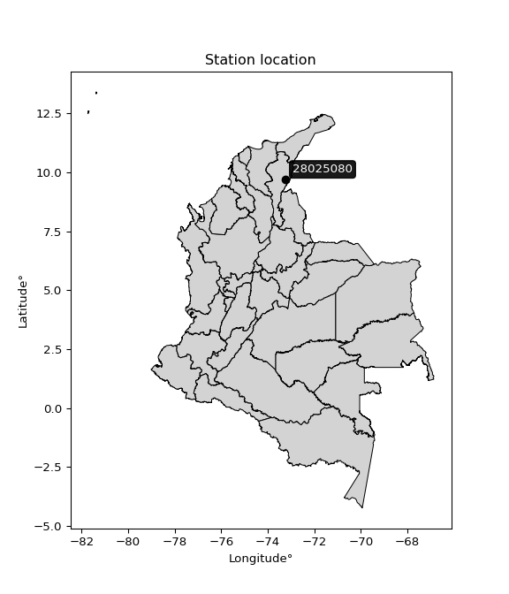</img>


</div>


## A. General information


### 1. General running parameters

• app_version: _v20251220_. • runtime: _2025-12-23 10:23:02.310659_. • Stations dataset (station_dataset_file): _dataset/pmax24h_in/conventional_cesarcolombia_1959_2015.csv_. • Stations catalog (station_catalog_file): _dataset/CNE_IDEAM.xls_. • Plot only fit distributions with Δo > Δ (plot_only_fit): _True_. • Eval low extreme values, if False, evaluates high extreme values (low_extreme): _False_. • Eval Gumbel distribution, non include in SciPy (pdist_loggumbel_on): _True_. • Eval Log-Gumbel distribution, non include in SciPy (pdist_loggumbel_on): _False_. • Standard deviation normalized (ddof): _1.0_. • Return periods to eval in years (Tr): _[2, 2.33, 5, 10, 15, 20, 25, 50, 75, 100, 200, 250, 500, 750, 1000]_. • Minimum data sample per station, 0 means any (minimum_sample): _5_. • Z-Score threshold to adjust a value, 0 means disable (zscore): _3.5_. • Avoid zeros, e.g. rain = 0 (avoid_zeros): _True_. • Avoid null values (avoid_nans): _True_. [:file_folder:Dataset file.](../../dataset/pmax24h_in/conventional_cesarcolombia_1959_2015.csv)


### 2. Station info and location

|   id |   CODIGO | NOMBRE             | CATEGORIA               | TECNOLOGIA   | ESTADO     | FECHA_INSTALACION   | FECHA_SUSPENSION   |   ALTITUD |   LATITUD |   LONGITUD | DEPARTAMENTO   | MUNICIPIO   | AREA_OPERATIVA                                         | ENTIDAD                                                     | AREA_HIDROGRAFICA   | ZONA_HIDROGRAFICA   | SUBZONA_HIDROGRAFICA   |   CORRIENTE | OBSERVACION                                                                                                                                                                                                                                                                                                                                                  |   SUBRED |
|-----:|---------:|:-------------------|:------------------------|:-------------|:-----------|:--------------------|:-------------------|----------:|----------:|-----------:|:---------------|:------------|:-------------------------------------------------------|:------------------------------------------------------------|:--------------------|:--------------------|:-----------------------|------------:|:-------------------------------------------------------------------------------------------------------------------------------------------------------------------------------------------------------------------------------------------------------------------------------------------------------------------------------------------------------------|---------:|
|    0 | 28025080 | SOCOMBA [28025080] | Climatológica Principal | Convencional | Suspendida | 15/12/1976          | 02/07/2019         |       170 |   9.68667 |   -73.2406 | Cesar          | Becerrill   | Area Operativa 05 - Magdalena-Cesar-Guajira-San Andrés | INSTITUTO DE HIDROLOGIA METEOROLOGIA Y ESTUDIOS AMBIENTALES | Magdalena Cauca     | Cesar               | Medio Cesar            |         nan | De acuerdo con el orfeo 20187050000733 enviado por el coordinador del área operativa 05, donde pide poner en estado suspendido varias estaciones de su jurisdicción|24/05/2022$Migracion$De acuerdo con el orfeo 20187050000733 enviado por el coordinador del área operativa 05, donde pide poner en estado suspendido varias estaciones de su jurisdicción |      nan |

<div align="center">

Map location in: [:earth_americas:Google](http://maps.google.com/maps?q=9.686666667,-73.24055556) [:earth_americas:OSM](https://www.openstreetmap.org/#map=18/9.686666667/-73.24055556&layers=P) [:earth_americas:Bing](https://www.bing.com/maps?cp=9.686666667~-73.24055556&lvl=18) [:earth_americas:Apple](https://maps.apple.com/frame?center=9.686666667%2C-73.24055556&span=0.003%2C0.006)

</div>


<div align="center">

```geojson
{
  "type": "Feature",
  "geometry": {
    "type": "Point", 
    "coordinates": [-73.24055556, 9.686666667]
  }, 
  "properties": {
    "Name": "28025080"
  }
}
```

</div>


### 3. Discrete values table and plot

|               |          0 |           1 |           2 |           3 |           4 |          5 |           6 |           7 |           8 |          9 |         10 |          11 |         12 |         13 |         14 |          15 |         16 |         17 |         18 |          19 |          20 |          21 |          22 |          23 |         24 |         25 |         26 |          27 |         28 |          29 |          30 |          31 |          32 |          33 |          34 |           35 |          36 |         37 |          38 |          39 |         40 |
|:--------------|-----------:|------------:|------------:|------------:|------------:|-----------:|------------:|------------:|------------:|-----------:|-----------:|------------:|-----------:|-----------:|-----------:|------------:|-----------:|-----------:|-----------:|------------:|------------:|------------:|------------:|------------:|-----------:|-----------:|-----------:|------------:|-----------:|------------:|------------:|------------:|------------:|------------:|------------:|-------------:|------------:|-----------:|------------:|------------:|-----------:|
| Date          | 1972       | 1975        | 1977        | 1978        | 1979        | 1980       | 1981        | 1982        | 1983        | 1984       | 1985       | 1986        | 1987       | 1988       | 1989       | 1990        | 1991       | 1992       | 1993       | 1994        | 1995        | 1996        | 1997        | 1998        | 1999       | 2000       | 2001       | 2002        | 2003       | 2004        | 2005        | 2006        | 2007        | 2008        | 2009        | 2010         | 2011        | 2012       | 2013        | 2014        | 2015       |
| Value         |   64.0373  |   72        |   97.7      |   71.5      |  110.5      |  120.7     |  111.5      |  104.9      |   90.4      |  118.5     |  130.3     |   71.1      |   90.1     |  146.7     |   70.3     |   72.2      |   71.6     |  117       |   70       |  112.5      |  104        |  111        |   98.3      |   85.1      |  120       |   99       |  133       |   76.5388   |   70.6734  |   85        |  104        |   72        |  110        |   80        |   85.1      |   92         |   94        |   65.7614  |   77.1042   |   74.7741   |   54.3054  |
| Value_initial |   64.0373  |   72        |   97.7      |   71.5      |  110.5      |  120.7     |  111.5      |  104.9      |   90.4      |  118.5     |  130.3     |   71.1      |   90.1     |  146.7     |   70.3     |   72.2      |   71.6     |  117       |   70       |  112.5      |  104        |  111        |   98.3      |   85.1      |  120       |   99       |  133       |   76.5388   |   70.6734  |   85        |  104        |   72        |  110        |   80        |   85.1      |   92         |   94        |   65.7614  |   77.1042   |   74.7741   |   54.3054  |
| count         |   41       |   41        |   41        |   41        |   41        |   41       |   41        |   41        |   41        |   41       |   41       |   41        |   41       |   41       |   41       |   41        |   41       |   41       |   41       |   41        |   41        |   41        |   41        |   41        |   41       |   41       |   41       |   41        |   41       |   41        |   41        |   41        |   41        |   41        |   41        |   41         |   41        |   41       |   41        |   41        |   41       |
| mean          |   92.8096  |   92.8096   |   92.8096   |   92.8096   |   92.8096   |   92.8096  |   92.8096   |   92.8096   |   92.8096   |   92.8096  |   92.8096  |   92.8096   |   92.8096  |   92.8096  |   92.8096  |   92.8096   |   92.8096  |   92.8096  |   92.8096  |   92.8096   |   92.8096   |   92.8096   |   92.8096   |   92.8096   |   92.8096  |   92.8096  |   92.8096  |   92.8096   |   92.8096  |   92.8096   |   92.8096   |   92.8096   |   92.8096   |   92.8096   |   92.8096   |   92.8096    |   92.8096   |   92.8096  |   92.8096   |   92.8096   |   92.8096  |
| std           |   21.9509  |   21.9509   |   21.9509   |   21.9509   |   21.9509   |   21.9509  |   21.9509   |   21.9509   |   21.9509   |   21.9509  |   21.9509  |   21.9509   |   21.9509  |   21.9509  |   21.9509  |   21.9509   |   21.9509  |   21.9509  |   21.9509  |   21.9509   |   21.9509   |   21.9509   |   21.9509   |   21.9509   |   21.9509  |   21.9509  |   21.9509  |   21.9509   |   21.9509  |   21.9509   |   21.9509   |   21.9509   |   21.9509   |   21.9509   |   21.9509   |   21.9509    |   21.9509   |   21.9509  |   21.9509   |   21.9509   |   21.9509  |
| zscore        |   -1.31076 |   -0.948008 |    0.222787 |   -0.970786 |    0.805907 |    1.27058 |    0.851463 |    0.550792 |   -0.109773 |    1.17036 |    1.70792 |   -0.989009 |   -0.12344 |    2.45504 |   -1.02545 |   -0.938897 |   -0.96623 |    1.10202 |   -1.03912 |    0.897019 |    0.509791 |    0.828685 |    0.250121 |   -0.351221 |    1.23869 |    0.28201 |    1.83092 |   -0.741239 |   -1.00844 |   -0.355777 |    0.509791 |   -0.948008 |    0.783129 |   -0.583558 |   -0.351221 |   -0.0368834 |    0.054229 |   -1.23221 |   -0.715478 |   -0.821631 |   -1.75411 |

<div align="center">

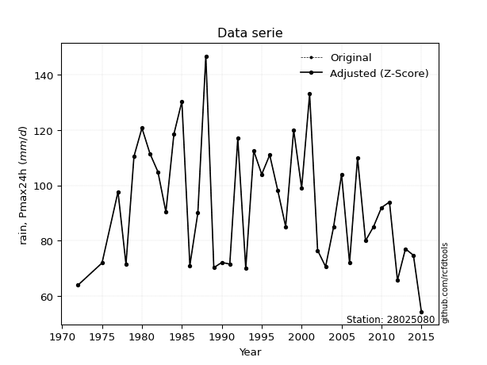</img>

</div>

> If Z-Score is active, values out of range or outliers are replaced with the station mean value.

### 4. Active continuous probability distributions from SciPy (47 of 104 available)

[scipy.stats](https://docs.scipy.org/doc/scipy/reference/stats.html) is a Python´s powerful submodule within the SciPy library for comprehensive statistical analysis, offering over 130 probability distributions (like Normal, Poisson), functions for descriptive stats (mean, variance), hypothesis testing (t-tests, chi-square), random variable generation, and statistical tests, making it essential for data science, modeling, and research. It provides tools to explore, model, and draw conclusions from data efficiently, working seamlessly with NumPy.

|   id | p_dist             |   n_parameter | fit_method   | label                                                                       | active   | ref                                                                                                        |
|-----:|:-------------------|--------------:|:-------------|:----------------------------------------------------------------------------|:---------|:-----------------------------------------------------------------------------------------------------------|
|    0 | alpha              |             3 | MLE          | Alpha                                                                       | True     | [:mortar_board:](https://docs.scipy.org/doc/scipy/reference/generated/scipy.stats.alpha.html)              |
|    1 | betaprime          |             4 | MLE          | Beta prime                                                                  | True     | [:mortar_board:](https://docs.scipy.org/doc/scipy/reference/generated/scipy.stats.betaprime.html)          |
|    2 | chi2               |             3 | MLE          | Chi²                                                                        | True     | [:mortar_board:](https://docs.scipy.org/doc/scipy/reference/generated/scipy.stats.chi2.html)               |
|    3 | crystalball        |             4 | MLE          | Crystalball                                                                 | True     | [:mortar_board:](https://docs.scipy.org/doc/scipy/reference/generated/scipy.stats.crystalball.html)        |
|    4 | dgamma             |             3 | MLE          | Double gamma                                                                | True     | [:mortar_board:](https://docs.scipy.org/doc/scipy/reference/generated/scipy.stats.dgamma.html)             |
|    5 | erlang             |             3 | MLE          | Erlang                                                                      | True     | [:mortar_board:](https://docs.scipy.org/doc/scipy/reference/generated/scipy.stats.erlang.html)             |
|    6 | expon              |             2 | MLE          | Exponential                                                                 | True     | [:mortar_board:](https://docs.scipy.org/doc/scipy/reference/generated/scipy.stats.expon.html)              |
|    7 | exponnorm          |             3 | MLE          | Exponentially modified Normal                                               | True     | [:mortar_board:](https://docs.scipy.org/doc/scipy/reference/generated/scipy.stats.exponnorm.html)          |
|    8 | f                  |             4 | MLE          | F                                                                           | True     | [:mortar_board:](https://docs.scipy.org/doc/scipy/reference/generated/scipy.stats.f.html)                  |
|    9 | fatiguelife        |             3 | MLE          | Fatigue-life (Birnbaum-Saunders)                                            | True     | [:mortar_board:](https://docs.scipy.org/doc/scipy/reference/generated/scipy.stats.fatiguelife.html)        |
|   10 | fisk               |             3 | MLE          | Fisk                                                                        | True     | [:mortar_board:](https://docs.scipy.org/doc/scipy/reference/generated/scipy.stats.fisk.html)               |
|   11 | gamma              |             3 | MLE          | Gamma                                                                       | True     | [:mortar_board:](https://docs.scipy.org/doc/scipy/reference/generated/scipy.stats.gamma.html)              |
|   12 | genexpon           |             5 | MLE          | Generalized exponential                                                     | True     | [:mortar_board:](https://docs.scipy.org/doc/scipy/reference/generated/scipy.stats.genexpon.html)           |
|   13 | genlogistic        |             3 | MLE          | Generalized logistic                                                        | True     | [:mortar_board:](https://docs.scipy.org/doc/scipy/reference/generated/scipy.stats.genlogistic.html)        |
|   14 | gibrat             |             2 | MM           | Gibrat                                                                      | True     | [:mortar_board:](https://docs.scipy.org/doc/scipy/reference/generated/scipy.stats.gibrat.html)             |
|   15 | gompertz           |             3 | MLE          | Gompertz (or truncated Gumbel)                                              | True     | [:mortar_board:](https://docs.scipy.org/doc/scipy/reference/generated/scipy.stats.gompertz.html)           |
|   16 | gumbel_l           |             2 | MM           | Gumbel Left Skew                                                            | True     | [:mortar_board:](https://docs.scipy.org/doc/scipy/reference/generated/scipy.stats.gumbel_l.html)           |
|   17 | gumbel_r           |             2 | MM           | Gumbel Right Skew                                                           | True     | [:mortar_board:](https://docs.scipy.org/doc/scipy/reference/generated/scipy.stats.gumbel_r.html)           |
|   18 | halflogistic       |             2 | MM           | Half-logistic                                                               | True     | [:mortar_board:](https://docs.scipy.org/doc/scipy/reference/generated/scipy.stats.halflogistic.html)       |
|   19 | halfnorm           |             2 | MM           | Half Normal                                                                 | True     | [:mortar_board:](https://docs.scipy.org/doc/scipy/reference/generated/scipy.stats.halfnorm.html)           |
|   20 | hypsecant          |             2 | MM           | hyperbolic secant                                                           | True     | [:mortar_board:](https://docs.scipy.org/doc/scipy/reference/generated/scipy.stats.hypsecant.html)          |
|   21 | invgamma           |             3 | MLE          | Inverted gamma                                                              | True     | [:mortar_board:](https://docs.scipy.org/doc/scipy/reference/generated/scipy.stats.invgamma.html)           |
|   22 | invgauss           |             3 | MLE          | Inverse Gaussian                                                            | True     | [:mortar_board:](https://docs.scipy.org/doc/scipy/reference/generated/scipy.stats.invgauss.html)           |
|   23 | invweibull         |             3 | MLE          | Inverted Weibull                                                            | True     | [:mortar_board:](https://docs.scipy.org/doc/scipy/reference/generated/scipy.stats.invweibull.html)         |
|   24 | johnsonsu          |             4 | MLE          | Johnson Su                                                                  | True     | [:mortar_board:](https://docs.scipy.org/doc/scipy/reference/generated/scipy.stats.johnsonsu.html)          |
|   25 | kstwobign          |             2 | MLE          | Limiting distribution of scaled Kolmogorov-Smirnov two-sided test statistic | True     | [:mortar_board:](https://docs.scipy.org/doc/scipy/reference/generated/scipy.stats.kstwobign.html)          |
|   26 | laplace            |             2 | MM           | Laplace                                                                     | True     | [:mortar_board:](https://docs.scipy.org/doc/scipy/reference/generated/scipy.stats.laplace.html)            |
|   27 | laplace_asymmetric |             3 | MLE          | Asymmetric Laplace                                                          | True     | [:mortar_board:](https://docs.scipy.org/doc/scipy/reference/generated/scipy.stats.laplace_asymmetric.html) |
|   28 | loggamma           |             3 | MLE          | Log gamma                                                                   | True     | [:mortar_board:](https://docs.scipy.org/doc/scipy/reference/generated/scipy.stats.loggamma.html)           |
|   29 | logistic           |             2 | MM           | Logistic (or Sech-squared)                                                  | True     | [:mortar_board:](https://docs.scipy.org/doc/scipy/reference/generated/scipy.stats.logistic.html)           |
|   30 | lognorm            |             3 | MLE          | Log Normal                                                                  | True     | [:mortar_board:](https://docs.scipy.org/doc/scipy/reference/generated/scipy.stats.lognorm.html)            |
|   31 | maxwell            |             2 | MM           | Maxwell                                                                     | True     | [:mortar_board:](https://docs.scipy.org/doc/scipy/reference/generated/scipy.stats.maxwell.html)            |
|   32 | mielke             |             4 | MLE          | Mielke Beta-Kappa / Dagum                                                   | True     | [:mortar_board:](https://docs.scipy.org/doc/scipy/reference/generated/scipy.stats.mielke.html)             |
|   33 | moyal              |             2 | MM           | Moyal                                                                       | True     | [:mortar_board:](https://docs.scipy.org/doc/scipy/reference/generated/scipy.stats.moyal.html)              |
|   34 | nakagami           |             3 | MLE          | Nakagami                                                                    | True     | [:mortar_board:](https://docs.scipy.org/doc/scipy/reference/generated/scipy.stats.nakagami.html)           |
|   35 | ncf                |             5 | MLE          | Non-central F distribution                                                  | True     | [:mortar_board:](https://docs.scipy.org/doc/scipy/reference/generated/scipy.stats.ncf.html)                |
|   36 | nct                |             4 | MLE          | Non-central Student’s t                                                     | True     | [:mortar_board:](https://docs.scipy.org/doc/scipy/reference/generated/scipy.stats.nct.html)                |
|   37 | norm               |             2 | MM           | Normal                                                                      | True     | [:mortar_board:](https://docs.scipy.org/doc/scipy/reference/generated/scipy.stats.norm.html)               |
|   38 | pareto             |             3 | MLE          | Pareto                                                                      | True     | [:mortar_board:](https://docs.scipy.org/doc/scipy/reference/generated/scipy.stats.pareto.html)             |
|   39 | pearson3           |             3 | MM           | Pearson type III                                                            | True     | [:mortar_board:](https://docs.scipy.org/doc/scipy/reference/generated/scipy.stats.pearson3.html)           |
|   40 | rayleigh           |             2 | MM           | Rayleigh                                                                    | True     | [:mortar_board:](https://docs.scipy.org/doc/scipy/reference/generated/scipy.stats.rayleigh.html)           |
|   41 | recipinvgauss      |             3 | MLE          | Reciprocal inverse Gaussian                                                 | True     | [:mortar_board:](https://docs.scipy.org/doc/scipy/reference/generated/scipy.stats.recipinvgauss.html)      |
|   42 | rice               |             3 | MLE          | Rice                                                                        | True     | [:mortar_board:](https://docs.scipy.org/doc/scipy/reference/generated/scipy.stats.rice.html)               |
|   43 | t                  |             3 | MLE          | Student’s t                                                                 | True     | [:mortar_board:](https://docs.scipy.org/doc/scipy/reference/generated/scipy.stats.t.html)                  |
|   44 | truncnorm          |             4 | MLE          | Truncated normal                                                            | True     | [:mortar_board:](https://docs.scipy.org/doc/scipy/reference/generated/scipy.stats.truncnorm.html)          |
|   45 | wald               |             2 | MM           | Wald                                                                        | True     | [:mortar_board:](https://docs.scipy.org/doc/scipy/reference/generated/scipy.stats.wald.html)               |
|   46 | weibull_min        |             3 | MLE          | Weibull minimum                                                             | True     | [:mortar_board:](https://docs.scipy.org/doc/scipy/reference/generated/scipy.stats.weibull_min.html)        |

>Gumbel and Lob-Gumbel probability distributions are not shown in the above table.
>
>**n_parameter:** # arguments & localization & scale.
>
>**Fit methods:** (MLE) maximum likelihood, (MM) L-moments.
>
>**Inactive:** foldnorm, gennorm, norminvgauss, powernorm, powerlognorm, skewnorm, genextreme, anglit, arcsine, argus, beta, bradford, burr, burr12, cauchy, cosine, halfcauchy, foldcauchy, skewcauchy, wrapcauchy, gengamma, exponweib, exponpow, truncexpon, gausshyper, genhalflogistic, genhyperbolic, geninvgauss, halfgennorm, johnsonsb, kappa4, kappa3, ksone, kstwo, loglaplace, levy, levy_l, levy_stable, ncx2, genpareto, truncpareto, lomax, powerlaw, rdist, rel_breitwigner, semicircular, studentized_range, trapezoid, triang, truncweibull_min, tukeylambda, uniform, loguniform, vonmises, vonmises_line, weibull_max, dweibull, 


## B. Probability distributions vs. Empirical distributions

A continuous probability distribution describes probabilities for variables that can take any value within a range (like rain any time), unlike discrete variables with specific outcomes (like temperature). It uses a Probability Density Function (PDF), a curve where the total area under it equals 1, and the probability of the variable falling within an interval (a to b) is found by calculating the area under the curve between those points. A key feature is that the probability of hitting any single exact value is zero, so probabilities are always expressed for ranges, e.g., $P(a ≤ X ≤ b)$.


### 0. Cumulative distribution values - CDF (48 evalated, ordered by x ascending) 

|   id |   Station |   date |        x |   count |    mean |     std |     zscore |   Value_initial |   station |   m |     alpha |   alpha_pdf |   betaprime |   betaprime_pdf |       chi2 |   chi2_pdf |   crystalball |   crystalball_pdf |    dgamma |   dgamma_pdf |     erlang |   erlang_pdf |    expon |   expon_pdf |   exponnorm |   exponnorm_pdf |         f |      f_pdf |   fatiguelife |   fatiguelife_pdf |      fisk |   fisk_pdf |      gamma |   gamma_pdf |   genexpon |   genexpon_pdf |   genlogistic |   genlogistic_pdf |      gibrat |   gibrat_pdf |   gompertz |   gompertz_pdf |   gumbel_l |   gumbel_l_pdf |   gumbel_r |   gumbel_r_pdf |   halflogistic |   halflogistic_pdf |   halfnorm |   halfnorm_pdf |   hypsecant |   hypsecant_pdf |   invgamma |   invgamma_pdf |   invgauss |   invgauss_pdf |   invweibull |   invweibull_pdf |   johnsonsu |   johnsonsu_pdf |   kstwobign |   kstwobign_pdf |   laplace |   laplace_pdf |   laplace_asymmetric |   laplace_asymmetric_pdf |   loggamma |   loggamma_pdf |   logistic |   logistic_pdf |   lognorm |   lognorm_pdf |   maxwell |   maxwell_pdf |    mielke |   mielke_pdf |       moyal |   moyal_pdf |    nakagami |   nakagami_pdf |      ncf |    ncf_pdf |       nct |    nct_pdf |      norm |    norm_pdf |   pareto |   pareto_pdf |   pearson3 |   pearson3_pdf |   rayleigh |   rayleigh_pdf |   recipinvgauss |   recipinvgauss_pdf |       rice |   rice_pdf |         t |       t_pdf |   truncnorm |   truncnorm_pdf |        wald |    wald_pdf |   weibull_min |   weibull_min_pdf |    zzgumbel |   gumbel_pdf |
|-----:|----------:|-------:|---------:|--------:|--------:|--------:|-----------:|----------------:|----------:|----:|----------:|------------:|------------:|----------------:|-----------:|-----------:|--------------:|------------------:|----------:|-------------:|-----------:|-------------:|---------:|------------:|------------:|----------------:|----------:|-----------:|--------------:|------------------:|----------:|-----------:|-----------:|------------:|-----------:|---------------:|--------------:|------------------:|------------:|-------------:|-----------:|---------------:|-----------:|---------------:|-----------:|---------------:|---------------:|-------------------:|-----------:|---------------:|------------:|----------------:|-----------:|---------------:|-----------:|---------------:|-------------:|-----------------:|------------:|----------------:|------------:|----------------:|----------:|--------------:|---------------------:|-------------------------:|-----------:|---------------:|-----------:|---------------:|----------:|--------------:|----------:|--------------:|----------:|-------------:|------------:|------------:|------------:|---------------:|---------:|-----------:|----------:|-----------:|----------:|------------:|---------:|-------------:|-----------:|---------------:|-----------:|---------------:|----------------:|--------------------:|-----------:|-----------:|----------:|------------:|------------:|----------------:|------------:|------------:|--------------:|------------------:|------------:|-------------:|
|    0 |  28025080 |   2015 |  54.3054 |      41 | 92.8096 | 21.9509 | -1.75411   |         54.3054 |  28025080 |   1 | 0.0138411 |  0.00277919 |   0.0116584 |      0.00263323 | 0.00637621 | 0.00229004 |     0.0378748 |       0.0038017   | 0.0321008 |   0.00290367 | 0.00637622 |   0.00229003 | 0        |  0.0259712  |   0.0263853 |      0.00337253 | 0.012124  | 0.00267697 |    0.00793397 |        0.00232435 | 0.0261611 | 0.00334167 | 0.00637621 |  0.00229004 | 0.00448825 |     0.0111427  |    0.00894915 |        0.00231648 | 0           |  0           | 0.00680251 |    0.000584992 |  0.0559366 |    0.00321455  | 0.00418403 |     0.00135544 |      0         |         0          |  0         |     0          |   0.0390695 |     0.00282342  |  0.0113271 |     0.0025985  | 0.00823127 |     0.00235304 |   0.00883085 |       0.00230567 |  0.00959374 |      0.00247557 |  0.00568396 |      0.00204086 | 0.0405732 |   0.00264645  |           0.00516027 |               0.00104755 |  0.0389532 |    0.00381705  |  0.0383785 |    0.00308739  | 0.0095267 |    0.00246289 | 0.0162048 |    0.00365715 | 0.0084442 |   0.0020615  | 0.000139575 | 0.000110131 | 0           |     0          | 0.535265 | 0.00490531 | 0.0105625 | 0.00245945 | 0.0378748 | 0.0038017   | 0        |   0.0259712  |  0.0234296 |     0.0034916  | 0.00402913 |     0.00270425 |      0.00779313 |          0.00231287 | 0.00506431 | 0.00292847 | 0.0378343 | 0.00379803  |   0.0786315 |      0.00520224 | 0           | 0           |    0.00487743 |        0.00285727 | 7.73189e-05 |            0 |
|    1 |  28025080 |   1972 |  64.0373 |      41 | 92.8096 | 21.9509 | -1.31076   |         64.0373 |  28025080 |   2 | 0.0680817 |  0.00893267 |   0.066282  |      0.00919684 | 0.0643608  | 0.0101597  |     0.0922471 |       0.00762805  | 0.075555  |   0.00642775 | 0.0643605  |   0.0101597  | 0.223336 |  0.0201709  |   0.0799884 |      0.00803425 | 0.0668071 | 0.00914794 |    0.0636495  |        0.00978746 | 0.0799871 | 0.00818931 | 0.0643607  |  0.0101597  | 0.214024   |     0.0207092  |    0.0631303  |        0.00959547 | 0           |  0           | 0.015683   |    0.00134263  |  0.0972996 |    0.00546609  | 0.0459799  |     0.00837605 |      0         |         0          |  0         |     0          |   0.0787703 |     0.00564872  |  0.0658301 |     0.00921892 | 0.0638279  |     0.0097303  |   0.0630577  |       0.00962073 |  0.0648505  |      0.00952494 |  0.0631392  |      0.0105225  | 0.0765455 |   0.0049928   |           0.0372104  |               0.00755384 |  0.0931447 |    0.00756878  |  0.0826412 |    0.00634212  | 0.0645005 |    0.00947644 | 0.0795568 |    0.00954753 | 0.0593117 |   0.00943892 | 0.0206911   | 0.00650775  | 1.66797e-13 |     9.66051    | 0.580763 | 0.00444959 | 0.0639922 | 0.00921841 | 0.0922471 | 0.00762805  | 0.223337 |   0.0201709  |  0.0803515 |     0.00855319 | 0.071047   |     0.0107764  |      0.0636021  |          0.00981772 | 0.0716069  | 0.010495   | 0.0921594 | 0.00762204  |   0.142567  |      0.00801153 | 0           | 0           |    0.0715571  |        0.0106239  | 0.00469352  |            0 |
|    2 |  28025080 |   2012 |  65.7614 |      41 | 92.8096 | 21.9509 | -1.23221   |         65.7614 |  28025080 |   3 | 0.0846457 |  0.0102854  |   0.0833659 |      0.0106223  | 0.0832016  | 0.0116861  |     0.106103  |       0.00845029  | 0.0873999 |   0.00732763 | 0.0832013  |   0.0116861  | 0.257347 |  0.0192876  |   0.0947331 |      0.00907707 | 0.0837874 | 0.0105512  |    0.0818682  |        0.0113417  | 0.0950755 | 0.00932406 | 0.0832015  |  0.0116861  | 0.248937   |     0.0197948  |    0.0810655  |        0.0112097  | 0           |  0           | 0.0181759  |    0.00155406  |  0.107167  |    0.00598684  | 0.0619797  |     0.0101959  |      0         |         0          |  0.0365835 |     0.0221602  |   0.0891222 |     0.00637274  |  0.0829643 |     0.0106584  | 0.0819381  |     0.0112738  |   0.0810427  |       0.0112421  |  0.0825703  |      0.0110289  |  0.0827528  |      0.0122157  | 0.0856567 |   0.00558709  |           0.0528048  |               0.0107195  |  0.106885  |    0.00837479  |  0.0942551 |    0.00714183  | 0.0821309 |    0.010974   | 0.0969599 |    0.0106362  | 0.0771494 |   0.0112618  | 0.0341762   | 0.00918933  | 0.065164    |     0.0310854  | 0.588367 | 0.00437192 | 0.0811844 | 0.0107275  | 0.106103  | 0.00845029  | 0.257347 |   0.0192876  |  0.0960131 |     0.00961753 | 0.0906777  |     0.0119802  |      0.0818766  |          0.0113759  | 0.0907012  | 0.0116415  | 0.106005  | 0.00844393  |   0.156839  |      0.00854355 | 0           | 0           |    0.0909086  |        0.0118103  | 0.00784591  |            0 |
|    3 |  28025080 |   1993 |  70      |      41 | 92.8096 | 21.9509 | -1.03912   |         70      |  28025080 |   4 | 0.135296  |  0.013583   |   0.135717  |      0.0140299  | 0.140122   | 0.0150579  |     0.146393  |       0.0105801   | 0.123794  |   0.00993923 | 0.140121   |   0.0150578  | 0.33476  |  0.0172771  |   0.138883  |      0.0117748  | 0.135737  | 0.0139147  |    0.137646   |        0.014881   | 0.140881  | 0.0123245  | 0.140122   |  0.0150579  | 0.328328   |     0.0177042  |    0.136754   |        0.0149843  | 0           |  0           | 0.0260967  |    0.00222225  |  0.135546  |    0.00744833  | 0.114838   |     0.0147019  |      0.0777427 |         0.0268101  |  0.130041  |     0.0218882  |   0.120495  |     0.00852267  |  0.135531  |     0.0140932  | 0.137402   |     0.0148052  |   0.136895   |       0.015028   |  0.136911   |      0.0145385  |  0.142549   |      0.0158406  | 0.112935  |   0.00736638  |           0.124841   |               0.0253432  |  0.146771  |    0.010466    |  0.129187  |    0.00941112  | 0.136214  |    0.0144733  | 0.147494  |    0.0131621  | 0.134383  |   0.0156719  | 0.0882694   | 0.0162975   | 0.180372    |     0.0246912  | 0.6065   | 0.00418516 | 0.134432  | 0.0143435  | 0.146393  | 0.0105801   | 0.33476  |   0.0172771  |  0.142385  |     0.0122547  | 0.147089   |     0.0145377  |      0.137804   |          0.0149152  | 0.145469   | 0.0141144  | 0.146266  | 0.0105731   |   0.195829  |      0.00985147 | 0           | 0           |    0.146562   |        0.0143571  | 0.0227243   |            0 |
|    4 |  28025080 |   1989 |  70.3    |      41 | 92.8096 | 21.9509 | -1.02545   |         70.3    |  28025080 |   5 | 0.139404  |  0.0138059  |   0.13996   |      0.014256   | 0.144671   | 0.0152677  |     0.14959   |       0.0107342   | 0.126806  |   0.010145   | 0.14467    |   0.0152676  | 0.339923 |  0.017143   |   0.142444  |      0.0119682  | 0.139945  | 0.0141386  |    0.142145   |        0.0151058  | 0.144611  | 0.0125423  | 0.144671   |  0.0152677  | 0.333618   |     0.0175648  |    0.141286   |        0.0152278  | 0           |  0           | 0.0267718  |    0.00227895  |  0.137798  |    0.00756195  | 0.119294   |     0.0150038  |      0.0857805 |         0.0267747  |  0.136603  |     0.0218576  |   0.123078  |     0.00869626  |  0.139793  |     0.0143206  | 0.141877   |     0.0150305  |   0.141441   |       0.0152719  |  0.141307   |      0.0147662  |  0.147334   |      0.0160576  | 0.115167  |   0.00751194  |           0.132681   |               0.0269346  |  0.149934  |    0.0106176   |  0.132036  |    0.00958724  | 0.14059   |    0.0147008  | 0.151468  |    0.0133287  | 0.139127  |   0.01596    | 0.0932299   | 0.0167705   | 0.187742    |     0.0244481  | 0.607754 | 0.00417217 | 0.138771  | 0.0145828  | 0.14959   | 0.0107342   | 0.339923 |   0.017143   |  0.146088  |     0.0124374  | 0.151474   |     0.0146953  |      0.142313   |          0.0151396  | 0.149726   | 0.0142692  | 0.149461  | 0.0107271   |   0.198798  |      0.00994293 | 0           | 0           |    0.150893   |        0.0145155  | 0.0242688   |            0 |
|    5 |  28025080 |   2003 |  70.6734 |      41 | 92.8096 | 21.9509 | -1.00844   |         70.6734 |  28025080 |   6 | 0.144611  |  0.0140801  |   0.145335  |      0.0145333  | 0.15042    | 0.0155226  |     0.153635  |       0.0109262   | 0.130643  |   0.0104048  | 0.15042    |   0.0155226  | 0.346294 |  0.0169775  |   0.146958  |      0.0122087  | 0.145276  | 0.0144134  |    0.147837   |        0.0153797  | 0.149345  | 0.0128133  | 0.15042    |  0.0155226  | 0.340145   |     0.0173928  |    0.147028   |        0.0155249  | 0           |  0           | 0.0276363  |    0.00235149  |  0.140649  |    0.00770529  | 0.124967   |     0.0153738  |      0.09577   |         0.0267257  |  0.144758  |     0.0218174  |   0.126366  |     0.00891644  |  0.145193  |     0.0145995  | 0.147542   |     0.0153051  |   0.147199   |       0.0155694  |  0.146874   |      0.0150446  |  0.15338    |      0.0163194  | 0.118006  |   0.00769716  |           0.14313    |               0.0290558  |  0.153934  |    0.0108065   |  0.135658  |    0.00980911  | 0.146132  |    0.0149788  | 0.156484  |    0.0135334  | 0.145153  |   0.0163113  | 0.0996005   | 0.0173463   | 0.196818    |     0.0241604  | 0.609309 | 0.00415604 | 0.144271  | 0.014876   | 0.153635  | 0.0109262   | 0.346294 |   0.0169775  |  0.150775  |     0.0126634  | 0.156997   |     0.0148871  |      0.148017   |          0.0154128  | 0.15509    | 0.014458   | 0.153503  | 0.0109192   |   0.202533  |      0.0100564  | 0           | 0           |    0.15635    |        0.0147084  | 0.0262968   |            0 |
|    6 |  28025080 |   1986 |  71.1    |      41 | 92.8096 | 21.9509 | -0.989009  |         71.1    |  28025080 |   7 | 0.150683  |  0.0143885  |   0.151601  |      0.0148442  | 0.157102   | 0.0158051  |     0.158342  |       0.0111458   | 0.135146  |   0.0107064  | 0.157102   |   0.0158051  | 0.353496 |  0.0167905  |   0.152225  |      0.0124828  | 0.15149   | 0.0147216  |    0.154463   |        0.0156841  | 0.154877  | 0.0131225  | 0.157102   |  0.0158051  | 0.347523   |     0.0171983  |    0.153721   |        0.0158556  | 0           |  0           | 0.0286575  |    0.0024371   |  0.143971  |    0.00787164  | 0.131613   |     0.015788   |      0.107157  |         0.0266634  |  0.154054  |     0.0217687  |   0.130224  |     0.00917356  |  0.151488  |     0.0149119  | 0.154136   |     0.0156106  |   0.153912   |       0.0159005  |  0.153358   |      0.0153552  |  0.160403   |      0.0166069  | 0.121336  |   0.00791433  |           0.156077   |               0.0316841  |  0.15859   |    0.0110226   |  0.139897  |    0.010066    | 0.152588  |    0.0152892  | 0.162306  |    0.0137633  | 0.152195  |   0.0167021  | 0.107137    | 0.0179845   | 0.207057    |     0.0238496  | 0.611078 | 0.00413768 | 0.150687  | 0.0152043  | 0.158342  | 0.0111458   | 0.353496 |   0.0167905  |  0.156232  |     0.0129193  | 0.163393   |     0.0151     |      0.154657   |          0.0157164  | 0.161303   | 0.0146682  | 0.158207  | 0.0111387   |   0.20685   |      0.0101854  | 0           | 0           |    0.16267    |        0.0149229  | 0.0287606   |            0 |
|    7 |  28025080 |   1978 |  71.5    |      41 | 92.8096 | 21.9509 | -0.970786  |         71.5    |  28025080 |   8 | 0.156496  |  0.0146729  |   0.157596  |      0.0151296  | 0.163476   | 0.0160613  |     0.162842  |       0.0113516   | 0.139486  |   0.0109936  | 0.163475   |   0.0160613  | 0.360177 |  0.0166169  |   0.157269  |      0.0127388  | 0.157436  | 0.0150047  |    0.160792   |        0.015961   | 0.160184  | 0.0134116  | 0.163476   |  0.0160613  | 0.354366   |     0.0170179  |    0.160124   |        0.016157   | 0           |  0           | 0.0296489  |    0.00252011  |  0.147151  |    0.00803017  | 0.138005   |     0.0161676  |      0.11781   |         0.0265988  |  0.162752  |     0.0217204  |   0.133943  |     0.0094201   |  0.15751   |     0.0151986  | 0.160436   |     0.0158887  |   0.160332   |       0.0162021  |  0.159557   |      0.015639   |  0.167098   |      0.0168651  | 0.124543  |   0.00812354  |           0.168656   |               0.0312118  |  0.163039  |    0.0112254   |  0.143972  |    0.0103101   | 0.158761  |    0.0155729  | 0.167853  |    0.013975   | 0.158947  |   0.0170577  | 0.114447    | 0.0185624   | 0.216541    |     0.023573   | 0.612729 | 0.00412051 | 0.156829  | 0.0155052  | 0.162842  | 0.0113516   | 0.360177 |   0.0166169  |  0.161447  |     0.013157   | 0.169472   |     0.0152936  |      0.160999   |          0.0159924  | 0.167208   | 0.01486    | 0.162704  | 0.0113445   |   0.210948  |      0.0103059  | 6.09496e-14 | 4.85387e-12 |    0.168678   |        0.0151183  | 0.0312177   |            0 |
|    8 |  28025080 |   1991 |  71.6    |      41 | 92.8096 | 21.9509 | -0.96623   |         71.6    |  28025080 |   9 | 0.157966  |  0.0147432  |   0.159113  |      0.0152     | 0.165085   | 0.0161241  |     0.163979  |       0.0114031   | 0.140589  |   0.0110661  | 0.165084   |   0.016124   | 0.361837 |  0.0165738  |   0.158546  |      0.0128027  | 0.15894   | 0.0150746  |    0.162391   |        0.016029   | 0.161529  | 0.0134837  | 0.165085   |  0.0161241  | 0.356065   |     0.0169731  |    0.161743   |        0.0162309  | 0           |  0           | 0.029902   |    0.00254129  |  0.147956  |    0.00807019  | 0.139626   |     0.0162611  |      0.120469  |         0.0265817  |  0.164924  |     0.0217079  |   0.134888  |     0.00948256  |  0.159033  |     0.0152692  | 0.162028   |     0.015957   |   0.161956   |       0.0162761  |  0.161124   |      0.0157088  |  0.168787   |      0.016928   | 0.125358  |   0.0081767   |           0.171771   |               0.0310948  |  0.164164  |    0.0112761   |  0.145006  |    0.0103716   | 0.160322  |    0.0156426  | 0.169254  |    0.0140273  | 0.160657  |   0.0171448  | 0.11631     | 0.0187036   | 0.218895    |     0.0235059  | 0.613141 | 0.00411623 | 0.158384  | 0.0155794  | 0.163979  | 0.0114031   | 0.361837 |   0.0165738  |  0.162766  |     0.013216   | 0.171004   |     0.0153411  |      0.162602   |          0.0160601  | 0.168697   | 0.0149072  | 0.163841  | 0.0113959   |   0.21198   |      0.0103359  | 3.28007e-11 | 1.62909e-09 |    0.170193   |        0.0151662  | 0.0318546   |            0 |
|    9 |  28025080 |   1975 |  72      |      41 | 92.8096 | 21.9509 | -0.948008  |         72      |  28025080 |  10 | 0.163919  |  0.015021   |   0.165248  |      0.0154776  | 0.171584   | 0.0163696  |     0.168582  |       0.0116088   | 0.145073  |   0.0113584  | 0.171583   |   0.0163696  | 0.368432 |  0.0164026  |   0.163718  |      0.0130573  | 0.165025  | 0.0153502  |    0.168857   |        0.0162953  | 0.16698   | 0.0137714  | 0.171584   |  0.0163696  | 0.362819   |     0.0167951  |    0.168294   |        0.0165211  | 0           |  0           | 0.0309357  |    0.00262773  |  0.151216  |    0.0082318   | 0.146204   |     0.016629   |      0.131087  |         0.0265096  |  0.173597  |     0.0216564  |   0.138731  |     0.00973568  |  0.165197  |     0.0155478  | 0.168465   |     0.0162247  |   0.168525   |       0.0165663  |  0.167463   |      0.0159831  |  0.175608   |      0.0171723  | 0.128672  |   0.00839284  |           0.184116   |               0.0306314  |  0.168715  |    0.0114788   |  0.149204  |    0.0106195   | 0.166634  |    0.015917   | 0.174906  |    0.0142339  | 0.167584  |   0.0174863  | 0.123902    | 0.0192544   | 0.228245    |     0.0232448  | 0.614784 | 0.00409913 | 0.164674  | 0.0158713  | 0.168582  | 0.0116088   | 0.368432 |   0.0164026  |  0.168099  |     0.0134504  | 0.177178   |     0.0155273  |      0.169079   |          0.0163254  | 0.174697   | 0.0150925  | 0.168441  | 0.0116016   |   0.216138  |      0.0104555  | 1.63999e-06 | 2.42274e-05 |    0.176297   |        0.0153546  | 0.0344944   |            0 |
|   10 |  28025080 |   2006 |  72      |      41 | 92.8096 | 21.9509 | -0.948008  |         72      |  28025080 |  11 | 0.163919  |  0.015021   |   0.165248  |      0.0154776  | 0.171584   | 0.0163696  |     0.168582  |       0.0116088   | 0.145073  |   0.0113584  | 0.171583   |   0.0163696  | 0.368432 |  0.0164026  |   0.163718  |      0.0130573  | 0.165025  | 0.0153502  |    0.168857   |        0.0162953  | 0.16698   | 0.0137714  | 0.171584   |  0.0163696  | 0.362819   |     0.0167951  |    0.168294   |        0.0165211  | 0           |  0           | 0.0309357  |    0.00262773  |  0.151216  |    0.0082318   | 0.146204   |     0.016629   |      0.131087  |         0.0265096  |  0.173597  |     0.0216564  |   0.138731  |     0.00973568  |  0.165197  |     0.0155478  | 0.168465   |     0.0162247  |   0.168525   |       0.0165663  |  0.167463   |      0.0159831  |  0.175608   |      0.0171723  | 0.128672  |   0.00839284  |           0.184116   |               0.0306314  |  0.168715  |    0.0114788   |  0.149204  |    0.0106195   | 0.166634  |    0.015917   | 0.174906  |    0.0142339  | 0.167584  |   0.0174863  | 0.123902    | 0.0192544   | 0.228245    |     0.0232448  | 0.614784 | 0.00409913 | 0.164674  | 0.0158713  | 0.168582  | 0.0116088   | 0.368432 |   0.0164026  |  0.168099  |     0.0134504  | 0.177178   |     0.0155273  |      0.169079   |          0.0163254  | 0.174697   | 0.0150925  | 0.168441  | 0.0116016   |   0.216138  |      0.0104555  | 1.63999e-06 | 2.42274e-05 |    0.176297   |        0.0153546  | 0.0344944   |            0 |
|   11 |  28025080 |   1990 |  72.2    |      41 | 92.8096 | 21.9509 | -0.938897  |         72.2    |  28025080 |  12 | 0.166937  |  0.0151579  |   0.168358  |      0.0156138  | 0.17487    | 0.0164891  |     0.170914  |       0.0117115   | 0.14736   |   0.0115061  | 0.174869   |   0.016489   | 0.371704 |  0.0163176  |   0.166342  |      0.0131841  | 0.168108  | 0.0154856  |    0.172129   |        0.0164251  | 0.169748  | 0.0139146  | 0.17487    |  0.0164891  | 0.366169   |     0.0167068  |    0.171612   |        0.0166626  | 0           |  0           | 0.0314656  |    0.00267201  |  0.152871  |    0.00831353  | 0.149548   |     0.0168093  |      0.136386  |         0.0264714  |  0.177925  |     0.0216296  |   0.140691  |     0.00986422  |  0.16832   |     0.0156845  | 0.171723   |     0.0163554  |   0.171853   |       0.0167079  |  0.170673   |      0.0161173  |  0.179054   |      0.0172903  | 0.130362  |   0.00850305  |           0.190219   |               0.0304022  |  0.171021  |    0.01158     |  0.15134   |    0.0107445   | 0.169831  |    0.0160512  | 0.177763  |    0.0143357  | 0.171098  |   0.0176525  | 0.12778     | 0.0195212   | 0.232881    |     0.0231184  | 0.615603 | 0.0040906  | 0.167863  | 0.0160145  | 0.170914  | 0.0117115   | 0.371704 |   0.0163176  |  0.170801  |     0.0135666  | 0.180292   |     0.0156182  |      0.172357   |          0.0164548  | 0.177724   | 0.0151833  | 0.170771  | 0.0117043   |   0.218236  |      0.010515   | 1.82827e-05 | 0.000179964 |    0.179377   |        0.0154467  | 0.0358704   |            0 |
|   12 |  28025080 |   2014 |  74.7741 |      41 | 92.8096 | 21.9509 | -0.821631  |         74.7741 |  28025080 |  13 | 0.2081    |  0.0167781  |   0.210663  |      0.0172029  | 0.219114   | 0.0178246  |     0.20275   |       0.0130186   | 0.17949   |   0.013478   | 0.219114   |   0.0178246  | 0.412334 |  0.0152624  |   0.20234   |      0.0147684  | 0.210075  | 0.0170698  |    0.216377   |        0.0178891  | 0.207891  | 0.0156999  | 0.219114   |  0.0178246  | 0.407747   |     0.0156109  |    0.216651   |        0.0182595  | 0           |  0           | 0.0391368  |    0.00331017  |  0.175673  |    0.00942029  | 0.195585   |     0.0188789  |      0.203779  |         0.0258531  |  0.233109  |     0.0212299  |   0.168315  |     0.0116338   |  0.210811  |     0.017275   | 0.215808   |     0.017833   |   0.217007   |       0.0183031  |  0.214216   |      0.0176541  |  0.225289   |      0.0185549  | 0.154194  |   0.0100575   |           0.264815   |               0.0276016  |  0.202497  |    0.0128709   |  0.181119  |    0.0124075   | 0.213207  |    0.0175908  | 0.216264  |    0.0155468  | 0.219031  |   0.019495   | 0.181952    | 0.0223867   | 0.290467    |     0.0216733  | 0.625992 | 0.00398206 | 0.211294  | 0.0176702  | 0.20275   | 0.0130186   | 0.412334 |   0.0152624  |  0.207583  |     0.0149874  | 0.221882   |     0.0166545  |      0.216672   |          0.0179109  | 0.218205   | 0.0162324  | 0.202589  | 0.0130114   |   0.246272  |      0.0112625  | 0.0374763   | 0.0340967   |    0.220549   |        0.0165028  | 0.0570882   |            0 |
|   13 |  28025080 |   2002 |  76.5388 |      41 | 92.8096 | 21.9509 | -0.741239  |         76.5388 |  28025080 |  14 | 0.238555  |  0.0177132  |   0.241832  |      0.0180941  | 0.251207   | 0.0185168  |     0.226493  |       0.0138844   | 0.204504  |   0.014873   | 0.251206   |   0.0185168  | 0.438659 |  0.0145787  |   0.229305  |      0.0157799  | 0.241011  | 0.0179642  |    0.248653   |        0.0186585  | 0.236604  | 0.0168245  | 0.251207   |  0.0185169  | 0.434665   |     0.0149014  |    0.249642   |        0.0190936  | 0.000148778 |  0.00213311  | 0.0454257  |    0.0038294   |  0.193011  |    0.0102369   | 0.229923   |     0.0199934  |      0.248929  |         0.0253017  |  0.270287  |     0.0208982  |   0.190004  |     0.0129625   |  0.242104  |     0.0181628  | 0.247995   |     0.0186145  |   0.250072   |       0.0191341  |  0.246132   |      0.0184861  |  0.258591   |      0.0191524  | 0.173004  |   0.0112845   |           0.311944   |               0.0258322  |  0.225972  |    0.0137291   |  0.204052  |    0.013587    | 0.245014  |    0.0184271  | 0.244343  |    0.0162605  | 0.254283  |   0.0204071  | 0.222694    | 0.0236983   | 0.327944    |     0.0208141  | 0.632955 | 0.00390896 | 0.243308  | 0.0185811  | 0.226493  | 0.0138844   | 0.438659 |   0.0145787  |  0.234817  |     0.0158634  | 0.251788   |     0.0172199  |      0.248981   |          0.018674   | 0.247386   | 0.0168218  | 0.226319  | 0.0138774   |   0.26658   |      0.0117497  | 0.112228    | 0.0477568   |    0.250203   |        0.0170863  | 0.0755729   |            0 |
|   14 |  28025080 |   2013 |  77.1042 |      41 | 92.8096 | 21.9509 | -0.715478  |         77.1042 |  28025080 |  15 | 0.248648  |  0.017979   |   0.252135  |      0.0183426  | 0.26173    | 0.0186999  |     0.23442   |       0.0141541   | 0.213041  |   0.0153191  | 0.26173    |   0.0186999  | 0.446843 |  0.0143661  |   0.238316  |      0.0160868  | 0.251241  | 0.0182147  |    0.259263   |        0.0188636  | 0.246213  | 0.0171609  | 0.26173    |  0.0186999  | 0.443029   |     0.0146809  |    0.260502   |        0.0193139  | 0.00645435  |  0.021726    | 0.0476423  |    0.00401156  |  0.198876  |    0.0105082   | 0.241315   |     0.0202937  |      0.263181  |         0.0251049  |  0.282072  |     0.0207824  |   0.197459  |     0.0134056   |  0.252446  |     0.0184095  | 0.258582   |     0.0188238  |   0.260955   |       0.0193531  |  0.25665    |      0.0187124  |  0.269464   |      0.019299   | 0.179504  |   0.0117085   |           0.326398   |               0.0252896  |  0.233811  |    0.0139969   |  0.211842  |    0.0139677   | 0.2555    |    0.0186552  | 0.253597  |    0.0164676  | 0.265889  |   0.0206356  | 0.236184    | 0.0240056   | 0.33964     |     0.0205536  | 0.635159 | 0.00388576 | 0.253887  | 0.0188311  | 0.23442   | 0.0141541   | 0.446843 |   0.0143661  |  0.243862  |     0.0161241  | 0.261571   |     0.0173761  |      0.259599   |          0.0188769  | 0.256946   | 0.016988   | 0.234243  | 0.014147    |   0.273267  |      0.0119005  | 0.13966     | 0.0490853   |    0.259912   |        0.0172488  | 0.0821902   |            0 |
|   15 |  28025080 |   2008 |  80      |      41 | 92.8096 | 21.9509 | -0.583558  |         80      |  28025080 |  16 | 0.302394  |  0.0190629  |   0.306786  |      0.0193195  | 0.316934   | 0.0193479  |     0.277325  |       0.0154534   | 0.260613  |   0.0174937  | 0.316934   |   0.019348   | 0.486918 |  0.0133253  |   0.287008  |      0.0174943  | 0.305544  | 0.0192091  |    0.315079   |        0.0196001  | 0.298166  | 0.0186507  | 0.316934   |  0.019348   | 0.483959   |     0.0136021  |    0.317689   |        0.0200836  | 0.161278    |  0.0655597   | 0.060748   |    0.00507943  |  0.231389  |    0.0119654   | 0.301844   |     0.0213878  |      0.334273  |         0.0239592  |  0.341323  |     0.0201214  |   0.23967   |     0.015769    |  0.307272  |     0.0193729  | 0.314315   |     0.0195825  |   0.318244   |       0.020115   |  0.31219    |      0.0195599  |  0.326099   |      0.0197306  | 0.216823  |   0.0141426   |           0.39579    |               0.0226843  |  0.276253  |    0.0152926   |  0.255098  |    0.0158966   | 0.310889  |    0.019514   | 0.302638  |    0.0173536  | 0.326831  |   0.0213228  | 0.30713     | 0.0247806   | 0.39731     |     0.0192958  | 0.646241 | 0.00376871 | 0.309928  | 0.019782   | 0.277325  | 0.0154534   | 0.486918 |   0.0133253  |  0.292308  |     0.0172857  | 0.312847   |     0.0179862  |      0.315439   |          0.0196028  | 0.30719    | 0.0176654  | 0.277127  | 0.0154468   |   0.308798  |      0.0126254  | 0.279809    | 0.0458875   |    0.31087    |        0.0178948  | 0.121264    |            0 |
|   16 |  28025080 |   2004 |  85      |      41 | 92.8096 | 21.9509 | -0.355777  |         85      |  28025080 |  17 | 0.400154  |  0.0198039  |   0.405295  |      0.0198462  | 0.414365   | 0.0194185  |     0.35935   |       0.0172443   | 0.354982  |   0.0197533  | 0.414364   |   0.0194186  | 0.5494   |  0.0117026  |   0.378986  |      0.0191039  | 0.403618  | 0.0197852  |    0.413953   |        0.0197237  | 0.395616  | 0.0200592  | 0.414365   |  0.0194186  | 0.547679   |     0.0119225  |    0.418795   |        0.0201027  | 0.444741    |  0.0452555   | 0.0919739  |    0.00755977  |  0.297944  |    0.0146907   | 0.410185   |     0.0216229  |      0.448241  |         0.0215537  |  0.438594  |     0.0187409  |   0.328807  |     0.0198055   |  0.405967  |     0.0198653  | 0.413192   |     0.0197409  |   0.419467   |       0.0201178  |  0.411297   |      0.0198474  |  0.424433   |      0.0194031  | 0.300429  |   0.019596    |           0.499202   |               0.0188019  |  0.357506  |    0.0171011   |  0.342241  |    0.018832    | 0.409828  |    0.0198265  | 0.391819  |    0.0181653  | 0.432978  |   0.0208186  | 0.429242    | 0.0236407   | 0.488737    |     0.0173011  | 0.664593 | 0.00357345 | 0.410409  | 0.0201535  | 0.35935   | 0.0172443   | 0.5494   |   0.0117026  |  0.38224   |     0.0185135  | 0.403983   |     0.0183216  |      0.414287   |          0.0197114  | 0.397106   | 0.0181611  | 0.359123  | 0.0172393   |   0.374612  |      0.0136457  | 0.475345    | 0.0324874   |    0.401715   |        0.0182968  | 0.206946    |            0 |
|   17 |  28025080 |   1998 |  85.1    |      41 | 92.8096 | 21.9509 | -0.351221  |         85.1    |  28025080 |  18 | 0.402135  |  0.0198044  |   0.407279  |      0.0198426  | 0.416306   | 0.0194079  |     0.361076  |       0.0172728   | 0.356958  |   0.0197606  | 0.416306   |   0.0194079  | 0.550569 |  0.0116723  |   0.380897  |      0.0191238  | 0.405597  | 0.0197827  |    0.415925   |        0.019713   | 0.397623  | 0.0200704  | 0.416306   |  0.0194079  | 0.548869   |     0.0118911  |    0.420804   |        0.0200882  | 0.449244    |  0.044811    | 0.0927329  |    0.00761892  |  0.299416  |    0.0147469   | 0.412346   |     0.0216086  |      0.450394  |         0.0215015  |  0.440467  |     0.0187106  |   0.330791  |     0.0198787   |  0.407953  |     0.0198609  | 0.415166   |     0.0197307  |   0.421478   |       0.020103   |  0.413282   |      0.0198392  |  0.426372   |      0.0193852  | 0.302395  |   0.0197242   |           0.501078   |               0.0187314  |  0.359217  |    0.0171302   |  0.344126  |    0.0188815   | 0.41181   |    0.0198189  | 0.393636  |    0.0181722  | 0.435059  |   0.0207905  | 0.431604    | 0.023595    | 0.490466    |     0.0172626  | 0.66495  | 0.00356963 | 0.412424  | 0.0201457  | 0.361076  | 0.0172728   | 0.550569 |   0.0116723  |  0.384092  |     0.0185273  | 0.405815   |     0.0183196  |      0.416257   |          0.0197004  | 0.398922   | 0.0181626  | 0.360848  | 0.0172678   |   0.375978  |      0.0136626  | 0.478581    | 0.0322451   |    0.403545   |        0.018296   | 0.208854    |            0 |
|   18 |  28025080 |   2009 |  85.1    |      41 | 92.8096 | 21.9509 | -0.351221  |         85.1    |  28025080 |  19 | 0.402135  |  0.0198044  |   0.407279  |      0.0198426  | 0.416306   | 0.0194079  |     0.361076  |       0.0172728   | 0.356958  |   0.0197606  | 0.416306   |   0.0194079  | 0.550569 |  0.0116723  |   0.380897  |      0.0191238  | 0.405597  | 0.0197827  |    0.415925   |        0.019713   | 0.397623  | 0.0200704  | 0.416306   |  0.0194079  | 0.548869   |     0.0118911  |    0.420804   |        0.0200882  | 0.449244    |  0.044811    | 0.0927329  |    0.00761892  |  0.299416  |    0.0147469   | 0.412346   |     0.0216086  |      0.450394  |         0.0215015  |  0.440467  |     0.0187106  |   0.330791  |     0.0198787   |  0.407953  |     0.0198609  | 0.415166   |     0.0197307  |   0.421478   |       0.020103   |  0.413282   |      0.0198392  |  0.426372   |      0.0193852  | 0.302395  |   0.0197242   |           0.501078   |               0.0187314  |  0.359217  |    0.0171302   |  0.344126  |    0.0188815   | 0.41181   |    0.0198189  | 0.393636  |    0.0181722  | 0.435059  |   0.0207905  | 0.431604    | 0.023595    | 0.490466    |     0.0172626  | 0.66495  | 0.00356963 | 0.412424  | 0.0201457  | 0.361076  | 0.0172728   | 0.550569 |   0.0116723  |  0.384092  |     0.0185273  | 0.405815   |     0.0183196  |      0.416257   |          0.0197004  | 0.398922   | 0.0181626  | 0.360848  | 0.0172678   |   0.375978  |      0.0136626  | 0.478581    | 0.0322451   |    0.403545   |        0.018296   | 0.208854    |            0 |
|   19 |  28025080 |   1987 |  90.1    |      41 | 92.8096 | 21.9509 | -0.12344   |         90.1    |  28025080 |  20 | 0.500136  |  0.0191985  |   0.504991  |      0.0190548  | 0.511177   | 0.0183925  |     0.450272  |       0.018257    | 0.450848  |   0.0163653  | 0.511177   |   0.0183925  | 0.605299 |  0.0102508  |   0.477908  |      0.0194655  | 0.50315   | 0.0190506  |    0.512227   |        0.0186471  | 0.497942  | 0.019788   | 0.511177   |  0.0183925  | 0.604574   |     0.0104229  |    0.518427   |        0.0187883  | 0.625928    |  0.0273956   | 0.139138   |    0.0111293   |  0.380169  |    0.0175374   | 0.517334   |     0.020169   |      0.55117   |         0.018779   |  0.530043  |     0.0170869  |   0.437911  |     0.0226238   |  0.505665  |     0.0190375  | 0.511618   |     0.0186869  |   0.519136   |       0.0187885  |  0.510471   |      0.018862   |  0.520323   |      0.0180717  | 0.418999  |   0.0273299   |           0.58647    |               0.0155255  |  0.447805  |    0.0181604   |  0.443572  |    0.0206477   | 0.508963  |    0.0188671  | 0.484591  |    0.0180657  | 0.534418  |   0.0187788  | 0.542699    | 0.0206737   | 0.572042    |     0.015381   | 0.682328 | 0.00338318 | 0.511099  | 0.019133   | 0.450272  | 0.018257    | 0.605299 |   0.0102508  |  0.477535  |     0.018675   | 0.496482   |     0.0178228  |      0.512473   |          0.0186263  | 0.489254   | 0.0178462  | 0.450025  | 0.0182542   |   0.446073  |      0.0143086  | 0.613191    | 0.0222798   |    0.494249   |        0.0178594  | 0.310564    |            0 |
|   20 |  28025080 |   1983 |  90.4    |      41 | 92.8096 | 21.9509 | -0.109773  |         90.4    |  28025080 |  21 | 0.505885  |  0.0191265  |   0.510695  |      0.0189741  | 0.516682   | 0.0183054  |     0.455754  |       0.0182868   | 0.455681  |   0.0158429  | 0.516681   |   0.0183055  | 0.608363 |  0.0101713  |   0.483745  |      0.0194453  | 0.508853  | 0.0189731  |    0.517808   |        0.0185549  | 0.503869  | 0.0197216  | 0.516682   |  0.0183055  | 0.607688   |     0.0103408  |    0.524047   |        0.0186805  | 0.63403     |  0.0266237   | 0.142514   |    0.0113764   |  0.385454  |    0.0176992   | 0.523366   |     0.0200453  |      0.556778  |         0.0186114  |  0.535154  |     0.0169836  |   0.444712  |     0.0227141   |  0.511364  |     0.0189549  | 0.51721    |     0.0185955  |   0.524756   |       0.0186799  |  0.516116   |      0.0187725  |  0.52573    |      0.0179717  | 0.427279  |   0.0278699   |           0.591102   |               0.0153516  |  0.453259  |    0.0181938   |  0.449775  |    0.0207031   | 0.51461   |    0.018779   | 0.490006  |    0.0180325  | 0.540029  |   0.0186296  | 0.548871    | 0.0204729   | 0.57664     |     0.0152704  | 0.683341 | 0.00337226 | 0.516825  | 0.0190386  | 0.455754  | 0.0182868   | 0.608363 |   0.0101713  |  0.483134  |     0.0186511  | 0.501821   |     0.0177703  |      0.518047   |          0.0185338  | 0.494602   | 0.0178042  | 0.455506  | 0.0182842   |   0.45037   |      0.0143342  | 0.619803    | 0.0218047   |    0.499599   |        0.01781    | 0.316939    |            0 |
|   21 |  28025080 |   2010 |  92      |      41 | 92.8096 | 21.9509 | -0.0368834 |         92      |  28025080 |  22 | 0.536147  |  0.0186851  |   0.540679  |      0.0184912  | 0.545576   | 0.0178015  |     0.485106  |       0.0183873   | 0.478325  |   0.0122163  | 0.545575   |   0.0178015  | 0.624303 |  0.00975728 |   0.514728  |      0.0192624  | 0.538848  | 0.0185062  |    0.547077   |        0.0180207  | 0.535092  | 0.0192849  | 0.545576   |  0.0178015  | 0.623889   |     0.00991372 |    0.553451   |        0.0180631  | 0.673577    |  0.0229207   | 0.161812   |    0.0127668   |  0.41445   |    0.0185382   | 0.55488    |     0.0193331  |      0.58584   |         0.0177157  |  0.561882  |     0.016424   |   0.48134   |     0.0230215   |  0.541309  |     0.0184624  | 0.546548   |     0.018065   |   0.554156   |       0.0180588  |  0.545743   |      0.0182483  |  0.55404    |      0.0174084  | 0.474281  |   0.0309357   |           0.614941   |               0.0144566  |  0.482478  |    0.0183138   |  0.483074  |    0.0208901   | 0.544253  |    0.0182619  | 0.518689  |    0.0178083  | 0.56918   |   0.0178006  | 0.580758    | 0.0193812   | 0.600603    |     0.0146849  | 0.688691 | 0.00331457 | 0.546854  | 0.0184838  | 0.485106  | 0.0183873   | 0.624303 |   0.00975728 |  0.51284   |     0.0184644  | 0.530007   |     0.0174515  |      0.547282   |          0.0179985  | 0.522886   | 0.0175401  | 0.484855  | 0.0183854   |   0.473399  |      0.0144445  | 0.652778    | 0.0194669   |    0.527862   |        0.0175071  | 0.351166    |            0 |
|   22 |  28025080 |   2011 |  94      |      41 | 92.8096 | 21.9509 |  0.054229  |         94      |  28025080 |  23 | 0.572865  |  0.0180125  |   0.576967  |      0.0177784  | 0.580481   | 0.0170901  |     0.521892  |       0.0183724   | 0.496423  |   0.00545616 | 0.580481   |   0.0170901  | 0.64332  |  0.0092634  |   0.552885  |      0.0188646  | 0.575184  | 0.0178114  |    0.582379   |        0.017267   | 0.572971  | 0.0185647  | 0.580481   |  0.0170901  | 0.643203   |     0.00940464 |    0.588736   |        0.0172086  | 0.71549     |  0.019132    | 0.189223   |    0.0146755   |  0.452515  |    0.0195099   | 0.592571   |     0.0183426  |      0.620154  |         0.0165995  |  0.594015  |     0.0157067  |   0.527417  |     0.0229756   |  0.577529  |     0.0177395  | 0.581942   |     0.0173139  |   0.589429   |       0.0172004  |  0.581504   |      0.017497   |  0.588104   |      0.016646   | 0.537353  |   0.0301769   |           0.642795   |               0.0134108  |  0.519142  |    0.0183251   |  0.524875  |    0.0208623   | 0.580049  |    0.0175185  | 0.553938  |    0.0174222  | 0.603698  |   0.0167095  | 0.618136    | 0.0179951   | 0.629249    |     0.0139626  | 0.695249 | 0.00324368 | 0.583042  | 0.0176872  | 0.521892  | 0.0183724   | 0.64332  |   0.0092634  |  0.549426  |     0.0180989  | 0.564441   |     0.0169682  |      0.582539   |          0.0172443  | 0.557563   | 0.0171206  | 0.521638  | 0.0183716   |   0.502374  |      0.0145188  | 0.689133    | 0.0169582   |    0.562425   |        0.017041   | 0.394128    |            0 |
|   23 |  28025080 |   1977 |  97.7    |      41 | 92.8096 | 21.9509 |  0.222787  |         97.7    |  28025080 |  24 | 0.636799  |  0.0164975  |   0.639948  |      0.0162236  | 0.641016   | 0.0156014  |     0.589226  |       0.0179379   | 0.511402  |   0.00932662 | 0.641016   |   0.0156015  | 0.675999 |  0.00841468 |   0.620677  |      0.017694   | 0.638339  | 0.0162824  |    0.643416   |        0.015696   | 0.638612  | 0.0168489  | 0.641016   |  0.0156014  | 0.676357   |     0.00853074 |    0.649244   |        0.0154748  | 0.776081    |  0.0139564   | 0.250733   |    0.0186632   |  0.527545  |    0.0209555   | 0.656771   |     0.0163336  |      0.677812  |         0.0145809  |  0.649619  |     0.0143437  |   0.610489  |     0.0216857   |  0.640339  |     0.0161715  | 0.643154   |     0.015743   |   0.649896   |       0.0154612  |  0.643365   |      0.0159065  |  0.646914   |      0.0151253  | 0.636556  |   0.0237062   |           0.689123   |               0.0116715  |  0.586395  |    0.017941    |  0.600875  |    0.0200628   | 0.642012  |    0.0159395  | 0.616677  |    0.0164371  | 0.661694  |   0.0146394  | 0.680031    | 0.0154832   | 0.678481    |     0.012656   | 0.707013 | 0.00311609 | 0.645435  | 0.0160035  | 0.589226  | 0.0179379   | 0.675999 |   0.00841468 |  0.614638  |     0.0170832  | 0.625258   |     0.0158649  |      0.643494   |          0.0156745  | 0.619135   | 0.016116   | 0.588973  | 0.0179392   |   0.556074  |      0.0144676  | 0.744738    | 0.0132833   |    0.623558   |        0.0159611  | 0.472335    |            0 |
|   24 |  28025080 |   1997 |  98.3    |      41 | 92.8096 | 21.9509 |  0.250121  |         98.3    |  28025080 |  25 | 0.646617  |  0.0162274  |   0.649601  |      0.0159509  | 0.6503     | 0.0153454  |     0.599954  |       0.0178195   | 0.517578  |   0.0112199  | 0.6503     |   0.0153454  | 0.681009 |  0.00828458 |   0.631224  |      0.0174587  | 0.648028  | 0.0160129  |    0.652753   |        0.0154268  | 0.648629  | 0.0165375  | 0.650301   |  0.0153454  | 0.681436   |     0.00839689 |    0.658442   |        0.0151831  | 0.784253    |  0.0132896   | 0.262138   |    0.0193558   |  0.540173  |    0.0211323   | 0.66647    |     0.0159968  |      0.686465  |         0.0142625  |  0.658158  |     0.01412    |   0.623401  |     0.0213497   |  0.64996   |     0.0158974  | 0.65252    |     0.0154734  |   0.659085   |       0.0151689  |  0.652826   |      0.0156319  |  0.655913   |      0.0148706  | 0.650505  |   0.0227964   |           0.696048   |               0.0114115  |  0.597127  |    0.0178306   |  0.612849  |    0.0198487   | 0.651494  |    0.0156663  | 0.626483  |    0.0162486  | 0.670378  |   0.0143066  | 0.689203    | 0.0150909   | 0.686012    |     0.012448   | 0.708877 | 0.00309583 | 0.654951  | 0.0157137  | 0.599954  | 0.0178195   | 0.681009 |   0.00828458 |  0.624828  |     0.0168827  | 0.634717   |     0.0156646  |      0.652818   |          0.0154057  | 0.628748   | 0.0159289  | 0.599702  | 0.0178211   |   0.564746  |      0.0144363  | 0.752557    | 0.0127839   |    0.633075   |        0.0157635  | 0.484699    |            0 |
|   25 |  28025080 |   2000 |  99      |      41 | 92.8096 | 21.9509 |  0.28201   |         99      |  28025080 |  26 | 0.657864  |  0.0159059  |   0.660654  |      0.0156275  | 0.660936   | 0.0150431  |     0.612375  |       0.0176652   | 0.526121  |   0.0131392  | 0.660936   |   0.0150432  | 0.686756 |  0.00813533 |   0.643345  |      0.0171707  | 0.659125  | 0.015693   |    0.663441   |        0.0151096  | 0.660075  | 0.0161662  | 0.660937   |  0.0150431  | 0.68726    |     0.00824338 |    0.66895    |        0.0148413  | 0.793297    |  0.0125612   | 0.275973   |    0.0201754   |  0.55503   |    0.021314    | 0.67753    |     0.0156027  |      0.69632   |         0.0138949  |  0.667951  |     0.0138586  |   0.638199  |     0.0209215   |  0.660975  |     0.0155727  | 0.66324    |     0.0151555  |   0.669583   |       0.0148264  |  0.663655   |      0.0153077  |  0.666218   |      0.014572   | 0.666104  |   0.0217789   |           0.703932   |               0.0111155  |  0.609558  |    0.0176856   |  0.626648  |    0.0195723   | 0.662347  |    0.0153437  | 0.637778  |    0.01602    | 0.680258  |   0.0139214  | 0.699608    | 0.0146401   | 0.694641    |     0.0122069  | 0.711035 | 0.00307234 | 0.665831  | 0.0153719  | 0.612375  | 0.0176652   | 0.686756 |   0.00813533 |  0.636561  |     0.0166379  | 0.645599   |     0.0154244  |      0.663491   |          0.015089   | 0.63982    | 0.0157032  | 0.612124  | 0.0176672   |   0.574836  |      0.0143918  | 0.761311    | 0.0122302   |    0.644027   |        0.0155261  | 0.498973    |            0 |
|   26 |  28025080 |   1995 | 104      |      41 | 92.8096 | 21.9509 |  0.509791  |        104      |  28025080 |  27 | 0.731416  |  0.0134916  |   0.732841  |      0.0132323  | 0.730639   | 0.0128296  |     0.697116  |       0.0161055   | 0.61249   |   0.0195759  | 0.730639   |   0.0128296  | 0.724902 |  0.00714462 |   0.723445  |      0.0147898  | 0.731682  | 0.013312   |    0.733231   |        0.0128023  | 0.734015  | 0.0133915  | 0.730639   |  0.0128296  | 0.725876   |     0.00722551 |    0.737051   |        0.0124106  | 0.845361    |  0.0085797   | 0.391735   |    0.0260939   |  0.663256  |    0.0216813   | 0.748545   |     0.0128244  |      0.759481  |         0.0114147  |  0.732574  |     0.0119939  |   0.733702  |     0.0171198   |  0.732875  |     0.0131746  | 0.733239   |     0.0128397  |   0.737601   |       0.012393   |  0.734286   |      0.0129379  |  0.733723   |      0.0124341  | 0.759024  |   0.0157181   |           0.754604   |               0.00921308 |  0.694554  |    0.0161839   |  0.718321  |    0.0169267   | 0.733178  |    0.0129808  | 0.71338   |    0.0141635  | 0.743231  |   0.0113181  | 0.7652      | 0.0116751   | 0.751458    |     0.0105357  | 0.725986 | 0.00290925 | 0.736491  | 0.0128905  | 0.697116  | 0.0161055   | 0.724902 |   0.00714462 |  0.714871  |     0.0146166  | 0.718142   |     0.0135539  |      0.733189   |          0.0127864  | 0.713954   | 0.0139012  | 0.696881  | 0.0161099   |   0.645568  |      0.0138318  | 0.813957    | 0.00902743  |    0.71711    |        0.0136648  | 0.595066    |            0 |
|   27 |  28025080 |   2005 | 104      |      41 | 92.8096 | 21.9509 |  0.509791  |        104      |  28025080 |  28 | 0.731416  |  0.0134916  |   0.732841  |      0.0132323  | 0.730639   | 0.0128296  |     0.697116  |       0.0161055   | 0.61249   |   0.0195759  | 0.730639   |   0.0128296  | 0.724902 |  0.00714462 |   0.723445  |      0.0147898  | 0.731682  | 0.013312   |    0.733231   |        0.0128023  | 0.734015  | 0.0133915  | 0.730639   |  0.0128296  | 0.725876   |     0.00722551 |    0.737051   |        0.0124106  | 0.845361    |  0.0085797   | 0.391735   |    0.0260939   |  0.663256  |    0.0216813   | 0.748545   |     0.0128244  |      0.759481  |         0.0114147  |  0.732574  |     0.0119939  |   0.733702  |     0.0171198   |  0.732875  |     0.0131746  | 0.733239   |     0.0128397  |   0.737601   |       0.012393   |  0.734286   |      0.0129379  |  0.733723   |      0.0124341  | 0.759024  |   0.0157181   |           0.754604   |               0.00921308 |  0.694554  |    0.0161839   |  0.718321  |    0.0169267   | 0.733178  |    0.0129808  | 0.71338   |    0.0141635  | 0.743231  |   0.0113181  | 0.7652      | 0.0116751   | 0.751458    |     0.0105357  | 0.725986 | 0.00290925 | 0.736491  | 0.0128905  | 0.697116  | 0.0161055   | 0.724902 |   0.00714462 |  0.714871  |     0.0146166  | 0.718142   |     0.0135539  |      0.733189   |          0.0127864  | 0.713954   | 0.0139012  | 0.696881  | 0.0161099   |   0.645568  |      0.0138318  | 0.813957    | 0.00902743  |    0.71711    |        0.0136648  | 0.595066    |            0 |
|   28 |  28025080 |   1982 | 104.9    |      41 | 92.8096 | 21.9509 |  0.550792  |        104.9    |  28025080 |  29 | 0.743359  |  0.0130491  |   0.744554  |      0.0127979  | 0.742006   | 0.0124305  |     0.711453  |       0.0157506   | 0.630205  |   0.019755   | 0.742006   |   0.0124305  | 0.731257 |  0.00697956 |   0.736545  |      0.0143207  | 0.743468  | 0.0128784  |    0.744567   |        0.0123895  | 0.745842  | 0.0128909  | 0.742006   |  0.0124305  | 0.732302   |     0.00705612 |    0.748028   |        0.0119853  | 0.852837    |  0.00804037  | 0.415671   |    0.0270914   |  0.682714  |    0.0215456   | 0.75987    |     0.0123435  |      0.769566  |         0.0109988  |  0.743219  |     0.011662   |   0.748772  |     0.0163694   |  0.744537  |     0.0127408  | 0.744608   |     0.012425   |   0.748563   |       0.0119676  |  0.745738   |      0.0125127  |  0.744743   |      0.0120552  | 0.772763  |   0.0148219   |           0.762758   |               0.00890697 |  0.708965  |    0.0158373   |  0.733301  |    0.0163607   | 0.744669  |    0.0125561  | 0.725964  |    0.0137979  | 0.753222  |   0.0108845  | 0.775489    | 0.0111929   | 0.760809    |     0.0102455  | 0.728591 | 0.00288075 | 0.747893  | 0.0124486  | 0.711453  | 0.0157506   | 0.731257 |   0.00697956 |  0.727846  |     0.0142155  | 0.73018    |     0.0131967  |      0.744511   |          0.0123745  | 0.726307   | 0.0135499  | 0.711222  | 0.0157553   |   0.657953  |      0.0136884  | 0.821871    | 0.00856587  |    0.729247   |        0.0133074  | 0.611101    |            0 |
|   29 |  28025080 |   2007 | 110      |      41 | 92.8096 | 21.9509 |  0.783129  |        110      |  28025080 |  30 | 0.803607  |  0.0106028  |   0.803668  |      0.0104122  | 0.799745   | 0.0102368  |     0.78607   |       0.0134374   | 0.727881  |   0.017932   | 0.799745   |   0.0102368  | 0.764596 |  0.0061137  |   0.802659  |      0.0116038  | 0.802989  | 0.0104897  |    0.801936   |        0.0101384  | 0.804588  | 0.010197   | 0.799746   |  0.0102368  | 0.765975   |     0.00616857 |    0.80325    |        0.00971346 | 0.88736     |  0.00567006  | 0.565833   |    0.0312576   |  0.788215  |    0.0194456   | 0.816203   |     0.00980563 |      0.820003  |         0.00883628 |  0.797983  |     0.00983042 |   0.82159   |     0.0122593   |  0.803378  |     0.0103634  | 0.802129   |     0.0101621  |   0.803694   |       0.00969603 |  0.803559   |      0.0101932  |  0.800892   |      0.00999081 | 0.837067  |   0.0106276   |           0.804099   |               0.00735486 |  0.784117  |    0.0135562   |  0.808158  |    0.01297     | 0.802713  |    0.0102364  | 0.790869  |    0.0116381  | 0.802896  |   0.00866369 | 0.826162    | 0.00876327  | 0.808993    |     0.00867082 | 0.74288  | 0.0027241  | 0.805193  | 0.0100603  | 0.78607   | 0.0134374   | 0.764596 |   0.0061137  |  0.794353  |     0.0118491  | 0.792227   |     0.0111295  |      0.801818   |          0.010129   | 0.790176   | 0.0114814  | 0.785867  | 0.0134438   |   0.725291  |      0.0126616  | 0.859801    | 0.00643226  |    0.79184    |        0.0112302  | 0.693791    |            0 |
|   30 |  28025080 |   1979 | 110.5    |      41 | 92.8096 | 21.9509 |  0.805907  |        110.5    |  28025080 |  31 | 0.808851  |  0.0103729  |   0.808818  |      0.0101891  | 0.804812   | 0.0100308  |     0.792727  |       0.0131905   | 0.736764  |   0.0175969  | 0.804812   |   0.0100308  | 0.767634 |  0.00603483 |   0.808395  |      0.0113402  | 0.808178  | 0.0102657  |    0.806953   |        0.00992866 | 0.809625  | 0.00995116 | 0.804812   |  0.0100308  | 0.769039   |     0.0060878  |    0.808055   |        0.00950564 | 0.890149    |  0.00548784  | 0.581513   |    0.0314571   |  0.797857  |    0.0191175   | 0.821048   |     0.00957637 |      0.824372  |         0.00864248 |  0.802855  |     0.00965667 |   0.827626  |     0.0118868   |  0.808504  |     0.0101414  | 0.807157   |     0.00995121 |   0.80849    |       0.00948834 |  0.808601   |      0.00997731 |  0.805839   |      0.00979786 | 0.842295  |   0.0102865   |           0.807742   |               0.00721808 |  0.790834  |    0.0133109   |  0.814559  |    0.0126365   | 0.807777  |    0.0100202  | 0.796634  |    0.0114229  | 0.807179  |   0.00846799 | 0.83049     | 0.00855195  | 0.813292    |     0.00852331 | 0.744239 | 0.00270918 | 0.810168  | 0.00983994 | 0.792727  | 0.0131905   | 0.767634 |   0.00603483 |  0.800219  |     0.0116145  | 0.797741   |     0.0109265  |      0.80683    |          0.00991981 | 0.795865   | 0.0112754  | 0.792528  | 0.0131969   |   0.731593  |      0.0125435  | 0.862974    | 0.00625991  |    0.797404   |        0.0110255  | 0.701133    |            0 |
|   31 |  28025080 |   1996 | 111      |      41 | 92.8096 | 21.9509 |  0.828685  |        111      |  28025080 |  32 | 0.813981  |  0.0101454  |   0.813857  |      0.00996834 | 0.809776   | 0.00982686 |     0.79926   |       0.0129411   | 0.745476  |   0.017247   | 0.809776   |   0.00982687 | 0.770631 |  0.00595697 |   0.814     |      0.0110782  | 0.813256  | 0.010044   |    0.811865   |        0.00972124 | 0.81454   | 0.00970924 | 0.809777   |  0.00982686 | 0.772063   |     0.0060081  |    0.812756   |        0.00930076 | 0.892849    |  0.00531286  | 0.597281   |    0.0316065   |  0.807329  |    0.0187687   | 0.82578    |     0.00935086 |      0.828646  |         0.00845194 |  0.80764   |     0.00948417 |   0.833478  |     0.0115215   |  0.81352   |     0.00992185 | 0.81208    |     0.00974264 |   0.813182   |       0.0092836  |  0.813536   |      0.00976385 |  0.81069    |      0.00960684 | 0.847355  |   0.00995648  |           0.811318   |               0.00708385 |  0.797427  |    0.0130629   |  0.820795  |    0.0123051   | 0.812733  |    0.0098064  | 0.802292  |    0.0112078  | 0.811365  |   0.00827619 | 0.834714    | 0.00834522  | 0.817517    |     0.00837711 | 0.74559  | 0.00269434 | 0.815033  | 0.00962243 | 0.79926   | 0.0129411   | 0.770631 |   0.00595697 |  0.805967  |     0.0113802  | 0.803154   |     0.0107239  |      0.811738   |          0.0097129  | 0.801451   | 0.0110694  | 0.799064  | 0.0129477   |   0.737834  |      0.0124226  | 0.866062    | 0.00609311  |    0.802865   |        0.0108212  | 0.708337    |            0 |
|   32 |  28025080 |   1981 | 111.5    |      41 | 92.8096 | 21.9509 |  0.851463  |        111.5    |  28025080 |  33 | 0.818997  |  0.0099204  |   0.818787  |      0.00975011 | 0.814639   | 0.009625   |     0.805667  |       0.0126898   | 0.754009  |   0.0168849  | 0.814639   |   0.00962501 | 0.773591 |  0.00588011 |   0.819474  |      0.0108182  | 0.818223  | 0.00982475 |    0.816675   |        0.00951622 | 0.819335  | 0.00947129 | 0.81464    |  0.009625   | 0.775047   |     0.00592943 |    0.817356   |        0.00909886 | 0.895463    |  0.00514479  | 0.613111   |    0.0317029   |  0.816622  |    0.0183996   | 0.8304     |     0.00912913 |      0.832825  |         0.00826465 |  0.812339  |     0.00931294 |   0.839149  |     0.0111638   |  0.818426  |     0.00970484 | 0.8169     |     0.00953648 |   0.817774   |       0.00908184 |  0.818365   |      0.00955293 |  0.815446   |      0.00941781 | 0.852253  |   0.00963701  |           0.814827   |               0.00695211 |  0.803896  |    0.0128127   |  0.826865  |    0.0119762   | 0.817584  |    0.00959514 | 0.807842  |    0.010993   | 0.815456  |   0.00808827 | 0.838836    | 0.00814302  | 0.821669    |     0.00823222 | 0.746933 | 0.00267957 | 0.819791  | 0.00940784 | 0.805667  | 0.0126898   | 0.773591 |   0.00588011 |  0.811599  |     0.0111466  | 0.808465   |     0.010522   |      0.816544   |          0.00950839 | 0.806935   | 0.0108637  | 0.805475  | 0.0126964   |   0.744015  |      0.0122991  | 0.869068    | 0.00593165  |    0.808225   |        0.0106175  | 0.715404    |            0 |
|   33 |  28025080 |   1994 | 112.5    |      41 | 92.8096 | 21.9509 |  0.897019  |        112.5    |  28025080 |  34 | 0.828696  |  0.00947821 |   0.828322  |      0.00932155 | 0.824065   | 0.00922784 |     0.818104  |       0.0121822   | 0.77052   |   0.0161323  | 0.824065   |   0.00922785 | 0.779395 |  0.00572937 |   0.830035  |      0.0103049  | 0.827831  | 0.00939392 |    0.825989   |        0.00911363 | 0.828573  | 0.00900765 | 0.824065   |  0.00922783 | 0.780899   |     0.00577518 |    0.826256   |        0.00870412 | 0.900448    |  0.00482807  | 0.644844   |    0.0317253   |  0.83463   |    0.0176039   | 0.839312   |     0.00869711 |      0.840906  |         0.00789982 |  0.821483  |     0.0089745  |   0.849964  |     0.0104718   |  0.827917  |     0.00927881 | 0.826233   |     0.00913167 |   0.826657   |       0.00868742 |  0.827711   |      0.00913902 |  0.824677   |      0.00904587 | 0.861583  |   0.00902848  |           0.82165    |               0.00669594 |  0.816457  |    0.0123066   |  0.838516  |    0.0113277   | 0.82697   |    0.00918043 | 0.818621  |    0.0105647  | 0.823361  |   0.00772395 | 0.846782    | 0.00775197  | 0.829758    |     0.00794644 | 0.749598 | 0.00265027 | 0.828988  | 0.00898774 | 0.818104  | 0.0121822   | 0.779395 |   0.00572937 |  0.822513  |     0.0106819  | 0.818786   |     0.0101205  |      0.82585    |          0.0091068  | 0.817593   | 0.0104532  | 0.817918  | 0.012189    |   0.756188  |      0.0120446  | 0.874844    | 0.00562393  |    0.81864    |        0.010212   | 0.729132    |            0 |
|   34 |  28025080 |   1992 | 117      |      41 | 92.8096 | 21.9509 |  1.10202   |        117      |  28025080 |  35 | 0.867104  |  0.00763343 |   0.86616   |      0.00753585 | 0.861761   | 0.00755956 |     0.867727  |       0.00987442  | 0.835173  |   0.0126023  | 0.861761   |   0.00755956 | 0.803728 |  0.00509742 |   0.87144   |      0.00814235 | 0.865968  | 0.00759561 |    0.863138   |        0.0074342  | 0.864756  | 0.00713188 | 0.861761   |  0.00755955 | 0.805405   |     0.00512924 |    0.861678   |        0.00708112 | 0.91942     |  0.00366996  | 0.78268    |    0.0286238   |  0.90448   |    0.0132695   | 0.874386   |     0.00694302 |      0.87302   |         0.0064152  |  0.858559  |     0.00752508 |   0.89074   |     0.00776119  |  0.86559   |     0.0075054  | 0.863442   |     0.00744318 |   0.862008   |       0.00706624 |  0.864873   |      0.00741706 |  0.861792   |      0.00747953 | 0.896791  |   0.00673195  |           0.849374   |               0.00565508 |  0.866635  |    0.00999377  |  0.883261  |    0.0086259   | 0.864309  |    0.00745373 | 0.861901  |    0.00868864 | 0.85473   |   0.00626627 | 0.878049    | 0.00619853  | 0.862735    |     0.00672923 | 0.761234 | 0.00252213 | 0.865435  | 0.0072548  | 0.867727  | 0.00987442  | 0.803728 |   0.00509742 |  0.865991  |     0.00866653 | 0.860353   |     0.00837279 |      0.862978   |          0.00743132 | 0.860539   | 0.00864905 | 0.867573  | 0.00988155  |   0.807636  |      0.0107965  | 0.8974      | 0.00445526  |    0.860574   |        0.00844369 | 0.784379    |            0 |
|   35 |  28025080 |   1984 | 118.5    |      41 | 92.8096 | 21.9509 |  1.17036   |        118.5    |  28025080 |  36 | 0.878132  |  0.00707561 |   0.877055  |      0.00699602 | 0.872715   | 0.00704986 |     0.881971  |       0.00911905  | 0.85322   |   0.0114687  | 0.872715   |   0.00704986 | 0.811227 |  0.00490266 |   0.883157  |      0.00748671 | 0.876949  | 0.00705106 |    0.873904   |        0.00692488 | 0.875038  | 0.00658374 | 0.872715   |  0.00704985 | 0.812949   |     0.00493039 |    0.871933   |        0.00659608 | 0.92469     |  0.0033625   | 0.824007   |    0.0263838   |  0.923182  |    0.0116616   | 0.884409   |     0.00642633 |      0.882309  |         0.00597537 |  0.869505  |     0.00707133 |   0.901804  |     0.00700187  |  0.876443  |     0.00696973 | 0.87422    |     0.00693126 |   0.872241   |       0.00658189 |  0.875605   |      0.0068968  |  0.872648   |      0.00699835 | 0.906411  |   0.00610449  |           0.857622   |               0.00534541 |  0.881054  |    0.00923309  |  0.895591  |    0.00782255  | 0.875095  |    0.0069316  | 0.874484  |    0.00809209 | 0.863808  |   0.00584234 | 0.887006    | 0.00574969  | 0.872543    |     0.00634944 | 0.764986 | 0.00248075 | 0.875924  | 0.0067361  | 0.881971  | 0.00911905  | 0.811227 |   0.00490266 |  0.878513  |     0.00803375 | 0.872495   |     0.00781941 |      0.87374    |          0.0069231  | 0.873078   | 0.00807249 | 0.881827  | 0.00912614  |   0.823499  |      0.0103521  | 0.903836    | 0.00413179  |    0.872816   |        0.00788283 | 0.800528    |            0 |
|   36 |  28025080 |   1999 | 120      |      41 | 92.8096 | 21.9509 |  1.23869   |        120      |  28025080 |  37 | 0.888345  |  0.00654754 |   0.887162  |      0.00648474 | 0.882922   | 0.00656429 |     0.895093  |       0.00838126  | 0.869606  |   0.0103881  | 0.882922   |   0.0065643  | 0.818439 |  0.00471534 |   0.893918  |      0.00686761 | 0.887135  | 0.00653496 |    0.883925   |        0.00644134 | 0.884526  | 0.00607305 | 0.882923   |  0.00656429 | 0.8202     |     0.00473926 |    0.88148    |        0.00613849 | 0.929523    |  0.0030864   | 0.861569   |    0.0236204   |  0.939459  |    0.0100433   | 0.893681   |     0.00594234 |      0.890959  |         0.00556166 |  0.879781  |     0.00663338 |   0.911779  |     0.00630994  |  0.886514  |     0.00646253 | 0.884249   |     0.00644534 |   0.881768   |       0.00612499 |  0.885577   |      0.00640393 |  0.882797   |      0.00653819 | 0.915134  |   0.00553551  |           0.865418   |               0.0050527  |  0.894343  |    0.00848859  |  0.906755  |    0.00707314  | 0.885117  |    0.00643678 | 0.886187  |    0.00751447 | 0.872271  |   0.00544691 | 0.895314    | 0.00533208  | 0.88179     |     0.005983   | 0.768676 | 0.00244002 | 0.885658  | 0.00624686 | 0.895093  | 0.00838126  | 0.818439 |   0.00471534 |  0.890104  |     0.00742527 | 0.883821   |     0.00728399 |      0.88376    |          0.00644056 | 0.884765   | 0.00751256 | 0.89496   | 0.00838825  |   0.838688  |      0.00989855 | 0.909809    | 0.00383582  |    0.884231   |        0.00733983 | 0.815613    |            0 |
|   37 |  28025080 |   1980 | 120.7    |      41 | 92.8096 | 21.9509 |  1.27058   |        120.7    |  28025080 |  38 | 0.892845  |  0.00631133 |   0.891621  |      0.00625591 | 0.887441   | 0.00634601 |     0.900842  |       0.0080445   | 0.876707  |   0.00990483 | 0.887441   |   0.00634601 | 0.82171  |  0.00463039 |   0.898629  |      0.00659153 | 0.891628  | 0.00630389 |    0.888358   |        0.0062245  | 0.888698  | 0.0058472  | 0.887441   |  0.006346   | 0.823487   |     0.00465262 |    0.885705   |        0.00593415 | 0.931642    |  0.0029672   | 0.877605   |    0.0221845   |  0.946228  |    0.00929757  | 0.897765   |     0.00572736 |      0.894787  |         0.00537726 |  0.884355  |     0.00643457 |   0.91609   |     0.00600897  |  0.890958  |     0.00623558 | 0.888684   |     0.00622747 |   0.885983   |       0.00592099 |  0.889982   |      0.00618326 |  0.887301   |      0.00633066 | 0.918922  |   0.00528845  |           0.868909   |               0.00492164 |  0.900165  |    0.00814829  |  0.91159   |    0.00674216  | 0.889545  |    0.00621518 | 0.891355  |    0.00725199 | 0.876022  |   0.00527169 | 0.898981    | 0.00514734  | 0.88592     |     0.00581661 | 0.770378 | 0.00242124 | 0.889954  | 0.00602852 | 0.900842  | 0.0080445   | 0.82171  |   0.00463039 |  0.895205  |     0.00715023 | 0.888834   |     0.00704072 |      0.888192   |          0.00622414 | 0.889934   | 0.00725754 | 0.900714  | 0.00805142  |   0.845542  |      0.00968451 | 0.912448    | 0.00370632  |    0.889282   |        0.00709302 | 0.822302    |            0 |
|   38 |  28025080 |   1985 | 130.3    |      41 | 92.8096 | 21.9509 |  1.70792   |        130.3    |  28025080 |  39 | 0.939997  |  0.00370113 |   0.938626  |      0.00371676 | 0.935732   | 0.00387283 |     0.958108  |       0.00412637  | 0.945033  |   0.0048036  | 0.935733   |   0.00387283 | 0.861054 |  0.00360859 |   0.946456  |      0.00361807 | 0.938954  | 0.00373667 |    0.93565    |        0.00379032 | 0.932365  | 0.00345348 | 0.935733   |  0.00387282 | 0.862949   |     0.00361246 |    0.93105    |        0.00367208 | 0.953885    |  0.00178917  | 0.991847   |    0.00338352  |  0.994245  |    0.00175583  | 0.940711   |     0.00340112 |      0.935954  |         0.00334438 |  0.934265  |     0.00408015 |   0.957961  |     0.00303681  |  0.937877  |     0.00371756 | 0.935953   |     0.00378408 |   0.931222   |       0.00366319 |  0.936727   |      0.00372577 |  0.935928   |      0.00393846 | 0.956653  |   0.00282738  |           0.908579   |               0.00343227 |  0.958151  |    0.00417157  |  0.958366  |    0.00333795  | 0.936536  |    0.00374523 | 0.94542   |    0.00418422 | 0.916843  |   0.0033786  | 0.93812     | 0.00316365  | 0.931795    |     0.00383345 | 0.792431 | 0.00217738 | 0.935455  | 0.00362662 | 0.958108  | 0.00412637  | 0.861054 |   0.00360859 |  0.947822  |     0.0040134  | 0.941971   |     0.00418387 |      0.935501   |          0.00379363 | 0.944378   | 0.0042434  | 0.958039  | 0.0041315   |   0.924328  |      0.0067506  | 0.941       | 0.00235986  |    0.942704   |        0.0041931  | 0.894354    |            0 |
|   39 |  28025080 |   2001 | 133      |      41 | 92.8096 | 21.9509 |  1.83092   |        133      |  28025080 |  40 | 0.949241  |  0.00315903 |   0.947928  |      0.00318517 | 0.945455   | 0.0033401  |     0.968107  |       0.00330129  | 0.956674  |   0.00384983 | 0.945455   |   0.0033401  | 0.870463 |  0.00336422 |   0.955409  |      0.00302943 | 0.9483    | 0.00319888 |    0.945168   |        0.00327123 | 0.94103   | 0.00297739 | 0.945455   |  0.00334009 | 0.872364   |     0.0033643  |    0.940307   |        0.00319507 | 0.958409    |  0.00156783  | 0.997692   |    0.00120937  |  0.997644  |    0.000843211 | 0.949236   |     0.00292534 |      0.944394  |         0.00291633 |  0.944545  |     0.00354371 |   0.965414  |     0.00250079  |  0.947186  |     0.0031901  | 0.945453   |     0.00326381 |   0.940457   |       0.00318722 |  0.946072   |      0.00320752 |  0.945835   |      0.00340993 | 0.963652  |   0.00237083  |           0.917392   |               0.0031014  |  0.968251  |    0.00333139  |  0.966501  |    0.00270849  | 0.945929  |    0.00322392 | 0.955791  |    0.00351199 | 0.925425  |   0.00298726 | 0.946101    | 0.00275699  | 0.941517    |     0.00337456 | 0.798223 | 0.00211325 | 0.944557  | 0.00312702 | 0.968107  | 0.00330129  | 0.870463 |   0.00336422 |  0.957739  |     0.0033479  | 0.952395   |     0.00354968 |      0.945029   |          0.00327497 | 0.954912   | 0.00357292 | 0.968051  | 0.00330578  |   0.9415    |      0.00597515 | 0.946999    | 0.0020905   |    0.95314    |        0.00354987 | 0.909047    |            0 |
|   40 |  28025080 |   1988 | 146.7    |      41 | 92.8096 | 21.9509 |  2.45504   |        146.7    |  28025080 |  41 | 0.978641  |  0.00136311 |   0.977834  |      0.0014022  | 0.977138   | 0.0014984  |     0.993532  |       0.000838114 | 0.987682  |   0.00116142 | 0.977138   |   0.0014984  | 0.909245 |  0.002357   |   0.982532  |      0.00119923 | 0.978243  | 0.00139721 |    0.976335   |        0.00148706 | 0.96981   | 0.00142435 | 0.977138   |  0.0014984  | 0.91105    |     0.00234458 |    0.971523   |        0.00154955 | 0.974342    |  0.000848079 | 1          |    4.29724e-09 |  0.999999  |    9.91147e-07 | 0.9771     |     0.00133901 |      0.973053  |         0.00143408 |  0.978335  |     0.00158899 |   0.98717   |     0.000929238 |  0.977245  |     0.00141696 | 0.976507   |     0.00147919 |   0.971595   |       0.0015456  |  0.976511   |      0.00144793 |  0.978285   |      0.00153048 | 0.985127  |   0.000970091 |           0.95061    |               0.0018543  |  0.993747  |    0.000828588 |  0.989103  |    0.000901704 | 0.976509  |    0.00145337 | 0.986477  |    0.00126397 | 0.956046  |   0.00163195 | 0.973268    | 0.00136893  | 0.974836    |     0.00164707 | 0.825085 | 0.00181571 | 0.97447   | 0.00144475 | 0.993532  | 0.000838114 | 0.909245 |   0.002357   |  0.986763  |     0.00119139 | 0.984268   |     0.00136986 |      0.97625    |          0.00149074 | 0.986277   | 0.00129644 | 0.993517  | 0.000839787 |   1         |      0.00280008 | 0.968605    | 0.00116556  |    0.984824   |        0.00134834 | 0.958077    |            0 |

An Empirical Distribution Function (EDF) is a step-function estimate of a true cumulative distribution function (CDF) based on observed sample data, representing the proportion of data points less than or equal to a given value. It is calculated by ordering your data and jumping up by $1/n$ (where $n$ is sample size) at each unique data point, allowing analysis without assuming an underlying population distribution, and it gets closer to the true CDF as the sample size grows.


### 1. Empirical - EDF California (1923)

California´s estimates the true probability distribution of water-related data (like rainfall, streamflow) using observed samples, crucial for risk assessment.

<div align="center">


$P=m/n$


</div>


**1.1. Empirical values**

<div align="center">

|                | 0                    | 1                   | 2                   | 3                  | 4                   | 5                   | 6                   | 7                  | 8                   | 9                   | 10                 | 11                 | 12                 | 13                  | 14                  | 15                 | 16                 | 17                  | 18                 | 19                 | 20                 | 21                 | 22                 | 23                 | 24                 | 25                 | 26                 | 27                 | 28                 | 29                 | 30                 | 31                 | 32                 | 33                 | 34                 | 35                 | 36                 | 37                 | 38                 | 39                 | 40             |
|:---------------|:---------------------|:--------------------|:--------------------|:-------------------|:--------------------|:--------------------|:--------------------|:-------------------|:--------------------|:--------------------|:-------------------|:-------------------|:-------------------|:--------------------|:--------------------|:-------------------|:-------------------|:--------------------|:-------------------|:-------------------|:-------------------|:-------------------|:-------------------|:-------------------|:-------------------|:-------------------|:-------------------|:-------------------|:-------------------|:-------------------|:-------------------|:-------------------|:-------------------|:-------------------|:-------------------|:-------------------|:-------------------|:-------------------|:-------------------|:-------------------|:---------------|
| date           | 2015                 | 1972                | 2012                | 1993               | 1989                | 2003                | 1986                | 1978               | 1991                | 1975                | 2006               | 1990               | 2014               | 2002                | 2013                | 2008               | 2004               | 1998                | 2009               | 1987               | 1983               | 2010               | 2011               | 1977               | 1997               | 2000               | 1995               | 2005               | 1982               | 2007               | 1979               | 1996               | 1981               | 1994               | 1992               | 1984               | 1999               | 1980               | 1985               | 2001               | 1988           |
| x              | 54.3053914059459     | 64.0372627544925    | 65.761435086823     | 70.0               | 70.3                | 70.6734304811073    | 71.1                | 71.5               | 71.6                | 72.0                | 72.0               | 72.2               | 74.7740840725297   | 76.5387530073253    | 77.1042389790807    | 80.0               | 85.0               | 85.1                | 85.1               | 90.1               | 90.4               | 92.0               | 94.0               | 97.7               | 98.3               | 99.0               | 104.0              | 104.0              | 104.9              | 110.0              | 110.5              | 111.0              | 111.5              | 112.5              | 117.0              | 118.5              | 120.0              | 120.7              | 130.3              | 133.0              | 146.7          |
| m              | 1                    | 2                   | 3                   | 4                  | 5                   | 6                   | 7                   | 8                  | 9                   | 10                  | 11                 | 12                 | 13                 | 14                  | 15                  | 16                 | 17                 | 18                  | 19                 | 20                 | 21                 | 22                 | 23                 | 24                 | 25                 | 26                 | 27                 | 28                 | 29                 | 30                 | 31                 | 32                 | 33                 | 34                 | 35                 | 36                 | 37                 | 38                 | 39                 | 40                 | 41             |
| empirical_dist | edf_california       | edf_california      | edf_california      | edf_california     | edf_california      | edf_california      | edf_california      | edf_california     | edf_california      | edf_california      | edf_california     | edf_california     | edf_california     | edf_california      | edf_california      | edf_california     | edf_california     | edf_california      | edf_california     | edf_california     | edf_california     | edf_california     | edf_california     | edf_california     | edf_california     | edf_california     | edf_california     | edf_california     | edf_california     | edf_california     | edf_california     | edf_california     | edf_california     | edf_california     | edf_california     | edf_california     | edf_california     | edf_california     | edf_california     | edf_california     | edf_california |
| empirical      | 0.024390243902439025 | 0.04878048780487805 | 0.07317073170731707 | 0.0975609756097561 | 0.12195121951219512 | 0.14634146341463414 | 0.17073170731707318 | 0.1951219512195122 | 0.21951219512195122 | 0.24390243902439024 | 0.2682926829268293 | 0.2926829268292683 | 0.3170731707317073 | 0.34146341463414637 | 0.36585365853658536 | 0.3902439024390244 | 0.4146341463414634 | 0.43902439024390244 | 0.4634146341463415 | 0.4878048780487805 | 0.5121951219512195 | 0.5365853658536586 | 0.5609756097560976 | 0.5853658536585366 | 0.6097560975609756 | 0.6341463414634146 | 0.6585365853658537 | 0.6829268292682927 | 0.7073170731707317 | 0.7317073170731707 | 0.7560975609756098 | 0.7804878048780488 | 0.8048780487804879 | 0.8292682926829268 | 0.8536585365853658 | 0.8780487804878049 | 0.9024390243902439 | 0.926829268292683  | 0.9512195121951219 | 0.975609756097561  | 1.0            |
| empirical_tr   | 1.0250000000000001   | 1.0512820512820513  | 1.0789473684210527  | 1.1081081081081081 | 1.1388888888888888  | 1.1714285714285715  | 1.2058823529411766  | 1.2424242424242424 | 1.28125             | 1.3225806451612903  | 1.3666666666666667 | 1.413793103448276  | 1.4642857142857144 | 1.5185185185185186  | 1.5769230769230769  | 1.6400000000000001 | 1.708333333333333  | 1.7826086956521738  | 1.8636363636363635 | 1.9523809523809523 | 2.0500000000000003 | 2.1578947368421053 | 2.277777777777778  | 2.411764705882353  | 2.5625             | 2.7333333333333334 | 2.928571428571429  | 3.153846153846154  | 3.416666666666666  | 3.727272727272727  | 4.1000000000000005 | 4.555555555555556  | 5.125000000000001  | 5.857142857142856  | 6.833333333333332  | 8.200000000000001  | 10.250000000000002 | 13.666666666666675 | 20.499999999999982 | 40.999999999999964 | inf            |

</div>


**1.2. Parameters & Kolmogorov-Smirnov fit test (sorted by Δ)**

|   id | empirical_dist   | p_dist             |     delta |   deltao | eval    |   fit |   n |             loc |          scale | shape                 | shape1              | shape2             | shape3   |   best_fit |   best_fit_sort |
|-----:|:-----------------|:-------------------|----------:|---------:|:--------|------:|----:|----------------:|---------------:|:----------------------|:--------------------|:-------------------|:---------|-----------:|----------------:|
|    0 | edf_california   | nakagami           | 0.0931149 | 0.212396 | Δo > Δ  |     1 |  41 |    64.0373      |   35.3214      | 0.4115299577326458    |                     |                    |          |          1 |               1 |
|    1 | edf_california   | truncnorm          | 0.0982682 | 0.212396 | Δo > Δ  |     1 |  41 |    95.0772      |   28.4475      | -1243.6895676394577   | 1.814671293759121   |                    |          |          0 |               2 |
|    2 | edf_california   | laplace_asymmetric | 0.103757  | 0.212396 | Δo > Δ  |     1 |  41 |    71.1         |   11.4546      | 0.43004861220629687   |                     |                    |          |          0 |               3 |
|    3 | edf_california   | rayleigh           | 0.112391  | 0.212396 | Δo > Δ  |     1 |  41 |    51.3316      |   33.0947      |                       |                     |                    |          |          0 |               4 |
|    4 | edf_california   | weibull_min        | 0.113306  | 0.212396 | Δo > Δ  |     1 |  41 |    50.8426      |   47.3969      | 2.033534143641118     |                     |                    |          |          0 |               5 |
|    5 | edf_california   | kstwobign          | 0.113629  | 0.212396 | Δo > Δ  |     1 |  41 |    18.3574      |   85.3447      |                       |                     |                    |          |          0 |               6 |
|    6 | edf_california   | halfnorm           | 0.114758  | 0.212396 | Δo > Δ  |     1 |  41 |    64.1117      |   35.9675      |                       |                     |                    |          |          0 |               7 |
|    7 | edf_california   | maxwell            | 0.11492   | 0.212396 | Δo > Δ  |     1 |  41 |    41.4335      |   32.1952      |                       |                     |                    |          |          0 |               8 |
|    8 | edf_california   | rice               | 0.114958  | 0.212396 | Δo > Δ  |     1 |  41 |    50.8548      |   28.7203      | 0.8389678126883386    |                     |                    |          |          0 |               9 |
|    9 | edf_california   | chi2               | 0.117813  | 0.212396 | Δo > Δ  |     1 |  41 |    43.0626      |    5.03675     | 9.876803712593091     |                     |                    |          |          0 |              10 |
|   10 | edf_california   | gamma              | 0.117813  | 0.212396 | Δo > Δ  |     1 |  41 |    43.0626      |   10.0735      | 4.938420323915814     |                     |                    |          |          0 |              11 |
|   11 | edf_california   | erlang             | 0.117814  | 0.212396 | Δo > Δ  |     1 |  41 |    43.0625      |   10.0734      | 4.938436195795459     |                     |                    |          |          0 |              12 |
|   12 | edf_california   | recipinvgauss      | 0.120326  | 0.212396 | Δo > Δ  |     1 |  41 |    24.0281      |    6.69795     | 0.10788608125682134   |                     |                    |          |          0 |              13 |
|   13 | edf_california   | fatiguelife        | 0.120554  | 0.212396 | Δo > Δ  |     1 |  41 |    22.7206      |   66.7271      | 0.31737542001836927   |                     |                    |          |          0 |              14 |
|   14 | edf_california   | invweibull         | 0.12083   | 0.212396 | Δo > Δ  |     1 |  41 |    -8.97425e+08 |    8.97425e+08 | 49542329.20739781     |                     |                    |          |          0 |              15 |
|   15 | edf_california   | invgauss           | 0.12096   | 0.212396 | Δo > Δ  |     1 |  41 |    21.1058      |  731.571       | 0.09801052421316643   |                     |                    |          |          0 |              16 |
|   16 | edf_california   | genlogistic        | 0.12107   | 0.212396 | Δo > Δ  |     1 |  41 |   -25.9585      |   18.1125      | 398.747501290429      |                     |                    |          |          0 |              17 |
|   17 | edf_california   | mielke             | 0.121585  | 0.212396 | Δo > Δ  |     1 |  41 |    -0.276427    |   69.9063      | 16.638525016287083    | 5.624006127126446   |                    |          |          0 |              18 |
|   18 | edf_california   | pearson3           | 0.121992  | 0.212396 | Δo > Δ  |     1 |  41 |    92.8096      |   21.6816      | 0.4170719051692846    |                     |                    |          |          0 |              19 |
|   19 | edf_california   | johnsonsu          | 0.12201   | 0.212396 | Δo > Δ  |     1 |  41 |    20.9847      |    7.41493     | -9.6009748402718      | 3.2876572128804944  |                    |          |          0 |              20 |
|   20 | edf_california   | lognorm            | 0.122852  | 0.212396 | Δo > Δ  |     1 |  41 |    19.821       |   69.8056      | 0.30079481944578906   |                     |                    |          |          0 |              21 |
|   21 | edf_california   | fisk               | 0.122935  | 0.212396 | Δo > Δ  |     1 |  41 |    -0.167391    |   90.3714      | 7.14495643897858      |                     |                    |          |          0 |              22 |
|   22 | edf_california   | betaprime          | 0.124325  | 0.212396 | Δo > Δ  |     1 |  41 |    -0.678539    |   22.3309      | 95.22523801090057     | 23.742643240532814  |                    |          |          0 |              23 |
|   23 | edf_california   | invgamma           | 0.124363  | 0.212396 | Δo > Δ  |     1 |  41 |    -8.58668     | 2181.37        | 22.503174952551618    |                     |                    |          |          0 |              24 |
|   24 | edf_california   | f                  | 0.124575  | 0.212396 | Δo > Δ  |     1 |  41 |    -0.630147    |   89.7538      | 154.292828236314      | 50.23578069229985   |                    |          |          0 |              25 |
|   25 | edf_california   | nct                | 0.12482   | 0.212396 | Δo > Δ  |     1 |  41 |    -0.136499    |    9.69329     | 12.772217445810396    | 9.022020618429718   |                    |          |          0 |              26 |
|   26 | edf_california   | alpha              | 0.125746  | 0.212396 | Δo > Δ  |     1 |  41 |   -74.2724      | 1300.21        | 7.910501337385717     |                     |                    |          |          0 |              27 |
|   27 | edf_california   | exponnorm          | 0.127538  | 0.212396 | Δo > Δ  |     1 |  41 |    78.2603      |   16.6778      | 0.872376933838804     |                     |                    |          |          0 |              28 |
|   28 | edf_california   | crystalball        | 0.131433  | 0.212396 | Δo > Δ  |     1 |  41 |    92.8096      |   21.6816      | 7797.312554904493     | 1297.0685011479204  |                    |          |          0 |              29 |
|   29 | edf_california   | norm               | 0.131433  | 0.212396 | Δo > Δ  |     1 |  41 |    92.8096      |   21.6815      |                       |                     |                    |          |          0 |              30 |
|   30 | edf_california   | t                  | 0.131611  | 0.212396 | Δo > Δ  |     1 |  41 |    92.8234      |   21.6831      | 146537.65006382146    |                     |                    |          |          0 |              31 |
|   31 | edf_california   | loggamma           | 0.132042  | 0.212396 | Δo > Δ  |     1 |  41 | -5932.16        |  827.853       | 1448.4272314307375    |                     |                    |          |          0 |              32 |
|   32 | edf_california   | gumbel_r           | 0.143135  | 0.212396 | Δo > Δ  |     1 |  41 |    83.0518      |   16.905       |                       |                     |                    |          |          0 |              33 |
|   33 | edf_california   | dgamma             | 0.152813  | 0.212396 | Δo > Δ  |     1 |  41 |    95.3247      |    8.86077     | 2.121247318447837     |                     |                    |          |          0 |              34 |
|   34 | edf_california   | logistic           | 0.154011  | 0.212396 | Δo > Δ  |     1 |  41 |    92.8096      |   11.9537      |                       |                     |                    |          |          0 |              35 |
|   35 | edf_california   | halflogistic       | 0.156297  | 0.212396 | Δo > Δ  |     1 |  41 |    67.1119      |   18.537       |                       |                     |                    |          |          0 |              36 |
|   36 | edf_california   | moyal              | 0.164903  | 0.212396 | Δo > Δ  |     1 |  41 |    80.4107      |    9.76013     |                       |                     |                    |          |          0 |              37 |
|   37 | edf_california   | gumbel_l           | 0.166978  | 0.212396 | Δo > Δ  |     1 |  41 |   102.567       |   16.905       |                       |                     |                    |          |          0 |              38 |
|   38 | edf_california   | hypsecant          | 0.168394  | 0.212396 | Δo > Δ  |     1 |  41 |    92.8096      |   13.8029      |                       |                     |                    |          |          0 |              39 |
|   39 | edf_california   | laplace            | 0.186349  | 0.212396 | Δo > Δ  |     1 |  41 |    92.8096      |   15.3312      |                       |                     |                    |          |          0 |              40 |
|   40 | edf_california   | genexpon           | 0.230767  | 0.212396 | Δo <= Δ |     0 |  41 |    53.5691      |    1.80935     | 4.581735737394762e-11 | 0.04769179520246915 | 1.3583524985563262 |          |          0 |              41 |
|   41 | edf_california   | expon              | 0.237199  | 0.212396 | Δo <= Δ |     0 |  41 |    54.3054      |   38.5042      |                       |                     |                    |          |          0 |              42 |
|   42 | edf_california   | pareto             | 0.237199  | 0.212396 | Δo <= Δ |     0 |  41 |    -2.14748e+09 |    2.14748e+09 | 55772664.66562522     |                     |                    |          |          0 |              43 |
|   43 | edf_california   | zzgumbel           | 0.283664  | 0.212396 | Δo <= Δ |     0 |  41 |    92.7778      |   17.115       | 0.5441978529407195    | 1.1435823657845239  |                    |          |          0 |              44 |
|   44 | edf_california   | wald               | 0.292665  | 0.212396 | Δo <= Δ |     0 |  41 |    71.128       |   21.6816      |                       |                     |                    |          |          0 |              45 |
|   45 | edf_california   | gibrat             | 0.359399  | 0.212396 | Δo <= Δ |     0 |  41 |    76.2694      |   10.0322      |                       |                     |                    |          |          0 |              46 |
|   46 | edf_california   | gompertz           | 0.374774  | 0.212396 | Δo <= Δ |     0 |  41 |  -323.548       |   11.5888      | 4.719325060208775e-17 |                     |                    |          |          0 |              47 |
|   47 | edf_california   | ncf                | 0.531982  | 0.212396 | Δo <= Δ |     0 |  41 |    -0.082077    |    1.06134e-05 | 5.041499418439944e-07 | 14.643978562930169  | 3.2782378530006118 |          |          0 |              48 |

<div align="center">

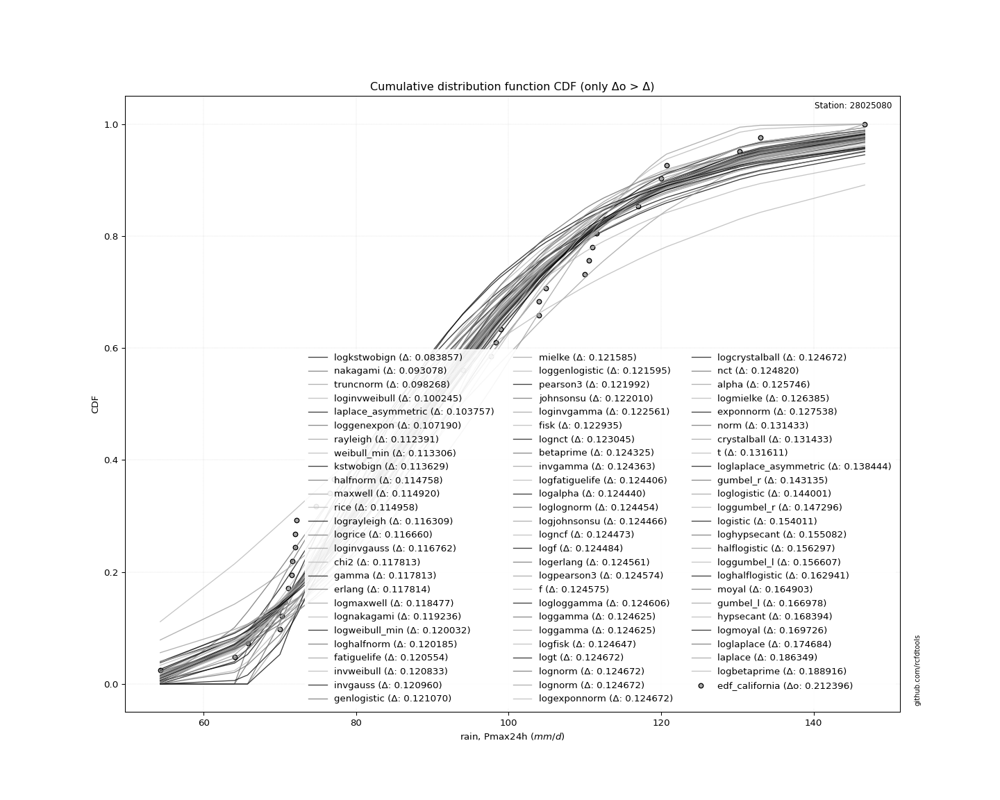</img>

</div>


**1.3. Best fit**

|   id |   station | empirical_dist   | p_dist   |     delta |   deltao | eval   |   fit |   n |     loc |   scale |   shape | shape1   | shape2   | shape3   |   best_fit |   best_fit_sort |
|-----:|----------:|:-----------------|:---------|----------:|---------:|:-------|------:|----:|--------:|--------:|--------:|:---------|:---------|:---------|-----------:|----------------:|
|    0 |  28025080 | edf_california   | nakagami | 0.0931149 | 0.212396 | Δo > Δ |     1 |  41 | 64.0373 | 35.3214 | 0.41153 |          |          |          |          1 |               1 |

<div align="center">

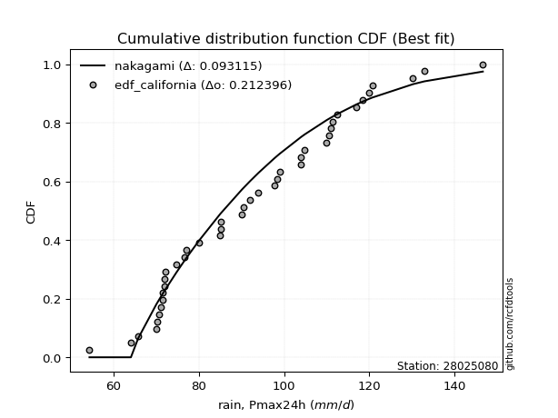</img></img>

</div>


### 2. Empirical - EDF Hazen (1930)

Hazen method for plotting positions is a formula used to estimate the empirical cumulative probability distribution of flood events or other hydrological data. This formula often results in biased estimations, particularly when extrapolating to extreme events (high return periods).

<div align="center">


$P=(m-0.5)/n$


</div>


**2.1. Empirical values**

<div align="center">

|                | 0                    | 1                    | 2                   | 3                   | 4                   | 5                   | 6                   | 7                   | 8                  | 9                   | 10                  | 11                 | 12                 | 13                  | 14                  | 15                 | 16                 | 17                 | 18                  | 19                  | 20        | 21                 | 22                 | 23                 | 24                 | 25                 | 26                 | 27                 | 28                 | 29                 | 30                 | 31                 | 32                 | 33                 | 34                 | 35                 | 36                 | 37                 | 38                 | 39                 | 40                 |
|:---------------|:---------------------|:---------------------|:--------------------|:--------------------|:--------------------|:--------------------|:--------------------|:--------------------|:-------------------|:--------------------|:--------------------|:-------------------|:-------------------|:--------------------|:--------------------|:-------------------|:-------------------|:-------------------|:--------------------|:--------------------|:----------|:-------------------|:-------------------|:-------------------|:-------------------|:-------------------|:-------------------|:-------------------|:-------------------|:-------------------|:-------------------|:-------------------|:-------------------|:-------------------|:-------------------|:-------------------|:-------------------|:-------------------|:-------------------|:-------------------|:-------------------|
| date           | 2015                 | 1972                 | 2012                | 1993                | 1989                | 2003                | 1986                | 1978                | 1991               | 1975                | 2006                | 1990               | 2014               | 2002                | 2013                | 2008               | 2004               | 1998               | 2009                | 1987                | 1983      | 2010               | 2011               | 1977               | 1997               | 2000               | 1995               | 2005               | 1982               | 2007               | 1979               | 1996               | 1981               | 1994               | 1992               | 1984               | 1999               | 1980               | 1985               | 2001               | 1988               |
| x              | 54.3053914059459     | 64.0372627544925     | 65.761435086823     | 70.0                | 70.3                | 70.6734304811073    | 71.1                | 71.5                | 71.6               | 72.0                | 72.0                | 72.2               | 74.7740840725297   | 76.5387530073253    | 77.1042389790807    | 80.0               | 85.0               | 85.1               | 85.1                | 90.1                | 90.4      | 92.0               | 94.0               | 97.7               | 98.3               | 99.0               | 104.0              | 104.0              | 104.9              | 110.0              | 110.5              | 111.0              | 111.5              | 112.5              | 117.0              | 118.5              | 120.0              | 120.7              | 130.3              | 133.0              | 146.7              |
| m              | 1                    | 2                    | 3                   | 4                   | 5                   | 6                   | 7                   | 8                   | 9                  | 10                  | 11                  | 12                 | 13                 | 14                  | 15                  | 16                 | 17                 | 18                 | 19                  | 20                  | 21        | 22                 | 23                 | 24                 | 25                 | 26                 | 27                 | 28                 | 29                 | 30                 | 31                 | 32                 | 33                 | 34                 | 35                 | 36                 | 37                 | 38                 | 39                 | 40                 | 41                 |
| empirical_dist | edf_hazen            | edf_hazen            | edf_hazen           | edf_hazen           | edf_hazen           | edf_hazen           | edf_hazen           | edf_hazen           | edf_hazen          | edf_hazen           | edf_hazen           | edf_hazen          | edf_hazen          | edf_hazen           | edf_hazen           | edf_hazen          | edf_hazen          | edf_hazen          | edf_hazen           | edf_hazen           | edf_hazen | edf_hazen          | edf_hazen          | edf_hazen          | edf_hazen          | edf_hazen          | edf_hazen          | edf_hazen          | edf_hazen          | edf_hazen          | edf_hazen          | edf_hazen          | edf_hazen          | edf_hazen          | edf_hazen          | edf_hazen          | edf_hazen          | edf_hazen          | edf_hazen          | edf_hazen          | edf_hazen          |
| empirical      | 0.012195121951219513 | 0.036585365853658534 | 0.06097560975609756 | 0.08536585365853659 | 0.10975609756097561 | 0.13414634146341464 | 0.15853658536585366 | 0.18292682926829268 | 0.2073170731707317 | 0.23170731707317074 | 0.25609756097560976 | 0.2804878048780488 | 0.3048780487804878 | 0.32926829268292684 | 0.35365853658536583 | 0.3780487804878049 | 0.4024390243902439 | 0.4268292682926829 | 0.45121951219512196 | 0.47560975609756095 | 0.5       | 0.524390243902439  | 0.5487804878048781 | 0.573170731707317  | 0.5975609756097561 | 0.6219512195121951 | 0.6463414634146342 | 0.6707317073170732 | 0.6951219512195121 | 0.7195121951219512 | 0.7439024390243902 | 0.7682926829268293 | 0.7926829268292683 | 0.8170731707317073 | 0.8414634146341463 | 0.8658536585365854 | 0.8902439024390244 | 0.9146341463414634 | 0.9390243902439024 | 0.9634146341463414 | 0.9878048780487805 |
| empirical_tr   | 1.0123456790123457   | 1.0379746835443038   | 1.064935064935065   | 1.0933333333333333  | 1.1232876712328768  | 1.1549295774647887  | 1.1884057971014492  | 1.2238805970149254  | 1.2615384615384615 | 1.3015873015873016  | 1.3442622950819672  | 1.3898305084745763 | 1.4385964912280702 | 1.490909090909091   | 1.5471698113207546  | 1.607843137254902  | 1.6734693877551021 | 1.7446808510638296 | 1.8222222222222222  | 1.9069767441860463  | 2.0       | 2.1025641025641026 | 2.2162162162162162 | 2.3428571428571425 | 2.484848484848485  | 2.6451612903225805 | 2.827586206896552  | 3.037037037037037  | 3.2799999999999994 | 3.5652173913043477 | 3.9047619047619047 | 4.315789473684211  | 4.8235294117647065 | 5.466666666666665  | 6.307692307692307  | 7.454545454545454  | 9.111111111111112  | 11.714285714285719 | 16.399999999999984 | 27.33333333333331  | 81.99999999999993  |

</div>


**2.2. Parameters & Kolmogorov-Smirnov fit test (sorted by Δ)**

|   id | empirical_dist   | p_dist             |    delta |   deltao | eval    |   fit |   n |             loc |          scale | shape                 | shape1              | shape2             | shape3   |   best_fit |   best_fit_sort |
|-----:|:-----------------|:-------------------|---------:|---------:|:--------|------:|----:|----------------:|---------------:|:----------------------|:--------------------|:-------------------|:---------|-----------:|----------------:|
|    0 | edf_hazen        | rayleigh           | 0.100195 | 0.212396 | Δo > Δ  |     1 |  41 |    51.3316      |   33.0947      |                       |                     |                    |          |          1 |               1 |
|    1 | edf_hazen        | weibull_min        | 0.101111 | 0.212396 | Δo > Δ  |     1 |  41 |    50.8426      |   47.3969      | 2.033534143641118     |                     |                    |          |          0 |               2 |
|    2 | edf_hazen        | kstwobign          | 0.101434 | 0.212396 | Δo > Δ  |     1 |  41 |    18.3574      |   85.3447      |                       |                     |                    |          |          0 |               3 |
|    3 | edf_hazen        | halfnorm           | 0.102562 | 0.212396 | Δo > Δ  |     1 |  41 |    64.1117      |   35.9675      |                       |                     |                    |          |          0 |               4 |
|    4 | edf_hazen        | maxwell            | 0.102725 | 0.212396 | Δo > Δ  |     1 |  41 |    41.4335      |   32.1952      |                       |                     |                    |          |          0 |               5 |
|    5 | edf_hazen        | rice               | 0.102763 | 0.212396 | Δo > Δ  |     1 |  41 |    50.8548      |   28.7203      | 0.8389678126883386    |                     |                    |          |          0 |               6 |
|    6 | edf_hazen        | nakagami           | 0.10531  | 0.212396 | Δo > Δ  |     1 |  41 |    64.0373      |   35.3214      | 0.4115299577326458    |                     |                    |          |          0 |               7 |
|    7 | edf_hazen        | chi2               | 0.105618 | 0.212396 | Δo > Δ  |     1 |  41 |    43.0626      |    5.03675     | 9.876803712593091     |                     |                    |          |          0 |               8 |
|    8 | edf_hazen        | gamma              | 0.105618 | 0.212396 | Δo > Δ  |     1 |  41 |    43.0626      |   10.0735      | 4.938420323915814     |                     |                    |          |          0 |               9 |
|    9 | edf_hazen        | erlang             | 0.105618 | 0.212396 | Δo > Δ  |     1 |  41 |    43.0625      |   10.0734      | 4.938436195795459     |                     |                    |          |          0 |              10 |
|   10 | edf_hazen        | recipinvgauss      | 0.108131 | 0.212396 | Δo > Δ  |     1 |  41 |    24.0281      |    6.69795     | 0.10788608125682134   |                     |                    |          |          0 |              11 |
|   11 | edf_hazen        | fatiguelife        | 0.108359 | 0.212396 | Δo > Δ  |     1 |  41 |    22.7206      |   66.7271      | 0.31737542001836927   |                     |                    |          |          0 |              12 |
|   12 | edf_hazen        | invweibull         | 0.108635 | 0.212396 | Δo > Δ  |     1 |  41 |    -8.97425e+08 |    8.97425e+08 | 49542329.20739781     |                     |                    |          |          0 |              13 |
|   13 | edf_hazen        | invgauss           | 0.108765 | 0.212396 | Δo > Δ  |     1 |  41 |    21.1058      |  731.571       | 0.09801052421316643   |                     |                    |          |          0 |              14 |
|   14 | edf_hazen        | genlogistic        | 0.108875 | 0.212396 | Δo > Δ  |     1 |  41 |   -25.9585      |   18.1125      | 398.747501290429      |                     |                    |          |          0 |              15 |
|   15 | edf_hazen        | mielke             | 0.10939  | 0.212396 | Δo > Δ  |     1 |  41 |    -0.276427    |   69.9063      | 16.638525016287083    | 5.624006127126446   |                    |          |          0 |              16 |
|   16 | edf_hazen        | pearson3           | 0.109797 | 0.212396 | Δo > Δ  |     1 |  41 |    92.8096      |   21.6816      | 0.4170719051692846    |                     |                    |          |          0 |              17 |
|   17 | edf_hazen        | johnsonsu          | 0.109815 | 0.212396 | Δo > Δ  |     1 |  41 |    20.9847      |    7.41493     | -9.6009748402718      | 3.2876572128804944  |                    |          |          0 |              18 |
|   18 | edf_hazen        | truncnorm          | 0.110463 | 0.212396 | Δo > Δ  |     1 |  41 |    95.0772      |   28.4475      | -1243.6895676394577   | 1.814671293759121   |                    |          |          0 |              19 |
|   19 | edf_hazen        | lognorm            | 0.110657 | 0.212396 | Δo > Δ  |     1 |  41 |    19.821       |   69.8056      | 0.30079481944578906   |                     |                    |          |          0 |              20 |
|   20 | edf_hazen        | fisk               | 0.11074  | 0.212396 | Δo > Δ  |     1 |  41 |    -0.167391    |   90.3714      | 7.14495643897858      |                     |                    |          |          0 |              21 |
|   21 | edf_hazen        | betaprime          | 0.11213  | 0.212396 | Δo > Δ  |     1 |  41 |    -0.678539    |   22.3309      | 95.22523801090057     | 23.742643240532814  |                    |          |          0 |              22 |
|   22 | edf_hazen        | invgamma           | 0.112168 | 0.212396 | Δo > Δ  |     1 |  41 |    -8.58668     | 2181.37        | 22.503174952551618    |                     |                    |          |          0 |              23 |
|   23 | edf_hazen        | f                  | 0.112379 | 0.212396 | Δo > Δ  |     1 |  41 |    -0.630147    |   89.7538      | 154.292828236314      | 50.23578069229985   |                    |          |          0 |              24 |
|   24 | edf_hazen        | nct                | 0.112625 | 0.212396 | Δo > Δ  |     1 |  41 |    -0.136499    |    9.69329     | 12.772217445810396    | 9.022020618429718   |                    |          |          0 |              25 |
|   25 | edf_hazen        | alpha              | 0.113551 | 0.212396 | Δo > Δ  |     1 |  41 |   -74.2724      | 1300.21        | 7.910501337385717     |                     |                    |          |          0 |              26 |
|   26 | edf_hazen        | exponnorm          | 0.115343 | 0.212396 | Δo > Δ  |     1 |  41 |    78.2603      |   16.6778      | 0.872376933838804     |                     |                    |          |          0 |              27 |
|   27 | edf_hazen        | laplace_asymmetric | 0.115952 | 0.212396 | Δo > Δ  |     1 |  41 |    71.1         |   11.4546      | 0.43004861220629687   |                     |                    |          |          0 |              28 |
|   28 | edf_hazen        | crystalball        | 0.119238 | 0.212396 | Δo > Δ  |     1 |  41 |    92.8096      |   21.6816      | 7797.312554904493     | 1297.0685011479204  |                    |          |          0 |              29 |
|   29 | edf_hazen        | norm               | 0.119238 | 0.212396 | Δo > Δ  |     1 |  41 |    92.8096      |   21.6815      |                       |                     |                    |          |          0 |              30 |
|   30 | edf_hazen        | t                  | 0.119416 | 0.212396 | Δo > Δ  |     1 |  41 |    92.8234      |   21.6831      | 146537.65006382146    |                     |                    |          |          0 |              31 |
|   31 | edf_hazen        | loggamma           | 0.119847 | 0.212396 | Δo > Δ  |     1 |  41 | -5932.16        |  827.853       | 1448.4272314307375    |                     |                    |          |          0 |              32 |
|   32 | edf_hazen        | gumbel_r           | 0.13094  | 0.212396 | Δo > Δ  |     1 |  41 |    83.0518      |   16.905       |                       |                     |                    |          |          0 |              33 |
|   33 | edf_hazen        | dgamma             | 0.140618 | 0.212396 | Δo > Δ  |     1 |  41 |    95.3247      |    8.86077     | 2.121247318447837     |                     |                    |          |          0 |              34 |
|   34 | edf_hazen        | logistic           | 0.141816 | 0.212396 | Δo > Δ  |     1 |  41 |    92.8096      |   11.9537      |                       |                     |                    |          |          0 |              35 |
|   35 | edf_hazen        | halflogistic       | 0.144102 | 0.212396 | Δo > Δ  |     1 |  41 |    67.1119      |   18.537       |                       |                     |                    |          |          0 |              36 |
|   36 | edf_hazen        | moyal              | 0.152708 | 0.212396 | Δo > Δ  |     1 |  41 |    80.4107      |    9.76013     |                       |                     |                    |          |          0 |              37 |
|   37 | edf_hazen        | gumbel_l           | 0.154782 | 0.212396 | Δo > Δ  |     1 |  41 |   102.567       |   16.905       |                       |                     |                    |          |          0 |              38 |
|   38 | edf_hazen        | hypsecant          | 0.156199 | 0.212396 | Δo > Δ  |     1 |  41 |    92.8096      |   13.8029      |                       |                     |                    |          |          0 |              39 |
|   39 | edf_hazen        | laplace            | 0.174154 | 0.212396 | Δo > Δ  |     1 |  41 |    92.8096      |   15.3312      |                       |                     |                    |          |          0 |              40 |
|   40 | edf_hazen        | genexpon           | 0.242962 | 0.212396 | Δo <= Δ |     0 |  41 |    53.5691      |    1.80935     | 4.581735737394762e-11 | 0.04769179520246915 | 1.3583524985563262 |          |          0 |              41 |
|   41 | edf_hazen        | expon              | 0.249394 | 0.212396 | Δo <= Δ |     0 |  41 |    54.3054      |   38.5042      |                       |                     |                    |          |          0 |              42 |
|   42 | edf_hazen        | pareto             | 0.249394 | 0.212396 | Δo <= Δ |     0 |  41 |    -2.14748e+09 |    2.14748e+09 | 55772664.66562522     |                     |                    |          |          0 |              43 |
|   43 | edf_hazen        | zzgumbel           | 0.271468 | 0.212396 | Δo <= Δ |     0 |  41 |    92.7778      |   17.115       | 0.5441978529407195    | 1.1435823657845239  |                    |          |          0 |              44 |
|   44 | edf_hazen        | wald               | 0.28047  | 0.212396 | Δo <= Δ |     0 |  41 |    71.128       |   21.6816      |                       |                     |                    |          |          0 |              45 |
|   45 | edf_hazen        | gibrat             | 0.347204 | 0.212396 | Δo <= Δ |     0 |  41 |    76.2694      |   10.0322      |                       |                     |                    |          |          0 |              46 |
|   46 | edf_hazen        | gompertz           | 0.362578 | 0.212396 | Δo <= Δ |     0 |  41 |  -323.548       |   11.5888      | 4.719325060208775e-17 |                     |                    |          |          0 |              47 |
|   47 | edf_hazen        | ncf                | 0.544177 | 0.212396 | Δo <= Δ |     0 |  41 |    -0.082077    |    1.06134e-05 | 5.041499418439944e-07 | 14.643978562930169  | 3.2782378530006118 |          |          0 |              48 |

<div align="center">

</img>

</div>


**2.3. Best fit**

|   id |   station | empirical_dist   | p_dist   |    delta |   deltao | eval   |   fit |   n |     loc |   scale | shape   | shape1   | shape2   | shape3   |   best_fit |   best_fit_sort |
|-----:|----------:|:-----------------|:---------|---------:|---------:|:-------|------:|----:|--------:|--------:|:--------|:---------|:---------|:---------|-----------:|----------------:|
|    0 |  28025080 | edf_hazen        | rayleigh | 0.100195 | 0.212396 | Δo > Δ |     1 |  41 | 51.3316 | 33.0947 |         |          |          |          |          1 |               1 |

<div align="center">

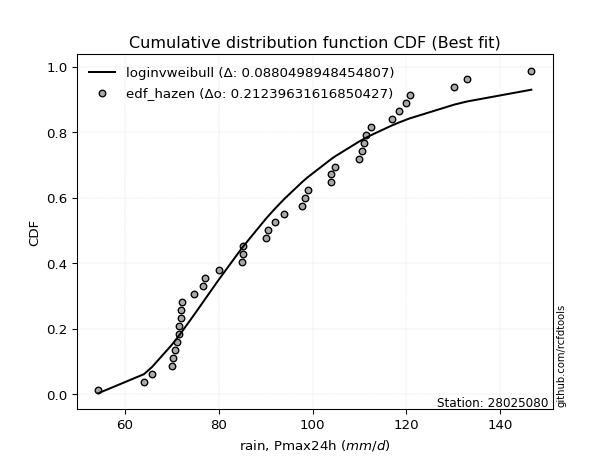</img></img>

</div>


### 3. Empirical - EDF Weibull (1939)

Weibull plotting position formula is an empirical method used to estimate the non-exceedance probability or plotting position for a set of observed data, is often recommended or widely used in practice, particularly in flood frequency analysis.

<div align="center">


$P=m/(n+1)$


</div>


**3.1. Empirical values**

<div align="center">

|                | 0                    | 1                    | 2                   | 3                   | 4                   | 5                   | 6                   | 7                   | 8                   | 9                   | 10                 | 11                 | 12                  | 13                 | 14                  | 15                  | 16                  | 17                  | 18                 | 19                  | 20          | 21                 | 22                 | 23                 | 24                 | 25                 | 26                 | 27                 | 28                 | 29                 | 30                 | 31                 | 32                 | 33                 | 34                 | 35                 | 36                 | 37                 | 38                 | 39                 | 40                 |
|:---------------|:---------------------|:---------------------|:--------------------|:--------------------|:--------------------|:--------------------|:--------------------|:--------------------|:--------------------|:--------------------|:-------------------|:-------------------|:--------------------|:-------------------|:--------------------|:--------------------|:--------------------|:--------------------|:-------------------|:--------------------|:------------|:-------------------|:-------------------|:-------------------|:-------------------|:-------------------|:-------------------|:-------------------|:-------------------|:-------------------|:-------------------|:-------------------|:-------------------|:-------------------|:-------------------|:-------------------|:-------------------|:-------------------|:-------------------|:-------------------|:-------------------|
| date           | 2015                 | 1972                 | 2012                | 1993                | 1989                | 2003                | 1986                | 1978                | 1991                | 1975                | 2006               | 1990               | 2014                | 2002               | 2013                | 2008                | 2004                | 1998                | 2009               | 1987                | 1983        | 2010               | 2011               | 1977               | 1997               | 2000               | 1995               | 2005               | 1982               | 2007               | 1979               | 1996               | 1981               | 1994               | 1992               | 1984               | 1999               | 1980               | 1985               | 2001               | 1988               |
| x              | 54.3053914059459     | 64.0372627544925     | 65.761435086823     | 70.0                | 70.3                | 70.6734304811073    | 71.1                | 71.5                | 71.6                | 72.0                | 72.0               | 72.2               | 74.7740840725297    | 76.5387530073253   | 77.1042389790807    | 80.0                | 85.0                | 85.1                | 85.1               | 90.1                | 90.4        | 92.0               | 94.0               | 97.7               | 98.3               | 99.0               | 104.0              | 104.0              | 104.9              | 110.0              | 110.5              | 111.0              | 111.5              | 112.5              | 117.0              | 118.5              | 120.0              | 120.7              | 130.3              | 133.0              | 146.7              |
| m              | 1                    | 2                    | 3                   | 4                   | 5                   | 6                   | 7                   | 8                   | 9                   | 10                  | 11                 | 12                 | 13                  | 14                 | 15                  | 16                  | 17                  | 18                  | 19                 | 20                  | 21          | 22                 | 23                 | 24                 | 25                 | 26                 | 27                 | 28                 | 29                 | 30                 | 31                 | 32                 | 33                 | 34                 | 35                 | 36                 | 37                 | 38                 | 39                 | 40                 | 41                 |
| empirical_dist | edf_weibull          | edf_weibull          | edf_weibull         | edf_weibull         | edf_weibull         | edf_weibull         | edf_weibull         | edf_weibull         | edf_weibull         | edf_weibull         | edf_weibull        | edf_weibull        | edf_weibull         | edf_weibull        | edf_weibull         | edf_weibull         | edf_weibull         | edf_weibull         | edf_weibull        | edf_weibull         | edf_weibull | edf_weibull        | edf_weibull        | edf_weibull        | edf_weibull        | edf_weibull        | edf_weibull        | edf_weibull        | edf_weibull        | edf_weibull        | edf_weibull        | edf_weibull        | edf_weibull        | edf_weibull        | edf_weibull        | edf_weibull        | edf_weibull        | edf_weibull        | edf_weibull        | edf_weibull        | edf_weibull        |
| empirical      | 0.023809523809523808 | 0.047619047619047616 | 0.07142857142857142 | 0.09523809523809523 | 0.11904761904761904 | 0.14285714285714285 | 0.16666666666666666 | 0.19047619047619047 | 0.21428571428571427 | 0.23809523809523808 | 0.2619047619047619 | 0.2857142857142857 | 0.30952380952380953 | 0.3333333333333333 | 0.35714285714285715 | 0.38095238095238093 | 0.40476190476190477 | 0.42857142857142855 | 0.4523809523809524 | 0.47619047619047616 | 0.5         | 0.5238095238095238 | 0.5476190476190477 | 0.5714285714285714 | 0.5952380952380952 | 0.6190476190476191 | 0.6428571428571429 | 0.6666666666666666 | 0.6904761904761905 | 0.7142857142857143 | 0.7380952380952381 | 0.7619047619047619 | 0.7857142857142857 | 0.8095238095238095 | 0.8333333333333334 | 0.8571428571428571 | 0.8809523809523809 | 0.9047619047619048 | 0.9285714285714286 | 0.9523809523809523 | 0.9761904761904762 |
| empirical_tr   | 1.024390243902439    | 1.05                 | 1.0769230769230769  | 1.1052631578947367  | 1.135135135135135   | 1.1666666666666665  | 1.2                 | 1.2352941176470589  | 1.2727272727272727  | 1.3125              | 1.3548387096774193 | 1.4                | 1.4482758620689655  | 1.4999999999999998 | 1.5555555555555558  | 1.6153846153846154  | 1.68                | 1.75                | 1.826086956521739  | 1.909090909090909   | 2.0         | 2.1                | 2.210526315789474  | 2.333333333333333  | 2.4705882352941178 | 2.625              | 2.8000000000000003 | 2.9999999999999996 | 3.230769230769231  | 3.5                | 3.818181818181819  | 4.199999999999999  | 4.666666666666666  | 5.25               | 6.000000000000002  | 6.999999999999997  | 8.399999999999999  | 10.5               | 14.000000000000007 | 20.999999999999975 | 41.99999999999995  |

</div>


**3.2. Parameters & Kolmogorov-Smirnov fit test (sorted by Δ)**

|   id | empirical_dist   | p_dist             |    delta |   deltao | eval    |   fit |   n |             loc |          scale | shape                 | shape1              | shape2             | shape3   |   best_fit |   best_fit_sort |
|-----:|:-----------------|:-------------------|---------:|---------:|:--------|------:|----:|----------------:|---------------:|:----------------------|:--------------------|:-------------------|:---------|-----------:|----------------:|
|    0 | edf_weibull      | truncnorm          | 0.100591 | 0.212396 | Δo > Δ  |     1 |  41 |    95.0772      |   28.4475      | -1243.6895676394577   | 1.814671293759121   |                    |          |          1 |               1 |
|    1 | edf_weibull      | rayleigh           | 0.105422 | 0.212396 | Δo > Δ  |     1 |  41 |    51.3316      |   33.0947      |                       |                     |                    |          |          0 |               2 |
|    2 | edf_weibull      | weibull_min        | 0.106337 | 0.212396 | Δo > Δ  |     1 |  41 |    50.8426      |   47.3969      | 2.033534143641118     |                     |                    |          |          0 |               3 |
|    3 | edf_weibull      | kstwobign          | 0.10666  | 0.212396 | Δo > Δ  |     1 |  41 |    18.3574      |   85.3447      |                       |                     |                    |          |          0 |               4 |
|    4 | edf_weibull      | halfnorm           | 0.107789 | 0.212396 | Δo > Δ  |     1 |  41 |    64.1117      |   35.9675      |                       |                     |                    |          |          0 |               5 |
|    5 | edf_weibull      | maxwell            | 0.107951 | 0.212396 | Δo > Δ  |     1 |  41 |    41.4335      |   32.1952      |                       |                     |                    |          |          0 |               6 |
|    6 | edf_weibull      | rice               | 0.10799  | 0.212396 | Δo > Δ  |     1 |  41 |    50.8548      |   28.7203      | 0.8389678126883386    |                     |                    |          |          0 |               7 |
|    7 | edf_weibull      | nakagami           | 0.108601 | 0.212396 | Δo > Δ  |     1 |  41 |    64.0373      |   35.3214      | 0.4115299577326458    |                     |                    |          |          0 |               8 |
|    8 | edf_weibull      | chi2               | 0.110845 | 0.212396 | Δo > Δ  |     1 |  41 |    43.0626      |    5.03675     | 9.876803712593091     |                     |                    |          |          0 |               9 |
|    9 | edf_weibull      | gamma              | 0.110845 | 0.212396 | Δo > Δ  |     1 |  41 |    43.0626      |   10.0735      | 4.938420323915814     |                     |                    |          |          0 |              10 |
|   10 | edf_weibull      | erlang             | 0.110845 | 0.212396 | Δo > Δ  |     1 |  41 |    43.0625      |   10.0734      | 4.938436195795459     |                     |                    |          |          0 |              11 |
|   11 | edf_weibull      | recipinvgauss      | 0.113357 | 0.212396 | Δo > Δ  |     1 |  41 |    24.0281      |    6.69795     | 0.10788608125682134   |                     |                    |          |          0 |              12 |
|   12 | edf_weibull      | fatiguelife        | 0.113586 | 0.212396 | Δo > Δ  |     1 |  41 |    22.7206      |   66.7271      | 0.31737542001836927   |                     |                    |          |          0 |              13 |
|   13 | edf_weibull      | invweibull         | 0.113862 | 0.212396 | Δo > Δ  |     1 |  41 |    -8.97425e+08 |    8.97425e+08 | 49542329.20739781     |                     |                    |          |          0 |              14 |
|   14 | edf_weibull      | invgauss           | 0.113991 | 0.212396 | Δo > Δ  |     1 |  41 |    21.1058      |  731.571       | 0.09801052421316643   |                     |                    |          |          0 |              15 |
|   15 | edf_weibull      | genlogistic        | 0.114102 | 0.212396 | Δo > Δ  |     1 |  41 |   -25.9585      |   18.1125      | 398.747501290429      |                     |                    |          |          0 |              16 |
|   16 | edf_weibull      | mielke             | 0.114616 | 0.212396 | Δo > Δ  |     1 |  41 |    -0.276427    |   69.9063      | 16.638525016287083    | 5.624006127126446   |                    |          |          0 |              17 |
|   17 | edf_weibull      | pearson3           | 0.114914 | 0.212396 | Δo > Δ  |     1 |  41 |    92.8096      |   21.6816      | 0.4170719051692846    |                     |                    |          |          0 |              18 |
|   18 | edf_weibull      | johnsonsu          | 0.115041 | 0.212396 | Δo > Δ  |     1 |  41 |    20.9847      |    7.41493     | -9.6009748402718      | 3.2876572128804944  |                    |          |          0 |              19 |
|   19 | edf_weibull      | lognorm            | 0.115884 | 0.212396 | Δo > Δ  |     1 |  41 |    19.821       |   69.8056      | 0.30079481944578906   |                     |                    |          |          0 |              20 |
|   20 | edf_weibull      | fisk               | 0.115966 | 0.212396 | Δo > Δ  |     1 |  41 |    -0.167391    |   90.3714      | 7.14495643897858      |                     |                    |          |          0 |              21 |
|   21 | edf_weibull      | betaprime          | 0.117357 | 0.212396 | Δo > Δ  |     1 |  41 |    -0.678539    |   22.3309      | 95.22523801090057     | 23.742643240532814  |                    |          |          0 |              22 |
|   22 | edf_weibull      | invgamma           | 0.117394 | 0.212396 | Δo > Δ  |     1 |  41 |    -8.58668     | 2181.37        | 22.503174952551618    |                     |                    |          |          0 |              23 |
|   23 | edf_weibull      | f                  | 0.117606 | 0.212396 | Δo > Δ  |     1 |  41 |    -0.630147    |   89.7538      | 154.292828236314      | 50.23578069229985   |                    |          |          0 |              24 |
|   24 | edf_weibull      | laplace_asymmetric | 0.117694 | 0.212396 | Δo > Δ  |     1 |  41 |    71.1         |   11.4546      | 0.43004861220629687   |                     |                    |          |          0 |              25 |
|   25 | edf_weibull      | nct                | 0.117852 | 0.212396 | Δo > Δ  |     1 |  41 |    -0.136499    |    9.69329     | 12.772217445810396    | 9.022020618429718   |                    |          |          0 |              26 |
|   26 | edf_weibull      | alpha              | 0.118777 | 0.212396 | Δo > Δ  |     1 |  41 |   -74.2724      | 1300.21        | 7.910501337385717     |                     |                    |          |          0 |              27 |
|   27 | edf_weibull      | exponnorm          | 0.119372 | 0.212396 | Δo > Δ  |     1 |  41 |    78.2603      |   16.6778      | 0.872376933838804     |                     |                    |          |          0 |              28 |
|   28 | edf_weibull      | crystalball        | 0.122722 | 0.212396 | Δo > Δ  |     1 |  41 |    92.8096      |   21.6816      | 7797.312554904493     | 1297.0685011479204  |                    |          |          0 |              29 |
|   29 | edf_weibull      | norm               | 0.122722 | 0.212396 | Δo > Δ  |     1 |  41 |    92.8096      |   21.6815      |                       |                     |                    |          |          0 |              30 |
|   30 | edf_weibull      | t                  | 0.1229   | 0.212396 | Δo > Δ  |     1 |  41 |    92.8234      |   21.6831      | 146537.65006382146    |                     |                    |          |          0 |              31 |
|   31 | edf_weibull      | loggamma           | 0.123331 | 0.212396 | Δo > Δ  |     1 |  41 | -5932.16        |  827.853       | 1448.4272314307375    |                     |                    |          |          0 |              32 |
|   32 | edf_weibull      | gumbel_r           | 0.136166 | 0.212396 | Δo > Δ  |     1 |  41 |    83.0518      |   16.905       |                       |                     |                    |          |          0 |              33 |
|   33 | edf_weibull      | dgamma             | 0.144102 | 0.212396 | Δo > Δ  |     1 |  41 |    95.3247      |    8.86077     | 2.121247318447837     |                     |                    |          |          0 |              34 |
|   34 | edf_weibull      | logistic           | 0.1453   | 0.212396 | Δo > Δ  |     1 |  41 |    92.8096      |   11.9537      |                       |                     |                    |          |          0 |              35 |
|   35 | edf_weibull      | halflogistic       | 0.149329 | 0.212396 | Δo > Δ  |     1 |  41 |    67.1119      |   18.537       |                       |                     |                    |          |          0 |              36 |
|   36 | edf_weibull      | moyal              | 0.157934 | 0.212396 | Δo > Δ  |     1 |  41 |    80.4107      |    9.76013     |                       |                     |                    |          |          0 |              37 |
|   37 | edf_weibull      | gumbel_l           | 0.158267 | 0.212396 | Δo > Δ  |     1 |  41 |   102.567       |   16.905       |                       |                     |                    |          |          0 |              38 |
|   38 | edf_weibull      | hypsecant          | 0.159684 | 0.212396 | Δo > Δ  |     1 |  41 |    92.8096      |   13.8029      |                       |                     |                    |          |          0 |              39 |
|   39 | edf_weibull      | laplace            | 0.177639 | 0.212396 | Δo > Δ  |     1 |  41 |    92.8096      |   15.3312      |                       |                     |                    |          |          0 |              40 |
|   40 | edf_weibull      | genexpon           | 0.233089 | 0.212396 | Δo <= Δ |     0 |  41 |    53.5691      |    1.80935     | 4.581735737394762e-11 | 0.04769179520246915 | 1.3583524985563262 |          |          0 |              41 |
|   41 | edf_weibull      | expon              | 0.239522 | 0.212396 | Δo <= Δ |     0 |  41 |    54.3054      |   38.5042      |                       |                     |                    |          |          0 |              42 |
|   42 | edf_weibull      | pareto             | 0.239522 | 0.212396 | Δo <= Δ |     0 |  41 |    -2.14748e+09 |    2.14748e+09 | 55772664.66562522     |                     |                    |          |          0 |              43 |
|   43 | edf_weibull      | zzgumbel           | 0.274953 | 0.212396 | Δo <= Δ |     0 |  41 |    92.7778      |   17.115       | 0.5441978529407195    | 1.1435823657845239  |                    |          |          0 |              44 |
|   44 | edf_weibull      | wald               | 0.285696 | 0.212396 | Δo <= Δ |     0 |  41 |    71.128       |   21.6816      |                       |                     |                    |          |          0 |              45 |
|   45 | edf_weibull      | gibrat             | 0.350689 | 0.212396 | Δo <= Δ |     0 |  41 |    76.2694      |   10.0322      |                       |                     |                    |          |          0 |              46 |
|   46 | edf_weibull      | gompertz           | 0.361998 | 0.212396 | Δo <= Δ |     0 |  41 |  -323.548       |   11.5888      | 4.719325060208775e-17 |                     |                    |          |          0 |              47 |
|   47 | edf_weibull      | ncf                | 0.533143 | 0.212396 | Δo <= Δ |     0 |  41 |    -0.082077    |    1.06134e-05 | 5.041499418439944e-07 | 14.643978562930169  | 3.2782378530006118 |          |          0 |              48 |

<div align="center">

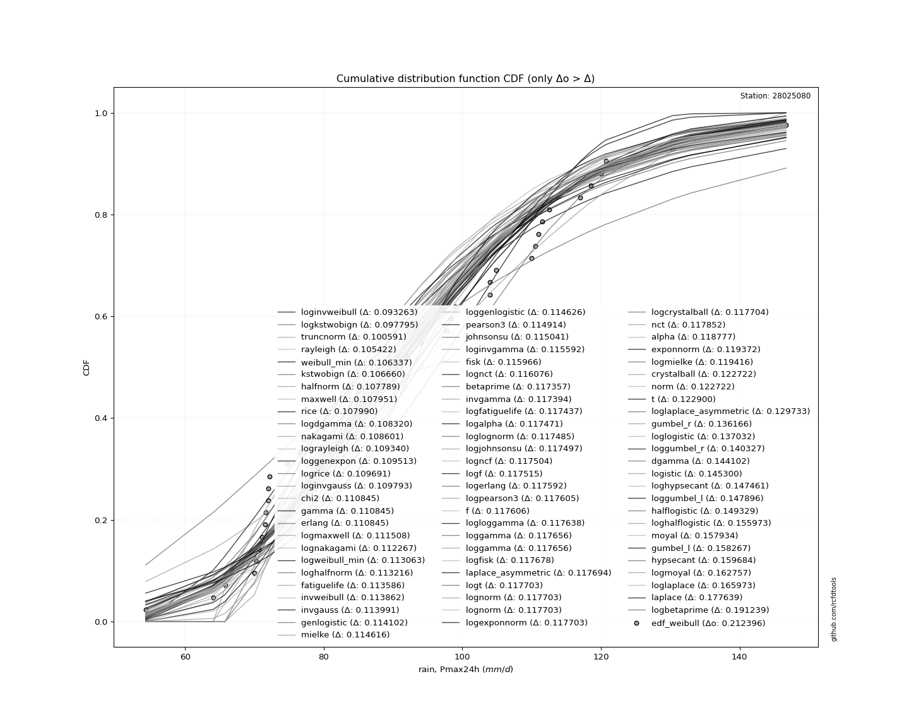</img>

</div>


**3.3. Best fit**

|   id |   station | empirical_dist   | p_dist    |    delta |   deltao | eval   |   fit |   n |     loc |   scale |    shape |   shape1 | shape2   | shape3   |   best_fit |   best_fit_sort |
|-----:|----------:|:-----------------|:----------|---------:|---------:|:-------|------:|----:|--------:|--------:|---------:|---------:|:---------|:---------|-----------:|----------------:|
|    0 |  28025080 | edf_weibull      | truncnorm | 0.100591 | 0.212396 | Δo > Δ |     1 |  41 | 95.0772 | 28.4475 | -1243.69 |  1.81467 |          |          |          1 |               1 |

<div align="center">

</img></img>

</div>


### 4. Empirical - EDF Beard (1943)

The Beard formula (or Beard´s plotting position formula) in hydrology is used to estimate the empirical non-exceedance probability _(P)_ of a flood event (or other extreme hydrological data point) within a given dataset.

<div align="center">


$P=(m-0.31)/(n+0.38)$


</div>


**4.1. Empirical values**

<div align="center">

|                | 0                    | 1                   | 2                   | 3                   | 4                   | 5                  | 6                   | 7                   | 8                  | 9                   | 10                 | 11                 | 12                  | 13                 | 14                  | 15                  | 16                  | 17                  | 18                  | 19                 | 20        | 21                 | 22                 | 23                 | 24                 | 25                 | 26                 | 27                 | 28                 | 29                 | 30                 | 31                 | 32                 | 33                 | 34                 | 35                | 36                 | 37                 | 38                 | 39                | 40                 |
|:---------------|:---------------------|:--------------------|:--------------------|:--------------------|:--------------------|:-------------------|:--------------------|:--------------------|:-------------------|:--------------------|:-------------------|:-------------------|:--------------------|:-------------------|:--------------------|:--------------------|:--------------------|:--------------------|:--------------------|:-------------------|:----------|:-------------------|:-------------------|:-------------------|:-------------------|:-------------------|:-------------------|:-------------------|:-------------------|:-------------------|:-------------------|:-------------------|:-------------------|:-------------------|:-------------------|:------------------|:-------------------|:-------------------|:-------------------|:------------------|:-------------------|
| date           | 2015                 | 1972                | 2012                | 1993                | 1989                | 2003               | 1986                | 1978                | 1991               | 1975                | 2006               | 1990               | 2014                | 2002               | 2013                | 2008                | 2004                | 1998                | 2009                | 1987               | 1983      | 2010               | 2011               | 1977               | 1997               | 2000               | 1995               | 2005               | 1982               | 2007               | 1979               | 1996               | 1981               | 1994               | 1992               | 1984              | 1999               | 1980               | 1985               | 2001              | 1988               |
| x              | 54.3053914059459     | 64.0372627544925    | 65.761435086823     | 70.0                | 70.3                | 70.6734304811073   | 71.1                | 71.5                | 71.6               | 72.0                | 72.0               | 72.2               | 74.7740840725297    | 76.5387530073253   | 77.1042389790807    | 80.0                | 85.0                | 85.1                | 85.1                | 90.1               | 90.4      | 92.0               | 94.0               | 97.7               | 98.3               | 99.0               | 104.0              | 104.0              | 104.9              | 110.0              | 110.5              | 111.0              | 111.5              | 112.5              | 117.0              | 118.5             | 120.0              | 120.7              | 130.3              | 133.0             | 146.7              |
| m              | 1                    | 2                   | 3                   | 4                   | 5                   | 6                  | 7                   | 8                   | 9                  | 10                  | 11                 | 12                 | 13                  | 14                 | 15                  | 16                  | 17                  | 18                  | 19                  | 20                 | 21        | 22                 | 23                 | 24                 | 25                 | 26                 | 27                 | 28                 | 29                 | 30                 | 31                 | 32                 | 33                 | 34                 | 35                 | 36                | 37                 | 38                 | 39                 | 40                | 41                 |
| empirical_dist | edf_beard            | edf_beard           | edf_beard           | edf_beard           | edf_beard           | edf_beard          | edf_beard           | edf_beard           | edf_beard          | edf_beard           | edf_beard          | edf_beard          | edf_beard           | edf_beard          | edf_beard           | edf_beard           | edf_beard           | edf_beard           | edf_beard           | edf_beard          | edf_beard | edf_beard          | edf_beard          | edf_beard          | edf_beard          | edf_beard          | edf_beard          | edf_beard          | edf_beard          | edf_beard          | edf_beard          | edf_beard          | edf_beard          | edf_beard          | edf_beard          | edf_beard         | edf_beard          | edf_beard          | edf_beard          | edf_beard         | edf_beard          |
| empirical      | 0.016674722087965197 | 0.04084098598356694 | 0.06500724987916867 | 0.08917351377477041 | 0.11333977767037216 | 0.1375060415659739 | 0.16167230546157563 | 0.18583856935717738 | 0.2100048332527791 | 0.23417109714838083 | 0.2583373610439826 | 0.2825036249395843 | 0.30666988883518603 | 0.3308361527307878 | 0.35500241662638954 | 0.37916868052199126 | 0.40333494441759304 | 0.42750120831319477 | 0.45166747220879655 | 0.4758337361043983 | 0.5       | 0.5241662638956017 | 0.5483325277912035 | 0.5724987916868052 | 0.5966650555824069 | 0.6208313194780087 | 0.6449975833736105 | 0.6691638472692122 | 0.6933301111648139 | 0.7174963750604156 | 0.7416626389560174 | 0.7658289028516191 | 0.7899951667472208 | 0.8141614306428225 | 0.8383276945384243 | 0.862493958434026 | 0.8866602223296277 | 0.9108264862252294 | 0.9349927501208312 | 0.959159014016433 | 0.9833252779120347 |
| empirical_tr   | 1.0169574834111574   | 1.0425799949609473  | 1.0695270095631946  | 1.0979039533032635  | 1.127827745979831   | 1.1594284113196973 | 1.192850965696166   | 1.228257643217572   | 1.2658305292138268 | 1.3057746923319657  | 1.34832192896709   | 1.3937352643987873 | 1.4423143952596722  | 1.4944023113037197 | 1.5503934057699513  | 1.6107434799532891  | 1.6759821790198464  | 1.7467285774588435  | 1.8237108858527986  | 1.9077916090364224 | 2.0       | 2.101574403250381  | 2.2140181915462813 | 2.339174674957603  | 2.479328939484721  | 2.6373486297004463 | 2.8168822328114365 | 3.022644265887509  | 3.260835303388495  | 3.539777587681779  | 3.87090739008419   | 4.270381836945304  | 4.761795166858456  | 5.381014304291285  | 6.185351270553061  | 7.272407732864669 | 8.823027718550097  | 11.214092140921391 | 15.382899628252751 | 24.48520710059168 | 59.97101449275335  |

</div>


**4.2. Parameters & Kolmogorov-Smirnov fit test (sorted by Δ)**

|   id | empirical_dist   | p_dist             |    delta |   deltao | eval    |   fit |   n |             loc |          scale | shape                 | shape1              | shape2             | shape3   |   best_fit |   best_fit_sort |
|-----:|:-----------------|:-------------------|---------:|---------:|:--------|------:|----:|----------------:|---------------:|:----------------------|:--------------------|:-------------------|:---------|-----------:|----------------:|
|    0 | edf_beard        | rayleigh           | 0.102211 | 0.212396 | Δo > Δ  |     1 |  41 |    51.3316      |   33.0947      |                       |                     |                    |          |          1 |               1 |
|    1 | edf_beard        | weibull_min        | 0.103126 | 0.212396 | Δo > Δ  |     1 |  41 |    50.8426      |   47.3969      | 2.033534143641118     |                     |                    |          |          0 |               2 |
|    2 | edf_beard        | kstwobign          | 0.10345  | 0.212396 | Δo > Δ  |     1 |  41 |    18.3574      |   85.3447      |                       |                     |                    |          |          0 |               3 |
|    3 | edf_beard        | halfnorm           | 0.104578 | 0.212396 | Δo > Δ  |     1 |  41 |    64.1117      |   35.9675      |                       |                     |                    |          |          0 |               4 |
|    4 | edf_beard        | maxwell            | 0.104741 | 0.212396 | Δo > Δ  |     1 |  41 |    41.4335      |   32.1952      |                       |                     |                    |          |          0 |               5 |
|    5 | edf_beard        | rice               | 0.104779 | 0.212396 | Δo > Δ  |     1 |  41 |    50.8548      |   28.7203      | 0.8389678126883386    |                     |                    |          |          0 |               6 |
|    6 | edf_beard        | nakagami           | 0.10646  | 0.212396 | Δo > Δ  |     1 |  41 |    64.0373      |   35.3214      | 0.4115299577326458    |                     |                    |          |          0 |               7 |
|    7 | edf_beard        | truncnorm          | 0.106656 | 0.212396 | Δo > Δ  |     1 |  41 |    95.0772      |   28.4475      | -1243.6895676394577   | 1.814671293759121   |                    |          |          0 |               8 |
|    8 | edf_beard        | chi2               | 0.107634 | 0.212396 | Δo > Δ  |     1 |  41 |    43.0626      |    5.03675     | 9.876803712593091     |                     |                    |          |          0 |               9 |
|    9 | edf_beard        | gamma              | 0.107634 | 0.212396 | Δo > Δ  |     1 |  41 |    43.0626      |   10.0735      | 4.938420323915814     |                     |                    |          |          0 |              10 |
|   10 | edf_beard        | erlang             | 0.107634 | 0.212396 | Δo > Δ  |     1 |  41 |    43.0625      |   10.0734      | 4.938436195795459     |                     |                    |          |          0 |              11 |
|   11 | edf_beard        | recipinvgauss      | 0.110146 | 0.212396 | Δo > Δ  |     1 |  41 |    24.0281      |    6.69795     | 0.10788608125682134   |                     |                    |          |          0 |              12 |
|   12 | edf_beard        | fatiguelife        | 0.110375 | 0.212396 | Δo > Δ  |     1 |  41 |    22.7206      |   66.7271      | 0.31737542001836927   |                     |                    |          |          0 |              13 |
|   13 | edf_beard        | invweibull         | 0.110651 | 0.212396 | Δo > Δ  |     1 |  41 |    -8.97425e+08 |    8.97425e+08 | 49542329.20739781     |                     |                    |          |          0 |              14 |
|   14 | edf_beard        | invgauss           | 0.110781 | 0.212396 | Δo > Δ  |     1 |  41 |    21.1058      |  731.571       | 0.09801052421316643   |                     |                    |          |          0 |              15 |
|   15 | edf_beard        | genlogistic        | 0.110891 | 0.212396 | Δo > Δ  |     1 |  41 |   -25.9585      |   18.1125      | 398.747501290429      |                     |                    |          |          0 |              16 |
|   16 | edf_beard        | mielke             | 0.111406 | 0.212396 | Δo > Δ  |     1 |  41 |    -0.276427    |   69.9063      | 16.638525016287083    | 5.624006127126446   |                    |          |          0 |              17 |
|   17 | edf_beard        | pearson3           | 0.111703 | 0.212396 | Δo > Δ  |     1 |  41 |    92.8096      |   21.6816      | 0.4170719051692846    |                     |                    |          |          0 |              18 |
|   18 | edf_beard        | johnsonsu          | 0.111831 | 0.212396 | Δo > Δ  |     1 |  41 |    20.9847      |    7.41493     | -9.6009748402718      | 3.2876572128804944  |                    |          |          0 |              19 |
|   19 | edf_beard        | lognorm            | 0.112673 | 0.212396 | Δo > Δ  |     1 |  41 |    19.821       |   69.8056      | 0.30079481944578906   |                     |                    |          |          0 |              20 |
|   20 | edf_beard        | fisk               | 0.112755 | 0.212396 | Δo > Δ  |     1 |  41 |    -0.167391    |   90.3714      | 7.14495643897858      |                     |                    |          |          0 |              21 |
|   21 | edf_beard        | betaprime          | 0.114146 | 0.212396 | Δo > Δ  |     1 |  41 |    -0.678539    |   22.3309      | 95.22523801090057     | 23.742643240532814  |                    |          |          0 |              22 |
|   22 | edf_beard        | invgamma           | 0.114183 | 0.212396 | Δo > Δ  |     1 |  41 |    -8.58668     | 2181.37        | 22.503174952551618    |                     |                    |          |          0 |              23 |
|   23 | edf_beard        | f                  | 0.114395 | 0.212396 | Δo > Δ  |     1 |  41 |    -0.630147    |   89.7538      | 154.292828236314      | 50.23578069229985   |                    |          |          0 |              24 |
|   24 | edf_beard        | nct                | 0.114641 | 0.212396 | Δo > Δ  |     1 |  41 |    -0.136499    |    9.69329     | 12.772217445810396    | 9.022020618429718   |                    |          |          0 |              25 |
|   25 | edf_beard        | alpha              | 0.115566 | 0.212396 | Δo > Δ  |     1 |  41 |   -74.2724      | 1300.21        | 7.910501337385717     |                     |                    |          |          0 |              26 |
|   26 | edf_beard        | laplace_asymmetric | 0.116624 | 0.212396 | Δo > Δ  |     1 |  41 |    71.1         |   11.4546      | 0.43004861220629687   |                     |                    |          |          0 |              27 |
|   27 | edf_beard        | exponnorm          | 0.116687 | 0.212396 | Δo > Δ  |     1 |  41 |    78.2603      |   16.6778      | 0.872376933838804     |                     |                    |          |          0 |              28 |
|   28 | edf_beard        | crystalball        | 0.120582 | 0.212396 | Δo > Δ  |     1 |  41 |    92.8096      |   21.6816      | 7797.312554904493     | 1297.0685011479204  |                    |          |          0 |              29 |
|   29 | edf_beard        | norm               | 0.120582 | 0.212396 | Δo > Δ  |     1 |  41 |    92.8096      |   21.6815      |                       |                     |                    |          |          0 |              30 |
|   30 | edf_beard        | t                  | 0.12076  | 0.212396 | Δo > Δ  |     1 |  41 |    92.8234      |   21.6831      | 146537.65006382146    |                     |                    |          |          0 |              31 |
|   31 | edf_beard        | loggamma           | 0.121191 | 0.212396 | Δo > Δ  |     1 |  41 | -5932.16        |  827.853       | 1448.4272314307375    |                     |                    |          |          0 |              32 |
|   32 | edf_beard        | gumbel_r           | 0.132955 | 0.212396 | Δo > Δ  |     1 |  41 |    83.0518      |   16.905       |                       |                     |                    |          |          0 |              33 |
|   33 | edf_beard        | dgamma             | 0.141962 | 0.212396 | Δo > Δ  |     1 |  41 |    95.3247      |    8.86077     | 2.121247318447837     |                     |                    |          |          0 |              34 |
|   34 | edf_beard        | logistic           | 0.14316  | 0.212396 | Δo > Δ  |     1 |  41 |    92.8096      |   11.9537      |                       |                     |                    |          |          0 |              35 |
|   35 | edf_beard        | halflogistic       | 0.146118 | 0.212396 | Δo > Δ  |     1 |  41 |    67.1119      |   18.537       |                       |                     |                    |          |          0 |              36 |
|   36 | edf_beard        | moyal              | 0.154723 | 0.212396 | Δo > Δ  |     1 |  41 |    80.4107      |    9.76013     |                       |                     |                    |          |          0 |              37 |
|   37 | edf_beard        | gumbel_l           | 0.156126 | 0.212396 | Δo > Δ  |     1 |  41 |   102.567       |   16.905       |                       |                     |                    |          |          0 |              38 |
|   38 | edf_beard        | hypsecant          | 0.157543 | 0.212396 | Δo > Δ  |     1 |  41 |    92.8096      |   13.8029      |                       |                     |                    |          |          0 |              39 |
|   39 | edf_beard        | laplace            | 0.175498 | 0.212396 | Δo > Δ  |     1 |  41 |    92.8096      |   15.3312      |                       |                     |                    |          |          0 |              40 |
|   40 | edf_beard        | genexpon           | 0.239154 | 0.212396 | Δo <= Δ |     0 |  41 |    53.5691      |    1.80935     | 4.581735737394762e-11 | 0.04769179520246915 | 1.3583524985563262 |          |          0 |              41 |
|   41 | edf_beard        | expon              | 0.245586 | 0.212396 | Δo <= Δ |     0 |  41 |    54.3054      |   38.5042      |                       |                     |                    |          |          0 |              42 |
|   42 | edf_beard        | pareto             | 0.245586 | 0.212396 | Δo <= Δ |     0 |  41 |    -2.14748e+09 |    2.14748e+09 | 55772664.66562522     |                     |                    |          |          0 |              43 |
|   43 | edf_beard        | zzgumbel           | 0.272812 | 0.212396 | Δo <= Δ |     0 |  41 |    92.7778      |   17.115       | 0.5441978529407195    | 1.1435823657845239  |                    |          |          0 |              44 |
|   44 | edf_beard        | wald               | 0.282485 | 0.212396 | Δo <= Δ |     0 |  41 |    71.128       |   21.6816      |                       |                     |                    |          |          0 |              45 |
|   45 | edf_beard        | gibrat             | 0.348548 | 0.212396 | Δo <= Δ |     0 |  41 |    76.2694      |   10.0322      |                       |                     |                    |          |          0 |              46 |
|   46 | edf_beard        | gompertz           | 0.362354 | 0.212396 | Δo <= Δ |     0 |  41 |  -323.548       |   11.5888      | 4.719325060208775e-17 |                     |                    |          |          0 |              47 |
|   47 | edf_beard        | ncf                | 0.539922 | 0.212396 | Δo <= Δ |     0 |  41 |    -0.082077    |    1.06134e-05 | 5.041499418439944e-07 | 14.643978562930169  | 3.2782378530006118 |          |          0 |              48 |

<div align="center">

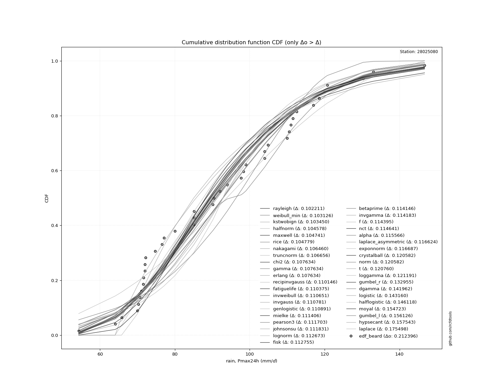</img>

</div>


**4.3. Best fit**

|   id |   station | empirical_dist   | p_dist   |    delta |   deltao | eval   |   fit |   n |     loc |   scale | shape   | shape1   | shape2   | shape3   |   best_fit |   best_fit_sort |
|-----:|----------:|:-----------------|:---------|---------:|---------:|:-------|------:|----:|--------:|--------:|:--------|:---------|:---------|:---------|-----------:|----------------:|
|    0 |  28025080 | edf_beard        | rayleigh | 0.102211 | 0.212396 | Δo > Δ |     1 |  41 | 51.3316 | 33.0947 |         |          |          |          |          1 |               1 |

<div align="center">

</img>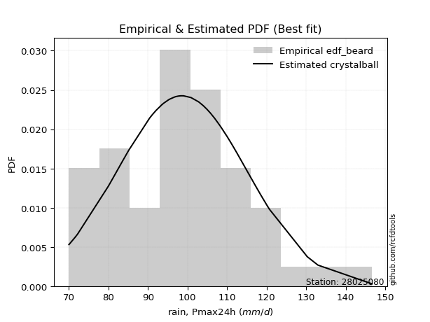</img>

</div>


### 5. Empirical - EDF Chegodayev (1955)

The Chegodayev formula is an empirical plotting position formula used in hydrological frequency analysis to estimate the exceedance probability or return period of a specific event from a set of observed data. It is primarily used for plotting observed data points on probability paper to fit a theoretical distribution, particularly for analyzing extreme events like maximum flood flows or rainfall intensities. The constant _b_ value in the generalized plotting position formula is 0.3.

<div align="center">


$P=(m-b)/(n+1-2b)$


</div>


**5.1. Empirical values**

<div align="center">

|                | 0                    | 1                   | 2                   | 3                   | 4                   | 5                   | 6                   | 7                   | 8                   | 9                   | 10                 | 11                 | 12                  | 13                  | 14                  | 15                  | 16                 | 17                 | 18                  | 19                 | 20             | 21                 | 22                 | 23                 | 24                 | 25                 | 26                | 27                 | 28                 | 29                | 30                 | 31                 | 32                 | 33                 | 34                 | 35                 | 36                 | 37                 | 38                 | 39                | 40                 |
|:---------------|:---------------------|:--------------------|:--------------------|:--------------------|:--------------------|:--------------------|:--------------------|:--------------------|:--------------------|:--------------------|:-------------------|:-------------------|:--------------------|:--------------------|:--------------------|:--------------------|:-------------------|:-------------------|:--------------------|:-------------------|:---------------|:-------------------|:-------------------|:-------------------|:-------------------|:-------------------|:------------------|:-------------------|:-------------------|:------------------|:-------------------|:-------------------|:-------------------|:-------------------|:-------------------|:-------------------|:-------------------|:-------------------|:-------------------|:------------------|:-------------------|
| date           | 2015                 | 1972                | 2012                | 1993                | 1989                | 2003                | 1986                | 1978                | 1991                | 1975                | 2006               | 1990               | 2014                | 2002                | 2013                | 2008                | 2004               | 1998               | 2009                | 1987               | 1983           | 2010               | 2011               | 1977               | 1997               | 2000               | 1995              | 2005               | 1982               | 2007              | 1979               | 1996               | 1981               | 1994               | 1992               | 1984               | 1999               | 1980               | 1985               | 2001              | 1988               |
| x              | 54.3053914059459     | 64.0372627544925    | 65.761435086823     | 70.0                | 70.3                | 70.6734304811073    | 71.1                | 71.5                | 71.6                | 72.0                | 72.0               | 72.2               | 74.7740840725297    | 76.5387530073253    | 77.1042389790807    | 80.0                | 85.0               | 85.1               | 85.1                | 90.1               | 90.4           | 92.0               | 94.0               | 97.7               | 98.3               | 99.0               | 104.0             | 104.0              | 104.9              | 110.0             | 110.5              | 111.0              | 111.5              | 112.5              | 117.0              | 118.5              | 120.0              | 120.7              | 130.3              | 133.0             | 146.7              |
| m              | 1                    | 2                   | 3                   | 4                   | 5                   | 6                   | 7                   | 8                   | 9                   | 10                  | 11                 | 12                 | 13                  | 14                  | 15                  | 16                  | 17                 | 18                 | 19                  | 20                 | 21             | 22                 | 23                 | 24                 | 25                 | 26                 | 27                | 28                 | 29                 | 30                | 31                 | 32                 | 33                 | 34                 | 35                 | 36                 | 37                 | 38                 | 39                 | 40                | 41                 |
| empirical_dist | edf_chegodayev       | edf_chegodayev      | edf_chegodayev      | edf_chegodayev      | edf_chegodayev      | edf_chegodayev      | edf_chegodayev      | edf_chegodayev      | edf_chegodayev      | edf_chegodayev      | edf_chegodayev     | edf_chegodayev     | edf_chegodayev      | edf_chegodayev      | edf_chegodayev      | edf_chegodayev      | edf_chegodayev     | edf_chegodayev     | edf_chegodayev      | edf_chegodayev     | edf_chegodayev | edf_chegodayev     | edf_chegodayev     | edf_chegodayev     | edf_chegodayev     | edf_chegodayev     | edf_chegodayev    | edf_chegodayev     | edf_chegodayev     | edf_chegodayev    | edf_chegodayev     | edf_chegodayev     | edf_chegodayev     | edf_chegodayev     | edf_chegodayev     | edf_chegodayev     | edf_chegodayev     | edf_chegodayev     | edf_chegodayev     | edf_chegodayev    | edf_chegodayev     |
| empirical      | 0.016908212560386472 | 0.04106280193236715 | 0.06521739130434784 | 0.08937198067632851 | 0.11352657004830918 | 0.13768115942028986 | 0.16183574879227053 | 0.18599033816425123 | 0.21014492753623187 | 0.23429951690821255 | 0.2584541062801932 | 0.2826086956521739 | 0.30676328502415456 | 0.33091787439613524 | 0.35507246376811596 | 0.37922705314009664 | 0.4033816425120773 | 0.427536231884058  | 0.45169082125603865 | 0.4758454106280193 | 0.5            | 0.5241545893719807 | 0.5483091787439613 | 0.572463768115942  | 0.5966183574879227 | 0.6207729468599034 | 0.644927536231884 | 0.6690821256038647 | 0.6932367149758454 | 0.717391304347826 | 0.7415458937198067 | 0.7657004830917874 | 0.7898550724637682 | 0.8140096618357489 | 0.8381642512077295 | 0.8623188405797102 | 0.8864734299516909 | 0.9106280193236715 | 0.9347826086956523 | 0.958937198067633 | 0.9830917874396137 |
| empirical_tr   | 1.017199017199017    | 1.0428211586901763  | 1.0697674418604652  | 1.0981432360742704  | 1.1280653950953679  | 1.1596638655462184  | 1.1930835734870318  | 1.228486646884273   | 1.2660550458715598  | 1.305993690851735   | 1.3485342019543975 | 1.3939393939393938 | 1.4425087108013939  | 1.494584837545126   | 1.550561797752809   | 1.6108949416342413  | 1.6761133603238867 | 1.7468354430379747 | 1.8237885462555066  | 1.9078341013824884 | 2.0            | 2.1015228426395938 | 2.213903743315508  | 2.3389830508474576 | 2.4790419161676644 | 2.6369426751592355 | 2.816326530612245 | 3.0218978102189777 | 3.259842519685039  | 3.538461538461538 | 3.869158878504672  | 4.268041237113401  | 4.7586206896551735 | 5.376623376623378  | 6.179104477611943  | 7.263157894736845  | 8.808510638297877  | 11.189189189189195 | 15.33333333333337  | 24.35294117647068 | 59.14285714285766  |

</div>


**5.2. Parameters & Kolmogorov-Smirnov fit test (sorted by Δ)**

|   id | empirical_dist   | p_dist             |    delta |   deltao | eval    |   fit |   n |             loc |          scale | shape                 | shape1              | shape2             | shape3   |   best_fit |   best_fit_sort |
|-----:|:-----------------|:-------------------|---------:|---------:|:--------|------:|----:|----------------:|---------------:|:----------------------|:--------------------|:-------------------|:---------|-----------:|----------------:|
|    0 | edf_chegodayev   | rayleigh           | 0.102316 | 0.212396 | Δo > Δ  |     1 |  41 |    51.3316      |   33.0947      |                       |                     |                    |          |          1 |               1 |
|    1 | edf_chegodayev   | weibull_min        | 0.103231 | 0.212396 | Δo > Δ  |     1 |  41 |    50.8426      |   47.3969      | 2.033534143641118     |                     |                    |          |          0 |               2 |
|    2 | edf_chegodayev   | kstwobign          | 0.103555 | 0.212396 | Δo > Δ  |     1 |  41 |    18.3574      |   85.3447      |                       |                     |                    |          |          0 |               3 |
|    3 | edf_chegodayev   | halfnorm           | 0.104683 | 0.212396 | Δo > Δ  |     1 |  41 |    64.1117      |   35.9675      |                       |                     |                    |          |          0 |               4 |
|    4 | edf_chegodayev   | maxwell            | 0.104846 | 0.212396 | Δo > Δ  |     1 |  41 |    41.4335      |   32.1952      |                       |                     |                    |          |          0 |               5 |
|    5 | edf_chegodayev   | rice               | 0.104884 | 0.212396 | Δo > Δ  |     1 |  41 |    50.8548      |   28.7203      | 0.8389678126883386    |                     |                    |          |          0 |               6 |
|    6 | edf_chegodayev   | truncnorm          | 0.106457 | 0.212396 | Δo > Δ  |     1 |  41 |    95.0772      |   28.4475      | -1243.6895676394577   | 1.814671293759121   |                    |          |          0 |               7 |
|    7 | edf_chegodayev   | nakagami           | 0.106531 | 0.212396 | Δo > Δ  |     1 |  41 |    64.0373      |   35.3214      | 0.4115299577326458    |                     |                    |          |          0 |               8 |
|    8 | edf_chegodayev   | chi2               | 0.107739 | 0.212396 | Δo > Δ  |     1 |  41 |    43.0626      |    5.03675     | 9.876803712593091     |                     |                    |          |          0 |               9 |
|    9 | edf_chegodayev   | gamma              | 0.107739 | 0.212396 | Δo > Δ  |     1 |  41 |    43.0626      |   10.0735      | 4.938420323915814     |                     |                    |          |          0 |              10 |
|   10 | edf_chegodayev   | erlang             | 0.107739 | 0.212396 | Δo > Δ  |     1 |  41 |    43.0625      |   10.0734      | 4.938436195795459     |                     |                    |          |          0 |              11 |
|   11 | edf_chegodayev   | recipinvgauss      | 0.110251 | 0.212396 | Δo > Δ  |     1 |  41 |    24.0281      |    6.69795     | 0.10788608125682134   |                     |                    |          |          0 |              12 |
|   12 | edf_chegodayev   | fatiguelife        | 0.11048  | 0.212396 | Δo > Δ  |     1 |  41 |    22.7206      |   66.7271      | 0.31737542001836927   |                     |                    |          |          0 |              13 |
|   13 | edf_chegodayev   | invweibull         | 0.110756 | 0.212396 | Δo > Δ  |     1 |  41 |    -8.97425e+08 |    8.97425e+08 | 49542329.20739781     |                     |                    |          |          0 |              14 |
|   14 | edf_chegodayev   | invgauss           | 0.110886 | 0.212396 | Δo > Δ  |     1 |  41 |    21.1058      |  731.571       | 0.09801052421316643   |                     |                    |          |          0 |              15 |
|   15 | edf_chegodayev   | genlogistic        | 0.110996 | 0.212396 | Δo > Δ  |     1 |  41 |   -25.9585      |   18.1125      | 398.747501290429      |                     |                    |          |          0 |              16 |
|   16 | edf_chegodayev   | mielke             | 0.111511 | 0.212396 | Δo > Δ  |     1 |  41 |    -0.276427    |   69.9063      | 16.638525016287083    | 5.624006127126446   |                    |          |          0 |              17 |
|   17 | edf_chegodayev   | pearson3           | 0.111808 | 0.212396 | Δo > Δ  |     1 |  41 |    92.8096      |   21.6816      | 0.4170719051692846    |                     |                    |          |          0 |              18 |
|   18 | edf_chegodayev   | johnsonsu          | 0.111936 | 0.212396 | Δo > Δ  |     1 |  41 |    20.9847      |    7.41493     | -9.6009748402718      | 3.2876572128804944  |                    |          |          0 |              19 |
|   19 | edf_chegodayev   | lognorm            | 0.112778 | 0.212396 | Δo > Δ  |     1 |  41 |    19.821       |   69.8056      | 0.30079481944578906   |                     |                    |          |          0 |              20 |
|   20 | edf_chegodayev   | fisk               | 0.11286  | 0.212396 | Δo > Δ  |     1 |  41 |    -0.167391    |   90.3714      | 7.14495643897858      |                     |                    |          |          0 |              21 |
|   21 | edf_chegodayev   | betaprime          | 0.114251 | 0.212396 | Δo > Δ  |     1 |  41 |    -0.678539    |   22.3309      | 95.22523801090057     | 23.742643240532814  |                    |          |          0 |              22 |
|   22 | edf_chegodayev   | invgamma           | 0.114288 | 0.212396 | Δo > Δ  |     1 |  41 |    -8.58668     | 2181.37        | 22.503174952551618    |                     |                    |          |          0 |              23 |
|   23 | edf_chegodayev   | f                  | 0.1145   | 0.212396 | Δo > Δ  |     1 |  41 |    -0.630147    |   89.7538      | 154.292828236314      | 50.23578069229985   |                    |          |          0 |              24 |
|   24 | edf_chegodayev   | nct                | 0.114746 | 0.212396 | Δo > Δ  |     1 |  41 |    -0.136499    |    9.69329     | 12.772217445810396    | 9.022020618429718   |                    |          |          0 |              25 |
|   25 | edf_chegodayev   | alpha              | 0.115671 | 0.212396 | Δo > Δ  |     1 |  41 |   -74.2724      | 1300.21        | 7.910501337385717     |                     |                    |          |          0 |              26 |
|   26 | edf_chegodayev   | laplace_asymmetric | 0.116659 | 0.212396 | Δo > Δ  |     1 |  41 |    71.1         |   11.4546      | 0.43004861220629687   |                     |                    |          |          0 |              27 |
|   27 | edf_chegodayev   | exponnorm          | 0.116757 | 0.212396 | Δo > Δ  |     1 |  41 |    78.2603      |   16.6778      | 0.872376933838804     |                     |                    |          |          0 |              28 |
|   28 | edf_chegodayev   | crystalball        | 0.120652 | 0.212396 | Δo > Δ  |     1 |  41 |    92.8096      |   21.6816      | 7797.312554904493     | 1297.0685011479204  |                    |          |          0 |              29 |
|   29 | edf_chegodayev   | norm               | 0.120652 | 0.212396 | Δo > Δ  |     1 |  41 |    92.8096      |   21.6815      |                       |                     |                    |          |          0 |              30 |
|   30 | edf_chegodayev   | t                  | 0.12083  | 0.212396 | Δo > Δ  |     1 |  41 |    92.8234      |   21.6831      | 146537.65006382146    |                     |                    |          |          0 |              31 |
|   31 | edf_chegodayev   | loggamma           | 0.121261 | 0.212396 | Δo > Δ  |     1 |  41 | -5932.16        |  827.853       | 1448.4272314307375    |                     |                    |          |          0 |              32 |
|   32 | edf_chegodayev   | gumbel_r           | 0.13306  | 0.212396 | Δo > Δ  |     1 |  41 |    83.0518      |   16.905       |                       |                     |                    |          |          0 |              33 |
|   33 | edf_chegodayev   | dgamma             | 0.142032 | 0.212396 | Δo > Δ  |     1 |  41 |    95.3247      |    8.86077     | 2.121247318447837     |                     |                    |          |          0 |              34 |
|   34 | edf_chegodayev   | logistic           | 0.14323  | 0.212396 | Δo > Δ  |     1 |  41 |    92.8096      |   11.9537      |                       |                     |                    |          |          0 |              35 |
|   35 | edf_chegodayev   | halflogistic       | 0.146223 | 0.212396 | Δo > Δ  |     1 |  41 |    67.1119      |   18.537       |                       |                     |                    |          |          0 |              36 |
|   36 | edf_chegodayev   | moyal              | 0.154829 | 0.212396 | Δo > Δ  |     1 |  41 |    80.4107      |    9.76013     |                       |                     |                    |          |          0 |              37 |
|   37 | edf_chegodayev   | gumbel_l           | 0.156196 | 0.212396 | Δo > Δ  |     1 |  41 |   102.567       |   16.905       |                       |                     |                    |          |          0 |              38 |
|   38 | edf_chegodayev   | hypsecant          | 0.157613 | 0.212396 | Δo > Δ  |     1 |  41 |    92.8096      |   13.8029      |                       |                     |                    |          |          0 |              39 |
|   39 | edf_chegodayev   | laplace            | 0.175568 | 0.212396 | Δo > Δ  |     1 |  41 |    92.8096      |   15.3312      |                       |                     |                    |          |          0 |              40 |
|   40 | edf_chegodayev   | genexpon           | 0.238956 | 0.212396 | Δo <= Δ |     0 |  41 |    53.5691      |    1.80935     | 4.581735737394762e-11 | 0.04769179520246915 | 1.3583524985563262 |          |          0 |              41 |
|   41 | edf_chegodayev   | expon              | 0.245388 | 0.212396 | Δo <= Δ |     0 |  41 |    54.3054      |   38.5042      |                       |                     |                    |          |          0 |              42 |
|   42 | edf_chegodayev   | pareto             | 0.245388 | 0.212396 | Δo <= Δ |     0 |  41 |    -2.14748e+09 |    2.14748e+09 | 55772664.66562522     |                     |                    |          |          0 |              43 |
|   43 | edf_chegodayev   | zzgumbel           | 0.272882 | 0.212396 | Δo <= Δ |     0 |  41 |    92.7778      |   17.115       | 0.5441978529407195    | 1.1435823657845239  |                    |          |          0 |              44 |
|   44 | edf_chegodayev   | wald               | 0.28259  | 0.212396 | Δo <= Δ |     0 |  41 |    71.128       |   21.6816      |                       |                     |                    |          |          0 |              45 |
|   45 | edf_chegodayev   | gibrat             | 0.348618 | 0.212396 | Δo <= Δ |     0 |  41 |    76.2694      |   10.0322      |                       |                     |                    |          |          0 |              46 |
|   46 | edf_chegodayev   | gompertz           | 0.362343 | 0.212396 | Δo <= Δ |     0 |  41 |  -323.548       |   11.5888      | 4.719325060208775e-17 |                     |                    |          |          0 |              47 |
|   47 | edf_chegodayev   | ncf                | 0.5397   | 0.212396 | Δo <= Δ |     0 |  41 |    -0.082077    |    1.06134e-05 | 5.041499418439944e-07 | 14.643978562930169  | 3.2782378530006118 |          |          0 |              48 |

<div align="center">

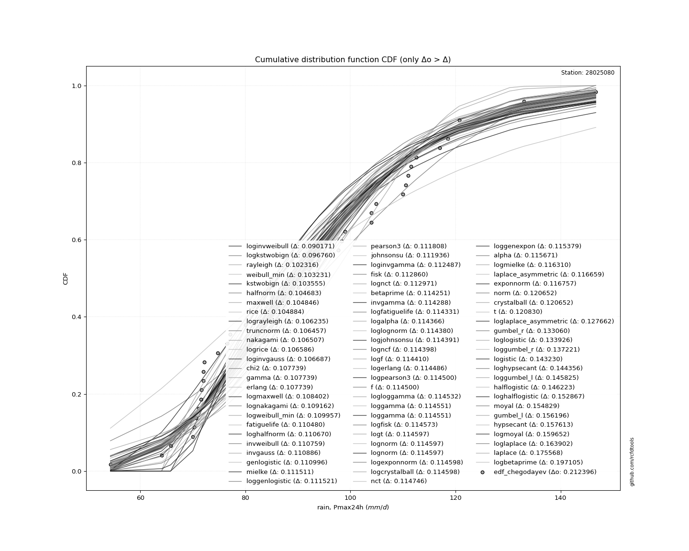</img>

</div>


**5.3. Best fit**

|   id |   station | empirical_dist   | p_dist   |    delta |   deltao | eval   |   fit |   n |     loc |   scale | shape   | shape1   | shape2   | shape3   |   best_fit |   best_fit_sort |
|-----:|----------:|:-----------------|:---------|---------:|---------:|:-------|------:|----:|--------:|--------:|:--------|:---------|:---------|:---------|-----------:|----------------:|
|    0 |  28025080 | edf_chegodayev   | rayleigh | 0.102316 | 0.212396 | Δo > Δ |     1 |  41 | 51.3316 | 33.0947 |         |          |          |          |          1 |               1 |

<div align="center">

</img></img>

</div>


### 6. Empirical - EDF Blom (1958)

The Blom formula is a specific "plotting position" formula used in hydrology and statistical analysis to estimate the empirical cumulative probability (or non-exceedance probability) of a data series. It is particularly recommended for data that are approximately normally distributed. The constant _a_ is set to 0.375 (or 3/8).

<div align="center">


$P=(m-a)/(n+1-2a)$


</div>


**6.1. Empirical values**

<div align="center">

|                | 0                    | 1                   | 2                   | 3                   | 4                   | 5                   | 6                  | 7                   | 8                   | 9                   | 10                  | 11                 | 12                  | 13                 | 14                  | 15                 | 16                 | 17                  | 18                  | 19                  | 20       | 21                 | 22                 | 23                 | 24                 | 25                 | 26                 | 27                 | 28                 | 29                 | 30                 | 31                 | 32                 | 33                 | 34                 | 35                 | 36                 | 37                 | 38                 | 39                 | 40                 |
|:---------------|:---------------------|:--------------------|:--------------------|:--------------------|:--------------------|:--------------------|:-------------------|:--------------------|:--------------------|:--------------------|:--------------------|:-------------------|:--------------------|:-------------------|:--------------------|:-------------------|:-------------------|:--------------------|:--------------------|:--------------------|:---------|:-------------------|:-------------------|:-------------------|:-------------------|:-------------------|:-------------------|:-------------------|:-------------------|:-------------------|:-------------------|:-------------------|:-------------------|:-------------------|:-------------------|:-------------------|:-------------------|:-------------------|:-------------------|:-------------------|:-------------------|
| date           | 2015                 | 1972                | 2012                | 1993                | 1989                | 2003                | 1986               | 1978                | 1991                | 1975                | 2006                | 1990               | 2014                | 2002               | 2013                | 2008               | 2004               | 1998                | 2009                | 1987                | 1983     | 2010               | 2011               | 1977               | 1997               | 2000               | 1995               | 2005               | 1982               | 2007               | 1979               | 1996               | 1981               | 1994               | 1992               | 1984               | 1999               | 1980               | 1985               | 2001               | 1988               |
| x              | 54.3053914059459     | 64.0372627544925    | 65.761435086823     | 70.0                | 70.3                | 70.6734304811073    | 71.1               | 71.5                | 71.6                | 72.0                | 72.0                | 72.2               | 74.7740840725297    | 76.5387530073253   | 77.1042389790807    | 80.0               | 85.0               | 85.1                | 85.1                | 90.1                | 90.4     | 92.0               | 94.0               | 97.7               | 98.3               | 99.0               | 104.0              | 104.0              | 104.9              | 110.0              | 110.5              | 111.0              | 111.5              | 112.5              | 117.0              | 118.5              | 120.0              | 120.7              | 130.3              | 133.0              | 146.7              |
| m              | 1                    | 2                   | 3                   | 4                   | 5                   | 6                   | 7                  | 8                   | 9                   | 10                  | 11                  | 12                 | 13                  | 14                 | 15                  | 16                 | 17                 | 18                  | 19                  | 20                  | 21       | 22                 | 23                 | 24                 | 25                 | 26                 | 27                 | 28                 | 29                 | 30                 | 31                 | 32                 | 33                 | 34                 | 35                 | 36                 | 37                 | 38                 | 39                 | 40                 | 41                 |
| empirical_dist | edf_blom             | edf_blom            | edf_blom            | edf_blom            | edf_blom            | edf_blom            | edf_blom           | edf_blom            | edf_blom            | edf_blom            | edf_blom            | edf_blom           | edf_blom            | edf_blom           | edf_blom            | edf_blom           | edf_blom           | edf_blom            | edf_blom            | edf_blom            | edf_blom | edf_blom           | edf_blom           | edf_blom           | edf_blom           | edf_blom           | edf_blom           | edf_blom           | edf_blom           | edf_blom           | edf_blom           | edf_blom           | edf_blom           | edf_blom           | edf_blom           | edf_blom           | edf_blom           | edf_blom           | edf_blom           | edf_blom           | edf_blom           |
| empirical      | 0.015151515151515152 | 0.03939393939393939 | 0.06363636363636363 | 0.08787878787878788 | 0.11212121212121212 | 0.13636363636363635 | 0.1606060606060606 | 0.18484848484848485 | 0.20909090909090908 | 0.23333333333333334 | 0.25757575757575757 | 0.2818181818181818 | 0.30606060606060603 | 0.3303030303030303 | 0.35454545454545455 | 0.3787878787878788 | 0.403030303030303  | 0.42727272727272725 | 0.45151515151515154 | 0.47575757575757577 | 0.5      | 0.5242424242424243 | 0.5484848484848485 | 0.5727272727272728 | 0.5969696969696969 | 0.6212121212121212 | 0.6454545454545455 | 0.6696969696969697 | 0.693939393939394  | 0.7181818181818181 | 0.7424242424242424 | 0.7666666666666667 | 0.7909090909090909 | 0.8151515151515152 | 0.8393939393939394 | 0.8636363636363636 | 0.8878787878787879 | 0.9121212121212121 | 0.9363636363636364 | 0.9606060606060606 | 0.9848484848484849 |
| empirical_tr   | 1.0153846153846153   | 1.0410094637223974  | 1.0679611650485437  | 1.0963455149501662  | 1.1262798634812285  | 1.1578947368421053  | 1.1913357400722022 | 1.2267657992565055  | 1.264367816091954   | 1.3043478260869565  | 1.346938775510204   | 1.3924050632911391 | 1.4410480349344978  | 1.493212669683258  | 1.5492957746478873  | 1.6097560975609757 | 1.6751269035532996 | 1.746031746031746   | 1.8232044198895028  | 1.9075144508670523  | 2.0      | 2.1019108280254777 | 2.2147651006711406 | 2.3404255319148937 | 2.4812030075187965 | 2.64               | 2.8205128205128207 | 3.0275229357798166 | 3.2673267326732676 | 3.548387096774193  | 3.8823529411764706 | 4.2857142857142865 | 4.782608695652174  | 5.409836065573772  | 6.226415094339622  | 7.333333333333334  | 8.918918918918923  | 11.379310344827585 | 15.714285714285722 | 25.384615384615365 | 66.00000000000006  |

</div>


**6.2. Parameters & Kolmogorov-Smirnov fit test (sorted by Δ)**

|   id | empirical_dist   | p_dist             |    delta |   deltao | eval    |   fit |   n |             loc |          scale | shape                 | shape1              | shape2             | shape3   |   best_fit |   best_fit_sort |
|-----:|:-----------------|:-------------------|---------:|---------:|:--------|------:|----:|----------------:|---------------:|:----------------------|:--------------------|:-------------------|:---------|-----------:|----------------:|
|    0 | edf_blom         | rayleigh           | 0.101526 | 0.212396 | Δo > Δ  |     1 |  41 |    51.3316      |   33.0947      |                       |                     |                    |          |          1 |               1 |
|    1 | edf_blom         | weibull_min        | 0.102441 | 0.212396 | Δo > Δ  |     1 |  41 |    50.8426      |   47.3969      | 2.033534143641118     |                     |                    |          |          0 |               2 |
|    2 | edf_blom         | kstwobign          | 0.102764 | 0.212396 | Δo > Δ  |     1 |  41 |    18.3574      |   85.3447      |                       |                     |                    |          |          0 |               3 |
|    3 | edf_blom         | halfnorm           | 0.103893 | 0.212396 | Δo > Δ  |     1 |  41 |    64.1117      |   35.9675      |                       |                     |                    |          |          0 |               4 |
|    4 | edf_blom         | maxwell            | 0.104055 | 0.212396 | Δo > Δ  |     1 |  41 |    41.4335      |   32.1952      |                       |                     |                    |          |          0 |               5 |
|    5 | edf_blom         | rice               | 0.104094 | 0.212396 | Δo > Δ  |     1 |  41 |    50.8548      |   28.7203      | 0.8389678126883386    |                     |                    |          |          0 |               6 |
|    6 | edf_blom         | nakagami           | 0.106003 | 0.212396 | Δo > Δ  |     1 |  41 |    64.0373      |   35.3214      | 0.4115299577326458    |                     |                    |          |          0 |               7 |
|    7 | edf_blom         | chi2               | 0.106948 | 0.212396 | Δo > Δ  |     1 |  41 |    43.0626      |    5.03675     | 9.876803712593091     |                     |                    |          |          0 |               8 |
|    8 | edf_blom         | gamma              | 0.106948 | 0.212396 | Δo > Δ  |     1 |  41 |    43.0626      |   10.0735      | 4.938420323915814     |                     |                    |          |          0 |               9 |
|    9 | edf_blom         | erlang             | 0.106949 | 0.212396 | Δo > Δ  |     1 |  41 |    43.0625      |   10.0734      | 4.938436195795459     |                     |                    |          |          0 |              10 |
|   10 | edf_blom         | truncnorm          | 0.10795  | 0.212396 | Δo > Δ  |     1 |  41 |    95.0772      |   28.4475      | -1243.6895676394577   | 1.814671293759121   |                    |          |          0 |              11 |
|   11 | edf_blom         | recipinvgauss      | 0.109461 | 0.212396 | Δo > Δ  |     1 |  41 |    24.0281      |    6.69795     | 0.10788608125682134   |                     |                    |          |          0 |              12 |
|   12 | edf_blom         | fatiguelife        | 0.10969  | 0.212396 | Δo > Δ  |     1 |  41 |    22.7206      |   66.7271      | 0.31737542001836927   |                     |                    |          |          0 |              13 |
|   13 | edf_blom         | invweibull         | 0.109966 | 0.212396 | Δo > Δ  |     1 |  41 |    -8.97425e+08 |    8.97425e+08 | 49542329.20739781     |                     |                    |          |          0 |              14 |
|   14 | edf_blom         | invgauss           | 0.110095 | 0.212396 | Δo > Δ  |     1 |  41 |    21.1058      |  731.571       | 0.09801052421316643   |                     |                    |          |          0 |              15 |
|   15 | edf_blom         | genlogistic        | 0.110206 | 0.212396 | Δo > Δ  |     1 |  41 |   -25.9585      |   18.1125      | 398.747501290429      |                     |                    |          |          0 |              16 |
|   16 | edf_blom         | mielke             | 0.11072  | 0.212396 | Δo > Δ  |     1 |  41 |    -0.276427    |   69.9063      | 16.638525016287083    | 5.624006127126446   |                    |          |          0 |              17 |
|   17 | edf_blom         | pearson3           | 0.111017 | 0.212396 | Δo > Δ  |     1 |  41 |    92.8096      |   21.6816      | 0.4170719051692846    |                     |                    |          |          0 |              18 |
|   18 | edf_blom         | johnsonsu          | 0.111145 | 0.212396 | Δo > Δ  |     1 |  41 |    20.9847      |    7.41493     | -9.6009748402718      | 3.2876572128804944  |                    |          |          0 |              19 |
|   19 | edf_blom         | lognorm            | 0.111988 | 0.212396 | Δo > Δ  |     1 |  41 |    19.821       |   69.8056      | 0.30079481944578906   |                     |                    |          |          0 |              20 |
|   20 | edf_blom         | fisk               | 0.11207  | 0.212396 | Δo > Δ  |     1 |  41 |    -0.167391    |   90.3714      | 7.14495643897858      |                     |                    |          |          0 |              21 |
|   21 | edf_blom         | betaprime          | 0.113461 | 0.212396 | Δo > Δ  |     1 |  41 |    -0.678539    |   22.3309      | 95.22523801090057     | 23.742643240532814  |                    |          |          0 |              22 |
|   22 | edf_blom         | invgamma           | 0.113498 | 0.212396 | Δo > Δ  |     1 |  41 |    -8.58668     | 2181.37        | 22.503174952551618    |                     |                    |          |          0 |              23 |
|   23 | edf_blom         | f                  | 0.11371  | 0.212396 | Δo > Δ  |     1 |  41 |    -0.630147    |   89.7538      | 154.292828236314      | 50.23578069229985   |                    |          |          0 |              24 |
|   24 | edf_blom         | nct                | 0.113956 | 0.212396 | Δo > Δ  |     1 |  41 |    -0.136499    |    9.69329     | 12.772217445810396    | 9.022020618429718   |                    |          |          0 |              25 |
|   25 | edf_blom         | alpha              | 0.114881 | 0.212396 | Δo > Δ  |     1 |  41 |   -74.2724      | 1300.21        | 7.910501337385717     |                     |                    |          |          0 |              26 |
|   26 | edf_blom         | exponnorm          | 0.11623  | 0.212396 | Δo > Δ  |     1 |  41 |    78.2603      |   16.6778      | 0.872376933838804     |                     |                    |          |          0 |              27 |
|   27 | edf_blom         | laplace_asymmetric | 0.116396 | 0.212396 | Δo > Δ  |     1 |  41 |    71.1         |   11.4546      | 0.43004861220629687   |                     |                    |          |          0 |              28 |
|   28 | edf_blom         | crystalball        | 0.120125 | 0.212396 | Δo > Δ  |     1 |  41 |    92.8096      |   21.6816      | 7797.312554904493     | 1297.0685011479204  |                    |          |          0 |              29 |
|   29 | edf_blom         | norm               | 0.120125 | 0.212396 | Δo > Δ  |     1 |  41 |    92.8096      |   21.6815      |                       |                     |                    |          |          0 |              30 |
|   30 | edf_blom         | t                  | 0.120303 | 0.212396 | Δo > Δ  |     1 |  41 |    92.8234      |   21.6831      | 146537.65006382146    |                     |                    |          |          0 |              31 |
|   31 | edf_blom         | loggamma           | 0.120734 | 0.212396 | Δo > Δ  |     1 |  41 | -5932.16        |  827.853       | 1448.4272314307375    |                     |                    |          |          0 |              32 |
|   32 | edf_blom         | gumbel_r           | 0.13227  | 0.212396 | Δo > Δ  |     1 |  41 |    83.0518      |   16.905       |                       |                     |                    |          |          0 |              33 |
|   33 | edf_blom         | dgamma             | 0.141505 | 0.212396 | Δo > Δ  |     1 |  41 |    95.3247      |    8.86077     | 2.121247318447837     |                     |                    |          |          0 |              34 |
|   34 | edf_blom         | logistic           | 0.142703 | 0.212396 | Δo > Δ  |     1 |  41 |    92.8096      |   11.9537      |                       |                     |                    |          |          0 |              35 |
|   35 | edf_blom         | halflogistic       | 0.145433 | 0.212396 | Δo > Δ  |     1 |  41 |    67.1119      |   18.537       |                       |                     |                    |          |          0 |              36 |
|   36 | edf_blom         | moyal              | 0.154038 | 0.212396 | Δo > Δ  |     1 |  41 |    80.4107      |    9.76013     |                       |                     |                    |          |          0 |              37 |
|   37 | edf_blom         | gumbel_l           | 0.155669 | 0.212396 | Δo > Δ  |     1 |  41 |   102.567       |   16.905       |                       |                     |                    |          |          0 |              38 |
|   38 | edf_blom         | hypsecant          | 0.157086 | 0.212396 | Δo > Δ  |     1 |  41 |    92.8096      |   13.8029      |                       |                     |                    |          |          0 |              39 |
|   39 | edf_blom         | laplace            | 0.175041 | 0.212396 | Δo > Δ  |     1 |  41 |    92.8096      |   15.3312      |                       |                     |                    |          |          0 |              40 |
|   40 | edf_blom         | genexpon           | 0.240449 | 0.212396 | Δo <= Δ |     0 |  41 |    53.5691      |    1.80935     | 4.581735737394762e-11 | 0.04769179520246915 | 1.3583524985563262 |          |          0 |              41 |
|   41 | edf_blom         | expon              | 0.246881 | 0.212396 | Δo <= Δ |     0 |  41 |    54.3054      |   38.5042      |                       |                     |                    |          |          0 |              42 |
|   42 | edf_blom         | pareto             | 0.246881 | 0.212396 | Δo <= Δ |     0 |  41 |    -2.14748e+09 |    2.14748e+09 | 55772664.66562522     |                     |                    |          |          0 |              43 |
|   43 | edf_blom         | zzgumbel           | 0.272355 | 0.212396 | Δo <= Δ |     0 |  41 |    92.7778      |   17.115       | 0.5441978529407195    | 1.1435823657845239  |                    |          |          0 |              44 |
|   44 | edf_blom         | wald               | 0.2818   | 0.212396 | Δo <= Δ |     0 |  41 |    71.128       |   21.6816      |                       |                     |                    |          |          0 |              45 |
|   45 | edf_blom         | gibrat             | 0.348091 | 0.212396 | Δo <= Δ |     0 |  41 |    76.2694      |   10.0322      |                       |                     |                    |          |          0 |              46 |
|   46 | edf_blom         | gompertz           | 0.362431 | 0.212396 | Δo <= Δ |     0 |  41 |  -323.548       |   11.5888      | 4.719325060208775e-17 |                     |                    |          |          0 |              47 |
|   47 | edf_blom         | ncf                | 0.541369 | 0.212396 | Δo <= Δ |     0 |  41 |    -0.082077    |    1.06134e-05 | 5.041499418439944e-07 | 14.643978562930169  | 3.2782378530006118 |          |          0 |              48 |

<div align="center">

</img>

</div>


**6.3. Best fit**

|   id |   station | empirical_dist   | p_dist   |    delta |   deltao | eval   |   fit |   n |     loc |   scale | shape   | shape1   | shape2   | shape3   |   best_fit |   best_fit_sort |
|-----:|----------:|:-----------------|:---------|---------:|---------:|:-------|------:|----:|--------:|--------:|:--------|:---------|:---------|:---------|-----------:|----------------:|
|    0 |  28025080 | edf_blom         | rayleigh | 0.101526 | 0.212396 | Δo > Δ |     1 |  41 | 51.3316 | 33.0947 |         |          |          |          |          1 |               1 |

<div align="center">

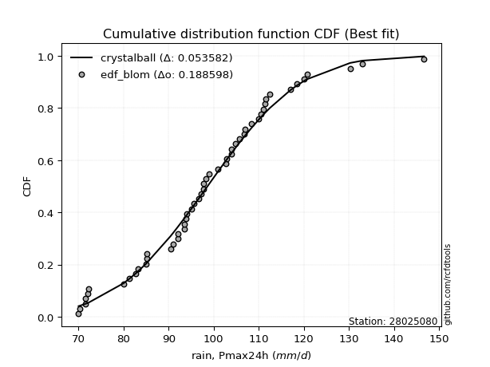</img></img>

</div>


### 7. Empirical - EDF Tukey (1962)

In hydrology, the Tukey formula is used as a plotting position formula to estimate the empirical probability or frequency of a flood event (or other hydrological data). The formula parameter is given as _c=0.333_ (or 1/3).

<div align="center">


$P=(m-c)/(n+1-2c)$


</div>


**7.1. Empirical values**

<div align="center">

|                | 0                    | 1                   | 2                   | 3                   | 4                   | 5                   | 6                   | 7                   | 8                   | 9                   | 10                  | 11                  | 12                 | 13                  | 14                 | 15                 | 16                 | 17                 | 18                  | 19                  | 20        | 21                 | 22                 | 23                 | 24                 | 25                 | 26                 | 27                 | 28                 | 29                | 30                 | 31                 | 32                 | 33                 | 34                 | 35                 | 36                 | 37                 | 38                 | 39                 | 40                 |
|:---------------|:---------------------|:--------------------|:--------------------|:--------------------|:--------------------|:--------------------|:--------------------|:--------------------|:--------------------|:--------------------|:--------------------|:--------------------|:-------------------|:--------------------|:-------------------|:-------------------|:-------------------|:-------------------|:--------------------|:--------------------|:----------|:-------------------|:-------------------|:-------------------|:-------------------|:-------------------|:-------------------|:-------------------|:-------------------|:------------------|:-------------------|:-------------------|:-------------------|:-------------------|:-------------------|:-------------------|:-------------------|:-------------------|:-------------------|:-------------------|:-------------------|
| date           | 2015                 | 1972                | 2012                | 1993                | 1989                | 2003                | 1986                | 1978                | 1991                | 1975                | 2006                | 1990                | 2014               | 2002                | 2013               | 2008               | 2004               | 1998               | 2009                | 1987                | 1983      | 2010               | 2011               | 1977               | 1997               | 2000               | 1995               | 2005               | 1982               | 2007              | 1979               | 1996               | 1981               | 1994               | 1992               | 1984               | 1999               | 1980               | 1985               | 2001               | 1988               |
| x              | 54.3053914059459     | 64.0372627544925    | 65.761435086823     | 70.0                | 70.3                | 70.6734304811073    | 71.1                | 71.5                | 71.6                | 72.0                | 72.0                | 72.2                | 74.7740840725297   | 76.5387530073253    | 77.1042389790807   | 80.0               | 85.0               | 85.1               | 85.1                | 90.1                | 90.4      | 92.0               | 94.0               | 97.7               | 98.3               | 99.0               | 104.0              | 104.0              | 104.9              | 110.0             | 110.5              | 111.0              | 111.5              | 112.5              | 117.0              | 118.5              | 120.0              | 120.7              | 130.3              | 133.0              | 146.7              |
| m              | 1                    | 2                   | 3                   | 4                   | 5                   | 6                   | 7                   | 8                   | 9                   | 10                  | 11                  | 12                  | 13                 | 14                  | 15                 | 16                 | 17                 | 18                 | 19                  | 20                  | 21        | 22                 | 23                 | 24                 | 25                 | 26                 | 27                 | 28                 | 29                 | 30                | 31                 | 32                 | 33                 | 34                 | 35                 | 36                 | 37                 | 38                 | 39                 | 40                 | 41                 |
| empirical_dist | edf_tukey            | edf_tukey           | edf_tukey           | edf_tukey           | edf_tukey           | edf_tukey           | edf_tukey           | edf_tukey           | edf_tukey           | edf_tukey           | edf_tukey           | edf_tukey           | edf_tukey          | edf_tukey           | edf_tukey          | edf_tukey          | edf_tukey          | edf_tukey          | edf_tukey           | edf_tukey           | edf_tukey | edf_tukey          | edf_tukey          | edf_tukey          | edf_tukey          | edf_tukey          | edf_tukey          | edf_tukey          | edf_tukey          | edf_tukey         | edf_tukey          | edf_tukey          | edf_tukey          | edf_tukey          | edf_tukey          | edf_tukey          | edf_tukey          | edf_tukey          | edf_tukey          | edf_tukey          | edf_tukey          |
| empirical      | 0.016129032258064516 | 0.04032258064516129 | 0.06451612903225806 | 0.08870967741935484 | 0.11290322580645161 | 0.13709677419354838 | 0.16129032258064516 | 0.18548387096774194 | 0.20967741935483872 | 0.23387096774193547 | 0.25806451612903225 | 0.28225806451612906 | 0.3064516129032258 | 0.33064516129032256 | 0.3548387096774194 | 0.3790322580645161 | 0.4032258064516129 | 0.4274193548387097 | 0.45161290322580644 | 0.47580645161290325 | 0.5       | 0.5241935483870968 | 0.5483870967741935 | 0.5725806451612904 | 0.5967741935483871 | 0.6209677419354839 | 0.6451612903225806 | 0.6693548387096774 | 0.6935483870967742 | 0.717741935483871 | 0.7419354838709677 | 0.7661290322580645 | 0.7903225806451613 | 0.8145161290322581 | 0.8387096774193549 | 0.8629032258064516 | 0.8870967741935484 | 0.9112903225806451 | 0.9354838709677419 | 0.9596774193548387 | 0.9838709677419355 |
| empirical_tr   | 1.0163934426229508   | 1.042016806722689   | 1.0689655172413792  | 1.0973451327433628  | 1.1272727272727272  | 1.158878504672897   | 1.1923076923076923  | 1.2277227722772277  | 1.2653061224489797  | 1.305263157894737   | 1.3478260869565217  | 1.393258426966292   | 1.441860465116279  | 1.4939759036144578  | 1.55               | 1.6103896103896105 | 1.6756756756756757 | 1.7464788732394367 | 1.823529411764706   | 1.9076923076923078  | 2.0       | 2.101694915254237  | 2.214285714285714  | 2.3396226415094343 | 2.48               | 2.6382978723404253 | 2.818181818181818  | 3.0243902439024386 | 3.2631578947368425 | 3.542857142857143 | 3.875              | 4.275862068965517  | 4.769230769230768  | 5.391304347826089  | 6.200000000000001  | 7.294117647058824  | 8.857142857142856  | 11.272727272727268 | 15.499999999999988 | 24.800000000000022 | 62.00000000000006  |

</div>


**7.2. Parameters & Kolmogorov-Smirnov fit test (sorted by Δ)**

|   id | empirical_dist   | p_dist             |    delta |   deltao | eval    |   fit |   n |             loc |          scale | shape                 | shape1              | shape2             | shape3   |   best_fit |   best_fit_sort |
|-----:|:-----------------|:-------------------|---------:|---------:|:--------|------:|----:|----------------:|---------------:|:----------------------|:--------------------|:-------------------|:---------|-----------:|----------------:|
|    0 | edf_tukey        | rayleigh           | 0.101966 | 0.212396 | Δo > Δ  |     1 |  41 |    51.3316      |   33.0947      |                       |                     |                    |          |          1 |               1 |
|    1 | edf_tukey        | weibull_min        | 0.102881 | 0.212396 | Δo > Δ  |     1 |  41 |    50.8426      |   47.3969      | 2.033534143641118     |                     |                    |          |          0 |               2 |
|    2 | edf_tukey        | kstwobign          | 0.103204 | 0.212396 | Δo > Δ  |     1 |  41 |    18.3574      |   85.3447      |                       |                     |                    |          |          0 |               3 |
|    3 | edf_tukey        | halfnorm           | 0.104333 | 0.212396 | Δo > Δ  |     1 |  41 |    64.1117      |   35.9675      |                       |                     |                    |          |          0 |               4 |
|    4 | edf_tukey        | maxwell            | 0.104495 | 0.212396 | Δo > Δ  |     1 |  41 |    41.4335      |   32.1952      |                       |                     |                    |          |          0 |               5 |
|    5 | edf_tukey        | rice               | 0.104534 | 0.212396 | Δo > Δ  |     1 |  41 |    50.8548      |   28.7203      | 0.8389678126883386    |                     |                    |          |          0 |               6 |
|    6 | edf_tukey        | nakagami           | 0.106297 | 0.212396 | Δo > Δ  |     1 |  41 |    64.0373      |   35.3214      | 0.4115299577326458    |                     |                    |          |          0 |               7 |
|    7 | edf_tukey        | truncnorm          | 0.10712  | 0.212396 | Δo > Δ  |     1 |  41 |    95.0772      |   28.4475      | -1243.6895676394577   | 1.814671293759121   |                    |          |          0 |               8 |
|    8 | edf_tukey        | chi2               | 0.107388 | 0.212396 | Δo > Δ  |     1 |  41 |    43.0626      |    5.03675     | 9.876803712593091     |                     |                    |          |          0 |               9 |
|    9 | edf_tukey        | gamma              | 0.107388 | 0.212396 | Δo > Δ  |     1 |  41 |    43.0626      |   10.0735      | 4.938420323915814     |                     |                    |          |          0 |              10 |
|   10 | edf_tukey        | erlang             | 0.107389 | 0.212396 | Δo > Δ  |     1 |  41 |    43.0625      |   10.0734      | 4.938436195795459     |                     |                    |          |          0 |              11 |
|   11 | edf_tukey        | recipinvgauss      | 0.109901 | 0.212396 | Δo > Δ  |     1 |  41 |    24.0281      |    6.69795     | 0.10788608125682134   |                     |                    |          |          0 |              12 |
|   12 | edf_tukey        | fatiguelife        | 0.110129 | 0.212396 | Δo > Δ  |     1 |  41 |    22.7206      |   66.7271      | 0.31737542001836927   |                     |                    |          |          0 |              13 |
|   13 | edf_tukey        | invweibull         | 0.110405 | 0.212396 | Δo > Δ  |     1 |  41 |    -8.97425e+08 |    8.97425e+08 | 49542329.20739781     |                     |                    |          |          0 |              14 |
|   14 | edf_tukey        | invgauss           | 0.110535 | 0.212396 | Δo > Δ  |     1 |  41 |    21.1058      |  731.571       | 0.09801052421316643   |                     |                    |          |          0 |              15 |
|   15 | edf_tukey        | genlogistic        | 0.110646 | 0.212396 | Δo > Δ  |     1 |  41 |   -25.9585      |   18.1125      | 398.747501290429      |                     |                    |          |          0 |              16 |
|   16 | edf_tukey        | mielke             | 0.11116  | 0.212396 | Δo > Δ  |     1 |  41 |    -0.276427    |   69.9063      | 16.638525016287083    | 5.624006127126446   |                    |          |          0 |              17 |
|   17 | edf_tukey        | pearson3           | 0.111457 | 0.212396 | Δo > Δ  |     1 |  41 |    92.8096      |   21.6816      | 0.4170719051692846    |                     |                    |          |          0 |              18 |
|   18 | edf_tukey        | johnsonsu          | 0.111585 | 0.212396 | Δo > Δ  |     1 |  41 |    20.9847      |    7.41493     | -9.6009748402718      | 3.2876572128804944  |                    |          |          0 |              19 |
|   19 | edf_tukey        | lognorm            | 0.112427 | 0.212396 | Δo > Δ  |     1 |  41 |    19.821       |   69.8056      | 0.30079481944578906   |                     |                    |          |          0 |              20 |
|   20 | edf_tukey        | fisk               | 0.11251  | 0.212396 | Δo > Δ  |     1 |  41 |    -0.167391    |   90.3714      | 7.14495643897858      |                     |                    |          |          0 |              21 |
|   21 | edf_tukey        | betaprime          | 0.1139   | 0.212396 | Δo > Δ  |     1 |  41 |    -0.678539    |   22.3309      | 95.22523801090057     | 23.742643240532814  |                    |          |          0 |              22 |
|   22 | edf_tukey        | invgamma           | 0.113938 | 0.212396 | Δo > Δ  |     1 |  41 |    -8.58668     | 2181.37        | 22.503174952551618    |                     |                    |          |          0 |              23 |
|   23 | edf_tukey        | f                  | 0.11415  | 0.212396 | Δo > Δ  |     1 |  41 |    -0.630147    |   89.7538      | 154.292828236314      | 50.23578069229985   |                    |          |          0 |              24 |
|   24 | edf_tukey        | nct                | 0.114395 | 0.212396 | Δo > Δ  |     1 |  41 |    -0.136499    |    9.69329     | 12.772217445810396    | 9.022020618429718   |                    |          |          0 |              25 |
|   25 | edf_tukey        | alpha              | 0.115321 | 0.212396 | Δo > Δ  |     1 |  41 |   -74.2724      | 1300.21        | 7.910501337385717     |                     |                    |          |          0 |              26 |
|   26 | edf_tukey        | exponnorm          | 0.116523 | 0.212396 | Δo > Δ  |     1 |  41 |    78.2603      |   16.6778      | 0.872376933838804     |                     |                    |          |          0 |              27 |
|   27 | edf_tukey        | laplace_asymmetric | 0.116542 | 0.212396 | Δo > Δ  |     1 |  41 |    71.1         |   11.4546      | 0.43004861220629687   |                     |                    |          |          0 |              28 |
|   28 | edf_tukey        | crystalball        | 0.120418 | 0.212396 | Δo > Δ  |     1 |  41 |    92.8096      |   21.6816      | 7797.312554904493     | 1297.0685011479204  |                    |          |          0 |              29 |
|   29 | edf_tukey        | norm               | 0.120418 | 0.212396 | Δo > Δ  |     1 |  41 |    92.8096      |   21.6815      |                       |                     |                    |          |          0 |              30 |
|   30 | edf_tukey        | t                  | 0.120596 | 0.212396 | Δo > Δ  |     1 |  41 |    92.8234      |   21.6831      | 146537.65006382146    |                     |                    |          |          0 |              31 |
|   31 | edf_tukey        | loggamma           | 0.121027 | 0.212396 | Δo > Δ  |     1 |  41 | -5932.16        |  827.853       | 1448.4272314307375    |                     |                    |          |          0 |              32 |
|   32 | edf_tukey        | gumbel_r           | 0.13271  | 0.212396 | Δo > Δ  |     1 |  41 |    83.0518      |   16.905       |                       |                     |                    |          |          0 |              33 |
|   33 | edf_tukey        | dgamma             | 0.141798 | 0.212396 | Δo > Δ  |     1 |  41 |    95.3247      |    8.86077     | 2.121247318447837     |                     |                    |          |          0 |              34 |
|   34 | edf_tukey        | logistic           | 0.142996 | 0.212396 | Δo > Δ  |     1 |  41 |    92.8096      |   11.9537      |                       |                     |                    |          |          0 |              35 |
|   35 | edf_tukey        | halflogistic       | 0.145872 | 0.212396 | Δo > Δ  |     1 |  41 |    67.1119      |   18.537       |                       |                     |                    |          |          0 |              36 |
|   36 | edf_tukey        | moyal              | 0.154478 | 0.212396 | Δo > Δ  |     1 |  41 |    80.4107      |    9.76013     |                       |                     |                    |          |          0 |              37 |
|   37 | edf_tukey        | gumbel_l           | 0.155963 | 0.212396 | Δo > Δ  |     1 |  41 |   102.567       |   16.905       |                       |                     |                    |          |          0 |              38 |
|   38 | edf_tukey        | hypsecant          | 0.157379 | 0.212396 | Δo > Δ  |     1 |  41 |    92.8096      |   13.8029      |                       |                     |                    |          |          0 |              39 |
|   39 | edf_tukey        | laplace            | 0.175334 | 0.212396 | Δo > Δ  |     1 |  41 |    92.8096      |   15.3312      |                       |                     |                    |          |          0 |              40 |
|   40 | edf_tukey        | genexpon           | 0.239618 | 0.212396 | Δo <= Δ |     0 |  41 |    53.5691      |    1.80935     | 4.581735737394762e-11 | 0.04769179520246915 | 1.3583524985563262 |          |          0 |              41 |
|   41 | edf_tukey        | expon              | 0.24605  | 0.212396 | Δo <= Δ |     0 |  41 |    54.3054      |   38.5042      |                       |                     |                    |          |          0 |              42 |
|   42 | edf_tukey        | pareto             | 0.24605  | 0.212396 | Δo <= Δ |     0 |  41 |    -2.14748e+09 |    2.14748e+09 | 55772664.66562522     |                     |                    |          |          0 |              43 |
|   43 | edf_tukey        | zzgumbel           | 0.272649 | 0.212396 | Δo <= Δ |     0 |  41 |    92.7778      |   17.115       | 0.5441978529407195    | 1.1435823657845239  |                    |          |          0 |              44 |
|   44 | edf_tukey        | wald               | 0.28224  | 0.212396 | Δo <= Δ |     0 |  41 |    71.128       |   21.6816      |                       |                     |                    |          |          0 |              45 |
|   45 | edf_tukey        | gibrat             | 0.348384 | 0.212396 | Δo <= Δ |     0 |  41 |    76.2694      |   10.0322      |                       |                     |                    |          |          0 |              46 |
|   46 | edf_tukey        | gompertz           | 0.362382 | 0.212396 | Δo <= Δ |     0 |  41 |  -323.548       |   11.5888      | 4.719325060208775e-17 |                     |                    |          |          0 |              47 |
|   47 | edf_tukey        | ncf                | 0.54044  | 0.212396 | Δo <= Δ |     0 |  41 |    -0.082077    |    1.06134e-05 | 5.041499418439944e-07 | 14.643978562930169  | 3.2782378530006118 |          |          0 |              48 |

<div align="center">

</img>

</div>


**7.3. Best fit**

|   id |   station | empirical_dist   | p_dist   |    delta |   deltao | eval   |   fit |   n |     loc |   scale | shape   | shape1   | shape2   | shape3   |   best_fit |   best_fit_sort |
|-----:|----------:|:-----------------|:---------|---------:|---------:|:-------|------:|----:|--------:|--------:|:--------|:---------|:---------|:---------|-----------:|----------------:|
|    0 |  28025080 | edf_tukey        | rayleigh | 0.101966 | 0.212396 | Δo > Δ |     1 |  41 | 51.3316 | 33.0947 |         |          |          |          |          1 |               1 |

<div align="center">

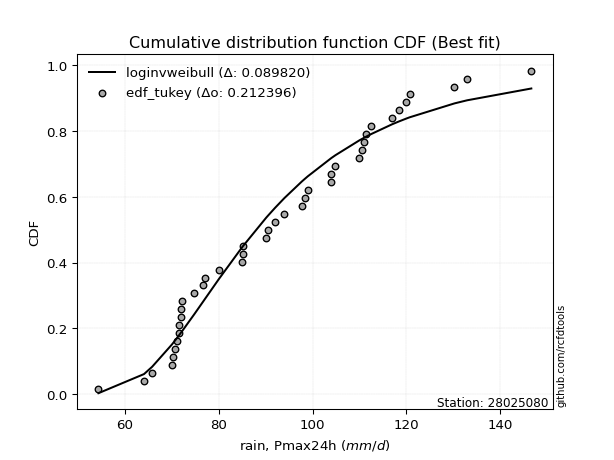</img>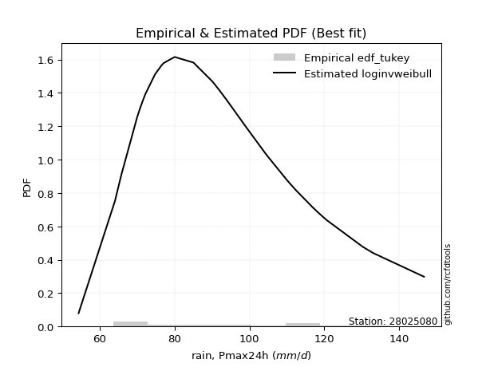</img>

</div>


### 8. Empirical - EDF Gringorten (1963)

Gringorten plotting position formula is essential for estimating the probability and return periods of extreme events like floods and heavy rainfall. The constant _a=0.44_.

<div align="center">


$P=(m-a)/(n+1-2a)$


</div>


**8.1. Empirical values**

<div align="center">

|                | 0                    | 1                   | 2                   | 3                   | 4                   | 5                   | 6                   | 7                   | 8                   | 9                  | 10                 | 11                  | 12                  | 13                 | 14                 | 15                  | 16                 | 17                 | 18                  | 19                  | 20             | 21                 | 22                 | 23                 | 24                 | 25                 | 26                 | 27                 | 28                 | 29                 | 30                 | 31                 | 32                 | 33                 | 34                | 35                | 36                 | 37                 | 38                 | 39                 | 40                 |
|:---------------|:---------------------|:--------------------|:--------------------|:--------------------|:--------------------|:--------------------|:--------------------|:--------------------|:--------------------|:-------------------|:-------------------|:--------------------|:--------------------|:-------------------|:-------------------|:--------------------|:-------------------|:-------------------|:--------------------|:--------------------|:---------------|:-------------------|:-------------------|:-------------------|:-------------------|:-------------------|:-------------------|:-------------------|:-------------------|:-------------------|:-------------------|:-------------------|:-------------------|:-------------------|:------------------|:------------------|:-------------------|:-------------------|:-------------------|:-------------------|:-------------------|
| date           | 2015                 | 1972                | 2012                | 1993                | 1989                | 2003                | 1986                | 1978                | 1991                | 1975               | 2006               | 1990                | 2014                | 2002               | 2013               | 2008                | 2004               | 1998               | 2009                | 1987                | 1983           | 2010               | 2011               | 1977               | 1997               | 2000               | 1995               | 2005               | 1982               | 2007               | 1979               | 1996               | 1981               | 1994               | 1992              | 1984              | 1999               | 1980               | 1985               | 2001               | 1988               |
| x              | 54.3053914059459     | 64.0372627544925    | 65.761435086823     | 70.0                | 70.3                | 70.6734304811073    | 71.1                | 71.5                | 71.6                | 72.0               | 72.0               | 72.2                | 74.7740840725297    | 76.5387530073253   | 77.1042389790807   | 80.0                | 85.0               | 85.1               | 85.1                | 90.1                | 90.4           | 92.0               | 94.0               | 97.7               | 98.3               | 99.0               | 104.0              | 104.0              | 104.9              | 110.0              | 110.5              | 111.0              | 111.5              | 112.5              | 117.0             | 118.5             | 120.0              | 120.7              | 130.3              | 133.0              | 146.7              |
| m              | 1                    | 2                   | 3                   | 4                   | 5                   | 6                   | 7                   | 8                   | 9                   | 10                 | 11                 | 12                  | 13                  | 14                 | 15                 | 16                  | 17                 | 18                 | 19                  | 20                  | 21             | 22                 | 23                 | 24                 | 25                 | 26                 | 27                 | 28                 | 29                 | 30                 | 31                 | 32                 | 33                 | 34                 | 35                | 36                | 37                 | 38                 | 39                 | 40                 | 41                 |
| empirical_dist | edf_gringorten       | edf_gringorten      | edf_gringorten      | edf_gringorten      | edf_gringorten      | edf_gringorten      | edf_gringorten      | edf_gringorten      | edf_gringorten      | edf_gringorten     | edf_gringorten     | edf_gringorten      | edf_gringorten      | edf_gringorten     | edf_gringorten     | edf_gringorten      | edf_gringorten     | edf_gringorten     | edf_gringorten      | edf_gringorten      | edf_gringorten | edf_gringorten     | edf_gringorten     | edf_gringorten     | edf_gringorten     | edf_gringorten     | edf_gringorten     | edf_gringorten     | edf_gringorten     | edf_gringorten     | edf_gringorten     | edf_gringorten     | edf_gringorten     | edf_gringorten     | edf_gringorten    | edf_gringorten    | edf_gringorten     | edf_gringorten     | edf_gringorten     | edf_gringorten     | edf_gringorten     |
| empirical      | 0.013618677042801558 | 0.03793774319066148 | 0.06225680933852141 | 0.08657587548638133 | 0.11089494163424124 | 0.13521400778210116 | 0.15953307392996108 | 0.18385214007782102 | 0.20817120622568097 | 0.2324902723735409 | 0.2568093385214008 | 0.28112840466926076 | 0.30544747081712065 | 0.3297665369649806 | 0.3540856031128405 | 0.37840466926070043 | 0.4027237354085603 | 0.4270428015564202 | 0.45136186770428016 | 0.47568093385214005 | 0.5            | 0.52431906614786   | 0.5486381322957199 | 0.5729571984435797 | 0.5972762645914397 | 0.6215953307392996 | 0.6459143968871596 | 0.6702334630350195 | 0.6945525291828794 | 0.7188715953307393 | 0.7431906614785992 | 0.7675097276264592 | 0.7918287937743191 | 0.8161478599221791 | 0.840466926070039 | 0.864785992217899 | 0.8891050583657588 | 0.9134241245136188 | 0.9377431906614787 | 0.9620622568093387 | 0.9863813229571986 |
| empirical_tr   | 1.0138067061143983   | 1.0394337714863497  | 1.066390041493776   | 1.0947816826411076  | 1.1247264770240701  | 1.156355455568054   | 1.1898148148148149  | 1.2252681764004767  | 1.262899262899263   | 1.302915082382763  | 1.3455497382198953 | 1.39106901217862    | 1.4397759103641457  | 1.4920174165457185 | 1.5481927710843375 | 1.6087636932707354  | 1.6742671009771988 | 1.7453310696095077 | 1.8226950354609928  | 1.9072356215213357  | 2.0            | 2.1022494887525562 | 2.2155172413793105 | 2.3416856492027334 | 2.4830917874396135 | 2.6426735218508997 | 2.8241758241758244 | 3.0324483775811215 | 3.273885350318471  | 3.557093425605536  | 3.8939393939393945 | 4.301255230125524  | 4.803738317757011  | 5.439153439153442  | 6.268292682926834 | 7.395683453237418 | 9.017543859649129  | 11.55056179775282  | 16.06250000000003  | 26.358974358974454 | 73.42857142857228  |

</div>


**8.2. Parameters & Kolmogorov-Smirnov fit test (sorted by Δ)**

|   id | empirical_dist   | p_dist             |    delta |   deltao | eval    |   fit |   n |             loc |          scale | shape                 | shape1              | shape2             | shape3   |   best_fit |   best_fit_sort |
|-----:|:-----------------|:-------------------|---------:|---------:|:--------|------:|----:|----------------:|---------------:|:----------------------|:--------------------|:-------------------|:---------|-----------:|----------------:|
|    0 | edf_gringorten   | rayleigh           | 0.100836 | 0.212396 | Δo > Δ  |     1 |  41 |    51.3316      |   33.0947      |                       |                     |                    |          |          1 |               1 |
|    1 | edf_gringorten   | weibull_min        | 0.101751 | 0.212396 | Δo > Δ  |     1 |  41 |    50.8426      |   47.3969      | 2.033534143641118     |                     |                    |          |          0 |               2 |
|    2 | edf_gringorten   | kstwobign          | 0.102074 | 0.212396 | Δo > Δ  |     1 |  41 |    18.3574      |   85.3447      |                       |                     |                    |          |          0 |               3 |
|    3 | edf_gringorten   | halfnorm           | 0.103203 | 0.212396 | Δo > Δ  |     1 |  41 |    64.1117      |   35.9675      |                       |                     |                    |          |          0 |               4 |
|    4 | edf_gringorten   | maxwell            | 0.103365 | 0.212396 | Δo > Δ  |     1 |  41 |    41.4335      |   32.1952      |                       |                     |                    |          |          0 |               5 |
|    5 | edf_gringorten   | rice               | 0.103404 | 0.212396 | Δo > Δ  |     1 |  41 |    50.8548      |   28.7203      | 0.8389678126883386    |                     |                    |          |          0 |               6 |
|    6 | edf_gringorten   | nakagami           | 0.105544 | 0.212396 | Δo > Δ  |     1 |  41 |    64.0373      |   35.3214      | 0.4115299577326458    |                     |                    |          |          0 |               7 |
|    7 | edf_gringorten   | chi2               | 0.106259 | 0.212396 | Δo > Δ  |     1 |  41 |    43.0626      |    5.03675     | 9.876803712593091     |                     |                    |          |          0 |               8 |
|    8 | edf_gringorten   | gamma              | 0.106259 | 0.212396 | Δo > Δ  |     1 |  41 |    43.0626      |   10.0735      | 4.938420323915814     |                     |                    |          |          0 |               9 |
|    9 | edf_gringorten   | erlang             | 0.106259 | 0.212396 | Δo > Δ  |     1 |  41 |    43.0625      |   10.0734      | 4.938436195795459     |                     |                    |          |          0 |              10 |
|   10 | edf_gringorten   | recipinvgauss      | 0.108771 | 0.212396 | Δo > Δ  |     1 |  41 |    24.0281      |    6.69795     | 0.10788608125682134   |                     |                    |          |          0 |              11 |
|   11 | edf_gringorten   | fatiguelife        | 0.109    | 0.212396 | Δo > Δ  |     1 |  41 |    22.7206      |   66.7271      | 0.31737542001836927   |                     |                    |          |          0 |              12 |
|   12 | edf_gringorten   | truncnorm          | 0.109253 | 0.212396 | Δo > Δ  |     1 |  41 |    95.0772      |   28.4475      | -1243.6895676394577   | 1.814671293759121   |                    |          |          0 |              13 |
|   13 | edf_gringorten   | invweibull         | 0.109276 | 0.212396 | Δo > Δ  |     1 |  41 |    -8.97425e+08 |    8.97425e+08 | 49542329.20739781     |                     |                    |          |          0 |              14 |
|   14 | edf_gringorten   | invgauss           | 0.109405 | 0.212396 | Δo > Δ  |     1 |  41 |    21.1058      |  731.571       | 0.09801052421316643   |                     |                    |          |          0 |              15 |
|   15 | edf_gringorten   | genlogistic        | 0.109516 | 0.212396 | Δo > Δ  |     1 |  41 |   -25.9585      |   18.1125      | 398.747501290429      |                     |                    |          |          0 |              16 |
|   16 | edf_gringorten   | mielke             | 0.11003  | 0.212396 | Δo > Δ  |     1 |  41 |    -0.276427    |   69.9063      | 16.638525016287083    | 5.624006127126446   |                    |          |          0 |              17 |
|   17 | edf_gringorten   | pearson3           | 0.110328 | 0.212396 | Δo > Δ  |     1 |  41 |    92.8096      |   21.6816      | 0.4170719051692846    |                     |                    |          |          0 |              18 |
|   18 | edf_gringorten   | johnsonsu          | 0.110456 | 0.212396 | Δo > Δ  |     1 |  41 |    20.9847      |    7.41493     | -9.6009748402718      | 3.2876572128804944  |                    |          |          0 |              19 |
|   19 | edf_gringorten   | lognorm            | 0.111298 | 0.212396 | Δo > Δ  |     1 |  41 |    19.821       |   69.8056      | 0.30079481944578906   |                     |                    |          |          0 |              20 |
|   20 | edf_gringorten   | fisk               | 0.11138  | 0.212396 | Δo > Δ  |     1 |  41 |    -0.167391    |   90.3714      | 7.14495643897858      |                     |                    |          |          0 |              21 |
|   21 | edf_gringorten   | betaprime          | 0.112771 | 0.212396 | Δo > Δ  |     1 |  41 |    -0.678539    |   22.3309      | 95.22523801090057     | 23.742643240532814  |                    |          |          0 |              22 |
|   22 | edf_gringorten   | invgamma           | 0.112808 | 0.212396 | Δo > Δ  |     1 |  41 |    -8.58668     | 2181.37        | 22.503174952551618    |                     |                    |          |          0 |              23 |
|   23 | edf_gringorten   | f                  | 0.11302  | 0.212396 | Δo > Δ  |     1 |  41 |    -0.630147    |   89.7538      | 154.292828236314      | 50.23578069229985   |                    |          |          0 |              24 |
|   24 | edf_gringorten   | nct                | 0.113266 | 0.212396 | Δo > Δ  |     1 |  41 |    -0.136499    |    9.69329     | 12.772217445810396    | 9.022020618429718   |                    |          |          0 |              25 |
|   25 | edf_gringorten   | alpha              | 0.114191 | 0.212396 | Δo > Δ  |     1 |  41 |   -74.2724      | 1300.21        | 7.910501337385717     |                     |                    |          |          0 |              26 |
|   26 | edf_gringorten   | exponnorm          | 0.11577  | 0.212396 | Δo > Δ  |     1 |  41 |    78.2603      |   16.6778      | 0.872376933838804     |                     |                    |          |          0 |              27 |
|   27 | edf_gringorten   | laplace_asymmetric | 0.116166 | 0.212396 | Δo > Δ  |     1 |  41 |    71.1         |   11.4546      | 0.43004861220629687   |                     |                    |          |          0 |              28 |
|   28 | edf_gringorten   | crystalball        | 0.119665 | 0.212396 | Δo > Δ  |     1 |  41 |    92.8096      |   21.6816      | 7797.312554904493     | 1297.0685011479204  |                    |          |          0 |              29 |
|   29 | edf_gringorten   | norm               | 0.119665 | 0.212396 | Δo > Δ  |     1 |  41 |    92.8096      |   21.6815      |                       |                     |                    |          |          0 |              30 |
|   30 | edf_gringorten   | t                  | 0.119843 | 0.212396 | Δo > Δ  |     1 |  41 |    92.8234      |   21.6831      | 146537.65006382146    |                     |                    |          |          0 |              31 |
|   31 | edf_gringorten   | loggamma           | 0.120274 | 0.212396 | Δo > Δ  |     1 |  41 | -5932.16        |  827.853       | 1448.4272314307375    |                     |                    |          |          0 |              32 |
|   32 | edf_gringorten   | gumbel_r           | 0.13158  | 0.212396 | Δo > Δ  |     1 |  41 |    83.0518      |   16.905       |                       |                     |                    |          |          0 |              33 |
|   33 | edf_gringorten   | dgamma             | 0.141045 | 0.212396 | Δo > Δ  |     1 |  41 |    95.3247      |    8.86077     | 2.121247318447837     |                     |                    |          |          0 |              34 |
|   34 | edf_gringorten   | logistic           | 0.142243 | 0.212396 | Δo > Δ  |     1 |  41 |    92.8096      |   11.9537      |                       |                     |                    |          |          0 |              35 |
|   35 | edf_gringorten   | halflogistic       | 0.144743 | 0.212396 | Δo > Δ  |     1 |  41 |    67.1119      |   18.537       |                       |                     |                    |          |          0 |              36 |
|   36 | edf_gringorten   | moyal              | 0.153348 | 0.212396 | Δo > Δ  |     1 |  41 |    80.4107      |    9.76013     |                       |                     |                    |          |          0 |              37 |
|   37 | edf_gringorten   | gumbel_l           | 0.15521  | 0.212396 | Δo > Δ  |     1 |  41 |   102.567       |   16.905       |                       |                     |                    |          |          0 |              38 |
|   38 | edf_gringorten   | hypsecant          | 0.156626 | 0.212396 | Δo > Δ  |     1 |  41 |    92.8096      |   13.8029      |                       |                     |                    |          |          0 |              39 |
|   39 | edf_gringorten   | laplace            | 0.174581 | 0.212396 | Δo > Δ  |     1 |  41 |    92.8096      |   15.3312      |                       |                     |                    |          |          0 |              40 |
|   40 | edf_gringorten   | genexpon           | 0.241752 | 0.212396 | Δo <= Δ |     0 |  41 |    53.5691      |    1.80935     | 4.581735737394762e-11 | 0.04769179520246915 | 1.3583524985563262 |          |          0 |              41 |
|   41 | edf_gringorten   | expon              | 0.248184 | 0.212396 | Δo <= Δ |     0 |  41 |    54.3054      |   38.5042      |                       |                     |                    |          |          0 |              42 |
|   42 | edf_gringorten   | pareto             | 0.248184 | 0.212396 | Δo <= Δ |     0 |  41 |    -2.14748e+09 |    2.14748e+09 | 55772664.66562522     |                     |                    |          |          0 |              43 |
|   43 | edf_gringorten   | zzgumbel           | 0.271895 | 0.212396 | Δo <= Δ |     0 |  41 |    92.7778      |   17.115       | 0.5441978529407195    | 1.1435823657845239  |                    |          |          0 |              44 |
|   44 | edf_gringorten   | wald               | 0.28111  | 0.212396 | Δo <= Δ |     0 |  41 |    71.128       |   21.6816      |                       |                     |                    |          |          0 |              45 |
|   45 | edf_gringorten   | gibrat             | 0.347631 | 0.212396 | Δo <= Δ |     0 |  41 |    76.2694      |   10.0322      |                       |                     |                    |          |          0 |              46 |
|   46 | edf_gringorten   | gompertz           | 0.362507 | 0.212396 | Δo <= Δ |     0 |  41 |  -323.548       |   11.5888      | 4.719325060208775e-17 |                     |                    |          |          0 |              47 |
|   47 | edf_gringorten   | ncf                | 0.542825 | 0.212396 | Δo <= Δ |     0 |  41 |    -0.082077    |    1.06134e-05 | 5.041499418439944e-07 | 14.643978562930169  | 3.2782378530006118 |          |          0 |              48 |

<div align="center">

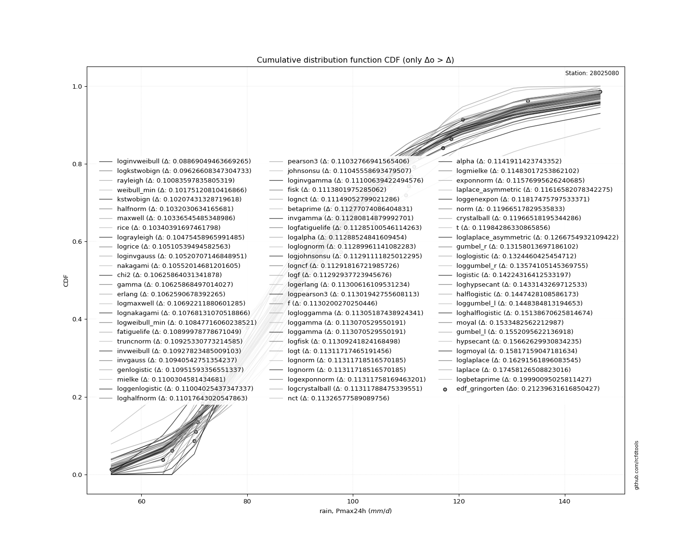</img>

</div>


**8.3. Best fit**

|   id |   station | empirical_dist   | p_dist   |    delta |   deltao | eval   |   fit |   n |     loc |   scale | shape   | shape1   | shape2   | shape3   |   best_fit |   best_fit_sort |
|-----:|----------:|:-----------------|:---------|---------:|---------:|:-------|------:|----:|--------:|--------:|:--------|:---------|:---------|:---------|-----------:|----------------:|
|    0 |  28025080 | edf_gringorten   | rayleigh | 0.100836 | 0.212396 | Δo > Δ |     1 |  41 | 51.3316 | 33.0947 |         |          |          |          |          1 |               1 |

<div align="center">

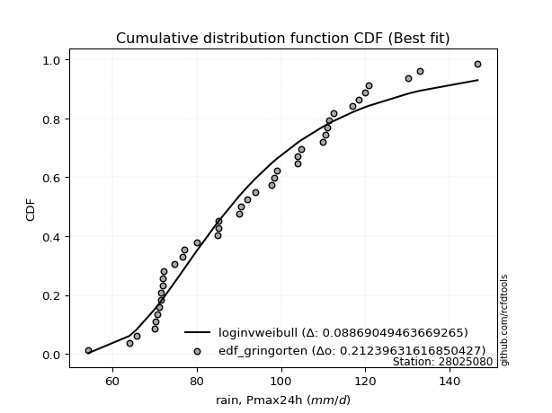</img>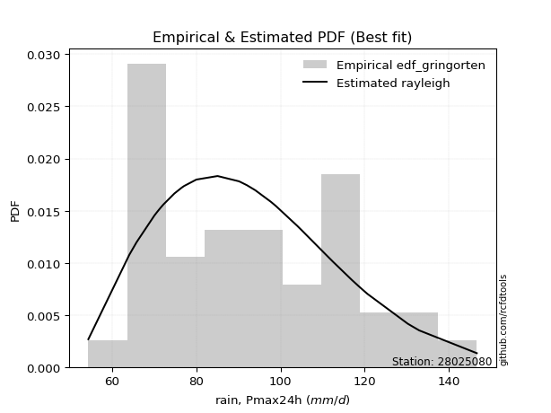</img>

</div>


### 9. Empirical - EDF Jenkinson (1977)

The Jenkinson formula in hydrology is an empirical plotting position formula used to estimate the non-exceedance probability _(P)_ or return period _(T)_ of a given ordered observation within a sample. It is a widely used method in the frequency analysis of extreme events such as floods and rainfall, as it provides a distribution-free way to plot data. _a≈0.31_ and _b≈0.38_ are constants derived to approximate the median of the probability distribution for the given rank.

<div align="center">


$P=(m-a)/(n+b)$


</div>


**9.1. Empirical values**

<div align="center">

|                | 0                    | 1                   | 2                   | 3                   | 4                   | 5                  | 6                   | 7                   | 8                  | 9                   | 10                 | 11                 | 12                  | 13                 | 14                  | 15                  | 16                  | 17                  | 18                  | 19                 | 20            | 21                 | 22                 | 23                 | 24                 | 25                 | 26                 | 27                 | 28                 | 29                 | 30                 | 31                 | 32                 | 33                 | 34                 | 35                | 36                 | 37                 | 38                 | 39                | 40                 |
|:---------------|:---------------------|:--------------------|:--------------------|:--------------------|:--------------------|:-------------------|:--------------------|:--------------------|:-------------------|:--------------------|:-------------------|:-------------------|:--------------------|:-------------------|:--------------------|:--------------------|:--------------------|:--------------------|:--------------------|:-------------------|:--------------|:-------------------|:-------------------|:-------------------|:-------------------|:-------------------|:-------------------|:-------------------|:-------------------|:-------------------|:-------------------|:-------------------|:-------------------|:-------------------|:-------------------|:------------------|:-------------------|:-------------------|:-------------------|:------------------|:-------------------|
| date           | 2015                 | 1972                | 2012                | 1993                | 1989                | 2003               | 1986                | 1978                | 1991               | 1975                | 2006               | 1990               | 2014                | 2002               | 2013                | 2008                | 2004                | 1998                | 2009                | 1987               | 1983          | 2010               | 2011               | 1977               | 1997               | 2000               | 1995               | 2005               | 1982               | 2007               | 1979               | 1996               | 1981               | 1994               | 1992               | 1984              | 1999               | 1980               | 1985               | 2001              | 1988               |
| x              | 54.3053914059459     | 64.0372627544925    | 65.761435086823     | 70.0                | 70.3                | 70.6734304811073   | 71.1                | 71.5                | 71.6               | 72.0                | 72.0               | 72.2               | 74.7740840725297    | 76.5387530073253   | 77.1042389790807    | 80.0                | 85.0                | 85.1                | 85.1                | 90.1               | 90.4          | 92.0               | 94.0               | 97.7               | 98.3               | 99.0               | 104.0              | 104.0              | 104.9              | 110.0              | 110.5              | 111.0              | 111.5              | 112.5              | 117.0              | 118.5             | 120.0              | 120.7              | 130.3              | 133.0             | 146.7              |
| m              | 1                    | 2                   | 3                   | 4                   | 5                   | 6                  | 7                   | 8                   | 9                  | 10                  | 11                 | 12                 | 13                  | 14                 | 15                  | 16                  | 17                  | 18                  | 19                  | 20                 | 21            | 22                 | 23                 | 24                 | 25                 | 26                 | 27                 | 28                 | 29                 | 30                 | 31                 | 32                 | 33                 | 34                 | 35                 | 36                | 37                 | 38                 | 39                 | 40                | 41                 |
| empirical_dist | edf_jenkinson        | edf_jenkinson       | edf_jenkinson       | edf_jenkinson       | edf_jenkinson       | edf_jenkinson      | edf_jenkinson       | edf_jenkinson       | edf_jenkinson      | edf_jenkinson       | edf_jenkinson      | edf_jenkinson      | edf_jenkinson       | edf_jenkinson      | edf_jenkinson       | edf_jenkinson       | edf_jenkinson       | edf_jenkinson       | edf_jenkinson       | edf_jenkinson      | edf_jenkinson | edf_jenkinson      | edf_jenkinson      | edf_jenkinson      | edf_jenkinson      | edf_jenkinson      | edf_jenkinson      | edf_jenkinson      | edf_jenkinson      | edf_jenkinson      | edf_jenkinson      | edf_jenkinson      | edf_jenkinson      | edf_jenkinson      | edf_jenkinson      | edf_jenkinson     | edf_jenkinson      | edf_jenkinson      | edf_jenkinson      | edf_jenkinson     | edf_jenkinson      |
| empirical      | 0.016674722087965197 | 0.04084098598356694 | 0.06500724987916867 | 0.08917351377477041 | 0.11333977767037216 | 0.1375060415659739 | 0.16167230546157563 | 0.18583856935717738 | 0.2100048332527791 | 0.23417109714838083 | 0.2583373610439826 | 0.2825036249395843 | 0.30666988883518603 | 0.3308361527307878 | 0.35500241662638954 | 0.37916868052199126 | 0.40333494441759304 | 0.42750120831319477 | 0.45166747220879655 | 0.4758337361043983 | 0.5           | 0.5241662638956017 | 0.5483325277912035 | 0.5724987916868052 | 0.5966650555824069 | 0.6208313194780087 | 0.6449975833736105 | 0.6691638472692122 | 0.6933301111648139 | 0.7174963750604156 | 0.7416626389560174 | 0.7658289028516191 | 0.7899951667472208 | 0.8141614306428225 | 0.8383276945384243 | 0.862493958434026 | 0.8866602223296277 | 0.9108264862252294 | 0.9349927501208312 | 0.959159014016433 | 0.9833252779120347 |
| empirical_tr   | 1.0169574834111574   | 1.0425799949609473  | 1.0695270095631946  | 1.0979039533032635  | 1.127827745979831   | 1.1594284113196973 | 1.192850965696166   | 1.228257643217572   | 1.2658305292138268 | 1.3057746923319657  | 1.34832192896709   | 1.3937352643987873 | 1.4423143952596722  | 1.4944023113037197 | 1.5503934057699513  | 1.6107434799532891  | 1.6759821790198464  | 1.7467285774588435  | 1.8237108858527986  | 1.9077916090364224 | 2.0           | 2.101574403250381  | 2.2140181915462813 | 2.339174674957603  | 2.479328939484721  | 2.6373486297004463 | 2.8168822328114365 | 3.022644265887509  | 3.260835303388495  | 3.539777587681779  | 3.87090739008419   | 4.270381836945304  | 4.761795166858456  | 5.381014304291285  | 6.185351270553061  | 7.272407732864669 | 8.823027718550097  | 11.214092140921391 | 15.382899628252751 | 24.48520710059168 | 59.97101449275335  |

</div>


**9.2. Parameters & Kolmogorov-Smirnov fit test (sorted by Δ)**

|   id | empirical_dist   | p_dist             |    delta |   deltao | eval    |   fit |   n |             loc |          scale | shape                 | shape1              | shape2             | shape3   |   best_fit |   best_fit_sort |
|-----:|:-----------------|:-------------------|---------:|---------:|:--------|------:|----:|----------------:|---------------:|:----------------------|:--------------------|:-------------------|:---------|-----------:|----------------:|
|    0 | edf_jenkinson    | rayleigh           | 0.102211 | 0.212396 | Δo > Δ  |     1 |  41 |    51.3316      |   33.0947      |                       |                     |                    |          |          1 |               1 |
|    1 | edf_jenkinson    | weibull_min        | 0.103126 | 0.212396 | Δo > Δ  |     1 |  41 |    50.8426      |   47.3969      | 2.033534143641118     |                     |                    |          |          0 |               2 |
|    2 | edf_jenkinson    | kstwobign          | 0.10345  | 0.212396 | Δo > Δ  |     1 |  41 |    18.3574      |   85.3447      |                       |                     |                    |          |          0 |               3 |
|    3 | edf_jenkinson    | halfnorm           | 0.104578 | 0.212396 | Δo > Δ  |     1 |  41 |    64.1117      |   35.9675      |                       |                     |                    |          |          0 |               4 |
|    4 | edf_jenkinson    | maxwell            | 0.104741 | 0.212396 | Δo > Δ  |     1 |  41 |    41.4335      |   32.1952      |                       |                     |                    |          |          0 |               5 |
|    5 | edf_jenkinson    | rice               | 0.104779 | 0.212396 | Δo > Δ  |     1 |  41 |    50.8548      |   28.7203      | 0.8389678126883386    |                     |                    |          |          0 |               6 |
|    6 | edf_jenkinson    | nakagami           | 0.10646  | 0.212396 | Δo > Δ  |     1 |  41 |    64.0373      |   35.3214      | 0.4115299577326458    |                     |                    |          |          0 |               7 |
|    7 | edf_jenkinson    | truncnorm          | 0.106656 | 0.212396 | Δo > Δ  |     1 |  41 |    95.0772      |   28.4475      | -1243.6895676394577   | 1.814671293759121   |                    |          |          0 |               8 |
|    8 | edf_jenkinson    | chi2               | 0.107634 | 0.212396 | Δo > Δ  |     1 |  41 |    43.0626      |    5.03675     | 9.876803712593091     |                     |                    |          |          0 |               9 |
|    9 | edf_jenkinson    | gamma              | 0.107634 | 0.212396 | Δo > Δ  |     1 |  41 |    43.0626      |   10.0735      | 4.938420323915814     |                     |                    |          |          0 |              10 |
|   10 | edf_jenkinson    | erlang             | 0.107634 | 0.212396 | Δo > Δ  |     1 |  41 |    43.0625      |   10.0734      | 4.938436195795459     |                     |                    |          |          0 |              11 |
|   11 | edf_jenkinson    | recipinvgauss      | 0.110146 | 0.212396 | Δo > Δ  |     1 |  41 |    24.0281      |    6.69795     | 0.10788608125682134   |                     |                    |          |          0 |              12 |
|   12 | edf_jenkinson    | fatiguelife        | 0.110375 | 0.212396 | Δo > Δ  |     1 |  41 |    22.7206      |   66.7271      | 0.31737542001836927   |                     |                    |          |          0 |              13 |
|   13 | edf_jenkinson    | invweibull         | 0.110651 | 0.212396 | Δo > Δ  |     1 |  41 |    -8.97425e+08 |    8.97425e+08 | 49542329.20739781     |                     |                    |          |          0 |              14 |
|   14 | edf_jenkinson    | invgauss           | 0.110781 | 0.212396 | Δo > Δ  |     1 |  41 |    21.1058      |  731.571       | 0.09801052421316643   |                     |                    |          |          0 |              15 |
|   15 | edf_jenkinson    | genlogistic        | 0.110891 | 0.212396 | Δo > Δ  |     1 |  41 |   -25.9585      |   18.1125      | 398.747501290429      |                     |                    |          |          0 |              16 |
|   16 | edf_jenkinson    | mielke             | 0.111406 | 0.212396 | Δo > Δ  |     1 |  41 |    -0.276427    |   69.9063      | 16.638525016287083    | 5.624006127126446   |                    |          |          0 |              17 |
|   17 | edf_jenkinson    | pearson3           | 0.111703 | 0.212396 | Δo > Δ  |     1 |  41 |    92.8096      |   21.6816      | 0.4170719051692846    |                     |                    |          |          0 |              18 |
|   18 | edf_jenkinson    | johnsonsu          | 0.111831 | 0.212396 | Δo > Δ  |     1 |  41 |    20.9847      |    7.41493     | -9.6009748402718      | 3.2876572128804944  |                    |          |          0 |              19 |
|   19 | edf_jenkinson    | lognorm            | 0.112673 | 0.212396 | Δo > Δ  |     1 |  41 |    19.821       |   69.8056      | 0.30079481944578906   |                     |                    |          |          0 |              20 |
|   20 | edf_jenkinson    | fisk               | 0.112755 | 0.212396 | Δo > Δ  |     1 |  41 |    -0.167391    |   90.3714      | 7.14495643897858      |                     |                    |          |          0 |              21 |
|   21 | edf_jenkinson    | betaprime          | 0.114146 | 0.212396 | Δo > Δ  |     1 |  41 |    -0.678539    |   22.3309      | 95.22523801090057     | 23.742643240532814  |                    |          |          0 |              22 |
|   22 | edf_jenkinson    | invgamma           | 0.114183 | 0.212396 | Δo > Δ  |     1 |  41 |    -8.58668     | 2181.37        | 22.503174952551618    |                     |                    |          |          0 |              23 |
|   23 | edf_jenkinson    | f                  | 0.114395 | 0.212396 | Δo > Δ  |     1 |  41 |    -0.630147    |   89.7538      | 154.292828236314      | 50.23578069229985   |                    |          |          0 |              24 |
|   24 | edf_jenkinson    | nct                | 0.114641 | 0.212396 | Δo > Δ  |     1 |  41 |    -0.136499    |    9.69329     | 12.772217445810396    | 9.022020618429718   |                    |          |          0 |              25 |
|   25 | edf_jenkinson    | alpha              | 0.115566 | 0.212396 | Δo > Δ  |     1 |  41 |   -74.2724      | 1300.21        | 7.910501337385717     |                     |                    |          |          0 |              26 |
|   26 | edf_jenkinson    | laplace_asymmetric | 0.116624 | 0.212396 | Δo > Δ  |     1 |  41 |    71.1         |   11.4546      | 0.43004861220629687   |                     |                    |          |          0 |              27 |
|   27 | edf_jenkinson    | exponnorm          | 0.116687 | 0.212396 | Δo > Δ  |     1 |  41 |    78.2603      |   16.6778      | 0.872376933838804     |                     |                    |          |          0 |              28 |
|   28 | edf_jenkinson    | crystalball        | 0.120582 | 0.212396 | Δo > Δ  |     1 |  41 |    92.8096      |   21.6816      | 7797.312554904493     | 1297.0685011479204  |                    |          |          0 |              29 |
|   29 | edf_jenkinson    | norm               | 0.120582 | 0.212396 | Δo > Δ  |     1 |  41 |    92.8096      |   21.6815      |                       |                     |                    |          |          0 |              30 |
|   30 | edf_jenkinson    | t                  | 0.12076  | 0.212396 | Δo > Δ  |     1 |  41 |    92.8234      |   21.6831      | 146537.65006382146    |                     |                    |          |          0 |              31 |
|   31 | edf_jenkinson    | loggamma           | 0.121191 | 0.212396 | Δo > Δ  |     1 |  41 | -5932.16        |  827.853       | 1448.4272314307375    |                     |                    |          |          0 |              32 |
|   32 | edf_jenkinson    | gumbel_r           | 0.132955 | 0.212396 | Δo > Δ  |     1 |  41 |    83.0518      |   16.905       |                       |                     |                    |          |          0 |              33 |
|   33 | edf_jenkinson    | dgamma             | 0.141962 | 0.212396 | Δo > Δ  |     1 |  41 |    95.3247      |    8.86077     | 2.121247318447837     |                     |                    |          |          0 |              34 |
|   34 | edf_jenkinson    | logistic           | 0.14316  | 0.212396 | Δo > Δ  |     1 |  41 |    92.8096      |   11.9537      |                       |                     |                    |          |          0 |              35 |
|   35 | edf_jenkinson    | halflogistic       | 0.146118 | 0.212396 | Δo > Δ  |     1 |  41 |    67.1119      |   18.537       |                       |                     |                    |          |          0 |              36 |
|   36 | edf_jenkinson    | moyal              | 0.154723 | 0.212396 | Δo > Δ  |     1 |  41 |    80.4107      |    9.76013     |                       |                     |                    |          |          0 |              37 |
|   37 | edf_jenkinson    | gumbel_l           | 0.156126 | 0.212396 | Δo > Δ  |     1 |  41 |   102.567       |   16.905       |                       |                     |                    |          |          0 |              38 |
|   38 | edf_jenkinson    | hypsecant          | 0.157543 | 0.212396 | Δo > Δ  |     1 |  41 |    92.8096      |   13.8029      |                       |                     |                    |          |          0 |              39 |
|   39 | edf_jenkinson    | laplace            | 0.175498 | 0.212396 | Δo > Δ  |     1 |  41 |    92.8096      |   15.3312      |                       |                     |                    |          |          0 |              40 |
|   40 | edf_jenkinson    | genexpon           | 0.239154 | 0.212396 | Δo <= Δ |     0 |  41 |    53.5691      |    1.80935     | 4.581735737394762e-11 | 0.04769179520246915 | 1.3583524985563262 |          |          0 |              41 |
|   41 | edf_jenkinson    | expon              | 0.245586 | 0.212396 | Δo <= Δ |     0 |  41 |    54.3054      |   38.5042      |                       |                     |                    |          |          0 |              42 |
|   42 | edf_jenkinson    | pareto             | 0.245586 | 0.212396 | Δo <= Δ |     0 |  41 |    -2.14748e+09 |    2.14748e+09 | 55772664.66562522     |                     |                    |          |          0 |              43 |
|   43 | edf_jenkinson    | zzgumbel           | 0.272812 | 0.212396 | Δo <= Δ |     0 |  41 |    92.7778      |   17.115       | 0.5441978529407195    | 1.1435823657845239  |                    |          |          0 |              44 |
|   44 | edf_jenkinson    | wald               | 0.282485 | 0.212396 | Δo <= Δ |     0 |  41 |    71.128       |   21.6816      |                       |                     |                    |          |          0 |              45 |
|   45 | edf_jenkinson    | gibrat             | 0.348548 | 0.212396 | Δo <= Δ |     0 |  41 |    76.2694      |   10.0322      |                       |                     |                    |          |          0 |              46 |
|   46 | edf_jenkinson    | gompertz           | 0.362354 | 0.212396 | Δo <= Δ |     0 |  41 |  -323.548       |   11.5888      | 4.719325060208775e-17 |                     |                    |          |          0 |              47 |
|   47 | edf_jenkinson    | ncf                | 0.539922 | 0.212396 | Δo <= Δ |     0 |  41 |    -0.082077    |    1.06134e-05 | 5.041499418439944e-07 | 14.643978562930169  | 3.2782378530006118 |          |          0 |              48 |

<div align="center">

</img>

</div>


**9.3. Best fit**

|   id |   station | empirical_dist   | p_dist   |    delta |   deltao | eval   |   fit |   n |     loc |   scale | shape   | shape1   | shape2   | shape3   |   best_fit |   best_fit_sort |
|-----:|----------:|:-----------------|:---------|---------:|---------:|:-------|------:|----:|--------:|--------:|:--------|:---------|:---------|:---------|-----------:|----------------:|
|    0 |  28025080 | edf_jenkinson    | rayleigh | 0.102211 | 0.212396 | Δo > Δ |     1 |  41 | 51.3316 | 33.0947 |         |          |          |          |          1 |               1 |

<div align="center">

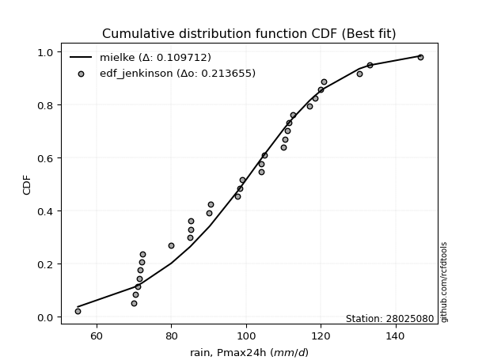</img>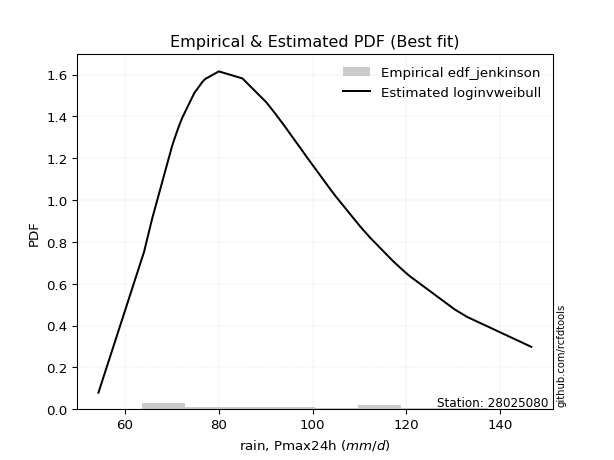</img>

</div>


### 10. Empirical - EDF Cunnane (1978)

Cunnane´s work in statistical hydrology has focused on the performance and evaluation of different probability distributions (such as GEV, Gumbel, Lognormal) for flood frequency estimation. _b_ is a constant, typically set to 0.4.

<div align="center">


$P=(m-b)/(n+1-2b)$


</div>


**10.1. Empirical values**

<div align="center">

|                | 0                    | 1                    | 2                   | 3                   | 4                   | 5                   | 6                   | 7                  | 8                  | 9                   | 10                  | 11                 | 12                 | 13                  | 14                 | 15                  | 16                 | 17                 | 18                  | 19                  | 20          | 21                 | 22                 | 23                 | 24                 | 25                 | 26                 | 27                 | 28                 | 29                 | 30                 | 31                 | 32                 | 33                 | 34                 | 35                 | 36                 | 37                 | 38                 | 39                 | 40                 |
|:---------------|:---------------------|:---------------------|:--------------------|:--------------------|:--------------------|:--------------------|:--------------------|:-------------------|:-------------------|:--------------------|:--------------------|:-------------------|:-------------------|:--------------------|:-------------------|:--------------------|:-------------------|:-------------------|:--------------------|:--------------------|:------------|:-------------------|:-------------------|:-------------------|:-------------------|:-------------------|:-------------------|:-------------------|:-------------------|:-------------------|:-------------------|:-------------------|:-------------------|:-------------------|:-------------------|:-------------------|:-------------------|:-------------------|:-------------------|:-------------------|:-------------------|
| date           | 2015                 | 1972                 | 2012                | 1993                | 1989                | 2003                | 1986                | 1978               | 1991               | 1975                | 2006                | 1990               | 2014               | 2002                | 2013               | 2008                | 2004               | 1998               | 2009                | 1987                | 1983        | 2010               | 2011               | 1977               | 1997               | 2000               | 1995               | 2005               | 1982               | 2007               | 1979               | 1996               | 1981               | 1994               | 1992               | 1984               | 1999               | 1980               | 1985               | 2001               | 1988               |
| x              | 54.3053914059459     | 64.0372627544925     | 65.761435086823     | 70.0                | 70.3                | 70.6734304811073    | 71.1                | 71.5               | 71.6               | 72.0                | 72.0                | 72.2               | 74.7740840725297   | 76.5387530073253    | 77.1042389790807   | 80.0                | 85.0               | 85.1               | 85.1                | 90.1                | 90.4        | 92.0               | 94.0               | 97.7               | 98.3               | 99.0               | 104.0              | 104.0              | 104.9              | 110.0              | 110.5              | 111.0              | 111.5              | 112.5              | 117.0              | 118.5              | 120.0              | 120.7              | 130.3              | 133.0              | 146.7              |
| m              | 1                    | 2                    | 3                   | 4                   | 5                   | 6                   | 7                   | 8                  | 9                  | 10                  | 11                  | 12                 | 13                 | 14                  | 15                 | 16                  | 17                 | 18                 | 19                  | 20                  | 21          | 22                 | 23                 | 24                 | 25                 | 26                 | 27                 | 28                 | 29                 | 30                 | 31                 | 32                 | 33                 | 34                 | 35                 | 36                 | 37                 | 38                 | 39                 | 40                 | 41                 |
| empirical_dist | edf_cunnane          | edf_cunnane          | edf_cunnane         | edf_cunnane         | edf_cunnane         | edf_cunnane         | edf_cunnane         | edf_cunnane        | edf_cunnane        | edf_cunnane         | edf_cunnane         | edf_cunnane        | edf_cunnane        | edf_cunnane         | edf_cunnane        | edf_cunnane         | edf_cunnane        | edf_cunnane        | edf_cunnane         | edf_cunnane         | edf_cunnane | edf_cunnane        | edf_cunnane        | edf_cunnane        | edf_cunnane        | edf_cunnane        | edf_cunnane        | edf_cunnane        | edf_cunnane        | edf_cunnane        | edf_cunnane        | edf_cunnane        | edf_cunnane        | edf_cunnane        | edf_cunnane        | edf_cunnane        | edf_cunnane        | edf_cunnane        | edf_cunnane        | edf_cunnane        | edf_cunnane        |
| empirical      | 0.014563106796116504 | 0.038834951456310676 | 0.06310679611650485 | 0.08737864077669903 | 0.11165048543689318 | 0.13592233009708737 | 0.16019417475728154 | 0.1844660194174757 | 0.2087378640776699 | 0.23300970873786406 | 0.25728155339805825 | 0.2815533980582524 | 0.3058252427184466 | 0.33009708737864074 | 0.3543689320388349 | 0.37864077669902907 | 0.4029126213592233 | 0.4271844660194175 | 0.45145631067961167 | 0.47572815533980584 | 0.5         | 0.5242718446601942 | 0.5485436893203883 | 0.5728155339805825 | 0.5970873786407767 | 0.6213592233009708 | 0.645631067961165  | 0.6699029126213593 | 0.6941747572815534 | 0.7184466019417476 | 0.7427184466019418 | 0.7669902912621359 | 0.7912621359223301 | 0.8155339805825242 | 0.8398058252427184 | 0.8640776699029126 | 0.8883495145631067 | 0.9126213592233009 | 0.9368932038834951 | 0.9611650485436893 | 0.9854368932038835 |
| empirical_tr   | 1.0147783251231528   | 1.0404040404040404   | 1.067357512953368   | 1.0957446808510638  | 1.1256830601092895  | 1.1573033707865168  | 1.1907514450867052  | 1.226190476190476  | 1.2638036809815951 | 1.3037974683544304  | 1.34640522875817    | 1.3918918918918919 | 1.4405594405594404 | 1.4927536231884058  | 1.5488721804511276 | 1.6093749999999998  | 1.67479674796748   | 1.7457627118644068 | 1.8230088495575223  | 1.9074074074074074  | 2.0         | 2.1020408163265305 | 2.21505376344086   | 2.340909090909091  | 2.4819277108433733 | 2.6410256410256405 | 2.8219178082191774 | 3.0294117647058827 | 3.26984126984127   | 3.5517241379310347 | 3.8867924528301887 | 4.291666666666667  | 4.790697674418604  | 5.421052631578947  | 6.24242424242424   | 7.357142857142854  | 8.95652173913043   | 11.444444444444436 | 15.846153846153825 | 25.75000000000001  | 68.6666666666667   |

</div>


**10.2. Parameters & Kolmogorov-Smirnov fit test (sorted by Δ)**

|   id | empirical_dist   | p_dist             |    delta |   deltao | eval    |   fit |   n |             loc |          scale | shape                 | shape1              | shape2             | shape3   |   best_fit |   best_fit_sort |
|-----:|:-----------------|:-------------------|---------:|---------:|:--------|------:|----:|----------------:|---------------:|:----------------------|:--------------------|:-------------------|:---------|-----------:|----------------:|
|    0 | edf_cunnane      | rayleigh           | 0.101261 | 0.212396 | Δo > Δ  |     1 |  41 |    51.3316      |   33.0947      |                       |                     |                    |          |          1 |               1 |
|    1 | edf_cunnane      | weibull_min        | 0.102176 | 0.212396 | Δo > Δ  |     1 |  41 |    50.8426      |   47.3969      | 2.033534143641118     |                     |                    |          |          0 |               2 |
|    2 | edf_cunnane      | kstwobign          | 0.102499 | 0.212396 | Δo > Δ  |     1 |  41 |    18.3574      |   85.3447      |                       |                     |                    |          |          0 |               3 |
|    3 | edf_cunnane      | halfnorm           | 0.103628 | 0.212396 | Δo > Δ  |     1 |  41 |    64.1117      |   35.9675      |                       |                     |                    |          |          0 |               4 |
|    4 | edf_cunnane      | maxwell            | 0.10379  | 0.212396 | Δo > Δ  |     1 |  41 |    41.4335      |   32.1952      |                       |                     |                    |          |          0 |               5 |
|    5 | edf_cunnane      | rice               | 0.103829 | 0.212396 | Δo > Δ  |     1 |  41 |    50.8548      |   28.7203      | 0.8389678126883386    |                     |                    |          |          0 |               6 |
|    6 | edf_cunnane      | nakagami           | 0.105827 | 0.212396 | Δo > Δ  |     1 |  41 |    64.0373      |   35.3214      | 0.4115299577326458    |                     |                    |          |          0 |               7 |
|    7 | edf_cunnane      | chi2               | 0.106684 | 0.212396 | Δo > Δ  |     1 |  41 |    43.0626      |    5.03675     | 9.876803712593091     |                     |                    |          |          0 |               8 |
|    8 | edf_cunnane      | gamma              | 0.106684 | 0.212396 | Δo > Δ  |     1 |  41 |    43.0626      |   10.0735      | 4.938420323915814     |                     |                    |          |          0 |               9 |
|    9 | edf_cunnane      | erlang             | 0.106684 | 0.212396 | Δo > Δ  |     1 |  41 |    43.0625      |   10.0734      | 4.938436195795459     |                     |                    |          |          0 |              10 |
|   10 | edf_cunnane      | truncnorm          | 0.108451 | 0.212396 | Δo > Δ  |     1 |  41 |    95.0772      |   28.4475      | -1243.6895676394577   | 1.814671293759121   |                    |          |          0 |              11 |
|   11 | edf_cunnane      | recipinvgauss      | 0.109196 | 0.212396 | Δo > Δ  |     1 |  41 |    24.0281      |    6.69795     | 0.10788608125682134   |                     |                    |          |          0 |              12 |
|   12 | edf_cunnane      | fatiguelife        | 0.109425 | 0.212396 | Δo > Δ  |     1 |  41 |    22.7206      |   66.7271      | 0.31737542001836927   |                     |                    |          |          0 |              13 |
|   13 | edf_cunnane      | invweibull         | 0.109701 | 0.212396 | Δo > Δ  |     1 |  41 |    -8.97425e+08 |    8.97425e+08 | 49542329.20739781     |                     |                    |          |          0 |              14 |
|   14 | edf_cunnane      | invgauss           | 0.10983  | 0.212396 | Δo > Δ  |     1 |  41 |    21.1058      |  731.571       | 0.09801052421316643   |                     |                    |          |          0 |              15 |
|   15 | edf_cunnane      | genlogistic        | 0.109941 | 0.212396 | Δo > Δ  |     1 |  41 |   -25.9585      |   18.1125      | 398.747501290429      |                     |                    |          |          0 |              16 |
|   16 | edf_cunnane      | mielke             | 0.110455 | 0.212396 | Δo > Δ  |     1 |  41 |    -0.276427    |   69.9063      | 16.638525016287083    | 5.624006127126446   |                    |          |          0 |              17 |
|   17 | edf_cunnane      | pearson3           | 0.110753 | 0.212396 | Δo > Δ  |     1 |  41 |    92.8096      |   21.6816      | 0.4170719051692846    |                     |                    |          |          0 |              18 |
|   18 | edf_cunnane      | johnsonsu          | 0.110881 | 0.212396 | Δo > Δ  |     1 |  41 |    20.9847      |    7.41493     | -9.6009748402718      | 3.2876572128804944  |                    |          |          0 |              19 |
|   19 | edf_cunnane      | lognorm            | 0.111723 | 0.212396 | Δo > Δ  |     1 |  41 |    19.821       |   69.8056      | 0.30079481944578906   |                     |                    |          |          0 |              20 |
|   20 | edf_cunnane      | fisk               | 0.111805 | 0.212396 | Δo > Δ  |     1 |  41 |    -0.167391    |   90.3714      | 7.14495643897858      |                     |                    |          |          0 |              21 |
|   21 | edf_cunnane      | betaprime          | 0.113196 | 0.212396 | Δo > Δ  |     1 |  41 |    -0.678539    |   22.3309      | 95.22523801090057     | 23.742643240532814  |                    |          |          0 |              22 |
|   22 | edf_cunnane      | invgamma           | 0.113233 | 0.212396 | Δo > Δ  |     1 |  41 |    -8.58668     | 2181.37        | 22.503174952551618    |                     |                    |          |          0 |              23 |
|   23 | edf_cunnane      | f                  | 0.113445 | 0.212396 | Δo > Δ  |     1 |  41 |    -0.630147    |   89.7538      | 154.292828236314      | 50.23578069229985   |                    |          |          0 |              24 |
|   24 | edf_cunnane      | nct                | 0.113691 | 0.212396 | Δo > Δ  |     1 |  41 |    -0.136499    |    9.69329     | 12.772217445810396    | 9.022020618429718   |                    |          |          0 |              25 |
|   25 | edf_cunnane      | alpha              | 0.114616 | 0.212396 | Δo > Δ  |     1 |  41 |   -74.2724      | 1300.21        | 7.910501337385717     |                     |                    |          |          0 |              26 |
|   26 | edf_cunnane      | exponnorm          | 0.116053 | 0.212396 | Δo > Δ  |     1 |  41 |    78.2603      |   16.6778      | 0.872376933838804     |                     |                    |          |          0 |              27 |
|   27 | edf_cunnane      | laplace_asymmetric | 0.116307 | 0.212396 | Δo > Δ  |     1 |  41 |    71.1         |   11.4546      | 0.43004861220629687   |                     |                    |          |          0 |              28 |
|   28 | edf_cunnane      | crystalball        | 0.119948 | 0.212396 | Δo > Δ  |     1 |  41 |    92.8096      |   21.6816      | 7797.312554904493     | 1297.0685011479204  |                    |          |          0 |              29 |
|   29 | edf_cunnane      | norm               | 0.119949 | 0.212396 | Δo > Δ  |     1 |  41 |    92.8096      |   21.6815      |                       |                     |                    |          |          0 |              30 |
|   30 | edf_cunnane      | t                  | 0.120126 | 0.212396 | Δo > Δ  |     1 |  41 |    92.8234      |   21.6831      | 146537.65006382146    |                     |                    |          |          0 |              31 |
|   31 | edf_cunnane      | loggamma           | 0.120557 | 0.212396 | Δo > Δ  |     1 |  41 | -5932.16        |  827.853       | 1448.4272314307375    |                     |                    |          |          0 |              32 |
|   32 | edf_cunnane      | gumbel_r           | 0.132005 | 0.212396 | Δo > Δ  |     1 |  41 |    83.0518      |   16.905       |                       |                     |                    |          |          0 |              33 |
|   33 | edf_cunnane      | dgamma             | 0.141328 | 0.212396 | Δo > Δ  |     1 |  41 |    95.3247      |    8.86077     | 2.121247318447837     |                     |                    |          |          0 |              34 |
|   34 | edf_cunnane      | logistic           | 0.142526 | 0.212396 | Δo > Δ  |     1 |  41 |    92.8096      |   11.9537      |                       |                     |                    |          |          0 |              35 |
|   35 | edf_cunnane      | halflogistic       | 0.145168 | 0.212396 | Δo > Δ  |     1 |  41 |    67.1119      |   18.537       |                       |                     |                    |          |          0 |              36 |
|   36 | edf_cunnane      | moyal              | 0.153773 | 0.212396 | Δo > Δ  |     1 |  41 |    80.4107      |    9.76013     |                       |                     |                    |          |          0 |              37 |
|   37 | edf_cunnane      | gumbel_l           | 0.155493 | 0.212396 | Δo > Δ  |     1 |  41 |   102.567       |   16.905       |                       |                     |                    |          |          0 |              38 |
|   38 | edf_cunnane      | hypsecant          | 0.15691  | 0.212396 | Δo > Δ  |     1 |  41 |    92.8096      |   13.8029      |                       |                     |                    |          |          0 |              39 |
|   39 | edf_cunnane      | laplace            | 0.174865 | 0.212396 | Δo > Δ  |     1 |  41 |    92.8096      |   15.3312      |                       |                     |                    |          |          0 |              40 |
|   40 | edf_cunnane      | genexpon           | 0.240949 | 0.212396 | Δo <= Δ |     0 |  41 |    53.5691      |    1.80935     | 4.581735737394762e-11 | 0.04769179520246915 | 1.3583524985563262 |          |          0 |              41 |
|   41 | edf_cunnane      | expon              | 0.247381 | 0.212396 | Δo <= Δ |     0 |  41 |    54.3054      |   38.5042      |                       |                     |                    |          |          0 |              42 |
|   42 | edf_cunnane      | pareto             | 0.247381 | 0.212396 | Δo <= Δ |     0 |  41 |    -2.14748e+09 |    2.14748e+09 | 55772664.66562522     |                     |                    |          |          0 |              43 |
|   43 | edf_cunnane      | zzgumbel           | 0.272179 | 0.212396 | Δo <= Δ |     0 |  41 |    92.7778      |   17.115       | 0.5441978529407195    | 1.1435823657845239  |                    |          |          0 |              44 |
|   44 | edf_cunnane      | wald               | 0.281535 | 0.212396 | Δo <= Δ |     0 |  41 |    71.128       |   21.6816      |                       |                     |                    |          |          0 |              45 |
|   45 | edf_cunnane      | gibrat             | 0.347915 | 0.212396 | Δo <= Δ |     0 |  41 |    76.2694      |   10.0322      |                       |                     |                    |          |          0 |              46 |
|   46 | edf_cunnane      | gompertz           | 0.36246  | 0.212396 | Δo <= Δ |     0 |  41 |  -323.548       |   11.5888      | 4.719325060208775e-17 |                     |                    |          |          0 |              47 |
|   47 | edf_cunnane      | ncf                | 0.541928 | 0.212396 | Δo <= Δ |     0 |  41 |    -0.082077    |    1.06134e-05 | 5.041499418439944e-07 | 14.643978562930169  | 3.2782378530006118 |          |          0 |              48 |

<div align="center">

</img>

</div>


**10.3. Best fit**

|   id |   station | empirical_dist   | p_dist   |    delta |   deltao | eval   |   fit |   n |     loc |   scale | shape   | shape1   | shape2   | shape3   |   best_fit |   best_fit_sort |
|-----:|----------:|:-----------------|:---------|---------:|---------:|:-------|------:|----:|--------:|--------:|:--------|:---------|:---------|:---------|-----------:|----------------:|
|    0 |  28025080 | edf_cunnane      | rayleigh | 0.101261 | 0.212396 | Δo > Δ |     1 |  41 | 51.3316 | 33.0947 |         |          |          |          |          1 |               1 |

<div align="center">

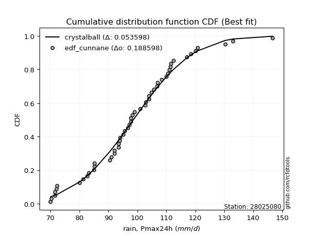</img>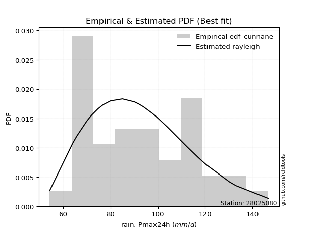</img>

</div>


### 11. Empirical - EDF Adamowski (1981)

The Adamowski formula in hydrology refers to a specific plotting position formula used for estimating the non-parametric empirical distribution of hydrological events (like flood peaks) to calculate their return periods. This formula provides an alternative to traditional parametric methods (like the Gumbel or Log Pearson Type III distributions). 

<div align="center">


$P=(m-0.25)/(n+0.5)$


</div>


**11.1. Empirical values**

<div align="center">

|                | 0                    | 1                   | 2                   | 3                   | 4                  | 5                   | 6                   | 7                   | 8                   | 9                   | 10                  | 11                  | 12                 | 13                 | 14                  | 15                 | 16                 | 17                  | 18                  | 19                 | 20            | 21                 | 22                 | 23                 | 24                 | 25                 | 26                 | 27                 | 28                 | 29                 | 30                 | 31                 | 32                 | 33                 | 34                 | 35                 | 36                 | 37                 | 38                 | 39                 | 40                 |
|:---------------|:---------------------|:--------------------|:--------------------|:--------------------|:-------------------|:--------------------|:--------------------|:--------------------|:--------------------|:--------------------|:--------------------|:--------------------|:-------------------|:-------------------|:--------------------|:-------------------|:-------------------|:--------------------|:--------------------|:-------------------|:--------------|:-------------------|:-------------------|:-------------------|:-------------------|:-------------------|:-------------------|:-------------------|:-------------------|:-------------------|:-------------------|:-------------------|:-------------------|:-------------------|:-------------------|:-------------------|:-------------------|:-------------------|:-------------------|:-------------------|:-------------------|
| date           | 2015                 | 1972                | 2012                | 1993                | 1989               | 2003                | 1986                | 1978                | 1991                | 1975                | 2006                | 1990                | 2014               | 2002               | 2013                | 2008               | 2004               | 1998                | 2009                | 1987               | 1983          | 2010               | 2011               | 1977               | 1997               | 2000               | 1995               | 2005               | 1982               | 2007               | 1979               | 1996               | 1981               | 1994               | 1992               | 1984               | 1999               | 1980               | 1985               | 2001               | 1988               |
| x              | 54.3053914059459     | 64.0372627544925    | 65.761435086823     | 70.0                | 70.3               | 70.6734304811073    | 71.1                | 71.5                | 71.6                | 72.0                | 72.0                | 72.2                | 74.7740840725297   | 76.5387530073253   | 77.1042389790807    | 80.0               | 85.0               | 85.1                | 85.1                | 90.1               | 90.4          | 92.0               | 94.0               | 97.7               | 98.3               | 99.0               | 104.0              | 104.0              | 104.9              | 110.0              | 110.5              | 111.0              | 111.5              | 112.5              | 117.0              | 118.5              | 120.0              | 120.7              | 130.3              | 133.0              | 146.7              |
| m              | 1                    | 2                   | 3                   | 4                   | 5                  | 6                   | 7                   | 8                   | 9                   | 10                  | 11                  | 12                  | 13                 | 14                 | 15                  | 16                 | 17                 | 18                  | 19                  | 20                 | 21            | 22                 | 23                 | 24                 | 25                 | 26                 | 27                 | 28                 | 29                 | 30                 | 31                 | 32                 | 33                 | 34                 | 35                 | 36                 | 37                 | 38                 | 39                 | 40                 | 41                 |
| empirical_dist | edf_adamowski        | edf_adamowski       | edf_adamowski       | edf_adamowski       | edf_adamowski      | edf_adamowski       | edf_adamowski       | edf_adamowski       | edf_adamowski       | edf_adamowski       | edf_adamowski       | edf_adamowski       | edf_adamowski      | edf_adamowski      | edf_adamowski       | edf_adamowski      | edf_adamowski      | edf_adamowski       | edf_adamowski       | edf_adamowski      | edf_adamowski | edf_adamowski      | edf_adamowski      | edf_adamowski      | edf_adamowski      | edf_adamowski      | edf_adamowski      | edf_adamowski      | edf_adamowski      | edf_adamowski      | edf_adamowski      | edf_adamowski      | edf_adamowski      | edf_adamowski      | edf_adamowski      | edf_adamowski      | edf_adamowski      | edf_adamowski      | edf_adamowski      | edf_adamowski      | edf_adamowski      |
| empirical      | 0.018072289156626505 | 0.04216867469879518 | 0.06626506024096386 | 0.09036144578313253 | 0.1144578313253012 | 0.13855421686746988 | 0.16265060240963855 | 0.18674698795180722 | 0.21084337349397592 | 0.23493975903614459 | 0.25903614457831325 | 0.28313253012048195 | 0.3072289156626506 | 0.3313253012048193 | 0.35542168674698793 | 0.3795180722891566 | 0.4036144578313253 | 0.42771084337349397 | 0.45180722891566266 | 0.4759036144578313 | 0.5           | 0.5240963855421686 | 0.5481927710843374 | 0.572289156626506  | 0.5963855421686747 | 0.6204819277108434 | 0.6445783132530121 | 0.6686746987951807 | 0.6927710843373494 | 0.7168674698795181 | 0.7409638554216867 | 0.7650602409638554 | 0.7891566265060241 | 0.8132530120481928 | 0.8373493975903614 | 0.8614457831325302 | 0.8855421686746988 | 0.9096385542168675 | 0.9337349397590361 | 0.9578313253012049 | 0.9819277108433735 |
| empirical_tr   | 1.01840490797546     | 1.0440251572327044  | 1.070967741935484   | 1.099337748344371   | 1.129251700680272  | 1.1608391608391608  | 1.1942446043165469  | 1.2296296296296296  | 1.2671755725190839  | 1.3070866141732285  | 1.3495934959349594  | 1.3949579831932772  | 1.4434782608695653 | 1.4954954954954955 | 1.5514018691588785  | 1.6116504854368934 | 1.676767676767677  | 1.7473684210526315  | 1.8241758241758244  | 1.908045977011494  | 2.0           | 2.10126582278481   | 2.2133333333333334 | 2.3380281690140845 | 2.4776119402985075 | 2.6349206349206353 | 2.8135593220338984 | 3.018181818181818  | 3.2549019607843133 | 3.5319148936170217 | 3.86046511627907   | 4.2564102564102555 | 4.742857142857144  | 5.35483870967742   | 6.148148148148147  | 7.217391304347829  | 8.73684210526316   | 11.066666666666665 | 15.090909090909081 | 23.714285714285733 | 55.33333333333333  |

</div>


**11.2. Parameters & Kolmogorov-Smirnov fit test (sorted by Δ)**

|   id | empirical_dist   | p_dist             |    delta |   deltao | eval    |   fit |   n |             loc |          scale | shape                 | shape1              | shape2             | shape3   |   best_fit |   best_fit_sort |
|-----:|:-----------------|:-------------------|---------:|---------:|:--------|------:|----:|----------------:|---------------:|:----------------------|:--------------------|:-------------------|:---------|-----------:|----------------:|
|    0 | edf_adamowski    | rayleigh           | 0.10284  | 0.212396 | Δo > Δ  |     1 |  41 |    51.3316      |   33.0947      |                       |                     |                    |          |          1 |               1 |
|    1 | edf_adamowski    | weibull_min        | 0.103755 | 0.212396 | Δo > Δ  |     1 |  41 |    50.8426      |   47.3969      | 2.033534143641118     |                     |                    |          |          0 |               2 |
|    2 | edf_adamowski    | kstwobign          | 0.104078 | 0.212396 | Δo > Δ  |     1 |  41 |    18.3574      |   85.3447      |                       |                     |                    |          |          0 |               3 |
|    3 | edf_adamowski    | halfnorm           | 0.105207 | 0.212396 | Δo > Δ  |     1 |  41 |    64.1117      |   35.9675      |                       |                     |                    |          |          0 |               4 |
|    4 | edf_adamowski    | maxwell            | 0.10537  | 0.212396 | Δo > Δ  |     1 |  41 |    41.4335      |   32.1952      |                       |                     |                    |          |          0 |               5 |
|    5 | edf_adamowski    | rice               | 0.105408 | 0.212396 | Δo > Δ  |     1 |  41 |    50.8548      |   28.7203      | 0.8389678126883386    |                     |                    |          |          0 |               6 |
|    6 | edf_adamowski    | truncnorm          | 0.105468 | 0.212396 | Δo > Δ  |     1 |  41 |    95.0772      |   28.4475      | -1243.6895676394577   | 1.814671293759121   |                    |          |          0 |               7 |
|    7 | edf_adamowski    | nakagami           | 0.10688  | 0.212396 | Δo > Δ  |     1 |  41 |    64.0373      |   35.3214      | 0.4115299577326458    |                     |                    |          |          0 |               8 |
|    8 | edf_adamowski    | chi2               | 0.108263 | 0.212396 | Δo > Δ  |     1 |  41 |    43.0626      |    5.03675     | 9.876803712593091     |                     |                    |          |          0 |               9 |
|    9 | edf_adamowski    | gamma              | 0.108263 | 0.212396 | Δo > Δ  |     1 |  41 |    43.0626      |   10.0735      | 4.938420323915814     |                     |                    |          |          0 |              10 |
|   10 | edf_adamowski    | erlang             | 0.108263 | 0.212396 | Δo > Δ  |     1 |  41 |    43.0625      |   10.0734      | 4.938436195795459     |                     |                    |          |          0 |              11 |
|   11 | edf_adamowski    | recipinvgauss      | 0.110775 | 0.212396 | Δo > Δ  |     1 |  41 |    24.0281      |    6.69795     | 0.10788608125682134   |                     |                    |          |          0 |              12 |
|   12 | edf_adamowski    | fatiguelife        | 0.111004 | 0.212396 | Δo > Δ  |     1 |  41 |    22.7206      |   66.7271      | 0.31737542001836927   |                     |                    |          |          0 |              13 |
|   13 | edf_adamowski    | invweibull         | 0.11128  | 0.212396 | Δo > Δ  |     1 |  41 |    -8.97425e+08 |    8.97425e+08 | 49542329.20739781     |                     |                    |          |          0 |              14 |
|   14 | edf_adamowski    | invgauss           | 0.11141  | 0.212396 | Δo > Δ  |     1 |  41 |    21.1058      |  731.571       | 0.09801052421316643   |                     |                    |          |          0 |              15 |
|   15 | edf_adamowski    | genlogistic        | 0.11152  | 0.212396 | Δo > Δ  |     1 |  41 |   -25.9585      |   18.1125      | 398.747501290429      |                     |                    |          |          0 |              16 |
|   16 | edf_adamowski    | mielke             | 0.112035 | 0.212396 | Δo > Δ  |     1 |  41 |    -0.276427    |   69.9063      | 16.638525016287083    | 5.624006127126446   |                    |          |          0 |              17 |
|   17 | edf_adamowski    | pearson3           | 0.112332 | 0.212396 | Δo > Δ  |     1 |  41 |    92.8096      |   21.6816      | 0.4170719051692846    |                     |                    |          |          0 |              18 |
|   18 | edf_adamowski    | johnsonsu          | 0.11246  | 0.212396 | Δo > Δ  |     1 |  41 |    20.9847      |    7.41493     | -9.6009748402718      | 3.2876572128804944  |                    |          |          0 |              19 |
|   19 | edf_adamowski    | lognorm            | 0.113302 | 0.212396 | Δo > Δ  |     1 |  41 |    19.821       |   69.8056      | 0.30079481944578906   |                     |                    |          |          0 |              20 |
|   20 | edf_adamowski    | fisk               | 0.113384 | 0.212396 | Δo > Δ  |     1 |  41 |    -0.167391    |   90.3714      | 7.14495643897858      |                     |                    |          |          0 |              21 |
|   21 | edf_adamowski    | betaprime          | 0.114775 | 0.212396 | Δo > Δ  |     1 |  41 |    -0.678539    |   22.3309      | 95.22523801090057     | 23.742643240532814  |                    |          |          0 |              22 |
|   22 | edf_adamowski    | invgamma           | 0.114812 | 0.212396 | Δo > Δ  |     1 |  41 |    -8.58668     | 2181.37        | 22.503174952551618    |                     |                    |          |          0 |              23 |
|   23 | edf_adamowski    | f                  | 0.115024 | 0.212396 | Δo > Δ  |     1 |  41 |    -0.630147    |   89.7538      | 154.292828236314      | 50.23578069229985   |                    |          |          0 |              24 |
|   24 | edf_adamowski    | nct                | 0.11527  | 0.212396 | Δo > Δ  |     1 |  41 |    -0.136499    |    9.69329     | 12.772217445810396    | 9.022020618429718   |                    |          |          0 |              25 |
|   25 | edf_adamowski    | alpha              | 0.116195 | 0.212396 | Δo > Δ  |     1 |  41 |   -74.2724      | 1300.21        | 7.910501337385717     |                     |                    |          |          0 |              26 |
|   26 | edf_adamowski    | laplace_asymmetric | 0.116834 | 0.212396 | Δo > Δ  |     1 |  41 |    71.1         |   11.4546      | 0.43004861220629687   |                     |                    |          |          0 |              27 |
|   27 | edf_adamowski    | exponnorm          | 0.117106 | 0.212396 | Δo > Δ  |     1 |  41 |    78.2603      |   16.6778      | 0.872376933838804     |                     |                    |          |          0 |              28 |
|   28 | edf_adamowski    | crystalball        | 0.121001 | 0.212396 | Δo > Δ  |     1 |  41 |    92.8096      |   21.6816      | 7797.312554904493     | 1297.0685011479204  |                    |          |          0 |              29 |
|   29 | edf_adamowski    | norm               | 0.121001 | 0.212396 | Δo > Δ  |     1 |  41 |    92.8096      |   21.6815      |                       |                     |                    |          |          0 |              30 |
|   30 | edf_adamowski    | t                  | 0.121179 | 0.212396 | Δo > Δ  |     1 |  41 |    92.8234      |   21.6831      | 146537.65006382146    |                     |                    |          |          0 |              31 |
|   31 | edf_adamowski    | loggamma           | 0.12161  | 0.212396 | Δo > Δ  |     1 |  41 | -5932.16        |  827.853       | 1448.4272314307375    |                     |                    |          |          0 |              32 |
|   32 | edf_adamowski    | gumbel_r           | 0.133584 | 0.212396 | Δo > Δ  |     1 |  41 |    83.0518      |   16.905       |                       |                     |                    |          |          0 |              33 |
|   33 | edf_adamowski    | dgamma             | 0.142381 | 0.212396 | Δo > Δ  |     1 |  41 |    95.3247      |    8.86077     | 2.121247318447837     |                     |                    |          |          0 |              34 |
|   34 | edf_adamowski    | logistic           | 0.143579 | 0.212396 | Δo > Δ  |     1 |  41 |    92.8096      |   11.9537      |                       |                     |                    |          |          0 |              35 |
|   35 | edf_adamowski    | halflogistic       | 0.146747 | 0.212396 | Δo > Δ  |     1 |  41 |    67.1119      |   18.537       |                       |                     |                    |          |          0 |              36 |
|   36 | edf_adamowski    | moyal              | 0.155352 | 0.212396 | Δo > Δ  |     1 |  41 |    80.4107      |    9.76013     |                       |                     |                    |          |          0 |              37 |
|   37 | edf_adamowski    | gumbel_l           | 0.156546 | 0.212396 | Δo > Δ  |     1 |  41 |   102.567       |   16.905       |                       |                     |                    |          |          0 |              38 |
|   38 | edf_adamowski    | hypsecant          | 0.157962 | 0.212396 | Δo > Δ  |     1 |  41 |    92.8096      |   13.8029      |                       |                     |                    |          |          0 |              39 |
|   39 | edf_adamowski    | laplace            | 0.175917 | 0.212396 | Δo > Δ  |     1 |  41 |    92.8096      |   15.3312      |                       |                     |                    |          |          0 |              40 |
|   40 | edf_adamowski    | genexpon           | 0.237966 | 0.212396 | Δo <= Δ |     0 |  41 |    53.5691      |    1.80935     | 4.581735737394762e-11 | 0.04769179520246915 | 1.3583524985563262 |          |          0 |              41 |
|   41 | edf_adamowski    | expon              | 0.244399 | 0.212396 | Δo <= Δ |     0 |  41 |    54.3054      |   38.5042      |                       |                     |                    |          |          0 |              42 |
|   42 | edf_adamowski    | pareto             | 0.244399 | 0.212396 | Δo <= Δ |     0 |  41 |    -2.14748e+09 |    2.14748e+09 | 55772664.66562522     |                     |                    |          |          0 |              43 |
|   43 | edf_adamowski    | zzgumbel           | 0.273232 | 0.212396 | Δo <= Δ |     0 |  41 |    92.7778      |   17.115       | 0.5441978529407195    | 1.1435823657845239  |                    |          |          0 |              44 |
|   44 | edf_adamowski    | wald               | 0.283114 | 0.212396 | Δo <= Δ |     0 |  41 |    71.128       |   21.6816      |                       |                     |                    |          |          0 |              45 |
|   45 | edf_adamowski    | gibrat             | 0.348967 | 0.212396 | Δo <= Δ |     0 |  41 |    76.2694      |   10.0322      |                       |                     |                    |          |          0 |              46 |
|   46 | edf_adamowski    | gompertz           | 0.362285 | 0.212396 | Δo <= Δ |     0 |  41 |  -323.548       |   11.5888      | 4.719325060208775e-17 |                     |                    |          |          0 |              47 |
|   47 | edf_adamowski    | ncf                | 0.538594 | 0.212396 | Δo <= Δ |     0 |  41 |    -0.082077    |    1.06134e-05 | 5.041499418439944e-07 | 14.643978562930169  | 3.2782378530006118 |          |          0 |              48 |

<div align="center">

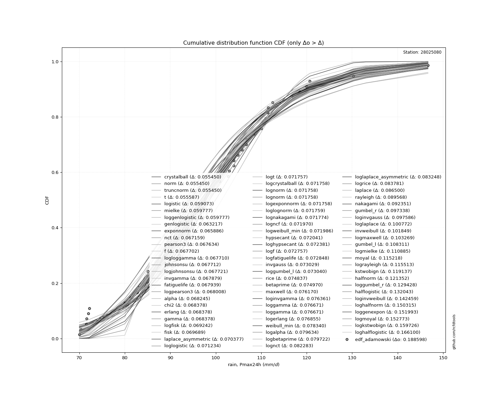</img>

</div>


**11.3. Best fit**

|   id |   station | empirical_dist   | p_dist   |   delta |   deltao | eval   |   fit |   n |     loc |   scale | shape   | shape1   | shape2   | shape3   |   best_fit |   best_fit_sort |
|-----:|----------:|:-----------------|:---------|--------:|---------:|:-------|------:|----:|--------:|--------:|:--------|:---------|:---------|:---------|-----------:|----------------:|
|    0 |  28025080 | edf_adamowski    | rayleigh | 0.10284 | 0.212396 | Δo > Δ |     1 |  41 | 51.3316 | 33.0947 |         |          |          |          |          1 |               1 |

<div align="center">

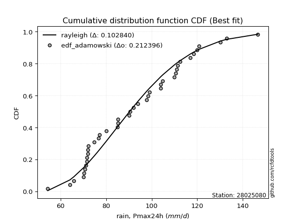</img>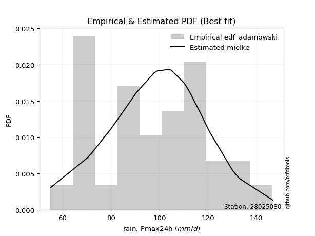</img>

</div>


## C. Best fit & Estimate extreme values for specific return periods - Tr


### 1. Best fit (ordered by delta Δ)

|   id |   station | empirical_dist   | p_dist    |     delta |   deltao | eval   |   fit |   n |     loc |   scale | shape               | shape1            | shape2   | shape3   |   best_fit |   best_fit_sort |
|-----:|----------:|:-----------------|:----------|----------:|---------:|:-------|------:|----:|--------:|--------:|:--------------------|:------------------|:---------|:---------|-----------:|----------------:|
|    0 |  28025080 | edf_california   | nakagami  | 0.0931149 | 0.212396 | Δo > Δ |     1 |  41 | 64.0373 | 35.3214 | 0.4115299577326458  |                   |          |          |          1 |               1 |
|    1 |  28025080 | edf_hazen        | rayleigh  | 0.100195  | 0.212396 | Δo > Δ |     1 |  41 | 51.3316 | 33.0947 |                     |                   |          |          |          1 |               2 |
|    2 |  28025080 | edf_weibull      | truncnorm | 0.100591  | 0.212396 | Δo > Δ |     1 |  41 | 95.0772 | 28.4475 | -1243.6895676394577 | 1.814671293759121 |          |          |          1 |               3 |
|    3 |  28025080 | edf_gringorten   | rayleigh  | 0.100836  | 0.212396 | Δo > Δ |     1 |  41 | 51.3316 | 33.0947 |                     |                   |          |          |          1 |               4 |
|    4 |  28025080 | edf_cunnane      | rayleigh  | 0.101261  | 0.212396 | Δo > Δ |     1 |  41 | 51.3316 | 33.0947 |                     |                   |          |          |          1 |               5 |
|    5 |  28025080 | edf_blom         | rayleigh  | 0.101526  | 0.212396 | Δo > Δ |     1 |  41 | 51.3316 | 33.0947 |                     |                   |          |          |          1 |               6 |
|    6 |  28025080 | edf_tukey        | rayleigh  | 0.101966  | 0.212396 | Δo > Δ |     1 |  41 | 51.3316 | 33.0947 |                     |                   |          |          |          1 |               7 |
|    7 |  28025080 | edf_beard        | rayleigh  | 0.102211  | 0.212396 | Δo > Δ |     1 |  41 | 51.3316 | 33.0947 |                     |                   |          |          |          1 |               8 |
|    8 |  28025080 | edf_jenkinson    | rayleigh  | 0.102211  | 0.212396 | Δo > Δ |     1 |  41 | 51.3316 | 33.0947 |                     |                   |          |          |          1 |               9 |
|    9 |  28025080 | edf_chegodayev   | rayleigh  | 0.102316  | 0.212396 | Δo > Δ |     1 |  41 | 51.3316 | 33.0947 |                     |                   |          |          |          1 |              10 |
|   10 |  28025080 | edf_adamowski    | rayleigh  | 0.10284   | 0.212396 | Δo > Δ |     1 |  41 | 51.3316 | 33.0947 |                     |                   |          |          |          1 |              11 |

:file_folder:Tables: [bestfit_28025080.csv](table/bestfit_28025080.csv) | [extreme_28025080.csv](table/extreme_28025080.csv)


### 2. Extreme values

In hydrology, a return period (or recurrence interval) is the statistical average time between extreme events like floods or droughts of a specific magnitude, indicating how rare an event is, with a 100-year flood, for example, having a 1% chance of occurring in any given year, not that it happens exactly every century. It is a key tool for infrastructure design (like bridges or dams) and risk assessment, calculated from historical data to determine the probability of future events, although it is important to remember it is statistical average, and events can cluster or be missed.

> risk_rate: assuming the return period as the project useful life.

|   id |      tr |   prob_l |     prob_g |    alpha |   betaprime |     chi2 |   crystalball |   dgamma |   erlang |    expon |   exponnorm |        f |   fatiguelife |    fisk |    gamma |   genexpon |   genlogistic |   gibrat |   gompertz |   gumbel_l |   gumbel_r |   halflogistic |   halfnorm |   hypsecant |   invgamma |   invgauss |   invweibull |   johnsonsu |   kstwobign |   laplace |   laplace_asymmetric |   loggamma |   logistic |   lognorm |   maxwell |   mielke |    moyal |   nakagami |      ncf |      nct |     norm |   pareto |   pearson3 |   rayleigh |   recipinvgauss |     rice |        t |   truncnorm |     wald |   weibull_min |   zzgumbel |   station |   n |   risk_rate |
|-----:|--------:|---------:|-----------:|---------:|------------:|---------:|--------------:|---------:|---------:|---------:|------------:|---------:|--------------:|--------:|---------:|-----------:|--------------:|---------:|-----------:|-----------:|-----------:|---------------:|-----------:|------------:|-----------:|-----------:|-------------:|------------:|------------:|----------:|---------------------:|-----------:|-----------:|----------:|----------:|---------:|---------:|-----------:|---------:|---------:|---------:|---------:|-----------:|-----------:|----------------:|---------:|---------:|------------:|---------:|--------------:|-----------:|----------:|----:|------------:|
|    0 |    2    | 0.5      | 0.5        |  90.0929 |     89.8385 |  89.4951 |       92.8096 |  95.3247 |  89.4951 |  80.9945 |     91.2375 |  89.9349 |       89.4476 |  90.204 |  89.4951 |     81.198 |       89.1279 |  86.3015 |    107.852 |    96.3716 |    89.2477 |        87.4769 |    88.3714 |     92.8096 |    89.803  |    89.4813 |      89.0909 |     89.5472 |     88.9864 |   92.8096 |              85.0425 |     92.956 |    92.8096 |   89.6266 |   90.9553 |  88.3079 |  88.0978 |    85.6557 |  47.3567 |  89.5225 |  92.8096 |  80.9945 |    91.3064 |    90.2976 |         89.4339 |  90.7036 |  92.8234 |     93.8365 |  85.7813 |       90.4225 |    99.0507 |  28025080 |  41 |    0.75     |
|    1 |    2.33 | 0.570815 | 0.429185   |  93.8864 |     93.6553 |  93.4379 |       96.6787 | 101.803  |  93.4379 |  86.8749 |     94.9567 |  93.7553 |       93.3353 |  93.884 |  93.4379 |     86.992 |       92.9721 |  88.2615 |    110.159 |    99.7377 |    92.8328 |        91.163  |    92.5472 |     95.9061 |    93.6231 |    93.362  |      92.9325 |     93.3933 |     92.9737 |   95.151  |              89.1103 |     96.835 |    96.2186 |   93.476  |   94.975  |  92.092  |  91.4916 |    90.0203 |  61.8268 |  93.3143 |  96.6787 |  86.8749 |    95.1908 |    94.3768 |         93.3253 |  94.7783 |  96.6927 |     98.7208 |  88.3184 |       94.4942 |   102.68   |  28025080 |  41 |    0.729209 |
|    2 |    5    | 0.8      | 0.2        | 109.662  |    109.65   | 110.025  |      111.057  | 114.416  | 110.025  | 116.276  |    109.772  | 109.717  |      109.81   | 109.555 | 110.025  |    115.961 |      109.668  |  99.5453 |    117.614 |   110.612  |   108.408  |       107.842  |   110.206  |    108.327  |   109.676  |   109.791  |     109.622  |    109.653  |    109.911  |  106.857  |             109.448  |    111.198 |   109.381  |  109.736  |  110.796  | 109.668  | 107.212  |   108.981  | 133.845  | 109.49   | 111.057  | 116.276  |   110.481  |   110.708  |        109.821  | 110.869  | 111.072  |    116.299  | 102.521  |      110.737  |   118.449  |  28025080 |  41 |    0.67232  |
|    3 |   10    | 0.9      | 0.1        | 121.869  |    122.088  | 122.782  |      120.596  | 123.27   | 122.782  | 142.965  |    120.909  | 122.076  |      122.663  | 122.742 | 122.782  |    142.257 |      123.263  | 112.408  |    121.764 |   116.667  |   121.094  |       121.693  |   123.273  |    118.245  |   122.207  |   122.604  |     123.216  |    122.39   |    122.806  |  117.484  |             127.911  |    120.68  |   119.075  |  122.458  |  121.93   | 125.812  | 120.899  |   123.249  | 201.731  | 122.442  | 120.596  | 142.965  |   121.383  |   122.352  |        122.692  | 122.138  | 120.612  |    126.945  | 117.592  |      122.271  |   131.293  |  28025080 |  41 |    0.651322 |
|    4 |   15    | 0.933333 | 0.0666667  | 128.587  |    128.93   | 129.691  |      125.355  | 128.075  | 129.691  | 158.577  |    127.042  | 128.857  |      129.699  | 130.583 | 129.691  |    157.64  |      130.932  | 121.279  |    123.644 |   119.409  |   128.252  |       129.531  |   130.073  |    123.905  |   129.118  |   129.62   |     130.885  |    129.411  |    129.652  |  123.7    |             138.711  |    125.398 |   124.356  |  129.464  |  127.643  | 135.82   | 128.842  |   130.705  | 243.393  | 129.724  | 125.355  | 158.577  |   127.054  |   128.351  |        129.737  | 127.884  | 125.372  |    131.675  | 127.271  |      128.202  |   138.539  |  28025080 |  41 |    0.644736 |
|    5 |   20    | 0.95     | 0.05       | 133.242  |    133.663  | 134.415  |      128.473  | 131.38   | 134.415  | 169.654  |    131.312  | 133.54   |      134.541  | 136.292 | 134.415  |    168.554 |      136.302  | 128.239  |    124.814 |   121.115  |   133.263  |       135.023  |   134.607  |    127.898  |   133.905  |   134.45   |     136.255  |    134.269  |    134.264  |  128.111  |             146.373  |    128.483 |   128.006  |  134.31   |  131.435  | 143.263  | 134.468  |   135.681  | 274.009  | 134.83   | 128.473  | 169.654  |   130.853  |   132.339  |        134.585  | 131.683  | 128.489  |    134.473  | 134.483  |      132.139  |   143.613  |  28025080 |  41 |    0.641514 |
|    6 |   25    | 0.96     | 0.04       | 136.807  |    137.282  | 137.995  |      130.767  | 133.897  | 137.995  | 178.246  |    134.597  | 137.117  |      138.227  | 140.828 | 137.995  |    177.02  |      140.438  | 134.04   |    125.647 |   122.33   |   137.123  |       139.254  |   137.98   |    130.988  |   137.57   |   138.127  |     140.391  |    137.983  |    137.718  |  131.532  |             152.317  |    130.751 |   130.799  |  138.013  |  134.249  | 149.257  | 138.828  |   139.386  | 298.419  | 138.774  | 130.767  | 178.246  |   133.691  |   135.302  |        138.275  | 134.495  | 130.784  |    136.353  | 140.26   |      135.063  |   147.521  |  28025080 |  41 |    0.639603 |
|    7 |   50    | 0.98     | 0.02       | 147.73   |    148.324  | 148.732  |      137.338  | 141.513  | 148.732  | 204.935  |    144.728  | 148.01   |      149.367  | 155.64  | 148.732  |    203.317 |      153.179  | 154.491  |    127.907 |   125.627  |   149.014  |       152.291  |   147.785  |    140.569  |   148.769  |   149.247  |     153.133  |    149.302  |    147.862  |  142.159  |             170.779  |    137.236 |   139.331  |  149.294  |  142.413  | 169.285  | 152.365  |   150.157  | 378.319  | 151.02   | 137.338  | 204.935  |   142.024  |   143.902  |        149.427  | 142.614  | 137.355  |    140.776  | 159.122  |      143.54   |   159.56   |  28025080 |  41 |    0.63583  |
|    8 |   75    | 0.986667 | 0.0133333  | 154.07   |    154.693  | 154.793  |      140.864  | 145.859  | 154.793  | 220.547  |    150.633  | 154.28   |      155.711  | 164.894 | 154.793  |    218.7   |      160.584  | 168.304  |    129.05  |   127.294  |   155.926  |       159.87   |   153.122  |    146.168  |   155.243  |   155.584  |     160.539  |    155.819  |    153.443  |  148.375  |             181.579  |    140.708 |   144.259  |  155.784  |  146.851  | 182.108  | 160.281  |   156.02   | 428.195  | 158.236  | 140.864  | 220.547  |   146.619  |   148.581  |        155.776  | 147.005  | 140.882  |    142.528  | 170.729  |      148.146  |   166.557  |  28025080 |  41 |    0.634587 |
|    9 |  100    | 0.99     | 0.01       | 158.567  |    159.19   | 159.012  |      143.248  | 148.903  | 159.012  | 231.624  |    154.82   | 158.701  |      160.151  | 171.757 | 159.012  |    229.614 |      165.825  | 179.004  |    129.797 |   128.385  |   160.817  |       165.234  |   156.758  |    150.14   |   159.82   |   160.02   |     165.78   |    160.413  |    157.266  |  152.786  |             189.241  |    143.054 |   147.738  |  160.358  |  149.874  | 191.757  | 165.897  |   160.014  | 465.116  | 163.399  | 143.248  | 231.624  |   149.777  |   151.769  |        160.219  | 149.986  | 143.266  |    143.476  | 179.191  |      151.282  |   171.51   |  28025080 |  41 |    0.633968 |
|   10 |  200    | 0.995    | 0.005      | 169.456  |    169.995  | 168.946  |      148.658  | 156.131  | 168.946  | 258.313  |    164.906  | 169.305  |      170.676  | 189.405 | 168.946  |    255.911 |      178.426  | 208.114  |    131.422 |   130.755  |   172.578  |       178.129  |   165.074  |    159.708  |   170.835  |   170.544  |     178.382  |    171.42   |    166.074  |  163.412  |             207.704  |    148.366 |   156.084  |  171.31   |  156.79   | 217.075  | 179.428  |   169.147  | 559.738  | 176.04   | 148.658  | 258.313  |   157.09   |   159.063  |        170.749  | 156.78   | 148.676  |    145.008  | 200.27   |      158.451  |   183.416  |  28025080 |  41 |    0.633042 |
|   11 |  250    | 0.996    | 0.004      | 172.99   |    173.474  | 172.083  |      150.311  | 158.43   | 172.082  | 266.905  |    168.153  | 172.714  |      174.02   | 195.447 | 172.082  |    264.376 |      182.476  | 218.559  |    131.9   |   131.452  |   176.358  |       182.275  |   167.632  |    162.788  |   174.387  |   173.889  |     182.433  |    174.954  |    168.799  |  166.833  |             213.647  |    149.988 |   158.763  |  174.824  |  158.919  | 225.899  | 183.783  |   171.956  | 592.018  | 180.182  | 150.311  | 266.905  |   159.367  |   161.308  |        174.095  | 158.865  | 150.329  |    145.332  | 207.243  |      160.657  |   187.244  |  28025080 |  41 |    0.632858 |
|   12 |  500    | 0.998    | 0.002      | 184.099  |    184.314  | 181.666  |      155.213  | 165.502  | 181.666  | 293.594  |    178.238  | 183.318  |      184.295  | 215.435 | 181.666  |    290.673 |      195.049  | 254.657  |    133.271 |   133.451  |   188.093  |       195.142  |   175.26   |    172.356  |   185.471  |   184.176  |     195.007  |    185.927  |    176.967  |  177.46   |             232.11   |    154.789 |   167.073  |  185.732  |  165.272  | 255.627  | 197.314  |   180.327  | 698.435  | 193.314  | 155.213  | 293.594  |   166.233  |   168.007  |        184.373  | 165.064  | 155.232  |    146.001  | 229.417  |      167.232  |   199.124  |  28025080 |  41 |    0.632489 |
|   13 |  750    | 0.998667 | 0.00133333 | 190.712  |    190.693  | 187.172  |      157.936  | 169.596  | 187.172  | 309.206  |    184.137  | 189.547  |      190.238  | 228.046 | 187.172  |    306.056 |      202.399  | 278.53   |    134.003 |   134.52   |   194.953  |       202.664  |   179.521  |    177.953  |   192.005  |   190.131  |     202.358  |    192.357  |    181.556  |  183.676  |             242.91   |    157.452 |   171.928  |  192.12   |  168.826  | 274.779  | 205.229  |   185.002  | 765.295  | 201.205  | 157.936  | 309.206  |   170.123  |   171.753  |        190.316  | 168.519  | 157.955  |    146.231  | 242.711  |      170.907  |   206.069  |  28025080 |  41 |    0.632366 |
|   14 | 1000    | 0.999    | 0.001      | 195.466  |    195.242  | 191.04   |      159.811  | 172.484  | 191.04   | 320.283  |    188.322  | 193.985  |      194.429  | 237.433 | 191.04   |    316.97  |      207.613  | 296.799  |    134.496 |   135.239  |   199.819  |       208      |   182.464  |    181.924  |   196.67   |   194.331  |     207.572  |    196.928  |    184.735  |  188.087  |             250.572  |    159.284 |   175.371  |  196.66   |  171.281  | 289.226  | 210.844  |   188.229  | 814.942  | 206.907  | 159.811  | 320.283  |   172.832  |   174.342  |        194.507  | 170.902  | 159.83   |    146.347  | 252.275  |      173.445  |   210.996  |  28025080 |  41 |    0.632305 |

<div align="center">

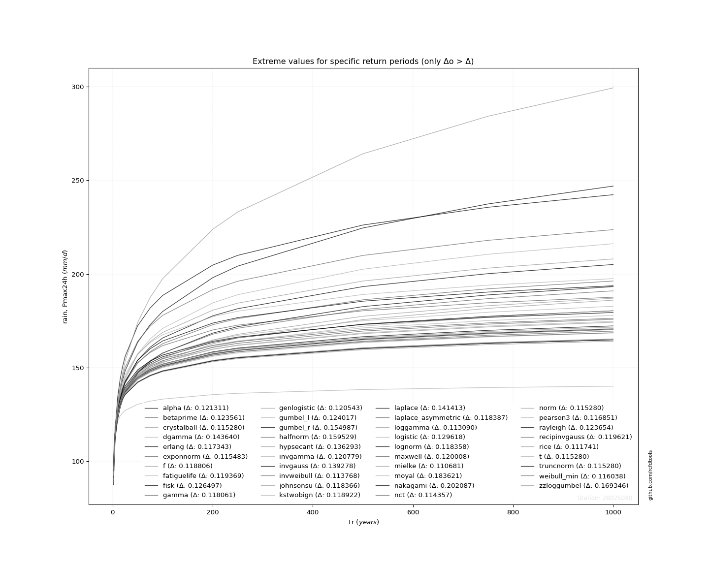</img>

</div>


<div align="center">

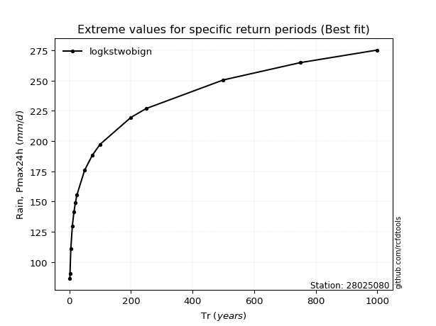</img>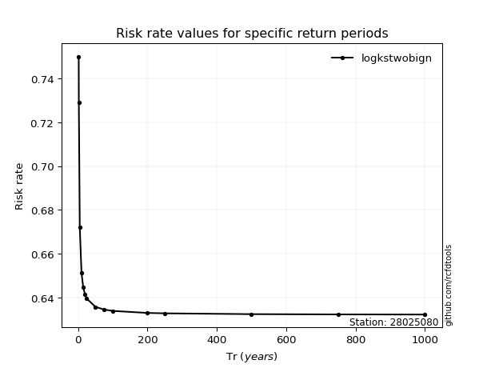</img>

</div>


<sub>**APP DISCLAIMER**: NO WARRANTY - This software is provided by [github.com/rcfdtools](https://github.com/rcfdtools) "as is", without any express or implied warranty, including warranties of merchantability, fitness for a particular purpose, or non-infringement. There is no guarantee that the software will be error-free or operate without interruption. LIMITATION OF LIABILITY - Neither the authors nor copyright holders will be liable for claims or damages arising from the software or its use. You are responsible for determining if the software is appropriate for your use and assume all associated risks, including errors, legal compliance, and data loss. NO PROFESSIONAL ADVICE - The software provides general information and does not offer professional advice. It should not replace consultation with professional advisors.</sub>