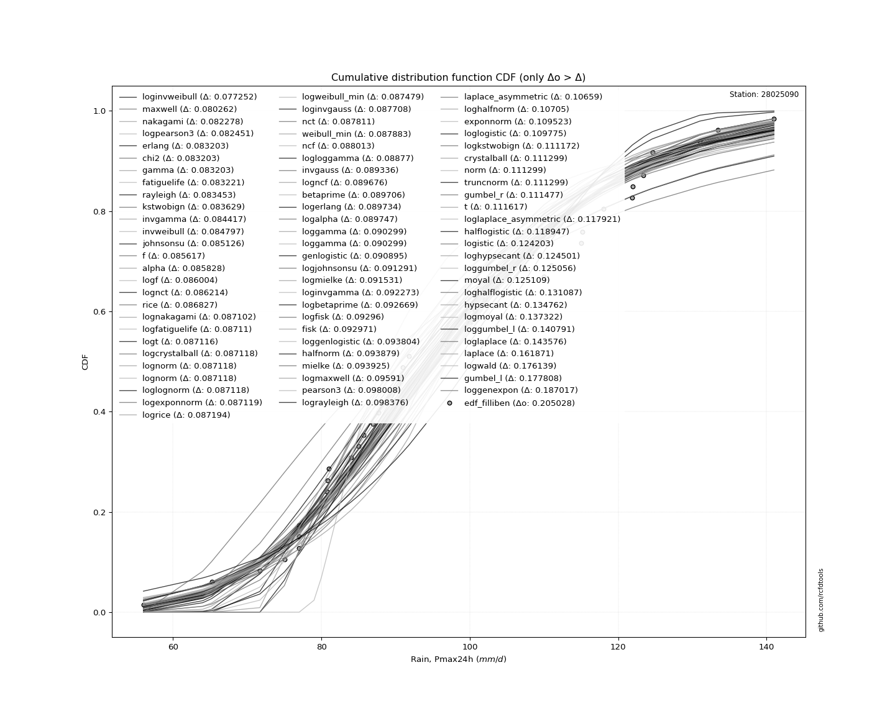

<div align="center">


</div>

# PMP Station (Rain, Pmax24h): 28025090

Probable Maximum Precipitation (PMP) is the greatest amount of rainfall for a specific duration that is meteorologically possible for a given location, acting as a "worst-case" scenario for extreme storms, crucial for designing safety-critical infrastructure like bridges, river deviations, dams, spillways, and nuclear plants to prevent catastrophic failure. PMP is calculated by hydrologists using meteorological data to determine the upper limit of extreme rainfall, often leading to the Probable Maximum Flood (PMF) for flood control design, and is increasingly being studied for climate change impacts.

<div align="center">

</img>

</div>


## A. General information


### 1. General running parameters

• app_version: _v20260103_. • runtime: _2026-01-05 08:58:49.440788_. • Python version: _3.14.0_. • SciPy version: _1.16.3_. • Pandas version: _2.3.3_. • NumPy version: _2.3.5_. • Stations dataset (station_dataset_file): _dataset/pmax24h_in/conventional_cesarcolombia_1959_2022.csv_. • Stations catalog (station_catalog_file): _dataset/CNE.xls_. • Minimum year to eval til year_max (date_min): _1900_. • Maximum year to eval since year_min (date_max): _2024_. • Creates, save and include plots into reports (create_plot): _True_. • Plot only fit distributions with Δo > Δ (plot_only_fit): _True_. • Eval low extreme values, if False, evaluates high extreme values (low_extreme): _False_. • Eval every SciPy distribution as logarithmic (pdist_logarithmic_on): _True_. • Standard deviation normalized (ddof): _1.0_. • Return periods to eval in years (Tr): _[2, 2.33, 5, 10, 15, 20, 25, 50, 75, 100, 200, 250, 500, 750, 1000]_. • Minimum data sample per station, 0 means any (minimum_sample): _5_. • Z-Score maximum threshold to adjust a value, 0 means disable (zscore_max): _3.5_. • Z-Score minimum threshold to adjust a value, 0 means disable (zscore_min): _-2.5_. • Avoid zeros, e.g. rain = 0 (avoid_zeros): _True_. • Avoid null values (avoid_nans): _True_. [:file_folder:Dataset file.](../../dataset/pmax24h_in/conventional_cesarcolombia_1959_2022.csv)

> Delta Degrees of Freedom (DDOF): is a parameter used in the formulas for calculating variance and standard deviation. When ddof=0, the divisor is $N$ (the total number of observations) and this is used when your data set is the entire population. When ddof=1, the divisor is $N-1$ and this is used when your data set is a sample drawn from a larger population. Using $N-1$ provides an unbiased estimate of the population variance (known as Bessel´s correction).


### 2. Station info and location

|   id |   CODIGO | NOMBRE                         | CATEGORIA               | TECNOLOGIA   | ESTADO   | FECHA_INSTALACION   |   FECHA_SUSPENSION |   ALTITUD |   LATITUD |   LONGITUD | DEPARTAMENTO   | MUNICIPIO       | AREA_OPERATIVA                                         | ENTIDAD                                                     | AREA_HIDROGRAFICA   | ZONA_HIDROGRAFICA   | SUBZONA_HIDROGRAFICA   |   CORRIENTE | Catalogo   |   Version |
|-----:|---------:|:-------------------------------|:------------------------|:-------------|:---------|:--------------------|-------------------:|----------:|----------:|-----------:|:---------------|:----------------|:-------------------------------------------------------|:------------------------------------------------------------|:--------------------|:--------------------|:-----------------------|------------:|:-----------|----------:|
|    0 | 28025090 | CENTENARIO HACIENDA [28025090] | Climatológica Ordinaria | Convencional | Activa   | 15/12/1976          |                nan |       100 |   9.85025 |   -73.2655 | Cesar          | Agustín Codazzi | Area Operativa 05 - Magdalena-Cesar-Guajira-San Andrés | INSTITUTO DE HIDROLOGIA METEOROLOGIA Y ESTUDIOS AMBIENTALES | Magdalena Cauca     | Cesar               | Medio Cesar            |         nan | CNE_IDEAM  |  20251226 |

<div align="center">

Dynamic map: [:earth_americas:Google](http://maps.google.com/maps?q=9.85025,-73.26547222) [:earth_americas:OSM](https://www.openstreetmap.org/#map=18/9.85025/-73.26547222&layers=P) [:earth_americas:Bing](https://www.bing.com/maps?cp=9.85025~-73.26547222&lvl=18) [:earth_americas:Apple](https://maps.apple.com/frame?center=9.85025%2C-73.26547222&span=0.003%2C0.006)

</div>


<div align="center">

```geojson
{
  "type": "Feature",
  "geometry": {
    "type": "Point", 
    "coordinates": [-73.26547222, 9.85025]
  }, 
  "properties": {
    "Name": "28025090"
  }
}
```

</div>


### 3. Discrete values table and plot

<div align="center">

|               |           0 |           1 |           2 |           3 |          4 |          5 |           6 |          7 |           8 |          9 |          10 |          11 |         12 |         13 |         14 |         15 |          16 |          17 |         18 |          19 |          20 |          21 |         22 |          23 |          24 |          25 |         26 |          27 |          28 |          29 |         30 |         31 |         32 |         33 |         34 |          35 |           36 |        37 |         38 |         39 |          40 |           41 |          42 |          43 |
|:--------------|------------:|------------:|------------:|------------:|-----------:|-----------:|------------:|-----------:|------------:|-----------:|------------:|------------:|-----------:|-----------:|-----------:|-----------:|------------:|------------:|-----------:|------------:|------------:|------------:|-----------:|------------:|------------:|------------:|-----------:|------------:|------------:|------------:|-----------:|-----------:|-----------:|-----------:|-----------:|------------:|-------------:|----------:|-----------:|-----------:|------------:|-------------:|------------:|------------:|
| Date          | 1978        | 1979        | 1980        | 1981        | 1982       | 1983       | 1984        | 1985       | 1986        | 1987       | 1988        | 1989        | 1990       | 1991       | 1992       | 1993       | 1994        | 1995        | 1996       | 1997        | 1998        | 1999        | 2000       | 2001        | 2002        | 2003        | 2004       | 2005        | 2006        | 2007        | 2008       | 2009       | 2010       | 2011       | 2012       | 2013        | 2014         | 2015      | 2016       | 2017       | 2018        | 2019         | 2020        | 2021        |
| Value         |   86.8978   |   90.8182   |  103.6      |   87.7      |   64       |  133.4     |  116.8      |  123.4     |   80.8      |  124.6     |   91.8      |  115.2      |  122       |   75       |  102       |   90       |   85        |   81        |  121.9     |   84        |  111        |  100        |  118       |   85.7      |   79        |   77        |   90       |   77        |  112        |   91        |  131       |  141       |  124       |  110       |   56       |  115        |   97.3       |  100.7    |   65.2     |   71.7     |   80.7      |   96.7       |   80        |   77        |
| Value_initial |   86.8978   |   90.8182   |  103.6      |   87.7      |   64       |  133.4     |  116.8      |  123.4     |   80.8      |  124.6     |   91.8      |  115.2      |  122       |   75       |  102       |   90       |   85        |   81        |  121.9     |   84        |  111        |  100        |  118       |   85.7      |   79        |   77        |   90       |   77        |  112        |   91        |  131       |  141       |  124       |  110       |   56       |  115        |   97.3       |  100.7    |   65.2     |   71.7     |   80.7      |   96.7       |   80        |   77        |
| count         |   44        |   44        |   44        |   44        |   44       |   44       |   44        |   44       |   44        |   44       |   44        |   44        |   44       |   44       |   44       |   44       |   44        |   44        |   44       |   44        |   44        |   44        |   44       |   44        |   44        |   44        |   44       |   44        |   44        |   44        |   44       |   44       |   44       |   44       |   44       |   44        |   44         |   44      |   44       |   44       |   44        |   44         |   44        |   44        |
| mean          |   96.9754   |   96.9754   |   96.9754   |   96.9754   |   96.9754  |   96.9754  |   96.9754   |   96.9754  |   96.9754   |   96.9754  |   96.9754   |   96.9754   |   96.9754  |   96.9754  |   96.9754  |   96.9754  |   96.9754   |   96.9754   |   96.9754  |   96.9754   |   96.9754   |   96.9754   |   96.9754  |   96.9754   |   96.9754   |   96.9754   |   96.9754  |   96.9754   |   96.9754   |   96.9754   |   96.9754  |   96.9754  |   96.9754  |   96.9754  |   96.9754  |   96.9754   |   96.9754    |   96.9754 |   96.9754  |   96.9754  |   96.9754   |   96.9754    |   96.9754   |   96.9754   |
| std           |   20.658    |   20.658    |   20.658    |   20.658    |   20.658   |   20.658   |   20.658    |   20.658   |   20.658    |   20.658   |   20.658    |   20.658    |   20.658   |   20.658   |   20.658   |   20.658   |   20.658    |   20.658    |   20.658   |   20.658    |   20.658    |   20.658    |   20.658   |   20.658    |   20.658    |   20.658    |   20.658   |   20.658    |   20.658    |   20.658    |   20.658   |   20.658   |   20.658   |   20.658   |   20.658   |   20.658    |   20.658     |   20.658  |   20.658   |   20.658   |   20.658    |   20.658     |   20.658    |   20.658    |
| zscore        |   -0.487832 |   -0.298053 |    0.320682 |   -0.448997 |   -1.59625 |    1.76322 |    0.959661 |    1.27915 |   -0.783008 |    1.33724 |   -0.250526 |    0.882209 |    1.21138 |   -1.06377 |    0.24323 |   -0.33766 |   -0.579697 |   -0.773327 |    1.20654 |   -0.628104 |    0.678897 |    0.146415 |    1.01775 |   -0.545812 |   -0.870142 |   -0.966957 |   -0.33766 |   -0.966957 |    0.727305 |   -0.289252 |    1.64705 |    2.13112 |    1.30819 |    0.63049 |   -1.98351 |    0.872527 |    0.0157149 |    0.1803 |   -1.53816 |   -1.22352 |   -0.787849 |   -0.0133296 |   -0.821734 |   -0.966957 |


</div>


<div align="center">

</img>

</div>


> The initial value (value_initial) correspond to the initial obtained or null completed value, and value (value) is adjusted only when the initial value is outside the valid range definite through the Z-Score value. If Z-Score is active, values out of range or outliers are replaced with the station mean value


### 4. Active continuous probability distributions from SciPy (44 of 104 available)

A Probability Density Function (PDF) describes the relative likelihood of a continuous random variable falling within a specific range, where the total area under its curve equals 1, and the area over any interval gives the actual probability for that range. Unlike discrete probabilities (like rolling a die), a PDF shows density, not direct probability for a single point (which is zero), with higher points indicating higher likelihood, often visualized as a bell curve for normal distributions.

A log of a probability density function (log-PDF) is simply the logarithm of the PDF´s value, denoted as $log(f(x))$, useful for converting multiplication of probabilities into addition, improving numerical stability with tiny numbers, and connecting to information theory concepts like entropy. Instead of dealing with very small probabilities (e.g., 0.000001), log-PDFs use negative numbers (e.g., $log(0.00001) ≈ -11.51$ that are easier for computers to handle, preventing underflow errors and simplifying complex calculations. In this study, each active probability distribution from SciPy is also evaluated in the $log$ form.

[scipy.stats](https://docs.scipy.org/doc/scipy/reference/stats.html) is a Python´s powerful submodule within the SciPy library for comprehensive statistical analysis, offering over 130 probability distributions (like Normal, Poisson), functions for descriptive stats (mean, variance), hypothesis testing (t-tests, chi-square), random variable generation, and statistical tests, making it essential for data science, modeling, and research. It provides tools to explore, model, and draw conclusions from data efficiently, working seamlessly with NumPy.

<div align="center">

|   id | p_dist             |   n_parameter | fit_method   | label                                                                       | active   | ref                                                                                                        |
|-----:|:-------------------|--------------:|:-------------|:----------------------------------------------------------------------------|:---------|:-----------------------------------------------------------------------------------------------------------|
|    0 | alpha              |             3 | MLE          | Alpha                                                                       | True     | [:mortar_board:](https://docs.scipy.org/doc/scipy/reference/generated/scipy.stats.alpha.html)              |
|    1 | betaprime          |             4 | MLE          | Beta prime                                                                  | True     | [:mortar_board:](https://docs.scipy.org/doc/scipy/reference/generated/scipy.stats.betaprime.html)          |
|    2 | chi2               |             3 | MLE          | Chi²                                                                        | True     | [:mortar_board:](https://docs.scipy.org/doc/scipy/reference/generated/scipy.stats.chi2.html)               |
|    3 | crystalball        |             4 | MLE          | Crystalball                                                                 | True     | [:mortar_board:](https://docs.scipy.org/doc/scipy/reference/generated/scipy.stats.crystalball.html)        |
|    4 | erlang             |             3 | MLE          | Erlang                                                                      | True     | [:mortar_board:](https://docs.scipy.org/doc/scipy/reference/generated/scipy.stats.erlang.html)             |
|    5 | expon              |             2 | MLE          | Exponential                                                                 | True     | [:mortar_board:](https://docs.scipy.org/doc/scipy/reference/generated/scipy.stats.expon.html)              |
|    6 | exponnorm          |             3 | MLE          | Exponentially modified Normal                                               | True     | [:mortar_board:](https://docs.scipy.org/doc/scipy/reference/generated/scipy.stats.exponnorm.html)          |
|    7 | f                  |             4 | MLE          | F                                                                           | True     | [:mortar_board:](https://docs.scipy.org/doc/scipy/reference/generated/scipy.stats.f.html)                  |
|    8 | fatiguelife        |             3 | MLE          | Fatigue-life (Birnbaum-Saunders)                                            | True     | [:mortar_board:](https://docs.scipy.org/doc/scipy/reference/generated/scipy.stats.fatiguelife.html)        |
|    9 | fisk               |             3 | MLE          | Fisk                                                                        | True     | [:mortar_board:](https://docs.scipy.org/doc/scipy/reference/generated/scipy.stats.fisk.html)               |
|   10 | gamma              |             3 | MLE          | Gamma                                                                       | True     | [:mortar_board:](https://docs.scipy.org/doc/scipy/reference/generated/scipy.stats.gamma.html)              |
|   11 | genexpon           |             5 | MLE          | Generalized exponential                                                     | True     | [:mortar_board:](https://docs.scipy.org/doc/scipy/reference/generated/scipy.stats.genexpon.html)           |
|   12 | genlogistic        |             3 | MLE          | Generalized logistic                                                        | True     | [:mortar_board:](https://docs.scipy.org/doc/scipy/reference/generated/scipy.stats.genlogistic.html)        |
|   13 | gibrat             |             2 | MM           | Gibrat                                                                      | True     | [:mortar_board:](https://docs.scipy.org/doc/scipy/reference/generated/scipy.stats.gibrat.html)             |
|   14 | gompertz           |             3 | MLE          | Gompertz (or truncated Gumbel)                                              | True     | [:mortar_board:](https://docs.scipy.org/doc/scipy/reference/generated/scipy.stats.gompertz.html)           |
|   15 | gumbel_l           |             2 | MM           | Gumbel Left Skew                                                            | True     | [:mortar_board:](https://docs.scipy.org/doc/scipy/reference/generated/scipy.stats.gumbel_l.html)           |
|   16 | gumbel_r           |             2 | MM           | Gumbel Right Skew                                                           | True     | [:mortar_board:](https://docs.scipy.org/doc/scipy/reference/generated/scipy.stats.gumbel_r.html)           |
|   17 | halflogistic       |             2 | MM           | Half-logistic                                                               | True     | [:mortar_board:](https://docs.scipy.org/doc/scipy/reference/generated/scipy.stats.halflogistic.html)       |
|   18 | halfnorm           |             2 | MM           | Half Normal                                                                 | True     | [:mortar_board:](https://docs.scipy.org/doc/scipy/reference/generated/scipy.stats.halfnorm.html)           |
|   19 | hypsecant          |             2 | MM           | hyperbolic secant                                                           | True     | [:mortar_board:](https://docs.scipy.org/doc/scipy/reference/generated/scipy.stats.hypsecant.html)          |
|   20 | invgamma           |             3 | MLE          | Inverted gamma                                                              | True     | [:mortar_board:](https://docs.scipy.org/doc/scipy/reference/generated/scipy.stats.invgamma.html)           |
|   21 | invgauss           |             3 | MLE          | Inverse Gaussian                                                            | True     | [:mortar_board:](https://docs.scipy.org/doc/scipy/reference/generated/scipy.stats.invgauss.html)           |
|   22 | invweibull         |             3 | MLE          | Inverted Weibull                                                            | True     | [:mortar_board:](https://docs.scipy.org/doc/scipy/reference/generated/scipy.stats.invweibull.html)         |
|   23 | johnsonsu          |             4 | MLE          | Johnson Su                                                                  | True     | [:mortar_board:](https://docs.scipy.org/doc/scipy/reference/generated/scipy.stats.johnsonsu.html)          |
|   24 | kstwobign          |             2 | MLE          | Limiting distribution of scaled Kolmogorov-Smirnov two-sided test statistic | True     | [:mortar_board:](https://docs.scipy.org/doc/scipy/reference/generated/scipy.stats.kstwobign.html)          |
|   25 | laplace            |             2 | MM           | Laplace                                                                     | True     | [:mortar_board:](https://docs.scipy.org/doc/scipy/reference/generated/scipy.stats.laplace.html)            |
|   26 | laplace_asymmetric |             3 | MLE          | Asymmetric Laplace                                                          | True     | [:mortar_board:](https://docs.scipy.org/doc/scipy/reference/generated/scipy.stats.laplace_asymmetric.html) |
|   27 | loggamma           |             3 | MLE          | Log gamma                                                                   | True     | [:mortar_board:](https://docs.scipy.org/doc/scipy/reference/generated/scipy.stats.loggamma.html)           |
|   28 | logistic           |             2 | MM           | Logistic (or Sech-squared)                                                  | True     | [:mortar_board:](https://docs.scipy.org/doc/scipy/reference/generated/scipy.stats.logistic.html)           |
|   29 | lognorm            |             3 | MLE          | Log Normal                                                                  | True     | [:mortar_board:](https://docs.scipy.org/doc/scipy/reference/generated/scipy.stats.lognorm.html)            |
|   30 | maxwell            |             2 | MM           | Maxwell                                                                     | True     | [:mortar_board:](https://docs.scipy.org/doc/scipy/reference/generated/scipy.stats.maxwell.html)            |
|   31 | mielke             |             4 | MLE          | Mielke Beta-Kappa / Dagum                                                   | True     | [:mortar_board:](https://docs.scipy.org/doc/scipy/reference/generated/scipy.stats.mielke.html)             |
|   32 | moyal              |             2 | MM           | Moyal                                                                       | True     | [:mortar_board:](https://docs.scipy.org/doc/scipy/reference/generated/scipy.stats.moyal.html)              |
|   33 | nakagami           |             3 | MLE          | Nakagami                                                                    | True     | [:mortar_board:](https://docs.scipy.org/doc/scipy/reference/generated/scipy.stats.nakagami.html)           |
|   34 | ncf                |             5 | MLE          | Non-central F distribution                                                  | True     | [:mortar_board:](https://docs.scipy.org/doc/scipy/reference/generated/scipy.stats.ncf.html)                |
|   35 | nct                |             4 | MLE          | Non-central Student’s t                                                     | True     | [:mortar_board:](https://docs.scipy.org/doc/scipy/reference/generated/scipy.stats.nct.html)                |
|   36 | norm               |             2 | MM           | Normal                                                                      | True     | [:mortar_board:](https://docs.scipy.org/doc/scipy/reference/generated/scipy.stats.norm.html)               |
|   37 | pearson3           |             3 | MM           | Pearson type III                                                            | True     | [:mortar_board:](https://docs.scipy.org/doc/scipy/reference/generated/scipy.stats.pearson3.html)           |
|   38 | rayleigh           |             2 | MM           | Rayleigh                                                                    | True     | [:mortar_board:](https://docs.scipy.org/doc/scipy/reference/generated/scipy.stats.rayleigh.html)           |
|   39 | rice               |             3 | MLE          | Rice                                                                        | True     | [:mortar_board:](https://docs.scipy.org/doc/scipy/reference/generated/scipy.stats.rice.html)               |
|   40 | t                  |             3 | MLE          | Student’s t                                                                 | True     | [:mortar_board:](https://docs.scipy.org/doc/scipy/reference/generated/scipy.stats.t.html)                  |
|   41 | truncnorm          |             4 | MLE          | Truncated normal                                                            | True     | [:mortar_board:](https://docs.scipy.org/doc/scipy/reference/generated/scipy.stats.truncnorm.html)          |
|   42 | wald               |             2 | MM           | Wald                                                                        | True     | [:mortar_board:](https://docs.scipy.org/doc/scipy/reference/generated/scipy.stats.wald.html)               |
|   43 | weibull_min        |             3 | MLE          | Weibull minimum                                                             | True     | [:mortar_board:](https://docs.scipy.org/doc/scipy/reference/generated/scipy.stats.weibull_min.html)        |

</div>

> **n_parameter:** # arguments & localization & scale.
>
> **Fit methods:** (MLE) maximum likelihood, (MM) L-moments.
>
>**Inactive** (With the only purpose of prevent loops, zero divisions, infinite values, over high estimated values or horizontal trending for recurrence intervals estimations, the follow distributions were disabled.)**:** foldnorm, gennorm, norminvgauss, powernorm, powerlognorm, skewnorm, genextreme, anglit, arcsine, argus, beta, bradford, burr, burr12, cauchy, cosine, halfcauchy, foldcauchy, skewcauchy, wrapcauchy, dgamma, gengamma, exponweib, exponpow, truncexpon, gausshyper, genhalflogistic, genhyperbolic, geninvgauss, halfgennorm, johnsonsb, kappa4, kappa3, ksone, kstwo, loglaplace, levy, levy_l, levy_stable, ncx2, pareto, genpareto, truncpareto, lomax, powerlaw, rdist, rel_breitwigner, recipinvgauss, semicircular, studentized_range, trapezoid, triang, truncweibull_min, tukeylambda, uniform, loguniform, vonmises, vonmises_line, weibull_max, dweibull, 


## B. Probability (PDF) vs. Empirical (EDF) distributions functions

A continuous probability distribution (CPD) describes probabilities for variables that can take any value within a range (like rain any time), unlike discrete variables with specific outcomes (like temperature). It uses a Probability Density Function (PDF), a curve where the total area under it equals 1, and the probability of the variable falling within an interval (a to b) is found by calculating the area under the curve between those points. A key feature is that the probability of hitting any single exact value is zero, so probabilities are always expressed for ranges, e.g., $P(a ≤ X ≤ b)$.

<div align="center">

Distributions parameters from station values
|    |   station | p_dist                |   n |               loc |            scale | shape                  | shape1               | shape2                | shape3   |
|---:|----------:|:----------------------|----:|------------------:|-----------------:|:-----------------------|:---------------------|:----------------------|:---------|
|  0 |  28025090 | alpha                 |  44 |    -194.787       |   4176.69        | 14.385889650214104     |                      |                       |          |
|  1 |  28025090 | betaprime             |  44 |     -12.2161      |      1.49973     | 1974.3464508244447     | 28.113215072330675   |                       |          |
|  2 |  28025090 | chi2                  |  44 |      11.4195      |      2.48529     | 34.424926200747294     |                      |                       |          |
|  3 |  28025090 | crystalball           |  44 |      96.9754      |     20.4219      | 6214.164170002212      | 9085.896177045532    |                       |          |
|  4 |  28025090 | erlang                |  44 |      11.4194      |      4.97057     | 17.212484816267658     |                      |                       |          |
|  5 |  28025090 | expon                 |  44 |      56           |     40.9754      |                        |                      |                       |          |
|  6 |  28025090 | exponnorm             |  44 |      91.5786      |     19.7008      | 0.2739360146927959     |                      |                       |          |
|  7 |  28025090 | f                     |  44 |      -5.17595     |    102.017       | 51.273698912642644     | 1512.1309964447514   |                       |          |
|  8 |  28025090 | fatiguelife           |  44 |     -37.2317      |    132.654       | 0.1530258642579252     |                      |                       |          |
|  9 |  28025090 | fisk                  |  44 |      -0.515509    |     95.4531      | 7.942898600529817      |                      |                       |          |
| 10 |  28025090 | gamma                 |  44 |      11.4194      |      4.97057     | 17.212497813273945     |                      |                       |          |
| 11 |  28025090 | genexpon              |  44 |      56           |      1.84721     | 0.028697981445381326   | 0.017186131591352263 | 1.0928032766195224    |          |
| 12 |  28025090 | genlogistic           |  44 |      64.7732      |     16.0646      | 4.719745387074754      |                      |                       |          |
| 13 |  28025090 | gibrat                |  44 |      81.396       |      9.44934     |                        |                      |                       |          |
| 14 |  28025090 | gompertz              |  44 |      65.7929      |      2.16912     | 3.449608460841083e-14  |                      |                       |          |
| 15 |  28025090 | gumbel_l              |  44 |     106.166       |     15.9229      |                        |                      |                       |          |
| 16 |  28025090 | gumbel_r              |  44 |      87.7844      |     15.9229      |                        |                      |                       |          |
| 17 |  28025090 | halflogistic          |  44 |      72.7707      |     17.46        |                        |                      |                       |          |
| 18 |  28025090 | halfnorm              |  44 |      69.9448      |     33.8777      |                        |                      |                       |          |
| 19 |  28025090 | hypsecant             |  44 |      96.9754      |     13.001       |                        |                      |                       |          |
| 20 |  28025090 | invgamma              |  44 |     -91.3683      |  16013.9         | 86.04710620381186      |                      |                       |          |
| 21 |  28025090 | invgauss              |  44 |      15.4233      |   1135.18        | 0.0716430134100502     |                      |                       |          |
| 22 |  28025090 | invweibull            |  44 |      -1.69007e+09 |      1.69007e+09 | 92984513.24167499      |                      |                       |          |
| 23 |  28025090 | johnsonsu             |  44 |     -38.6514      |     36.2134      | -13.877819688063989    | 6.86830558823133     |                       |          |
| 24 |  28025090 | kstwobign             |  44 |      21.5052      |     86.6032      |                        |                      |                       |          |
| 25 |  28025090 | laplace               |  44 |      96.9754      |     14.4404      |                        |                      |                       |          |
| 26 |  28025090 | laplace_asymmetric    |  44 |      80.7         |     13.794       | 0.5708131501569765     |                      |                       |          |
| 27 |  28025090 | loggamma              |  44 |   -2945.59        |    482.094       | 551.0665249386784      |                      |                       |          |
| 28 |  28025090 | logistic              |  44 |      96.9754      |     11.2592      |                        |                      |                       |          |
| 29 |  28025090 | lognorm               |  44 |     -45.1348      |    140.649       | 0.14401080150623516    |                      |                       |          |
| 30 |  28025090 | maxwell               |  44 |      48.5841      |     30.3247      |                        |                      |                       |          |
| 31 |  28025090 | mielke                |  44 |      -4.15867     |     94.6116      | 9.75332629242005       | 7.6667463187359      |                       |          |
| 32 |  28025090 | moyal                 |  44 |      85.2968      |      9.19307     |                        |                      |                       |          |
| 33 |  28025090 | nakagami              |  44 |      61.7292      |     40.9261      | 0.8761766445361059     |                      |                       |          |
| 34 |  28025090 | ncf                   |  44 |      -1.55497     |      5.12983e-07 | 1.0619323216921926e-06 | 86.00559588933909    | 199.29137328674787    |          |
| 35 |  28025090 | nct                   |  44 |      -0.224296    |     16.2016      | 34.54930701525453      | 5.868313568752056    |                       |          |
| 36 |  28025090 | norm                  |  44 |      96.9754      |     20.4219      |                        |                      |                       |          |
| 37 |  28025090 | pearson3              |  44 |      96.9754      |     20.4218      | 0.2193025338848914     |                      |                       |          |
| 38 |  28025090 | rayleigh              |  44 |      57.9071      |     31.172       |                        |                      |                       |          |
| 39 |  28025090 | rice                  |  44 |      51.7674      |     23.6787      | 1.5456322812575451     |                      |                       |          |
| 40 |  28025090 | t                     |  44 |      96.9919      |     20.4205      | 115540.65556714556     |                      |                       |          |
| 41 |  28025090 | truncnorm             |  44 |      96.9754      |     20.4219      | -1244.9764203571758    | 1094.4230716758839   |                       |          |
| 42 |  28025090 | wald                  |  44 |      76.5535      |     20.4219      |                        |                      |                       |          |
| 43 |  28025090 | weibull_min           |  44 |      48.6139      |     54.5233      | 2.560063934594643      |                      |                       |          |
| 44 |  28025090 | logalpha              |  44 |      -3.37135     |    289.106       | 36.51907364069022      |                      |                       |          |
| 45 |  28025090 | logbetaprime          |  44 |       1.15158     |      1.98936     | 671.986196520178       | 394.2657949699176    |                       |          |
| 46 |  28025090 | logchi2               |  44 |       4.02535     |      0.939751    | 1.1298343833068305     |                      |                       |          |
| 47 |  28025090 | logcrystalball        |  44 |       4.55188     |      0.214117    | 7.85956769270771       | 135.18915867140683   |                       |          |
| 48 |  28025090 | logerlang             |  44 |       0.190248    |      0.0106558   | 409.23272966115405     |                      |                       |          |
| 49 |  28025090 | logexpon              |  44 |       4.02535     |      0.526523    |                        |                      |                       |          |
| 50 |  28025090 | logexponnorm          |  44 |       4.55167     |      0.214117    | 0.0009460268006943053  |                      |                       |          |
| 51 |  28025090 | logf                  |  44 |     -14.7184      |     19.271       | 19585.036858204825     | 92853.14435109936    |                       |          |
| 52 |  28025090 | logfatiguelife        |  44 |     -35.9908      |     40.5419      | 0.005299087164401455   |                      |                       |          |
| 53 |  28025090 | logfisk               |  44 |      -8.15817e+06 |      8.15818e+06 | 64441397.144351766     |                      |                       |          |
| 54 |  28025090 | loggamma              |  44 |       0.177823    |      0.0105568   | 414.2542875656628      |                      |                       |          |
| 55 |  28025090 | loggenexpon           |  44 |       4.02535     |      0.497949    | 0.07543296370011648    | 1.978203504272415    | 0.999043673046931     |          |
| 56 |  28025090 | loggenlogistic        |  44 |       4.51355     |      0.134541    | 1.2164183442640768     |                      |                       |          |
| 57 |  28025090 | loggibrat             |  44 |       4.38853     |      0.0990769   |                        |                      |                       |          |
| 58 |  28025090 | loggompertz           |  44 |       4.02535     |      0.716783    | 0.8062848410323553     |                      |                       |          |
| 59 |  28025090 | loggumbel_l           |  44 |       4.64824     |      0.166947    |                        |                      |                       |          |
| 60 |  28025090 | loggumbel_r           |  44 |       4.45551     |      0.166947    |                        |                      |                       |          |
| 61 |  28025090 | loghalflogistic       |  44 |       4.29807     |      0.18308     |                        |                      |                       |          |
| 62 |  28025090 | loghalfnorm           |  44 |       4.26845     |      0.355224    |                        |                      |                       |          |
| 63 |  28025090 | loghypsecant          |  44 |       4.55188     |      0.136311    |                        |                      |                       |          |
| 64 |  28025090 | loginvgamma           |  44 |      -0.187041    |   2279.44        | 482.1404626822766      |                      |                       |          |
| 65 |  28025090 | loginvgauss           |  44 |       2.59535     |    150.219       | 0.013029736864648478   |                      |                       |          |
| 66 |  28025090 | loginvweibull         |  44 |      -3.16899e+07 |      3.16899e+07 | 147948465.49314857     |                      |                       |          |
| 67 |  28025090 | logjohnsonsu          |  44 |       6.49623     |      0.453218    | 20.099501738911044     | 9.317683016545597    |                       |          |
| 68 |  28025090 | logkstwobign          |  44 |       3.64575     |      1.04219     |                        |                      |                       |          |
| 69 |  28025090 | loglaplace            |  44 |       4.55188     |      0.151404    |                        |                      |                       |          |
| 70 |  28025090 | loglaplace_asymmetric |  44 |       4.49981     |      0.174534    | 0.8618222920782079     |                      |                       |          |
| 71 |  28025090 | logloggamma           |  44 |       2.55323     |      0.776877    | 13.59758933225571      |                      |                       |          |
| 72 |  28025090 | loglogistic           |  44 |       4.55188     |      0.118049    |                        |                      |                       |          |
| 73 |  28025090 | loglognorm            |  44 |  -47438.8         |  47443.4         | 4.51311883366257e-06   |                      |                       |          |
| 74 |  28025090 | logmaxwell            |  44 |       4.04455     |      0.317919    |                        |                      |                       |          |
| 75 |  28025090 | logmielke             |  44 | -228254           | 228258           | 1700023.3721656986     | 1851014.3932052627   |                       |          |
| 76 |  28025090 | logmoyal              |  44 |       4.42943     |      0.0963867   |                        |                      |                       |          |
| 77 |  28025090 | lognakagami           |  44 |     -31.2756      |     35.828       | 6981.749677061067      |                      |                       |          |
| 78 |  28025090 | logncf                |  44 |       0.726294    |      3.8208      | 1037.9269239177356     | 1590.0827135305872   | 3.119710030185722e-11 |          |
| 79 |  28025090 | lognct                |  44 |      -2.37877     |      0.166948    | 1286.2679905580144     | 41.49426823720758    |                       |          |
| 80 |  28025090 | lognorm               |  44 |       4.55188     |      0.214117    |                        |                      |                       |          |
| 81 |  28025090 | logpearson3           |  44 |       4.55188     |      0.214117    | -0.17634660327756563   |                      |                       |          |
| 82 |  28025090 | lograyleigh           |  44 |       4.14221     |      0.326864    |                        |                      |                       |          |
| 83 |  28025090 | logrice               |  44 |       3.92373     |      0.224783    | 2.591607338367365      |                      |                       |          |
| 84 |  28025090 | logt                  |  44 |       4.55188     |      0.214118    | 651597062.7677627      |                      |                       |          |
| 85 |  28025090 | logtruncnorm          |  44 |      -0.0773293   |      1.46323     | 2.8038499000839243     | 3.434926424435026    |                       |          |
| 86 |  28025090 | logwald               |  44 |       4.33779     |      0.214084    |                        |                      |                       |          |
| 87 |  28025090 | logweibull_min        |  44 |       3.70745     |      0.926192    | 4.53244858758533       |                      |                       |          |

</div>

> **loc** (Location parameter): This shifts the distribution along the x-axis. For many common distributions, like the normal (Gaussian) distribution, loc represents the mean $μ$. For others, like the uniform distribution, it might represent the minimum value, or for the beta distribution, the left end of the support interval.
>
> **scale** (Scale parameter): This determines the width or spread of the distribution. For the normal distribution, scale represents the standard deviation $σ$. For a uniform distribution, it defines the length of the interval (from $loc$ to $loc + scale$).
>
> **shape** (Shape parameters): Refers to parameters that define the specific form of a probability distribution, distinct from its location (loc) and scale (scale). These parameters are required arguments for most distribution functions. For example, a normal (Gaussian) distribution is fully defined by its location (mean) and scale (standard deviation), so it has no specific shape parameters beyond loc and scale. However, other distributions have intrinsic properties that need specification, as Gamma distribution that takes a shape parameter, often named $a$ or $alpha$.


### 0. Cumulative distribution values - CDF (88 evaluated)

Cumulative Distribution Function (CDF), denoted as $F$<sub>$X$</sub>$(x)$, is a function that gives the probability that a random variable $X$ will take a value less than or equal to a specific value, $x$ (i.e., $(P(X≥x)$. It essentially "accumulates" probabilities from a given point up to the far right (positive infinity), providing a complete picture of the distribution´s probabilities for both discrete (like rain) and continuous (like temperature) variables, helping to find probabilities over ranges or above certain values. Each station is evaluated separately ordering the $x$ values ascending, calculating the CDF and PDF values for the activated distributions and their logarithmic forms.

<div align="center">

CDF ordered by x ascending and calculating $log(f(x))$ separately
|   id |   Station |   date |        x |   count |    mean |    std |     zscore |   Value_initial |   station |   m |     alpha |   alpha_pdf |   betaprime |   betaprime_pdf |       chi2 |   chi2_pdf |   crystalball |   crystalball_pdf |     erlang |   erlang_pdf |    expon |   expon_pdf |   exponnorm |   exponnorm_pdf |         f |      f_pdf |   fatiguelife |   fatiguelife_pdf |      fisk |   fisk_pdf |      gamma |   gamma_pdf |    genexpon |   genexpon_pdf |   genlogistic |   genlogistic_pdf |    gibrat |   gibrat_pdf |    gompertz |   gompertz_pdf |   gumbel_l |   gumbel_l_pdf |    gumbel_r |   gumbel_r_pdf |   halflogistic |   halflogistic_pdf |   halfnorm |   halfnorm_pdf |   hypsecant |   hypsecant_pdf |   invgamma |   invgamma_pdf |   invgauss |   invgauss_pdf |   invweibull |   invweibull_pdf |   johnsonsu |   johnsonsu_pdf |   kstwobign |   kstwobign_pdf |   laplace |   laplace_pdf |   laplace_asymmetric |   laplace_asymmetric_pdf |   loggamma |   loggamma_pdf |   logistic |   logistic_pdf |    lognorm |   lognorm_pdf |    maxwell |   maxwell_pdf |    mielke |   mielke_pdf |       moyal |   moyal_pdf |   nakagami |   nakagami_pdf |        ncf |    ncf_pdf |       nct |    nct_pdf |      norm |   norm_pdf |   pearson3 |   pearson3_pdf |   rayleigh |   rayleigh_pdf |       rice |   rice_pdf |         t |      t_pdf |   truncnorm |   truncnorm_pdf |        wald |    wald_pdf |   weibull_min |   weibull_min_pdf |   logalpha |   logalpha_pdf |   logbetaprime |   logbetaprime_pdf |     logchi2 |   logchi2_pdf |   logcrystalball |   logcrystalball_pdf |   logerlang |   logerlang_pdf |   logexpon |   logexpon_pdf |   logexponnorm |   logexponnorm_pdf |       logf |   logf_pdf |   logfatiguelife |   logfatiguelife_pdf |   logfisk |   logfisk_pdf |   loggenexpon |   loggenexpon_pdf |   loggenlogistic |   loggenlogistic_pdf |   loggibrat |   loggibrat_pdf |   loggompertz |   loggompertz_pdf |   loggumbel_l |   loggumbel_l_pdf |   loggumbel_r |   loggumbel_r_pdf |   loghalflogistic |   loghalflogistic_pdf |   loghalfnorm |   loghalfnorm_pdf |   loghypsecant |   loghypsecant_pdf |   loginvgamma |   loginvgamma_pdf |   loginvgauss |   loginvgauss_pdf |   loginvweibull |   loginvweibull_pdf |   logjohnsonsu |   logjohnsonsu_pdf |   logkstwobign |   logkstwobign_pdf |   loglaplace |   loglaplace_pdf |   loglaplace_asymmetric |   loglaplace_asymmetric_pdf |   logloggamma |   logloggamma_pdf |   loglogistic |   loglogistic_pdf |   loglognorm |   loglognorm_pdf |   logmaxwell |   logmaxwell_pdf |   logmielke |   logmielke_pdf |    logmoyal |   logmoyal_pdf |   lognakagami |   lognakagami_pdf |     logncf |   logncf_pdf |     lognct |   lognct_pdf |   logpearson3 |   logpearson3_pdf |   lograyleigh |   lograyleigh_pdf |    logrice |   logrice_pdf |       logt |   logt_pdf |   logtruncnorm |   logtruncnorm_pdf |    logwald |   logwald_pdf |   logweibull_min |   logweibull_min_pdf |
|-----:|----------:|-------:|---------:|--------:|--------:|-------:|-----------:|----------------:|----------:|----:|----------:|------------:|------------:|----------------:|-----------:|-----------:|--------------:|------------------:|-----------:|-------------:|---------:|------------:|------------:|----------------:|----------:|-----------:|--------------:|------------------:|----------:|-----------:|-----------:|------------:|------------:|---------------:|--------------:|------------------:|----------:|-------------:|------------:|---------------:|-----------:|---------------:|------------:|---------------:|---------------:|-------------------:|-----------:|---------------:|------------:|----------------:|-----------:|---------------:|-----------:|---------------:|-------------:|-----------------:|------------:|----------------:|------------:|----------------:|----------:|--------------:|---------------------:|-------------------------:|-----------:|---------------:|-----------:|---------------:|-----------:|--------------:|-----------:|--------------:|----------:|-------------:|------------:|------------:|-----------:|---------------:|-----------:|-----------:|----------:|-----------:|----------:|-----------:|-----------:|---------------:|-----------:|---------------:|-----------:|-----------:|----------:|-----------:|------------:|----------------:|------------:|------------:|--------------:|------------------:|-----------:|---------------:|---------------:|-------------------:|------------:|--------------:|-----------------:|---------------------:|------------:|----------------:|-----------:|---------------:|---------------:|-------------------:|-----------:|-----------:|-----------------:|---------------------:|----------:|--------------:|--------------:|------------------:|-----------------:|---------------------:|------------:|----------------:|--------------:|------------------:|--------------:|------------------:|--------------:|------------------:|------------------:|----------------------:|--------------:|------------------:|---------------:|-------------------:|--------------:|------------------:|--------------:|------------------:|----------------:|--------------------:|---------------:|-------------------:|---------------:|-------------------:|-------------:|-----------------:|------------------------:|----------------------------:|--------------:|------------------:|--------------:|------------------:|-------------:|-----------------:|-------------:|-----------------:|------------:|----------------:|------------:|---------------:|--------------:|------------------:|-----------:|-------------:|-----------:|-------------:|--------------:|------------------:|--------------:|------------------:|-----------:|--------------:|-----------:|-----------:|---------------:|-------------------:|-----------:|--------------:|-----------------:|---------------------:|
|    0 |  28025090 |   2012 |  56      |      44 | 96.9754 | 20.658 | -1.98351   |         56      |  28025090 |   1 | 0.0116519 |  0.00202187 |  0.00590108 |      0.00149293 | 0.00924301 | 0.00188276 |     0.0224044 |        0.00260987 | 0.00924302 |   0.00188276 | 0        |  0.0244049  |   0.0215874 |      0.00257114 | 0.0109538 | 0.00200997 |     0.0102653 |        0.00194107 | 0.0153219 | 0.00212041 | 0.00924302 |  0.00188276 | 4.43573e-07 |     0.015536   |    0.00879058 |        0.00163543 | 0         |   0          | 0           |    0           |  0.0419231 |    0.00257691  | 0.000635776 |     0.0002939  |      0         |         0          |  0         |     0          |   0.0272171 |      0.00209092 |  0.0110767 |     0.00198468 | 0.00549954 |     0.00155156 |   0.00403349 |       0.00122345 |   0.0113147 |      0.00201147 |  0.00264047 |      0.00111395 | 0.0292847 |    0.00202797 |            0.0106689 |               0.001355   | 0.00561535 |      0.0812969 |  0.0255985 |     0.00221537 | 0.00696544 |     0.0906139 | 0.00382068 |    0.00152718 | 0.0116183 |   0.00182687 | 8.63047e-07 | 1.18019e-06 | 0          |     0          | 0.00732214 | 0.00162872 | 0.0127866 | 0.00205705 | 0.0224044 | 0.00260987 |  0.0162311 |     0.00234503 |  0         |     0          | 0.00484587 | 0.0022932  | 0.0223555 | 0.00260516 |   0.0224044 |      0.00260987 | 0           | 0           |    0.00597222 |        0.00206381 | 0.00513369 |      0.0782248 |     0.00427476 |          0.0698338 | 2.47129e-09 |   1.57184e+06 |       0.00696544 |            0.0906139 |  0.00575133 |       0.0827946 |   0        |       1.89925  |     0.00696546 |          0.0906141 | 0.00648412 |  0.0868502 |       0.00688358 |            0.0905496 | 0.0152307 |      0.118475 |   1.31249e-08 |          0.151488 |        0.0117273 |             0.103288 | 0           |        0        |   2.05702e-09 |          1.12487  |     0.0236825 |         0.140164  |   1.94025e-06 |       0.000152861 |         0         |              0        |    0          |          0        |      0.0133748 |          0.0980907 |    0.00467439 |         0.0737891 |    0.00337512 |         0.0631976 |     0.000875962 |           0.0287911 |      0.0125842 |           0.120721 |    0.000629694 |          0.0291925 |    0.0154406 |         0.101983 |               0.0181853 |                    0.120899 |     0.0118723 |          0.117194 |     0.0114279 |         0.0956998 |   0.00696524 |        0.0906125 |    0         |         0        |   0.01712   |        0.125986 | 4.13317e-16 |     1.4396e-13 |    0.00693451 |         0.0905907 | 0.00489926 |    0.0753827 | 0.00617335 |    0.0854876 |    0.00990887 |          0.108432 |    0          |          0        | 0.00398396 |     0.0868066 | 0.00696549 |  0.0906141 |    1.36171e-06 |           2.40144  | 0          |   0           |        0.0078228 |             0.111097 |
|    1 |  28025090 |   1982 |  64      |      44 | 96.9754 | 20.658 | -1.59625   |         64      |  28025090 |   2 | 0.0397516 |  0.00534714 |  0.0316903  |      0.00546843 | 0.0371353  | 0.00546911 |     0.0531869 |        0.00530457 | 0.0371353  |   0.00546911 | 0.177362 |  0.0200764  |   0.0521706 |      0.00530041 | 0.0393163 | 0.00542751 |     0.0382009 |        0.00540728 | 0.0426368 | 0.00502547 | 0.0371353  |  0.00546911 | 0.16734     |     0.0206148  |    0.0338291  |        0.00508905 | 0         |   0          | 0           |    0           |  0.0683344 |    0.0041415   | 0.0116358   |     0.00325457 |      0         |         0          |  0         |     0          |   0.0502853 |      0.00385174 |  0.0390455 |     0.00536084 | 0.0334267  |     0.0059685  |   0.0287208  |       0.0056098  |   0.0394961 |      0.00538162 |  0.0304071  |      0.00661737 | 0.0509613 |    0.00352907 |            0.0294698 |               0.00374278 | 0.0310153  |      0.346628  |  0.0507502 |     0.0042787  | 0.0332229  |     0.345742  | 0.0323529  |    0.00597544 | 0.036975  |   0.0048949  | 0.00144983  | 0.00086764  | 0.00587556 |     0.00452754 | 0.0332704  | 0.00530341 | 0.04071   | 0.00525729 | 0.0531869 | 0.00530457 |  0.0460792 |     0.00539095 |  0.0189212 |     0.00615177 | 0.0408603  | 0.0067412  | 0.0530894 | 0.0052971  |   0.0531869 |      0.00530457 | 0           | 0           |    0.0384483  |        0.00627275 | 0.0304931  |      0.351629  |     0.0283429  |          0.343404  | 0.245902    |   0.993914    |       0.0332229  |            0.345742  |  0.0314636  |       0.349695  |   0.224005 |       1.47381  |     0.033223   |          0.345743  | 0.0321837  |  0.341995  |       0.0332825  |            0.348472  | 0.04252   |      0.321584 |   0.0818049   |          0.996384 |        0.0372232 |             0.314048 | 0           |        0        |   0.152197    |          1.14895  |     0.0519351 |         0.302866  |   0.00271001  |       0.0959488   |         0         |              0        |    0          |          0        |      0.0355907 |          0.260555  |    0.0293495  |         0.347242  |    0.027535   |         0.357862  |     0.0229522   |           0.404441  |      0.0418049 |           0.349537 |    0.0313788   |          0.561258  |    0.0372985 |         0.246351 |               0.0441834 |                    0.293739 |     0.0407146 |          0.348451 |     0.0345878 |         0.282861  |   0.0332226  |        0.345742  |    0.011901  |         0.304258 |   0.0453139 |        0.325872 | 4.718e-05   |     0.00427401 |    0.0332452  |         0.346766  | 0.0295952  |    0.344424  | 0.0320092  |    0.347004  |    0.0380462  |          0.349754 |    0.00129992 |          0.155841 | 0.0310747  |     0.363131  | 0.033223   |  0.345742  |    0.282563    |           1.85157  | 0          |   0           |        0.0377605 |             0.371874 |
|    2 |  28025090 |   2016 |  65.2    |      44 | 96.9754 | 20.658 | -1.53816   |         65.2    |  28025090 |   3 | 0.0465679 |  0.00602047 |  0.0387561  |      0.0063171  | 0.0441288  | 0.00619375 |     0.0598603 |        0.00582247 | 0.0441288  |   0.00619375 | 0.201105 |  0.019497   |   0.0588441 |      0.0058271  | 0.0462368 | 0.00611336 |     0.0451066 |        0.00610935 | 0.0490285 | 0.00563543 | 0.0441288  |  0.00619374 | 0.191736    |     0.0200444  |    0.0403888  |        0.00585428 | 0         |   0          | 0           |    0           |  0.073482  |    0.00444101  | 0.0160771   |     0.00417036 |      0         |         0          |  0         |     0          |   0.0551244 |      0.00421886 |  0.0458853 |     0.0060458  | 0.041131   |     0.00687987 |   0.0360331  |       0.0065884  |   0.0463584 |      0.00606247 |  0.039033   |      0.00776536 | 0.0553771 |    0.00383486 |            0.0343215 |               0.00435896 | 0.0380183  |      0.408472  |  0.0561375 |     0.00470604 | 0.0401761  |     0.403899  | 0.0400147  |    0.00679834 | 0.0432458 |   0.00556635 | 0.00285125  | 0.00151174  | 0.0123364  |     0.00620751 | 0.0400936  | 0.00607719 | 0.0474056 | 0.00590919 | 0.0598603 | 0.00582247 |  0.0529029 |     0.00598755 |  0.0269969 |     0.00730275 | 0.0493586  | 0.00742296 | 0.0597535 | 0.00581461 |   0.0598603 |      0.00582246 | 0           | 0           |    0.046407   |        0.00699409 | 0.0376102  |      0.415798  |     0.0353215  |          0.409193  | 0.263753    |   0.929918    |       0.0401761  |            0.403899  |  0.0385246  |       0.411636  |   0.250906 |       1.42272  |     0.0401762  |          0.403901  | 0.0390715  |  0.400627  |       0.0402921  |            0.407252  | 0.0489115 |      0.367454 |   0.101063    |          1.07543  |        0.0435064 |             0.363461 | 0           |        0        |   0.173546    |          1.14943  |     0.0578676 |         0.336395  |   0.00504998  |       0.159968    |         0         |              0        |    0          |          0        |      0.0407737 |          0.298304  |    0.0363927  |         0.412266  |    0.0348346  |         0.429351  |     0.0314046   |           0.507411  |      0.048746  |           0.398576 |    0.0429464   |          0.684886  |    0.0421675 |         0.27851  |               0.0499913 |                    0.33235  |     0.0476438 |          0.398406 |     0.0402449 |         0.327197  |   0.0401757  |        0.403899  |    0.0184446 |         0.401925 |   0.0517716 |        0.370239 | 0.000219581 |     0.0165678  |    0.0402195  |         0.405156  | 0.0365734  |    0.408056  | 0.0390049  |    0.407264  |    0.0450265  |          0.402659 |    0.00579757 |          0.328002 | 0.0383823  |     0.424663  | 0.0401761  |  0.403899  |    0.316333    |           1.7846   | 0          |   0           |        0.0451598 |             0.425509 |
|    3 |  28025090 |   2017 |  71.7    |      44 | 96.9754 | 20.658 | -1.22352   |         71.7    |  28025090 |   4 | 0.0990061 |  0.0102466  |  0.0964315  |      0.0115413  | 0.0985147  | 0.010651   |     0.107921  |        0.00908212 | 0.0985148  |   0.010651   | 0.318294 |  0.016637   |   0.10712   |      0.00914643 | 0.0994075 | 0.0103651  |     0.0985962 |        0.0104705  | 0.0983309 | 0.00975182 | 0.0985147  |  0.010651   | 0.312201    |     0.0170841  |    0.0941573  |        0.010895   | 0         |   0          | 4.90873e-13 |    2.42204e-13 |  0.108454  |    0.00642774  | 0.0641838   |     0.0110689  |      0         |         0          |  0.0413191 |     0.0235203  |   0.0904947 |      0.00686722 |  0.098699  |     0.0103351  | 0.103098   |     0.0122281  |   0.0978687  |       0.0125144  |   0.0991747 |      0.0103159  |  0.109906   |      0.013893   | 0.0868594 |    0.00601501 |            0.0783587 |               0.00995186 | 0.0953737  |      0.824331  |  0.0957929 |     0.00769299 | 0.0959773  |     0.795342  | 0.0992478  |    0.0114339  | 0.0935472 |   0.0101597  | 0.0361782   | 0.0101304   | 0.0767484  |     0.0131181  | 0.0948823  | 0.0109136  | 0.0988096 | 0.0100527  | 0.107921  | 0.00908212 |  0.103554  |     0.00971763 |  0.0932544 |     0.012871   | 0.109623   | 0.0111065  | 0.107757  | 0.00907269 |   0.107921  |      0.00908212 | 0           | 0           |    0.104874   |        0.0109973  | 0.0962909  |      0.844657  |     0.0939981  |          0.852617  | 0.340846    |   0.715772    |       0.0959773  |            0.795342  |  0.0961645  |       0.826772  |   0.37461  |       1.18777  |     0.0959777  |          0.795345  | 0.0947398  |  0.796186  |       0.096566   |            0.801771  | 0.0982392 |      0.699759 |   0.217412    |          1.33398  |        0.0937598 |             0.726604 | 0           |        0        |   0.28247     |          1.13941  |     0.0999675 |         0.567818  |   0.0501364   |       0.898842    |         0         |              0        |    0.00908344 |          2.246    |      0.0815388 |          0.59166   |    0.0950753  |         0.849095  |    0.0968014  |         0.899339  |     0.10853     |           1.12522   |      0.101197  |           0.726821 |    0.137537    |          1.27777   |    0.0789896 |         0.521714 |               0.0940318 |                    0.625139 |     0.100383  |          0.733638 |     0.0857491 |         0.664098  |   0.0959772  |        0.795345  |    0.0842065 |         0.997715 |   0.100799  |        0.68901  | 0.0239981   |     0.731374   |    0.0961976  |         0.797745  | 0.0944493  |    0.836147  | 0.0957344  |    0.811684  |    0.0990446  |          0.756995 |    0.0763578  |          1.12628  | 0.0968773  |     0.829558  | 0.0959772  |  0.795339  |    0.470771    |           1.47438  | 0          |   0           |        0.100997  |             0.76779  |
|    4 |  28025090 |   1991 |  75      |      44 | 96.9754 | 20.658 | -1.06377   |         75      |  28025090 |   5 | 0.136644  |  0.0125627  |  0.138971   |      0.0142072  | 0.137578   | 0.0130115  |     0.140948  |        0.010949   | 0.137578   |   0.0130115  | 0.371044 |  0.0153496  |   0.140414  |      0.0110463  | 0.137405  | 0.0126587  |     0.137032  |        0.0128166  | 0.134587  | 0.0122509  | 0.137578   |  0.0130115  | 0.36633     |     0.0157401  |    0.13475    |        0.0136985  | 0         |   0          | 2.37087e-12 |    1.10891e-12 |  0.131715  |    0.00770165  | 0.107314    |     0.0150428  |      0.0637549 |         0.0285205  |  0.118618  |     0.0232911  |   0.11613   |      0.00873554 |  0.136668  |     0.0126732  | 0.147756   |     0.0147867  |   0.143956   |       0.0153513  |   0.137042  |      0.012631   |  0.159985   |      0.0163492  | 0.10916   |    0.00755933 |            0.119153  |               0.0151329  | 0.13778    |      1.06288   |  0.12436   |     0.00967163 | 0.136832   |     1.02342   | 0.14071    |    0.0136617  | 0.131593  |   0.0129212  | 0.0799927   | 0.0164097   | 0.124344   |     0.0156266  | 0.135154   | 0.0134769  | 0.135793  | 0.0123657  | 0.140948  | 0.010949   |  0.139041  |     0.0117965  |  0.139584  |     0.0151355  | 0.149256   | 0.0128971  | 0.140753  | 0.0109393  |   0.140948  |      0.010949   | 0           | 0           |    0.144418   |        0.0129475  | 0.139708   |      1.08692   |     0.137963   |          1.10321   | 0.371514    |   0.649787    |       0.136832   |            1.02342   |  0.138656   |       1.06414   |   0.425836 |       1.09048  |     0.136832   |          1.02342   | 0.135683   |  1.02649   |       0.137728   |            1.0305    | 0.134527  |      0.919677 |   0.278642    |          1.38028  |        0.131688  |             0.965739 | 0           |        0        |   0.333481    |          1.12698  |     0.12882   |         0.71964   |   0.101685    |       1.3923      |         0.0529808 |              2.72338  |    0.109805   |          2.22484  |      0.112857  |          0.810699  |    0.1388     |         1.09617   |    0.142969   |         1.15275   |     0.165307    |           1.38913   |      0.138253  |           0.924    |    0.199592    |          1.46759   |    0.106327  |         0.702272 |               0.126822  |                    0.843132 |     0.137837  |          0.934827 |     0.120733  |         0.89926   |   0.136832   |        1.02342   |    0.135541  |         1.27959  |   0.1364    |        0.89979  | 0.0738947   |     1.49777    |    0.137167   |         1.02606   | 0.137509   |    1.07976   | 0.13744    |    1.04452   |    0.137752   |          0.966879 |    0.133918   |          1.42085  | 0.139311   |     1.05857   | 0.136831   |  1.02341   |    0.534162    |           1.34494  | 0          |   0           |        0.139876  |             0.962927 |
|    5 |  28025090 |   2021 |  77      |      44 | 96.9754 | 20.658 | -0.966957  |         77      |  28025090 |   6 | 0.163148  |  0.0139333  |  0.168886   |      0.0156847  | 0.164978   | 0.0143765  |     0.164004  |        0.0121076  | 0.164978   |   0.0143765  | 0.401006 |  0.0146184  |   0.163683  |      0.0122233  | 0.164079  | 0.0140046  |     0.164046  |        0.0141869  | 0.160654  | 0.0138173  | 0.164978   |  0.0143765  | 0.397041    |     0.0149773  |    0.163787   |        0.0153219  | 0         |   0          | 6.01354e-12 |    2.78824e-12 |  0.147973  |    0.00856889  | 0.139661    |     0.0172662  |      0.120527  |         0.0282209  |  0.164969  |     0.0230467  |   0.134908  |      0.0100689  |  0.163401  |     0.014051   | 0.178723   |     0.0161514  |   0.176173   |       0.0168294  |   0.163678  |      0.0139953  |  0.193879   |      0.0174997  | 0.125376  |    0.00868226 |            0.15361   |               0.0195091  | 0.167632   |      1.20555   |  0.145028  |     0.0110128  | 0.165586   |     1.16199   | 0.169283   |    0.0148937  | 0.159134  |   0.0146147  | 0.11635     | 0.0198605   | 0.156863   |     0.0168563  | 0.163591   | 0.0149434  | 0.161915  | 0.0137497  | 0.164004  | 0.0121076  |  0.163895  |     0.0130537  |  0.171037  |     0.0162884  | 0.176085   | 0.0139225  | 0.163789  | 0.012098   |   0.164004  |      0.0121076  | 3.63698e-11 | 1.90107e-09 |    0.17143    |        0.0140526  | 0.170201   |      1.23001   |     0.168942   |          1.25055   | 0.388177    |   0.617151    |       0.165586   |            1.16199   |  0.168529   |       1.20589   |   0.453829 |       1.03732  |     0.165587   |          1.162     | 0.164533   |  1.16613   |       0.166668   |            1.16898   | 0.160619  |      1.06495  |   0.315103    |          1.38839  |        0.159131  |             1.12123  | 0           |        0        |   0.363016    |          1.11732  |     0.149094  |         0.822907  |   0.141919    |       1.65979     |         0.124259  |              2.68887  |    0.168006   |          2.19617  |      0.136226  |          0.969145  |    0.169572   |         1.24186   |    0.175217   |         1.29681   |     0.20355     |           1.51273   |      0.164194  |           1.04819  |    0.239257    |          1.54232   |    0.126512  |         0.835594 |               0.15107   |                    1.00434  |     0.164092  |          1.0612   |     0.146469  |         1.05901   |   0.165586   |        1.162     |    0.171202  |         1.42782  |   0.161898  |        1.03972  | 0.118951    |     1.91377    |    0.165991   |         1.1646    | 0.16783    |    1.22422   | 0.166771   |    1.18448   |    0.164903   |          1.09705  |    0.173199   |          1.56007  | 0.16897    |     1.1953    | 0.165586   |  1.16199   |    0.568616    |           1.274    | 6.5015e-09 |   1.97432e-05 |        0.16679   |             1.08288  |
|    6 |  28025090 |   2003 |  77      |      44 | 96.9754 | 20.658 | -0.966957  |         77      |  28025090 |   7 | 0.163148  |  0.0139333  |  0.168886   |      0.0156847  | 0.164978   | 0.0143765  |     0.164004  |        0.0121076  | 0.164978   |   0.0143765  | 0.401006 |  0.0146184  |   0.163683  |      0.0122233  | 0.164079  | 0.0140046  |     0.164046  |        0.0141869  | 0.160654  | 0.0138173  | 0.164978   |  0.0143765  | 0.397041    |     0.0149773  |    0.163787   |        0.0153219  | 0         |   0          | 6.01354e-12 |    2.78824e-12 |  0.147973  |    0.00856889  | 0.139661    |     0.0172662  |      0.120527  |         0.0282209  |  0.164969  |     0.0230467  |   0.134908  |      0.0100689  |  0.163401  |     0.014051   | 0.178723   |     0.0161514  |   0.176173   |       0.0168294  |   0.163678  |      0.0139953  |  0.193879   |      0.0174997  | 0.125376  |    0.00868226 |            0.15361   |               0.0195091  | 0.167632   |      1.20555   |  0.145028  |     0.0110128  | 0.165586   |     1.16199   | 0.169283   |    0.0148937  | 0.159134  |   0.0146147  | 0.11635     | 0.0198605   | 0.156863   |     0.0168563  | 0.163591   | 0.0149434  | 0.161915  | 0.0137497  | 0.164004  | 0.0121076  |  0.163895  |     0.0130537  |  0.171037  |     0.0162884  | 0.176085   | 0.0139225  | 0.163789  | 0.012098   |   0.164004  |      0.0121076  | 3.63698e-11 | 1.90107e-09 |    0.17143    |        0.0140526  | 0.170201   |      1.23001   |     0.168942   |          1.25055   | 0.388177    |   0.617151    |       0.165586   |            1.16199   |  0.168529   |       1.20589   |   0.453829 |       1.03732  |     0.165587   |          1.162     | 0.164533   |  1.16613   |       0.166668   |            1.16898   | 0.160619  |      1.06495  |   0.315103    |          1.38839  |        0.159131  |             1.12123  | 0           |        0        |   0.363016    |          1.11732  |     0.149094  |         0.822907  |   0.141919    |       1.65979     |         0.124259  |              2.68887  |    0.168006   |          2.19617  |      0.136226  |          0.969145  |    0.169572   |         1.24186   |    0.175217   |         1.29681   |     0.20355     |           1.51273   |      0.164194  |           1.04819  |    0.239257    |          1.54232   |    0.126512  |         0.835594 |               0.15107   |                    1.00434  |     0.164092  |          1.0612   |     0.146469  |         1.05901   |   0.165586   |        1.162     |    0.171202  |         1.42782  |   0.161898  |        1.03972  | 0.118951    |     1.91377    |    0.165991   |         1.1646    | 0.16783    |    1.22422   | 0.166771   |    1.18448   |    0.164903   |          1.09705  |    0.173199   |          1.56007  | 0.16897    |     1.1953    | 0.165586   |  1.16199   |    0.568616    |           1.274    | 6.5015e-09 |   1.97432e-05 |        0.16679   |             1.08288  |
|    7 |  28025090 |   2005 |  77      |      44 | 96.9754 | 20.658 | -0.966957  |         77      |  28025090 |   8 | 0.163148  |  0.0139333  |  0.168886   |      0.0156847  | 0.164978   | 0.0143765  |     0.164004  |        0.0121076  | 0.164978   |   0.0143765  | 0.401006 |  0.0146184  |   0.163683  |      0.0122233  | 0.164079  | 0.0140046  |     0.164046  |        0.0141869  | 0.160654  | 0.0138173  | 0.164978   |  0.0143765  | 0.397041    |     0.0149773  |    0.163787   |        0.0153219  | 0         |   0          | 6.01354e-12 |    2.78824e-12 |  0.147973  |    0.00856889  | 0.139661    |     0.0172662  |      0.120527  |         0.0282209  |  0.164969  |     0.0230467  |   0.134908  |      0.0100689  |  0.163401  |     0.014051   | 0.178723   |     0.0161514  |   0.176173   |       0.0168294  |   0.163678  |      0.0139953  |  0.193879   |      0.0174997  | 0.125376  |    0.00868226 |            0.15361   |               0.0195091  | 0.167632   |      1.20555   |  0.145028  |     0.0110128  | 0.165586   |     1.16199   | 0.169283   |    0.0148937  | 0.159134  |   0.0146147  | 0.11635     | 0.0198605   | 0.156863   |     0.0168563  | 0.163591   | 0.0149434  | 0.161915  | 0.0137497  | 0.164004  | 0.0121076  |  0.163895  |     0.0130537  |  0.171037  |     0.0162884  | 0.176085   | 0.0139225  | 0.163789  | 0.012098   |   0.164004  |      0.0121076  | 3.63698e-11 | 1.90107e-09 |    0.17143    |        0.0140526  | 0.170201   |      1.23001   |     0.168942   |          1.25055   | 0.388177    |   0.617151    |       0.165586   |            1.16199   |  0.168529   |       1.20589   |   0.453829 |       1.03732  |     0.165587   |          1.162     | 0.164533   |  1.16613   |       0.166668   |            1.16898   | 0.160619  |      1.06495  |   0.315103    |          1.38839  |        0.159131  |             1.12123  | 0           |        0        |   0.363016    |          1.11732  |     0.149094  |         0.822907  |   0.141919    |       1.65979     |         0.124259  |              2.68887  |    0.168006   |          2.19617  |      0.136226  |          0.969145  |    0.169572   |         1.24186   |    0.175217   |         1.29681   |     0.20355     |           1.51273   |      0.164194  |           1.04819  |    0.239257    |          1.54232   |    0.126512  |         0.835594 |               0.15107   |                    1.00434  |     0.164092  |          1.0612   |     0.146469  |         1.05901   |   0.165586   |        1.162     |    0.171202  |         1.42782  |   0.161898  |        1.03972  | 0.118951    |     1.91377    |    0.165991   |         1.1646    | 0.16783    |    1.22422   | 0.166771   |    1.18448   |    0.164903   |          1.09705  |    0.173199   |          1.56007  | 0.16897    |     1.1953    | 0.165586   |  1.16199   |    0.568616    |           1.274    | 6.5015e-09 |   1.97432e-05 |        0.16679   |             1.08288  |
|    8 |  28025090 |   2002 |  79      |      44 | 96.9754 | 20.658 | -0.870142  |         79      |  28025090 |   9 | 0.19233   |  0.0152337  |  0.201602   |      0.0170004  | 0.19502    | 0.0156468  |     0.189375  |        0.0132611  | 0.19502    |   0.0156468  | 0.42954  |  0.013922   |   0.189303  |      0.0133927  | 0.193373  | 0.0152741  |     0.193723  |        0.0154729  | 0.189843  | 0.0153635  | 0.19502    |  0.0156468  | 0.426264    |     0.0142514  |    0.195948   |        0.0168113  | 0         |   0          | 1.51727e-11 |    7.01075e-12 |  0.16604   |    0.00950969  | 0.176192    |     0.0192115  |      0.176521  |         0.0277446  |  0.210754  |     0.0227254  |   0.15651   |      0.0115591  |  0.192821  |     0.0153533  | 0.212237   |     0.0173294  |   0.211112   |       0.0180656  |   0.192974  |      0.0152856  |  0.229802   |      0.0183788  | 0.144     |    0.00997201 |            0.198031  |               0.0251507  | 0.2003     |      1.34151   |  0.16847   |     0.0124421  | 0.197108   |     1.29608   | 0.200205   |    0.0160065  | 0.190009  |   0.0162446  | 0.159003    | 0.0226691   | 0.191627   |     0.0178727  | 0.194847   | 0.0162893  | 0.190753  | 0.0150745  | 0.189375  | 0.0132611  |  0.191232  |     0.0142741  |  0.204621  |     0.0172656  | 0.204904   | 0.0148845  | 0.189142  | 0.0132518  |   0.189375  |      0.0132611  | 0.00998365  | 0.01857     |    0.200575   |        0.0150777  | 0.203484   |      1.36482   |     0.202796   |          1.38864   | 0.40363     |   0.588617    |       0.197108   |            1.29608   |  0.201193   |       1.34085   |   0.479791 |       0.988007 |     0.197109   |          1.29608   | 0.196171   |  1.30094   |       0.198363   |            1.30256   | 0.189835  |      1.21485  |   0.350678    |          1.38455  |        0.189894  |             1.27874  | 0           |        0        |   0.391528    |          1.10618  |     0.171599  |         0.934148  |   0.187403    |       1.87967     |         0.192502  |              2.62984  |    0.223843   |          2.15716  |      0.163299  |          1.14612   |    0.203187   |         1.3788    |    0.210176   |         1.42795   |     0.243597    |           1.60609   |      0.192664  |           1.17274  |    0.279467    |          1.58985   |    0.14986   |         0.989805 |               0.179149  |                    1.19101  |     0.19292   |          1.18753  |     0.175759  |         1.22718   |   0.197108   |        1.29608   |    0.209485  |         1.55489  |   0.190407  |        1.18508  | 0.172256    |     2.22553    |    0.197577   |         1.29849   | 0.200987   |    1.36076   | 0.198873   |    1.31855   |    0.194683   |          1.22565  |    0.214671   |          1.6703   | 0.201304   |     1.32579   | 0.197108   |  1.29607   |    0.600434    |           1.20811  | 0.02382    |   2.81304     |        0.196076  |             1.20129  |
|    9 |  28025090 |   2020 |  80      |      44 | 96.9754 | 20.658 | -0.821734  |         80      |  28025090 |  10 | 0.207872  |  0.0158464  |  0.218899   |      0.0175857  | 0.210965   | 0.0162359  |     0.202921  |        0.0138285  | 0.210965   |   0.0162359  | 0.443294 |  0.0135864  |   0.202983  |      0.0139669  | 0.208947  | 0.0158697  |     0.209499  |        0.0160733  | 0.205582  | 0.0161114  | 0.210964   |  0.0162359  | 0.44034     |     0.0139018  |    0.213102   |        0.0174878  | 0         |   0          | 2.40793e-11 |    1.11168e-11 |  0.175797  |    0.0100076   | 0.195833    |     0.0200532  |      0.204118  |         0.0274437  |  0.233387  |     0.022537   |   0.168467  |      0.0123615  |  0.208483  |     0.0159649  | 0.229827   |     0.0178398  |   0.229442   |       0.0185831  |   0.208565  |      0.0158921  |  0.248356   |      0.0187174  | 0.154326  |    0.010687   |            0.224849  |               0.0285567  | 0.21758    |      1.40572   |  0.181281  |     0.013182   | 0.213816   |     1.36025   | 0.216467   |    0.0165117  | 0.206642  |   0.0170141  | 0.182245    | 0.02378     | 0.209719   |     0.0183024  | 0.211448   | 0.0169046  | 0.206143  | 0.0157029  | 0.202921  | 0.0138285  |  0.205801  |     0.0148613  |  0.222101  |     0.0176867  | 0.220016   | 0.0153369  | 0.202678  | 0.0138195  |   0.202921  |      0.0138285  | 0.0379226   | 0.0363794   |    0.215893   |        0.015555   | 0.221051   |      1.42787   |     0.220671   |          1.45289   | 0.410952    |   0.575628    |       0.213816   |            1.36025   |  0.218462   |       1.40454   |   0.492072 |       0.964683 |     0.213817   |          1.36026   | 0.212942   |  1.36533   |       0.215151   |            1.36632   | 0.205589  |      1.29008  |   0.368061    |          1.37886  |        0.206468  |             1.35643  | 0           |        0        |   0.405405    |          1.10009  |     0.183714  |         0.992521  |   0.21162     |       1.96852     |         0.225352  |              2.59235  |    0.250836   |          2.13421  |      0.178306  |          1.24074   |    0.220936   |         1.4427    |    0.228516   |         1.48749   |     0.26403     |           1.64152   |      0.207803  |           1.23427  |    0.299564    |          1.60453   |    0.162843  |         1.07555  |               0.194775  |                    1.2949   |     0.208249  |          1.24976  |     0.191732  |         1.31277   |   0.213817   |        1.36026   |    0.229395  |         1.60987  |   0.205775  |        1.25852  | 0.200979    |     2.33666    |    0.214315   |         1.36251   | 0.218509   |    1.42477   | 0.21586    |    1.38217   |    0.210495   |          1.28834  |    0.235969   |          1.71496  | 0.218371   |     1.38756   | 0.213816   |  1.36025   |    0.615433    |           1.17692  | 0.0698045  |   4.32564     |        0.211551  |             1.25917  |
|   10 |  28025090 |   2018 |  80.7    |      44 | 96.9754 | 20.658 | -0.787849  |         80.7    |  28025090 |  11 | 0.219109  |  0.0162572  |  0.231343   |      0.0179639  | 0.222468   | 0.0166271  |     0.212738  |        0.0142199  | 0.222468   |   0.0166271  | 0.452724 |  0.0133562  |   0.212899  |      0.0143623  | 0.220197  | 0.0162681  |     0.220891  |        0.0164737  | 0.217039  | 0.0166195  | 0.222468   |  0.0166271  | 0.449987    |     0.0136621  |    0.225499   |        0.0179297  | 0         |   0          | 3.32634e-11 |    1.53509e-11 |  0.182927  |    0.0103669   | 0.210059    |     0.0205848  |      0.223248  |         0.0272096  |  0.249113  |     0.0223944  |   0.177323  |      0.0129447  |  0.219802  |     0.0163742  | 0.24243    |     0.018164   |   0.242564   |       0.0189037  |   0.219833  |      0.0162981  |  0.261529   |      0.0189153  | 0.161991  |    0.0112179  |            0.245754  |               0.0312117  | 0.230015   |      1.44884   |  0.190692  |     0.0137069  | 0.225857   |     1.40371   | 0.228143   |    0.0168435  | 0.218733  |   0.0175283  | 0.199126    | 0.0244345   | 0.222626   |     0.0185724  | 0.223424   | 0.0173093  | 0.217284  | 0.016126   | 0.212738  | 0.0142199  |  0.216344  |     0.0152606  |  0.234576  |     0.0179545  | 0.230859   | 0.0156408  | 0.212489  | 0.014211   |   0.212738  |      0.0142199  | 0.0665117   | 0.044686    |    0.226894   |        0.0158737  | 0.233675   |      1.46996   |     0.233515   |          1.49562   | 0.415929    |   0.566982    |       0.225857   |            1.40371   |  0.230885   |       1.4473    |   0.500407 |       0.948853 |     0.225858   |          1.40371   | 0.225027   |  1.40888   |       0.227243   |            1.40944   | 0.217056  |      1.34238  |   0.380051    |          1.37356  |        0.218518  |             1.40981  | 7.19461e-05 |        0.131211 |   0.414969    |          1.09563  |     0.192542  |         1.03438   |   0.229007    |       2.02194     |         0.247812  |              2.56333  |    0.269355   |          2.11691  |      0.189411  |          1.30898   |    0.233691   |         1.48528   |    0.241647   |         1.52651   |     0.278422    |           1.66201   |      0.218741  |           1.27678  |    0.313575    |          1.61156   |    0.172488  |         1.13925  |               0.206389  |                    1.37211  |     0.219324  |          1.29267  |     0.20343   |         1.3727    |   0.225857   |        1.40371   |    0.243574  |         1.64488  |   0.216962  |        1.3098   | 0.221608    |     2.39693    |    0.226374   |         1.40583   | 0.231109   |    1.46756   | 0.228089   |    1.42501   |    0.221907   |          1.3313   |    0.251031   |          1.74222  | 0.230641   |     1.42913   | 0.225856   |  1.4037    |    0.625594    |           1.15573  | 0.109917   |   4.81973     |        0.222694  |             1.29894  |
|   11 |  28025090 |   1986 |  80.8    |      44 | 96.9754 | 20.658 | -0.783008  |         80.8    |  28025090 |  12 | 0.220738  |  0.0163146  |  0.233142   |      0.0180157  | 0.224133   | 0.0166815  |     0.214163  |        0.0142753  | 0.224133   |   0.0166815  | 0.454058 |  0.0133237  |   0.214338  |      0.0144183  | 0.221826  | 0.0163237  |     0.222542  |        0.0165295  | 0.218705  | 0.0166909  | 0.224133   |  0.0166815  | 0.451352    |     0.0136282  |    0.227295   |        0.0179906  | 0         |   0          | 3.48344e-11 |    1.60752e-11 |  0.183967  |    0.0104189   | 0.212121    |     0.0206567  |      0.225967  |         0.0271746  |  0.251351  |     0.0223733  |   0.178622  |      0.0130293  |  0.221443  |     0.0164313  | 0.244248   |     0.0182081  |   0.244457   |       0.0189466  |   0.221465  |      0.0163548  |  0.263422   |      0.018941   | 0.163117  |    0.0112958  |            0.248869  |               0.0310828  | 0.231813   |      1.45487   |  0.192066  |     0.0137823  | 0.227599   |     1.40981   | 0.229829   |    0.0168894  | 0.220489  |   0.0175999  | 0.201574    | 0.0245197   | 0.224486   |     0.018609   | 0.225158   | 0.0173653  | 0.2189    | 0.0161852  | 0.214163  | 0.0142753  |  0.217873  |     0.0153168  |  0.236374  |     0.0179909  | 0.232425   | 0.0156834  | 0.213913  | 0.0142665  |   0.214163  |      0.0142753  | 0.0710255   | 0.0455794   |    0.228484   |        0.0159182  | 0.235499   |      1.47582   |     0.235371   |          1.50156   | 0.41663     |   0.565775    |       0.227599   |            1.40981   |  0.232681   |       1.45327   |   0.501581 |       0.946623 |     0.2276     |          1.40981   | 0.226776   |  1.41499   |       0.228992   |            1.41549   | 0.218723  |      1.34981  |   0.381752    |          1.37272  |        0.220269  |             1.41735  | 0.000393948 |        0.412783 |   0.416326    |          1.09498  |     0.193827  |         1.04042   |   0.231515    |       2.02898     |         0.250984  |              2.55901  |    0.271975   |          2.11436  |      0.191038  |          1.31885   |    0.235534   |         1.49121   |    0.24354    |         1.53189   |     0.280482    |           1.66465   |      0.220326  |           1.28281  |    0.315571    |          1.61235   |    0.173904  |         1.14861  |               0.208095  |                    1.38345  |     0.220929  |          1.29875  |     0.205135  |         1.38124   |   0.227599   |        1.40981   |    0.245614  |         1.64964  |   0.218589  |        1.3171   | 0.224581    |     2.4044     |    0.228119   |         1.41191   | 0.23293    |    1.47352   | 0.229858   |    1.43101   |    0.223559   |          1.33737  |    0.25319    |          1.74586  | 0.232415   |     1.43495   | 0.227598   |  1.4098    |    0.627023    |           1.15275  | 0.115913   |   4.86152     |        0.224306  |             1.30456  |
|   12 |  28025090 |   1995 |  81      |      44 | 96.9754 | 20.658 | -0.773327  |         81      |  28025090 |  13 | 0.224012  |  0.0164284  |  0.236755   |      0.0181176  | 0.22748    | 0.0167892  |     0.217029  |        0.0143858  | 0.22748    |   0.0167892  | 0.456716 |  0.0132588  |   0.217233  |      0.0145298  | 0.225102  | 0.0164339  |     0.225859  |        0.0166399  | 0.222057  | 0.0168326  | 0.22748    |  0.0167892  | 0.45407     |     0.0135607  |    0.230906   |        0.0181106  | 0         |   0          | 3.82024e-11 |    1.76278e-11 |  0.186061  |    0.0105236   | 0.216266    |     0.0207975  |      0.231395  |         0.0271036  |  0.255822  |     0.0223307  |   0.181245  |      0.0131997  |  0.22474   |     0.0165445  | 0.247898   |     0.0182945  |   0.248255   |       0.0190304  |   0.224748  |      0.0164671  |  0.267215   |      0.0189905  | 0.165391  |    0.0114533  |            0.25506   |               0.0308267  | 0.235425   |      1.46682   |  0.194838  |     0.0139332  | 0.231099   |     1.42192   | 0.233216   |    0.01698    | 0.224024  |   0.0177417  | 0.206494    | 0.0246838   | 0.228215   |     0.0186805  | 0.228642   | 0.0174758  | 0.222149  | 0.0163027  | 0.217029  | 0.0143858  |  0.220948  |     0.0154284  |  0.239979  |     0.0180624  | 0.235571   | 0.0157677  | 0.216777  | 0.014377   |   0.217029  |      0.0143858  | 0.0803044   | 0.0471663   |    0.231676   |        0.0160063  | 0.239162   |      1.48744   |     0.239098   |          1.51333   | 0.418026    |   0.563382    |       0.231099   |            1.42192   |  0.236289   |       1.46512   |   0.503915 |       0.942189 |     0.2311     |          1.42193   | 0.230289   |  1.42711   |       0.232506   |            1.42749   | 0.222079  |      1.36463  |   0.385143    |          1.37098  |        0.223791  |             1.43236  | 0.00242453  |        1.27427  |   0.419031    |          1.09367  |     0.196414  |         1.05256   |   0.236548    |       2.04262     |         0.257299  |              2.55024  |    0.277195   |          2.10919  |      0.194323  |          1.33867   |    0.239235   |         1.50294   |    0.247341   |         1.54252   |     0.284604    |           1.66973   |      0.223512  |           1.29482  |    0.319559    |          1.61379   |    0.176767  |         1.16752  |               0.211544  |                    1.40638  |     0.224154  |          1.31086  |     0.208571  |         1.39831   |   0.2311     |        1.42193   |    0.249704  |         1.659    |   0.221863  |        1.33168  | 0.230543    |     2.41851    |    0.231624   |         1.42399   | 0.236587   |    1.48534   | 0.23341    |    1.44291   |    0.22688    |          1.34944  |    0.257515   |          1.75293  | 0.235976   |     1.44649   | 0.231098   |  1.42192   |    0.629866    |           1.14681  | 0.128017   |   4.92761     |        0.227545  |             1.31576  |
|   13 |  28025090 |   1997 |  84      |      44 | 96.9754 | 20.658 | -0.628104  |         84      |  28025090 |  14 | 0.275673  |  0.0179526  |  0.293115   |      0.0193666  | 0.280065   | 0.0182022  |     0.262595  |        0.0159645  | 0.280065   |   0.0182022  | 0.495071 |  0.0123227  |   0.263248  |      0.0161183  | 0.276698  | 0.0179042  |     0.278067  |        0.0181026  | 0.275549  | 0.0187608  | 0.280065   |  0.0182022  | 0.493274    |     0.0125869  |    0.28763    |        0.0196084  | 0.0987142 |   0.0667622  | 1.52417e-10 |    7.02828e-11 |  0.22007   |    0.0121745   | 0.281311    |     0.0224071  |      0.310929  |         0.0258684  |  0.32177   |     0.0216097  |   0.224824  |      0.0158905  |  0.276731  |     0.0180543  | 0.304439   |     0.0193115  |   0.306878   |       0.019945   |   0.276491  |      0.0179681  |  0.324995   |      0.0194404  | 0.203581  |    0.014098   |            0.34203   |               0.0272277  | 0.291785   |      1.62758   |  0.240046  |     0.0162023  | 0.285907   |     1.58798   | 0.285997   |    0.0181453  | 0.280166  |   0.019595   | 0.283235    | 0.026184    | 0.285618   |     0.0195142  | 0.283309   | 0.0188904  | 0.273524  | 0.0178891  | 0.262595  | 0.0159645  |  0.269616  |     0.016974   |  0.29555   |     0.0189167  | 0.284649   | 0.0169118  | 0.262319  | 0.0159568  |   0.262595  |      0.0159645  | 0.234388    | 0.0510062   |    0.281533   |        0.017186   | 0.296162   |      1.64162   |     0.297061   |          1.66821   | 0.437904    |   0.530447    |       0.285907   |            1.58798   |  0.29256    |       1.62439   |   0.537024 |       0.879308 |     0.285908   |          1.58799   | 0.285283   |  1.59288   |       0.287482   |            1.59153   | 0.275613  |      1.57704  |   0.434424    |          1.33649  |        0.279769  |             1.6418   | 0.197299    |        6.56574  |   0.458432    |          1.07256  |     0.238064  |         1.2409    |   0.313669    |       2.17838     |         0.347446  |              2.40135  |    0.352396   |          2.02334  |      0.248489  |          1.64336   |    0.296822   |         1.65815   |    0.306026   |         1.67798   |     0.346309    |           1.71448   |      0.273765  |           1.46705  |    0.378363    |          1.61371   |    0.224761  |         1.48451  |               0.269404  |                    1.79104  |     0.275006  |          1.48368  |     0.263959  |         1.6458    |   0.285907   |        1.58799   |    0.312222  |         1.77099  |   0.274163  |        1.54288  | 0.320794    |     2.51029    |    0.286494   |         1.58928   | 0.293568   |    1.64275   | 0.288903   |    1.60416   |    0.279096   |          1.51936  |    0.32281    |          1.82928  | 0.291505   |     1.60265   | 0.285906   |  1.58797   |    0.670024    |           1.0626   | 0.304626   |   4.50305     |        0.278328  |             1.47496  |
|   14 |  28025090 |   1994 |  85      |      44 | 96.9754 | 20.658 | -0.579697  |         85      |  28025090 |  15 | 0.293842  |  0.0183759  |  0.312635   |      0.019662   | 0.298461   | 0.0185822  |     0.278804  |        0.0164492  | 0.298461   |   0.0185822  | 0.507245 |  0.0120257  |   0.279612  |      0.0166037  | 0.294809  | 0.0183105  |     0.296373  |        0.0185014  | 0.294585  | 0.0193014  | 0.298461   |  0.0185822  | 0.505706    |     0.0122781  |    0.307427   |        0.0199728  | 0.167545  |   0.0695622  | 2.41706e-10 |    1.11446e-10 |  0.232535  |    0.0127564   | 0.303889    |     0.0227321  |      0.336562  |         0.0253931  |  0.343244  |     0.0213374  |   0.241181  |      0.0168263  |  0.294997  |     0.0184707  | 0.323866   |     0.0195335  |   0.326911   |       0.0201096  |   0.29467   |      0.0183832  |  0.344458   |      0.0194768  | 0.218179  |    0.0151089  |            0.368702  |               0.026124   | 0.311317   |      1.67263   |  0.25662   |     0.0169432  | 0.304987   |     1.63589   | 0.304298   |    0.0184497  | 0.30001   |   0.0200804  | 0.309498    | 0.0263141   | 0.305226   |     0.019695   | 0.302385   | 0.0192537  | 0.291639  | 0.0183347  | 0.278804  | 0.0164492  |  0.286819  |     0.0174265  |  0.314567  |     0.0191114  | 0.301726   | 0.017238   | 0.27852   | 0.0164421  |   0.278804  |      0.0164492  | 0.284183    | 0.0484628   |    0.298887   |        0.0175161  | 0.315844   |      1.68393   |     0.317055   |          1.71011   | 0.444122    |   0.520561    |       0.304987   |            1.63589   |  0.312052   |       1.66899   |   0.547314 |       0.859764 |     0.304988   |          1.63589   | 0.304419   |  1.64049   |       0.306599   |            1.63862   | 0.294662  |      1.6417   |   0.450156    |          1.32204  |        0.299565  |             1.70302  | 0.272729    |        6.13949  |   0.471081    |          1.06495  |     0.253132  |         1.30572   |   0.339571    |       2.19688     |         0.375539  |              2.34588  |    0.376155   |          1.99166  |      0.268537  |          1.74452   |    0.3167     |         1.70044   |    0.326094   |         1.71273   |     0.366622    |           1.71748   |      0.291443  |           1.52016  |    0.397418    |          1.60588   |    0.243034  |         1.6052   |               0.291456  |                    1.93765  |     0.29288   |          1.53662  |     0.283891  |         1.72214   |   0.304987   |        1.63589   |    0.333338  |         1.79674  |   0.292812  |        1.60824  | 0.350454    |     2.49915    |    0.305587   |         1.63688   | 0.313271   |    1.68614   | 0.308161   |    1.64986   |    0.297381   |          1.57038  |    0.344546   |          1.84317  | 0.310737   |     1.64686   | 0.304986   |  1.63588   |    0.682444    |           1.03642  | 0.355948   |   4.16765     |        0.296073  |             1.52358  |
|   15 |  28025090 |   2001 |  85.7    |      44 | 96.9754 | 20.658 | -0.545812  |         85.7    |  28025090 |  16 | 0.3068    |  0.0186445  |  0.326459   |      0.0198323  | 0.311553   | 0.0188193  |     0.290432  |        0.0167733  | 0.311553   |   0.0188193  | 0.515591 |  0.011822   |   0.291348  |      0.0169273  | 0.307718  | 0.0185676  |     0.309413  |        0.018752   | 0.308218  | 0.0196436  | 0.311553   |  0.0188193  | 0.514226    |     0.0120665  |    0.321484   |        0.0201859  | 0.215814  |   0.0680377  | 3.33777e-10 |    1.53893e-10 |  0.241609  |    0.0131721   | 0.319863    |     0.0228979  |      0.354216  |         0.0250438  |  0.358111  |     0.0211379  |   0.25319   |      0.0174851  |  0.30802   |     0.0187339  | 0.337584   |     0.0196544  |   0.341016   |       0.0201847  |   0.307632  |      0.018646   |  0.358091   |      0.0194715  | 0.229016  |    0.0158593  |            0.386726  |               0.0253781  | 0.325155   |      1.7014    |  0.268659  |     0.0174508  | 0.318532   |     1.66694   | 0.317279   |    0.0186368  | 0.314171  |   0.0203758  | 0.327921    | 0.0263085   | 0.319049   |     0.0197937  | 0.315942   | 0.0194742  | 0.304574  | 0.0186191  | 0.290432  | 0.0167733  |  0.299122  |     0.0177218  |  0.327985  |     0.0192214  | 0.313867   | 0.0174484  | 0.290144  | 0.0167666  |   0.290432  |      0.0167733  | 0.317385    | 0.0463744   |    0.311223   |        0.0177271  | 0.329766   |      1.71065   |     0.33119    |          1.73638   | 0.448365    |   0.513924    |       0.318532   |            1.66694   |  0.325858   |       1.69745   |   0.554311 |       0.846476 |     0.318533   |          1.66695   | 0.318001   |  1.67128   |       0.320164   |            1.66907   | 0.308304  |      1.68448  |   0.460955    |          1.3112   |        0.313697  |             1.7427   | 0.321506    |        5.74885  |   0.479792    |          1.05946  |     0.264028  |         1.35146   |   0.357616    |       2.20271     |         0.394615  |              2.30576  |    0.392396   |          1.96871  |      0.28313   |          1.81382   |    0.330757   |         1.72706   |    0.34023    |         1.73388   |     0.380706    |           1.71646   |      0.304058  |           1.55576  |    0.410559    |          1.59846   |    0.256562  |         1.69455  |               0.307789  |                    2.04623  |     0.305629  |          1.57197  |     0.298225  |         1.77288   |   0.318533   |        1.66695   |    0.348136  |         1.81144  |   0.306181  |        1.65184  | 0.370884    |     2.48175    |    0.31914    |         1.66771   | 0.327214   |    1.71362   | 0.321815   |    1.67922   |    0.3104     |          1.60412  |    0.359691   |          1.84974  | 0.324361   |     1.67527   | 0.318531   |  1.66694   |    0.690871    |           1.01861  | 0.389163   |   3.93255     |        0.308703  |             1.55604  |
|   16 |  28025090 |   1978 |  86.8978 |      44 | 96.9754 | 20.658 | -0.487832  |         86.8978 |  28025090 |  17 | 0.329381  |  0.0190486  |  0.350355   |      0.020054   | 0.33431    | 0.0191681  |     0.31084   |        0.0172956  | 0.33431    |   0.0191681  | 0.529546 |  0.0114814  |   0.311939  |      0.0174471  | 0.330196  | 0.0189536  |     0.332104  |        0.0191244  | 0.332061  | 0.0201538  | 0.33431    |  0.0191681  | 0.528466    |     0.0117127  |    0.345842   |        0.0204694  | 0.294293  |   0.0626447  | 5.7981e-10  |    2.67318e-10 |  0.257819  |    0.0138976   | 0.347404    |     0.0230674  |      0.383841  |         0.0244177  |  0.383217  |     0.0207801  |   0.274807  |      0.0186078  |  0.330702  |     0.019128   | 0.361218   |     0.0197967  |   0.365234   |       0.0202395  |   0.330208  |      0.0190405  |  0.381382   |      0.0194075  | 0.248821  |    0.0172308  |            0.416382  |               0.0241509  | 0.34908    |      1.74515   |  0.290067  |     0.0182898  | 0.342009   |     1.7151    | 0.33977    |    0.0189071  | 0.338837  |   0.0207923  | 0.359347    | 0.0261332   | 0.342833   |     0.0199108  | 0.339462   | 0.0197859  | 0.327141  | 0.0190501  | 0.31084   | 0.0172956  |  0.320631  |     0.0181833  |  0.351097  |     0.0193602  | 0.334965   | 0.0177727  | 0.310544  | 0.0172895  |   0.31084   |      0.0172956  | 0.370685    | 0.0426104   |    0.332653   |        0.0180487  | 0.353794   |      1.75072   |     0.355569   |          1.77536   | 0.455422    |   0.503068    |       0.342009   |            1.7151    |  0.349725   |       1.74073   |   0.565906 |       0.824454 |     0.34201    |          1.71511   | 0.341535   |  1.7189    |       0.343663   |            1.71615   | 0.332161  |      1.75223  |   0.479019    |          1.29147  |        0.338318  |             1.8039   | 0.39649     |        5.05777  |   0.49443     |          1.04978  |     0.283329  |         1.4301    |   0.388189    |       2.20028     |         0.426131  |              2.23512  |    0.419441   |          1.92813  |      0.309101  |          1.92766   |    0.355011   |         1.76677   |    0.364513   |         1.76406   |     0.404487    |           1.70926   |      0.326054  |           1.61331  |    0.432639    |          1.58247   |    0.281193  |         1.85724  |               0.337541  |                    2.24403  |     0.327846  |          1.62889  |     0.3234    |         1.85357   |   0.34201    |        1.71511   |    0.373418  |         1.83044  |   0.329599  |        1.72165  | 0.405038    |     2.43673    |    0.342625   |         1.71546   | 0.351292   |    1.75496   | 0.34544    |    1.72423   |    0.333042   |          1.65781  |    0.385411   |          1.85528  | 0.347922   |     1.71882   | 0.342008   |  1.7151    |    0.704803    |           0.989102 | 0.441054   |   3.54914     |        0.330667  |             1.60834  |
|   17 |  28025090 |   1981 |  87.7    |      44 | 96.9754 | 20.658 | -0.448997  |         87.7    |  28025090 |  18 | 0.344757  |  0.019279   |  0.366486   |      0.020154   | 0.349767   | 0.019361   |     0.324847  |        0.0176206  | 0.349767   |   0.019361   | 0.538667 |  0.0112588  |   0.326066  |      0.0177692  | 0.345491  | 0.019173   |     0.347532  |        0.0193331  | 0.348347  | 0.0204391  | 0.349767   |  0.019361   | 0.537769    |     0.0114817  |    0.36232    |        0.0206023  | 0.342824  |   0.058307   | 8.393e-10   |    3.86947e-10 |  0.269166  |    0.0143923   | 0.365929    |     0.0231035  |      0.403255  |         0.0239801  |  0.399788  |     0.0205296  |   0.290032  |      0.0193473  |  0.346139  |     0.0193511  | 0.377123   |     0.0198474  |   0.381468   |       0.0202264  |   0.345576  |      0.0192647  |  0.396921   |      0.0193283  | 0.263036  |    0.0182152  |            0.435439  |               0.0233623  | 0.365236   |      1.77051   |  0.304956  |     0.0188254  | 0.357904   |     1.74372   | 0.354998   |    0.0190527  | 0.355608  |   0.0210066  | 0.380228    | 0.0259113   | 0.358826   |     0.0199535  | 0.355403   | 0.019948   | 0.342525  | 0.0192981  | 0.324847  | 0.0176206  |  0.335331  |     0.0184598  |  0.366654  |     0.0194189  | 0.349301   | 0.0179637  | 0.324546  | 0.017615   |   0.324847  |      0.0176206  | 0.403859    | 0.0401033   |    0.347209   |        0.0182356  | 0.36999    |      1.77351   |     0.371987   |          1.79722   | 0.460013    |   0.496126    |       0.357904   |            1.74372   |  0.365839   |       1.7658    |   0.573417 |       0.810189 |     0.357905   |          1.74372   | 0.357462   |  1.74709   |       0.359564   |            1.74401   | 0.348454  |      1.79334  |   0.490823    |          1.27751  |        0.355064  |             1.83982  | 0.440939    |        4.62035  |   0.504047    |          1.0431   |     0.296713  |         1.48281   |   0.40837     |       2.19069     |         0.44645   |              2.1867   |    0.437032   |          1.90013  |      0.327147  |          1.99924   |    0.371352   |         1.78919   |    0.3808     |         1.78005   |     0.420158    |           1.70092   |      0.341047  |           1.64929  |    0.447124    |          1.5697    |    0.298789  |         1.97346  |               0.358806  |                    2.3854   |     0.342979  |          1.66429  |     0.340662  |         1.90269   |   0.357905   |        1.74372   |    0.390281  |         1.83896  |   0.34562   |        1.76456  | 0.427257    |     2.3977     |    0.358522   |         1.74379   | 0.367531   |    1.77857   | 0.361409   |    1.75059   |    0.34843    |          1.69073  |    0.402462   |          1.8552   | 0.363837   |     1.74433   | 0.357903   |  1.74371   |    0.713804    |           0.969987 | 0.472566   |   3.31125     |        0.345598  |             1.64091  |
|   18 |  28025090 |   2004 |  90      |      44 | 96.9754 | 20.658 | -0.33766   |         90      |  28025090 |  19 | 0.389699  |  0.0197544  |  0.412988   |      0.0202319  | 0.394774   | 0.0197302  |     0.36634   |        0.0184281  | 0.394774   |   0.0197302  | 0.563849 |  0.0106442  |   0.367887  |      0.0185631  | 0.390158  | 0.0196231  |     0.392526  |        0.0197466  | 0.396068  | 0.0209901  | 0.394774   |  0.0197302  | 0.563437    |     0.0108441  |    0.409927   |        0.0207353  | 0.462665  |   0.0461641  | 2.42342e-09 |    1.11725e-09 |  0.303925  |    0.015838    | 0.418908    |     0.0228912  |      0.456907  |         0.0226585  |  0.44614   |     0.0197664  |   0.336867  |      0.021338   |  0.391221  |     0.0198043  | 0.422774   |     0.0198044  |   0.427767   |       0.0199854  |   0.390465  |      0.0197239  |  0.440989   |      0.0189576  | 0.308451  |    0.0213603  |            0.486694  |               0.0212413  | 0.411835   |      1.82535   |  0.349889  |     0.0202028  | 0.40394    |     1.80892   | 0.399163   |    0.0193129  | 0.404376  |   0.0213286  | 0.438755    | 0.0248983   | 0.404728   |     0.0199253  | 0.401639   | 0.0202072  | 0.387566  | 0.0198207  | 0.36634   | 0.0184281  |  0.378567  |     0.0190974  |  0.411383  |     0.0194408  | 0.391142   | 0.0183894  | 0.366028  | 0.0184241  |   0.36634   |      0.0184281  | 0.488273    | 0.0334633   |    0.389654   |        0.0186407  | 0.416569   |      1.82075   |     0.419137   |          1.84103   | 0.472613    |   0.477538    |       0.40394    |            1.80892   |  0.412307   |       1.81996   |   0.593883 |       0.771317 |     0.403941   |          1.80892   | 0.403568   |  1.81086   |       0.405579   |            1.807     | 0.396193  |      1.88963  |   0.523353    |          1.23486  |        0.403787  |             1.91852  | 0.54625     |        3.56077  |   0.530796    |          1.02314  |     0.337034  |         1.63226   |   0.464432    |       2.13356     |         0.501238  |              2.0449   |    0.485158   |          1.81686  |      0.381271  |          2.1746    |    0.418319   |         1.83492   |    0.427295   |         1.8077    |     0.463751    |           1.66367   |      0.384951  |           1.7397   |    0.487212    |          1.52551   |    0.354505  |         2.34146  |               0.426191  |                    2.83338  |     0.387244  |          1.75239  |     0.391491  |         2.01802   |   0.40394    |        1.80892   |    0.438032  |         1.84596  |   0.392697  |        1.8677   | 0.4876      |     2.25792    |    0.404549   |         1.80816   | 0.414269   |    1.828     | 0.407535   |    1.80889   |    0.393276   |          1.77054  |    0.450336   |          1.83975  | 0.409775   |     1.8008    | 0.403938   |  1.80891   |    0.738236    |           0.917907 | 0.550399   |   2.72199     |        0.389166  |             1.72235  |
|   19 |  28025090 |   1993 |  90      |      44 | 96.9754 | 20.658 | -0.33766   |         90      |  28025090 |  20 | 0.389699  |  0.0197544  |  0.412988   |      0.0202319  | 0.394774   | 0.0197302  |     0.36634   |        0.0184281  | 0.394774   |   0.0197302  | 0.563849 |  0.0106442  |   0.367887  |      0.0185631  | 0.390158  | 0.0196231  |     0.392526  |        0.0197466  | 0.396068  | 0.0209901  | 0.394774   |  0.0197302  | 0.563437    |     0.0108441  |    0.409927   |        0.0207353  | 0.462665  |   0.0461641  | 2.42342e-09 |    1.11725e-09 |  0.303925  |    0.015838    | 0.418908    |     0.0228912  |      0.456907  |         0.0226585  |  0.44614   |     0.0197664  |   0.336867  |      0.021338   |  0.391221  |     0.0198043  | 0.422774   |     0.0198044  |   0.427767   |       0.0199854  |   0.390465  |      0.0197239  |  0.440989   |      0.0189576  | 0.308451  |    0.0213603  |            0.486694  |               0.0212413  | 0.411835   |      1.82535   |  0.349889  |     0.0202028  | 0.40394    |     1.80892   | 0.399163   |    0.0193129  | 0.404376  |   0.0213286  | 0.438755    | 0.0248983   | 0.404728   |     0.0199253  | 0.401639   | 0.0202072  | 0.387566  | 0.0198207  | 0.36634   | 0.0184281  |  0.378567  |     0.0190974  |  0.411383  |     0.0194408  | 0.391142   | 0.0183894  | 0.366028  | 0.0184241  |   0.36634   |      0.0184281  | 0.488273    | 0.0334633   |    0.389654   |        0.0186407  | 0.416569   |      1.82075   |     0.419137   |          1.84103   | 0.472613    |   0.477538    |       0.40394    |            1.80892   |  0.412307   |       1.81996   |   0.593883 |       0.771317 |     0.403941   |          1.80892   | 0.403568   |  1.81086   |       0.405579   |            1.807     | 0.396193  |      1.88963  |   0.523353    |          1.23486  |        0.403787  |             1.91852  | 0.54625     |        3.56077  |   0.530796    |          1.02314  |     0.337034  |         1.63226   |   0.464432    |       2.13356     |         0.501238  |              2.0449   |    0.485158   |          1.81686  |      0.381271  |          2.1746    |    0.418319   |         1.83492   |    0.427295   |         1.8077    |     0.463751    |           1.66367   |      0.384951  |           1.7397   |    0.487212    |          1.52551   |    0.354505  |         2.34146  |               0.426191  |                    2.83338  |     0.387244  |          1.75239  |     0.391491  |         2.01802   |   0.40394    |        1.80892   |    0.438032  |         1.84596  |   0.392697  |        1.8677   | 0.4876      |     2.25792    |    0.404549   |         1.80816   | 0.414269   |    1.828     | 0.407535   |    1.80889   |    0.393276   |          1.77054  |    0.450336   |          1.83975  | 0.409775   |     1.8008    | 0.403938   |  1.80891   |    0.738236    |           0.917907 | 0.550399   |   2.72199     |        0.389166  |             1.72235  |
|   20 |  28025090 |   1979 |  90.8182 |      44 | 96.9754 | 20.658 | -0.298053  |         90.8182 |  28025090 |  21 | 0.405906  |  0.0198564  |  0.429526   |      0.0201882  | 0.410947   | 0.0197959  |     0.381517  |        0.018667   | 0.410947   |   0.0197959  | 0.572472 |  0.0104338  |   0.383172  |      0.0187953  | 0.406255  | 0.0197186  |     0.408718  |        0.0198272  | 0.413286  | 0.0210875  | 0.410947   |  0.0197959  | 0.57222     |     0.0106259  |    0.426881   |        0.0206976  | 0.498851  |   0.0423407  | 3.53385e-09 |    1.62918e-09 |  0.317096  |    0.0163576   | 0.437569    |     0.0227132  |      0.475246  |         0.022169   |  0.462197  |     0.0194801  |   0.354589  |      0.021973   |  0.407466  |     0.0198981  | 0.438948   |     0.0197256  |   0.444059   |       0.0198333  |   0.406645  |      0.0198208  |  0.456429   |      0.0187801  | 0.326433  |    0.0226055  |            0.503783  |               0.0205341  | 0.428416   |      1.83846   |  0.366594  |     0.0206234  | 0.42039    |     1.82597   | 0.414982   |    0.0193498  | 0.421835  |   0.0213395  | 0.458939    | 0.0244303   | 0.421008   |     0.0198639  | 0.418184   | 0.0202273  | 0.403834  | 0.0199378  | 0.381517  | 0.018667   |  0.394263  |     0.0192662  |  0.427274  |     0.0193982  | 0.406234   | 0.0184958  | 0.381202  | 0.0186636  |   0.381517  |      0.018667   | 0.51478     | 0.0313548   |    0.404948   |        0.0187372  | 0.433096   |      1.83116   |     0.435842   |          1.84999   | 0.476906    |   0.471354    |       0.42039    |            1.82597   |  0.428839   |       1.83289   |   0.600804 |       0.758173 |     0.420391   |          1.82598   | 0.420033   |  1.82735   |       0.422009   |            1.82327   | 0.413415  |      1.91553  |   0.534457    |          1.21894  |        0.421239  |             1.93747  | 0.577061    |        3.25323  |   0.540022    |          1.01576  |     0.352042  |         1.68418   |   0.483612    |       2.10445     |         0.519514  |              1.99395  |    0.501463   |          1.78638  |      0.401179  |          2.22353   |    0.434972   |         1.84464   |    0.443673   |         1.8113    |     0.47873     |           1.64635   |      0.40082   |           1.76695  |    0.500938    |          1.50756   |    0.376342  |         2.48568  |               0.451268  |                    2.70955  |     0.403224  |          1.7786   |     0.409898  |         2.04899   |   0.420391   |        1.82597   |    0.454725  |         1.84264  |   0.409733  |        1.89653  | 0.507781    |     2.20139    |    0.420991   |         1.82492   | 0.430865   |    1.83911   | 0.423973   |    1.82341   |    0.409405   |          1.79345  |    0.466941   |          1.82933  | 0.426138   |     1.81488   | 0.420388   |  1.82597   |    0.746463    |           0.900301 | 0.574217   |   2.54377     |        0.404866  |             1.74677  |
|   21 |  28025090 |   2007 |  91      |      44 | 96.9754 | 20.658 | -0.289252  |         91      |  28025090 |  22 | 0.409517  |  0.0198742  |  0.433195   |      0.0201737  | 0.414547   | 0.0198059  |     0.384915  |        0.0187165  | 0.414547   |   0.0198059  | 0.574364 |  0.0103876  |   0.386593  |      0.0188431  | 0.409841  | 0.0197352  |     0.412324  |        0.0198405  | 0.417121  | 0.0211021  | 0.414547   |  0.0198059  | 0.574147    |     0.010578   |    0.430642   |        0.0206834  | 0.506475  |   0.0415339  | 3.84279e-09 |    1.77161e-09 |  0.320081  |    0.0164732   | 0.441694    |     0.0226671  |      0.479266  |         0.0220591  |  0.465732  |     0.0194155  |   0.358596  |      0.0221072  |  0.411085  |     0.0199142  | 0.442532   |     0.0197038  |   0.447661   |       0.0197952  |   0.41025   |      0.0198377  |  0.459839   |      0.0187378  | 0.330569  |    0.0228919  |            0.507502  |               0.0203802  | 0.432095   |      1.84092   |  0.370351  |     0.0207112  | 0.424045   |     1.82932   | 0.4185     |    0.0193542  | 0.425715  |   0.0213348  | 0.46337     | 0.0243202   | 0.424617   |     0.0198468  | 0.421861   | 0.0202267  | 0.407461  | 0.0199589  | 0.384915  | 0.0187165  |  0.397769  |     0.0192994  |  0.4308    |     0.0193853  | 0.409598   | 0.0185162  | 0.3846    | 0.0187131  |   0.384915  |      0.0187165  | 0.520439    | 0.0309054   |    0.408356   |        0.0187553  | 0.43676    |      1.83302   |     0.439543   |          1.85151   | 0.477848    |   0.470008    |       0.424045   |            1.82932   |  0.432507   |       1.83531   |   0.602317 |       0.755299 |     0.424046   |          1.82933   | 0.42369    |  1.83057   |       0.425658   |            1.82645   | 0.417251  |      1.92066  |   0.536891    |          1.21536  |        0.425117  |             1.94103  | 0.583502    |        3.18938  |   0.542052    |          1.01411  |     0.355421  |         1.69558   |   0.487814    |       2.09746     |         0.52349   |              1.98262  |    0.505028   |          1.77956  |      0.405635  |          2.2333    |    0.438662   |         1.84634   |    0.447296   |         1.81167   |     0.482018    |           1.64226   |      0.404359  |           1.77264  |    0.503949    |          1.50344   |    0.381346  |         2.51873  |               0.45666   |                    2.68293  |     0.406786  |          1.78404  |     0.414002  |         2.05511   |   0.424046   |        1.82932   |    0.458409  |         1.84152  |   0.413531  |        1.90234  | 0.512171    |     2.1885     |    0.424644   |         1.8282    | 0.434545   |    1.84113   | 0.427622   |    1.82619   |    0.412996   |          1.79814  |    0.470596   |          1.82669  | 0.42977    |     1.81758   | 0.424043   |  1.82932   |    0.748259    |           0.896452 | 0.579266   |   2.50621     |        0.408364  |             1.75186  |
|   22 |  28025090 |   1988 |  91.8    |      44 | 96.9754 | 20.658 | -0.250526  |         91.8    |  28025090 |  23 | 0.425442  |  0.0199321  |  0.449303   |      0.0200893  | 0.430403   | 0.0198301  |     0.399971  |        0.0189177  | 0.430403   |   0.0198301  | 0.582594 |  0.0101868  |   0.401747  |      0.0190366  | 0.425653  | 0.0197884  |     0.428214  |        0.0198785  | 0.434019  | 0.0211356  | 0.430403   |  0.0198301  | 0.582526    |     0.0103699  |    0.447157   |        0.0205968  | 0.538336  |   0.0381681  | 5.55676e-09 |    2.56178e-09 |  0.333462  |    0.016981    | 0.459738    |     0.022437   |      0.496719  |         0.0215713  |  0.48115   |     0.0191273  |   0.376508  |      0.022664   |  0.427038  |     0.0199641  | 0.458252   |     0.0195902  |   0.463425   |       0.0196099  |   0.426144  |      0.0198913  |  0.474751   |      0.0185396  | 0.349399  |    0.0241959  |            0.523539  |               0.0197166  | 0.44825    |      1.84982   |  0.387067  |     0.0210714  | 0.440115   |     1.84216   | 0.433986   |    0.0193565  | 0.442765  |   0.0212832  | 0.482626    | 0.0238124   | 0.44046    |     0.0197567  | 0.438035   | 0.0202031  | 0.423459  | 0.0200303  | 0.399971  | 0.0189177  |  0.413262  |     0.0194272  |  0.446281  |     0.0193139  | 0.424443   | 0.0185916  | 0.399653  | 0.018915   |   0.399971  |      0.0189177  | 0.544396    | 0.0290083   |    0.423387   |        0.0188198  | 0.452834   |      1.83932   |     0.455772   |          1.85629   | 0.481936    |   0.464201    |       0.440115   |            1.84216   |  0.448611   |       1.84406   |   0.608874 |       0.742847 |     0.440116   |          1.84217   | 0.439769   |  1.84284   |       0.4417     |            1.83854   | 0.434152  |      1.9405   |   0.547459    |          1.19944  |        0.442166  |             1.95386  | 0.610248    |        2.92637  |   0.550896    |          1.00674  |     0.370479  |         1.74511   |   0.506032    |       2.06465     |         0.540626  |              1.93282  |    0.520473   |          1.74935  |      0.425355  |          2.27125   |    0.454849   |         1.85188   |    0.463155   |         1.81152   |     0.496311    |           1.62325   |      0.419979  |           1.79603  |    0.517027    |          1.48478   |    0.404041  |         2.66863  |               0.479643  |                    2.56944  |     0.422501  |          1.80629  |     0.432097  |         2.0787    |   0.440116   |        1.84216   |    0.474501  |         1.83496  |   0.430285  |        1.92526  | 0.531075    |     2.13072    |    0.440703   |         1.84076   | 0.450693   |    1.84806   | 0.443654   |    1.83655   |    0.42882    |          1.81701  |    0.48653    |          1.81378  | 0.445725   |     1.82765   | 0.440113   |  1.84216   |    0.756033    |           0.879778 | 0.600507   |   2.34926     |        0.423791  |             1.77275  |
|   23 |  28025090 |   2019 |  96.7    |      44 | 96.9754 | 20.658 | -0.0133296 |         96.7    |  28025090 |  24 | 0.522728  |  0.0195793  |  0.545322   |      0.0189329  | 0.526752   | 0.0193126  |     0.494621  |        0.0195333  | 0.526752   |   0.0193126  | 0.62964  |  0.0090386  |   0.496835  |      0.019589   | 0.522215  | 0.019436   |     0.524977  |        0.0194274  | 0.536266  | 0.0203185  | 0.526752   |  0.0193126  | 0.630368    |     0.00918153 |    0.545423   |        0.0193146  | 0.685156  |   0.0232072  | 5.3197e-08  |    2.45247e-08 |  0.424107  |    0.0199585   | 0.564817    |     0.0202635  |      0.594929  |         0.0185011  |  0.57033   |     0.017242   |   0.493259  |      0.0244781  |  0.524365  |     0.0195657  | 0.551545   |     0.0183439  |   0.55579    |       0.0179608  |   0.523184  |      0.0195231  |  0.562      |      0.0169879  | 0.490556  |    0.033971   |            0.610986  |               0.016098   | 0.544635   |      1.83919   |  0.493886  |     0.0222008  | 0.536724   |     1.85529   | 0.527878   |    0.0188123  | 0.544539  |   0.020002   | 0.590691    | 0.0201969   | 0.535074   |     0.0187342  | 0.53544    | 0.019367   | 0.52138   | 0.0197319  | 0.494621  | 0.0195333  |  0.509205  |     0.0195426  |  0.539004  |     0.0184044  | 0.515778   | 0.018542   | 0.494298  | 0.0195343  |   0.494621  |      0.0195333  | 0.662668    | 0.0199351   |    0.515658   |        0.0186939  | 0.548295   |      1.8147    |     0.551855   |          1.82139   | 0.505227    |   0.432303    |       0.536724   |            1.85529   |  0.544686   |       1.83318   |   0.645656 |       0.672988 |     0.536726   |          1.8553    | 0.536322   |  1.85247   |       0.538011   |            1.8476    | 0.536392  |      1.96429  |   0.607244    |          1.09833  |        0.544012  |             1.93671  | 0.730416    |        1.80454  |   0.602039    |          0.959218 |     0.468432  |         2.01208   |   0.607228    |       1.81445     |         0.63339   |              1.63539  |    0.606592   |          1.56053  |      0.545932  |          2.3109    |    0.550828   |         1.8218    |    0.55626    |         1.7537    |     0.577211    |           1.48091   |      0.515961  |           1.87848  |    0.591032    |          1.35743   |    0.561114  |         2.89878  |               0.597481  |                    1.98757  |     0.518806  |          1.88026  |     0.541704  |         2.10303   |   0.536725   |        1.85529   |    0.567948  |         1.74539  |   0.532252  |        1.96914  | 0.632456    |     1.76562    |    0.537198   |         1.85237   | 0.54669    |    1.82626   | 0.539596   |    1.8356    |    0.525124   |          1.86924  |    0.578066   |          1.6958   | 0.541197   |     1.82695   | 0.536723   |  1.85529   |    0.799312    |           0.78634  | 0.702476   |   1.62624     |        0.518267  |             1.84538  |
|   24 |  28025090 |   2014 |  97.3    |      44 | 96.9754 | 20.658 |  0.0157149 |         97.3    |  28025090 |  25 | 0.53444   |  0.0194578  |  0.55662    |      0.0187272  | 0.5383     | 0.019177   |     0.506342  |        0.0195326  | 0.5383     |   0.019177   | 0.635024 |  0.00890721 |   0.508586  |      0.0195792  | 0.533842  | 0.0193178  |     0.536595  |        0.0192974  | 0.548396  | 0.0201105  | 0.5383     |  0.019177   | 0.635836    |     0.0090457  |    0.556943   |        0.0190838  | 0.698685  |   0.0219052  | 7.01483e-08 |    3.23395e-08 |  0.436182  |    0.0202904   | 0.576876    |     0.0199308  |      0.605917  |         0.0181233  |  0.580603  |     0.0169998  |   0.507947  |      0.0244759  |  0.536068  |     0.0194394  | 0.562489   |     0.018137   |   0.566493   |       0.0177122  |   0.534862  |      0.0194012  |  0.572127   |      0.0167676  | 0.511115  |    0.0338553  |            0.620525  |               0.0157032  | 0.555987   |      1.83081   |  0.507208  |     0.0221995  | 0.548183   |     1.84959   | 0.539127   |    0.0186847  | 0.556465  |   0.0197494  | 0.602669    | 0.0197279   | 0.546262   |     0.01856    | 0.547008   | 0.0191923  | 0.533184  | 0.0196136  | 0.506342  | 0.0195326  |  0.520912  |     0.0194791  |  0.549999  |     0.0182433  | 0.526885   | 0.0184762  | 0.50602   | 0.0195341  |   0.506342  |      0.0195326  | 0.674369    | 0.019076    |    0.526852   |        0.0186186  | 0.55949    |      1.80493   |     0.563088   |          1.81035   | 0.50789     |   0.428777    |       0.548183   |            1.84959   |  0.556001   |       1.82485   |   0.649795 |       0.665128 |     0.548185   |          1.84959   | 0.547763   |  1.84638   |       0.549421   |            1.84149   | 0.548518  |      1.95615  |   0.613999    |          1.08576  |        0.555954  |             1.92434  | 0.741281    |        1.70937  |   0.607954    |          0.953152 |     0.480962  |         2.03882   |   0.618346    |       1.78047     |         0.643398  |              1.6005   |    0.616173   |          1.53728  |      0.560175  |          2.29356   |    0.562065   |         1.81132   |    0.567069   |         1.74082   |     0.586311    |           1.46144   |      0.52759   |           1.88121  |    0.599377    |          1.34088   |    0.578683  |         2.78273  |               0.60959   |                    1.92778  |     0.530443  |          1.88185  |     0.554681  |         2.09243   |   0.548184   |        1.84959   |    0.578696  |         1.72956  |   0.544415  |        1.96331  | 0.643242    |     1.72207    |    0.548638   |         1.84651   | 0.557957   |    1.81671   | 0.550929   |    1.82841   |    0.536684   |          1.86824  |    0.5885     |          1.67769  | 0.552477   |     1.82      | 0.548182   |  1.84958   |    0.804143    |           0.775842 | 0.712327   |   1.55965     |        0.529689  |             1.84759  |
|   25 |  28025090 |   1999 | 100      |      44 | 96.9754 | 20.658 |  0.146415  |        100      |  28025090 |  26 | 0.586054  |  0.0187267  |  0.605802   |      0.0176708  | 0.589088   | 0.0184004  |     0.558871  |        0.019322   | 0.589088   |   0.0184004  | 0.658298 |  0.00833921 |   0.561184  |      0.0193256  | 0.585106  | 0.0186088  |     0.587735  |        0.0185387  | 0.6012    | 0.0189461  | 0.589088   |  0.0184004  | 0.659459    |     0.00845893 |    0.606922   |        0.017902   | 0.750933  |   0.0170472  | 2.43558e-07 |    1.12284e-07 |  0.492833  |    0.0216244   | 0.628559    |     0.0183293  |      0.652571  |         0.0164419  |  0.62501   |     0.0158897  |   0.573395  |      0.0238356  |  0.587606  |     0.0186895  | 0.610092   |     0.0170968  |   0.612723   |       0.016513   |   0.586324  |      0.0186714  |  0.616008   |      0.015724   | 0.594487  |    0.0280817  |            0.660641  |               0.0140431  | 0.60542    |      1.77676   |  0.566758  |     0.0218083  | 0.598283   |     1.80636   | 0.588659   |    0.017968   | 0.608066  |   0.0184282  | 0.653093    | 0.0176312   | 0.595208   |     0.0176681  | 0.597609   | 0.018249   | 0.585228  | 0.018887   | 0.558871  | 0.019322   |  0.572925  |     0.0189964  |  0.598166  |     0.0174071  | 0.576218   | 0.0180263  | 0.558556  | 0.0193255  |   0.558871  |      0.019322   | 0.721177    | 0.0157287   |    0.576515   |        0.0181283  | 0.608141   |      1.74574   |     0.611811   |          1.74566   | 0.519419    |   0.41378     |       0.598283   |            1.80636   |  0.605275   |       1.77113   |   0.667535 |       0.631434 |     0.598285   |          1.80636   | 0.597753   |  1.80161   |       0.599277   |            1.79678   | 0.601301  |      1.89369  |   0.642948    |          1.02935  |        0.607639  |             1.84618  | 0.783       |        1.35596  |   0.633666    |          0.925309 |     0.538194  |         2.13719   |   0.664968    |       1.62517     |         0.685121  |              1.44912  |    0.65683    |          1.43324  |      0.621398  |          2.16739   |    0.610847   |         1.74891   |    0.613802   |         1.67052   |     0.625091    |           1.3712    |      0.579053  |           1.87389  |    0.635053    |          1.26537   |    0.648362  |         2.32252  |               0.658945  |                    1.68408  |     0.581853  |          1.86935  |     0.610988  |         2.01341   |   0.598284   |        1.80636   |    0.624965  |         1.6485   |   0.597524  |        1.91     | 0.687786    |     1.53427    |    0.598646   |         1.80273   | 0.60694    |    1.75812   | 0.600368   |    1.77953   |    0.587571   |          1.84485  |    0.633239   |          1.58925  | 0.601704   |     1.77251   | 0.598281   |  1.80636   |    0.824758    |           0.73089  | 0.751365   |   1.30238     |        0.580219  |             1.8397   |
|   26 |  28025090 |   2015 | 100.7    |      44 | 96.9754 | 20.658 |  0.1803    |        100.7    |  28025090 |  27 | 0.599082  |  0.0184921  |  0.618066   |      0.0173674  | 0.601884   | 0.0181588  |     0.57236   |        0.0192128  | 0.601884   |   0.0181588  | 0.664086 |  0.00819796 |   0.574671  |      0.0192051  | 0.598053  | 0.0183816  |     0.600629  |        0.0182998  | 0.61434   | 0.0185928  | 0.601884   |  0.0181588  | 0.665329    |     0.00831312 |    0.619335   |        0.0175644  | 0.762499  |   0.0160121  | 3.36322e-07 |    1.5505e-07  |  0.508074  |    0.0219173   | 0.641238    |     0.0178948  |      0.66393   |         0.0160136  |  0.636031  |     0.0155978  |   0.58997   |      0.023512   |  0.600606  |     0.018451   | 0.621957   |     0.0168028  |   0.624168   |       0.016186   |   0.599313  |      0.0184381  |  0.626916   |      0.0154428  | 0.613676  |    0.0267529  |            0.67033   |               0.0136422  | 0.617752   |      1.75878   |  0.581956  |     0.0216076  | 0.610831   |     1.79082   | 0.60116    |    0.0177473  | 0.620833  |   0.0180464  | 0.665248    | 0.0170987   | 0.607486   |     0.0174112  | 0.610285   | 0.0179677  | 0.598368  | 0.0186513  | 0.57236   | 0.0192128  |  0.586162  |     0.0188214  |  0.610266  |     0.0171637  | 0.588783   | 0.0178703  | 0.572047  | 0.0192168  |   0.57236   |      0.0192128  | 0.731923    | 0.0149819   |    0.589148   |        0.0179627  | 0.620253   |      1.72675   |     0.623918   |          1.72532   | 0.522293    |   0.410108    |       0.610831   |            1.79082   |  0.617568   |       1.75328   |   0.671911 |       0.623124 |     0.610832   |          1.79082   | 0.610266   |  1.78574   |       0.611757   |            1.78094   | 0.614434  |      1.87131  |   0.650077    |          1.01483  |        0.62043   |             1.82071  | 0.792193    |        1.28085  |   0.640095    |          0.917961 |     0.553169  |         2.15611   |   0.676165    |       1.58491     |         0.695098  |              1.41151  |    0.666734   |          1.40654  |      0.636368  |          2.12413   |    0.622978   |         1.7291    |    0.625382   |         1.64944   |     0.634573    |           1.34739   |      0.592102  |           1.86689  |    0.643811    |          1.24569   |    0.664195  |         2.21794  |               0.670493  |                    1.62706  |     0.594865  |          1.86103  |     0.624937  |         1.98554   |   0.610831   |        1.79082   |    0.636384  |         1.62525  |   0.610778  |        1.88959  | 0.698327    |     1.48811    |    0.611167   |         1.78708   | 0.619139   |    1.73918   | 0.612724   |    1.76281   |    0.600403   |          1.83399  |    0.64424    |          1.5648   | 0.614013   |     1.75623   | 0.610829   |  1.79082   |    0.829818    |           0.719816 | 0.760249   |   1.24539     |        0.593029  |             1.833    |
|   27 |  28025090 |   1992 | 102      |      44 | 96.9754 | 20.658 |  0.24323   |        102      |  28025090 |  28 | 0.622816  |  0.0180133  |  0.640264   |      0.0167786  | 0.62518    | 0.017672   |     0.597175  |        0.0189526  | 0.62518    |   0.017672   | 0.674576 |  0.00794195 |   0.599463  |      0.018924   | 0.621654  | 0.0179178  |     0.62411   |        0.017816   | 0.638061  | 0.0178932  | 0.62518    |  0.017672   | 0.675963    |     0.00804896 |    0.641748   |        0.0169122  | 0.782169  |   0.014289   | 6.12402e-07 |    2.82327e-07 |  0.536884  |    0.022389    | 0.663971    |     0.0170765  |      0.684237  |         0.0152297  |  0.655954  |     0.0150527  |   0.620068  |      0.0227623  |  0.624282  |     0.0179657  | 0.643435   |     0.0162361  |   0.644808   |       0.015567   |   0.622979  |      0.0179623  |  0.646648   |      0.0149128  | 0.646935  |    0.0244497  |            0.687597  |               0.0129277  | 0.640079   |      1.72159   |  0.609752  |     0.0211343  | 0.633595   |     1.75772   | 0.623948   |    0.0173036  | 0.643816  |   0.0173066  | 0.686843    | 0.0161293   | 0.629798   |     0.0169101  | 0.633286   | 0.0174119  | 0.622307  | 0.018168   | 0.597175  | 0.0189526  |  0.610393  |     0.0184461  |  0.632272  |     0.0166866  | 0.611806   | 0.0175402  | 0.596869  | 0.0189575  |   0.597175  |      0.0189526  | 0.750556    | 0.0137077   |    0.612279   |        0.017616   | 0.642159   |      1.68802   |     0.64579    |          1.68424   | 0.52751     |   0.403504    |       0.633595   |            1.75772   |  0.639826   |       1.71637   |   0.679807 |       0.608127 |     0.633597   |          1.75772   | 0.632962   |  1.7521    |       0.634392   |            1.7474    | 0.638142  |      1.82401  |   0.662923    |          0.988059 |        0.643458  |             1.76878  | 0.807803    |        1.15579  |   0.651781    |          0.90419  |     0.581011  |         2.18323   |   0.696019    |       1.5108      |         0.712766  |              1.34358  |    0.684461   |          1.35736  |      0.663057  |          2.03542   |    0.644905   |         1.68891   |    0.646276   |         1.60772   |     0.651572    |           1.30307   |      0.615938  |           1.84855  |    0.659555    |          1.20918   |    0.691473  |         2.03777  |               0.690716  |                    1.5272   |     0.618611  |          1.84033  |     0.65004   |         1.92706   |   0.633596   |        1.75772   |    0.656945  |         1.58014  |   0.634742  |        1.84546  | 0.716881    |     1.40541    |    0.633883   |         1.75381   | 0.641204   |    1.70048   | 0.635117   |    1.72785   |    0.623774   |          1.80893  |    0.664015   |          1.51816  | 0.636327   |     1.72213   | 0.633593   |  1.75772   |    0.838922    |           0.699848 | 0.775592   |   1.14841     |        0.616437  |             1.81566  |
|   28 |  28025090 |   1980 | 103.6    |      44 | 96.9754 | 20.658 |  0.320682  |        103.6    |  28025090 |  29 | 0.65112   |  0.0173553  |  0.666506   |      0.0160173  | 0.652936   | 0.0170128  |     0.627178  |        0.0185338  | 0.652936   |   0.0170128  | 0.687038 |  0.00763781 |   0.629401  |      0.0184804  | 0.649821  | 0.0172803  |     0.652097  |        0.0171571  | 0.66596   | 0.0169711  | 0.652936   |  0.0170128  | 0.688589    |     0.00773534 |    0.668143   |        0.0160752  | 0.803538  |   0.0124735  | 1.28051e-06 |    5.90337e-07 |  0.573075  |    0.022821    | 0.690481    |     0.0160606  |      0.707847  |         0.0142884  |  0.6795    |     0.0143788  |   0.6556    |      0.0216161  |  0.652505  |     0.0173015  | 0.668835   |     0.0155091  |   0.669097   |       0.0147922  |   0.651206  |      0.0173093  |  0.66998    |      0.014251   | 0.683965  |    0.0218854  |            0.707611  |               0.0120995  | 0.666481   |      1.6698    |  0.642993  |     0.0203881  | 0.660593   |     1.71011   | 0.651161   |    0.0167034  | 0.670752  |   0.0163567  | 0.711723    | 0.0149782   | 0.656337   |     0.0162562  | 0.660565   | 0.0166775  | 0.650852  | 0.0175009  | 0.627178  | 0.0185338  |  0.639482  |     0.017901   |  0.658475  |     0.0160599  | 0.6395     | 0.017066   | 0.62688   | 0.0185397  |   0.627178  |      0.0185338  | 0.771352    | 0.0123179   |    0.64008    |        0.0171238  | 0.668028   |      1.63496   |     0.671578   |          1.62853   | 0.53373     |   0.39574     |       0.660593   |            1.71011   |  0.66615    |       1.66497   |   0.689134 |       0.590413 |     0.660595   |          1.71011   | 0.659868   |  1.70399   |       0.661226   |            1.69943   | 0.666024  |      1.75702  |   0.678049    |          0.95553  |        0.670447  |             1.69803  | 0.82474     |        1.02383  |   0.665722    |          0.887046 |     0.615155  |         2.20127   |   0.718837    |       1.42143     |         0.733051  |              1.26348  |    0.705123   |          1.29772  |      0.693819  |          1.91549   |    0.670773   |         1.63414   |    0.670875   |         1.55246   |     0.671431    |           1.24867   |      0.644477  |           1.8169   |    0.678029    |          1.16453   |    0.721614  |         1.8387   |               0.713595  |                    1.41422  |     0.647001  |          1.80596  |     0.67941   |         1.8451    |   0.660594   |        1.71011   |    0.68109   |         1.52174  |   0.662981  |        1.78147  | 0.738       |     1.30917    |    0.660819   |         1.70608   | 0.667266   |    1.64728   | 0.661636   |    1.67856   |    0.651637   |          1.76997  |    0.687188   |          1.45903  | 0.662765   |     1.67395   | 0.660591   |  1.71011   |    0.849631    |           0.67629  | 0.792629   |   1.04292     |        0.644478  |             1.78595  |
|   29 |  28025090 |   2011 | 110      |      44 | 96.9754 | 20.658 |  0.63049   |        110      |  28025090 |  30 | 0.752466  |  0.0142124  |  0.758758   |      0.0127907  | 0.752256   | 0.0139384  |     0.738191  |        0.01594    | 0.752255   |   0.0139384  | 0.732294 |  0.00653335 |   0.739801  |      0.0158095  | 0.750965  | 0.0142234  |     0.752273  |        0.0140551  | 0.762023  | 0.0130334  | 0.752256   |  0.0139384  | 0.73436     |     0.00659839 |    0.759947   |        0.0126153  | 0.865983  |   0.00755253 | 2.44775e-05 |    1.12844e-05 |  0.719793  |    0.0223884   | 0.780529    |     0.0121462  |      0.788     |         0.010855   |  0.762931  |     0.0117076  |   0.775958  |      0.0158447  |  0.753469  |     0.0141511  | 0.758388   |     0.0124623  |   0.753849   |       0.0117194  |   0.752342  |      0.0141941  |  0.752681   |      0.0116059  | 0.797112  |    0.01405    |            0.775642  |               0.00928425 | 0.759351   |      1.41681   |  0.760751  |     0.0161654  | 0.75617    |     1.4644    | 0.749314   |    0.0138813  | 0.762977  |   0.0124872  | 0.794161    | 0.0109436   | 0.75133    |     0.0133793  | 0.757065   | 0.0134263  | 0.752946  | 0.0142961  | 0.738191  | 0.01594    |  0.745323  |     0.0150179  |  0.752505  |     0.0132683  | 0.741164   | 0.0145643  | 0.737941  | 0.0159487  |   0.738191  |      0.01594    | 0.836036    | 0.00823191  |    0.741951   |        0.0145779  | 0.758799   |      1.38317   |     0.761722   |          1.36946   | 0.556607    |   0.36812     |       0.75617    |            1.46441   |  0.758787   |       1.41393   |   0.722584 |       0.526882 |     0.756172   |          1.4644    | 0.755056   |  1.45802   |       0.756162   |            1.45418   | 0.762012  |      1.43248  |   0.731597    |          0.831767 |        0.762856  |             1.37604  | 0.874302    |        0.662453 |   0.716824    |          0.816983 |     0.745235  |         2.08671   |   0.794109    |       1.09658     |         0.800139  |              0.982568 |    0.776103   |          1.07209  |      0.793553  |          1.41055   |    0.761325   |         1.37703   |    0.75676    |         1.30608   |     0.739999    |           1.04026   |      0.747737  |           1.60637  |    0.742677    |          0.993068  |    0.812629  |         1.23756  |               0.786973  |                    1.05189  |     0.74935   |          1.58782  |     0.778827  |         1.45919   |   0.756171   |        1.4644    |    0.764963  |         1.27162  |   0.760584  |        1.45968  | 0.806374    |     0.98447    |    0.756155   |         1.46056   | 0.758728   |    1.39355   | 0.755266   |    1.43263   |    0.751486   |          1.54288  |    0.767428   |          1.21525  | 0.756247   |     1.43214   | 0.756168   |  1.46441   |    0.887596    |           0.592113 | 0.845191   |   0.733066    |        0.746237  |             1.58836  |
|   30 |  28025090 |   1998 | 111      |      44 | 96.9754 | 20.658 |  0.678897  |        111      |  28025090 |  31 | 0.766413  |  0.0136807  |  0.771296   |      0.0122864  | 0.765937   | 0.0134246  |     0.753879  |        0.0154313  | 0.765937   |   0.0134246  | 0.738748 |  0.00637583 |   0.755354  |      0.0152934  | 0.764929  | 0.0137038  |     0.766068  |        0.0135342  | 0.774754  | 0.0124298  | 0.765937   |  0.0134246  | 0.740878    |     0.00643651 |    0.772298   |        0.0120879  | 0.873265  |   0.00702074 | 3.88133e-05 |    1.78932e-05 |  0.741972  |    0.0219525   | 0.792391    |     0.0115802  |      0.798612  |         0.0103728  |  0.774435  |     0.0113011  |   0.791341  |      0.0149245  |  0.767355  |     0.0136202  | 0.770613   |     0.011988   |   0.765339   |       0.0112611  |   0.766273  |      0.0136669  |  0.764086   |      0.0112043  | 0.810687  |    0.0131099  |            0.784737  |               0.0089079  | 0.771977   |      1.37334   |  0.776541  |     0.0154119  | 0.769227   |     1.4208    | 0.762957   |    0.0134035  | 0.775175  |   0.0119108  | 0.804831    | 0.0104007   | 0.764475   |     0.0129114  | 0.77023    | 0.0129031  | 0.766971  | 0.0137532  | 0.753879  | 0.0154313  |  0.760082  |     0.0144979  |  0.765545  |     0.0128106  | 0.755502   | 0.0141085  | 0.753638  | 0.0154404  |   0.753879  |      0.0154313  | 0.844026    | 0.00775398  |    0.7563     |        0.0141188  | 0.771125   |      1.34065   |     0.77392    |          1.32629   | 0.559921    |   0.364236    |       0.769227   |            1.4208    |  0.771388   |       1.37079   |   0.727312 |       0.517903 |     0.769228   |          1.4208    | 0.768056   |  1.41461   |       0.769128   |            1.41089   | 0.774732  |      1.37855  |   0.739042    |          0.81351  |        0.775075  |             1.32432  | 0.880115    |        0.622749 |   0.724168    |          0.805907 |     0.76392   |         2.04138   |   0.803827    |       1.05143     |         0.808857  |              0.94426  |    0.785655   |          1.03904  |      0.805983  |          1.33682   |    0.773593   |         1.33393   |    0.768399   |         1.26605   |     0.749275    |           1.00972   |      0.762084  |           1.56396  |    0.751549    |          0.967687  |    0.8235    |         1.16575  |               0.796283  |                    1.00592  |     0.763526  |          1.54481  |     0.79175   |         1.39672   |   0.769227   |        1.4208    |    0.776291  |         1.2319   |   0.773547  |        1.40513  | 0.815089    |     0.941854   |    0.769177   |         1.41708   | 0.771146   |    1.35058   | 0.768038   |    1.38982   |    0.765255   |          1.49985  |    0.778255   |          1.17746  | 0.769017   |     1.38983   | 0.769225   |  1.42081   |    0.892901    |           0.580264 | 0.851659   |   0.696673    |        0.760432  |             1.54835  |
|   31 |  28025090 |   2006 | 112      |      44 | 96.9754 | 20.658 |  0.727305  |        112      |  28025090 |  32 | 0.779826  |  0.0131457  |  0.783333   |      0.0117874  | 0.779104   | 0.0129087  |     0.769047  |        0.0149032  | 0.779104   |   0.0129087  | 0.745047 |  0.00622211 |   0.770382  |      0.0147592  | 0.778371  | 0.0131801  |     0.779341  |        0.0130107  | 0.786887  | 0.0118383  | 0.779104   |  0.0129087  | 0.747235    |     0.0062786  |    0.784126   |        0.0115695  | 0.88004   |   0.00653491 | 6.1545e-05  |    2.83724e-05 |  0.763662  |    0.0214104   | 0.803695    |     0.0110304  |      0.80875   |         0.00990615 |  0.785535  |     0.0108992  |   0.805815  |      0.0140269  |  0.780708  |     0.0130865  | 0.782366   |     0.0115187  |   0.776374   |       0.010812   |   0.779675  |      0.0131364  |  0.775092   |      0.0108082  | 0.823353  |    0.0122328  |            0.793463  |               0.0085468  | 0.784098   |      1.32942   |  0.791573  |     0.0146534  | 0.781771   |     1.37644   | 0.77612    |    0.0129214  | 0.786803  |   0.0113487  | 0.81497     | 0.00988117  | 0.777153   |     0.0124429  | 0.782872   | 0.0123821  | 0.780451  | 0.013207   | 0.769047  | 0.0149032  |  0.774315  |     0.0139673  |  0.778126  |     0.0123515  | 0.769378   | 0.0136411  | 0.768816  | 0.0149124  |   0.769047  |      0.0149032  | 0.851555    | 0.00730939  |    0.770185   |        0.0136488  | 0.782957   |      1.29784   |     0.785621   |          1.28295   | 0.56317     |   0.360454    |       0.781771   |            1.37644   |  0.783487   |       1.32719   |   0.731917 |       0.509156 |     0.781772   |          1.37644   | 0.780546   |  1.37049   |       0.781585   |            1.36688   | 0.786855  |      1.32477  |   0.746258    |          0.795572 |        0.786722  |             1.27305  | 0.885534    |        0.58629  |   0.731346    |          0.794817 |     0.781999  |         1.98909   |   0.813061    |       1.00788     |         0.817159  |              0.90739  |    0.794828   |          1.00665  |      0.817653  |          1.26575   |    0.785362   |         1.29059   |    0.779575   |         1.22604   |     0.758196    |           0.979845  |      0.775914  |           1.5197   |    0.760116    |          0.94275   |    0.833652  |         1.0987   |               0.805108  |                    0.962345 |     0.777182  |          1.5001   |     0.803999  |         1.33491   |   0.781771   |        1.37644   |    0.787162  |         1.19238  |   0.785905  |        1.35054  | 0.823353    |     0.901225   |    0.781688   |         1.37286   | 0.783065   |    1.30729   | 0.780309   |    1.34643   |    0.778509   |          1.45548  |    0.788647   |          1.14002  | 0.78129    |     1.3469    | 0.781769   |  1.37645   |    0.898053    |           0.568734 | 0.857754   |   0.662747    |        0.774133  |             1.50648  |
|   32 |  28025090 |   2013 | 115      |      44 | 96.9754 | 20.658 |  0.872527  |        115      |  28025090 |  33 | 0.816856  |  0.0115445  |  0.816499   |      0.0103365  | 0.815513   | 0.0113685  |     0.811278  |        0.0132329  | 0.815513   |   0.0113685  | 0.763046 |  0.00578284 |   0.812163  |      0.0130798  | 0.81555   | 0.0116076  |     0.81602   |        0.0114462  | 0.81984   | 0.0101561  | 0.815514   |  0.0113685  | 0.765386    |     0.00582773 |    0.816576   |        0.0100822  | 0.897726  |   0.00530884 | 0.00024536  |    0.000113101 |  0.824753  |    0.0191676   | 0.834428    |     0.00948563 |      0.836474  |         0.00859996 |  0.81646   |     0.00972639 |   0.844059  |      0.0115205  |  0.817569  |     0.0114913  | 0.814855   |     0.0101523  |   0.806858   |       0.00952684 |   0.816695  |      0.0115474  |  0.805776   |      0.00965792 | 0.85649   |    0.00993804 |            0.817575  |               0.00754898 | 0.817493   |      1.19672   |  0.832142  |     0.012406   | 0.816376   |     1.24087   | 0.812703   |    0.0114679  | 0.81843   |   0.00976206 | 0.842429    | 0.0084578   | 0.812383   |     0.0110483  | 0.817707   | 0.0108514  | 0.817616  | 0.0115739  | 0.811278  | 0.0132329  |  0.813783  |     0.012339   |  0.813119  |     0.0109804  | 0.80814    | 0.012191   | 0.811074  | 0.0132425  |   0.811278  |      0.0132329  | 0.871682    | 0.0061492   |    0.808962   |        0.0121945  | 0.815569   |      1.16925   |     0.817826   |          1.15345   | 0.572555    |   0.349679    |       0.816376   |            1.24087   |  0.816836   |       1.19542   |   0.745044 |       0.484226 |     0.816377   |          1.24087   | 0.815006   |  1.23593   |       0.815953   |            1.23261   | 0.819782  |      1.167    |   0.766598    |          0.743718 |        0.818393  |             1.12396  | 0.899759    |        0.493278 |   0.751918    |          0.761528 |     0.832133  |         1.79442   |   0.838078    |       0.886762    |         0.839771  |              0.805067 |    0.820199   |          0.91355  |      0.848476  |          1.07009   |    0.817766   |         1.16081   |    0.810415   |         1.1074    |     0.782958    |           0.894375  |      0.814249  |           1.37835  |    0.784079    |          0.870724  |    0.8603    |         0.922696 |               0.828956  |                    0.844589 |     0.814991  |          1.35839  |     0.836907  |         1.15624   |   0.816376   |        1.24087   |    0.81714   |         1.07592  |   0.819471  |        1.18948  | 0.845682    |     0.790456   |    0.816205   |         1.23778   | 0.815907   |    1.17718   | 0.814169   |    1.21469   |    0.81517    |          1.31665  |    0.81733    |          1.0305   | 0.815176   |     1.2162    | 0.816374   |  1.24088   |    0.91265     |           0.535949 | 0.874062   |   0.573765    |        0.812211  |             1.37206  |
|   33 |  28025090 |   1989 | 115.2    |      44 | 96.9754 | 20.658 |  0.882209  |        115.2    |  28025090 |  34 | 0.819154  |  0.0114389  |  0.818557   |      0.0102427  | 0.817777   | 0.0112671  |     0.813913  |        0.0131184  | 0.817777   |   0.0112671  | 0.7642   |  0.00575468 |   0.814768  |      0.0129651  | 0.817861  | 0.0115036  |     0.818299  |        0.0113431  | 0.821861  | 0.0100495  | 0.817777   |  0.0112671  | 0.766549    |     0.00579885 |    0.818583   |        0.00998709 | 0.89878   |   0.00523776 | 0.000269055 |    0.000124022 |  0.828569  |    0.0189873   | 0.836316    |     0.00938842 |      0.838186  |         0.00851787 |  0.818398  |     0.00965016 |   0.846347  |      0.0113649  |  0.819857  |     0.0113862  | 0.816876   |     0.0100639  |   0.808755   |       0.00944474 |   0.818994  |      0.0114425  |  0.8077     |      0.00958348 | 0.858464  |    0.00980135 |            0.819079  |               0.00748676 | 0.819565   |      1.1879    |  0.834609  |     0.01226    | 0.818524   |     1.23178   | 0.814987   |    0.0113714  | 0.820373  |   0.00966202 | 0.844112    | 0.00836985  | 0.814583   |     0.0109564  | 0.819867   | 0.0107518  | 0.81992   | 0.0114663  | 0.813913  | 0.0131184  |  0.81624   |     0.0122297  |  0.815306  |     0.01089    | 0.810568   | 0.0120927  | 0.813711  | 0.013128   |   0.813913  |      0.0131184  | 0.872905    | 0.00608008  |    0.811391   |        0.0120961  | 0.817593   |      1.16073   |     0.819822   |          1.14491   | 0.573162    |   0.34899     |       0.818524   |            1.23178   |  0.818905   |       1.18666   |   0.745884 |       0.48263  |     0.818526   |          1.23178   | 0.817146   |  1.22692   |       0.818087   |            1.22362   | 0.821801  |      1.15676  |   0.767888    |          0.740367 |        0.820337  |             1.11434  | 0.900611    |        0.487832 |   0.753239    |          0.759311 |     0.835238  |         1.77966   |   0.839612    |       0.879187    |         0.841165  |              0.798671 |    0.821781   |          0.907565 |      0.850325  |          1.05802   |    0.819775   |         1.15223   |    0.812333   |         1.09961   |     0.784507    |           0.888904  |      0.816636  |           1.36858  |    0.785588    |          0.866075  |    0.861894  |         0.912167 |               0.830417  |                    0.837373 |     0.817343  |          1.34865  |     0.838907  |         1.1448    |   0.818524   |        1.23178   |    0.819003  |         1.06831  |   0.821529  |        1.17899  | 0.84705     |     0.783629   |    0.818348   |         1.22873   | 0.817945   |    1.16855   | 0.816272   |    1.2059    |    0.81745    |          1.30719  |    0.819115   |          1.02338  | 0.817282   |     1.20746   | 0.818523   |  1.23179   |    0.913579    |           0.533856 | 0.875054   |   0.568437    |        0.814587  |             1.36274  |
|   34 |  28025090 |   1984 | 116.8    |      44 | 96.9754 | 20.658 |  0.959661  |        116.8    |  28025090 |  35 | 0.836786  |  0.0106039  |  0.834354   |      0.00950844 | 0.83516    | 0.010465   |     0.834165  |        0.012195   | 0.83516    |   0.010465   | 0.77323  |  0.0055343  |   0.834775  |      0.0120427  | 0.835605  | 0.0106797  |     0.835793  |        0.0105278  | 0.837274  | 0.00922463 | 0.83516    |  0.010465   | 0.775645    |     0.0055729  |    0.833965   |        0.00924661 | 0.906729  |   0.00470974 | 0.000562503 |    0.00025925  |  0.857725  |    0.0174237   | 0.85073     |     0.00863722 |      0.851302  |         0.00788331 |  0.833355  |     0.00905004 |   0.863566  |      0.0101757  |  0.837407  |     0.0105552  | 0.83242    |     0.00937058 |   0.823351   |       0.00880496 |   0.836636  |      0.0106129  |  0.822563   |      0.00899895 | 0.873309  |    0.00877336 |            0.83067   |               0.00700712 | 0.835466   |      1.11777   |  0.853304  |     0.0111177  | 0.835015   |     1.15926   | 0.832566   |    0.0106044  | 0.835207  |   0.00888891 | 0.856958    | 0.00769601  | 0.83153    |     0.0102293  | 0.83644    | 0.0099688  | 0.837583  | 0.0106162  | 0.834165  | 0.012195   |  0.835109  |     0.0113572  |  0.832154  |     0.0101729  | 0.829286   | 0.0113037  | 0.833979  | 0.0122046  |   0.834165  |      0.012195   | 0.882209    | 0.00555944  |    0.830114   |        0.0113066  | 0.833138   |      1.09318   |     0.835148   |          1.07728   | 0.577938    |   0.343594    |       0.835015   |            1.15926   |  0.834793   |       1.117     |   0.752454 |       0.470151 |     0.835016   |          1.15926   | 0.833574   |  1.15507   |       0.834471   |            1.15191   | 0.837201  |      1.0766   |   0.777918    |          0.714039 |        0.835187  |             1.03918  | 0.907054    |        0.447155 |   0.76359     |          0.741592 |     0.85894   |         1.65488   |   0.851332    |       0.820767    |         0.851838  |              0.749322 |    0.833975   |          0.860691 |      0.864275  |          0.965797  |    0.835199   |         1.08428   |    0.827075   |         1.03807   |     0.796472    |           0.846178  |      0.83497   |           1.28945  |    0.797281    |          0.829582  |    0.87392   |         0.832739 |               0.841583  |                    0.782239 |     0.835405  |          1.26994  |     0.854079  |         1.05573   |   0.835015   |        1.15926   |    0.833323  |         1.00826  |   0.837222  |        1.09673  | 0.857494    |     0.731329   |    0.834799   |         1.15652   | 0.833591   |    1.10015   | 0.832423   |    1.13589   |    0.834958   |          1.23108  |    0.832843   |          0.96729  | 0.833457   |     1.13778   | 0.835014   |  1.15927   |    0.920829    |           0.517497 | 0.882613   |   0.528188    |        0.832864  |             1.28697  |
|   35 |  28025090 |   2000 | 118      |      44 | 96.9754 | 20.658 |  1.01775   |        118      |  28025090 |  36 | 0.849142  |  0.00999161 |  0.845444   |      0.00897733 | 0.847364   | 0.00987677 |     0.848381  |        0.011499   | 0.847364   |   0.00987677 | 0.779775 |  0.00537458 |   0.84881   |      0.0113497  | 0.848056  | 0.0100741  |     0.848067  |        0.00992998 | 0.847989  | 0.00863911 | 0.847364   |  0.00987677 | 0.782234    |     0.00540924 |    0.84474    |        0.00871561 | 0.912166  |   0.0043567  | 0.000977901 |    0.000450608 |  0.877865  |    0.016128    | 0.860773    |     0.00810477 |      0.860489  |         0.00743293 |  0.843952  |     0.00861196 |   0.875276  |      0.00934983 |  0.849707  |     0.00994612 | 0.843362   |     0.00886797 |   0.833639   |       0.00834541 |   0.849005  |      0.010004   |  0.833106   |      0.00857389 | 0.883411  |    0.00807377 |            0.838873  |               0.00666766 | 0.846626   |      1.0659    |  0.86615   |     0.0102969  | 0.846589   |     1.10532   | 0.844951   |    0.0100377  | 0.845542  |   0.00834126 | 0.865907    | 0.00722411  | 0.843484   |     0.00969477 | 0.84806    | 0.00939973 | 0.849948  | 0.00999364 | 0.848381  | 0.011499   |  0.848348  |     0.010709   |  0.844044  |     0.00964488 | 0.842495   | 0.0107121  | 0.848206  | 0.0115085  |   0.848381  |      0.011499   | 0.888665    | 0.00520382  |    0.843327   |        0.0107149  | 0.844057   |      1.04335   |     0.845905   |          1.02754   | 0.58143     |   0.339684    |       0.846589   |            1.10532   |  0.845947   |       1.06546   |   0.757214 |       0.461112 |     0.84659    |          1.10532   | 0.845108   |  1.10169   |       0.845973   |            1.09861   | 0.847908  |      1.01865  |   0.785118    |          0.694854 |        0.845531  |             0.984998 | 0.911483    |        0.41971  |   0.771103    |          0.728339 |     0.875348  |         1.55471   |   0.859509    |       0.779437    |         0.859317  |              0.714369 |    0.842598   |          0.82672  |      0.873816  |          0.901645  |    0.846026   |         1.03425   |    0.837455   |         0.992936  |     0.804963    |           0.815347  |      0.847844  |           1.22934  |    0.805625    |          0.803032  |    0.882151  |         0.778375 |               0.84938   |                    0.743737 |     0.848082  |          1.21037  |     0.864543  |         0.992031  |   0.846589   |        1.10532   |    0.843404  |         0.964317 |   0.848127  |        1.03715  | 0.864781    |     0.694687   |    0.846346   |         1.10283   | 0.844578   |    1.04968   | 0.843768   |    1.08397   |    0.847249   |          1.17382  |    0.84252    |          0.926355 | 0.844822   |     1.08602   | 0.846588   |  1.10533   |    0.926058    |           0.505669 | 0.88787    |   0.500555    |        0.845724  |             1.22918  |
|   36 |  28025090 |   1996 | 121.9    |      44 | 96.9754 | 20.658 |  1.20654   |        121.9    |  28025090 |  37 | 0.884387  |  0.00811417 |  0.877273   |      0.00737932 | 0.882304   | 0.00807053 |     0.88886   |        0.00927586 | 0.882304   |   0.00807054 | 0.799769 |  0.00488662 |   0.888742  |      0.00914757 | 0.883649  | 0.00820779 |     0.883156  |        0.00809488 | 0.878263  | 0.00693728 | 0.882304   |  0.00807053 | 0.80234     |     0.00490981 |    0.875584   |        0.00714067 | 0.927228  |   0.00341522 | 0.0058894   |    0.0027071   |  0.931859  |    0.0114953   | 0.889269    |     0.00655411 |      0.886836  |         0.00611458 |  0.874874  |     0.00726617 |   0.907065  |      0.00704716 |  0.884795  |     0.00807956 | 0.874925   |     0.00734832 |   0.863452   |       0.00697462 |   0.884315  |      0.00813439 |  0.863971   |      0.00727651 | 0.911005  |    0.00616289 |            0.862887  |               0.00567393 | 0.878636   |      0.904032  |  0.901475  |     0.00788851 | 0.879758   |     0.935585  | 0.880613   |    0.00827308 | 0.87488   |   0.00675151 | 0.891358    | 0.00587224  | 0.878022   |     0.00804015 | 0.881292   | 0.00767654 | 0.885146  | 0.00809003 | 0.88886   | 0.00927586 |  0.886111  |     0.00868186 |  0.878422  |     0.0080068  | 0.880572   | 0.00882908 | 0.888721  | 0.00928467 |   0.88886   |      0.00927586 | 0.906965    | 0.00422154  |    0.881415   |        0.00883224 | 0.875445   |      0.888393  |     0.876792   |          0.873568  | 0.592279    |   0.327712    |       0.879758   |            0.935585  |  0.877958   |       0.904542  |   0.771754 |       0.433497 |     0.879759   |          0.935581  | 0.878189   |  0.933866  |       0.878958   |            0.931036  | 0.878162  |      0.845144 |   0.806744    |          0.635793 |        0.874882  |             0.823145 | 0.923871    |        0.345273 |   0.794093    |          0.685592 |     0.920339  |         1.20721   |   0.882849    |       0.658914    |         0.880847  |              0.612052 |    0.867779   |          0.723322 |      0.900102  |          0.720898  |    0.877113   |         0.87908   |    0.867455   |         0.853568  |     0.829941    |           0.722245  |      0.884652  |           1.03414  |    0.8304      |          0.721604  |    0.904928  |         0.627938 |               0.871722  |                    0.633416 |     0.884316  |          1.01808  |     0.89369   |         0.804822  |   0.879757   |        0.935581  |    0.872539  |         0.828979 |   0.878895  |        0.858321 | 0.885612    |     0.589301   |    0.879446   |         0.933913  | 0.876139   |    0.892678  | 0.876354   |    0.921222  |    0.882435   |          0.990512 |    0.870578   |          0.800696 | 0.877478   |     0.923305  | 0.879756   |  0.93559   |    0.941909    |           0.46966  | 0.90285    |   0.423439    |        0.882633  |             1.04011  |
|   37 |  28025090 |   1990 | 122      |      44 | 96.9754 | 20.658 |  1.21138   |        122      |  28025090 |  38 | 0.885196  |  0.00806866 |  0.878009   |      0.00734105 | 0.883109   | 0.00802666 |     0.889785  |        0.00922048 | 0.883109   |   0.00802667 | 0.800257 |  0.00487471 |   0.889654  |      0.00909291 | 0.884468  | 0.00816237 |     0.883963  |        0.00805034 | 0.878955  | 0.00689766 | 0.883109   |  0.00802667 | 0.80283     |     0.00489762 |    0.876296   |        0.00710335 | 0.927569  |   0.00339459 | 0.00616641  |    0.00283403  |  0.933003  |    0.0113736   | 0.889923    |     0.00651786 |      0.887446  |         0.00608359 |  0.875599  |     0.00723332 |   0.907768  |      0.00699542 |  0.8856    |     0.00803432 | 0.875658   |     0.00731176 |   0.864148   |       0.00694194 |   0.885126  |      0.00808901 |  0.864697   |      0.00724499 | 0.911619  |    0.00612036 |            0.863453  |               0.00565049 | 0.879376   |      0.900046  |  0.902261  |     0.00783239 | 0.880523   |     0.931382  | 0.881438   |    0.00822975 | 0.875553  |   0.00671449 | 0.891944    | 0.00584098  | 0.878824   |     0.00799964 | 0.882058   | 0.00763511 | 0.885952  | 0.008044   | 0.889785  | 0.00922048 |  0.886977  |     0.00863205 |  0.87922   |     0.00796663 | 0.881453   | 0.00878213 | 0.889647  | 0.00922927 |   0.889785  |      0.00922048 | 0.907386    | 0.00419941  |    0.882296   |        0.0087853  | 0.876172   |      0.884585  |     0.877507   |          0.869797  | 0.592548    |   0.327419    |       0.880523   |            0.931382  |  0.878699   |       0.900577  |   0.772109 |       0.432822 |     0.880524   |          0.931378  | 0.878953   |  0.929713  |       0.87972    |            0.926888  | 0.878853  |      0.84101  |   0.807264    |          0.634344 |        0.875555  |             0.819291 | 0.924153    |        0.343617 |   0.794655    |          0.684504 |     0.921325  |         1.19814   |   0.883389    |       0.656086    |         0.881347  |              0.609641 |    0.868371   |          0.720811 |      0.900691  |          0.716783  |    0.877833   |         0.875276  |    0.868154   |         0.850158  |     0.830532    |           0.719998  |      0.885498  |           1.0292   |    0.83099     |          0.719613  |    0.905441  |         0.624547 |               0.872241  |                    0.630856 |     0.885149  |          1.01323  |     0.894348  |         0.800429  |   0.880523   |        0.931378  |    0.873218  |         0.825671 |   0.879597  |        0.854055 | 0.886094    |     0.586851   |    0.88021    |         0.929731  | 0.876869   |    0.888819  | 0.877108   |    0.917202  |    0.883245   |          0.98592  |    0.871234   |          0.79763  | 0.878233   |     0.919277  | 0.880522   |  0.931387  |    0.942294    |           0.468783 | 0.903197   |   0.421685    |        0.883484  |             1.0353   |
|   38 |  28025090 |   1985 | 123.4    |      44 | 96.9754 | 20.658 |  1.27915   |        123.4    |  28025090 |  39 | 0.896053  |  0.00744686 |  0.887919   |      0.00681976 | 0.893923   | 0.00742669 |     0.902157  |        0.00845766 | 0.893923   |   0.00742669 | 0.806966 |  0.00471097 |   0.901855  |      0.0083411  | 0.895457  | 0.00754094 |     0.894804  |        0.00744139 | 0.888233  | 0.00636346 | 0.893923   |  0.00742669 | 0.809569    |     0.00473023 |    0.885883   |        0.00659693 | 0.932127  |   0.00312143 | 0.0117252   |    0.00537369  |  0.94774   |    0.00968706  | 0.898701    |     0.00602814 |      0.895666  |         0.00566385 |  0.885408  |     0.0067825  |   0.917071  |      0.00630674 |  0.896413  |     0.0074163  | 0.885543   |     0.00681292 |   0.873553   |       0.00649726 |   0.896013  |      0.00746868 |  0.874536   |      0.00681305 | 0.919786  |    0.00555484 |            0.871139  |               0.00533244 | 0.889332   |      0.845234  |  0.912691  |     0.00707744 | 0.890819   |     0.87349   | 0.892541   |    0.00763467 | 0.884599  |   0.0062151  | 0.899823    | 0.00541979  | 0.889631   |     0.00744371 | 0.892348   | 0.00707027 | 0.89677   | 0.0074157  | 0.902157  | 0.00845766 |  0.898581  |     0.00794867 |  0.889985  |     0.00741509 | 0.893292   | 0.00813461 | 0.902031  | 0.00846609 |   0.902157  |      0.00845766 | 0.913055    | 0.00390349  |    0.89414    |        0.00813769 | 0.885965   |      0.832254  |     0.887135   |          0.818029  | 0.59626     |   0.323384    |       0.890819   |            0.87349   |  0.888662   |       0.84605   |   0.776995 |       0.423543 |     0.89082    |          0.873485  | 0.889234   |  0.872524  |       0.889969   |            0.869767  | 0.888126  |      0.78483  |   0.814388    |          0.614397 |        0.884602  |             0.766905 | 0.927947    |        0.321576 |   0.802379    |          0.669328 |     0.934275  |         1.07173   |   0.890654    |       0.617783    |         0.888115  |              0.576935 |    0.876398   |          0.68638  |      0.908551  |          0.661689  |    0.88752    |         0.82302   |    0.877586   |         0.803334  |     0.838571    |           0.689255  |      0.89685   |           0.960797 |    0.839045    |          0.692243  |    0.912305  |         0.57921  |               0.87924   |                    0.596296 |     0.896327  |          0.946204 |     0.903139  |         0.741041  |   0.890819   |        0.873486  |    0.882379  |         0.78027  |   0.889008  |        0.79608  | 0.892599    |     0.553758   |    0.890489   |         0.872132  | 0.886707   |    0.835797  | 0.887256   |    0.861858  |    0.894132   |          0.922451 |    0.880094   |          0.755553 | 0.888404   |     0.863787  | 0.890818   |  0.873495  |    0.947573    |           0.456731 | 0.907873   |   0.398149    |        0.894915  |             0.968503 |
|   39 |  28025090 |   2010 | 124      |      44 | 96.9754 | 20.658 |  1.30819   |        124      |  28025090 |  40 | 0.900444  |  0.00718939 |  0.891946   |      0.0066047  | 0.898304   | 0.00717789 |     0.907135  |        0.00813865 | 0.898304   |   0.00717789 | 0.809772 |  0.00464249 |   0.906765  |      0.0080272  | 0.899904  | 0.00728312 |     0.899193  |        0.007189   | 0.891986  | 0.00614603 | 0.898304   |  0.00717789 | 0.812386    |     0.00466026 |    0.889778   |        0.00638896 | 0.933967  |   0.00301273 | 0.0154325   |    0.00705945  |  0.95334   |    0.00898119  | 0.902258    |     0.00582819 |      0.899013  |         0.00549186 |  0.889421  |     0.00659455 |   0.920772  |      0.00603127 |  0.900785  |     0.00716039 | 0.889568   |     0.00660659 |   0.877396   |       0.00631394 |   0.900417  |      0.00721164 |  0.87857    |      0.00663329 | 0.92305   |    0.00532877 |            0.874299  |               0.00520167 | 0.893376   |      0.822332  |  0.916845  |     0.00677138 | 0.894997   |     0.849252  | 0.897047   |    0.00738658 | 0.888267  |   0.00601166 | 0.903023    | 0.00524841  | 0.894028   |     0.00721204 | 0.89652    | 0.006837   | 0.901142  | 0.00715587 | 0.907135  | 0.00813865 |  0.903264  |     0.00766423 |  0.894365  |     0.00718511 | 0.898091   | 0.00786313 | 0.907014  | 0.00814692 |   0.907135  |      0.00813865 | 0.915361    | 0.00378425  |    0.898941   |        0.00786608 | 0.889949   |      0.810402  |     0.89105    |          0.796443  | 0.597825    |   0.321693    |       0.894997   |            0.849252  |  0.89271    |       0.823263  |   0.779039 |       0.419659 |     0.894998   |          0.849248  | 0.893408   |  0.848585  |       0.89413    |            0.845855  | 0.891876  |      0.761722 |   0.817348    |          0.60604  |        0.888269  |             0.745346 | 0.929485    |        0.312739 |   0.805609    |          0.662856 |     0.939344  |         1.01824   |   0.893613    |       0.602086    |         0.890881  |              0.563498 |    0.879693   |          0.672037 |      0.911707  |          0.639458  |    0.891459   |         0.801221  |    0.881435   |         0.783802  |     0.841883    |           0.676484  |      0.901441  |           0.931935 |    0.842374    |          0.680798  |    0.91507   |         0.560948 |               0.882098  |                    0.582184 |     0.900848  |          0.91797  |     0.906674  |         0.716788  |   0.894997   |        0.849249  |    0.886117  |         0.761335 |   0.892812  |        0.772231 | 0.895252    |     0.54024    |    0.894661   |         0.848018  | 0.890707   |    0.813657  | 0.89138    |    0.838703  |    0.898541   |          0.895763 |    0.883716   |          0.738009 | 0.892538   |     0.840548  | 0.894996   |  0.849258  |    0.949777    |           0.451694 | 0.909781   |   0.388617    |        0.899544  |             0.940237 |
|   40 |  28025090 |   1987 | 124.6    |      44 | 96.9754 | 20.658 |  1.33724   |        124.6    |  28025090 |  41 | 0.904682  |  0.00693747 |  0.895845   |      0.00639464 | 0.902537   | 0.00693423 |     0.911924  |        0.00782492 | 0.902537   |   0.00693424 | 0.812538 |  0.004575   |   0.911489  |      0.00771876 | 0.904197  | 0.00703057 |     0.903432  |        0.0069419  | 0.89561   | 0.00593535 | 0.902537   |  0.00693423 | 0.815162    |     0.00459132 |    0.893551   |        0.00618638 | 0.935743  |   0.00290869 | 0.0202999   |    0.00926293  |  0.958521  |    0.00829059  | 0.905696    |     0.00563405 |      0.902258  |         0.00532449 |  0.893322  |     0.0064098  |   0.924311  |      0.00576708 |  0.905006  |     0.00691    | 0.893472   |     0.00640477 |   0.88113    |       0.00613491 |   0.904668  |      0.00696005 |  0.882496   |      0.00645677 | 0.926182  |    0.0051119  |            0.877382  |               0.00507411 | 0.897291   |      0.799798  |  0.920819  |     0.00647575 | 0.899038   |     0.825379  | 0.901405   |    0.00714284 | 0.891815  |   0.00581441 | 0.906122    | 0.00508228  | 0.898287   |     0.00698447 | 0.900554   | 0.00660905 | 0.905359  | 0.00690185 | 0.911924  | 0.00782492 |  0.907779  |     0.00738517 |  0.898608  |     0.00695911 | 0.902729   | 0.00759561 | 0.911808  | 0.00783302 |   0.911924  |      0.00782492 | 0.917597    | 0.00366928  |    0.90358    |        0.00759838 | 0.893809   |      0.788907  |     0.894843   |          0.775227  | 0.599374    |   0.320024    |       0.899038   |            0.825379  |  0.89663    |       0.800838  |   0.781056 |       0.41583  |     0.899039   |          0.825374  | 0.897447   |  0.825007  |       0.898156   |            0.822303  | 0.895499  |      0.739193 |   0.820253    |          0.597796 |        0.891816  |             0.724319 | 0.930974    |        0.304242 |   0.808794    |          0.656404 |     0.944131  |         0.965387  |   0.896482    |       0.586805    |         0.893569  |              0.550397 |    0.882903   |          0.657938 |      0.914741  |          0.618017  |    0.895275   |         0.779789  |    0.885172   |         0.764598  |     0.845118    |           0.663951  |      0.90587   |           0.903391 |    0.845633    |          0.669522  |    0.917735  |         0.543346 |               0.884875  |                    0.568471 |     0.905211  |          0.890071 |     0.910077  |         0.693245  |   0.899038   |        0.825376  |    0.889747  |         0.742719 |   0.896483  |        0.748979 | 0.897828    |     0.527103   |    0.898697   |         0.824267  | 0.894582   |    0.791881  | 0.895374   |    0.815903  |    0.902802   |          0.869414 |    0.887236   |          0.720759 | 0.89654    |     0.817653  | 0.899037   |  0.825384  |    0.951945    |           0.446732 | 0.911634   |   0.379399    |        0.904015  |             0.912232 |
|   41 |  28025090 |   2008 | 131      |      44 | 96.9754 | 20.658 |  1.64705   |        131      |  28025090 |  42 | 0.941278  |  0.00460921 |  0.930285   |      0.00445933 | 0.939336   | 0.00466774 |     0.952152  |        0.00487581 | 0.939336   |   0.00466774 | 0.839645 |  0.00391344 |   0.951232  |      0.00483099 | 0.941337  | 0.00468226 |     0.940185  |        0.00464869 | 0.927279  | 0.00407262 | 0.939336   |  0.00466774 | 0.842329    |     0.00391648 |    0.926943   |        0.00434237 | 0.951354  |   0.0020341  | 0.324321    |    0.122119    |  0.991409  |    0.00256661  | 0.935881    |     0.00389493 |      0.931221  |         0.00380375 |  0.928489  |     0.00464228 |   0.953599  |      0.00355639 |  0.941473  |     0.00459516 | 0.92819    |     0.00452794 |   0.914855   |       0.00447918 |   0.941407  |      0.00462949 |  0.91824    |      0.00477351 | 0.95261   |    0.00328173 |            0.905912  |               0.00389351 | 0.931801   |      0.584002  |  0.953556  |     0.00393342 | 0.934481   |     0.595834  | 0.939448   |    0.00483785 | 0.923092  |   0.00406123 | 0.933642    | 0.00360081  | 0.935815   |     0.00482702 | 0.935811   | 0.00450906 | 0.941688  | 0.00456504 | 0.952152  | 0.00487581 |  0.946331  |     0.00477937 |  0.936015  |     0.00481309 | 0.942846   | 0.00503661 | 0.952081  | 0.00488181 |   0.952152  |      0.00487581 | 0.937671    | 0.00266634  |    0.943699   |        0.00503335 | 0.928031   |      0.583095  |     0.928463   |          0.572865  | 0.614983    |   0.30348     |       0.934481   |            0.595834  |  0.931215   |       0.585883  |   0.800924 |       0.378095 |     0.934482   |          0.59583   | 0.932944   |  0.598291  |       0.933523   |            0.595803  | 0.927158  |      0.533466 |   0.848131    |          0.516676 |        0.923075  |             0.531503 | 0.944273    |        0.230958 |   0.839988    |          0.589075 |     0.979638  |         0.474943  |   0.922238    |       0.447192    |         0.918     |              0.429529 |    0.912379   |          0.522279 |      0.940775  |          0.43198   |    0.929066   |         0.575145  |    0.91874    |         0.580613  |     0.875299    |           0.544273  |      0.943983  |           0.62477  |    0.876358    |          0.559414  |    0.940907  |         0.390301 |               0.910101  |                    0.443909 |     0.942838  |          0.618786 |     0.939282  |         0.483114  |   0.934481   |        0.595833  |    0.922363  |         0.564237 |   0.928463  |        0.536863 | 0.921119    |     0.407853   |    0.934114   |         0.595874  | 0.928885   |    0.58348   | 0.930609   |    0.596715  |    0.939794   |          0.613809 |    0.919085   |          0.555123 | 0.931829   |     0.596979  | 0.93448    |  0.59584   |    0.973082    |           0.398091 | 0.928488   |   0.297472    |        0.942659  |             0.636249 |
|   42 |  28025090 |   1983 | 133.4    |      44 | 96.9754 | 20.658 |  1.76322   |        133.4    |  28025090 |  43 | 0.951477  |  0.00390478 |  0.940266   |      0.00386988 | 0.949691   | 0.00397489 |     0.962756  |        0.00398118 | 0.949691   |   0.00397489 | 0.848768 |  0.0036908  |   0.961756  |      0.00395799 | 0.951698  | 0.00396643 |     0.950486  |        0.00395029 | 0.93639   | 0.00353289 | 0.949691   |  0.00397489 | 0.851454    |     0.00368982 |    0.936686   |        0.00378745 | 0.955938  |   0.00179202 | 0.694362    |    0.167021    |  0.996038  |    0.00137636  | 0.944598    |     0.00338116 |      0.939788  |         0.00334472 |  0.93894   |     0.00407562 |   0.9614    |      0.00296176 |  0.951643  |     0.00389426 | 0.938349   |     0.00394871 |   0.924981   |       0.00396856 |   0.951651  |      0.00392229 |  0.929039   |      0.0042341  | 0.959867  |    0.00277922 |            0.914807  |               0.00352541 | 0.941769   |      0.515055  |  0.962134  |     0.00323575 | 0.944623   |     0.522348  | 0.95018    |    0.00411917 | 0.932209  |   0.0035484  | 0.941747    | 0.00316269  | 0.946572   |     0.00414917 | 0.945853   | 0.00387217 | 0.951782  | 0.00386242 | 0.962756  | 0.00398118 |  0.95683   |     0.0039869  |  0.946742  |     0.00413773 | 0.953952   | 0.0042338  | 0.962699  | 0.00398637 |   0.962756  |      0.00398118 | 0.943714    | 0.00237539  |    0.954794   |        0.00422669 | 0.938011   |      0.517212  |     0.93827    |          0.508349  | 0.620441    |   0.297811    |       0.944623   |            0.522348  |  0.94122    |       0.517115  |   0.807672 |       0.36528  |     0.944623   |          0.522344  | 0.943138   |  0.525647  |       0.943673   |            0.523226  | 0.936269  |      0.471326 |   0.857261    |          0.489301 |        0.932183  |             0.472794 | 0.948271    |        0.209903 |   0.85046     |          0.564642 |     0.986982  |         0.338522  |   0.929963    |       0.404473    |         0.925452  |              0.392008 |    0.921454   |          0.477995 |      0.948125  |          0.378878  |    0.938907   |         0.509847  |    0.928738   |         0.521405  |     0.884824    |           0.505484  |      0.9545    |           0.534953 |    0.886178    |          0.52267   |    0.947584  |         0.346197 |               0.917809  |                    0.405846 |     0.95327   |          0.531594 |     0.947483  |         0.421512  |   0.944622   |        0.522348  |    0.932078  |         0.506681 |   0.93762   |        0.472964 | 0.928189    |     0.371508   |    0.944259   |         0.52273   | 0.938866   |    0.51684   | 0.940796   |    0.526392  |    0.950181   |          0.53157  |    0.928671   |          0.501479 | 0.942014   |     0.525988  | 0.944622   |  0.522354  |    0.980159    |           0.381691 | 0.933663   |   0.273032    |        0.953383  |             0.546229 |
|   43 |  28025090 |   2009 | 141      |      44 | 96.9754 | 20.658 |  2.13112   |        141      |  28025090 |  44 | 0.974256  |  0.0022188  |  0.963804   |      0.00242274 | 0.973051   | 0.00229538 |     0.984449  |        0.00191279 | 0.973051   |   0.00229538 | 0.87437  |  0.00306598 |   0.983479  |      0.00193835 | 0.974801  | 0.00224314 |     0.973629  |        0.00226528 | 0.958021  | 0.00225724 | 0.973051   |  0.00229538 | 0.877009    |     0.00305505 |    0.959963   |        0.00243112 | 0.967246  |   0.00122755 | 1           |    1.40609e-16 |  0.999866  |    7.52744e-05 | 0.965255    |     0.00214374 |      0.96062   |         0.00221105 |  0.964042  |     0.00261082 |   0.978468  |      0.00165491 |  0.97437   |     0.0022147  | 0.962525   |     0.0025061  |   0.949962   |       0.00268294 |   0.974522  |      0.00222539 |  0.955601   |      0.00282944 | 0.97629   |    0.00164193 |            0.937796  |               0.00257409 | 0.96517    |      0.338044  |  0.980355  |     0.00171049 | 0.968101   |     0.33434   | 0.974297   |    0.00235117 | 0.954173  |   0.00232105 | 0.96145     | 0.00209504  | 0.971252   |     0.00245628 | 0.968986   | 0.00232652 | 0.974289  | 0.0021907  | 0.984449  | 0.00191279 |  0.979422  |     0.00211043 |  0.971355  |     0.00244951 | 0.978145   | 0.0022776  | 0.984422  | 0.0019157  |   0.984449  |      0.00191279 | 0.9589      | 0.0016687   |    0.978881   |        0.00225749 | 0.96174    |      0.347097  |     0.96162    |          0.342186  | 0.636483    |   0.281479    |       0.968101   |            0.33434   |  0.964742   |       0.340289  |   0.826882 |       0.328794 |     0.968101   |          0.334337  | 0.966852   |  0.339353  |       0.967259   |            0.33716   | 0.957908  |      0.318487 |   0.882196    |          0.412453 |        0.954115  |             0.326753 | 0.958404    |        0.158778 |   0.879693    |          0.490773 |     0.997643  |         0.0854292 |   0.949231    |       0.29625     |         0.944378  |              0.295362 |    0.944529   |          0.358897 |      0.965409  |          0.253263  |    0.962282   |         0.341702  |    0.953157   |         0.366505  |     0.90985     |           0.401308  |      0.977526  |           0.308787 |    0.912249    |          0.420976  |    0.963648  |         0.240098 |               0.937482  |                    0.308703 |     0.976303  |          0.311865 |     0.966497  |         0.2743    |   0.9681     |        0.334341  |    0.955796  |         0.355617 |   0.959238  |        0.316497 | 0.946096    |     0.279198   |    0.96778    |         0.335446  | 0.962524   |    0.345078  | 0.964709   |    0.345301  |    0.973543   |          0.322585 |    0.952374   |          0.359538 | 0.96585    |     0.34294   | 0.9681     |  0.334345  |    0.999999    |           0.335378 | 0.947008   |   0.211676    |        0.976965  |             0.317154 |


</div>

An Empirical Distribution Function (EDF) is a step-function estimate of a true cumulative distribution function (CDF) based on observed sample data, representing the proportion of data points less than or equal to a given value. It is calculated by ordering your data and jumping up by $1/n$ (where $n$ is sample size) at each unique data point, allowing analysis without assuming an underlying population distribution, and it gets closer to the true CDF as the sample size grows. For the empirical probability calculations, the parameter $m$ correspond to the order number which means the position of the $x$ values in an ascending order list.


### 1. EDF California (1923)

California´s estimates the true probability distribution of water-related data (like rainfall, streamflow) using observed samples, crucial for risk assessment.

<div align="center">


$P=m/n$


</div>


**1.1. Empirical values**

<div align="center">

|                | 0                    | 1                    | 2                   | 3                   | 4                   | 5                   | 6                  | 7                   | 8                   | 9                   | 10                 | 11                 | 12                  | 13                 | 14                 | 15                  | 16                  | 17                 | 18                 | 19                  | 20                 | 21             | 22                 | 23                 | 24                 | 25                 | 26                 | 27                 | 28                 | 29                 | 30                 | 31                 | 32             | 33                 | 34                 | 35                 | 36                 | 37                 | 38                 | 39                 | 40                 | 41                 | 42                 | 43             |
|:---------------|:---------------------|:---------------------|:--------------------|:--------------------|:--------------------|:--------------------|:-------------------|:--------------------|:--------------------|:--------------------|:-------------------|:-------------------|:--------------------|:-------------------|:-------------------|:--------------------|:--------------------|:-------------------|:-------------------|:--------------------|:-------------------|:---------------|:-------------------|:-------------------|:-------------------|:-------------------|:-------------------|:-------------------|:-------------------|:-------------------|:-------------------|:-------------------|:---------------|:-------------------|:-------------------|:-------------------|:-------------------|:-------------------|:-------------------|:-------------------|:-------------------|:-------------------|:-------------------|:---------------|
| date           | 2012                 | 1982                 | 2016                | 2017                | 1991                | 2021                | 2003               | 2005                | 2002                | 2020                | 2018               | 1986               | 1995                | 1997               | 1994               | 2001                | 1978                | 1981               | 2004               | 1993                | 1979               | 2007           | 1988               | 2019               | 2014               | 1999               | 2015               | 1992               | 1980               | 2011               | 1998               | 2006               | 2013           | 1989               | 1984               | 2000               | 1996               | 1990               | 1985               | 2010               | 1987               | 2008               | 1983               | 2009           |
| x              | 56.0                 | 64.0                 | 65.2                | 71.7                | 75.0                | 77.0                | 77.0               | 77.0                | 79.0                | 80.0                | 80.7               | 80.8               | 81.0                | 84.0               | 85.0               | 85.7                | 86.89775235         | 87.7               | 90.0               | 90.0                | 90.81820211        | 91.0           | 91.8               | 96.7               | 97.3               | 100.0              | 100.7              | 102.0              | 103.6              | 110.0              | 111.0              | 112.0              | 115.0          | 115.2              | 116.8              | 118.0              | 121.9              | 122.0              | 123.4              | 124.0              | 124.6              | 131.0              | 133.4              | 141.0          |
| m              | 1                    | 2                    | 3                   | 4                   | 5                   | 6                   | 7                  | 8                   | 9                   | 10                  | 11                 | 12                 | 13                  | 14                 | 15                 | 16                  | 17                  | 18                 | 19                 | 20                  | 21                 | 22             | 23                 | 24                 | 25                 | 26                 | 27                 | 28                 | 29                 | 30                 | 31                 | 32                 | 33             | 34                 | 35                 | 36                 | 37                 | 38                 | 39                 | 40                 | 41                 | 42                 | 43                 | 44             |
| empirical_dist | edf_california       | edf_california       | edf_california      | edf_california      | edf_california      | edf_california      | edf_california     | edf_california      | edf_california      | edf_california      | edf_california     | edf_california     | edf_california      | edf_california     | edf_california     | edf_california      | edf_california      | edf_california     | edf_california     | edf_california      | edf_california     | edf_california | edf_california     | edf_california     | edf_california     | edf_california     | edf_california     | edf_california     | edf_california     | edf_california     | edf_california     | edf_california     | edf_california | edf_california     | edf_california     | edf_california     | edf_california     | edf_california     | edf_california     | edf_california     | edf_california     | edf_california     | edf_california     | edf_california |
| empirical      | 0.022727272727272728 | 0.045454545454545456 | 0.06818181818181818 | 0.09090909090909091 | 0.11363636363636363 | 0.13636363636363635 | 0.1590909090909091 | 0.18181818181818182 | 0.20454545454545456 | 0.22727272727272727 | 0.25               | 0.2727272727272727 | 0.29545454545454547 | 0.3181818181818182 | 0.3409090909090909 | 0.36363636363636365 | 0.38636363636363635 | 0.4090909090909091 | 0.4318181818181818 | 0.45454545454545453 | 0.4772727272727273 | 0.5            | 0.5227272727272727 | 0.5454545454545454 | 0.5681818181818182 | 0.5909090909090909 | 0.6136363636363636 | 0.6363636363636364 | 0.6590909090909091 | 0.6818181818181818 | 0.7045454545454546 | 0.7272727272727273 | 0.75           | 0.7727272727272727 | 0.7954545454545454 | 0.8181818181818182 | 0.8409090909090909 | 0.8636363636363636 | 0.8863636363636364 | 0.9090909090909091 | 0.9318181818181818 | 0.9545454545454546 | 0.9772727272727273 | 1.0            |
| empirical_tr   | 1.0232558139534884   | 1.0476190476190477   | 1.073170731707317   | 1.1                 | 1.1282051282051282  | 1.1578947368421053  | 1.1891891891891893 | 1.2222222222222223  | 1.2571428571428571  | 1.2941176470588236  | 1.3333333333333333 | 1.375              | 1.4193548387096773  | 1.4666666666666666 | 1.5172413793103448 | 1.5714285714285714  | 1.6296296296296295  | 1.6923076923076925 | 1.7600000000000002 | 1.8333333333333335  | 1.9130434782608696 | 2.0            | 2.0952380952380953 | 2.1999999999999997 | 2.3157894736842106 | 2.4444444444444446 | 2.588235294117647  | 2.75               | 2.933333333333333  | 3.1428571428571423 | 3.384615384615385  | 3.666666666666667  | 4.0            | 4.3999999999999995 | 4.8888888888888875 | 5.500000000000002  | 6.2857142857142865 | 7.333333333333334  | 8.799999999999999  | 10.999999999999996 | 14.666666666666655 | 22.00000000000002  | 44.00000000000004  | inf            |

</div>


**1.2. Kolmogorov-Smirnov fit test (sorted by Δ)**


<div align="center">

|                | 0                   | 1                   | 2                   | 3                   | 4                   | 5                   | 6                   | 7                   | 8                   | 9                   | 10                  | 11                  | 12                  | 13                  | 14                  | 15                  | 16                  | 17                  | 18                  | 19                  | 20                  | 21                  | 22                  | 23                  | 24                  | 25                  | 26                  | 27                  | 28                  | 29                  | 30                  | 31                  | 32                  | 33                  | 34                  | 35                  | 36                  | 37                  | 38                  | 39                  | 40                  | 41                  | 42                  | 43                  | 44                  | 45                  | 46                  | 47                  | 48                  | 49                  | 50                  | 51                  | 52                  | 53                  | 54                  | 55                  | 56                  | 57                    | 58                  | 59                  | 60                  | 61                  | 62                  | 63                  | 64                  | 65                  | 66                  | 67                  | 68                  | 69                  | 70                  | 71                  | 72                  | 73                  | 74                  | 75                  | 76                  | 77                  | 78                  | 79                  | 80                  | 81                  | 82                  | 83                  | 84                  | 85                  | 86                  | 87                  |
|:---------------|:--------------------|:--------------------|:--------------------|:--------------------|:--------------------|:--------------------|:--------------------|:--------------------|:--------------------|:--------------------|:--------------------|:--------------------|:--------------------|:--------------------|:--------------------|:--------------------|:--------------------|:--------------------|:--------------------|:--------------------|:--------------------|:--------------------|:--------------------|:--------------------|:--------------------|:--------------------|:--------------------|:--------------------|:--------------------|:--------------------|:--------------------|:--------------------|:--------------------|:--------------------|:--------------------|:--------------------|:--------------------|:--------------------|:--------------------|:--------------------|:--------------------|:--------------------|:--------------------|:--------------------|:--------------------|:--------------------|:--------------------|:--------------------|:--------------------|:--------------------|:--------------------|:--------------------|:--------------------|:--------------------|:--------------------|:--------------------|:--------------------|:----------------------|:--------------------|:--------------------|:--------------------|:--------------------|:--------------------|:--------------------|:--------------------|:--------------------|:--------------------|:--------------------|:--------------------|:--------------------|:--------------------|:--------------------|:--------------------|:--------------------|:--------------------|:--------------------|:--------------------|:--------------------|:--------------------|:--------------------|:--------------------|:--------------------|:--------------------|:--------------------|:--------------------|:--------------------|:--------------------|:--------------------|
| station        | 28025090            | 28025090            | 28025090            | 28025090            | 28025090            | 28025090            | 28025090            | 28025090            | 28025090            | 28025090            | 28025090            | 28025090            | 28025090            | 28025090            | 28025090            | 28025090            | 28025090            | 28025090            | 28025090            | 28025090            | 28025090            | 28025090            | 28025090            | 28025090            | 28025090            | 28025090            | 28025090            | 28025090            | 28025090            | 28025090            | 28025090            | 28025090            | 28025090            | 28025090            | 28025090            | 28025090            | 28025090            | 28025090            | 28025090            | 28025090            | 28025090            | 28025090            | 28025090            | 28025090            | 28025090            | 28025090            | 28025090            | 28025090            | 28025090            | 28025090            | 28025090            | 28025090            | 28025090            | 28025090            | 28025090            | 28025090            | 28025090            | 28025090              | 28025090            | 28025090            | 28025090            | 28025090            | 28025090            | 28025090            | 28025090            | 28025090            | 28025090            | 28025090            | 28025090            | 28025090            | 28025090            | 28025090            | 28025090            | 28025090            | 28025090            | 28025090            | 28025090            | 28025090            | 28025090            | 28025090            | 28025090            | 28025090            | 28025090            | 28025090            | 28025090            | 28025090            | 28025090            | 28025090            |
| empirical_dist | edf_california      | edf_california      | edf_california      | edf_california      | edf_california      | edf_california      | edf_california      | edf_california      | edf_california      | edf_california      | edf_california      | edf_california      | edf_california      | edf_california      | edf_california      | edf_california      | edf_california      | edf_california      | edf_california      | edf_california      | edf_california      | edf_california      | edf_california      | edf_california      | edf_california      | edf_california      | edf_california      | edf_california      | edf_california      | edf_california      | edf_california      | edf_california      | edf_california      | edf_california      | edf_california      | edf_california      | edf_california      | edf_california      | edf_california      | edf_california      | edf_california      | edf_california      | edf_california      | edf_california      | edf_california      | edf_california      | edf_california      | edf_california      | edf_california      | edf_california      | edf_california      | edf_california      | edf_california      | edf_california      | edf_california      | edf_california      | edf_california      | edf_california        | edf_california      | edf_california      | edf_california      | edf_california      | edf_california      | edf_california      | edf_california      | edf_california      | edf_california      | edf_california      | edf_california      | edf_california      | edf_california      | edf_california      | edf_california      | edf_california      | edf_california      | edf_california      | edf_california      | edf_california      | edf_california      | edf_california      | edf_california      | edf_california      | edf_california      | edf_california      | edf_california      | edf_california      | edf_california      | edf_california      |
| p_dist         | kstwobign           | invweibull          | loginvgauss         | rayleigh            | invgauss            | logncf              | betaprime           | logerlang           | logalpha            | logrice             | loggamma            | loggamma            | genlogistic         | lognct              | loginvgamma         | logbetaprime        | logfatiguelife      | loggenlogistic      | halfnorm            | mielke              | lognakagami         | nakagami            | logexponnorm        | loglognorm          | lognorm             | lognorm             | logcrystalball      | logt                | logf                | logmaxwell          | ncf                 | lograyleigh         | logfisk             | fisk                | maxwell             | chi2                | gamma               | erlang              | logmielke           | loginvweibull       | laplace_asymmetric  | logpearson3         | loghalfnorm         | fatiguelife         | invgamma            | johnsonsu           | loglogistic         | f                   | alpha               | rice                | gumbel_r            | logweibull_min      | nct                 | weibull_min         | logloggamma         | logjohnsonsu        | logkstwobign        | loglaplace_asymmetric | halflogistic        | pearson3            | loghypsecant        | loggumbel_r         | moyal               | loghalflogistic     | exponnorm           | crystalball         | norm                | truncnorm           | t                   | logmoyal            | loglaplace          | logistic            | hypsecant           | loggumbel_l         | laplace             | loggenexpon         | logwald             | gumbel_l            | wald                | loggompertz         | genexpon            | expon               | loggibrat           | gibrat              | logexpon            | logchi2             | logtruncnorm        | gompertz            |
| delta          | 0.07086290807873519 | 0.0720308004908996  | 0.0749419961797142  | 0.07644643365141446 | 0.0765698538143662  | 0.0769097358840608  | 0.07693989189037875 | 0.07696839414712908 | 0.07698096280550593 | 0.077001791475658   | 0.07753304692355889 | 0.07753304692355889 | 0.07812864759653759 | 0.07907304466067189 | 0.07950698317399041 | 0.07990343131020405 | 0.08102765225882858 | 0.08103753427975724 | 0.08111276522783883 | 0.08115873866443168 | 0.08202469758997705 | 0.08226685591965538 | 0.0826110973975232  | 0.0826115585556898  | 0.08261245207818235 | 0.08261245207818235 | 0.08261245285200292 | 0.08261388491875465 | 0.08295832972062583 | 0.08314441184812893 | 0.08469223021103839 | 0.08560986871363474 | 0.08857545575961123 | 0.088708353618901   | 0.08874079359426496 | 0.09232395196882537 | 0.09232397356288063 | 0.09232397573752271 | 0.09244179506844608 | 0.09244829440186497 | 0.09382360184485261 | 0.09390766943508266 | 0.09428444252294099 | 0.09451336124747556 | 0.09568892816068586 | 0.09658322535202668 | 0.0970086268099345  | 0.09707425625026217 | 0.09728518495425459 | 0.09828442462449921 | 0.09871052162594374 | 0.09893629747783261 | 0.09926855166978932 | 0.09934007997458616 | 0.10022668771000837 | 0.10274815110360536 | 0.1028934725599327  | 0.10515529632220322   | 0.10618143794515755 | 0.10946561402825422 | 0.11173503223446402 | 0.11229031989290772 | 0.11234289959094357 | 0.1183206508993927  | 0.1209800960901995  | 0.12275641283497074 | 0.12275642178651941 | 0.12275644489777082 | 0.12307459556830402 | 0.12455568985954402 | 0.1308104588072455  | 0.13566023429839386 | 0.1462187855307186  | 0.1522480007395433  | 0.173328289542166   | 0.17873891650289997 | 0.18181817531668615 | 0.18926478338625313 | 0.21515012356814142 | 0.22665282766217604 | 0.26067774630889384 | 0.26464200045446484 | 0.29303001201211876 | 0.29545454545454547 | 0.317465543165768   | 0.36351686004232986 | 0.432252838986633   | 0.9115183163475079  |
| deltao         | 0.20502771431287928 | 0.20502771431287928 | 0.20502771431287928 | 0.20502771431287928 | 0.20502771431287928 | 0.20502771431287928 | 0.20502771431287928 | 0.20502771431287928 | 0.20502771431287928 | 0.20502771431287928 | 0.20502771431287928 | 0.20502771431287928 | 0.20502771431287928 | 0.20502771431287928 | 0.20502771431287928 | 0.20502771431287928 | 0.20502771431287928 | 0.20502771431287928 | 0.20502771431287928 | 0.20502771431287928 | 0.20502771431287928 | 0.20502771431287928 | 0.20502771431287928 | 0.20502771431287928 | 0.20502771431287928 | 0.20502771431287928 | 0.20502771431287928 | 0.20502771431287928 | 0.20502771431287928 | 0.20502771431287928 | 0.20502771431287928 | 0.20502771431287928 | 0.20502771431287928 | 0.20502771431287928 | 0.20502771431287928 | 0.20502771431287928 | 0.20502771431287928 | 0.20502771431287928 | 0.20502771431287928 | 0.20502771431287928 | 0.20502771431287928 | 0.20502771431287928 | 0.20502771431287928 | 0.20502771431287928 | 0.20502771431287928 | 0.20502771431287928 | 0.20502771431287928 | 0.20502771431287928 | 0.20502771431287928 | 0.20502771431287928 | 0.20502771431287928 | 0.20502771431287928 | 0.20502771431287928 | 0.20502771431287928 | 0.20502771431287928 | 0.20502771431287928 | 0.20502771431287928 | 0.20502771431287928   | 0.20502771431287928 | 0.20502771431287928 | 0.20502771431287928 | 0.20502771431287928 | 0.20502771431287928 | 0.20502771431287928 | 0.20502771431287928 | 0.20502771431287928 | 0.20502771431287928 | 0.20502771431287928 | 0.20502771431287928 | 0.20502771431287928 | 0.20502771431287928 | 0.20502771431287928 | 0.20502771431287928 | 0.20502771431287928 | 0.20502771431287928 | 0.20502771431287928 | 0.20502771431287928 | 0.20502771431287928 | 0.20502771431287928 | 0.20502771431287928 | 0.20502771431287928 | 0.20502771431287928 | 0.20502771431287928 | 0.20502771431287928 | 0.20502771431287928 | 0.20502771431287928 | 0.20502771431287928 | 0.20502771431287928 |
| eval           | Δo > Δ              | Δo > Δ              | Δo > Δ              | Δo > Δ              | Δo > Δ              | Δo > Δ              | Δo > Δ              | Δo > Δ              | Δo > Δ              | Δo > Δ              | Δo > Δ              | Δo > Δ              | Δo > Δ              | Δo > Δ              | Δo > Δ              | Δo > Δ              | Δo > Δ              | Δo > Δ              | Δo > Δ              | Δo > Δ              | Δo > Δ              | Δo > Δ              | Δo > Δ              | Δo > Δ              | Δo > Δ              | Δo > Δ              | Δo > Δ              | Δo > Δ              | Δo > Δ              | Δo > Δ              | Δo > Δ              | Δo > Δ              | Δo > Δ              | Δo > Δ              | Δo > Δ              | Δo > Δ              | Δo > Δ              | Δo > Δ              | Δo > Δ              | Δo > Δ              | Δo > Δ              | Δo > Δ              | Δo > Δ              | Δo > Δ              | Δo > Δ              | Δo > Δ              | Δo > Δ              | Δo > Δ              | Δo > Δ              | Δo > Δ              | Δo > Δ              | Δo > Δ              | Δo > Δ              | Δo > Δ              | Δo > Δ              | Δo > Δ              | Δo > Δ              | Δo > Δ                | Δo > Δ              | Δo > Δ              | Δo > Δ              | Δo > Δ              | Δo > Δ              | Δo > Δ              | Δo > Δ              | Δo > Δ              | Δo > Δ              | Δo > Δ              | Δo > Δ              | Δo > Δ              | Δo > Δ              | Δo > Δ              | Δo > Δ              | Δo > Δ              | Δo > Δ              | Δo > Δ              | Δo > Δ              | Δo > Δ              | Δo <= Δ             | Δo <= Δ             | Δo <= Δ             | Δo <= Δ             | Δo <= Δ             | Δo <= Δ             | Δo <= Δ             | Δo <= Δ             | Δo <= Δ             | Δo <= Δ             |
| fit            | 1                   | 1                   | 1                   | 1                   | 1                   | 1                   | 1                   | 1                   | 1                   | 1                   | 1                   | 1                   | 1                   | 1                   | 1                   | 1                   | 1                   | 1                   | 1                   | 1                   | 1                   | 1                   | 1                   | 1                   | 1                   | 1                   | 1                   | 1                   | 1                   | 1                   | 1                   | 1                   | 1                   | 1                   | 1                   | 1                   | 1                   | 1                   | 1                   | 1                   | 1                   | 1                   | 1                   | 1                   | 1                   | 1                   | 1                   | 1                   | 1                   | 1                   | 1                   | 1                   | 1                   | 1                   | 1                   | 1                   | 1                   | 1                     | 1                   | 1                   | 1                   | 1                   | 1                   | 1                   | 1                   | 1                   | 1                   | 1                   | 1                   | 1                   | 1                   | 1                   | 1                   | 1                   | 1                   | 1                   | 1                   | 1                   | 0                   | 0                   | 0                   | 0                   | 0                   | 0                   | 0                   | 0                   | 0                   | 0                   |
| n              | 44                  | 44                  | 44                  | 44                  | 44                  | 44                  | 44                  | 44                  | 44                  | 44                  | 44                  | 44                  | 44                  | 44                  | 44                  | 44                  | 44                  | 44                  | 44                  | 44                  | 44                  | 44                  | 44                  | 44                  | 44                  | 44                  | 44                  | 44                  | 44                  | 44                  | 44                  | 44                  | 44                  | 44                  | 44                  | 44                  | 44                  | 44                  | 44                  | 44                  | 44                  | 44                  | 44                  | 44                  | 44                  | 44                  | 44                  | 44                  | 44                  | 44                  | 44                  | 44                  | 44                  | 44                  | 44                  | 44                  | 44                  | 44                    | 44                  | 44                  | 44                  | 44                  | 44                  | 44                  | 44                  | 44                  | 44                  | 44                  | 44                  | 44                  | 44                  | 44                  | 44                  | 44                  | 44                  | 44                  | 44                  | 44                  | 44                  | 44                  | 44                  | 44                  | 44                  | 44                  | 44                  | 44                  | 44                  | 44                  |
| best_fit       | 1                   | 0                   | 0                   | 0                   | 0                   | 0                   | 0                   | 0                   | 0                   | 0                   | 0                   | 0                   | 0                   | 0                   | 0                   | 0                   | 0                   | 0                   | 0                   | 0                   | 0                   | 0                   | 0                   | 0                   | 0                   | 0                   | 0                   | 0                   | 0                   | 0                   | 0                   | 0                   | 0                   | 0                   | 0                   | 0                   | 0                   | 0                   | 0                   | 0                   | 0                   | 0                   | 0                   | 0                   | 0                   | 0                   | 0                   | 0                   | 0                   | 0                   | 0                   | 0                   | 0                   | 0                   | 0                   | 0                   | 0                   | 0                     | 0                   | 0                   | 0                   | 0                   | 0                   | 0                   | 0                   | 0                   | 0                   | 0                   | 0                   | 0                   | 0                   | 0                   | 0                   | 0                   | 0                   | 0                   | 0                   | 0                   | 0                   | 0                   | 0                   | 0                   | 0                   | 0                   | 0                   | 0                   | 0                   | 0                   |
| best_fit_sort  | 1                   | 2                   | 3                   | 4                   | 5                   | 6                   | 7                   | 8                   | 9                   | 10                  | 11                  | 12                  | 13                  | 14                  | 15                  | 16                  | 17                  | 18                  | 19                  | 20                  | 21                  | 22                  | 23                  | 24                  | 25                  | 26                  | 27                  | 28                  | 29                  | 30                  | 31                  | 32                  | 33                  | 34                  | 35                  | 36                  | 37                  | 38                  | 39                  | 40                  | 41                  | 42                  | 43                  | 44                  | 45                  | 46                  | 47                  | 48                  | 49                  | 50                  | 51                  | 52                  | 53                  | 54                  | 55                  | 56                  | 57                  | 58                    | 59                  | 60                  | 61                  | 62                  | 63                  | 64                  | 65                  | 66                  | 67                  | 68                  | 69                  | 70                  | 71                  | 72                  | 73                  | 74                  | 75                  | 76                  | 77                  | 78                  | 79                  | 80                  | 81                  | 82                  | 83                  | 84                  | 85                  | 86                  | 87                  | 88                  |

</div>


<div align="center">

</img>

</div>


**1.3. Best fit**

<div align="center">

|   id |   station | empirical_dist   | p_dist    |     delta |   deltao | eval   |   fit |   n |   best_fit |   best_fit_sort |
|-----:|----------:|:-----------------|:----------|----------:|---------:|:-------|------:|----:|-----------:|----------------:|
|    0 |  28025090 | edf_california   | kstwobign | 0.0708629 | 0.205028 | Δo > Δ |     1 |  44 |          1 |               1 |

</div>


<div align="center">

</img></img>

</div>


### 2. EDF Hazen (1930)

Hazen method for plotting positions is a formula used to estimate the empirical cumulative probability distribution of flood events or other hydrological data. This formula often results in biased estimations, particularly when extrapolating to extreme events (high return periods).

<div align="center">


$P=(m-0.5)/n$


</div>


**2.1. Empirical values**

<div align="center">

|                | 0                    | 1                   | 2                    | 3                   | 4                   | 5                  | 6                   | 7                   | 8                   | 9                  | 10                  | 11                  | 12                 | 13                 | 14                  | 15                 | 16          | 17                 | 18                  | 19                 | 20                 | 21                  | 22                 | 23                 | 24                 | 25                 | 26                 | 27                 | 28                 | 29                 | 30                 | 31                 | 32                 | 33                 | 34                 | 35                 | 36                 | 37                 | 38        | 39                 | 40                 | 41                 | 42                 | 43                 |
|:---------------|:---------------------|:--------------------|:---------------------|:--------------------|:--------------------|:-------------------|:--------------------|:--------------------|:--------------------|:-------------------|:--------------------|:--------------------|:-------------------|:-------------------|:--------------------|:-------------------|:------------|:-------------------|:--------------------|:-------------------|:-------------------|:--------------------|:-------------------|:-------------------|:-------------------|:-------------------|:-------------------|:-------------------|:-------------------|:-------------------|:-------------------|:-------------------|:-------------------|:-------------------|:-------------------|:-------------------|:-------------------|:-------------------|:----------|:-------------------|:-------------------|:-------------------|:-------------------|:-------------------|
| date           | 2012                 | 1982                | 2016                 | 2017                | 1991                | 2021               | 2003                | 2005                | 2002                | 2020               | 2018                | 1986                | 1995               | 1997               | 1994                | 2001               | 1978        | 1981               | 2004                | 1993               | 1979               | 2007                | 1988               | 2019               | 2014               | 1999               | 2015               | 1992               | 1980               | 2011               | 1998               | 2006               | 2013               | 1989               | 1984               | 2000               | 1996               | 1990               | 1985      | 2010               | 1987               | 2008               | 1983               | 2009               |
| x              | 56.0                 | 64.0                | 65.2                 | 71.7                | 75.0                | 77.0               | 77.0                | 77.0                | 79.0                | 80.0               | 80.7                | 80.8                | 81.0               | 84.0               | 85.0                | 85.7               | 86.89775235 | 87.7               | 90.0                | 90.0               | 90.81820211        | 91.0                | 91.8               | 96.7               | 97.3               | 100.0              | 100.7              | 102.0              | 103.6              | 110.0              | 111.0              | 112.0              | 115.0              | 115.2              | 116.8              | 118.0              | 121.9              | 122.0              | 123.4     | 124.0              | 124.6              | 131.0              | 133.4              | 141.0              |
| m              | 1                    | 2                   | 3                    | 4                   | 5                   | 6                  | 7                   | 8                   | 9                   | 10                 | 11                  | 12                  | 13                 | 14                 | 15                  | 16                 | 17          | 18                 | 19                  | 20                 | 21                 | 22                  | 23                 | 24                 | 25                 | 26                 | 27                 | 28                 | 29                 | 30                 | 31                 | 32                 | 33                 | 34                 | 35                 | 36                 | 37                 | 38                 | 39        | 40                 | 41                 | 42                 | 43                 | 44                 |
| empirical_dist | edf_hazen            | edf_hazen           | edf_hazen            | edf_hazen           | edf_hazen           | edf_hazen          | edf_hazen           | edf_hazen           | edf_hazen           | edf_hazen          | edf_hazen           | edf_hazen           | edf_hazen          | edf_hazen          | edf_hazen           | edf_hazen          | edf_hazen   | edf_hazen          | edf_hazen           | edf_hazen          | edf_hazen          | edf_hazen           | edf_hazen          | edf_hazen          | edf_hazen          | edf_hazen          | edf_hazen          | edf_hazen          | edf_hazen          | edf_hazen          | edf_hazen          | edf_hazen          | edf_hazen          | edf_hazen          | edf_hazen          | edf_hazen          | edf_hazen          | edf_hazen          | edf_hazen | edf_hazen          | edf_hazen          | edf_hazen          | edf_hazen          | edf_hazen          |
| empirical      | 0.011363636363636364 | 0.03409090909090909 | 0.056818181818181816 | 0.07954545454545454 | 0.10227272727272728 | 0.125              | 0.14772727272727273 | 0.17045454545454544 | 0.19318181818181818 | 0.2159090909090909 | 0.23863636363636365 | 0.26136363636363635 | 0.2840909090909091 | 0.3068181818181818 | 0.32954545454545453 | 0.3522727272727273 | 0.375       | 0.3977272727272727 | 0.42045454545454547 | 0.4431818181818182 | 0.4659090909090909 | 0.48863636363636365 | 0.5113636363636364 | 0.5340909090909091 | 0.5568181818181818 | 0.5795454545454546 | 0.6022727272727273 | 0.625              | 0.6477272727272727 | 0.6704545454545454 | 0.6931818181818182 | 0.7159090909090909 | 0.7386363636363636 | 0.7613636363636364 | 0.7840909090909091 | 0.8068181818181818 | 0.8295454545454546 | 0.8522727272727273 | 0.875     | 0.8977272727272727 | 0.9204545454545454 | 0.9431818181818182 | 0.9659090909090909 | 0.9886363636363636 |
| empirical_tr   | 1.0114942528735633   | 1.0352941176470587  | 1.0602409638554215   | 1.0864197530864197  | 1.1139240506329113  | 1.1428571428571428 | 1.1733333333333333  | 1.2054794520547945  | 1.2394366197183098  | 1.2753623188405798 | 1.3134328358208955  | 1.353846153846154   | 1.396825396825397  | 1.4426229508196722 | 1.4915254237288136  | 1.5438596491228072 | 1.6         | 1.660377358490566  | 1.7254901960784312  | 1.7959183673469385 | 1.8723404255319147 | 1.9555555555555555  | 2.046511627906977  | 2.146341463414634  | 2.256410256410256  | 2.3783783783783785 | 2.5142857142857142 | 2.6666666666666665 | 2.8387096774193545 | 3.0344827586206895 | 3.25925925925926   | 3.5200000000000005 | 3.8260869565217392 | 4.190476190476191  | 4.63157894736842   | 5.176470588235293  | 5.866666666666668  | 6.76923076923077   | 8.0       | 9.777777777777775  | 12.571428571428566 | 17.600000000000016 | 29.33333333333336  | 88.00000000000009  |

</div>


**2.2. Kolmogorov-Smirnov fit test (sorted by Δ)**


<div align="center">

|                | 0                   | 1                   | 2                   | 3                   | 4                   | 5                   | 6                   | 7                   | 8                   | 9                   | 10                  | 11                  | 12                  | 13                  | 14                  | 15                  | 16                  | 17                  | 18                  | 19                  | 20                  | 21                  | 22                  | 23                  | 24                  | 25                  | 26                  | 27                  | 28                  | 29                  | 30                  | 31                  | 32                  | 33                  | 34                  | 35                  | 36                  | 37                  | 38                  | 39                  | 40                  | 41                  | 42                  | 43                  | 44                  | 45                  | 46                  | 47                  | 48                  | 49                  | 50                  | 51                  | 52                  | 53                  | 54                  | 55                  | 56                  | 57                  | 58                  | 59                  | 60                  | 61                  | 62                  | 63                    | 64                  | 65                  | 66                  | 67                  | 68                  | 69                  | 70                  | 71                  | 72                  | 73                  | 74                  | 75                  | 76                  | 77                  | 78                  | 79                  | 80                  | 81                  | 82                  | 83                  | 84                  | 85                  | 86                  | 87                  |
|:---------------|:--------------------|:--------------------|:--------------------|:--------------------|:--------------------|:--------------------|:--------------------|:--------------------|:--------------------|:--------------------|:--------------------|:--------------------|:--------------------|:--------------------|:--------------------|:--------------------|:--------------------|:--------------------|:--------------------|:--------------------|:--------------------|:--------------------|:--------------------|:--------------------|:--------------------|:--------------------|:--------------------|:--------------------|:--------------------|:--------------------|:--------------------|:--------------------|:--------------------|:--------------------|:--------------------|:--------------------|:--------------------|:--------------------|:--------------------|:--------------------|:--------------------|:--------------------|:--------------------|:--------------------|:--------------------|:--------------------|:--------------------|:--------------------|:--------------------|:--------------------|:--------------------|:--------------------|:--------------------|:--------------------|:--------------------|:--------------------|:--------------------|:--------------------|:--------------------|:--------------------|:--------------------|:--------------------|:--------------------|:----------------------|:--------------------|:--------------------|:--------------------|:--------------------|:--------------------|:--------------------|:--------------------|:--------------------|:--------------------|:--------------------|:--------------------|:--------------------|:--------------------|:--------------------|:--------------------|:--------------------|:--------------------|:--------------------|:--------------------|:--------------------|:--------------------|:--------------------|:--------------------|:--------------------|
| station        | 28025090            | 28025090            | 28025090            | 28025090            | 28025090            | 28025090            | 28025090            | 28025090            | 28025090            | 28025090            | 28025090            | 28025090            | 28025090            | 28025090            | 28025090            | 28025090            | 28025090            | 28025090            | 28025090            | 28025090            | 28025090            | 28025090            | 28025090            | 28025090            | 28025090            | 28025090            | 28025090            | 28025090            | 28025090            | 28025090            | 28025090            | 28025090            | 28025090            | 28025090            | 28025090            | 28025090            | 28025090            | 28025090            | 28025090            | 28025090            | 28025090            | 28025090            | 28025090            | 28025090            | 28025090            | 28025090            | 28025090            | 28025090            | 28025090            | 28025090            | 28025090            | 28025090            | 28025090            | 28025090            | 28025090            | 28025090            | 28025090            | 28025090            | 28025090            | 28025090            | 28025090            | 28025090            | 28025090            | 28025090              | 28025090            | 28025090            | 28025090            | 28025090            | 28025090            | 28025090            | 28025090            | 28025090            | 28025090            | 28025090            | 28025090            | 28025090            | 28025090            | 28025090            | 28025090            | 28025090            | 28025090            | 28025090            | 28025090            | 28025090            | 28025090            | 28025090            | 28025090            | 28025090            |
| empirical_dist | edf_hazen           | edf_hazen           | edf_hazen           | edf_hazen           | edf_hazen           | edf_hazen           | edf_hazen           | edf_hazen           | edf_hazen           | edf_hazen           | edf_hazen           | edf_hazen           | edf_hazen           | edf_hazen           | edf_hazen           | edf_hazen           | edf_hazen           | edf_hazen           | edf_hazen           | edf_hazen           | edf_hazen           | edf_hazen           | edf_hazen           | edf_hazen           | edf_hazen           | edf_hazen           | edf_hazen           | edf_hazen           | edf_hazen           | edf_hazen           | edf_hazen           | edf_hazen           | edf_hazen           | edf_hazen           | edf_hazen           | edf_hazen           | edf_hazen           | edf_hazen           | edf_hazen           | edf_hazen           | edf_hazen           | edf_hazen           | edf_hazen           | edf_hazen           | edf_hazen           | edf_hazen           | edf_hazen           | edf_hazen           | edf_hazen           | edf_hazen           | edf_hazen           | edf_hazen           | edf_hazen           | edf_hazen           | edf_hazen           | edf_hazen           | edf_hazen           | edf_hazen           | edf_hazen           | edf_hazen           | edf_hazen           | edf_hazen           | edf_hazen           | edf_hazen             | edf_hazen           | edf_hazen           | edf_hazen           | edf_hazen           | edf_hazen           | edf_hazen           | edf_hazen           | edf_hazen           | edf_hazen           | edf_hazen           | edf_hazen           | edf_hazen           | edf_hazen           | edf_hazen           | edf_hazen           | edf_hazen           | edf_hazen           | edf_hazen           | edf_hazen           | edf_hazen           | edf_hazen           | edf_hazen           | edf_hazen           | edf_hazen           |
| p_dist         | maxwell             | nakagami            | loginvweibull       | erlang              | chi2                | gamma               | rayleigh            | kstwobign           | logpearson3         | fatiguelife         | invweibull          | invgamma            | logf                | lognct              | johnsonsu           | lognakagami         | logfatiguelife      | f                   | logt                | logcrystalball      | lognorm             | lognorm             | loglognorm          | logexponnorm        | logrice             | alpha               | loginvgauss         | ncf                 | rice                | logweibull_min      | nct                 | invgauss            | weibull_min         | logncf              | betaprime           | logerlang           | logalpha            | logloggamma         | loggamma            | loggamma            | genlogistic         | logmielke           | loginvgamma         | logbetaprime        | logjohnsonsu        | logfisk             | fisk                | loggenlogistic      | halfnorm            | mielke              | logmaxwell          | lograyleigh         | pearson3            | laplace_asymmetric  | loghalfnorm         | loglogistic         | exponnorm           | gumbel_r            | crystalball         | norm                | truncnorm           | t                   | logkstwobign        | loglaplace_asymmetric | halflogistic        | loghypsecant        | loggumbel_r         | moyal               | logistic            | loghalflogistic     | hypsecant           | logmoyal            | loggumbel_l         | loglaplace          | laplace             | logwald             | gumbel_l            | loggenexpon         | wald                | loggompertz         | genexpon            | expon               | loggibrat           | gibrat              | logexpon            | logchi2             | logtruncnorm        | gompertz            |
| delta          | 0.07885964346161956 | 0.08087546937142598 | 0.08108465803822862 | 0.08180092616005896 | 0.08180095834265588 | 0.08180097495265692 | 0.08205034931729283 | 0.08222654444237154 | 0.08254403307144631 | 0.0831497248838392  | 0.08339443685453596 | 0.0843252917970495  | 0.0846018813993139  | 0.08481175124969687 | 0.08521958898839033 | 0.08569997867620904 | 0.08570793987766279 | 0.08571061988662582 | 0.08571391971508158 | 0.08571573671222499 | 0.08571573748716954 | 0.08571573748716954 | 0.08571601759705627 | 0.08571711745101895 | 0.08579210773990942 | 0.08592154859061824 | 0.08630563254335055 | 0.08661048471876254 | 0.08692078826086286 | 0.08757266111419626 | 0.08790491530615296 | 0.08793349017800256 | 0.0879764436109498  | 0.08827337224769716 | 0.0883035282540151  | 0.08833203051076544 | 0.08834459916914228 | 0.08886305134637201 | 0.08889668328719524 | 0.08889668328719524 | 0.08949228396017395 | 0.090129004447844   | 0.09087061953762676 | 0.09126706767384041 | 0.091384514739969   | 0.09155788734898596 | 0.0915683457595764  | 0.0924011706433936  | 0.09247640159147519 | 0.09252237502806804 | 0.09450804821176528 | 0.0969735050772711  | 0.09810197766461787 | 0.10518723820848896 | 0.10564807888657735 | 0.10837226317357085 | 0.10961645972656314 | 0.11007415798958009 | 0.11139277647133439 | 0.11139278542288306 | 0.11139280853413447 | 0.11171095920466767 | 0.11425710892356905 | 0.11651893268583957   | 0.1175450743087939  | 0.12309866859810037 | 0.12365395625654407 | 0.12370653595457992 | 0.1242965979347575  | 0.12968428726302905 | 0.13485514916708224 | 0.13591932622318037 | 0.14088436437590696 | 0.14217409517088186 | 0.16196465317852965 | 0.17473679393884445 | 0.17790114702261678 | 0.19010255286653632 | 0.20378648720450507 | 0.2380164640258124  | 0.2720413826725302  | 0.2760056368181012  | 0.2816663756484824  | 0.2840909090909091  | 0.3288291795294044  | 0.3521532236786935  | 0.4436164753502694  | 0.9001546799838716  |
| deltao         | 0.20502771431287928 | 0.20502771431287928 | 0.20502771431287928 | 0.20502771431287928 | 0.20502771431287928 | 0.20502771431287928 | 0.20502771431287928 | 0.20502771431287928 | 0.20502771431287928 | 0.20502771431287928 | 0.20502771431287928 | 0.20502771431287928 | 0.20502771431287928 | 0.20502771431287928 | 0.20502771431287928 | 0.20502771431287928 | 0.20502771431287928 | 0.20502771431287928 | 0.20502771431287928 | 0.20502771431287928 | 0.20502771431287928 | 0.20502771431287928 | 0.20502771431287928 | 0.20502771431287928 | 0.20502771431287928 | 0.20502771431287928 | 0.20502771431287928 | 0.20502771431287928 | 0.20502771431287928 | 0.20502771431287928 | 0.20502771431287928 | 0.20502771431287928 | 0.20502771431287928 | 0.20502771431287928 | 0.20502771431287928 | 0.20502771431287928 | 0.20502771431287928 | 0.20502771431287928 | 0.20502771431287928 | 0.20502771431287928 | 0.20502771431287928 | 0.20502771431287928 | 0.20502771431287928 | 0.20502771431287928 | 0.20502771431287928 | 0.20502771431287928 | 0.20502771431287928 | 0.20502771431287928 | 0.20502771431287928 | 0.20502771431287928 | 0.20502771431287928 | 0.20502771431287928 | 0.20502771431287928 | 0.20502771431287928 | 0.20502771431287928 | 0.20502771431287928 | 0.20502771431287928 | 0.20502771431287928 | 0.20502771431287928 | 0.20502771431287928 | 0.20502771431287928 | 0.20502771431287928 | 0.20502771431287928 | 0.20502771431287928   | 0.20502771431287928 | 0.20502771431287928 | 0.20502771431287928 | 0.20502771431287928 | 0.20502771431287928 | 0.20502771431287928 | 0.20502771431287928 | 0.20502771431287928 | 0.20502771431287928 | 0.20502771431287928 | 0.20502771431287928 | 0.20502771431287928 | 0.20502771431287928 | 0.20502771431287928 | 0.20502771431287928 | 0.20502771431287928 | 0.20502771431287928 | 0.20502771431287928 | 0.20502771431287928 | 0.20502771431287928 | 0.20502771431287928 | 0.20502771431287928 | 0.20502771431287928 | 0.20502771431287928 |
| eval           | Δo > Δ              | Δo > Δ              | Δo > Δ              | Δo > Δ              | Δo > Δ              | Δo > Δ              | Δo > Δ              | Δo > Δ              | Δo > Δ              | Δo > Δ              | Δo > Δ              | Δo > Δ              | Δo > Δ              | Δo > Δ              | Δo > Δ              | Δo > Δ              | Δo > Δ              | Δo > Δ              | Δo > Δ              | Δo > Δ              | Δo > Δ              | Δo > Δ              | Δo > Δ              | Δo > Δ              | Δo > Δ              | Δo > Δ              | Δo > Δ              | Δo > Δ              | Δo > Δ              | Δo > Δ              | Δo > Δ              | Δo > Δ              | Δo > Δ              | Δo > Δ              | Δo > Δ              | Δo > Δ              | Δo > Δ              | Δo > Δ              | Δo > Δ              | Δo > Δ              | Δo > Δ              | Δo > Δ              | Δo > Δ              | Δo > Δ              | Δo > Δ              | Δo > Δ              | Δo > Δ              | Δo > Δ              | Δo > Δ              | Δo > Δ              | Δo > Δ              | Δo > Δ              | Δo > Δ              | Δo > Δ              | Δo > Δ              | Δo > Δ              | Δo > Δ              | Δo > Δ              | Δo > Δ              | Δo > Δ              | Δo > Δ              | Δo > Δ              | Δo > Δ              | Δo > Δ                | Δo > Δ              | Δo > Δ              | Δo > Δ              | Δo > Δ              | Δo > Δ              | Δo > Δ              | Δo > Δ              | Δo > Δ              | Δo > Δ              | Δo > Δ              | Δo > Δ              | Δo > Δ              | Δo > Δ              | Δo > Δ              | Δo > Δ              | Δo <= Δ             | Δo <= Δ             | Δo <= Δ             | Δo <= Δ             | Δo <= Δ             | Δo <= Δ             | Δo <= Δ             | Δo <= Δ             | Δo <= Δ             |
| fit            | 1                   | 1                   | 1                   | 1                   | 1                   | 1                   | 1                   | 1                   | 1                   | 1                   | 1                   | 1                   | 1                   | 1                   | 1                   | 1                   | 1                   | 1                   | 1                   | 1                   | 1                   | 1                   | 1                   | 1                   | 1                   | 1                   | 1                   | 1                   | 1                   | 1                   | 1                   | 1                   | 1                   | 1                   | 1                   | 1                   | 1                   | 1                   | 1                   | 1                   | 1                   | 1                   | 1                   | 1                   | 1                   | 1                   | 1                   | 1                   | 1                   | 1                   | 1                   | 1                   | 1                   | 1                   | 1                   | 1                   | 1                   | 1                   | 1                   | 1                   | 1                   | 1                   | 1                   | 1                     | 1                   | 1                   | 1                   | 1                   | 1                   | 1                   | 1                   | 1                   | 1                   | 1                   | 1                   | 1                   | 1                   | 1                   | 1                   | 0                   | 0                   | 0                   | 0                   | 0                   | 0                   | 0                   | 0                   | 0                   |
| n              | 44                  | 44                  | 44                  | 44                  | 44                  | 44                  | 44                  | 44                  | 44                  | 44                  | 44                  | 44                  | 44                  | 44                  | 44                  | 44                  | 44                  | 44                  | 44                  | 44                  | 44                  | 44                  | 44                  | 44                  | 44                  | 44                  | 44                  | 44                  | 44                  | 44                  | 44                  | 44                  | 44                  | 44                  | 44                  | 44                  | 44                  | 44                  | 44                  | 44                  | 44                  | 44                  | 44                  | 44                  | 44                  | 44                  | 44                  | 44                  | 44                  | 44                  | 44                  | 44                  | 44                  | 44                  | 44                  | 44                  | 44                  | 44                  | 44                  | 44                  | 44                  | 44                  | 44                  | 44                    | 44                  | 44                  | 44                  | 44                  | 44                  | 44                  | 44                  | 44                  | 44                  | 44                  | 44                  | 44                  | 44                  | 44                  | 44                  | 44                  | 44                  | 44                  | 44                  | 44                  | 44                  | 44                  | 44                  | 44                  |
| best_fit       | 1                   | 0                   | 0                   | 0                   | 0                   | 0                   | 0                   | 0                   | 0                   | 0                   | 0                   | 0                   | 0                   | 0                   | 0                   | 0                   | 0                   | 0                   | 0                   | 0                   | 0                   | 0                   | 0                   | 0                   | 0                   | 0                   | 0                   | 0                   | 0                   | 0                   | 0                   | 0                   | 0                   | 0                   | 0                   | 0                   | 0                   | 0                   | 0                   | 0                   | 0                   | 0                   | 0                   | 0                   | 0                   | 0                   | 0                   | 0                   | 0                   | 0                   | 0                   | 0                   | 0                   | 0                   | 0                   | 0                   | 0                   | 0                   | 0                   | 0                   | 0                   | 0                   | 0                   | 0                     | 0                   | 0                   | 0                   | 0                   | 0                   | 0                   | 0                   | 0                   | 0                   | 0                   | 0                   | 0                   | 0                   | 0                   | 0                   | 0                   | 0                   | 0                   | 0                   | 0                   | 0                   | 0                   | 0                   | 0                   |
| best_fit_sort  | 1                   | 2                   | 3                   | 4                   | 5                   | 6                   | 7                   | 8                   | 9                   | 10                  | 11                  | 12                  | 13                  | 14                  | 15                  | 16                  | 17                  | 18                  | 19                  | 20                  | 21                  | 22                  | 23                  | 24                  | 25                  | 26                  | 27                  | 28                  | 29                  | 30                  | 31                  | 32                  | 33                  | 34                  | 35                  | 36                  | 37                  | 38                  | 39                  | 40                  | 41                  | 42                  | 43                  | 44                  | 45                  | 46                  | 47                  | 48                  | 49                  | 50                  | 51                  | 52                  | 53                  | 54                  | 55                  | 56                  | 57                  | 58                  | 59                  | 60                  | 61                  | 62                  | 63                  | 64                    | 65                  | 66                  | 67                  | 68                  | 69                  | 70                  | 71                  | 72                  | 73                  | 74                  | 75                  | 76                  | 77                  | 78                  | 79                  | 80                  | 81                  | 82                  | 83                  | 84                  | 85                  | 86                  | 87                  | 88                  |

</div>


<div align="center">

</img>

</div>


**2.3. Best fit**

<div align="center">

|   id |   station | empirical_dist   | p_dist   |     delta |   deltao | eval   |   fit |   n |   best_fit |   best_fit_sort |
|-----:|----------:|:-----------------|:---------|----------:|---------:|:-------|------:|----:|-----------:|----------------:|
|    0 |  28025090 | edf_hazen        | maxwell  | 0.0788596 | 0.205028 | Δo > Δ |     1 |  44 |          1 |               1 |

</div>


<div align="center">

</img></img>

</div>


### 3. EDF Weibull (1939)

Weibull plotting position formula is an empirical method used to estimate the non-exceedance probability or plotting position for a set of observed data, is often recommended or widely used in practice, particularly in flood frequency analysis.

<div align="center">


$P=m/(n+1)$


</div>


**3.1. Empirical values**

<div align="center">

|                | 0                    | 1                    | 2                   | 3                   | 4                  | 5                   | 6                   | 7                   | 8           | 9                  | 10                  | 11                  | 12                  | 13                 | 14                 | 15                  | 16                  | 17                 | 18                 | 19                 | 20                 | 21                 | 22                 | 23                 | 24                 | 25                 | 26          | 27                 | 28                 | 29                 | 30                 | 31                 | 32                 | 33                 | 34                 | 35                | 36                 | 37                 | 38                 | 39                 | 40                 | 41                 | 42                 | 43                 |
|:---------------|:---------------------|:---------------------|:--------------------|:--------------------|:-------------------|:--------------------|:--------------------|:--------------------|:------------|:-------------------|:--------------------|:--------------------|:--------------------|:-------------------|:-------------------|:--------------------|:--------------------|:-------------------|:-------------------|:-------------------|:-------------------|:-------------------|:-------------------|:-------------------|:-------------------|:-------------------|:------------|:-------------------|:-------------------|:-------------------|:-------------------|:-------------------|:-------------------|:-------------------|:-------------------|:------------------|:-------------------|:-------------------|:-------------------|:-------------------|:-------------------|:-------------------|:-------------------|:-------------------|
| date           | 2012                 | 1982                 | 2016                | 2017                | 1991               | 2021                | 2003                | 2005                | 2002        | 2020               | 2018                | 1986                | 1995                | 1997               | 1994               | 2001                | 1978                | 1981               | 2004               | 1993               | 1979               | 2007               | 1988               | 2019               | 2014               | 1999               | 2015        | 1992               | 1980               | 2011               | 1998               | 2006               | 2013               | 1989               | 1984               | 2000              | 1996               | 1990               | 1985               | 2010               | 1987               | 2008               | 1983               | 2009               |
| x              | 56.0                 | 64.0                 | 65.2                | 71.7                | 75.0               | 77.0                | 77.0                | 77.0                | 79.0        | 80.0               | 80.7                | 80.8                | 81.0                | 84.0               | 85.0               | 85.7                | 86.89775235         | 87.7               | 90.0               | 90.0               | 90.81820211        | 91.0               | 91.8               | 96.7               | 97.3               | 100.0              | 100.7       | 102.0              | 103.6              | 110.0              | 111.0              | 112.0              | 115.0              | 115.2              | 116.8              | 118.0             | 121.9              | 122.0              | 123.4              | 124.0              | 124.6              | 131.0              | 133.4              | 141.0              |
| m              | 1                    | 2                    | 3                   | 4                   | 5                  | 6                   | 7                   | 8                   | 9           | 10                 | 11                  | 12                  | 13                  | 14                 | 15                 | 16                  | 17                  | 18                 | 19                 | 20                 | 21                 | 22                 | 23                 | 24                 | 25                 | 26                 | 27          | 28                 | 29                 | 30                 | 31                 | 32                 | 33                 | 34                 | 35                 | 36                | 37                 | 38                 | 39                 | 40                 | 41                 | 42                 | 43                 | 44                 |
| empirical_dist | edf_weibull          | edf_weibull          | edf_weibull         | edf_weibull         | edf_weibull        | edf_weibull         | edf_weibull         | edf_weibull         | edf_weibull | edf_weibull        | edf_weibull         | edf_weibull         | edf_weibull         | edf_weibull        | edf_weibull        | edf_weibull         | edf_weibull         | edf_weibull        | edf_weibull        | edf_weibull        | edf_weibull        | edf_weibull        | edf_weibull        | edf_weibull        | edf_weibull        | edf_weibull        | edf_weibull | edf_weibull        | edf_weibull        | edf_weibull        | edf_weibull        | edf_weibull        | edf_weibull        | edf_weibull        | edf_weibull        | edf_weibull       | edf_weibull        | edf_weibull        | edf_weibull        | edf_weibull        | edf_weibull        | edf_weibull        | edf_weibull        | edf_weibull        |
| empirical      | 0.022222222222222223 | 0.044444444444444446 | 0.06666666666666667 | 0.08888888888888889 | 0.1111111111111111 | 0.13333333333333333 | 0.15555555555555556 | 0.17777777777777778 | 0.2         | 0.2222222222222222 | 0.24444444444444444 | 0.26666666666666666 | 0.28888888888888886 | 0.3111111111111111 | 0.3333333333333333 | 0.35555555555555557 | 0.37777777777777777 | 0.4                | 0.4222222222222222 | 0.4444444444444444 | 0.4666666666666667 | 0.4888888888888889 | 0.5111111111111111 | 0.5333333333333333 | 0.5555555555555556 | 0.5777777777777777 | 0.6         | 0.6222222222222222 | 0.6444444444444445 | 0.6666666666666666 | 0.6888888888888889 | 0.7111111111111111 | 0.7333333333333333 | 0.7555555555555555 | 0.7777777777777778 | 0.8               | 0.8222222222222222 | 0.8444444444444444 | 0.8666666666666667 | 0.8888888888888888 | 0.9111111111111111 | 0.9333333333333333 | 0.9555555555555556 | 0.9777777777777777 |
| empirical_tr   | 1.0227272727272727   | 1.0465116279069766   | 1.0714285714285714  | 1.0975609756097562  | 1.125              | 1.1538461538461537  | 1.1842105263157894  | 1.2162162162162162  | 1.25        | 1.2857142857142856 | 1.3235294117647058  | 1.3636363636363635  | 1.40625             | 1.4516129032258065 | 1.4999999999999998 | 1.5517241379310347  | 1.6071428571428572  | 1.6666666666666667 | 1.7307692307692308 | 1.7999999999999998 | 1.875              | 1.956521739130435  | 2.0454545454545454 | 2.142857142857143  | 2.25               | 2.3684210526315788 | 2.5         | 2.6470588235294117 | 2.8125000000000004 | 2.9999999999999996 | 3.2142857142857144 | 3.4615384615384617 | 3.749999999999999  | 4.090909090909091  | 4.5                | 5.000000000000001 | 5.624999999999999  | 6.428571428571429  | 7.500000000000002  | 8.999999999999996  | 11.249999999999998 | 15.000000000000004 | 22.500000000000025 | 44.999999999999936 |

</div>


**3.2. Kolmogorov-Smirnov fit test (sorted by Δ)**


<div align="center">

|                | 0                   | 1                   | 2                   | 3                   | 4                   | 5                   | 6                   | 7                   | 8                   | 9                   | 10                  | 11                  | 12                  | 13                  | 14                  | 15                  | 16                  | 17                  | 18                  | 19                  | 20                  | 21                  | 22                  | 23                  | 24                  | 25                  | 26                  | 27                  | 28                  | 29                  | 30                  | 31                  | 32                  | 33                  | 34                  | 35                  | 36                  | 37                  | 38                  | 39                  | 40                  | 41                  | 42                  | 43                  | 44                  | 45                  | 46                  | 47                  | 48                  | 49                  | 50                  | 51                  | 52                  | 53                  | 54                  | 55                  | 56                  | 57                  | 58                  | 59                  | 60                  | 61                  | 62                  | 63                    | 64                  | 65                  | 66                  | 67                  | 68                  | 69                  | 70                  | 71                  | 72                  | 73                  | 74                  | 75                  | 76                  | 77                  | 78                  | 79                  | 80                  | 81                  | 82                  | 83                  | 84                  | 85                  | 86                  | 87                  |
|:---------------|:--------------------|:--------------------|:--------------------|:--------------------|:--------------------|:--------------------|:--------------------|:--------------------|:--------------------|:--------------------|:--------------------|:--------------------|:--------------------|:--------------------|:--------------------|:--------------------|:--------------------|:--------------------|:--------------------|:--------------------|:--------------------|:--------------------|:--------------------|:--------------------|:--------------------|:--------------------|:--------------------|:--------------------|:--------------------|:--------------------|:--------------------|:--------------------|:--------------------|:--------------------|:--------------------|:--------------------|:--------------------|:--------------------|:--------------------|:--------------------|:--------------------|:--------------------|:--------------------|:--------------------|:--------------------|:--------------------|:--------------------|:--------------------|:--------------------|:--------------------|:--------------------|:--------------------|:--------------------|:--------------------|:--------------------|:--------------------|:--------------------|:--------------------|:--------------------|:--------------------|:--------------------|:--------------------|:--------------------|:----------------------|:--------------------|:--------------------|:--------------------|:--------------------|:--------------------|:--------------------|:--------------------|:--------------------|:--------------------|:--------------------|:--------------------|:--------------------|:--------------------|:--------------------|:--------------------|:--------------------|:--------------------|:--------------------|:--------------------|:--------------------|:--------------------|:--------------------|:--------------------|:--------------------|
| station        | 28025090            | 28025090            | 28025090            | 28025090            | 28025090            | 28025090            | 28025090            | 28025090            | 28025090            | 28025090            | 28025090            | 28025090            | 28025090            | 28025090            | 28025090            | 28025090            | 28025090            | 28025090            | 28025090            | 28025090            | 28025090            | 28025090            | 28025090            | 28025090            | 28025090            | 28025090            | 28025090            | 28025090            | 28025090            | 28025090            | 28025090            | 28025090            | 28025090            | 28025090            | 28025090            | 28025090            | 28025090            | 28025090            | 28025090            | 28025090            | 28025090            | 28025090            | 28025090            | 28025090            | 28025090            | 28025090            | 28025090            | 28025090            | 28025090            | 28025090            | 28025090            | 28025090            | 28025090            | 28025090            | 28025090            | 28025090            | 28025090            | 28025090            | 28025090            | 28025090            | 28025090            | 28025090            | 28025090            | 28025090              | 28025090            | 28025090            | 28025090            | 28025090            | 28025090            | 28025090            | 28025090            | 28025090            | 28025090            | 28025090            | 28025090            | 28025090            | 28025090            | 28025090            | 28025090            | 28025090            | 28025090            | 28025090            | 28025090            | 28025090            | 28025090            | 28025090            | 28025090            | 28025090            |
| empirical_dist | edf_weibull         | edf_weibull         | edf_weibull         | edf_weibull         | edf_weibull         | edf_weibull         | edf_weibull         | edf_weibull         | edf_weibull         | edf_weibull         | edf_weibull         | edf_weibull         | edf_weibull         | edf_weibull         | edf_weibull         | edf_weibull         | edf_weibull         | edf_weibull         | edf_weibull         | edf_weibull         | edf_weibull         | edf_weibull         | edf_weibull         | edf_weibull         | edf_weibull         | edf_weibull         | edf_weibull         | edf_weibull         | edf_weibull         | edf_weibull         | edf_weibull         | edf_weibull         | edf_weibull         | edf_weibull         | edf_weibull         | edf_weibull         | edf_weibull         | edf_weibull         | edf_weibull         | edf_weibull         | edf_weibull         | edf_weibull         | edf_weibull         | edf_weibull         | edf_weibull         | edf_weibull         | edf_weibull         | edf_weibull         | edf_weibull         | edf_weibull         | edf_weibull         | edf_weibull         | edf_weibull         | edf_weibull         | edf_weibull         | edf_weibull         | edf_weibull         | edf_weibull         | edf_weibull         | edf_weibull         | edf_weibull         | edf_weibull         | edf_weibull         | edf_weibull           | edf_weibull         | edf_weibull         | edf_weibull         | edf_weibull         | edf_weibull         | edf_weibull         | edf_weibull         | edf_weibull         | edf_weibull         | edf_weibull         | edf_weibull         | edf_weibull         | edf_weibull         | edf_weibull         | edf_weibull         | edf_weibull         | edf_weibull         | edf_weibull         | edf_weibull         | edf_weibull         | edf_weibull         | edf_weibull         | edf_weibull         | edf_weibull         |
| p_dist         | loginvweibull       | maxwell             | nakagami            | logpearson3         | f                   | erlang              | chi2                | gamma               | fatiguelife         | johnsonsu           | alpha               | rayleigh            | kstwobign           | rice                | invgamma            | invweibull          | logweibull_min      | nct                 | weibull_min         | logf                | lognct              | logloggamma         | lognakagami         | logfatiguelife      | logt                | logcrystalball      | lognorm             | lognorm             | loglognorm          | logexponnorm        | logrice             | loginvgauss         | ncf                 | logjohnsonsu        | invgauss            | logncf              | betaprime           | logerlang           | logalpha            | loggamma            | loggamma            | genlogistic         | logmielke           | loginvgamma         | logbetaprime        | logfisk             | fisk                | loggenlogistic      | halfnorm            | mielke              | pearson3            | logmaxwell          | lograyleigh         | logkstwobign        | laplace_asymmetric  | exponnorm           | loghalfnorm         | crystalball         | norm                | truncnorm           | t                   | loglogistic         | gumbel_r            | loglaplace_asymmetric | halflogistic        | logistic            | loghypsecant        | loggumbel_r         | moyal               | loghalflogistic     | hypsecant           | logmoyal            | loggumbel_l         | loglaplace          | laplace             | gumbel_l            | logwald             | loggenexpon         | wald                | loggompertz         | genexpon            | expon               | loggibrat           | gibrat              | logexpon            | logchi2             | logtruncnorm        | gompertz            |
| delta          | 0.07333233483831392 | 0.08264752224949834 | 0.08466334815930476 | 0.08481901249312918 | 0.08545809463410053 | 0.08558880494793775 | 0.08558883713053467 | 0.08558885374053571 | 0.08560639308169227 | 0.08567514440062196 | 0.08579946153652507 | 0.08583822810517161 | 0.08601442323025033 | 0.08666826300833758 | 0.08680217509071919 | 0.08718231564241474 | 0.08732013586167098 | 0.08765239005362768 | 0.08772391835842452 | 0.08838976018719269 | 0.08859963003757565 | 0.08861052609384673 | 0.08948785746408783 | 0.08949581866554157 | 0.08950179850296036 | 0.08950361550010377 | 0.08950361627504833 | 0.08950361627504833 | 0.08950389638493506 | 0.08950499623889774 | 0.0895799865277882  | 0.09009351133122934 | 0.09039836350664132 | 0.09113198948744372 | 0.09172136896588134 | 0.09206125103557594 | 0.09209140704189389 | 0.09211990929864422 | 0.09213247795702106 | 0.09268456207507403 | 0.09268456207507403 | 0.09328016274805273 | 0.09391688323572278 | 0.09465849832550555 | 0.09505494646171919 | 0.09534576613686474 | 0.09535622454745518 | 0.09618904943127238 | 0.09626428037935397 | 0.09631025381594682 | 0.09784945241209259 | 0.09829592699964407 | 0.10076138386514988 | 0.10592377559023572 | 0.10897511699636775 | 0.10936393447403786 | 0.10943595767445613 | 0.1111402512188091  | 0.11114026017035777 | 0.11114028328160919 | 0.11145843395214239 | 0.11216014196144963 | 0.11386203677745887 | 0.12030681147371836   | 0.12133295309667269 | 0.12404407268223222 | 0.12688654738597915 | 0.12744183504442286 | 0.1274944147424587  | 0.13347216605090784 | 0.13460262391455696 | 0.13970720501105915 | 0.14063183912338167 | 0.14596197395876065 | 0.16171212792600437 | 0.1776486217700915  | 0.17852467272672323 | 0.181769219533203   | 0.2085844670024848  | 0.22968313069247906 | 0.2637080493391969  | 0.2676723034847679  | 0.28646435544646215 | 0.28888888888888886 | 0.3204958461960711  | 0.3412946378201076  | 0.4352831420169361  | 0.8908112456404372  |
| deltao         | 0.20502771431287928 | 0.20502771431287928 | 0.20502771431287928 | 0.20502771431287928 | 0.20502771431287928 | 0.20502771431287928 | 0.20502771431287928 | 0.20502771431287928 | 0.20502771431287928 | 0.20502771431287928 | 0.20502771431287928 | 0.20502771431287928 | 0.20502771431287928 | 0.20502771431287928 | 0.20502771431287928 | 0.20502771431287928 | 0.20502771431287928 | 0.20502771431287928 | 0.20502771431287928 | 0.20502771431287928 | 0.20502771431287928 | 0.20502771431287928 | 0.20502771431287928 | 0.20502771431287928 | 0.20502771431287928 | 0.20502771431287928 | 0.20502771431287928 | 0.20502771431287928 | 0.20502771431287928 | 0.20502771431287928 | 0.20502771431287928 | 0.20502771431287928 | 0.20502771431287928 | 0.20502771431287928 | 0.20502771431287928 | 0.20502771431287928 | 0.20502771431287928 | 0.20502771431287928 | 0.20502771431287928 | 0.20502771431287928 | 0.20502771431287928 | 0.20502771431287928 | 0.20502771431287928 | 0.20502771431287928 | 0.20502771431287928 | 0.20502771431287928 | 0.20502771431287928 | 0.20502771431287928 | 0.20502771431287928 | 0.20502771431287928 | 0.20502771431287928 | 0.20502771431287928 | 0.20502771431287928 | 0.20502771431287928 | 0.20502771431287928 | 0.20502771431287928 | 0.20502771431287928 | 0.20502771431287928 | 0.20502771431287928 | 0.20502771431287928 | 0.20502771431287928 | 0.20502771431287928 | 0.20502771431287928 | 0.20502771431287928   | 0.20502771431287928 | 0.20502771431287928 | 0.20502771431287928 | 0.20502771431287928 | 0.20502771431287928 | 0.20502771431287928 | 0.20502771431287928 | 0.20502771431287928 | 0.20502771431287928 | 0.20502771431287928 | 0.20502771431287928 | 0.20502771431287928 | 0.20502771431287928 | 0.20502771431287928 | 0.20502771431287928 | 0.20502771431287928 | 0.20502771431287928 | 0.20502771431287928 | 0.20502771431287928 | 0.20502771431287928 | 0.20502771431287928 | 0.20502771431287928 | 0.20502771431287928 | 0.20502771431287928 |
| eval           | Δo > Δ              | Δo > Δ              | Δo > Δ              | Δo > Δ              | Δo > Δ              | Δo > Δ              | Δo > Δ              | Δo > Δ              | Δo > Δ              | Δo > Δ              | Δo > Δ              | Δo > Δ              | Δo > Δ              | Δo > Δ              | Δo > Δ              | Δo > Δ              | Δo > Δ              | Δo > Δ              | Δo > Δ              | Δo > Δ              | Δo > Δ              | Δo > Δ              | Δo > Δ              | Δo > Δ              | Δo > Δ              | Δo > Δ              | Δo > Δ              | Δo > Δ              | Δo > Δ              | Δo > Δ              | Δo > Δ              | Δo > Δ              | Δo > Δ              | Δo > Δ              | Δo > Δ              | Δo > Δ              | Δo > Δ              | Δo > Δ              | Δo > Δ              | Δo > Δ              | Δo > Δ              | Δo > Δ              | Δo > Δ              | Δo > Δ              | Δo > Δ              | Δo > Δ              | Δo > Δ              | Δo > Δ              | Δo > Δ              | Δo > Δ              | Δo > Δ              | Δo > Δ              | Δo > Δ              | Δo > Δ              | Δo > Δ              | Δo > Δ              | Δo > Δ              | Δo > Δ              | Δo > Δ              | Δo > Δ              | Δo > Δ              | Δo > Δ              | Δo > Δ              | Δo > Δ                | Δo > Δ              | Δo > Δ              | Δo > Δ              | Δo > Δ              | Δo > Δ              | Δo > Δ              | Δo > Δ              | Δo > Δ              | Δo > Δ              | Δo > Δ              | Δo > Δ              | Δo > Δ              | Δo > Δ              | Δo > Δ              | Δo <= Δ             | Δo <= Δ             | Δo <= Δ             | Δo <= Δ             | Δo <= Δ             | Δo <= Δ             | Δo <= Δ             | Δo <= Δ             | Δo <= Δ             | Δo <= Δ             |
| fit            | 1                   | 1                   | 1                   | 1                   | 1                   | 1                   | 1                   | 1                   | 1                   | 1                   | 1                   | 1                   | 1                   | 1                   | 1                   | 1                   | 1                   | 1                   | 1                   | 1                   | 1                   | 1                   | 1                   | 1                   | 1                   | 1                   | 1                   | 1                   | 1                   | 1                   | 1                   | 1                   | 1                   | 1                   | 1                   | 1                   | 1                   | 1                   | 1                   | 1                   | 1                   | 1                   | 1                   | 1                   | 1                   | 1                   | 1                   | 1                   | 1                   | 1                   | 1                   | 1                   | 1                   | 1                   | 1                   | 1                   | 1                   | 1                   | 1                   | 1                   | 1                   | 1                   | 1                   | 1                     | 1                   | 1                   | 1                   | 1                   | 1                   | 1                   | 1                   | 1                   | 1                   | 1                   | 1                   | 1                   | 1                   | 1                   | 0                   | 0                   | 0                   | 0                   | 0                   | 0                   | 0                   | 0                   | 0                   | 0                   |
| n              | 44                  | 44                  | 44                  | 44                  | 44                  | 44                  | 44                  | 44                  | 44                  | 44                  | 44                  | 44                  | 44                  | 44                  | 44                  | 44                  | 44                  | 44                  | 44                  | 44                  | 44                  | 44                  | 44                  | 44                  | 44                  | 44                  | 44                  | 44                  | 44                  | 44                  | 44                  | 44                  | 44                  | 44                  | 44                  | 44                  | 44                  | 44                  | 44                  | 44                  | 44                  | 44                  | 44                  | 44                  | 44                  | 44                  | 44                  | 44                  | 44                  | 44                  | 44                  | 44                  | 44                  | 44                  | 44                  | 44                  | 44                  | 44                  | 44                  | 44                  | 44                  | 44                  | 44                  | 44                    | 44                  | 44                  | 44                  | 44                  | 44                  | 44                  | 44                  | 44                  | 44                  | 44                  | 44                  | 44                  | 44                  | 44                  | 44                  | 44                  | 44                  | 44                  | 44                  | 44                  | 44                  | 44                  | 44                  | 44                  |
| best_fit       | 1                   | 0                   | 0                   | 0                   | 0                   | 0                   | 0                   | 0                   | 0                   | 0                   | 0                   | 0                   | 0                   | 0                   | 0                   | 0                   | 0                   | 0                   | 0                   | 0                   | 0                   | 0                   | 0                   | 0                   | 0                   | 0                   | 0                   | 0                   | 0                   | 0                   | 0                   | 0                   | 0                   | 0                   | 0                   | 0                   | 0                   | 0                   | 0                   | 0                   | 0                   | 0                   | 0                   | 0                   | 0                   | 0                   | 0                   | 0                   | 0                   | 0                   | 0                   | 0                   | 0                   | 0                   | 0                   | 0                   | 0                   | 0                   | 0                   | 0                   | 0                   | 0                   | 0                   | 0                     | 0                   | 0                   | 0                   | 0                   | 0                   | 0                   | 0                   | 0                   | 0                   | 0                   | 0                   | 0                   | 0                   | 0                   | 0                   | 0                   | 0                   | 0                   | 0                   | 0                   | 0                   | 0                   | 0                   | 0                   |
| best_fit_sort  | 1                   | 2                   | 3                   | 4                   | 5                   | 6                   | 7                   | 8                   | 9                   | 10                  | 11                  | 12                  | 13                  | 14                  | 15                  | 16                  | 17                  | 18                  | 19                  | 20                  | 21                  | 22                  | 23                  | 24                  | 25                  | 26                  | 27                  | 28                  | 29                  | 30                  | 31                  | 32                  | 33                  | 34                  | 35                  | 36                  | 37                  | 38                  | 39                  | 40                  | 41                  | 42                  | 43                  | 44                  | 45                  | 46                  | 47                  | 48                  | 49                  | 50                  | 51                  | 52                  | 53                  | 54                  | 55                  | 56                  | 57                  | 58                  | 59                  | 60                  | 61                  | 62                  | 63                  | 64                    | 65                  | 66                  | 67                  | 68                  | 69                  | 70                  | 71                  | 72                  | 73                  | 74                  | 75                  | 76                  | 77                  | 78                  | 79                  | 80                  | 81                  | 82                  | 83                  | 84                  | 85                  | 86                  | 87                  | 88                  |

</div>


<div align="center">

</img>

</div>


**3.3. Best fit**

<div align="center">

|   id |   station | empirical_dist   | p_dist        |     delta |   deltao | eval   |   fit |   n |   best_fit |   best_fit_sort |
|-----:|----------:|:-----------------|:--------------|----------:|---------:|:-------|------:|----:|-----------:|----------------:|
|    0 |  28025090 | edf_weibull      | loginvweibull | 0.0733323 | 0.205028 | Δo > Δ |     1 |  44 |          1 |               1 |

</div>


<div align="center">

</img></img>

</div>


### 4. EDF Beard (1943)

The Beard formula (or Beard´s plotting position formula) in hydrology is used to estimate the empirical non-exceedance probability _(P)_ of a flood event (or other extreme hydrological data point) within a given dataset.

<div align="center">


$P=(m-0.31)/(n+0.38)$


</div>


**4.1. Empirical values**

<div align="center">

|                | 0                    | 1                  | 2                   | 3                   | 4                   | 5                   | 6                   | 7                  | 8                   | 9                   | 10                 | 11                  | 12                 | 13                 | 14                  | 15                 | 16                 | 17                 | 18                  | 19                 | 20                 | 21                  | 22                 | 23                 | 24                 | 25                 | 26                 | 27                 | 28                 | 29                 | 30                 | 31                 | 32                 | 33                 | 34                 | 35                 | 36                 | 37                 | 38                 | 39                 | 40                 | 41                 | 42                 | 43                 |
|:---------------|:---------------------|:-------------------|:--------------------|:--------------------|:--------------------|:--------------------|:--------------------|:-------------------|:--------------------|:--------------------|:-------------------|:--------------------|:-------------------|:-------------------|:--------------------|:-------------------|:-------------------|:-------------------|:--------------------|:-------------------|:-------------------|:--------------------|:-------------------|:-------------------|:-------------------|:-------------------|:-------------------|:-------------------|:-------------------|:-------------------|:-------------------|:-------------------|:-------------------|:-------------------|:-------------------|:-------------------|:-------------------|:-------------------|:-------------------|:-------------------|:-------------------|:-------------------|:-------------------|:-------------------|
| date           | 2012                 | 1982               | 2016                | 2017                | 1991                | 2021                | 2003                | 2005               | 2002                | 2020                | 2018               | 1986                | 1995               | 1997               | 1994                | 2001               | 1978               | 1981               | 2004                | 1993               | 1979               | 2007                | 1988               | 2019               | 2014               | 1999               | 2015               | 1992               | 1980               | 2011               | 1998               | 2006               | 2013               | 1989               | 1984               | 2000               | 1996               | 1990               | 1985               | 2010               | 1987               | 2008               | 1983               | 2009               |
| x              | 56.0                 | 64.0               | 65.2                | 71.7                | 75.0                | 77.0                | 77.0                | 77.0               | 79.0                | 80.0                | 80.7               | 80.8                | 81.0               | 84.0               | 85.0                | 85.7               | 86.89775235        | 87.7               | 90.0                | 90.0               | 90.81820211        | 91.0                | 91.8               | 96.7               | 97.3               | 100.0              | 100.7              | 102.0              | 103.6              | 110.0              | 111.0              | 112.0              | 115.0              | 115.2              | 116.8              | 118.0              | 121.9              | 122.0              | 123.4              | 124.0              | 124.6              | 131.0              | 133.4              | 141.0              |
| m              | 1                    | 2                  | 3                   | 4                   | 5                   | 6                   | 7                   | 8                  | 9                   | 10                  | 11                 | 12                  | 13                 | 14                 | 15                  | 16                 | 17                 | 18                 | 19                  | 20                 | 21                 | 22                  | 23                 | 24                 | 25                 | 26                 | 27                 | 28                 | 29                 | 30                 | 31                 | 32                 | 33                 | 34                 | 35                 | 36                 | 37                 | 38                 | 39                 | 40                 | 41                 | 42                 | 43                 | 44                 |
| empirical_dist | edf_beard            | edf_beard          | edf_beard           | edf_beard           | edf_beard           | edf_beard           | edf_beard           | edf_beard          | edf_beard           | edf_beard           | edf_beard          | edf_beard           | edf_beard          | edf_beard          | edf_beard           | edf_beard          | edf_beard          | edf_beard          | edf_beard           | edf_beard          | edf_beard          | edf_beard           | edf_beard          | edf_beard          | edf_beard          | edf_beard          | edf_beard          | edf_beard          | edf_beard          | edf_beard          | edf_beard          | edf_beard          | edf_beard          | edf_beard          | edf_beard          | edf_beard          | edf_beard          | edf_beard          | edf_beard          | edf_beard          | edf_beard          | edf_beard          | edf_beard          | edf_beard          |
| empirical      | 0.015547543938711128 | 0.0380802163136548 | 0.06061288868859846 | 0.08314556106354214 | 0.10567823343848581 | 0.12821090581342948 | 0.15074357818837314 | 0.1732762505633168 | 0.19580892293826047 | 0.21834159531320413 | 0.2408742676881478 | 0.26340694006309145 | 0.2859396124380351 | 0.3084722848129788 | 0.33100495718792244 | 0.3535376295628661 | 0.3760703019378098 | 0.3986029743127535 | 0.42113564668769715 | 0.4436683190626408 | 0.4662009914375845 | 0.48873366381252814 | 0.5112663361874719 | 0.5337990085624155 | 0.5563316809373592 | 0.5788643533123028 | 0.6013970256872465 | 0.6239296980621901 | 0.6464623704371338 | 0.6689950428120776 | 0.6915277151870212 | 0.7140603875619649 | 0.7365930599369084 | 0.7591257323118521 | 0.7816584046867957 | 0.8041910770617394 | 0.8267237494366831 | 0.8492564218116267 | 0.8717890941865705 | 0.8943217665615141 | 0.9168544389364578 | 0.9393871113114014 | 0.9619197836863451 | 0.9844524560612887 |
| empirical_tr   | 1.0157930876630807   | 1.0395877254626376 | 1.0645238666346846  | 1.0906856721553206  | 1.1181657848324515  | 1.1470664254329286  | 1.1775006633059166  | 1.2095938947942217 | 1.2434855701877277  | 1.279331219371577   | 1.317304838230929  | 1.3576017130620983  | 1.4004417797412432 | 1.4460736396220268 | 1.4947793869989894  | 1.5468804461484835 | 1.6027446731672081 | 1.6627950543274634 | 1.7275204359673026  | 1.7974888618874039 | 1.8733642887294215 | 1.9559277214631996  | 2.046104195481789  | 2.1449975833736104 | 2.2539360081259523 | 2.374531835205992  | 2.5087620124364047 | 2.6590772917914913 | 2.8285532186105797 | 3.021102791014296  | 3.2417823228634037 | 3.497241922773838  | 3.7964071856287407 | 4.151543498596818  | 4.579979360165115  | 5.107019562715763  | 5.771131339401819  | 6.633781763826602  | 7.799648506151139  | 9.462686567164168  | 12.0271002710027   | 16.498141263940486 | 26.260355029585742 | 64.31884057970956  |

</div>


**4.2. Kolmogorov-Smirnov fit test (sorted by Δ)**


<div align="center">

|                | 0                   | 1                   | 2                   | 3                   | 4                   | 5                   | 6                   | 7                   | 8                   | 9                   | 10                  | 11                  | 12                  | 13                  | 14                  | 15                  | 16                  | 17                  | 18                  | 19                  | 20                  | 21                  | 22                  | 23                  | 24                  | 25                  | 26                  | 27                  | 28                  | 29                  | 30                  | 31                  | 32                  | 33                  | 34                  | 35                  | 36                  | 37                  | 38                  | 39                  | 40                  | 41                  | 42                  | 43                  | 44                  | 45                  | 46                  | 47                  | 48                  | 49                  | 50                  | 51                  | 52                  | 53                  | 54                  | 55                  | 56                  | 57                  | 58                  | 59                  | 60                  | 61                  | 62                  | 63                    | 64                  | 65                  | 66                  | 67                  | 68                  | 69                  | 70                  | 71                  | 72                  | 73                  | 74                  | 75                  | 76                  | 77                  | 78                  | 79                  | 80                  | 81                  | 82                  | 83                  | 84                  | 85                  | 86                  | 87                  |
|:---------------|:--------------------|:--------------------|:--------------------|:--------------------|:--------------------|:--------------------|:--------------------|:--------------------|:--------------------|:--------------------|:--------------------|:--------------------|:--------------------|:--------------------|:--------------------|:--------------------|:--------------------|:--------------------|:--------------------|:--------------------|:--------------------|:--------------------|:--------------------|:--------------------|:--------------------|:--------------------|:--------------------|:--------------------|:--------------------|:--------------------|:--------------------|:--------------------|:--------------------|:--------------------|:--------------------|:--------------------|:--------------------|:--------------------|:--------------------|:--------------------|:--------------------|:--------------------|:--------------------|:--------------------|:--------------------|:--------------------|:--------------------|:--------------------|:--------------------|:--------------------|:--------------------|:--------------------|:--------------------|:--------------------|:--------------------|:--------------------|:--------------------|:--------------------|:--------------------|:--------------------|:--------------------|:--------------------|:--------------------|:----------------------|:--------------------|:--------------------|:--------------------|:--------------------|:--------------------|:--------------------|:--------------------|:--------------------|:--------------------|:--------------------|:--------------------|:--------------------|:--------------------|:--------------------|:--------------------|:--------------------|:--------------------|:--------------------|:--------------------|:--------------------|:--------------------|:--------------------|:--------------------|:--------------------|
| station        | 28025090            | 28025090            | 28025090            | 28025090            | 28025090            | 28025090            | 28025090            | 28025090            | 28025090            | 28025090            | 28025090            | 28025090            | 28025090            | 28025090            | 28025090            | 28025090            | 28025090            | 28025090            | 28025090            | 28025090            | 28025090            | 28025090            | 28025090            | 28025090            | 28025090            | 28025090            | 28025090            | 28025090            | 28025090            | 28025090            | 28025090            | 28025090            | 28025090            | 28025090            | 28025090            | 28025090            | 28025090            | 28025090            | 28025090            | 28025090            | 28025090            | 28025090            | 28025090            | 28025090            | 28025090            | 28025090            | 28025090            | 28025090            | 28025090            | 28025090            | 28025090            | 28025090            | 28025090            | 28025090            | 28025090            | 28025090            | 28025090            | 28025090            | 28025090            | 28025090            | 28025090            | 28025090            | 28025090            | 28025090              | 28025090            | 28025090            | 28025090            | 28025090            | 28025090            | 28025090            | 28025090            | 28025090            | 28025090            | 28025090            | 28025090            | 28025090            | 28025090            | 28025090            | 28025090            | 28025090            | 28025090            | 28025090            | 28025090            | 28025090            | 28025090            | 28025090            | 28025090            | 28025090            |
| empirical_dist | edf_beard           | edf_beard           | edf_beard           | edf_beard           | edf_beard           | edf_beard           | edf_beard           | edf_beard           | edf_beard           | edf_beard           | edf_beard           | edf_beard           | edf_beard           | edf_beard           | edf_beard           | edf_beard           | edf_beard           | edf_beard           | edf_beard           | edf_beard           | edf_beard           | edf_beard           | edf_beard           | edf_beard           | edf_beard           | edf_beard           | edf_beard           | edf_beard           | edf_beard           | edf_beard           | edf_beard           | edf_beard           | edf_beard           | edf_beard           | edf_beard           | edf_beard           | edf_beard           | edf_beard           | edf_beard           | edf_beard           | edf_beard           | edf_beard           | edf_beard           | edf_beard           | edf_beard           | edf_beard           | edf_beard           | edf_beard           | edf_beard           | edf_beard           | edf_beard           | edf_beard           | edf_beard           | edf_beard           | edf_beard           | edf_beard           | edf_beard           | edf_beard           | edf_beard           | edf_beard           | edf_beard           | edf_beard           | edf_beard           | edf_beard             | edf_beard           | edf_beard           | edf_beard           | edf_beard           | edf_beard           | edf_beard           | edf_beard           | edf_beard           | edf_beard           | edf_beard           | edf_beard           | edf_beard           | edf_beard           | edf_beard           | edf_beard           | edf_beard           | edf_beard           | edf_beard           | edf_beard           | edf_beard           | edf_beard           | edf_beard           | edf_beard           | edf_beard           |
| p_dist         | loginvweibull       | maxwell             | nakagami            | logpearson3         | erlang              | chi2                | gamma               | fatiguelife         | rayleigh            | kstwobign           | invgamma            | invweibull          | johnsonsu           | f                   | alpha               | logf                | lognct              | rice                | lognakagami         | logfatiguelife      | logt                | logcrystalball      | lognorm             | lognorm             | loglognorm          | logexponnorm        | logrice             | logweibull_min      | loginvgauss         | nct                 | weibull_min         | ncf                 | logloggamma         | invgauss            | logncf              | betaprime           | logerlang           | logalpha            | loggamma            | loggamma            | genlogistic         | logjohnsonsu        | logmielke           | loginvgamma         | logbetaprime        | logfisk             | fisk                | loggenlogistic      | halfnorm            | mielke              | logmaxwell          | pearson3            | lograyleigh         | laplace_asymmetric  | loghalfnorm         | exponnorm           | loglogistic         | logkstwobign        | crystalball         | norm                | truncnorm           | gumbel_r            | t                   | loglaplace_asymmetric | halflogistic        | logistic            | loghypsecant        | loggumbel_r         | moyal               | loghalflogistic     | hypsecant           | logmoyal            | loggumbel_l         | loglaplace          | laplace             | logwald             | gumbel_l            | loggenexpon         | wald                | loggompertz         | genexpon            | expon               | loggibrat           | gibrat              | logexpon            | logchi2             | logtruncnorm        | gompertz            |
| delta          | 0.0770953508154828  | 0.08031914610408741 | 0.08233497201389384 | 0.08249063634771825 | 0.08326042880252682 | 0.08326046098512374 | 0.08326047759512478 | 0.08327801693628134 | 0.08350985195976068 | 0.0836860470848394  | 0.08447379894530826 | 0.08485393949700382 | 0.08512228881222583 | 0.08561331971046132 | 0.08582424841445374 | 0.08606138404178176 | 0.08627125389216472 | 0.08682348808469836 | 0.0871594813186769  | 0.08716744252013064 | 0.08717342235754943 | 0.08717523935469285 | 0.0871752401296374  | 0.0871752401296374  | 0.08717552023952413 | 0.08717662009348681 | 0.08725161038237728 | 0.08747536093803177 | 0.08776513518581841 | 0.08780761512998847 | 0.08787914343478531 | 0.0880699873612304  | 0.08876575117020752 | 0.08939299282047042 | 0.08973287489016502 | 0.08976303089648296 | 0.0897915331532333  | 0.08980410181161014 | 0.0903561859296631  | 0.0903561859296631  | 0.0909517866026418  | 0.09128721456380451 | 0.09158850709031185 | 0.09233012218009462 | 0.09272657031630827 | 0.09301738999145381 | 0.09302784840204426 | 0.09386067328586145 | 0.09393590423394305 | 0.0939818776705359  | 0.09596755085423314 | 0.09800467748845337 | 0.09843300771973895 | 0.10664674085095682 | 0.1071075815290452  | 0.10951915955039865 | 0.1098317658160387  | 0.11104620311013957 | 0.11129547629516989 | 0.11129548524671856 | 0.11129550835796997 | 0.11153366063204795 | 0.11161365902850318 | 0.11797843532830743   | 0.11900457695126176 | 0.12419929775859301 | 0.12455817124056823 | 0.12511345889901193 | 0.12516603859704778 | 0.1311437899054969  | 0.13475784899091775 | 0.13737882886564823 | 0.14078706419974246 | 0.14363359781334972 | 0.16186735300236516 | 0.1761962965813123  | 0.17780384684645228 | 0.18689164705310685 | 0.20563519055163107 | 0.23480555821238291 | 0.2688304768591007  | 0.2727947310046717  | 0.2835150789956084  | 0.2859396124380351  | 0.3256182737159749  | 0.3479693161036186  | 0.4404055695368399  | 0.8965545734657839  |
| deltao         | 0.20502771431287928 | 0.20502771431287928 | 0.20502771431287928 | 0.20502771431287928 | 0.20502771431287928 | 0.20502771431287928 | 0.20502771431287928 | 0.20502771431287928 | 0.20502771431287928 | 0.20502771431287928 | 0.20502771431287928 | 0.20502771431287928 | 0.20502771431287928 | 0.20502771431287928 | 0.20502771431287928 | 0.20502771431287928 | 0.20502771431287928 | 0.20502771431287928 | 0.20502771431287928 | 0.20502771431287928 | 0.20502771431287928 | 0.20502771431287928 | 0.20502771431287928 | 0.20502771431287928 | 0.20502771431287928 | 0.20502771431287928 | 0.20502771431287928 | 0.20502771431287928 | 0.20502771431287928 | 0.20502771431287928 | 0.20502771431287928 | 0.20502771431287928 | 0.20502771431287928 | 0.20502771431287928 | 0.20502771431287928 | 0.20502771431287928 | 0.20502771431287928 | 0.20502771431287928 | 0.20502771431287928 | 0.20502771431287928 | 0.20502771431287928 | 0.20502771431287928 | 0.20502771431287928 | 0.20502771431287928 | 0.20502771431287928 | 0.20502771431287928 | 0.20502771431287928 | 0.20502771431287928 | 0.20502771431287928 | 0.20502771431287928 | 0.20502771431287928 | 0.20502771431287928 | 0.20502771431287928 | 0.20502771431287928 | 0.20502771431287928 | 0.20502771431287928 | 0.20502771431287928 | 0.20502771431287928 | 0.20502771431287928 | 0.20502771431287928 | 0.20502771431287928 | 0.20502771431287928 | 0.20502771431287928 | 0.20502771431287928   | 0.20502771431287928 | 0.20502771431287928 | 0.20502771431287928 | 0.20502771431287928 | 0.20502771431287928 | 0.20502771431287928 | 0.20502771431287928 | 0.20502771431287928 | 0.20502771431287928 | 0.20502771431287928 | 0.20502771431287928 | 0.20502771431287928 | 0.20502771431287928 | 0.20502771431287928 | 0.20502771431287928 | 0.20502771431287928 | 0.20502771431287928 | 0.20502771431287928 | 0.20502771431287928 | 0.20502771431287928 | 0.20502771431287928 | 0.20502771431287928 | 0.20502771431287928 | 0.20502771431287928 |
| eval           | Δo > Δ              | Δo > Δ              | Δo > Δ              | Δo > Δ              | Δo > Δ              | Δo > Δ              | Δo > Δ              | Δo > Δ              | Δo > Δ              | Δo > Δ              | Δo > Δ              | Δo > Δ              | Δo > Δ              | Δo > Δ              | Δo > Δ              | Δo > Δ              | Δo > Δ              | Δo > Δ              | Δo > Δ              | Δo > Δ              | Δo > Δ              | Δo > Δ              | Δo > Δ              | Δo > Δ              | Δo > Δ              | Δo > Δ              | Δo > Δ              | Δo > Δ              | Δo > Δ              | Δo > Δ              | Δo > Δ              | Δo > Δ              | Δo > Δ              | Δo > Δ              | Δo > Δ              | Δo > Δ              | Δo > Δ              | Δo > Δ              | Δo > Δ              | Δo > Δ              | Δo > Δ              | Δo > Δ              | Δo > Δ              | Δo > Δ              | Δo > Δ              | Δo > Δ              | Δo > Δ              | Δo > Δ              | Δo > Δ              | Δo > Δ              | Δo > Δ              | Δo > Δ              | Δo > Δ              | Δo > Δ              | Δo > Δ              | Δo > Δ              | Δo > Δ              | Δo > Δ              | Δo > Δ              | Δo > Δ              | Δo > Δ              | Δo > Δ              | Δo > Δ              | Δo > Δ                | Δo > Δ              | Δo > Δ              | Δo > Δ              | Δo > Δ              | Δo > Δ              | Δo > Δ              | Δo > Δ              | Δo > Δ              | Δo > Δ              | Δo > Δ              | Δo > Δ              | Δo > Δ              | Δo > Δ              | Δo > Δ              | Δo <= Δ             | Δo <= Δ             | Δo <= Δ             | Δo <= Δ             | Δo <= Δ             | Δo <= Δ             | Δo <= Δ             | Δo <= Δ             | Δo <= Δ             | Δo <= Δ             |
| fit            | 1                   | 1                   | 1                   | 1                   | 1                   | 1                   | 1                   | 1                   | 1                   | 1                   | 1                   | 1                   | 1                   | 1                   | 1                   | 1                   | 1                   | 1                   | 1                   | 1                   | 1                   | 1                   | 1                   | 1                   | 1                   | 1                   | 1                   | 1                   | 1                   | 1                   | 1                   | 1                   | 1                   | 1                   | 1                   | 1                   | 1                   | 1                   | 1                   | 1                   | 1                   | 1                   | 1                   | 1                   | 1                   | 1                   | 1                   | 1                   | 1                   | 1                   | 1                   | 1                   | 1                   | 1                   | 1                   | 1                   | 1                   | 1                   | 1                   | 1                   | 1                   | 1                   | 1                   | 1                     | 1                   | 1                   | 1                   | 1                   | 1                   | 1                   | 1                   | 1                   | 1                   | 1                   | 1                   | 1                   | 1                   | 1                   | 0                   | 0                   | 0                   | 0                   | 0                   | 0                   | 0                   | 0                   | 0                   | 0                   |
| n              | 44                  | 44                  | 44                  | 44                  | 44                  | 44                  | 44                  | 44                  | 44                  | 44                  | 44                  | 44                  | 44                  | 44                  | 44                  | 44                  | 44                  | 44                  | 44                  | 44                  | 44                  | 44                  | 44                  | 44                  | 44                  | 44                  | 44                  | 44                  | 44                  | 44                  | 44                  | 44                  | 44                  | 44                  | 44                  | 44                  | 44                  | 44                  | 44                  | 44                  | 44                  | 44                  | 44                  | 44                  | 44                  | 44                  | 44                  | 44                  | 44                  | 44                  | 44                  | 44                  | 44                  | 44                  | 44                  | 44                  | 44                  | 44                  | 44                  | 44                  | 44                  | 44                  | 44                  | 44                    | 44                  | 44                  | 44                  | 44                  | 44                  | 44                  | 44                  | 44                  | 44                  | 44                  | 44                  | 44                  | 44                  | 44                  | 44                  | 44                  | 44                  | 44                  | 44                  | 44                  | 44                  | 44                  | 44                  | 44                  |
| best_fit       | 1                   | 0                   | 0                   | 0                   | 0                   | 0                   | 0                   | 0                   | 0                   | 0                   | 0                   | 0                   | 0                   | 0                   | 0                   | 0                   | 0                   | 0                   | 0                   | 0                   | 0                   | 0                   | 0                   | 0                   | 0                   | 0                   | 0                   | 0                   | 0                   | 0                   | 0                   | 0                   | 0                   | 0                   | 0                   | 0                   | 0                   | 0                   | 0                   | 0                   | 0                   | 0                   | 0                   | 0                   | 0                   | 0                   | 0                   | 0                   | 0                   | 0                   | 0                   | 0                   | 0                   | 0                   | 0                   | 0                   | 0                   | 0                   | 0                   | 0                   | 0                   | 0                   | 0                   | 0                     | 0                   | 0                   | 0                   | 0                   | 0                   | 0                   | 0                   | 0                   | 0                   | 0                   | 0                   | 0                   | 0                   | 0                   | 0                   | 0                   | 0                   | 0                   | 0                   | 0                   | 0                   | 0                   | 0                   | 0                   |
| best_fit_sort  | 1                   | 2                   | 3                   | 4                   | 5                   | 6                   | 7                   | 8                   | 9                   | 10                  | 11                  | 12                  | 13                  | 14                  | 15                  | 16                  | 17                  | 18                  | 19                  | 20                  | 21                  | 22                  | 23                  | 24                  | 25                  | 26                  | 27                  | 28                  | 29                  | 30                  | 31                  | 32                  | 33                  | 34                  | 35                  | 36                  | 37                  | 38                  | 39                  | 40                  | 41                  | 42                  | 43                  | 44                  | 45                  | 46                  | 47                  | 48                  | 49                  | 50                  | 51                  | 52                  | 53                  | 54                  | 55                  | 56                  | 57                  | 58                  | 59                  | 60                  | 61                  | 62                  | 63                  | 64                    | 65                  | 66                  | 67                  | 68                  | 69                  | 70                  | 71                  | 72                  | 73                  | 74                  | 75                  | 76                  | 77                  | 78                  | 79                  | 80                  | 81                  | 82                  | 83                  | 84                  | 85                  | 86                  | 87                  | 88                  |

</div>


<div align="center">

</img>

</div>


**4.3. Best fit**

<div align="center">

|   id |   station | empirical_dist   | p_dist        |     delta |   deltao | eval   |   fit |   n |   best_fit |   best_fit_sort |
|-----:|----------:|:-----------------|:--------------|----------:|---------:|:-------|------:|----:|-----------:|----------------:|
|    0 |  28025090 | edf_beard        | loginvweibull | 0.0770954 | 0.205028 | Δo > Δ |     1 |  44 |          1 |               1 |

</div>


<div align="center">

</img></img>

</div>


### 5. EDF Chegodayev (1955)

The Chegodayev formula is an empirical plotting position formula used in hydrological frequency analysis to estimate the exceedance probability or return period of a specific event from a set of observed data. It is primarily used for plotting observed data points on probability paper to fit a theoretical distribution, particularly for analyzing extreme events like maximum flood flows or rainfall intensities. The constant _b_ value in the generalized plotting position formula is 0.3.

<div align="center">


$P=(m-b)/(n+1-2b)$


</div>


**5.1. Empirical values**

<div align="center">

|                | 0                    | 1                    | 2                    | 3                   | 4                   | 5                  | 6                   | 7                   | 8                   | 9                   | 10                  | 11                 | 12                  | 13                  | 14                 | 15                 | 16                 | 17                  | 18                  | 19                 | 20                  | 21                  | 22                 | 23                 | 24                 | 25                 | 26                 | 27                 | 28                 | 29                 | 30                 | 31                 | 32                 | 33                 | 34                 | 35                 | 36                 | 37                 | 38                 | 39                 | 40                 | 41                 | 42                 | 43                 |
|:---------------|:---------------------|:---------------------|:---------------------|:--------------------|:--------------------|:-------------------|:--------------------|:--------------------|:--------------------|:--------------------|:--------------------|:-------------------|:--------------------|:--------------------|:-------------------|:-------------------|:-------------------|:--------------------|:--------------------|:-------------------|:--------------------|:--------------------|:-------------------|:-------------------|:-------------------|:-------------------|:-------------------|:-------------------|:-------------------|:-------------------|:-------------------|:-------------------|:-------------------|:-------------------|:-------------------|:-------------------|:-------------------|:-------------------|:-------------------|:-------------------|:-------------------|:-------------------|:-------------------|:-------------------|
| date           | 2012                 | 1982                 | 2016                 | 2017                | 1991                | 2021               | 2003                | 2005                | 2002                | 2020                | 2018                | 1986               | 1995                | 1997                | 1994               | 2001               | 1978               | 1981                | 2004                | 1993               | 1979                | 2007                | 1988               | 2019               | 2014               | 1999               | 2015               | 1992               | 1980               | 2011               | 1998               | 2006               | 2013               | 1989               | 1984               | 2000               | 1996               | 1990               | 1985               | 2010               | 1987               | 2008               | 1983               | 2009               |
| x              | 56.0                 | 64.0                 | 65.2                 | 71.7                | 75.0                | 77.0               | 77.0                | 77.0                | 79.0                | 80.0                | 80.7                | 80.8               | 81.0                | 84.0                | 85.0               | 85.7               | 86.89775235        | 87.7                | 90.0                | 90.0               | 90.81820211         | 91.0                | 91.8               | 96.7               | 97.3               | 100.0              | 100.7              | 102.0              | 103.6              | 110.0              | 111.0              | 112.0              | 115.0              | 115.2              | 116.8              | 118.0              | 121.9              | 122.0              | 123.4              | 124.0              | 124.6              | 131.0              | 133.4              | 141.0              |
| m              | 1                    | 2                    | 3                    | 4                   | 5                   | 6                  | 7                   | 8                   | 9                   | 10                  | 11                  | 12                 | 13                  | 14                  | 15                 | 16                 | 17                 | 18                  | 19                  | 20                 | 21                  | 22                  | 23                 | 24                 | 25                 | 26                 | 27                 | 28                 | 29                 | 30                 | 31                 | 32                 | 33                 | 34                 | 35                 | 36                 | 37                 | 38                 | 39                 | 40                 | 41                 | 42                 | 43                 | 44                 |
| empirical_dist | edf_chegodayev       | edf_chegodayev       | edf_chegodayev       | edf_chegodayev      | edf_chegodayev      | edf_chegodayev     | edf_chegodayev      | edf_chegodayev      | edf_chegodayev      | edf_chegodayev      | edf_chegodayev      | edf_chegodayev     | edf_chegodayev      | edf_chegodayev      | edf_chegodayev     | edf_chegodayev     | edf_chegodayev     | edf_chegodayev      | edf_chegodayev      | edf_chegodayev     | edf_chegodayev      | edf_chegodayev      | edf_chegodayev     | edf_chegodayev     | edf_chegodayev     | edf_chegodayev     | edf_chegodayev     | edf_chegodayev     | edf_chegodayev     | edf_chegodayev     | edf_chegodayev     | edf_chegodayev     | edf_chegodayev     | edf_chegodayev     | edf_chegodayev     | edf_chegodayev     | edf_chegodayev     | edf_chegodayev     | edf_chegodayev     | edf_chegodayev     | edf_chegodayev     | edf_chegodayev     | edf_chegodayev     | edf_chegodayev     |
| empirical      | 0.015765765765765764 | 0.038288288288288286 | 0.060810810810810814 | 0.08333333333333334 | 0.10585585585585586 | 0.1283783783783784 | 0.15090090090090091 | 0.17342342342342343 | 0.19594594594594594 | 0.21846846846846846 | 0.24099099099099097 | 0.2635135135135135 | 0.28603603603603606 | 0.30855855855855857 | 0.3310810810810811 | 0.3536036036036036 | 0.3761261261261261 | 0.39864864864864863 | 0.42117117117117114 | 0.4436936936936937 | 0.46621621621621623 | 0.48873873873873874 | 0.5112612612612613 | 0.5337837837837838 | 0.5563063063063063 | 0.5788288288288288 | 0.6013513513513513 | 0.6238738738738738 | 0.6463963963963965 | 0.668918918918919  | 0.6914414414414415 | 0.713963963963964  | 0.7364864864864866 | 0.7590090090090091 | 0.7815315315315317 | 0.8040540540540542 | 0.8265765765765767 | 0.8490990990990992 | 0.8716216216216217 | 0.8941441441441442 | 0.9166666666666667 | 0.9391891891891893 | 0.9617117117117118 | 0.9842342342342343 |
| empirical_tr   | 1.0160183066361554   | 1.0398126463700235   | 1.064748201438849    | 1.090909090909091   | 1.1183879093198992  | 1.1472868217054264 | 1.1777188328912467  | 1.2098092643051772  | 1.2436974789915967  | 1.2795389048991355  | 1.317507418397626   | 1.3577981651376145 | 1.4006309148264986  | 1.446254071661238   | 1.494949494949495  | 1.5470383275261326 | 1.6028880866425994 | 1.6629213483146068  | 1.727626459143969   | 1.7975708502024292 | 1.8734177215189873  | 1.9559471365638768  | 2.046082949308756  | 2.144927536231884  | 2.253807106598985  | 2.3743315508021388 | 2.5084745762711864 | 2.6586826347305386 | 2.8280254777070066 | 3.0204081632653064 | 3.2408759124087596 | 3.4960629921259847 | 3.794871794871797  | 4.1495327102803765 | 4.577319587628868  | 5.103448275862072  | 5.7662337662337695 | 6.626865671641795  | 7.789473684210532  | 9.446808510638306  | 12.00000000000001  | 16.44444444444446  | 26.117647058823568 | 63.42857142857163  |

</div>


**5.2. Kolmogorov-Smirnov fit test (sorted by Δ)**


<div align="center">

|                | 0                   | 1                   | 2                   | 3                   | 4                   | 5                   | 6                   | 7                   | 8                   | 9                   | 10                  | 11                  | 12                  | 13                  | 14                  | 15                  | 16                  | 17                  | 18                  | 19                  | 20                  | 21                  | 22                  | 23                  | 24                  | 25                  | 26                  | 27                  | 28                  | 29                  | 30                  | 31                  | 32                  | 33                  | 34                  | 35                  | 36                  | 37                  | 38                  | 39                  | 40                  | 41                  | 42                  | 43                  | 44                  | 45                  | 46                  | 47                  | 48                  | 49                  | 50                  | 51                  | 52                  | 53                  | 54                  | 55                  | 56                  | 57                  | 58                  | 59                  | 60                  | 61                  | 62                  | 63                    | 64                  | 65                  | 66                  | 67                  | 68                  | 69                  | 70                  | 71                  | 72                  | 73                  | 74                  | 75                  | 76                  | 77                  | 78                  | 79                  | 80                  | 81                  | 82                  | 83                  | 84                  | 85                  | 86                  | 87                  |
|:---------------|:--------------------|:--------------------|:--------------------|:--------------------|:--------------------|:--------------------|:--------------------|:--------------------|:--------------------|:--------------------|:--------------------|:--------------------|:--------------------|:--------------------|:--------------------|:--------------------|:--------------------|:--------------------|:--------------------|:--------------------|:--------------------|:--------------------|:--------------------|:--------------------|:--------------------|:--------------------|:--------------------|:--------------------|:--------------------|:--------------------|:--------------------|:--------------------|:--------------------|:--------------------|:--------------------|:--------------------|:--------------------|:--------------------|:--------------------|:--------------------|:--------------------|:--------------------|:--------------------|:--------------------|:--------------------|:--------------------|:--------------------|:--------------------|:--------------------|:--------------------|:--------------------|:--------------------|:--------------------|:--------------------|:--------------------|:--------------------|:--------------------|:--------------------|:--------------------|:--------------------|:--------------------|:--------------------|:--------------------|:----------------------|:--------------------|:--------------------|:--------------------|:--------------------|:--------------------|:--------------------|:--------------------|:--------------------|:--------------------|:--------------------|:--------------------|:--------------------|:--------------------|:--------------------|:--------------------|:--------------------|:--------------------|:--------------------|:--------------------|:--------------------|:--------------------|:--------------------|:--------------------|:--------------------|
| station        | 28025090            | 28025090            | 28025090            | 28025090            | 28025090            | 28025090            | 28025090            | 28025090            | 28025090            | 28025090            | 28025090            | 28025090            | 28025090            | 28025090            | 28025090            | 28025090            | 28025090            | 28025090            | 28025090            | 28025090            | 28025090            | 28025090            | 28025090            | 28025090            | 28025090            | 28025090            | 28025090            | 28025090            | 28025090            | 28025090            | 28025090            | 28025090            | 28025090            | 28025090            | 28025090            | 28025090            | 28025090            | 28025090            | 28025090            | 28025090            | 28025090            | 28025090            | 28025090            | 28025090            | 28025090            | 28025090            | 28025090            | 28025090            | 28025090            | 28025090            | 28025090            | 28025090            | 28025090            | 28025090            | 28025090            | 28025090            | 28025090            | 28025090            | 28025090            | 28025090            | 28025090            | 28025090            | 28025090            | 28025090              | 28025090            | 28025090            | 28025090            | 28025090            | 28025090            | 28025090            | 28025090            | 28025090            | 28025090            | 28025090            | 28025090            | 28025090            | 28025090            | 28025090            | 28025090            | 28025090            | 28025090            | 28025090            | 28025090            | 28025090            | 28025090            | 28025090            | 28025090            | 28025090            |
| empirical_dist | edf_chegodayev      | edf_chegodayev      | edf_chegodayev      | edf_chegodayev      | edf_chegodayev      | edf_chegodayev      | edf_chegodayev      | edf_chegodayev      | edf_chegodayev      | edf_chegodayev      | edf_chegodayev      | edf_chegodayev      | edf_chegodayev      | edf_chegodayev      | edf_chegodayev      | edf_chegodayev      | edf_chegodayev      | edf_chegodayev      | edf_chegodayev      | edf_chegodayev      | edf_chegodayev      | edf_chegodayev      | edf_chegodayev      | edf_chegodayev      | edf_chegodayev      | edf_chegodayev      | edf_chegodayev      | edf_chegodayev      | edf_chegodayev      | edf_chegodayev      | edf_chegodayev      | edf_chegodayev      | edf_chegodayev      | edf_chegodayev      | edf_chegodayev      | edf_chegodayev      | edf_chegodayev      | edf_chegodayev      | edf_chegodayev      | edf_chegodayev      | edf_chegodayev      | edf_chegodayev      | edf_chegodayev      | edf_chegodayev      | edf_chegodayev      | edf_chegodayev      | edf_chegodayev      | edf_chegodayev      | edf_chegodayev      | edf_chegodayev      | edf_chegodayev      | edf_chegodayev      | edf_chegodayev      | edf_chegodayev      | edf_chegodayev      | edf_chegodayev      | edf_chegodayev      | edf_chegodayev      | edf_chegodayev      | edf_chegodayev      | edf_chegodayev      | edf_chegodayev      | edf_chegodayev      | edf_chegodayev        | edf_chegodayev      | edf_chegodayev      | edf_chegodayev      | edf_chegodayev      | edf_chegodayev      | edf_chegodayev      | edf_chegodayev      | edf_chegodayev      | edf_chegodayev      | edf_chegodayev      | edf_chegodayev      | edf_chegodayev      | edf_chegodayev      | edf_chegodayev      | edf_chegodayev      | edf_chegodayev      | edf_chegodayev      | edf_chegodayev      | edf_chegodayev      | edf_chegodayev      | edf_chegodayev      | edf_chegodayev      | edf_chegodayev      | edf_chegodayev      |
| p_dist         | loginvweibull       | maxwell             | nakagami            | logpearson3         | erlang              | chi2                | gamma               | fatiguelife         | rayleigh            | kstwobign           | invgamma            | invweibull          | johnsonsu           | f                   | alpha               | logf                | lognct              | rice                | lognakagami         | logfatiguelife      | logt                | logcrystalball      | lognorm             | lognorm             | loglognorm          | logexponnorm        | logrice             | logweibull_min      | nct                 | loginvgauss         | weibull_min         | ncf                 | logloggamma         | invgauss            | logncf              | betaprime           | logerlang           | logalpha            | loggamma            | loggamma            | genlogistic         | logjohnsonsu        | logmielke           | loginvgamma         | logbetaprime        | logfisk             | fisk                | loggenlogistic      | halfnorm            | mielke              | logmaxwell          | pearson3            | lograyleigh         | laplace_asymmetric  | loghalfnorm         | exponnorm           | loglogistic         | logkstwobign        | crystalball         | norm                | truncnorm           | t                   | gumbel_r            | loglaplace_asymmetric | halflogistic        | logistic            | loghypsecant        | loggumbel_r         | moyal               | loghalflogistic     | hypsecant           | logmoyal            | loggumbel_l         | loglaplace          | laplace             | logwald             | gumbel_l            | loggenexpon         | wald                | loggompertz         | genexpon            | expon               | loggibrat           | gibrat              | logexpon            | logchi2             | logtruncnorm        | gompertz            |
| delta          | 0.07688727884084945 | 0.080395269997246   | 0.08241109590705242 | 0.08256676024087684 | 0.0833365526956854  | 0.08333658487828233 | 0.08333660148828337 | 0.08335414082943993 | 0.08358597585291927 | 0.08376217097799799 | 0.08454992283846685 | 0.0849300633901624  | 0.08511721388601523 | 0.08560824478425072 | 0.08581917348824314 | 0.08613750793494035 | 0.08634737778532331 | 0.08681841315848776 | 0.08723560521183549 | 0.08724356641328923 | 0.08724954625070802 | 0.08725136324785143 | 0.08725136402279599 | 0.08725136402279599 | 0.08725164413268272 | 0.0872527439866454  | 0.08732773427553586 | 0.08747028601182116 | 0.08780254020377787 | 0.087841259078977   | 0.08787406850857471 | 0.08814611125438898 | 0.08876067624399692 | 0.089469116713629   | 0.0898089987833236  | 0.08983915478964155 | 0.08986765704639188 | 0.08988022570476872 | 0.09043230982282169 | 0.09043230982282169 | 0.09102791049580039 | 0.0912821396375939  | 0.09166463098347044 | 0.0924062460732532  | 0.09280269420946685 | 0.0930935138846124  | 0.09310397229520284 | 0.09393679717902004 | 0.09401202812710163 | 0.09405800156369448 | 0.09604367474739173 | 0.09799960256224277 | 0.09850913161289754 | 0.10672286474411541 | 0.10718370542220379 | 0.10951408462418805 | 0.10990788970919729 | 0.11087873054519065 | 0.11129040136895929 | 0.11129041032050796 | 0.11129043343175937 | 0.11160858410229257 | 0.11160978452520653 | 0.11805455922146602   | 0.11908070084442035 | 0.1241942228323824  | 0.12463429513372681 | 0.12518958279217052 | 0.12524216249020637 | 0.1312199137986555  | 0.13475277406470715 | 0.13745495275880681 | 0.14078198927353186 | 0.1437097217065083  | 0.16186227807615455 | 0.1762724204744709  | 0.17779877192024168 | 0.18672417448815792 | 0.205731614149632   | 0.234638085647434   | 0.2686630042941518  | 0.2726272584397228  | 0.28361150259360934 | 0.28603603603603606 | 0.325450801151026   | 0.34775109427656414 | 0.440238096971891   | 0.8963668011959929  |
| deltao         | 0.20502771431287928 | 0.20502771431287928 | 0.20502771431287928 | 0.20502771431287928 | 0.20502771431287928 | 0.20502771431287928 | 0.20502771431287928 | 0.20502771431287928 | 0.20502771431287928 | 0.20502771431287928 | 0.20502771431287928 | 0.20502771431287928 | 0.20502771431287928 | 0.20502771431287928 | 0.20502771431287928 | 0.20502771431287928 | 0.20502771431287928 | 0.20502771431287928 | 0.20502771431287928 | 0.20502771431287928 | 0.20502771431287928 | 0.20502771431287928 | 0.20502771431287928 | 0.20502771431287928 | 0.20502771431287928 | 0.20502771431287928 | 0.20502771431287928 | 0.20502771431287928 | 0.20502771431287928 | 0.20502771431287928 | 0.20502771431287928 | 0.20502771431287928 | 0.20502771431287928 | 0.20502771431287928 | 0.20502771431287928 | 0.20502771431287928 | 0.20502771431287928 | 0.20502771431287928 | 0.20502771431287928 | 0.20502771431287928 | 0.20502771431287928 | 0.20502771431287928 | 0.20502771431287928 | 0.20502771431287928 | 0.20502771431287928 | 0.20502771431287928 | 0.20502771431287928 | 0.20502771431287928 | 0.20502771431287928 | 0.20502771431287928 | 0.20502771431287928 | 0.20502771431287928 | 0.20502771431287928 | 0.20502771431287928 | 0.20502771431287928 | 0.20502771431287928 | 0.20502771431287928 | 0.20502771431287928 | 0.20502771431287928 | 0.20502771431287928 | 0.20502771431287928 | 0.20502771431287928 | 0.20502771431287928 | 0.20502771431287928   | 0.20502771431287928 | 0.20502771431287928 | 0.20502771431287928 | 0.20502771431287928 | 0.20502771431287928 | 0.20502771431287928 | 0.20502771431287928 | 0.20502771431287928 | 0.20502771431287928 | 0.20502771431287928 | 0.20502771431287928 | 0.20502771431287928 | 0.20502771431287928 | 0.20502771431287928 | 0.20502771431287928 | 0.20502771431287928 | 0.20502771431287928 | 0.20502771431287928 | 0.20502771431287928 | 0.20502771431287928 | 0.20502771431287928 | 0.20502771431287928 | 0.20502771431287928 | 0.20502771431287928 |
| eval           | Δo > Δ              | Δo > Δ              | Δo > Δ              | Δo > Δ              | Δo > Δ              | Δo > Δ              | Δo > Δ              | Δo > Δ              | Δo > Δ              | Δo > Δ              | Δo > Δ              | Δo > Δ              | Δo > Δ              | Δo > Δ              | Δo > Δ              | Δo > Δ              | Δo > Δ              | Δo > Δ              | Δo > Δ              | Δo > Δ              | Δo > Δ              | Δo > Δ              | Δo > Δ              | Δo > Δ              | Δo > Δ              | Δo > Δ              | Δo > Δ              | Δo > Δ              | Δo > Δ              | Δo > Δ              | Δo > Δ              | Δo > Δ              | Δo > Δ              | Δo > Δ              | Δo > Δ              | Δo > Δ              | Δo > Δ              | Δo > Δ              | Δo > Δ              | Δo > Δ              | Δo > Δ              | Δo > Δ              | Δo > Δ              | Δo > Δ              | Δo > Δ              | Δo > Δ              | Δo > Δ              | Δo > Δ              | Δo > Δ              | Δo > Δ              | Δo > Δ              | Δo > Δ              | Δo > Δ              | Δo > Δ              | Δo > Δ              | Δo > Δ              | Δo > Δ              | Δo > Δ              | Δo > Δ              | Δo > Δ              | Δo > Δ              | Δo > Δ              | Δo > Δ              | Δo > Δ                | Δo > Δ              | Δo > Δ              | Δo > Δ              | Δo > Δ              | Δo > Δ              | Δo > Δ              | Δo > Δ              | Δo > Δ              | Δo > Δ              | Δo > Δ              | Δo > Δ              | Δo > Δ              | Δo > Δ              | Δo > Δ              | Δo <= Δ             | Δo <= Δ             | Δo <= Δ             | Δo <= Δ             | Δo <= Δ             | Δo <= Δ             | Δo <= Δ             | Δo <= Δ             | Δo <= Δ             | Δo <= Δ             |
| fit            | 1                   | 1                   | 1                   | 1                   | 1                   | 1                   | 1                   | 1                   | 1                   | 1                   | 1                   | 1                   | 1                   | 1                   | 1                   | 1                   | 1                   | 1                   | 1                   | 1                   | 1                   | 1                   | 1                   | 1                   | 1                   | 1                   | 1                   | 1                   | 1                   | 1                   | 1                   | 1                   | 1                   | 1                   | 1                   | 1                   | 1                   | 1                   | 1                   | 1                   | 1                   | 1                   | 1                   | 1                   | 1                   | 1                   | 1                   | 1                   | 1                   | 1                   | 1                   | 1                   | 1                   | 1                   | 1                   | 1                   | 1                   | 1                   | 1                   | 1                   | 1                   | 1                   | 1                   | 1                     | 1                   | 1                   | 1                   | 1                   | 1                   | 1                   | 1                   | 1                   | 1                   | 1                   | 1                   | 1                   | 1                   | 1                   | 0                   | 0                   | 0                   | 0                   | 0                   | 0                   | 0                   | 0                   | 0                   | 0                   |
| n              | 44                  | 44                  | 44                  | 44                  | 44                  | 44                  | 44                  | 44                  | 44                  | 44                  | 44                  | 44                  | 44                  | 44                  | 44                  | 44                  | 44                  | 44                  | 44                  | 44                  | 44                  | 44                  | 44                  | 44                  | 44                  | 44                  | 44                  | 44                  | 44                  | 44                  | 44                  | 44                  | 44                  | 44                  | 44                  | 44                  | 44                  | 44                  | 44                  | 44                  | 44                  | 44                  | 44                  | 44                  | 44                  | 44                  | 44                  | 44                  | 44                  | 44                  | 44                  | 44                  | 44                  | 44                  | 44                  | 44                  | 44                  | 44                  | 44                  | 44                  | 44                  | 44                  | 44                  | 44                    | 44                  | 44                  | 44                  | 44                  | 44                  | 44                  | 44                  | 44                  | 44                  | 44                  | 44                  | 44                  | 44                  | 44                  | 44                  | 44                  | 44                  | 44                  | 44                  | 44                  | 44                  | 44                  | 44                  | 44                  |
| best_fit       | 1                   | 0                   | 0                   | 0                   | 0                   | 0                   | 0                   | 0                   | 0                   | 0                   | 0                   | 0                   | 0                   | 0                   | 0                   | 0                   | 0                   | 0                   | 0                   | 0                   | 0                   | 0                   | 0                   | 0                   | 0                   | 0                   | 0                   | 0                   | 0                   | 0                   | 0                   | 0                   | 0                   | 0                   | 0                   | 0                   | 0                   | 0                   | 0                   | 0                   | 0                   | 0                   | 0                   | 0                   | 0                   | 0                   | 0                   | 0                   | 0                   | 0                   | 0                   | 0                   | 0                   | 0                   | 0                   | 0                   | 0                   | 0                   | 0                   | 0                   | 0                   | 0                   | 0                   | 0                     | 0                   | 0                   | 0                   | 0                   | 0                   | 0                   | 0                   | 0                   | 0                   | 0                   | 0                   | 0                   | 0                   | 0                   | 0                   | 0                   | 0                   | 0                   | 0                   | 0                   | 0                   | 0                   | 0                   | 0                   |
| best_fit_sort  | 1                   | 2                   | 3                   | 4                   | 5                   | 6                   | 7                   | 8                   | 9                   | 10                  | 11                  | 12                  | 13                  | 14                  | 15                  | 16                  | 17                  | 18                  | 19                  | 20                  | 21                  | 22                  | 23                  | 24                  | 25                  | 26                  | 27                  | 28                  | 29                  | 30                  | 31                  | 32                  | 33                  | 34                  | 35                  | 36                  | 37                  | 38                  | 39                  | 40                  | 41                  | 42                  | 43                  | 44                  | 45                  | 46                  | 47                  | 48                  | 49                  | 50                  | 51                  | 52                  | 53                  | 54                  | 55                  | 56                  | 57                  | 58                  | 59                  | 60                  | 61                  | 62                  | 63                  | 64                    | 65                  | 66                  | 67                  | 68                  | 69                  | 70                  | 71                  | 72                  | 73                  | 74                  | 75                  | 76                  | 77                  | 78                  | 79                  | 80                  | 81                  | 82                  | 83                  | 84                  | 85                  | 86                  | 87                  | 88                  |

</div>


<div align="center">

</img>

</div>


**5.3. Best fit**

<div align="center">

|   id |   station | empirical_dist   | p_dist        |     delta |   deltao | eval   |   fit |   n |   best_fit |   best_fit_sort |
|-----:|----------:|:-----------------|:--------------|----------:|---------:|:-------|------:|----:|-----------:|----------------:|
|    0 |  28025090 | edf_chegodayev   | loginvweibull | 0.0768873 | 0.205028 | Δo > Δ |     1 |  44 |          1 |               1 |

</div>


<div align="center">

</img></img>

</div>


### 6. EDF Blom (1958)

The Blom formula is a specific "plotting position" formula used in hydrology and statistical analysis to estimate the empirical cumulative probability (or non-exceedance probability) of a data series. It is particularly recommended for data that are approximately normally distributed. The constant _a_ is set to 0.375 (or 3/8).

<div align="center">


$P=(m-a)/(n+1-2a)$


</div>


**6.1. Empirical values**

<div align="center">

|                | 0                    | 1                   | 2                    | 3                   | 4                   | 5                  | 6                  | 7                   | 8                   | 9                  | 10                 | 11                 | 12                 | 13                 | 14                 | 15                 | 16                 | 17                 | 18                 | 19                 | 20                 | 21                 | 22                 | 23                 | 24                 | 25                 | 26                 | 27                 | 28                 | 29                 | 30                 | 31                 | 32                 | 33                 | 34                 | 35                 | 36                | 37                 | 38                 | 39                 | 40                 | 41                 | 42                 | 43                 |
|:---------------|:---------------------|:--------------------|:---------------------|:--------------------|:--------------------|:-------------------|:-------------------|:--------------------|:--------------------|:-------------------|:-------------------|:-------------------|:-------------------|:-------------------|:-------------------|:-------------------|:-------------------|:-------------------|:-------------------|:-------------------|:-------------------|:-------------------|:-------------------|:-------------------|:-------------------|:-------------------|:-------------------|:-------------------|:-------------------|:-------------------|:-------------------|:-------------------|:-------------------|:-------------------|:-------------------|:-------------------|:------------------|:-------------------|:-------------------|:-------------------|:-------------------|:-------------------|:-------------------|:-------------------|
| date           | 2012                 | 1982                | 2016                 | 2017                | 1991                | 2021               | 2003               | 2005                | 2002                | 2020               | 2018               | 1986               | 1995               | 1997               | 1994               | 2001               | 1978               | 1981               | 2004               | 1993               | 1979               | 2007               | 1988               | 2019               | 2014               | 1999               | 2015               | 1992               | 1980               | 2011               | 1998               | 2006               | 2013               | 1989               | 1984               | 2000               | 1996              | 1990               | 1985               | 2010               | 1987               | 2008               | 1983               | 2009               |
| x              | 56.0                 | 64.0                | 65.2                 | 71.7                | 75.0                | 77.0               | 77.0               | 77.0                | 79.0                | 80.0               | 80.7               | 80.8               | 81.0               | 84.0               | 85.0               | 85.7               | 86.89775235        | 87.7               | 90.0               | 90.0               | 90.81820211        | 91.0               | 91.8               | 96.7               | 97.3               | 100.0              | 100.7              | 102.0              | 103.6              | 110.0              | 111.0              | 112.0              | 115.0              | 115.2              | 116.8              | 118.0              | 121.9             | 122.0              | 123.4              | 124.0              | 124.6              | 131.0              | 133.4              | 141.0              |
| m              | 1                    | 2                   | 3                    | 4                   | 5                   | 6                  | 7                  | 8                   | 9                   | 10                 | 11                 | 12                 | 13                 | 14                 | 15                 | 16                 | 17                 | 18                 | 19                 | 20                 | 21                 | 22                 | 23                 | 24                 | 25                 | 26                 | 27                 | 28                 | 29                 | 30                 | 31                 | 32                 | 33                 | 34                 | 35                 | 36                 | 37                | 38                 | 39                 | 40                 | 41                 | 42                 | 43                 | 44                 |
| empirical_dist | edf_blom             | edf_blom            | edf_blom             | edf_blom            | edf_blom            | edf_blom           | edf_blom           | edf_blom            | edf_blom            | edf_blom           | edf_blom           | edf_blom           | edf_blom           | edf_blom           | edf_blom           | edf_blom           | edf_blom           | edf_blom           | edf_blom           | edf_blom           | edf_blom           | edf_blom           | edf_blom           | edf_blom           | edf_blom           | edf_blom           | edf_blom           | edf_blom           | edf_blom           | edf_blom           | edf_blom           | edf_blom           | edf_blom           | edf_blom           | edf_blom           | edf_blom           | edf_blom          | edf_blom           | edf_blom           | edf_blom           | edf_blom           | edf_blom           | edf_blom           | edf_blom           |
| empirical      | 0.014124293785310734 | 0.03672316384180791 | 0.059322033898305086 | 0.08192090395480225 | 0.10451977401129943 | 0.1271186440677966 | 0.1497175141242938 | 0.17231638418079095 | 0.19491525423728814 | 0.2175141242937853 | 0.2401129943502825 | 0.2627118644067797 | 0.2853107344632768 | 0.307909604519774  | 0.3305084745762712 | 0.3531073446327684 | 0.3757062146892655 | 0.3983050847457627 | 0.4209039548022599 | 0.4435028248587571 | 0.4661016949152542 | 0.4887005649717514 | 0.5112994350282486 | 0.5338983050847458 | 0.556497175141243  | 0.5790960451977402 | 0.6016949152542372 | 0.6242937853107344 | 0.6468926553672316 | 0.6694915254237288 | 0.692090395480226  | 0.7146892655367232 | 0.7372881355932204 | 0.7598870056497176 | 0.7824858757062146 | 0.8050847457627118 | 0.827683615819209 | 0.8502824858757062 | 0.8728813559322034 | 0.8954802259887006 | 0.9180790960451978 | 0.940677966101695  | 0.963276836158192  | 0.9858757062146892 |
| empirical_tr   | 1.0143266475644699   | 1.0381231671554252  | 1.063063063063063    | 1.0892307692307692  | 1.1167192429022081  | 1.145631067961165  | 1.176079734219269  | 1.2081911262798635  | 1.2421052631578948  | 1.2779783393501805 | 1.3159851301115242 | 1.3563218390804597 | 1.3992094861660078 | 1.4448979591836735 | 1.4936708860759493 | 1.5458515283842795 | 1.6018099547511313 | 1.6619718309859157 | 1.7268292682926831 | 1.7969543147208125 | 1.873015873015873  | 1.9558011049723756 | 2.046242774566474  | 2.1454545454545455 | 2.2547770700636947 | 2.375838926174497  | 2.5106382978723403 | 2.661654135338346  | 2.832              | 3.0256410256410255 | 3.2477064220183487 | 3.5049504950495054 | 3.8064516129032264 | 4.164705882352942  | 4.5974025974025965 | 5.1304347826086945 | 5.803278688524589 | 6.679245283018868  | 7.866666666666667  | 9.56756756756757   | 12.206896551724142 | 16.857142857142872 | 27.230769230769194 | 70.79999999999981  |

</div>


**6.2. Kolmogorov-Smirnov fit test (sorted by Δ)**


<div align="center">

|                | 0                   | 1                   | 2                   | 3                   | 4                   | 5                   | 6                   | 7                   | 8                   | 9                   | 10                  | 11                  | 12                  | 13                  | 14                  | 15                  | 16                  | 17                  | 18                  | 19                  | 20                  | 21                  | 22                  | 23                  | 24                  | 25                  | 26                  | 27                  | 28                  | 29                  | 30                  | 31                  | 32                  | 33                  | 34                  | 35                  | 36                  | 37                  | 38                  | 39                  | 40                  | 41                  | 42                  | 43                  | 44                  | 45                  | 46                  | 47                  | 48                  | 49                  | 50                  | 51                  | 52                  | 53                  | 54                  | 55                  | 56                  | 57                  | 58                  | 59                  | 60                  | 61                  | 62                  | 63                    | 64                  | 65                  | 66                  | 67                  | 68                  | 69                  | 70                  | 71                  | 72                  | 73                  | 74                  | 75                  | 76                  | 77                  | 78                  | 79                  | 80                  | 81                  | 82                  | 83                  | 84                  | 85                  | 86                  | 87                  |
|:---------------|:--------------------|:--------------------|:--------------------|:--------------------|:--------------------|:--------------------|:--------------------|:--------------------|:--------------------|:--------------------|:--------------------|:--------------------|:--------------------|:--------------------|:--------------------|:--------------------|:--------------------|:--------------------|:--------------------|:--------------------|:--------------------|:--------------------|:--------------------|:--------------------|:--------------------|:--------------------|:--------------------|:--------------------|:--------------------|:--------------------|:--------------------|:--------------------|:--------------------|:--------------------|:--------------------|:--------------------|:--------------------|:--------------------|:--------------------|:--------------------|:--------------------|:--------------------|:--------------------|:--------------------|:--------------------|:--------------------|:--------------------|:--------------------|:--------------------|:--------------------|:--------------------|:--------------------|:--------------------|:--------------------|:--------------------|:--------------------|:--------------------|:--------------------|:--------------------|:--------------------|:--------------------|:--------------------|:--------------------|:----------------------|:--------------------|:--------------------|:--------------------|:--------------------|:--------------------|:--------------------|:--------------------|:--------------------|:--------------------|:--------------------|:--------------------|:--------------------|:--------------------|:--------------------|:--------------------|:--------------------|:--------------------|:--------------------|:--------------------|:--------------------|:--------------------|:--------------------|:--------------------|:--------------------|
| station        | 28025090            | 28025090            | 28025090            | 28025090            | 28025090            | 28025090            | 28025090            | 28025090            | 28025090            | 28025090            | 28025090            | 28025090            | 28025090            | 28025090            | 28025090            | 28025090            | 28025090            | 28025090            | 28025090            | 28025090            | 28025090            | 28025090            | 28025090            | 28025090            | 28025090            | 28025090            | 28025090            | 28025090            | 28025090            | 28025090            | 28025090            | 28025090            | 28025090            | 28025090            | 28025090            | 28025090            | 28025090            | 28025090            | 28025090            | 28025090            | 28025090            | 28025090            | 28025090            | 28025090            | 28025090            | 28025090            | 28025090            | 28025090            | 28025090            | 28025090            | 28025090            | 28025090            | 28025090            | 28025090            | 28025090            | 28025090            | 28025090            | 28025090            | 28025090            | 28025090            | 28025090            | 28025090            | 28025090            | 28025090              | 28025090            | 28025090            | 28025090            | 28025090            | 28025090            | 28025090            | 28025090            | 28025090            | 28025090            | 28025090            | 28025090            | 28025090            | 28025090            | 28025090            | 28025090            | 28025090            | 28025090            | 28025090            | 28025090            | 28025090            | 28025090            | 28025090            | 28025090            | 28025090            |
| empirical_dist | edf_blom            | edf_blom            | edf_blom            | edf_blom            | edf_blom            | edf_blom            | edf_blom            | edf_blom            | edf_blom            | edf_blom            | edf_blom            | edf_blom            | edf_blom            | edf_blom            | edf_blom            | edf_blom            | edf_blom            | edf_blom            | edf_blom            | edf_blom            | edf_blom            | edf_blom            | edf_blom            | edf_blom            | edf_blom            | edf_blom            | edf_blom            | edf_blom            | edf_blom            | edf_blom            | edf_blom            | edf_blom            | edf_blom            | edf_blom            | edf_blom            | edf_blom            | edf_blom            | edf_blom            | edf_blom            | edf_blom            | edf_blom            | edf_blom            | edf_blom            | edf_blom            | edf_blom            | edf_blom            | edf_blom            | edf_blom            | edf_blom            | edf_blom            | edf_blom            | edf_blom            | edf_blom            | edf_blom            | edf_blom            | edf_blom            | edf_blom            | edf_blom            | edf_blom            | edf_blom            | edf_blom            | edf_blom            | edf_blom            | edf_blom              | edf_blom            | edf_blom            | edf_blom            | edf_blom            | edf_blom            | edf_blom            | edf_blom            | edf_blom            | edf_blom            | edf_blom            | edf_blom            | edf_blom            | edf_blom            | edf_blom            | edf_blom            | edf_blom            | edf_blom            | edf_blom            | edf_blom            | edf_blom            | edf_blom            | edf_blom            | edf_blom            | edf_blom            |
| p_dist         | loginvweibull       | maxwell             | nakagami            | logpearson3         | erlang              | chi2                | gamma               | rayleigh            | fatiguelife         | kstwobign           | invgamma            | invweibull          | johnsonsu           | logf                | f                   | lognct              | alpha               | lognakagami         | logfatiguelife      | logt                | logcrystalball      | lognorm             | lognorm             | loglognorm          | logexponnorm        | logrice             | rice                | loginvgauss         | logweibull_min      | ncf                 | nct                 | weibull_min         | logloggamma         | invgauss            | logncf              | betaprime           | logerlang           | logalpha            | loggamma            | loggamma            | genlogistic         | logmielke           | logjohnsonsu        | loginvgamma         | logbetaprime        | logfisk             | fisk                | loggenlogistic      | halfnorm            | mielke              | logmaxwell          | lograyleigh         | pearson3            | laplace_asymmetric  | loghalfnorm         | loglogistic         | exponnorm           | gumbel_r            | crystalball         | norm                | truncnorm           | t                   | logkstwobign        | loglaplace_asymmetric | halflogistic        | loghypsecant        | logistic            | loggumbel_r         | moyal               | loghalflogistic     | hypsecant           | logmoyal            | loggumbel_l         | loglaplace          | laplace             | logwald             | gumbel_l            | loggenexpon         | wald                | loggompertz         | genexpon            | expon               | loggibrat           | gibrat              | logexpon            | logchi2             | logtruncnorm        | gompertz            |
| delta          | 0.07845240328732972 | 0.07982266349243616 | 0.08183848940224259 | 0.08247983173605855 | 0.08276394619087557 | 0.08276397837347249 | 0.08276399498347353 | 0.08301336934810943 | 0.08308552354845145 | 0.08318956447318815 | 0.08426109046166175 | 0.08435745688535257 | 0.08515538765300257 | 0.08556490143013051 | 0.08564641855123806 | 0.08577477128051347 | 0.08585734725523048 | 0.08666299870702565 | 0.0866709599084794  | 0.08667693974589818 | 0.0866787567430416  | 0.08667875751798615 | 0.08667875751798615 | 0.08667903762787288 | 0.08668013748183556 | 0.08675512777072603 | 0.0868565869254751  | 0.08726865257416716 | 0.0875084597788085  | 0.08757350474957915 | 0.0878407139707652  | 0.08791224227556205 | 0.08879885001098425 | 0.08889651020881917 | 0.08923639227851377 | 0.08926654828483171 | 0.08929505054158204 | 0.08930761919995889 | 0.08985970331801185 | 0.08985970331801185 | 0.09045530399099055 | 0.0910920244786606  | 0.09132031340458124 | 0.09183363956844337 | 0.09223008770465702 | 0.09252090737980256 | 0.092531365790393   | 0.0933641906742102  | 0.0934394216222918  | 0.09348539505888465 | 0.09547106824258189 | 0.0979365251080877  | 0.09803777632923011 | 0.10615025823930557 | 0.10661109891739395 | 0.10933528320438746 | 0.10955225839117538 | 0.1110371780203967  | 0.11132857513594663 | 0.1113285840874953  | 0.11132860719874671 | 0.11164675786927991 | 0.11213846485577245 | 0.11748195271665618   | 0.11850809433961051 | 0.12406168862891698 | 0.12423239659936974 | 0.12461697628736068 | 0.12466955598539653 | 0.13064730729384566 | 0.13479094783169449 | 0.13688234625399698 | 0.1408201630405192  | 0.14313711520169847 | 0.1619004518431419  | 0.17569981396966106 | 0.17783694568722902 | 0.18798390879873972 | 0.20500631257687277 | 0.2358978199580158  | 0.2699227386047336  | 0.2738869927503046  | 0.2828862010208501  | 0.2853107344632768  | 0.3267105354616078  | 0.3493925662570191  | 0.4414978312824728  | 0.8977792305745239  |
| deltao         | 0.20502771431287928 | 0.20502771431287928 | 0.20502771431287928 | 0.20502771431287928 | 0.20502771431287928 | 0.20502771431287928 | 0.20502771431287928 | 0.20502771431287928 | 0.20502771431287928 | 0.20502771431287928 | 0.20502771431287928 | 0.20502771431287928 | 0.20502771431287928 | 0.20502771431287928 | 0.20502771431287928 | 0.20502771431287928 | 0.20502771431287928 | 0.20502771431287928 | 0.20502771431287928 | 0.20502771431287928 | 0.20502771431287928 | 0.20502771431287928 | 0.20502771431287928 | 0.20502771431287928 | 0.20502771431287928 | 0.20502771431287928 | 0.20502771431287928 | 0.20502771431287928 | 0.20502771431287928 | 0.20502771431287928 | 0.20502771431287928 | 0.20502771431287928 | 0.20502771431287928 | 0.20502771431287928 | 0.20502771431287928 | 0.20502771431287928 | 0.20502771431287928 | 0.20502771431287928 | 0.20502771431287928 | 0.20502771431287928 | 0.20502771431287928 | 0.20502771431287928 | 0.20502771431287928 | 0.20502771431287928 | 0.20502771431287928 | 0.20502771431287928 | 0.20502771431287928 | 0.20502771431287928 | 0.20502771431287928 | 0.20502771431287928 | 0.20502771431287928 | 0.20502771431287928 | 0.20502771431287928 | 0.20502771431287928 | 0.20502771431287928 | 0.20502771431287928 | 0.20502771431287928 | 0.20502771431287928 | 0.20502771431287928 | 0.20502771431287928 | 0.20502771431287928 | 0.20502771431287928 | 0.20502771431287928 | 0.20502771431287928   | 0.20502771431287928 | 0.20502771431287928 | 0.20502771431287928 | 0.20502771431287928 | 0.20502771431287928 | 0.20502771431287928 | 0.20502771431287928 | 0.20502771431287928 | 0.20502771431287928 | 0.20502771431287928 | 0.20502771431287928 | 0.20502771431287928 | 0.20502771431287928 | 0.20502771431287928 | 0.20502771431287928 | 0.20502771431287928 | 0.20502771431287928 | 0.20502771431287928 | 0.20502771431287928 | 0.20502771431287928 | 0.20502771431287928 | 0.20502771431287928 | 0.20502771431287928 | 0.20502771431287928 |
| eval           | Δo > Δ              | Δo > Δ              | Δo > Δ              | Δo > Δ              | Δo > Δ              | Δo > Δ              | Δo > Δ              | Δo > Δ              | Δo > Δ              | Δo > Δ              | Δo > Δ              | Δo > Δ              | Δo > Δ              | Δo > Δ              | Δo > Δ              | Δo > Δ              | Δo > Δ              | Δo > Δ              | Δo > Δ              | Δo > Δ              | Δo > Δ              | Δo > Δ              | Δo > Δ              | Δo > Δ              | Δo > Δ              | Δo > Δ              | Δo > Δ              | Δo > Δ              | Δo > Δ              | Δo > Δ              | Δo > Δ              | Δo > Δ              | Δo > Δ              | Δo > Δ              | Δo > Δ              | Δo > Δ              | Δo > Δ              | Δo > Δ              | Δo > Δ              | Δo > Δ              | Δo > Δ              | Δo > Δ              | Δo > Δ              | Δo > Δ              | Δo > Δ              | Δo > Δ              | Δo > Δ              | Δo > Δ              | Δo > Δ              | Δo > Δ              | Δo > Δ              | Δo > Δ              | Δo > Δ              | Δo > Δ              | Δo > Δ              | Δo > Δ              | Δo > Δ              | Δo > Δ              | Δo > Δ              | Δo > Δ              | Δo > Δ              | Δo > Δ              | Δo > Δ              | Δo > Δ                | Δo > Δ              | Δo > Δ              | Δo > Δ              | Δo > Δ              | Δo > Δ              | Δo > Δ              | Δo > Δ              | Δo > Δ              | Δo > Δ              | Δo > Δ              | Δo > Δ              | Δo > Δ              | Δo > Δ              | Δo > Δ              | Δo > Δ              | Δo <= Δ             | Δo <= Δ             | Δo <= Δ             | Δo <= Δ             | Δo <= Δ             | Δo <= Δ             | Δo <= Δ             | Δo <= Δ             | Δo <= Δ             |
| fit            | 1                   | 1                   | 1                   | 1                   | 1                   | 1                   | 1                   | 1                   | 1                   | 1                   | 1                   | 1                   | 1                   | 1                   | 1                   | 1                   | 1                   | 1                   | 1                   | 1                   | 1                   | 1                   | 1                   | 1                   | 1                   | 1                   | 1                   | 1                   | 1                   | 1                   | 1                   | 1                   | 1                   | 1                   | 1                   | 1                   | 1                   | 1                   | 1                   | 1                   | 1                   | 1                   | 1                   | 1                   | 1                   | 1                   | 1                   | 1                   | 1                   | 1                   | 1                   | 1                   | 1                   | 1                   | 1                   | 1                   | 1                   | 1                   | 1                   | 1                   | 1                   | 1                   | 1                   | 1                     | 1                   | 1                   | 1                   | 1                   | 1                   | 1                   | 1                   | 1                   | 1                   | 1                   | 1                   | 1                   | 1                   | 1                   | 1                   | 0                   | 0                   | 0                   | 0                   | 0                   | 0                   | 0                   | 0                   | 0                   |
| n              | 44                  | 44                  | 44                  | 44                  | 44                  | 44                  | 44                  | 44                  | 44                  | 44                  | 44                  | 44                  | 44                  | 44                  | 44                  | 44                  | 44                  | 44                  | 44                  | 44                  | 44                  | 44                  | 44                  | 44                  | 44                  | 44                  | 44                  | 44                  | 44                  | 44                  | 44                  | 44                  | 44                  | 44                  | 44                  | 44                  | 44                  | 44                  | 44                  | 44                  | 44                  | 44                  | 44                  | 44                  | 44                  | 44                  | 44                  | 44                  | 44                  | 44                  | 44                  | 44                  | 44                  | 44                  | 44                  | 44                  | 44                  | 44                  | 44                  | 44                  | 44                  | 44                  | 44                  | 44                    | 44                  | 44                  | 44                  | 44                  | 44                  | 44                  | 44                  | 44                  | 44                  | 44                  | 44                  | 44                  | 44                  | 44                  | 44                  | 44                  | 44                  | 44                  | 44                  | 44                  | 44                  | 44                  | 44                  | 44                  |
| best_fit       | 1                   | 0                   | 0                   | 0                   | 0                   | 0                   | 0                   | 0                   | 0                   | 0                   | 0                   | 0                   | 0                   | 0                   | 0                   | 0                   | 0                   | 0                   | 0                   | 0                   | 0                   | 0                   | 0                   | 0                   | 0                   | 0                   | 0                   | 0                   | 0                   | 0                   | 0                   | 0                   | 0                   | 0                   | 0                   | 0                   | 0                   | 0                   | 0                   | 0                   | 0                   | 0                   | 0                   | 0                   | 0                   | 0                   | 0                   | 0                   | 0                   | 0                   | 0                   | 0                   | 0                   | 0                   | 0                   | 0                   | 0                   | 0                   | 0                   | 0                   | 0                   | 0                   | 0                   | 0                     | 0                   | 0                   | 0                   | 0                   | 0                   | 0                   | 0                   | 0                   | 0                   | 0                   | 0                   | 0                   | 0                   | 0                   | 0                   | 0                   | 0                   | 0                   | 0                   | 0                   | 0                   | 0                   | 0                   | 0                   |
| best_fit_sort  | 1                   | 2                   | 3                   | 4                   | 5                   | 6                   | 7                   | 8                   | 9                   | 10                  | 11                  | 12                  | 13                  | 14                  | 15                  | 16                  | 17                  | 18                  | 19                  | 20                  | 21                  | 22                  | 23                  | 24                  | 25                  | 26                  | 27                  | 28                  | 29                  | 30                  | 31                  | 32                  | 33                  | 34                  | 35                  | 36                  | 37                  | 38                  | 39                  | 40                  | 41                  | 42                  | 43                  | 44                  | 45                  | 46                  | 47                  | 48                  | 49                  | 50                  | 51                  | 52                  | 53                  | 54                  | 55                  | 56                  | 57                  | 58                  | 59                  | 60                  | 61                  | 62                  | 63                  | 64                    | 65                  | 66                  | 67                  | 68                  | 69                  | 70                  | 71                  | 72                  | 73                  | 74                  | 75                  | 76                  | 77                  | 78                  | 79                  | 80                  | 81                  | 82                  | 83                  | 84                  | 85                  | 86                  | 87                  | 88                  |

</div>


<div align="center">

</img>

</div>


**6.3. Best fit**

<div align="center">

|   id |   station | empirical_dist   | p_dist        |     delta |   deltao | eval   |   fit |   n |   best_fit |   best_fit_sort |
|-----:|----------:|:-----------------|:--------------|----------:|---------:|:-------|------:|----:|-----------:|----------------:|
|    0 |  28025090 | edf_blom         | loginvweibull | 0.0784524 | 0.205028 | Δo > Δ |     1 |  44 |          1 |               1 |

</div>


<div align="center">

</img></img>

</div>


### 7. EDF Tukey (1962)

In hydrology, the Tukey formula is used as a plotting position formula to estimate the empirical probability or frequency of a flood event (or other hydrological data). The formula parameter is given as _c=0.333_ (or 1/3).

<div align="center">


$P=(m-c)/(n+1-2c)$


</div>


**7.1. Empirical values**

<div align="center">

|                | 0                    | 1                   | 2                   | 3                   | 4                   | 5                   | 6                   | 7                   | 8                   | 9                   | 10                  | 11                 | 12                 | 13                 | 14                 | 15                 | 16                  | 17                  | 18                  | 19                  | 20                  | 21                  | 22                 | 23                 | 24                | 25                 | 26                 | 27                 | 28                 | 29                 | 30                 | 31                 | 32                 | 33                 | 34                 | 35                 | 36                 | 37                | 38                 | 39                 | 40                 | 41                 | 42                 | 43                 |
|:---------------|:---------------------|:--------------------|:--------------------|:--------------------|:--------------------|:--------------------|:--------------------|:--------------------|:--------------------|:--------------------|:--------------------|:-------------------|:-------------------|:-------------------|:-------------------|:-------------------|:--------------------|:--------------------|:--------------------|:--------------------|:--------------------|:--------------------|:-------------------|:-------------------|:------------------|:-------------------|:-------------------|:-------------------|:-------------------|:-------------------|:-------------------|:-------------------|:-------------------|:-------------------|:-------------------|:-------------------|:-------------------|:------------------|:-------------------|:-------------------|:-------------------|:-------------------|:-------------------|:-------------------|
| date           | 2012                 | 1982                | 2016                | 2017                | 1991                | 2021                | 2003                | 2005                | 2002                | 2020                | 2018                | 1986               | 1995               | 1997               | 1994               | 2001               | 1978                | 1981                | 2004                | 1993                | 1979                | 2007                | 1988               | 2019               | 2014              | 1999               | 2015               | 1992               | 1980               | 2011               | 1998               | 2006               | 2013               | 1989               | 1984               | 2000               | 1996               | 1990              | 1985               | 2010               | 1987               | 2008               | 1983               | 2009               |
| x              | 56.0                 | 64.0                | 65.2                | 71.7                | 75.0                | 77.0                | 77.0                | 77.0                | 79.0                | 80.0                | 80.7                | 80.8               | 81.0               | 84.0               | 85.0               | 85.7               | 86.89775235         | 87.7                | 90.0                | 90.0                | 90.81820211         | 91.0                | 91.8               | 96.7               | 97.3              | 100.0              | 100.7              | 102.0              | 103.6              | 110.0              | 111.0              | 112.0              | 115.0              | 115.2              | 116.8              | 118.0              | 121.9              | 122.0             | 123.4              | 124.0              | 124.6              | 131.0              | 133.4              | 141.0              |
| m              | 1                    | 2                   | 3                   | 4                   | 5                   | 6                   | 7                   | 8                   | 9                   | 10                  | 11                  | 12                 | 13                 | 14                 | 15                 | 16                 | 17                  | 18                  | 19                  | 20                  | 21                  | 22                  | 23                 | 24                 | 25                | 26                 | 27                 | 28                 | 29                 | 30                 | 31                 | 32                 | 33                 | 34                 | 35                 | 36                 | 37                 | 38                | 39                 | 40                 | 41                 | 42                 | 43                 | 44                 |
| empirical_dist | edf_tukey            | edf_tukey           | edf_tukey           | edf_tukey           | edf_tukey           | edf_tukey           | edf_tukey           | edf_tukey           | edf_tukey           | edf_tukey           | edf_tukey           | edf_tukey          | edf_tukey          | edf_tukey          | edf_tukey          | edf_tukey          | edf_tukey           | edf_tukey           | edf_tukey           | edf_tukey           | edf_tukey           | edf_tukey           | edf_tukey          | edf_tukey          | edf_tukey         | edf_tukey          | edf_tukey          | edf_tukey          | edf_tukey          | edf_tukey          | edf_tukey          | edf_tukey          | edf_tukey          | edf_tukey          | edf_tukey          | edf_tukey          | edf_tukey          | edf_tukey         | edf_tukey          | edf_tukey          | edf_tukey          | edf_tukey          | edf_tukey          | edf_tukey          |
| empirical      | 0.015037593984962405 | 0.03759398496240601 | 0.06015037593984962 | 0.08270676691729323 | 0.10526315789473684 | 0.12781954887218044 | 0.15037593984962405 | 0.17293233082706766 | 0.19548872180451127 | 0.21804511278195488 | 0.24060150375939848 | 0.2631578947368421 | 0.2857142857142857 | 0.3082706766917293 | 0.3308270676691729 | 0.3533834586466165 | 0.37593984962406013 | 0.39849624060150374 | 0.42105263157894735 | 0.44360902255639095 | 0.46616541353383456 | 0.48872180451127817 | 0.5112781954887218 | 0.5338345864661654 | 0.556390977443609 | 0.5789473684210527 | 0.6015037593984962 | 0.6240601503759399 | 0.6466165413533834 | 0.6691729323308271 | 0.6917293233082706 | 0.7142857142857143 | 0.7368421052631579 | 0.7593984962406015 | 0.7819548872180451 | 0.8045112781954887 | 0.8270676691729323 | 0.849624060150376 | 0.8721804511278195 | 0.8947368421052632 | 0.9172932330827067 | 0.9398496240601504 | 0.9624060150375939 | 0.9849624060150376 |
| empirical_tr   | 1.015267175572519    | 1.0390625           | 1.064               | 1.0901639344262295  | 1.1176470588235294  | 1.146551724137931   | 1.176991150442478   | 1.209090909090909   | 1.2429906542056075  | 1.278846153846154   | 1.316831683168317   | 1.357142857142857  | 1.4                | 1.4456521739130435 | 1.49438202247191   | 1.5465116279069766 | 1.6024096385542168  | 1.6625              | 1.7272727272727273  | 1.7972972972972971  | 1.8732394366197183  | 1.9558823529411766  | 2.046153846153846  | 2.145161290322581  | 2.254237288135593 | 2.375              | 2.5094339622641506 | 2.66               | 2.829787234042553  | 3.022727272727273  | 3.24390243902439   | 3.5                | 3.7999999999999994 | 4.15625            | 4.586206896551723  | 5.115384615384616  | 5.782608695652172  | 6.65              | 7.823529411764703  | 9.5                | 12.090909090909083 | 16.625             | 26.599999999999962 | 66.5               |

</div>


**7.2. Kolmogorov-Smirnov fit test (sorted by Δ)**


<div align="center">

|                | 0                   | 1                   | 2                   | 3                   | 4                   | 5                   | 6                   | 7                   | 8                   | 9                   | 10                  | 11                  | 12                  | 13                  | 14                  | 15                  | 16                  | 17                  | 18                  | 19                  | 20                  | 21                  | 22                  | 23                  | 24                  | 25                  | 26                  | 27                  | 28                  | 29                  | 30                  | 31                  | 32                  | 33                  | 34                  | 35                  | 36                  | 37                  | 38                  | 39                  | 40                  | 41                  | 42                  | 43                  | 44                  | 45                  | 46                  | 47                  | 48                  | 49                  | 50                  | 51                  | 52                  | 53                  | 54                  | 55                  | 56                  | 57                  | 58                  | 59                  | 60                  | 61                  | 62                  | 63                    | 64                  | 65                  | 66                  | 67                  | 68                  | 69                  | 70                  | 71                  | 72                  | 73                  | 74                  | 75                  | 76                  | 77                  | 78                  | 79                  | 80                  | 81                  | 82                  | 83                  | 84                  | 85                  | 86                  | 87                  |
|:---------------|:--------------------|:--------------------|:--------------------|:--------------------|:--------------------|:--------------------|:--------------------|:--------------------|:--------------------|:--------------------|:--------------------|:--------------------|:--------------------|:--------------------|:--------------------|:--------------------|:--------------------|:--------------------|:--------------------|:--------------------|:--------------------|:--------------------|:--------------------|:--------------------|:--------------------|:--------------------|:--------------------|:--------------------|:--------------------|:--------------------|:--------------------|:--------------------|:--------------------|:--------------------|:--------------------|:--------------------|:--------------------|:--------------------|:--------------------|:--------------------|:--------------------|:--------------------|:--------------------|:--------------------|:--------------------|:--------------------|:--------------------|:--------------------|:--------------------|:--------------------|:--------------------|:--------------------|:--------------------|:--------------------|:--------------------|:--------------------|:--------------------|:--------------------|:--------------------|:--------------------|:--------------------|:--------------------|:--------------------|:----------------------|:--------------------|:--------------------|:--------------------|:--------------------|:--------------------|:--------------------|:--------------------|:--------------------|:--------------------|:--------------------|:--------------------|:--------------------|:--------------------|:--------------------|:--------------------|:--------------------|:--------------------|:--------------------|:--------------------|:--------------------|:--------------------|:--------------------|:--------------------|:--------------------|
| station        | 28025090            | 28025090            | 28025090            | 28025090            | 28025090            | 28025090            | 28025090            | 28025090            | 28025090            | 28025090            | 28025090            | 28025090            | 28025090            | 28025090            | 28025090            | 28025090            | 28025090            | 28025090            | 28025090            | 28025090            | 28025090            | 28025090            | 28025090            | 28025090            | 28025090            | 28025090            | 28025090            | 28025090            | 28025090            | 28025090            | 28025090            | 28025090            | 28025090            | 28025090            | 28025090            | 28025090            | 28025090            | 28025090            | 28025090            | 28025090            | 28025090            | 28025090            | 28025090            | 28025090            | 28025090            | 28025090            | 28025090            | 28025090            | 28025090            | 28025090            | 28025090            | 28025090            | 28025090            | 28025090            | 28025090            | 28025090            | 28025090            | 28025090            | 28025090            | 28025090            | 28025090            | 28025090            | 28025090            | 28025090              | 28025090            | 28025090            | 28025090            | 28025090            | 28025090            | 28025090            | 28025090            | 28025090            | 28025090            | 28025090            | 28025090            | 28025090            | 28025090            | 28025090            | 28025090            | 28025090            | 28025090            | 28025090            | 28025090            | 28025090            | 28025090            | 28025090            | 28025090            | 28025090            |
| empirical_dist | edf_tukey           | edf_tukey           | edf_tukey           | edf_tukey           | edf_tukey           | edf_tukey           | edf_tukey           | edf_tukey           | edf_tukey           | edf_tukey           | edf_tukey           | edf_tukey           | edf_tukey           | edf_tukey           | edf_tukey           | edf_tukey           | edf_tukey           | edf_tukey           | edf_tukey           | edf_tukey           | edf_tukey           | edf_tukey           | edf_tukey           | edf_tukey           | edf_tukey           | edf_tukey           | edf_tukey           | edf_tukey           | edf_tukey           | edf_tukey           | edf_tukey           | edf_tukey           | edf_tukey           | edf_tukey           | edf_tukey           | edf_tukey           | edf_tukey           | edf_tukey           | edf_tukey           | edf_tukey           | edf_tukey           | edf_tukey           | edf_tukey           | edf_tukey           | edf_tukey           | edf_tukey           | edf_tukey           | edf_tukey           | edf_tukey           | edf_tukey           | edf_tukey           | edf_tukey           | edf_tukey           | edf_tukey           | edf_tukey           | edf_tukey           | edf_tukey           | edf_tukey           | edf_tukey           | edf_tukey           | edf_tukey           | edf_tukey           | edf_tukey           | edf_tukey             | edf_tukey           | edf_tukey           | edf_tukey           | edf_tukey           | edf_tukey           | edf_tukey           | edf_tukey           | edf_tukey           | edf_tukey           | edf_tukey           | edf_tukey           | edf_tukey           | edf_tukey           | edf_tukey           | edf_tukey           | edf_tukey           | edf_tukey           | edf_tukey           | edf_tukey           | edf_tukey           | edf_tukey           | edf_tukey           | edf_tukey           | edf_tukey           |
| p_dist         | loginvweibull       | maxwell             | nakagami            | logpearson3         | erlang              | chi2                | gamma               | fatiguelife         | rayleigh            | kstwobign           | invgamma            | invweibull          | johnsonsu           | f                   | alpha               | logf                | lognct              | rice                | lognakagami         | logfatiguelife      | logt                | logcrystalball      | lognorm             | lognorm             | loglognorm          | logexponnorm        | logrice             | logweibull_min      | loginvgauss         | nct                 | weibull_min         | ncf                 | logloggamma         | invgauss            | logncf              | betaprime           | logerlang           | logalpha            | loggamma            | loggamma            | genlogistic         | logjohnsonsu        | logmielke           | loginvgamma         | logbetaprime        | logfisk             | fisk                | loggenlogistic      | halfnorm            | mielke              | logmaxwell          | pearson3            | lograyleigh         | laplace_asymmetric  | loghalfnorm         | exponnorm           | loglogistic         | crystalball         | norm                | truncnorm           | gumbel_r            | logkstwobign        | t                   | loglaplace_asymmetric | halflogistic        | logistic            | loghypsecant        | loggumbel_r         | moyal               | loghalflogistic     | hypsecant           | logmoyal            | loggumbel_l         | loglaplace          | laplace             | logwald             | gumbel_l            | loggenexpon         | wald                | loggompertz         | genexpon            | expon               | loggibrat           | gibrat              | logexpon            | logchi2             | logtruncnorm        | gompertz            |
| delta          | 0.07758158216673161 | 0.08014125658533788 | 0.0821570824951443  | 0.08245859219653173 | 0.08308253928377729 | 0.08308257146637421 | 0.08308258807637525 | 0.08310012741753181 | 0.08333196244101115 | 0.08350815756608987 | 0.08429590942655873 | 0.08467604997825429 | 0.08513414811347575 | 0.08562517901171124 | 0.08583610771570366 | 0.08588349452303223 | 0.0860933643734152  | 0.08683534738594828 | 0.08698159179992737 | 0.08698955300138111 | 0.0869955328387999  | 0.08699734983594332 | 0.08699735061088787 | 0.08699735061088787 | 0.0869976307207746  | 0.08699873057473728 | 0.08707372086362775 | 0.08748722023928168 | 0.08758724566706888 | 0.08781947443123839 | 0.08789100273603523 | 0.08789209784248087 | 0.08877761047145744 | 0.08921510330172089 | 0.08955498537141549 | 0.08958514137773343 | 0.08961364363448376 | 0.08962621229286061 | 0.09017829641091357 | 0.09017829641091357 | 0.09077389708389227 | 0.09129907386505443 | 0.09141061757156232 | 0.09215223266134509 | 0.09254868079755874 | 0.09283950047270428 | 0.09284995888329473 | 0.09368278376711192 | 0.09375801471519352 | 0.09380398815178637 | 0.09578966133548361 | 0.09801653678970329 | 0.09825511820098942 | 0.10646885133220729 | 0.10692969201029567 | 0.10953101885164856 | 0.10965387629728918 | 0.11130733559641981 | 0.11130734454796848 | 0.11130736765921989 | 0.11135577111329842 | 0.1114375600513886  | 0.11162551832975309 | 0.1178005458095579    | 0.11882668743251223 | 0.12421115705984292 | 0.1243802817218187  | 0.1249355693802624  | 0.12498814907829825 | 0.13096590038674738 | 0.13476970829216767 | 0.1372009393468987  | 0.14079892350099238 | 0.1434557082946002  | 0.16187921230361507 | 0.17601840706256278 | 0.1778157061477022  | 0.18728300399435588 | 0.20540986382788165 | 0.23519691515363195 | 0.26922183380034975 | 0.27318608794592075 | 0.283289752271859   | 0.2857142857142857  | 0.32600963065722394 | 0.34847926605736745 | 0.44079692647808894 | 0.8969933676120329  |
| deltao         | 0.20502771431287928 | 0.20502771431287928 | 0.20502771431287928 | 0.20502771431287928 | 0.20502771431287928 | 0.20502771431287928 | 0.20502771431287928 | 0.20502771431287928 | 0.20502771431287928 | 0.20502771431287928 | 0.20502771431287928 | 0.20502771431287928 | 0.20502771431287928 | 0.20502771431287928 | 0.20502771431287928 | 0.20502771431287928 | 0.20502771431287928 | 0.20502771431287928 | 0.20502771431287928 | 0.20502771431287928 | 0.20502771431287928 | 0.20502771431287928 | 0.20502771431287928 | 0.20502771431287928 | 0.20502771431287928 | 0.20502771431287928 | 0.20502771431287928 | 0.20502771431287928 | 0.20502771431287928 | 0.20502771431287928 | 0.20502771431287928 | 0.20502771431287928 | 0.20502771431287928 | 0.20502771431287928 | 0.20502771431287928 | 0.20502771431287928 | 0.20502771431287928 | 0.20502771431287928 | 0.20502771431287928 | 0.20502771431287928 | 0.20502771431287928 | 0.20502771431287928 | 0.20502771431287928 | 0.20502771431287928 | 0.20502771431287928 | 0.20502771431287928 | 0.20502771431287928 | 0.20502771431287928 | 0.20502771431287928 | 0.20502771431287928 | 0.20502771431287928 | 0.20502771431287928 | 0.20502771431287928 | 0.20502771431287928 | 0.20502771431287928 | 0.20502771431287928 | 0.20502771431287928 | 0.20502771431287928 | 0.20502771431287928 | 0.20502771431287928 | 0.20502771431287928 | 0.20502771431287928 | 0.20502771431287928 | 0.20502771431287928   | 0.20502771431287928 | 0.20502771431287928 | 0.20502771431287928 | 0.20502771431287928 | 0.20502771431287928 | 0.20502771431287928 | 0.20502771431287928 | 0.20502771431287928 | 0.20502771431287928 | 0.20502771431287928 | 0.20502771431287928 | 0.20502771431287928 | 0.20502771431287928 | 0.20502771431287928 | 0.20502771431287928 | 0.20502771431287928 | 0.20502771431287928 | 0.20502771431287928 | 0.20502771431287928 | 0.20502771431287928 | 0.20502771431287928 | 0.20502771431287928 | 0.20502771431287928 | 0.20502771431287928 |
| eval           | Δo > Δ              | Δo > Δ              | Δo > Δ              | Δo > Δ              | Δo > Δ              | Δo > Δ              | Δo > Δ              | Δo > Δ              | Δo > Δ              | Δo > Δ              | Δo > Δ              | Δo > Δ              | Δo > Δ              | Δo > Δ              | Δo > Δ              | Δo > Δ              | Δo > Δ              | Δo > Δ              | Δo > Δ              | Δo > Δ              | Δo > Δ              | Δo > Δ              | Δo > Δ              | Δo > Δ              | Δo > Δ              | Δo > Δ              | Δo > Δ              | Δo > Δ              | Δo > Δ              | Δo > Δ              | Δo > Δ              | Δo > Δ              | Δo > Δ              | Δo > Δ              | Δo > Δ              | Δo > Δ              | Δo > Δ              | Δo > Δ              | Δo > Δ              | Δo > Δ              | Δo > Δ              | Δo > Δ              | Δo > Δ              | Δo > Δ              | Δo > Δ              | Δo > Δ              | Δo > Δ              | Δo > Δ              | Δo > Δ              | Δo > Δ              | Δo > Δ              | Δo > Δ              | Δo > Δ              | Δo > Δ              | Δo > Δ              | Δo > Δ              | Δo > Δ              | Δo > Δ              | Δo > Δ              | Δo > Δ              | Δo > Δ              | Δo > Δ              | Δo > Δ              | Δo > Δ                | Δo > Δ              | Δo > Δ              | Δo > Δ              | Δo > Δ              | Δo > Δ              | Δo > Δ              | Δo > Δ              | Δo > Δ              | Δo > Δ              | Δo > Δ              | Δo > Δ              | Δo > Δ              | Δo > Δ              | Δo > Δ              | Δo <= Δ             | Δo <= Δ             | Δo <= Δ             | Δo <= Δ             | Δo <= Δ             | Δo <= Δ             | Δo <= Δ             | Δo <= Δ             | Δo <= Δ             | Δo <= Δ             |
| fit            | 1                   | 1                   | 1                   | 1                   | 1                   | 1                   | 1                   | 1                   | 1                   | 1                   | 1                   | 1                   | 1                   | 1                   | 1                   | 1                   | 1                   | 1                   | 1                   | 1                   | 1                   | 1                   | 1                   | 1                   | 1                   | 1                   | 1                   | 1                   | 1                   | 1                   | 1                   | 1                   | 1                   | 1                   | 1                   | 1                   | 1                   | 1                   | 1                   | 1                   | 1                   | 1                   | 1                   | 1                   | 1                   | 1                   | 1                   | 1                   | 1                   | 1                   | 1                   | 1                   | 1                   | 1                   | 1                   | 1                   | 1                   | 1                   | 1                   | 1                   | 1                   | 1                   | 1                   | 1                     | 1                   | 1                   | 1                   | 1                   | 1                   | 1                   | 1                   | 1                   | 1                   | 1                   | 1                   | 1                   | 1                   | 1                   | 0                   | 0                   | 0                   | 0                   | 0                   | 0                   | 0                   | 0                   | 0                   | 0                   |
| n              | 44                  | 44                  | 44                  | 44                  | 44                  | 44                  | 44                  | 44                  | 44                  | 44                  | 44                  | 44                  | 44                  | 44                  | 44                  | 44                  | 44                  | 44                  | 44                  | 44                  | 44                  | 44                  | 44                  | 44                  | 44                  | 44                  | 44                  | 44                  | 44                  | 44                  | 44                  | 44                  | 44                  | 44                  | 44                  | 44                  | 44                  | 44                  | 44                  | 44                  | 44                  | 44                  | 44                  | 44                  | 44                  | 44                  | 44                  | 44                  | 44                  | 44                  | 44                  | 44                  | 44                  | 44                  | 44                  | 44                  | 44                  | 44                  | 44                  | 44                  | 44                  | 44                  | 44                  | 44                    | 44                  | 44                  | 44                  | 44                  | 44                  | 44                  | 44                  | 44                  | 44                  | 44                  | 44                  | 44                  | 44                  | 44                  | 44                  | 44                  | 44                  | 44                  | 44                  | 44                  | 44                  | 44                  | 44                  | 44                  |
| best_fit       | 1                   | 0                   | 0                   | 0                   | 0                   | 0                   | 0                   | 0                   | 0                   | 0                   | 0                   | 0                   | 0                   | 0                   | 0                   | 0                   | 0                   | 0                   | 0                   | 0                   | 0                   | 0                   | 0                   | 0                   | 0                   | 0                   | 0                   | 0                   | 0                   | 0                   | 0                   | 0                   | 0                   | 0                   | 0                   | 0                   | 0                   | 0                   | 0                   | 0                   | 0                   | 0                   | 0                   | 0                   | 0                   | 0                   | 0                   | 0                   | 0                   | 0                   | 0                   | 0                   | 0                   | 0                   | 0                   | 0                   | 0                   | 0                   | 0                   | 0                   | 0                   | 0                   | 0                   | 0                     | 0                   | 0                   | 0                   | 0                   | 0                   | 0                   | 0                   | 0                   | 0                   | 0                   | 0                   | 0                   | 0                   | 0                   | 0                   | 0                   | 0                   | 0                   | 0                   | 0                   | 0                   | 0                   | 0                   | 0                   |
| best_fit_sort  | 1                   | 2                   | 3                   | 4                   | 5                   | 6                   | 7                   | 8                   | 9                   | 10                  | 11                  | 12                  | 13                  | 14                  | 15                  | 16                  | 17                  | 18                  | 19                  | 20                  | 21                  | 22                  | 23                  | 24                  | 25                  | 26                  | 27                  | 28                  | 29                  | 30                  | 31                  | 32                  | 33                  | 34                  | 35                  | 36                  | 37                  | 38                  | 39                  | 40                  | 41                  | 42                  | 43                  | 44                  | 45                  | 46                  | 47                  | 48                  | 49                  | 50                  | 51                  | 52                  | 53                  | 54                  | 55                  | 56                  | 57                  | 58                  | 59                  | 60                  | 61                  | 62                  | 63                  | 64                    | 65                  | 66                  | 67                  | 68                  | 69                  | 70                  | 71                  | 72                  | 73                  | 74                  | 75                  | 76                  | 77                  | 78                  | 79                  | 80                  | 81                  | 82                  | 83                  | 84                  | 85                  | 86                  | 87                  | 88                  |

</div>


<div align="center">

</img>

</div>


**7.3. Best fit**

<div align="center">

|   id |   station | empirical_dist   | p_dist        |     delta |   deltao | eval   |   fit |   n |   best_fit |   best_fit_sort |
|-----:|----------:|:-----------------|:--------------|----------:|---------:|:-------|------:|----:|-----------:|----------------:|
|    0 |  28025090 | edf_tukey        | loginvweibull | 0.0775816 | 0.205028 | Δo > Δ |     1 |  44 |          1 |               1 |

</div>


<div align="center">

</img></img>

</div>


### 8. EDF Gringorten (1963)

Gringorten plotting position formula is essential for estimating the probability and return periods of extreme events like floods and heavy rainfall. The constant _a=0.44_.

<div align="center">


$P=(m-a)/(n+1-2a)$


</div>


**8.1. Empirical values**

<div align="center">

|                | 0                    | 1                   | 2                    | 3                   | 4                   | 5                   | 6                  | 7                   | 8                   | 9                   | 10                  | 11                 | 12                 | 13                  | 14                 | 15                  | 16                  | 17                 | 18                  | 19                 | 20                  | 21                 | 22                 | 23                 | 24                 | 25                 | 26                 | 27                 | 28                 | 29                 | 30                 | 31                 | 32                 | 33                 | 34                 | 35                 | 36                | 37                 | 38                 | 39                 | 40                 | 41                 | 42                 | 43                |
|:---------------|:---------------------|:--------------------|:---------------------|:--------------------|:--------------------|:--------------------|:-------------------|:--------------------|:--------------------|:--------------------|:--------------------|:-------------------|:-------------------|:--------------------|:-------------------|:--------------------|:--------------------|:-------------------|:--------------------|:-------------------|:--------------------|:-------------------|:-------------------|:-------------------|:-------------------|:-------------------|:-------------------|:-------------------|:-------------------|:-------------------|:-------------------|:-------------------|:-------------------|:-------------------|:-------------------|:-------------------|:------------------|:-------------------|:-------------------|:-------------------|:-------------------|:-------------------|:-------------------|:------------------|
| date           | 2012                 | 1982                | 2016                 | 2017                | 1991                | 2021                | 2003               | 2005                | 2002                | 2020                | 2018                | 1986               | 1995               | 1997                | 1994               | 2001                | 1978                | 1981               | 2004                | 1993               | 1979                | 2007               | 1988               | 2019               | 2014               | 1999               | 2015               | 1992               | 1980               | 2011               | 1998               | 2006               | 2013               | 1989               | 1984               | 2000               | 1996              | 1990               | 1985               | 2010               | 1987               | 2008               | 1983               | 2009              |
| x              | 56.0                 | 64.0                | 65.2                 | 71.7                | 75.0                | 77.0                | 77.0               | 77.0                | 79.0                | 80.0                | 80.7                | 80.8               | 81.0               | 84.0                | 85.0               | 85.7                | 86.89775235         | 87.7               | 90.0                | 90.0               | 90.81820211         | 91.0               | 91.8               | 96.7               | 97.3               | 100.0              | 100.7              | 102.0              | 103.6              | 110.0              | 111.0              | 112.0              | 115.0              | 115.2              | 116.8              | 118.0              | 121.9             | 122.0              | 123.4              | 124.0              | 124.6              | 131.0              | 133.4              | 141.0             |
| m              | 1                    | 2                   | 3                    | 4                   | 5                   | 6                   | 7                  | 8                   | 9                   | 10                  | 11                  | 12                 | 13                 | 14                  | 15                 | 16                  | 17                  | 18                 | 19                  | 20                 | 21                  | 22                 | 23                 | 24                 | 25                 | 26                 | 27                 | 28                 | 29                 | 30                 | 31                 | 32                 | 33                 | 34                 | 35                 | 36                 | 37                | 38                 | 39                 | 40                 | 41                 | 42                 | 43                 | 44                |
| empirical_dist | edf_gringorten       | edf_gringorten      | edf_gringorten       | edf_gringorten      | edf_gringorten      | edf_gringorten      | edf_gringorten     | edf_gringorten      | edf_gringorten      | edf_gringorten      | edf_gringorten      | edf_gringorten     | edf_gringorten     | edf_gringorten      | edf_gringorten     | edf_gringorten      | edf_gringorten      | edf_gringorten     | edf_gringorten      | edf_gringorten     | edf_gringorten      | edf_gringorten     | edf_gringorten     | edf_gringorten     | edf_gringorten     | edf_gringorten     | edf_gringorten     | edf_gringorten     | edf_gringorten     | edf_gringorten     | edf_gringorten     | edf_gringorten     | edf_gringorten     | edf_gringorten     | edf_gringorten     | edf_gringorten     | edf_gringorten    | edf_gringorten     | edf_gringorten     | edf_gringorten     | edf_gringorten     | edf_gringorten     | edf_gringorten     | edf_gringorten    |
| empirical      | 0.012692656391659113 | 0.03535811423390753 | 0.058023572076155945 | 0.08068902991840436 | 0.10335448776065276 | 0.12601994560290117 | 0.1486854034451496 | 0.17135086128739802 | 0.19401631912964645 | 0.21668177697189486 | 0.23934723481414327 | 0.2620126926563917 | 0.2846781504986401 | 0.30734360834088853 | 0.3300090661831369 | 0.35267452402538535 | 0.37533998186763373 | 0.3980054397098821 | 0.42067089755213055 | 0.443336355394379  | 0.46600181323662737 | 0.4886672710788758 | 0.5113327289211242 | 0.5339981867633726 | 0.556663644605621  | 0.5793291024478695 | 0.6019945602901179 | 0.6246600181323663 | 0.6473254759746147 | 0.6699909338168631 | 0.6926563916591115 | 0.7153218495013599 | 0.7379873073436084 | 0.7606527651858569 | 0.7833182230281053 | 0.8059836808703537 | 0.828649138712602 | 0.8513145965548505 | 0.8739800543970989 | 0.8966455122393473 | 0.9193109700815958 | 0.9419764279238442 | 0.9646418857660926 | 0.987307343608341 |
| empirical_tr   | 1.0128558310376492   | 1.0366541353383458  | 1.0615976900866217   | 1.0877712031558184  | 1.115267947421638   | 1.1441908713692945  | 1.174653887113951  | 1.2067833698030634  | 1.2407199100112487  | 1.2766203703703705  | 1.3146603098927294  | 1.3550368550368552 | 1.3979721166032955 | 1.443717277486911   | 1.49255751014885   | 1.5448179271708684  | 1.6008708272859216  | 1.661144578313253  | 1.7261345852895147  | 1.7964169381107493 | 1.8726655348047538  | 1.955673758865248  | 2.046382189239332  | 2.1459143968871595 | 2.2556237218813906 | 2.3771551724137936 | 2.5125284738041005 | 2.6642512077294684 | 2.8354755784061694 | 3.0302197802197806 | 3.2536873156342185 | 3.5127388535031843 | 3.8166089965397934 | 4.178030303030305  | 4.6150627615062785 | 5.154205607476637  | 5.835978835978837 | 6.725609756097566  | 7.935251798561157  | 9.675438596491235  | 12.393258426966314 | 17.234375000000032 | 28.282051282051345 | 78.78571428571527 |

</div>


**8.2. Kolmogorov-Smirnov fit test (sorted by Δ)**


<div align="center">

|                | 0                   | 1                   | 2                   | 3                   | 4                   | 5                   | 6                   | 7                   | 8                   | 9                   | 10                  | 11                  | 12                  | 13                  | 14                  | 15                  | 16                  | 17                  | 18                  | 19                  | 20                  | 21                  | 22                  | 23                  | 24                  | 25                  | 26                  | 27                  | 28                  | 29                  | 30                  | 31                  | 32                  | 33                  | 34                  | 35                  | 36                  | 37                  | 38                  | 39                  | 40                  | 41                  | 42                  | 43                  | 44                  | 45                  | 46                  | 47                  | 48                  | 49                  | 50                  | 51                  | 52                  | 53                  | 54                  | 55                  | 56                  | 57                  | 58                  | 59                  | 60                  | 61                  | 62                  | 63                    | 64                  | 65                  | 66                  | 67                  | 68                  | 69                  | 70                  | 71                  | 72                  | 73                  | 74                  | 75                  | 76                  | 77                  | 78                  | 79                  | 80                  | 81                  | 82                  | 83                  | 84                  | 85                  | 86                  | 87                  |
|:---------------|:--------------------|:--------------------|:--------------------|:--------------------|:--------------------|:--------------------|:--------------------|:--------------------|:--------------------|:--------------------|:--------------------|:--------------------|:--------------------|:--------------------|:--------------------|:--------------------|:--------------------|:--------------------|:--------------------|:--------------------|:--------------------|:--------------------|:--------------------|:--------------------|:--------------------|:--------------------|:--------------------|:--------------------|:--------------------|:--------------------|:--------------------|:--------------------|:--------------------|:--------------------|:--------------------|:--------------------|:--------------------|:--------------------|:--------------------|:--------------------|:--------------------|:--------------------|:--------------------|:--------------------|:--------------------|:--------------------|:--------------------|:--------------------|:--------------------|:--------------------|:--------------------|:--------------------|:--------------------|:--------------------|:--------------------|:--------------------|:--------------------|:--------------------|:--------------------|:--------------------|:--------------------|:--------------------|:--------------------|:----------------------|:--------------------|:--------------------|:--------------------|:--------------------|:--------------------|:--------------------|:--------------------|:--------------------|:--------------------|:--------------------|:--------------------|:--------------------|:--------------------|:--------------------|:--------------------|:--------------------|:--------------------|:--------------------|:--------------------|:--------------------|:--------------------|:--------------------|:--------------------|:--------------------|
| station        | 28025090            | 28025090            | 28025090            | 28025090            | 28025090            | 28025090            | 28025090            | 28025090            | 28025090            | 28025090            | 28025090            | 28025090            | 28025090            | 28025090            | 28025090            | 28025090            | 28025090            | 28025090            | 28025090            | 28025090            | 28025090            | 28025090            | 28025090            | 28025090            | 28025090            | 28025090            | 28025090            | 28025090            | 28025090            | 28025090            | 28025090            | 28025090            | 28025090            | 28025090            | 28025090            | 28025090            | 28025090            | 28025090            | 28025090            | 28025090            | 28025090            | 28025090            | 28025090            | 28025090            | 28025090            | 28025090            | 28025090            | 28025090            | 28025090            | 28025090            | 28025090            | 28025090            | 28025090            | 28025090            | 28025090            | 28025090            | 28025090            | 28025090            | 28025090            | 28025090            | 28025090            | 28025090            | 28025090            | 28025090              | 28025090            | 28025090            | 28025090            | 28025090            | 28025090            | 28025090            | 28025090            | 28025090            | 28025090            | 28025090            | 28025090            | 28025090            | 28025090            | 28025090            | 28025090            | 28025090            | 28025090            | 28025090            | 28025090            | 28025090            | 28025090            | 28025090            | 28025090            | 28025090            |
| empirical_dist | edf_gringorten      | edf_gringorten      | edf_gringorten      | edf_gringorten      | edf_gringorten      | edf_gringorten      | edf_gringorten      | edf_gringorten      | edf_gringorten      | edf_gringorten      | edf_gringorten      | edf_gringorten      | edf_gringorten      | edf_gringorten      | edf_gringorten      | edf_gringorten      | edf_gringorten      | edf_gringorten      | edf_gringorten      | edf_gringorten      | edf_gringorten      | edf_gringorten      | edf_gringorten      | edf_gringorten      | edf_gringorten      | edf_gringorten      | edf_gringorten      | edf_gringorten      | edf_gringorten      | edf_gringorten      | edf_gringorten      | edf_gringorten      | edf_gringorten      | edf_gringorten      | edf_gringorten      | edf_gringorten      | edf_gringorten      | edf_gringorten      | edf_gringorten      | edf_gringorten      | edf_gringorten      | edf_gringorten      | edf_gringorten      | edf_gringorten      | edf_gringorten      | edf_gringorten      | edf_gringorten      | edf_gringorten      | edf_gringorten      | edf_gringorten      | edf_gringorten      | edf_gringorten      | edf_gringorten      | edf_gringorten      | edf_gringorten      | edf_gringorten      | edf_gringorten      | edf_gringorten      | edf_gringorten      | edf_gringorten      | edf_gringorten      | edf_gringorten      | edf_gringorten      | edf_gringorten        | edf_gringorten      | edf_gringorten      | edf_gringorten      | edf_gringorten      | edf_gringorten      | edf_gringorten      | edf_gringorten      | edf_gringorten      | edf_gringorten      | edf_gringorten      | edf_gringorten      | edf_gringorten      | edf_gringorten      | edf_gringorten      | edf_gringorten      | edf_gringorten      | edf_gringorten      | edf_gringorten      | edf_gringorten      | edf_gringorten      | edf_gringorten      | edf_gringorten      | edf_gringorten      | edf_gringorten      |
| p_dist         | maxwell             | loginvweibull       | nakagami            | erlang              | chi2                | gamma               | logpearson3         | rayleigh            | kstwobign           | fatiguelife         | invweibull          | invgamma            | logf                | johnsonsu           | lognct              | f                   | alpha               | lognakagami         | logfatiguelife      | logt                | logcrystalball      | lognorm             | lognorm             | loglognorm          | logexponnorm        | logrice             | loginvgauss         | rice                | ncf                 | logweibull_min      | nct                 | weibull_min         | invgauss            | logncf              | betaprime           | logerlang           | logalpha            | logloggamma         | loggamma            | loggamma            | genlogistic         | logmielke           | loginvgamma         | logjohnsonsu        | logbetaprime        | logfisk             | fisk                | loggenlogistic      | halfnorm            | mielke              | logmaxwell          | lograyleigh         | pearson3            | laplace_asymmetric  | loghalfnorm         | loglogistic         | exponnorm           | gumbel_r            | crystalball         | norm                | truncnorm           | t                   | logkstwobign        | loglaplace_asymmetric | halflogistic        | loghypsecant        | loggumbel_r         | moyal               | logistic            | loghalflogistic     | hypsecant           | logmoyal            | loggumbel_l         | loglaplace          | laplace             | logwald             | gumbel_l            | loggenexpon         | wald                | loggompertz         | genexpon            | expon               | loggibrat           | gibrat              | logexpon            | logchi2             | logtruncnorm        | gompertz            |
| delta          | 0.07932325509930183 | 0.07981745289523023 | 0.08133908100910825 | 0.08226453779774123 | 0.08226456998033815 | 0.0822645865903392  | 0.0825131256289342  | 0.0825139609549751  | 0.08269015608005381 | 0.0831188174413271  | 0.08385804849221823 | 0.0842943843545374  | 0.08506549303699618 | 0.08518868154587822 | 0.08527536288737914 | 0.08567971244411371 | 0.08589064114810613 | 0.08616359031389131 | 0.08617155151534506 | 0.08617753135276385 | 0.08617934834990726 | 0.08617934912485181 | 0.08617934912485181 | 0.08617962923473854 | 0.08618072908870122 | 0.08625571937759169 | 0.08676924418103282 | 0.08688988081835075 | 0.08707409635644481 | 0.08754175367168415 | 0.08787400786364086 | 0.0879455361684377  | 0.08839710181568483 | 0.08873698388537943 | 0.08876713989169738 | 0.0887956421484477  | 0.08880821080682455 | 0.0888321439038599  | 0.08936029492487751 | 0.08936029492487751 | 0.08995589559785622 | 0.09059261608552627 | 0.09133423117530903 | 0.0913536072974569  | 0.09173067931152268 | 0.09202149898666823 | 0.09203195739725867 | 0.09286478228107586 | 0.09294001322915746 | 0.09298598666575031 | 0.09497165984944755 | 0.09743711671495336 | 0.09807107022210576 | 0.10565084984617124 | 0.10611169052425962 | 0.10883587481125312 | 0.10958555228405104 | 0.11053776962726236 | 0.11136186902882228 | 0.11136187798037095 | 0.11136190109162236 | 0.11168005176215556 | 0.11323716332066788 | 0.11698254432352184   | 0.11800868594647618 | 0.12356228023578264 | 0.12411756789422634 | 0.12417014759226219 | 0.1242656904922454  | 0.13014789890071132 | 0.13482424172457014 | 0.13638293786086264 | 0.14085345693339485 | 0.14263770680856414 | 0.16193374573601754 | 0.17520040557652672 | 0.17787023958010467 | 0.18908260726363516 | 0.20437372861223604 | 0.23699651842291122 | 0.271021437069629   | 0.2749856912152     | 0.2822536170562134  | 0.2846781504986401  | 0.3278092339265032  | 0.3508242036506709  | 0.4425965297473682  | 0.8990111046109219  |
| deltao         | 0.20502771431287928 | 0.20502771431287928 | 0.20502771431287928 | 0.20502771431287928 | 0.20502771431287928 | 0.20502771431287928 | 0.20502771431287928 | 0.20502771431287928 | 0.20502771431287928 | 0.20502771431287928 | 0.20502771431287928 | 0.20502771431287928 | 0.20502771431287928 | 0.20502771431287928 | 0.20502771431287928 | 0.20502771431287928 | 0.20502771431287928 | 0.20502771431287928 | 0.20502771431287928 | 0.20502771431287928 | 0.20502771431287928 | 0.20502771431287928 | 0.20502771431287928 | 0.20502771431287928 | 0.20502771431287928 | 0.20502771431287928 | 0.20502771431287928 | 0.20502771431287928 | 0.20502771431287928 | 0.20502771431287928 | 0.20502771431287928 | 0.20502771431287928 | 0.20502771431287928 | 0.20502771431287928 | 0.20502771431287928 | 0.20502771431287928 | 0.20502771431287928 | 0.20502771431287928 | 0.20502771431287928 | 0.20502771431287928 | 0.20502771431287928 | 0.20502771431287928 | 0.20502771431287928 | 0.20502771431287928 | 0.20502771431287928 | 0.20502771431287928 | 0.20502771431287928 | 0.20502771431287928 | 0.20502771431287928 | 0.20502771431287928 | 0.20502771431287928 | 0.20502771431287928 | 0.20502771431287928 | 0.20502771431287928 | 0.20502771431287928 | 0.20502771431287928 | 0.20502771431287928 | 0.20502771431287928 | 0.20502771431287928 | 0.20502771431287928 | 0.20502771431287928 | 0.20502771431287928 | 0.20502771431287928 | 0.20502771431287928   | 0.20502771431287928 | 0.20502771431287928 | 0.20502771431287928 | 0.20502771431287928 | 0.20502771431287928 | 0.20502771431287928 | 0.20502771431287928 | 0.20502771431287928 | 0.20502771431287928 | 0.20502771431287928 | 0.20502771431287928 | 0.20502771431287928 | 0.20502771431287928 | 0.20502771431287928 | 0.20502771431287928 | 0.20502771431287928 | 0.20502771431287928 | 0.20502771431287928 | 0.20502771431287928 | 0.20502771431287928 | 0.20502771431287928 | 0.20502771431287928 | 0.20502771431287928 | 0.20502771431287928 |
| eval           | Δo > Δ              | Δo > Δ              | Δo > Δ              | Δo > Δ              | Δo > Δ              | Δo > Δ              | Δo > Δ              | Δo > Δ              | Δo > Δ              | Δo > Δ              | Δo > Δ              | Δo > Δ              | Δo > Δ              | Δo > Δ              | Δo > Δ              | Δo > Δ              | Δo > Δ              | Δo > Δ              | Δo > Δ              | Δo > Δ              | Δo > Δ              | Δo > Δ              | Δo > Δ              | Δo > Δ              | Δo > Δ              | Δo > Δ              | Δo > Δ              | Δo > Δ              | Δo > Δ              | Δo > Δ              | Δo > Δ              | Δo > Δ              | Δo > Δ              | Δo > Δ              | Δo > Δ              | Δo > Δ              | Δo > Δ              | Δo > Δ              | Δo > Δ              | Δo > Δ              | Δo > Δ              | Δo > Δ              | Δo > Δ              | Δo > Δ              | Δo > Δ              | Δo > Δ              | Δo > Δ              | Δo > Δ              | Δo > Δ              | Δo > Δ              | Δo > Δ              | Δo > Δ              | Δo > Δ              | Δo > Δ              | Δo > Δ              | Δo > Δ              | Δo > Δ              | Δo > Δ              | Δo > Δ              | Δo > Δ              | Δo > Δ              | Δo > Δ              | Δo > Δ              | Δo > Δ                | Δo > Δ              | Δo > Δ              | Δo > Δ              | Δo > Δ              | Δo > Δ              | Δo > Δ              | Δo > Δ              | Δo > Δ              | Δo > Δ              | Δo > Δ              | Δo > Δ              | Δo > Δ              | Δo > Δ              | Δo > Δ              | Δo > Δ              | Δo <= Δ             | Δo <= Δ             | Δo <= Δ             | Δo <= Δ             | Δo <= Δ             | Δo <= Δ             | Δo <= Δ             | Δo <= Δ             | Δo <= Δ             |
| fit            | 1                   | 1                   | 1                   | 1                   | 1                   | 1                   | 1                   | 1                   | 1                   | 1                   | 1                   | 1                   | 1                   | 1                   | 1                   | 1                   | 1                   | 1                   | 1                   | 1                   | 1                   | 1                   | 1                   | 1                   | 1                   | 1                   | 1                   | 1                   | 1                   | 1                   | 1                   | 1                   | 1                   | 1                   | 1                   | 1                   | 1                   | 1                   | 1                   | 1                   | 1                   | 1                   | 1                   | 1                   | 1                   | 1                   | 1                   | 1                   | 1                   | 1                   | 1                   | 1                   | 1                   | 1                   | 1                   | 1                   | 1                   | 1                   | 1                   | 1                   | 1                   | 1                   | 1                   | 1                     | 1                   | 1                   | 1                   | 1                   | 1                   | 1                   | 1                   | 1                   | 1                   | 1                   | 1                   | 1                   | 1                   | 1                   | 1                   | 0                   | 0                   | 0                   | 0                   | 0                   | 0                   | 0                   | 0                   | 0                   |
| n              | 44                  | 44                  | 44                  | 44                  | 44                  | 44                  | 44                  | 44                  | 44                  | 44                  | 44                  | 44                  | 44                  | 44                  | 44                  | 44                  | 44                  | 44                  | 44                  | 44                  | 44                  | 44                  | 44                  | 44                  | 44                  | 44                  | 44                  | 44                  | 44                  | 44                  | 44                  | 44                  | 44                  | 44                  | 44                  | 44                  | 44                  | 44                  | 44                  | 44                  | 44                  | 44                  | 44                  | 44                  | 44                  | 44                  | 44                  | 44                  | 44                  | 44                  | 44                  | 44                  | 44                  | 44                  | 44                  | 44                  | 44                  | 44                  | 44                  | 44                  | 44                  | 44                  | 44                  | 44                    | 44                  | 44                  | 44                  | 44                  | 44                  | 44                  | 44                  | 44                  | 44                  | 44                  | 44                  | 44                  | 44                  | 44                  | 44                  | 44                  | 44                  | 44                  | 44                  | 44                  | 44                  | 44                  | 44                  | 44                  |
| best_fit       | 1                   | 0                   | 0                   | 0                   | 0                   | 0                   | 0                   | 0                   | 0                   | 0                   | 0                   | 0                   | 0                   | 0                   | 0                   | 0                   | 0                   | 0                   | 0                   | 0                   | 0                   | 0                   | 0                   | 0                   | 0                   | 0                   | 0                   | 0                   | 0                   | 0                   | 0                   | 0                   | 0                   | 0                   | 0                   | 0                   | 0                   | 0                   | 0                   | 0                   | 0                   | 0                   | 0                   | 0                   | 0                   | 0                   | 0                   | 0                   | 0                   | 0                   | 0                   | 0                   | 0                   | 0                   | 0                   | 0                   | 0                   | 0                   | 0                   | 0                   | 0                   | 0                   | 0                   | 0                     | 0                   | 0                   | 0                   | 0                   | 0                   | 0                   | 0                   | 0                   | 0                   | 0                   | 0                   | 0                   | 0                   | 0                   | 0                   | 0                   | 0                   | 0                   | 0                   | 0                   | 0                   | 0                   | 0                   | 0                   |
| best_fit_sort  | 1                   | 2                   | 3                   | 4                   | 5                   | 6                   | 7                   | 8                   | 9                   | 10                  | 11                  | 12                  | 13                  | 14                  | 15                  | 16                  | 17                  | 18                  | 19                  | 20                  | 21                  | 22                  | 23                  | 24                  | 25                  | 26                  | 27                  | 28                  | 29                  | 30                  | 31                  | 32                  | 33                  | 34                  | 35                  | 36                  | 37                  | 38                  | 39                  | 40                  | 41                  | 42                  | 43                  | 44                  | 45                  | 46                  | 47                  | 48                  | 49                  | 50                  | 51                  | 52                  | 53                  | 54                  | 55                  | 56                  | 57                  | 58                  | 59                  | 60                  | 61                  | 62                  | 63                  | 64                    | 65                  | 66                  | 67                  | 68                  | 69                  | 70                  | 71                  | 72                  | 73                  | 74                  | 75                  | 76                  | 77                  | 78                  | 79                  | 80                  | 81                  | 82                  | 83                  | 84                  | 85                  | 86                  | 87                  | 88                  |

</div>


<div align="center">

</img>

</div>


**8.3. Best fit**

<div align="center">

|   id |   station | empirical_dist   | p_dist   |     delta |   deltao | eval   |   fit |   n |   best_fit |   best_fit_sort |
|-----:|----------:|:-----------------|:---------|----------:|---------:|:-------|------:|----:|-----------:|----------------:|
|    0 |  28025090 | edf_gringorten   | maxwell  | 0.0793233 | 0.205028 | Δo > Δ |     1 |  44 |          1 |               1 |

</div>


<div align="center">

</img></img>

</div>


### 9. EDF Filliben (1975)

The specific values of the constants (0.3175) (often denoted as $alpha$) and (0.365) are derived from a method proposed by James J. Filliben in a 1975 paper. This particular formula is the mean value of the $i$-th order statistic of the normal distribution and is considered a robust and effective plotting position formula for the normal probability plot correlation coefficient test for normality.

<div align="center">


$P=(m-0.3175)/(n+0.365)$


</div>


**9.1. Empirical values**

<div align="center">

|                | 0                   | 1                   | 2                   | 3                  | 4                   | 5                   | 6                   | 7                  | 8                   | 9                   | 10                 | 11                 | 12                  | 13                  | 14                | 15                  | 16                 | 17                  | 18                  | 19                 | 20                  | 21                 | 22                 | 23                 | 24                 | 25                 | 26                 | 27                 | 28                | 29                 | 30                 | 31                 | 32                 | 33                 | 34                 | 35                 | 36                 | 37                 | 38                 | 39                 | 40                 | 41                | 42                 | 43                 |
|:---------------|:--------------------|:--------------------|:--------------------|:-------------------|:--------------------|:--------------------|:--------------------|:-------------------|:--------------------|:--------------------|:-------------------|:-------------------|:--------------------|:--------------------|:------------------|:--------------------|:-------------------|:--------------------|:--------------------|:-------------------|:--------------------|:-------------------|:-------------------|:-------------------|:-------------------|:-------------------|:-------------------|:-------------------|:------------------|:-------------------|:-------------------|:-------------------|:-------------------|:-------------------|:-------------------|:-------------------|:-------------------|:-------------------|:-------------------|:-------------------|:-------------------|:------------------|:-------------------|:-------------------|
| date           | 2012                | 1982                | 2016                | 2017               | 1991                | 2021                | 2003                | 2005               | 2002                | 2020                | 2018               | 1986               | 1995                | 1997                | 1994              | 2001                | 1978               | 1981                | 2004                | 1993               | 1979                | 2007               | 1988               | 2019               | 2014               | 1999               | 2015               | 1992               | 1980              | 2011               | 1998               | 2006               | 2013               | 1989               | 1984               | 2000               | 1996               | 1990               | 1985               | 2010               | 1987               | 2008              | 1983               | 2009               |
| x              | 56.0                | 64.0                | 65.2                | 71.7               | 75.0                | 77.0                | 77.0                | 77.0               | 79.0                | 80.0                | 80.7               | 80.8               | 81.0                | 84.0                | 85.0              | 85.7                | 86.89775235        | 87.7                | 90.0                | 90.0               | 90.81820211         | 91.0               | 91.8               | 96.7               | 97.3               | 100.0              | 100.7              | 102.0              | 103.6             | 110.0              | 111.0              | 112.0              | 115.0              | 115.2              | 116.8              | 118.0              | 121.9              | 122.0              | 123.4              | 124.0              | 124.6              | 131.0             | 133.4              | 141.0              |
| m              | 1                   | 2                   | 3                   | 4                  | 5                   | 6                   | 7                   | 8                  | 9                   | 10                  | 11                 | 12                 | 13                  | 14                  | 15                | 16                  | 17                 | 18                  | 19                  | 20                 | 21                  | 22                 | 23                 | 24                 | 25                 | 26                 | 27                 | 28                 | 29                | 30                 | 31                 | 32                 | 33                 | 34                 | 35                 | 36                 | 37                 | 38                 | 39                 | 40                 | 41                 | 42                | 43                 | 44                 |
| empirical_dist | edf_filliben        | edf_filliben        | edf_filliben        | edf_filliben       | edf_filliben        | edf_filliben        | edf_filliben        | edf_filliben       | edf_filliben        | edf_filliben        | edf_filliben       | edf_filliben       | edf_filliben        | edf_filliben        | edf_filliben      | edf_filliben        | edf_filliben       | edf_filliben        | edf_filliben        | edf_filliben       | edf_filliben        | edf_filliben       | edf_filliben       | edf_filliben       | edf_filliben       | edf_filliben       | edf_filliben       | edf_filliben       | edf_filliben      | edf_filliben       | edf_filliben       | edf_filliben       | edf_filliben       | edf_filliben       | edf_filliben       | edf_filliben       | edf_filliben       | edf_filliben       | edf_filliben       | edf_filliben       | edf_filliben       | edf_filliben      | edf_filliben       | edf_filliben       |
| empirical      | 0.01538374845035501 | 0.03792403922010594 | 0.06046432998985687 | 0.0830046207596078 | 0.10554491152935873 | 0.12808520229910966 | 0.15062549306886058 | 0.1731657838386115 | 0.19570607460836242 | 0.21824636537811334 | 0.2407866561478643 | 0.2633269469176152 | 0.28586723768736616 | 0.30840752845711705 | 0.330947819226868 | 0.35348810999661895 | 0.3760284007663699 | 0.39856869153612084 | 0.42110898230587174 | 0.4436492730756227 | 0.46618956384537363 | 0.4887298546151245 | 0.5112701453848755 | 0.5338104361546264 | 0.5563507269243774 | 0.5788910176941282 | 0.6014313084638792 | 0.6239715992336301 | 0.646511890003381 | 0.669052180773132  | 0.691592471542883  | 0.7141327623126338 | 0.7366730530823846 | 0.7592133438521356 | 0.7817536346218865 | 0.8042939253916375 | 0.8268342161613884 | 0.8493745069311394 | 0.8719147977008902 | 0.8944550884706411 | 0.9169953792403921 | 0.939535670010143 | 0.962075960779894  | 0.9846162515496449 |
| empirical_tr   | 1.0156241057631776  | 1.0394189656182276  | 1.0643555448929407  | 1.0905180360105697 | 1.117999117999118   | 1.1469010534479416  | 1.1773369601273802  | 1.2094322906017856 | 1.2433265606389687  | 1.2791753766308658  | 1.3171528241668522 | 1.357454295112063  | 1.4002998500749624  | 1.4459382384095167  | 1.494651730817822 | 1.5467619628693454  | 1.6026370450645715 | 1.66270027171367    | 1.7274408644018302  | 1.7974273270535808 | 1.8733241845244382  | 1.9559131489033394 | 2.0461201429724434 | 2.1450501631814336 | 2.2540327702273597 | 2.3746821892145054 | 2.508977802912484  | 2.6593735950846695 | 2.828949465965248 | 3.0216243827686022 | 3.2424630001827155 | 3.4981273408239693 | 3.7975604536700174 | 4.153054060379122  | 4.581977794990961  | 5.1097034264324765 | 5.774812886430197  | 6.638982416760192  | 7.807303123625156  | 9.474639615589952  | 12.047522063815327 | 16.5386766076421  | 26.368499257057902 | 65.00366300366278  |

</div>


**9.2. Kolmogorov-Smirnov fit test (sorted by Δ)**


<div align="center">

|                | 0                   | 1                   | 2                   | 3                   | 4                   | 5                   | 6                   | 7                   | 8                   | 9                   | 10                  | 11                  | 12                  | 13                  | 14                  | 15                  | 16                  | 17                  | 18                  | 19                  | 20                  | 21                  | 22                  | 23                  | 24                  | 25                  | 26                  | 27                  | 28                  | 29                  | 30                  | 31                  | 32                  | 33                  | 34                  | 35                  | 36                  | 37                  | 38                  | 39                  | 40                  | 41                  | 42                  | 43                  | 44                  | 45                  | 46                  | 47                  | 48                  | 49                  | 50                  | 51                  | 52                  | 53                  | 54                  | 55                  | 56                  | 57                  | 58                  | 59                  | 60                  | 61                  | 62                  | 63                    | 64                  | 65                  | 66                  | 67                  | 68                  | 69                  | 70                  | 71                  | 72                  | 73                  | 74                  | 75                  | 76                  | 77                  | 78                  | 79                  | 80                  | 81                  | 82                  | 83                  | 84                  | 85                  | 86                  | 87                  |
|:---------------|:--------------------|:--------------------|:--------------------|:--------------------|:--------------------|:--------------------|:--------------------|:--------------------|:--------------------|:--------------------|:--------------------|:--------------------|:--------------------|:--------------------|:--------------------|:--------------------|:--------------------|:--------------------|:--------------------|:--------------------|:--------------------|:--------------------|:--------------------|:--------------------|:--------------------|:--------------------|:--------------------|:--------------------|:--------------------|:--------------------|:--------------------|:--------------------|:--------------------|:--------------------|:--------------------|:--------------------|:--------------------|:--------------------|:--------------------|:--------------------|:--------------------|:--------------------|:--------------------|:--------------------|:--------------------|:--------------------|:--------------------|:--------------------|:--------------------|:--------------------|:--------------------|:--------------------|:--------------------|:--------------------|:--------------------|:--------------------|:--------------------|:--------------------|:--------------------|:--------------------|:--------------------|:--------------------|:--------------------|:----------------------|:--------------------|:--------------------|:--------------------|:--------------------|:--------------------|:--------------------|:--------------------|:--------------------|:--------------------|:--------------------|:--------------------|:--------------------|:--------------------|:--------------------|:--------------------|:--------------------|:--------------------|:--------------------|:--------------------|:--------------------|:--------------------|:--------------------|:--------------------|:--------------------|
| station        | 28025090            | 28025090            | 28025090            | 28025090            | 28025090            | 28025090            | 28025090            | 28025090            | 28025090            | 28025090            | 28025090            | 28025090            | 28025090            | 28025090            | 28025090            | 28025090            | 28025090            | 28025090            | 28025090            | 28025090            | 28025090            | 28025090            | 28025090            | 28025090            | 28025090            | 28025090            | 28025090            | 28025090            | 28025090            | 28025090            | 28025090            | 28025090            | 28025090            | 28025090            | 28025090            | 28025090            | 28025090            | 28025090            | 28025090            | 28025090            | 28025090            | 28025090            | 28025090            | 28025090            | 28025090            | 28025090            | 28025090            | 28025090            | 28025090            | 28025090            | 28025090            | 28025090            | 28025090            | 28025090            | 28025090            | 28025090            | 28025090            | 28025090            | 28025090            | 28025090            | 28025090            | 28025090            | 28025090            | 28025090              | 28025090            | 28025090            | 28025090            | 28025090            | 28025090            | 28025090            | 28025090            | 28025090            | 28025090            | 28025090            | 28025090            | 28025090            | 28025090            | 28025090            | 28025090            | 28025090            | 28025090            | 28025090            | 28025090            | 28025090            | 28025090            | 28025090            | 28025090            | 28025090            |
| empirical_dist | edf_filliben        | edf_filliben        | edf_filliben        | edf_filliben        | edf_filliben        | edf_filliben        | edf_filliben        | edf_filliben        | edf_filliben        | edf_filliben        | edf_filliben        | edf_filliben        | edf_filliben        | edf_filliben        | edf_filliben        | edf_filliben        | edf_filliben        | edf_filliben        | edf_filliben        | edf_filliben        | edf_filliben        | edf_filliben        | edf_filliben        | edf_filliben        | edf_filliben        | edf_filliben        | edf_filliben        | edf_filliben        | edf_filliben        | edf_filliben        | edf_filliben        | edf_filliben        | edf_filliben        | edf_filliben        | edf_filliben        | edf_filliben        | edf_filliben        | edf_filliben        | edf_filliben        | edf_filliben        | edf_filliben        | edf_filliben        | edf_filliben        | edf_filliben        | edf_filliben        | edf_filliben        | edf_filliben        | edf_filliben        | edf_filliben        | edf_filliben        | edf_filliben        | edf_filliben        | edf_filliben        | edf_filliben        | edf_filliben        | edf_filliben        | edf_filliben        | edf_filliben        | edf_filliben        | edf_filliben        | edf_filliben        | edf_filliben        | edf_filliben        | edf_filliben          | edf_filliben        | edf_filliben        | edf_filliben        | edf_filliben        | edf_filliben        | edf_filliben        | edf_filliben        | edf_filliben        | edf_filliben        | edf_filliben        | edf_filliben        | edf_filliben        | edf_filliben        | edf_filliben        | edf_filliben        | edf_filliben        | edf_filliben        | edf_filliben        | edf_filliben        | edf_filliben        | edf_filliben        | edf_filliben        | edf_filliben        | edf_filliben        |
| p_dist         | loginvweibull       | maxwell             | nakagami            | logpearson3         | erlang              | chi2                | gamma               | fatiguelife         | rayleigh            | kstwobign           | invgamma            | invweibull          | johnsonsu           | f                   | alpha               | logf                | lognct              | rice                | lognakagami         | logfatiguelife      | logt                | logcrystalball      | lognorm             | lognorm             | loglognorm          | logexponnorm        | logrice             | logweibull_min      | loginvgauss         | nct                 | weibull_min         | ncf                 | logloggamma         | invgauss            | logncf              | betaprime           | logerlang           | logalpha            | loggamma            | loggamma            | genlogistic         | logjohnsonsu        | logmielke           | loginvgamma         | logbetaprime        | logfisk             | fisk                | loggenlogistic      | halfnorm            | mielke              | logmaxwell          | pearson3            | lograyleigh         | laplace_asymmetric  | loghalfnorm         | exponnorm           | loglogistic         | logkstwobign        | crystalball         | norm                | truncnorm           | gumbel_r            | t                   | loglaplace_asymmetric | halflogistic        | logistic            | loghypsecant        | loggumbel_r         | moyal               | loghalflogistic     | hypsecant           | logmoyal            | loggumbel_l         | loglaplace          | laplace             | logwald             | gumbel_l            | loggenexpon         | wald                | loggompertz         | genexpon            | expon               | loggibrat           | gibrat              | logexpon            | logchi2             | logtruncnorm        | gompertz            |
| delta          | 0.07725152790903167 | 0.08026200814303297 | 0.0822778340528394  | 0.08245054209268543 | 0.08320329084147238 | 0.0832033230240693  | 0.08320333963407034 | 0.0832208789752269  | 0.08345271399870624 | 0.08362890912378496 | 0.08441666098425382 | 0.08479680153594937 | 0.08512609800962945 | 0.08561712890786494 | 0.08582805761185736 | 0.08600424608072732 | 0.08621411593111028 | 0.08682729728210198 | 0.08710234335762246 | 0.0871103045590762  | 0.08711628439649499 | 0.0871181013936384  | 0.08711810216858296 | 0.08711810216858296 | 0.08711838227846969 | 0.08711948213243237 | 0.08719447242132283 | 0.08747917013543538 | 0.08770799722476397 | 0.08781142432739208 | 0.08788295263218893 | 0.08801284940017595 | 0.08876956036761113 | 0.08933585485941598 | 0.08967573692911057 | 0.08970589293542852 | 0.08973439519217885 | 0.0897469638505557  | 0.09029904796860866 | 0.09029904796860866 | 0.09089464864158736 | 0.09129102376120812 | 0.09153136912925741 | 0.09227298421904018 | 0.09266943235525382 | 0.09296025203039937 | 0.09297071044098981 | 0.09380353532480701 | 0.0938787662728886  | 0.09392473970948145 | 0.0959104128931787  | 0.09800848668585699 | 0.09837586975868451 | 0.10658960288990238 | 0.10705044356799076 | 0.10952296874780226 | 0.10977462785498426 | 0.11117190662445939 | 0.11129928549257351 | 0.11129929444412218 | 0.11129931755537359 | 0.1114765226709935  | 0.11161746822590679 | 0.11792129736725299   | 0.11894743899020732 | 0.12420310695599662 | 0.12450103327951378 | 0.1250563209379575  | 0.12510890063599334 | 0.13108665194444247 | 0.13476165818832136 | 0.13732169090459379 | 0.14079087339714608 | 0.14357645985229528 | 0.16187116219976877 | 0.17613915862025786 | 0.1778076560438559  | 0.18701735056742666 | 0.2055628158009621  | 0.23493126172670273 | 0.2689561803734205  | 0.2729204345189915  | 0.28344270424493945 | 0.28586723768736616 | 0.3257439772302947  | 0.3481331115919748  | 0.4405312730511597  | 0.8966955137697182  |
| deltao         | 0.20502771431287928 | 0.20502771431287928 | 0.20502771431287928 | 0.20502771431287928 | 0.20502771431287928 | 0.20502771431287928 | 0.20502771431287928 | 0.20502771431287928 | 0.20502771431287928 | 0.20502771431287928 | 0.20502771431287928 | 0.20502771431287928 | 0.20502771431287928 | 0.20502771431287928 | 0.20502771431287928 | 0.20502771431287928 | 0.20502771431287928 | 0.20502771431287928 | 0.20502771431287928 | 0.20502771431287928 | 0.20502771431287928 | 0.20502771431287928 | 0.20502771431287928 | 0.20502771431287928 | 0.20502771431287928 | 0.20502771431287928 | 0.20502771431287928 | 0.20502771431287928 | 0.20502771431287928 | 0.20502771431287928 | 0.20502771431287928 | 0.20502771431287928 | 0.20502771431287928 | 0.20502771431287928 | 0.20502771431287928 | 0.20502771431287928 | 0.20502771431287928 | 0.20502771431287928 | 0.20502771431287928 | 0.20502771431287928 | 0.20502771431287928 | 0.20502771431287928 | 0.20502771431287928 | 0.20502771431287928 | 0.20502771431287928 | 0.20502771431287928 | 0.20502771431287928 | 0.20502771431287928 | 0.20502771431287928 | 0.20502771431287928 | 0.20502771431287928 | 0.20502771431287928 | 0.20502771431287928 | 0.20502771431287928 | 0.20502771431287928 | 0.20502771431287928 | 0.20502771431287928 | 0.20502771431287928 | 0.20502771431287928 | 0.20502771431287928 | 0.20502771431287928 | 0.20502771431287928 | 0.20502771431287928 | 0.20502771431287928   | 0.20502771431287928 | 0.20502771431287928 | 0.20502771431287928 | 0.20502771431287928 | 0.20502771431287928 | 0.20502771431287928 | 0.20502771431287928 | 0.20502771431287928 | 0.20502771431287928 | 0.20502771431287928 | 0.20502771431287928 | 0.20502771431287928 | 0.20502771431287928 | 0.20502771431287928 | 0.20502771431287928 | 0.20502771431287928 | 0.20502771431287928 | 0.20502771431287928 | 0.20502771431287928 | 0.20502771431287928 | 0.20502771431287928 | 0.20502771431287928 | 0.20502771431287928 | 0.20502771431287928 |
| eval           | Δo > Δ              | Δo > Δ              | Δo > Δ              | Δo > Δ              | Δo > Δ              | Δo > Δ              | Δo > Δ              | Δo > Δ              | Δo > Δ              | Δo > Δ              | Δo > Δ              | Δo > Δ              | Δo > Δ              | Δo > Δ              | Δo > Δ              | Δo > Δ              | Δo > Δ              | Δo > Δ              | Δo > Δ              | Δo > Δ              | Δo > Δ              | Δo > Δ              | Δo > Δ              | Δo > Δ              | Δo > Δ              | Δo > Δ              | Δo > Δ              | Δo > Δ              | Δo > Δ              | Δo > Δ              | Δo > Δ              | Δo > Δ              | Δo > Δ              | Δo > Δ              | Δo > Δ              | Δo > Δ              | Δo > Δ              | Δo > Δ              | Δo > Δ              | Δo > Δ              | Δo > Δ              | Δo > Δ              | Δo > Δ              | Δo > Δ              | Δo > Δ              | Δo > Δ              | Δo > Δ              | Δo > Δ              | Δo > Δ              | Δo > Δ              | Δo > Δ              | Δo > Δ              | Δo > Δ              | Δo > Δ              | Δo > Δ              | Δo > Δ              | Δo > Δ              | Δo > Δ              | Δo > Δ              | Δo > Δ              | Δo > Δ              | Δo > Δ              | Δo > Δ              | Δo > Δ                | Δo > Δ              | Δo > Δ              | Δo > Δ              | Δo > Δ              | Δo > Δ              | Δo > Δ              | Δo > Δ              | Δo > Δ              | Δo > Δ              | Δo > Δ              | Δo > Δ              | Δo > Δ              | Δo > Δ              | Δo > Δ              | Δo <= Δ             | Δo <= Δ             | Δo <= Δ             | Δo <= Δ             | Δo <= Δ             | Δo <= Δ             | Δo <= Δ             | Δo <= Δ             | Δo <= Δ             | Δo <= Δ             |
| fit            | 1                   | 1                   | 1                   | 1                   | 1                   | 1                   | 1                   | 1                   | 1                   | 1                   | 1                   | 1                   | 1                   | 1                   | 1                   | 1                   | 1                   | 1                   | 1                   | 1                   | 1                   | 1                   | 1                   | 1                   | 1                   | 1                   | 1                   | 1                   | 1                   | 1                   | 1                   | 1                   | 1                   | 1                   | 1                   | 1                   | 1                   | 1                   | 1                   | 1                   | 1                   | 1                   | 1                   | 1                   | 1                   | 1                   | 1                   | 1                   | 1                   | 1                   | 1                   | 1                   | 1                   | 1                   | 1                   | 1                   | 1                   | 1                   | 1                   | 1                   | 1                   | 1                   | 1                   | 1                     | 1                   | 1                   | 1                   | 1                   | 1                   | 1                   | 1                   | 1                   | 1                   | 1                   | 1                   | 1                   | 1                   | 1                   | 0                   | 0                   | 0                   | 0                   | 0                   | 0                   | 0                   | 0                   | 0                   | 0                   |
| n              | 44                  | 44                  | 44                  | 44                  | 44                  | 44                  | 44                  | 44                  | 44                  | 44                  | 44                  | 44                  | 44                  | 44                  | 44                  | 44                  | 44                  | 44                  | 44                  | 44                  | 44                  | 44                  | 44                  | 44                  | 44                  | 44                  | 44                  | 44                  | 44                  | 44                  | 44                  | 44                  | 44                  | 44                  | 44                  | 44                  | 44                  | 44                  | 44                  | 44                  | 44                  | 44                  | 44                  | 44                  | 44                  | 44                  | 44                  | 44                  | 44                  | 44                  | 44                  | 44                  | 44                  | 44                  | 44                  | 44                  | 44                  | 44                  | 44                  | 44                  | 44                  | 44                  | 44                  | 44                    | 44                  | 44                  | 44                  | 44                  | 44                  | 44                  | 44                  | 44                  | 44                  | 44                  | 44                  | 44                  | 44                  | 44                  | 44                  | 44                  | 44                  | 44                  | 44                  | 44                  | 44                  | 44                  | 44                  | 44                  |
| best_fit       | 1                   | 0                   | 0                   | 0                   | 0                   | 0                   | 0                   | 0                   | 0                   | 0                   | 0                   | 0                   | 0                   | 0                   | 0                   | 0                   | 0                   | 0                   | 0                   | 0                   | 0                   | 0                   | 0                   | 0                   | 0                   | 0                   | 0                   | 0                   | 0                   | 0                   | 0                   | 0                   | 0                   | 0                   | 0                   | 0                   | 0                   | 0                   | 0                   | 0                   | 0                   | 0                   | 0                   | 0                   | 0                   | 0                   | 0                   | 0                   | 0                   | 0                   | 0                   | 0                   | 0                   | 0                   | 0                   | 0                   | 0                   | 0                   | 0                   | 0                   | 0                   | 0                   | 0                   | 0                     | 0                   | 0                   | 0                   | 0                   | 0                   | 0                   | 0                   | 0                   | 0                   | 0                   | 0                   | 0                   | 0                   | 0                   | 0                   | 0                   | 0                   | 0                   | 0                   | 0                   | 0                   | 0                   | 0                   | 0                   |
| best_fit_sort  | 1                   | 2                   | 3                   | 4                   | 5                   | 6                   | 7                   | 8                   | 9                   | 10                  | 11                  | 12                  | 13                  | 14                  | 15                  | 16                  | 17                  | 18                  | 19                  | 20                  | 21                  | 22                  | 23                  | 24                  | 25                  | 26                  | 27                  | 28                  | 29                  | 30                  | 31                  | 32                  | 33                  | 34                  | 35                  | 36                  | 37                  | 38                  | 39                  | 40                  | 41                  | 42                  | 43                  | 44                  | 45                  | 46                  | 47                  | 48                  | 49                  | 50                  | 51                  | 52                  | 53                  | 54                  | 55                  | 56                  | 57                  | 58                  | 59                  | 60                  | 61                  | 62                  | 63                  | 64                    | 65                  | 66                  | 67                  | 68                  | 69                  | 70                  | 71                  | 72                  | 73                  | 74                  | 75                  | 76                  | 77                  | 78                  | 79                  | 80                  | 81                  | 82                  | 83                  | 84                  | 85                  | 86                  | 87                  | 88                  |

</div>


<div align="center">

</img>

</div>


**9.3. Best fit**

<div align="center">

|   id |   station | empirical_dist   | p_dist        |     delta |   deltao | eval   |   fit |   n |   best_fit |   best_fit_sort |
|-----:|----------:|:-----------------|:--------------|----------:|---------:|:-------|------:|----:|-----------:|----------------:|
|    0 |  28025090 | edf_filliben     | loginvweibull | 0.0772515 | 0.205028 | Δo > Δ |     1 |  44 |          1 |               1 |

</div>


<div align="center">

</img></img>

</div>


### 10. EDF Jenkinson (1977)

The Jenkinson formula in hydrology is an empirical plotting position formula used to estimate the non-exceedance probability _(P)_ or return period _(T)_ of a given ordered observation within a sample. It is a widely used method in the frequency analysis of extreme events such as floods and rainfall, as it provides a distribution-free way to plot data. _a≈0.31_ and _b≈0.38_ are constants derived to approximate the median of the probability distribution for the given rank.

<div align="center">


$P=(m-a)/(n+b)$


</div>


**10.1. Empirical values**

<div align="center">

|                | 0                    | 1                  | 2                   | 3                   | 4                   | 5                   | 6                   | 7                  | 8                   | 9                   | 10                 | 11                  | 12                 | 13                 | 14                  | 15                 | 16                 | 17                 | 18                  | 19                 | 20                 | 21                  | 22                 | 23                 | 24                 | 25                 | 26                 | 27                 | 28                 | 29                 | 30                 | 31                 | 32                 | 33                 | 34                 | 35                 | 36                 | 37                 | 38                 | 39                 | 40                 | 41                 | 42                 | 43                 |
|:---------------|:---------------------|:-------------------|:--------------------|:--------------------|:--------------------|:--------------------|:--------------------|:-------------------|:--------------------|:--------------------|:-------------------|:--------------------|:-------------------|:-------------------|:--------------------|:-------------------|:-------------------|:-------------------|:--------------------|:-------------------|:-------------------|:--------------------|:-------------------|:-------------------|:-------------------|:-------------------|:-------------------|:-------------------|:-------------------|:-------------------|:-------------------|:-------------------|:-------------------|:-------------------|:-------------------|:-------------------|:-------------------|:-------------------|:-------------------|:-------------------|:-------------------|:-------------------|:-------------------|:-------------------|
| date           | 2012                 | 1982               | 2016                | 2017                | 1991                | 2021                | 2003                | 2005               | 2002                | 2020                | 2018               | 1986                | 1995               | 1997               | 1994                | 2001               | 1978               | 1981               | 2004                | 1993               | 1979               | 2007                | 1988               | 2019               | 2014               | 1999               | 2015               | 1992               | 1980               | 2011               | 1998               | 2006               | 2013               | 1989               | 1984               | 2000               | 1996               | 1990               | 1985               | 2010               | 1987               | 2008               | 1983               | 2009               |
| x              | 56.0                 | 64.0               | 65.2                | 71.7                | 75.0                | 77.0                | 77.0                | 77.0               | 79.0                | 80.0                | 80.7               | 80.8                | 81.0               | 84.0               | 85.0                | 85.7               | 86.89775235        | 87.7               | 90.0                | 90.0               | 90.81820211        | 91.0                | 91.8               | 96.7               | 97.3               | 100.0              | 100.7              | 102.0              | 103.6              | 110.0              | 111.0              | 112.0              | 115.0              | 115.2              | 116.8              | 118.0              | 121.9              | 122.0              | 123.4              | 124.0              | 124.6              | 131.0              | 133.4              | 141.0              |
| m              | 1                    | 2                  | 3                   | 4                   | 5                   | 6                   | 7                   | 8                  | 9                   | 10                  | 11                 | 12                  | 13                 | 14                 | 15                  | 16                 | 17                 | 18                 | 19                  | 20                 | 21                 | 22                  | 23                 | 24                 | 25                 | 26                 | 27                 | 28                 | 29                 | 30                 | 31                 | 32                 | 33                 | 34                 | 35                 | 36                 | 37                 | 38                 | 39                 | 40                 | 41                 | 42                 | 43                 | 44                 |
| empirical_dist | edf_jenkinson        | edf_jenkinson      | edf_jenkinson       | edf_jenkinson       | edf_jenkinson       | edf_jenkinson       | edf_jenkinson       | edf_jenkinson      | edf_jenkinson       | edf_jenkinson       | edf_jenkinson      | edf_jenkinson       | edf_jenkinson      | edf_jenkinson      | edf_jenkinson       | edf_jenkinson      | edf_jenkinson      | edf_jenkinson      | edf_jenkinson       | edf_jenkinson      | edf_jenkinson      | edf_jenkinson       | edf_jenkinson      | edf_jenkinson      | edf_jenkinson      | edf_jenkinson      | edf_jenkinson      | edf_jenkinson      | edf_jenkinson      | edf_jenkinson      | edf_jenkinson      | edf_jenkinson      | edf_jenkinson      | edf_jenkinson      | edf_jenkinson      | edf_jenkinson      | edf_jenkinson      | edf_jenkinson      | edf_jenkinson      | edf_jenkinson      | edf_jenkinson      | edf_jenkinson      | edf_jenkinson      | edf_jenkinson      |
| empirical      | 0.015547543938711128 | 0.0380802163136548 | 0.06061288868859846 | 0.08314556106354214 | 0.10567823343848581 | 0.12821090581342948 | 0.15074357818837314 | 0.1732762505633168 | 0.19580892293826047 | 0.21834159531320413 | 0.2408742676881478 | 0.26340694006309145 | 0.2859396124380351 | 0.3084722848129788 | 0.33100495718792244 | 0.3535376295628661 | 0.3760703019378098 | 0.3986029743127535 | 0.42113564668769715 | 0.4436683190626408 | 0.4662009914375845 | 0.48873366381252814 | 0.5112663361874719 | 0.5337990085624155 | 0.5563316809373592 | 0.5788643533123028 | 0.6013970256872465 | 0.6239296980621901 | 0.6464623704371338 | 0.6689950428120776 | 0.6915277151870212 | 0.7140603875619649 | 0.7365930599369084 | 0.7591257323118521 | 0.7816584046867957 | 0.8041910770617394 | 0.8267237494366831 | 0.8492564218116267 | 0.8717890941865705 | 0.8943217665615141 | 0.9168544389364578 | 0.9393871113114014 | 0.9619197836863451 | 0.9844524560612887 |
| empirical_tr   | 1.0157930876630807   | 1.0395877254626376 | 1.0645238666346846  | 1.0906856721553206  | 1.1181657848324515  | 1.1470664254329286  | 1.1775006633059166  | 1.2095938947942217 | 1.2434855701877277  | 1.279331219371577   | 1.317304838230929  | 1.3576017130620983  | 1.4004417797412432 | 1.4460736396220268 | 1.4947793869989894  | 1.5468804461484835 | 1.6027446731672081 | 1.6627950543274634 | 1.7275204359673026  | 1.7974888618874039 | 1.8733642887294215 | 1.9559277214631996  | 2.046104195481789  | 2.1449975833736104 | 2.2539360081259523 | 2.374531835205992  | 2.5087620124364047 | 2.6590772917914913 | 2.8285532186105797 | 3.021102791014296  | 3.2417823228634037 | 3.497241922773838  | 3.7964071856287407 | 4.151543498596818  | 4.579979360165115  | 5.107019562715763  | 5.771131339401819  | 6.633781763826602  | 7.799648506151139  | 9.462686567164168  | 12.0271002710027   | 16.498141263940486 | 26.260355029585742 | 64.31884057970956  |

</div>


**10.2. Kolmogorov-Smirnov fit test (sorted by Δ)**


<div align="center">

|                | 0                   | 1                   | 2                   | 3                   | 4                   | 5                   | 6                   | 7                   | 8                   | 9                   | 10                  | 11                  | 12                  | 13                  | 14                  | 15                  | 16                  | 17                  | 18                  | 19                  | 20                  | 21                  | 22                  | 23                  | 24                  | 25                  | 26                  | 27                  | 28                  | 29                  | 30                  | 31                  | 32                  | 33                  | 34                  | 35                  | 36                  | 37                  | 38                  | 39                  | 40                  | 41                  | 42                  | 43                  | 44                  | 45                  | 46                  | 47                  | 48                  | 49                  | 50                  | 51                  | 52                  | 53                  | 54                  | 55                  | 56                  | 57                  | 58                  | 59                  | 60                  | 61                  | 62                  | 63                    | 64                  | 65                  | 66                  | 67                  | 68                  | 69                  | 70                  | 71                  | 72                  | 73                  | 74                  | 75                  | 76                  | 77                  | 78                  | 79                  | 80                  | 81                  | 82                  | 83                  | 84                  | 85                  | 86                  | 87                  |
|:---------------|:--------------------|:--------------------|:--------------------|:--------------------|:--------------------|:--------------------|:--------------------|:--------------------|:--------------------|:--------------------|:--------------------|:--------------------|:--------------------|:--------------------|:--------------------|:--------------------|:--------------------|:--------------------|:--------------------|:--------------------|:--------------------|:--------------------|:--------------------|:--------------------|:--------------------|:--------------------|:--------------------|:--------------------|:--------------------|:--------------------|:--------------------|:--------------------|:--------------------|:--------------------|:--------------------|:--------------------|:--------------------|:--------------------|:--------------------|:--------------------|:--------------------|:--------------------|:--------------------|:--------------------|:--------------------|:--------------------|:--------------------|:--------------------|:--------------------|:--------------------|:--------------------|:--------------------|:--------------------|:--------------------|:--------------------|:--------------------|:--------------------|:--------------------|:--------------------|:--------------------|:--------------------|:--------------------|:--------------------|:----------------------|:--------------------|:--------------------|:--------------------|:--------------------|:--------------------|:--------------------|:--------------------|:--------------------|:--------------------|:--------------------|:--------------------|:--------------------|:--------------------|:--------------------|:--------------------|:--------------------|:--------------------|:--------------------|:--------------------|:--------------------|:--------------------|:--------------------|:--------------------|:--------------------|
| station        | 28025090            | 28025090            | 28025090            | 28025090            | 28025090            | 28025090            | 28025090            | 28025090            | 28025090            | 28025090            | 28025090            | 28025090            | 28025090            | 28025090            | 28025090            | 28025090            | 28025090            | 28025090            | 28025090            | 28025090            | 28025090            | 28025090            | 28025090            | 28025090            | 28025090            | 28025090            | 28025090            | 28025090            | 28025090            | 28025090            | 28025090            | 28025090            | 28025090            | 28025090            | 28025090            | 28025090            | 28025090            | 28025090            | 28025090            | 28025090            | 28025090            | 28025090            | 28025090            | 28025090            | 28025090            | 28025090            | 28025090            | 28025090            | 28025090            | 28025090            | 28025090            | 28025090            | 28025090            | 28025090            | 28025090            | 28025090            | 28025090            | 28025090            | 28025090            | 28025090            | 28025090            | 28025090            | 28025090            | 28025090              | 28025090            | 28025090            | 28025090            | 28025090            | 28025090            | 28025090            | 28025090            | 28025090            | 28025090            | 28025090            | 28025090            | 28025090            | 28025090            | 28025090            | 28025090            | 28025090            | 28025090            | 28025090            | 28025090            | 28025090            | 28025090            | 28025090            | 28025090            | 28025090            |
| empirical_dist | edf_jenkinson       | edf_jenkinson       | edf_jenkinson       | edf_jenkinson       | edf_jenkinson       | edf_jenkinson       | edf_jenkinson       | edf_jenkinson       | edf_jenkinson       | edf_jenkinson       | edf_jenkinson       | edf_jenkinson       | edf_jenkinson       | edf_jenkinson       | edf_jenkinson       | edf_jenkinson       | edf_jenkinson       | edf_jenkinson       | edf_jenkinson       | edf_jenkinson       | edf_jenkinson       | edf_jenkinson       | edf_jenkinson       | edf_jenkinson       | edf_jenkinson       | edf_jenkinson       | edf_jenkinson       | edf_jenkinson       | edf_jenkinson       | edf_jenkinson       | edf_jenkinson       | edf_jenkinson       | edf_jenkinson       | edf_jenkinson       | edf_jenkinson       | edf_jenkinson       | edf_jenkinson       | edf_jenkinson       | edf_jenkinson       | edf_jenkinson       | edf_jenkinson       | edf_jenkinson       | edf_jenkinson       | edf_jenkinson       | edf_jenkinson       | edf_jenkinson       | edf_jenkinson       | edf_jenkinson       | edf_jenkinson       | edf_jenkinson       | edf_jenkinson       | edf_jenkinson       | edf_jenkinson       | edf_jenkinson       | edf_jenkinson       | edf_jenkinson       | edf_jenkinson       | edf_jenkinson       | edf_jenkinson       | edf_jenkinson       | edf_jenkinson       | edf_jenkinson       | edf_jenkinson       | edf_jenkinson         | edf_jenkinson       | edf_jenkinson       | edf_jenkinson       | edf_jenkinson       | edf_jenkinson       | edf_jenkinson       | edf_jenkinson       | edf_jenkinson       | edf_jenkinson       | edf_jenkinson       | edf_jenkinson       | edf_jenkinson       | edf_jenkinson       | edf_jenkinson       | edf_jenkinson       | edf_jenkinson       | edf_jenkinson       | edf_jenkinson       | edf_jenkinson       | edf_jenkinson       | edf_jenkinson       | edf_jenkinson       | edf_jenkinson       | edf_jenkinson       |
| p_dist         | loginvweibull       | maxwell             | nakagami            | logpearson3         | erlang              | chi2                | gamma               | fatiguelife         | rayleigh            | kstwobign           | invgamma            | invweibull          | johnsonsu           | f                   | alpha               | logf                | lognct              | rice                | lognakagami         | logfatiguelife      | logt                | logcrystalball      | lognorm             | lognorm             | loglognorm          | logexponnorm        | logrice             | logweibull_min      | loginvgauss         | nct                 | weibull_min         | ncf                 | logloggamma         | invgauss            | logncf              | betaprime           | logerlang           | logalpha            | loggamma            | loggamma            | genlogistic         | logjohnsonsu        | logmielke           | loginvgamma         | logbetaprime        | logfisk             | fisk                | loggenlogistic      | halfnorm            | mielke              | logmaxwell          | pearson3            | lograyleigh         | laplace_asymmetric  | loghalfnorm         | exponnorm           | loglogistic         | logkstwobign        | crystalball         | norm                | truncnorm           | gumbel_r            | t                   | loglaplace_asymmetric | halflogistic        | logistic            | loghypsecant        | loggumbel_r         | moyal               | loghalflogistic     | hypsecant           | logmoyal            | loggumbel_l         | loglaplace          | laplace             | logwald             | gumbel_l            | loggenexpon         | wald                | loggompertz         | genexpon            | expon               | loggibrat           | gibrat              | logexpon            | logchi2             | logtruncnorm        | gompertz            |
| delta          | 0.0770953508154828  | 0.08031914610408741 | 0.08233497201389384 | 0.08249063634771825 | 0.08326042880252682 | 0.08326046098512374 | 0.08326047759512478 | 0.08327801693628134 | 0.08350985195976068 | 0.0836860470848394  | 0.08447379894530826 | 0.08485393949700382 | 0.08512228881222583 | 0.08561331971046132 | 0.08582424841445374 | 0.08606138404178176 | 0.08627125389216472 | 0.08682348808469836 | 0.0871594813186769  | 0.08716744252013064 | 0.08717342235754943 | 0.08717523935469285 | 0.0871752401296374  | 0.0871752401296374  | 0.08717552023952413 | 0.08717662009348681 | 0.08725161038237728 | 0.08747536093803177 | 0.08776513518581841 | 0.08780761512998847 | 0.08787914343478531 | 0.0880699873612304  | 0.08876575117020752 | 0.08939299282047042 | 0.08973287489016502 | 0.08976303089648296 | 0.0897915331532333  | 0.08980410181161014 | 0.0903561859296631  | 0.0903561859296631  | 0.0909517866026418  | 0.09128721456380451 | 0.09158850709031185 | 0.09233012218009462 | 0.09272657031630827 | 0.09301738999145381 | 0.09302784840204426 | 0.09386067328586145 | 0.09393590423394305 | 0.0939818776705359  | 0.09596755085423314 | 0.09800467748845337 | 0.09843300771973895 | 0.10664674085095682 | 0.1071075815290452  | 0.10951915955039865 | 0.1098317658160387  | 0.11104620311013957 | 0.11129547629516989 | 0.11129548524671856 | 0.11129550835796997 | 0.11153366063204795 | 0.11161365902850318 | 0.11797843532830743   | 0.11900457695126176 | 0.12419929775859301 | 0.12455817124056823 | 0.12511345889901193 | 0.12516603859704778 | 0.1311437899054969  | 0.13475784899091775 | 0.13737882886564823 | 0.14078706419974246 | 0.14363359781334972 | 0.16186735300236516 | 0.1761962965813123  | 0.17780384684645228 | 0.18689164705310685 | 0.20563519055163107 | 0.23480555821238291 | 0.2688304768591007  | 0.2727947310046717  | 0.2835150789956084  | 0.2859396124380351  | 0.3256182737159749  | 0.3479693161036186  | 0.4404055695368399  | 0.8965545734657839  |
| deltao         | 0.20502771431287928 | 0.20502771431287928 | 0.20502771431287928 | 0.20502771431287928 | 0.20502771431287928 | 0.20502771431287928 | 0.20502771431287928 | 0.20502771431287928 | 0.20502771431287928 | 0.20502771431287928 | 0.20502771431287928 | 0.20502771431287928 | 0.20502771431287928 | 0.20502771431287928 | 0.20502771431287928 | 0.20502771431287928 | 0.20502771431287928 | 0.20502771431287928 | 0.20502771431287928 | 0.20502771431287928 | 0.20502771431287928 | 0.20502771431287928 | 0.20502771431287928 | 0.20502771431287928 | 0.20502771431287928 | 0.20502771431287928 | 0.20502771431287928 | 0.20502771431287928 | 0.20502771431287928 | 0.20502771431287928 | 0.20502771431287928 | 0.20502771431287928 | 0.20502771431287928 | 0.20502771431287928 | 0.20502771431287928 | 0.20502771431287928 | 0.20502771431287928 | 0.20502771431287928 | 0.20502771431287928 | 0.20502771431287928 | 0.20502771431287928 | 0.20502771431287928 | 0.20502771431287928 | 0.20502771431287928 | 0.20502771431287928 | 0.20502771431287928 | 0.20502771431287928 | 0.20502771431287928 | 0.20502771431287928 | 0.20502771431287928 | 0.20502771431287928 | 0.20502771431287928 | 0.20502771431287928 | 0.20502771431287928 | 0.20502771431287928 | 0.20502771431287928 | 0.20502771431287928 | 0.20502771431287928 | 0.20502771431287928 | 0.20502771431287928 | 0.20502771431287928 | 0.20502771431287928 | 0.20502771431287928 | 0.20502771431287928   | 0.20502771431287928 | 0.20502771431287928 | 0.20502771431287928 | 0.20502771431287928 | 0.20502771431287928 | 0.20502771431287928 | 0.20502771431287928 | 0.20502771431287928 | 0.20502771431287928 | 0.20502771431287928 | 0.20502771431287928 | 0.20502771431287928 | 0.20502771431287928 | 0.20502771431287928 | 0.20502771431287928 | 0.20502771431287928 | 0.20502771431287928 | 0.20502771431287928 | 0.20502771431287928 | 0.20502771431287928 | 0.20502771431287928 | 0.20502771431287928 | 0.20502771431287928 | 0.20502771431287928 |
| eval           | Δo > Δ              | Δo > Δ              | Δo > Δ              | Δo > Δ              | Δo > Δ              | Δo > Δ              | Δo > Δ              | Δo > Δ              | Δo > Δ              | Δo > Δ              | Δo > Δ              | Δo > Δ              | Δo > Δ              | Δo > Δ              | Δo > Δ              | Δo > Δ              | Δo > Δ              | Δo > Δ              | Δo > Δ              | Δo > Δ              | Δo > Δ              | Δo > Δ              | Δo > Δ              | Δo > Δ              | Δo > Δ              | Δo > Δ              | Δo > Δ              | Δo > Δ              | Δo > Δ              | Δo > Δ              | Δo > Δ              | Δo > Δ              | Δo > Δ              | Δo > Δ              | Δo > Δ              | Δo > Δ              | Δo > Δ              | Δo > Δ              | Δo > Δ              | Δo > Δ              | Δo > Δ              | Δo > Δ              | Δo > Δ              | Δo > Δ              | Δo > Δ              | Δo > Δ              | Δo > Δ              | Δo > Δ              | Δo > Δ              | Δo > Δ              | Δo > Δ              | Δo > Δ              | Δo > Δ              | Δo > Δ              | Δo > Δ              | Δo > Δ              | Δo > Δ              | Δo > Δ              | Δo > Δ              | Δo > Δ              | Δo > Δ              | Δo > Δ              | Δo > Δ              | Δo > Δ                | Δo > Δ              | Δo > Δ              | Δo > Δ              | Δo > Δ              | Δo > Δ              | Δo > Δ              | Δo > Δ              | Δo > Δ              | Δo > Δ              | Δo > Δ              | Δo > Δ              | Δo > Δ              | Δo > Δ              | Δo > Δ              | Δo <= Δ             | Δo <= Δ             | Δo <= Δ             | Δo <= Δ             | Δo <= Δ             | Δo <= Δ             | Δo <= Δ             | Δo <= Δ             | Δo <= Δ             | Δo <= Δ             |
| fit            | 1                   | 1                   | 1                   | 1                   | 1                   | 1                   | 1                   | 1                   | 1                   | 1                   | 1                   | 1                   | 1                   | 1                   | 1                   | 1                   | 1                   | 1                   | 1                   | 1                   | 1                   | 1                   | 1                   | 1                   | 1                   | 1                   | 1                   | 1                   | 1                   | 1                   | 1                   | 1                   | 1                   | 1                   | 1                   | 1                   | 1                   | 1                   | 1                   | 1                   | 1                   | 1                   | 1                   | 1                   | 1                   | 1                   | 1                   | 1                   | 1                   | 1                   | 1                   | 1                   | 1                   | 1                   | 1                   | 1                   | 1                   | 1                   | 1                   | 1                   | 1                   | 1                   | 1                   | 1                     | 1                   | 1                   | 1                   | 1                   | 1                   | 1                   | 1                   | 1                   | 1                   | 1                   | 1                   | 1                   | 1                   | 1                   | 0                   | 0                   | 0                   | 0                   | 0                   | 0                   | 0                   | 0                   | 0                   | 0                   |
| n              | 44                  | 44                  | 44                  | 44                  | 44                  | 44                  | 44                  | 44                  | 44                  | 44                  | 44                  | 44                  | 44                  | 44                  | 44                  | 44                  | 44                  | 44                  | 44                  | 44                  | 44                  | 44                  | 44                  | 44                  | 44                  | 44                  | 44                  | 44                  | 44                  | 44                  | 44                  | 44                  | 44                  | 44                  | 44                  | 44                  | 44                  | 44                  | 44                  | 44                  | 44                  | 44                  | 44                  | 44                  | 44                  | 44                  | 44                  | 44                  | 44                  | 44                  | 44                  | 44                  | 44                  | 44                  | 44                  | 44                  | 44                  | 44                  | 44                  | 44                  | 44                  | 44                  | 44                  | 44                    | 44                  | 44                  | 44                  | 44                  | 44                  | 44                  | 44                  | 44                  | 44                  | 44                  | 44                  | 44                  | 44                  | 44                  | 44                  | 44                  | 44                  | 44                  | 44                  | 44                  | 44                  | 44                  | 44                  | 44                  |
| best_fit       | 1                   | 0                   | 0                   | 0                   | 0                   | 0                   | 0                   | 0                   | 0                   | 0                   | 0                   | 0                   | 0                   | 0                   | 0                   | 0                   | 0                   | 0                   | 0                   | 0                   | 0                   | 0                   | 0                   | 0                   | 0                   | 0                   | 0                   | 0                   | 0                   | 0                   | 0                   | 0                   | 0                   | 0                   | 0                   | 0                   | 0                   | 0                   | 0                   | 0                   | 0                   | 0                   | 0                   | 0                   | 0                   | 0                   | 0                   | 0                   | 0                   | 0                   | 0                   | 0                   | 0                   | 0                   | 0                   | 0                   | 0                   | 0                   | 0                   | 0                   | 0                   | 0                   | 0                   | 0                     | 0                   | 0                   | 0                   | 0                   | 0                   | 0                   | 0                   | 0                   | 0                   | 0                   | 0                   | 0                   | 0                   | 0                   | 0                   | 0                   | 0                   | 0                   | 0                   | 0                   | 0                   | 0                   | 0                   | 0                   |
| best_fit_sort  | 1                   | 2                   | 3                   | 4                   | 5                   | 6                   | 7                   | 8                   | 9                   | 10                  | 11                  | 12                  | 13                  | 14                  | 15                  | 16                  | 17                  | 18                  | 19                  | 20                  | 21                  | 22                  | 23                  | 24                  | 25                  | 26                  | 27                  | 28                  | 29                  | 30                  | 31                  | 32                  | 33                  | 34                  | 35                  | 36                  | 37                  | 38                  | 39                  | 40                  | 41                  | 42                  | 43                  | 44                  | 45                  | 46                  | 47                  | 48                  | 49                  | 50                  | 51                  | 52                  | 53                  | 54                  | 55                  | 56                  | 57                  | 58                  | 59                  | 60                  | 61                  | 62                  | 63                  | 64                    | 65                  | 66                  | 67                  | 68                  | 69                  | 70                  | 71                  | 72                  | 73                  | 74                  | 75                  | 76                  | 77                  | 78                  | 79                  | 80                  | 81                  | 82                  | 83                  | 84                  | 85                  | 86                  | 87                  | 88                  |

</div>


<div align="center">

</img>

</div>


**10.3. Best fit**

<div align="center">

|   id |   station | empirical_dist   | p_dist        |     delta |   deltao | eval   |   fit |   n |   best_fit |   best_fit_sort |
|-----:|----------:|:-----------------|:--------------|----------:|---------:|:-------|------:|----:|-----------:|----------------:|
|    0 |  28025090 | edf_jenkinson    | loginvweibull | 0.0770954 | 0.205028 | Δo > Δ |     1 |  44 |          1 |               1 |

</div>


<div align="center">

</img></img>

</div>


### 11. EDF Cunnane (1978)

Cunnane´s work in statistical hydrology has focused on the performance and evaluation of different probability distributions (such as GEV, Gumbel, Lognormal) for flood frequency estimation. _b_ is a constant, typically set to 0.4.

<div align="center">


$P=(m-b)/(n+1-2b)$


</div>


**11.1. Empirical values**

<div align="center">

|                | 0                    | 1                   | 2                    | 3                   | 4                   | 5                   | 6                   | 7                   | 8                  | 9                   | 10                  | 11                 | 12                 | 13                  | 14                  | 15                 | 16                 | 17                 | 18                  | 19                 | 20                 | 21                  | 22                 | 23                 | 24                 | 25                 | 26                 | 27                 | 28                 | 29                 | 30                 | 31                 | 32                 | 33                 | 34                 | 35                 | 36                 | 37                 | 38                 | 39                 | 40                 | 41                 | 42                 | 43                 |
|:---------------|:---------------------|:--------------------|:---------------------|:--------------------|:--------------------|:--------------------|:--------------------|:--------------------|:-------------------|:--------------------|:--------------------|:-------------------|:-------------------|:--------------------|:--------------------|:-------------------|:-------------------|:-------------------|:--------------------|:-------------------|:-------------------|:--------------------|:-------------------|:-------------------|:-------------------|:-------------------|:-------------------|:-------------------|:-------------------|:-------------------|:-------------------|:-------------------|:-------------------|:-------------------|:-------------------|:-------------------|:-------------------|:-------------------|:-------------------|:-------------------|:-------------------|:-------------------|:-------------------|:-------------------|
| date           | 2012                 | 1982                | 2016                 | 2017                | 1991                | 2021                | 2003                | 2005                | 2002               | 2020                | 2018                | 1986               | 1995               | 1997                | 1994                | 2001               | 1978               | 1981               | 2004                | 1993               | 1979               | 2007                | 1988               | 2019               | 2014               | 1999               | 2015               | 1992               | 1980               | 2011               | 1998               | 2006               | 2013               | 1989               | 1984               | 2000               | 1996               | 1990               | 1985               | 2010               | 1987               | 2008               | 1983               | 2009               |
| x              | 56.0                 | 64.0                | 65.2                 | 71.7                | 75.0                | 77.0                | 77.0                | 77.0                | 79.0               | 80.0                | 80.7                | 80.8               | 81.0               | 84.0                | 85.0                | 85.7               | 86.89775235        | 87.7               | 90.0                | 90.0               | 90.81820211        | 91.0                | 91.8               | 96.7               | 97.3               | 100.0              | 100.7              | 102.0              | 103.6              | 110.0              | 111.0              | 112.0              | 115.0              | 115.2              | 116.8              | 118.0              | 121.9              | 122.0              | 123.4              | 124.0              | 124.6              | 131.0              | 133.4              | 141.0              |
| m              | 1                    | 2                   | 3                    | 4                   | 5                   | 6                   | 7                   | 8                   | 9                  | 10                  | 11                  | 12                 | 13                 | 14                  | 15                  | 16                 | 17                 | 18                 | 19                  | 20                 | 21                 | 22                  | 23                 | 24                 | 25                 | 26                 | 27                 | 28                 | 29                 | 30                 | 31                 | 32                 | 33                 | 34                 | 35                 | 36                 | 37                 | 38                 | 39                 | 40                 | 41                 | 42                 | 43                 | 44                 |
| empirical_dist | edf_cunnane          | edf_cunnane         | edf_cunnane          | edf_cunnane         | edf_cunnane         | edf_cunnane         | edf_cunnane         | edf_cunnane         | edf_cunnane        | edf_cunnane         | edf_cunnane         | edf_cunnane        | edf_cunnane        | edf_cunnane         | edf_cunnane         | edf_cunnane        | edf_cunnane        | edf_cunnane        | edf_cunnane         | edf_cunnane        | edf_cunnane        | edf_cunnane         | edf_cunnane        | edf_cunnane        | edf_cunnane        | edf_cunnane        | edf_cunnane        | edf_cunnane        | edf_cunnane        | edf_cunnane        | edf_cunnane        | edf_cunnane        | edf_cunnane        | edf_cunnane        | edf_cunnane        | edf_cunnane        | edf_cunnane        | edf_cunnane        | edf_cunnane        | edf_cunnane        | edf_cunnane        | edf_cunnane        | edf_cunnane        | edf_cunnane        |
| empirical      | 0.013574660633484162 | 0.03619909502262443 | 0.058823529411764705 | 0.08144796380090498 | 0.10407239819004524 | 0.12669683257918551 | 0.14932126696832576 | 0.17194570135746604 | 0.1945701357466063 | 0.21719457013574658 | 0.23981900452488686 | 0.2624434389140271 | 0.2850678733031674 | 0.30769230769230765 | 0.33031674208144796 | 0.3529411764705882 | 0.3755656108597285 | 0.3981900452488688 | 0.42081447963800905 | 0.4434389140271493 | 0.4660633484162896 | 0.48868778280542985 | 0.5113122171945701 | 0.5339366515837104 | 0.5565610859728507 | 0.5791855203619909 | 0.6018099547511312 | 0.6244343891402715 | 0.6470588235294118 | 0.669683257918552  | 0.6923076923076923 | 0.7149321266968326 | 0.7375565610859728 | 0.7601809954751131 | 0.7828054298642534 | 0.8054298642533937 | 0.8280542986425339 | 0.8506787330316742 | 0.8733031674208145 | 0.8959276018099547 | 0.918552036199095  | 0.9411764705882353 | 0.9638009049773756 | 0.9864253393665158 |
| empirical_tr   | 1.0137614678899083   | 1.0375586854460093  | 1.0625               | 1.0886699507389164  | 1.1161616161616161  | 1.145077720207254   | 1.175531914893617   | 1.2076502732240437  | 1.2415730337078652 | 1.277456647398844   | 1.3154761904761905  | 1.3558282208588956 | 1.3987341772151898 | 1.4444444444444444  | 1.4932432432432432  | 1.5454545454545454 | 1.6014492753623188 | 1.661654135338346  | 1.7265625000000002  | 1.7967479674796747 | 1.8728813559322035 | 1.9557522123893807  | 2.0462962962962963 | 2.145631067961165  | 2.2551020408163267 | 2.376344086021505  | 2.5113636363636362 | 2.6626506024096384 | 2.8333333333333335 | 3.0273972602739723 | 3.25               | 3.507936507936508  | 3.810344827586206  | 4.169811320754716  | 4.604166666666667  | 5.1395348837209305 | 5.815789473684209  | 6.6969696969696955 | 7.892857142857143  | 9.608695652173907  | 12.277777777777771 | 16.999999999999996 | 27.625000000000014 | 73.66666666666633  |

</div>


**11.2. Kolmogorov-Smirnov fit test (sorted by Δ)**


<div align="center">

|                | 0                   | 1                   | 2                   | 3                   | 4                   | 5                   | 6                   | 7                   | 8                   | 9                   | 10                  | 11                  | 12                  | 13                  | 14                  | 15                  | 16                  | 17                  | 18                  | 19                  | 20                  | 21                  | 22                  | 23                  | 24                  | 25                  | 26                  | 27                  | 28                  | 29                  | 30                  | 31                  | 32                  | 33                  | 34                  | 35                  | 36                  | 37                  | 38                  | 39                  | 40                  | 41                  | 42                  | 43                  | 44                  | 45                  | 46                  | 47                  | 48                  | 49                  | 50                  | 51                  | 52                  | 53                  | 54                  | 55                  | 56                  | 57                  | 58                  | 59                  | 60                  | 61                  | 62                  | 63                    | 64                  | 65                  | 66                  | 67                  | 68                  | 69                  | 70                  | 71                  | 72                  | 73                  | 74                  | 75                  | 76                  | 77                  | 78                  | 79                  | 80                  | 81                  | 82                  | 83                  | 84                  | 85                  | 86                  | 87                  |
|:---------------|:--------------------|:--------------------|:--------------------|:--------------------|:--------------------|:--------------------|:--------------------|:--------------------|:--------------------|:--------------------|:--------------------|:--------------------|:--------------------|:--------------------|:--------------------|:--------------------|:--------------------|:--------------------|:--------------------|:--------------------|:--------------------|:--------------------|:--------------------|:--------------------|:--------------------|:--------------------|:--------------------|:--------------------|:--------------------|:--------------------|:--------------------|:--------------------|:--------------------|:--------------------|:--------------------|:--------------------|:--------------------|:--------------------|:--------------------|:--------------------|:--------------------|:--------------------|:--------------------|:--------------------|:--------------------|:--------------------|:--------------------|:--------------------|:--------------------|:--------------------|:--------------------|:--------------------|:--------------------|:--------------------|:--------------------|:--------------------|:--------------------|:--------------------|:--------------------|:--------------------|:--------------------|:--------------------|:--------------------|:----------------------|:--------------------|:--------------------|:--------------------|:--------------------|:--------------------|:--------------------|:--------------------|:--------------------|:--------------------|:--------------------|:--------------------|:--------------------|:--------------------|:--------------------|:--------------------|:--------------------|:--------------------|:--------------------|:--------------------|:--------------------|:--------------------|:--------------------|:--------------------|:--------------------|
| station        | 28025090            | 28025090            | 28025090            | 28025090            | 28025090            | 28025090            | 28025090            | 28025090            | 28025090            | 28025090            | 28025090            | 28025090            | 28025090            | 28025090            | 28025090            | 28025090            | 28025090            | 28025090            | 28025090            | 28025090            | 28025090            | 28025090            | 28025090            | 28025090            | 28025090            | 28025090            | 28025090            | 28025090            | 28025090            | 28025090            | 28025090            | 28025090            | 28025090            | 28025090            | 28025090            | 28025090            | 28025090            | 28025090            | 28025090            | 28025090            | 28025090            | 28025090            | 28025090            | 28025090            | 28025090            | 28025090            | 28025090            | 28025090            | 28025090            | 28025090            | 28025090            | 28025090            | 28025090            | 28025090            | 28025090            | 28025090            | 28025090            | 28025090            | 28025090            | 28025090            | 28025090            | 28025090            | 28025090            | 28025090              | 28025090            | 28025090            | 28025090            | 28025090            | 28025090            | 28025090            | 28025090            | 28025090            | 28025090            | 28025090            | 28025090            | 28025090            | 28025090            | 28025090            | 28025090            | 28025090            | 28025090            | 28025090            | 28025090            | 28025090            | 28025090            | 28025090            | 28025090            | 28025090            |
| empirical_dist | edf_cunnane         | edf_cunnane         | edf_cunnane         | edf_cunnane         | edf_cunnane         | edf_cunnane         | edf_cunnane         | edf_cunnane         | edf_cunnane         | edf_cunnane         | edf_cunnane         | edf_cunnane         | edf_cunnane         | edf_cunnane         | edf_cunnane         | edf_cunnane         | edf_cunnane         | edf_cunnane         | edf_cunnane         | edf_cunnane         | edf_cunnane         | edf_cunnane         | edf_cunnane         | edf_cunnane         | edf_cunnane         | edf_cunnane         | edf_cunnane         | edf_cunnane         | edf_cunnane         | edf_cunnane         | edf_cunnane         | edf_cunnane         | edf_cunnane         | edf_cunnane         | edf_cunnane         | edf_cunnane         | edf_cunnane         | edf_cunnane         | edf_cunnane         | edf_cunnane         | edf_cunnane         | edf_cunnane         | edf_cunnane         | edf_cunnane         | edf_cunnane         | edf_cunnane         | edf_cunnane         | edf_cunnane         | edf_cunnane         | edf_cunnane         | edf_cunnane         | edf_cunnane         | edf_cunnane         | edf_cunnane         | edf_cunnane         | edf_cunnane         | edf_cunnane         | edf_cunnane         | edf_cunnane         | edf_cunnane         | edf_cunnane         | edf_cunnane         | edf_cunnane         | edf_cunnane           | edf_cunnane         | edf_cunnane         | edf_cunnane         | edf_cunnane         | edf_cunnane         | edf_cunnane         | edf_cunnane         | edf_cunnane         | edf_cunnane         | edf_cunnane         | edf_cunnane         | edf_cunnane         | edf_cunnane         | edf_cunnane         | edf_cunnane         | edf_cunnane         | edf_cunnane         | edf_cunnane         | edf_cunnane         | edf_cunnane         | edf_cunnane         | edf_cunnane         | edf_cunnane         | edf_cunnane         |
| p_dist         | loginvweibull       | maxwell             | nakagami            | logpearson3         | erlang              | chi2                | gamma               | rayleigh            | kstwobign           | fatiguelife         | invweibull          | invgamma            | johnsonsu           | logf                | lognct              | f                   | alpha               | lognakagami         | logfatiguelife      | logt                | logcrystalball      | lognorm             | lognorm             | loglognorm          | logexponnorm        | logrice             | rice                | loginvgauss         | ncf                 | logweibull_min      | nct                 | weibull_min         | invgauss            | logloggamma         | logncf              | betaprime           | logerlang           | logalpha            | loggamma            | loggamma            | genlogistic         | logmielke           | logjohnsonsu        | loginvgamma         | logbetaprime        | logfisk             | fisk                | loggenlogistic      | halfnorm            | mielke              | logmaxwell          | lograyleigh         | pearson3            | laplace_asymmetric  | loghalfnorm         | loglogistic         | exponnorm           | gumbel_r            | crystalball         | norm                | truncnorm           | t                   | logkstwobign        | loglaplace_asymmetric | halflogistic        | loghypsecant        | logistic            | loggumbel_r         | moyal               | loghalflogistic     | hypsecant           | logmoyal            | loggumbel_l         | loglaplace          | laplace             | logwald             | gumbel_l            | loggenexpon         | wald                | loggompertz         | genexpon            | expon               | loggibrat           | gibrat              | logexpon            | logchi2             | logtruncnorm        | gompertz            |
| delta          | 0.07897647210651326 | 0.07963093099761298 | 0.0816467569074194  | 0.08249261390238005 | 0.08257221369605239 | 0.08257224587864931 | 0.08257226248865035 | 0.08282163685328625 | 0.08299783197836497 | 0.08309830571477295 | 0.08416572439052938 | 0.08427387262798325 | 0.08516816981932407 | 0.08537316893530733 | 0.08558303878569029 | 0.08565920071755956 | 0.08587012942155198 | 0.08647126621220247 | 0.08647922741365621 | 0.086485207251075   | 0.08648702424821841 | 0.08648702502316297 | 0.08648702502316297 | 0.0864873051330497  | 0.08648840498701238 | 0.08656339527590284 | 0.0868693690917966  | 0.08707692007934398 | 0.08738177225475596 | 0.08752124194513    | 0.0878534961370867  | 0.08792502444188355 | 0.08870477771399599 | 0.08881163217730575 | 0.08904465978369058 | 0.08907481579000853 | 0.08910331804675886 | 0.0891158867051357  | 0.08966797082318867 | 0.08966797082318867 | 0.09026357149616737 | 0.09090029198383742 | 0.09133309557090274 | 0.09164190707362019 | 0.09203835520983383 | 0.09232917488497938 | 0.09233963329556982 | 0.09317245817938702 | 0.09324768912746861 | 0.09329366256406146 | 0.09527933574775871 | 0.09774479261326452 | 0.09805055849555161 | 0.10595852574448239 | 0.10641936642257077 | 0.10914355070956427 | 0.10956504055749688 | 0.11084544552557352 | 0.11134135730226813 | 0.1113413662538168  | 0.11134138936506821 | 0.11165954003560141 | 0.11256027634438354 | 0.117290220221833     | 0.11831636184478733 | 0.1238699561340938  | 0.12424517876569124 | 0.1244252437925375  | 0.12447782349057335 | 0.13045557479902248 | 0.134803729998016   | 0.1366906137591738  | 0.1408329452068407  | 0.1429453827068753  | 0.1619132340094634  | 0.17550808147483787 | 0.17784972785355052 | 0.1884057202873508  | 0.20476345141676336 | 0.23631963144662688 | 0.2703445500933447  | 0.2743088042389157  | 0.2826433398607407  | 0.2850678733031674  | 0.32713234695021887 | 0.34994219940884563 | 0.44191964277108386 | 0.8982521707284211  |
| deltao         | 0.20502771431287928 | 0.20502771431287928 | 0.20502771431287928 | 0.20502771431287928 | 0.20502771431287928 | 0.20502771431287928 | 0.20502771431287928 | 0.20502771431287928 | 0.20502771431287928 | 0.20502771431287928 | 0.20502771431287928 | 0.20502771431287928 | 0.20502771431287928 | 0.20502771431287928 | 0.20502771431287928 | 0.20502771431287928 | 0.20502771431287928 | 0.20502771431287928 | 0.20502771431287928 | 0.20502771431287928 | 0.20502771431287928 | 0.20502771431287928 | 0.20502771431287928 | 0.20502771431287928 | 0.20502771431287928 | 0.20502771431287928 | 0.20502771431287928 | 0.20502771431287928 | 0.20502771431287928 | 0.20502771431287928 | 0.20502771431287928 | 0.20502771431287928 | 0.20502771431287928 | 0.20502771431287928 | 0.20502771431287928 | 0.20502771431287928 | 0.20502771431287928 | 0.20502771431287928 | 0.20502771431287928 | 0.20502771431287928 | 0.20502771431287928 | 0.20502771431287928 | 0.20502771431287928 | 0.20502771431287928 | 0.20502771431287928 | 0.20502771431287928 | 0.20502771431287928 | 0.20502771431287928 | 0.20502771431287928 | 0.20502771431287928 | 0.20502771431287928 | 0.20502771431287928 | 0.20502771431287928 | 0.20502771431287928 | 0.20502771431287928 | 0.20502771431287928 | 0.20502771431287928 | 0.20502771431287928 | 0.20502771431287928 | 0.20502771431287928 | 0.20502771431287928 | 0.20502771431287928 | 0.20502771431287928 | 0.20502771431287928   | 0.20502771431287928 | 0.20502771431287928 | 0.20502771431287928 | 0.20502771431287928 | 0.20502771431287928 | 0.20502771431287928 | 0.20502771431287928 | 0.20502771431287928 | 0.20502771431287928 | 0.20502771431287928 | 0.20502771431287928 | 0.20502771431287928 | 0.20502771431287928 | 0.20502771431287928 | 0.20502771431287928 | 0.20502771431287928 | 0.20502771431287928 | 0.20502771431287928 | 0.20502771431287928 | 0.20502771431287928 | 0.20502771431287928 | 0.20502771431287928 | 0.20502771431287928 | 0.20502771431287928 |
| eval           | Δo > Δ              | Δo > Δ              | Δo > Δ              | Δo > Δ              | Δo > Δ              | Δo > Δ              | Δo > Δ              | Δo > Δ              | Δo > Δ              | Δo > Δ              | Δo > Δ              | Δo > Δ              | Δo > Δ              | Δo > Δ              | Δo > Δ              | Δo > Δ              | Δo > Δ              | Δo > Δ              | Δo > Δ              | Δo > Δ              | Δo > Δ              | Δo > Δ              | Δo > Δ              | Δo > Δ              | Δo > Δ              | Δo > Δ              | Δo > Δ              | Δo > Δ              | Δo > Δ              | Δo > Δ              | Δo > Δ              | Δo > Δ              | Δo > Δ              | Δo > Δ              | Δo > Δ              | Δo > Δ              | Δo > Δ              | Δo > Δ              | Δo > Δ              | Δo > Δ              | Δo > Δ              | Δo > Δ              | Δo > Δ              | Δo > Δ              | Δo > Δ              | Δo > Δ              | Δo > Δ              | Δo > Δ              | Δo > Δ              | Δo > Δ              | Δo > Δ              | Δo > Δ              | Δo > Δ              | Δo > Δ              | Δo > Δ              | Δo > Δ              | Δo > Δ              | Δo > Δ              | Δo > Δ              | Δo > Δ              | Δo > Δ              | Δo > Δ              | Δo > Δ              | Δo > Δ                | Δo > Δ              | Δo > Δ              | Δo > Δ              | Δo > Δ              | Δo > Δ              | Δo > Δ              | Δo > Δ              | Δo > Δ              | Δo > Δ              | Δo > Δ              | Δo > Δ              | Δo > Δ              | Δo > Δ              | Δo > Δ              | Δo > Δ              | Δo <= Δ             | Δo <= Δ             | Δo <= Δ             | Δo <= Δ             | Δo <= Δ             | Δo <= Δ             | Δo <= Δ             | Δo <= Δ             | Δo <= Δ             |
| fit            | 1                   | 1                   | 1                   | 1                   | 1                   | 1                   | 1                   | 1                   | 1                   | 1                   | 1                   | 1                   | 1                   | 1                   | 1                   | 1                   | 1                   | 1                   | 1                   | 1                   | 1                   | 1                   | 1                   | 1                   | 1                   | 1                   | 1                   | 1                   | 1                   | 1                   | 1                   | 1                   | 1                   | 1                   | 1                   | 1                   | 1                   | 1                   | 1                   | 1                   | 1                   | 1                   | 1                   | 1                   | 1                   | 1                   | 1                   | 1                   | 1                   | 1                   | 1                   | 1                   | 1                   | 1                   | 1                   | 1                   | 1                   | 1                   | 1                   | 1                   | 1                   | 1                   | 1                   | 1                     | 1                   | 1                   | 1                   | 1                   | 1                   | 1                   | 1                   | 1                   | 1                   | 1                   | 1                   | 1                   | 1                   | 1                   | 1                   | 0                   | 0                   | 0                   | 0                   | 0                   | 0                   | 0                   | 0                   | 0                   |
| n              | 44                  | 44                  | 44                  | 44                  | 44                  | 44                  | 44                  | 44                  | 44                  | 44                  | 44                  | 44                  | 44                  | 44                  | 44                  | 44                  | 44                  | 44                  | 44                  | 44                  | 44                  | 44                  | 44                  | 44                  | 44                  | 44                  | 44                  | 44                  | 44                  | 44                  | 44                  | 44                  | 44                  | 44                  | 44                  | 44                  | 44                  | 44                  | 44                  | 44                  | 44                  | 44                  | 44                  | 44                  | 44                  | 44                  | 44                  | 44                  | 44                  | 44                  | 44                  | 44                  | 44                  | 44                  | 44                  | 44                  | 44                  | 44                  | 44                  | 44                  | 44                  | 44                  | 44                  | 44                    | 44                  | 44                  | 44                  | 44                  | 44                  | 44                  | 44                  | 44                  | 44                  | 44                  | 44                  | 44                  | 44                  | 44                  | 44                  | 44                  | 44                  | 44                  | 44                  | 44                  | 44                  | 44                  | 44                  | 44                  |
| best_fit       | 1                   | 0                   | 0                   | 0                   | 0                   | 0                   | 0                   | 0                   | 0                   | 0                   | 0                   | 0                   | 0                   | 0                   | 0                   | 0                   | 0                   | 0                   | 0                   | 0                   | 0                   | 0                   | 0                   | 0                   | 0                   | 0                   | 0                   | 0                   | 0                   | 0                   | 0                   | 0                   | 0                   | 0                   | 0                   | 0                   | 0                   | 0                   | 0                   | 0                   | 0                   | 0                   | 0                   | 0                   | 0                   | 0                   | 0                   | 0                   | 0                   | 0                   | 0                   | 0                   | 0                   | 0                   | 0                   | 0                   | 0                   | 0                   | 0                   | 0                   | 0                   | 0                   | 0                   | 0                     | 0                   | 0                   | 0                   | 0                   | 0                   | 0                   | 0                   | 0                   | 0                   | 0                   | 0                   | 0                   | 0                   | 0                   | 0                   | 0                   | 0                   | 0                   | 0                   | 0                   | 0                   | 0                   | 0                   | 0                   |
| best_fit_sort  | 1                   | 2                   | 3                   | 4                   | 5                   | 6                   | 7                   | 8                   | 9                   | 10                  | 11                  | 12                  | 13                  | 14                  | 15                  | 16                  | 17                  | 18                  | 19                  | 20                  | 21                  | 22                  | 23                  | 24                  | 25                  | 26                  | 27                  | 28                  | 29                  | 30                  | 31                  | 32                  | 33                  | 34                  | 35                  | 36                  | 37                  | 38                  | 39                  | 40                  | 41                  | 42                  | 43                  | 44                  | 45                  | 46                  | 47                  | 48                  | 49                  | 50                  | 51                  | 52                  | 53                  | 54                  | 55                  | 56                  | 57                  | 58                  | 59                  | 60                  | 61                  | 62                  | 63                  | 64                    | 65                  | 66                  | 67                  | 68                  | 69                  | 70                  | 71                  | 72                  | 73                  | 74                  | 75                  | 76                  | 77                  | 78                  | 79                  | 80                  | 81                  | 82                  | 83                  | 84                  | 85                  | 86                  | 87                  | 88                  |

</div>


<div align="center">

</img>

</div>


**11.3. Best fit**

<div align="center">

|   id |   station | empirical_dist   | p_dist        |     delta |   deltao | eval   |   fit |   n |   best_fit |   best_fit_sort |
|-----:|----------:|:-----------------|:--------------|----------:|---------:|:-------|------:|----:|-----------:|----------------:|
|    0 |  28025090 | edf_cunnane      | loginvweibull | 0.0789765 | 0.205028 | Δo > Δ |     1 |  44 |          1 |               1 |

</div>


<div align="center">

</img></img>

</div>


### 12. EDF Adamowski (1981)

The Adamowski formula in hydrology refers to a specific plotting position formula used for estimating the non-parametric empirical distribution of hydrological events (like flood peaks) to calculate their return periods. This formula provides an alternative to traditional parametric methods (like the Gumbel or Log Pearson Type III distributions). 

<div align="center">


$P=(m-0.25)/(n+0.5)$


</div>


**12.1. Empirical values**

<div align="center">

|                | 0                    | 1                   | 2                   | 3                   | 4                   | 5                   | 6                   | 7                   | 8                   | 9                   | 10                  | 11                 | 12                  | 13                 | 14                  | 15                 | 16                  | 17                 | 18                  | 19                 | 20                  | 21                 | 22                 | 23                 | 24                 | 25                 | 26                | 27                 | 28                 | 29                 | 30                 | 31                 | 32                 | 33                 | 34                 | 35                 | 36                 | 37                | 38                 | 39                 | 40                 | 41                 | 42                 | 43                 |
|:---------------|:---------------------|:--------------------|:--------------------|:--------------------|:--------------------|:--------------------|:--------------------|:--------------------|:--------------------|:--------------------|:--------------------|:-------------------|:--------------------|:-------------------|:--------------------|:-------------------|:--------------------|:-------------------|:--------------------|:-------------------|:--------------------|:-------------------|:-------------------|:-------------------|:-------------------|:-------------------|:------------------|:-------------------|:-------------------|:-------------------|:-------------------|:-------------------|:-------------------|:-------------------|:-------------------|:-------------------|:-------------------|:------------------|:-------------------|:-------------------|:-------------------|:-------------------|:-------------------|:-------------------|
| date           | 2012                 | 1982                | 2016                | 2017                | 1991                | 2021                | 2003                | 2005                | 2002                | 2020                | 2018                | 1986               | 1995                | 1997               | 1994                | 2001               | 1978                | 1981               | 2004                | 1993               | 1979                | 2007               | 1988               | 2019               | 2014               | 1999               | 2015              | 1992               | 1980               | 2011               | 1998               | 2006               | 2013               | 1989               | 1984               | 2000               | 1996               | 1990              | 1985               | 2010               | 1987               | 2008               | 1983               | 2009               |
| x              | 56.0                 | 64.0                | 65.2                | 71.7                | 75.0                | 77.0                | 77.0                | 77.0                | 79.0                | 80.0                | 80.7                | 80.8               | 81.0                | 84.0               | 85.0                | 85.7               | 86.89775235         | 87.7               | 90.0                | 90.0               | 90.81820211         | 91.0               | 91.8               | 96.7               | 97.3               | 100.0              | 100.7             | 102.0              | 103.6              | 110.0              | 111.0              | 112.0              | 115.0              | 115.2              | 116.8              | 118.0              | 121.9              | 122.0             | 123.4              | 124.0              | 124.6              | 131.0              | 133.4              | 141.0              |
| m              | 1                    | 2                   | 3                   | 4                   | 5                   | 6                   | 7                   | 8                   | 9                   | 10                  | 11                  | 12                 | 13                  | 14                 | 15                  | 16                 | 17                  | 18                 | 19                  | 20                 | 21                  | 22                 | 23                 | 24                 | 25                 | 26                 | 27                | 28                 | 29                 | 30                 | 31                 | 32                 | 33                 | 34                 | 35                 | 36                 | 37                 | 38                | 39                 | 40                 | 41                 | 42                 | 43                 | 44                 |
| empirical_dist | edf_adamowski        | edf_adamowski       | edf_adamowski       | edf_adamowski       | edf_adamowski       | edf_adamowski       | edf_adamowski       | edf_adamowski       | edf_adamowski       | edf_adamowski       | edf_adamowski       | edf_adamowski      | edf_adamowski       | edf_adamowski      | edf_adamowski       | edf_adamowski      | edf_adamowski       | edf_adamowski      | edf_adamowski       | edf_adamowski      | edf_adamowski       | edf_adamowski      | edf_adamowski      | edf_adamowski      | edf_adamowski      | edf_adamowski      | edf_adamowski     | edf_adamowski      | edf_adamowski      | edf_adamowski      | edf_adamowski      | edf_adamowski      | edf_adamowski      | edf_adamowski      | edf_adamowski      | edf_adamowski      | edf_adamowski      | edf_adamowski     | edf_adamowski      | edf_adamowski      | edf_adamowski      | edf_adamowski      | edf_adamowski      | edf_adamowski      |
| empirical      | 0.016853932584269662 | 0.03932584269662921 | 0.06179775280898876 | 0.08426966292134831 | 0.10674157303370786 | 0.12921348314606743 | 0.15168539325842698 | 0.17415730337078653 | 0.19662921348314608 | 0.21910112359550563 | 0.24157303370786518 | 0.2640449438202247 | 0.28651685393258425 | 0.3089887640449438 | 0.33146067415730335 | 0.3539325842696629 | 0.37640449438202245 | 0.398876404494382  | 0.42134831460674155 | 0.4438202247191011 | 0.46629213483146065 | 0.4887640449438202 | 0.5112359550561798 | 0.5337078651685393 | 0.5561797752808989 | 0.5786516853932584 | 0.601123595505618 | 0.6235955056179775 | 0.6460674157303371 | 0.6685393258426966 | 0.6910112359550562 | 0.7134831460674157 | 0.7359550561797753 | 0.7584269662921348 | 0.7808988764044944 | 0.8033707865168539 | 0.8258426966292135 | 0.848314606741573 | 0.8707865168539326 | 0.8932584269662921 | 0.9157303370786517 | 0.9382022471910112 | 0.9606741573033708 | 0.9831460674157303 |
| empirical_tr   | 1.0171428571428571   | 1.04093567251462    | 1.0658682634730539  | 1.0920245398773005  | 1.119496855345912   | 1.1483870967741936  | 1.1788079470198676  | 1.2108843537414966  | 1.2447552447552448  | 1.2805755395683454  | 1.3185185185185186  | 1.3587786259541985 | 1.4015748031496063  | 1.4471544715447153 | 1.495798319327731   | 1.5478260869565217 | 1.6036036036036034  | 1.6635514018691588 | 1.7281553398058254  | 1.7979797979797978 | 1.8736842105263154  | 1.956043956043956  | 2.045977011494253  | 2.144578313253012  | 2.2531645569620253 | 2.373333333333333  | 2.507042253521127 | 2.6567164179104474 | 2.8253968253968256 | 3.0169491525423724 | 3.2363636363636368 | 3.490196078431372  | 3.787234042553192  | 4.13953488372093   | 4.564102564102565  | 5.0857142857142845 | 5.741935483870968  | 6.592592592592591 | 7.739130434782609  | 9.368421052631575  | 11.866666666666669 | 16.181818181818173 | 25.428571428571438 | 59.33333333333319  |

</div>


**12.2. Kolmogorov-Smirnov fit test (sorted by Δ)**


<div align="center">

|                | 0                   | 1                   | 2                   | 3                   | 4                   | 5                   | 6                   | 7                   | 8                   | 9                   | 10                  | 11                  | 12                  | 13                  | 14                  | 15                  | 16                  | 17                  | 18                  | 19                  | 20                  | 21                  | 22                  | 23                  | 24                  | 25                  | 26                  | 27                  | 28                  | 29                  | 30                  | 31                  | 32                  | 33                  | 34                  | 35                  | 36                  | 37                  | 38                  | 39                  | 40                  | 41                  | 42                  | 43                  | 44                  | 45                  | 46                  | 47                  | 48                  | 49                  | 50                  | 51                  | 52                  | 53                  | 54                  | 55                  | 56                  | 57                  | 58                  | 59                  | 60                  | 61                  | 62                  | 63                    | 64                  | 65                  | 66                  | 67                  | 68                  | 69                  | 70                  | 71                  | 72                  | 73                  | 74                  | 75                  | 76                  | 77                  | 78                  | 79                  | 80                  | 81                  | 82                  | 83                  | 84                  | 85                  | 86                  | 87                  |
|:---------------|:--------------------|:--------------------|:--------------------|:--------------------|:--------------------|:--------------------|:--------------------|:--------------------|:--------------------|:--------------------|:--------------------|:--------------------|:--------------------|:--------------------|:--------------------|:--------------------|:--------------------|:--------------------|:--------------------|:--------------------|:--------------------|:--------------------|:--------------------|:--------------------|:--------------------|:--------------------|:--------------------|:--------------------|:--------------------|:--------------------|:--------------------|:--------------------|:--------------------|:--------------------|:--------------------|:--------------------|:--------------------|:--------------------|:--------------------|:--------------------|:--------------------|:--------------------|:--------------------|:--------------------|:--------------------|:--------------------|:--------------------|:--------------------|:--------------------|:--------------------|:--------------------|:--------------------|:--------------------|:--------------------|:--------------------|:--------------------|:--------------------|:--------------------|:--------------------|:--------------------|:--------------------|:--------------------|:--------------------|:----------------------|:--------------------|:--------------------|:--------------------|:--------------------|:--------------------|:--------------------|:--------------------|:--------------------|:--------------------|:--------------------|:--------------------|:--------------------|:--------------------|:--------------------|:--------------------|:--------------------|:--------------------|:--------------------|:--------------------|:--------------------|:--------------------|:--------------------|:--------------------|:--------------------|
| station        | 28025090            | 28025090            | 28025090            | 28025090            | 28025090            | 28025090            | 28025090            | 28025090            | 28025090            | 28025090            | 28025090            | 28025090            | 28025090            | 28025090            | 28025090            | 28025090            | 28025090            | 28025090            | 28025090            | 28025090            | 28025090            | 28025090            | 28025090            | 28025090            | 28025090            | 28025090            | 28025090            | 28025090            | 28025090            | 28025090            | 28025090            | 28025090            | 28025090            | 28025090            | 28025090            | 28025090            | 28025090            | 28025090            | 28025090            | 28025090            | 28025090            | 28025090            | 28025090            | 28025090            | 28025090            | 28025090            | 28025090            | 28025090            | 28025090            | 28025090            | 28025090            | 28025090            | 28025090            | 28025090            | 28025090            | 28025090            | 28025090            | 28025090            | 28025090            | 28025090            | 28025090            | 28025090            | 28025090            | 28025090              | 28025090            | 28025090            | 28025090            | 28025090            | 28025090            | 28025090            | 28025090            | 28025090            | 28025090            | 28025090            | 28025090            | 28025090            | 28025090            | 28025090            | 28025090            | 28025090            | 28025090            | 28025090            | 28025090            | 28025090            | 28025090            | 28025090            | 28025090            | 28025090            |
| empirical_dist | edf_adamowski       | edf_adamowski       | edf_adamowski       | edf_adamowski       | edf_adamowski       | edf_adamowski       | edf_adamowski       | edf_adamowski       | edf_adamowski       | edf_adamowski       | edf_adamowski       | edf_adamowski       | edf_adamowski       | edf_adamowski       | edf_adamowski       | edf_adamowski       | edf_adamowski       | edf_adamowski       | edf_adamowski       | edf_adamowski       | edf_adamowski       | edf_adamowski       | edf_adamowski       | edf_adamowski       | edf_adamowski       | edf_adamowski       | edf_adamowski       | edf_adamowski       | edf_adamowski       | edf_adamowski       | edf_adamowski       | edf_adamowski       | edf_adamowski       | edf_adamowski       | edf_adamowski       | edf_adamowski       | edf_adamowski       | edf_adamowski       | edf_adamowski       | edf_adamowski       | edf_adamowski       | edf_adamowski       | edf_adamowski       | edf_adamowski       | edf_adamowski       | edf_adamowski       | edf_adamowski       | edf_adamowski       | edf_adamowski       | edf_adamowski       | edf_adamowski       | edf_adamowski       | edf_adamowski       | edf_adamowski       | edf_adamowski       | edf_adamowski       | edf_adamowski       | edf_adamowski       | edf_adamowski       | edf_adamowski       | edf_adamowski       | edf_adamowski       | edf_adamowski       | edf_adamowski         | edf_adamowski       | edf_adamowski       | edf_adamowski       | edf_adamowski       | edf_adamowski       | edf_adamowski       | edf_adamowski       | edf_adamowski       | edf_adamowski       | edf_adamowski       | edf_adamowski       | edf_adamowski       | edf_adamowski       | edf_adamowski       | edf_adamowski       | edf_adamowski       | edf_adamowski       | edf_adamowski       | edf_adamowski       | edf_adamowski       | edf_adamowski       | edf_adamowski       | edf_adamowski       | edf_adamowski       |
| p_dist         | loginvweibull       | maxwell             | nakagami            | logpearson3         | erlang              | chi2                | gamma               | fatiguelife         | rayleigh            | kstwobign           | invgamma            | johnsonsu           | invweibull          | f                   | alpha               | logf                | lognct              | rice                | logweibull_min      | lognakagami         | logfatiguelife      | logt                | logcrystalball      | lognorm             | lognorm             | loglognorm          | logexponnorm        | logrice             | nct                 | weibull_min         | loginvgauss         | ncf                 | logloggamma         | invgauss            | logncf              | betaprime           | logerlang           | logalpha            | loggamma            | loggamma            | logjohnsonsu        | genlogistic         | logmielke           | loginvgamma         | logbetaprime        | logfisk             | fisk                | loggenlogistic      | halfnorm            | mielke              | logmaxwell          | pearson3            | lograyleigh         | laplace_asymmetric  | loghalfnorm         | exponnorm           | logkstwobign        | loglogistic         | crystalball         | norm                | truncnorm           | t                   | gumbel_r            | loglaplace_asymmetric | halflogistic        | logistic            | loghypsecant        | loggumbel_r         | moyal               | loghalflogistic     | hypsecant           | logmoyal            | loggumbel_l         | loglaplace          | laplace             | logwald             | gumbel_l            | loggenexpon         | wald                | loggompertz         | genexpon            | expon               | loggibrat           | gibrat              | logexpon            | logchi2             | logtruncnorm        | gompertz            |
| delta          | 0.07584972443250848 | 0.08077486307346837 | 0.0827906889832748  | 0.08294635331709921 | 0.08371614577190778 | 0.0837161779545047  | 0.08371619456450574 | 0.0837337339056623  | 0.08396556892914164 | 0.08414176405422036 | 0.08492951591468922 | 0.08509190768093378 | 0.08530965646638478 | 0.08558293857916927 | 0.08579386728316168 | 0.08651710101116272 | 0.08672697086154568 | 0.08679310695340631 | 0.08744497980673971 | 0.08761519828805786 | 0.0876231594895116  | 0.0876291393269304  | 0.0876309563240738  | 0.08763095709901836 | 0.08763095709901836 | 0.08763123720890509 | 0.08763233706286777 | 0.08770732735175824 | 0.08777723399869641 | 0.08784876230349326 | 0.08822085215519937 | 0.08852570433061135 | 0.08873537003891546 | 0.08984870978985138 | 0.09018859185954597 | 0.09021874786586392 | 0.09024725012261425 | 0.0902598187809911  | 0.09081190289904406 | 0.09081190289904406 | 0.09125683343251245 | 0.09140750357202276 | 0.09204422405969281 | 0.09278583914947558 | 0.09318228728568922 | 0.09347310696083477 | 0.09348356537142521 | 0.09431639025524241 | 0.094391621203324   | 0.09443759463991686 | 0.0964232678236141  | 0.09797429635716132 | 0.09888872468911991 | 0.10710245782033778 | 0.10756329849842616 | 0.10948877841910659 | 0.11004362577750162 | 0.11028748278541967 | 0.11126509516387784 | 0.1112651041154265  | 0.11126512722667792 | 0.11158327789721112 | 0.11198937760142891 | 0.11843415229768839   | 0.11946029392064272 | 0.12416891662730095 | 0.1250138882099492  | 0.1255691758683929  | 0.12562175556642874 | 0.13159950687487787 | 0.1347274678596257  | 0.1378345458350292  | 0.1407566830684504  | 0.14408931478273068 | 0.1618369718710731  | 0.17665201355069327 | 0.17777346571516023 | 0.1858890697204689  | 0.2062124320461802  | 0.23380298087974496 | 0.2678278995264628  | 0.2717921536720338  | 0.28409232049015753 | 0.28651685393258425 | 0.324615696383337   | 0.34666292745806015 | 0.439402992204202   | 0.8954304716079778  |
| deltao         | 0.20502771431287928 | 0.20502771431287928 | 0.20502771431287928 | 0.20502771431287928 | 0.20502771431287928 | 0.20502771431287928 | 0.20502771431287928 | 0.20502771431287928 | 0.20502771431287928 | 0.20502771431287928 | 0.20502771431287928 | 0.20502771431287928 | 0.20502771431287928 | 0.20502771431287928 | 0.20502771431287928 | 0.20502771431287928 | 0.20502771431287928 | 0.20502771431287928 | 0.20502771431287928 | 0.20502771431287928 | 0.20502771431287928 | 0.20502771431287928 | 0.20502771431287928 | 0.20502771431287928 | 0.20502771431287928 | 0.20502771431287928 | 0.20502771431287928 | 0.20502771431287928 | 0.20502771431287928 | 0.20502771431287928 | 0.20502771431287928 | 0.20502771431287928 | 0.20502771431287928 | 0.20502771431287928 | 0.20502771431287928 | 0.20502771431287928 | 0.20502771431287928 | 0.20502771431287928 | 0.20502771431287928 | 0.20502771431287928 | 0.20502771431287928 | 0.20502771431287928 | 0.20502771431287928 | 0.20502771431287928 | 0.20502771431287928 | 0.20502771431287928 | 0.20502771431287928 | 0.20502771431287928 | 0.20502771431287928 | 0.20502771431287928 | 0.20502771431287928 | 0.20502771431287928 | 0.20502771431287928 | 0.20502771431287928 | 0.20502771431287928 | 0.20502771431287928 | 0.20502771431287928 | 0.20502771431287928 | 0.20502771431287928 | 0.20502771431287928 | 0.20502771431287928 | 0.20502771431287928 | 0.20502771431287928 | 0.20502771431287928   | 0.20502771431287928 | 0.20502771431287928 | 0.20502771431287928 | 0.20502771431287928 | 0.20502771431287928 | 0.20502771431287928 | 0.20502771431287928 | 0.20502771431287928 | 0.20502771431287928 | 0.20502771431287928 | 0.20502771431287928 | 0.20502771431287928 | 0.20502771431287928 | 0.20502771431287928 | 0.20502771431287928 | 0.20502771431287928 | 0.20502771431287928 | 0.20502771431287928 | 0.20502771431287928 | 0.20502771431287928 | 0.20502771431287928 | 0.20502771431287928 | 0.20502771431287928 | 0.20502771431287928 |
| eval           | Δo > Δ              | Δo > Δ              | Δo > Δ              | Δo > Δ              | Δo > Δ              | Δo > Δ              | Δo > Δ              | Δo > Δ              | Δo > Δ              | Δo > Δ              | Δo > Δ              | Δo > Δ              | Δo > Δ              | Δo > Δ              | Δo > Δ              | Δo > Δ              | Δo > Δ              | Δo > Δ              | Δo > Δ              | Δo > Δ              | Δo > Δ              | Δo > Δ              | Δo > Δ              | Δo > Δ              | Δo > Δ              | Δo > Δ              | Δo > Δ              | Δo > Δ              | Δo > Δ              | Δo > Δ              | Δo > Δ              | Δo > Δ              | Δo > Δ              | Δo > Δ              | Δo > Δ              | Δo > Δ              | Δo > Δ              | Δo > Δ              | Δo > Δ              | Δo > Δ              | Δo > Δ              | Δo > Δ              | Δo > Δ              | Δo > Δ              | Δo > Δ              | Δo > Δ              | Δo > Δ              | Δo > Δ              | Δo > Δ              | Δo > Δ              | Δo > Δ              | Δo > Δ              | Δo > Δ              | Δo > Δ              | Δo > Δ              | Δo > Δ              | Δo > Δ              | Δo > Δ              | Δo > Δ              | Δo > Δ              | Δo > Δ              | Δo > Δ              | Δo > Δ              | Δo > Δ                | Δo > Δ              | Δo > Δ              | Δo > Δ              | Δo > Δ              | Δo > Δ              | Δo > Δ              | Δo > Δ              | Δo > Δ              | Δo > Δ              | Δo > Δ              | Δo > Δ              | Δo > Δ              | Δo > Δ              | Δo > Δ              | Δo <= Δ             | Δo <= Δ             | Δo <= Δ             | Δo <= Δ             | Δo <= Δ             | Δo <= Δ             | Δo <= Δ             | Δo <= Δ             | Δo <= Δ             | Δo <= Δ             |
| fit            | 1                   | 1                   | 1                   | 1                   | 1                   | 1                   | 1                   | 1                   | 1                   | 1                   | 1                   | 1                   | 1                   | 1                   | 1                   | 1                   | 1                   | 1                   | 1                   | 1                   | 1                   | 1                   | 1                   | 1                   | 1                   | 1                   | 1                   | 1                   | 1                   | 1                   | 1                   | 1                   | 1                   | 1                   | 1                   | 1                   | 1                   | 1                   | 1                   | 1                   | 1                   | 1                   | 1                   | 1                   | 1                   | 1                   | 1                   | 1                   | 1                   | 1                   | 1                   | 1                   | 1                   | 1                   | 1                   | 1                   | 1                   | 1                   | 1                   | 1                   | 1                   | 1                   | 1                   | 1                     | 1                   | 1                   | 1                   | 1                   | 1                   | 1                   | 1                   | 1                   | 1                   | 1                   | 1                   | 1                   | 1                   | 1                   | 0                   | 0                   | 0                   | 0                   | 0                   | 0                   | 0                   | 0                   | 0                   | 0                   |
| n              | 44                  | 44                  | 44                  | 44                  | 44                  | 44                  | 44                  | 44                  | 44                  | 44                  | 44                  | 44                  | 44                  | 44                  | 44                  | 44                  | 44                  | 44                  | 44                  | 44                  | 44                  | 44                  | 44                  | 44                  | 44                  | 44                  | 44                  | 44                  | 44                  | 44                  | 44                  | 44                  | 44                  | 44                  | 44                  | 44                  | 44                  | 44                  | 44                  | 44                  | 44                  | 44                  | 44                  | 44                  | 44                  | 44                  | 44                  | 44                  | 44                  | 44                  | 44                  | 44                  | 44                  | 44                  | 44                  | 44                  | 44                  | 44                  | 44                  | 44                  | 44                  | 44                  | 44                  | 44                    | 44                  | 44                  | 44                  | 44                  | 44                  | 44                  | 44                  | 44                  | 44                  | 44                  | 44                  | 44                  | 44                  | 44                  | 44                  | 44                  | 44                  | 44                  | 44                  | 44                  | 44                  | 44                  | 44                  | 44                  |
| best_fit       | 1                   | 0                   | 0                   | 0                   | 0                   | 0                   | 0                   | 0                   | 0                   | 0                   | 0                   | 0                   | 0                   | 0                   | 0                   | 0                   | 0                   | 0                   | 0                   | 0                   | 0                   | 0                   | 0                   | 0                   | 0                   | 0                   | 0                   | 0                   | 0                   | 0                   | 0                   | 0                   | 0                   | 0                   | 0                   | 0                   | 0                   | 0                   | 0                   | 0                   | 0                   | 0                   | 0                   | 0                   | 0                   | 0                   | 0                   | 0                   | 0                   | 0                   | 0                   | 0                   | 0                   | 0                   | 0                   | 0                   | 0                   | 0                   | 0                   | 0                   | 0                   | 0                   | 0                   | 0                     | 0                   | 0                   | 0                   | 0                   | 0                   | 0                   | 0                   | 0                   | 0                   | 0                   | 0                   | 0                   | 0                   | 0                   | 0                   | 0                   | 0                   | 0                   | 0                   | 0                   | 0                   | 0                   | 0                   | 0                   |
| best_fit_sort  | 1                   | 2                   | 3                   | 4                   | 5                   | 6                   | 7                   | 8                   | 9                   | 10                  | 11                  | 12                  | 13                  | 14                  | 15                  | 16                  | 17                  | 18                  | 19                  | 20                  | 21                  | 22                  | 23                  | 24                  | 25                  | 26                  | 27                  | 28                  | 29                  | 30                  | 31                  | 32                  | 33                  | 34                  | 35                  | 36                  | 37                  | 38                  | 39                  | 40                  | 41                  | 42                  | 43                  | 44                  | 45                  | 46                  | 47                  | 48                  | 49                  | 50                  | 51                  | 52                  | 53                  | 54                  | 55                  | 56                  | 57                  | 58                  | 59                  | 60                  | 61                  | 62                  | 63                  | 64                    | 65                  | 66                  | 67                  | 68                  | 69                  | 70                  | 71                  | 72                  | 73                  | 74                  | 75                  | 76                  | 77                  | 78                  | 79                  | 80                  | 81                  | 82                  | 83                  | 84                  | 85                  | 86                  | 87                  | 88                  |

</div>


<div align="center">

</img>

</div>


**12.3. Best fit**

<div align="center">

|   id |   station | empirical_dist   | p_dist        |     delta |   deltao | eval   |   fit |   n |   best_fit |   best_fit_sort |
|-----:|----------:|:-----------------|:--------------|----------:|---------:|:-------|------:|----:|-----------:|----------------:|
|    0 |  28025090 | edf_adamowski    | loginvweibull | 0.0758497 | 0.205028 | Δo > Δ |     1 |  44 |          1 |               1 |

</div>


<div align="center">

</img></img>

</div>


## C. Best fit & Estimate extreme values for specific return periods - Tr

Best fit in probability distribution analysis means finding the theoretical distribution (like Normal, Poisson, Exponential) that most accurately mirrors your real-world data´s patterns (shape, center, spread) for better predictions, using methods like visual checks (Q-Q plots), goodness-of-fit tests (Kolmogorov-Smirnov, Chi-Squared), and information criteria (AIC) to score and select the simplest, most representative model.


### 1. Best fit (ordered by delta Δ)

<div align="center">

|   id |   station | empirical_dist   | p_dist        |     delta |   deltao | eval   |   fit |   n |   best_fit |   best_fit_sort |
|-----:|----------:|:-----------------|:--------------|----------:|---------:|:-------|------:|----:|-----------:|----------------:|
|    0 |  28025090 | edf_california   | kstwobign     | 0.0708629 | 0.205028 | Δo > Δ |     1 |  44 |          1 |               1 |
|    1 |  28025090 | edf_weibull      | loginvweibull | 0.0733323 | 0.205028 | Δo > Δ |     1 |  44 |          1 |               2 |
|    2 |  28025090 | edf_adamowski    | loginvweibull | 0.0758497 | 0.205028 | Δo > Δ |     1 |  44 |          1 |               3 |
|    3 |  28025090 | edf_chegodayev   | loginvweibull | 0.0768873 | 0.205028 | Δo > Δ |     1 |  44 |          1 |               4 |
|    4 |  28025090 | edf_jenkinson    | loginvweibull | 0.0770954 | 0.205028 | Δo > Δ |     1 |  44 |          1 |               5 |
|    5 |  28025090 | edf_beard        | loginvweibull | 0.0770954 | 0.205028 | Δo > Δ |     1 |  44 |          1 |               6 |
|    6 |  28025090 | edf_filliben     | loginvweibull | 0.0772515 | 0.205028 | Δo > Δ |     1 |  44 |          1 |               7 |
|    7 |  28025090 | edf_tukey        | loginvweibull | 0.0775816 | 0.205028 | Δo > Δ |     1 |  44 |          1 |               8 |
|    8 |  28025090 | edf_blom         | loginvweibull | 0.0784524 | 0.205028 | Δo > Δ |     1 |  44 |          1 |               9 |
|    9 |  28025090 | edf_hazen        | maxwell       | 0.0788596 | 0.205028 | Δo > Δ |     1 |  44 |          1 |              10 |
|   10 |  28025090 | edf_cunnane      | loginvweibull | 0.0789765 | 0.205028 | Δo > Δ |     1 |  44 |          1 |              11 |
|   11 |  28025090 | edf_gringorten   | maxwell       | 0.0793233 | 0.205028 | Δo > Δ |     1 |  44 |          1 |              12 |

</div>

:file_folder:Tables: [bestfit_28025090.csv](table/bestfit_28025090.csv) | [extreme_28025090.csv](table/extreme_28025090.csv)


### 2. Extreme values

In hydrology, a return period (or recurrence interval $Tr$) is the statistical average time between extreme events like floods or droughts of a specific magnitude, indicating how rare an event is, with a 100-year flood, for example, having a 1% chance of occurring in any given year, not that it happens exactly every century. It is a key tool for infrastructure design (like bridges or dams) and risk assessment, calculated from historical data to determine the probability of future events, although it is important to remember it is statistical average, and events can cluster or be missed.

> risk_rate: assuming the return period as the project useful life.

|   id |      tr |   prob_l |     prob_g |    alpha |   betaprime |     chi2 |   crystalball |   erlang |    expon |   exponnorm |        f |   fatiguelife |     fisk |    gamma |   genexpon |   genlogistic |   gibrat |   gompertz |   gumbel_l |   gumbel_r |   halflogistic |   halfnorm |   hypsecant |   invgamma |   invgauss |   invweibull |   johnsonsu |   kstwobign |   laplace |   laplace_asymmetric |   loggamma |   logistic |   lognorm |   maxwell |   mielke |    moyal |   nakagami |      ncf |      nct |     norm |   pearson3 |   rayleigh |     rice |        t |   truncnorm |     wald |   weibull_min |   logalpha |   logbetaprime |          logchi2 |   logcrystalball |   logerlang |   logexpon |   logexponnorm |     logf |   logfatiguelife |   logfisk |   loggenexpon |   loggenlogistic |   loggibrat |   loggompertz |   loggumbel_l |   loggumbel_r |   loghalflogistic |   loghalfnorm |   loghypsecant |   loginvgamma |   loginvgauss |   loginvweibull |   logjohnsonsu |   logkstwobign |   loglaplace |   loglaplace_asymmetric |   logloggamma |   loglogistic |   loglognorm |   logmaxwell |   logmielke |   logmoyal |   lognakagami |   logncf |   lognct |   logpearson3 |   lograyleigh |   logrice |     logt |   logtruncnorm |   logwald |   logweibull_min |   station |   n |   risk_rate |
|-----:|--------:|---------:|-----------:|---------:|------------:|---------:|--------------:|---------:|---------:|------------:|---------:|--------------:|---------:|---------:|-----------:|--------------:|---------:|-----------:|-----------:|-----------:|---------------:|-----------:|------------:|-----------:|-----------:|-------------:|------------:|------------:|----------:|---------------------:|-----------:|-----------:|----------:|----------:|---------:|---------:|-----------:|---------:|---------:|---------:|-----------:|-----------:|---------:|---------:|------------:|---------:|--------------:|-----------:|---------------:|-----------------:|-----------------:|------------:|-----------:|---------------:|---------:|-----------------:|----------:|--------------:|-----------------:|------------:|--------------:|--------------:|--------------:|------------------:|--------------:|---------------:|--------------:|--------------:|----------------:|---------------:|---------------:|-------------:|------------------------:|--------------:|--------------:|-------------:|-------------:|------------:|-----------:|--------------:|---------:|---------:|--------------:|--------------:|----------:|---------:|---------------:|----------:|-----------------:|----------:|----:|------------:|
|    0 |    2    | 0.5      | 0.5        |  95.545  |     94.3506 |  95.3243 |       96.9754 |  95.3243 |  84.402  |     96.8616 |  95.5626 |       95.4222 |  94.9376 |  95.3243 |    84.538  |       94.3953 |  90.8454 |    132.236 |    100.33  |    93.6204 |        91.9524 |    92.795  |     96.9754 |    95.4617 |    93.9535 |      93.6901 |     95.5187 |     93.1758 |   96.9754 |              90.6347 |    94.3952 |    96.9754 |   94.81   |   95.2288 |  94.5171 |  92.5373 |    94.852  |  94.8916 |  95.6214 |  96.9754 |    96.2295 |    94.6093 |  95.8508 |  96.9919 |     96.9754 |  90.3554 |       95.8644 |    94.181  |        94.0129 |     95.547       |          94.81   |     94.3852 |    80.6654 |        94.8099 |  94.8283 |          94.7373 |   94.9312 |       88.3351 |          94.5448 |     88.908  |       87.3609 |       98.2044 |       91.5329 |           89.9456 |       90.7439 |         94.81  |       94.0637 |       93.6909 |         92.0092 |        95.8806 |        90.7617 |      94.81   |                 92.5449 |       95.7363 |       94.81   |      94.81   |      93.0898 |     95.1317 |    90.4994 |       94.7832 |  94.2775 |  94.6455 |       95.4083 |       92.4866 |   94.5533 |  94.8101 |        73.1657 |   88.4537 |          95.746  |  28025090 |  44 |    0.75     |
|    1 |    2.33 | 0.570815 | 0.429185   |  99.1917 |     98.0636 |  99.0155 |      100.62   |  99.0155 |  90.6598 |    100.499  |  99.2368 |       99.0944 |  98.4269 |  99.0155 |    90.6862 |       98.0326 |  92.6914 |    132.668 |    103.501 |    96.9972 |        95.4244 |    96.7282 |     99.8919 |    99.1084 |    97.7612 |      97.5448 |     99.1751 |     97.2219 |   99.1807 |              94.3252 |    98.0941 |   100.186  |   98.5028 |   99.0149 |  98.0327 |  95.7339 |    98.6378 |  98.5535 |  99.2417 | 100.62   |    99.889  |    98.4515 |  99.7008 | 100.636  |    100.62   |  92.745  |       99.6862 |    97.9143 |        97.7172 |    114.431       |          98.5028 |     98.0959 |    87.4197 |        98.5027 |  98.5278 |          98.4416 |   98.4211 |       93.6337 |          98.0579 |     90.6457 |       93.6505 |      101.524  |       94.8317 |           93.2804 |       94.5645 |         97.754 |       97.7724 |       97.5099 |         96.2852 |        99.5618 |        95.2904 |      97.0278 |                 95.4519 |       99.4122 |       98.0561 |      98.5027 |      96.8592 |     98.6236 |    93.5839 |       98.4804 |  97.9935 |  98.3686 |       99.0988 |       96.2889 |   98.2891 |  98.5028 |        77.1333 |   90.6974 |          99.4907 |  28025090 |  44 |    0.729209 |
|    2 |    5    | 0.8      | 0.2        | 113.586  |    113.458  | 113.675  |      114.163  | 113.675  | 121.947  |    114.088  | 113.698  |      113.642  | 113.139  | 113.675  |   121.426  |      113.416  | 103.32   |    134.063 |    113.744 |   111.668  |       111.134  |   113.361  |    111.591  |   113.521  |   113.581  |     114.291  |    113.599  |    114.409  |  110.207  |             112.777  |   113.38   |   112.584  |  113.532  |  113.917  | 113.197  | 110.541  |   113.904  | 113.426  | 113.529  | 114.163  |   113.909  |   113.833  | 114.341  | 114.178  |    114.163  | 106.122  |      114.276  |   113.519  |       113.291  |    322.136       |         113.532  |    113.436  |   130.681  |       113.531  | 113.645  |         113.559  |  113.143  |      120.632  |         113.203  |    101.331  |      122.964  |      113.034  |      110.6    |          109.984  |      112.582  |        110.511 |      113.306  |      113.943  |        117.292  |       113.841  |       117.185  |     108.919  |                111.415  |      113.765  |      111.668  |     113.532  |     113.238  |    113.204  |   109.301  |      113.543  | 113.498  | 113.697  |      113.712  |      113.142  |  113.609  | 113.532  |        96.7848 |  104.351  |         113.998  |  28025090 |  44 |    0.67232  |
|    3 |   10    | 0.9      | 0.1        | 123.938  |    125.261  | 124.238  |      123.147  | 124.238  | 150.349  |    123.179  | 124.013  |      124.113  | 125.356  | 124.238  |   149.331  |      125.673  | 115.435  |    134.84  |    119.446 |   123.617  |       124.181  |   125.669  |    120.933  |   123.891  |   125.647  |     127.931  |    123.942  |    127.494  |  120.216  |             129.527  |   125.027  |   121.714  |  124.746  |  124.404  | 126.066  | 123.433  |   124.847  | 124.516  | 123.841  | 123.147  |   123.58   |   124.801  | 124.244  | 123.162  |    123.147  | 120.318  |      124.135  |   125.604  |       125.448  |    919.696       |         124.746  |    125.132  |   188.24   |       124.746  | 124.99   |         124.882  |  125.376  |      147.7    |         126.066  |    115.056  |      147.335  |      119.998  |      125.362  |          126.108  |      128.091  |        121.883 |      125.371  |      127.175  |        137.745  |       123.809  |       137.171  |     120.971  |                128.205  |      123.886  |      122.886  |     124.746  |     126.398  |    125.195  |   125.12   |      124.798  | 125.473  | 125.32   |      124.203  |      126.932  |  125.135  | 124.746  |       112.386  |  121.096  |         124.06   |  28025090 |  44 |    0.651322 |
|    4 |   15    | 0.933333 | 0.0666667  | 129.369  |    131.698  | 129.765  |      127.63   | 129.765  | 166.963  |    127.745  | 129.382  |      129.593  | 132.556  | 129.765  |   165.654  |      132.537  | 123.791  |    135.192 |    122.029 |   130.358  |       131.564  |   132.074  |    126.264  |   129.326  |   132.174  |     135.626  |    129.351  |    134.441  |  126.071  |             139.326  |   131.347  |   126.689  |  130.75   |  129.785  | 133.72   | 130.915  |   130.494  | 130.46   | 129.275  | 127.63   |   128.517  |   130.452  | 129.225  | 127.645  |    127.63   | 129.434  |      129.075  |   132.234  |       132.151  |   1746.8         |         130.75   |    131.48   |   233.038  |       130.749  | 131.085  |         130.958  |  132.589  |      165.227  |         133.728  |    125.592  |      160.867  |      123.292  |      134.543  |          136.259  |      136.988  |        128.89  |      132      |      134.614  |        150.82   |       128.924  |       149.132  |     128.63   |                139.177  |      129.115  |      129.465  |     130.75   |     133.733  |    132.233  |   135.33   |      130.829  | 132.029  | 131.609  |      129.68   |      134.681  |  131.333  | 130.75   |       119.739  |  133.239  |         129.196  |  28025090 |  44 |    0.644736 |
|    5 |   20    | 0.95     | 0.05       | 133.027  |    136.127  | 133.478  |      130.566  | 133.478  | 178.751  |    130.747  | 132.978  |      133.277  | 137.772  | 133.478  |   177.236  |      137.329  | 130.346  |    135.411 |    123.637 |   135.078  |       136.736  |   136.344  |    130.025  |   132.984  |   136.638  |     141.014  |    132.985  |    139.121  |  130.226  |             146.278  |   135.684  |   130.127  |  134.837  |  133.356  | 139.286  | 136.213  |   134.249  | 134.51   | 132.946  | 130.566  |   131.79   |   134.208  | 132.497  | 130.581  |    130.566  | 136.228  |      132.311  |   136.812  |       136.793  |   2778.55        |         134.837  |    135.837  |   271.151  |       134.837  | 135.244  |         135.101  |  137.815  |      178.569  |         139.306  |    134.527  |      170.2    |      125.388  |      141.369  |          143.854  |      143.262  |        134.074 |      136.583  |      139.824  |        160.707  |       132.322  |       157.771  |     134.356  |                147.527  |      132.603  |      134.218  |     134.837  |     138.835  |    137.321  |   143.061  |      134.938  | 136.55   | 135.916  |      133.355  |      140.091  |  135.563  | 134.837  |       124.061  |  143.074  |         132.598  |  28025090 |  44 |    0.641514 |
|    6 |   25    | 0.96     | 0.04       | 135.772  |    139.503  | 136.259  |      132.728  | 136.259  | 187.895  |    132.965  | 135.667  |      136.038  | 141.9    | 136.259  |   186.219  |      141.015  | 135.811  |    135.567 |    124.781 |   138.714  |       140.722  |   139.521  |    132.936  |   135.729  |   140.022  |     145.164  |    135.709  |    142.626  |  133.448  |             151.67   |   138.981  |   132.758  |  137.927  |  136.008  | 143.703  | 140.32   |   137.04   | 137.575  | 135.708  | 132.728  |   134.221  |   136.999  | 134.912  | 132.742  |    132.728  | 141.669  |      134.693  |   140.308  |       140.346  |   3999.69        |         137.927  |    139.149  |   304.955  |       137.927  | 138.393  |         138.236  |  141.952  |      189.492  |         143.736  |    142.46   |      177.302  |      126.901  |      146.862  |          149.993  |      148.115  |        138.229 |      140.084  |      143.842  |        168.763  |       134.847  |       164.569  |     138.973  |                154.346  |      135.203  |      137.971  |     137.928  |     142.748  |    141.343  |   149.356  |      138.045  | 140      | 139.187  |      136.104  |      144.251  |  138.766  | 137.928  |       126.916  |  151.473  |         135.121  |  28025090 |  44 |    0.639603 |
|    7 |   50    | 0.98     | 0.02       | 143.896  |    149.741  | 144.448  |      138.917  | 144.448  | 216.297  |    139.351  | 143.564  |      144.175  | 155.29   | 144.448  |   214.124  |      152.35   | 155.073  |    135.99  |    127.886 |   149.914  |       153.001  |   148.756  |    141.96   |   143.837  |   150.188  |     157.949  |    143.739  |    152.919  |  143.457  |             168.42   |   148.937  |   140.794  |  147.174  |  143.697  | 158.082  | 153.07   |   145.143  | 146.761  | 143.919  | 138.917  |   141.278  |   145.1    | 141.846  | 138.931  |    138.917  | 159.435  |      141.507  |   150.951  |       151.199  |  12642.1         |         147.174  |    149.155  |   439.274  |       147.174  | 147.839  |         147.633  |  155.376  |      227.027  |         158.184  |    174.345  |      198.689  |      131.1    |      165.162  |          170.604  |      163.175  |        151.946 |      150.757  |      156.283  |        196.205  |       142.188  |       186.27   |     154.35   |                177.607  |      142.799  |      150.1    |     147.175  |     154.732  |    154.365  |   170.719  |      147.348  | 150.487  | 149.046  |      144.188  |      157.04   |  148.375  | 147.175  |       133.344  |  182.481  |         142.433  |  28025090 |  44 |    0.63583  |
|    8 |   75    | 0.986667 | 0.0133333  | 148.422  |    155.607  | 148.98   |      142.238  | 148.98   | 232.911  |    142.803  | 147.922  |      148.685  | 163.59   | 148.98   |   230.447  |      158.93   | 168.083  |    136.204 |    129.456 |   156.424  |       160.14   |   153.783  |    147.234  |   148.346  |   155.939  |     165.38   |    148.193  |    158.583  |  149.312  |             178.219  |   154.613  |   145.436  |  152.389  |  147.877  | 167.029  | 160.526  |   149.553  | 151.954  | 148.519  | 142.238  |   145.123  |   149.507  | 145.578  | 142.252  |    142.238  | 170.367  |      145.155  |   157.075  |       157.469  |  25056           |         152.389  |    154.86   |   543.816  |       152.389  | 153.182  |         152.943  |  163.701  |      251.848  |         167.192  |    199.826  |      210.784  |      133.277  |      176.829  |          183.864  |      172.007  |        160.585 |      156.906  |      163.579  |        214.162  |       146.191  |       199.407  |     164.123  |                192.806  |      146.968  |      157.585  |     152.389  |     161.664  |    162.422  |   184.6    |      152.598  | 156.509  | 154.654  |      148.654  |      164.467  |  153.808  | 152.389  |       135.741  |  204.64   |         146.409  |  28025090 |  44 |    0.634587 |
|    9 |  100    | 0.99     | 0.01       | 151.552  |    159.732  | 152.101  |      144.484  | 152.101  | 244.699  |    145.149  | 150.919  |      151.794  | 169.715  | 152.101  |   242.029  |      163.584  | 178.162  |    136.344 |    130.483 |   161.032  |       165.192  |   157.208  |    150.975  |   151.46   |   159.949  |     170.64   |    151.265  |    162.463  |  153.467  |             185.17   |   158.591  |   148.713  |  156.02   |  150.724  | 173.644  | 165.816  |   152.557  | 155.577  | 151.712  | 144.484  |   147.748  |   152.509  | 148.106  | 144.498  |    144.484  | 178.338  |      147.619  |   161.391  |       161.9    |  40871.6         |         156.02   |    158.859  |   632.754  |       156.02   | 156.909  |         156.644  |  169.845  |      270.909  |         173.862  |    222.098  |      219.201  |      134.72   |      185.581  |          193.867  |      178.296  |        167.009 |      161.243  |      168.782  |        227.856  |       148.924  |       208.939  |     171.429  |                204.373  |      149.823  |      163.094  |     156.021  |     166.562  |    168.36   |   195.127  |      156.256  | 160.749  | 158.579  |      151.725  |      169.728  |  157.598  | 156.021  |       136.994  |  222.474  |         149.117  |  28025090 |  44 |    0.633968 |
|   10 |  200    | 0.995    | 0.005      | 158.868  |    169.589  | 159.348  |      149.579  | 159.348  | 273.1    |    150.51   | 157.862  |      159.021  | 185.356  | 159.348  |   269.934  |      174.768  | 205.581  |    136.648 |    132.716 |   172.109  |       177.338  |   165.041  |    159.987  |   158.725  |   169.414  |     183.284  |    158.414  |    171.4    |  163.476  |             201.921  |   168.052  |   156.574  |  164.581  |  157.239  | 190.582  | 178.561  |   159.43   | 164.139  | 159.214  | 149.579  |   153.773  |   159.38   | 153.851  | 149.593  |    149.579  | 198.192  |      153.192  |   171.739  |       172.557  | 134378           |         164.581  |    168.373  |   911.453  |       164.581  | 165.716  |         165.385  |  185.541  |      322.414  |         190.974  |    296.076  |      238.98   |      137.91   |      208.435  |          220.199  |      193.557  |        183.559 |      171.652  |      181.454  |        264.469  |       155.194  |       232.663  |     190.398  |                235.173  |      156.409  |      177.105  |     164.582  |     178.335  |    183.503  |   223.023  |      164.884  | 170.896  | 167.899  |      158.845  |      182.406  |  166.551  | 164.582  |       138.949  |  273.949  |         155.321  |  28025090 |  44 |    0.633042 |
|   11 |  250    | 0.996    | 0.004      | 161.166  |    172.747  | 161.608  |      151.136  | 161.608  | 282.244  |    152.161  | 160.025  |      161.279  | 190.676  | 161.608  |   278.917  |      178.362  | 215.419  |    136.737 |    133.373 |   175.67   |       181.243  |   167.45   |    162.889  |   161.002  |   172.41   |     187.349  |    160.65   |    174.165  |  166.698  |             207.313  |   171.07   |   159.097  |  167.29   |  159.244  | 196.357  | 182.664  |   161.546  | 166.855  | 161.582  | 151.136  |   155.634  |   161.494  | 155.609  | 151.149  |    151.136  | 204.76   |      154.891  |   175.064  |       175.992  | 197698           |         167.29   |    171.408  |  1025.08   |       167.29   | 168.509  |         168.154  |  190.882  |      340.854  |         196.818  |    328.248  |      245.21   |      138.864  |      216.365  |          229.402  |      198.51   |        189.229 |      174.999  |      185.583  |        277.446  |       157.13   |       240.537  |     196.94   |                246.044  |      158.452  |      181.854  |     167.291  |     182.124  |    188.647  |   232.826  |      167.615  | 174.151  | 170.867  |      161.063  |      186.496  |  169.389  | 167.29   |       139.351  |  293.477  |         157.233  |  28025090 |  44 |    0.632858 |
|   12 |  500    | 0.998    | 0.002      | 168.159  |    182.54   | 168.442  |      155.753  | 168.442  | 310.646  |    157.093  | 166.553  |      168.113  | 208.163  | 168.442  |   306.822  |      189.517  | 249.42   |    136.994 |    135.256 |   186.723  |       193.363  |   174.635  |    171.9    |   167.917  |   181.585  |     199.966  |    167.428  |    182.454  |  176.708  |             224.063  |   180.386  |   166.924  |  175.588  |  165.228  | 215.382  | 195.408  |   167.858  | 175.197  | 168.825  | 155.753  |   161.207  |   167.804  | 160.831  | 155.767  |    155.753  | 225.646  |      159.916  |   185.402  |       186.703  | 660860           |         175.588  |    180.778  |  1476.59   |       175.588  | 177.083  |         176.65   |  208.441  |      404.746  |         216.109  |    468.842  |      264.177  |      141.632  |      242.949  |          260.489  |      214.042  |        207.98  |      185.416  |      198.602  |        321.922  |       162.921  |       265.767  |     218.732  |                283.125  |      164.591  |      197.407  |     175.589  |     193.916  |    205.534  |   266.111  |      175.987  | 184.257  | 180.017  |      167.758  |      199.253  |  178.097  | 175.588  |       140.168  |  365.307  |         162.946  |  28025090 |  44 |    0.632489 |
|   13 |  750    | 0.998667 | 0.00133333 | 172.164  |    188.271  | 172.322  |      158.318  | 172.322  | 327.26   |    159.861  | 170.254  |      172      | 219.11   | 172.322  |   323.145  |      196.037  | 271.906  |    137.131 |    136.262 |   193.184  |       200.448  |   178.649  |    177.172  |   171.866  |   186.873  |     207.341  |    171.289  |    187.11   |  182.563  |             233.862  |   185.809  |   171.497  |  180.374  |  168.575  | 227.323  | 202.863  |   171.387  | 180.025  | 172.997  | 158.318  |   164.338  |   171.333  | 163.735  | 158.332  |    158.318  | 238.168  |      162.698  |   191.47   |       193.013  |      1.3449e+06  |         180.374  |    186.234  |  1828      |       180.374  | 182.04   |         181.558  |  219.439  |      447.297  |         228.244  |    593.497  |      275.026  |      143.135  |      259.978  |          280.579  |      223.242  |        219.798 |      191.537  |      206.368  |        351.156  |       166.17   |       281.084  |     232.58   |                307.354  |      168.054  |      207.102  |     180.375  |     200.84   |    216.091  |   287.745  |      180.818  | 190.177  | 185.334  |      171.551  |      206.763  |  183.13   | 180.374  |       140.443  |  416.552  |         166.149  |  28025090 |  44 |    0.632366 |
|   14 | 1000    | 0.999    | 0.001      | 174.973  |    192.344  | 175.028  |      160.084  | 175.028  | 339.048  |    161.779  | 172.833  |      174.714  | 227.22   | 175.028  |   334.727  |      200.662  | 289.113  |    137.223 |    136.94  |   197.768  |       205.474  |   181.42   |    180.912  |   174.631  |   190.594  |     212.573  |    173.987  |    190.336  |  186.717  |             240.814  |   189.65   |   174.74   |  183.745  |  170.888  | 236.183  | 208.152  |   173.826  | 183.432  | 175.935  | 160.084  |   166.509  |   173.771  | 165.737  | 160.097  |    160.084  | 247.175  |      164.609  |   195.79   |       197.515  |      2.23055e+06 |         183.745  |    190.098  |  2126.95   |       183.744  | 185.537  |         185.019  |  227.588  |      480.084  |         237.261  |    710.843  |      282.621  |      144.155  |      272.777  |          295.762  |      229.825  |        228.589 |      195.898  |      211.952  |        373.488  |       168.42   |       292.21   |     242.934  |                325.793  |      170.461  |      214.265  |     183.746  |     205.771  |    223.904  |   304.154  |      184.222  | 194.388  | 189.096  |      174.194  |      212.117  |  186.679  | 183.745  |       140.582  |  457.803  |         168.365  |  28025090 |  44 |    0.632305 |

<div align="center">

</img>

</div>


<div align="center">

</img></img>

</div>


<sub>**APP DISCLAIMER**: NO WARRANTY - This software is provided by [github.com/rcfdtools](https://github.com/rcfdtools) "as is", without any express or implied warranty, including warranties of merchantability, fitness for a particular purpose, or non-infringement. There is no guarantee that the software will be error-free or operate without interruption. LIMITATION OF LIABILITY - Neither the authors nor copyright holders will be liable for claims or damages arising from the software or its use. You are responsible for determining if the software is appropriate for your use and assume all associated risks, including errors, legal compliance, and data loss. NO PROFESSIONAL ADVICE - The software provides general information and does not offer professional advice. It should not replace consultation with professional advisors.</sub>