<div align="center">


</div>

# Station (rain, Pmax24h): 28025090

Probable Maximum Precipitation (PMP) is the greatest amount of rainfall for a specific duration that is meteorologically possible for a given location, acting as a "worst-case" scenario for extreme storms, crucial for designing safety-critical infrastructure like bridges, river deviations, dams, spillways, and nuclear plants to prevent catastrophic failure. PMP is calculated by hydrologists using meteorological data to determine the upper limit of extreme rainfall, often leading to the Probable Maximum Flood (PMF) for flood control design, and is increasingly being studied for climate change impacts.

<div align="center">

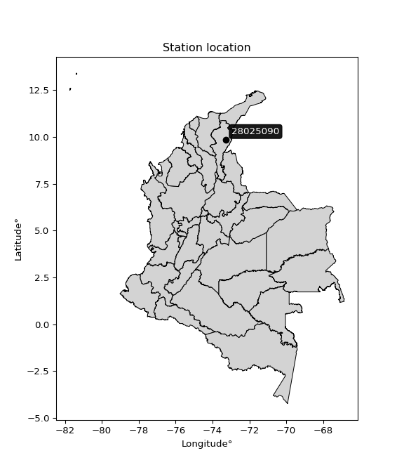</img>

</div>


## A. General information


### 1. General running parameters

• app_version: _v20251225_. • runtime: _2025-12-26 10:39:04.566250_. • Python version: _3.14.0_. • SciPy version: _1.16.3_. • Pandas version: _2.3.3_. • NumPy version: _2.3.5_. • Stations dataset (station_dataset_file): _dataset/pmax24h_in/conventional_cesarcolombia_1959_2015.csv_. • Stations catalog (station_catalog_file): _dataset/CNE_IDEAM.xls_. • Plot only fit distributions with Δo > Δ (plot_only_fit): _True_. • Eval low extreme values, if False, evaluates high extreme values (low_extreme): _False_. • Eval every SciPy distribution as logarithmic (pdist_logarithmic_on): _True_. • Standard deviation normalized (ddof): _1.0_. • Return periods to eval in years (Tr): _[2, 2.33, 5, 10, 15, 20, 25, 50, 75, 100, 200, 250, 500, 750, 1000]_. • Minimum data sample per station, 0 means any (minimum_sample): _5_. • Z-Score threshold to adjust a value, 0 means disable (zscore): _3.5_. • Avoid zeros, e.g. rain = 0 (avoid_zeros): _True_. • Avoid null values (avoid_nans): _True_. [:file_folder:Dataset file.](../../dataset/pmax24h_in/conventional_cesarcolombia_1959_2015.csv)


### 2. Station info and location

|   id |   CODIGO | NOMBRE                         | CATEGORIA               | TECNOLOGIA   | ESTADO   | FECHA_INSTALACION   |   FECHA_SUSPENSION |   ALTITUD |   LATITUD |   LONGITUD | DEPARTAMENTO   | MUNICIPIO       | AREA_OPERATIVA                                         | ENTIDAD                                                     | AREA_HIDROGRAFICA   | ZONA_HIDROGRAFICA   | SUBZONA_HIDROGRAFICA   |   CORRIENTE |   OBSERVACION | SUBRED                      |
|-----:|---------:|:-------------------------------|:------------------------|:-------------|:---------|:--------------------|-------------------:|----------:|----------:|-----------:|:---------------|:----------------|:-------------------------------------------------------|:------------------------------------------------------------|:--------------------|:--------------------|:-----------------------|------------:|--------------:|:----------------------------|
|    0 | 28025090 | CENTENARIO HACIENDA [28025090] | Climatológica Ordinaria | Convencional | Activa   | 15/12/1976          |                nan |       100 |   9.85025 |   -73.2655 | Cesar          | Agustín Codazzi | Area Operativa 05 - Magdalena-Cesar-Guajira-San Andrés | INSTITUTO DE HIDROLOGIA METEOROLOGIA Y ESTUDIOS AMBIENTALES | Magdalena Cauca     | Cesar               | Medio Cesar            |         nan |           nan | Norte de Cesar y La Guajira |

<div align="center">

Map location in: [:earth_americas:Google](http://maps.google.com/maps?q=9.85025,-73.26547222) [:earth_americas:OSM](https://www.openstreetmap.org/#map=18/9.85025/-73.26547222&layers=P) [:earth_americas:Bing](https://www.bing.com/maps?cp=9.85025~-73.26547222&lvl=18) [:earth_americas:Apple](https://maps.apple.com/frame?center=9.85025%2C-73.26547222&span=0.003%2C0.006)

</div>


<div align="center">

```geojson
{
  "type": "Feature",
  "geometry": {
    "type": "Point", 
    "coordinates": [-73.26547222, 9.85025]
  }, 
  "properties": {
    "Name": "28025090"
  }
}
```

</div>


### 3. Discrete values table and plot

|               |          0 |           1 |           2 |           3 |          4 |          5 |           6 |          7 |           8 |          9 |          10 |         11 |         12 |         13 |          14 |          15 |          16 |          17 |         18 |          19 |          20 |            21 |          22 |          23 |         24 |        25 |          26 |        27 |          28 |          29 |         30 |         31 |         32 |          33 |         34 |          35 |          36 |           37 |
|:--------------|-----------:|------------:|------------:|------------:|-----------:|-----------:|------------:|-----------:|------------:|-----------:|------------:|-----------:|-----------:|-----------:|------------:|------------:|------------:|------------:|-----------:|------------:|------------:|--------------:|------------:|------------:|-----------:|----------:|------------:|----------:|------------:|------------:|-----------:|-----------:|-----------:|------------:|-----------:|------------:|------------:|-------------:|
| Date          | 1978       | 1979        | 1980        | 1981        | 1982       | 1983       | 1984        | 1985       | 1986        | 1987       | 1988        | 1989       | 1990       | 1991       | 1992        | 1993        | 1994        | 1995        | 1996       | 1997        | 1998        | 1999          | 2000        | 2001        | 2002       | 2003      | 2004        | 2005      | 2006        | 2007        | 2008       | 2009       | 2010       | 2011        | 2012       | 2013        | 2014        | 2015         |
| Value         |   86.8978  |   90.8182   |  103.6      |   87.7      |   64       |  133.4     |  116.8      |  123.4     |   80.8      |  124.6     |   91.8      |  115.2     |  122       |   75       |  102        |   90        |   85        |   81        |  121.9     |   84        |  111        |  100          |  118        |   85.7      |   79       |   77      |   90        |   77      |  112        |   91        |  131       |  141       |  124       |  110        |   56       |  115        |   97.3      |  100.7       |
| Value_initial |   86.8978  |   90.8182   |  103.6      |   87.7      |   64       |  133.4     |  116.8      |  123.4     |   80.8      |  124.6     |   91.8      |  115.2     |  122       |   75       |  102        |   90        |   85        |   81        |  121.9     |   84        |  111        |  100          |  118        |   85.7      |   79       |   77      |   90        |   77      |  112        |   91        |  131       |  141       |  124       |  110        |   56       |  115        |   97.3      |  100.7       |
| count         |   38       |   38        |   38        |   38        |   38       |   38       |   38        |   38       |   38        |   38       |   38        |   38       |   38       |   38       |   38        |   38        |   38        |   38        |   38       |   38        |   38        |   38          |   38        |   38        |   38       |   38      |   38        |   38      |   38        |   38        |   38       |   38       |   38       |   38        |   38       |   38        |   38        |   38         |
| mean          |   99.8846  |   99.8846   |   99.8846   |   99.8846   |   99.8846  |   99.8846  |   99.8846   |   99.8846  |   99.8846   |   99.8846  |   99.8846   |   99.8846  |   99.8846  |   99.8846  |   99.8846   |   99.8846   |   99.8846   |   99.8846   |   99.8846  |   99.8846   |   99.8846   |   99.8846     |   99.8846   |   99.8846   |   99.8846  |   99.8846 |   99.8846   |   99.8846 |   99.8846   |   99.8846   |   99.8846  |   99.8846  |   99.8846  |   99.8846   |   99.8846  |   99.8846   |   99.8846   |   99.8846    |
| std           |   20.4199  |   20.4199   |   20.4199   |   20.4199   |   20.4199  |   20.4199  |   20.4199   |   20.4199  |   20.4199   |   20.4199  |   20.4199   |   20.4199  |   20.4199  |   20.4199  |   20.4199   |   20.4199   |   20.4199   |   20.4199   |   20.4199  |   20.4199   |   20.4199   |   20.4199     |   20.4199   |   20.4199   |   20.4199  |   20.4199 |   20.4199   |   20.4199 |   20.4199   |   20.4199   |   20.4199  |   20.4199  |   20.4199  |   20.4199   |   20.4199  |   20.4199   |   20.4199   |   20.4199    |
| zscore        |   -0.63599 |   -0.443999 |    0.181948 |   -0.596703 |   -1.75733 |    1.64131 |    0.828375 |    1.15159 |   -0.934607 |    1.21035 |   -0.395918 |    0.75002 |    1.08303 |   -1.21864 |    0.103593 |   -0.484068 |   -0.728926 |   -0.924813 |    1.07813 |   -0.777898 |    0.544339 |    0.00564985 |    0.887141 |   -0.694646 |   -1.02276 |   -1.1207 |   -0.484068 |   -1.1207 |    0.593311 |   -0.435096 |    1.52377 |    2.01349 |    1.18097 |    0.495367 |   -2.14911 |    0.740226 |   -0.126574 |    0.0399301 |

<div align="center">

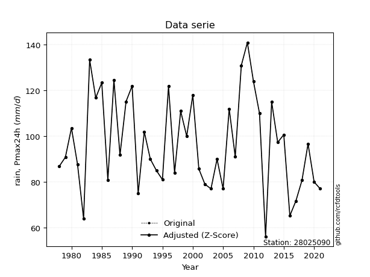</img>

</div>

> If Z-Score is active, values out of range or outliers are replaced with the station mean value.


### 4. Active continuous probability distributions from SciPy (46 of 104 available)

[scipy.stats](https://docs.scipy.org/doc/scipy/reference/stats.html) is a Python´s powerful submodule within the SciPy library for comprehensive statistical analysis, offering over 130 probability distributions (like Normal, Poisson), functions for descriptive stats (mean, variance), hypothesis testing (t-tests, chi-square), random variable generation, and statistical tests, making it essential for data science, modeling, and research. It provides tools to explore, model, and draw conclusions from data efficiently, working seamlessly with NumPy.

<div align="center">

|   id | p_dist             |   n_parameter | fit_method   | label                                                                       | active   | ref                                                                                                        |
|-----:|:-------------------|--------------:|:-------------|:----------------------------------------------------------------------------|:---------|:-----------------------------------------------------------------------------------------------------------|
|    0 | alpha              |             3 | MLE          | Alpha                                                                       | True     | [:mortar_board:](https://docs.scipy.org/doc/scipy/reference/generated/scipy.stats.alpha.html)              |
|    1 | betaprime          |             4 | MLE          | Beta prime                                                                  | True     | [:mortar_board:](https://docs.scipy.org/doc/scipy/reference/generated/scipy.stats.betaprime.html)          |
|    2 | chi2               |             3 | MLE          | Chi²                                                                        | True     | [:mortar_board:](https://docs.scipy.org/doc/scipy/reference/generated/scipy.stats.chi2.html)               |
|    3 | crystalball        |             4 | MLE          | Crystalball                                                                 | True     | [:mortar_board:](https://docs.scipy.org/doc/scipy/reference/generated/scipy.stats.crystalball.html)        |
|    4 | dgamma             |             3 | MLE          | Double gamma                                                                | True     | [:mortar_board:](https://docs.scipy.org/doc/scipy/reference/generated/scipy.stats.dgamma.html)             |
|    5 | erlang             |             3 | MLE          | Erlang                                                                      | True     | [:mortar_board:](https://docs.scipy.org/doc/scipy/reference/generated/scipy.stats.erlang.html)             |
|    6 | expon              |             2 | MLE          | Exponential                                                                 | True     | [:mortar_board:](https://docs.scipy.org/doc/scipy/reference/generated/scipy.stats.expon.html)              |
|    7 | exponnorm          |             3 | MLE          | Exponentially modified Normal                                               | True     | [:mortar_board:](https://docs.scipy.org/doc/scipy/reference/generated/scipy.stats.exponnorm.html)          |
|    8 | f                  |             4 | MLE          | F                                                                           | True     | [:mortar_board:](https://docs.scipy.org/doc/scipy/reference/generated/scipy.stats.f.html)                  |
|    9 | fatiguelife        |             3 | MLE          | Fatigue-life (Birnbaum-Saunders)                                            | True     | [:mortar_board:](https://docs.scipy.org/doc/scipy/reference/generated/scipy.stats.fatiguelife.html)        |
|   10 | fisk               |             3 | MLE          | Fisk                                                                        | True     | [:mortar_board:](https://docs.scipy.org/doc/scipy/reference/generated/scipy.stats.fisk.html)               |
|   11 | gamma              |             3 | MLE          | Gamma                                                                       | True     | [:mortar_board:](https://docs.scipy.org/doc/scipy/reference/generated/scipy.stats.gamma.html)              |
|   12 | genexpon           |             5 | MLE          | Generalized exponential                                                     | True     | [:mortar_board:](https://docs.scipy.org/doc/scipy/reference/generated/scipy.stats.genexpon.html)           |
|   13 | genlogistic        |             3 | MLE          | Generalized logistic                                                        | True     | [:mortar_board:](https://docs.scipy.org/doc/scipy/reference/generated/scipy.stats.genlogistic.html)        |
|   14 | gibrat             |             2 | MM           | Gibrat                                                                      | True     | [:mortar_board:](https://docs.scipy.org/doc/scipy/reference/generated/scipy.stats.gibrat.html)             |
|   15 | gompertz           |             3 | MLE          | Gompertz (or truncated Gumbel)                                              | True     | [:mortar_board:](https://docs.scipy.org/doc/scipy/reference/generated/scipy.stats.gompertz.html)           |
|   16 | gumbel_l           |             2 | MM           | Gumbel Left Skew                                                            | True     | [:mortar_board:](https://docs.scipy.org/doc/scipy/reference/generated/scipy.stats.gumbel_l.html)           |
|   17 | gumbel_r           |             2 | MM           | Gumbel Right Skew                                                           | True     | [:mortar_board:](https://docs.scipy.org/doc/scipy/reference/generated/scipy.stats.gumbel_r.html)           |
|   18 | halflogistic       |             2 | MM           | Half-logistic                                                               | True     | [:mortar_board:](https://docs.scipy.org/doc/scipy/reference/generated/scipy.stats.halflogistic.html)       |
|   19 | halfnorm           |             2 | MM           | Half Normal                                                                 | True     | [:mortar_board:](https://docs.scipy.org/doc/scipy/reference/generated/scipy.stats.halfnorm.html)           |
|   20 | hypsecant          |             2 | MM           | hyperbolic secant                                                           | True     | [:mortar_board:](https://docs.scipy.org/doc/scipy/reference/generated/scipy.stats.hypsecant.html)          |
|   21 | invgamma           |             3 | MLE          | Inverted gamma                                                              | True     | [:mortar_board:](https://docs.scipy.org/doc/scipy/reference/generated/scipy.stats.invgamma.html)           |
|   22 | invgauss           |             3 | MLE          | Inverse Gaussian                                                            | True     | [:mortar_board:](https://docs.scipy.org/doc/scipy/reference/generated/scipy.stats.invgauss.html)           |
|   23 | invweibull         |             3 | MLE          | Inverted Weibull                                                            | True     | [:mortar_board:](https://docs.scipy.org/doc/scipy/reference/generated/scipy.stats.invweibull.html)         |
|   24 | johnsonsu          |             4 | MLE          | Johnson Su                                                                  | True     | [:mortar_board:](https://docs.scipy.org/doc/scipy/reference/generated/scipy.stats.johnsonsu.html)          |
|   25 | kstwobign          |             2 | MLE          | Limiting distribution of scaled Kolmogorov-Smirnov two-sided test statistic | True     | [:mortar_board:](https://docs.scipy.org/doc/scipy/reference/generated/scipy.stats.kstwobign.html)          |
|   26 | laplace            |             2 | MM           | Laplace                                                                     | True     | [:mortar_board:](https://docs.scipy.org/doc/scipy/reference/generated/scipy.stats.laplace.html)            |
|   27 | laplace_asymmetric |             3 | MLE          | Asymmetric Laplace                                                          | True     | [:mortar_board:](https://docs.scipy.org/doc/scipy/reference/generated/scipy.stats.laplace_asymmetric.html) |
|   28 | loggamma           |             3 | MLE          | Log gamma                                                                   | True     | [:mortar_board:](https://docs.scipy.org/doc/scipy/reference/generated/scipy.stats.loggamma.html)           |
|   29 | logistic           |             2 | MM           | Logistic (or Sech-squared)                                                  | True     | [:mortar_board:](https://docs.scipy.org/doc/scipy/reference/generated/scipy.stats.logistic.html)           |
|   30 | lognorm            |             3 | MLE          | Log Normal                                                                  | True     | [:mortar_board:](https://docs.scipy.org/doc/scipy/reference/generated/scipy.stats.lognorm.html)            |
|   31 | maxwell            |             2 | MM           | Maxwell                                                                     | True     | [:mortar_board:](https://docs.scipy.org/doc/scipy/reference/generated/scipy.stats.maxwell.html)            |
|   32 | mielke             |             4 | MLE          | Mielke Beta-Kappa / Dagum                                                   | True     | [:mortar_board:](https://docs.scipy.org/doc/scipy/reference/generated/scipy.stats.mielke.html)             |
|   33 | moyal              |             2 | MM           | Moyal                                                                       | True     | [:mortar_board:](https://docs.scipy.org/doc/scipy/reference/generated/scipy.stats.moyal.html)              |
|   34 | nakagami           |             3 | MLE          | Nakagami                                                                    | True     | [:mortar_board:](https://docs.scipy.org/doc/scipy/reference/generated/scipy.stats.nakagami.html)           |
|   35 | ncf                |             5 | MLE          | Non-central F distribution                                                  | True     | [:mortar_board:](https://docs.scipy.org/doc/scipy/reference/generated/scipy.stats.ncf.html)                |
|   36 | nct                |             4 | MLE          | Non-central Student’s t                                                     | True     | [:mortar_board:](https://docs.scipy.org/doc/scipy/reference/generated/scipy.stats.nct.html)                |
|   37 | norm               |             2 | MM           | Normal                                                                      | True     | [:mortar_board:](https://docs.scipy.org/doc/scipy/reference/generated/scipy.stats.norm.html)               |
|   38 | pareto             |             3 | MLE          | Pareto                                                                      | True     | [:mortar_board:](https://docs.scipy.org/doc/scipy/reference/generated/scipy.stats.pareto.html)             |
|   39 | pearson3           |             3 | MM           | Pearson type III                                                            | True     | [:mortar_board:](https://docs.scipy.org/doc/scipy/reference/generated/scipy.stats.pearson3.html)           |
|   40 | rayleigh           |             2 | MM           | Rayleigh                                                                    | True     | [:mortar_board:](https://docs.scipy.org/doc/scipy/reference/generated/scipy.stats.rayleigh.html)           |
|   41 | rice               |             3 | MLE          | Rice                                                                        | True     | [:mortar_board:](https://docs.scipy.org/doc/scipy/reference/generated/scipy.stats.rice.html)               |
|   42 | t                  |             3 | MLE          | Student’s t                                                                 | True     | [:mortar_board:](https://docs.scipy.org/doc/scipy/reference/generated/scipy.stats.t.html)                  |
|   43 | truncnorm          |             4 | MLE          | Truncated normal                                                            | True     | [:mortar_board:](https://docs.scipy.org/doc/scipy/reference/generated/scipy.stats.truncnorm.html)          |
|   44 | wald               |             2 | MM           | Wald                                                                        | True     | [:mortar_board:](https://docs.scipy.org/doc/scipy/reference/generated/scipy.stats.wald.html)               |
|   45 | weibull_min        |             3 | MLE          | Weibull minimum                                                             | True     | [:mortar_board:](https://docs.scipy.org/doc/scipy/reference/generated/scipy.stats.weibull_min.html)        |

</div>

> **n_parameter:** # arguments & localization & scale.
>
> **Fit methods:** (MLE) maximum likelihood, (MM) L-moments.
>
>**Inactive:** foldnorm, gennorm, norminvgauss, powernorm, powerlognorm, skewnorm, genextreme, anglit, arcsine, argus, beta, bradford, burr, burr12, cauchy, cosine, halfcauchy, foldcauchy, skewcauchy, wrapcauchy, gengamma, exponweib, exponpow, truncexpon, gausshyper, genhalflogistic, genhyperbolic, geninvgauss, halfgennorm, johnsonsb, kappa4, kappa3, ksone, kstwo, loglaplace, levy, levy_l, levy_stable, ncx2, genpareto, truncpareto, lomax, powerlaw, rdist, rel_breitwigner, recipinvgauss, semicircular, studentized_range, trapezoid, triang, truncweibull_min, tukeylambda, uniform, loguniform, vonmises, vonmises_line, weibull_max, dweibull, 


## B. Probability distributions vs. Empirical distributions

A continuous probability distribution (CPD) describes probabilities for variables that can take any value within a range (like rain any time), unlike discrete variables with specific outcomes (like temperature). It uses a Probability Density Function (PDF), a curve where the total area under it equals 1, and the probability of the variable falling within an interval (a to b) is found by calculating the area under the curve between those points. A key feature is that the probability of hitting any single exact value is zero, so probabilities are always expressed for ranges, e.g., $P(a ≤ X ≤ b)$.

<div align="center">

Distributions parameters
|    |   station | p_dist                |   n |              loc |           scale | shape                  | shape1                | shape2                | shape3   |
|---:|----------:|:----------------------|----:|-----------------:|----------------:|:-----------------------|:----------------------|:----------------------|:---------|
|  0 |  28025090 | alpha                 |  38 |   -198.956       |  4313           | 14.512250658231835     |                       |                       |          |
|  1 |  28025090 | betaprime             |  38 |     -0.915606    |    69.7151      | 57.00711635843217      | 40.48224097712843     |                       |          |
|  2 |  28025090 | chi2                  |  38 |    -60.9481      |     1.28212     | 125.34129104506553     |                       |                       |          |
|  3 |  28025090 | crystalball           |  38 |     99.8846      |    20.1495      | 8444.683361261457      | 605.0117086644728     |                       |          |
|  4 |  28025090 | dgamma                |  38 |     98.4264      |     8.33344     | 2.0702457549255664     |                       |                       |          |
|  5 |  28025090 | erlang                |  38 |   -866.125       |     0.419929    | 2300.3980954612416     |                       |                       |          |
|  6 |  28025090 | expon                 |  38 |     56           |    43.8846      |                        |                       |                       |          |
|  7 |  28025090 | exponnorm             |  38 |     98.9161      |    20.1262      | 0.04812134847219836    |                       |                       |          |
|  8 |  28025090 | f                     |  38 |   -356.693       |   456.57        | 1034.7416217429018     | 123744.40951399037    |                       |          |
|  9 |  28025090 | fatiguelife           |  38 |   -335.893       |   435.298       | 0.04610845355579051    |                       |                       |          |
| 10 |  28025090 | fisk                  |  38 |     -0.60347     |    98.9844      | 8.215009698176942      |                       |                       |          |
| 11 |  28025090 | gamma                 |  38 |   -857.817       |     0.423942    | 2259.0430055383385     |                       |                       |          |
| 12 |  28025090 | genexpon              |  38 |     56           |     1.60048     | 0.033938775912206516   | 0.0025871383502567642 | 1.4907522550707548    |          |
| 13 |  28025090 | genlogistic           |  38 |     83.6219      |    14.5785      | 2.2244819663254445     |                       |                       |          |
| 14 |  28025090 | gibrat                |  38 |     84.5131      |     9.32328     |                        |                       |                       |          |
| 15 |  28025090 | gompertz              |  38 |     65.7929      |     2.16912     | 3.022409509285522e-14  |                       |                       |          |
| 16 |  28025090 | gumbel_l              |  38 |    108.953       |    15.7105      |                        |                       |                       |          |
| 17 |  28025090 | gumbel_r              |  38 |     90.8163      |    15.7105      |                        |                       |                       |          |
| 18 |  28025090 | halflogistic          |  38 |     76.0028      |    17.2271      |                        |                       |                       |          |
| 19 |  28025090 | halfnorm              |  38 |     73.2146      |    33.4259      |                        |                       |                       |          |
| 20 |  28025090 | hypsecant             |  38 |     99.8846      |    12.8275      |                        |                       |                       |          |
| 21 |  28025090 | invgamma              |  38 |   -139.41        | 33065           | 139.17207895703086     |                       |                       |          |
| 22 |  28025090 | invgauss              |  38 |     16.9126      |  1142.93        | 0.07233020462368256    |                       |                       |          |
| 23 |  28025090 | invweibull            |  38 |     55.9684      |     1.2656      | 0.3645248835669635     |                       |                       |          |
| 24 |  28025090 | johnsonsu             |  38 |   -505.898       |   499.129       | -39.902038970578       | 38.95027911572529     |                       |          |
| 25 |  28025090 | kstwobign             |  38 |     20.7033      |    90.9281      |                        |                       |                       |          |
| 26 |  28025090 | laplace               |  38 |     99.8846      |    14.2478      |                        |                       |                       |          |
| 27 |  28025090 | laplace_asymmetric    |  38 |     86.8978      |    14.9014      | 0.6550618782162714     |                       |                       |          |
| 28 |  28025090 | loggamma              |  38 |  -4768.82        |   689.699       | 1163.9394713295806     |                       |                       |          |
| 29 |  28025090 | logistic              |  38 |     99.8846      |    11.109       |                        |                       |                       |          |
| 30 |  28025090 | lognorm               |  38 |   -729.837       |   829.477       | 0.024286052627703412   |                       |                       |          |
| 31 |  28025090 | maxwell               |  38 |     52.1389      |    29.9202      |                        |                       |                       |          |
| 32 |  28025090 | mielke                |  38 |     -0.11718     |   104.405       | 6.725589639610065      | 9.225877884506408     |                       |          |
| 33 |  28025090 | moyal                 |  38 |     88.3619      |     9.07045     |                        |                       |                       |          |
| 34 |  28025090 | nakagami              |  38 |     58.8037      |    46.1243      | 1.2740358846222515     |                       |                       |          |
| 35 |  28025090 | ncf                   |  38 |     -0.739986    |   101.62        | 34.55026439476882      | 54.885439678811395    | 5.561244613424848e-06 |          |
| 36 |  28025090 | nct                   |  38 |   -854.204       |    20.1006      | 222072.6443157012      | 47.465590362702216    |                       |          |
| 37 |  28025090 | norm                  |  38 |     99.8846      |    20.1495      |                        |                       |                       |          |
| 38 |  28025090 | pareto                |  38 |     -2.14748e+09 |     2.14748e+09 | 48934755.88208315      |                       |                       |          |
| 39 |  28025090 | pearson3              |  38 |     99.8846      |    20.1495      | 0.038540465970854705   |                       |                       |          |
| 40 |  28025090 | rayleigh              |  38 |     61.3375      |    30.7561      |                        |                       |                       |          |
| 41 |  28025090 | rice                  |  38 |     49.3014      |    21.888       | 2.0465074932856138     |                       |                       |          |
| 42 |  28025090 | t                     |  38 |     99.872       |    20.161       | 133998.68245655132     |                       |                       |          |
| 43 |  28025090 | truncnorm             |  38 |     99.8846      |    20.1495      | -841.5928321208646     | 1285.3079883736905    |                       |          |
| 44 |  28025090 | wald                  |  38 |     79.7351      |    20.1495      |                        |                       |                       |          |
| 45 |  28025090 | weibull_min           |  38 |     41.5411      |    65.2072      | 3.217074805658661      |                       |                       |          |
| 46 |  28025090 | logalpha              |  38 |     -4.16958     |   360.875       | 41.24541371223759      |                       |                       |          |
| 47 |  28025090 | logbetaprime          |  38 |     -0.262392    |     7.57206     | 176.95643470004296     | 280.3850696810682     |                       |          |
| 48 |  28025090 | logchi2               |  38 |      4.02535     |     0.939751    | 1.1298343833068305     |                       |                       |          |
| 49 |  28025090 | logcrystalball        |  38 |      4.58275     |     0.209276    | 172.2997733324886      | 44.43794168557121     |                       |          |
| 50 |  28025090 | logdgamma             |  38 |      4.58817     |     0.0861127   | 2.045816329555448      |                       |                       |          |
| 51 |  28025090 | logerlang             |  38 |      1.07051     |     0.0129197   | 271.69052722738144     |                       |                       |          |
| 52 |  28025090 | logexpon              |  38 |      4.02535     |     0.557395    |                        |                       |                       |          |
| 53 |  28025090 | logexponnorm          |  38 |      4.58258     |     0.209277    | 0.0008154874894453694  |                       |                       |          |
| 54 |  28025090 | logf                  |  38 |    -75.5025      |    80.0852      | 382469.8780262545      | 1202057.2635530015    |                       |          |
| 55 |  28025090 | logfatiguelife        |  38 |    -54.1309      |    58.7136      | 0.0035582072823645643  |                       |                       |          |
| 56 |  28025090 | logfisk               |  38 | -40234.3         | 40238.9         | 328535.3920868066      |                       |                       |          |
| 57 |  28025090 | loggamma              |  38 |      1.12336     |     0.0131222   | 263.4675168172813      |                       |                       |          |
| 58 |  28025090 | loggenexpon           |  38 |      4.02535     |     0.135039    | 0.020337447504824975   | 3.0466876658079274    | 0.032177982522624535  |          |
| 59 |  28025090 | loggenlogistic        |  38 |      4.64743     |     0.108448    | 0.7278081006177286     |                       |                       |          |
| 60 |  28025090 | loggibrat             |  38 |      4.42311     |     0.0968253   |                        |                       |                       |          |
| 61 |  28025090 | loggompertz           |  38 |      4.00287     |     0.194962    | 0.032512766048683195   |                       |                       |          |
| 62 |  28025090 | loggumbel_l           |  38 |      4.67693     |     0.163173    |                        |                       |                       |          |
| 63 |  28025090 | loggumbel_r           |  38 |      4.48856     |     0.163173    |                        |                       |                       |          |
| 64 |  28025090 | loghalflogistic       |  38 |      4.33474     |     0.178902    |                        |                       |                       |          |
| 65 |  28025090 | loghalfnorm           |  38 |      4.30575     |     0.347162    |                        |                       |                       |          |
| 66 |  28025090 | loghypsecant          |  38 |      4.58275     |     0.13323     |                        |                       |                       |          |
| 67 |  28025090 | loginvgamma           |  38 |     -6.02658     | 26849.5         | 2532.0004249416797     |                       |                       |          |
| 68 |  28025090 | loginvgauss           |  38 |      2.37006     |   226.318       | 0.009756111793299042   |                       |                       |          |
| 69 |  28025090 | loginvweibull         |  38 |     -2.51046e+07 |     2.51046e+07 | 112694494.30243322     |                       |                       |          |
| 70 |  28025090 | logjohnsonsu          |  38 |      5.53224     |     0.138073    | 11.929097106396178     | 4.582483159627566     |                       |          |
| 71 |  28025090 | logkstwobign          |  38 |      3.63008     |     1.0976      |                        |                       |                       |          |
| 72 |  28025090 | loglaplace            |  38 |      4.58275     |     0.147981    |                        |                       |                       |          |
| 73 |  28025090 | loglaplace_asymmetric |  38 |      4.80402     |     0.124157    | 2.2306894246874265     |                       |                       |          |
| 74 |  28025090 | logloggamma           |  38 |      4.25913     |     0.340951    | 3.06768297380407       |                       |                       |          |
| 75 |  28025090 | loglogistic           |  38 |      4.58275     |     0.11538     |                        |                       |                       |          |
| 76 |  28025090 | loglognorm            |  38 | -11939.3         | 11943.9         | 1.7521716688921822e-05 |                       |                       |          |
| 77 |  28025090 | logmaxwell            |  38 |      4.08687     |     0.310745    |                        |                       |                       |          |
| 78 |  28025090 | logmielke             |  38 |      3.95022     |     0.905804    | 2.3213780021208708     | 16.590870862259194    |                       |          |
| 79 |  28025090 | logmoyal              |  38 |      4.46307     |     0.0942078   |                        |                       |                       |          |
| 80 |  28025090 | lognakagami           |  38 |    -59.7032      |    64.2863      | 23616.37085268569      |                       |                       |          |
| 81 |  28025090 | logncf                |  38 |    -12.0415      |    11.5473      | 20330.190944121183     | 28006.943908089663    | 8939.433892762187     |          |
| 82 |  28025090 | lognct                |  38 |      0.115138    |     0.0483903   | 231.5136023144829      | 92.03099356068054     |                       |          |
| 83 |  28025090 | lognorm               |  38 |      4.58275     |     0.209277    |                        |                       |                       |          |
| 84 |  28025090 | logpareto             |  38 |     -6.71089e+07 |     6.71089e+07 | 120397341.62981498     |                       |                       |          |
| 85 |  28025090 | logpearson3           |  38 |      4.58275     |     0.209277    | -0.39920555152651105   |                       |                       |          |
| 86 |  28025090 | lograyleigh           |  38 |      4.18245     |     0.319389    |                        |                       |                       |          |
| 87 |  28025090 | logrice               |  38 |    -39.1233      |     0.209308    | 208.80985207246465     |                       |                       |          |
| 88 |  28025090 | logt                  |  38 |      4.58277     |     0.209231    | 3963.9662933743352     |                       |                       |          |
| 89 |  28025090 | logtruncnorm          |  38 |     -0.0814908   |     1.46967     | 2.792401269005029      | 3.4227142893552767    |                       |          |
| 90 |  28025090 | logwald               |  38 |      4.37346     |     0.209286    |                        |                       |                       |          |
| 91 |  28025090 | logweibull_min        |  38 |      3.29562     |     1.37425     | 7.3066379150940985     |                       |                       |          |

</div>

> **loc** (Location parameter): This shifts the distribution along the x-axis. For many common distributions, like the normal (Gaussian) distribution, loc represents the mean $μ$. For others, like the uniform distribution, it might represent the minimum value, or for the beta distribution, the left end of the support interval.
>
> **scale** (Scale parameter): This determines the width or spread of the distribution. For the normal distribution, scale represents the standard deviation $σ$. For a uniform distribution, it defines the length of the interval (from $loc$ to $loc + scale$).
>
> **shape** (Shape parameters): Refers to parameters that define the specific form of a probability distribution, distinct from its location (loc) and scale (scale). These parameters are required arguments for most distribution functions. For example, a normal (Gaussian) distribution is fully defined by its location (mean) and scale (standard deviation), so it has no specific shape parameters beyond loc and scale. However, other distributions have intrinsic properties that need specification, as Gamma distribution that takes a shape parameter, often named $a$ or $alpha$.


### 0. Cumulative distribution values - CDF (92 evaluated)

> Ordered by x ascending and calculating $log(f(x))$ separately. 

|   id |   Station |   date |        x |   count |    mean |     std |      zscore |   Value_initial |   station |   m |      alpha |   alpha_pdf |   betaprime |   betaprime_pdf |       chi2 |   chi2_pdf |   crystalball |   crystalball_pdf |    dgamma |   dgamma_pdf |    erlang |   erlang_pdf |    expon |   expon_pdf |   exponnorm |   exponnorm_pdf |         f |      f_pdf |   fatiguelife |   fatiguelife_pdf |      fisk |   fisk_pdf |     gamma |   gamma_pdf |   genexpon |   genexpon_pdf |   genlogistic |   genlogistic_pdf |     gibrat |   gibrat_pdf |    gompertz |   gompertz_pdf |   gumbel_l |   gumbel_l_pdf |    gumbel_r |   gumbel_r_pdf |   halflogistic |   halflogistic_pdf |   halfnorm |   halfnorm_pdf |   hypsecant |   hypsecant_pdf |   invgamma |   invgamma_pdf |   invgauss |   invgauss_pdf |   invweibull |   invweibull_pdf |   johnsonsu |   johnsonsu_pdf |   kstwobign |   kstwobign_pdf |   laplace |   laplace_pdf |   laplace_asymmetric |   laplace_asymmetric_pdf |   loggamma |   loggamma_pdf |   logistic |   logistic_pdf |    lognorm |   lognorm_pdf |     maxwell |   maxwell_pdf |    mielke |   mielke_pdf |       moyal |   moyal_pdf |   nakagami |   nakagami_pdf |       ncf |    ncf_pdf |       nct |    nct_pdf |      norm |   norm_pdf |      pareto |   pareto_pdf |   pearson3 |   pearson3_pdf |   rayleigh |   rayleigh_pdf |       rice |   rice_pdf |         t |      t_pdf |   truncnorm |   truncnorm_pdf |        wald |    wald_pdf |   weibull_min |   weibull_min_pdf |   logalpha |   logalpha_pdf |   logbetaprime |   logbetaprime_pdf |     logchi2 |   logchi2_pdf |   logcrystalball |   logcrystalball_pdf |   logdgamma |   logdgamma_pdf |   logerlang |   logerlang_pdf |   logexpon |   logexpon_pdf |   logexponnorm |   logexponnorm_pdf |       logf |   logf_pdf |   logfatiguelife |   logfatiguelife_pdf |    logfisk |   logfisk_pdf |   loggenexpon |   loggenexpon_pdf |   loggenlogistic |   loggenlogistic_pdf |   loggibrat |   loggibrat_pdf |   loggompertz |   loggompertz_pdf |   loggumbel_l |   loggumbel_l_pdf |   loggumbel_r |   loggumbel_r_pdf |   loghalflogistic |   loghalflogistic_pdf |   loghalfnorm |   loghalfnorm_pdf |   loghypsecant |   loghypsecant_pdf |   loginvgamma |   loginvgamma_pdf |   loginvgauss |   loginvgauss_pdf |   loginvweibull |   loginvweibull_pdf |   logjohnsonsu |   logjohnsonsu_pdf |   logkstwobign |   logkstwobign_pdf |   loglaplace |   loglaplace_pdf |   loglaplace_asymmetric |   loglaplace_asymmetric_pdf |   logloggamma |   logloggamma_pdf |   loglogistic |   loglogistic_pdf |   loglognorm |   loglognorm_pdf |   logmaxwell |   logmaxwell_pdf |   logmielke |   logmielke_pdf |    logmoyal |   logmoyal_pdf |   lognakagami |   lognakagami_pdf |     logncf |   logncf_pdf |     lognct |   lognct_pdf |   logpareto |   logpareto_pdf |   logpearson3 |   logpearson3_pdf |   lograyleigh |   lograyleigh_pdf |    logrice |   logrice_pdf |       logt |   logt_pdf |   logtruncnorm |   logtruncnorm_pdf |    logwald |   logwald_pdf |   logweibull_min |   logweibull_min_pdf |
|-----:|----------:|-------:|---------:|--------:|--------:|--------:|------------:|----------------:|----------:|----:|-----------:|------------:|------------:|----------------:|-----------:|-----------:|--------------:|------------------:|----------:|-------------:|----------:|-------------:|---------:|------------:|------------:|----------------:|----------:|-----------:|--------------:|------------------:|----------:|-----------:|----------:|------------:|-----------:|---------------:|--------------:|------------------:|-----------:|-------------:|------------:|---------------:|-----------:|---------------:|------------:|---------------:|---------------:|-------------------:|-----------:|---------------:|------------:|----------------:|-----------:|---------------:|-----------:|---------------:|-------------:|-----------------:|------------:|----------------:|------------:|----------------:|----------:|--------------:|---------------------:|-------------------------:|-----------:|---------------:|-----------:|---------------:|-----------:|--------------:|------------:|--------------:|----------:|-------------:|------------:|------------:|-----------:|---------------:|----------:|-----------:|----------:|-----------:|----------:|-----------:|------------:|-------------:|-----------:|---------------:|-----------:|---------------:|-----------:|-----------:|----------:|-----------:|------------:|----------------:|------------:|------------:|--------------:|------------------:|-----------:|---------------:|---------------:|-------------------:|------------:|--------------:|-----------------:|---------------------:|------------:|----------------:|------------:|----------------:|-----------:|---------------:|---------------:|-------------------:|-----------:|-----------:|-----------------:|---------------------:|-----------:|--------------:|--------------:|------------------:|-----------------:|---------------------:|------------:|----------------:|--------------:|------------------:|--------------:|------------------:|--------------:|------------------:|------------------:|----------------------:|--------------:|------------------:|---------------:|-------------------:|--------------:|------------------:|--------------:|------------------:|----------------:|--------------------:|---------------:|-------------------:|---------------:|-------------------:|-------------:|-----------------:|------------------------:|----------------------------:|--------------:|------------------:|--------------:|------------------:|-------------:|-----------------:|-------------:|-----------------:|------------:|----------------:|------------:|---------------:|--------------:|------------------:|-----------:|-------------:|-----------:|-------------:|------------:|----------------:|--------------:|------------------:|--------------:|------------------:|-----------:|--------------:|-----------:|-----------:|---------------:|-------------------:|-----------:|--------------:|-----------------:|---------------------:|
|    0 |  28025090 |   2012 |  56      |      38 | 99.8846 | 20.4199 | -2.14911    |         56      |  28025090 |   1 | 0.00809883 |  0.00147018 |   0.0036597 |     0.000944453 | 0.00947902 | 0.00155239 |     0.0147047 |        0.00184761 | 0.0206336 |   0.00204169 | 0.0137096 |   0.00179499 | 0        |  0.022787   |   0.0146997 |      0.00184735 | 0.0126513 | 0.00173651 |     0.0113277 |        0.00164641 | 0.0100378 | 0.00144219 | 0.013723  |  0.00179621 | 3.2639e-07 |     0.0212054  |     0.0108202 |        0.00143522 | 0          |   0          | 0           |    0           |  0.0337867 |    0.00211384  | 0.000103942 |    6.06808e-05 |      0         |         0          |  0         |     0          |   0.0207946 |      0.00161994 |  0.0079599 |     0.00140735 | 0.00302961 |    0.000948956 |    0.0214991 |      0.952944    |   0.0133744 |      0.00177795 |  0.00179632 |     0.000782437 | 0.0229775 |    0.0016127  |            0.0126714 |               0.00129811 | 0.00306692 |      0.0492788 |  0.018884  |     0.00166779 | 0.00386741 |     0.0549257 | 0.000568727 |   0.000440414 | 0.0153309 |   0.00183143 | 2.63051e-09 | 5.27672e-09 | 0          |     0          | 0.0350518 | 0.00414914 | 0.0146981 | 0.00184754 | 0.0147047 | 0.00184761 | 1.08657e-08 |   0.022787   |  0.0138064 |     0.00180078 | 0          |     0          | 0.00591424 | 0.0018087  | 0.0147755 | 0.00185415 |   0.0147047 |      0.00184761 | 0           | 0           |    0.00783084 |        0.00173551 | 0.00262791 |      0.0436278 |       0.132039 |           0.514576 | 2.47129e-09 |   1.57184e+06 |       0.00386721 |            0.0549235 |   0.0058786 |       0.0587994 |   0.0030813 |       0.0494003 |   0        |       1.79406  |     0.00386744 |           0.054926 | 0.00393031 |  0.0557863 |       0.00367573 |            0.0530738 | 0.00995944 |     0.0805064 |   9.05578e-08 |          0.150608 |        0.0153408 |             0.102624 |  0          |        0        |    0.00396628 |          0.186406 |     0.0182716 |          0.110948 |   3.76596e-08 |       3.94538e-06 |         0         |              0        |     0         |          0        |     0.00970254 |          0.0728143 |    0.00324973 |          0.050107 |    0.00198024 |          0.03888  |     0.000546607 |           0.0184318 |      0.0135856 |           0.105307 |    0.000514443 |          0.0234597 |    0.0115646 |        0.0781491 |               0.0500538 |                    0.180728 |     0.0128303 |          0.101508 |    0.00791594 |         0.0680642 |   0.00386691 |        0.0549216 |   0          |         0        |  0.00309123 |       0.0955082 | 1.83073e-24 |    1.02198e-21 |    0.00381627 |         0.0544626 | 0.00356569 |    0.0523942 | 0.00209436 |    0.0382931 |    0        |        1.79406  |    0.00906027 |         0.0882657 |     0         |          0        | 0.00387193 |     0.0549753 | 0.00387515 |  0.0549589 |     0.00699983 |           2.37252  | 0          |      0        |       0.00975552 |            0.0972022 |
|    1 |  28025090 |   1982 |  64      |      38 | 99.8846 | 20.4199 | -1.75733    |         64      |  28025090 |   2 | 0.0293945  |  0.00417295 |   0.0209019 |     0.00380598  | 0.0308059  | 0.00405757 |     0.0374626 |        0.00405438 | 0.0448679 |   0.00426371 | 0.0361714 |   0.00404226 | 0.166646 |  0.0189897  |   0.0374561 |      0.0040543  | 0.0347898 | 0.00403077 |     0.0328528 |        0.00398164 | 0.0291618 | 0.00360009 | 0.0361956 |  0.00404362 | 0.165432   |     0.0190456  |     0.0299369 |        0.00362453 | 0          |   0          | 0           |    0           |  0.0555875 |    0.00343803  | 0.00403851  |    0.00141688  |      0         |         0          |  0         |     0          |   0.0387631 |      0.0030144  |  0.0281581 |     0.00394457 | 0.022343   |    0.00440728  |    0.600568  |      0.0138981   |   0.0357564 |      0.00404309 |  0.0228162  |     0.00520777  | 0.040286  |    0.00282752 |            0.0287576 |               0.00294606 | 0.0203704  |      0.251896  |  0.0380436 |     0.0032943  | 0.0214147  |     0.245145  | 0.0158096   |   0.00387412  | 0.037356  |   0.00387534 | 0.000128022 | 0.000109852 | 0.00450424 |     0.00219305 | 0.0798019 | 0.00709362 | 0.0374581 | 0.00405506 | 0.0374626 | 0.00405438 | 0.166646    |   0.0189897  |  0.0363054 |     0.00404486 | 0.00373994 |     0.00280411 | 0.03097    | 0.00461784 | 0.0375984 | 0.00406397 |   0.0374626 |      0.00405438 | 0           | 0           |    0.0318985  |        0.00449558 | 0.01854    |      0.236187  |       0.21187  |           0.677886 | 0.245902    |   0.993914    |       0.021414   |            0.24514   |   0.0217858 |       0.208836  |   0.0203956 |       0.251854  |   0.213029 |       1.41187  |     0.0214148  |           0.245146 | 0.0217081  |  0.247908  |       0.0208786  |            0.242108  | 0.0290579  |     0.230355  |   0.0653066   |          0.801211 |        0.0373753 |             0.248089 |  0          |        0        |    0.0390783  |          0.356719 |     0.0409386 |          0.245684 |   0.000530594 |       0.024523    |         0         |              0        |     0         |          0        |     0.0264209  |          0.198083  |    0.0203329  |          0.245857 |    0.0183687  |          0.256653 |     0.0161645   |           0.299316  |      0.0370664 |           0.268875 |    0.0255826   |          0.465885  |    0.0285113 |        0.192669  |               0.0810639 |                    0.292696 |     0.0357635 |          0.265089 |    0.0247561  |         0.209249  |   0.0214136  |        0.245143  |   0.00325732 |         0.134243 |  0.0331075  |       0.368317  | 5.03246e-07 |    6.9937e-05  |    0.0212874  |         0.244588  | 0.0207471  |    0.242956  | 0.017399   |    0.236037  |    0.213029 |        1.41187  |    0.0309144  |         0.266352  |     0         |          0        | 0.0214301  |     0.24526   | 0.0214201  |  0.245046  |     0.286426   |           1.83296  | 0          |      0        |       0.0329132  |            0.273942  |
|    2 |  28025090 |   1991 |  75      |      38 | 99.8846 | 20.4199 | -1.21864    |         75      |  28025090 |   3 | 0.109127   |  0.0107442  |   0.102627  |     0.0115529   | 0.106446   | 0.0101173  |     0.108415  |        0.00923522 | 0.122294  |   0.0105711  | 0.107667  |   0.00935465 | 0.351409 |  0.0147795  |   0.108411  |      0.00923579 | 0.106933  | 0.00949195 |     0.105371  |        0.00962631 | 0.098534  | 0.00965166 | 0.107698  |  0.00935393 | 0.350712   |     0.0148179  |     0.100705  |        0.00989108 | 0          |   0          | 2.07726e-12 |    9.71584e-13 |  0.108804  |    0.00653433  | 0.0647868   |    0.0112854   |      0         |         0          |  0.0425967 |     0.0238362  |   0.0908684 |      0.00698802 |  0.103871  |     0.0102732  | 0.115358   |    0.0127657   |    0.68915   |      0.00491423  |   0.107539  |      0.00940859 |  0.131952   |     0.0143861   | 0.0871867 |    0.0061193  |            0.0887474 |               0.00909169 | 0.106083   |      0.906737  |  0.0962116 |     0.00782744 | 0.102488   |     0.853748  | 0.0998699   |   0.0116271   | 0.105565  |   0.00901915 | 0.0367312   | 0.0103702   | 0.0754701  |     0.0110705  | 0.179772  | 0.0109086  | 0.108426  | 0.00923735 | 0.108415  | 0.00923522 | 0.351409    |   0.0147795  |  0.107765  |     0.00934425 | 0.0939543  |     0.0130863  | 0.110555   | 0.0101348  | 0.108664  | 0.00924509 |   0.108415  |      0.00923522 | 0           | 0           |    0.110308   |        0.00999842 | 0.101131   |      0.886499  |       0.331856 |           0.822271 | 0.371514    |   0.649787    |       0.102487   |            0.853743  |   0.093606  |       0.813276  |   0.106041  |       0.905906  |   0.407918 |       1.06223  |     0.102489   |           0.853751 | 0.103356   |  0.857327  |       0.10164    |            0.853928  | 0.0984989  |     0.724998  |   0.235227    |          1.27546  |        0.105584  |             0.67632  |  0          |        0        |    0.122565   |          0.734783 |     0.104603  |          0.606295 |   0.0576638   |       1.00827     |         0         |              0        |     0.0269688 |          2.29699  |     0.086403   |          0.640591  |    0.103671   |          0.883702 |    0.1104     |          0.98327  |     0.132127    |           1.20046   |      0.109981  |           0.704714 |    0.172313    |          1.32621   |    0.0832704 |        0.562709  |               0.143726  |                    0.518951 |     0.10863   |          0.710292 |    0.0912067  |         0.718389  |   0.102488   |        0.853763  |   0.0923988  |         1.07378  |  0.123001   |       0.77744   | 0.0303486   |    0.879195    |    0.102362   |         0.854635  | 0.101933   |    0.857709  | 0.102648   |    0.923126  |    0.407918 |        1.06223  |    0.107608   |         0.761169  |     0.0854992 |          1.21057  | 0.102523   |     0.853836  | 0.102458   |  0.853437  |     0.535789   |           1.33474  | 0          |      0        |       0.108432   |            0.73168   |
|    3 |  28025090 |   2003 |  77      |      38 | 99.8846 | 20.4199 | -1.1207     |         77      |  28025090 |   4 | 0.131979   |  0.012107   |   0.1273    |     0.0131129   | 0.127976   | 0.0114152  |     0.128032  |        0.0103883  | 0.145056  |   0.0122143  | 0.127548  |   0.0105325  | 0.380305 |  0.014121   |   0.128029  |      0.010389   | 0.127116  | 0.0106964  |     0.125861  |        0.0108686  | 0.119295  | 0.0111219  | 0.127577  |  0.010531   | 0.379682   |     0.0141568  |     0.121969  |        0.0113832  | 0          |   0          | 5.26883e-12 |    2.44295e-12 |  0.122632  |    0.00730629  | 0.0898574   |    0.0137815   |      0.0289349 |         0.0289997  |  0.0901647 |     0.0237177  |   0.105939  |      0.00810706 |  0.125769  |     0.0116265  | 0.142385   |    0.014242    |    0.698388  |      0.00434533  |   0.127538  |      0.0105957  |  0.162021   |     0.015647    | 0.100326  |    0.00704149 |            0.108928  |               0.011159   | 0.131841   |      1.05151   |  0.113045  |     0.00902563 | 0.12678    |     0.993388  | 0.124545    |   0.0130366   | 0.12483   |   0.0102598  | 0.0613867   | 0.0143013   | 0.0992754  |     0.0127221  | 0.202144  | 0.0114527  | 0.128048  | 0.0103906  | 0.128032  | 0.0103883  | 0.380305    |   0.014121   |  0.127623  |     0.0105193  | 0.121612   |     0.014544   | 0.13196    | 0.0112731  | 0.1283    | 0.0103974  |   0.128032  |      0.0103883  | 0           | 0           |    0.131408   |        0.0111022  | 0.126376   |      1.03283   |       0.353708 |           0.837888 | 0.388177    |   0.617151    |       0.126778   |            0.993385  |   0.117305  |       0.991994  |   0.131777  |       1.05058   |   0.435223 |       1.01324  |     0.12678    |           0.993391 | 0.127734   |  0.996378  |       0.12595    |            0.994613  | 0.119293   |     0.857798  |   0.269335    |          1.3147   |        0.124846  |             0.789821 |  0          |        0        |    0.143027   |          0.821364 |     0.121752  |          0.698765 |   0.0881997   |       1.31249     |         0.02534   |              2.79303  |     0.0872843 |          2.28454  |     0.104963   |          0.77363   |    0.128808   |          1.02753  |    0.138278   |          1.13532  |     0.165553    |           1.33656   |      0.129889  |           0.80977  |    0.208393    |          1.4118    |    0.0994779 |        0.672233  |               0.158054  |                    0.570682 |     0.128723  |          0.818307 |    0.111958   |         0.861699  |   0.12678    |        0.993406  |   0.12296    |         1.24716  |  0.144437   |       0.851886  | 0.0596715   |    1.35398     |    0.126682   |         0.994639  | 0.126338   |    0.997992  | 0.12893    |    1.07472   |    0.435223 |        1.01324  |    0.129153   |         0.877604  |     0.119803  |          1.39225  | 0.126816   |     0.993446  | 0.126741   |  0.993088  |     0.569989   |           1.26488  | 0          |      0        |       0.129082   |            0.839055  |
|    4 |  28025090 |   2005 |  77      |      38 | 99.8846 | 20.4199 | -1.1207     |         77      |  28025090 |   5 | 0.131979   |  0.012107   |   0.1273    |     0.0131129   | 0.127976   | 0.0114152  |     0.128032  |        0.0103883  | 0.145056  |   0.0122143  | 0.127548  |   0.0105325  | 0.380305 |  0.014121   |   0.128029  |      0.010389   | 0.127116  | 0.0106964  |     0.125861  |        0.0108686  | 0.119295  | 0.0111219  | 0.127577  |  0.010531   | 0.379682   |     0.0141568  |     0.121969  |        0.0113832  | 0          |   0          | 5.26883e-12 |    2.44295e-12 |  0.122632  |    0.00730629  | 0.0898574   |    0.0137815   |      0.0289349 |         0.0289997  |  0.0901647 |     0.0237177  |   0.105939  |      0.00810706 |  0.125769  |     0.0116265  | 0.142385   |    0.014242    |    0.698388  |      0.00434533  |   0.127538  |      0.0105957  |  0.162021   |     0.015647    | 0.100326  |    0.00704149 |            0.108928  |               0.011159   | 0.131841   |      1.05151   |  0.113045  |     0.00902563 | 0.12678    |     0.993388  | 0.124545    |   0.0130366   | 0.12483   |   0.0102598  | 0.0613867   | 0.0143013   | 0.0992754  |     0.0127221  | 0.202144  | 0.0114527  | 0.128048  | 0.0103906  | 0.128032  | 0.0103883  | 0.380305    |   0.014121   |  0.127623  |     0.0105193  | 0.121612   |     0.014544   | 0.13196    | 0.0112731  | 0.1283    | 0.0103974  |   0.128032  |      0.0103883  | 0           | 0           |    0.131408   |        0.0111022  | 0.126376   |      1.03283   |       0.353708 |           0.837888 | 0.388177    |   0.617151    |       0.126778   |            0.993385  |   0.117305  |       0.991994  |   0.131777  |       1.05058   |   0.435223 |       1.01324  |     0.12678    |           0.993391 | 0.127734   |  0.996378  |       0.12595    |            0.994613  | 0.119293   |     0.857798  |   0.269335    |          1.3147   |        0.124846  |             0.789821 |  0          |        0        |    0.143027   |          0.821364 |     0.121752  |          0.698765 |   0.0881997   |       1.31249     |         0.02534   |              2.79303  |     0.0872843 |          2.28454  |     0.104963   |          0.77363   |    0.128808   |          1.02753  |    0.138278   |          1.13532  |     0.165553    |           1.33656   |      0.129889  |           0.80977  |    0.208393    |          1.4118    |    0.0994779 |        0.672233  |               0.158054  |                    0.570682 |     0.128723  |          0.818307 |    0.111958   |         0.861699  |   0.12678    |        0.993406  |   0.12296    |         1.24716  |  0.144437   |       0.851886  | 0.0596715   |    1.35398     |    0.126682   |         0.994639  | 0.126338   |    0.997992  | 0.12893    |    1.07472   |    0.435223 |        1.01324  |    0.129153   |         0.877604  |     0.119803  |          1.39225  | 0.126816   |     0.993446  | 0.126741   |  0.993088  |     0.569989   |           1.26488  | 0          |      0        |       0.129082   |            0.839055  |
|    5 |  28025090 |   2002 |  79      |      38 | 99.8846 | 20.4199 | -1.02276    |         79      |  28025090 |   6 | 0.157538   |  0.0134455  |   0.155032  |     0.0146031   | 0.152107   | 0.0127136  |     0.149988  |        0.0115708  | 0.171234  |   0.0139815  | 0.149815  |   0.0117366  | 0.407913 |  0.0134919  |   0.149987  |      0.0115717  | 0.149734  | 0.011923   |     0.148858  |        0.0121296  | 0.143061  | 0.0126517  | 0.14984   |  0.0117343  | 0.407359   |     0.0135251  |     0.146263  |        0.0129131  | 0          |   0          | 1.32937e-11 |    6.14254e-12 |  0.138078  |    0.00815211  | 0.11985     |    0.0161844   |      0.0867723 |         0.0288055  |  0.137412  |     0.0235154  |   0.1234    |      0.00938075 |  0.150373  |     0.0129734  | 0.172236   |    0.0155834   |    0.706602  |      0.0038839   |   0.149939  |      0.0118077  |  0.194389   |     0.0166814   | 0.115445  |    0.00810266 |            0.133697  |               0.0136965  | 0.160638   |      1.19447   |  0.132392  |     0.0103397  | 0.15405    |     1.13401   | 0.151962    |   0.0143642   | 0.146651  |   0.0115709  | 0.0938516   | 0.0181078   | 0.126295   |     0.014279   | 0.22554   | 0.0119323  | 0.150008  | 0.0115732  | 0.149988  | 0.0115708  | 0.407913    |   0.0134919  |  0.14986   |     0.0117209  | 0.152018   |     0.0158334  | 0.155649   | 0.0124141  | 0.150273  | 0.0115788  |   0.149988  |      0.0115708  | 0           | 0           |    0.154715   |        0.0122019  | 0.154721   |      1.17794   |       0.37536  |           0.850433 | 0.40363     |   0.588617    |       0.154048   |            1.134     |   0.145231  |       1.18982   |   0.160549  |       1.19348   |   0.460617 |       0.967686 |     0.154051   |           1.13401  | 0.155071   |  1.13615   |       0.153264   |            1.13626   | 0.1431     |     1.00117   |   0.303421    |          1.34211  |        0.146661  |             0.913855 |  0          |        0        |    0.165243   |          0.912533 |     0.140942  |          0.799808 |   0.125551    |       1.59662     |         0.0967083 |              2.76868  |     0.145576  |          2.25994  |     0.126705   |          0.92611   |    0.156991   |          1.17082  |    0.169269   |          1.28101  |     0.201308    |           1.44851   |      0.152059  |           0.920773 |    0.245426    |          1.473     |    0.118299  |        0.799421  |               0.173386  |                    0.626043 |     0.151152  |          0.932458 |    0.136031   |         1.0186    |   0.154051   |        1.13403   |   0.156985   |         1.40423  |  0.167228   |       0.925979  | 0.10026     |    1.80309     |    0.153989   |         1.13559   | 0.153729   |    1.13877   | 0.158395   |    1.22313   |    0.460617 |        0.967686 |    0.153193   |         0.998447  |     0.157509  |          1.54438  | 0.154088   |     1.13403   | 0.154004   |  1.13374   |     0.601585   |           1.19996  | 0          |      0        |       0.152024   |            0.95147   |
|    6 |  28025090 |   1986 |  80.8    |      38 | 99.8846 | 20.4199 | -0.934607   |         80.8    |  28025090 |   7 | 0.182789   |  0.0146005  |   0.182453  |     0.0158468   | 0.176026   | 0.0138579  |     0.17178   |        0.0126428  | 0.197886  |   0.0156374  | 0.171921  |   0.0128242  | 0.431707 |  0.0129497  |   0.171781  |      0.0126437  | 0.172189  | 0.0130259  |     0.17171   |        0.0132587  | 0.167089  | 0.0140447  | 0.171941  |  0.0128211  | 0.431211   |     0.0129808  |     0.170744  |        0.0142835  | 0          |   0          | 3.05205e-11 |    1.40844e-11 |  0.153486  |    0.00897831  | 0.150793    |    0.0181584   |      0.138342  |         0.0284686  |  0.179522  |     0.0232635  |   0.141422  |      0.0106657  |  0.174793  |     0.0141524  | 0.201265   |    0.0166455   |    0.713273  |      0.00353798  |   0.172177  |      0.0129004  |  0.225101   |     0.0174117   | 0.130991  |    0.00919378 |            0.16077   |               0.01647    | 0.188947   |      1.31807   |  0.152136  |     0.0116114  | 0.180999   |     1.2582    | 0.178823    |   0.0154659   | 0.168574  |   0.0127928  | 0.129226    | 0.02111     | 0.153178   |     0.015572   | 0.247362  | 0.0123053  | 0.171805  | 0.0126452  | 0.17178   | 0.0126428  | 0.431707    |   0.0129497  |  0.171936  |     0.0128064  | 0.181448   |     0.0168415  | 0.178908   | 0.013426   | 0.172079  | 0.0126495  |   0.17178   |      0.0126428  | 3.61255e-05 | 0.000335734 |    0.177557   |        0.0131741  | 0.182683   |      1.30388   |       0.394622 |           0.859213 | 0.41663     |   0.565775    |       0.180997   |            1.2582    |   0.174151  |       1.37953   |   0.188836  |       1.31708   |   0.481983 |       0.929353 |     0.181      |           1.2582   | 0.182058   |  1.25938   |       0.180274   |            1.26131   | 0.167167   |     1.1367    |   0.333847    |          1.35762  |        0.168578  |             1.03335  |  0          |        0        |    0.186755   |          0.99792  |     0.160048  |          0.897801 |   0.164073    |       1.81742     |         0.158625  |              2.7245   |     0.196153  |          2.2285   |     0.149265   |          1.07975   |    0.184782   |          1.29586  |    0.199516   |          1.4029   |     0.234867    |           1.52743   |      0.173962  |           1.02456  |    0.279049    |          1.50924   |    0.137753  |        0.93088   |               0.18808   |                    0.679098 |     0.173351  |          1.03911  |    0.16065    |         1.16867   |   0.181      |        1.25822   |   0.190049   |         1.5286   |  0.188834   |       0.992289  | 0.144741    |    2.13234     |    0.180976   |         1.26005   | 0.180783   |    1.26263   | 0.187391   |    1.35009   |    0.481983 |        0.929353 |    0.176927   |         1.10914   |     0.193602  |          1.65632  | 0.181037   |     1.25819   | 0.180947   |  1.25798   |     0.628      |           1.14539  | 0.00202389 |      0.661658 |       0.174625   |            1.05568   |
|    7 |  28025090 |   1995 |  81      |      38 | 99.8846 | 20.4199 | -0.924813   |         81      |  28025090 |   8 | 0.185721   |  0.0147247  |   0.185635  |     0.0159779   | 0.17881    | 0.0139826  |     0.174321  |        0.0127616  | 0.201032  |   0.0158228  | 0.174498  |   0.0129445  | 0.434291 |  0.0128908  |   0.174321  |      0.0127625  | 0.174807  | 0.0131475  |     0.174374  |        0.0133829  | 0.169913  | 0.0141987  | 0.174517  |  0.0129413  | 0.433801   |     0.0129217  |     0.173616  |        0.0144337  | 0          |   0          | 3.34714e-11 |    1.54448e-11 |  0.155291  |    0.00907395  | 0.154445    |    0.0183629   |      0.144031  |         0.0284219  |  0.184172  |     0.0232315  |   0.14357   |      0.0108167  |  0.177636  |     0.0142803  | 0.204605   |    0.0167541   |    0.713977  |      0.00350291  |   0.174769  |      0.0130211  |  0.22859    |     0.0174811   | 0.132843  |    0.00932374 |            0.164098  |               0.0168109  | 0.192222   |      1.33137   |  0.154473  |     0.0117572  | 0.184126   |     1.27173   | 0.181928    |   0.0155821   | 0.171146  |   0.0129301  | 0.133478    | 0.0214092   | 0.156306   |     0.0157084  | 0.249827  | 0.0123432  | 0.174346  | 0.012764   | 0.174321  | 0.0127616  | 0.434291    |   0.0128908  |  0.174509  |     0.0129264  | 0.184826   |     0.0169443  | 0.181605   | 0.0135368  | 0.174621  | 0.0127681  |   0.174321  |      0.0127616  | 0.000173654 | 0.00115192  |    0.180202   |        0.0132805  | 0.185923   |      1.31746   |       0.396747 |           0.860047 | 0.418026    |   0.563382    |       0.184124   |            1.27173   |   0.177588  |       1.401     |   0.192109  |       1.33039   |   0.484276 |       0.92524  |     0.184127   |           1.27174  | 0.185188   |  1.2728    |       0.183409   |            1.27493   | 0.169996   |     1.15201   |   0.337205    |          1.35884  |        0.171149  |             1.04702  |  0          |        0        |    0.189234   |          1.00757  |     0.162281  |          0.909083 |   0.168594    |       1.83941     |         0.165353  |              2.71841  |     0.201658  |          2.2245   |     0.151957   |          1.09773   |    0.188002   |          1.30939  |    0.203      |          1.41576  |     0.238652    |           1.53492   |      0.17651   |           1.03626  |    0.282784    |          1.51226   |    0.140073  |        0.946562  |               0.189766  |                    0.685187 |     0.175934  |          1.05113  |    0.163561   |         1.18572   |   0.184127   |        1.27175   |   0.193844   |         1.54133  |  0.191296   |       0.999632  | 0.150051    |    2.16331     |    0.184108   |         1.27361   | 0.183921   |    1.2761    | 0.190746   |    1.36366   |    0.484276 |        0.92524  |    0.179684   |         1.12147   |     0.197711  |          1.66732  | 0.184164   |     1.27171   | 0.184074   |  1.27151   |     0.630824   |           1.13954  | 0.00413903 |      1.06055  |       0.177249   |            1.06738   |
|    8 |  28025090 |   1997 |  84      |      38 | 99.8846 | 20.4199 | -0.777898   |         84      |  28025090 |   9 | 0.232563   |  0.0164588  |   0.236311  |     0.0177379   | 0.223476   | 0.015763   |     0.215249  |        0.0145109  | 0.252614  |   0.0185274  | 0.215999  |   0.014708   | 0.471671 |  0.012039   |   0.215252  |      0.0145119  | 0.216939  | 0.0149221  |     0.21726   |        0.0151861  | 0.215912  | 0.0164384  | 0.216007  |  0.0147033  | 0.471269   |     0.0120666  |     0.220196  |        0.0165817  | 0          |   0          | 1.33542e-10 |    6.1579e-11  |  0.18476   |    0.0106      | 0.213692    |    0.0209907   |      0.228031  |         0.0275148  |  0.253051  |     0.0226595  |   0.179615  |      0.0132709  |  0.22325   |     0.0160918  | 0.257058   |    0.0181362   |    0.723767  |      0.00304274  |   0.216508  |      0.014788   |  0.282313   |     0.0182502   | 0.163977  |    0.0115089  |            0.223139  |               0.0228594  | 0.244082   |      1.51701   |  0.193116  |     0.0140267  | 0.233927   |     1.46468   | 0.231114    |   0.0171528   | 0.213033  |   0.0149909  | 0.203439    | 0.0249153   | 0.206297   |     0.0175543  | 0.28762   | 0.0128253  | 0.215281  | 0.0145131  | 0.215249  | 0.0145109  | 0.471671    |   0.012039   |  0.215953  |     0.0146874  | 0.237742   |     0.0182619  | 0.224649   | 0.0151376  | 0.215565  | 0.0145148  |   0.215249  |      0.0145109  | 0.074514    | 0.0468379   |    0.222382   |        0.0148194  | 0.237356   |      1.50755   |       0.428211 |           0.869318 | 0.437904    |   0.530447    |       0.233925   |            1.46468   |   0.234348  |       1.71955   |   0.243934  |       1.51612   |   0.51685  |       0.8668   |     0.233928   |           1.46469  | 0.234993   |  1.46381   |       0.233348   |            1.46901   | 0.216069   |     1.38295   |   0.386819    |          1.36644  |        0.213023  |             1.25883  |  0.00568907 |        2.10462  |    0.228533   |          1.15534  |     0.19851   |          1.08692  |   0.240608    |       2.10064     |         0.262253  |              2.6026   |     0.28134   |          2.1539   |     0.196992   |          1.386     |    0.239142   |          1.49988  |    0.257741   |          1.5893   |     0.296135    |           1.61774   |      0.2174    |           1.214    |    0.338331    |          1.53631   |    0.179097  |        1.21027   |               0.216395  |                    0.781335 |     0.217447  |          1.23328  |    0.211356   |         1.44465   |   0.233929   |        1.4647    |   0.253012   |         1.70483  |  0.229634   |       1.10914   | 0.235347    |    2.48523     |    0.233983   |         1.46684   | 0.233855   |    1.4674    | 0.24382    |    1.55073   |    0.51685  |        0.8668   |    0.223796   |         1.3047    |     0.260919  |          1.79945  | 0.233963   |     1.4646    | 0.233869   |  1.46456   |     0.670739   |           1.05649  | 0.13798    |      5.07982  |       0.219254   |            1.24377   |
|    9 |  28025090 |   1994 |  85      |      38 | 99.8846 | 20.4199 | -0.728926   |         85      |  28025090 |  10 | 0.249281   |  0.0169721  |   0.254298  |     0.0182284   | 0.239514   | 0.0163086  |     0.230041  |        0.0150713  | 0.271556  |   0.0193437  | 0.23099   |   0.0152696  | 0.483574 |  0.0117678  |   0.230046  |      0.0150723  | 0.232143  | 0.0154832  |     0.232731  |        0.0157521  | 0.232701  | 0.0171348  | 0.230992  |  0.0152644  | 0.483199   |     0.0117943  |     0.237108  |        0.0172354  | 0.00157702 |   0.0104912  | 2.11773e-10 |    9.76448e-11 |  0.195631  |    0.011146    | 0.235028    |    0.0216628   |      0.255357  |         0.0271315  |  0.275598  |     0.0224317  |   0.193328  |      0.0141617  |  0.239618  |     0.0166399  | 0.275376   |    0.0184895   |    0.726744  |      0.00291256  |   0.231578  |      0.0153491  |  0.300641   |     0.0183979   | 0.1759    |    0.0123457  |            0.247211  |               0.0253254  | 0.262364   |      1.57199   |  0.207531  |     0.0148044  | 0.251612   |     1.52363   | 0.248493    |   0.0175986   | 0.228362  |   0.0156644  | 0.228743    | 0.0256562   | 0.224118   |     0.0180795  | 0.300509  | 0.0129497  | 0.230076  | 0.0150734  | 0.230041  | 0.0150713  | 0.483574    |   0.0117678  |  0.230922  |     0.0152485  | 0.25618    |     0.0186065  | 0.240038   | 0.0156375  | 0.230361  | 0.0150743  |   0.230041  |      0.0150713  | 0.124478    | 0.0521747   |    0.237444   |        0.0153021  | 0.255535   |      1.56406   |       0.43851  |           0.87112  | 0.444122    |   0.520561    |       0.25161    |            1.52363   |   0.255286  |       1.81798   |   0.262205  |       1.57115   |   0.527    |       0.84859  |     0.251613   |           1.52363  | 0.252664   |  1.52205   |       0.251086   |            1.52822   | 0.232884   |     1.45861   |   0.402983    |          1.36486  |        0.228347  |             1.33105  |  0.0547545  |        5.67271  |    0.242501   |          1.20542  |     0.211741  |          1.14939  |   0.265823    |       2.15842     |         0.292778  |              2.55525  |     0.306669  |          2.12638  |     0.213995   |          1.48792   |    0.257233   |          1.55703  |    0.276842   |          1.63812  |     0.315379    |           1.63373   |      0.232118  |           1.27343  |    0.356517    |          1.53649   |    0.194008  |        1.31103   |               0.225842  |                    0.815445 |     0.232401  |          1.29397  |    0.228958   |         1.53004   |   0.251614   |        1.52365   |   0.273446   |         1.74761  |  0.242974   |       1.14535   | 0.265085    |    2.53622     |    0.251694   |         1.52584   | 0.251567   |    1.52553   | 0.262498   |    1.60508   |    0.527    |        0.84859  |    0.239589   |         1.36412   |     0.282404  |          1.83039  | 0.251647   |     1.52352   | 0.251553   |  1.52355   |     0.683089   |           1.03066  | 0.198492   |      5.09205  |       0.234319   |            1.30222   |
|   10 |  28025090 |   2001 |  85.7    |      38 | 99.8846 | 20.4199 | -0.694646   |         85.7    |  28025090 |  11 | 0.261281   |  0.017309   |   0.267169  |     0.0185402   | 0.251058   | 0.0166729  |     0.240726  |        0.0154537  | 0.285282  |   0.019867   | 0.241813  |   0.0156517  | 0.491746 |  0.0115816  |   0.240731  |      0.0154548  | 0.243115  | 0.0158637  |     0.243892  |        0.0161345  | 0.244859  | 0.0176005  | 0.241812  |  0.0156462  | 0.49139    |     0.0116074  |     0.249326  |        0.0176685  | 0.0196415  |   0.0401739  | 2.92442e-10 |    1.34835e-10 |  0.20357   |    0.0115388   | 0.250337    |    0.0220683   |      0.274248  |         0.0268411  |  0.291241  |     0.0222618  |   0.203465  |      0.0148033  |  0.251394  |     0.0170035  | 0.288395   |    0.0187039   |    0.728753  |      0.00282719  |   0.242456  |      0.0157305  |  0.313547   |     0.018471    | 0.184757  |    0.0129674  |            0.265589  |               0.0272082  | 0.275406   |      1.6081    |  0.218085  |     0.0153501  | 0.26427    |     1.56293   | 0.260914    |   0.0178858   | 0.239489  |   0.0161268  | 0.246846    | 0.0260494   | 0.236894   |     0.0184183  | 0.309601  | 0.0130259  | 0.240761  | 0.0154557  | 0.240726  | 0.0154537  | 0.491746    |   0.0115816  |  0.24173   |     0.0156304  | 0.26928    |     0.0188195  | 0.251103   | 0.0159747  | 0.241047  | 0.015456   |   0.240726  |      0.0154538  | 0.161468    | 0.053226    |    0.24827    |        0.0156288  | 0.268516   |      1.60126   |       0.445658 |           0.872018 | 0.448365    |   0.513924    |       0.264269   |            1.56293   |   0.270461  |       1.88193   |   0.27524   |       1.60731   |   0.533909 |       0.836195 |     0.264271   |           1.56293  | 0.265307   |  1.56085   |       0.263782   |            1.56768   | 0.24506    |     1.5105    |   0.414169    |          1.36265  |        0.239471  |             1.38162  |  0.105659   |        6.58419  |    0.252531   |          1.24056  |     0.221349  |          1.19391  |   0.283661    |       2.19035     |         0.313592  |              2.51998  |     0.324026  |          2.10607  |     0.226494   |          1.56015   |    0.270159   |          1.59479  |    0.290407   |          1.66939  |     0.328813    |           1.64175   |      0.242732  |           1.31481  |    0.369112    |          1.53462   |    0.205064  |        1.38574   |               0.23263   |                    0.839954 |     0.243187  |          1.33617  |    0.241748   |         1.58871   |   0.264273   |        1.56295   |   0.287889   |         1.77404  |  0.252471   |       1.17061   | 0.28598     |    2.55723     |    0.26437    |         1.56516   | 0.264238   |    1.56419   | 0.275808   |    1.64044   |    0.533909 |        0.836195 |    0.250944   |         1.40491   |     0.297492  |          1.84839  | 0.264304   |     1.56281   | 0.26421    |  1.56287   |     0.691469   |           1.01309  | 0.239747   |      4.95467  |       0.245165   |            1.34278   |
|   11 |  28025090 |   1978 |  86.8978 |      38 | 99.8846 | 20.4199 | -0.63599    |         86.8978 |  28025090 |  12 | 0.282336   |  0.0178394  |   0.289666  |     0.0190114   | 0.271384   | 0.017259   |     0.259617  |        0.0160857  | 0.309556  |   0.0206353  | 0.26094   |   0.0162809  | 0.505431 |  0.0112698  |   0.259623  |      0.0160867  | 0.262493  | 0.0164874  |     0.263595  |        0.0167584  | 0.266395  | 0.0183477  | 0.260932  |  0.0162748  | 0.505104   |     0.0112944  |     0.270907  |        0.018356   | 0.0863654  |   0.0660388  | 5.08006e-10 |    2.34213e-10 |  0.217803  |    0.0122304   | 0.277126    |    0.0226366   |      0.306081  |         0.0263049  |  0.317722  |     0.0219518  |   0.221867  |      0.0159293  |  0.272113  |     0.0175836  | 0.310988   |    0.0190081   |    0.732056  |      0.002691    |   0.261677  |      0.0163573  |  0.335719   |     0.0185411   | 0.200961  |    0.0141047  |            0.300262  |               0.0307602  | 0.298127   |      1.66506   |  0.237028  |     0.0162792  | 0.286406   |     1.62606   | 0.282608    |   0.0183281   | 0.259268  |   0.0168939  | 0.278341    | 0.0264939   | 0.259275   |     0.0189414  | 0.325271  | 0.0131358  | 0.259655  | 0.0160875  | 0.259617  | 0.0160857  | 0.505431    |   0.0112698  |  0.260832  |     0.0162592  | 0.292014   |     0.0191305  | 0.270569   | 0.0165244  | 0.25994   | 0.0160867  |   0.259617  |      0.0160857  | 0.22481     | 0.0520801   |    0.267313   |        0.0161641  | 0.291155   |      1.66005   |       0.457768 |           0.872888 | 0.455422    |   0.503068    |       0.286404   |            1.62606   |   0.297268  |       1.97791   |   0.297951  |       1.66436   |   0.545372 |       0.815631 |     0.286407   |           1.62606  | 0.287408   |  1.62311   |       0.285985   |            1.63101   | 0.266624   |     1.59648   |   0.433044    |          1.35691  |        0.259243  |             1.46759  |  0.199255   |        6.71125  |    0.270166   |          1.30067  |     0.238454  |          1.27135  |   0.314354    |       2.22943     |         0.34813   |              2.4561   |     0.353007  |          2.06952  |     0.249006   |          1.68412   |    0.292717   |          1.65481  |    0.313916   |          1.71716  |     0.351663    |           1.64978   |      0.261467  |           1.38491  |    0.39037     |          1.52795   |    0.225228  |        1.522     |               0.244585  |                    0.88312  |     0.262227  |          1.40745  |    0.264477   |         1.68598   |   0.286409   |        1.62607   |   0.312789   |         1.81266  |  0.269017   |       1.21364   | 0.321583    |    2.56828     |    0.286537   |         1.62831   | 0.286383   |    1.62611   | 0.298966   |    1.69556   |    0.545372 |        0.815631 |    0.270917   |         1.47283   |     0.323322  |          1.87249  | 0.286438   |     1.62591   | 0.286346   |  1.62605   |     0.705327   |           0.983962 | 0.306149   |      4.59677  |       0.264277   |            1.41116   |
|   12 |  28025090 |   1981 |  87.7    |      38 | 99.8846 | 20.4199 | -0.596703   |         87.7    |  28025090 |  13 | 0.296778   |  0.0181602  |   0.305028  |     0.0192818   | 0.285378   | 0.0176231  |     0.272685  |        0.0164908  | 0.326278  |   0.0210327  | 0.274163  |   0.0166824  | 0.51439  |  0.0110656  |   0.272692  |      0.0164917  | 0.27588   | 0.0168835  |     0.277199  |        0.0171526  | 0.281301  | 0.0188083  | 0.27415   |  0.016676   | 0.514083   |     0.0110895  |     0.285804  |        0.0187749  | 0.141528   |   0.0703584  | 7.35361e-10 |    3.39027e-10 |  0.227805  |    0.0127066   | 0.295408    |    0.0229286   |      0.327031  |         0.0259199  |  0.335245  |     0.0217309  |   0.234954  |      0.0166978  |  0.286365  |     0.0179404  | 0.326303   |    0.0191677   |    0.734181  |      0.00260614  |   0.27496   |      0.0167566  |  0.3506     |     0.018551    | 0.212601  |    0.0149216  |            0.324509  |               0.0296943  | 0.313589   |      1.69964   |  0.250335  |     0.0168933  | 0.301531   |     1.66522   | 0.297418    |   0.0185889   | 0.27302   |   0.0173863  | 0.299662    | 0.0266405   | 0.274597   |     0.0192509  | 0.335834  | 0.0131951  | 0.272724  | 0.0164924  | 0.272685  | 0.0164908  | 0.51439     |   0.0110656  |  0.274038  |     0.0166608  | 0.307432   |     0.0193012  | 0.283966   | 0.0168713  | 0.273009  | 0.0164909  |   0.272685  |      0.0164908  | 0.265863    | 0.0501643   |    0.280418   |        0.0165042  | 0.306577   |      1.69583   |       0.465791 |           0.873014 | 0.460013    |   0.496126    |       0.301529   |            1.66522   |   0.315691  |       2.02962   |   0.313407  |       1.699     |   0.552806 |       0.802294 |     0.301532   |           1.66522  | 0.302503   |  1.6617    |       0.301156   |            1.67026   | 0.28155    |     1.65154   |   0.445491    |          1.35177  |        0.272991  |             1.52432  |  0.259533   |        6.37778  |    0.282303   |          1.34077  |     0.250379  |          1.32394  |   0.334921    |       2.24521     |         0.370496  |              2.41118  |     0.371908  |          2.04387  |     0.264861   |          1.76641   |    0.308095   |          1.69156  |    0.329827   |          1.74503  |     0.366834    |           1.6514    |      0.274407  |           1.43113  |    0.404382    |          1.52126   |    0.239658  |        1.61952   |               0.252837  |                    0.912915 |     0.275377  |          1.45431  |    0.280258   |         1.74825   |   0.301534   |        1.66523   |   0.329547   |         1.83392  |  0.280301   |       1.24233   | 0.345157    |    2.56029     |    0.301683   |         1.66746   | 0.301504   |    1.66438   | 0.314702   |    1.72852   |    0.552806 |        0.802294 |    0.284654   |         1.51674   |     0.340586  |          1.88413  | 0.301561   |     1.66506   | 0.30147    |  1.66524   |     0.714283   |           0.965094 | 0.347152   |      4.32485  |       0.277452   |            1.45604   |
|   13 |  28025090 |   2004 |  90      |      38 | 99.8846 | 20.4199 | -0.484068   |         90      |  28025090 |  14 | 0.339463   |  0.0189157  |   0.35009   |     0.0198514   | 0.326991   | 0.0185258  |     0.311867  |        0.0175545  | 0.375338  |   0.0214084  | 0.313768  |   0.017729   | 0.539185 |  0.0105006  |   0.311876  |      0.0175554  | 0.315923  | 0.0179065  |     0.317845  |        0.0181603  | 0.325901  | 0.0199192  | 0.313739  |  0.0177217  | 0.538931   |     0.0105224  |     0.330189  |        0.0197669  | 0.298001   |   0.0631762  | 2.1233e-09  |    9.7889e-10  |  0.258645  |    0.0141224   | 0.348774    |    0.023384    |      0.385289  |         0.0247155  |  0.38445   |     0.0210426  |   0.275912  |      0.0189153  |  0.328671  |     0.0188079  | 0.370748   |    0.0194333   |    0.739917  |      0.00238731  |   0.314726  |      0.0177938  |  0.393168   |     0.0184296   | 0.249846  |    0.0175357  |            0.389467  |               0.0268388  | 0.358705   |      1.78199   |  0.291154  |     0.0185781  | 0.345941   |     1.76232   | 0.340892    |   0.0191746   | 0.314526  |   0.0186709  | 0.360897    | 0.0264726   | 0.319734   |     0.0199524  | 0.366324  | 0.0133026  | 0.311909  | 0.0175556  | 0.311867  | 0.0175545  | 0.539185    |   0.0105006  |  0.313593  |     0.017708   | 0.352246   |     0.0196273  | 0.323823   | 0.0177587  | 0.312188  | 0.0175522  |   0.311867  |      0.0175545  | 0.373208    | 0.0429966   |    0.319421   |        0.0173866  | 0.351637   |      1.78149   |       0.488377 |           0.871466 | 0.472613    |   0.477538    |       0.34594    |            1.76233   |   0.369388  |       2.09542   |   0.358509  |       1.78157   |   0.5731   |       0.765884 |     0.345942   |           1.76232  | 0.346801   |  1.7572    |       0.345698   |            1.76741   | 0.3262     |     1.79454   |   0.480244    |          1.33185  |        0.314485  |             1.67993  |  0.407874   |        5.06208  |    0.318479   |          1.45398  |     0.286616  |          1.47657  |   0.393221    |       2.24931     |         0.431183  |              2.27521  |     0.423827  |          1.96588  |     0.313531   |          1.99082   |    0.353086   |          1.78057  |    0.375852   |          1.80638  |     0.409499    |           1.64122   |      0.313119  |           1.55882  |    0.443434    |          1.49371   |    0.285474  |        1.92913   |               0.27761   |                    1.00236  |     0.314705  |          1.58303  |    0.327655   |         1.90931   |   0.345944   |        1.76233   |   0.377616   |         1.87518  |  0.313516   |       1.3239    | 0.410602    |    2.48379     |    0.34615    |         1.76445   | 0.345858   |    1.75873   | 0.360491   |    1.80482   |    0.5731   |        0.765884 |    0.325461   |         1.6341    |     0.38961   |          1.89895  | 0.345967   |     1.76212   | 0.345882   |  1.76243   |     0.738596   |           0.913672 | 0.449165   |      3.5681   |       0.316752   |            1.5791    |
|   14 |  28025090 |   1993 |  90      |      38 | 99.8846 | 20.4199 | -0.484068   |         90      |  28025090 |  15 | 0.339463   |  0.0189157  |   0.35009   |     0.0198514   | 0.326991   | 0.0185258  |     0.311867  |        0.0175545  | 0.375338  |   0.0214084  | 0.313768  |   0.017729   | 0.539185 |  0.0105006  |   0.311876  |      0.0175554  | 0.315923  | 0.0179065  |     0.317845  |        0.0181603  | 0.325901  | 0.0199192  | 0.313739  |  0.0177217  | 0.538931   |     0.0105224  |     0.330189  |        0.0197669  | 0.298001   |   0.0631762  | 2.1233e-09  |    9.7889e-10  |  0.258645  |    0.0141224   | 0.348774    |    0.023384    |      0.385289  |         0.0247155  |  0.38445   |     0.0210426  |   0.275912  |      0.0189153  |  0.328671  |     0.0188079  | 0.370748   |    0.0194333   |    0.739917  |      0.00238731  |   0.314726  |      0.0177938  |  0.393168   |     0.0184296   | 0.249846  |    0.0175357  |            0.389467  |               0.0268388  | 0.358705   |      1.78199   |  0.291154  |     0.0185781  | 0.345941   |     1.76232   | 0.340892    |   0.0191746   | 0.314526  |   0.0186709  | 0.360897    | 0.0264726   | 0.319734   |     0.0199524  | 0.366324  | 0.0133026  | 0.311909  | 0.0175556  | 0.311867  | 0.0175545  | 0.539185    |   0.0105006  |  0.313593  |     0.017708   | 0.352246   |     0.0196273  | 0.323823   | 0.0177587  | 0.312188  | 0.0175522  |   0.311867  |      0.0175545  | 0.373208    | 0.0429966   |    0.319421   |        0.0173866  | 0.351637   |      1.78149   |       0.488377 |           0.871466 | 0.472613    |   0.477538    |       0.34594    |            1.76233   |   0.369388  |       2.09542   |   0.358509  |       1.78157   |   0.5731   |       0.765884 |     0.345942   |           1.76232  | 0.346801   |  1.7572    |       0.345698   |            1.76741   | 0.3262     |     1.79454   |   0.480244    |          1.33185  |        0.314485  |             1.67993  |  0.407874   |        5.06208  |    0.318479   |          1.45398  |     0.286616  |          1.47657  |   0.393221    |       2.24931     |         0.431183  |              2.27521  |     0.423827  |          1.96588  |     0.313531   |          1.99082   |    0.353086   |          1.78057  |    0.375852   |          1.80638  |     0.409499    |           1.64122   |      0.313119  |           1.55882  |    0.443434    |          1.49371   |    0.285474  |        1.92913   |               0.27761   |                    1.00236  |     0.314705  |          1.58303  |    0.327655   |         1.90931   |   0.345944   |        1.76233   |   0.377616   |         1.87518  |  0.313516   |       1.3239    | 0.410602    |    2.48379     |    0.34615    |         1.76445   | 0.345858   |    1.75873   | 0.360491   |    1.80482   |    0.5731   |        0.765884 |    0.325461   |         1.6341    |     0.38961   |          1.89895  | 0.345967   |     1.76212   | 0.345882   |  1.76243   |     0.738596   |           0.913672 | 0.449165   |      3.5681   |       0.316752   |            1.5791    |
|   15 |  28025090 |   1979 |  90.8182 |      38 | 99.8846 | 20.4199 | -0.443999   |         90.8182 |  28025090 |  16 | 0.355027   |  0.019123   |   0.366388  |     0.0199802   | 0.34226    | 0.0187925  |     0.32637   |        0.017893   | 0.392773  |   0.0211713  | 0.328411  |   0.0180589  | 0.547697 |  0.0103066  |   0.32638   |      0.0178938  | 0.330706  | 0.0182253  |     0.332833  |        0.0184702  | 0.34233   | 0.0202307  | 0.328375  |  0.0180512  | 0.54746    |     0.0103278  |     0.346476  |        0.020039   | 0.347838   |   0.0586133  | 3.09621e-09 |    1.42742e-09 |  0.270412  |    0.0146412   | 0.367924    |    0.0234162   |      0.405324  |         0.0242558  |  0.40156   |     0.0207793  |   0.291706  |      0.0196886  |  0.344164  |     0.0190575  | 0.386662   |    0.0194614   |    0.741841  |      0.00231717  |   0.32942   |      0.0181193  |  0.408212   |     0.0183376   | 0.264614  |    0.0185722  |            0.411036  |               0.0258906  | 0.374939   |      1.80511   |  0.306585  |     0.0191368  | 0.362023   |     1.79111   | 0.356644    |   0.0193244   | 0.329969  |   0.019072   | 0.382465    | 0.0262328   | 0.336136   |     0.0201349  | 0.377216  | 0.013319   | 0.326413  | 0.0178938  | 0.32637   | 0.017893   | 0.547697    |   0.0103066  |  0.328219  |     0.0180383  | 0.368331   |     0.0196863  | 0.338467   | 0.018032   | 0.326689  | 0.0178897  |   0.32637   |      0.017893   | 0.407311    | 0.0403761   |    0.333761   |        0.0176639  | 0.367872   |      1.80572   |       0.496259 |           0.870269 | 0.476906    |   0.471354    |       0.362021   |            1.79111   |   0.388296  |       2.07892   |   0.37474   |       1.80477   |   0.579976 |       0.753549 |     0.362024   |           1.79111  | 0.362834   |  1.78545   |       0.361826   |            1.79613   | 0.342645   |     1.839     |   0.492259    |          1.3231   |        0.329924  |             1.73165  |  0.451655   |        4.61823  |    0.331815   |          1.49326  |     0.300225  |          1.531    |   0.41353     |       2.23786     |         0.451548  |              2.22497  |     0.441487  |          1.93678  |     0.331881   |          2.06362   |    0.369318   |          1.80614  |    0.392271   |          1.82162  |     0.424316    |           1.6329    |      0.327423  |           1.602    |    0.456897    |          1.48134   |    0.303478  |        2.05079   |               0.286831  |                    1.03566  |     0.329228  |          1.62625  |    0.345162   |         1.95895   |   0.362026   |        1.79112   |   0.394625   |         1.88313  |  0.325627   |       1.35266   | 0.432896    |    2.44186     |    0.36225    |         1.79317   | 0.361902   |    1.78648   | 0.37692    |    1.82536   |    0.579976 |        0.753549 |    0.340424   |         1.67229   |     0.406794  |          1.89812  | 0.362047   |     1.79089   | 0.361965   |  1.79125   |     0.746786   |           0.896283 | 0.480353   |      3.32677  |       0.331231   |            1.62038   |
|   16 |  28025090 |   2007 |  91      |      38 | 99.8846 | 20.4199 | -0.435096   |         91      |  28025090 |  17 | 0.358508   |  0.0191646  |   0.370023  |     0.0200035   | 0.345682   | 0.0188477  |     0.32963   |        0.017965   | 0.396614  |   0.0210854  | 0.3317    |   0.0181288  | 0.549567 |  0.010264   |   0.32964   |      0.0179659  | 0.334025  | 0.0182926  |     0.336196  |        0.0185354  | 0.346013  | 0.0202935  | 0.331664  |  0.0181211  | 0.549334   |     0.010285   |     0.350124  |        0.0200934  | 0.358401   |   0.0575843  | 3.3669e-09  |    1.55221e-09 |  0.273084  |    0.0147574   | 0.372181    |    0.0234146   |      0.409724  |         0.0241517  |  0.405332  |     0.0207195  |   0.295301  |      0.0198579  |  0.347633  |     0.0191085  | 0.3902     |    0.0194631   |    0.742261  |      0.00230208  |   0.33272   |      0.0181882  |  0.411543   |     0.0183139   | 0.268012  |    0.0188107  |            0.415724  |               0.0256845  | 0.378553   |      1.8098    |  0.310075  |     0.0192572  | 0.36561    |     1.79708   | 0.36016     |   0.0193536   | 0.333444  |   0.0191566  | 0.387228    | 0.0261685   | 0.3398     |     0.0201707  | 0.379637  | 0.0133212  | 0.329673  | 0.0179658  | 0.32963   | 0.017965   | 0.549567    |   0.010264   |  0.331504  |     0.0181084  | 0.371911   |     0.0196954  | 0.34175    | 0.0180896  | 0.329948  | 0.0179616  |   0.32963   |      0.017965   | 0.4146      | 0.0398049   |    0.336978   |        0.0177227  | 0.371488   |      1.81065   |       0.497999 |           0.869959 | 0.477848    |   0.470008    |       0.365609   |            1.79708   |   0.392447  |       2.07168   |   0.378354  |       1.80948   |   0.58148  |       0.75085  |     0.365611   |           1.79708  | 0.36641    |  1.79131   |       0.365423   |            1.80209   | 0.346332   |     1.84836   |   0.494903    |          1.32105  |        0.333398  |             1.74281  |  0.460797   |        4.52443  |    0.33481    |          1.5019   |     0.303299  |          1.54307  |   0.418002    |       2.23451     |         0.455986  |              2.21371  |     0.445354  |          1.93023  |     0.336023   |          2.07911   |    0.372936   |          1.81137  |    0.395917   |          1.82454  |     0.427579    |           1.63075   |      0.330636  |           1.6114   |    0.459857    |          1.47844   |    0.307607  |        2.07869   |               0.28891   |                    1.04316  |     0.332489  |          1.63564  |    0.34909    |         1.96936   |   0.365614   |        1.79709   |   0.398393   |         1.88444  |  0.328339   |       1.35904   | 0.437769    |    2.43174     |    0.365842   |         1.79912   | 0.365481   |    1.79222   | 0.380575   |    1.82945   |    0.58148  |        0.75085  |    0.343777   |         1.6805    |     0.41059   |          1.89753  | 0.365634   |     1.79686   | 0.365553   |  1.79722   |     0.748574   |           0.892482 | 0.486954   |      3.27554  |       0.33448    |            1.62934   |
|   17 |  28025090 |   1988 |  91.8    |      38 | 99.8846 | 20.4199 | -0.395918   |         91.8    |  28025090 |  18 | 0.373907   |  0.0193279  |   0.38606   |     0.0200841   | 0.360852   | 0.0190725  |     0.344124  |        0.0182679  | 0.413285  |   0.0205445  | 0.346322  |   0.0184219  | 0.557704 |  0.0100786  |   0.344135  |      0.0182687  | 0.348773  | 0.0185732  |     0.351135  |        0.0188055  | 0.36235   | 0.0205414  | 0.346279  |  0.0184139  | 0.557487   |     0.0100989  |     0.366287  |        0.0203063  | 0.40267    |   0.0531107  | 4.86861e-09 |    2.24452e-09 |  0.285095  |    0.0152717   | 0.390899    |    0.0233713   |      0.42886   |         0.0236859  |  0.421801  |     0.0204515  |   0.311481  |      0.0205883  |  0.363004  |     0.0193139  | 0.405768   |    0.0194512   |    0.744076  |      0.00223769  |   0.347388  |      0.0184764  |  0.426149   |     0.0181968   | 0.283491  |    0.0198971  |            0.435915  |               0.024797   | 0.394478   |      1.8285    |  0.325687  |     0.0197691  | 0.381449   |     1.82149   | 0.375689    |   0.0194636   | 0.348912  |   0.0195076  | 0.408037    | 0.0258424   | 0.355993   |     0.0203075  | 0.390296  | 0.0133242  | 0.344168  | 0.0182685  | 0.344124  | 0.0182679  | 0.557704    |   0.0100786  |  0.34611   |     0.018402   | 0.387678   |     0.0197188  | 0.356319   | 0.0183283  | 0.344439  | 0.0182636  |   0.344124  |      0.0182679  | 0.445457    | 0.0373573   |    0.351256   |        0.0179691  | 0.387425   |      1.83038   |       0.505607 |           0.868412 | 0.481936    |   0.464201    |       0.381447   |            1.8215    |   0.410386  |       2.02253   |   0.394276  |       1.82827   |   0.588001 |       0.739152 |     0.38145    |           1.82149  | 0.382196   |  1.81522   |       0.381305   |            1.8264    | 0.362682   |     1.88721   |   0.506425    |          1.31158  |        0.348862  |             1.79038  |  0.498665   |        4.13402  |    0.34812    |          1.53943  |     0.317036  |          1.596    |   0.437485    |       2.21651     |         0.475145  |              2.16386  |     0.462122  |          1.90109  |     0.354509   |          2.14392   |    0.388885   |          1.83247  |    0.411937   |          1.83543  |     0.441808    |           1.6201    |      0.344918  |           1.65188  |    0.472739    |          1.46502   |    0.32635   |        2.20535   |               0.298186  |                    1.07666  |     0.346983  |          1.67594  |    0.366518   |         2.01232   |   0.381452   |        1.82149   |   0.414906   |         1.88829  |  0.340356   |       1.38698   | 0.458849    |    2.3842      |    0.381698   |         1.82345   | 0.381272   |    1.81562   | 0.39666    |    1.84544   |    0.588001 |        0.739152 |    0.35864    |         1.71534   |     0.427182  |          1.89327  | 0.38147    |     1.82126   | 0.381393   |  1.82166   |     0.756314   |           0.876011 | 0.514672   |      3.0604   |       0.348911   |            1.66781   |
|   18 |  28025090 |   2014 |  97.3    |      38 | 99.8846 | 20.4199 | -0.126574   |         97.3    |  28025090 |  19 | 0.481602   |  0.0195837  |   0.496204  |     0.0197101   | 0.468386   | 0.0197843  |     0.448967  |        0.0196369  | 0.496606  |   0.00596616 | 0.451772  |   0.0196976  | 0.609803 |  0.00889142 |   0.448981  |      0.0196373  | 0.454769  | 0.0197388  |     0.458136  |        0.0198632  | 0.477464  | 0.0209347  | 0.451682  |  0.0196887  | 0.609687   |     0.00890766 |     0.47968   |        0.0205859  | 0.623962   |   0.0296808  | 6.14611e-08 |    2.83346e-08 |  0.378916  |    0.0188292   | 0.51589     |    0.0217338   |      0.549825  |         0.0202498  |  0.52882   |     0.0184125  |   0.436293  |      0.0243192  |  0.471413  |     0.0198517  | 0.511006   |    0.0186118   |    0.755317  |      0.00186934  |   0.453026  |      0.0197094  |  0.523044   |     0.0169151   | 0.417049  |    0.029271   |            0.557063  |               0.0194713  | 0.502867   |      1.87379   |  0.442096  |     0.0222025  | 0.490569   |     1.90576   | 0.483298    |   0.0194474   | 0.460758  |   0.0208219  | 0.541219    | 0.0222969   | 0.468546   |     0.0203723  | 0.463112  | 0.0130808  | 0.449009  | 0.0196357  | 0.448967  | 0.0196369  | 0.609803    |   0.00889142 |  0.451468  |     0.0196847  | 0.495206   |     0.0191911  | 0.460308   | 0.0192771  | 0.449243  | 0.0196274  |   0.448967  |      0.0196369  | 0.611593    | 0.0240978   |    0.453578   |        0.0190534  | 0.4961     |      1.88144   |       0.555678 |           0.850454 | 0.50789     |   0.428777    |       0.490569   |            1.90577   |   0.49709   |       0.55155   |   0.502669  |       1.87414   |   0.628841 |       0.665882 |     0.49057    |           1.90576  | 0.490871   |  1.89698   |       0.490676   |            1.90923   | 0.477848   |     2.03715   |   0.580526    |          1.23051  |        0.460691  |             2.02582  |  0.680288   |        2.31094  |    0.444569   |          1.76782  |     0.419979  |          1.93618  |   0.560602    |       1.98836     |         0.591074  |              1.8184   |     0.566744  |          1.69068  |     0.488182   |          2.38753   |    0.497959   |          1.89296  |    0.519215   |          1.82956  |     0.53307     |           1.50541   |      0.448073  |           1.87961  |    0.554878    |          1.35223   |    0.483559  |        3.26771   |               0.3679    |                    1.32837  |     0.451398  |          1.89725  |    0.489281   |         2.16575   |   0.490573   |        1.90575   |   0.52397    |         1.83986  |  0.426498   |       1.57401   | 0.586485    |    1.98667     |    0.490911   |         1.9069    | 0.489858   |    1.89347   | 0.505446   |    1.87009   |    0.628841 |        0.665882 |    0.464074   |         1.89052   |     0.535177  |          1.80146  | 0.490576   |     1.90549   | 0.490528   |  1.90605   |     0.804241   |           0.773282 | 0.6585     |      1.9753   |       0.452547   |            1.87957   |
|   19 |  28025090 |   1999 | 100      |      38 | 99.8846 | 20.4199 |  0.00564985 |        100      |  28025090 |  20 | 0.534008   |  0.019182   |   0.548544  |     0.0190115   | 0.521626   | 0.0195951  |     0.502284  |        0.0197988  | 0.506543  |   0.0080866  | 0.505179  |   0.0198041  | 0.633086 |  0.00836087 |   0.502299  |      0.0197989  | 0.508204  | 0.0197834  |     0.511817  |        0.0198408  | 0.533271  | 0.0203239  | 0.505066  |  0.0197955  | 0.633012   |     0.00837534 |     0.534586  |        0.0200153  | 0.69409    |   0.0226477  | 2.13396e-07 |    9.8379e-08  |  0.431979  |    0.0204495   | 0.572724    |    0.0203182   |      0.602139  |         0.0185008  |  0.577063  |     0.0173148  |   0.502863  |      0.0248135  |  0.524705  |     0.0195666  | 0.560217   |    0.0178049   |    0.760166  |      0.00172571  |   0.506433  |      0.0197919  |  0.567591   |     0.016065    | 0.504032  |    0.0348101  |            0.606636  |               0.0172921  | 0.553857   |      1.84699   |  0.502596  |     0.0225037  | 0.542664   |     1.89538   | 0.535242    |   0.0189834   | 0.516905  |   0.0206799  | 0.598554    | 0.0201593   | 0.52297    |     0.0198909  | 0.498087  | 0.0128119  | 0.502322  | 0.0197968  | 0.502284  | 0.0197988  | 0.633086    |   0.00836087 |  0.504847  |     0.019796   | 0.546204   |     0.0185476  | 0.512418   | 0.0192705  | 0.502532  | 0.0197874  |   0.502284  |      0.0197988  | 0.670376    | 0.01963     |    0.505231   |        0.0191593  | 0.547328   |      1.85663   |       0.578786 |           0.837641 | 0.519419    |   0.41378     |       0.542664   |            1.89539   |   0.507598  |       0.856122  |   0.553672  |       1.8476    |   0.646626 |       0.633974 |     0.542665   |           1.89538  | 0.542717   |  1.88605   |       0.542852   |            1.89784   | 0.533651   |     2.03191   |   0.613571    |          1.18326  |        0.516836  |             2.06801  |  0.736119   |        1.79523  |    0.494162   |          1.85264  |     0.474902  |          2.07297  |   0.613013    |       1.83848     |         0.638604  |              1.65505  |     0.611573  |          1.58446  |     0.553323   |          2.35573   |    0.549555   |          1.87192  |    0.568707   |          1.78238  |     0.573289    |           1.4318    |      0.500555  |           1.95046  |    0.591035    |          1.2889    |    0.570304  |        2.90372   |               0.406117  |                    1.46636  |     0.504281  |          1.96174  |    0.548434   |         2.14641   |   0.542667   |        1.89536   |   0.573526   |         1.77742  |  0.470775   |       1.66093   | 0.638076    |    1.78334     |    0.54303    |         1.89602   | 0.541584   |    1.88083   | 0.556201   |    1.83369   |    0.646626 |        0.633974 |    0.516434   |         1.93022   |     0.583492  |          1.72597  | 0.542664   |     1.89511   | 0.542631   |  1.89569   |     0.824793   |           0.72882  | 0.707624   |      1.62785  |       0.504913   |            1.94199   |
|   20 |  28025090 |   2015 | 100.7    |      38 | 99.8846 | 20.4199 |  0.0399301  |        100.7    |  28025090 |  21 | 0.547382   |  0.0190269  |   0.561774  |     0.0187852   | 0.535307   | 0.0194906  |     0.516139  |        0.0197829  | 0.513258  |   0.0110239  | 0.519033  |   0.0197737  | 0.638893 |  0.00822856 |   0.516154  |      0.0197829  | 0.522038  | 0.019737   |     0.525685  |        0.0197766  | 0.547418  | 0.0200909  | 0.518913  |  0.0197652  | 0.638828   |     0.00824261 |     0.548523  |        0.0198021  | 0.709418   |   0.0211669  | 2.94671e-07 |    1.35848e-07 |  0.446431  |    0.0208373   | 0.586805    |    0.0199105   |      0.614931  |         0.0180489  |  0.589081  |     0.017023   |   0.520219  |      0.0247645  |  0.538358  |     0.0194377  | 0.572596   |    0.0175634   |    0.761362  |      0.00169162  |   0.520276  |      0.0197553  |  0.578754   |     0.0158287   | 0.52781   |    0.0331412  |            0.618556  |               0.0167681  | 0.566702   |      1.83544   |  0.518341  |     0.022474   | 0.55586    |     1.88757   | 0.548474    |   0.0188198   | 0.53134   |   0.0205578  | 0.612469    | 0.0195969   | 0.536834   |     0.0197176  | 0.507026  | 0.0127284  | 0.516176  | 0.0197807  | 0.516139  | 0.0197829  | 0.638893    |   0.00822856 |  0.518695  |     0.0197669  | 0.559117   |     0.018346   | 0.52589    | 0.0192173  | 0.516379  | 0.0197711  |   0.516139  |      0.0197829  | 0.683768    | 0.0186407   |    0.518636   |        0.0191386  | 0.560241   |      1.84551   |       0.584617 |           0.833958 | 0.522293    |   0.410108    |       0.555859   |            1.88758   |   0.514556  |       1.13117   |   0.566521  |       1.83611   |   0.651021 |       0.626089 |     0.555861   |           1.88757  | 0.555848   |  1.87818   |       0.556064   |            1.88975   | 0.547794   |     2.0225    |   0.62178     |          1.17047  |        0.531272  |             2.07024  |  0.748261   |        1.68722  |    0.50715    |          1.87082  |     0.48947   |          2.10349  |   0.625697    |       1.79799     |         0.650006  |              1.61399  |     0.62253   |          1.55692  |     0.569677   |          2.33217   |    0.562578   |          1.86161  |    0.581085   |          1.76628  |     0.583207    |           1.41167   |      0.514208  |           1.96367  |    0.599967    |          1.27206   |    0.590089  |        2.77002   |               0.416476  |                    1.50376  |     0.518006  |          1.97301  |    0.563358   |         2.13195   |   0.555863   |        1.88756   |   0.585858   |         1.75805  |  0.482437   |       1.68266   | 0.650337    |    1.73215     |    0.55623    |         1.88808   | 0.554676   |    1.87258   | 0.568945   |    1.81986   |    0.651021 |        0.626089 |    0.529917   |         1.93522   |     0.595456  |          1.70405  | 0.555857   |     1.8873    | 0.555829   |  1.88788   |     0.829839   |           0.717864 | 0.71871    |      1.55162  |       0.5185     |            1.95305   |
|   21 |  28025090 |   1992 | 102      |      38 | 99.8846 | 20.4199 |  0.103593   |        102      |  28025090 |  22 | 0.571904   |  0.0186876  |   0.585899  |     0.0183222   | 0.560489   | 0.019239   |     0.541806  |        0.0196903  | 0.530529  |   0.015303   | 0.54467   |   0.0196543  | 0.649433 |  0.00798838 |   0.54182   |      0.0196902  | 0.547608  | 0.0195889  |     0.551285  |        0.0195954  | 0.573218  | 0.0195872  | 0.54454   |  0.0196463  | 0.649386   |     0.00800166 |     0.573977  |        0.0193436  | 0.735304   |   0.0187199  | 5.36562e-07 |    2.47364e-07 |  0.473963  |    0.0215091   | 0.61218     |    0.0191219   |      0.637852  |         0.0172155  |  0.610855  |     0.0164747  |   0.552256  |      0.0244809  |  0.563442  |     0.0191424  | 0.595122   |    0.0170854   |    0.763521  |      0.00163139  |   0.545882  |      0.0196248  |  0.59904    |     0.0153765   | 0.568987  |    0.0302512  |            0.639743  |               0.0158368  | 0.590085   |      1.80943   |  0.547462  |     0.0223015  | 0.579952   |     1.86788   | 0.57272     |   0.0184725   | 0.557872  |   0.0202427  | 0.637268    | 0.0185569   | 0.562233   |     0.0193476  | 0.523465  | 0.0125595  | 0.541839  | 0.0196877  | 0.541806  | 0.0196903  | 0.649433    |   0.00798838 |  0.544325  |     0.0196501  | 0.582706   |     0.0179379  | 0.55078    | 0.0190631  | 0.54203   | 0.0196778  |   0.541806  |      0.0196903  | 0.706887    | 0.0169608   |    0.543465   |        0.0190476  | 0.583758   |      1.82022   |       0.595268 |           0.826761 | 0.52751     |   0.403504    |       0.579952   |            1.86789   |   0.531741  |       1.52574   |   0.589913  |       1.81019   |   0.65896  |       0.611846 |     0.579954   |           1.86788  | 0.57982    |  1.85846   |       0.580181   |            1.86954   | 0.573584   |     1.99695   |   0.636639    |          1.14624  |        0.557805  |             2.06491  |  0.768732   |        1.50886  |    0.53134    |          1.89998  |     0.516782  |          2.15378  |   0.648274    |       1.72204     |         0.670229  |              1.53937  |     0.642174  |          1.50594  |     0.599238   |          2.274     |    0.58631    |          1.8376   |    0.603531   |          1.73271  |     0.601071    |           1.3735    |      0.539524  |           1.98229  |    0.616082    |          1.24051   |    0.624124  |        2.54003   |               0.436218  |                    1.57505  |     0.543417  |          1.98775  |    0.590486   |         2.09578   |   0.579955   |        1.86786   |   0.608164   |         1.71915  |  0.504273   |       1.72186   | 0.671959    |    1.63945     |    0.580328   |         1.86814   | 0.578573   |    1.85222   | 0.592103   |    1.7899    |    0.65896  |        0.611846 |    0.554771   |         1.93872   |     0.617043  |          1.66128  | 0.579947   |     1.86762   | 0.579925   |  1.86818   |     0.83892    |           0.698104 | 0.737771   |      1.42261  |       0.543654   |            1.96774   |
|   22 |  28025090 |   1980 | 103.6    |      38 | 99.8846 | 20.4199 |  0.181948   |        103.6    |  28025090 |  23 | 0.601414   |  0.0181859  |   0.614714  |     0.0176854   | 0.59096    | 0.0188321  |     0.573146  |        0.0194654  | 0.558022  |   0.0187659  | 0.575927  |   0.0193978  | 0.661984 |  0.00770238 |   0.573161  |      0.0194651  | 0.578734  | 0.0192988  |     0.58239   |        0.0192658  | 0.603988  | 0.0188566  | 0.575785  |  0.0193903  | 0.661958   |     0.00771475 |     0.60441   |        0.0186809  | 0.763154   |   0.0161697  | 1.12193e-06 |    5.17229e-07 |  0.508972  |    0.0222301   | 0.641971    |    0.0181108   |      0.664586  |         0.0162049  |  0.636669  |     0.0157913  |   0.590933  |      0.0238089  |  0.593718  |     0.0186854  | 0.621958   |    0.016452    |    0.766076  |      0.00156228  |   0.577082  |      0.0193553  |  0.623184   |     0.0148009   | 0.61477   |    0.0270378  |            0.664211  |               0.0147611  | 0.617951   |      1.76997   |  0.582841  |     0.0218866  | 0.608782   |     1.83497   | 0.601887    |   0.0179737   | 0.589854  |   0.019708   | 0.665948    | 0.0172985   | 0.592773   |     0.0188133  | 0.54338   | 0.0123291  | 0.573175  | 0.0194624  | 0.573146  | 0.0194654  | 0.661984    |   0.00770238 |  0.575578  |     0.0193966  | 0.610969   |     0.017381   | 0.581067   | 0.0187773  | 0.57335   | 0.0194523  |   0.573146  |      0.0194654  | 0.732535    | 0.0151415   |    0.57379    |        0.0188426  | 0.611799   |      1.78151   |       0.608064 |           0.817313 | 0.53373     |   0.39574     |       0.608782   |            1.83498   |   0.558153  |       1.84156   |   0.617793  |       1.77084   |   0.668352 |       0.594997 |     0.608783   |           1.83497  | 0.608503   |  1.82567   |       0.609031   |            1.83601   | 0.604337   |     1.95227   |   0.654244    |          1.11574  |        0.58979   |             2.042    |  0.790729   |        1.3228   |    0.561136   |          1.92705  |     0.550706  |          2.20301  |   0.674349    |       1.62833     |         0.693495  |              1.45069  |     0.665129  |          1.44367  |     0.633936   |          2.18078   |    0.614631   |          1.80008  |    0.630141   |          1.68559  |     0.622078    |           1.32557   |      0.570487  |           1.99433  |    0.635087    |          1.20142   |    0.66165   |        2.28644   |               0.461435  |                    1.6661   |     0.574425  |          1.99463  |    0.622664   |         2.03634   |   0.608784   |        1.83495   |   0.634521   |         1.66674  |  0.531432   |       1.76758   | 0.696621    |    1.53021     |    0.609158   |         1.83494   | 0.607153   |    1.8188    | 0.619631   |    1.74619   |    0.668352 |        0.594997 |    0.584914   |         1.93275   |     0.642471  |          1.60552  | 0.608772   |     1.83473   | 0.608759   |  1.83526   |     0.849603   |           0.674787 | 0.758806   |      1.28337  |       0.574354   |            1.97517   |
|   23 |  28025090 |   2011 | 110      |      38 | 99.8846 | 20.4199 |  0.495367   |        110      |  28025090 |  24 | 0.709631   |  0.015476   |   0.718501  |     0.0146517   | 0.704124   | 0.0163276  |     0.692172  |        0.017455   | 0.691369  |   0.02061    | 0.694181  |   0.0172914  | 0.707853 |  0.00665715 |   0.692182  |      0.0174542  | 0.696011  | 0.0170976  |     0.699015  |        0.0169379  | 0.713363  | 0.0151874  | 0.694     |  0.0172874  | 0.707895   |     0.00666636 |     0.713662  |        0.0153229  | 0.842708   |   0.00944032 | 2.14462e-05 |    9.88694e-06 |  0.65662   |    0.0233631   | 0.744597    |    0.0139773   |      0.755967  |         0.0124372  |  0.728888  |     0.0130277  |   0.728427  |      0.0186946  |  0.705445  |     0.0160447  | 0.718365   |    0.0136217   |    0.7753    |      0.00133121  |   0.69493   |      0.0172119  |  0.710269   |     0.0124013   | 0.754168  |    0.017254   |            0.746557  |               0.0111413  | 0.717942   |      1.55029   |  0.713114  |     0.0184159  | 0.713137   |     1.62729   | 0.709029    |   0.0153723   | 0.706118  |   0.0163696  | 0.761603    | 0.0127432   | 0.704689   |     0.0160128  | 0.618848  | 0.0112092  | 0.692178  | 0.0174512  | 0.692172  | 0.017455   | 0.707853    |   0.00665715 |  0.693861  |     0.0173012  | 0.713977   |     0.014714   | 0.69532    | 0.0166981  | 0.69229   | 0.017442   |   0.692172  |      0.017455   | 0.81117     | 0.00989007  |    0.689469   |        0.0170658  | 0.712541   |      1.56356   |       0.655816 |           0.774274 | 0.556607    |   0.36812     |       0.713138   |            1.62729   |   0.680362  |       2.03901   |   0.717843  |       1.55137   |   0.702167 |       0.534331 |     0.713138   |           1.62728  | 0.712346   |  1.61982   |       0.713382   |            1.62618   | 0.713609   |     1.66861   |   0.71741     |          0.989995 |        0.706077  |             1.80112  |  0.853702   |        0.826666 |    0.677523   |          1.9257   |     0.68502   |          2.23003  |   0.761189    |       1.27294     |         0.770756  |              1.13452  |     0.744468  |          1.20415  |     0.750521   |          1.68664   |    0.716529   |          1.58235  |    0.724554   |          1.45301  |     0.695795    |           1.13287   |      0.688811  |           1.92064  |    0.702486    |          1.04679   |    0.774345  |        1.52489   |               0.572937  |                    2.0687   |     0.692118  |          1.89928  |    0.73505    |         1.68791   |   0.713139   |        1.62726   |   0.727446   |         1.42498  |  0.641876   |       1.90249   | 0.776685    |    1.15378     |    0.713481   |         1.62627   | 0.710552   |    1.61239   | 0.71785    |    1.51688   |    0.702167 |        0.534331 |    0.697732   |         1.80356   |     0.731615  |          1.36292  | 0.713115   |     1.62711   | 0.713129   |  1.62747   |     0.887503   |           0.591414 | 0.822781   |      0.881945 |       0.691068   |            1.88734   |
|   24 |  28025090 |   1998 | 111      |      38 | 99.8846 | 20.4199 |  0.544339   |        111      |  28025090 |  25 | 0.724861   |  0.0149833  |   0.732898  |     0.0141402   | 0.72021    | 0.0158407  |     0.709404  |        0.0170046  | 0.711672  |   0.0199748  | 0.711245  |   0.0168321  | 0.714435 |  0.00650717 |   0.709414  |      0.0170037  | 0.712877  | 0.0166307  |     0.715715  |        0.0164578  | 0.728241  | 0.0145677  | 0.711061  |  0.0168287  | 0.714486   |     0.00651594 |     0.728697  |        0.0147461  | 0.851788   |   0.00873258 | 3.40067e-05 |    1.56774e-05 |  0.679915  |    0.0232094   | 0.758263    |    0.0133561   |      0.768134  |         0.011899   |  0.741702  |     0.0126001  |   0.74664   |      0.0177308  |  0.721243  |     0.0155476  | 0.731757   |    0.0131611   |    0.776616  |      0.00130051  |   0.711913  |      0.0167497  |  0.722483   |     0.0120252   | 0.77083   |    0.0160845  |            0.757457  |               0.0106621  | 0.73179    |      1.50978   |  0.731172  |     0.0176938  | 0.727682   |     1.58669   | 0.724169    |   0.0149043   | 0.722175  |   0.0157417  | 0.774032    | 0.0121178   | 0.720451   |     0.0155089  | 0.62996   | 0.0110126  | 0.709407  | 0.0170008  | 0.709404  | 0.0170046  | 0.714435    |   0.00650717 |  0.710936  |     0.0168432  | 0.728463   |     0.0142559  | 0.711802   | 0.0162611  | 0.70951   | 0.0169919  |   0.709405  |      0.0170046  | 0.820755    | 0.00928688  |    0.706338   |        0.0166661  | 0.726509   |      1.5232    |       0.66279  |           0.766952 | 0.559921    |   0.364236    |       0.727683   |            1.5867    |   0.698604  |       1.99057   |   0.731701  |       1.51087   |   0.706963 |       0.525725 |     0.727683   |           1.58669  | 0.726825   |  1.57967   |       0.727915   |            1.58534   | 0.728469   |     1.61497   |   0.72628     |          0.970247 |        0.722138  |             1.7478   |  0.86094    |        0.773549 |    0.694877   |          1.90864  |     0.705103  |          2.20691  |   0.772478    |       1.22212     |         0.780825  |              1.09085  |     0.755204  |          1.16858  |     0.765418   |          1.60563   |    0.730665   |          1.54141  |    0.737522   |          1.41284  |     0.705915    |           1.10359   |      0.706067  |           1.89218  |    0.711853    |          1.02336   |    0.787731  |        1.43443   |               0.591968  |                    2.13741  |     0.709167  |          1.86777  |    0.750041   |         1.62488   |   0.727683   |        1.58667   |   0.74016    |         1.38473  |  0.659143   |       1.91268   | 0.786899    |    1.10373     |    0.728016   |         1.58556   | 0.724965   |    1.57242   | 0.731394   |    1.47595   |    0.706963 |        0.525725 |    0.713905   |         1.76992   |     0.743773  |          1.32391  | 0.727658   |     1.58653   | 0.727675   |  1.58685   |     0.892802   |           0.579672 | 0.830551   |      0.835624 |       0.708017   |            1.85752   |
|   25 |  28025090 |   2006 | 112      |      38 | 99.8846 | 20.4199 |  0.593311   |        112      |  28025090 |  26 | 0.739594   |  0.0144799  |   0.746781  |     0.0136258   | 0.7358     | 0.0153363  |     0.726172  |        0.016525   | 0.731282  |   0.0192281  | 0.727836  |   0.0163456  | 0.720869 |  0.00636057 |   0.72618   |      0.016524   | 0.729264  | 0.0161388  |     0.731923  |        0.0159549  | 0.742499  | 0.0139486  | 0.727649  |  0.0163429  | 0.720928   |     0.00636892 |     0.743153  |        0.0141662  | 0.860194   |   0.00808992 | 5.39234e-05 |    2.48589e-05 |  0.703003  |    0.0229506   | 0.771313    |    0.0127482   |      0.77977   |         0.0113762  |  0.754089  |     0.0121757  |   0.763887  |      0.0167646  |  0.736536  |     0.0150363  | 0.744688   |    0.0127008   |    0.777901  |      0.00127105  |   0.72842   |      0.016261   |  0.734321   |     0.0116515   | 0.786363  |    0.0149943  |            0.767888  |               0.0102036  | 0.745145   |      1.46827   |  0.748493  |     0.0169458  | 0.741725   |     1.54461   | 0.738834    |   0.014426    | 0.737598  |   0.0151018  | 0.785847    | 0.0115173   | 0.735703   |     0.0149944  | 0.640872  | 0.0108119  | 0.72617   | 0.0165212  | 0.726172  | 0.016525   | 0.720869    |   0.00636057 |  0.727538  |     0.0163578  | 0.742487   |     0.0137918  | 0.727834   | 0.0158007  | 0.726264  | 0.0165127  |   0.726172  |      0.016525   | 0.829759    | 0.00872812  |    0.722792   |        0.0162388  | 0.739986   |      1.48179   |       0.669636 |           0.759506 | 0.56317     |   0.360454    |       0.741726   |            1.54461   |   0.716203  |       1.93254   |   0.745066  |       1.46935   |   0.711641 |       0.517334 |     0.741726   |           1.5446   | 0.740807   |  1.53806   |       0.741945   |            1.54303   | 0.742708   |     1.5602    |   0.734893    |          0.950563 |        0.737565  |             1.69187  |  0.867657   |        0.72505  |    0.711901   |          1.88699  |     0.724764  |          2.17616  |   0.783217    |       1.17284     |         0.790419  |              1.04872  |     0.765528  |          1.13361  |     0.77946    |          1.52604   |    0.744301   |          1.49928  |    0.750012   |          1.37219  |     0.715683    |           1.07471   |      0.722894  |           1.85952  |    0.720927    |          1.00021   |    0.800214  |        1.35008   |               0.611451  |                    2.20776  |     0.725762  |          1.83228  |    0.764329   |         1.56118   |   0.741726   |        1.54458   |   0.752398   |         1.34428  |  0.676327   |       1.91865   | 0.796582    |    1.05592     |    0.742048   |         1.54337   | 0.738883   |    1.53106   | 0.744445   |    1.43428   |    0.711641 |        0.517334 |    0.729616   |         1.73322   |     0.755472  |          1.28496  | 0.7417     |     1.54447   | 0.74172    |  1.54474   |     0.89795    |           0.568243 | 0.83785    |      0.792617 |       0.724528   |            1.82378   |
|   26 |  28025090 |   2013 | 115      |      38 | 99.8846 | 20.4199 |  0.740226   |        115      |  28025090 |  27 | 0.780721   |  0.0129316  |   0.785345  |     0.0120874   | 0.779449   | 0.0137476  |     0.773422  |        0.0149434  | 0.785136  |   0.0166114  | 0.77453   |   0.0147547  | 0.739313 |  0.00594028 |   0.773427  |      0.0149424  | 0.775327  | 0.0145444  |     0.7774    |        0.0143404  | 0.781597  | 0.0121305  | 0.774337  |  0.0147541  | 0.739396   |     0.00594746 |     0.783051  |        0.0124395  | 0.881948   |   0.00648614 | 0.000214977 |    9.90974e-05 |  0.769954  |    0.0215173   | 0.806926    |    0.0110184   |      0.811654  |         0.00990353 |  0.788733  |     0.0109274  |   0.809915  |      0.0139533  |  0.779274  |     0.0134448  | 0.780735   |    0.0113364   |    0.78159   |      0.00118934  |   0.774856  |      0.0146689  |  0.767616   |     0.0105513   | 0.826926  |    0.0121474  |            0.796566  |               0.00894288 | 0.782274   |      1.33968   |  0.795864  |     0.0146246  | 0.780824   |     1.41179   | 0.779912    |   0.0129514   | 0.779992  |   0.013162   | 0.817864    | 0.00986384  | 0.778322   |     0.013411   | 0.672382  | 0.0101901  | 0.773409  | 0.0149399  | 0.773422  | 0.0149434  | 0.739313    |   0.00594028 |  0.774273  |     0.0147695  | 0.78175    |     0.0123811  | 0.773032   | 0.0143063  | 0.773479  | 0.0149326  |   0.773422  |      0.0149434  | 0.853693    | 0.00728128  |    0.769422   |        0.0148154  | 0.777475   |      1.35339   |       0.689411 |           0.736536 | 0.572555    |   0.349679    |       0.780825   |            1.4118    |   0.76463   |       1.72462   |   0.782224  |       1.34073   |   0.724996 |       0.493373 |     0.780825   |           1.41179  | 0.779753   |  1.40678   |       0.780996   |            1.40971   | 0.781753   |     1.39301   |   0.759249    |          0.892148 |        0.779971  |             1.51408  |  0.885142   |        0.602608 |    0.76066    |          1.79525  |     0.780631  |          2.03945  |   0.812367    |       1.03456     |         0.816566  |              0.931292 |     0.794149  |          1.0325   |     0.816781   |          1.30052   |    0.782217   |          1.36799  |    0.784665   |          1.24905  |     0.742978    |           0.99086   |      0.770528  |           1.73857  |    0.746471    |          0.932681  |    0.832895  |        1.12923   |               0.672685  |                    2.42886  |     0.77258   |          1.70449  |    0.80308    |         1.37062   |   0.780825   |        1.41177   |   0.786334   |         1.22303  |  0.726987   |       1.90608   | 0.822733    |    0.925197    |    0.781112   |         1.41032   | 0.777658   |    1.40091   | 0.780684   |    1.3067    |    0.724996 |        0.493373 |    0.773822   |         1.60724   |     0.787912  |          1.16945  | 0.780796   |     1.4117    | 0.780822   |  1.41186   |     0.912537   |           0.535738 | 0.857276   |      0.680648 |       0.771191   |            1.70131   |
|   27 |  28025090 |   1989 | 115.2    |      38 | 99.8846 | 20.4199 |  0.75002    |        115.2    |  28025090 |  28 | 0.783297   |  0.0128275  |   0.787752  |     0.0119859   | 0.782187   | 0.0136389  |     0.776399  |        0.0148318  | 0.78844   |   0.0164271  | 0.777469  |   0.0146431  | 0.740498 |  0.00591327 |   0.776404  |      0.0148308  | 0.778225  | 0.0144332  |     0.780257  |        0.0142285  | 0.784011  | 0.0120127  | 0.777277  |  0.0146427  | 0.740583   |     0.00592038 |     0.785528  |        0.0123263  | 0.883236   |   0.00639401 | 0.000235739 |    0.000108667 |  0.774244  |    0.0213865   | 0.809119    |    0.0109086   |      0.813625  |         0.00981054 |  0.790911  |     0.0108458  |   0.812688  |      0.013774   |  0.781952  |     0.0133369  | 0.782993   |    0.0112469   |    0.781827  |      0.00118423  |   0.777779  |      0.0145575  |  0.769719   |     0.0104793   | 0.829339  |    0.0119781  |            0.798347  |               0.0088646  | 0.784595   |      1.33097   |  0.798774  |     0.0144689  | 0.78327    |     1.40269   | 0.782492    |   0.0128519   | 0.782611  |   0.0130337  | 0.819826    | 0.00976133  | 0.780993   |     0.0133044  | 0.674415  | 0.0101478  | 0.776386  | 0.0148283  | 0.776399  | 0.0148318  | 0.740498    |   0.00591327 |  0.777216  |     0.0146581  | 0.784217   |     0.0122868  | 0.775883   | 0.0142019  | 0.776455  | 0.0148211  |   0.776399  |      0.0148318  | 0.855141    | 0.00719562  |    0.772375   |        0.0147141  | 0.77982    |      1.3447    |       0.69069  |           0.734976 | 0.573162    |   0.34899     |       0.783271   |            1.40269   |   0.767614  |       1.70977   |   0.784546  |       1.33202   |   0.725852 |       0.491838 |     0.78327    |           1.40269  | 0.78219    |  1.39778   |       0.783437   |            1.40058   | 0.784164   |     1.38187   |   0.760796    |          0.888297 |        0.782592  |             1.50192  |  0.886183   |        0.595499 |    0.763773   |          1.78777  |     0.784165  |          2.02808  |   0.814157    |       1.02586     |         0.818177  |              0.923928 |     0.795938  |          1.02597  |     0.819029   |          1.28633   |    0.784587   |          1.35907  |    0.786828   |          1.24085  |     0.744695    |           0.985433  |      0.773541  |           1.7294   |    0.748088    |          0.928288  |    0.834846  |        1.11605   |               0.676919  |                    2.44414  |     0.775533  |          1.69496  |    0.805451   |         1.35811   |   0.78327    |        1.40266   |   0.788453   |         1.21501  |  0.730297   |       1.90339   | 0.824333    |    0.917124    |    0.783554   |         1.40121   | 0.780084   |    1.392     | 0.782947   |    1.29814   |    0.725852 |        0.491838 |    0.776606   |         1.59811   |     0.789937  |          1.16186  | 0.783241   |     1.4026    | 0.783267   |  1.40276   |     0.913466   |           0.533662 | 0.858453   |      0.673983 |       0.774139   |            1.69212   |
|   28 |  28025090 |   1984 | 116.8    |      38 | 99.8846 | 20.4199 |  0.828375   |        116.8    |  28025090 |  29 | 0.803154   |  0.0119953  |   0.806285  |     0.0111832   | 0.803311   | 0.0127637  |     0.799404  |        0.0139191  | 0.813539  |   0.014946   | 0.800174  |   0.013733   | 0.749789 |  0.00570156 |   0.799408  |      0.0139181  | 0.800598  | 0.013529   |     0.8023    |        0.013322   | 0.802489  | 0.0110907  | 0.799982  |  0.0137336  | 0.749884   |     0.0057081  |     0.804533  |        0.0114346  | 0.892909   |   0.00571271 | 0.000492859 |    0.00022716  |  0.807539  |    0.0201871   | 0.825884    |    0.0100565   |      0.82874   |         0.00909004 |  0.807746  |     0.0102012  |   0.833606  |      0.0123888  |  0.802599  |     0.0124712  | 0.80042    |    0.0105404   |    0.78369   |      0.00114465  |   0.800348  |      0.0136497  |  0.786029   |     0.00991106  | 0.847467  |    0.0107057  |            0.812043  |               0.00826253 | 0.802473   |      1.26117   |  0.820932  |     0.0132328  | 0.802113   |     1.32922   | 0.802417    |   0.0120548   | 0.802651  |   0.0120203  | 0.834808    | 0.00897484  | 0.801597   |     0.0124509  | 0.69038   | 0.00980715 | 0.799386  | 0.0139159  | 0.799404  | 0.0139191  | 0.749789    |   0.00570156 |  0.799945  |     0.0137486  | 0.803274   |     0.0115345  | 0.797929   | 0.0133515  | 0.799443  | 0.0139094  |   0.799404  |      0.0139191  | 0.86613     | 0.00655247  |    0.795256   |        0.0138809  | 0.797888   |      1.27493   |       0.700741 |           0.722391 | 0.577938    |   0.343594    |       0.802114   |            1.32923   |   0.790372  |       1.58954   |   0.802438  |       1.26218   |   0.732553 |       0.479816 |     0.802114   |           1.32922  | 0.800971   |  1.32518   |       0.80225    |            1.32695   | 0.802614   |     1.29347   |   0.772837    |          0.857741 |        0.802637  |             1.40439  |  0.894025   |        0.542624 |    0.787992   |          1.7221   |     0.811468  |          1.9278   |   0.82784     |       0.958547    |         0.830526  |              0.867028 |     0.809735  |          0.974715 |     0.836011   |          1.17714   |    0.80284    |          1.28737  |    0.803493   |          1.17551  |     0.757992    |           0.942807  |      0.796868  |           1.65163  |    0.760653    |          0.89366   |    0.849544  |        1.01672   |               0.711486  |                    2.56895  |     0.798369  |          1.61487  |    0.823503   |         1.25971   |   0.802113   |        1.3292    |   0.804772   |         1.15131  |  0.756357   |       1.87246   | 0.836552    |    0.855248    |    0.802377   |         1.32766   | 0.798792   |    1.32019   | 0.800382   |    1.22972   |    0.732553 |        0.479816 |    0.798134   |         1.52236   |     0.805548  |          1.10181  | 0.802083   |     1.32915   | 0.802111   |  1.32926   |     0.920714   |           0.517436 | 0.867398   |      0.623786 |       0.796954   |            1.61472   |
|   29 |  28025090 |   2000 | 118      |      38 | 99.8846 | 20.4199 |  0.887141   |        118      |  28025090 |  30 | 0.817176   |  0.0113757  |   0.819351  |     0.0105941   | 0.818231   | 0.0121045  |     0.815687  |        0.0132169  | 0.830813  |   0.0138482  | 0.816236  |   0.0130354  | 0.756538 |  0.00554777 |   0.815689  |      0.0132159  | 0.81642   | 0.0128389  |     0.817873  |        0.0126334  | 0.815396  | 0.010426   | 0.816045  |  0.0130368  | 0.756641   |     0.00555389 |     0.817863  |        0.0107849  | 0.899488   |   0.00526039 | 0.000856848 |    0.000394852 |  0.831136  |    0.019118    | 0.837585    |    0.00944895  |      0.839338  |         0.00857695 |  0.819703  |     0.00972837 |   0.847882  |      0.0114125  |  0.817175  |     0.0118232  | 0.812757   |    0.0100229   |    0.785046  |      0.00111647  |   0.816312  |      0.0129552  |  0.797672   |     0.00949427  | 0.859787  |    0.00984098 |            0.821701  |               0.00783797 | 0.815097   |      1.20887   |  0.836265  |     0.0123257  | 0.815416   |     1.2737    | 0.816525    |   0.0114588   | 0.81663   |   0.0112811  | 0.845243    | 0.00842304  | 0.816156   |     0.0118139  | 0.701994  | 0.00954945 | 0.815665  | 0.0132139  | 0.815687  | 0.0132169  | 0.756538    |   0.00554777 |  0.816026  |     0.0130514  | 0.816779   |     0.0109751  | 0.813561   | 0.0127005  | 0.815715  | 0.0132079  |   0.815687  |      0.0132169  | 0.873727    | 0.0061153   |    0.811526   |        0.0132339  | 0.810652   |      1.22262   |       0.708077 |           0.712846 | 0.58143     |   0.339684    |       0.815418   |            1.2737    |   0.806158  |       1.49934   |   0.815073  |       1.20983   |   0.737413 |       0.471097 |     0.815417   |           1.2737   | 0.814237   |  1.2703    |       0.81553    |            1.27135   | 0.815502   |     1.22843   |   0.781489    |          0.835139 |        0.81662   |             1.33156  |  0.899388   |        0.507178 |    0.805315   |          1.66651  |     0.830745  |          1.84257  |   0.837392    |       0.910732    |         0.839181  |              0.826641 |     0.819507  |          0.937435 |     0.847648   |          1.10036   |    0.815724   |          1.23351  |    0.815261   |          1.12705  |     0.76747     |           0.911785  |      0.813433  |           1.58872  |    0.769658    |          0.868309  |    0.859586  |        0.948864  |               0.738235  |                    2.66554  |     0.814551  |          1.55086  |    0.836013   |         1.1882    |   0.815416   |        1.27368   |   0.8163     |         1.10426  |  0.775328   |       1.83777   | 0.845071    |    0.811861    |    0.815664   |         1.2721    | 0.812009   |    1.26597   | 0.812691   |    1.17875   |    0.737413 |        0.471097 |    0.813393   |         1.46285   |     0.816585  |          1.05765  | 0.815386   |     1.27365   | 0.815415   |  1.27371   |     0.925943   |           0.505702 | 0.873597   |      0.58948  |       0.813145   |            1.55258   |
|   30 |  28025090 |   1996 | 121.9    |      38 | 99.8846 | 20.4199 |  1.07813    |        121.9    |  28025090 |  31 | 0.857703   |  0.00942827 |   0.857076  |     0.00878087  | 0.861301   | 0.00999679 |     0.862716  |        0.0108998  | 0.878203  |   0.0105341  | 0.862609  |   0.0107476  | 0.777241 |  0.00507601 |   0.862715  |      0.010899   | 0.862093  | 0.010589   |     0.86278   |        0.0104048  | 0.85211   | 0.00845072 | 0.862427  |  0.0107513  | 0.777365   |     0.00508093 |     0.85601   |        0.00881726 | 0.917554   |   0.00406782 | 0.00516193  |    0.00237358  |  0.897699  |    0.0148455   | 0.870862    |    0.00766468  |      0.869767  |         0.00706751 |  0.85475   |     0.00826403 |   0.886784  |      0.00864106 |  0.859247  |     0.00977068 | 0.848695   |    0.00843146  |    0.789234  |      0.00103282  |   0.862399  |      0.0106828  |  0.832149   |     0.00820318  | 0.893363  |    0.00748447 |            0.849792  |               0.00660308 | 0.851691   |      1.04215   |  0.878869  |     0.00958308 | 0.853923   |     1.09453   | 0.857497    |   0.00956778  | 0.856186  |   0.0090533  | 0.874904    | 0.00683902  | 0.858268   |     0.00980049 | 0.737596  | 0.00870818 | 0.862684  | 0.0108979  | 0.862716  | 0.0108998  | 0.777241    |   0.00507601 |  0.86246   |     0.0107632  | 0.856111   |     0.00921229 | 0.858925   | 0.0105647  | 0.862714  | 0.0108936  |   0.862716  |      0.0108998  | 0.895139    | 0.00491744  |    0.858923   |        0.0110611  | 0.847691   |      1.05577   |       0.730749 |           0.681392 | 0.592279    |   0.327712    |       0.853924   |            1.09453   |   0.850318  |       1.22004   |   0.851695  |       1.04296   |   0.752293 |       0.444401 |     0.853924   |           1.09452  | 0.852667   |  1.0932    |       0.853959   |            1.09214   | 0.852161   |     1.0286    |   0.807483    |          0.763862 |        0.856187  |             1.10389  |  0.914266   |        0.412045 |    0.856192   |          1.45443  |     0.885601  |          1.52001  |   0.864676    |       0.770497    |         0.864092  |              0.708056 |     0.848114  |          0.823302 |     0.87976    |          0.881189  |    0.853029   |          1.06118  |    0.849423   |          0.974938 |     0.795558    |           0.816789  |      0.861532  |           1.36436  |    0.796605    |          0.789726  |    0.887285  |        0.761684  |               0.830202  |                    2.9976   |     0.861408  |          1.32676  |    0.871095   |         0.973203  |   0.853922   |        1.09451   |   0.849802   |         0.957282 |  0.832413   |       1.65473   | 0.869387    |    0.686993    |    0.854118   |         1.0929    | 0.850336   |    1.09123   | 0.848392   |    1.01767   |    0.752293 |        0.444401 |    0.857698   |         1.25925   |     0.84873   |          0.920508 | 0.853892   |     1.09453   | 0.853921   |  1.09448   |     0.941799   |           0.469964 | 0.891165   |      0.494461 |       0.860143   |            1.33339   |
|   31 |  28025090 |   1990 | 122      |      38 | 99.8846 | 20.4199 |  1.08303    |        122      |  28025090 |  32 | 0.858644   |  0.00938018 |   0.857952  |     0.00873674  | 0.862298   | 0.00994415 |     0.863803  |        0.0108408  | 0.879253  |   0.0104559  | 0.86368   |   0.0106895  | 0.777748 |  0.00506446 |   0.863802  |      0.0108399  | 0.863149  | 0.0105321  |     0.863818  |        0.0103487  | 0.852953  | 0.00840401 | 0.863499  |  0.0106932  | 0.777873   |     0.00506935 |     0.85689   |        0.00877003 | 0.917959   |   0.00404194 | 0.00540482  |    0.00248496  |  0.899177  |    0.0147244   | 0.871626    |    0.00762273  |      0.870472  |         0.0070319  |  0.855575  |     0.00822806 |   0.887645  |      0.00857812 |  0.860221  |     0.00971974 | 0.849536   |    0.00839268  |    0.789337  |      0.00103082  |   0.863465  |      0.0106252  |  0.832968   |     0.00817144  | 0.894108  |    0.00743212 |            0.850451  |               0.00657412 | 0.852544   |      1.03798   |  0.879824  |     0.00951786 | 0.854819   |     1.09001   | 0.858451    |   0.0095207   | 0.857088  |   0.00900024 | 0.875586    | 0.00680235  | 0.859245   |     0.00975052 | 0.738466  | 0.00868667 | 0.863771  | 0.0108388  | 0.863803  | 0.0108408  | 0.777748    |   0.00506446 |  0.863533  |     0.010705   | 0.85703    |     0.00916856 | 0.859979   | 0.0105104  | 0.863801  | 0.0108346  |   0.863803  |      0.0108408  | 0.895629    | 0.00489061  |    0.860026   |        0.0110049  | 0.848555   |      1.05159   |       0.731307 |           0.680579 | 0.592548    |   0.327419    |       0.85482    |            1.09001   |   0.851316  |       1.2133    |   0.852549  |       1.03879   |   0.752657 |       0.443748 |     0.85482    |           1.09001  | 0.853562   |  1.08873   |       0.854853   |            1.08763   | 0.853002   |     1.02375   |   0.808109    |          0.762082 |        0.85709   |             1.09832  |  0.914603   |        0.409947 |    0.857382   |          1.44847  |     0.886844  |          1.51107  |   0.865307    |       0.767194    |         0.864671  |              0.705256 |     0.848788  |          0.820518 |     0.880481   |          0.87616   |    0.853898   |          1.05686  |    0.850221   |          0.971172 |     0.796226    |           0.814472  |      0.862649  |           1.35832  |    0.797252    |          0.787789  |    0.887908  |        0.757475  |               0.832663  |                    3.00649  |     0.862494  |          1.3208   |    0.871891   |         0.968078  |   0.854818   |        1.08999   |   0.850586   |         0.953653 |  0.833767   |       1.64869   | 0.869949    |    0.68409     |    0.855013   |         1.08839   | 0.851229   |    1.08683   | 0.849225   |    1.01366   |    0.752657 |        0.443748 |    0.858729   |         1.25391   |     0.849483  |          0.917133 | 0.854788   |     1.09001   | 0.854817   |  1.08996   |     0.942184   |           0.469093 | 0.89157    |      0.492312 |       0.861234   |            1.32753   |
|   32 |  28025090 |   1985 | 123.4    |      38 | 99.8846 | 20.4199 |  1.15159    |        123.4    |  28025090 |  33 | 0.87131    |  0.00871893 |   0.869758  |     0.00813258  | 0.875709   | 0.0092179  |     0.878404  |        0.0100206  | 0.893145  |   0.00940193 | 0.87808   |   0.00988389 | 0.784726 |  0.00490545 |   0.878402  |      0.0100198  | 0.877341  | 0.00974391 |     0.877761  |        0.0095731  | 0.864271  | 0.00777135 | 0.877904  |  0.00988821 | 0.784858   |     0.00490994 |     0.868713  |        0.00812684 | 0.923374   |   0.00370012 | 0.0102806   |    0.00471508  |  0.918588  |    0.0129977   | 0.881896    |    0.00705499  |      0.879975  |         0.00654908 |  0.866746  |     0.00773336 |   0.899058  |      0.00773795 |  0.873335  |     0.00901836 | 0.860911   |    0.00786115  |    0.790761  |      0.00100354  |   0.877779  |      0.00982658 |  0.8441     |     0.00773477  | 0.904019  |    0.00673657 |            0.859377  |               0.00618173 | 0.864058   |      0.980344  |  0.892524  |     0.00863488 | 0.866899   |     1.02742   | 0.871323    |   0.00887114  | 0.86918   |   0.00828056 | 0.884759    | 0.00630818  | 0.872412   |     0.00906209 | 0.750417  | 0.00838638 | 0.87837   | 0.010019   | 0.878404  | 0.0100206  | 0.784726    |   0.00490545 |  0.877954  |     0.00989877 | 0.869442   |     0.00856582 | 0.874164   | 0.0097561  | 0.878394  | 0.0100153  |   0.878404  |      0.0100206  | 0.902222    | 0.0045328   |    0.874883   |        0.0102203  | 0.860224   |      0.993863  |       0.739008 |           0.669189 | 0.59626     |   0.323384    |       0.8669     |            1.02742   |   0.864632  |       1.12155   |   0.864071  |       0.98109   |   0.757669 |       0.434757 |     0.866899   |           1.02742  | 0.865631   |  1.02684   |       0.866906   |            1.0251    | 0.864304   |     0.957565  |   0.816663    |          0.737437 |        0.869185  |             1.02207  |  0.919119   |        0.382088 |    0.873426   |          1.36301  |     0.903365  |          1.38392  |   0.873803    |       0.722403    |         0.8725    |              0.667248 |     0.857931  |          0.782289 |     0.890088   |          0.808682  |    0.865615   |          0.997118 |    0.861005   |          0.919267 |     0.805337    |           0.78266   |      0.877662  |           1.27292  |    0.806088    |          0.761081  |    0.896226  |        0.701265  |               0.86368   |                    2.44922  |     0.877087  |          1.23695  |    0.882536   |         0.89847   |   0.866897   |        1.02741   |   0.861181   |         0.903661 |  0.852073   |       1.55798   | 0.877529    |    0.644877    |    0.867074   |         1.02582   | 0.863281   |    1.02582   | 0.860475   |    0.958401  |    0.757669 |        0.434757 |    0.872609   |         1.17901   |     0.859682  |          0.870685 | 0.866867   |     1.02744   | 0.866896   |  1.02736   |     0.947468   |           0.457127 | 0.897021   |      0.463541 |       0.875911   |            1.2449    |
|   33 |  28025090 |   2010 | 124      |      38 | 99.8846 | 20.4199 |  1.18097    |        124      |  28025090 |  34 | 0.876459   |  0.0084428  |   0.874562  |     0.00788168  | 0.881148   | 0.00891337 |     0.884312  |        0.00967403 | 0.898657  |   0.00897394 | 0.883908  |   0.00954401 | 0.78765  |  0.00483883 |   0.88431   |      0.00967331 | 0.883087  | 0.00941186 |     0.883406  |        0.00924703 | 0.868856  | 0.00751233 | 0.883735  |  0.00954858 | 0.787784   |     0.00484316 |     0.87351   |        0.00786165 | 0.925554   |   0.00356467 | 0.0135343   |    0.00619711  |  0.926162  |    0.0122474   | 0.886059    |    0.00682269  |      0.883845  |         0.00635098 |  0.871324  |     0.00752652 |   0.903599  |      0.00740083 |  0.878658  |     0.00872499 | 0.865562   |    0.00764003  |    0.79136   |      0.000992229 |   0.883574  |      0.00948988 |  0.848686   |     0.00755203  | 0.907977  |    0.00645877 |            0.863038  |               0.00602081 | 0.868754   |      0.956095  |  0.897596  |     0.00827412 | 0.871818   |     1.00102   | 0.876564    |   0.00859869  | 0.874059  |   0.00798556 | 0.888484    | 0.00610706  | 0.877762   |     0.00877385 | 0.75541   | 0.00825836 | 0.884277  | 0.00967262 | 0.884312  | 0.00967403 | 0.78765     |   0.00483883 |  0.883791  |     0.00955857 | 0.874506   |     0.0083132  | 0.879922   | 0.00943736 | 0.884299  | 0.00966916 |   0.884312  |      0.00967403 | 0.904898    | 0.00438902  |    0.880915   |        0.00988636 | 0.864986   |      0.969569  |       0.742242 |           0.664301 | 0.597825    |   0.321693    |       0.871819   |            1.00102   |   0.86998   |       1.0838    |   0.868771  |       0.956813  |   0.759768 |       0.43099  |     0.871819   |           1.00101  | 0.870548   |  1.00072   |       0.871814   |            0.998732  | 0.868882   |     0.930161  |   0.820215    |          0.727033 |        0.874065  |             0.990444 |  0.920945   |        0.370961 |    0.879946   |          1.32536  |     0.909943  |          1.32862  |   0.877262    |       0.704021    |         0.875698  |              0.651621 |     0.861687  |          0.766331 |     0.893944   |          0.78139   |    0.870391   |          0.971964 |    0.865411   |          0.89751  |     0.809101    |           0.769382  |      0.883747  |           1.23596  |    0.809752    |          0.749869  |    0.899572  |        0.678652  |               0.875057  |                    2.24482  |     0.883     |          1.20087  |    0.886825   |         0.869875  |   0.871817   |        1.001     |   0.865513   |         0.882719 |  0.859529   |       1.51592   | 0.880618    |    0.628862    |    0.871985   |         0.999432  | 0.868195   |    1.00008   | 0.865067   |    0.935203  |    0.759768 |        0.43099  |    0.87825    |         1.14692   |     0.863858  |          0.851246 | 0.871787   |     1.00104   | 0.871815   |  1.00095   |     0.949673   |           0.452126 | 0.899241   |      0.45192  |       0.881863   |            1.20924   |
|   34 |  28025090 |   1987 | 124.6    |      38 | 99.8846 | 20.4199 |  1.21035    |        124.6    |  28025090 |  35 | 0.881443   |  0.00817132 |   0.879217  |     0.00763574  | 0.886406   | 0.00861332 |     0.890014  |        0.0093312  | 0.903916  |   0.00856039 | 0.889534  |   0.00920804 | 0.790533 |  0.00477313 |   0.890011  |      0.00933052 | 0.888636  | 0.00908389 |     0.888858  |        0.00892532 | 0.873287  | 0.00726054 | 0.889364  |  0.00921285 | 0.79067    |     0.0047773  |     0.878149  |        0.00760281 | 0.927653   |   0.00343531 | 0.0178084   |    0.00813643  |  0.933285  |    0.0114967   | 0.890085    |    0.00659687  |      0.887598  |         0.00615805 |  0.875778  |     0.00732285 |   0.907941  |      0.00707701 |  0.883806  |     0.00843631 | 0.87008    |    0.00742298  |    0.791952  |      0.000981145 |   0.889168  |      0.00915716 |  0.853163   |     0.00737198  | 0.911771  |    0.00619243 |            0.866603  |               0.00586408 | 0.873311   |      0.932141  |  0.902455  |     0.00792419 | 0.876587   |     0.97489   | 0.881643    |   0.0083301   | 0.878764  |   0.00769871 | 0.892089    | 0.00591209  | 0.882941   |     0.00849001 | 0.760327  | 0.00813082 | 0.889978  | 0.00932995 | 0.890014  | 0.0093312  | 0.790533    |   0.00477313 |  0.889425  |     0.00922225 | 0.879419   |     0.00806423 | 0.88549    | 0.0091219  | 0.889998  | 0.00932671 |   0.890014  |      0.00933119 | 0.90749     | 0.00425062  |    0.886747   |        0.00955453 | 0.869608   |      0.945567  |       0.745436 |           0.659411 | 0.599374    |   0.320024    |       0.876588   |            0.97489   |   0.875123  |       1.04701   |   0.873332  |       0.93283   |   0.76184  |       0.427274 |     0.876587   |           0.974887 | 0.875316   |  0.974873  |       0.876572   |            0.972648  | 0.873307   |     0.903346  |   0.823699    |          0.716725 |        0.878771  |             0.959479 |  0.92271    |        0.360284 |    0.886252   |          1.28723  |     0.916223  |          1.27309  |   0.880617    |       0.686114    |         0.878807  |              0.636378 |     0.865348  |          0.750628 |     0.897652   |          0.755037  |    0.875022   |          0.947107 |    0.869692   |          0.87606  |     0.812784    |           0.756317  |      0.889624  |           1.1989   |    0.813345    |          0.738799  |    0.902795  |        0.656872  |               0.885436  |                    2.05834  |     0.888709  |          1.16479  |    0.890956   |         0.842025  |   0.876585   |        0.974875  |   0.869724   |         0.862077 |  0.866741   |       1.47223   | 0.883615    |    0.613302    |    0.876747   |         0.973323  | 0.872961   |    0.974617  | 0.869526   |    0.912315  |    0.76184  |        0.427274 |    0.883709   |         1.11489   |     0.867921  |          0.832094 | 0.876556   |     0.974922  | 0.876583   |  0.974815  |     0.951844   |           0.447197 | 0.901395   |      0.440697 |       0.887614   |            1.17354   |
|   35 |  28025090 |   2008 | 131      |      38 | 99.8846 | 20.4199 |  1.52377    |        131      |  28025090 |  36 | 0.925177   |  0.00559771 |   0.920397  |     0.0053313   | 0.932011   | 0.00574736 |     0.938733  |        0.00600936 | 0.946549  |   0.00501921 | 0.937711  |   0.00596283 | 0.818958 |  0.00412541 |   0.938727  |      0.00600911 | 0.936297  | 0.00592451 |     0.935741  |        0.00584115 | 0.912127  | 0.00500324 | 0.937578  |  0.00596911 | 0.819116   |     0.00412809 |     0.918849  |        0.00523406 | 0.945935   |   0.00236074 | 0.290707    |    0.112319    |  0.982901  |    0.00442832  | 0.925448    |    0.00456393  |      0.921101  |         0.00439927 |  0.916148  |     0.00535658 |   0.943857  |      0.00435412 |  0.928676  |     0.00569322 | 0.910757   |    0.00536826  |    0.797881  |      0.000875261 |   0.937133  |      0.00594699 |  0.894578   |     0.00562296  | 0.943697  |    0.00395166 |            0.899316  |               0.00442604 | 0.914012   |      0.697886  |  0.942726  |     0.0048604  | 0.918858   |     0.718024  | 0.926393    |   0.00574451  | 0.919363  |   0.00513685 | 0.924051    | 0.00417395  | 0.928271   |     0.00577599 | 0.808104  | 0.00681516 | 0.938695  | 0.00600969 | 0.938733  | 0.00600936 | 0.818958    |   0.00412541 |  0.937679  |     0.00597213 | 0.923088   |     0.00566405 | 0.933712   | 0.00604705 | 0.938701  | 0.00600834 |   0.938733  |      0.00600936 | 0.930615    | 0.00305342  |    0.937063   |        0.00625943 | 0.910965   |      0.710622  |       0.777173 |           0.607469 | 0.614983    |   0.30348     |       0.918859   |            0.718021  |   0.918871  |       0.715225  |   0.91406   |       0.698278  |   0.782308 |       0.390552 |     0.918859   |           0.718021 | 0.917652   |  0.720484  |       0.918746   |            0.71645   | 0.912094   |     0.654626  |   0.856976    |          0.613085 |        0.919377  |             0.673008 |  0.938338   |        0.269188 |    0.940398   |          0.872064 |     0.965628  |          0.709996 |   0.910712    |       0.522006    |         0.907026  |              0.495532 |     0.899054  |          0.598638 |     0.929404   |          0.52555   |    0.916242   |          0.703828 |    0.90824    |          0.667878 |     0.847428    |           0.629769  |      0.939966  |           0.81342  |    0.847567    |          0.629337  |    0.930707  |        0.468253  |               0.953418  |                    0.836917 |     0.937706  |          0.79527  |    0.926536   |         0.589932  |   0.918856   |        0.718017  |   0.907773   |         0.661631 |  0.927955   |       0.964086  | 0.910653    |    0.472215    |    0.918946   |         0.716749  | 0.91538    |    0.72397   | 0.909522   |    0.689615  |    0.782308 |        0.390552 |    0.931286   |         0.788066  |     0.904841  |          0.646222 | 0.918831   |     0.718108  | 0.91885    |  0.717925  |     0.973012   |           0.39887  | 0.920867   |      0.341745 |       0.937093   |            0.804903  |
|   36 |  28025090 |   1983 | 133.4    |      38 | 99.8846 | 20.4199 |  1.64131    |        133.4    |  28025090 |  37 | 0.93763    |  0.00479422 |   0.93232   |     0.00461744  | 0.944709   | 0.00485058 |     0.951878  |        0.0049644  | 0.957409  |   0.00406073 | 0.950775  |   0.00494367 | 0.828593 |  0.00390585 |   0.951871  |      0.00496429 | 0.949303  | 0.00493318 |     0.948581  |        0.00487721 | 0.923321  | 0.00434031 | 0.950657  |  0.00495003 | 0.828757   |     0.00390807 |     0.930538  |        0.00452169 | 0.95124    |   0.00206782 | 0.646034    |    0.169476    |  0.991264  |    0.00263593  | 0.935661    |    0.0039606   |      0.931007  |         0.00386674 |  0.928228  |     0.00471912 |   0.953399  |      0.00361991 |  0.941294  |     0.00483748 | 0.92285    |    0.00471991  |    0.799939  |      0.000840617 |   0.950173  |      0.00493925 |  0.907375   |     0.00504861  | 0.952426  |    0.00333906 |            0.909397  |               0.00398286 | 0.925978   |      0.621126  |  0.953335  |     0.00400467 | 0.93112    |     0.63366   | 0.939175    |   0.00492127  | 0.930778  |   0.00439392 | 0.933439    | 0.00366058  | 0.941088   |     0.00492023 | 0.823898  | 0.00634959 | 0.95184   | 0.00496517 | 0.951878  | 0.0049644  | 0.828593    |   0.00390585 |  0.950763  |     0.00495096 | 0.935745   |     0.00489503 | 0.947027   | 0.00506632 | 0.951843  | 0.00496428 |   0.951878  |      0.0049644  | 0.937521    | 0.00270978  |    0.950782   |        0.00519093 | 0.923159   |      0.633526  |       0.788027 |           0.588263 | 0.620441    |   0.297811    |       0.931121   |            0.633657  |   0.930952  |       0.617645  |   0.926032  |       0.621414  |   0.789284 |       0.378037 |     0.93112    |           0.633657 | 0.929965   |  0.636785  |       0.930982   |            0.632393  | 0.923275   |     0.578365  |   0.86778     |          0.577289 |        0.930793  |             0.586192 |  0.942985   |        0.243372 |    0.954881   |          0.724579 |     0.976883  |          0.533712 |   0.919726    |       0.471664    |         0.91562   |              0.451757 |     0.909465  |          0.548678 |     0.938337   |          0.459944  |    0.928289   |          0.624161 |    0.919743   |          0.599968 |     0.858479    |           0.58805   |      0.953528  |           0.681945 |    0.858654    |          0.592234  |    0.938708  |        0.41419   |               0.966383  |                    0.603981 |     0.951004  |          0.671069 |    0.936554   |         0.515     |   0.931118   |        0.633656  |   0.919183   |         0.596049 |  0.943821   |       0.786335  | 0.918831    |    0.429311    |    0.931186   |         0.632525  | 0.927767   |    0.641428  | 0.921374   |    0.616909  |    0.789284 |        0.378037 |    0.94458    |         0.677501  |     0.916015  |          0.58529  | 0.931094   |     0.633756  | 0.93111    |  0.633565  |     0.980104   |           0.382564 | 0.926802   |      0.312516 |       0.95056    |            0.679874  |
|   37 |  28025090 |   2009 | 141      |      38 | 99.8846 | 20.4199 |  2.01349    |        141      |  28025090 |  38 | 0.966021   |  0.00281435 |   0.960246  |     0.00284931  | 0.972662   | 0.00266692 |     0.979351  |        0.00246892 | 0.979665  |   0.00201341 | 0.978327  |   0.00250277 | 0.855849 |  0.00328476 |   0.979345  |      0.00246912 | 0.977024  | 0.00254921 |     0.976146  |        0.00255793 | 0.949862  | 0.00276289 | 0.978254  |  0.00250817 | 0.856026   |     0.00328576 |     0.957887  |        0.00279983 | 0.964187   |   0.00139392 | 1           |    1.62068e-14 |  0.999542  |    0.000223982 | 0.959833    |    0.00250465  |      0.955065  |         0.00254978 |  0.957433  |     0.00305379 |   0.9742    |      0.00200912 |  0.969535  |     0.00274504 | 0.952085   |    0.0030708   |    0.805953  |      0.000745361 |   0.977793  |      0.00252184 |  0.939643   |     0.00351247  | 0.972093  |    0.00195869 |            0.93513   |               0.00285168 | 0.954568   |      0.419275  |  0.975899  |     0.00211725 | 0.959849   |     0.413028  | 0.968225    |   0.00285837  | 0.957064  |   0.0026649  | 0.956191    | 0.00241249  | 0.969875   |     0.00280089 | 0.866909  | 0.00500293 | 0.979323  | 0.0024704  | 0.979351  | 0.00246892 | 0.855849    |   0.00328476 |  0.978348  |     0.00250477 | 0.965069   |     0.00294168 | 0.975733   | 0.00266594 | 0.979323  | 0.00247029 |   0.979351  |      0.00246892 | 0.954755    | 0.00188305  |    0.979535   |        0.00257435 | 0.952402   |      0.430371  |       0.818987 |           0.529237 | 0.636483    |   0.281479    |       0.95985    |            0.413024  |   0.958336  |       0.386433  |   0.95463   |       0.419296  |   0.809223 |       0.342265 |     0.95985    |           0.413025 | 0.958906   |  0.417342  |       0.959668   |            0.412693  | 0.949792   |     0.389342  |   0.896883    |          0.475037 |        0.957079  |             0.375719 |  0.954651   |        0.181448 |    0.983878   |          0.344005 |     0.99496   |          0.163402 |   0.942154    |       0.344053    |         0.93739   |              0.339012 |     0.936     |          0.413491 |     0.959245   |          0.305063  |    0.956841   |          0.415393 |    0.94782    |          0.420649 |     0.887815    |           0.474228  |      0.98149   |           0.346483 |    0.888514    |          0.48787   |    0.95785   |        0.284832  |               0.987577  |                    0.223196 |     0.978949  |          0.355557 |    0.959776   |         0.3346    |   0.959847   |        0.413031  |   0.947199   |         0.421811 |  0.974987   |       0.375344  | 0.939464    |    0.320672    |    0.959865   |         0.412344  | 0.957042   |    0.424456  | 0.950037   |    0.4255    |    0.809223 |        0.342265 |    0.973744   |         0.389003  |     0.943769  |          0.422411 | 0.959829   |     0.413139  | 0.959835   |  0.412971  |     1          |           0.33649  | 0.941999   |      0.23979  |       0.97888    |            0.360088  |

An Empirical Distribution Function (EDF) is a step-function estimate of a true cumulative distribution function (CDF) based on observed sample data, representing the proportion of data points less than or equal to a given value. It is calculated by ordering your data and jumping up by $1/n$ (where $n$ is sample size) at each unique data point, allowing analysis without assuming an underlying population distribution, and it gets closer to the true CDF as the sample size grows.


### 1. Empirical - EDF California (1923)

California´s estimates the true probability distribution of water-related data (like rainfall, streamflow) using observed samples, crucial for risk assessment.

<div align="center">


$P=m/n$


</div>


**1.1. Empirical values**

<div align="center">

|                | 0                   | 1                   | 2                   | 3                   | 4                   | 5                   | 6                   | 7                   | 8                   | 9                  | 10                 | 11                 | 12                  | 13                 | 14                  | 15                  | 16                 | 17                  | 18             | 19                 | 20                 | 21                 | 22                 | 23                | 24                 | 25                 | 26                 | 27                 | 28                 | 29                 | 30                 | 31                 | 32                | 33                 | 34                 | 35                 | 36                 | 37             |
|:---------------|:--------------------|:--------------------|:--------------------|:--------------------|:--------------------|:--------------------|:--------------------|:--------------------|:--------------------|:-------------------|:-------------------|:-------------------|:--------------------|:-------------------|:--------------------|:--------------------|:-------------------|:--------------------|:---------------|:-------------------|:-------------------|:-------------------|:-------------------|:------------------|:-------------------|:-------------------|:-------------------|:-------------------|:-------------------|:-------------------|:-------------------|:-------------------|:------------------|:-------------------|:-------------------|:-------------------|:-------------------|:---------------|
| date           | 2012                | 1982                | 1991                | 2003                | 2005                | 2002                | 1986                | 1995                | 1997                | 1994               | 2001               | 1978               | 1981                | 2004               | 1993                | 1979                | 2007               | 1988                | 2014           | 1999               | 2015               | 1992               | 1980               | 2011              | 1998               | 2006               | 2013               | 1989               | 1984               | 2000               | 1996               | 1990               | 1985              | 2010               | 1987               | 2008               | 1983               | 2009           |
| x              | 56.0                | 64.0                | 75.0                | 77.0                | 77.0                | 79.0                | 80.8                | 81.0                | 84.0                | 85.0               | 85.7               | 86.8977523483704   | 87.7                | 90.0               | 90.0                | 90.8182021076523    | 91.0               | 91.8                | 97.3           | 100.0              | 100.7              | 102.0              | 103.6              | 110.0             | 111.0              | 112.0              | 115.0              | 115.2              | 116.8              | 118.0              | 121.9              | 122.0              | 123.4             | 124.0              | 124.6              | 131.0              | 133.4              | 141.0          |
| m              | 1                   | 2                   | 3                   | 4                   | 5                   | 6                   | 7                   | 8                   | 9                   | 10                 | 11                 | 12                 | 13                  | 14                 | 15                  | 16                  | 17                 | 18                  | 19             | 20                 | 21                 | 22                 | 23                 | 24                | 25                 | 26                 | 27                 | 28                 | 29                 | 30                 | 31                 | 32                 | 33                | 34                 | 35                 | 36                 | 37                 | 38             |
| empirical_dist | edf_california      | edf_california      | edf_california      | edf_california      | edf_california      | edf_california      | edf_california      | edf_california      | edf_california      | edf_california     | edf_california     | edf_california     | edf_california      | edf_california     | edf_california      | edf_california      | edf_california     | edf_california      | edf_california | edf_california     | edf_california     | edf_california     | edf_california     | edf_california    | edf_california     | edf_california     | edf_california     | edf_california     | edf_california     | edf_california     | edf_california     | edf_california     | edf_california    | edf_california     | edf_california     | edf_california     | edf_california     | edf_california |
| empirical      | 0.02631578947368421 | 0.05263157894736842 | 0.07894736842105263 | 0.10526315789473684 | 0.13157894736842105 | 0.15789473684210525 | 0.18421052631578946 | 0.21052631578947367 | 0.23684210526315788 | 0.2631578947368421 | 0.2894736842105263 | 0.3157894736842105 | 0.34210526315789475 | 0.3684210526315789 | 0.39473684210526316 | 0.42105263157894735 | 0.4473684210526316 | 0.47368421052631576 | 0.5            | 0.5263157894736842 | 0.5526315789473685 | 0.5789473684210527 | 0.6052631578947368 | 0.631578947368421 | 0.6578947368421053 | 0.6842105263157895 | 0.7105263157894737 | 0.7368421052631579 | 0.7631578947368421 | 0.7894736842105263 | 0.8157894736842105 | 0.8421052631578947 | 0.868421052631579 | 0.8947368421052632 | 0.9210526315789473 | 0.9473684210526315 | 0.9736842105263158 | 1.0            |
| empirical_tr   | 1.027027027027027   | 1.0555555555555556  | 1.0857142857142856  | 1.1176470588235294  | 1.1515151515151514  | 1.1875              | 1.2258064516129032  | 1.2666666666666666  | 1.3103448275862069  | 1.357142857142857  | 1.4074074074074074 | 1.4615384615384615 | 1.5199999999999998  | 1.5833333333333335 | 1.6521739130434783  | 1.7272727272727273  | 1.8095238095238098 | 1.8999999999999997  | 2.0            | 2.111111111111111  | 2.235294117647059  | 2.375              | 2.533333333333333  | 2.714285714285714 | 2.9230769230769234 | 3.166666666666667  | 3.4545454545454546 | 3.7999999999999994 | 4.222222222222223  | 4.75               | 5.428571428571428  | 6.333333333333331  | 7.600000000000002 | 9.5                | 12.666666666666663 | 18.999999999999982 | 38.00000000000004  | inf            |

</div>


**1.2. Kolmogorov-Smirnov fit test (sorted by Δ)**


<div align="center">

|                | 0                   | 1                   | 2                   | 3                   | 4                  | 5                   | 6                  | 7                   | 8                   | 9                   | 10                  | 11                  | 12                  | 13                  | 14                  | 15                  | 16                  | 17                 | 18                 | 19                  | 20                 | 21                  | 22                  | 23                 | 24                  | 25                 | 26                  | 27                 | 28                  | 29                  | 30                  | 31                  | 32                  | 33                  | 34                  | 35                  | 36                  | 37                  | 38                  | 39                  | 40                  | 41                  | 42                  | 43                  | 44                  | 45                 | 46                  | 47                 | 48                  | 49                  | 50                  | 51                 | 52                  | 53                  | 54                  | 55                 | 56                 | 57                  | 58                  | 59                  | 60                 | 61                  | 62                  | 63                  | 64                  | 65                  | 66                 | 67                 | 68                 | 69                  | 70                 | 71                  | 72                  | 73                 | 74                  | 75                    | 76                  | 77                  | 78                  | 79                  | 80                  | 81                 | 82                 | 83                  | 84                  | 85                  | 86                  | 87                  | 88                  | 89                 | 90                 | 91                 |
|:---------------|:--------------------|:--------------------|:--------------------|:--------------------|:-------------------|:--------------------|:-------------------|:--------------------|:--------------------|:--------------------|:--------------------|:--------------------|:--------------------|:--------------------|:--------------------|:--------------------|:--------------------|:-------------------|:-------------------|:--------------------|:-------------------|:--------------------|:--------------------|:-------------------|:--------------------|:-------------------|:--------------------|:-------------------|:--------------------|:--------------------|:--------------------|:--------------------|:--------------------|:--------------------|:--------------------|:--------------------|:--------------------|:--------------------|:--------------------|:--------------------|:--------------------|:--------------------|:--------------------|:--------------------|:--------------------|:-------------------|:--------------------|:-------------------|:--------------------|:--------------------|:--------------------|:-------------------|:--------------------|:--------------------|:--------------------|:-------------------|:-------------------|:--------------------|:--------------------|:--------------------|:-------------------|:--------------------|:--------------------|:--------------------|:--------------------|:--------------------|:-------------------|:-------------------|:-------------------|:--------------------|:-------------------|:--------------------|:--------------------|:-------------------|:--------------------|:----------------------|:--------------------|:--------------------|:--------------------|:--------------------|:--------------------|:-------------------|:-------------------|:--------------------|:--------------------|:--------------------|:--------------------|:--------------------|:--------------------|:-------------------|:-------------------|:-------------------|
| station        | 28025090            | 28025090            | 28025090            | 28025090            | 28025090           | 28025090            | 28025090           | 28025090            | 28025090            | 28025090            | 28025090            | 28025090            | 28025090            | 28025090            | 28025090            | 28025090            | 28025090            | 28025090           | 28025090           | 28025090            | 28025090           | 28025090            | 28025090            | 28025090           | 28025090            | 28025090           | 28025090            | 28025090           | 28025090            | 28025090            | 28025090            | 28025090            | 28025090            | 28025090            | 28025090            | 28025090            | 28025090            | 28025090            | 28025090            | 28025090            | 28025090            | 28025090            | 28025090            | 28025090            | 28025090            | 28025090           | 28025090            | 28025090           | 28025090            | 28025090            | 28025090            | 28025090           | 28025090            | 28025090            | 28025090            | 28025090           | 28025090           | 28025090            | 28025090            | 28025090            | 28025090           | 28025090            | 28025090            | 28025090            | 28025090            | 28025090            | 28025090           | 28025090           | 28025090           | 28025090            | 28025090           | 28025090            | 28025090            | 28025090           | 28025090            | 28025090              | 28025090            | 28025090            | 28025090            | 28025090            | 28025090            | 28025090           | 28025090           | 28025090            | 28025090            | 28025090            | 28025090            | 28025090            | 28025090            | 28025090           | 28025090           | 28025090           |
| empirical_dist | edf_california      | edf_california      | edf_california      | edf_california      | edf_california     | edf_california      | edf_california     | edf_california      | edf_california      | edf_california      | edf_california      | edf_california      | edf_california      | edf_california      | edf_california      | edf_california      | edf_california      | edf_california     | edf_california     | edf_california      | edf_california     | edf_california      | edf_california      | edf_california     | edf_california      | edf_california     | edf_california      | edf_california     | edf_california      | edf_california      | edf_california      | edf_california      | edf_california      | edf_california      | edf_california      | edf_california      | edf_california      | edf_california      | edf_california      | edf_california      | edf_california      | edf_california      | edf_california      | edf_california      | edf_california      | edf_california     | edf_california      | edf_california     | edf_california      | edf_california      | edf_california      | edf_california     | edf_california      | edf_california      | edf_california      | edf_california     | edf_california     | edf_california      | edf_california      | edf_california      | edf_california     | edf_california      | edf_california      | edf_california      | edf_california      | edf_california      | edf_california     | edf_california     | edf_california     | edf_california      | edf_california     | edf_california      | edf_california      | edf_california     | edf_california      | edf_california        | edf_california      | edf_california      | edf_california      | edf_california      | edf_california      | edf_california     | edf_california     | edf_california      | edf_california      | edf_california      | edf_california      | edf_california      | edf_california      | edf_california     | edf_california     | edf_california     |
| p_dist         | logdgamma           | dgamma              | kstwobign           | loginvgamma         | rayleigh           | logalpha            | logerlang          | lognct              | loggamma            | loggamma            | invgauss            | betaprime           | logf                | lognakagami         | logrice             | loglognorm          | logexponnorm        | lognorm            | lognorm            | logcrystalball      | logt               | logfatiguelife      | logncf              | loginvgauss        | logmaxwell          | halfnorm           | maxwell             | alpha              | lograyleigh         | loglogistic         | genlogistic         | invgamma            | logfisk             | fisk                | chi2                | loghalfnorm         | gumbel_r            | laplace_asymmetric  | logkstwobign        | logpearson3         | loginvweibull       | rice                | nakagami            | loghypsecant        | weibull_min         | fatiguelife        | halflogistic        | mielke             | logweibull_min      | loggenlogistic      | f                   | loggompertz        | johnsonsu           | logloggamma         | erlang              | gamma              | pearson3           | logjohnsonsu        | t                   | nct                 | exponnorm          | truncnorm           | norm                | crystalball         | loggumbel_r         | moyal               | logmielke          | loghalflogistic    | logmoyal           | loglaplace          | logistic           | loggumbel_l         | ncf                 | hypsecant          | loggenexpon         | loglaplace_asymmetric | gumbel_l            | laplace             | logwald             | wald                | loggibrat           | logbetaprime       | gibrat             | genexpon            | expon               | pareto              | logpareto           | logexpon            | logchi2             | logtruncnorm       | invweibull         | gompertz           |
| delta          | 0.06329779124958373 | 0.07461014623761275 | 0.07869054303203216 | 0.08494974349158746 | 0.0860059126932517 | 0.08625966821884956 | 0.0862644145316428 | 0.08627136034811866 | 0.08636308392401038 | 0.08636308392401038 | 0.08678643294839705 | 0.08762412209220283 | 0.09148816267666288 | 0.09198612253160726 | 0.09221392686813262 | 0.09223203426512655 | 0.09223441007286187 | 0.092235472217373  | 0.092235472217373  | 0.09223672672488747 | 0.0922912133678519 | 0.09237894979150157 | 0.09241202062352716 | 0.0929750370022756 | 0.09586699108033392 | 0.0973090704423647 | 0.09799509594713057 | 0.0997773163946632 | 0.10003568638206617 | 0.10716610950792826 | 0.10739719772478457 | 0.11068007612135833 | 0.11100178996650606 | 0.11133387805639461 | 0.11283262882437545 | 0.11288897144596544 | 0.11301791476161238 | 0.11497776400525217 | 0.11503061162406458 | 0.11504468031827636 | 0.11520539922992523 | 0.11736544429471507 | 0.11769106140804292 | 0.11917553217027821 | 0.12242833997893438 | 0.1225495869194218 | 0.12438820898428538 | 0.1247723615315735 | 0.12477368424446228 | 0.12482195146974501 | 0.12491089901704627 | 0.1255638903483282 | 0.12629655714431948 | 0.12670115381367297 | 0.12736210984835977 | 0.127405042808866  | 0.1275739995809521 | 0.12876620598787697 | 0.12924482258399345 | 0.12951604633338087 | 0.1295490642910077 | 0.12955986020582688 | 0.12955990535047512 | 0.12955990812004348 | 0.12960964358854832 | 0.13002427165229746 | 0.1333278219964314 | 0.1391773505301369 | 0.1451061149005145 | 0.14733406850590036 | 0.1479968821633985 | 0.15664780979112508 | 0.16072565673728434 | 0.1622027555793869 | 0.16407182455413022 | 0.1754979870000733    | 0.18858881663979926 | 0.19019360263842938 | 0.20638728698667574 | 0.21035266227778046 | 0.23115303212765265 | 0.2529086905839565 | 0.2698322262896914 | 0.27441893888701807 | 0.27504158578546684 | 0.27504159474781587 | 0.32996031766678113 | 0.32996032073373005 | 0.36351686004232986 | 0.4647258140350542 | 0.6102021980918239 | 0.903244217702575  |
| deltao         | 0.2206211327378371  | 0.2206211327378371  | 0.2206211327378371  | 0.2206211327378371  | 0.2206211327378371 | 0.2206211327378371  | 0.2206211327378371 | 0.2206211327378371  | 0.2206211327378371  | 0.2206211327378371  | 0.2206211327378371  | 0.2206211327378371  | 0.2206211327378371  | 0.2206211327378371  | 0.2206211327378371  | 0.2206211327378371  | 0.2206211327378371  | 0.2206211327378371 | 0.2206211327378371 | 0.2206211327378371  | 0.2206211327378371 | 0.2206211327378371  | 0.2206211327378371  | 0.2206211327378371 | 0.2206211327378371  | 0.2206211327378371 | 0.2206211327378371  | 0.2206211327378371 | 0.2206211327378371  | 0.2206211327378371  | 0.2206211327378371  | 0.2206211327378371  | 0.2206211327378371  | 0.2206211327378371  | 0.2206211327378371  | 0.2206211327378371  | 0.2206211327378371  | 0.2206211327378371  | 0.2206211327378371  | 0.2206211327378371  | 0.2206211327378371  | 0.2206211327378371  | 0.2206211327378371  | 0.2206211327378371  | 0.2206211327378371  | 0.2206211327378371 | 0.2206211327378371  | 0.2206211327378371 | 0.2206211327378371  | 0.2206211327378371  | 0.2206211327378371  | 0.2206211327378371 | 0.2206211327378371  | 0.2206211327378371  | 0.2206211327378371  | 0.2206211327378371 | 0.2206211327378371 | 0.2206211327378371  | 0.2206211327378371  | 0.2206211327378371  | 0.2206211327378371 | 0.2206211327378371  | 0.2206211327378371  | 0.2206211327378371  | 0.2206211327378371  | 0.2206211327378371  | 0.2206211327378371 | 0.2206211327378371 | 0.2206211327378371 | 0.2206211327378371  | 0.2206211327378371 | 0.2206211327378371  | 0.2206211327378371  | 0.2206211327378371 | 0.2206211327378371  | 0.2206211327378371    | 0.2206211327378371  | 0.2206211327378371  | 0.2206211327378371  | 0.2206211327378371  | 0.2206211327378371  | 0.2206211327378371 | 0.2206211327378371 | 0.2206211327378371  | 0.2206211327378371  | 0.2206211327378371  | 0.2206211327378371  | 0.2206211327378371  | 0.2206211327378371  | 0.2206211327378371 | 0.2206211327378371 | 0.2206211327378371 |
| eval           | Δo > Δ              | Δo > Δ              | Δo > Δ              | Δo > Δ              | Δo > Δ             | Δo > Δ              | Δo > Δ             | Δo > Δ              | Δo > Δ              | Δo > Δ              | Δo > Δ              | Δo > Δ              | Δo > Δ              | Δo > Δ              | Δo > Δ              | Δo > Δ              | Δo > Δ              | Δo > Δ             | Δo > Δ             | Δo > Δ              | Δo > Δ             | Δo > Δ              | Δo > Δ              | Δo > Δ             | Δo > Δ              | Δo > Δ             | Δo > Δ              | Δo > Δ             | Δo > Δ              | Δo > Δ              | Δo > Δ              | Δo > Δ              | Δo > Δ              | Δo > Δ              | Δo > Δ              | Δo > Δ              | Δo > Δ              | Δo > Δ              | Δo > Δ              | Δo > Δ              | Δo > Δ              | Δo > Δ              | Δo > Δ              | Δo > Δ              | Δo > Δ              | Δo > Δ             | Δo > Δ              | Δo > Δ             | Δo > Δ              | Δo > Δ              | Δo > Δ              | Δo > Δ             | Δo > Δ              | Δo > Δ              | Δo > Δ              | Δo > Δ             | Δo > Δ             | Δo > Δ              | Δo > Δ              | Δo > Δ              | Δo > Δ             | Δo > Δ              | Δo > Δ              | Δo > Δ              | Δo > Δ              | Δo > Δ              | Δo > Δ             | Δo > Δ             | Δo > Δ             | Δo > Δ              | Δo > Δ             | Δo > Δ              | Δo > Δ              | Δo > Δ             | Δo > Δ              | Δo > Δ                | Δo > Δ              | Δo > Δ              | Δo > Δ              | Δo > Δ              | Δo <= Δ             | Δo <= Δ            | Δo <= Δ            | Δo <= Δ             | Δo <= Δ             | Δo <= Δ             | Δo <= Δ             | Δo <= Δ             | Δo <= Δ             | Δo <= Δ            | Δo <= Δ            | Δo <= Δ            |
| fit            | 1                   | 1                   | 1                   | 1                   | 1                  | 1                   | 1                  | 1                   | 1                   | 1                   | 1                   | 1                   | 1                   | 1                   | 1                   | 1                   | 1                   | 1                  | 1                  | 1                   | 1                  | 1                   | 1                   | 1                  | 1                   | 1                  | 1                   | 1                  | 1                   | 1                   | 1                   | 1                   | 1                   | 1                   | 1                   | 1                   | 1                   | 1                   | 1                   | 1                   | 1                   | 1                   | 1                   | 1                   | 1                   | 1                  | 1                   | 1                  | 1                   | 1                   | 1                   | 1                  | 1                   | 1                   | 1                   | 1                  | 1                  | 1                   | 1                   | 1                   | 1                  | 1                   | 1                   | 1                   | 1                   | 1                   | 1                  | 1                  | 1                  | 1                   | 1                  | 1                   | 1                   | 1                  | 1                   | 1                     | 1                   | 1                   | 1                   | 1                   | 0                   | 0                  | 0                  | 0                   | 0                   | 0                   | 0                   | 0                   | 0                   | 0                  | 0                  | 0                  |
| n              | 38                  | 38                  | 38                  | 38                  | 38                 | 38                  | 38                 | 38                  | 38                  | 38                  | 38                  | 38                  | 38                  | 38                  | 38                  | 38                  | 38                  | 38                 | 38                 | 38                  | 38                 | 38                  | 38                  | 38                 | 38                  | 38                 | 38                  | 38                 | 38                  | 38                  | 38                  | 38                  | 38                  | 38                  | 38                  | 38                  | 38                  | 38                  | 38                  | 38                  | 38                  | 38                  | 38                  | 38                  | 38                  | 38                 | 38                  | 38                 | 38                  | 38                  | 38                  | 38                 | 38                  | 38                  | 38                  | 38                 | 38                 | 38                  | 38                  | 38                  | 38                 | 38                  | 38                  | 38                  | 38                  | 38                  | 38                 | 38                 | 38                 | 38                  | 38                 | 38                  | 38                  | 38                 | 38                  | 38                    | 38                  | 38                  | 38                  | 38                  | 38                  | 38                 | 38                 | 38                  | 38                  | 38                  | 38                  | 38                  | 38                  | 38                 | 38                 | 38                 |
| best_fit       | 1                   | 0                   | 0                   | 0                   | 0                  | 0                   | 0                  | 0                   | 0                   | 0                   | 0                   | 0                   | 0                   | 0                   | 0                   | 0                   | 0                   | 0                  | 0                  | 0                   | 0                  | 0                   | 0                   | 0                  | 0                   | 0                  | 0                   | 0                  | 0                   | 0                   | 0                   | 0                   | 0                   | 0                   | 0                   | 0                   | 0                   | 0                   | 0                   | 0                   | 0                   | 0                   | 0                   | 0                   | 0                   | 0                  | 0                   | 0                  | 0                   | 0                   | 0                   | 0                  | 0                   | 0                   | 0                   | 0                  | 0                  | 0                   | 0                   | 0                   | 0                  | 0                   | 0                   | 0                   | 0                   | 0                   | 0                  | 0                  | 0                  | 0                   | 0                  | 0                   | 0                   | 0                  | 0                   | 0                     | 0                   | 0                   | 0                   | 0                   | 0                   | 0                  | 0                  | 0                   | 0                   | 0                   | 0                   | 0                   | 0                   | 0                  | 0                  | 0                  |
| best_fit_sort  | 1                   | 2                   | 3                   | 4                   | 5                  | 6                   | 7                  | 8                   | 9                   | 10                  | 11                  | 12                  | 13                  | 14                  | 15                  | 16                  | 17                  | 18                 | 19                 | 20                  | 21                 | 22                  | 23                  | 24                 | 25                  | 26                 | 27                  | 28                 | 29                  | 30                  | 31                  | 32                  | 33                  | 34                  | 35                  | 36                  | 37                  | 38                  | 39                  | 40                  | 41                  | 42                  | 43                  | 44                  | 45                  | 46                 | 47                  | 48                 | 49                  | 50                  | 51                  | 52                 | 53                  | 54                  | 55                  | 56                 | 57                 | 58                  | 59                  | 60                  | 61                 | 62                  | 63                  | 64                  | 65                  | 66                  | 67                 | 68                 | 69                 | 70                  | 71                 | 72                  | 73                  | 74                 | 75                  | 76                    | 77                  | 78                  | 79                  | 80                  | 81                  | 82                 | 83                 | 84                  | 85                  | 86                  | 87                  | 88                  | 89                  | 90                 | 91                 | 92                 |

</div>


<div align="center">

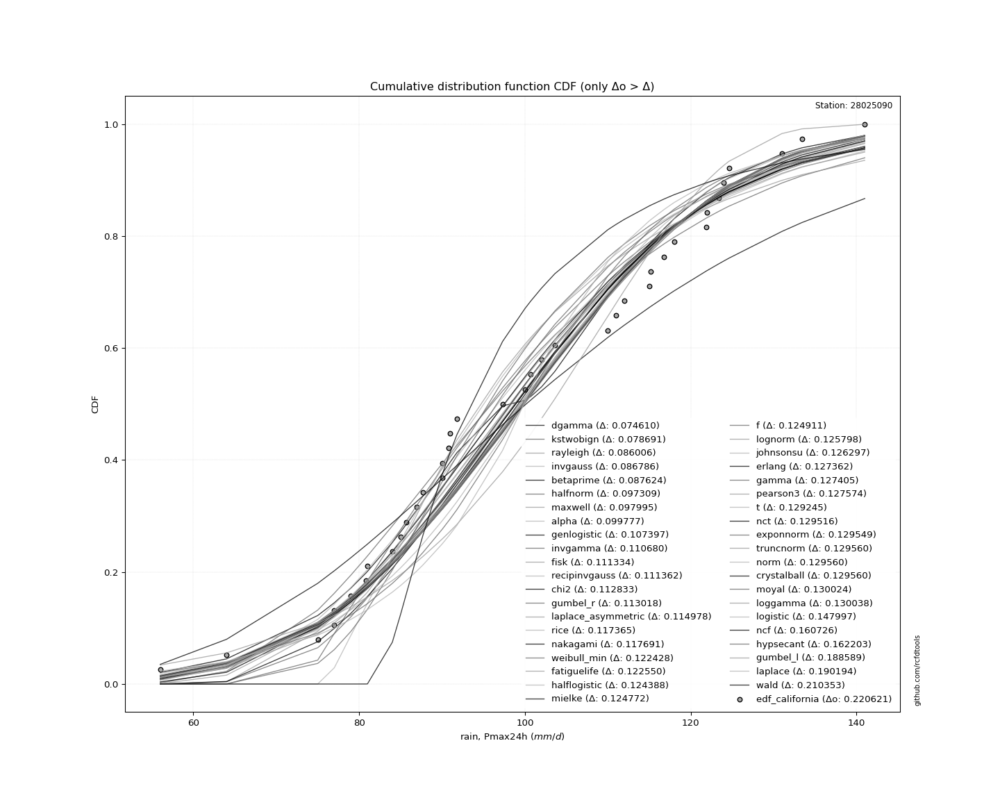</img>

</div>


**1.3. Best fit**

<div align="center">

|   id |   station | empirical_dist   | p_dist    |     delta |   deltao | eval   |   fit |   n |   best_fit |   best_fit_sort |
|-----:|----------:|:-----------------|:----------|----------:|---------:|:-------|------:|----:|-----------:|----------------:|
|    0 |  28025090 | edf_california   | logdgamma | 0.0632978 | 0.220621 | Δo > Δ |     1 |  38 |          1 |               1 |

</div>


<div align="center">

</img>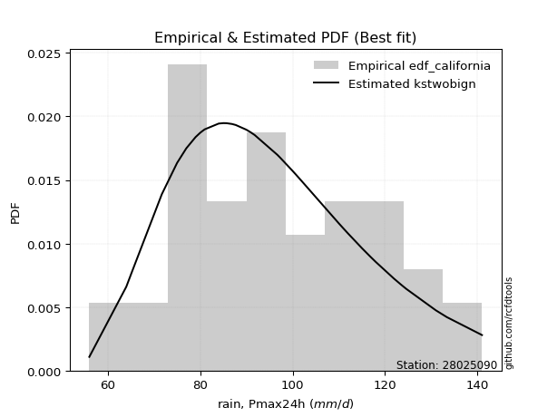</img>

</div>


### 2. Empirical - EDF Hazen (1930)

Hazen method for plotting positions is a formula used to estimate the empirical cumulative probability distribution of flood events or other hydrological data. This formula often results in biased estimations, particularly when extrapolating to extreme events (high return periods).

<div align="center">


$P=(m-0.5)/n$


</div>


**2.1. Empirical values**

<div align="center">

|                | 0                    | 1                    | 2                   | 3                   | 4                   | 5                   | 6                   | 7                   | 8                  | 9                  | 10                  | 11                 | 12                  | 13                  | 14                 | 15                  | 16                 | 17                 | 18                 | 19                 | 20                 | 21                 | 22                 | 23                | 24                 | 25                 | 26                 | 27                 | 28        | 29                 | 30                 | 31                 | 32                 | 33                | 34                 | 35                 | 36                 | 37                 |
|:---------------|:---------------------|:---------------------|:--------------------|:--------------------|:--------------------|:--------------------|:--------------------|:--------------------|:-------------------|:-------------------|:--------------------|:-------------------|:--------------------|:--------------------|:-------------------|:--------------------|:-------------------|:-------------------|:-------------------|:-------------------|:-------------------|:-------------------|:-------------------|:------------------|:-------------------|:-------------------|:-------------------|:-------------------|:----------|:-------------------|:-------------------|:-------------------|:-------------------|:------------------|:-------------------|:-------------------|:-------------------|:-------------------|
| date           | 2012                 | 1982                 | 1991                | 2003                | 2005                | 2002                | 1986                | 1995                | 1997               | 1994               | 2001                | 1978               | 1981                | 2004                | 1993               | 1979                | 2007               | 1988               | 2014               | 1999               | 2015               | 1992               | 1980               | 2011              | 1998               | 2006               | 2013               | 1989               | 1984      | 2000               | 1996               | 1990               | 1985               | 2010              | 1987               | 2008               | 1983               | 2009               |
| x              | 56.0                 | 64.0                 | 75.0                | 77.0                | 77.0                | 79.0                | 80.8                | 81.0                | 84.0               | 85.0               | 85.7                | 86.8977523483704   | 87.7                | 90.0                | 90.0               | 90.8182021076523    | 91.0               | 91.8               | 97.3               | 100.0              | 100.7              | 102.0              | 103.6              | 110.0             | 111.0              | 112.0              | 115.0              | 115.2              | 116.8     | 118.0              | 121.9              | 122.0              | 123.4              | 124.0             | 124.6              | 131.0              | 133.4              | 141.0              |
| m              | 1                    | 2                    | 3                   | 4                   | 5                   | 6                   | 7                   | 8                   | 9                  | 10                 | 11                  | 12                 | 13                  | 14                  | 15                 | 16                  | 17                 | 18                 | 19                 | 20                 | 21                 | 22                 | 23                 | 24                | 25                 | 26                 | 27                 | 28                 | 29        | 30                 | 31                 | 32                 | 33                 | 34                | 35                 | 36                 | 37                 | 38                 |
| empirical_dist | edf_hazen            | edf_hazen            | edf_hazen           | edf_hazen           | edf_hazen           | edf_hazen           | edf_hazen           | edf_hazen           | edf_hazen          | edf_hazen          | edf_hazen           | edf_hazen          | edf_hazen           | edf_hazen           | edf_hazen          | edf_hazen           | edf_hazen          | edf_hazen          | edf_hazen          | edf_hazen          | edf_hazen          | edf_hazen          | edf_hazen          | edf_hazen         | edf_hazen          | edf_hazen          | edf_hazen          | edf_hazen          | edf_hazen | edf_hazen          | edf_hazen          | edf_hazen          | edf_hazen          | edf_hazen         | edf_hazen          | edf_hazen          | edf_hazen          | edf_hazen          |
| empirical      | 0.013157894736842105 | 0.039473684210526314 | 0.06578947368421052 | 0.09210526315789473 | 0.11842105263157894 | 0.14473684210526316 | 0.17105263157894737 | 0.19736842105263158 | 0.2236842105263158 | 0.25               | 0.27631578947368424 | 0.3026315789473684 | 0.32894736842105265 | 0.35526315789473684 | 0.3815789473684211 | 0.40789473684210525 | 0.4342105263157895 | 0.4605263157894737 | 0.4868421052631579 | 0.5131578947368421 | 0.5394736842105263 | 0.5657894736842105 | 0.5921052631578947 | 0.618421052631579 | 0.6447368421052632 | 0.6710526315789473 | 0.6973684210526315 | 0.7236842105263158 | 0.75      | 0.7763157894736842 | 0.8026315789473685 | 0.8289473684210527 | 0.8552631578947368 | 0.881578947368421 | 0.9078947368421053 | 0.9342105263157895 | 0.9605263157894737 | 0.9868421052631579 |
| empirical_tr   | 1.0133333333333334   | 1.0410958904109588   | 1.0704225352112675  | 1.1014492753623188  | 1.1343283582089552  | 1.1692307692307693  | 1.2063492063492063  | 1.2459016393442623  | 1.288135593220339  | 1.3333333333333333 | 1.381818181818182   | 1.4339622641509433 | 1.4901960784313726  | 1.5510204081632653  | 1.6170212765957446 | 1.688888888888889   | 1.7674418604651163 | 1.8536585365853657 | 1.948717948717949  | 2.0540540540540544 | 2.1714285714285713 | 2.3030303030303028 | 2.451612903225806  | 2.620689655172414 | 2.814814814814815  | 3.0399999999999996 | 3.304347826086956  | 3.6190476190476195 | 4.0       | 4.470588235294117  | 5.066666666666668  | 5.846153846153847  | 6.909090909090909  | 8.444444444444441 | 10.857142857142863 | 15.200000000000005 | 25.333333333333325 | 75.99999999999976  |

</div>


**2.2. Kolmogorov-Smirnov fit test (sorted by Δ)**


<div align="center">

|                | 0                   | 1                  | 2                   | 3                   | 4                   | 5                   | 6                   | 7                  | 8                   | 9                   | 10                  | 11                  | 12                  | 13                  | 14                 | 15                  | 16                  | 17                  | 18                  | 19                  | 20                  | 21                 | 22                  | 23                  | 24                 | 25                  | 26                  | 27                  | 28                  | 29                  | 30                  | 31                  | 32                  | 33                  | 34                  | 35                  | 36                  | 37                  | 38                  | 39                  | 40                  | 41                  | 42                  | 43                  | 44                  | 45                 | 46                  | 47                  | 48                  | 49                  | 50                  | 51                  | 52                  | 53                  | 54                  | 55                  | 56                  | 57                  | 58                  | 59                 | 60                  | 61                  | 62                 | 63                  | 64                  | 65                 | 66                  | 67                 | 68                 | 69                 | 70                 | 71                  | 72                 | 73                  | 74                    | 75                  | 76                 | 77                 | 78                  | 79                  | 80                  | 81                 | 82                 | 83                  | 84                 | 85                  | 86                 | 87                  | 88                 | 89                 | 90                 | 91                 |
|:---------------|:--------------------|:-------------------|:--------------------|:--------------------|:--------------------|:--------------------|:--------------------|:-------------------|:--------------------|:--------------------|:--------------------|:--------------------|:--------------------|:--------------------|:-------------------|:--------------------|:--------------------|:--------------------|:--------------------|:--------------------|:--------------------|:-------------------|:--------------------|:--------------------|:-------------------|:--------------------|:--------------------|:--------------------|:--------------------|:--------------------|:--------------------|:--------------------|:--------------------|:--------------------|:--------------------|:--------------------|:--------------------|:--------------------|:--------------------|:--------------------|:--------------------|:--------------------|:--------------------|:--------------------|:--------------------|:-------------------|:--------------------|:--------------------|:--------------------|:--------------------|:--------------------|:--------------------|:--------------------|:--------------------|:--------------------|:--------------------|:--------------------|:--------------------|:--------------------|:-------------------|:--------------------|:--------------------|:-------------------|:--------------------|:--------------------|:-------------------|:--------------------|:-------------------|:-------------------|:-------------------|:-------------------|:--------------------|:-------------------|:--------------------|:----------------------|:--------------------|:-------------------|:-------------------|:--------------------|:--------------------|:--------------------|:-------------------|:-------------------|:--------------------|:-------------------|:--------------------|:-------------------|:--------------------|:-------------------|:-------------------|:-------------------|:-------------------|
| station        | 28025090            | 28025090           | 28025090            | 28025090            | 28025090            | 28025090            | 28025090            | 28025090           | 28025090            | 28025090            | 28025090            | 28025090            | 28025090            | 28025090            | 28025090           | 28025090            | 28025090            | 28025090            | 28025090            | 28025090            | 28025090            | 28025090           | 28025090            | 28025090            | 28025090           | 28025090            | 28025090            | 28025090            | 28025090            | 28025090            | 28025090            | 28025090            | 28025090            | 28025090            | 28025090            | 28025090            | 28025090            | 28025090            | 28025090            | 28025090            | 28025090            | 28025090            | 28025090            | 28025090            | 28025090            | 28025090           | 28025090            | 28025090            | 28025090            | 28025090            | 28025090            | 28025090            | 28025090            | 28025090            | 28025090            | 28025090            | 28025090            | 28025090            | 28025090            | 28025090           | 28025090            | 28025090            | 28025090           | 28025090            | 28025090            | 28025090           | 28025090            | 28025090           | 28025090           | 28025090           | 28025090           | 28025090            | 28025090           | 28025090            | 28025090              | 28025090            | 28025090           | 28025090           | 28025090            | 28025090            | 28025090            | 28025090           | 28025090           | 28025090            | 28025090           | 28025090            | 28025090           | 28025090            | 28025090           | 28025090           | 28025090           | 28025090           |
| empirical_dist | edf_hazen           | edf_hazen          | edf_hazen           | edf_hazen           | edf_hazen           | edf_hazen           | edf_hazen           | edf_hazen          | edf_hazen           | edf_hazen           | edf_hazen           | edf_hazen           | edf_hazen           | edf_hazen           | edf_hazen          | edf_hazen           | edf_hazen           | edf_hazen           | edf_hazen           | edf_hazen           | edf_hazen           | edf_hazen          | edf_hazen           | edf_hazen           | edf_hazen          | edf_hazen           | edf_hazen           | edf_hazen           | edf_hazen           | edf_hazen           | edf_hazen           | edf_hazen           | edf_hazen           | edf_hazen           | edf_hazen           | edf_hazen           | edf_hazen           | edf_hazen           | edf_hazen           | edf_hazen           | edf_hazen           | edf_hazen           | edf_hazen           | edf_hazen           | edf_hazen           | edf_hazen          | edf_hazen           | edf_hazen           | edf_hazen           | edf_hazen           | edf_hazen           | edf_hazen           | edf_hazen           | edf_hazen           | edf_hazen           | edf_hazen           | edf_hazen           | edf_hazen           | edf_hazen           | edf_hazen          | edf_hazen           | edf_hazen           | edf_hazen          | edf_hazen           | edf_hazen           | edf_hazen          | edf_hazen           | edf_hazen          | edf_hazen          | edf_hazen          | edf_hazen          | edf_hazen           | edf_hazen          | edf_hazen           | edf_hazen             | edf_hazen           | edf_hazen          | edf_hazen          | edf_hazen           | edf_hazen           | edf_hazen           | edf_hazen          | edf_hazen          | edf_hazen           | edf_hazen          | edf_hazen           | edf_hazen          | edf_hazen           | edf_hazen          | edf_hazen          | edf_hazen          | edf_hazen          |
| p_dist         | logdgamma           | dgamma             | maxwell             | alpha               | kstwobign           | logncf              | logf                | logalpha           | logrice             | logt                | lognorm             | lognorm             | logcrystalball      | logexponnorm        | loglognorm         | logfatiguelife      | lognakagami         | genlogistic         | rayleigh            | invgamma            | logfisk             | loginvgamma        | fisk                | logerlang           | lognct             | loggamma            | loggamma            | chi2                | invgauss            | betaprime           | logpearson3         | loginvweibull       | rice                | nakagami            | loginvgauss         | logmaxwell          | weibull_min         | fatiguelife         | halfnorm            | mielke              | logweibull_min      | loggenlogistic      | f                   | loggompertz         | johnsonsu           | lograyleigh        | logloggamma         | erlang              | gamma               | pearson3            | logjohnsonsu        | t                   | logkstwobign        | nct                 | exponnorm           | truncnorm           | norm                | crystalball         | loglogistic         | logmielke          | loghalfnorm         | gumbel_r            | laplace_asymmetric | loghypsecant        | logistic            | halflogistic       | loggumbel_r         | moyal              | loggumbel_l        | ncf                | hypsecant          | loghalflogistic     | loglaplace         | logmoyal            | loglaplace_asymmetric | gumbel_l            | laplace            | loggenexpon        | wald                | logwald             | loggibrat           | gibrat             | logbetaprime       | genexpon            | expon              | pareto              | logpareto          | logexpon            | logchi2            | logtruncnorm       | invweibull         | gompertz           |
| delta          | 0.06726147443247832 | 0.0877680409744549 | 0.09060824947272184 | 0.09120975037532564 | 0.09184843776887419 | 0.09213123214211083 | 0.09392491439099293 | 0.0941199555962875 | 0.09469378379945581 | 0.09470843409390661 | 0.09471639189300973 | 0.09471639189300973 | 0.09471703687911659 | 0.09471740210975244 | 0.0947177610274732 | 0.09496095535977134 | 0.09506019448337655 | 0.09524065210076527 | 0.09555626924878025 | 0.09752218138451624 | 0.09784389522966397 | 0.0981076382284295 | 0.09817598331955252 | 0.09942230926848483 | 0.0994292550849607 | 0.09952097866085241 | 0.09952097866085241 | 0.09967473408753336 | 0.09994432768523909 | 0.10008033308624387 | 0.10188678558143427 | 0.10204750449308309 | 0.10420754955787298 | 0.10453316667120083 | 0.10613293173911764 | 0.10902488581717595 | 0.10927044524209228 | 0.10939169218257971 | 0.11046696517920673 | 0.11161446679473142 | 0.11161578950762019 | 0.11166405673290292 | 0.11175300428020418 | 0.11240599561148612 | 0.11313866240747739 | 0.1131935811189082 | 0.11354325907683088 | 0.11420421511151768 | 0.11424714807202391 | 0.11441610484411002 | 0.11560831125103488 | 0.11608692784715136 | 0.11628725355595095 | 0.11635815159653878 | 0.11639116955416562 | 0.11640196546898479 | 0.11640201061363303 | 0.11640201338320139 | 0.11662868926508185 | 0.1201699272595893 | 0.12604686618280747 | 0.12617580949845442 | 0.1281356587420942 | 0.13209965343560792 | 0.13483898742655642 | 0.1375461037211274 | 0.14276753832539035 | 0.1431821663891395 | 0.143489915054283  | 0.1475677620004423 | 0.1490448608425448 | 0.15233524526697895 | 0.1559236624762188 | 0.15826400963735654 | 0.1623400922632312    | 0.17543092190295717 | 0.1770357079015873 | 0.1772297192909723 | 0.19719476754093837 | 0.20435999342938294 | 0.23528101889415576 | 0.2566743315528493 | 0.2660665853207986 | 0.28757683362386016 | 0.2881994805223089 | 0.28819948948465796 | 0.3431182124036232 | 0.34311821547057214 | 0.3503589653054877 | 0.4778837087718963 | 0.623360092828666  | 0.890086322965733  |
| deltao         | 0.2206211327378371  | 0.2206211327378371 | 0.2206211327378371  | 0.2206211327378371  | 0.2206211327378371  | 0.2206211327378371  | 0.2206211327378371  | 0.2206211327378371 | 0.2206211327378371  | 0.2206211327378371  | 0.2206211327378371  | 0.2206211327378371  | 0.2206211327378371  | 0.2206211327378371  | 0.2206211327378371 | 0.2206211327378371  | 0.2206211327378371  | 0.2206211327378371  | 0.2206211327378371  | 0.2206211327378371  | 0.2206211327378371  | 0.2206211327378371 | 0.2206211327378371  | 0.2206211327378371  | 0.2206211327378371 | 0.2206211327378371  | 0.2206211327378371  | 0.2206211327378371  | 0.2206211327378371  | 0.2206211327378371  | 0.2206211327378371  | 0.2206211327378371  | 0.2206211327378371  | 0.2206211327378371  | 0.2206211327378371  | 0.2206211327378371  | 0.2206211327378371  | 0.2206211327378371  | 0.2206211327378371  | 0.2206211327378371  | 0.2206211327378371  | 0.2206211327378371  | 0.2206211327378371  | 0.2206211327378371  | 0.2206211327378371  | 0.2206211327378371 | 0.2206211327378371  | 0.2206211327378371  | 0.2206211327378371  | 0.2206211327378371  | 0.2206211327378371  | 0.2206211327378371  | 0.2206211327378371  | 0.2206211327378371  | 0.2206211327378371  | 0.2206211327378371  | 0.2206211327378371  | 0.2206211327378371  | 0.2206211327378371  | 0.2206211327378371 | 0.2206211327378371  | 0.2206211327378371  | 0.2206211327378371 | 0.2206211327378371  | 0.2206211327378371  | 0.2206211327378371 | 0.2206211327378371  | 0.2206211327378371 | 0.2206211327378371 | 0.2206211327378371 | 0.2206211327378371 | 0.2206211327378371  | 0.2206211327378371 | 0.2206211327378371  | 0.2206211327378371    | 0.2206211327378371  | 0.2206211327378371 | 0.2206211327378371 | 0.2206211327378371  | 0.2206211327378371  | 0.2206211327378371  | 0.2206211327378371 | 0.2206211327378371 | 0.2206211327378371  | 0.2206211327378371 | 0.2206211327378371  | 0.2206211327378371 | 0.2206211327378371  | 0.2206211327378371 | 0.2206211327378371 | 0.2206211327378371 | 0.2206211327378371 |
| eval           | Δo > Δ              | Δo > Δ             | Δo > Δ              | Δo > Δ              | Δo > Δ              | Δo > Δ              | Δo > Δ              | Δo > Δ             | Δo > Δ              | Δo > Δ              | Δo > Δ              | Δo > Δ              | Δo > Δ              | Δo > Δ              | Δo > Δ             | Δo > Δ              | Δo > Δ              | Δo > Δ              | Δo > Δ              | Δo > Δ              | Δo > Δ              | Δo > Δ             | Δo > Δ              | Δo > Δ              | Δo > Δ             | Δo > Δ              | Δo > Δ              | Δo > Δ              | Δo > Δ              | Δo > Δ              | Δo > Δ              | Δo > Δ              | Δo > Δ              | Δo > Δ              | Δo > Δ              | Δo > Δ              | Δo > Δ              | Δo > Δ              | Δo > Δ              | Δo > Δ              | Δo > Δ              | Δo > Δ              | Δo > Δ              | Δo > Δ              | Δo > Δ              | Δo > Δ             | Δo > Δ              | Δo > Δ              | Δo > Δ              | Δo > Δ              | Δo > Δ              | Δo > Δ              | Δo > Δ              | Δo > Δ              | Δo > Δ              | Δo > Δ              | Δo > Δ              | Δo > Δ              | Δo > Δ              | Δo > Δ             | Δo > Δ              | Δo > Δ              | Δo > Δ             | Δo > Δ              | Δo > Δ              | Δo > Δ             | Δo > Δ              | Δo > Δ             | Δo > Δ             | Δo > Δ             | Δo > Δ             | Δo > Δ              | Δo > Δ             | Δo > Δ              | Δo > Δ                | Δo > Δ              | Δo > Δ             | Δo > Δ             | Δo > Δ              | Δo > Δ              | Δo <= Δ             | Δo <= Δ            | Δo <= Δ            | Δo <= Δ             | Δo <= Δ            | Δo <= Δ             | Δo <= Δ            | Δo <= Δ             | Δo <= Δ            | Δo <= Δ            | Δo <= Δ            | Δo <= Δ            |
| fit            | 1                   | 1                  | 1                   | 1                   | 1                   | 1                   | 1                   | 1                  | 1                   | 1                   | 1                   | 1                   | 1                   | 1                   | 1                  | 1                   | 1                   | 1                   | 1                   | 1                   | 1                   | 1                  | 1                   | 1                   | 1                  | 1                   | 1                   | 1                   | 1                   | 1                   | 1                   | 1                   | 1                   | 1                   | 1                   | 1                   | 1                   | 1                   | 1                   | 1                   | 1                   | 1                   | 1                   | 1                   | 1                   | 1                  | 1                   | 1                   | 1                   | 1                   | 1                   | 1                   | 1                   | 1                   | 1                   | 1                   | 1                   | 1                   | 1                   | 1                  | 1                   | 1                   | 1                  | 1                   | 1                   | 1                  | 1                   | 1                  | 1                  | 1                  | 1                  | 1                   | 1                  | 1                   | 1                     | 1                   | 1                  | 1                  | 1                   | 1                   | 0                   | 0                  | 0                  | 0                   | 0                  | 0                   | 0                  | 0                   | 0                  | 0                  | 0                  | 0                  |
| n              | 38                  | 38                 | 38                  | 38                  | 38                  | 38                  | 38                  | 38                 | 38                  | 38                  | 38                  | 38                  | 38                  | 38                  | 38                 | 38                  | 38                  | 38                  | 38                  | 38                  | 38                  | 38                 | 38                  | 38                  | 38                 | 38                  | 38                  | 38                  | 38                  | 38                  | 38                  | 38                  | 38                  | 38                  | 38                  | 38                  | 38                  | 38                  | 38                  | 38                  | 38                  | 38                  | 38                  | 38                  | 38                  | 38                 | 38                  | 38                  | 38                  | 38                  | 38                  | 38                  | 38                  | 38                  | 38                  | 38                  | 38                  | 38                  | 38                  | 38                 | 38                  | 38                  | 38                 | 38                  | 38                  | 38                 | 38                  | 38                 | 38                 | 38                 | 38                 | 38                  | 38                 | 38                  | 38                    | 38                  | 38                 | 38                 | 38                  | 38                  | 38                  | 38                 | 38                 | 38                  | 38                 | 38                  | 38                 | 38                  | 38                 | 38                 | 38                 | 38                 |
| best_fit       | 1                   | 0                  | 0                   | 0                   | 0                   | 0                   | 0                   | 0                  | 0                   | 0                   | 0                   | 0                   | 0                   | 0                   | 0                  | 0                   | 0                   | 0                   | 0                   | 0                   | 0                   | 0                  | 0                   | 0                   | 0                  | 0                   | 0                   | 0                   | 0                   | 0                   | 0                   | 0                   | 0                   | 0                   | 0                   | 0                   | 0                   | 0                   | 0                   | 0                   | 0                   | 0                   | 0                   | 0                   | 0                   | 0                  | 0                   | 0                   | 0                   | 0                   | 0                   | 0                   | 0                   | 0                   | 0                   | 0                   | 0                   | 0                   | 0                   | 0                  | 0                   | 0                   | 0                  | 0                   | 0                   | 0                  | 0                   | 0                  | 0                  | 0                  | 0                  | 0                   | 0                  | 0                   | 0                     | 0                   | 0                  | 0                  | 0                   | 0                   | 0                   | 0                  | 0                  | 0                   | 0                  | 0                   | 0                  | 0                   | 0                  | 0                  | 0                  | 0                  |
| best_fit_sort  | 1                   | 2                  | 3                   | 4                   | 5                   | 6                   | 7                   | 8                  | 9                   | 10                  | 11                  | 12                  | 13                  | 14                  | 15                 | 16                  | 17                  | 18                  | 19                  | 20                  | 21                  | 22                 | 23                  | 24                  | 25                 | 26                  | 27                  | 28                  | 29                  | 30                  | 31                  | 32                  | 33                  | 34                  | 35                  | 36                  | 37                  | 38                  | 39                  | 40                  | 41                  | 42                  | 43                  | 44                  | 45                  | 46                 | 47                  | 48                  | 49                  | 50                  | 51                  | 52                  | 53                  | 54                  | 55                  | 56                  | 57                  | 58                  | 59                  | 60                 | 61                  | 62                  | 63                 | 64                  | 65                  | 66                 | 67                  | 68                 | 69                 | 70                 | 71                 | 72                  | 73                 | 74                  | 75                    | 76                  | 77                 | 78                 | 79                  | 80                  | 81                  | 82                 | 83                 | 84                  | 85                 | 86                  | 87                 | 88                  | 89                 | 90                 | 91                 | 92                 |

</div>


<div align="center">

</img>

</div>


**2.3. Best fit**

<div align="center">

|   id |   station | empirical_dist   | p_dist    |     delta |   deltao | eval   |   fit |   n |   best_fit |   best_fit_sort |
|-----:|----------:|:-----------------|:----------|----------:|---------:|:-------|------:|----:|-----------:|----------------:|
|    0 |  28025090 | edf_hazen        | logdgamma | 0.0672615 | 0.220621 | Δo > Δ |     1 |  38 |          1 |               1 |

</div>


<div align="center">

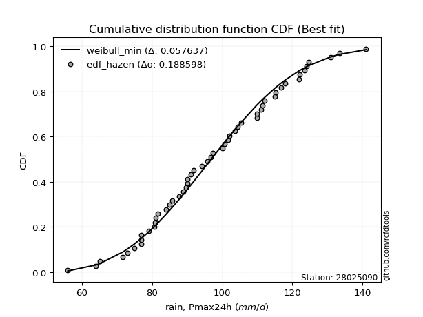</img>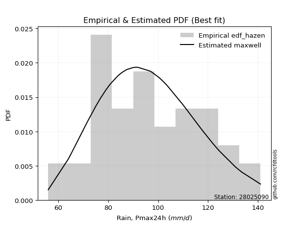</img>

</div>


### 3. Empirical - EDF Weibull (1939)

Weibull plotting position formula is an empirical method used to estimate the non-exceedance probability or plotting position for a set of observed data, is often recommended or widely used in practice, particularly in flood frequency analysis.

<div align="center">


$P=m/(n+1)$


</div>


**3.1. Empirical values**

<div align="center">

|                | 0                   | 1                   | 2                   | 3                   | 4                  | 5                   | 6                  | 7                   | 8                   | 9                  | 10                  | 11                 | 12                 | 13                | 14                  | 15                  | 16                 | 17                  | 18                  | 19                 | 20                 | 21                 | 22                 | 23                 | 24                 | 25                 | 26                 | 27                 | 28                 | 29                 | 30                 | 31                 | 32                 | 33                 | 34                 | 35                 | 36                 | 37                 |
|:---------------|:--------------------|:--------------------|:--------------------|:--------------------|:-------------------|:--------------------|:-------------------|:--------------------|:--------------------|:-------------------|:--------------------|:-------------------|:-------------------|:------------------|:--------------------|:--------------------|:-------------------|:--------------------|:--------------------|:-------------------|:-------------------|:-------------------|:-------------------|:-------------------|:-------------------|:-------------------|:-------------------|:-------------------|:-------------------|:-------------------|:-------------------|:-------------------|:-------------------|:-------------------|:-------------------|:-------------------|:-------------------|:-------------------|
| date           | 2012                | 1982                | 1991                | 2003                | 2005               | 2002                | 1986               | 1995                | 1997                | 1994               | 2001                | 1978               | 1981               | 2004              | 1993                | 1979                | 2007               | 1988                | 2014                | 1999               | 2015               | 1992               | 1980               | 2011               | 1998               | 2006               | 2013               | 1989               | 1984               | 2000               | 1996               | 1990               | 1985               | 2010               | 1987               | 2008               | 1983               | 2009               |
| x              | 56.0                | 64.0                | 75.0                | 77.0                | 77.0               | 79.0                | 80.8               | 81.0                | 84.0                | 85.0               | 85.7                | 86.8977523483704   | 87.7               | 90.0              | 90.0                | 90.8182021076523    | 91.0               | 91.8                | 97.3                | 100.0              | 100.7              | 102.0              | 103.6              | 110.0              | 111.0              | 112.0              | 115.0              | 115.2              | 116.8              | 118.0              | 121.9              | 122.0              | 123.4              | 124.0              | 124.6              | 131.0              | 133.4              | 141.0              |
| m              | 1                   | 2                   | 3                   | 4                   | 5                  | 6                   | 7                  | 8                   | 9                   | 10                 | 11                  | 12                 | 13                 | 14                | 15                  | 16                  | 17                 | 18                  | 19                  | 20                 | 21                 | 22                 | 23                 | 24                 | 25                 | 26                 | 27                 | 28                 | 29                 | 30                 | 31                 | 32                 | 33                 | 34                 | 35                 | 36                 | 37                 | 38                 |
| empirical_dist | edf_weibull         | edf_weibull         | edf_weibull         | edf_weibull         | edf_weibull        | edf_weibull         | edf_weibull        | edf_weibull         | edf_weibull         | edf_weibull        | edf_weibull         | edf_weibull        | edf_weibull        | edf_weibull       | edf_weibull         | edf_weibull         | edf_weibull        | edf_weibull         | edf_weibull         | edf_weibull        | edf_weibull        | edf_weibull        | edf_weibull        | edf_weibull        | edf_weibull        | edf_weibull        | edf_weibull        | edf_weibull        | edf_weibull        | edf_weibull        | edf_weibull        | edf_weibull        | edf_weibull        | edf_weibull        | edf_weibull        | edf_weibull        | edf_weibull        | edf_weibull        |
| empirical      | 0.02564102564102564 | 0.05128205128205128 | 0.07692307692307693 | 0.10256410256410256 | 0.1282051282051282 | 0.15384615384615385 | 0.1794871794871795 | 0.20512820512820512 | 0.23076923076923078 | 0.2564102564102564 | 0.28205128205128205 | 0.3076923076923077 | 0.3333333333333333 | 0.358974358974359 | 0.38461538461538464 | 0.41025641025641024 | 0.4358974358974359 | 0.46153846153846156 | 0.48717948717948717 | 0.5128205128205128 | 0.5384615384615384 | 0.5641025641025641 | 0.5897435897435898 | 0.6153846153846154 | 0.6410256410256411 | 0.6666666666666666 | 0.6923076923076923 | 0.717948717948718  | 0.7435897435897436 | 0.7692307692307693 | 0.7948717948717948 | 0.8205128205128205 | 0.8461538461538461 | 0.8717948717948718 | 0.8974358974358975 | 0.9230769230769231 | 0.9487179487179487 | 0.9743589743589743 |
| empirical_tr   | 1.0263157894736843  | 1.0540540540540542  | 1.0833333333333333  | 1.1142857142857143  | 1.1470588235294117 | 1.1818181818181819  | 1.21875            | 1.2580645161290323  | 1.3                 | 1.3448275862068966 | 1.3928571428571428  | 1.4444444444444444 | 1.4999999999999998 | 1.56              | 1.625               | 1.6956521739130435  | 1.7727272727272727 | 1.8571428571428572  | 1.9500000000000002  | 2.052631578947368  | 2.1666666666666665 | 2.2941176470588234 | 2.4375             | 2.6                | 2.785714285714286  | 2.9999999999999996 | 3.25               | 3.5454545454545454 | 3.9000000000000004 | 4.333333333333334  | 4.874999999999999  | 5.57142857142857   | 6.5                | 7.800000000000001  | 9.750000000000004  | 13.000000000000009 | 19.499999999999986 | 38.99999999999997  |

</div>


**3.2. Kolmogorov-Smirnov fit test (sorted by Δ)**


<div align="center">

|                | 0                   | 1                   | 2                   | 3                  | 4                  | 5                   | 6                  | 7                  | 8                   | 9                   | 10                  | 11                 | 12                 | 13                  | 14                 | 15                  | 16                 | 17                  | 18                  | 19                  | 20                  | 21                  | 22                  | 23                  | 24                  | 25                 | 26                  | 27                  | 28                  | 29                  | 30                  | 31                  | 32                  | 33                  | 34                  | 35                 | 36                  | 37                 | 38                  | 39                 | 40                  | 41                  | 42                  | 43                  | 44                 | 45                  | 46                  | 47                  | 48                 | 49                  | 50                  | 51                  | 52                  | 53                  | 54                  | 55                  | 56                  | 57                  | 58                  | 59                 | 60                  | 61                  | 62                  | 63                  | 64                  | 65                  | 66                  | 67                  | 68                  | 69                  | 70                 | 71                 | 72                  | 73                 | 74                    | 75                 | 76                  | 77                  | 78                 | 79                 | 80                  | 81                  | 82                 | 83                 | 84                 | 85                  | 86                  | 87                  | 88                 | 89                 | 90                 | 91                 |
|:---------------|:--------------------|:--------------------|:--------------------|:-------------------|:-------------------|:--------------------|:-------------------|:-------------------|:--------------------|:--------------------|:--------------------|:-------------------|:-------------------|:--------------------|:-------------------|:--------------------|:-------------------|:--------------------|:--------------------|:--------------------|:--------------------|:--------------------|:--------------------|:--------------------|:--------------------|:-------------------|:--------------------|:--------------------|:--------------------|:--------------------|:--------------------|:--------------------|:--------------------|:--------------------|:--------------------|:-------------------|:--------------------|:-------------------|:--------------------|:-------------------|:--------------------|:--------------------|:--------------------|:--------------------|:-------------------|:--------------------|:--------------------|:--------------------|:-------------------|:--------------------|:--------------------|:--------------------|:--------------------|:--------------------|:--------------------|:--------------------|:--------------------|:--------------------|:--------------------|:-------------------|:--------------------|:--------------------|:--------------------|:--------------------|:--------------------|:--------------------|:--------------------|:--------------------|:--------------------|:--------------------|:-------------------|:-------------------|:--------------------|:-------------------|:----------------------|:-------------------|:--------------------|:--------------------|:-------------------|:-------------------|:--------------------|:--------------------|:-------------------|:-------------------|:-------------------|:--------------------|:--------------------|:--------------------|:-------------------|:-------------------|:-------------------|:-------------------|
| station        | 28025090            | 28025090            | 28025090            | 28025090           | 28025090           | 28025090            | 28025090           | 28025090           | 28025090            | 28025090            | 28025090            | 28025090           | 28025090           | 28025090            | 28025090           | 28025090            | 28025090           | 28025090            | 28025090            | 28025090            | 28025090            | 28025090            | 28025090            | 28025090            | 28025090            | 28025090           | 28025090            | 28025090            | 28025090            | 28025090            | 28025090            | 28025090            | 28025090            | 28025090            | 28025090            | 28025090           | 28025090            | 28025090           | 28025090            | 28025090           | 28025090            | 28025090            | 28025090            | 28025090            | 28025090           | 28025090            | 28025090            | 28025090            | 28025090           | 28025090            | 28025090            | 28025090            | 28025090            | 28025090            | 28025090            | 28025090            | 28025090            | 28025090            | 28025090            | 28025090           | 28025090            | 28025090            | 28025090            | 28025090            | 28025090            | 28025090            | 28025090            | 28025090            | 28025090            | 28025090            | 28025090           | 28025090           | 28025090            | 28025090           | 28025090              | 28025090           | 28025090            | 28025090            | 28025090           | 28025090           | 28025090            | 28025090            | 28025090           | 28025090           | 28025090           | 28025090            | 28025090            | 28025090            | 28025090           | 28025090           | 28025090           | 28025090           |
| empirical_dist | edf_weibull         | edf_weibull         | edf_weibull         | edf_weibull        | edf_weibull        | edf_weibull         | edf_weibull        | edf_weibull        | edf_weibull         | edf_weibull         | edf_weibull         | edf_weibull        | edf_weibull        | edf_weibull         | edf_weibull        | edf_weibull         | edf_weibull        | edf_weibull         | edf_weibull         | edf_weibull         | edf_weibull         | edf_weibull         | edf_weibull         | edf_weibull         | edf_weibull         | edf_weibull        | edf_weibull         | edf_weibull         | edf_weibull         | edf_weibull         | edf_weibull         | edf_weibull         | edf_weibull         | edf_weibull         | edf_weibull         | edf_weibull        | edf_weibull         | edf_weibull        | edf_weibull         | edf_weibull        | edf_weibull         | edf_weibull         | edf_weibull         | edf_weibull         | edf_weibull        | edf_weibull         | edf_weibull         | edf_weibull         | edf_weibull        | edf_weibull         | edf_weibull         | edf_weibull         | edf_weibull         | edf_weibull         | edf_weibull         | edf_weibull         | edf_weibull         | edf_weibull         | edf_weibull         | edf_weibull        | edf_weibull         | edf_weibull         | edf_weibull         | edf_weibull         | edf_weibull         | edf_weibull         | edf_weibull         | edf_weibull         | edf_weibull         | edf_weibull         | edf_weibull        | edf_weibull        | edf_weibull         | edf_weibull        | edf_weibull           | edf_weibull        | edf_weibull         | edf_weibull         | edf_weibull        | edf_weibull        | edf_weibull         | edf_weibull         | edf_weibull        | edf_weibull        | edf_weibull        | edf_weibull         | edf_weibull         | edf_weibull         | edf_weibull        | edf_weibull        | edf_weibull        | edf_weibull        |
| p_dist         | logdgamma           | loginvweibull       | dgamma              | maxwell            | alpha              | kstwobign           | logncf             | logf               | logalpha            | logrice             | logt                | lognorm            | lognorm            | logcrystalball      | logexponnorm       | loglognorm          | logfatiguelife     | lognakagami         | genlogistic         | invgamma            | rayleigh            | logfisk             | fisk                | chi2                | loginvgamma         | logerlang          | lognct              | loggamma            | loggamma            | logpearson3         | invgauss            | betaprime           | rice                | nakagami            | logkstwobign        | loginvgauss        | weibull_min         | fatiguelife        | logmaxwell          | mielke             | logweibull_min      | loggenlogistic      | f                   | loggompertz         | halfnorm           | johnsonsu           | logloggamma         | erlang              | gamma              | pearson3            | lograyleigh         | logjohnsonsu        | t                   | nct                 | exponnorm           | truncnorm           | norm                | crystalball         | loglogistic         | logmielke          | loghalfnorm         | gumbel_r            | laplace_asymmetric  | loghypsecant        | logistic            | ncf                 | halflogistic        | loggumbel_l         | loggumbel_r         | moyal               | hypsecant          | loghalflogistic    | loglaplace          | logmoyal           | loglaplace_asymmetric | loggenexpon        | gumbel_l            | laplace             | wald               | logwald            | loggibrat           | logbetaprime        | gibrat             | genexpon           | expon              | pareto              | logpareto           | logexpon            | logchi2            | logtruncnorm       | invweibull         | gompertz           |
| delta          | 0.07232220317741755 | 0.09023913742155809 | 0.09282876971939413 | 0.0936446867196854 | 0.0942461876222892 | 0.09488487501583776 | 0.0951676693890744 | 0.0969613516379565 | 0.09715639284325106 | 0.09773022104641937 | 0.09774487134087018 | 0.0977528291399733 | 0.0977528291399733 | 0.09775347412608015 | 0.097753839356716  | 0.09775419827443677 | 0.0979973926067349 | 0.09809663173034011 | 0.09827708934772883 | 0.09853432713350413 | 0.09859270649574381 | 0.09885604097865186 | 0.09918812906854041 | 0.10068687983652125 | 0.10114407547539306 | 0.1024587465154484 | 0.10246569233192426 | 0.10255741590781597 | 0.10255741590781597 | 0.10289893133042216 | 0.10298076493220265 | 0.10311677033320743 | 0.10521969530686087 | 0.10554531242018872 | 0.10756188920076598 | 0.1091693689860812 | 0.11028259099108018 | 0.1104038379315676 | 0.11206132306413952 | 0.1126266125437193 | 0.11262793525660808 | 0.11267620248189081 | 0.11276515002919207 | 0.11341814136047401 | 0.1135034024261703 | 0.11415080815646528 | 0.11455540482581877 | 0.11521636086050557 | 0.1152592938210118 | 0.11542825059309791 | 0.11623001836587177 | 0.11662045700002277 | 0.11709907359613925 | 0.11737029734552668 | 0.11740331530315351 | 0.11741411121797268 | 0.11741415636262093 | 0.11741415913218928 | 0.11966512651204542 | 0.1211820730085772 | 0.12908330342977103 | 0.12921224674541798 | 0.13117209598905777 | 0.13513609068257149 | 0.13585113317554431 | 0.13710892259423446 | 0.14058254096809097 | 0.14450206080327088 | 0.14580397557235392 | 0.14621860363610306 | 0.1500570065915327 | 0.1553716825139425 | 0.15896009972318237 | 0.1613004468843201 | 0.1633522380122191    | 0.1667708798847645 | 0.17644306765194506 | 0.17804785365057518 | 0.2049545516165119 | 0.2073964306763465 | 0.23831745614111932 | 0.25493298208193216 | 0.2624098241304471 | 0.2771179942176524 | 0.2777406411161011 | 0.27774065007845017 | 0.33265937299741544 | 0.33265937606436435 | 0.3378758344013042 | 0.4674248693656885 | 0.6122264895897995 | 0.8796274835595251 |
| deltao         | 0.2206211327378371  | 0.2206211327378371  | 0.2206211327378371  | 0.2206211327378371 | 0.2206211327378371 | 0.2206211327378371  | 0.2206211327378371 | 0.2206211327378371 | 0.2206211327378371  | 0.2206211327378371  | 0.2206211327378371  | 0.2206211327378371 | 0.2206211327378371 | 0.2206211327378371  | 0.2206211327378371 | 0.2206211327378371  | 0.2206211327378371 | 0.2206211327378371  | 0.2206211327378371  | 0.2206211327378371  | 0.2206211327378371  | 0.2206211327378371  | 0.2206211327378371  | 0.2206211327378371  | 0.2206211327378371  | 0.2206211327378371 | 0.2206211327378371  | 0.2206211327378371  | 0.2206211327378371  | 0.2206211327378371  | 0.2206211327378371  | 0.2206211327378371  | 0.2206211327378371  | 0.2206211327378371  | 0.2206211327378371  | 0.2206211327378371 | 0.2206211327378371  | 0.2206211327378371 | 0.2206211327378371  | 0.2206211327378371 | 0.2206211327378371  | 0.2206211327378371  | 0.2206211327378371  | 0.2206211327378371  | 0.2206211327378371 | 0.2206211327378371  | 0.2206211327378371  | 0.2206211327378371  | 0.2206211327378371 | 0.2206211327378371  | 0.2206211327378371  | 0.2206211327378371  | 0.2206211327378371  | 0.2206211327378371  | 0.2206211327378371  | 0.2206211327378371  | 0.2206211327378371  | 0.2206211327378371  | 0.2206211327378371  | 0.2206211327378371 | 0.2206211327378371  | 0.2206211327378371  | 0.2206211327378371  | 0.2206211327378371  | 0.2206211327378371  | 0.2206211327378371  | 0.2206211327378371  | 0.2206211327378371  | 0.2206211327378371  | 0.2206211327378371  | 0.2206211327378371 | 0.2206211327378371 | 0.2206211327378371  | 0.2206211327378371 | 0.2206211327378371    | 0.2206211327378371 | 0.2206211327378371  | 0.2206211327378371  | 0.2206211327378371 | 0.2206211327378371 | 0.2206211327378371  | 0.2206211327378371  | 0.2206211327378371 | 0.2206211327378371 | 0.2206211327378371 | 0.2206211327378371  | 0.2206211327378371  | 0.2206211327378371  | 0.2206211327378371 | 0.2206211327378371 | 0.2206211327378371 | 0.2206211327378371 |
| eval           | Δo > Δ              | Δo > Δ              | Δo > Δ              | Δo > Δ             | Δo > Δ             | Δo > Δ              | Δo > Δ             | Δo > Δ             | Δo > Δ              | Δo > Δ              | Δo > Δ              | Δo > Δ             | Δo > Δ             | Δo > Δ              | Δo > Δ             | Δo > Δ              | Δo > Δ             | Δo > Δ              | Δo > Δ              | Δo > Δ              | Δo > Δ              | Δo > Δ              | Δo > Δ              | Δo > Δ              | Δo > Δ              | Δo > Δ             | Δo > Δ              | Δo > Δ              | Δo > Δ              | Δo > Δ              | Δo > Δ              | Δo > Δ              | Δo > Δ              | Δo > Δ              | Δo > Δ              | Δo > Δ             | Δo > Δ              | Δo > Δ             | Δo > Δ              | Δo > Δ             | Δo > Δ              | Δo > Δ              | Δo > Δ              | Δo > Δ              | Δo > Δ             | Δo > Δ              | Δo > Δ              | Δo > Δ              | Δo > Δ             | Δo > Δ              | Δo > Δ              | Δo > Δ              | Δo > Δ              | Δo > Δ              | Δo > Δ              | Δo > Δ              | Δo > Δ              | Δo > Δ              | Δo > Δ              | Δo > Δ             | Δo > Δ              | Δo > Δ              | Δo > Δ              | Δo > Δ              | Δo > Δ              | Δo > Δ              | Δo > Δ              | Δo > Δ              | Δo > Δ              | Δo > Δ              | Δo > Δ             | Δo > Δ             | Δo > Δ              | Δo > Δ             | Δo > Δ                | Δo > Δ             | Δo > Δ              | Δo > Δ              | Δo > Δ             | Δo > Δ             | Δo <= Δ             | Δo <= Δ             | Δo <= Δ            | Δo <= Δ            | Δo <= Δ            | Δo <= Δ             | Δo <= Δ             | Δo <= Δ             | Δo <= Δ            | Δo <= Δ            | Δo <= Δ            | Δo <= Δ            |
| fit            | 1                   | 1                   | 1                   | 1                  | 1                  | 1                   | 1                  | 1                  | 1                   | 1                   | 1                   | 1                  | 1                  | 1                   | 1                  | 1                   | 1                  | 1                   | 1                   | 1                   | 1                   | 1                   | 1                   | 1                   | 1                   | 1                  | 1                   | 1                   | 1                   | 1                   | 1                   | 1                   | 1                   | 1                   | 1                   | 1                  | 1                   | 1                  | 1                   | 1                  | 1                   | 1                   | 1                   | 1                   | 1                  | 1                   | 1                   | 1                   | 1                  | 1                   | 1                   | 1                   | 1                   | 1                   | 1                   | 1                   | 1                   | 1                   | 1                   | 1                  | 1                   | 1                   | 1                   | 1                   | 1                   | 1                   | 1                   | 1                   | 1                   | 1                   | 1                  | 1                  | 1                   | 1                  | 1                     | 1                  | 1                   | 1                   | 1                  | 1                  | 0                   | 0                   | 0                  | 0                  | 0                  | 0                   | 0                   | 0                   | 0                  | 0                  | 0                  | 0                  |
| n              | 38                  | 38                  | 38                  | 38                 | 38                 | 38                  | 38                 | 38                 | 38                  | 38                  | 38                  | 38                 | 38                 | 38                  | 38                 | 38                  | 38                 | 38                  | 38                  | 38                  | 38                  | 38                  | 38                  | 38                  | 38                  | 38                 | 38                  | 38                  | 38                  | 38                  | 38                  | 38                  | 38                  | 38                  | 38                  | 38                 | 38                  | 38                 | 38                  | 38                 | 38                  | 38                  | 38                  | 38                  | 38                 | 38                  | 38                  | 38                  | 38                 | 38                  | 38                  | 38                  | 38                  | 38                  | 38                  | 38                  | 38                  | 38                  | 38                  | 38                 | 38                  | 38                  | 38                  | 38                  | 38                  | 38                  | 38                  | 38                  | 38                  | 38                  | 38                 | 38                 | 38                  | 38                 | 38                    | 38                 | 38                  | 38                  | 38                 | 38                 | 38                  | 38                  | 38                 | 38                 | 38                 | 38                  | 38                  | 38                  | 38                 | 38                 | 38                 | 38                 |
| best_fit       | 1                   | 0                   | 0                   | 0                  | 0                  | 0                   | 0                  | 0                  | 0                   | 0                   | 0                   | 0                  | 0                  | 0                   | 0                  | 0                   | 0                  | 0                   | 0                   | 0                   | 0                   | 0                   | 0                   | 0                   | 0                   | 0                  | 0                   | 0                   | 0                   | 0                   | 0                   | 0                   | 0                   | 0                   | 0                   | 0                  | 0                   | 0                  | 0                   | 0                  | 0                   | 0                   | 0                   | 0                   | 0                  | 0                   | 0                   | 0                   | 0                  | 0                   | 0                   | 0                   | 0                   | 0                   | 0                   | 0                   | 0                   | 0                   | 0                   | 0                  | 0                   | 0                   | 0                   | 0                   | 0                   | 0                   | 0                   | 0                   | 0                   | 0                   | 0                  | 0                  | 0                   | 0                  | 0                     | 0                  | 0                   | 0                   | 0                  | 0                  | 0                   | 0                   | 0                  | 0                  | 0                  | 0                   | 0                   | 0                   | 0                  | 0                  | 0                  | 0                  |
| best_fit_sort  | 1                   | 2                   | 3                   | 4                  | 5                  | 6                   | 7                  | 8                  | 9                   | 10                  | 11                  | 12                 | 13                 | 14                  | 15                 | 16                  | 17                 | 18                  | 19                  | 20                  | 21                  | 22                  | 23                  | 24                  | 25                  | 26                 | 27                  | 28                  | 29                  | 30                  | 31                  | 32                  | 33                  | 34                  | 35                  | 36                 | 37                  | 38                 | 39                  | 40                 | 41                  | 42                  | 43                  | 44                  | 45                 | 46                  | 47                  | 48                  | 49                 | 50                  | 51                  | 52                  | 53                  | 54                  | 55                  | 56                  | 57                  | 58                  | 59                  | 60                 | 61                  | 62                  | 63                  | 64                  | 65                  | 66                  | 67                  | 68                  | 69                  | 70                  | 71                 | 72                 | 73                  | 74                 | 75                    | 76                 | 77                  | 78                  | 79                 | 80                 | 81                  | 82                  | 83                 | 84                 | 85                 | 86                  | 87                  | 88                  | 89                 | 90                 | 91                 | 92                 |

</div>


<div align="center">

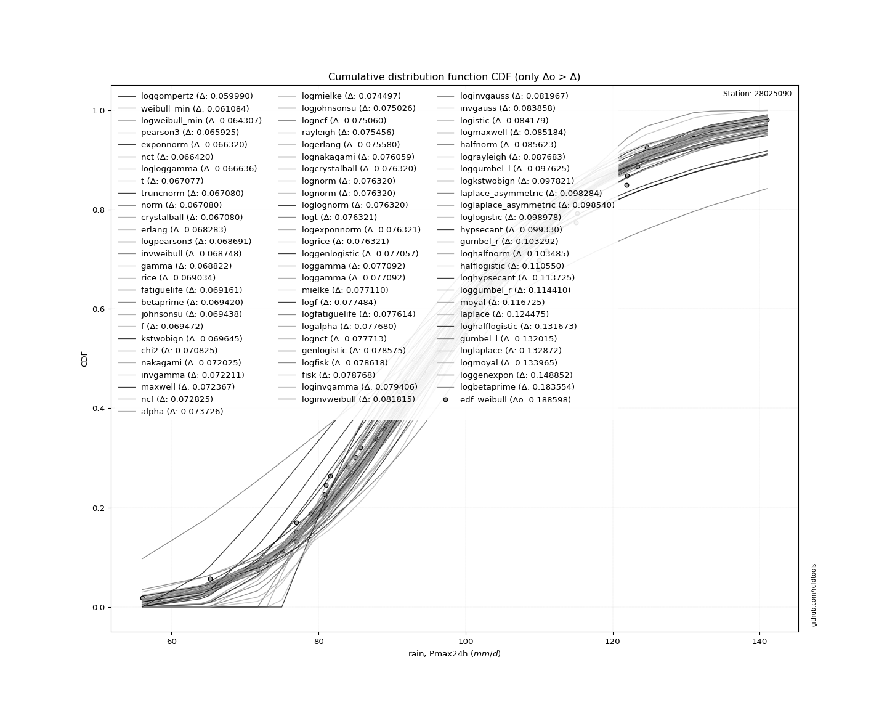</img>

</div>


**3.3. Best fit**

<div align="center">

|   id |   station | empirical_dist   | p_dist    |     delta |   deltao | eval   |   fit |   n |   best_fit |   best_fit_sort |
|-----:|----------:|:-----------------|:----------|----------:|---------:|:-------|------:|----:|-----------:|----------------:|
|    0 |  28025090 | edf_weibull      | logdgamma | 0.0723222 | 0.220621 | Δo > Δ |     1 |  38 |          1 |               1 |

</div>


<div align="center">

</img>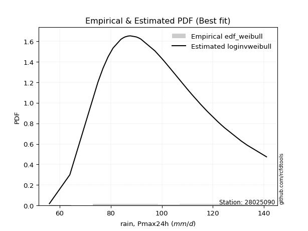</img>

</div>


### 4. Empirical - EDF Beard (1943)

The Beard formula (or Beard´s plotting position formula) in hydrology is used to estimate the empirical non-exceedance probability _(P)_ of a flood event (or other extreme hydrological data point) within a given dataset.

<div align="center">


$P=(m-0.31)/(n+0.38)$


</div>


**4.1. Empirical values**

<div align="center">

|                | 0                    | 1                    | 2                   | 3                   | 4                   | 5                   | 6                   | 7                  | 8                  | 9                  | 10                 | 11                 | 12                 | 13                 | 14                 | 15                 | 16                  | 17                  | 18                  | 19                 | 20                 | 21                 | 22                 | 23                 | 24                 | 25                 | 26                 | 27                 | 28                 | 29                 | 30                 | 31                 | 32                | 33                 | 34                 | 35                 | 36                 | 37                 |
|:---------------|:---------------------|:---------------------|:--------------------|:--------------------|:--------------------|:--------------------|:--------------------|:-------------------|:-------------------|:-------------------|:-------------------|:-------------------|:-------------------|:-------------------|:-------------------|:-------------------|:--------------------|:--------------------|:--------------------|:-------------------|:-------------------|:-------------------|:-------------------|:-------------------|:-------------------|:-------------------|:-------------------|:-------------------|:-------------------|:-------------------|:-------------------|:-------------------|:------------------|:-------------------|:-------------------|:-------------------|:-------------------|:-------------------|
| date           | 2012                 | 1982                 | 1991                | 2003                | 2005                | 2002                | 1986                | 1995               | 1997               | 1994               | 2001               | 1978               | 1981               | 2004               | 1993               | 1979               | 2007                | 1988                | 2014                | 1999               | 2015               | 1992               | 1980               | 2011               | 1998               | 2006               | 2013               | 1989               | 1984               | 2000               | 1996               | 1990               | 1985              | 2010               | 1987               | 2008               | 1983               | 2009               |
| x              | 56.0                 | 64.0                 | 75.0                | 77.0                | 77.0                | 79.0                | 80.8                | 81.0               | 84.0               | 85.0               | 85.7               | 86.8977523483704   | 87.7               | 90.0               | 90.0               | 90.8182021076523   | 91.0                | 91.8                | 97.3                | 100.0              | 100.7              | 102.0              | 103.6              | 110.0              | 111.0              | 112.0              | 115.0              | 115.2              | 116.8              | 118.0              | 121.9              | 122.0              | 123.4             | 124.0              | 124.6              | 131.0              | 133.4              | 141.0              |
| m              | 1                    | 2                    | 3                   | 4                   | 5                   | 6                   | 7                   | 8                  | 9                  | 10                 | 11                 | 12                 | 13                 | 14                 | 15                 | 16                 | 17                  | 18                  | 19                  | 20                 | 21                 | 22                 | 23                 | 24                 | 25                 | 26                 | 27                 | 28                 | 29                 | 30                 | 31                 | 32                 | 33                | 34                 | 35                 | 36                 | 37                 | 38                 |
| empirical_dist | edf_beard            | edf_beard            | edf_beard           | edf_beard           | edf_beard           | edf_beard           | edf_beard           | edf_beard          | edf_beard          | edf_beard          | edf_beard          | edf_beard          | edf_beard          | edf_beard          | edf_beard          | edf_beard          | edf_beard           | edf_beard           | edf_beard           | edf_beard          | edf_beard          | edf_beard          | edf_beard          | edf_beard          | edf_beard          | edf_beard          | edf_beard          | edf_beard          | edf_beard          | edf_beard          | edf_beard          | edf_beard          | edf_beard         | edf_beard          | edf_beard          | edf_beard          | edf_beard          | edf_beard          |
| empirical      | 0.017978113600833765 | 0.044033350703491396 | 0.07008858780614903 | 0.09614382490880666 | 0.12219906201146431 | 0.14825429911412194 | 0.17430953621677958 | 0.2003647733194372 | 0.2264200104220948 | 0.2524752475247524 | 0.2785304846274101 | 0.3045857217300677 | 0.3306409588327253 | 0.356696195935383  | 0.3827514330380406 | 0.4088066701406982 | 0.43486190724335594 | 0.46091714434601355 | 0.48697238144867117 | 0.5130276185513288 | 0.5390828556539865 | 0.5651380927566441 | 0.5911933298593017 | 0.6172485669619594 | 0.643303804064617  | 0.6693590411672746 | 0.6954142782699323 | 0.7214695153725899 | 0.7475247524752475 | 0.7735799895779052 | 0.7996352266805627 | 0.8256904637832204 | 0.851745700885878 | 0.8778009379885355 | 0.9038561750911932 | 0.9299114121938509 | 0.9559666492965084 | 0.9820218863991661 |
| empirical_tr   | 1.0183072433006102   | 1.0460615971654401   | 1.0753712524516672  | 1.1063707120207553  | 1.139210448204215   | 1.1740593453655552  | 1.2111076049226885  | 1.2505702183121536 | 1.2926911417985854 | 1.3377483443708609 | 1.3860599494402313 | 1.437991757212439  | 1.4939665239392756 | 1.5544754961522882 | 1.620092866188265  | 1.6914940502423974 | 1.769479022591056   | 1.8550024166263899  | 1.9492127983748095  | 2.0535045478865706 | 2.1695873374788017 | 2.299580587177951  | 2.4461440407903123 | 2.6126616746085776 | 2.8035062089116143 | 3.0244286840031522 | 3.2831479897348164 | 3.5902712815715616 | 3.9607843137254903 | 4.416570771001151  | 4.990897269180753  | 5.736920777279521  | 6.745166959578204 | 8.183368869936023  | 10.401084010840094 | 14.267657992565038 | 22.710059171597546 | 55.62318840579669  |

</div>


**4.2. Kolmogorov-Smirnov fit test (sorted by Δ)**


<div align="center">

|                | 0                   | 1                   | 2                   | 3                   | 4                   | 5                   | 6                   | 7                   | 8                  | 9                  | 10                  | 11                  | 12                  | 13                  | 14                  | 15                  | 16                  | 17                  | 18                  | 19                  | 20                  | 21                  | 22                 | 23                  | 24                  | 25                  | 26                  | 27                 | 28                 | 29                  | 30                  | 31                  | 32                  | 33                  | 34                  | 35                  | 36                 | 37                  | 38                  | 39                 | 40                  | 41                 | 42                  | 43                  | 44                 | 45                  | 46                  | 47                  | 48                  | 49                  | 50                 | 51                  | 52                  | 53                  | 54                 | 55                  | 56                  | 57                  | 58                  | 59                  | 60                  | 61                 | 62                 | 63                 | 64                 | 65                 | 66                 | 67                  | 68                  | 69                  | 70                 | 71                  | 72                 | 73                  | 74                    | 75                 | 76                  | 77                  | 78                  | 79                  | 80                  | 81                  | 82                  | 83                 | 84                  | 85                 | 86                 | 87                 | 88                  | 89                  | 90                 | 91                 |
|:---------------|:--------------------|:--------------------|:--------------------|:--------------------|:--------------------|:--------------------|:--------------------|:--------------------|:-------------------|:-------------------|:--------------------|:--------------------|:--------------------|:--------------------|:--------------------|:--------------------|:--------------------|:--------------------|:--------------------|:--------------------|:--------------------|:--------------------|:-------------------|:--------------------|:--------------------|:--------------------|:--------------------|:-------------------|:-------------------|:--------------------|:--------------------|:--------------------|:--------------------|:--------------------|:--------------------|:--------------------|:-------------------|:--------------------|:--------------------|:-------------------|:--------------------|:-------------------|:--------------------|:--------------------|:-------------------|:--------------------|:--------------------|:--------------------|:--------------------|:--------------------|:-------------------|:--------------------|:--------------------|:--------------------|:-------------------|:--------------------|:--------------------|:--------------------|:--------------------|:--------------------|:--------------------|:-------------------|:-------------------|:-------------------|:-------------------|:-------------------|:-------------------|:--------------------|:--------------------|:--------------------|:-------------------|:--------------------|:-------------------|:--------------------|:----------------------|:-------------------|:--------------------|:--------------------|:--------------------|:--------------------|:--------------------|:--------------------|:--------------------|:-------------------|:--------------------|:-------------------|:-------------------|:-------------------|:--------------------|:--------------------|:-------------------|:-------------------|
| station        | 28025090            | 28025090            | 28025090            | 28025090            | 28025090            | 28025090            | 28025090            | 28025090            | 28025090           | 28025090           | 28025090            | 28025090            | 28025090            | 28025090            | 28025090            | 28025090            | 28025090            | 28025090            | 28025090            | 28025090            | 28025090            | 28025090            | 28025090           | 28025090            | 28025090            | 28025090            | 28025090            | 28025090           | 28025090           | 28025090            | 28025090            | 28025090            | 28025090            | 28025090            | 28025090            | 28025090            | 28025090           | 28025090            | 28025090            | 28025090           | 28025090            | 28025090           | 28025090            | 28025090            | 28025090           | 28025090            | 28025090            | 28025090            | 28025090            | 28025090            | 28025090           | 28025090            | 28025090            | 28025090            | 28025090           | 28025090            | 28025090            | 28025090            | 28025090            | 28025090            | 28025090            | 28025090           | 28025090           | 28025090           | 28025090           | 28025090           | 28025090           | 28025090            | 28025090            | 28025090            | 28025090           | 28025090            | 28025090           | 28025090            | 28025090              | 28025090           | 28025090            | 28025090            | 28025090            | 28025090            | 28025090            | 28025090            | 28025090            | 28025090           | 28025090            | 28025090           | 28025090           | 28025090           | 28025090            | 28025090            | 28025090           | 28025090           |
| empirical_dist | edf_beard           | edf_beard           | edf_beard           | edf_beard           | edf_beard           | edf_beard           | edf_beard           | edf_beard           | edf_beard          | edf_beard          | edf_beard           | edf_beard           | edf_beard           | edf_beard           | edf_beard           | edf_beard           | edf_beard           | edf_beard           | edf_beard           | edf_beard           | edf_beard           | edf_beard           | edf_beard          | edf_beard           | edf_beard           | edf_beard           | edf_beard           | edf_beard          | edf_beard          | edf_beard           | edf_beard           | edf_beard           | edf_beard           | edf_beard           | edf_beard           | edf_beard           | edf_beard          | edf_beard           | edf_beard           | edf_beard          | edf_beard           | edf_beard          | edf_beard           | edf_beard           | edf_beard          | edf_beard           | edf_beard           | edf_beard           | edf_beard           | edf_beard           | edf_beard          | edf_beard           | edf_beard           | edf_beard           | edf_beard          | edf_beard           | edf_beard           | edf_beard           | edf_beard           | edf_beard           | edf_beard           | edf_beard          | edf_beard          | edf_beard          | edf_beard          | edf_beard          | edf_beard          | edf_beard           | edf_beard           | edf_beard           | edf_beard          | edf_beard           | edf_beard          | edf_beard           | edf_beard             | edf_beard          | edf_beard           | edf_beard           | edf_beard           | edf_beard           | edf_beard           | edf_beard           | edf_beard           | edf_beard          | edf_beard           | edf_beard          | edf_beard          | edf_beard          | edf_beard           | edf_beard           | edf_beard          | edf_beard          |
| p_dist         | logdgamma           | dgamma              | maxwell             | alpha               | kstwobign           | logncf              | logf                | logalpha            | logrice            | logt               | lognorm             | lognorm             | logcrystalball      | logexponnorm        | loglognorm          | logfatiguelife      | lognakagami         | genlogistic         | rayleigh            | loginvweibull       | invgamma            | logfisk             | fisk               | loginvgamma         | chi2                | logerlang           | lognct              | loggamma           | loggamma           | invgauss            | betaprime           | logpearson3         | rice                | nakagami            | loginvgauss         | weibull_min         | fatiguelife        | logmaxwell          | halfnorm            | mielke             | logweibull_min      | loggenlogistic     | f                   | logkstwobign        | loggompertz        | johnsonsu           | logloggamma         | lograyleigh         | erlang              | gamma               | pearson3           | logjohnsonsu        | t                   | nct                 | exponnorm          | truncnorm           | norm                | crystalball         | loglogistic         | logmielke           | loghalfnorm         | gumbel_r           | laplace_asymmetric | loghypsecant       | logistic           | halflogistic       | ncf                | loggumbel_l         | loggumbel_r         | moyal               | hypsecant          | loghalflogistic     | loglaplace         | logmoyal            | loglaplace_asymmetric | loggenexpon        | gumbel_l            | laplace             | wald                | logwald             | loggibrat           | gibrat              | logbetaprime        | genexpon           | expon               | pareto             | logpareto          | logexpon           | logchi2             | logtruncnorm        | invweibull         | gompertz           |
| delta          | 0.06921561721517755 | 0.08972218375715413 | 0.09178073514234142 | 0.09238223604494522 | 0.09302092343849377 | 0.09330371781173041 | 0.09509740006061251 | 0.09529244126590708 | 0.0958662694690754 | 0.0958809197635262 | 0.09588887756262932 | 0.09588887756262932 | 0.09588952254873617 | 0.09588988777937202 | 0.09589024669709278 | 0.09613344102939092 | 0.09623268015299613 | 0.09641313777038485 | 0.09672875491839983 | 0.09748783800011784 | 0.09791300994105612 | 0.09823472378620385 | 0.0985668118760924 | 0.09928012389804908 | 0.10006556264407324 | 0.10059479493810441 | 0.10060174075458028 | 0.100693464330472  | 0.100693464330472  | 0.10111681335485867 | 0.10125281875586345 | 0.10227761413797415 | 0.10459837811441286 | 0.10492399522774071 | 0.10730541740873722 | 0.10966127379863216 | 0.1097825207391196 | 0.11019737148679554 | 0.11163945084882632 | 0.1120052953512713 | 0.11200661806416007 | 0.1120548852894428 | 0.11214383283674406 | 0.11224869180503902 | 0.112796824168026  | 0.11352949096401727 | 0.11393408763337076 | 0.11436606678852779 | 0.11459504366805756 | 0.11463797662856379 | 0.1148069334006499 | 0.11599913980757476 | 0.11647775640369123 | 0.11674898015307866 | 0.1167819981107055 | 0.11679279402552467 | 0.11679283917017291 | 0.11679284193974127 | 0.11780117493470144 | 0.12056075581612918 | 0.12721935185242705 | 0.127348295168074  | 0.1293081444117138 | 0.1332721391052275 | 0.1352298159830963 | 0.138718589390747  | 0.1435292002495302 | 0.14388074361082287 | 0.14394002399500994 | 0.14435465205875908 | 0.1494356893990847 | 0.15350773093659853 | 0.1570961481458384 | 0.15943649530697612 | 0.16273092081977109   | 0.1731911575400604 | 0.17582175045949705 | 0.17742653645812717 | 0.20019111980774398 | 0.20553247909900252 | 0.23645350456377534 | 0.25888902670657515 | 0.26176747119886007 | 0.2835382718729482 | 0.28416091877139704 | 0.284160927733746  | 0.3390796506527113 | 0.3390796537196602 | 0.34553874644149596 | 0.47384514702098435 | 0.6190609787067275 | 0.8860477612148209 |
| deltao         | 0.2206211327378371  | 0.2206211327378371  | 0.2206211327378371  | 0.2206211327378371  | 0.2206211327378371  | 0.2206211327378371  | 0.2206211327378371  | 0.2206211327378371  | 0.2206211327378371 | 0.2206211327378371 | 0.2206211327378371  | 0.2206211327378371  | 0.2206211327378371  | 0.2206211327378371  | 0.2206211327378371  | 0.2206211327378371  | 0.2206211327378371  | 0.2206211327378371  | 0.2206211327378371  | 0.2206211327378371  | 0.2206211327378371  | 0.2206211327378371  | 0.2206211327378371 | 0.2206211327378371  | 0.2206211327378371  | 0.2206211327378371  | 0.2206211327378371  | 0.2206211327378371 | 0.2206211327378371 | 0.2206211327378371  | 0.2206211327378371  | 0.2206211327378371  | 0.2206211327378371  | 0.2206211327378371  | 0.2206211327378371  | 0.2206211327378371  | 0.2206211327378371 | 0.2206211327378371  | 0.2206211327378371  | 0.2206211327378371 | 0.2206211327378371  | 0.2206211327378371 | 0.2206211327378371  | 0.2206211327378371  | 0.2206211327378371 | 0.2206211327378371  | 0.2206211327378371  | 0.2206211327378371  | 0.2206211327378371  | 0.2206211327378371  | 0.2206211327378371 | 0.2206211327378371  | 0.2206211327378371  | 0.2206211327378371  | 0.2206211327378371 | 0.2206211327378371  | 0.2206211327378371  | 0.2206211327378371  | 0.2206211327378371  | 0.2206211327378371  | 0.2206211327378371  | 0.2206211327378371 | 0.2206211327378371 | 0.2206211327378371 | 0.2206211327378371 | 0.2206211327378371 | 0.2206211327378371 | 0.2206211327378371  | 0.2206211327378371  | 0.2206211327378371  | 0.2206211327378371 | 0.2206211327378371  | 0.2206211327378371 | 0.2206211327378371  | 0.2206211327378371    | 0.2206211327378371 | 0.2206211327378371  | 0.2206211327378371  | 0.2206211327378371  | 0.2206211327378371  | 0.2206211327378371  | 0.2206211327378371  | 0.2206211327378371  | 0.2206211327378371 | 0.2206211327378371  | 0.2206211327378371 | 0.2206211327378371 | 0.2206211327378371 | 0.2206211327378371  | 0.2206211327378371  | 0.2206211327378371 | 0.2206211327378371 |
| eval           | Δo > Δ              | Δo > Δ              | Δo > Δ              | Δo > Δ              | Δo > Δ              | Δo > Δ              | Δo > Δ              | Δo > Δ              | Δo > Δ             | Δo > Δ             | Δo > Δ              | Δo > Δ              | Δo > Δ              | Δo > Δ              | Δo > Δ              | Δo > Δ              | Δo > Δ              | Δo > Δ              | Δo > Δ              | Δo > Δ              | Δo > Δ              | Δo > Δ              | Δo > Δ             | Δo > Δ              | Δo > Δ              | Δo > Δ              | Δo > Δ              | Δo > Δ             | Δo > Δ             | Δo > Δ              | Δo > Δ              | Δo > Δ              | Δo > Δ              | Δo > Δ              | Δo > Δ              | Δo > Δ              | Δo > Δ             | Δo > Δ              | Δo > Δ              | Δo > Δ             | Δo > Δ              | Δo > Δ             | Δo > Δ              | Δo > Δ              | Δo > Δ             | Δo > Δ              | Δo > Δ              | Δo > Δ              | Δo > Δ              | Δo > Δ              | Δo > Δ             | Δo > Δ              | Δo > Δ              | Δo > Δ              | Δo > Δ             | Δo > Δ              | Δo > Δ              | Δo > Δ              | Δo > Δ              | Δo > Δ              | Δo > Δ              | Δo > Δ             | Δo > Δ             | Δo > Δ             | Δo > Δ             | Δo > Δ             | Δo > Δ             | Δo > Δ              | Δo > Δ              | Δo > Δ              | Δo > Δ             | Δo > Δ              | Δo > Δ             | Δo > Δ              | Δo > Δ                | Δo > Δ             | Δo > Δ              | Δo > Δ              | Δo > Δ              | Δo > Δ              | Δo <= Δ             | Δo <= Δ             | Δo <= Δ             | Δo <= Δ            | Δo <= Δ             | Δo <= Δ            | Δo <= Δ            | Δo <= Δ            | Δo <= Δ             | Δo <= Δ             | Δo <= Δ            | Δo <= Δ            |
| fit            | 1                   | 1                   | 1                   | 1                   | 1                   | 1                   | 1                   | 1                   | 1                  | 1                  | 1                   | 1                   | 1                   | 1                   | 1                   | 1                   | 1                   | 1                   | 1                   | 1                   | 1                   | 1                   | 1                  | 1                   | 1                   | 1                   | 1                   | 1                  | 1                  | 1                   | 1                   | 1                   | 1                   | 1                   | 1                   | 1                   | 1                  | 1                   | 1                   | 1                  | 1                   | 1                  | 1                   | 1                   | 1                  | 1                   | 1                   | 1                   | 1                   | 1                   | 1                  | 1                   | 1                   | 1                   | 1                  | 1                   | 1                   | 1                   | 1                   | 1                   | 1                   | 1                  | 1                  | 1                  | 1                  | 1                  | 1                  | 1                   | 1                   | 1                   | 1                  | 1                   | 1                  | 1                   | 1                     | 1                  | 1                   | 1                   | 1                   | 1                   | 0                   | 0                   | 0                   | 0                  | 0                   | 0                  | 0                  | 0                  | 0                   | 0                   | 0                  | 0                  |
| n              | 38                  | 38                  | 38                  | 38                  | 38                  | 38                  | 38                  | 38                  | 38                 | 38                 | 38                  | 38                  | 38                  | 38                  | 38                  | 38                  | 38                  | 38                  | 38                  | 38                  | 38                  | 38                  | 38                 | 38                  | 38                  | 38                  | 38                  | 38                 | 38                 | 38                  | 38                  | 38                  | 38                  | 38                  | 38                  | 38                  | 38                 | 38                  | 38                  | 38                 | 38                  | 38                 | 38                  | 38                  | 38                 | 38                  | 38                  | 38                  | 38                  | 38                  | 38                 | 38                  | 38                  | 38                  | 38                 | 38                  | 38                  | 38                  | 38                  | 38                  | 38                  | 38                 | 38                 | 38                 | 38                 | 38                 | 38                 | 38                  | 38                  | 38                  | 38                 | 38                  | 38                 | 38                  | 38                    | 38                 | 38                  | 38                  | 38                  | 38                  | 38                  | 38                  | 38                  | 38                 | 38                  | 38                 | 38                 | 38                 | 38                  | 38                  | 38                 | 38                 |
| best_fit       | 1                   | 0                   | 0                   | 0                   | 0                   | 0                   | 0                   | 0                   | 0                  | 0                  | 0                   | 0                   | 0                   | 0                   | 0                   | 0                   | 0                   | 0                   | 0                   | 0                   | 0                   | 0                   | 0                  | 0                   | 0                   | 0                   | 0                   | 0                  | 0                  | 0                   | 0                   | 0                   | 0                   | 0                   | 0                   | 0                   | 0                  | 0                   | 0                   | 0                  | 0                   | 0                  | 0                   | 0                   | 0                  | 0                   | 0                   | 0                   | 0                   | 0                   | 0                  | 0                   | 0                   | 0                   | 0                  | 0                   | 0                   | 0                   | 0                   | 0                   | 0                   | 0                  | 0                  | 0                  | 0                  | 0                  | 0                  | 0                   | 0                   | 0                   | 0                  | 0                   | 0                  | 0                   | 0                     | 0                  | 0                   | 0                   | 0                   | 0                   | 0                   | 0                   | 0                   | 0                  | 0                   | 0                  | 0                  | 0                  | 0                   | 0                   | 0                  | 0                  |
| best_fit_sort  | 1                   | 2                   | 3                   | 4                   | 5                   | 6                   | 7                   | 8                   | 9                  | 10                 | 11                  | 12                  | 13                  | 14                  | 15                  | 16                  | 17                  | 18                  | 19                  | 20                  | 21                  | 22                  | 23                 | 24                  | 25                  | 26                  | 27                  | 28                 | 29                 | 30                  | 31                  | 32                  | 33                  | 34                  | 35                  | 36                  | 37                 | 38                  | 39                  | 40                 | 41                  | 42                 | 43                  | 44                  | 45                 | 46                  | 47                  | 48                  | 49                  | 50                  | 51                 | 52                  | 53                  | 54                  | 55                 | 56                  | 57                  | 58                  | 59                  | 60                  | 61                  | 62                 | 63                 | 64                 | 65                 | 66                 | 67                 | 68                  | 69                  | 70                  | 71                 | 72                  | 73                 | 74                  | 75                    | 76                 | 77                  | 78                  | 79                  | 80                  | 81                  | 82                  | 83                  | 84                 | 85                  | 86                 | 87                 | 88                 | 89                  | 90                  | 91                 | 92                 |

</div>


<div align="center">

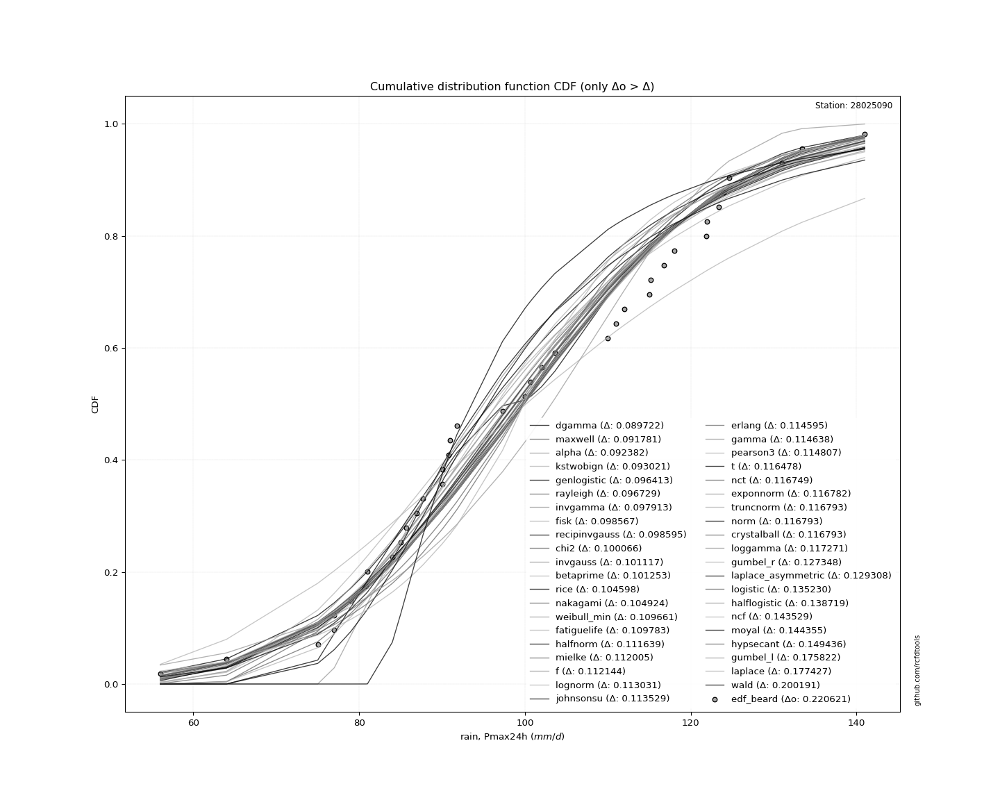</img>

</div>


**4.3. Best fit**

<div align="center">

|   id |   station | empirical_dist   | p_dist    |     delta |   deltao | eval   |   fit |   n |   best_fit |   best_fit_sort |
|-----:|----------:|:-----------------|:----------|----------:|---------:|:-------|------:|----:|-----------:|----------------:|
|    0 |  28025090 | edf_beard        | logdgamma | 0.0692156 | 0.220621 | Δo > Δ |     1 |  38 |          1 |               1 |

</div>


<div align="center">

</img>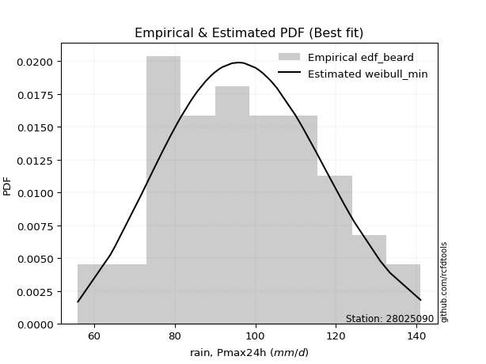</img>

</div>


### 5. Empirical - EDF Chegodayev (1955)

The Chegodayev formula is an empirical plotting position formula used in hydrological frequency analysis to estimate the exceedance probability or return period of a specific event from a set of observed data. It is primarily used for plotting observed data points on probability paper to fit a theoretical distribution, particularly for analyzing extreme events like maximum flood flows or rainfall intensities. The constant _b_ value in the generalized plotting position formula is 0.3.

<div align="center">


$P=(m-b)/(n+1-2b)$


</div>


**5.1. Empirical values**

<div align="center">

|                | 0                    | 1                    | 2                   | 3                   | 4                   | 5                  | 6                   | 7                   | 8                 | 9                  | 10                 | 11                 | 12                 | 13                 | 14                | 15                 | 16                 | 17                | 18                 | 19                 | 20                | 21                 | 22                 | 23                 | 24                 | 25                 | 26                | 27                 | 28                 | 29                | 30                 | 31                 | 32                 | 33                 | 34                 | 35                 | 36                 | 37                 |
|:---------------|:---------------------|:---------------------|:--------------------|:--------------------|:--------------------|:-------------------|:--------------------|:--------------------|:------------------|:-------------------|:-------------------|:-------------------|:-------------------|:-------------------|:------------------|:-------------------|:-------------------|:------------------|:-------------------|:-------------------|:------------------|:-------------------|:-------------------|:-------------------|:-------------------|:-------------------|:------------------|:-------------------|:-------------------|:------------------|:-------------------|:-------------------|:-------------------|:-------------------|:-------------------|:-------------------|:-------------------|:-------------------|
| date           | 2012                 | 1982                 | 1991                | 2003                | 2005                | 2002               | 1986                | 1995                | 1997              | 1994               | 2001               | 1978               | 1981               | 2004               | 1993              | 1979               | 2007               | 1988              | 2014               | 1999               | 2015              | 1992               | 1980               | 2011               | 1998               | 2006               | 2013              | 1989               | 1984               | 2000              | 1996               | 1990               | 1985               | 2010               | 1987               | 2008               | 1983               | 2009               |
| x              | 56.0                 | 64.0                 | 75.0                | 77.0                | 77.0                | 79.0               | 80.8                | 81.0                | 84.0              | 85.0               | 85.7               | 86.8977523483704   | 87.7               | 90.0               | 90.0              | 90.8182021076523   | 91.0               | 91.8              | 97.3               | 100.0              | 100.7             | 102.0              | 103.6              | 110.0              | 111.0              | 112.0              | 115.0             | 115.2              | 116.8              | 118.0             | 121.9              | 122.0              | 123.4              | 124.0              | 124.6              | 131.0              | 133.4              | 141.0              |
| m              | 1                    | 2                    | 3                   | 4                   | 5                   | 6                  | 7                   | 8                   | 9                 | 10                 | 11                 | 12                 | 13                 | 14                 | 15                | 16                 | 17                 | 18                | 19                 | 20                 | 21                | 22                 | 23                 | 24                 | 25                 | 26                 | 27                | 28                 | 29                 | 30                | 31                 | 32                 | 33                 | 34                 | 35                 | 36                 | 37                 | 38                 |
| empirical_dist | edf_chegodayev       | edf_chegodayev       | edf_chegodayev      | edf_chegodayev      | edf_chegodayev      | edf_chegodayev     | edf_chegodayev      | edf_chegodayev      | edf_chegodayev    | edf_chegodayev     | edf_chegodayev     | edf_chegodayev     | edf_chegodayev     | edf_chegodayev     | edf_chegodayev    | edf_chegodayev     | edf_chegodayev     | edf_chegodayev    | edf_chegodayev     | edf_chegodayev     | edf_chegodayev    | edf_chegodayev     | edf_chegodayev     | edf_chegodayev     | edf_chegodayev     | edf_chegodayev     | edf_chegodayev    | edf_chegodayev     | edf_chegodayev     | edf_chegodayev    | edf_chegodayev     | edf_chegodayev     | edf_chegodayev     | edf_chegodayev     | edf_chegodayev     | edf_chegodayev     | edf_chegodayev     | edf_chegodayev     |
| empirical      | 0.018229166666666668 | 0.044270833333333336 | 0.07031250000000001 | 0.09635416666666667 | 0.12239583333333334 | 0.1484375          | 0.17447916666666669 | 0.20052083333333334 | 0.2265625         | 0.2526041666666667 | 0.2786458333333333 | 0.3046875          | 0.3307291666666667 | 0.3567708333333333 | 0.3828125         | 0.4088541666666667 | 0.4348958333333333 | 0.4609375         | 0.4869791666666667 | 0.5130208333333334 | 0.5390625         | 0.5651041666666666 | 0.5911458333333334 | 0.6171875          | 0.6432291666666666 | 0.6692708333333334 | 0.6953125         | 0.7213541666666666 | 0.7473958333333334 | 0.7734375         | 0.7994791666666666 | 0.8255208333333334 | 0.8515625000000001 | 0.8776041666666667 | 0.9036458333333335 | 0.9296875000000001 | 0.9557291666666667 | 0.9817708333333335 |
| empirical_tr   | 1.0185676392572944   | 1.0463215258855587   | 1.0756302521008403  | 1.1066282420749278  | 1.13946587537092    | 1.1743119266055047 | 1.2113564668769716  | 1.2508143322475571  | 1.292929292929293 | 1.3379790940766552 | 1.3862815884476534 | 1.4382022471910112 | 1.4941634241245139 | 1.554655870445344  | 1.620253164556962 | 1.6916299559471368 | 1.7695852534562209 | 1.855072463768116 | 1.9492385786802033 | 2.053475935828877  | 2.169491525423729 | 2.2994011976047903 | 2.4458598726114653 | 2.6122448979591835 | 2.8029197080291968 | 3.023622047244095  | 3.282051282051282 | 3.5887850467289715 | 3.9587628865979387 | 4.413793103448276 | 4.987012987012986  | 5.731343283582091  | 6.736842105263163  | 8.170212765957451  | 10.378378378378395 | 14.222222222222245 | 22.588235294117684 | 54.8571428571433   |

</div>


**5.2. Kolmogorov-Smirnov fit test (sorted by Δ)**


<div align="center">

|                | 0                   | 1                   | 2                   | 3                   | 4                   | 5                   | 6                   | 7                   | 8                  | 9                  | 10                  | 11                  | 12                  | 13                  | 14                  | 15                  | 16                  | 17                  | 18                  | 19                  | 20                  | 21                 | 22                  | 23                  | 24                  | 25                  | 26                  | 27                  | 28                  | 29                  | 30                  | 31                 | 32                  | 33                  | 34                  | 35                  | 36                  | 37                  | 38                  | 39                  | 40                  | 41                 | 42                  | 43                  | 44                  | 45                  | 46                  | 47                  | 48                  | 49                  | 50                  | 51                 | 52                  | 53                  | 54                  | 55                  | 56                  | 57                  | 58                  | 59                  | 60                  | 61                 | 62                 | 63                 | 64                  | 65                 | 66                  | 67                  | 68                  | 69                  | 70                  | 71                  | 72                 | 73                  | 74                    | 75                  | 76                 | 77                  | 78                  | 79                  | 80                  | 81                 | 82                 | 83                 | 84                 | 85                 | 86                 | 87                 | 88                  | 89                  | 90                 | 91                 |
|:---------------|:--------------------|:--------------------|:--------------------|:--------------------|:--------------------|:--------------------|:--------------------|:--------------------|:-------------------|:-------------------|:--------------------|:--------------------|:--------------------|:--------------------|:--------------------|:--------------------|:--------------------|:--------------------|:--------------------|:--------------------|:--------------------|:-------------------|:--------------------|:--------------------|:--------------------|:--------------------|:--------------------|:--------------------|:--------------------|:--------------------|:--------------------|:-------------------|:--------------------|:--------------------|:--------------------|:--------------------|:--------------------|:--------------------|:--------------------|:--------------------|:--------------------|:-------------------|:--------------------|:--------------------|:--------------------|:--------------------|:--------------------|:--------------------|:--------------------|:--------------------|:--------------------|:-------------------|:--------------------|:--------------------|:--------------------|:--------------------|:--------------------|:--------------------|:--------------------|:--------------------|:--------------------|:-------------------|:-------------------|:-------------------|:--------------------|:-------------------|:--------------------|:--------------------|:--------------------|:--------------------|:--------------------|:--------------------|:-------------------|:--------------------|:----------------------|:--------------------|:-------------------|:--------------------|:--------------------|:--------------------|:--------------------|:-------------------|:-------------------|:-------------------|:-------------------|:-------------------|:-------------------|:-------------------|:--------------------|:--------------------|:-------------------|:-------------------|
| station        | 28025090            | 28025090            | 28025090            | 28025090            | 28025090            | 28025090            | 28025090            | 28025090            | 28025090           | 28025090           | 28025090            | 28025090            | 28025090            | 28025090            | 28025090            | 28025090            | 28025090            | 28025090            | 28025090            | 28025090            | 28025090            | 28025090           | 28025090            | 28025090            | 28025090            | 28025090            | 28025090            | 28025090            | 28025090            | 28025090            | 28025090            | 28025090           | 28025090            | 28025090            | 28025090            | 28025090            | 28025090            | 28025090            | 28025090            | 28025090            | 28025090            | 28025090           | 28025090            | 28025090            | 28025090            | 28025090            | 28025090            | 28025090            | 28025090            | 28025090            | 28025090            | 28025090           | 28025090            | 28025090            | 28025090            | 28025090            | 28025090            | 28025090            | 28025090            | 28025090            | 28025090            | 28025090           | 28025090           | 28025090           | 28025090            | 28025090           | 28025090            | 28025090            | 28025090            | 28025090            | 28025090            | 28025090            | 28025090           | 28025090            | 28025090              | 28025090            | 28025090           | 28025090            | 28025090            | 28025090            | 28025090            | 28025090           | 28025090           | 28025090           | 28025090           | 28025090           | 28025090           | 28025090           | 28025090            | 28025090            | 28025090           | 28025090           |
| empirical_dist | edf_chegodayev      | edf_chegodayev      | edf_chegodayev      | edf_chegodayev      | edf_chegodayev      | edf_chegodayev      | edf_chegodayev      | edf_chegodayev      | edf_chegodayev     | edf_chegodayev     | edf_chegodayev      | edf_chegodayev      | edf_chegodayev      | edf_chegodayev      | edf_chegodayev      | edf_chegodayev      | edf_chegodayev      | edf_chegodayev      | edf_chegodayev      | edf_chegodayev      | edf_chegodayev      | edf_chegodayev     | edf_chegodayev      | edf_chegodayev      | edf_chegodayev      | edf_chegodayev      | edf_chegodayev      | edf_chegodayev      | edf_chegodayev      | edf_chegodayev      | edf_chegodayev      | edf_chegodayev     | edf_chegodayev      | edf_chegodayev      | edf_chegodayev      | edf_chegodayev      | edf_chegodayev      | edf_chegodayev      | edf_chegodayev      | edf_chegodayev      | edf_chegodayev      | edf_chegodayev     | edf_chegodayev      | edf_chegodayev      | edf_chegodayev      | edf_chegodayev      | edf_chegodayev      | edf_chegodayev      | edf_chegodayev      | edf_chegodayev      | edf_chegodayev      | edf_chegodayev     | edf_chegodayev      | edf_chegodayev      | edf_chegodayev      | edf_chegodayev      | edf_chegodayev      | edf_chegodayev      | edf_chegodayev      | edf_chegodayev      | edf_chegodayev      | edf_chegodayev     | edf_chegodayev     | edf_chegodayev     | edf_chegodayev      | edf_chegodayev     | edf_chegodayev      | edf_chegodayev      | edf_chegodayev      | edf_chegodayev      | edf_chegodayev      | edf_chegodayev      | edf_chegodayev     | edf_chegodayev      | edf_chegodayev        | edf_chegodayev      | edf_chegodayev     | edf_chegodayev      | edf_chegodayev      | edf_chegodayev      | edf_chegodayev      | edf_chegodayev     | edf_chegodayev     | edf_chegodayev     | edf_chegodayev     | edf_chegodayev     | edf_chegodayev     | edf_chegodayev     | edf_chegodayev      | edf_chegodayev      | edf_chegodayev     | edf_chegodayev     |
| p_dist         | logdgamma           | dgamma              | maxwell             | alpha               | kstwobign           | logncf              | logf                | logalpha            | logrice            | logt               | lognorm             | lognorm             | logcrystalball      | logexponnorm        | loglognorm          | logfatiguelife      | lognakagami         | genlogistic         | rayleigh            | loginvweibull       | invgamma            | logfisk            | fisk                | loginvgamma         | chi2                | logerlang           | lognct              | loggamma            | loggamma            | invgauss            | betaprime           | logpearson3        | rice                | nakagami            | loginvgauss         | weibull_min         | fatiguelife         | logmaxwell          | halfnorm            | mielke              | logweibull_min      | logkstwobign       | loggenlogistic      | f                   | loggompertz         | johnsonsu           | logloggamma         | lograyleigh         | erlang              | gamma               | pearson3            | logjohnsonsu       | t                   | nct                 | exponnorm           | truncnorm           | norm                | crystalball         | loglogistic         | logmielke           | loghalfnorm         | gumbel_r           | laplace_asymmetric | loghypsecant       | logistic            | halflogistic       | ncf                 | loggumbel_l         | loggumbel_r         | moyal               | hypsecant           | loghalflogistic     | loglaplace         | logmoyal            | loglaplace_asymmetric | loggenexpon         | gumbel_l           | laplace             | wald                | logwald             | loggibrat           | gibrat             | logbetaprime       | genexpon           | expon              | pareto             | logpareto          | logexpon           | logchi2             | logtruncnorm        | invweibull         | gompertz           |
| delta          | 0.06931739548510985 | 0.08982396202708642 | 0.09184180210430082 | 0.09244330300690462 | 0.09308199040045317 | 0.09336478477368981 | 0.09515846702257191 | 0.09535350822786648 | 0.0959273364310348 | 0.0959419867254856 | 0.09594994452458872 | 0.09594994452458872 | 0.09595058951069557 | 0.09595095474133142 | 0.09595131365905218 | 0.09619450799135032 | 0.09629374711495553 | 0.09647420473234425 | 0.09678982188035923 | 0.09725035537027615 | 0.09793336559504257 | 0.0982550794401903 | 0.09858716753007885 | 0.09934119086000848 | 0.10008591829805968 | 0.10065586190006381 | 0.10066280771653968 | 0.10075453129243139 | 0.10075453129243139 | 0.10117788031681807 | 0.10131388571782285 | 0.1022979697919606 | 0.10461873376839931 | 0.10494435088172716 | 0.10736648437069662 | 0.10968162945261861 | 0.10980287639310604 | 0.11025843844875494 | 0.11170051781078572 | 0.11202565100525774 | 0.11202697371814652 | 0.112038350047179  | 0.11207524094342924 | 0.11216418849073051 | 0.11281717982201245 | 0.11354984661800371 | 0.11395444328735721 | 0.11442713375048719 | 0.11461539932204401 | 0.11465833228255023 | 0.11482728905463635 | 0.1160194954615612 | 0.11649811205767768 | 0.11676933580706511 | 0.11680235376469195 | 0.11681314967951112 | 0.11681319482415936 | 0.11681319759372771 | 0.11786224189666084 | 0.12058111147011563 | 0.12728041881438645 | 0.1274093621300334 | 0.1293692113736732 | 0.1333332060671869 | 0.13525017163708275 | 0.1387796563527064 | 0.14331885849167048 | 0.14390109926480932 | 0.14400109095696934 | 0.14441571902071848 | 0.14945604505307114 | 0.15356879789855793 | 0.1571572151077978 | 0.15949756226893552 | 0.16275127647375753   | 0.17298081578220037 | 0.1758421061134835 | 0.17744689211211362 | 0.20034717982164013 | 0.20559354606096192 | 0.23651457152573474 | 0.2590043754124984 | 0.2615435590050091 | 0.2833279301150882 | 0.283950577013537  | 0.283950585975886  | 0.3388693088948513 | 0.3388693119618002 | 0.34528769337566334 | 0.47363480526312435 | 0.6188370665128765 | 0.8858374194569612 |
| deltao         | 0.2206211327378371  | 0.2206211327378371  | 0.2206211327378371  | 0.2206211327378371  | 0.2206211327378371  | 0.2206211327378371  | 0.2206211327378371  | 0.2206211327378371  | 0.2206211327378371 | 0.2206211327378371 | 0.2206211327378371  | 0.2206211327378371  | 0.2206211327378371  | 0.2206211327378371  | 0.2206211327378371  | 0.2206211327378371  | 0.2206211327378371  | 0.2206211327378371  | 0.2206211327378371  | 0.2206211327378371  | 0.2206211327378371  | 0.2206211327378371 | 0.2206211327378371  | 0.2206211327378371  | 0.2206211327378371  | 0.2206211327378371  | 0.2206211327378371  | 0.2206211327378371  | 0.2206211327378371  | 0.2206211327378371  | 0.2206211327378371  | 0.2206211327378371 | 0.2206211327378371  | 0.2206211327378371  | 0.2206211327378371  | 0.2206211327378371  | 0.2206211327378371  | 0.2206211327378371  | 0.2206211327378371  | 0.2206211327378371  | 0.2206211327378371  | 0.2206211327378371 | 0.2206211327378371  | 0.2206211327378371  | 0.2206211327378371  | 0.2206211327378371  | 0.2206211327378371  | 0.2206211327378371  | 0.2206211327378371  | 0.2206211327378371  | 0.2206211327378371  | 0.2206211327378371 | 0.2206211327378371  | 0.2206211327378371  | 0.2206211327378371  | 0.2206211327378371  | 0.2206211327378371  | 0.2206211327378371  | 0.2206211327378371  | 0.2206211327378371  | 0.2206211327378371  | 0.2206211327378371 | 0.2206211327378371 | 0.2206211327378371 | 0.2206211327378371  | 0.2206211327378371 | 0.2206211327378371  | 0.2206211327378371  | 0.2206211327378371  | 0.2206211327378371  | 0.2206211327378371  | 0.2206211327378371  | 0.2206211327378371 | 0.2206211327378371  | 0.2206211327378371    | 0.2206211327378371  | 0.2206211327378371 | 0.2206211327378371  | 0.2206211327378371  | 0.2206211327378371  | 0.2206211327378371  | 0.2206211327378371 | 0.2206211327378371 | 0.2206211327378371 | 0.2206211327378371 | 0.2206211327378371 | 0.2206211327378371 | 0.2206211327378371 | 0.2206211327378371  | 0.2206211327378371  | 0.2206211327378371 | 0.2206211327378371 |
| eval           | Δo > Δ              | Δo > Δ              | Δo > Δ              | Δo > Δ              | Δo > Δ              | Δo > Δ              | Δo > Δ              | Δo > Δ              | Δo > Δ             | Δo > Δ             | Δo > Δ              | Δo > Δ              | Δo > Δ              | Δo > Δ              | Δo > Δ              | Δo > Δ              | Δo > Δ              | Δo > Δ              | Δo > Δ              | Δo > Δ              | Δo > Δ              | Δo > Δ             | Δo > Δ              | Δo > Δ              | Δo > Δ              | Δo > Δ              | Δo > Δ              | Δo > Δ              | Δo > Δ              | Δo > Δ              | Δo > Δ              | Δo > Δ             | Δo > Δ              | Δo > Δ              | Δo > Δ              | Δo > Δ              | Δo > Δ              | Δo > Δ              | Δo > Δ              | Δo > Δ              | Δo > Δ              | Δo > Δ             | Δo > Δ              | Δo > Δ              | Δo > Δ              | Δo > Δ              | Δo > Δ              | Δo > Δ              | Δo > Δ              | Δo > Δ              | Δo > Δ              | Δo > Δ             | Δo > Δ              | Δo > Δ              | Δo > Δ              | Δo > Δ              | Δo > Δ              | Δo > Δ              | Δo > Δ              | Δo > Δ              | Δo > Δ              | Δo > Δ             | Δo > Δ             | Δo > Δ             | Δo > Δ              | Δo > Δ             | Δo > Δ              | Δo > Δ              | Δo > Δ              | Δo > Δ              | Δo > Δ              | Δo > Δ              | Δo > Δ             | Δo > Δ              | Δo > Δ                | Δo > Δ              | Δo > Δ             | Δo > Δ              | Δo > Δ              | Δo > Δ              | Δo <= Δ             | Δo <= Δ            | Δo <= Δ            | Δo <= Δ            | Δo <= Δ            | Δo <= Δ            | Δo <= Δ            | Δo <= Δ            | Δo <= Δ             | Δo <= Δ             | Δo <= Δ            | Δo <= Δ            |
| fit            | 1                   | 1                   | 1                   | 1                   | 1                   | 1                   | 1                   | 1                   | 1                  | 1                  | 1                   | 1                   | 1                   | 1                   | 1                   | 1                   | 1                   | 1                   | 1                   | 1                   | 1                   | 1                  | 1                   | 1                   | 1                   | 1                   | 1                   | 1                   | 1                   | 1                   | 1                   | 1                  | 1                   | 1                   | 1                   | 1                   | 1                   | 1                   | 1                   | 1                   | 1                   | 1                  | 1                   | 1                   | 1                   | 1                   | 1                   | 1                   | 1                   | 1                   | 1                   | 1                  | 1                   | 1                   | 1                   | 1                   | 1                   | 1                   | 1                   | 1                   | 1                   | 1                  | 1                  | 1                  | 1                   | 1                  | 1                   | 1                   | 1                   | 1                   | 1                   | 1                   | 1                  | 1                   | 1                     | 1                   | 1                  | 1                   | 1                   | 1                   | 0                   | 0                  | 0                  | 0                  | 0                  | 0                  | 0                  | 0                  | 0                   | 0                   | 0                  | 0                  |
| n              | 38                  | 38                  | 38                  | 38                  | 38                  | 38                  | 38                  | 38                  | 38                 | 38                 | 38                  | 38                  | 38                  | 38                  | 38                  | 38                  | 38                  | 38                  | 38                  | 38                  | 38                  | 38                 | 38                  | 38                  | 38                  | 38                  | 38                  | 38                  | 38                  | 38                  | 38                  | 38                 | 38                  | 38                  | 38                  | 38                  | 38                  | 38                  | 38                  | 38                  | 38                  | 38                 | 38                  | 38                  | 38                  | 38                  | 38                  | 38                  | 38                  | 38                  | 38                  | 38                 | 38                  | 38                  | 38                  | 38                  | 38                  | 38                  | 38                  | 38                  | 38                  | 38                 | 38                 | 38                 | 38                  | 38                 | 38                  | 38                  | 38                  | 38                  | 38                  | 38                  | 38                 | 38                  | 38                    | 38                  | 38                 | 38                  | 38                  | 38                  | 38                  | 38                 | 38                 | 38                 | 38                 | 38                 | 38                 | 38                 | 38                  | 38                  | 38                 | 38                 |
| best_fit       | 1                   | 0                   | 0                   | 0                   | 0                   | 0                   | 0                   | 0                   | 0                  | 0                  | 0                   | 0                   | 0                   | 0                   | 0                   | 0                   | 0                   | 0                   | 0                   | 0                   | 0                   | 0                  | 0                   | 0                   | 0                   | 0                   | 0                   | 0                   | 0                   | 0                   | 0                   | 0                  | 0                   | 0                   | 0                   | 0                   | 0                   | 0                   | 0                   | 0                   | 0                   | 0                  | 0                   | 0                   | 0                   | 0                   | 0                   | 0                   | 0                   | 0                   | 0                   | 0                  | 0                   | 0                   | 0                   | 0                   | 0                   | 0                   | 0                   | 0                   | 0                   | 0                  | 0                  | 0                  | 0                   | 0                  | 0                   | 0                   | 0                   | 0                   | 0                   | 0                   | 0                  | 0                   | 0                     | 0                   | 0                  | 0                   | 0                   | 0                   | 0                   | 0                  | 0                  | 0                  | 0                  | 0                  | 0                  | 0                  | 0                   | 0                   | 0                  | 0                  |
| best_fit_sort  | 1                   | 2                   | 3                   | 4                   | 5                   | 6                   | 7                   | 8                   | 9                  | 10                 | 11                  | 12                  | 13                  | 14                  | 15                  | 16                  | 17                  | 18                  | 19                  | 20                  | 21                  | 22                 | 23                  | 24                  | 25                  | 26                  | 27                  | 28                  | 29                  | 30                  | 31                  | 32                 | 33                  | 34                  | 35                  | 36                  | 37                  | 38                  | 39                  | 40                  | 41                  | 42                 | 43                  | 44                  | 45                  | 46                  | 47                  | 48                  | 49                  | 50                  | 51                  | 52                 | 53                  | 54                  | 55                  | 56                  | 57                  | 58                  | 59                  | 60                  | 61                  | 62                 | 63                 | 64                 | 65                  | 66                 | 67                  | 68                  | 69                  | 70                  | 71                  | 72                  | 73                 | 74                  | 75                    | 76                  | 77                 | 78                  | 79                  | 80                  | 81                  | 82                 | 83                 | 84                 | 85                 | 86                 | 87                 | 88                 | 89                  | 90                  | 91                 | 92                 |

</div>


<div align="center">

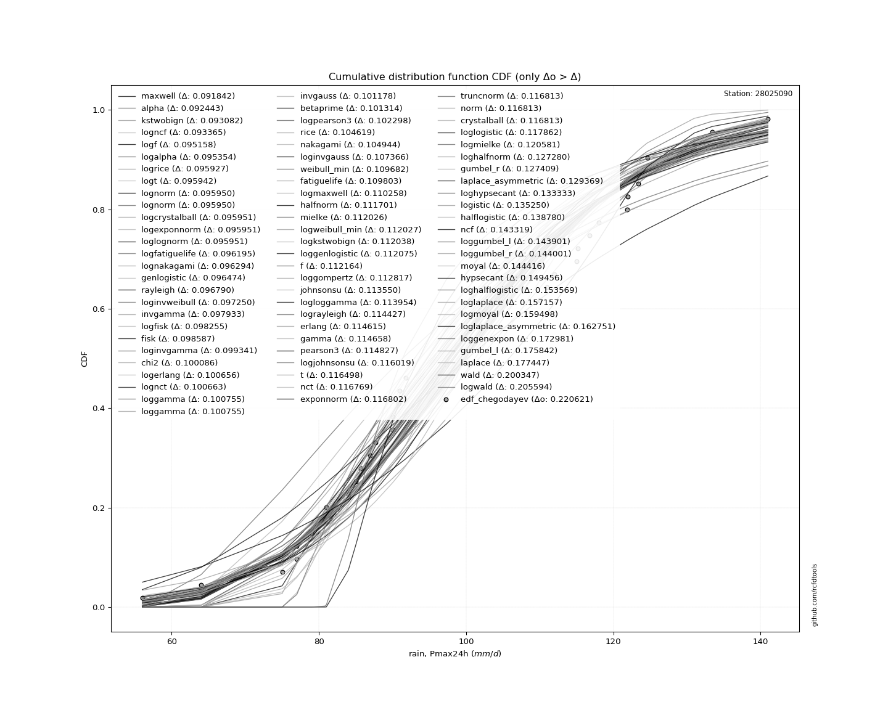</img>

</div>


**5.3. Best fit**

<div align="center">

|   id |   station | empirical_dist   | p_dist    |     delta |   deltao | eval   |   fit |   n |   best_fit |   best_fit_sort |
|-----:|----------:|:-----------------|:----------|----------:|---------:|:-------|------:|----:|-----------:|----------------:|
|    0 |  28025090 | edf_chegodayev   | logdgamma | 0.0693174 | 0.220621 | Δo > Δ |     1 |  38 |          1 |               1 |

</div>


<div align="center">

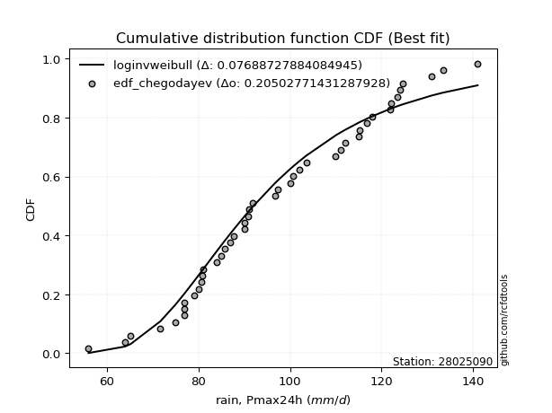</img>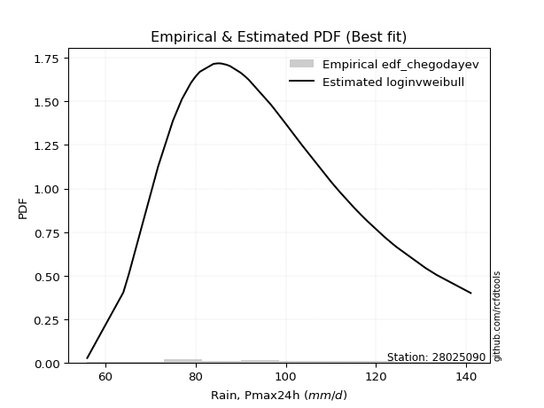</img>

</div>


### 6. Empirical - EDF Blom (1958)

The Blom formula is a specific "plotting position" formula used in hydrology and statistical analysis to estimate the empirical cumulative probability (or non-exceedance probability) of a data series. It is particularly recommended for data that are approximately normally distributed. The constant _a_ is set to 0.375 (or 3/8).

<div align="center">


$P=(m-a)/(n+1-2a)$


</div>


**6.1. Empirical values**

<div align="center">

|                | 0                    | 1                    | 2                   | 3                   | 4                   | 5                   | 6                   | 7                   | 8                   | 9                   | 10                 | 11                  | 12                 | 13                 | 14                  | 15                 | 16                 | 17                  | 18                 | 19                 | 20                 | 21                | 22                 | 23                 | 24                 | 25                 | 26                | 27                 | 28                 | 29                 | 30                 | 31                | 32                 | 33                 | 34                 | 35                 | 36                 | 37                 |
|:---------------|:---------------------|:---------------------|:--------------------|:--------------------|:--------------------|:--------------------|:--------------------|:--------------------|:--------------------|:--------------------|:-------------------|:--------------------|:-------------------|:-------------------|:--------------------|:-------------------|:-------------------|:--------------------|:-------------------|:-------------------|:-------------------|:------------------|:-------------------|:-------------------|:-------------------|:-------------------|:------------------|:-------------------|:-------------------|:-------------------|:-------------------|:------------------|:-------------------|:-------------------|:-------------------|:-------------------|:-------------------|:-------------------|
| date           | 2012                 | 1982                 | 1991                | 2003                | 2005                | 2002                | 1986                | 1995                | 1997                | 1994                | 2001               | 1978                | 1981               | 2004               | 1993                | 1979               | 2007               | 1988                | 2014               | 1999               | 2015               | 1992              | 1980               | 2011               | 1998               | 2006               | 2013              | 1989               | 1984               | 2000               | 1996               | 1990              | 1985               | 2010               | 1987               | 2008               | 1983               | 2009               |
| x              | 56.0                 | 64.0                 | 75.0                | 77.0                | 77.0                | 79.0                | 80.8                | 81.0                | 84.0                | 85.0                | 85.7               | 86.8977523483704    | 87.7               | 90.0               | 90.0                | 90.8182021076523   | 91.0               | 91.8                | 97.3               | 100.0              | 100.7              | 102.0             | 103.6              | 110.0              | 111.0              | 112.0              | 115.0             | 115.2              | 116.8              | 118.0              | 121.9              | 122.0             | 123.4              | 124.0              | 124.6              | 131.0              | 133.4              | 141.0              |
| m              | 1                    | 2                    | 3                   | 4                   | 5                   | 6                   | 7                   | 8                   | 9                   | 10                  | 11                 | 12                  | 13                 | 14                 | 15                  | 16                 | 17                 | 18                  | 19                 | 20                 | 21                 | 22                | 23                 | 24                 | 25                 | 26                 | 27                | 28                 | 29                 | 30                 | 31                 | 32                | 33                 | 34                 | 35                 | 36                 | 37                 | 38                 |
| empirical_dist | edf_blom             | edf_blom             | edf_blom            | edf_blom            | edf_blom            | edf_blom            | edf_blom            | edf_blom            | edf_blom            | edf_blom            | edf_blom           | edf_blom            | edf_blom           | edf_blom           | edf_blom            | edf_blom           | edf_blom           | edf_blom            | edf_blom           | edf_blom           | edf_blom           | edf_blom          | edf_blom           | edf_blom           | edf_blom           | edf_blom           | edf_blom          | edf_blom           | edf_blom           | edf_blom           | edf_blom           | edf_blom          | edf_blom           | edf_blom           | edf_blom           | edf_blom           | edf_blom           | edf_blom           |
| empirical      | 0.016339869281045753 | 0.042483660130718956 | 0.06862745098039216 | 0.09477124183006536 | 0.12091503267973856 | 0.14705882352941177 | 0.17320261437908496 | 0.19934640522875818 | 0.22549019607843138 | 0.25163398692810457 | 0.2777777777777778 | 0.30392156862745096 | 0.3300653594771242 | 0.3562091503267974 | 0.38235294117647056 | 0.4084967320261438 | 0.434640522875817  | 0.46078431372549017 | 0.4869281045751634 | 0.5130718954248366 | 0.5392156862745098 | 0.565359477124183 | 0.5915032679738562 | 0.6176470588235294 | 0.6437908496732027 | 0.6699346405228758 | 0.696078431372549 | 0.7222222222222222 | 0.7483660130718954 | 0.7745098039215687 | 0.8006535947712419 | 0.826797385620915 | 0.8529411764705882 | 0.8790849673202614 | 0.9052287581699346 | 0.9313725490196079 | 0.9575163398692811 | 0.9836601307189542 |
| empirical_tr   | 1.0166112956810631   | 1.0443686006825939   | 1.0736842105263158  | 1.1046931407942238  | 1.137546468401487   | 1.1724137931034484  | 1.2094861660079053  | 1.2489795918367346  | 1.2911392405063291  | 1.3362445414847162  | 1.3846153846153846 | 1.4366197183098592  | 1.492682926829268  | 1.553299492385787  | 1.619047619047619   | 1.6906077348066297 | 1.7687861271676302 | 1.8545454545454543  | 1.9490445859872614 | 2.053691275167785  | 2.1702127659574466 | 2.300751879699248 | 2.448              | 2.6153846153846154 | 2.807339449541285  | 3.0297029702970293 | 3.290322580645161 | 3.5999999999999996 | 3.9740259740259742 | 4.434782608695652  | 5.0163934426229515 | 5.773584905660376 | 6.799999999999999  | 8.270270270270268  | 10.551724137931036 | 14.571428571428577 | 23.53846153846156  | 61.199999999999804 |

</div>


**6.2. Kolmogorov-Smirnov fit test (sorted by Δ)**


<div align="center">

|                | 0                   | 1                   | 2                   | 3                   | 4                   | 5                   | 6                   | 7                   | 8                   | 9                   | 10                  | 11                  | 12                  | 13                  | 14                  | 15                  | 16                  | 17                  | 18                  | 19                  | 20                  | 21                  | 22                  | 23                 | 24                  | 25                  | 26                  | 27                  | 28                  | 29                  | 30                  | 31                  | 32                  | 33                  | 34                  | 35                  | 36                  | 37                 | 38                  | 39                  | 40                  | 41                  | 42                  | 43                  | 44                  | 45                  | 46                  | 47                  | 48                  | 49                 | 50                  | 51                  | 52                  | 53                  | 54                  | 55                  | 56                  | 57                  | 58                 | 59                 | 60                  | 61                  | 62                  | 63                  | 64                  | 65                  | 66                 | 67                 | 68                  | 69                  | 70                 | 71                 | 72                  | 73                  | 74                    | 75                 | 76                  | 77                 | 78                  | 79                  | 80                 | 81                  | 82                 | 83                  | 84                 | 85                  | 86                 | 87                  | 88                  | 89                 | 90                 | 91                 |
|:---------------|:--------------------|:--------------------|:--------------------|:--------------------|:--------------------|:--------------------|:--------------------|:--------------------|:--------------------|:--------------------|:--------------------|:--------------------|:--------------------|:--------------------|:--------------------|:--------------------|:--------------------|:--------------------|:--------------------|:--------------------|:--------------------|:--------------------|:--------------------|:-------------------|:--------------------|:--------------------|:--------------------|:--------------------|:--------------------|:--------------------|:--------------------|:--------------------|:--------------------|:--------------------|:--------------------|:--------------------|:--------------------|:-------------------|:--------------------|:--------------------|:--------------------|:--------------------|:--------------------|:--------------------|:--------------------|:--------------------|:--------------------|:--------------------|:--------------------|:-------------------|:--------------------|:--------------------|:--------------------|:--------------------|:--------------------|:--------------------|:--------------------|:--------------------|:-------------------|:-------------------|:--------------------|:--------------------|:--------------------|:--------------------|:--------------------|:--------------------|:-------------------|:-------------------|:--------------------|:--------------------|:-------------------|:-------------------|:--------------------|:--------------------|:----------------------|:-------------------|:--------------------|:-------------------|:--------------------|:--------------------|:-------------------|:--------------------|:-------------------|:--------------------|:-------------------|:--------------------|:-------------------|:--------------------|:--------------------|:-------------------|:-------------------|:-------------------|
| station        | 28025090            | 28025090            | 28025090            | 28025090            | 28025090            | 28025090            | 28025090            | 28025090            | 28025090            | 28025090            | 28025090            | 28025090            | 28025090            | 28025090            | 28025090            | 28025090            | 28025090            | 28025090            | 28025090            | 28025090            | 28025090            | 28025090            | 28025090            | 28025090           | 28025090            | 28025090            | 28025090            | 28025090            | 28025090            | 28025090            | 28025090            | 28025090            | 28025090            | 28025090            | 28025090            | 28025090            | 28025090            | 28025090           | 28025090            | 28025090            | 28025090            | 28025090            | 28025090            | 28025090            | 28025090            | 28025090            | 28025090            | 28025090            | 28025090            | 28025090           | 28025090            | 28025090            | 28025090            | 28025090            | 28025090            | 28025090            | 28025090            | 28025090            | 28025090           | 28025090           | 28025090            | 28025090            | 28025090            | 28025090            | 28025090            | 28025090            | 28025090           | 28025090           | 28025090            | 28025090            | 28025090           | 28025090           | 28025090            | 28025090            | 28025090              | 28025090           | 28025090            | 28025090           | 28025090            | 28025090            | 28025090           | 28025090            | 28025090           | 28025090            | 28025090           | 28025090            | 28025090           | 28025090            | 28025090            | 28025090           | 28025090           | 28025090           |
| empirical_dist | edf_blom            | edf_blom            | edf_blom            | edf_blom            | edf_blom            | edf_blom            | edf_blom            | edf_blom            | edf_blom            | edf_blom            | edf_blom            | edf_blom            | edf_blom            | edf_blom            | edf_blom            | edf_blom            | edf_blom            | edf_blom            | edf_blom            | edf_blom            | edf_blom            | edf_blom            | edf_blom            | edf_blom           | edf_blom            | edf_blom            | edf_blom            | edf_blom            | edf_blom            | edf_blom            | edf_blom            | edf_blom            | edf_blom            | edf_blom            | edf_blom            | edf_blom            | edf_blom            | edf_blom           | edf_blom            | edf_blom            | edf_blom            | edf_blom            | edf_blom            | edf_blom            | edf_blom            | edf_blom            | edf_blom            | edf_blom            | edf_blom            | edf_blom           | edf_blom            | edf_blom            | edf_blom            | edf_blom            | edf_blom            | edf_blom            | edf_blom            | edf_blom            | edf_blom           | edf_blom           | edf_blom            | edf_blom            | edf_blom            | edf_blom            | edf_blom            | edf_blom            | edf_blom           | edf_blom           | edf_blom            | edf_blom            | edf_blom           | edf_blom           | edf_blom            | edf_blom            | edf_blom              | edf_blom           | edf_blom            | edf_blom           | edf_blom            | edf_blom            | edf_blom           | edf_blom            | edf_blom           | edf_blom            | edf_blom           | edf_blom            | edf_blom           | edf_blom            | edf_blom            | edf_blom           | edf_blom           | edf_blom           |
| p_dist         | logdgamma           | dgamma              | maxwell             | alpha               | kstwobign           | logncf              | logf                | logalpha            | logrice             | logt                | lognorm             | lognorm             | logcrystalball      | logexponnorm        | loglognorm          | logfatiguelife      | lognakagami         | genlogistic         | rayleigh            | invgamma            | logfisk             | fisk                | loginvgamma         | loginvweibull      | chi2                | logerlang           | lognct              | loggamma            | loggamma            | invgauss            | betaprime           | logpearson3         | rice                | nakagami            | loginvgauss         | weibull_min         | fatiguelife         | logmaxwell         | halfnorm            | mielke              | logweibull_min      | loggenlogistic      | f                   | loggompertz         | johnsonsu           | logkstwobign        | logloggamma         | lograyleigh         | erlang              | gamma              | pearson3            | logjohnsonsu        | t                   | nct                 | exponnorm           | truncnorm           | norm                | crystalball         | loglogistic        | logmielke          | loghalfnorm         | gumbel_r            | laplace_asymmetric  | loghypsecant        | logistic            | halflogistic        | loggumbel_r        | loggumbel_l        | moyal               | ncf                 | hypsecant          | loghalflogistic    | loglaplace          | logmoyal            | loglaplace_asymmetric | loggenexpon        | gumbel_l            | laplace            | wald                | logwald             | loggibrat          | gibrat              | logbetaprime       | genexpon            | expon              | pareto              | logpareto          | logexpon            | logchi2             | logtruncnorm       | invweibull         | gompertz           |
| delta          | 0.06855146411256086 | 0.08905803065453743 | 0.09138224328077138 | 0.09198374418337518 | 0.09262243157692374 | 0.09290522595016037 | 0.09469890819904248 | 0.09489394940433704 | 0.09546777760750536 | 0.09548242790195616 | 0.09549038570105928 | 0.09549038570105928 | 0.09549103068716613 | 0.09549139591780198 | 0.09549175483552275 | 0.09573494916782088 | 0.09583418829142609 | 0.09601464590881481 | 0.09633026305682979 | 0.09778017932053273 | 0.09810189316568046 | 0.09843398125556901 | 0.09888163203647904 | 0.0990375285728905 | 0.09993273202354985 | 0.10019630307653438 | 0.10020324889301024 | 0.10029497246890196 | 0.10029497246890196 | 0.10071832149328863 | 0.10085432689429341 | 0.10214478351745077 | 0.10446554749388948 | 0.10479116460721732 | 0.10690692554716719 | 0.10952844317810878 | 0.10964969011859621 | 0.1097988796252255 | 0.11124095898725628 | 0.11187246473074791 | 0.11187378744363669 | 0.11192205466891941 | 0.11201100221622068 | 0.11266399354750262 | 0.11339666034349388 | 0.11362127488378032 | 0.11380125701284738 | 0.11396757492695775 | 0.11446221304753418 | 0.1145051460080404 | 0.11467410278012652 | 0.11586630918705138 | 0.11634492578316785 | 0.11661614953255528 | 0.11664916749018212 | 0.11665996340500129 | 0.11666000854964953 | 0.11666001131921788 | 0.1174026830731314 | 0.1204279251956058 | 0.12682085999085702 | 0.12694980330650396 | 0.12890965255014375 | 0.13287364724365747 | 0.13509698536257292 | 0.13832009752917696 | 0.1435415321334399 | 0.1437479129902995 | 0.14395616019718904 | 0.14490178332827164 | 0.1493028587785613 | 0.1531092390750285 | 0.15669765628426835 | 0.15903800344540608 | 0.1625980901992477    | 0.1745637406188017 | 0.17568891983897367 | 0.1772937058376038 | 0.19917275171706497 | 0.20513398723743248 | 0.2360550127022053 | 0.25813631985694285 | 0.2632286080246169 | 0.28491085495168955 | 0.2855335018501383 | 0.28553351081248735 | 0.3404522337314526 | 0.34045223679840153 | 0.34717699076128405 | 0.4752177300997257 | 0.6205221155324844 | 0.8874203442935623 |
| deltao         | 0.2206211327378371  | 0.2206211327378371  | 0.2206211327378371  | 0.2206211327378371  | 0.2206211327378371  | 0.2206211327378371  | 0.2206211327378371  | 0.2206211327378371  | 0.2206211327378371  | 0.2206211327378371  | 0.2206211327378371  | 0.2206211327378371  | 0.2206211327378371  | 0.2206211327378371  | 0.2206211327378371  | 0.2206211327378371  | 0.2206211327378371  | 0.2206211327378371  | 0.2206211327378371  | 0.2206211327378371  | 0.2206211327378371  | 0.2206211327378371  | 0.2206211327378371  | 0.2206211327378371 | 0.2206211327378371  | 0.2206211327378371  | 0.2206211327378371  | 0.2206211327378371  | 0.2206211327378371  | 0.2206211327378371  | 0.2206211327378371  | 0.2206211327378371  | 0.2206211327378371  | 0.2206211327378371  | 0.2206211327378371  | 0.2206211327378371  | 0.2206211327378371  | 0.2206211327378371 | 0.2206211327378371  | 0.2206211327378371  | 0.2206211327378371  | 0.2206211327378371  | 0.2206211327378371  | 0.2206211327378371  | 0.2206211327378371  | 0.2206211327378371  | 0.2206211327378371  | 0.2206211327378371  | 0.2206211327378371  | 0.2206211327378371 | 0.2206211327378371  | 0.2206211327378371  | 0.2206211327378371  | 0.2206211327378371  | 0.2206211327378371  | 0.2206211327378371  | 0.2206211327378371  | 0.2206211327378371  | 0.2206211327378371 | 0.2206211327378371 | 0.2206211327378371  | 0.2206211327378371  | 0.2206211327378371  | 0.2206211327378371  | 0.2206211327378371  | 0.2206211327378371  | 0.2206211327378371 | 0.2206211327378371 | 0.2206211327378371  | 0.2206211327378371  | 0.2206211327378371 | 0.2206211327378371 | 0.2206211327378371  | 0.2206211327378371  | 0.2206211327378371    | 0.2206211327378371 | 0.2206211327378371  | 0.2206211327378371 | 0.2206211327378371  | 0.2206211327378371  | 0.2206211327378371 | 0.2206211327378371  | 0.2206211327378371 | 0.2206211327378371  | 0.2206211327378371 | 0.2206211327378371  | 0.2206211327378371 | 0.2206211327378371  | 0.2206211327378371  | 0.2206211327378371 | 0.2206211327378371 | 0.2206211327378371 |
| eval           | Δo > Δ              | Δo > Δ              | Δo > Δ              | Δo > Δ              | Δo > Δ              | Δo > Δ              | Δo > Δ              | Δo > Δ              | Δo > Δ              | Δo > Δ              | Δo > Δ              | Δo > Δ              | Δo > Δ              | Δo > Δ              | Δo > Δ              | Δo > Δ              | Δo > Δ              | Δo > Δ              | Δo > Δ              | Δo > Δ              | Δo > Δ              | Δo > Δ              | Δo > Δ              | Δo > Δ             | Δo > Δ              | Δo > Δ              | Δo > Δ              | Δo > Δ              | Δo > Δ              | Δo > Δ              | Δo > Δ              | Δo > Δ              | Δo > Δ              | Δo > Δ              | Δo > Δ              | Δo > Δ              | Δo > Δ              | Δo > Δ             | Δo > Δ              | Δo > Δ              | Δo > Δ              | Δo > Δ              | Δo > Δ              | Δo > Δ              | Δo > Δ              | Δo > Δ              | Δo > Δ              | Δo > Δ              | Δo > Δ              | Δo > Δ             | Δo > Δ              | Δo > Δ              | Δo > Δ              | Δo > Δ              | Δo > Δ              | Δo > Δ              | Δo > Δ              | Δo > Δ              | Δo > Δ             | Δo > Δ             | Δo > Δ              | Δo > Δ              | Δo > Δ              | Δo > Δ              | Δo > Δ              | Δo > Δ              | Δo > Δ             | Δo > Δ             | Δo > Δ              | Δo > Δ              | Δo > Δ             | Δo > Δ             | Δo > Δ              | Δo > Δ              | Δo > Δ                | Δo > Δ             | Δo > Δ              | Δo > Δ             | Δo > Δ              | Δo > Δ              | Δo <= Δ            | Δo <= Δ             | Δo <= Δ            | Δo <= Δ             | Δo <= Δ            | Δo <= Δ             | Δo <= Δ            | Δo <= Δ             | Δo <= Δ             | Δo <= Δ            | Δo <= Δ            | Δo <= Δ            |
| fit            | 1                   | 1                   | 1                   | 1                   | 1                   | 1                   | 1                   | 1                   | 1                   | 1                   | 1                   | 1                   | 1                   | 1                   | 1                   | 1                   | 1                   | 1                   | 1                   | 1                   | 1                   | 1                   | 1                   | 1                  | 1                   | 1                   | 1                   | 1                   | 1                   | 1                   | 1                   | 1                   | 1                   | 1                   | 1                   | 1                   | 1                   | 1                  | 1                   | 1                   | 1                   | 1                   | 1                   | 1                   | 1                   | 1                   | 1                   | 1                   | 1                   | 1                  | 1                   | 1                   | 1                   | 1                   | 1                   | 1                   | 1                   | 1                   | 1                  | 1                  | 1                   | 1                   | 1                   | 1                   | 1                   | 1                   | 1                  | 1                  | 1                   | 1                   | 1                  | 1                  | 1                   | 1                   | 1                     | 1                  | 1                   | 1                  | 1                   | 1                   | 0                  | 0                   | 0                  | 0                   | 0                  | 0                   | 0                  | 0                   | 0                   | 0                  | 0                  | 0                  |
| n              | 38                  | 38                  | 38                  | 38                  | 38                  | 38                  | 38                  | 38                  | 38                  | 38                  | 38                  | 38                  | 38                  | 38                  | 38                  | 38                  | 38                  | 38                  | 38                  | 38                  | 38                  | 38                  | 38                  | 38                 | 38                  | 38                  | 38                  | 38                  | 38                  | 38                  | 38                  | 38                  | 38                  | 38                  | 38                  | 38                  | 38                  | 38                 | 38                  | 38                  | 38                  | 38                  | 38                  | 38                  | 38                  | 38                  | 38                  | 38                  | 38                  | 38                 | 38                  | 38                  | 38                  | 38                  | 38                  | 38                  | 38                  | 38                  | 38                 | 38                 | 38                  | 38                  | 38                  | 38                  | 38                  | 38                  | 38                 | 38                 | 38                  | 38                  | 38                 | 38                 | 38                  | 38                  | 38                    | 38                 | 38                  | 38                 | 38                  | 38                  | 38                 | 38                  | 38                 | 38                  | 38                 | 38                  | 38                 | 38                  | 38                  | 38                 | 38                 | 38                 |
| best_fit       | 1                   | 0                   | 0                   | 0                   | 0                   | 0                   | 0                   | 0                   | 0                   | 0                   | 0                   | 0                   | 0                   | 0                   | 0                   | 0                   | 0                   | 0                   | 0                   | 0                   | 0                   | 0                   | 0                   | 0                  | 0                   | 0                   | 0                   | 0                   | 0                   | 0                   | 0                   | 0                   | 0                   | 0                   | 0                   | 0                   | 0                   | 0                  | 0                   | 0                   | 0                   | 0                   | 0                   | 0                   | 0                   | 0                   | 0                   | 0                   | 0                   | 0                  | 0                   | 0                   | 0                   | 0                   | 0                   | 0                   | 0                   | 0                   | 0                  | 0                  | 0                   | 0                   | 0                   | 0                   | 0                   | 0                   | 0                  | 0                  | 0                   | 0                   | 0                  | 0                  | 0                   | 0                   | 0                     | 0                  | 0                   | 0                  | 0                   | 0                   | 0                  | 0                   | 0                  | 0                   | 0                  | 0                   | 0                  | 0                   | 0                   | 0                  | 0                  | 0                  |
| best_fit_sort  | 1                   | 2                   | 3                   | 4                   | 5                   | 6                   | 7                   | 8                   | 9                   | 10                  | 11                  | 12                  | 13                  | 14                  | 15                  | 16                  | 17                  | 18                  | 19                  | 20                  | 21                  | 22                  | 23                  | 24                 | 25                  | 26                  | 27                  | 28                  | 29                  | 30                  | 31                  | 32                  | 33                  | 34                  | 35                  | 36                  | 37                  | 38                 | 39                  | 40                  | 41                  | 42                  | 43                  | 44                  | 45                  | 46                  | 47                  | 48                  | 49                  | 50                 | 51                  | 52                  | 53                  | 54                  | 55                  | 56                  | 57                  | 58                  | 59                 | 60                 | 61                  | 62                  | 63                  | 64                  | 65                  | 66                  | 67                 | 68                 | 69                  | 70                  | 71                 | 72                 | 73                  | 74                  | 75                    | 76                 | 77                  | 78                 | 79                  | 80                  | 81                 | 82                  | 83                 | 84                  | 85                 | 86                  | 87                 | 88                  | 89                  | 90                 | 91                 | 92                 |

</div>


<div align="center">

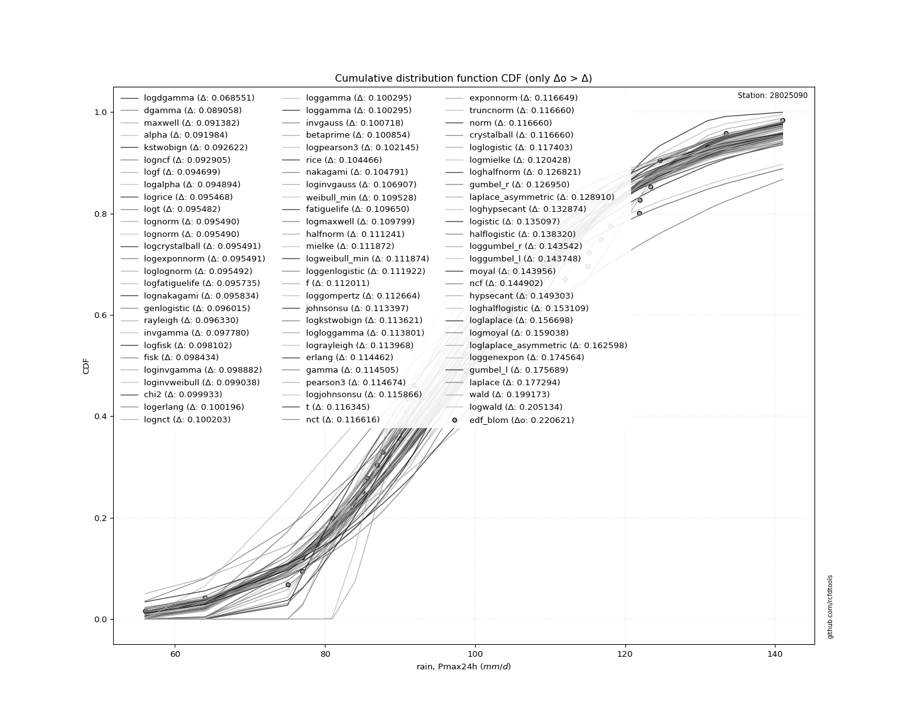</img>

</div>


**6.3. Best fit**

<div align="center">

|   id |   station | empirical_dist   | p_dist    |     delta |   deltao | eval   |   fit |   n |   best_fit |   best_fit_sort |
|-----:|----------:|:-----------------|:----------|----------:|---------:|:-------|------:|----:|-----------:|----------------:|
|    0 |  28025090 | edf_blom         | logdgamma | 0.0685515 | 0.220621 | Δo > Δ |     1 |  38 |          1 |               1 |

</div>


<div align="center">

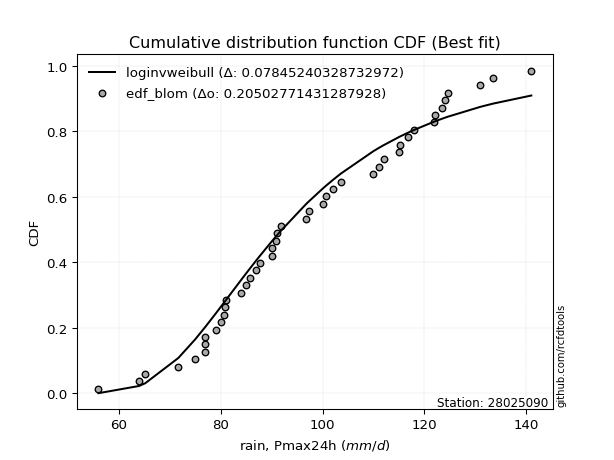</img>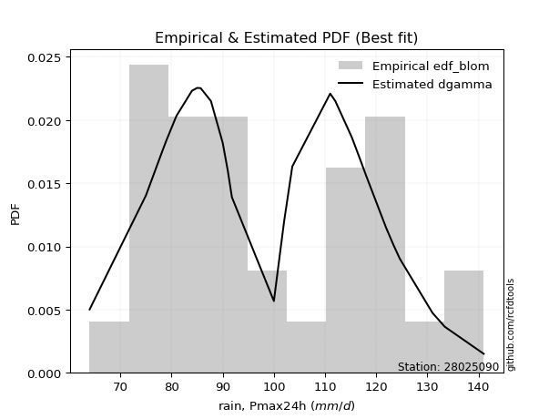</img>

</div>


### 7. Empirical - EDF Tukey (1962)

In hydrology, the Tukey formula is used as a plotting position formula to estimate the empirical probability or frequency of a flood event (or other hydrological data). The formula parameter is given as _c=0.333_ (or 1/3).

<div align="center">


$P=(m-c)/(n+1-2c)$


</div>


**7.1. Empirical values**

<div align="center">

|                | 0                    | 1                    | 2                   | 3                   | 4                   | 5                   | 6                   | 7         | 8                   | 9                   | 10                 | 11                  | 12                  | 13                 | 14                 | 15                  | 16                  | 17                 | 18                  | 19                 | 20                 | 21                 | 22                | 23                 | 24                 | 25                 | 26                 | 27                 | 28                 | 29                 | 30                | 31                 | 32                 | 33                 | 34                 | 35                 | 36                 | 37                 |
|:---------------|:---------------------|:---------------------|:--------------------|:--------------------|:--------------------|:--------------------|:--------------------|:----------|:--------------------|:--------------------|:-------------------|:--------------------|:--------------------|:-------------------|:-------------------|:--------------------|:--------------------|:-------------------|:--------------------|:-------------------|:-------------------|:-------------------|:------------------|:-------------------|:-------------------|:-------------------|:-------------------|:-------------------|:-------------------|:-------------------|:------------------|:-------------------|:-------------------|:-------------------|:-------------------|:-------------------|:-------------------|:-------------------|
| date           | 2012                 | 1982                 | 1991                | 2003                | 2005                | 2002                | 1986                | 1995      | 1997                | 1994                | 2001               | 1978                | 1981                | 2004               | 1993               | 1979                | 2007                | 1988               | 2014                | 1999               | 2015               | 1992               | 1980              | 2011               | 1998               | 2006               | 2013               | 1989               | 1984               | 2000               | 1996              | 1990               | 1985               | 2010               | 1987               | 2008               | 1983               | 2009               |
| x              | 56.0                 | 64.0                 | 75.0                | 77.0                | 77.0                | 79.0                | 80.8                | 81.0      | 84.0                | 85.0                | 85.7               | 86.8977523483704    | 87.7                | 90.0               | 90.0               | 90.8182021076523    | 91.0                | 91.8               | 97.3                | 100.0              | 100.7              | 102.0              | 103.6             | 110.0              | 111.0              | 112.0              | 115.0              | 115.2              | 116.8              | 118.0              | 121.9             | 122.0              | 123.4              | 124.0              | 124.6              | 131.0              | 133.4              | 141.0              |
| m              | 1                    | 2                    | 3                   | 4                   | 5                   | 6                   | 7                   | 8         | 9                   | 10                  | 11                 | 12                  | 13                  | 14                 | 15                 | 16                  | 17                  | 18                 | 19                  | 20                 | 21                 | 22                 | 23                | 24                 | 25                 | 26                 | 27                 | 28                 | 29                 | 30                 | 31                | 32                 | 33                 | 34                 | 35                 | 36                 | 37                 | 38                 |
| empirical_dist | edf_tukey            | edf_tukey            | edf_tukey           | edf_tukey           | edf_tukey           | edf_tukey           | edf_tukey           | edf_tukey | edf_tukey           | edf_tukey           | edf_tukey          | edf_tukey           | edf_tukey           | edf_tukey          | edf_tukey          | edf_tukey           | edf_tukey           | edf_tukey          | edf_tukey           | edf_tukey          | edf_tukey          | edf_tukey          | edf_tukey         | edf_tukey          | edf_tukey          | edf_tukey          | edf_tukey          | edf_tukey          | edf_tukey          | edf_tukey          | edf_tukey         | edf_tukey          | edf_tukey          | edf_tukey          | edf_tukey          | edf_tukey          | edf_tukey          | edf_tukey          |
| empirical      | 0.017391304347826087 | 0.043478260869565216 | 0.06956521739130435 | 0.09565217391304348 | 0.12173913043478261 | 0.14782608695652175 | 0.17391304347826086 | 0.2       | 0.22608695652173913 | 0.25217391304347825 | 0.2782608695652174 | 0.30434782608695654 | 0.33043478260869563 | 0.3565217391304348 | 0.3826086956521739 | 0.40869565217391307 | 0.43478260869565216 | 0.4608695652173913 | 0.48695652173913045 | 0.5130434782608696 | 0.5391304347826087 | 0.5652173913043478 | 0.591304347826087 | 0.6173913043478261 | 0.6434782608695652 | 0.6695652173913044 | 0.6956521739130435 | 0.7217391304347827 | 0.7478260869565218 | 0.7739130434782608 | 0.8               | 0.8260869565217391 | 0.8521739130434782 | 0.8782608695652174 | 0.9043478260869565 | 0.9304347826086956 | 0.9565217391304348 | 0.9826086956521739 |
| empirical_tr   | 1.0176991150442478   | 1.0454545454545454   | 1.074766355140187   | 1.1057692307692308  | 1.1386138613861385  | 1.1734693877551021  | 1.2105263157894737  | 1.25      | 1.2921348314606742  | 1.3372093023255813  | 1.3855421686746987 | 1.4375              | 1.4935064935064934  | 1.554054054054054  | 1.619718309859155  | 1.6911764705882355  | 1.769230769230769   | 1.8548387096774193 | 1.9491525423728817  | 2.053571428571429  | 2.169811320754717  | 2.3                | 2.446808510638298 | 2.6136363636363638 | 2.804878048780487  | 3.0263157894736845 | 3.2857142857142856 | 3.593750000000001  | 3.9655172413793105 | 4.4230769230769225 | 5.000000000000001 | 5.75               | 6.764705882352939  | 8.214285714285717  | 10.454545454545455 | 14.374999999999991 | 23.000000000000014 | 57.499999999999964 |

</div>


**7.2. Kolmogorov-Smirnov fit test (sorted by Δ)**


<div align="center">

|                | 0                   | 1                   | 2                   | 3                   | 4                  | 5                   | 6                   | 7                  | 8                   | 9                   | 10                  | 11                  | 12                 | 13                  | 14                  | 15                  | 16                  | 17                  | 18                  | 19                  | 20                  | 21                 | 22                  | 23                 | 24                  | 25                  | 26                 | 27                  | 28                  | 29                 | 30                  | 31                 | 32                  | 33                  | 34                  | 35                  | 36                  | 37                  | 38                  | 39                  | 40                  | 41                  | 42                  | 43                 | 44                  | 45                  | 46                  | 47                  | 48                  | 49                  | 50                  | 51                  | 52                  | 53                  | 54                  | 55                  | 56                  | 57                  | 58                  | 59                  | 60                  | 61                  | 62                 | 63                  | 64                  | 65                  | 66                  | 67                  | 68                 | 69                 | 70                  | 71                  | 72                 | 73                  | 74                    | 75                  | 76                 | 77                  | 78                 | 79                  | 80                  | 81                  | 82                  | 83                 | 84                 | 85                 | 86                 | 87                 | 88                  | 89                  | 90                 | 91                 |
|:---------------|:--------------------|:--------------------|:--------------------|:--------------------|:-------------------|:--------------------|:--------------------|:-------------------|:--------------------|:--------------------|:--------------------|:--------------------|:-------------------|:--------------------|:--------------------|:--------------------|:--------------------|:--------------------|:--------------------|:--------------------|:--------------------|:-------------------|:--------------------|:-------------------|:--------------------|:--------------------|:-------------------|:--------------------|:--------------------|:-------------------|:--------------------|:-------------------|:--------------------|:--------------------|:--------------------|:--------------------|:--------------------|:--------------------|:--------------------|:--------------------|:--------------------|:--------------------|:--------------------|:-------------------|:--------------------|:--------------------|:--------------------|:--------------------|:--------------------|:--------------------|:--------------------|:--------------------|:--------------------|:--------------------|:--------------------|:--------------------|:--------------------|:--------------------|:--------------------|:--------------------|:--------------------|:--------------------|:-------------------|:--------------------|:--------------------|:--------------------|:--------------------|:--------------------|:-------------------|:-------------------|:--------------------|:--------------------|:-------------------|:--------------------|:----------------------|:--------------------|:-------------------|:--------------------|:-------------------|:--------------------|:--------------------|:--------------------|:--------------------|:-------------------|:-------------------|:-------------------|:-------------------|:-------------------|:--------------------|:--------------------|:-------------------|:-------------------|
| station        | 28025090            | 28025090            | 28025090            | 28025090            | 28025090           | 28025090            | 28025090            | 28025090           | 28025090            | 28025090            | 28025090            | 28025090            | 28025090           | 28025090            | 28025090            | 28025090            | 28025090            | 28025090            | 28025090            | 28025090            | 28025090            | 28025090           | 28025090            | 28025090           | 28025090            | 28025090            | 28025090           | 28025090            | 28025090            | 28025090           | 28025090            | 28025090           | 28025090            | 28025090            | 28025090            | 28025090            | 28025090            | 28025090            | 28025090            | 28025090            | 28025090            | 28025090            | 28025090            | 28025090           | 28025090            | 28025090            | 28025090            | 28025090            | 28025090            | 28025090            | 28025090            | 28025090            | 28025090            | 28025090            | 28025090            | 28025090            | 28025090            | 28025090            | 28025090            | 28025090            | 28025090            | 28025090            | 28025090           | 28025090            | 28025090            | 28025090            | 28025090            | 28025090            | 28025090           | 28025090           | 28025090            | 28025090            | 28025090           | 28025090            | 28025090              | 28025090            | 28025090           | 28025090            | 28025090           | 28025090            | 28025090            | 28025090            | 28025090            | 28025090           | 28025090           | 28025090           | 28025090           | 28025090           | 28025090            | 28025090            | 28025090           | 28025090           |
| empirical_dist | edf_tukey           | edf_tukey           | edf_tukey           | edf_tukey           | edf_tukey          | edf_tukey           | edf_tukey           | edf_tukey          | edf_tukey           | edf_tukey           | edf_tukey           | edf_tukey           | edf_tukey          | edf_tukey           | edf_tukey           | edf_tukey           | edf_tukey           | edf_tukey           | edf_tukey           | edf_tukey           | edf_tukey           | edf_tukey          | edf_tukey           | edf_tukey          | edf_tukey           | edf_tukey           | edf_tukey          | edf_tukey           | edf_tukey           | edf_tukey          | edf_tukey           | edf_tukey          | edf_tukey           | edf_tukey           | edf_tukey           | edf_tukey           | edf_tukey           | edf_tukey           | edf_tukey           | edf_tukey           | edf_tukey           | edf_tukey           | edf_tukey           | edf_tukey          | edf_tukey           | edf_tukey           | edf_tukey           | edf_tukey           | edf_tukey           | edf_tukey           | edf_tukey           | edf_tukey           | edf_tukey           | edf_tukey           | edf_tukey           | edf_tukey           | edf_tukey           | edf_tukey           | edf_tukey           | edf_tukey           | edf_tukey           | edf_tukey           | edf_tukey          | edf_tukey           | edf_tukey           | edf_tukey           | edf_tukey           | edf_tukey           | edf_tukey          | edf_tukey          | edf_tukey           | edf_tukey           | edf_tukey          | edf_tukey           | edf_tukey             | edf_tukey           | edf_tukey          | edf_tukey           | edf_tukey          | edf_tukey           | edf_tukey           | edf_tukey           | edf_tukey           | edf_tukey          | edf_tukey          | edf_tukey          | edf_tukey          | edf_tukey          | edf_tukey           | edf_tukey           | edf_tukey          | edf_tukey          |
| p_dist         | logdgamma           | dgamma              | maxwell             | alpha               | kstwobign          | logncf              | logf                | logalpha           | logrice             | logt                | lognorm             | lognorm             | logcrystalball     | logexponnorm        | loglognorm          | logfatiguelife      | lognakagami         | genlogistic         | rayleigh            | invgamma            | loginvweibull       | logfisk            | fisk                | loginvgamma        | chi2                | logerlang           | lognct             | loggamma            | loggamma            | invgauss           | betaprime           | logpearson3        | rice                | nakagami            | loginvgauss         | weibull_min         | fatiguelife         | logmaxwell          | halfnorm            | mielke              | logweibull_min      | loggenlogistic      | f                   | logkstwobign       | loggompertz         | johnsonsu           | logloggamma         | lograyleigh         | erlang              | gamma               | pearson3            | logjohnsonsu        | t                   | nct                 | exponnorm           | truncnorm           | norm                | crystalball         | loglogistic         | logmielke           | loghalfnorm         | gumbel_r            | laplace_asymmetric | loghypsecant        | logistic            | halflogistic        | loggumbel_r         | loggumbel_l         | ncf                | moyal              | hypsecant           | loghalflogistic     | loglaplace         | logmoyal            | loglaplace_asymmetric | loggenexpon         | gumbel_l           | laplace             | wald               | logwald             | loggibrat           | gibrat              | logbetaprime        | genexpon           | expon              | pareto             | logpareto          | logexpon           | logchi2             | logtruncnorm        | invweibull         | gompertz           |
| delta          | 0.06897772157206639 | 0.08948428811404296 | 0.09163799775647474 | 0.09223949865907854 | 0.0928781860526271 | 0.09316098042586374 | 0.09495466267474584 | 0.0951497038800404 | 0.09572353208320872 | 0.09573818237765952 | 0.09574614017676264 | 0.09574614017676264 | 0.0957467851628695 | 0.09574715039350534 | 0.09574750931122611 | 0.09599070364352424 | 0.09608994276712945 | 0.09627040038451817 | 0.09658601753253315 | 0.09786543081243387 | 0.09804292783404422 | 0.0981871446575816 | 0.09851923274747015 | 0.0991373865121824 | 0.10001798351545099 | 0.10045205755223774 | 0.1004590033687136 | 0.10055072694460532 | 0.10055072694460532 | 0.100974075968992  | 0.10111008136999677 | 0.1022300350093519 | 0.10455079898579062 | 0.10487641609911846 | 0.10716268002287055 | 0.10961369467000992 | 0.10973494161049735 | 0.11005463410092886 | 0.11149671346295964 | 0.11195771622264905 | 0.11195903893553782 | 0.11200730616082055 | 0.11209625370812182 | 0.1127403428008022 | 0.11274924503940376 | 0.11348191183539502 | 0.11388650850474852 | 0.11422332940266111 | 0.11454746453943532 | 0.11459039749994154 | 0.11475935427202766 | 0.11595156067895251 | 0.11643017727506899 | 0.11670140102445642 | 0.11673441898208325 | 0.11674521489690243 | 0.11674526004155067 | 0.11674526281111902 | 0.11765843754883476 | 0.12051317668750694 | 0.12707661446656038 | 0.12720555778220732 | 0.1291654070258471 | 0.13312940171936083 | 0.13518223685447406 | 0.13857585200488032 | 0.14379728660914326 | 0.14383316448220063 | 0.1440208512452935 | 0.1442119146728924 | 0.14938811027046245 | 0.15336499355073185 | 0.1569534107599717 | 0.15929375792110945 | 0.16268334169114884   | 0.17368280853582357 | 0.1757741713308748 | 0.17737895732950493 | 0.1998263464883068 | 0.20538974171313584 | 0.23631076717790866 | 0.25861941164438246 | 0.26229084161370475 | 0.2840299228687114 | 0.2846525697671602 | 0.2846525787295092 | 0.3395713016484745 | 0.3395713047154234 | 0.34612555569450376 | 0.47433679801674755 | 0.6195843491215721 | 0.8865394122105842 |
| deltao         | 0.2206211327378371  | 0.2206211327378371  | 0.2206211327378371  | 0.2206211327378371  | 0.2206211327378371 | 0.2206211327378371  | 0.2206211327378371  | 0.2206211327378371 | 0.2206211327378371  | 0.2206211327378371  | 0.2206211327378371  | 0.2206211327378371  | 0.2206211327378371 | 0.2206211327378371  | 0.2206211327378371  | 0.2206211327378371  | 0.2206211327378371  | 0.2206211327378371  | 0.2206211327378371  | 0.2206211327378371  | 0.2206211327378371  | 0.2206211327378371 | 0.2206211327378371  | 0.2206211327378371 | 0.2206211327378371  | 0.2206211327378371  | 0.2206211327378371 | 0.2206211327378371  | 0.2206211327378371  | 0.2206211327378371 | 0.2206211327378371  | 0.2206211327378371 | 0.2206211327378371  | 0.2206211327378371  | 0.2206211327378371  | 0.2206211327378371  | 0.2206211327378371  | 0.2206211327378371  | 0.2206211327378371  | 0.2206211327378371  | 0.2206211327378371  | 0.2206211327378371  | 0.2206211327378371  | 0.2206211327378371 | 0.2206211327378371  | 0.2206211327378371  | 0.2206211327378371  | 0.2206211327378371  | 0.2206211327378371  | 0.2206211327378371  | 0.2206211327378371  | 0.2206211327378371  | 0.2206211327378371  | 0.2206211327378371  | 0.2206211327378371  | 0.2206211327378371  | 0.2206211327378371  | 0.2206211327378371  | 0.2206211327378371  | 0.2206211327378371  | 0.2206211327378371  | 0.2206211327378371  | 0.2206211327378371 | 0.2206211327378371  | 0.2206211327378371  | 0.2206211327378371  | 0.2206211327378371  | 0.2206211327378371  | 0.2206211327378371 | 0.2206211327378371 | 0.2206211327378371  | 0.2206211327378371  | 0.2206211327378371 | 0.2206211327378371  | 0.2206211327378371    | 0.2206211327378371  | 0.2206211327378371 | 0.2206211327378371  | 0.2206211327378371 | 0.2206211327378371  | 0.2206211327378371  | 0.2206211327378371  | 0.2206211327378371  | 0.2206211327378371 | 0.2206211327378371 | 0.2206211327378371 | 0.2206211327378371 | 0.2206211327378371 | 0.2206211327378371  | 0.2206211327378371  | 0.2206211327378371 | 0.2206211327378371 |
| eval           | Δo > Δ              | Δo > Δ              | Δo > Δ              | Δo > Δ              | Δo > Δ             | Δo > Δ              | Δo > Δ              | Δo > Δ             | Δo > Δ              | Δo > Δ              | Δo > Δ              | Δo > Δ              | Δo > Δ             | Δo > Δ              | Δo > Δ              | Δo > Δ              | Δo > Δ              | Δo > Δ              | Δo > Δ              | Δo > Δ              | Δo > Δ              | Δo > Δ             | Δo > Δ              | Δo > Δ             | Δo > Δ              | Δo > Δ              | Δo > Δ             | Δo > Δ              | Δo > Δ              | Δo > Δ             | Δo > Δ              | Δo > Δ             | Δo > Δ              | Δo > Δ              | Δo > Δ              | Δo > Δ              | Δo > Δ              | Δo > Δ              | Δo > Δ              | Δo > Δ              | Δo > Δ              | Δo > Δ              | Δo > Δ              | Δo > Δ             | Δo > Δ              | Δo > Δ              | Δo > Δ              | Δo > Δ              | Δo > Δ              | Δo > Δ              | Δo > Δ              | Δo > Δ              | Δo > Δ              | Δo > Δ              | Δo > Δ              | Δo > Δ              | Δo > Δ              | Δo > Δ              | Δo > Δ              | Δo > Δ              | Δo > Δ              | Δo > Δ              | Δo > Δ             | Δo > Δ              | Δo > Δ              | Δo > Δ              | Δo > Δ              | Δo > Δ              | Δo > Δ             | Δo > Δ             | Δo > Δ              | Δo > Δ              | Δo > Δ             | Δo > Δ              | Δo > Δ                | Δo > Δ              | Δo > Δ             | Δo > Δ              | Δo > Δ             | Δo > Δ              | Δo <= Δ             | Δo <= Δ             | Δo <= Δ             | Δo <= Δ            | Δo <= Δ            | Δo <= Δ            | Δo <= Δ            | Δo <= Δ            | Δo <= Δ             | Δo <= Δ             | Δo <= Δ            | Δo <= Δ            |
| fit            | 1                   | 1                   | 1                   | 1                   | 1                  | 1                   | 1                   | 1                  | 1                   | 1                   | 1                   | 1                   | 1                  | 1                   | 1                   | 1                   | 1                   | 1                   | 1                   | 1                   | 1                   | 1                  | 1                   | 1                  | 1                   | 1                   | 1                  | 1                   | 1                   | 1                  | 1                   | 1                  | 1                   | 1                   | 1                   | 1                   | 1                   | 1                   | 1                   | 1                   | 1                   | 1                   | 1                   | 1                  | 1                   | 1                   | 1                   | 1                   | 1                   | 1                   | 1                   | 1                   | 1                   | 1                   | 1                   | 1                   | 1                   | 1                   | 1                   | 1                   | 1                   | 1                   | 1                  | 1                   | 1                   | 1                   | 1                   | 1                   | 1                  | 1                  | 1                   | 1                   | 1                  | 1                   | 1                     | 1                   | 1                  | 1                   | 1                  | 1                   | 0                   | 0                   | 0                   | 0                  | 0                  | 0                  | 0                  | 0                  | 0                   | 0                   | 0                  | 0                  |
| n              | 38                  | 38                  | 38                  | 38                  | 38                 | 38                  | 38                  | 38                 | 38                  | 38                  | 38                  | 38                  | 38                 | 38                  | 38                  | 38                  | 38                  | 38                  | 38                  | 38                  | 38                  | 38                 | 38                  | 38                 | 38                  | 38                  | 38                 | 38                  | 38                  | 38                 | 38                  | 38                 | 38                  | 38                  | 38                  | 38                  | 38                  | 38                  | 38                  | 38                  | 38                  | 38                  | 38                  | 38                 | 38                  | 38                  | 38                  | 38                  | 38                  | 38                  | 38                  | 38                  | 38                  | 38                  | 38                  | 38                  | 38                  | 38                  | 38                  | 38                  | 38                  | 38                  | 38                 | 38                  | 38                  | 38                  | 38                  | 38                  | 38                 | 38                 | 38                  | 38                  | 38                 | 38                  | 38                    | 38                  | 38                 | 38                  | 38                 | 38                  | 38                  | 38                  | 38                  | 38                 | 38                 | 38                 | 38                 | 38                 | 38                  | 38                  | 38                 | 38                 |
| best_fit       | 1                   | 0                   | 0                   | 0                   | 0                  | 0                   | 0                   | 0                  | 0                   | 0                   | 0                   | 0                   | 0                  | 0                   | 0                   | 0                   | 0                   | 0                   | 0                   | 0                   | 0                   | 0                  | 0                   | 0                  | 0                   | 0                   | 0                  | 0                   | 0                   | 0                  | 0                   | 0                  | 0                   | 0                   | 0                   | 0                   | 0                   | 0                   | 0                   | 0                   | 0                   | 0                   | 0                   | 0                  | 0                   | 0                   | 0                   | 0                   | 0                   | 0                   | 0                   | 0                   | 0                   | 0                   | 0                   | 0                   | 0                   | 0                   | 0                   | 0                   | 0                   | 0                   | 0                  | 0                   | 0                   | 0                   | 0                   | 0                   | 0                  | 0                  | 0                   | 0                   | 0                  | 0                   | 0                     | 0                   | 0                  | 0                   | 0                  | 0                   | 0                   | 0                   | 0                   | 0                  | 0                  | 0                  | 0                  | 0                  | 0                   | 0                   | 0                  | 0                  |
| best_fit_sort  | 1                   | 2                   | 3                   | 4                   | 5                  | 6                   | 7                   | 8                  | 9                   | 10                  | 11                  | 12                  | 13                 | 14                  | 15                  | 16                  | 17                  | 18                  | 19                  | 20                  | 21                  | 22                 | 23                  | 24                 | 25                  | 26                  | 27                 | 28                  | 29                  | 30                 | 31                  | 32                 | 33                  | 34                  | 35                  | 36                  | 37                  | 38                  | 39                  | 40                  | 41                  | 42                  | 43                  | 44                 | 45                  | 46                  | 47                  | 48                  | 49                  | 50                  | 51                  | 52                  | 53                  | 54                  | 55                  | 56                  | 57                  | 58                  | 59                  | 60                  | 61                  | 62                  | 63                 | 64                  | 65                  | 66                  | 67                  | 68                  | 69                 | 70                 | 71                  | 72                  | 73                 | 74                  | 75                    | 76                  | 77                 | 78                  | 79                 | 80                  | 81                  | 82                  | 83                  | 84                 | 85                 | 86                 | 87                 | 88                 | 89                  | 90                  | 91                 | 92                 |

</div>


<div align="center">

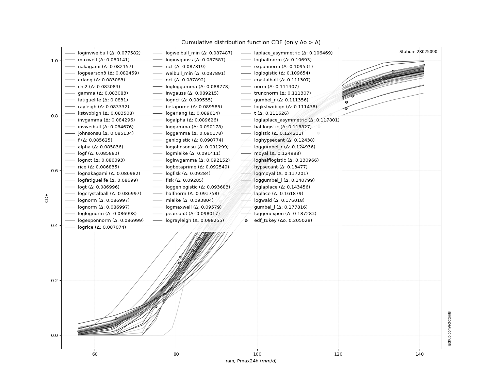</img>

</div>


**7.3. Best fit**

<div align="center">

|   id |   station | empirical_dist   | p_dist    |     delta |   deltao | eval   |   fit |   n |   best_fit |   best_fit_sort |
|-----:|----------:|:-----------------|:----------|----------:|---------:|:-------|------:|----:|-----------:|----------------:|
|    0 |  28025090 | edf_tukey        | logdgamma | 0.0689777 | 0.220621 | Δo > Δ |     1 |  38 |          1 |               1 |

</div>


<div align="center">

</img>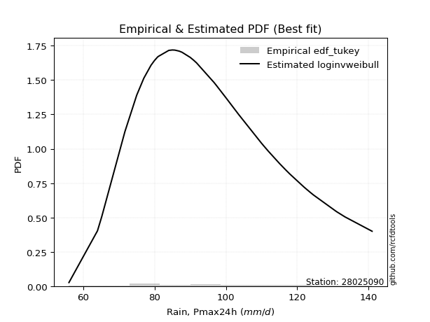</img>

</div>


### 8. Empirical - EDF Gringorten (1963)

Gringorten plotting position formula is essential for estimating the probability and return periods of extreme events like floods and heavy rainfall. The constant _a=0.44_.

<div align="center">


$P=(m-a)/(n+1-2a)$


</div>


**8.1. Empirical values**

<div align="center">

|                | 0                    | 1                    | 2                   | 3                   | 4                   | 5                  | 6                  | 7                   | 8                   | 9                   | 10                 | 11                 | 12                 | 13                  | 14                  | 15                 | 16                  | 17                  | 18                  | 19                 | 20                 | 21                 | 22                 | 23                 | 24                 | 25                 | 26                 | 27                 | 28                 | 29                 | 30                 | 31                 | 32                 | 33                 | 34                 | 35                 | 36                 | 37                 |
|:---------------|:---------------------|:---------------------|:--------------------|:--------------------|:--------------------|:-------------------|:-------------------|:--------------------|:--------------------|:--------------------|:-------------------|:-------------------|:-------------------|:--------------------|:--------------------|:-------------------|:--------------------|:--------------------|:--------------------|:-------------------|:-------------------|:-------------------|:-------------------|:-------------------|:-------------------|:-------------------|:-------------------|:-------------------|:-------------------|:-------------------|:-------------------|:-------------------|:-------------------|:-------------------|:-------------------|:-------------------|:-------------------|:-------------------|
| date           | 2012                 | 1982                 | 1991                | 2003                | 2005                | 2002               | 1986               | 1995                | 1997                | 1994                | 2001               | 1978               | 1981               | 2004                | 1993                | 1979               | 2007                | 1988                | 2014                | 1999               | 2015               | 1992               | 1980               | 2011               | 1998               | 2006               | 2013               | 1989               | 1984               | 2000               | 1996               | 1990               | 1985               | 2010               | 1987               | 2008               | 1983               | 2009               |
| x              | 56.0                 | 64.0                 | 75.0                | 77.0                | 77.0                | 79.0               | 80.8               | 81.0                | 84.0                | 85.0                | 85.7               | 86.8977523483704   | 87.7               | 90.0                | 90.0                | 90.8182021076523   | 91.0                | 91.8                | 97.3                | 100.0              | 100.7              | 102.0              | 103.6              | 110.0              | 111.0              | 112.0              | 115.0              | 115.2              | 116.8              | 118.0              | 121.9              | 122.0              | 123.4              | 124.0              | 124.6              | 131.0              | 133.4              | 141.0              |
| m              | 1                    | 2                    | 3                   | 4                   | 5                   | 6                  | 7                  | 8                   | 9                   | 10                  | 11                 | 12                 | 13                 | 14                  | 15                  | 16                 | 17                  | 18                  | 19                  | 20                 | 21                 | 22                 | 23                 | 24                 | 25                 | 26                 | 27                 | 28                 | 29                 | 30                 | 31                 | 32                 | 33                 | 34                 | 35                 | 36                 | 37                 | 38                 |
| empirical_dist | edf_gringorten       | edf_gringorten       | edf_gringorten      | edf_gringorten      | edf_gringorten      | edf_gringorten     | edf_gringorten     | edf_gringorten      | edf_gringorten      | edf_gringorten      | edf_gringorten     | edf_gringorten     | edf_gringorten     | edf_gringorten      | edf_gringorten      | edf_gringorten     | edf_gringorten      | edf_gringorten      | edf_gringorten      | edf_gringorten     | edf_gringorten     | edf_gringorten     | edf_gringorten     | edf_gringorten     | edf_gringorten     | edf_gringorten     | edf_gringorten     | edf_gringorten     | edf_gringorten     | edf_gringorten     | edf_gringorten     | edf_gringorten     | edf_gringorten     | edf_gringorten     | edf_gringorten     | edf_gringorten     | edf_gringorten     | edf_gringorten     |
| empirical      | 0.014690451206715638 | 0.040923399790136414 | 0.06715634837355719 | 0.09338929695697797 | 0.11962224554039874 | 0.1458551941238195 | 0.1720881427072403 | 0.19832109129066108 | 0.22455403987408187 | 0.25078698845750264 | 0.2770199370409234 | 0.3032528856243442 | 0.329485834207765  | 0.35571878279118574 | 0.38195173137460653 | 0.4081846799580273 | 0.43441762854144805 | 0.46065057712486884 | 0.48688352570828963 | 0.5131164742917104 | 0.5393494228751312 | 0.565582371458552  | 0.5918153200419727 | 0.6180482686253935 | 0.6442812172088143 | 0.6705141657922351 | 0.6967471143756558 | 0.7229800629590766 | 0.7492130115424974 | 0.7754459601259182 | 0.801678908709339  | 0.8279118572927597 | 0.8541448058761806 | 0.8803777544596014 | 0.9066107030430222 | 0.9328436516264429 | 0.9590766002098637 | 0.9853095487932845 |
| empirical_tr   | 1.0149094781682642   | 1.0426695842450766   | 1.0719910011248595  | 1.1030092592592593  | 1.1358760429082242  | 1.1707616707616708 | 1.2078580481622305 | 1.2473821989528797  | 1.2895805142083898  | 1.3347338935574231  | 1.3831640058055152 | 1.4352409638554215 | 1.4913928012519564 | 1.5521172638436482  | 1.6179966044142617  | 1.6897163120567378 | 1.7680890538033396  | 1.8540856031128403  | 1.9488752556237219  | 2.0538793103448274 | 2.170842824601367  | 2.3019323671497585 | 2.4498714652956295 | 2.618131868131868  | 2.8112094395280236 | 3.0350318471337583 | 3.2975778546712804 | 3.6098484848484844 | 3.9874476987447705 | 4.453271028037383  | 5.0423280423280445 | 5.810975609756099  | 6.8561151079136735 | 8.35964912280703   | 10.70786516853934  | 14.890625000000018 | 24.435897435897527 | 68.07142857142907  |

</div>


**8.2. Kolmogorov-Smirnov fit test (sorted by Δ)**


<div align="center">

|                | 0                  | 1                   | 2                   | 3                  | 4                   | 5                   | 6                   | 7                   | 8                   | 9                   | 10                  | 11                  | 12                  | 13                  | 14                  | 15                 | 16                 | 17                  | 18                 | 19                  | 20                  | 21                  | 22                  | 23                  | 24                  | 25                  | 26                  | 27                  | 28                  | 29                  | 30                  | 31                  | 32                  | 33                 | 34                 | 35                  | 36                  | 37                  | 38                  | 39                  | 40                  | 41                  | 42                  | 43                  | 44                  | 45                  | 46                  | 47                  | 48                  | 49                  | 50                  | 51                  | 52                  | 53                  | 54                  | 55                  | 56                 | 57                  | 58                  | 59                  | 60                  | 61                  | 62                  | 63                  | 64                 | 65                  | 66                 | 67                  | 68                  | 69                  | 70                  | 71                 | 72                  | 73                 | 74                    | 75                  | 76                 | 77                  | 78                  | 79                 | 80                 | 81                 | 82                 | 83                  | 84                 | 85                  | 86                 | 87                  | 88                  | 89                 | 90                 | 91                 |
|:---------------|:-------------------|:--------------------|:--------------------|:-------------------|:--------------------|:--------------------|:--------------------|:--------------------|:--------------------|:--------------------|:--------------------|:--------------------|:--------------------|:--------------------|:--------------------|:-------------------|:-------------------|:--------------------|:-------------------|:--------------------|:--------------------|:--------------------|:--------------------|:--------------------|:--------------------|:--------------------|:--------------------|:--------------------|:--------------------|:--------------------|:--------------------|:--------------------|:--------------------|:-------------------|:-------------------|:--------------------|:--------------------|:--------------------|:--------------------|:--------------------|:--------------------|:--------------------|:--------------------|:--------------------|:--------------------|:--------------------|:--------------------|:--------------------|:--------------------|:--------------------|:--------------------|:--------------------|:--------------------|:--------------------|:--------------------|:--------------------|:-------------------|:--------------------|:--------------------|:--------------------|:--------------------|:--------------------|:--------------------|:--------------------|:-------------------|:--------------------|:-------------------|:--------------------|:--------------------|:--------------------|:--------------------|:-------------------|:--------------------|:-------------------|:----------------------|:--------------------|:-------------------|:--------------------|:--------------------|:-------------------|:-------------------|:-------------------|:-------------------|:--------------------|:-------------------|:--------------------|:-------------------|:--------------------|:--------------------|:-------------------|:-------------------|:-------------------|
| station        | 28025090           | 28025090            | 28025090            | 28025090           | 28025090            | 28025090            | 28025090            | 28025090            | 28025090            | 28025090            | 28025090            | 28025090            | 28025090            | 28025090            | 28025090            | 28025090           | 28025090           | 28025090            | 28025090           | 28025090            | 28025090            | 28025090            | 28025090            | 28025090            | 28025090            | 28025090            | 28025090            | 28025090            | 28025090            | 28025090            | 28025090            | 28025090            | 28025090            | 28025090           | 28025090           | 28025090            | 28025090            | 28025090            | 28025090            | 28025090            | 28025090            | 28025090            | 28025090            | 28025090            | 28025090            | 28025090            | 28025090            | 28025090            | 28025090            | 28025090            | 28025090            | 28025090            | 28025090            | 28025090            | 28025090            | 28025090            | 28025090           | 28025090            | 28025090            | 28025090            | 28025090            | 28025090            | 28025090            | 28025090            | 28025090           | 28025090            | 28025090           | 28025090            | 28025090            | 28025090            | 28025090            | 28025090           | 28025090            | 28025090           | 28025090              | 28025090            | 28025090           | 28025090            | 28025090            | 28025090           | 28025090           | 28025090           | 28025090           | 28025090            | 28025090           | 28025090            | 28025090           | 28025090            | 28025090            | 28025090           | 28025090           | 28025090           |
| empirical_dist | edf_gringorten     | edf_gringorten      | edf_gringorten      | edf_gringorten     | edf_gringorten      | edf_gringorten      | edf_gringorten      | edf_gringorten      | edf_gringorten      | edf_gringorten      | edf_gringorten      | edf_gringorten      | edf_gringorten      | edf_gringorten      | edf_gringorten      | edf_gringorten     | edf_gringorten     | edf_gringorten      | edf_gringorten     | edf_gringorten      | edf_gringorten      | edf_gringorten      | edf_gringorten      | edf_gringorten      | edf_gringorten      | edf_gringorten      | edf_gringorten      | edf_gringorten      | edf_gringorten      | edf_gringorten      | edf_gringorten      | edf_gringorten      | edf_gringorten      | edf_gringorten     | edf_gringorten     | edf_gringorten      | edf_gringorten      | edf_gringorten      | edf_gringorten      | edf_gringorten      | edf_gringorten      | edf_gringorten      | edf_gringorten      | edf_gringorten      | edf_gringorten      | edf_gringorten      | edf_gringorten      | edf_gringorten      | edf_gringorten      | edf_gringorten      | edf_gringorten      | edf_gringorten      | edf_gringorten      | edf_gringorten      | edf_gringorten      | edf_gringorten      | edf_gringorten     | edf_gringorten      | edf_gringorten      | edf_gringorten      | edf_gringorten      | edf_gringorten      | edf_gringorten      | edf_gringorten      | edf_gringorten     | edf_gringorten      | edf_gringorten     | edf_gringorten      | edf_gringorten      | edf_gringorten      | edf_gringorten      | edf_gringorten     | edf_gringorten      | edf_gringorten     | edf_gringorten        | edf_gringorten      | edf_gringorten     | edf_gringorten      | edf_gringorten      | edf_gringorten     | edf_gringorten     | edf_gringorten     | edf_gringorten     | edf_gringorten      | edf_gringorten     | edf_gringorten      | edf_gringorten     | edf_gringorten      | edf_gringorten      | edf_gringorten     | edf_gringorten     | edf_gringorten     |
| p_dist         | logdgamma          | dgamma              | maxwell             | alpha              | kstwobign           | logncf              | logf                | logalpha            | logrice             | logt                | lognorm             | lognorm             | logcrystalball      | logexponnorm        | loglognorm          | logfatiguelife     | lognakagami        | genlogistic         | rayleigh           | invgamma            | logfisk             | fisk                | loginvgamma         | logerlang           | chi2                | lognct              | loggamma            | loggamma            | invgauss            | betaprime           | loginvweibull       | logpearson3         | rice                | nakagami           | loginvgauss        | weibull_min         | logmaxwell          | fatiguelife         | halfnorm            | mielke              | logweibull_min      | loggenlogistic      | f                   | loggompertz         | johnsonsu           | lograyleigh         | logloggamma         | erlang              | gamma               | pearson3            | logkstwobign        | logjohnsonsu        | t                   | nct                 | exponnorm           | truncnorm           | norm               | crystalball         | loglogistic         | logmielke           | loghalfnorm         | gumbel_r            | laplace_asymmetric  | loghypsecant        | logistic           | halflogistic        | loggumbel_r        | moyal               | loggumbel_l         | ncf                 | hypsecant           | loghalflogistic    | loglaplace          | logmoyal           | loglaplace_asymmetric | gumbel_l            | loggenexpon        | laplace             | wald                | logwald            | loggibrat          | gibrat             | logbetaprime       | genexpon            | expon              | pareto              | logpareto          | logexpon            | logchi2             | logtruncnorm       | invweibull         | gompertz           |
| delta          | 0.067882781109454  | 0.08838934765143058 | 0.09098103347890729 | 0.0915825343815111 | 0.09222122177505965 | 0.09250401614829629 | 0.09429769839717839 | 0.09449273960247295 | 0.09506656780564127 | 0.09508121810009207 | 0.09508917589919519 | 0.09508917589919519 | 0.09508982088530205 | 0.09509018611593789 | 0.09509054503365866 | 0.0953337393659568 | 0.095432978489562  | 0.09561343610695072 | 0.0959290532549657 | 0.09764644271991141 | 0.09796815656505914 | 0.09830024465494769 | 0.09848042223461495 | 0.09979509327467029 | 0.09979899542292853 | 0.09980203909114616 | 0.09989376266703787 | 0.09989376266703787 | 0.10031711169142454 | 0.10045311709242932 | 0.10059778891347315 | 0.10201104691682944 | 0.10433181089326815 | 0.104657428006596  | 0.1065057157453031 | 0.10939470657748745 | 0.10939766982336141 | 0.10951595351797488 | 0.11083974918539219 | 0.11173872813012659 | 0.11174005084301536 | 0.11178831806829809 | 0.11187726561559935 | 0.11253025694688129 | 0.11326292374287256 | 0.11356636512509366 | 0.11366752041222605 | 0.11432847644691285 | 0.11437140940741908 | 0.11454036617950519 | 0.11500321975686771 | 0.11573257258643005 | 0.11621118918254653 | 0.11648241293193395 | 0.11651543088956079 | 0.11652622680437996 | 0.1165262719490282 | 0.11652627471859656 | 0.11700147327126731 | 0.12029418859498447 | 0.12641965018899293 | 0.12654859350463987 | 0.12850844274827966 | 0.13247243744179338 | 0.1349632487619516 | 0.13791888772731287 | 0.1431403223315758 | 0.14355495039532495 | 0.14361417638967816 | 0.14628372820135915 | 0.14916912217793998 | 0.1527080292731644 | 0.15629644648240426 | 0.158636793643542  | 0.16246435359862638   | 0.17555518323835234 | 0.1759456854918891 | 0.17715996923698246 | 0.19814743777896787 | 0.2047327774355684 | 0.2356538029003412 | 0.2573784791200885 | 0.2646997106314519 | 0.28629279982477696 | 0.2869154467232257 | 0.28691545568557475 | 0.34183417860454   | 0.34183418167148893 | 0.34882640883561433 | 0.4765996749728131 | 0.6219932181393193 | 0.8888022891666498 |
| deltao         | 0.2206211327378371 | 0.2206211327378371  | 0.2206211327378371  | 0.2206211327378371 | 0.2206211327378371  | 0.2206211327378371  | 0.2206211327378371  | 0.2206211327378371  | 0.2206211327378371  | 0.2206211327378371  | 0.2206211327378371  | 0.2206211327378371  | 0.2206211327378371  | 0.2206211327378371  | 0.2206211327378371  | 0.2206211327378371 | 0.2206211327378371 | 0.2206211327378371  | 0.2206211327378371 | 0.2206211327378371  | 0.2206211327378371  | 0.2206211327378371  | 0.2206211327378371  | 0.2206211327378371  | 0.2206211327378371  | 0.2206211327378371  | 0.2206211327378371  | 0.2206211327378371  | 0.2206211327378371  | 0.2206211327378371  | 0.2206211327378371  | 0.2206211327378371  | 0.2206211327378371  | 0.2206211327378371 | 0.2206211327378371 | 0.2206211327378371  | 0.2206211327378371  | 0.2206211327378371  | 0.2206211327378371  | 0.2206211327378371  | 0.2206211327378371  | 0.2206211327378371  | 0.2206211327378371  | 0.2206211327378371  | 0.2206211327378371  | 0.2206211327378371  | 0.2206211327378371  | 0.2206211327378371  | 0.2206211327378371  | 0.2206211327378371  | 0.2206211327378371  | 0.2206211327378371  | 0.2206211327378371  | 0.2206211327378371  | 0.2206211327378371  | 0.2206211327378371  | 0.2206211327378371 | 0.2206211327378371  | 0.2206211327378371  | 0.2206211327378371  | 0.2206211327378371  | 0.2206211327378371  | 0.2206211327378371  | 0.2206211327378371  | 0.2206211327378371 | 0.2206211327378371  | 0.2206211327378371 | 0.2206211327378371  | 0.2206211327378371  | 0.2206211327378371  | 0.2206211327378371  | 0.2206211327378371 | 0.2206211327378371  | 0.2206211327378371 | 0.2206211327378371    | 0.2206211327378371  | 0.2206211327378371 | 0.2206211327378371  | 0.2206211327378371  | 0.2206211327378371 | 0.2206211327378371 | 0.2206211327378371 | 0.2206211327378371 | 0.2206211327378371  | 0.2206211327378371 | 0.2206211327378371  | 0.2206211327378371 | 0.2206211327378371  | 0.2206211327378371  | 0.2206211327378371 | 0.2206211327378371 | 0.2206211327378371 |
| eval           | Δo > Δ             | Δo > Δ              | Δo > Δ              | Δo > Δ             | Δo > Δ              | Δo > Δ              | Δo > Δ              | Δo > Δ              | Δo > Δ              | Δo > Δ              | Δo > Δ              | Δo > Δ              | Δo > Δ              | Δo > Δ              | Δo > Δ              | Δo > Δ             | Δo > Δ             | Δo > Δ              | Δo > Δ             | Δo > Δ              | Δo > Δ              | Δo > Δ              | Δo > Δ              | Δo > Δ              | Δo > Δ              | Δo > Δ              | Δo > Δ              | Δo > Δ              | Δo > Δ              | Δo > Δ              | Δo > Δ              | Δo > Δ              | Δo > Δ              | Δo > Δ             | Δo > Δ             | Δo > Δ              | Δo > Δ              | Δo > Δ              | Δo > Δ              | Δo > Δ              | Δo > Δ              | Δo > Δ              | Δo > Δ              | Δo > Δ              | Δo > Δ              | Δo > Δ              | Δo > Δ              | Δo > Δ              | Δo > Δ              | Δo > Δ              | Δo > Δ              | Δo > Δ              | Δo > Δ              | Δo > Δ              | Δo > Δ              | Δo > Δ              | Δo > Δ             | Δo > Δ              | Δo > Δ              | Δo > Δ              | Δo > Δ              | Δo > Δ              | Δo > Δ              | Δo > Δ              | Δo > Δ             | Δo > Δ              | Δo > Δ             | Δo > Δ              | Δo > Δ              | Δo > Δ              | Δo > Δ              | Δo > Δ             | Δo > Δ              | Δo > Δ             | Δo > Δ                | Δo > Δ              | Δo > Δ             | Δo > Δ              | Δo > Δ              | Δo > Δ             | Δo <= Δ            | Δo <= Δ            | Δo <= Δ            | Δo <= Δ             | Δo <= Δ            | Δo <= Δ             | Δo <= Δ            | Δo <= Δ             | Δo <= Δ             | Δo <= Δ            | Δo <= Δ            | Δo <= Δ            |
| fit            | 1                  | 1                   | 1                   | 1                  | 1                   | 1                   | 1                   | 1                   | 1                   | 1                   | 1                   | 1                   | 1                   | 1                   | 1                   | 1                  | 1                  | 1                   | 1                  | 1                   | 1                   | 1                   | 1                   | 1                   | 1                   | 1                   | 1                   | 1                   | 1                   | 1                   | 1                   | 1                   | 1                   | 1                  | 1                  | 1                   | 1                   | 1                   | 1                   | 1                   | 1                   | 1                   | 1                   | 1                   | 1                   | 1                   | 1                   | 1                   | 1                   | 1                   | 1                   | 1                   | 1                   | 1                   | 1                   | 1                   | 1                  | 1                   | 1                   | 1                   | 1                   | 1                   | 1                   | 1                   | 1                  | 1                   | 1                  | 1                   | 1                   | 1                   | 1                   | 1                  | 1                   | 1                  | 1                     | 1                   | 1                  | 1                   | 1                   | 1                  | 0                  | 0                  | 0                  | 0                   | 0                  | 0                   | 0                  | 0                   | 0                   | 0                  | 0                  | 0                  |
| n              | 38                 | 38                  | 38                  | 38                 | 38                  | 38                  | 38                  | 38                  | 38                  | 38                  | 38                  | 38                  | 38                  | 38                  | 38                  | 38                 | 38                 | 38                  | 38                 | 38                  | 38                  | 38                  | 38                  | 38                  | 38                  | 38                  | 38                  | 38                  | 38                  | 38                  | 38                  | 38                  | 38                  | 38                 | 38                 | 38                  | 38                  | 38                  | 38                  | 38                  | 38                  | 38                  | 38                  | 38                  | 38                  | 38                  | 38                  | 38                  | 38                  | 38                  | 38                  | 38                  | 38                  | 38                  | 38                  | 38                  | 38                 | 38                  | 38                  | 38                  | 38                  | 38                  | 38                  | 38                  | 38                 | 38                  | 38                 | 38                  | 38                  | 38                  | 38                  | 38                 | 38                  | 38                 | 38                    | 38                  | 38                 | 38                  | 38                  | 38                 | 38                 | 38                 | 38                 | 38                  | 38                 | 38                  | 38                 | 38                  | 38                  | 38                 | 38                 | 38                 |
| best_fit       | 1                  | 0                   | 0                   | 0                  | 0                   | 0                   | 0                   | 0                   | 0                   | 0                   | 0                   | 0                   | 0                   | 0                   | 0                   | 0                  | 0                  | 0                   | 0                  | 0                   | 0                   | 0                   | 0                   | 0                   | 0                   | 0                   | 0                   | 0                   | 0                   | 0                   | 0                   | 0                   | 0                   | 0                  | 0                  | 0                   | 0                   | 0                   | 0                   | 0                   | 0                   | 0                   | 0                   | 0                   | 0                   | 0                   | 0                   | 0                   | 0                   | 0                   | 0                   | 0                   | 0                   | 0                   | 0                   | 0                   | 0                  | 0                   | 0                   | 0                   | 0                   | 0                   | 0                   | 0                   | 0                  | 0                   | 0                  | 0                   | 0                   | 0                   | 0                   | 0                  | 0                   | 0                  | 0                     | 0                   | 0                  | 0                   | 0                   | 0                  | 0                  | 0                  | 0                  | 0                   | 0                  | 0                   | 0                  | 0                   | 0                   | 0                  | 0                  | 0                  |
| best_fit_sort  | 1                  | 2                   | 3                   | 4                  | 5                   | 6                   | 7                   | 8                   | 9                   | 10                  | 11                  | 12                  | 13                  | 14                  | 15                  | 16                 | 17                 | 18                  | 19                 | 20                  | 21                  | 22                  | 23                  | 24                  | 25                  | 26                  | 27                  | 28                  | 29                  | 30                  | 31                  | 32                  | 33                  | 34                 | 35                 | 36                  | 37                  | 38                  | 39                  | 40                  | 41                  | 42                  | 43                  | 44                  | 45                  | 46                  | 47                  | 48                  | 49                  | 50                  | 51                  | 52                  | 53                  | 54                  | 55                  | 56                  | 57                 | 58                  | 59                  | 60                  | 61                  | 62                  | 63                  | 64                  | 65                 | 66                  | 67                 | 68                  | 69                  | 70                  | 71                  | 72                 | 73                  | 74                 | 75                    | 76                  | 77                 | 78                  | 79                  | 80                 | 81                 | 82                 | 83                 | 84                  | 85                 | 86                  | 87                 | 88                  | 89                  | 90                 | 91                 | 92                 |

</div>


<div align="center">

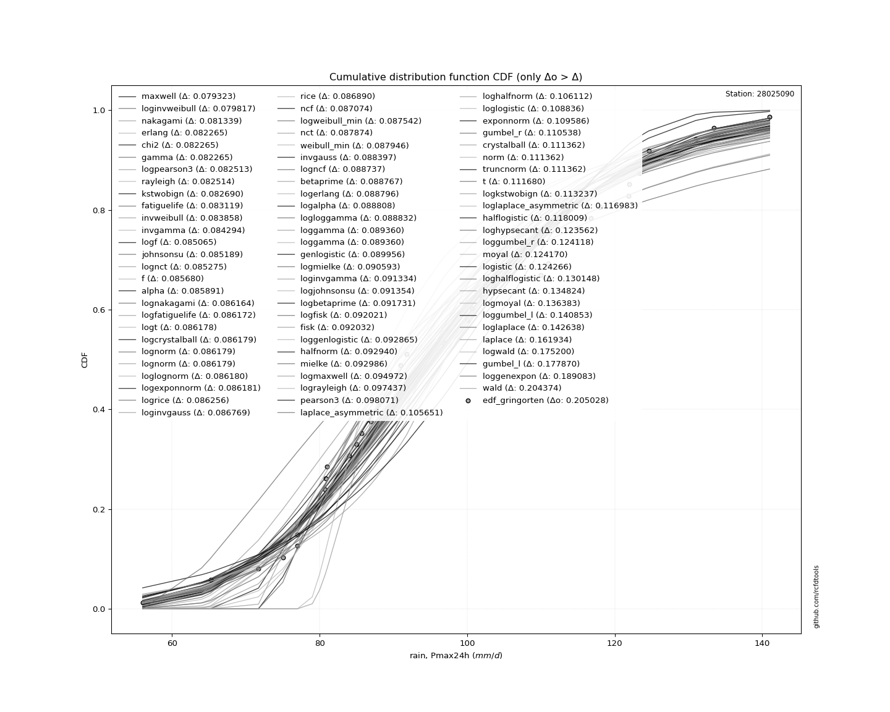</img>

</div>


**8.3. Best fit**

<div align="center">

|   id |   station | empirical_dist   | p_dist    |     delta |   deltao | eval   |   fit |   n |   best_fit |   best_fit_sort |
|-----:|----------:|:-----------------|:----------|----------:|---------:|:-------|------:|----:|-----------:|----------------:|
|    0 |  28025090 | edf_gringorten   | logdgamma | 0.0678828 | 0.220621 | Δo > Δ |     1 |  38 |          1 |               1 |

</div>


<div align="center">

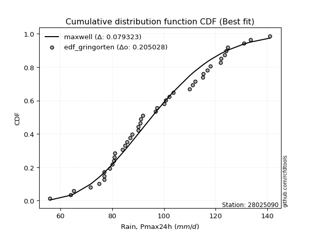</img></img>

</div>


### 9. Empirical - EDF Jenkinson (1977)

The Jenkinson formula in hydrology is an empirical plotting position formula used to estimate the non-exceedance probability _(P)_ or return period _(T)_ of a given ordered observation within a sample. It is a widely used method in the frequency analysis of extreme events such as floods and rainfall, as it provides a distribution-free way to plot data. _a≈0.31_ and _b≈0.38_ are constants derived to approximate the median of the probability distribution for the given rank.

<div align="center">


$P=(m-a)/(n+b)$


</div>


**9.1. Empirical values**

<div align="center">

|                | 0                    | 1                    | 2                   | 3                   | 4                   | 5                   | 6                   | 7                  | 8                  | 9                  | 10                 | 11                 | 12                 | 13                 | 14                 | 15                 | 16                  | 17                  | 18                  | 19                 | 20                 | 21                 | 22                 | 23                 | 24                 | 25                 | 26                 | 27                 | 28                 | 29                 | 30                 | 31                 | 32                | 33                 | 34                 | 35                 | 36                 | 37                 |
|:---------------|:---------------------|:---------------------|:--------------------|:--------------------|:--------------------|:--------------------|:--------------------|:-------------------|:-------------------|:-------------------|:-------------------|:-------------------|:-------------------|:-------------------|:-------------------|:-------------------|:--------------------|:--------------------|:--------------------|:-------------------|:-------------------|:-------------------|:-------------------|:-------------------|:-------------------|:-------------------|:-------------------|:-------------------|:-------------------|:-------------------|:-------------------|:-------------------|:------------------|:-------------------|:-------------------|:-------------------|:-------------------|:-------------------|
| date           | 2012                 | 1982                 | 1991                | 2003                | 2005                | 2002                | 1986                | 1995               | 1997               | 1994               | 2001               | 1978               | 1981               | 2004               | 1993               | 1979               | 2007                | 1988                | 2014                | 1999               | 2015               | 1992               | 1980               | 2011               | 1998               | 2006               | 2013               | 1989               | 1984               | 2000               | 1996               | 1990               | 1985              | 2010               | 1987               | 2008               | 1983               | 2009               |
| x              | 56.0                 | 64.0                 | 75.0                | 77.0                | 77.0                | 79.0                | 80.8                | 81.0               | 84.0               | 85.0               | 85.7               | 86.8977523483704   | 87.7               | 90.0               | 90.0               | 90.8182021076523   | 91.0                | 91.8                | 97.3                | 100.0              | 100.7              | 102.0              | 103.6              | 110.0              | 111.0              | 112.0              | 115.0              | 115.2              | 116.8              | 118.0              | 121.9              | 122.0              | 123.4             | 124.0              | 124.6              | 131.0              | 133.4              | 141.0              |
| m              | 1                    | 2                    | 3                   | 4                   | 5                   | 6                   | 7                   | 8                  | 9                  | 10                 | 11                 | 12                 | 13                 | 14                 | 15                 | 16                 | 17                  | 18                  | 19                  | 20                 | 21                 | 22                 | 23                 | 24                 | 25                 | 26                 | 27                 | 28                 | 29                 | 30                 | 31                 | 32                 | 33                | 34                 | 35                 | 36                 | 37                 | 38                 |
| empirical_dist | edf_jenkinson        | edf_jenkinson        | edf_jenkinson       | edf_jenkinson       | edf_jenkinson       | edf_jenkinson       | edf_jenkinson       | edf_jenkinson      | edf_jenkinson      | edf_jenkinson      | edf_jenkinson      | edf_jenkinson      | edf_jenkinson      | edf_jenkinson      | edf_jenkinson      | edf_jenkinson      | edf_jenkinson       | edf_jenkinson       | edf_jenkinson       | edf_jenkinson      | edf_jenkinson      | edf_jenkinson      | edf_jenkinson      | edf_jenkinson      | edf_jenkinson      | edf_jenkinson      | edf_jenkinson      | edf_jenkinson      | edf_jenkinson      | edf_jenkinson      | edf_jenkinson      | edf_jenkinson      | edf_jenkinson     | edf_jenkinson      | edf_jenkinson      | edf_jenkinson      | edf_jenkinson      | edf_jenkinson      |
| empirical      | 0.017978113600833765 | 0.044033350703491396 | 0.07008858780614903 | 0.09614382490880666 | 0.12219906201146431 | 0.14825429911412194 | 0.17430953621677958 | 0.2003647733194372 | 0.2264200104220948 | 0.2524752475247524 | 0.2785304846274101 | 0.3045857217300677 | 0.3306409588327253 | 0.356696195935383  | 0.3827514330380406 | 0.4088066701406982 | 0.43486190724335594 | 0.46091714434601355 | 0.48697238144867117 | 0.5130276185513288 | 0.5390828556539865 | 0.5651380927566441 | 0.5911933298593017 | 0.6172485669619594 | 0.643303804064617  | 0.6693590411672746 | 0.6954142782699323 | 0.7214695153725899 | 0.7475247524752475 | 0.7735799895779052 | 0.7996352266805627 | 0.8256904637832204 | 0.851745700885878 | 0.8778009379885355 | 0.9038561750911932 | 0.9299114121938509 | 0.9559666492965084 | 0.9820218863991661 |
| empirical_tr   | 1.0183072433006102   | 1.0460615971654401   | 1.0753712524516672  | 1.1063707120207553  | 1.139210448204215   | 1.1740593453655552  | 1.2111076049226885  | 1.2505702183121536 | 1.2926911417985854 | 1.3377483443708609 | 1.3860599494402313 | 1.437991757212439  | 1.4939665239392756 | 1.5544754961522882 | 1.620092866188265  | 1.6914940502423974 | 1.769479022591056   | 1.8550024166263899  | 1.9492127983748095  | 2.0535045478865706 | 2.1695873374788017 | 2.299580587177951  | 2.4461440407903123 | 2.6126616746085776 | 2.8035062089116143 | 3.0244286840031522 | 3.2831479897348164 | 3.5902712815715616 | 3.9607843137254903 | 4.416570771001151  | 4.990897269180753  | 5.736920777279521  | 6.745166959578204 | 8.183368869936023  | 10.401084010840094 | 14.267657992565038 | 22.710059171597546 | 55.62318840579669  |

</div>


**9.2. Kolmogorov-Smirnov fit test (sorted by Δ)**


<div align="center">

|                | 0                   | 1                   | 2                   | 3                   | 4                   | 5                   | 6                   | 7                   | 8                  | 9                  | 10                  | 11                  | 12                  | 13                  | 14                  | 15                  | 16                  | 17                  | 18                  | 19                  | 20                  | 21                  | 22                 | 23                  | 24                  | 25                  | 26                  | 27                 | 28                 | 29                  | 30                  | 31                  | 32                  | 33                  | 34                  | 35                  | 36                 | 37                  | 38                  | 39                 | 40                  | 41                 | 42                  | 43                  | 44                 | 45                  | 46                  | 47                  | 48                  | 49                  | 50                 | 51                  | 52                  | 53                  | 54                 | 55                  | 56                  | 57                  | 58                  | 59                  | 60                  | 61                 | 62                 | 63                 | 64                 | 65                 | 66                 | 67                  | 68                  | 69                  | 70                 | 71                  | 72                 | 73                  | 74                    | 75                 | 76                  | 77                  | 78                  | 79                  | 80                  | 81                  | 82                  | 83                 | 84                  | 85                 | 86                 | 87                 | 88                  | 89                  | 90                 | 91                 |
|:---------------|:--------------------|:--------------------|:--------------------|:--------------------|:--------------------|:--------------------|:--------------------|:--------------------|:-------------------|:-------------------|:--------------------|:--------------------|:--------------------|:--------------------|:--------------------|:--------------------|:--------------------|:--------------------|:--------------------|:--------------------|:--------------------|:--------------------|:-------------------|:--------------------|:--------------------|:--------------------|:--------------------|:-------------------|:-------------------|:--------------------|:--------------------|:--------------------|:--------------------|:--------------------|:--------------------|:--------------------|:-------------------|:--------------------|:--------------------|:-------------------|:--------------------|:-------------------|:--------------------|:--------------------|:-------------------|:--------------------|:--------------------|:--------------------|:--------------------|:--------------------|:-------------------|:--------------------|:--------------------|:--------------------|:-------------------|:--------------------|:--------------------|:--------------------|:--------------------|:--------------------|:--------------------|:-------------------|:-------------------|:-------------------|:-------------------|:-------------------|:-------------------|:--------------------|:--------------------|:--------------------|:-------------------|:--------------------|:-------------------|:--------------------|:----------------------|:-------------------|:--------------------|:--------------------|:--------------------|:--------------------|:--------------------|:--------------------|:--------------------|:-------------------|:--------------------|:-------------------|:-------------------|:-------------------|:--------------------|:--------------------|:-------------------|:-------------------|
| station        | 28025090            | 28025090            | 28025090            | 28025090            | 28025090            | 28025090            | 28025090            | 28025090            | 28025090           | 28025090           | 28025090            | 28025090            | 28025090            | 28025090            | 28025090            | 28025090            | 28025090            | 28025090            | 28025090            | 28025090            | 28025090            | 28025090            | 28025090           | 28025090            | 28025090            | 28025090            | 28025090            | 28025090           | 28025090           | 28025090            | 28025090            | 28025090            | 28025090            | 28025090            | 28025090            | 28025090            | 28025090           | 28025090            | 28025090            | 28025090           | 28025090            | 28025090           | 28025090            | 28025090            | 28025090           | 28025090            | 28025090            | 28025090            | 28025090            | 28025090            | 28025090           | 28025090            | 28025090            | 28025090            | 28025090           | 28025090            | 28025090            | 28025090            | 28025090            | 28025090            | 28025090            | 28025090           | 28025090           | 28025090           | 28025090           | 28025090           | 28025090           | 28025090            | 28025090            | 28025090            | 28025090           | 28025090            | 28025090           | 28025090            | 28025090              | 28025090           | 28025090            | 28025090            | 28025090            | 28025090            | 28025090            | 28025090            | 28025090            | 28025090           | 28025090            | 28025090           | 28025090           | 28025090           | 28025090            | 28025090            | 28025090           | 28025090           |
| empirical_dist | edf_jenkinson       | edf_jenkinson       | edf_jenkinson       | edf_jenkinson       | edf_jenkinson       | edf_jenkinson       | edf_jenkinson       | edf_jenkinson       | edf_jenkinson      | edf_jenkinson      | edf_jenkinson       | edf_jenkinson       | edf_jenkinson       | edf_jenkinson       | edf_jenkinson       | edf_jenkinson       | edf_jenkinson       | edf_jenkinson       | edf_jenkinson       | edf_jenkinson       | edf_jenkinson       | edf_jenkinson       | edf_jenkinson      | edf_jenkinson       | edf_jenkinson       | edf_jenkinson       | edf_jenkinson       | edf_jenkinson      | edf_jenkinson      | edf_jenkinson       | edf_jenkinson       | edf_jenkinson       | edf_jenkinson       | edf_jenkinson       | edf_jenkinson       | edf_jenkinson       | edf_jenkinson      | edf_jenkinson       | edf_jenkinson       | edf_jenkinson      | edf_jenkinson       | edf_jenkinson      | edf_jenkinson       | edf_jenkinson       | edf_jenkinson      | edf_jenkinson       | edf_jenkinson       | edf_jenkinson       | edf_jenkinson       | edf_jenkinson       | edf_jenkinson      | edf_jenkinson       | edf_jenkinson       | edf_jenkinson       | edf_jenkinson      | edf_jenkinson       | edf_jenkinson       | edf_jenkinson       | edf_jenkinson       | edf_jenkinson       | edf_jenkinson       | edf_jenkinson      | edf_jenkinson      | edf_jenkinson      | edf_jenkinson      | edf_jenkinson      | edf_jenkinson      | edf_jenkinson       | edf_jenkinson       | edf_jenkinson       | edf_jenkinson      | edf_jenkinson       | edf_jenkinson      | edf_jenkinson       | edf_jenkinson         | edf_jenkinson      | edf_jenkinson       | edf_jenkinson       | edf_jenkinson       | edf_jenkinson       | edf_jenkinson       | edf_jenkinson       | edf_jenkinson       | edf_jenkinson      | edf_jenkinson       | edf_jenkinson      | edf_jenkinson      | edf_jenkinson      | edf_jenkinson       | edf_jenkinson       | edf_jenkinson      | edf_jenkinson      |
| p_dist         | logdgamma           | dgamma              | maxwell             | alpha               | kstwobign           | logncf              | logf                | logalpha            | logrice            | logt               | lognorm             | lognorm             | logcrystalball      | logexponnorm        | loglognorm          | logfatiguelife      | lognakagami         | genlogistic         | rayleigh            | loginvweibull       | invgamma            | logfisk             | fisk               | loginvgamma         | chi2                | logerlang           | lognct              | loggamma           | loggamma           | invgauss            | betaprime           | logpearson3         | rice                | nakagami            | loginvgauss         | weibull_min         | fatiguelife        | logmaxwell          | halfnorm            | mielke             | logweibull_min      | loggenlogistic     | f                   | logkstwobign        | loggompertz        | johnsonsu           | logloggamma         | lograyleigh         | erlang              | gamma               | pearson3           | logjohnsonsu        | t                   | nct                 | exponnorm          | truncnorm           | norm                | crystalball         | loglogistic         | logmielke           | loghalfnorm         | gumbel_r           | laplace_asymmetric | loghypsecant       | logistic           | halflogistic       | ncf                | loggumbel_l         | loggumbel_r         | moyal               | hypsecant          | loghalflogistic     | loglaplace         | logmoyal            | loglaplace_asymmetric | loggenexpon        | gumbel_l            | laplace             | wald                | logwald             | loggibrat           | gibrat              | logbetaprime        | genexpon           | expon               | pareto             | logpareto          | logexpon           | logchi2             | logtruncnorm        | invweibull         | gompertz           |
| delta          | 0.06921561721517755 | 0.08972218375715413 | 0.09178073514234142 | 0.09238223604494522 | 0.09302092343849377 | 0.09330371781173041 | 0.09509740006061251 | 0.09529244126590708 | 0.0958662694690754 | 0.0958809197635262 | 0.09588887756262932 | 0.09588887756262932 | 0.09588952254873617 | 0.09588988777937202 | 0.09589024669709278 | 0.09613344102939092 | 0.09623268015299613 | 0.09641313777038485 | 0.09672875491839983 | 0.09748783800011784 | 0.09791300994105612 | 0.09823472378620385 | 0.0985668118760924 | 0.09928012389804908 | 0.10006556264407324 | 0.10059479493810441 | 0.10060174075458028 | 0.100693464330472  | 0.100693464330472  | 0.10111681335485867 | 0.10125281875586345 | 0.10227761413797415 | 0.10459837811441286 | 0.10492399522774071 | 0.10730541740873722 | 0.10966127379863216 | 0.1097825207391196 | 0.11019737148679554 | 0.11163945084882632 | 0.1120052953512713 | 0.11200661806416007 | 0.1120548852894428 | 0.11214383283674406 | 0.11224869180503902 | 0.112796824168026  | 0.11352949096401727 | 0.11393408763337076 | 0.11436606678852779 | 0.11459504366805756 | 0.11463797662856379 | 0.1148069334006499 | 0.11599913980757476 | 0.11647775640369123 | 0.11674898015307866 | 0.1167819981107055 | 0.11679279402552467 | 0.11679283917017291 | 0.11679284193974127 | 0.11780117493470144 | 0.12056075581612918 | 0.12721935185242705 | 0.127348295168074  | 0.1293081444117138 | 0.1332721391052275 | 0.1352298159830963 | 0.138718589390747  | 0.1435292002495302 | 0.14388074361082287 | 0.14394002399500994 | 0.14435465205875908 | 0.1494356893990847 | 0.15350773093659853 | 0.1570961481458384 | 0.15943649530697612 | 0.16273092081977109   | 0.1731911575400604 | 0.17582175045949705 | 0.17742653645812717 | 0.20019111980774398 | 0.20553247909900252 | 0.23645350456377534 | 0.25888902670657515 | 0.26176747119886007 | 0.2835382718729482 | 0.28416091877139704 | 0.284160927733746  | 0.3390796506527113 | 0.3390796537196602 | 0.34553874644149596 | 0.47384514702098435 | 0.6190609787067275 | 0.8860477612148209 |
| deltao         | 0.2206211327378371  | 0.2206211327378371  | 0.2206211327378371  | 0.2206211327378371  | 0.2206211327378371  | 0.2206211327378371  | 0.2206211327378371  | 0.2206211327378371  | 0.2206211327378371 | 0.2206211327378371 | 0.2206211327378371  | 0.2206211327378371  | 0.2206211327378371  | 0.2206211327378371  | 0.2206211327378371  | 0.2206211327378371  | 0.2206211327378371  | 0.2206211327378371  | 0.2206211327378371  | 0.2206211327378371  | 0.2206211327378371  | 0.2206211327378371  | 0.2206211327378371 | 0.2206211327378371  | 0.2206211327378371  | 0.2206211327378371  | 0.2206211327378371  | 0.2206211327378371 | 0.2206211327378371 | 0.2206211327378371  | 0.2206211327378371  | 0.2206211327378371  | 0.2206211327378371  | 0.2206211327378371  | 0.2206211327378371  | 0.2206211327378371  | 0.2206211327378371 | 0.2206211327378371  | 0.2206211327378371  | 0.2206211327378371 | 0.2206211327378371  | 0.2206211327378371 | 0.2206211327378371  | 0.2206211327378371  | 0.2206211327378371 | 0.2206211327378371  | 0.2206211327378371  | 0.2206211327378371  | 0.2206211327378371  | 0.2206211327378371  | 0.2206211327378371 | 0.2206211327378371  | 0.2206211327378371  | 0.2206211327378371  | 0.2206211327378371 | 0.2206211327378371  | 0.2206211327378371  | 0.2206211327378371  | 0.2206211327378371  | 0.2206211327378371  | 0.2206211327378371  | 0.2206211327378371 | 0.2206211327378371 | 0.2206211327378371 | 0.2206211327378371 | 0.2206211327378371 | 0.2206211327378371 | 0.2206211327378371  | 0.2206211327378371  | 0.2206211327378371  | 0.2206211327378371 | 0.2206211327378371  | 0.2206211327378371 | 0.2206211327378371  | 0.2206211327378371    | 0.2206211327378371 | 0.2206211327378371  | 0.2206211327378371  | 0.2206211327378371  | 0.2206211327378371  | 0.2206211327378371  | 0.2206211327378371  | 0.2206211327378371  | 0.2206211327378371 | 0.2206211327378371  | 0.2206211327378371 | 0.2206211327378371 | 0.2206211327378371 | 0.2206211327378371  | 0.2206211327378371  | 0.2206211327378371 | 0.2206211327378371 |
| eval           | Δo > Δ              | Δo > Δ              | Δo > Δ              | Δo > Δ              | Δo > Δ              | Δo > Δ              | Δo > Δ              | Δo > Δ              | Δo > Δ             | Δo > Δ             | Δo > Δ              | Δo > Δ              | Δo > Δ              | Δo > Δ              | Δo > Δ              | Δo > Δ              | Δo > Δ              | Δo > Δ              | Δo > Δ              | Δo > Δ              | Δo > Δ              | Δo > Δ              | Δo > Δ             | Δo > Δ              | Δo > Δ              | Δo > Δ              | Δo > Δ              | Δo > Δ             | Δo > Δ             | Δo > Δ              | Δo > Δ              | Δo > Δ              | Δo > Δ              | Δo > Δ              | Δo > Δ              | Δo > Δ              | Δo > Δ             | Δo > Δ              | Δo > Δ              | Δo > Δ             | Δo > Δ              | Δo > Δ             | Δo > Δ              | Δo > Δ              | Δo > Δ             | Δo > Δ              | Δo > Δ              | Δo > Δ              | Δo > Δ              | Δo > Δ              | Δo > Δ             | Δo > Δ              | Δo > Δ              | Δo > Δ              | Δo > Δ             | Δo > Δ              | Δo > Δ              | Δo > Δ              | Δo > Δ              | Δo > Δ              | Δo > Δ              | Δo > Δ             | Δo > Δ             | Δo > Δ             | Δo > Δ             | Δo > Δ             | Δo > Δ             | Δo > Δ              | Δo > Δ              | Δo > Δ              | Δo > Δ             | Δo > Δ              | Δo > Δ             | Δo > Δ              | Δo > Δ                | Δo > Δ             | Δo > Δ              | Δo > Δ              | Δo > Δ              | Δo > Δ              | Δo <= Δ             | Δo <= Δ             | Δo <= Δ             | Δo <= Δ            | Δo <= Δ             | Δo <= Δ            | Δo <= Δ            | Δo <= Δ            | Δo <= Δ             | Δo <= Δ             | Δo <= Δ            | Δo <= Δ            |
| fit            | 1                   | 1                   | 1                   | 1                   | 1                   | 1                   | 1                   | 1                   | 1                  | 1                  | 1                   | 1                   | 1                   | 1                   | 1                   | 1                   | 1                   | 1                   | 1                   | 1                   | 1                   | 1                   | 1                  | 1                   | 1                   | 1                   | 1                   | 1                  | 1                  | 1                   | 1                   | 1                   | 1                   | 1                   | 1                   | 1                   | 1                  | 1                   | 1                   | 1                  | 1                   | 1                  | 1                   | 1                   | 1                  | 1                   | 1                   | 1                   | 1                   | 1                   | 1                  | 1                   | 1                   | 1                   | 1                  | 1                   | 1                   | 1                   | 1                   | 1                   | 1                   | 1                  | 1                  | 1                  | 1                  | 1                  | 1                  | 1                   | 1                   | 1                   | 1                  | 1                   | 1                  | 1                   | 1                     | 1                  | 1                   | 1                   | 1                   | 1                   | 0                   | 0                   | 0                   | 0                  | 0                   | 0                  | 0                  | 0                  | 0                   | 0                   | 0                  | 0                  |
| n              | 38                  | 38                  | 38                  | 38                  | 38                  | 38                  | 38                  | 38                  | 38                 | 38                 | 38                  | 38                  | 38                  | 38                  | 38                  | 38                  | 38                  | 38                  | 38                  | 38                  | 38                  | 38                  | 38                 | 38                  | 38                  | 38                  | 38                  | 38                 | 38                 | 38                  | 38                  | 38                  | 38                  | 38                  | 38                  | 38                  | 38                 | 38                  | 38                  | 38                 | 38                  | 38                 | 38                  | 38                  | 38                 | 38                  | 38                  | 38                  | 38                  | 38                  | 38                 | 38                  | 38                  | 38                  | 38                 | 38                  | 38                  | 38                  | 38                  | 38                  | 38                  | 38                 | 38                 | 38                 | 38                 | 38                 | 38                 | 38                  | 38                  | 38                  | 38                 | 38                  | 38                 | 38                  | 38                    | 38                 | 38                  | 38                  | 38                  | 38                  | 38                  | 38                  | 38                  | 38                 | 38                  | 38                 | 38                 | 38                 | 38                  | 38                  | 38                 | 38                 |
| best_fit       | 1                   | 0                   | 0                   | 0                   | 0                   | 0                   | 0                   | 0                   | 0                  | 0                  | 0                   | 0                   | 0                   | 0                   | 0                   | 0                   | 0                   | 0                   | 0                   | 0                   | 0                   | 0                   | 0                  | 0                   | 0                   | 0                   | 0                   | 0                  | 0                  | 0                   | 0                   | 0                   | 0                   | 0                   | 0                   | 0                   | 0                  | 0                   | 0                   | 0                  | 0                   | 0                  | 0                   | 0                   | 0                  | 0                   | 0                   | 0                   | 0                   | 0                   | 0                  | 0                   | 0                   | 0                   | 0                  | 0                   | 0                   | 0                   | 0                   | 0                   | 0                   | 0                  | 0                  | 0                  | 0                  | 0                  | 0                  | 0                   | 0                   | 0                   | 0                  | 0                   | 0                  | 0                   | 0                     | 0                  | 0                   | 0                   | 0                   | 0                   | 0                   | 0                   | 0                   | 0                  | 0                   | 0                  | 0                  | 0                  | 0                   | 0                   | 0                  | 0                  |
| best_fit_sort  | 1                   | 2                   | 3                   | 4                   | 5                   | 6                   | 7                   | 8                   | 9                  | 10                 | 11                  | 12                  | 13                  | 14                  | 15                  | 16                  | 17                  | 18                  | 19                  | 20                  | 21                  | 22                  | 23                 | 24                  | 25                  | 26                  | 27                  | 28                 | 29                 | 30                  | 31                  | 32                  | 33                  | 34                  | 35                  | 36                  | 37                 | 38                  | 39                  | 40                 | 41                  | 42                 | 43                  | 44                  | 45                 | 46                  | 47                  | 48                  | 49                  | 50                  | 51                 | 52                  | 53                  | 54                  | 55                 | 56                  | 57                  | 58                  | 59                  | 60                  | 61                  | 62                 | 63                 | 64                 | 65                 | 66                 | 67                 | 68                  | 69                  | 70                  | 71                 | 72                  | 73                 | 74                  | 75                    | 76                 | 77                  | 78                  | 79                  | 80                  | 81                  | 82                  | 83                  | 84                 | 85                  | 86                 | 87                 | 88                 | 89                  | 90                  | 91                 | 92                 |

</div>


<div align="center">

</img>

</div>


**9.3. Best fit**

<div align="center">

|   id |   station | empirical_dist   | p_dist    |     delta |   deltao | eval   |   fit |   n |   best_fit |   best_fit_sort |
|-----:|----------:|:-----------------|:----------|----------:|---------:|:-------|------:|----:|-----------:|----------------:|
|    0 |  28025090 | edf_jenkinson    | logdgamma | 0.0692156 | 0.220621 | Δo > Δ |     1 |  38 |          1 |               1 |

</div>


<div align="center">

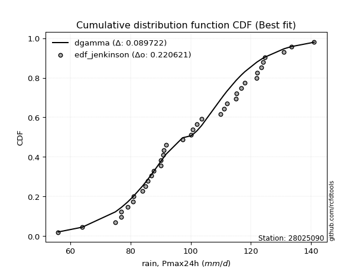</img>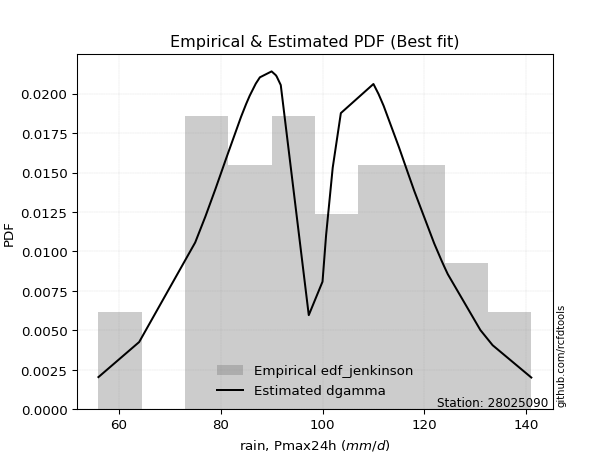</img>

</div>


### 10. Empirical - EDF Cunnane (1978)

Cunnane´s work in statistical hydrology has focused on the performance and evaluation of different probability distributions (such as GEV, Gumbel, Lognormal) for flood frequency estimation. _b_ is a constant, typically set to 0.4.

<div align="center">


$P=(m-b)/(n+1-2b)$


</div>


**10.1. Empirical values**

<div align="center">

|                | 0                    | 1                    | 2                   | 3                   | 4                   | 5                   | 6                   | 7                   | 8                  | 9                  | 10                  | 11                 | 12                  | 13                  | 14                 | 15                 | 16                  | 17                 | 18                 | 19                 | 20                 | 21                 | 22                 | 23                 | 24                 | 25                 | 26                 | 27                 | 28                 | 29                 | 30                 | 31                 | 32                 | 33                 | 34                 | 35                 | 36                 | 37                 |
|:---------------|:---------------------|:---------------------|:--------------------|:--------------------|:--------------------|:--------------------|:--------------------|:--------------------|:-------------------|:-------------------|:--------------------|:-------------------|:--------------------|:--------------------|:-------------------|:-------------------|:--------------------|:-------------------|:-------------------|:-------------------|:-------------------|:-------------------|:-------------------|:-------------------|:-------------------|:-------------------|:-------------------|:-------------------|:-------------------|:-------------------|:-------------------|:-------------------|:-------------------|:-------------------|:-------------------|:-------------------|:-------------------|:-------------------|
| date           | 2012                 | 1982                 | 1991                | 2003                | 2005                | 2002                | 1986                | 1995                | 1997               | 1994               | 2001                | 1978               | 1981                | 2004                | 1993               | 1979               | 2007                | 1988               | 2014               | 1999               | 2015               | 1992               | 1980               | 2011               | 1998               | 2006               | 2013               | 1989               | 1984               | 2000               | 1996               | 1990               | 1985               | 2010               | 1987               | 2008               | 1983               | 2009               |
| x              | 56.0                 | 64.0                 | 75.0                | 77.0                | 77.0                | 79.0                | 80.8                | 81.0                | 84.0               | 85.0               | 85.7                | 86.8977523483704   | 87.7                | 90.0                | 90.0               | 90.8182021076523   | 91.0                | 91.8               | 97.3               | 100.0              | 100.7              | 102.0              | 103.6              | 110.0              | 111.0              | 112.0              | 115.0              | 115.2              | 116.8              | 118.0              | 121.9              | 122.0              | 123.4              | 124.0              | 124.6              | 131.0              | 133.4              | 141.0              |
| m              | 1                    | 2                    | 3                   | 4                   | 5                   | 6                   | 7                   | 8                   | 9                  | 10                 | 11                  | 12                 | 13                  | 14                  | 15                 | 16                 | 17                  | 18                 | 19                 | 20                 | 21                 | 22                 | 23                 | 24                 | 25                 | 26                 | 27                 | 28                 | 29                 | 30                 | 31                 | 32                 | 33                 | 34                 | 35                 | 36                 | 37                 | 38                 |
| empirical_dist | edf_cunnane          | edf_cunnane          | edf_cunnane         | edf_cunnane         | edf_cunnane         | edf_cunnane         | edf_cunnane         | edf_cunnane         | edf_cunnane        | edf_cunnane        | edf_cunnane         | edf_cunnane        | edf_cunnane         | edf_cunnane         | edf_cunnane        | edf_cunnane        | edf_cunnane         | edf_cunnane        | edf_cunnane        | edf_cunnane        | edf_cunnane        | edf_cunnane        | edf_cunnane        | edf_cunnane        | edf_cunnane        | edf_cunnane        | edf_cunnane        | edf_cunnane        | edf_cunnane        | edf_cunnane        | edf_cunnane        | edf_cunnane        | edf_cunnane        | edf_cunnane        | edf_cunnane        | edf_cunnane        | edf_cunnane        | edf_cunnane        |
| empirical      | 0.015706806282722512 | 0.041884816753926704 | 0.06806282722513089 | 0.09424083769633507 | 0.12041884816753926 | 0.14659685863874344 | 0.17277486910994763 | 0.19895287958115182 | 0.225130890052356  | 0.2513089005235602 | 0.27748691099476436 | 0.3036649214659686 | 0.32984293193717273 | 0.35602094240837695 | 0.3821989528795811 | 0.4083769633507853 | 0.43455497382198954 | 0.4607329842931937 | 0.4869109947643979 | 0.5130890052356021 | 0.5392670157068062 | 0.5654450261780105 | 0.5916230366492147 | 0.6178010471204188 | 0.643979057591623  | 0.6701570680628273 | 0.6963350785340314 | 0.7225130890052356 | 0.7486910994764397 | 0.7748691099476439 | 0.8010471204188482 | 0.8272251308900523 | 0.8534031413612565 | 0.8795811518324607 | 0.9057591623036649 | 0.9319371727748691 | 0.9581151832460733 | 0.9842931937172774 |
| empirical_tr   | 1.0159574468085106   | 1.0437158469945356   | 1.0730337078651686  | 1.1040462427745665  | 1.1369047619047619  | 1.1717791411042944  | 1.2088607594936709  | 1.2483660130718954  | 1.2905405405405406 | 1.3356643356643358 | 1.3840579710144927  | 1.4360902255639096 | 1.4921875           | 1.5528455284552845  | 1.6186440677966099 | 1.6902654867256637 | 1.7685185185185188  | 1.854368932038835  | 1.9489795918367347 | 2.053763440860215  | 2.1704545454545454 | 2.3012048192771086 | 2.448717948717949  | 2.6164383561643834 | 2.8088235294117645 | 3.031746031746032  | 3.293103448275862  | 3.6037735849056602 | 3.979166666666666  | 4.441860465116278  | 5.026315789473685  | 5.787878787878787  | 6.821428571428569  | 8.304347826086952  | 10.611111111111112 | 14.692307692307688 | 23.874999999999975 | 63.66666666666637  |

</div>


**10.2. Kolmogorov-Smirnov fit test (sorted by Δ)**


<div align="center">

|                | 0                   | 1                  | 2                   | 3                   | 4                   | 5                   | 6                   | 7                   | 8                   | 9                   | 10                  | 11                  | 12                  | 13                  | 14                  | 15                  | 16                 | 17                  | 18                 | 19                  | 20                 | 21                  | 22                  | 23                  | 24                  | 25                  | 26                  | 27                  | 28                  | 29                  | 30                  | 31                 | 32                  | 33                  | 34                  | 35                  | 36                  | 37                 | 38                  | 39                  | 40                  | 41                  | 42                  | 43                  | 44                  | 45                  | 46                  | 47                  | 48                  | 49                  | 50                  | 51                  | 52                  | 53                  | 54                  | 55                  | 56                  | 57                  | 58                 | 59                  | 60                  | 61                  | 62                  | 63                  | 64                  | 65                  | 66                 | 67                  | 68                  | 69                  | 70                  | 71                 | 72                  | 73                 | 74                    | 75                 | 76                 | 77                  | 78                 | 79                  | 80                 | 81                 | 82                 | 83                  | 84                 | 85                  | 86                 | 87                 | 88                 | 89                  | 90                 | 91                 |
|:---------------|:--------------------|:-------------------|:--------------------|:--------------------|:--------------------|:--------------------|:--------------------|:--------------------|:--------------------|:--------------------|:--------------------|:--------------------|:--------------------|:--------------------|:--------------------|:--------------------|:-------------------|:--------------------|:-------------------|:--------------------|:-------------------|:--------------------|:--------------------|:--------------------|:--------------------|:--------------------|:--------------------|:--------------------|:--------------------|:--------------------|:--------------------|:-------------------|:--------------------|:--------------------|:--------------------|:--------------------|:--------------------|:-------------------|:--------------------|:--------------------|:--------------------|:--------------------|:--------------------|:--------------------|:--------------------|:--------------------|:--------------------|:--------------------|:--------------------|:--------------------|:--------------------|:--------------------|:--------------------|:--------------------|:--------------------|:--------------------|:--------------------|:--------------------|:-------------------|:--------------------|:--------------------|:--------------------|:--------------------|:--------------------|:--------------------|:--------------------|:-------------------|:--------------------|:--------------------|:--------------------|:--------------------|:-------------------|:--------------------|:-------------------|:----------------------|:-------------------|:-------------------|:--------------------|:-------------------|:--------------------|:-------------------|:-------------------|:-------------------|:--------------------|:-------------------|:--------------------|:-------------------|:-------------------|:-------------------|:--------------------|:-------------------|:-------------------|
| station        | 28025090            | 28025090           | 28025090            | 28025090            | 28025090            | 28025090            | 28025090            | 28025090            | 28025090            | 28025090            | 28025090            | 28025090            | 28025090            | 28025090            | 28025090            | 28025090            | 28025090           | 28025090            | 28025090           | 28025090            | 28025090           | 28025090            | 28025090            | 28025090            | 28025090            | 28025090            | 28025090            | 28025090            | 28025090            | 28025090            | 28025090            | 28025090           | 28025090            | 28025090            | 28025090            | 28025090            | 28025090            | 28025090           | 28025090            | 28025090            | 28025090            | 28025090            | 28025090            | 28025090            | 28025090            | 28025090            | 28025090            | 28025090            | 28025090            | 28025090            | 28025090            | 28025090            | 28025090            | 28025090            | 28025090            | 28025090            | 28025090            | 28025090            | 28025090           | 28025090            | 28025090            | 28025090            | 28025090            | 28025090            | 28025090            | 28025090            | 28025090           | 28025090            | 28025090            | 28025090            | 28025090            | 28025090           | 28025090            | 28025090           | 28025090              | 28025090           | 28025090           | 28025090            | 28025090           | 28025090            | 28025090           | 28025090           | 28025090           | 28025090            | 28025090           | 28025090            | 28025090           | 28025090           | 28025090           | 28025090            | 28025090           | 28025090           |
| empirical_dist | edf_cunnane         | edf_cunnane        | edf_cunnane         | edf_cunnane         | edf_cunnane         | edf_cunnane         | edf_cunnane         | edf_cunnane         | edf_cunnane         | edf_cunnane         | edf_cunnane         | edf_cunnane         | edf_cunnane         | edf_cunnane         | edf_cunnane         | edf_cunnane         | edf_cunnane        | edf_cunnane         | edf_cunnane        | edf_cunnane         | edf_cunnane        | edf_cunnane         | edf_cunnane         | edf_cunnane         | edf_cunnane         | edf_cunnane         | edf_cunnane         | edf_cunnane         | edf_cunnane         | edf_cunnane         | edf_cunnane         | edf_cunnane        | edf_cunnane         | edf_cunnane         | edf_cunnane         | edf_cunnane         | edf_cunnane         | edf_cunnane        | edf_cunnane         | edf_cunnane         | edf_cunnane         | edf_cunnane         | edf_cunnane         | edf_cunnane         | edf_cunnane         | edf_cunnane         | edf_cunnane         | edf_cunnane         | edf_cunnane         | edf_cunnane         | edf_cunnane         | edf_cunnane         | edf_cunnane         | edf_cunnane         | edf_cunnane         | edf_cunnane         | edf_cunnane         | edf_cunnane         | edf_cunnane        | edf_cunnane         | edf_cunnane         | edf_cunnane         | edf_cunnane         | edf_cunnane         | edf_cunnane         | edf_cunnane         | edf_cunnane        | edf_cunnane         | edf_cunnane         | edf_cunnane         | edf_cunnane         | edf_cunnane        | edf_cunnane         | edf_cunnane        | edf_cunnane           | edf_cunnane        | edf_cunnane        | edf_cunnane         | edf_cunnane        | edf_cunnane         | edf_cunnane        | edf_cunnane        | edf_cunnane        | edf_cunnane         | edf_cunnane        | edf_cunnane         | edf_cunnane        | edf_cunnane        | edf_cunnane        | edf_cunnane         | edf_cunnane        | edf_cunnane        |
| p_dist         | logdgamma           | dgamma             | maxwell             | alpha               | kstwobign           | logncf              | logf                | logalpha            | logrice             | logt                | lognorm             | lognorm             | logcrystalball      | logexponnorm        | loglognorm          | logfatiguelife      | lognakagami        | genlogistic         | rayleigh           | invgamma            | logfisk            | fisk                | loginvgamma         | loginvweibull       | chi2                | logerlang           | lognct              | loggamma            | loggamma            | invgauss            | betaprime           | logpearson3        | rice                | nakagami            | loginvgauss         | weibull_min         | fatiguelife         | logmaxwell         | halfnorm            | mielke              | logweibull_min      | loggenlogistic      | f                   | loggompertz         | johnsonsu           | logloggamma         | lograyleigh         | logkstwobign        | erlang              | gamma               | pearson3            | logjohnsonsu        | t                   | nct                 | exponnorm           | truncnorm           | norm                | crystalball         | loglogistic        | logmielke           | loghalfnorm         | gumbel_r            | laplace_asymmetric  | loghypsecant        | logistic            | halflogistic        | loggumbel_r        | loggumbel_l         | moyal               | ncf                 | hypsecant           | loghalflogistic    | loglaplace          | logmoyal           | loglaplace_asymmetric | loggenexpon        | gumbel_l           | laplace             | wald               | logwald             | loggibrat          | gibrat             | logbetaprime       | genexpon            | expon              | pareto              | logpareto          | logexpon           | logchi2            | logtruncnorm        | invweibull         | gompertz           |
| delta          | 0.06829481695107842 | 0.088801383493055  | 0.09122825498388198 | 0.09182975588648579 | 0.09246844328003434 | 0.09275123765327098 | 0.09454491990215308 | 0.09473996110744765 | 0.09531378931061596 | 0.09532843960506676 | 0.09533639740416988 | 0.09533639740416988 | 0.09533704239027674 | 0.09533740762091258 | 0.09533776653863335 | 0.09558096087093149 | 0.0956801999945367 | 0.09586065761192542 | 0.0961762747599404 | 0.09772884988823627 | 0.098050563733384  | 0.09838265182327255 | 0.09872764373958964 | 0.09963637194968267 | 0.09988140259125339 | 0.10004231477964498 | 0.10004926059612085 | 0.10014098417201256 | 0.10014098417201256 | 0.10056433319639924 | 0.10070033859740402 | 0.1020934540851543 | 0.10441421806159301 | 0.10473983517492086 | 0.10675293725027779 | 0.10947711374581232 | 0.10959836068629975 | 0.1096448913283361 | 0.11108697069036688 | 0.11182113529845145 | 0.11182245801134022 | 0.11187072523662295 | 0.11195967278392421 | 0.11261266411520615 | 0.11334533091119742 | 0.11374992758055091 | 0.11381358663006835 | 0.11415167901751061 | 0.11441088361523771 | 0.11445381657574394 | 0.11462277334783005 | 0.11581497975475491 | 0.11629359635087139 | 0.11656482010025881 | 0.11659783805788565 | 0.11660863397270482 | 0.11660867911735306 | 0.11660868188692142 | 0.117248694776242  | 0.12037659576330934 | 0.12666687169396762 | 0.12679581500961457 | 0.12875566425325435 | 0.13271965894676807 | 0.13504565593027645 | 0.13816610923228756 | 0.1433875438365505 | 0.14369658355800302 | 0.14380217190029965 | 0.14543218746200193 | 0.14925152934626484 | 0.1529552507781391 | 0.15654366798737895 | 0.1588840151485167 | 0.16254676076695124   | 0.175094144752532  | 0.1756375904066772 | 0.17724237640530732 | 0.1987792260694586 | 0.20497999894054308 | 0.2359010244053159 | 0.2578454530739294 | 0.2637932317798782 | 0.28544125908541984 | 0.2860639059838686 | 0.28606391494621763 | 0.3409826378651829 | 0.3409826409321318 | 0.3478100537596073 | 0.47574813423345597 | 0.6210867392877456 | 0.8879507484272926 |
| deltao         | 0.2206211327378371  | 0.2206211327378371 | 0.2206211327378371  | 0.2206211327378371  | 0.2206211327378371  | 0.2206211327378371  | 0.2206211327378371  | 0.2206211327378371  | 0.2206211327378371  | 0.2206211327378371  | 0.2206211327378371  | 0.2206211327378371  | 0.2206211327378371  | 0.2206211327378371  | 0.2206211327378371  | 0.2206211327378371  | 0.2206211327378371 | 0.2206211327378371  | 0.2206211327378371 | 0.2206211327378371  | 0.2206211327378371 | 0.2206211327378371  | 0.2206211327378371  | 0.2206211327378371  | 0.2206211327378371  | 0.2206211327378371  | 0.2206211327378371  | 0.2206211327378371  | 0.2206211327378371  | 0.2206211327378371  | 0.2206211327378371  | 0.2206211327378371 | 0.2206211327378371  | 0.2206211327378371  | 0.2206211327378371  | 0.2206211327378371  | 0.2206211327378371  | 0.2206211327378371 | 0.2206211327378371  | 0.2206211327378371  | 0.2206211327378371  | 0.2206211327378371  | 0.2206211327378371  | 0.2206211327378371  | 0.2206211327378371  | 0.2206211327378371  | 0.2206211327378371  | 0.2206211327378371  | 0.2206211327378371  | 0.2206211327378371  | 0.2206211327378371  | 0.2206211327378371  | 0.2206211327378371  | 0.2206211327378371  | 0.2206211327378371  | 0.2206211327378371  | 0.2206211327378371  | 0.2206211327378371  | 0.2206211327378371 | 0.2206211327378371  | 0.2206211327378371  | 0.2206211327378371  | 0.2206211327378371  | 0.2206211327378371  | 0.2206211327378371  | 0.2206211327378371  | 0.2206211327378371 | 0.2206211327378371  | 0.2206211327378371  | 0.2206211327378371  | 0.2206211327378371  | 0.2206211327378371 | 0.2206211327378371  | 0.2206211327378371 | 0.2206211327378371    | 0.2206211327378371 | 0.2206211327378371 | 0.2206211327378371  | 0.2206211327378371 | 0.2206211327378371  | 0.2206211327378371 | 0.2206211327378371 | 0.2206211327378371 | 0.2206211327378371  | 0.2206211327378371 | 0.2206211327378371  | 0.2206211327378371 | 0.2206211327378371 | 0.2206211327378371 | 0.2206211327378371  | 0.2206211327378371 | 0.2206211327378371 |
| eval           | Δo > Δ              | Δo > Δ             | Δo > Δ              | Δo > Δ              | Δo > Δ              | Δo > Δ              | Δo > Δ              | Δo > Δ              | Δo > Δ              | Δo > Δ              | Δo > Δ              | Δo > Δ              | Δo > Δ              | Δo > Δ              | Δo > Δ              | Δo > Δ              | Δo > Δ             | Δo > Δ              | Δo > Δ             | Δo > Δ              | Δo > Δ             | Δo > Δ              | Δo > Δ              | Δo > Δ              | Δo > Δ              | Δo > Δ              | Δo > Δ              | Δo > Δ              | Δo > Δ              | Δo > Δ              | Δo > Δ              | Δo > Δ             | Δo > Δ              | Δo > Δ              | Δo > Δ              | Δo > Δ              | Δo > Δ              | Δo > Δ             | Δo > Δ              | Δo > Δ              | Δo > Δ              | Δo > Δ              | Δo > Δ              | Δo > Δ              | Δo > Δ              | Δo > Δ              | Δo > Δ              | Δo > Δ              | Δo > Δ              | Δo > Δ              | Δo > Δ              | Δo > Δ              | Δo > Δ              | Δo > Δ              | Δo > Δ              | Δo > Δ              | Δo > Δ              | Δo > Δ              | Δo > Δ             | Δo > Δ              | Δo > Δ              | Δo > Δ              | Δo > Δ              | Δo > Δ              | Δo > Δ              | Δo > Δ              | Δo > Δ             | Δo > Δ              | Δo > Δ              | Δo > Δ              | Δo > Δ              | Δo > Δ             | Δo > Δ              | Δo > Δ             | Δo > Δ                | Δo > Δ             | Δo > Δ             | Δo > Δ              | Δo > Δ             | Δo > Δ              | Δo <= Δ            | Δo <= Δ            | Δo <= Δ            | Δo <= Δ             | Δo <= Δ            | Δo <= Δ             | Δo <= Δ            | Δo <= Δ            | Δo <= Δ            | Δo <= Δ             | Δo <= Δ            | Δo <= Δ            |
| fit            | 1                   | 1                  | 1                   | 1                   | 1                   | 1                   | 1                   | 1                   | 1                   | 1                   | 1                   | 1                   | 1                   | 1                   | 1                   | 1                   | 1                  | 1                   | 1                  | 1                   | 1                  | 1                   | 1                   | 1                   | 1                   | 1                   | 1                   | 1                   | 1                   | 1                   | 1                   | 1                  | 1                   | 1                   | 1                   | 1                   | 1                   | 1                  | 1                   | 1                   | 1                   | 1                   | 1                   | 1                   | 1                   | 1                   | 1                   | 1                   | 1                   | 1                   | 1                   | 1                   | 1                   | 1                   | 1                   | 1                   | 1                   | 1                   | 1                  | 1                   | 1                   | 1                   | 1                   | 1                   | 1                   | 1                   | 1                  | 1                   | 1                   | 1                   | 1                   | 1                  | 1                   | 1                  | 1                     | 1                  | 1                  | 1                   | 1                  | 1                   | 0                  | 0                  | 0                  | 0                   | 0                  | 0                   | 0                  | 0                  | 0                  | 0                   | 0                  | 0                  |
| n              | 38                  | 38                 | 38                  | 38                  | 38                  | 38                  | 38                  | 38                  | 38                  | 38                  | 38                  | 38                  | 38                  | 38                  | 38                  | 38                  | 38                 | 38                  | 38                 | 38                  | 38                 | 38                  | 38                  | 38                  | 38                  | 38                  | 38                  | 38                  | 38                  | 38                  | 38                  | 38                 | 38                  | 38                  | 38                  | 38                  | 38                  | 38                 | 38                  | 38                  | 38                  | 38                  | 38                  | 38                  | 38                  | 38                  | 38                  | 38                  | 38                  | 38                  | 38                  | 38                  | 38                  | 38                  | 38                  | 38                  | 38                  | 38                  | 38                 | 38                  | 38                  | 38                  | 38                  | 38                  | 38                  | 38                  | 38                 | 38                  | 38                  | 38                  | 38                  | 38                 | 38                  | 38                 | 38                    | 38                 | 38                 | 38                  | 38                 | 38                  | 38                 | 38                 | 38                 | 38                  | 38                 | 38                  | 38                 | 38                 | 38                 | 38                  | 38                 | 38                 |
| best_fit       | 1                   | 0                  | 0                   | 0                   | 0                   | 0                   | 0                   | 0                   | 0                   | 0                   | 0                   | 0                   | 0                   | 0                   | 0                   | 0                   | 0                  | 0                   | 0                  | 0                   | 0                  | 0                   | 0                   | 0                   | 0                   | 0                   | 0                   | 0                   | 0                   | 0                   | 0                   | 0                  | 0                   | 0                   | 0                   | 0                   | 0                   | 0                  | 0                   | 0                   | 0                   | 0                   | 0                   | 0                   | 0                   | 0                   | 0                   | 0                   | 0                   | 0                   | 0                   | 0                   | 0                   | 0                   | 0                   | 0                   | 0                   | 0                   | 0                  | 0                   | 0                   | 0                   | 0                   | 0                   | 0                   | 0                   | 0                  | 0                   | 0                   | 0                   | 0                   | 0                  | 0                   | 0                  | 0                     | 0                  | 0                  | 0                   | 0                  | 0                   | 0                  | 0                  | 0                  | 0                   | 0                  | 0                   | 0                  | 0                  | 0                  | 0                   | 0                  | 0                  |
| best_fit_sort  | 1                   | 2                  | 3                   | 4                   | 5                   | 6                   | 7                   | 8                   | 9                   | 10                  | 11                  | 12                  | 13                  | 14                  | 15                  | 16                  | 17                 | 18                  | 19                 | 20                  | 21                 | 22                  | 23                  | 24                  | 25                  | 26                  | 27                  | 28                  | 29                  | 30                  | 31                  | 32                 | 33                  | 34                  | 35                  | 36                  | 37                  | 38                 | 39                  | 40                  | 41                  | 42                  | 43                  | 44                  | 45                  | 46                  | 47                  | 48                  | 49                  | 50                  | 51                  | 52                  | 53                  | 54                  | 55                  | 56                  | 57                  | 58                  | 59                 | 60                  | 61                  | 62                  | 63                  | 64                  | 65                  | 66                  | 67                 | 68                  | 69                  | 70                  | 71                  | 72                 | 73                  | 74                 | 75                    | 76                 | 77                 | 78                  | 79                 | 80                  | 81                 | 82                 | 83                 | 84                  | 85                 | 86                  | 87                 | 88                 | 89                 | 90                  | 91                 | 92                 |

</div>


<div align="center">

</img>

</div>


**10.3. Best fit**

<div align="center">

|   id |   station | empirical_dist   | p_dist    |     delta |   deltao | eval   |   fit |   n |   best_fit |   best_fit_sort |
|-----:|----------:|:-----------------|:----------|----------:|---------:|:-------|------:|----:|-----------:|----------------:|
|    0 |  28025090 | edf_cunnane      | logdgamma | 0.0682948 | 0.220621 | Δo > Δ |     1 |  38 |          1 |               1 |

</div>


<div align="center">

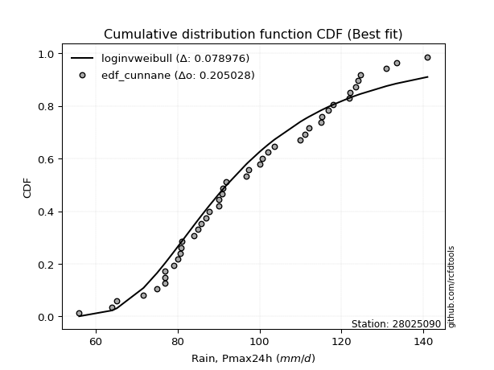</img>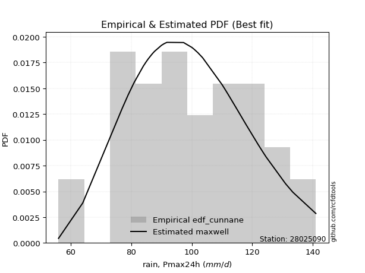</img>

</div>


### 11. Empirical - EDF Adamowski (1981)

The Adamowski formula in hydrology refers to a specific plotting position formula used for estimating the non-parametric empirical distribution of hydrological events (like flood peaks) to calculate their return periods. This formula provides an alternative to traditional parametric methods (like the Gumbel or Log Pearson Type III distributions). 

<div align="center">


$P=(m-0.25)/(n+0.5)$


</div>


**11.1. Empirical values**

<div align="center">

|                | 0                   | 1                    | 2                   | 3                   | 4                   | 5                   | 6                   | 7                  | 8                   | 9                  | 10                 | 11                 | 12                  | 13                  | 14                  | 15                 | 16                  | 17                | 18                 | 19                 | 20                 | 21                | 22                 | 23                 | 24                 | 25                 | 26                 | 27                 | 28                 | 29                 | 30                 | 31                 | 32                 | 33                 | 34                 | 35                 | 36                 | 37                 |
|:---------------|:--------------------|:---------------------|:--------------------|:--------------------|:--------------------|:--------------------|:--------------------|:-------------------|:--------------------|:-------------------|:-------------------|:-------------------|:--------------------|:--------------------|:--------------------|:-------------------|:--------------------|:------------------|:-------------------|:-------------------|:-------------------|:------------------|:-------------------|:-------------------|:-------------------|:-------------------|:-------------------|:-------------------|:-------------------|:-------------------|:-------------------|:-------------------|:-------------------|:-------------------|:-------------------|:-------------------|:-------------------|:-------------------|
| date           | 2012                | 1982                 | 1991                | 2003                | 2005                | 2002                | 1986                | 1995               | 1997                | 1994               | 2001               | 1978               | 1981                | 2004                | 1993                | 1979               | 2007                | 1988              | 2014               | 1999               | 2015               | 1992              | 1980               | 2011               | 1998               | 2006               | 2013               | 1989               | 1984               | 2000               | 1996               | 1990               | 1985               | 2010               | 1987               | 2008               | 1983               | 2009               |
| x              | 56.0                | 64.0                 | 75.0                | 77.0                | 77.0                | 79.0                | 80.8                | 81.0               | 84.0                | 85.0               | 85.7               | 86.8977523483704   | 87.7                | 90.0                | 90.0                | 90.8182021076523   | 91.0                | 91.8              | 97.3               | 100.0              | 100.7              | 102.0             | 103.6              | 110.0              | 111.0              | 112.0              | 115.0              | 115.2              | 116.8              | 118.0              | 121.9              | 122.0              | 123.4              | 124.0              | 124.6              | 131.0              | 133.4              | 141.0              |
| m              | 1                   | 2                    | 3                   | 4                   | 5                   | 6                   | 7                   | 8                  | 9                   | 10                 | 11                 | 12                 | 13                  | 14                  | 15                  | 16                 | 17                  | 18                | 19                 | 20                 | 21                 | 22                | 23                 | 24                 | 25                 | 26                 | 27                 | 28                 | 29                 | 30                 | 31                 | 32                 | 33                 | 34                 | 35                 | 36                 | 37                 | 38                 |
| empirical_dist | edf_adamowski       | edf_adamowski        | edf_adamowski       | edf_adamowski       | edf_adamowski       | edf_adamowski       | edf_adamowski       | edf_adamowski      | edf_adamowski       | edf_adamowski      | edf_adamowski      | edf_adamowski      | edf_adamowski       | edf_adamowski       | edf_adamowski       | edf_adamowski      | edf_adamowski       | edf_adamowski     | edf_adamowski      | edf_adamowski      | edf_adamowski      | edf_adamowski     | edf_adamowski      | edf_adamowski      | edf_adamowski      | edf_adamowski      | edf_adamowski      | edf_adamowski      | edf_adamowski      | edf_adamowski      | edf_adamowski      | edf_adamowski      | edf_adamowski      | edf_adamowski      | edf_adamowski      | edf_adamowski      | edf_adamowski      | edf_adamowski      |
| empirical      | 0.01948051948051948 | 0.045454545454545456 | 0.07142857142857142 | 0.09740259740259741 | 0.12337662337662338 | 0.14935064935064934 | 0.17532467532467533 | 0.2012987012987013 | 0.22727272727272727 | 0.2532467532467532 | 0.2792207792207792 | 0.3051948051948052 | 0.33116883116883117 | 0.35714285714285715 | 0.38311688311688313 | 0.4090909090909091 | 0.43506493506493504 | 0.461038961038961 | 0.487012987012987  | 0.512987012987013  | 0.538961038961039  | 0.564935064935065 | 0.5909090909090909 | 0.6168831168831169 | 0.6428571428571429 | 0.6688311688311688 | 0.6948051948051948 | 0.7207792207792207 | 0.7467532467532467 | 0.7727272727272727 | 0.7987012987012987 | 0.8246753246753247 | 0.8506493506493507 | 0.8766233766233766 | 0.9025974025974026 | 0.9285714285714286 | 0.9545454545454546 | 0.9805194805194806 |
| empirical_tr   | 1.019867549668874   | 1.0476190476190477   | 1.0769230769230769  | 1.1079136690647482  | 1.1407407407407408  | 1.1755725190839694  | 1.2125984251968505  | 1.2520325203252032 | 1.2941176470588236  | 1.3391304347826087 | 1.3873873873873874 | 1.4392523364485983 | 1.4951456310679614  | 1.5555555555555558  | 1.6210526315789475  | 1.6923076923076925 | 1.7701149425287355  | 1.855421686746988 | 1.9493670886075949 | 2.0533333333333332 | 2.1690140845070425 | 2.298507462686567 | 2.4444444444444446 | 2.610169491525424  | 2.8000000000000003 | 3.0196078431372544 | 3.2765957446808507 | 3.581395348837209  | 3.9487179487179485 | 4.3999999999999995 | 4.967741935483871  | 5.703703703703703  | 6.695652173913044  | 8.105263157894738  | 10.26666666666667  | 14.000000000000007 | 22.00000000000002  | 51.333333333333464 |

</div>


**11.2. Kolmogorov-Smirnov fit test (sorted by Δ)**


<div align="center">

|                | 0                   | 1                   | 2                  | 3                  | 4                   | 5                   | 6                   | 7                   | 8                  | 9                   | 10                  | 11                  | 12                  | 13                  | 14                 | 15                  | 16                 | 17                  | 18                  | 19                 | 20                  | 21                  | 22                  | 23                  | 24                  | 25                  | 26                  | 27                  | 28                  | 29                  | 30                  | 31                  | 32                  | 33                  | 34                 | 35                  | 36                  | 37                  | 38                 | 39                 | 40                  | 41                  | 42                  | 43                  | 44                  | 45                  | 46                  | 47                  | 48                  | 49                  | 50                  | 51                  | 52                  | 53                  | 54                  | 55                  | 56                  | 57                  | 58                  | 59                  | 60                  | 61                  | 62                  | 63                  | 64                  | 65                  | 66                  | 67                  | 68                 | 69                  | 70                  | 71                 | 72                  | 73                 | 74                    | 75                  | 76                  | 77                  | 78                 | 79                 | 80                  | 81                  | 82                  | 83                  | 84                  | 85                 | 86                 | 87                 | 88                 | 89                  | 90                 | 91                 |
|:---------------|:--------------------|:--------------------|:-------------------|:-------------------|:--------------------|:--------------------|:--------------------|:--------------------|:-------------------|:--------------------|:--------------------|:--------------------|:--------------------|:--------------------|:-------------------|:--------------------|:-------------------|:--------------------|:--------------------|:-------------------|:--------------------|:--------------------|:--------------------|:--------------------|:--------------------|:--------------------|:--------------------|:--------------------|:--------------------|:--------------------|:--------------------|:--------------------|:--------------------|:--------------------|:-------------------|:--------------------|:--------------------|:--------------------|:-------------------|:-------------------|:--------------------|:--------------------|:--------------------|:--------------------|:--------------------|:--------------------|:--------------------|:--------------------|:--------------------|:--------------------|:--------------------|:--------------------|:--------------------|:--------------------|:--------------------|:--------------------|:--------------------|:--------------------|:--------------------|:--------------------|:--------------------|:--------------------|:--------------------|:--------------------|:--------------------|:--------------------|:--------------------|:--------------------|:-------------------|:--------------------|:--------------------|:-------------------|:--------------------|:-------------------|:----------------------|:--------------------|:--------------------|:--------------------|:-------------------|:-------------------|:--------------------|:--------------------|:--------------------|:--------------------|:--------------------|:-------------------|:-------------------|:-------------------|:-------------------|:--------------------|:-------------------|:-------------------|
| station        | 28025090            | 28025090            | 28025090           | 28025090           | 28025090            | 28025090            | 28025090            | 28025090            | 28025090           | 28025090            | 28025090            | 28025090            | 28025090            | 28025090            | 28025090           | 28025090            | 28025090           | 28025090            | 28025090            | 28025090           | 28025090            | 28025090            | 28025090            | 28025090            | 28025090            | 28025090            | 28025090            | 28025090            | 28025090            | 28025090            | 28025090            | 28025090            | 28025090            | 28025090            | 28025090           | 28025090            | 28025090            | 28025090            | 28025090           | 28025090           | 28025090            | 28025090            | 28025090            | 28025090            | 28025090            | 28025090            | 28025090            | 28025090            | 28025090            | 28025090            | 28025090            | 28025090            | 28025090            | 28025090            | 28025090            | 28025090            | 28025090            | 28025090            | 28025090            | 28025090            | 28025090            | 28025090            | 28025090            | 28025090            | 28025090            | 28025090            | 28025090            | 28025090            | 28025090           | 28025090            | 28025090            | 28025090           | 28025090            | 28025090           | 28025090              | 28025090            | 28025090            | 28025090            | 28025090           | 28025090           | 28025090            | 28025090            | 28025090            | 28025090            | 28025090            | 28025090           | 28025090           | 28025090           | 28025090           | 28025090            | 28025090           | 28025090           |
| empirical_dist | edf_adamowski       | edf_adamowski       | edf_adamowski      | edf_adamowski      | edf_adamowski       | edf_adamowski       | edf_adamowski       | edf_adamowski       | edf_adamowski      | edf_adamowski       | edf_adamowski       | edf_adamowski       | edf_adamowski       | edf_adamowski       | edf_adamowski      | edf_adamowski       | edf_adamowski      | edf_adamowski       | edf_adamowski       | edf_adamowski      | edf_adamowski       | edf_adamowski       | edf_adamowski       | edf_adamowski       | edf_adamowski       | edf_adamowski       | edf_adamowski       | edf_adamowski       | edf_adamowski       | edf_adamowski       | edf_adamowski       | edf_adamowski       | edf_adamowski       | edf_adamowski       | edf_adamowski      | edf_adamowski       | edf_adamowski       | edf_adamowski       | edf_adamowski      | edf_adamowski      | edf_adamowski       | edf_adamowski       | edf_adamowski       | edf_adamowski       | edf_adamowski       | edf_adamowski       | edf_adamowski       | edf_adamowski       | edf_adamowski       | edf_adamowski       | edf_adamowski       | edf_adamowski       | edf_adamowski       | edf_adamowski       | edf_adamowski       | edf_adamowski       | edf_adamowski       | edf_adamowski       | edf_adamowski       | edf_adamowski       | edf_adamowski       | edf_adamowski       | edf_adamowski       | edf_adamowski       | edf_adamowski       | edf_adamowski       | edf_adamowski       | edf_adamowski       | edf_adamowski      | edf_adamowski       | edf_adamowski       | edf_adamowski      | edf_adamowski       | edf_adamowski      | edf_adamowski         | edf_adamowski       | edf_adamowski       | edf_adamowski       | edf_adamowski      | edf_adamowski      | edf_adamowski       | edf_adamowski       | edf_adamowski       | edf_adamowski       | edf_adamowski       | edf_adamowski      | edf_adamowski      | edf_adamowski      | edf_adamowski      | edf_adamowski       | edf_adamowski      | edf_adamowski      |
| p_dist         | logdgamma           | dgamma              | maxwell            | alpha              | kstwobign           | logncf              | logf                | logalpha            | loginvweibull      | logrice             | logt                | lognorm             | lognorm             | logcrystalball      | logexponnorm       | loglognorm          | logfatiguelife     | lognakagami         | genlogistic         | rayleigh           | invgamma            | logfisk             | fisk                | loginvgamma         | chi2                | logerlang           | lognct              | loggamma            | loggamma            | invgauss            | betaprime           | logpearson3         | rice                | nakagami            | loginvgauss        | weibull_min         | fatiguelife         | logmaxwell          | logkstwobign       | halfnorm           | mielke              | logweibull_min      | loggenlogistic      | f                   | loggompertz         | johnsonsu           | logloggamma         | erlang              | lograyleigh         | gamma               | pearson3            | logjohnsonsu        | t                   | nct                 | exponnorm           | truncnorm           | norm                | crystalball         | loglogistic         | logmielke           | loghalfnorm         | gumbel_r            | laplace_asymmetric  | loghypsecant        | logistic            | halflogistic        | ncf                 | loggumbel_l         | loggumbel_r        | moyal               | hypsecant           | loghalflogistic    | loglaplace          | logmoyal           | loglaplace_asymmetric | loggenexpon         | gumbel_l            | laplace             | wald               | logwald            | loggibrat           | gibrat              | logbetaprime        | genexpon            | expon               | pareto             | logpareto          | logexpon           | logchi2            | logtruncnorm        | invweibull         | gompertz           |
| delta          | 0.06982470067991509 | 0.09033126722189166 | 0.0921461852211839 | 0.0927476861237877 | 0.09338637351733625 | 0.09366916789057289 | 0.09546285013945499 | 0.09565789134474956 | 0.096066643249064  | 0.09623171954791787 | 0.09624636984236867 | 0.09625432764147179 | 0.09625432764147179 | 0.09625497262757865 | 0.0962553378582145 | 0.09625569677593526 | 0.0964988911082334 | 0.09659813023183861 | 0.09677858784922733 | 0.0970942049972423 | 0.09803482663400359 | 0.09835654047915132 | 0.09868862856903987 | 0.09964557397689155 | 0.10018737933702071 | 0.10096024501694689 | 0.10096719083342276 | 0.10105891440931447 | 0.10105891440931447 | 0.10148226343370115 | 0.10161826883470593 | 0.10239943083092162 | 0.10472019480736033 | 0.10504581192068818 | 0.1076708674875797 | 0.10978309049157964 | 0.10990433743206707 | 0.11056282156563801 | 0.1110583926972695 | 0.1120049009276688 | 0.11212711204421877 | 0.11212843475710754 | 0.11217670198239027 | 0.11226564952969154 | 0.11291864086097347 | 0.11365130765696474 | 0.11405590432631824 | 0.11471686036100504 | 0.11473151686737026 | 0.11475979332151126 | 0.11492875009359738 | 0.11612095650052223 | 0.11659957309663871 | 0.11687079684602614 | 0.11690381480365297 | 0.11691461071847215 | 0.11691465586312039 | 0.11691465863268874 | 0.11816662501354391 | 0.12068257250907666 | 0.12758480193126953 | 0.12771374524691648 | 0.12967359449055627 | 0.13363758918406998 | 0.13535163267604378 | 0.13908403946958947 | 0.14227042775573961 | 0.14400256030377034 | 0.1443054740738524 | 0.14472010213760156 | 0.14955750609203217 | 0.153873181015441  | 0.15746159822468087 | 0.1598019453858186 | 0.16285273751271856   | 0.17193238504626965 | 0.17594356715244452 | 0.17754835315107464 | 0.2011250477870081 | 0.205897929177845  | 0.23681895464261782 | 0.25957932129994427 | 0.26042748757643763 | 0.28227949937915753 | 0.28290214627760624 | 0.2829021552399553 | 0.3378208781589206 | 0.3378208812258695 | 0.3440363405618104 | 0.47258637452719365 | 0.6177209950843051 | 0.8847889887210303 |
| deltao         | 0.2206211327378371  | 0.2206211327378371  | 0.2206211327378371 | 0.2206211327378371 | 0.2206211327378371  | 0.2206211327378371  | 0.2206211327378371  | 0.2206211327378371  | 0.2206211327378371 | 0.2206211327378371  | 0.2206211327378371  | 0.2206211327378371  | 0.2206211327378371  | 0.2206211327378371  | 0.2206211327378371 | 0.2206211327378371  | 0.2206211327378371 | 0.2206211327378371  | 0.2206211327378371  | 0.2206211327378371 | 0.2206211327378371  | 0.2206211327378371  | 0.2206211327378371  | 0.2206211327378371  | 0.2206211327378371  | 0.2206211327378371  | 0.2206211327378371  | 0.2206211327378371  | 0.2206211327378371  | 0.2206211327378371  | 0.2206211327378371  | 0.2206211327378371  | 0.2206211327378371  | 0.2206211327378371  | 0.2206211327378371 | 0.2206211327378371  | 0.2206211327378371  | 0.2206211327378371  | 0.2206211327378371 | 0.2206211327378371 | 0.2206211327378371  | 0.2206211327378371  | 0.2206211327378371  | 0.2206211327378371  | 0.2206211327378371  | 0.2206211327378371  | 0.2206211327378371  | 0.2206211327378371  | 0.2206211327378371  | 0.2206211327378371  | 0.2206211327378371  | 0.2206211327378371  | 0.2206211327378371  | 0.2206211327378371  | 0.2206211327378371  | 0.2206211327378371  | 0.2206211327378371  | 0.2206211327378371  | 0.2206211327378371  | 0.2206211327378371  | 0.2206211327378371  | 0.2206211327378371  | 0.2206211327378371  | 0.2206211327378371  | 0.2206211327378371  | 0.2206211327378371  | 0.2206211327378371  | 0.2206211327378371  | 0.2206211327378371 | 0.2206211327378371  | 0.2206211327378371  | 0.2206211327378371 | 0.2206211327378371  | 0.2206211327378371 | 0.2206211327378371    | 0.2206211327378371  | 0.2206211327378371  | 0.2206211327378371  | 0.2206211327378371 | 0.2206211327378371 | 0.2206211327378371  | 0.2206211327378371  | 0.2206211327378371  | 0.2206211327378371  | 0.2206211327378371  | 0.2206211327378371 | 0.2206211327378371 | 0.2206211327378371 | 0.2206211327378371 | 0.2206211327378371  | 0.2206211327378371 | 0.2206211327378371 |
| eval           | Δo > Δ              | Δo > Δ              | Δo > Δ             | Δo > Δ             | Δo > Δ              | Δo > Δ              | Δo > Δ              | Δo > Δ              | Δo > Δ             | Δo > Δ              | Δo > Δ              | Δo > Δ              | Δo > Δ              | Δo > Δ              | Δo > Δ             | Δo > Δ              | Δo > Δ             | Δo > Δ              | Δo > Δ              | Δo > Δ             | Δo > Δ              | Δo > Δ              | Δo > Δ              | Δo > Δ              | Δo > Δ              | Δo > Δ              | Δo > Δ              | Δo > Δ              | Δo > Δ              | Δo > Δ              | Δo > Δ              | Δo > Δ              | Δo > Δ              | Δo > Δ              | Δo > Δ             | Δo > Δ              | Δo > Δ              | Δo > Δ              | Δo > Δ             | Δo > Δ             | Δo > Δ              | Δo > Δ              | Δo > Δ              | Δo > Δ              | Δo > Δ              | Δo > Δ              | Δo > Δ              | Δo > Δ              | Δo > Δ              | Δo > Δ              | Δo > Δ              | Δo > Δ              | Δo > Δ              | Δo > Δ              | Δo > Δ              | Δo > Δ              | Δo > Δ              | Δo > Δ              | Δo > Δ              | Δo > Δ              | Δo > Δ              | Δo > Δ              | Δo > Δ              | Δo > Δ              | Δo > Δ              | Δo > Δ              | Δo > Δ              | Δo > Δ              | Δo > Δ             | Δo > Δ              | Δo > Δ              | Δo > Δ             | Δo > Δ              | Δo > Δ             | Δo > Δ                | Δo > Δ              | Δo > Δ              | Δo > Δ              | Δo > Δ             | Δo > Δ             | Δo <= Δ             | Δo <= Δ             | Δo <= Δ             | Δo <= Δ             | Δo <= Δ             | Δo <= Δ            | Δo <= Δ            | Δo <= Δ            | Δo <= Δ            | Δo <= Δ             | Δo <= Δ            | Δo <= Δ            |
| fit            | 1                   | 1                   | 1                  | 1                  | 1                   | 1                   | 1                   | 1                   | 1                  | 1                   | 1                   | 1                   | 1                   | 1                   | 1                  | 1                   | 1                  | 1                   | 1                   | 1                  | 1                   | 1                   | 1                   | 1                   | 1                   | 1                   | 1                   | 1                   | 1                   | 1                   | 1                   | 1                   | 1                   | 1                   | 1                  | 1                   | 1                   | 1                   | 1                  | 1                  | 1                   | 1                   | 1                   | 1                   | 1                   | 1                   | 1                   | 1                   | 1                   | 1                   | 1                   | 1                   | 1                   | 1                   | 1                   | 1                   | 1                   | 1                   | 1                   | 1                   | 1                   | 1                   | 1                   | 1                   | 1                   | 1                   | 1                   | 1                   | 1                  | 1                   | 1                   | 1                  | 1                   | 1                  | 1                     | 1                   | 1                   | 1                   | 1                  | 1                  | 0                   | 0                   | 0                   | 0                   | 0                   | 0                  | 0                  | 0                  | 0                  | 0                   | 0                  | 0                  |
| n              | 38                  | 38                  | 38                 | 38                 | 38                  | 38                  | 38                  | 38                  | 38                 | 38                  | 38                  | 38                  | 38                  | 38                  | 38                 | 38                  | 38                 | 38                  | 38                  | 38                 | 38                  | 38                  | 38                  | 38                  | 38                  | 38                  | 38                  | 38                  | 38                  | 38                  | 38                  | 38                  | 38                  | 38                  | 38                 | 38                  | 38                  | 38                  | 38                 | 38                 | 38                  | 38                  | 38                  | 38                  | 38                  | 38                  | 38                  | 38                  | 38                  | 38                  | 38                  | 38                  | 38                  | 38                  | 38                  | 38                  | 38                  | 38                  | 38                  | 38                  | 38                  | 38                  | 38                  | 38                  | 38                  | 38                  | 38                  | 38                  | 38                 | 38                  | 38                  | 38                 | 38                  | 38                 | 38                    | 38                  | 38                  | 38                  | 38                 | 38                 | 38                  | 38                  | 38                  | 38                  | 38                  | 38                 | 38                 | 38                 | 38                 | 38                  | 38                 | 38                 |
| best_fit       | 1                   | 0                   | 0                  | 0                  | 0                   | 0                   | 0                   | 0                   | 0                  | 0                   | 0                   | 0                   | 0                   | 0                   | 0                  | 0                   | 0                  | 0                   | 0                   | 0                  | 0                   | 0                   | 0                   | 0                   | 0                   | 0                   | 0                   | 0                   | 0                   | 0                   | 0                   | 0                   | 0                   | 0                   | 0                  | 0                   | 0                   | 0                   | 0                  | 0                  | 0                   | 0                   | 0                   | 0                   | 0                   | 0                   | 0                   | 0                   | 0                   | 0                   | 0                   | 0                   | 0                   | 0                   | 0                   | 0                   | 0                   | 0                   | 0                   | 0                   | 0                   | 0                   | 0                   | 0                   | 0                   | 0                   | 0                   | 0                   | 0                  | 0                   | 0                   | 0                  | 0                   | 0                  | 0                     | 0                   | 0                   | 0                   | 0                  | 0                  | 0                   | 0                   | 0                   | 0                   | 0                   | 0                  | 0                  | 0                  | 0                  | 0                   | 0                  | 0                  |
| best_fit_sort  | 1                   | 2                   | 3                  | 4                  | 5                   | 6                   | 7                   | 8                   | 9                  | 10                  | 11                  | 12                  | 13                  | 14                  | 15                 | 16                  | 17                 | 18                  | 19                  | 20                 | 21                  | 22                  | 23                  | 24                  | 25                  | 26                  | 27                  | 28                  | 29                  | 30                  | 31                  | 32                  | 33                  | 34                  | 35                 | 36                  | 37                  | 38                  | 39                 | 40                 | 41                  | 42                  | 43                  | 44                  | 45                  | 46                  | 47                  | 48                  | 49                  | 50                  | 51                  | 52                  | 53                  | 54                  | 55                  | 56                  | 57                  | 58                  | 59                  | 60                  | 61                  | 62                  | 63                  | 64                  | 65                  | 66                  | 67                  | 68                  | 69                 | 70                  | 71                  | 72                 | 73                  | 74                 | 75                    | 76                  | 77                  | 78                  | 79                 | 80                 | 81                  | 82                  | 83                  | 84                  | 85                  | 86                 | 87                 | 88                 | 89                 | 90                  | 91                 | 92                 |

</div>


<div align="center">

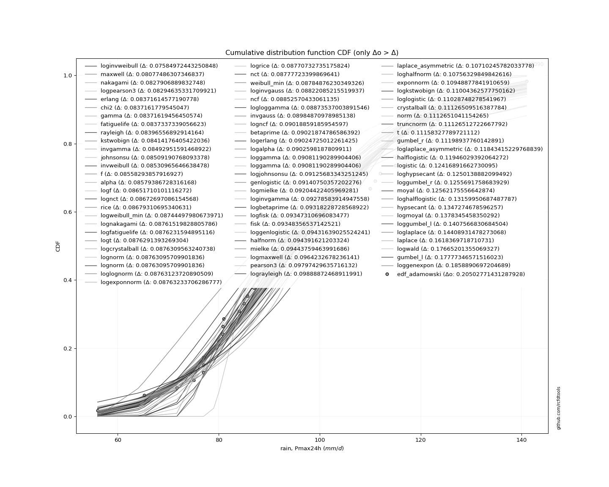</img>

</div>


**11.3. Best fit**

<div align="center">

|   id |   station | empirical_dist   | p_dist    |     delta |   deltao | eval   |   fit |   n |   best_fit |   best_fit_sort |
|-----:|----------:|:-----------------|:----------|----------:|---------:|:-------|------:|----:|-----------:|----------------:|
|    0 |  28025090 | edf_adamowski    | logdgamma | 0.0698247 | 0.220621 | Δo > Δ |     1 |  38 |          1 |               1 |

</div>


<div align="center">

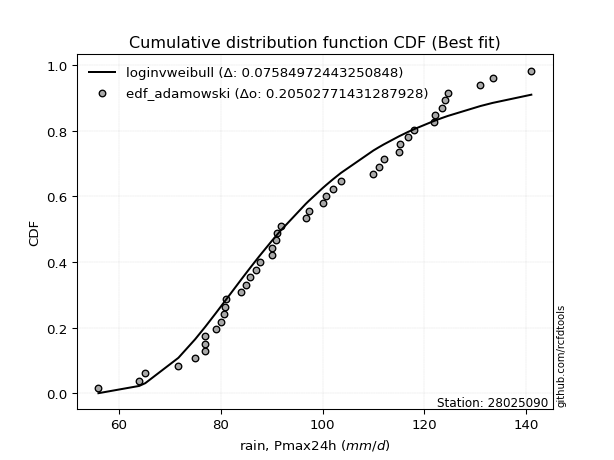</img></img>

</div>


## C. Best fit & Estimate extreme values for specific return periods - Tr


### 1. Best fit (ordered by delta Δ)

<div align="center">

|   id |   station | empirical_dist   | p_dist    |     delta |   deltao | eval   |   fit |   n |   best_fit |   best_fit_sort |
|-----:|----------:|:-----------------|:----------|----------:|---------:|:-------|------:|----:|-----------:|----------------:|
|    0 |  28025090 | edf_california   | logdgamma | 0.0632978 | 0.220621 | Δo > Δ |     1 |  38 |          1 |               1 |
|    1 |  28025090 | edf_hazen        | logdgamma | 0.0672615 | 0.220621 | Δo > Δ |     1 |  38 |          1 |               2 |
|    2 |  28025090 | edf_gringorten   | logdgamma | 0.0678828 | 0.220621 | Δo > Δ |     1 |  38 |          1 |               3 |
|    3 |  28025090 | edf_cunnane      | logdgamma | 0.0682948 | 0.220621 | Δo > Δ |     1 |  38 |          1 |               4 |
|    4 |  28025090 | edf_blom         | logdgamma | 0.0685515 | 0.220621 | Δo > Δ |     1 |  38 |          1 |               5 |
|    5 |  28025090 | edf_tukey        | logdgamma | 0.0689777 | 0.220621 | Δo > Δ |     1 |  38 |          1 |               6 |
|    6 |  28025090 | edf_beard        | logdgamma | 0.0692156 | 0.220621 | Δo > Δ |     1 |  38 |          1 |               7 |
|    7 |  28025090 | edf_jenkinson    | logdgamma | 0.0692156 | 0.220621 | Δo > Δ |     1 |  38 |          1 |               8 |
|    8 |  28025090 | edf_chegodayev   | logdgamma | 0.0693174 | 0.220621 | Δo > Δ |     1 |  38 |          1 |               9 |
|    9 |  28025090 | edf_adamowski    | logdgamma | 0.0698247 | 0.220621 | Δo > Δ |     1 |  38 |          1 |              10 |
|   10 |  28025090 | edf_weibull      | logdgamma | 0.0723222 | 0.220621 | Δo > Δ |     1 |  38 |          1 |              11 |

</div>

:file_folder:Tables: [bestfit_28025090.csv](table/bestfit_28025090.csv) | [extreme_28025090.csv](table/extreme_28025090.csv)


### 2. Extreme values

In hydrology, a return period (or recurrence interval $Tr$) is the statistical average time between extreme events like floods or droughts of a specific magnitude, indicating how rare an event is, with a 100-year flood, for example, having a 1% chance of occurring in any given year, not that it happens exactly every century. It is a key tool for infrastructure design (like bridges or dams) and risk assessment, calculated from historical data to determine the probability of future events, although it is important to remember it is statistical average, and events can cluster or be missed.

> risk_rate: assuming the return period as the project useful life.

|   id |      tr |   prob_l |     prob_g |    alpha |   betaprime |    chi2 |   crystalball |   dgamma |   erlang |    expon |   exponnorm |        f |   fatiguelife |    fisk |    gamma |   genexpon |   genlogistic |   gibrat |   gompertz |   gumbel_l |   gumbel_r |   halflogistic |   halfnorm |   hypsecant |   invgamma |   invgauss |       invweibull |   johnsonsu |   kstwobign |   laplace |   laplace_asymmetric |   loggamma |   logistic |   lognorm |   maxwell |   mielke |    moyal |   nakagami |     ncf |      nct |     norm |   pareto |   pearson3 |   rayleigh |     rice |       t |   truncnorm |     wald |   weibull_min |   logalpha |   logbetaprime |          logchi2 |   logcrystalball |   logdgamma |   logerlang |   logexpon |   logexponnorm |     logf |   logfatiguelife |   logfisk |   loggenexpon |   loggenlogistic |   loggibrat |   loggompertz |   loggumbel_l |   loggumbel_r |   loghalflogistic |   loghalfnorm |   loghypsecant |   loginvgamma |   loginvgauss |   loginvweibull |   logjohnsonsu |   logkstwobign |   loglaplace |   loglaplace_asymmetric |   logloggamma |   loglogistic |   loglognorm |   logmaxwell |   logmielke |   logmoyal |   lognakagami |   logncf |   lognct |   logpareto |   logpearson3 |   lograyleigh |   logrice |     logt |   logtruncnorm |   logwald |   logweibull_min |   station |   n |   risk_rate |
|-----:|--------:|---------:|-----------:|---------:|------------:|--------:|--------------:|---------:|---------:|---------:|------------:|---------:|--------------:|--------:|---------:|-----------:|--------------:|---------:|-----------:|-----------:|-----------:|---------------:|-----------:|------------:|-----------:|-----------:|-----------------:|------------:|------------:|----------:|---------------------:|-----------:|-----------:|----------:|----------:|---------:|---------:|-----------:|--------:|---------:|---------:|---------:|-----------:|-----------:|---------:|--------:|------------:|---------:|--------------:|-----------:|---------------:|-----------------:|-----------------:|------------:|------------:|-----------:|---------------:|---------:|-----------------:|----------:|--------------:|-----------------:|------------:|--------------:|--------------:|--------------:|------------------:|--------------:|---------------:|--------------:|--------------:|----------------:|---------------:|---------------:|-------------:|------------------------:|--------------:|--------------:|-------------:|-------------:|------------:|-----------:|--------------:|---------:|---------:|------------:|--------------:|--------------:|----------:|---------:|---------------:|----------:|-----------------:|----------:|----:|------------:|
|    0 |    2    | 0.5      | 0.5        |  98.2418 |     97.4928 |  98.9   |       99.8846 |  98.4264 |  99.7385 |  86.4185 |     99.8839 |  99.5855 |        99.405 |  98.381 |  99.7441 |    86.4481 |       98.2907 |  93.8364 |    132.523 |    103.195 |    96.5744 |        94.9287 |    95.7601 |     99.8846 |    98.7434 |     96.711 |     59.4275      |      99.675 |      95.953 |   99.8846 |              94.5434 |    97.1512 |    99.8846 |   97.7826 |   98.1613 |  99.1846 |  95.5057 |    98.8524 | 100.149 |  99.8827 |  99.8846 |  86.4185 |    99.7552 |    97.5501 |  99.3561 |  99.872 |     99.8846 |  93.353  |        99.727 |    97.5019 |        91.2096 |     95.547       |          97.7826 |     98.3145 |     97.1615 |    82.4101 |        97.7825 |  97.7693 |          97.7763 |   98.3624 |       91.3523 |           99.188 |     91.8297 |       100.315 |       101.203 |       94.4779 |           92.8775 |       93.6823 |        97.7826 |        97.405 |       96.2866 |         95.2211 |        99.9715 |        93.5431 |      97.7826 |                 105.929 |       99.7818 |       97.7826 |      97.7824 |      96.0481 |     101.747 |    93.435  |       97.7648 |  97.8225 |  97.0172 |     82.4101 |       99.1503 |       95.4407 |   97.7823 |  97.7847 |        73.0672 |   91.3689 |           99.747 |  28025090 |  38 |    0.75     |
|    1 |    2.33 | 0.570815 | 0.429185   | 101.942  |    101.183  | 102.538 |      103.48   | 104.264  | 103.337  |  93.1206 |    103.48   | 103.191  |       103.001 | 101.877 | 103.344  |    93.14   |      101.837  |  95.6579 |    132.955 |    106.323 |    99.9062 |        98.3543 |    99.6407 |    102.762  |   102.386  |    100.599 |     62.1575      |     103.277 |     100.201 |  102.061  |              98.0175 |   100.926  |   103.053  |  101.503  |  101.897  | 102.642  |  98.6597 |   102.445  | 105.858 | 103.479  | 103.48   |  93.1206 |   103.355  |   101.341  | 103.056  | 103.47  |    103.48   |  95.7107 |       103.442 |   101.28   |        99.0556 |    114.431       |         101.503  |    104.297  |    100.936  |    89.7326 |       101.503  | 101.508  |         101.491  |  101.859  |       96.5391 |          102.646 |     93.5833 |       104.121 |       104.545 |       97.8045 |           96.241  |       97.5353 |       100.749  |       101.147 |      100.118  |         99.8277 |       103.617  |        98.4651 |     100.018  |                 109.887 |      103.413  |      101.054  |     101.503  |      99.8478 |     105.895 |    96.5465 |      101.483  | 101.575  | 100.804  |     89.7326 |      102.848  |       99.2728 |  101.504  | 101.505  |        77.0504 |   93.634  |          103.415 |  28025090 |  38 |    0.729209 |
|    2 |    5    | 0.8      | 0.2        | 116.539  |    116.245  | 116.542 |      116.843  | 115.918  | 116.787  | 126.63   |    116.843  | 116.756  |       116.628 | 116.577 | 116.801  |   126.598  |      116.407  | 106.144  |    134.35  |    116.429 |   114.381  |       113.855  |   116.052  |    114.305  |   116.593  |    116.76  |    133.472       |     116.774 |     118.246 |  112.94   |             115.387  |   116.572  |   115.285  |  116.615  |  116.6    | 116.581  | 113.269  |   116.672  | 129.831 | 116.844  | 116.843  | 126.63   |   116.804  |   116.518  | 116.956  | 116.84  |    116.843  | 108.909  |       117.144 |   116.994  |       136.196  |    322.136       |         116.615  |    117.522  |    116.575  |   137.338  |       116.615  | 116.715  |         116.603  |  116.565  |      120.728  |          116.582 |    104.351  |       117.626 |       116.115 |      113.671  |          113.049  |      115.66   |       113.581  |       116.544 |      116.455  |        122.571  |       117.022  |       122.429  |     111.982  |                 120.655 |      116.918  |      114.743  |     116.615  |     116.321  |     119.621 |   112.366  |      116.592  | 116.907  | 116.764  |    137.338  |      116.944  |      116.219  |  116.618  | 116.615  |        96.7709 |  107.392  |          117.021 |  28025090 |  38 |    0.67232  |
|    3 |   10    | 0.9      | 0.1        | 127.029  |    127.544  | 126.256 |      125.707  | 124.151  | 125.778  | 157.048  |    125.708  | 125.901  |       125.898 | 128.734 | 125.797  |   156.97   |      127.738  | 118.098  |    135.127 |    122.056 |   126.171  |       126.727  |   128.195  |    123.522  |   126.634  |    129.095 |    663.239       |     125.828 |     131.985 |  122.816  |             131.155  |   128.543  |   124.294  |  127.861  |  126.948  | 127.625  | 125.989  |   126.732  | 148.475 | 125.711  | 125.707  | 157.048  |   125.789  |   127.339  | 126.27   | 125.71  |    125.707  | 122.916  |       126.047 |   129.082  |       170.026  |    919.696       |         127.861  |    127.897  |    128.536  |   202.108  |       127.861  | 128.053  |         127.872  |  128.737  |      141.94   |          127.623 |    118.143  |       125.986 |       123.103 |      128.478  |          129.218  |      131.208  |       124.992  |       128.207 |      129.447  |        144.874  |       125.715  |       144.514  |     124.078  |                 125.546 |      125.854  |      125.998  |     127.862  |     129.518  |     127.701 |   128.236  |      127.843  | 128.415  | 129.273  |    202.108  |      126.522  |      130.041  |  127.866  | 127.862  |       112.407  |  124.209  |          125.97  |  28025090 |  38 |    0.651322 |
|    4 |   15    | 0.933333 | 0.0666667  | 132.529  |    133.621  | 131.232 |      130.131  | 128.627  | 130.285  | 174.842  |    130.132  | 130.509  |       130.594 | 135.881 | 130.307  |   174.737  |      134.03   | 126.343  |    135.479 |    124.604 |   132.822  |       134.012  |   134.515  |    128.783  |   131.841  |    135.769 |   1995.97        |     130.376 |     139.279 |  128.593  |             140.379  |   135.056  |   129.202  |  133.873  |  132.257  | 133.993  | 133.371  |   131.903  | 158.719 | 130.137  | 130.131  | 174.842  |   130.291  |   132.915  | 130.938  | 130.136 |    130.131  | 131.911  |       130.417 |   135.684  |       190.561  |   1746.8         |         133.872  |    133.924  |    135.042  |   253.358  |       133.873  | 134.121  |         133.904  |  135.896  |      154.409  |          133.989 |    128.705  |       129.981 |       126.405 |      137.668  |          139.373  |      140.109  |       132.011  |       134.514 |      136.694  |        159.203  |       129.973  |       157.814  |     131.751  |                 128.412 |      130.298  |      132.587  |     133.873  |     136.86   |     131.756 |   138.455  |      133.859  | 134.599  | 136.189  |    253.358  |      131.344  |      137.793  |  133.878  | 133.875  |       119.766  |  136.373  |          130.402 |  28025090 |  38 |    0.644736 |
|    5 |   20    | 0.95     | 0.05       | 136.233  |    137.77   | 134.537 |      133.028  | 131.709  | 133.244  | 187.467  |    133.029  | 133.542  |       133.694 | 141.05  | 133.268  |   187.342  |      138.41   | 132.81   |    135.698 |    126.19  |   137.479  |       139.115  |   138.728  |    132.493  |   135.324  |    140.334 |   4431.03        |     133.365 |     144.193 |  132.691  |             146.923  |   139.531  |   132.594  |  137.962  |  135.78   | 138.557  | 138.599  |   135.336  | 165.796 | 133.035  | 133.028  | 187.467  |   133.247  |   136.621  | 134.001  | 133.034 |    133.028  | 138.613  |       133.25  |   140.231  |       205.586  |   2778.55        |         137.962  |    138.239  |    139.512  |   297.424  |       137.962  | 138.252  |         138.01   |  141.075  |      163.346  |          138.552 |    137.647  |       132.535 |       128.504 |      144.491  |          146.959  |      146.376  |       137.199  |       138.832 |      141.746  |        170.071  |       132.729  |       167.457  |     137.481  |                 130.485 |      133.202  |      137.342  |     137.962  |     141.961  |     134.506 |   146.181  |      137.953  | 138.819  | 140.988  |    297.424  |      134.511  |      143.199  |  137.968  | 137.965  |       124.09   |  146.205  |          133.291 |  28025090 |  38 |    0.641514 |
|    6 |   25    | 0.96     | 0.04       | 139.013  |    140.914  | 136.994 |      135.16   | 134.057  | 135.426  | 197.259  |    135.162  | 135.783  |       135.99  | 145.136 | 135.451  |   197.12   |      141.774  | 138.202  |    135.854 |    127.319 |   141.067  |       143.048  |   141.863  |    135.365  |   137.927  |    143.796 |   8241.12        |     135.571 |     147.873 |  135.871  |             151.999  |   142.937  |   135.19   |  141.051  |  138.396  | 142.144  | 142.651  |   137.886  | 171.203 | 135.168  | 135.16   | 197.259  |   135.426  |   139.374  | 136.258  | 135.168 |    135.16   | 143.982  |       135.321 |   143.697  |       217.535  |   3999.69        |         141.051  |    141.62   |    142.914  |   336.816  |       141.051  | 141.374  |         141.114  |  145.17   |      170.346  |          142.138 |    145.574  |       134.385 |       130.02  |      149.976  |          153.085  |      151.22   |       141.353  |       142.11  |      145.63   |        178.946  |       134.74   |       175.064  |     142.097  |                 132.115 |      135.336  |      141.095  |     141.052  |     145.87   |     136.604 |   152.465  |      141.046  | 142.015  | 144.665  |    336.816  |      136.846  |      147.353  |  141.058  | 141.056  |       126.943  |  154.59   |          135.411 |  28025090 |  38 |    0.639603 |
|    7 |   50    | 0.98     | 0.02       | 147.234  |    150.358  | 144.14  |      141.267  | 141.168  | 141.692  | 227.678  |    141.269  | 142.238  |       142.623 | 158.365 | 141.721  |   227.492  |      152.096  | 157.207  |    136.277 |    130.383 |   152.118  |       155.163  |   150.975  |    144.269  |   145.561  |    154.196 |  56427.8         |     141.915 |     158.68  |  145.747  |             167.767  |   153.243  |   143.119  |  150.287  |  145.983  | 153.652  | 155.232  |   145.283  | 187.667 | 141.278  | 141.267  | 227.678  |   141.682  |   147.367  | 142.734  | 141.278 |    141.267  | 161.511  |       141.182 |   154.218  |       256.504  |  12642.1         |         150.287  |    152.378  |    153.204  |   495.662  |       150.287  | 150.716  |         150.402  |  158.433  |      192.561  |          153.642 |    177.339  |       139.545 |       134.224 |      168.216  |          173.61   |      166.23   |       155.048  |       151.988 |      157.588  |        209.302  |       140.413  |       199.458  |     157.446  |                 137.312 |      141.426  |      153.206  |     150.288  |     157.829  |     143.11  |   173.746  |      150.296  | 151.604  | 155.923  |    495.662  |      143.534  |      160.105  |  150.296  | 150.298  |       133.364  |  185.46   |          141.449 |  28025090 |  38 |    0.63583  |
|    8 |   75    | 0.986667 | 0.0133333  | 151.812  |    155.71   | 148.043 |      144.543  | 145.228  | 145.064  | 245.471  |    144.546  | 145.725  |       146.22  | 166.546 | 145.096  |   245.258  |      158.078  | 170.044  |    136.491 |    131.932 |   158.541  |       162.206  |   155.935  |    149.473  |   149.772  |    160.082 | 173101           |     145.334 |     164.626 |  151.524  |             176.99   |   159.13   |   147.698  |  155.49   |  150.107  | 160.7    | 162.588  |   149.306  | 197.14  | 144.557  | 144.543  | 245.471  |   145.049  |   151.715  | 146.216  | 144.557 |    144.543  | 172.298  |       144.284 |   160.249  |       280.74   |  25056           |         155.489  |    158.886  |    159.081  |   621.352  |       155.49   | 155.983  |         155.64   |  166.638  |      205.939  |          160.689 |    202.629  |       142.232 |       136.401 |      179.821  |          186.784  |      175.018  |       163.658  |       157.604 |      164.557  |        229.26   |       143.401  |       214.301  |     167.182  |                 140.446 |      144.681  |      160.67   |     155.491  |     164.736  |     147.002 |   187.541  |      155.508  | 157.028  | 162.444  |    621.352  |      147.119  |      167.501  |  155.5    | 155.504  |       135.755  |  207.447  |          144.668 |  28025090 |  38 |    0.634587 |
|    9 |  100    | 0.99     | 0.01       | 154.978  |    159.449  | 150.711 |      146.759  | 148.074  | 147.35   | 258.096  |    146.763  | 148.092  |       148.668 | 172.574 | 147.383  |   257.864  |      162.308  | 179.988  |    136.631 |    132.946 |   163.087  |       167.191  |   159.314  |    153.164  |   152.667  |    164.186 | 382801           |     147.654 |     168.7   |  155.622  |             183.535  |   163.261  |   150.932  |  159.11   |  152.917  | 165.866  | 167.807  |   152.047  | 203.817 | 146.774  | 146.759  | 258.096  |   147.33   |   154.678  | 148.572  | 146.774 |    146.759  | 180.162  |       146.365 |   164.492  |       298.643  |  40871.6         |         159.11   |    163.613  |    163.205  |   729.42   |       159.11   | 159.65   |         159.287  |  172.685  |      215.625  |          165.853 |    224.673  |       144.019 |       137.845 |      188.515  |          196.708  |      181.269  |       170.054  |       161.534 |      169.508  |        244.525  |       145.398  |       225.103  |     174.452  |                 142.713 |      146.877  |      166.157  |     159.112  |     169.614  |     149.834 |   197.988  |      159.136  | 160.813  | 167.059  |    729.42   |      149.54   |      172.734  |  159.121  | 159.128  |       137.006  |  225.104  |          146.838 |  28025090 |  38 |    0.633968 |
|   10 |  200    | 0.995    | 0.005      | 162.376  |    168.302  | 156.843 |      151.786  | 154.832  | 152.546  | 288.515  |    151.791  | 153.49   |       154.265 | 187.936 | 152.584  |   288.236  |      172.466  | 207.042  |    136.935 |    135.148 |   174.016  |       179.175  |   167.042  |    162.056  |   159.378  |    173.874 |      2.58066e+06 |     152.935 |     178.083 |  165.498  |             199.302  |   173.105  |   158.688  |  167.638  |  159.344  | 178.933  | 180.382  |   158.317  | 219.822 | 151.804  | 151.786  | 288.515  |   152.515  |   161.456  | 153.925  | 151.804 |    151.786  | 199.751  |       151.034 |   174.633  |       344.387  | 134378           |         167.638  |    175.413  |    173.029  |  1073.42   |       167.638  | 168.296  |         167.886  |  188.102  |      239.678  |          178.917 |    297.558  |       147.984 |       141.035 |      211.176  |          222.778  |      196.419  |       186.508  |       170.862 |      181.502  |        285.513  |       149.858  |       252.1    |     193.296  |                 148.326 |      151.841  |      180.096  |     167.64   |     181.323  |     156.977 |   225.61   |      167.684  | 169.76   | 178.188  |   1073.42   |      155.012  |      185.331  |  167.651  | 167.665  |       138.955  |  275.898  |          151.736 |  28025090 |  38 |    0.633042 |
|   11 |  250    | 0.996    | 0.004      | 164.698  |    171.115  | 158.739 |      153.322  | 156.983  | 154.138  | 298.307  |    153.327  | 155.147  |       155.988 | 193.151 | 154.176  |   298.014  |      175.73   | 216.749  |    137.024 |    135.797 |   177.53   |       183.028  |   169.42   |    164.919  |   161.469  |    176.941 |      4.76625e+06 |     154.554 |     180.987 |  168.678  |             204.379  |   176.25   |   161.178  |  170.334  |  161.323  | 183.34   | 184.43   |   160.247  | 224.962 | 153.341  | 153.322  | 298.307  |   154.103  |   163.543  | 155.562  | 153.341 |    153.322  | 206.232  |       152.448 |   177.882  |       359.949  | 197698           |         170.334  |    179.345  |    176.167  |  1215.59   |       170.334  | 171.031  |         170.607  |  193.338  |      247.651  |          183.323 |    329.119  |       149.172 |       141.987 |      219.025  |          231.872  |      201.329  |       192.136  |       173.832 |      185.392  |        300.098  |       151.201  |       261.093  |     199.786  |                 150.18  |      153.353  |      184.815  |     170.337  |     185.088  |     159.39  |   235.298  |      170.387  | 172.598  | 181.782  |   1215.59   |      156.678  |      189.391  |  170.347  | 170.365  |       139.356  |  295.109  |          153.227 |  28025090 |  38 |    0.632858 |
|   12 |  500    | 0.998    | 0.002      | 171.766  |    179.77   | 164.427 |      157.878  | 163.6    | 158.867  | 328.726  |    157.884  | 160.083  |       161.132 | 210.261 | 158.91   |   328.386  |      185.856  | 250.296  |    137.281 |    137.654 |   188.435  |       194.986  |   176.508  |    173.81   |   167.785  |    186.335 |      3.20023e+07 |     159.37  |     189.69  |  178.553  |             220.146  |   185.974  |   168.9    |  178.588  |  167.227  | 197.705  | 197.004  |   166.007  | 240.941 | 157.9    | 157.878  | 328.726  |   158.822  |   169.769  | 160.422  | 157.9   |    157.878  | 226.839  |       156.6   |   187.959  |       411.099  | 660860           |         178.587  |    192.004  |    185.868  |  1788.88   |       178.588  | 179.409  |         178.942  |  210.521  |      273.182  |          197.686 |    466.293  |       152.632 |       144.754 |      245.293  |          262.532  |      216.711  |       210.725  |       182.983 |      197.6    |        350.283  |       155.126  |       290.013  |     221.366  |                 156.087 |      157.824  |      200.249  |     178.59   |     196.792  |     167.296 |   268.125  |      178.663  | 181.312  | 193.015  |   1788.88   |      161.594  |      202.039  |  178.602  | 178.631  |       140.17   |  365.541  |          157.63  |  28025090 |  38 |    0.632489 |
|   13 |  750    | 0.998667 | 0.00133333 | 175.811  |    184.787  | 167.627 |      160.409  | 167.431  | 161.501  | 346.519  |    160.415  | 162.838  |       164.012 | 220.947 | 161.545  |   346.152  |      191.774  | 272.481  |    137.418 |    138.647 |   194.81   |       201.977  |   180.468  |    179.011  |   171.37   |    191.749 |      9.74203e+07 |     162.056 |     194.578 |  184.33   |             229.37   |   191.644  |   173.412  |  183.344  |  170.529  | 206.611  | 204.36   |   169.228  | 250.315 | 160.433  | 160.409  | 346.519  |   161.448  |   173.25   | 163.124  | 160.432 |    160.409  | 239.194  |       158.883 |   193.856  |       443.115  |      1.3449e+06  |         183.343  |    199.74   |    191.525  |  2242.5    |       183.344  | 184.241  |         183.75   |  221.258  |      288.68   |          206.59  |    587.116  |       154.515 |       146.254 |      262.084  |          282.3    |      225.81   |       222.421  |       188.299 |      204.842  |        383.423  |       157.269  |       307.642  |     235.055  |                 159.65  |      160.298  |      209.856  |     183.347  |     203.658  |     172.241 |   289.412  |      183.434  | 186.352  | 199.65   |   2242.5    |      164.307  |      209.477  |  183.36   | 183.395  |       140.445  |  415.593  |          160.065 |  28025090 |  38 |    0.632366 |
|   14 | 1000    | 0.999    | 0.001      | 178.649  |    188.333  | 169.848 |      162.151  | 170.135  | 163.317  | 359.144  |    162.158  | 164.741  |       166.005 | 228.852 | 163.363  |   358.758  |      195.972  | 289.459  |    137.51  |    139.316 |   199.333  |       206.936  |   183.203  |    182.701  |   173.87   |    195.56  |      2.14581e+08 |     163.908 |     197.965 |  188.429  |             235.914  |   195.665  |   176.612  |  186.692  |  172.811  | 213.168  | 209.579  |   171.454  | 256.987 | 162.177  | 162.151  | 359.144  |   163.259  |   175.656  | 164.985  | 162.176 |    162.151  | 248.081  |       160.445 |   198.046  |       466.828  |      2.23055e+06 |         186.692  |    205.387  |    195.535  |  2632.53   |       186.692  | 187.644  |         187.136  |  229.202  |      299.941  |          213.146 |    700.323  |       155.795 |       147.273 |      274.688  |          297.218  |      232.316  |       231.112  |       192.06  |      210.033  |        408.815  |       158.728  |       320.48   |     245.278  |                 162.226 |      161.998  |      216.947  |     186.696  |     208.544  |     175.908 |   305.532  |      186.793  | 189.908  | 204.391  |   2632.53   |      166.166  |      214.777  |  186.709  | 186.75   |       140.583  |  455.784  |          161.738 |  28025090 |  38 |    0.632305 |

<div align="center">

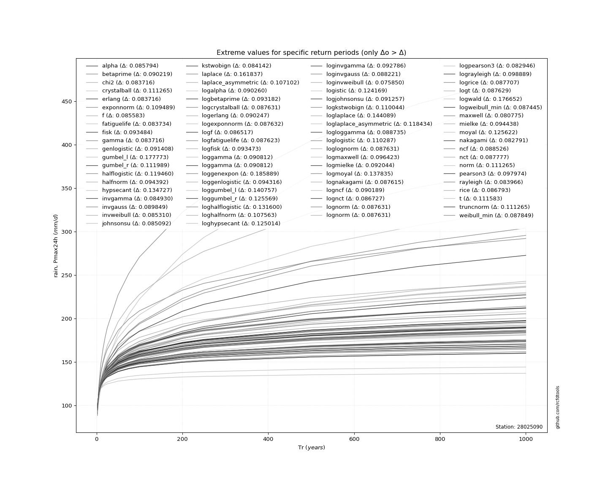</img>

</div>


<div align="center">

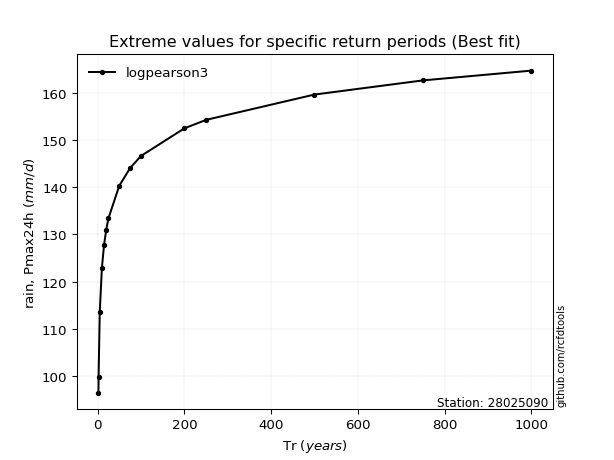</img>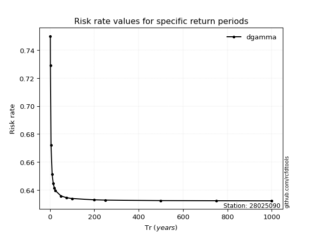</img>

</div>


<sub>**APP DISCLAIMER**: NO WARRANTY - This software is provided by [github.com/rcfdtools](https://github.com/rcfdtools) "as is", without any express or implied warranty, including warranties of merchantability, fitness for a particular purpose, or non-infringement. There is no guarantee that the software will be error-free or operate without interruption. LIMITATION OF LIABILITY - Neither the authors nor copyright holders will be liable for claims or damages arising from the software or its use. You are responsible for determining if the software is appropriate for your use and assume all associated risks, including errors, legal compliance, and data loss. NO PROFESSIONAL ADVICE - The software provides general information and does not offer professional advice. It should not replace consultation with professional advisors.</sub>