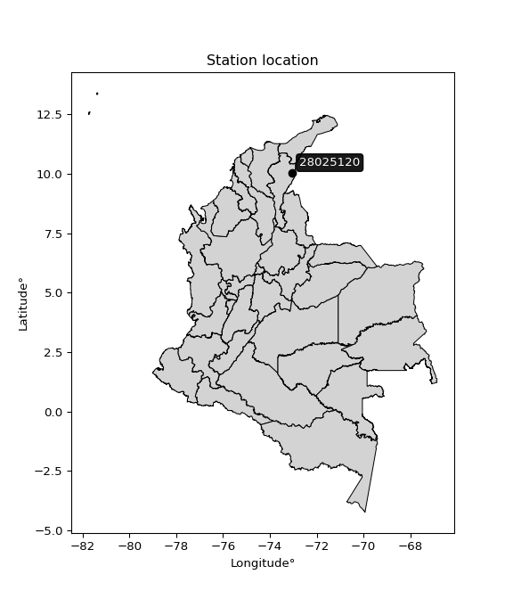

<div align="center">


</div>

# PMP Station (Rain, Pmax24h): 28025120

Probable Maximum Precipitation (PMP) is the greatest amount of rainfall for a specific duration that is meteorologically possible for a given location, acting as a "worst-case" scenario for extreme storms, crucial for designing safety-critical infrastructure like bridges, river deviations, dams, spillways, and nuclear plants to prevent catastrophic failure. PMP is calculated by hydrologists using meteorological data to determine the upper limit of extreme rainfall, often leading to the Probable Maximum Flood (PMF) for flood control design, and is increasingly being studied for climate change impacts. Probable Maximum Precipitation (PMP) is the theoretical upper limit of rainfall, a deterministic estimate for extreme events, while probability distributions (like GEV, Gumbel) describe the likelihood and frequency of various precipitation amounts, including rare ones, showing how often events occur, with PMP representing the extreme end of these distributions, used for critical infrastructure design to ensure safety against the worst conceivable weather, unlike standard statistical forecasts which cover typical probabilities.

The most common probability distributions in hydrology, used for analyzing floods, rainfall, and streamflow, include the Normal, Log-Normal, Gumbel, Gamma (including Log-Pearson Type III), and Generalized Extreme Value (GEV) distributions, often chosen based on the data´s skewness and whether modeling extremes or general conditions, with Gumbel and GEV popular for extreme events like floods, while the Normal distribution serves as a baseline, though often requiring transformations for skewed hydrological data. These distributions help in designing water infrastructure, managing water resources, and forecasting hydrologic events.

> Hydrological data often isn´t perfectly normal (it´s skewed), so different distributions are needed for different applications, such as: **Flood Frequency Analysis**: Using Gumbel, GEV, or Log-Pearson Type III for predicting extreme flood magnitudes and their return periods, **Rainfall Analysis**: Normal for annual totals, but Log-Normal, Weibull, or GEV for intensity or extreme daily rainfall, **Streamflow Modeling**: Gamma and Log-Normal for maximum flows, GEV for minimum flows, and Kappa for daily flows.

<div align="center">

</img>

</div>


## A. General information


### 1. General running parameters

• app_version: _v20260108_. • runtime: _2026-01-08 13:24:42.400241_. • Python version: _3.14.0_. • SciPy version: _1.16.3_. • Pandas version: _2.3.3_. • NumPy version: _2.3.5_. • Stations dataset (station_dataset_file): _dataset/pmax24h_in/automatic_colombia_2003_2024.csv_. • Stations catalog (station_catalog_file): _dataset/CNE.xls_. • Minimum year to eval til year_max (date_min): _1900_. • Maximum year to eval since year_min (date_max): _2024_. • Creates, save and include plots into reports (create_plot): _False_. • Plot only fit distributions with Δo > Δ (plot_only_fit): _True_. • Plot only simple graphs avoiding multiple CDFs and multiple Extreme values plots (plot_only_simple): _True_. • Eval low extreme values, if False, evaluates high extreme values (low_extreme): _False_. • Eval every SciPy distribution as logarithmic (pdist_logarithmic_on): _True_. • Standard deviation normalized (ddof): _1.0_. • Return periods to eval in years (Tr): _[2, 2.33, 5, 10, 15, 20, 25, 50, 75, 100, 200, 250, 500, 750, 1000]_. • Minimum data sample per station, 0 means any (minimum_sample): _5_. • Z-Score maximum threshold to adjust a value, 0 means disable (zscore_max): _3.5_. • Z-Score minimum threshold to adjust a value, 0 means disable (zscore_min): _-2.5_. • Avoid zeros, e.g. rain = 0 (avoid_zeros): _True_. • Avoid null values (avoid_nans): _True_. 

:file_folder:Table: [dataset.csv](../../dataset/pmax24h_in/automatic_colombia_2003_2024.csv)

> Delta Degrees of Freedom (DDOF): is a parameter used in the formulas for calculating variance and standard deviation. When ddof=0, the divisor is $N$ (the total number of observations) and this is used when your data set is the entire population. When ddof=1, the divisor is $N-1$ and this is used when your data set is a sample drawn from a larger population. Using $N-1$ provides an unbiased estimate of the population variance (known as Bessel´s correction).


### 2. Station info and location

|   id |   CODIGO | NOMBRE                                | CATEGORIA               | TECNOLOGIA                | ESTADO           | FECHA_INSTALACION   |   FECHA_SUSPENSION |   ALTITUD |   LATITUD |   LONGITUD | DEPARTAMENTO   | MUNICIPIO       | AREA_OPERATIVA                                         | ENTIDAD                                                     | AREA_HIDROGRAFICA   | ZONA_HIDROGRAFICA   | SUBZONA_HIDROGRAFICA   |   CORRIENTE | Catalogo   |   Version |
|-----:|---------:|:--------------------------------------|:------------------------|:--------------------------|:-----------------|:--------------------|-------------------:|----------:|----------:|-----------:|:---------------|:----------------|:-------------------------------------------------------|:------------------------------------------------------------|:--------------------|:--------------------|:-----------------------|------------:|:-----------|----------:|
|    0 | 28025120 | SERRANIA DEL PERIJA  - AUT [28025120] | Climatológica Principal | Automática con Telemetría | En Mantenimiento | 20/12/2006          |                nan |      2256 |   10.0291 |   -73.0462 | Cesar          | Agustín Codazzi | Area Operativa 05 - Magdalena-Cesar-Guajira-San Andrés | INSTITUTO DE HIDROLOGIA METEOROLOGIA Y ESTUDIOS AMBIENTALES | Magdalena Cauca     | Cesar               | Medio Cesar            |         nan | CNE_IDEAM  |  20251226 |

<div align="center">

Dynamic map: [:earth_americas:Google](http://maps.google.com/maps?q=10.02908333,-73.04619444) [:earth_americas:OSM](https://www.openstreetmap.org/#map=18/10.02908333/-73.04619444&layers=P) [:earth_americas:Bing](https://www.bing.com/maps?cp=10.02908333~-73.04619444&lvl=18) [:earth_americas:Apple](https://maps.apple.com/frame?center=10.02908333%2C-73.04619444&span=0.003%2C0.006)

</div>


<div align="center">

```geojson
{
  "type": "Feature",
  "geometry": {
    "type": "Point", 
    "coordinates": [-73.04619444, 10.02908333]
  }, 
  "properties": {
    "Name": "28025120"
  }
}
```

</div>


### 3. Discrete values table and plot

<div align="center">

|               |           0 |            1 |           2 |           3 |          4 |
|:--------------|------------:|-------------:|------------:|------------:|-----------:|
| Date          | 2017        | 2018         | 2019        | 2020        | 2021       |
| Value         |   70.3      |   48.7       |   81.5      |   55.8      |    0.1     |
| Value_initial |   70.3      |   48.7       |   81.5      |   55.8      |    0.1     |
| count         |    5        |    5         |    5        |    5        |    5       |
| mean          |   51.28     |   51.28      |   51.28     |   51.28     |   51.28    |
| std           |   31.3109   |   31.3109    |   31.3109   |   31.3109   |   31.3109  |
| zscore        |    0.607456 |   -0.0823994 |    0.965159 |    0.144359 |   -1.63457 |


</div>


> The initial value (value_initial) correspond to the initial obtained or null completed value, and value (value) is adjusted only when the initial value is outside the valid range (outlier) definite through the Z-Score value. If Z-Score is active, values out of range or outliers are replaced with the station mean value. A Z-Score (or standard score) measures how many standard deviations a data point is from the mean of a dataset, indicating its relative position; positive scores mean above the mean, negative mean below, and a score of zero is exactly at the mean, allowing for comparison of values from different distributions. It´s calculated using the formula $z=(x–μ)/σ$, where $x$ is the data point, $μ$ is the mean, and $σ$ is the standard deviation, helping identify outliers and understand probability.
>
> <sub>**Note**: In this study, "completing" (filling gaps in) and "extending" (forecasting or lengthening the historical record) rainfall data series are avoided for certain critical analyses because they introduce artificial bias and uncertainty, which can distort the statistics of rare events (extremes), alter day-to-day variability, and compromise the integrity and homogeneity of the original data. Some reasons against Completing/Extending rainfall data are: **Distortion of Extremes and Variability**: The primary issue is that most gap-filling or extension methods rely on averaging or regression with nearby stations, which inherently smooths the data. Rainfall is highly variable in space and time, with a large percentage of zero values and occasional large storms. Infilling methods often underestimate the highest values and overestimate the lowest (zero) values, which severely distorts analyses focused on flood frequency, drought severity, and intensity-duration-frequency (IDF) curves, **Loss of Data Homogeneity**: Infilled or extended data are synthetic estimates, not actual measurements. Combining these estimates with observed data can violate the assumption of data homogeneity, which requires that the data properties do not change over time. Inhomogeneity can lead to incorrect conclusions about long-term trends or changes in climate patterns, **Propagation of Errors**: Errors and biases from the original data (e.g., wind-induced undercatch, instrument errors, site changes) or the data used for imputation can propagate through the analysis, leading to unreliable hydrological models and inaccurate predictions, **Compromised Statistical Integrity**: For statistical analyses, especially those involving the frequency of events, using artificial data can introduce time bias or autocorrelation that doesn´t exist in reality, making it difficult to assess the true probability of events, **Difficulty in Validation**: It is difficult to accurately validate the quality of filled or extended data, especially for past periods where ground-truth measurements are unavailable. The reliability of imputation techniques heavily depends on the density of the surrounding station network and the complexity of the local topography.</sub>


### 4. Active continuous probability distributions from SciPy (43 of 104 available)

A Probability Density Function (PDF) describes the relative likelihood of a continuous random variable falling within a specific range, where the total area under its curve equals 1, and the area over any interval gives the actual probability for that range. Unlike discrete probabilities (like rolling a die), a PDF shows density, not direct probability for a single point (which is zero), with higher points indicating higher likelihood, often visualized as a bell curve for normal distributions.

A log of a probability density function (log-PDF) is simply the logarithm of the PDF´s value, denoted as $log(f(x))$, useful for converting multiplication of probabilities into addition, improving numerical stability with tiny numbers, and connecting to information theory concepts like entropy. Instead of dealing with very small probabilities (e.g., 0.000001), log-PDFs use negative numbers (e.g., $log(0.00001) ≈ -11.51$ that are easier for computers to handle, preventing underflow errors and simplifying complex calculations. In this study, each active probability distribution from SciPy is also evaluated in the $log$ form.

[scipy.stats](https://docs.scipy.org/doc/scipy/reference/stats.html) is a Python´s powerful submodule within the SciPy library for comprehensive statistical analysis, offering over 130 probability distributions (like Normal, Poisson), functions for descriptive stats (mean, variance), hypothesis testing (t-tests, chi-square), random variable generation, and statistical tests, making it essential for data science, modeling, and research. It provides tools to explore, model, and draw conclusions from data efficiently, working seamlessly with NumPy.

<div align="center">

|   id | p_dist             |   n_parameter | fit_method   | label                                                                       | active   | ref                                                                                                        |
|-----:|:-------------------|--------------:|:-------------|:----------------------------------------------------------------------------|:---------|:-----------------------------------------------------------------------------------------------------------|
|    0 | alpha              |             3 | MLE          | Alpha                                                                       | True     | [:mortar_board:](https://docs.scipy.org/doc/scipy/reference/generated/scipy.stats.alpha.html)              |
|    1 | betaprime          |             4 | MLE          | Beta prime                                                                  | True     | [:mortar_board:](https://docs.scipy.org/doc/scipy/reference/generated/scipy.stats.betaprime.html)          |
|    2 | chi2               |             3 | MLE          | Chi²                                                                        | True     | [:mortar_board:](https://docs.scipy.org/doc/scipy/reference/generated/scipy.stats.chi2.html)               |
|    3 | crystalball        |             4 | MLE          | Crystalball                                                                 | True     | [:mortar_board:](https://docs.scipy.org/doc/scipy/reference/generated/scipy.stats.crystalball.html)        |
|    4 | erlang             |             3 | MLE          | Erlang                                                                      | True     | [:mortar_board:](https://docs.scipy.org/doc/scipy/reference/generated/scipy.stats.erlang.html)             |
|    5 | expon              |             2 | MLE          | Exponential                                                                 | True     | [:mortar_board:](https://docs.scipy.org/doc/scipy/reference/generated/scipy.stats.expon.html)              |
|    6 | exponnorm          |             3 | MLE          | Exponentially modified Normal                                               | True     | [:mortar_board:](https://docs.scipy.org/doc/scipy/reference/generated/scipy.stats.exponnorm.html)          |
|    7 | f                  |             4 | MLE          | F                                                                           | True     | [:mortar_board:](https://docs.scipy.org/doc/scipy/reference/generated/scipy.stats.f.html)                  |
|    8 | fatiguelife        |             3 | MLE          | Fatigue-life (Birnbaum-Saunders)                                            | True     | [:mortar_board:](https://docs.scipy.org/doc/scipy/reference/generated/scipy.stats.fatiguelife.html)        |
|    9 | fisk               |             3 | MLE          | Fisk                                                                        | True     | [:mortar_board:](https://docs.scipy.org/doc/scipy/reference/generated/scipy.stats.fisk.html)               |
|   10 | gamma              |             3 | MLE          | Gamma                                                                       | True     | [:mortar_board:](https://docs.scipy.org/doc/scipy/reference/generated/scipy.stats.gamma.html)              |
|   11 | genexpon           |             5 | MLE          | Generalized exponential                                                     | True     | [:mortar_board:](https://docs.scipy.org/doc/scipy/reference/generated/scipy.stats.genexpon.html)           |
|   12 | genlogistic        |             3 | MLE          | Generalized logistic                                                        | True     | [:mortar_board:](https://docs.scipy.org/doc/scipy/reference/generated/scipy.stats.genlogistic.html)        |
|   13 | gibrat             |             2 | MM           | Gibrat                                                                      | True     | [:mortar_board:](https://docs.scipy.org/doc/scipy/reference/generated/scipy.stats.gibrat.html)             |
|   14 | gompertz           |             3 | MLE          | Gompertz (or truncated Gumbel)                                              | True     | [:mortar_board:](https://docs.scipy.org/doc/scipy/reference/generated/scipy.stats.gompertz.html)           |
|   15 | gumbel_l           |             2 | MM           | Gumbel Left Skew                                                            | True     | [:mortar_board:](https://docs.scipy.org/doc/scipy/reference/generated/scipy.stats.gumbel_l.html)           |
|   16 | gumbel_r           |             2 | MM           | Gumbel Right Skew                                                           | True     | [:mortar_board:](https://docs.scipy.org/doc/scipy/reference/generated/scipy.stats.gumbel_r.html)           |
|   17 | halflogistic       |             2 | MM           | Half-logistic                                                               | True     | [:mortar_board:](https://docs.scipy.org/doc/scipy/reference/generated/scipy.stats.halflogistic.html)       |
|   18 | halfnorm           |             2 | MM           | Half Normal                                                                 | True     | [:mortar_board:](https://docs.scipy.org/doc/scipy/reference/generated/scipy.stats.halfnorm.html)           |
|   19 | hypsecant          |             2 | MM           | hyperbolic secant                                                           | True     | [:mortar_board:](https://docs.scipy.org/doc/scipy/reference/generated/scipy.stats.hypsecant.html)          |
|   20 | invgamma           |             3 | MLE          | Inverted gamma                                                              | True     | [:mortar_board:](https://docs.scipy.org/doc/scipy/reference/generated/scipy.stats.invgamma.html)           |
|   21 | invgauss           |             3 | MLE          | Inverse Gaussian                                                            | True     | [:mortar_board:](https://docs.scipy.org/doc/scipy/reference/generated/scipy.stats.invgauss.html)           |
|   22 | invweibull         |             3 | MLE          | Inverted Weibull                                                            | True     | [:mortar_board:](https://docs.scipy.org/doc/scipy/reference/generated/scipy.stats.invweibull.html)         |
|   23 | kstwobign          |             2 | MLE          | Limiting distribution of scaled Kolmogorov-Smirnov two-sided test statistic | True     | [:mortar_board:](https://docs.scipy.org/doc/scipy/reference/generated/scipy.stats.kstwobign.html)          |
|   24 | laplace            |             2 | MM           | Laplace                                                                     | True     | [:mortar_board:](https://docs.scipy.org/doc/scipy/reference/generated/scipy.stats.laplace.html)            |
|   25 | laplace_asymmetric |             3 | MLE          | Asymmetric Laplace                                                          | True     | [:mortar_board:](https://docs.scipy.org/doc/scipy/reference/generated/scipy.stats.laplace_asymmetric.html) |
|   26 | loggamma           |             3 | MLE          | Log gamma                                                                   | True     | [:mortar_board:](https://docs.scipy.org/doc/scipy/reference/generated/scipy.stats.loggamma.html)           |
|   27 | logistic           |             2 | MM           | Logistic (or Sech-squared)                                                  | True     | [:mortar_board:](https://docs.scipy.org/doc/scipy/reference/generated/scipy.stats.logistic.html)           |
|   28 | lognorm            |             3 | MLE          | Log Normal                                                                  | True     | [:mortar_board:](https://docs.scipy.org/doc/scipy/reference/generated/scipy.stats.lognorm.html)            |
|   29 | maxwell            |             2 | MM           | Maxwell                                                                     | True     | [:mortar_board:](https://docs.scipy.org/doc/scipy/reference/generated/scipy.stats.maxwell.html)            |
|   30 | mielke             |             4 | MLE          | Mielke Beta-Kappa / Dagum                                                   | True     | [:mortar_board:](https://docs.scipy.org/doc/scipy/reference/generated/scipy.stats.mielke.html)             |
|   31 | moyal              |             2 | MM           | Moyal                                                                       | True     | [:mortar_board:](https://docs.scipy.org/doc/scipy/reference/generated/scipy.stats.moyal.html)              |
|   32 | nakagami           |             3 | MLE          | Nakagami                                                                    | True     | [:mortar_board:](https://docs.scipy.org/doc/scipy/reference/generated/scipy.stats.nakagami.html)           |
|   33 | ncf                |             5 | MLE          | Non-central F distribution                                                  | True     | [:mortar_board:](https://docs.scipy.org/doc/scipy/reference/generated/scipy.stats.ncf.html)                |
|   34 | nct                |             4 | MLE          | Non-central Student’s t                                                     | True     | [:mortar_board:](https://docs.scipy.org/doc/scipy/reference/generated/scipy.stats.nct.html)                |
|   35 | norm               |             2 | MM           | Normal                                                                      | True     | [:mortar_board:](https://docs.scipy.org/doc/scipy/reference/generated/scipy.stats.norm.html)               |
|   36 | pearson3           |             3 | MM           | Pearson type III                                                            | True     | [:mortar_board:](https://docs.scipy.org/doc/scipy/reference/generated/scipy.stats.pearson3.html)           |
|   37 | rayleigh           |             2 | MM           | Rayleigh                                                                    | True     | [:mortar_board:](https://docs.scipy.org/doc/scipy/reference/generated/scipy.stats.rayleigh.html)           |
|   38 | rice               |             3 | MLE          | Rice                                                                        | True     | [:mortar_board:](https://docs.scipy.org/doc/scipy/reference/generated/scipy.stats.rice.html)               |
|   39 | t                  |             3 | MLE          | Student’s t                                                                 | True     | [:mortar_board:](https://docs.scipy.org/doc/scipy/reference/generated/scipy.stats.t.html)                  |
|   40 | truncnorm          |             4 | MLE          | Truncated normal                                                            | True     | [:mortar_board:](https://docs.scipy.org/doc/scipy/reference/generated/scipy.stats.truncnorm.html)          |
|   41 | wald               |             2 | MM           | Wald                                                                        | True     | [:mortar_board:](https://docs.scipy.org/doc/scipy/reference/generated/scipy.stats.wald.html)               |
|   42 | weibull_min        |             3 | MLE          | Weibull minimum                                                             | True     | [:mortar_board:](https://docs.scipy.org/doc/scipy/reference/generated/scipy.stats.weibull_min.html)        |

</div>

> **n_parameter:** # arguments & localization & scale.
>
> **Fit methods:** (MLE) maximum likelihood, (MM) L-moments.
>
>**Inactive** (With the only purpose of prevent loops, zero divisions, infinite values, over high estimated values or horizontal trending for recurrence intervals estimations, the follow distributions were disabled.)**:** foldnorm, gennorm, norminvgauss, powernorm, powerlognorm, skewnorm, genextreme, anglit, arcsine, argus, beta, bradford, burr, burr12, cauchy, cosine, halfcauchy, foldcauchy, skewcauchy, wrapcauchy, dgamma, gengamma, exponweib, exponpow, truncexpon, gausshyper, genhalflogistic, genhyperbolic, geninvgauss, halfgennorm, johnsonsb, johnsonsu, kappa4, kappa3, ksone, kstwo, loglaplace, levy, levy_l, levy_stable, ncx2, pareto, genpareto, truncpareto, lomax, powerlaw, rdist, rel_breitwigner, recipinvgauss, semicircular, studentized_range, trapezoid, triang, truncweibull_min, tukeylambda, uniform, loguniform, vonmises, vonmises_line, weibull_max, dweibull, 


## B. Probability (PDF) vs. Empirical (EDF) distributions functions

A continuous probability distribution (CPD) describes probabilities for variables that can take any value within a range (like rain any time), unlike discrete variables with specific outcomes (like temperature). It uses a Probability Density Function (PDF), a curve where the total area under it equals 1, and the probability of the variable falling within an interval (a to b) is found by calculating the area under the curve between those points. A key feature is that the probability of hitting any single exact value is zero, so probabilities are always expressed for ranges, e.g., $P(a ≤ X ≤ b)$.

<div align="center">

Distributions parameters from station values
|    |   station | p_dist                |   n |             loc |           scale | shape                  | shape1                 | shape2              | shape3   |
|---:|----------:|:----------------------|----:|----------------:|----------------:|:-----------------------|:-----------------------|:--------------------|:---------|
|  0 |  28025120 | alpha                 |   5 |  -650.209       | 17013.9         | 24.31707271926281      |                        |                     |          |
|  1 |  28025120 | betaprime             |   5 |  -861.232       | 70359.8         | 1041.2414472599812     | 80285.80971209586      |                     |          |
|  2 |  28025120 | chi2                  |   5 |  -292.302       |     1.24246     | 276.1676547077641      |                        |                     |          |
|  3 |  28025120 | crystalball           |   5 |    51.28        |    28.0053      | 8030.390926522309      | 17298.657456594996     |                     |          |
|  4 |  28025120 | erlang                |   5 |  -425.912       |     1.78867     | 266.5339375341222      |                        |                     |          |
|  5 |  28025120 | expon                 |   5 |     0.1         |    51.18        |                        |                        |                     |          |
|  6 |  28025120 | exponnorm             |   5 |    51.2598      |    28.0053      | 0.0007152136742464374  |                        |                     |          |
|  7 |  28025120 | f                     |   5 |     0.1         |    71.026       | 0.6390235761435975     | 6.586716756431408      |                     |          |
|  8 |  28025120 | fatiguelife           |   5 |     0.1         |     8.10477e-05 | 961.1405158950047      |                        |                     |          |
|  9 |  28025120 | fisk                  |   5 |     0.1         |    11.8757      | 0.566452460378637      |                        |                     |          |
| 10 |  28025120 | gamma                 |   5 |  -401.743       |     1.81031     | 250.22469613594546     |                        |                     |          |
| 11 |  28025120 | genexpon              |   5 |     0.0999951   |     2.49791     | 0.04877910368359428    | 1.7966093291977967e-05 | 2.599092695828111   |          |
| 12 |  28025120 | genlogistic           |   5 |    81.5001      |     8.48433e-06 | 2.805727203635127e-07  |                        |                     |          |
| 13 |  28025120 | gibrat                |   5 |    29.9154      |    12.9582      |                        |                        |                     |          |
| 14 |  28025120 | gompertz              |   5 |    48.7         |    14.2496      | 0.30322917893491974    |                        |                     |          |
| 15 |  28025120 | gumbel_l              |   5 |    63.8839      |    21.8357      |                        |                        |                     |          |
| 16 |  28025120 | gumbel_r              |   5 |    38.6761      |    21.8357      |                        |                        |                     |          |
| 17 |  28025120 | halflogistic          |   5 |    18.0872      |    23.9435      |                        |                        |                     |          |
| 18 |  28025120 | halfnorm              |   5 |    14.212       |    46.4579      |                        |                        |                     |          |
| 19 |  28025120 | hypsecant             |   5 |    51.28        |    17.8287      |                        |                        |                     |          |
| 20 |  28025120 | invgamma              |   5 |     0.1         |     5.04081e-17 | 0.15893459557922518    |                        |                     |          |
| 21 |  28025120 | invgauss              |   5 |  -147.065       |  7410.18        | 0.026626713562032736   |                        |                     |          |
| 22 |  28025120 | invweibull            |   5 |     0.1         |     3.6435      | 0.05632590441367148    |                        |                     |          |
| 23 |  28025120 | kstwobign             |   5 |   -70.7745      |   139.167       |                        |                        |                     |          |
| 24 |  28025120 | laplace               |   5 |    51.28        |    19.8027      |                        |                        |                     |          |
| 25 |  28025120 | laplace_asymmetric    |   5 |    55.8         |    20.2231      | 1.1179853351688038     |                        |                     |          |
| 26 |  28025120 | loggamma              |   5 |    81.5002      |     6.68178e-06 | 2.2129446213867817e-07 |                        |                     |          |
| 27 |  28025120 | logistic              |   5 |    51.28        |    15.4401      |                        |                        |                     |          |
| 28 |  28025120 | lognorm               |   5 |     0.1         |     0.0116508   | 17.182859590070713     |                        |                     |          |
| 29 |  28025120 | maxwell               |   5 |   -15.0808      |    41.5855      |                        |                        |                     |          |
| 30 |  28025120 | mielke                |   5 |   -96.8751      |   178.466       | 4.826058178554042      | 12469.585863012195     |                     |          |
| 31 |  28025120 | moyal                 |   5 |    35.2648      |    12.6068      |                        |                        |                     |          |
| 32 |  28025120 | nakagami              |   5 |     0.1         |    57.9801      | 0.18522167012661356    |                        |                     |          |
| 33 |  28025120 | ncf                   |   5 |     0.1         |     5.91575     | 0.5931627033512371     | 8.530117483933186      | 4.399603978679453   |          |
| 34 |  28025120 | nct                   |   5 |     0.1         |     2.25439e-11 | 0.14475003135751924    | 3.764754398115622      |                     |          |
| 35 |  28025120 | norm                  |   5 |    51.28        |    28.0053      |                        |                        |                     |          |
| 36 |  28025120 | pearson3              |   5 |    51.28        |    28.0053      | -0.9060717333282107    |                        |                     |          |
| 37 |  28025120 | rayleigh              |   5 |    -2.2958      |    42.7473      |                        |                        |                     |          |
| 38 |  28025120 | rice                  |   5 |   -19.9542      |    30.4431      | 2.0788038593705487     |                        |                     |          |
| 39 |  28025120 | t                     |   5 |     0.1         |     1.43254e-13 | 0.19057205708776187    |                        |                     |          |
| 40 |  28025120 | truncnorm             |   5 |    -4.1087      |    10.1203      | -0.47245844378541646   | 8.459117388879292      |                     |          |
| 41 |  28025120 | wald                  |   5 |    23.2747      |    28.0053      |                        |                        |                     |          |
| 42 |  28025120 | weibull_min           |   5 |    -1.05193e+09 |     1.05193e+09 | 52794838.470080405     |                        |                     |          |
| 43 |  28025120 | logalpha              |   5 |   -51.5312      |   976.976       | 18.012746428103526     |                        |                     |          |
| 44 |  28025120 | logbetaprime          |   5 |    -2.30259     |     4.26301     | 0.11194328037553673    | 0.5630623053181106     |                     |          |
| 45 |  28025120 | logchi2               |   5 |    -2.30259     |     1.20937     | 1.0433352241669103     |                        |                     |          |
| 46 |  28025120 | logcrystalball        |   5 |     2.85165     |     2.58329     | 86.70689597038815      | 340.6016483666775      |                     |          |
| 47 |  28025120 | logerlang             |   5 |   -32.833       |     0.211493    | 168.42818581748122     |                        |                     |          |
| 48 |  28025120 | logexpon              |   5 |    -2.30259     |     5.15423     |                        |                        |                     |          |
| 49 |  28025120 | logexponnorm          |   5 |     2.85039     |     2.58329     | 0.0004843127102390247  |                        |                     |          |
| 50 |  28025120 | logf                  |   5 |    -2.30259     |     1.13889     | 1.0441446504856193     | 1.0446680389000074     |                     |          |
| 51 |  28025120 | logfatiguelife        |   5 |    -2.30259     |     4.63481e-06 | 1137.3466142485986     |                        |                     |          |
| 52 |  28025120 | logfisk               |   5 |    -2.30259     |     3.91787     | 0.1380046762913879     |                        |                     |          |
| 53 |  28025120 | loggamma              |   5 |   -44.813       |     0.157457    | 302.51066610301643     |                        |                     |          |
| 54 |  28025120 | loggenexpon           |   5 |    -2.30259     |     3.09148     | 0.5586644183235626     | 1.7805581910744381     | 0.08173727134758743 |          |
| 55 |  28025120 | loggenlogistic        |   5 |     4.40069     |     6.12521e-06 | 3.923358284645739e-06  |                        |                     |          |
| 56 |  28025120 | loggibrat             |   5 |     0.880859    |     1.19533     |                        |                        |                     |          |
| 57 |  28025120 | loggompertz           |   5 |    -2.30259     |     1.3776      | 0.011621586871684499   |                        |                     |          |
| 58 |  28025120 | loggumbel_l           |   5 |     4.01427     |     2.01418     |                        |                        |                     |          |
| 59 |  28025120 | loggumbel_r           |   5 |     1.68903     |     2.01418     |                        |                        |                     |          |
| 60 |  28025120 | loghalflogistic       |   5 |    -0.210165    |     2.20863     |                        |                        |                     |          |
| 61 |  28025120 | loghalfnorm           |   5 |    -0.567612    |     4.28542     |                        |                        |                     |          |
| 62 |  28025120 | loghypsecant          |   5 |     2.85165     |     1.64457     |                        |                        |                     |          |
| 63 |  28025120 | loginvgamma           |   5 |   -60.3504      | 32793.6         | 520.0633402446269      |                        |                     |          |
| 64 |  28025120 | loginvgauss           |   5 |   -26.0019      |  2887.95        | 0.00997193667130241    |                        |                     |          |
| 65 |  28025120 | loginvweibull         |   5 |    -5.28019e+08 |     5.28019e+08 | 171797411.0871759      |                        |                     |          |
| 66 |  28025120 | logkstwobign          |   5 |    -9.30363     |    13.8512      |                        |                        |                     |          |
| 67 |  28025120 | loglaplace            |   5 |     2.85165     |     1.82666     |                        |                        |                     |          |
| 68 |  28025120 | loglaplace_asymmetric |   5 |     4.4006      |     0.0193573   | 79.91928397093497      |                        |                     |          |
| 69 |  28025120 | logloggamma           |   5 |     4.4007      |     8.61358e-06 | 5.5757686828130124e-06 |                        |                     |          |
| 70 |  28025120 | loglogistic           |   5 |     2.85165     |     1.42424     |                        |                        |                     |          |
| 71 |  28025120 | loglognorm            |   5 |    -2.30259     |     0.0311226   | 4.157056213952333      |                        |                     |          |
| 72 |  28025120 | logmaxwell            |   5 |    -3.26966     |     3.83596     |                        |                        |                     |          |
| 73 |  28025120 | logmielke             |   5 |    -2.30259     |     2.85868     | 0.12558122331546467    | 0.6900907447923144     |                     |          |
| 74 |  28025120 | logmoyal              |   5 |     1.37436     |     1.16289     |                        |                        |                     |          |
| 75 |  28025120 | lognakagami           |   5 | -1765.65        |  1768.5         | 116688.77489868086     |                        |                     |          |
| 76 |  28025120 | logncf                |   5 |    -2.30259     |     1.02311     | 1.035658795197142      | 1.1234753863226707     | 1.10625973454503    |          |
| 77 |  28025120 | lognct                |   5 |  -175.795       |     2.54035     | 65152.3995346523       | 70.32254598291895      |                     |          |
| 78 |  28025120 | lognorm               |   5 |     2.85165     |     2.58329     |                        |                        |                     |          |
| 79 |  28025120 | logpearson3           |   5 |     2.85161     |     2.58333     | -1.482063362518565     |                        |                     |          |
| 80 |  28025120 | lograyleigh           |   5 |    -2.09036     |     3.94314     |                        |                        |                     |          |
| 81 |  28025120 | logrice               |   5 |  -372.992       |     2.58333     | 145.4845077999699      |                        |                     |          |
| 82 |  28025120 | logt                  |   5 |     4.12162     |     0.214949    | 0.7393824307252891     |                        |                     |          |
| 83 |  28025120 | logtruncnorm          |   5 |     2.58227     |     2.83925     | -1.7204700535424982    | 5.110856684393388      |                     |          |
| 84 |  28025120 | logwald               |   5 |     0.268334    |     2.58331     |                        |                        |                     |          |
| 85 |  28025120 | logweibull_min        |   5 |    -2.30259     |     1.47887     | 0.5002698655342219     |                        |                     |          |

</div>

> **loc** (Location parameter): This shifts the distribution along the x-axis. For many common distributions, like the normal (Gaussian) distribution, loc represents the mean $μ$. For others, like the uniform distribution, it might represent the minimum value, or for the beta distribution, the left end of the support interval.
>
> **scale** (Scale parameter): This determines the width or spread of the distribution. For the normal distribution, scale represents the standard deviation $σ$. For a uniform distribution, it defines the length of the interval (from $loc$ to $loc + scale$).
>
> **shape** (Shape parameters): Refers to parameters that define the specific form of a probability distribution, distinct from its location (loc) and scale (scale). These parameters are required arguments for most distribution functions. For example, a normal (Gaussian) distribution is fully defined by its location (mean) and scale (standard deviation), so it has no specific shape parameters beyond loc and scale. However, other distributions have intrinsic properties that need specification, as Gamma distribution that takes a shape parameter, often named $a$ or $alpha$.


### 0. Cumulative distribution values - CDF (86 evaluated)

Cumulative Distribution Function (CDF), denoted as $F$<sub>$X$</sub>$(x)$, is a function that gives the probability that a random variable $X$ will take a value less than or equal to a specific value, $x$ (i.e., $(P(X≥x)$. It essentially "accumulates" probabilities from a given point up to the far right (positive infinity), providing a complete picture of the distribution´s probabilities for both discrete (like rain) and continuous (like temperature) variables, helping to find probabilities over ranges or above certain values. Each station is evaluated separately ordering the $x$ values ascending, calculating the CDF and PDF values for the activated distributions and their logarithmic forms.

<div align="center">

CDF ordered by x ascending and calculating $log(f(x))$ separately
|   id |   Station |   date |    x |   count |   mean |     std |     zscore |   Value_initial |   station |   m |     alpha |   alpha_pdf |   betaprime |   betaprime_pdf |      chi2 |   chi2_pdf |   crystalball |   crystalball_pdf |   erlang |   erlang_pdf |    expon |   expon_pdf |   exponnorm |   exponnorm_pdf |           f |       f_pdf |   fatiguelife |   fatiguelife_pdf |        fisk |    fisk_pdf |     gamma |   gamma_pdf |    genexpon |   genexpon_pdf |   genlogistic |   genlogistic_pdf |   gibrat |   gibrat_pdf |    gompertz |   gompertz_pdf |   gumbel_l |   gumbel_l_pdf |   gumbel_r |   gumbel_r_pdf |   halflogistic |   halflogistic_pdf |   halfnorm |   halfnorm_pdf |   hypsecant |   hypsecant_pdf |   invgamma |   invgamma_pdf |   invgauss |   invgauss_pdf |   invweibull |   invweibull_pdf |   kstwobign |   kstwobign_pdf |   laplace |   laplace_pdf |   laplace_asymmetric |   laplace_asymmetric_pdf |   loggamma |   loggamma_pdf |   logistic |   logistic_pdf |   lognorm |   lognorm_pdf |   maxwell |   maxwell_pdf |    mielke |   mielke_pdf |       moyal |   moyal_pdf |    nakagami |   nakagami_pdf |         ncf |     ncf_pdf |       nct |     nct_pdf |      norm |   norm_pdf |   pearson3 |   pearson3_pdf |   rayleigh |   rayleigh_pdf |      rice |   rice_pdf |        t |       t_pdf |   truncnorm |   truncnorm_pdf |     wald |   wald_pdf |   weibull_min |   weibull_min_pdf |   logalpha |   logalpha_pdf |   logbetaprime |   logbetaprime_pdf |     logchi2 |   logchi2_pdf |   logcrystalball |   logcrystalball_pdf |   logerlang |   logerlang_pdf |   logexpon |   logexpon_pdf |   logexponnorm |   logexponnorm_pdf |        logf |    logf_pdf |   logfatiguelife |   logfatiguelife_pdf |    logfisk |   logfisk_pdf |   loggenexpon |   loggenexpon_pdf |   loggenlogistic |   loggenlogistic_pdf |   loggibrat |   loggibrat_pdf |   loggompertz |   loggompertz_pdf |   loggumbel_l |   loggumbel_l_pdf |   loggumbel_r |   loggumbel_r_pdf |   loghalflogistic |   loghalflogistic_pdf |   loghalfnorm |   loghalfnorm_pdf |   loghypsecant |   loghypsecant_pdf |   loginvgamma |   loginvgamma_pdf |   loginvgauss |   loginvgauss_pdf |   loginvweibull |   loginvweibull_pdf |   logkstwobign |   logkstwobign_pdf |   loglaplace |   loglaplace_pdf |   loglaplace_asymmetric |   loglaplace_asymmetric_pdf |   logloggamma |   logloggamma_pdf |   loglogistic |   loglogistic_pdf |   loglognorm |   loglognorm_pdf |   logmaxwell |   logmaxwell_pdf |   logmielke |   logmielke_pdf |    logmoyal |   logmoyal_pdf |   lognakagami |   lognakagami_pdf |     logncf |   logncf_pdf |    lognct |   lognct_pdf |   logpearson3 |   logpearson3_pdf |   lograyleigh |   lograyleigh_pdf |   logrice |   logrice_pdf |      logt |   logt_pdf |   logtruncnorm |   logtruncnorm_pdf |   logwald |   logwald_pdf |   logweibull_min |   logweibull_min_pdf |
|-----:|----------:|-------:|-----:|--------:|-------:|--------:|-----------:|----------------:|----------:|----:|----------:|------------:|------------:|----------------:|----------:|-----------:|--------------:|------------------:|---------:|-------------:|---------:|------------:|------------:|----------------:|------------:|------------:|--------------:|------------------:|------------:|------------:|----------:|------------:|------------:|---------------:|--------------:|------------------:|---------:|-------------:|------------:|---------------:|-----------:|---------------:|-----------:|---------------:|---------------:|-------------------:|-----------:|---------------:|------------:|----------------:|-----------:|---------------:|-----------:|---------------:|-------------:|-----------------:|------------:|----------------:|----------:|--------------:|---------------------:|-------------------------:|-----------:|---------------:|-----------:|---------------:|----------:|--------------:|----------:|--------------:|----------:|-------------:|------------:|------------:|------------:|---------------:|------------:|------------:|----------:|------------:|----------:|-----------:|-----------:|---------------:|-----------:|---------------:|----------:|-----------:|---------:|------------:|------------:|----------------:|---------:|-----------:|--------------:|------------------:|-----------:|---------------:|---------------:|-------------------:|------------:|--------------:|-----------------:|---------------------:|------------:|----------------:|-----------:|---------------:|---------------:|-------------------:|------------:|------------:|-----------------:|---------------------:|-----------:|--------------:|--------------:|------------------:|-----------------:|---------------------:|------------:|----------------:|--------------:|------------------:|--------------:|------------------:|--------------:|------------------:|------------------:|----------------------:|--------------:|------------------:|---------------:|-------------------:|--------------:|------------------:|--------------:|------------------:|----------------:|--------------------:|---------------:|-------------------:|-------------:|-----------------:|------------------------:|----------------------------:|--------------:|------------------:|--------------:|------------------:|-------------:|-----------------:|-------------:|-----------------:|------------:|----------------:|------------:|---------------:|--------------:|------------------:|-----------:|-------------:|----------:|-------------:|--------------:|------------------:|--------------:|------------------:|----------:|--------------:|----------:|-----------:|---------------:|-------------------:|----------:|--------------:|-----------------:|---------------------:|
|    0 |  28025120 |   2021 |  0.1 |       5 |  51.28 | 31.3109 | -1.63457   |             0.1 |  28025120 |   1 | 0.0324703 |  0.00292257 |   0.0341401 |      0.00276582 | 0.0357534 | 0.00299746 |     0.0338115 |        0.0026819  | 0.037343 |   0.00300836 | 0        |  0.0195389  |   0.0338117 |      0.00268192 | 7.90085e-07 | 1.81903e+10 |     0.0865541 |       2.27264e+09 | 6.95317e-11 | 2.83809e+06 | 0.0331321 |  0.00279458 | 9.63735e-08 |     0.019528   |      0        |        0.00224061 | 0        |   0          | 0           |      0         |  0.0524495 |     0.00233789 | 0.00287627 |    0.000770748 |       0        |         0          |   0        |     0          |   0.0360338 |      0.00201679 |  0.0292681 |    1.26067e+15 |  0.0419594 |     0.00378381 |  6.94229e-05 |      2.698e+12   |   0.0422999 |      0.00508101 | 0.0377173 |    0.00190465 |            0.0472913 |               0.00209169 |  0.0272697 |      0.0247646 |  0.0350691 |     0.00219164 | 0.0230094 |     0.0211006 | 0.0124332 |    0.00239204 | 0.0526744 |   0.00262139 | 5.49166e-05 |  3.7406e-05 | 1.00349e-07 |    2.67864e+09 | 5.48091e-06 | 3.55162e+07 | 0.0126932 | 2.05929e+09 | 0.0338115 | 0.0026819  |  0.0522649 |     0.00256289 | 0.00156932 |     0.00130903 | 0.0279612 | 0.00306455 | 0.563711 | 9.82302e+11 |    0.503076 |     0.0530358   | 0        | 0          |     0.0400938 |        0.00197136 |  0.0334062 |      0.0299792 |      0.0145498 |        3.66762e+12 | 6.96617e-09 |    8.1831e+06 |        0.0230094 |            0.0211006 |   0.0270929 |       0.0252533 |   0        |      0.194015  |      0.0230094 |          0.0211006 | 5.84497e-09 | 6.87136e+06 |        0.0303416 |          6.32608e+10 | 0.00626192 |   1.93376e+12 |   5.90239e-11 |         0.180711  |         0        |           0.00874661 |    0        |       0         |   1.39521e-09 |        0.00843613 |     0.0425179 |          0.020654 |   0.000706309 |        0.00254425 |          0        |             0         |      0        |         0         |      0.0277007 |          0.0168224 |     0.0268961 |         0.0250954 |     0.0282443 |         0.0275116 |        0.035095 |           0.0382488 |      0.0396457 |          0.049029  |    0.0297533 |        0.0162883 |               0.0131266 |                  0.00848509 |     0.0130471 |         0.0084457 |     0.0261113 |         0.0178547 |  1.56192e-05 |   17441.5        |   0.00418134 |        0.0128068 |   0.0103449 |     2.92536e+12 | 1.17637e-06 |    1.24146e-05 |     0.0232058 |         0.0212294 | 4.1777e-09 |   4.8714e+06 | 0.0231439 |    0.0212084 |     0.0474047 |         0.0210566 |      0        |          0        | 0.0230152 |      0.021105 | 0.0251752 | 0.00289597 |    7.78562e-11 |          0.0334108 |  0        |     0         |      1.71625e-08 |          1.93337e+07 |
|    1 |  28025120 |   2018 | 48.7 |       5 |  51.28 | 31.3109 | -0.0823994 |            48.7 |  28025120 |   2 | 0.489473  |  0.0138906  |   0.467909  |      0.0139978  | 0.482243  | 0.0137028  |     0.463299  |        0.0141849  | 0.479012 |   0.0136821  | 0.6131   |  0.00755959 |   0.463301  |      0.0141849  | 0.629445    | 0.0034658   |     0.789785  |       0.0023903   | 0.689591    | 0.0024949   | 0.472956  |  0.01395    | 0.613028    |     0.00755957 |      0        |        0.0111778  | 0.644794 |   0.0198231  | 1.04596e-11 |      0.0212799 |  0.392795  |     0.0138731  | 0.531593   |    0.0153832   |       0.564402 |         0.0142303  |   0.542125 |     0.0130381  |   0.454097  |      0.0176684  |  0.99851   |    4.87227e-06 |  0.513101  |     0.0125233  |  0.421378    |      0.000422056 |   0.547496  |      0.0107592  | 0.438923  |    0.0221647  |            0.405815  |               0.0179492  |  0.657482  |      0.132194  |  0.458323  |     0.0160791  | 0.655524  |     0.142543  | 0.497428  |    0.0139218  | 0.37415   |   0.0124037  | 0.557253    |  0.0156345  | 0.728645    |    0.00497391  | 0.551007    | 0.00741522  | 0.98303   | 5.05429e-05 | 0.463299  | 0.0141849  |  0.40437   |     0.0133875  | 0.50913    |     0.0136988  | 0.474539  | 0.0138556  | 0.999355 | 2.52937e-06 |    1        |     7.07146e-08 | 0.62866  | 0.0163908  |     0.374423  |        0.0147276  |  0.649208  |      0.11793   |      0.873901  |        0.00921776  | 0.974649    |    0.0120099  |        0.655524  |            0.142543  |   0.663254  |       0.130319  |   0.698992 |      0.0584002 |      0.655524  |          0.142543  | 0.748308    | 0.0189307   |        0.845175  |          0.0195459   | 0.515766   |   0.00556972  |   0.752065    |         0.0663574 |         0        |           0.460545   |    0.821682 |       0.086812  |   0.641655    |        0.269977   |     0.60865   |          0.18228  |   0.71461     |        0.119216   |          0.729302 |             0.105975  |      0.701276 |         0.108506  |      0.688122  |          0.160722  |     0.657835  |         0.129588  |     0.663504  |         0.12245   |        0.639361 |           0.0930462 |      0.675224  |          0.0881408 |    0.716126  |        0.155406  |               0.716767  |                  0.46332    |     0.716496  |         0.463804  |     0.673932  |         0.154291  |  0.898514    |       0.00689588 |   0.676564   |        0.127064  |   0.919403  |     0.00690021  | 0.734104    |    0.109996    |     0.655386  |         0.142245  | 0.666681   |   0.024748   | 0.655514  |    0.142218  |     0.576508  |         0.189744  |      0.682871 |          0.121889 | 0.655559  |      0.142537 | 0.257944  | 0.598992   |    0.662506    |          0.132094  |  0.789504 |     0.0880173 |      0.870799    |          0.0213742   |
|    2 |  28025120 |   2020 | 55.8 |       5 |  51.28 | 31.3109 |  0.144359  |            55.8 |  28025120 |   3 | 0.58645   |  0.0132964  |   0.567002  |      0.0137723  | 0.578442  | 0.0132669  |     0.56411   |        0.0140609  | 0.575345 |   0.0133235  | 0.663217 |  0.00658037 |   0.564112  |      0.0140609  | 0.652546    | 0.00305703  |     0.8058    |       0.00212937  | 0.705878    | 0.00211138  | 0.571307  |  0.0136155  | 0.663145    |     0.00658052 |      0        |        0.0141359  | 0.755504 |   0.0121314  | 0.177858    |      0.0287944 |  0.498718  |     0.0158538  | 0.633511   |    0.0132436   |       0.657011 |         0.0118683  |   0.629307 |     0.0115046  |   0.579848  |      0.017295   |  0.998542  |    4.16007e-06 |  0.599439  |     0.0117145  |  0.424174    |      0.000367864 |   0.620271  |      0.00971726 | 0.602038  |    0.0200963  |            0.555534  |               0.0245712  |  0.675272  |      0.129202  |  0.572668  |     0.0158496  | 0.674711  |     0.139375  | 0.593524  |    0.0130412  | 0.47082   |   0.0148826  | 0.65785     |  0.0127058  | 0.761798    |    0.00438224  | 0.600613    | 0.00657051  | 0.983362  | 4.32384e-05 | 0.56411   | 0.0140609  |  0.505149  |     0.0149032  | 0.602878   |     0.0126256  | 0.572293  | 0.013548   | 0.999372 | 2.15034e-06 |    1        |     1.42154e-09 | 0.725405 | 0.0112545  |     0.488235  |        0.0172059  |  0.665082  |      0.11532   |      0.875138  |        0.00896278  | 0.97623     |    0.0112353  |        0.674711  |            0.139375  |   0.680781  |       0.127218  |   0.706836 |      0.0568783 |      0.674712  |          0.139375  | 0.750847    | 0.0183783   |        0.847806  |          0.0191162   | 0.516515   |   0.00544933  |   0.760962    |         0.0643961 |         0        |           0.502494   |    0.833001 |       0.0796495 |   0.678266    |        0.267564   |     0.633492  |          0.182643 |   0.730472    |        0.1139     |          0.743403 |             0.101273  |      0.715799 |         0.104931  |      0.709482  |          0.153129  |     0.67527   |         0.126583  |     0.679967  |         0.119454  |        0.651868 |           0.0907573 |      0.687069  |          0.0859243 |    0.736507  |        0.144248  |               0.782679  |                  0.505925   |     0.782481  |         0.506518  |     0.694571  |         0.148951  |  0.899439    |       0.00670259 |   0.69361    |        0.123416  |   0.920328  |     0.0066947   | 0.748691    |    0.104407    |     0.674534  |         0.13909   | 0.670002   |   0.0240671  | 0.674657  |    0.139058  |     0.602652  |         0.194393  |      0.699213 |          0.118241 | 0.674745  |      0.139368 | 0.37148   | 1.11141    |    0.68028     |          0.129071  |  0.801079 |     0.0821659 |      0.873659    |          0.0206749   |
|    3 |  28025120 |   2017 | 70.3 |       5 |  51.28 | 31.3109 |  0.607456  |            70.3 |  28025120 |   4 | 0.759096  |  0.0102093  |   0.749783  |      0.0110155  | 0.752693  | 0.010428   |     0.751481  |        0.0113112  | 0.751183 |   0.0105683  | 0.746307 |  0.00495688 |   0.751483  |      0.0113112  | 0.692147    | 0.00244515  |     0.833553  |       0.00172169  | 0.732336    | 0.00158171  | 0.750929  |  0.0107742  | 0.746239    |     0.00495726 |      0        |        0.0228335  | 0.872171 |   0.00517743 | 0.659535    |      0.0329884 |  0.738564  |     0.0160624  | 0.790589   |    0.00850765  |       0.796999 |         0.00761776 |   0.772679 |     0.00828665 |   0.789017  |      0.0109862  |  0.998595  |    3.18162e-06 |  0.75066   |     0.00898569 |  0.42891     |      0.000291319 |   0.744403  |      0.00740014 | 0.808644  |    0.0096631  |            0.800607  |               0.0110229  |  0.704483  |      0.123614  |  0.774143  |     0.0113241  | 0.706221  |     0.133308  | 0.760874  |    0.00982825 | 0.729487  |   0.021059   | 0.803213    |  0.00764457 | 0.818072    |    0.00342574  | 0.68473     | 0.00508729  | 0.98391   | 3.31774e-05 | 0.751481  | 0.0113112  |  0.728724  |     0.0150982  | 0.763554   |     0.00939348 | 0.751693  | 0.010809   | 0.999399 | 1.63259e-06 |    1        |     1.05568e-13 | 0.842819 | 0.00570668 |     0.750158  |        0.0173909  |  0.691179  |      0.110576  |      0.877161  |        0.00855618  | 0.978684    |    0.0100382  |        0.706221  |            0.133308  |   0.709517  |       0.121487  |   0.719684 |      0.0543855 |      0.706222  |          0.133308  | 0.754989    | 0.0174999   |        0.85214   |          0.0184181   | 0.517752   |   0.00525642  |   0.775461    |         0.0611563 |         0        |           0.582625   |    0.850146 |       0.0691025 |   0.738986    |        0.256695   |     0.675578  |          0.181317 |   0.755758    |        0.105074   |          0.765902 |             0.0935859 |      0.739341 |         0.0989011 |      0.743312  |          0.139707  |     0.703878  |         0.121024  |     0.706942  |         0.114029  |        0.672381 |           0.0868353 |      0.706483  |          0.0821621 |    0.767807  |        0.127113  |               0.908723  |                  0.587401   |     0.908686  |         0.588213  |     0.727855  |         0.139079  |  0.900952    |       0.00639522 |   0.721377   |        0.11694   |   0.921836  |     0.00636823  | 0.771758    |    0.0954139   |     0.705982  |         0.133051  | 0.675434   |   0.0229797  | 0.706097  |    0.13301   |     0.648372  |         0.201196  |      0.725794 |          0.111865 | 0.706254  |      0.133301 | 0.661165  | 0.973971   |    0.709457    |          0.123446  |  0.81901  |     0.0732879 |      0.878305    |          0.0195609   |
|    4 |  28025120 |   2019 | 81.5 |       5 |  51.28 | 31.3109 |  0.965159  |            81.5 |  28025120 |   5 | 0.856527  |  0.00719141 |   0.855497  |      0.00781567 | 0.852894  | 0.00744427 |     0.859724  |        0.00795829 | 0.852881 |   0.0075607  | 0.796169 |  0.00398263 |   0.859726  |      0.00795825 | 0.717535    | 0.00210285  |     0.851454  |       0.00148364  | 0.748449    | 0.00131017  | 0.854275  |  0.00764904 | 0.796106    |     0.0039831  |      0.999996 |        0.0330694  | 0.916436 |   0.00297825 | 0.934569    |      0.0139131 |  0.893609  |     0.0109172  | 0.868758   |    0.00559755  |       0.867828 |         0.00515534 |   0.852485 |     0.00601668 |   0.884406  |      0.00634199 |  0.998627  |    2.68006e-06 |  0.837939  |     0.00661675 |  0.431935    |      0.000250907 |   0.817698  |      0.00572024 | 0.891304  |    0.00548895 |            0.892648  |               0.00593469 |  0.722474  |      0.119744  |  0.876234  |     0.00702379 | 0.725615  |     0.129023  | 0.854872  |    0.00697651 | 0.997543  |   0.0269423  | 0.873027    |  0.00499316 | 0.853071    |    0.00284219  | 0.736361    | 0.00416301  | 0.984251  | 2.80059e-05 | 0.859724  | 0.00795829 |  0.879773  |     0.0112736  | 0.853585   |     0.00671415 | 0.855644  | 0.00771036 | 0.999415 | 1.36879e-06 |    1        |     1.67414e-17 | 0.893789 | 0.00359126 |     0.912243  |        0.0107167  |  0.70729   |      0.107365  |      0.878408  |        0.0083119   | 0.980116    |    0.00934286 |        0.725615  |            0.129023  |   0.727188  |       0.117554  |   0.72761  |      0.0528478 |      0.725616  |          0.129023  | 0.757537    | 0.0169736   |        0.854831  |          0.0179907   | 0.51852    |   0.00513992  |   0.784352    |         0.059142  |         0.999944 |           0.64049    |    0.859921 |       0.0632607 |   0.776121    |        0.245115   |     0.702231  |          0.179094 |   0.770884    |        0.0995923  |          0.779387 |             0.0888687 |      0.753678 |         0.0950803 |      0.763323  |          0.131015  |     0.721489  |         0.117205  |     0.72353   |         0.110369  |        0.685032 |           0.0843146 |      0.718452  |          0.079763  |    0.785858  |        0.117231  |               0.999843  |                  0.646301   |     0.999939  |         0.647277  |     0.747923  |         0.132375  |  0.901883    |       0.00621106 |   0.738349   |        0.112648  |   0.922763  |     0.00617284  | 0.785459    |    0.0899887   |     0.725339  |         0.128786  | 0.678783   |   0.0223254  | 0.725447  |    0.12874   |     0.678378  |         0.204612  |      0.742023 |          0.107697 | 0.725647  |      0.129015 | 0.7655    | 0.494443   |    0.727421    |          0.119559  |  0.829464 |     0.0682198 |      0.881147    |          0.0188924   |


</div>

An Empirical Distribution Function (EDF) is a step-function estimate of a true cumulative distribution function (CDF) based on observed sample data, representing the proportion of data points less than or equal to a given value. It is calculated by ordering your data and jumping up by $1/n$ (where $n$ is sample size) at each unique data point, allowing analysis without assuming an underlying population distribution, and it gets closer to the true CDF as the sample size grows. For the empirical probability calculations, the parameter $m$ correspond to the order number which means the position of the $x$ values in an ascending order list.

The Kolmogorov-Smirnov (K-S) test is a non-parametric statistical test used to determine if a sample data set comes from a specific theoretical distribution (one-sample) or if two different samples come from the same underlying distribution (two-sample), by comparing their cumulative distribution functions (CDFs). It calculates the maximum vertical difference (D statistic) between these functions, with a small p-value indicating a significant difference and rejection of the null hypothesis (that the data/samples match).


### 1. EDF California (1923)

California´s estimates the true probability distribution of water-related data (like rainfall, streamflow) using observed samples, crucial for risk assessment.

<div align="center">


$P=m/n$


</div>


**1.1. Empirical values**

<div align="center">

|                | 0              | 1                  | 2              | 3                 | 4              |
|:---------------|:---------------|:-------------------|:---------------|:------------------|:---------------|
| date           | 2021           | 2018               | 2020           | 2017              | 2019           |
| x              | 0.1            | 48.7               | 55.8           | 70.3              | 81.5           |
| m              | 1              | 2                  | 3              | 4                 | 5              |
| empirical_dist | edf_california | edf_california     | edf_california | edf_california    | edf_california |
| empirical      | 0.2            | 0.4                | 0.6            | 0.8               | 1.0            |
| empirical_tr   | 1.25           | 1.6666666666666667 | 2.5            | 5.000000000000001 | inf            |

</div>


**1.2. Kolmogorov-Smirnov fit test (sorted by Δ)**


<div align="center">

|                | 0                   | 1                  | 2                   | 3                  | 4                   | 5                   | 6                   | 7                  | 8                  | 9                  | 10                 | 11                  | 12                  | 13                  | 14                  | 15                  | 16                  | 17                  | 18                  | 19                 | 20                  | 21                 | 22                  | 23                 | 24                 | 25                 | 26                 | 27                 | 28                  | 29                  | 30                 | 31                  | 32                 | 33                  | 34                 | 35                 | 36                 | 37                  | 38                  | 39                 | 40                  | 41                  | 42                  | 43                  | 44                  | 45                  | 46                 | 47                 | 48                 | 49                  | 50                 | 51                 | 52                  | 53                  | 54                 | 55                  | 56                  | 57                 | 58                 | 59                  | 60                    | 61                 | 62                 | 63                 | 64                 | 65                 | 66                 | 67                 | 68                  | 69                 | 70                  | 71                 | 72                  | 73                 | 74                  | 75                 | 76                  | 77                 | 78                 | 79                 | 80                 | 81                 | 82                 | 83                 | 84                 | 85                 |
|:---------------|:--------------------|:-------------------|:--------------------|:-------------------|:--------------------|:--------------------|:--------------------|:-------------------|:-------------------|:-------------------|:-------------------|:--------------------|:--------------------|:--------------------|:--------------------|:--------------------|:--------------------|:--------------------|:--------------------|:-------------------|:--------------------|:-------------------|:--------------------|:-------------------|:-------------------|:-------------------|:-------------------|:-------------------|:--------------------|:--------------------|:-------------------|:--------------------|:-------------------|:--------------------|:-------------------|:-------------------|:-------------------|:--------------------|:--------------------|:-------------------|:--------------------|:--------------------|:--------------------|:--------------------|:--------------------|:--------------------|:-------------------|:-------------------|:-------------------|:--------------------|:-------------------|:-------------------|:--------------------|:--------------------|:-------------------|:--------------------|:--------------------|:-------------------|:-------------------|:--------------------|:----------------------|:-------------------|:-------------------|:-------------------|:-------------------|:-------------------|:-------------------|:-------------------|:--------------------|:-------------------|:--------------------|:-------------------|:--------------------|:-------------------|:--------------------|:-------------------|:--------------------|:-------------------|:-------------------|:-------------------|:-------------------|:-------------------|:-------------------|:-------------------|:-------------------|:-------------------|
| station        | 28025120            | 28025120           | 28025120            | 28025120           | 28025120            | 28025120            | 28025120            | 28025120           | 28025120           | 28025120           | 28025120           | 28025120            | 28025120            | 28025120            | 28025120            | 28025120            | 28025120            | 28025120            | 28025120            | 28025120           | 28025120            | 28025120           | 28025120            | 28025120           | 28025120           | 28025120           | 28025120           | 28025120           | 28025120            | 28025120            | 28025120           | 28025120            | 28025120           | 28025120            | 28025120           | 28025120           | 28025120           | 28025120            | 28025120            | 28025120           | 28025120            | 28025120            | 28025120            | 28025120            | 28025120            | 28025120            | 28025120           | 28025120           | 28025120           | 28025120            | 28025120           | 28025120           | 28025120            | 28025120            | 28025120           | 28025120            | 28025120            | 28025120           | 28025120           | 28025120            | 28025120              | 28025120           | 28025120           | 28025120           | 28025120           | 28025120           | 28025120           | 28025120           | 28025120            | 28025120           | 28025120            | 28025120           | 28025120            | 28025120           | 28025120            | 28025120           | 28025120            | 28025120           | 28025120           | 28025120           | 28025120           | 28025120           | 28025120           | 28025120           | 28025120           | 28025120           |
| empirical_dist | edf_california      | edf_california     | edf_california      | edf_california     | edf_california      | edf_california      | edf_california      | edf_california     | edf_california     | edf_california     | edf_california     | edf_california      | edf_california      | edf_california      | edf_california      | edf_california      | edf_california      | edf_california      | edf_california      | edf_california     | edf_california      | edf_california     | edf_california      | edf_california     | edf_california     | edf_california     | edf_california     | edf_california     | edf_california      | edf_california      | edf_california     | edf_california      | edf_california     | edf_california      | edf_california     | edf_california     | edf_california     | edf_california      | edf_california      | edf_california     | edf_california      | edf_california      | edf_california      | edf_california      | edf_california      | edf_california      | edf_california     | edf_california     | edf_california     | edf_california      | edf_california     | edf_california     | edf_california      | edf_california      | edf_california     | edf_california      | edf_california      | edf_california     | edf_california     | edf_california      | edf_california        | edf_california     | edf_california     | edf_california     | edf_california     | edf_california     | edf_california     | edf_california     | edf_california      | edf_california     | edf_california      | edf_california     | edf_california      | edf_california     | edf_california      | edf_california     | edf_california      | edf_california     | edf_california     | edf_california     | edf_california     | edf_california     | edf_california     | edf_california     | edf_california     | edf_california     |
| p_dist         | mielke              | gumbel_l           | pearson3            | laplace_asymmetric | weibull_min         | invgauss            | laplace             | erlang             | hypsecant          | chi2               | logistic           | betaprime           | exponnorm           | crystalball         | norm                | gamma               | alpha               | rice                | kstwobign           | maxwell            | gumbel_r            | rayleigh           | moyal               | halflogistic       | halfnorm           | genexpon           | expon              | wald               | logt                | loggompertz         | gibrat             | ncf                 | logtruncnorm       | logerlang           | loglogistic        | logrice            | logexponnorm       | lognorm             | lognorm             | logcrystalball     | lognct              | lognakagami         | loginvgauss         | logmaxwell          | loggamma            | loggamma            | loginvgamma        | logkstwobign       | f                  | lograyleigh         | loghypsecant       | fisk               | logalpha            | loggumbel_l         | logexpon           | loghalfnorm         | loggumbel_r         | loginvweibull      | loglaplace         | logloggamma         | loglaplace_asymmetric | logncf             | logpearson3        | nakagami           | loghalflogistic    | logmoyal           | logf               | loggenexpon        | logwald             | fatiguelife        | loggibrat           | gompertz           | logfatiguelife      | logweibull_min     | logbetaprime        | logfisk            | loglognorm          | logmielke          | invweibull         | logchi2            | nct                | invgamma           | t                  | truncnorm          | loggenlogistic     | genlogistic        |
| delta          | 0.14732560880821374 | 0.1475505422609613 | 0.14773509582631705 | 0.1527086811433359 | 0.15990618575865284 | 0.16206081095741587 | 0.16228272486085502 | 0.1626569739882634 | 0.1639662011718447 | 0.1642466207149082 | 0.1649309327583344 | 0.16585988244118194 | 0.16618828503096308 | 0.16618846089562836 | 0.16618846214629246 | 0.16686789758086062 | 0.16752972107684444 | 0.17203884362744548 | 0.18230212182094818 | 0.1875667653877056 | 0.19712373337653522 | 0.1984306755090222 | 0.19994508338488456 | 0.2                | 0.2                | 0.2130281333532692 | 0.2131002577505413 | 0.2286598803035209 | 0.23449958184467667 | 0.24165516028244782 | 0.2447938291644678 | 0.26363943688147284 | 0.2725790591357101 | 0.27281159515112097 | 0.2739315774126263 | 0.2743529668164463 | 0.2743839141205632 | 0.27438466238826886 | 0.27438466238826886 | 0.2743846764962915 | 0.27455253877064334 | 0.27466096603054924 | 0.27646999653779536 | 0.27656418774561387 | 0.27752614380033314 | 0.27752614380033314 | 0.2785105201282556 | 0.2815484996898292 | 0.2824649725466174 | 0.28287140836459956 | 0.2881216128594062 | 0.2895906081068428 | 0.29270977368049644 | 0.29776881360450147 | 0.2989917789606805 | 0.30127581979018636 | 0.31461017824195536 | 0.3149684717217769 | 0.3161256874129047 | 0.31649564248307427 | 0.3167669374855434    | 0.321217321604955  | 0.3216218022953524 | 0.3286451647603337 | 0.3293021930458844 | 0.3341040741698311 | 0.3483082165105914 | 0.3520649074666432 | 0.38950434219631813 | 0.389785030280034  | 0.42168244594409376 | 0.4221416078050786 | 0.44517510186083953 | 0.4707985324088354 | 0.47390145673094297 | 0.4814801018064452 | 0.49851409324827844 | 0.5194030676780889 | 0.5680649754480627 | 0.5746485694702168 | 0.5830301591960724 | 0.5985101259998338 | 0.5993549559919432 | 0.5999998674159511 | 0.8                | 0.8                |
| deltao         | 0.5865427407550001  | 0.5865427407550001 | 0.5865427407550001  | 0.5865427407550001 | 0.5865427407550001  | 0.5865427407550001  | 0.5865427407550001  | 0.5865427407550001 | 0.5865427407550001 | 0.5865427407550001 | 0.5865427407550001 | 0.5865427407550001  | 0.5865427407550001  | 0.5865427407550001  | 0.5865427407550001  | 0.5865427407550001  | 0.5865427407550001  | 0.5865427407550001  | 0.5865427407550001  | 0.5865427407550001 | 0.5865427407550001  | 0.5865427407550001 | 0.5865427407550001  | 0.5865427407550001 | 0.5865427407550001 | 0.5865427407550001 | 0.5865427407550001 | 0.5865427407550001 | 0.5865427407550001  | 0.5865427407550001  | 0.5865427407550001 | 0.5865427407550001  | 0.5865427407550001 | 0.5865427407550001  | 0.5865427407550001 | 0.5865427407550001 | 0.5865427407550001 | 0.5865427407550001  | 0.5865427407550001  | 0.5865427407550001 | 0.5865427407550001  | 0.5865427407550001  | 0.5865427407550001  | 0.5865427407550001  | 0.5865427407550001  | 0.5865427407550001  | 0.5865427407550001 | 0.5865427407550001 | 0.5865427407550001 | 0.5865427407550001  | 0.5865427407550001 | 0.5865427407550001 | 0.5865427407550001  | 0.5865427407550001  | 0.5865427407550001 | 0.5865427407550001  | 0.5865427407550001  | 0.5865427407550001 | 0.5865427407550001 | 0.5865427407550001  | 0.5865427407550001    | 0.5865427407550001 | 0.5865427407550001 | 0.5865427407550001 | 0.5865427407550001 | 0.5865427407550001 | 0.5865427407550001 | 0.5865427407550001 | 0.5865427407550001  | 0.5865427407550001 | 0.5865427407550001  | 0.5865427407550001 | 0.5865427407550001  | 0.5865427407550001 | 0.5865427407550001  | 0.5865427407550001 | 0.5865427407550001  | 0.5865427407550001 | 0.5865427407550001 | 0.5865427407550001 | 0.5865427407550001 | 0.5865427407550001 | 0.5865427407550001 | 0.5865427407550001 | 0.5865427407550001 | 0.5865427407550001 |
| eval           | Δo > Δ              | Δo > Δ             | Δo > Δ              | Δo > Δ             | Δo > Δ              | Δo > Δ              | Δo > Δ              | Δo > Δ             | Δo > Δ             | Δo > Δ             | Δo > Δ             | Δo > Δ              | Δo > Δ              | Δo > Δ              | Δo > Δ              | Δo > Δ              | Δo > Δ              | Δo > Δ              | Δo > Δ              | Δo > Δ             | Δo > Δ              | Δo > Δ             | Δo > Δ              | Δo > Δ             | Δo > Δ             | Δo > Δ             | Δo > Δ             | Δo > Δ             | Δo > Δ              | Δo > Δ              | Δo > Δ             | Δo > Δ              | Δo > Δ             | Δo > Δ              | Δo > Δ             | Δo > Δ             | Δo > Δ             | Δo > Δ              | Δo > Δ              | Δo > Δ             | Δo > Δ              | Δo > Δ              | Δo > Δ              | Δo > Δ              | Δo > Δ              | Δo > Δ              | Δo > Δ             | Δo > Δ             | Δo > Δ             | Δo > Δ              | Δo > Δ             | Δo > Δ             | Δo > Δ              | Δo > Δ              | Δo > Δ             | Δo > Δ              | Δo > Δ              | Δo > Δ             | Δo > Δ             | Δo > Δ              | Δo > Δ                | Δo > Δ             | Δo > Δ             | Δo > Δ             | Δo > Δ             | Δo > Δ             | Δo > Δ             | Δo > Δ             | Δo > Δ              | Δo > Δ             | Δo > Δ              | Δo > Δ             | Δo > Δ              | Δo > Δ             | Δo > Δ              | Δo > Δ             | Δo > Δ              | Δo > Δ             | Δo > Δ             | Δo > Δ             | Δo > Δ             | Δo <= Δ            | Δo <= Δ            | Δo <= Δ            | Δo <= Δ            | Δo <= Δ            |
| fit            | 1                   | 1                  | 1                   | 1                  | 1                   | 1                   | 1                   | 1                  | 1                  | 1                  | 1                  | 1                   | 1                   | 1                   | 1                   | 1                   | 1                   | 1                   | 1                   | 1                  | 1                   | 1                  | 1                   | 1                  | 1                  | 1                  | 1                  | 1                  | 1                   | 1                   | 1                  | 1                   | 1                  | 1                   | 1                  | 1                  | 1                  | 1                   | 1                   | 1                  | 1                   | 1                   | 1                   | 1                   | 1                   | 1                   | 1                  | 1                  | 1                  | 1                   | 1                  | 1                  | 1                   | 1                   | 1                  | 1                   | 1                   | 1                  | 1                  | 1                   | 1                     | 1                  | 1                  | 1                  | 1                  | 1                  | 1                  | 1                  | 1                   | 1                  | 1                   | 1                  | 1                   | 1                  | 1                   | 1                  | 1                   | 1                  | 1                  | 1                  | 1                  | 0                  | 0                  | 0                  | 0                  | 0                  |
| n              | 5                   | 5                  | 5                   | 5                  | 5                   | 5                   | 5                   | 5                  | 5                  | 5                  | 5                  | 5                   | 5                   | 5                   | 5                   | 5                   | 5                   | 5                   | 5                   | 5                  | 5                   | 5                  | 5                   | 5                  | 5                  | 5                  | 5                  | 5                  | 5                   | 5                   | 5                  | 5                   | 5                  | 5                   | 5                  | 5                  | 5                  | 5                   | 5                   | 5                  | 5                   | 5                   | 5                   | 5                   | 5                   | 5                   | 5                  | 5                  | 5                  | 5                   | 5                  | 5                  | 5                   | 5                   | 5                  | 5                   | 5                   | 5                  | 5                  | 5                   | 5                     | 5                  | 5                  | 5                  | 5                  | 5                  | 5                  | 5                  | 5                   | 5                  | 5                   | 5                  | 5                   | 5                  | 5                   | 5                  | 5                   | 5                  | 5                  | 5                  | 5                  | 5                  | 5                  | 5                  | 5                  | 5                  |
| best_fit       | 1                   | 0                  | 0                   | 0                  | 0                   | 0                   | 0                   | 0                  | 0                  | 0                  | 0                  | 0                   | 0                   | 0                   | 0                   | 0                   | 0                   | 0                   | 0                   | 0                  | 0                   | 0                  | 0                   | 0                  | 0                  | 0                  | 0                  | 0                  | 0                   | 0                   | 0                  | 0                   | 0                  | 0                   | 0                  | 0                  | 0                  | 0                   | 0                   | 0                  | 0                   | 0                   | 0                   | 0                   | 0                   | 0                   | 0                  | 0                  | 0                  | 0                   | 0                  | 0                  | 0                   | 0                   | 0                  | 0                   | 0                   | 0                  | 0                  | 0                   | 0                     | 0                  | 0                  | 0                  | 0                  | 0                  | 0                  | 0                  | 0                   | 0                  | 0                   | 0                  | 0                   | 0                  | 0                   | 0                  | 0                   | 0                  | 0                  | 0                  | 0                  | 0                  | 0                  | 0                  | 0                  | 0                  |
| best_fit_sort  | 1                   | 2                  | 3                   | 4                  | 5                   | 6                   | 7                   | 8                  | 9                  | 10                 | 11                 | 12                  | 13                  | 14                  | 15                  | 16                  | 17                  | 18                  | 19                  | 20                 | 21                  | 22                 | 23                  | 24                 | 25                 | 26                 | 27                 | 28                 | 29                  | 30                  | 31                 | 32                  | 33                 | 34                  | 35                 | 36                 | 37                 | 38                  | 39                  | 40                 | 41                  | 42                  | 43                  | 44                  | 45                  | 46                  | 47                 | 48                 | 49                 | 50                  | 51                 | 52                 | 53                  | 54                  | 55                 | 56                  | 57                  | 58                 | 59                 | 60                  | 61                    | 62                 | 63                 | 64                 | 65                 | 66                 | 67                 | 68                 | 69                  | 70                 | 71                  | 72                 | 73                  | 74                 | 75                  | 76                 | 77                  | 78                 | 79                 | 80                 | 81                 | 82                 | 83                 | 84                 | 85                 | 86                 |

</div>


<div align="center">

</img>

</div>


**1.3. Best fit**

<div align="center">

|   id |   station | empirical_dist   | p_dist   |    delta |   deltao | eval   |   fit |   n |   best_fit |   best_fit_sort |
|-----:|----------:|:-----------------|:---------|---------:|---------:|:-------|------:|----:|-----------:|----------------:|
|    0 |  28025120 | edf_california   | mielke   | 0.147326 | 0.586543 | Δo > Δ |     1 |   5 |          1 |               1 |

</div>


### 2. EDF Hazen (1930)

Hazen method for plotting positions is a formula used to estimate the empirical cumulative probability distribution of flood events or other hydrological data. This formula often results in biased estimations, particularly when extrapolating to extreme events (high return periods).

<div align="center">


$P=(m-0.5)/n$


</div>


**2.1. Empirical values**

<div align="center">

|                | 0                  | 1                  | 2         | 3                 | 4                  |
|:---------------|:-------------------|:-------------------|:----------|:------------------|:-------------------|
| date           | 2021               | 2018               | 2020      | 2017              | 2019               |
| x              | 0.1                | 48.7               | 55.8      | 70.3              | 81.5               |
| m              | 1                  | 2                  | 3         | 4                 | 5                  |
| empirical_dist | edf_hazen          | edf_hazen          | edf_hazen | edf_hazen         | edf_hazen          |
| empirical      | 0.1                | 0.3                | 0.5       | 0.7               | 0.9                |
| empirical_tr   | 1.1111111111111112 | 1.4285714285714286 | 2.0       | 3.333333333333333 | 10.000000000000002 |

</div>


**2.2. Kolmogorov-Smirnov fit test (sorted by Δ)**


<div align="center">

|                | 0                   | 1                   | 2                   | 3                   | 4                   | 5                  | 6                   | 7                   | 8                  | 9                   | 10                  | 11                  | 12                  | 13                  | 14                  | 15                  | 16                  | 17                  | 18                  | 19                  | 20                  | 21                  | 22                 | 23                 | 24                 | 25                 | 26                 | 27                  | 28                  | 29                  | 30                  | 31                 | 32                  | 33                 | 34                 | 35                  | 36                 | 37                  | 38                  | 39                 | 40                  | 41                 | 42                 | 43                  | 44                 | 45                  | 46                  | 47                  | 48                  | 49                  | 50                 | 51                 | 52                  | 53                 | 54                 | 55                 | 56                 | 57                 | 58                 | 59                  | 60                 | 61                 | 62                  | 63                 | 64                    | 65                 | 66                 | 67                  | 68                  | 69                  | 70                  | 71                  | 72                 | 73                 | 74                 | 75                 | 76                 | 77                 | 78                 | 79                 | 80                 | 81                 | 82                 | 83                 | 84                 | 85                 |
|:---------------|:--------------------|:--------------------|:--------------------|:--------------------|:--------------------|:-------------------|:--------------------|:--------------------|:-------------------|:--------------------|:--------------------|:--------------------|:--------------------|:--------------------|:--------------------|:--------------------|:--------------------|:--------------------|:--------------------|:--------------------|:--------------------|:--------------------|:-------------------|:-------------------|:-------------------|:-------------------|:-------------------|:--------------------|:--------------------|:--------------------|:--------------------|:-------------------|:--------------------|:-------------------|:-------------------|:--------------------|:-------------------|:--------------------|:--------------------|:-------------------|:--------------------|:-------------------|:-------------------|:--------------------|:-------------------|:--------------------|:--------------------|:--------------------|:--------------------|:--------------------|:-------------------|:-------------------|:--------------------|:-------------------|:-------------------|:-------------------|:-------------------|:-------------------|:-------------------|:--------------------|:-------------------|:-------------------|:--------------------|:-------------------|:----------------------|:-------------------|:-------------------|:--------------------|:--------------------|:--------------------|:--------------------|:--------------------|:-------------------|:-------------------|:-------------------|:-------------------|:-------------------|:-------------------|:-------------------|:-------------------|:-------------------|:-------------------|:-------------------|:-------------------|:-------------------|:-------------------|
| station        | 28025120            | 28025120            | 28025120            | 28025120            | 28025120            | 28025120           | 28025120            | 28025120            | 28025120           | 28025120            | 28025120            | 28025120            | 28025120            | 28025120            | 28025120            | 28025120            | 28025120            | 28025120            | 28025120            | 28025120            | 28025120            | 28025120            | 28025120           | 28025120           | 28025120           | 28025120           | 28025120           | 28025120            | 28025120            | 28025120            | 28025120            | 28025120           | 28025120            | 28025120           | 28025120           | 28025120            | 28025120           | 28025120            | 28025120            | 28025120           | 28025120            | 28025120           | 28025120           | 28025120            | 28025120           | 28025120            | 28025120            | 28025120            | 28025120            | 28025120            | 28025120           | 28025120           | 28025120            | 28025120           | 28025120           | 28025120           | 28025120           | 28025120           | 28025120           | 28025120            | 28025120           | 28025120           | 28025120            | 28025120           | 28025120              | 28025120           | 28025120           | 28025120            | 28025120            | 28025120            | 28025120            | 28025120            | 28025120           | 28025120           | 28025120           | 28025120           | 28025120           | 28025120           | 28025120           | 28025120           | 28025120           | 28025120           | 28025120           | 28025120           | 28025120           | 28025120           |
| empirical_dist | edf_hazen           | edf_hazen           | edf_hazen           | edf_hazen           | edf_hazen           | edf_hazen          | edf_hazen           | edf_hazen           | edf_hazen          | edf_hazen           | edf_hazen           | edf_hazen           | edf_hazen           | edf_hazen           | edf_hazen           | edf_hazen           | edf_hazen           | edf_hazen           | edf_hazen           | edf_hazen           | edf_hazen           | edf_hazen           | edf_hazen          | edf_hazen          | edf_hazen          | edf_hazen          | edf_hazen          | edf_hazen           | edf_hazen           | edf_hazen           | edf_hazen           | edf_hazen          | edf_hazen           | edf_hazen          | edf_hazen          | edf_hazen           | edf_hazen          | edf_hazen           | edf_hazen           | edf_hazen          | edf_hazen           | edf_hazen          | edf_hazen          | edf_hazen           | edf_hazen          | edf_hazen           | edf_hazen           | edf_hazen           | edf_hazen           | edf_hazen           | edf_hazen          | edf_hazen          | edf_hazen           | edf_hazen          | edf_hazen          | edf_hazen          | edf_hazen          | edf_hazen          | edf_hazen          | edf_hazen           | edf_hazen          | edf_hazen          | edf_hazen           | edf_hazen          | edf_hazen             | edf_hazen          | edf_hazen          | edf_hazen           | edf_hazen           | edf_hazen           | edf_hazen           | edf_hazen           | edf_hazen          | edf_hazen          | edf_hazen          | edf_hazen          | edf_hazen          | edf_hazen          | edf_hazen          | edf_hazen          | edf_hazen          | edf_hazen          | edf_hazen          | edf_hazen          | edf_hazen          | edf_hazen          |
| p_dist         | weibull_min         | gumbel_l            | mielke              | pearson3            | laplace_asymmetric  | logt               | laplace             | hypsecant           | logistic           | norm                | crystalball         | exponnorm           | betaprime           | gamma               | rice                | erlang              | chi2                | alpha               | maxwell             | rayleigh            | invgauss            | gumbel_r            | halfnorm           | kstwobign          | ncf                | moyal              | halflogistic       | logpearson3         | loggumbel_l         | genexpon            | expon               | gompertz           | wald                | f                  | loginvweibull      | loggompertz         | gibrat             | logalpha            | lognakagami         | lognct             | logcrystalball      | lognorm            | lognorm            | logexponnorm        | logrice            | loggamma            | loggamma            | loginvgamma         | logtruncnorm        | logerlang           | loginvgauss        | logncf             | loglogistic         | logkstwobign       | logmaxwell         | logfisk            | lograyleigh        | loghypsecant       | fisk               | logexpon            | loghalfnorm        | loggumbel_r        | loglaplace          | logloggamma        | loglaplace_asymmetric | nakagami           | loghalflogistic    | logmoyal            | logf                | loggenexpon         | invweibull          | logwald             | fatiguelife        | loggibrat          | logfatiguelife     | logweibull_min     | logbetaprime       | loglognorm         | logmielke          | logchi2            | nct                | invgamma           | t                  | truncnorm          | loggenlogistic     | genlogistic        |
| delta          | 0.07442277157595084 | 0.09279529367147399 | 0.09754343190837755 | 0.10437037501274271 | 0.10581521743583933 | 0.1344995818446767 | 0.13892262530184157 | 0.15409724331311253 | 0.1583226928285178 | 0.16329921440562545 | 0.16329921511105205 | 0.16330124841261795 | 0.16790926610817675 | 0.17295637235231004 | 0.17453865025402876 | 0.17901192689966916 | 0.18224258768900176 | 0.18947343872869232 | 0.19742849603943902 | 0.20913008688565432 | 0.21310142217292577 | 0.23159298264214684 | 0.2421247869085143 | 0.2474960471186261 | 0.251006798563195  | 0.2572531421331145 | 0.2644024373651869 | 0.27650812079213555 | 0.30865044191877195 | 0.31302813335326923 | 0.31310025775054134 | 0.3221416078050786 | 0.32865988030352095 | 0.3294451376153274 | 0.3393608275821998 | 0.34165516028244786 | 0.3447938291644678 | 0.34920794494071833 | 0.35538611902816425 | 0.3555136593709605 | 0.35552357084589264 | 0.3555235794752027 | 0.3555235794752027 | 0.35552435109070774 | 0.3555589252561268 | 0.35748192481865154 | 0.35748192481865154 | 0.35783535504048075 | 0.36250567365167546 | 0.36325424789641464 | 0.3635044205061065 | 0.3666806583127951 | 0.37393157741262634 | 0.3752244654314148 | 0.3765641877456139 | 0.3814801018064452 | 0.3828714083645996 | 0.3881216128594062 | 0.3895906081068428 | 0.39899177896068055 | 0.4012758197901864 | 0.4146101782419554 | 0.41612568741290473 | 0.4164956424830743 | 0.41676693748554344   | 0.4286451647603337 | 0.4293021930458844 | 0.43410407416983116 | 0.44830821651059144 | 0.45206490746664324 | 0.46806497544806275 | 0.48950434219631817 | 0.489785030280034  | 0.5216824459440939 | 0.5451751018608395 | 0.5707985324088354 | 0.5739014567309431 | 0.5985140932482784 | 0.6194030676780888 | 0.6746485694702169 | 0.6830301591960724 | 0.6985101259998339 | 0.6993549559919432 | 0.6999998674159511 | 0.7                | 0.7                |
| deltao         | 0.5865427407550001  | 0.5865427407550001  | 0.5865427407550001  | 0.5865427407550001  | 0.5865427407550001  | 0.5865427407550001 | 0.5865427407550001  | 0.5865427407550001  | 0.5865427407550001 | 0.5865427407550001  | 0.5865427407550001  | 0.5865427407550001  | 0.5865427407550001  | 0.5865427407550001  | 0.5865427407550001  | 0.5865427407550001  | 0.5865427407550001  | 0.5865427407550001  | 0.5865427407550001  | 0.5865427407550001  | 0.5865427407550001  | 0.5865427407550001  | 0.5865427407550001 | 0.5865427407550001 | 0.5865427407550001 | 0.5865427407550001 | 0.5865427407550001 | 0.5865427407550001  | 0.5865427407550001  | 0.5865427407550001  | 0.5865427407550001  | 0.5865427407550001 | 0.5865427407550001  | 0.5865427407550001 | 0.5865427407550001 | 0.5865427407550001  | 0.5865427407550001 | 0.5865427407550001  | 0.5865427407550001  | 0.5865427407550001 | 0.5865427407550001  | 0.5865427407550001 | 0.5865427407550001 | 0.5865427407550001  | 0.5865427407550001 | 0.5865427407550001  | 0.5865427407550001  | 0.5865427407550001  | 0.5865427407550001  | 0.5865427407550001  | 0.5865427407550001 | 0.5865427407550001 | 0.5865427407550001  | 0.5865427407550001 | 0.5865427407550001 | 0.5865427407550001 | 0.5865427407550001 | 0.5865427407550001 | 0.5865427407550001 | 0.5865427407550001  | 0.5865427407550001 | 0.5865427407550001 | 0.5865427407550001  | 0.5865427407550001 | 0.5865427407550001    | 0.5865427407550001 | 0.5865427407550001 | 0.5865427407550001  | 0.5865427407550001  | 0.5865427407550001  | 0.5865427407550001  | 0.5865427407550001  | 0.5865427407550001 | 0.5865427407550001 | 0.5865427407550001 | 0.5865427407550001 | 0.5865427407550001 | 0.5865427407550001 | 0.5865427407550001 | 0.5865427407550001 | 0.5865427407550001 | 0.5865427407550001 | 0.5865427407550001 | 0.5865427407550001 | 0.5865427407550001 | 0.5865427407550001 |
| eval           | Δo > Δ              | Δo > Δ              | Δo > Δ              | Δo > Δ              | Δo > Δ              | Δo > Δ             | Δo > Δ              | Δo > Δ              | Δo > Δ             | Δo > Δ              | Δo > Δ              | Δo > Δ              | Δo > Δ              | Δo > Δ              | Δo > Δ              | Δo > Δ              | Δo > Δ              | Δo > Δ              | Δo > Δ              | Δo > Δ              | Δo > Δ              | Δo > Δ              | Δo > Δ             | Δo > Δ             | Δo > Δ             | Δo > Δ             | Δo > Δ             | Δo > Δ              | Δo > Δ              | Δo > Δ              | Δo > Δ              | Δo > Δ             | Δo > Δ              | Δo > Δ             | Δo > Δ             | Δo > Δ              | Δo > Δ             | Δo > Δ              | Δo > Δ              | Δo > Δ             | Δo > Δ              | Δo > Δ             | Δo > Δ             | Δo > Δ              | Δo > Δ             | Δo > Δ              | Δo > Δ              | Δo > Δ              | Δo > Δ              | Δo > Δ              | Δo > Δ             | Δo > Δ             | Δo > Δ              | Δo > Δ             | Δo > Δ             | Δo > Δ             | Δo > Δ             | Δo > Δ             | Δo > Δ             | Δo > Δ              | Δo > Δ             | Δo > Δ             | Δo > Δ              | Δo > Δ             | Δo > Δ                | Δo > Δ             | Δo > Δ             | Δo > Δ              | Δo > Δ              | Δo > Δ              | Δo > Δ              | Δo > Δ              | Δo > Δ             | Δo > Δ             | Δo > Δ             | Δo > Δ             | Δo > Δ             | Δo <= Δ            | Δo <= Δ            | Δo <= Δ            | Δo <= Δ            | Δo <= Δ            | Δo <= Δ            | Δo <= Δ            | Δo <= Δ            | Δo <= Δ            |
| fit            | 1                   | 1                   | 1                   | 1                   | 1                   | 1                  | 1                   | 1                   | 1                  | 1                   | 1                   | 1                   | 1                   | 1                   | 1                   | 1                   | 1                   | 1                   | 1                   | 1                   | 1                   | 1                   | 1                  | 1                  | 1                  | 1                  | 1                  | 1                   | 1                   | 1                   | 1                   | 1                  | 1                   | 1                  | 1                  | 1                   | 1                  | 1                   | 1                   | 1                  | 1                   | 1                  | 1                  | 1                   | 1                  | 1                   | 1                   | 1                   | 1                   | 1                   | 1                  | 1                  | 1                   | 1                  | 1                  | 1                  | 1                  | 1                  | 1                  | 1                   | 1                  | 1                  | 1                   | 1                  | 1                     | 1                  | 1                  | 1                   | 1                   | 1                   | 1                   | 1                   | 1                  | 1                  | 1                  | 1                  | 1                  | 0                  | 0                  | 0                  | 0                  | 0                  | 0                  | 0                  | 0                  | 0                  |
| n              | 5                   | 5                   | 5                   | 5                   | 5                   | 5                  | 5                   | 5                   | 5                  | 5                   | 5                   | 5                   | 5                   | 5                   | 5                   | 5                   | 5                   | 5                   | 5                   | 5                   | 5                   | 5                   | 5                  | 5                  | 5                  | 5                  | 5                  | 5                   | 5                   | 5                   | 5                   | 5                  | 5                   | 5                  | 5                  | 5                   | 5                  | 5                   | 5                   | 5                  | 5                   | 5                  | 5                  | 5                   | 5                  | 5                   | 5                   | 5                   | 5                   | 5                   | 5                  | 5                  | 5                   | 5                  | 5                  | 5                  | 5                  | 5                  | 5                  | 5                   | 5                  | 5                  | 5                   | 5                  | 5                     | 5                  | 5                  | 5                   | 5                   | 5                   | 5                   | 5                   | 5                  | 5                  | 5                  | 5                  | 5                  | 5                  | 5                  | 5                  | 5                  | 5                  | 5                  | 5                  | 5                  | 5                  |
| best_fit       | 1                   | 0                   | 0                   | 0                   | 0                   | 0                  | 0                   | 0                   | 0                  | 0                   | 0                   | 0                   | 0                   | 0                   | 0                   | 0                   | 0                   | 0                   | 0                   | 0                   | 0                   | 0                   | 0                  | 0                  | 0                  | 0                  | 0                  | 0                   | 0                   | 0                   | 0                   | 0                  | 0                   | 0                  | 0                  | 0                   | 0                  | 0                   | 0                   | 0                  | 0                   | 0                  | 0                  | 0                   | 0                  | 0                   | 0                   | 0                   | 0                   | 0                   | 0                  | 0                  | 0                   | 0                  | 0                  | 0                  | 0                  | 0                  | 0                  | 0                   | 0                  | 0                  | 0                   | 0                  | 0                     | 0                  | 0                  | 0                   | 0                   | 0                   | 0                   | 0                   | 0                  | 0                  | 0                  | 0                  | 0                  | 0                  | 0                  | 0                  | 0                  | 0                  | 0                  | 0                  | 0                  | 0                  |
| best_fit_sort  | 1                   | 2                   | 3                   | 4                   | 5                   | 6                  | 7                   | 8                   | 9                  | 10                  | 11                  | 12                  | 13                  | 14                  | 15                  | 16                  | 17                  | 18                  | 19                  | 20                  | 21                  | 22                  | 23                 | 24                 | 25                 | 26                 | 27                 | 28                  | 29                  | 30                  | 31                  | 32                 | 33                  | 34                 | 35                 | 36                  | 37                 | 38                  | 39                  | 40                 | 41                  | 42                 | 43                 | 44                  | 45                 | 46                  | 47                  | 48                  | 49                  | 50                  | 51                 | 52                 | 53                  | 54                 | 55                 | 56                 | 57                 | 58                 | 59                 | 60                  | 61                 | 62                 | 63                  | 64                 | 65                    | 66                 | 67                 | 68                  | 69                  | 70                  | 71                  | 72                  | 73                 | 74                 | 75                 | 76                 | 77                 | 78                 | 79                 | 80                 | 81                 | 82                 | 83                 | 84                 | 85                 | 86                 |

</div>


<div align="center">

</img>

</div>


**2.3. Best fit**

<div align="center">

|   id |   station | empirical_dist   | p_dist      |     delta |   deltao | eval   |   fit |   n |   best_fit |   best_fit_sort |
|-----:|----------:|:-----------------|:------------|----------:|---------:|:-------|------:|----:|-----------:|----------------:|
|    0 |  28025120 | edf_hazen        | weibull_min | 0.0744228 | 0.586543 | Δo > Δ |     1 |   5 |          1 |               1 |

</div>


### 3. EDF Weibull (1939)

Weibull plotting position formula is an empirical method used to estimate the non-exceedance probability or plotting position for a set of observed data, is often recommended or widely used in practice, particularly in flood frequency analysis.

<div align="center">


$P=m/(n+1)$


</div>


**3.1. Empirical values**

<div align="center">

|                | 0                   | 1                  | 2           | 3                  | 4                  |
|:---------------|:--------------------|:-------------------|:------------|:-------------------|:-------------------|
| date           | 2021                | 2018               | 2020        | 2017               | 2019               |
| x              | 0.1                 | 48.7               | 55.8        | 70.3               | 81.5               |
| m              | 1                   | 2                  | 3           | 4                  | 5                  |
| empirical_dist | edf_weibull         | edf_weibull        | edf_weibull | edf_weibull        | edf_weibull        |
| empirical      | 0.16666666666666666 | 0.3333333333333333 | 0.5         | 0.6666666666666666 | 0.8333333333333334 |
| empirical_tr   | 1.2                 | 1.4999999999999998 | 2.0         | 2.9999999999999996 | 6.000000000000002  |

</div>


**3.2. Kolmogorov-Smirnov fit test (sorted by Δ)**


<div align="center">

|                | 0                   | 1                   | 2                   | 3                   | 4                   | 5                   | 6                  | 7                   | 8                   | 9                   | 10                 | 11                  | 12                  | 13                  | 14                  | 15                  | 16                 | 17                 | 18                 | 19                 | 20                  | 21                 | 22                  | 23                  | 24                 | 25                  | 26                 | 27                  | 28                 | 29                 | 30                 | 31                 | 32                 | 33                 | 34                  | 35                 | 36                  | 37                 | 38                 | 39                 | 40                 | 41                  | 42                  | 43                 | 44                 | 45                 | 46                 | 47                 | 48                  | 49                 | 50                  | 51                  | 52                 | 53                 | 54                 | 55                 | 56                  | 57                 | 58                 | 59                  | 60                  | 61                  | 62                 | 63                 | 64                    | 65                 | 66                 | 67                  | 68                 | 69                 | 70                 | 71                  | 72                 | 73                  | 74                 | 75                 | 76                 | 77                 | 78                 | 79                 | 80                 | 81                 | 82                 | 83                 | 84                 | 85                 |
|:---------------|:--------------------|:--------------------|:--------------------|:--------------------|:--------------------|:--------------------|:-------------------|:--------------------|:--------------------|:--------------------|:-------------------|:--------------------|:--------------------|:--------------------|:--------------------|:--------------------|:-------------------|:-------------------|:-------------------|:-------------------|:--------------------|:-------------------|:--------------------|:--------------------|:-------------------|:--------------------|:-------------------|:--------------------|:-------------------|:-------------------|:-------------------|:-------------------|:-------------------|:-------------------|:--------------------|:-------------------|:--------------------|:-------------------|:-------------------|:-------------------|:-------------------|:--------------------|:--------------------|:-------------------|:-------------------|:-------------------|:-------------------|:-------------------|:--------------------|:-------------------|:--------------------|:--------------------|:-------------------|:-------------------|:-------------------|:-------------------|:--------------------|:-------------------|:-------------------|:--------------------|:--------------------|:--------------------|:-------------------|:-------------------|:----------------------|:-------------------|:-------------------|:--------------------|:-------------------|:-------------------|:-------------------|:--------------------|:-------------------|:--------------------|:-------------------|:-------------------|:-------------------|:-------------------|:-------------------|:-------------------|:-------------------|:-------------------|:-------------------|:-------------------|:-------------------|:-------------------|
| station        | 28025120            | 28025120            | 28025120            | 28025120            | 28025120            | 28025120            | 28025120           | 28025120            | 28025120            | 28025120            | 28025120           | 28025120            | 28025120            | 28025120            | 28025120            | 28025120            | 28025120           | 28025120           | 28025120           | 28025120           | 28025120            | 28025120           | 28025120            | 28025120            | 28025120           | 28025120            | 28025120           | 28025120            | 28025120           | 28025120           | 28025120           | 28025120           | 28025120           | 28025120           | 28025120            | 28025120           | 28025120            | 28025120           | 28025120           | 28025120           | 28025120           | 28025120            | 28025120            | 28025120           | 28025120           | 28025120           | 28025120           | 28025120           | 28025120            | 28025120           | 28025120            | 28025120            | 28025120           | 28025120           | 28025120           | 28025120           | 28025120            | 28025120           | 28025120           | 28025120            | 28025120            | 28025120            | 28025120           | 28025120           | 28025120              | 28025120           | 28025120           | 28025120            | 28025120           | 28025120           | 28025120           | 28025120            | 28025120           | 28025120            | 28025120           | 28025120           | 28025120           | 28025120           | 28025120           | 28025120           | 28025120           | 28025120           | 28025120           | 28025120           | 28025120           | 28025120           |
| empirical_dist | edf_weibull         | edf_weibull         | edf_weibull         | edf_weibull         | edf_weibull         | edf_weibull         | edf_weibull        | edf_weibull         | edf_weibull         | edf_weibull         | edf_weibull        | edf_weibull         | edf_weibull         | edf_weibull         | edf_weibull         | edf_weibull         | edf_weibull        | edf_weibull        | edf_weibull        | edf_weibull        | edf_weibull         | edf_weibull        | edf_weibull         | edf_weibull         | edf_weibull        | edf_weibull         | edf_weibull        | edf_weibull         | edf_weibull        | edf_weibull        | edf_weibull        | edf_weibull        | edf_weibull        | edf_weibull        | edf_weibull         | edf_weibull        | edf_weibull         | edf_weibull        | edf_weibull        | edf_weibull        | edf_weibull        | edf_weibull         | edf_weibull         | edf_weibull        | edf_weibull        | edf_weibull        | edf_weibull        | edf_weibull        | edf_weibull         | edf_weibull        | edf_weibull         | edf_weibull         | edf_weibull        | edf_weibull        | edf_weibull        | edf_weibull        | edf_weibull         | edf_weibull        | edf_weibull        | edf_weibull         | edf_weibull         | edf_weibull         | edf_weibull        | edf_weibull        | edf_weibull           | edf_weibull        | edf_weibull        | edf_weibull         | edf_weibull        | edf_weibull        | edf_weibull        | edf_weibull         | edf_weibull        | edf_weibull         | edf_weibull        | edf_weibull        | edf_weibull        | edf_weibull        | edf_weibull        | edf_weibull        | edf_weibull        | edf_weibull        | edf_weibull        | edf_weibull        | edf_weibull        | edf_weibull        |
| p_dist         | gumbel_l            | pearson3            | weibull_min         | hypsecant           | logistic            | exponnorm           | crystalball        | norm                | laplace_asymmetric  | betaprime           | gamma              | rice                | logt                | laplace             | erlang              | chi2                | alpha              | maxwell            | mielke             | rayleigh           | invgauss            | gumbel_r           | halfnorm            | kstwobign           | ncf                | moyal               | halflogistic       | logpearson3         | loggumbel_l        | genexpon           | expon              | wald               | f                  | loginvweibull      | loggompertz         | gibrat             | logfisk             | logalpha           | lognakagami        | lognct             | logcrystalball     | lognorm             | lognorm             | logexponnorm       | logrice            | loggamma           | loggamma           | loginvgamma        | logtruncnorm        | logerlang          | loginvgauss         | gompertz            | logncf             | loglogistic        | logkstwobign       | logmaxwell         | lograyleigh         | loghypsecant       | fisk               | logexpon            | loghalfnorm         | loggumbel_r         | loglaplace         | logloggamma        | loglaplace_asymmetric | nakagami           | loghalflogistic    | logmoyal            | invweibull         | logf               | loggenexpon        | logwald             | fatiguelife        | loggibrat           | logfatiguelife     | logweibull_min     | logbetaprime       | loglognorm         | logmielke          | logchi2            | nct                | invgamma           | t                  | truncnorm          | loggenlogistic     | genlogistic        |
| delta          | 0.11421720892762793 | 0.11440176249298371 | 0.12657285242531952 | 0.13063286783851136 | 0.13159759942500104 | 0.13285495169762973 | 0.132855127562295  | 0.13285512881295908 | 0.13394048739232767 | 0.13457593277484342 | 0.1396230390189767 | 0.14120531692069543 | 0.14149147210764107 | 0.14197738355678924 | 0.14567859356633583 | 0.14890925435566843 | 0.156140105395359  | 0.1640951627061057 | 0.1642100985750442 | 0.175796753552321  | 0.17976808883959244 | 0.1982596493088135 | 0.20879145357518097 | 0.21416271378529278 | 0.2176734652298617 | 0.22391980879978118 | 0.2310691040318536 | 0.24317478745880222 | 0.2753171085854386 | 0.2796948000199359 | 0.279766924417208  | 0.2953265469701876 | 0.2961118042819941 | 0.3060274942488665 | 0.30832182694911453 | 0.3114604958311345 | 0.31481343513977855 | 0.315874611607385  | 0.3220527856948309 | 0.3221803260376272 | 0.3221902375125593 | 0.32219024614186936 | 0.32219024614186936 | 0.3221910177573744 | 0.3222255919227935 | 0.3241485914853182 | 0.3241485914853182 | 0.3245020217071474 | 0.32917234031834214 | 0.3299209145630813 | 0.33017108717277316 | 0.33333333332287374 | 0.3333473249794618 | 0.340598244079293  | 0.3418911320980815 | 0.3432308544122806 | 0.34953807503126627 | 0.3547882795260729 | 0.3562572747735095 | 0.36565844562734723 | 0.36794248645685307 | 0.38127684490862207 | 0.3827923540795714 | 0.383162309149741  | 0.3834336041522101    | 0.3953118314270004 | 0.3959688597125511 | 0.40077074083649783 | 0.4013983087813961 | 0.4149748831772581 | 0.4187315741333099 | 0.45617100886298484 | 0.4564516969467007 | 0.48834911261076047 | 0.5118417685275063 | 0.5374651990755022 | 0.5405681233976096 | 0.5651807599149452 | 0.5860697343447556 | 0.6413152361368835 | 0.6496968258627391 | 0.6651767926665004 | 0.66602162265861   | 0.6666665340826179 | 0.6666666666666666 | 0.6666666666666666 |
| deltao         | 0.5865427407550001  | 0.5865427407550001  | 0.5865427407550001  | 0.5865427407550001  | 0.5865427407550001  | 0.5865427407550001  | 0.5865427407550001 | 0.5865427407550001  | 0.5865427407550001  | 0.5865427407550001  | 0.5865427407550001 | 0.5865427407550001  | 0.5865427407550001  | 0.5865427407550001  | 0.5865427407550001  | 0.5865427407550001  | 0.5865427407550001 | 0.5865427407550001 | 0.5865427407550001 | 0.5865427407550001 | 0.5865427407550001  | 0.5865427407550001 | 0.5865427407550001  | 0.5865427407550001  | 0.5865427407550001 | 0.5865427407550001  | 0.5865427407550001 | 0.5865427407550001  | 0.5865427407550001 | 0.5865427407550001 | 0.5865427407550001 | 0.5865427407550001 | 0.5865427407550001 | 0.5865427407550001 | 0.5865427407550001  | 0.5865427407550001 | 0.5865427407550001  | 0.5865427407550001 | 0.5865427407550001 | 0.5865427407550001 | 0.5865427407550001 | 0.5865427407550001  | 0.5865427407550001  | 0.5865427407550001 | 0.5865427407550001 | 0.5865427407550001 | 0.5865427407550001 | 0.5865427407550001 | 0.5865427407550001  | 0.5865427407550001 | 0.5865427407550001  | 0.5865427407550001  | 0.5865427407550001 | 0.5865427407550001 | 0.5865427407550001 | 0.5865427407550001 | 0.5865427407550001  | 0.5865427407550001 | 0.5865427407550001 | 0.5865427407550001  | 0.5865427407550001  | 0.5865427407550001  | 0.5865427407550001 | 0.5865427407550001 | 0.5865427407550001    | 0.5865427407550001 | 0.5865427407550001 | 0.5865427407550001  | 0.5865427407550001 | 0.5865427407550001 | 0.5865427407550001 | 0.5865427407550001  | 0.5865427407550001 | 0.5865427407550001  | 0.5865427407550001 | 0.5865427407550001 | 0.5865427407550001 | 0.5865427407550001 | 0.5865427407550001 | 0.5865427407550001 | 0.5865427407550001 | 0.5865427407550001 | 0.5865427407550001 | 0.5865427407550001 | 0.5865427407550001 | 0.5865427407550001 |
| eval           | Δo > Δ              | Δo > Δ              | Δo > Δ              | Δo > Δ              | Δo > Δ              | Δo > Δ              | Δo > Δ             | Δo > Δ              | Δo > Δ              | Δo > Δ              | Δo > Δ             | Δo > Δ              | Δo > Δ              | Δo > Δ              | Δo > Δ              | Δo > Δ              | Δo > Δ             | Δo > Δ             | Δo > Δ             | Δo > Δ             | Δo > Δ              | Δo > Δ             | Δo > Δ              | Δo > Δ              | Δo > Δ             | Δo > Δ              | Δo > Δ             | Δo > Δ              | Δo > Δ             | Δo > Δ             | Δo > Δ             | Δo > Δ             | Δo > Δ             | Δo > Δ             | Δo > Δ              | Δo > Δ             | Δo > Δ              | Δo > Δ             | Δo > Δ             | Δo > Δ             | Δo > Δ             | Δo > Δ              | Δo > Δ              | Δo > Δ             | Δo > Δ             | Δo > Δ             | Δo > Δ             | Δo > Δ             | Δo > Δ              | Δo > Δ             | Δo > Δ              | Δo > Δ              | Δo > Δ             | Δo > Δ             | Δo > Δ             | Δo > Δ             | Δo > Δ              | Δo > Δ             | Δo > Δ             | Δo > Δ              | Δo > Δ              | Δo > Δ              | Δo > Δ             | Δo > Δ             | Δo > Δ                | Δo > Δ             | Δo > Δ             | Δo > Δ              | Δo > Δ             | Δo > Δ             | Δo > Δ             | Δo > Δ              | Δo > Δ             | Δo > Δ              | Δo > Δ             | Δo > Δ             | Δo > Δ             | Δo > Δ             | Δo > Δ             | Δo <= Δ            | Δo <= Δ            | Δo <= Δ            | Δo <= Δ            | Δo <= Δ            | Δo <= Δ            | Δo <= Δ            |
| fit            | 1                   | 1                   | 1                   | 1                   | 1                   | 1                   | 1                  | 1                   | 1                   | 1                   | 1                  | 1                   | 1                   | 1                   | 1                   | 1                   | 1                  | 1                  | 1                  | 1                  | 1                   | 1                  | 1                   | 1                   | 1                  | 1                   | 1                  | 1                   | 1                  | 1                  | 1                  | 1                  | 1                  | 1                  | 1                   | 1                  | 1                   | 1                  | 1                  | 1                  | 1                  | 1                   | 1                   | 1                  | 1                  | 1                  | 1                  | 1                  | 1                   | 1                  | 1                   | 1                   | 1                  | 1                  | 1                  | 1                  | 1                   | 1                  | 1                  | 1                   | 1                   | 1                   | 1                  | 1                  | 1                     | 1                  | 1                  | 1                   | 1                  | 1                  | 1                  | 1                   | 1                  | 1                   | 1                  | 1                  | 1                  | 1                  | 1                  | 0                  | 0                  | 0                  | 0                  | 0                  | 0                  | 0                  |
| n              | 5                   | 5                   | 5                   | 5                   | 5                   | 5                   | 5                  | 5                   | 5                   | 5                   | 5                  | 5                   | 5                   | 5                   | 5                   | 5                   | 5                  | 5                  | 5                  | 5                  | 5                   | 5                  | 5                   | 5                   | 5                  | 5                   | 5                  | 5                   | 5                  | 5                  | 5                  | 5                  | 5                  | 5                  | 5                   | 5                  | 5                   | 5                  | 5                  | 5                  | 5                  | 5                   | 5                   | 5                  | 5                  | 5                  | 5                  | 5                  | 5                   | 5                  | 5                   | 5                   | 5                  | 5                  | 5                  | 5                  | 5                   | 5                  | 5                  | 5                   | 5                   | 5                   | 5                  | 5                  | 5                     | 5                  | 5                  | 5                   | 5                  | 5                  | 5                  | 5                   | 5                  | 5                   | 5                  | 5                  | 5                  | 5                  | 5                  | 5                  | 5                  | 5                  | 5                  | 5                  | 5                  | 5                  |
| best_fit       | 1                   | 0                   | 0                   | 0                   | 0                   | 0                   | 0                  | 0                   | 0                   | 0                   | 0                  | 0                   | 0                   | 0                   | 0                   | 0                   | 0                  | 0                  | 0                  | 0                  | 0                   | 0                  | 0                   | 0                   | 0                  | 0                   | 0                  | 0                   | 0                  | 0                  | 0                  | 0                  | 0                  | 0                  | 0                   | 0                  | 0                   | 0                  | 0                  | 0                  | 0                  | 0                   | 0                   | 0                  | 0                  | 0                  | 0                  | 0                  | 0                   | 0                  | 0                   | 0                   | 0                  | 0                  | 0                  | 0                  | 0                   | 0                  | 0                  | 0                   | 0                   | 0                   | 0                  | 0                  | 0                     | 0                  | 0                  | 0                   | 0                  | 0                  | 0                  | 0                   | 0                  | 0                   | 0                  | 0                  | 0                  | 0                  | 0                  | 0                  | 0                  | 0                  | 0                  | 0                  | 0                  | 0                  |
| best_fit_sort  | 1                   | 2                   | 3                   | 4                   | 5                   | 6                   | 7                  | 8                   | 9                   | 10                  | 11                 | 12                  | 13                  | 14                  | 15                  | 16                  | 17                 | 18                 | 19                 | 20                 | 21                  | 22                 | 23                  | 24                  | 25                 | 26                  | 27                 | 28                  | 29                 | 30                 | 31                 | 32                 | 33                 | 34                 | 35                  | 36                 | 37                  | 38                 | 39                 | 40                 | 41                 | 42                  | 43                  | 44                 | 45                 | 46                 | 47                 | 48                 | 49                  | 50                 | 51                  | 52                  | 53                 | 54                 | 55                 | 56                 | 57                  | 58                 | 59                 | 60                  | 61                  | 62                  | 63                 | 64                 | 65                    | 66                 | 67                 | 68                  | 69                 | 70                 | 71                 | 72                  | 73                 | 74                  | 75                 | 76                 | 77                 | 78                 | 79                 | 80                 | 81                 | 82                 | 83                 | 84                 | 85                 | 86                 |

</div>


<div align="center">

</img>

</div>


**3.3. Best fit**

<div align="center">

|   id |   station | empirical_dist   | p_dist   |    delta |   deltao | eval   |   fit |   n |   best_fit |   best_fit_sort |
|-----:|----------:|:-----------------|:---------|---------:|---------:|:-------|------:|----:|-----------:|----------------:|
|    0 |  28025120 | edf_weibull      | gumbel_l | 0.114217 | 0.586543 | Δo > Δ |     1 |   5 |          1 |               1 |

</div>


### 4. EDF Beard (1943)

The Beard formula (or Beard´s plotting position formula) in hydrology is used to estimate the empirical non-exceedance probability _(P)_ of a flood event (or other extreme hydrological data point) within a given dataset.

<div align="center">


$P=(m-0.31)/(n+0.38)$


</div>


**4.1. Empirical values**

<div align="center">

|                | 0                   | 1                  | 2         | 3                  | 4                  |
|:---------------|:--------------------|:-------------------|:----------|:-------------------|:-------------------|
| date           | 2021                | 2018               | 2020      | 2017               | 2019               |
| x              | 0.1                 | 48.7               | 55.8      | 70.3               | 81.5               |
| m              | 1                   | 2                  | 3         | 4                  | 5                  |
| empirical_dist | edf_beard           | edf_beard          | edf_beard | edf_beard          | edf_beard          |
| empirical      | 0.12825278810408922 | 0.3141263940520446 | 0.5       | 0.6858736059479554 | 0.8717472118959109 |
| empirical_tr   | 1.1471215351812367  | 1.4579945799457996 | 2.0       | 3.183431952662722  | 7.797101449275368  |

</div>


**4.2. Kolmogorov-Smirnov fit test (sorted by Δ)**


<div align="center">

|                | 0                   | 1                   | 2                   | 3                   | 4                   | 5                  | 6                   | 7                  | 8                   | 9                   | 10                  | 11                  | 12                 | 13                 | 14                  | 15                  | 16                  | 17                 | 18                  | 19                 | 20                  | 21                 | 22                  | 23                  | 24                 | 25                  | 26                 | 27                 | 28                 | 29                 | 30                 | 31                 | 32                  | 33                 | 34                 | 35                 | 36                 | 37                 | 38                 | 39                 | 40                 | 41                  | 42                  | 43                 | 44                 | 45                 | 46                 | 47                 | 48                  | 49                 | 50                  | 51                 | 52                  | 53                 | 54                  | 55                  | 56                  | 57                 | 58                 | 59                 | 60                  | 61                  | 62                 | 63                  | 64                    | 65                 | 66                 | 67                 | 68                 | 69                 | 70                 | 71                  | 72                 | 73                 | 74                 | 75                 | 76                 | 77                 | 78                 | 79                 | 80                 | 81                 | 82                 | 83                 | 84                 | 85                 |
|:---------------|:--------------------|:--------------------|:--------------------|:--------------------|:--------------------|:-------------------|:--------------------|:-------------------|:--------------------|:--------------------|:--------------------|:--------------------|:-------------------|:-------------------|:--------------------|:--------------------|:--------------------|:-------------------|:--------------------|:-------------------|:--------------------|:-------------------|:--------------------|:--------------------|:-------------------|:--------------------|:-------------------|:-------------------|:-------------------|:-------------------|:-------------------|:-------------------|:--------------------|:-------------------|:-------------------|:-------------------|:-------------------|:-------------------|:-------------------|:-------------------|:-------------------|:--------------------|:--------------------|:-------------------|:-------------------|:-------------------|:-------------------|:-------------------|:--------------------|:-------------------|:--------------------|:-------------------|:--------------------|:-------------------|:--------------------|:--------------------|:--------------------|:-------------------|:-------------------|:-------------------|:--------------------|:--------------------|:-------------------|:--------------------|:----------------------|:-------------------|:-------------------|:-------------------|:-------------------|:-------------------|:-------------------|:--------------------|:-------------------|:-------------------|:-------------------|:-------------------|:-------------------|:-------------------|:-------------------|:-------------------|:-------------------|:-------------------|:-------------------|:-------------------|:-------------------|:-------------------|
| station        | 28025120            | 28025120            | 28025120            | 28025120            | 28025120            | 28025120           | 28025120            | 28025120           | 28025120            | 28025120            | 28025120            | 28025120            | 28025120           | 28025120           | 28025120            | 28025120            | 28025120            | 28025120           | 28025120            | 28025120           | 28025120            | 28025120           | 28025120            | 28025120            | 28025120           | 28025120            | 28025120           | 28025120           | 28025120           | 28025120           | 28025120           | 28025120           | 28025120            | 28025120           | 28025120           | 28025120           | 28025120           | 28025120           | 28025120           | 28025120           | 28025120           | 28025120            | 28025120            | 28025120           | 28025120           | 28025120           | 28025120           | 28025120           | 28025120            | 28025120           | 28025120            | 28025120           | 28025120            | 28025120           | 28025120            | 28025120            | 28025120            | 28025120           | 28025120           | 28025120           | 28025120            | 28025120            | 28025120           | 28025120            | 28025120              | 28025120           | 28025120           | 28025120           | 28025120           | 28025120           | 28025120           | 28025120            | 28025120           | 28025120           | 28025120           | 28025120           | 28025120           | 28025120           | 28025120           | 28025120           | 28025120           | 28025120           | 28025120           | 28025120           | 28025120           | 28025120           |
| empirical_dist | edf_beard           | edf_beard           | edf_beard           | edf_beard           | edf_beard           | edf_beard          | edf_beard           | edf_beard          | edf_beard           | edf_beard           | edf_beard           | edf_beard           | edf_beard          | edf_beard          | edf_beard           | edf_beard           | edf_beard           | edf_beard          | edf_beard           | edf_beard          | edf_beard           | edf_beard          | edf_beard           | edf_beard           | edf_beard          | edf_beard           | edf_beard          | edf_beard          | edf_beard          | edf_beard          | edf_beard          | edf_beard          | edf_beard           | edf_beard          | edf_beard          | edf_beard          | edf_beard          | edf_beard          | edf_beard          | edf_beard          | edf_beard          | edf_beard           | edf_beard           | edf_beard          | edf_beard          | edf_beard          | edf_beard          | edf_beard          | edf_beard           | edf_beard          | edf_beard           | edf_beard          | edf_beard           | edf_beard          | edf_beard           | edf_beard           | edf_beard           | edf_beard          | edf_beard          | edf_beard          | edf_beard           | edf_beard           | edf_beard          | edf_beard           | edf_beard             | edf_beard          | edf_beard          | edf_beard          | edf_beard          | edf_beard          | edf_beard          | edf_beard           | edf_beard          | edf_beard          | edf_beard          | edf_beard          | edf_beard          | edf_beard          | edf_beard          | edf_beard          | edf_beard          | edf_beard          | edf_beard          | edf_beard          | edf_beard          | edf_beard          |
| p_dist         | gumbel_l            | weibull_min         | pearson3            | laplace_asymmetric  | laplace             | mielke             | logt                | hypsecant          | logistic            | norm                | crystalball         | exponnorm           | betaprime          | gamma              | rice                | erlang              | chi2                | alpha              | maxwell             | rayleigh           | invgauss            | gumbel_r           | halfnorm            | kstwobign           | ncf                | moyal               | halflogistic       | logpearson3        | loggumbel_l        | genexpon           | expon              | wald               | f                   | gompertz           | loginvweibull      | loggompertz        | gibrat             | logalpha           | lognakagami        | lognct             | logcrystalball     | lognorm             | lognorm             | logexponnorm       | logrice            | loggamma           | loggamma           | loginvgamma        | logtruncnorm        | logerlang          | loginvgauss         | logncf             | logfisk             | loglogistic        | logkstwobign        | logmaxwell          | lograyleigh         | loghypsecant       | fisk               | logexpon           | loghalfnorm         | loggumbel_r         | loglaplace         | logloggamma         | loglaplace_asymmetric | nakagami           | loghalflogistic    | logmoyal           | logf               | loggenexpon        | invweibull         | logwald             | fatiguelife        | loggibrat          | logfatiguelife     | logweibull_min     | logbetaprime       | loglognorm         | logmielke          | logchi2            | nct                | invgamma           | t                  | truncnorm          | loggenlogistic     | genlogistic        |
| delta          | 0.07866889961942936 | 0.08815897386274206 | 0.09024398096069808 | 0.11473354811103886 | 0.12479623124979694 | 0.1257962200124667 | 0.12851950744297258 | 0.1399708492610679 | 0.14419629877647316 | 0.14917282035358082 | 0.14917282105900742 | 0.14917485436057332 | 0.1537828720561321 | 0.1588299783002654 | 0.16041225620198413 | 0.16488553284762453 | 0.16811619363695712 | 0.1753470446766477 | 0.18330210198739438 | 0.1950036928336097 | 0.19897502812088114 | 0.2174665885901022 | 0.22799839285646967 | 0.23336965306658147 | 0.2368804045111504 | 0.24312674808106988 | 0.2502760433131423 | 0.2623817267400909 | 0.2945240478667273 | 0.2989017393012246 | 0.2989738636984967 | 0.3145334862514763 | 0.31531874356328277 | 0.3221416078050786 | 0.3252344335301552 | 0.3275287662304032 | 0.3306674351124232 | 0.3350815508886737 | 0.3412597249761196 | 0.3413872653189159 | 0.341397176793848  | 0.34139718542315806 | 0.34139718542315806 | 0.3413979570386631 | 0.3414325312040822 | 0.3433555307666069 | 0.3433555307666069 | 0.3437089609884361 | 0.34837927959963083 | 0.34912785384437   | 0.34937802645406185 | 0.3525542642607505 | 0.35322731370235605 | 0.3598051833605817 | 0.36109807137937017 | 0.36243779369356927 | 0.36874501431255496 | 0.3739952188073616 | 0.3754642140547982 | 0.3848653849086359 | 0.38714942573814176 | 0.40048378418991076 | 0.4019992933608601 | 0.40236924843102967 | 0.4026405434334988    | 0.4145187707082891 | 0.4151757989938398 | 0.4199776801177865 | 0.4341818224585468 | 0.4379385134145986 | 0.4398121873439736 | 0.47537794814427353 | 0.4756586362279894 | 0.5075560518920492 | 0.5310487078087949 | 0.5566721383567907 | 0.5597750626788984 | 0.5843876991962338 | 0.6052766736260442 | 0.6605221754181723 | 0.6689037651440277 | 0.6843837319477892 | 0.6852285619398986 | 0.6858734733639065 | 0.6858736059479554 | 0.6858736059479554 |
| deltao         | 0.5865427407550001  | 0.5865427407550001  | 0.5865427407550001  | 0.5865427407550001  | 0.5865427407550001  | 0.5865427407550001 | 0.5865427407550001  | 0.5865427407550001 | 0.5865427407550001  | 0.5865427407550001  | 0.5865427407550001  | 0.5865427407550001  | 0.5865427407550001 | 0.5865427407550001 | 0.5865427407550001  | 0.5865427407550001  | 0.5865427407550001  | 0.5865427407550001 | 0.5865427407550001  | 0.5865427407550001 | 0.5865427407550001  | 0.5865427407550001 | 0.5865427407550001  | 0.5865427407550001  | 0.5865427407550001 | 0.5865427407550001  | 0.5865427407550001 | 0.5865427407550001 | 0.5865427407550001 | 0.5865427407550001 | 0.5865427407550001 | 0.5865427407550001 | 0.5865427407550001  | 0.5865427407550001 | 0.5865427407550001 | 0.5865427407550001 | 0.5865427407550001 | 0.5865427407550001 | 0.5865427407550001 | 0.5865427407550001 | 0.5865427407550001 | 0.5865427407550001  | 0.5865427407550001  | 0.5865427407550001 | 0.5865427407550001 | 0.5865427407550001 | 0.5865427407550001 | 0.5865427407550001 | 0.5865427407550001  | 0.5865427407550001 | 0.5865427407550001  | 0.5865427407550001 | 0.5865427407550001  | 0.5865427407550001 | 0.5865427407550001  | 0.5865427407550001  | 0.5865427407550001  | 0.5865427407550001 | 0.5865427407550001 | 0.5865427407550001 | 0.5865427407550001  | 0.5865427407550001  | 0.5865427407550001 | 0.5865427407550001  | 0.5865427407550001    | 0.5865427407550001 | 0.5865427407550001 | 0.5865427407550001 | 0.5865427407550001 | 0.5865427407550001 | 0.5865427407550001 | 0.5865427407550001  | 0.5865427407550001 | 0.5865427407550001 | 0.5865427407550001 | 0.5865427407550001 | 0.5865427407550001 | 0.5865427407550001 | 0.5865427407550001 | 0.5865427407550001 | 0.5865427407550001 | 0.5865427407550001 | 0.5865427407550001 | 0.5865427407550001 | 0.5865427407550001 | 0.5865427407550001 |
| eval           | Δo > Δ              | Δo > Δ              | Δo > Δ              | Δo > Δ              | Δo > Δ              | Δo > Δ             | Δo > Δ              | Δo > Δ             | Δo > Δ              | Δo > Δ              | Δo > Δ              | Δo > Δ              | Δo > Δ             | Δo > Δ             | Δo > Δ              | Δo > Δ              | Δo > Δ              | Δo > Δ             | Δo > Δ              | Δo > Δ             | Δo > Δ              | Δo > Δ             | Δo > Δ              | Δo > Δ              | Δo > Δ             | Δo > Δ              | Δo > Δ             | Δo > Δ             | Δo > Δ             | Δo > Δ             | Δo > Δ             | Δo > Δ             | Δo > Δ              | Δo > Δ             | Δo > Δ             | Δo > Δ             | Δo > Δ             | Δo > Δ             | Δo > Δ             | Δo > Δ             | Δo > Δ             | Δo > Δ              | Δo > Δ              | Δo > Δ             | Δo > Δ             | Δo > Δ             | Δo > Δ             | Δo > Δ             | Δo > Δ              | Δo > Δ             | Δo > Δ              | Δo > Δ             | Δo > Δ              | Δo > Δ             | Δo > Δ              | Δo > Δ              | Δo > Δ              | Δo > Δ             | Δo > Δ             | Δo > Δ             | Δo > Δ              | Δo > Δ              | Δo > Δ             | Δo > Δ              | Δo > Δ                | Δo > Δ             | Δo > Δ             | Δo > Δ             | Δo > Δ             | Δo > Δ             | Δo > Δ             | Δo > Δ              | Δo > Δ             | Δo > Δ             | Δo > Δ             | Δo > Δ             | Δo > Δ             | Δo > Δ             | Δo <= Δ            | Δo <= Δ            | Δo <= Δ            | Δo <= Δ            | Δo <= Δ            | Δo <= Δ            | Δo <= Δ            | Δo <= Δ            |
| fit            | 1                   | 1                   | 1                   | 1                   | 1                   | 1                  | 1                   | 1                  | 1                   | 1                   | 1                   | 1                   | 1                  | 1                  | 1                   | 1                   | 1                   | 1                  | 1                   | 1                  | 1                   | 1                  | 1                   | 1                   | 1                  | 1                   | 1                  | 1                  | 1                  | 1                  | 1                  | 1                  | 1                   | 1                  | 1                  | 1                  | 1                  | 1                  | 1                  | 1                  | 1                  | 1                   | 1                   | 1                  | 1                  | 1                  | 1                  | 1                  | 1                   | 1                  | 1                   | 1                  | 1                   | 1                  | 1                   | 1                   | 1                   | 1                  | 1                  | 1                  | 1                   | 1                   | 1                  | 1                   | 1                     | 1                  | 1                  | 1                  | 1                  | 1                  | 1                  | 1                   | 1                  | 1                  | 1                  | 1                  | 1                  | 1                  | 0                  | 0                  | 0                  | 0                  | 0                  | 0                  | 0                  | 0                  |
| n              | 5                   | 5                   | 5                   | 5                   | 5                   | 5                  | 5                   | 5                  | 5                   | 5                   | 5                   | 5                   | 5                  | 5                  | 5                   | 5                   | 5                   | 5                  | 5                   | 5                  | 5                   | 5                  | 5                   | 5                   | 5                  | 5                   | 5                  | 5                  | 5                  | 5                  | 5                  | 5                  | 5                   | 5                  | 5                  | 5                  | 5                  | 5                  | 5                  | 5                  | 5                  | 5                   | 5                   | 5                  | 5                  | 5                  | 5                  | 5                  | 5                   | 5                  | 5                   | 5                  | 5                   | 5                  | 5                   | 5                   | 5                   | 5                  | 5                  | 5                  | 5                   | 5                   | 5                  | 5                   | 5                     | 5                  | 5                  | 5                  | 5                  | 5                  | 5                  | 5                   | 5                  | 5                  | 5                  | 5                  | 5                  | 5                  | 5                  | 5                  | 5                  | 5                  | 5                  | 5                  | 5                  | 5                  |
| best_fit       | 1                   | 0                   | 0                   | 0                   | 0                   | 0                  | 0                   | 0                  | 0                   | 0                   | 0                   | 0                   | 0                  | 0                  | 0                   | 0                   | 0                   | 0                  | 0                   | 0                  | 0                   | 0                  | 0                   | 0                   | 0                  | 0                   | 0                  | 0                  | 0                  | 0                  | 0                  | 0                  | 0                   | 0                  | 0                  | 0                  | 0                  | 0                  | 0                  | 0                  | 0                  | 0                   | 0                   | 0                  | 0                  | 0                  | 0                  | 0                  | 0                   | 0                  | 0                   | 0                  | 0                   | 0                  | 0                   | 0                   | 0                   | 0                  | 0                  | 0                  | 0                   | 0                   | 0                  | 0                   | 0                     | 0                  | 0                  | 0                  | 0                  | 0                  | 0                  | 0                   | 0                  | 0                  | 0                  | 0                  | 0                  | 0                  | 0                  | 0                  | 0                  | 0                  | 0                  | 0                  | 0                  | 0                  |
| best_fit_sort  | 1                   | 2                   | 3                   | 4                   | 5                   | 6                  | 7                   | 8                  | 9                   | 10                  | 11                  | 12                  | 13                 | 14                 | 15                  | 16                  | 17                  | 18                 | 19                  | 20                 | 21                  | 22                 | 23                  | 24                  | 25                 | 26                  | 27                 | 28                 | 29                 | 30                 | 31                 | 32                 | 33                  | 34                 | 35                 | 36                 | 37                 | 38                 | 39                 | 40                 | 41                 | 42                  | 43                  | 44                 | 45                 | 46                 | 47                 | 48                 | 49                  | 50                 | 51                  | 52                 | 53                  | 54                 | 55                  | 56                  | 57                  | 58                 | 59                 | 60                 | 61                  | 62                  | 63                 | 64                  | 65                    | 66                 | 67                 | 68                 | 69                 | 70                 | 71                 | 72                  | 73                 | 74                 | 75                 | 76                 | 77                 | 78                 | 79                 | 80                 | 81                 | 82                 | 83                 | 84                 | 85                 | 86                 |

</div>


<div align="center">

</img>

</div>


**4.3. Best fit**

<div align="center">

|   id |   station | empirical_dist   | p_dist   |     delta |   deltao | eval   |   fit |   n |   best_fit |   best_fit_sort |
|-----:|----------:|:-----------------|:---------|----------:|---------:|:-------|------:|----:|-----------:|----------------:|
|    0 |  28025120 | edf_beard        | gumbel_l | 0.0786689 | 0.586543 | Δo > Δ |     1 |   5 |          1 |               1 |

</div>


### 5. EDF Chegodayev (1955)

The Chegodayev formula is an empirical plotting position formula used in hydrological frequency analysis to estimate the exceedance probability or return period of a specific event from a set of observed data. It is primarily used for plotting observed data points on probability paper to fit a theoretical distribution, particularly for analyzing extreme events like maximum flood flows or rainfall intensities. The constant _b_ value in the generalized plotting position formula is 0.3.

<div align="center">


$P=(m-b)/(n+1-2b)$


</div>


**5.1. Empirical values**

<div align="center">

|                | 0                   | 1                   | 2              | 3                  | 4                  |
|:---------------|:--------------------|:--------------------|:---------------|:-------------------|:-------------------|
| date           | 2021                | 2018                | 2020           | 2017               | 2019               |
| x              | 0.1                 | 48.7                | 55.8           | 70.3               | 81.5               |
| m              | 1                   | 2                   | 3              | 4                  | 5                  |
| empirical_dist | edf_chegodayev      | edf_chegodayev      | edf_chegodayev | edf_chegodayev     | edf_chegodayev     |
| empirical      | 0.12962962962962962 | 0.31481481481481477 | 0.5            | 0.6851851851851851 | 0.8703703703703703 |
| empirical_tr   | 1.148936170212766   | 1.4594594594594594  | 2.0            | 3.1764705882352935 | 7.714285714285713  |

</div>


**5.2. Kolmogorov-Smirnov fit test (sorted by Δ)**


<div align="center">

|                | 0                   | 1                   | 2                   | 3                   | 4                   | 5                   | 6                   | 7                   | 8                   | 9                   | 10                  | 11                  | 12                  | 13                  | 14                  | 15                  | 16                  | 17                  | 18                  | 19                  | 20                 | 21                  | 22                  | 23                  | 24                  | 25                  | 26                  | 27                  | 28                  | 29                  | 30                  | 31                  | 32                 | 33                 | 34                  | 35                 | 36                  | 37                  | 38                  | 39                  | 40                  | 41                 | 42                 | 43                  | 44                  | 45                  | 46                  | 47                  | 48                 | 49                  | 50                 | 51                  | 52                  | 53                  | 54                 | 55                 | 56                 | 57                  | 58                  | 59                 | 60                 | 61                 | 62                  | 63                 | 64                    | 65                 | 66                 | 67                 | 68                  | 69                  | 70                 | 71                 | 72                 | 73                 | 74                 | 75                 | 76                 | 77                 | 78                 | 79                 | 80                 | 81                 | 82                 | 83                 | 84                 | 85                 |
|:---------------|:--------------------|:--------------------|:--------------------|:--------------------|:--------------------|:--------------------|:--------------------|:--------------------|:--------------------|:--------------------|:--------------------|:--------------------|:--------------------|:--------------------|:--------------------|:--------------------|:--------------------|:--------------------|:--------------------|:--------------------|:-------------------|:--------------------|:--------------------|:--------------------|:--------------------|:--------------------|:--------------------|:--------------------|:--------------------|:--------------------|:--------------------|:--------------------|:-------------------|:-------------------|:--------------------|:-------------------|:--------------------|:--------------------|:--------------------|:--------------------|:--------------------|:-------------------|:-------------------|:--------------------|:--------------------|:--------------------|:--------------------|:--------------------|:-------------------|:--------------------|:-------------------|:--------------------|:--------------------|:--------------------|:-------------------|:-------------------|:-------------------|:--------------------|:--------------------|:-------------------|:-------------------|:-------------------|:--------------------|:-------------------|:----------------------|:-------------------|:-------------------|:-------------------|:--------------------|:--------------------|:-------------------|:-------------------|:-------------------|:-------------------|:-------------------|:-------------------|:-------------------|:-------------------|:-------------------|:-------------------|:-------------------|:-------------------|:-------------------|:-------------------|:-------------------|:-------------------|
| station        | 28025120            | 28025120            | 28025120            | 28025120            | 28025120            | 28025120            | 28025120            | 28025120            | 28025120            | 28025120            | 28025120            | 28025120            | 28025120            | 28025120            | 28025120            | 28025120            | 28025120            | 28025120            | 28025120            | 28025120            | 28025120           | 28025120            | 28025120            | 28025120            | 28025120            | 28025120            | 28025120            | 28025120            | 28025120            | 28025120            | 28025120            | 28025120            | 28025120           | 28025120           | 28025120            | 28025120           | 28025120            | 28025120            | 28025120            | 28025120            | 28025120            | 28025120           | 28025120           | 28025120            | 28025120            | 28025120            | 28025120            | 28025120            | 28025120           | 28025120            | 28025120           | 28025120            | 28025120            | 28025120            | 28025120           | 28025120           | 28025120           | 28025120            | 28025120            | 28025120           | 28025120           | 28025120           | 28025120            | 28025120           | 28025120              | 28025120           | 28025120           | 28025120           | 28025120            | 28025120            | 28025120           | 28025120           | 28025120           | 28025120           | 28025120           | 28025120           | 28025120           | 28025120           | 28025120           | 28025120           | 28025120           | 28025120           | 28025120           | 28025120           | 28025120           | 28025120           |
| empirical_dist | edf_chegodayev      | edf_chegodayev      | edf_chegodayev      | edf_chegodayev      | edf_chegodayev      | edf_chegodayev      | edf_chegodayev      | edf_chegodayev      | edf_chegodayev      | edf_chegodayev      | edf_chegodayev      | edf_chegodayev      | edf_chegodayev      | edf_chegodayev      | edf_chegodayev      | edf_chegodayev      | edf_chegodayev      | edf_chegodayev      | edf_chegodayev      | edf_chegodayev      | edf_chegodayev     | edf_chegodayev      | edf_chegodayev      | edf_chegodayev      | edf_chegodayev      | edf_chegodayev      | edf_chegodayev      | edf_chegodayev      | edf_chegodayev      | edf_chegodayev      | edf_chegodayev      | edf_chegodayev      | edf_chegodayev     | edf_chegodayev     | edf_chegodayev      | edf_chegodayev     | edf_chegodayev      | edf_chegodayev      | edf_chegodayev      | edf_chegodayev      | edf_chegodayev      | edf_chegodayev     | edf_chegodayev     | edf_chegodayev      | edf_chegodayev      | edf_chegodayev      | edf_chegodayev      | edf_chegodayev      | edf_chegodayev     | edf_chegodayev      | edf_chegodayev     | edf_chegodayev      | edf_chegodayev      | edf_chegodayev      | edf_chegodayev     | edf_chegodayev     | edf_chegodayev     | edf_chegodayev      | edf_chegodayev      | edf_chegodayev     | edf_chegodayev     | edf_chegodayev     | edf_chegodayev      | edf_chegodayev     | edf_chegodayev        | edf_chegodayev     | edf_chegodayev     | edf_chegodayev     | edf_chegodayev      | edf_chegodayev      | edf_chegodayev     | edf_chegodayev     | edf_chegodayev     | edf_chegodayev     | edf_chegodayev     | edf_chegodayev     | edf_chegodayev     | edf_chegodayev     | edf_chegodayev     | edf_chegodayev     | edf_chegodayev     | edf_chegodayev     | edf_chegodayev     | edf_chegodayev     | edf_chegodayev     | edf_chegodayev     |
| p_dist         | gumbel_l            | weibull_min         | pearson3            | laplace_asymmetric  | laplace             | mielke              | logt                | hypsecant           | logistic            | norm                | crystalball         | exponnorm           | betaprime           | gamma               | rice                | erlang              | chi2                | alpha               | maxwell             | rayleigh            | invgauss           | gumbel_r            | halfnorm            | kstwobign           | ncf                 | moyal               | halflogistic        | logpearson3         | loggumbel_l         | genexpon            | expon               | wald                | f                  | gompertz           | loginvweibull       | loggompertz        | gibrat              | logalpha            | lognakagami         | lognct              | logcrystalball      | lognorm            | lognorm            | logexponnorm        | logrice             | loggamma            | loggamma            | loginvgamma         | logtruncnorm       | logerlang           | loginvgauss        | logfisk             | logncf              | loglogistic         | logkstwobign       | logmaxwell         | lograyleigh        | loghypsecant        | fisk                | logexpon           | loghalfnorm        | loggumbel_r        | loglaplace          | logloggamma        | loglaplace_asymmetric | nakagami           | loghalflogistic    | logmoyal           | logf                | loggenexpon         | invweibull         | logwald            | fatiguelife        | loggibrat          | logfatiguelife     | logweibull_min     | logbetaprime       | loglognorm         | logmielke          | logchi2            | nct                | invgamma           | t                  | truncnorm          | loggenlogistic     | genlogistic        |
| delta          | 0.07798047885665921 | 0.08953581538828247 | 0.08955556019792793 | 0.11542196887380918 | 0.12410781048702679 | 0.12717306153800723 | 0.12851950744297258 | 0.13928242849829775 | 0.14350787801370302 | 0.14848439959081067 | 0.14848440029623727 | 0.14848643359780317 | 0.15309445129336197 | 0.15814155753749526 | 0.15972383543921398 | 0.16419711208485438 | 0.16742777287418698 | 0.17465862391387754 | 0.18261368122462424 | 0.19431527207083954 | 0.198286607358111  | 0.21677816782733206 | 0.22730997209369952 | 0.23268123230381133 | 0.23619198374838024 | 0.24243832731829973 | 0.24958762255037215 | 0.26169330597732077 | 0.29383562710395716 | 0.29821331853845445 | 0.29828544293572656 | 0.31384506548870617 | 0.3146303228005126 | 0.3221416078050786 | 0.32454601276738504 | 0.3268403454676331 | 0.32997901434965304 | 0.33439313012590355 | 0.34057130421334947 | 0.34069884455614574 | 0.34070875603107786 | 0.3407087646603879 | 0.3407087646603879 | 0.34070953627589295 | 0.34074411044131203 | 0.34266711000383676 | 0.34266711000383676 | 0.34302054022566597 | 0.3476908588368607 | 0.34843943308159986 | 0.3486896056912917 | 0.35185047217681553 | 0.35186584349798034 | 0.35911676259781156 | 0.3604096506166    | 0.3617493729307991 | 0.3680565935497848 | 0.37330679804459144 | 0.37477579329202804 | 0.3841769641458658 | 0.3864610049753716 | 0.3997953634271406 | 0.40131087259808995 | 0.4016808276682595 | 0.40195212267072866   | 0.4138303499455189 | 0.4144873782310696 | 0.4192892593550164 | 0.43349340169577666 | 0.43725009265182846 | 0.4384353458184331 | 0.4746895273815034 | 0.4749702154652192 | 0.506867631129279  | 0.5303602870460248 | 0.5559837175940207 | 0.5590866419161282 | 0.5836992784334637 | 0.6045882528632741 | 0.6598337546554021 | 0.6682153443812576 | 0.683695311185019  | 0.6845401411771285 | 0.6851850526011364 | 0.6851851851851851 | 0.6851851851851851 |
| deltao         | 0.5865427407550001  | 0.5865427407550001  | 0.5865427407550001  | 0.5865427407550001  | 0.5865427407550001  | 0.5865427407550001  | 0.5865427407550001  | 0.5865427407550001  | 0.5865427407550001  | 0.5865427407550001  | 0.5865427407550001  | 0.5865427407550001  | 0.5865427407550001  | 0.5865427407550001  | 0.5865427407550001  | 0.5865427407550001  | 0.5865427407550001  | 0.5865427407550001  | 0.5865427407550001  | 0.5865427407550001  | 0.5865427407550001 | 0.5865427407550001  | 0.5865427407550001  | 0.5865427407550001  | 0.5865427407550001  | 0.5865427407550001  | 0.5865427407550001  | 0.5865427407550001  | 0.5865427407550001  | 0.5865427407550001  | 0.5865427407550001  | 0.5865427407550001  | 0.5865427407550001 | 0.5865427407550001 | 0.5865427407550001  | 0.5865427407550001 | 0.5865427407550001  | 0.5865427407550001  | 0.5865427407550001  | 0.5865427407550001  | 0.5865427407550001  | 0.5865427407550001 | 0.5865427407550001 | 0.5865427407550001  | 0.5865427407550001  | 0.5865427407550001  | 0.5865427407550001  | 0.5865427407550001  | 0.5865427407550001 | 0.5865427407550001  | 0.5865427407550001 | 0.5865427407550001  | 0.5865427407550001  | 0.5865427407550001  | 0.5865427407550001 | 0.5865427407550001 | 0.5865427407550001 | 0.5865427407550001  | 0.5865427407550001  | 0.5865427407550001 | 0.5865427407550001 | 0.5865427407550001 | 0.5865427407550001  | 0.5865427407550001 | 0.5865427407550001    | 0.5865427407550001 | 0.5865427407550001 | 0.5865427407550001 | 0.5865427407550001  | 0.5865427407550001  | 0.5865427407550001 | 0.5865427407550001 | 0.5865427407550001 | 0.5865427407550001 | 0.5865427407550001 | 0.5865427407550001 | 0.5865427407550001 | 0.5865427407550001 | 0.5865427407550001 | 0.5865427407550001 | 0.5865427407550001 | 0.5865427407550001 | 0.5865427407550001 | 0.5865427407550001 | 0.5865427407550001 | 0.5865427407550001 |
| eval           | Δo > Δ              | Δo > Δ              | Δo > Δ              | Δo > Δ              | Δo > Δ              | Δo > Δ              | Δo > Δ              | Δo > Δ              | Δo > Δ              | Δo > Δ              | Δo > Δ              | Δo > Δ              | Δo > Δ              | Δo > Δ              | Δo > Δ              | Δo > Δ              | Δo > Δ              | Δo > Δ              | Δo > Δ              | Δo > Δ              | Δo > Δ             | Δo > Δ              | Δo > Δ              | Δo > Δ              | Δo > Δ              | Δo > Δ              | Δo > Δ              | Δo > Δ              | Δo > Δ              | Δo > Δ              | Δo > Δ              | Δo > Δ              | Δo > Δ             | Δo > Δ             | Δo > Δ              | Δo > Δ             | Δo > Δ              | Δo > Δ              | Δo > Δ              | Δo > Δ              | Δo > Δ              | Δo > Δ             | Δo > Δ             | Δo > Δ              | Δo > Δ              | Δo > Δ              | Δo > Δ              | Δo > Δ              | Δo > Δ             | Δo > Δ              | Δo > Δ             | Δo > Δ              | Δo > Δ              | Δo > Δ              | Δo > Δ             | Δo > Δ             | Δo > Δ             | Δo > Δ              | Δo > Δ              | Δo > Δ             | Δo > Δ             | Δo > Δ             | Δo > Δ              | Δo > Δ             | Δo > Δ                | Δo > Δ             | Δo > Δ             | Δo > Δ             | Δo > Δ              | Δo > Δ              | Δo > Δ             | Δo > Δ             | Δo > Δ             | Δo > Δ             | Δo > Δ             | Δo > Δ             | Δo > Δ             | Δo > Δ             | Δo <= Δ            | Δo <= Δ            | Δo <= Δ            | Δo <= Δ            | Δo <= Δ            | Δo <= Δ            | Δo <= Δ            | Δo <= Δ            |
| fit            | 1                   | 1                   | 1                   | 1                   | 1                   | 1                   | 1                   | 1                   | 1                   | 1                   | 1                   | 1                   | 1                   | 1                   | 1                   | 1                   | 1                   | 1                   | 1                   | 1                   | 1                  | 1                   | 1                   | 1                   | 1                   | 1                   | 1                   | 1                   | 1                   | 1                   | 1                   | 1                   | 1                  | 1                  | 1                   | 1                  | 1                   | 1                   | 1                   | 1                   | 1                   | 1                  | 1                  | 1                   | 1                   | 1                   | 1                   | 1                   | 1                  | 1                   | 1                  | 1                   | 1                   | 1                   | 1                  | 1                  | 1                  | 1                   | 1                   | 1                  | 1                  | 1                  | 1                   | 1                  | 1                     | 1                  | 1                  | 1                  | 1                   | 1                   | 1                  | 1                  | 1                  | 1                  | 1                  | 1                  | 1                  | 1                  | 0                  | 0                  | 0                  | 0                  | 0                  | 0                  | 0                  | 0                  |
| n              | 5                   | 5                   | 5                   | 5                   | 5                   | 5                   | 5                   | 5                   | 5                   | 5                   | 5                   | 5                   | 5                   | 5                   | 5                   | 5                   | 5                   | 5                   | 5                   | 5                   | 5                  | 5                   | 5                   | 5                   | 5                   | 5                   | 5                   | 5                   | 5                   | 5                   | 5                   | 5                   | 5                  | 5                  | 5                   | 5                  | 5                   | 5                   | 5                   | 5                   | 5                   | 5                  | 5                  | 5                   | 5                   | 5                   | 5                   | 5                   | 5                  | 5                   | 5                  | 5                   | 5                   | 5                   | 5                  | 5                  | 5                  | 5                   | 5                   | 5                  | 5                  | 5                  | 5                   | 5                  | 5                     | 5                  | 5                  | 5                  | 5                   | 5                   | 5                  | 5                  | 5                  | 5                  | 5                  | 5                  | 5                  | 5                  | 5                  | 5                  | 5                  | 5                  | 5                  | 5                  | 5                  | 5                  |
| best_fit       | 1                   | 0                   | 0                   | 0                   | 0                   | 0                   | 0                   | 0                   | 0                   | 0                   | 0                   | 0                   | 0                   | 0                   | 0                   | 0                   | 0                   | 0                   | 0                   | 0                   | 0                  | 0                   | 0                   | 0                   | 0                   | 0                   | 0                   | 0                   | 0                   | 0                   | 0                   | 0                   | 0                  | 0                  | 0                   | 0                  | 0                   | 0                   | 0                   | 0                   | 0                   | 0                  | 0                  | 0                   | 0                   | 0                   | 0                   | 0                   | 0                  | 0                   | 0                  | 0                   | 0                   | 0                   | 0                  | 0                  | 0                  | 0                   | 0                   | 0                  | 0                  | 0                  | 0                   | 0                  | 0                     | 0                  | 0                  | 0                  | 0                   | 0                   | 0                  | 0                  | 0                  | 0                  | 0                  | 0                  | 0                  | 0                  | 0                  | 0                  | 0                  | 0                  | 0                  | 0                  | 0                  | 0                  |
| best_fit_sort  | 1                   | 2                   | 3                   | 4                   | 5                   | 6                   | 7                   | 8                   | 9                   | 10                  | 11                  | 12                  | 13                  | 14                  | 15                  | 16                  | 17                  | 18                  | 19                  | 20                  | 21                 | 22                  | 23                  | 24                  | 25                  | 26                  | 27                  | 28                  | 29                  | 30                  | 31                  | 32                  | 33                 | 34                 | 35                  | 36                 | 37                  | 38                  | 39                  | 40                  | 41                  | 42                 | 43                 | 44                  | 45                  | 46                  | 47                  | 48                  | 49                 | 50                  | 51                 | 52                  | 53                  | 54                  | 55                 | 56                 | 57                 | 58                  | 59                  | 60                 | 61                 | 62                 | 63                  | 64                 | 65                    | 66                 | 67                 | 68                 | 69                  | 70                  | 71                 | 72                 | 73                 | 74                 | 75                 | 76                 | 77                 | 78                 | 79                 | 80                 | 81                 | 82                 | 83                 | 84                 | 85                 | 86                 |

</div>


<div align="center">

</img>

</div>


**5.3. Best fit**

<div align="center">

|   id |   station | empirical_dist   | p_dist   |     delta |   deltao | eval   |   fit |   n |   best_fit |   best_fit_sort |
|-----:|----------:|:-----------------|:---------|----------:|---------:|:-------|------:|----:|-----------:|----------------:|
|    0 |  28025120 | edf_chegodayev   | gumbel_l | 0.0779805 | 0.586543 | Δo > Δ |     1 |   5 |          1 |               1 |

</div>


### 6. EDF Blom (1958)

The Blom formula is a specific "plotting position" formula used in hydrology and statistical analysis to estimate the empirical cumulative probability (or non-exceedance probability) of a data series. It is particularly recommended for data that are approximately normally distributed. The constant _a_ is set to 0.375 (or 3/8).

<div align="center">


$P=(m-a)/(n+1-2a)$


</div>


**6.1. Empirical values**

<div align="center">

|                | 0                   | 1                   | 2        | 3                  | 4                  |
|:---------------|:--------------------|:--------------------|:---------|:-------------------|:-------------------|
| date           | 2021                | 2018                | 2020     | 2017               | 2019               |
| x              | 0.1                 | 48.7                | 55.8     | 70.3               | 81.5               |
| m              | 1                   | 2                   | 3        | 4                  | 5                  |
| empirical_dist | edf_blom            | edf_blom            | edf_blom | edf_blom           | edf_blom           |
| empirical      | 0.11904761904761904 | 0.30952380952380953 | 0.5      | 0.6904761904761905 | 0.8809523809523809 |
| empirical_tr   | 1.135135135135135   | 1.4482758620689655  | 2.0      | 3.230769230769231  | 8.399999999999999  |

</div>


**6.2. Kolmogorov-Smirnov fit test (sorted by Δ)**


<div align="center">

|                | 0                   | 1                   | 2                   | 3                   | 4                   | 5                   | 6                   | 7                   | 8                   | 9                  | 10                 | 11                 | 12                 | 13                 | 14                  | 15                  | 16                 | 17                  | 18                  | 19                  | 20                  | 21                 | 22                  | 23                  | 24                  | 25                  | 26                 | 27                 | 28                 | 29                 | 30                 | 31                 | 32                  | 33                 | 34                 | 35                 | 36                 | 37                 | 38                 | 39                 | 40                 | 41                  | 42                  | 43                 | 44                  | 45                 | 46                 | 47                 | 48                 | 49                 | 50                  | 51                  | 52                 | 53                 | 54                  | 55                  | 56                  | 57                  | 58                  | 59                 | 60                  | 61                  | 62                 | 63                  | 64                    | 65                  | 66                  | 67                 | 68                 | 69                 | 70                  | 71                 | 72                  | 73                 | 74                 | 75                 | 76                 | 77                 | 78                 | 79                 | 80                 | 81                 | 82                 | 83                 | 84                 | 85                 |
|:---------------|:--------------------|:--------------------|:--------------------|:--------------------|:--------------------|:--------------------|:--------------------|:--------------------|:--------------------|:-------------------|:-------------------|:-------------------|:-------------------|:-------------------|:--------------------|:--------------------|:-------------------|:--------------------|:--------------------|:--------------------|:--------------------|:-------------------|:--------------------|:--------------------|:--------------------|:--------------------|:-------------------|:-------------------|:-------------------|:-------------------|:-------------------|:-------------------|:--------------------|:-------------------|:-------------------|:-------------------|:-------------------|:-------------------|:-------------------|:-------------------|:-------------------|:--------------------|:--------------------|:-------------------|:--------------------|:-------------------|:-------------------|:-------------------|:-------------------|:-------------------|:--------------------|:--------------------|:-------------------|:-------------------|:--------------------|:--------------------|:--------------------|:--------------------|:--------------------|:-------------------|:--------------------|:--------------------|:-------------------|:--------------------|:----------------------|:--------------------|:--------------------|:-------------------|:-------------------|:-------------------|:--------------------|:-------------------|:--------------------|:-------------------|:-------------------|:-------------------|:-------------------|:-------------------|:-------------------|:-------------------|:-------------------|:-------------------|:-------------------|:-------------------|:-------------------|:-------------------|
| station        | 28025120            | 28025120            | 28025120            | 28025120            | 28025120            | 28025120            | 28025120            | 28025120            | 28025120            | 28025120           | 28025120           | 28025120           | 28025120           | 28025120           | 28025120            | 28025120            | 28025120           | 28025120            | 28025120            | 28025120            | 28025120            | 28025120           | 28025120            | 28025120            | 28025120            | 28025120            | 28025120           | 28025120           | 28025120           | 28025120           | 28025120           | 28025120           | 28025120            | 28025120           | 28025120           | 28025120           | 28025120           | 28025120           | 28025120           | 28025120           | 28025120           | 28025120            | 28025120            | 28025120           | 28025120            | 28025120           | 28025120           | 28025120           | 28025120           | 28025120           | 28025120            | 28025120            | 28025120           | 28025120           | 28025120            | 28025120            | 28025120            | 28025120            | 28025120            | 28025120           | 28025120            | 28025120            | 28025120           | 28025120            | 28025120              | 28025120            | 28025120            | 28025120           | 28025120           | 28025120           | 28025120            | 28025120           | 28025120            | 28025120           | 28025120           | 28025120           | 28025120           | 28025120           | 28025120           | 28025120           | 28025120           | 28025120           | 28025120           | 28025120           | 28025120           | 28025120           |
| empirical_dist | edf_blom            | edf_blom            | edf_blom            | edf_blom            | edf_blom            | edf_blom            | edf_blom            | edf_blom            | edf_blom            | edf_blom           | edf_blom           | edf_blom           | edf_blom           | edf_blom           | edf_blom            | edf_blom            | edf_blom           | edf_blom            | edf_blom            | edf_blom            | edf_blom            | edf_blom           | edf_blom            | edf_blom            | edf_blom            | edf_blom            | edf_blom           | edf_blom           | edf_blom           | edf_blom           | edf_blom           | edf_blom           | edf_blom            | edf_blom           | edf_blom           | edf_blom           | edf_blom           | edf_blom           | edf_blom           | edf_blom           | edf_blom           | edf_blom            | edf_blom            | edf_blom           | edf_blom            | edf_blom           | edf_blom           | edf_blom           | edf_blom           | edf_blom           | edf_blom            | edf_blom            | edf_blom           | edf_blom           | edf_blom            | edf_blom            | edf_blom            | edf_blom            | edf_blom            | edf_blom           | edf_blom            | edf_blom            | edf_blom           | edf_blom            | edf_blom              | edf_blom            | edf_blom            | edf_blom           | edf_blom           | edf_blom           | edf_blom            | edf_blom           | edf_blom            | edf_blom           | edf_blom           | edf_blom           | edf_blom           | edf_blom           | edf_blom           | edf_blom           | edf_blom           | edf_blom           | edf_blom           | edf_blom           | edf_blom           | edf_blom           |
| p_dist         | weibull_min         | gumbel_l            | pearson3            | laplace_asymmetric  | mielke              | logt                | laplace             | hypsecant           | logistic            | norm               | crystalball        | exponnorm          | betaprime          | gamma              | rice                | erlang              | chi2               | alpha               | maxwell             | rayleigh            | invgauss            | gumbel_r           | halfnorm            | kstwobign           | ncf                 | moyal               | halflogistic       | logpearson3        | loggumbel_l        | genexpon           | expon              | wald               | f                   | gompertz           | loginvweibull      | loggompertz        | gibrat             | logalpha           | lognakagami        | lognct             | logcrystalball     | lognorm             | lognorm             | logexponnorm       | logrice             | loggamma           | loggamma           | loginvgamma        | logtruncnorm       | logerlang          | loginvgauss         | logncf              | logfisk            | loglogistic        | logkstwobign        | logmaxwell          | lograyleigh         | loghypsecant        | fisk                | logexpon           | loghalfnorm         | loggumbel_r         | loglaplace         | logloggamma         | loglaplace_asymmetric | nakagami            | loghalflogistic     | logmoyal           | logf               | loggenexpon        | invweibull          | logwald            | fatiguelife         | loggibrat          | logfatiguelife     | logweibull_min     | logbetaprime       | loglognorm         | logmielke          | logchi2            | nct                | invgamma           | t                  | truncnorm          | loggenlogistic     | genlogistic        |
| delta          | 0.07895380480627189 | 0.08327148414766444 | 0.09484656548893317 | 0.11013096358280383 | 0.11659105095599664 | 0.12851950744297258 | 0.12939881577803203 | 0.14457343378930299 | 0.14879888330470825 | 0.1537754048818159 | 0.1537754055872425 | 0.1537774388888084 | 0.1583854565843672 | 0.1634325628285005 | 0.16501484073021921 | 0.16948811737585961 | 0.1727187781651922 | 0.17994962920488278 | 0.18790468651562947 | 0.19960627736184477 | 0.20357761264911622 | 0.2220691731183373 | 0.23260097738470475 | 0.23797223759481656 | 0.24148298903938548 | 0.24772933260930496 | 0.2548786278413774 | 0.266984311268326  | 0.2991266323949624 | 0.3035043238294597 | 0.3035764482267318 | 0.3191360707797114 | 0.31992132809151785 | 0.3221416078050786 | 0.3298370180583903 | 0.3321313507586383 | 0.3352700196406583 | 0.3396841354169088 | 0.3458623095043547 | 0.345989849847151  | 0.3459997613220831 | 0.34599976995139314 | 0.34599976995139314 | 0.3460005415668982 | 0.34603511573231727 | 0.347958115294842  | 0.347958115294842  | 0.3483115455166712 | 0.3529818641278659 | 0.3537304383726051 | 0.35398061098229694 | 0.35715684878898557 | 0.3624324827588261 | 0.3644077678888168 | 0.36570065590760525 | 0.36704037822180435 | 0.37334759884079005 | 0.37859780333559667 | 0.38006679858303327 | 0.389467969436871  | 0.39175201026637685 | 0.40508636871814585 | 0.4066018778890952 | 0.40697183295926476 | 0.4072431279617339    | 0.41912135523652416 | 0.41977838352207486 | 0.4245802646460216 | 0.4387844069867819 | 0.4425410979428337 | 0.44901735640044366 | 0.4799805326725086 | 0.48026122075622446 | 0.5121586364202843 | 0.53565129233703   | 0.5612747228850259 | 0.5643776472071335 | 0.5889902837244689 | 0.6098792581542793 | 0.6651247599464073 | 0.6735063496722629 | 0.6889863164760243 | 0.6898311464681337 | 0.6904760578921416 | 0.6904761904761905 | 0.6904761904761905 |
| deltao         | 0.5865427407550001  | 0.5865427407550001  | 0.5865427407550001  | 0.5865427407550001  | 0.5865427407550001  | 0.5865427407550001  | 0.5865427407550001  | 0.5865427407550001  | 0.5865427407550001  | 0.5865427407550001 | 0.5865427407550001 | 0.5865427407550001 | 0.5865427407550001 | 0.5865427407550001 | 0.5865427407550001  | 0.5865427407550001  | 0.5865427407550001 | 0.5865427407550001  | 0.5865427407550001  | 0.5865427407550001  | 0.5865427407550001  | 0.5865427407550001 | 0.5865427407550001  | 0.5865427407550001  | 0.5865427407550001  | 0.5865427407550001  | 0.5865427407550001 | 0.5865427407550001 | 0.5865427407550001 | 0.5865427407550001 | 0.5865427407550001 | 0.5865427407550001 | 0.5865427407550001  | 0.5865427407550001 | 0.5865427407550001 | 0.5865427407550001 | 0.5865427407550001 | 0.5865427407550001 | 0.5865427407550001 | 0.5865427407550001 | 0.5865427407550001 | 0.5865427407550001  | 0.5865427407550001  | 0.5865427407550001 | 0.5865427407550001  | 0.5865427407550001 | 0.5865427407550001 | 0.5865427407550001 | 0.5865427407550001 | 0.5865427407550001 | 0.5865427407550001  | 0.5865427407550001  | 0.5865427407550001 | 0.5865427407550001 | 0.5865427407550001  | 0.5865427407550001  | 0.5865427407550001  | 0.5865427407550001  | 0.5865427407550001  | 0.5865427407550001 | 0.5865427407550001  | 0.5865427407550001  | 0.5865427407550001 | 0.5865427407550001  | 0.5865427407550001    | 0.5865427407550001  | 0.5865427407550001  | 0.5865427407550001 | 0.5865427407550001 | 0.5865427407550001 | 0.5865427407550001  | 0.5865427407550001 | 0.5865427407550001  | 0.5865427407550001 | 0.5865427407550001 | 0.5865427407550001 | 0.5865427407550001 | 0.5865427407550001 | 0.5865427407550001 | 0.5865427407550001 | 0.5865427407550001 | 0.5865427407550001 | 0.5865427407550001 | 0.5865427407550001 | 0.5865427407550001 | 0.5865427407550001 |
| eval           | Δo > Δ              | Δo > Δ              | Δo > Δ              | Δo > Δ              | Δo > Δ              | Δo > Δ              | Δo > Δ              | Δo > Δ              | Δo > Δ              | Δo > Δ             | Δo > Δ             | Δo > Δ             | Δo > Δ             | Δo > Δ             | Δo > Δ              | Δo > Δ              | Δo > Δ             | Δo > Δ              | Δo > Δ              | Δo > Δ              | Δo > Δ              | Δo > Δ             | Δo > Δ              | Δo > Δ              | Δo > Δ              | Δo > Δ              | Δo > Δ             | Δo > Δ             | Δo > Δ             | Δo > Δ             | Δo > Δ             | Δo > Δ             | Δo > Δ              | Δo > Δ             | Δo > Δ             | Δo > Δ             | Δo > Δ             | Δo > Δ             | Δo > Δ             | Δo > Δ             | Δo > Δ             | Δo > Δ              | Δo > Δ              | Δo > Δ             | Δo > Δ              | Δo > Δ             | Δo > Δ             | Δo > Δ             | Δo > Δ             | Δo > Δ             | Δo > Δ              | Δo > Δ              | Δo > Δ             | Δo > Δ             | Δo > Δ              | Δo > Δ              | Δo > Δ              | Δo > Δ              | Δo > Δ              | Δo > Δ             | Δo > Δ              | Δo > Δ              | Δo > Δ             | Δo > Δ              | Δo > Δ                | Δo > Δ              | Δo > Δ              | Δo > Δ             | Δo > Δ             | Δo > Δ             | Δo > Δ              | Δo > Δ             | Δo > Δ              | Δo > Δ             | Δo > Δ             | Δo > Δ             | Δo > Δ             | Δo <= Δ            | Δo <= Δ            | Δo <= Δ            | Δo <= Δ            | Δo <= Δ            | Δo <= Δ            | Δo <= Δ            | Δo <= Δ            | Δo <= Δ            |
| fit            | 1                   | 1                   | 1                   | 1                   | 1                   | 1                   | 1                   | 1                   | 1                   | 1                  | 1                  | 1                  | 1                  | 1                  | 1                   | 1                   | 1                  | 1                   | 1                   | 1                   | 1                   | 1                  | 1                   | 1                   | 1                   | 1                   | 1                  | 1                  | 1                  | 1                  | 1                  | 1                  | 1                   | 1                  | 1                  | 1                  | 1                  | 1                  | 1                  | 1                  | 1                  | 1                   | 1                   | 1                  | 1                   | 1                  | 1                  | 1                  | 1                  | 1                  | 1                   | 1                   | 1                  | 1                  | 1                   | 1                   | 1                   | 1                   | 1                   | 1                  | 1                   | 1                   | 1                  | 1                   | 1                     | 1                   | 1                   | 1                  | 1                  | 1                  | 1                   | 1                  | 1                   | 1                  | 1                  | 1                  | 1                  | 0                  | 0                  | 0                  | 0                  | 0                  | 0                  | 0                  | 0                  | 0                  |
| n              | 5                   | 5                   | 5                   | 5                   | 5                   | 5                   | 5                   | 5                   | 5                   | 5                  | 5                  | 5                  | 5                  | 5                  | 5                   | 5                   | 5                  | 5                   | 5                   | 5                   | 5                   | 5                  | 5                   | 5                   | 5                   | 5                   | 5                  | 5                  | 5                  | 5                  | 5                  | 5                  | 5                   | 5                  | 5                  | 5                  | 5                  | 5                  | 5                  | 5                  | 5                  | 5                   | 5                   | 5                  | 5                   | 5                  | 5                  | 5                  | 5                  | 5                  | 5                   | 5                   | 5                  | 5                  | 5                   | 5                   | 5                   | 5                   | 5                   | 5                  | 5                   | 5                   | 5                  | 5                   | 5                     | 5                   | 5                   | 5                  | 5                  | 5                  | 5                   | 5                  | 5                   | 5                  | 5                  | 5                  | 5                  | 5                  | 5                  | 5                  | 5                  | 5                  | 5                  | 5                  | 5                  | 5                  |
| best_fit       | 1                   | 0                   | 0                   | 0                   | 0                   | 0                   | 0                   | 0                   | 0                   | 0                  | 0                  | 0                  | 0                  | 0                  | 0                   | 0                   | 0                  | 0                   | 0                   | 0                   | 0                   | 0                  | 0                   | 0                   | 0                   | 0                   | 0                  | 0                  | 0                  | 0                  | 0                  | 0                  | 0                   | 0                  | 0                  | 0                  | 0                  | 0                  | 0                  | 0                  | 0                  | 0                   | 0                   | 0                  | 0                   | 0                  | 0                  | 0                  | 0                  | 0                  | 0                   | 0                   | 0                  | 0                  | 0                   | 0                   | 0                   | 0                   | 0                   | 0                  | 0                   | 0                   | 0                  | 0                   | 0                     | 0                   | 0                   | 0                  | 0                  | 0                  | 0                   | 0                  | 0                   | 0                  | 0                  | 0                  | 0                  | 0                  | 0                  | 0                  | 0                  | 0                  | 0                  | 0                  | 0                  | 0                  |
| best_fit_sort  | 1                   | 2                   | 3                   | 4                   | 5                   | 6                   | 7                   | 8                   | 9                   | 10                 | 11                 | 12                 | 13                 | 14                 | 15                  | 16                  | 17                 | 18                  | 19                  | 20                  | 21                  | 22                 | 23                  | 24                  | 25                  | 26                  | 27                 | 28                 | 29                 | 30                 | 31                 | 32                 | 33                  | 34                 | 35                 | 36                 | 37                 | 38                 | 39                 | 40                 | 41                 | 42                  | 43                  | 44                 | 45                  | 46                 | 47                 | 48                 | 49                 | 50                 | 51                  | 52                  | 53                 | 54                 | 55                  | 56                  | 57                  | 58                  | 59                  | 60                 | 61                  | 62                  | 63                 | 64                  | 65                    | 66                  | 67                  | 68                 | 69                 | 70                 | 71                  | 72                 | 73                  | 74                 | 75                 | 76                 | 77                 | 78                 | 79                 | 80                 | 81                 | 82                 | 83                 | 84                 | 85                 | 86                 |

</div>


<div align="center">

</img>

</div>


**6.3. Best fit**

<div align="center">

|   id |   station | empirical_dist   | p_dist      |     delta |   deltao | eval   |   fit |   n |   best_fit |   best_fit_sort |
|-----:|----------:|:-----------------|:------------|----------:|---------:|:-------|------:|----:|-----------:|----------------:|
|    0 |  28025120 | edf_blom         | weibull_min | 0.0789538 | 0.586543 | Δo > Δ |     1 |   5 |          1 |               1 |

</div>


### 7. EDF Tukey (1962)

In hydrology, the Tukey formula is used as a plotting position formula to estimate the empirical probability or frequency of a flood event (or other hydrological data). The formula parameter is given as _c=0.333_ (or 1/3).

<div align="center">


$P=(m-c)/(n+1-2c)$


</div>


**7.1. Empirical values**

<div align="center">

|                | 0                  | 1                  | 2         | 3         | 4         |
|:---------------|:-------------------|:-------------------|:----------|:----------|:----------|
| date           | 2021               | 2018               | 2020      | 2017      | 2019      |
| x              | 0.1                | 48.7               | 55.8      | 70.3      | 81.5      |
| m              | 1                  | 2                  | 3         | 4         | 5         |
| empirical_dist | edf_tukey          | edf_tukey          | edf_tukey | edf_tukey | edf_tukey |
| empirical      | 0.125              | 0.3125             | 0.5       | 0.6875    | 0.875     |
| empirical_tr   | 1.1428571428571428 | 1.4545454545454546 | 2.0       | 3.2       | 8.0       |

</div>


**7.2. Kolmogorov-Smirnov fit test (sorted by Δ)**


<div align="center">

|                | 0                   | 1                   | 2                  | 3                  | 4                   | 5                   | 6                   | 7                   | 8                   | 9                   | 10                  | 11                  | 12                  | 13                  | 14                  | 15                  | 16                  | 17                 | 18                 | 19                 | 20                  | 21                  | 22                 | 23                 | 24                 | 25                 | 26                 | 27                  | 28                  | 29                 | 30                  | 31                  | 32                 | 33                 | 34                 | 35                  | 36                 | 37                 | 38                  | 39                 | 40                  | 41                 | 42                 | 43                 | 44                 | 45                  | 46                  | 47                  | 48                  | 49                  | 50                 | 51                 | 52                 | 53                 | 54                 | 55                 | 56                 | 57                 | 58                 | 59                  | 60                 | 61                 | 62                 | 63                 | 64                    | 65                 | 66                 | 67                  | 68                  | 69                  | 70                 | 71                  | 72                 | 73                 | 74                 | 75                 | 76                 | 77                 | 78                 | 79                 | 80                 | 81                 | 82                 | 83                 | 84                 | 85                 |
|:---------------|:--------------------|:--------------------|:-------------------|:-------------------|:--------------------|:--------------------|:--------------------|:--------------------|:--------------------|:--------------------|:--------------------|:--------------------|:--------------------|:--------------------|:--------------------|:--------------------|:--------------------|:-------------------|:-------------------|:-------------------|:--------------------|:--------------------|:-------------------|:-------------------|:-------------------|:-------------------|:-------------------|:--------------------|:--------------------|:-------------------|:--------------------|:--------------------|:-------------------|:-------------------|:-------------------|:--------------------|:-------------------|:-------------------|:--------------------|:-------------------|:--------------------|:-------------------|:-------------------|:-------------------|:-------------------|:--------------------|:--------------------|:--------------------|:--------------------|:--------------------|:-------------------|:-------------------|:-------------------|:-------------------|:-------------------|:-------------------|:-------------------|:-------------------|:-------------------|:--------------------|:-------------------|:-------------------|:-------------------|:-------------------|:----------------------|:-------------------|:-------------------|:--------------------|:--------------------|:--------------------|:-------------------|:--------------------|:-------------------|:-------------------|:-------------------|:-------------------|:-------------------|:-------------------|:-------------------|:-------------------|:-------------------|:-------------------|:-------------------|:-------------------|:-------------------|:-------------------|
| station        | 28025120            | 28025120            | 28025120           | 28025120           | 28025120            | 28025120            | 28025120            | 28025120            | 28025120            | 28025120            | 28025120            | 28025120            | 28025120            | 28025120            | 28025120            | 28025120            | 28025120            | 28025120           | 28025120           | 28025120           | 28025120            | 28025120            | 28025120           | 28025120           | 28025120           | 28025120           | 28025120           | 28025120            | 28025120            | 28025120           | 28025120            | 28025120            | 28025120           | 28025120           | 28025120           | 28025120            | 28025120           | 28025120           | 28025120            | 28025120           | 28025120            | 28025120           | 28025120           | 28025120           | 28025120           | 28025120            | 28025120            | 28025120            | 28025120            | 28025120            | 28025120           | 28025120           | 28025120           | 28025120           | 28025120           | 28025120           | 28025120           | 28025120           | 28025120           | 28025120            | 28025120           | 28025120           | 28025120           | 28025120           | 28025120              | 28025120           | 28025120           | 28025120            | 28025120            | 28025120            | 28025120           | 28025120            | 28025120           | 28025120           | 28025120           | 28025120           | 28025120           | 28025120           | 28025120           | 28025120           | 28025120           | 28025120           | 28025120           | 28025120           | 28025120           | 28025120           |
| empirical_dist | edf_tukey           | edf_tukey           | edf_tukey          | edf_tukey          | edf_tukey           | edf_tukey           | edf_tukey           | edf_tukey           | edf_tukey           | edf_tukey           | edf_tukey           | edf_tukey           | edf_tukey           | edf_tukey           | edf_tukey           | edf_tukey           | edf_tukey           | edf_tukey          | edf_tukey          | edf_tukey          | edf_tukey           | edf_tukey           | edf_tukey          | edf_tukey          | edf_tukey          | edf_tukey          | edf_tukey          | edf_tukey           | edf_tukey           | edf_tukey          | edf_tukey           | edf_tukey           | edf_tukey          | edf_tukey          | edf_tukey          | edf_tukey           | edf_tukey          | edf_tukey          | edf_tukey           | edf_tukey          | edf_tukey           | edf_tukey          | edf_tukey          | edf_tukey          | edf_tukey          | edf_tukey           | edf_tukey           | edf_tukey           | edf_tukey           | edf_tukey           | edf_tukey          | edf_tukey          | edf_tukey          | edf_tukey          | edf_tukey          | edf_tukey          | edf_tukey          | edf_tukey          | edf_tukey          | edf_tukey           | edf_tukey          | edf_tukey          | edf_tukey          | edf_tukey          | edf_tukey             | edf_tukey          | edf_tukey          | edf_tukey           | edf_tukey           | edf_tukey           | edf_tukey          | edf_tukey           | edf_tukey          | edf_tukey          | edf_tukey          | edf_tukey          | edf_tukey          | edf_tukey          | edf_tukey          | edf_tukey          | edf_tukey          | edf_tukey          | edf_tukey          | edf_tukey          | edf_tukey          | edf_tukey          |
| p_dist         | gumbel_l            | weibull_min         | pearson3           | laplace_asymmetric | mielke              | laplace             | logt                | hypsecant           | logistic            | norm                | crystalball         | exponnorm           | betaprime           | gamma               | rice                | erlang              | chi2                | alpha              | maxwell            | rayleigh           | invgauss            | gumbel_r            | halfnorm           | kstwobign          | ncf                | moyal              | halflogistic       | logpearson3         | loggumbel_l         | genexpon           | expon               | wald                | f                  | gompertz           | loginvweibull      | loggompertz         | gibrat             | logalpha           | lognakagami         | lognct             | logcrystalball      | lognorm            | lognorm            | logexponnorm       | logrice            | loggamma            | loggamma            | loginvgamma         | logtruncnorm        | logerlang           | loginvgauss        | logncf             | logfisk            | loglogistic        | logkstwobign       | logmaxwell         | lograyleigh        | loghypsecant       | fisk               | logexpon            | loghalfnorm        | loggumbel_r        | loglaplace         | logloggamma        | loglaplace_asymmetric | nakagami           | loghalflogistic    | logmoyal            | logf                | loggenexpon         | invweibull         | logwald             | fatiguelife        | loggibrat          | logfatiguelife     | logweibull_min     | logbetaprime       | loglognorm         | logmielke          | logchi2            | nct                | invgamma           | t                  | truncnorm          | loggenlogistic     | genlogistic        |
| delta          | 0.08029529367147398 | 0.08490618575865284 | 0.0918703750127427 | 0.1131071540589943 | 0.12254343190837758 | 0.12642262530184156 | 0.12851950744297258 | 0.14159724331311252 | 0.14582269282851779 | 0.15079921440562544 | 0.15079921511105204 | 0.15080124841261794 | 0.15540926610817674 | 0.16045637235231003 | 0.16203865025402875 | 0.16651192689966915 | 0.16974258768900174 | 0.1769734387286923 | 0.184928496039439  | 0.1966300868856543 | 0.20060142217292576 | 0.21909298264214683 | 0.2296247869085143 | 0.2349960471186261 | 0.238506798563195  | 0.2447531421331145 | 0.2519024373651869 | 0.26400812079213554 | 0.29615044191877193 | 0.3005281333532692 | 0.30060025775054133 | 0.31615988030352093 | 0.3169451376153274 | 0.3221416078050786 | 0.3268608275821998 | 0.32915516028244785 | 0.3322938291644678 | 0.3367079449407183 | 0.34288611902816424 | 0.3430136593709605 | 0.34302357084589263 | 0.3430235794752027 | 0.3430235794752027 | 0.3430243510907077 | 0.3430589252561268 | 0.34498192481865153 | 0.34498192481865153 | 0.34533535504048074 | 0.35000567365167545 | 0.35075424789641463 | 0.3510044205061065 | 0.3541806583127951 | 0.3564801018064452 | 0.3614315774126263 | 0.3627244654314148 | 0.3640641877456139 | 0.3703714083645996 | 0.3756216128594062 | 0.3770906081068428 | 0.38649177896068054 | 0.3887758197901864 | 0.4021101782419554 | 0.4036256874129047 | 0.4039956424830743 | 0.40426693748554343   | 0.4161451647603337 | 0.4168021930458844 | 0.42160407416983114 | 0.43580821651059143 | 0.43956490746664323 | 0.4430649754480627 | 0.47700434219631815 | 0.477285030280034  | 0.5091824459440938 | 0.5326751018608396 | 0.5582985324088354 | 0.561401456730943  | 0.5860140932482785 | 0.6069030676780889 | 0.6621485694702168 | 0.6705301591960724 | 0.6860101259998338 | 0.6868549559919432 | 0.6874998674159511 | 0.6875             | 0.6875             |
| deltao         | 0.5865427407550001  | 0.5865427407550001  | 0.5865427407550001 | 0.5865427407550001 | 0.5865427407550001  | 0.5865427407550001  | 0.5865427407550001  | 0.5865427407550001  | 0.5865427407550001  | 0.5865427407550001  | 0.5865427407550001  | 0.5865427407550001  | 0.5865427407550001  | 0.5865427407550001  | 0.5865427407550001  | 0.5865427407550001  | 0.5865427407550001  | 0.5865427407550001 | 0.5865427407550001 | 0.5865427407550001 | 0.5865427407550001  | 0.5865427407550001  | 0.5865427407550001 | 0.5865427407550001 | 0.5865427407550001 | 0.5865427407550001 | 0.5865427407550001 | 0.5865427407550001  | 0.5865427407550001  | 0.5865427407550001 | 0.5865427407550001  | 0.5865427407550001  | 0.5865427407550001 | 0.5865427407550001 | 0.5865427407550001 | 0.5865427407550001  | 0.5865427407550001 | 0.5865427407550001 | 0.5865427407550001  | 0.5865427407550001 | 0.5865427407550001  | 0.5865427407550001 | 0.5865427407550001 | 0.5865427407550001 | 0.5865427407550001 | 0.5865427407550001  | 0.5865427407550001  | 0.5865427407550001  | 0.5865427407550001  | 0.5865427407550001  | 0.5865427407550001 | 0.5865427407550001 | 0.5865427407550001 | 0.5865427407550001 | 0.5865427407550001 | 0.5865427407550001 | 0.5865427407550001 | 0.5865427407550001 | 0.5865427407550001 | 0.5865427407550001  | 0.5865427407550001 | 0.5865427407550001 | 0.5865427407550001 | 0.5865427407550001 | 0.5865427407550001    | 0.5865427407550001 | 0.5865427407550001 | 0.5865427407550001  | 0.5865427407550001  | 0.5865427407550001  | 0.5865427407550001 | 0.5865427407550001  | 0.5865427407550001 | 0.5865427407550001 | 0.5865427407550001 | 0.5865427407550001 | 0.5865427407550001 | 0.5865427407550001 | 0.5865427407550001 | 0.5865427407550001 | 0.5865427407550001 | 0.5865427407550001 | 0.5865427407550001 | 0.5865427407550001 | 0.5865427407550001 | 0.5865427407550001 |
| eval           | Δo > Δ              | Δo > Δ              | Δo > Δ             | Δo > Δ             | Δo > Δ              | Δo > Δ              | Δo > Δ              | Δo > Δ              | Δo > Δ              | Δo > Δ              | Δo > Δ              | Δo > Δ              | Δo > Δ              | Δo > Δ              | Δo > Δ              | Δo > Δ              | Δo > Δ              | Δo > Δ             | Δo > Δ             | Δo > Δ             | Δo > Δ              | Δo > Δ              | Δo > Δ             | Δo > Δ             | Δo > Δ             | Δo > Δ             | Δo > Δ             | Δo > Δ              | Δo > Δ              | Δo > Δ             | Δo > Δ              | Δo > Δ              | Δo > Δ             | Δo > Δ             | Δo > Δ             | Δo > Δ              | Δo > Δ             | Δo > Δ             | Δo > Δ              | Δo > Δ             | Δo > Δ              | Δo > Δ             | Δo > Δ             | Δo > Δ             | Δo > Δ             | Δo > Δ              | Δo > Δ              | Δo > Δ              | Δo > Δ              | Δo > Δ              | Δo > Δ             | Δo > Δ             | Δo > Δ             | Δo > Δ             | Δo > Δ             | Δo > Δ             | Δo > Δ             | Δo > Δ             | Δo > Δ             | Δo > Δ              | Δo > Δ             | Δo > Δ             | Δo > Δ             | Δo > Δ             | Δo > Δ                | Δo > Δ             | Δo > Δ             | Δo > Δ              | Δo > Δ              | Δo > Δ              | Δo > Δ             | Δo > Δ              | Δo > Δ             | Δo > Δ             | Δo > Δ             | Δo > Δ             | Δo > Δ             | Δo > Δ             | Δo <= Δ            | Δo <= Δ            | Δo <= Δ            | Δo <= Δ            | Δo <= Δ            | Δo <= Δ            | Δo <= Δ            | Δo <= Δ            |
| fit            | 1                   | 1                   | 1                  | 1                  | 1                   | 1                   | 1                   | 1                   | 1                   | 1                   | 1                   | 1                   | 1                   | 1                   | 1                   | 1                   | 1                   | 1                  | 1                  | 1                  | 1                   | 1                   | 1                  | 1                  | 1                  | 1                  | 1                  | 1                   | 1                   | 1                  | 1                   | 1                   | 1                  | 1                  | 1                  | 1                   | 1                  | 1                  | 1                   | 1                  | 1                   | 1                  | 1                  | 1                  | 1                  | 1                   | 1                   | 1                   | 1                   | 1                   | 1                  | 1                  | 1                  | 1                  | 1                  | 1                  | 1                  | 1                  | 1                  | 1                   | 1                  | 1                  | 1                  | 1                  | 1                     | 1                  | 1                  | 1                   | 1                   | 1                   | 1                  | 1                   | 1                  | 1                  | 1                  | 1                  | 1                  | 1                  | 0                  | 0                  | 0                  | 0                  | 0                  | 0                  | 0                  | 0                  |
| n              | 5                   | 5                   | 5                  | 5                  | 5                   | 5                   | 5                   | 5                   | 5                   | 5                   | 5                   | 5                   | 5                   | 5                   | 5                   | 5                   | 5                   | 5                  | 5                  | 5                  | 5                   | 5                   | 5                  | 5                  | 5                  | 5                  | 5                  | 5                   | 5                   | 5                  | 5                   | 5                   | 5                  | 5                  | 5                  | 5                   | 5                  | 5                  | 5                   | 5                  | 5                   | 5                  | 5                  | 5                  | 5                  | 5                   | 5                   | 5                   | 5                   | 5                   | 5                  | 5                  | 5                  | 5                  | 5                  | 5                  | 5                  | 5                  | 5                  | 5                   | 5                  | 5                  | 5                  | 5                  | 5                     | 5                  | 5                  | 5                   | 5                   | 5                   | 5                  | 5                   | 5                  | 5                  | 5                  | 5                  | 5                  | 5                  | 5                  | 5                  | 5                  | 5                  | 5                  | 5                  | 5                  | 5                  |
| best_fit       | 1                   | 0                   | 0                  | 0                  | 0                   | 0                   | 0                   | 0                   | 0                   | 0                   | 0                   | 0                   | 0                   | 0                   | 0                   | 0                   | 0                   | 0                  | 0                  | 0                  | 0                   | 0                   | 0                  | 0                  | 0                  | 0                  | 0                  | 0                   | 0                   | 0                  | 0                   | 0                   | 0                  | 0                  | 0                  | 0                   | 0                  | 0                  | 0                   | 0                  | 0                   | 0                  | 0                  | 0                  | 0                  | 0                   | 0                   | 0                   | 0                   | 0                   | 0                  | 0                  | 0                  | 0                  | 0                  | 0                  | 0                  | 0                  | 0                  | 0                   | 0                  | 0                  | 0                  | 0                  | 0                     | 0                  | 0                  | 0                   | 0                   | 0                   | 0                  | 0                   | 0                  | 0                  | 0                  | 0                  | 0                  | 0                  | 0                  | 0                  | 0                  | 0                  | 0                  | 0                  | 0                  | 0                  |
| best_fit_sort  | 1                   | 2                   | 3                  | 4                  | 5                   | 6                   | 7                   | 8                   | 9                   | 10                  | 11                  | 12                  | 13                  | 14                  | 15                  | 16                  | 17                  | 18                 | 19                 | 20                 | 21                  | 22                  | 23                 | 24                 | 25                 | 26                 | 27                 | 28                  | 29                  | 30                 | 31                  | 32                  | 33                 | 34                 | 35                 | 36                  | 37                 | 38                 | 39                  | 40                 | 41                  | 42                 | 43                 | 44                 | 45                 | 46                  | 47                  | 48                  | 49                  | 50                  | 51                 | 52                 | 53                 | 54                 | 55                 | 56                 | 57                 | 58                 | 59                 | 60                  | 61                 | 62                 | 63                 | 64                 | 65                    | 66                 | 67                 | 68                  | 69                  | 70                  | 71                 | 72                  | 73                 | 74                 | 75                 | 76                 | 77                 | 78                 | 79                 | 80                 | 81                 | 82                 | 83                 | 84                 | 85                 | 86                 |

</div>


<div align="center">

</img>

</div>


**7.3. Best fit**

<div align="center">

|   id |   station | empirical_dist   | p_dist   |     delta |   deltao | eval   |   fit |   n |   best_fit |   best_fit_sort |
|-----:|----------:|:-----------------|:---------|----------:|---------:|:-------|------:|----:|-----------:|----------------:|
|    0 |  28025120 | edf_tukey        | gumbel_l | 0.0802953 | 0.586543 | Δo > Δ |     1 |   5 |          1 |               1 |

</div>


### 8. EDF Gringorten (1963)

Gringorten plotting position formula is essential for estimating the probability and return periods of extreme events like floods and heavy rainfall. The constant _a=0.44_.

<div align="center">


$P=(m-a)/(n+1-2a)$


</div>


**8.1. Empirical values**

<div align="center">

|                | 0                   | 1                  | 2              | 3                 | 4                  |
|:---------------|:--------------------|:-------------------|:---------------|:------------------|:-------------------|
| date           | 2021                | 2018               | 2020           | 2017              | 2019               |
| x              | 0.1                 | 48.7               | 55.8           | 70.3              | 81.5               |
| m              | 1                   | 2                  | 3              | 4                 | 5                  |
| empirical_dist | edf_gringorten      | edf_gringorten     | edf_gringorten | edf_gringorten    | edf_gringorten     |
| empirical      | 0.10937500000000001 | 0.3046875          | 0.5            | 0.6953125         | 0.8906249999999999 |
| empirical_tr   | 1.1228070175438596  | 1.4382022471910112 | 2.0            | 3.282051282051282 | 9.142857142857133  |

</div>


**8.2. Kolmogorov-Smirnov fit test (sorted by Δ)**


<div align="center">

|                | 0                   | 1                   | 2                  | 3                  | 4                   | 5                   | 6                   | 7                   | 8                   | 9                   | 10                  | 11                  | 12                  | 13                  | 14                  | 15                  | 16                  | 17                 | 18                 | 19                 | 20                  | 21                  | 22                 | 23                 | 24                 | 25                 | 26                 | 27                  | 28                  | 29                 | 30                  | 31                 | 32                  | 33                 | 34                 | 35                  | 36                 | 37                 | 38                  | 39                 | 40                  | 41                 | 42                 | 43                 | 44                 | 45                  | 46                  | 47                  | 48                  | 49                  | 50                 | 51                 | 52                 | 53                 | 54                 | 55                  | 56                 | 57                 | 58                 | 59                  | 60                 | 61                 | 62                 | 63                 | 64                    | 65                 | 66                 | 67                  | 68                  | 69                  | 70                 | 71                  | 72                 | 73                 | 74                 | 75                 | 76                 | 77                 | 78                 | 79                 | 80                 | 81                 | 82                 | 83                 | 84                 | 85                 |
|:---------------|:--------------------|:--------------------|:-------------------|:-------------------|:--------------------|:--------------------|:--------------------|:--------------------|:--------------------|:--------------------|:--------------------|:--------------------|:--------------------|:--------------------|:--------------------|:--------------------|:--------------------|:-------------------|:-------------------|:-------------------|:--------------------|:--------------------|:-------------------|:-------------------|:-------------------|:-------------------|:-------------------|:--------------------|:--------------------|:-------------------|:--------------------|:-------------------|:--------------------|:-------------------|:-------------------|:--------------------|:-------------------|:-------------------|:--------------------|:-------------------|:--------------------|:-------------------|:-------------------|:-------------------|:-------------------|:--------------------|:--------------------|:--------------------|:--------------------|:--------------------|:-------------------|:-------------------|:-------------------|:-------------------|:-------------------|:--------------------|:-------------------|:-------------------|:-------------------|:--------------------|:-------------------|:-------------------|:-------------------|:-------------------|:----------------------|:-------------------|:-------------------|:--------------------|:--------------------|:--------------------|:-------------------|:--------------------|:-------------------|:-------------------|:-------------------|:-------------------|:-------------------|:-------------------|:-------------------|:-------------------|:-------------------|:-------------------|:-------------------|:-------------------|:-------------------|:-------------------|
| station        | 28025120            | 28025120            | 28025120           | 28025120           | 28025120            | 28025120            | 28025120            | 28025120            | 28025120            | 28025120            | 28025120            | 28025120            | 28025120            | 28025120            | 28025120            | 28025120            | 28025120            | 28025120           | 28025120           | 28025120           | 28025120            | 28025120            | 28025120           | 28025120           | 28025120           | 28025120           | 28025120           | 28025120            | 28025120            | 28025120           | 28025120            | 28025120           | 28025120            | 28025120           | 28025120           | 28025120            | 28025120           | 28025120           | 28025120            | 28025120           | 28025120            | 28025120           | 28025120           | 28025120           | 28025120           | 28025120            | 28025120            | 28025120            | 28025120            | 28025120            | 28025120           | 28025120           | 28025120           | 28025120           | 28025120           | 28025120            | 28025120           | 28025120           | 28025120           | 28025120            | 28025120           | 28025120           | 28025120           | 28025120           | 28025120              | 28025120           | 28025120           | 28025120            | 28025120            | 28025120            | 28025120           | 28025120            | 28025120           | 28025120           | 28025120           | 28025120           | 28025120           | 28025120           | 28025120           | 28025120           | 28025120           | 28025120           | 28025120           | 28025120           | 28025120           | 28025120           |
| empirical_dist | edf_gringorten      | edf_gringorten      | edf_gringorten     | edf_gringorten     | edf_gringorten      | edf_gringorten      | edf_gringorten      | edf_gringorten      | edf_gringorten      | edf_gringorten      | edf_gringorten      | edf_gringorten      | edf_gringorten      | edf_gringorten      | edf_gringorten      | edf_gringorten      | edf_gringorten      | edf_gringorten     | edf_gringorten     | edf_gringorten     | edf_gringorten      | edf_gringorten      | edf_gringorten     | edf_gringorten     | edf_gringorten     | edf_gringorten     | edf_gringorten     | edf_gringorten      | edf_gringorten      | edf_gringorten     | edf_gringorten      | edf_gringorten     | edf_gringorten      | edf_gringorten     | edf_gringorten     | edf_gringorten      | edf_gringorten     | edf_gringorten     | edf_gringorten      | edf_gringorten     | edf_gringorten      | edf_gringorten     | edf_gringorten     | edf_gringorten     | edf_gringorten     | edf_gringorten      | edf_gringorten      | edf_gringorten      | edf_gringorten      | edf_gringorten      | edf_gringorten     | edf_gringorten     | edf_gringorten     | edf_gringorten     | edf_gringorten     | edf_gringorten      | edf_gringorten     | edf_gringorten     | edf_gringorten     | edf_gringorten      | edf_gringorten     | edf_gringorten     | edf_gringorten     | edf_gringorten     | edf_gringorten        | edf_gringorten     | edf_gringorten     | edf_gringorten      | edf_gringorten      | edf_gringorten      | edf_gringorten     | edf_gringorten      | edf_gringorten     | edf_gringorten     | edf_gringorten     | edf_gringorten     | edf_gringorten     | edf_gringorten     | edf_gringorten     | edf_gringorten     | edf_gringorten     | edf_gringorten     | edf_gringorten     | edf_gringorten     | edf_gringorten     | edf_gringorten     |
| p_dist         | weibull_min         | gumbel_l            | pearson3           | laplace_asymmetric | mielke              | logt                | laplace             | hypsecant           | logistic            | norm                | crystalball         | exponnorm           | betaprime           | gamma               | rice                | erlang              | chi2                | alpha              | maxwell            | rayleigh           | invgauss            | gumbel_r            | halfnorm           | kstwobign          | ncf                | moyal              | halflogistic       | logpearson3         | loggumbel_l         | genexpon           | expon               | gompertz           | wald                | f                  | loginvweibull      | loggompertz         | gibrat             | logalpha           | lognakagami         | lognct             | logcrystalball      | lognorm            | lognorm            | logexponnorm       | logrice            | loggamma            | loggamma            | loginvgamma         | logtruncnorm        | logerlang           | loginvgauss        | logncf             | loglogistic        | logkstwobign       | logmaxwell         | logfisk             | lograyleigh        | loghypsecant       | fisk               | logexpon            | loghalfnorm        | loggumbel_r        | loglaplace         | logloggamma        | loglaplace_asymmetric | nakagami           | loghalflogistic    | logmoyal            | logf                | loggenexpon         | invweibull         | logwald             | fatiguelife        | loggibrat          | logfatiguelife     | logweibull_min     | logbetaprime       | loglognorm         | logmielke          | logchi2            | nct                | invgamma           | t                  | truncnorm          | loggenlogistic     | genlogistic        |
| delta          | 0.06973527157595083 | 0.08810779367147398 | 0.0996828750127427 | 0.1052946540589943 | 0.10691843190837769 | 0.12851950744297258 | 0.13423512530184156 | 0.14940974331311252 | 0.15363519282851779 | 0.15861171440562544 | 0.15861171511105204 | 0.15861374841261794 | 0.16322176610817674 | 0.16826887235231003 | 0.16985115025402875 | 0.17432442689966915 | 0.17755508768900174 | 0.1847859387286923 | 0.192740996039439  | 0.2044425868856543 | 0.20841392217292576 | 0.22690548264214683 | 0.2374372869085143 | 0.2428085471186261 | 0.246319298563195  | 0.2525656421331145 | 0.2597149373651869 | 0.27182062079213554 | 0.30396294191877193 | 0.3083406333532692 | 0.30841275775054133 | 0.3221416078050786 | 0.32397238030352093 | 0.3247576376153274 | 0.3346733275821998 | 0.33696766028244785 | 0.3401063291644678 | 0.3445204449407183 | 0.35069861902816424 | 0.3508261593709605 | 0.35083607084589263 | 0.3508360794752027 | 0.3508360794752027 | 0.3508368510907077 | 0.3508714252561268 | 0.35279442481865153 | 0.35279442481865153 | 0.35314785504048074 | 0.35781817365167545 | 0.35856674789641463 | 0.3588169205061065 | 0.3619931583127951 | 0.3692440774126263 | 0.3705369654314148 | 0.3718766877456139 | 0.37210510180644507 | 0.3781839083645996 | 0.3834341128594062 | 0.3849031081068428 | 0.39430427896068054 | 0.3965883197901864 | 0.4099226782419554 | 0.4114381874129047 | 0.4118081424830743 | 0.41207943748554343   | 0.4239576647603337 | 0.4246146930458844 | 0.42941657416983114 | 0.44362071651059143 | 0.44737740746664323 | 0.4586899754480626 | 0.48481684219631815 | 0.485097530280034  | 0.5169949459440938 | 0.5404876018608396 | 0.5661110324088354 | 0.569213956730943  | 0.5938265932482785 | 0.6147155676780889 | 0.6699610694702168 | 0.6783426591960724 | 0.6938226259998338 | 0.6946674559919432 | 0.6953123674159511 | 0.6953125          | 0.6953125          |
| deltao         | 0.5865427407550001  | 0.5865427407550001  | 0.5865427407550001 | 0.5865427407550001 | 0.5865427407550001  | 0.5865427407550001  | 0.5865427407550001  | 0.5865427407550001  | 0.5865427407550001  | 0.5865427407550001  | 0.5865427407550001  | 0.5865427407550001  | 0.5865427407550001  | 0.5865427407550001  | 0.5865427407550001  | 0.5865427407550001  | 0.5865427407550001  | 0.5865427407550001 | 0.5865427407550001 | 0.5865427407550001 | 0.5865427407550001  | 0.5865427407550001  | 0.5865427407550001 | 0.5865427407550001 | 0.5865427407550001 | 0.5865427407550001 | 0.5865427407550001 | 0.5865427407550001  | 0.5865427407550001  | 0.5865427407550001 | 0.5865427407550001  | 0.5865427407550001 | 0.5865427407550001  | 0.5865427407550001 | 0.5865427407550001 | 0.5865427407550001  | 0.5865427407550001 | 0.5865427407550001 | 0.5865427407550001  | 0.5865427407550001 | 0.5865427407550001  | 0.5865427407550001 | 0.5865427407550001 | 0.5865427407550001 | 0.5865427407550001 | 0.5865427407550001  | 0.5865427407550001  | 0.5865427407550001  | 0.5865427407550001  | 0.5865427407550001  | 0.5865427407550001 | 0.5865427407550001 | 0.5865427407550001 | 0.5865427407550001 | 0.5865427407550001 | 0.5865427407550001  | 0.5865427407550001 | 0.5865427407550001 | 0.5865427407550001 | 0.5865427407550001  | 0.5865427407550001 | 0.5865427407550001 | 0.5865427407550001 | 0.5865427407550001 | 0.5865427407550001    | 0.5865427407550001 | 0.5865427407550001 | 0.5865427407550001  | 0.5865427407550001  | 0.5865427407550001  | 0.5865427407550001 | 0.5865427407550001  | 0.5865427407550001 | 0.5865427407550001 | 0.5865427407550001 | 0.5865427407550001 | 0.5865427407550001 | 0.5865427407550001 | 0.5865427407550001 | 0.5865427407550001 | 0.5865427407550001 | 0.5865427407550001 | 0.5865427407550001 | 0.5865427407550001 | 0.5865427407550001 | 0.5865427407550001 |
| eval           | Δo > Δ              | Δo > Δ              | Δo > Δ             | Δo > Δ             | Δo > Δ              | Δo > Δ              | Δo > Δ              | Δo > Δ              | Δo > Δ              | Δo > Δ              | Δo > Δ              | Δo > Δ              | Δo > Δ              | Δo > Δ              | Δo > Δ              | Δo > Δ              | Δo > Δ              | Δo > Δ             | Δo > Δ             | Δo > Δ             | Δo > Δ              | Δo > Δ              | Δo > Δ             | Δo > Δ             | Δo > Δ             | Δo > Δ             | Δo > Δ             | Δo > Δ              | Δo > Δ              | Δo > Δ             | Δo > Δ              | Δo > Δ             | Δo > Δ              | Δo > Δ             | Δo > Δ             | Δo > Δ              | Δo > Δ             | Δo > Δ             | Δo > Δ              | Δo > Δ             | Δo > Δ              | Δo > Δ             | Δo > Δ             | Δo > Δ             | Δo > Δ             | Δo > Δ              | Δo > Δ              | Δo > Δ              | Δo > Δ              | Δo > Δ              | Δo > Δ             | Δo > Δ             | Δo > Δ             | Δo > Δ             | Δo > Δ             | Δo > Δ              | Δo > Δ             | Δo > Δ             | Δo > Δ             | Δo > Δ              | Δo > Δ             | Δo > Δ             | Δo > Δ             | Δo > Δ             | Δo > Δ                | Δo > Δ             | Δo > Δ             | Δo > Δ              | Δo > Δ              | Δo > Δ              | Δo > Δ             | Δo > Δ              | Δo > Δ             | Δo > Δ             | Δo > Δ             | Δo > Δ             | Δo > Δ             | Δo <= Δ            | Δo <= Δ            | Δo <= Δ            | Δo <= Δ            | Δo <= Δ            | Δo <= Δ            | Δo <= Δ            | Δo <= Δ            | Δo <= Δ            |
| fit            | 1                   | 1                   | 1                  | 1                  | 1                   | 1                   | 1                   | 1                   | 1                   | 1                   | 1                   | 1                   | 1                   | 1                   | 1                   | 1                   | 1                   | 1                  | 1                  | 1                  | 1                   | 1                   | 1                  | 1                  | 1                  | 1                  | 1                  | 1                   | 1                   | 1                  | 1                   | 1                  | 1                   | 1                  | 1                  | 1                   | 1                  | 1                  | 1                   | 1                  | 1                   | 1                  | 1                  | 1                  | 1                  | 1                   | 1                   | 1                   | 1                   | 1                   | 1                  | 1                  | 1                  | 1                  | 1                  | 1                   | 1                  | 1                  | 1                  | 1                   | 1                  | 1                  | 1                  | 1                  | 1                     | 1                  | 1                  | 1                   | 1                   | 1                   | 1                  | 1                   | 1                  | 1                  | 1                  | 1                  | 1                  | 0                  | 0                  | 0                  | 0                  | 0                  | 0                  | 0                  | 0                  | 0                  |
| n              | 5                   | 5                   | 5                  | 5                  | 5                   | 5                   | 5                   | 5                   | 5                   | 5                   | 5                   | 5                   | 5                   | 5                   | 5                   | 5                   | 5                   | 5                  | 5                  | 5                  | 5                   | 5                   | 5                  | 5                  | 5                  | 5                  | 5                  | 5                   | 5                   | 5                  | 5                   | 5                  | 5                   | 5                  | 5                  | 5                   | 5                  | 5                  | 5                   | 5                  | 5                   | 5                  | 5                  | 5                  | 5                  | 5                   | 5                   | 5                   | 5                   | 5                   | 5                  | 5                  | 5                  | 5                  | 5                  | 5                   | 5                  | 5                  | 5                  | 5                   | 5                  | 5                  | 5                  | 5                  | 5                     | 5                  | 5                  | 5                   | 5                   | 5                   | 5                  | 5                   | 5                  | 5                  | 5                  | 5                  | 5                  | 5                  | 5                  | 5                  | 5                  | 5                  | 5                  | 5                  | 5                  | 5                  |
| best_fit       | 1                   | 0                   | 0                  | 0                  | 0                   | 0                   | 0                   | 0                   | 0                   | 0                   | 0                   | 0                   | 0                   | 0                   | 0                   | 0                   | 0                   | 0                  | 0                  | 0                  | 0                   | 0                   | 0                  | 0                  | 0                  | 0                  | 0                  | 0                   | 0                   | 0                  | 0                   | 0                  | 0                   | 0                  | 0                  | 0                   | 0                  | 0                  | 0                   | 0                  | 0                   | 0                  | 0                  | 0                  | 0                  | 0                   | 0                   | 0                   | 0                   | 0                   | 0                  | 0                  | 0                  | 0                  | 0                  | 0                   | 0                  | 0                  | 0                  | 0                   | 0                  | 0                  | 0                  | 0                  | 0                     | 0                  | 0                  | 0                   | 0                   | 0                   | 0                  | 0                   | 0                  | 0                  | 0                  | 0                  | 0                  | 0                  | 0                  | 0                  | 0                  | 0                  | 0                  | 0                  | 0                  | 0                  |
| best_fit_sort  | 1                   | 2                   | 3                  | 4                  | 5                   | 6                   | 7                   | 8                   | 9                   | 10                  | 11                  | 12                  | 13                  | 14                  | 15                  | 16                  | 17                  | 18                 | 19                 | 20                 | 21                  | 22                  | 23                 | 24                 | 25                 | 26                 | 27                 | 28                  | 29                  | 30                 | 31                  | 32                 | 33                  | 34                 | 35                 | 36                  | 37                 | 38                 | 39                  | 40                 | 41                  | 42                 | 43                 | 44                 | 45                 | 46                  | 47                  | 48                  | 49                  | 50                  | 51                 | 52                 | 53                 | 54                 | 55                 | 56                  | 57                 | 58                 | 59                 | 60                  | 61                 | 62                 | 63                 | 64                 | 65                    | 66                 | 67                 | 68                  | 69                  | 70                  | 71                 | 72                  | 73                 | 74                 | 75                 | 76                 | 77                 | 78                 | 79                 | 80                 | 81                 | 82                 | 83                 | 84                 | 85                 | 86                 |

</div>


<div align="center">

</img>

</div>


**8.3. Best fit**

<div align="center">

|   id |   station | empirical_dist   | p_dist      |     delta |   deltao | eval   |   fit |   n |   best_fit |   best_fit_sort |
|-----:|----------:|:-----------------|:------------|----------:|---------:|:-------|------:|----:|-----------:|----------------:|
|    0 |  28025120 | edf_gringorten   | weibull_min | 0.0697353 | 0.586543 | Δo > Δ |     1 |   5 |          1 |               1 |

</div>


### 9. EDF Filliben (1975)

The specific values of the constants (0.3175) (often denoted as $alpha$) and (0.365) are derived from a method proposed by James J. Filliben in a 1975 paper. This particular formula is the mean value of the $i$-th order statistic of the normal distribution and is considered a robust and effective plotting position formula for the normal probability plot correlation coefficient test for normality.

<div align="center">


$P=(m-0.3175)/(n+0.365)$


</div>


**9.1. Empirical values**

<div align="center">

|                | 0                   | 1                  | 2            | 3                  | 4                  |
|:---------------|:--------------------|:-------------------|:-------------|:-------------------|:-------------------|
| date           | 2021                | 2018               | 2020         | 2017               | 2019               |
| x              | 0.1                 | 48.7               | 55.8         | 70.3               | 81.5               |
| m              | 1                   | 2                  | 3            | 4                  | 5                  |
| empirical_dist | edf_filliben        | edf_filliben       | edf_filliben | edf_filliben       | edf_filliben       |
| empirical      | 0.12721342031686858 | 0.3136067101584343 | 0.5          | 0.6863932898415657 | 0.8727865796831314 |
| empirical_tr   | 1.1457554725040042  | 1.456890699253225  | 2.0          | 3.188707280832095  | 7.860805860805863  |

</div>


**9.2. Kolmogorov-Smirnov fit test (sorted by Δ)**


<div align="center">

|                | 0                  | 1                   | 2                   | 3                   | 4                   | 5                   | 6                   | 7                   | 8                  | 9                   | 10                  | 11                  | 12                  | 13                  | 14                  | 15                  | 16                  | 17                  | 18                  | 19                  | 20                  | 21                  | 22                 | 23                  | 24                  | 25                  | 26                  | 27                  | 28                  | 29                  | 30                  | 31                  | 32                 | 33                 | 34                  | 35                  | 36                  | 37                  | 38                  | 39                  | 40                  | 41                 | 42                 | 43                  | 44                 | 45                  | 46                  | 47                  | 48                 | 49                  | 50                 | 51                  | 52                  | 53                  | 54                 | 55                 | 56                 | 57                  | 58                  | 59                  | 60                 | 61                 | 62                  | 63                 | 64                    | 65                 | 66                 | 67                  | 68                  | 69                  | 70                 | 71                 | 72                 | 73                 | 74                 | 75                 | 76                 | 77                 | 78                 | 79                 | 80                 | 81                 | 82                 | 83                 | 84                 | 85                 |
|:---------------|:-------------------|:--------------------|:--------------------|:--------------------|:--------------------|:--------------------|:--------------------|:--------------------|:-------------------|:--------------------|:--------------------|:--------------------|:--------------------|:--------------------|:--------------------|:--------------------|:--------------------|:--------------------|:--------------------|:--------------------|:--------------------|:--------------------|:-------------------|:--------------------|:--------------------|:--------------------|:--------------------|:--------------------|:--------------------|:--------------------|:--------------------|:--------------------|:-------------------|:-------------------|:--------------------|:--------------------|:--------------------|:--------------------|:--------------------|:--------------------|:--------------------|:-------------------|:-------------------|:--------------------|:-------------------|:--------------------|:--------------------|:--------------------|:-------------------|:--------------------|:-------------------|:--------------------|:--------------------|:--------------------|:-------------------|:-------------------|:-------------------|:--------------------|:--------------------|:--------------------|:-------------------|:-------------------|:--------------------|:-------------------|:----------------------|:-------------------|:-------------------|:--------------------|:--------------------|:--------------------|:-------------------|:-------------------|:-------------------|:-------------------|:-------------------|:-------------------|:-------------------|:-------------------|:-------------------|:-------------------|:-------------------|:-------------------|:-------------------|:-------------------|:-------------------|:-------------------|
| station        | 28025120           | 28025120            | 28025120            | 28025120            | 28025120            | 28025120            | 28025120            | 28025120            | 28025120           | 28025120            | 28025120            | 28025120            | 28025120            | 28025120            | 28025120            | 28025120            | 28025120            | 28025120            | 28025120            | 28025120            | 28025120            | 28025120            | 28025120           | 28025120            | 28025120            | 28025120            | 28025120            | 28025120            | 28025120            | 28025120            | 28025120            | 28025120            | 28025120           | 28025120           | 28025120            | 28025120            | 28025120            | 28025120            | 28025120            | 28025120            | 28025120            | 28025120           | 28025120           | 28025120            | 28025120           | 28025120            | 28025120            | 28025120            | 28025120           | 28025120            | 28025120           | 28025120            | 28025120            | 28025120            | 28025120           | 28025120           | 28025120           | 28025120            | 28025120            | 28025120            | 28025120           | 28025120           | 28025120            | 28025120           | 28025120              | 28025120           | 28025120           | 28025120            | 28025120            | 28025120            | 28025120           | 28025120           | 28025120           | 28025120           | 28025120           | 28025120           | 28025120           | 28025120           | 28025120           | 28025120           | 28025120           | 28025120           | 28025120           | 28025120           | 28025120           | 28025120           |
| empirical_dist | edf_filliben       | edf_filliben        | edf_filliben        | edf_filliben        | edf_filliben        | edf_filliben        | edf_filliben        | edf_filliben        | edf_filliben       | edf_filliben        | edf_filliben        | edf_filliben        | edf_filliben        | edf_filliben        | edf_filliben        | edf_filliben        | edf_filliben        | edf_filliben        | edf_filliben        | edf_filliben        | edf_filliben        | edf_filliben        | edf_filliben       | edf_filliben        | edf_filliben        | edf_filliben        | edf_filliben        | edf_filliben        | edf_filliben        | edf_filliben        | edf_filliben        | edf_filliben        | edf_filliben       | edf_filliben       | edf_filliben        | edf_filliben        | edf_filliben        | edf_filliben        | edf_filliben        | edf_filliben        | edf_filliben        | edf_filliben       | edf_filliben       | edf_filliben        | edf_filliben       | edf_filliben        | edf_filliben        | edf_filliben        | edf_filliben       | edf_filliben        | edf_filliben       | edf_filliben        | edf_filliben        | edf_filliben        | edf_filliben       | edf_filliben       | edf_filliben       | edf_filliben        | edf_filliben        | edf_filliben        | edf_filliben       | edf_filliben       | edf_filliben        | edf_filliben       | edf_filliben          | edf_filliben       | edf_filliben       | edf_filliben        | edf_filliben        | edf_filliben        | edf_filliben       | edf_filliben       | edf_filliben       | edf_filliben       | edf_filliben       | edf_filliben       | edf_filliben       | edf_filliben       | edf_filliben       | edf_filliben       | edf_filliben       | edf_filliben       | edf_filliben       | edf_filliben       | edf_filliben       | edf_filliben       |
| p_dist         | gumbel_l           | weibull_min         | pearson3            | laplace_asymmetric  | mielke              | laplace             | logt                | hypsecant           | logistic           | norm                | crystalball         | exponnorm           | betaprime           | gamma               | rice                | erlang              | chi2                | alpha               | maxwell             | rayleigh            | invgauss            | gumbel_r            | halfnorm           | kstwobign           | ncf                 | moyal               | halflogistic        | logpearson3         | loggumbel_l         | genexpon            | expon               | wald                | f                  | gompertz           | loginvweibull       | loggompertz         | gibrat              | logalpha            | lognakagami         | lognct              | logcrystalball      | lognorm            | lognorm            | logexponnorm        | logrice            | loggamma            | loggamma            | loginvgamma         | logtruncnorm       | logerlang           | loginvgauss        | logncf              | logfisk             | loglogistic         | logkstwobign       | logmaxwell         | lograyleigh        | loghypsecant        | fisk                | logexpon            | loghalfnorm        | loggumbel_r        | loglaplace          | logloggamma        | loglaplace_asymmetric | nakagami           | loghalflogistic    | logmoyal            | logf                | loggenexpon         | invweibull         | logwald            | fatiguelife        | loggibrat          | logfatiguelife     | logweibull_min     | logbetaprime       | loglognorm         | logmielke          | logchi2            | nct                | invgamma           | t                  | truncnorm          | loggenlogistic     | genlogistic        |
| delta          | 0.0791885835130397 | 0.08711960607552142 | 0.09076366485430842 | 0.11421386421742863 | 0.12475685222524613 | 0.12531591514340729 | 0.12851950744297258 | 0.14049053315467824 | 0.1447159826700835 | 0.14969250424719116 | 0.14969250495261777 | 0.14969453825418366 | 0.15430255594974246 | 0.15934966219387575 | 0.16093194009559447 | 0.16540521674123487 | 0.16863587753056747 | 0.17586672857025804 | 0.18382178588100473 | 0.19552337672722003 | 0.19949471201449148 | 0.21798627248371255 | 0.22851807675008   | 0.23388933696019182 | 0.23740008840476073 | 0.24364643197468022 | 0.25079572720675264 | 0.26290141063370126 | 0.29504373176033766 | 0.29942142319483495 | 0.29949354759210706 | 0.31505317014508666 | 0.3158384274568931 | 0.3221416078050786 | 0.32575411742376553 | 0.32804845012401357 | 0.33118711900603354 | 0.33560123478228404 | 0.34177940886972996 | 0.34190694921252623 | 0.34191686068745836 | 0.3419168693167684 | 0.3419168693167684 | 0.34191764093227345 | 0.3419522150976925 | 0.34387521466021725 | 0.34387521466021725 | 0.34422864488204646 | 0.3488989634932412 | 0.34964753773798035 | 0.3498977103476722 | 0.35307394815436083 | 0.35426668148957663 | 0.36032486725419205 | 0.3616177552729805 | 0.3629574775871796 | 0.3692646982061653 | 0.37451490270097193 | 0.37598389794840853 | 0.38538506880224627 | 0.3876691096317521 | 0.4010034680835211 | 0.40251897725447044 | 0.40288893232464   | 0.40316022732710916   | 0.4150384546018994 | 0.4156954828874501 | 0.42049736401139687 | 0.43470150635215715 | 0.43845819730820895 | 0.4408515551311942 | 0.4758976320378839 | 0.4761783201215997 | 0.5080757357856596 | 0.5315683917024052 | 0.5571918222504011 | 0.5602947465725088 | 0.5849073830898441 | 0.6057963575196545 | 0.6610418593117826 | 0.6694234490376381 | 0.6849034158413996 | 0.6857482458335089 | 0.6863931572575168 | 0.6863932898415657 | 0.6863932898415657 |
| deltao         | 0.5865427407550001 | 0.5865427407550001  | 0.5865427407550001  | 0.5865427407550001  | 0.5865427407550001  | 0.5865427407550001  | 0.5865427407550001  | 0.5865427407550001  | 0.5865427407550001 | 0.5865427407550001  | 0.5865427407550001  | 0.5865427407550001  | 0.5865427407550001  | 0.5865427407550001  | 0.5865427407550001  | 0.5865427407550001  | 0.5865427407550001  | 0.5865427407550001  | 0.5865427407550001  | 0.5865427407550001  | 0.5865427407550001  | 0.5865427407550001  | 0.5865427407550001 | 0.5865427407550001  | 0.5865427407550001  | 0.5865427407550001  | 0.5865427407550001  | 0.5865427407550001  | 0.5865427407550001  | 0.5865427407550001  | 0.5865427407550001  | 0.5865427407550001  | 0.5865427407550001 | 0.5865427407550001 | 0.5865427407550001  | 0.5865427407550001  | 0.5865427407550001  | 0.5865427407550001  | 0.5865427407550001  | 0.5865427407550001  | 0.5865427407550001  | 0.5865427407550001 | 0.5865427407550001 | 0.5865427407550001  | 0.5865427407550001 | 0.5865427407550001  | 0.5865427407550001  | 0.5865427407550001  | 0.5865427407550001 | 0.5865427407550001  | 0.5865427407550001 | 0.5865427407550001  | 0.5865427407550001  | 0.5865427407550001  | 0.5865427407550001 | 0.5865427407550001 | 0.5865427407550001 | 0.5865427407550001  | 0.5865427407550001  | 0.5865427407550001  | 0.5865427407550001 | 0.5865427407550001 | 0.5865427407550001  | 0.5865427407550001 | 0.5865427407550001    | 0.5865427407550001 | 0.5865427407550001 | 0.5865427407550001  | 0.5865427407550001  | 0.5865427407550001  | 0.5865427407550001 | 0.5865427407550001 | 0.5865427407550001 | 0.5865427407550001 | 0.5865427407550001 | 0.5865427407550001 | 0.5865427407550001 | 0.5865427407550001 | 0.5865427407550001 | 0.5865427407550001 | 0.5865427407550001 | 0.5865427407550001 | 0.5865427407550001 | 0.5865427407550001 | 0.5865427407550001 | 0.5865427407550001 |
| eval           | Δo > Δ             | Δo > Δ              | Δo > Δ              | Δo > Δ              | Δo > Δ              | Δo > Δ              | Δo > Δ              | Δo > Δ              | Δo > Δ             | Δo > Δ              | Δo > Δ              | Δo > Δ              | Δo > Δ              | Δo > Δ              | Δo > Δ              | Δo > Δ              | Δo > Δ              | Δo > Δ              | Δo > Δ              | Δo > Δ              | Δo > Δ              | Δo > Δ              | Δo > Δ             | Δo > Δ              | Δo > Δ              | Δo > Δ              | Δo > Δ              | Δo > Δ              | Δo > Δ              | Δo > Δ              | Δo > Δ              | Δo > Δ              | Δo > Δ             | Δo > Δ             | Δo > Δ              | Δo > Δ              | Δo > Δ              | Δo > Δ              | Δo > Δ              | Δo > Δ              | Δo > Δ              | Δo > Δ             | Δo > Δ             | Δo > Δ              | Δo > Δ             | Δo > Δ              | Δo > Δ              | Δo > Δ              | Δo > Δ             | Δo > Δ              | Δo > Δ             | Δo > Δ              | Δo > Δ              | Δo > Δ              | Δo > Δ             | Δo > Δ             | Δo > Δ             | Δo > Δ              | Δo > Δ              | Δo > Δ              | Δo > Δ             | Δo > Δ             | Δo > Δ              | Δo > Δ             | Δo > Δ                | Δo > Δ             | Δo > Δ             | Δo > Δ              | Δo > Δ              | Δo > Δ              | Δo > Δ             | Δo > Δ             | Δo > Δ             | Δo > Δ             | Δo > Δ             | Δo > Δ             | Δo > Δ             | Δo > Δ             | Δo <= Δ            | Δo <= Δ            | Δo <= Δ            | Δo <= Δ            | Δo <= Δ            | Δo <= Δ            | Δo <= Δ            | Δo <= Δ            |
| fit            | 1                  | 1                   | 1                   | 1                   | 1                   | 1                   | 1                   | 1                   | 1                  | 1                   | 1                   | 1                   | 1                   | 1                   | 1                   | 1                   | 1                   | 1                   | 1                   | 1                   | 1                   | 1                   | 1                  | 1                   | 1                   | 1                   | 1                   | 1                   | 1                   | 1                   | 1                   | 1                   | 1                  | 1                  | 1                   | 1                   | 1                   | 1                   | 1                   | 1                   | 1                   | 1                  | 1                  | 1                   | 1                  | 1                   | 1                   | 1                   | 1                  | 1                   | 1                  | 1                   | 1                   | 1                   | 1                  | 1                  | 1                  | 1                   | 1                   | 1                   | 1                  | 1                  | 1                   | 1                  | 1                     | 1                  | 1                  | 1                   | 1                   | 1                   | 1                  | 1                  | 1                  | 1                  | 1                  | 1                  | 1                  | 1                  | 0                  | 0                  | 0                  | 0                  | 0                  | 0                  | 0                  | 0                  |
| n              | 5                  | 5                   | 5                   | 5                   | 5                   | 5                   | 5                   | 5                   | 5                  | 5                   | 5                   | 5                   | 5                   | 5                   | 5                   | 5                   | 5                   | 5                   | 5                   | 5                   | 5                   | 5                   | 5                  | 5                   | 5                   | 5                   | 5                   | 5                   | 5                   | 5                   | 5                   | 5                   | 5                  | 5                  | 5                   | 5                   | 5                   | 5                   | 5                   | 5                   | 5                   | 5                  | 5                  | 5                   | 5                  | 5                   | 5                   | 5                   | 5                  | 5                   | 5                  | 5                   | 5                   | 5                   | 5                  | 5                  | 5                  | 5                   | 5                   | 5                   | 5                  | 5                  | 5                   | 5                  | 5                     | 5                  | 5                  | 5                   | 5                   | 5                   | 5                  | 5                  | 5                  | 5                  | 5                  | 5                  | 5                  | 5                  | 5                  | 5                  | 5                  | 5                  | 5                  | 5                  | 5                  | 5                  |
| best_fit       | 1                  | 0                   | 0                   | 0                   | 0                   | 0                   | 0                   | 0                   | 0                  | 0                   | 0                   | 0                   | 0                   | 0                   | 0                   | 0                   | 0                   | 0                   | 0                   | 0                   | 0                   | 0                   | 0                  | 0                   | 0                   | 0                   | 0                   | 0                   | 0                   | 0                   | 0                   | 0                   | 0                  | 0                  | 0                   | 0                   | 0                   | 0                   | 0                   | 0                   | 0                   | 0                  | 0                  | 0                   | 0                  | 0                   | 0                   | 0                   | 0                  | 0                   | 0                  | 0                   | 0                   | 0                   | 0                  | 0                  | 0                  | 0                   | 0                   | 0                   | 0                  | 0                  | 0                   | 0                  | 0                     | 0                  | 0                  | 0                   | 0                   | 0                   | 0                  | 0                  | 0                  | 0                  | 0                  | 0                  | 0                  | 0                  | 0                  | 0                  | 0                  | 0                  | 0                  | 0                  | 0                  | 0                  |
| best_fit_sort  | 1                  | 2                   | 3                   | 4                   | 5                   | 6                   | 7                   | 8                   | 9                  | 10                  | 11                  | 12                  | 13                  | 14                  | 15                  | 16                  | 17                  | 18                  | 19                  | 20                  | 21                  | 22                  | 23                 | 24                  | 25                  | 26                  | 27                  | 28                  | 29                  | 30                  | 31                  | 32                  | 33                 | 34                 | 35                  | 36                  | 37                  | 38                  | 39                  | 40                  | 41                  | 42                 | 43                 | 44                  | 45                 | 46                  | 47                  | 48                  | 49                 | 50                  | 51                 | 52                  | 53                  | 54                  | 55                 | 56                 | 57                 | 58                  | 59                  | 60                  | 61                 | 62                 | 63                  | 64                 | 65                    | 66                 | 67                 | 68                  | 69                  | 70                  | 71                 | 72                 | 73                 | 74                 | 75                 | 76                 | 77                 | 78                 | 79                 | 80                 | 81                 | 82                 | 83                 | 84                 | 85                 | 86                 |

</div>


<div align="center">

</img>

</div>


**9.3. Best fit**

<div align="center">

|   id |   station | empirical_dist   | p_dist   |     delta |   deltao | eval   |   fit |   n |   best_fit |   best_fit_sort |
|-----:|----------:|:-----------------|:---------|----------:|---------:|:-------|------:|----:|-----------:|----------------:|
|    0 |  28025120 | edf_filliben     | gumbel_l | 0.0791886 | 0.586543 | Δo > Δ |     1 |   5 |          1 |               1 |

</div>


### 10. EDF Jenkinson (1977)

The Jenkinson formula in hydrology is an empirical plotting position formula used to estimate the non-exceedance probability _(P)_ or return period _(T)_ of a given ordered observation within a sample. It is a widely used method in the frequency analysis of extreme events such as floods and rainfall, as it provides a distribution-free way to plot data. _a≈0.31_ and _b≈0.38_ are constants derived to approximate the median of the probability distribution for the given rank.

<div align="center">


$P=(m-a)/(n+b)$


</div>


**10.1. Empirical values**

<div align="center">

|                | 0                   | 1                  | 2             | 3                  | 4                  |
|:---------------|:--------------------|:-------------------|:--------------|:-------------------|:-------------------|
| date           | 2021                | 2018               | 2020          | 2017               | 2019               |
| x              | 0.1                 | 48.7               | 55.8          | 70.3               | 81.5               |
| m              | 1                   | 2                  | 3             | 4                  | 5                  |
| empirical_dist | edf_jenkinson       | edf_jenkinson      | edf_jenkinson | edf_jenkinson      | edf_jenkinson      |
| empirical      | 0.12825278810408922 | 0.3141263940520446 | 0.5           | 0.6858736059479554 | 0.8717472118959109 |
| empirical_tr   | 1.1471215351812367  | 1.4579945799457996 | 2.0           | 3.183431952662722  | 7.797101449275368  |

</div>


**10.2. Kolmogorov-Smirnov fit test (sorted by Δ)**


<div align="center">

|                | 0                   | 1                   | 2                   | 3                   | 4                   | 5                  | 6                   | 7                  | 8                   | 9                   | 10                  | 11                  | 12                 | 13                 | 14                  | 15                  | 16                  | 17                 | 18                  | 19                 | 20                  | 21                 | 22                  | 23                  | 24                 | 25                  | 26                 | 27                 | 28                 | 29                 | 30                 | 31                 | 32                  | 33                 | 34                 | 35                 | 36                 | 37                 | 38                 | 39                 | 40                 | 41                  | 42                  | 43                 | 44                 | 45                 | 46                 | 47                 | 48                  | 49                 | 50                  | 51                 | 52                  | 53                 | 54                  | 55                  | 56                  | 57                 | 58                 | 59                 | 60                  | 61                  | 62                 | 63                  | 64                    | 65                 | 66                 | 67                 | 68                 | 69                 | 70                 | 71                  | 72                 | 73                 | 74                 | 75                 | 76                 | 77                 | 78                 | 79                 | 80                 | 81                 | 82                 | 83                 | 84                 | 85                 |
|:---------------|:--------------------|:--------------------|:--------------------|:--------------------|:--------------------|:-------------------|:--------------------|:-------------------|:--------------------|:--------------------|:--------------------|:--------------------|:-------------------|:-------------------|:--------------------|:--------------------|:--------------------|:-------------------|:--------------------|:-------------------|:--------------------|:-------------------|:--------------------|:--------------------|:-------------------|:--------------------|:-------------------|:-------------------|:-------------------|:-------------------|:-------------------|:-------------------|:--------------------|:-------------------|:-------------------|:-------------------|:-------------------|:-------------------|:-------------------|:-------------------|:-------------------|:--------------------|:--------------------|:-------------------|:-------------------|:-------------------|:-------------------|:-------------------|:--------------------|:-------------------|:--------------------|:-------------------|:--------------------|:-------------------|:--------------------|:--------------------|:--------------------|:-------------------|:-------------------|:-------------------|:--------------------|:--------------------|:-------------------|:--------------------|:----------------------|:-------------------|:-------------------|:-------------------|:-------------------|:-------------------|:-------------------|:--------------------|:-------------------|:-------------------|:-------------------|:-------------------|:-------------------|:-------------------|:-------------------|:-------------------|:-------------------|:-------------------|:-------------------|:-------------------|:-------------------|:-------------------|
| station        | 28025120            | 28025120            | 28025120            | 28025120            | 28025120            | 28025120           | 28025120            | 28025120           | 28025120            | 28025120            | 28025120            | 28025120            | 28025120           | 28025120           | 28025120            | 28025120            | 28025120            | 28025120           | 28025120            | 28025120           | 28025120            | 28025120           | 28025120            | 28025120            | 28025120           | 28025120            | 28025120           | 28025120           | 28025120           | 28025120           | 28025120           | 28025120           | 28025120            | 28025120           | 28025120           | 28025120           | 28025120           | 28025120           | 28025120           | 28025120           | 28025120           | 28025120            | 28025120            | 28025120           | 28025120           | 28025120           | 28025120           | 28025120           | 28025120            | 28025120           | 28025120            | 28025120           | 28025120            | 28025120           | 28025120            | 28025120            | 28025120            | 28025120           | 28025120           | 28025120           | 28025120            | 28025120            | 28025120           | 28025120            | 28025120              | 28025120           | 28025120           | 28025120           | 28025120           | 28025120           | 28025120           | 28025120            | 28025120           | 28025120           | 28025120           | 28025120           | 28025120           | 28025120           | 28025120           | 28025120           | 28025120           | 28025120           | 28025120           | 28025120           | 28025120           | 28025120           |
| empirical_dist | edf_jenkinson       | edf_jenkinson       | edf_jenkinson       | edf_jenkinson       | edf_jenkinson       | edf_jenkinson      | edf_jenkinson       | edf_jenkinson      | edf_jenkinson       | edf_jenkinson       | edf_jenkinson       | edf_jenkinson       | edf_jenkinson      | edf_jenkinson      | edf_jenkinson       | edf_jenkinson       | edf_jenkinson       | edf_jenkinson      | edf_jenkinson       | edf_jenkinson      | edf_jenkinson       | edf_jenkinson      | edf_jenkinson       | edf_jenkinson       | edf_jenkinson      | edf_jenkinson       | edf_jenkinson      | edf_jenkinson      | edf_jenkinson      | edf_jenkinson      | edf_jenkinson      | edf_jenkinson      | edf_jenkinson       | edf_jenkinson      | edf_jenkinson      | edf_jenkinson      | edf_jenkinson      | edf_jenkinson      | edf_jenkinson      | edf_jenkinson      | edf_jenkinson      | edf_jenkinson       | edf_jenkinson       | edf_jenkinson      | edf_jenkinson      | edf_jenkinson      | edf_jenkinson      | edf_jenkinson      | edf_jenkinson       | edf_jenkinson      | edf_jenkinson       | edf_jenkinson      | edf_jenkinson       | edf_jenkinson      | edf_jenkinson       | edf_jenkinson       | edf_jenkinson       | edf_jenkinson      | edf_jenkinson      | edf_jenkinson      | edf_jenkinson       | edf_jenkinson       | edf_jenkinson      | edf_jenkinson       | edf_jenkinson         | edf_jenkinson      | edf_jenkinson      | edf_jenkinson      | edf_jenkinson      | edf_jenkinson      | edf_jenkinson      | edf_jenkinson       | edf_jenkinson      | edf_jenkinson      | edf_jenkinson      | edf_jenkinson      | edf_jenkinson      | edf_jenkinson      | edf_jenkinson      | edf_jenkinson      | edf_jenkinson      | edf_jenkinson      | edf_jenkinson      | edf_jenkinson      | edf_jenkinson      | edf_jenkinson      |
| p_dist         | gumbel_l            | weibull_min         | pearson3            | laplace_asymmetric  | laplace             | mielke             | logt                | hypsecant          | logistic            | norm                | crystalball         | exponnorm           | betaprime          | gamma              | rice                | erlang              | chi2                | alpha              | maxwell             | rayleigh           | invgauss            | gumbel_r           | halfnorm            | kstwobign           | ncf                | moyal               | halflogistic       | logpearson3        | loggumbel_l        | genexpon           | expon              | wald               | f                   | gompertz           | loginvweibull      | loggompertz        | gibrat             | logalpha           | lognakagami        | lognct             | logcrystalball     | lognorm             | lognorm             | logexponnorm       | logrice            | loggamma           | loggamma           | loginvgamma        | logtruncnorm        | logerlang          | loginvgauss         | logncf             | logfisk             | loglogistic        | logkstwobign        | logmaxwell          | lograyleigh         | loghypsecant       | fisk               | logexpon           | loghalfnorm         | loggumbel_r         | loglaplace         | logloggamma         | loglaplace_asymmetric | nakagami           | loghalflogistic    | logmoyal           | logf               | loggenexpon        | invweibull         | logwald             | fatiguelife        | loggibrat          | logfatiguelife     | logweibull_min     | logbetaprime       | loglognorm         | logmielke          | logchi2            | nct                | invgamma           | t                  | truncnorm          | loggenlogistic     | genlogistic        |
| delta          | 0.07866889961942936 | 0.08815897386274206 | 0.09024398096069808 | 0.11473354811103886 | 0.12479623124979694 | 0.1257962200124667 | 0.12851950744297258 | 0.1399708492610679 | 0.14419629877647316 | 0.14917282035358082 | 0.14917282105900742 | 0.14917485436057332 | 0.1537828720561321 | 0.1588299783002654 | 0.16041225620198413 | 0.16488553284762453 | 0.16811619363695712 | 0.1753470446766477 | 0.18330210198739438 | 0.1950036928336097 | 0.19897502812088114 | 0.2174665885901022 | 0.22799839285646967 | 0.23336965306658147 | 0.2368804045111504 | 0.24312674808106988 | 0.2502760433131423 | 0.2623817267400909 | 0.2945240478667273 | 0.2989017393012246 | 0.2989738636984967 | 0.3145334862514763 | 0.31531874356328277 | 0.3221416078050786 | 0.3252344335301552 | 0.3275287662304032 | 0.3306674351124232 | 0.3350815508886737 | 0.3412597249761196 | 0.3413872653189159 | 0.341397176793848  | 0.34139718542315806 | 0.34139718542315806 | 0.3413979570386631 | 0.3414325312040822 | 0.3433555307666069 | 0.3433555307666069 | 0.3437089609884361 | 0.34837927959963083 | 0.34912785384437   | 0.34937802645406185 | 0.3525542642607505 | 0.35322731370235605 | 0.3598051833605817 | 0.36109807137937017 | 0.36243779369356927 | 0.36874501431255496 | 0.3739952188073616 | 0.3754642140547982 | 0.3848653849086359 | 0.38714942573814176 | 0.40048378418991076 | 0.4019992933608601 | 0.40236924843102967 | 0.4026405434334988    | 0.4145187707082891 | 0.4151757989938398 | 0.4199776801177865 | 0.4341818224585468 | 0.4379385134145986 | 0.4398121873439736 | 0.47537794814427353 | 0.4756586362279894 | 0.5075560518920492 | 0.5310487078087949 | 0.5566721383567907 | 0.5597750626788984 | 0.5843876991962338 | 0.6052766736260442 | 0.6605221754181723 | 0.6689037651440277 | 0.6843837319477892 | 0.6852285619398986 | 0.6858734733639065 | 0.6858736059479554 | 0.6858736059479554 |
| deltao         | 0.5865427407550001  | 0.5865427407550001  | 0.5865427407550001  | 0.5865427407550001  | 0.5865427407550001  | 0.5865427407550001 | 0.5865427407550001  | 0.5865427407550001 | 0.5865427407550001  | 0.5865427407550001  | 0.5865427407550001  | 0.5865427407550001  | 0.5865427407550001 | 0.5865427407550001 | 0.5865427407550001  | 0.5865427407550001  | 0.5865427407550001  | 0.5865427407550001 | 0.5865427407550001  | 0.5865427407550001 | 0.5865427407550001  | 0.5865427407550001 | 0.5865427407550001  | 0.5865427407550001  | 0.5865427407550001 | 0.5865427407550001  | 0.5865427407550001 | 0.5865427407550001 | 0.5865427407550001 | 0.5865427407550001 | 0.5865427407550001 | 0.5865427407550001 | 0.5865427407550001  | 0.5865427407550001 | 0.5865427407550001 | 0.5865427407550001 | 0.5865427407550001 | 0.5865427407550001 | 0.5865427407550001 | 0.5865427407550001 | 0.5865427407550001 | 0.5865427407550001  | 0.5865427407550001  | 0.5865427407550001 | 0.5865427407550001 | 0.5865427407550001 | 0.5865427407550001 | 0.5865427407550001 | 0.5865427407550001  | 0.5865427407550001 | 0.5865427407550001  | 0.5865427407550001 | 0.5865427407550001  | 0.5865427407550001 | 0.5865427407550001  | 0.5865427407550001  | 0.5865427407550001  | 0.5865427407550001 | 0.5865427407550001 | 0.5865427407550001 | 0.5865427407550001  | 0.5865427407550001  | 0.5865427407550001 | 0.5865427407550001  | 0.5865427407550001    | 0.5865427407550001 | 0.5865427407550001 | 0.5865427407550001 | 0.5865427407550001 | 0.5865427407550001 | 0.5865427407550001 | 0.5865427407550001  | 0.5865427407550001 | 0.5865427407550001 | 0.5865427407550001 | 0.5865427407550001 | 0.5865427407550001 | 0.5865427407550001 | 0.5865427407550001 | 0.5865427407550001 | 0.5865427407550001 | 0.5865427407550001 | 0.5865427407550001 | 0.5865427407550001 | 0.5865427407550001 | 0.5865427407550001 |
| eval           | Δo > Δ              | Δo > Δ              | Δo > Δ              | Δo > Δ              | Δo > Δ              | Δo > Δ             | Δo > Δ              | Δo > Δ             | Δo > Δ              | Δo > Δ              | Δo > Δ              | Δo > Δ              | Δo > Δ             | Δo > Δ             | Δo > Δ              | Δo > Δ              | Δo > Δ              | Δo > Δ             | Δo > Δ              | Δo > Δ             | Δo > Δ              | Δo > Δ             | Δo > Δ              | Δo > Δ              | Δo > Δ             | Δo > Δ              | Δo > Δ             | Δo > Δ             | Δo > Δ             | Δo > Δ             | Δo > Δ             | Δo > Δ             | Δo > Δ              | Δo > Δ             | Δo > Δ             | Δo > Δ             | Δo > Δ             | Δo > Δ             | Δo > Δ             | Δo > Δ             | Δo > Δ             | Δo > Δ              | Δo > Δ              | Δo > Δ             | Δo > Δ             | Δo > Δ             | Δo > Δ             | Δo > Δ             | Δo > Δ              | Δo > Δ             | Δo > Δ              | Δo > Δ             | Δo > Δ              | Δo > Δ             | Δo > Δ              | Δo > Δ              | Δo > Δ              | Δo > Δ             | Δo > Δ             | Δo > Δ             | Δo > Δ              | Δo > Δ              | Δo > Δ             | Δo > Δ              | Δo > Δ                | Δo > Δ             | Δo > Δ             | Δo > Δ             | Δo > Δ             | Δo > Δ             | Δo > Δ             | Δo > Δ              | Δo > Δ             | Δo > Δ             | Δo > Δ             | Δo > Δ             | Δo > Δ             | Δo > Δ             | Δo <= Δ            | Δo <= Δ            | Δo <= Δ            | Δo <= Δ            | Δo <= Δ            | Δo <= Δ            | Δo <= Δ            | Δo <= Δ            |
| fit            | 1                   | 1                   | 1                   | 1                   | 1                   | 1                  | 1                   | 1                  | 1                   | 1                   | 1                   | 1                   | 1                  | 1                  | 1                   | 1                   | 1                   | 1                  | 1                   | 1                  | 1                   | 1                  | 1                   | 1                   | 1                  | 1                   | 1                  | 1                  | 1                  | 1                  | 1                  | 1                  | 1                   | 1                  | 1                  | 1                  | 1                  | 1                  | 1                  | 1                  | 1                  | 1                   | 1                   | 1                  | 1                  | 1                  | 1                  | 1                  | 1                   | 1                  | 1                   | 1                  | 1                   | 1                  | 1                   | 1                   | 1                   | 1                  | 1                  | 1                  | 1                   | 1                   | 1                  | 1                   | 1                     | 1                  | 1                  | 1                  | 1                  | 1                  | 1                  | 1                   | 1                  | 1                  | 1                  | 1                  | 1                  | 1                  | 0                  | 0                  | 0                  | 0                  | 0                  | 0                  | 0                  | 0                  |
| n              | 5                   | 5                   | 5                   | 5                   | 5                   | 5                  | 5                   | 5                  | 5                   | 5                   | 5                   | 5                   | 5                  | 5                  | 5                   | 5                   | 5                   | 5                  | 5                   | 5                  | 5                   | 5                  | 5                   | 5                   | 5                  | 5                   | 5                  | 5                  | 5                  | 5                  | 5                  | 5                  | 5                   | 5                  | 5                  | 5                  | 5                  | 5                  | 5                  | 5                  | 5                  | 5                   | 5                   | 5                  | 5                  | 5                  | 5                  | 5                  | 5                   | 5                  | 5                   | 5                  | 5                   | 5                  | 5                   | 5                   | 5                   | 5                  | 5                  | 5                  | 5                   | 5                   | 5                  | 5                   | 5                     | 5                  | 5                  | 5                  | 5                  | 5                  | 5                  | 5                   | 5                  | 5                  | 5                  | 5                  | 5                  | 5                  | 5                  | 5                  | 5                  | 5                  | 5                  | 5                  | 5                  | 5                  |
| best_fit       | 1                   | 0                   | 0                   | 0                   | 0                   | 0                  | 0                   | 0                  | 0                   | 0                   | 0                   | 0                   | 0                  | 0                  | 0                   | 0                   | 0                   | 0                  | 0                   | 0                  | 0                   | 0                  | 0                   | 0                   | 0                  | 0                   | 0                  | 0                  | 0                  | 0                  | 0                  | 0                  | 0                   | 0                  | 0                  | 0                  | 0                  | 0                  | 0                  | 0                  | 0                  | 0                   | 0                   | 0                  | 0                  | 0                  | 0                  | 0                  | 0                   | 0                  | 0                   | 0                  | 0                   | 0                  | 0                   | 0                   | 0                   | 0                  | 0                  | 0                  | 0                   | 0                   | 0                  | 0                   | 0                     | 0                  | 0                  | 0                  | 0                  | 0                  | 0                  | 0                   | 0                  | 0                  | 0                  | 0                  | 0                  | 0                  | 0                  | 0                  | 0                  | 0                  | 0                  | 0                  | 0                  | 0                  |
| best_fit_sort  | 1                   | 2                   | 3                   | 4                   | 5                   | 6                  | 7                   | 8                  | 9                   | 10                  | 11                  | 12                  | 13                 | 14                 | 15                  | 16                  | 17                  | 18                 | 19                  | 20                 | 21                  | 22                 | 23                  | 24                  | 25                 | 26                  | 27                 | 28                 | 29                 | 30                 | 31                 | 32                 | 33                  | 34                 | 35                 | 36                 | 37                 | 38                 | 39                 | 40                 | 41                 | 42                  | 43                  | 44                 | 45                 | 46                 | 47                 | 48                 | 49                  | 50                 | 51                  | 52                 | 53                  | 54                 | 55                  | 56                  | 57                  | 58                 | 59                 | 60                 | 61                  | 62                  | 63                 | 64                  | 65                    | 66                 | 67                 | 68                 | 69                 | 70                 | 71                 | 72                  | 73                 | 74                 | 75                 | 76                 | 77                 | 78                 | 79                 | 80                 | 81                 | 82                 | 83                 | 84                 | 85                 | 86                 |

</div>


<div align="center">

</img>

</div>


**10.3. Best fit**

<div align="center">

|   id |   station | empirical_dist   | p_dist   |     delta |   deltao | eval   |   fit |   n |   best_fit |   best_fit_sort |
|-----:|----------:|:-----------------|:---------|----------:|---------:|:-------|------:|----:|-----------:|----------------:|
|    0 |  28025120 | edf_jenkinson    | gumbel_l | 0.0786689 | 0.586543 | Δo > Δ |     1 |   5 |          1 |               1 |

</div>


### 11. EDF Cunnane (1978)

Cunnane´s work in statistical hydrology has focused on the performance and evaluation of different probability distributions (such as GEV, Gumbel, Lognormal) for flood frequency estimation. _b_ is a constant, typically set to 0.4.

<div align="center">


$P=(m-b)/(n+1-2b)$


</div>


**11.1. Empirical values**

<div align="center">

|                | 0                   | 1                  | 2           | 3                  | 4                  |
|:---------------|:--------------------|:-------------------|:------------|:-------------------|:-------------------|
| date           | 2021                | 2018               | 2020        | 2017               | 2019               |
| x              | 0.1                 | 48.7               | 55.8        | 70.3               | 81.5               |
| m              | 1                   | 2                  | 3           | 4                  | 5                  |
| empirical_dist | edf_cunnane         | edf_cunnane        | edf_cunnane | edf_cunnane        | edf_cunnane        |
| empirical      | 0.11538461538461538 | 0.3076923076923077 | 0.5         | 0.6923076923076923 | 0.8846153846153845 |
| empirical_tr   | 1.1304347826086958  | 1.4444444444444444 | 2.0         | 3.25               | 8.666666666666655  |

</div>


**11.2. Kolmogorov-Smirnov fit test (sorted by Δ)**


<div align="center">

|                | 0                   | 1                   | 2                   | 3                  | 4                  | 5                   | 6                   | 7                  | 8                   | 9                   | 10                  | 11                  | 12                  | 13                  | 14                  | 15                  | 16                  | 17                 | 18                 | 19                 | 20                  | 21                  | 22                  | 23                  | 24                 | 25                 | 26                 | 27                 | 28                 | 29                 | 30                 | 31                 | 32                 | 33                 | 34                 | 35                  | 36                 | 37                 | 38                  | 39                 | 40                 | 41                  | 42                  | 43                 | 44                 | 45                 | 46                 | 47                  | 48                  | 49                 | 50                  | 51                 | 52                  | 53                 | 54                 | 55                 | 56                 | 57                 | 58                 | 59                  | 60                 | 61                 | 62                 | 63                 | 64                    | 65                 | 66                 | 67                  | 68                 | 69                 | 70                 | 71                  | 72                 | 73                 | 74                 | 75                 | 76                 | 77                 | 78                 | 79                 | 80                 | 81                 | 82                 | 83                 | 84                 | 85                 |
|:---------------|:--------------------|:--------------------|:--------------------|:-------------------|:-------------------|:--------------------|:--------------------|:-------------------|:--------------------|:--------------------|:--------------------|:--------------------|:--------------------|:--------------------|:--------------------|:--------------------|:--------------------|:-------------------|:-------------------|:-------------------|:--------------------|:--------------------|:--------------------|:--------------------|:-------------------|:-------------------|:-------------------|:-------------------|:-------------------|:-------------------|:-------------------|:-------------------|:-------------------|:-------------------|:-------------------|:--------------------|:-------------------|:-------------------|:--------------------|:-------------------|:-------------------|:--------------------|:--------------------|:-------------------|:-------------------|:-------------------|:-------------------|:--------------------|:--------------------|:-------------------|:--------------------|:-------------------|:--------------------|:-------------------|:-------------------|:-------------------|:-------------------|:-------------------|:-------------------|:--------------------|:-------------------|:-------------------|:-------------------|:-------------------|:----------------------|:-------------------|:-------------------|:--------------------|:-------------------|:-------------------|:-------------------|:--------------------|:-------------------|:-------------------|:-------------------|:-------------------|:-------------------|:-------------------|:-------------------|:-------------------|:-------------------|:-------------------|:-------------------|:-------------------|:-------------------|:-------------------|
| station        | 28025120            | 28025120            | 28025120            | 28025120           | 28025120           | 28025120            | 28025120            | 28025120           | 28025120            | 28025120            | 28025120            | 28025120            | 28025120            | 28025120            | 28025120            | 28025120            | 28025120            | 28025120           | 28025120           | 28025120           | 28025120            | 28025120            | 28025120            | 28025120            | 28025120           | 28025120           | 28025120           | 28025120           | 28025120           | 28025120           | 28025120           | 28025120           | 28025120           | 28025120           | 28025120           | 28025120            | 28025120           | 28025120           | 28025120            | 28025120           | 28025120           | 28025120            | 28025120            | 28025120           | 28025120           | 28025120           | 28025120           | 28025120            | 28025120            | 28025120           | 28025120            | 28025120           | 28025120            | 28025120           | 28025120           | 28025120           | 28025120           | 28025120           | 28025120           | 28025120            | 28025120           | 28025120           | 28025120           | 28025120           | 28025120              | 28025120           | 28025120           | 28025120            | 28025120           | 28025120           | 28025120           | 28025120            | 28025120           | 28025120           | 28025120           | 28025120           | 28025120           | 28025120           | 28025120           | 28025120           | 28025120           | 28025120           | 28025120           | 28025120           | 28025120           | 28025120           |
| empirical_dist | edf_cunnane         | edf_cunnane         | edf_cunnane         | edf_cunnane        | edf_cunnane        | edf_cunnane         | edf_cunnane         | edf_cunnane        | edf_cunnane         | edf_cunnane         | edf_cunnane         | edf_cunnane         | edf_cunnane         | edf_cunnane         | edf_cunnane         | edf_cunnane         | edf_cunnane         | edf_cunnane        | edf_cunnane        | edf_cunnane        | edf_cunnane         | edf_cunnane         | edf_cunnane         | edf_cunnane         | edf_cunnane        | edf_cunnane        | edf_cunnane        | edf_cunnane        | edf_cunnane        | edf_cunnane        | edf_cunnane        | edf_cunnane        | edf_cunnane        | edf_cunnane        | edf_cunnane        | edf_cunnane         | edf_cunnane        | edf_cunnane        | edf_cunnane         | edf_cunnane        | edf_cunnane        | edf_cunnane         | edf_cunnane         | edf_cunnane        | edf_cunnane        | edf_cunnane        | edf_cunnane        | edf_cunnane         | edf_cunnane         | edf_cunnane        | edf_cunnane         | edf_cunnane        | edf_cunnane         | edf_cunnane        | edf_cunnane        | edf_cunnane        | edf_cunnane        | edf_cunnane        | edf_cunnane        | edf_cunnane         | edf_cunnane        | edf_cunnane        | edf_cunnane        | edf_cunnane        | edf_cunnane           | edf_cunnane        | edf_cunnane        | edf_cunnane         | edf_cunnane        | edf_cunnane        | edf_cunnane        | edf_cunnane         | edf_cunnane        | edf_cunnane        | edf_cunnane        | edf_cunnane        | edf_cunnane        | edf_cunnane        | edf_cunnane        | edf_cunnane        | edf_cunnane        | edf_cunnane        | edf_cunnane        | edf_cunnane        | edf_cunnane        | edf_cunnane        |
| p_dist         | weibull_min         | gumbel_l            | pearson3            | laplace_asymmetric | mielke             | logt                | laplace             | hypsecant          | logistic            | norm                | crystalball         | exponnorm           | betaprime           | gamma               | rice                | erlang              | chi2                | alpha              | maxwell            | rayleigh           | invgauss            | gumbel_r            | halfnorm            | kstwobign           | ncf                | moyal              | halflogistic       | logpearson3        | loggumbel_l        | genexpon           | expon              | wald               | f                  | gompertz           | loginvweibull      | loggompertz         | gibrat             | logalpha           | lognakagami         | lognct             | logcrystalball     | lognorm             | lognorm             | logexponnorm       | logrice            | loggamma           | loggamma           | loginvgamma         | logtruncnorm        | logerlang          | loginvgauss         | logncf             | logfisk             | loglogistic        | logkstwobign       | logmaxwell         | lograyleigh        | loghypsecant       | fisk               | logexpon            | loghalfnorm        | loggumbel_r        | loglaplace         | logloggamma        | loglaplace_asymmetric | nakagami           | loghalflogistic    | logmoyal            | logf               | loggenexpon        | invweibull         | logwald             | fatiguelife        | loggibrat          | logfatiguelife     | logweibull_min     | logbetaprime       | loglognorm         | logmielke          | logchi2            | nct                | invgamma           | t                  | truncnorm          | loggenlogistic     | genlogistic        |
| delta          | 0.07529080114326822 | 0.08510298597916627 | 0.09667806732043499 | 0.108299461751302  | 0.1129280472929931 | 0.12851950744297258 | 0.13123031760953385 | 0.1464049356208048 | 0.15063038513621008 | 0.15560690671331773 | 0.15560690741874433 | 0.15560894072031023 | 0.16021695841586903 | 0.16526406466000232 | 0.16684634256172104 | 0.17131961920736144 | 0.17455027999669404 | 0.1817811310363846 | 0.1897361883471313 | 0.2014377791933466 | 0.20540911448061805 | 0.22390067494983912 | 0.23443247921620658 | 0.23980373942631839 | 0.2433144908708873 | 0.2495608344408068 | 0.2567101296728792 | 0.2688158130998278 | 0.3009581342264642 | 0.3053358256609615 | 0.3054079500582336 | 0.3209675726112132 | 0.3217528299230197 | 0.3221416078050786 | 0.3316685198898921 | 0.33396285259014014 | 0.3371015214721601 | 0.3415156372484106 | 0.34769381133585653 | 0.3478213516786528 | 0.3478312631535849 | 0.34783127178289497 | 0.34783127178289497 | 0.3478320433984    | 0.3478666175638191 | 0.3497896171263438 | 0.3497896171263438 | 0.35014304734817303 | 0.35481336595936774 | 0.3555619402041069 | 0.35581211281379876 | 0.3589883506204874 | 0.36609548642182965 | 0.3662392697203186 | 0.3675321577391071 | 0.3688718800533062 | 0.3751791006722919 | 0.3804293051670985 | 0.3818983004145351 | 0.39129947126837283 | 0.3935835120978787 | 0.4069178705496477 | 0.408433379720597  | 0.4088033347907666 | 0.4090746297932357    | 0.420952857068026  | 0.4216098853535767 | 0.42641176647752344 | 0.4406159088182837 | 0.4443725997743355 | 0.4526803600634472 | 0.48181203450401044 | 0.4820927225877263 | 0.5139901382517861 | 0.5374827941685318 | 0.5631062247165277 | 0.5662091490386353 | 0.5908217855559708 | 0.6117107599857812 | 0.6669562617779091 | 0.6753378515037647 | 0.6908178183075261 | 0.6916626482996355 | 0.6923075597236434 | 0.6923076923076923 | 0.6923076923076923 |
| deltao         | 0.5865427407550001  | 0.5865427407550001  | 0.5865427407550001  | 0.5865427407550001 | 0.5865427407550001 | 0.5865427407550001  | 0.5865427407550001  | 0.5865427407550001 | 0.5865427407550001  | 0.5865427407550001  | 0.5865427407550001  | 0.5865427407550001  | 0.5865427407550001  | 0.5865427407550001  | 0.5865427407550001  | 0.5865427407550001  | 0.5865427407550001  | 0.5865427407550001 | 0.5865427407550001 | 0.5865427407550001 | 0.5865427407550001  | 0.5865427407550001  | 0.5865427407550001  | 0.5865427407550001  | 0.5865427407550001 | 0.5865427407550001 | 0.5865427407550001 | 0.5865427407550001 | 0.5865427407550001 | 0.5865427407550001 | 0.5865427407550001 | 0.5865427407550001 | 0.5865427407550001 | 0.5865427407550001 | 0.5865427407550001 | 0.5865427407550001  | 0.5865427407550001 | 0.5865427407550001 | 0.5865427407550001  | 0.5865427407550001 | 0.5865427407550001 | 0.5865427407550001  | 0.5865427407550001  | 0.5865427407550001 | 0.5865427407550001 | 0.5865427407550001 | 0.5865427407550001 | 0.5865427407550001  | 0.5865427407550001  | 0.5865427407550001 | 0.5865427407550001  | 0.5865427407550001 | 0.5865427407550001  | 0.5865427407550001 | 0.5865427407550001 | 0.5865427407550001 | 0.5865427407550001 | 0.5865427407550001 | 0.5865427407550001 | 0.5865427407550001  | 0.5865427407550001 | 0.5865427407550001 | 0.5865427407550001 | 0.5865427407550001 | 0.5865427407550001    | 0.5865427407550001 | 0.5865427407550001 | 0.5865427407550001  | 0.5865427407550001 | 0.5865427407550001 | 0.5865427407550001 | 0.5865427407550001  | 0.5865427407550001 | 0.5865427407550001 | 0.5865427407550001 | 0.5865427407550001 | 0.5865427407550001 | 0.5865427407550001 | 0.5865427407550001 | 0.5865427407550001 | 0.5865427407550001 | 0.5865427407550001 | 0.5865427407550001 | 0.5865427407550001 | 0.5865427407550001 | 0.5865427407550001 |
| eval           | Δo > Δ              | Δo > Δ              | Δo > Δ              | Δo > Δ             | Δo > Δ             | Δo > Δ              | Δo > Δ              | Δo > Δ             | Δo > Δ              | Δo > Δ              | Δo > Δ              | Δo > Δ              | Δo > Δ              | Δo > Δ              | Δo > Δ              | Δo > Δ              | Δo > Δ              | Δo > Δ             | Δo > Δ             | Δo > Δ             | Δo > Δ              | Δo > Δ              | Δo > Δ              | Δo > Δ              | Δo > Δ             | Δo > Δ             | Δo > Δ             | Δo > Δ             | Δo > Δ             | Δo > Δ             | Δo > Δ             | Δo > Δ             | Δo > Δ             | Δo > Δ             | Δo > Δ             | Δo > Δ              | Δo > Δ             | Δo > Δ             | Δo > Δ              | Δo > Δ             | Δo > Δ             | Δo > Δ              | Δo > Δ              | Δo > Δ             | Δo > Δ             | Δo > Δ             | Δo > Δ             | Δo > Δ              | Δo > Δ              | Δo > Δ             | Δo > Δ              | Δo > Δ             | Δo > Δ              | Δo > Δ             | Δo > Δ             | Δo > Δ             | Δo > Δ             | Δo > Δ             | Δo > Δ             | Δo > Δ              | Δo > Δ             | Δo > Δ             | Δo > Δ             | Δo > Δ             | Δo > Δ                | Δo > Δ             | Δo > Δ             | Δo > Δ              | Δo > Δ             | Δo > Δ             | Δo > Δ             | Δo > Δ              | Δo > Δ             | Δo > Δ             | Δo > Δ             | Δo > Δ             | Δo > Δ             | Δo <= Δ            | Δo <= Δ            | Δo <= Δ            | Δo <= Δ            | Δo <= Δ            | Δo <= Δ            | Δo <= Δ            | Δo <= Δ            | Δo <= Δ            |
| fit            | 1                   | 1                   | 1                   | 1                  | 1                  | 1                   | 1                   | 1                  | 1                   | 1                   | 1                   | 1                   | 1                   | 1                   | 1                   | 1                   | 1                   | 1                  | 1                  | 1                  | 1                   | 1                   | 1                   | 1                   | 1                  | 1                  | 1                  | 1                  | 1                  | 1                  | 1                  | 1                  | 1                  | 1                  | 1                  | 1                   | 1                  | 1                  | 1                   | 1                  | 1                  | 1                   | 1                   | 1                  | 1                  | 1                  | 1                  | 1                   | 1                   | 1                  | 1                   | 1                  | 1                   | 1                  | 1                  | 1                  | 1                  | 1                  | 1                  | 1                   | 1                  | 1                  | 1                  | 1                  | 1                     | 1                  | 1                  | 1                   | 1                  | 1                  | 1                  | 1                   | 1                  | 1                  | 1                  | 1                  | 1                  | 0                  | 0                  | 0                  | 0                  | 0                  | 0                  | 0                  | 0                  | 0                  |
| n              | 5                   | 5                   | 5                   | 5                  | 5                  | 5                   | 5                   | 5                  | 5                   | 5                   | 5                   | 5                   | 5                   | 5                   | 5                   | 5                   | 5                   | 5                  | 5                  | 5                  | 5                   | 5                   | 5                   | 5                   | 5                  | 5                  | 5                  | 5                  | 5                  | 5                  | 5                  | 5                  | 5                  | 5                  | 5                  | 5                   | 5                  | 5                  | 5                   | 5                  | 5                  | 5                   | 5                   | 5                  | 5                  | 5                  | 5                  | 5                   | 5                   | 5                  | 5                   | 5                  | 5                   | 5                  | 5                  | 5                  | 5                  | 5                  | 5                  | 5                   | 5                  | 5                  | 5                  | 5                  | 5                     | 5                  | 5                  | 5                   | 5                  | 5                  | 5                  | 5                   | 5                  | 5                  | 5                  | 5                  | 5                  | 5                  | 5                  | 5                  | 5                  | 5                  | 5                  | 5                  | 5                  | 5                  |
| best_fit       | 1                   | 0                   | 0                   | 0                  | 0                  | 0                   | 0                   | 0                  | 0                   | 0                   | 0                   | 0                   | 0                   | 0                   | 0                   | 0                   | 0                   | 0                  | 0                  | 0                  | 0                   | 0                   | 0                   | 0                   | 0                  | 0                  | 0                  | 0                  | 0                  | 0                  | 0                  | 0                  | 0                  | 0                  | 0                  | 0                   | 0                  | 0                  | 0                   | 0                  | 0                  | 0                   | 0                   | 0                  | 0                  | 0                  | 0                  | 0                   | 0                   | 0                  | 0                   | 0                  | 0                   | 0                  | 0                  | 0                  | 0                  | 0                  | 0                  | 0                   | 0                  | 0                  | 0                  | 0                  | 0                     | 0                  | 0                  | 0                   | 0                  | 0                  | 0                  | 0                   | 0                  | 0                  | 0                  | 0                  | 0                  | 0                  | 0                  | 0                  | 0                  | 0                  | 0                  | 0                  | 0                  | 0                  |
| best_fit_sort  | 1                   | 2                   | 3                   | 4                  | 5                  | 6                   | 7                   | 8                  | 9                   | 10                  | 11                  | 12                  | 13                  | 14                  | 15                  | 16                  | 17                  | 18                 | 19                 | 20                 | 21                  | 22                  | 23                  | 24                  | 25                 | 26                 | 27                 | 28                 | 29                 | 30                 | 31                 | 32                 | 33                 | 34                 | 35                 | 36                  | 37                 | 38                 | 39                  | 40                 | 41                 | 42                  | 43                  | 44                 | 45                 | 46                 | 47                 | 48                  | 49                  | 50                 | 51                  | 52                 | 53                  | 54                 | 55                 | 56                 | 57                 | 58                 | 59                 | 60                  | 61                 | 62                 | 63                 | 64                 | 65                    | 66                 | 67                 | 68                  | 69                 | 70                 | 71                 | 72                  | 73                 | 74                 | 75                 | 76                 | 77                 | 78                 | 79                 | 80                 | 81                 | 82                 | 83                 | 84                 | 85                 | 86                 |

</div>


<div align="center">

</img>

</div>


**11.3. Best fit**

<div align="center">

|   id |   station | empirical_dist   | p_dist      |     delta |   deltao | eval   |   fit |   n |   best_fit |   best_fit_sort |
|-----:|----------:|:-----------------|:------------|----------:|---------:|:-------|------:|----:|-----------:|----------------:|
|    0 |  28025120 | edf_cunnane      | weibull_min | 0.0752908 | 0.586543 | Δo > Δ |     1 |   5 |          1 |               1 |

</div>


### 12. EDF Adamowski (1981)

The Adamowski formula in hydrology refers to a specific plotting position formula used for estimating the non-parametric empirical distribution of hydrological events (like flood peaks) to calculate their return periods. This formula provides an alternative to traditional parametric methods (like the Gumbel or Log Pearson Type III distributions). 

<div align="center">


$P=(m-0.25)/(n+0.5)$


</div>


**12.1. Empirical values**

<div align="center">

|                | 0                   | 1                  | 2             | 3                  | 4                  |
|:---------------|:--------------------|:-------------------|:--------------|:-------------------|:-------------------|
| date           | 2021                | 2018               | 2020          | 2017               | 2019               |
| x              | 0.1                 | 48.7               | 55.8          | 70.3               | 81.5               |
| m              | 1                   | 2                  | 3             | 4                  | 5                  |
| empirical_dist | edf_adamowski       | edf_adamowski      | edf_adamowski | edf_adamowski      | edf_adamowski      |
| empirical      | 0.13636363636363635 | 0.3181818181818182 | 0.5           | 0.6818181818181818 | 0.8636363636363636 |
| empirical_tr   | 1.1578947368421053  | 1.4666666666666666 | 2.0           | 3.1428571428571423 | 7.333333333333334  |

</div>


**12.2. Kolmogorov-Smirnov fit test (sorted by Δ)**


<div align="center">

|                | 0                   | 1                   | 2                  | 3                   | 4                  | 5                   | 6                   | 7                   | 8                  | 9                   | 10                  | 11                  | 12                  | 13                  | 14                  | 15                  | 16                  | 17                  | 18                  | 19                  | 20                  | 21                  | 22                 | 23                  | 24                  | 25                  | 26                  | 27                  | 28                  | 29                  | 30                  | 31                  | 32                 | 33                  | 34                 | 35                  | 36                  | 37                  | 38                  | 39                  | 40                  | 41                 | 42                 | 43                  | 44                 | 45                  | 46                  | 47                  | 48                 | 49                  | 50                  | 51                 | 52                  | 53                  | 54                 | 55                 | 56                 | 57                  | 58                  | 59                  | 60                 | 61                 | 62                  | 63                 | 64                    | 65                 | 66                 | 67                  | 68                  | 69                  | 70                  | 71                 | 72                 | 73                 | 74                 | 75                 | 76                 | 77                 | 78                 | 79                 | 80                 | 81                 | 82                 | 83                 | 84                 | 85                 |
|:---------------|:--------------------|:--------------------|:-------------------|:--------------------|:-------------------|:--------------------|:--------------------|:--------------------|:-------------------|:--------------------|:--------------------|:--------------------|:--------------------|:--------------------|:--------------------|:--------------------|:--------------------|:--------------------|:--------------------|:--------------------|:--------------------|:--------------------|:-------------------|:--------------------|:--------------------|:--------------------|:--------------------|:--------------------|:--------------------|:--------------------|:--------------------|:--------------------|:-------------------|:--------------------|:-------------------|:--------------------|:--------------------|:--------------------|:--------------------|:--------------------|:--------------------|:-------------------|:-------------------|:--------------------|:-------------------|:--------------------|:--------------------|:--------------------|:-------------------|:--------------------|:--------------------|:-------------------|:--------------------|:--------------------|:-------------------|:-------------------|:-------------------|:--------------------|:--------------------|:--------------------|:-------------------|:-------------------|:--------------------|:-------------------|:----------------------|:-------------------|:-------------------|:--------------------|:--------------------|:--------------------|:--------------------|:-------------------|:-------------------|:-------------------|:-------------------|:-------------------|:-------------------|:-------------------|:-------------------|:-------------------|:-------------------|:-------------------|:-------------------|:-------------------|:-------------------|:-------------------|
| station        | 28025120            | 28025120            | 28025120           | 28025120            | 28025120           | 28025120            | 28025120            | 28025120            | 28025120           | 28025120            | 28025120            | 28025120            | 28025120            | 28025120            | 28025120            | 28025120            | 28025120            | 28025120            | 28025120            | 28025120            | 28025120            | 28025120            | 28025120           | 28025120            | 28025120            | 28025120            | 28025120            | 28025120            | 28025120            | 28025120            | 28025120            | 28025120            | 28025120           | 28025120            | 28025120           | 28025120            | 28025120            | 28025120            | 28025120            | 28025120            | 28025120            | 28025120           | 28025120           | 28025120            | 28025120           | 28025120            | 28025120            | 28025120            | 28025120           | 28025120            | 28025120            | 28025120           | 28025120            | 28025120            | 28025120           | 28025120           | 28025120           | 28025120            | 28025120            | 28025120            | 28025120           | 28025120           | 28025120            | 28025120           | 28025120              | 28025120           | 28025120           | 28025120            | 28025120            | 28025120            | 28025120            | 28025120           | 28025120           | 28025120           | 28025120           | 28025120           | 28025120           | 28025120           | 28025120           | 28025120           | 28025120           | 28025120           | 28025120           | 28025120           | 28025120           | 28025120           |
| empirical_dist | edf_adamowski       | edf_adamowski       | edf_adamowski      | edf_adamowski       | edf_adamowski      | edf_adamowski       | edf_adamowski       | edf_adamowski       | edf_adamowski      | edf_adamowski       | edf_adamowski       | edf_adamowski       | edf_adamowski       | edf_adamowski       | edf_adamowski       | edf_adamowski       | edf_adamowski       | edf_adamowski       | edf_adamowski       | edf_adamowski       | edf_adamowski       | edf_adamowski       | edf_adamowski      | edf_adamowski       | edf_adamowski       | edf_adamowski       | edf_adamowski       | edf_adamowski       | edf_adamowski       | edf_adamowski       | edf_adamowski       | edf_adamowski       | edf_adamowski      | edf_adamowski       | edf_adamowski      | edf_adamowski       | edf_adamowski       | edf_adamowski       | edf_adamowski       | edf_adamowski       | edf_adamowski       | edf_adamowski      | edf_adamowski      | edf_adamowski       | edf_adamowski      | edf_adamowski       | edf_adamowski       | edf_adamowski       | edf_adamowski      | edf_adamowski       | edf_adamowski       | edf_adamowski      | edf_adamowski       | edf_adamowski       | edf_adamowski      | edf_adamowski      | edf_adamowski      | edf_adamowski       | edf_adamowski       | edf_adamowski       | edf_adamowski      | edf_adamowski      | edf_adamowski       | edf_adamowski      | edf_adamowski         | edf_adamowski      | edf_adamowski      | edf_adamowski       | edf_adamowski       | edf_adamowski       | edf_adamowski       | edf_adamowski      | edf_adamowski      | edf_adamowski      | edf_adamowski      | edf_adamowski      | edf_adamowski      | edf_adamowski      | edf_adamowski      | edf_adamowski      | edf_adamowski      | edf_adamowski      | edf_adamowski      | edf_adamowski      | edf_adamowski      | edf_adamowski      |
| p_dist         | gumbel_l            | pearson3            | weibull_min        | laplace_asymmetric  | laplace            | logt                | mielke              | hypsecant           | logistic           | norm                | crystalball         | exponnorm           | betaprime           | gamma               | rice                | erlang              | chi2                | alpha               | maxwell             | rayleigh            | invgauss            | gumbel_r            | halfnorm           | kstwobign           | ncf                 | moyal               | halflogistic        | logpearson3         | loggumbel_l         | genexpon            | expon               | wald                | f                  | loginvweibull       | gompertz           | loggompertz         | gibrat              | logalpha            | lognakagami         | lognct              | logcrystalball      | lognorm            | lognorm            | logexponnorm        | logrice            | loggamma            | loggamma            | loginvgamma         | logtruncnorm       | logerlang           | logfisk             | loginvgauss        | logncf              | loglogistic         | logkstwobign       | logmaxwell         | lograyleigh        | loghypsecant        | fisk                | logexpon            | loghalfnorm        | loggumbel_r        | loglaplace          | logloggamma        | loglaplace_asymmetric | nakagami           | loghalflogistic    | logmoyal            | logf                | invweibull          | loggenexpon         | logwald            | fatiguelife        | loggibrat          | logfatiguelife     | logweibull_min     | logbetaprime       | loglognorm         | logmielke          | logchi2            | nct                | invgamma           | t                  | truncnorm          | loggenlogistic     | genlogistic        |
| delta          | 0.08391417862459763 | 0.08618855683092452 | 0.0962698221222892 | 0.11878897224081253 | 0.1268258684052741 | 0.12851950744297258 | 0.13390706827201393 | 0.13591542513129434 | 0.1401408746466996 | 0.14511739622380726 | 0.14511739692923387 | 0.14511943023079976 | 0.14972744792635856 | 0.15477455417049185 | 0.15635683207221057 | 0.16083010871785097 | 0.16406076950718357 | 0.17129162054687413 | 0.17924667785762083 | 0.19094826870383613 | 0.19491960399110758 | 0.21341116446032865 | 0.2239429687266961 | 0.22931422893680792 | 0.23282498038137683 | 0.23907132395129632 | 0.24622061918336874 | 0.25832630261031736 | 0.29046862373695376 | 0.29484631517145105 | 0.29491843956872316 | 0.31047806212170276 | 0.3112633194335092 | 0.32117900940038163 | 0.3221416078050786 | 0.32347334210062967 | 0.32661201098264964 | 0.33102612675890014 | 0.33720430084634606 | 0.33733184118914233 | 0.33734175266407446 | 0.3373417612933845 | 0.3373417612933845 | 0.33734253290888955 | 0.3373771070743086 | 0.33930010663683335 | 0.33930010663683335 | 0.33965353685866256 | 0.3443238554698573 | 0.34507242971459645 | 0.34511646544280883 | 0.3453226023242883 | 0.34849884013097693 | 0.35574975923080815 | 0.3570426472495966 | 0.3583823695637957 | 0.3646895901827814 | 0.36993979467758803 | 0.37140878992502463 | 0.38080996077886237 | 0.3830940016083682 | 0.3964283600601372 | 0.39794386923108654 | 0.3983138243012561 | 0.39858511930372525   | 0.4104633465785155 | 0.4111203748640662 | 0.41592225598801297 | 0.43012639832877325 | 0.43170133908442637 | 0.43388308928482505 | 0.4713225240145    | 0.4716032120982158 | 0.5035006277622756 | 0.5269932836790214 | 0.5526167142270173 | 0.5557196385491248 | 0.5803322750664603 | 0.6012212494962708 | 0.6564667512883986 | 0.6648483410142543 | 0.6803283078180156 | 0.6811731378101251 | 0.681818049234133  | 0.6818181818181818 | 0.6818181818181818 |
| deltao         | 0.5865427407550001  | 0.5865427407550001  | 0.5865427407550001 | 0.5865427407550001  | 0.5865427407550001 | 0.5865427407550001  | 0.5865427407550001  | 0.5865427407550001  | 0.5865427407550001 | 0.5865427407550001  | 0.5865427407550001  | 0.5865427407550001  | 0.5865427407550001  | 0.5865427407550001  | 0.5865427407550001  | 0.5865427407550001  | 0.5865427407550001  | 0.5865427407550001  | 0.5865427407550001  | 0.5865427407550001  | 0.5865427407550001  | 0.5865427407550001  | 0.5865427407550001 | 0.5865427407550001  | 0.5865427407550001  | 0.5865427407550001  | 0.5865427407550001  | 0.5865427407550001  | 0.5865427407550001  | 0.5865427407550001  | 0.5865427407550001  | 0.5865427407550001  | 0.5865427407550001 | 0.5865427407550001  | 0.5865427407550001 | 0.5865427407550001  | 0.5865427407550001  | 0.5865427407550001  | 0.5865427407550001  | 0.5865427407550001  | 0.5865427407550001  | 0.5865427407550001 | 0.5865427407550001 | 0.5865427407550001  | 0.5865427407550001 | 0.5865427407550001  | 0.5865427407550001  | 0.5865427407550001  | 0.5865427407550001 | 0.5865427407550001  | 0.5865427407550001  | 0.5865427407550001 | 0.5865427407550001  | 0.5865427407550001  | 0.5865427407550001 | 0.5865427407550001 | 0.5865427407550001 | 0.5865427407550001  | 0.5865427407550001  | 0.5865427407550001  | 0.5865427407550001 | 0.5865427407550001 | 0.5865427407550001  | 0.5865427407550001 | 0.5865427407550001    | 0.5865427407550001 | 0.5865427407550001 | 0.5865427407550001  | 0.5865427407550001  | 0.5865427407550001  | 0.5865427407550001  | 0.5865427407550001 | 0.5865427407550001 | 0.5865427407550001 | 0.5865427407550001 | 0.5865427407550001 | 0.5865427407550001 | 0.5865427407550001 | 0.5865427407550001 | 0.5865427407550001 | 0.5865427407550001 | 0.5865427407550001 | 0.5865427407550001 | 0.5865427407550001 | 0.5865427407550001 | 0.5865427407550001 |
| eval           | Δo > Δ              | Δo > Δ              | Δo > Δ             | Δo > Δ              | Δo > Δ             | Δo > Δ              | Δo > Δ              | Δo > Δ              | Δo > Δ             | Δo > Δ              | Δo > Δ              | Δo > Δ              | Δo > Δ              | Δo > Δ              | Δo > Δ              | Δo > Δ              | Δo > Δ              | Δo > Δ              | Δo > Δ              | Δo > Δ              | Δo > Δ              | Δo > Δ              | Δo > Δ             | Δo > Δ              | Δo > Δ              | Δo > Δ              | Δo > Δ              | Δo > Δ              | Δo > Δ              | Δo > Δ              | Δo > Δ              | Δo > Δ              | Δo > Δ             | Δo > Δ              | Δo > Δ             | Δo > Δ              | Δo > Δ              | Δo > Δ              | Δo > Δ              | Δo > Δ              | Δo > Δ              | Δo > Δ             | Δo > Δ             | Δo > Δ              | Δo > Δ             | Δo > Δ              | Δo > Δ              | Δo > Δ              | Δo > Δ             | Δo > Δ              | Δo > Δ              | Δo > Δ             | Δo > Δ              | Δo > Δ              | Δo > Δ             | Δo > Δ             | Δo > Δ             | Δo > Δ              | Δo > Δ              | Δo > Δ              | Δo > Δ             | Δo > Δ             | Δo > Δ              | Δo > Δ             | Δo > Δ                | Δo > Δ             | Δo > Δ             | Δo > Δ              | Δo > Δ              | Δo > Δ              | Δo > Δ              | Δo > Δ             | Δo > Δ             | Δo > Δ             | Δo > Δ             | Δo > Δ             | Δo > Δ             | Δo > Δ             | Δo <= Δ            | Δo <= Δ            | Δo <= Δ            | Δo <= Δ            | Δo <= Δ            | Δo <= Δ            | Δo <= Δ            | Δo <= Δ            |
| fit            | 1                   | 1                   | 1                  | 1                   | 1                  | 1                   | 1                   | 1                   | 1                  | 1                   | 1                   | 1                   | 1                   | 1                   | 1                   | 1                   | 1                   | 1                   | 1                   | 1                   | 1                   | 1                   | 1                  | 1                   | 1                   | 1                   | 1                   | 1                   | 1                   | 1                   | 1                   | 1                   | 1                  | 1                   | 1                  | 1                   | 1                   | 1                   | 1                   | 1                   | 1                   | 1                  | 1                  | 1                   | 1                  | 1                   | 1                   | 1                   | 1                  | 1                   | 1                   | 1                  | 1                   | 1                   | 1                  | 1                  | 1                  | 1                   | 1                   | 1                   | 1                  | 1                  | 1                   | 1                  | 1                     | 1                  | 1                  | 1                   | 1                   | 1                   | 1                   | 1                  | 1                  | 1                  | 1                  | 1                  | 1                  | 1                  | 0                  | 0                  | 0                  | 0                  | 0                  | 0                  | 0                  | 0                  |
| n              | 5                   | 5                   | 5                  | 5                   | 5                  | 5                   | 5                   | 5                   | 5                  | 5                   | 5                   | 5                   | 5                   | 5                   | 5                   | 5                   | 5                   | 5                   | 5                   | 5                   | 5                   | 5                   | 5                  | 5                   | 5                   | 5                   | 5                   | 5                   | 5                   | 5                   | 5                   | 5                   | 5                  | 5                   | 5                  | 5                   | 5                   | 5                   | 5                   | 5                   | 5                   | 5                  | 5                  | 5                   | 5                  | 5                   | 5                   | 5                   | 5                  | 5                   | 5                   | 5                  | 5                   | 5                   | 5                  | 5                  | 5                  | 5                   | 5                   | 5                   | 5                  | 5                  | 5                   | 5                  | 5                     | 5                  | 5                  | 5                   | 5                   | 5                   | 5                   | 5                  | 5                  | 5                  | 5                  | 5                  | 5                  | 5                  | 5                  | 5                  | 5                  | 5                  | 5                  | 5                  | 5                  | 5                  |
| best_fit       | 1                   | 0                   | 0                  | 0                   | 0                  | 0                   | 0                   | 0                   | 0                  | 0                   | 0                   | 0                   | 0                   | 0                   | 0                   | 0                   | 0                   | 0                   | 0                   | 0                   | 0                   | 0                   | 0                  | 0                   | 0                   | 0                   | 0                   | 0                   | 0                   | 0                   | 0                   | 0                   | 0                  | 0                   | 0                  | 0                   | 0                   | 0                   | 0                   | 0                   | 0                   | 0                  | 0                  | 0                   | 0                  | 0                   | 0                   | 0                   | 0                  | 0                   | 0                   | 0                  | 0                   | 0                   | 0                  | 0                  | 0                  | 0                   | 0                   | 0                   | 0                  | 0                  | 0                   | 0                  | 0                     | 0                  | 0                  | 0                   | 0                   | 0                   | 0                   | 0                  | 0                  | 0                  | 0                  | 0                  | 0                  | 0                  | 0                  | 0                  | 0                  | 0                  | 0                  | 0                  | 0                  | 0                  |
| best_fit_sort  | 1                   | 2                   | 3                  | 4                   | 5                  | 6                   | 7                   | 8                   | 9                  | 10                  | 11                  | 12                  | 13                  | 14                  | 15                  | 16                  | 17                  | 18                  | 19                  | 20                  | 21                  | 22                  | 23                 | 24                  | 25                  | 26                  | 27                  | 28                  | 29                  | 30                  | 31                  | 32                  | 33                 | 34                  | 35                 | 36                  | 37                  | 38                  | 39                  | 40                  | 41                  | 42                 | 43                 | 44                  | 45                 | 46                  | 47                  | 48                  | 49                 | 50                  | 51                  | 52                 | 53                  | 54                  | 55                 | 56                 | 57                 | 58                  | 59                  | 60                  | 61                 | 62                 | 63                  | 64                 | 65                    | 66                 | 67                 | 68                  | 69                  | 70                  | 71                  | 72                 | 73                 | 74                 | 75                 | 76                 | 77                 | 78                 | 79                 | 80                 | 81                 | 82                 | 83                 | 84                 | 85                 | 86                 |

</div>


<div align="center">

</img>

</div>


**12.3. Best fit**

<div align="center">

|   id |   station | empirical_dist   | p_dist   |     delta |   deltao | eval   |   fit |   n |   best_fit |   best_fit_sort |
|-----:|----------:|:-----------------|:---------|----------:|---------:|:-------|------:|----:|-----------:|----------------:|
|    0 |  28025120 | edf_adamowski    | gumbel_l | 0.0839142 | 0.586543 | Δo > Δ |     1 |   5 |          1 |               1 |

</div>


## C. Best fit & Estimate extreme values for specific return periods - Tr

Best fit in probability distribution analysis means finding the theoretical distribution (like Normal, Poisson, Exponential) that most accurately mirrors your real-world data´s patterns (shape, center, spread) for better predictions, using methods like visual checks (Q-Q plots), goodness-of-fit tests (Kolmogorov-Smirnov, Chi-Squared), and information criteria (AIC) to score and select the simplest, most representative model.


### 1. Best fit (ordered by delta Δ)

:file_folder:Table: [bestfit_28025120.csv](table/bestfit_28025120.csv)

<div align="center">

|   id |   station | empirical_dist   | p_dist      |     delta |   deltao | eval   |   fit |   n |   best_fit |   best_fit_sort |
|-----:|----------:|:-----------------|:------------|----------:|---------:|:-------|------:|----:|-----------:|----------------:|
|    0 |  28025120 | edf_gringorten   | weibull_min | 0.0697353 | 0.586543 | Δo > Δ |     1 |   5 |          1 |               1 |
|    1 |  28025120 | edf_hazen        | weibull_min | 0.0744228 | 0.586543 | Δo > Δ |     1 |   5 |          1 |               2 |
|    2 |  28025120 | edf_cunnane      | weibull_min | 0.0752908 | 0.586543 | Δo > Δ |     1 |   5 |          1 |               3 |
|    3 |  28025120 | edf_chegodayev   | gumbel_l    | 0.0779805 | 0.586543 | Δo > Δ |     1 |   5 |          1 |               4 |
|    4 |  28025120 | edf_beard        | gumbel_l    | 0.0786689 | 0.586543 | Δo > Δ |     1 |   5 |          1 |               5 |
|    5 |  28025120 | edf_jenkinson    | gumbel_l    | 0.0786689 | 0.586543 | Δo > Δ |     1 |   5 |          1 |               6 |
|    6 |  28025120 | edf_blom         | weibull_min | 0.0789538 | 0.586543 | Δo > Δ |     1 |   5 |          1 |               7 |
|    7 |  28025120 | edf_filliben     | gumbel_l    | 0.0791886 | 0.586543 | Δo > Δ |     1 |   5 |          1 |               8 |
|    8 |  28025120 | edf_tukey        | gumbel_l    | 0.0802953 | 0.586543 | Δo > Δ |     1 |   5 |          1 |               9 |
|    9 |  28025120 | edf_adamowski    | gumbel_l    | 0.0839142 | 0.586543 | Δo > Δ |     1 |   5 |          1 |              10 |
|   10 |  28025120 | edf_weibull      | gumbel_l    | 0.114217  | 0.586543 | Δo > Δ |     1 |   5 |          1 |              11 |
|   11 |  28025120 | edf_california   | mielke      | 0.147326  | 0.586543 | Δo > Δ |     1 |   5 |          1 |              12 |

</div>


### 2. Extreme values and % difference analysis

In hydrology, a return period (or recurrence interval $Tr$) is the statistical average time between extreme events like floods or droughts of a specific magnitude, indicating how rare an event is, with a 100-year flood, for example, having a 1% chance of occurring in any given year, not that it happens exactly every century. It is a key tool for infrastructure design (like bridges or dams) and risk assessment, calculated from historical data to determine the probability of future events, although it is important to remember it is statistical average, and events can cluster or be missed.

> risk_rate: assuming the return period as the project useful life.

:file_folder:Table: [extreme_28025120.csv](table/extreme_28025120.csv), all PDFs.  
:file_folder:Table: [extremepdiff_28025120.csv](table/extremepdiff_28025120.csv), % difference between bestfit and most used PDFs in Hydrology.

<div align="center">

Extreme values table for only best fit PDFs
|   id |      tr |   prob_l |     prob_g |    alpha |   betaprime |     chi2 |   crystalball |   erlang |    expon |   exponnorm |         f |   fatiguelife |             fisk |    gamma |   genexpon |   genlogistic |   gibrat |   gompertz |   gumbel_l |   gumbel_r |   halflogistic |   halfnorm |   hypsecant |   invgamma |   invgauss |       invweibull |   kstwobign |   laplace |   laplace_asymmetric |    loggamma |   logistic |    lognorm |   maxwell |   mielke |    moyal |   nakagami |      ncf |              nct |     norm |   pearson3 |   rayleigh |     rice |        t |   truncnorm |     wald |   weibull_min |         logalpha |    logbetaprime |      logchi2 |   logcrystalball |   logerlang |         logexpon |   logexponnorm |           logf |   logfatiguelife |       logfisk |      loggenexpon |   loggenlogistic |        loggibrat |   loggompertz |   loggumbel_l |      loggumbel_r |   loghalflogistic |   loghalfnorm |   loghypsecant |   loginvgamma |   loginvgauss |    loginvweibull |     logkstwobign |       loglaplace |   loglaplace_asymmetric |   logloggamma |   loglogistic |        loglognorm |   logmaxwell |         logmielke |         logmoyal |   lognakagami |         logncf |     lognct |   logpearson3 |   lograyleigh |    logrice |              logt |   logtruncnorm |          logwald |   logweibull_min |   station |   n |   risk_rate |
|-----:|--------:|---------:|-----------:|---------:|------------:|---------:|--------------:|---------:|---------:|------------:|----------:|--------------:|-----------------:|---------:|-----------:|--------------:|---------:|-----------:|-----------:|-----------:|---------------:|-----------:|------------:|-----------:|-----------:|-----------------:|------------:|----------:|---------------------:|------------:|-----------:|-----------:|----------:|---------:|---------:|-----------:|---------:|-----------------:|---------:|-----------:|-----------:|---------:|---------:|------------:|---------:|--------------:|-----------------:|----------------:|-------------:|-----------------:|------------:|-----------------:|---------------:|---------------:|-----------------:|--------------:|-----------------:|-----------------:|-----------------:|--------------:|--------------:|-----------------:|------------------:|--------------:|---------------:|--------------:|--------------:|-----------------:|-----------------:|-----------------:|------------------------:|--------------:|--------------:|------------------:|-------------:|------------------:|-----------------:|--------------:|---------------:|-----------:|--------------:|--------------:|-----------:|------------------:|---------------:|-----------------:|-----------------:|----------:|----:|------------:|
|    0 |    2    | 0.5      | 0.5        |  49.4585 |     50.9895 |  49.9967 |       51.28   |  50.2342 |  35.5753 |     51.2799 |   21.6366 |      0.100081 |     11.9757      |  50.6384 |    35.5823 |           inf |  42.8737 |    65.6518 |    55.8808 |    46.6792 |        44.3919 |    45.5473 |     51.28   |   0.1      |    47.657  |   2440.58        |     44.3966 |   51.28   |              53.4188 |     15.9101 |    51.28   |    17.3163 |   48.8848 | -96.8751 |  45.1939 |    16.8775 |  42.1836 |      0.1         |  51.28   |    55.4538 |    48.0353 |  50.5372 | 0.1      |   0.0420757 |  42.2018 |       56.48   |     14.9813      |    0.102378     |     0.18139  |          17.3163 |     15.149  |      3.56106     |        17.3162 |    0.312187    |      0.1         |   5.0293      |      2.91029     |         inf      |      7.97402     |       28.5729 |       26.4708 |     11.3277      |       9.17302     |       10.2048 |        17.3163 |       15.5955 |       14.2077 |     12.6715      |      8.66477     |     17.3163      |                 27.8973 |       27.9357 |       17.3163 |      0.103161     |      13.8836 |      0.101191     |      9.87737     |       17.2947 |   1.00407      |    17.2803 |       31.9704 |       12.8371 |    17.3119 |     61.6588       |        15.3973 |      7.49506     |      0.203564    |  28025120 |   5 |    0.75     |
|    1 |    2.33 | 0.570815 | 0.429185   |  54.6309 |     56.0772 |  55.2265 |       56.2776 |  55.4605 |  43.3915 |     56.2774 |   34.1631 |      2.48441  |     19.7473      |  55.7639 |    43.4001 |           inf |  45.4053 |    67.6839 |    60.2288 |    51.31   |        49.1531 |    50.941  |     55.2795 |   0.1      |    53.3913 | 105356           |     50.8984 |   54.3043 |              56.4329 |     25.9721 |    55.6832 |    27.4575 |   54.0769 | -96.8751 |  49.5775 |    24.2567 |  51.4332 |      0.1         |  56.2776 |    60.1168 |    53.3042 |  55.691  | 0.1      |   1.41573   |  45.4788 |       60.4475 |     25.7777      |    0.10804      |     0.224845 |          27.4575 |     24.7647 |      7.82417     |        27.4573 |    0.580912    |      0.121037    |   2.73076e+12 |      5.5844      |         inf      |     10.0715      |       37.437  |       39.5319 |     17.3642      |      14.2315      |       16.7833 |        25.0426 |       25.6218 |       23.7684 |     24.3168      |     16.5501      |     22.8881      |                 34.2417 |       34.2789 |       25.9926 |      0.106753     |      22.4131 |      0.103584     |     14.7997      |       27.4496 |   3.14842      |    27.4252 |       47.2566 |       20.871  |    27.4506 |     64.9597       |        25.0775 |     10.1403      |      0.288151    |  28025120 |   5 |    0.729209 |
|    2 |    5    | 0.8      | 0.2        |  74.5423 |     75.1519 |  75.1275 |       74.8499 |  75.2171 |  82.471  |     74.8497 |  133.484  |     53.1334   |    137.352       |  75.15   |    82.487  |           inf |  59.9802 |    74.9443 |    74.2751 |    71.4283 |        70.6966 |    73.7502 |     71.3227 |   0.1      |    76.2057 |      1.33855e+12 |     78.517  |   69.4251 |              70.245  |    165.287  |    72.6846 |   152.292  |   74.5128 |  73.527  |  69.883  |    65.2447 |  99.3494 |      0.100002    |  74.8499 |    75.2    |    74.3981 |  75.0462 | 0.1      |   6.99236   |  63.8233 |       73.2647 |    213.836       |    0.726744     |     0.79695  |         152.292  |    160.053  |    400.548       |       152.291  | 2270.76        |      6.98745     | inf           |    107.077       |         inf      |     38.6356      |       90.0124 |      144.429  |    111.073       |     103.824       |      137.603  |       109.996  |      169.816  |      174.578  |    412.791       |    258.59        |     92.333       |                 57.7219 |       57.7417 |      124.72   |      0.279901     |     147.629  |      0.222532     |     96.3164      |      152.848  |   3.65772e+06  |   152.742  |      146.456  |      146.076  |   152.255  |     88.5037       |       157.518  |     55.0742      |      4.60047     |  28025120 |   5 |    0.67232  |
|    3 |   10    | 0.9      | 0.1        |  88.3835 |     87.9519 |  88.7376 |       87.1703 |  88.6158 | 117.946  |     87.17   |  270.464  |    123.067    |    574.55        |  88.3066 |   117.969  |           inf |  76.594  |    79.351  |    82.0955 |    87.8144 |        88.5875 |    90.6284 |     84.1335 |   0.1      |    92.7145 |      8.17938e+17 |     99.5449 |   83.1513 |              82.7833 |    578.887  |    85.2055 |   474.503  |   88.8944 |  77.7369 |  87.562  |   100.851  | 148.02   |      0.100232    |  87.1703 |    83.373  |    89.4385 |  88.011  | 0.1      |  10.9661    |  83.291  |       80.4007 |    954.556       | 2534.39         |     2.94756  |         474.503  |    571.421  |  14263.7         |       474.5    |    2.23906e+16 |   1889.56        | inf           |   1145.87        |         inf      |    178.878       |      146.988  |      297.127  |    503.55        |     540.784       |      652.801  |       358.581  |      620.691  |      705.159  |   4143.84        |   2096.75        |    327.52        |                 69.2588 |       69.2646 |      395.848  |     60.7127       |     556.302  |      5.83105      |    491.964       |      477.626  |   2.81816e+26  |   477.531  |      242.898  |      584.931  |   474.39   |    164.935        |       539.724  |    331.777       |    252.445       |  28025120 |   5 |    0.651322 |
|    4 |   15    | 0.933333 | 0.0666667  |  95.4902 |     94.3833 |  95.6522 |       93.3184 |  95.3899 | 138.698  |     93.3182 |  370.971  |    168.804    |   1253.25        |  94.9609 |   138.725  |           inf |  88.0534 |    81.4117 |    85.6372 |    97.0592 |        98.7122 |    99.4118 |     91.4446 |   0.1      |   101.383  |      1.50377e+21 |    110.708  |   91.1806 |              90.1177 |   1090.42   |    92.0274 |   836.636  |   96.2735 |  79.0577 |  97.8222 |   120.063  | 179.679  |      0.103814    |  93.3184 |    86.9445 |    97.1879 |  94.5075 | 0.1      |  13.0017    |  95.7924 |       83.6325 |   2074.79        |    6.54385e+08  |     6.59798  |         836.636  |   1089.67   | 115305           |       836.63   |    1.27073e+37 |  73614           | inf           |   4161.24        |         inf      |    514.798       |      183.6    |      411.93   |   1181.4         |    1376.03        |     1467.74   |       703.838  |     1200.39   |     1447.55   |  15224.4         |   6369.15        |    686.905       |                 73.2671 |       73.2674 |      742.71   | 856409            |    1098.8    |    650.074        |   1267.54        |      843.446  |   1.37157e+56  |   843.579  |      294.128  |     1195.51   |   836.439  |    342.704        |       999.998  |   1051.14        |   5070.18        |  28025120 |   5 |    0.644736 |
|    5 |   20    | 0.95     | 0.05       | 100.219  |     98.6109 | 100.225  |       97.3446 |  99.8579 | 153.422  |     97.3444 |  451.976  |    202.667    |   2148.6         |  99.351  |   153.451  |           inf |  97.0424 |    82.7119 |    87.8417 |   103.532  |       105.806  |   105.268  |     96.6023 |   0.1      |   107.219  |      2.90316e+23 |    118.228  |   96.8775 |              95.3215 |   1655.39   |    96.7425 |  1212.92   |  101.171  |  79.7041 | 105.089  |   132.995  | 203.817  |      0.127832    |  97.3446 |    89.11   |   102.339  |  98.7701 | 0.1      |  14.3495    | 105.108  |       85.6441 |   3488.85        |    7.39631e+15  |    11.8417   |        1212.92   |   1669.25   | 507940           |      1212.91   |    2.20425e+65 |      1.10816e+06 | inf           |  10032.2         |         inf      |   1179.64        |      210.877  |      504.822  |   2146.4         |    2647.31        |     2519.09   |      1132.64   |     1857.59   |     2337.63   |  37864.5         |  13462.7         |   1161.76        |                 75.301  |       75.2983 |     1147.39   |      4.00426e+11  |    1726.26   | 204730            |   2477.74        |     1224.07   |   5.73268e+94  |  1224.6    |      327.039  |     1922.65   |  1212.63   |    778.775        |      1498.45   |   2482.37        |  57166.7         |  28025120 |   5 |    0.641514 |
|    6 |   25    | 0.96     | 0.04       | 103.738  |    101.731  | 103.614  |      100.309  | 103.163  | 164.842  |    100.308  |  520.69   |    229.573    |   3245.33        | 102.599  |   164.874  |           inf | 104.536  |    83.6445 |    89.4105 |   108.518  |       111.271  |   109.625  |    100.594  |   0.1      |   111.598  |      1.67284e+25 |    123.861  |  101.296  |              99.358  |   2254.15   |   100.35   |  1594.28   |  104.806  |  80.0877 | 110.721  |   142.654  | 223.591  |      0.230031    | 100.309  |    90.6192 |   106.166  | 101.912  | 0.1      |  15.3481    | 112.57   |       87.0756 |   5144.98        |    2.81755e+24  |    18.7563   |        1594.28   |   2289.33   |      1.60439e+06 |      1594.27   |    7.6335e+100 |      9.55623e+06 | inf           |  19505.5         |         inf      |   2354.84        |      232.73   |      583.422  |   3399.77        |    4382.78        |     3765.21   |      1636.8    |     2567.94   |     3340.69   |  76387.1         |  23583.6         |   1746.38        |                 76.5307 |       76.5263 |     1600.33   |      3.69043e+18  |    2414.08   |      1.50166e+08  |   4165.67        |     1610.2    |   5.70666e+141 |  1611.26   |      350.461  |     2736.6    |  1593.91   |   1907.93         |      2018.57   |   4940.8         | 442830           |  28025120 |   5 |    0.639603 |
|    7 |   50    | 0.98     | 0.02       | 114.001  |    110.703  | 113.424  |      108.796  | 112.704  | 200.317  |    108.796  |  770.166  |    315.898    |  11441.7         | 111.977  |   200.356  |           inf | 130.952  |    86.2045 |    93.6689 |   123.877  |       128.111  |   122.289  |    112.969  |   0.100004 |   124.527  |      4.43581e+30 |    140.402  |  115.023  |             111.896  |   5493.36   |   111.37   |  3487.98   |  115.351  |  80.8454 | 128.205  |   170.81   | 291.561  |     15.7208      | 108.796  |    94.5593 |   117.275  | 110.924  | 0.100001 |  18.2334    | 136.933  |       90.9614 |  16101.1         |    1.16912e+88  |    80.4973   |        3487.98   |   5707.95   |      5.71332e+07 |      3487.95   |  inf           |      9.60247e+09 | inf           | 141304           |         inf      |  26928.4         |      304.193  |      864.129  |  14020.1         |   20718.2         |    12109.7    |      5125.87   |     6565.62   |     9475.34   | 663632           | 122342           |   6194.68        |                 79.0113 |       79.0031 |     4422.87   |      9.37123e+67  |    6384.96   |      4.67311e+26  |  20899.3         |     3531.03   | inf            |  3535.95   |      411.634  |     7625.13   |  3487.18   | 397316            |      4742.64   |  46752.6         |      6.52739e+08 |  28025120 |   5 |    0.63583  |
|    8 |   75    | 0.986667 | 0.0133333  | 119.624  |    115.541  | 118.754  |      113.35   | 117.87   | 221.069  |    113.35   |  944.421  |    367.887    |  23689.3         | 117.056  |   221.111  |           inf | 148.793  |    87.5132 |    95.8223 |   132.805  |       137.899  |   129.183  |    120.202  |   0.10005  |   131.709  |      6.29984e+33 |    149.502  |  123.052  |             119.231  |   8895.82   |   117.735  |  5308.99   |  121.083  |  81.0952 | 138.43   |   186.145  | 336.481  |    257.271       | 113.35   |    96.4508 |   123.319  | 115.768  | 0.100006 |  19.795     | 151.925  |       92.9263 |  30237.7         |    6.95503e+182 |   191.761    |        5308.99   |   9370.85   |      4.61853e+08 |      5308.94   |  inf           |      6.17139e+11 | inf           | 427416           |         inf      | 139622           |      348.325  |     1054.01   |  31944           |   51109           |    22872.3    |      9988.35   |    10942.2    |    16785.3    |      2.33161e+06 | 302652           |  12992.1         |                 79.8444 |       79.8349 |     7956      |      3.96036e+134 |   10834.6    |      2.68308e+50  |  53671           |     5381.5    | inf            |  5391.44   |      439.921  |    13315.7    |  5307.79   |      2.41077e+08  |      7503.9    | 186379           |      8.98291e+10 |  28025120 |   5 |    0.634587 |
|    9 |  100    | 0.99     | 0.01       | 123.475  |    118.822  | 122.384  |      116.43   | 121.382  | 235.793  |    116.43   | 1082.42   |    405.295    |  39600.5         | 120.51   |   235.838  |           inf | 162.614  |    88.3738 |    97.2308 |   139.123  |       144.828  |   133.88   |    125.332  |   0.100305 |   136.664  |      1.07262e+36 |    155.737  |  128.749  |             124.435  |  12344.8    |   122.229  |  7053.51   |  124.988  |  81.2196 | 145.684  |   196.583  | 370.947  |   1876.63        | 116.43   |    97.6464 |   127.436  | 119.047  | 0.100028 |  20.8557    | 162.856  |       94.2116 |  46652.9         |    9.23969e+305 |   357.059    |        7053.51   |  13132.7    |      2.03454e+09 |      7053.44   |  inf           |      1.23397e+13 | inf           | 918849           |         inf      | 499618           |      380.607  |     1200.25   |  57215.1         |   96838.8         |    35273.7    |     16032.8    |    15501.6    |    24834.6    |      5.67416e+06 | 562940           |  21973.5         |                 80.2621 |       80.252  |    12042.7    |      1.58234e+213 |   15532.4    |      1.9393e+78   | 104795           |     7156.25   | inf            |  7171.86   |      457.048  |    19467.6    |  7051.92   |      3.29477e+11  |     10236      | 510840           |      3.96732e+12 |  28025120 |   5 |    0.633968 |
|   10 |  200    | 0.995    | 0.005      | 132.353  |    126.292  | 130.697  |      123.417  | 129.404  | 271.268  |    123.417  | 1470.85   |    496.862    | 135829           | 128.4    |   271.32   |           inf | 200.215  |    90.2561 |   100.292  |   154.314  |       161.484  |   144.621  |    137.691  |   0.123891 |   148.204  |      2.479e+41   |    170.099  |  142.475  |             136.973  |  26084      |   133.009  | 13436.9    |  133.922  |  81.4056 | 163.161  |   220.41   | 463.916  | 225429           | 123.417  |   100.12   |   136.857  | 126.495  | 0.101046 |  23.2733    | 190.083  |       97.0053 | 127650           |  inf            |  1623.12     |       13437      |  28424.6    |      7.24513e+10 |     13436.8    |  inf           |      1.88675e+16 | inf           |      5.47214e+06 |         inf      |      1.60326e+07 |      461.493  |     1591.92   | 232296           |  450113           |    95006.5    |     50132.6    |    34454.7    |    61305.9    |      4.81366e+07 |      2.35088e+06 |  77943.4         |                 80.89   |       80.879  |    32552.1    |    inf            |   35409.6    |      5.08406e+220 | 525399           |    13661.2    | inf            | 13702.3    |      489.82   |    46423      | 13434      |      4.27101e+26  |     20710.2    |      6.29528e+06 |      9.94034e+16 |  28025120 |   5 |    0.633042 |
|   11 |  250    | 0.996    | 0.004      | 135.107  |    128.582  | 133.259  |      125.552  | 131.871  | 282.688  |    125.552  | 1614.79   |    526.704    | 201764           | 130.827  |   282.742  |           inf | 213.707  |    90.8127 |   101.193  |   159.197  |       166.839  |   147.925  |    141.669  |   0.197269 |   151.814  |      1.31422e+43 |    174.543  |  146.894  |             141.009  |  32828.1    |   136.47   | 16362      |  136.671  |  81.4428 | 168.788  |   227.724  | 497.137  |      1.0532e+06  | 125.552  |   100.812  |   139.757  | 128.773  | 0.103375 |  24.015     | 199.09   |       97.8272 | 174760           |  inf            |  2653.96     |       16362      |  36055.3    |      2.28846e+11 |     16361.8    |  inf           |      2.05833e+17 | inf           |      9.56309e+06 |         inf      |      5.56535e+07 |      488.42   |     1729.84   | 364481           |  737634           |   128864      |     72360.4    |    44085.7    |    81144.7    |      9.57189e+07 |      3.65885e+06 | 117166           |                 81.0158 |       81.0046 |    44794.5    |    inf            |   45633.8    |      6.31007e+306 | 882842           |    16645.9    | inf            | 16700.5    |      498.202  |    60661.3    | 16358.3    |      2.40757e+35  |     25689.5    |      1.44497e+07 |      3.50275e+18 |  28025120 |   5 |    0.632858 |
|   12 |  500    | 0.998    | 0.002      | 143.388  |    135.395  | 140.917  |      131.884  | 139.229  | 318.164  |    131.884  | 2130.67   |    620.319    | 688355           | 138.067  |   318.224  |           inf | 260.333  |    92.4149 |   103.775  |   174.354  |       183.459  |   157.778  |    154.027  |   7.72124  |   162.754  |      2.95686e+48 |    187.862  |  160.62   |             153.547  |  65167.1    |   147.203  | 29342      |  144.877  |  81.517  | 186.265  |   249.482  | 611.962  |      1.26521e+08 | 131.884  |   102.702  |   148.41   | 135.534  | 0.228195 |  26.2215    | 227.731  |      100.184  | 451943           |  inf            | 12359.1      |       29342      |  73354.4    |      8.14933e+12 |     29341.7    |  inf           |      3.70774e+20 | inf           |      5.18255e+07 |          81.2528 |      4.10585e+09 |      574.654  |     2195.1    |      1.4753e+06  |       3.41717e+06 |   319759      |    226243      |    92188.5    |   188548      |      8.08261e+08 |      1.37742e+07 | 415605           |                 81.2677 |       81.256  |   120560      |    inf            |   97280      |    inf            |      4.42604e+06 |    29910.5    | inf            | 30034.5    |      518.931  |   134758      | 29335.6    |      3.6853e+87   |     48679.1    |      2.02875e+08 |      5.70624e+23 |  28025120 |   5 |    0.632489 |
|   13 |  750    | 0.998667 | 0.00133333 | 148.065  |    139.193  | 145.209  |      135.401  | 143.344  | 338.915  |    135.401  | 2487.47   |    675.63     |      1.40991e+06 | 142.117  |   338.98   |           inf | 291.169  |    93.2749 |   105.156  |   183.215  |       193.176  |   163.282  |    161.256  |  97.8178   |   168.984  |      3.9783e+51  |    195.345  |  168.649  |             160.882  |  95608.7    |   153.474  | 40588.1    |  149.467  |  81.542  | 196.488  |   261.603  | 688.199  |      2.08297e+09 | 135.401  |   103.65   |   153.249  | 139.293  | 1.17618  |  27.4512    | 244.903  |      101.443  | 775679           |  inf            | 30598.4      |       40588.1    | 109194      |      6.58775e+13 |     40587.6    |  inf           |      3.10917e+22 | inf           |      1.35431e+08 |          81.3375 |      7.05868e+10 |      626.832  |     2493.11   |      3.34082e+06 |       8.3735e+06  |   531276      |    440728      |   139495      |   303492      |      2.81328e+09 |      2.90063e+07 | 871647           |                 81.3517 |       81.3399 |   214988      |    inf            |  148555      |    inf            |      1.13649e+07 |    41421.2    | inf            | 41614.4    |      528.028  |   210568      | 40579.3    |      1.6681e+150  |     69438.5    |      9.88924e+08 |      1.23088e+27 |  28025120 |   5 |    0.632366 |
|   14 | 1000    | 0.999    | 0.001      | 151.317  |    141.814  | 148.18   |      137.823  | 146.189  | 353.639  |    137.823  | 2768.87   |    715.085    |      2.34429e+06 | 144.916  |   353.706  |           inf | 314.766  |    93.855  |   106.084  |   189.501  |       200.068  |   167.083  |    166.385  | 597.239    |   173.338  |      6.59362e+53 |    200.528  |  174.346  |             166.086  | 124608      |   157.921  | 50747.4    |  152.639  |  81.555  | 203.741  |   269.96   | 746.816  |      1.51991e+10 | 137.823  |   104.264  |   156.593  | 141.883  | 4.96949  |  28.2994    | 257.255  |      102.29   |      1.13109e+06 |  inf            | 58367.9      |       50747.4    | 143796      |      2.90202e+14 |     50746.9    |  inf           |      7.32399e+23 | inf           |      2.64719e+08 |          81.3799 |      6.22378e+11 |      664.596  |     2716.14   |      5.96552e+06 |       1.58129e+07 |   754394      |    707363      |   185870      |   422537      |      6.81452e+09 |      4.85913e+07 |      1.47422e+06 |                 81.3937 |       81.3818 |   324014      |    inf            |  199053      |    inf            |      2.21894e+07 |    51829.9    | inf            | 52090.9    |      533.405  |   286645      | 50736.4    |      6.62048e+220 |     88679.8    |      3.0904e+09  |      3.83034e+29 |  28025120 |   5 |    0.632305 |


</div>


<div align="center">

</img>

</div>


<sub>**APP DISCLAIMER**: NO WARRANTY - This software is provided by [github.com/rcfdtools](https://github.com/rcfdtools) "as is", without any express or implied warranty, including warranties of merchantability, fitness for a particular purpose, or non-infringement. There is no guarantee that the software will be error-free or operate without interruption. LIMITATION OF LIABILITY - Neither the authors nor copyright holders will be liable for claims or damages arising from the software or its use. You are responsible for determining if the software is appropriate for your use and assume all associated risks, including errors, legal compliance, and data loss. NO PROFESSIONAL ADVICE - The software provides general information and does not offer professional advice. It should not replace consultation with professional advisors.</sub>