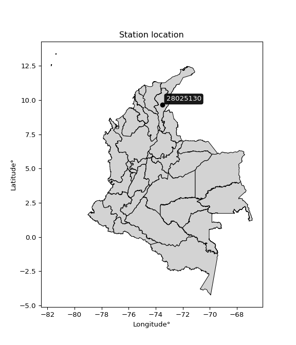

<div align="center">


</div>

# PMP Station (Rain, Pmax24h): 28025130

Probable Maximum Precipitation (PMP) is the greatest amount of rainfall for a specific duration that is meteorologically possible for a given location, acting as a "worst-case" scenario for extreme storms, crucial for designing safety-critical infrastructure like bridges, river deviations, dams, spillways, and nuclear plants to prevent catastrophic failure. PMP is calculated by hydrologists using meteorological data to determine the upper limit of extreme rainfall, often leading to the Probable Maximum Flood (PMF) for flood control design, and is increasingly being studied for climate change impacts. Probable Maximum Precipitation (PMP) is the theoretical upper limit of rainfall, a deterministic estimate for extreme events, while probability distributions (like GEV, Gumbel) describe the likelihood and frequency of various precipitation amounts, including rare ones, showing how often events occur, with PMP representing the extreme end of these distributions, used for critical infrastructure design to ensure safety against the worst conceivable weather, unlike standard statistical forecasts which cover typical probabilities.

The most common probability distributions in hydrology, used for analyzing floods, rainfall, and streamflow, include the Normal, Log-Normal, Gumbel, Gamma (including Log-Pearson Type III), and Generalized Extreme Value (GEV) distributions, often chosen based on the data´s skewness and whether modeling extremes or general conditions, with Gumbel and GEV popular for extreme events like floods, while the Normal distribution serves as a baseline, though often requiring transformations for skewed hydrological data. These distributions help in designing water infrastructure, managing water resources, and forecasting hydrologic events.

> Hydrological data often isn´t perfectly normal (it´s skewed), so different distributions are needed for different applications, such as: **Flood Frequency Analysis**: Using Gumbel, GEV, or Log-Pearson Type III for predicting extreme flood magnitudes and their return periods, **Rainfall Analysis**: Normal for annual totals, but Log-Normal, Weibull, or GEV for intensity or extreme daily rainfall, **Streamflow Modeling**: Gamma and Log-Normal for maximum flows, GEV for minimum flows, and Kappa for daily flows.

<div align="center">

</img>

</div>


## A. General information


### 1. General running parameters

• app_version: _v20260108_. • runtime: _2026-01-08 13:24:42.400241_. • Python version: _3.14.0_. • SciPy version: _1.16.3_. • Pandas version: _2.3.3_. • NumPy version: _2.3.5_. • Stations dataset (station_dataset_file): _dataset/pmax24h_in/automatic_colombia_2003_2024.csv_. • Stations catalog (station_catalog_file): _dataset/CNE.xls_. • Minimum year to eval til year_max (date_min): _1900_. • Maximum year to eval since year_min (date_max): _2024_. • Creates, save and include plots into reports (create_plot): _False_. • Plot only fit distributions with Δo > Δ (plot_only_fit): _True_. • Plot only simple graphs avoiding multiple CDFs and multiple Extreme values plots (plot_only_simple): _True_. • Eval low extreme values, if False, evaluates high extreme values (low_extreme): _False_. • Eval every SciPy distribution as logarithmic (pdist_logarithmic_on): _True_. • Standard deviation normalized (ddof): _1.0_. • Return periods to eval in years (Tr): _[2, 2.33, 5, 10, 15, 20, 25, 50, 75, 100, 200, 250, 500, 750, 1000]_. • Minimum data sample per station, 0 means any (minimum_sample): _5_. • Z-Score maximum threshold to adjust a value, 0 means disable (zscore_max): _3.5_. • Z-Score minimum threshold to adjust a value, 0 means disable (zscore_min): _-2.5_. • Avoid zeros, e.g. rain = 0 (avoid_zeros): _True_. • Avoid null values (avoid_nans): _True_. 

:file_folder:Table: [dataset.csv](../../dataset/pmax24h_in/automatic_colombia_2003_2024.csv)

> Delta Degrees of Freedom (DDOF): is a parameter used in the formulas for calculating variance and standard deviation. When ddof=0, the divisor is $N$ (the total number of observations) and this is used when your data set is the entire population. When ddof=1, the divisor is $N-1$ and this is used when your data set is a sample drawn from a larger population. Using $N-1$ provides an unbiased estimate of the population variance (known as Bessel´s correction).


### 2. Station info and location

|   id |   CODIGO | NOMBRE                            | CATEGORIA               | TECNOLOGIA                | ESTADO           | FECHA_INSTALACION   |   FECHA_SUSPENSION |   ALTITUD |   LATITUD |   LONGITUD | DEPARTAMENTO   | MUNICIPIO   | AREA_OPERATIVA                                         | ENTIDAD                                                     | AREA_HIDROGRAFICA   | ZONA_HIDROGRAFICA   | SUBZONA_HIDROGRAFICA   |   CORRIENTE | Catalogo   |   Version |
|-----:|---------:|:----------------------------------|:------------------------|:--------------------------|:-----------------|:--------------------|-------------------:|----------:|----------:|-----------:|:---------------|:------------|:-------------------------------------------------------|:------------------------------------------------------------|:--------------------|:--------------------|:-----------------------|------------:|:-----------|----------:|
|    0 | 28025130 | LA LOMA CARBONES - AUT [28025130] | Climatológica Principal | Automática con Telemetría | En Mantenimiento | 02/03/2010          |                nan |        60 |   9.64061 |   -73.5239 | Cesar          | El Paso     | Area Operativa 05 - Magdalena-Cesar-Guajira-San Andrés | INSTITUTO DE HIDROLOGIA METEOROLOGIA Y ESTUDIOS AMBIENTALES | Magdalena Cauca     | Cesar               | Bajo Cesar             |         nan | CNE_IDEAM  |  20251226 |

<div align="center">

Dynamic map: [:earth_americas:Google](http://maps.google.com/maps?q=9.640611111,-73.52394444) [:earth_americas:OSM](https://www.openstreetmap.org/#map=18/9.640611111/-73.52394444&layers=P) [:earth_americas:Bing](https://www.bing.com/maps?cp=9.640611111~-73.52394444&lvl=18) [:earth_americas:Apple](https://maps.apple.com/frame?center=9.640611111%2C-73.52394444&span=0.003%2C0.006)

</div>


<div align="center">

```geojson
{
  "type": "Feature",
  "geometry": {
    "type": "Point", 
    "coordinates": [-73.52394444, 9.640611111]
  }, 
  "properties": {
    "Name": "28025130"
  }
}
```

</div>


### 3. Discrete values table and plot

<div align="center">

|               |           0 |           1 |           2 |          3 |           4 |
|:--------------|------------:|------------:|------------:|-----------:|------------:|
| Date          | 2017        | 2018        | 2019        | 2020       | 2022        |
| Value         |   66        |   82        |   79.4      |   31.8     |   45.7      |
| Value_initial |   66        |   82        |   79.4      |   31.8     |   45.7      |
| count         |    5        |    5        |    5        |    5       |    5        |
| mean          |   60.98     |   60.98     |   60.98     |   60.98    |   60.98     |
| std           |   21.7445   |   21.7445   |   21.7445   |   21.7445  |   21.7445   |
| zscore        |    0.230863 |    0.966683 |    0.847112 |   -1.34195 |   -0.702707 |


</div>


> The initial value (value_initial) correspond to the initial obtained or null completed value, and value (value) is adjusted only when the initial value is outside the valid range (outlier) definite through the Z-Score value. If Z-Score is active, values out of range or outliers are replaced with the station mean value. A Z-Score (or standard score) measures how many standard deviations a data point is from the mean of a dataset, indicating its relative position; positive scores mean above the mean, negative mean below, and a score of zero is exactly at the mean, allowing for comparison of values from different distributions. It´s calculated using the formula $z=(x–μ)/σ$, where $x$ is the data point, $μ$ is the mean, and $σ$ is the standard deviation, helping identify outliers and understand probability.
>
> <sub>**Note**: In this study, "completing" (filling gaps in) and "extending" (forecasting or lengthening the historical record) rainfall data series are avoided for certain critical analyses because they introduce artificial bias and uncertainty, which can distort the statistics of rare events (extremes), alter day-to-day variability, and compromise the integrity and homogeneity of the original data. Some reasons against Completing/Extending rainfall data are: **Distortion of Extremes and Variability**: The primary issue is that most gap-filling or extension methods rely on averaging or regression with nearby stations, which inherently smooths the data. Rainfall is highly variable in space and time, with a large percentage of zero values and occasional large storms. Infilling methods often underestimate the highest values and overestimate the lowest (zero) values, which severely distorts analyses focused on flood frequency, drought severity, and intensity-duration-frequency (IDF) curves, **Loss of Data Homogeneity**: Infilled or extended data are synthetic estimates, not actual measurements. Combining these estimates with observed data can violate the assumption of data homogeneity, which requires that the data properties do not change over time. Inhomogeneity can lead to incorrect conclusions about long-term trends or changes in climate patterns, **Propagation of Errors**: Errors and biases from the original data (e.g., wind-induced undercatch, instrument errors, site changes) or the data used for imputation can propagate through the analysis, leading to unreliable hydrological models and inaccurate predictions, **Compromised Statistical Integrity**: For statistical analyses, especially those involving the frequency of events, using artificial data can introduce time bias or autocorrelation that doesn´t exist in reality, making it difficult to assess the true probability of events, **Difficulty in Validation**: It is difficult to accurately validate the quality of filled or extended data, especially for past periods where ground-truth measurements are unavailable. The reliability of imputation techniques heavily depends on the density of the surrounding station network and the complexity of the local topography.</sub>


### 4. Active continuous probability distributions from SciPy (43 of 104 available)

A Probability Density Function (PDF) describes the relative likelihood of a continuous random variable falling within a specific range, where the total area under its curve equals 1, and the area over any interval gives the actual probability for that range. Unlike discrete probabilities (like rolling a die), a PDF shows density, not direct probability for a single point (which is zero), with higher points indicating higher likelihood, often visualized as a bell curve for normal distributions.

A log of a probability density function (log-PDF) is simply the logarithm of the PDF´s value, denoted as $log(f(x))$, useful for converting multiplication of probabilities into addition, improving numerical stability with tiny numbers, and connecting to information theory concepts like entropy. Instead of dealing with very small probabilities (e.g., 0.000001), log-PDFs use negative numbers (e.g., $log(0.00001) ≈ -11.51$ that are easier for computers to handle, preventing underflow errors and simplifying complex calculations. In this study, each active probability distribution from SciPy is also evaluated in the $log$ form.

[scipy.stats](https://docs.scipy.org/doc/scipy/reference/stats.html) is a Python´s powerful submodule within the SciPy library for comprehensive statistical analysis, offering over 130 probability distributions (like Normal, Poisson), functions for descriptive stats (mean, variance), hypothesis testing (t-tests, chi-square), random variable generation, and statistical tests, making it essential for data science, modeling, and research. It provides tools to explore, model, and draw conclusions from data efficiently, working seamlessly with NumPy.

<div align="center">

|   id | p_dist             |   n_parameter | fit_method   | label                                                                       | active   | ref                                                                                                        |
|-----:|:-------------------|--------------:|:-------------|:----------------------------------------------------------------------------|:---------|:-----------------------------------------------------------------------------------------------------------|
|    0 | alpha              |             3 | MLE          | Alpha                                                                       | True     | [:mortar_board:](https://docs.scipy.org/doc/scipy/reference/generated/scipy.stats.alpha.html)              |
|    1 | betaprime          |             4 | MLE          | Beta prime                                                                  | True     | [:mortar_board:](https://docs.scipy.org/doc/scipy/reference/generated/scipy.stats.betaprime.html)          |
|    2 | chi2               |             3 | MLE          | Chi²                                                                        | True     | [:mortar_board:](https://docs.scipy.org/doc/scipy/reference/generated/scipy.stats.chi2.html)               |
|    3 | crystalball        |             4 | MLE          | Crystalball                                                                 | True     | [:mortar_board:](https://docs.scipy.org/doc/scipy/reference/generated/scipy.stats.crystalball.html)        |
|    4 | erlang             |             3 | MLE          | Erlang                                                                      | True     | [:mortar_board:](https://docs.scipy.org/doc/scipy/reference/generated/scipy.stats.erlang.html)             |
|    5 | expon              |             2 | MLE          | Exponential                                                                 | True     | [:mortar_board:](https://docs.scipy.org/doc/scipy/reference/generated/scipy.stats.expon.html)              |
|    6 | exponnorm          |             3 | MLE          | Exponentially modified Normal                                               | True     | [:mortar_board:](https://docs.scipy.org/doc/scipy/reference/generated/scipy.stats.exponnorm.html)          |
|    7 | f                  |             4 | MLE          | F                                                                           | True     | [:mortar_board:](https://docs.scipy.org/doc/scipy/reference/generated/scipy.stats.f.html)                  |
|    8 | fatiguelife        |             3 | MLE          | Fatigue-life (Birnbaum-Saunders)                                            | True     | [:mortar_board:](https://docs.scipy.org/doc/scipy/reference/generated/scipy.stats.fatiguelife.html)        |
|    9 | fisk               |             3 | MLE          | Fisk                                                                        | True     | [:mortar_board:](https://docs.scipy.org/doc/scipy/reference/generated/scipy.stats.fisk.html)               |
|   10 | gamma              |             3 | MLE          | Gamma                                                                       | True     | [:mortar_board:](https://docs.scipy.org/doc/scipy/reference/generated/scipy.stats.gamma.html)              |
|   11 | genexpon           |             5 | MLE          | Generalized exponential                                                     | True     | [:mortar_board:](https://docs.scipy.org/doc/scipy/reference/generated/scipy.stats.genexpon.html)           |
|   12 | genlogistic        |             3 | MLE          | Generalized logistic                                                        | True     | [:mortar_board:](https://docs.scipy.org/doc/scipy/reference/generated/scipy.stats.genlogistic.html)        |
|   13 | gibrat             |             2 | MM           | Gibrat                                                                      | True     | [:mortar_board:](https://docs.scipy.org/doc/scipy/reference/generated/scipy.stats.gibrat.html)             |
|   14 | gompertz           |             3 | MLE          | Gompertz (or truncated Gumbel)                                              | True     | [:mortar_board:](https://docs.scipy.org/doc/scipy/reference/generated/scipy.stats.gompertz.html)           |
|   15 | gumbel_l           |             2 | MM           | Gumbel Left Skew                                                            | True     | [:mortar_board:](https://docs.scipy.org/doc/scipy/reference/generated/scipy.stats.gumbel_l.html)           |
|   16 | gumbel_r           |             2 | MM           | Gumbel Right Skew                                                           | True     | [:mortar_board:](https://docs.scipy.org/doc/scipy/reference/generated/scipy.stats.gumbel_r.html)           |
|   17 | halflogistic       |             2 | MM           | Half-logistic                                                               | True     | [:mortar_board:](https://docs.scipy.org/doc/scipy/reference/generated/scipy.stats.halflogistic.html)       |
|   18 | halfnorm           |             2 | MM           | Half Normal                                                                 | True     | [:mortar_board:](https://docs.scipy.org/doc/scipy/reference/generated/scipy.stats.halfnorm.html)           |
|   19 | hypsecant          |             2 | MM           | hyperbolic secant                                                           | True     | [:mortar_board:](https://docs.scipy.org/doc/scipy/reference/generated/scipy.stats.hypsecant.html)          |
|   20 | invgamma           |             3 | MLE          | Inverted gamma                                                              | True     | [:mortar_board:](https://docs.scipy.org/doc/scipy/reference/generated/scipy.stats.invgamma.html)           |
|   21 | invgauss           |             3 | MLE          | Inverse Gaussian                                                            | True     | [:mortar_board:](https://docs.scipy.org/doc/scipy/reference/generated/scipy.stats.invgauss.html)           |
|   22 | invweibull         |             3 | MLE          | Inverted Weibull                                                            | True     | [:mortar_board:](https://docs.scipy.org/doc/scipy/reference/generated/scipy.stats.invweibull.html)         |
|   23 | kstwobign          |             2 | MLE          | Limiting distribution of scaled Kolmogorov-Smirnov two-sided test statistic | True     | [:mortar_board:](https://docs.scipy.org/doc/scipy/reference/generated/scipy.stats.kstwobign.html)          |
|   24 | laplace            |             2 | MM           | Laplace                                                                     | True     | [:mortar_board:](https://docs.scipy.org/doc/scipy/reference/generated/scipy.stats.laplace.html)            |
|   25 | laplace_asymmetric |             3 | MLE          | Asymmetric Laplace                                                          | True     | [:mortar_board:](https://docs.scipy.org/doc/scipy/reference/generated/scipy.stats.laplace_asymmetric.html) |
|   26 | loggamma           |             3 | MLE          | Log gamma                                                                   | True     | [:mortar_board:](https://docs.scipy.org/doc/scipy/reference/generated/scipy.stats.loggamma.html)           |
|   27 | logistic           |             2 | MM           | Logistic (or Sech-squared)                                                  | True     | [:mortar_board:](https://docs.scipy.org/doc/scipy/reference/generated/scipy.stats.logistic.html)           |
|   28 | lognorm            |             3 | MLE          | Log Normal                                                                  | True     | [:mortar_board:](https://docs.scipy.org/doc/scipy/reference/generated/scipy.stats.lognorm.html)            |
|   29 | maxwell            |             2 | MM           | Maxwell                                                                     | True     | [:mortar_board:](https://docs.scipy.org/doc/scipy/reference/generated/scipy.stats.maxwell.html)            |
|   30 | mielke             |             4 | MLE          | Mielke Beta-Kappa / Dagum                                                   | True     | [:mortar_board:](https://docs.scipy.org/doc/scipy/reference/generated/scipy.stats.mielke.html)             |
|   31 | moyal              |             2 | MM           | Moyal                                                                       | True     | [:mortar_board:](https://docs.scipy.org/doc/scipy/reference/generated/scipy.stats.moyal.html)              |
|   32 | nakagami           |             3 | MLE          | Nakagami                                                                    | True     | [:mortar_board:](https://docs.scipy.org/doc/scipy/reference/generated/scipy.stats.nakagami.html)           |
|   33 | ncf                |             5 | MLE          | Non-central F distribution                                                  | True     | [:mortar_board:](https://docs.scipy.org/doc/scipy/reference/generated/scipy.stats.ncf.html)                |
|   34 | nct                |             4 | MLE          | Non-central Student’s t                                                     | True     | [:mortar_board:](https://docs.scipy.org/doc/scipy/reference/generated/scipy.stats.nct.html)                |
|   35 | norm               |             2 | MM           | Normal                                                                      | True     | [:mortar_board:](https://docs.scipy.org/doc/scipy/reference/generated/scipy.stats.norm.html)               |
|   36 | pearson3           |             3 | MM           | Pearson type III                                                            | True     | [:mortar_board:](https://docs.scipy.org/doc/scipy/reference/generated/scipy.stats.pearson3.html)           |
|   37 | rayleigh           |             2 | MM           | Rayleigh                                                                    | True     | [:mortar_board:](https://docs.scipy.org/doc/scipy/reference/generated/scipy.stats.rayleigh.html)           |
|   38 | rice               |             3 | MLE          | Rice                                                                        | True     | [:mortar_board:](https://docs.scipy.org/doc/scipy/reference/generated/scipy.stats.rice.html)               |
|   39 | t                  |             3 | MLE          | Student’s t                                                                 | True     | [:mortar_board:](https://docs.scipy.org/doc/scipy/reference/generated/scipy.stats.t.html)                  |
|   40 | truncnorm          |             4 | MLE          | Truncated normal                                                            | True     | [:mortar_board:](https://docs.scipy.org/doc/scipy/reference/generated/scipy.stats.truncnorm.html)          |
|   41 | wald               |             2 | MM           | Wald                                                                        | True     | [:mortar_board:](https://docs.scipy.org/doc/scipy/reference/generated/scipy.stats.wald.html)               |
|   42 | weibull_min        |             3 | MLE          | Weibull minimum                                                             | True     | [:mortar_board:](https://docs.scipy.org/doc/scipy/reference/generated/scipy.stats.weibull_min.html)        |

</div>

> **n_parameter:** # arguments & localization & scale.
>
> **Fit methods:** (MLE) maximum likelihood, (MM) L-moments.
>
>**Inactive** (With the only purpose of prevent loops, zero divisions, infinite values, over high estimated values or horizontal trending for recurrence intervals estimations, the follow distributions were disabled.)**:** foldnorm, gennorm, norminvgauss, powernorm, powerlognorm, skewnorm, genextreme, anglit, arcsine, argus, beta, bradford, burr, burr12, cauchy, cosine, halfcauchy, foldcauchy, skewcauchy, wrapcauchy, dgamma, gengamma, exponweib, exponpow, truncexpon, gausshyper, genhalflogistic, genhyperbolic, geninvgauss, halfgennorm, johnsonsb, johnsonsu, kappa4, kappa3, ksone, kstwo, loglaplace, levy, levy_l, levy_stable, ncx2, pareto, genpareto, truncpareto, lomax, powerlaw, rdist, rel_breitwigner, recipinvgauss, semicircular, studentized_range, trapezoid, triang, truncweibull_min, tukeylambda, uniform, loguniform, vonmises, vonmises_line, weibull_max, dweibull, 


## B. Probability (PDF) vs. Empirical (EDF) distributions functions

A continuous probability distribution (CPD) describes probabilities for variables that can take any value within a range (like rain any time), unlike discrete variables with specific outcomes (like temperature). It uses a Probability Density Function (PDF), a curve where the total area under it equals 1, and the probability of the variable falling within an interval (a to b) is found by calculating the area under the curve between those points. A key feature is that the probability of hitting any single exact value is zero, so probabilities are always expressed for ranges, e.g., $P(a ≤ X ≤ b)$.

<div align="center">

Distributions parameters from station values
|    |   station | p_dist                |   n |             loc |           scale | shape                  | shape1                | shape2                 | shape3   |
|---:|----------:|:----------------------|----:|----------------:|----------------:|:-----------------------|:----------------------|:-----------------------|:---------|
|  0 |  28025130 | alpha                 |   5 |  -305.851       |  6645.19        | 18.1821504235655       |                       |                        |          |
|  1 |  28025130 | betaprime             |   5 |   -50.3813      |  7277.64        | 29.540852065835153     | 1927.0936384570223    |                        |          |
|  2 |  28025130 | chi2                  |   5 |  -131.952       |     1.00978     | 191.00173304963482     |                       |                        |          |
|  3 |  28025130 | crystalball           |   5 |    60.98        |    19.4488      | 53064.81662488938      | 4478.243049288081     |                        |          |
|  4 |  28025130 | erlang                |   5 |  -241.401       |     1.28977     | 234.38031016933758     |                       |                        |          |
|  5 |  28025130 | expon                 |   5 |    31.8         |    29.18        |                        |                       |                        |          |
|  6 |  28025130 | exponnorm             |   5 |    60.9641      |    19.4488      | 0.0008192812234024958  |                       |                        |          |
|  7 |  28025130 | f                     |   5 | -4271.71        |  4332.68        | 105334.27853230326     | 1478628.0900593353    |                        |          |
|  8 |  28025130 | fatiguelife           |   5 |    31.8         |     3.62337e-06 | 2576.396793178823      |                       |                        |          |
|  9 |  28025130 | fisk                  |   5 |    -9.57747e+08 |     9.57748e+08 | 80580735.66711469      |                       |                        |          |
| 10 |  28025130 | gamma                 |   5 |  -234.172       |     1.3218      | 223.1945217741357      |                       |                        |          |
| 11 |  28025130 | genexpon              |   5 |    31.8         |     1.70801     | 0.058579761759338544   | 3.822232251612109e-06 | 1.7082037036596152     |          |
| 12 |  28025130 | genlogistic           |   5 |    82.0006      |     4.96108e-05 | 2.3554250460760313e-06 |                       |                        |          |
| 13 |  28025130 | gibrat                |   5 |    46.143       |     8.99911     |                        |                       |                        |          |
| 14 |  28025130 | gompertz              |   5 |   -52.7821      |    15.369       | 0.0003334307941082107  |                       |                        |          |
| 15 |  28025130 | gumbel_l              |   5 |    69.733       |    15.1642      |                        |                       |                        |          |
| 16 |  28025130 | gumbel_r              |   5 |    52.227       |    15.1642      |                        |                       |                        |          |
| 17 |  28025130 | halflogistic          |   5 |    37.9286      |    16.6281      |                        |                       |                        |          |
| 18 |  28025130 | halfnorm              |   5 |    35.2373      |    32.2637      |                        |                       |                        |          |
| 19 |  28025130 | hypsecant             |   5 |    60.98        |    12.3815      |                        |                       |                        |          |
| 20 |  28025130 | invgamma              |   5 |  -179.688       | 33921.4         | 142.10853459170062     |                       |                        |          |
| 21 |  28025130 | invgauss              |   5 |   -34.1911      |  1920.21        | 0.049438331505481756   |                       |                        |          |
| 22 |  28025130 | invweibull            |   5 |    31.8         |     1.08996     | 0.04406774430124803    |                       |                        |          |
| 23 |  28025130 | kstwobign             |   5 |   -12.3328      |    83.4503      |                        |                       |                        |          |
| 24 |  28025130 | laplace               |   5 |    60.98        |    13.7524      |                        |                       |                        |          |
| 25 |  28025130 | laplace_asymmetric    |   5 |    66           |    16.1857      | 1.1663700480945645     |                       |                        |          |
| 26 |  28025130 | loggamma              |   5 |    82.0002      |     1.21907e-05 | 5.80543554311162e-07   |                       |                        |          |
| 27 |  28025130 | logistic              |   5 |    60.98        |    10.7227      |                        |                       |                        |          |
| 28 |  28025130 | lognorm               |   5 |    31.8         |     0.0209499   | 14.709920075440992     |                       |                        |          |
| 29 |  28025130 | maxwell               |   5 |    14.8944      |    28.8799      |                        |                       |                        |          |
| 30 |  28025130 | mielke                |   5 |    -6.32645     |    88.4036      | 3.1188745432257647     | 7004.63491655319      |                        |          |
| 31 |  28025130 | moyal                 |   5 |    49.8579      |     8.75506     |                        |                       |                        |          |
| 32 |  28025130 | nakagami              |   5 |    45.7         |    24.6392      | 0.23628919933618406    |                       |                        |          |
| 33 |  28025130 | ncf                   |   5 |    -0.0431905   |     2.04936e-08 | 2.236445997415428e-09  | 1.7869795109991902    | 5.561550048245109      |          |
| 34 |  28025130 | nct                   |   5 |  -890.264       |    19.3704      | 139540.24381689267     | 49.107697293847636    |                        |          |
| 35 |  28025130 | norm                  |   5 |    60.98        |    19.4488      |                        |                       |                        |          |
| 36 |  28025130 | pearson3              |   5 |    60.98        |    19.4489      | -0.3466391136280452    |                       |                        |          |
| 37 |  28025130 | rayleigh              |   5 |    23.7732      |    29.6867      |                        |                       |                        |          |
| 38 |  28025130 | rice                  |   5 |    20.5725      |    22.5553      | 1.3974817123973624     |                       |                        |          |
| 39 |  28025130 | t                     |   5 |    60.9805      |    19.4486      | 16915.01850681087      |                       |                        |          |
| 40 |  28025130 | truncnorm             |   5 |   -86.2852      |    90.4246      | 1.2615890663589822     | 16.204266711227625    |                        |          |
| 41 |  28025130 | wald                  |   5 |    41.5312      |    19.4488      |                        |                       |                        |          |
| 42 |  28025130 | weibull_min           |   5 |    -8.11834e+08 |     8.11834e+08 | 52820855.28422557      |                       |                        |          |
| 43 |  28025130 | logalpha              |   5 |    -6.18424     |   283.814       | 27.775121955736267     |                       |                        |          |
| 44 |  28025130 | logbetaprime          |   5 |    -4.29253     |     7.06021     | 907.2988850636998      | 768.5692926113024     |                        |          |
| 45 |  28025130 | logchi2               |   5 |     3.45947     |     0.986504    | 1.047300123402293      |                       |                        |          |
| 46 |  28025130 | logcrystalball        |   5 |     4.05049     |     0.361309    | 7.309922230887704      | 1303.02602648529      |                        |          |
| 47 |  28025130 | logerlang             |   5 |    -1.34198     |     0.0247004   | 218.30068540696664     |                       |                        |          |
| 48 |  28025130 | logexpon              |   5 |     3.45947     |     0.591021    |                        |                       |                        |          |
| 49 |  28025130 | logexponnorm          |   5 |     4.05023     |     0.361307    | 0.0007035286813612338  |                       |                        |          |
| 50 |  28025130 | logf                  |   5 |  -344.773       |   348.823       | 7048932.150213644      | 2510827.120755499     |                        |          |
| 51 |  28025130 | logfatiguelife        |   5 |  -103.668       |   107.716       | 0.0033494188087048148  |                       |                        |          |
| 52 |  28025130 | logfisk               |   5 |    -2.39063e+07 |     2.39063e+07 | 109384768.01809496     |                       |                        |          |
| 53 |  28025130 | loggamma              |   5 |    -1.92344     |     0.0227904   | 262.1488269511966      |                       |                        |          |
| 54 |  28025130 | loggenexpon           |   5 |     3.45562     |     0.00297985  | 0.0024399051545189645  | 1.6794156258180868    | 1.1212395599950456e-05 |          |
| 55 |  28025130 | loggenlogistic        |   5 |     4.40673     |     1.62629e-07 | 4.596375228291082e-07  |                       |                        |          |
| 56 |  28025130 | loggibrat             |   5 |     3.7749      |     0.167156    |                        |                       |                        |          |
| 57 |  28025130 | loggompertz           |   5 |     3.45947     |     0.360395    | 0.15225344357260956    |                       |                        |          |
| 58 |  28025130 | loggumbel_l           |   5 |     4.2131      |     0.281711    |                        |                       |                        |          |
| 59 |  28025130 | loggumbel_r           |   5 |     3.88788     |     0.281711    |                        |                       |                        |          |
| 60 |  28025130 | loghalflogistic       |   5 |     3.62225     |     0.308908    |                        |                       |                        |          |
| 61 |  28025130 | loghalfnorm           |   5 |     3.57224     |     0.599399    |                        |                       |                        |          |
| 62 |  28025130 | loghypsecant          |   5 |     4.05049     |     0.230016    |                        |                       |                        |          |
| 63 |  28025130 | loginvgamma           |   5 |    -2.51858     |  2100.09        | 320.8397659953629      |                       |                        |          |
| 64 |  28025130 | loginvgauss           |   5 |     0.793169    |   232.586       | 0.014000599959446091   |                       |                        |          |
| 65 |  28025130 | loginvweibull         |   5 |    -3.5667e+07  |     3.5667e+07  | 98777829.2508657       |                       |                        |          |
| 66 |  28025130 | logkstwobign          |   5 |     2.60469     |     1.64632     |                        |                       |                        |          |
| 67 |  28025130 | loglaplace            |   5 |     4.05049     |     0.255484    |                        |                       |                        |          |
| 68 |  28025130 | loglaplace_asymmetric |   5 |     4.40672     |     0.00404115  | 87.95818205783308      |                       |                        |          |
| 69 |  28025130 | logloggamma           |   5 |     4.40681     |     1.08752e-06 | 3.0566269048264092e-06 |                       |                        |          |
| 70 |  28025130 | loglogistic           |   5 |     4.05049     |     0.1992      |                        |                       |                        |          |
| 71 |  28025130 | loglognorm            |   5 |     3.45947     |     0.000633366 | 13.99728842361657      |                       |                        |          |
| 72 |  28025130 | logmaxwell            |   5 |     3.19434     |     0.536512    |                        |                       |                        |          |
| 73 |  28025130 | logmielke             |   5 |    -1.57589e+07 |     1.57589e+07 | 44050169.241854355     | 24613565376.74783     |                        |          |
| 74 |  28025130 | logmoyal              |   5 |     3.84387     |     0.162646    |                        |                       |                        |          |
| 75 |  28025130 | lognakagami           |   5 |     3.8221      |     0.443463    | 0.20352656058670562    |                       |                        |          |
| 76 |  28025130 | logncf                |   5 |    -4.01079     |     7.91635     | 1064.7362132460048     | 795.7970842691111     | 17.170897762704136     |          |
| 77 |  28025130 | lognct                |   5 |   -13.955       |     0.226669    | 1947.8572759419158     | 79.40691513327582     |                        |          |
| 78 |  28025130 | lognorm               |   5 |     4.05049     |     0.361309    |                        |                       |                        |          |
| 79 |  28025130 | logpearson3           |   5 |     4.05049     |     0.361309    | -0.578554971843507     |                       |                        |          |
| 80 |  28025130 | lograyleigh           |   5 |     3.35928     |     0.551501    |                        |                       |                        |          |
| 81 |  28025130 | logrice               |   5 |     3.23349     |     0.404865    | 1.6936517865832013     |                       |                        |          |
| 82 |  28025130 | logt                  |   5 |     4.05049     |     0.361306    | 197883838.92840958     |                       |                        |          |
| 83 |  28025130 | logtruncnorm          |   5 |    -0.112011    |     1.10456     | 3.561613270901902      | 4.090975332442854     |                        |          |
| 84 |  28025130 | logwald               |   5 |     3.68919     |     0.361299    |                        |                       |                        |          |
| 85 |  28025130 | logweibull_min        |   5 |    -1.60622e+07 |     1.60622e+07 | 59828272.82384916      |                       |                        |          |

</div>

> **loc** (Location parameter): This shifts the distribution along the x-axis. For many common distributions, like the normal (Gaussian) distribution, loc represents the mean $μ$. For others, like the uniform distribution, it might represent the minimum value, or for the beta distribution, the left end of the support interval.
>
> **scale** (Scale parameter): This determines the width or spread of the distribution. For the normal distribution, scale represents the standard deviation $σ$. For a uniform distribution, it defines the length of the interval (from $loc$ to $loc + scale$).
>
> **shape** (Shape parameters): Refers to parameters that define the specific form of a probability distribution, distinct from its location (loc) and scale (scale). These parameters are required arguments for most distribution functions. For example, a normal (Gaussian) distribution is fully defined by its location (mean) and scale (standard deviation), so it has no specific shape parameters beyond loc and scale. However, other distributions have intrinsic properties that need specification, as Gamma distribution that takes a shape parameter, often named $a$ or $alpha$.


### 0. Cumulative distribution values - CDF (86 evaluated)

Cumulative Distribution Function (CDF), denoted as $F$<sub>$X$</sub>$(x)$, is a function that gives the probability that a random variable $X$ will take a value less than or equal to a specific value, $x$ (i.e., $(P(X≥x)$. It essentially "accumulates" probabilities from a given point up to the far right (positive infinity), providing a complete picture of the distribution´s probabilities for both discrete (like rain) and continuous (like temperature) variables, helping to find probabilities over ranges or above certain values. Each station is evaluated separately ordering the $x$ values ascending, calculating the CDF and PDF values for the activated distributions and their logarithmic forms.

<div align="center">

CDF ordered by x ascending and calculating $log(f(x))$ separately
|   id |   Station |   date |    x |   count |   mean |     std |    zscore |   Value_initial |   station |   m |     alpha |   alpha_pdf |   betaprime |   betaprime_pdf |      chi2 |   chi2_pdf |   crystalball |   crystalball_pdf |    erlang |   erlang_pdf |    expon |   expon_pdf |   exponnorm |   exponnorm_pdf |         f |      f_pdf |   fatiguelife |   fatiguelife_pdf |      fisk |   fisk_pdf |     gamma |   gamma_pdf |    genexpon |   genexpon_pdf |   genlogistic |   genlogistic_pdf |   gibrat |   gibrat_pdf |   gompertz |   gompertz_pdf |   gumbel_l |   gumbel_l_pdf |   gumbel_r |   gumbel_r_pdf |   halflogistic |   halflogistic_pdf |   halfnorm |   halfnorm_pdf |   hypsecant |   hypsecant_pdf |   invgamma |   invgamma_pdf |   invgauss |   invgauss_pdf |   invweibull |   invweibull_pdf |   kstwobign |   kstwobign_pdf |   laplace |   laplace_pdf |   laplace_asymmetric |   laplace_asymmetric_pdf |   loggamma |   loggamma_pdf |   logistic |   logistic_pdf |   lognorm |   lognorm_pdf |   maxwell |   maxwell_pdf |    mielke |   mielke_pdf |      moyal |   moyal_pdf |    nakagami |   nakagami_pdf |      ncf |    ncf_pdf |       nct |   nct_pdf |      norm |   norm_pdf |   pearson3 |   pearson3_pdf |   rayleigh |   rayleigh_pdf |      rice |   rice_pdf |         t |      t_pdf |   truncnorm |   truncnorm_pdf |      wald |   wald_pdf |   weibull_min |   weibull_min_pdf |   logalpha |   logalpha_pdf |   logbetaprime |   logbetaprime_pdf |     logchi2 |   logchi2_pdf |   logcrystalball |   logcrystalball_pdf |   logerlang |   logerlang_pdf |   logexpon |   logexpon_pdf |   logexponnorm |   logexponnorm_pdf |      logf |   logf_pdf |   logfatiguelife |   logfatiguelife_pdf |   logfisk |   logfisk_pdf |   loggenexpon |   loggenexpon_pdf |   loggenlogistic |   loggenlogistic_pdf |   loggibrat |   loggibrat_pdf |   loggompertz |   loggompertz_pdf |   loggumbel_l |   loggumbel_l_pdf |   loggumbel_r |   loggumbel_r_pdf |   loghalflogistic |   loghalflogistic_pdf |   loghalfnorm |   loghalfnorm_pdf |   loghypsecant |   loghypsecant_pdf |   loginvgamma |   loginvgamma_pdf |   loginvgauss |   loginvgauss_pdf |   loginvweibull |   loginvweibull_pdf |   logkstwobign |   logkstwobign_pdf |   loglaplace |   loglaplace_pdf |   loglaplace_asymmetric |   loglaplace_asymmetric_pdf |   logloggamma |   logloggamma_pdf |   loglogistic |   loglogistic_pdf |   loglognorm |   loglognorm_pdf |   logmaxwell |   logmaxwell_pdf |   logmielke |   logmielke_pdf |   logmoyal |   logmoyal_pdf |   lognakagami |   lognakagami_pdf |   logncf |   logncf_pdf |    lognct |   lognct_pdf |   logpearson3 |   logpearson3_pdf |   lograyleigh |   lograyleigh_pdf |   logrice |   logrice_pdf |      logt |   logt_pdf |   logtruncnorm |   logtruncnorm_pdf |   logwald |   logwald_pdf |   logweibull_min |   logweibull_min_pdf |
|-----:|----------:|-------:|-----:|--------:|-------:|--------:|----------:|----------------:|----------:|----:|----------:|------------:|------------:|----------------:|----------:|-----------:|--------------:|------------------:|----------:|-------------:|---------:|------------:|------------:|----------------:|----------:|-----------:|--------------:|------------------:|----------:|-----------:|----------:|------------:|------------:|---------------:|--------------:|------------------:|---------:|-------------:|-----------:|---------------:|-----------:|---------------:|-----------:|---------------:|---------------:|-------------------:|-----------:|---------------:|------------:|----------------:|-----------:|---------------:|-----------:|---------------:|-------------:|-----------------:|------------:|----------------:|----------:|--------------:|---------------------:|-------------------------:|-----------:|---------------:|-----------:|---------------:|----------:|--------------:|----------:|--------------:|----------:|-------------:|-----------:|------------:|------------:|---------------:|---------:|-----------:|----------:|----------:|----------:|-----------:|-----------:|---------------:|-----------:|---------------:|----------:|-----------:|----------:|-----------:|------------:|----------------:|----------:|-----------:|--------------:|------------------:|-----------:|---------------:|---------------:|-------------------:|------------:|--------------:|-----------------:|---------------------:|------------:|----------------:|-----------:|---------------:|---------------:|-------------------:|----------:|-----------:|-----------------:|---------------------:|----------:|--------------:|--------------:|------------------:|-----------------:|---------------------:|------------:|----------------:|--------------:|------------------:|--------------:|------------------:|--------------:|------------------:|------------------:|----------------------:|--------------:|------------------:|---------------:|-------------------:|--------------:|------------------:|--------------:|------------------:|----------------:|--------------------:|---------------:|-------------------:|-------------:|-----------------:|------------------------:|----------------------------:|--------------:|------------------:|--------------:|------------------:|-------------:|-----------------:|-------------:|-----------------:|------------:|----------------:|-----------:|---------------:|--------------:|------------------:|---------:|-------------:|----------:|-------------:|--------------:|------------------:|--------------:|------------------:|----------:|--------------:|----------:|-----------:|---------------:|-------------------:|----------:|--------------:|-----------------:|---------------------:|
|    0 |  28025130 |   2020 | 31.8 |       5 |  60.98 | 21.7445 | -1.34195  |            31.8 |  28025130 |   1 | 0.0669988 |  0.00756595 |   0.0656095 |      0.00760278 | 0.0639638 | 0.00707948 |     0.0667624 |        0.00665594 | 0.0665897 |   0.00700057 | 0        |  0.03427    |   0.0667623 |      0.00665594 | 0.0674407 | 0.00670895 |     0.0734205 |       3.89543e+11 | 0.0717838 | 0.00560603 | 0.0668553 |  0.00703313 | 1.13946e-06 |     0.034297   |      0        |        0.00437908 | 0        |   0          |  0.0782998 |     0.00490979 |  0.0786942 |      0.0049797 |  0.0213634 |     0.00541838 |       0        |         0          |   0        |     0          |   0.0601267 |      0.00482734 |  0.0667659 |     0.00759905 |   0.061193 |     0.00843559 |     0.012918 |      6.96881e+11 |   0.0575523 |      0.0102006  | 0.0599073 |    0.00435613 |            0.0941722 |               0.00498833 |  0.0506476 |       0.302769 |  0.0617266 |     0.00540128 | 0.0509429 |      0.289731 | 0.0481858 |     0.0079764 | 0.0725858 |   0.00593776 | 0.00503689 |  0.00250277 | 0           |    0           | 0.357692 | 0.00707872 | 0.0667909 | 0.0066598 | 0.0667624 | 0.00665594 |  0.0744123 |     0.00620555 |  0.0358934 |     0.00878096 | 0.0465392 | 0.00825911 | 0.0667658 | 0.00665553 |   0.0748867 |      0.0181621  | 0         | 0          |      0.078612 |        0.00490825 |  0.0489785 |       0.309599 |      0.0693541 |           0.351332 | 7.21224e-09 |   8.50435e+06 |        0.0509429 |             0.289731 |   0.0485663 |        0.298392 |   0        |       1.69199  |      0.0509431 |           0.289733 | 0.0514263 |   0.291484 |        0.0507673 |             0.290946 | 0.0536764 |      0.232417 |    0.00315813 |          0.824342 |         0        |             0.194314 |    0        |        0        |   3.12814e-09 |          0.422463 |     0.0665745 |          0.228275 |     0.0102994 |          0.167287 |          0        |              0        |      0        |          0        |      0.0486546 |           0.210704 |     0.0476538 |          0.306552 |     0.0508798 |          0.333751 |       0.0483539 |            0.405651 |      0.0496809 |           0.473872 |    0.0494651 |         0.193613 |               0.0695956 |                    0.195795 |     0.0697621 |          0.196077 |     0.0489403 |          0.233661 |    0.0227831 |      8.69634e+12 |    0.0298439 |         0.321429 |   0.0702114 |        0.196259 | 0.00111431 |      0.0393723 |    0          |       0           | 0.131042 |     0.430985 | 0.0514955 |     0.298458 |     0.0636321 |          0.267089 |      0.016364 |          0.323994 | 0.0382517 |      0.347536 | 0.0509404 |   0.289721 |    0           |           0        |  0        |      0        |        0.0575763 |             0.208164 |
|    1 |  28025130 |   2022 | 45.7 |       5 |  60.98 | 21.7445 | -0.702707 |            45.7 |  28025130 |   2 | 0.23565   |  0.0165485  |   0.233943  |      0.0163893  | 0.224238  | 0.0160196  |     0.216036  |        0.0150655  | 0.223333  |   0.0156531  | 0.378956 |  0.0212832  |   0.216036  |      0.0150655  | 0.217352  | 0.0150856  |     0.776438  |       0.00817161  | 0.199389  | 0.0134308  | 0.224193  |  0.0156979  | 0.379208    |     0.0212927  |      0        |        0.00847216 | 0        |   0          |  0.182842  |     0.0107539  |  0.185335  |      0.011012  |  0.214831  |     0.0217874  |       0.229521 |         0.0284856  |   0.254279 |     0.0234634  |   0.180335  |      0.0137981  |  0.236211  |     0.0166126  |   0.250943 |     0.0181059  |     0.409066 |      0.00115925  |   0.281151  |      0.0198733  | 0.164602  |    0.011969   |            0.196647  |               0.0104165  |  0.271633  |       0.922421 |  0.193877  |     0.0145755  | 0.263655  |      0.904203 | 0.232044  |     0.0177968 | 0.191378  |   0.0114727  | 0.204791   |  0.0258602  | 3.54276e-08 |    2.35627e+06 | 0.443591 | 0.00537736 | 0.216127  | 0.0150693 | 0.216036  | 0.0150655  |  0.209037  |     0.0135675  |  0.238732  |     0.0189404  | 0.226225  | 0.0170446  | 0.216031  | 0.0150648  |   0.302761  |      0.0146843  | 0.0770618 | 0.0489809  |      0.183119 |        0.0107501  |  0.278168  |       0.951134 |      0.292169  |           0.863949 | 0.436468    |   0.557816    |        0.263655  |             0.904203 |   0.27052   |        0.933313 |   0.458585 |       0.916068 |      0.263657  |           0.904211 | 0.264477  |   0.903207 |        0.264831  |             0.909479 | 0.229636  |      0.809431 |    0.357515   |          1.02504  |         0        |             0.54152  |    0.103027 |        3.79965  |   0.232173    |          0.887242 |     0.22088   |          0.690283 |     0.282799  |          1.2679   |          0.312649 |              1.46039  |      0.323215 |          1.22037  |      0.22588   |           0.901651 |     0.277139  |          0.956224 |     0.289774  |          0.957079 |       0.329686  |            1.01313  |      0.355088  |           1.02445  |    0.204519  |         0.800516 |               0.193041  |                    0.543085 |     0.193315  |          0.543342 |     0.241123  |          0.918589 |    0.674965  |      0.0709101   |    0.287202  |         1.02683  |   0.193477  |        0.540819 | 0.284973   |      1.48076   |    6.1838e-07 |       5.66808e+08 | 0.34284  |     0.708845 | 0.268638  |     0.911509 |     0.244321  |          0.775562 |      0.296805 |          1.07002  | 0.2781    |      0.950686 | 0.26365   |   0.904199 |    0.000335766 |           3.90281  |  0.237746 |      2.87498  |        0.204602  |             0.678197 |
|    2 |  28025130 |   2017 | 66   |       5 |  60.98 | 21.7445 |  0.230863 |            66   |  28025130 |   3 | 0.622311  |  0.0182643  |   0.613901  |      0.0179576  | 0.613844  | 0.0190467  |     0.60184   |        0.0198404  | 0.609805  |   0.0192159  | 0.690264 |  0.0106147  |   0.60184   |      0.0198404  | 0.602024  | 0.0197289  |     0.88346   |       0.00341604  | 0.578796  | 0.0205115  | 0.610945  |  0.019191   | 0.690573    |     0.0106131  |      0        |        0.0222111  | 0.785654 |   0.0146887  |  0.531134  |     0.0231176  |  0.542412  |      0.0235908 |  0.668161  |     0.0177668  |       0.687973 |         0.0158375  |   0.659652 |     0.0156969  |   0.625659  |      0.0237311  |  0.62334   |     0.0182448  |   0.638351 |     0.0169265  |     0.42354  |      0.000468853 |   0.658413  |      0.0151348  | 0.652911  |    0.0252384  |            0.576346  |               0.0305292  |  0.652966  |       0.985388 |  0.614949  |     0.0220827  | 0.649946  |      1.02522  | 0.628202  |     0.0180761 | 0.534711  |   0.0230579  | 0.690797   |  0.0167467  | 0.692682    |    0.0141511   | 0.534853 | 0.00375076 | 0.601891  | 0.0198326 | 0.60184   | 0.0198404  |  0.580836  |     0.0206963  |  0.636374  |     0.0174228  | 0.617242  | 0.0186104  | 0.60183   | 0.0198404  |   0.55499   |      0.0103181  | 0.753907  | 0.0141559  |      0.531281 |        0.0231088  |  0.661533  |       0.964637 |      0.639287  |           0.899724 | 0.593294    |   0.331734    |        0.649946  |             1.02522  |   0.655996  |        0.991333 |   0.709302 |       0.491858 |      0.649951  |           1.02522  | 0.649637  |   1.02155  |        0.651971  |             1.02318  | 0.615717  |      1.08262  |    0.690194   |          0.735257 |         0        |             1.53028  |    0.818263 |        0.636476 |   0.633032    |          1.17579  |     0.601544  |          1.30148  |     0.70993   |          0.863347 |          0.725143 |              0.76749  |      0.69702  |          0.783113 |      0.681811  |           1.16419  |     0.662443  |          0.967643 |     0.661208  |          0.912247 |       0.669682  |            0.743624 |      0.687891  |           0.721606 |    0.709998  |         1.13511  |               0.542916  |                    1.5274   |     0.543156  |          1.52662  |     0.667884  |          1.11353  |    0.692753  |      0.0343831   |    0.671588  |         0.915766 |   0.540544  |        1.51096  | 0.729781   |      0.798181  |    0.713857   |       0.703429    | 0.613029 |     0.703623 | 0.650792  |     0.999928 |     0.61904   |          1.13889  |      0.678096 |          0.878833 | 0.65814   |      0.966025 | 0.649942  |   1.02523  |    0.829669    |           1.12878  |  0.786038 |      0.641986 |        0.593436  |             1.36295  |
|    3 |  28025130 |   2019 | 79.4 |       5 |  60.98 | 21.7445 |  0.847112 |            79.4 |  28025130 |   4 | 0.824626  |  0.0115571  |   0.814756  |      0.0116536  | 0.826905  | 0.0122022  |     0.828206  |        0.0130989  | 0.826477  |   0.0124801  | 0.804316 |  0.0067061  |   0.828206  |      0.0130989  | 0.827169  | 0.0130484  |     0.920258  |       0.00219154  | 0.809267  | 0.0129867  | 0.827102  |  0.0124374  | 0.804588    |     0.0067025  |      0        |        0.0419634  | 0.904417 |   0.00510511 |  0.836642  |     0.0192614  |  0.849188  |      0.0188137 |  0.846504  |     0.00930228 |       0.847449 |         0.00847455 |   0.82894  |     0.0096911  |   0.858567  |      0.0110508  |  0.825284  |     0.0115289  |   0.821982 |     0.0104173  |     0.428836 |      0.000336144 |   0.821697  |      0.00937478 | 0.868999  |    0.00952569 |            0.838696  |               0.0116238  |  0.811044  |       0.707583 |  0.847852  |     0.0120305  | 0.815079  |      0.738588 | 0.827388  |     0.0113769 | 0.908547  |   0.0330545  | 0.853192   |  0.00828892 | 0.838649    |    0.00817282  | 0.580105 | 0.00303965 | 0.828156  | 0.0130935 | 0.828206  | 0.0130989  |  0.827897  |     0.0147802  |  0.827188  |     0.0109077  | 0.826373  | 0.012105   | 0.828196  | 0.0130989  |   0.676931  |      0.00795144 | 0.879487  | 0.0059965  |      0.836679 |        0.0192551  |  0.814765  |       0.680062 |      0.786946  |           0.683154 | 0.648726    |   0.271281    |        0.815079  |             0.738588 |   0.814344  |        0.705006 |   0.787374 |       0.35976  |      0.815083  |           0.738583 | 0.814281  |   0.737227 |        0.816439  |             0.734049 | 0.788711  |      0.762499 |    0.807299   |          0.532636 |         0        |             2.58021  |    0.899258 |        0.294274 |   0.830734    |          0.905773 |     0.830257  |          1.06859  |     0.83715   |          0.528217 |          0.838944 |              0.479388 |      0.819249 |          0.543525 |      0.847357  |           0.638476 |     0.815901  |          0.679699 |     0.806387  |          0.649629 |       0.786384  |            0.523357 |      0.801925  |           0.51584  |    0.859335  |         0.550584 |               0.913221  |                    2.56918  |     0.913175  |          2.56662  |     0.835698  |          0.689291 |    0.698395  |      0.027212    |    0.815998  |         0.640305 |   0.906202  |        2.53307  | 0.844856   |      0.470881  |    0.819904   |       0.46332     | 0.733357 |     0.589916 | 0.811667  |     0.721    |     0.813222  |          0.908163 |      0.816274 |          0.613246 | 0.813206  |      0.695903 | 0.815077  |   0.738598 |    0.982373    |           0.580082 |  0.873448 |      0.341936 |        0.833322  |             1.11235  |
|    4 |  28025130 |   2018 | 82   |       5 |  60.98 | 21.7445 |  0.966683 |            82   |  28025130 |   5 | 0.852858  |  0.0101682  |   0.843327  |      0.0103303  | 0.856661  | 0.0106935  |     0.860103  |        0.0114385  | 0.856913  |   0.0109368  | 0.820998 |  0.00613442 |   0.860103  |      0.0114385  | 0.858962  | 0.0114086  |     0.925731  |       0.00202175  | 0.840775  | 0.0112635  | 0.85743   |  0.0108964  | 0.82126     |     0.00613066 |      0.999972 |        0.0474765  | 0.916578 |   0.0042791  |  0.88303   |     0.0163341  |  0.894129  |      0.0156775 |  0.869025  |     0.00804507 |       0.868074 |         0.00741059 |   0.852772 |     0.00865082 |   0.884708  |      0.00910932 |  0.853445  |     0.0101423  |   0.847499 |     0.00922269 |     0.429686 |      0.000318619 |   0.844788  |      0.00839811 | 0.891565  |    0.00788478 |            0.866256  |               0.00963783 |  0.832955  |       0.652441 |  0.876568  |     0.0100904  | 0.837921  |      0.679116 | 0.855205  |     0.010029  | 0.997281  |   0.035137   | 0.873265   |  0.00717665 | 0.858775    |    0.00732124  | 0.587857 | 0.00292485 | 0.860041  | 0.0114345 | 0.860103  | 0.0114385  |  0.863896  |     0.0128957  |  0.853905  |     0.00965239 | 0.855967  | 0.0106635  | 0.860093  | 0.0114384  |   0.697067  |      0.00754024 | 0.89396   | 0.00516149 |      0.883052 |        0.0163292  |  0.835807  |       0.626099 |      0.808248  |           0.63898  | 0.657325    |   0.262523    |        0.837921  |             0.679116 |   0.836154  |        0.648793 |   0.798656 |       0.340672 |      0.837924  |           0.67911  | 0.837087  |   0.678243 |        0.839133  |             0.674537 | 0.812235  |      0.697815 |    0.823912   |          0.498706 |         0.999969 |             2.82621  |    0.908188 |        0.260848 |   0.858668    |          0.827021 |     0.863081  |          0.966398 |     0.853388  |          0.480267 |          0.85373  |              0.438878 |      0.836138 |          0.505062 |      0.86669   |           0.562774 |     0.836924  |          0.625316 |     0.826539  |          0.601326 |       0.802684  |            0.488601 |      0.818012  |           0.482893 |    0.876002  |         0.485346 |               0.999871  |                    2.81296  |     0.999734  |          2.8099   |     0.85672   |          0.616218 |    0.699257  |      0.0262525   |    0.835834  |         0.591055 |   0.991592  |        2.747    | 0.859326   |      0.427945  |    0.834311   |       0.431336    | 0.751979 |     0.565837 | 0.833988  |     0.664445 |     0.841377  |          0.838379 |      0.83529  |          0.567225 | 0.83477   |      0.642587 | 0.837919  |   0.679125 |    0.999997    |           0.515047 |  0.883922 |      0.30888  |        0.867365  |             0.99803  |


</div>

An Empirical Distribution Function (EDF) is a step-function estimate of a true cumulative distribution function (CDF) based on observed sample data, representing the proportion of data points less than or equal to a given value. It is calculated by ordering your data and jumping up by $1/n$ (where $n$ is sample size) at each unique data point, allowing analysis without assuming an underlying population distribution, and it gets closer to the true CDF as the sample size grows. For the empirical probability calculations, the parameter $m$ correspond to the order number which means the position of the $x$ values in an ascending order list.

The Kolmogorov-Smirnov (K-S) test is a non-parametric statistical test used to determine if a sample data set comes from a specific theoretical distribution (one-sample) or if two different samples come from the same underlying distribution (two-sample), by comparing their cumulative distribution functions (CDFs). It calculates the maximum vertical difference (D statistic) between these functions, with a small p-value indicating a significant difference and rejection of the null hypothesis (that the data/samples match).


### 1. EDF California (1923)

California´s estimates the true probability distribution of water-related data (like rainfall, streamflow) using observed samples, crucial for risk assessment.

<div align="center">


$P=m/n$


</div>


**1.1. Empirical values**

<div align="center">

|                | 0              | 1                  | 2              | 3                 | 4              |
|:---------------|:---------------|:-------------------|:---------------|:------------------|:---------------|
| date           | 2020           | 2022               | 2017           | 2019              | 2018           |
| x              | 31.8           | 45.7               | 66.0           | 79.4              | 82.0           |
| m              | 1              | 2                  | 3              | 4                 | 5              |
| empirical_dist | edf_california | edf_california     | edf_california | edf_california    | edf_california |
| empirical      | 0.2            | 0.4                | 0.6            | 0.8               | 1.0            |
| empirical_tr   | 1.25           | 1.6666666666666667 | 2.5            | 5.000000000000001 | inf            |

</div>


**1.2. Kolmogorov-Smirnov fit test (sorted by Δ)**


<div align="center">

|                | 0                   | 1                  | 2                   | 3                   | 4                   | 5                  | 6                   | 7                   | 8                  | 9                  | 10                  | 11                  | 12                 | 13                  | 14                 | 15                  | 16                  | 17                  | 18                  | 19                  | 20                  | 21                  | 22                  | 23                  | 24                  | 25                  | 26                  | 27                  | 28                 | 29                  | 30                 | 31                 | 32                  | 33                  | 34                  | 35                  | 36                  | 37                 | 38                 | 39                  | 40                  | 41                 | 42                 | 43                  | 44                 | 45                  | 46                  | 47                 | 48                 | 49                  | 50                  | 51                 | 52                 | 53                 | 54                 | 55                 | 56                 | 57                 | 58                 | 59                  | 60                  | 61                 | 62                 | 63                  | 64                    | 65                 | 66                  | 67                  | 68                  | 69                 | 70                 | 71                 | 72                 | 73                 | 74                  | 75                 | 76                  | 77                 | 78                  | 79                 | 80                 | 81                 | 82                 | 83                 | 84                 | 85                 |
|:---------------|:--------------------|:-------------------|:--------------------|:--------------------|:--------------------|:-------------------|:--------------------|:--------------------|:-------------------|:-------------------|:--------------------|:--------------------|:-------------------|:--------------------|:-------------------|:--------------------|:--------------------|:--------------------|:--------------------|:--------------------|:--------------------|:--------------------|:--------------------|:--------------------|:--------------------|:--------------------|:--------------------|:--------------------|:-------------------|:--------------------|:-------------------|:-------------------|:--------------------|:--------------------|:--------------------|:--------------------|:--------------------|:-------------------|:-------------------|:--------------------|:--------------------|:-------------------|:-------------------|:--------------------|:-------------------|:--------------------|:--------------------|:-------------------|:-------------------|:--------------------|:--------------------|:-------------------|:-------------------|:-------------------|:-------------------|:-------------------|:-------------------|:-------------------|:-------------------|:--------------------|:--------------------|:-------------------|:-------------------|:--------------------|:----------------------|:-------------------|:--------------------|:--------------------|:--------------------|:-------------------|:-------------------|:-------------------|:-------------------|:-------------------|:--------------------|:-------------------|:--------------------|:-------------------|:--------------------|:-------------------|:-------------------|:-------------------|:-------------------|:-------------------|:-------------------|:-------------------|
| station        | 28025130            | 28025130           | 28025130            | 28025130            | 28025130            | 28025130           | 28025130            | 28025130            | 28025130           | 28025130           | 28025130            | 28025130            | 28025130           | 28025130            | 28025130           | 28025130            | 28025130            | 28025130            | 28025130            | 28025130            | 28025130            | 28025130            | 28025130            | 28025130            | 28025130            | 28025130            | 28025130            | 28025130            | 28025130           | 28025130            | 28025130           | 28025130           | 28025130            | 28025130            | 28025130            | 28025130            | 28025130            | 28025130           | 28025130           | 28025130            | 28025130            | 28025130           | 28025130           | 28025130            | 28025130           | 28025130            | 28025130            | 28025130           | 28025130           | 28025130            | 28025130            | 28025130           | 28025130           | 28025130           | 28025130           | 28025130           | 28025130           | 28025130           | 28025130           | 28025130            | 28025130            | 28025130           | 28025130           | 28025130            | 28025130              | 28025130           | 28025130            | 28025130            | 28025130            | 28025130           | 28025130           | 28025130           | 28025130           | 28025130           | 28025130            | 28025130           | 28025130            | 28025130           | 28025130            | 28025130           | 28025130           | 28025130           | 28025130           | 28025130           | 28025130           | 28025130           |
| empirical_dist | edf_california      | edf_california     | edf_california      | edf_california      | edf_california      | edf_california     | edf_california      | edf_california      | edf_california     | edf_california     | edf_california      | edf_california      | edf_california     | edf_california      | edf_california     | edf_california      | edf_california      | edf_california      | edf_california      | edf_california      | edf_california      | edf_california      | edf_california      | edf_california      | edf_california      | edf_california      | edf_california      | edf_california      | edf_california     | edf_california      | edf_california     | edf_california     | edf_california      | edf_california      | edf_california      | edf_california      | edf_california      | edf_california     | edf_california     | edf_california      | edf_california      | edf_california     | edf_california     | edf_california      | edf_california     | edf_california      | edf_california      | edf_california     | edf_california     | edf_california      | edf_california      | edf_california     | edf_california     | edf_california     | edf_california     | edf_california     | edf_california     | edf_california     | edf_california     | edf_california      | edf_california      | edf_california     | edf_california     | edf_california      | edf_california        | edf_california     | edf_california      | edf_california      | edf_california      | edf_california     | edf_california     | edf_california     | edf_california     | edf_california     | edf_california      | edf_california     | edf_california      | edf_california     | edf_california      | edf_california     | edf_california     | edf_california     | edf_california     | edf_california     | edf_california     | edf_california     |
| p_dist         | invgauss            | kstwobign          | logpearson3         | loglogistic         | logfatiguelife      | logexponnorm       | lognorm             | lognorm             | logcrystalball     | logt               | logf                | loginvgamma         | invgamma           | logerlang           | rayleigh           | logalpha            | alpha               | logrice             | lognct              | betaprime           | loggamma            | loggamma            | maxwell             | logmaxwell          | loginvgauss         | rice                | loghypsecant        | chi2                | gamma              | erlang              | loggumbel_l        | logkstwobign       | f                   | lograyleigh         | nct                 | crystalball         | norm                | exponnorm          | t                  | gumbel_r            | logfisk             | loggumbel_r        | pearson3           | logbetaprime        | moyal              | logweibull_min      | loglaplace          | loggenexpon        | loginvweibull      | logmoyal            | genexpon            | loggompertz        | halflogistic       | logwald            | loghalflogistic    | loghalfnorm        | halfnorm           | expon              | fisk               | logexpon            | laplace_asymmetric  | logistic           | logmielke          | logloggamma         | loglaplace_asymmetric | mielke             | gumbel_l            | weibull_min         | gompertz            | hypsecant          | laplace            | logncf             | loggibrat          | loglognorm         | truncnorm           | wald               | logchi2             | fatiguelife        | logtruncnorm        | lognakagami        | nakagami           | gibrat             | ncf                | invweibull         | loggenlogistic     | genlogistic        |
| delta          | 0.15250075925495887 | 0.1552119193056034 | 0.15862306722551833 | 0.15887699408085945 | 0.16086711264011555 | 0.1620756653437445 | 0.16207902896114135 | 0.16207902896114135 | 0.1620790322869453 | 0.1620808302960619 | 0.16291334043474537 | 0.16307622610095163 | 0.1637889673417466 | 0.16384622694253737 | 0.1641065751196148 | 0.16419305102402937 | 0.16435019668516349 | 0.16523005949467573 | 0.16601177715262483 | 0.16605677220531176 | 0.16704495249459084 | 0.16704495249459084 | 0.16795582222175445 | 0.17015614906255397 | 0.17346068817854476 | 0.17377528954784383 | 0.17411986969119972 | 0.17576188495395828 | 0.1758070162892134 | 0.17666680731739465 | 0.1791203246786124 | 0.1819880161542351 | 0.18264810377966256 | 0.18363600857112639 | 0.18387251588252154 | 0.18396393403847416 | 0.18396393465291971 | 0.1839640767921833 | 0.1839689926816695 | 0.18516911940511196 | 0.18776488985423467 | 0.189700598167355  | 0.1909625185733566 | 0.19175197886467488 | 0.1952094241310286 | 0.19539780345772606 | 0.19548110326501186 | 0.1968418713518187 | 0.197316420270645  | 0.19888569290495908 | 0.19999886054460217 | 0.1999999968718553 | 0.2                | 0.2                | 0.2                | 0.2                | 0.2                | 0.2                | 0.2006114756946702 | 0.20134414656741295 | 0.20335262041638563 | 0.2061230641529457 | 0.2065225778914457 | 0.20668455229906665 | 0.20695937309758183   | 0.208621695192233  | 0.21466511578771652 | 0.21688052784482523 | 0.21715769806761417 | 0.2196650923200829 | 0.2353980443842222 | 0.2480206849301655 | 0.2969734969963279 | 0.3007434341938997 | 0.30293322404280065 | 0.3229382165248451 | 0.34267538375706985 | 0.3764380057512574 | 0.39966423357499026 | 0.3999993816202572 | 0.39999996457239   | 0.4                | 0.4121430079348368 | 0.5703136940271527 | 0.8                | 0.8                |
| deltao         | 0.5865427407550001  | 0.5865427407550001 | 0.5865427407550001  | 0.5865427407550001  | 0.5865427407550001  | 0.5865427407550001 | 0.5865427407550001  | 0.5865427407550001  | 0.5865427407550001 | 0.5865427407550001 | 0.5865427407550001  | 0.5865427407550001  | 0.5865427407550001 | 0.5865427407550001  | 0.5865427407550001 | 0.5865427407550001  | 0.5865427407550001  | 0.5865427407550001  | 0.5865427407550001  | 0.5865427407550001  | 0.5865427407550001  | 0.5865427407550001  | 0.5865427407550001  | 0.5865427407550001  | 0.5865427407550001  | 0.5865427407550001  | 0.5865427407550001  | 0.5865427407550001  | 0.5865427407550001 | 0.5865427407550001  | 0.5865427407550001 | 0.5865427407550001 | 0.5865427407550001  | 0.5865427407550001  | 0.5865427407550001  | 0.5865427407550001  | 0.5865427407550001  | 0.5865427407550001 | 0.5865427407550001 | 0.5865427407550001  | 0.5865427407550001  | 0.5865427407550001 | 0.5865427407550001 | 0.5865427407550001  | 0.5865427407550001 | 0.5865427407550001  | 0.5865427407550001  | 0.5865427407550001 | 0.5865427407550001 | 0.5865427407550001  | 0.5865427407550001  | 0.5865427407550001 | 0.5865427407550001 | 0.5865427407550001 | 0.5865427407550001 | 0.5865427407550001 | 0.5865427407550001 | 0.5865427407550001 | 0.5865427407550001 | 0.5865427407550001  | 0.5865427407550001  | 0.5865427407550001 | 0.5865427407550001 | 0.5865427407550001  | 0.5865427407550001    | 0.5865427407550001 | 0.5865427407550001  | 0.5865427407550001  | 0.5865427407550001  | 0.5865427407550001 | 0.5865427407550001 | 0.5865427407550001 | 0.5865427407550001 | 0.5865427407550001 | 0.5865427407550001  | 0.5865427407550001 | 0.5865427407550001  | 0.5865427407550001 | 0.5865427407550001  | 0.5865427407550001 | 0.5865427407550001 | 0.5865427407550001 | 0.5865427407550001 | 0.5865427407550001 | 0.5865427407550001 | 0.5865427407550001 |
| eval           | Δo > Δ              | Δo > Δ             | Δo > Δ              | Δo > Δ              | Δo > Δ              | Δo > Δ             | Δo > Δ              | Δo > Δ              | Δo > Δ             | Δo > Δ             | Δo > Δ              | Δo > Δ              | Δo > Δ             | Δo > Δ              | Δo > Δ             | Δo > Δ              | Δo > Δ              | Δo > Δ              | Δo > Δ              | Δo > Δ              | Δo > Δ              | Δo > Δ              | Δo > Δ              | Δo > Δ              | Δo > Δ              | Δo > Δ              | Δo > Δ              | Δo > Δ              | Δo > Δ             | Δo > Δ              | Δo > Δ             | Δo > Δ             | Δo > Δ              | Δo > Δ              | Δo > Δ              | Δo > Δ              | Δo > Δ              | Δo > Δ             | Δo > Δ             | Δo > Δ              | Δo > Δ              | Δo > Δ             | Δo > Δ             | Δo > Δ              | Δo > Δ             | Δo > Δ              | Δo > Δ              | Δo > Δ             | Δo > Δ             | Δo > Δ              | Δo > Δ              | Δo > Δ             | Δo > Δ             | Δo > Δ             | Δo > Δ             | Δo > Δ             | Δo > Δ             | Δo > Δ             | Δo > Δ             | Δo > Δ              | Δo > Δ              | Δo > Δ             | Δo > Δ             | Δo > Δ              | Δo > Δ                | Δo > Δ             | Δo > Δ              | Δo > Δ              | Δo > Δ              | Δo > Δ             | Δo > Δ             | Δo > Δ             | Δo > Δ             | Δo > Δ             | Δo > Δ              | Δo > Δ             | Δo > Δ              | Δo > Δ             | Δo > Δ              | Δo > Δ             | Δo > Δ             | Δo > Δ             | Δo > Δ             | Δo > Δ             | Δo <= Δ            | Δo <= Δ            |
| fit            | 1                   | 1                  | 1                   | 1                   | 1                   | 1                  | 1                   | 1                   | 1                  | 1                  | 1                   | 1                   | 1                  | 1                   | 1                  | 1                   | 1                   | 1                   | 1                   | 1                   | 1                   | 1                   | 1                   | 1                   | 1                   | 1                   | 1                   | 1                   | 1                  | 1                   | 1                  | 1                  | 1                   | 1                   | 1                   | 1                   | 1                   | 1                  | 1                  | 1                   | 1                   | 1                  | 1                  | 1                   | 1                  | 1                   | 1                   | 1                  | 1                  | 1                   | 1                   | 1                  | 1                  | 1                  | 1                  | 1                  | 1                  | 1                  | 1                  | 1                   | 1                   | 1                  | 1                  | 1                   | 1                     | 1                  | 1                   | 1                   | 1                   | 1                  | 1                  | 1                  | 1                  | 1                  | 1                   | 1                  | 1                   | 1                  | 1                   | 1                  | 1                  | 1                  | 1                  | 1                  | 0                  | 0                  |
| n              | 5                   | 5                  | 5                   | 5                   | 5                   | 5                  | 5                   | 5                   | 5                  | 5                  | 5                   | 5                   | 5                  | 5                   | 5                  | 5                   | 5                   | 5                   | 5                   | 5                   | 5                   | 5                   | 5                   | 5                   | 5                   | 5                   | 5                   | 5                   | 5                  | 5                   | 5                  | 5                  | 5                   | 5                   | 5                   | 5                   | 5                   | 5                  | 5                  | 5                   | 5                   | 5                  | 5                  | 5                   | 5                  | 5                   | 5                   | 5                  | 5                  | 5                   | 5                   | 5                  | 5                  | 5                  | 5                  | 5                  | 5                  | 5                  | 5                  | 5                   | 5                   | 5                  | 5                  | 5                   | 5                     | 5                  | 5                   | 5                   | 5                   | 5                  | 5                  | 5                  | 5                  | 5                  | 5                   | 5                  | 5                   | 5                  | 5                   | 5                  | 5                  | 5                  | 5                  | 5                  | 5                  | 5                  |
| best_fit       | 1                   | 0                  | 0                   | 0                   | 0                   | 0                  | 0                   | 0                   | 0                  | 0                  | 0                   | 0                   | 0                  | 0                   | 0                  | 0                   | 0                   | 0                   | 0                   | 0                   | 0                   | 0                   | 0                   | 0                   | 0                   | 0                   | 0                   | 0                   | 0                  | 0                   | 0                  | 0                  | 0                   | 0                   | 0                   | 0                   | 0                   | 0                  | 0                  | 0                   | 0                   | 0                  | 0                  | 0                   | 0                  | 0                   | 0                   | 0                  | 0                  | 0                   | 0                   | 0                  | 0                  | 0                  | 0                  | 0                  | 0                  | 0                  | 0                  | 0                   | 0                   | 0                  | 0                  | 0                   | 0                     | 0                  | 0                   | 0                   | 0                   | 0                  | 0                  | 0                  | 0                  | 0                  | 0                   | 0                  | 0                   | 0                  | 0                   | 0                  | 0                  | 0                  | 0                  | 0                  | 0                  | 0                  |
| best_fit_sort  | 1                   | 2                  | 3                   | 4                   | 5                   | 6                  | 7                   | 8                   | 9                  | 10                 | 11                  | 12                  | 13                 | 14                  | 15                 | 16                  | 17                  | 18                  | 19                  | 20                  | 21                  | 22                  | 23                  | 24                  | 25                  | 26                  | 27                  | 28                  | 29                 | 30                  | 31                 | 32                 | 33                  | 34                  | 35                  | 36                  | 37                  | 38                 | 39                 | 40                  | 41                  | 42                 | 43                 | 44                  | 45                 | 46                  | 47                  | 48                 | 49                 | 50                  | 51                  | 52                 | 53                 | 54                 | 55                 | 56                 | 57                 | 58                 | 59                 | 60                  | 61                  | 62                 | 63                 | 64                  | 65                    | 66                 | 67                  | 68                  | 69                  | 70                 | 71                 | 72                 | 73                 | 74                 | 75                  | 76                 | 77                  | 78                 | 79                  | 80                 | 81                 | 82                 | 83                 | 84                 | 85                 | 86                 |

</div>


<div align="center">

</img>

</div>


**1.3. Best fit**

<div align="center">

|   id |   station | empirical_dist   | p_dist   |    delta |   deltao | eval   |   fit |   n |   best_fit |   best_fit_sort |
|-----:|----------:|:-----------------|:---------|---------:|---------:|:-------|------:|----:|-----------:|----------------:|
|    0 |  28025130 | edf_california   | invgauss | 0.152501 | 0.586543 | Δo > Δ |     1 |   5 |          1 |               1 |

</div>


### 2. EDF Hazen (1930)

Hazen method for plotting positions is a formula used to estimate the empirical cumulative probability distribution of flood events or other hydrological data. This formula often results in biased estimations, particularly when extrapolating to extreme events (high return periods).

<div align="center">


$P=(m-0.5)/n$


</div>


**2.1. Empirical values**

<div align="center">

|                | 0                  | 1                  | 2         | 3                 | 4                  |
|:---------------|:-------------------|:-------------------|:----------|:------------------|:-------------------|
| date           | 2020               | 2022               | 2017      | 2019              | 2018               |
| x              | 31.8               | 45.7               | 66.0      | 79.4              | 82.0               |
| m              | 1                  | 2                  | 3         | 4                 | 5                  |
| empirical_dist | edf_hazen          | edf_hazen          | edf_hazen | edf_hazen         | edf_hazen          |
| empirical      | 0.1                | 0.3                | 0.5       | 0.7               | 0.9                |
| empirical_tr   | 1.1111111111111112 | 1.4285714285714286 | 2.0       | 3.333333333333333 | 10.000000000000002 |

</div>


**2.2. Kolmogorov-Smirnov fit test (sorted by Δ)**


<div align="center">

|                | 0                   | 1                   | 2                  | 3                   | 4                   | 5                   | 6                   | 7                   | 8                   | 9                   | 10                  | 11                  | 12                 | 13                  | 14                  | 15                  | 16                  | 17                 | 18                  | 19                 | 20                  | 21                  | 22                  | 23                  | 24                 | 25                  | 26                  | 27                  | 28                 | 29                  | 30                  | 31                  | 32                  | 33                  | 34                  | 35                  | 36                  | 37                  | 38                  | 39                  | 40                 | 41                 | 42                  | 43                 | 44                  | 45                  | 46                  | 47                  | 48                  | 49                  | 50                 | 51                 | 52                  | 53                  | 54                  | 55                  | 56                  | 57                  | 58                  | 59                  | 60                  | 61                  | 62                  | 63                  | 64                 | 65                  | 66                 | 67                  | 68                  | 69                    | 70                 | 71                  | 72                  | 73                 | 74                  | 75                 | 76                 | 77                 | 78                  | 79                 | 80                 | 81                 | 82                 | 83                  | 84                 | 85                 |
|:---------------|:--------------------|:--------------------|:-------------------|:--------------------|:--------------------|:--------------------|:--------------------|:--------------------|:--------------------|:--------------------|:--------------------|:--------------------|:-------------------|:--------------------|:--------------------|:--------------------|:--------------------|:-------------------|:--------------------|:-------------------|:--------------------|:--------------------|:--------------------|:--------------------|:-------------------|:--------------------|:--------------------|:--------------------|:-------------------|:--------------------|:--------------------|:--------------------|:--------------------|:--------------------|:--------------------|:--------------------|:--------------------|:--------------------|:--------------------|:--------------------|:-------------------|:-------------------|:--------------------|:-------------------|:--------------------|:--------------------|:--------------------|:--------------------|:--------------------|:--------------------|:-------------------|:-------------------|:--------------------|:--------------------|:--------------------|:--------------------|:--------------------|:--------------------|:--------------------|:--------------------|:--------------------|:--------------------|:--------------------|:--------------------|:-------------------|:--------------------|:-------------------|:--------------------|:--------------------|:----------------------|:-------------------|:--------------------|:--------------------|:-------------------|:--------------------|:-------------------|:-------------------|:-------------------|:--------------------|:-------------------|:-------------------|:-------------------|:-------------------|:--------------------|:-------------------|:-------------------|
| station        | 28025130            | 28025130            | 28025130           | 28025130            | 28025130            | 28025130            | 28025130            | 28025130            | 28025130            | 28025130            | 28025130            | 28025130            | 28025130           | 28025130            | 28025130            | 28025130            | 28025130            | 28025130           | 28025130            | 28025130           | 28025130            | 28025130            | 28025130            | 28025130            | 28025130           | 28025130            | 28025130            | 28025130            | 28025130           | 28025130            | 28025130            | 28025130            | 28025130            | 28025130            | 28025130            | 28025130            | 28025130            | 28025130            | 28025130            | 28025130            | 28025130           | 28025130           | 28025130            | 28025130           | 28025130            | 28025130            | 28025130            | 28025130            | 28025130            | 28025130            | 28025130           | 28025130           | 28025130            | 28025130            | 28025130            | 28025130            | 28025130            | 28025130            | 28025130            | 28025130            | 28025130            | 28025130            | 28025130            | 28025130            | 28025130           | 28025130            | 28025130           | 28025130            | 28025130            | 28025130              | 28025130           | 28025130            | 28025130            | 28025130           | 28025130            | 28025130           | 28025130           | 28025130           | 28025130            | 28025130           | 28025130           | 28025130           | 28025130           | 28025130            | 28025130           | 28025130           |
| empirical_dist | edf_hazen           | edf_hazen           | edf_hazen          | edf_hazen           | edf_hazen           | edf_hazen           | edf_hazen           | edf_hazen           | edf_hazen           | edf_hazen           | edf_hazen           | edf_hazen           | edf_hazen          | edf_hazen           | edf_hazen           | edf_hazen           | edf_hazen           | edf_hazen          | edf_hazen           | edf_hazen          | edf_hazen           | edf_hazen           | edf_hazen           | edf_hazen           | edf_hazen          | edf_hazen           | edf_hazen           | edf_hazen           | edf_hazen          | edf_hazen           | edf_hazen           | edf_hazen           | edf_hazen           | edf_hazen           | edf_hazen           | edf_hazen           | edf_hazen           | edf_hazen           | edf_hazen           | edf_hazen           | edf_hazen          | edf_hazen          | edf_hazen           | edf_hazen          | edf_hazen           | edf_hazen           | edf_hazen           | edf_hazen           | edf_hazen           | edf_hazen           | edf_hazen          | edf_hazen          | edf_hazen           | edf_hazen           | edf_hazen           | edf_hazen           | edf_hazen           | edf_hazen           | edf_hazen           | edf_hazen           | edf_hazen           | edf_hazen           | edf_hazen           | edf_hazen           | edf_hazen          | edf_hazen           | edf_hazen          | edf_hazen           | edf_hazen           | edf_hazen             | edf_hazen          | edf_hazen           | edf_hazen           | edf_hazen          | edf_hazen           | edf_hazen          | edf_hazen          | edf_hazen          | edf_hazen           | edf_hazen          | edf_hazen          | edf_hazen          | edf_hazen          | edf_hazen           | edf_hazen          | edf_hazen          |
| p_dist         | fisk                | betaprime           | logfisk            | logpearson3         | alpha               | invgamma            | rice                | erlang              | chi2                | gamma               | f                   | pearson3            | nct                | t                   | maxwell             | exponnorm           | norm                | crystalball        | loggumbel_l         | loggompertz        | logweibull_min      | rayleigh            | gompertz            | weibull_min         | invgauss           | laplace_asymmetric  | logbetaprime        | logistic            | logncf             | gumbel_l            | logf                | logt                | logcrystalball      | lognorm             | lognorm             | logexponnorm        | lognct              | logfatiguelife      | loggamma            | loggamma            | logerlang          | logrice            | kstwobign           | hypsecant          | halfnorm            | loginvgauss         | logalpha            | loginvgamma         | loglogistic         | gumbel_r            | laplace            | loginvweibull      | logmaxwell          | lograyleigh         | loghypsecant        | logkstwobign        | halflogistic        | loggenexpon         | expon               | genexpon            | moyal               | loghalfnorm         | truncnorm           | logmielke           | mielke             | logexpon            | loggumbel_r        | loglaplace          | logloggamma         | loglaplace_asymmetric | loghalflogistic    | logmoyal            | logchi2             | wald               | logwald             | lognakagami        | nakagami           | gibrat             | ncf                 | loggibrat          | logtruncnorm       | loglognorm         | invweibull         | fatiguelife         | loggenlogistic     | genlogistic        |
| delta          | 0.10926659411282535 | 0.11475627747677086 | 0.115717007864652  | 0.11903960670180258 | 0.12462646301460012 | 0.12528377630678422 | 0.12637301040816074 | 0.12647682545992556 | 0.12690514137298092 | 0.12710230429948954 | 0.12716915547433882 | 0.12789660114182777 | 0.1281557825093408 | 0.12819610636337364 | 0.12820235393318036 | 0.12820593252398038 | 0.12820606424203373 | 0.1282060658440194 | 0.13025691860249844 | 0.1330318670916053 | 0.13332162223229138 | 0.13637416927264856 | 0.13664249076289103 | 0.13667941040401788 | 0.1383513205264406 | 0.13869641640809371 | 0.13928712916960317 | 0.14785159371013779 | 0.1480206849301655 | 0.14918800915461194 | 0.14963653795672527 | 0.14994232952789943 | 0.14994645618397007 | 0.14994646080663165 | 0.14994646080663165 | 0.14995054348613412 | 0.15079229630181556 | 0.15197135858533972 | 0.15296645922989283 | 0.15296645922989283 | 0.1559961564364617 | 0.1581403860770354 | 0.15841251596398753 | 0.1585668328416565 | 0.15965190235910853 | 0.16120760299294234 | 0.16153296569809228 | 0.16244264906094819 | 0.16788436577863686 | 0.16816117876667747 | 0.1689987895393893 | 0.1696822391493773 | 0.17158760819731977 | 0.17809581741608427 | 0.18181076046199862 | 0.18789147079940993 | 0.18797283015579314 | 0.19019392126230927 | 0.19026421174024288 | 0.19057300046322423 | 0.19079725759579436 | 0.19701964970002273 | 0.20293322404280068 | 0.20620171514085617 | 0.2085471259710734 | 0.20930170835861295 | 0.2099297338795345 | 0.20999821437844668 | 0.21317491417259016 | 0.2132213358630024    | 0.2251434044653764 | 0.22978126568890134 | 0.24267538375706987 | 0.2539068138512618 | 0.28603817892974115 | 0.2999993816202572 | 0.29999996457239   | 0.3                | 0.31214300793483685 | 0.3182632918080208 | 0.3296694412288531 | 0.3749654201605183 | 0.4703136940271528 | 0.47643800575125744 | 0.7                | 0.7                |
| deltao         | 0.5865427407550001  | 0.5865427407550001  | 0.5865427407550001 | 0.5865427407550001  | 0.5865427407550001  | 0.5865427407550001  | 0.5865427407550001  | 0.5865427407550001  | 0.5865427407550001  | 0.5865427407550001  | 0.5865427407550001  | 0.5865427407550001  | 0.5865427407550001 | 0.5865427407550001  | 0.5865427407550001  | 0.5865427407550001  | 0.5865427407550001  | 0.5865427407550001 | 0.5865427407550001  | 0.5865427407550001 | 0.5865427407550001  | 0.5865427407550001  | 0.5865427407550001  | 0.5865427407550001  | 0.5865427407550001 | 0.5865427407550001  | 0.5865427407550001  | 0.5865427407550001  | 0.5865427407550001 | 0.5865427407550001  | 0.5865427407550001  | 0.5865427407550001  | 0.5865427407550001  | 0.5865427407550001  | 0.5865427407550001  | 0.5865427407550001  | 0.5865427407550001  | 0.5865427407550001  | 0.5865427407550001  | 0.5865427407550001  | 0.5865427407550001 | 0.5865427407550001 | 0.5865427407550001  | 0.5865427407550001 | 0.5865427407550001  | 0.5865427407550001  | 0.5865427407550001  | 0.5865427407550001  | 0.5865427407550001  | 0.5865427407550001  | 0.5865427407550001 | 0.5865427407550001 | 0.5865427407550001  | 0.5865427407550001  | 0.5865427407550001  | 0.5865427407550001  | 0.5865427407550001  | 0.5865427407550001  | 0.5865427407550001  | 0.5865427407550001  | 0.5865427407550001  | 0.5865427407550001  | 0.5865427407550001  | 0.5865427407550001  | 0.5865427407550001 | 0.5865427407550001  | 0.5865427407550001 | 0.5865427407550001  | 0.5865427407550001  | 0.5865427407550001    | 0.5865427407550001 | 0.5865427407550001  | 0.5865427407550001  | 0.5865427407550001 | 0.5865427407550001  | 0.5865427407550001 | 0.5865427407550001 | 0.5865427407550001 | 0.5865427407550001  | 0.5865427407550001 | 0.5865427407550001 | 0.5865427407550001 | 0.5865427407550001 | 0.5865427407550001  | 0.5865427407550001 | 0.5865427407550001 |
| eval           | Δo > Δ              | Δo > Δ              | Δo > Δ             | Δo > Δ              | Δo > Δ              | Δo > Δ              | Δo > Δ              | Δo > Δ              | Δo > Δ              | Δo > Δ              | Δo > Δ              | Δo > Δ              | Δo > Δ             | Δo > Δ              | Δo > Δ              | Δo > Δ              | Δo > Δ              | Δo > Δ             | Δo > Δ              | Δo > Δ             | Δo > Δ              | Δo > Δ              | Δo > Δ              | Δo > Δ              | Δo > Δ             | Δo > Δ              | Δo > Δ              | Δo > Δ              | Δo > Δ             | Δo > Δ              | Δo > Δ              | Δo > Δ              | Δo > Δ              | Δo > Δ              | Δo > Δ              | Δo > Δ              | Δo > Δ              | Δo > Δ              | Δo > Δ              | Δo > Δ              | Δo > Δ             | Δo > Δ             | Δo > Δ              | Δo > Δ             | Δo > Δ              | Δo > Δ              | Δo > Δ              | Δo > Δ              | Δo > Δ              | Δo > Δ              | Δo > Δ             | Δo > Δ             | Δo > Δ              | Δo > Δ              | Δo > Δ              | Δo > Δ              | Δo > Δ              | Δo > Δ              | Δo > Δ              | Δo > Δ              | Δo > Δ              | Δo > Δ              | Δo > Δ              | Δo > Δ              | Δo > Δ             | Δo > Δ              | Δo > Δ             | Δo > Δ              | Δo > Δ              | Δo > Δ                | Δo > Δ             | Δo > Δ              | Δo > Δ              | Δo > Δ             | Δo > Δ              | Δo > Δ             | Δo > Δ             | Δo > Δ             | Δo > Δ              | Δo > Δ             | Δo > Δ             | Δo > Δ             | Δo > Δ             | Δo > Δ              | Δo <= Δ            | Δo <= Δ            |
| fit            | 1                   | 1                   | 1                  | 1                   | 1                   | 1                   | 1                   | 1                   | 1                   | 1                   | 1                   | 1                   | 1                  | 1                   | 1                   | 1                   | 1                   | 1                  | 1                   | 1                  | 1                   | 1                   | 1                   | 1                   | 1                  | 1                   | 1                   | 1                   | 1                  | 1                   | 1                   | 1                   | 1                   | 1                   | 1                   | 1                   | 1                   | 1                   | 1                   | 1                   | 1                  | 1                  | 1                   | 1                  | 1                   | 1                   | 1                   | 1                   | 1                   | 1                   | 1                  | 1                  | 1                   | 1                   | 1                   | 1                   | 1                   | 1                   | 1                   | 1                   | 1                   | 1                   | 1                   | 1                   | 1                  | 1                   | 1                  | 1                   | 1                   | 1                     | 1                  | 1                   | 1                   | 1                  | 1                   | 1                  | 1                  | 1                  | 1                   | 1                  | 1                  | 1                  | 1                  | 1                   | 0                  | 0                  |
| n              | 5                   | 5                   | 5                  | 5                   | 5                   | 5                   | 5                   | 5                   | 5                   | 5                   | 5                   | 5                   | 5                  | 5                   | 5                   | 5                   | 5                   | 5                  | 5                   | 5                  | 5                   | 5                   | 5                   | 5                   | 5                  | 5                   | 5                   | 5                   | 5                  | 5                   | 5                   | 5                   | 5                   | 5                   | 5                   | 5                   | 5                   | 5                   | 5                   | 5                   | 5                  | 5                  | 5                   | 5                  | 5                   | 5                   | 5                   | 5                   | 5                   | 5                   | 5                  | 5                  | 5                   | 5                   | 5                   | 5                   | 5                   | 5                   | 5                   | 5                   | 5                   | 5                   | 5                   | 5                   | 5                  | 5                   | 5                  | 5                   | 5                   | 5                     | 5                  | 5                   | 5                   | 5                  | 5                   | 5                  | 5                  | 5                  | 5                   | 5                  | 5                  | 5                  | 5                  | 5                   | 5                  | 5                  |
| best_fit       | 1                   | 0                   | 0                  | 0                   | 0                   | 0                   | 0                   | 0                   | 0                   | 0                   | 0                   | 0                   | 0                  | 0                   | 0                   | 0                   | 0                   | 0                  | 0                   | 0                  | 0                   | 0                   | 0                   | 0                   | 0                  | 0                   | 0                   | 0                   | 0                  | 0                   | 0                   | 0                   | 0                   | 0                   | 0                   | 0                   | 0                   | 0                   | 0                   | 0                   | 0                  | 0                  | 0                   | 0                  | 0                   | 0                   | 0                   | 0                   | 0                   | 0                   | 0                  | 0                  | 0                   | 0                   | 0                   | 0                   | 0                   | 0                   | 0                   | 0                   | 0                   | 0                   | 0                   | 0                   | 0                  | 0                   | 0                  | 0                   | 0                   | 0                     | 0                  | 0                   | 0                   | 0                  | 0                   | 0                  | 0                  | 0                  | 0                   | 0                  | 0                  | 0                  | 0                  | 0                   | 0                  | 0                  |
| best_fit_sort  | 1                   | 2                   | 3                  | 4                   | 5                   | 6                   | 7                   | 8                   | 9                   | 10                  | 11                  | 12                  | 13                 | 14                  | 15                  | 16                  | 17                  | 18                 | 19                  | 20                 | 21                  | 22                  | 23                  | 24                  | 25                 | 26                  | 27                  | 28                  | 29                 | 30                  | 31                  | 32                  | 33                  | 34                  | 35                  | 36                  | 37                  | 38                  | 39                  | 40                  | 41                 | 42                 | 43                  | 44                 | 45                  | 46                  | 47                  | 48                  | 49                  | 50                  | 51                 | 52                 | 53                  | 54                  | 55                  | 56                  | 57                  | 58                  | 59                  | 60                  | 61                  | 62                  | 63                  | 64                  | 65                 | 66                  | 67                 | 68                  | 69                  | 70                    | 71                 | 72                  | 73                  | 74                 | 75                  | 76                 | 77                 | 78                 | 79                  | 80                 | 81                 | 82                 | 83                 | 84                  | 85                 | 86                 |

</div>


<div align="center">

</img>

</div>


**2.3. Best fit**

<div align="center">

|   id |   station | empirical_dist   | p_dist   |    delta |   deltao | eval   |   fit |   n |   best_fit |   best_fit_sort |
|-----:|----------:|:-----------------|:---------|---------:|---------:|:-------|------:|----:|-----------:|----------------:|
|    0 |  28025130 | edf_hazen        | fisk     | 0.109267 | 0.586543 | Δo > Δ |     1 |   5 |          1 |               1 |

</div>


### 3. EDF Weibull (1939)

Weibull plotting position formula is an empirical method used to estimate the non-exceedance probability or plotting position for a set of observed data, is often recommended or widely used in practice, particularly in flood frequency analysis.

<div align="center">


$P=m/(n+1)$


</div>


**3.1. Empirical values**

<div align="center">

|                | 0                   | 1                  | 2           | 3                  | 4                  |
|:---------------|:--------------------|:-------------------|:------------|:-------------------|:-------------------|
| date           | 2020                | 2022               | 2017        | 2019               | 2018               |
| x              | 31.8                | 45.7               | 66.0        | 79.4               | 82.0               |
| m              | 1                   | 2                  | 3           | 4                  | 5                  |
| empirical_dist | edf_weibull         | edf_weibull        | edf_weibull | edf_weibull        | edf_weibull        |
| empirical      | 0.16666666666666666 | 0.3333333333333333 | 0.5         | 0.6666666666666666 | 0.8333333333333334 |
| empirical_tr   | 1.2                 | 1.4999999999999998 | 2.0         | 2.9999999999999996 | 6.000000000000002  |

</div>


**3.2. Kolmogorov-Smirnov fit test (sorted by Δ)**


<div align="center">

|                | 0                   | 1                   | 2                   | 3                   | 4                   | 5                   | 6                  | 7                   | 8                   | 9                   | 10                  | 11                  | 12                  | 13                  | 14                  | 15                  | 16                  | 17                  | 18                 | 19                  | 20                 | 21                  | 22                  | 23                  | 24                  | 25                  | 26                  | 27                  | 28                 | 29                  | 30                  | 31                 | 32                 | 33                  | 34                  | 35                 | 36                  | 37                  | 38                  | 39                  | 40                 | 41                  | 42                  | 43                  | 44                 | 45                  | 46                 | 47                  | 48                  | 49                  | 50                  | 51                  | 52                 | 53                  | 54                  | 55                  | 56                  | 57                  | 58                  | 59                  | 60                  | 61                  | 62                  | 63                  | 64                  | 65                 | 66                  | 67                 | 68                  | 69                 | 70                  | 71                 | 72                  | 73                    | 74                  | 75                  | 76                 | 77                  | 78                 | 79                 | 80                 | 81                 | 82                  | 83                 | 84                 | 85                 |
|:---------------|:--------------------|:--------------------|:--------------------|:--------------------|:--------------------|:--------------------|:-------------------|:--------------------|:--------------------|:--------------------|:--------------------|:--------------------|:--------------------|:--------------------|:--------------------|:--------------------|:--------------------|:--------------------|:-------------------|:--------------------|:-------------------|:--------------------|:--------------------|:--------------------|:--------------------|:--------------------|:--------------------|:--------------------|:-------------------|:--------------------|:--------------------|:-------------------|:-------------------|:--------------------|:--------------------|:-------------------|:--------------------|:--------------------|:--------------------|:--------------------|:-------------------|:--------------------|:--------------------|:--------------------|:-------------------|:--------------------|:-------------------|:--------------------|:--------------------|:--------------------|:--------------------|:--------------------|:-------------------|:--------------------|:--------------------|:--------------------|:--------------------|:--------------------|:--------------------|:--------------------|:--------------------|:--------------------|:--------------------|:--------------------|:--------------------|:-------------------|:--------------------|:-------------------|:--------------------|:-------------------|:--------------------|:-------------------|:--------------------|:----------------------|:--------------------|:--------------------|:-------------------|:--------------------|:-------------------|:-------------------|:-------------------|:-------------------|:--------------------|:-------------------|:-------------------|:-------------------|
| station        | 28025130            | 28025130            | 28025130            | 28025130            | 28025130            | 28025130            | 28025130           | 28025130            | 28025130            | 28025130            | 28025130            | 28025130            | 28025130            | 28025130            | 28025130            | 28025130            | 28025130            | 28025130            | 28025130           | 28025130            | 28025130           | 28025130            | 28025130            | 28025130            | 28025130            | 28025130            | 28025130            | 28025130            | 28025130           | 28025130            | 28025130            | 28025130           | 28025130           | 28025130            | 28025130            | 28025130           | 28025130            | 28025130            | 28025130            | 28025130            | 28025130           | 28025130            | 28025130            | 28025130            | 28025130           | 28025130            | 28025130           | 28025130            | 28025130            | 28025130            | 28025130            | 28025130            | 28025130           | 28025130            | 28025130            | 28025130            | 28025130            | 28025130            | 28025130            | 28025130            | 28025130            | 28025130            | 28025130            | 28025130            | 28025130            | 28025130           | 28025130            | 28025130           | 28025130            | 28025130           | 28025130            | 28025130           | 28025130            | 28025130              | 28025130            | 28025130            | 28025130           | 28025130            | 28025130           | 28025130           | 28025130           | 28025130           | 28025130            | 28025130           | 28025130           | 28025130           |
| empirical_dist | edf_weibull         | edf_weibull         | edf_weibull         | edf_weibull         | edf_weibull         | edf_weibull         | edf_weibull        | edf_weibull         | edf_weibull         | edf_weibull         | edf_weibull         | edf_weibull         | edf_weibull         | edf_weibull         | edf_weibull         | edf_weibull         | edf_weibull         | edf_weibull         | edf_weibull        | edf_weibull         | edf_weibull        | edf_weibull         | edf_weibull         | edf_weibull         | edf_weibull         | edf_weibull         | edf_weibull         | edf_weibull         | edf_weibull        | edf_weibull         | edf_weibull         | edf_weibull        | edf_weibull        | edf_weibull         | edf_weibull         | edf_weibull        | edf_weibull         | edf_weibull         | edf_weibull         | edf_weibull         | edf_weibull        | edf_weibull         | edf_weibull         | edf_weibull         | edf_weibull        | edf_weibull         | edf_weibull        | edf_weibull         | edf_weibull         | edf_weibull         | edf_weibull         | edf_weibull         | edf_weibull        | edf_weibull         | edf_weibull         | edf_weibull         | edf_weibull         | edf_weibull         | edf_weibull         | edf_weibull         | edf_weibull         | edf_weibull         | edf_weibull         | edf_weibull         | edf_weibull         | edf_weibull        | edf_weibull         | edf_weibull        | edf_weibull         | edf_weibull        | edf_weibull         | edf_weibull        | edf_weibull         | edf_weibull           | edf_weibull         | edf_weibull         | edf_weibull        | edf_weibull         | edf_weibull        | edf_weibull        | edf_weibull        | edf_weibull        | edf_weibull         | edf_weibull        | edf_weibull        | edf_weibull        |
| p_dist         | logncf              | logfisk             | truncnorm           | logbetaprime        | fisk                | logpearson3         | betaprime          | logf                | logt                | logcrystalball      | lognorm             | lognorm             | logexponnorm        | lognct              | logfatiguelife      | loggamma            | loggamma            | invgauss            | logerlang          | alpha               | logrice            | kstwobign           | invgamma            | rice                | erlang              | chi2                | gamma               | f                   | rayleigh           | maxwell             | loginvgauss         | pearson3           | nct                | t                   | logalpha            | exponnorm          | norm                | crystalball         | loginvgamma         | loggumbel_l         | logweibull_min     | loggompertz         | halfnorm            | loglogistic         | loginvweibull      | gompertz            | weibull_min        | logmaxwell          | laplace_asymmetric  | logchi2             | lograyleigh         | gumbel_r            | logistic           | loghypsecant        | gumbel_l            | logkstwobign        | halflogistic        | loggenexpon         | expon               | genexpon            | moyal               | hypsecant           | loghalfnorm         | laplace             | logexpon            | loggumbel_r        | loglaplace          | loghalflogistic    | logmoyal            | logmielke          | mielke              | ncf                | logloggamma         | loglaplace_asymmetric | wald                | logwald             | loggibrat          | logtruncnorm        | lognakagami        | nakagami           | gibrat             | loglognorm         | invweibull          | fatiguelife        | loggenlogistic     | genlogistic        |
| delta          | 0.11302901882139504 | 0.12204394384148298 | 0.13626655737613402 | 0.13928712916960317 | 0.14259992744615868 | 0.14655540002906042 | 0.1480896108101042 | 0.14963653795672527 | 0.14994232952789943 | 0.14994645618397007 | 0.14994646080663165 | 0.14994646080663165 | 0.14995054348613412 | 0.15079229630181556 | 0.15197135858533972 | 0.15296645922989283 | 0.15296645922989283 | 0.15531553372160167 | 0.1559961564364617 | 0.15795979634793345 | 0.1581403860770354 | 0.15841251596398753 | 0.15861710964011755 | 0.15970634374149406 | 0.15981015879325888 | 0.16023847470631425 | 0.16043563763282287 | 0.16050248880767215 | 0.1605214214915367 | 0.16072130746161783 | 0.16120760299294234 | 0.1612299344751611 | 0.1614891158426741 | 0.16152943969670697 | 0.16153296569809228 | 0.1615392658573137 | 0.16153939757536706 | 0.16153939917735272 | 0.16244264906094819 | 0.16359025193583177 | 0.1666549555656247 | 0.16666666353852194 | 0.16666666666666666 | 0.16903151686593776 | 0.1696822391493773 | 0.16997582409622436 | 0.1700127437373512 | 0.17158760819731977 | 0.17202974974142704 | 0.17600871709040322 | 0.17809581741608427 | 0.17983749161946072 | 0.1811849270434711 | 0.18181076046199862 | 0.18252134248794527 | 0.18789147079940993 | 0.18797283015579314 | 0.19019392126230927 | 0.19026421174024288 | 0.19057300046322423 | 0.19079725759579436 | 0.19190016617498984 | 0.19701964970002273 | 0.20233212287272262 | 0.20930170835861295 | 0.2099297338795345 | 0.20999821437844668 | 0.2251434044653764 | 0.22978126568890134 | 0.2395350484741895 | 0.24188045930440671 | 0.2454763412681702 | 0.24650824750592348 | 0.24655466919633573   | 0.25627154985817846 | 0.28603817892974115 | 0.3182632918080208 | 0.33299756690832355 | 0.3333327149535905 | 0.3333332979057233 | 0.3333333333333333 | 0.341632086827185  | 0.40364702736048613 | 0.4431046724179241 | 0.6666666666666666 | 0.6666666666666666 |
| deltao         | 0.5865427407550001  | 0.5865427407550001  | 0.5865427407550001  | 0.5865427407550001  | 0.5865427407550001  | 0.5865427407550001  | 0.5865427407550001 | 0.5865427407550001  | 0.5865427407550001  | 0.5865427407550001  | 0.5865427407550001  | 0.5865427407550001  | 0.5865427407550001  | 0.5865427407550001  | 0.5865427407550001  | 0.5865427407550001  | 0.5865427407550001  | 0.5865427407550001  | 0.5865427407550001 | 0.5865427407550001  | 0.5865427407550001 | 0.5865427407550001  | 0.5865427407550001  | 0.5865427407550001  | 0.5865427407550001  | 0.5865427407550001  | 0.5865427407550001  | 0.5865427407550001  | 0.5865427407550001 | 0.5865427407550001  | 0.5865427407550001  | 0.5865427407550001 | 0.5865427407550001 | 0.5865427407550001  | 0.5865427407550001  | 0.5865427407550001 | 0.5865427407550001  | 0.5865427407550001  | 0.5865427407550001  | 0.5865427407550001  | 0.5865427407550001 | 0.5865427407550001  | 0.5865427407550001  | 0.5865427407550001  | 0.5865427407550001 | 0.5865427407550001  | 0.5865427407550001 | 0.5865427407550001  | 0.5865427407550001  | 0.5865427407550001  | 0.5865427407550001  | 0.5865427407550001  | 0.5865427407550001 | 0.5865427407550001  | 0.5865427407550001  | 0.5865427407550001  | 0.5865427407550001  | 0.5865427407550001  | 0.5865427407550001  | 0.5865427407550001  | 0.5865427407550001  | 0.5865427407550001  | 0.5865427407550001  | 0.5865427407550001  | 0.5865427407550001  | 0.5865427407550001 | 0.5865427407550001  | 0.5865427407550001 | 0.5865427407550001  | 0.5865427407550001 | 0.5865427407550001  | 0.5865427407550001 | 0.5865427407550001  | 0.5865427407550001    | 0.5865427407550001  | 0.5865427407550001  | 0.5865427407550001 | 0.5865427407550001  | 0.5865427407550001 | 0.5865427407550001 | 0.5865427407550001 | 0.5865427407550001 | 0.5865427407550001  | 0.5865427407550001 | 0.5865427407550001 | 0.5865427407550001 |
| eval           | Δo > Δ              | Δo > Δ              | Δo > Δ              | Δo > Δ              | Δo > Δ              | Δo > Δ              | Δo > Δ             | Δo > Δ              | Δo > Δ              | Δo > Δ              | Δo > Δ              | Δo > Δ              | Δo > Δ              | Δo > Δ              | Δo > Δ              | Δo > Δ              | Δo > Δ              | Δo > Δ              | Δo > Δ             | Δo > Δ              | Δo > Δ             | Δo > Δ              | Δo > Δ              | Δo > Δ              | Δo > Δ              | Δo > Δ              | Δo > Δ              | Δo > Δ              | Δo > Δ             | Δo > Δ              | Δo > Δ              | Δo > Δ             | Δo > Δ             | Δo > Δ              | Δo > Δ              | Δo > Δ             | Δo > Δ              | Δo > Δ              | Δo > Δ              | Δo > Δ              | Δo > Δ             | Δo > Δ              | Δo > Δ              | Δo > Δ              | Δo > Δ             | Δo > Δ              | Δo > Δ             | Δo > Δ              | Δo > Δ              | Δo > Δ              | Δo > Δ              | Δo > Δ              | Δo > Δ             | Δo > Δ              | Δo > Δ              | Δo > Δ              | Δo > Δ              | Δo > Δ              | Δo > Δ              | Δo > Δ              | Δo > Δ              | Δo > Δ              | Δo > Δ              | Δo > Δ              | Δo > Δ              | Δo > Δ             | Δo > Δ              | Δo > Δ             | Δo > Δ              | Δo > Δ             | Δo > Δ              | Δo > Δ             | Δo > Δ              | Δo > Δ                | Δo > Δ              | Δo > Δ              | Δo > Δ             | Δo > Δ              | Δo > Δ             | Δo > Δ             | Δo > Δ             | Δo > Δ             | Δo > Δ              | Δo > Δ             | Δo <= Δ            | Δo <= Δ            |
| fit            | 1                   | 1                   | 1                   | 1                   | 1                   | 1                   | 1                  | 1                   | 1                   | 1                   | 1                   | 1                   | 1                   | 1                   | 1                   | 1                   | 1                   | 1                   | 1                  | 1                   | 1                  | 1                   | 1                   | 1                   | 1                   | 1                   | 1                   | 1                   | 1                  | 1                   | 1                   | 1                  | 1                  | 1                   | 1                   | 1                  | 1                   | 1                   | 1                   | 1                   | 1                  | 1                   | 1                   | 1                   | 1                  | 1                   | 1                  | 1                   | 1                   | 1                   | 1                   | 1                   | 1                  | 1                   | 1                   | 1                   | 1                   | 1                   | 1                   | 1                   | 1                   | 1                   | 1                   | 1                   | 1                   | 1                  | 1                   | 1                  | 1                   | 1                  | 1                   | 1                  | 1                   | 1                     | 1                   | 1                   | 1                  | 1                   | 1                  | 1                  | 1                  | 1                  | 1                   | 1                  | 0                  | 0                  |
| n              | 5                   | 5                   | 5                   | 5                   | 5                   | 5                   | 5                  | 5                   | 5                   | 5                   | 5                   | 5                   | 5                   | 5                   | 5                   | 5                   | 5                   | 5                   | 5                  | 5                   | 5                  | 5                   | 5                   | 5                   | 5                   | 5                   | 5                   | 5                   | 5                  | 5                   | 5                   | 5                  | 5                  | 5                   | 5                   | 5                  | 5                   | 5                   | 5                   | 5                   | 5                  | 5                   | 5                   | 5                   | 5                  | 5                   | 5                  | 5                   | 5                   | 5                   | 5                   | 5                   | 5                  | 5                   | 5                   | 5                   | 5                   | 5                   | 5                   | 5                   | 5                   | 5                   | 5                   | 5                   | 5                   | 5                  | 5                   | 5                  | 5                   | 5                  | 5                   | 5                  | 5                   | 5                     | 5                   | 5                   | 5                  | 5                   | 5                  | 5                  | 5                  | 5                  | 5                   | 5                  | 5                  | 5                  |
| best_fit       | 1                   | 0                   | 0                   | 0                   | 0                   | 0                   | 0                  | 0                   | 0                   | 0                   | 0                   | 0                   | 0                   | 0                   | 0                   | 0                   | 0                   | 0                   | 0                  | 0                   | 0                  | 0                   | 0                   | 0                   | 0                   | 0                   | 0                   | 0                   | 0                  | 0                   | 0                   | 0                  | 0                  | 0                   | 0                   | 0                  | 0                   | 0                   | 0                   | 0                   | 0                  | 0                   | 0                   | 0                   | 0                  | 0                   | 0                  | 0                   | 0                   | 0                   | 0                   | 0                   | 0                  | 0                   | 0                   | 0                   | 0                   | 0                   | 0                   | 0                   | 0                   | 0                   | 0                   | 0                   | 0                   | 0                  | 0                   | 0                  | 0                   | 0                  | 0                   | 0                  | 0                   | 0                     | 0                   | 0                   | 0                  | 0                   | 0                  | 0                  | 0                  | 0                  | 0                   | 0                  | 0                  | 0                  |
| best_fit_sort  | 1                   | 2                   | 3                   | 4                   | 5                   | 6                   | 7                  | 8                   | 9                   | 10                  | 11                  | 12                  | 13                  | 14                  | 15                  | 16                  | 17                  | 18                  | 19                 | 20                  | 21                 | 22                  | 23                  | 24                  | 25                  | 26                  | 27                  | 28                  | 29                 | 30                  | 31                  | 32                 | 33                 | 34                  | 35                  | 36                 | 37                  | 38                  | 39                  | 40                  | 41                 | 42                  | 43                  | 44                  | 45                 | 46                  | 47                 | 48                  | 49                  | 50                  | 51                  | 52                  | 53                 | 54                  | 55                  | 56                  | 57                  | 58                  | 59                  | 60                  | 61                  | 62                  | 63                  | 64                  | 65                  | 66                 | 67                  | 68                 | 69                  | 70                 | 71                  | 72                 | 73                  | 74                    | 75                  | 76                  | 77                 | 78                  | 79                 | 80                 | 81                 | 82                 | 83                  | 84                 | 85                 | 86                 |

</div>


<div align="center">

</img>

</div>


**3.3. Best fit**

<div align="center">

|   id |   station | empirical_dist   | p_dist   |    delta |   deltao | eval   |   fit |   n |   best_fit |   best_fit_sort |
|-----:|----------:|:-----------------|:---------|---------:|---------:|:-------|------:|----:|-----------:|----------------:|
|    0 |  28025130 | edf_weibull      | logncf   | 0.113029 | 0.586543 | Δo > Δ |     1 |   5 |          1 |               1 |

</div>


### 4. EDF Beard (1943)

The Beard formula (or Beard´s plotting position formula) in hydrology is used to estimate the empirical non-exceedance probability _(P)_ of a flood event (or other extreme hydrological data point) within a given dataset.

<div align="center">


$P=(m-0.31)/(n+0.38)$


</div>


**4.1. Empirical values**

<div align="center">

|                | 0                   | 1                  | 2         | 3                  | 4                  |
|:---------------|:--------------------|:-------------------|:----------|:-------------------|:-------------------|
| date           | 2020                | 2022               | 2017      | 2019               | 2018               |
| x              | 31.8                | 45.7               | 66.0      | 79.4               | 82.0               |
| m              | 1                   | 2                  | 3         | 4                  | 5                  |
| empirical_dist | edf_beard           | edf_beard          | edf_beard | edf_beard          | edf_beard          |
| empirical      | 0.12825278810408922 | 0.3141263940520446 | 0.5       | 0.6858736059479554 | 0.8717472118959109 |
| empirical_tr   | 1.1471215351812367  | 1.4579945799457996 | 2.0       | 3.183431952662722  | 7.797101449275368  |

</div>


**4.2. Kolmogorov-Smirnov fit test (sorted by Δ)**


<div align="center">

|                | 0                  | 1                   | 2                   | 3                   | 4                   | 5                  | 6                   | 7                   | 8                   | 9                   | 10                  | 11                  | 12                  | 13                  | 14                 | 15                  | 16                 | 17                 | 18                  | 19                 | 20                  | 21                 | 22                  | 23                 | 24                 | 25                  | 26                  | 27                  | 28                  | 29                  | 30                  | 31                  | 32                  | 33                 | 34                  | 35                  | 36                  | 37                  | 38                 | 39                 | 40                  | 41                  | 42                  | 43                  | 44                 | 45                  | 46                  | 47                  | 48                  | 49                 | 50                  | 51                  | 52                  | 53                  | 54                  | 55                  | 56                  | 57                  | 58                  | 59                  | 60                  | 61                  | 62                  | 63                  | 64                 | 65                  | 66                  | 67                 | 68                 | 69                 | 70                  | 71                    | 72                  | 73                 | 74                 | 75                  | 76                 | 77                 | 78                 | 79                 | 80                 | 81                 | 82                  | 83                 | 84                 | 85                 |
|:---------------|:-------------------|:--------------------|:--------------------|:--------------------|:--------------------|:-------------------|:--------------------|:--------------------|:--------------------|:--------------------|:--------------------|:--------------------|:--------------------|:--------------------|:-------------------|:--------------------|:-------------------|:-------------------|:--------------------|:-------------------|:--------------------|:-------------------|:--------------------|:-------------------|:-------------------|:--------------------|:--------------------|:--------------------|:--------------------|:--------------------|:--------------------|:--------------------|:--------------------|:-------------------|:--------------------|:--------------------|:--------------------|:--------------------|:-------------------|:-------------------|:--------------------|:--------------------|:--------------------|:--------------------|:-------------------|:--------------------|:--------------------|:--------------------|:--------------------|:-------------------|:--------------------|:--------------------|:--------------------|:--------------------|:--------------------|:--------------------|:--------------------|:--------------------|:--------------------|:--------------------|:--------------------|:--------------------|:--------------------|:--------------------|:-------------------|:--------------------|:--------------------|:-------------------|:-------------------|:-------------------|:--------------------|:----------------------|:--------------------|:-------------------|:-------------------|:--------------------|:-------------------|:-------------------|:-------------------|:-------------------|:-------------------|:-------------------|:--------------------|:-------------------|:-------------------|:-------------------|
| station        | 28025130           | 28025130            | 28025130            | 28025130            | 28025130            | 28025130           | 28025130            | 28025130            | 28025130            | 28025130            | 28025130            | 28025130            | 28025130            | 28025130            | 28025130           | 28025130            | 28025130           | 28025130           | 28025130            | 28025130           | 28025130            | 28025130           | 28025130            | 28025130           | 28025130           | 28025130            | 28025130            | 28025130            | 28025130            | 28025130            | 28025130            | 28025130            | 28025130            | 28025130           | 28025130            | 28025130            | 28025130            | 28025130            | 28025130           | 28025130           | 28025130            | 28025130            | 28025130            | 28025130            | 28025130           | 28025130            | 28025130            | 28025130            | 28025130            | 28025130           | 28025130            | 28025130            | 28025130            | 28025130            | 28025130            | 28025130            | 28025130            | 28025130            | 28025130            | 28025130            | 28025130            | 28025130            | 28025130            | 28025130            | 28025130           | 28025130            | 28025130            | 28025130           | 28025130           | 28025130           | 28025130            | 28025130              | 28025130            | 28025130           | 28025130           | 28025130            | 28025130           | 28025130           | 28025130           | 28025130           | 28025130           | 28025130           | 28025130            | 28025130           | 28025130           | 28025130           |
| empirical_dist | edf_beard          | edf_beard           | edf_beard           | edf_beard           | edf_beard           | edf_beard          | edf_beard           | edf_beard           | edf_beard           | edf_beard           | edf_beard           | edf_beard           | edf_beard           | edf_beard           | edf_beard          | edf_beard           | edf_beard          | edf_beard          | edf_beard           | edf_beard          | edf_beard           | edf_beard          | edf_beard           | edf_beard          | edf_beard          | edf_beard           | edf_beard           | edf_beard           | edf_beard           | edf_beard           | edf_beard           | edf_beard           | edf_beard           | edf_beard          | edf_beard           | edf_beard           | edf_beard           | edf_beard           | edf_beard          | edf_beard          | edf_beard           | edf_beard           | edf_beard           | edf_beard           | edf_beard          | edf_beard           | edf_beard           | edf_beard           | edf_beard           | edf_beard          | edf_beard           | edf_beard           | edf_beard           | edf_beard           | edf_beard           | edf_beard           | edf_beard           | edf_beard           | edf_beard           | edf_beard           | edf_beard           | edf_beard           | edf_beard           | edf_beard           | edf_beard          | edf_beard           | edf_beard           | edf_beard          | edf_beard          | edf_beard          | edf_beard           | edf_beard             | edf_beard           | edf_beard          | edf_beard          | edf_beard           | edf_beard          | edf_beard          | edf_beard          | edf_beard          | edf_beard          | edf_beard          | edf_beard           | edf_beard          | edf_beard          | edf_beard          |
| p_dist         | logfisk            | logncf              | fisk                | logpearson3         | betaprime           | invgauss           | alpha               | logbetaprime        | invgamma            | rice                | erlang              | chi2                | gamma               | f                   | rayleigh           | maxwell             | pearson3           | nct                | t                   | exponnorm          | norm                | crystalball        | loggumbel_l         | loggompertz        | logweibull_min     | logf                | logt                | logcrystalball      | lognorm             | lognorm             | logexponnorm        | gompertz            | lognct              | weibull_min        | logfatiguelife      | laplace_asymmetric  | loggamma            | loggamma            | logerlang          | logrice            | kstwobign           | halfnorm            | loginvgauss         | logalpha            | logistic           | loginvgamma         | gumbel_l            | loglogistic         | gumbel_r            | loginvweibull      | logmaxwell          | hypsecant           | truncnorm           | lograyleigh         | loghypsecant        | laplace             | logkstwobign        | halflogistic        | loggenexpon         | expon               | genexpon            | moyal               | loghalfnorm         | logexpon            | loggumbel_r        | loglaplace          | logchi2             | logmielke          | mielke             | loghalflogistic    | logloggamma         | loglaplace_asymmetric | logmoyal            | wald               | ncf                | logwald             | lognakagami        | nakagami           | gibrat             | loggibrat          | logtruncnorm       | loglognorm         | invweibull          | fatiguelife        | loggenlogistic     | genlogistic        |
| delta          | 0.115717007864652  | 0.11976789682607636 | 0.12339298816486988 | 0.12734846074777162 | 0.12888267152881538 | 0.1383513205264406 | 0.13875285706664464 | 0.13928712916960317 | 0.13941017035882874 | 0.14049940446020526 | 0.14060321951197008 | 0.14103153542502544 | 0.14122869835153407 | 0.14129554952638335 | 0.1413144822102479 | 0.14151436818032903 | 0.1420229951938723 | 0.1422821765613853 | 0.14232250041541816 | 0.1423323265760249 | 0.14233245829407826 | 0.1423324598960639 | 0.14438331265454296 | 0.1448603189119192 | 0.1474480162843359 | 0.14963653795672527 | 0.14994232952789943 | 0.14994645618397007 | 0.14994646080663165 | 0.14994646080663165 | 0.14995054348613412 | 0.15076888481493556 | 0.15079229630181556 | 0.1508058044560624 | 0.15197135858533972 | 0.15282281046013824 | 0.15296645922989283 | 0.15296645922989283 | 0.1559961564364617 | 0.1581403860770354 | 0.15841251596398753 | 0.15965190235910853 | 0.16120760299294234 | 0.16153296569809228 | 0.1619779877621823 | 0.16244264906094819 | 0.16331440320665647 | 0.16788436577863686 | 0.16816117876667747 | 0.1696822391493773 | 0.17158760819731977 | 0.17269322689370104 | 0.17468043593871152 | 0.17809581741608427 | 0.18181076046199862 | 0.18312518359143382 | 0.18789147079940993 | 0.18797283015579314 | 0.19019392126230927 | 0.19026421174024288 | 0.19057300046322423 | 0.19079725759579436 | 0.19701964970002273 | 0.20930170835861295 | 0.2099297338795345 | 0.20999821437844668 | 0.21442259565298072 | 0.2203281091929007 | 0.2226735200231179 | 0.2251434044653764 | 0.22730130822463468 | 0.22734772991504693   | 0.22978126568890134 | 0.2539068138512618 | 0.2838902198307477 | 0.28603817892974115 | 0.3141257756723018 | 0.3141263586244346 | 0.3141263940520446 | 0.3182632918080208 | 0.3296694412288531 | 0.3608390261084737 | 0.44206090592306363 | 0.4623116116992128 | 0.6858736059479554 | 0.6858736059479554 |
| deltao         | 0.5865427407550001 | 0.5865427407550001  | 0.5865427407550001  | 0.5865427407550001  | 0.5865427407550001  | 0.5865427407550001 | 0.5865427407550001  | 0.5865427407550001  | 0.5865427407550001  | 0.5865427407550001  | 0.5865427407550001  | 0.5865427407550001  | 0.5865427407550001  | 0.5865427407550001  | 0.5865427407550001 | 0.5865427407550001  | 0.5865427407550001 | 0.5865427407550001 | 0.5865427407550001  | 0.5865427407550001 | 0.5865427407550001  | 0.5865427407550001 | 0.5865427407550001  | 0.5865427407550001 | 0.5865427407550001 | 0.5865427407550001  | 0.5865427407550001  | 0.5865427407550001  | 0.5865427407550001  | 0.5865427407550001  | 0.5865427407550001  | 0.5865427407550001  | 0.5865427407550001  | 0.5865427407550001 | 0.5865427407550001  | 0.5865427407550001  | 0.5865427407550001  | 0.5865427407550001  | 0.5865427407550001 | 0.5865427407550001 | 0.5865427407550001  | 0.5865427407550001  | 0.5865427407550001  | 0.5865427407550001  | 0.5865427407550001 | 0.5865427407550001  | 0.5865427407550001  | 0.5865427407550001  | 0.5865427407550001  | 0.5865427407550001 | 0.5865427407550001  | 0.5865427407550001  | 0.5865427407550001  | 0.5865427407550001  | 0.5865427407550001  | 0.5865427407550001  | 0.5865427407550001  | 0.5865427407550001  | 0.5865427407550001  | 0.5865427407550001  | 0.5865427407550001  | 0.5865427407550001  | 0.5865427407550001  | 0.5865427407550001  | 0.5865427407550001 | 0.5865427407550001  | 0.5865427407550001  | 0.5865427407550001 | 0.5865427407550001 | 0.5865427407550001 | 0.5865427407550001  | 0.5865427407550001    | 0.5865427407550001  | 0.5865427407550001 | 0.5865427407550001 | 0.5865427407550001  | 0.5865427407550001 | 0.5865427407550001 | 0.5865427407550001 | 0.5865427407550001 | 0.5865427407550001 | 0.5865427407550001 | 0.5865427407550001  | 0.5865427407550001 | 0.5865427407550001 | 0.5865427407550001 |
| eval           | Δo > Δ             | Δo > Δ              | Δo > Δ              | Δo > Δ              | Δo > Δ              | Δo > Δ             | Δo > Δ              | Δo > Δ              | Δo > Δ              | Δo > Δ              | Δo > Δ              | Δo > Δ              | Δo > Δ              | Δo > Δ              | Δo > Δ             | Δo > Δ              | Δo > Δ             | Δo > Δ             | Δo > Δ              | Δo > Δ             | Δo > Δ              | Δo > Δ             | Δo > Δ              | Δo > Δ             | Δo > Δ             | Δo > Δ              | Δo > Δ              | Δo > Δ              | Δo > Δ              | Δo > Δ              | Δo > Δ              | Δo > Δ              | Δo > Δ              | Δo > Δ             | Δo > Δ              | Δo > Δ              | Δo > Δ              | Δo > Δ              | Δo > Δ             | Δo > Δ             | Δo > Δ              | Δo > Δ              | Δo > Δ              | Δo > Δ              | Δo > Δ             | Δo > Δ              | Δo > Δ              | Δo > Δ              | Δo > Δ              | Δo > Δ             | Δo > Δ              | Δo > Δ              | Δo > Δ              | Δo > Δ              | Δo > Δ              | Δo > Δ              | Δo > Δ              | Δo > Δ              | Δo > Δ              | Δo > Δ              | Δo > Δ              | Δo > Δ              | Δo > Δ              | Δo > Δ              | Δo > Δ             | Δo > Δ              | Δo > Δ              | Δo > Δ             | Δo > Δ             | Δo > Δ             | Δo > Δ              | Δo > Δ                | Δo > Δ              | Δo > Δ             | Δo > Δ             | Δo > Δ              | Δo > Δ             | Δo > Δ             | Δo > Δ             | Δo > Δ             | Δo > Δ             | Δo > Δ             | Δo > Δ              | Δo > Δ             | Δo <= Δ            | Δo <= Δ            |
| fit            | 1                  | 1                   | 1                   | 1                   | 1                   | 1                  | 1                   | 1                   | 1                   | 1                   | 1                   | 1                   | 1                   | 1                   | 1                  | 1                   | 1                  | 1                  | 1                   | 1                  | 1                   | 1                  | 1                   | 1                  | 1                  | 1                   | 1                   | 1                   | 1                   | 1                   | 1                   | 1                   | 1                   | 1                  | 1                   | 1                   | 1                   | 1                   | 1                  | 1                  | 1                   | 1                   | 1                   | 1                   | 1                  | 1                   | 1                   | 1                   | 1                   | 1                  | 1                   | 1                   | 1                   | 1                   | 1                   | 1                   | 1                   | 1                   | 1                   | 1                   | 1                   | 1                   | 1                   | 1                   | 1                  | 1                   | 1                   | 1                  | 1                  | 1                  | 1                   | 1                     | 1                   | 1                  | 1                  | 1                   | 1                  | 1                  | 1                  | 1                  | 1                  | 1                  | 1                   | 1                  | 0                  | 0                  |
| n              | 5                  | 5                   | 5                   | 5                   | 5                   | 5                  | 5                   | 5                   | 5                   | 5                   | 5                   | 5                   | 5                   | 5                   | 5                  | 5                   | 5                  | 5                  | 5                   | 5                  | 5                   | 5                  | 5                   | 5                  | 5                  | 5                   | 5                   | 5                   | 5                   | 5                   | 5                   | 5                   | 5                   | 5                  | 5                   | 5                   | 5                   | 5                   | 5                  | 5                  | 5                   | 5                   | 5                   | 5                   | 5                  | 5                   | 5                   | 5                   | 5                   | 5                  | 5                   | 5                   | 5                   | 5                   | 5                   | 5                   | 5                   | 5                   | 5                   | 5                   | 5                   | 5                   | 5                   | 5                   | 5                  | 5                   | 5                   | 5                  | 5                  | 5                  | 5                   | 5                     | 5                   | 5                  | 5                  | 5                   | 5                  | 5                  | 5                  | 5                  | 5                  | 5                  | 5                   | 5                  | 5                  | 5                  |
| best_fit       | 1                  | 0                   | 0                   | 0                   | 0                   | 0                  | 0                   | 0                   | 0                   | 0                   | 0                   | 0                   | 0                   | 0                   | 0                  | 0                   | 0                  | 0                  | 0                   | 0                  | 0                   | 0                  | 0                   | 0                  | 0                  | 0                   | 0                   | 0                   | 0                   | 0                   | 0                   | 0                   | 0                   | 0                  | 0                   | 0                   | 0                   | 0                   | 0                  | 0                  | 0                   | 0                   | 0                   | 0                   | 0                  | 0                   | 0                   | 0                   | 0                   | 0                  | 0                   | 0                   | 0                   | 0                   | 0                   | 0                   | 0                   | 0                   | 0                   | 0                   | 0                   | 0                   | 0                   | 0                   | 0                  | 0                   | 0                   | 0                  | 0                  | 0                  | 0                   | 0                     | 0                   | 0                  | 0                  | 0                   | 0                  | 0                  | 0                  | 0                  | 0                  | 0                  | 0                   | 0                  | 0                  | 0                  |
| best_fit_sort  | 1                  | 2                   | 3                   | 4                   | 5                   | 6                  | 7                   | 8                   | 9                   | 10                  | 11                  | 12                  | 13                  | 14                  | 15                 | 16                  | 17                 | 18                 | 19                  | 20                 | 21                  | 22                 | 23                  | 24                 | 25                 | 26                  | 27                  | 28                  | 29                  | 30                  | 31                  | 32                  | 33                  | 34                 | 35                  | 36                  | 37                  | 38                  | 39                 | 40                 | 41                  | 42                  | 43                  | 44                  | 45                 | 46                  | 47                  | 48                  | 49                  | 50                 | 51                  | 52                  | 53                  | 54                  | 55                  | 56                  | 57                  | 58                  | 59                  | 60                  | 61                  | 62                  | 63                  | 64                  | 65                 | 66                  | 67                  | 68                 | 69                 | 70                 | 71                  | 72                    | 73                  | 74                 | 75                 | 76                  | 77                 | 78                 | 79                 | 80                 | 81                 | 82                 | 83                  | 84                 | 85                 | 86                 |

</div>


<div align="center">

</img>

</div>


**4.3. Best fit**

<div align="center">

|   id |   station | empirical_dist   | p_dist   |    delta |   deltao | eval   |   fit |   n |   best_fit |   best_fit_sort |
|-----:|----------:|:-----------------|:---------|---------:|---------:|:-------|------:|----:|-----------:|----------------:|
|    0 |  28025130 | edf_beard        | logfisk  | 0.115717 | 0.586543 | Δo > Δ |     1 |   5 |          1 |               1 |

</div>


### 5. EDF Chegodayev (1955)

The Chegodayev formula is an empirical plotting position formula used in hydrological frequency analysis to estimate the exceedance probability or return period of a specific event from a set of observed data. It is primarily used for plotting observed data points on probability paper to fit a theoretical distribution, particularly for analyzing extreme events like maximum flood flows or rainfall intensities. The constant _b_ value in the generalized plotting position formula is 0.3.

<div align="center">


$P=(m-b)/(n+1-2b)$


</div>


**5.1. Empirical values**

<div align="center">

|                | 0                   | 1                   | 2              | 3                  | 4                  |
|:---------------|:--------------------|:--------------------|:---------------|:-------------------|:-------------------|
| date           | 2020                | 2022                | 2017           | 2019               | 2018               |
| x              | 31.8                | 45.7                | 66.0           | 79.4               | 82.0               |
| m              | 1                   | 2                   | 3              | 4                  | 5                  |
| empirical_dist | edf_chegodayev      | edf_chegodayev      | edf_chegodayev | edf_chegodayev     | edf_chegodayev     |
| empirical      | 0.12962962962962962 | 0.31481481481481477 | 0.5            | 0.6851851851851851 | 0.8703703703703703 |
| empirical_tr   | 1.148936170212766   | 1.4594594594594594  | 2.0            | 3.1764705882352935 | 7.714285714285713  |

</div>


**5.2. Kolmogorov-Smirnov fit test (sorted by Δ)**


<div align="center">

|                | 0                  | 1                   | 2                   | 3                   | 4                  | 5                  | 6                   | 7                   | 8                   | 9                   | 10                 | 11                  | 12                  | 13                  | 14                 | 15                  | 16                 | 17                  | 18                  | 19                  | 20                  | 21                  | 22                  | 23                 | 24                  | 25                  | 26                  | 27                  | 28                  | 29                  | 30                  | 31                  | 32                  | 33                 | 34                  | 35                  | 36                  | 37                  | 38                 | 39                 | 40                  | 41                  | 42                  | 43                  | 44                  | 45                  | 46                  | 47                  | 48                  | 49                 | 50                  | 51                 | 52                  | 53                  | 54                  | 55                  | 56                  | 57                  | 58                  | 59                  | 60                  | 61                  | 62                  | 63                  | 64                 | 65                  | 66                 | 67                 | 68                  | 69                 | 70                 | 71                    | 72                  | 73                 | 74                 | 75                  | 76                  | 77                  | 78                  | 79                 | 80                 | 81                  | 82                 | 83                  | 84                 | 85                 |
|:---------------|:-------------------|:--------------------|:--------------------|:--------------------|:-------------------|:-------------------|:--------------------|:--------------------|:--------------------|:--------------------|:-------------------|:--------------------|:--------------------|:--------------------|:-------------------|:--------------------|:-------------------|:--------------------|:--------------------|:--------------------|:--------------------|:--------------------|:--------------------|:-------------------|:--------------------|:--------------------|:--------------------|:--------------------|:--------------------|:--------------------|:--------------------|:--------------------|:--------------------|:-------------------|:--------------------|:--------------------|:--------------------|:--------------------|:-------------------|:-------------------|:--------------------|:--------------------|:--------------------|:--------------------|:--------------------|:--------------------|:--------------------|:--------------------|:--------------------|:-------------------|:--------------------|:-------------------|:--------------------|:--------------------|:--------------------|:--------------------|:--------------------|:--------------------|:--------------------|:--------------------|:--------------------|:--------------------|:--------------------|:--------------------|:-------------------|:--------------------|:-------------------|:-------------------|:--------------------|:-------------------|:-------------------|:----------------------|:--------------------|:-------------------|:-------------------|:--------------------|:--------------------|:--------------------|:--------------------|:-------------------|:-------------------|:--------------------|:-------------------|:--------------------|:-------------------|:-------------------|
| station        | 28025130           | 28025130            | 28025130            | 28025130            | 28025130           | 28025130           | 28025130            | 28025130            | 28025130            | 28025130            | 28025130           | 28025130            | 28025130            | 28025130            | 28025130           | 28025130            | 28025130           | 28025130            | 28025130            | 28025130            | 28025130            | 28025130            | 28025130            | 28025130           | 28025130            | 28025130            | 28025130            | 28025130            | 28025130            | 28025130            | 28025130            | 28025130            | 28025130            | 28025130           | 28025130            | 28025130            | 28025130            | 28025130            | 28025130           | 28025130           | 28025130            | 28025130            | 28025130            | 28025130            | 28025130            | 28025130            | 28025130            | 28025130            | 28025130            | 28025130           | 28025130            | 28025130           | 28025130            | 28025130            | 28025130            | 28025130            | 28025130            | 28025130            | 28025130            | 28025130            | 28025130            | 28025130            | 28025130            | 28025130            | 28025130           | 28025130            | 28025130           | 28025130           | 28025130            | 28025130           | 28025130           | 28025130              | 28025130            | 28025130           | 28025130           | 28025130            | 28025130            | 28025130            | 28025130            | 28025130           | 28025130           | 28025130            | 28025130           | 28025130            | 28025130           | 28025130           |
| empirical_dist | edf_chegodayev     | edf_chegodayev      | edf_chegodayev      | edf_chegodayev      | edf_chegodayev     | edf_chegodayev     | edf_chegodayev      | edf_chegodayev      | edf_chegodayev      | edf_chegodayev      | edf_chegodayev     | edf_chegodayev      | edf_chegodayev      | edf_chegodayev      | edf_chegodayev     | edf_chegodayev      | edf_chegodayev     | edf_chegodayev      | edf_chegodayev      | edf_chegodayev      | edf_chegodayev      | edf_chegodayev      | edf_chegodayev      | edf_chegodayev     | edf_chegodayev      | edf_chegodayev      | edf_chegodayev      | edf_chegodayev      | edf_chegodayev      | edf_chegodayev      | edf_chegodayev      | edf_chegodayev      | edf_chegodayev      | edf_chegodayev     | edf_chegodayev      | edf_chegodayev      | edf_chegodayev      | edf_chegodayev      | edf_chegodayev     | edf_chegodayev     | edf_chegodayev      | edf_chegodayev      | edf_chegodayev      | edf_chegodayev      | edf_chegodayev      | edf_chegodayev      | edf_chegodayev      | edf_chegodayev      | edf_chegodayev      | edf_chegodayev     | edf_chegodayev      | edf_chegodayev     | edf_chegodayev      | edf_chegodayev      | edf_chegodayev      | edf_chegodayev      | edf_chegodayev      | edf_chegodayev      | edf_chegodayev      | edf_chegodayev      | edf_chegodayev      | edf_chegodayev      | edf_chegodayev      | edf_chegodayev      | edf_chegodayev     | edf_chegodayev      | edf_chegodayev     | edf_chegodayev     | edf_chegodayev      | edf_chegodayev     | edf_chegodayev     | edf_chegodayev        | edf_chegodayev      | edf_chegodayev     | edf_chegodayev     | edf_chegodayev      | edf_chegodayev      | edf_chegodayev      | edf_chegodayev      | edf_chegodayev     | edf_chegodayev     | edf_chegodayev      | edf_chegodayev     | edf_chegodayev      | edf_chegodayev     | edf_chegodayev     |
| p_dist         | logfisk            | logncf              | fisk                | logpearson3         | betaprime          | invgauss           | logbetaprime        | alpha               | invgamma            | rice                | erlang             | chi2                | gamma               | f                   | rayleigh           | maxwell             | pearson3           | nct                 | t                   | exponnorm           | norm                | crystalball         | loggumbel_l         | loggompertz        | logweibull_min      | logf                | logt                | logcrystalball      | lognorm             | lognorm             | logexponnorm        | lognct              | gompertz            | weibull_min        | logfatiguelife      | loggamma            | loggamma            | laplace_asymmetric  | logerlang          | logrice            | kstwobign           | halfnorm            | loginvgauss         | logalpha            | loginvgamma         | logistic            | gumbel_l            | loglogistic         | gumbel_r            | loginvweibull      | logmaxwell          | truncnorm          | hypsecant           | lograyleigh         | loghypsecant        | laplace             | logkstwobign        | halflogistic        | loggenexpon         | expon               | genexpon            | moyal               | loghalfnorm         | logexpon            | loggumbel_r        | loglaplace          | logchi2            | logmielke          | mielke              | loghalflogistic    | logloggamma        | loglaplace_asymmetric | logmoyal            | wald               | ncf                | logwald             | lognakagami         | nakagami            | gibrat              | loggibrat          | logtruncnorm       | loglognorm          | invweibull         | fatiguelife         | loggenlogistic     | genlogistic        |
| delta          | 0.115717007864652  | 0.11839105530053584 | 0.12408140892764019 | 0.12803688151054193 | 0.1295710922915857 | 0.1383513205264406 | 0.13928712916960317 | 0.13944127782941496 | 0.14009859112159906 | 0.14118782522297557 | 0.1412916402747404 | 0.14171995618779576 | 0.14191711911430438 | 0.14198397028915366 | 0.1420029029730182 | 0.14220278894309935 | 0.1427114159566426 | 0.14297059732415562 | 0.14301092117818848 | 0.14302074733879522 | 0.14302087905684857 | 0.14302088065883423 | 0.14507173341731328 | 0.1455487396746895 | 0.14813643704710622 | 0.14963653795672527 | 0.14994232952789943 | 0.14994645618397007 | 0.14994646080663165 | 0.14994646080663165 | 0.14995054348613412 | 0.15079229630181556 | 0.15145730557770587 | 0.1514942252188327 | 0.15197135858533972 | 0.15296645922989283 | 0.15296645922989283 | 0.15351123122290855 | 0.1559961564364617 | 0.1581403860770354 | 0.15841251596398753 | 0.15965190235910853 | 0.16120760299294234 | 0.16153296569809228 | 0.16244264906094819 | 0.16266640852495262 | 0.16400282396942678 | 0.16788436577863686 | 0.16816117876667747 | 0.1696822391493773 | 0.17158760819731977 | 0.173303594413171  | 0.17338164765647135 | 0.17809581741608427 | 0.18181076046199862 | 0.18381360435420413 | 0.18789147079940993 | 0.18797283015579314 | 0.19019392126230927 | 0.19026421174024288 | 0.19057300046322423 | 0.19079725759579436 | 0.19701964970002273 | 0.20930170835861295 | 0.2099297338795345 | 0.20999821437844668 | 0.2130457541274402 | 0.221016529955671  | 0.22336194078588822 | 0.2251434044653764 | 0.227989728987405  | 0.22803615067781724   | 0.22978126568890134 | 0.2539068138512618 | 0.2825133783052072 | 0.28603817892974115 | 0.31481419643507197 | 0.31481477938720476 | 0.31481481481481477 | 0.3182632918080208 | 0.3296694412288531 | 0.36015060534570353 | 0.4406840643975231 | 0.46162319093644266 | 0.6851851851851851 | 0.6851851851851851 |
| deltao         | 0.5865427407550001 | 0.5865427407550001  | 0.5865427407550001  | 0.5865427407550001  | 0.5865427407550001 | 0.5865427407550001 | 0.5865427407550001  | 0.5865427407550001  | 0.5865427407550001  | 0.5865427407550001  | 0.5865427407550001 | 0.5865427407550001  | 0.5865427407550001  | 0.5865427407550001  | 0.5865427407550001 | 0.5865427407550001  | 0.5865427407550001 | 0.5865427407550001  | 0.5865427407550001  | 0.5865427407550001  | 0.5865427407550001  | 0.5865427407550001  | 0.5865427407550001  | 0.5865427407550001 | 0.5865427407550001  | 0.5865427407550001  | 0.5865427407550001  | 0.5865427407550001  | 0.5865427407550001  | 0.5865427407550001  | 0.5865427407550001  | 0.5865427407550001  | 0.5865427407550001  | 0.5865427407550001 | 0.5865427407550001  | 0.5865427407550001  | 0.5865427407550001  | 0.5865427407550001  | 0.5865427407550001 | 0.5865427407550001 | 0.5865427407550001  | 0.5865427407550001  | 0.5865427407550001  | 0.5865427407550001  | 0.5865427407550001  | 0.5865427407550001  | 0.5865427407550001  | 0.5865427407550001  | 0.5865427407550001  | 0.5865427407550001 | 0.5865427407550001  | 0.5865427407550001 | 0.5865427407550001  | 0.5865427407550001  | 0.5865427407550001  | 0.5865427407550001  | 0.5865427407550001  | 0.5865427407550001  | 0.5865427407550001  | 0.5865427407550001  | 0.5865427407550001  | 0.5865427407550001  | 0.5865427407550001  | 0.5865427407550001  | 0.5865427407550001 | 0.5865427407550001  | 0.5865427407550001 | 0.5865427407550001 | 0.5865427407550001  | 0.5865427407550001 | 0.5865427407550001 | 0.5865427407550001    | 0.5865427407550001  | 0.5865427407550001 | 0.5865427407550001 | 0.5865427407550001  | 0.5865427407550001  | 0.5865427407550001  | 0.5865427407550001  | 0.5865427407550001 | 0.5865427407550001 | 0.5865427407550001  | 0.5865427407550001 | 0.5865427407550001  | 0.5865427407550001 | 0.5865427407550001 |
| eval           | Δo > Δ             | Δo > Δ              | Δo > Δ              | Δo > Δ              | Δo > Δ             | Δo > Δ             | Δo > Δ              | Δo > Δ              | Δo > Δ              | Δo > Δ              | Δo > Δ             | Δo > Δ              | Δo > Δ              | Δo > Δ              | Δo > Δ             | Δo > Δ              | Δo > Δ             | Δo > Δ              | Δo > Δ              | Δo > Δ              | Δo > Δ              | Δo > Δ              | Δo > Δ              | Δo > Δ             | Δo > Δ              | Δo > Δ              | Δo > Δ              | Δo > Δ              | Δo > Δ              | Δo > Δ              | Δo > Δ              | Δo > Δ              | Δo > Δ              | Δo > Δ             | Δo > Δ              | Δo > Δ              | Δo > Δ              | Δo > Δ              | Δo > Δ             | Δo > Δ             | Δo > Δ              | Δo > Δ              | Δo > Δ              | Δo > Δ              | Δo > Δ              | Δo > Δ              | Δo > Δ              | Δo > Δ              | Δo > Δ              | Δo > Δ             | Δo > Δ              | Δo > Δ             | Δo > Δ              | Δo > Δ              | Δo > Δ              | Δo > Δ              | Δo > Δ              | Δo > Δ              | Δo > Δ              | Δo > Δ              | Δo > Δ              | Δo > Δ              | Δo > Δ              | Δo > Δ              | Δo > Δ             | Δo > Δ              | Δo > Δ             | Δo > Δ             | Δo > Δ              | Δo > Δ             | Δo > Δ             | Δo > Δ                | Δo > Δ              | Δo > Δ             | Δo > Δ             | Δo > Δ              | Δo > Δ              | Δo > Δ              | Δo > Δ              | Δo > Δ             | Δo > Δ             | Δo > Δ              | Δo > Δ             | Δo > Δ              | Δo <= Δ            | Δo <= Δ            |
| fit            | 1                  | 1                   | 1                   | 1                   | 1                  | 1                  | 1                   | 1                   | 1                   | 1                   | 1                  | 1                   | 1                   | 1                   | 1                  | 1                   | 1                  | 1                   | 1                   | 1                   | 1                   | 1                   | 1                   | 1                  | 1                   | 1                   | 1                   | 1                   | 1                   | 1                   | 1                   | 1                   | 1                   | 1                  | 1                   | 1                   | 1                   | 1                   | 1                  | 1                  | 1                   | 1                   | 1                   | 1                   | 1                   | 1                   | 1                   | 1                   | 1                   | 1                  | 1                   | 1                  | 1                   | 1                   | 1                   | 1                   | 1                   | 1                   | 1                   | 1                   | 1                   | 1                   | 1                   | 1                   | 1                  | 1                   | 1                  | 1                  | 1                   | 1                  | 1                  | 1                     | 1                   | 1                  | 1                  | 1                   | 1                   | 1                   | 1                   | 1                  | 1                  | 1                   | 1                  | 1                   | 0                  | 0                  |
| n              | 5                  | 5                   | 5                   | 5                   | 5                  | 5                  | 5                   | 5                   | 5                   | 5                   | 5                  | 5                   | 5                   | 5                   | 5                  | 5                   | 5                  | 5                   | 5                   | 5                   | 5                   | 5                   | 5                   | 5                  | 5                   | 5                   | 5                   | 5                   | 5                   | 5                   | 5                   | 5                   | 5                   | 5                  | 5                   | 5                   | 5                   | 5                   | 5                  | 5                  | 5                   | 5                   | 5                   | 5                   | 5                   | 5                   | 5                   | 5                   | 5                   | 5                  | 5                   | 5                  | 5                   | 5                   | 5                   | 5                   | 5                   | 5                   | 5                   | 5                   | 5                   | 5                   | 5                   | 5                   | 5                  | 5                   | 5                  | 5                  | 5                   | 5                  | 5                  | 5                     | 5                   | 5                  | 5                  | 5                   | 5                   | 5                   | 5                   | 5                  | 5                  | 5                   | 5                  | 5                   | 5                  | 5                  |
| best_fit       | 1                  | 0                   | 0                   | 0                   | 0                  | 0                  | 0                   | 0                   | 0                   | 0                   | 0                  | 0                   | 0                   | 0                   | 0                  | 0                   | 0                  | 0                   | 0                   | 0                   | 0                   | 0                   | 0                   | 0                  | 0                   | 0                   | 0                   | 0                   | 0                   | 0                   | 0                   | 0                   | 0                   | 0                  | 0                   | 0                   | 0                   | 0                   | 0                  | 0                  | 0                   | 0                   | 0                   | 0                   | 0                   | 0                   | 0                   | 0                   | 0                   | 0                  | 0                   | 0                  | 0                   | 0                   | 0                   | 0                   | 0                   | 0                   | 0                   | 0                   | 0                   | 0                   | 0                   | 0                   | 0                  | 0                   | 0                  | 0                  | 0                   | 0                  | 0                  | 0                     | 0                   | 0                  | 0                  | 0                   | 0                   | 0                   | 0                   | 0                  | 0                  | 0                   | 0                  | 0                   | 0                  | 0                  |
| best_fit_sort  | 1                  | 2                   | 3                   | 4                   | 5                  | 6                  | 7                   | 8                   | 9                   | 10                  | 11                 | 12                  | 13                  | 14                  | 15                 | 16                  | 17                 | 18                  | 19                  | 20                  | 21                  | 22                  | 23                  | 24                 | 25                  | 26                  | 27                  | 28                  | 29                  | 30                  | 31                  | 32                  | 33                  | 34                 | 35                  | 36                  | 37                  | 38                  | 39                 | 40                 | 41                  | 42                  | 43                  | 44                  | 45                  | 46                  | 47                  | 48                  | 49                  | 50                 | 51                  | 52                 | 53                  | 54                  | 55                  | 56                  | 57                  | 58                  | 59                  | 60                  | 61                  | 62                  | 63                  | 64                  | 65                 | 66                  | 67                 | 68                 | 69                  | 70                 | 71                 | 72                    | 73                  | 74                 | 75                 | 76                  | 77                  | 78                  | 79                  | 80                 | 81                 | 82                  | 83                 | 84                  | 85                 | 86                 |

</div>


<div align="center">

</img>

</div>


**5.3. Best fit**

<div align="center">

|   id |   station | empirical_dist   | p_dist   |    delta |   deltao | eval   |   fit |   n |   best_fit |   best_fit_sort |
|-----:|----------:|:-----------------|:---------|---------:|---------:|:-------|------:|----:|-----------:|----------------:|
|    0 |  28025130 | edf_chegodayev   | logfisk  | 0.115717 | 0.586543 | Δo > Δ |     1 |   5 |          1 |               1 |

</div>


### 6. EDF Blom (1958)

The Blom formula is a specific "plotting position" formula used in hydrology and statistical analysis to estimate the empirical cumulative probability (or non-exceedance probability) of a data series. It is particularly recommended for data that are approximately normally distributed. The constant _a_ is set to 0.375 (or 3/8).

<div align="center">


$P=(m-a)/(n+1-2a)$


</div>


**6.1. Empirical values**

<div align="center">

|                | 0                   | 1                   | 2        | 3                  | 4                  |
|:---------------|:--------------------|:--------------------|:---------|:-------------------|:-------------------|
| date           | 2020                | 2022                | 2017     | 2019               | 2018               |
| x              | 31.8                | 45.7                | 66.0     | 79.4               | 82.0               |
| m              | 1                   | 2                   | 3        | 4                  | 5                  |
| empirical_dist | edf_blom            | edf_blom            | edf_blom | edf_blom           | edf_blom           |
| empirical      | 0.11904761904761904 | 0.30952380952380953 | 0.5      | 0.6904761904761905 | 0.8809523809523809 |
| empirical_tr   | 1.135135135135135   | 1.4482758620689655  | 2.0      | 3.230769230769231  | 8.399999999999999  |

</div>


**6.2. Kolmogorov-Smirnov fit test (sorted by Δ)**


<div align="center">

|                | 0                  | 1                   | 2                   | 3                   | 4                   | 5                  | 6                  | 7                   | 8                   | 9                  | 10                  | 11                  | 12                  | 13                 | 14                  | 15                  | 16                  | 17                  | 18                  | 19                  | 20                 | 21                  | 22                  | 23                  | 24                  | 25                  | 26                  | 27                 | 28                  | 29                  | 30                  | 31                  | 32                  | 33                  | 34                  | 35                  | 36                  | 37                  | 38                 | 39                  | 40                 | 41                  | 42                  | 43                  | 44                  | 45                  | 46                  | 47                  | 48                 | 49                  | 50                 | 51                  | 52                  | 53                  | 54                  | 55                  | 56                  | 57                  | 58                  | 59                  | 60                  | 61                  | 62                  | 63                  | 64                 | 65                  | 66                  | 67                  | 68                  | 69                    | 70                  | 71                 | 72                  | 73                 | 74                  | 75                  | 76                  | 77                 | 78                  | 79                 | 80                 | 81                  | 82                 | 83                 | 84                 | 85                 |
|:---------------|:-------------------|:--------------------|:--------------------|:--------------------|:--------------------|:-------------------|:-------------------|:--------------------|:--------------------|:-------------------|:--------------------|:--------------------|:--------------------|:-------------------|:--------------------|:--------------------|:--------------------|:--------------------|:--------------------|:--------------------|:-------------------|:--------------------|:--------------------|:--------------------|:--------------------|:--------------------|:--------------------|:-------------------|:--------------------|:--------------------|:--------------------|:--------------------|:--------------------|:--------------------|:--------------------|:--------------------|:--------------------|:--------------------|:-------------------|:--------------------|:-------------------|:--------------------|:--------------------|:--------------------|:--------------------|:--------------------|:--------------------|:--------------------|:-------------------|:--------------------|:-------------------|:--------------------|:--------------------|:--------------------|:--------------------|:--------------------|:--------------------|:--------------------|:--------------------|:--------------------|:--------------------|:--------------------|:--------------------|:--------------------|:-------------------|:--------------------|:--------------------|:--------------------|:--------------------|:----------------------|:--------------------|:-------------------|:--------------------|:-------------------|:--------------------|:--------------------|:--------------------|:-------------------|:--------------------|:-------------------|:-------------------|:--------------------|:-------------------|:-------------------|:-------------------|:-------------------|
| station        | 28025130           | 28025130            | 28025130            | 28025130            | 28025130            | 28025130           | 28025130           | 28025130            | 28025130            | 28025130           | 28025130            | 28025130            | 28025130            | 28025130           | 28025130            | 28025130            | 28025130            | 28025130            | 28025130            | 28025130            | 28025130           | 28025130            | 28025130            | 28025130            | 28025130            | 28025130            | 28025130            | 28025130           | 28025130            | 28025130            | 28025130            | 28025130            | 28025130            | 28025130            | 28025130            | 28025130            | 28025130            | 28025130            | 28025130           | 28025130            | 28025130           | 28025130            | 28025130            | 28025130            | 28025130            | 28025130            | 28025130            | 28025130            | 28025130           | 28025130            | 28025130           | 28025130            | 28025130            | 28025130            | 28025130            | 28025130            | 28025130            | 28025130            | 28025130            | 28025130            | 28025130            | 28025130            | 28025130            | 28025130            | 28025130           | 28025130            | 28025130            | 28025130            | 28025130            | 28025130              | 28025130            | 28025130           | 28025130            | 28025130           | 28025130            | 28025130            | 28025130            | 28025130           | 28025130            | 28025130           | 28025130           | 28025130            | 28025130           | 28025130           | 28025130           | 28025130           |
| empirical_dist | edf_blom           | edf_blom            | edf_blom            | edf_blom            | edf_blom            | edf_blom           | edf_blom           | edf_blom            | edf_blom            | edf_blom           | edf_blom            | edf_blom            | edf_blom            | edf_blom           | edf_blom            | edf_blom            | edf_blom            | edf_blom            | edf_blom            | edf_blom            | edf_blom           | edf_blom            | edf_blom            | edf_blom            | edf_blom            | edf_blom            | edf_blom            | edf_blom           | edf_blom            | edf_blom            | edf_blom            | edf_blom            | edf_blom            | edf_blom            | edf_blom            | edf_blom            | edf_blom            | edf_blom            | edf_blom           | edf_blom            | edf_blom           | edf_blom            | edf_blom            | edf_blom            | edf_blom            | edf_blom            | edf_blom            | edf_blom            | edf_blom           | edf_blom            | edf_blom           | edf_blom            | edf_blom            | edf_blom            | edf_blom            | edf_blom            | edf_blom            | edf_blom            | edf_blom            | edf_blom            | edf_blom            | edf_blom            | edf_blom            | edf_blom            | edf_blom           | edf_blom            | edf_blom            | edf_blom            | edf_blom            | edf_blom              | edf_blom            | edf_blom           | edf_blom            | edf_blom           | edf_blom            | edf_blom            | edf_blom            | edf_blom           | edf_blom            | edf_blom           | edf_blom           | edf_blom            | edf_blom           | edf_blom           | edf_blom           | edf_blom           |
| p_dist         | logfisk            | fisk                | logpearson3         | betaprime           | logncf              | alpha              | invgamma           | rice                | erlang              | chi2               | gamma               | f                   | rayleigh            | maxwell            | pearson3            | nct                 | t                   | exponnorm           | norm                | crystalball         | invgauss           | logbetaprime        | loggumbel_l         | loggompertz         | logweibull_min      | gompertz            | weibull_min         | laplace_asymmetric | logf                | logt                | logcrystalball      | lognorm             | lognorm             | logexponnorm        | lognct              | logfatiguelife      | loggamma            | loggamma            | logerlang          | logistic            | logrice            | kstwobign           | gumbel_l            | halfnorm            | loginvgauss         | logalpha            | loginvgamma         | loglogistic         | hypsecant          | gumbel_r            | loginvweibull      | logmaxwell          | lograyleigh         | laplace             | loghypsecant        | truncnorm           | logkstwobign        | halflogistic        | loggenexpon         | expon               | genexpon            | moyal               | loghalfnorm         | logexpon            | loggumbel_r        | loglaplace          | logmielke           | mielke              | logloggamma         | loglaplace_asymmetric | logchi2             | loghalflogistic    | logmoyal            | wald               | logwald             | ncf                 | lognakagami         | nakagami           | gibrat              | loggibrat          | logtruncnorm       | loglognorm          | invweibull         | fatiguelife        | loggenlogistic     | genlogistic        |
| delta          | 0.115717007864652  | 0.11879040363663484 | 0.12274587621953659 | 0.12428008700058035 | 0.12897306588254642 | 0.1341502725384096 | 0.1348075858305937 | 0.13589681993197023 | 0.13600063498373505 | 0.1364289508967904 | 0.13662611382329903 | 0.13669296499814831 | 0.13671189768201286 | 0.136911783652094  | 0.13742041066563726 | 0.13767959203315028 | 0.13771991588718313 | 0.13772974204778987 | 0.13772987376584322 | 0.13772987536782888 | 0.1383513205264406 | 0.13928712916960317 | 0.13978072812630793 | 0.14025773438368416 | 0.14284543175610087 | 0.14616630028670052 | 0.14620321992782737 | 0.1482202259319032 | 0.14963653795672527 | 0.14994232952789943 | 0.14994645618397007 | 0.14994646080663165 | 0.14994646080663165 | 0.14995054348613412 | 0.15079229630181556 | 0.15197135858533972 | 0.15296645922989283 | 0.15296645922989283 | 0.1559961564364617 | 0.15737540323394728 | 0.1581403860770354 | 0.15841251596398753 | 0.15871181867842143 | 0.15965190235910853 | 0.16120760299294234 | 0.16153296569809228 | 0.16244264906094819 | 0.16788436577863686 | 0.168090642365466  | 0.16816117876667747 | 0.1696822391493773 | 0.17158760819731977 | 0.17809581741608427 | 0.17852259906319878 | 0.18181076046199862 | 0.18388560499518158 | 0.18789147079940993 | 0.18797283015579314 | 0.19019392126230927 | 0.19026421174024288 | 0.19057300046322423 | 0.19079725759579436 | 0.19701964970002273 | 0.20930170835861295 | 0.2099297338795345 | 0.20999821437844668 | 0.21572552466466566 | 0.21807093549488288 | 0.22269872369639965 | 0.2227451453868119    | 0.22362776470945078 | 0.2251434044653764 | 0.22978126568890134 | 0.2539068138512618 | 0.28603817892974115 | 0.29309538888721776 | 0.30952319114406673 | 0.3095237740961995 | 0.30952380952380953 | 0.3182632918080208 | 0.3296694412288531 | 0.36544161063670877 | 0.4512660749795337 | 0.4669141962274479 | 0.6904761904761905 | 0.6904761904761905 |
| deltao         | 0.5865427407550001 | 0.5865427407550001  | 0.5865427407550001  | 0.5865427407550001  | 0.5865427407550001  | 0.5865427407550001 | 0.5865427407550001 | 0.5865427407550001  | 0.5865427407550001  | 0.5865427407550001 | 0.5865427407550001  | 0.5865427407550001  | 0.5865427407550001  | 0.5865427407550001 | 0.5865427407550001  | 0.5865427407550001  | 0.5865427407550001  | 0.5865427407550001  | 0.5865427407550001  | 0.5865427407550001  | 0.5865427407550001 | 0.5865427407550001  | 0.5865427407550001  | 0.5865427407550001  | 0.5865427407550001  | 0.5865427407550001  | 0.5865427407550001  | 0.5865427407550001 | 0.5865427407550001  | 0.5865427407550001  | 0.5865427407550001  | 0.5865427407550001  | 0.5865427407550001  | 0.5865427407550001  | 0.5865427407550001  | 0.5865427407550001  | 0.5865427407550001  | 0.5865427407550001  | 0.5865427407550001 | 0.5865427407550001  | 0.5865427407550001 | 0.5865427407550001  | 0.5865427407550001  | 0.5865427407550001  | 0.5865427407550001  | 0.5865427407550001  | 0.5865427407550001  | 0.5865427407550001  | 0.5865427407550001 | 0.5865427407550001  | 0.5865427407550001 | 0.5865427407550001  | 0.5865427407550001  | 0.5865427407550001  | 0.5865427407550001  | 0.5865427407550001  | 0.5865427407550001  | 0.5865427407550001  | 0.5865427407550001  | 0.5865427407550001  | 0.5865427407550001  | 0.5865427407550001  | 0.5865427407550001  | 0.5865427407550001  | 0.5865427407550001 | 0.5865427407550001  | 0.5865427407550001  | 0.5865427407550001  | 0.5865427407550001  | 0.5865427407550001    | 0.5865427407550001  | 0.5865427407550001 | 0.5865427407550001  | 0.5865427407550001 | 0.5865427407550001  | 0.5865427407550001  | 0.5865427407550001  | 0.5865427407550001 | 0.5865427407550001  | 0.5865427407550001 | 0.5865427407550001 | 0.5865427407550001  | 0.5865427407550001 | 0.5865427407550001 | 0.5865427407550001 | 0.5865427407550001 |
| eval           | Δo > Δ             | Δo > Δ              | Δo > Δ              | Δo > Δ              | Δo > Δ              | Δo > Δ             | Δo > Δ             | Δo > Δ              | Δo > Δ              | Δo > Δ             | Δo > Δ              | Δo > Δ              | Δo > Δ              | Δo > Δ             | Δo > Δ              | Δo > Δ              | Δo > Δ              | Δo > Δ              | Δo > Δ              | Δo > Δ              | Δo > Δ             | Δo > Δ              | Δo > Δ              | Δo > Δ              | Δo > Δ              | Δo > Δ              | Δo > Δ              | Δo > Δ             | Δo > Δ              | Δo > Δ              | Δo > Δ              | Δo > Δ              | Δo > Δ              | Δo > Δ              | Δo > Δ              | Δo > Δ              | Δo > Δ              | Δo > Δ              | Δo > Δ             | Δo > Δ              | Δo > Δ             | Δo > Δ              | Δo > Δ              | Δo > Δ              | Δo > Δ              | Δo > Δ              | Δo > Δ              | Δo > Δ              | Δo > Δ             | Δo > Δ              | Δo > Δ             | Δo > Δ              | Δo > Δ              | Δo > Δ              | Δo > Δ              | Δo > Δ              | Δo > Δ              | Δo > Δ              | Δo > Δ              | Δo > Δ              | Δo > Δ              | Δo > Δ              | Δo > Δ              | Δo > Δ              | Δo > Δ             | Δo > Δ              | Δo > Δ              | Δo > Δ              | Δo > Δ              | Δo > Δ                | Δo > Δ              | Δo > Δ             | Δo > Δ              | Δo > Δ             | Δo > Δ              | Δo > Δ              | Δo > Δ              | Δo > Δ             | Δo > Δ              | Δo > Δ             | Δo > Δ             | Δo > Δ              | Δo > Δ             | Δo > Δ             | Δo <= Δ            | Δo <= Δ            |
| fit            | 1                  | 1                   | 1                   | 1                   | 1                   | 1                  | 1                  | 1                   | 1                   | 1                  | 1                   | 1                   | 1                   | 1                  | 1                   | 1                   | 1                   | 1                   | 1                   | 1                   | 1                  | 1                   | 1                   | 1                   | 1                   | 1                   | 1                   | 1                  | 1                   | 1                   | 1                   | 1                   | 1                   | 1                   | 1                   | 1                   | 1                   | 1                   | 1                  | 1                   | 1                  | 1                   | 1                   | 1                   | 1                   | 1                   | 1                   | 1                   | 1                  | 1                   | 1                  | 1                   | 1                   | 1                   | 1                   | 1                   | 1                   | 1                   | 1                   | 1                   | 1                   | 1                   | 1                   | 1                   | 1                  | 1                   | 1                   | 1                   | 1                   | 1                     | 1                   | 1                  | 1                   | 1                  | 1                   | 1                   | 1                   | 1                  | 1                   | 1                  | 1                  | 1                   | 1                  | 1                  | 0                  | 0                  |
| n              | 5                  | 5                   | 5                   | 5                   | 5                   | 5                  | 5                  | 5                   | 5                   | 5                  | 5                   | 5                   | 5                   | 5                  | 5                   | 5                   | 5                   | 5                   | 5                   | 5                   | 5                  | 5                   | 5                   | 5                   | 5                   | 5                   | 5                   | 5                  | 5                   | 5                   | 5                   | 5                   | 5                   | 5                   | 5                   | 5                   | 5                   | 5                   | 5                  | 5                   | 5                  | 5                   | 5                   | 5                   | 5                   | 5                   | 5                   | 5                   | 5                  | 5                   | 5                  | 5                   | 5                   | 5                   | 5                   | 5                   | 5                   | 5                   | 5                   | 5                   | 5                   | 5                   | 5                   | 5                   | 5                  | 5                   | 5                   | 5                   | 5                   | 5                     | 5                   | 5                  | 5                   | 5                  | 5                   | 5                   | 5                   | 5                  | 5                   | 5                  | 5                  | 5                   | 5                  | 5                  | 5                  | 5                  |
| best_fit       | 1                  | 0                   | 0                   | 0                   | 0                   | 0                  | 0                  | 0                   | 0                   | 0                  | 0                   | 0                   | 0                   | 0                  | 0                   | 0                   | 0                   | 0                   | 0                   | 0                   | 0                  | 0                   | 0                   | 0                   | 0                   | 0                   | 0                   | 0                  | 0                   | 0                   | 0                   | 0                   | 0                   | 0                   | 0                   | 0                   | 0                   | 0                   | 0                  | 0                   | 0                  | 0                   | 0                   | 0                   | 0                   | 0                   | 0                   | 0                   | 0                  | 0                   | 0                  | 0                   | 0                   | 0                   | 0                   | 0                   | 0                   | 0                   | 0                   | 0                   | 0                   | 0                   | 0                   | 0                   | 0                  | 0                   | 0                   | 0                   | 0                   | 0                     | 0                   | 0                  | 0                   | 0                  | 0                   | 0                   | 0                   | 0                  | 0                   | 0                  | 0                  | 0                   | 0                  | 0                  | 0                  | 0                  |
| best_fit_sort  | 1                  | 2                   | 3                   | 4                   | 5                   | 6                  | 7                  | 8                   | 9                   | 10                 | 11                  | 12                  | 13                  | 14                 | 15                  | 16                  | 17                  | 18                  | 19                  | 20                  | 21                 | 22                  | 23                  | 24                  | 25                  | 26                  | 27                  | 28                 | 29                  | 30                  | 31                  | 32                  | 33                  | 34                  | 35                  | 36                  | 37                  | 38                  | 39                 | 40                  | 41                 | 42                  | 43                  | 44                  | 45                  | 46                  | 47                  | 48                  | 49                 | 50                  | 51                 | 52                  | 53                  | 54                  | 55                  | 56                  | 57                  | 58                  | 59                  | 60                  | 61                  | 62                  | 63                  | 64                  | 65                 | 66                  | 67                  | 68                  | 69                  | 70                    | 71                  | 72                 | 73                  | 74                 | 75                  | 76                  | 77                  | 78                 | 79                  | 80                 | 81                 | 82                  | 83                 | 84                 | 85                 | 86                 |

</div>


<div align="center">

</img>

</div>


**6.3. Best fit**

<div align="center">

|   id |   station | empirical_dist   | p_dist   |    delta |   deltao | eval   |   fit |   n |   best_fit |   best_fit_sort |
|-----:|----------:|:-----------------|:---------|---------:|---------:|:-------|------:|----:|-----------:|----------------:|
|    0 |  28025130 | edf_blom         | logfisk  | 0.115717 | 0.586543 | Δo > Δ |     1 |   5 |          1 |               1 |

</div>


### 7. EDF Tukey (1962)

In hydrology, the Tukey formula is used as a plotting position formula to estimate the empirical probability or frequency of a flood event (or other hydrological data). The formula parameter is given as _c=0.333_ (or 1/3).

<div align="center">


$P=(m-c)/(n+1-2c)$


</div>


**7.1. Empirical values**

<div align="center">

|                | 0                  | 1                  | 2         | 3         | 4         |
|:---------------|:-------------------|:-------------------|:----------|:----------|:----------|
| date           | 2020               | 2022               | 2017      | 2019      | 2018      |
| x              | 31.8               | 45.7               | 66.0      | 79.4      | 82.0      |
| m              | 1                  | 2                  | 3         | 4         | 5         |
| empirical_dist | edf_tukey          | edf_tukey          | edf_tukey | edf_tukey | edf_tukey |
| empirical      | 0.125              | 0.3125             | 0.5       | 0.6875    | 0.875     |
| empirical_tr   | 1.1428571428571428 | 1.4545454545454546 | 2.0       | 3.2       | 8.0       |

</div>


**7.2. Kolmogorov-Smirnov fit test (sorted by Δ)**


<div align="center">

|                | 0                  | 1                   | 2                   | 3                   | 4                   | 5                   | 6                   | 7                  | 8                  | 9                  | 10                  | 11                  | 12                 | 13                  | 14                  | 15                  | 16                  | 17                  | 18                 | 19                  | 20                 | 21                  | 22                 | 23                  | 24                  | 25                 | 26                  | 27                  | 28                  | 29                  | 30                  | 31                  | 32                  | 33                  | 34                  | 35                  | 36                  | 37                  | 38                 | 39                 | 40                  | 41                  | 42                  | 43                  | 44                  | 45                 | 46                  | 47                  | 48                  | 49                 | 50                  | 51                  | 52                  | 53                  | 54                  | 55                  | 56                  | 57                  | 58                  | 59                  | 60                  | 61                  | 62                  | 63                  | 64                 | 65                  | 66                  | 67                  | 68                  | 69                 | 70                 | 71                    | 72                  | 73                 | 74                  | 75                 | 76                 | 77                 | 78                 | 79                 | 80                 | 81                 | 82                  | 83                  | 84                 | 85                 |
|:---------------|:-------------------|:--------------------|:--------------------|:--------------------|:--------------------|:--------------------|:--------------------|:-------------------|:-------------------|:-------------------|:--------------------|:--------------------|:-------------------|:--------------------|:--------------------|:--------------------|:--------------------|:--------------------|:-------------------|:--------------------|:-------------------|:--------------------|:-------------------|:--------------------|:--------------------|:-------------------|:--------------------|:--------------------|:--------------------|:--------------------|:--------------------|:--------------------|:--------------------|:--------------------|:--------------------|:--------------------|:--------------------|:--------------------|:-------------------|:-------------------|:--------------------|:--------------------|:--------------------|:--------------------|:--------------------|:-------------------|:--------------------|:--------------------|:--------------------|:-------------------|:--------------------|:--------------------|:--------------------|:--------------------|:--------------------|:--------------------|:--------------------|:--------------------|:--------------------|:--------------------|:--------------------|:--------------------|:--------------------|:--------------------|:-------------------|:--------------------|:--------------------|:--------------------|:--------------------|:-------------------|:-------------------|:----------------------|:--------------------|:-------------------|:--------------------|:-------------------|:-------------------|:-------------------|:-------------------|:-------------------|:-------------------|:-------------------|:--------------------|:--------------------|:-------------------|:-------------------|
| station        | 28025130           | 28025130            | 28025130            | 28025130            | 28025130            | 28025130            | 28025130            | 28025130           | 28025130           | 28025130           | 28025130            | 28025130            | 28025130           | 28025130            | 28025130            | 28025130            | 28025130            | 28025130            | 28025130           | 28025130            | 28025130           | 28025130            | 28025130           | 28025130            | 28025130            | 28025130           | 28025130            | 28025130            | 28025130            | 28025130            | 28025130            | 28025130            | 28025130            | 28025130            | 28025130            | 28025130            | 28025130            | 28025130            | 28025130           | 28025130           | 28025130            | 28025130            | 28025130            | 28025130            | 28025130            | 28025130           | 28025130            | 28025130            | 28025130            | 28025130           | 28025130            | 28025130            | 28025130            | 28025130            | 28025130            | 28025130            | 28025130            | 28025130            | 28025130            | 28025130            | 28025130            | 28025130            | 28025130            | 28025130            | 28025130           | 28025130            | 28025130            | 28025130            | 28025130            | 28025130           | 28025130           | 28025130              | 28025130            | 28025130           | 28025130            | 28025130           | 28025130           | 28025130           | 28025130           | 28025130           | 28025130           | 28025130           | 28025130            | 28025130            | 28025130           | 28025130           |
| empirical_dist | edf_tukey          | edf_tukey           | edf_tukey           | edf_tukey           | edf_tukey           | edf_tukey           | edf_tukey           | edf_tukey          | edf_tukey          | edf_tukey          | edf_tukey           | edf_tukey           | edf_tukey          | edf_tukey           | edf_tukey           | edf_tukey           | edf_tukey           | edf_tukey           | edf_tukey          | edf_tukey           | edf_tukey          | edf_tukey           | edf_tukey          | edf_tukey           | edf_tukey           | edf_tukey          | edf_tukey           | edf_tukey           | edf_tukey           | edf_tukey           | edf_tukey           | edf_tukey           | edf_tukey           | edf_tukey           | edf_tukey           | edf_tukey           | edf_tukey           | edf_tukey           | edf_tukey          | edf_tukey          | edf_tukey           | edf_tukey           | edf_tukey           | edf_tukey           | edf_tukey           | edf_tukey          | edf_tukey           | edf_tukey           | edf_tukey           | edf_tukey          | edf_tukey           | edf_tukey           | edf_tukey           | edf_tukey           | edf_tukey           | edf_tukey           | edf_tukey           | edf_tukey           | edf_tukey           | edf_tukey           | edf_tukey           | edf_tukey           | edf_tukey           | edf_tukey           | edf_tukey          | edf_tukey           | edf_tukey           | edf_tukey           | edf_tukey           | edf_tukey          | edf_tukey          | edf_tukey             | edf_tukey           | edf_tukey          | edf_tukey           | edf_tukey          | edf_tukey          | edf_tukey          | edf_tukey          | edf_tukey          | edf_tukey          | edf_tukey          | edf_tukey           | edf_tukey           | edf_tukey          | edf_tukey          |
| p_dist         | logfisk            | fisk                | logncf              | logpearson3         | betaprime           | alpha               | invgamma            | invgauss           | rice               | erlang             | logbetaprime        | chi2                | gamma              | f                   | rayleigh            | maxwell             | pearson3            | nct                 | t                  | exponnorm           | norm               | crystalball         | loggumbel_l        | loggompertz         | logweibull_min      | gompertz           | weibull_min         | logf                | logt                | logcrystalball      | lognorm             | lognorm             | logexponnorm        | lognct              | laplace_asymmetric  | logfatiguelife      | loggamma            | loggamma            | logerlang          | logrice            | kstwobign           | halfnorm            | logistic            | loginvgauss         | logalpha            | gumbel_l           | loginvgamma         | loglogistic         | gumbel_r            | loginvweibull      | hypsecant           | logmaxwell          | truncnorm           | lograyleigh         | laplace             | loghypsecant        | logkstwobign        | halflogistic        | loggenexpon         | expon               | genexpon            | moyal               | loghalfnorm         | logexpon            | loggumbel_r        | loglaplace          | logchi2             | logmielke           | mielke              | loghalflogistic    | logloggamma        | loglaplace_asymmetric | logmoyal            | wald               | logwald             | ncf                | lognakagami        | nakagami           | gibrat             | loggibrat          | logtruncnorm       | loglognorm         | invweibull          | fatiguelife         | loggenlogistic     | genlogistic        |
| delta          | 0.115717007864652  | 0.12176659411282531 | 0.12302068493016549 | 0.12572206669572705 | 0.12725627747677082 | 0.13712646301460008 | 0.13778377630678418 | 0.1383513205264406 | 0.1388730104081607 | 0.1389768254599255 | 0.13928712916960317 | 0.13940514137298088 | 0.1396023042994895 | 0.13966915547433878 | 0.13968808815820333 | 0.13988797412828446 | 0.14039660114182773 | 0.14065578250934074 | 0.1406961063633736 | 0.14070593252398034 | 0.1407060642420337 | 0.14070606584401935 | 0.1427569186024984 | 0.14323392485987463 | 0.14582162223229134 | 0.149142490762891  | 0.14917941040401783 | 0.14963653795672527 | 0.14994232952789943 | 0.14994645618397007 | 0.14994646080663165 | 0.14994646080663165 | 0.14995054348613412 | 0.15079229630181556 | 0.15119641640809367 | 0.15197135858533972 | 0.15296645922989283 | 0.15296645922989283 | 0.1559961564364617 | 0.1581403860770354 | 0.15841251596398753 | 0.15965190235910853 | 0.16035159371013774 | 0.16120760299294234 | 0.16153296569809228 | 0.1616880091546119 | 0.16244264906094819 | 0.16788436577863686 | 0.16816117876667747 | 0.1696822391493773 | 0.17106683284165647 | 0.17158760819731977 | 0.17793322404280065 | 0.17809581741608427 | 0.18149878953938925 | 0.18181076046199862 | 0.18789147079940993 | 0.18797283015579314 | 0.19019392126230927 | 0.19026421174024288 | 0.19057300046322423 | 0.19079725759579436 | 0.19701964970002273 | 0.20930170835861295 | 0.2099297338795345 | 0.20999821437844668 | 0.21767538375706985 | 0.21870171514085612 | 0.22104712597107334 | 0.2251434044653764 | 0.2256749141725901 | 0.22572133586300236   | 0.22978126568890134 | 0.2539068138512618 | 0.28603817892974115 | 0.2871430079348368 | 0.3124993816202572 | 0.31249996457239   | 0.3125             | 0.3182632918080208 | 0.3296694412288531 | 0.3624654201605183 | 0.44531369402715276 | 0.46393800575125743 | 0.6875             | 0.6875             |
| deltao         | 0.5865427407550001 | 0.5865427407550001  | 0.5865427407550001  | 0.5865427407550001  | 0.5865427407550001  | 0.5865427407550001  | 0.5865427407550001  | 0.5865427407550001 | 0.5865427407550001 | 0.5865427407550001 | 0.5865427407550001  | 0.5865427407550001  | 0.5865427407550001 | 0.5865427407550001  | 0.5865427407550001  | 0.5865427407550001  | 0.5865427407550001  | 0.5865427407550001  | 0.5865427407550001 | 0.5865427407550001  | 0.5865427407550001 | 0.5865427407550001  | 0.5865427407550001 | 0.5865427407550001  | 0.5865427407550001  | 0.5865427407550001 | 0.5865427407550001  | 0.5865427407550001  | 0.5865427407550001  | 0.5865427407550001  | 0.5865427407550001  | 0.5865427407550001  | 0.5865427407550001  | 0.5865427407550001  | 0.5865427407550001  | 0.5865427407550001  | 0.5865427407550001  | 0.5865427407550001  | 0.5865427407550001 | 0.5865427407550001 | 0.5865427407550001  | 0.5865427407550001  | 0.5865427407550001  | 0.5865427407550001  | 0.5865427407550001  | 0.5865427407550001 | 0.5865427407550001  | 0.5865427407550001  | 0.5865427407550001  | 0.5865427407550001 | 0.5865427407550001  | 0.5865427407550001  | 0.5865427407550001  | 0.5865427407550001  | 0.5865427407550001  | 0.5865427407550001  | 0.5865427407550001  | 0.5865427407550001  | 0.5865427407550001  | 0.5865427407550001  | 0.5865427407550001  | 0.5865427407550001  | 0.5865427407550001  | 0.5865427407550001  | 0.5865427407550001 | 0.5865427407550001  | 0.5865427407550001  | 0.5865427407550001  | 0.5865427407550001  | 0.5865427407550001 | 0.5865427407550001 | 0.5865427407550001    | 0.5865427407550001  | 0.5865427407550001 | 0.5865427407550001  | 0.5865427407550001 | 0.5865427407550001 | 0.5865427407550001 | 0.5865427407550001 | 0.5865427407550001 | 0.5865427407550001 | 0.5865427407550001 | 0.5865427407550001  | 0.5865427407550001  | 0.5865427407550001 | 0.5865427407550001 |
| eval           | Δo > Δ             | Δo > Δ              | Δo > Δ              | Δo > Δ              | Δo > Δ              | Δo > Δ              | Δo > Δ              | Δo > Δ             | Δo > Δ             | Δo > Δ             | Δo > Δ              | Δo > Δ              | Δo > Δ             | Δo > Δ              | Δo > Δ              | Δo > Δ              | Δo > Δ              | Δo > Δ              | Δo > Δ             | Δo > Δ              | Δo > Δ             | Δo > Δ              | Δo > Δ             | Δo > Δ              | Δo > Δ              | Δo > Δ             | Δo > Δ              | Δo > Δ              | Δo > Δ              | Δo > Δ              | Δo > Δ              | Δo > Δ              | Δo > Δ              | Δo > Δ              | Δo > Δ              | Δo > Δ              | Δo > Δ              | Δo > Δ              | Δo > Δ             | Δo > Δ             | Δo > Δ              | Δo > Δ              | Δo > Δ              | Δo > Δ              | Δo > Δ              | Δo > Δ             | Δo > Δ              | Δo > Δ              | Δo > Δ              | Δo > Δ             | Δo > Δ              | Δo > Δ              | Δo > Δ              | Δo > Δ              | Δo > Δ              | Δo > Δ              | Δo > Δ              | Δo > Δ              | Δo > Δ              | Δo > Δ              | Δo > Δ              | Δo > Δ              | Δo > Δ              | Δo > Δ              | Δo > Δ             | Δo > Δ              | Δo > Δ              | Δo > Δ              | Δo > Δ              | Δo > Δ             | Δo > Δ             | Δo > Δ                | Δo > Δ              | Δo > Δ             | Δo > Δ              | Δo > Δ             | Δo > Δ             | Δo > Δ             | Δo > Δ             | Δo > Δ             | Δo > Δ             | Δo > Δ             | Δo > Δ              | Δo > Δ              | Δo <= Δ            | Δo <= Δ            |
| fit            | 1                  | 1                   | 1                   | 1                   | 1                   | 1                   | 1                   | 1                  | 1                  | 1                  | 1                   | 1                   | 1                  | 1                   | 1                   | 1                   | 1                   | 1                   | 1                  | 1                   | 1                  | 1                   | 1                  | 1                   | 1                   | 1                  | 1                   | 1                   | 1                   | 1                   | 1                   | 1                   | 1                   | 1                   | 1                   | 1                   | 1                   | 1                   | 1                  | 1                  | 1                   | 1                   | 1                   | 1                   | 1                   | 1                  | 1                   | 1                   | 1                   | 1                  | 1                   | 1                   | 1                   | 1                   | 1                   | 1                   | 1                   | 1                   | 1                   | 1                   | 1                   | 1                   | 1                   | 1                   | 1                  | 1                   | 1                   | 1                   | 1                   | 1                  | 1                  | 1                     | 1                   | 1                  | 1                   | 1                  | 1                  | 1                  | 1                  | 1                  | 1                  | 1                  | 1                   | 1                   | 0                  | 0                  |
| n              | 5                  | 5                   | 5                   | 5                   | 5                   | 5                   | 5                   | 5                  | 5                  | 5                  | 5                   | 5                   | 5                  | 5                   | 5                   | 5                   | 5                   | 5                   | 5                  | 5                   | 5                  | 5                   | 5                  | 5                   | 5                   | 5                  | 5                   | 5                   | 5                   | 5                   | 5                   | 5                   | 5                   | 5                   | 5                   | 5                   | 5                   | 5                   | 5                  | 5                  | 5                   | 5                   | 5                   | 5                   | 5                   | 5                  | 5                   | 5                   | 5                   | 5                  | 5                   | 5                   | 5                   | 5                   | 5                   | 5                   | 5                   | 5                   | 5                   | 5                   | 5                   | 5                   | 5                   | 5                   | 5                  | 5                   | 5                   | 5                   | 5                   | 5                  | 5                  | 5                     | 5                   | 5                  | 5                   | 5                  | 5                  | 5                  | 5                  | 5                  | 5                  | 5                  | 5                   | 5                   | 5                  | 5                  |
| best_fit       | 1                  | 0                   | 0                   | 0                   | 0                   | 0                   | 0                   | 0                  | 0                  | 0                  | 0                   | 0                   | 0                  | 0                   | 0                   | 0                   | 0                   | 0                   | 0                  | 0                   | 0                  | 0                   | 0                  | 0                   | 0                   | 0                  | 0                   | 0                   | 0                   | 0                   | 0                   | 0                   | 0                   | 0                   | 0                   | 0                   | 0                   | 0                   | 0                  | 0                  | 0                   | 0                   | 0                   | 0                   | 0                   | 0                  | 0                   | 0                   | 0                   | 0                  | 0                   | 0                   | 0                   | 0                   | 0                   | 0                   | 0                   | 0                   | 0                   | 0                   | 0                   | 0                   | 0                   | 0                   | 0                  | 0                   | 0                   | 0                   | 0                   | 0                  | 0                  | 0                     | 0                   | 0                  | 0                   | 0                  | 0                  | 0                  | 0                  | 0                  | 0                  | 0                  | 0                   | 0                   | 0                  | 0                  |
| best_fit_sort  | 1                  | 2                   | 3                   | 4                   | 5                   | 6                   | 7                   | 8                  | 9                  | 10                 | 11                  | 12                  | 13                 | 14                  | 15                  | 16                  | 17                  | 18                  | 19                 | 20                  | 21                 | 22                  | 23                 | 24                  | 25                  | 26                 | 27                  | 28                  | 29                  | 30                  | 31                  | 32                  | 33                  | 34                  | 35                  | 36                  | 37                  | 38                  | 39                 | 40                 | 41                  | 42                  | 43                  | 44                  | 45                  | 46                 | 47                  | 48                  | 49                  | 50                 | 51                  | 52                  | 53                  | 54                  | 55                  | 56                  | 57                  | 58                  | 59                  | 60                  | 61                  | 62                  | 63                  | 64                  | 65                 | 66                  | 67                  | 68                  | 69                  | 70                 | 71                 | 72                    | 73                  | 74                 | 75                  | 76                 | 77                 | 78                 | 79                 | 80                 | 81                 | 82                 | 83                  | 84                  | 85                 | 86                 |

</div>


<div align="center">

</img>

</div>


**7.3. Best fit**

<div align="center">

|   id |   station | empirical_dist   | p_dist   |    delta |   deltao | eval   |   fit |   n |   best_fit |   best_fit_sort |
|-----:|----------:|:-----------------|:---------|---------:|---------:|:-------|------:|----:|-----------:|----------------:|
|    0 |  28025130 | edf_tukey        | logfisk  | 0.115717 | 0.586543 | Δo > Δ |     1 |   5 |          1 |               1 |

</div>


### 8. EDF Gringorten (1963)

Gringorten plotting position formula is essential for estimating the probability and return periods of extreme events like floods and heavy rainfall. The constant _a=0.44_.

<div align="center">


$P=(m-a)/(n+1-2a)$


</div>


**8.1. Empirical values**

<div align="center">

|                | 0                   | 1                  | 2              | 3                 | 4                  |
|:---------------|:--------------------|:-------------------|:---------------|:------------------|:-------------------|
| date           | 2020                | 2022               | 2017           | 2019              | 2018               |
| x              | 31.8                | 45.7               | 66.0           | 79.4              | 82.0               |
| m              | 1                   | 2                  | 3              | 4                 | 5                  |
| empirical_dist | edf_gringorten      | edf_gringorten     | edf_gringorten | edf_gringorten    | edf_gringorten     |
| empirical      | 0.10937500000000001 | 0.3046875          | 0.5            | 0.6953125         | 0.8906249999999999 |
| empirical_tr   | 1.1228070175438596  | 1.4382022471910112 | 2.0            | 3.282051282051282 | 9.142857142857133  |

</div>


**8.2. Kolmogorov-Smirnov fit test (sorted by Δ)**


<div align="center">

|                | 0                   | 1                  | 2                   | 3                   | 4                   | 5                   | 6                  | 7                  | 8                   | 9                  | 10                  | 11                  | 12                  | 13                  | 14                 | 15                  | 16                 | 17                  | 18                 | 19                  | 20                  | 21                  | 22                 | 23                  | 24                  | 25                 | 26                  | 27                  | 28                  | 29                  | 30                  | 31                  | 32                  | 33                  | 34                  | 35                  | 36                  | 37                  | 38                  | 39                 | 40                 | 41                 | 42                  | 43                  | 44                  | 45                  | 46                  | 47                  | 48                  | 49                  | 50                 | 51                  | 52                  | 53                  | 54                  | 55                  | 56                  | 57                  | 58                  | 59                  | 60                  | 61                  | 62                  | 63                  | 64                 | 65                  | 66                  | 67                  | 68                 | 69                    | 70                 | 71                  | 72                  | 73                 | 74                  | 75                 | 76                 | 77                 | 78                 | 79                 | 80                 | 81                 | 82                  | 83                  | 84                 | 85                 |
|:---------------|:--------------------|:-------------------|:--------------------|:--------------------|:--------------------|:--------------------|:-------------------|:-------------------|:--------------------|:-------------------|:--------------------|:--------------------|:--------------------|:--------------------|:-------------------|:--------------------|:-------------------|:--------------------|:-------------------|:--------------------|:--------------------|:--------------------|:-------------------|:--------------------|:--------------------|:-------------------|:--------------------|:--------------------|:--------------------|:--------------------|:--------------------|:--------------------|:--------------------|:--------------------|:--------------------|:--------------------|:--------------------|:--------------------|:--------------------|:-------------------|:-------------------|:-------------------|:--------------------|:--------------------|:--------------------|:--------------------|:--------------------|:--------------------|:--------------------|:--------------------|:-------------------|:--------------------|:--------------------|:--------------------|:--------------------|:--------------------|:--------------------|:--------------------|:--------------------|:--------------------|:--------------------|:--------------------|:--------------------|:--------------------|:-------------------|:--------------------|:--------------------|:--------------------|:-------------------|:----------------------|:-------------------|:--------------------|:--------------------|:-------------------|:--------------------|:-------------------|:-------------------|:-------------------|:-------------------|:-------------------|:-------------------|:-------------------|:--------------------|:--------------------|:-------------------|:-------------------|
| station        | 28025130            | 28025130           | 28025130            | 28025130            | 28025130            | 28025130            | 28025130           | 28025130           | 28025130            | 28025130           | 28025130            | 28025130            | 28025130            | 28025130            | 28025130           | 28025130            | 28025130           | 28025130            | 28025130           | 28025130            | 28025130            | 28025130            | 28025130           | 28025130            | 28025130            | 28025130           | 28025130            | 28025130            | 28025130            | 28025130            | 28025130            | 28025130            | 28025130            | 28025130            | 28025130            | 28025130            | 28025130            | 28025130            | 28025130            | 28025130           | 28025130           | 28025130           | 28025130            | 28025130            | 28025130            | 28025130            | 28025130            | 28025130            | 28025130            | 28025130            | 28025130           | 28025130            | 28025130            | 28025130            | 28025130            | 28025130            | 28025130            | 28025130            | 28025130            | 28025130            | 28025130            | 28025130            | 28025130            | 28025130            | 28025130           | 28025130            | 28025130            | 28025130            | 28025130           | 28025130              | 28025130           | 28025130            | 28025130            | 28025130           | 28025130            | 28025130           | 28025130           | 28025130           | 28025130           | 28025130           | 28025130           | 28025130           | 28025130            | 28025130            | 28025130           | 28025130           |
| empirical_dist | edf_gringorten      | edf_gringorten     | edf_gringorten      | edf_gringorten      | edf_gringorten      | edf_gringorten      | edf_gringorten     | edf_gringorten     | edf_gringorten      | edf_gringorten     | edf_gringorten      | edf_gringorten      | edf_gringorten      | edf_gringorten      | edf_gringorten     | edf_gringorten      | edf_gringorten     | edf_gringorten      | edf_gringorten     | edf_gringorten      | edf_gringorten      | edf_gringorten      | edf_gringorten     | edf_gringorten      | edf_gringorten      | edf_gringorten     | edf_gringorten      | edf_gringorten      | edf_gringorten      | edf_gringorten      | edf_gringorten      | edf_gringorten      | edf_gringorten      | edf_gringorten      | edf_gringorten      | edf_gringorten      | edf_gringorten      | edf_gringorten      | edf_gringorten      | edf_gringorten     | edf_gringorten     | edf_gringorten     | edf_gringorten      | edf_gringorten      | edf_gringorten      | edf_gringorten      | edf_gringorten      | edf_gringorten      | edf_gringorten      | edf_gringorten      | edf_gringorten     | edf_gringorten      | edf_gringorten      | edf_gringorten      | edf_gringorten      | edf_gringorten      | edf_gringorten      | edf_gringorten      | edf_gringorten      | edf_gringorten      | edf_gringorten      | edf_gringorten      | edf_gringorten      | edf_gringorten      | edf_gringorten     | edf_gringorten      | edf_gringorten      | edf_gringorten      | edf_gringorten     | edf_gringorten        | edf_gringorten     | edf_gringorten      | edf_gringorten      | edf_gringorten     | edf_gringorten      | edf_gringorten     | edf_gringorten     | edf_gringorten     | edf_gringorten     | edf_gringorten     | edf_gringorten     | edf_gringorten     | edf_gringorten      | edf_gringorten      | edf_gringorten     | edf_gringorten     |
| p_dist         | fisk                | logfisk            | logpearson3         | betaprime           | alpha               | invgamma            | rice               | erlang             | chi2                | gamma              | f                   | maxwell             | pearson3            | nct                 | t                  | exponnorm           | norm               | crystalball         | loggumbel_l        | loggompertz         | rayleigh            | logweibull_min      | invgauss           | logncf              | logbetaprime        | gompertz           | weibull_min         | laplace_asymmetric  | logf                | logt                | logcrystalball      | lognorm             | lognorm             | logexponnorm        | lognct              | logfatiguelife      | logistic            | loggamma            | loggamma            | gumbel_l           | logerlang          | logrice            | kstwobign           | halfnorm            | loginvgauss         | logalpha            | loginvgamma         | hypsecant           | loglogistic         | gumbel_r            | loginvweibull      | logmaxwell          | laplace             | lograyleigh         | loghypsecant        | logkstwobign        | halflogistic        | loggenexpon         | expon               | genexpon            | moyal               | truncnorm           | loghalfnorm         | logexpon            | loggumbel_r        | loglaplace          | logmielke           | mielke              | logloggamma        | loglaplace_asymmetric | loghalflogistic    | logmoyal            | logchi2             | wald               | logwald             | ncf                | lognakagami        | nakagami           | gibrat             | loggibrat          | logtruncnorm       | loglognorm         | invweibull          | fatiguelife         | loggenlogistic     | genlogistic        |
| delta          | 0.11395409411282531 | 0.115717007864652  | 0.11903960670180258 | 0.11944377747677082 | 0.12931396301460008 | 0.12997127630678418 | 0.1310605104081607 | 0.1311643254599255 | 0.13159264137298088 | 0.1317898042994895 | 0.13185665547433878 | 0.13207547412828446 | 0.13258410114182773 | 0.13284328250934074 | 0.1328836063633736 | 0.13289343252398034 | 0.1328935642420337 | 0.13289356584401935 | 0.1349444186024984 | 0.13542142485987463 | 0.13637416927264856 | 0.13800912223229134 | 0.1383513205264406 | 0.13864568493016538 | 0.13928712916960317 | 0.141329990762891  | 0.14136691040401783 | 0.14338391640809367 | 0.14963653795672527 | 0.14994232952789943 | 0.14994645618397007 | 0.14994646080663165 | 0.14994646080663165 | 0.14995054348613412 | 0.15079229630181556 | 0.15197135858533972 | 0.15253909371013774 | 0.15296645922989283 | 0.15296645922989283 | 0.1538755091546119 | 0.1559961564364617 | 0.1581403860770354 | 0.15841251596398753 | 0.15965190235910853 | 0.16120760299294234 | 0.16153296569809228 | 0.16244264906094819 | 0.16325433284165647 | 0.16788436577863686 | 0.16816117876667747 | 0.1696822391493773 | 0.17158760819731977 | 0.17368628953938925 | 0.17809581741608427 | 0.18181076046199862 | 0.18789147079940993 | 0.18797283015579314 | 0.19019392126230927 | 0.19026421174024288 | 0.19057300046322423 | 0.19079725759579436 | 0.19355822404280054 | 0.19701964970002273 | 0.20930170835861295 | 0.2099297338795345 | 0.20999821437844668 | 0.21088921514085612 | 0.21323462597107334 | 0.2178624141725901 | 0.21790883586300236   | 0.2251434044653764 | 0.22978126568890134 | 0.23330038375706974 | 0.2539068138512618 | 0.28603817892974115 | 0.3027680079348367 | 0.3046868816202572 | 0.30468746457239   | 0.3046875          | 0.3182632918080208 | 0.3296694412288531 | 0.3702779201605183 | 0.46093869402715265 | 0.47175050575125743 | 0.6953125          | 0.6953125          |
| deltao         | 0.5865427407550001  | 0.5865427407550001 | 0.5865427407550001  | 0.5865427407550001  | 0.5865427407550001  | 0.5865427407550001  | 0.5865427407550001 | 0.5865427407550001 | 0.5865427407550001  | 0.5865427407550001 | 0.5865427407550001  | 0.5865427407550001  | 0.5865427407550001  | 0.5865427407550001  | 0.5865427407550001 | 0.5865427407550001  | 0.5865427407550001 | 0.5865427407550001  | 0.5865427407550001 | 0.5865427407550001  | 0.5865427407550001  | 0.5865427407550001  | 0.5865427407550001 | 0.5865427407550001  | 0.5865427407550001  | 0.5865427407550001 | 0.5865427407550001  | 0.5865427407550001  | 0.5865427407550001  | 0.5865427407550001  | 0.5865427407550001  | 0.5865427407550001  | 0.5865427407550001  | 0.5865427407550001  | 0.5865427407550001  | 0.5865427407550001  | 0.5865427407550001  | 0.5865427407550001  | 0.5865427407550001  | 0.5865427407550001 | 0.5865427407550001 | 0.5865427407550001 | 0.5865427407550001  | 0.5865427407550001  | 0.5865427407550001  | 0.5865427407550001  | 0.5865427407550001  | 0.5865427407550001  | 0.5865427407550001  | 0.5865427407550001  | 0.5865427407550001 | 0.5865427407550001  | 0.5865427407550001  | 0.5865427407550001  | 0.5865427407550001  | 0.5865427407550001  | 0.5865427407550001  | 0.5865427407550001  | 0.5865427407550001  | 0.5865427407550001  | 0.5865427407550001  | 0.5865427407550001  | 0.5865427407550001  | 0.5865427407550001  | 0.5865427407550001 | 0.5865427407550001  | 0.5865427407550001  | 0.5865427407550001  | 0.5865427407550001 | 0.5865427407550001    | 0.5865427407550001 | 0.5865427407550001  | 0.5865427407550001  | 0.5865427407550001 | 0.5865427407550001  | 0.5865427407550001 | 0.5865427407550001 | 0.5865427407550001 | 0.5865427407550001 | 0.5865427407550001 | 0.5865427407550001 | 0.5865427407550001 | 0.5865427407550001  | 0.5865427407550001  | 0.5865427407550001 | 0.5865427407550001 |
| eval           | Δo > Δ              | Δo > Δ             | Δo > Δ              | Δo > Δ              | Δo > Δ              | Δo > Δ              | Δo > Δ             | Δo > Δ             | Δo > Δ              | Δo > Δ             | Δo > Δ              | Δo > Δ              | Δo > Δ              | Δo > Δ              | Δo > Δ             | Δo > Δ              | Δo > Δ             | Δo > Δ              | Δo > Δ             | Δo > Δ              | Δo > Δ              | Δo > Δ              | Δo > Δ             | Δo > Δ              | Δo > Δ              | Δo > Δ             | Δo > Δ              | Δo > Δ              | Δo > Δ              | Δo > Δ              | Δo > Δ              | Δo > Δ              | Δo > Δ              | Δo > Δ              | Δo > Δ              | Δo > Δ              | Δo > Δ              | Δo > Δ              | Δo > Δ              | Δo > Δ             | Δo > Δ             | Δo > Δ             | Δo > Δ              | Δo > Δ              | Δo > Δ              | Δo > Δ              | Δo > Δ              | Δo > Δ              | Δo > Δ              | Δo > Δ              | Δo > Δ             | Δo > Δ              | Δo > Δ              | Δo > Δ              | Δo > Δ              | Δo > Δ              | Δo > Δ              | Δo > Δ              | Δo > Δ              | Δo > Δ              | Δo > Δ              | Δo > Δ              | Δo > Δ              | Δo > Δ              | Δo > Δ             | Δo > Δ              | Δo > Δ              | Δo > Δ              | Δo > Δ             | Δo > Δ                | Δo > Δ             | Δo > Δ              | Δo > Δ              | Δo > Δ             | Δo > Δ              | Δo > Δ             | Δo > Δ             | Δo > Δ             | Δo > Δ             | Δo > Δ             | Δo > Δ             | Δo > Δ             | Δo > Δ              | Δo > Δ              | Δo <= Δ            | Δo <= Δ            |
| fit            | 1                   | 1                  | 1                   | 1                   | 1                   | 1                   | 1                  | 1                  | 1                   | 1                  | 1                   | 1                   | 1                   | 1                   | 1                  | 1                   | 1                  | 1                   | 1                  | 1                   | 1                   | 1                   | 1                  | 1                   | 1                   | 1                  | 1                   | 1                   | 1                   | 1                   | 1                   | 1                   | 1                   | 1                   | 1                   | 1                   | 1                   | 1                   | 1                   | 1                  | 1                  | 1                  | 1                   | 1                   | 1                   | 1                   | 1                   | 1                   | 1                   | 1                   | 1                  | 1                   | 1                   | 1                   | 1                   | 1                   | 1                   | 1                   | 1                   | 1                   | 1                   | 1                   | 1                   | 1                   | 1                  | 1                   | 1                   | 1                   | 1                  | 1                     | 1                  | 1                   | 1                   | 1                  | 1                   | 1                  | 1                  | 1                  | 1                  | 1                  | 1                  | 1                  | 1                   | 1                   | 0                  | 0                  |
| n              | 5                   | 5                  | 5                   | 5                   | 5                   | 5                   | 5                  | 5                  | 5                   | 5                  | 5                   | 5                   | 5                   | 5                   | 5                  | 5                   | 5                  | 5                   | 5                  | 5                   | 5                   | 5                   | 5                  | 5                   | 5                   | 5                  | 5                   | 5                   | 5                   | 5                   | 5                   | 5                   | 5                   | 5                   | 5                   | 5                   | 5                   | 5                   | 5                   | 5                  | 5                  | 5                  | 5                   | 5                   | 5                   | 5                   | 5                   | 5                   | 5                   | 5                   | 5                  | 5                   | 5                   | 5                   | 5                   | 5                   | 5                   | 5                   | 5                   | 5                   | 5                   | 5                   | 5                   | 5                   | 5                  | 5                   | 5                   | 5                   | 5                  | 5                     | 5                  | 5                   | 5                   | 5                  | 5                   | 5                  | 5                  | 5                  | 5                  | 5                  | 5                  | 5                  | 5                   | 5                   | 5                  | 5                  |
| best_fit       | 1                   | 0                  | 0                   | 0                   | 0                   | 0                   | 0                  | 0                  | 0                   | 0                  | 0                   | 0                   | 0                   | 0                   | 0                  | 0                   | 0                  | 0                   | 0                  | 0                   | 0                   | 0                   | 0                  | 0                   | 0                   | 0                  | 0                   | 0                   | 0                   | 0                   | 0                   | 0                   | 0                   | 0                   | 0                   | 0                   | 0                   | 0                   | 0                   | 0                  | 0                  | 0                  | 0                   | 0                   | 0                   | 0                   | 0                   | 0                   | 0                   | 0                   | 0                  | 0                   | 0                   | 0                   | 0                   | 0                   | 0                   | 0                   | 0                   | 0                   | 0                   | 0                   | 0                   | 0                   | 0                  | 0                   | 0                   | 0                   | 0                  | 0                     | 0                  | 0                   | 0                   | 0                  | 0                   | 0                  | 0                  | 0                  | 0                  | 0                  | 0                  | 0                  | 0                   | 0                   | 0                  | 0                  |
| best_fit_sort  | 1                   | 2                  | 3                   | 4                   | 5                   | 6                   | 7                  | 8                  | 9                   | 10                 | 11                  | 12                  | 13                  | 14                  | 15                 | 16                  | 17                 | 18                  | 19                 | 20                  | 21                  | 22                  | 23                 | 24                  | 25                  | 26                 | 27                  | 28                  | 29                  | 30                  | 31                  | 32                  | 33                  | 34                  | 35                  | 36                  | 37                  | 38                  | 39                  | 40                 | 41                 | 42                 | 43                  | 44                  | 45                  | 46                  | 47                  | 48                  | 49                  | 50                  | 51                 | 52                  | 53                  | 54                  | 55                  | 56                  | 57                  | 58                  | 59                  | 60                  | 61                  | 62                  | 63                  | 64                  | 65                 | 66                  | 67                  | 68                  | 69                 | 70                    | 71                 | 72                  | 73                  | 74                 | 75                  | 76                 | 77                 | 78                 | 79                 | 80                 | 81                 | 82                 | 83                  | 84                  | 85                 | 86                 |

</div>


<div align="center">

</img>

</div>


**8.3. Best fit**

<div align="center">

|   id |   station | empirical_dist   | p_dist   |    delta |   deltao | eval   |   fit |   n |   best_fit |   best_fit_sort |
|-----:|----------:|:-----------------|:---------|---------:|---------:|:-------|------:|----:|-----------:|----------------:|
|    0 |  28025130 | edf_gringorten   | fisk     | 0.113954 | 0.586543 | Δo > Δ |     1 |   5 |          1 |               1 |

</div>


### 9. EDF Filliben (1975)

The specific values of the constants (0.3175) (often denoted as $alpha$) and (0.365) are derived from a method proposed by James J. Filliben in a 1975 paper. This particular formula is the mean value of the $i$-th order statistic of the normal distribution and is considered a robust and effective plotting position formula for the normal probability plot correlation coefficient test for normality.

<div align="center">


$P=(m-0.3175)/(n+0.365)$


</div>


**9.1. Empirical values**

<div align="center">

|                | 0                   | 1                  | 2            | 3                  | 4                  |
|:---------------|:--------------------|:-------------------|:-------------|:-------------------|:-------------------|
| date           | 2020                | 2022               | 2017         | 2019               | 2018               |
| x              | 31.8                | 45.7               | 66.0         | 79.4               | 82.0               |
| m              | 1                   | 2                  | 3            | 4                  | 5                  |
| empirical_dist | edf_filliben        | edf_filliben       | edf_filliben | edf_filliben       | edf_filliben       |
| empirical      | 0.12721342031686858 | 0.3136067101584343 | 0.5          | 0.6863932898415657 | 0.8727865796831314 |
| empirical_tr   | 1.1457554725040042  | 1.456890699253225  | 2.0          | 3.188707280832095  | 7.860805860805863  |

</div>


**9.2. Kolmogorov-Smirnov fit test (sorted by Δ)**


<div align="center">

|                | 0                  | 1                   | 2                   | 3                   | 4                   | 5                  | 6                  | 7                  | 8                   | 9                   | 10                  | 11                 | 12                  | 13                 | 14                  | 15                 | 16                  | 17                  | 18                  | 19                  | 20                  | 21                  | 22                  | 23                  | 24                  | 25                  | 26                  | 27                  | 28                  | 29                  | 30                  | 31                  | 32                  | 33                  | 34                  | 35                 | 36                  | 37                  | 38                 | 39                 | 40                  | 41                  | 42                  | 43                  | 44                  | 45                  | 46                  | 47                  | 48                  | 49                 | 50                  | 51                 | 52                 | 53                  | 54                  | 55                  | 56                  | 57                  | 58                  | 59                  | 60                  | 61                  | 62                  | 63                  | 64                 | 65                  | 66                 | 67                  | 68                  | 69                 | 70                  | 71                    | 72                  | 73                 | 74                  | 75                  | 76                 | 77                  | 78                 | 79                 | 80                 | 81                 | 82                 | 83                  | 84                 | 85                 |
|:---------------|:-------------------|:--------------------|:--------------------|:--------------------|:--------------------|:-------------------|:-------------------|:-------------------|:--------------------|:--------------------|:--------------------|:-------------------|:--------------------|:-------------------|:--------------------|:-------------------|:--------------------|:--------------------|:--------------------|:--------------------|:--------------------|:--------------------|:--------------------|:--------------------|:--------------------|:--------------------|:--------------------|:--------------------|:--------------------|:--------------------|:--------------------|:--------------------|:--------------------|:--------------------|:--------------------|:-------------------|:--------------------|:--------------------|:-------------------|:-------------------|:--------------------|:--------------------|:--------------------|:--------------------|:--------------------|:--------------------|:--------------------|:--------------------|:--------------------|:-------------------|:--------------------|:-------------------|:-------------------|:--------------------|:--------------------|:--------------------|:--------------------|:--------------------|:--------------------|:--------------------|:--------------------|:--------------------|:--------------------|:--------------------|:-------------------|:--------------------|:-------------------|:--------------------|:--------------------|:-------------------|:--------------------|:----------------------|:--------------------|:-------------------|:--------------------|:--------------------|:-------------------|:--------------------|:-------------------|:-------------------|:-------------------|:-------------------|:-------------------|:--------------------|:-------------------|:-------------------|
| station        | 28025130           | 28025130            | 28025130            | 28025130            | 28025130            | 28025130           | 28025130           | 28025130           | 28025130            | 28025130            | 28025130            | 28025130           | 28025130            | 28025130           | 28025130            | 28025130           | 28025130            | 28025130            | 28025130            | 28025130            | 28025130            | 28025130            | 28025130            | 28025130            | 28025130            | 28025130            | 28025130            | 28025130            | 28025130            | 28025130            | 28025130            | 28025130            | 28025130            | 28025130            | 28025130            | 28025130           | 28025130            | 28025130            | 28025130           | 28025130           | 28025130            | 28025130            | 28025130            | 28025130            | 28025130            | 28025130            | 28025130            | 28025130            | 28025130            | 28025130           | 28025130            | 28025130           | 28025130           | 28025130            | 28025130            | 28025130            | 28025130            | 28025130            | 28025130            | 28025130            | 28025130            | 28025130            | 28025130            | 28025130            | 28025130           | 28025130            | 28025130           | 28025130            | 28025130            | 28025130           | 28025130            | 28025130              | 28025130            | 28025130           | 28025130            | 28025130            | 28025130           | 28025130            | 28025130           | 28025130           | 28025130           | 28025130           | 28025130           | 28025130            | 28025130           | 28025130           |
| empirical_dist | edf_filliben       | edf_filliben        | edf_filliben        | edf_filliben        | edf_filliben        | edf_filliben       | edf_filliben       | edf_filliben       | edf_filliben        | edf_filliben        | edf_filliben        | edf_filliben       | edf_filliben        | edf_filliben       | edf_filliben        | edf_filliben       | edf_filliben        | edf_filliben        | edf_filliben        | edf_filliben        | edf_filliben        | edf_filliben        | edf_filliben        | edf_filliben        | edf_filliben        | edf_filliben        | edf_filliben        | edf_filliben        | edf_filliben        | edf_filliben        | edf_filliben        | edf_filliben        | edf_filliben        | edf_filliben        | edf_filliben        | edf_filliben       | edf_filliben        | edf_filliben        | edf_filliben       | edf_filliben       | edf_filliben        | edf_filliben        | edf_filliben        | edf_filliben        | edf_filliben        | edf_filliben        | edf_filliben        | edf_filliben        | edf_filliben        | edf_filliben       | edf_filliben        | edf_filliben       | edf_filliben       | edf_filliben        | edf_filliben        | edf_filliben        | edf_filliben        | edf_filliben        | edf_filliben        | edf_filliben        | edf_filliben        | edf_filliben        | edf_filliben        | edf_filliben        | edf_filliben       | edf_filliben        | edf_filliben       | edf_filliben        | edf_filliben        | edf_filliben       | edf_filliben        | edf_filliben          | edf_filliben        | edf_filliben       | edf_filliben        | edf_filliben        | edf_filliben       | edf_filliben        | edf_filliben       | edf_filliben       | edf_filliben       | edf_filliben       | edf_filliben       | edf_filliben        | edf_filliben       | edf_filliben       |
| p_dist         | logfisk            | logncf              | fisk                | logpearson3         | betaprime           | alpha              | invgauss           | invgamma           | logbetaprime        | rice                | erlang              | chi2               | gamma               | f                  | rayleigh            | maxwell            | pearson3            | nct                 | t                   | exponnorm           | norm                | crystalball         | loggumbel_l         | loggompertz         | logweibull_min      | logf                | logt                | logcrystalball      | lognorm             | lognorm             | logexponnorm        | gompertz            | weibull_min         | lognct              | logfatiguelife      | laplace_asymmetric | loggamma            | loggamma            | logerlang          | logrice            | kstwobign           | halfnorm            | loginvgauss         | logistic            | logalpha            | loginvgamma         | gumbel_l            | loglogistic         | gumbel_r            | loginvweibull      | logmaxwell          | hypsecant          | truncnorm          | lograyleigh         | loghypsecant        | laplace             | logkstwobign        | halflogistic        | loggenexpon         | expon               | genexpon            | moyal               | loghalfnorm         | logexpon            | loggumbel_r        | loglaplace          | logchi2            | logmielke           | mielke              | loghalflogistic    | logloggamma         | loglaplace_asymmetric | logmoyal            | wald               | ncf                 | logwald             | lognakagami        | nakagami            | gibrat             | loggibrat          | logtruncnorm       | loglognorm         | invweibull         | fatiguelife         | loggenlogistic     | genlogistic        |
| delta          | 0.115717007864652  | 0.12080726461329694 | 0.12287330427125964 | 0.12682877685416138 | 0.12836298763520515 | 0.1382331731730344 | 0.1383513205264406 | 0.1388904864652185 | 0.13928712916960317 | 0.13997972056659502 | 0.14008353561835984 | 0.1405118515314152 | 0.14070901445792383 | 0.1407758656327731 | 0.14079479831663766 | 0.1409946842867188 | 0.14150331130026206 | 0.14176249266777508 | 0.14180281652180793 | 0.14181264268241467 | 0.14181277440046802 | 0.14181277600245368 | 0.14386362876093273 | 0.14434063501830896 | 0.14692833239072567 | 0.14963653795672527 | 0.14994232952789943 | 0.14994645618397007 | 0.14994646080663165 | 0.14994646080663165 | 0.14995054348613412 | 0.15024920092132532 | 0.15028612056245216 | 0.15079229630181556 | 0.15197135858533972 | 0.152303126566528  | 0.15296645922989283 | 0.15296645922989283 | 0.1559961564364617 | 0.1581403860770354 | 0.15841251596398753 | 0.15965190235910853 | 0.16120760299294234 | 0.16145830386857207 | 0.16153296569809228 | 0.16244264906094819 | 0.16279471931304623 | 0.16788436577863686 | 0.16816117876667747 | 0.1696822391493773 | 0.17158760819731977 | 0.1721735430000908 | 0.1757198037259321 | 0.17809581741608427 | 0.18181076046199862 | 0.18260549969782358 | 0.18789147079940993 | 0.18797283015579314 | 0.19019392126230927 | 0.19026421174024288 | 0.19057300046322423 | 0.19079725759579436 | 0.19701964970002273 | 0.20930170835861295 | 0.2099297338795345 | 0.20999821437844668 | 0.2154619634402013 | 0.21980842529929046 | 0.22215383612950768 | 0.2251434044653764 | 0.22678162433102445 | 0.2268280460214367    | 0.22978126568890134 | 0.2539068138512618 | 0.28492958761796827 | 0.28603817892974115 | 0.3136060917786915 | 0.31360667473082426 | 0.3136067101584343 | 0.3182632918080208 | 0.3296694412288531 | 0.361358710002084  | 0.4431002737102842 | 0.46283129559282316 | 0.6863932898415657 | 0.6863932898415657 |
| deltao         | 0.5865427407550001 | 0.5865427407550001  | 0.5865427407550001  | 0.5865427407550001  | 0.5865427407550001  | 0.5865427407550001 | 0.5865427407550001 | 0.5865427407550001 | 0.5865427407550001  | 0.5865427407550001  | 0.5865427407550001  | 0.5865427407550001 | 0.5865427407550001  | 0.5865427407550001 | 0.5865427407550001  | 0.5865427407550001 | 0.5865427407550001  | 0.5865427407550001  | 0.5865427407550001  | 0.5865427407550001  | 0.5865427407550001  | 0.5865427407550001  | 0.5865427407550001  | 0.5865427407550001  | 0.5865427407550001  | 0.5865427407550001  | 0.5865427407550001  | 0.5865427407550001  | 0.5865427407550001  | 0.5865427407550001  | 0.5865427407550001  | 0.5865427407550001  | 0.5865427407550001  | 0.5865427407550001  | 0.5865427407550001  | 0.5865427407550001 | 0.5865427407550001  | 0.5865427407550001  | 0.5865427407550001 | 0.5865427407550001 | 0.5865427407550001  | 0.5865427407550001  | 0.5865427407550001  | 0.5865427407550001  | 0.5865427407550001  | 0.5865427407550001  | 0.5865427407550001  | 0.5865427407550001  | 0.5865427407550001  | 0.5865427407550001 | 0.5865427407550001  | 0.5865427407550001 | 0.5865427407550001 | 0.5865427407550001  | 0.5865427407550001  | 0.5865427407550001  | 0.5865427407550001  | 0.5865427407550001  | 0.5865427407550001  | 0.5865427407550001  | 0.5865427407550001  | 0.5865427407550001  | 0.5865427407550001  | 0.5865427407550001  | 0.5865427407550001 | 0.5865427407550001  | 0.5865427407550001 | 0.5865427407550001  | 0.5865427407550001  | 0.5865427407550001 | 0.5865427407550001  | 0.5865427407550001    | 0.5865427407550001  | 0.5865427407550001 | 0.5865427407550001  | 0.5865427407550001  | 0.5865427407550001 | 0.5865427407550001  | 0.5865427407550001 | 0.5865427407550001 | 0.5865427407550001 | 0.5865427407550001 | 0.5865427407550001 | 0.5865427407550001  | 0.5865427407550001 | 0.5865427407550001 |
| eval           | Δo > Δ             | Δo > Δ              | Δo > Δ              | Δo > Δ              | Δo > Δ              | Δo > Δ             | Δo > Δ             | Δo > Δ             | Δo > Δ              | Δo > Δ              | Δo > Δ              | Δo > Δ             | Δo > Δ              | Δo > Δ             | Δo > Δ              | Δo > Δ             | Δo > Δ              | Δo > Δ              | Δo > Δ              | Δo > Δ              | Δo > Δ              | Δo > Δ              | Δo > Δ              | Δo > Δ              | Δo > Δ              | Δo > Δ              | Δo > Δ              | Δo > Δ              | Δo > Δ              | Δo > Δ              | Δo > Δ              | Δo > Δ              | Δo > Δ              | Δo > Δ              | Δo > Δ              | Δo > Δ             | Δo > Δ              | Δo > Δ              | Δo > Δ             | Δo > Δ             | Δo > Δ              | Δo > Δ              | Δo > Δ              | Δo > Δ              | Δo > Δ              | Δo > Δ              | Δo > Δ              | Δo > Δ              | Δo > Δ              | Δo > Δ             | Δo > Δ              | Δo > Δ             | Δo > Δ             | Δo > Δ              | Δo > Δ              | Δo > Δ              | Δo > Δ              | Δo > Δ              | Δo > Δ              | Δo > Δ              | Δo > Δ              | Δo > Δ              | Δo > Δ              | Δo > Δ              | Δo > Δ             | Δo > Δ              | Δo > Δ             | Δo > Δ              | Δo > Δ              | Δo > Δ             | Δo > Δ              | Δo > Δ                | Δo > Δ              | Δo > Δ             | Δo > Δ              | Δo > Δ              | Δo > Δ             | Δo > Δ              | Δo > Δ             | Δo > Δ             | Δo > Δ             | Δo > Δ             | Δo > Δ             | Δo > Δ              | Δo <= Δ            | Δo <= Δ            |
| fit            | 1                  | 1                   | 1                   | 1                   | 1                   | 1                  | 1                  | 1                  | 1                   | 1                   | 1                   | 1                  | 1                   | 1                  | 1                   | 1                  | 1                   | 1                   | 1                   | 1                   | 1                   | 1                   | 1                   | 1                   | 1                   | 1                   | 1                   | 1                   | 1                   | 1                   | 1                   | 1                   | 1                   | 1                   | 1                   | 1                  | 1                   | 1                   | 1                  | 1                  | 1                   | 1                   | 1                   | 1                   | 1                   | 1                   | 1                   | 1                   | 1                   | 1                  | 1                   | 1                  | 1                  | 1                   | 1                   | 1                   | 1                   | 1                   | 1                   | 1                   | 1                   | 1                   | 1                   | 1                   | 1                  | 1                   | 1                  | 1                   | 1                   | 1                  | 1                   | 1                     | 1                   | 1                  | 1                   | 1                   | 1                  | 1                   | 1                  | 1                  | 1                  | 1                  | 1                  | 1                   | 0                  | 0                  |
| n              | 5                  | 5                   | 5                   | 5                   | 5                   | 5                  | 5                  | 5                  | 5                   | 5                   | 5                   | 5                  | 5                   | 5                  | 5                   | 5                  | 5                   | 5                   | 5                   | 5                   | 5                   | 5                   | 5                   | 5                   | 5                   | 5                   | 5                   | 5                   | 5                   | 5                   | 5                   | 5                   | 5                   | 5                   | 5                   | 5                  | 5                   | 5                   | 5                  | 5                  | 5                   | 5                   | 5                   | 5                   | 5                   | 5                   | 5                   | 5                   | 5                   | 5                  | 5                   | 5                  | 5                  | 5                   | 5                   | 5                   | 5                   | 5                   | 5                   | 5                   | 5                   | 5                   | 5                   | 5                   | 5                  | 5                   | 5                  | 5                   | 5                   | 5                  | 5                   | 5                     | 5                   | 5                  | 5                   | 5                   | 5                  | 5                   | 5                  | 5                  | 5                  | 5                  | 5                  | 5                   | 5                  | 5                  |
| best_fit       | 1                  | 0                   | 0                   | 0                   | 0                   | 0                  | 0                  | 0                  | 0                   | 0                   | 0                   | 0                  | 0                   | 0                  | 0                   | 0                  | 0                   | 0                   | 0                   | 0                   | 0                   | 0                   | 0                   | 0                   | 0                   | 0                   | 0                   | 0                   | 0                   | 0                   | 0                   | 0                   | 0                   | 0                   | 0                   | 0                  | 0                   | 0                   | 0                  | 0                  | 0                   | 0                   | 0                   | 0                   | 0                   | 0                   | 0                   | 0                   | 0                   | 0                  | 0                   | 0                  | 0                  | 0                   | 0                   | 0                   | 0                   | 0                   | 0                   | 0                   | 0                   | 0                   | 0                   | 0                   | 0                  | 0                   | 0                  | 0                   | 0                   | 0                  | 0                   | 0                     | 0                   | 0                  | 0                   | 0                   | 0                  | 0                   | 0                  | 0                  | 0                  | 0                  | 0                  | 0                   | 0                  | 0                  |
| best_fit_sort  | 1                  | 2                   | 3                   | 4                   | 5                   | 6                  | 7                  | 8                  | 9                   | 10                  | 11                  | 12                 | 13                  | 14                 | 15                  | 16                 | 17                  | 18                  | 19                  | 20                  | 21                  | 22                  | 23                  | 24                  | 25                  | 26                  | 27                  | 28                  | 29                  | 30                  | 31                  | 32                  | 33                  | 34                  | 35                  | 36                 | 37                  | 38                  | 39                 | 40                 | 41                  | 42                  | 43                  | 44                  | 45                  | 46                  | 47                  | 48                  | 49                  | 50                 | 51                  | 52                 | 53                 | 54                  | 55                  | 56                  | 57                  | 58                  | 59                  | 60                  | 61                  | 62                  | 63                  | 64                  | 65                 | 66                  | 67                 | 68                  | 69                  | 70                 | 71                  | 72                    | 73                  | 74                 | 75                  | 76                  | 77                 | 78                  | 79                 | 80                 | 81                 | 82                 | 83                 | 84                  | 85                 | 86                 |

</div>


<div align="center">

</img>

</div>


**9.3. Best fit**

<div align="center">

|   id |   station | empirical_dist   | p_dist   |    delta |   deltao | eval   |   fit |   n |   best_fit |   best_fit_sort |
|-----:|----------:|:-----------------|:---------|---------:|---------:|:-------|------:|----:|-----------:|----------------:|
|    0 |  28025130 | edf_filliben     | logfisk  | 0.115717 | 0.586543 | Δo > Δ |     1 |   5 |          1 |               1 |

</div>


### 10. EDF Jenkinson (1977)

The Jenkinson formula in hydrology is an empirical plotting position formula used to estimate the non-exceedance probability _(P)_ or return period _(T)_ of a given ordered observation within a sample. It is a widely used method in the frequency analysis of extreme events such as floods and rainfall, as it provides a distribution-free way to plot data. _a≈0.31_ and _b≈0.38_ are constants derived to approximate the median of the probability distribution for the given rank.

<div align="center">


$P=(m-a)/(n+b)$


</div>


**10.1. Empirical values**

<div align="center">

|                | 0                   | 1                  | 2             | 3                  | 4                  |
|:---------------|:--------------------|:-------------------|:--------------|:-------------------|:-------------------|
| date           | 2020                | 2022               | 2017          | 2019               | 2018               |
| x              | 31.8                | 45.7               | 66.0          | 79.4               | 82.0               |
| m              | 1                   | 2                  | 3             | 4                  | 5                  |
| empirical_dist | edf_jenkinson       | edf_jenkinson      | edf_jenkinson | edf_jenkinson      | edf_jenkinson      |
| empirical      | 0.12825278810408922 | 0.3141263940520446 | 0.5           | 0.6858736059479554 | 0.8717472118959109 |
| empirical_tr   | 1.1471215351812367  | 1.4579945799457996 | 2.0           | 3.183431952662722  | 7.797101449275368  |

</div>


**10.2. Kolmogorov-Smirnov fit test (sorted by Δ)**


<div align="center">

|                | 0                  | 1                   | 2                   | 3                   | 4                   | 5                  | 6                   | 7                   | 8                   | 9                   | 10                  | 11                  | 12                  | 13                  | 14                 | 15                  | 16                 | 17                 | 18                  | 19                 | 20                  | 21                 | 22                  | 23                 | 24                 | 25                  | 26                  | 27                  | 28                  | 29                  | 30                  | 31                  | 32                  | 33                 | 34                  | 35                  | 36                  | 37                  | 38                 | 39                 | 40                  | 41                  | 42                  | 43                  | 44                 | 45                  | 46                  | 47                  | 48                  | 49                 | 50                  | 51                  | 52                  | 53                  | 54                  | 55                  | 56                  | 57                  | 58                  | 59                  | 60                  | 61                  | 62                  | 63                  | 64                 | 65                  | 66                  | 67                 | 68                 | 69                 | 70                  | 71                    | 72                  | 73                 | 74                 | 75                  | 76                 | 77                 | 78                 | 79                 | 80                 | 81                 | 82                  | 83                 | 84                 | 85                 |
|:---------------|:-------------------|:--------------------|:--------------------|:--------------------|:--------------------|:-------------------|:--------------------|:--------------------|:--------------------|:--------------------|:--------------------|:--------------------|:--------------------|:--------------------|:-------------------|:--------------------|:-------------------|:-------------------|:--------------------|:-------------------|:--------------------|:-------------------|:--------------------|:-------------------|:-------------------|:--------------------|:--------------------|:--------------------|:--------------------|:--------------------|:--------------------|:--------------------|:--------------------|:-------------------|:--------------------|:--------------------|:--------------------|:--------------------|:-------------------|:-------------------|:--------------------|:--------------------|:--------------------|:--------------------|:-------------------|:--------------------|:--------------------|:--------------------|:--------------------|:-------------------|:--------------------|:--------------------|:--------------------|:--------------------|:--------------------|:--------------------|:--------------------|:--------------------|:--------------------|:--------------------|:--------------------|:--------------------|:--------------------|:--------------------|:-------------------|:--------------------|:--------------------|:-------------------|:-------------------|:-------------------|:--------------------|:----------------------|:--------------------|:-------------------|:-------------------|:--------------------|:-------------------|:-------------------|:-------------------|:-------------------|:-------------------|:-------------------|:--------------------|:-------------------|:-------------------|:-------------------|
| station        | 28025130           | 28025130            | 28025130            | 28025130            | 28025130            | 28025130           | 28025130            | 28025130            | 28025130            | 28025130            | 28025130            | 28025130            | 28025130            | 28025130            | 28025130           | 28025130            | 28025130           | 28025130           | 28025130            | 28025130           | 28025130            | 28025130           | 28025130            | 28025130           | 28025130           | 28025130            | 28025130            | 28025130            | 28025130            | 28025130            | 28025130            | 28025130            | 28025130            | 28025130           | 28025130            | 28025130            | 28025130            | 28025130            | 28025130           | 28025130           | 28025130            | 28025130            | 28025130            | 28025130            | 28025130           | 28025130            | 28025130            | 28025130            | 28025130            | 28025130           | 28025130            | 28025130            | 28025130            | 28025130            | 28025130            | 28025130            | 28025130            | 28025130            | 28025130            | 28025130            | 28025130            | 28025130            | 28025130            | 28025130            | 28025130           | 28025130            | 28025130            | 28025130           | 28025130           | 28025130           | 28025130            | 28025130              | 28025130            | 28025130           | 28025130           | 28025130            | 28025130           | 28025130           | 28025130           | 28025130           | 28025130           | 28025130           | 28025130            | 28025130           | 28025130           | 28025130           |
| empirical_dist | edf_jenkinson      | edf_jenkinson       | edf_jenkinson       | edf_jenkinson       | edf_jenkinson       | edf_jenkinson      | edf_jenkinson       | edf_jenkinson       | edf_jenkinson       | edf_jenkinson       | edf_jenkinson       | edf_jenkinson       | edf_jenkinson       | edf_jenkinson       | edf_jenkinson      | edf_jenkinson       | edf_jenkinson      | edf_jenkinson      | edf_jenkinson       | edf_jenkinson      | edf_jenkinson       | edf_jenkinson      | edf_jenkinson       | edf_jenkinson      | edf_jenkinson      | edf_jenkinson       | edf_jenkinson       | edf_jenkinson       | edf_jenkinson       | edf_jenkinson       | edf_jenkinson       | edf_jenkinson       | edf_jenkinson       | edf_jenkinson      | edf_jenkinson       | edf_jenkinson       | edf_jenkinson       | edf_jenkinson       | edf_jenkinson      | edf_jenkinson      | edf_jenkinson       | edf_jenkinson       | edf_jenkinson       | edf_jenkinson       | edf_jenkinson      | edf_jenkinson       | edf_jenkinson       | edf_jenkinson       | edf_jenkinson       | edf_jenkinson      | edf_jenkinson       | edf_jenkinson       | edf_jenkinson       | edf_jenkinson       | edf_jenkinson       | edf_jenkinson       | edf_jenkinson       | edf_jenkinson       | edf_jenkinson       | edf_jenkinson       | edf_jenkinson       | edf_jenkinson       | edf_jenkinson       | edf_jenkinson       | edf_jenkinson      | edf_jenkinson       | edf_jenkinson       | edf_jenkinson      | edf_jenkinson      | edf_jenkinson      | edf_jenkinson       | edf_jenkinson         | edf_jenkinson       | edf_jenkinson      | edf_jenkinson      | edf_jenkinson       | edf_jenkinson      | edf_jenkinson      | edf_jenkinson      | edf_jenkinson      | edf_jenkinson      | edf_jenkinson      | edf_jenkinson       | edf_jenkinson      | edf_jenkinson      | edf_jenkinson      |
| p_dist         | logfisk            | logncf              | fisk                | logpearson3         | betaprime           | invgauss           | alpha               | logbetaprime        | invgamma            | rice                | erlang              | chi2                | gamma               | f                   | rayleigh           | maxwell             | pearson3           | nct                | t                   | exponnorm          | norm                | crystalball        | loggumbel_l         | loggompertz        | logweibull_min     | logf                | logt                | logcrystalball      | lognorm             | lognorm             | logexponnorm        | gompertz            | lognct              | weibull_min        | logfatiguelife      | laplace_asymmetric  | loggamma            | loggamma            | logerlang          | logrice            | kstwobign           | halfnorm            | loginvgauss         | logalpha            | logistic           | loginvgamma         | gumbel_l            | loglogistic         | gumbel_r            | loginvweibull      | logmaxwell          | hypsecant           | truncnorm           | lograyleigh         | loghypsecant        | laplace             | logkstwobign        | halflogistic        | loggenexpon         | expon               | genexpon            | moyal               | loghalfnorm         | logexpon            | loggumbel_r        | loglaplace          | logchi2             | logmielke          | mielke             | loghalflogistic    | logloggamma         | loglaplace_asymmetric | logmoyal            | wald               | ncf                | logwald             | lognakagami        | nakagami           | gibrat             | loggibrat          | logtruncnorm       | loglognorm         | invweibull          | fatiguelife        | loggenlogistic     | genlogistic        |
| delta          | 0.115717007864652  | 0.11976789682607636 | 0.12339298816486988 | 0.12734846074777162 | 0.12888267152881538 | 0.1383513205264406 | 0.13875285706664464 | 0.13928712916960317 | 0.13941017035882874 | 0.14049940446020526 | 0.14060321951197008 | 0.14103153542502544 | 0.14122869835153407 | 0.14129554952638335 | 0.1413144822102479 | 0.14151436818032903 | 0.1420229951938723 | 0.1422821765613853 | 0.14232250041541816 | 0.1423323265760249 | 0.14233245829407826 | 0.1423324598960639 | 0.14438331265454296 | 0.1448603189119192 | 0.1474480162843359 | 0.14963653795672527 | 0.14994232952789943 | 0.14994645618397007 | 0.14994646080663165 | 0.14994646080663165 | 0.14995054348613412 | 0.15076888481493556 | 0.15079229630181556 | 0.1508058044560624 | 0.15197135858533972 | 0.15282281046013824 | 0.15296645922989283 | 0.15296645922989283 | 0.1559961564364617 | 0.1581403860770354 | 0.15841251596398753 | 0.15965190235910853 | 0.16120760299294234 | 0.16153296569809228 | 0.1619779877621823 | 0.16244264906094819 | 0.16331440320665647 | 0.16788436577863686 | 0.16816117876667747 | 0.1696822391493773 | 0.17158760819731977 | 0.17269322689370104 | 0.17468043593871152 | 0.17809581741608427 | 0.18181076046199862 | 0.18312518359143382 | 0.18789147079940993 | 0.18797283015579314 | 0.19019392126230927 | 0.19026421174024288 | 0.19057300046322423 | 0.19079725759579436 | 0.19701964970002273 | 0.20930170835861295 | 0.2099297338795345 | 0.20999821437844668 | 0.21442259565298072 | 0.2203281091929007 | 0.2226735200231179 | 0.2251434044653764 | 0.22730130822463468 | 0.22734772991504693   | 0.22978126568890134 | 0.2539068138512618 | 0.2838902198307477 | 0.28603817892974115 | 0.3141257756723018 | 0.3141263586244346 | 0.3141263940520446 | 0.3182632918080208 | 0.3296694412288531 | 0.3608390261084737 | 0.44206090592306363 | 0.4623116116992128 | 0.6858736059479554 | 0.6858736059479554 |
| deltao         | 0.5865427407550001 | 0.5865427407550001  | 0.5865427407550001  | 0.5865427407550001  | 0.5865427407550001  | 0.5865427407550001 | 0.5865427407550001  | 0.5865427407550001  | 0.5865427407550001  | 0.5865427407550001  | 0.5865427407550001  | 0.5865427407550001  | 0.5865427407550001  | 0.5865427407550001  | 0.5865427407550001 | 0.5865427407550001  | 0.5865427407550001 | 0.5865427407550001 | 0.5865427407550001  | 0.5865427407550001 | 0.5865427407550001  | 0.5865427407550001 | 0.5865427407550001  | 0.5865427407550001 | 0.5865427407550001 | 0.5865427407550001  | 0.5865427407550001  | 0.5865427407550001  | 0.5865427407550001  | 0.5865427407550001  | 0.5865427407550001  | 0.5865427407550001  | 0.5865427407550001  | 0.5865427407550001 | 0.5865427407550001  | 0.5865427407550001  | 0.5865427407550001  | 0.5865427407550001  | 0.5865427407550001 | 0.5865427407550001 | 0.5865427407550001  | 0.5865427407550001  | 0.5865427407550001  | 0.5865427407550001  | 0.5865427407550001 | 0.5865427407550001  | 0.5865427407550001  | 0.5865427407550001  | 0.5865427407550001  | 0.5865427407550001 | 0.5865427407550001  | 0.5865427407550001  | 0.5865427407550001  | 0.5865427407550001  | 0.5865427407550001  | 0.5865427407550001  | 0.5865427407550001  | 0.5865427407550001  | 0.5865427407550001  | 0.5865427407550001  | 0.5865427407550001  | 0.5865427407550001  | 0.5865427407550001  | 0.5865427407550001  | 0.5865427407550001 | 0.5865427407550001  | 0.5865427407550001  | 0.5865427407550001 | 0.5865427407550001 | 0.5865427407550001 | 0.5865427407550001  | 0.5865427407550001    | 0.5865427407550001  | 0.5865427407550001 | 0.5865427407550001 | 0.5865427407550001  | 0.5865427407550001 | 0.5865427407550001 | 0.5865427407550001 | 0.5865427407550001 | 0.5865427407550001 | 0.5865427407550001 | 0.5865427407550001  | 0.5865427407550001 | 0.5865427407550001 | 0.5865427407550001 |
| eval           | Δo > Δ             | Δo > Δ              | Δo > Δ              | Δo > Δ              | Δo > Δ              | Δo > Δ             | Δo > Δ              | Δo > Δ              | Δo > Δ              | Δo > Δ              | Δo > Δ              | Δo > Δ              | Δo > Δ              | Δo > Δ              | Δo > Δ             | Δo > Δ              | Δo > Δ             | Δo > Δ             | Δo > Δ              | Δo > Δ             | Δo > Δ              | Δo > Δ             | Δo > Δ              | Δo > Δ             | Δo > Δ             | Δo > Δ              | Δo > Δ              | Δo > Δ              | Δo > Δ              | Δo > Δ              | Δo > Δ              | Δo > Δ              | Δo > Δ              | Δo > Δ             | Δo > Δ              | Δo > Δ              | Δo > Δ              | Δo > Δ              | Δo > Δ             | Δo > Δ             | Δo > Δ              | Δo > Δ              | Δo > Δ              | Δo > Δ              | Δo > Δ             | Δo > Δ              | Δo > Δ              | Δo > Δ              | Δo > Δ              | Δo > Δ             | Δo > Δ              | Δo > Δ              | Δo > Δ              | Δo > Δ              | Δo > Δ              | Δo > Δ              | Δo > Δ              | Δo > Δ              | Δo > Δ              | Δo > Δ              | Δo > Δ              | Δo > Δ              | Δo > Δ              | Δo > Δ              | Δo > Δ             | Δo > Δ              | Δo > Δ              | Δo > Δ             | Δo > Δ             | Δo > Δ             | Δo > Δ              | Δo > Δ                | Δo > Δ              | Δo > Δ             | Δo > Δ             | Δo > Δ              | Δo > Δ             | Δo > Δ             | Δo > Δ             | Δo > Δ             | Δo > Δ             | Δo > Δ             | Δo > Δ              | Δo > Δ             | Δo <= Δ            | Δo <= Δ            |
| fit            | 1                  | 1                   | 1                   | 1                   | 1                   | 1                  | 1                   | 1                   | 1                   | 1                   | 1                   | 1                   | 1                   | 1                   | 1                  | 1                   | 1                  | 1                  | 1                   | 1                  | 1                   | 1                  | 1                   | 1                  | 1                  | 1                   | 1                   | 1                   | 1                   | 1                   | 1                   | 1                   | 1                   | 1                  | 1                   | 1                   | 1                   | 1                   | 1                  | 1                  | 1                   | 1                   | 1                   | 1                   | 1                  | 1                   | 1                   | 1                   | 1                   | 1                  | 1                   | 1                   | 1                   | 1                   | 1                   | 1                   | 1                   | 1                   | 1                   | 1                   | 1                   | 1                   | 1                   | 1                   | 1                  | 1                   | 1                   | 1                  | 1                  | 1                  | 1                   | 1                     | 1                   | 1                  | 1                  | 1                   | 1                  | 1                  | 1                  | 1                  | 1                  | 1                  | 1                   | 1                  | 0                  | 0                  |
| n              | 5                  | 5                   | 5                   | 5                   | 5                   | 5                  | 5                   | 5                   | 5                   | 5                   | 5                   | 5                   | 5                   | 5                   | 5                  | 5                   | 5                  | 5                  | 5                   | 5                  | 5                   | 5                  | 5                   | 5                  | 5                  | 5                   | 5                   | 5                   | 5                   | 5                   | 5                   | 5                   | 5                   | 5                  | 5                   | 5                   | 5                   | 5                   | 5                  | 5                  | 5                   | 5                   | 5                   | 5                   | 5                  | 5                   | 5                   | 5                   | 5                   | 5                  | 5                   | 5                   | 5                   | 5                   | 5                   | 5                   | 5                   | 5                   | 5                   | 5                   | 5                   | 5                   | 5                   | 5                   | 5                  | 5                   | 5                   | 5                  | 5                  | 5                  | 5                   | 5                     | 5                   | 5                  | 5                  | 5                   | 5                  | 5                  | 5                  | 5                  | 5                  | 5                  | 5                   | 5                  | 5                  | 5                  |
| best_fit       | 1                  | 0                   | 0                   | 0                   | 0                   | 0                  | 0                   | 0                   | 0                   | 0                   | 0                   | 0                   | 0                   | 0                   | 0                  | 0                   | 0                  | 0                  | 0                   | 0                  | 0                   | 0                  | 0                   | 0                  | 0                  | 0                   | 0                   | 0                   | 0                   | 0                   | 0                   | 0                   | 0                   | 0                  | 0                   | 0                   | 0                   | 0                   | 0                  | 0                  | 0                   | 0                   | 0                   | 0                   | 0                  | 0                   | 0                   | 0                   | 0                   | 0                  | 0                   | 0                   | 0                   | 0                   | 0                   | 0                   | 0                   | 0                   | 0                   | 0                   | 0                   | 0                   | 0                   | 0                   | 0                  | 0                   | 0                   | 0                  | 0                  | 0                  | 0                   | 0                     | 0                   | 0                  | 0                  | 0                   | 0                  | 0                  | 0                  | 0                  | 0                  | 0                  | 0                   | 0                  | 0                  | 0                  |
| best_fit_sort  | 1                  | 2                   | 3                   | 4                   | 5                   | 6                  | 7                   | 8                   | 9                   | 10                  | 11                  | 12                  | 13                  | 14                  | 15                 | 16                  | 17                 | 18                 | 19                  | 20                 | 21                  | 22                 | 23                  | 24                 | 25                 | 26                  | 27                  | 28                  | 29                  | 30                  | 31                  | 32                  | 33                  | 34                 | 35                  | 36                  | 37                  | 38                  | 39                 | 40                 | 41                  | 42                  | 43                  | 44                  | 45                 | 46                  | 47                  | 48                  | 49                  | 50                 | 51                  | 52                  | 53                  | 54                  | 55                  | 56                  | 57                  | 58                  | 59                  | 60                  | 61                  | 62                  | 63                  | 64                  | 65                 | 66                  | 67                  | 68                 | 69                 | 70                 | 71                  | 72                    | 73                  | 74                 | 75                 | 76                  | 77                 | 78                 | 79                 | 80                 | 81                 | 82                 | 83                  | 84                 | 85                 | 86                 |

</div>


<div align="center">

</img>

</div>


**10.3. Best fit**

<div align="center">

|   id |   station | empirical_dist   | p_dist   |    delta |   deltao | eval   |   fit |   n |   best_fit |   best_fit_sort |
|-----:|----------:|:-----------------|:---------|---------:|---------:|:-------|------:|----:|-----------:|----------------:|
|    0 |  28025130 | edf_jenkinson    | logfisk  | 0.115717 | 0.586543 | Δo > Δ |     1 |   5 |          1 |               1 |

</div>


### 11. EDF Cunnane (1978)

Cunnane´s work in statistical hydrology has focused on the performance and evaluation of different probability distributions (such as GEV, Gumbel, Lognormal) for flood frequency estimation. _b_ is a constant, typically set to 0.4.

<div align="center">


$P=(m-b)/(n+1-2b)$


</div>


**11.1. Empirical values**

<div align="center">

|                | 0                   | 1                  | 2           | 3                  | 4                  |
|:---------------|:--------------------|:-------------------|:------------|:-------------------|:-------------------|
| date           | 2020                | 2022               | 2017        | 2019               | 2018               |
| x              | 31.8                | 45.7               | 66.0        | 79.4               | 82.0               |
| m              | 1                   | 2                  | 3           | 4                  | 5                  |
| empirical_dist | edf_cunnane         | edf_cunnane        | edf_cunnane | edf_cunnane        | edf_cunnane        |
| empirical      | 0.11538461538461538 | 0.3076923076923077 | 0.5         | 0.6923076923076923 | 0.8846153846153845 |
| empirical_tr   | 1.1304347826086958  | 1.4444444444444444 | 2.0         | 3.25               | 8.666666666666655  |

</div>


**11.2. Kolmogorov-Smirnov fit test (sorted by Δ)**


<div align="center">

|                | 0                  | 1                   | 2                   | 3                   | 4                   | 5                   | 6                  | 7                  | 8                   | 9                  | 10                 | 11                 | 12                  | 13                  | 14                  | 15                 | 16                  | 17                 | 18                  | 19                  | 20                 | 21                 | 22                  | 23                  | 24                  | 25                 | 26                  | 27                  | 28                  | 29                  | 30                  | 31                  | 32                  | 33                  | 34                  | 35                  | 36                  | 37                  | 38                  | 39                 | 40                 | 41                 | 42                  | 43                  | 44                  | 45                  | 46                  | 47                  | 48                  | 49                  | 50                 | 51                  | 52                  | 53                  | 54                  | 55                  | 56                  | 57                  | 58                  | 59                  | 60                  | 61                  | 62                  | 63                  | 64                 | 65                  | 66                  | 67                  | 68                  | 69                    | 70                 | 71                  | 72                  | 73                 | 74                  | 75                 | 76                 | 77                 | 78                 | 79                 | 80                 | 81                 | 82                  | 83                 | 84                 | 85                 |
|:---------------|:-------------------|:--------------------|:--------------------|:--------------------|:--------------------|:--------------------|:-------------------|:-------------------|:--------------------|:-------------------|:-------------------|:-------------------|:--------------------|:--------------------|:--------------------|:-------------------|:--------------------|:-------------------|:--------------------|:--------------------|:-------------------|:-------------------|:--------------------|:--------------------|:--------------------|:-------------------|:--------------------|:--------------------|:--------------------|:--------------------|:--------------------|:--------------------|:--------------------|:--------------------|:--------------------|:--------------------|:--------------------|:--------------------|:--------------------|:-------------------|:-------------------|:-------------------|:--------------------|:--------------------|:--------------------|:--------------------|:--------------------|:--------------------|:--------------------|:--------------------|:-------------------|:--------------------|:--------------------|:--------------------|:--------------------|:--------------------|:--------------------|:--------------------|:--------------------|:--------------------|:--------------------|:--------------------|:--------------------|:--------------------|:-------------------|:--------------------|:--------------------|:--------------------|:--------------------|:----------------------|:-------------------|:--------------------|:--------------------|:-------------------|:--------------------|:-------------------|:-------------------|:-------------------|:-------------------|:-------------------|:-------------------|:-------------------|:--------------------|:-------------------|:-------------------|:-------------------|
| station        | 28025130           | 28025130            | 28025130            | 28025130            | 28025130            | 28025130            | 28025130           | 28025130           | 28025130            | 28025130           | 28025130           | 28025130           | 28025130            | 28025130            | 28025130            | 28025130           | 28025130            | 28025130           | 28025130            | 28025130            | 28025130           | 28025130           | 28025130            | 28025130            | 28025130            | 28025130           | 28025130            | 28025130            | 28025130            | 28025130            | 28025130            | 28025130            | 28025130            | 28025130            | 28025130            | 28025130            | 28025130            | 28025130            | 28025130            | 28025130           | 28025130           | 28025130           | 28025130            | 28025130            | 28025130            | 28025130            | 28025130            | 28025130            | 28025130            | 28025130            | 28025130           | 28025130            | 28025130            | 28025130            | 28025130            | 28025130            | 28025130            | 28025130            | 28025130            | 28025130            | 28025130            | 28025130            | 28025130            | 28025130            | 28025130           | 28025130            | 28025130            | 28025130            | 28025130            | 28025130              | 28025130           | 28025130            | 28025130            | 28025130           | 28025130            | 28025130           | 28025130           | 28025130           | 28025130           | 28025130           | 28025130           | 28025130           | 28025130            | 28025130           | 28025130           | 28025130           |
| empirical_dist | edf_cunnane        | edf_cunnane         | edf_cunnane         | edf_cunnane         | edf_cunnane         | edf_cunnane         | edf_cunnane        | edf_cunnane        | edf_cunnane         | edf_cunnane        | edf_cunnane        | edf_cunnane        | edf_cunnane         | edf_cunnane         | edf_cunnane         | edf_cunnane        | edf_cunnane         | edf_cunnane        | edf_cunnane         | edf_cunnane         | edf_cunnane        | edf_cunnane        | edf_cunnane         | edf_cunnane         | edf_cunnane         | edf_cunnane        | edf_cunnane         | edf_cunnane         | edf_cunnane         | edf_cunnane         | edf_cunnane         | edf_cunnane         | edf_cunnane         | edf_cunnane         | edf_cunnane         | edf_cunnane         | edf_cunnane         | edf_cunnane         | edf_cunnane         | edf_cunnane        | edf_cunnane        | edf_cunnane        | edf_cunnane         | edf_cunnane         | edf_cunnane         | edf_cunnane         | edf_cunnane         | edf_cunnane         | edf_cunnane         | edf_cunnane         | edf_cunnane        | edf_cunnane         | edf_cunnane         | edf_cunnane         | edf_cunnane         | edf_cunnane         | edf_cunnane         | edf_cunnane         | edf_cunnane         | edf_cunnane         | edf_cunnane         | edf_cunnane         | edf_cunnane         | edf_cunnane         | edf_cunnane        | edf_cunnane         | edf_cunnane         | edf_cunnane         | edf_cunnane         | edf_cunnane           | edf_cunnane        | edf_cunnane         | edf_cunnane         | edf_cunnane        | edf_cunnane         | edf_cunnane        | edf_cunnane        | edf_cunnane        | edf_cunnane        | edf_cunnane        | edf_cunnane        | edf_cunnane        | edf_cunnane         | edf_cunnane        | edf_cunnane        | edf_cunnane        |
| p_dist         | logfisk            | fisk                | logpearson3         | betaprime           | alpha               | logncf              | invgamma           | rice               | erlang              | chi2               | gamma              | f                  | maxwell             | pearson3            | nct                 | t                  | exponnorm           | norm               | crystalball         | rayleigh            | loggumbel_l        | invgauss           | loggompertz         | logbetaprime        | logweibull_min      | gompertz           | weibull_min         | laplace_asymmetric  | logf                | logt                | logcrystalball      | lognorm             | lognorm             | logexponnorm        | lognct              | logfatiguelife      | loggamma            | loggamma            | logistic            | logerlang          | gumbel_l           | logrice            | kstwobign           | halfnorm            | loginvgauss         | logalpha            | loginvgamma         | hypsecant           | loglogistic         | gumbel_r            | loginvweibull      | logmaxwell          | laplace             | lograyleigh         | loghypsecant        | truncnorm           | logkstwobign        | halflogistic        | loggenexpon         | expon               | genexpon            | moyal               | loghalfnorm         | logexpon            | loggumbel_r        | loglaplace          | logmielke           | mielke              | logloggamma         | loglaplace_asymmetric | loghalflogistic    | logchi2             | logmoyal            | wald               | logwald             | ncf                | lognakagami        | nakagami           | gibrat             | loggibrat          | logtruncnorm       | loglognorm         | invweibull          | fatiguelife        | loggenlogistic     | genlogistic        |
| delta          | 0.115717007864652  | 0.11695890180513302 | 0.12091437438803476 | 0.12244858516907853 | 0.13231877070690778 | 0.13263606954554996 | 0.1329760839990919 | 0.1340653181004684 | 0.13416913315223322 | 0.1345974490652886 | 0.1347946119917972 | 0.1348614631666465 | 0.13508028182059217 | 0.13558890883413544 | 0.13584809020164845 | 0.1358884140556813 | 0.13589824021628805 | 0.1358983719343414 | 0.13589837353632706 | 0.13637416927264856 | 0.1379492262948061 | 0.1383513205264406 | 0.13842623255218234 | 0.13928712916960317 | 0.14101392992459905 | 0.1443347984551987 | 0.14437171809632554 | 0.14638872410040138 | 0.14963653795672527 | 0.14994232952789943 | 0.14994645618397007 | 0.14994646080663165 | 0.14994646080663165 | 0.14995054348613412 | 0.15079229630181556 | 0.15197135858533972 | 0.15296645922989283 | 0.15296645922989283 | 0.15554390140244545 | 0.1559961564364617 | 0.1568803168469196 | 0.1581403860770354 | 0.15841251596398753 | 0.15965190235910853 | 0.16120760299294234 | 0.16153296569809228 | 0.16244264906094819 | 0.16625914053396418 | 0.16788436577863686 | 0.16816117876667747 | 0.1696822391493773 | 0.17158760819731977 | 0.17669109723169696 | 0.17809581741608427 | 0.18181076046199862 | 0.18754860865818512 | 0.18789147079940993 | 0.18797283015579314 | 0.19019392126230927 | 0.19026421174024288 | 0.19057300046322423 | 0.19079725759579436 | 0.19701964970002273 | 0.20930170835861295 | 0.2099297338795345 | 0.20999821437844668 | 0.21389402283316383 | 0.21623943366338105 | 0.22086722186489782 | 0.22091364355531007   | 0.2251434044653764 | 0.22729076837245432 | 0.22978126568890134 | 0.2539068138512618 | 0.28603817892974115 | 0.2967583925502213 | 0.3076916893125649 | 0.3076922722646977 | 0.3076923076923077 | 0.3182632918080208 | 0.3296694412288531 | 0.3672731124682106 | 0.45492907864253723 | 0.4687456980589497 | 0.6923076923076923 | 0.6923076923076923 |
| deltao         | 0.5865427407550001 | 0.5865427407550001  | 0.5865427407550001  | 0.5865427407550001  | 0.5865427407550001  | 0.5865427407550001  | 0.5865427407550001 | 0.5865427407550001 | 0.5865427407550001  | 0.5865427407550001 | 0.5865427407550001 | 0.5865427407550001 | 0.5865427407550001  | 0.5865427407550001  | 0.5865427407550001  | 0.5865427407550001 | 0.5865427407550001  | 0.5865427407550001 | 0.5865427407550001  | 0.5865427407550001  | 0.5865427407550001 | 0.5865427407550001 | 0.5865427407550001  | 0.5865427407550001  | 0.5865427407550001  | 0.5865427407550001 | 0.5865427407550001  | 0.5865427407550001  | 0.5865427407550001  | 0.5865427407550001  | 0.5865427407550001  | 0.5865427407550001  | 0.5865427407550001  | 0.5865427407550001  | 0.5865427407550001  | 0.5865427407550001  | 0.5865427407550001  | 0.5865427407550001  | 0.5865427407550001  | 0.5865427407550001 | 0.5865427407550001 | 0.5865427407550001 | 0.5865427407550001  | 0.5865427407550001  | 0.5865427407550001  | 0.5865427407550001  | 0.5865427407550001  | 0.5865427407550001  | 0.5865427407550001  | 0.5865427407550001  | 0.5865427407550001 | 0.5865427407550001  | 0.5865427407550001  | 0.5865427407550001  | 0.5865427407550001  | 0.5865427407550001  | 0.5865427407550001  | 0.5865427407550001  | 0.5865427407550001  | 0.5865427407550001  | 0.5865427407550001  | 0.5865427407550001  | 0.5865427407550001  | 0.5865427407550001  | 0.5865427407550001 | 0.5865427407550001  | 0.5865427407550001  | 0.5865427407550001  | 0.5865427407550001  | 0.5865427407550001    | 0.5865427407550001 | 0.5865427407550001  | 0.5865427407550001  | 0.5865427407550001 | 0.5865427407550001  | 0.5865427407550001 | 0.5865427407550001 | 0.5865427407550001 | 0.5865427407550001 | 0.5865427407550001 | 0.5865427407550001 | 0.5865427407550001 | 0.5865427407550001  | 0.5865427407550001 | 0.5865427407550001 | 0.5865427407550001 |
| eval           | Δo > Δ             | Δo > Δ              | Δo > Δ              | Δo > Δ              | Δo > Δ              | Δo > Δ              | Δo > Δ             | Δo > Δ             | Δo > Δ              | Δo > Δ             | Δo > Δ             | Δo > Δ             | Δo > Δ              | Δo > Δ              | Δo > Δ              | Δo > Δ             | Δo > Δ              | Δo > Δ             | Δo > Δ              | Δo > Δ              | Δo > Δ             | Δo > Δ             | Δo > Δ              | Δo > Δ              | Δo > Δ              | Δo > Δ             | Δo > Δ              | Δo > Δ              | Δo > Δ              | Δo > Δ              | Δo > Δ              | Δo > Δ              | Δo > Δ              | Δo > Δ              | Δo > Δ              | Δo > Δ              | Δo > Δ              | Δo > Δ              | Δo > Δ              | Δo > Δ             | Δo > Δ             | Δo > Δ             | Δo > Δ              | Δo > Δ              | Δo > Δ              | Δo > Δ              | Δo > Δ              | Δo > Δ              | Δo > Δ              | Δo > Δ              | Δo > Δ             | Δo > Δ              | Δo > Δ              | Δo > Δ              | Δo > Δ              | Δo > Δ              | Δo > Δ              | Δo > Δ              | Δo > Δ              | Δo > Δ              | Δo > Δ              | Δo > Δ              | Δo > Δ              | Δo > Δ              | Δo > Δ             | Δo > Δ              | Δo > Δ              | Δo > Δ              | Δo > Δ              | Δo > Δ                | Δo > Δ             | Δo > Δ              | Δo > Δ              | Δo > Δ             | Δo > Δ              | Δo > Δ             | Δo > Δ             | Δo > Δ             | Δo > Δ             | Δo > Δ             | Δo > Δ             | Δo > Δ             | Δo > Δ              | Δo > Δ             | Δo <= Δ            | Δo <= Δ            |
| fit            | 1                  | 1                   | 1                   | 1                   | 1                   | 1                   | 1                  | 1                  | 1                   | 1                  | 1                  | 1                  | 1                   | 1                   | 1                   | 1                  | 1                   | 1                  | 1                   | 1                   | 1                  | 1                  | 1                   | 1                   | 1                   | 1                  | 1                   | 1                   | 1                   | 1                   | 1                   | 1                   | 1                   | 1                   | 1                   | 1                   | 1                   | 1                   | 1                   | 1                  | 1                  | 1                  | 1                   | 1                   | 1                   | 1                   | 1                   | 1                   | 1                   | 1                   | 1                  | 1                   | 1                   | 1                   | 1                   | 1                   | 1                   | 1                   | 1                   | 1                   | 1                   | 1                   | 1                   | 1                   | 1                  | 1                   | 1                   | 1                   | 1                   | 1                     | 1                  | 1                   | 1                   | 1                  | 1                   | 1                  | 1                  | 1                  | 1                  | 1                  | 1                  | 1                  | 1                   | 1                  | 0                  | 0                  |
| n              | 5                  | 5                   | 5                   | 5                   | 5                   | 5                   | 5                  | 5                  | 5                   | 5                  | 5                  | 5                  | 5                   | 5                   | 5                   | 5                  | 5                   | 5                  | 5                   | 5                   | 5                  | 5                  | 5                   | 5                   | 5                   | 5                  | 5                   | 5                   | 5                   | 5                   | 5                   | 5                   | 5                   | 5                   | 5                   | 5                   | 5                   | 5                   | 5                   | 5                  | 5                  | 5                  | 5                   | 5                   | 5                   | 5                   | 5                   | 5                   | 5                   | 5                   | 5                  | 5                   | 5                   | 5                   | 5                   | 5                   | 5                   | 5                   | 5                   | 5                   | 5                   | 5                   | 5                   | 5                   | 5                  | 5                   | 5                   | 5                   | 5                   | 5                     | 5                  | 5                   | 5                   | 5                  | 5                   | 5                  | 5                  | 5                  | 5                  | 5                  | 5                  | 5                  | 5                   | 5                  | 5                  | 5                  |
| best_fit       | 1                  | 0                   | 0                   | 0                   | 0                   | 0                   | 0                  | 0                  | 0                   | 0                  | 0                  | 0                  | 0                   | 0                   | 0                   | 0                  | 0                   | 0                  | 0                   | 0                   | 0                  | 0                  | 0                   | 0                   | 0                   | 0                  | 0                   | 0                   | 0                   | 0                   | 0                   | 0                   | 0                   | 0                   | 0                   | 0                   | 0                   | 0                   | 0                   | 0                  | 0                  | 0                  | 0                   | 0                   | 0                   | 0                   | 0                   | 0                   | 0                   | 0                   | 0                  | 0                   | 0                   | 0                   | 0                   | 0                   | 0                   | 0                   | 0                   | 0                   | 0                   | 0                   | 0                   | 0                   | 0                  | 0                   | 0                   | 0                   | 0                   | 0                     | 0                  | 0                   | 0                   | 0                  | 0                   | 0                  | 0                  | 0                  | 0                  | 0                  | 0                  | 0                  | 0                   | 0                  | 0                  | 0                  |
| best_fit_sort  | 1                  | 2                   | 3                   | 4                   | 5                   | 6                   | 7                  | 8                  | 9                   | 10                 | 11                 | 12                 | 13                  | 14                  | 15                  | 16                 | 17                  | 18                 | 19                  | 20                  | 21                 | 22                 | 23                  | 24                  | 25                  | 26                 | 27                  | 28                  | 29                  | 30                  | 31                  | 32                  | 33                  | 34                  | 35                  | 36                  | 37                  | 38                  | 39                  | 40                 | 41                 | 42                 | 43                  | 44                  | 45                  | 46                  | 47                  | 48                  | 49                  | 50                  | 51                 | 52                  | 53                  | 54                  | 55                  | 56                  | 57                  | 58                  | 59                  | 60                  | 61                  | 62                  | 63                  | 64                  | 65                 | 66                  | 67                  | 68                  | 69                  | 70                    | 71                 | 72                  | 73                  | 74                 | 75                  | 76                 | 77                 | 78                 | 79                 | 80                 | 81                 | 82                 | 83                  | 84                 | 85                 | 86                 |

</div>


<div align="center">

</img>

</div>


**11.3. Best fit**

<div align="center">

|   id |   station | empirical_dist   | p_dist   |    delta |   deltao | eval   |   fit |   n |   best_fit |   best_fit_sort |
|-----:|----------:|:-----------------|:---------|---------:|---------:|:-------|------:|----:|-----------:|----------------:|
|    0 |  28025130 | edf_cunnane      | logfisk  | 0.115717 | 0.586543 | Δo > Δ |     1 |   5 |          1 |               1 |

</div>


### 12. EDF Adamowski (1981)

The Adamowski formula in hydrology refers to a specific plotting position formula used for estimating the non-parametric empirical distribution of hydrological events (like flood peaks) to calculate their return periods. This formula provides an alternative to traditional parametric methods (like the Gumbel or Log Pearson Type III distributions). 

<div align="center">


$P=(m-0.25)/(n+0.5)$


</div>


**12.1. Empirical values**

<div align="center">

|                | 0                   | 1                  | 2             | 3                  | 4                  |
|:---------------|:--------------------|:-------------------|:--------------|:-------------------|:-------------------|
| date           | 2020                | 2022               | 2017          | 2019               | 2018               |
| x              | 31.8                | 45.7               | 66.0          | 79.4               | 82.0               |
| m              | 1                   | 2                  | 3             | 4                  | 5                  |
| empirical_dist | edf_adamowski       | edf_adamowski      | edf_adamowski | edf_adamowski      | edf_adamowski      |
| empirical      | 0.13636363636363635 | 0.3181818181818182 | 0.5           | 0.6818181818181818 | 0.8636363636363636 |
| empirical_tr   | 1.1578947368421053  | 1.4666666666666666 | 2.0           | 3.1428571428571423 | 7.333333333333334  |

</div>


**12.2. Kolmogorov-Smirnov fit test (sorted by Δ)**


<div align="center">

|                | 0                   | 1                  | 2                   | 3                   | 4                   | 5                   | 6                   | 7                  | 8                  | 9                   | 10                  | 11                 | 12                  | 13                 | 14                  | 15                 | 16                  | 17                  | 18                  | 19                  | 20                  | 21                  | 22                  | 23                  | 24                  | 25                  | 26                  | 27                  | 28                  | 29                  | 30                  | 31                  | 32                  | 33                  | 34                  | 35                  | 36                  | 37                 | 38                 | 39                 | 40                  | 41                  | 42                  | 43                  | 44                  | 45                  | 46                 | 47                  | 48                  | 49                  | 50                 | 51                  | 52                 | 53                  | 54                  | 55                  | 56                  | 57                  | 58                  | 59                  | 60                  | 61                  | 62                  | 63                 | 64                  | 65                 | 66                  | 67                  | 68                 | 69                  | 70                  | 71                  | 72                    | 73                 | 74                  | 75                  | 76                 | 77                  | 78                 | 79                 | 80                 | 81                 | 82                 | 83                  | 84                 | 85                 |
|:---------------|:--------------------|:-------------------|:--------------------|:--------------------|:--------------------|:--------------------|:--------------------|:-------------------|:-------------------|:--------------------|:--------------------|:-------------------|:--------------------|:-------------------|:--------------------|:-------------------|:--------------------|:--------------------|:--------------------|:--------------------|:--------------------|:--------------------|:--------------------|:--------------------|:--------------------|:--------------------|:--------------------|:--------------------|:--------------------|:--------------------|:--------------------|:--------------------|:--------------------|:--------------------|:--------------------|:--------------------|:--------------------|:-------------------|:-------------------|:-------------------|:--------------------|:--------------------|:--------------------|:--------------------|:--------------------|:--------------------|:-------------------|:--------------------|:--------------------|:--------------------|:-------------------|:--------------------|:-------------------|:--------------------|:--------------------|:--------------------|:--------------------|:--------------------|:--------------------|:--------------------|:--------------------|:--------------------|:--------------------|:-------------------|:--------------------|:-------------------|:--------------------|:--------------------|:-------------------|:--------------------|:--------------------|:--------------------|:----------------------|:-------------------|:--------------------|:--------------------|:-------------------|:--------------------|:-------------------|:-------------------|:-------------------|:-------------------|:-------------------|:--------------------|:-------------------|:-------------------|
| station        | 28025130            | 28025130           | 28025130            | 28025130            | 28025130            | 28025130            | 28025130            | 28025130           | 28025130           | 28025130            | 28025130            | 28025130           | 28025130            | 28025130           | 28025130            | 28025130           | 28025130            | 28025130            | 28025130            | 28025130            | 28025130            | 28025130            | 28025130            | 28025130            | 28025130            | 28025130            | 28025130            | 28025130            | 28025130            | 28025130            | 28025130            | 28025130            | 28025130            | 28025130            | 28025130            | 28025130            | 28025130            | 28025130           | 28025130           | 28025130           | 28025130            | 28025130            | 28025130            | 28025130            | 28025130            | 28025130            | 28025130           | 28025130            | 28025130            | 28025130            | 28025130           | 28025130            | 28025130           | 28025130            | 28025130            | 28025130            | 28025130            | 28025130            | 28025130            | 28025130            | 28025130            | 28025130            | 28025130            | 28025130           | 28025130            | 28025130           | 28025130            | 28025130            | 28025130           | 28025130            | 28025130            | 28025130            | 28025130              | 28025130           | 28025130            | 28025130            | 28025130           | 28025130            | 28025130           | 28025130           | 28025130           | 28025130           | 28025130           | 28025130            | 28025130           | 28025130           |
| empirical_dist | edf_adamowski       | edf_adamowski      | edf_adamowski       | edf_adamowski       | edf_adamowski       | edf_adamowski       | edf_adamowski       | edf_adamowski      | edf_adamowski      | edf_adamowski       | edf_adamowski       | edf_adamowski      | edf_adamowski       | edf_adamowski      | edf_adamowski       | edf_adamowski      | edf_adamowski       | edf_adamowski       | edf_adamowski       | edf_adamowski       | edf_adamowski       | edf_adamowski       | edf_adamowski       | edf_adamowski       | edf_adamowski       | edf_adamowski       | edf_adamowski       | edf_adamowski       | edf_adamowski       | edf_adamowski       | edf_adamowski       | edf_adamowski       | edf_adamowski       | edf_adamowski       | edf_adamowski       | edf_adamowski       | edf_adamowski       | edf_adamowski      | edf_adamowski      | edf_adamowski      | edf_adamowski       | edf_adamowski       | edf_adamowski       | edf_adamowski       | edf_adamowski       | edf_adamowski       | edf_adamowski      | edf_adamowski       | edf_adamowski       | edf_adamowski       | edf_adamowski      | edf_adamowski       | edf_adamowski      | edf_adamowski       | edf_adamowski       | edf_adamowski       | edf_adamowski       | edf_adamowski       | edf_adamowski       | edf_adamowski       | edf_adamowski       | edf_adamowski       | edf_adamowski       | edf_adamowski      | edf_adamowski       | edf_adamowski      | edf_adamowski       | edf_adamowski       | edf_adamowski      | edf_adamowski       | edf_adamowski       | edf_adamowski       | edf_adamowski         | edf_adamowski      | edf_adamowski       | edf_adamowski       | edf_adamowski      | edf_adamowski       | edf_adamowski      | edf_adamowski      | edf_adamowski      | edf_adamowski      | edf_adamowski      | edf_adamowski       | edf_adamowski      | edf_adamowski      |
| p_dist         | logncf              | logfisk            | fisk                | logpearson3         | betaprime           | logbetaprime        | invgauss            | alpha              | invgamma           | rice                | erlang              | chi2               | gamma               | f                  | rayleigh            | maxwell            | pearson3            | nct                 | t                   | exponnorm           | norm                | crystalball         | loggumbel_l         | loggompertz         | logf                | logt                | logcrystalball      | lognorm             | lognorm             | logexponnorm        | lognct              | logweibull_min      | logfatiguelife      | loggamma            | loggamma            | gompertz            | weibull_min         | logerlang          | laplace_asymmetric | logrice            | kstwobign           | halfnorm            | loginvgauss         | logalpha            | loginvgamma         | logistic            | truncnorm          | gumbel_l            | loglogistic         | gumbel_r            | loginvweibull      | logmaxwell          | hypsecant          | lograyleigh         | loghypsecant        | laplace             | logkstwobign        | halflogistic        | loggenexpon         | expon               | genexpon            | moyal               | loghalfnorm         | logchi2            | logexpon            | loggumbel_r        | loglaplace          | logmielke           | loghalflogistic    | mielke              | logmoyal            | logloggamma         | loglaplace_asymmetric | wald               | ncf                 | logwald             | lognakagami        | nakagami            | gibrat             | loggibrat          | logtruncnorm       | loglognorm         | invweibull         | fatiguelife         | loggenlogistic     | genlogistic        |
| delta          | 0.11302901882139504 | 0.115717007864652  | 0.12744841229464354 | 0.13140388487754529 | 0.13293809565858905 | 0.13928712916960317 | 0.14016401857008653 | 0.1428082811964183 | 0.1434655944886024 | 0.14455482858997892 | 0.14465864364174374 | 0.1450869595547991 | 0.14528412248130773 | 0.145350973656157  | 0.14536990634002156 | 0.1455697923101027 | 0.14607841932364596 | 0.14633760069115898 | 0.14637792454519183 | 0.14638775070579857 | 0.14638788242385192 | 0.14638788402583758 | 0.14843873678431663 | 0.14891574304169286 | 0.14963653795672527 | 0.14994232952789943 | 0.14994645618397007 | 0.14994646080663165 | 0.14994646080663165 | 0.14995054348613412 | 0.15079229630181556 | 0.15150344041410957 | 0.15197135858533972 | 0.15296645922989283 | 0.15296645922989283 | 0.15482430894470922 | 0.15486122858583606 | 0.1559961564364617 | 0.1568782345899119 | 0.1581403860770354 | 0.15841251596398753 | 0.15965190235910853 | 0.16120760299294234 | 0.16153296569809228 | 0.16244264906094819 | 0.16603341189195597 | 0.1665695876791643 | 0.16736982733643013 | 0.16788436577863686 | 0.16816117876667747 | 0.1696822391493773 | 0.17158760819731977 | 0.1767486510234747 | 0.17809581741608427 | 0.18181076046199862 | 0.18718060772120748 | 0.18789147079940993 | 0.18797283015579314 | 0.19019392126230927 | 0.19026421174024288 | 0.19057300046322423 | 0.19079725759579436 | 0.19701964970002273 | 0.2063117473934335 | 0.20930170835861295 | 0.2099297338795345 | 0.20999821437844668 | 0.22438353332267436 | 0.2251434044653764 | 0.22672894415289158 | 0.22978126568890134 | 0.23135673235440835 | 0.2314031540448206    | 0.2539068138512618 | 0.27577937157120047 | 0.28603817892974115 | 0.3181811998020754 | 0.31818178275420816 | 0.3181818181818182 | 0.3182632918080208 | 0.3296694412288531 | 0.3567836019787001 | 0.4339500576635164 | 0.45825618756943926 | 0.6818181818181818 | 0.6818181818181818 |
| deltao         | 0.5865427407550001  | 0.5865427407550001 | 0.5865427407550001  | 0.5865427407550001  | 0.5865427407550001  | 0.5865427407550001  | 0.5865427407550001  | 0.5865427407550001 | 0.5865427407550001 | 0.5865427407550001  | 0.5865427407550001  | 0.5865427407550001 | 0.5865427407550001  | 0.5865427407550001 | 0.5865427407550001  | 0.5865427407550001 | 0.5865427407550001  | 0.5865427407550001  | 0.5865427407550001  | 0.5865427407550001  | 0.5865427407550001  | 0.5865427407550001  | 0.5865427407550001  | 0.5865427407550001  | 0.5865427407550001  | 0.5865427407550001  | 0.5865427407550001  | 0.5865427407550001  | 0.5865427407550001  | 0.5865427407550001  | 0.5865427407550001  | 0.5865427407550001  | 0.5865427407550001  | 0.5865427407550001  | 0.5865427407550001  | 0.5865427407550001  | 0.5865427407550001  | 0.5865427407550001 | 0.5865427407550001 | 0.5865427407550001 | 0.5865427407550001  | 0.5865427407550001  | 0.5865427407550001  | 0.5865427407550001  | 0.5865427407550001  | 0.5865427407550001  | 0.5865427407550001 | 0.5865427407550001  | 0.5865427407550001  | 0.5865427407550001  | 0.5865427407550001 | 0.5865427407550001  | 0.5865427407550001 | 0.5865427407550001  | 0.5865427407550001  | 0.5865427407550001  | 0.5865427407550001  | 0.5865427407550001  | 0.5865427407550001  | 0.5865427407550001  | 0.5865427407550001  | 0.5865427407550001  | 0.5865427407550001  | 0.5865427407550001 | 0.5865427407550001  | 0.5865427407550001 | 0.5865427407550001  | 0.5865427407550001  | 0.5865427407550001 | 0.5865427407550001  | 0.5865427407550001  | 0.5865427407550001  | 0.5865427407550001    | 0.5865427407550001 | 0.5865427407550001  | 0.5865427407550001  | 0.5865427407550001 | 0.5865427407550001  | 0.5865427407550001 | 0.5865427407550001 | 0.5865427407550001 | 0.5865427407550001 | 0.5865427407550001 | 0.5865427407550001  | 0.5865427407550001 | 0.5865427407550001 |
| eval           | Δo > Δ              | Δo > Δ             | Δo > Δ              | Δo > Δ              | Δo > Δ              | Δo > Δ              | Δo > Δ              | Δo > Δ             | Δo > Δ             | Δo > Δ              | Δo > Δ              | Δo > Δ             | Δo > Δ              | Δo > Δ             | Δo > Δ              | Δo > Δ             | Δo > Δ              | Δo > Δ              | Δo > Δ              | Δo > Δ              | Δo > Δ              | Δo > Δ              | Δo > Δ              | Δo > Δ              | Δo > Δ              | Δo > Δ              | Δo > Δ              | Δo > Δ              | Δo > Δ              | Δo > Δ              | Δo > Δ              | Δo > Δ              | Δo > Δ              | Δo > Δ              | Δo > Δ              | Δo > Δ              | Δo > Δ              | Δo > Δ             | Δo > Δ             | Δo > Δ             | Δo > Δ              | Δo > Δ              | Δo > Δ              | Δo > Δ              | Δo > Δ              | Δo > Δ              | Δo > Δ             | Δo > Δ              | Δo > Δ              | Δo > Δ              | Δo > Δ             | Δo > Δ              | Δo > Δ             | Δo > Δ              | Δo > Δ              | Δo > Δ              | Δo > Δ              | Δo > Δ              | Δo > Δ              | Δo > Δ              | Δo > Δ              | Δo > Δ              | Δo > Δ              | Δo > Δ             | Δo > Δ              | Δo > Δ             | Δo > Δ              | Δo > Δ              | Δo > Δ             | Δo > Δ              | Δo > Δ              | Δo > Δ              | Δo > Δ                | Δo > Δ             | Δo > Δ              | Δo > Δ              | Δo > Δ             | Δo > Δ              | Δo > Δ             | Δo > Δ             | Δo > Δ             | Δo > Δ             | Δo > Δ             | Δo > Δ              | Δo <= Δ            | Δo <= Δ            |
| fit            | 1                   | 1                  | 1                   | 1                   | 1                   | 1                   | 1                   | 1                  | 1                  | 1                   | 1                   | 1                  | 1                   | 1                  | 1                   | 1                  | 1                   | 1                   | 1                   | 1                   | 1                   | 1                   | 1                   | 1                   | 1                   | 1                   | 1                   | 1                   | 1                   | 1                   | 1                   | 1                   | 1                   | 1                   | 1                   | 1                   | 1                   | 1                  | 1                  | 1                  | 1                   | 1                   | 1                   | 1                   | 1                   | 1                   | 1                  | 1                   | 1                   | 1                   | 1                  | 1                   | 1                  | 1                   | 1                   | 1                   | 1                   | 1                   | 1                   | 1                   | 1                   | 1                   | 1                   | 1                  | 1                   | 1                  | 1                   | 1                   | 1                  | 1                   | 1                   | 1                   | 1                     | 1                  | 1                   | 1                   | 1                  | 1                   | 1                  | 1                  | 1                  | 1                  | 1                  | 1                   | 0                  | 0                  |
| n              | 5                   | 5                  | 5                   | 5                   | 5                   | 5                   | 5                   | 5                  | 5                  | 5                   | 5                   | 5                  | 5                   | 5                  | 5                   | 5                  | 5                   | 5                   | 5                   | 5                   | 5                   | 5                   | 5                   | 5                   | 5                   | 5                   | 5                   | 5                   | 5                   | 5                   | 5                   | 5                   | 5                   | 5                   | 5                   | 5                   | 5                   | 5                  | 5                  | 5                  | 5                   | 5                   | 5                   | 5                   | 5                   | 5                   | 5                  | 5                   | 5                   | 5                   | 5                  | 5                   | 5                  | 5                   | 5                   | 5                   | 5                   | 5                   | 5                   | 5                   | 5                   | 5                   | 5                   | 5                  | 5                   | 5                  | 5                   | 5                   | 5                  | 5                   | 5                   | 5                   | 5                     | 5                  | 5                   | 5                   | 5                  | 5                   | 5                  | 5                  | 5                  | 5                  | 5                  | 5                   | 5                  | 5                  |
| best_fit       | 1                   | 0                  | 0                   | 0                   | 0                   | 0                   | 0                   | 0                  | 0                  | 0                   | 0                   | 0                  | 0                   | 0                  | 0                   | 0                  | 0                   | 0                   | 0                   | 0                   | 0                   | 0                   | 0                   | 0                   | 0                   | 0                   | 0                   | 0                   | 0                   | 0                   | 0                   | 0                   | 0                   | 0                   | 0                   | 0                   | 0                   | 0                  | 0                  | 0                  | 0                   | 0                   | 0                   | 0                   | 0                   | 0                   | 0                  | 0                   | 0                   | 0                   | 0                  | 0                   | 0                  | 0                   | 0                   | 0                   | 0                   | 0                   | 0                   | 0                   | 0                   | 0                   | 0                   | 0                  | 0                   | 0                  | 0                   | 0                   | 0                  | 0                   | 0                   | 0                   | 0                     | 0                  | 0                   | 0                   | 0                  | 0                   | 0                  | 0                  | 0                  | 0                  | 0                  | 0                   | 0                  | 0                  |
| best_fit_sort  | 1                   | 2                  | 3                   | 4                   | 5                   | 6                   | 7                   | 8                  | 9                  | 10                  | 11                  | 12                 | 13                  | 14                 | 15                  | 16                 | 17                  | 18                  | 19                  | 20                  | 21                  | 22                  | 23                  | 24                  | 25                  | 26                  | 27                  | 28                  | 29                  | 30                  | 31                  | 32                  | 33                  | 34                  | 35                  | 36                  | 37                  | 38                 | 39                 | 40                 | 41                  | 42                  | 43                  | 44                  | 45                  | 46                  | 47                 | 48                  | 49                  | 50                  | 51                 | 52                  | 53                 | 54                  | 55                  | 56                  | 57                  | 58                  | 59                  | 60                  | 61                  | 62                  | 63                  | 64                 | 65                  | 66                 | 67                  | 68                  | 69                 | 70                  | 71                  | 72                  | 73                    | 74                 | 75                  | 76                  | 77                 | 78                  | 79                 | 80                 | 81                 | 82                 | 83                 | 84                  | 85                 | 86                 |

</div>


<div align="center">

</img>

</div>


**12.3. Best fit**

<div align="center">

|   id |   station | empirical_dist   | p_dist   |    delta |   deltao | eval   |   fit |   n |   best_fit |   best_fit_sort |
|-----:|----------:|:-----------------|:---------|---------:|---------:|:-------|------:|----:|-----------:|----------------:|
|    0 |  28025130 | edf_adamowski    | logncf   | 0.113029 | 0.586543 | Δo > Δ |     1 |   5 |          1 |               1 |

</div>


## C. Best fit & Estimate extreme values for specific return periods - Tr

Best fit in probability distribution analysis means finding the theoretical distribution (like Normal, Poisson, Exponential) that most accurately mirrors your real-world data´s patterns (shape, center, spread) for better predictions, using methods like visual checks (Q-Q plots), goodness-of-fit tests (Kolmogorov-Smirnov, Chi-Squared), and information criteria (AIC) to score and select the simplest, most representative model.


### 1. Best fit (ordered by delta Δ)

:file_folder:Table: [bestfit_28025130.csv](table/bestfit_28025130.csv)

<div align="center">

|   id |   station | empirical_dist   | p_dist   |    delta |   deltao | eval   |   fit |   n |   best_fit |   best_fit_sort |
|-----:|----------:|:-----------------|:---------|---------:|---------:|:-------|------:|----:|-----------:|----------------:|
|    0 |  28025130 | edf_hazen        | fisk     | 0.109267 | 0.586543 | Δo > Δ |     1 |   5 |          1 |               1 |
|    1 |  28025130 | edf_adamowski    | logncf   | 0.113029 | 0.586543 | Δo > Δ |     1 |   5 |          1 |               2 |
|    2 |  28025130 | edf_weibull      | logncf   | 0.113029 | 0.586543 | Δo > Δ |     1 |   5 |          1 |               3 |
|    3 |  28025130 | edf_gringorten   | fisk     | 0.113954 | 0.586543 | Δo > Δ |     1 |   5 |          1 |               4 |
|    4 |  28025130 | edf_filliben     | logfisk  | 0.115717 | 0.586543 | Δo > Δ |     1 |   5 |          1 |               5 |
|    5 |  28025130 | edf_tukey        | logfisk  | 0.115717 | 0.586543 | Δo > Δ |     1 |   5 |          1 |               6 |
|    6 |  28025130 | edf_jenkinson    | logfisk  | 0.115717 | 0.586543 | Δo > Δ |     1 |   5 |          1 |               7 |
|    7 |  28025130 | edf_cunnane      | logfisk  | 0.115717 | 0.586543 | Δo > Δ |     1 |   5 |          1 |               8 |
|    8 |  28025130 | edf_chegodayev   | logfisk  | 0.115717 | 0.586543 | Δo > Δ |     1 |   5 |          1 |               9 |
|    9 |  28025130 | edf_blom         | logfisk  | 0.115717 | 0.586543 | Δo > Δ |     1 |   5 |          1 |              10 |
|   10 |  28025130 | edf_beard        | logfisk  | 0.115717 | 0.586543 | Δo > Δ |     1 |   5 |          1 |              11 |
|   11 |  28025130 | edf_california   | invgauss | 0.152501 | 0.586543 | Δo > Δ |     1 |   5 |          1 |              12 |

</div>


### 2. Extreme values and % difference analysis

In hydrology, a return period (or recurrence interval $Tr$) is the statistical average time between extreme events like floods or droughts of a specific magnitude, indicating how rare an event is, with a 100-year flood, for example, having a 1% chance of occurring in any given year, not that it happens exactly every century. It is a key tool for infrastructure design (like bridges or dams) and risk assessment, calculated from historical data to determine the probability of future events, although it is important to remember it is statistical average, and events can cluster or be missed.

> risk_rate: assuming the return period as the project useful life.

:file_folder:Table: [extreme_28025130.csv](table/extreme_28025130.csv), all PDFs.  
:file_folder:Table: [extremepdiff_28025130.csv](table/extremepdiff_28025130.csv), % difference between bestfit and most used PDFs in Hydrology.

<div align="center">

Extreme values table for only best fit PDFs
|   id |      tr |   prob_l |     prob_g |    alpha |   betaprime |     chi2 |   crystalball |   erlang |    expon |   exponnorm |        f |   fatiguelife |     fisk |    gamma |   genexpon |   genlogistic |   gibrat |   gompertz |   gumbel_l |   gumbel_r |   halflogistic |   halfnorm |   hypsecant |   invgamma |   invgauss |       invweibull |   kstwobign |   laplace |   laplace_asymmetric |   loggamma |   logistic |   lognorm |   maxwell |   mielke |    moyal |   nakagami |         ncf |      nct |     norm |   pearson3 |   rayleigh |     rice |        t |   truncnorm |     wald |   weibull_min |   logalpha |   logbetaprime |          logchi2 |   logcrystalball |   logerlang |   logexpon |   logexponnorm |     logf |   logfatiguelife |   logfisk |   loggenexpon |   loggenlogistic |   loggibrat |   loggompertz |   loggumbel_l |   loggumbel_r |   loghalflogistic |   loghalfnorm |   loghypsecant |   loginvgamma |   loginvgauss |   loginvweibull |   logkstwobign |   loglaplace |   loglaplace_asymmetric |   logloggamma |   loglogistic |    loglognorm |   logmaxwell |   logmielke |   logmoyal |   lognakagami |   logncf |   lognct |   logpearson3 |   lograyleigh |   logrice |     logt |   logtruncnorm |   logwald |   logweibull_min |   station |   n |   risk_rate |
|-----:|--------:|---------:|-----------:|---------:|------------:|---------:|--------------:|---------:|---------:|------------:|---------:|--------------:|---------:|---------:|-----------:|--------------:|---------:|-----------:|-----------:|-----------:|---------------:|-----------:|------------:|-----------:|-----------:|-----------------:|------------:|----------:|---------------------:|-----------:|-----------:|----------:|----------:|---------:|---------:|-----------:|------------:|---------:|---------:|-----------:|-----------:|---------:|---------:|------------:|---------:|--------------:|-----------:|---------------:|-----------------:|-----------------:|------------:|-----------:|---------------:|---------:|-----------------:|----------:|--------------:|-----------------:|------------:|--------------:|--------------:|--------------:|------------------:|--------------:|---------------:|--------------:|--------------:|----------------:|---------------:|-------------:|------------------------:|--------------:|--------------:|--------------:|-------------:|------------:|-----------:|--------------:|---------:|---------:|--------------:|--------------:|----------:|---------:|---------------:|----------:|-----------------:|----------:|----:|------------:|
|    0 |    2    | 0.5      | 0.5        |  59.6282 |     59.9422 |  60.2445 |       60.98   |  60.4658 |  52.026  |     60.98   |  60.945  |       31.8    |  62.2224 |  60.4054 |    52.0088 |      inf      |  55.1421 |    64.6374 |    64.1751 |    57.7849 |        56.1964 |    56.9988 |     60.98   |    59.5736 |    58.4596 |   4493.01        |     56.7284 |   60.98   |              63.3173 |    57.0223 |    60.98   |   57.4254 |   59.3166 | -6.32645 |  56.7534 |    55.4043 |     57.3664 |  60.9759 |  60.98   |    62.1016 |    58.7267 |  59.957  |  60.9805 |     60.9161 |  54.6755 |       64.6303 |    56.4885 |        56.9755 |     51.8635      |          57.4254 |     56.9348 |    47.9007 |        57.4252 |  57.4132 |          57.3184 |   59.5387 |       52.7515 |              inf |     51.5243 |       58.9847 |       60.9373 |       54.116  |           52.5423 |       53.3314 |        57.4254 |       56.4773 |       56.0865 |         54.163  |        52.8334 |      57.4254 |                 64.0962 |       64.0843 |       57.4254 |  31.8201      |      55.678  |     64.1845 |    53.0889 |       52.8921 |  56.5394 |  57.2185 |       59.4508 |       55.0712 |   56.6131 |  57.4257 |        53.9432 |   51.0789 |          61.5308 |  28025130 |   5 |    0.75     |
|    1 |    2.33 | 0.570815 | 0.429185   |  63.2508 |     63.6504 |  63.7807 |       64.4507 |  64.0002 |  56.4824 |     64.4507 |  64.433  |       32.5659 |  65.6119 |  63.9403 |    56.4615 |      inf      |  56.9002 |    67.6964 |    67.1947 |    61.0008 |        59.5029 |    60.7446 |     63.7576 |    63.1949 |    62.1865 | 548926           |     60.6272 |   63.0803 |              65.818  |    60.9152 |    64.0379 |   61.25   |   62.9224 | -6.32645 |  59.7977 |    58.6927 |     76.4122 |  64.4476 |  64.4507 |    65.5163 |    62.3858 |  63.5546 |  64.4512 |     67.5562 |  56.9512 |       67.6908 |    60.3471 |        61.3061 |     61.8348      |          61.25   |     60.7785 |    52.4255 |        61.2497 |  61.2512 |          61.1313 |   63.3677 |       56.9796 |              inf |     53.2346 |       62.6227 |       64.4532 |       57.4476 |           55.871  |       57.1748 |        60.4664 |       60.3151 |       60.0861 |         58.4735 |        57.0575 |      59.7103 |                 67.1861 |       67.1767 |       60.7821 |  32.0458      |      59.5354 |     67.2992 |    56.1779 |       56.0485 |  62.2214 |  61.098  |       63.2736 |       58.9449 |   60.5252 |  61.2502 |        55.7588 |   53.2846 |          64.9097 |  28025130 |   5 |    0.729209 |
|    2 |    5    | 0.8      | 0.2        |  77.3667 |     78.1674 |  77.301  |       77.3486 |  77.3763 |  78.7634 |     77.3486 |  77.4126 |       48.8361 |  78.6993 |  77.3241 |    78.7235 |      inf      |  67.022  |    77.58   |    76.9494 |    74.9724 |        74.4642 |    76.5849 |     74.899  |    77.3101 |    77.3831 |      6.60013e+14 |     77.1884 |   73.5812 |              76.416  |    78.1924 |    75.8448 |   77.8335 |   77.1144 | 75.9731  |  73.8992 |    75.0818 |    237.17   |  77.3512 |  77.3486 |    77.5891 |    77.0348 |  77.3208 |  77.3492 |     98.1185 |  69.6909 |       77.5777 |    77.7376 |        80.9625 |    174.03        |          77.8335 |     77.8388 |    82.3253 |        77.8332 |  77.911  |          77.6876 |   80.6086 |       78.3337 |              inf |     64.246  |       76.8524 |       77.2585 |       74.4724 |           73.7726 |       76.738  |        74.371  |       77.6141 |       78.6318 |         81.5535 |        79.1053 |      72.5724 |                 75.7508 |       75.7487 |       75.6893 |   2.78568e+37 |      77.4958 |     75.9371 |    73.0024 |       76.2078 |  89.7657 |  78.1493 |       78.2703 |       77.3812 |   77.9392 |  77.8338 |        64.3615 |   67.5124 |          77.1459 |  28025130 |   5 |    0.67232  |
|    3 |   10    | 0.9      | 0.1        |  87.342  |     88.4519 |  86.6029 |       85.9047 |  86.4608 |  98.9894 |     85.9047 |  86.0382 |       71.3012 |  88.3376 |  86.4191 |    98.9323 |      inf      |  78.5598 |    83.0834 |    82.3805 |    86.352  |        86.889  |    88.3063 |     83.7958 |    87.2807 |    88.7153 |      1.64108e+22 |     89.7976 |   83.1137 |              86.0348 |    92.6232 |    84.5402 |   91.2427 |   87.1021 | 79.1406  |  86.1768 |    88.4623 |    563.12   |  85.9128 |  85.9047 |    85.072  |    87.4799 |  86.6792 |  85.9058 |    122.888  |  83.2107 |       83.0822 |    92.6026 |        97.8757 |    506.625       |          91.2427 |     92.0938 |   124.008  |        91.2422 |  91.4022 |          91.1022 |   96.2392 |       98.8389 |              inf |     79.6014 |       86.614  |       85.4603 |       92.0041 |           92.9264 |       95.4077 |        87.7371 |       92.3998 |       95.1015 |        106.936  |       101.447  |      86.6323 |                 78.9895 |       78.9905 |       88.9589 | inf           |      93.2951 |     79.2052 |    91.705  |       98.8247 | 115.573  |  92.2015 |       88.7142 |       93.9522 |   92.4199 |  91.2429 |        70.8142 |   86.7879 |          84.932  |  28025130 |   5 |    0.651322 |
|    4 |   15    | 0.933333 | 0.0666667  |  92.5167 |     93.7835 |  91.3451 |       90.1744 |  91.0577 | 110.821  |     90.1744 |  90.3471 |       85.9937 |  93.5891 |  91.0227 |   110.754  |      inf      |  86.518  |    85.5759 |    84.84   |    92.7723 |        93.9203 |    94.4061 |     88.8731 |    92.4486 |    94.768  |      2.44148e+26 |     96.4916 |   88.6898 |              91.6615 |   100.905  |    89.2778 |   98.7748 |   92.2266 | 80.143   |  93.3021 |    95.5834 |    909.683  |  90.1858 |  90.1744 |    88.6526 |    92.8617 |  91.3937 |  90.1759 |    136.364  |  91.8924 |       85.5751 |   101.274  |       107.767  |    978.31        |          98.7748 |    100.278  |   157.588  |        98.7742 |  98.9878 |          98.6479 |  105.996  |      111.539  |              inf |     92.2824 |       91.5197 |       89.4558 |      103.659  |          105.893  |      106.856  |        96.4156 |      101.023  |      104.948  |        124.599  |       115.769  |      96.0878 |                 80.0172 |       80.0192 |       97.1433 | inf           |     102.613  |     80.2424 |   104.684  |      113.607  | 131.494  | 100.195  |       94.0084 |      103.831  |  100.678  |  98.775  |        73.7613 |  101.977  |          88.7121 |  28025130 |   5 |    0.644736 |
|    5 |   20    | 0.95     | 0.05       |  95.98   |     97.3479 |  94.4871 |       92.9705 |  94.091  | 119.215  |     92.9705 |  93.1706 |       96.8717 |  97.2187 |  94.0611 |   119.141  |      inf      |  92.7606 |    87.1273 |    86.371  |    97.2676 |        98.8466 |    98.4729 |     92.4549 |    95.905  |    98.8805 |      2.03773e+29 |    101.001  |   92.6461 |              95.6536 |   106.769  |    92.5524 |  104.041  |   95.6276 | 80.6351  |  98.3484 |   100.36   |   1270.49   |  92.9842 |  92.9705 |    90.9429 |    96.4388 |  94.494  |  92.9723 |    145.541  |  98.3621 |       87.1268 |   107.475  |       114.847  |   1577.18        |         104.041  |    106.074  |   186.794  |       104.041  | 104.295  |         103.928  |  113.312  |      120.907  |              inf |    103.628  |       94.7358 |       92.0365 |      112.687  |          116.042  |      115.242  |       103.049  |      107.188  |      112.093  |        138.677  |       126.54   |     103.416  |                 80.5222 |       80.5247 |      103.236  | inf           |     109.306  |     80.7521 |   114.973  |      124.765  | 143.247  | 105.826  |       97.49   |      110.965  |  106.499  | 104.041  |        75.4688 |  115      |          91.1495 |  28025130 |   5 |    0.641514 |
|    6 |   25    | 0.96     | 0.04       |  98.5681 |    100.009  |  96.8185 |       95.0288 |  96.3356 | 125.727  |     95.0288 |  95.2498 |      105.515  |  99.9953 |  96.3097 |   125.647  |      inf      |  97.9648 |    88.2314 |    87.4605 |   100.73   |       102.642  |   101.499  |     95.227  |    98.4867 |   101.985  |      3.6263e+31  |    104.379  |   95.7149 |              98.7502 |   111.325  |    95.0574 |  108.097  |   98.1525 | 80.9276  | 102.26   |   103.922  |   1642.3    |  95.0443 |  95.0288 |    92.6015 |    99.0965 |  96.7819 |  95.0309 |    152.461  | 103.544  |       88.231  |   112.329  |       120.39   |   2295.91        |         108.097  |    110.578  |   213.127  |       108.096  | 108.383  |         107.997  |  119.247  |      128.391  |              inf |    114.146  |       97.1032 |       93.9183 |      120.174  |          124.519  |      121.906  |       108.495  |      112.013  |      117.741  |        150.595  |       135.259  |     109.483  |                 80.8225 |       80.8253 |      108.154  | inf           |     114.555  |     81.0552 |   123.638  |      133.802  | 152.65   | 110.185  |      100.056  |      116.582  |  111.006  | 108.097  |        76.5868 |  126.621  |          92.9246 |  28025130 |   5 |    0.639603 |
|    7 |   50    | 0.98     | 0.02       | 106.167  |    107.804  | 103.582  |      100.923  | 102.818  | 145.953  |    100.923  | 101.208  |      133.245  | 108.479  | 102.805  |   145.856  |      inf      | 116.31   |    91.2284 |    90.4178 |   111.397  |       114.337  |   110.294  |    103.821  |   106.059  |   111.242  |      3.10187e+38 |    114.297  |  105.247  |             108.369  |   125.598  |   102.711  |  120.605  |  105.475  | 81.5063  | 114.402  |   114.295  |   3614.41   | 100.944  | 100.923  |    97.2239 |   106.811  | 103.357  | 100.926  |    172.975  | 120.464  |       91.2284 |   127.731  |       137.985  |   7540.72        |         120.605  |    124.695  |   321.036  |       120.605  | 121.001  |         120.559  |  139.379  |      152.93   |              inf |    160.489  |      103.872  |       99.2225 |      146.511  |          154.735  |      143.545  |       127.277  |      127.319  |      135.983  |        194.14   |       164.492  |     130.694  |                 81.417  |       81.4204 |      124.678  | inf           |     131.248  |     81.6553 |   154.924  |      164.043  | 183.621  | 123.756  |      107.39   |      134.547  |  125.034  | 120.605  |        79.0782 |  173.384  |          97.9196 |  28025130 |   5 |    0.63583  |
|    8 |   75    | 0.986667 | 0.0133333  | 110.364  |    112.095  | 107.264  |      104.086  | 106.33   | 157.784  |    104.086  | 104.407  |      149.946  | 113.379  | 106.325  |   157.677  |      inf      | 128.7    |    92.7439 |    91.9133 |   117.597  |       121.135  |   115.081  |    108.844  |   110.235  |   116.439  |      3.31787e+42 |    119.754  |  110.823  |             113.996  |   134.076  |   107.131  |  127.904  |  109.456  | 81.6975  | 121.503  |   119.944  |   5713.03   | 104.11   | 104.086  |    99.6273 |   111.009  | 106.898  | 104.089  |    184.368  | 130.875  |       92.7442 |   137.02   |       148.593  |  15315.4         |         127.904  |    133.084  |   407.97   |       127.903  | 128.368  |         127.898  |  152.519  |      168.245  |              inf |    202.021  |      107.494  |      102.018  |      164.396  |          175.564  |      156.897  |       139.725  |      136.546  |      147.205  |        225.024  |       183.189  |     144.959  |                 81.6134 |       81.617  |      135.349  | inf           |     141.323  |     81.8536 |   176.77   |      183.294  | 203.089  | 131.758  |      111.302  |      145.458  |  133.3    | 127.904  |        79.9981 |  210.382  |         100.547  |  28025130 |   5 |    0.634587 |
|    9 |  100    | 0.99     | 0.01       | 113.251  |    115.041  | 109.776  |      106.225  | 108.718  | 166.179  |    106.225  | 106.572  |      161.963  | 116.838  | 108.719  |   166.065  |      inf      | 138.298  |    93.7352 |    92.8915 |   121.985  |       125.946  |   118.343  |    112.407  |   113.105  |   120.048  |      2.35829e+45 |    123.493  |  114.78   |             117.988  |   140.165  |   110.252  |  133.089  |  112.168  | 81.7927  | 126.541  |   123.789  |   7898.29   | 106.251  | 106.225  |   101.223  |   113.868  | 109.298  | 106.229  |    192.21   | 138.466  |       93.7356 |   143.756  |       156.282  |  25438.4         |         133.089  |    139.111  |   483.581  |       133.088  | 133.605  |         133.115  |  162.537  |      179.567  |              inf |    241.449  |      109.938  |      103.889  |      178.358  |          191.98   |      166.698  |       149.286  |      143.234  |      155.442  |        249.808  |       197.212  |     156.014  |                 81.7113 |       81.715  |      143.428  | inf           |     148.625  |     81.9526 |   194.112  |      197.675  | 217.558  | 137.48   |      113.933  |      153.394  |  139.207  | 133.089  |        80.4773 |  242.243  |         102.303  |  28025130 |   5 |    0.633968 |
|   10 |  200    | 0.995    | 0.005      | 119.951  |    121.852  | 115.538  |      111.077  | 114.177  | 186.405  |    111.077  | 111.485  |      191.378  | 125.136  | 114.191  |   186.273  |      inf      | 164.411  |    95.89   |    95.0176 |   132.534  |       137.514  |   125.802  |    120.99   |   119.756  |   128.517  |      1.69225e+52 |    132.104  |  124.312  |             127.607  |   155.131  |   117.739  |  145.643  |  118.372  | 81.9352  | 138.678  |   132.572  |  17204      | 111.109  | 111.077  |   104.753  |   120.411  | 114.752  | 111.082  |    210.371  | 157.374  |       95.8906 |   160.538  |       175.415  |  87539.8         |         145.643  |    153.932  |   728.424  |       145.642  | 146.292  |         145.76   |  189.33   |      208.477  |              inf |    392.172  |      115.461  |      108.074  |      216.972  |          238.003  |      191.477  |       175.092  |      159.889  |      176.307  |        321.143  |       233.731  |     186.239  |                 81.8578 |       81.8616 |      164.83   | inf           |     166.781  |     82.1035 |   243.208  |      234.884  | 254.829  | 151.46   |      119.836  |      173.219  |  153.617  | 145.643  |        81.2221 |  344.191  |         106.228  |  28025130 |   5 |    0.633042 |
|   11 |  250    | 0.996    | 0.004      | 122.041  |    123.97   | 117.316  |      112.56   | 115.856  | 192.916  |    112.56   | 112.988  |      200.964  | 127.8    | 115.874  |   192.779  |      inf      | 173.781  |    96.5239 |    95.6432 |   135.925  |       141.232  |   128.097  |    123.753  |   121.828  |   131.186  |      2.70723e+54 |    134.77   |  127.381  |             130.703  |   160.047  |   120.142  |  149.71   |  120.282  | 81.9636  | 142.586  |   135.27   |  22096      | 112.594  | 112.56   |   105.807  |   122.425  | 116.422  | 112.566  |    216.016  | 163.629  |       96.5246 |   166.12   |       181.77   | 130763           |         149.71   |    158.803  |   831.113  |       149.709  | 150.406  |         149.862  |  198.836  |      218.295  |              inf |    466.723  |      117.143  |      109.337  |      231.082  |          255.027  |      199.817  |       184.314  |      165.425  |      183.352  |        348.152  |       246.349  |     197.165  |                 81.887  |       81.8909 |      172.356  | inf           |     172.804  |     82.1357 |   261.519  |      247.659  | 267.596  | 156.027  |      121.619  |      179.823  |  158.318  | 149.71   |        81.375  |  386.604  |         107.411  |  28025130 |   5 |    0.632858 |
|   12 |  500    | 0.998    | 0.002      | 128.362  |    130.351  | 122.639  |      116.957  | 120.865  | 213.142  |    116.957  | 117.445  |      231.036  | 136.063  | 120.898  |   212.988  |      inf      | 206.161  |    98.3414 |    97.4365 |   146.451  |       152.775  |   134.94   |    132.335  |   128.086  |   139.322  |      1.87706e+61 |    142.756  |  136.913  |             140.322  |   175.656  |   127.596  |  162.454  |  125.981  | 82.0205  | 154.723  |   143.302  |  48045.4    | 116.997  | 116.957  |   108.867  |   128.434  | 121.382  | 116.964  |    232.993  | 183.519  |       98.3422 |   184.067  |       202.17   | 458885           |         162.454  |    174.274  |  1251.92   |       162.452  | 163.299  |         162.722  |  231.46   |      250.466  |              inf |    851.668  |      122.111  |      113.041  |      280.991  |          316.017  |      226.902  |       216.172  |      183.216  |      206.334  |        447.325  |       288.389  |     235.363  |                 81.9454 |       81.9494 |      197.955  | inf           |     192.102  |     82.2095 |   327.662  |      289.926  | 309.834  | 170.45   |      126.836  |      201.061  |  173.14   | 162.453  |        81.685  |  559.417  |         110.876  |  28025130 |   5 |    0.632489 |
|   13 |  750    | 0.998667 | 0.00133333 | 131.955  |    133.961  | 125.628  |      119.4    | 123.668  | 224.974  |    119.4    | 119.922  |      248.804  | 140.89   | 123.709  |   224.809  |       81.9725 | 227.576  |    99.3127 |    98.395  |   152.605  |       159.522  |   138.762  |    137.355  |   131.636  |   143.989  |      1.87365e+65 |    147.243  |  142.49   |             145.949  |   185.041  |   131.951  |  169.995  |  129.168  | 82.04    | 161.822  |   147.78   |  75659.9    | 119.443  | 119.4    |   110.524  |   131.794  | 124.141  | 119.408  |    242.564  | 195.445  |       99.3136 |   195.019  |       214.591  | 961597           |         169.995  |    183.58   |  1590.92   |       169.994  | 170.934  |         170.341  |  252.944  |      270.507  |              inf |   1267.71   |      124.859  |      115.072  |      315.021  |          358.221  |      243.601  |       237.303  |      194.064  |      220.599  |        517.916  |       315.08   |     261.052  |                 81.9649 |       81.9688 |      214.635  | inf           |     203.821  |     82.2422 |   373.858  |      316.537  | 336.462  | 179.067  |      129.682  |      214.012  |  181.975  | 169.995  |        81.7895 |  698.152  |         112.773  |  28025130 |   5 |    0.632366 |
|   14 | 1000    | 0.999    | 0.001      | 134.464  |    136.474  | 127.699  |      121.081  | 125.606  | 233.368  |    121.081  | 121.628  |      261.478  | 144.313  | 125.653  |   233.197  |       81.9795 | 243.963  |    99.9664 |    99.04   |   156.97   |       164.309  |   141.402  |    140.917  |   134.112  |   147.264  |      1.28672e+68 |    150.351  |  146.446  |             149.941  |   191.82   |   135.039  |  175.39   |  131.371  | 82.0502  | 166.86   |   150.869  | 104415      | 121.127  | 121.081  |   111.648  |   134.116  | 126.043  | 121.091  |    249.208  | 204.023  |       99.9674 |   203.006  |       223.634  |      1.62881e+06 |         175.39   |    190.305  |  1885.78   |       175.389  | 176.398  |         175.795  |  269.378  |      285.296  |              inf |   1718.76   |      126.745  |      116.459  |      341.631  |          391.533  |      255.845  |       253.537  |      201.972  |      231.11   |        574.644  |       335.006  |     280.962  |                 81.9746 |       81.9786 |      227.309  | inf           |     212.336  |     82.2628 |   410.533  |      336.295  | 356.269  | 185.268  |      131.618  |      223.446  |  188.324  | 175.39   |        81.842  |  818.765  |         114.068  |  28025130 |   5 |    0.632305 |


</div>


<div align="center">

</img>

</div>


<sub>**APP DISCLAIMER**: NO WARRANTY - This software is provided by [github.com/rcfdtools](https://github.com/rcfdtools) "as is", without any express or implied warranty, including warranties of merchantability, fitness for a particular purpose, or non-infringement. There is no guarantee that the software will be error-free or operate without interruption. LIMITATION OF LIABILITY - Neither the authors nor copyright holders will be liable for claims or damages arising from the software or its use. You are responsible for determining if the software is appropriate for your use and assume all associated risks, including errors, legal compliance, and data loss. NO PROFESSIONAL ADVICE - The software provides general information and does not offer professional advice. It should not replace consultation with professional advisors.</sub>