<div align="center">


</div>

# PMax24h Station (Rain): 28025130

Maximum Precipitation in 24 hours (PMax24h) is the greatest amount of rainfall for a specific duration that is meteorologically possible for a given location, acting as a "worst-case" scenario for extreme storms, crucial for designing safety-critical infrastructure like bridges, river deviations, dams, spillways, and nuclear plants to prevent catastrophic failure. The PMax24h is related with the Probable Maximum Precipitation (PMP) and it is calculated by hydrologists using meteorological data to determine the upper limit of extreme rainfall, often leading to the Probable Maximum Flood (PMF) for flood control design, and is increasingly being studied for climate change impacts. Probable Maximum Precipitation (PMP) is the theoretical upper limit of rainfall, a deterministic estimate for extreme events, while probability distributions (like GEV, Gumbel) describe the likelihood and frequency of various precipitation amounts, including rare ones, showing how often events occur, with PMP representing the extreme end of these distributions, used for critical infrastructure design to ensure safety against the worst conceivable weather, unlike standard statistical forecasts which cover typical probabilities.

The most common probability distributions in hydrology, used for analyzing floods, rainfall, and streamflow, include the Normal, Log-Normal, Gumbel, Gamma (including Log-Pearson Type III), and Generalized Extreme Value (GEV) distributions, often chosen based on the data´s skewness and whether modeling extremes or general conditions, with Gumbel and GEV popular for extreme events like floods, while the Normal distribution serves as a baseline, though often requiring transformations for skewed hydrological data. These distributions help in designing water infrastructure, managing water resources, and forecasting hydrologic events.

> Hydrological data often isn´t perfectly normal (it´s skewed), so different distributions are needed for different applications, such as: **Flood Frequency Analysis**: Using Gumbel, GEV, or Log-Pearson Type III for predicting extreme flood magnitudes and their return periods, **Rainfall Analysis**: Normal for annual totals, but Log-Normal, Weibull, or GEV for intensity or extreme daily rainfall, **Streamflow Modeling**: Gamma and Log-Normal for maximum flows, GEV for minimum flows, and Kappa for daily flows.

<div align="center">

</img>

</div>


## A. General information


### 1. General running parameters

• app_version: _v20260312_. • runtime: _2026-03-12 07:15:23.203550_. • Python version: _3.14.0_. • SciPy version: _1.16.3_. • Pandas version: _2.3.3_. • NumPy version: _2.3.5_. • Stations dataset (station_dataset_file): _dataset/pmax24h_in/automatic_colombia_2003_2025.csv_. • Stations catalog (station_catalog_file): _dataset/CNE.xls_. • Minimum year to eval til year_max (date_min): _1900_. • Maximum year to eval since year_min (date_max): _2025_. • Creates, save and include plots into reports (create_plot): _True_. • Plot only fit distributions with Δo > Δ (plot_only_fit): _True_. • Plot only simple graphs avoiding multiple CDFs and multiple Extreme values plots (plot_only_simple): _True_. • Eval low extreme values, if False, evaluates high extreme values (low_extreme): _False_. • Eval every SciPy distribution as logarithmic (pdist_logarithmic_on): _True_. • Standard deviation normalized (ddof): _1.0_. • Return periods to eval in years (Tr): _[2, 2.33, 5, 10, 15, 20, 25, 50, 75, 100, 200, 250, 500, 750, 1000]_. • Minimum data sample per station, 0 means any (minimum_sample): _5_. • Z-Score maximum threshold to adjust a value, 0 means disable (zscore_max): _3.5_. • Z-Score minimum threshold to adjust a value, 0 means disable (zscore_min): _-2.5_. • Avoid zeros, e.g. rain = 0 (avoid_zeros): _True_. • Avoid null values (avoid_nans): _True_. 

:file_folder:Table: [dataset.csv](../../dataset/pmax24h_in/automatic_colombia_2003_2025.csv)

> Delta Degrees of Freedom (DDOF): is a parameter used in the formulas for calculating variance and standard deviation. When ddof=0, the divisor is $N$ (the total number of observations) and this is used when your data set is the entire population. When ddof=1, the divisor is $N-1$ and this is used when your data set is a sample drawn from a larger population. Using $N-1$ provides an unbiased estimate of the population variance (known as Bessel´s correction).


### 2. Station info and location

|   id |   CODIGO | NOMBRE                            | CATEGORIA               | TECNOLOGIA                | ESTADO           | FECHA_INSTALACION   |   FECHA_SUSPENSION |   ALTITUD |   LATITUD |   LONGITUD | DEPARTAMENTO   | MUNICIPIO   | AREA_OPERATIVA                                         | ENTIDAD                                                     | AREA_HIDROGRAFICA   | ZONA_HIDROGRAFICA   | SUBZONA_HIDROGRAFICA   |   CORRIENTE | Catalogo   |   Version |
|-----:|---------:|:----------------------------------|:------------------------|:--------------------------|:-----------------|:--------------------|-------------------:|----------:|----------:|-----------:|:---------------|:------------|:-------------------------------------------------------|:------------------------------------------------------------|:--------------------|:--------------------|:-----------------------|------------:|:-----------|----------:|
|    0 | 28025130 | LA LOMA CARBONES - AUT [28025130] | Climatológica Principal | Automática con Telemetría | En Mantenimiento | 02/03/2010          |                nan |        60 |   9.64061 |   -73.5239 | Cesar          | El Paso     | Area Operativa 05 - Magdalena-Cesar-Guajira-San Andrés | INSTITUTO DE HIDROLOGIA METEOROLOGIA Y ESTUDIOS AMBIENTALES | Magdalena Cauca     | Cesar               | Bajo Cesar             |         nan | CNE_IDEAM  |  20251226 |

<div align="center">

Dynamic map: [:earth_americas:Google](http://maps.google.com/maps?q=9.640611111,-73.52394444) [:earth_americas:OSM](https://www.openstreetmap.org/#map=18/9.640611111/-73.52394444&layers=P) [:earth_americas:Bing](https://www.bing.com/maps?cp=9.640611111~-73.52394444&lvl=18) [:earth_americas:Apple](https://maps.apple.com/frame?center=9.640611111%2C-73.52394444&span=0.003%2C0.006)

</div>


<div align="center">

```geojson
{
  "type": "Feature",
  "geometry": {
    "type": "Point", 
    "coordinates": [-73.52394444, 9.640611111]
  }, 
  "properties": {
    "Name": "28025130"
  }
}
```

</div>


### 3. Discrete values table and plot

<div align="center">

|               |           0 |           1 |           2 |          3 |           4 |
|:--------------|------------:|------------:|------------:|-----------:|------------:|
| Date          | 2017        | 2018        | 2019        | 2020       | 2022        |
| Value         |   66        |   82        |   79.4      |   31.8     |   45.7      |
| Value_initial |   66        |   82        |   79.4      |   31.8     |   45.7      |
| count         |    5        |    5        |    5        |    5       |    5        |
| mean          |   60.98     |   60.98     |   60.98     |   60.98    |   60.98     |
| std           |   21.7445   |   21.7445   |   21.7445   |   21.7445  |   21.7445   |
| zscore        |    0.230863 |    0.966683 |    0.847112 |   -1.34195 |   -0.702707 |


</div>


<div align="center">

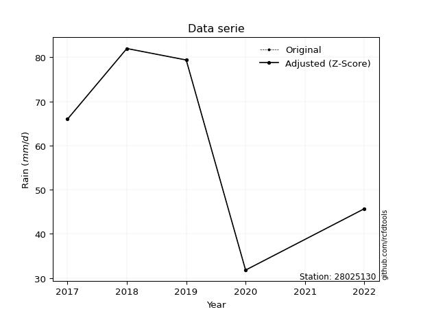</img>

</div>


> The initial value (value_initial) correspond to the initial obtained or null completed value, and value (value) is adjusted only when the initial value is outside the valid range (outlier) definite through the Z-Score value. If Z-Score is active, values out of range or outliers are replaced with the station mean value. A Z-Score (or standard score) measures how many standard deviations a data point is from the mean of a dataset, indicating its relative position; positive scores mean above the mean, negative mean below, and a score of zero is exactly at the mean, allowing for comparison of values from different distributions. It´s calculated using the formula $z=(x–μ)/σ$, where $x$ is the data point, $μ$ is the mean, and $σ$ is the standard deviation, helping identify outliers and understand probability.
>
> <sub>**Note**: In this study, "completing" (filling gaps in) and "extending" (forecasting or lengthening the historical record) rainfall data series are avoided for certain critical analyses because they introduce artificial bias and uncertainty, which can distort the statistics of rare events (extremes), alter day-to-day variability, and compromise the integrity and homogeneity of the original data. Some reasons against Completing/Extending rainfall data are: **Distortion of Extremes and Variability**: The primary issue is that most gap-filling or extension methods rely on averaging or regression with nearby stations, which inherently smooths the data. Rainfall is highly variable in space and time, with a large percentage of zero values and occasional large storms. Infilling methods often underestimate the highest values and overestimate the lowest (zero) values, which severely distorts analyses focused on flood frequency, drought severity, and intensity-duration-frequency (IDF) curves, **Loss of Data Homogeneity**: Infilled or extended data are synthetic estimates, not actual measurements. Combining these estimates with observed data can violate the assumption of data homogeneity, which requires that the data properties do not change over time. Inhomogeneity can lead to incorrect conclusions about long-term trends or changes in climate patterns, **Propagation of Errors**: Errors and biases from the original data (e.g., wind-induced undercatch, instrument errors, site changes) or the data used for imputation can propagate through the analysis, leading to unreliable hydrological models and inaccurate predictions, **Compromised Statistical Integrity**: For statistical analyses, especially those involving the frequency of events, using artificial data can introduce time bias or autocorrelation that doesn´t exist in reality, making it difficult to assess the true probability of events, **Difficulty in Validation**: It is difficult to accurately validate the quality of filled or extended data, especially for past periods where ground-truth measurements are unavailable. The reliability of imputation techniques heavily depends on the density of the surrounding station network and the complexity of the local topography.</sub>


### 4. Active continuous probability distributions from SciPy (80 of 104 available)

A Probability Density Function (PDF) describes the relative likelihood of a continuous random variable falling within a specific range, where the total area under its curve equals 1, and the area over any interval gives the actual probability for that range. Unlike discrete probabilities (like rolling a die), a PDF shows density, not direct probability for a single point (which is zero), with higher points indicating higher likelihood, often visualized as a bell curve for normal distributions.

A log of a probability density function (log-PDF) is simply the logarithm of the PDF´s value, denoted as $log(f(x))$, useful for converting multiplication of probabilities into addition, improving numerical stability with tiny numbers, and connecting to information theory concepts like entropy. Instead of dealing with very small probabilities (e.g., 0.000001), log-PDFs use negative numbers (e.g., $log(0.00001) ≈ -11.51$ that are easier for computers to handle, preventing underflow errors and simplifying complex calculations. In this study, each active probability distribution from SciPy is also evaluated in the $log$ form.

[scipy.stats](https://docs.scipy.org/doc/scipy/reference/stats.html) is a Python´s powerful submodule within the SciPy library for comprehensive statistical analysis, offering over 130 probability distributions (like Normal, Poisson, etc.), functions for descriptive stats (mean, variance), hypothesis testing (t-tests, chi-square), random variable generation, and statistical tests, making it essential for data science, modeling, and research. It provides tools to explore, model, and draw conclusions from data efficiently, working seamlessly with [NumPy](https://numpy.org/).

<div align="center">

|   id | p_dist           |   n_parameter | fit_method   | label                                                                       | active   | ref                                                                                                      |
|-----:|:-----------------|--------------:|:-------------|:----------------------------------------------------------------------------|:---------|:---------------------------------------------------------------------------------------------------------|
|    0 | alpha            |             3 | MLE          | Alpha                                                                       | True     | [:mortar_board:](https://docs.scipy.org/doc/scipy/reference/generated/scipy.stats.alpha.html)            |
|    1 | anglit           |             2 | MM           | Anglit                                                                      | True     | [:mortar_board:](https://docs.scipy.org/doc/scipy/reference/generated/scipy.stats.anglit.html)           |
|    2 | arcsine          |             2 | MM           | Arcsine                                                                     | True     | [:mortar_board:](https://docs.scipy.org/doc/scipy/reference/generated/scipy.stats.arcsine.html)          |
|    3 | argus            |             3 | MLE          | Argus                                                                       | True     | [:mortar_board:](https://docs.scipy.org/doc/scipy/reference/generated/scipy.stats.argus.html)            |
|    4 | beta             |             4 | MLE          | Beta                                                                        | True     | [:mortar_board:](https://docs.scipy.org/doc/scipy/reference/generated/scipy.stats.beta.html)             |
|    5 | betaprime        |             4 | MLE          | Beta prime                                                                  | True     | [:mortar_board:](https://docs.scipy.org/doc/scipy/reference/generated/scipy.stats.betaprime.html)        |
|    6 | bradford         |             3 | MLE          | Bradford                                                                    | True     | [:mortar_board:](https://docs.scipy.org/doc/scipy/reference/generated/scipy.stats.bradford.html)         |
|    7 | burr             |             4 | MLE          | Burr (Type III)                                                             | True     | [:mortar_board:](https://docs.scipy.org/doc/scipy/reference/generated/scipy.stats.burr.html)             |
|    8 | burr12           |             4 | MLE          | Burr (Type III) 12                                                          | True     | [:mortar_board:](https://docs.scipy.org/doc/scipy/reference/generated/scipy.stats.burr12.html)           |
|    9 | cosine           |             2 | MLE          | Cosine                                                                      | True     | [:mortar_board:](https://docs.scipy.org/doc/scipy/reference/generated/scipy.stats.cosine.html)           |
|   10 | crystalball      |             4 | MLE          | Crystalball                                                                 | True     | [:mortar_board:](https://docs.scipy.org/doc/scipy/reference/generated/scipy.stats.crystalball.html)      |
|   11 | dgamma           |             3 | MLE          | Double gamma                                                                | True     | [:mortar_board:](https://docs.scipy.org/doc/scipy/reference/generated/scipy.stats.dgamma.html)           |
|   12 | dweibull         |             3 | MLE          | Double Weibull                                                              | True     | [:mortar_board:](https://docs.scipy.org/doc/scipy/reference/generated/scipy.stats.dweibull.html)         |
|   13 | erlang           |             3 | MLE          | Erlang                                                                      | True     | [:mortar_board:](https://docs.scipy.org/doc/scipy/reference/generated/scipy.stats.erlang.html)           |
|   14 | exponnorm        |             3 | MLE          | Exponentially modified Normal                                               | True     | [:mortar_board:](https://docs.scipy.org/doc/scipy/reference/generated/scipy.stats.exponnorm.html)        |
|   15 | exponpow         |             3 | MLE          | Exponential power                                                           | True     | [:mortar_board:](https://docs.scipy.org/doc/scipy/reference/generated/scipy.stats.exponpow.html)         |
|   16 | exponweib        |             4 | MLE          | Exponentiated Weibull                                                       | True     | [:mortar_board:](https://docs.scipy.org/doc/scipy/reference/generated/scipy.stats.exponweib.html)        |
|   17 | f                |             4 | MLE          | F                                                                           | True     | [:mortar_board:](https://docs.scipy.org/doc/scipy/reference/generated/scipy.stats.f.html)                |
|   18 | fatiguelife      |             3 | MLE          | Fatigue-life (Birnbaum-Saunders)                                            | True     | [:mortar_board:](https://docs.scipy.org/doc/scipy/reference/generated/scipy.stats.fatiguelife.html)      |
|   19 | foldnorm         |             3 | MM           | Fold Normal                                                                 | True     | [:mortar_board:](https://docs.scipy.org/doc/scipy/reference/generated/scipy.stats.foldnorm.html)         |
|   20 | gamma            |             3 | MLE          | Gamma                                                                       | True     | [:mortar_board:](https://docs.scipy.org/doc/scipy/reference/generated/scipy.stats.gamma.html)            |
|   21 | gausshyper       |             6 | MLE          | Gauss hypergeometric                                                        | True     | [:mortar_board:](https://docs.scipy.org/doc/scipy/reference/generated/scipy.stats.gausshyper.html)       |
|   22 | genexpon         |             5 | MLE          | Generalized exponential                                                     | True     | [:mortar_board:](https://docs.scipy.org/doc/scipy/reference/generated/scipy.stats.genexpon.html)         |
|   23 | genextreme       |             3 | MLE          | Generalized exponential                                                     | True     | [:mortar_board:](https://docs.scipy.org/doc/scipy/reference/generated/scipy.stats.genextreme.html)       |
|   24 | gengamma         |             4 | MLE          | Generalized gamma                                                           | True     | [:mortar_board:](https://docs.scipy.org/doc/scipy/reference/generated/scipy.stats.gengamma.html)         |
|   25 | genhalflogistic  |             3 | MLE          | Generalized half-logistic                                                   | True     | [:mortar_board:](https://docs.scipy.org/doc/scipy/reference/generated/scipy.stats.genhalflogistic.html)  |
|   26 | genlogistic      |             3 | MLE          | Generalized logistic                                                        | True     | [:mortar_board:](https://docs.scipy.org/doc/scipy/reference/generated/scipy.stats.genlogistic.html)      |
|   27 | gennorm          |             3 | MLE          | Generalized Normal                                                          | True     | [:mortar_board:](https://docs.scipy.org/doc/scipy/reference/generated/scipy.stats.gennorm.html)          |
|   28 | genpareto        |             3 | MLE          | Generalized Pareto                                                          | True     | [:mortar_board:](https://docs.scipy.org/doc/scipy/reference/generated/scipy.stats.genpareto.html)        |
|   29 | gompertz         |             3 | MLE          | Gompertz (or truncated Gumbel)                                              | True     | [:mortar_board:](https://docs.scipy.org/doc/scipy/reference/generated/scipy.stats.gompertz.html)         |
|   30 | gumbel_l         |             2 | MM           | Gumbel Left Skew                                                            | True     | [:mortar_board:](https://docs.scipy.org/doc/scipy/reference/generated/scipy.stats.gumbel_l.html)         |
|   31 | gumbel_r         |             2 | MM           | Gumbel Right Skew                                                           | True     | [:mortar_board:](https://docs.scipy.org/doc/scipy/reference/generated/scipy.stats.gumbel_r.html)         |
|   32 | halfgennorm      |             3 | MLE          | Upper half of a generalized normal                                          | True     | [:mortar_board:](https://docs.scipy.org/doc/scipy/reference/generated/scipy.stats.halfgennorm.html)      |
|   33 | halflogistic     |             2 | MM           | Half-logistic                                                               | True     | [:mortar_board:](https://docs.scipy.org/doc/scipy/reference/generated/scipy.stats.halflogistic.html)     |
|   34 | halfnorm         |             2 | MM           | Half Normal                                                                 | True     | [:mortar_board:](https://docs.scipy.org/doc/scipy/reference/generated/scipy.stats.halfnorm.html)         |
|   35 | hypsecant        |             2 | MM           | hyperbolic secant                                                           | True     | [:mortar_board:](https://docs.scipy.org/doc/scipy/reference/generated/scipy.stats.hypsecant.html)        |
|   36 | invgamma         |             3 | MLE          | Inverted gamma                                                              | True     | [:mortar_board:](https://docs.scipy.org/doc/scipy/reference/generated/scipy.stats.invgamma.html)         |
|   37 | invgauss         |             3 | MLE          | Inverse Gaussian                                                            | True     | [:mortar_board:](https://docs.scipy.org/doc/scipy/reference/generated/scipy.stats.invgauss.html)         |
|   38 | invweibull       |             3 | MLE          | Inverted Weibull                                                            | True     | [:mortar_board:](https://docs.scipy.org/doc/scipy/reference/generated/scipy.stats.invweibull.html)       |
|   39 | johnsonsb        |             4 | MLE          | Johnson SB                                                                  | True     | [:mortar_board:](https://docs.scipy.org/doc/scipy/reference/generated/scipy.stats.johnsonsb.html)        |
|   40 | johnsonsu        |             4 | MLE          | Johnson Su                                                                  | True     | [:mortar_board:](https://docs.scipy.org/doc/scipy/reference/generated/scipy.stats.johnsonsu.html)        |
|   41 | kappa3           |             3 | MLE          | Kappa 3                                                                     | True     | [:mortar_board:](https://docs.scipy.org/doc/scipy/reference/generated/scipy.stats.kappa3.html)           |
|   42 | kappa4           |             4 | MLE          | Kappa 4                                                                     | True     | [:mortar_board:](https://docs.scipy.org/doc/scipy/reference/generated/scipy.stats.kappa4.html)           |
|   43 | ksone            |             3 | MLE          | Kolmogorov-Smirnov one-sided test statistic distribution                    | True     | [:mortar_board:](https://docs.scipy.org/doc/scipy/reference/generated/scipy.stats.ksone.html)            |
|   44 | kstwobign        |             2 | MLE          | Limiting distribution of scaled Kolmogorov-Smirnov two-sided test statistic | True     | [:mortar_board:](https://docs.scipy.org/doc/scipy/reference/generated/scipy.stats.kstwobign.html)        |
|   45 | laplace          |             2 | MM           | Laplace                                                                     | True     | [:mortar_board:](https://docs.scipy.org/doc/scipy/reference/generated/scipy.stats.laplace.html)          |
|   46 | levy_l           |             2 | MLE          | Left-skewed Levy                                                            | True     | [:mortar_board:](https://docs.scipy.org/doc/scipy/reference/generated/scipy.stats.levy_l.html)           |
|   47 | loggamma         |             3 | MLE          | Log gamma                                                                   | True     | [:mortar_board:](https://docs.scipy.org/doc/scipy/reference/generated/scipy.stats.loggamma.html)         |
|   48 | logistic         |             2 | MM           | Logistic (or Sech-squared)                                                  | True     | [:mortar_board:](https://docs.scipy.org/doc/scipy/reference/generated/scipy.stats.logistic.html)         |
|   49 | loglaplace       |             3 | MLE          | Log-Laplace                                                                 | True     | [:mortar_board:](https://docs.scipy.org/doc/scipy/reference/generated/scipy.stats.loglaplace.html)       |
|   50 | lomax            |             3 | MLE          | Lomax (Pareto of the second kind)                                           | True     | [:mortar_board:](https://docs.scipy.org/doc/scipy/reference/generated/scipy.stats.lomax.html)            |
|   51 | maxwell          |             2 | MM           | Maxwell                                                                     | True     | [:mortar_board:](https://docs.scipy.org/doc/scipy/reference/generated/scipy.stats.maxwell.html)          |
|   52 | mielke           |             4 | MLE          | Mielke Beta-Kappa / Dagum                                                   | True     | [:mortar_board:](https://docs.scipy.org/doc/scipy/reference/generated/scipy.stats.mielke.html)           |
|   53 | moyal            |             2 | MM           | Moyal                                                                       | True     | [:mortar_board:](https://docs.scipy.org/doc/scipy/reference/generated/scipy.stats.moyal.html)            |
|   54 | nakagami         |             3 | MLE          | Nakagami                                                                    | True     | [:mortar_board:](https://docs.scipy.org/doc/scipy/reference/generated/scipy.stats.nakagami.html)         |
|   55 | ncf              |             5 | MLE          | Non-central F distribution                                                  | True     | [:mortar_board:](https://docs.scipy.org/doc/scipy/reference/generated/scipy.stats.ncf.html)              |
|   56 | nct              |             4 | MLE          | Non-central Student’s t                                                     | True     | [:mortar_board:](https://docs.scipy.org/doc/scipy/reference/generated/scipy.stats.nct.html)              |
|   57 | norm             |             2 | MM           | Normal                                                                      | True     | [:mortar_board:](https://docs.scipy.org/doc/scipy/reference/generated/scipy.stats.norm.html)             |
|   58 | pearson3         |             3 | MM           | Pearson type III                                                            | True     | [:mortar_board:](https://docs.scipy.org/doc/scipy/reference/generated/scipy.stats.pearson3.html)         |
|   59 | powerlaw         |             3 | MLE          | Power-function                                                              | True     | [:mortar_board:](https://docs.scipy.org/doc/scipy/reference/generated/scipy.stats.powerlaw.html)         |
|   60 | rayleigh         |             2 | MM           | Rayleigh                                                                    | True     | [:mortar_board:](https://docs.scipy.org/doc/scipy/reference/generated/scipy.stats.rayleigh.html)         |
|   61 | rdist            |             3 | MLE          | R-distributed (symmetric beta)                                              | True     | [:mortar_board:](https://docs.scipy.org/doc/scipy/reference/generated/scipy.stats.rdist.html)            |
|   62 | rice             |             3 | MLE          | Rice                                                                        | True     | [:mortar_board:](https://docs.scipy.org/doc/scipy/reference/generated/scipy.stats.rice.html)             |
|   63 | semicircular     |             2 | MM           | Semicircular                                                                | True     | [:mortar_board:](https://docs.scipy.org/doc/scipy/reference/generated/scipy.stats.semicircular.html)     |
|   64 | skewnorm         |             3 | MLE          | Skew normal                                                                 | True     | [:mortar_board:](https://docs.scipy.org/doc/scipy/reference/generated/scipy.stats.skewnorm.html)         |
|   65 | t                |             3 | MLE          | Student’s t                                                                 | True     | [:mortar_board:](https://docs.scipy.org/doc/scipy/reference/generated/scipy.stats.t.html)                |
|   66 | trapezoid        |             4 | MLE          | Trapezoid                                                                   | True     | [:mortar_board:](https://docs.scipy.org/doc/scipy/reference/generated/scipy.stats.trapezoid.html)        |
|   67 | triang           |             3 | MLE          | Triangular                                                                  | True     | [:mortar_board:](https://docs.scipy.org/doc/scipy/reference/generated/scipy.stats.triang.html)           |
|   68 | truncexpon       |             3 | MLE          | Truncated exponential                                                       | True     | [:mortar_board:](https://docs.scipy.org/doc/scipy/reference/generated/scipy.stats.truncexpon.html)       |
|   69 | truncnorm        |             4 | MLE          | Truncated normal                                                            | True     | [:mortar_board:](https://docs.scipy.org/doc/scipy/reference/generated/scipy.stats.truncnorm.html)        |
|   70 | truncpareto      |             4 | MLE          | Upper truncated Pareto                                                      | True     | [:mortar_board:](https://docs.scipy.org/doc/scipy/reference/generated/scipy.stats.truncpareto.html)      |
|   71 | truncweibull_min |             5 | MLE          | Doubly truncated Weibull minimum                                            | True     | [:mortar_board:](https://docs.scipy.org/doc/scipy/reference/generated/scipy.stats.truncweibull_min.html) |
|   72 | tukeylambda      |             3 | MLE          | Tukey-Lamdba                                                                | True     | [:mortar_board:](https://docs.scipy.org/doc/scipy/reference/generated/scipy.stats.tukeylambda.html)      |
|   73 | uniform          |             2 | MLE          | Uniform                                                                     | True     | [:mortar_board:](https://docs.scipy.org/doc/scipy/reference/generated/scipy.stats.uniform.html)          |
|   74 | vonmises         |             3 | MLE          | Von Mises                                                                   | True     | [:mortar_board:](https://docs.scipy.org/doc/scipy/reference/generated/scipy.stats.vonmises.html)         |
|   75 | vonmises_line    |             3 | MLE          | Von Mises line                                                              | True     | [:mortar_board:](https://docs.scipy.org/doc/scipy/reference/generated/scipy.stats.vonmises_line.html)    |
|   76 | wald             |             2 | MM           | Wald                                                                        | True     | [:mortar_board:](https://docs.scipy.org/doc/scipy/reference/generated/scipy.stats.wald.html)             |
|   77 | weibull_max      |             3 | MLE          | Weibull maximum                                                             | True     | [:mortar_board:](https://docs.scipy.org/doc/scipy/reference/generated/scipy.stats.weibull_max.html)      |
|   78 | weibull_min      |             3 | MLE          | Weibull minimum                                                             | True     | [:mortar_board:](https://docs.scipy.org/doc/scipy/reference/generated/scipy.stats.weibull_min.html)      |
|   79 | wrapcauchy       |             3 | MLE          | Wrapped  Cauchy                                                             | True     | [:mortar_board:](https://docs.scipy.org/doc/scipy/reference/generated/scipy.stats.wrapcauchy.html)       |

</div>

> **n_parameter:** # arguments & localization & scale.
>
> **Fit methods:** (MLE) maximum likelihood, (MM) L-moments.
>
>**Inactive** (With the only purpose of prevent loops, zero divisions, infinite values, over high estimated values or horizontal trending for recurrence intervals estimations, the follow distributions were disabled.)**:** lognorm, norminvgauss, powernorm, powerlognorm, cauchy, halfcauchy, foldcauchy, skewcauchy, chi2, expon, fisk, genhyperbolic, geninvgauss, gibrat, kstwo, laplace_asymmetric, levy, levy_stable, ncx2, pareto, rel_breitwigner, recipinvgauss, studentized_range, loguniform, 


## B. Probability (PDF) vs. Empirical (EDF) distributions functions

A continuous probability distribution (CPD) describes probabilities for variables that can take any value within a range (like rain any time), unlike discrete variables with specific outcomes (like temperature). It uses a Probability Density Function (PDF), a curve where the total area under it equals 1, and the probability of the variable falling within an interval (a to b) is found by calculating the area under the curve between those points. A key feature is that the probability of hitting any single exact value is zero, so probabilities are always expressed for ranges, e.g., $P(a ≤ X ≤ b)$.

<div align="center">

Distributions parameters from station values
|     |   station | p_dist              |   n |             loc |           scale | shape                  | shape1                | shape2                 | shape3             |
|----:|----------:|:--------------------|----:|----------------:|----------------:|:-----------------------|:----------------------|:-----------------------|:-------------------|
|   0 |  28025130 | alpha               |   5 |  -305.851       |  6645.19        | 18.1821504235655       |                       |                        |                    |
|   1 |  28025130 | anglit              |   5 |    60.98        |    56.8956      |                        |                       |                        |                    |
|   2 |  28025130 | arcsine             |   5 |    33.4752      |    55.0097      |                        |                       |                        |                    |
|   3 |  28025130 | argus               |   5 |    12.4558      |    72.5261      | 1.8314677302766533     |                       |                        |                    |
|   4 |  28025130 | beta                |   5 |    29.2799      |    52.7201      | 0.4409244871757697     | 0.3171118704330484    |                        |                    |
|   5 |  28025130 | betaprime           |   5 |   -50.3813      |  7277.64        | 29.540852065835153     | 1927.0936384570223    |                        |                    |
|   6 |  28025130 | bradford            |   5 |    31.8         |    50.2001      | 1.19508567557209       |                       |                        |                    |
|   7 |  28025130 | burr                |   5 |    -0.591274    |    84.0999      | 73.2562691256972       | 0.03372147686080432   |                        |                    |
|   8 |  28025130 | burr12              |   5 |    -2.9217      |    34.5257      | 788.6262264979393      | 0.0022577006134455596 |                        |                    |
|   9 |  28025130 | cosine              |   5 |    59.9808      |    15.4955      |                        |                       |                        |                    |
|  10 |  28025130 | crystalball         |   5 |    60.98        |    19.4488      | 53064.81662488938      | 4478.243049288081     |                        |                    |
|  11 |  28025130 | dgamma              |   5 |    56.883       |     3.12858     | 5.946266233585067      |                       |                        |                    |
|  12 |  28025130 | dweibull            |   5 |    57.091       |    20.8781      | 3.112476961151782      |                       |                        |                    |
|  13 |  28025130 | erlang              |   5 |  -241.401       |     1.28977     | 234.38031016933758     |                       |                        |                    |
|  14 |  28025130 | exponnorm           |   5 |    60.9641      |    19.4488      | 0.0008192812234024958  |                       |                        |                    |
|  15 |  28025130 | exponpow            |   5 |    31.8         |     1.57402     | 0.08026988392714729    |                       |                        |                    |
|  16 |  28025130 | exponweib           |   5 |    31.8         |     1.30733     | 1.3409741974695377     | 0.10729157447005096   |                        |                    |
|  17 |  28025130 | f                   |   5 | -4271.71        |  4332.68        | 105334.27853230326     | 1478628.0900593353    |                        |                    |
|  18 |  28025130 | fatiguelife         |   5 |    31.8         |     3.62337e-06 | 2576.396793178823      |                       |                        |                    |
|  19 |  28025130 | foldnorm            |   5 |    63.853       |     1.6703      | 1.2390858930045614e-05 |                       |                        |                    |
|  20 |  28025130 | gamma               |   5 |  -234.172       |     1.3218      | 223.1945217741357      |                       |                        |                    |
|  21 |  28025130 | gausshyper          |   5 |    31.7367      |    50.2633      | 1.0324875005164085     | 0.8482460456879612    | 1.0425206515385195     | 1.096372790814324  |
|  22 |  28025130 | genexpon            |   5 |    31.8         |     1.70801     | 0.058579761759338544   | 3.822232251612109e-06 | 1.7082037036596152     |                    |
|  23 |  28025130 | genextreme          |   5 |    63.7265      |    23.4138      | 1.2812975792744647     |                       |                        |                    |
|  24 |  28025130 | gengamma            |   5 |    31.8         |     1.47514     | 1.2684709299648287     | 0.11542489994024573   |                        |                    |
|  25 |  28025130 | genhalflogistic     |   5 |    17.7133      |    68.7537      | 1.0694852362940137     |                       |                        |                    |
|  26 |  28025130 | genlogistic         |   5 |    82.0006      |     4.96108e-05 | 2.3554250460760313e-06 |                       |                        |                    |
|  27 |  28025130 | gennorm             |   5 |    56.9         |    25.1         | 8532791.473813796      |                       |                        |                    |
|  28 |  28025130 | genpareto           |   5 |    -1.22047     |   165.807       | -1.9923774033548816    |                       |                        |                    |
|  29 |  28025130 | gompertz            |   5 |   -52.7821      |    15.369       | 0.0003334307941082107  |                       |                        |                    |
|  30 |  28025130 | gumbel_l            |   5 |    69.733       |    15.1642      |                        |                       |                        |                    |
|  31 |  28025130 | gumbel_r            |   5 |    52.227       |    15.1642      |                        |                       |                        |                    |
|  32 |  28025130 | halfgennorm         |   5 |    31.8         |     1.35453     | 0.3715093988038639     |                       |                        |                    |
|  33 |  28025130 | halflogistic        |   5 |    37.9286      |    16.6281      |                        |                       |                        |                    |
|  34 |  28025130 | halfnorm            |   5 |    35.2373      |    32.2637      |                        |                       |                        |                    |
|  35 |  28025130 | hypsecant           |   5 |    60.98        |    12.3815      |                        |                       |                        |                    |
|  36 |  28025130 | invgamma            |   5 |  -179.688       | 33921.4         | 142.10853459170062     |                       |                        |                    |
|  37 |  28025130 | invgauss            |   5 |   -34.1911      |  1920.21        | 0.049438331505481756   |                       |                        |                    |
|  38 |  28025130 | invweibull          |   5 |    31.8         |     1.08996     | 0.04406774430124803    |                       |                        |                    |
|  39 |  28025130 | johnsonsb           |   5 |    31.7967      |    50.2033      | 0.10165402235055673    | 0.1219557408994797    |                        |                    |
|  40 |  28025130 | johnsonsu           |   5 |    82           |     2.58098e-13 | 2.5780887084332633     | 0.09720843226398052   |                        |                    |
|  41 |  28025130 | kappa3              |   5 |    31.5298      |    50.4838      | 12326.861315333499     |                       |                        |                    |
|  42 |  28025130 | kappa4              |   5 |    26.7295      |    59.5331      | 1.0846741576442955     | 1.0771207969464176    |                        |                    |
|  43 |  28025130 | ksone               |   5 |    27.2936      |    67.3728      | 1.0                    |                       |                        |                    |
|  44 |  28025130 | kstwobign           |   5 |   -12.3328      |    83.4503      |                        |                       |                        |                    |
|  45 |  28025130 | laplace             |   5 |    60.98        |    13.7524      |                        |                       |                        |                    |
|  46 |  28025130 | levy_l              |   5 |    82.8314      |     3.12454     |                        |                       |                        |                    |
|  47 |  28025130 | loggamma            |   5 |    82.0002      |     1.21907e-05 | 5.80543554311162e-07   |                       |                        |                    |
|  48 |  28025130 | logistic            |   5 |    60.98        |    10.7227      |                        |                       |                        |                    |
|  49 |  28025130 | loglaplace          |   5 |    -0.168136    |    66.1681      | 3.344765620376695      |                       |                        |                    |
|  50 |  28025130 | lomax               |   5 |    31.8         | 25064.1         | 860.212172068262       |                       |                        |                    |
|  51 |  28025130 | maxwell             |   5 |    14.8944      |    28.8799      |                        |                       |                        |                    |
|  52 |  28025130 | mielke              |   5 |    -6.32645     |    88.4036      | 3.1188745432257647     | 7004.63491655319      |                        |                    |
|  53 |  28025130 | moyal               |   5 |    49.8579      |     8.75506     |                        |                       |                        |                    |
|  54 |  28025130 | nakagami            |   5 |    45.7         |    24.6392      | 0.23628919933618406    |                       |                        |                    |
|  55 |  28025130 | ncf                 |   5 |    -0.0431905   |     2.04936e-08 | 2.236445997415428e-09  | 1.7869795109991902    | 5.561550048245109      |                    |
|  56 |  28025130 | nct                 |   5 |  -890.264       |    19.3704      | 139540.24381689267     | 49.107697293847636    |                        |                    |
|  57 |  28025130 | norm                |   5 |    60.98        |    19.4488      |                        |                       |                        |                    |
|  58 |  28025130 | pearson3            |   5 |    60.98        |    19.4489      | -0.3466391136280452    |                       |                        |                    |
|  59 |  28025130 | powerlaw            |   5 |    31.8         |    50.2         | 0.12850768958203715    |                       |                        |                    |
|  60 |  28025130 | rayleigh            |   5 |    23.7732      |    29.6867      |                        |                       |                        |                    |
|  61 |  28025130 | rdist               |   5 |    32.8356      |    12.8644      | 1.391495734564801      |                       |                        |                    |
|  62 |  28025130 | rice                |   5 |    20.5725      |    22.5553      | 1.3974817123973624     |                       |                        |                    |
|  63 |  28025130 | semicircular        |   5 |    60.98        |    38.8977      |                        |                       |                        |                    |
|  64 |  28025130 | skewnorm            |   5 |    82           |    28.6409      | -20307734.339712698    |                       |                        |                    |
|  65 |  28025130 | t                   |   5 |    60.9805      |    19.4486      | 16915.01850681087      |                       |                        |                    |
|  66 |  28025130 | trapezoid           |   5 |     5.97036     |    82.5145      | 0.9999999999999999     | 1.0                   |                        |                    |
|  67 |  28025130 | triang              |   5 |    16.1967      |    65.9753      | 0.9999999999995051     |                       |                        |                    |
|  68 |  28025130 | truncexpon          |   5 |    31.8         |    69.3021      | 0.7243654251231266     |                       |                        |                    |
|  69 |  28025130 | truncnorm           |   5 |   -86.2852      |    90.4246      | 1.2615890663589822     | 16.204266711227625    |                        |                    |
|  70 |  28025130 | truncpareto         |   5 |    31.5183      |     0.281725    | 0.26246691359814006    | 179.18776020447146    |                        |                    |
|  71 |  28025130 | truncweibull_min    |   5 |    31.7002      |    79.4985      | 0.9470375511124756     | 0.0012536280119358953 | 0.6327141186671812     |                    |
|  72 |  28025130 | tukeylambda         |   5 |    56.9208      |    30.3152      | 1.2067796358277036     |                       |                        |                    |
|  73 |  28025130 | uniform             |   5 |    31.8         |    50.2         |                        |                       |                        |                    |
|  74 |  28025130 | vonmises            |   5 |     1.48308     |     1           | 0.36435087998269655    |                       |                        |                    |
|  75 |  28025130 | vonmises_line       |   5 |    56.7505      |     8.03721     | 1.8551576224603635e-06 |                       |                        |                    |
|  76 |  28025130 | wald                |   5 |    41.5312      |    19.4488      |                        |                       |                        |                    |
|  77 |  28025130 | weibull_max         |   5 |    82           |     1.43495     | 0.28174514535615314    |                       |                        |                    |
|  78 |  28025130 | weibull_min         |   5 |    -8.11834e+08 |     8.11834e+08 | 52820855.28422557      |                       |                        |                    |
|  79 |  28025130 | wrapcauchy          |   5 |    31.7999      |     7.98959     | 0.7304287902261934     |                       |                        |                    |
|  80 |  28025130 | logalpha            |   5 |    -6.18424     |   283.814       | 27.775121955736267     |                       |                        |                    |
|  81 |  28025130 | loganglit           |   5 |     4.05049     |     1.05697     |                        |                       |                        |                    |
|  82 |  28025130 | logarcsine          |   5 |     3.5395      |     1.02197     |                        |                       |                        |                    |
|  83 |  28025130 | logargus            |   5 |     3.05786     |     1.3979      | 2.1973440526637766     |                       |                        |                    |
|  84 |  28025130 | logbeta             |   5 |     3.39803     |     1.00869     | 0.5266122415724699     | 0.2905312294730806    |                        |                    |
|  85 |  28025130 | logbetaprime        |   5 |    -4.29253     |     7.06021     | 907.2988850636998      | 768.5692926113024     |                        |                    |
|  86 |  28025130 | logbradford         |   5 |     3.45933     |     0.947402    | 1.09075176444652       |                       |                        |                    |
|  87 |  28025130 | logburr             |   5 |     0.830224    |     3.58263     | 2294.0563413440236     | 0.0038481614684999768 |                        |                    |
|  88 |  28025130 | logburr12           |   5 |  -121.238       |   128.197       | 469.79472847363127     | 25521.932464294274    |                        |                    |
|  89 |  28025130 | logcosine           |   5 |     4.01967     |     0.292599    |                        |                       |                        |                    |
|  90 |  28025130 | logcrystalball      |   5 |     4.05049     |     0.361309    | 7.309922230887704      | 1303.02602648529      |                        |                    |
|  91 |  28025130 | logdgamma           |   5 |     4.00918     |     0.0604695   | 5.556961531865127      |                       |                        |                    |
|  92 |  28025130 | logdweibull         |   5 |     4.18965     |     0.325326    | 0.8313441779979862     |                       |                        |                    |
|  93 |  28025130 | logerlang           |   5 |    -1.34198     |     0.0247004   | 218.30068540696664     |                       |                        |                    |
|  94 |  28025130 | logexponnorm        |   5 |     4.05023     |     0.361307    | 0.0007035286813612338  |                       |                        |                    |
|  95 |  28025130 | logexponpow         |   5 |     3.45947     |     1.34083     | 0.595868860747864      |                       |                        |                    |
|  96 |  28025130 | logexponweib        |   5 |     3.45947     |     0.952871    | 0.8338201202554687     | 1.031687062035668     |                        |                    |
|  97 |  28025130 | logf                |   5 |  -344.773       |   348.823       | 7048932.150213644      | 2510827.120755499     |                        |                    |
|  98 |  28025130 | logfatiguelife      |   5 |  -103.668       |   107.716       | 0.0033494188087048148  |                       |                        |                    |
|  99 |  28025130 | logfoldnorm         |   5 |     3.28162     |     0.366254    | 2.0866696550132584     |                       |                        |                    |
| 100 |  28025130 | loggamma            |   5 |    -1.92344     |     0.0227904   | 262.1488269511966      |                       |                        |                    |
| 101 |  28025130 | loggausshyper       |   5 |     3.429       |     0.977722    | 1.1706846625575487     | 0.7715191457013721    | 1.0495416194601321     | 1.0486523812774708 |
| 102 |  28025130 | loggenexpon         |   5 |     3.45562     |     0.00297985  | 0.0024399051545189645  | 1.6794156258180868    | 1.1212395599950456e-05 |                    |
| 103 |  28025130 | loggenextreme       |   5 |     4.1289      |     0.3644      | 1.3116594547659297     |                       |                        |                    |
| 104 |  28025130 | loggengamma         |   5 |     3.45947     |     0.816547    | 0.5635234791878168     | 1.3079132601784687    |                        |                    |
| 105 |  28025130 | loggenhalflogistic  |   5 |     3.42685     |     1.12081     | 1.1438349631736324     |                       |                        |                    |
| 106 |  28025130 | loggenlogistic      |   5 |     4.40673     |     1.62629e-07 | 4.596375228291082e-07  |                       |                        |                    |
| 107 |  28025130 | loggennorm          |   5 |     3.93309     |     0.473661    | 172853.45999138744     |                       |                        |                    |
| 108 |  28025130 | loggenpareto        |   5 |    -0.0193422   |    19.3759      | -4.377693119508901     |                       |                        |                    |
| 109 |  28025130 | loggompertz         |   5 |     3.45947     |     0.360395    | 0.15225344357260956    |                       |                        |                    |
| 110 |  28025130 | loggumbel_l         |   5 |     4.2131      |     0.281711    |                        |                       |                        |                    |
| 111 |  28025130 | loggumbel_r         |   5 |     3.88788     |     0.281711    |                        |                       |                        |                    |
| 112 |  28025130 | loghalfgennorm      |   5 |     3.45902     |     0.955475    | 557.78955486462        |                       |                        |                    |
| 113 |  28025130 | loghalflogistic     |   5 |     3.62225     |     0.308908    |                        |                       |                        |                    |
| 114 |  28025130 | loghalfnorm         |   5 |     3.57224     |     0.599399    |                        |                       |                        |                    |
| 115 |  28025130 | loghypsecant        |   5 |     4.05049     |     0.230016    |                        |                       |                        |                    |
| 116 |  28025130 | loginvgamma         |   5 |    -2.51858     |  2100.09        | 320.8397659953629      |                       |                        |                    |
| 117 |  28025130 | loginvgauss         |   5 |     0.793169    |   232.586       | 0.014000599959446091   |                       |                        |                    |
| 118 |  28025130 | loginvweibull       |   5 |    -3.5667e+07  |     3.5667e+07  | 98777829.2508657       |                       |                        |                    |
| 119 |  28025130 | logjohnsonsb        |   5 |     3.29145     |     1.11527     | -0.14644260595141223   | 0.07336945644461842   |                        |                    |
| 120 |  28025130 | logjohnsonsu        |   5 |     4.40672     |     3.5104e-15  | 2.281066720754697      | 0.10446289288754264   |                        |                    |
| 121 |  28025130 | logkappa3           |   5 |     3.45947     |     0.94684     | 3701.139216503645      |                       |                        |                    |
| 122 |  28025130 | logkappa4           |   5 |     3.4212      |     1.08296     | 1.024429957300102      | 1.0988688753947198    |                        |                    |
| 123 |  28025130 | logksone            |   5 |     3.42468     |     1.25161     | 1.0                    |                       |                        |                    |
| 124 |  28025130 | logkstwobign        |   5 |     2.60469     |     1.64632     |                        |                       |                        |                    |
| 125 |  28025130 | loglaplace          |   5 |     4.05049     |     0.255484    |                        |                       |                        |                    |
| 126 |  28025130 | loglevy_l           |   5 |     4.41778     |     0.0414292   |                        |                       |                        |                    |
| 127 |  28025130 | logloggamma         |   5 |     4.40681     |     1.08752e-06 | 3.0566269048264092e-06 |                       |                        |                    |
| 128 |  28025130 | loglogistic         |   5 |     4.05049     |     0.1992      |                        |                       |                        |                    |
| 129 |  28025130 | logloglaplace       |   5 |    -0.0077878   |     4.19744     | 13.288765767019562     |                       |                        |                    |
| 130 |  28025130 | loglomax            |   5 |     3.45947     |    15.4736      | 26.541644640636907     |                       |                        |                    |
| 131 |  28025130 | logmaxwell          |   5 |     3.19434     |     0.536512    |                        |                       |                        |                    |
| 132 |  28025130 | logmielke           |   5 |    -1.57589e+07 |     1.57589e+07 | 44050169.241854355     | 24613565376.74783     |                        |                    |
| 133 |  28025130 | logmoyal            |   5 |     3.84387     |     0.162646    |                        |                       |                        |                    |
| 134 |  28025130 | lognakagami         |   5 |     3.8221      |     0.443463    | 0.20352656058670562    |                       |                        |                    |
| 135 |  28025130 | logncf              |   5 |    -4.01079     |     7.91635     | 1064.7362132460048     | 795.7970842691111     | 17.170897762704136     |                    |
| 136 |  28025130 | lognct              |   5 |   -13.955       |     0.226669    | 1947.8572759419158     | 79.40691513327582     |                        |                    |
| 137 |  28025130 | lognorm             |   5 |     4.05049     |     0.361309    |                        |                       |                        |                    |
| 138 |  28025130 | logpearson3         |   5 |     4.05049     |     0.361309    | -0.578554971843507     |                       |                        |                    |
| 139 |  28025130 | logpowerlaw         |   5 |     3.45947     |     0.947253    | 0.13679379587637808    |                       |                        |                    |
| 140 |  28025130 | lograyleigh         |   5 |     3.35928     |     0.551501    |                        |                       |                        |                    |
| 141 |  28025130 | logrdist            |   5 |     4.33196     |     0.509857    | 1.0986938422059227     |                       |                        |                    |
| 142 |  28025130 | logrice             |   5 |     3.23349     |     0.404865    | 1.6936517865832013     |                       |                        |                    |
| 143 |  28025130 | logsemicircular     |   5 |     4.05049     |     0.722617    |                        |                       |                        |                    |
| 144 |  28025130 | logskewnorm         |   5 |     4.40672     |     0.507379    | -26640600.375285923    |                       |                        |                    |
| 145 |  28025130 | logt                |   5 |     4.05049     |     0.361306    | 197883838.92840958     |                       |                        |                    |
| 146 |  28025130 | logtrapezoid        |   5 |     3.02855     |     1.5329      | 1.0                    | 1.0                   |                        |                    |
| 147 |  28025130 | logtriang           |   5 |     3.21032     |     1.1964      | 0.9999993609513638     |                       |                        |                    |
| 148 |  28025130 | logtruncexpon       |   5 |     3.45946     |     1.08458     | 0.8734026233844591     |                       |                        |                    |
| 149 |  28025130 | logtruncnorm        |   5 |    -0.112011    |     1.10456     | 3.561613270901902      | 4.090975332442854     |                        |                    |
| 150 |  28025130 | logtruncpareto      |   5 |     3.45361     |     0.00586125  | 0.2614741930156952     | 162.6127316026459     |                        |                    |
| 151 |  28025130 | logtruncweibull_min |   5 |     3.4471      |     1.20086     | 1.1059860114304492     | 2.615754312769964e-09 | 0.7991103460907434     |                    |
| 152 |  28025130 | logtukeylambda      |   5 |     3.93461     |     0.540785    | 1.1381496794011627     |                       |                        |                    |
| 153 |  28025130 | loguniform          |   5 |     3.45947     |     0.947253    |                        |                       |                        |                    |
| 154 |  28025130 | logvonmises         |   5 |    -2.22795     |     1           | 8.091116098664145      |                       |                        |                    |
| 155 |  28025130 | logvonmises_line    |   5 |     3.93309     |     0.150761    | 0.22432751091778672    |                       |                        |                    |
| 156 |  28025130 | logwald             |   5 |     3.68919     |     0.361299    |                        |                       |                        |                    |
| 157 |  28025130 | logweibull_max      |   5 |     4.40672     |     0.387132    | 0.6367211075680846     |                       |                        |                    |
| 158 |  28025130 | logweibull_min      |   5 |    -1.60622e+07 |     1.60622e+07 | 59828272.82384916      |                       |                        |                    |
| 159 |  28025130 | logwrapcauchy       |   5 |     3.45947     |     0.15076     | 0.525                  |                       |                        |                    |

</div>

> **loc** (Location parameter): This shifts the distribution along the x-axis. For many common distributions, like the normal (Gaussian) distribution, loc represents the mean $μ$. For others, like the uniform distribution, it might represent the minimum value, or for the beta distribution, the left end of the support interval.
>
> **scale** (Scale parameter): This determines the width or spread of the distribution. For the normal distribution, scale represents the standard deviation $σ$. For a uniform distribution, it defines the length of the interval (from $loc$ to $loc + scale$).
>
> **shape** (Shape parameters): Refers to parameters that define the specific form of a probability distribution, distinct from its location (loc) and scale (scale). These parameters are required arguments for most distribution functions. For example, a normal (Gaussian) distribution is fully defined by its location (mean) and scale (standard deviation), so it has no specific shape parameters beyond loc and scale. However, other distributions have intrinsic properties that need specification, as Gamma distribution that takes a shape parameter, often named $a$ or $alpha$.


### 0. Cumulative distribution values - CDF (160 evaluated)

Cumulative Distribution Function (CDF), denoted as $F$<sub>$X$</sub>$(x)$, is a function that gives the probability that a random variable $X$ will take a value less than or equal to a specific value, $x$ (i.e., $(P(X≥x)$. It essentially "accumulates" probabilities from a given point up to the far right (positive infinity), providing a complete picture of the distribution´s probabilities for both discrete (like rain) and continuous (like temperature) variables, helping to find probabilities over ranges or above certain values. Each station is evaluated separately ordering the $x$ values ascending, calculating the CDF and PDF values for the activated distributions and their logarithmic forms.

<div align="center">

CDF ordered by x ascending and calculating $log(f(x))$ separately
|   id |   Station |   date |    x |   count |   mean |     std |    zscore |   Value_initial |   station |   m |     alpha |   alpha_pdf |    anglit |   anglit_pdf |   arcsine |   arcsine_pdf |     argus |   argus_pdf |     beta |    beta_pdf |   betaprime |   betaprime_pdf |    bradford |   bradford_pdf |      burr |   burr_pdf |    burr12 |   burr12_pdf |    cosine |   cosine_pdf |   crystalball |   crystalball_pdf |    dgamma |   dgamma_pdf |   dweibull |   dweibull_pdf |    erlang |   erlang_pdf |   exponnorm |   exponnorm_pdf |   exponpow |   exponpow_pdf |   exponweib |   exponweib_pdf |         f |      f_pdf |   fatiguelife |   fatiguelife_pdf |   foldnorm |   foldnorm_pdf |     gamma |   gamma_pdf |   gausshyper |   gausshyper_pdf |    genexpon |   genexpon_pdf |   genextreme |   genextreme_pdf |   gengamma |   gengamma_pdf |   genhalflogistic |   genhalflogistic_pdf |   genlogistic |   genlogistic_pdf |     gennorm |   gennorm_pdf |   genpareto |   genpareto_pdf |   gompertz |   gompertz_pdf |   gumbel_l |   gumbel_l_pdf |   gumbel_r |   gumbel_r_pdf |   halfgennorm |   halfgennorm_pdf |   halflogistic |   halflogistic_pdf |   halfnorm |   halfnorm_pdf |   hypsecant |   hypsecant_pdf |   invgamma |   invgamma_pdf |   invgauss |   invgauss_pdf |   invweibull |   invweibull_pdf |   johnsonsb |   johnsonsb_pdf |   johnsonsu |   johnsonsu_pdf |     kappa3 |   kappa3_pdf |    kappa4 |   kappa4_pdf |     ksone |   ksone_pdf |   kstwobign |   kstwobign_pdf |   laplace |   laplace_pdf |   levy_l |   levy_l_pdf |   loggamma |   loggamma_pdf |   logistic |   logistic_pdf |   loglaplace |   loglaplace_pdf |       lomax |   lomax_pdf |   maxwell |   maxwell_pdf |    mielke |   mielke_pdf |      moyal |   moyal_pdf |    nakagami |   nakagami_pdf |      ncf |    ncf_pdf |       nct |   nct_pdf |      norm |   norm_pdf |   pearson3 |   pearson3_pdf |   powerlaw |   powerlaw_pdf |   rayleigh |   rayleigh_pdf |   rdist |    rdist_pdf |      rice |   rice_pdf |   semicircular |   semicircular_pdf |   skewnorm |   skewnorm_pdf |         t |      t_pdf |   trapezoid |   trapezoid_pdf |    triang |   triang_pdf |   truncexpon |   truncexpon_pdf |   truncnorm |   truncnorm_pdf |   truncpareto |   truncpareto_pdf |   truncweibull_min |   truncweibull_min_pdf |   tukeylambda |   tukeylambda_pdf |   uniform |   uniform_pdf |   vonmises |   vonmises_pdf |   vonmises_line |   vonmises_line_pdf |      wald |   wald_pdf |   weibull_max |   weibull_max_pdf |   weibull_min |   weibull_min_pdf |   wrapcauchy |   wrapcauchy_pdf |   logalpha |   logalpha_pdf |   loganglit |   loganglit_pdf |   logarcsine |   logarcsine_pdf |   logargus |   logargus_pdf |   logbeta |   logbeta_pdf |   logbetaprime |   logbetaprime_pdf |   logbradford |   logbradford_pdf |   logburr |   logburr_pdf |   logburr12 |   logburr12_pdf |   logcosine |   logcosine_pdf |   logcrystalball |   logcrystalball_pdf |   logdgamma |   logdgamma_pdf |   logdweibull |   logdweibull_pdf |   logerlang |   logerlang_pdf |   logexponnorm |   logexponnorm_pdf |   logexponpow |   logexponpow_pdf |   logexponweib |   logexponweib_pdf |      logf |   logf_pdf |   logfatiguelife |   logfatiguelife_pdf |   logfoldnorm |   logfoldnorm_pdf |   loggausshyper |   loggausshyper_pdf |   loggenexpon |   loggenexpon_pdf |   loggenextreme |   loggenextreme_pdf |   loggengamma |   loggengamma_pdf |   loggenhalflogistic |   loggenhalflogistic_pdf |   loggenlogistic |   loggenlogistic_pdf |   loggennorm |   loggennorm_pdf |   loggenpareto |   loggenpareto_pdf |   loggompertz |   loggompertz_pdf |   loggumbel_l |   loggumbel_l_pdf |   loggumbel_r |   loggumbel_r_pdf |   loghalfgennorm |   loghalfgennorm_pdf |   loghalflogistic |   loghalflogistic_pdf |   loghalfnorm |   loghalfnorm_pdf |   loghypsecant |   loghypsecant_pdf |   loginvgamma |   loginvgamma_pdf |   loginvgauss |   loginvgauss_pdf |   loginvweibull |   loginvweibull_pdf |   logjohnsonsb |   logjohnsonsb_pdf |   logjohnsonsu |   logjohnsonsu_pdf |   logkappa3 |   logkappa3_pdf |   logkappa4 |   logkappa4_pdf |   logksone |   logksone_pdf |   logkstwobign |   logkstwobign_pdf |   loglevy_l |   loglevy_l_pdf |   logloggamma |   logloggamma_pdf |   loglogistic |   loglogistic_pdf |   logloglaplace |   logloglaplace_pdf |    loglomax |   loglomax_pdf |   logmaxwell |   logmaxwell_pdf |   logmielke |   logmielke_pdf |   logmoyal |   logmoyal_pdf |   lognakagami |   lognakagami_pdf |   logncf |   logncf_pdf |    lognct |   lognct_pdf |   lognorm |   lognorm_pdf |   logpearson3 |   logpearson3_pdf |   logpowerlaw |   logpowerlaw_pdf |   lograyleigh |   lograyleigh_pdf |    logrdist |   logrdist_pdf |   logrice |   logrice_pdf |   logsemicircular |   logsemicircular_pdf |   logskewnorm |   logskewnorm_pdf |      logt |   logt_pdf |   logtrapezoid |   logtrapezoid_pdf |   logtriang |   logtriang_pdf |   logtruncexpon |   logtruncexpon_pdf |   logtruncnorm |   logtruncnorm_pdf |   logtruncpareto |   logtruncpareto_pdf |   logtruncweibull_min |   logtruncweibull_min_pdf |   logtukeylambda |   logtukeylambda_pdf |   loguniform |   loguniform_pdf |   logvonmises |   logvonmises_pdf |   logvonmises_line |   logvonmises_line_pdf |   logwald |   logwald_pdf |   logweibull_max |   logweibull_max_pdf |   logweibull_min |   logweibull_min_pdf |   logwrapcauchy |   logwrapcauchy_pdf |
|-----:|----------:|-------:|-----:|--------:|-------:|--------:|----------:|----------------:|----------:|----:|----------:|------------:|----------:|-------------:|----------:|--------------:|----------:|------------:|---------:|------------:|------------:|----------------:|------------:|---------------:|----------:|-----------:|----------:|-------------:|----------:|-------------:|--------------:|------------------:|----------:|-------------:|-----------:|---------------:|----------:|-------------:|------------:|----------------:|-----------:|---------------:|------------:|----------------:|----------:|-----------:|--------------:|------------------:|-----------:|---------------:|----------:|------------:|-------------:|-----------------:|------------:|---------------:|-------------:|-----------------:|-----------:|---------------:|------------------:|----------------------:|--------------:|------------------:|------------:|--------------:|------------:|----------------:|-----------:|---------------:|-----------:|---------------:|-----------:|---------------:|--------------:|------------------:|---------------:|-------------------:|-----------:|---------------:|------------:|----------------:|-----------:|---------------:|-----------:|---------------:|-------------:|-----------------:|------------:|----------------:|------------:|----------------:|-----------:|-------------:|----------:|-------------:|----------:|------------:|------------:|----------------:|----------:|--------------:|---------:|-------------:|-----------:|---------------:|-----------:|---------------:|-------------:|-----------------:|------------:|------------:|----------:|--------------:|----------:|-------------:|-----------:|------------:|------------:|---------------:|---------:|-----------:|----------:|----------:|----------:|-----------:|-----------:|---------------:|-----------:|---------------:|-----------:|---------------:|--------:|-------------:|----------:|-----------:|---------------:|-------------------:|-----------:|---------------:|----------:|-----------:|------------:|----------------:|----------:|-------------:|-------------:|-----------------:|------------:|----------------:|--------------:|------------------:|-------------------:|-----------------------:|--------------:|------------------:|----------:|--------------:|-----------:|---------------:|----------------:|--------------------:|----------:|-----------:|--------------:|------------------:|--------------:|------------------:|-------------:|-----------------:|-----------:|---------------:|------------:|----------------:|-------------:|-----------------:|-----------:|---------------:|----------:|--------------:|---------------:|-------------------:|--------------:|------------------:|----------:|--------------:|------------:|----------------:|------------:|----------------:|-----------------:|---------------------:|------------:|----------------:|--------------:|------------------:|------------:|----------------:|---------------:|-------------------:|--------------:|------------------:|---------------:|-------------------:|----------:|-----------:|-----------------:|---------------------:|--------------:|------------------:|----------------:|--------------------:|--------------:|------------------:|----------------:|--------------------:|--------------:|------------------:|---------------------:|-------------------------:|-----------------:|---------------------:|-------------:|-----------------:|---------------:|-------------------:|--------------:|------------------:|--------------:|------------------:|--------------:|------------------:|-----------------:|---------------------:|------------------:|----------------------:|--------------:|------------------:|---------------:|-------------------:|--------------:|------------------:|--------------:|------------------:|----------------:|--------------------:|---------------:|-------------------:|---------------:|-------------------:|------------:|----------------:|------------:|----------------:|-----------:|---------------:|---------------:|-------------------:|------------:|----------------:|--------------:|------------------:|--------------:|------------------:|----------------:|--------------------:|------------:|---------------:|-------------:|-----------------:|------------:|----------------:|-----------:|---------------:|--------------:|------------------:|---------:|-------------:|----------:|-------------:|----------:|--------------:|--------------:|------------------:|--------------:|------------------:|--------------:|------------------:|------------:|---------------:|----------:|--------------:|------------------:|----------------------:|--------------:|------------------:|----------:|-----------:|---------------:|-------------------:|------------:|----------------:|----------------:|--------------------:|---------------:|-------------------:|-----------------:|---------------------:|----------------------:|--------------------------:|-----------------:|---------------------:|-------------:|-----------------:|--------------:|------------------:|-------------------:|-----------------------:|----------:|--------------:|-----------------:|---------------------:|-----------------:|---------------------:|----------------:|--------------------:|
|    0 |  28025130 |   2020 | 31.8 |       5 |  60.98 | 21.7445 | -1.34195  |            31.8 |  28025130 |   1 | 0.0669988 |  0.00756595 | 0.0724515 |   0.00911262 |  0        |     0         | 0.0514907 |  0.00554475 | 0.128449 | 0.023003    |   0.0656095 |      0.00760278 | 4.41946e-07 |      0.0302796 | 0.0947074 | 0.00722283 | 0.0100515 |   0.0501848  | 0.0562621 |   0.00775136 |     0.0667624 |        0.00665594 | 0.0919518 |    0.0142503 |  0.0813128 |      0.0181756 | 0.0665897 |   0.00700057 |   0.0667623 |      0.00665594 |  0.0666812 |    1.5043e+12  |  0.00787749 |     3.14672e+11 | 0.0674407 | 0.00670895 |     0.0734205 |       3.89543e+11 |   0        |    0           | 0.0668553 |  0.00703313 |   0.00133549 |        0.0217701 | 1.13946e-06 |     0.034297   |     0.110743 |       0.00378872 |  0.0062495 |    2.55226e+11 |          0.115121 |            0.00918962 |      0        |        0.00437908 | 7.93009e-07 |     0.0199203 |    0.22408  |      0.00775785 |  0.0782998 |     0.00490979 |  0.0786942 |      0.0049797 |  0.0213634 |     0.00541838 |   1.33978e-13 |        0.178726   |       0        |         0          |   0        |     0          |   0.0601267 |      0.00482734 |  0.0667659 |     0.00759905 |   0.061193 |     0.00843559 |     0.012918 |      6.96881e+11 |    0.142019 |     8.20703     |    0.245856 |     0.000609884 | 0.00534823 |    0.0197932 | 0.0116939 |    0.0246506 | 0.0668874 |   0.0148428 |   0.0575523 |      0.0102006  | 0.0599073 |    0.00435613 | 0.195434 |   0.00187608 |  0.0506476 |       0.302769 |  0.0617266 |     0.00540128 |    0.0494651 |         0.193613 | 1.05257e-09 |  0.0343205  | 0.0481858 |     0.0079764 | 0.0725858 |   0.00593776 | 0.00503689 |  0.00250277 | 0           |    0           | 0.357692 | 0.00707872 | 0.0667909 | 0.0066598 | 0.0667624 | 0.00665594 |  0.0744123 |     0.00620555 | 0.00840586 |    3.04054e+11 |  0.0358934 |     0.00878096 | 0.46798 |    0.0309598 | 0.0465392 | 0.00825911 |      0.0720739 |          0.0108222 |  0.0796465 |     0.00599592 | 0.0667658 | 0.00665553 |   0.0979888 |      0.00758732 | 0.0559332 |   0.00716941 |  4.07172e-08 |        0.0279986 |   0.0748867 |      0.0181621  |   1.49264e-16 |        1.25254    |        5.12028e-06 |              0.0356422 |   7.10543e-15 |         0.0329476 |  0        |     0.0199203 |    5.2722  |       0.181735 |      0.00592359 |           0.0198022 | 0         | 0          |     0.0657064 |       0.00100401  |      0.078612 |        0.00490825 |  1.10935e-05 |       0.127872   |  0.0489785 |       0.309599 |   0.0503144 |        0.413621 |     0        |         0        |  0.0414983 |       0.223152 | 0.0970482 |   0.856541    |      0.0693541 |           0.351332 |   0.000219824 |          1.56079  | 0.0651308 |    nan        |   0.0558253 |        0.204338 |   0.0454427 |        0.360599 |        0.0509429 |             0.289731 |   0.0404128 |        0.379168 |      0.070543 |          0.157289 |   0.0485663 |        0.298392 |      0.0509431 |           0.289733 |   5.97047e-10 |     801104        |    6.47372e-14 |         125.402    | 0.0514263 |   0.291484 |        0.0507673 |             0.290946 |      0.049627 |          0.342172 |       0.0205122 |            0.77862  |    0.00315813 |          0.824342 |       0.0782682 |            0.160484 |   6.31091e-12 |      10474        |            0.0147967 |                 0.461366 |         0        |             0.194314 |  4.11223e-05 |          1.05561 |       0.296841 |        0.169567    |   3.12814e-09 |          0.422463 |     0.0665745 |          0.228275 |     0.0102994 |          0.167287 |         0        |              1.04768 |          0        |              0        |      0        |          0        |      0.0486546 |           0.210704 |     0.0476538 |          0.306552 |     0.0508798 |          0.333751 |       0.0483539 |            0.405651 |       0.392298 |        0.197587    |       0.10338  |        0.0198281   | 1.00373e-11 |         1.0538  |   0.0131564 |        1.03011  |  0.0277911 |       0.798971 |      0.0496809 |           0.473872 |    0.16471  |        0.084706 |     0.0697621 |          0.196077 |     0.0489403 |          0.233661 |        0.039447 |            0.151187 | 3.82164e-12 |       1.71528  |    0.0298439 |         0.321429 |   0.0702114 |        0.196259 | 0.00111431 |      0.0393723 |    0          |       0           | 0.131042 |     0.430985 | 0.0514955 |     0.298458 | 0.0509429 |      0.289731 |     0.0636321 |          0.267089 |    0.00799997 |       2.46425e+12 |      0.016364 |          0.323994 | 0           |    0           | 0.0382517 |      0.347536 |         0.0453494 |              0.506901 |     0.0619082 |          0.275257 | 0.0509404 |   0.289721 |      0.0790227 |           0.366768 |   0.0433668 |        0.348122 |     5.99838e-06 |            1.58293  |    0           |           0        |         0        |           60.6241    |             0.0116672 |                  1.04012  |      7.10543e-15 |              1.82886 |     0        |          1.05568 |       1.05041 |          0.276907 |        1.03267e-06 |               0.833031 |  0        |      0        |         0.170707 |             0.202848 |        0.0575763 |             0.208164 |        0        |            3.3893   |
|    1 |  28025130 |   2022 | 45.7 |       5 |  60.98 | 21.7445 | -0.702707 |            45.7 |  28025130 |   2 | 0.23565   |  0.0165485  | 0.244167  |   0.0151011  |  0.312512 |     0.0139182 | 0.16476   |  0.0110937  | 0.313121 | 0.0100663   |   0.233943  |      0.0163893  | 0.363591    |      0.022751  | 0.228801  | 0.0122098  | 0.456418  |   0.0199055  | 0.226542  |   0.0164803  |     0.216036  |        0.0150655  | 0.420894  |    0.0222895 |  0.429619  |      0.0178091 | 0.223333  |   0.0156531  |   0.216036  |      0.0150655  |  0.898793  |    0.00229065  |  0.648947   |     0.00329381  | 0.217352  | 0.0150856  |     0.776438  |       0.00817161  |   0        |    0           | 0.224193  |  0.0156979  |   0.311211   |        0.0206828 | 0.379208    |     0.0212927  |     0.181117 |       0.00665344 |  0.626569  |    0.00349699  |          0.261018 |            0.0120017  |      0        |        0.00847216 | 0.5         |     0.0199203 |    0.3406   |      0.00911739 |  0.182842  |     0.0107539  |  0.185335  |      0.011012  |  0.214831  |     0.0217874  |   0.502192    |        0.016623   |       0.229521 |         0.0284856  |   0.254279 |     0.0234634  |   0.180335  |      0.0137981  |  0.236211  |     0.0166126  |   0.250943 |     0.0181059  |     0.409066 |      0.00115925  |    0.493862 |     0.00483914  |    0.255888 |     0.000861469 | 0.280474   |    0.0197932 | 0.294816  |    0.0191969 | 0.273202  |   0.0148428 |   0.281151  |      0.0198733  | 0.164602  |    0.011969   | 0.228248 |   0.00298827 |  0.271633  |       0.922421 |  0.193877  |     0.0145755  |    0.204519  |         0.800516 | 0.379309    |  0.0212906  | 0.232044  |     0.0177968 | 0.191378  |   0.0114727  | 0.204791   |  0.0258602  | 3.54276e-08 |    2.35627e+06 | 0.443591 | 0.00537736 | 0.216127  | 0.0150693 | 0.216036  | 0.0150655  |  0.209037  |     0.0135675  | 0.847877   |    0.00783875  |  0.238732  |     0.0189404  | 1       | 1448.7       | 0.226225  | 0.0170446  |      0.256509  |          0.0150509 |  0.205005  |     0.0124778  | 0.216031  | 0.0150648  |   0.23183   |      0.0116704  | 0.199976  |   0.0135562  |  0.352635    |        0.0229102 |   0.302761  |      0.0146843  |   0.863775    |        0.00889604 |        0.36568     |              0.022656  |   0.285274    |         0.0193533 |  0.276892 |     0.0199203 |    7.55184 |       0.219495 |      0.281175   |           0.0198023 | 0.0770618 | 0.0489809  |     0.0833341 |       0.00160724  |      0.183119 |        0.0107501  |  0.458395    |       0.00522272 |  0.278168  |       0.951134 |   0.290585  |        0.859119 |     0.352507 |         0.696363 |  0.185418  |       0.625837 | 0.299784  |   0.483374    |      0.292169  |           0.863949 |   0.473219    |          1.10114  | 0.203772  |      0.601254 |   0.201293  |        0.674366 |   0.293048  |        0.968508 |        0.263655  |             0.904203 |   0.433261  |        1.12229  |      0.165309 |          0.413827 |   0.27052   |        0.933313 |      0.263657  |           0.904211 |   0.441298    |          0.666364 |    0.375228    |           0.735934 | 0.264477  |   0.903207 |        0.264831  |             0.909479 |      0.270424 |          0.905705 |       0.357746  |            0.961808 |    0.357515   |          1.02504  |       0.171467  |            0.3943   |   0.548248    |          0.888449 |            0.221997  |                 0.710859 |         0        |             0.54152  |  0.5         |          1.05561 |       0.370238 |        0.246069    |   0.232173    |          0.887242 |     0.22088   |          0.690283 |     0.282799  |          1.2679   |         0.380391 |              1.04768 |          0.312649 |              1.46039  |      0.323215 |          1.22037  |      0.22588   |           0.901651 |     0.277139  |          0.956224 |     0.289774  |          0.957079 |       0.329686  |            1.01313  |       0.438983 |        0.103993    |       0.112735 |        0.034195    | 0.382143    |         1.0538  |   0.371944  |        0.991485 |  0.317524  |       0.798971 |      0.355088  |           1.02445  |    0.208006 |        0.170585 |     0.193315  |          0.543342 |     0.241123  |          0.918589 |        0.147942 |            0.513323 | 0.459273    |       0.906262 |    0.287202  |         1.02683  |   0.193477  |        0.540819 | 0.284973   |      1.48076   |    6.1838e-07 |       5.66808e+08 | 0.34284  |     0.708845 | 0.268638  |     0.911509 | 0.263655  |      0.904203 |     0.244321  |          0.775562 |    0.876914   |       0.330794    |      0.296805 |          1.07002  | 1.13814e-09 |    5.52272e+06 | 0.2781    |      0.950686 |         0.302193  |              0.835832 |     0.249224  |          0.809677 | 0.26365   |   0.904199 |      0.267988  |           0.675419 |   0.261478  |        0.854813 |     0.487921    |            1.13306  |    0.000335766 |           3.90281  |         0.898745 |            0.326558  |             0.44525   |                  1.14026  |      0.385398    |              1.02076 |     0.382825 |          1.05568 |       1.25762 |          0.896724 |        0.357991    |               1.23105  |  0.237746 |      2.87498  |         0.2725   |             0.385854 |        0.204602  |             0.678197 |        0.461942 |            0.372362 |
|    2 |  28025130 |   2017 | 66   |       5 |  60.98 | 21.7445 |  0.230863 |            66   |  28025130 |   3 | 0.622311  |  0.0182643  | 0.587775  |   0.0173031  |  0.558423 |     0.0117706 | 0.509391  |  0.0237811  | 0.515037 | 0.011231    |   0.613901  |      0.0179576  | 0.757591    |      0.0166905 | 0.561778  | 0.02084    | 0.707937  |   0.00754498 | 0.622103  |   0.0197769  |     0.60184   |        0.0198404  | 0.539577  |    0.0157081 |  0.534083  |      0.0114921 | 0.609805  |   0.0192159  |   0.60184   |      0.0198404  |  0.925565  |    0.00080476  |  0.689835   |     0.00131409  | 0.602024  | 0.0197289  |     0.88346   |       0.00341604  |   0.801348 |    0.209104    | 0.610945  |  0.019191   |   0.695615   |        0.0177809 | 0.690573    |     0.0106131  |     0.40596  |       0.0178517  |  0.670167  |    0.00140707  |          0.571806 |            0.0196659  |      0        |        0.0222111  | 0.5         |     0.0199203 |    0.562906 |      0.0137115  |  0.531134  |     0.0231176  |  0.542412  |      0.0235908 |  0.668161  |     0.0177668  |   0.711233    |        0.00647119 |       0.687973 |         0.0158375  |   0.659652 |     0.0156969  |   0.625659  |      0.0237311  |  0.62334   |     0.0182448  |   0.638351 |     0.0169265  |     0.42354  |      0.000468853 |    0.577033 |     0.00437984  |    0.282159 |     0.00205277  | 0.682276   |    0.0197932 | 0.678768  |    0.0189687 | 0.574511  |   0.0148428 |   0.658413  |      0.0151348  | 0.652911  |    0.0252384  | 0.333428 |   0.00930709 |  0.652966  |       0.985388 |  0.614949  |     0.0220827  |    0.709998  |         1.13511  | 0.690551    |  0.010606   | 0.628202  |     0.0180761 | 0.534711  |   0.0230579  | 0.690797   |  0.0167467  | 0.692682    |    0.0141511   | 0.534853 | 0.00375076 | 0.601891  | 0.0198326 | 0.60184   | 0.0198404  |  0.580836  |     0.0206963  | 0.951877   |    0.00357671  |  0.636374  |     0.0174228  | 1       |    0         | 0.617242  | 0.0186104  |      0.581931  |          0.0162296 |  0.576406  |     0.0238334  | 0.60183   | 0.0198404  |   0.529263  |      0.0176334  | 0.569841  |   0.0228837  |  0.755788    |        0.0170929 |   0.55499   |      0.0103181  |   0.963756    |        0.00289775 |        0.760199    |              0.0166922 |   0.673413    |         0.0192352 |  0.681275 |     0.0199203 |   10.8242  |       0.147735 |      0.683161   |           0.0198023 | 0.753907  | 0.0141559  |     0.139077  |       0.00483124  |      0.531281 |        0.0231088  |  0.531644    |       0.00433224 |  0.661533  |       0.964637 |   0.63015   |        0.913485 |     0.587802 |         0.647409 |  0.564681  |       1.53674  | 0.503807  |   0.726492    |      0.639287  |           0.899724 |   0.827389    |          0.84801  | 0.566741  |      1.48928  |   0.590266  |        1.36929  |   0.679805  |        0.998635 |        0.649946  |             1.02522  |   0.559528  |        1.06275  |      0.5      |        325.038    |   0.655996  |        0.991333 |      0.649951  |           1.02522  |   0.634356    |          0.416729 |    0.591078    |           0.464973 | 0.649637  |   1.02155  |        0.651971  |             1.02318  |      0.652683 |          1.0085   |       0.719805  |            1.04417  |    0.690194   |          0.735257 |       0.436701  |            1.27078  |   0.782484    |          0.440247 |            0.577595  |                 1.34197  |         0        |             1.53028  |  0.5         |          1.05561 |       0.497789 |        0.528509    |   0.633032    |          1.17579  |     0.601544  |          1.30148  |     0.70993   |          0.863347 |         0.765473 |              1.04768 |          0.725143 |              0.76749  |      0.69702  |          0.783113 |      0.681811  |           1.16419  |     0.662443  |          0.967643 |     0.661208  |          0.912247 |       0.669682  |            0.743624 |       0.483153 |        0.167284    |       0.133799 |        0.10385     | 0.769474    |         1.0538  |   0.74677   |        1.06563  |  0.611191  |       0.798971 |      0.687891  |           0.721606 |    0.330004 |        0.680563 |     0.543156  |          1.52662  |     0.667884  |          1.11353  |        0.5      |            1.58296  | 0.705897    |       0.481737 |    0.671588  |         0.915766 |   0.540544  |        1.51096  | 0.729781   |      0.798181  |    0.713857   |       0.703429    | 0.613029 |     0.703623 | 0.650792  |     0.999928 | 0.649946  |      1.02522  |     0.61904   |          1.13889  |    0.965024   |       0.180788    |      0.678096 |          0.878833 | 0.404076    |    0.690813    | 0.65814   |      0.966025 |         0.621843  |              0.864499 |     0.668786  |          1.43504  | 0.649942  |   1.02523  |      0.573736  |           0.988261 |   0.670054  |        1.36838  |     0.841157    |            0.807374 |    0.829669    |           1.12878  |         0.974905 |            0.136432  |             0.820234  |                  0.897685 |      0.761036    |              1.03679 |     0.770848 |          1.05568 |       1.64646 |          1.03759  |        0.805743    |               1.01242  |  0.786038 |      0.641986 |         0.50065  |             1.01603  |        0.593436  |             1.36295  |        0.60864  |            0.671699 |
|    3 |  28025130 |   2019 | 79.4 |       5 |  60.98 | 21.7445 |  0.847112 |            79.4 |  28025130 |   4 | 0.824626  |  0.0115571  | 0.801598  |   0.0140185  |  0.733578 |     0.0155836 | 0.87826   |  0.0283765  | 0.73806  | 0.0326424   |   0.814756  |      0.0116536  | 0.963618    |      0.0141945 | 0.882866  | 0.026587   | 0.787138  |   0.00460384 | 0.850651  |   0.0134784  |     0.828206  |        0.0130989  | 0.865503  |    0.0189758 |  0.85373   |      0.0250835 | 0.826477  |   0.0124801  |   0.828206  |      0.0130989  |  0.93438   |    0.000541785 |  0.704619   |     0.000934402 | 0.827169  | 0.0130484  |     0.920258  |       0.00219154  |   1        |    7.34732e-20 | 0.827102  |  0.0124374  |   0.939121   |        0.020153  | 0.804588    |     0.0067025  |     0.803878 |       0.0526789  |  0.686019  |    0.0010034   |          0.905096 |            0.0325104  |      0        |        0.0419634  | 0.5         |     0.0199203 |    0.824413 |      0.0338959  |  0.836642  |     0.0192614  |  0.849188  |      0.0188137 |  0.846504  |     0.00930228 |   0.781066    |        0.0041941  |       0.847449 |         0.00847455 |   0.82894  |     0.0096911  |   0.858567  |      0.0110508  |  0.825284  |     0.0115289  |   0.821982 |     0.0104173  |     0.428836 |      0.000336144 |    0.675887 |     0.0177843   |    0.344651 |     0.0137699   | 0.947505   |    0.0197932 | 0.941301  |    0.0210143 | 0.773404  |   0.0148428 |   0.821697  |      0.00937478 | 0.868999  |    0.00952569 | 0.660041 |   0.0703677  |  0.811044  |       0.707583 |  0.847852  |     0.0120305  |    0.859335  |         0.550584 | 0.804483    |  0.00669753 | 0.827388  |     0.0113769 | 0.908547  |   0.0330545  | 0.853192   |  0.00828892 | 0.838649    |    0.00817282  | 0.580105 | 0.00303965 | 0.828156  | 0.0130935 | 0.828206  | 0.0130989  |  0.827897  |     0.0147802  | 0.993189   |    0.00268135  |  0.827188  |     0.0109077  | 1       |    0         | 0.826373  | 0.012105   |      0.789791  |          0.0144151 |  0.927668  |     0.0277437  | 0.828196  | 0.0130989  |   0.791922  |      0.0215696  | 0.917734  |   0.0290407  |  0.96405     |        0.0140878 |   0.676931  |      0.00795144 |   0.995186    |        0.00191451 |        0.964471    |              0.013903  |   0.940178    |         0.0213382 |  0.948207 |     0.0199203 |   12.9318  |       0.114553 |      0.948511   |           0.0198022 | 0.879487  | 0.0059965  |     0.306572  |       0.0392775   |      0.836679 |        0.0192551  |  0.741665    |       0.0622219  |  0.814765  |       0.680062 |   0.7877    |        0.773788 |     0.718627 |         0.805601 |  0.888242  |       1.78998  | 0.720994  |   2.54594     |      0.786946  |           0.683154 |   0.975721    |          0.760134 | 0.90936   |      2.26499  |   0.831719  |        1.12159  |   0.84206   |        0.734595 |        0.815079  |             0.738588 |   0.816689  |        1.24293  |      0.732374 |          0.752311 |   0.814344  |        0.705006 |      0.815083  |           0.738583 |   0.704035    |          0.340365 |    0.668323    |           0.374451 | 0.814281  |   0.737227 |        0.816439  |             0.734049 |      0.815212 |          0.728293 |       0.93766   |            1.50297  |    0.807299   |          0.532636 |       0.824066  |            3.77306  |   0.850995    |          0.308394 |            0.90382   |                 2.48416  |         0        |             2.58021  |  0.5         |          1.05561 |       0.67518  |        2.30282     |   0.830734    |          0.905773 |     0.830257  |          1.06859  |     0.83715   |          0.528217 |         0.95913  |              1.04768 |          0.838944 |              0.479388 |      0.819249 |          0.543525 |      0.847357  |           0.638476 |     0.815901  |          0.679699 |     0.806387  |          0.649629 |       0.786384  |            0.523357 |       0.544368 |        0.929657    |       0.181585 |        0.855413    | 0.964263    |         1.0538  |   0.955499  |        1.25756  |  0.758875  |       0.798971 |      0.801925  |           0.51584  |    0.672108 |        5.58802  |     0.913175  |          2.56662  |     0.835698  |          0.689291 |        0.717994 |            0.855149 | 0.782354    |       0.352481 |    0.815998  |         0.640305 |   0.906202  |        2.53307  | 0.844856   |      0.470881  |    0.819904   |       0.46332     | 0.733357 |     0.589916 | 0.811667  |     0.721    | 0.815079  |      0.738588 |     0.813222  |          0.908163 |    0.995277   |       0.14879     |      0.816274 |          0.613246 | 0.528365    |    0.668122    | 0.813206  |      0.695903 |         0.775575  |              0.787466 |     0.949365  |          1.56939  | 0.815077  |   0.738598 |      0.77095   |           1.14559  |   0.946861  |        1.62666  |     0.978371    |            0.680862 |    0.982373    |           0.580082 |         0.996758 |            0.102842  |             0.975175  |                  0.78024  |      0.958303    |              1.12833 |     0.965985 |          1.05568 |       1.81306 |          0.74157  |        0.97311     |               0.837294 |  0.873448 |      0.341936 |         0.814353 |             3.30478  |        0.833322  |             1.11235  |        0.894426 |            3.0648   |
|    4 |  28025130 |   2018 | 82   |       5 |  60.98 | 21.7445 |  0.966683 |            82   |  28025130 |   5 | 0.852858  |  0.0101682  | 0.836736  |   0.0129924  |  0.77688  |     0.017944  | 0.947777  |  0.0243507  | 0.999994 | 3.19275e+08 |   0.843327  |      0.0103303  | 0.999999    |      0.0137943 | 0.948705  | 0.0224222  | 0.798603  |   0.00422252 | 0.883532  |   0.0118038  |     0.860103  |        0.0114385  | 0.908531  |    0.0141911 |  0.91156   |      0.0191433 | 0.856913  |   0.0109368  |   0.860103  |      0.0114385  |  0.935743  |    0.000508048 |  0.706982   |     0.000884362 | 0.858962  | 0.0114086  |     0.925731  |       0.00202175  |   1        |    1.11582e-26 | 0.85743   |  0.0108964  |   1          |        3.301     | 0.82126     |     0.00613066 |     1        |     135.9        |  0.688558  |    0.000950096 |          1        |            0.302522   |      0.999972 |        0.0474765  | 0.999999    |     0.0199203 |    1        | 533547          |  0.88303   |     0.0163341  |  0.894129  |      0.0156775 |  0.869025  |     0.00804507 |   0.79157     |        0.00389155 |       0.868074 |         0.00741059 |   0.852772 |     0.00865082 |   0.884708  |      0.00910932 |  0.853445  |     0.0101423  |   0.847499 |     0.00922269 |     0.429686 |      0.000318619 |    0.999998 |     2.41094e+08 |    0.9954   |     4.87459e+09 | 0.998967   |    0.0197931 | 1         |    0.233117  | 0.811995  |   0.0148428 |   0.844788  |      0.00839811 | 0.891565  |    0.00788478 | 0.947456 |   0.14207    |  0.832955  |       0.652441 |  0.876568  |     0.0100904  |    0.876002  |         0.485346 | 0.821142    |  0.00612621 | 0.855205  |     0.010029  | 0.997281  |   0.035137   | 0.873265   |  0.00717665 | 0.858775    |    0.00732124  | 0.587857 | 0.00292485 | 0.860041  | 0.0114345 | 0.860103  | 0.0114385  |  0.863896  |     0.0128957  | 1          |    0.00255991  |  0.853905  |     0.00965239 | 1       |    0         | 0.855967  | 0.0106635  |      0.826457  |          0.013771  |  1         |     0.0278583  | 0.860093  | 0.0114384  |   0.848996  |      0.0223333  | 0.994793  |   0.0302354  |  1           |        0.013569  |   0.697067  |      0.00754024 |   1           |        0.00179088 |        1           |              0.0134303 |   0.998862    |         0.0264753 |  1        |     0.0199203 |   13.2604  |       0.177853 |      0.999997   |           0.0198022 | 0.89396   | 0.00516149 |     0.999887  |       2.24682e+09 |      0.883052 |        0.0163292  |  1           |       0.127872   |  0.835807  |       0.626099 |   0.812082  |        0.739181 |     0.745549 |         0.868899 |  0.943258  |       1.59339  | 0.999979  |   2.77835e+10 |      0.808248  |           0.63898  |   0.999994    |          0.746647 | 0.984917  |      2.38424  |   0.866053  |        1.0068   |   0.864814  |        0.677456 |        0.837921  |             0.679116 |   0.854022  |        1.07229  |      0.755244 |          0.669628 |   0.836154  |        0.648793 |      0.837924  |           0.67911  |   0.714814    |          0.328825 |    0.680166    |           0.360754 | 0.837087  |   0.678243 |        0.839133  |             0.674537 |      0.837748 |          0.670414 |       1         |         3008.66     |    0.823912   |          0.498706 |       1         |        16956.8      |   0.860626    |          0.289611 |            1         |               181.032    |         0.999969 |             2.82621  |  0.999972    |          1.05557 |       0.999773 |        1.05392e+11 |   0.858668    |          0.827021 |     0.863081  |          0.966398 |     0.853388  |          0.480267 |         0.992869 |              1.03675 |          0.85373  |              0.438878 |      0.836138 |          0.505062 |      0.86669   |           0.562774 |     0.836924  |          0.625316 |     0.826539  |          0.601326 |       0.802684  |            0.488601 |       0.993756 |        5.21842e+12 |       0.987134 |        8.80907e+11 | 0.998217    |         1.05237 |   1         |       25.1695   |  0.784619  |       0.798971 |      0.818012  |           0.482893 |    0.947057 |       10.7284   |     0.999734  |          2.8099   |     0.85672   |          0.616218 |        0.744153 |            0.770162 | 0.793409    |       0.33392  |    0.835834  |         0.591055 |   0.991592  |        2.747    | 0.859326   |      0.427945  |    0.834311   |       0.431336    | 0.751979 |     0.565837 | 0.833988  |     0.664445 | 0.837921  |      0.679116 |     0.841377  |          0.838379 |    1          |       0.144411    |      0.83529  |          0.567225 | 0.549957    |    0.672578    | 0.83477   |      0.642587 |         0.800617  |              0.766501 |     1         |          1.57256  | 0.837919  |   0.679125 |      0.808304  |           1.17301  |   0.999999  |        1.67168  |     0.999986    |            0.660932 |    0.999997    |           0.515047 |         1        |            0.0984761 |             1         |                  0.760743 |      0.996017    |              1.26177 |     1        |          1.05568 |       1.83597 |          0.680597 |        0.999997    |               0.833031 |  0.883922 |      0.30888  |         1        |        342185        |        0.867365  |             0.99803  |        1        |            3.3893   |


</div>

An Empirical Distribution Function (EDF) is a step-function estimate of a true cumulative distribution function (CDF) based on observed sample data, representing the proportion of data points less than or equal to a given value. It is calculated by ordering your data and jumping up by $1/n$ (where $n$ is sample size) at each unique data point, allowing analysis without assuming an underlying population distribution, and it gets closer to the true CDF as the sample size grows. For the empirical probability calculations, the parameter $m$ correspond to the order number which means the position of the $x$ values in an ascending order list.

The Kolmogorov-Smirnov (K-S) test is a non-parametric statistical test used to determine if a sample data set comes from a specific theoretical distribution (one-sample) or if two different samples come from the same underlying distribution (two-sample), by comparing their cumulative distribution functions (CDFs). It calculates the maximum vertical difference (D statistic) between these functions, with a small p-value indicating a significant difference and rejection of the null hypothesis (that the data/samples match).


### 1. EDF California (1923)

California´s estimates the true probability distribution of water-related data (like rainfall, streamflow) using observed samples, crucial for risk assessment.

<div align="center">


$P=m/n$


</div>


**1.1. Empirical values**

<div align="center">

|                | 0              | 1                  | 2              | 3                 | 4              |
|:---------------|:---------------|:-------------------|:---------------|:------------------|:---------------|
| date           | 2020           | 2022               | 2017           | 2019              | 2018           |
| x              | 31.8           | 45.7               | 66.0           | 79.4              | 82.0           |
| m              | 1              | 2                  | 3              | 4                 | 5              |
| empirical_dist | edf_california | edf_california     | edf_california | edf_california    | edf_california |
| empirical      | 0.2            | 0.4                | 0.6            | 0.8               | 1.0            |
| empirical_tr   | 1.25           | 1.6666666666666667 | 2.5            | 5.000000000000001 | inf            |

</div>


**1.2. Kolmogorov-Smirnov fit test (sorted by Δ)**


<div align="center">

|                | 0                   | 1                   | 2                   | 3                   | 4                   | 5                   | 6                   | 7                   | 8                  | 9                   | 10                  | 11                  | 12                 | 13                  | 14                  | 15                  | 16                 | 17                  | 18                 | 19                  | 20                 | 21                 | 22                  | 23                  | 24                  | 25                  | 26                 | 27                  | 28                 | 29                  | 30                  | 31                  | 32                  | 33                  | 34                  | 35                  | 36                  | 37                  | 38                  | 39                 | 40                  | 41                  | 42                  | 43                  | 44                  | 45                 | 46                  | 47                 | 48                 | 49                 | 50                  | 51                  | 52                  | 53                  | 54                  | 55                 | 56                 | 57                  | 58                 | 59                  | 60                  | 61                 | 62                 | 63                 | 64                 | 65                  | 66                  | 67                 | 68                  | 69                  | 70                 | 71                  | 72                  | 73                  | 74                 | 75                 | 76                 | 77                  | 78                  | 79                  | 80                  | 81                  | 82                  | 83                  | 84                  | 85                  | 86                 | 87                  | 88                  | 89                  | 90                 | 91                 | 92                 | 93                 | 94                 | 95                 | 96                 | 97                 | 98                 | 99                 | 100                | 101                 | 102                 | 103                 | 104                | 105                | 106                | 107                 | 108                 | 109                | 110                | 111                 | 112                 | 113                 | 114                 | 115                 | 116                | 117                 | 118                 | 119                 | 120                 | 121                 | 122                | 123                | 124                | 125                | 126                | 127                 | 128                 | 129                | 130                | 131                 | 132                 | 133                 | 134                 | 135                 | 136                | 137                | 138                | 139                | 140                 | 141                | 142                | 143                | 144                | 145                | 146                 | 147                | 148                | 149                 | 150                | 151                | 152                 | 153                | 154                | 155                | 156                | 157                | 158                | 159                |
|:---------------|:--------------------|:--------------------|:--------------------|:--------------------|:--------------------|:--------------------|:--------------------|:--------------------|:-------------------|:--------------------|:--------------------|:--------------------|:-------------------|:--------------------|:--------------------|:--------------------|:-------------------|:--------------------|:-------------------|:--------------------|:-------------------|:-------------------|:--------------------|:--------------------|:--------------------|:--------------------|:-------------------|:--------------------|:-------------------|:--------------------|:--------------------|:--------------------|:--------------------|:--------------------|:--------------------|:--------------------|:--------------------|:--------------------|:--------------------|:-------------------|:--------------------|:--------------------|:--------------------|:--------------------|:--------------------|:-------------------|:--------------------|:-------------------|:-------------------|:-------------------|:--------------------|:--------------------|:--------------------|:--------------------|:--------------------|:-------------------|:-------------------|:--------------------|:-------------------|:--------------------|:--------------------|:-------------------|:-------------------|:-------------------|:-------------------|:--------------------|:--------------------|:-------------------|:--------------------|:--------------------|:-------------------|:--------------------|:--------------------|:--------------------|:-------------------|:-------------------|:-------------------|:--------------------|:--------------------|:--------------------|:--------------------|:--------------------|:--------------------|:--------------------|:--------------------|:--------------------|:-------------------|:--------------------|:--------------------|:--------------------|:-------------------|:-------------------|:-------------------|:-------------------|:-------------------|:-------------------|:-------------------|:-------------------|:-------------------|:-------------------|:-------------------|:--------------------|:--------------------|:--------------------|:-------------------|:-------------------|:-------------------|:--------------------|:--------------------|:-------------------|:-------------------|:--------------------|:--------------------|:--------------------|:--------------------|:--------------------|:-------------------|:--------------------|:--------------------|:--------------------|:--------------------|:--------------------|:-------------------|:-------------------|:-------------------|:-------------------|:-------------------|:--------------------|:--------------------|:-------------------|:-------------------|:--------------------|:--------------------|:--------------------|:--------------------|:--------------------|:-------------------|:-------------------|:-------------------|:-------------------|:--------------------|:-------------------|:-------------------|:-------------------|:-------------------|:-------------------|:--------------------|:-------------------|:-------------------|:--------------------|:-------------------|:-------------------|:--------------------|:-------------------|:-------------------|:-------------------|:-------------------|:-------------------|:-------------------|:-------------------|
| station        | 28025130            | 28025130            | 28025130            | 28025130            | 28025130            | 28025130            | 28025130            | 28025130            | 28025130           | 28025130            | 28025130            | 28025130            | 28025130           | 28025130            | 28025130            | 28025130            | 28025130           | 28025130            | 28025130           | 28025130            | 28025130           | 28025130           | 28025130            | 28025130            | 28025130            | 28025130            | 28025130           | 28025130            | 28025130           | 28025130            | 28025130            | 28025130            | 28025130            | 28025130            | 28025130            | 28025130            | 28025130            | 28025130            | 28025130            | 28025130           | 28025130            | 28025130            | 28025130            | 28025130            | 28025130            | 28025130           | 28025130            | 28025130           | 28025130           | 28025130           | 28025130            | 28025130            | 28025130            | 28025130            | 28025130            | 28025130           | 28025130           | 28025130            | 28025130           | 28025130            | 28025130            | 28025130           | 28025130           | 28025130           | 28025130           | 28025130            | 28025130            | 28025130           | 28025130            | 28025130            | 28025130           | 28025130            | 28025130            | 28025130            | 28025130           | 28025130           | 28025130           | 28025130            | 28025130            | 28025130            | 28025130            | 28025130            | 28025130            | 28025130            | 28025130            | 28025130            | 28025130           | 28025130            | 28025130            | 28025130            | 28025130           | 28025130           | 28025130           | 28025130           | 28025130           | 28025130           | 28025130           | 28025130           | 28025130           | 28025130           | 28025130           | 28025130            | 28025130            | 28025130            | 28025130           | 28025130           | 28025130           | 28025130            | 28025130            | 28025130           | 28025130           | 28025130            | 28025130            | 28025130            | 28025130            | 28025130            | 28025130           | 28025130            | 28025130            | 28025130            | 28025130            | 28025130            | 28025130           | 28025130           | 28025130           | 28025130           | 28025130           | 28025130            | 28025130            | 28025130           | 28025130           | 28025130            | 28025130            | 28025130            | 28025130            | 28025130            | 28025130           | 28025130           | 28025130           | 28025130           | 28025130            | 28025130           | 28025130           | 28025130           | 28025130           | 28025130           | 28025130            | 28025130           | 28025130           | 28025130            | 28025130           | 28025130           | 28025130            | 28025130           | 28025130           | 28025130           | 28025130           | 28025130           | 28025130           | 28025130           |
| empirical_dist | edf_california      | edf_california      | edf_california      | edf_california      | edf_california      | edf_california      | edf_california      | edf_california      | edf_california     | edf_california      | edf_california      | edf_california      | edf_california     | edf_california      | edf_california      | edf_california      | edf_california     | edf_california      | edf_california     | edf_california      | edf_california     | edf_california     | edf_california      | edf_california      | edf_california      | edf_california      | edf_california     | edf_california      | edf_california     | edf_california      | edf_california      | edf_california      | edf_california      | edf_california      | edf_california      | edf_california      | edf_california      | edf_california      | edf_california      | edf_california     | edf_california      | edf_california      | edf_california      | edf_california      | edf_california      | edf_california     | edf_california      | edf_california     | edf_california     | edf_california     | edf_california      | edf_california      | edf_california      | edf_california      | edf_california      | edf_california     | edf_california     | edf_california      | edf_california     | edf_california      | edf_california      | edf_california     | edf_california     | edf_california     | edf_california     | edf_california      | edf_california      | edf_california     | edf_california      | edf_california      | edf_california     | edf_california      | edf_california      | edf_california      | edf_california     | edf_california     | edf_california     | edf_california      | edf_california      | edf_california      | edf_california      | edf_california      | edf_california      | edf_california      | edf_california      | edf_california      | edf_california     | edf_california      | edf_california      | edf_california      | edf_california     | edf_california     | edf_california     | edf_california     | edf_california     | edf_california     | edf_california     | edf_california     | edf_california     | edf_california     | edf_california     | edf_california      | edf_california      | edf_california      | edf_california     | edf_california     | edf_california     | edf_california      | edf_california      | edf_california     | edf_california     | edf_california      | edf_california      | edf_california      | edf_california      | edf_california      | edf_california     | edf_california      | edf_california      | edf_california      | edf_california      | edf_california      | edf_california     | edf_california     | edf_california     | edf_california     | edf_california     | edf_california      | edf_california      | edf_california     | edf_california     | edf_california      | edf_california      | edf_california      | edf_california      | edf_california      | edf_california     | edf_california     | edf_california     | edf_california     | edf_california      | edf_california     | edf_california     | edf_california     | edf_california     | edf_california     | edf_california      | edf_california     | edf_california     | edf_california      | edf_california     | edf_california     | edf_california      | edf_california     | edf_california     | edf_california     | edf_california     | edf_california     | edf_california     | edf_california     |
| p_dist         | genpareto           | beta                | logbeta             | dgamma              | dweibull            | johnsonsb           | loggenpareto        | logweibull_max      | genhalflogistic    | logskewnorm         | invgauss            | logcosine           | kstwobign          | logtriang           | logpearson3         | loglogistic         | logdgamma          | logfatiguelife      | logexponnorm       | lognorm             | logcrystalball     | logt               | logfoldnorm         | logf                | loginvgamma         | anglit              | invgamma           | logerlang           | rayleigh           | logalpha            | alpha               | logrice             | lognct              | betaprime           | loggamma            | loggamma            | maxwell             | trapezoid           | logmaxwell          | burr               | cosine              | loginvgauss         | semicircular        | rice                | loghypsecant        | gamma              | erlang              | loggumbel_l        | loggausshyper      | logkstwobign       | f                   | lograyleigh         | nct                 | crystalball         | norm                | exponnorm          | t                  | gumbel_r            | loggenhalflogistic | logkappa4           | loganglit           | ksone              | kappa4             | loggumbel_r        | pearson3           | logtrapezoid        | logbetaprime        | vonmises_line      | kappa3              | skewnorm            | moyal              | logweibull_min      | loglaplace          | loglaplace          | logburr            | loggenexpon        | loginvweibull      | gausshyper          | logburr12           | logmoyal            | logsemicircular     | wrapcauchy          | truncweibull_min    | genexpon            | bradford            | truncexpon          | loggompertz        | lomax               | logkappa3           | loggengamma         | logtukeylambda     | tukeylambda        | uniform            | loghalfgennorm     | loghalfnorm        | loghalflogistic    | halfnorm           | halflogistic       | logwrapcauchy      | logwald            | loguniform         | triang              | burr12              | logvonmises_line    | logistic           | logmielke          | loglomax           | logloggamma         | halfgennorm         | mielke             | logargus           | gumbel_l            | logksone            | weibull_min         | gompertz            | genextreme          | hypsecant          | logtruncweibull_min | arcsine             | logbradford         | loggenextreme       | argus               | laplace            | logtruncexpon      | logdweibull        | logncf             | logarcsine         | logjohnsonsb        | logloglaplace       | levy_l             | loglevy_l          | logexponpow         | exponweib           | gennorm             | loggennorm          | truncnorm           | gengamma           | logexponweib       | wald               | fatiguelife        | logtruncnorm        | lognakagami        | nakagami           | foldnorm           | ncf                | powerlaw           | logrdist            | johnsonsu          | truncpareto        | logpowerlaw         | weibull_max        | logtruncpareto     | exponpow            | invweibull         | rdist              | logjohnsonsu       | genlogistic        | loggenlogistic     | logvonmises        | vonmises           |
| delta          | 0.05940003351071904 | 0.08687862073238639 | 0.10295179381766903 | 0.10804819381377037 | 0.11868724028879357 | 0.12411333827743842 | 0.12481966925736476 | 0.12750049929333607 | 0.1389815131962503 | 0.15077612961105152 | 0.15250075925495887 | 0.15455726074724374 | 0.1552119193056034 | 0.15663323229675352 | 0.15862306722551833 | 0.15887699408085945 | 0.1595872409030003 | 0.16086711264011555 | 0.1620756653437445 | 0.16207902896114135 | 0.1620790322869453 | 0.1620808302960619 | 0.16225229415242226 | 0.16291334043474537 | 0.16307622610095163 | 0.16326361378751397 | 0.1637889673417466 | 0.16384622694253737 | 0.1641065751196148 | 0.16419305102402937 | 0.16435019668516349 | 0.16523005949467573 | 0.16601177715262483 | 0.16605677220531176 | 0.16704495249459084 | 0.16704495249459084 | 0.16795582222175445 | 0.16817025747280104 | 0.17015614906255397 | 0.1711991991385237 | 0.17345795904276518 | 0.17346068817854476 | 0.17354267631148357 | 0.17377528954784383 | 0.17411986969119972 | 0.1758070162892134 | 0.17666680731739465 | 0.1791203246786124 | 0.1794878395026153 | 0.1819880161542351 | 0.18264810377966256 | 0.18363600857112639 | 0.18387251588252154 | 0.18396393403847416 | 0.18396393465291971 | 0.1839640767921833 | 0.1839689926816695 | 0.18516911940511196 | 0.1852033025831979 | 0.18684361122665546 | 0.18791790640977568 | 0.1880045522875109 | 0.1883060647738691 | 0.189700598167355  | 0.1909625185733566 | 0.19169630571341545 | 0.19175197886467488 | 0.1940764065765726 | 0.19465177384865867 | 0.19499494349060723 | 0.1952094241310286 | 0.19539780345772606 | 0.19548110326501186 | 0.19548110326501186 | 0.1962283767573476 | 0.1968418713518187 | 0.197316420270645  | 0.19866450528280702 | 0.19870742862022095 | 0.19888569290495908 | 0.19938343862386887 | 0.19998890646639336 | 0.19999487972275062 | 0.19999886054460217 | 0.19999955805439792 | 0.19999995928281888 | 0.1999999968718553 | 0.19999999894743184 | 0.19999999998996273 | 0.19999999999368911 | 0.1999999999999929 | 0.1999999999999929 | 0.2                | 0.2                | 0.2                | 0.2                | 0.2                | 0.2                | 0.2                | 0.2                | 0.2                | 0.20002377447568628 | 0.20139706620035025 | 0.20574256395529567 | 0.2061230641529457 | 0.2065225778914457 | 0.2065908433586815 | 0.20668455229906665 | 0.20842981912726288 | 0.208621695192233  | 0.2145820381918111 | 0.21466511578771652 | 0.21538099143229206 | 0.21688052784482523 | 0.21715769806761417 | 0.21888282252978014 | 0.2196650923200829 | 0.2202343051491359  | 0.22311951315954437 | 0.22738901295836633 | 0.22853323551225946 | 0.23523963678015003 | 0.2353980443842222 | 0.2411570646673058 | 0.2447564337239836 | 0.2480206849301655 | 0.2544507700992221 | 0.25563160542577235 | 0.25584672362300365 | 0.2665718893091734 | 0.2699955076152637 | 0.28518551851594043 | 0.29301780659326526 | 0.30000000000000004 | 0.30000000000000004 | 0.30293322404280065 | 0.3114422893180009 | 0.3198338197682189 | 0.3229382165248451 | 0.3764380057512574 | 0.39966423357499026 | 0.3999993816202572 | 0.39999996457239   | 0.4                | 0.4121430079348368 | 0.447876670611425  | 0.45004302919445394 | 0.4553494518710743 | 0.4637748954342734 | 0.47691401215379825 | 0.4934283729318384 | 0.4987450624712927 | 0.49879289471547195 | 0.5703136940271527 | 0.5999999999940522 | 0.6184146699810674 | 0.8                | 0.8                | 1.0464591248391053 | 12.260426505187684 |
| deltao         | 0.5865427407550001  | 0.5865427407550001  | 0.5865427407550001  | 0.5865427407550001  | 0.5865427407550001  | 0.5865427407550001  | 0.5865427407550001  | 0.5865427407550001  | 0.5865427407550001 | 0.5865427407550001  | 0.5865427407550001  | 0.5865427407550001  | 0.5865427407550001 | 0.5865427407550001  | 0.5865427407550001  | 0.5865427407550001  | 0.5865427407550001 | 0.5865427407550001  | 0.5865427407550001 | 0.5865427407550001  | 0.5865427407550001 | 0.5865427407550001 | 0.5865427407550001  | 0.5865427407550001  | 0.5865427407550001  | 0.5865427407550001  | 0.5865427407550001 | 0.5865427407550001  | 0.5865427407550001 | 0.5865427407550001  | 0.5865427407550001  | 0.5865427407550001  | 0.5865427407550001  | 0.5865427407550001  | 0.5865427407550001  | 0.5865427407550001  | 0.5865427407550001  | 0.5865427407550001  | 0.5865427407550001  | 0.5865427407550001 | 0.5865427407550001  | 0.5865427407550001  | 0.5865427407550001  | 0.5865427407550001  | 0.5865427407550001  | 0.5865427407550001 | 0.5865427407550001  | 0.5865427407550001 | 0.5865427407550001 | 0.5865427407550001 | 0.5865427407550001  | 0.5865427407550001  | 0.5865427407550001  | 0.5865427407550001  | 0.5865427407550001  | 0.5865427407550001 | 0.5865427407550001 | 0.5865427407550001  | 0.5865427407550001 | 0.5865427407550001  | 0.5865427407550001  | 0.5865427407550001 | 0.5865427407550001 | 0.5865427407550001 | 0.5865427407550001 | 0.5865427407550001  | 0.5865427407550001  | 0.5865427407550001 | 0.5865427407550001  | 0.5865427407550001  | 0.5865427407550001 | 0.5865427407550001  | 0.5865427407550001  | 0.5865427407550001  | 0.5865427407550001 | 0.5865427407550001 | 0.5865427407550001 | 0.5865427407550001  | 0.5865427407550001  | 0.5865427407550001  | 0.5865427407550001  | 0.5865427407550001  | 0.5865427407550001  | 0.5865427407550001  | 0.5865427407550001  | 0.5865427407550001  | 0.5865427407550001 | 0.5865427407550001  | 0.5865427407550001  | 0.5865427407550001  | 0.5865427407550001 | 0.5865427407550001 | 0.5865427407550001 | 0.5865427407550001 | 0.5865427407550001 | 0.5865427407550001 | 0.5865427407550001 | 0.5865427407550001 | 0.5865427407550001 | 0.5865427407550001 | 0.5865427407550001 | 0.5865427407550001  | 0.5865427407550001  | 0.5865427407550001  | 0.5865427407550001 | 0.5865427407550001 | 0.5865427407550001 | 0.5865427407550001  | 0.5865427407550001  | 0.5865427407550001 | 0.5865427407550001 | 0.5865427407550001  | 0.5865427407550001  | 0.5865427407550001  | 0.5865427407550001  | 0.5865427407550001  | 0.5865427407550001 | 0.5865427407550001  | 0.5865427407550001  | 0.5865427407550001  | 0.5865427407550001  | 0.5865427407550001  | 0.5865427407550001 | 0.5865427407550001 | 0.5865427407550001 | 0.5865427407550001 | 0.5865427407550001 | 0.5865427407550001  | 0.5865427407550001  | 0.5865427407550001 | 0.5865427407550001 | 0.5865427407550001  | 0.5865427407550001  | 0.5865427407550001  | 0.5865427407550001  | 0.5865427407550001  | 0.5865427407550001 | 0.5865427407550001 | 0.5865427407550001 | 0.5865427407550001 | 0.5865427407550001  | 0.5865427407550001 | 0.5865427407550001 | 0.5865427407550001 | 0.5865427407550001 | 0.5865427407550001 | 0.5865427407550001  | 0.5865427407550001 | 0.5865427407550001 | 0.5865427407550001  | 0.5865427407550001 | 0.5865427407550001 | 0.5865427407550001  | 0.5865427407550001 | 0.5865427407550001 | 0.5865427407550001 | 0.5865427407550001 | 0.5865427407550001 | 0.5865427407550001 | 0.5865427407550001 |
| eval           | Δo > Δ              | Δo > Δ              | Δo > Δ              | Δo > Δ              | Δo > Δ              | Δo > Δ              | Δo > Δ              | Δo > Δ              | Δo > Δ             | Δo > Δ              | Δo > Δ              | Δo > Δ              | Δo > Δ             | Δo > Δ              | Δo > Δ              | Δo > Δ              | Δo > Δ             | Δo > Δ              | Δo > Δ             | Δo > Δ              | Δo > Δ             | Δo > Δ             | Δo > Δ              | Δo > Δ              | Δo > Δ              | Δo > Δ              | Δo > Δ             | Δo > Δ              | Δo > Δ             | Δo > Δ              | Δo > Δ              | Δo > Δ              | Δo > Δ              | Δo > Δ              | Δo > Δ              | Δo > Δ              | Δo > Δ              | Δo > Δ              | Δo > Δ              | Δo > Δ             | Δo > Δ              | Δo > Δ              | Δo > Δ              | Δo > Δ              | Δo > Δ              | Δo > Δ             | Δo > Δ              | Δo > Δ             | Δo > Δ             | Δo > Δ             | Δo > Δ              | Δo > Δ              | Δo > Δ              | Δo > Δ              | Δo > Δ              | Δo > Δ             | Δo > Δ             | Δo > Δ              | Δo > Δ             | Δo > Δ              | Δo > Δ              | Δo > Δ             | Δo > Δ             | Δo > Δ             | Δo > Δ             | Δo > Δ              | Δo > Δ              | Δo > Δ             | Δo > Δ              | Δo > Δ              | Δo > Δ             | Δo > Δ              | Δo > Δ              | Δo > Δ              | Δo > Δ             | Δo > Δ             | Δo > Δ             | Δo > Δ              | Δo > Δ              | Δo > Δ              | Δo > Δ              | Δo > Δ              | Δo > Δ              | Δo > Δ              | Δo > Δ              | Δo > Δ              | Δo > Δ             | Δo > Δ              | Δo > Δ              | Δo > Δ              | Δo > Δ             | Δo > Δ             | Δo > Δ             | Δo > Δ             | Δo > Δ             | Δo > Δ             | Δo > Δ             | Δo > Δ             | Δo > Δ             | Δo > Δ             | Δo > Δ             | Δo > Δ              | Δo > Δ              | Δo > Δ              | Δo > Δ             | Δo > Δ             | Δo > Δ             | Δo > Δ              | Δo > Δ              | Δo > Δ             | Δo > Δ             | Δo > Δ              | Δo > Δ              | Δo > Δ              | Δo > Δ              | Δo > Δ              | Δo > Δ             | Δo > Δ              | Δo > Δ              | Δo > Δ              | Δo > Δ              | Δo > Δ              | Δo > Δ             | Δo > Δ             | Δo > Δ             | Δo > Δ             | Δo > Δ             | Δo > Δ              | Δo > Δ              | Δo > Δ             | Δo > Δ             | Δo > Δ              | Δo > Δ              | Δo > Δ              | Δo > Δ              | Δo > Δ              | Δo > Δ             | Δo > Δ             | Δo > Δ             | Δo > Δ             | Δo > Δ              | Δo > Δ             | Δo > Δ             | Δo > Δ             | Δo > Δ             | Δo > Δ             | Δo > Δ              | Δo > Δ             | Δo > Δ             | Δo > Δ              | Δo > Δ             | Δo > Δ             | Δo > Δ              | Δo > Δ             | Δo <= Δ            | Δo <= Δ            | Δo <= Δ            | Δo <= Δ            | Δo <= Δ            | Δo <= Δ            |
| fit            | 1                   | 1                   | 1                   | 1                   | 1                   | 1                   | 1                   | 1                   | 1                  | 1                   | 1                   | 1                   | 1                  | 1                   | 1                   | 1                   | 1                  | 1                   | 1                  | 1                   | 1                  | 1                  | 1                   | 1                   | 1                   | 1                   | 1                  | 1                   | 1                  | 1                   | 1                   | 1                   | 1                   | 1                   | 1                   | 1                   | 1                   | 1                   | 1                   | 1                  | 1                   | 1                   | 1                   | 1                   | 1                   | 1                  | 1                   | 1                  | 1                  | 1                  | 1                   | 1                   | 1                   | 1                   | 1                   | 1                  | 1                  | 1                   | 1                  | 1                   | 1                   | 1                  | 1                  | 1                  | 1                  | 1                   | 1                   | 1                  | 1                   | 1                   | 1                  | 1                   | 1                   | 1                   | 1                  | 1                  | 1                  | 1                   | 1                   | 1                   | 1                   | 1                   | 1                   | 1                   | 1                   | 1                   | 1                  | 1                   | 1                   | 1                   | 1                  | 1                  | 1                  | 1                  | 1                  | 1                  | 1                  | 1                  | 1                  | 1                  | 1                  | 1                   | 1                   | 1                   | 1                  | 1                  | 1                  | 1                   | 1                   | 1                  | 1                  | 1                   | 1                   | 1                   | 1                   | 1                   | 1                  | 1                   | 1                   | 1                   | 1                   | 1                   | 1                  | 1                  | 1                  | 1                  | 1                  | 1                   | 1                   | 1                  | 1                  | 1                   | 1                   | 1                   | 1                   | 1                   | 1                  | 1                  | 1                  | 1                  | 1                   | 1                  | 1                  | 1                  | 1                  | 1                  | 1                   | 1                  | 1                  | 1                   | 1                  | 1                  | 1                   | 1                  | 0                  | 0                  | 0                  | 0                  | 0                  | 0                  |
| n              | 5                   | 5                   | 5                   | 5                   | 5                   | 5                   | 5                   | 5                   | 5                  | 5                   | 5                   | 5                   | 5                  | 5                   | 5                   | 5                   | 5                  | 5                   | 5                  | 5                   | 5                  | 5                  | 5                   | 5                   | 5                   | 5                   | 5                  | 5                   | 5                  | 5                   | 5                   | 5                   | 5                   | 5                   | 5                   | 5                   | 5                   | 5                   | 5                   | 5                  | 5                   | 5                   | 5                   | 5                   | 5                   | 5                  | 5                   | 5                  | 5                  | 5                  | 5                   | 5                   | 5                   | 5                   | 5                   | 5                  | 5                  | 5                   | 5                  | 5                   | 5                   | 5                  | 5                  | 5                  | 5                  | 5                   | 5                   | 5                  | 5                   | 5                   | 5                  | 5                   | 5                   | 5                   | 5                  | 5                  | 5                  | 5                   | 5                   | 5                   | 5                   | 5                   | 5                   | 5                   | 5                   | 5                   | 5                  | 5                   | 5                   | 5                   | 5                  | 5                  | 5                  | 5                  | 5                  | 5                  | 5                  | 5                  | 5                  | 5                  | 5                  | 5                   | 5                   | 5                   | 5                  | 5                  | 5                  | 5                   | 5                   | 5                  | 5                  | 5                   | 5                   | 5                   | 5                   | 5                   | 5                  | 5                   | 5                   | 5                   | 5                   | 5                   | 5                  | 5                  | 5                  | 5                  | 5                  | 5                   | 5                   | 5                  | 5                  | 5                   | 5                   | 5                   | 5                   | 5                   | 5                  | 5                  | 5                  | 5                  | 5                   | 5                  | 5                  | 5                  | 5                  | 5                  | 5                   | 5                  | 5                  | 5                   | 5                  | 5                  | 5                   | 5                  | 5                  | 5                  | 5                  | 5                  | 5                  | 5                  |
| best_fit       | 1                   | 0                   | 0                   | 0                   | 0                   | 0                   | 0                   | 0                   | 0                  | 0                   | 0                   | 0                   | 0                  | 0                   | 0                   | 0                   | 0                  | 0                   | 0                  | 0                   | 0                  | 0                  | 0                   | 0                   | 0                   | 0                   | 0                  | 0                   | 0                  | 0                   | 0                   | 0                   | 0                   | 0                   | 0                   | 0                   | 0                   | 0                   | 0                   | 0                  | 0                   | 0                   | 0                   | 0                   | 0                   | 0                  | 0                   | 0                  | 0                  | 0                  | 0                   | 0                   | 0                   | 0                   | 0                   | 0                  | 0                  | 0                   | 0                  | 0                   | 0                   | 0                  | 0                  | 0                  | 0                  | 0                   | 0                   | 0                  | 0                   | 0                   | 0                  | 0                   | 0                   | 0                   | 0                  | 0                  | 0                  | 0                   | 0                   | 0                   | 0                   | 0                   | 0                   | 0                   | 0                   | 0                   | 0                  | 0                   | 0                   | 0                   | 0                  | 0                  | 0                  | 0                  | 0                  | 0                  | 0                  | 0                  | 0                  | 0                  | 0                  | 0                   | 0                   | 0                   | 0                  | 0                  | 0                  | 0                   | 0                   | 0                  | 0                  | 0                   | 0                   | 0                   | 0                   | 0                   | 0                  | 0                   | 0                   | 0                   | 0                   | 0                   | 0                  | 0                  | 0                  | 0                  | 0                  | 0                   | 0                   | 0                  | 0                  | 0                   | 0                   | 0                   | 0                   | 0                   | 0                  | 0                  | 0                  | 0                  | 0                   | 0                  | 0                  | 0                  | 0                  | 0                  | 0                   | 0                  | 0                  | 0                   | 0                  | 0                  | 0                   | 0                  | 0                  | 0                  | 0                  | 0                  | 0                  | 0                  |
| best_fit_sort  | 1                   | 2                   | 3                   | 4                   | 5                   | 6                   | 7                   | 8                   | 9                  | 10                  | 11                  | 12                  | 13                 | 14                  | 15                  | 16                  | 17                 | 18                  | 19                 | 20                  | 21                 | 22                 | 23                  | 24                  | 25                  | 26                  | 27                 | 28                  | 29                 | 30                  | 31                  | 32                  | 33                  | 34                  | 35                  | 36                  | 37                  | 38                  | 39                  | 40                 | 41                  | 42                  | 43                  | 44                  | 45                  | 46                 | 47                  | 48                 | 49                 | 50                 | 51                  | 52                  | 53                  | 54                  | 55                  | 56                 | 57                 | 58                  | 59                 | 60                  | 61                  | 62                 | 63                 | 64                 | 65                 | 66                  | 67                  | 68                 | 69                  | 70                  | 71                 | 72                  | 73                  | 74                  | 75                 | 76                 | 77                 | 78                  | 79                  | 80                  | 81                  | 82                  | 83                  | 84                  | 85                  | 86                  | 87                 | 88                  | 89                  | 90                  | 91                 | 92                 | 93                 | 94                 | 95                 | 96                 | 97                 | 98                 | 99                 | 100                | 101                | 102                 | 103                 | 104                 | 105                | 106                | 107                | 108                 | 109                 | 110                | 111                | 112                 | 113                 | 114                 | 115                 | 116                 | 117                | 118                 | 119                 | 120                 | 121                 | 122                 | 123                | 124                | 125                | 126                | 127                | 128                 | 129                 | 130                | 131                | 132                 | 133                 | 134                 | 135                 | 136                 | 137                | 138                | 139                | 140                | 141                 | 142                | 143                | 144                | 145                | 146                | 147                 | 148                | 149                | 150                 | 151                | 152                | 153                 | 154                | 155                | 156                | 157                | 158                | 159                | 160                |

</div>


**1.3. Best fit**

<div align="center">

|   id |   station | empirical_dist   | p_dist    |   delta |   deltao | eval   |   fit |   n |   best_fit |   best_fit_sort |
|-----:|----------:|:-----------------|:----------|--------:|---------:|:-------|------:|----:|-----------:|----------------:|
|    0 |  28025130 | edf_california   | genpareto |  0.0594 | 0.586543 | Δo > Δ |     1 |   5 |          1 |               1 |

</div>


<div align="center">

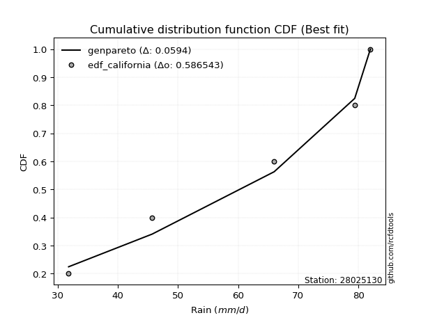</img>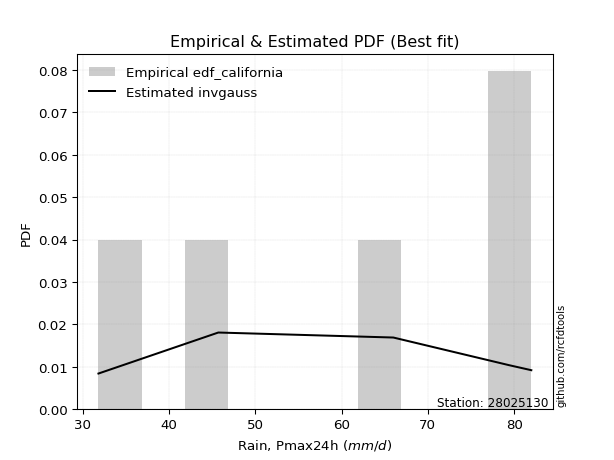</img>

</div>


### 2. EDF Hazen (1930)

Hazen method for plotting positions is a formula used to estimate the empirical cumulative probability distribution of flood events or other hydrological data. This formula often results in biased estimations, particularly when extrapolating to extreme events (high return periods).

<div align="center">


$P=(m-0.5)/n$


</div>


**2.1. Empirical values**

<div align="center">

|                | 0                  | 1                  | 2         | 3                 | 4                  |
|:---------------|:-------------------|:-------------------|:----------|:------------------|:-------------------|
| date           | 2020               | 2022               | 2017      | 2019              | 2018               |
| x              | 31.8               | 45.7               | 66.0      | 79.4              | 82.0               |
| m              | 1                  | 2                  | 3         | 4                 | 5                  |
| empirical_dist | edf_hazen          | edf_hazen          | edf_hazen | edf_hazen         | edf_hazen          |
| empirical      | 0.1                | 0.3                | 0.5       | 0.7               | 0.9                |
| empirical_tr   | 1.1111111111111112 | 1.4285714285714286 | 2.0       | 3.333333333333333 | 10.000000000000002 |

</div>


**2.2. Kolmogorov-Smirnov fit test (sorted by Δ)**


<div align="center">

|                | 0                   | 1                   | 2                   | 3                  | 4                   | 5                   | 6                   | 7                   | 8                   | 9                   | 10                  | 11                  | 12                  | 13                  | 14                  | 15                  | 16                  | 17                  | 18                  | 19                  | 20                  | 21                  | 22                 | 23                  | 24                  | 25                  | 26                  | 27                 | 28                  | 29                  | 30                  | 31                  | 32                 | 33                  | 34                  | 35                  | 36                  | 37                  | 38                 | 39                  | 40                 | 41                  | 42                 | 43                  | 44                  | 45                  | 46                  | 47                  | 48                  | 49                 | 50                  | 51                  | 52                 | 53                  | 54                  | 55                  | 56                  | 57                  | 58                 | 59                 | 60                 | 61                  | 62                 | 63                  | 64                  | 65                  | 66                  | 67                  | 68                  | 69                  | 70                  | 71                 | 72                 | 73                  | 74                  | 75                  | 76                  | 77                  | 78                  | 79                  | 80                  | 81                  | 82                  | 83                  | 84                  | 85                 | 86                  | 87                  | 88                 | 89                  | 90                 | 91                  | 92                 | 93                 | 94                  | 95                  | 96                 | 97                  | 98                  | 99                  | 100                | 101                 | 102                | 103                 | 104                 | 105                 | 106                 | 107                | 108                 | 109                | 110                 | 111                 | 112                 | 113                 | 114                 | 115                 | 116                 | 117                 | 118                 | 119                 | 120                 | 121                | 122                 | 123                 | 124                | 125                | 126                | 127                | 128                 | 129                 | 130                 | 131                 | 132                | 133                | 134                | 135                | 136                 | 137                 | 138                 | 139                | 140                | 141                | 142                | 143                 | 144                 | 145                | 146                | 147                | 148                 | 149                | 150                | 151                | 152                | 153                | 154                | 155                | 156                | 157                | 158                | 159                |
|:---------------|:--------------------|:--------------------|:--------------------|:-------------------|:--------------------|:--------------------|:--------------------|:--------------------|:--------------------|:--------------------|:--------------------|:--------------------|:--------------------|:--------------------|:--------------------|:--------------------|:--------------------|:--------------------|:--------------------|:--------------------|:--------------------|:--------------------|:-------------------|:--------------------|:--------------------|:--------------------|:--------------------|:-------------------|:--------------------|:--------------------|:--------------------|:--------------------|:-------------------|:--------------------|:--------------------|:--------------------|:--------------------|:--------------------|:-------------------|:--------------------|:-------------------|:--------------------|:-------------------|:--------------------|:--------------------|:--------------------|:--------------------|:--------------------|:--------------------|:-------------------|:--------------------|:--------------------|:-------------------|:--------------------|:--------------------|:--------------------|:--------------------|:--------------------|:-------------------|:-------------------|:-------------------|:--------------------|:-------------------|:--------------------|:--------------------|:--------------------|:--------------------|:--------------------|:--------------------|:--------------------|:--------------------|:-------------------|:-------------------|:--------------------|:--------------------|:--------------------|:--------------------|:--------------------|:--------------------|:--------------------|:--------------------|:--------------------|:--------------------|:--------------------|:--------------------|:-------------------|:--------------------|:--------------------|:-------------------|:--------------------|:-------------------|:--------------------|:-------------------|:-------------------|:--------------------|:--------------------|:-------------------|:--------------------|:--------------------|:--------------------|:-------------------|:--------------------|:-------------------|:--------------------|:--------------------|:--------------------|:--------------------|:-------------------|:--------------------|:-------------------|:--------------------|:--------------------|:--------------------|:--------------------|:--------------------|:--------------------|:--------------------|:--------------------|:--------------------|:--------------------|:--------------------|:-------------------|:--------------------|:--------------------|:-------------------|:-------------------|:-------------------|:-------------------|:--------------------|:--------------------|:--------------------|:--------------------|:-------------------|:-------------------|:-------------------|:-------------------|:--------------------|:--------------------|:--------------------|:-------------------|:-------------------|:-------------------|:-------------------|:--------------------|:--------------------|:-------------------|:-------------------|:-------------------|:--------------------|:-------------------|:-------------------|:-------------------|:-------------------|:-------------------|:-------------------|:-------------------|:-------------------|:-------------------|:-------------------|:-------------------|
| station        | 28025130            | 28025130            | 28025130            | 28025130           | 28025130            | 28025130            | 28025130            | 28025130            | 28025130            | 28025130            | 28025130            | 28025130            | 28025130            | 28025130            | 28025130            | 28025130            | 28025130            | 28025130            | 28025130            | 28025130            | 28025130            | 28025130            | 28025130           | 28025130            | 28025130            | 28025130            | 28025130            | 28025130           | 28025130            | 28025130            | 28025130            | 28025130            | 28025130           | 28025130            | 28025130            | 28025130            | 28025130            | 28025130            | 28025130           | 28025130            | 28025130           | 28025130            | 28025130           | 28025130            | 28025130            | 28025130            | 28025130            | 28025130            | 28025130            | 28025130           | 28025130            | 28025130            | 28025130           | 28025130            | 28025130            | 28025130            | 28025130            | 28025130            | 28025130           | 28025130           | 28025130           | 28025130            | 28025130           | 28025130            | 28025130            | 28025130            | 28025130            | 28025130            | 28025130            | 28025130            | 28025130            | 28025130           | 28025130           | 28025130            | 28025130            | 28025130            | 28025130            | 28025130            | 28025130            | 28025130            | 28025130            | 28025130            | 28025130            | 28025130            | 28025130            | 28025130           | 28025130            | 28025130            | 28025130           | 28025130            | 28025130           | 28025130            | 28025130           | 28025130           | 28025130            | 28025130            | 28025130           | 28025130            | 28025130            | 28025130            | 28025130           | 28025130            | 28025130           | 28025130            | 28025130            | 28025130            | 28025130            | 28025130           | 28025130            | 28025130           | 28025130            | 28025130            | 28025130            | 28025130            | 28025130            | 28025130            | 28025130            | 28025130            | 28025130            | 28025130            | 28025130            | 28025130           | 28025130            | 28025130            | 28025130           | 28025130           | 28025130           | 28025130           | 28025130            | 28025130            | 28025130            | 28025130            | 28025130           | 28025130           | 28025130           | 28025130           | 28025130            | 28025130            | 28025130            | 28025130           | 28025130           | 28025130           | 28025130           | 28025130            | 28025130            | 28025130           | 28025130           | 28025130           | 28025130            | 28025130           | 28025130           | 28025130           | 28025130           | 28025130           | 28025130           | 28025130           | 28025130           | 28025130           | 28025130           | 28025130           |
| empirical_dist | edf_hazen           | edf_hazen           | edf_hazen           | edf_hazen          | edf_hazen           | edf_hazen           | edf_hazen           | edf_hazen           | edf_hazen           | edf_hazen           | edf_hazen           | edf_hazen           | edf_hazen           | edf_hazen           | edf_hazen           | edf_hazen           | edf_hazen           | edf_hazen           | edf_hazen           | edf_hazen           | edf_hazen           | edf_hazen           | edf_hazen          | edf_hazen           | edf_hazen           | edf_hazen           | edf_hazen           | edf_hazen          | edf_hazen           | edf_hazen           | edf_hazen           | edf_hazen           | edf_hazen          | edf_hazen           | edf_hazen           | edf_hazen           | edf_hazen           | edf_hazen           | edf_hazen          | edf_hazen           | edf_hazen          | edf_hazen           | edf_hazen          | edf_hazen           | edf_hazen           | edf_hazen           | edf_hazen           | edf_hazen           | edf_hazen           | edf_hazen          | edf_hazen           | edf_hazen           | edf_hazen          | edf_hazen           | edf_hazen           | edf_hazen           | edf_hazen           | edf_hazen           | edf_hazen          | edf_hazen          | edf_hazen          | edf_hazen           | edf_hazen          | edf_hazen           | edf_hazen           | edf_hazen           | edf_hazen           | edf_hazen           | edf_hazen           | edf_hazen           | edf_hazen           | edf_hazen          | edf_hazen          | edf_hazen           | edf_hazen           | edf_hazen           | edf_hazen           | edf_hazen           | edf_hazen           | edf_hazen           | edf_hazen           | edf_hazen           | edf_hazen           | edf_hazen           | edf_hazen           | edf_hazen          | edf_hazen           | edf_hazen           | edf_hazen          | edf_hazen           | edf_hazen          | edf_hazen           | edf_hazen          | edf_hazen          | edf_hazen           | edf_hazen           | edf_hazen          | edf_hazen           | edf_hazen           | edf_hazen           | edf_hazen          | edf_hazen           | edf_hazen          | edf_hazen           | edf_hazen           | edf_hazen           | edf_hazen           | edf_hazen          | edf_hazen           | edf_hazen          | edf_hazen           | edf_hazen           | edf_hazen           | edf_hazen           | edf_hazen           | edf_hazen           | edf_hazen           | edf_hazen           | edf_hazen           | edf_hazen           | edf_hazen           | edf_hazen          | edf_hazen           | edf_hazen           | edf_hazen          | edf_hazen          | edf_hazen          | edf_hazen          | edf_hazen           | edf_hazen           | edf_hazen           | edf_hazen           | edf_hazen          | edf_hazen          | edf_hazen          | edf_hazen          | edf_hazen           | edf_hazen           | edf_hazen           | edf_hazen          | edf_hazen          | edf_hazen          | edf_hazen          | edf_hazen           | edf_hazen           | edf_hazen          | edf_hazen          | edf_hazen          | edf_hazen           | edf_hazen          | edf_hazen          | edf_hazen          | edf_hazen          | edf_hazen          | edf_hazen          | edf_hazen          | edf_hazen          | edf_hazen          | edf_hazen          | edf_hazen          |
| p_dist         | ksone               | semicircular        | logtrapezoid        | trapezoid          | logbeta             | beta                | anglit              | logweibull_max      | betaprime           | logksone            | genextreme          | logpearson3         | logsemicircular     | arcsine             | genpareto           | alpha               | invgamma            | rice                | erlang              | gamma               | f                   | pearson3            | nct                | t                   | maxwell             | exponnorm           | norm                | crystalball        | loggenextreme       | loganglit           | loggumbel_l         | logburr12           | loggompertz        | logdgamma           | logweibull_min      | rayleigh            | gompertz            | weibull_min         | invgauss           | logbetaprime        | logdweibull        | logistic            | logncf             | gumbel_l            | logf                | logt                | logcrystalball      | lognorm             | logexponnorm        | cosine             | lognct              | logfatiguelife      | logfoldnorm        | loggamma            | loggamma            | dweibull            | logarcsine          | logloglaplace       | logerlang          | logrice            | wrapcauchy         | kstwobign           | hypsecant          | halfnorm            | loginvgauss         | logalpha            | loginvgamma         | dgamma              | levy_l              | loglogistic         | gumbel_r            | laplace            | loginvweibull      | loglevy_l           | logmaxwell          | lograyleigh         | argus               | logcosine           | loghypsecant        | burr                | logexponpow         | logkstwobign        | halflogistic        | logargus            | loggenexpon         | lomax              | genexpon            | moyal               | johnsonsb          | logwrapcauchy       | loggenpareto       | loghalfnorm         | loggennorm         | gennorm            | truncnorm           | loggenhalflogistic  | genhalflogistic    | loglomax            | logmielke           | burr12              | mielke             | logburr             | loggumbel_r        | loglaplace          | loglaplace          | halfgennorm         | logloggamma         | triang             | logexponweib        | loghalflogistic    | skewnorm            | logmoyal            | loggausshyper       | gausshyper          | tukeylambda         | kappa4              | logtriang           | kappa3              | uniform             | vonmises_line       | logskewnorm         | wald               | logkappa4           | logtukeylambda      | bradford           | truncexpon         | truncweibull_min   | loghalfgennorm     | logkappa3           | loguniform          | loggengamma         | logwald             | logjohnsonsb       | lognakagami        | nakagami           | foldnorm           | logvonmises_line    | ncf                 | logtruncweibull_min | gengamma           | logbradford        | logtruncnorm       | logtruncexpon      | exponweib           | logrdist            | johnsonsu          | weibull_max        | invweibull         | fatiguelife         | logjohnsonsu       | powerlaw           | truncpareto        | logpowerlaw        | logtruncpareto     | exponpow           | rdist              | genlogistic        | loggenlogistic     | logvonmises        | vonmises           |
| delta          | 0.08800455228751092 | 0.08979062909595403 | 0.09169630571341547 | 0.0919224653637929 | 0.09997858123009207 | 0.09999410696005806 | 0.10159768092107879 | 0.11435306751745866 | 0.11475627747677086 | 0.11538099143229208 | 0.11888282252978011 | 0.11903960670180258 | 0.12184312392934937 | 0.12311951315954439 | 0.12441308934884487 | 0.12462646301460012 | 0.12528377630678422 | 0.12637301040816074 | 0.12647682545992556 | 0.12710230429948954 | 0.12716915547433882 | 0.12789660114182777 | 0.1281557825093408 | 0.12819610636337364 | 0.12820235393318036 | 0.12820593252398038 | 0.12820606424203373 | 0.1282060658440194 | 0.12853323551225943 | 0.13014967129290567 | 0.13025691860249844 | 0.13171871474400443 | 0.1330318670916053 | 0.13326099450017354 | 0.13332162223229138 | 0.13637416927264856 | 0.13664249076289103 | 0.13667941040401788 | 0.1383513205264406 | 0.13928712916960317 | 0.1447564337239836 | 0.14785159371013779 | 0.1480206849301655 | 0.14918800915461194 | 0.14963653795672527 | 0.14994232952789943 | 0.14994645618397007 | 0.14994646080663165 | 0.14995054348613412 | 0.150651043525299  | 0.15079229630181556 | 0.15197135858533972 | 0.1526834631645515 | 0.15296645922989283 | 0.15296645922989283 | 0.15372956544051553 | 0.15445077009922215 | 0.15584672362300367 | 0.1559961564364617 | 0.1581403860770354 | 0.1583946822490666 | 0.15841251596398753 | 0.1585668328416565 | 0.15965190235910853 | 0.16120760299294234 | 0.16153296569809228 | 0.16244264906094819 | 0.16550335936925187 | 0.16657188930917344 | 0.16788436577863686 | 0.16816117876667747 | 0.1689987895393893 | 0.1696822391493773 | 0.16999550761526372 | 0.17158760819731977 | 0.17809581741608427 | 0.17826048383984971 | 0.17980523132269788 | 0.18181076046199862 | 0.18286597743236221 | 0.18518551851594045 | 0.18789147079940993 | 0.18797283015579314 | 0.18824218404103576 | 0.19019392126230927 | 0.1905505180465331 | 0.19057300046322423 | 0.19079725759579436 | 0.1938623087693626 | 0.19442566861837263 | 0.1968405578062433 | 0.19701964970002273 | 0.2                | 0.2                | 0.20293322404280068 | 0.20382026802026987 | 0.2050963451704858 | 0.20589733405045296 | 0.20620171514085617 | 0.20793707171811127 | 0.2085471259710734 | 0.20935979696825202 | 0.2099297338795345 | 0.20999821437844668 | 0.20999821437844668 | 0.21123308586872602 | 0.21317491417259016 | 0.2177340260030819 | 0.21983381976821892 | 0.2251434044653764 | 0.22766766363297564 | 0.22978126568890134 | 0.23766009618559159 | 0.23912104711466364 | 0.24017809183915095 | 0.24130118934125855 | 0.24686104560595012 | 0.24750459644705292 | 0.24820717131474124 | 0.24851090915060614 | 0.24936460623782775 | 0.2539068138512618 | 0.25549913978374195 | 0.26103566699172376 | 0.2636182607673355 | 0.2640502384123463 | 0.2644708962963426 | 0.2654729655211693 | 0.26947443920499103 | 0.27084842699702893 | 0.28248432736757656 | 0.28603817892974115 | 0.2922980596395529 | 0.2999993816202572 | 0.29999996457239   | 0.301347779840489  | 0.30574256395529564 | 0.31214300793483685 | 0.32023430514913587 | 0.3265686832968467 | 0.3273890129583663 | 0.3296694412288531 | 0.3411570646673058 | 0.34894731197757217 | 0.35004302919445396 | 0.3553494518710742 | 0.3934283729318383 | 0.4703136940271528 | 0.47643800575125744 | 0.5184146699810673 | 0.5478766706114251 | 0.5637748954342734 | 0.5769140121537983 | 0.5987450624712927 | 0.5987928947154719 | 0.6999999999940523 | 0.7                | 0.7                | 1.1464591248391054 | 12.360426505187684 |
| deltao         | 0.5865427407550001  | 0.5865427407550001  | 0.5865427407550001  | 0.5865427407550001 | 0.5865427407550001  | 0.5865427407550001  | 0.5865427407550001  | 0.5865427407550001  | 0.5865427407550001  | 0.5865427407550001  | 0.5865427407550001  | 0.5865427407550001  | 0.5865427407550001  | 0.5865427407550001  | 0.5865427407550001  | 0.5865427407550001  | 0.5865427407550001  | 0.5865427407550001  | 0.5865427407550001  | 0.5865427407550001  | 0.5865427407550001  | 0.5865427407550001  | 0.5865427407550001 | 0.5865427407550001  | 0.5865427407550001  | 0.5865427407550001  | 0.5865427407550001  | 0.5865427407550001 | 0.5865427407550001  | 0.5865427407550001  | 0.5865427407550001  | 0.5865427407550001  | 0.5865427407550001 | 0.5865427407550001  | 0.5865427407550001  | 0.5865427407550001  | 0.5865427407550001  | 0.5865427407550001  | 0.5865427407550001 | 0.5865427407550001  | 0.5865427407550001 | 0.5865427407550001  | 0.5865427407550001 | 0.5865427407550001  | 0.5865427407550001  | 0.5865427407550001  | 0.5865427407550001  | 0.5865427407550001  | 0.5865427407550001  | 0.5865427407550001 | 0.5865427407550001  | 0.5865427407550001  | 0.5865427407550001 | 0.5865427407550001  | 0.5865427407550001  | 0.5865427407550001  | 0.5865427407550001  | 0.5865427407550001  | 0.5865427407550001 | 0.5865427407550001 | 0.5865427407550001 | 0.5865427407550001  | 0.5865427407550001 | 0.5865427407550001  | 0.5865427407550001  | 0.5865427407550001  | 0.5865427407550001  | 0.5865427407550001  | 0.5865427407550001  | 0.5865427407550001  | 0.5865427407550001  | 0.5865427407550001 | 0.5865427407550001 | 0.5865427407550001  | 0.5865427407550001  | 0.5865427407550001  | 0.5865427407550001  | 0.5865427407550001  | 0.5865427407550001  | 0.5865427407550001  | 0.5865427407550001  | 0.5865427407550001  | 0.5865427407550001  | 0.5865427407550001  | 0.5865427407550001  | 0.5865427407550001 | 0.5865427407550001  | 0.5865427407550001  | 0.5865427407550001 | 0.5865427407550001  | 0.5865427407550001 | 0.5865427407550001  | 0.5865427407550001 | 0.5865427407550001 | 0.5865427407550001  | 0.5865427407550001  | 0.5865427407550001 | 0.5865427407550001  | 0.5865427407550001  | 0.5865427407550001  | 0.5865427407550001 | 0.5865427407550001  | 0.5865427407550001 | 0.5865427407550001  | 0.5865427407550001  | 0.5865427407550001  | 0.5865427407550001  | 0.5865427407550001 | 0.5865427407550001  | 0.5865427407550001 | 0.5865427407550001  | 0.5865427407550001  | 0.5865427407550001  | 0.5865427407550001  | 0.5865427407550001  | 0.5865427407550001  | 0.5865427407550001  | 0.5865427407550001  | 0.5865427407550001  | 0.5865427407550001  | 0.5865427407550001  | 0.5865427407550001 | 0.5865427407550001  | 0.5865427407550001  | 0.5865427407550001 | 0.5865427407550001 | 0.5865427407550001 | 0.5865427407550001 | 0.5865427407550001  | 0.5865427407550001  | 0.5865427407550001  | 0.5865427407550001  | 0.5865427407550001 | 0.5865427407550001 | 0.5865427407550001 | 0.5865427407550001 | 0.5865427407550001  | 0.5865427407550001  | 0.5865427407550001  | 0.5865427407550001 | 0.5865427407550001 | 0.5865427407550001 | 0.5865427407550001 | 0.5865427407550001  | 0.5865427407550001  | 0.5865427407550001 | 0.5865427407550001 | 0.5865427407550001 | 0.5865427407550001  | 0.5865427407550001 | 0.5865427407550001 | 0.5865427407550001 | 0.5865427407550001 | 0.5865427407550001 | 0.5865427407550001 | 0.5865427407550001 | 0.5865427407550001 | 0.5865427407550001 | 0.5865427407550001 | 0.5865427407550001 |
| eval           | Δo > Δ              | Δo > Δ              | Δo > Δ              | Δo > Δ             | Δo > Δ              | Δo > Δ              | Δo > Δ              | Δo > Δ              | Δo > Δ              | Δo > Δ              | Δo > Δ              | Δo > Δ              | Δo > Δ              | Δo > Δ              | Δo > Δ              | Δo > Δ              | Δo > Δ              | Δo > Δ              | Δo > Δ              | Δo > Δ              | Δo > Δ              | Δo > Δ              | Δo > Δ             | Δo > Δ              | Δo > Δ              | Δo > Δ              | Δo > Δ              | Δo > Δ             | Δo > Δ              | Δo > Δ              | Δo > Δ              | Δo > Δ              | Δo > Δ             | Δo > Δ              | Δo > Δ              | Δo > Δ              | Δo > Δ              | Δo > Δ              | Δo > Δ             | Δo > Δ              | Δo > Δ             | Δo > Δ              | Δo > Δ             | Δo > Δ              | Δo > Δ              | Δo > Δ              | Δo > Δ              | Δo > Δ              | Δo > Δ              | Δo > Δ             | Δo > Δ              | Δo > Δ              | Δo > Δ             | Δo > Δ              | Δo > Δ              | Δo > Δ              | Δo > Δ              | Δo > Δ              | Δo > Δ             | Δo > Δ             | Δo > Δ             | Δo > Δ              | Δo > Δ             | Δo > Δ              | Δo > Δ              | Δo > Δ              | Δo > Δ              | Δo > Δ              | Δo > Δ              | Δo > Δ              | Δo > Δ              | Δo > Δ             | Δo > Δ             | Δo > Δ              | Δo > Δ              | Δo > Δ              | Δo > Δ              | Δo > Δ              | Δo > Δ              | Δo > Δ              | Δo > Δ              | Δo > Δ              | Δo > Δ              | Δo > Δ              | Δo > Δ              | Δo > Δ             | Δo > Δ              | Δo > Δ              | Δo > Δ             | Δo > Δ              | Δo > Δ             | Δo > Δ              | Δo > Δ             | Δo > Δ             | Δo > Δ              | Δo > Δ              | Δo > Δ             | Δo > Δ              | Δo > Δ              | Δo > Δ              | Δo > Δ             | Δo > Δ              | Δo > Δ             | Δo > Δ              | Δo > Δ              | Δo > Δ              | Δo > Δ              | Δo > Δ             | Δo > Δ              | Δo > Δ             | Δo > Δ              | Δo > Δ              | Δo > Δ              | Δo > Δ              | Δo > Δ              | Δo > Δ              | Δo > Δ              | Δo > Δ              | Δo > Δ              | Δo > Δ              | Δo > Δ              | Δo > Δ             | Δo > Δ              | Δo > Δ              | Δo > Δ             | Δo > Δ             | Δo > Δ             | Δo > Δ             | Δo > Δ              | Δo > Δ              | Δo > Δ              | Δo > Δ              | Δo > Δ             | Δo > Δ             | Δo > Δ             | Δo > Δ             | Δo > Δ              | Δo > Δ              | Δo > Δ              | Δo > Δ             | Δo > Δ             | Δo > Δ             | Δo > Δ             | Δo > Δ              | Δo > Δ              | Δo > Δ             | Δo > Δ             | Δo > Δ             | Δo > Δ              | Δo > Δ             | Δo > Δ             | Δo > Δ             | Δo > Δ             | Δo <= Δ            | Δo <= Δ            | Δo <= Δ            | Δo <= Δ            | Δo <= Δ            | Δo <= Δ            | Δo <= Δ            |
| fit            | 1                   | 1                   | 1                   | 1                  | 1                   | 1                   | 1                   | 1                   | 1                   | 1                   | 1                   | 1                   | 1                   | 1                   | 1                   | 1                   | 1                   | 1                   | 1                   | 1                   | 1                   | 1                   | 1                  | 1                   | 1                   | 1                   | 1                   | 1                  | 1                   | 1                   | 1                   | 1                   | 1                  | 1                   | 1                   | 1                   | 1                   | 1                   | 1                  | 1                   | 1                  | 1                   | 1                  | 1                   | 1                   | 1                   | 1                   | 1                   | 1                   | 1                  | 1                   | 1                   | 1                  | 1                   | 1                   | 1                   | 1                   | 1                   | 1                  | 1                  | 1                  | 1                   | 1                  | 1                   | 1                   | 1                   | 1                   | 1                   | 1                   | 1                   | 1                   | 1                  | 1                  | 1                   | 1                   | 1                   | 1                   | 1                   | 1                   | 1                   | 1                   | 1                   | 1                   | 1                   | 1                   | 1                  | 1                   | 1                   | 1                  | 1                   | 1                  | 1                   | 1                  | 1                  | 1                   | 1                   | 1                  | 1                   | 1                   | 1                   | 1                  | 1                   | 1                  | 1                   | 1                   | 1                   | 1                   | 1                  | 1                   | 1                  | 1                   | 1                   | 1                   | 1                   | 1                   | 1                   | 1                   | 1                   | 1                   | 1                   | 1                   | 1                  | 1                   | 1                   | 1                  | 1                  | 1                  | 1                  | 1                   | 1                   | 1                   | 1                   | 1                  | 1                  | 1                  | 1                  | 1                   | 1                   | 1                   | 1                  | 1                  | 1                  | 1                  | 1                   | 1                   | 1                  | 1                  | 1                  | 1                   | 1                  | 1                  | 1                  | 1                  | 0                  | 0                  | 0                  | 0                  | 0                  | 0                  | 0                  |
| n              | 5                   | 5                   | 5                   | 5                  | 5                   | 5                   | 5                   | 5                   | 5                   | 5                   | 5                   | 5                   | 5                   | 5                   | 5                   | 5                   | 5                   | 5                   | 5                   | 5                   | 5                   | 5                   | 5                  | 5                   | 5                   | 5                   | 5                   | 5                  | 5                   | 5                   | 5                   | 5                   | 5                  | 5                   | 5                   | 5                   | 5                   | 5                   | 5                  | 5                   | 5                  | 5                   | 5                  | 5                   | 5                   | 5                   | 5                   | 5                   | 5                   | 5                  | 5                   | 5                   | 5                  | 5                   | 5                   | 5                   | 5                   | 5                   | 5                  | 5                  | 5                  | 5                   | 5                  | 5                   | 5                   | 5                   | 5                   | 5                   | 5                   | 5                   | 5                   | 5                  | 5                  | 5                   | 5                   | 5                   | 5                   | 5                   | 5                   | 5                   | 5                   | 5                   | 5                   | 5                   | 5                   | 5                  | 5                   | 5                   | 5                  | 5                   | 5                  | 5                   | 5                  | 5                  | 5                   | 5                   | 5                  | 5                   | 5                   | 5                   | 5                  | 5                   | 5                  | 5                   | 5                   | 5                   | 5                   | 5                  | 5                   | 5                  | 5                   | 5                   | 5                   | 5                   | 5                   | 5                   | 5                   | 5                   | 5                   | 5                   | 5                   | 5                  | 5                   | 5                   | 5                  | 5                  | 5                  | 5                  | 5                   | 5                   | 5                   | 5                   | 5                  | 5                  | 5                  | 5                  | 5                   | 5                   | 5                   | 5                  | 5                  | 5                  | 5                  | 5                   | 5                   | 5                  | 5                  | 5                  | 5                   | 5                  | 5                  | 5                  | 5                  | 5                  | 5                  | 5                  | 5                  | 5                  | 5                  | 5                  |
| best_fit       | 1                   | 0                   | 0                   | 0                  | 0                   | 0                   | 0                   | 0                   | 0                   | 0                   | 0                   | 0                   | 0                   | 0                   | 0                   | 0                   | 0                   | 0                   | 0                   | 0                   | 0                   | 0                   | 0                  | 0                   | 0                   | 0                   | 0                   | 0                  | 0                   | 0                   | 0                   | 0                   | 0                  | 0                   | 0                   | 0                   | 0                   | 0                   | 0                  | 0                   | 0                  | 0                   | 0                  | 0                   | 0                   | 0                   | 0                   | 0                   | 0                   | 0                  | 0                   | 0                   | 0                  | 0                   | 0                   | 0                   | 0                   | 0                   | 0                  | 0                  | 0                  | 0                   | 0                  | 0                   | 0                   | 0                   | 0                   | 0                   | 0                   | 0                   | 0                   | 0                  | 0                  | 0                   | 0                   | 0                   | 0                   | 0                   | 0                   | 0                   | 0                   | 0                   | 0                   | 0                   | 0                   | 0                  | 0                   | 0                   | 0                  | 0                   | 0                  | 0                   | 0                  | 0                  | 0                   | 0                   | 0                  | 0                   | 0                   | 0                   | 0                  | 0                   | 0                  | 0                   | 0                   | 0                   | 0                   | 0                  | 0                   | 0                  | 0                   | 0                   | 0                   | 0                   | 0                   | 0                   | 0                   | 0                   | 0                   | 0                   | 0                   | 0                  | 0                   | 0                   | 0                  | 0                  | 0                  | 0                  | 0                   | 0                   | 0                   | 0                   | 0                  | 0                  | 0                  | 0                  | 0                   | 0                   | 0                   | 0                  | 0                  | 0                  | 0                  | 0                   | 0                   | 0                  | 0                  | 0                  | 0                   | 0                  | 0                  | 0                  | 0                  | 0                  | 0                  | 0                  | 0                  | 0                  | 0                  | 0                  |
| best_fit_sort  | 1                   | 2                   | 3                   | 4                  | 5                   | 6                   | 7                   | 8                   | 9                   | 10                  | 11                  | 12                  | 13                  | 14                  | 15                  | 16                  | 17                  | 18                  | 19                  | 20                  | 21                  | 22                  | 23                 | 24                  | 25                  | 26                  | 27                  | 28                 | 29                  | 30                  | 31                  | 32                  | 33                 | 34                  | 35                  | 36                  | 37                  | 38                  | 39                 | 40                  | 41                 | 42                  | 43                 | 44                  | 45                  | 46                  | 47                  | 48                  | 49                  | 50                 | 51                  | 52                  | 53                 | 54                  | 55                  | 56                  | 57                  | 58                  | 59                 | 60                 | 61                 | 62                  | 63                 | 64                  | 65                  | 66                  | 67                  | 68                  | 69                  | 70                  | 71                  | 72                 | 73                 | 74                  | 75                  | 76                  | 77                  | 78                  | 79                  | 80                  | 81                  | 82                  | 83                  | 84                  | 85                  | 86                 | 87                  | 88                  | 89                 | 90                  | 91                 | 92                  | 93                 | 94                 | 95                  | 96                  | 97                 | 98                  | 99                  | 100                 | 101                | 102                 | 103                | 104                 | 105                 | 106                 | 107                 | 108                | 109                 | 110                | 111                 | 112                 | 113                 | 114                 | 115                 | 116                 | 117                 | 118                 | 119                 | 120                 | 121                 | 122                | 123                 | 124                 | 125                | 126                | 127                | 128                | 129                 | 130                 | 131                 | 132                 | 133                | 134                | 135                | 136                | 137                 | 138                 | 139                 | 140                | 141                | 142                | 143                | 144                 | 145                 | 146                | 147                | 148                | 149                 | 150                | 151                | 152                | 153                | 154                | 155                | 156                | 157                | 158                | 159                | 160                |

</div>


**2.3. Best fit**

<div align="center">

|   id |   station | empirical_dist   | p_dist   |     delta |   deltao | eval   |   fit |   n |   best_fit |   best_fit_sort |
|-----:|----------:|:-----------------|:---------|----------:|---------:|:-------|------:|----:|-----------:|----------------:|
|    0 |  28025130 | edf_hazen        | ksone    | 0.0880046 | 0.586543 | Δo > Δ |     1 |   5 |          1 |               1 |

</div>


<div align="center">

</img>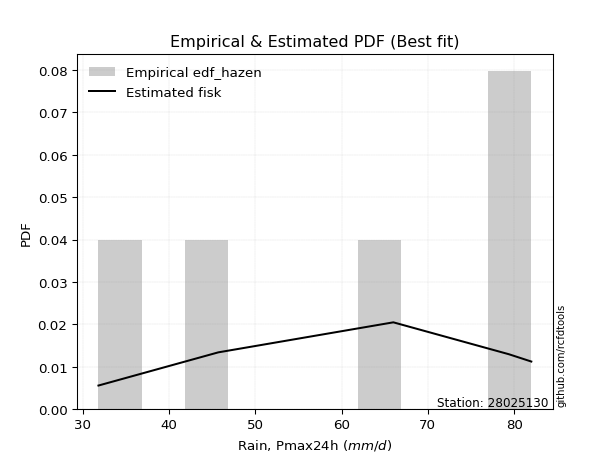</img>

</div>


### 3. EDF Weibull (1939)

Weibull plotting position formula is an empirical method used to estimate the non-exceedance probability or plotting position for a set of observed data, is often recommended or widely used in practice, particularly in flood frequency analysis.

<div align="center">


$P=m/(n+1)$


</div>


**3.1. Empirical values**

<div align="center">

|                | 0                   | 1                  | 2           | 3                  | 4                  |
|:---------------|:--------------------|:-------------------|:------------|:-------------------|:-------------------|
| date           | 2020                | 2022               | 2017        | 2019               | 2018               |
| x              | 31.8                | 45.7               | 66.0        | 79.4               | 82.0               |
| m              | 1                   | 2                  | 3           | 4                  | 5                  |
| empirical_dist | edf_weibull         | edf_weibull        | edf_weibull | edf_weibull        | edf_weibull        |
| empirical      | 0.16666666666666666 | 0.3333333333333333 | 0.5         | 0.6666666666666666 | 0.8333333333333334 |
| empirical_tr   | 1.2                 | 1.4999999999999998 | 2.0         | 2.9999999999999996 | 6.000000000000002  |

</div>


**3.2. Kolmogorov-Smirnov fit test (sorted by Δ)**


<div align="center">

|                | 0                   | 1                   | 2                   | 3                   | 4                   | 5                   | 6                   | 7                   | 8                   | 9                  | 10                  | 11                  | 12                 | 13                  | 14                  | 15                  | 16                  | 17                  | 18                  | 19                  | 20                  | 21                 | 22                  | 23                  | 24                  | 25                 | 26                  | 27                 | 28                  | 29                  | 30                  | 31                  | 32                  | 33                  | 34                 | 35                  | 36                  | 37                 | 38                 | 39                  | 40                  | 41                 | 42                  | 43                  | 44                  | 45                  | 46                  | 47                  | 48                  | 49                  | 50                 | 51                 | 52                 | 53                 | 54                 | 55                  | 56                  | 57                  | 58                  | 59                  | 60                  | 61                  | 62                  | 63                  | 64                  | 65                  | 66                 | 67                  | 68                 | 69                  | 70                  | 71                 | 72                  | 73                  | 74                  | 75                  | 76                 | 77                  | 78                  | 79                  | 80                 | 81                  | 82                  | 83                  | 84                  | 85                 | 86                  | 87                  | 88                  | 89                  | 90                 | 91                  | 92                  | 93                  | 94                 | 95                  | 96                  | 97                  | 98                  | 99                  | 100                | 101                | 102                 | 103                 | 104                 | 105                | 106                 | 107                | 108                 | 109                 | 110                | 111                 | 112                | 113                 | 114                 | 115                | 116                 | 117                | 118                | 119                 | 120                 | 121                 | 122                 | 123                 | 124                 | 125                 | 126                | 127                | 128                | 129                 | 130                 | 131                 | 132                | 133                | 134                 | 135                | 136                 | 137                 | 138                 | 139                | 140                 | 141                | 142                | 143                 | 144                 | 145                | 146                | 147                 | 148                | 149                | 150                | 151                | 152                | 153                | 154                | 155                | 156                | 157                | 158                | 159                |
|:---------------|:--------------------|:--------------------|:--------------------|:--------------------|:--------------------|:--------------------|:--------------------|:--------------------|:--------------------|:-------------------|:--------------------|:--------------------|:-------------------|:--------------------|:--------------------|:--------------------|:--------------------|:--------------------|:--------------------|:--------------------|:--------------------|:-------------------|:--------------------|:--------------------|:--------------------|:-------------------|:--------------------|:-------------------|:--------------------|:--------------------|:--------------------|:--------------------|:--------------------|:--------------------|:-------------------|:--------------------|:--------------------|:-------------------|:-------------------|:--------------------|:--------------------|:-------------------|:--------------------|:--------------------|:--------------------|:--------------------|:--------------------|:--------------------|:--------------------|:--------------------|:-------------------|:-------------------|:-------------------|:-------------------|:-------------------|:--------------------|:--------------------|:--------------------|:--------------------|:--------------------|:--------------------|:--------------------|:--------------------|:--------------------|:--------------------|:--------------------|:-------------------|:--------------------|:-------------------|:--------------------|:--------------------|:-------------------|:--------------------|:--------------------|:--------------------|:--------------------|:-------------------|:--------------------|:--------------------|:--------------------|:-------------------|:--------------------|:--------------------|:--------------------|:--------------------|:-------------------|:--------------------|:--------------------|:--------------------|:--------------------|:-------------------|:--------------------|:--------------------|:--------------------|:-------------------|:--------------------|:--------------------|:--------------------|:--------------------|:--------------------|:-------------------|:-------------------|:--------------------|:--------------------|:--------------------|:-------------------|:--------------------|:-------------------|:--------------------|:--------------------|:-------------------|:--------------------|:-------------------|:--------------------|:--------------------|:-------------------|:--------------------|:-------------------|:-------------------|:--------------------|:--------------------|:--------------------|:--------------------|:--------------------|:--------------------|:--------------------|:-------------------|:-------------------|:-------------------|:--------------------|:--------------------|:--------------------|:-------------------|:-------------------|:--------------------|:-------------------|:--------------------|:--------------------|:--------------------|:-------------------|:--------------------|:-------------------|:-------------------|:--------------------|:--------------------|:-------------------|:-------------------|:--------------------|:-------------------|:-------------------|:-------------------|:-------------------|:-------------------|:-------------------|:-------------------|:-------------------|:-------------------|:-------------------|:-------------------|:-------------------|
| station        | 28025130            | 28025130            | 28025130            | 28025130            | 28025130            | 28025130            | 28025130            | 28025130            | 28025130            | 28025130           | 28025130            | 28025130            | 28025130           | 28025130            | 28025130            | 28025130            | 28025130            | 28025130            | 28025130            | 28025130            | 28025130            | 28025130           | 28025130            | 28025130            | 28025130            | 28025130           | 28025130            | 28025130           | 28025130            | 28025130            | 28025130            | 28025130            | 28025130            | 28025130            | 28025130           | 28025130            | 28025130            | 28025130           | 28025130           | 28025130            | 28025130            | 28025130           | 28025130            | 28025130            | 28025130            | 28025130            | 28025130            | 28025130            | 28025130            | 28025130            | 28025130           | 28025130           | 28025130           | 28025130           | 28025130           | 28025130            | 28025130            | 28025130            | 28025130            | 28025130            | 28025130            | 28025130            | 28025130            | 28025130            | 28025130            | 28025130            | 28025130           | 28025130            | 28025130           | 28025130            | 28025130            | 28025130           | 28025130            | 28025130            | 28025130            | 28025130            | 28025130           | 28025130            | 28025130            | 28025130            | 28025130           | 28025130            | 28025130            | 28025130            | 28025130            | 28025130           | 28025130            | 28025130            | 28025130            | 28025130            | 28025130           | 28025130            | 28025130            | 28025130            | 28025130           | 28025130            | 28025130            | 28025130            | 28025130            | 28025130            | 28025130           | 28025130           | 28025130            | 28025130            | 28025130            | 28025130           | 28025130            | 28025130           | 28025130            | 28025130            | 28025130           | 28025130            | 28025130           | 28025130            | 28025130            | 28025130           | 28025130            | 28025130           | 28025130           | 28025130            | 28025130            | 28025130            | 28025130            | 28025130            | 28025130            | 28025130            | 28025130           | 28025130           | 28025130           | 28025130            | 28025130            | 28025130            | 28025130           | 28025130           | 28025130            | 28025130           | 28025130            | 28025130            | 28025130            | 28025130           | 28025130            | 28025130           | 28025130           | 28025130            | 28025130            | 28025130           | 28025130           | 28025130            | 28025130           | 28025130           | 28025130           | 28025130           | 28025130           | 28025130           | 28025130           | 28025130           | 28025130           | 28025130           | 28025130           | 28025130           |
| empirical_dist | edf_weibull         | edf_weibull         | edf_weibull         | edf_weibull         | edf_weibull         | edf_weibull         | edf_weibull         | edf_weibull         | edf_weibull         | edf_weibull        | edf_weibull         | edf_weibull         | edf_weibull        | edf_weibull         | edf_weibull         | edf_weibull         | edf_weibull         | edf_weibull         | edf_weibull         | edf_weibull         | edf_weibull         | edf_weibull        | edf_weibull         | edf_weibull         | edf_weibull         | edf_weibull        | edf_weibull         | edf_weibull        | edf_weibull         | edf_weibull         | edf_weibull         | edf_weibull         | edf_weibull         | edf_weibull         | edf_weibull        | edf_weibull         | edf_weibull         | edf_weibull        | edf_weibull        | edf_weibull         | edf_weibull         | edf_weibull        | edf_weibull         | edf_weibull         | edf_weibull         | edf_weibull         | edf_weibull         | edf_weibull         | edf_weibull         | edf_weibull         | edf_weibull        | edf_weibull        | edf_weibull        | edf_weibull        | edf_weibull        | edf_weibull         | edf_weibull         | edf_weibull         | edf_weibull         | edf_weibull         | edf_weibull         | edf_weibull         | edf_weibull         | edf_weibull         | edf_weibull         | edf_weibull         | edf_weibull        | edf_weibull         | edf_weibull        | edf_weibull         | edf_weibull         | edf_weibull        | edf_weibull         | edf_weibull         | edf_weibull         | edf_weibull         | edf_weibull        | edf_weibull         | edf_weibull         | edf_weibull         | edf_weibull        | edf_weibull         | edf_weibull         | edf_weibull         | edf_weibull         | edf_weibull        | edf_weibull         | edf_weibull         | edf_weibull         | edf_weibull         | edf_weibull        | edf_weibull         | edf_weibull         | edf_weibull         | edf_weibull        | edf_weibull         | edf_weibull         | edf_weibull         | edf_weibull         | edf_weibull         | edf_weibull        | edf_weibull        | edf_weibull         | edf_weibull         | edf_weibull         | edf_weibull        | edf_weibull         | edf_weibull        | edf_weibull         | edf_weibull         | edf_weibull        | edf_weibull         | edf_weibull        | edf_weibull         | edf_weibull         | edf_weibull        | edf_weibull         | edf_weibull        | edf_weibull        | edf_weibull         | edf_weibull         | edf_weibull         | edf_weibull         | edf_weibull         | edf_weibull         | edf_weibull         | edf_weibull        | edf_weibull        | edf_weibull        | edf_weibull         | edf_weibull         | edf_weibull         | edf_weibull        | edf_weibull        | edf_weibull         | edf_weibull        | edf_weibull         | edf_weibull         | edf_weibull         | edf_weibull        | edf_weibull         | edf_weibull        | edf_weibull        | edf_weibull         | edf_weibull         | edf_weibull        | edf_weibull        | edf_weibull         | edf_weibull        | edf_weibull        | edf_weibull        | edf_weibull        | edf_weibull        | edf_weibull        | edf_weibull        | edf_weibull        | edf_weibull        | edf_weibull        | edf_weibull        | edf_weibull        |
| p_dist         | logtrapezoid        | ksone               | logncf              | logsemicircular     | semicircular        | trapezoid           | loganglit           | anglit              | truncnorm           | logksone           | logbetaprime        | logpearson3         | betaprime          | logf                | logt                | logcrystalball      | lognorm             | logexponnorm        | logdgamma           | lognct              | logfatiguelife      | logfoldnorm        | loggamma            | loggamma            | invgauss            | logerlang          | alpha               | logrice            | kstwobign           | invgamma            | rice                | erlang              | gamma               | f                   | rayleigh           | maxwell             | loginvgauss         | pearson3           | nct                | t                   | logalpha            | exponnorm          | norm                | crystalball         | loginvgamma         | loggumbel_l         | logburr12           | loggenpareto        | levy_l              | logbeta             | logweibull_min     | beta               | johnsonsb          | wrapcauchy         | genpareto          | loggompertz         | logexponpow         | logweibull_max      | loggenextreme       | genextreme          | logexponweib        | logarcsine          | arcsine             | halfnorm            | loggennorm          | gennorm             | logdweibull        | loglogistic         | loginvweibull      | gompertz            | loglevy_l           | weibull_min        | logmaxwell          | lograyleigh         | logcosine           | gumbel_r            | logistic           | loghypsecant        | gumbel_l            | cosine              | logloglaplace      | dweibull            | logkstwobign        | halflogistic        | loggenexpon         | lomax              | genexpon            | moyal               | hypsecant           | loghalfnorm         | dgamma             | laplace             | loglomax            | burr12              | loggumbel_r        | loglaplace          | loglaplace          | halfgennorm         | argus               | burr                | logargus           | loghalflogistic    | logjohnsonsb        | logwrapcauchy       | logmoyal            | loggenhalflogistic | genhalflogistic     | logmielke          | mielke              | logburr             | ncf                | logloggamma         | triang             | wald                | skewnorm            | loggausshyper      | gausshyper          | tukeylambda        | kappa4             | logtriang           | kappa3              | uniform             | vonmises_line       | loggengamma         | logskewnorm         | logwald             | logkappa4          | logtukeylambda     | loghalfgennorm     | gengamma            | bradford            | truncexpon          | logkappa3          | truncweibull_min   | loguniform          | logvonmises_line   | exponweib           | logtruncweibull_min | johnsonsu           | logbradford        | logtruncnorm        | lognakagami        | nakagami           | logrdist            | foldnorm            | logtruncexpon      | weibull_max        | invweibull          | fatiguelife        | logjohnsonsu       | powerlaw           | truncpareto        | logpowerlaw        | logtruncpareto     | exponpow           | rdist              | genlogistic        | loggenlogistic     | logvonmises        | vonmises           |
| delta          | 0.10428334089327895 | 0.10673752680926352 | 0.11302901882139504 | 0.12184312392934937 | 0.12312396242928736 | 0.12525579869712622 | 0.13014967129290567 | 0.13493101425441212 | 0.13626655737613402 | 0.1388755256814281 | 0.13928712916960317 | 0.14655540002906042 | 0.1480896108101042 | 0.14963653795672527 | 0.14994232952789943 | 0.14994645618397007 | 0.14994646080663165 | 0.14995054348613412 | 0.15002253677445754 | 0.15079229630181556 | 0.15197135858533972 | 0.1526834631645515 | 0.15296645922989283 | 0.15296645922989283 | 0.15531553372160167 | 0.1559961564364617 | 0.15795979634793345 | 0.1581403860770354 | 0.15841251596398753 | 0.15861710964011755 | 0.15970634374149406 | 0.15981015879325888 | 0.16043563763282287 | 0.16050248880767215 | 0.1605214214915367 | 0.16072130746161783 | 0.16120760299294234 | 0.1612299344751611 | 0.1614891158426741 | 0.16152943969670697 | 0.16153296569809228 | 0.1615392658573137 | 0.16153939757536706 | 0.16153939917735272 | 0.16244264906094819 | 0.16359025193583177 | 0.16505204807733775 | 0.16643995175714044 | 0.16657188930917344 | 0.16664524789675872 | 0.1666549555656247 | 0.1666607736267247 | 0.1666643630111253 | 0.1666665875354667 | 0.1666666568450056 | 0.16666666353852194 | 0.16666666606961997 | 0.16666666618934478 | 0.16666666666598062 | 0.16666666666631336 | 0.16666666666660193 | 0.16666666666666666 | 0.16666666666666666 | 0.16666666666666666 | 0.16666666666666669 | 0.16666666666666669 | 0.1680241441648803 | 0.16903151686593776 | 0.1696822391493773 | 0.16997582409622436 | 0.16999550761526372 | 0.1700127437373512 | 0.17158760819731977 | 0.17809581741608427 | 0.17980523132269788 | 0.17983749161946072 | 0.1811849270434711 | 0.18181076046199862 | 0.18252134248794527 | 0.18398437685863234 | 0.1853912530016891 | 0.18706289877384885 | 0.18789147079940993 | 0.18797283015579314 | 0.19019392126230927 | 0.1905505180465331 | 0.19057300046322423 | 0.19079725759579436 | 0.19190016617498984 | 0.19701964970002273 | 0.1988366927025852 | 0.20233212287272262 | 0.20589733405045296 | 0.20793707171811127 | 0.2099297338795345 | 0.20999821437844668 | 0.20999821437844668 | 0.21123308586872602 | 0.21159381717318304 | 0.21619931076569554 | 0.2215755173743691 | 0.2251434044653764 | 0.22563139297288623 | 0.22775900195170595 | 0.22978126568890134 | 0.2371536013536032 | 0.23842967850381913 | 0.2395350484741895 | 0.24188045930440671 | 0.24269313030158535 | 0.2454763412681702 | 0.24650824750592348 | 0.2510673593364152 | 0.25627154985817846 | 0.26100099696630896 | 0.2709934295189249 | 0.27245438044799697 | 0.2735114251724843 | 0.2746345226745919 | 0.28019437893928345 | 0.28083792978038624 | 0.28154050464807456 | 0.28184424248393947 | 0.28248432736757656 | 0.28269793957116107 | 0.28603817892974115 | 0.2888324731170753 | 0.2916368231834644 | 0.2924633756562748 | 0.29323534996351336 | 0.29695159410066885 | 0.29738357174567964 | 0.2975964537248602 | 0.2978042296296759 | 0.29931825979168414 | 0.306443774244466  | 0.31561397864423885 | 0.32023430514913587 | 0.32201611853774087 | 0.3273890129583663 | 0.33299756690832355 | 0.3333327149535905 | 0.3333332979057233 | 0.33333333219519484 | 0.33333333333333337 | 0.3411570646673058 | 0.3609231464070237 | 0.40364702736048613 | 0.4431046724179241 | 0.485081336647734  | 0.5145433372780917 | 0.5304415621009402 | 0.5435806788204649 | 0.5654117291379595 | 0.5654595613821387 | 0.6666666666607188 | 0.6666666666666666 | 0.6666666666666666 | 1.1464591248391054 | 12.42709317185435  |
| deltao         | 0.5865427407550001  | 0.5865427407550001  | 0.5865427407550001  | 0.5865427407550001  | 0.5865427407550001  | 0.5865427407550001  | 0.5865427407550001  | 0.5865427407550001  | 0.5865427407550001  | 0.5865427407550001 | 0.5865427407550001  | 0.5865427407550001  | 0.5865427407550001 | 0.5865427407550001  | 0.5865427407550001  | 0.5865427407550001  | 0.5865427407550001  | 0.5865427407550001  | 0.5865427407550001  | 0.5865427407550001  | 0.5865427407550001  | 0.5865427407550001 | 0.5865427407550001  | 0.5865427407550001  | 0.5865427407550001  | 0.5865427407550001 | 0.5865427407550001  | 0.5865427407550001 | 0.5865427407550001  | 0.5865427407550001  | 0.5865427407550001  | 0.5865427407550001  | 0.5865427407550001  | 0.5865427407550001  | 0.5865427407550001 | 0.5865427407550001  | 0.5865427407550001  | 0.5865427407550001 | 0.5865427407550001 | 0.5865427407550001  | 0.5865427407550001  | 0.5865427407550001 | 0.5865427407550001  | 0.5865427407550001  | 0.5865427407550001  | 0.5865427407550001  | 0.5865427407550001  | 0.5865427407550001  | 0.5865427407550001  | 0.5865427407550001  | 0.5865427407550001 | 0.5865427407550001 | 0.5865427407550001 | 0.5865427407550001 | 0.5865427407550001 | 0.5865427407550001  | 0.5865427407550001  | 0.5865427407550001  | 0.5865427407550001  | 0.5865427407550001  | 0.5865427407550001  | 0.5865427407550001  | 0.5865427407550001  | 0.5865427407550001  | 0.5865427407550001  | 0.5865427407550001  | 0.5865427407550001 | 0.5865427407550001  | 0.5865427407550001 | 0.5865427407550001  | 0.5865427407550001  | 0.5865427407550001 | 0.5865427407550001  | 0.5865427407550001  | 0.5865427407550001  | 0.5865427407550001  | 0.5865427407550001 | 0.5865427407550001  | 0.5865427407550001  | 0.5865427407550001  | 0.5865427407550001 | 0.5865427407550001  | 0.5865427407550001  | 0.5865427407550001  | 0.5865427407550001  | 0.5865427407550001 | 0.5865427407550001  | 0.5865427407550001  | 0.5865427407550001  | 0.5865427407550001  | 0.5865427407550001 | 0.5865427407550001  | 0.5865427407550001  | 0.5865427407550001  | 0.5865427407550001 | 0.5865427407550001  | 0.5865427407550001  | 0.5865427407550001  | 0.5865427407550001  | 0.5865427407550001  | 0.5865427407550001 | 0.5865427407550001 | 0.5865427407550001  | 0.5865427407550001  | 0.5865427407550001  | 0.5865427407550001 | 0.5865427407550001  | 0.5865427407550001 | 0.5865427407550001  | 0.5865427407550001  | 0.5865427407550001 | 0.5865427407550001  | 0.5865427407550001 | 0.5865427407550001  | 0.5865427407550001  | 0.5865427407550001 | 0.5865427407550001  | 0.5865427407550001 | 0.5865427407550001 | 0.5865427407550001  | 0.5865427407550001  | 0.5865427407550001  | 0.5865427407550001  | 0.5865427407550001  | 0.5865427407550001  | 0.5865427407550001  | 0.5865427407550001 | 0.5865427407550001 | 0.5865427407550001 | 0.5865427407550001  | 0.5865427407550001  | 0.5865427407550001  | 0.5865427407550001 | 0.5865427407550001 | 0.5865427407550001  | 0.5865427407550001 | 0.5865427407550001  | 0.5865427407550001  | 0.5865427407550001  | 0.5865427407550001 | 0.5865427407550001  | 0.5865427407550001 | 0.5865427407550001 | 0.5865427407550001  | 0.5865427407550001  | 0.5865427407550001 | 0.5865427407550001 | 0.5865427407550001  | 0.5865427407550001 | 0.5865427407550001 | 0.5865427407550001 | 0.5865427407550001 | 0.5865427407550001 | 0.5865427407550001 | 0.5865427407550001 | 0.5865427407550001 | 0.5865427407550001 | 0.5865427407550001 | 0.5865427407550001 | 0.5865427407550001 |
| eval           | Δo > Δ              | Δo > Δ              | Δo > Δ              | Δo > Δ              | Δo > Δ              | Δo > Δ              | Δo > Δ              | Δo > Δ              | Δo > Δ              | Δo > Δ             | Δo > Δ              | Δo > Δ              | Δo > Δ             | Δo > Δ              | Δo > Δ              | Δo > Δ              | Δo > Δ              | Δo > Δ              | Δo > Δ              | Δo > Δ              | Δo > Δ              | Δo > Δ             | Δo > Δ              | Δo > Δ              | Δo > Δ              | Δo > Δ             | Δo > Δ              | Δo > Δ             | Δo > Δ              | Δo > Δ              | Δo > Δ              | Δo > Δ              | Δo > Δ              | Δo > Δ              | Δo > Δ             | Δo > Δ              | Δo > Δ              | Δo > Δ             | Δo > Δ             | Δo > Δ              | Δo > Δ              | Δo > Δ             | Δo > Δ              | Δo > Δ              | Δo > Δ              | Δo > Δ              | Δo > Δ              | Δo > Δ              | Δo > Δ              | Δo > Δ              | Δo > Δ             | Δo > Δ             | Δo > Δ             | Δo > Δ             | Δo > Δ             | Δo > Δ              | Δo > Δ              | Δo > Δ              | Δo > Δ              | Δo > Δ              | Δo > Δ              | Δo > Δ              | Δo > Δ              | Δo > Δ              | Δo > Δ              | Δo > Δ              | Δo > Δ             | Δo > Δ              | Δo > Δ             | Δo > Δ              | Δo > Δ              | Δo > Δ             | Δo > Δ              | Δo > Δ              | Δo > Δ              | Δo > Δ              | Δo > Δ             | Δo > Δ              | Δo > Δ              | Δo > Δ              | Δo > Δ             | Δo > Δ              | Δo > Δ              | Δo > Δ              | Δo > Δ              | Δo > Δ             | Δo > Δ              | Δo > Δ              | Δo > Δ              | Δo > Δ              | Δo > Δ             | Δo > Δ              | Δo > Δ              | Δo > Δ              | Δo > Δ             | Δo > Δ              | Δo > Δ              | Δo > Δ              | Δo > Δ              | Δo > Δ              | Δo > Δ             | Δo > Δ             | Δo > Δ              | Δo > Δ              | Δo > Δ              | Δo > Δ             | Δo > Δ              | Δo > Δ             | Δo > Δ              | Δo > Δ              | Δo > Δ             | Δo > Δ              | Δo > Δ             | Δo > Δ              | Δo > Δ              | Δo > Δ             | Δo > Δ              | Δo > Δ             | Δo > Δ             | Δo > Δ              | Δo > Δ              | Δo > Δ              | Δo > Δ              | Δo > Δ              | Δo > Δ              | Δo > Δ              | Δo > Δ             | Δo > Δ             | Δo > Δ             | Δo > Δ              | Δo > Δ              | Δo > Δ              | Δo > Δ             | Δo > Δ             | Δo > Δ              | Δo > Δ             | Δo > Δ              | Δo > Δ              | Δo > Δ              | Δo > Δ             | Δo > Δ              | Δo > Δ             | Δo > Δ             | Δo > Δ              | Δo > Δ              | Δo > Δ             | Δo > Δ             | Δo > Δ              | Δo > Δ             | Δo > Δ             | Δo > Δ             | Δo > Δ             | Δo > Δ             | Δo > Δ             | Δo > Δ             | Δo <= Δ            | Δo <= Δ            | Δo <= Δ            | Δo <= Δ            | Δo <= Δ            |
| fit            | 1                   | 1                   | 1                   | 1                   | 1                   | 1                   | 1                   | 1                   | 1                   | 1                  | 1                   | 1                   | 1                  | 1                   | 1                   | 1                   | 1                   | 1                   | 1                   | 1                   | 1                   | 1                  | 1                   | 1                   | 1                   | 1                  | 1                   | 1                  | 1                   | 1                   | 1                   | 1                   | 1                   | 1                   | 1                  | 1                   | 1                   | 1                  | 1                  | 1                   | 1                   | 1                  | 1                   | 1                   | 1                   | 1                   | 1                   | 1                   | 1                   | 1                   | 1                  | 1                  | 1                  | 1                  | 1                  | 1                   | 1                   | 1                   | 1                   | 1                   | 1                   | 1                   | 1                   | 1                   | 1                   | 1                   | 1                  | 1                   | 1                  | 1                   | 1                   | 1                  | 1                   | 1                   | 1                   | 1                   | 1                  | 1                   | 1                   | 1                   | 1                  | 1                   | 1                   | 1                   | 1                   | 1                  | 1                   | 1                   | 1                   | 1                   | 1                  | 1                   | 1                   | 1                   | 1                  | 1                   | 1                   | 1                   | 1                   | 1                   | 1                  | 1                  | 1                   | 1                   | 1                   | 1                  | 1                   | 1                  | 1                   | 1                   | 1                  | 1                   | 1                  | 1                   | 1                   | 1                  | 1                   | 1                  | 1                  | 1                   | 1                   | 1                   | 1                   | 1                   | 1                   | 1                   | 1                  | 1                  | 1                  | 1                   | 1                   | 1                   | 1                  | 1                  | 1                   | 1                  | 1                   | 1                   | 1                   | 1                  | 1                   | 1                  | 1                  | 1                   | 1                   | 1                  | 1                  | 1                   | 1                  | 1                  | 1                  | 1                  | 1                  | 1                  | 1                  | 0                  | 0                  | 0                  | 0                  | 0                  |
| n              | 5                   | 5                   | 5                   | 5                   | 5                   | 5                   | 5                   | 5                   | 5                   | 5                  | 5                   | 5                   | 5                  | 5                   | 5                   | 5                   | 5                   | 5                   | 5                   | 5                   | 5                   | 5                  | 5                   | 5                   | 5                   | 5                  | 5                   | 5                  | 5                   | 5                   | 5                   | 5                   | 5                   | 5                   | 5                  | 5                   | 5                   | 5                  | 5                  | 5                   | 5                   | 5                  | 5                   | 5                   | 5                   | 5                   | 5                   | 5                   | 5                   | 5                   | 5                  | 5                  | 5                  | 5                  | 5                  | 5                   | 5                   | 5                   | 5                   | 5                   | 5                   | 5                   | 5                   | 5                   | 5                   | 5                   | 5                  | 5                   | 5                  | 5                   | 5                   | 5                  | 5                   | 5                   | 5                   | 5                   | 5                  | 5                   | 5                   | 5                   | 5                  | 5                   | 5                   | 5                   | 5                   | 5                  | 5                   | 5                   | 5                   | 5                   | 5                  | 5                   | 5                   | 5                   | 5                  | 5                   | 5                   | 5                   | 5                   | 5                   | 5                  | 5                  | 5                   | 5                   | 5                   | 5                  | 5                   | 5                  | 5                   | 5                   | 5                  | 5                   | 5                  | 5                   | 5                   | 5                  | 5                   | 5                  | 5                  | 5                   | 5                   | 5                   | 5                   | 5                   | 5                   | 5                   | 5                  | 5                  | 5                  | 5                   | 5                   | 5                   | 5                  | 5                  | 5                   | 5                  | 5                   | 5                   | 5                   | 5                  | 5                   | 5                  | 5                  | 5                   | 5                   | 5                  | 5                  | 5                   | 5                  | 5                  | 5                  | 5                  | 5                  | 5                  | 5                  | 5                  | 5                  | 5                  | 5                  | 5                  |
| best_fit       | 1                   | 0                   | 0                   | 0                   | 0                   | 0                   | 0                   | 0                   | 0                   | 0                  | 0                   | 0                   | 0                  | 0                   | 0                   | 0                   | 0                   | 0                   | 0                   | 0                   | 0                   | 0                  | 0                   | 0                   | 0                   | 0                  | 0                   | 0                  | 0                   | 0                   | 0                   | 0                   | 0                   | 0                   | 0                  | 0                   | 0                   | 0                  | 0                  | 0                   | 0                   | 0                  | 0                   | 0                   | 0                   | 0                   | 0                   | 0                   | 0                   | 0                   | 0                  | 0                  | 0                  | 0                  | 0                  | 0                   | 0                   | 0                   | 0                   | 0                   | 0                   | 0                   | 0                   | 0                   | 0                   | 0                   | 0                  | 0                   | 0                  | 0                   | 0                   | 0                  | 0                   | 0                   | 0                   | 0                   | 0                  | 0                   | 0                   | 0                   | 0                  | 0                   | 0                   | 0                   | 0                   | 0                  | 0                   | 0                   | 0                   | 0                   | 0                  | 0                   | 0                   | 0                   | 0                  | 0                   | 0                   | 0                   | 0                   | 0                   | 0                  | 0                  | 0                   | 0                   | 0                   | 0                  | 0                   | 0                  | 0                   | 0                   | 0                  | 0                   | 0                  | 0                   | 0                   | 0                  | 0                   | 0                  | 0                  | 0                   | 0                   | 0                   | 0                   | 0                   | 0                   | 0                   | 0                  | 0                  | 0                  | 0                   | 0                   | 0                   | 0                  | 0                  | 0                   | 0                  | 0                   | 0                   | 0                   | 0                  | 0                   | 0                  | 0                  | 0                   | 0                   | 0                  | 0                  | 0                   | 0                  | 0                  | 0                  | 0                  | 0                  | 0                  | 0                  | 0                  | 0                  | 0                  | 0                  | 0                  |
| best_fit_sort  | 1                   | 2                   | 3                   | 4                   | 5                   | 6                   | 7                   | 8                   | 9                   | 10                 | 11                  | 12                  | 13                 | 14                  | 15                  | 16                  | 17                  | 18                  | 19                  | 20                  | 21                  | 22                 | 23                  | 24                  | 25                  | 26                 | 27                  | 28                 | 29                  | 30                  | 31                  | 32                  | 33                  | 34                  | 35                 | 36                  | 37                  | 38                 | 39                 | 40                  | 41                  | 42                 | 43                  | 44                  | 45                  | 46                  | 47                  | 48                  | 49                  | 50                  | 51                 | 52                 | 53                 | 54                 | 55                 | 56                  | 57                  | 58                  | 59                  | 60                  | 61                  | 62                  | 63                  | 64                  | 65                  | 66                  | 67                 | 68                  | 69                 | 70                  | 71                  | 72                 | 73                  | 74                  | 75                  | 76                  | 77                 | 78                  | 79                  | 80                  | 81                 | 82                  | 83                  | 84                  | 85                  | 86                 | 87                  | 88                  | 89                  | 90                  | 91                 | 92                  | 93                  | 94                  | 95                 | 96                  | 97                  | 98                  | 99                  | 100                 | 101                | 102                | 103                 | 104                 | 105                 | 106                | 107                 | 108                | 109                 | 110                 | 111                | 112                 | 113                | 114                 | 115                 | 116                | 117                 | 118                | 119                | 120                 | 121                 | 122                 | 123                 | 124                 | 125                 | 126                 | 127                | 128                | 129                | 130                 | 131                 | 132                 | 133                | 134                | 135                 | 136                | 137                 | 138                 | 139                 | 140                | 141                 | 142                | 143                | 144                 | 145                 | 146                | 147                | 148                 | 149                | 150                | 151                | 152                | 153                | 154                | 155                | 156                | 157                | 158                | 159                | 160                |

</div>


**3.3. Best fit**

<div align="center">

|   id |   station | empirical_dist   | p_dist       |    delta |   deltao | eval   |   fit |   n |   best_fit |   best_fit_sort |
|-----:|----------:|:-----------------|:-------------|---------:|---------:|:-------|------:|----:|-----------:|----------------:|
|    0 |  28025130 | edf_weibull      | logtrapezoid | 0.104283 | 0.586543 | Δo > Δ |     1 |   5 |          1 |               1 |

</div>


<div align="center">

</img>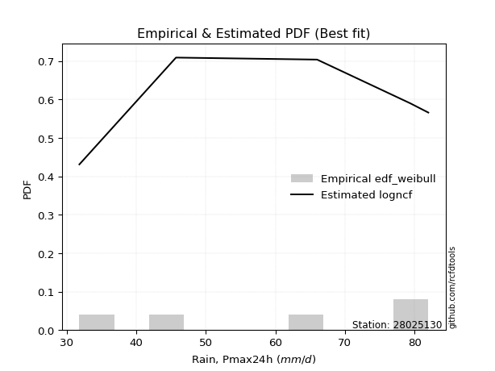</img>

</div>


### 4. EDF Beard (1943)

The Beard formula (or Beard´s plotting position formula) in hydrology is used to estimate the empirical non-exceedance probability _(P)_ of a flood event (or other extreme hydrological data point) within a given dataset.

<div align="center">


$P=(m-0.31)/(n+0.38)$


</div>


**4.1. Empirical values**

<div align="center">

|                | 0                   | 1                  | 2         | 3                  | 4                  |
|:---------------|:--------------------|:-------------------|:----------|:-------------------|:-------------------|
| date           | 2020                | 2022               | 2017      | 2019               | 2018               |
| x              | 31.8                | 45.7               | 66.0      | 79.4               | 82.0               |
| m              | 1                   | 2                  | 3         | 4                  | 5                  |
| empirical_dist | edf_beard           | edf_beard          | edf_beard | edf_beard          | edf_beard          |
| empirical      | 0.12825278810408922 | 0.3141263940520446 | 0.5       | 0.6858736059479554 | 0.8717472118959109 |
| empirical_tr   | 1.1471215351812367  | 1.4579945799457996 | 2.0       | 3.183431952662722  | 7.797101449275368  |

</div>


**4.2. Kolmogorov-Smirnov fit test (sorted by Δ)**


<div align="center">

|                | 0                   | 1                   | 2                   | 3                   | 4                  | 5                   | 6                   | 7                   | 8                   | 9                   | 10                  | 11                  | 12                  | 13                  | 14                  | 15                  | 16                  | 17                  | 18                 | 19                 | 20                  | 21                  | 22                  | 23                  | 24                  | 25                  | 26                  | 27                 | 28                  | 29                 | 30                 | 31                  | 32                 | 33                  | 34                 | 35                  | 36                  | 37                  | 38                 | 39                  | 40                 | 41                 | 42                  | 43                  | 44                  | 45                  | 46                  | 47                  | 48                  | 49                 | 50                  | 51                 | 52                  | 53                  | 54                 | 55                 | 56                 | 57                  | 58                  | 59                  | 60                  | 61                 | 62                  | 63                  | 64                  | 65                 | 66                  | 67                  | 68                  | 69                  | 70                  | 71                 | 72                  | 73                  | 74                  | 75                  | 76                  | 77                 | 78                  | 79                  | 80                  | 81                  | 82                  | 83                  | 84                  | 85                  | 86                  | 87                 | 88                  | 89                  | 90                  | 91                  | 92                  | 93                  | 94                 | 95                  | 96                  | 97                  | 98                 | 99                  | 100                 | 101                 | 102                | 103                 | 104                | 105                | 106                 | 107                | 108                 | 109                 | 110                 | 111                 | 112                | 113                 | 114                | 115                | 116                 | 117                 | 118                 | 119                 | 120                 | 121                 | 122                 | 123                 | 124                | 125                | 126                 | 127                 | 128                | 129                | 130                 | 131                 | 132                | 133                 | 134                 | 135                 | 136                | 137                | 138                | 139                 | 140                | 141                | 142                | 143                 | 144                | 145                | 146                | 147                 | 148                | 149                | 150                | 151                | 152                | 153                | 154                | 155                | 156                | 157                | 158                | 159                |
|:---------------|:--------------------|:--------------------|:--------------------|:--------------------|:-------------------|:--------------------|:--------------------|:--------------------|:--------------------|:--------------------|:--------------------|:--------------------|:--------------------|:--------------------|:--------------------|:--------------------|:--------------------|:--------------------|:-------------------|:-------------------|:--------------------|:--------------------|:--------------------|:--------------------|:--------------------|:--------------------|:--------------------|:-------------------|:--------------------|:-------------------|:-------------------|:--------------------|:-------------------|:--------------------|:-------------------|:--------------------|:--------------------|:--------------------|:-------------------|:--------------------|:-------------------|:-------------------|:--------------------|:--------------------|:--------------------|:--------------------|:--------------------|:--------------------|:--------------------|:-------------------|:--------------------|:-------------------|:--------------------|:--------------------|:-------------------|:-------------------|:-------------------|:--------------------|:--------------------|:--------------------|:--------------------|:-------------------|:--------------------|:--------------------|:--------------------|:-------------------|:--------------------|:--------------------|:--------------------|:--------------------|:--------------------|:-------------------|:--------------------|:--------------------|:--------------------|:--------------------|:--------------------|:-------------------|:--------------------|:--------------------|:--------------------|:--------------------|:--------------------|:--------------------|:--------------------|:--------------------|:--------------------|:-------------------|:--------------------|:--------------------|:--------------------|:--------------------|:--------------------|:--------------------|:-------------------|:--------------------|:--------------------|:--------------------|:-------------------|:--------------------|:--------------------|:--------------------|:-------------------|:--------------------|:-------------------|:-------------------|:--------------------|:-------------------|:--------------------|:--------------------|:--------------------|:--------------------|:-------------------|:--------------------|:-------------------|:-------------------|:--------------------|:--------------------|:--------------------|:--------------------|:--------------------|:--------------------|:--------------------|:--------------------|:-------------------|:-------------------|:--------------------|:--------------------|:-------------------|:-------------------|:--------------------|:--------------------|:-------------------|:--------------------|:--------------------|:--------------------|:-------------------|:-------------------|:-------------------|:--------------------|:-------------------|:-------------------|:-------------------|:--------------------|:-------------------|:-------------------|:-------------------|:--------------------|:-------------------|:-------------------|:-------------------|:-------------------|:-------------------|:-------------------|:-------------------|:-------------------|:-------------------|:-------------------|:-------------------|:-------------------|
| station        | 28025130            | 28025130            | 28025130            | 28025130            | 28025130           | 28025130            | 28025130            | 28025130            | 28025130            | 28025130            | 28025130            | 28025130            | 28025130            | 28025130            | 28025130            | 28025130            | 28025130            | 28025130            | 28025130           | 28025130           | 28025130            | 28025130            | 28025130            | 28025130            | 28025130            | 28025130            | 28025130            | 28025130           | 28025130            | 28025130           | 28025130           | 28025130            | 28025130           | 28025130            | 28025130           | 28025130            | 28025130            | 28025130            | 28025130           | 28025130            | 28025130           | 28025130           | 28025130            | 28025130            | 28025130            | 28025130            | 28025130            | 28025130            | 28025130            | 28025130           | 28025130            | 28025130           | 28025130            | 28025130            | 28025130           | 28025130           | 28025130           | 28025130            | 28025130            | 28025130            | 28025130            | 28025130           | 28025130            | 28025130            | 28025130            | 28025130           | 28025130            | 28025130            | 28025130            | 28025130            | 28025130            | 28025130           | 28025130            | 28025130            | 28025130            | 28025130            | 28025130            | 28025130           | 28025130            | 28025130            | 28025130            | 28025130            | 28025130            | 28025130            | 28025130            | 28025130            | 28025130            | 28025130           | 28025130            | 28025130            | 28025130            | 28025130            | 28025130            | 28025130            | 28025130           | 28025130            | 28025130            | 28025130            | 28025130           | 28025130            | 28025130            | 28025130            | 28025130           | 28025130            | 28025130           | 28025130           | 28025130            | 28025130           | 28025130            | 28025130            | 28025130            | 28025130            | 28025130           | 28025130            | 28025130           | 28025130           | 28025130            | 28025130            | 28025130            | 28025130            | 28025130            | 28025130            | 28025130            | 28025130            | 28025130           | 28025130           | 28025130            | 28025130            | 28025130           | 28025130           | 28025130            | 28025130            | 28025130           | 28025130            | 28025130            | 28025130            | 28025130           | 28025130           | 28025130           | 28025130            | 28025130           | 28025130           | 28025130           | 28025130            | 28025130           | 28025130           | 28025130           | 28025130            | 28025130           | 28025130           | 28025130           | 28025130           | 28025130           | 28025130           | 28025130           | 28025130           | 28025130           | 28025130           | 28025130           | 28025130           |
| empirical_dist | edf_beard           | edf_beard           | edf_beard           | edf_beard           | edf_beard          | edf_beard           | edf_beard           | edf_beard           | edf_beard           | edf_beard           | edf_beard           | edf_beard           | edf_beard           | edf_beard           | edf_beard           | edf_beard           | edf_beard           | edf_beard           | edf_beard          | edf_beard          | edf_beard           | edf_beard           | edf_beard           | edf_beard           | edf_beard           | edf_beard           | edf_beard           | edf_beard          | edf_beard           | edf_beard          | edf_beard          | edf_beard           | edf_beard          | edf_beard           | edf_beard          | edf_beard           | edf_beard           | edf_beard           | edf_beard          | edf_beard           | edf_beard          | edf_beard          | edf_beard           | edf_beard           | edf_beard           | edf_beard           | edf_beard           | edf_beard           | edf_beard           | edf_beard          | edf_beard           | edf_beard          | edf_beard           | edf_beard           | edf_beard          | edf_beard          | edf_beard          | edf_beard           | edf_beard           | edf_beard           | edf_beard           | edf_beard          | edf_beard           | edf_beard           | edf_beard           | edf_beard          | edf_beard           | edf_beard           | edf_beard           | edf_beard           | edf_beard           | edf_beard          | edf_beard           | edf_beard           | edf_beard           | edf_beard           | edf_beard           | edf_beard          | edf_beard           | edf_beard           | edf_beard           | edf_beard           | edf_beard           | edf_beard           | edf_beard           | edf_beard           | edf_beard           | edf_beard          | edf_beard           | edf_beard           | edf_beard           | edf_beard           | edf_beard           | edf_beard           | edf_beard          | edf_beard           | edf_beard           | edf_beard           | edf_beard          | edf_beard           | edf_beard           | edf_beard           | edf_beard          | edf_beard           | edf_beard          | edf_beard          | edf_beard           | edf_beard          | edf_beard           | edf_beard           | edf_beard           | edf_beard           | edf_beard          | edf_beard           | edf_beard          | edf_beard          | edf_beard           | edf_beard           | edf_beard           | edf_beard           | edf_beard           | edf_beard           | edf_beard           | edf_beard           | edf_beard          | edf_beard          | edf_beard           | edf_beard           | edf_beard          | edf_beard          | edf_beard           | edf_beard           | edf_beard          | edf_beard           | edf_beard           | edf_beard           | edf_beard          | edf_beard          | edf_beard          | edf_beard           | edf_beard          | edf_beard          | edf_beard          | edf_beard           | edf_beard          | edf_beard          | edf_beard          | edf_beard           | edf_beard          | edf_beard          | edf_beard          | edf_beard          | edf_beard          | edf_beard          | edf_beard          | edf_beard          | edf_beard          | edf_beard          | edf_beard          | edf_beard          |
| p_dist         | logtrapezoid        | ksone               | semicircular        | trapezoid           | logksone           | anglit              | logncf              | logsemicircular     | logpearson3         | logbeta             | beta                | arcsine             | logarcsine          | logweibull_max      | betaprime           | loganglit           | logdgamma           | genextreme          | invgauss           | genpareto          | alpha               | logbetaprime        | invgamma            | rice                | erlang              | gamma               | f                   | rayleigh           | maxwell             | pearson3           | nct                | t                   | exponnorm          | norm                | crystalball        | loggenextreme       | wrapcauchy          | loggumbel_l         | loggompertz        | logburr12           | logweibull_min     | logdweibull        | logf                | logt                | logcrystalball      | lognorm             | logexponnorm        | gompertz            | lognct              | weibull_min        | logfatiguelife      | logfoldnorm        | loggamma            | loggamma            | logerlang          | logexponpow        | logrice            | kstwobign           | halfnorm            | loginvgauss         | logalpha            | logistic           | loginvgamma         | gumbel_l            | cosine              | logloglaplace      | levy_l              | dweibull            | loglogistic         | gumbel_r            | loggenpareto        | loginvweibull      | loglevy_l           | logmaxwell          | hypsecant           | truncnorm           | lograyleigh         | dgamma             | johnsonsb           | logcosine           | loghypsecant        | laplace             | loggennorm          | gennorm             | logkstwobign        | halflogistic        | loggenexpon         | lomax              | genexpon            | moyal               | logexponweib        | argus               | burr                | loghalfnorm         | logargus           | loglomax            | burr12              | logwrapcauchy       | loggumbel_r        | loglaplace          | loglaplace          | halfgennorm         | loggenhalflogistic | genhalflogistic     | logmielke          | mielke             | logburr             | loghalflogistic    | logloggamma         | logmoyal            | triang              | skewnorm            | loggausshyper      | gausshyper          | wald               | tukeylambda        | kappa4              | logtriang           | kappa3              | uniform             | vonmises_line       | logskewnorm         | logjohnsonsb        | logkappa4           | logtukeylambda     | loghalfgennorm     | bradford            | truncexpon          | logkappa3          | truncweibull_min   | loguniform          | loggengamma         | ncf                | logwald             | logvonmises_line    | gengamma            | lognakagami        | nakagami           | foldnorm           | logtruncweibull_min | logrdist           | logbradford        | logtruncnorm       | exponweib           | logtruncexpon      | johnsonsu          | weibull_max        | invweibull          | fatiguelife        | logjohnsonsu       | powerlaw           | truncpareto        | logpowerlaw        | logtruncpareto     | exponpow           | rdist              | genlogistic        | loggenlogistic     | logvonmises        | vonmises           |
| delta          | 0.08507640161199015 | 0.08753058752797471 | 0.10391702314799856 | 0.10604885941583742 | 0.1111907122187008 | 0.11572407497312331 | 0.11976789682607636 | 0.12184312392934937 | 0.12734846074777162 | 0.12823136933418122 | 0.12824689506414721 | 0.12825278810408922 | 0.12825278810408922 | 0.12847946156950318 | 0.12888267152881538 | 0.13014967129290567 | 0.13081559749316873 | 0.13300921658182474 | 0.1383513205264406 | 0.1385394834008894 | 0.13875285706664464 | 0.13928712916960317 | 0.13941017035882874 | 0.14049940446020526 | 0.14060321951197008 | 0.14122869835153407 | 0.14129554952638335 | 0.1413144822102479 | 0.14151436818032903 | 0.1420229951938723 | 0.1422821765613853 | 0.14232250041541816 | 0.1423323265760249 | 0.14233245829407826 | 0.1423324598960639 | 0.14265962956430406 | 0.14426828819702198 | 0.14438331265454296 | 0.1448603189119192 | 0.14584510879604895 | 0.1474480162843359 | 0.1488172048835916 | 0.14963653795672527 | 0.14994232952789943 | 0.14994645618397007 | 0.14994646080663165 | 0.14995054348613412 | 0.15076888481493556 | 0.15079229630181556 | 0.1508058044560624 | 0.15197135858533972 | 0.1526834631645515 | 0.15296645922989283 | 0.15296645922989283 | 0.1559961564364617 | 0.1569327304118513 | 0.1581403860770354 | 0.15841251596398753 | 0.15965190235910853 | 0.16120760299294234 | 0.16153296569809228 | 0.1619779877621823 | 0.16244264906094819 | 0.16331440320665647 | 0.16477743757734353 | 0.1661843137204004 | 0.16657188930917344 | 0.16785595949256005 | 0.16788436577863686 | 0.16816117876667747 | 0.16858776970215408 | 0.1696822391493773 | 0.16999550761526372 | 0.17158760819731977 | 0.17269322689370104 | 0.17468043593871152 | 0.17809581741608427 | 0.1796297534212964 | 0.17973591471731798 | 0.17980523132269788 | 0.18181076046199862 | 0.18312518359143382 | 0.18587360594795543 | 0.18587360594795543 | 0.18789147079940993 | 0.18797283015579314 | 0.19019392126230927 | 0.1905505180465331 | 0.19057300046322423 | 0.19079725759579436 | 0.19158103166412976 | 0.19238687789189424 | 0.19699237148440674 | 0.19701964970002273 | 0.2023685780930803 | 0.20589733405045296 | 0.20793707171811127 | 0.20855206267041715 | 0.2099297338795345 | 0.20999821437844668 | 0.20999821437844668 | 0.21123308586872602 | 0.2179466620723144 | 0.21922273922253033 | 0.2203281091929007 | 0.2226735200231179 | 0.22348619102029654 | 0.2251434044653764 | 0.22730130822463468 | 0.22978126568890134 | 0.23186042005512641 | 0.24179405768502016 | 0.2517864902376361 | 0.25324744116670816 | 0.2539068138512618 | 0.2543044858911955 | 0.25542758339330307 | 0.26098743965799465 | 0.26163099049909744 | 0.26233356536678576 | 0.26263730320265066 | 0.26349100028987227 | 0.26404527153546364 | 0.26962553383578647 | 0.2724298839021756 | 0.273256436374986  | 0.27774465481938004 | 0.27817663246439084 | 0.2783895144435714 | 0.2785972903483871 | 0.28011132051039533 | 0.28248432736757656 | 0.2838902198307477 | 0.28603817892974115 | 0.30574256395529564 | 0.31244228924480205 | 0.3141257756723018 | 0.3141263586244346 | 0.3141263940520446 | 0.32023430514913587 | 0.3217902410903648 | 0.3273890129583663 | 0.3296694412288531 | 0.33482091792552754 | 0.3411570646673058 | 0.3412230578190297 | 0.3793019788797938 | 0.44206090592306363 | 0.4623116116992128 | 0.5042882759290228 | 0.5337502765593805 | 0.5496485013822288 | 0.5627876181017537 | 0.584618668419248  | 0.5846665006634273 | 0.6858736059420076 | 0.6858736059479554 | 0.6858736059479554 | 1.1464591248391054 | 12.388679293291773 |
| deltao         | 0.5865427407550001  | 0.5865427407550001  | 0.5865427407550001  | 0.5865427407550001  | 0.5865427407550001 | 0.5865427407550001  | 0.5865427407550001  | 0.5865427407550001  | 0.5865427407550001  | 0.5865427407550001  | 0.5865427407550001  | 0.5865427407550001  | 0.5865427407550001  | 0.5865427407550001  | 0.5865427407550001  | 0.5865427407550001  | 0.5865427407550001  | 0.5865427407550001  | 0.5865427407550001 | 0.5865427407550001 | 0.5865427407550001  | 0.5865427407550001  | 0.5865427407550001  | 0.5865427407550001  | 0.5865427407550001  | 0.5865427407550001  | 0.5865427407550001  | 0.5865427407550001 | 0.5865427407550001  | 0.5865427407550001 | 0.5865427407550001 | 0.5865427407550001  | 0.5865427407550001 | 0.5865427407550001  | 0.5865427407550001 | 0.5865427407550001  | 0.5865427407550001  | 0.5865427407550001  | 0.5865427407550001 | 0.5865427407550001  | 0.5865427407550001 | 0.5865427407550001 | 0.5865427407550001  | 0.5865427407550001  | 0.5865427407550001  | 0.5865427407550001  | 0.5865427407550001  | 0.5865427407550001  | 0.5865427407550001  | 0.5865427407550001 | 0.5865427407550001  | 0.5865427407550001 | 0.5865427407550001  | 0.5865427407550001  | 0.5865427407550001 | 0.5865427407550001 | 0.5865427407550001 | 0.5865427407550001  | 0.5865427407550001  | 0.5865427407550001  | 0.5865427407550001  | 0.5865427407550001 | 0.5865427407550001  | 0.5865427407550001  | 0.5865427407550001  | 0.5865427407550001 | 0.5865427407550001  | 0.5865427407550001  | 0.5865427407550001  | 0.5865427407550001  | 0.5865427407550001  | 0.5865427407550001 | 0.5865427407550001  | 0.5865427407550001  | 0.5865427407550001  | 0.5865427407550001  | 0.5865427407550001  | 0.5865427407550001 | 0.5865427407550001  | 0.5865427407550001  | 0.5865427407550001  | 0.5865427407550001  | 0.5865427407550001  | 0.5865427407550001  | 0.5865427407550001  | 0.5865427407550001  | 0.5865427407550001  | 0.5865427407550001 | 0.5865427407550001  | 0.5865427407550001  | 0.5865427407550001  | 0.5865427407550001  | 0.5865427407550001  | 0.5865427407550001  | 0.5865427407550001 | 0.5865427407550001  | 0.5865427407550001  | 0.5865427407550001  | 0.5865427407550001 | 0.5865427407550001  | 0.5865427407550001  | 0.5865427407550001  | 0.5865427407550001 | 0.5865427407550001  | 0.5865427407550001 | 0.5865427407550001 | 0.5865427407550001  | 0.5865427407550001 | 0.5865427407550001  | 0.5865427407550001  | 0.5865427407550001  | 0.5865427407550001  | 0.5865427407550001 | 0.5865427407550001  | 0.5865427407550001 | 0.5865427407550001 | 0.5865427407550001  | 0.5865427407550001  | 0.5865427407550001  | 0.5865427407550001  | 0.5865427407550001  | 0.5865427407550001  | 0.5865427407550001  | 0.5865427407550001  | 0.5865427407550001 | 0.5865427407550001 | 0.5865427407550001  | 0.5865427407550001  | 0.5865427407550001 | 0.5865427407550001 | 0.5865427407550001  | 0.5865427407550001  | 0.5865427407550001 | 0.5865427407550001  | 0.5865427407550001  | 0.5865427407550001  | 0.5865427407550001 | 0.5865427407550001 | 0.5865427407550001 | 0.5865427407550001  | 0.5865427407550001 | 0.5865427407550001 | 0.5865427407550001 | 0.5865427407550001  | 0.5865427407550001 | 0.5865427407550001 | 0.5865427407550001 | 0.5865427407550001  | 0.5865427407550001 | 0.5865427407550001 | 0.5865427407550001 | 0.5865427407550001 | 0.5865427407550001 | 0.5865427407550001 | 0.5865427407550001 | 0.5865427407550001 | 0.5865427407550001 | 0.5865427407550001 | 0.5865427407550001 | 0.5865427407550001 |
| eval           | Δo > Δ              | Δo > Δ              | Δo > Δ              | Δo > Δ              | Δo > Δ             | Δo > Δ              | Δo > Δ              | Δo > Δ              | Δo > Δ              | Δo > Δ              | Δo > Δ              | Δo > Δ              | Δo > Δ              | Δo > Δ              | Δo > Δ              | Δo > Δ              | Δo > Δ              | Δo > Δ              | Δo > Δ             | Δo > Δ             | Δo > Δ              | Δo > Δ              | Δo > Δ              | Δo > Δ              | Δo > Δ              | Δo > Δ              | Δo > Δ              | Δo > Δ             | Δo > Δ              | Δo > Δ             | Δo > Δ             | Δo > Δ              | Δo > Δ             | Δo > Δ              | Δo > Δ             | Δo > Δ              | Δo > Δ              | Δo > Δ              | Δo > Δ             | Δo > Δ              | Δo > Δ             | Δo > Δ             | Δo > Δ              | Δo > Δ              | Δo > Δ              | Δo > Δ              | Δo > Δ              | Δo > Δ              | Δo > Δ              | Δo > Δ             | Δo > Δ              | Δo > Δ             | Δo > Δ              | Δo > Δ              | Δo > Δ             | Δo > Δ             | Δo > Δ             | Δo > Δ              | Δo > Δ              | Δo > Δ              | Δo > Δ              | Δo > Δ             | Δo > Δ              | Δo > Δ              | Δo > Δ              | Δo > Δ             | Δo > Δ              | Δo > Δ              | Δo > Δ              | Δo > Δ              | Δo > Δ              | Δo > Δ             | Δo > Δ              | Δo > Δ              | Δo > Δ              | Δo > Δ              | Δo > Δ              | Δo > Δ             | Δo > Δ              | Δo > Δ              | Δo > Δ              | Δo > Δ              | Δo > Δ              | Δo > Δ              | Δo > Δ              | Δo > Δ              | Δo > Δ              | Δo > Δ             | Δo > Δ              | Δo > Δ              | Δo > Δ              | Δo > Δ              | Δo > Δ              | Δo > Δ              | Δo > Δ             | Δo > Δ              | Δo > Δ              | Δo > Δ              | Δo > Δ             | Δo > Δ              | Δo > Δ              | Δo > Δ              | Δo > Δ             | Δo > Δ              | Δo > Δ             | Δo > Δ             | Δo > Δ              | Δo > Δ             | Δo > Δ              | Δo > Δ              | Δo > Δ              | Δo > Δ              | Δo > Δ             | Δo > Δ              | Δo > Δ             | Δo > Δ             | Δo > Δ              | Δo > Δ              | Δo > Δ              | Δo > Δ              | Δo > Δ              | Δo > Δ              | Δo > Δ              | Δo > Δ              | Δo > Δ             | Δo > Δ             | Δo > Δ              | Δo > Δ              | Δo > Δ             | Δo > Δ             | Δo > Δ              | Δo > Δ              | Δo > Δ             | Δo > Δ              | Δo > Δ              | Δo > Δ              | Δo > Δ             | Δo > Δ             | Δo > Δ             | Δo > Δ              | Δo > Δ             | Δo > Δ             | Δo > Δ             | Δo > Δ              | Δo > Δ             | Δo > Δ             | Δo > Δ             | Δo > Δ              | Δo > Δ             | Δo > Δ             | Δo > Δ             | Δo > Δ             | Δo > Δ             | Δo > Δ             | Δo > Δ             | Δo <= Δ            | Δo <= Δ            | Δo <= Δ            | Δo <= Δ            | Δo <= Δ            |
| fit            | 1                   | 1                   | 1                   | 1                   | 1                  | 1                   | 1                   | 1                   | 1                   | 1                   | 1                   | 1                   | 1                   | 1                   | 1                   | 1                   | 1                   | 1                   | 1                  | 1                  | 1                   | 1                   | 1                   | 1                   | 1                   | 1                   | 1                   | 1                  | 1                   | 1                  | 1                  | 1                   | 1                  | 1                   | 1                  | 1                   | 1                   | 1                   | 1                  | 1                   | 1                  | 1                  | 1                   | 1                   | 1                   | 1                   | 1                   | 1                   | 1                   | 1                  | 1                   | 1                  | 1                   | 1                   | 1                  | 1                  | 1                  | 1                   | 1                   | 1                   | 1                   | 1                  | 1                   | 1                   | 1                   | 1                  | 1                   | 1                   | 1                   | 1                   | 1                   | 1                  | 1                   | 1                   | 1                   | 1                   | 1                   | 1                  | 1                   | 1                   | 1                   | 1                   | 1                   | 1                   | 1                   | 1                   | 1                   | 1                  | 1                   | 1                   | 1                   | 1                   | 1                   | 1                   | 1                  | 1                   | 1                   | 1                   | 1                  | 1                   | 1                   | 1                   | 1                  | 1                   | 1                  | 1                  | 1                   | 1                  | 1                   | 1                   | 1                   | 1                   | 1                  | 1                   | 1                  | 1                  | 1                   | 1                   | 1                   | 1                   | 1                   | 1                   | 1                   | 1                   | 1                  | 1                  | 1                   | 1                   | 1                  | 1                  | 1                   | 1                   | 1                  | 1                   | 1                   | 1                   | 1                  | 1                  | 1                  | 1                   | 1                  | 1                  | 1                  | 1                   | 1                  | 1                  | 1                  | 1                   | 1                  | 1                  | 1                  | 1                  | 1                  | 1                  | 1                  | 0                  | 0                  | 0                  | 0                  | 0                  |
| n              | 5                   | 5                   | 5                   | 5                   | 5                  | 5                   | 5                   | 5                   | 5                   | 5                   | 5                   | 5                   | 5                   | 5                   | 5                   | 5                   | 5                   | 5                   | 5                  | 5                  | 5                   | 5                   | 5                   | 5                   | 5                   | 5                   | 5                   | 5                  | 5                   | 5                  | 5                  | 5                   | 5                  | 5                   | 5                  | 5                   | 5                   | 5                   | 5                  | 5                   | 5                  | 5                  | 5                   | 5                   | 5                   | 5                   | 5                   | 5                   | 5                   | 5                  | 5                   | 5                  | 5                   | 5                   | 5                  | 5                  | 5                  | 5                   | 5                   | 5                   | 5                   | 5                  | 5                   | 5                   | 5                   | 5                  | 5                   | 5                   | 5                   | 5                   | 5                   | 5                  | 5                   | 5                   | 5                   | 5                   | 5                   | 5                  | 5                   | 5                   | 5                   | 5                   | 5                   | 5                   | 5                   | 5                   | 5                   | 5                  | 5                   | 5                   | 5                   | 5                   | 5                   | 5                   | 5                  | 5                   | 5                   | 5                   | 5                  | 5                   | 5                   | 5                   | 5                  | 5                   | 5                  | 5                  | 5                   | 5                  | 5                   | 5                   | 5                   | 5                   | 5                  | 5                   | 5                  | 5                  | 5                   | 5                   | 5                   | 5                   | 5                   | 5                   | 5                   | 5                   | 5                  | 5                  | 5                   | 5                   | 5                  | 5                  | 5                   | 5                   | 5                  | 5                   | 5                   | 5                   | 5                  | 5                  | 5                  | 5                   | 5                  | 5                  | 5                  | 5                   | 5                  | 5                  | 5                  | 5                   | 5                  | 5                  | 5                  | 5                  | 5                  | 5                  | 5                  | 5                  | 5                  | 5                  | 5                  | 5                  |
| best_fit       | 1                   | 0                   | 0                   | 0                   | 0                  | 0                   | 0                   | 0                   | 0                   | 0                   | 0                   | 0                   | 0                   | 0                   | 0                   | 0                   | 0                   | 0                   | 0                  | 0                  | 0                   | 0                   | 0                   | 0                   | 0                   | 0                   | 0                   | 0                  | 0                   | 0                  | 0                  | 0                   | 0                  | 0                   | 0                  | 0                   | 0                   | 0                   | 0                  | 0                   | 0                  | 0                  | 0                   | 0                   | 0                   | 0                   | 0                   | 0                   | 0                   | 0                  | 0                   | 0                  | 0                   | 0                   | 0                  | 0                  | 0                  | 0                   | 0                   | 0                   | 0                   | 0                  | 0                   | 0                   | 0                   | 0                  | 0                   | 0                   | 0                   | 0                   | 0                   | 0                  | 0                   | 0                   | 0                   | 0                   | 0                   | 0                  | 0                   | 0                   | 0                   | 0                   | 0                   | 0                   | 0                   | 0                   | 0                   | 0                  | 0                   | 0                   | 0                   | 0                   | 0                   | 0                   | 0                  | 0                   | 0                   | 0                   | 0                  | 0                   | 0                   | 0                   | 0                  | 0                   | 0                  | 0                  | 0                   | 0                  | 0                   | 0                   | 0                   | 0                   | 0                  | 0                   | 0                  | 0                  | 0                   | 0                   | 0                   | 0                   | 0                   | 0                   | 0                   | 0                   | 0                  | 0                  | 0                   | 0                   | 0                  | 0                  | 0                   | 0                   | 0                  | 0                   | 0                   | 0                   | 0                  | 0                  | 0                  | 0                   | 0                  | 0                  | 0                  | 0                   | 0                  | 0                  | 0                  | 0                   | 0                  | 0                  | 0                  | 0                  | 0                  | 0                  | 0                  | 0                  | 0                  | 0                  | 0                  | 0                  |
| best_fit_sort  | 1                   | 2                   | 3                   | 4                   | 5                  | 6                   | 7                   | 8                   | 9                   | 10                  | 11                  | 12                  | 13                  | 14                  | 15                  | 16                  | 17                  | 18                  | 19                 | 20                 | 21                  | 22                  | 23                  | 24                  | 25                  | 26                  | 27                  | 28                 | 29                  | 30                 | 31                 | 32                  | 33                 | 34                  | 35                 | 36                  | 37                  | 38                  | 39                 | 40                  | 41                 | 42                 | 43                  | 44                  | 45                  | 46                  | 47                  | 48                  | 49                  | 50                 | 51                  | 52                 | 53                  | 54                  | 55                 | 56                 | 57                 | 58                  | 59                  | 60                  | 61                  | 62                 | 63                  | 64                  | 65                  | 66                 | 67                  | 68                  | 69                  | 70                  | 71                  | 72                 | 73                  | 74                  | 75                  | 76                  | 77                  | 78                 | 79                  | 80                  | 81                  | 82                  | 83                  | 84                  | 85                  | 86                  | 87                  | 88                 | 89                  | 90                  | 91                  | 92                  | 93                  | 94                  | 95                 | 96                  | 97                  | 98                  | 99                 | 100                 | 101                 | 102                 | 103                | 104                 | 105                | 106                | 107                 | 108                | 109                 | 110                 | 111                 | 112                 | 113                | 114                 | 115                | 116                | 117                 | 118                 | 119                 | 120                 | 121                 | 122                 | 123                 | 124                 | 125                | 126                | 127                 | 128                 | 129                | 130                | 131                 | 132                 | 133                | 134                 | 135                 | 136                 | 137                | 138                | 139                | 140                 | 141                | 142                | 143                | 144                 | 145                | 146                | 147                | 148                 | 149                | 150                | 151                | 152                | 153                | 154                | 155                | 156                | 157                | 158                | 159                | 160                |

</div>


**4.3. Best fit**

<div align="center">

|   id |   station | empirical_dist   | p_dist       |     delta |   deltao | eval   |   fit |   n |   best_fit |   best_fit_sort |
|-----:|----------:|:-----------------|:-------------|----------:|---------:|:-------|------:|----:|-----------:|----------------:|
|    0 |  28025130 | edf_beard        | logtrapezoid | 0.0850764 | 0.586543 | Δo > Δ |     1 |   5 |          1 |               1 |

</div>


<div align="center">

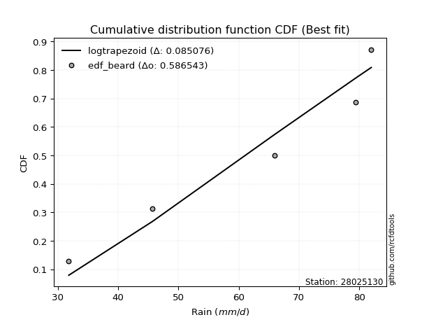</img>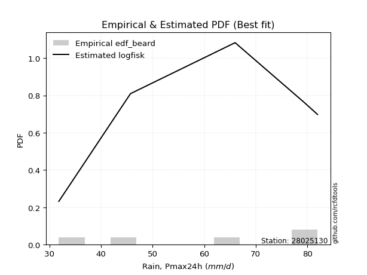</img>

</div>


### 5. EDF Chegodayev (1955)

The Chegodayev formula is an empirical plotting position formula used in hydrological frequency analysis to estimate the exceedance probability or return period of a specific event from a set of observed data. It is primarily used for plotting observed data points on probability paper to fit a theoretical distribution, particularly for analyzing extreme events like maximum flood flows or rainfall intensities. The constant _b_ value in the generalized plotting position formula is 0.3.

<div align="center">


$P=(m-b)/(n+1-2b)$


</div>


**5.1. Empirical values**

<div align="center">

|                | 0                   | 1                   | 2              | 3                  | 4                  |
|:---------------|:--------------------|:--------------------|:---------------|:-------------------|:-------------------|
| date           | 2020                | 2022                | 2017           | 2019               | 2018               |
| x              | 31.8                | 45.7                | 66.0           | 79.4               | 82.0               |
| m              | 1                   | 2                   | 3              | 4                  | 5                  |
| empirical_dist | edf_chegodayev      | edf_chegodayev      | edf_chegodayev | edf_chegodayev     | edf_chegodayev     |
| empirical      | 0.12962962962962962 | 0.31481481481481477 | 0.5            | 0.6851851851851851 | 0.8703703703703703 |
| empirical_tr   | 1.148936170212766   | 1.4594594594594594  | 2.0            | 3.1764705882352935 | 7.714285714285713  |

</div>


**5.2. Kolmogorov-Smirnov fit test (sorted by Δ)**


<div align="center">

|                | 0                   | 1                   | 2                   | 3                   | 4                  | 5                   | 6                   | 7                   | 8                   | 9                  | 10                  | 11                  | 12                 | 13                  | 14                  | 15                  | 16                  | 17                 | 18                 | 19                 | 20                  | 21                  | 22                  | 23                  | 24                 | 25                  | 26                  | 27                 | 28                  | 29                 | 30                  | 31                  | 32                  | 33                  | 34                  | 35                 | 36                  | 37                  | 38                 | 39                  | 40                  | 41                  | 42                  | 43                  | 44                  | 45                  | 46                  | 47                  | 48                  | 49                 | 50                  | 51                 | 52                  | 53                  | 54                  | 55                 | 56                 | 57                  | 58                  | 59                  | 60                  | 61                  | 62                  | 63                  | 64                  | 65                  | 66                  | 67                  | 68                  | 69                  | 70                  | 71                 | 72                  | 73                  | 74                 | 75                  | 76                  | 77                  | 78                  | 79                 | 80                  | 81                  | 82                  | 83                  | 84                  | 85                  | 86                  | 87                  | 88                 | 89                  | 90                  | 91                  | 92                  | 93                  | 94                 | 95                  | 96                  | 97                  | 98                 | 99                  | 100                 | 101                 | 102                | 103                 | 104                | 105                 | 106                 | 107                | 108                | 109                 | 110                 | 111                 | 112                | 113                | 114                | 115                | 116                | 117                 | 118                 | 119                 | 120                | 121                | 122                | 123                | 124                | 125                | 126                 | 127                 | 128                | 129                | 130                 | 131                 | 132                | 133                 | 134                 | 135                | 136                 | 137                 | 138                | 139                 | 140                | 141                | 142                | 143                | 144                 | 145                | 146                 | 147                | 148                 | 149                | 150                | 151                | 152                | 153                | 154                | 155                | 156                | 157                | 158                | 159                |
|:---------------|:--------------------|:--------------------|:--------------------|:--------------------|:-------------------|:--------------------|:--------------------|:--------------------|:--------------------|:-------------------|:--------------------|:--------------------|:-------------------|:--------------------|:--------------------|:--------------------|:--------------------|:-------------------|:-------------------|:-------------------|:--------------------|:--------------------|:--------------------|:--------------------|:-------------------|:--------------------|:--------------------|:-------------------|:--------------------|:-------------------|:--------------------|:--------------------|:--------------------|:--------------------|:--------------------|:-------------------|:--------------------|:--------------------|:-------------------|:--------------------|:--------------------|:--------------------|:--------------------|:--------------------|:--------------------|:--------------------|:--------------------|:--------------------|:--------------------|:-------------------|:--------------------|:-------------------|:--------------------|:--------------------|:--------------------|:-------------------|:-------------------|:--------------------|:--------------------|:--------------------|:--------------------|:--------------------|:--------------------|:--------------------|:--------------------|:--------------------|:--------------------|:--------------------|:--------------------|:--------------------|:--------------------|:-------------------|:--------------------|:--------------------|:-------------------|:--------------------|:--------------------|:--------------------|:--------------------|:-------------------|:--------------------|:--------------------|:--------------------|:--------------------|:--------------------|:--------------------|:--------------------|:--------------------|:-------------------|:--------------------|:--------------------|:--------------------|:--------------------|:--------------------|:-------------------|:--------------------|:--------------------|:--------------------|:-------------------|:--------------------|:--------------------|:--------------------|:-------------------|:--------------------|:-------------------|:--------------------|:--------------------|:-------------------|:-------------------|:--------------------|:--------------------|:--------------------|:-------------------|:-------------------|:-------------------|:-------------------|:-------------------|:--------------------|:--------------------|:--------------------|:-------------------|:-------------------|:-------------------|:-------------------|:-------------------|:-------------------|:--------------------|:--------------------|:-------------------|:-------------------|:--------------------|:--------------------|:-------------------|:--------------------|:--------------------|:-------------------|:--------------------|:--------------------|:-------------------|:--------------------|:-------------------|:-------------------|:-------------------|:-------------------|:--------------------|:-------------------|:--------------------|:-------------------|:--------------------|:-------------------|:-------------------|:-------------------|:-------------------|:-------------------|:-------------------|:-------------------|:-------------------|:-------------------|:-------------------|:-------------------|
| station        | 28025130            | 28025130            | 28025130            | 28025130            | 28025130           | 28025130            | 28025130            | 28025130            | 28025130            | 28025130           | 28025130            | 28025130            | 28025130           | 28025130            | 28025130            | 28025130            | 28025130            | 28025130           | 28025130           | 28025130           | 28025130            | 28025130            | 28025130            | 28025130            | 28025130           | 28025130            | 28025130            | 28025130           | 28025130            | 28025130           | 28025130            | 28025130            | 28025130            | 28025130            | 28025130            | 28025130           | 28025130            | 28025130            | 28025130           | 28025130            | 28025130            | 28025130            | 28025130            | 28025130            | 28025130            | 28025130            | 28025130            | 28025130            | 28025130            | 28025130           | 28025130            | 28025130           | 28025130            | 28025130            | 28025130            | 28025130           | 28025130           | 28025130            | 28025130            | 28025130            | 28025130            | 28025130            | 28025130            | 28025130            | 28025130            | 28025130            | 28025130            | 28025130            | 28025130            | 28025130            | 28025130            | 28025130           | 28025130            | 28025130            | 28025130           | 28025130            | 28025130            | 28025130            | 28025130            | 28025130           | 28025130            | 28025130            | 28025130            | 28025130            | 28025130            | 28025130            | 28025130            | 28025130            | 28025130           | 28025130            | 28025130            | 28025130            | 28025130            | 28025130            | 28025130           | 28025130            | 28025130            | 28025130            | 28025130           | 28025130            | 28025130            | 28025130            | 28025130           | 28025130            | 28025130           | 28025130            | 28025130            | 28025130           | 28025130           | 28025130            | 28025130            | 28025130            | 28025130           | 28025130           | 28025130           | 28025130           | 28025130           | 28025130            | 28025130            | 28025130            | 28025130           | 28025130           | 28025130           | 28025130           | 28025130           | 28025130           | 28025130            | 28025130            | 28025130           | 28025130           | 28025130            | 28025130            | 28025130           | 28025130            | 28025130            | 28025130           | 28025130            | 28025130            | 28025130           | 28025130            | 28025130           | 28025130           | 28025130           | 28025130           | 28025130            | 28025130           | 28025130            | 28025130           | 28025130            | 28025130           | 28025130           | 28025130           | 28025130           | 28025130           | 28025130           | 28025130           | 28025130           | 28025130           | 28025130           | 28025130           |
| empirical_dist | edf_chegodayev      | edf_chegodayev      | edf_chegodayev      | edf_chegodayev      | edf_chegodayev     | edf_chegodayev      | edf_chegodayev      | edf_chegodayev      | edf_chegodayev      | edf_chegodayev     | edf_chegodayev      | edf_chegodayev      | edf_chegodayev     | edf_chegodayev      | edf_chegodayev      | edf_chegodayev      | edf_chegodayev      | edf_chegodayev     | edf_chegodayev     | edf_chegodayev     | edf_chegodayev      | edf_chegodayev      | edf_chegodayev      | edf_chegodayev      | edf_chegodayev     | edf_chegodayev      | edf_chegodayev      | edf_chegodayev     | edf_chegodayev      | edf_chegodayev     | edf_chegodayev      | edf_chegodayev      | edf_chegodayev      | edf_chegodayev      | edf_chegodayev      | edf_chegodayev     | edf_chegodayev      | edf_chegodayev      | edf_chegodayev     | edf_chegodayev      | edf_chegodayev      | edf_chegodayev      | edf_chegodayev      | edf_chegodayev      | edf_chegodayev      | edf_chegodayev      | edf_chegodayev      | edf_chegodayev      | edf_chegodayev      | edf_chegodayev     | edf_chegodayev      | edf_chegodayev     | edf_chegodayev      | edf_chegodayev      | edf_chegodayev      | edf_chegodayev     | edf_chegodayev     | edf_chegodayev      | edf_chegodayev      | edf_chegodayev      | edf_chegodayev      | edf_chegodayev      | edf_chegodayev      | edf_chegodayev      | edf_chegodayev      | edf_chegodayev      | edf_chegodayev      | edf_chegodayev      | edf_chegodayev      | edf_chegodayev      | edf_chegodayev      | edf_chegodayev     | edf_chegodayev      | edf_chegodayev      | edf_chegodayev     | edf_chegodayev      | edf_chegodayev      | edf_chegodayev      | edf_chegodayev      | edf_chegodayev     | edf_chegodayev      | edf_chegodayev      | edf_chegodayev      | edf_chegodayev      | edf_chegodayev      | edf_chegodayev      | edf_chegodayev      | edf_chegodayev      | edf_chegodayev     | edf_chegodayev      | edf_chegodayev      | edf_chegodayev      | edf_chegodayev      | edf_chegodayev      | edf_chegodayev     | edf_chegodayev      | edf_chegodayev      | edf_chegodayev      | edf_chegodayev     | edf_chegodayev      | edf_chegodayev      | edf_chegodayev      | edf_chegodayev     | edf_chegodayev      | edf_chegodayev     | edf_chegodayev      | edf_chegodayev      | edf_chegodayev     | edf_chegodayev     | edf_chegodayev      | edf_chegodayev      | edf_chegodayev      | edf_chegodayev     | edf_chegodayev     | edf_chegodayev     | edf_chegodayev     | edf_chegodayev     | edf_chegodayev      | edf_chegodayev      | edf_chegodayev      | edf_chegodayev     | edf_chegodayev     | edf_chegodayev     | edf_chegodayev     | edf_chegodayev     | edf_chegodayev     | edf_chegodayev      | edf_chegodayev      | edf_chegodayev     | edf_chegodayev     | edf_chegodayev      | edf_chegodayev      | edf_chegodayev     | edf_chegodayev      | edf_chegodayev      | edf_chegodayev     | edf_chegodayev      | edf_chegodayev      | edf_chegodayev     | edf_chegodayev      | edf_chegodayev     | edf_chegodayev     | edf_chegodayev     | edf_chegodayev     | edf_chegodayev      | edf_chegodayev     | edf_chegodayev      | edf_chegodayev     | edf_chegodayev      | edf_chegodayev     | edf_chegodayev     | edf_chegodayev     | edf_chegodayev     | edf_chegodayev     | edf_chegodayev     | edf_chegodayev     | edf_chegodayev     | edf_chegodayev     | edf_chegodayev     | edf_chegodayev     |
| p_dist         | logtrapezoid        | ksone               | semicircular        | trapezoid           | logksone           | anglit              | logncf              | logsemicircular     | logpearson3         | betaprime          | logbeta             | beta                | logweibull_max     | logarcsine          | arcsine             | loganglit           | logdgamma           | genextreme         | invgauss           | genpareto          | logbetaprime        | alpha               | invgamma            | rice                | erlang             | gamma               | f                   | rayleigh           | maxwell             | pearson3           | nct                 | t                   | exponnorm           | norm                | crystalball         | loggenextreme      | wrapcauchy          | loggumbel_l         | loggompertz        | logburr12           | logweibull_min      | logdweibull         | logf                | logt                | logcrystalball      | lognorm             | logexponnorm        | lognct              | gompertz            | weibull_min        | logfatiguelife      | logfoldnorm        | loggamma            | loggamma            | logexponpow         | logerlang          | logrice            | kstwobign           | halfnorm            | loginvgauss         | logalpha            | loginvgamma         | logistic            | gumbel_l            | cosine              | levy_l              | logloglaplace       | loggenpareto        | loglogistic         | gumbel_r            | dweibull            | loginvweibull      | loglevy_l           | logmaxwell          | truncnorm          | hypsecant           | lograyleigh         | johnsonsb           | logcosine           | dgamma             | loghypsecant        | laplace             | loggennorm          | gennorm             | logkstwobign        | halflogistic        | loggenexpon         | logexponweib        | lomax              | genexpon            | moyal               | argus               | loghalfnorm         | burr                | logargus           | loglomax            | burr12              | logwrapcauchy       | loggumbel_r        | loglaplace          | loglaplace          | halfgennorm         | loggenhalflogistic | genhalflogistic     | logmielke          | mielke              | logburr             | loghalflogistic    | logloggamma        | logmoyal            | triang              | skewnorm            | loggausshyper      | wald               | gausshyper         | tukeylambda        | kappa4             | logtriang           | kappa3              | logjohnsonsb        | uniform            | vonmises_line      | logskewnorm        | logkappa4          | logtukeylambda     | loghalfgennorm     | bradford            | truncexpon          | logkappa3          | truncweibull_min   | loguniform          | loggengamma         | ncf                | logwald             | logvonmises_line    | gengamma           | lognakagami         | nakagami            | foldnorm           | logtruncweibull_min | logrdist           | logbradford        | logtruncnorm       | exponweib          | johnsonsu           | logtruncexpon      | weibull_max         | invweibull         | fatiguelife         | logjohnsonsu       | powerlaw           | truncpareto        | logpowerlaw        | logtruncpareto     | exponpow           | rdist              | genlogistic        | loggenlogistic     | logvonmises        | vonmises           |
| delta          | 0.08576482237476046 | 0.08821900829074503 | 0.10460544391076887 | 0.10673728017860773 | 0.1111907122187008 | 0.11641249573589363 | 0.11839105530053584 | 0.12184312392934937 | 0.12803688151054193 | 0.1295710922915857 | 0.12960821085972174 | 0.12962373658968773 | 0.1296296291523078 | 0.12962962962962962 | 0.12962962962962962 | 0.13014967129290567 | 0.13150401825593905 | 0.1336976373445949 | 0.1383513205264406 | 0.1392279041636597 | 0.13928712916960317 | 0.13944127782941496 | 0.14009859112159906 | 0.14118782522297557 | 0.1412916402747404 | 0.14191711911430438 | 0.14198397028915366 | 0.1420029029730182 | 0.14220278894309935 | 0.1427114159566426 | 0.14297059732415562 | 0.14301092117818848 | 0.14302074733879522 | 0.14302087905684857 | 0.14302088065883423 | 0.1433480503270742 | 0.14357986743425183 | 0.14507173341731328 | 0.1455487396746895 | 0.14653352955881926 | 0.14813643704710622 | 0.14950562564636175 | 0.14963653795672527 | 0.14994232952789943 | 0.14994645618397007 | 0.14994646080663165 | 0.14995054348613412 | 0.15079229630181556 | 0.15145730557770587 | 0.1514942252188327 | 0.15197135858533972 | 0.1526834631645515 | 0.15296645922989283 | 0.15296645922989283 | 0.15555588888631078 | 0.1559961564364617 | 0.1581403860770354 | 0.15841251596398753 | 0.15965190235910853 | 0.16120760299294234 | 0.16153296569809228 | 0.16244264906094819 | 0.16266640852495262 | 0.16400282396942678 | 0.16546585834011385 | 0.16657188930917344 | 0.16687273448317055 | 0.16721092817661368 | 0.16788436577863686 | 0.16816117876667747 | 0.16854438025533036 | 0.1696822391493773 | 0.16999550761526372 | 0.17158760819731977 | 0.173303594413171  | 0.17338164765647135 | 0.17809581741608427 | 0.17904749395454783 | 0.17980523132269788 | 0.1803181741840667 | 0.18181076046199862 | 0.18381360435420413 | 0.18518518518518523 | 0.18518518518518523 | 0.18789147079940993 | 0.18797283015579314 | 0.19019392126230927 | 0.19020419013858925 | 0.1905505180465331 | 0.19057300046322423 | 0.19079725759579436 | 0.19307529865466455 | 0.19701964970002273 | 0.19768079224717705 | 0.2030569988558506 | 0.20589733405045296 | 0.20793707171811127 | 0.20924048343318746 | 0.2099297338795345 | 0.20999821437844668 | 0.20999821437844668 | 0.21123308586872602 | 0.2186350828350847 | 0.21991115998530064 | 0.221016529955671  | 0.22336194078588822 | 0.22417461178306686 | 0.2251434044653764 | 0.227989728987405  | 0.22978126568890134 | 0.23254884081789673 | 0.24248247844779047 | 0.2524749110004064 | 0.2539068138512618 | 0.2539358619294785 | 0.2549929066539658 | 0.2561160041560734 | 0.26167586042076496 | 0.26231941126186775 | 0.26266843000992324 | 0.2630219861295561 | 0.263325723965421  | 0.2641794210526426 | 0.2703139545985568 | 0.2731183046649459 | 0.2739448571377563 | 0.27843307558215036 | 0.27886505322716115 | 0.2790779352063417 | 0.2792857111111574 | 0.28079974127316565 | 0.28248432736757656 | 0.2825133783052072 | 0.28603817892974115 | 0.30574256395529564 | 0.3117538684820319 | 0.31481419643507197 | 0.31481477938720476 | 0.3148148148148149 | 0.32023430514913587 | 0.3204133995648243 | 0.3273890129583663 | 0.3296694412288531 | 0.3341324971627574 | 0.34053463705625936 | 0.3411570646673058 | 0.37861355811702346 | 0.4406840643975231 | 0.46162319093644266 | 0.5035998551662525 | 0.5330618557966103 | 0.5489600806194587 | 0.5620991973389835 | 0.5839302476564779 | 0.5839780799006572 | 0.6851851851792374 | 0.6851851851851851 | 0.6851851851851851 | 1.1464591248391054 | 12.390056134817314 |
| deltao         | 0.5865427407550001  | 0.5865427407550001  | 0.5865427407550001  | 0.5865427407550001  | 0.5865427407550001 | 0.5865427407550001  | 0.5865427407550001  | 0.5865427407550001  | 0.5865427407550001  | 0.5865427407550001 | 0.5865427407550001  | 0.5865427407550001  | 0.5865427407550001 | 0.5865427407550001  | 0.5865427407550001  | 0.5865427407550001  | 0.5865427407550001  | 0.5865427407550001 | 0.5865427407550001 | 0.5865427407550001 | 0.5865427407550001  | 0.5865427407550001  | 0.5865427407550001  | 0.5865427407550001  | 0.5865427407550001 | 0.5865427407550001  | 0.5865427407550001  | 0.5865427407550001 | 0.5865427407550001  | 0.5865427407550001 | 0.5865427407550001  | 0.5865427407550001  | 0.5865427407550001  | 0.5865427407550001  | 0.5865427407550001  | 0.5865427407550001 | 0.5865427407550001  | 0.5865427407550001  | 0.5865427407550001 | 0.5865427407550001  | 0.5865427407550001  | 0.5865427407550001  | 0.5865427407550001  | 0.5865427407550001  | 0.5865427407550001  | 0.5865427407550001  | 0.5865427407550001  | 0.5865427407550001  | 0.5865427407550001  | 0.5865427407550001 | 0.5865427407550001  | 0.5865427407550001 | 0.5865427407550001  | 0.5865427407550001  | 0.5865427407550001  | 0.5865427407550001 | 0.5865427407550001 | 0.5865427407550001  | 0.5865427407550001  | 0.5865427407550001  | 0.5865427407550001  | 0.5865427407550001  | 0.5865427407550001  | 0.5865427407550001  | 0.5865427407550001  | 0.5865427407550001  | 0.5865427407550001  | 0.5865427407550001  | 0.5865427407550001  | 0.5865427407550001  | 0.5865427407550001  | 0.5865427407550001 | 0.5865427407550001  | 0.5865427407550001  | 0.5865427407550001 | 0.5865427407550001  | 0.5865427407550001  | 0.5865427407550001  | 0.5865427407550001  | 0.5865427407550001 | 0.5865427407550001  | 0.5865427407550001  | 0.5865427407550001  | 0.5865427407550001  | 0.5865427407550001  | 0.5865427407550001  | 0.5865427407550001  | 0.5865427407550001  | 0.5865427407550001 | 0.5865427407550001  | 0.5865427407550001  | 0.5865427407550001  | 0.5865427407550001  | 0.5865427407550001  | 0.5865427407550001 | 0.5865427407550001  | 0.5865427407550001  | 0.5865427407550001  | 0.5865427407550001 | 0.5865427407550001  | 0.5865427407550001  | 0.5865427407550001  | 0.5865427407550001 | 0.5865427407550001  | 0.5865427407550001 | 0.5865427407550001  | 0.5865427407550001  | 0.5865427407550001 | 0.5865427407550001 | 0.5865427407550001  | 0.5865427407550001  | 0.5865427407550001  | 0.5865427407550001 | 0.5865427407550001 | 0.5865427407550001 | 0.5865427407550001 | 0.5865427407550001 | 0.5865427407550001  | 0.5865427407550001  | 0.5865427407550001  | 0.5865427407550001 | 0.5865427407550001 | 0.5865427407550001 | 0.5865427407550001 | 0.5865427407550001 | 0.5865427407550001 | 0.5865427407550001  | 0.5865427407550001  | 0.5865427407550001 | 0.5865427407550001 | 0.5865427407550001  | 0.5865427407550001  | 0.5865427407550001 | 0.5865427407550001  | 0.5865427407550001  | 0.5865427407550001 | 0.5865427407550001  | 0.5865427407550001  | 0.5865427407550001 | 0.5865427407550001  | 0.5865427407550001 | 0.5865427407550001 | 0.5865427407550001 | 0.5865427407550001 | 0.5865427407550001  | 0.5865427407550001 | 0.5865427407550001  | 0.5865427407550001 | 0.5865427407550001  | 0.5865427407550001 | 0.5865427407550001 | 0.5865427407550001 | 0.5865427407550001 | 0.5865427407550001 | 0.5865427407550001 | 0.5865427407550001 | 0.5865427407550001 | 0.5865427407550001 | 0.5865427407550001 | 0.5865427407550001 |
| eval           | Δo > Δ              | Δo > Δ              | Δo > Δ              | Δo > Δ              | Δo > Δ             | Δo > Δ              | Δo > Δ              | Δo > Δ              | Δo > Δ              | Δo > Δ             | Δo > Δ              | Δo > Δ              | Δo > Δ             | Δo > Δ              | Δo > Δ              | Δo > Δ              | Δo > Δ              | Δo > Δ             | Δo > Δ             | Δo > Δ             | Δo > Δ              | Δo > Δ              | Δo > Δ              | Δo > Δ              | Δo > Δ             | Δo > Δ              | Δo > Δ              | Δo > Δ             | Δo > Δ              | Δo > Δ             | Δo > Δ              | Δo > Δ              | Δo > Δ              | Δo > Δ              | Δo > Δ              | Δo > Δ             | Δo > Δ              | Δo > Δ              | Δo > Δ             | Δo > Δ              | Δo > Δ              | Δo > Δ              | Δo > Δ              | Δo > Δ              | Δo > Δ              | Δo > Δ              | Δo > Δ              | Δo > Δ              | Δo > Δ              | Δo > Δ             | Δo > Δ              | Δo > Δ             | Δo > Δ              | Δo > Δ              | Δo > Δ              | Δo > Δ             | Δo > Δ             | Δo > Δ              | Δo > Δ              | Δo > Δ              | Δo > Δ              | Δo > Δ              | Δo > Δ              | Δo > Δ              | Δo > Δ              | Δo > Δ              | Δo > Δ              | Δo > Δ              | Δo > Δ              | Δo > Δ              | Δo > Δ              | Δo > Δ             | Δo > Δ              | Δo > Δ              | Δo > Δ             | Δo > Δ              | Δo > Δ              | Δo > Δ              | Δo > Δ              | Δo > Δ             | Δo > Δ              | Δo > Δ              | Δo > Δ              | Δo > Δ              | Δo > Δ              | Δo > Δ              | Δo > Δ              | Δo > Δ              | Δo > Δ             | Δo > Δ              | Δo > Δ              | Δo > Δ              | Δo > Δ              | Δo > Δ              | Δo > Δ             | Δo > Δ              | Δo > Δ              | Δo > Δ              | Δo > Δ             | Δo > Δ              | Δo > Δ              | Δo > Δ              | Δo > Δ             | Δo > Δ              | Δo > Δ             | Δo > Δ              | Δo > Δ              | Δo > Δ             | Δo > Δ             | Δo > Δ              | Δo > Δ              | Δo > Δ              | Δo > Δ             | Δo > Δ             | Δo > Δ             | Δo > Δ             | Δo > Δ             | Δo > Δ              | Δo > Δ              | Δo > Δ              | Δo > Δ             | Δo > Δ             | Δo > Δ             | Δo > Δ             | Δo > Δ             | Δo > Δ             | Δo > Δ              | Δo > Δ              | Δo > Δ             | Δo > Δ             | Δo > Δ              | Δo > Δ              | Δo > Δ             | Δo > Δ              | Δo > Δ              | Δo > Δ             | Δo > Δ              | Δo > Δ              | Δo > Δ             | Δo > Δ              | Δo > Δ             | Δo > Δ             | Δo > Δ             | Δo > Δ             | Δo > Δ              | Δo > Δ             | Δo > Δ              | Δo > Δ             | Δo > Δ              | Δo > Δ             | Δo > Δ             | Δo > Δ             | Δo > Δ             | Δo > Δ             | Δo > Δ             | Δo <= Δ            | Δo <= Δ            | Δo <= Δ            | Δo <= Δ            | Δo <= Δ            |
| fit            | 1                   | 1                   | 1                   | 1                   | 1                  | 1                   | 1                   | 1                   | 1                   | 1                  | 1                   | 1                   | 1                  | 1                   | 1                   | 1                   | 1                   | 1                  | 1                  | 1                  | 1                   | 1                   | 1                   | 1                   | 1                  | 1                   | 1                   | 1                  | 1                   | 1                  | 1                   | 1                   | 1                   | 1                   | 1                   | 1                  | 1                   | 1                   | 1                  | 1                   | 1                   | 1                   | 1                   | 1                   | 1                   | 1                   | 1                   | 1                   | 1                   | 1                  | 1                   | 1                  | 1                   | 1                   | 1                   | 1                  | 1                  | 1                   | 1                   | 1                   | 1                   | 1                   | 1                   | 1                   | 1                   | 1                   | 1                   | 1                   | 1                   | 1                   | 1                   | 1                  | 1                   | 1                   | 1                  | 1                   | 1                   | 1                   | 1                   | 1                  | 1                   | 1                   | 1                   | 1                   | 1                   | 1                   | 1                   | 1                   | 1                  | 1                   | 1                   | 1                   | 1                   | 1                   | 1                  | 1                   | 1                   | 1                   | 1                  | 1                   | 1                   | 1                   | 1                  | 1                   | 1                  | 1                   | 1                   | 1                  | 1                  | 1                   | 1                   | 1                   | 1                  | 1                  | 1                  | 1                  | 1                  | 1                   | 1                   | 1                   | 1                  | 1                  | 1                  | 1                  | 1                  | 1                  | 1                   | 1                   | 1                  | 1                  | 1                   | 1                   | 1                  | 1                   | 1                   | 1                  | 1                   | 1                   | 1                  | 1                   | 1                  | 1                  | 1                  | 1                  | 1                   | 1                  | 1                   | 1                  | 1                   | 1                  | 1                  | 1                  | 1                  | 1                  | 1                  | 0                  | 0                  | 0                  | 0                  | 0                  |
| n              | 5                   | 5                   | 5                   | 5                   | 5                  | 5                   | 5                   | 5                   | 5                   | 5                  | 5                   | 5                   | 5                  | 5                   | 5                   | 5                   | 5                   | 5                  | 5                  | 5                  | 5                   | 5                   | 5                   | 5                   | 5                  | 5                   | 5                   | 5                  | 5                   | 5                  | 5                   | 5                   | 5                   | 5                   | 5                   | 5                  | 5                   | 5                   | 5                  | 5                   | 5                   | 5                   | 5                   | 5                   | 5                   | 5                   | 5                   | 5                   | 5                   | 5                  | 5                   | 5                  | 5                   | 5                   | 5                   | 5                  | 5                  | 5                   | 5                   | 5                   | 5                   | 5                   | 5                   | 5                   | 5                   | 5                   | 5                   | 5                   | 5                   | 5                   | 5                   | 5                  | 5                   | 5                   | 5                  | 5                   | 5                   | 5                   | 5                   | 5                  | 5                   | 5                   | 5                   | 5                   | 5                   | 5                   | 5                   | 5                   | 5                  | 5                   | 5                   | 5                   | 5                   | 5                   | 5                  | 5                   | 5                   | 5                   | 5                  | 5                   | 5                   | 5                   | 5                  | 5                   | 5                  | 5                   | 5                   | 5                  | 5                  | 5                   | 5                   | 5                   | 5                  | 5                  | 5                  | 5                  | 5                  | 5                   | 5                   | 5                   | 5                  | 5                  | 5                  | 5                  | 5                  | 5                  | 5                   | 5                   | 5                  | 5                  | 5                   | 5                   | 5                  | 5                   | 5                   | 5                  | 5                   | 5                   | 5                  | 5                   | 5                  | 5                  | 5                  | 5                  | 5                   | 5                  | 5                   | 5                  | 5                   | 5                  | 5                  | 5                  | 5                  | 5                  | 5                  | 5                  | 5                  | 5                  | 5                  | 5                  |
| best_fit       | 1                   | 0                   | 0                   | 0                   | 0                  | 0                   | 0                   | 0                   | 0                   | 0                  | 0                   | 0                   | 0                  | 0                   | 0                   | 0                   | 0                   | 0                  | 0                  | 0                  | 0                   | 0                   | 0                   | 0                   | 0                  | 0                   | 0                   | 0                  | 0                   | 0                  | 0                   | 0                   | 0                   | 0                   | 0                   | 0                  | 0                   | 0                   | 0                  | 0                   | 0                   | 0                   | 0                   | 0                   | 0                   | 0                   | 0                   | 0                   | 0                   | 0                  | 0                   | 0                  | 0                   | 0                   | 0                   | 0                  | 0                  | 0                   | 0                   | 0                   | 0                   | 0                   | 0                   | 0                   | 0                   | 0                   | 0                   | 0                   | 0                   | 0                   | 0                   | 0                  | 0                   | 0                   | 0                  | 0                   | 0                   | 0                   | 0                   | 0                  | 0                   | 0                   | 0                   | 0                   | 0                   | 0                   | 0                   | 0                   | 0                  | 0                   | 0                   | 0                   | 0                   | 0                   | 0                  | 0                   | 0                   | 0                   | 0                  | 0                   | 0                   | 0                   | 0                  | 0                   | 0                  | 0                   | 0                   | 0                  | 0                  | 0                   | 0                   | 0                   | 0                  | 0                  | 0                  | 0                  | 0                  | 0                   | 0                   | 0                   | 0                  | 0                  | 0                  | 0                  | 0                  | 0                  | 0                   | 0                   | 0                  | 0                  | 0                   | 0                   | 0                  | 0                   | 0                   | 0                  | 0                   | 0                   | 0                  | 0                   | 0                  | 0                  | 0                  | 0                  | 0                   | 0                  | 0                   | 0                  | 0                   | 0                  | 0                  | 0                  | 0                  | 0                  | 0                  | 0                  | 0                  | 0                  | 0                  | 0                  |
| best_fit_sort  | 1                   | 2                   | 3                   | 4                   | 5                  | 6                   | 7                   | 8                   | 9                   | 10                 | 11                  | 12                  | 13                 | 14                  | 15                  | 16                  | 17                  | 18                 | 19                 | 20                 | 21                  | 22                  | 23                  | 24                  | 25                 | 26                  | 27                  | 28                 | 29                  | 30                 | 31                  | 32                  | 33                  | 34                  | 35                  | 36                 | 37                  | 38                  | 39                 | 40                  | 41                  | 42                  | 43                  | 44                  | 45                  | 46                  | 47                  | 48                  | 49                  | 50                 | 51                  | 52                 | 53                  | 54                  | 55                  | 56                 | 57                 | 58                  | 59                  | 60                  | 61                  | 62                  | 63                  | 64                  | 65                  | 66                  | 67                  | 68                  | 69                  | 70                  | 71                  | 72                 | 73                  | 74                  | 75                 | 76                  | 77                  | 78                  | 79                  | 80                 | 81                  | 82                  | 83                  | 84                  | 85                  | 86                  | 87                  | 88                  | 89                 | 90                  | 91                  | 92                  | 93                  | 94                  | 95                 | 96                  | 97                  | 98                  | 99                 | 100                 | 101                 | 102                 | 103                | 104                 | 105                | 106                 | 107                 | 108                | 109                | 110                 | 111                 | 112                 | 113                | 114                | 115                | 116                | 117                | 118                 | 119                 | 120                 | 121                | 122                | 123                | 124                | 125                | 126                | 127                 | 128                 | 129                | 130                | 131                 | 132                 | 133                | 134                 | 135                 | 136                | 137                 | 138                 | 139                | 140                 | 141                | 142                | 143                | 144                | 145                 | 146                | 147                 | 148                | 149                 | 150                | 151                | 152                | 153                | 154                | 155                | 156                | 157                | 158                | 159                | 160                |

</div>


**5.3. Best fit**

<div align="center">

|   id |   station | empirical_dist   | p_dist       |     delta |   deltao | eval   |   fit |   n |   best_fit |   best_fit_sort |
|-----:|----------:|:-----------------|:-------------|----------:|---------:|:-------|------:|----:|-----------:|----------------:|
|    0 |  28025130 | edf_chegodayev   | logtrapezoid | 0.0857648 | 0.586543 | Δo > Δ |     1 |   5 |          1 |               1 |

</div>


<div align="center">

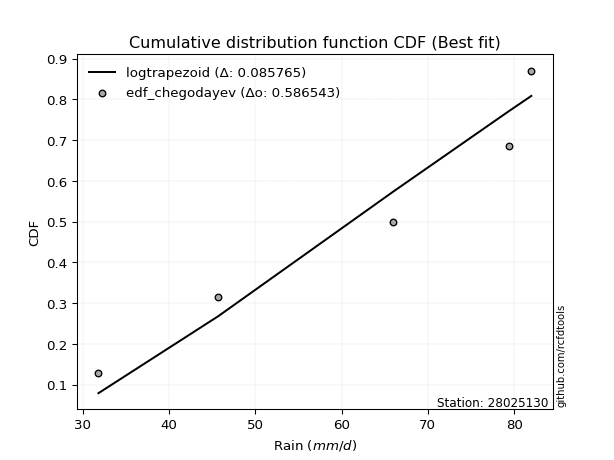</img></img>

</div>


### 6. EDF Blom (1958)

The Blom formula is a specific "plotting position" formula used in hydrology and statistical analysis to estimate the empirical cumulative probability (or non-exceedance probability) of a data series. It is particularly recommended for data that are approximately normally distributed. The constant _a_ is set to 0.375 (or 3/8).

<div align="center">


$P=(m-a)/(n+1-2a)$


</div>


**6.1. Empirical values**

<div align="center">

|                | 0                   | 1                   | 2        | 3                  | 4                  |
|:---------------|:--------------------|:--------------------|:---------|:-------------------|:-------------------|
| date           | 2020                | 2022                | 2017     | 2019               | 2018               |
| x              | 31.8                | 45.7                | 66.0     | 79.4               | 82.0               |
| m              | 1                   | 2                   | 3        | 4                  | 5                  |
| empirical_dist | edf_blom            | edf_blom            | edf_blom | edf_blom           | edf_blom           |
| empirical      | 0.11904761904761904 | 0.30952380952380953 | 0.5      | 0.6904761904761905 | 0.8809523809523809 |
| empirical_tr   | 1.135135135135135   | 1.4482758620689655  | 2.0      | 3.230769230769231  | 8.399999999999999  |

</div>


**6.2. Kolmogorov-Smirnov fit test (sorted by Δ)**


<div align="center">

|                | 0                   | 1                   | 2                   | 3                   | 4                   | 5                  | 6                   | 7                   | 8                   | 9                   | 10                  | 11                  | 12                  | 13                 | 14                  | 15                  | 16                  | 17                  | 18                 | 19                 | 20                  | 21                  | 22                  | 23                  | 24                  | 25                  | 26                 | 27                  | 28                  | 29                  | 30                  | 31                  | 32                  | 33                  | 34                 | 35                  | 36                  | 37                  | 38                  | 39                  | 40                 | 41                  | 42                  | 43                  | 44                  | 45                  | 46                  | 47                  | 48                  | 49                  | 50                  | 51                 | 52                  | 53                  | 54                 | 55                  | 56                 | 57                  | 58                  | 59                  | 60                 | 61                  | 62                  | 63                  | 64                  | 65                  | 66                  | 67                  | 68                  | 69                 | 70                  | 71                 | 72                  | 73                  | 74                  | 75                  | 76                  | 77                  | 78                  | 79                  | 80                  | 81                  | 82                 | 83                  | 84                  | 85                  | 86                  | 87                  | 88                 | 89                  | 90                  | 91                 | 92                  | 93                  | 94                  | 95                  | 96                  | 97                  | 98                 | 99                  | 100                 | 101                 | 102                 | 103                | 104                 | 105                 | 106                | 107                 | 108                | 109                 | 110                 | 111                 | 112                 | 113                 | 114                 | 115                 | 116                | 117                | 118                | 119                | 120                 | 121                 | 122                 | 123                 | 124                 | 125                | 126                | 127                | 128                | 129                 | 130                | 131                 | 132                 | 133                 | 134                 | 135                 | 136                | 137                 | 138                 | 139                 | 140                | 141                | 142                 | 143                | 144                | 145                | 146                | 147                | 148                | 149                | 150                | 151                | 152                | 153                | 154                | 155                | 156                | 157                | 158                | 159                |
|:---------------|:--------------------|:--------------------|:--------------------|:--------------------|:--------------------|:-------------------|:--------------------|:--------------------|:--------------------|:--------------------|:--------------------|:--------------------|:--------------------|:-------------------|:--------------------|:--------------------|:--------------------|:--------------------|:-------------------|:-------------------|:--------------------|:--------------------|:--------------------|:--------------------|:--------------------|:--------------------|:-------------------|:--------------------|:--------------------|:--------------------|:--------------------|:--------------------|:--------------------|:--------------------|:-------------------|:--------------------|:--------------------|:--------------------|:--------------------|:--------------------|:-------------------|:--------------------|:--------------------|:--------------------|:--------------------|:--------------------|:--------------------|:--------------------|:--------------------|:--------------------|:--------------------|:-------------------|:--------------------|:--------------------|:-------------------|:--------------------|:-------------------|:--------------------|:--------------------|:--------------------|:-------------------|:--------------------|:--------------------|:--------------------|:--------------------|:--------------------|:--------------------|:--------------------|:--------------------|:-------------------|:--------------------|:-------------------|:--------------------|:--------------------|:--------------------|:--------------------|:--------------------|:--------------------|:--------------------|:--------------------|:--------------------|:--------------------|:-------------------|:--------------------|:--------------------|:--------------------|:--------------------|:--------------------|:-------------------|:--------------------|:--------------------|:-------------------|:--------------------|:--------------------|:--------------------|:--------------------|:--------------------|:--------------------|:-------------------|:--------------------|:--------------------|:--------------------|:--------------------|:-------------------|:--------------------|:--------------------|:-------------------|:--------------------|:-------------------|:--------------------|:--------------------|:--------------------|:--------------------|:--------------------|:--------------------|:--------------------|:-------------------|:-------------------|:-------------------|:-------------------|:--------------------|:--------------------|:--------------------|:--------------------|:--------------------|:-------------------|:-------------------|:-------------------|:-------------------|:--------------------|:-------------------|:--------------------|:--------------------|:--------------------|:--------------------|:--------------------|:-------------------|:--------------------|:--------------------|:--------------------|:-------------------|:-------------------|:--------------------|:-------------------|:-------------------|:-------------------|:-------------------|:-------------------|:-------------------|:-------------------|:-------------------|:-------------------|:-------------------|:-------------------|:-------------------|:-------------------|:-------------------|:-------------------|:-------------------|:-------------------|
| station        | 28025130            | 28025130            | 28025130            | 28025130            | 28025130            | 28025130           | 28025130            | 28025130            | 28025130            | 28025130            | 28025130            | 28025130            | 28025130            | 28025130           | 28025130            | 28025130            | 28025130            | 28025130            | 28025130           | 28025130           | 28025130            | 28025130            | 28025130            | 28025130            | 28025130            | 28025130            | 28025130           | 28025130            | 28025130            | 28025130            | 28025130            | 28025130            | 28025130            | 28025130            | 28025130           | 28025130            | 28025130            | 28025130            | 28025130            | 28025130            | 28025130           | 28025130            | 28025130            | 28025130            | 28025130            | 28025130            | 28025130            | 28025130            | 28025130            | 28025130            | 28025130            | 28025130           | 28025130            | 28025130            | 28025130           | 28025130            | 28025130           | 28025130            | 28025130            | 28025130            | 28025130           | 28025130            | 28025130            | 28025130            | 28025130            | 28025130            | 28025130            | 28025130            | 28025130            | 28025130           | 28025130            | 28025130           | 28025130            | 28025130            | 28025130            | 28025130            | 28025130            | 28025130            | 28025130            | 28025130            | 28025130            | 28025130            | 28025130           | 28025130            | 28025130            | 28025130            | 28025130            | 28025130            | 28025130           | 28025130            | 28025130            | 28025130           | 28025130            | 28025130            | 28025130            | 28025130            | 28025130            | 28025130            | 28025130           | 28025130            | 28025130            | 28025130            | 28025130            | 28025130           | 28025130            | 28025130            | 28025130           | 28025130            | 28025130           | 28025130            | 28025130            | 28025130            | 28025130            | 28025130            | 28025130            | 28025130            | 28025130           | 28025130           | 28025130           | 28025130           | 28025130            | 28025130            | 28025130            | 28025130            | 28025130            | 28025130           | 28025130           | 28025130           | 28025130           | 28025130            | 28025130           | 28025130            | 28025130            | 28025130            | 28025130            | 28025130            | 28025130           | 28025130            | 28025130            | 28025130            | 28025130           | 28025130           | 28025130            | 28025130           | 28025130           | 28025130           | 28025130           | 28025130           | 28025130           | 28025130           | 28025130           | 28025130           | 28025130           | 28025130           | 28025130           | 28025130           | 28025130           | 28025130           | 28025130           | 28025130           |
| empirical_dist | edf_blom            | edf_blom            | edf_blom            | edf_blom            | edf_blom            | edf_blom           | edf_blom            | edf_blom            | edf_blom            | edf_blom            | edf_blom            | edf_blom            | edf_blom            | edf_blom           | edf_blom            | edf_blom            | edf_blom            | edf_blom            | edf_blom           | edf_blom           | edf_blom            | edf_blom            | edf_blom            | edf_blom            | edf_blom            | edf_blom            | edf_blom           | edf_blom            | edf_blom            | edf_blom            | edf_blom            | edf_blom            | edf_blom            | edf_blom            | edf_blom           | edf_blom            | edf_blom            | edf_blom            | edf_blom            | edf_blom            | edf_blom           | edf_blom            | edf_blom            | edf_blom            | edf_blom            | edf_blom            | edf_blom            | edf_blom            | edf_blom            | edf_blom            | edf_blom            | edf_blom           | edf_blom            | edf_blom            | edf_blom           | edf_blom            | edf_blom           | edf_blom            | edf_blom            | edf_blom            | edf_blom           | edf_blom            | edf_blom            | edf_blom            | edf_blom            | edf_blom            | edf_blom            | edf_blom            | edf_blom            | edf_blom           | edf_blom            | edf_blom           | edf_blom            | edf_blom            | edf_blom            | edf_blom            | edf_blom            | edf_blom            | edf_blom            | edf_blom            | edf_blom            | edf_blom            | edf_blom           | edf_blom            | edf_blom            | edf_blom            | edf_blom            | edf_blom            | edf_blom           | edf_blom            | edf_blom            | edf_blom           | edf_blom            | edf_blom            | edf_blom            | edf_blom            | edf_blom            | edf_blom            | edf_blom           | edf_blom            | edf_blom            | edf_blom            | edf_blom            | edf_blom           | edf_blom            | edf_blom            | edf_blom           | edf_blom            | edf_blom           | edf_blom            | edf_blom            | edf_blom            | edf_blom            | edf_blom            | edf_blom            | edf_blom            | edf_blom           | edf_blom           | edf_blom           | edf_blom           | edf_blom            | edf_blom            | edf_blom            | edf_blom            | edf_blom            | edf_blom           | edf_blom           | edf_blom           | edf_blom           | edf_blom            | edf_blom           | edf_blom            | edf_blom            | edf_blom            | edf_blom            | edf_blom            | edf_blom           | edf_blom            | edf_blom            | edf_blom            | edf_blom           | edf_blom           | edf_blom            | edf_blom           | edf_blom           | edf_blom           | edf_blom           | edf_blom           | edf_blom           | edf_blom           | edf_blom           | edf_blom           | edf_blom           | edf_blom           | edf_blom           | edf_blom           | edf_blom           | edf_blom           | edf_blom           | edf_blom           |
| p_dist         | logtrapezoid        | ksone               | semicircular        | trapezoid           | anglit              | logksone           | logbeta             | beta                | arcsine             | logsemicircular     | logpearson3         | logweibull_max      | betaprime           | logdgamma          | genextreme          | logncf              | loganglit           | genpareto           | alpha              | invgamma           | logarcsine          | rice                | erlang              | gamma               | f                   | rayleigh            | maxwell            | pearson3            | nct                 | t                   | exponnorm           | norm                | crystalball         | loggenextreme       | invgauss           | logbetaprime        | loggumbel_l         | loggompertz         | logburr12           | logweibull_min      | logdweibull        | gompertz            | weibull_min         | wrapcauchy          | logf                | logt                | logcrystalball      | lognorm             | logexponnorm        | lognct              | logfatiguelife      | logfoldnorm        | loggamma            | loggamma            | logerlang          | logistic            | logrice            | kstwobign           | gumbel_l            | halfnorm            | cosine             | loginvgauss         | logalpha            | logloglaplace       | loginvgamma         | dweibull            | logexponpow         | levy_l              | loglogistic         | hypsecant          | gumbel_r            | loginvweibull      | loglevy_l           | logmaxwell          | dgamma              | loggenpareto        | lograyleigh         | laplace             | logcosine           | loghypsecant        | truncnorm           | johnsonsb           | argus              | logkstwobign        | halflogistic        | loggenexpon         | loggennorm          | gennorm             | lomax              | genexpon            | moyal               | burr               | loghalfnorm         | logargus            | logexponweib        | logwrapcauchy       | loglomax            | burr12              | loggumbel_r        | loglaplace          | loglaplace          | halfgennorm         | loggenhalflogistic  | genhalflogistic    | logmielke           | mielke              | logburr            | logloggamma         | loghalflogistic    | triang              | logmoyal            | skewnorm            | loggausshyper       | gausshyper          | tukeylambda         | kappa4              | wald               | logtriang          | kappa3             | uniform            | vonmises_line       | logskewnorm         | logkappa4           | logtukeylambda      | loghalfgennorm      | bradford           | logjohnsonsb       | truncexpon         | logkappa3          | truncweibull_min    | loguniform         | loggengamma         | logwald             | ncf                 | logvonmises_line    | lognakagami         | nakagami           | foldnorm            | gengamma            | logtruncweibull_min | logbradford        | logtruncnorm       | logrdist            | exponweib          | logtruncexpon      | johnsonsu          | weibull_max        | invweibull         | fatiguelife        | logjohnsonsu       | powerlaw           | truncpareto        | logpowerlaw        | logtruncpareto     | exponpow           | rdist              | genlogistic        | loggenlogistic     | logvonmises        | vonmises           |
| delta          | 0.08047381708375512 | 0.08292800299973968 | 0.09931443861976352 | 0.10144627488760238 | 0.11112149044488828 | 0.1111907122187008 | 0.11902620027771116 | 0.11904172600767715 | 0.11904761904761904 | 0.12184312392934937 | 0.12274587621953659 | 0.12387687704126815 | 0.12428008700058035 | 0.1262130129649337 | 0.12840663205358965 | 0.12897306588254642 | 0.13014967129290567 | 0.13393689887265436 | 0.1341502725384096 | 0.1348075858305937 | 0.13540315105160305 | 0.13589681993197023 | 0.13600063498373505 | 0.13662611382329903 | 0.13669296499814831 | 0.13671189768201286 | 0.136911783652094  | 0.13742041066563726 | 0.13767959203315028 | 0.13771991588718313 | 0.13772974204778987 | 0.13772987376584322 | 0.13772987536782888 | 0.13805704503606897 | 0.1383513205264406 | 0.13928712916960317 | 0.13978072812630793 | 0.14025773438368416 | 0.14124252426781392 | 0.14284543175610087 | 0.1442146203553565 | 0.14616630028670052 | 0.14620321992782737 | 0.14887087272525706 | 0.14963653795672527 | 0.14994232952789943 | 0.14994645618397007 | 0.14994646080663165 | 0.14995054348613412 | 0.15079229630181556 | 0.15197135858533972 | 0.1526834631645515 | 0.15296645922989283 | 0.15296645922989283 | 0.1559961564364617 | 0.15737540323394728 | 0.1581403860770354 | 0.15841251596398753 | 0.15871181867842143 | 0.15965190235910853 | 0.1601748530491085 | 0.16120760299294234 | 0.16153296569809228 | 0.16158172919216532 | 0.16244264906094819 | 0.16325337496432502 | 0.16613789946832136 | 0.16657188930917344 | 0.16788436577863686 | 0.168090642365466  | 0.16816117876667747 | 0.1696822391493773 | 0.16999550761526372 | 0.17158760819731977 | 0.17502716889306136 | 0.17779293875862426 | 0.17809581741608427 | 0.17852259906319878 | 0.17980523132269788 | 0.18181076046199862 | 0.18388560499518158 | 0.18433849924555307 | 0.1877842933636592 | 0.18789147079940993 | 0.18797283015579314 | 0.19019392126230927 | 0.19047619047619047 | 0.19047619047619047 | 0.1905505180465331 | 0.19057300046322423 | 0.19079725759579436 | 0.1923897869561717 | 0.19701964970002273 | 0.19776599356484525 | 0.20078620072059983 | 0.20394947814218212 | 0.20589733405045296 | 0.20793707171811127 | 0.2099297338795345 | 0.20999821437844668 | 0.20999821437844668 | 0.21123308586872602 | 0.21334407754407936 | 0.2146201546942953 | 0.21572552466466566 | 0.21807093549488288 | 0.2188836064920615 | 0.22269872369639965 | 0.2251434044653764 | 0.22725783552689138 | 0.22978126568890134 | 0.23719147315678513 | 0.24718390570940107 | 0.24864485663847313 | 0.24970190136296044 | 0.25082499886506804 | 0.2539068138512618 | 0.2563848551297596 | 0.2570284059708624 | 0.2577309808385507 | 0.25803471867441563 | 0.25888841576163724 | 0.26502294930755144 | 0.26782729937394056 | 0.26865385184675095 | 0.273142070291145  | 0.2732504405919338 | 0.2735740479361558 | 0.2737869299153364 | 0.27399470582015206 | 0.2755087359821603 | 0.28248432736757656 | 0.28603817892974115 | 0.29309538888721776 | 0.30574256395529564 | 0.30952319114406673 | 0.3095237740961995 | 0.30952380952380953 | 0.31704487377303714 | 0.32023430514913587 | 0.3273890129583663 | 0.3296694412288531 | 0.33099541014683487 | 0.3394235024537626 | 0.3411570646673058 | 0.3458256423472647 | 0.3839045634080288 | 0.4512660749795337 | 0.4669141962274479 | 0.5088908604572578 | 0.5383528610876155 | 0.5542510859104639 | 0.5673902026299887 | 0.5892212529474832 | 0.5892690851916624 | 0.6904761904702427 | 0.6904761904761905 | 0.6904761904761905 | 1.1464591248391054 | 12.379474124235303 |
| deltao         | 0.5865427407550001  | 0.5865427407550001  | 0.5865427407550001  | 0.5865427407550001  | 0.5865427407550001  | 0.5865427407550001 | 0.5865427407550001  | 0.5865427407550001  | 0.5865427407550001  | 0.5865427407550001  | 0.5865427407550001  | 0.5865427407550001  | 0.5865427407550001  | 0.5865427407550001 | 0.5865427407550001  | 0.5865427407550001  | 0.5865427407550001  | 0.5865427407550001  | 0.5865427407550001 | 0.5865427407550001 | 0.5865427407550001  | 0.5865427407550001  | 0.5865427407550001  | 0.5865427407550001  | 0.5865427407550001  | 0.5865427407550001  | 0.5865427407550001 | 0.5865427407550001  | 0.5865427407550001  | 0.5865427407550001  | 0.5865427407550001  | 0.5865427407550001  | 0.5865427407550001  | 0.5865427407550001  | 0.5865427407550001 | 0.5865427407550001  | 0.5865427407550001  | 0.5865427407550001  | 0.5865427407550001  | 0.5865427407550001  | 0.5865427407550001 | 0.5865427407550001  | 0.5865427407550001  | 0.5865427407550001  | 0.5865427407550001  | 0.5865427407550001  | 0.5865427407550001  | 0.5865427407550001  | 0.5865427407550001  | 0.5865427407550001  | 0.5865427407550001  | 0.5865427407550001 | 0.5865427407550001  | 0.5865427407550001  | 0.5865427407550001 | 0.5865427407550001  | 0.5865427407550001 | 0.5865427407550001  | 0.5865427407550001  | 0.5865427407550001  | 0.5865427407550001 | 0.5865427407550001  | 0.5865427407550001  | 0.5865427407550001  | 0.5865427407550001  | 0.5865427407550001  | 0.5865427407550001  | 0.5865427407550001  | 0.5865427407550001  | 0.5865427407550001 | 0.5865427407550001  | 0.5865427407550001 | 0.5865427407550001  | 0.5865427407550001  | 0.5865427407550001  | 0.5865427407550001  | 0.5865427407550001  | 0.5865427407550001  | 0.5865427407550001  | 0.5865427407550001  | 0.5865427407550001  | 0.5865427407550001  | 0.5865427407550001 | 0.5865427407550001  | 0.5865427407550001  | 0.5865427407550001  | 0.5865427407550001  | 0.5865427407550001  | 0.5865427407550001 | 0.5865427407550001  | 0.5865427407550001  | 0.5865427407550001 | 0.5865427407550001  | 0.5865427407550001  | 0.5865427407550001  | 0.5865427407550001  | 0.5865427407550001  | 0.5865427407550001  | 0.5865427407550001 | 0.5865427407550001  | 0.5865427407550001  | 0.5865427407550001  | 0.5865427407550001  | 0.5865427407550001 | 0.5865427407550001  | 0.5865427407550001  | 0.5865427407550001 | 0.5865427407550001  | 0.5865427407550001 | 0.5865427407550001  | 0.5865427407550001  | 0.5865427407550001  | 0.5865427407550001  | 0.5865427407550001  | 0.5865427407550001  | 0.5865427407550001  | 0.5865427407550001 | 0.5865427407550001 | 0.5865427407550001 | 0.5865427407550001 | 0.5865427407550001  | 0.5865427407550001  | 0.5865427407550001  | 0.5865427407550001  | 0.5865427407550001  | 0.5865427407550001 | 0.5865427407550001 | 0.5865427407550001 | 0.5865427407550001 | 0.5865427407550001  | 0.5865427407550001 | 0.5865427407550001  | 0.5865427407550001  | 0.5865427407550001  | 0.5865427407550001  | 0.5865427407550001  | 0.5865427407550001 | 0.5865427407550001  | 0.5865427407550001  | 0.5865427407550001  | 0.5865427407550001 | 0.5865427407550001 | 0.5865427407550001  | 0.5865427407550001 | 0.5865427407550001 | 0.5865427407550001 | 0.5865427407550001 | 0.5865427407550001 | 0.5865427407550001 | 0.5865427407550001 | 0.5865427407550001 | 0.5865427407550001 | 0.5865427407550001 | 0.5865427407550001 | 0.5865427407550001 | 0.5865427407550001 | 0.5865427407550001 | 0.5865427407550001 | 0.5865427407550001 | 0.5865427407550001 |
| eval           | Δo > Δ              | Δo > Δ              | Δo > Δ              | Δo > Δ              | Δo > Δ              | Δo > Δ             | Δo > Δ              | Δo > Δ              | Δo > Δ              | Δo > Δ              | Δo > Δ              | Δo > Δ              | Δo > Δ              | Δo > Δ             | Δo > Δ              | Δo > Δ              | Δo > Δ              | Δo > Δ              | Δo > Δ             | Δo > Δ             | Δo > Δ              | Δo > Δ              | Δo > Δ              | Δo > Δ              | Δo > Δ              | Δo > Δ              | Δo > Δ             | Δo > Δ              | Δo > Δ              | Δo > Δ              | Δo > Δ              | Δo > Δ              | Δo > Δ              | Δo > Δ              | Δo > Δ             | Δo > Δ              | Δo > Δ              | Δo > Δ              | Δo > Δ              | Δo > Δ              | Δo > Δ             | Δo > Δ              | Δo > Δ              | Δo > Δ              | Δo > Δ              | Δo > Δ              | Δo > Δ              | Δo > Δ              | Δo > Δ              | Δo > Δ              | Δo > Δ              | Δo > Δ             | Δo > Δ              | Δo > Δ              | Δo > Δ             | Δo > Δ              | Δo > Δ             | Δo > Δ              | Δo > Δ              | Δo > Δ              | Δo > Δ             | Δo > Δ              | Δo > Δ              | Δo > Δ              | Δo > Δ              | Δo > Δ              | Δo > Δ              | Δo > Δ              | Δo > Δ              | Δo > Δ             | Δo > Δ              | Δo > Δ             | Δo > Δ              | Δo > Δ              | Δo > Δ              | Δo > Δ              | Δo > Δ              | Δo > Δ              | Δo > Δ              | Δo > Δ              | Δo > Δ              | Δo > Δ              | Δo > Δ             | Δo > Δ              | Δo > Δ              | Δo > Δ              | Δo > Δ              | Δo > Δ              | Δo > Δ             | Δo > Δ              | Δo > Δ              | Δo > Δ             | Δo > Δ              | Δo > Δ              | Δo > Δ              | Δo > Δ              | Δo > Δ              | Δo > Δ              | Δo > Δ             | Δo > Δ              | Δo > Δ              | Δo > Δ              | Δo > Δ              | Δo > Δ             | Δo > Δ              | Δo > Δ              | Δo > Δ             | Δo > Δ              | Δo > Δ             | Δo > Δ              | Δo > Δ              | Δo > Δ              | Δo > Δ              | Δo > Δ              | Δo > Δ              | Δo > Δ              | Δo > Δ             | Δo > Δ             | Δo > Δ             | Δo > Δ             | Δo > Δ              | Δo > Δ              | Δo > Δ              | Δo > Δ              | Δo > Δ              | Δo > Δ             | Δo > Δ             | Δo > Δ             | Δo > Δ             | Δo > Δ              | Δo > Δ             | Δo > Δ              | Δo > Δ              | Δo > Δ              | Δo > Δ              | Δo > Δ              | Δo > Δ             | Δo > Δ              | Δo > Δ              | Δo > Δ              | Δo > Δ             | Δo > Δ             | Δo > Δ              | Δo > Δ             | Δo > Δ             | Δo > Δ             | Δo > Δ             | Δo > Δ             | Δo > Δ             | Δo > Δ             | Δo > Δ             | Δo > Δ             | Δo > Δ             | Δo <= Δ            | Δo <= Δ            | Δo <= Δ            | Δo <= Δ            | Δo <= Δ            | Δo <= Δ            | Δo <= Δ            |
| fit            | 1                   | 1                   | 1                   | 1                   | 1                   | 1                  | 1                   | 1                   | 1                   | 1                   | 1                   | 1                   | 1                   | 1                  | 1                   | 1                   | 1                   | 1                   | 1                  | 1                  | 1                   | 1                   | 1                   | 1                   | 1                   | 1                   | 1                  | 1                   | 1                   | 1                   | 1                   | 1                   | 1                   | 1                   | 1                  | 1                   | 1                   | 1                   | 1                   | 1                   | 1                  | 1                   | 1                   | 1                   | 1                   | 1                   | 1                   | 1                   | 1                   | 1                   | 1                   | 1                  | 1                   | 1                   | 1                  | 1                   | 1                  | 1                   | 1                   | 1                   | 1                  | 1                   | 1                   | 1                   | 1                   | 1                   | 1                   | 1                   | 1                   | 1                  | 1                   | 1                  | 1                   | 1                   | 1                   | 1                   | 1                   | 1                   | 1                   | 1                   | 1                   | 1                   | 1                  | 1                   | 1                   | 1                   | 1                   | 1                   | 1                  | 1                   | 1                   | 1                  | 1                   | 1                   | 1                   | 1                   | 1                   | 1                   | 1                  | 1                   | 1                   | 1                   | 1                   | 1                  | 1                   | 1                   | 1                  | 1                   | 1                  | 1                   | 1                   | 1                   | 1                   | 1                   | 1                   | 1                   | 1                  | 1                  | 1                  | 1                  | 1                   | 1                   | 1                   | 1                   | 1                   | 1                  | 1                  | 1                  | 1                  | 1                   | 1                  | 1                   | 1                   | 1                   | 1                   | 1                   | 1                  | 1                   | 1                   | 1                   | 1                  | 1                  | 1                   | 1                  | 1                  | 1                  | 1                  | 1                  | 1                  | 1                  | 1                  | 1                  | 1                  | 0                  | 0                  | 0                  | 0                  | 0                  | 0                  | 0                  |
| n              | 5                   | 5                   | 5                   | 5                   | 5                   | 5                  | 5                   | 5                   | 5                   | 5                   | 5                   | 5                   | 5                   | 5                  | 5                   | 5                   | 5                   | 5                   | 5                  | 5                  | 5                   | 5                   | 5                   | 5                   | 5                   | 5                   | 5                  | 5                   | 5                   | 5                   | 5                   | 5                   | 5                   | 5                   | 5                  | 5                   | 5                   | 5                   | 5                   | 5                   | 5                  | 5                   | 5                   | 5                   | 5                   | 5                   | 5                   | 5                   | 5                   | 5                   | 5                   | 5                  | 5                   | 5                   | 5                  | 5                   | 5                  | 5                   | 5                   | 5                   | 5                  | 5                   | 5                   | 5                   | 5                   | 5                   | 5                   | 5                   | 5                   | 5                  | 5                   | 5                  | 5                   | 5                   | 5                   | 5                   | 5                   | 5                   | 5                   | 5                   | 5                   | 5                   | 5                  | 5                   | 5                   | 5                   | 5                   | 5                   | 5                  | 5                   | 5                   | 5                  | 5                   | 5                   | 5                   | 5                   | 5                   | 5                   | 5                  | 5                   | 5                   | 5                   | 5                   | 5                  | 5                   | 5                   | 5                  | 5                   | 5                  | 5                   | 5                   | 5                   | 5                   | 5                   | 5                   | 5                   | 5                  | 5                  | 5                  | 5                  | 5                   | 5                   | 5                   | 5                   | 5                   | 5                  | 5                  | 5                  | 5                  | 5                   | 5                  | 5                   | 5                   | 5                   | 5                   | 5                   | 5                  | 5                   | 5                   | 5                   | 5                  | 5                  | 5                   | 5                  | 5                  | 5                  | 5                  | 5                  | 5                  | 5                  | 5                  | 5                  | 5                  | 5                  | 5                  | 5                  | 5                  | 5                  | 5                  | 5                  |
| best_fit       | 1                   | 0                   | 0                   | 0                   | 0                   | 0                  | 0                   | 0                   | 0                   | 0                   | 0                   | 0                   | 0                   | 0                  | 0                   | 0                   | 0                   | 0                   | 0                  | 0                  | 0                   | 0                   | 0                   | 0                   | 0                   | 0                   | 0                  | 0                   | 0                   | 0                   | 0                   | 0                   | 0                   | 0                   | 0                  | 0                   | 0                   | 0                   | 0                   | 0                   | 0                  | 0                   | 0                   | 0                   | 0                   | 0                   | 0                   | 0                   | 0                   | 0                   | 0                   | 0                  | 0                   | 0                   | 0                  | 0                   | 0                  | 0                   | 0                   | 0                   | 0                  | 0                   | 0                   | 0                   | 0                   | 0                   | 0                   | 0                   | 0                   | 0                  | 0                   | 0                  | 0                   | 0                   | 0                   | 0                   | 0                   | 0                   | 0                   | 0                   | 0                   | 0                   | 0                  | 0                   | 0                   | 0                   | 0                   | 0                   | 0                  | 0                   | 0                   | 0                  | 0                   | 0                   | 0                   | 0                   | 0                   | 0                   | 0                  | 0                   | 0                   | 0                   | 0                   | 0                  | 0                   | 0                   | 0                  | 0                   | 0                  | 0                   | 0                   | 0                   | 0                   | 0                   | 0                   | 0                   | 0                  | 0                  | 0                  | 0                  | 0                   | 0                   | 0                   | 0                   | 0                   | 0                  | 0                  | 0                  | 0                  | 0                   | 0                  | 0                   | 0                   | 0                   | 0                   | 0                   | 0                  | 0                   | 0                   | 0                   | 0                  | 0                  | 0                   | 0                  | 0                  | 0                  | 0                  | 0                  | 0                  | 0                  | 0                  | 0                  | 0                  | 0                  | 0                  | 0                  | 0                  | 0                  | 0                  | 0                  |
| best_fit_sort  | 1                   | 2                   | 3                   | 4                   | 5                   | 6                  | 7                   | 8                   | 9                   | 10                  | 11                  | 12                  | 13                  | 14                 | 15                  | 16                  | 17                  | 18                  | 19                 | 20                 | 21                  | 22                  | 23                  | 24                  | 25                  | 26                  | 27                 | 28                  | 29                  | 30                  | 31                  | 32                  | 33                  | 34                  | 35                 | 36                  | 37                  | 38                  | 39                  | 40                  | 41                 | 42                  | 43                  | 44                  | 45                  | 46                  | 47                  | 48                  | 49                  | 50                  | 51                  | 52                 | 53                  | 54                  | 55                 | 56                  | 57                 | 58                  | 59                  | 60                  | 61                 | 62                  | 63                  | 64                  | 65                  | 66                  | 67                  | 68                  | 69                  | 70                 | 71                  | 72                 | 73                  | 74                  | 75                  | 76                  | 77                  | 78                  | 79                  | 80                  | 81                  | 82                  | 83                 | 84                  | 85                  | 86                  | 87                  | 88                  | 89                 | 90                  | 91                  | 92                 | 93                  | 94                  | 95                  | 96                  | 97                  | 98                  | 99                 | 100                 | 101                 | 102                 | 103                 | 104                | 105                 | 106                 | 107                | 108                 | 109                | 110                 | 111                 | 112                 | 113                 | 114                 | 115                 | 116                 | 117                | 118                | 119                | 120                | 121                 | 122                 | 123                 | 124                 | 125                 | 126                | 127                | 128                | 129                | 130                 | 131                | 132                 | 133                 | 134                 | 135                 | 136                 | 137                | 138                 | 139                 | 140                 | 141                | 142                | 143                 | 144                | 145                | 146                | 147                | 148                | 149                | 150                | 151                | 152                | 153                | 154                | 155                | 156                | 157                | 158                | 159                | 160                |

</div>


**6.3. Best fit**

<div align="center">

|   id |   station | empirical_dist   | p_dist       |     delta |   deltao | eval   |   fit |   n |   best_fit |   best_fit_sort |
|-----:|----------:|:-----------------|:-------------|----------:|---------:|:-------|------:|----:|-----------:|----------------:|
|    0 |  28025130 | edf_blom         | logtrapezoid | 0.0804738 | 0.586543 | Δo > Δ |     1 |   5 |          1 |               1 |

</div>


<div align="center">

</img>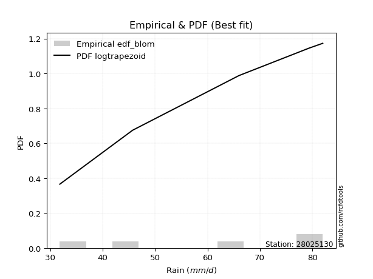</img>

</div>


### 7. EDF Tukey (1962)

In hydrology, the Tukey formula is used as a plotting position formula to estimate the empirical probability or frequency of a flood event (or other hydrological data). The formula parameter is given as _c=0.333_ (or 1/3).

<div align="center">


$P=(m-c)/(n+1-2c)$


</div>


**7.1. Empirical values**

<div align="center">

|                | 0                  | 1                  | 2         | 3         | 4         |
|:---------------|:-------------------|:-------------------|:----------|:----------|:----------|
| date           | 2020               | 2022               | 2017      | 2019      | 2018      |
| x              | 31.8               | 45.7               | 66.0      | 79.4      | 82.0      |
| m              | 1                  | 2                  | 3         | 4         | 5         |
| empirical_dist | edf_tukey          | edf_tukey          | edf_tukey | edf_tukey | edf_tukey |
| empirical      | 0.125              | 0.3125             | 0.5       | 0.6875    | 0.875     |
| empirical_tr   | 1.1428571428571428 | 1.4545454545454546 | 2.0       | 3.2       | 8.0       |

</div>


**7.2. Kolmogorov-Smirnov fit test (sorted by Δ)**


<div align="center">

|                | 0                   | 1                   | 2                   | 3                   | 4                  | 5                   | 6                   | 7                   | 8                   | 9                   | 10                 | 11                  | 12                  | 13                  | 14                  | 15                  | 16                  | 17                  | 18                  | 19                  | 20                  | 21                 | 22                 | 23                 | 24                  | 25                 | 26                  | 27                  | 28                  | 29                  | 30                  | 31                 | 32                  | 33                 | 34                  | 35                  | 36                 | 37                  | 38                  | 39                  | 40                 | 41                  | 42                 | 43                  | 44                  | 45                  | 46                  | 47                  | 48                  | 49                  | 50                  | 51                 | 52                  | 53                  | 54                 | 55                 | 56                  | 57                  | 58                  | 59                  | 60                  | 61                  | 62                 | 63                  | 64                  | 65                  | 66                  | 67                  | 68                  | 69                  | 70                 | 71                  | 72                  | 73                  | 74                 | 75                  | 76                  | 77                  | 78                  | 79                 | 80                  | 81                  | 82                 | 83                 | 84                  | 85                  | 86                  | 87                 | 88                  | 89                  | 90                  | 91                 | 92                  | 93                  | 94                  | 95                  | 96                  | 97                  | 98                 | 99                  | 100                 | 101                 | 102                 | 103                 | 104                 | 105                 | 106                 | 107                | 108                | 109                 | 110                 | 111                | 112                 | 113                | 114                | 115                | 116                | 117                | 118                 | 119                | 120                | 121                | 122                | 123                | 124                 | 125                | 126                | 127                 | 128                 | 129                 | 130                 | 131                 | 132                 | 133                | 134                 | 135                | 136                | 137                | 138                | 139                 | 140                 | 141                | 142                | 143                 | 144                | 145                 | 146                 | 147                 | 148                 | 149                | 150                | 151                | 152                | 153                | 154                | 155                | 156                | 157                | 158                | 159                |
|:---------------|:--------------------|:--------------------|:--------------------|:--------------------|:-------------------|:--------------------|:--------------------|:--------------------|:--------------------|:--------------------|:-------------------|:--------------------|:--------------------|:--------------------|:--------------------|:--------------------|:--------------------|:--------------------|:--------------------|:--------------------|:--------------------|:-------------------|:-------------------|:-------------------|:--------------------|:-------------------|:--------------------|:--------------------|:--------------------|:--------------------|:--------------------|:-------------------|:--------------------|:-------------------|:--------------------|:--------------------|:-------------------|:--------------------|:--------------------|:--------------------|:-------------------|:--------------------|:-------------------|:--------------------|:--------------------|:--------------------|:--------------------|:--------------------|:--------------------|:--------------------|:--------------------|:-------------------|:--------------------|:--------------------|:-------------------|:-------------------|:--------------------|:--------------------|:--------------------|:--------------------|:--------------------|:--------------------|:-------------------|:--------------------|:--------------------|:--------------------|:--------------------|:--------------------|:--------------------|:--------------------|:-------------------|:--------------------|:--------------------|:--------------------|:-------------------|:--------------------|:--------------------|:--------------------|:--------------------|:-------------------|:--------------------|:--------------------|:-------------------|:-------------------|:--------------------|:--------------------|:--------------------|:-------------------|:--------------------|:--------------------|:--------------------|:-------------------|:--------------------|:--------------------|:--------------------|:--------------------|:--------------------|:--------------------|:-------------------|:--------------------|:--------------------|:--------------------|:--------------------|:--------------------|:--------------------|:--------------------|:--------------------|:-------------------|:-------------------|:--------------------|:--------------------|:-------------------|:--------------------|:-------------------|:-------------------|:-------------------|:-------------------|:-------------------|:--------------------|:-------------------|:-------------------|:-------------------|:-------------------|:-------------------|:--------------------|:-------------------|:-------------------|:--------------------|:--------------------|:--------------------|:--------------------|:--------------------|:--------------------|:-------------------|:--------------------|:-------------------|:-------------------|:-------------------|:-------------------|:--------------------|:--------------------|:-------------------|:-------------------|:--------------------|:-------------------|:--------------------|:--------------------|:--------------------|:--------------------|:-------------------|:-------------------|:-------------------|:-------------------|:-------------------|:-------------------|:-------------------|:-------------------|:-------------------|:-------------------|:-------------------|
| station        | 28025130            | 28025130            | 28025130            | 28025130            | 28025130           | 28025130            | 28025130            | 28025130            | 28025130            | 28025130            | 28025130           | 28025130            | 28025130            | 28025130            | 28025130            | 28025130            | 28025130            | 28025130            | 28025130            | 28025130            | 28025130            | 28025130           | 28025130           | 28025130           | 28025130            | 28025130           | 28025130            | 28025130            | 28025130            | 28025130            | 28025130            | 28025130           | 28025130            | 28025130           | 28025130            | 28025130            | 28025130           | 28025130            | 28025130            | 28025130            | 28025130           | 28025130            | 28025130           | 28025130            | 28025130            | 28025130            | 28025130            | 28025130            | 28025130            | 28025130            | 28025130            | 28025130           | 28025130            | 28025130            | 28025130           | 28025130           | 28025130            | 28025130            | 28025130            | 28025130            | 28025130            | 28025130            | 28025130           | 28025130            | 28025130            | 28025130            | 28025130            | 28025130            | 28025130            | 28025130            | 28025130           | 28025130            | 28025130            | 28025130            | 28025130           | 28025130            | 28025130            | 28025130            | 28025130            | 28025130           | 28025130            | 28025130            | 28025130           | 28025130           | 28025130            | 28025130            | 28025130            | 28025130           | 28025130            | 28025130            | 28025130            | 28025130           | 28025130            | 28025130            | 28025130            | 28025130            | 28025130            | 28025130            | 28025130           | 28025130            | 28025130            | 28025130            | 28025130            | 28025130            | 28025130            | 28025130            | 28025130            | 28025130           | 28025130           | 28025130            | 28025130            | 28025130           | 28025130            | 28025130           | 28025130           | 28025130           | 28025130           | 28025130           | 28025130            | 28025130           | 28025130           | 28025130           | 28025130           | 28025130           | 28025130            | 28025130           | 28025130           | 28025130            | 28025130            | 28025130            | 28025130            | 28025130            | 28025130            | 28025130           | 28025130            | 28025130           | 28025130           | 28025130           | 28025130           | 28025130            | 28025130            | 28025130           | 28025130           | 28025130            | 28025130           | 28025130            | 28025130            | 28025130            | 28025130            | 28025130           | 28025130           | 28025130           | 28025130           | 28025130           | 28025130           | 28025130           | 28025130           | 28025130           | 28025130           | 28025130           |
| empirical_dist | edf_tukey           | edf_tukey           | edf_tukey           | edf_tukey           | edf_tukey          | edf_tukey           | edf_tukey           | edf_tukey           | edf_tukey           | edf_tukey           | edf_tukey          | edf_tukey           | edf_tukey           | edf_tukey           | edf_tukey           | edf_tukey           | edf_tukey           | edf_tukey           | edf_tukey           | edf_tukey           | edf_tukey           | edf_tukey          | edf_tukey          | edf_tukey          | edf_tukey           | edf_tukey          | edf_tukey           | edf_tukey           | edf_tukey           | edf_tukey           | edf_tukey           | edf_tukey          | edf_tukey           | edf_tukey          | edf_tukey           | edf_tukey           | edf_tukey          | edf_tukey           | edf_tukey           | edf_tukey           | edf_tukey          | edf_tukey           | edf_tukey          | edf_tukey           | edf_tukey           | edf_tukey           | edf_tukey           | edf_tukey           | edf_tukey           | edf_tukey           | edf_tukey           | edf_tukey          | edf_tukey           | edf_tukey           | edf_tukey          | edf_tukey          | edf_tukey           | edf_tukey           | edf_tukey           | edf_tukey           | edf_tukey           | edf_tukey           | edf_tukey          | edf_tukey           | edf_tukey           | edf_tukey           | edf_tukey           | edf_tukey           | edf_tukey           | edf_tukey           | edf_tukey          | edf_tukey           | edf_tukey           | edf_tukey           | edf_tukey          | edf_tukey           | edf_tukey           | edf_tukey           | edf_tukey           | edf_tukey          | edf_tukey           | edf_tukey           | edf_tukey          | edf_tukey          | edf_tukey           | edf_tukey           | edf_tukey           | edf_tukey          | edf_tukey           | edf_tukey           | edf_tukey           | edf_tukey          | edf_tukey           | edf_tukey           | edf_tukey           | edf_tukey           | edf_tukey           | edf_tukey           | edf_tukey          | edf_tukey           | edf_tukey           | edf_tukey           | edf_tukey           | edf_tukey           | edf_tukey           | edf_tukey           | edf_tukey           | edf_tukey          | edf_tukey          | edf_tukey           | edf_tukey           | edf_tukey          | edf_tukey           | edf_tukey          | edf_tukey          | edf_tukey          | edf_tukey          | edf_tukey          | edf_tukey           | edf_tukey          | edf_tukey          | edf_tukey          | edf_tukey          | edf_tukey          | edf_tukey           | edf_tukey          | edf_tukey          | edf_tukey           | edf_tukey           | edf_tukey           | edf_tukey           | edf_tukey           | edf_tukey           | edf_tukey          | edf_tukey           | edf_tukey          | edf_tukey          | edf_tukey          | edf_tukey          | edf_tukey           | edf_tukey           | edf_tukey          | edf_tukey          | edf_tukey           | edf_tukey          | edf_tukey           | edf_tukey           | edf_tukey           | edf_tukey           | edf_tukey          | edf_tukey          | edf_tukey          | edf_tukey          | edf_tukey          | edf_tukey          | edf_tukey          | edf_tukey          | edf_tukey          | edf_tukey          | edf_tukey          |
| p_dist         | logtrapezoid        | ksone               | semicircular        | trapezoid           | logksone           | anglit              | logsemicircular     | logncf              | logbeta             | beta                | arcsine            | logpearson3         | logweibull_max      | betaprime           | logdgamma           | logarcsine          | loganglit           | genextreme          | genpareto           | alpha               | invgamma            | invgauss           | rice               | erlang             | logbetaprime        | gamma              | f                   | rayleigh            | maxwell             | pearson3            | nct                 | t                  | exponnorm           | norm               | crystalball         | loggenextreme       | loggumbel_l        | loggompertz         | logburr12           | logweibull_min      | wrapcauchy         | logdweibull         | gompertz           | weibull_min         | logf                | logt                | logcrystalball      | lognorm             | logexponnorm        | lognct              | logfatiguelife      | logfoldnorm        | loggamma            | loggamma            | logerlang          | logrice            | kstwobign           | halfnorm            | logexponpow         | logistic            | loginvgauss         | logalpha            | gumbel_l           | loginvgamma         | cosine              | logloglaplace       | dweibull            | levy_l              | loglogistic         | gumbel_r            | loginvweibull      | loglevy_l           | hypsecant           | logmaxwell          | loggenpareto       | truncnorm           | dgamma              | lograyleigh         | logcosine           | johnsonsb          | laplace             | loghypsecant        | loggennorm         | gennorm            | logkstwobign        | halflogistic        | loggenexpon         | lomax              | genexpon            | argus               | moyal               | logexponweib       | burr                | loghalfnorm         | logargus            | loglomax            | logwrapcauchy       | burr12              | loggumbel_r        | loglaplace          | loglaplace          | halfgennorm         | loggenhalflogistic  | genhalflogistic     | logmielke           | mielke              | logburr             | loghalflogistic    | logloggamma        | logmoyal            | triang              | skewnorm           | loggausshyper       | gausshyper         | tukeylambda        | kappa4             | wald               | logtriang          | kappa3              | uniform            | vonmises_line      | logskewnorm        | logjohnsonsb       | logkappa4          | logtukeylambda      | loghalfgennorm     | bradford           | truncexpon          | logkappa3           | truncweibull_min    | loguniform          | loggengamma         | logwald             | ncf                | logvonmises_line    | lognakagami        | nakagami           | foldnorm           | gengamma           | logtruncweibull_min | logrdist            | logbradford        | logtruncnorm       | exponweib           | logtruncexpon      | johnsonsu           | weibull_max         | invweibull          | fatiguelife         | logjohnsonsu       | powerlaw           | truncpareto        | logpowerlaw        | logtruncpareto     | exponpow           | rdist              | genlogistic        | loggenlogistic     | logvonmises        | vonmises           |
| delta          | 0.08345000755994558 | 0.08590419347593015 | 0.10229062909595399 | 0.10442246536379285 | 0.1111907122187008 | 0.11409768092107875 | 0.12184312392934937 | 0.12302068493016549 | 0.12497858123009209 | 0.12499410696005808 | 0.125              | 0.12572206669572705 | 0.12685306751745862 | 0.12725627747677082 | 0.12918920344112417 | 0.12945077009922212 | 0.13014967129290567 | 0.13138282252978012 | 0.13691308934884483 | 0.13712646301460008 | 0.13778377630678418 | 0.1383513205264406 | 0.1388730104081607 | 0.1389768254599255 | 0.13928712916960317 | 0.1396023042994895 | 0.13966915547433878 | 0.13968808815820333 | 0.13988797412828446 | 0.14039660114182773 | 0.14065578250934074 | 0.1406961063633736 | 0.14070593252398034 | 0.1407060642420337 | 0.14070606584401935 | 0.14103323551225944 | 0.1427569186024984 | 0.14323392485987463 | 0.14421871474400438 | 0.14582162223229134 | 0.1458946822490666 | 0.14719081083154698 | 0.149142490762891  | 0.14917941040401783 | 0.14963653795672527 | 0.14994232952789943 | 0.14994645618397007 | 0.14994646080663165 | 0.14995054348613412 | 0.15079229630181556 | 0.15197135858533972 | 0.1526834631645515 | 0.15296645922989283 | 0.15296645922989283 | 0.1559961564364617 | 0.1581403860770354 | 0.15841251596398753 | 0.15965190235910853 | 0.16018551851594043 | 0.16035159371013774 | 0.16120760299294234 | 0.16153296569809228 | 0.1616880091546119 | 0.16244264906094819 | 0.16315104352529897 | 0.16455791966835578 | 0.16622956544051548 | 0.16657188930917344 | 0.16788436577863686 | 0.16816117876667747 | 0.1696822391493773 | 0.16999550761526372 | 0.17106683284165647 | 0.17158760819731977 | 0.1718405578062433 | 0.17793322404280065 | 0.17800335936925182 | 0.17809581741608427 | 0.17980523132269788 | 0.1813623087693626 | 0.18149878953938925 | 0.18181076046199862 | 0.1875             | 0.1875             | 0.18789147079940993 | 0.18797283015579314 | 0.19019392126230927 | 0.1905505180465331 | 0.19057300046322423 | 0.19076048383984967 | 0.19079725759579436 | 0.1948338197682189 | 0.19536597743236217 | 0.19701964970002273 | 0.20074218404103572 | 0.20589733405045296 | 0.20692566861837258 | 0.20793707171811127 | 0.2099297338795345 | 0.20999821437844668 | 0.20999821437844668 | 0.21123308586872602 | 0.21632026802026982 | 0.21759634517048576 | 0.21870171514085612 | 0.22104712597107334 | 0.22185979696825198 | 0.2251434044653764 | 0.2256749141725901 | 0.22978126568890134 | 0.23023402600308185 | 0.2401676636329756 | 0.25016009618559154 | 0.2516210471146636 | 0.2526780918391509 | 0.2538011893412585 | 0.2539068138512618 | 0.2593610456059501 | 0.26000459644705287 | 0.2607071713147412 | 0.2610109091506061 | 0.2618646062378277 | 0.2672980596395529 | 0.2679991397837419 | 0.27080348985013103 | 0.2716300423229414 | 0.2761182607673355 | 0.27655023841234627 | 0.27676312039152684 | 0.27697089629634253 | 0.27848492645835077 | 0.28248432736757656 | 0.28603817892974115 | 0.2871430079348368 | 0.30574256395529564 | 0.3124993816202572 | 0.31249996457239   | 0.3125             | 0.3140686832968467 | 0.32023430514913587 | 0.32504302919445394 | 0.3273890129583663 | 0.3296694412288531 | 0.33644731197757216 | 0.3411570646673058 | 0.34284945187107424 | 0.38092837293183834 | 0.44531369402715276 | 0.46393800575125743 | 0.5059146699810674 | 0.535376670611425  | 0.5512748954342734 | 0.5644140121537983 | 0.5862450624712927 | 0.586292894715472  | 0.6874999999940522 | 0.6875             | 0.6875             | 1.1464591248391054 | 12.385426505187684 |
| deltao         | 0.5865427407550001  | 0.5865427407550001  | 0.5865427407550001  | 0.5865427407550001  | 0.5865427407550001 | 0.5865427407550001  | 0.5865427407550001  | 0.5865427407550001  | 0.5865427407550001  | 0.5865427407550001  | 0.5865427407550001 | 0.5865427407550001  | 0.5865427407550001  | 0.5865427407550001  | 0.5865427407550001  | 0.5865427407550001  | 0.5865427407550001  | 0.5865427407550001  | 0.5865427407550001  | 0.5865427407550001  | 0.5865427407550001  | 0.5865427407550001 | 0.5865427407550001 | 0.5865427407550001 | 0.5865427407550001  | 0.5865427407550001 | 0.5865427407550001  | 0.5865427407550001  | 0.5865427407550001  | 0.5865427407550001  | 0.5865427407550001  | 0.5865427407550001 | 0.5865427407550001  | 0.5865427407550001 | 0.5865427407550001  | 0.5865427407550001  | 0.5865427407550001 | 0.5865427407550001  | 0.5865427407550001  | 0.5865427407550001  | 0.5865427407550001 | 0.5865427407550001  | 0.5865427407550001 | 0.5865427407550001  | 0.5865427407550001  | 0.5865427407550001  | 0.5865427407550001  | 0.5865427407550001  | 0.5865427407550001  | 0.5865427407550001  | 0.5865427407550001  | 0.5865427407550001 | 0.5865427407550001  | 0.5865427407550001  | 0.5865427407550001 | 0.5865427407550001 | 0.5865427407550001  | 0.5865427407550001  | 0.5865427407550001  | 0.5865427407550001  | 0.5865427407550001  | 0.5865427407550001  | 0.5865427407550001 | 0.5865427407550001  | 0.5865427407550001  | 0.5865427407550001  | 0.5865427407550001  | 0.5865427407550001  | 0.5865427407550001  | 0.5865427407550001  | 0.5865427407550001 | 0.5865427407550001  | 0.5865427407550001  | 0.5865427407550001  | 0.5865427407550001 | 0.5865427407550001  | 0.5865427407550001  | 0.5865427407550001  | 0.5865427407550001  | 0.5865427407550001 | 0.5865427407550001  | 0.5865427407550001  | 0.5865427407550001 | 0.5865427407550001 | 0.5865427407550001  | 0.5865427407550001  | 0.5865427407550001  | 0.5865427407550001 | 0.5865427407550001  | 0.5865427407550001  | 0.5865427407550001  | 0.5865427407550001 | 0.5865427407550001  | 0.5865427407550001  | 0.5865427407550001  | 0.5865427407550001  | 0.5865427407550001  | 0.5865427407550001  | 0.5865427407550001 | 0.5865427407550001  | 0.5865427407550001  | 0.5865427407550001  | 0.5865427407550001  | 0.5865427407550001  | 0.5865427407550001  | 0.5865427407550001  | 0.5865427407550001  | 0.5865427407550001 | 0.5865427407550001 | 0.5865427407550001  | 0.5865427407550001  | 0.5865427407550001 | 0.5865427407550001  | 0.5865427407550001 | 0.5865427407550001 | 0.5865427407550001 | 0.5865427407550001 | 0.5865427407550001 | 0.5865427407550001  | 0.5865427407550001 | 0.5865427407550001 | 0.5865427407550001 | 0.5865427407550001 | 0.5865427407550001 | 0.5865427407550001  | 0.5865427407550001 | 0.5865427407550001 | 0.5865427407550001  | 0.5865427407550001  | 0.5865427407550001  | 0.5865427407550001  | 0.5865427407550001  | 0.5865427407550001  | 0.5865427407550001 | 0.5865427407550001  | 0.5865427407550001 | 0.5865427407550001 | 0.5865427407550001 | 0.5865427407550001 | 0.5865427407550001  | 0.5865427407550001  | 0.5865427407550001 | 0.5865427407550001 | 0.5865427407550001  | 0.5865427407550001 | 0.5865427407550001  | 0.5865427407550001  | 0.5865427407550001  | 0.5865427407550001  | 0.5865427407550001 | 0.5865427407550001 | 0.5865427407550001 | 0.5865427407550001 | 0.5865427407550001 | 0.5865427407550001 | 0.5865427407550001 | 0.5865427407550001 | 0.5865427407550001 | 0.5865427407550001 | 0.5865427407550001 |
| eval           | Δo > Δ              | Δo > Δ              | Δo > Δ              | Δo > Δ              | Δo > Δ             | Δo > Δ              | Δo > Δ              | Δo > Δ              | Δo > Δ              | Δo > Δ              | Δo > Δ             | Δo > Δ              | Δo > Δ              | Δo > Δ              | Δo > Δ              | Δo > Δ              | Δo > Δ              | Δo > Δ              | Δo > Δ              | Δo > Δ              | Δo > Δ              | Δo > Δ             | Δo > Δ             | Δo > Δ             | Δo > Δ              | Δo > Δ             | Δo > Δ              | Δo > Δ              | Δo > Δ              | Δo > Δ              | Δo > Δ              | Δo > Δ             | Δo > Δ              | Δo > Δ             | Δo > Δ              | Δo > Δ              | Δo > Δ             | Δo > Δ              | Δo > Δ              | Δo > Δ              | Δo > Δ             | Δo > Δ              | Δo > Δ             | Δo > Δ              | Δo > Δ              | Δo > Δ              | Δo > Δ              | Δo > Δ              | Δo > Δ              | Δo > Δ              | Δo > Δ              | Δo > Δ             | Δo > Δ              | Δo > Δ              | Δo > Δ             | Δo > Δ             | Δo > Δ              | Δo > Δ              | Δo > Δ              | Δo > Δ              | Δo > Δ              | Δo > Δ              | Δo > Δ             | Δo > Δ              | Δo > Δ              | Δo > Δ              | Δo > Δ              | Δo > Δ              | Δo > Δ              | Δo > Δ              | Δo > Δ             | Δo > Δ              | Δo > Δ              | Δo > Δ              | Δo > Δ             | Δo > Δ              | Δo > Δ              | Δo > Δ              | Δo > Δ              | Δo > Δ             | Δo > Δ              | Δo > Δ              | Δo > Δ             | Δo > Δ             | Δo > Δ              | Δo > Δ              | Δo > Δ              | Δo > Δ             | Δo > Δ              | Δo > Δ              | Δo > Δ              | Δo > Δ             | Δo > Δ              | Δo > Δ              | Δo > Δ              | Δo > Δ              | Δo > Δ              | Δo > Δ              | Δo > Δ             | Δo > Δ              | Δo > Δ              | Δo > Δ              | Δo > Δ              | Δo > Δ              | Δo > Δ              | Δo > Δ              | Δo > Δ              | Δo > Δ             | Δo > Δ             | Δo > Δ              | Δo > Δ              | Δo > Δ             | Δo > Δ              | Δo > Δ             | Δo > Δ             | Δo > Δ             | Δo > Δ             | Δo > Δ             | Δo > Δ              | Δo > Δ             | Δo > Δ             | Δo > Δ             | Δo > Δ             | Δo > Δ             | Δo > Δ              | Δo > Δ             | Δo > Δ             | Δo > Δ              | Δo > Δ              | Δo > Δ              | Δo > Δ              | Δo > Δ              | Δo > Δ              | Δo > Δ             | Δo > Δ              | Δo > Δ             | Δo > Δ             | Δo > Δ             | Δo > Δ             | Δo > Δ              | Δo > Δ              | Δo > Δ             | Δo > Δ             | Δo > Δ              | Δo > Δ             | Δo > Δ              | Δo > Δ              | Δo > Δ              | Δo > Δ              | Δo > Δ             | Δo > Δ             | Δo > Δ             | Δo > Δ             | Δo > Δ             | Δo > Δ             | Δo <= Δ            | Δo <= Δ            | Δo <= Δ            | Δo <= Δ            | Δo <= Δ            |
| fit            | 1                   | 1                   | 1                   | 1                   | 1                  | 1                   | 1                   | 1                   | 1                   | 1                   | 1                  | 1                   | 1                   | 1                   | 1                   | 1                   | 1                   | 1                   | 1                   | 1                   | 1                   | 1                  | 1                  | 1                  | 1                   | 1                  | 1                   | 1                   | 1                   | 1                   | 1                   | 1                  | 1                   | 1                  | 1                   | 1                   | 1                  | 1                   | 1                   | 1                   | 1                  | 1                   | 1                  | 1                   | 1                   | 1                   | 1                   | 1                   | 1                   | 1                   | 1                   | 1                  | 1                   | 1                   | 1                  | 1                  | 1                   | 1                   | 1                   | 1                   | 1                   | 1                   | 1                  | 1                   | 1                   | 1                   | 1                   | 1                   | 1                   | 1                   | 1                  | 1                   | 1                   | 1                   | 1                  | 1                   | 1                   | 1                   | 1                   | 1                  | 1                   | 1                   | 1                  | 1                  | 1                   | 1                   | 1                   | 1                  | 1                   | 1                   | 1                   | 1                  | 1                   | 1                   | 1                   | 1                   | 1                   | 1                   | 1                  | 1                   | 1                   | 1                   | 1                   | 1                   | 1                   | 1                   | 1                   | 1                  | 1                  | 1                   | 1                   | 1                  | 1                   | 1                  | 1                  | 1                  | 1                  | 1                  | 1                   | 1                  | 1                  | 1                  | 1                  | 1                  | 1                   | 1                  | 1                  | 1                   | 1                   | 1                   | 1                   | 1                   | 1                   | 1                  | 1                   | 1                  | 1                  | 1                  | 1                  | 1                   | 1                   | 1                  | 1                  | 1                   | 1                  | 1                   | 1                   | 1                   | 1                   | 1                  | 1                  | 1                  | 1                  | 1                  | 1                  | 0                  | 0                  | 0                  | 0                  | 0                  |
| n              | 5                   | 5                   | 5                   | 5                   | 5                  | 5                   | 5                   | 5                   | 5                   | 5                   | 5                  | 5                   | 5                   | 5                   | 5                   | 5                   | 5                   | 5                   | 5                   | 5                   | 5                   | 5                  | 5                  | 5                  | 5                   | 5                  | 5                   | 5                   | 5                   | 5                   | 5                   | 5                  | 5                   | 5                  | 5                   | 5                   | 5                  | 5                   | 5                   | 5                   | 5                  | 5                   | 5                  | 5                   | 5                   | 5                   | 5                   | 5                   | 5                   | 5                   | 5                   | 5                  | 5                   | 5                   | 5                  | 5                  | 5                   | 5                   | 5                   | 5                   | 5                   | 5                   | 5                  | 5                   | 5                   | 5                   | 5                   | 5                   | 5                   | 5                   | 5                  | 5                   | 5                   | 5                   | 5                  | 5                   | 5                   | 5                   | 5                   | 5                  | 5                   | 5                   | 5                  | 5                  | 5                   | 5                   | 5                   | 5                  | 5                   | 5                   | 5                   | 5                  | 5                   | 5                   | 5                   | 5                   | 5                   | 5                   | 5                  | 5                   | 5                   | 5                   | 5                   | 5                   | 5                   | 5                   | 5                   | 5                  | 5                  | 5                   | 5                   | 5                  | 5                   | 5                  | 5                  | 5                  | 5                  | 5                  | 5                   | 5                  | 5                  | 5                  | 5                  | 5                  | 5                   | 5                  | 5                  | 5                   | 5                   | 5                   | 5                   | 5                   | 5                   | 5                  | 5                   | 5                  | 5                  | 5                  | 5                  | 5                   | 5                   | 5                  | 5                  | 5                   | 5                  | 5                   | 5                   | 5                   | 5                   | 5                  | 5                  | 5                  | 5                  | 5                  | 5                  | 5                  | 5                  | 5                  | 5                  | 5                  |
| best_fit       | 1                   | 0                   | 0                   | 0                   | 0                  | 0                   | 0                   | 0                   | 0                   | 0                   | 0                  | 0                   | 0                   | 0                   | 0                   | 0                   | 0                   | 0                   | 0                   | 0                   | 0                   | 0                  | 0                  | 0                  | 0                   | 0                  | 0                   | 0                   | 0                   | 0                   | 0                   | 0                  | 0                   | 0                  | 0                   | 0                   | 0                  | 0                   | 0                   | 0                   | 0                  | 0                   | 0                  | 0                   | 0                   | 0                   | 0                   | 0                   | 0                   | 0                   | 0                   | 0                  | 0                   | 0                   | 0                  | 0                  | 0                   | 0                   | 0                   | 0                   | 0                   | 0                   | 0                  | 0                   | 0                   | 0                   | 0                   | 0                   | 0                   | 0                   | 0                  | 0                   | 0                   | 0                   | 0                  | 0                   | 0                   | 0                   | 0                   | 0                  | 0                   | 0                   | 0                  | 0                  | 0                   | 0                   | 0                   | 0                  | 0                   | 0                   | 0                   | 0                  | 0                   | 0                   | 0                   | 0                   | 0                   | 0                   | 0                  | 0                   | 0                   | 0                   | 0                   | 0                   | 0                   | 0                   | 0                   | 0                  | 0                  | 0                   | 0                   | 0                  | 0                   | 0                  | 0                  | 0                  | 0                  | 0                  | 0                   | 0                  | 0                  | 0                  | 0                  | 0                  | 0                   | 0                  | 0                  | 0                   | 0                   | 0                   | 0                   | 0                   | 0                   | 0                  | 0                   | 0                  | 0                  | 0                  | 0                  | 0                   | 0                   | 0                  | 0                  | 0                   | 0                  | 0                   | 0                   | 0                   | 0                   | 0                  | 0                  | 0                  | 0                  | 0                  | 0                  | 0                  | 0                  | 0                  | 0                  | 0                  |
| best_fit_sort  | 1                   | 2                   | 3                   | 4                   | 5                  | 6                   | 7                   | 8                   | 9                   | 10                  | 11                 | 12                  | 13                  | 14                  | 15                  | 16                  | 17                  | 18                  | 19                  | 20                  | 21                  | 22                 | 23                 | 24                 | 25                  | 26                 | 27                  | 28                  | 29                  | 30                  | 31                  | 32                 | 33                  | 34                 | 35                  | 36                  | 37                 | 38                  | 39                  | 40                  | 41                 | 42                  | 43                 | 44                  | 45                  | 46                  | 47                  | 48                  | 49                  | 50                  | 51                  | 52                 | 53                  | 54                  | 55                 | 56                 | 57                  | 58                  | 59                  | 60                  | 61                  | 62                  | 63                 | 64                  | 65                  | 66                  | 67                  | 68                  | 69                  | 70                  | 71                 | 72                  | 73                  | 74                  | 75                 | 76                  | 77                  | 78                  | 79                  | 80                 | 81                  | 82                  | 83                 | 84                 | 85                  | 86                  | 87                  | 88                 | 89                  | 90                  | 91                  | 92                 | 93                  | 94                  | 95                  | 96                  | 97                  | 98                  | 99                 | 100                 | 101                 | 102                 | 103                 | 104                 | 105                 | 106                 | 107                 | 108                | 109                | 110                 | 111                 | 112                | 113                 | 114                | 115                | 116                | 117                | 118                | 119                 | 120                | 121                | 122                | 123                | 124                | 125                 | 126                | 127                | 128                 | 129                 | 130                 | 131                 | 132                 | 133                 | 134                | 135                 | 136                | 137                | 138                | 139                | 140                 | 141                 | 142                | 143                | 144                 | 145                | 146                 | 147                 | 148                 | 149                 | 150                | 151                | 152                | 153                | 154                | 155                | 156                | 157                | 158                | 159                | 160                |

</div>


**7.3. Best fit**

<div align="center">

|   id |   station | empirical_dist   | p_dist       |   delta |   deltao | eval   |   fit |   n |   best_fit |   best_fit_sort |
|-----:|----------:|:-----------------|:-------------|--------:|---------:|:-------|------:|----:|-----------:|----------------:|
|    0 |  28025130 | edf_tukey        | logtrapezoid | 0.08345 | 0.586543 | Δo > Δ |     1 |   5 |          1 |               1 |

</div>


<div align="center">

</img>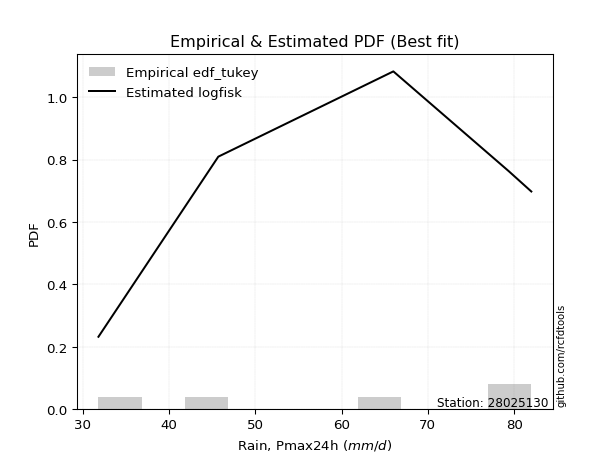</img>

</div>


### 8. EDF Gringorten (1963)

Gringorten plotting position formula is essential for estimating the probability and return periods of extreme events like floods and heavy rainfall. The constant _a=0.44_.

<div align="center">


$P=(m-a)/(n+1-2a)$


</div>


**8.1. Empirical values**

<div align="center">

|                | 0                   | 1                  | 2              | 3                 | 4                  |
|:---------------|:--------------------|:-------------------|:---------------|:------------------|:-------------------|
| date           | 2020                | 2022               | 2017           | 2019              | 2018               |
| x              | 31.8                | 45.7               | 66.0           | 79.4              | 82.0               |
| m              | 1                   | 2                  | 3              | 4                 | 5                  |
| empirical_dist | edf_gringorten      | edf_gringorten     | edf_gringorten | edf_gringorten    | edf_gringorten     |
| empirical      | 0.10937500000000001 | 0.3046875          | 0.5            | 0.6953125         | 0.8906249999999999 |
| empirical_tr   | 1.1228070175438596  | 1.4382022471910112 | 2.0            | 3.282051282051282 | 9.142857142857133  |

</div>


**8.2. Kolmogorov-Smirnov fit test (sorted by Δ)**


<div align="center">

|                | 0                   | 1                   | 2                   | 3                   | 4                   | 5                  | 6                  | 7                  | 8                   | 9                   | 10                  | 11                  | 12                  | 13                  | 14                  | 15                  | 16                  | 17                  | 18                  | 19                 | 20                 | 21                 | 22                  | 23                  | 24                  | 25                  | 26                 | 27                  | 28                 | 29                  | 30                  | 31                 | 32                  | 33                  | 34                  | 35                  | 36                 | 37                  | 38                  | 39                  | 40                 | 41                  | 42                 | 43                  | 44                  | 45                  | 46                  | 47                  | 48                  | 49                  | 50                  | 51                 | 52                  | 53                  | 54                 | 55                 | 56                  | 57                 | 58                  | 59                 | 60                  | 61                  | 62                  | 63                  | 64                  | 65                  | 66                  | 67                  | 68                  | 69                  | 70                 | 71                  | 72                  | 73                  | 74                  | 75                  | 76                  | 77                  | 78                  | 79                  | 80                 | 81                  | 82                  | 83                  | 84                 | 85                  | 86                 | 87                  | 88                  | 89                  | 90                  | 91                 | 92                 | 93                  | 94                  | 95                  | 96                  | 97                  | 98                  | 99                 | 100                 | 101                 | 102                 | 103                 | 104                 | 105                 | 106                 | 107                | 108                 | 109                | 110                 | 111                | 112                 | 113                | 114                | 115                | 116                | 117                 | 118                | 119                | 120                | 121                | 122                | 123                 | 124                | 125                | 126                 | 127                 | 128                 | 129                 | 130                 | 131                | 132                 | 133                | 134                | 135                | 136                | 137                 | 138                 | 139                | 140                | 141                | 142                | 143                | 144                 | 145                 | 146                 | 147                 | 148                 | 149                | 150                | 151                | 152                | 153                | 154                | 155                | 156                | 157                | 158                | 159                |
|:---------------|:--------------------|:--------------------|:--------------------|:--------------------|:--------------------|:-------------------|:-------------------|:-------------------|:--------------------|:--------------------|:--------------------|:--------------------|:--------------------|:--------------------|:--------------------|:--------------------|:--------------------|:--------------------|:--------------------|:-------------------|:-------------------|:-------------------|:--------------------|:--------------------|:--------------------|:--------------------|:-------------------|:--------------------|:-------------------|:--------------------|:--------------------|:-------------------|:--------------------|:--------------------|:--------------------|:--------------------|:-------------------|:--------------------|:--------------------|:--------------------|:-------------------|:--------------------|:-------------------|:--------------------|:--------------------|:--------------------|:--------------------|:--------------------|:--------------------|:--------------------|:--------------------|:-------------------|:--------------------|:--------------------|:-------------------|:-------------------|:--------------------|:-------------------|:--------------------|:-------------------|:--------------------|:--------------------|:--------------------|:--------------------|:--------------------|:--------------------|:--------------------|:--------------------|:--------------------|:--------------------|:-------------------|:--------------------|:--------------------|:--------------------|:--------------------|:--------------------|:--------------------|:--------------------|:--------------------|:--------------------|:-------------------|:--------------------|:--------------------|:--------------------|:-------------------|:--------------------|:-------------------|:--------------------|:--------------------|:--------------------|:--------------------|:-------------------|:-------------------|:--------------------|:--------------------|:--------------------|:--------------------|:--------------------|:--------------------|:-------------------|:--------------------|:--------------------|:--------------------|:--------------------|:--------------------|:--------------------|:--------------------|:-------------------|:--------------------|:-------------------|:--------------------|:-------------------|:--------------------|:-------------------|:-------------------|:-------------------|:-------------------|:--------------------|:-------------------|:-------------------|:-------------------|:-------------------|:-------------------|:--------------------|:-------------------|:-------------------|:--------------------|:--------------------|:--------------------|:--------------------|:--------------------|:-------------------|:--------------------|:-------------------|:-------------------|:-------------------|:-------------------|:--------------------|:--------------------|:-------------------|:-------------------|:-------------------|:-------------------|:-------------------|:--------------------|:--------------------|:--------------------|:--------------------|:--------------------|:-------------------|:-------------------|:-------------------|:-------------------|:-------------------|:-------------------|:-------------------|:-------------------|:-------------------|:-------------------|:-------------------|
| station        | 28025130            | 28025130            | 28025130            | 28025130            | 28025130            | 28025130           | 28025130           | 28025130           | 28025130            | 28025130            | 28025130            | 28025130            | 28025130            | 28025130            | 28025130            | 28025130            | 28025130            | 28025130            | 28025130            | 28025130           | 28025130           | 28025130           | 28025130            | 28025130            | 28025130            | 28025130            | 28025130           | 28025130            | 28025130           | 28025130            | 28025130            | 28025130           | 28025130            | 28025130            | 28025130            | 28025130            | 28025130           | 28025130            | 28025130            | 28025130            | 28025130           | 28025130            | 28025130           | 28025130            | 28025130            | 28025130            | 28025130            | 28025130            | 28025130            | 28025130            | 28025130            | 28025130           | 28025130            | 28025130            | 28025130           | 28025130           | 28025130            | 28025130           | 28025130            | 28025130           | 28025130            | 28025130            | 28025130            | 28025130            | 28025130            | 28025130            | 28025130            | 28025130            | 28025130            | 28025130            | 28025130           | 28025130            | 28025130            | 28025130            | 28025130            | 28025130            | 28025130            | 28025130            | 28025130            | 28025130            | 28025130           | 28025130            | 28025130            | 28025130            | 28025130           | 28025130            | 28025130           | 28025130            | 28025130            | 28025130            | 28025130            | 28025130           | 28025130           | 28025130            | 28025130            | 28025130            | 28025130            | 28025130            | 28025130            | 28025130           | 28025130            | 28025130            | 28025130            | 28025130            | 28025130            | 28025130            | 28025130            | 28025130           | 28025130            | 28025130           | 28025130            | 28025130           | 28025130            | 28025130           | 28025130           | 28025130           | 28025130           | 28025130            | 28025130           | 28025130           | 28025130           | 28025130           | 28025130           | 28025130            | 28025130           | 28025130           | 28025130            | 28025130            | 28025130            | 28025130            | 28025130            | 28025130           | 28025130            | 28025130           | 28025130           | 28025130           | 28025130           | 28025130            | 28025130            | 28025130           | 28025130           | 28025130           | 28025130           | 28025130           | 28025130            | 28025130            | 28025130            | 28025130            | 28025130            | 28025130           | 28025130           | 28025130           | 28025130           | 28025130           | 28025130           | 28025130           | 28025130           | 28025130           | 28025130           | 28025130           |
| empirical_dist | edf_gringorten      | edf_gringorten      | edf_gringorten      | edf_gringorten      | edf_gringorten      | edf_gringorten     | edf_gringorten     | edf_gringorten     | edf_gringorten      | edf_gringorten      | edf_gringorten      | edf_gringorten      | edf_gringorten      | edf_gringorten      | edf_gringorten      | edf_gringorten      | edf_gringorten      | edf_gringorten      | edf_gringorten      | edf_gringorten     | edf_gringorten     | edf_gringorten     | edf_gringorten      | edf_gringorten      | edf_gringorten      | edf_gringorten      | edf_gringorten     | edf_gringorten      | edf_gringorten     | edf_gringorten      | edf_gringorten      | edf_gringorten     | edf_gringorten      | edf_gringorten      | edf_gringorten      | edf_gringorten      | edf_gringorten     | edf_gringorten      | edf_gringorten      | edf_gringorten      | edf_gringorten     | edf_gringorten      | edf_gringorten     | edf_gringorten      | edf_gringorten      | edf_gringorten      | edf_gringorten      | edf_gringorten      | edf_gringorten      | edf_gringorten      | edf_gringorten      | edf_gringorten     | edf_gringorten      | edf_gringorten      | edf_gringorten     | edf_gringorten     | edf_gringorten      | edf_gringorten     | edf_gringorten      | edf_gringorten     | edf_gringorten      | edf_gringorten      | edf_gringorten      | edf_gringorten      | edf_gringorten      | edf_gringorten      | edf_gringorten      | edf_gringorten      | edf_gringorten      | edf_gringorten      | edf_gringorten     | edf_gringorten      | edf_gringorten      | edf_gringorten      | edf_gringorten      | edf_gringorten      | edf_gringorten      | edf_gringorten      | edf_gringorten      | edf_gringorten      | edf_gringorten     | edf_gringorten      | edf_gringorten      | edf_gringorten      | edf_gringorten     | edf_gringorten      | edf_gringorten     | edf_gringorten      | edf_gringorten      | edf_gringorten      | edf_gringorten      | edf_gringorten     | edf_gringorten     | edf_gringorten      | edf_gringorten      | edf_gringorten      | edf_gringorten      | edf_gringorten      | edf_gringorten      | edf_gringorten     | edf_gringorten      | edf_gringorten      | edf_gringorten      | edf_gringorten      | edf_gringorten      | edf_gringorten      | edf_gringorten      | edf_gringorten     | edf_gringorten      | edf_gringorten     | edf_gringorten      | edf_gringorten     | edf_gringorten      | edf_gringorten     | edf_gringorten     | edf_gringorten     | edf_gringorten     | edf_gringorten      | edf_gringorten     | edf_gringorten     | edf_gringorten     | edf_gringorten     | edf_gringorten     | edf_gringorten      | edf_gringorten     | edf_gringorten     | edf_gringorten      | edf_gringorten      | edf_gringorten      | edf_gringorten      | edf_gringorten      | edf_gringorten     | edf_gringorten      | edf_gringorten     | edf_gringorten     | edf_gringorten     | edf_gringorten     | edf_gringorten      | edf_gringorten      | edf_gringorten     | edf_gringorten     | edf_gringorten     | edf_gringorten     | edf_gringorten     | edf_gringorten      | edf_gringorten      | edf_gringorten      | edf_gringorten      | edf_gringorten      | edf_gringorten     | edf_gringorten     | edf_gringorten     | edf_gringorten     | edf_gringorten     | edf_gringorten     | edf_gringorten     | edf_gringorten     | edf_gringorten     | edf_gringorten     | edf_gringorten     |
| p_dist         | ksone               | logtrapezoid        | semicircular        | trapezoid           | anglit              | logbeta            | beta               | logksone           | arcsine             | logpearson3         | logweibull_max      | betaprime           | logsemicircular     | genextreme          | logdgamma           | genpareto           | alpha               | invgamma            | loganglit           | rice               | erlang             | gamma              | f                   | maxwell             | pearson3            | nct                 | t                  | exponnorm           | norm               | crystalball         | loggenextreme       | loggumbel_l        | loggompertz         | rayleigh            | logburr12           | logweibull_min      | invgauss           | logncf              | logbetaprime        | logdweibull         | gompertz           | weibull_min         | logarcsine         | logf                | logt                | logcrystalball      | lognorm             | logexponnorm        | lognct              | logfatiguelife      | logistic            | logfoldnorm        | loggamma            | loggamma            | wrapcauchy         | gumbel_l           | cosine              | logerlang          | logloglaplace       | logrice            | kstwobign           | dweibull            | halfnorm            | loginvgauss         | logalpha            | loginvgamma         | hypsecant           | levy_l              | loglogistic         | gumbel_r            | loginvweibull      | loglevy_l           | dgamma              | logmaxwell          | laplace             | logexponpow         | lograyleigh         | logcosine           | loghypsecant        | argus               | loggenpareto       | burr                | logkstwobign        | halflogistic        | johnsonsb          | loggenexpon         | lomax              | genexpon            | moyal               | logargus            | truncnorm           | gennorm            | loggennorm         | loghalfnorm         | logwrapcauchy       | loglomax            | burr12              | loggenhalflogistic  | genhalflogistic     | loggumbel_r        | loglaplace          | loglaplace          | logexponweib        | logmielke           | halfgennorm         | mielke              | logburr             | logloggamma        | triang              | loghalflogistic    | logmoyal            | skewnorm           | loggausshyper       | gausshyper         | tukeylambda        | kappa4             | logtriang          | kappa3              | uniform            | vonmises_line      | wald               | logskewnorm        | logkappa4          | logtukeylambda      | loghalfgennorm     | bradford           | truncexpon          | truncweibull_min    | logkappa3           | loguniform          | loggengamma         | logjohnsonsb       | logwald             | ncf                | lognakagami        | nakagami           | foldnorm           | logvonmises_line    | logtruncweibull_min | gengamma           | logbradford        | logtruncnorm       | logrdist           | logtruncexpon      | exponweib           | johnsonsu           | weibull_max         | invweibull          | fatiguelife         | logjohnsonsu       | powerlaw           | truncpareto        | logpowerlaw        | logtruncpareto     | exponpow           | rdist              | genlogistic        | loggenlogistic     | logvonmises        | vonmises           |
| delta          | 0.07862955228751078 | 0.08232130571341534 | 0.09447812909595399 | 0.09660996536379285 | 0.10628518092107875 | 0.1093535812300922 | 0.1093691069600582 | 0.1111907122187008 | 0.11374451315954426 | 0.11903960670180258 | 0.11904056751745862 | 0.11944377747677082 | 0.12184312392934937 | 0.12357032252978012 | 0.12857349450017352 | 0.12910058934884483 | 0.12931396301460008 | 0.12997127630678418 | 0.13014967129290567 | 0.1310605104081607 | 0.1311643254599255 | 0.1317898042994895 | 0.13185665547433878 | 0.13207547412828446 | 0.13258410114182773 | 0.13284328250934074 | 0.1328836063633736 | 0.13289343252398034 | 0.1328935642420337 | 0.13289356584401935 | 0.13322073551225944 | 0.1349444186024984 | 0.13542142485987463 | 0.13637416927264856 | 0.13640621474400438 | 0.13800912223229134 | 0.1383513205264406 | 0.13864568493016538 | 0.13928712916960317 | 0.13937831083154698 | 0.141329990762891  | 0.14136691040401783 | 0.145075770099222  | 0.14963653795672527 | 0.14994232952789943 | 0.14994645618397007 | 0.14994646080663165 | 0.14995054348613412 | 0.15079229630181556 | 0.15197135858533972 | 0.15253909371013774 | 0.1526834631645515 | 0.15296645922989283 | 0.15296645922989283 | 0.1537071822490666 | 0.1538755091546119 | 0.15533854352529897 | 0.1559961564364617 | 0.15674541966835578 | 0.1581403860770354 | 0.15841251596398753 | 0.15841706544051548 | 0.15965190235910853 | 0.16120760299294234 | 0.16153296569809228 | 0.16244264906094819 | 0.16325433284165647 | 0.16657188930917344 | 0.16788436577863686 | 0.16816117876667747 | 0.1696822391493773 | 0.16999550761526372 | 0.17019085936925182 | 0.17158760819731977 | 0.17368628953938925 | 0.17581051851594032 | 0.17809581741608427 | 0.17980523132269788 | 0.18181076046199862 | 0.18294798383984967 | 0.1874655578062433 | 0.18755347743236217 | 0.18789147079940993 | 0.18797283015579314 | 0.1891748087693626 | 0.19019392126230927 | 0.1905505180465331 | 0.19057300046322423 | 0.19079725759579436 | 0.19292968404103572 | 0.19355822404280054 | 0.1953125          | 0.1953125          | 0.19701964970002273 | 0.19911316861837258 | 0.20589733405045296 | 0.20793707171811127 | 0.20850776802026982 | 0.20978384517048576 | 0.2099297338795345 | 0.20999821437844668 | 0.20999821437844668 | 0.21045881976821879 | 0.21088921514085612 | 0.21123308586872602 | 0.21323462597107334 | 0.21404729696825198 | 0.2178624141725901 | 0.22242152600308185 | 0.2251434044653764 | 0.22978126568890134 | 0.2323551636329756 | 0.24234759618559154 | 0.2438085471146636 | 0.2448655918391509 | 0.2459886893412585 | 0.2515485456059501 | 0.25219209644705287 | 0.2528946713147412 | 0.2531984091506061 | 0.2539068138512618 | 0.2540521062378277 | 0.2601866397837419 | 0.26299098985013103 | 0.2654729655211693 | 0.2683057607673355 | 0.26873773841234627 | 0.26915839629634253 | 0.26947443920499103 | 0.27084842699702893 | 0.28248432736757656 | 0.2829230596395529 | 0.28603817892974115 | 0.3027680079348367 | 0.3046868816202572 | 0.30468746457239   | 0.3046875          | 0.30574256395529564 | 0.32023430514913587 | 0.3218811832968467 | 0.3273890129583663 | 0.3296694412288531 | 0.3406680291944538 | 0.3411570646673058 | 0.34425981197757216 | 0.35066195187107424 | 0.38874087293183834 | 0.46093869402715265 | 0.47175050575125743 | 0.5137271699810674 | 0.543189170611425  | 0.5590873954342734 | 0.5722265121537983 | 0.5940575624712927 | 0.594105394715472  | 0.6953124999940522 | 0.6953125          | 0.6953125          | 1.1464591248391054 | 12.369801505187684 |
| deltao         | 0.5865427407550001  | 0.5865427407550001  | 0.5865427407550001  | 0.5865427407550001  | 0.5865427407550001  | 0.5865427407550001 | 0.5865427407550001 | 0.5865427407550001 | 0.5865427407550001  | 0.5865427407550001  | 0.5865427407550001  | 0.5865427407550001  | 0.5865427407550001  | 0.5865427407550001  | 0.5865427407550001  | 0.5865427407550001  | 0.5865427407550001  | 0.5865427407550001  | 0.5865427407550001  | 0.5865427407550001 | 0.5865427407550001 | 0.5865427407550001 | 0.5865427407550001  | 0.5865427407550001  | 0.5865427407550001  | 0.5865427407550001  | 0.5865427407550001 | 0.5865427407550001  | 0.5865427407550001 | 0.5865427407550001  | 0.5865427407550001  | 0.5865427407550001 | 0.5865427407550001  | 0.5865427407550001  | 0.5865427407550001  | 0.5865427407550001  | 0.5865427407550001 | 0.5865427407550001  | 0.5865427407550001  | 0.5865427407550001  | 0.5865427407550001 | 0.5865427407550001  | 0.5865427407550001 | 0.5865427407550001  | 0.5865427407550001  | 0.5865427407550001  | 0.5865427407550001  | 0.5865427407550001  | 0.5865427407550001  | 0.5865427407550001  | 0.5865427407550001  | 0.5865427407550001 | 0.5865427407550001  | 0.5865427407550001  | 0.5865427407550001 | 0.5865427407550001 | 0.5865427407550001  | 0.5865427407550001 | 0.5865427407550001  | 0.5865427407550001 | 0.5865427407550001  | 0.5865427407550001  | 0.5865427407550001  | 0.5865427407550001  | 0.5865427407550001  | 0.5865427407550001  | 0.5865427407550001  | 0.5865427407550001  | 0.5865427407550001  | 0.5865427407550001  | 0.5865427407550001 | 0.5865427407550001  | 0.5865427407550001  | 0.5865427407550001  | 0.5865427407550001  | 0.5865427407550001  | 0.5865427407550001  | 0.5865427407550001  | 0.5865427407550001  | 0.5865427407550001  | 0.5865427407550001 | 0.5865427407550001  | 0.5865427407550001  | 0.5865427407550001  | 0.5865427407550001 | 0.5865427407550001  | 0.5865427407550001 | 0.5865427407550001  | 0.5865427407550001  | 0.5865427407550001  | 0.5865427407550001  | 0.5865427407550001 | 0.5865427407550001 | 0.5865427407550001  | 0.5865427407550001  | 0.5865427407550001  | 0.5865427407550001  | 0.5865427407550001  | 0.5865427407550001  | 0.5865427407550001 | 0.5865427407550001  | 0.5865427407550001  | 0.5865427407550001  | 0.5865427407550001  | 0.5865427407550001  | 0.5865427407550001  | 0.5865427407550001  | 0.5865427407550001 | 0.5865427407550001  | 0.5865427407550001 | 0.5865427407550001  | 0.5865427407550001 | 0.5865427407550001  | 0.5865427407550001 | 0.5865427407550001 | 0.5865427407550001 | 0.5865427407550001 | 0.5865427407550001  | 0.5865427407550001 | 0.5865427407550001 | 0.5865427407550001 | 0.5865427407550001 | 0.5865427407550001 | 0.5865427407550001  | 0.5865427407550001 | 0.5865427407550001 | 0.5865427407550001  | 0.5865427407550001  | 0.5865427407550001  | 0.5865427407550001  | 0.5865427407550001  | 0.5865427407550001 | 0.5865427407550001  | 0.5865427407550001 | 0.5865427407550001 | 0.5865427407550001 | 0.5865427407550001 | 0.5865427407550001  | 0.5865427407550001  | 0.5865427407550001 | 0.5865427407550001 | 0.5865427407550001 | 0.5865427407550001 | 0.5865427407550001 | 0.5865427407550001  | 0.5865427407550001  | 0.5865427407550001  | 0.5865427407550001  | 0.5865427407550001  | 0.5865427407550001 | 0.5865427407550001 | 0.5865427407550001 | 0.5865427407550001 | 0.5865427407550001 | 0.5865427407550001 | 0.5865427407550001 | 0.5865427407550001 | 0.5865427407550001 | 0.5865427407550001 | 0.5865427407550001 |
| eval           | Δo > Δ              | Δo > Δ              | Δo > Δ              | Δo > Δ              | Δo > Δ              | Δo > Δ             | Δo > Δ             | Δo > Δ             | Δo > Δ              | Δo > Δ              | Δo > Δ              | Δo > Δ              | Δo > Δ              | Δo > Δ              | Δo > Δ              | Δo > Δ              | Δo > Δ              | Δo > Δ              | Δo > Δ              | Δo > Δ             | Δo > Δ             | Δo > Δ             | Δo > Δ              | Δo > Δ              | Δo > Δ              | Δo > Δ              | Δo > Δ             | Δo > Δ              | Δo > Δ             | Δo > Δ              | Δo > Δ              | Δo > Δ             | Δo > Δ              | Δo > Δ              | Δo > Δ              | Δo > Δ              | Δo > Δ             | Δo > Δ              | Δo > Δ              | Δo > Δ              | Δo > Δ             | Δo > Δ              | Δo > Δ             | Δo > Δ              | Δo > Δ              | Δo > Δ              | Δo > Δ              | Δo > Δ              | Δo > Δ              | Δo > Δ              | Δo > Δ              | Δo > Δ             | Δo > Δ              | Δo > Δ              | Δo > Δ             | Δo > Δ             | Δo > Δ              | Δo > Δ             | Δo > Δ              | Δo > Δ             | Δo > Δ              | Δo > Δ              | Δo > Δ              | Δo > Δ              | Δo > Δ              | Δo > Δ              | Δo > Δ              | Δo > Δ              | Δo > Δ              | Δo > Δ              | Δo > Δ             | Δo > Δ              | Δo > Δ              | Δo > Δ              | Δo > Δ              | Δo > Δ              | Δo > Δ              | Δo > Δ              | Δo > Δ              | Δo > Δ              | Δo > Δ             | Δo > Δ              | Δo > Δ              | Δo > Δ              | Δo > Δ             | Δo > Δ              | Δo > Δ             | Δo > Δ              | Δo > Δ              | Δo > Δ              | Δo > Δ              | Δo > Δ             | Δo > Δ             | Δo > Δ              | Δo > Δ              | Δo > Δ              | Δo > Δ              | Δo > Δ              | Δo > Δ              | Δo > Δ             | Δo > Δ              | Δo > Δ              | Δo > Δ              | Δo > Δ              | Δo > Δ              | Δo > Δ              | Δo > Δ              | Δo > Δ             | Δo > Δ              | Δo > Δ             | Δo > Δ              | Δo > Δ             | Δo > Δ              | Δo > Δ             | Δo > Δ             | Δo > Δ             | Δo > Δ             | Δo > Δ              | Δo > Δ             | Δo > Δ             | Δo > Δ             | Δo > Δ             | Δo > Δ             | Δo > Δ              | Δo > Δ             | Δo > Δ             | Δo > Δ              | Δo > Δ              | Δo > Δ              | Δo > Δ              | Δo > Δ              | Δo > Δ             | Δo > Δ              | Δo > Δ             | Δo > Δ             | Δo > Δ             | Δo > Δ             | Δo > Δ              | Δo > Δ              | Δo > Δ             | Δo > Δ             | Δo > Δ             | Δo > Δ             | Δo > Δ             | Δo > Δ              | Δo > Δ              | Δo > Δ              | Δo > Δ              | Δo > Δ              | Δo > Δ             | Δo > Δ             | Δo > Δ             | Δo > Δ             | Δo <= Δ            | Δo <= Δ            | Δo <= Δ            | Δo <= Δ            | Δo <= Δ            | Δo <= Δ            | Δo <= Δ            |
| fit            | 1                   | 1                   | 1                   | 1                   | 1                   | 1                  | 1                  | 1                  | 1                   | 1                   | 1                   | 1                   | 1                   | 1                   | 1                   | 1                   | 1                   | 1                   | 1                   | 1                  | 1                  | 1                  | 1                   | 1                   | 1                   | 1                   | 1                  | 1                   | 1                  | 1                   | 1                   | 1                  | 1                   | 1                   | 1                   | 1                   | 1                  | 1                   | 1                   | 1                   | 1                  | 1                   | 1                  | 1                   | 1                   | 1                   | 1                   | 1                   | 1                   | 1                   | 1                   | 1                  | 1                   | 1                   | 1                  | 1                  | 1                   | 1                  | 1                   | 1                  | 1                   | 1                   | 1                   | 1                   | 1                   | 1                   | 1                   | 1                   | 1                   | 1                   | 1                  | 1                   | 1                   | 1                   | 1                   | 1                   | 1                   | 1                   | 1                   | 1                   | 1                  | 1                   | 1                   | 1                   | 1                  | 1                   | 1                  | 1                   | 1                   | 1                   | 1                   | 1                  | 1                  | 1                   | 1                   | 1                   | 1                   | 1                   | 1                   | 1                  | 1                   | 1                   | 1                   | 1                   | 1                   | 1                   | 1                   | 1                  | 1                   | 1                  | 1                   | 1                  | 1                   | 1                  | 1                  | 1                  | 1                  | 1                   | 1                  | 1                  | 1                  | 1                  | 1                  | 1                   | 1                  | 1                  | 1                   | 1                   | 1                   | 1                   | 1                   | 1                  | 1                   | 1                  | 1                  | 1                  | 1                  | 1                   | 1                   | 1                  | 1                  | 1                  | 1                  | 1                  | 1                   | 1                   | 1                   | 1                   | 1                   | 1                  | 1                  | 1                  | 1                  | 0                  | 0                  | 0                  | 0                  | 0                  | 0                  | 0                  |
| n              | 5                   | 5                   | 5                   | 5                   | 5                   | 5                  | 5                  | 5                  | 5                   | 5                   | 5                   | 5                   | 5                   | 5                   | 5                   | 5                   | 5                   | 5                   | 5                   | 5                  | 5                  | 5                  | 5                   | 5                   | 5                   | 5                   | 5                  | 5                   | 5                  | 5                   | 5                   | 5                  | 5                   | 5                   | 5                   | 5                   | 5                  | 5                   | 5                   | 5                   | 5                  | 5                   | 5                  | 5                   | 5                   | 5                   | 5                   | 5                   | 5                   | 5                   | 5                   | 5                  | 5                   | 5                   | 5                  | 5                  | 5                   | 5                  | 5                   | 5                  | 5                   | 5                   | 5                   | 5                   | 5                   | 5                   | 5                   | 5                   | 5                   | 5                   | 5                  | 5                   | 5                   | 5                   | 5                   | 5                   | 5                   | 5                   | 5                   | 5                   | 5                  | 5                   | 5                   | 5                   | 5                  | 5                   | 5                  | 5                   | 5                   | 5                   | 5                   | 5                  | 5                  | 5                   | 5                   | 5                   | 5                   | 5                   | 5                   | 5                  | 5                   | 5                   | 5                   | 5                   | 5                   | 5                   | 5                   | 5                  | 5                   | 5                  | 5                   | 5                  | 5                   | 5                  | 5                  | 5                  | 5                  | 5                   | 5                  | 5                  | 5                  | 5                  | 5                  | 5                   | 5                  | 5                  | 5                   | 5                   | 5                   | 5                   | 5                   | 5                  | 5                   | 5                  | 5                  | 5                  | 5                  | 5                   | 5                   | 5                  | 5                  | 5                  | 5                  | 5                  | 5                   | 5                   | 5                   | 5                   | 5                   | 5                  | 5                  | 5                  | 5                  | 5                  | 5                  | 5                  | 5                  | 5                  | 5                  | 5                  |
| best_fit       | 1                   | 0                   | 0                   | 0                   | 0                   | 0                  | 0                  | 0                  | 0                   | 0                   | 0                   | 0                   | 0                   | 0                   | 0                   | 0                   | 0                   | 0                   | 0                   | 0                  | 0                  | 0                  | 0                   | 0                   | 0                   | 0                   | 0                  | 0                   | 0                  | 0                   | 0                   | 0                  | 0                   | 0                   | 0                   | 0                   | 0                  | 0                   | 0                   | 0                   | 0                  | 0                   | 0                  | 0                   | 0                   | 0                   | 0                   | 0                   | 0                   | 0                   | 0                   | 0                  | 0                   | 0                   | 0                  | 0                  | 0                   | 0                  | 0                   | 0                  | 0                   | 0                   | 0                   | 0                   | 0                   | 0                   | 0                   | 0                   | 0                   | 0                   | 0                  | 0                   | 0                   | 0                   | 0                   | 0                   | 0                   | 0                   | 0                   | 0                   | 0                  | 0                   | 0                   | 0                   | 0                  | 0                   | 0                  | 0                   | 0                   | 0                   | 0                   | 0                  | 0                  | 0                   | 0                   | 0                   | 0                   | 0                   | 0                   | 0                  | 0                   | 0                   | 0                   | 0                   | 0                   | 0                   | 0                   | 0                  | 0                   | 0                  | 0                   | 0                  | 0                   | 0                  | 0                  | 0                  | 0                  | 0                   | 0                  | 0                  | 0                  | 0                  | 0                  | 0                   | 0                  | 0                  | 0                   | 0                   | 0                   | 0                   | 0                   | 0                  | 0                   | 0                  | 0                  | 0                  | 0                  | 0                   | 0                   | 0                  | 0                  | 0                  | 0                  | 0                  | 0                   | 0                   | 0                   | 0                   | 0                   | 0                  | 0                  | 0                  | 0                  | 0                  | 0                  | 0                  | 0                  | 0                  | 0                  | 0                  |
| best_fit_sort  | 1                   | 2                   | 3                   | 4                   | 5                   | 6                  | 7                  | 8                  | 9                   | 10                  | 11                  | 12                  | 13                  | 14                  | 15                  | 16                  | 17                  | 18                  | 19                  | 20                 | 21                 | 22                 | 23                  | 24                  | 25                  | 26                  | 27                 | 28                  | 29                 | 30                  | 31                  | 32                 | 33                  | 34                  | 35                  | 36                  | 37                 | 38                  | 39                  | 40                  | 41                 | 42                  | 43                 | 44                  | 45                  | 46                  | 47                  | 48                  | 49                  | 50                  | 51                  | 52                 | 53                  | 54                  | 55                 | 56                 | 57                  | 58                 | 59                  | 60                 | 61                  | 62                  | 63                  | 64                  | 65                  | 66                  | 67                  | 68                  | 69                  | 70                  | 71                 | 72                  | 73                  | 74                  | 75                  | 76                  | 77                  | 78                  | 79                  | 80                  | 81                 | 82                  | 83                  | 84                  | 85                 | 86                  | 87                 | 88                  | 89                  | 90                  | 91                  | 92                 | 93                 | 94                  | 95                  | 96                  | 97                  | 98                  | 99                  | 100                | 101                 | 102                 | 103                 | 104                 | 105                 | 106                 | 107                 | 108                | 109                 | 110                | 111                 | 112                | 113                 | 114                | 115                | 116                | 117                | 118                 | 119                | 120                | 121                | 122                | 123                | 124                 | 125                | 126                | 127                 | 128                 | 129                 | 130                 | 131                 | 132                | 133                 | 134                | 135                | 136                | 137                | 138                 | 139                 | 140                | 141                | 142                | 143                | 144                | 145                 | 146                 | 147                 | 148                 | 149                 | 150                | 151                | 152                | 153                | 154                | 155                | 156                | 157                | 158                | 159                | 160                |

</div>


**8.3. Best fit**

<div align="center">

|   id |   station | empirical_dist   | p_dist   |     delta |   deltao | eval   |   fit |   n |   best_fit |   best_fit_sort |
|-----:|----------:|:-----------------|:---------|----------:|---------:|:-------|------:|----:|-----------:|----------------:|
|    0 |  28025130 | edf_gringorten   | ksone    | 0.0786296 | 0.586543 | Δo > Δ |     1 |   5 |          1 |               1 |

</div>


<div align="center">

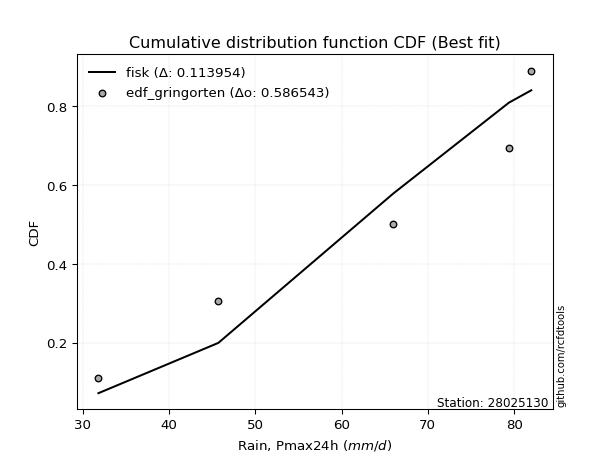</img>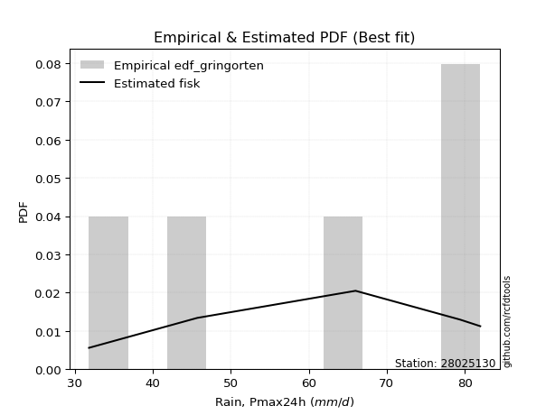</img>

</div>


### 9. EDF Filliben (1975)

The specific values of the constants (0.3175) (often denoted as $alpha$) and (0.365) are derived from a method proposed by James J. Filliben in a 1975 paper. This particular formula is the mean value of the $i$-th order statistic of the normal distribution and is considered a robust and effective plotting position formula for the normal probability plot correlation coefficient test for normality.

<div align="center">


$P=(m-0.3175)/(n+0.365)$


</div>


**9.1. Empirical values**

<div align="center">

|                | 0                   | 1                  | 2            | 3                  | 4                  |
|:---------------|:--------------------|:-------------------|:-------------|:-------------------|:-------------------|
| date           | 2020                | 2022               | 2017         | 2019               | 2018               |
| x              | 31.8                | 45.7               | 66.0         | 79.4               | 82.0               |
| m              | 1                   | 2                  | 3            | 4                  | 5                  |
| empirical_dist | edf_filliben        | edf_filliben       | edf_filliben | edf_filliben       | edf_filliben       |
| empirical      | 0.12721342031686858 | 0.3136067101584343 | 0.5          | 0.6863932898415657 | 0.8727865796831314 |
| empirical_tr   | 1.1457554725040042  | 1.456890699253225  | 2.0          | 3.188707280832095  | 7.860805860805863  |

</div>


**9.2. Kolmogorov-Smirnov fit test (sorted by Δ)**


<div align="center">

|                | 0                   | 1                   | 2                   | 3                   | 4                  | 5                   | 6                   | 7                   | 8                   | 9                   | 10                  | 11                  | 12                  | 13                  | 14                  | 15                  | 16                 | 17                 | 18                  | 19                 | 20                 | 21                 | 22                  | 23                  | 24                  | 25                  | 26                 | 27                  | 28                 | 29                  | 30                  | 31                  | 32                  | 33                  | 34                  | 35                 | 36                  | 37                  | 38                  | 39                  | 40                  | 41                  | 42                  | 43                  | 44                  | 45                  | 46                  | 47                  | 48                  | 49                  | 50                  | 51                 | 52                  | 53                  | 54                 | 55                  | 56                 | 57                  | 58                  | 59                  | 60                  | 61                  | 62                  | 63                  | 64                 | 65                  | 66                  | 67                 | 68                  | 69                  | 70                  | 71                 | 72                  | 73                  | 74                 | 75                 | 76                  | 77                  | 78                  | 79                  | 80                  | 81                  | 82                  | 83                  | 84                  | 85                  | 86                  | 87                 | 88                  | 89                  | 90                 | 91                  | 92                 | 93                  | 94                  | 95                  | 96                  | 97                  | 98                 | 99                  | 100                 | 101                 | 102                 | 103                | 104                 | 105                 | 106                | 107                | 108                 | 109                 | 110                 | 111                 | 112                | 113                 | 114                 | 115                | 116                 | 117                | 118                | 119                | 120                 | 121                 | 122                 | 123                 | 124                 | 125                 | 126                | 127                | 128                 | 129                 | 130                | 131                 | 132                 | 133                 | 134                 | 135                | 136                | 137                 | 138                 | 139                 | 140                | 141                | 142                | 143                | 144                | 145                | 146                | 147                | 148                 | 149                | 150                | 151                | 152                | 153                | 154                | 155                | 156                | 157                | 158                | 159                |
|:---------------|:--------------------|:--------------------|:--------------------|:--------------------|:-------------------|:--------------------|:--------------------|:--------------------|:--------------------|:--------------------|:--------------------|:--------------------|:--------------------|:--------------------|:--------------------|:--------------------|:-------------------|:-------------------|:--------------------|:-------------------|:-------------------|:-------------------|:--------------------|:--------------------|:--------------------|:--------------------|:-------------------|:--------------------|:-------------------|:--------------------|:--------------------|:--------------------|:--------------------|:--------------------|:--------------------|:-------------------|:--------------------|:--------------------|:--------------------|:--------------------|:--------------------|:--------------------|:--------------------|:--------------------|:--------------------|:--------------------|:--------------------|:--------------------|:--------------------|:--------------------|:--------------------|:-------------------|:--------------------|:--------------------|:-------------------|:--------------------|:-------------------|:--------------------|:--------------------|:--------------------|:--------------------|:--------------------|:--------------------|:--------------------|:-------------------|:--------------------|:--------------------|:-------------------|:--------------------|:--------------------|:--------------------|:-------------------|:--------------------|:--------------------|:-------------------|:-------------------|:--------------------|:--------------------|:--------------------|:--------------------|:--------------------|:--------------------|:--------------------|:--------------------|:--------------------|:--------------------|:--------------------|:-------------------|:--------------------|:--------------------|:-------------------|:--------------------|:-------------------|:--------------------|:--------------------|:--------------------|:--------------------|:--------------------|:-------------------|:--------------------|:--------------------|:--------------------|:--------------------|:-------------------|:--------------------|:--------------------|:-------------------|:-------------------|:--------------------|:--------------------|:--------------------|:--------------------|:-------------------|:--------------------|:--------------------|:-------------------|:--------------------|:-------------------|:-------------------|:-------------------|:--------------------|:--------------------|:--------------------|:--------------------|:--------------------|:--------------------|:-------------------|:-------------------|:--------------------|:--------------------|:-------------------|:--------------------|:--------------------|:--------------------|:--------------------|:-------------------|:-------------------|:--------------------|:--------------------|:--------------------|:-------------------|:-------------------|:-------------------|:-------------------|:-------------------|:-------------------|:-------------------|:-------------------|:--------------------|:-------------------|:-------------------|:-------------------|:-------------------|:-------------------|:-------------------|:-------------------|:-------------------|:-------------------|:-------------------|:-------------------|
| station        | 28025130            | 28025130            | 28025130            | 28025130            | 28025130           | 28025130            | 28025130            | 28025130            | 28025130            | 28025130            | 28025130            | 28025130            | 28025130            | 28025130            | 28025130            | 28025130            | 28025130           | 28025130           | 28025130            | 28025130           | 28025130           | 28025130           | 28025130            | 28025130            | 28025130            | 28025130            | 28025130           | 28025130            | 28025130           | 28025130            | 28025130            | 28025130            | 28025130            | 28025130            | 28025130            | 28025130           | 28025130            | 28025130            | 28025130            | 28025130            | 28025130            | 28025130            | 28025130            | 28025130            | 28025130            | 28025130            | 28025130            | 28025130            | 28025130            | 28025130            | 28025130            | 28025130           | 28025130            | 28025130            | 28025130           | 28025130            | 28025130           | 28025130            | 28025130            | 28025130            | 28025130            | 28025130            | 28025130            | 28025130            | 28025130           | 28025130            | 28025130            | 28025130           | 28025130            | 28025130            | 28025130            | 28025130           | 28025130            | 28025130            | 28025130           | 28025130           | 28025130            | 28025130            | 28025130            | 28025130            | 28025130            | 28025130            | 28025130            | 28025130            | 28025130            | 28025130            | 28025130            | 28025130           | 28025130            | 28025130            | 28025130           | 28025130            | 28025130           | 28025130            | 28025130            | 28025130            | 28025130            | 28025130            | 28025130           | 28025130            | 28025130            | 28025130            | 28025130            | 28025130           | 28025130            | 28025130            | 28025130           | 28025130           | 28025130            | 28025130            | 28025130            | 28025130            | 28025130           | 28025130            | 28025130            | 28025130           | 28025130            | 28025130           | 28025130           | 28025130           | 28025130            | 28025130            | 28025130            | 28025130            | 28025130            | 28025130            | 28025130           | 28025130           | 28025130            | 28025130            | 28025130           | 28025130            | 28025130            | 28025130            | 28025130            | 28025130           | 28025130           | 28025130            | 28025130            | 28025130            | 28025130           | 28025130           | 28025130           | 28025130           | 28025130           | 28025130           | 28025130           | 28025130           | 28025130            | 28025130           | 28025130           | 28025130           | 28025130           | 28025130           | 28025130           | 28025130           | 28025130           | 28025130           | 28025130           | 28025130           |
| empirical_dist | edf_filliben        | edf_filliben        | edf_filliben        | edf_filliben        | edf_filliben       | edf_filliben        | edf_filliben        | edf_filliben        | edf_filliben        | edf_filliben        | edf_filliben        | edf_filliben        | edf_filliben        | edf_filliben        | edf_filliben        | edf_filliben        | edf_filliben       | edf_filliben       | edf_filliben        | edf_filliben       | edf_filliben       | edf_filliben       | edf_filliben        | edf_filliben        | edf_filliben        | edf_filliben        | edf_filliben       | edf_filliben        | edf_filliben       | edf_filliben        | edf_filliben        | edf_filliben        | edf_filliben        | edf_filliben        | edf_filliben        | edf_filliben       | edf_filliben        | edf_filliben        | edf_filliben        | edf_filliben        | edf_filliben        | edf_filliben        | edf_filliben        | edf_filliben        | edf_filliben        | edf_filliben        | edf_filliben        | edf_filliben        | edf_filliben        | edf_filliben        | edf_filliben        | edf_filliben       | edf_filliben        | edf_filliben        | edf_filliben       | edf_filliben        | edf_filliben       | edf_filliben        | edf_filliben        | edf_filliben        | edf_filliben        | edf_filliben        | edf_filliben        | edf_filliben        | edf_filliben       | edf_filliben        | edf_filliben        | edf_filliben       | edf_filliben        | edf_filliben        | edf_filliben        | edf_filliben       | edf_filliben        | edf_filliben        | edf_filliben       | edf_filliben       | edf_filliben        | edf_filliben        | edf_filliben        | edf_filliben        | edf_filliben        | edf_filliben        | edf_filliben        | edf_filliben        | edf_filliben        | edf_filliben        | edf_filliben        | edf_filliben       | edf_filliben        | edf_filliben        | edf_filliben       | edf_filliben        | edf_filliben       | edf_filliben        | edf_filliben        | edf_filliben        | edf_filliben        | edf_filliben        | edf_filliben       | edf_filliben        | edf_filliben        | edf_filliben        | edf_filliben        | edf_filliben       | edf_filliben        | edf_filliben        | edf_filliben       | edf_filliben       | edf_filliben        | edf_filliben        | edf_filliben        | edf_filliben        | edf_filliben       | edf_filliben        | edf_filliben        | edf_filliben       | edf_filliben        | edf_filliben       | edf_filliben       | edf_filliben       | edf_filliben        | edf_filliben        | edf_filliben        | edf_filliben        | edf_filliben        | edf_filliben        | edf_filliben       | edf_filliben       | edf_filliben        | edf_filliben        | edf_filliben       | edf_filliben        | edf_filliben        | edf_filliben        | edf_filliben        | edf_filliben       | edf_filliben       | edf_filliben        | edf_filliben        | edf_filliben        | edf_filliben       | edf_filliben       | edf_filliben       | edf_filliben       | edf_filliben       | edf_filliben       | edf_filliben       | edf_filliben       | edf_filliben        | edf_filliben       | edf_filliben       | edf_filliben       | edf_filliben       | edf_filliben       | edf_filliben       | edf_filliben       | edf_filliben       | edf_filliben       | edf_filliben       | edf_filliben       |
| p_dist         | logtrapezoid        | ksone               | semicircular        | trapezoid           | logksone           | anglit              | logncf              | logsemicircular     | logpearson3         | logbeta             | beta                | arcsine             | logarcsine          | logweibull_max      | betaprime           | loganglit           | logdgamma          | genextreme         | genpareto           | alpha              | invgauss           | invgamma           | logbetaprime        | rice                | erlang              | gamma               | f                  | rayleigh            | maxwell            | pearson3            | nct                 | t                   | exponnorm           | norm                | crystalball         | loggenextreme      | loggumbel_l         | loggompertz         | wrapcauchy          | logburr12           | logweibull_min      | logdweibull         | logf                | logt                | logcrystalball      | lognorm             | logexponnorm        | gompertz            | weibull_min         | lognct              | logfatiguelife      | logfoldnorm        | loggamma            | loggamma            | logerlang          | logexponpow         | logrice            | kstwobign           | halfnorm            | loginvgauss         | logistic            | logalpha            | loginvgamma         | gumbel_l            | cosine             | logloglaplace       | levy_l              | dweibull           | loglogistic         | gumbel_r            | loggenpareto        | loginvweibull      | loglevy_l           | logmaxwell          | hypsecant          | truncnorm          | lograyleigh         | dgamma              | logcosine           | johnsonsb           | loghypsecant        | laplace             | loggennorm          | gennorm             | logkstwobign        | halflogistic        | loggenexpon         | lomax              | genexpon            | moyal               | argus              | logexponweib        | burr               | loghalfnorm         | logargus            | loglomax            | burr12              | logwrapcauchy       | loggumbel_r        | loglaplace          | loglaplace          | halfgennorm         | loggenhalflogistic  | genhalflogistic    | logmielke           | mielke              | logburr            | loghalflogistic    | logloggamma         | logmoyal            | triang              | skewnorm            | loggausshyper      | gausshyper          | tukeylambda         | wald               | kappa4              | logtriang          | kappa3             | uniform            | vonmises_line       | logskewnorm         | logjohnsonsb        | logkappa4           | logtukeylambda      | loghalfgennorm      | bradford           | truncexpon         | logkappa3           | truncweibull_min    | loguniform         | loggengamma         | ncf                 | logwald             | logvonmises_line    | gengamma           | lognakagami        | nakagami            | foldnorm            | logtruncweibull_min | logrdist           | logbradford        | logtruncnorm       | exponweib          | logtruncexpon      | johnsonsu          | weibull_max        | invweibull         | fatiguelife         | logjohnsonsu       | powerlaw           | truncpareto        | logpowerlaw        | logtruncpareto     | exponpow           | rdist              | genlogistic        | loggenlogistic     | logvonmises        | vonmises           |
| delta          | 0.08455671771837991 | 0.08701090363436448 | 0.10339733925438832 | 0.10552917552222718 | 0.1111907122187008 | 0.11520439107951308 | 0.12080726461329694 | 0.12184312392934937 | 0.12682877685416138 | 0.12719200154696064 | 0.12720752727692664 | 0.12721342031686858 | 0.12723734978235357 | 0.12795977767589295 | 0.12836298763520515 | 0.13014967129290567 | 0.1302959135995585 | 0.1324895326882144 | 0.13801979950727916 | 0.1382331731730344 | 0.1383513205264406 | 0.1388904864652185 | 0.13928712916960317 | 0.13997972056659502 | 0.14008353561835984 | 0.14070901445792383 | 0.1407758656327731 | 0.14079479831663766 | 0.1409946842867188 | 0.14150331130026206 | 0.14176249266777508 | 0.14180281652180793 | 0.14181264268241467 | 0.14181277440046802 | 0.14181277600245368 | 0.1421399456706937 | 0.14386362876093273 | 0.14434063501830896 | 0.14478797209063232 | 0.14532542490243872 | 0.14692833239072567 | 0.14829752098998125 | 0.14963653795672527 | 0.14994232952789943 | 0.14994645618397007 | 0.14994646080663165 | 0.14995054348613412 | 0.15024920092132532 | 0.15028612056245216 | 0.15079229630181556 | 0.15197135858533972 | 0.1526834631645515 | 0.15296645922989283 | 0.15296645922989283 | 0.1559961564364617 | 0.15797209819907188 | 0.1581403860770354 | 0.15841251596398753 | 0.15965190235910853 | 0.16120760299294234 | 0.16145830386857207 | 0.16153296569809228 | 0.16244264906094819 | 0.16279471931304623 | 0.1642577536837333 | 0.16566462982679006 | 0.16657188930917344 | 0.1673362755989498 | 0.16788436577863686 | 0.16816117876667747 | 0.16962713748937472 | 0.1696822391493773 | 0.16999550761526372 | 0.17158760819731977 | 0.1721735430000908 | 0.1757198037259321 | 0.17809581741608427 | 0.17911006952768616 | 0.17980523132269788 | 0.18025559861092832 | 0.18181076046199862 | 0.18260549969782358 | 0.18639328984156572 | 0.18639328984156572 | 0.18789147079940993 | 0.18797283015579314 | 0.19019392126230927 | 0.1905505180465331 | 0.19057300046322423 | 0.19079725759579436 | 0.191867193998284  | 0.19262039945135034 | 0.1964726875907965 | 0.19701964970002273 | 0.20184889419947005 | 0.20589733405045296 | 0.20793707171811127 | 0.20803237877680691 | 0.2099297338795345 | 0.20999821437844668 | 0.20999821437844668 | 0.21123308586872602 | 0.21742697817870416 | 0.2187030553289201 | 0.21980842529929046 | 0.22215383612950768 | 0.2229665071266863 | 0.2251434044653764 | 0.22678162433102445 | 0.22978126568890134 | 0.23134073616151618 | 0.24127437379140992 | 0.2512668063440259 | 0.25272775727309793 | 0.25378480199758524 | 0.2539068138512618 | 0.25490789949969284 | 0.2604677557643844 | 0.2611113066054872 | 0.2618138814731755 | 0.26211761930904043 | 0.26297131639626203 | 0.26508463932268433 | 0.26910584994217623 | 0.27191020000856536 | 0.27273675248137574 | 0.2772249709257698 | 0.2776569485707806 | 0.27786983054996117 | 0.27807760645477686 | 0.2795916366167851 | 0.28248432736757656 | 0.28492958761796827 | 0.28603817892974115 | 0.30574256395529564 | 0.3129619731384124 | 0.3136060917786915 | 0.31360667473082426 | 0.31360671015843433 | 0.32023430514913587 | 0.3228296088775854 | 0.3273890129583663 | 0.3296694412288531 | 0.3353406018191379 | 0.3411570646673058 | 0.3417427417126399 | 0.379821662773404  | 0.4431002737102842 | 0.46283129559282316 | 0.504807959822633  | 0.5342699604529908 | 0.5501681852758391 | 0.563307301995364  | 0.5851383523128584 | 0.5851861845570376 | 0.686393289835618  | 0.6863932898415657 | 0.6863932898415657 | 1.1464591248391054 | 12.387639925504553 |
| deltao         | 0.5865427407550001  | 0.5865427407550001  | 0.5865427407550001  | 0.5865427407550001  | 0.5865427407550001 | 0.5865427407550001  | 0.5865427407550001  | 0.5865427407550001  | 0.5865427407550001  | 0.5865427407550001  | 0.5865427407550001  | 0.5865427407550001  | 0.5865427407550001  | 0.5865427407550001  | 0.5865427407550001  | 0.5865427407550001  | 0.5865427407550001 | 0.5865427407550001 | 0.5865427407550001  | 0.5865427407550001 | 0.5865427407550001 | 0.5865427407550001 | 0.5865427407550001  | 0.5865427407550001  | 0.5865427407550001  | 0.5865427407550001  | 0.5865427407550001 | 0.5865427407550001  | 0.5865427407550001 | 0.5865427407550001  | 0.5865427407550001  | 0.5865427407550001  | 0.5865427407550001  | 0.5865427407550001  | 0.5865427407550001  | 0.5865427407550001 | 0.5865427407550001  | 0.5865427407550001  | 0.5865427407550001  | 0.5865427407550001  | 0.5865427407550001  | 0.5865427407550001  | 0.5865427407550001  | 0.5865427407550001  | 0.5865427407550001  | 0.5865427407550001  | 0.5865427407550001  | 0.5865427407550001  | 0.5865427407550001  | 0.5865427407550001  | 0.5865427407550001  | 0.5865427407550001 | 0.5865427407550001  | 0.5865427407550001  | 0.5865427407550001 | 0.5865427407550001  | 0.5865427407550001 | 0.5865427407550001  | 0.5865427407550001  | 0.5865427407550001  | 0.5865427407550001  | 0.5865427407550001  | 0.5865427407550001  | 0.5865427407550001  | 0.5865427407550001 | 0.5865427407550001  | 0.5865427407550001  | 0.5865427407550001 | 0.5865427407550001  | 0.5865427407550001  | 0.5865427407550001  | 0.5865427407550001 | 0.5865427407550001  | 0.5865427407550001  | 0.5865427407550001 | 0.5865427407550001 | 0.5865427407550001  | 0.5865427407550001  | 0.5865427407550001  | 0.5865427407550001  | 0.5865427407550001  | 0.5865427407550001  | 0.5865427407550001  | 0.5865427407550001  | 0.5865427407550001  | 0.5865427407550001  | 0.5865427407550001  | 0.5865427407550001 | 0.5865427407550001  | 0.5865427407550001  | 0.5865427407550001 | 0.5865427407550001  | 0.5865427407550001 | 0.5865427407550001  | 0.5865427407550001  | 0.5865427407550001  | 0.5865427407550001  | 0.5865427407550001  | 0.5865427407550001 | 0.5865427407550001  | 0.5865427407550001  | 0.5865427407550001  | 0.5865427407550001  | 0.5865427407550001 | 0.5865427407550001  | 0.5865427407550001  | 0.5865427407550001 | 0.5865427407550001 | 0.5865427407550001  | 0.5865427407550001  | 0.5865427407550001  | 0.5865427407550001  | 0.5865427407550001 | 0.5865427407550001  | 0.5865427407550001  | 0.5865427407550001 | 0.5865427407550001  | 0.5865427407550001 | 0.5865427407550001 | 0.5865427407550001 | 0.5865427407550001  | 0.5865427407550001  | 0.5865427407550001  | 0.5865427407550001  | 0.5865427407550001  | 0.5865427407550001  | 0.5865427407550001 | 0.5865427407550001 | 0.5865427407550001  | 0.5865427407550001  | 0.5865427407550001 | 0.5865427407550001  | 0.5865427407550001  | 0.5865427407550001  | 0.5865427407550001  | 0.5865427407550001 | 0.5865427407550001 | 0.5865427407550001  | 0.5865427407550001  | 0.5865427407550001  | 0.5865427407550001 | 0.5865427407550001 | 0.5865427407550001 | 0.5865427407550001 | 0.5865427407550001 | 0.5865427407550001 | 0.5865427407550001 | 0.5865427407550001 | 0.5865427407550001  | 0.5865427407550001 | 0.5865427407550001 | 0.5865427407550001 | 0.5865427407550001 | 0.5865427407550001 | 0.5865427407550001 | 0.5865427407550001 | 0.5865427407550001 | 0.5865427407550001 | 0.5865427407550001 | 0.5865427407550001 |
| eval           | Δo > Δ              | Δo > Δ              | Δo > Δ              | Δo > Δ              | Δo > Δ             | Δo > Δ              | Δo > Δ              | Δo > Δ              | Δo > Δ              | Δo > Δ              | Δo > Δ              | Δo > Δ              | Δo > Δ              | Δo > Δ              | Δo > Δ              | Δo > Δ              | Δo > Δ             | Δo > Δ             | Δo > Δ              | Δo > Δ             | Δo > Δ             | Δo > Δ             | Δo > Δ              | Δo > Δ              | Δo > Δ              | Δo > Δ              | Δo > Δ             | Δo > Δ              | Δo > Δ             | Δo > Δ              | Δo > Δ              | Δo > Δ              | Δo > Δ              | Δo > Δ              | Δo > Δ              | Δo > Δ             | Δo > Δ              | Δo > Δ              | Δo > Δ              | Δo > Δ              | Δo > Δ              | Δo > Δ              | Δo > Δ              | Δo > Δ              | Δo > Δ              | Δo > Δ              | Δo > Δ              | Δo > Δ              | Δo > Δ              | Δo > Δ              | Δo > Δ              | Δo > Δ             | Δo > Δ              | Δo > Δ              | Δo > Δ             | Δo > Δ              | Δo > Δ             | Δo > Δ              | Δo > Δ              | Δo > Δ              | Δo > Δ              | Δo > Δ              | Δo > Δ              | Δo > Δ              | Δo > Δ             | Δo > Δ              | Δo > Δ              | Δo > Δ             | Δo > Δ              | Δo > Δ              | Δo > Δ              | Δo > Δ             | Δo > Δ              | Δo > Δ              | Δo > Δ             | Δo > Δ             | Δo > Δ              | Δo > Δ              | Δo > Δ              | Δo > Δ              | Δo > Δ              | Δo > Δ              | Δo > Δ              | Δo > Δ              | Δo > Δ              | Δo > Δ              | Δo > Δ              | Δo > Δ             | Δo > Δ              | Δo > Δ              | Δo > Δ             | Δo > Δ              | Δo > Δ             | Δo > Δ              | Δo > Δ              | Δo > Δ              | Δo > Δ              | Δo > Δ              | Δo > Δ             | Δo > Δ              | Δo > Δ              | Δo > Δ              | Δo > Δ              | Δo > Δ             | Δo > Δ              | Δo > Δ              | Δo > Δ             | Δo > Δ             | Δo > Δ              | Δo > Δ              | Δo > Δ              | Δo > Δ              | Δo > Δ             | Δo > Δ              | Δo > Δ              | Δo > Δ             | Δo > Δ              | Δo > Δ             | Δo > Δ             | Δo > Δ             | Δo > Δ              | Δo > Δ              | Δo > Δ              | Δo > Δ              | Δo > Δ              | Δo > Δ              | Δo > Δ             | Δo > Δ             | Δo > Δ              | Δo > Δ              | Δo > Δ             | Δo > Δ              | Δo > Δ              | Δo > Δ              | Δo > Δ              | Δo > Δ             | Δo > Δ             | Δo > Δ              | Δo > Δ              | Δo > Δ              | Δo > Δ             | Δo > Δ             | Δo > Δ             | Δo > Δ             | Δo > Δ             | Δo > Δ             | Δo > Δ             | Δo > Δ             | Δo > Δ              | Δo > Δ             | Δo > Δ             | Δo > Δ             | Δo > Δ             | Δo > Δ             | Δo > Δ             | Δo <= Δ            | Δo <= Δ            | Δo <= Δ            | Δo <= Δ            | Δo <= Δ            |
| fit            | 1                   | 1                   | 1                   | 1                   | 1                  | 1                   | 1                   | 1                   | 1                   | 1                   | 1                   | 1                   | 1                   | 1                   | 1                   | 1                   | 1                  | 1                  | 1                   | 1                  | 1                  | 1                  | 1                   | 1                   | 1                   | 1                   | 1                  | 1                   | 1                  | 1                   | 1                   | 1                   | 1                   | 1                   | 1                   | 1                  | 1                   | 1                   | 1                   | 1                   | 1                   | 1                   | 1                   | 1                   | 1                   | 1                   | 1                   | 1                   | 1                   | 1                   | 1                   | 1                  | 1                   | 1                   | 1                  | 1                   | 1                  | 1                   | 1                   | 1                   | 1                   | 1                   | 1                   | 1                   | 1                  | 1                   | 1                   | 1                  | 1                   | 1                   | 1                   | 1                  | 1                   | 1                   | 1                  | 1                  | 1                   | 1                   | 1                   | 1                   | 1                   | 1                   | 1                   | 1                   | 1                   | 1                   | 1                   | 1                  | 1                   | 1                   | 1                  | 1                   | 1                  | 1                   | 1                   | 1                   | 1                   | 1                   | 1                  | 1                   | 1                   | 1                   | 1                   | 1                  | 1                   | 1                   | 1                  | 1                  | 1                   | 1                   | 1                   | 1                   | 1                  | 1                   | 1                   | 1                  | 1                   | 1                  | 1                  | 1                  | 1                   | 1                   | 1                   | 1                   | 1                   | 1                   | 1                  | 1                  | 1                   | 1                   | 1                  | 1                   | 1                   | 1                   | 1                   | 1                  | 1                  | 1                   | 1                   | 1                   | 1                  | 1                  | 1                  | 1                  | 1                  | 1                  | 1                  | 1                  | 1                   | 1                  | 1                  | 1                  | 1                  | 1                  | 1                  | 0                  | 0                  | 0                  | 0                  | 0                  |
| n              | 5                   | 5                   | 5                   | 5                   | 5                  | 5                   | 5                   | 5                   | 5                   | 5                   | 5                   | 5                   | 5                   | 5                   | 5                   | 5                   | 5                  | 5                  | 5                   | 5                  | 5                  | 5                  | 5                   | 5                   | 5                   | 5                   | 5                  | 5                   | 5                  | 5                   | 5                   | 5                   | 5                   | 5                   | 5                   | 5                  | 5                   | 5                   | 5                   | 5                   | 5                   | 5                   | 5                   | 5                   | 5                   | 5                   | 5                   | 5                   | 5                   | 5                   | 5                   | 5                  | 5                   | 5                   | 5                  | 5                   | 5                  | 5                   | 5                   | 5                   | 5                   | 5                   | 5                   | 5                   | 5                  | 5                   | 5                   | 5                  | 5                   | 5                   | 5                   | 5                  | 5                   | 5                   | 5                  | 5                  | 5                   | 5                   | 5                   | 5                   | 5                   | 5                   | 5                   | 5                   | 5                   | 5                   | 5                   | 5                  | 5                   | 5                   | 5                  | 5                   | 5                  | 5                   | 5                   | 5                   | 5                   | 5                   | 5                  | 5                   | 5                   | 5                   | 5                   | 5                  | 5                   | 5                   | 5                  | 5                  | 5                   | 5                   | 5                   | 5                   | 5                  | 5                   | 5                   | 5                  | 5                   | 5                  | 5                  | 5                  | 5                   | 5                   | 5                   | 5                   | 5                   | 5                   | 5                  | 5                  | 5                   | 5                   | 5                  | 5                   | 5                   | 5                   | 5                   | 5                  | 5                  | 5                   | 5                   | 5                   | 5                  | 5                  | 5                  | 5                  | 5                  | 5                  | 5                  | 5                  | 5                   | 5                  | 5                  | 5                  | 5                  | 5                  | 5                  | 5                  | 5                  | 5                  | 5                  | 5                  |
| best_fit       | 1                   | 0                   | 0                   | 0                   | 0                  | 0                   | 0                   | 0                   | 0                   | 0                   | 0                   | 0                   | 0                   | 0                   | 0                   | 0                   | 0                  | 0                  | 0                   | 0                  | 0                  | 0                  | 0                   | 0                   | 0                   | 0                   | 0                  | 0                   | 0                  | 0                   | 0                   | 0                   | 0                   | 0                   | 0                   | 0                  | 0                   | 0                   | 0                   | 0                   | 0                   | 0                   | 0                   | 0                   | 0                   | 0                   | 0                   | 0                   | 0                   | 0                   | 0                   | 0                  | 0                   | 0                   | 0                  | 0                   | 0                  | 0                   | 0                   | 0                   | 0                   | 0                   | 0                   | 0                   | 0                  | 0                   | 0                   | 0                  | 0                   | 0                   | 0                   | 0                  | 0                   | 0                   | 0                  | 0                  | 0                   | 0                   | 0                   | 0                   | 0                   | 0                   | 0                   | 0                   | 0                   | 0                   | 0                   | 0                  | 0                   | 0                   | 0                  | 0                   | 0                  | 0                   | 0                   | 0                   | 0                   | 0                   | 0                  | 0                   | 0                   | 0                   | 0                   | 0                  | 0                   | 0                   | 0                  | 0                  | 0                   | 0                   | 0                   | 0                   | 0                  | 0                   | 0                   | 0                  | 0                   | 0                  | 0                  | 0                  | 0                   | 0                   | 0                   | 0                   | 0                   | 0                   | 0                  | 0                  | 0                   | 0                   | 0                  | 0                   | 0                   | 0                   | 0                   | 0                  | 0                  | 0                   | 0                   | 0                   | 0                  | 0                  | 0                  | 0                  | 0                  | 0                  | 0                  | 0                  | 0                   | 0                  | 0                  | 0                  | 0                  | 0                  | 0                  | 0                  | 0                  | 0                  | 0                  | 0                  |
| best_fit_sort  | 1                   | 2                   | 3                   | 4                   | 5                  | 6                   | 7                   | 8                   | 9                   | 10                  | 11                  | 12                  | 13                  | 14                  | 15                  | 16                  | 17                 | 18                 | 19                  | 20                 | 21                 | 22                 | 23                  | 24                  | 25                  | 26                  | 27                 | 28                  | 29                 | 30                  | 31                  | 32                  | 33                  | 34                  | 35                  | 36                 | 37                  | 38                  | 39                  | 40                  | 41                  | 42                  | 43                  | 44                  | 45                  | 46                  | 47                  | 48                  | 49                  | 50                  | 51                  | 52                 | 53                  | 54                  | 55                 | 56                  | 57                 | 58                  | 59                  | 60                  | 61                  | 62                  | 63                  | 64                  | 65                 | 66                  | 67                  | 68                 | 69                  | 70                  | 71                  | 72                 | 73                  | 74                  | 75                 | 76                 | 77                  | 78                  | 79                  | 80                  | 81                  | 82                  | 83                  | 84                  | 85                  | 86                  | 87                  | 88                 | 89                  | 90                  | 91                 | 92                  | 93                 | 94                  | 95                  | 96                  | 97                  | 98                  | 99                 | 100                 | 101                 | 102                 | 103                 | 104                | 105                 | 106                 | 107                | 108                | 109                 | 110                 | 111                 | 112                 | 113                | 114                 | 115                 | 116                | 117                 | 118                | 119                | 120                | 121                 | 122                 | 123                 | 124                 | 125                 | 126                 | 127                | 128                | 129                 | 130                 | 131                | 132                 | 133                 | 134                 | 135                 | 136                | 137                | 138                 | 139                 | 140                 | 141                | 142                | 143                | 144                | 145                | 146                | 147                | 148                | 149                 | 150                | 151                | 152                | 153                | 154                | 155                | 156                | 157                | 158                | 159                | 160                |

</div>


**9.3. Best fit**

<div align="center">

|   id |   station | empirical_dist   | p_dist       |     delta |   deltao | eval   |   fit |   n |   best_fit |   best_fit_sort |
|-----:|----------:|:-----------------|:-------------|----------:|---------:|:-------|------:|----:|-----------:|----------------:|
|    0 |  28025130 | edf_filliben     | logtrapezoid | 0.0845567 | 0.586543 | Δo > Δ |     1 |   5 |          1 |               1 |

</div>


<div align="center">

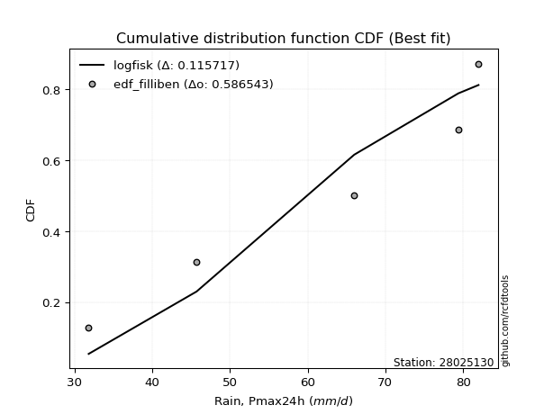</img></img>

</div>


### 10. EDF Jenkinson (1977)

The Jenkinson formula in hydrology is an empirical plotting position formula used to estimate the non-exceedance probability _(P)_ or return period _(T)_ of a given ordered observation within a sample. It is a widely used method in the frequency analysis of extreme events such as floods and rainfall, as it provides a distribution-free way to plot data. _a≈0.31_ and _b≈0.38_ are constants derived to approximate the median of the probability distribution for the given rank.

<div align="center">


$P=(m-a)/(n+b)$


</div>


**10.1. Empirical values**

<div align="center">

|                | 0                   | 1                  | 2             | 3                  | 4                  |
|:---------------|:--------------------|:-------------------|:--------------|:-------------------|:-------------------|
| date           | 2020                | 2022               | 2017          | 2019               | 2018               |
| x              | 31.8                | 45.7               | 66.0          | 79.4               | 82.0               |
| m              | 1                   | 2                  | 3             | 4                  | 5                  |
| empirical_dist | edf_jenkinson       | edf_jenkinson      | edf_jenkinson | edf_jenkinson      | edf_jenkinson      |
| empirical      | 0.12825278810408922 | 0.3141263940520446 | 0.5           | 0.6858736059479554 | 0.8717472118959109 |
| empirical_tr   | 1.1471215351812367  | 1.4579945799457996 | 2.0           | 3.183431952662722  | 7.797101449275368  |

</div>


**10.2. Kolmogorov-Smirnov fit test (sorted by Δ)**


<div align="center">

|                | 0                   | 1                   | 2                   | 3                   | 4                  | 5                   | 6                   | 7                   | 8                   | 9                   | 10                  | 11                  | 12                  | 13                  | 14                  | 15                  | 16                  | 17                  | 18                 | 19                 | 20                  | 21                  | 22                  | 23                  | 24                  | 25                  | 26                  | 27                 | 28                  | 29                 | 30                 | 31                  | 32                 | 33                  | 34                 | 35                  | 36                  | 37                  | 38                 | 39                  | 40                 | 41                 | 42                  | 43                  | 44                  | 45                  | 46                  | 47                  | 48                  | 49                 | 50                  | 51                 | 52                  | 53                  | 54                 | 55                 | 56                 | 57                  | 58                  | 59                  | 60                  | 61                 | 62                  | 63                  | 64                  | 65                 | 66                  | 67                  | 68                  | 69                  | 70                  | 71                 | 72                  | 73                  | 74                  | 75                  | 76                  | 77                 | 78                  | 79                  | 80                  | 81                  | 82                  | 83                  | 84                  | 85                  | 86                  | 87                 | 88                  | 89                  | 90                  | 91                  | 92                  | 93                  | 94                 | 95                  | 96                  | 97                  | 98                 | 99                  | 100                 | 101                 | 102                | 103                 | 104                | 105                | 106                 | 107                | 108                 | 109                 | 110                 | 111                 | 112                | 113                 | 114                | 115                | 116                 | 117                 | 118                 | 119                 | 120                 | 121                 | 122                 | 123                 | 124                | 125                | 126                 | 127                 | 128                | 129                | 130                 | 131                 | 132                | 133                 | 134                 | 135                 | 136                | 137                | 138                | 139                 | 140                | 141                | 142                | 143                 | 144                | 145                | 146                | 147                 | 148                | 149                | 150                | 151                | 152                | 153                | 154                | 155                | 156                | 157                | 158                | 159                |
|:---------------|:--------------------|:--------------------|:--------------------|:--------------------|:-------------------|:--------------------|:--------------------|:--------------------|:--------------------|:--------------------|:--------------------|:--------------------|:--------------------|:--------------------|:--------------------|:--------------------|:--------------------|:--------------------|:-------------------|:-------------------|:--------------------|:--------------------|:--------------------|:--------------------|:--------------------|:--------------------|:--------------------|:-------------------|:--------------------|:-------------------|:-------------------|:--------------------|:-------------------|:--------------------|:-------------------|:--------------------|:--------------------|:--------------------|:-------------------|:--------------------|:-------------------|:-------------------|:--------------------|:--------------------|:--------------------|:--------------------|:--------------------|:--------------------|:--------------------|:-------------------|:--------------------|:-------------------|:--------------------|:--------------------|:-------------------|:-------------------|:-------------------|:--------------------|:--------------------|:--------------------|:--------------------|:-------------------|:--------------------|:--------------------|:--------------------|:-------------------|:--------------------|:--------------------|:--------------------|:--------------------|:--------------------|:-------------------|:--------------------|:--------------------|:--------------------|:--------------------|:--------------------|:-------------------|:--------------------|:--------------------|:--------------------|:--------------------|:--------------------|:--------------------|:--------------------|:--------------------|:--------------------|:-------------------|:--------------------|:--------------------|:--------------------|:--------------------|:--------------------|:--------------------|:-------------------|:--------------------|:--------------------|:--------------------|:-------------------|:--------------------|:--------------------|:--------------------|:-------------------|:--------------------|:-------------------|:-------------------|:--------------------|:-------------------|:--------------------|:--------------------|:--------------------|:--------------------|:-------------------|:--------------------|:-------------------|:-------------------|:--------------------|:--------------------|:--------------------|:--------------------|:--------------------|:--------------------|:--------------------|:--------------------|:-------------------|:-------------------|:--------------------|:--------------------|:-------------------|:-------------------|:--------------------|:--------------------|:-------------------|:--------------------|:--------------------|:--------------------|:-------------------|:-------------------|:-------------------|:--------------------|:-------------------|:-------------------|:-------------------|:--------------------|:-------------------|:-------------------|:-------------------|:--------------------|:-------------------|:-------------------|:-------------------|:-------------------|:-------------------|:-------------------|:-------------------|:-------------------|:-------------------|:-------------------|:-------------------|:-------------------|
| station        | 28025130            | 28025130            | 28025130            | 28025130            | 28025130           | 28025130            | 28025130            | 28025130            | 28025130            | 28025130            | 28025130            | 28025130            | 28025130            | 28025130            | 28025130            | 28025130            | 28025130            | 28025130            | 28025130           | 28025130           | 28025130            | 28025130            | 28025130            | 28025130            | 28025130            | 28025130            | 28025130            | 28025130           | 28025130            | 28025130           | 28025130           | 28025130            | 28025130           | 28025130            | 28025130           | 28025130            | 28025130            | 28025130            | 28025130           | 28025130            | 28025130           | 28025130           | 28025130            | 28025130            | 28025130            | 28025130            | 28025130            | 28025130            | 28025130            | 28025130           | 28025130            | 28025130           | 28025130            | 28025130            | 28025130           | 28025130           | 28025130           | 28025130            | 28025130            | 28025130            | 28025130            | 28025130           | 28025130            | 28025130            | 28025130            | 28025130           | 28025130            | 28025130            | 28025130            | 28025130            | 28025130            | 28025130           | 28025130            | 28025130            | 28025130            | 28025130            | 28025130            | 28025130           | 28025130            | 28025130            | 28025130            | 28025130            | 28025130            | 28025130            | 28025130            | 28025130            | 28025130            | 28025130           | 28025130            | 28025130            | 28025130            | 28025130            | 28025130            | 28025130            | 28025130           | 28025130            | 28025130            | 28025130            | 28025130           | 28025130            | 28025130            | 28025130            | 28025130           | 28025130            | 28025130           | 28025130           | 28025130            | 28025130           | 28025130            | 28025130            | 28025130            | 28025130            | 28025130           | 28025130            | 28025130           | 28025130           | 28025130            | 28025130            | 28025130            | 28025130            | 28025130            | 28025130            | 28025130            | 28025130            | 28025130           | 28025130           | 28025130            | 28025130            | 28025130           | 28025130           | 28025130            | 28025130            | 28025130           | 28025130            | 28025130            | 28025130            | 28025130           | 28025130           | 28025130           | 28025130            | 28025130           | 28025130           | 28025130           | 28025130            | 28025130           | 28025130           | 28025130           | 28025130            | 28025130           | 28025130           | 28025130           | 28025130           | 28025130           | 28025130           | 28025130           | 28025130           | 28025130           | 28025130           | 28025130           | 28025130           |
| empirical_dist | edf_jenkinson       | edf_jenkinson       | edf_jenkinson       | edf_jenkinson       | edf_jenkinson      | edf_jenkinson       | edf_jenkinson       | edf_jenkinson       | edf_jenkinson       | edf_jenkinson       | edf_jenkinson       | edf_jenkinson       | edf_jenkinson       | edf_jenkinson       | edf_jenkinson       | edf_jenkinson       | edf_jenkinson       | edf_jenkinson       | edf_jenkinson      | edf_jenkinson      | edf_jenkinson       | edf_jenkinson       | edf_jenkinson       | edf_jenkinson       | edf_jenkinson       | edf_jenkinson       | edf_jenkinson       | edf_jenkinson      | edf_jenkinson       | edf_jenkinson      | edf_jenkinson      | edf_jenkinson       | edf_jenkinson      | edf_jenkinson       | edf_jenkinson      | edf_jenkinson       | edf_jenkinson       | edf_jenkinson       | edf_jenkinson      | edf_jenkinson       | edf_jenkinson      | edf_jenkinson      | edf_jenkinson       | edf_jenkinson       | edf_jenkinson       | edf_jenkinson       | edf_jenkinson       | edf_jenkinson       | edf_jenkinson       | edf_jenkinson      | edf_jenkinson       | edf_jenkinson      | edf_jenkinson       | edf_jenkinson       | edf_jenkinson      | edf_jenkinson      | edf_jenkinson      | edf_jenkinson       | edf_jenkinson       | edf_jenkinson       | edf_jenkinson       | edf_jenkinson      | edf_jenkinson       | edf_jenkinson       | edf_jenkinson       | edf_jenkinson      | edf_jenkinson       | edf_jenkinson       | edf_jenkinson       | edf_jenkinson       | edf_jenkinson       | edf_jenkinson      | edf_jenkinson       | edf_jenkinson       | edf_jenkinson       | edf_jenkinson       | edf_jenkinson       | edf_jenkinson      | edf_jenkinson       | edf_jenkinson       | edf_jenkinson       | edf_jenkinson       | edf_jenkinson       | edf_jenkinson       | edf_jenkinson       | edf_jenkinson       | edf_jenkinson       | edf_jenkinson      | edf_jenkinson       | edf_jenkinson       | edf_jenkinson       | edf_jenkinson       | edf_jenkinson       | edf_jenkinson       | edf_jenkinson      | edf_jenkinson       | edf_jenkinson       | edf_jenkinson       | edf_jenkinson      | edf_jenkinson       | edf_jenkinson       | edf_jenkinson       | edf_jenkinson      | edf_jenkinson       | edf_jenkinson      | edf_jenkinson      | edf_jenkinson       | edf_jenkinson      | edf_jenkinson       | edf_jenkinson       | edf_jenkinson       | edf_jenkinson       | edf_jenkinson      | edf_jenkinson       | edf_jenkinson      | edf_jenkinson      | edf_jenkinson       | edf_jenkinson       | edf_jenkinson       | edf_jenkinson       | edf_jenkinson       | edf_jenkinson       | edf_jenkinson       | edf_jenkinson       | edf_jenkinson      | edf_jenkinson      | edf_jenkinson       | edf_jenkinson       | edf_jenkinson      | edf_jenkinson      | edf_jenkinson       | edf_jenkinson       | edf_jenkinson      | edf_jenkinson       | edf_jenkinson       | edf_jenkinson       | edf_jenkinson      | edf_jenkinson      | edf_jenkinson      | edf_jenkinson       | edf_jenkinson      | edf_jenkinson      | edf_jenkinson      | edf_jenkinson       | edf_jenkinson      | edf_jenkinson      | edf_jenkinson      | edf_jenkinson       | edf_jenkinson      | edf_jenkinson      | edf_jenkinson      | edf_jenkinson      | edf_jenkinson      | edf_jenkinson      | edf_jenkinson      | edf_jenkinson      | edf_jenkinson      | edf_jenkinson      | edf_jenkinson      | edf_jenkinson      |
| p_dist         | logtrapezoid        | ksone               | semicircular        | trapezoid           | logksone           | anglit              | logncf              | logsemicircular     | logpearson3         | logbeta             | beta                | arcsine             | logarcsine          | logweibull_max      | betaprime           | loganglit           | logdgamma           | genextreme          | invgauss           | genpareto          | alpha               | logbetaprime        | invgamma            | rice                | erlang              | gamma               | f                   | rayleigh           | maxwell             | pearson3           | nct                | t                   | exponnorm          | norm                | crystalball        | loggenextreme       | wrapcauchy          | loggumbel_l         | loggompertz        | logburr12           | logweibull_min     | logdweibull        | logf                | logt                | logcrystalball      | lognorm             | logexponnorm        | gompertz            | lognct              | weibull_min        | logfatiguelife      | logfoldnorm        | loggamma            | loggamma            | logerlang          | logexponpow        | logrice            | kstwobign           | halfnorm            | loginvgauss         | logalpha            | logistic           | loginvgamma         | gumbel_l            | cosine              | logloglaplace      | levy_l              | dweibull            | loglogistic         | gumbel_r            | loggenpareto        | loginvweibull      | loglevy_l           | logmaxwell          | hypsecant           | truncnorm           | lograyleigh         | dgamma             | johnsonsb           | logcosine           | loghypsecant        | laplace             | loggennorm          | gennorm             | logkstwobign        | halflogistic        | loggenexpon         | lomax              | genexpon            | moyal               | logexponweib        | argus               | burr                | loghalfnorm         | logargus           | loglomax            | burr12              | logwrapcauchy       | loggumbel_r        | loglaplace          | loglaplace          | halfgennorm         | loggenhalflogistic | genhalflogistic     | logmielke          | mielke             | logburr             | loghalflogistic    | logloggamma         | logmoyal            | triang              | skewnorm            | loggausshyper      | gausshyper          | wald               | tukeylambda        | kappa4              | logtriang           | kappa3              | uniform             | vonmises_line       | logskewnorm         | logjohnsonsb        | logkappa4           | logtukeylambda     | loghalfgennorm     | bradford            | truncexpon          | logkappa3          | truncweibull_min   | loguniform          | loggengamma         | ncf                | logwald             | logvonmises_line    | gengamma            | lognakagami        | nakagami           | foldnorm           | logtruncweibull_min | logrdist           | logbradford        | logtruncnorm       | exponweib           | logtruncexpon      | johnsonsu          | weibull_max        | invweibull          | fatiguelife        | logjohnsonsu       | powerlaw           | truncpareto        | logpowerlaw        | logtruncpareto     | exponpow           | rdist              | genlogistic        | loggenlogistic     | logvonmises        | vonmises           |
| delta          | 0.08507640161199015 | 0.08753058752797471 | 0.10391702314799856 | 0.10604885941583742 | 0.1111907122187008 | 0.11572407497312331 | 0.11976789682607636 | 0.12184312392934937 | 0.12734846074777162 | 0.12823136933418122 | 0.12824689506414721 | 0.12825278810408922 | 0.12825278810408922 | 0.12847946156950318 | 0.12888267152881538 | 0.13014967129290567 | 0.13081559749316873 | 0.13300921658182474 | 0.1383513205264406 | 0.1385394834008894 | 0.13875285706664464 | 0.13928712916960317 | 0.13941017035882874 | 0.14049940446020526 | 0.14060321951197008 | 0.14122869835153407 | 0.14129554952638335 | 0.1413144822102479 | 0.14151436818032903 | 0.1420229951938723 | 0.1422821765613853 | 0.14232250041541816 | 0.1423323265760249 | 0.14233245829407826 | 0.1423324598960639 | 0.14265962956430406 | 0.14426828819702198 | 0.14438331265454296 | 0.1448603189119192 | 0.14584510879604895 | 0.1474480162843359 | 0.1488172048835916 | 0.14963653795672527 | 0.14994232952789943 | 0.14994645618397007 | 0.14994646080663165 | 0.14995054348613412 | 0.15076888481493556 | 0.15079229630181556 | 0.1508058044560624 | 0.15197135858533972 | 0.1526834631645515 | 0.15296645922989283 | 0.15296645922989283 | 0.1559961564364617 | 0.1569327304118513 | 0.1581403860770354 | 0.15841251596398753 | 0.15965190235910853 | 0.16120760299294234 | 0.16153296569809228 | 0.1619779877621823 | 0.16244264906094819 | 0.16331440320665647 | 0.16477743757734353 | 0.1661843137204004 | 0.16657188930917344 | 0.16785595949256005 | 0.16788436577863686 | 0.16816117876667747 | 0.16858776970215408 | 0.1696822391493773 | 0.16999550761526372 | 0.17158760819731977 | 0.17269322689370104 | 0.17468043593871152 | 0.17809581741608427 | 0.1796297534212964 | 0.17973591471731798 | 0.17980523132269788 | 0.18181076046199862 | 0.18312518359143382 | 0.18587360594795543 | 0.18587360594795543 | 0.18789147079940993 | 0.18797283015579314 | 0.19019392126230927 | 0.1905505180465331 | 0.19057300046322423 | 0.19079725759579436 | 0.19158103166412976 | 0.19238687789189424 | 0.19699237148440674 | 0.19701964970002273 | 0.2023685780930803 | 0.20589733405045296 | 0.20793707171811127 | 0.20855206267041715 | 0.2099297338795345 | 0.20999821437844668 | 0.20999821437844668 | 0.21123308586872602 | 0.2179466620723144 | 0.21922273922253033 | 0.2203281091929007 | 0.2226735200231179 | 0.22348619102029654 | 0.2251434044653764 | 0.22730130822463468 | 0.22978126568890134 | 0.23186042005512641 | 0.24179405768502016 | 0.2517864902376361 | 0.25324744116670816 | 0.2539068138512618 | 0.2543044858911955 | 0.25542758339330307 | 0.26098743965799465 | 0.26163099049909744 | 0.26233356536678576 | 0.26263730320265066 | 0.26349100028987227 | 0.26404527153546364 | 0.26962553383578647 | 0.2724298839021756 | 0.273256436374986  | 0.27774465481938004 | 0.27817663246439084 | 0.2783895144435714 | 0.2785972903483871 | 0.28011132051039533 | 0.28248432736757656 | 0.2838902198307477 | 0.28603817892974115 | 0.30574256395529564 | 0.31244228924480205 | 0.3141257756723018 | 0.3141263586244346 | 0.3141263940520446 | 0.32023430514913587 | 0.3217902410903648 | 0.3273890129583663 | 0.3296694412288531 | 0.33482091792552754 | 0.3411570646673058 | 0.3412230578190297 | 0.3793019788797938 | 0.44206090592306363 | 0.4623116116992128 | 0.5042882759290228 | 0.5337502765593805 | 0.5496485013822288 | 0.5627876181017537 | 0.584618668419248  | 0.5846665006634273 | 0.6858736059420076 | 0.6858736059479554 | 0.6858736059479554 | 1.1464591248391054 | 12.388679293291773 |
| deltao         | 0.5865427407550001  | 0.5865427407550001  | 0.5865427407550001  | 0.5865427407550001  | 0.5865427407550001 | 0.5865427407550001  | 0.5865427407550001  | 0.5865427407550001  | 0.5865427407550001  | 0.5865427407550001  | 0.5865427407550001  | 0.5865427407550001  | 0.5865427407550001  | 0.5865427407550001  | 0.5865427407550001  | 0.5865427407550001  | 0.5865427407550001  | 0.5865427407550001  | 0.5865427407550001 | 0.5865427407550001 | 0.5865427407550001  | 0.5865427407550001  | 0.5865427407550001  | 0.5865427407550001  | 0.5865427407550001  | 0.5865427407550001  | 0.5865427407550001  | 0.5865427407550001 | 0.5865427407550001  | 0.5865427407550001 | 0.5865427407550001 | 0.5865427407550001  | 0.5865427407550001 | 0.5865427407550001  | 0.5865427407550001 | 0.5865427407550001  | 0.5865427407550001  | 0.5865427407550001  | 0.5865427407550001 | 0.5865427407550001  | 0.5865427407550001 | 0.5865427407550001 | 0.5865427407550001  | 0.5865427407550001  | 0.5865427407550001  | 0.5865427407550001  | 0.5865427407550001  | 0.5865427407550001  | 0.5865427407550001  | 0.5865427407550001 | 0.5865427407550001  | 0.5865427407550001 | 0.5865427407550001  | 0.5865427407550001  | 0.5865427407550001 | 0.5865427407550001 | 0.5865427407550001 | 0.5865427407550001  | 0.5865427407550001  | 0.5865427407550001  | 0.5865427407550001  | 0.5865427407550001 | 0.5865427407550001  | 0.5865427407550001  | 0.5865427407550001  | 0.5865427407550001 | 0.5865427407550001  | 0.5865427407550001  | 0.5865427407550001  | 0.5865427407550001  | 0.5865427407550001  | 0.5865427407550001 | 0.5865427407550001  | 0.5865427407550001  | 0.5865427407550001  | 0.5865427407550001  | 0.5865427407550001  | 0.5865427407550001 | 0.5865427407550001  | 0.5865427407550001  | 0.5865427407550001  | 0.5865427407550001  | 0.5865427407550001  | 0.5865427407550001  | 0.5865427407550001  | 0.5865427407550001  | 0.5865427407550001  | 0.5865427407550001 | 0.5865427407550001  | 0.5865427407550001  | 0.5865427407550001  | 0.5865427407550001  | 0.5865427407550001  | 0.5865427407550001  | 0.5865427407550001 | 0.5865427407550001  | 0.5865427407550001  | 0.5865427407550001  | 0.5865427407550001 | 0.5865427407550001  | 0.5865427407550001  | 0.5865427407550001  | 0.5865427407550001 | 0.5865427407550001  | 0.5865427407550001 | 0.5865427407550001 | 0.5865427407550001  | 0.5865427407550001 | 0.5865427407550001  | 0.5865427407550001  | 0.5865427407550001  | 0.5865427407550001  | 0.5865427407550001 | 0.5865427407550001  | 0.5865427407550001 | 0.5865427407550001 | 0.5865427407550001  | 0.5865427407550001  | 0.5865427407550001  | 0.5865427407550001  | 0.5865427407550001  | 0.5865427407550001  | 0.5865427407550001  | 0.5865427407550001  | 0.5865427407550001 | 0.5865427407550001 | 0.5865427407550001  | 0.5865427407550001  | 0.5865427407550001 | 0.5865427407550001 | 0.5865427407550001  | 0.5865427407550001  | 0.5865427407550001 | 0.5865427407550001  | 0.5865427407550001  | 0.5865427407550001  | 0.5865427407550001 | 0.5865427407550001 | 0.5865427407550001 | 0.5865427407550001  | 0.5865427407550001 | 0.5865427407550001 | 0.5865427407550001 | 0.5865427407550001  | 0.5865427407550001 | 0.5865427407550001 | 0.5865427407550001 | 0.5865427407550001  | 0.5865427407550001 | 0.5865427407550001 | 0.5865427407550001 | 0.5865427407550001 | 0.5865427407550001 | 0.5865427407550001 | 0.5865427407550001 | 0.5865427407550001 | 0.5865427407550001 | 0.5865427407550001 | 0.5865427407550001 | 0.5865427407550001 |
| eval           | Δo > Δ              | Δo > Δ              | Δo > Δ              | Δo > Δ              | Δo > Δ             | Δo > Δ              | Δo > Δ              | Δo > Δ              | Δo > Δ              | Δo > Δ              | Δo > Δ              | Δo > Δ              | Δo > Δ              | Δo > Δ              | Δo > Δ              | Δo > Δ              | Δo > Δ              | Δo > Δ              | Δo > Δ             | Δo > Δ             | Δo > Δ              | Δo > Δ              | Δo > Δ              | Δo > Δ              | Δo > Δ              | Δo > Δ              | Δo > Δ              | Δo > Δ             | Δo > Δ              | Δo > Δ             | Δo > Δ             | Δo > Δ              | Δo > Δ             | Δo > Δ              | Δo > Δ             | Δo > Δ              | Δo > Δ              | Δo > Δ              | Δo > Δ             | Δo > Δ              | Δo > Δ             | Δo > Δ             | Δo > Δ              | Δo > Δ              | Δo > Δ              | Δo > Δ              | Δo > Δ              | Δo > Δ              | Δo > Δ              | Δo > Δ             | Δo > Δ              | Δo > Δ             | Δo > Δ              | Δo > Δ              | Δo > Δ             | Δo > Δ             | Δo > Δ             | Δo > Δ              | Δo > Δ              | Δo > Δ              | Δo > Δ              | Δo > Δ             | Δo > Δ              | Δo > Δ              | Δo > Δ              | Δo > Δ             | Δo > Δ              | Δo > Δ              | Δo > Δ              | Δo > Δ              | Δo > Δ              | Δo > Δ             | Δo > Δ              | Δo > Δ              | Δo > Δ              | Δo > Δ              | Δo > Δ              | Δo > Δ             | Δo > Δ              | Δo > Δ              | Δo > Δ              | Δo > Δ              | Δo > Δ              | Δo > Δ              | Δo > Δ              | Δo > Δ              | Δo > Δ              | Δo > Δ             | Δo > Δ              | Δo > Δ              | Δo > Δ              | Δo > Δ              | Δo > Δ              | Δo > Δ              | Δo > Δ             | Δo > Δ              | Δo > Δ              | Δo > Δ              | Δo > Δ             | Δo > Δ              | Δo > Δ              | Δo > Δ              | Δo > Δ             | Δo > Δ              | Δo > Δ             | Δo > Δ             | Δo > Δ              | Δo > Δ             | Δo > Δ              | Δo > Δ              | Δo > Δ              | Δo > Δ              | Δo > Δ             | Δo > Δ              | Δo > Δ             | Δo > Δ             | Δo > Δ              | Δo > Δ              | Δo > Δ              | Δo > Δ              | Δo > Δ              | Δo > Δ              | Δo > Δ              | Δo > Δ              | Δo > Δ             | Δo > Δ             | Δo > Δ              | Δo > Δ              | Δo > Δ             | Δo > Δ             | Δo > Δ              | Δo > Δ              | Δo > Δ             | Δo > Δ              | Δo > Δ              | Δo > Δ              | Δo > Δ             | Δo > Δ             | Δo > Δ             | Δo > Δ              | Δo > Δ             | Δo > Δ             | Δo > Δ             | Δo > Δ              | Δo > Δ             | Δo > Δ             | Δo > Δ             | Δo > Δ              | Δo > Δ             | Δo > Δ             | Δo > Δ             | Δo > Δ             | Δo > Δ             | Δo > Δ             | Δo > Δ             | Δo <= Δ            | Δo <= Δ            | Δo <= Δ            | Δo <= Δ            | Δo <= Δ            |
| fit            | 1                   | 1                   | 1                   | 1                   | 1                  | 1                   | 1                   | 1                   | 1                   | 1                   | 1                   | 1                   | 1                   | 1                   | 1                   | 1                   | 1                   | 1                   | 1                  | 1                  | 1                   | 1                   | 1                   | 1                   | 1                   | 1                   | 1                   | 1                  | 1                   | 1                  | 1                  | 1                   | 1                  | 1                   | 1                  | 1                   | 1                   | 1                   | 1                  | 1                   | 1                  | 1                  | 1                   | 1                   | 1                   | 1                   | 1                   | 1                   | 1                   | 1                  | 1                   | 1                  | 1                   | 1                   | 1                  | 1                  | 1                  | 1                   | 1                   | 1                   | 1                   | 1                  | 1                   | 1                   | 1                   | 1                  | 1                   | 1                   | 1                   | 1                   | 1                   | 1                  | 1                   | 1                   | 1                   | 1                   | 1                   | 1                  | 1                   | 1                   | 1                   | 1                   | 1                   | 1                   | 1                   | 1                   | 1                   | 1                  | 1                   | 1                   | 1                   | 1                   | 1                   | 1                   | 1                  | 1                   | 1                   | 1                   | 1                  | 1                   | 1                   | 1                   | 1                  | 1                   | 1                  | 1                  | 1                   | 1                  | 1                   | 1                   | 1                   | 1                   | 1                  | 1                   | 1                  | 1                  | 1                   | 1                   | 1                   | 1                   | 1                   | 1                   | 1                   | 1                   | 1                  | 1                  | 1                   | 1                   | 1                  | 1                  | 1                   | 1                   | 1                  | 1                   | 1                   | 1                   | 1                  | 1                  | 1                  | 1                   | 1                  | 1                  | 1                  | 1                   | 1                  | 1                  | 1                  | 1                   | 1                  | 1                  | 1                  | 1                  | 1                  | 1                  | 1                  | 0                  | 0                  | 0                  | 0                  | 0                  |
| n              | 5                   | 5                   | 5                   | 5                   | 5                  | 5                   | 5                   | 5                   | 5                   | 5                   | 5                   | 5                   | 5                   | 5                   | 5                   | 5                   | 5                   | 5                   | 5                  | 5                  | 5                   | 5                   | 5                   | 5                   | 5                   | 5                   | 5                   | 5                  | 5                   | 5                  | 5                  | 5                   | 5                  | 5                   | 5                  | 5                   | 5                   | 5                   | 5                  | 5                   | 5                  | 5                  | 5                   | 5                   | 5                   | 5                   | 5                   | 5                   | 5                   | 5                  | 5                   | 5                  | 5                   | 5                   | 5                  | 5                  | 5                  | 5                   | 5                   | 5                   | 5                   | 5                  | 5                   | 5                   | 5                   | 5                  | 5                   | 5                   | 5                   | 5                   | 5                   | 5                  | 5                   | 5                   | 5                   | 5                   | 5                   | 5                  | 5                   | 5                   | 5                   | 5                   | 5                   | 5                   | 5                   | 5                   | 5                   | 5                  | 5                   | 5                   | 5                   | 5                   | 5                   | 5                   | 5                  | 5                   | 5                   | 5                   | 5                  | 5                   | 5                   | 5                   | 5                  | 5                   | 5                  | 5                  | 5                   | 5                  | 5                   | 5                   | 5                   | 5                   | 5                  | 5                   | 5                  | 5                  | 5                   | 5                   | 5                   | 5                   | 5                   | 5                   | 5                   | 5                   | 5                  | 5                  | 5                   | 5                   | 5                  | 5                  | 5                   | 5                   | 5                  | 5                   | 5                   | 5                   | 5                  | 5                  | 5                  | 5                   | 5                  | 5                  | 5                  | 5                   | 5                  | 5                  | 5                  | 5                   | 5                  | 5                  | 5                  | 5                  | 5                  | 5                  | 5                  | 5                  | 5                  | 5                  | 5                  | 5                  |
| best_fit       | 1                   | 0                   | 0                   | 0                   | 0                  | 0                   | 0                   | 0                   | 0                   | 0                   | 0                   | 0                   | 0                   | 0                   | 0                   | 0                   | 0                   | 0                   | 0                  | 0                  | 0                   | 0                   | 0                   | 0                   | 0                   | 0                   | 0                   | 0                  | 0                   | 0                  | 0                  | 0                   | 0                  | 0                   | 0                  | 0                   | 0                   | 0                   | 0                  | 0                   | 0                  | 0                  | 0                   | 0                   | 0                   | 0                   | 0                   | 0                   | 0                   | 0                  | 0                   | 0                  | 0                   | 0                   | 0                  | 0                  | 0                  | 0                   | 0                   | 0                   | 0                   | 0                  | 0                   | 0                   | 0                   | 0                  | 0                   | 0                   | 0                   | 0                   | 0                   | 0                  | 0                   | 0                   | 0                   | 0                   | 0                   | 0                  | 0                   | 0                   | 0                   | 0                   | 0                   | 0                   | 0                   | 0                   | 0                   | 0                  | 0                   | 0                   | 0                   | 0                   | 0                   | 0                   | 0                  | 0                   | 0                   | 0                   | 0                  | 0                   | 0                   | 0                   | 0                  | 0                   | 0                  | 0                  | 0                   | 0                  | 0                   | 0                   | 0                   | 0                   | 0                  | 0                   | 0                  | 0                  | 0                   | 0                   | 0                   | 0                   | 0                   | 0                   | 0                   | 0                   | 0                  | 0                  | 0                   | 0                   | 0                  | 0                  | 0                   | 0                   | 0                  | 0                   | 0                   | 0                   | 0                  | 0                  | 0                  | 0                   | 0                  | 0                  | 0                  | 0                   | 0                  | 0                  | 0                  | 0                   | 0                  | 0                  | 0                  | 0                  | 0                  | 0                  | 0                  | 0                  | 0                  | 0                  | 0                  | 0                  |
| best_fit_sort  | 1                   | 2                   | 3                   | 4                   | 5                  | 6                   | 7                   | 8                   | 9                   | 10                  | 11                  | 12                  | 13                  | 14                  | 15                  | 16                  | 17                  | 18                  | 19                 | 20                 | 21                  | 22                  | 23                  | 24                  | 25                  | 26                  | 27                  | 28                 | 29                  | 30                 | 31                 | 32                  | 33                 | 34                  | 35                 | 36                  | 37                  | 38                  | 39                 | 40                  | 41                 | 42                 | 43                  | 44                  | 45                  | 46                  | 47                  | 48                  | 49                  | 50                 | 51                  | 52                 | 53                  | 54                  | 55                 | 56                 | 57                 | 58                  | 59                  | 60                  | 61                  | 62                 | 63                  | 64                  | 65                  | 66                 | 67                  | 68                  | 69                  | 70                  | 71                  | 72                 | 73                  | 74                  | 75                  | 76                  | 77                  | 78                 | 79                  | 80                  | 81                  | 82                  | 83                  | 84                  | 85                  | 86                  | 87                  | 88                 | 89                  | 90                  | 91                  | 92                  | 93                  | 94                  | 95                 | 96                  | 97                  | 98                  | 99                 | 100                 | 101                 | 102                 | 103                | 104                 | 105                | 106                | 107                 | 108                | 109                 | 110                 | 111                 | 112                 | 113                | 114                 | 115                | 116                | 117                 | 118                 | 119                 | 120                 | 121                 | 122                 | 123                 | 124                 | 125                | 126                | 127                 | 128                 | 129                | 130                | 131                 | 132                 | 133                | 134                 | 135                 | 136                 | 137                | 138                | 139                | 140                 | 141                | 142                | 143                | 144                 | 145                | 146                | 147                | 148                 | 149                | 150                | 151                | 152                | 153                | 154                | 155                | 156                | 157                | 158                | 159                | 160                |

</div>


**10.3. Best fit**

<div align="center">

|   id |   station | empirical_dist   | p_dist       |     delta |   deltao | eval   |   fit |   n |   best_fit |   best_fit_sort |
|-----:|----------:|:-----------------|:-------------|----------:|---------:|:-------|------:|----:|-----------:|----------------:|
|    0 |  28025130 | edf_jenkinson    | logtrapezoid | 0.0850764 | 0.586543 | Δo > Δ |     1 |   5 |          1 |               1 |

</div>


<div align="center">

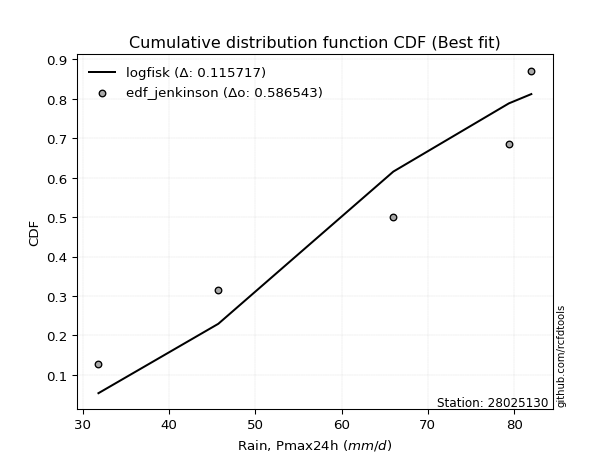</img></img>

</div>


### 11. EDF Cunnane (1978)

Cunnane´s work in statistical hydrology has focused on the performance and evaluation of different probability distributions (such as GEV, Gumbel, Lognormal) for flood frequency estimation. _b_ is a constant, typically set to 0.4.

<div align="center">


$P=(m-b)/(n+1-2b)$


</div>


**11.1. Empirical values**

<div align="center">

|                | 0                   | 1                  | 2           | 3                  | 4                  |
|:---------------|:--------------------|:-------------------|:------------|:-------------------|:-------------------|
| date           | 2020                | 2022               | 2017        | 2019               | 2018               |
| x              | 31.8                | 45.7               | 66.0        | 79.4               | 82.0               |
| m              | 1                   | 2                  | 3           | 4                  | 5                  |
| empirical_dist | edf_cunnane         | edf_cunnane        | edf_cunnane | edf_cunnane        | edf_cunnane        |
| empirical      | 0.11538461538461538 | 0.3076923076923077 | 0.5         | 0.6923076923076923 | 0.8846153846153845 |
| empirical_tr   | 1.1304347826086958  | 1.4444444444444444 | 2.0         | 3.25               | 8.666666666666655  |

</div>


**11.2. Kolmogorov-Smirnov fit test (sorted by Δ)**


<div align="center">

|                | 0                   | 1                   | 2                  | 3                   | 4                   | 5                  | 6                   | 7                   | 8                   | 9                   | 10                  | 11                  | 12                  | 13                  | 14                  | 15                  | 16                  | 17                  | 18                  | 19                 | 20                 | 21                  | 22                 | 23                 | 24                  | 25                  | 26                  | 27                 | 28                  | 29                 | 30                  | 31                  | 32                  | 33                 | 34                 | 35                  | 36                 | 37                  | 38                 | 39                  | 40                  | 41                 | 42                  | 43                  | 44                  | 45                  | 46                  | 47                  | 48                 | 49                  | 50                  | 51                 | 52                  | 53                  | 54                  | 55                 | 56                 | 57                 | 58                  | 59                  | 60                  | 61                 | 62                  | 63                 | 64                  | 65                  | 66                  | 67                  | 68                  | 69                  | 70                 | 71                 | 72                  | 73                  | 74                  | 75                  | 76                  | 77                  | 78                  | 79                  | 80                  | 81                 | 82                  | 83                  | 84                  | 85                  | 86                 | 87                  | 88                  | 89                  | 90                 | 91                 | 92                  | 93                  | 94                 | 95                  | 96                  | 97                  | 98                 | 99                  | 100                 | 101                 | 102                 | 103                 | 104                 | 105                 | 106                 | 107                 | 108                | 109                 | 110                 | 111                | 112                 | 113                | 114                 | 115                | 116                | 117                | 118                | 119                | 120                | 121                | 122                | 123                 | 124                | 125                | 126                | 127                 | 128                 | 129                | 130                | 131                 | 132                 | 133                | 134                 | 135                | 136                | 137                | 138                 | 139                 | 140                | 141                | 142                | 143                | 144                 | 145                 | 146                 | 147                 | 148                | 149                | 150                | 151                | 152                | 153                | 154                | 155                | 156                | 157                | 158                | 159                |
|:---------------|:--------------------|:--------------------|:-------------------|:--------------------|:--------------------|:-------------------|:--------------------|:--------------------|:--------------------|:--------------------|:--------------------|:--------------------|:--------------------|:--------------------|:--------------------|:--------------------|:--------------------|:--------------------|:--------------------|:-------------------|:-------------------|:--------------------|:-------------------|:-------------------|:--------------------|:--------------------|:--------------------|:-------------------|:--------------------|:-------------------|:--------------------|:--------------------|:--------------------|:-------------------|:-------------------|:--------------------|:-------------------|:--------------------|:-------------------|:--------------------|:--------------------|:-------------------|:--------------------|:--------------------|:--------------------|:--------------------|:--------------------|:--------------------|:-------------------|:--------------------|:--------------------|:-------------------|:--------------------|:--------------------|:--------------------|:-------------------|:-------------------|:-------------------|:--------------------|:--------------------|:--------------------|:-------------------|:--------------------|:-------------------|:--------------------|:--------------------|:--------------------|:--------------------|:--------------------|:--------------------|:-------------------|:-------------------|:--------------------|:--------------------|:--------------------|:--------------------|:--------------------|:--------------------|:--------------------|:--------------------|:--------------------|:-------------------|:--------------------|:--------------------|:--------------------|:--------------------|:-------------------|:--------------------|:--------------------|:--------------------|:-------------------|:-------------------|:--------------------|:--------------------|:-------------------|:--------------------|:--------------------|:--------------------|:-------------------|:--------------------|:--------------------|:--------------------|:--------------------|:--------------------|:--------------------|:--------------------|:--------------------|:--------------------|:-------------------|:--------------------|:--------------------|:-------------------|:--------------------|:-------------------|:--------------------|:-------------------|:-------------------|:-------------------|:-------------------|:-------------------|:-------------------|:-------------------|:-------------------|:--------------------|:-------------------|:-------------------|:-------------------|:--------------------|:--------------------|:-------------------|:-------------------|:--------------------|:--------------------|:-------------------|:--------------------|:-------------------|:-------------------|:-------------------|:--------------------|:--------------------|:-------------------|:-------------------|:-------------------|:-------------------|:--------------------|:--------------------|:--------------------|:--------------------|:-------------------|:-------------------|:-------------------|:-------------------|:-------------------|:-------------------|:-------------------|:-------------------|:-------------------|:-------------------|:-------------------|:-------------------|
| station        | 28025130            | 28025130            | 28025130           | 28025130            | 28025130            | 28025130           | 28025130            | 28025130            | 28025130            | 28025130            | 28025130            | 28025130            | 28025130            | 28025130            | 28025130            | 28025130            | 28025130            | 28025130            | 28025130            | 28025130           | 28025130           | 28025130            | 28025130           | 28025130           | 28025130            | 28025130            | 28025130            | 28025130           | 28025130            | 28025130           | 28025130            | 28025130            | 28025130            | 28025130           | 28025130           | 28025130            | 28025130           | 28025130            | 28025130           | 28025130            | 28025130            | 28025130           | 28025130            | 28025130            | 28025130            | 28025130            | 28025130            | 28025130            | 28025130           | 28025130            | 28025130            | 28025130           | 28025130            | 28025130            | 28025130            | 28025130           | 28025130           | 28025130           | 28025130            | 28025130            | 28025130            | 28025130           | 28025130            | 28025130           | 28025130            | 28025130            | 28025130            | 28025130            | 28025130            | 28025130            | 28025130           | 28025130           | 28025130            | 28025130            | 28025130            | 28025130            | 28025130            | 28025130            | 28025130            | 28025130            | 28025130            | 28025130           | 28025130            | 28025130            | 28025130            | 28025130            | 28025130           | 28025130            | 28025130            | 28025130            | 28025130           | 28025130           | 28025130            | 28025130            | 28025130           | 28025130            | 28025130            | 28025130            | 28025130           | 28025130            | 28025130            | 28025130            | 28025130            | 28025130            | 28025130            | 28025130            | 28025130            | 28025130            | 28025130           | 28025130            | 28025130            | 28025130           | 28025130            | 28025130           | 28025130            | 28025130           | 28025130           | 28025130           | 28025130           | 28025130           | 28025130           | 28025130           | 28025130           | 28025130            | 28025130           | 28025130           | 28025130           | 28025130            | 28025130            | 28025130           | 28025130           | 28025130            | 28025130            | 28025130           | 28025130            | 28025130           | 28025130           | 28025130           | 28025130            | 28025130            | 28025130           | 28025130           | 28025130           | 28025130           | 28025130            | 28025130            | 28025130            | 28025130            | 28025130           | 28025130           | 28025130           | 28025130           | 28025130           | 28025130           | 28025130           | 28025130           | 28025130           | 28025130           | 28025130           | 28025130           |
| empirical_dist | edf_cunnane         | edf_cunnane         | edf_cunnane        | edf_cunnane         | edf_cunnane         | edf_cunnane        | edf_cunnane         | edf_cunnane         | edf_cunnane         | edf_cunnane         | edf_cunnane         | edf_cunnane         | edf_cunnane         | edf_cunnane         | edf_cunnane         | edf_cunnane         | edf_cunnane         | edf_cunnane         | edf_cunnane         | edf_cunnane        | edf_cunnane        | edf_cunnane         | edf_cunnane        | edf_cunnane        | edf_cunnane         | edf_cunnane         | edf_cunnane         | edf_cunnane        | edf_cunnane         | edf_cunnane        | edf_cunnane         | edf_cunnane         | edf_cunnane         | edf_cunnane        | edf_cunnane        | edf_cunnane         | edf_cunnane        | edf_cunnane         | edf_cunnane        | edf_cunnane         | edf_cunnane         | edf_cunnane        | edf_cunnane         | edf_cunnane         | edf_cunnane         | edf_cunnane         | edf_cunnane         | edf_cunnane         | edf_cunnane        | edf_cunnane         | edf_cunnane         | edf_cunnane        | edf_cunnane         | edf_cunnane         | edf_cunnane         | edf_cunnane        | edf_cunnane        | edf_cunnane        | edf_cunnane         | edf_cunnane         | edf_cunnane         | edf_cunnane        | edf_cunnane         | edf_cunnane        | edf_cunnane         | edf_cunnane         | edf_cunnane         | edf_cunnane         | edf_cunnane         | edf_cunnane         | edf_cunnane        | edf_cunnane        | edf_cunnane         | edf_cunnane         | edf_cunnane         | edf_cunnane         | edf_cunnane         | edf_cunnane         | edf_cunnane         | edf_cunnane         | edf_cunnane         | edf_cunnane        | edf_cunnane         | edf_cunnane         | edf_cunnane         | edf_cunnane         | edf_cunnane        | edf_cunnane         | edf_cunnane         | edf_cunnane         | edf_cunnane        | edf_cunnane        | edf_cunnane         | edf_cunnane         | edf_cunnane        | edf_cunnane         | edf_cunnane         | edf_cunnane         | edf_cunnane        | edf_cunnane         | edf_cunnane         | edf_cunnane         | edf_cunnane         | edf_cunnane         | edf_cunnane         | edf_cunnane         | edf_cunnane         | edf_cunnane         | edf_cunnane        | edf_cunnane         | edf_cunnane         | edf_cunnane        | edf_cunnane         | edf_cunnane        | edf_cunnane         | edf_cunnane        | edf_cunnane        | edf_cunnane        | edf_cunnane        | edf_cunnane        | edf_cunnane        | edf_cunnane        | edf_cunnane        | edf_cunnane         | edf_cunnane        | edf_cunnane        | edf_cunnane        | edf_cunnane         | edf_cunnane         | edf_cunnane        | edf_cunnane        | edf_cunnane         | edf_cunnane         | edf_cunnane        | edf_cunnane         | edf_cunnane        | edf_cunnane        | edf_cunnane        | edf_cunnane         | edf_cunnane         | edf_cunnane        | edf_cunnane        | edf_cunnane        | edf_cunnane        | edf_cunnane         | edf_cunnane         | edf_cunnane         | edf_cunnane         | edf_cunnane        | edf_cunnane        | edf_cunnane        | edf_cunnane        | edf_cunnane        | edf_cunnane        | edf_cunnane        | edf_cunnane        | edf_cunnane        | edf_cunnane        | edf_cunnane        | edf_cunnane        |
| p_dist         | logtrapezoid        | ksone               | semicircular       | trapezoid           | anglit              | logksone           | logbeta             | beta                | arcsine             | logpearson3         | logsemicircular     | logweibull_max      | betaprime           | logdgamma           | genextreme          | loganglit           | genpareto           | alpha               | logncf              | invgamma           | rice               | erlang              | gamma              | f                  | maxwell             | pearson3            | nct                 | t                  | exponnorm           | norm               | crystalball         | loggenextreme       | rayleigh            | loggumbel_l        | invgauss           | loggompertz         | logarcsine         | logbetaprime        | logburr12          | logweibull_min      | logdweibull         | gompertz           | weibull_min         | logf                | logt                | logcrystalball      | lognorm             | logexponnorm        | wrapcauchy         | lognct              | logfatiguelife      | logfoldnorm        | loggamma            | loggamma            | logistic            | logerlang          | gumbel_l           | logrice            | cosine              | kstwobign           | halfnorm            | logloglaplace      | loginvgauss         | dweibull           | logalpha            | loginvgamma         | hypsecant           | levy_l              | loglogistic         | gumbel_r            | loginvweibull      | logexponpow        | loglevy_l           | logmaxwell          | dgamma              | laplace             | lograyleigh         | logcosine           | loggenpareto        | loghypsecant        | argus               | johnsonsb          | truncnorm           | logkstwobign        | halflogistic        | loggenexpon         | lomax              | burr                | genexpon            | moyal               | loggennorm         | gennorm            | logargus            | loghalfnorm         | logwrapcauchy      | logexponweib        | loglomax            | burr12              | loggumbel_r        | loglaplace          | loglaplace          | halfgennorm         | loggenhalflogistic  | genhalflogistic     | logmielke           | mielke              | logburr             | logloggamma         | loghalflogistic    | triang              | logmoyal            | skewnorm           | loggausshyper       | gausshyper         | tukeylambda         | kappa4             | wald               | logtriang          | kappa3             | uniform            | vonmises_line      | logskewnorm        | logkappa4          | logtukeylambda      | loghalfgennorm     | bradford           | truncexpon         | logkappa3           | truncweibull_min    | loguniform         | logjohnsonsb       | loggengamma         | logwald             | ncf                | logvonmises_line    | lognakagami        | nakagami           | foldnorm           | gengamma            | logtruncweibull_min | logbradford        | logtruncnorm       | logrdist           | logtruncexpon      | exponweib           | johnsonsu           | weibull_max         | invweibull          | fatiguelife        | logjohnsonsu       | powerlaw           | truncpareto        | logpowerlaw        | logtruncpareto     | exponpow           | rdist              | genlogistic        | loggenlogistic     | logvonmises        | vonmises           |
| delta          | 0.07864231525225329 | 0.08109650116823786 | 0.0974829367882617 | 0.09961477305610056 | 0.10928998861338646 | 0.1111907122187008 | 0.11536319661470762 | 0.11537872234467361 | 0.11538461538461538 | 0.12091437438803476 | 0.12184312392934937 | 0.12204537520976633 | 0.12244858516907853 | 0.12556868680786581 | 0.12657513022208783 | 0.13014967129290567 | 0.13210539704115254 | 0.13231877070690778 | 0.13263606954554996 | 0.1329760839990919 | 0.1340653181004684 | 0.13416913315223322 | 0.1347946119917972 | 0.1348614631666465 | 0.13508028182059217 | 0.13558890883413544 | 0.13584809020164845 | 0.1358884140556813 | 0.13589824021628805 | 0.1358983719343414 | 0.13589837353632706 | 0.13622554320456715 | 0.13637416927264856 | 0.1379492262948061 | 0.1383513205264406 | 0.13842623255218234 | 0.1390661547146066 | 0.13928712916960317 | 0.1394110224363121 | 0.14101392992459905 | 0.14238311852385468 | 0.1443347984551987 | 0.14437171809632554 | 0.14963653795672527 | 0.14994232952789943 | 0.14994645618397007 | 0.14994646080663165 | 0.14995054348613412 | 0.1507023745567589 | 0.15079229630181556 | 0.15197135858533972 | 0.1526834631645515 | 0.15296645922989283 | 0.15296645922989283 | 0.15554390140244545 | 0.1559961564364617 | 0.1568803168469196 | 0.1581403860770354 | 0.15834335121760668 | 0.15841251596398753 | 0.15965190235910853 | 0.1597502273606635 | 0.16120760299294234 | 0.1614218731328232 | 0.16153296569809228 | 0.16244264906094819 | 0.16625914053396418 | 0.16657188930917344 | 0.16788436577863686 | 0.16816117876667747 | 0.1696822391493773 | 0.1698009031313249 | 0.16999550761526372 | 0.17158760819731977 | 0.17319566706155953 | 0.17669109723169696 | 0.17809581741608427 | 0.17980523132269788 | 0.18145594242162794 | 0.18181076046199862 | 0.18595279153215738 | 0.1861700010770549 | 0.18754860865818512 | 0.18789147079940993 | 0.18797283015579314 | 0.19019392126230927 | 0.1905505180465331 | 0.19055828512466988 | 0.19057300046322423 | 0.19079725759579436 | 0.1923076923076923 | 0.1923076923076923 | 0.19593449173334343 | 0.19701964970002273 | 0.2021179763106803 | 0.20444920438360337 | 0.20589733405045296 | 0.20793707171811127 | 0.2099297338795345 | 0.20999821437844668 | 0.20999821437844668 | 0.21123308586872602 | 0.21151257571257753 | 0.21278865286279347 | 0.21389402283316383 | 0.21623943366338105 | 0.21705210466055969 | 0.22086722186489782 | 0.2251434044653764 | 0.22542633369538956 | 0.22978126568890134 | 0.2353599713252833 | 0.24535240387789925 | 0.2468133548069713 | 0.24787039953145862 | 0.2489934970335662 | 0.2539068138512618 | 0.2545533532982578 | 0.2551969041393606 | 0.2558994790070489 | 0.2562032168429138 | 0.2570569139301354 | 0.2631914474760496 | 0.26599579754243874 | 0.2668223500152491 | 0.2713105684596432 | 0.271742546104654  | 0.27195542808383455 | 0.27216320398865024 | 0.2736772341506585 | 0.2769134442549375 | 0.28248432736757656 | 0.28603817892974115 | 0.2967583925502213 | 0.30574256395529564 | 0.3076916893125649 | 0.3076922722646977 | 0.3076923076923077 | 0.31887637560453896 | 0.32023430514913587 | 0.3273890129583663 | 0.3296694412288531 | 0.3346584138098384 | 0.3411570646673058 | 0.34125500428526445 | 0.34765714417876653 | 0.38573606523953063 | 0.45492907864253723 | 0.4687456980589497 | 0.5107223622887597 | 0.5401843629191173 | 0.5560825877419657 | 0.5692217044614906 | 0.591052754778985  | 0.5911005870231643 | 0.6923076923017445 | 0.6923076923076923 | 0.6923076923076923 | 1.1464591248391054 | 12.3758111205723   |
| deltao         | 0.5865427407550001  | 0.5865427407550001  | 0.5865427407550001 | 0.5865427407550001  | 0.5865427407550001  | 0.5865427407550001 | 0.5865427407550001  | 0.5865427407550001  | 0.5865427407550001  | 0.5865427407550001  | 0.5865427407550001  | 0.5865427407550001  | 0.5865427407550001  | 0.5865427407550001  | 0.5865427407550001  | 0.5865427407550001  | 0.5865427407550001  | 0.5865427407550001  | 0.5865427407550001  | 0.5865427407550001 | 0.5865427407550001 | 0.5865427407550001  | 0.5865427407550001 | 0.5865427407550001 | 0.5865427407550001  | 0.5865427407550001  | 0.5865427407550001  | 0.5865427407550001 | 0.5865427407550001  | 0.5865427407550001 | 0.5865427407550001  | 0.5865427407550001  | 0.5865427407550001  | 0.5865427407550001 | 0.5865427407550001 | 0.5865427407550001  | 0.5865427407550001 | 0.5865427407550001  | 0.5865427407550001 | 0.5865427407550001  | 0.5865427407550001  | 0.5865427407550001 | 0.5865427407550001  | 0.5865427407550001  | 0.5865427407550001  | 0.5865427407550001  | 0.5865427407550001  | 0.5865427407550001  | 0.5865427407550001 | 0.5865427407550001  | 0.5865427407550001  | 0.5865427407550001 | 0.5865427407550001  | 0.5865427407550001  | 0.5865427407550001  | 0.5865427407550001 | 0.5865427407550001 | 0.5865427407550001 | 0.5865427407550001  | 0.5865427407550001  | 0.5865427407550001  | 0.5865427407550001 | 0.5865427407550001  | 0.5865427407550001 | 0.5865427407550001  | 0.5865427407550001  | 0.5865427407550001  | 0.5865427407550001  | 0.5865427407550001  | 0.5865427407550001  | 0.5865427407550001 | 0.5865427407550001 | 0.5865427407550001  | 0.5865427407550001  | 0.5865427407550001  | 0.5865427407550001  | 0.5865427407550001  | 0.5865427407550001  | 0.5865427407550001  | 0.5865427407550001  | 0.5865427407550001  | 0.5865427407550001 | 0.5865427407550001  | 0.5865427407550001  | 0.5865427407550001  | 0.5865427407550001  | 0.5865427407550001 | 0.5865427407550001  | 0.5865427407550001  | 0.5865427407550001  | 0.5865427407550001 | 0.5865427407550001 | 0.5865427407550001  | 0.5865427407550001  | 0.5865427407550001 | 0.5865427407550001  | 0.5865427407550001  | 0.5865427407550001  | 0.5865427407550001 | 0.5865427407550001  | 0.5865427407550001  | 0.5865427407550001  | 0.5865427407550001  | 0.5865427407550001  | 0.5865427407550001  | 0.5865427407550001  | 0.5865427407550001  | 0.5865427407550001  | 0.5865427407550001 | 0.5865427407550001  | 0.5865427407550001  | 0.5865427407550001 | 0.5865427407550001  | 0.5865427407550001 | 0.5865427407550001  | 0.5865427407550001 | 0.5865427407550001 | 0.5865427407550001 | 0.5865427407550001 | 0.5865427407550001 | 0.5865427407550001 | 0.5865427407550001 | 0.5865427407550001 | 0.5865427407550001  | 0.5865427407550001 | 0.5865427407550001 | 0.5865427407550001 | 0.5865427407550001  | 0.5865427407550001  | 0.5865427407550001 | 0.5865427407550001 | 0.5865427407550001  | 0.5865427407550001  | 0.5865427407550001 | 0.5865427407550001  | 0.5865427407550001 | 0.5865427407550001 | 0.5865427407550001 | 0.5865427407550001  | 0.5865427407550001  | 0.5865427407550001 | 0.5865427407550001 | 0.5865427407550001 | 0.5865427407550001 | 0.5865427407550001  | 0.5865427407550001  | 0.5865427407550001  | 0.5865427407550001  | 0.5865427407550001 | 0.5865427407550001 | 0.5865427407550001 | 0.5865427407550001 | 0.5865427407550001 | 0.5865427407550001 | 0.5865427407550001 | 0.5865427407550001 | 0.5865427407550001 | 0.5865427407550001 | 0.5865427407550001 | 0.5865427407550001 |
| eval           | Δo > Δ              | Δo > Δ              | Δo > Δ             | Δo > Δ              | Δo > Δ              | Δo > Δ             | Δo > Δ              | Δo > Δ              | Δo > Δ              | Δo > Δ              | Δo > Δ              | Δo > Δ              | Δo > Δ              | Δo > Δ              | Δo > Δ              | Δo > Δ              | Δo > Δ              | Δo > Δ              | Δo > Δ              | Δo > Δ             | Δo > Δ             | Δo > Δ              | Δo > Δ             | Δo > Δ             | Δo > Δ              | Δo > Δ              | Δo > Δ              | Δo > Δ             | Δo > Δ              | Δo > Δ             | Δo > Δ              | Δo > Δ              | Δo > Δ              | Δo > Δ             | Δo > Δ             | Δo > Δ              | Δo > Δ             | Δo > Δ              | Δo > Δ             | Δo > Δ              | Δo > Δ              | Δo > Δ             | Δo > Δ              | Δo > Δ              | Δo > Δ              | Δo > Δ              | Δo > Δ              | Δo > Δ              | Δo > Δ             | Δo > Δ              | Δo > Δ              | Δo > Δ             | Δo > Δ              | Δo > Δ              | Δo > Δ              | Δo > Δ             | Δo > Δ             | Δo > Δ             | Δo > Δ              | Δo > Δ              | Δo > Δ              | Δo > Δ             | Δo > Δ              | Δo > Δ             | Δo > Δ              | Δo > Δ              | Δo > Δ              | Δo > Δ              | Δo > Δ              | Δo > Δ              | Δo > Δ             | Δo > Δ             | Δo > Δ              | Δo > Δ              | Δo > Δ              | Δo > Δ              | Δo > Δ              | Δo > Δ              | Δo > Δ              | Δo > Δ              | Δo > Δ              | Δo > Δ             | Δo > Δ              | Δo > Δ              | Δo > Δ              | Δo > Δ              | Δo > Δ             | Δo > Δ              | Δo > Δ              | Δo > Δ              | Δo > Δ             | Δo > Δ             | Δo > Δ              | Δo > Δ              | Δo > Δ             | Δo > Δ              | Δo > Δ              | Δo > Δ              | Δo > Δ             | Δo > Δ              | Δo > Δ              | Δo > Δ              | Δo > Δ              | Δo > Δ              | Δo > Δ              | Δo > Δ              | Δo > Δ              | Δo > Δ              | Δo > Δ             | Δo > Δ              | Δo > Δ              | Δo > Δ             | Δo > Δ              | Δo > Δ             | Δo > Δ              | Δo > Δ             | Δo > Δ             | Δo > Δ             | Δo > Δ             | Δo > Δ             | Δo > Δ             | Δo > Δ             | Δo > Δ             | Δo > Δ              | Δo > Δ             | Δo > Δ             | Δo > Δ             | Δo > Δ              | Δo > Δ              | Δo > Δ             | Δo > Δ             | Δo > Δ              | Δo > Δ              | Δo > Δ             | Δo > Δ              | Δo > Δ             | Δo > Δ             | Δo > Δ             | Δo > Δ              | Δo > Δ              | Δo > Δ             | Δo > Δ             | Δo > Δ             | Δo > Δ             | Δo > Δ              | Δo > Δ              | Δo > Δ              | Δo > Δ              | Δo > Δ             | Δo > Δ             | Δo > Δ             | Δo > Δ             | Δo > Δ             | Δo <= Δ            | Δo <= Δ            | Δo <= Δ            | Δo <= Δ            | Δo <= Δ            | Δo <= Δ            | Δo <= Δ            |
| fit            | 1                   | 1                   | 1                  | 1                   | 1                   | 1                  | 1                   | 1                   | 1                   | 1                   | 1                   | 1                   | 1                   | 1                   | 1                   | 1                   | 1                   | 1                   | 1                   | 1                  | 1                  | 1                   | 1                  | 1                  | 1                   | 1                   | 1                   | 1                  | 1                   | 1                  | 1                   | 1                   | 1                   | 1                  | 1                  | 1                   | 1                  | 1                   | 1                  | 1                   | 1                   | 1                  | 1                   | 1                   | 1                   | 1                   | 1                   | 1                   | 1                  | 1                   | 1                   | 1                  | 1                   | 1                   | 1                   | 1                  | 1                  | 1                  | 1                   | 1                   | 1                   | 1                  | 1                   | 1                  | 1                   | 1                   | 1                   | 1                   | 1                   | 1                   | 1                  | 1                  | 1                   | 1                   | 1                   | 1                   | 1                   | 1                   | 1                   | 1                   | 1                   | 1                  | 1                   | 1                   | 1                   | 1                   | 1                  | 1                   | 1                   | 1                   | 1                  | 1                  | 1                   | 1                   | 1                  | 1                   | 1                   | 1                   | 1                  | 1                   | 1                   | 1                   | 1                   | 1                   | 1                   | 1                   | 1                   | 1                   | 1                  | 1                   | 1                   | 1                  | 1                   | 1                  | 1                   | 1                  | 1                  | 1                  | 1                  | 1                  | 1                  | 1                  | 1                  | 1                   | 1                  | 1                  | 1                  | 1                   | 1                   | 1                  | 1                  | 1                   | 1                   | 1                  | 1                   | 1                  | 1                  | 1                  | 1                   | 1                   | 1                  | 1                  | 1                  | 1                  | 1                   | 1                   | 1                   | 1                   | 1                  | 1                  | 1                  | 1                  | 1                  | 0                  | 0                  | 0                  | 0                  | 0                  | 0                  | 0                  |
| n              | 5                   | 5                   | 5                  | 5                   | 5                   | 5                  | 5                   | 5                   | 5                   | 5                   | 5                   | 5                   | 5                   | 5                   | 5                   | 5                   | 5                   | 5                   | 5                   | 5                  | 5                  | 5                   | 5                  | 5                  | 5                   | 5                   | 5                   | 5                  | 5                   | 5                  | 5                   | 5                   | 5                   | 5                  | 5                  | 5                   | 5                  | 5                   | 5                  | 5                   | 5                   | 5                  | 5                   | 5                   | 5                   | 5                   | 5                   | 5                   | 5                  | 5                   | 5                   | 5                  | 5                   | 5                   | 5                   | 5                  | 5                  | 5                  | 5                   | 5                   | 5                   | 5                  | 5                   | 5                  | 5                   | 5                   | 5                   | 5                   | 5                   | 5                   | 5                  | 5                  | 5                   | 5                   | 5                   | 5                   | 5                   | 5                   | 5                   | 5                   | 5                   | 5                  | 5                   | 5                   | 5                   | 5                   | 5                  | 5                   | 5                   | 5                   | 5                  | 5                  | 5                   | 5                   | 5                  | 5                   | 5                   | 5                   | 5                  | 5                   | 5                   | 5                   | 5                   | 5                   | 5                   | 5                   | 5                   | 5                   | 5                  | 5                   | 5                   | 5                  | 5                   | 5                  | 5                   | 5                  | 5                  | 5                  | 5                  | 5                  | 5                  | 5                  | 5                  | 5                   | 5                  | 5                  | 5                  | 5                   | 5                   | 5                  | 5                  | 5                   | 5                   | 5                  | 5                   | 5                  | 5                  | 5                  | 5                   | 5                   | 5                  | 5                  | 5                  | 5                  | 5                   | 5                   | 5                   | 5                   | 5                  | 5                  | 5                  | 5                  | 5                  | 5                  | 5                  | 5                  | 5                  | 5                  | 5                  | 5                  |
| best_fit       | 1                   | 0                   | 0                  | 0                   | 0                   | 0                  | 0                   | 0                   | 0                   | 0                   | 0                   | 0                   | 0                   | 0                   | 0                   | 0                   | 0                   | 0                   | 0                   | 0                  | 0                  | 0                   | 0                  | 0                  | 0                   | 0                   | 0                   | 0                  | 0                   | 0                  | 0                   | 0                   | 0                   | 0                  | 0                  | 0                   | 0                  | 0                   | 0                  | 0                   | 0                   | 0                  | 0                   | 0                   | 0                   | 0                   | 0                   | 0                   | 0                  | 0                   | 0                   | 0                  | 0                   | 0                   | 0                   | 0                  | 0                  | 0                  | 0                   | 0                   | 0                   | 0                  | 0                   | 0                  | 0                   | 0                   | 0                   | 0                   | 0                   | 0                   | 0                  | 0                  | 0                   | 0                   | 0                   | 0                   | 0                   | 0                   | 0                   | 0                   | 0                   | 0                  | 0                   | 0                   | 0                   | 0                   | 0                  | 0                   | 0                   | 0                   | 0                  | 0                  | 0                   | 0                   | 0                  | 0                   | 0                   | 0                   | 0                  | 0                   | 0                   | 0                   | 0                   | 0                   | 0                   | 0                   | 0                   | 0                   | 0                  | 0                   | 0                   | 0                  | 0                   | 0                  | 0                   | 0                  | 0                  | 0                  | 0                  | 0                  | 0                  | 0                  | 0                  | 0                   | 0                  | 0                  | 0                  | 0                   | 0                   | 0                  | 0                  | 0                   | 0                   | 0                  | 0                   | 0                  | 0                  | 0                  | 0                   | 0                   | 0                  | 0                  | 0                  | 0                  | 0                   | 0                   | 0                   | 0                   | 0                  | 0                  | 0                  | 0                  | 0                  | 0                  | 0                  | 0                  | 0                  | 0                  | 0                  | 0                  |
| best_fit_sort  | 1                   | 2                   | 3                  | 4                   | 5                   | 6                  | 7                   | 8                   | 9                   | 10                  | 11                  | 12                  | 13                  | 14                  | 15                  | 16                  | 17                  | 18                  | 19                  | 20                 | 21                 | 22                  | 23                 | 24                 | 25                  | 26                  | 27                  | 28                 | 29                  | 30                 | 31                  | 32                  | 33                  | 34                 | 35                 | 36                  | 37                 | 38                  | 39                 | 40                  | 41                  | 42                 | 43                  | 44                  | 45                  | 46                  | 47                  | 48                  | 49                 | 50                  | 51                  | 52                 | 53                  | 54                  | 55                  | 56                 | 57                 | 58                 | 59                  | 60                  | 61                  | 62                 | 63                  | 64                 | 65                  | 66                  | 67                  | 68                  | 69                  | 70                  | 71                 | 72                 | 73                  | 74                  | 75                  | 76                  | 77                  | 78                  | 79                  | 80                  | 81                  | 82                 | 83                  | 84                  | 85                  | 86                  | 87                 | 88                  | 89                  | 90                  | 91                 | 92                 | 93                  | 94                  | 95                 | 96                  | 97                  | 98                  | 99                 | 100                 | 101                 | 102                 | 103                 | 104                 | 105                 | 106                 | 107                 | 108                 | 109                | 110                 | 111                 | 112                | 113                 | 114                | 115                 | 116                | 117                | 118                | 119                | 120                | 121                | 122                | 123                | 124                 | 125                | 126                | 127                | 128                 | 129                 | 130                | 131                | 132                 | 133                 | 134                | 135                 | 136                | 137                | 138                | 139                 | 140                 | 141                | 142                | 143                | 144                | 145                 | 146                 | 147                 | 148                 | 149                | 150                | 151                | 152                | 153                | 154                | 155                | 156                | 157                | 158                | 159                | 160                |

</div>


**11.3. Best fit**

<div align="center">

|   id |   station | empirical_dist   | p_dist       |     delta |   deltao | eval   |   fit |   n |   best_fit |   best_fit_sort |
|-----:|----------:|:-----------------|:-------------|----------:|---------:|:-------|------:|----:|-----------:|----------------:|
|    0 |  28025130 | edf_cunnane      | logtrapezoid | 0.0786423 | 0.586543 | Δo > Δ |     1 |   5 |          1 |               1 |

</div>


<div align="center">

</img>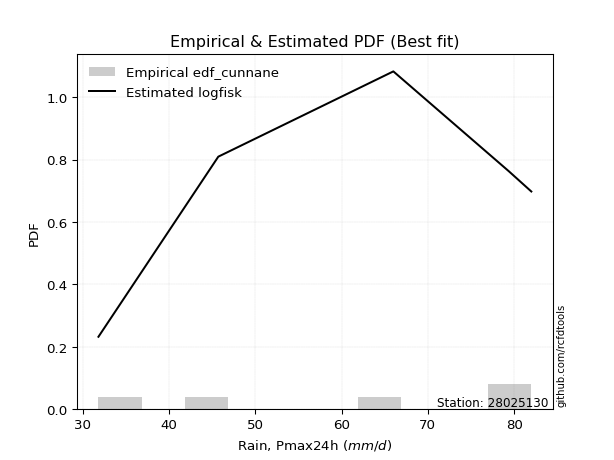</img>

</div>


### 12. EDF Adamowski (1981)

The Adamowski formula in hydrology refers to a specific plotting position formula used for estimating the non-parametric empirical distribution of hydrological events (like flood peaks) to calculate their return periods. This formula provides an alternative to traditional parametric methods (like the Gumbel or Log Pearson Type III distributions). 

<div align="center">


$P=(m-0.25)/(n+0.5)$


</div>


**12.1. Empirical values**

<div align="center">

|                | 0                   | 1                  | 2             | 3                  | 4                  |
|:---------------|:--------------------|:-------------------|:--------------|:-------------------|:-------------------|
| date           | 2020                | 2022               | 2017          | 2019               | 2018               |
| x              | 31.8                | 45.7               | 66.0          | 79.4               | 82.0               |
| m              | 1                   | 2                  | 3             | 4                  | 5                  |
| empirical_dist | edf_adamowski       | edf_adamowski      | edf_adamowski | edf_adamowski      | edf_adamowski      |
| empirical      | 0.13636363636363635 | 0.3181818181818182 | 0.5           | 0.6818181818181818 | 0.8636363636363636 |
| empirical_tr   | 1.1578947368421053  | 1.4666666666666666 | 2.0           | 3.1428571428571423 | 7.333333333333334  |

</div>


**12.2. Kolmogorov-Smirnov fit test (sorted by Δ)**


<div align="center">

|                | 0                   | 1                   | 2                   | 3                   | 4                  | 5                   | 6                   | 7                   | 8                   | 9                   | 10                  | 11                 | 12                  | 13                  | 14                 | 15                  | 16                  | 17                 | 18                  | 19                  | 20                  | 21                  | 22                 | 23                 | 24                  | 25                  | 26                  | 27                 | 28                  | 29                 | 30                  | 31                  | 32                  | 33                  | 34                  | 35                  | 36                 | 37                  | 38                  | 39                  | 40                  | 41                  | 42                  | 43                  | 44                  | 45                  | 46                  | 47                  | 48                  | 49                 | 50                  | 51                  | 52                  | 53                  | 54                  | 55                 | 56                 | 57                  | 58                  | 59                  | 60                  | 61                  | 62                  | 63                  | 64                 | 65                  | 66                  | 67                  | 68                  | 69                 | 70                 | 71                  | 72                  | 73                  | 74                 | 75                  | 76                 | 77                  | 78                  | 79                  | 80                  | 81                  | 82                  | 83                  | 84                  | 85                  | 86                  | 87                  | 88                 | 89                  | 90                  | 91                 | 92                  | 93                 | 94                  | 95                  | 96                  | 97                 | 98                  | 99                  | 100                 | 101                 | 102                 | 103                | 104                 | 105                | 106                 | 107                | 108                 | 109                 | 110                 | 111                 | 112                | 113                | 114                 | 115                 | 116                 | 117                 | 118                | 119                | 120                | 121                 | 122                 | 123                 | 124                 | 125                 | 126                 | 127                | 128                | 129                | 130                 | 131                 | 132                | 133                 | 134                 | 135                | 136                | 137                 | 138                | 139                 | 140                 | 141                | 142                | 143                | 144                | 145                | 146                | 147                | 148                 | 149                | 150                | 151                | 152                | 153                | 154                | 155                | 156                | 157                | 158                | 159                |
|:---------------|:--------------------|:--------------------|:--------------------|:--------------------|:-------------------|:--------------------|:--------------------|:--------------------|:--------------------|:--------------------|:--------------------|:-------------------|:--------------------|:--------------------|:-------------------|:--------------------|:--------------------|:-------------------|:--------------------|:--------------------|:--------------------|:--------------------|:-------------------|:-------------------|:--------------------|:--------------------|:--------------------|:-------------------|:--------------------|:-------------------|:--------------------|:--------------------|:--------------------|:--------------------|:--------------------|:--------------------|:-------------------|:--------------------|:--------------------|:--------------------|:--------------------|:--------------------|:--------------------|:--------------------|:--------------------|:--------------------|:--------------------|:--------------------|:--------------------|:-------------------|:--------------------|:--------------------|:--------------------|:--------------------|:--------------------|:-------------------|:-------------------|:--------------------|:--------------------|:--------------------|:--------------------|:--------------------|:--------------------|:--------------------|:-------------------|:--------------------|:--------------------|:--------------------|:--------------------|:-------------------|:-------------------|:--------------------|:--------------------|:--------------------|:-------------------|:--------------------|:-------------------|:--------------------|:--------------------|:--------------------|:--------------------|:--------------------|:--------------------|:--------------------|:--------------------|:--------------------|:--------------------|:--------------------|:-------------------|:--------------------|:--------------------|:-------------------|:--------------------|:-------------------|:--------------------|:--------------------|:--------------------|:-------------------|:--------------------|:--------------------|:--------------------|:--------------------|:--------------------|:-------------------|:--------------------|:-------------------|:--------------------|:-------------------|:--------------------|:--------------------|:--------------------|:--------------------|:-------------------|:-------------------|:--------------------|:--------------------|:--------------------|:--------------------|:-------------------|:-------------------|:-------------------|:--------------------|:--------------------|:--------------------|:--------------------|:--------------------|:--------------------|:-------------------|:-------------------|:-------------------|:--------------------|:--------------------|:-------------------|:--------------------|:--------------------|:-------------------|:-------------------|:--------------------|:-------------------|:--------------------|:--------------------|:-------------------|:-------------------|:-------------------|:-------------------|:-------------------|:-------------------|:-------------------|:--------------------|:-------------------|:-------------------|:-------------------|:-------------------|:-------------------|:-------------------|:-------------------|:-------------------|:-------------------|:-------------------|:-------------------|
| station        | 28025130            | 28025130            | 28025130            | 28025130            | 28025130           | 28025130            | 28025130            | 28025130            | 28025130            | 28025130            | 28025130            | 28025130           | 28025130            | 28025130            | 28025130           | 28025130            | 28025130            | 28025130           | 28025130            | 28025130            | 28025130            | 28025130            | 28025130           | 28025130           | 28025130            | 28025130            | 28025130            | 28025130           | 28025130            | 28025130           | 28025130            | 28025130            | 28025130            | 28025130            | 28025130            | 28025130            | 28025130           | 28025130            | 28025130            | 28025130            | 28025130            | 28025130            | 28025130            | 28025130            | 28025130            | 28025130            | 28025130            | 28025130            | 28025130            | 28025130           | 28025130            | 28025130            | 28025130            | 28025130            | 28025130            | 28025130           | 28025130           | 28025130            | 28025130            | 28025130            | 28025130            | 28025130            | 28025130            | 28025130            | 28025130           | 28025130            | 28025130            | 28025130            | 28025130            | 28025130           | 28025130           | 28025130            | 28025130            | 28025130            | 28025130           | 28025130            | 28025130           | 28025130            | 28025130            | 28025130            | 28025130            | 28025130            | 28025130            | 28025130            | 28025130            | 28025130            | 28025130            | 28025130            | 28025130           | 28025130            | 28025130            | 28025130           | 28025130            | 28025130           | 28025130            | 28025130            | 28025130            | 28025130           | 28025130            | 28025130            | 28025130            | 28025130            | 28025130            | 28025130           | 28025130            | 28025130           | 28025130            | 28025130           | 28025130            | 28025130            | 28025130            | 28025130            | 28025130           | 28025130           | 28025130            | 28025130            | 28025130            | 28025130            | 28025130           | 28025130           | 28025130           | 28025130            | 28025130            | 28025130            | 28025130            | 28025130            | 28025130            | 28025130           | 28025130           | 28025130           | 28025130            | 28025130            | 28025130           | 28025130            | 28025130            | 28025130           | 28025130           | 28025130            | 28025130           | 28025130            | 28025130            | 28025130           | 28025130           | 28025130           | 28025130           | 28025130           | 28025130           | 28025130           | 28025130            | 28025130           | 28025130           | 28025130           | 28025130           | 28025130           | 28025130           | 28025130           | 28025130           | 28025130           | 28025130           | 28025130           |
| empirical_dist | edf_adamowski       | edf_adamowski       | edf_adamowski       | edf_adamowski       | edf_adamowski      | edf_adamowski       | edf_adamowski       | edf_adamowski       | edf_adamowski       | edf_adamowski       | edf_adamowski       | edf_adamowski      | edf_adamowski       | edf_adamowski       | edf_adamowski      | edf_adamowski       | edf_adamowski       | edf_adamowski      | edf_adamowski       | edf_adamowski       | edf_adamowski       | edf_adamowski       | edf_adamowski      | edf_adamowski      | edf_adamowski       | edf_adamowski       | edf_adamowski       | edf_adamowski      | edf_adamowski       | edf_adamowski      | edf_adamowski       | edf_adamowski       | edf_adamowski       | edf_adamowski       | edf_adamowski       | edf_adamowski       | edf_adamowski      | edf_adamowski       | edf_adamowski       | edf_adamowski       | edf_adamowski       | edf_adamowski       | edf_adamowski       | edf_adamowski       | edf_adamowski       | edf_adamowski       | edf_adamowski       | edf_adamowski       | edf_adamowski       | edf_adamowski      | edf_adamowski       | edf_adamowski       | edf_adamowski       | edf_adamowski       | edf_adamowski       | edf_adamowski      | edf_adamowski      | edf_adamowski       | edf_adamowski       | edf_adamowski       | edf_adamowski       | edf_adamowski       | edf_adamowski       | edf_adamowski       | edf_adamowski      | edf_adamowski       | edf_adamowski       | edf_adamowski       | edf_adamowski       | edf_adamowski      | edf_adamowski      | edf_adamowski       | edf_adamowski       | edf_adamowski       | edf_adamowski      | edf_adamowski       | edf_adamowski      | edf_adamowski       | edf_adamowski       | edf_adamowski       | edf_adamowski       | edf_adamowski       | edf_adamowski       | edf_adamowski       | edf_adamowski       | edf_adamowski       | edf_adamowski       | edf_adamowski       | edf_adamowski      | edf_adamowski       | edf_adamowski       | edf_adamowski      | edf_adamowski       | edf_adamowski      | edf_adamowski       | edf_adamowski       | edf_adamowski       | edf_adamowski      | edf_adamowski       | edf_adamowski       | edf_adamowski       | edf_adamowski       | edf_adamowski       | edf_adamowski      | edf_adamowski       | edf_adamowski      | edf_adamowski       | edf_adamowski      | edf_adamowski       | edf_adamowski       | edf_adamowski       | edf_adamowski       | edf_adamowski      | edf_adamowski      | edf_adamowski       | edf_adamowski       | edf_adamowski       | edf_adamowski       | edf_adamowski      | edf_adamowski      | edf_adamowski      | edf_adamowski       | edf_adamowski       | edf_adamowski       | edf_adamowski       | edf_adamowski       | edf_adamowski       | edf_adamowski      | edf_adamowski      | edf_adamowski      | edf_adamowski       | edf_adamowski       | edf_adamowski      | edf_adamowski       | edf_adamowski       | edf_adamowski      | edf_adamowski      | edf_adamowski       | edf_adamowski      | edf_adamowski       | edf_adamowski       | edf_adamowski      | edf_adamowski      | edf_adamowski      | edf_adamowski      | edf_adamowski      | edf_adamowski      | edf_adamowski      | edf_adamowski       | edf_adamowski      | edf_adamowski      | edf_adamowski      | edf_adamowski      | edf_adamowski      | edf_adamowski      | edf_adamowski      | edf_adamowski      | edf_adamowski      | edf_adamowski      | edf_adamowski      |
| p_dist         | logtrapezoid        | ksone               | semicircular        | trapezoid           | logksone           | logncf              | anglit              | logsemicircular     | loganglit           | logpearson3         | betaprime           | logdgamma          | logbeta             | beta                | logweibull_max     | logarcsine          | arcsine             | genextreme         | logbetaprime        | invgauss            | wrapcauchy          | genpareto           | alpha              | invgamma           | rice                | erlang              | gamma               | f                  | rayleigh            | maxwell            | pearson3            | nct                 | t                   | exponnorm           | norm                | crystalball         | loggenextreme      | loggumbel_l         | logexponpow         | loggompertz         | logf                | logburr12           | logt                | logcrystalball      | lognorm             | logexponnorm        | lognct              | logweibull_min      | logfatiguelife      | logfoldnorm        | logdweibull         | loggamma            | loggamma            | gompertz            | weibull_min         | logerlang          | logrice            | kstwobign           | halfnorm            | loggenpareto        | loginvgauss         | logalpha            | loginvgamma         | logistic            | truncnorm          | levy_l              | gumbel_l            | loglogistic         | gumbel_r            | cosine             | loginvweibull      | loglevy_l           | logloglaplace       | logmaxwell          | dweibull           | johnsonsb           | hypsecant          | lograyleigh         | logcosine           | loghypsecant        | loggennorm          | gennorm             | logexponweib        | dgamma              | laplace             | logkstwobign        | halflogistic        | loggenexpon         | lomax              | genexpon            | moyal               | argus              | loghalfnorm         | burr               | loglomax            | logargus            | burr12              | loggumbel_r        | loglaplace          | loglaplace          | halfgennorm         | logwrapcauchy       | loggenhalflogistic  | genhalflogistic    | logmielke           | loghalflogistic    | mielke              | logburr            | logmoyal            | logloggamma         | triang              | skewnorm            | wald               | loggausshyper      | logjohnsonsb        | gausshyper          | tukeylambda         | kappa4              | logtriang          | kappa3             | uniform            | vonmises_line       | logskewnorm         | logkappa4           | ncf                 | logtukeylambda      | loghalfgennorm      | bradford           | truncexpon         | logkappa3          | loggengamma         | truncweibull_min    | loguniform         | logwald             | logvonmises_line    | gengamma           | lognakagami        | nakagami            | logrdist           | foldnorm            | logtruncweibull_min | logbradford        | logtruncnorm       | exponweib          | johnsonsu          | logtruncexpon      | weibull_max        | invweibull         | fatiguelife         | logjohnsonsu       | powerlaw           | truncpareto        | logpowerlaw        | logtruncpareto     | exponpow           | rdist              | genlogistic        | loggenlogistic     | logvonmises        | vonmises           |
| delta          | 0.08913182574176381 | 0.09158601165774838 | 0.10797244727777222 | 0.11010428354561108 | 0.1111907122187008 | 0.11302901882139504 | 0.11977949910289698 | 0.12184312392934937 | 0.13014967129290567 | 0.13140388487754529 | 0.13293809565858905 | 0.1348710216229424 | 0.13634221759372844 | 0.13635774332369444 | 0.1363636358863145 | 0.13636363636363635 | 0.13636363636363635 | 0.1370646407115983 | 0.13928712916960317 | 0.14016401857008653 | 0.14021286406724842 | 0.14259490753066306 | 0.1428082811964183 | 0.1434655944886024 | 0.14455482858997892 | 0.14465864364174374 | 0.14528412248130773 | 0.145350973656157  | 0.14536990634002156 | 0.1455697923101027 | 0.14607841932364596 | 0.14633760069115898 | 0.14637792454519183 | 0.14638775070579857 | 0.14638788242385192 | 0.14638788402583758 | 0.1467150536940776 | 0.14843873678431663 | 0.14882188215230407 | 0.14891574304169286 | 0.14963653795672527 | 0.14990053292582262 | 0.14994232952789943 | 0.14994645618397007 | 0.14994646080663165 | 0.14995054348613412 | 0.15079229630181556 | 0.15150344041410957 | 0.15197135858533972 | 0.1526834631645515 | 0.15287262901336515 | 0.15296645922989283 | 0.15296645922989283 | 0.15482430894470922 | 0.15486122858583606 | 0.1559961564364617 | 0.1581403860770354 | 0.15841251596398753 | 0.15965190235910853 | 0.16047692144260695 | 0.16120760299294234 | 0.16153296569809228 | 0.16244264906094819 | 0.16603341189195597 | 0.1665695876791643 | 0.16657188930917344 | 0.16736982733643013 | 0.16788436577863686 | 0.16816117876667747 | 0.1688328617071172 | 0.1696822391493773 | 0.16999550761526372 | 0.17023973785017396 | 0.17158760819731977 | 0.1719113836223337 | 0.17568049058754442 | 0.1767486510234747 | 0.17809581741608427 | 0.17980523132269788 | 0.18181076046199862 | 0.18181818181818182 | 0.18181818181818182 | 0.18347018340458254 | 0.18368517755107006 | 0.18718060772120748 | 0.18789147079940993 | 0.18797283015579314 | 0.19019392126230927 | 0.1905505180465331 | 0.19057300046322423 | 0.19079725759579436 | 0.1964423020216679 | 0.19701964970002273 | 0.2010477956141804 | 0.20589733405045296 | 0.20642400222285395 | 0.20793707171811127 | 0.2099297338795345 | 0.20999821437844668 | 0.20999821437844668 | 0.21123308586872602 | 0.21260748680019081 | 0.22200208620208806 | 0.223278163352304  | 0.22438353332267436 | 0.2251434044653764 | 0.22672894415289158 | 0.2275416151500702 | 0.22978126568890134 | 0.23135673235440835 | 0.23591584418490008 | 0.24584948181479382 | 0.2539068138512618 | 0.2558419143674098 | 0.25593442327591653 | 0.25730286529648183 | 0.25835991002096914 | 0.25948300752307674 | 0.2650428637877683 | 0.2656864146288711 | 0.2663889894965594 | 0.26669272733242433 | 0.26754642441964593 | 0.27368095796556013 | 0.27577937157120047 | 0.27648530803194926 | 0.27731186050475964 | 0.2818000789491537 | 0.2822320565941645 | 0.2824449385733451 | 0.28248432736757656 | 0.28265271447816076 | 0.284166744640169  | 0.28603817892974115 | 0.30574256395529564 | 0.3083868651150285 | 0.3181811998020754 | 0.31818178275420816 | 0.3181818170436797 | 0.31818181818181823 | 0.32023430514913587 | 0.3273890129583663 | 0.3296694412288531 | 0.330765493795754  | 0.337167633689256  | 0.3411570646673058 | 0.3752465547500201 | 0.4339500576635164 | 0.45825618756943926 | 0.5002328517992491 | 0.5296948524296068 | 0.5455930772524553 | 0.55873219397198   | 0.5805632442894746 | 0.5806110765336538 | 0.681818181812234  | 0.6818181818181818 | 0.6818181818181818 | 1.1464591248391054 | 12.396790141551321 |
| deltao         | 0.5865427407550001  | 0.5865427407550001  | 0.5865427407550001  | 0.5865427407550001  | 0.5865427407550001 | 0.5865427407550001  | 0.5865427407550001  | 0.5865427407550001  | 0.5865427407550001  | 0.5865427407550001  | 0.5865427407550001  | 0.5865427407550001 | 0.5865427407550001  | 0.5865427407550001  | 0.5865427407550001 | 0.5865427407550001  | 0.5865427407550001  | 0.5865427407550001 | 0.5865427407550001  | 0.5865427407550001  | 0.5865427407550001  | 0.5865427407550001  | 0.5865427407550001 | 0.5865427407550001 | 0.5865427407550001  | 0.5865427407550001  | 0.5865427407550001  | 0.5865427407550001 | 0.5865427407550001  | 0.5865427407550001 | 0.5865427407550001  | 0.5865427407550001  | 0.5865427407550001  | 0.5865427407550001  | 0.5865427407550001  | 0.5865427407550001  | 0.5865427407550001 | 0.5865427407550001  | 0.5865427407550001  | 0.5865427407550001  | 0.5865427407550001  | 0.5865427407550001  | 0.5865427407550001  | 0.5865427407550001  | 0.5865427407550001  | 0.5865427407550001  | 0.5865427407550001  | 0.5865427407550001  | 0.5865427407550001  | 0.5865427407550001 | 0.5865427407550001  | 0.5865427407550001  | 0.5865427407550001  | 0.5865427407550001  | 0.5865427407550001  | 0.5865427407550001 | 0.5865427407550001 | 0.5865427407550001  | 0.5865427407550001  | 0.5865427407550001  | 0.5865427407550001  | 0.5865427407550001  | 0.5865427407550001  | 0.5865427407550001  | 0.5865427407550001 | 0.5865427407550001  | 0.5865427407550001  | 0.5865427407550001  | 0.5865427407550001  | 0.5865427407550001 | 0.5865427407550001 | 0.5865427407550001  | 0.5865427407550001  | 0.5865427407550001  | 0.5865427407550001 | 0.5865427407550001  | 0.5865427407550001 | 0.5865427407550001  | 0.5865427407550001  | 0.5865427407550001  | 0.5865427407550001  | 0.5865427407550001  | 0.5865427407550001  | 0.5865427407550001  | 0.5865427407550001  | 0.5865427407550001  | 0.5865427407550001  | 0.5865427407550001  | 0.5865427407550001 | 0.5865427407550001  | 0.5865427407550001  | 0.5865427407550001 | 0.5865427407550001  | 0.5865427407550001 | 0.5865427407550001  | 0.5865427407550001  | 0.5865427407550001  | 0.5865427407550001 | 0.5865427407550001  | 0.5865427407550001  | 0.5865427407550001  | 0.5865427407550001  | 0.5865427407550001  | 0.5865427407550001 | 0.5865427407550001  | 0.5865427407550001 | 0.5865427407550001  | 0.5865427407550001 | 0.5865427407550001  | 0.5865427407550001  | 0.5865427407550001  | 0.5865427407550001  | 0.5865427407550001 | 0.5865427407550001 | 0.5865427407550001  | 0.5865427407550001  | 0.5865427407550001  | 0.5865427407550001  | 0.5865427407550001 | 0.5865427407550001 | 0.5865427407550001 | 0.5865427407550001  | 0.5865427407550001  | 0.5865427407550001  | 0.5865427407550001  | 0.5865427407550001  | 0.5865427407550001  | 0.5865427407550001 | 0.5865427407550001 | 0.5865427407550001 | 0.5865427407550001  | 0.5865427407550001  | 0.5865427407550001 | 0.5865427407550001  | 0.5865427407550001  | 0.5865427407550001 | 0.5865427407550001 | 0.5865427407550001  | 0.5865427407550001 | 0.5865427407550001  | 0.5865427407550001  | 0.5865427407550001 | 0.5865427407550001 | 0.5865427407550001 | 0.5865427407550001 | 0.5865427407550001 | 0.5865427407550001 | 0.5865427407550001 | 0.5865427407550001  | 0.5865427407550001 | 0.5865427407550001 | 0.5865427407550001 | 0.5865427407550001 | 0.5865427407550001 | 0.5865427407550001 | 0.5865427407550001 | 0.5865427407550001 | 0.5865427407550001 | 0.5865427407550001 | 0.5865427407550001 |
| eval           | Δo > Δ              | Δo > Δ              | Δo > Δ              | Δo > Δ              | Δo > Δ             | Δo > Δ              | Δo > Δ              | Δo > Δ              | Δo > Δ              | Δo > Δ              | Δo > Δ              | Δo > Δ             | Δo > Δ              | Δo > Δ              | Δo > Δ             | Δo > Δ              | Δo > Δ              | Δo > Δ             | Δo > Δ              | Δo > Δ              | Δo > Δ              | Δo > Δ              | Δo > Δ             | Δo > Δ             | Δo > Δ              | Δo > Δ              | Δo > Δ              | Δo > Δ             | Δo > Δ              | Δo > Δ             | Δo > Δ              | Δo > Δ              | Δo > Δ              | Δo > Δ              | Δo > Δ              | Δo > Δ              | Δo > Δ             | Δo > Δ              | Δo > Δ              | Δo > Δ              | Δo > Δ              | Δo > Δ              | Δo > Δ              | Δo > Δ              | Δo > Δ              | Δo > Δ              | Δo > Δ              | Δo > Δ              | Δo > Δ              | Δo > Δ             | Δo > Δ              | Δo > Δ              | Δo > Δ              | Δo > Δ              | Δo > Δ              | Δo > Δ             | Δo > Δ             | Δo > Δ              | Δo > Δ              | Δo > Δ              | Δo > Δ              | Δo > Δ              | Δo > Δ              | Δo > Δ              | Δo > Δ             | Δo > Δ              | Δo > Δ              | Δo > Δ              | Δo > Δ              | Δo > Δ             | Δo > Δ             | Δo > Δ              | Δo > Δ              | Δo > Δ              | Δo > Δ             | Δo > Δ              | Δo > Δ             | Δo > Δ              | Δo > Δ              | Δo > Δ              | Δo > Δ              | Δo > Δ              | Δo > Δ              | Δo > Δ              | Δo > Δ              | Δo > Δ              | Δo > Δ              | Δo > Δ              | Δo > Δ             | Δo > Δ              | Δo > Δ              | Δo > Δ             | Δo > Δ              | Δo > Δ             | Δo > Δ              | Δo > Δ              | Δo > Δ              | Δo > Δ             | Δo > Δ              | Δo > Δ              | Δo > Δ              | Δo > Δ              | Δo > Δ              | Δo > Δ             | Δo > Δ              | Δo > Δ             | Δo > Δ              | Δo > Δ             | Δo > Δ              | Δo > Δ              | Δo > Δ              | Δo > Δ              | Δo > Δ             | Δo > Δ             | Δo > Δ              | Δo > Δ              | Δo > Δ              | Δo > Δ              | Δo > Δ             | Δo > Δ             | Δo > Δ             | Δo > Δ              | Δo > Δ              | Δo > Δ              | Δo > Δ              | Δo > Δ              | Δo > Δ              | Δo > Δ             | Δo > Δ             | Δo > Δ             | Δo > Δ              | Δo > Δ              | Δo > Δ             | Δo > Δ              | Δo > Δ              | Δo > Δ             | Δo > Δ             | Δo > Δ              | Δo > Δ             | Δo > Δ              | Δo > Δ              | Δo > Δ             | Δo > Δ             | Δo > Δ             | Δo > Δ             | Δo > Δ             | Δo > Δ             | Δo > Δ             | Δo > Δ              | Δo > Δ             | Δo > Δ             | Δo > Δ             | Δo > Δ             | Δo > Δ             | Δo > Δ             | Δo <= Δ            | Δo <= Δ            | Δo <= Δ            | Δo <= Δ            | Δo <= Δ            |
| fit            | 1                   | 1                   | 1                   | 1                   | 1                  | 1                   | 1                   | 1                   | 1                   | 1                   | 1                   | 1                  | 1                   | 1                   | 1                  | 1                   | 1                   | 1                  | 1                   | 1                   | 1                   | 1                   | 1                  | 1                  | 1                   | 1                   | 1                   | 1                  | 1                   | 1                  | 1                   | 1                   | 1                   | 1                   | 1                   | 1                   | 1                  | 1                   | 1                   | 1                   | 1                   | 1                   | 1                   | 1                   | 1                   | 1                   | 1                   | 1                   | 1                   | 1                  | 1                   | 1                   | 1                   | 1                   | 1                   | 1                  | 1                  | 1                   | 1                   | 1                   | 1                   | 1                   | 1                   | 1                   | 1                  | 1                   | 1                   | 1                   | 1                   | 1                  | 1                  | 1                   | 1                   | 1                   | 1                  | 1                   | 1                  | 1                   | 1                   | 1                   | 1                   | 1                   | 1                   | 1                   | 1                   | 1                   | 1                   | 1                   | 1                  | 1                   | 1                   | 1                  | 1                   | 1                  | 1                   | 1                   | 1                   | 1                  | 1                   | 1                   | 1                   | 1                   | 1                   | 1                  | 1                   | 1                  | 1                   | 1                  | 1                   | 1                   | 1                   | 1                   | 1                  | 1                  | 1                   | 1                   | 1                   | 1                   | 1                  | 1                  | 1                  | 1                   | 1                   | 1                   | 1                   | 1                   | 1                   | 1                  | 1                  | 1                  | 1                   | 1                   | 1                  | 1                   | 1                   | 1                  | 1                  | 1                   | 1                  | 1                   | 1                   | 1                  | 1                  | 1                  | 1                  | 1                  | 1                  | 1                  | 1                   | 1                  | 1                  | 1                  | 1                  | 1                  | 1                  | 0                  | 0                  | 0                  | 0                  | 0                  |
| n              | 5                   | 5                   | 5                   | 5                   | 5                  | 5                   | 5                   | 5                   | 5                   | 5                   | 5                   | 5                  | 5                   | 5                   | 5                  | 5                   | 5                   | 5                  | 5                   | 5                   | 5                   | 5                   | 5                  | 5                  | 5                   | 5                   | 5                   | 5                  | 5                   | 5                  | 5                   | 5                   | 5                   | 5                   | 5                   | 5                   | 5                  | 5                   | 5                   | 5                   | 5                   | 5                   | 5                   | 5                   | 5                   | 5                   | 5                   | 5                   | 5                   | 5                  | 5                   | 5                   | 5                   | 5                   | 5                   | 5                  | 5                  | 5                   | 5                   | 5                   | 5                   | 5                   | 5                   | 5                   | 5                  | 5                   | 5                   | 5                   | 5                   | 5                  | 5                  | 5                   | 5                   | 5                   | 5                  | 5                   | 5                  | 5                   | 5                   | 5                   | 5                   | 5                   | 5                   | 5                   | 5                   | 5                   | 5                   | 5                   | 5                  | 5                   | 5                   | 5                  | 5                   | 5                  | 5                   | 5                   | 5                   | 5                  | 5                   | 5                   | 5                   | 5                   | 5                   | 5                  | 5                   | 5                  | 5                   | 5                  | 5                   | 5                   | 5                   | 5                   | 5                  | 5                  | 5                   | 5                   | 5                   | 5                   | 5                  | 5                  | 5                  | 5                   | 5                   | 5                   | 5                   | 5                   | 5                   | 5                  | 5                  | 5                  | 5                   | 5                   | 5                  | 5                   | 5                   | 5                  | 5                  | 5                   | 5                  | 5                   | 5                   | 5                  | 5                  | 5                  | 5                  | 5                  | 5                  | 5                  | 5                   | 5                  | 5                  | 5                  | 5                  | 5                  | 5                  | 5                  | 5                  | 5                  | 5                  | 5                  |
| best_fit       | 1                   | 0                   | 0                   | 0                   | 0                  | 0                   | 0                   | 0                   | 0                   | 0                   | 0                   | 0                  | 0                   | 0                   | 0                  | 0                   | 0                   | 0                  | 0                   | 0                   | 0                   | 0                   | 0                  | 0                  | 0                   | 0                   | 0                   | 0                  | 0                   | 0                  | 0                   | 0                   | 0                   | 0                   | 0                   | 0                   | 0                  | 0                   | 0                   | 0                   | 0                   | 0                   | 0                   | 0                   | 0                   | 0                   | 0                   | 0                   | 0                   | 0                  | 0                   | 0                   | 0                   | 0                   | 0                   | 0                  | 0                  | 0                   | 0                   | 0                   | 0                   | 0                   | 0                   | 0                   | 0                  | 0                   | 0                   | 0                   | 0                   | 0                  | 0                  | 0                   | 0                   | 0                   | 0                  | 0                   | 0                  | 0                   | 0                   | 0                   | 0                   | 0                   | 0                   | 0                   | 0                   | 0                   | 0                   | 0                   | 0                  | 0                   | 0                   | 0                  | 0                   | 0                  | 0                   | 0                   | 0                   | 0                  | 0                   | 0                   | 0                   | 0                   | 0                   | 0                  | 0                   | 0                  | 0                   | 0                  | 0                   | 0                   | 0                   | 0                   | 0                  | 0                  | 0                   | 0                   | 0                   | 0                   | 0                  | 0                  | 0                  | 0                   | 0                   | 0                   | 0                   | 0                   | 0                   | 0                  | 0                  | 0                  | 0                   | 0                   | 0                  | 0                   | 0                   | 0                  | 0                  | 0                   | 0                  | 0                   | 0                   | 0                  | 0                  | 0                  | 0                  | 0                  | 0                  | 0                  | 0                   | 0                  | 0                  | 0                  | 0                  | 0                  | 0                  | 0                  | 0                  | 0                  | 0                  | 0                  |
| best_fit_sort  | 1                   | 2                   | 3                   | 4                   | 5                  | 6                   | 7                   | 8                   | 9                   | 10                  | 11                  | 12                 | 13                  | 14                  | 15                 | 16                  | 17                  | 18                 | 19                  | 20                  | 21                  | 22                  | 23                 | 24                 | 25                  | 26                  | 27                  | 28                 | 29                  | 30                 | 31                  | 32                  | 33                  | 34                  | 35                  | 36                  | 37                 | 38                  | 39                  | 40                  | 41                  | 42                  | 43                  | 44                  | 45                  | 46                  | 47                  | 48                  | 49                  | 50                 | 51                  | 52                  | 53                  | 54                  | 55                  | 56                 | 57                 | 58                  | 59                  | 60                  | 61                  | 62                  | 63                  | 64                  | 65                 | 66                  | 67                  | 68                  | 69                  | 70                 | 71                 | 72                  | 73                  | 74                  | 75                 | 76                  | 77                 | 78                  | 79                  | 80                  | 81                  | 82                  | 83                  | 84                  | 85                  | 86                  | 87                  | 88                  | 89                 | 90                  | 91                  | 92                 | 93                  | 94                 | 95                  | 96                  | 97                  | 98                 | 99                  | 100                 | 101                 | 102                 | 103                 | 104                | 105                 | 106                | 107                 | 108                | 109                 | 110                 | 111                 | 112                 | 113                | 114                | 115                 | 116                 | 117                 | 118                 | 119                | 120                | 121                | 122                 | 123                 | 124                 | 125                 | 126                 | 127                 | 128                | 129                | 130                | 131                 | 132                 | 133                | 134                 | 135                 | 136                | 137                | 138                 | 139                | 140                 | 141                 | 142                | 143                | 144                | 145                | 146                | 147                | 148                | 149                 | 150                | 151                | 152                | 153                | 154                | 155                | 156                | 157                | 158                | 159                | 160                |

</div>


**12.3. Best fit**

<div align="center">

|   id |   station | empirical_dist   | p_dist       |     delta |   deltao | eval   |   fit |   n |   best_fit |   best_fit_sort |
|-----:|----------:|:-----------------|:-------------|----------:|---------:|:-------|------:|----:|-----------:|----------------:|
|    0 |  28025130 | edf_adamowski    | logtrapezoid | 0.0891318 | 0.586543 | Δo > Δ |     1 |   5 |          1 |               1 |

</div>


<div align="center">

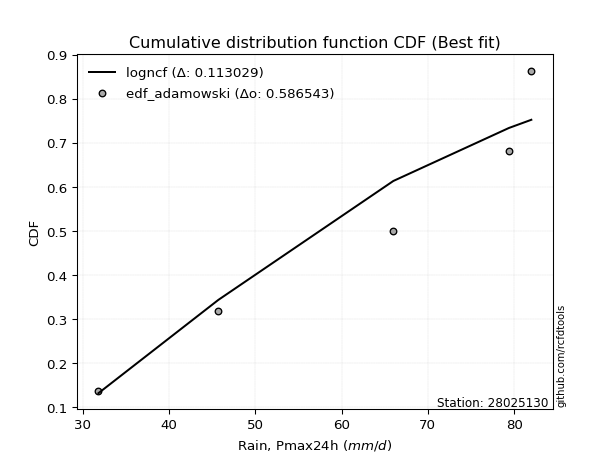</img></img>

</div>


## C. Best fit & Estimate extreme values for specific return periods - Tr

Best fit in probability distribution analysis means finding the theoretical distribution (like Normal, Poisson, Exponential, etc.) that most accurately mirrors your real-world data´s patterns (shape, center, spread) for better predictions, using methods like visual checks (Q-Q plots), goodness-of-fit tests (Kolmogorov-Smirnov, Chi-Squared), and information criteria (AIC) to score and select the simplest, most representative model.


### 1. Best fit (ordered by delta Δ)

:file_folder:Table: [bestfit_28025130.csv](table/bestfit_28025130.csv)

<div align="center">

|   id |   station | empirical_dist   | p_dist       |     delta |   deltao | eval   |   fit |   n |   best_fit |   best_fit_sort |
|-----:|----------:|:-----------------|:-------------|----------:|---------:|:-------|------:|----:|-----------:|----------------:|
|    0 |  28025130 | edf_california   | genpareto    | 0.0594    | 0.586543 | Δo > Δ |     1 |   5 |          1 |               1 |
|    1 |  28025130 | edf_gringorten   | ksone        | 0.0786296 | 0.586543 | Δo > Δ |     1 |   5 |          1 |               2 |
|    2 |  28025130 | edf_cunnane      | logtrapezoid | 0.0786423 | 0.586543 | Δo > Δ |     1 |   5 |          1 |               3 |
|    3 |  28025130 | edf_blom         | logtrapezoid | 0.0804738 | 0.586543 | Δo > Δ |     1 |   5 |          1 |               4 |
|    4 |  28025130 | edf_tukey        | logtrapezoid | 0.08345   | 0.586543 | Δo > Δ |     1 |   5 |          1 |               5 |
|    5 |  28025130 | edf_filliben     | logtrapezoid | 0.0845567 | 0.586543 | Δo > Δ |     1 |   5 |          1 |               6 |
|    6 |  28025130 | edf_beard        | logtrapezoid | 0.0850764 | 0.586543 | Δo > Δ |     1 |   5 |          1 |               7 |
|    7 |  28025130 | edf_jenkinson    | logtrapezoid | 0.0850764 | 0.586543 | Δo > Δ |     1 |   5 |          1 |               8 |
|    8 |  28025130 | edf_chegodayev   | logtrapezoid | 0.0857648 | 0.586543 | Δo > Δ |     1 |   5 |          1 |               9 |
|    9 |  28025130 | edf_hazen        | ksone        | 0.0880046 | 0.586543 | Δo > Δ |     1 |   5 |          1 |              10 |
|   10 |  28025130 | edf_adamowski    | logtrapezoid | 0.0891318 | 0.586543 | Δo > Δ |     1 |   5 |          1 |              11 |
|   11 |  28025130 | edf_weibull      | logtrapezoid | 0.104283  | 0.586543 | Δo > Δ |     1 |   5 |          1 |              12 |

</div>


### 2. Extreme values and % difference analysis

In hydrology, a return period (or recurrence interval $Tr$) is the statistical average time between extreme events like floods or droughts of a specific magnitude, indicating how rare an event is, with a 100-year flood, for example, having a 1% chance of occurring in any given year, not that it happens exactly every century. It is a key tool for infrastructure design (like bridges or dams) and risk assessment, calculated from historical data to determine the probability of future events, although it is important to remember it is statistical average, and events can cluster or be missed.

The extreme value porcentage difference is evaluated as $pdiff = 1 - (ETrBf / ETr) * 100$, where _ETrBf_ correspond to the bestfit extreme value for a specific recurrence interval and _ETr_ correspond to the extreme value for one of the most used PDFsused in hydrology.

> risk_rate: assuming the return period as the project useful life.

:file_folder:Table: [extreme_28025130.csv](table/extreme_28025130.csv), all PDFs.  
:file_folder:Table: [extremepdiff_28025130.csv](table/extremepdiff_28025130.csv), % difference between bestfit and most used PDFs in Hydrology.

<div align="center">

Extreme values table for only best fit PDFs
|   id |      tr |   prob_l |     prob_g |    alpha |   anglit |   arcsine |   argus |    beta |   betaprime |   bradford |    burr |   burr12 |   cosine |   crystalball |   dgamma |   dweibull |   erlang |   exponnorm |   exponpow |        exponweib |        f |   fatiguelife |   foldnorm |    gamma |   gausshyper |   genexpon |   genextreme |         gengamma |   genhalflogistic |   genlogistic |   gennorm |   genpareto |   gompertz |   gumbel_l |   gumbel_r |   halfgennorm |   halflogistic |   halfnorm |   hypsecant |   invgamma |   invgauss |       invweibull |   johnsonsb |   johnsonsu |   kappa3 |   kappa4 |   ksone |   kstwobign |   laplace |   levy_l |   loggamma |   logistic |   loglaplace |    lomax |   maxwell |   mielke |    moyal |   nakagami |         ncf |      nct |     norm |   pearson3 |   powerlaw |   rayleigh |   rdist |     rice |   semicircular |   skewnorm |        t |   trapezoid |   triang |   truncexpon |   truncnorm |   truncpareto |   truncweibull_min |   tukeylambda |   uniform |   vonmises |   vonmises_line |     wald |   weibull_max |   weibull_min |   wrapcauchy |   logalpha |   loganglit |   logarcsine |   logargus |   logbeta |   logbetaprime |   logbradford |   logburr |   logburr12 |   logcosine |   logcrystalball |   logdgamma |   logdweibull |   logerlang |   logexponnorm |   logexponpow |   logexponweib |     logf |   logfatiguelife |   logfoldnorm |   loggausshyper |   loggenexpon |   loggenextreme |   loggengamma |   loggenhalflogistic |   loggenlogistic |   loggennorm |   loggenpareto |   loggompertz |   loggumbel_l |   loggumbel_r |   loghalfgennorm |   loghalflogistic |   loghalfnorm |   loghypsecant |   loginvgamma |   loginvgauss |   loginvweibull |   logjohnsonsb |   logjohnsonsu |   logkappa3 |   logkappa4 |   logksone |   logkstwobign |   loglevy_l |   logloggamma |   loglogistic |   logloglaplace |   loglomax |   logmaxwell |   logmielke |   logmoyal |   lognakagami |   logncf |   lognct |   lognorm |   logpearson3 |   logpowerlaw |   lograyleigh |   logrdist |   logrice |   logsemicircular |   logskewnorm |     logt |   logtrapezoid |   logtriang |   logtruncexpon |   logtruncnorm |   logtruncpareto |   logtruncweibull_min |   logtukeylambda |   loguniform |   logvonmises |   logvonmises_line |   logwald |   logweibull_max |   logweibull_min |   logwrapcauchy |   station |   n |   risk_rate |
|-----:|--------:|---------:|-----------:|---------:|---------:|----------:|--------:|--------:|------------:|-----------:|--------:|---------:|---------:|--------------:|---------:|-----------:|---------:|------------:|-----------:|-----------------:|---------:|--------------:|-----------:|---------:|-------------:|-----------:|-------------:|-----------------:|------------------:|--------------:|----------:|------------:|-----------:|-----------:|-----------:|--------------:|---------------:|-----------:|------------:|-----------:|-----------:|-----------------:|------------:|------------:|---------:|---------:|--------:|------------:|----------:|---------:|-----------:|-----------:|-------------:|---------:|----------:|---------:|---------:|-----------:|------------:|---------:|---------:|-----------:|-----------:|-----------:|--------:|---------:|---------------:|-----------:|---------:|------------:|---------:|-------------:|------------:|--------------:|-------------------:|--------------:|----------:|-----------:|----------------:|---------:|--------------:|--------------:|-------------:|-----------:|------------:|-------------:|-----------:|----------:|---------------:|--------------:|----------:|------------:|------------:|-----------------:|------------:|--------------:|------------:|---------------:|--------------:|---------------:|---------:|-----------------:|--------------:|----------------:|--------------:|----------------:|--------------:|---------------------:|-----------------:|-------------:|---------------:|--------------:|--------------:|--------------:|-----------------:|------------------:|--------------:|---------------:|--------------:|--------------:|----------------:|---------------:|---------------:|------------:|------------:|-----------:|---------------:|------------:|--------------:|--------------:|----------------:|-----------:|-------------:|------------:|-----------:|--------------:|---------:|---------:|----------:|--------------:|--------------:|--------------:|-----------:|----------:|------------------:|--------------:|---------:|---------------:|------------:|----------------:|---------------:|-----------------:|----------------------:|-----------------:|-------------:|--------------:|-------------------:|----------:|-----------------:|-----------------:|----------------:|----------:|----:|------------:|
|    0 |    2    | 0.5      | 0.5        |  59.6282 |  60.98   |   60.98   | 65.6027 | 64.6372 |     59.9422 |    52.0291 | 62.9325 |  48.0366 |  59.9808 |       60.98   |  56.883  |    57.091  |  60.4658 |     60.98   |    31.8005 |     32.3277      |  60.945  |       31.8    |    64.9796 |  60.4054 |      55.2738 |    52.0088 |      70.5746 |     32.7903      |           62.146  |      inf      |      56.9 |     61.0847 |    64.6374 |    64.1751 |    57.7849 |       45.5687 |        56.1964 |    56.9988 |     60.98   |    59.5736 |    58.4596 |   4493.01        |     47.0032 |     81.9575 |  31.5298 |  56.5224 | 60.98   |     56.7284 |   60.98   |  75.9633 |    57.0223 |    60.98   |      57.4254 |  52.0045 |   59.3166 | -6.32645 |  56.7534 |    55.4043 |     57.3664 |  60.9759 |  60.98   |    62.1016 |    32.0281 |    58.7267 | 32.8356 |  59.957  |        60.98   |    62.682  |  60.9805 |     64.3169 |  62.8483 |      52.4506 |     60.9161 |       33.1753 |            51.9349 |       56.9208 |   56.9    |    1.48308 |         56.7505 |  54.6755 |       81.6093 |       64.6303 |      56.9    |    56.4885 |     57.4254 |      57.4254 |    63.1566 |   65.6526 |        56.9755 |       46.8364 |   62.9482 |     61.6984 |     55.6828 |          57.4254 |     55.1015 |       66      |     56.9348 |        57.4252 |       50.2239 |        55.3537 |  57.4132 |          57.3184 |       57.1617 |         52.9541 |       52.7515 |         69.0574 |       43.4032 |              62.0436 |              inf |      51.0643 |        66.2746 |       58.9847 |       60.9373 |       54.116  |          51.2268 |           52.5423 |       53.3314 |        57.4254 |       56.4773 |       56.0865 |         54.163  |        71.7582 |        81.9996 |     31.8    |     51.9543 |    57.4254 |        52.8334 |     75.6951 |       64.0843 |       57.4254 |         66      |    47.8892 |      55.678  |     64.1845 |    53.0889 |       52.8921 |  56.5394 |  57.2185 |   57.4254 |       59.4508 |       31.9904 |       55.0712 |    76.0929 |   56.6131 |           57.4254 |       58.2356 |  57.4257 |        61.0979 |     57.7603 |         46.1922 |        53.9432 |          32.7036 |               47.9786 |          51.1422 |      51.0647 |      0.107749 |            51.0647 |   51.0789 |          65.9578 |          61.5308 |         51.0647 |  28025130 |   5 |    0.75     |
|    1 |    2.33 | 0.570815 | 0.429185   |  63.2508 |  65.0227 |   67.0487 | 68.4895 | 70.5997 |     63.6504 |    55.5923 | 66.4316 |  52.6005 |  63.4425 |       64.4507 |  67.685  |    68.5063 |  64.0002 |     64.4507 |    31.8035 |     34.338       |  64.433  |       32.5659 |    65.1735 |  63.9403 |      59.0789 |    56.4615 |      73.2932 |     36.205       |           65.9496 |      inf      |      56.9 |     66.5717 |    67.6964 |    67.1947 |    61.0008 |       50.4382 |        59.5029 |    60.7446 |     63.7576 |    63.1949 |    62.1865 | 548926           |     64.5505 |     81.9932 |  31.5298 |  60.2841 | 65.751  |     60.6272 |   63.0803 |  77.8323 |    60.9152 |    64.0379 |      59.7103 |  56.4583 |   62.9224 | -6.32645 |  59.7977 |    58.6927 |     76.4122 |  64.4476 |  64.4507 |    65.5163 |    32.4395 |    62.3858 | 35.1201 |  63.5546 |        65.3158 |    65.7649 |  64.4512 |     68.312  |  66.0426 |      55.9445 |     67.5562 |       33.8317 |            55.484  |       60.639  |   60.4549 |    1.8045  |         60.3266 |  56.9512 |       81.8159 |       67.6908 |      72.3636 |    60.3471 |     61.9043 |      64.2789 |    66.263  |   71.5542 |        61.3061 |       50.0989 |   66.1803 |     65.0661 |     59.4442 |          61.25   |     66.6754 |       68.2782 |     60.7785 |        61.2497 |       57.3491 |        63.2547 |  61.2512 |          61.1313 |       61.022  |         56.9348 |       56.9796 |         71.999  |       46.9065 |              65.6655 |              inf |      51.0643 |        73.5241 |       62.6227 |       64.4532 |       57.4476 |          54.8091 |           55.871  |       57.1748 |        60.4664 |       60.3151 |       60.0861 |         58.4735 |        80.9283 |        81.9999 |     31.8    |     55.7193 |    62.7476 |        57.0575 |     77.5945 |       67.1767 |       60.7821 |         69.2811 |    52.4859 |      59.5354 |     67.2992 |    56.1779 |       56.0485 |  62.2214 |  61.098  |   61.25   |       63.2736 |       32.3038 |       58.9449 |    84.5706 |   60.5252 |           62.2424 |       61.5045 |  61.2502 |        65.805  |     61.2049 |         49.296  |        55.7588 |          33.1382 |               51.2025 |          54.8269 |      54.6076 |      0.114847 |            53.9272 |   53.2846 |          70.1536 |          64.9097 |         61.7128 |  28025130 |   5 |    0.729209 |
|    2 |    5    | 0.8      | 0.2        |  77.3667 |  79.2862 |   83.2319 | 76.7047 | 80.876  |     78.1674 |    68.5838 | 76.2463 | inf      |  75.9172 |       77.3486 |  76.3908 |    77.3908 |  77.3763 |     77.3486 |    32.736  |    490.677       |  77.4126 |       48.8361 |    65.9936 |  77.3241 |      71.8859 |    78.7235 |      79.326  |    623.653       |           75.8684 |      inf      |      56.9 |     78.6301 |    77.58   |    76.9494 |    74.9724 |       84.2348 |        74.4642 |    76.5849 |     74.899  |    77.3101 |    77.3831 |      6.60013e+14 |     81.884  |     82      |  31.5298 |  72.3312 | 81.1918 |     77.1884 |   73.5812 |  80.9289 |    78.1924 |    75.8448 |      72.5724 |  78.7383 |   77.1144 | 75.9731  |  73.8992 |    75.0818 |    237.17   |  77.3512 |  77.3486 |    77.5891 |    40.6427 |    77.0348 | 41.9514 |  77.3208 |        80.1123 |    74.7439 |  77.3492 |     79.7735 |  75.2068 |      68.6361 |     98.1185 |       40.3406 |            68.4249 |       72.5093 |   71.96   |    3.00916 |         71.9003 |  69.6909 |       81.993  |       77.5777 |      80.1991 |    77.7376 |     80.6863 |      86.8238 |    75.6728 |   81.1575 |        80.9625 |       63.9231 |   75.4468 |     77.2657 |     75.2335 |          77.8335 |     78.3677 |       88.4562 |     77.8388 |        77.8332 |      111.01   |       124.532  |  77.911  |          77.6876 |       77.7981 |         71.106  |       78.3337 |         78.8759 |       68.7883 |              75.743  |              inf |      51.0643 |        81.6844 |       76.8524 |       77.2585 |       74.4724 |          68.2113 |           73.7726 |       76.738  |        74.371  |       77.6141 |       78.6318 |         81.5535 |        81.9999 |        82      |     31.8    |     69.345  |    83.5939 |        79.1053 |     80.8467 |       75.7487 |       75.6893 |         89.0582 |    83.6625 |      77.4958 |     75.9371 |    73.0024 |       76.2078 |  89.7657 |  78.1493 |   77.8335 |       78.2703 |       38.2763 |       77.3812 |   113.313  |   77.9392 |           81.9341 |       72.1088 |  77.8338 |        81.4201 |     72.2703 |         62.7928 |        64.3615 |          37.6683 |               64.5408 |          68.5184 |      67.8479 |      0.145741 |            65.6283 |   67.5124 |          79.0444 |          77.1459 |         76.6781 |  28025130 |   5 |    0.67232  |
|    3 |   10    | 0.9      | 0.1        |  87.342  |  87.3595 |   87.1386 | 80.1759 | 81.8726 |     88.4519 |    75.0284 | 80.0466 | inf      |  83.454  |       85.9047 |  81.4197 |    81.4182 |  86.4608 |     85.9047 |    46.2385 |   9093.74        |  86.0382 |       71.3012 |    66.6004 |  86.4191 |      77.3859 |    98.9323 |      80.9777 |   9599.62        |           79.2425 |      inf      |      56.9 |     81.1531 |    83.0834 |    82.3805 |    86.352  |      128.933  |        86.889  |    88.3063 |     83.7958 |    87.2807 |    88.7153 |      1.64108e+22 |     81.9968 |     82      |  31.5298 |  77.394  | 87.9291 |     89.7976 |   83.1137 |  81.6765 |    92.6232 |    84.5402 |      86.6323 |  98.9806 |   87.1021 | 79.1406  |  86.1768 |    88.4623 |    563.12   |  85.9128 |  85.9047 |    85.072  |    53.9124 |    87.4799 | 44.2913 |  86.6792 |        87.7046 |    78.401  |  85.9058 |     84.2505 |  78.7864 |      74.9964 |    122.888  |       50.6335 |            74.9013 |       77.4817 |   76.98   |    3.73302 |         76.9502 |  83.2107 |       81.9995 |       83.0822 |      81.1919 |    92.6026 |     93.7423 |      93.3598 |    79.927  |   81.9218 |        97.8757 |       72.0683 |   79.0711 |     85.0322 |     86.7398 |          91.2427 |     86.1106 |      117.486  |     92.0938 |        91.2422 |      193.791  |       231.255  |  91.4022 |          91.1022 |       91.3998 |         77.2936 |       98.8389 |         80.8183 |       96.0561 |              79.2774 |              inf |      51.0643 |        81.9848 |       86.614  |       85.4603 |       92.0041 |          75.0429 |           92.9264 |       95.4077 |        87.7371 |       92.3998 |       95.1015 |        106.936  |        82      |        82      |     74.7027 |     75.8184 |    94.7395 |       101.447  |     81.6521 |       78.9905 |       88.9589 |        113.305  |   129.258  |      93.2951 |     79.2052 |    91.705  |       98.8247 | 115.573  |  92.2015 |   91.2427 |       88.7142 |       49.3019 |       93.9522 |   122.662  |   92.4199 |           94.3452 |       76.935  |  91.2429 |        88.4813 |     77.1171 |         71.1721 |        70.8142 |          45.8771 |               72.3543 |          75.3009 |      74.5891 |      0.171092 |            72.9164 |   86.7879 |          81.0789 |          84.932  |         79.5438 |  28025130 |   5 |    0.651322 |
|    4 |   15    | 0.933333 | 0.0666667  |  92.5167 |  90.807  |   87.8838 | 81.4231 | 81.9645 |     93.7835 |    77.2916 | 81.347  | inf      |  86.8871 |       90.1744 |  83.9775 |    83.2393 |  91.0577 |     90.1744 |    77.5154 |  35805.9         |  90.3471 |       85.9937 |    66.9162 |  91.0227 |      79.1109 |   110.754  |      81.4057 |  34215.1         |           80.2457 |      inf      |      56.9 |     81.6224 |    85.5759 |    84.84   |    92.7723 |      161.539  |        93.9203 |    94.4061 |     88.8731 |    92.4486 |    94.768  |      2.44148e+26 |     81.9995 |     82      |  31.5298 |  79.0191 | 90.1749 |     96.4916 |   88.6898 |  81.9023 |   100.905  |    89.2778 |      96.0878 | 110.829  |   92.2266 | 80.143   |  93.3021 |    95.5834 |    909.683  |  90.1858 |  90.1744 |    88.6526 |    61.1455 |    92.8617 | 44.91   |  91.3937 |        90.6654 |    79.6042 |  90.1759 |     85.6869 |  79.9349 |      77.2532 |    136.364  |       57.2446 |            77.1933 |       79.078  |   78.6533 |    4.01525 |         78.6335 |  91.8924 |       81.9999 |       85.5751 |      81.4711 |   101.274  |     99.9425 |      94.6612 |    81.4994 |   81.9806 |       107.767  |       75.1584 |   80.2351 |     88.8039 |     92.5492 |          98.7748 |     90.3522 |      140.508  |    100.278  |        98.7742 |      262.522  |       332.04   |  98.9878 |          98.6479 |       99.0523 |         79.1696 |      111.539  |         81.3197 |      116.059  |              80.3106 |              inf |      51.0643 |        81.9974 |       91.5197 |       89.4558 |      103.659  |          77.4688 |          105.893  |      106.856  |        96.4156 |      101.023  |      104.948  |        124.599  |        82      |        82      |     77.1034 |     77.9835 |    98.7757 |       115.769  |     81.8969 |       80.0192 |       97.1433 |        131.22   |   167.603  |     102.613  |     80.2424 |   104.684  |      113.607  | 131.494  | 100.195  |   98.7748 |       94.0084 |       56.3457 |      103.831  |   124.743  |  100.678  |           99.6798 |       78.5925 |  98.775  |        90.8743 |     78.7401 |         74.4621 |        73.7613 |          51.9575 |               75.3361 |          77.6399 |      76.9818 |      0.185559 |            75.7552 |  101.977  |          81.525  |          88.7121 |         80.3816 |  28025130 |   5 |    0.644736 |
|    5 |   20    | 0.95     | 0.05       |  95.98   |  92.835  |   88.1462 | 82.0917 | 81.9857 |     97.3479 |    78.4457 | 82.0581 | inf      |  88.9984 |       92.9705 |  85.6863 |    84.385  |  94.091  |     92.9705 |   123.016  |  84717.6         |  93.1706 |       96.8717 |    67.1267 |  94.0611 |      79.9323 |   119.141  |      81.5935 |  75854.7         |           80.7221 |      inf      |      56.9 |     81.7871 |    87.1273 |    86.371  |    97.2676 |      187.667  |        98.8466 |    98.4729 |     92.4549 |    95.905  |    98.8805 |      2.03773e+29 |     81.9998 |     82      |  79.5261 |  79.8116 | 91.2978 |    101.001  |   92.6461 |  82.018  |   106.769  |    92.5524 |     103.416  | 119.239  |   95.6276 | 80.6351  |  98.3484 |   100.36   |   1270.49   |  92.9842 |  92.9705 |    90.9429 |    65.4788 |    96.4388 | 45.1765 |  94.494  |        92.3076 |    80.204  |  92.9723 |     86.3955 |  80.5015 |      78.4098 |    145.541  |       61.6383 |            78.3663 |       79.8577 |   79.49   |    4.16325 |         79.4752 |  98.3621 |       82      |       87.1268 |      81.6058 |   107.475  |    103.78   |      95.1238 |    82.3524 |   81.9928 |       114.847  |       76.7828 |   80.8096 |     91.2364 |     96.3134 |         104.041  |     93.3065 |      160.268  |    106.074  |       104.041  |      322.531  |       429.02   | 104.295  |         103.928  |      104.408  |         80.0354 |      120.907  |         81.5383 |      132.392  |              80.7926 |              inf |      51.0643 |        81.9993 |       94.7358 |       92.0365 |      112.687  |          78.7111 |          116.042  |      115.242  |       103.049  |      107.188  |      112.093  |        138.677  |        82      |        82      |     78.3326 |     79.0515 |   100.858  |       126.54   |     82.0226 |       80.5247 |      103.236  |        146.024  |   202.014  |     109.306  |     80.7521 |   114.973  |      124.765  | 143.247  | 105.826  |  104.041  |       97.49   |       60.9787 |      110.965  |   125.535  |  106.499  |          102.768  |       79.4322 | 104.041  |        92.0784 |     79.5532 |         76.219  |        75.4688 |          56.3978 |               76.9097 |          78.8151 |      78.2068 |      0.195791 |            77.2502 |  115      |          81.7015 |          91.1495 |         80.7903 |  28025130 |   5 |    0.641514 |
|    6 |   25    | 0.96     | 0.04       |  98.5681 |  94.2093 |   88.2679 | 82.5172 | 81.9929 |    100.009  |    79.1455 | 82.5309 | inf      |  90.479  |       95.0288 |  86.9645 |    85.2083 |  96.3356 |     95.0288 |   179.121  | 156899           |  95.2498 |      105.515  |    67.2834 |  96.3097 |      80.4064 |   125.647  |      81.6966 | 133946           |           80.9989 |      inf      |      56.9 |     81.8635 |    88.2314 |    87.4605 |   100.73   |      209.683  |       102.642  |   101.499  |     95.227  |    98.4867 |   101.985  |      3.6263e+31  |     81.9999 |     82      |  80.0313 |  80.2784 | 91.9715 |    104.379  |   95.7149 |  82.0906 |   111.325  |    95.0574 |     109.483  | 125.764  |   98.1525 | 80.9276  | 102.26   |   103.922  |   1642.3    |  95.0443 |  95.0288 |    92.6015 |    68.338  |    99.0965 | 45.3198 |  96.7819 |        93.3729 |    80.5636 |  95.0309 |     86.8177 |  80.839  |      79.1131 |    152.461  |       64.7341 |            79.0791 |       80.3175 |   79.992  |    4.25386 |         79.9802 | 103.544  |       82      |       88.231  |      81.6856 |   112.329  |    106.463  |      95.3392 |    82.8987 |   81.9967 |       120.39   |       77.7841 |   81.1519 |     93.0081 |     99.044  |         108.097  |     95.5815 |      177.907  |    110.578  |       108.096  |      376.434  |       523.214  | 108.383  |         107.997  |      108.534  |         80.5225 |      128.391  |         81.6575 |      146.429  |              81.0685 |              inf |      51.0643 |        81.9997 |       97.1032 |       93.9183 |      120.174  |          79.466  |          124.519  |      121.906  |       108.495  |      112.013  |      117.741  |        150.595  |        82      |        82      |     79.0794 |     79.6832 |   102.128  |       135.259  |     82.1016 |       80.8253 |      108.154  |        158.904  |   233.828  |     114.555  |     81.0552 |   123.638  |      133.802  | 152.65   | 110.185  |  108.097  |      100.056  |       64.2202 |      116.582  |   125.921  |  111.006  |          104.822  |       79.9397 | 108.097  |        92.8035 |     80.0417 |         77.3118 |        76.5868 |          59.7346 |               77.882  |          79.5193 |      78.9511 |      0.203744 |            78.1699 |  126.621  |          81.7913 |          92.9246 |         81.0334 |  28025130 |   5 |    0.639603 |
|    7 |   50    | 0.98     | 0.02       | 106.167  |  97.5924 |   88.4306 | 83.4653 | 81.9992 |    107.804  |    80.5616 | 83.7361 | inf      |  94.356  |      100.923  |  90.7317 |    87.4866 | 102.818  |    100.923  |   546.724  | 847395           | 101.208  |      133.245  |    67.7387 | 102.805  |      81.2926 |   145.856  |      81.8768 | 632143           |           81.5281 |      inf      |      56.9 |     81.9657 |    91.2284 |    90.4178 |   111.397  |      288.117  |       114.337  |   110.294  |    103.821  |   106.059  |   111.242  |      3.10187e+38 |     82      |     82      |  81.0417 |  81.1832 | 93.3189 |    114.297  |  105.247  |  82.254  |   125.598  |   102.711  |     130.694  | 146.045  |  105.475  | 81.5063  | 114.402  |   114.295  |   3614.41   | 100.944  | 100.923  |    97.2239 |    74.6971 |   106.811  | 45.5594 | 103.357  |        95.8067 |    81.282  | 100.926  |     87.6555 |  81.5089 |      80.5415 |    172.975  |       72.2323 |            80.5254 |       81.2127 |   80.996  |    4.43811 |         80.9902 | 120.464  |       82      |       91.2284 |      81.8434 |   127.731  |    113.369  |      95.6276 |    84.1267 |   81.9997 |       137.985  |       79.849  |   81.8321 |     97.9945 |    106.567  |         120.605  |    102.625  |      248.916  |    124.695  |       120.605  |      592.6    |       967.649  | 121.001  |         120.559  |      121.275  |         81.3937 |      152.93   |         81.8637 |      198.857  |              81.582  |              inf |      51.0643 |        82      |      103.872  |       99.2225 |      146.511  |          80.9975 |          154.735  |      143.545  |       127.277  |      127.319  |      135.983  |        194.14   |        82      |        82      |     80.5946 |     80.9098 |   104.717  |       164.492  |     82.2797 |       81.4204 |      124.678  |        208.533  |   371.222  |     131.248  |     81.6553 |   154.924  |      164.043  | 183.621  | 123.756  |  120.605  |      107.39   |       71.9997 |      134.547  |   126.478  |  125.034  |          109.67   |       80.9636 | 120.605  |        94.2592 |     81.02   |         79.5905 |        79.0782 |          68.5954 |               79.8937 |          80.9166 |      80.4611 |      0.228724 |            80.0568 |  173.384  |          81.9308 |          97.9196 |         81.517  |  28025130 |   5 |    0.63583  |
|    8 |   75    | 0.986667 | 0.0133333  | 110.364  |  99.0813 |   88.4607 | 83.8351 | 81.9998 |    112.095  |    81.0386 | 84.3341 | inf      |  96.2074 |      104.086  |  92.8247 |    88.6675 | 106.33   |    104.086  |   975.529  |      2.00276e+06 | 104.407  |      149.946  |    67.9866 | 106.325  |      81.5608 |   157.677  |      81.927  |      1.39149e+06 |           81.6953 |      inf      |      56.9 |     81.9847 |    92.7439 |    91.9133 |   117.597  |      341.264  |       121.135  |   115.081  |    108.844  |   110.235  |   116.439  |      3.31787e+42 |     82      |     82      |  81.3786 |  81.4721 | 93.7681 |    119.754  |  110.823  |  82.3212 |   134.076  |   107.131  |     144.959  | 157.915  |  109.456  | 81.6975  | 121.503  |   119.944  |   5713.03   | 104.11   | 104.086  |    99.6273 |    77.021  |   111.009  | 45.6214 | 106.898  |        96.7789 |    81.5214 | 104.089  |     87.9329 |  81.7307 |      81.0243 |    184.368  |       75.1992 |            81.0137 |       81.5007 |   81.3307 |    4.50015 |         81.3268 | 130.875  |       82      |       92.7442 |      81.8957 |   137.02   |    116.549  |      95.6812 |    84.6096 |   81.9999 |       148.593  |       80.5563 |   82.0605 |    100.618  |    110.358  |         127.904  |    106.767  |      305.131  |    133.084  |       127.903  |      759.945  |      1384.84   | 128.368  |         127.898  |      128.718  |         81.6408 |      168.245  |         81.9202 |      236.783  |              81.7379 |              inf |      51.0643 |        82      |      107.494  |      102.018  |      164.396  |          81.5146 |          175.564  |      156.897  |       139.725  |      136.546  |      147.205  |        225.024  |        82      |        82      |     81.1061 |     81.3    |   105.594  |       183.189  |     82.353  |       81.617  |      135.349  |        246.111  |   489.227  |     141.323  |     81.8536 |   176.77   |      183.294  | 203.089  | 131.758  |  127.904  |      111.302  |       75.0522 |      145.458  |   126.593  |  133.3    |          111.669  |       81.3077 | 127.904  |        94.7461 |     81.3465 |         80.3789 |        79.9981 |          72.4308 |               80.585  |          81.3745 |      80.9708 |      0.243647 |            80.6988 |  210.382  |          81.9636 |         100.547  |         81.6779 |  28025130 |   5 |    0.634587 |
|    9 |  100    | 0.99     | 0.01       | 113.251  |  99.9666 |   88.4713 | 84.0401 | 81.9999 |    115.041  |    81.278  | 84.7318 | inf      |  97.3679 |      106.225  |  94.2705 |    89.452  | 108.718  |    106.225  |  1421.14   |      3.52413e+06 | 106.572  |      161.963  |    68.1554 | 108.719  |      81.6869 |   166.065  |      81.9496 |      2.33498e+06 |           81.7764 |      inf      |      56.9 |     81.9914 |    93.7352 |    92.8915 |   121.985  |      382.329  |       125.946  |   118.343  |    112.407  |   113.105  |   120.048  |      2.35829e+45 |     82      |     82      |  81.547  |  81.6127 | 93.9927 |    123.493  |  114.78   |  82.3604 |   140.165  |   110.252  |     156.014  | 166.341  |  112.168  | 81.7927  | 126.541  |   123.789  |   7898.29   | 106.251  | 106.225  |   101.223  |    78.2236 |   113.868  | 45.648  | 109.298  |        97.3234 |    81.641  | 106.229  |     88.0712 |  81.8413 |      81.2669 |    192.21   |       76.7851 |            81.2591 |       81.6418 |   81.498  |    4.53125 |         81.4952 | 138.466  |       82      |       93.7356 |      81.9218 |   143.756  |    118.482  |      95.7    |    84.8783 |   82      |       156.282  |       80.9137 |   82.1785 |    102.372  |    112.803  |         133.089  |    109.728  |      353.569  |    139.111  |       133.088  |      900.527  |      1784.95   | 133.605  |         133.115  |      134.009  |         81.7523 |      179.567  |         81.9454 |      267.516  |              81.8116 |              inf |      51.0643 |        82      |      109.938  |      103.889  |      178.358  |          81.7746 |          191.98   |      166.698  |       149.286  |      143.234  |      155.442  |        249.808  |        82      |        82      |     81.363  |     81.4891 |   106.036  |       197.212  |     82.3959 |       81.715  |      143.428  |        277.673  |   596.598  |     148.625  |     81.9526 |   194.112  |      197.675  | 217.558  | 137.48   |  133.089  |      113.933  |       76.6783 |      153.394  |   126.636  |  139.207  |          112.804  |       81.4802 | 133.089  |        94.9899 |     81.5098 |         80.7788 |        80.4773 |          74.5629 |               80.9346 |          81.6005 |      81.2269 |      0.254422 |            81.022  |  242.243  |          81.9769 |         102.303  |         81.7583 |  28025130 |   5 |    0.633968 |
|   10 |  200    | 0.995    | 0.005      | 119.951  | 101.639  |   88.4814 | 84.3939 | 82      |    121.852  |    81.6383 | 85.6371 | inf      |  99.7274 |      111.077  |  97.6448 |    91.1933 | 114.177  |    111.077  |  3171.83   |      1.21155e+07 | 111.485  |      191.378  |    68.5416 | 114.191  |      81.8616 |   186.273  |      81.9794 |      7.22276e+06 |           81.8937 |      inf      |      56.9 |     81.9978 |    95.89   |    95.0176 |   132.534  |      493.067  |       137.514  |   125.802  |    120.99   |   119.756  |   128.517  |      1.69225e+52 |     82      |     82      |  81.7996 |  81.8164 | 94.3295 |    132.104  |  124.312  |  82.4348 |   155.131  |   117.739  |     186.239  | 186.654  |  118.372  | 81.9352  | 138.678  |   132.572  |  17204      | 111.109  | 111.077  |   104.753  |    80.0796 |   120.411  | 45.6808 | 114.752  |        98.2726 |    81.8205 | 111.082  |     88.2783 |  82.0068 |      81.6325 |    210.371  |       79.3029 |            81.6286 |       81.848  |   81.749  |    4.57794 |         81.7477 | 157.374  |       82      |       95.8906 |      81.9609 |   160.538  |    122.221  |      95.7181 |    85.3434 |   82      |       175.415  |       81.4544 |   82.3775 |    106.292  |    117.943  |         145.643  |    116.968  |      508.746  |    153.932  |       145.642  |     1327.66   |      3284.33   | 146.292  |         145.76   |      146.83   |         81.899  |      208.477  |         81.9781 |      356.93   |              81.915  |              inf |      51.0643 |        82      |      115.461  |      108.074  |      216.972  |          82.1705 |          238.003  |      191.477  |       175.092  |      159.889  |      176.307  |        321.143  |        82      |        82      |     81.75   |     81.7611 |   106.701  |       233.731  |     82.4772 |       81.8616 |      164.83   |        375.451  |   970.917  |     166.781  |     82.1035 |   243.208  |      234.884  | 254.829  | 151.46   |  145.643  |      119.836  |       79.2524 |      173.219  |   126.681  |  153.617  |          114.811  |       81.7397 | 145.643  |        95.356  |     81.7549 |         81.3859 |        81.2221 |          78.07   |               81.4642 |          81.9336 |      81.6125 |      0.281164 |            81.5096 |  344.191  |          81.9922 |         106.228  |         81.8791 |  28025130 |   5 |    0.633042 |
|   11 |  250    | 0.996    | 0.004      | 122.041  | 102.065  |   88.4827 | 84.4762 | 82      |    123.97   |    81.7106 | 85.9187 | inf      | 100.374  |      112.56   |  98.7031 |    91.7157 | 115.856  |    112.56   |  3997.65   |      1.74517e+07 | 112.988  |      200.964  |    68.6604 | 115.874  |      81.8936 |   192.779  |      81.9845 |      1.00799e+07 |           81.9163 |      inf      |      56.9 |     81.9986 |    96.5239 |    95.6432 |   135.925  |      532.354  |       141.232  |   128.097  |    123.753  |   121.828  |   131.186  |      2.70723e+54 |     82      |     82      |  81.8501 |  81.8556 | 94.3969 |    134.77   |  127.381  |  82.4542 |   160.047  |   120.142  |     197.165  | 193.197  |  120.282  | 81.9636  | 142.586  |   135.27   |  22096      | 112.594  | 112.56   |   105.807  |    80.4585 |   122.425  | 45.6861 | 116.422  |        98.4952 |    81.8564 | 112.566  |     88.3196 |  82.0399 |      81.7058 |    216.016  |       79.8275 |            81.7028 |       81.8882 |   81.7992 |    4.58729 |         81.7982 | 163.629  |       82      |       96.5246 |      81.9687 |   166.12   |    123.191  |      95.7203 |    85.452  |   82      |       181.77   |       81.5632 |   82.4263 |    107.473  |    119.392  |         149.71   |    119.338  |      573.387  |    158.803  |       149.709  |     1495.79   |      3994.67   | 150.406  |         149.862  |      150.988  |         81.9244 |      218.295  |         81.9837 |      391.032  |              81.9341 |              inf |      51.0643 |        82      |      117.143  |      109.337  |      231.082  |          82.2528 |          255.027  |      199.817  |       184.314  |      165.425  |      183.352  |        348.152  |        82      |        82      |     81.8276 |     81.813  |   106.835  |       246.349  |     82.4984 |       81.8909 |      172.356  |        415.153  |  1138.82   |     172.804  |     82.1357 |   261.519  |      247.659  | 267.596  | 156.027  |  149.71   |      121.619  |       79.7876 |      179.823  |   126.687  |  158.318  |          115.287  |       81.7917 | 149.71   |        95.4293 |     81.8039 |         81.5083 |        81.375  |          78.8202 |               81.5709 |          81.9989 |      81.6899 |      0.290044 |            81.6075 |  386.604  |          81.9945 |         107.411  |         81.9033 |  28025130 |   5 |    0.632858 |
|   12 |  500    | 0.998    | 0.002      | 128.362  | 103.12   |   88.4843 | 84.6648 | 82      |    130.351  |    81.8552 | 86.7784 | inf      | 102.096  |      116.957  | 101.918  |    93.2406 | 120.865  |    116.957  |  7656.28   |      4.98751e+07 | 117.445  |      231.036  |    69.0146 | 120.898  |      81.953  |   212.988  |      81.9936 |      2.62754e+07 |           81.9602 |      inf      |      56.9 |     81.9997 |    98.3414 |    97.4365 |   146.451  |      666.059  |       152.775  |   134.94   |    132.335  |   128.086  |   139.322  |      1.87706e+61 |     82      |     82      |  81.9511 |  81.9316 | 94.5316 |    142.756  |  136.913  |  82.5042 |   175.656  |   127.596  |     235.363  | 213.531  |  125.981  | 82.0205  | 154.723  |   143.302  |  48045.4    | 116.997  | 116.957  |   108.867  |    81.224  |   128.434  | 45.6949 | 121.382  |        99.008  |    81.9282 | 116.964  |     88.4023 |  82.106  |      81.8528 |    232.993  |       80.8987 |            81.8512 |       81.967  |   81.8996 |    4.60598 |         81.8992 | 183.519  |       82      |       98.3422 |      81.9844 |   184.067  |    125.631  |      95.7232 |    85.7012 |   82      |       202.17   |       81.7814 |   82.5536 |    110.935  |    123.337  |         162.454  |    126.842  |      837.253  |    174.274  |       162.452  |     2132.13   |      7328.07   | 163.299  |         162.722  |      164.023  |         81.9692 |      250.466  |         81.9934 |      516.849  |              81.9702 |              inf |      81.847  |        82      |      122.111  |      113.041  |      280.991  |          82.4315 |          316.017  |      226.902  |       216.172  |      183.216  |      206.334  |        447.325  |        82      |        82      |     81.9831 |     81.9126 |   107.103  |       288.389  |     82.5531 |       81.9494 |      197.955  |        573.562  |  1885.31   |     192.102  |     82.2095 |   327.662  |      289.926  | 309.834  | 170.45   |  162.454  |      126.836  |       80.8792 |      201.061  |   126.695  |  173.14   |          116.39   |       81.8958 | 162.453  |        95.5759 |     81.902  |         81.7543 |        81.685  |          80.3731 |               81.7849 |          82.1273 |      81.8448 |      0.318614 |            81.8036 |  559.417  |          81.9982 |         110.876  |         81.9516 |  28025130 |   5 |    0.632489 |
|   13 |  750    | 0.998667 | 0.00133333 | 131.955  | 103.588  |   88.4846 | 84.7404 | 82      |    133.961  |    81.9035 | 87.2757 | inf      | 102.93   |      119.4    | 103.755  |    94.0731 | 123.668  |    119.4    | 10744.1    |      8.76166e+07 | 119.922  |      248.804  |    69.2125 | 123.709  |      81.9708 |   224.809  |      81.9962 |      4.39141e+07 |           81.9742 |       81.9725 |      56.9 |     81.9998 |    99.3127 |    98.395  |   152.605  |      752.666  |       159.522  |   138.762  |    137.355  |   131.636  |   143.989  |      1.87365e+65 |     82      |     82      |  81.9848 |  81.9558 | 94.5766 |    147.243  |  142.49   |  82.5279 |   185.041  |   131.951  |     261.052  | 225.434  |  129.168  | 82.04    | 161.822  |   147.78   |  75659.9    | 119.443  | 119.4    |   110.524  |    81.4815 |   131.794  | 45.6971 | 124.141  |        99.2143 |    81.9521 | 119.408  |     88.4298 |  82.128  |      81.9018 |    242.564  |       81.2624 |            81.9008 |       81.9926 |   81.9331 |    4.61221 |         81.9328 | 195.445  |       82      |       99.3136 |      81.9896 |   195.019  |    126.726  |      95.7237 |    85.8011 |   82      |       214.591  |       81.8544 |   82.618  |    112.831  |    125.295  |         169.995  |    131.343  |     1049.61   |    183.58   |       169.994  |     2596.67   |     10440.3    | 170.934  |         170.341  |      171.744  |         81.9818 |      270.507  |         81.9961 |      606.685  |              81.9813 |              inf |      81.8987 |        82      |      124.859  |      115.072  |      315.021  |          82.502  |          358.221  |      243.601  |       237.303  |      194.064  |      220.599  |        517.916  |        82      |        82      |     82.0351 |     81.944  |   107.192  |       315.08   |     82.579  |       81.9688 |      214.635  |        698.476  |  2547.55   |     203.821  |     82.2422 |   373.858  |      316.537  | 336.462  | 179.067  |  169.995  |      129.682  |       81.2495 |      214.012  |   126.697  |  181.975  |          116.837  |       81.9305 | 169.995  |        95.6248 |     81.9347 |         81.8366 |        81.7895 |          80.907  |               81.8565 |          82.1691 |      81.8965 |      0.336105 |            81.8691 |  698.152  |          81.999  |         112.773  |         81.9677 |  28025130 |   5 |    0.632366 |
|   14 | 1000    | 0.999    | 0.001      | 134.464  | 103.866  |   88.4847 | 84.7828 | 82      |    136.474  |    81.9276 | 87.6276 | inf      | 103.456  |      121.081  | 105.041  |    94.6406 | 125.606  |    121.081  | 13450.8    |      1.28127e+08 | 121.628  |      261.478  |    69.3492 | 125.653  |      81.9792 |   233.197  |      81.9974 |      6.20852e+07 |           81.981  |       81.9795 |      56.9 |     81.9999 |    99.9664 |    99.04   |   156.97   |      817.969  |       164.309  |   141.402  |    140.917  |   134.112  |   147.264  |      1.28672e+68 |     82      |     82      |  82.0017 |  81.9676 | 94.599  |    150.351  |  146.446  |  82.5428 |   191.82   |   135.039  |     280.962  | 233.882  |  131.371  | 82.0502  | 166.86   |   150.869  | 104415      | 121.127  | 121.081  |   111.648  |    81.6107 |   134.116  | 45.6981 | 126.043  |        99.3303 |    81.9641 | 121.091  |     88.4436 |  82.139  |      81.9264 |    249.208  |       81.4455 |            81.9256 |       82.0052 |   81.9498 |    4.61533 |         81.9497 | 204.023  |       82      |       99.9674 |      81.9922 |   203.006  |    127.383  |      95.7239 |    85.8572 |   82      |       223.634  |       81.8909 |   82.661  |    114.126  |    126.546  |         175.39   |    134.591  |     1234.57   |    190.305  |       175.389  |     2973.93   |     13415.5    | 176.398  |         175.795  |      177.271  |         81.9875 |      285.296  |         81.9974 |      678.917  |              81.9865 |              inf |      81.9245 |        82      |      126.745  |      116.459  |      341.631  |          82.5426 |          391.533  |      255.845  |       253.537  |      201.972  |      231.11   |        574.644  |        82      |        82      |     82.0614 |     81.9592 |   107.237  |       335.006  |     82.5954 |       81.9786 |      227.309  |        806.248  |  3163.04   |     212.336  |     82.2628 |   410.533  |      336.295  | 356.269  | 185.268  |  175.39   |      131.618  |       81.4359 |      223.446  |   126.698  |  188.324  |          117.089  |       81.9479 | 175.39   |        95.6493 |     81.951  |         81.8779 |        81.842  |          81.177  |               81.8923 |          82.1898 |      81.9224 |      0.348907 |            81.9019 |  818.765  |          81.9994 |         114.068  |         81.9758 |  28025130 |   5 |    0.632305 |


</div>


<div align="center">

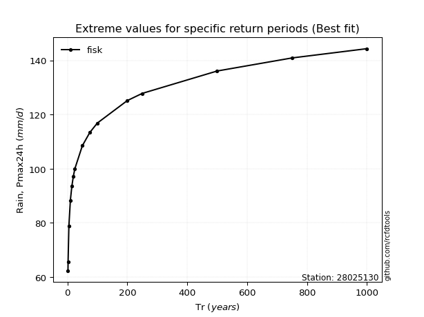</img>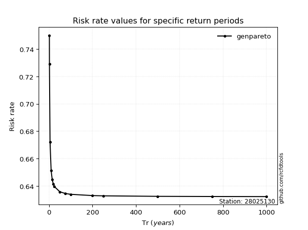</img>

</div>


<sub>**APP DISCLAIMER**: NO WARRANTY - This software is provided by [github.com/rcfdtools](https://github.com/rcfdtools) "as is", without any express or implied warranty, including warranties of merchantability, fitness for a particular purpose, or non-infringement. There is no guarantee that the software will be error-free or operate without interruption. LIMITATION OF LIABILITY - Neither the authors nor copyright holders will be liable for claims or damages arising from the software or its use. You are responsible for determining if the software is appropriate for your use and assume all associated risks, including errors, legal compliance, and data loss. NO PROFESSIONAL ADVICE - The software provides general information and does not offer professional advice. It should not replace consultation with professional advisors.</sub>