<div align="center">


</div>

# Station (rain, Pmax24h): 28025502

Probable Maximum Precipitation (PMP) is the greatest amount of rainfall for a specific duration that is meteorologically possible for a given location, acting as a "worst-case" scenario for extreme storms, crucial for designing safety-critical infrastructure like bridges, river deviations, dams, spillways, and nuclear plants to prevent catastrophic failure. PMP is calculated by hydrologists using meteorological data to determine the upper limit of extreme rainfall, often leading to the Probable Maximum Flood (PMF) for flood control design, and is increasingly being studied for climate change impacts.

<div align="center">

</img>

</div>


## A. General information


### 1. General running parameters

• app_version: _v20251225_. • runtime: _2025-12-26 14:29:50.888910_. • Python version: _3.14.0_. • SciPy version: _1.16.3_. • Pandas version: _2.3.3_. • NumPy version: _2.3.5_. • Stations dataset (station_dataset_file): _dataset/pmax24h_in/automatic_colombia.csv_. • Stations catalog (station_catalog_file): _dataset/CNE_IDEAM.xls_. • Plot only fit distributions with Δo > Δ (plot_only_fit): _True_. • Eval low extreme values, if False, evaluates high extreme values (low_extreme): _False_. • Eval every SciPy distribution as logarithmic (pdist_logarithmic_on): _True_. • Standard deviation normalized (ddof): _1.0_. • Return periods to eval in years (Tr): _[2, 2.33, 5, 10, 15, 20, 25, 50, 75, 100, 200, 250, 500, 750, 1000]_. • Minimum data sample per station, 0 means any (minimum_sample): _5_. • Z-Score threshold to adjust a value, 0 means disable (zscore): _3.5_. • Avoid zeros, e.g. rain = 0 (avoid_zeros): _True_. • Avoid null values (avoid_nans): _True_. [:file_folder:Dataset file.](../../dataset/pmax24h_in/automatic_colombia.csv)


### 2. Station info and location

|   id |   CODIGO | NOMBRE                                | CATEGORIA           | TECNOLOGIA                              | ESTADO   | FECHA_INSTALACION   |   FECHA_SUSPENSION |   ALTITUD |   LATITUD |   LONGITUD | DEPARTAMENTO   | MUNICIPIO   | AREA_OPERATIVA                                         | ENTIDAD                                                     | AREA_HIDROGRAFICA   | ZONA_HIDROGRAFICA   | SUBZONA_HIDROGRAFICA   |   CORRIENTE | OBSERVACION                                                                                           | SUBRED             | Catalogo   |
|-----:|---------:|:--------------------------------------|:--------------------|:----------------------------------------|:---------|:--------------------|-------------------:|----------:|----------:|-----------:|:---------------|:------------|:-------------------------------------------------------|:------------------------------------------------------------|:--------------------|:--------------------|:-----------------------|------------:|:------------------------------------------------------------------------------------------------------|:-------------------|:-----------|
|    0 | 28025502 | AEROPUERTO ALFONSO LOPEZ - [28025502] | Sinóptica Principal | Automática con Telemetría, Convencional | Activa   | 01/07/2016          |                nan |       138 |   10.4362 |   -73.2477 | Cesar          | Valledupar  | Area Operativa 05 - Magdalena-Cesar-Guajira-San Andrés | INSTITUTO DE HIDROLOGIA METEOROLOGIA Y ESTUDIOS AMBIENTALES | Magdalena Cauca     | Cesar               | Medio Cesar            |         nan | Actualizada Tecnología. Tipo de Transmisión y Estado por solicitud del coordinador del AO. (17022023) | Colombia,SINOPTICA | CNE_IDEAM  |

<div align="center">

Map location in: [:earth_americas:Google](http://maps.google.com/maps?q=10.43616667,-73.24766667) [:earth_americas:OSM](https://www.openstreetmap.org/#map=18/10.43616667/-73.24766667&layers=P) [:earth_americas:Bing](https://www.bing.com/maps?cp=10.43616667~-73.24766667&lvl=18) [:earth_americas:Apple](https://maps.apple.com/frame?center=10.43616667%2C-73.24766667&span=0.003%2C0.006)

</div>


<div align="center">

```geojson
{
  "type": "Feature",
  "geometry": {
    "type": "Point", 
    "coordinates": [-73.24766667, 10.43616667]
  }, 
  "properties": {
    "Name": "28025502"
  }
}
```

</div>


### 3. Discrete values table and plot

|               |           0 |           1 |           2 |           3 |           4 |          5 |           6 |           7 |           8 |
|:--------------|------------:|------------:|------------:|------------:|------------:|-----------:|------------:|------------:|------------:|
| Date          | 2017        | 2018        | 2019        | 2020        | 2021        | 2022       | 2023        | 2024        | 2025        |
| Value         |   55.5      |   36.32     |  185.49     |   92.04     |    3.37     |  720       |  117        |   66        |   32.6      |
| Value_initial |   55.5      |   36.32     |  185.49     |   92.04     |    3.37     |  720       |  117        |   66        |   32.6      |
| count         |    9        |    9        |    9        |    9        |    9        |    9       |    9        |    9        |    9        |
| mean          |  145.369    |  145.369    |  145.369    |  145.369    |  145.369    |  145.369   |  145.369    |  145.369    |  145.369    |
| std           |  222.094    |  222.094    |  222.094    |  222.094    |  222.094    |  222.094   |  222.094    |  222.094    |  222.094    |
| zscore        |   -0.404643 |   -0.491002 |    0.180649 |   -0.240118 |   -0.639363 |    2.58733 |   -0.127733 |   -0.357366 |   -0.507752 |

<div align="center">

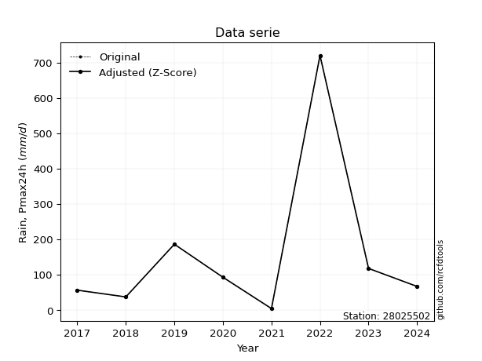</img>

</div>

> If Z-Score is active, values out of range or outliers are replaced with the station mean value.


### 4. Active continuous probability distributions from SciPy (45 of 104 available)

[scipy.stats](https://docs.scipy.org/doc/scipy/reference/stats.html) is a Python´s powerful submodule within the SciPy library for comprehensive statistical analysis, offering over 130 probability distributions (like Normal, Poisson), functions for descriptive stats (mean, variance), hypothesis testing (t-tests, chi-square), random variable generation, and statistical tests, making it essential for data science, modeling, and research. It provides tools to explore, model, and draw conclusions from data efficiently, working seamlessly with NumPy.

<div align="center">

|   id | p_dist             |   n_parameter | fit_method   | label                                                                       | active   | ref                                                                                                        |
|-----:|:-------------------|--------------:|:-------------|:----------------------------------------------------------------------------|:---------|:-----------------------------------------------------------------------------------------------------------|
|    0 | alpha              |             3 | MLE          | Alpha                                                                       | True     | [:mortar_board:](https://docs.scipy.org/doc/scipy/reference/generated/scipy.stats.alpha.html)              |
|    1 | betaprime          |             4 | MLE          | Beta prime                                                                  | True     | [:mortar_board:](https://docs.scipy.org/doc/scipy/reference/generated/scipy.stats.betaprime.html)          |
|    2 | chi2               |             3 | MLE          | Chi²                                                                        | True     | [:mortar_board:](https://docs.scipy.org/doc/scipy/reference/generated/scipy.stats.chi2.html)               |
|    3 | crystalball        |             4 | MLE          | Crystalball                                                                 | True     | [:mortar_board:](https://docs.scipy.org/doc/scipy/reference/generated/scipy.stats.crystalball.html)        |
|    4 | erlang             |             3 | MLE          | Erlang                                                                      | True     | [:mortar_board:](https://docs.scipy.org/doc/scipy/reference/generated/scipy.stats.erlang.html)             |
|    5 | expon              |             2 | MLE          | Exponential                                                                 | True     | [:mortar_board:](https://docs.scipy.org/doc/scipy/reference/generated/scipy.stats.expon.html)              |
|    6 | exponnorm          |             3 | MLE          | Exponentially modified Normal                                               | True     | [:mortar_board:](https://docs.scipy.org/doc/scipy/reference/generated/scipy.stats.exponnorm.html)          |
|    7 | f                  |             4 | MLE          | F                                                                           | True     | [:mortar_board:](https://docs.scipy.org/doc/scipy/reference/generated/scipy.stats.f.html)                  |
|    8 | fatiguelife        |             3 | MLE          | Fatigue-life (Birnbaum-Saunders)                                            | True     | [:mortar_board:](https://docs.scipy.org/doc/scipy/reference/generated/scipy.stats.fatiguelife.html)        |
|    9 | fisk               |             3 | MLE          | Fisk                                                                        | True     | [:mortar_board:](https://docs.scipy.org/doc/scipy/reference/generated/scipy.stats.fisk.html)               |
|   10 | gamma              |             3 | MLE          | Gamma                                                                       | True     | [:mortar_board:](https://docs.scipy.org/doc/scipy/reference/generated/scipy.stats.gamma.html)              |
|   11 | genexpon           |             5 | MLE          | Generalized exponential                                                     | True     | [:mortar_board:](https://docs.scipy.org/doc/scipy/reference/generated/scipy.stats.genexpon.html)           |
|   12 | genlogistic        |             3 | MLE          | Generalized logistic                                                        | True     | [:mortar_board:](https://docs.scipy.org/doc/scipy/reference/generated/scipy.stats.genlogistic.html)        |
|   13 | gibrat             |             2 | MM           | Gibrat                                                                      | True     | [:mortar_board:](https://docs.scipy.org/doc/scipy/reference/generated/scipy.stats.gibrat.html)             |
|   14 | gompertz           |             3 | MLE          | Gompertz (or truncated Gumbel)                                              | True     | [:mortar_board:](https://docs.scipy.org/doc/scipy/reference/generated/scipy.stats.gompertz.html)           |
|   15 | gumbel_l           |             2 | MM           | Gumbel Left Skew                                                            | True     | [:mortar_board:](https://docs.scipy.org/doc/scipy/reference/generated/scipy.stats.gumbel_l.html)           |
|   16 | gumbel_r           |             2 | MM           | Gumbel Right Skew                                                           | True     | [:mortar_board:](https://docs.scipy.org/doc/scipy/reference/generated/scipy.stats.gumbel_r.html)           |
|   17 | halflogistic       |             2 | MM           | Half-logistic                                                               | True     | [:mortar_board:](https://docs.scipy.org/doc/scipy/reference/generated/scipy.stats.halflogistic.html)       |
|   18 | halfnorm           |             2 | MM           | Half Normal                                                                 | True     | [:mortar_board:](https://docs.scipy.org/doc/scipy/reference/generated/scipy.stats.halfnorm.html)           |
|   19 | hypsecant          |             2 | MM           | hyperbolic secant                                                           | True     | [:mortar_board:](https://docs.scipy.org/doc/scipy/reference/generated/scipy.stats.hypsecant.html)          |
|   20 | invgamma           |             3 | MLE          | Inverted gamma                                                              | True     | [:mortar_board:](https://docs.scipy.org/doc/scipy/reference/generated/scipy.stats.invgamma.html)           |
|   21 | invgauss           |             3 | MLE          | Inverse Gaussian                                                            | True     | [:mortar_board:](https://docs.scipy.org/doc/scipy/reference/generated/scipy.stats.invgauss.html)           |
|   22 | invweibull         |             3 | MLE          | Inverted Weibull                                                            | True     | [:mortar_board:](https://docs.scipy.org/doc/scipy/reference/generated/scipy.stats.invweibull.html)         |
|   23 | johnsonsu          |             4 | MLE          | Johnson Su                                                                  | True     | [:mortar_board:](https://docs.scipy.org/doc/scipy/reference/generated/scipy.stats.johnsonsu.html)          |
|   24 | kstwobign          |             2 | MLE          | Limiting distribution of scaled Kolmogorov-Smirnov two-sided test statistic | True     | [:mortar_board:](https://docs.scipy.org/doc/scipy/reference/generated/scipy.stats.kstwobign.html)          |
|   25 | laplace            |             2 | MM           | Laplace                                                                     | True     | [:mortar_board:](https://docs.scipy.org/doc/scipy/reference/generated/scipy.stats.laplace.html)            |
|   26 | laplace_asymmetric |             3 | MLE          | Asymmetric Laplace                                                          | True     | [:mortar_board:](https://docs.scipy.org/doc/scipy/reference/generated/scipy.stats.laplace_asymmetric.html) |
|   27 | loggamma           |             3 | MLE          | Log gamma                                                                   | True     | [:mortar_board:](https://docs.scipy.org/doc/scipy/reference/generated/scipy.stats.loggamma.html)           |
|   28 | logistic           |             2 | MM           | Logistic (or Sech-squared)                                                  | True     | [:mortar_board:](https://docs.scipy.org/doc/scipy/reference/generated/scipy.stats.logistic.html)           |
|   29 | lognorm            |             3 | MLE          | Log Normal                                                                  | True     | [:mortar_board:](https://docs.scipy.org/doc/scipy/reference/generated/scipy.stats.lognorm.html)            |
|   30 | maxwell            |             2 | MM           | Maxwell                                                                     | True     | [:mortar_board:](https://docs.scipy.org/doc/scipy/reference/generated/scipy.stats.maxwell.html)            |
|   31 | mielke             |             4 | MLE          | Mielke Beta-Kappa / Dagum                                                   | True     | [:mortar_board:](https://docs.scipy.org/doc/scipy/reference/generated/scipy.stats.mielke.html)             |
|   32 | moyal              |             2 | MM           | Moyal                                                                       | True     | [:mortar_board:](https://docs.scipy.org/doc/scipy/reference/generated/scipy.stats.moyal.html)              |
|   33 | nakagami           |             3 | MLE          | Nakagami                                                                    | True     | [:mortar_board:](https://docs.scipy.org/doc/scipy/reference/generated/scipy.stats.nakagami.html)           |
|   34 | ncf                |             5 | MLE          | Non-central F distribution                                                  | True     | [:mortar_board:](https://docs.scipy.org/doc/scipy/reference/generated/scipy.stats.ncf.html)                |
|   35 | nct                |             4 | MLE          | Non-central Student’s t                                                     | True     | [:mortar_board:](https://docs.scipy.org/doc/scipy/reference/generated/scipy.stats.nct.html)                |
|   36 | norm               |             2 | MM           | Normal                                                                      | True     | [:mortar_board:](https://docs.scipy.org/doc/scipy/reference/generated/scipy.stats.norm.html)               |
|   37 | pareto             |             3 | MLE          | Pareto                                                                      | True     | [:mortar_board:](https://docs.scipy.org/doc/scipy/reference/generated/scipy.stats.pareto.html)             |
|   38 | pearson3           |             3 | MM           | Pearson type III                                                            | True     | [:mortar_board:](https://docs.scipy.org/doc/scipy/reference/generated/scipy.stats.pearson3.html)           |
|   39 | rayleigh           |             2 | MM           | Rayleigh                                                                    | True     | [:mortar_board:](https://docs.scipy.org/doc/scipy/reference/generated/scipy.stats.rayleigh.html)           |
|   40 | rice               |             3 | MLE          | Rice                                                                        | True     | [:mortar_board:](https://docs.scipy.org/doc/scipy/reference/generated/scipy.stats.rice.html)               |
|   41 | t                  |             3 | MLE          | Student’s t                                                                 | True     | [:mortar_board:](https://docs.scipy.org/doc/scipy/reference/generated/scipy.stats.t.html)                  |
|   42 | truncnorm          |             4 | MLE          | Truncated normal                                                            | True     | [:mortar_board:](https://docs.scipy.org/doc/scipy/reference/generated/scipy.stats.truncnorm.html)          |
|   43 | wald               |             2 | MM           | Wald                                                                        | True     | [:mortar_board:](https://docs.scipy.org/doc/scipy/reference/generated/scipy.stats.wald.html)               |
|   44 | weibull_min        |             3 | MLE          | Weibull minimum                                                             | True     | [:mortar_board:](https://docs.scipy.org/doc/scipy/reference/generated/scipy.stats.weibull_min.html)        |

</div>

> **n_parameter:** # arguments & localization & scale.
>
> **Fit methods:** (MLE) maximum likelihood, (MM) L-moments.
>
>**Inactive:** foldnorm, gennorm, norminvgauss, powernorm, powerlognorm, skewnorm, genextreme, anglit, arcsine, argus, beta, bradford, burr, burr12, cauchy, cosine, halfcauchy, foldcauchy, skewcauchy, wrapcauchy, dgamma, gengamma, exponweib, exponpow, truncexpon, gausshyper, genhalflogistic, genhyperbolic, geninvgauss, halfgennorm, johnsonsb, kappa4, kappa3, ksone, kstwo, loglaplace, levy, levy_l, levy_stable, ncx2, genpareto, truncpareto, lomax, powerlaw, rdist, rel_breitwigner, recipinvgauss, semicircular, studentized_range, trapezoid, triang, truncweibull_min, tukeylambda, uniform, loguniform, vonmises, vonmises_line, weibull_max, dweibull, 


## B. Probability distributions vs. Empirical distributions

A continuous probability distribution (CPD) describes probabilities for variables that can take any value within a range (like rain any time), unlike discrete variables with specific outcomes (like temperature). It uses a Probability Density Function (PDF), a curve where the total area under it equals 1, and the probability of the variable falling within an interval (a to b) is found by calculating the area under the curve between those points. A key feature is that the probability of hitting any single exact value is zero, so probabilities are always expressed for ranges, e.g., $P(a ≤ X ≤ b)$.

<div align="center">

Distributions parameters
|    |   station | p_dist                |   n |              loc |           scale | shape                  | shape1                 | shape2               | shape3   |
|---:|----------:|:----------------------|----:|-----------------:|----------------:|:-----------------------|:-----------------------|:---------------------|:---------|
|  0 |  28025502 | alpha                 |   9 |     -0.0265806   |    10.0833      | 1.5804105554493775e-11 |                        |                      |          |
|  1 |  28025502 | betaprime             |   9 |      3.37        |   144.976       | 0.6417605289417105     | 1.4161175572590525     |                      |          |
|  2 |  28025502 | chi2                  |   9 |      3.37        |   109.627       | 0.9478302445284501     |                        |                      |          |
|  3 |  28025502 | crystalball           |   9 |    145.369       |   209.393       | 11836.203710443644     | 3406.808579817157      |                      |          |
|  4 |  28025502 | erlang                |   9 |      3.37        |   163.651       | 0.5621028209391492     |                        |                      |          |
|  5 |  28025502 | expon                 |   9 |      3.37        |   141.999       |                        |                        |                      |          |
|  6 |  28025502 | exponnorm             |   9 |      3.19198     |     0.0609649   | 2325.6176934668965     |                        |                      |          |
|  7 |  28025502 | f                     |   9 |      3.37        |    98.2079      | 1.160430934368663      | 4.554067570417319      |                      |          |
|  8 |  28025502 | fatiguelife           |   9 |     -7.32381     |    84.7611      | 1.282380986496702      |                        |                      |          |
|  9 |  28025502 | fisk                  |   9 |     -0.713475    |    70.312       | 1.409529851744882      |                        |                      |          |
| 10 |  28025502 | gamma                 |   9 |      3.37        |   223.223       | 0.6248098608838604     |                        |                      |          |
| 11 |  28025502 | genexpon              |   9 |      3.37        |   239.906       | 1.6894894560924651     | 2.5228113621534616e-12 | 2.0373714818942927   |          |
| 12 |  28025502 | genlogistic           |   9 |   -643.461       |    95.5382      | 1787.370142200708      |                        |                      |          |
| 13 |  28025502 | gibrat                |   9 |    -14.3713      |    96.8873      |                        |                        |                      |          |
| 14 |  28025502 | gompertz              |   9 |      3.37        |     4.72988e+11 | 3338056525.594592      |                        |                      |          |
| 15 |  28025502 | gumbel_l              |   9 |    239.607       |   163.263       |                        |                        |                      |          |
| 16 |  28025502 | gumbel_r              |   9 |     51.1311      |   163.263       |                        |                        |                      |          |
| 17 |  28025502 | halflogistic          |   9 |   -102.81        |   179.023       |                        |                        |                      |          |
| 18 |  28025502 | halfnorm              |   9 |   -131.785       |   347.361       |                        |                        |                      |          |
| 19 |  28025502 | hypsecant             |   9 |    145.369       |   133.303       |                        |                        |                      |          |
| 20 |  28025502 | invgamma              |   9 |    -22.712       |   126.884       | 1.6838766958401283     |                        |                      |          |
| 21 |  28025502 | invgauss              |   9 |    -11.3612      |    84.9288      | 1.8454294948105818     |                        |                      |          |
| 22 |  28025502 | invweibull            |   9 |      3.37        |     3.17437     | 0.05057943860051066    |                        |                      |          |
| 23 |  28025502 | johnsonsu             |   9 |     28.3172      |    19.1875      | -1.0020443158473227    | 0.675399811354016      |                      |          |
| 24 |  28025502 | kstwobign             |   9 |   -341.647       |   577.489       |                        |                        |                      |          |
| 25 |  28025502 | laplace               |   9 |    145.369       |   148.063       |                        |                        |                      |          |
| 26 |  28025502 | laplace_asymmetric    |   9 |     32.6         |    55.395       | 0.4090231994793676     |                        |                      |          |
| 27 |  28025502 | loggamma              |   9 | -70738.3         |  9409.1         | 1869.9093364535124     |                        |                      |          |
| 28 |  28025502 | logistic              |   9 |    145.369       |   115.444       |                        |                        |                      |          |
| 29 |  28025502 | lognorm               |   9 |      3.37        |     1.06986     | 12.555661442437447     |                        |                      |          |
| 30 |  28025502 | maxwell               |   9 |   -350.804       |   310.93        |                        |                        |                      |          |
| 31 |  28025502 | mielke                |   9 |      3.37        |   175.841       | 0.6103483639184801     | 1.993729602251206      |                      |          |
| 32 |  28025502 | moyal                 |   9 |     25.6248      |    94.2598      |                        |                        |                      |          |
| 33 |  28025502 | nakagami              |   9 |      3.37        |   406.563       | 0.17470980097852057    |                        |                      |          |
| 34 |  28025502 | ncf                   |   9 |     -0.00337722  |     3.69407e-08 | 2.5766689431188897e-09 | 2.4850869528398167     | 4.119812925067567    |          |
| 35 |  28025502 | nct                   |   9 |    -36.3806      |    11.4394      | 1.5181988065026055     | 7.262178370139562      |                      |          |
| 36 |  28025502 | norm                  |   9 |    145.369       |   209.393       |                        |                        |                      |          |
| 37 |  28025502 | pareto                |   9 |      3.35879     |     0.011213    | 0.1251997273241457     |                        |                      |          |
| 38 |  28025502 | pearson3              |   9 |    145.369       |   209.393       | 2.212497617976081      |                        |                      |          |
| 39 |  28025502 | rayleigh              |   9 |   -255.211       |   319.617       |                        |                        |                      |          |
| 40 |  28025502 | rice                  |   9 |   -139.066       |   249.748       | 0.0003031411230748054  |                        |                      |          |
| 41 |  28025502 | t                     |   9 |     58.503       |    35.8266      | 1.0095268816580822     |                        |                      |          |
| 42 |  28025502 | truncnorm             |   9 |  -3651.23        |   747.123       | 4.891567339520748      | 480.8464558882945      |                      |          |
| 43 |  28025502 | wald                  |   9 |    -64.0237      |   209.393       |                        |                        |                      |          |
| 44 |  28025502 | weibull_min           |   9 |      3.37        |   197.108       | 0.801630924767972      |                        |                      |          |
| 45 |  28025502 | logalpha              |   9 |    -32.6132      |   960.115       | 26.133907423747473     |                        |                      |          |
| 46 |  28025502 | logbetaprime          |   9 |    -32.8619      |   698.22        | 735.1361319955263      | 13861.814470441794     |                      |          |
| 47 |  28025502 | logchi2               |   9 |    -14.0978      |     0.055896    | 326.8879150215608      |                        |                      |          |
| 48 |  28025502 | logcrystalball        |   9 |      4.17603     |     1.37227     | 438.09062079954595     | 8.153819136205662      |                      |          |
| 49 |  28025502 | logerlang             |   9 |    -20.0993      |     0.0812321   | 298.9439592135516      |                        |                      |          |
| 50 |  28025502 | logexpon              |   9 |      1.21491     |     2.96112     |                        |                        |                      |          |
| 51 |  28025502 | logexponnorm          |   9 |      4.17495     |     1.37227     | 0.000797164882940547   |                        |                      |          |
| 52 |  28025502 | logf                  |   9 |   -793.725       |   797.901       | 2036845.5584476711     | 1002047.9708698213     |                      |          |
| 53 |  28025502 | logfatiguelife        |   9 |   -534.457       |   538.63        | 0.00254159584359111    |                        |                      |          |
| 54 |  28025502 | logfisk               |   9 |     -1.97457e+08 |     1.97457e+08 | 259893806.42754754     |                        |                      |          |
| 55 |  28025502 | loggamma              |   9 |    -18.4289      |     0.0877887   | 257.5004384790488      |                        |                      |          |
| 56 |  28025502 | loggenexpon           |   9 |      1.18517     |     0.0934446   | 0.0076241925096666545  | 13.882989505696159     | 8.76063134225614e-05 |          |
| 57 |  28025502 | loggenlogistic        |   9 |      4.63969     |     0.609328    | 0.6540535907912812     |                        |                      |          |
| 58 |  28025502 | loggibrat             |   9 |      3.12911     |     0.634982    |                        |                        |                      |          |
| 59 |  28025502 | loggompertz           |   9 |      1.21491     |     1.49413     | 0.10456629907569057    |                        |                      |          |
| 60 |  28025502 | loggumbel_l           |   9 |      4.79362     |     1.06995     |                        |                        |                      |          |
| 61 |  28025502 | loggumbel_r           |   9 |      3.55844     |     1.06995     |                        |                        |                      |          |
| 62 |  28025502 | loghalflogistic       |   9 |      2.54963     |     1.17321     |                        |                        |                      |          |
| 63 |  28025502 | loghalfnorm           |   9 |      2.35965     |     2.27648     |                        |                        |                      |          |
| 64 |  28025502 | loghypsecant          |   9 |      4.17603     |     0.873612    |                        |                        |                      |          |
| 65 |  28025502 | loginvgamma           |   9 |    -23.3649      | 10604.4         | 386.04158680176977     |                        |                      |          |
| 66 |  28025502 | loginvgauss           |   9 |     -8.17425     |   886.819       | 0.01390986687574726    |                        |                      |          |
| 67 |  28025502 | loginvweibull         |   9 |     -2.89225e+08 |     2.89225e+08 | 189255423.6756609      |                        |                      |          |
| 68 |  28025502 | logjohnsonsu          |   9 |      4.32697     |     0.891471    | 0.0913800213939798     | 1.000512781058537      |                      |          |
| 69 |  28025502 | logkstwobign          |   9 |     -2.02604     |     7.12077     |                        |                        |                      |          |
| 70 |  28025502 | loglaplace            |   9 |      4.17603     |     0.970339    |                        |                        |                      |          |
| 71 |  28025502 | loglaplace_asymmetric |   9 |      4.18965     |     0.975423    | 1.0070491613369463     |                        |                      |          |
| 72 |  28025502 | logloggamma           |   9 |     -1.24432     |     3.19767     | 5.939541525065523      |                        |                      |          |
| 73 |  28025502 | loglogistic           |   9 |      4.17603     |     0.756571    |                        |                        |                      |          |
| 74 |  28025502 | loglognorm            |   9 |      1.21491     |     0.0514323   | 11.696843099092783     |                        |                      |          |
| 75 |  28025502 | logmaxwell            |   9 |      0.924334    |     2.0377      |                        |                        |                      |          |
| 76 |  28025502 | logmielke             |   9 |    -76.4048      |    81.0766      | 84.61601896509661      | 134.7078555301271      |                      |          |
| 77 |  28025502 | logmoyal              |   9 |      3.39128     |     0.617737    |                        |                        |                      |          |
| 78 |  28025502 | lognakagami           |   9 |      3.48431     |     1.03852     | 0.27907748672515026    |                        |                      |          |
| 79 |  28025502 | logncf                |   9 |    -25.4855      |    17.5637      | 831.9984151188938      | 8715.213059047532      | 573.7084446915703    |          |
| 80 |  28025502 | lognct                |   9 |    -71.2106      |     1.33879     | 30120.389767847082     | 56.30814006913904      |                      |          |
| 81 |  28025502 | lognorm               |   9 |      4.17603     |     1.37227     |                        |                        |                      |          |
| 82 |  28025502 | logpareto             |   9 |      1.21451     |     0.000400656 | 0.12514505530831832    |                        |                      |          |
| 83 |  28025502 | logpearson3           |   9 |      4.17603     |     1.37227     | -0.48278979616122975   |                        |                      |          |
| 84 |  28025502 | lograyleigh           |   9 |      1.55078     |     2.09465     |                        |                        |                      |          |
| 85 |  28025502 | logrice               |   9 |   -368.318       |     1.37212     | 271.4712977414302      |                        |                      |          |
| 86 |  28025502 | logt                  |   9 |      4.25634     |     0.818659    | 2.267318101692517      |                        |                      |          |
| 87 |  28025502 | logtruncnorm          |   9 |      0.31558     |     5.03595     | 0.14739378198152925    | 1.243791146667202      |                      |          |
| 88 |  28025502 | logwald               |   9 |      2.80384     |     1.3722      |                        |                        |                      |          |
| 89 |  28025502 | logweibull_min        |   9 |     -2.77858     |     7.49827     | 5.8827618621730196     |                        |                      |          |

</div>

> **loc** (Location parameter): This shifts the distribution along the x-axis. For many common distributions, like the normal (Gaussian) distribution, loc represents the mean $μ$. For others, like the uniform distribution, it might represent the minimum value, or for the beta distribution, the left end of the support interval.
>
> **scale** (Scale parameter): This determines the width or spread of the distribution. For the normal distribution, scale represents the standard deviation $σ$. For a uniform distribution, it defines the length of the interval (from $loc$ to $loc + scale$).
>
> **shape** (Shape parameters): Refers to parameters that define the specific form of a probability distribution, distinct from its location (loc) and scale (scale). These parameters are required arguments for most distribution functions. For example, a normal (Gaussian) distribution is fully defined by its location (mean) and scale (standard deviation), so it has no specific shape parameters beyond loc and scale. However, other distributions have intrinsic properties that need specification, as Gamma distribution that takes a shape parameter, often named $a$ or $alpha$.


### 0. Cumulative distribution values - CDF (90 evaluated)

> Ordered by x ascending and calculating $log(f(x))$ separately. 

|   id |   Station |   date |      x |   count |    mean |     std |    zscore |   Value_initial |   station |   m |      alpha |   alpha_pdf |   betaprime |   betaprime_pdf |        chi2 |    chi2_pdf |   crystalball |   crystalball_pdf |      erlang |       erlang_pdf |    expon |   expon_pdf |   exponnorm |   exponnorm_pdf |           f |        f_pdf |   fatiguelife |   fatiguelife_pdf |     fisk |    fisk_pdf |       gamma |       gamma_pdf |    genexpon |   genexpon_pdf |   genlogistic |   genlogistic_pdf |    gibrat |   gibrat_pdf |    gompertz |   gompertz_pdf |   gumbel_l |   gumbel_l_pdf |   gumbel_r |   gumbel_r_pdf |   halflogistic |   halflogistic_pdf |   halfnorm |   halfnorm_pdf |   hypsecant |   hypsecant_pdf |   invgamma |   invgamma_pdf |   invgauss |   invgauss_pdf |   invweibull |   invweibull_pdf |   johnsonsu |   johnsonsu_pdf |   kstwobign |   kstwobign_pdf |   laplace |   laplace_pdf |   laplace_asymmetric |   laplace_asymmetric_pdf |   loggamma |   loggamma_pdf |   logistic |   logistic_pdf |   lognorm |   lognorm_pdf |   maxwell |   maxwell_pdf |      mielke |    mielke_pdf |    moyal |   moyal_pdf |    nakagami |   nakagami_pdf |      ncf |    ncf_pdf |       nct |     nct_pdf |     norm |    norm_pdf |   pareto |   pareto_pdf |   pearson3 |   pearson3_pdf |   rayleigh |   rayleigh_pdf |     rice |    rice_pdf |        t |       t_pdf |   truncnorm |   truncnorm_pdf |     wald |    wald_pdf |   weibull_min |   weibull_min_pdf |   logalpha |   logalpha_pdf |   logbetaprime |   logbetaprime_pdf |   logchi2 |   logchi2_pdf |   logcrystalball |   logcrystalball_pdf |   logerlang |   logerlang_pdf |   logexpon |   logexpon_pdf |   logexponnorm |   logexponnorm_pdf |      logf |   logf_pdf |   logfatiguelife |   logfatiguelife_pdf |   logfisk |   logfisk_pdf |   loggenexpon |   loggenexpon_pdf |   loggenlogistic |   loggenlogistic_pdf |   loggibrat |   loggibrat_pdf |   loggompertz |   loggompertz_pdf |   loggumbel_l |   loggumbel_l_pdf |   loggumbel_r |   loggumbel_r_pdf |   loghalflogistic |   loghalflogistic_pdf |   loghalfnorm |   loghalfnorm_pdf |   loghypsecant |   loghypsecant_pdf |   loginvgamma |   loginvgamma_pdf |   loginvgauss |   loginvgauss_pdf |   loginvweibull |   loginvweibull_pdf |   logjohnsonsu |   logjohnsonsu_pdf |   logkstwobign |   logkstwobign_pdf |   loglaplace |   loglaplace_pdf |   loglaplace_asymmetric |   loglaplace_asymmetric_pdf |   logloggamma |   logloggamma_pdf |   loglogistic |   loglogistic_pdf |   loglognorm |   loglognorm_pdf |   logmaxwell |   logmaxwell_pdf |   logmielke |   logmielke_pdf |   logmoyal |   logmoyal_pdf |   lognakagami |   lognakagami_pdf |    logncf |   logncf_pdf |    lognct |   lognct_pdf |   logpareto |   logpareto_pdf |   logpearson3 |   logpearson3_pdf |   lograyleigh |   lograyleigh_pdf |   logrice |   logrice_pdf |      logt |   logt_pdf |   logtruncnorm |   logtruncnorm_pdf |   logwald |   logwald_pdf |   logweibull_min |   logweibull_min_pdf |
|-----:|----------:|-------:|-------:|--------:|--------:|--------:|----------:|----------------:|----------:|----:|-----------:|------------:|------------:|----------------:|------------:|------------:|--------------:|------------------:|------------:|-----------------:|---------:|------------:|------------:|----------------:|------------:|-------------:|--------------:|------------------:|---------:|------------:|------------:|----------------:|------------:|---------------:|--------------:|------------------:|----------:|-------------:|------------:|---------------:|-----------:|---------------:|-----------:|---------------:|---------------:|-------------------:|-----------:|---------------:|------------:|----------------:|-----------:|---------------:|-----------:|---------------:|-------------:|-----------------:|------------:|----------------:|------------:|----------------:|----------:|--------------:|---------------------:|-------------------------:|-----------:|---------------:|-----------:|---------------:|----------:|--------------:|----------:|--------------:|------------:|--------------:|---------:|------------:|------------:|---------------:|---------:|-----------:|----------:|------------:|---------:|------------:|---------:|-------------:|-----------:|---------------:|-----------:|---------------:|---------:|------------:|---------:|------------:|------------:|----------------:|---------:|------------:|--------------:|------------------:|-----------:|---------------:|---------------:|-------------------:|----------:|--------------:|-----------------:|---------------------:|------------:|----------------:|-----------:|---------------:|---------------:|-------------------:|----------:|-----------:|-----------------:|---------------------:|----------:|--------------:|--------------:|------------------:|-----------------:|---------------------:|------------:|----------------:|--------------:|------------------:|--------------:|------------------:|--------------:|------------------:|------------------:|----------------------:|--------------:|------------------:|---------------:|-------------------:|--------------:|------------------:|--------------:|------------------:|----------------:|--------------------:|---------------:|-------------------:|---------------:|-------------------:|-------------:|-----------------:|------------------------:|----------------------------:|--------------:|------------------:|--------------:|------------------:|-------------:|-----------------:|-------------:|-----------------:|------------:|----------------:|-----------:|---------------:|--------------:|------------------:|----------:|-------------:|----------:|-------------:|------------:|----------------:|--------------:|------------------:|--------------:|------------------:|----------:|--------------:|----------:|-----------:|---------------:|-------------------:|----------:|--------------:|-----------------:|---------------------:|
|    0 |  28025502 |   2021 |   3.37 |       9 | 145.369 | 222.094 | -0.639363 |            3.37 |  28025502 |   1 | 0.00299112 | 0.00850678  | 2.72678e-07 |    30.2918      | 4.65074e-09 | 4.96309e+06 |      0.248839 |       0.00151386  | 3.27319e-10 | 103575           | 0        | 0.00704231  |  0.00125495 |     0.00703193  | 1.72167e-06 | 56.4997      |     0.0275286 |        0.00732295 | 0.017784 | 0.00602949  | 9.71624e-12 | 13670.2         | 1.72633e-14 |    0.0070423   |      0.128814 |        0.0027616  | 0.0447865 |  0.00532231  | 5.09208e-12 |    0.00705738  |   0.209652 |    0.00113899  |   0.261891 |    0.00214923  |       0.288156 |        0.00256103  |   0.302791 |    0.00212954  |    0.211294 |     0.00147119  |  0.0284735 |    0.00468666  |   0.027539 |    0.00610171  |   0.00176929 |      1.27702e+12 |   0.0417701 |     0.0019154   |    0.13235  |     0.00226813  |  0.19163  |   0.00129424  |             0.03945  |              0.00174112  |  0.0145924 |      0.0288426 |   0.226178 |    0.00151607  | 0.0154706 |     0.028339  |  0.270273 |    0.00174035 | 4.25832e-09 | 766.343       | 0.260462 | 0.00252859  | 4.21886e-07 |    3.3195e+08  | 0.158347 | 0.00912261 | 0.0303636 | 0.00430072  | 0.248839 | 0.00151386  | 0        | 11.1656      |   0.266512 |    0.00410896  |   0.27911  |    0.00182476  | 0.150096 | 0.00194082  | 0.182593 | 0.00264507  | 2.26557e-07 |     0.00680167  | 0.189152 | 0.00510727  |   7.13562e-15 |      12.8806      |  0.0122794 |      0.0267335 |      0.0155184 |          0.02949   | 0.0150946 |     0.0299922 |        0.0154706 |            0.028339  |   0.0143417 |       0.0283101 |   0        |      0.33771   |      0.0154702 |          0.0283385 | 0.0155816 |  0.0285357 |        0.0151293 |            0.0280221 | 0.0183631 |     0.0237258 |    0.00248484 |         0.0855196 |        0.0252602 |            0.0270165 |    0        |       0         |   5.71433e-09 |         0.0699847 |     0.0346547 |         0.0318212 |   0.000131308 |         0.0010969 |          0        |             0         |      0        |         0         |       0.021462 |          0.0245483 |     0.0124816 |         0.0268152 |     0.0117052 |         0.0279121 |       0.0125483 |           0.0359494 |      0.0305445 |          0.0213453 |      0.0142728 |          0.0480508 |    0.0236409 |        0.0243635 |               0.0243677 |                   0.0248069 |     0.0246113 |         0.0321633 |     0.0195724 |         0.0253635 |   0.00234356 |      2.81846e+12 |  0.000766554 |       0.00788192 |   0.0250048 |       0.0271818 | 5.8309e-09 |    1.64422e-07 |   0           |       0           | 0.0143637 |    0.027978  | 0.0154265 |    0.02835   |    0        |    312.351      |     0.0258943 |         0.0332729 |      0        |         0         | 0.0154618 |     0.0283284 | 0.0268924 |  0.0178573 |      0.0366916 |           0.232996 |  0        |     0         |        0.0242717 |            0.035317  |
|    1 |  28025502 |   2025 |  32.6  |       9 | 145.369 | 222.094 | -0.507752 |           32.6  |  28025502 |   2 | 0.757283   | 0.00720539  | 0.397898    |     0.0069306   | 0.416598    | 0.00616553  |      0.295098 |       0.00164804  | 0.400777    |      0.0068646   | 0.186042 | 0.00573214  |  0.18732    |     0.00573193  | 0.356157    |  0.00618898  |     0.273905  |        0.00697083 | 0.25867  | 0.00811358  | 0.298016    |     0.00587252  | 0.186042    |    0.00573214  |      0.221034 |        0.00349071 | 0.234529  |  0.00653507  | 0.186401    |    0.00574188  |   0.245283 |    0.00130089  |   0.326216 |    0.00223827  |       0.361136 |        0.00242868  |   0.363958 |    0.00205366  |    0.258072 |     0.00173074  |  0.249539  |    0.00814953  |   0.269643 |    0.00764991  |   0.409105   |      0.000632721 |   0.196964  |     0.00952962  |    0.204987 |     0.00267022  |  0.233453 |   0.00157671  |             0.143322 |              0.0063255   |  0.317119  |      0.258167  |   0.273522 |    0.00172124  | 0.307106  |     0.256034  |  0.322454 |    0.00182428 | 0.331662    |   0.00673713  | 0.335208 | 0.00256364  | 0.317542    |    0.00379302  | 0.387276 | 0.00631432 | 0.244263  | 0.0082892   | 0.295098 | 0.00164804  | 0.626506 |  0.00159916  |   0.374244 |    0.00331669  |   0.333317 |    0.00187831  | 0.210401 | 0.00217313  | 0.300274 | 0.00585271  | 0.180903    |     0.00561267  | 0.330117 | 0.00443894  |   0.194704    |       0.00478244  |  0.321351  |      0.263963  |      0.316012  |          0.257143  | 0.321845  |     0.2573    |        0.307106  |            0.256034  |   0.314149  |       0.257594  |   0.535317 |      0.156928  |      0.307104  |          0.256033  | 0.307636  |  0.255615  |        0.307369  |            0.257074  | 0.270541  |     0.259752  |    0.426192   |         0.230375  |        0.264034  |            0.246416  |    0.28065  |       0.948762  |   0.311333    |         0.220116  |     0.254825  |         0.204853  |   0.342414    |         0.342984  |          0.378531 |             0.365116  |      0.378718 |         0.310225  |       0.270801 |          0.273916  |     0.320085  |         0.26371   |     0.336998  |         0.266142  |       0.370955  |           0.240715  |      0.226275  |          0.245396  |      0.412776  |          0.233743  |    0.245119  |        0.252612  |               0.245563  |                   0.249988  |     0.286994  |         0.234238  |     0.286124  |         0.269978  |   0.626941   |      0.0142616   |  0.335682    |       0.280716   |   0.264713  |       0.246584  | 0.353685   |    0.389597    |   3.02284e-09 |       1.89964e+06 | 0.310118  |    0.255805  | 0.307522  |    0.256172  |    0.660919 |      0.0186952  |     0.28612   |         0.22931   |      0.346911 |         0.287808  | 0.307092  |     0.256057  | 0.217479  |  0.254947  |      0.528383  |           0.194223 |  0.361359 |     0.644362  |        0.293036  |            0.230278  |
|    2 |  28025502 |   2018 |  36.32 |       9 | 145.369 | 222.094 | -0.491002 |           36.32 |  28025502 |   3 | 0.781458   | 0.00586006  | 0.422585    |     0.00635696  | 0.438627    | 0.00569156  |      0.301258 |       0.00166362  | 0.425364    |      0.00636738  | 0.207089 | 0.00558393  |  0.208366   |     0.0055835   | 0.378318    |  0.00573715  |     0.299039  |        0.00654811 | 0.288295 | 0.00780939  | 0.319193    |     0.00552163  | 0.207089    |    0.00558392  |      0.234144 |        0.00355666 | 0.258559  |  0.00638048  | 0.207483    |    0.0055931   |   0.250162 |    0.00132227  |   0.334552 |    0.00224376  |       0.370136 |        0.0024103   |   0.371578 |    0.00204316  |    0.264572 |     0.00176397  |  0.279422  |    0.0079076   |   0.297366 |    0.00725565  |   0.411319   |      0.000560918 |   0.233327  |     0.00994403  |    0.214991 |     0.0027075   |  0.239393 |   0.00161683  |             0.166533 |              0.00615412  |  0.345465  |      0.266256  |   0.279972 |    0.00174619  | 0.335299  |     0.265576  |  0.329255 |    0.00183248 | 0.356024    |   0.0063688   | 0.344737 | 0.00255912  | 0.331104    |    0.00350778  | 0.410091 | 0.00595481 | 0.274776  | 0.00810362  | 0.301258 | 0.00166362  | 0.632064 |  0.00139757  |   0.38643  |    0.00323564  |   0.340312 |    0.00188263  | 0.21853  | 0.00219736  | 0.323134 | 0.00644121  | 0.201528    |     0.00547649  | 0.346424 | 0.0043277   |   0.21209     |       0.0045693   |  0.350288  |      0.271377  |      0.344266  |          0.265569  | 0.350065  |     0.264793  |        0.335299  |            0.265576  |   0.342445  |       0.265916  |   0.551968 |      0.151305  |      0.335296  |          0.265575  | 0.335778  |  0.265048  |        0.335675  |            0.266618  | 0.299505  |     0.276143  |    0.450999   |         0.22866   |        0.291694  |            0.265505  |    0.376261 |       0.819404  |   0.335562    |         0.228299  |     0.277757  |         0.219648  |   0.379544    |         0.343657  |          0.417281 |             0.351974  |      0.411837 |         0.302694  |       0.301593 |          0.295842  |     0.349008  |         0.271369  |     0.366069  |         0.271669  |       0.396937  |           0.239991  |      0.254521  |          0.277852  |      0.43789   |          0.230962  |    0.273994  |        0.282369  |               0.274118  |                   0.279058  |     0.312959  |         0.246225  |     0.316164  |         0.285769  |   0.628446   |      0.0135958   |  0.366255    |       0.284861   |   0.292387  |       0.265602  | 0.39544    |    0.382478    |   0.219698    |       1.13215     | 0.338237  |    0.264424  | 0.335727  |    0.265657  |    0.662887 |      0.0177421  |     0.311538  |         0.241063  |      0.37811  |         0.289375  | 0.335287  |     0.265602  | 0.246838  |  0.288732  |      0.549227  |           0.191574 |  0.426942 |     0.570198  |        0.31852   |            0.241314  |
|    3 |  28025502 |   2017 |  55.5  |       9 | 145.369 | 222.094 | -0.404643 |           55.5  |  28025502 |   4 | 0.855902   | 0.00256672  | 0.523441    |     0.004369    | 0.530806    | 0.00409663  |      0.333893 |       0.0017376   | 0.529173    |      0.00463253  | 0.30727  | 0.00487842  |  0.30853    |     0.00487703  | 0.471724    |  0.0041633   |     0.407327  |        0.00487177 | 0.421789 | 0.00611527  | 0.411926    |     0.00426581  | 0.30727     |    0.00487841  |      0.30488  |        0.00378935 | 0.371874  |  0.00541261  | 0.307815    |    0.00488502  |   0.276595 |    0.00143467  |   0.377723 |    0.0022525   |       0.415424 |        0.00231094  |   0.410227 |    0.00198625  |    0.300028 |     0.00193194  |  0.415996  |    0.00629549  |   0.41848  |    0.00545743  |   0.419787   |      0.00035354  |   0.410241  |     0.00789229  |    0.26842  |     0.00285018  |  0.272501 |   0.00184044  |             0.276592 |              0.00534147  |  0.462842  |      0.283274  |   0.314652 |    0.00186797  | 0.453692  |     0.288757  |  0.364746 |    0.00186578 | 0.46391     |   0.00498966  | 0.393412 | 0.00250955  | 0.388569    |    0.00259816  | 0.50877  | 0.00442298 | 0.416114  | 0.00654771  | 0.333893 | 0.0017376   | 0.652596 |  0.000834175 |   0.444813 |    0.00286403  |   0.376574 |    0.00189619  | 0.261739 | 0.00230288  | 0.473333 | 0.00883916  | 0.300174    |     0.00482315  | 0.423934 | 0.00375955  |   0.2913      |       0.00375245  |  0.469084  |      0.284619  |      0.461675  |          0.284145  | 0.466354  |     0.279705  |        0.453692  |            0.288757  |   0.459882  |       0.283894  |   0.611742 |      0.131119  |      0.453689  |          0.288757  | 0.453865  |  0.287867  |        0.454479  |            0.289601  | 0.427621  |     0.322157  |    0.545587   |         0.216036  |        0.418974  |            0.330795  |    0.631019 |       0.425156  |   0.438577    |         0.256205  |     0.383461  |         0.278685  |   0.521103    |         0.317452  |          0.554671 |             0.295063  |      0.533239 |         0.268947  |       0.442152 |          0.35836   |     0.468018  |         0.285634  |     0.483425  |         0.277721  |       0.496532  |           0.22747   |      0.401099  |          0.409753  |      0.532496  |          0.213855  |    0.424147  |        0.437112  |               0.422088  |                   0.429694  |     0.426059  |         0.284383  |     0.447441  |         0.326787  |   0.633738   |      0.0114839   |  0.487971    |       0.285112   |   0.419666  |       0.330727  | 0.546558   |    0.324663    |   0.52684     |       0.521801    | 0.455331  |    0.283818  | 0.454099  |    0.288575  |    0.669739 |      0.0147511  |     0.422439  |         0.279543  |      0.499817 |         0.281081  | 0.453693  |     0.288789  | 0.397065  |  0.411945  |      0.628181  |           0.180719 |  0.617328 |     0.347334  |        0.428924  |            0.276986  |
|    4 |  28025502 |   2024 |  66    |       9 | 145.369 | 222.094 | -0.357366 |           66    |  28025502 |   5 | 0.878623   | 0.00182406  | 0.565514    |     0.00367661  | 0.570799    | 0.00354571  |      0.352328 |       0.00177317  | 0.574408    |      0.00400918  | 0.356646 | 0.0045307   |  0.357888   |     0.0045289   | 0.512368    |  0.00360211  |     0.454963  |        0.00422677 | 0.481496 | 0.00527479  | 0.454175    |     0.00379903  | 0.356646    |    0.0045307   |      0.344988 |        0.00384184 | 0.425873  |  0.00487781  | 0.357253    |    0.00453611  |   0.291988 |    0.00149742  |   0.401338 |    0.00224425  |       0.43939  |        0.00225372  |   0.430911 |    0.00195325  |    0.320775 |     0.00201925  |  0.477527  |    0.00543988  |   0.471643 |    0.00469374  |   0.423166   |      0.000293898 |   0.484848  |     0.0063673   |    0.2986   |     0.00289465  |  0.292528 |   0.0019757   |             0.330558 |              0.00494299  |  0.511957  |      0.282927  |   0.334588 |    0.00192854  | 0.503961  |     0.290703  |  0.384403 |    0.00187763 | 0.513312    |   0.00443598  | 0.419545 | 0.00246649  | 0.414222    |    0.00230285  | 0.551772 | 0.00378902 | 0.480082  | 0.00564876  | 0.352328 | 0.00177317  | 0.660485 |  0.000678582 |   0.473943 |    0.00268731  |   0.396495 |    0.00189763  | 0.286159 | 0.00234687  | 0.565786 | 0.0085292   | 0.34909     |     0.00449786  | 0.461864 | 0.00346828  |   0.328934    |       0.00342616  |  0.518279  |      0.282498  |      0.510996  |          0.28442   | 0.514794  |     0.278736  |        0.503961  |            0.290703  |   0.509137  |       0.283905  |   0.633809 |      0.123666  |      0.503958  |          0.290703  | 0.503971  |  0.289722  |        0.50488   |            0.291385  | 0.48413   |     0.32872   |    0.582392   |         0.20859   |        0.477826  |            0.347071  |    0.696003 |       0.329798  |   0.483727    |         0.26457   |     0.433713  |         0.300968  |   0.574442    |         0.297626  |          0.6037   |             0.270859  |      0.57853  |         0.253719  |       0.504964 |          0.364316  |     0.517422  |         0.283885  |     0.531211  |         0.27322   |       0.535228  |           0.218915  |      0.475231  |          0.441668  |      0.568782  |          0.204824  |    0.506971  |        0.5081    |               0.503512  |                   0.512586  |     0.47623   |         0.294015  |     0.504502  |         0.330412  |   0.635667   |      0.0107959   |  0.536848    |       0.278463   |   0.478505  |       0.346994  | 0.600258   |    0.295006    |   0.609447    |       0.435828    | 0.504626  |    0.28444   | 0.504327  |    0.290417  |    0.672209 |      0.013788   |     0.471836  |         0.28999   |      0.547774 |         0.27199   | 0.503967  |     0.290736  | 0.470856  |  0.435665  |      0.659096  |           0.176103 |  0.67203  |     0.286445  |        0.477788  |            0.286422  |
|    5 |  28025502 |   2020 |  92.04 |       9 | 145.369 | 222.094 | -0.240118 |           92.04 |  28025502 |   6 | 0.912789   | 0.000943479 | 0.645144    |     0.00254535  | 0.650082    | 0.00262233  |      0.399484 |       0.00184444  | 0.663722    |      0.00293651  | 0.46444  | 0.00377158  |  0.465624   |     0.00376902  | 0.59272     |  0.00264893  |     0.549374  |        0.00311668 | 0.59639  | 0.00365794  | 0.541496    |     0.00296728  | 0.464439    |    0.00377158  |      0.444679 |        0.00377113 | 0.537351  |  0.00373262  | 0.465155    |    0.00377461  |   0.333025 |    0.00165455  |   0.45916  |    0.00218905  |       0.496163 |        0.00210538  |   0.480657 |    0.00186638  |    0.375925 |     0.00220874  |  0.596036  |    0.0037718   |   0.574764 |    0.00333426  |   0.429558   |      0.00020705  |   0.6147    |     0.00388032  |    0.374494 |     0.00291433  |  0.348776 |   0.0023556   |             0.447656 |              0.00407837  |  0.604415  |      0.270658  |   0.386524 |    0.00205401  | 0.599587  |     0.281612  |  0.433488 |    0.00188786 | 0.614156    |   0.00336749  | 0.482012 | 0.00232405  | 0.467439    |    0.00182904  | 0.634607 | 0.00266244 | 0.60241   | 0.00386161  | 0.399484 | 0.00184444  | 0.674944 |  0.000458912 |   0.538839 |    0.00230999  |   0.445783 |    0.00188393  | 0.348281 | 0.00241472  | 0.740089 | 0.00475081  | 0.456601    |     0.00377947  | 0.543648 | 0.00283491  |   0.409685    |       0.00281303  |  0.610057  |      0.267115  |      0.604115  |          0.273069  | 0.605735  |     0.265862  |        0.599587  |            0.281612  |   0.602014  |       0.272166  |   0.672711 |      0.110529  |      0.599584  |          0.281613  | 0.599259  |  0.280591  |        0.60067   |            0.281905  | 0.59248   |     0.317795  |    0.649013   |         0.191524  |        0.594858  |            0.349939  |    0.783978 |       0.210317  |   0.573441    |         0.273091  |     0.539737  |         0.333795  |   0.66614     |         0.25293   |          0.686171 |             0.225523  |      0.657868 |         0.223211  |       0.622961 |          0.337511  |     0.609753  |         0.268997  |     0.619347  |         0.254869  |       0.604822  |           0.199     |      0.621264  |          0.417007  |      0.633758  |          0.185619  |    0.650035  |        0.360663  |               0.647797  |                   0.363622  |     0.575417  |         0.2994    |     0.61244   |         0.313728  |   0.639065   |      0.00967948  |  0.626148    |       0.256829   |   0.595509  |       0.349837  | 0.688891   |    0.238644    |   0.733355    |       0.316257    | 0.597862  |    0.273743  | 0.59983   |    0.281169  |    0.676528 |      0.0122384  |     0.570089  |         0.298017  |      0.634394 |         0.247605  | 0.599603  |     0.28164   | 0.613547  |  0.406408  |      0.716158  |           0.167015 |  0.752295 |     0.202257  |        0.57459   |            0.292977  |
|    6 |  28025502 |   2023 | 117    |       9 | 145.369 | 222.094 | -0.127733 |          117    |  28025502 |   7 | 0.931338   | 0.000585275 | 0.699894    |     0.00188994  | 0.707997    | 0.0020539   |      0.446115 |       0.00188783  | 0.728084    |      0.00226164  | 0.550769 | 0.00316362  |  0.551884   |     0.00316062  | 0.651038    |  0.0020615   |     0.618115  |        0.00243581 | 0.674003 | 0.00263102  | 0.608336    |     0.00241759  | 0.550769    |    0.00316362  |      0.535738 |        0.00349913 | 0.619618  |  0.0028992   | 0.551538    |    0.00316497  |   0.376187 |    0.00180311  |   0.512728 |    0.00209789  |       0.546877 |        0.00195764  |   0.526141 |    0.00177734  |    0.432765 |     0.00233479  |  0.676023  |    0.00270981  |   0.646874 |    0.0025008   |   0.434107   |      0.000161245 |   0.694197  |     0.0026104   |    0.446407 |     0.00283404  |  0.412818 |   0.00278813  |             0.540622 |              0.00339193  |  0.667423  |      0.253492  |   0.438873 |    0.00213318  | 0.665359  |     0.265371  |  0.480472 |    0.00187302 | 0.688271    |   0.00260582  | 0.537972 | 0.00215633  | 0.509355    |    0.0015482   | 0.691867 | 0.00197356 | 0.683668  | 0.00272932  | 0.446115 | 0.00188783  | 0.684882 |  0.000347169 |   0.592657 |    0.00201107  |   0.492417 |    0.00184943  | 0.408809 | 0.00242703  | 0.825937 | 0.00242977  | 0.543449    |     0.00319518  | 0.608073 | 0.00234518  |   0.474311    |       0.0023848   |  0.672004  |      0.248299  |      0.667747  |          0.256223  | 0.667593  |     0.248779  |        0.665359  |            0.265371  |   0.665413  |       0.255213  |   0.698187 |      0.101925  |      0.665357  |          0.265372  | 0.664795  |  0.264439  |        0.666477  |            0.265368  | 0.665979  |     0.292792  |    0.693316   |         0.177566  |        0.676437  |            0.326678  |    0.827572 |       0.156368  |   0.638918    |         0.271444  |     0.621309  |         0.343681  |   0.722787    |         0.219305  |          0.736573 |             0.194962  |      0.708742 |         0.200825  |       0.699141 |          0.295351  |     0.672171  |         0.250309  |     0.678251  |         0.235388  |       0.650666  |           0.182976  |      0.713025  |          0.343529  |      0.676547  |          0.170974  |    0.726706  |        0.281648  |               0.725081  |                   0.283833  |     0.646496  |         0.291333  |     0.684545  |         0.285424  |   0.641305   |      0.00900534  |  0.685316    |       0.23573    |   0.677053  |       0.326465  | 0.741636   |    0.201654    |   0.801022    |       0.249854    | 0.661709  |    0.25734   | 0.665488  |    0.264872  |    0.67935  |      0.011311   |     0.64113   |         0.29245   |      0.691263 |         0.225975  | 0.665382  |     0.265394  | 0.703486  |  0.339479  |      0.755432  |           0.160316 |  0.795508 |     0.159966  |        0.644344  |            0.286833  |
|    7 |  28025502 |   2019 | 185.49 |       9 | 145.369 | 222.094 |  0.180649 |          185.49 |  28025502 |   8 | 0.956654   | 0.000233418 | 0.793455    |     0.000984188 | 0.814638    | 0.00117257  |      0.575975 |       0.00187058  | 0.842331    |      0.00121048  | 0.722669 | 0.00195305  |  0.723563   |     0.00194975  | 0.757626    |  0.00117111  |     0.745084  |        0.00140963 | 0.797822 | 0.00122103  | 0.738701    |     0.00149028  | 0.722669    |    0.00195305  |      0.737299 |        0.00235174 | 0.76549   |  0.0015358   | 0.72343     |    0.00195186  |   0.512209 |    0.00214482  |   0.644597 |    0.00173378  |       0.666935 |        0.00155063  |   0.638961 |    0.00151356  |    0.594389 |     0.00228364  |  0.803341  |    0.00125228  |   0.771286 |    0.00131248  |   0.442732   |      0.000100185 |   0.813007  |     0.00114618  |    0.624709 |     0.00232452  |  0.618682 |   0.00257538  |             0.722961 |              0.00204559  |  0.774056  |      0.207049  |   0.58602  |    0.00210145  | 0.777253  |     0.217306  |  0.604497 |    0.00172486 | 0.817359    |   0.00132175  | 0.668455 | 0.00165376  | 0.598734    |    0.00111493  | 0.788776 | 0.00100833 | 0.809818  | 0.00121901  | 0.575975 | 0.00187058  | 0.702952 |  0.000204195 |   0.708078 |    0.00140235  |   0.613492 |    0.00166741  | 0.570181 | 0.0022365   | 0.913403 | 0.000653891 | 0.718451    |     0.00200387  | 0.734726 | 0.00144231  |   0.608814    |       0.0016161   |  0.775872  |      0.200699  |      0.775616  |          0.209494  | 0.772287  |     0.203535  |        0.777253  |            0.217306  |   0.772858  |       0.208764  |   0.741684 |      0.0872359 |      0.777251  |          0.217307  | 0.776341  |  0.216765  |        0.778256  |            0.216845  | 0.785262  |     0.221947  |    0.768572   |         0.148795  |        0.808545  |            0.24077   |    0.883601 |       0.0934991 |   0.759358    |         0.24626   |     0.775476  |         0.313461  |   0.809746    |         0.159712  |          0.814192 |             0.143662  |      0.791534 |         0.158905  |       0.813481 |          0.201494  |     0.776922  |         0.202407  |     0.77645   |         0.189593  |       0.727689  |           0.151364  |      0.835671  |          0.195976  |      0.748812  |          0.142783  |    0.830028  |        0.175168  |               0.829163  |                   0.176376  |     0.772185  |         0.24868   |     0.799606  |         0.211793  |   0.645199   |      0.00793946  |  0.783232    |       0.188287   |   0.80898   |       0.240197  | 0.820388   |    0.142898    |   0.892319    |       0.152188    | 0.770265  |    0.211317  | 0.777155  |    0.216851  |    0.684213 |      0.00985886 |     0.768431  |         0.254289  |      0.784924 |         0.180011  | 0.777283  |     0.217314  | 0.826654  |  0.200064  |      0.826307  |           0.147255 |  0.855559 |     0.105298  |        0.769032  |            0.248849  |
|    8 |  28025502 |   2022 | 720    |       9 | 145.369 | 222.094 |  2.58733  |          720    |  28025502 |   9 | 0.988827   | 1.55168e-05 | 0.951438    |     8.20984e-05 | 0.990341    | 4.98205e-05 |      0.996968 |       4.41166e-05 | 0.996175    |      2.53491e-05 | 0.99357  | 4.52844e-05 |  0.993627   |     4.49472e-05 | 0.954938    |  9.89399e-05 |     0.978208  |        9.1289e-05 | 0.96375  | 6.83253e-05 | 0.983414    |     8.13079e-05 | 0.99357     |    4.52845e-05 |      0.998868 |        1.1846e-05 | 0.97859   |  6.98466e-05 | 0.993639    |    4.48937e-05 |   1        |    6.75716e-10 |   0.983513 |    0.000100147 |       0.98002  |        0.000110493 |   0.9858   |    0.000113614 |    0.991454 |     6.40985e-05 |  0.969916  |    6.39406e-05 |   0.973293 |    8.51683e-05 |   0.467551   |      2.50878e-05 |   0.97045   |     6.55861e-05 |    0.99768  |     2.95428e-05 |  0.989685 |   6.96675e-05 |             0.994648 |              3.95178e-05 |  0.952456  |      0.0657552 |   0.993156 |    5.88754e-05 | 0.960051  |     0.0627317 |  0.992123 |    8.09e-05   | 0.98211     |   4.78974e-05 | 0.979944 | 0.000106367 | 0.903119    |    0.000275218 | 0.947514 | 8.2377e-05 | 0.969109  | 6.16575e-05 | 0.996968 | 4.41166e-05 | 0.749768 |  4.37164e-05 |   0.975167 |    0.000111991 |   0.990485 |    9.08347e-05 | 0.997304 | 3.71362e-05 | 0.983218 | 2.55609e-05 | 0.995108    |     3.93691e-05 | 0.974451 | 9.61917e-05 |   0.94006     |       0.000188705 |  0.949127  |      0.0653609 |      0.954936  |          0.0647839 | 0.949512  |     0.0669849 |        0.960051  |            0.0627317 |   0.95265   |       0.0660417 |   0.836606 |      0.0551798 |      0.96005   |          0.0627324 | 0.959293  |  0.0632707 |        0.960272  |            0.062321  | 0.956132  |     0.0552068 |    0.914825   |         0.0707822 |        0.973782  |            0.0416077 |    0.954732 |       0.0276051 |   0.974911    |         0.0636386 |     0.995039  |         0.0246009 |   0.942322    |         0.052322  |          0.937543 |             0.0515734 |      0.936198 |         0.0628964 |       0.959394 |          0.0463546 |     0.950899  |         0.0648189 |     0.943068  |         0.0660654 |       0.877331  |           0.075131  |      0.959876  |          0.0356831 |      0.89224   |          0.0731182 |    0.957989  |        0.043295  |               0.957882  |                   0.043484  |     0.974475  |         0.0570001 |     0.959939  |         0.0508296 |   0.65443    |      0.00587554  |  0.947398    |       0.0641245  |   0.973546  |       0.0414776 | 0.939621   |    0.048778    |   0.989005    |       0.0216287   | 0.952551  |    0.0668487 | 0.959744  |    0.0628589 |    0.695523 |      0.00710263 |     0.977343  |         0.0569499 |      0.94395  |         0.0642376 | 0.960069  |     0.0627156 | 0.954473  |  0.036822  |      1         |           0.10923  |  0.942124 |     0.0364833 |        0.97481   |            0.0582952 |

An Empirical Distribution Function (EDF) is a step-function estimate of a true cumulative distribution function (CDF) based on observed sample data, representing the proportion of data points less than or equal to a given value. It is calculated by ordering your data and jumping up by $1/n$ (where $n$ is sample size) at each unique data point, allowing analysis without assuming an underlying population distribution, and it gets closer to the true CDF as the sample size grows.


### 1. Empirical - EDF California (1923)

California´s estimates the true probability distribution of water-related data (like rainfall, streamflow) using observed samples, crucial for risk assessment.

<div align="center">


$P=m/n$


</div>


**1.1. Empirical values**

<div align="center">

|                | 0                  | 1                  | 2                  | 3                  | 4                  | 5                  | 6                  | 7                  | 8              |
|:---------------|:-------------------|:-------------------|:-------------------|:-------------------|:-------------------|:-------------------|:-------------------|:-------------------|:---------------|
| date           | 2021               | 2025               | 2018               | 2017               | 2024               | 2020               | 2023               | 2019               | 2022           |
| x              | 3.37               | 32.6               | 36.32              | 55.5               | 66.0               | 92.04              | 117.0              | 185.49             | 720.0          |
| m              | 1                  | 2                  | 3                  | 4                  | 5                  | 6                  | 7                  | 8                  | 9              |
| empirical_dist | edf_california     | edf_california     | edf_california     | edf_california     | edf_california     | edf_california     | edf_california     | edf_california     | edf_california |
| empirical      | 0.1111111111111111 | 0.2222222222222222 | 0.3333333333333333 | 0.4444444444444444 | 0.5555555555555556 | 0.6666666666666666 | 0.7777777777777778 | 0.8888888888888888 | 1.0            |
| empirical_tr   | 1.125              | 1.2857142857142856 | 1.4999999999999998 | 1.7999999999999998 | 2.25               | 2.9999999999999996 | 4.5                | 8.999999999999996  | inf            |

</div>


**1.2. Kolmogorov-Smirnov fit test (sorted by Δ)**


<div align="center">

|                | 0                   | 1                   | 2                   | 3                     | 4                   | 5                   | 6                   | 7                   | 8                   | 9                   | 10                  | 11                  | 12                  | 13                  | 14                  | 15                  | 16                  | 17                  | 18                  | 19                  | 20                  | 21                  | 22                  | 23                  | 24                  | 25                  | 26                  | 27                  | 28                  | 29                  | 30                  | 31                  | 32                  | 33                  | 34                  | 35                  | 36                  | 37                  | 38                  | 39                  | 40                  | 41                  | 42                  | 43                  | 44                  | 45                  | 46                  | 47                  | 48                  | 49                  | 50                  | 51                  | 52                  | 53                  | 54                  | 55                  | 56                  | 57                  | 58                  | 59                  | 60                  | 61                  | 62                  | 63                  | 64                  | 65                  | 66                  | 67                  | 68                  | 69                  | 70                  | 71                  | 72                  | 73                  | 74                  | 75                  | 76                  | 77                  | 78                  | 79                  | 80                  | 81                  | 82                  | 83                  | 84                  | 85                  | 86                  | 87                  | 88                  | 89                  |
|:---------------|:--------------------|:--------------------|:--------------------|:----------------------|:--------------------|:--------------------|:--------------------|:--------------------|:--------------------|:--------------------|:--------------------|:--------------------|:--------------------|:--------------------|:--------------------|:--------------------|:--------------------|:--------------------|:--------------------|:--------------------|:--------------------|:--------------------|:--------------------|:--------------------|:--------------------|:--------------------|:--------------------|:--------------------|:--------------------|:--------------------|:--------------------|:--------------------|:--------------------|:--------------------|:--------------------|:--------------------|:--------------------|:--------------------|:--------------------|:--------------------|:--------------------|:--------------------|:--------------------|:--------------------|:--------------------|:--------------------|:--------------------|:--------------------|:--------------------|:--------------------|:--------------------|:--------------------|:--------------------|:--------------------|:--------------------|:--------------------|:--------------------|:--------------------|:--------------------|:--------------------|:--------------------|:--------------------|:--------------------|:--------------------|:--------------------|:--------------------|:--------------------|:--------------------|:--------------------|:--------------------|:--------------------|:--------------------|:--------------------|:--------------------|:--------------------|:--------------------|:--------------------|:--------------------|:--------------------|:--------------------|:--------------------|:--------------------|:--------------------|:--------------------|:--------------------|:--------------------|:--------------------|:--------------------|:--------------------|:--------------------|
| station        | 28025502            | 28025502            | 28025502            | 28025502              | 28025502            | 28025502            | 28025502            | 28025502            | 28025502            | 28025502            | 28025502            | 28025502            | 28025502            | 28025502            | 28025502            | 28025502            | 28025502            | 28025502            | 28025502            | 28025502            | 28025502            | 28025502            | 28025502            | 28025502            | 28025502            | 28025502            | 28025502            | 28025502            | 28025502            | 28025502            | 28025502            | 28025502            | 28025502            | 28025502            | 28025502            | 28025502            | 28025502            | 28025502            | 28025502            | 28025502            | 28025502            | 28025502            | 28025502            | 28025502            | 28025502            | 28025502            | 28025502            | 28025502            | 28025502            | 28025502            | 28025502            | 28025502            | 28025502            | 28025502            | 28025502            | 28025502            | 28025502            | 28025502            | 28025502            | 28025502            | 28025502            | 28025502            | 28025502            | 28025502            | 28025502            | 28025502            | 28025502            | 28025502            | 28025502            | 28025502            | 28025502            | 28025502            | 28025502            | 28025502            | 28025502            | 28025502            | 28025502            | 28025502            | 28025502            | 28025502            | 28025502            | 28025502            | 28025502            | 28025502            | 28025502            | 28025502            | 28025502            | 28025502            | 28025502            | 28025502            |
| empirical_dist | edf_california      | edf_california      | edf_california      | edf_california        | edf_california      | edf_california      | edf_california      | edf_california      | edf_california      | edf_california      | edf_california      | edf_california      | edf_california      | edf_california      | edf_california      | edf_california      | edf_california      | edf_california      | edf_california      | edf_california      | edf_california      | edf_california      | edf_california      | edf_california      | edf_california      | edf_california      | edf_california      | edf_california      | edf_california      | edf_california      | edf_california      | edf_california      | edf_california      | edf_california      | edf_california      | edf_california      | edf_california      | edf_california      | edf_california      | edf_california      | edf_california      | edf_california      | edf_california      | edf_california      | edf_california      | edf_california      | edf_california      | edf_california      | edf_california      | edf_california      | edf_california      | edf_california      | edf_california      | edf_california      | edf_california      | edf_california      | edf_california      | edf_california      | edf_california      | edf_california      | edf_california      | edf_california      | edf_california      | edf_california      | edf_california      | edf_california      | edf_california      | edf_california      | edf_california      | edf_california      | edf_california      | edf_california      | edf_california      | edf_california      | edf_california      | edf_california      | edf_california      | edf_california      | edf_california      | edf_california      | edf_california      | edf_california      | edf_california      | edf_california      | edf_california      | edf_california      | edf_california      | edf_california      | edf_california      | edf_california      |
| p_dist         | t                   | logjohnsonsu        | logt                | loglaplace_asymmetric | loglaplace          | loghypsecant        | loglogistic         | nct                 | johnsonsu           | logmielke           | loggenlogistic      | invgamma            | fisk                | mielke              | logfatiguelife      | logfisk             | loginvgamma         | lognct              | logrice             | logcrystalball      | lognorm             | lognorm             | logexponnorm        | logf                | logalpha            | logbetaprime        | logmaxwell          | loginvgauss         | loggamma            | loggamma            | logerlang           | logchi2             | logncf              | loggumbel_r         | lograyleigh         | invgauss            | logloggamma         | logmoyal            | logweibull_min      | f                   | logpearson3         | loggompertz         | loghalflogistic     | loggumbel_l         | loghalfnorm         | gibrat              | fatiguelife         | loginvweibull       | ncf                 | gamma               | wald                | logwald             | betaprime           | erlang              | pearson3            | loggibrat           | logkstwobign        | chi2                | loggenexpon         | lognakagami         | exponnorm           | gompertz            | expon               | genexpon            | halflogistic        | truncnorm           | laplace_asymmetric  | moyal               | genlogistic         | halfnorm            | gumbel_r            | rayleigh            | nakagami            | maxwell             | weibull_min         | logtruncnorm        | logexpon            | kstwobign           | crystalball         | norm                | logistic            | hypsecant           | laplace             | rice                | gumbel_l            | pareto              | loglognorm          | logpareto           | invweibull          | alpha               |
| delta          | 0.07805173390996312 | 0.08056656977900747 | 0.08649540417676846 | 0.08674336378580869   | 0.08747024767757697 | 0.08964912289454946 | 0.0932332087146388  | 0.09410973722086768 | 0.10000649788066501 | 0.10072493336304156 | 0.10134073642469632 | 0.10175514264960284 | 0.1037746571983309  | 0.11111110685279164 | 0.11130035024184315 | 0.1117990809972158  | 0.11196731718716812 | 0.11228936043486104 | 0.11239567643790882 | 0.1124183644683674  | 0.11241844802195455 | 0.11241844802195455 | 0.1124208711198692  | 0.11298235709437388 | 0.11301646646811747 | 0.11327259062234096 | 0.1134601088263184  | 0.11477537876991772 | 0.11483281939523504 | 0.11483281939523504 | 0.11603096836399918 | 0.11660202490058824 | 0.11862436324955494 | 0.12019149722529526 | 0.1246891402381341  | 0.13090384778806174 | 0.13128198379840128 | 0.1314629754770703  | 0.13343368784192233 | 0.13393515208668155 | 0.13664765829310854 | 0.13886016201028095 | 0.1563086237174942  | 0.15646924672300921 | 0.15649562180028442 | 0.15815928449376926 | 0.15966258879313433 | 0.16119994968819173 | 0.16505408241465563 | 0.16944140376613703 | 0.16970480303060098 | 0.17288314163975338 | 0.17567551840789675 | 0.178554574729887   | 0.18512104601693735 | 0.18657487891998525 | 0.19055380941337136 | 0.19437608583057475 | 0.20397005031604876 | 0.222222219199378   | 0.22589417566340286 | 0.22624023869003362 | 0.22700901040503862 | 0.22700925858330367 | 0.23090085109790903 | 0.23432926404536103 | 0.23715563651587157 | 0.2398057495046353  | 0.24203943676945172 | 0.2516365429330534  | 0.26504941932605164 | 0.285361168530084   | 0.2901543971483068  | 0.29730558576757693 | 0.3034670664057093  | 0.306160883948419   | 0.31309460195786276 | 0.3313709942466075  | 0.33166229548230025 | 0.3316623034542453  | 0.3389046863824298  | 0.3450130648217786  | 0.3649593345682309  | 0.36896861472953385 | 0.4015906227541211  | 0.40428391790281226 | 0.40471904013114623 | 0.438696725095611   | 0.5324487468933555  | 0.5350610081083819  |
| deltao         | 0.41761268023100007 | 0.41761268023100007 | 0.41761268023100007 | 0.41761268023100007   | 0.41761268023100007 | 0.41761268023100007 | 0.41761268023100007 | 0.41761268023100007 | 0.41761268023100007 | 0.41761268023100007 | 0.41761268023100007 | 0.41761268023100007 | 0.41761268023100007 | 0.41761268023100007 | 0.41761268023100007 | 0.41761268023100007 | 0.41761268023100007 | 0.41761268023100007 | 0.41761268023100007 | 0.41761268023100007 | 0.41761268023100007 | 0.41761268023100007 | 0.41761268023100007 | 0.41761268023100007 | 0.41761268023100007 | 0.41761268023100007 | 0.41761268023100007 | 0.41761268023100007 | 0.41761268023100007 | 0.41761268023100007 | 0.41761268023100007 | 0.41761268023100007 | 0.41761268023100007 | 0.41761268023100007 | 0.41761268023100007 | 0.41761268023100007 | 0.41761268023100007 | 0.41761268023100007 | 0.41761268023100007 | 0.41761268023100007 | 0.41761268023100007 | 0.41761268023100007 | 0.41761268023100007 | 0.41761268023100007 | 0.41761268023100007 | 0.41761268023100007 | 0.41761268023100007 | 0.41761268023100007 | 0.41761268023100007 | 0.41761268023100007 | 0.41761268023100007 | 0.41761268023100007 | 0.41761268023100007 | 0.41761268023100007 | 0.41761268023100007 | 0.41761268023100007 | 0.41761268023100007 | 0.41761268023100007 | 0.41761268023100007 | 0.41761268023100007 | 0.41761268023100007 | 0.41761268023100007 | 0.41761268023100007 | 0.41761268023100007 | 0.41761268023100007 | 0.41761268023100007 | 0.41761268023100007 | 0.41761268023100007 | 0.41761268023100007 | 0.41761268023100007 | 0.41761268023100007 | 0.41761268023100007 | 0.41761268023100007 | 0.41761268023100007 | 0.41761268023100007 | 0.41761268023100007 | 0.41761268023100007 | 0.41761268023100007 | 0.41761268023100007 | 0.41761268023100007 | 0.41761268023100007 | 0.41761268023100007 | 0.41761268023100007 | 0.41761268023100007 | 0.41761268023100007 | 0.41761268023100007 | 0.41761268023100007 | 0.41761268023100007 | 0.41761268023100007 | 0.41761268023100007 |
| eval           | Δo > Δ              | Δo > Δ              | Δo > Δ              | Δo > Δ                | Δo > Δ              | Δo > Δ              | Δo > Δ              | Δo > Δ              | Δo > Δ              | Δo > Δ              | Δo > Δ              | Δo > Δ              | Δo > Δ              | Δo > Δ              | Δo > Δ              | Δo > Δ              | Δo > Δ              | Δo > Δ              | Δo > Δ              | Δo > Δ              | Δo > Δ              | Δo > Δ              | Δo > Δ              | Δo > Δ              | Δo > Δ              | Δo > Δ              | Δo > Δ              | Δo > Δ              | Δo > Δ              | Δo > Δ              | Δo > Δ              | Δo > Δ              | Δo > Δ              | Δo > Δ              | Δo > Δ              | Δo > Δ              | Δo > Δ              | Δo > Δ              | Δo > Δ              | Δo > Δ              | Δo > Δ              | Δo > Δ              | Δo > Δ              | Δo > Δ              | Δo > Δ              | Δo > Δ              | Δo > Δ              | Δo > Δ              | Δo > Δ              | Δo > Δ              | Δo > Δ              | Δo > Δ              | Δo > Δ              | Δo > Δ              | Δo > Δ              | Δo > Δ              | Δo > Δ              | Δo > Δ              | Δo > Δ              | Δo > Δ              | Δo > Δ              | Δo > Δ              | Δo > Δ              | Δo > Δ              | Δo > Δ              | Δo > Δ              | Δo > Δ              | Δo > Δ              | Δo > Δ              | Δo > Δ              | Δo > Δ              | Δo > Δ              | Δo > Δ              | Δo > Δ              | Δo > Δ              | Δo > Δ              | Δo > Δ              | Δo > Δ              | Δo > Δ              | Δo > Δ              | Δo > Δ              | Δo > Δ              | Δo > Δ              | Δo > Δ              | Δo > Δ              | Δo > Δ              | Δo > Δ              | Δo <= Δ             | Δo <= Δ             | Δo <= Δ             |
| fit            | 1                   | 1                   | 1                   | 1                     | 1                   | 1                   | 1                   | 1                   | 1                   | 1                   | 1                   | 1                   | 1                   | 1                   | 1                   | 1                   | 1                   | 1                   | 1                   | 1                   | 1                   | 1                   | 1                   | 1                   | 1                   | 1                   | 1                   | 1                   | 1                   | 1                   | 1                   | 1                   | 1                   | 1                   | 1                   | 1                   | 1                   | 1                   | 1                   | 1                   | 1                   | 1                   | 1                   | 1                   | 1                   | 1                   | 1                   | 1                   | 1                   | 1                   | 1                   | 1                   | 1                   | 1                   | 1                   | 1                   | 1                   | 1                   | 1                   | 1                   | 1                   | 1                   | 1                   | 1                   | 1                   | 1                   | 1                   | 1                   | 1                   | 1                   | 1                   | 1                   | 1                   | 1                   | 1                   | 1                   | 1                   | 1                   | 1                   | 1                   | 1                   | 1                   | 1                   | 1                   | 1                   | 1                   | 1                   | 0                   | 0                   | 0                   |
| n              | 9                   | 9                   | 9                   | 9                     | 9                   | 9                   | 9                   | 9                   | 9                   | 9                   | 9                   | 9                   | 9                   | 9                   | 9                   | 9                   | 9                   | 9                   | 9                   | 9                   | 9                   | 9                   | 9                   | 9                   | 9                   | 9                   | 9                   | 9                   | 9                   | 9                   | 9                   | 9                   | 9                   | 9                   | 9                   | 9                   | 9                   | 9                   | 9                   | 9                   | 9                   | 9                   | 9                   | 9                   | 9                   | 9                   | 9                   | 9                   | 9                   | 9                   | 9                   | 9                   | 9                   | 9                   | 9                   | 9                   | 9                   | 9                   | 9                   | 9                   | 9                   | 9                   | 9                   | 9                   | 9                   | 9                   | 9                   | 9                   | 9                   | 9                   | 9                   | 9                   | 9                   | 9                   | 9                   | 9                   | 9                   | 9                   | 9                   | 9                   | 9                   | 9                   | 9                   | 9                   | 9                   | 9                   | 9                   | 9                   | 9                   | 9                   |
| best_fit       | 1                   | 0                   | 0                   | 0                     | 0                   | 0                   | 0                   | 0                   | 0                   | 0                   | 0                   | 0                   | 0                   | 0                   | 0                   | 0                   | 0                   | 0                   | 0                   | 0                   | 0                   | 0                   | 0                   | 0                   | 0                   | 0                   | 0                   | 0                   | 0                   | 0                   | 0                   | 0                   | 0                   | 0                   | 0                   | 0                   | 0                   | 0                   | 0                   | 0                   | 0                   | 0                   | 0                   | 0                   | 0                   | 0                   | 0                   | 0                   | 0                   | 0                   | 0                   | 0                   | 0                   | 0                   | 0                   | 0                   | 0                   | 0                   | 0                   | 0                   | 0                   | 0                   | 0                   | 0                   | 0                   | 0                   | 0                   | 0                   | 0                   | 0                   | 0                   | 0                   | 0                   | 0                   | 0                   | 0                   | 0                   | 0                   | 0                   | 0                   | 0                   | 0                   | 0                   | 0                   | 0                   | 0                   | 0                   | 0                   | 0                   | 0                   |
| best_fit_sort  | 1                   | 2                   | 3                   | 4                     | 5                   | 6                   | 7                   | 8                   | 9                   | 10                  | 11                  | 12                  | 13                  | 14                  | 15                  | 16                  | 17                  | 18                  | 19                  | 20                  | 21                  | 22                  | 23                  | 24                  | 25                  | 26                  | 27                  | 28                  | 29                  | 30                  | 31                  | 32                  | 33                  | 34                  | 35                  | 36                  | 37                  | 38                  | 39                  | 40                  | 41                  | 42                  | 43                  | 44                  | 45                  | 46                  | 47                  | 48                  | 49                  | 50                  | 51                  | 52                  | 53                  | 54                  | 55                  | 56                  | 57                  | 58                  | 59                  | 60                  | 61                  | 62                  | 63                  | 64                  | 65                  | 66                  | 67                  | 68                  | 69                  | 70                  | 71                  | 72                  | 73                  | 74                  | 75                  | 76                  | 77                  | 78                  | 79                  | 80                  | 81                  | 82                  | 83                  | 84                  | 85                  | 86                  | 87                  | 88                  | 89                  | 90                  |

</div>


<div align="center">

</img>

</div>


**1.3. Best fit**

<div align="center">

|   id |   station | empirical_dist   | p_dist   |     delta |   deltao | eval   |   fit |   n |   best_fit |   best_fit_sort |
|-----:|----------:|:-----------------|:---------|----------:|---------:|:-------|------:|----:|-----------:|----------------:|
|    0 |  28025502 | edf_california   | t        | 0.0780517 | 0.417613 | Δo > Δ |     1 |   9 |          1 |               1 |

</div>


<div align="center">

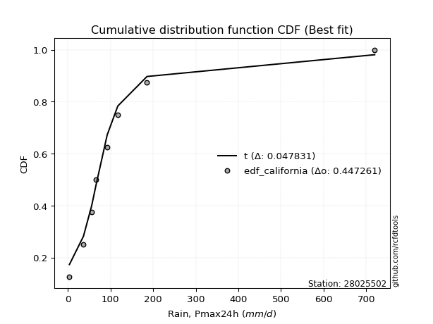</img>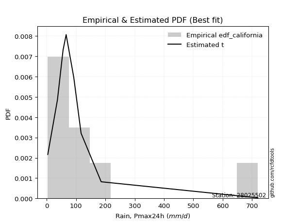</img>

</div>


### 2. Empirical - EDF Hazen (1930)

Hazen method for plotting positions is a formula used to estimate the empirical cumulative probability distribution of flood events or other hydrological data. This formula often results in biased estimations, particularly when extrapolating to extreme events (high return periods).

<div align="center">


$P=(m-0.5)/n$


</div>


**2.1. Empirical values**

<div align="center">

|                | 0                   | 1                   | 2                  | 3                  | 4         | 5                  | 6                  | 7                  | 8                  |
|:---------------|:--------------------|:--------------------|:-------------------|:-------------------|:----------|:-------------------|:-------------------|:-------------------|:-------------------|
| date           | 2021                | 2025                | 2018               | 2017               | 2024      | 2020               | 2023               | 2019               | 2022               |
| x              | 3.37                | 32.6                | 36.32              | 55.5               | 66.0      | 92.04              | 117.0              | 185.49             | 720.0              |
| m              | 1                   | 2                   | 3                  | 4                  | 5         | 6                  | 7                  | 8                  | 9                  |
| empirical_dist | edf_hazen           | edf_hazen           | edf_hazen          | edf_hazen          | edf_hazen | edf_hazen          | edf_hazen          | edf_hazen          | edf_hazen          |
| empirical      | 0.05555555555555555 | 0.16666666666666666 | 0.2777777777777778 | 0.3888888888888889 | 0.5       | 0.6111111111111112 | 0.7222222222222222 | 0.8333333333333334 | 0.9444444444444444 |
| empirical_tr   | 1.0588235294117647  | 1.2                 | 1.3846153846153846 | 1.6363636363636362 | 2.0       | 2.5714285714285716 | 3.5999999999999996 | 6.000000000000002  | 17.999999999999993 |

</div>


**2.2. Kolmogorov-Smirnov fit test (sorted by Δ)**


<div align="center">

|                | 0                   | 1                   | 2                   | 3                   | 4                   | 5                     | 6                   | 7                   | 8                   | 9                   | 10                  | 11                  | 12                  | 13                  | 14                  | 15                  | 16                  | 17                  | 18                  | 19                  | 20                  | 21                  | 22                  | 23                  | 24                  | 25                  | 26                  | 27                  | 28                  | 29                  | 30                  | 31                  | 32                  | 33                  | 34                  | 35                  | 36                  | 37                  | 38                  | 39                  | 40                  | 41                  | 42                  | 43                  | 44                  | 45                  | 46                  | 47                  | 48                  | 49                  | 50                  | 51                  | 52                  | 53                  | 54                  | 55                  | 56                  | 57                  | 58                  | 59                  | 60                  | 61                  | 62                  | 63                  | 64                  | 65                  | 66                  | 67                  | 68                  | 69                  | 70                  | 71                  | 72                  | 73                  | 74                  | 75                  | 76                  | 77                  | 78                  | 79                  | 80                  | 81                  | 82                  | 83                  | 84                  | 85                  | 86                  | 87                  | 88                  | 89                  |
|:---------------|:--------------------|:--------------------|:--------------------|:--------------------|:--------------------|:----------------------|:--------------------|:--------------------|:--------------------|:--------------------|:--------------------|:--------------------|:--------------------|:--------------------|:--------------------|:--------------------|:--------------------|:--------------------|:--------------------|:--------------------|:--------------------|:--------------------|:--------------------|:--------------------|:--------------------|:--------------------|:--------------------|:--------------------|:--------------------|:--------------------|:--------------------|:--------------------|:--------------------|:--------------------|:--------------------|:--------------------|:--------------------|:--------------------|:--------------------|:--------------------|:--------------------|:--------------------|:--------------------|:--------------------|:--------------------|:--------------------|:--------------------|:--------------------|:--------------------|:--------------------|:--------------------|:--------------------|:--------------------|:--------------------|:--------------------|:--------------------|:--------------------|:--------------------|:--------------------|:--------------------|:--------------------|:--------------------|:--------------------|:--------------------|:--------------------|:--------------------|:--------------------|:--------------------|:--------------------|:--------------------|:--------------------|:--------------------|:--------------------|:--------------------|:--------------------|:--------------------|:--------------------|:--------------------|:--------------------|:--------------------|:--------------------|:--------------------|:--------------------|:--------------------|:--------------------|:--------------------|:--------------------|:--------------------|:--------------------|:--------------------|
| station        | 28025502            | 28025502            | 28025502            | 28025502            | 28025502            | 28025502              | 28025502            | 28025502            | 28025502            | 28025502            | 28025502            | 28025502            | 28025502            | 28025502            | 28025502            | 28025502            | 28025502            | 28025502            | 28025502            | 28025502            | 28025502            | 28025502            | 28025502            | 28025502            | 28025502            | 28025502            | 28025502            | 28025502            | 28025502            | 28025502            | 28025502            | 28025502            | 28025502            | 28025502            | 28025502            | 28025502            | 28025502            | 28025502            | 28025502            | 28025502            | 28025502            | 28025502            | 28025502            | 28025502            | 28025502            | 28025502            | 28025502            | 28025502            | 28025502            | 28025502            | 28025502            | 28025502            | 28025502            | 28025502            | 28025502            | 28025502            | 28025502            | 28025502            | 28025502            | 28025502            | 28025502            | 28025502            | 28025502            | 28025502            | 28025502            | 28025502            | 28025502            | 28025502            | 28025502            | 28025502            | 28025502            | 28025502            | 28025502            | 28025502            | 28025502            | 28025502            | 28025502            | 28025502            | 28025502            | 28025502            | 28025502            | 28025502            | 28025502            | 28025502            | 28025502            | 28025502            | 28025502            | 28025502            | 28025502            | 28025502            |
| empirical_dist | edf_hazen           | edf_hazen           | edf_hazen           | edf_hazen           | edf_hazen           | edf_hazen             | edf_hazen           | edf_hazen           | edf_hazen           | edf_hazen           | edf_hazen           | edf_hazen           | edf_hazen           | edf_hazen           | edf_hazen           | edf_hazen           | edf_hazen           | edf_hazen           | edf_hazen           | edf_hazen           | edf_hazen           | edf_hazen           | edf_hazen           | edf_hazen           | edf_hazen           | edf_hazen           | edf_hazen           | edf_hazen           | edf_hazen           | edf_hazen           | edf_hazen           | edf_hazen           | edf_hazen           | edf_hazen           | edf_hazen           | edf_hazen           | edf_hazen           | edf_hazen           | edf_hazen           | edf_hazen           | edf_hazen           | edf_hazen           | edf_hazen           | edf_hazen           | edf_hazen           | edf_hazen           | edf_hazen           | edf_hazen           | edf_hazen           | edf_hazen           | edf_hazen           | edf_hazen           | edf_hazen           | edf_hazen           | edf_hazen           | edf_hazen           | edf_hazen           | edf_hazen           | edf_hazen           | edf_hazen           | edf_hazen           | edf_hazen           | edf_hazen           | edf_hazen           | edf_hazen           | edf_hazen           | edf_hazen           | edf_hazen           | edf_hazen           | edf_hazen           | edf_hazen           | edf_hazen           | edf_hazen           | edf_hazen           | edf_hazen           | edf_hazen           | edf_hazen           | edf_hazen           | edf_hazen           | edf_hazen           | edf_hazen           | edf_hazen           | edf_hazen           | edf_hazen           | edf_hazen           | edf_hazen           | edf_hazen           | edf_hazen           | edf_hazen           | edf_hazen           |
| p_dist         | johnsonsu           | logt                | logjohnsonsu        | nct                 | loglaplace          | loglaplace_asymmetric | invgamma            | fisk                | loggenlogistic      | logmielke           | loggumbel_l         | gibrat              | invgauss            | logfisk             | loghypsecant        | fatiguelife         | logpearson3         | loglogistic         | logloggamma         | logweibull_min      | gamma               | t                   | logrice             | logexponnorm        | lognorm             | lognorm             | logcrystalball      | logfatiguelife      | lognct              | logf                | logncf              | loggompertz         | logerlang           | logbetaprime        | loggamma            | loggamma            | loginvgamma         | logalpha            | logchi2             | wald                | mielke              | lognakagami         | logmaxwell          | loginvgauss         | exponnorm           | gompertz            | expon               | genexpon            | loggumbel_r         | truncnorm           | lograyleigh         | laplace_asymmetric  | genlogistic         | logmoyal            | f                   | loginvweibull       | moyal               | gumbel_r            | pearson3            | loghalflogistic     | loghalfnorm         | ncf                 | logwald             | rayleigh            | betaprime           | halflogistic        | erlang              | nakagami            | maxwell             | loggibrat           | logkstwobign        | halfnorm            | weibull_min         | chi2                | loggenexpon         | kstwobign           | crystalball         | norm                | logistic            | hypsecant           | laplace             | rice                | gumbel_l            | logtruncnorm        | logexpon            | pareto              | loglognorm          | invweibull          | logpareto           | alpha               |
| delta          | 0.04445094232510949 | 0.05081252003829698 | 0.05960816278741557 | 0.0775963187851052  | 0.07845270491345918 | 0.07889670401514873   | 0.08287231320494981 | 0.09200373867640751 | 0.09736714916922892 | 0.09804586866672235 | 0.10091369116745363 | 0.10260372893821368 | 0.10297637460577427 | 0.10387454653144576 | 0.10413411401954756 | 0.10723802208416564 | 0.11945290895951974 | 0.11945773423468617 | 0.12032772124101507 | 0.12636897177099934 | 0.13134949393101622 | 0.13360728946551867 | 0.14042496197929136 | 0.14043685895110122 | 0.1404393910463542  | 0.1404393910463542  | 0.1404394309150319  | 0.1407025927149159  | 0.14085543700036238 | 0.14096960154025848 | 0.1434512135121159  | 0.1446660919860069  | 0.1474821610269991  | 0.14934582802310944 | 0.15045214326123754 | 0.15045214326123754 | 0.15341792933472406 | 0.154684034837641   | 0.15517818786263218 | 0.1634506913083518  | 0.16499551162794132 | 0.16666666364382246 | 0.16901566438187396 | 0.17033093432547328 | 0.17033862010784728 | 0.17068468313447804 | 0.17145345484948304 | 0.1714537030277481  | 0.17574705278085082 | 0.17877370848980545 | 0.18024469579368965 | 0.181600080960316   | 0.18648388121389614 | 0.18701853103262586 | 0.1894907076422371  | 0.20428797921200045 | 0.20490617756112986 | 0.20949386377049606 | 0.21095600720769456 | 0.21186417927304976 | 0.21205117735583998 | 0.2206096379702112  | 0.2284386971953089  | 0.2298056129745284  | 0.2312310739634523  | 0.2326000807146916  | 0.23411013028544256 | 0.23459884159275135 | 0.24175003021202135 | 0.24213043447554078 | 0.2461093649689269  | 0.24723547718935238 | 0.24791151085015373 | 0.2499316413861303  | 0.25952560587160434 | 0.2758154386910519  | 0.27610673992674467 | 0.2761067478986897  | 0.28334913082687424 | 0.28945750926622305 | 0.3094037790126753  | 0.31341305917397827 | 0.3460350671985655  | 0.3617164395039746  | 0.36865015751341834 | 0.45983947345836784 | 0.4602745956867018  | 0.47689319133779995 | 0.49425228065116655 | 0.5906165636639374  |
| deltao         | 0.41761268023100007 | 0.41761268023100007 | 0.41761268023100007 | 0.41761268023100007 | 0.41761268023100007 | 0.41761268023100007   | 0.41761268023100007 | 0.41761268023100007 | 0.41761268023100007 | 0.41761268023100007 | 0.41761268023100007 | 0.41761268023100007 | 0.41761268023100007 | 0.41761268023100007 | 0.41761268023100007 | 0.41761268023100007 | 0.41761268023100007 | 0.41761268023100007 | 0.41761268023100007 | 0.41761268023100007 | 0.41761268023100007 | 0.41761268023100007 | 0.41761268023100007 | 0.41761268023100007 | 0.41761268023100007 | 0.41761268023100007 | 0.41761268023100007 | 0.41761268023100007 | 0.41761268023100007 | 0.41761268023100007 | 0.41761268023100007 | 0.41761268023100007 | 0.41761268023100007 | 0.41761268023100007 | 0.41761268023100007 | 0.41761268023100007 | 0.41761268023100007 | 0.41761268023100007 | 0.41761268023100007 | 0.41761268023100007 | 0.41761268023100007 | 0.41761268023100007 | 0.41761268023100007 | 0.41761268023100007 | 0.41761268023100007 | 0.41761268023100007 | 0.41761268023100007 | 0.41761268023100007 | 0.41761268023100007 | 0.41761268023100007 | 0.41761268023100007 | 0.41761268023100007 | 0.41761268023100007 | 0.41761268023100007 | 0.41761268023100007 | 0.41761268023100007 | 0.41761268023100007 | 0.41761268023100007 | 0.41761268023100007 | 0.41761268023100007 | 0.41761268023100007 | 0.41761268023100007 | 0.41761268023100007 | 0.41761268023100007 | 0.41761268023100007 | 0.41761268023100007 | 0.41761268023100007 | 0.41761268023100007 | 0.41761268023100007 | 0.41761268023100007 | 0.41761268023100007 | 0.41761268023100007 | 0.41761268023100007 | 0.41761268023100007 | 0.41761268023100007 | 0.41761268023100007 | 0.41761268023100007 | 0.41761268023100007 | 0.41761268023100007 | 0.41761268023100007 | 0.41761268023100007 | 0.41761268023100007 | 0.41761268023100007 | 0.41761268023100007 | 0.41761268023100007 | 0.41761268023100007 | 0.41761268023100007 | 0.41761268023100007 | 0.41761268023100007 | 0.41761268023100007 |
| eval           | Δo > Δ              | Δo > Δ              | Δo > Δ              | Δo > Δ              | Δo > Δ              | Δo > Δ                | Δo > Δ              | Δo > Δ              | Δo > Δ              | Δo > Δ              | Δo > Δ              | Δo > Δ              | Δo > Δ              | Δo > Δ              | Δo > Δ              | Δo > Δ              | Δo > Δ              | Δo > Δ              | Δo > Δ              | Δo > Δ              | Δo > Δ              | Δo > Δ              | Δo > Δ              | Δo > Δ              | Δo > Δ              | Δo > Δ              | Δo > Δ              | Δo > Δ              | Δo > Δ              | Δo > Δ              | Δo > Δ              | Δo > Δ              | Δo > Δ              | Δo > Δ              | Δo > Δ              | Δo > Δ              | Δo > Δ              | Δo > Δ              | Δo > Δ              | Δo > Δ              | Δo > Δ              | Δo > Δ              | Δo > Δ              | Δo > Δ              | Δo > Δ              | Δo > Δ              | Δo > Δ              | Δo > Δ              | Δo > Δ              | Δo > Δ              | Δo > Δ              | Δo > Δ              | Δo > Δ              | Δo > Δ              | Δo > Δ              | Δo > Δ              | Δo > Δ              | Δo > Δ              | Δo > Δ              | Δo > Δ              | Δo > Δ              | Δo > Δ              | Δo > Δ              | Δo > Δ              | Δo > Δ              | Δo > Δ              | Δo > Δ              | Δo > Δ              | Δo > Δ              | Δo > Δ              | Δo > Δ              | Δo > Δ              | Δo > Δ              | Δo > Δ              | Δo > Δ              | Δo > Δ              | Δo > Δ              | Δo > Δ              | Δo > Δ              | Δo > Δ              | Δo > Δ              | Δo > Δ              | Δo > Δ              | Δo > Δ              | Δo > Δ              | Δo <= Δ             | Δo <= Δ             | Δo <= Δ             | Δo <= Δ             | Δo <= Δ             |
| fit            | 1                   | 1                   | 1                   | 1                   | 1                   | 1                     | 1                   | 1                   | 1                   | 1                   | 1                   | 1                   | 1                   | 1                   | 1                   | 1                   | 1                   | 1                   | 1                   | 1                   | 1                   | 1                   | 1                   | 1                   | 1                   | 1                   | 1                   | 1                   | 1                   | 1                   | 1                   | 1                   | 1                   | 1                   | 1                   | 1                   | 1                   | 1                   | 1                   | 1                   | 1                   | 1                   | 1                   | 1                   | 1                   | 1                   | 1                   | 1                   | 1                   | 1                   | 1                   | 1                   | 1                   | 1                   | 1                   | 1                   | 1                   | 1                   | 1                   | 1                   | 1                   | 1                   | 1                   | 1                   | 1                   | 1                   | 1                   | 1                   | 1                   | 1                   | 1                   | 1                   | 1                   | 1                   | 1                   | 1                   | 1                   | 1                   | 1                   | 1                   | 1                   | 1                   | 1                   | 1                   | 1                   | 0                   | 0                   | 0                   | 0                   | 0                   |
| n              | 9                   | 9                   | 9                   | 9                   | 9                   | 9                     | 9                   | 9                   | 9                   | 9                   | 9                   | 9                   | 9                   | 9                   | 9                   | 9                   | 9                   | 9                   | 9                   | 9                   | 9                   | 9                   | 9                   | 9                   | 9                   | 9                   | 9                   | 9                   | 9                   | 9                   | 9                   | 9                   | 9                   | 9                   | 9                   | 9                   | 9                   | 9                   | 9                   | 9                   | 9                   | 9                   | 9                   | 9                   | 9                   | 9                   | 9                   | 9                   | 9                   | 9                   | 9                   | 9                   | 9                   | 9                   | 9                   | 9                   | 9                   | 9                   | 9                   | 9                   | 9                   | 9                   | 9                   | 9                   | 9                   | 9                   | 9                   | 9                   | 9                   | 9                   | 9                   | 9                   | 9                   | 9                   | 9                   | 9                   | 9                   | 9                   | 9                   | 9                   | 9                   | 9                   | 9                   | 9                   | 9                   | 9                   | 9                   | 9                   | 9                   | 9                   |
| best_fit       | 1                   | 0                   | 0                   | 0                   | 0                   | 0                     | 0                   | 0                   | 0                   | 0                   | 0                   | 0                   | 0                   | 0                   | 0                   | 0                   | 0                   | 0                   | 0                   | 0                   | 0                   | 0                   | 0                   | 0                   | 0                   | 0                   | 0                   | 0                   | 0                   | 0                   | 0                   | 0                   | 0                   | 0                   | 0                   | 0                   | 0                   | 0                   | 0                   | 0                   | 0                   | 0                   | 0                   | 0                   | 0                   | 0                   | 0                   | 0                   | 0                   | 0                   | 0                   | 0                   | 0                   | 0                   | 0                   | 0                   | 0                   | 0                   | 0                   | 0                   | 0                   | 0                   | 0                   | 0                   | 0                   | 0                   | 0                   | 0                   | 0                   | 0                   | 0                   | 0                   | 0                   | 0                   | 0                   | 0                   | 0                   | 0                   | 0                   | 0                   | 0                   | 0                   | 0                   | 0                   | 0                   | 0                   | 0                   | 0                   | 0                   | 0                   |
| best_fit_sort  | 1                   | 2                   | 3                   | 4                   | 5                   | 6                     | 7                   | 8                   | 9                   | 10                  | 11                  | 12                  | 13                  | 14                  | 15                  | 16                  | 17                  | 18                  | 19                  | 20                  | 21                  | 22                  | 23                  | 24                  | 25                  | 26                  | 27                  | 28                  | 29                  | 30                  | 31                  | 32                  | 33                  | 34                  | 35                  | 36                  | 37                  | 38                  | 39                  | 40                  | 41                  | 42                  | 43                  | 44                  | 45                  | 46                  | 47                  | 48                  | 49                  | 50                  | 51                  | 52                  | 53                  | 54                  | 55                  | 56                  | 57                  | 58                  | 59                  | 60                  | 61                  | 62                  | 63                  | 64                  | 65                  | 66                  | 67                  | 68                  | 69                  | 70                  | 71                  | 72                  | 73                  | 74                  | 75                  | 76                  | 77                  | 78                  | 79                  | 80                  | 81                  | 82                  | 83                  | 84                  | 85                  | 86                  | 87                  | 88                  | 89                  | 90                  |

</div>


<div align="center">

</img>

</div>


**2.3. Best fit**

<div align="center">

|   id |   station | empirical_dist   | p_dist    |     delta |   deltao | eval   |   fit |   n |   best_fit |   best_fit_sort |
|-----:|----------:|:-----------------|:----------|----------:|---------:|:-------|------:|----:|-----------:|----------------:|
|    0 |  28025502 | edf_hazen        | johnsonsu | 0.0444509 | 0.417613 | Δo > Δ |     1 |   9 |          1 |               1 |

</div>


<div align="center">

</img>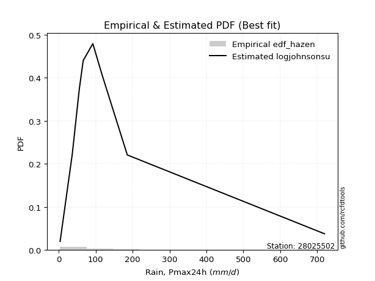</img>

</div>


### 3. Empirical - EDF Weibull (1939)

Weibull plotting position formula is an empirical method used to estimate the non-exceedance probability or plotting position for a set of observed data, is often recommended or widely used in practice, particularly in flood frequency analysis.

<div align="center">


$P=m/(n+1)$


</div>


**3.1. Empirical values**

<div align="center">

|                | 0                  | 1           | 2                  | 3                  | 4           | 5           | 6                 | 7                 | 8                  |
|:---------------|:-------------------|:------------|:-------------------|:-------------------|:------------|:------------|:------------------|:------------------|:-------------------|
| date           | 2021               | 2025        | 2018               | 2017               | 2024        | 2020        | 2023              | 2019              | 2022               |
| x              | 3.37               | 32.6        | 36.32              | 55.5               | 66.0        | 92.04       | 117.0             | 185.49            | 720.0              |
| m              | 1                  | 2           | 3                  | 4                  | 5           | 6           | 7                 | 8                 | 9                  |
| empirical_dist | edf_weibull        | edf_weibull | edf_weibull        | edf_weibull        | edf_weibull | edf_weibull | edf_weibull       | edf_weibull       | edf_weibull        |
| empirical      | 0.1                | 0.2         | 0.3                | 0.4                | 0.5         | 0.6         | 0.7               | 0.8               | 0.9                |
| empirical_tr   | 1.1111111111111112 | 1.25        | 1.4285714285714286 | 1.6666666666666667 | 2.0         | 2.5         | 3.333333333333333 | 5.000000000000001 | 10.000000000000002 |

</div>


**3.2. Kolmogorov-Smirnov fit test (sorted by Δ)**


<div align="center">

|                | 0                   | 1                   | 2                   | 3                   | 4                   | 5                   | 6                   | 7                   | 8                     | 9                   | 10                  | 11                  | 12                  | 13                  | 14                  | 15                  | 16                  | 17                  | 18                  | 19                  | 20                  | 21                  | 22                  | 23                  | 24                  | 25                  | 26                  | 27                  | 28                  | 29                  | 30                  | 31                  | 32                  | 33                  | 34                  | 35                  | 36                  | 37                  | 38                  | 39                  | 40                  | 41                  | 42                  | 43                  | 44                  | 45                  | 46                  | 47                  | 48                  | 49                  | 50                  | 51                  | 52                  | 53                  | 54                  | 55                  | 56                  | 57                  | 58                  | 59                  | 60                  | 61                  | 62                  | 63                  | 64                  | 65                  | 66                  | 67                  | 68                  | 69                  | 70                  | 71                  | 72                  | 73                  | 74                  | 75                  | 76                  | 77                  | 78                  | 79                  | 80                  | 81                  | 82                  | 83                  | 84                  | 85                  | 86                  | 87                  | 88                  | 89                  |
|:---------------|:--------------------|:--------------------|:--------------------|:--------------------|:--------------------|:--------------------|:--------------------|:--------------------|:----------------------|:--------------------|:--------------------|:--------------------|:--------------------|:--------------------|:--------------------|:--------------------|:--------------------|:--------------------|:--------------------|:--------------------|:--------------------|:--------------------|:--------------------|:--------------------|:--------------------|:--------------------|:--------------------|:--------------------|:--------------------|:--------------------|:--------------------|:--------------------|:--------------------|:--------------------|:--------------------|:--------------------|:--------------------|:--------------------|:--------------------|:--------------------|:--------------------|:--------------------|:--------------------|:--------------------|:--------------------|:--------------------|:--------------------|:--------------------|:--------------------|:--------------------|:--------------------|:--------------------|:--------------------|:--------------------|:--------------------|:--------------------|:--------------------|:--------------------|:--------------------|:--------------------|:--------------------|:--------------------|:--------------------|:--------------------|:--------------------|:--------------------|:--------------------|:--------------------|:--------------------|:--------------------|:--------------------|:--------------------|:--------------------|:--------------------|:--------------------|:--------------------|:--------------------|:--------------------|:--------------------|:--------------------|:--------------------|:--------------------|:--------------------|:--------------------|:--------------------|:--------------------|:--------------------|:--------------------|:--------------------|:--------------------|
| station        | 28025502            | 28025502            | 28025502            | 28025502            | 28025502            | 28025502            | 28025502            | 28025502            | 28025502              | 28025502            | 28025502            | 28025502            | 28025502            | 28025502            | 28025502            | 28025502            | 28025502            | 28025502            | 28025502            | 28025502            | 28025502            | 28025502            | 28025502            | 28025502            | 28025502            | 28025502            | 28025502            | 28025502            | 28025502            | 28025502            | 28025502            | 28025502            | 28025502            | 28025502            | 28025502            | 28025502            | 28025502            | 28025502            | 28025502            | 28025502            | 28025502            | 28025502            | 28025502            | 28025502            | 28025502            | 28025502            | 28025502            | 28025502            | 28025502            | 28025502            | 28025502            | 28025502            | 28025502            | 28025502            | 28025502            | 28025502            | 28025502            | 28025502            | 28025502            | 28025502            | 28025502            | 28025502            | 28025502            | 28025502            | 28025502            | 28025502            | 28025502            | 28025502            | 28025502            | 28025502            | 28025502            | 28025502            | 28025502            | 28025502            | 28025502            | 28025502            | 28025502            | 28025502            | 28025502            | 28025502            | 28025502            | 28025502            | 28025502            | 28025502            | 28025502            | 28025502            | 28025502            | 28025502            | 28025502            | 28025502            |
| empirical_dist | edf_weibull         | edf_weibull         | edf_weibull         | edf_weibull         | edf_weibull         | edf_weibull         | edf_weibull         | edf_weibull         | edf_weibull           | edf_weibull         | edf_weibull         | edf_weibull         | edf_weibull         | edf_weibull         | edf_weibull         | edf_weibull         | edf_weibull         | edf_weibull         | edf_weibull         | edf_weibull         | edf_weibull         | edf_weibull         | edf_weibull         | edf_weibull         | edf_weibull         | edf_weibull         | edf_weibull         | edf_weibull         | edf_weibull         | edf_weibull         | edf_weibull         | edf_weibull         | edf_weibull         | edf_weibull         | edf_weibull         | edf_weibull         | edf_weibull         | edf_weibull         | edf_weibull         | edf_weibull         | edf_weibull         | edf_weibull         | edf_weibull         | edf_weibull         | edf_weibull         | edf_weibull         | edf_weibull         | edf_weibull         | edf_weibull         | edf_weibull         | edf_weibull         | edf_weibull         | edf_weibull         | edf_weibull         | edf_weibull         | edf_weibull         | edf_weibull         | edf_weibull         | edf_weibull         | edf_weibull         | edf_weibull         | edf_weibull         | edf_weibull         | edf_weibull         | edf_weibull         | edf_weibull         | edf_weibull         | edf_weibull         | edf_weibull         | edf_weibull         | edf_weibull         | edf_weibull         | edf_weibull         | edf_weibull         | edf_weibull         | edf_weibull         | edf_weibull         | edf_weibull         | edf_weibull         | edf_weibull         | edf_weibull         | edf_weibull         | edf_weibull         | edf_weibull         | edf_weibull         | edf_weibull         | edf_weibull         | edf_weibull         | edf_weibull         | edf_weibull         |
| p_dist         | logjohnsonsu        | nct                 | johnsonsu           | invgamma            | logt                | invgauss            | loggenlogistic      | logmielke           | loglaplace_asymmetric | loglaplace          | loghypsecant        | gibrat              | logfisk             | fatiguelife         | fisk                | logpearson3         | loglogistic         | logloggamma         | logweibull_min      | loggumbel_l         | gamma               | logrice             | logexponnorm        | lognorm             | lognorm             | logcrystalball      | logfatiguelife      | lognct              | logf                | logncf              | loggompertz         | logerlang           | logbetaprime        | loggamma            | loggamma            | loginvgamma         | logalpha            | logchi2             | wald                | mielke              | logmaxwell          | loginvgauss         | t                   | loggumbel_r         | lograyleigh         | exponnorm           | gompertz            | expon               | genexpon            | logmoyal            | f                   | truncnorm           | moyal               | genlogistic         | laplace_asymmetric  | loginvweibull       | pearson3            | loghalflogistic     | loghalfnorm         | gumbel_r            | ncf                 | halflogistic        | betaprime           | lognakagami         | erlang              | nakagami            | halfnorm            | rayleigh            | logkstwobign        | chi2                | logwald             | maxwell             | weibull_min         | loggenexpon         | loggibrat           | kstwobign           | crystalball         | norm                | logistic            | hypsecant           | laplace             | rice                | gumbel_l            | logtruncnorm        | logexpon            | pareto              | loglognorm          | invweibull          | logpareto           | alpha               |
| delta          | 0.06945545866789637 | 0.06963640598248491 | 0.0704504947174972  | 0.07152645211941588 | 0.07310763928348407 | 0.07329325921228091 | 0.07473980025600657 | 0.07499524305995486 | 0.07563225267469759   | 0.07635913656646587 | 0.07853801178343836 | 0.08038150671599142 | 0.08163692620405757 | 0.0818848110153565  | 0.08221601393306435 | 0.08611957562618638 | 0.08612440090135282 | 0.08699438790768171 | 0.09303563843766599 | 0.09503947727394879 | 0.09999999999028376 | 0.107091628645958   | 0.10710352561776787 | 0.10710605771302084 | 0.10710605771302084 | 0.10710609758169853 | 0.10736925938158254 | 0.10752210366702902 | 0.10763626820692512 | 0.11011788017878255 | 0.11133275865267356 | 0.11414882769366574 | 0.11601249468977609 | 0.11711880992790419 | 0.11711880992790419 | 0.12008459600139071 | 0.12135070150430766 | 0.12184485452929883 | 0.13011735797501844 | 0.13166217829460797 | 0.1356823310485406  | 0.13699760099213992 | 0.14008901734680446 | 0.14241371944751746 | 0.1469113624603563  | 0.14811639788562503 | 0.1484624609122558  | 0.1492312326272608  | 0.14923148080552584 | 0.1536851976992925  | 0.15615737430890375 | 0.1565514862675832  | 0.16202797172685746 | 0.1642616589916739  | 0.1694420027057768  | 0.1709546458786671  | 0.1742439849096762  | 0.1785308459397164  | 0.17871784402250662 | 0.1872716415482738  | 0.18727630463687783 | 0.18815563627024715 | 0.19789774063011895 | 0.19999999697715581 | 0.2007767969521092  | 0.20126550825941802 | 0.20279103274490792 | 0.20758339075230614 | 0.21277603163559355 | 0.21659830805279695 | 0.21732758608419778 | 0.2195278079897991  | 0.22568928862793147 | 0.22619227253827096 | 0.23101932336442965 | 0.25359321646882965 | 0.2538845177045224  | 0.25388452567646747 | 0.261126908604652   | 0.2672352870440008  | 0.28718155679045304 | 0.291190836951756   | 0.3238128449763433  | 0.3283831061706412  | 0.33531682418008496 | 0.42650614012503446 | 0.42694126235336843 | 0.43244874689335555 | 0.46091894731783317 | 0.5572832303306041  |
| deltao         | 0.41761268023100007 | 0.41761268023100007 | 0.41761268023100007 | 0.41761268023100007 | 0.41761268023100007 | 0.41761268023100007 | 0.41761268023100007 | 0.41761268023100007 | 0.41761268023100007   | 0.41761268023100007 | 0.41761268023100007 | 0.41761268023100007 | 0.41761268023100007 | 0.41761268023100007 | 0.41761268023100007 | 0.41761268023100007 | 0.41761268023100007 | 0.41761268023100007 | 0.41761268023100007 | 0.41761268023100007 | 0.41761268023100007 | 0.41761268023100007 | 0.41761268023100007 | 0.41761268023100007 | 0.41761268023100007 | 0.41761268023100007 | 0.41761268023100007 | 0.41761268023100007 | 0.41761268023100007 | 0.41761268023100007 | 0.41761268023100007 | 0.41761268023100007 | 0.41761268023100007 | 0.41761268023100007 | 0.41761268023100007 | 0.41761268023100007 | 0.41761268023100007 | 0.41761268023100007 | 0.41761268023100007 | 0.41761268023100007 | 0.41761268023100007 | 0.41761268023100007 | 0.41761268023100007 | 0.41761268023100007 | 0.41761268023100007 | 0.41761268023100007 | 0.41761268023100007 | 0.41761268023100007 | 0.41761268023100007 | 0.41761268023100007 | 0.41761268023100007 | 0.41761268023100007 | 0.41761268023100007 | 0.41761268023100007 | 0.41761268023100007 | 0.41761268023100007 | 0.41761268023100007 | 0.41761268023100007 | 0.41761268023100007 | 0.41761268023100007 | 0.41761268023100007 | 0.41761268023100007 | 0.41761268023100007 | 0.41761268023100007 | 0.41761268023100007 | 0.41761268023100007 | 0.41761268023100007 | 0.41761268023100007 | 0.41761268023100007 | 0.41761268023100007 | 0.41761268023100007 | 0.41761268023100007 | 0.41761268023100007 | 0.41761268023100007 | 0.41761268023100007 | 0.41761268023100007 | 0.41761268023100007 | 0.41761268023100007 | 0.41761268023100007 | 0.41761268023100007 | 0.41761268023100007 | 0.41761268023100007 | 0.41761268023100007 | 0.41761268023100007 | 0.41761268023100007 | 0.41761268023100007 | 0.41761268023100007 | 0.41761268023100007 | 0.41761268023100007 | 0.41761268023100007 |
| eval           | Δo > Δ              | Δo > Δ              | Δo > Δ              | Δo > Δ              | Δo > Δ              | Δo > Δ              | Δo > Δ              | Δo > Δ              | Δo > Δ                | Δo > Δ              | Δo > Δ              | Δo > Δ              | Δo > Δ              | Δo > Δ              | Δo > Δ              | Δo > Δ              | Δo > Δ              | Δo > Δ              | Δo > Δ              | Δo > Δ              | Δo > Δ              | Δo > Δ              | Δo > Δ              | Δo > Δ              | Δo > Δ              | Δo > Δ              | Δo > Δ              | Δo > Δ              | Δo > Δ              | Δo > Δ              | Δo > Δ              | Δo > Δ              | Δo > Δ              | Δo > Δ              | Δo > Δ              | Δo > Δ              | Δo > Δ              | Δo > Δ              | Δo > Δ              | Δo > Δ              | Δo > Δ              | Δo > Δ              | Δo > Δ              | Δo > Δ              | Δo > Δ              | Δo > Δ              | Δo > Δ              | Δo > Δ              | Δo > Δ              | Δo > Δ              | Δo > Δ              | Δo > Δ              | Δo > Δ              | Δo > Δ              | Δo > Δ              | Δo > Δ              | Δo > Δ              | Δo > Δ              | Δo > Δ              | Δo > Δ              | Δo > Δ              | Δo > Δ              | Δo > Δ              | Δo > Δ              | Δo > Δ              | Δo > Δ              | Δo > Δ              | Δo > Δ              | Δo > Δ              | Δo > Δ              | Δo > Δ              | Δo > Δ              | Δo > Δ              | Δo > Δ              | Δo > Δ              | Δo > Δ              | Δo > Δ              | Δo > Δ              | Δo > Δ              | Δo > Δ              | Δo > Δ              | Δo > Δ              | Δo > Δ              | Δo > Δ              | Δo > Δ              | Δo <= Δ             | Δo <= Δ             | Δo <= Δ             | Δo <= Δ             | Δo <= Δ             |
| fit            | 1                   | 1                   | 1                   | 1                   | 1                   | 1                   | 1                   | 1                   | 1                     | 1                   | 1                   | 1                   | 1                   | 1                   | 1                   | 1                   | 1                   | 1                   | 1                   | 1                   | 1                   | 1                   | 1                   | 1                   | 1                   | 1                   | 1                   | 1                   | 1                   | 1                   | 1                   | 1                   | 1                   | 1                   | 1                   | 1                   | 1                   | 1                   | 1                   | 1                   | 1                   | 1                   | 1                   | 1                   | 1                   | 1                   | 1                   | 1                   | 1                   | 1                   | 1                   | 1                   | 1                   | 1                   | 1                   | 1                   | 1                   | 1                   | 1                   | 1                   | 1                   | 1                   | 1                   | 1                   | 1                   | 1                   | 1                   | 1                   | 1                   | 1                   | 1                   | 1                   | 1                   | 1                   | 1                   | 1                   | 1                   | 1                   | 1                   | 1                   | 1                   | 1                   | 1                   | 1                   | 1                   | 0                   | 0                   | 0                   | 0                   | 0                   |
| n              | 9                   | 9                   | 9                   | 9                   | 9                   | 9                   | 9                   | 9                   | 9                     | 9                   | 9                   | 9                   | 9                   | 9                   | 9                   | 9                   | 9                   | 9                   | 9                   | 9                   | 9                   | 9                   | 9                   | 9                   | 9                   | 9                   | 9                   | 9                   | 9                   | 9                   | 9                   | 9                   | 9                   | 9                   | 9                   | 9                   | 9                   | 9                   | 9                   | 9                   | 9                   | 9                   | 9                   | 9                   | 9                   | 9                   | 9                   | 9                   | 9                   | 9                   | 9                   | 9                   | 9                   | 9                   | 9                   | 9                   | 9                   | 9                   | 9                   | 9                   | 9                   | 9                   | 9                   | 9                   | 9                   | 9                   | 9                   | 9                   | 9                   | 9                   | 9                   | 9                   | 9                   | 9                   | 9                   | 9                   | 9                   | 9                   | 9                   | 9                   | 9                   | 9                   | 9                   | 9                   | 9                   | 9                   | 9                   | 9                   | 9                   | 9                   |
| best_fit       | 1                   | 0                   | 0                   | 0                   | 0                   | 0                   | 0                   | 0                   | 0                     | 0                   | 0                   | 0                   | 0                   | 0                   | 0                   | 0                   | 0                   | 0                   | 0                   | 0                   | 0                   | 0                   | 0                   | 0                   | 0                   | 0                   | 0                   | 0                   | 0                   | 0                   | 0                   | 0                   | 0                   | 0                   | 0                   | 0                   | 0                   | 0                   | 0                   | 0                   | 0                   | 0                   | 0                   | 0                   | 0                   | 0                   | 0                   | 0                   | 0                   | 0                   | 0                   | 0                   | 0                   | 0                   | 0                   | 0                   | 0                   | 0                   | 0                   | 0                   | 0                   | 0                   | 0                   | 0                   | 0                   | 0                   | 0                   | 0                   | 0                   | 0                   | 0                   | 0                   | 0                   | 0                   | 0                   | 0                   | 0                   | 0                   | 0                   | 0                   | 0                   | 0                   | 0                   | 0                   | 0                   | 0                   | 0                   | 0                   | 0                   | 0                   |
| best_fit_sort  | 1                   | 2                   | 3                   | 4                   | 5                   | 6                   | 7                   | 8                   | 9                     | 10                  | 11                  | 12                  | 13                  | 14                  | 15                  | 16                  | 17                  | 18                  | 19                  | 20                  | 21                  | 22                  | 23                  | 24                  | 25                  | 26                  | 27                  | 28                  | 29                  | 30                  | 31                  | 32                  | 33                  | 34                  | 35                  | 36                  | 37                  | 38                  | 39                  | 40                  | 41                  | 42                  | 43                  | 44                  | 45                  | 46                  | 47                  | 48                  | 49                  | 50                  | 51                  | 52                  | 53                  | 54                  | 55                  | 56                  | 57                  | 58                  | 59                  | 60                  | 61                  | 62                  | 63                  | 64                  | 65                  | 66                  | 67                  | 68                  | 69                  | 70                  | 71                  | 72                  | 73                  | 74                  | 75                  | 76                  | 77                  | 78                  | 79                  | 80                  | 81                  | 82                  | 83                  | 84                  | 85                  | 86                  | 87                  | 88                  | 89                  | 90                  |

</div>


<div align="center">

</img>

</div>


**3.3. Best fit**

<div align="center">

|   id |   station | empirical_dist   | p_dist       |     delta |   deltao | eval   |   fit |   n |   best_fit |   best_fit_sort |
|-----:|----------:|:-----------------|:-------------|----------:|---------:|:-------|------:|----:|-----------:|----------------:|
|    0 |  28025502 | edf_weibull      | logjohnsonsu | 0.0694555 | 0.417613 | Δo > Δ |     1 |   9 |          1 |               1 |

</div>


<div align="center">

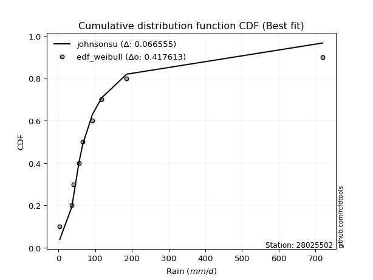</img></img>

</div>


### 4. Empirical - EDF Beard (1943)

The Beard formula (or Beard´s plotting position formula) in hydrology is used to estimate the empirical non-exceedance probability _(P)_ of a flood event (or other extreme hydrological data point) within a given dataset.

<div align="center">


$P=(m-0.31)/(n+0.38)$


</div>


**4.1. Empirical values**

<div align="center">

|                | 0                   | 1                   | 2                  | 3                   | 4         | 5                  | 6                  | 7                  | 8                  |
|:---------------|:--------------------|:--------------------|:-------------------|:--------------------|:----------|:-------------------|:-------------------|:-------------------|:-------------------|
| date           | 2021                | 2025                | 2018               | 2017                | 2024      | 2020               | 2023               | 2019               | 2022               |
| x              | 3.37                | 32.6                | 36.32              | 55.5                | 66.0      | 92.04              | 117.0              | 185.49             | 720.0              |
| m              | 1                   | 2                   | 3                  | 4                   | 5         | 6                  | 7                  | 8                  | 9                  |
| empirical_dist | edf_beard           | edf_beard           | edf_beard          | edf_beard           | edf_beard | edf_beard          | edf_beard          | edf_beard          | edf_beard          |
| empirical      | 0.07356076759061833 | 0.18017057569296374 | 0.2867803837953091 | 0.39339019189765456 | 0.5       | 0.6066098081023454 | 0.7132196162046908 | 0.8198294243070362 | 0.9264392324093815 |
| empirical_tr   | 1.0794016110471807  | 1.2197659297789336  | 1.4020926756352765 | 1.6485061511423549  | 2.0       | 2.542005420054201  | 3.486988847583642  | 5.550295857988164  | 13.5942028985507   |

</div>


**4.2. Kolmogorov-Smirnov fit test (sorted by Δ)**


<div align="center">

|                | 0                    | 1                   | 2                   | 3                   | 4                   | 5                     | 6                   | 7                   | 8                   | 9                   | 10                  | 11                  | 12                  | 13                  | 14                  | 15                  | 16                  | 17                  | 18                  | 19                  | 20                  | 21                  | 22                  | 23                  | 24                  | 25                  | 26                  | 27                  | 28                  | 29                  | 30                  | 31                  | 32                  | 33                  | 34                  | 35                  | 36                  | 37                  | 38                  | 39                  | 40                  | 41                  | 42                  | 43                  | 44                  | 45                  | 46                  | 47                  | 48                  | 49                  | 50                  | 51                  | 52                  | 53                  | 54                  | 55                  | 56                  | 57                  | 58                  | 59                  | 60                  | 61                  | 62                  | 63                  | 64                  | 65                  | 66                  | 67                  | 68                  | 69                  | 70                  | 71                  | 72                  | 73                  | 74                  | 75                  | 76                  | 77                  | 78                  | 79                  | 80                  | 81                  | 82                  | 83                  | 84                  | 85                  | 86                  | 87                  | 88                  | 89                  |
|:---------------|:---------------------|:--------------------|:--------------------|:--------------------|:--------------------|:----------------------|:--------------------|:--------------------|:--------------------|:--------------------|:--------------------|:--------------------|:--------------------|:--------------------|:--------------------|:--------------------|:--------------------|:--------------------|:--------------------|:--------------------|:--------------------|:--------------------|:--------------------|:--------------------|:--------------------|:--------------------|:--------------------|:--------------------|:--------------------|:--------------------|:--------------------|:--------------------|:--------------------|:--------------------|:--------------------|:--------------------|:--------------------|:--------------------|:--------------------|:--------------------|:--------------------|:--------------------|:--------------------|:--------------------|:--------------------|:--------------------|:--------------------|:--------------------|:--------------------|:--------------------|:--------------------|:--------------------|:--------------------|:--------------------|:--------------------|:--------------------|:--------------------|:--------------------|:--------------------|:--------------------|:--------------------|:--------------------|:--------------------|:--------------------|:--------------------|:--------------------|:--------------------|:--------------------|:--------------------|:--------------------|:--------------------|:--------------------|:--------------------|:--------------------|:--------------------|:--------------------|:--------------------|:--------------------|:--------------------|:--------------------|:--------------------|:--------------------|:--------------------|:--------------------|:--------------------|:--------------------|:--------------------|:--------------------|:--------------------|:--------------------|
| station        | 28025502             | 28025502            | 28025502            | 28025502            | 28025502            | 28025502              | 28025502            | 28025502            | 28025502            | 28025502            | 28025502            | 28025502            | 28025502            | 28025502            | 28025502            | 28025502            | 28025502            | 28025502            | 28025502            | 28025502            | 28025502            | 28025502            | 28025502            | 28025502            | 28025502            | 28025502            | 28025502            | 28025502            | 28025502            | 28025502            | 28025502            | 28025502            | 28025502            | 28025502            | 28025502            | 28025502            | 28025502            | 28025502            | 28025502            | 28025502            | 28025502            | 28025502            | 28025502            | 28025502            | 28025502            | 28025502            | 28025502            | 28025502            | 28025502            | 28025502            | 28025502            | 28025502            | 28025502            | 28025502            | 28025502            | 28025502            | 28025502            | 28025502            | 28025502            | 28025502            | 28025502            | 28025502            | 28025502            | 28025502            | 28025502            | 28025502            | 28025502            | 28025502            | 28025502            | 28025502            | 28025502            | 28025502            | 28025502            | 28025502            | 28025502            | 28025502            | 28025502            | 28025502            | 28025502            | 28025502            | 28025502            | 28025502            | 28025502            | 28025502            | 28025502            | 28025502            | 28025502            | 28025502            | 28025502            | 28025502            |
| empirical_dist | edf_beard            | edf_beard           | edf_beard           | edf_beard           | edf_beard           | edf_beard             | edf_beard           | edf_beard           | edf_beard           | edf_beard           | edf_beard           | edf_beard           | edf_beard           | edf_beard           | edf_beard           | edf_beard           | edf_beard           | edf_beard           | edf_beard           | edf_beard           | edf_beard           | edf_beard           | edf_beard           | edf_beard           | edf_beard           | edf_beard           | edf_beard           | edf_beard           | edf_beard           | edf_beard           | edf_beard           | edf_beard           | edf_beard           | edf_beard           | edf_beard           | edf_beard           | edf_beard           | edf_beard           | edf_beard           | edf_beard           | edf_beard           | edf_beard           | edf_beard           | edf_beard           | edf_beard           | edf_beard           | edf_beard           | edf_beard           | edf_beard           | edf_beard           | edf_beard           | edf_beard           | edf_beard           | edf_beard           | edf_beard           | edf_beard           | edf_beard           | edf_beard           | edf_beard           | edf_beard           | edf_beard           | edf_beard           | edf_beard           | edf_beard           | edf_beard           | edf_beard           | edf_beard           | edf_beard           | edf_beard           | edf_beard           | edf_beard           | edf_beard           | edf_beard           | edf_beard           | edf_beard           | edf_beard           | edf_beard           | edf_beard           | edf_beard           | edf_beard           | edf_beard           | edf_beard           | edf_beard           | edf_beard           | edf_beard           | edf_beard           | edf_beard           | edf_beard           | edf_beard           | edf_beard           |
| p_dist         | logjohnsonsu         | logt                | johnsonsu           | nct                 | loglaplace          | loglaplace_asymmetric | invgamma            | fisk                | loggenlogistic      | logmielke           | invgauss            | logfisk             | loghypsecant        | loggumbel_l         | gibrat              | fatiguelife         | logpearson3         | loglogistic         | logloggamma         | logweibull_min      | gamma               | logrice             | logexponnorm        | lognorm             | lognorm             | logcrystalball      | logfatiguelife      | lognct              | logf                | logncf              | loggompertz         | t                   | logerlang           | logbetaprime        | loggamma            | loggamma            | loginvgamma         | logalpha            | logchi2             | wald                | mielke              | logmaxwell          | loginvgauss         | exponnorm           | gompertz            | loggumbel_r         | expon               | genexpon            | lograyleigh         | truncnorm           | laplace_asymmetric  | logmoyal            | f                   | genlogistic         | lognakagami         | moyal               | loginvweibull       | pearson3            | loghalflogistic     | loghalfnorm         | gumbel_r            | ncf                 | halflogistic        | betaprime           | erlang              | rayleigh            | nakagami            | logwald             | halfnorm            | logkstwobign        | maxwell             | chi2                | loggibrat           | weibull_min         | loggenexpon         | kstwobign           | crystalball         | norm                | logistic            | hypsecant           | laplace             | rice                | gumbel_l            | logtruncnorm        | logexpon            | pareto              | loglognorm          | invweibull          | logpareto           | alpha               |
| delta          | 0.046104253761118485 | 0.04666840687410239 | 0.05345354834264082 | 0.06409240975880812 | 0.0649487958871621  | 0.06539279498885164   | 0.06936840417865273 | 0.07849982965011043 | 0.08386324014293184 | 0.08454195964042527 | 0.08947246557947719 | 0.09037063750514868 | 0.09063020499325047 | 0.09191108514992219 | 0.09360112292068223 | 0.0951044272200473  | 0.10594899993322265 | 0.10595382520838909 | 0.10682381221471798 | 0.11286506274470226 | 0.11784558490471914 | 0.12692105295299427 | 0.12693294992480414 | 0.1269354820200571  | 0.1269354820200571  | 0.1269355218887348  | 0.1271986836886188  | 0.1273515279740653  | 0.1274656925139614  | 0.12994730448581882 | 0.13116218295970983 | 0.133479209244459   | 0.13397825200070201 | 0.13584191899681236 | 0.13694823423494046 | 0.13694823423494046 | 0.13991402030842698 | 0.14118012581134393 | 0.1416742788363351  | 0.1499467822820547  | 0.15149160260164424 | 0.15551175535557688 | 0.1568270252991762  | 0.16133601409031584 | 0.1616820771169466  | 0.16224314375455373 | 0.1624508488319516  | 0.16245109701021665 | 0.16674078676739257 | 0.169771102472274   | 0.17259747494278455 | 0.17351462200632878 | 0.17598679861594002 | 0.1774812751963647  | 0.18017057267011954 | 0.18690096552606708 | 0.19078407018570337 | 0.19407340921671246 | 0.19836027024675268 | 0.1985472683295429  | 0.2004912577529646  | 0.2071057289439141  | 0.21459486867962882 | 0.21772716493715522 | 0.22060622125914547 | 0.22080300695699695 | 0.22109493256645418 | 0.22393739418654324 | 0.2292302651542896  | 0.23260545594262982 | 0.2327474241944899  | 0.23642773235983322 | 0.2376291314667751  | 0.23890890483262228 | 0.24602169684530723 | 0.26681283267352046 | 0.2671041339092132  | 0.2671041418811583  | 0.2743465248093428  | 0.2804549032486916  | 0.30040117299514385 | 0.3044104531564468  | 0.3370324611810341  | 0.3482125304776775  | 0.35514624848712123 | 0.44633556443207073 | 0.4467706866604047  | 0.45888797930273706 | 0.48074837162486944 | 0.5771126546376404  |
| deltao         | 0.41761268023100007  | 0.41761268023100007 | 0.41761268023100007 | 0.41761268023100007 | 0.41761268023100007 | 0.41761268023100007   | 0.41761268023100007 | 0.41761268023100007 | 0.41761268023100007 | 0.41761268023100007 | 0.41761268023100007 | 0.41761268023100007 | 0.41761268023100007 | 0.41761268023100007 | 0.41761268023100007 | 0.41761268023100007 | 0.41761268023100007 | 0.41761268023100007 | 0.41761268023100007 | 0.41761268023100007 | 0.41761268023100007 | 0.41761268023100007 | 0.41761268023100007 | 0.41761268023100007 | 0.41761268023100007 | 0.41761268023100007 | 0.41761268023100007 | 0.41761268023100007 | 0.41761268023100007 | 0.41761268023100007 | 0.41761268023100007 | 0.41761268023100007 | 0.41761268023100007 | 0.41761268023100007 | 0.41761268023100007 | 0.41761268023100007 | 0.41761268023100007 | 0.41761268023100007 | 0.41761268023100007 | 0.41761268023100007 | 0.41761268023100007 | 0.41761268023100007 | 0.41761268023100007 | 0.41761268023100007 | 0.41761268023100007 | 0.41761268023100007 | 0.41761268023100007 | 0.41761268023100007 | 0.41761268023100007 | 0.41761268023100007 | 0.41761268023100007 | 0.41761268023100007 | 0.41761268023100007 | 0.41761268023100007 | 0.41761268023100007 | 0.41761268023100007 | 0.41761268023100007 | 0.41761268023100007 | 0.41761268023100007 | 0.41761268023100007 | 0.41761268023100007 | 0.41761268023100007 | 0.41761268023100007 | 0.41761268023100007 | 0.41761268023100007 | 0.41761268023100007 | 0.41761268023100007 | 0.41761268023100007 | 0.41761268023100007 | 0.41761268023100007 | 0.41761268023100007 | 0.41761268023100007 | 0.41761268023100007 | 0.41761268023100007 | 0.41761268023100007 | 0.41761268023100007 | 0.41761268023100007 | 0.41761268023100007 | 0.41761268023100007 | 0.41761268023100007 | 0.41761268023100007 | 0.41761268023100007 | 0.41761268023100007 | 0.41761268023100007 | 0.41761268023100007 | 0.41761268023100007 | 0.41761268023100007 | 0.41761268023100007 | 0.41761268023100007 | 0.41761268023100007 |
| eval           | Δo > Δ               | Δo > Δ              | Δo > Δ              | Δo > Δ              | Δo > Δ              | Δo > Δ                | Δo > Δ              | Δo > Δ              | Δo > Δ              | Δo > Δ              | Δo > Δ              | Δo > Δ              | Δo > Δ              | Δo > Δ              | Δo > Δ              | Δo > Δ              | Δo > Δ              | Δo > Δ              | Δo > Δ              | Δo > Δ              | Δo > Δ              | Δo > Δ              | Δo > Δ              | Δo > Δ              | Δo > Δ              | Δo > Δ              | Δo > Δ              | Δo > Δ              | Δo > Δ              | Δo > Δ              | Δo > Δ              | Δo > Δ              | Δo > Δ              | Δo > Δ              | Δo > Δ              | Δo > Δ              | Δo > Δ              | Δo > Δ              | Δo > Δ              | Δo > Δ              | Δo > Δ              | Δo > Δ              | Δo > Δ              | Δo > Δ              | Δo > Δ              | Δo > Δ              | Δo > Δ              | Δo > Δ              | Δo > Δ              | Δo > Δ              | Δo > Δ              | Δo > Δ              | Δo > Δ              | Δo > Δ              | Δo > Δ              | Δo > Δ              | Δo > Δ              | Δo > Δ              | Δo > Δ              | Δo > Δ              | Δo > Δ              | Δo > Δ              | Δo > Δ              | Δo > Δ              | Δo > Δ              | Δo > Δ              | Δo > Δ              | Δo > Δ              | Δo > Δ              | Δo > Δ              | Δo > Δ              | Δo > Δ              | Δo > Δ              | Δo > Δ              | Δo > Δ              | Δo > Δ              | Δo > Δ              | Δo > Δ              | Δo > Δ              | Δo > Δ              | Δo > Δ              | Δo > Δ              | Δo > Δ              | Δo > Δ              | Δo > Δ              | Δo <= Δ             | Δo <= Δ             | Δo <= Δ             | Δo <= Δ             | Δo <= Δ             |
| fit            | 1                    | 1                   | 1                   | 1                   | 1                   | 1                     | 1                   | 1                   | 1                   | 1                   | 1                   | 1                   | 1                   | 1                   | 1                   | 1                   | 1                   | 1                   | 1                   | 1                   | 1                   | 1                   | 1                   | 1                   | 1                   | 1                   | 1                   | 1                   | 1                   | 1                   | 1                   | 1                   | 1                   | 1                   | 1                   | 1                   | 1                   | 1                   | 1                   | 1                   | 1                   | 1                   | 1                   | 1                   | 1                   | 1                   | 1                   | 1                   | 1                   | 1                   | 1                   | 1                   | 1                   | 1                   | 1                   | 1                   | 1                   | 1                   | 1                   | 1                   | 1                   | 1                   | 1                   | 1                   | 1                   | 1                   | 1                   | 1                   | 1                   | 1                   | 1                   | 1                   | 1                   | 1                   | 1                   | 1                   | 1                   | 1                   | 1                   | 1                   | 1                   | 1                   | 1                   | 1                   | 1                   | 0                   | 0                   | 0                   | 0                   | 0                   |
| n              | 9                    | 9                   | 9                   | 9                   | 9                   | 9                     | 9                   | 9                   | 9                   | 9                   | 9                   | 9                   | 9                   | 9                   | 9                   | 9                   | 9                   | 9                   | 9                   | 9                   | 9                   | 9                   | 9                   | 9                   | 9                   | 9                   | 9                   | 9                   | 9                   | 9                   | 9                   | 9                   | 9                   | 9                   | 9                   | 9                   | 9                   | 9                   | 9                   | 9                   | 9                   | 9                   | 9                   | 9                   | 9                   | 9                   | 9                   | 9                   | 9                   | 9                   | 9                   | 9                   | 9                   | 9                   | 9                   | 9                   | 9                   | 9                   | 9                   | 9                   | 9                   | 9                   | 9                   | 9                   | 9                   | 9                   | 9                   | 9                   | 9                   | 9                   | 9                   | 9                   | 9                   | 9                   | 9                   | 9                   | 9                   | 9                   | 9                   | 9                   | 9                   | 9                   | 9                   | 9                   | 9                   | 9                   | 9                   | 9                   | 9                   | 9                   |
| best_fit       | 1                    | 0                   | 0                   | 0                   | 0                   | 0                     | 0                   | 0                   | 0                   | 0                   | 0                   | 0                   | 0                   | 0                   | 0                   | 0                   | 0                   | 0                   | 0                   | 0                   | 0                   | 0                   | 0                   | 0                   | 0                   | 0                   | 0                   | 0                   | 0                   | 0                   | 0                   | 0                   | 0                   | 0                   | 0                   | 0                   | 0                   | 0                   | 0                   | 0                   | 0                   | 0                   | 0                   | 0                   | 0                   | 0                   | 0                   | 0                   | 0                   | 0                   | 0                   | 0                   | 0                   | 0                   | 0                   | 0                   | 0                   | 0                   | 0                   | 0                   | 0                   | 0                   | 0                   | 0                   | 0                   | 0                   | 0                   | 0                   | 0                   | 0                   | 0                   | 0                   | 0                   | 0                   | 0                   | 0                   | 0                   | 0                   | 0                   | 0                   | 0                   | 0                   | 0                   | 0                   | 0                   | 0                   | 0                   | 0                   | 0                   | 0                   |
| best_fit_sort  | 1                    | 2                   | 3                   | 4                   | 5                   | 6                     | 7                   | 8                   | 9                   | 10                  | 11                  | 12                  | 13                  | 14                  | 15                  | 16                  | 17                  | 18                  | 19                  | 20                  | 21                  | 22                  | 23                  | 24                  | 25                  | 26                  | 27                  | 28                  | 29                  | 30                  | 31                  | 32                  | 33                  | 34                  | 35                  | 36                  | 37                  | 38                  | 39                  | 40                  | 41                  | 42                  | 43                  | 44                  | 45                  | 46                  | 47                  | 48                  | 49                  | 50                  | 51                  | 52                  | 53                  | 54                  | 55                  | 56                  | 57                  | 58                  | 59                  | 60                  | 61                  | 62                  | 63                  | 64                  | 65                  | 66                  | 67                  | 68                  | 69                  | 70                  | 71                  | 72                  | 73                  | 74                  | 75                  | 76                  | 77                  | 78                  | 79                  | 80                  | 81                  | 82                  | 83                  | 84                  | 85                  | 86                  | 87                  | 88                  | 89                  | 90                  |

</div>


<div align="center">

</img>

</div>


**4.3. Best fit**

<div align="center">

|   id |   station | empirical_dist   | p_dist       |     delta |   deltao | eval   |   fit |   n |   best_fit |   best_fit_sort |
|-----:|----------:|:-----------------|:-------------|----------:|---------:|:-------|------:|----:|-----------:|----------------:|
|    0 |  28025502 | edf_beard        | logjohnsonsu | 0.0461043 | 0.417613 | Δo > Δ |     1 |   9 |          1 |               1 |

</div>


<div align="center">

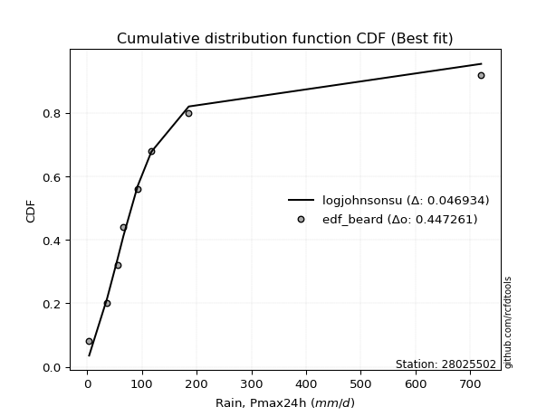</img></img>

</div>


### 5. Empirical - EDF Chegodayev (1955)

The Chegodayev formula is an empirical plotting position formula used in hydrological frequency analysis to estimate the exceedance probability or return period of a specific event from a set of observed data. It is primarily used for plotting observed data points on probability paper to fit a theoretical distribution, particularly for analyzing extreme events like maximum flood flows or rainfall intensities. The constant _b_ value in the generalized plotting position formula is 0.3.

<div align="center">


$P=(m-b)/(n+1-2b)$


</div>


**5.1. Empirical values**

<div align="center">

|                | 0                   | 1                   | 2                  | 3                   | 4              | 5                  | 6                  | 7                  | 8                  |
|:---------------|:--------------------|:--------------------|:-------------------|:--------------------|:---------------|:-------------------|:-------------------|:-------------------|:-------------------|
| date           | 2021                | 2025                | 2018               | 2017                | 2024           | 2020               | 2023               | 2019               | 2022               |
| x              | 3.37                | 32.6                | 36.32              | 55.5                | 66.0           | 92.04              | 117.0              | 185.49             | 720.0              |
| m              | 1                   | 2                   | 3                  | 4                   | 5              | 6                  | 7                  | 8                  | 9                  |
| empirical_dist | edf_chegodayev      | edf_chegodayev      | edf_chegodayev     | edf_chegodayev      | edf_chegodayev | edf_chegodayev     | edf_chegodayev     | edf_chegodayev     | edf_chegodayev     |
| empirical      | 0.07446808510638298 | 0.18085106382978722 | 0.2872340425531915 | 0.39361702127659576 | 0.5            | 0.6063829787234043 | 0.7127659574468085 | 0.8191489361702128 | 0.9255319148936169 |
| empirical_tr   | 1.0804597701149425  | 1.2207792207792207  | 1.4029850746268657 | 1.6491228070175437  | 2.0            | 2.540540540540541  | 3.481481481481481  | 5.529411764705883  | 13.428571428571399 |

</div>


**5.2. Kolmogorov-Smirnov fit test (sorted by Δ)**


<div align="center">

|                | 0                   | 1                    | 2                   | 3                   | 4                   | 5                     | 6                   | 7                   | 8                   | 9                   | 10                  | 11                  | 12                  | 13                  | 14                  | 15                  | 16                  | 17                  | 18                  | 19                  | 20                  | 21                  | 22                  | 23                  | 24                  | 25                  | 26                  | 27                  | 28                  | 29                  | 30                  | 31                  | 32                  | 33                  | 34                  | 35                  | 36                  | 37                  | 38                  | 39                  | 40                  | 41                  | 42                  | 43                  | 44                  | 45                  | 46                  | 47                  | 48                  | 49                  | 50                  | 51                  | 52                  | 53                  | 54                  | 55                  | 56                  | 57                  | 58                  | 59                  | 60                  | 61                  | 62                  | 63                  | 64                  | 65                  | 66                  | 67                  | 68                  | 69                  | 70                  | 71                  | 72                  | 73                  | 74                  | 75                  | 76                  | 77                  | 78                  | 79                  | 80                  | 81                  | 82                  | 83                  | 84                  | 85                  | 86                  | 87                  | 88                  | 89                  |
|:---------------|:--------------------|:---------------------|:--------------------|:--------------------|:--------------------|:----------------------|:--------------------|:--------------------|:--------------------|:--------------------|:--------------------|:--------------------|:--------------------|:--------------------|:--------------------|:--------------------|:--------------------|:--------------------|:--------------------|:--------------------|:--------------------|:--------------------|:--------------------|:--------------------|:--------------------|:--------------------|:--------------------|:--------------------|:--------------------|:--------------------|:--------------------|:--------------------|:--------------------|:--------------------|:--------------------|:--------------------|:--------------------|:--------------------|:--------------------|:--------------------|:--------------------|:--------------------|:--------------------|:--------------------|:--------------------|:--------------------|:--------------------|:--------------------|:--------------------|:--------------------|:--------------------|:--------------------|:--------------------|:--------------------|:--------------------|:--------------------|:--------------------|:--------------------|:--------------------|:--------------------|:--------------------|:--------------------|:--------------------|:--------------------|:--------------------|:--------------------|:--------------------|:--------------------|:--------------------|:--------------------|:--------------------|:--------------------|:--------------------|:--------------------|:--------------------|:--------------------|:--------------------|:--------------------|:--------------------|:--------------------|:--------------------|:--------------------|:--------------------|:--------------------|:--------------------|:--------------------|:--------------------|:--------------------|:--------------------|:--------------------|
| station        | 28025502            | 28025502             | 28025502            | 28025502            | 28025502            | 28025502              | 28025502            | 28025502            | 28025502            | 28025502            | 28025502            | 28025502            | 28025502            | 28025502            | 28025502            | 28025502            | 28025502            | 28025502            | 28025502            | 28025502            | 28025502            | 28025502            | 28025502            | 28025502            | 28025502            | 28025502            | 28025502            | 28025502            | 28025502            | 28025502            | 28025502            | 28025502            | 28025502            | 28025502            | 28025502            | 28025502            | 28025502            | 28025502            | 28025502            | 28025502            | 28025502            | 28025502            | 28025502            | 28025502            | 28025502            | 28025502            | 28025502            | 28025502            | 28025502            | 28025502            | 28025502            | 28025502            | 28025502            | 28025502            | 28025502            | 28025502            | 28025502            | 28025502            | 28025502            | 28025502            | 28025502            | 28025502            | 28025502            | 28025502            | 28025502            | 28025502            | 28025502            | 28025502            | 28025502            | 28025502            | 28025502            | 28025502            | 28025502            | 28025502            | 28025502            | 28025502            | 28025502            | 28025502            | 28025502            | 28025502            | 28025502            | 28025502            | 28025502            | 28025502            | 28025502            | 28025502            | 28025502            | 28025502            | 28025502            | 28025502            |
| empirical_dist | edf_chegodayev      | edf_chegodayev       | edf_chegodayev      | edf_chegodayev      | edf_chegodayev      | edf_chegodayev        | edf_chegodayev      | edf_chegodayev      | edf_chegodayev      | edf_chegodayev      | edf_chegodayev      | edf_chegodayev      | edf_chegodayev      | edf_chegodayev      | edf_chegodayev      | edf_chegodayev      | edf_chegodayev      | edf_chegodayev      | edf_chegodayev      | edf_chegodayev      | edf_chegodayev      | edf_chegodayev      | edf_chegodayev      | edf_chegodayev      | edf_chegodayev      | edf_chegodayev      | edf_chegodayev      | edf_chegodayev      | edf_chegodayev      | edf_chegodayev      | edf_chegodayev      | edf_chegodayev      | edf_chegodayev      | edf_chegodayev      | edf_chegodayev      | edf_chegodayev      | edf_chegodayev      | edf_chegodayev      | edf_chegodayev      | edf_chegodayev      | edf_chegodayev      | edf_chegodayev      | edf_chegodayev      | edf_chegodayev      | edf_chegodayev      | edf_chegodayev      | edf_chegodayev      | edf_chegodayev      | edf_chegodayev      | edf_chegodayev      | edf_chegodayev      | edf_chegodayev      | edf_chegodayev      | edf_chegodayev      | edf_chegodayev      | edf_chegodayev      | edf_chegodayev      | edf_chegodayev      | edf_chegodayev      | edf_chegodayev      | edf_chegodayev      | edf_chegodayev      | edf_chegodayev      | edf_chegodayev      | edf_chegodayev      | edf_chegodayev      | edf_chegodayev      | edf_chegodayev      | edf_chegodayev      | edf_chegodayev      | edf_chegodayev      | edf_chegodayev      | edf_chegodayev      | edf_chegodayev      | edf_chegodayev      | edf_chegodayev      | edf_chegodayev      | edf_chegodayev      | edf_chegodayev      | edf_chegodayev      | edf_chegodayev      | edf_chegodayev      | edf_chegodayev      | edf_chegodayev      | edf_chegodayev      | edf_chegodayev      | edf_chegodayev      | edf_chegodayev      | edf_chegodayev      | edf_chegodayev      |
| p_dist         | logjohnsonsu        | logt                 | johnsonsu           | nct                 | loglaplace          | loglaplace_asymmetric | invgamma            | fisk                | loggenlogistic      | logmielke           | invgauss            | logfisk             | loghypsecant        | loggumbel_l         | gibrat              | fatiguelife         | logpearson3         | loglogistic         | logloggamma         | logweibull_min      | gamma               | logrice             | logexponnorm        | lognorm             | lognorm             | logcrystalball      | logfatiguelife      | lognct              | logf                | logncf              | loggompertz         | logerlang           | t                   | logbetaprime        | loggamma            | loggamma            | loginvgamma         | logalpha            | logchi2             | wald                | mielke              | logmaxwell          | loginvgauss         | exponnorm           | gompertz            | loggumbel_r         | expon               | genexpon            | lograyleigh         | truncnorm           | laplace_asymmetric  | logmoyal            | f                   | genlogistic         | lognakagami         | moyal               | loginvweibull       | pearson3            | loghalflogistic     | loghalfnorm         | gumbel_r            | ncf                 | halflogistic        | betaprime           | erlang              | rayleigh            | nakagami            | logwald             | halfnorm            | logkstwobign        | maxwell             | chi2                | loggibrat           | weibull_min         | loggenexpon         | kstwobign           | crystalball         | norm                | logistic            | hypsecant           | laplace             | rice                | gumbel_l            | logtruncnorm        | logexpon            | pareto              | loglognorm          | invweibull          | logpareto           | alpha               |
| delta          | 0.04542376562429501 | 0.047575724389867034 | 0.05390720710052321 | 0.06341192162198464 | 0.06426830775033862 | 0.06471230685202817   | 0.06868791604182925 | 0.07781934151328695 | 0.08318275200610836 | 0.08386147150360179 | 0.08879197744265371 | 0.0896901493683252  | 0.089949716856427   | 0.09145742639203991 | 0.09314746416279995 | 0.09465076846216502 | 0.10526851179639918 | 0.10527333707156561 | 0.10614332407789451 | 0.11218457460787878 | 0.11716509676789566 | 0.1262405648161708  | 0.12625246178798066 | 0.12625499388323363 | 0.12625499388323363 | 0.12625503375191133 | 0.12651819555179533 | 0.12667103983724182 | 0.12678520437713792 | 0.12926681634899534 | 0.13048169482288635 | 0.13329776386387854 | 0.13370603862340014 | 0.13516143085998888 | 0.13626774609811698 | 0.13626774609811698 | 0.1392335321716035  | 0.14049963767452045 | 0.14099379069951162 | 0.14926629414523124 | 0.15081111446482076 | 0.1548312672187534  | 0.15614653716235272 | 0.16088235533243356 | 0.16122841835906432 | 0.16156265561773026 | 0.16199719007406932 | 0.16199743825233437 | 0.1660602986305691  | 0.16931744371439172 | 0.17214381618490227 | 0.1728341338695053  | 0.17530631047911654 | 0.17702761643848242 | 0.18085106080694302 | 0.18599364801030244 | 0.1901035820488799  | 0.19339292107988898 | 0.1976797821099292  | 0.19786678019271942 | 0.20003759899508233 | 0.20642524080709063 | 0.21368755116386418 | 0.21704667680033174 | 0.219925733122322   | 0.22034934819911467 | 0.22041444442963076 | 0.22371056480760204 | 0.22832294763852495 | 0.23192496780580635 | 0.23229376543660762 | 0.23574724422300974 | 0.23740230208783392 | 0.23845524607474    | 0.24534120870848375 | 0.2663591739156382  | 0.26665047515133095 | 0.266650483123276   | 0.2738928660514605  | 0.2800012444908093  | 0.29994751423726157 | 0.30395679439856454 | 0.3365788024231518  | 0.347532042340854   | 0.35446576035029775 | 0.44565507629524725 | 0.4460901985235812  | 0.4579806617869724  | 0.48006788348804597 | 0.5764321665008169  |
| deltao         | 0.41761268023100007 | 0.41761268023100007  | 0.41761268023100007 | 0.41761268023100007 | 0.41761268023100007 | 0.41761268023100007   | 0.41761268023100007 | 0.41761268023100007 | 0.41761268023100007 | 0.41761268023100007 | 0.41761268023100007 | 0.41761268023100007 | 0.41761268023100007 | 0.41761268023100007 | 0.41761268023100007 | 0.41761268023100007 | 0.41761268023100007 | 0.41761268023100007 | 0.41761268023100007 | 0.41761268023100007 | 0.41761268023100007 | 0.41761268023100007 | 0.41761268023100007 | 0.41761268023100007 | 0.41761268023100007 | 0.41761268023100007 | 0.41761268023100007 | 0.41761268023100007 | 0.41761268023100007 | 0.41761268023100007 | 0.41761268023100007 | 0.41761268023100007 | 0.41761268023100007 | 0.41761268023100007 | 0.41761268023100007 | 0.41761268023100007 | 0.41761268023100007 | 0.41761268023100007 | 0.41761268023100007 | 0.41761268023100007 | 0.41761268023100007 | 0.41761268023100007 | 0.41761268023100007 | 0.41761268023100007 | 0.41761268023100007 | 0.41761268023100007 | 0.41761268023100007 | 0.41761268023100007 | 0.41761268023100007 | 0.41761268023100007 | 0.41761268023100007 | 0.41761268023100007 | 0.41761268023100007 | 0.41761268023100007 | 0.41761268023100007 | 0.41761268023100007 | 0.41761268023100007 | 0.41761268023100007 | 0.41761268023100007 | 0.41761268023100007 | 0.41761268023100007 | 0.41761268023100007 | 0.41761268023100007 | 0.41761268023100007 | 0.41761268023100007 | 0.41761268023100007 | 0.41761268023100007 | 0.41761268023100007 | 0.41761268023100007 | 0.41761268023100007 | 0.41761268023100007 | 0.41761268023100007 | 0.41761268023100007 | 0.41761268023100007 | 0.41761268023100007 | 0.41761268023100007 | 0.41761268023100007 | 0.41761268023100007 | 0.41761268023100007 | 0.41761268023100007 | 0.41761268023100007 | 0.41761268023100007 | 0.41761268023100007 | 0.41761268023100007 | 0.41761268023100007 | 0.41761268023100007 | 0.41761268023100007 | 0.41761268023100007 | 0.41761268023100007 | 0.41761268023100007 |
| eval           | Δo > Δ              | Δo > Δ               | Δo > Δ              | Δo > Δ              | Δo > Δ              | Δo > Δ                | Δo > Δ              | Δo > Δ              | Δo > Δ              | Δo > Δ              | Δo > Δ              | Δo > Δ              | Δo > Δ              | Δo > Δ              | Δo > Δ              | Δo > Δ              | Δo > Δ              | Δo > Δ              | Δo > Δ              | Δo > Δ              | Δo > Δ              | Δo > Δ              | Δo > Δ              | Δo > Δ              | Δo > Δ              | Δo > Δ              | Δo > Δ              | Δo > Δ              | Δo > Δ              | Δo > Δ              | Δo > Δ              | Δo > Δ              | Δo > Δ              | Δo > Δ              | Δo > Δ              | Δo > Δ              | Δo > Δ              | Δo > Δ              | Δo > Δ              | Δo > Δ              | Δo > Δ              | Δo > Δ              | Δo > Δ              | Δo > Δ              | Δo > Δ              | Δo > Δ              | Δo > Δ              | Δo > Δ              | Δo > Δ              | Δo > Δ              | Δo > Δ              | Δo > Δ              | Δo > Δ              | Δo > Δ              | Δo > Δ              | Δo > Δ              | Δo > Δ              | Δo > Δ              | Δo > Δ              | Δo > Δ              | Δo > Δ              | Δo > Δ              | Δo > Δ              | Δo > Δ              | Δo > Δ              | Δo > Δ              | Δo > Δ              | Δo > Δ              | Δo > Δ              | Δo > Δ              | Δo > Δ              | Δo > Δ              | Δo > Δ              | Δo > Δ              | Δo > Δ              | Δo > Δ              | Δo > Δ              | Δo > Δ              | Δo > Δ              | Δo > Δ              | Δo > Δ              | Δo > Δ              | Δo > Δ              | Δo > Δ              | Δo > Δ              | Δo <= Δ             | Δo <= Δ             | Δo <= Δ             | Δo <= Δ             | Δo <= Δ             |
| fit            | 1                   | 1                    | 1                   | 1                   | 1                   | 1                     | 1                   | 1                   | 1                   | 1                   | 1                   | 1                   | 1                   | 1                   | 1                   | 1                   | 1                   | 1                   | 1                   | 1                   | 1                   | 1                   | 1                   | 1                   | 1                   | 1                   | 1                   | 1                   | 1                   | 1                   | 1                   | 1                   | 1                   | 1                   | 1                   | 1                   | 1                   | 1                   | 1                   | 1                   | 1                   | 1                   | 1                   | 1                   | 1                   | 1                   | 1                   | 1                   | 1                   | 1                   | 1                   | 1                   | 1                   | 1                   | 1                   | 1                   | 1                   | 1                   | 1                   | 1                   | 1                   | 1                   | 1                   | 1                   | 1                   | 1                   | 1                   | 1                   | 1                   | 1                   | 1                   | 1                   | 1                   | 1                   | 1                   | 1                   | 1                   | 1                   | 1                   | 1                   | 1                   | 1                   | 1                   | 1                   | 1                   | 0                   | 0                   | 0                   | 0                   | 0                   |
| n              | 9                   | 9                    | 9                   | 9                   | 9                   | 9                     | 9                   | 9                   | 9                   | 9                   | 9                   | 9                   | 9                   | 9                   | 9                   | 9                   | 9                   | 9                   | 9                   | 9                   | 9                   | 9                   | 9                   | 9                   | 9                   | 9                   | 9                   | 9                   | 9                   | 9                   | 9                   | 9                   | 9                   | 9                   | 9                   | 9                   | 9                   | 9                   | 9                   | 9                   | 9                   | 9                   | 9                   | 9                   | 9                   | 9                   | 9                   | 9                   | 9                   | 9                   | 9                   | 9                   | 9                   | 9                   | 9                   | 9                   | 9                   | 9                   | 9                   | 9                   | 9                   | 9                   | 9                   | 9                   | 9                   | 9                   | 9                   | 9                   | 9                   | 9                   | 9                   | 9                   | 9                   | 9                   | 9                   | 9                   | 9                   | 9                   | 9                   | 9                   | 9                   | 9                   | 9                   | 9                   | 9                   | 9                   | 9                   | 9                   | 9                   | 9                   |
| best_fit       | 1                   | 0                    | 0                   | 0                   | 0                   | 0                     | 0                   | 0                   | 0                   | 0                   | 0                   | 0                   | 0                   | 0                   | 0                   | 0                   | 0                   | 0                   | 0                   | 0                   | 0                   | 0                   | 0                   | 0                   | 0                   | 0                   | 0                   | 0                   | 0                   | 0                   | 0                   | 0                   | 0                   | 0                   | 0                   | 0                   | 0                   | 0                   | 0                   | 0                   | 0                   | 0                   | 0                   | 0                   | 0                   | 0                   | 0                   | 0                   | 0                   | 0                   | 0                   | 0                   | 0                   | 0                   | 0                   | 0                   | 0                   | 0                   | 0                   | 0                   | 0                   | 0                   | 0                   | 0                   | 0                   | 0                   | 0                   | 0                   | 0                   | 0                   | 0                   | 0                   | 0                   | 0                   | 0                   | 0                   | 0                   | 0                   | 0                   | 0                   | 0                   | 0                   | 0                   | 0                   | 0                   | 0                   | 0                   | 0                   | 0                   | 0                   |
| best_fit_sort  | 1                   | 2                    | 3                   | 4                   | 5                   | 6                     | 7                   | 8                   | 9                   | 10                  | 11                  | 12                  | 13                  | 14                  | 15                  | 16                  | 17                  | 18                  | 19                  | 20                  | 21                  | 22                  | 23                  | 24                  | 25                  | 26                  | 27                  | 28                  | 29                  | 30                  | 31                  | 32                  | 33                  | 34                  | 35                  | 36                  | 37                  | 38                  | 39                  | 40                  | 41                  | 42                  | 43                  | 44                  | 45                  | 46                  | 47                  | 48                  | 49                  | 50                  | 51                  | 52                  | 53                  | 54                  | 55                  | 56                  | 57                  | 58                  | 59                  | 60                  | 61                  | 62                  | 63                  | 64                  | 65                  | 66                  | 67                  | 68                  | 69                  | 70                  | 71                  | 72                  | 73                  | 74                  | 75                  | 76                  | 77                  | 78                  | 79                  | 80                  | 81                  | 82                  | 83                  | 84                  | 85                  | 86                  | 87                  | 88                  | 89                  | 90                  |

</div>


<div align="center">

</img>

</div>


**5.3. Best fit**

<div align="center">

|   id |   station | empirical_dist   | p_dist       |     delta |   deltao | eval   |   fit |   n |   best_fit |   best_fit_sort |
|-----:|----------:|:-----------------|:-------------|----------:|---------:|:-------|------:|----:|-----------:|----------------:|
|    0 |  28025502 | edf_chegodayev   | logjohnsonsu | 0.0454238 | 0.417613 | Δo > Δ |     1 |   9 |          1 |               1 |

</div>


<div align="center">

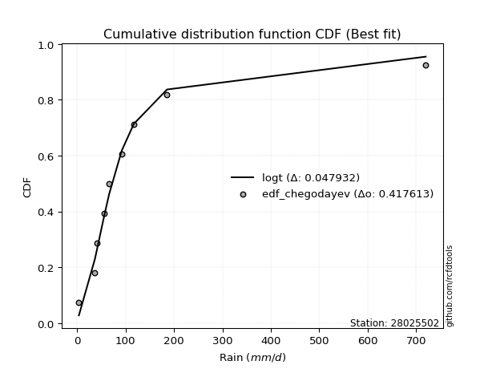</img></img>

</div>


### 6. Empirical - EDF Blom (1958)

The Blom formula is a specific "plotting position" formula used in hydrology and statistical analysis to estimate the empirical cumulative probability (or non-exceedance probability) of a data series. It is particularly recommended for data that are approximately normally distributed. The constant _a_ is set to 0.375 (or 3/8).

<div align="center">


$P=(m-a)/(n+1-2a)$


</div>


**6.1. Empirical values**

<div align="center">

|                | 0                   | 1                   | 2                   | 3                  | 4        | 5                  | 6                  | 7                  | 8                  |
|:---------------|:--------------------|:--------------------|:--------------------|:-------------------|:---------|:-------------------|:-------------------|:-------------------|:-------------------|
| date           | 2021                | 2025                | 2018                | 2017               | 2024     | 2020               | 2023               | 2019               | 2022               |
| x              | 3.37                | 32.6                | 36.32               | 55.5               | 66.0     | 92.04              | 117.0              | 185.49             | 720.0              |
| m              | 1                   | 2                   | 3                   | 4                  | 5        | 6                  | 7                  | 8                  | 9                  |
| empirical_dist | edf_blom            | edf_blom            | edf_blom            | edf_blom           | edf_blom | edf_blom           | edf_blom           | edf_blom           | edf_blom           |
| empirical      | 0.06756756756756757 | 0.17567567567567569 | 0.28378378378378377 | 0.3918918918918919 | 0.5      | 0.6081081081081081 | 0.7162162162162162 | 0.8243243243243243 | 0.9324324324324325 |
| empirical_tr   | 1.072463768115942   | 1.2131147540983607  | 1.3962264150943395  | 1.6444444444444444 | 2.0      | 2.5517241379310347 | 3.523809523809524  | 5.6923076923076925 | 14.800000000000006 |

</div>


**6.2. Kolmogorov-Smirnov fit test (sorted by Δ)**


<div align="center">

|                | 0                   | 1                   | 2                   | 3                   | 4                   | 5                     | 6                   | 7                   | 8                   | 9                   | 10                  | 11                  | 12                  | 13                  | 14                  | 15                  | 16                  | 17                  | 18                  | 19                  | 20                  | 21                  | 22                  | 23                  | 24                  | 25                  | 26                  | 27                  | 28                  | 29                  | 30                  | 31                  | 32                  | 33                  | 34                  | 35                  | 36                  | 37                  | 38                  | 39                  | 40                  | 41                  | 42                  | 43                  | 44                  | 45                  | 46                  | 47                  | 48                  | 49                  | 50                  | 51                  | 52                  | 53                  | 54                  | 55                  | 56                  | 57                  | 58                  | 59                  | 60                  | 61                  | 62                  | 63                  | 64                  | 65                  | 66                  | 67                  | 68                  | 69                  | 70                  | 71                  | 72                  | 73                  | 74                  | 75                  | 76                  | 77                  | 78                  | 79                  | 80                  | 81                  | 82                  | 83                  | 84                  | 85                  | 86                  | 87                  | 88                  | 89                  |
|:---------------|:--------------------|:--------------------|:--------------------|:--------------------|:--------------------|:----------------------|:--------------------|:--------------------|:--------------------|:--------------------|:--------------------|:--------------------|:--------------------|:--------------------|:--------------------|:--------------------|:--------------------|:--------------------|:--------------------|:--------------------|:--------------------|:--------------------|:--------------------|:--------------------|:--------------------|:--------------------|:--------------------|:--------------------|:--------------------|:--------------------|:--------------------|:--------------------|:--------------------|:--------------------|:--------------------|:--------------------|:--------------------|:--------------------|:--------------------|:--------------------|:--------------------|:--------------------|:--------------------|:--------------------|:--------------------|:--------------------|:--------------------|:--------------------|:--------------------|:--------------------|:--------------------|:--------------------|:--------------------|:--------------------|:--------------------|:--------------------|:--------------------|:--------------------|:--------------------|:--------------------|:--------------------|:--------------------|:--------------------|:--------------------|:--------------------|:--------------------|:--------------------|:--------------------|:--------------------|:--------------------|:--------------------|:--------------------|:--------------------|:--------------------|:--------------------|:--------------------|:--------------------|:--------------------|:--------------------|:--------------------|:--------------------|:--------------------|:--------------------|:--------------------|:--------------------|:--------------------|:--------------------|:--------------------|:--------------------|:--------------------|
| station        | 28025502            | 28025502            | 28025502            | 28025502            | 28025502            | 28025502              | 28025502            | 28025502            | 28025502            | 28025502            | 28025502            | 28025502            | 28025502            | 28025502            | 28025502            | 28025502            | 28025502            | 28025502            | 28025502            | 28025502            | 28025502            | 28025502            | 28025502            | 28025502            | 28025502            | 28025502            | 28025502            | 28025502            | 28025502            | 28025502            | 28025502            | 28025502            | 28025502            | 28025502            | 28025502            | 28025502            | 28025502            | 28025502            | 28025502            | 28025502            | 28025502            | 28025502            | 28025502            | 28025502            | 28025502            | 28025502            | 28025502            | 28025502            | 28025502            | 28025502            | 28025502            | 28025502            | 28025502            | 28025502            | 28025502            | 28025502            | 28025502            | 28025502            | 28025502            | 28025502            | 28025502            | 28025502            | 28025502            | 28025502            | 28025502            | 28025502            | 28025502            | 28025502            | 28025502            | 28025502            | 28025502            | 28025502            | 28025502            | 28025502            | 28025502            | 28025502            | 28025502            | 28025502            | 28025502            | 28025502            | 28025502            | 28025502            | 28025502            | 28025502            | 28025502            | 28025502            | 28025502            | 28025502            | 28025502            | 28025502            |
| empirical_dist | edf_blom            | edf_blom            | edf_blom            | edf_blom            | edf_blom            | edf_blom              | edf_blom            | edf_blom            | edf_blom            | edf_blom            | edf_blom            | edf_blom            | edf_blom            | edf_blom            | edf_blom            | edf_blom            | edf_blom            | edf_blom            | edf_blom            | edf_blom            | edf_blom            | edf_blom            | edf_blom            | edf_blom            | edf_blom            | edf_blom            | edf_blom            | edf_blom            | edf_blom            | edf_blom            | edf_blom            | edf_blom            | edf_blom            | edf_blom            | edf_blom            | edf_blom            | edf_blom            | edf_blom            | edf_blom            | edf_blom            | edf_blom            | edf_blom            | edf_blom            | edf_blom            | edf_blom            | edf_blom            | edf_blom            | edf_blom            | edf_blom            | edf_blom            | edf_blom            | edf_blom            | edf_blom            | edf_blom            | edf_blom            | edf_blom            | edf_blom            | edf_blom            | edf_blom            | edf_blom            | edf_blom            | edf_blom            | edf_blom            | edf_blom            | edf_blom            | edf_blom            | edf_blom            | edf_blom            | edf_blom            | edf_blom            | edf_blom            | edf_blom            | edf_blom            | edf_blom            | edf_blom            | edf_blom            | edf_blom            | edf_blom            | edf_blom            | edf_blom            | edf_blom            | edf_blom            | edf_blom            | edf_blom            | edf_blom            | edf_blom            | edf_blom            | edf_blom            | edf_blom            | edf_blom            |
| p_dist         | logt                | johnsonsu           | logjohnsonsu        | nct                 | loglaplace          | loglaplace_asymmetric | invgamma            | fisk                | loggenlogistic      | logmielke           | invgauss            | logfisk             | loggumbel_l         | loghypsecant        | gibrat              | fatiguelife         | logpearson3         | loglogistic         | logloggamma         | logweibull_min      | gamma               | logrice             | logexponnorm        | lognorm             | lognorm             | logcrystalball      | logfatiguelife      | lognct              | logf                | t                   | logncf              | loggompertz         | logerlang           | logbetaprime        | loggamma            | loggamma            | loginvgamma         | logalpha            | logchi2             | wald                | mielke              | logmaxwell          | loginvgauss         | exponnorm           | gompertz            | expon               | genexpon            | loggumbel_r         | lograyleigh         | truncnorm           | laplace_asymmetric  | lognakagami         | logmoyal            | genlogistic         | f                   | moyal               | loginvweibull       | pearson3            | loghalflogistic     | loghalfnorm         | gumbel_r            | ncf                 | halflogistic        | betaprime           | rayleigh            | erlang              | logwald             | nakagami            | halfnorm            | maxwell             | logkstwobign        | loggibrat           | chi2                | weibull_min         | loggenexpon         | kstwobign           | crystalball         | norm                | logistic            | hypsecant           | laplace             | rice                | gumbel_l            | logtruncnorm        | logexpon            | pareto              | loglognorm          | invweibull          | logpareto           | alpha               |
| delta          | 0.04180351102928795 | 0.05045694833111547 | 0.05059915377840654 | 0.06858730977609617 | 0.06944369590445015 | 0.0698876950061397    | 0.07386330419594078 | 0.08299472966739849 | 0.0883581401602199  | 0.08903685965771332 | 0.09396736559676525 | 0.09486553752243673 | 0.09490768516144765 | 0.09512510501053853 | 0.0965977229322077  | 0.09822901307515661 | 0.11044389995051071 | 0.11044872522567714 | 0.11131871223200604 | 0.11735996276199032 | 0.12234048492200719 | 0.13141595297028233 | 0.1314278499420922  | 0.13143038203734517 | 0.13143038203734517 | 0.13143042190602286 | 0.13169358370590686 | 0.13184642799135335 | 0.13196059253124945 | 0.13198090923869632 | 0.13444220450310687 | 0.13565708297699788 | 0.13847315201799007 | 0.14033681901410042 | 0.14144313425222851 | 0.14144313425222851 | 0.14440892032571503 | 0.14567502582863198 | 0.14616917885362316 | 0.15444168229934277 | 0.1559865026189323  | 0.16000665537286493 | 0.16132192531646425 | 0.1643326141018413  | 0.16467867712847206 | 0.16544744884347706 | 0.1654476970217421  | 0.1667380437718418  | 0.17123568678468062 | 0.17276770248379947 | 0.17559407495431    | 0.1756756726528315  | 0.17800952202361683 | 0.18047787520789016 | 0.18048169863322808 | 0.19289416554911784 | 0.19527897020299143 | 0.19894399519568254 | 0.20285517026404074 | 0.20304216834683095 | 0.20348785776449008 | 0.21160062896120216 | 0.22058806870267958 | 0.22222206495444327 | 0.2237996069685224  | 0.22510112127643353 | 0.2254356941923059  | 0.22558983258374232 | 0.23522346517734036 | 0.23574402420601537 | 0.23710035595991788 | 0.2391274314725378  | 0.24092263237712128 | 0.24190550484414775 | 0.2505165968625953  | 0.2698094326850459  | 0.2701007339207387  | 0.27010074189268374 | 0.27734312482086826 | 0.28345150326021706 | 0.3033977730066693  | 0.3074070531679723  | 0.34002906119255955 | 0.35270743049496556 | 0.3596411485044093  | 0.4508304644493588  | 0.4512655866776928  | 0.464881179325788   | 0.4852432716421575  | 0.5816075546549284  |
| deltao         | 0.41761268023100007 | 0.41761268023100007 | 0.41761268023100007 | 0.41761268023100007 | 0.41761268023100007 | 0.41761268023100007   | 0.41761268023100007 | 0.41761268023100007 | 0.41761268023100007 | 0.41761268023100007 | 0.41761268023100007 | 0.41761268023100007 | 0.41761268023100007 | 0.41761268023100007 | 0.41761268023100007 | 0.41761268023100007 | 0.41761268023100007 | 0.41761268023100007 | 0.41761268023100007 | 0.41761268023100007 | 0.41761268023100007 | 0.41761268023100007 | 0.41761268023100007 | 0.41761268023100007 | 0.41761268023100007 | 0.41761268023100007 | 0.41761268023100007 | 0.41761268023100007 | 0.41761268023100007 | 0.41761268023100007 | 0.41761268023100007 | 0.41761268023100007 | 0.41761268023100007 | 0.41761268023100007 | 0.41761268023100007 | 0.41761268023100007 | 0.41761268023100007 | 0.41761268023100007 | 0.41761268023100007 | 0.41761268023100007 | 0.41761268023100007 | 0.41761268023100007 | 0.41761268023100007 | 0.41761268023100007 | 0.41761268023100007 | 0.41761268023100007 | 0.41761268023100007 | 0.41761268023100007 | 0.41761268023100007 | 0.41761268023100007 | 0.41761268023100007 | 0.41761268023100007 | 0.41761268023100007 | 0.41761268023100007 | 0.41761268023100007 | 0.41761268023100007 | 0.41761268023100007 | 0.41761268023100007 | 0.41761268023100007 | 0.41761268023100007 | 0.41761268023100007 | 0.41761268023100007 | 0.41761268023100007 | 0.41761268023100007 | 0.41761268023100007 | 0.41761268023100007 | 0.41761268023100007 | 0.41761268023100007 | 0.41761268023100007 | 0.41761268023100007 | 0.41761268023100007 | 0.41761268023100007 | 0.41761268023100007 | 0.41761268023100007 | 0.41761268023100007 | 0.41761268023100007 | 0.41761268023100007 | 0.41761268023100007 | 0.41761268023100007 | 0.41761268023100007 | 0.41761268023100007 | 0.41761268023100007 | 0.41761268023100007 | 0.41761268023100007 | 0.41761268023100007 | 0.41761268023100007 | 0.41761268023100007 | 0.41761268023100007 | 0.41761268023100007 | 0.41761268023100007 |
| eval           | Δo > Δ              | Δo > Δ              | Δo > Δ              | Δo > Δ              | Δo > Δ              | Δo > Δ                | Δo > Δ              | Δo > Δ              | Δo > Δ              | Δo > Δ              | Δo > Δ              | Δo > Δ              | Δo > Δ              | Δo > Δ              | Δo > Δ              | Δo > Δ              | Δo > Δ              | Δo > Δ              | Δo > Δ              | Δo > Δ              | Δo > Δ              | Δo > Δ              | Δo > Δ              | Δo > Δ              | Δo > Δ              | Δo > Δ              | Δo > Δ              | Δo > Δ              | Δo > Δ              | Δo > Δ              | Δo > Δ              | Δo > Δ              | Δo > Δ              | Δo > Δ              | Δo > Δ              | Δo > Δ              | Δo > Δ              | Δo > Δ              | Δo > Δ              | Δo > Δ              | Δo > Δ              | Δo > Δ              | Δo > Δ              | Δo > Δ              | Δo > Δ              | Δo > Δ              | Δo > Δ              | Δo > Δ              | Δo > Δ              | Δo > Δ              | Δo > Δ              | Δo > Δ              | Δo > Δ              | Δo > Δ              | Δo > Δ              | Δo > Δ              | Δo > Δ              | Δo > Δ              | Δo > Δ              | Δo > Δ              | Δo > Δ              | Δo > Δ              | Δo > Δ              | Δo > Δ              | Δo > Δ              | Δo > Δ              | Δo > Δ              | Δo > Δ              | Δo > Δ              | Δo > Δ              | Δo > Δ              | Δo > Δ              | Δo > Δ              | Δo > Δ              | Δo > Δ              | Δo > Δ              | Δo > Δ              | Δo > Δ              | Δo > Δ              | Δo > Δ              | Δo > Δ              | Δo > Δ              | Δo > Δ              | Δo > Δ              | Δo > Δ              | Δo <= Δ             | Δo <= Δ             | Δo <= Δ             | Δo <= Δ             | Δo <= Δ             |
| fit            | 1                   | 1                   | 1                   | 1                   | 1                   | 1                     | 1                   | 1                   | 1                   | 1                   | 1                   | 1                   | 1                   | 1                   | 1                   | 1                   | 1                   | 1                   | 1                   | 1                   | 1                   | 1                   | 1                   | 1                   | 1                   | 1                   | 1                   | 1                   | 1                   | 1                   | 1                   | 1                   | 1                   | 1                   | 1                   | 1                   | 1                   | 1                   | 1                   | 1                   | 1                   | 1                   | 1                   | 1                   | 1                   | 1                   | 1                   | 1                   | 1                   | 1                   | 1                   | 1                   | 1                   | 1                   | 1                   | 1                   | 1                   | 1                   | 1                   | 1                   | 1                   | 1                   | 1                   | 1                   | 1                   | 1                   | 1                   | 1                   | 1                   | 1                   | 1                   | 1                   | 1                   | 1                   | 1                   | 1                   | 1                   | 1                   | 1                   | 1                   | 1                   | 1                   | 1                   | 1                   | 1                   | 0                   | 0                   | 0                   | 0                   | 0                   |
| n              | 9                   | 9                   | 9                   | 9                   | 9                   | 9                     | 9                   | 9                   | 9                   | 9                   | 9                   | 9                   | 9                   | 9                   | 9                   | 9                   | 9                   | 9                   | 9                   | 9                   | 9                   | 9                   | 9                   | 9                   | 9                   | 9                   | 9                   | 9                   | 9                   | 9                   | 9                   | 9                   | 9                   | 9                   | 9                   | 9                   | 9                   | 9                   | 9                   | 9                   | 9                   | 9                   | 9                   | 9                   | 9                   | 9                   | 9                   | 9                   | 9                   | 9                   | 9                   | 9                   | 9                   | 9                   | 9                   | 9                   | 9                   | 9                   | 9                   | 9                   | 9                   | 9                   | 9                   | 9                   | 9                   | 9                   | 9                   | 9                   | 9                   | 9                   | 9                   | 9                   | 9                   | 9                   | 9                   | 9                   | 9                   | 9                   | 9                   | 9                   | 9                   | 9                   | 9                   | 9                   | 9                   | 9                   | 9                   | 9                   | 9                   | 9                   |
| best_fit       | 1                   | 0                   | 0                   | 0                   | 0                   | 0                     | 0                   | 0                   | 0                   | 0                   | 0                   | 0                   | 0                   | 0                   | 0                   | 0                   | 0                   | 0                   | 0                   | 0                   | 0                   | 0                   | 0                   | 0                   | 0                   | 0                   | 0                   | 0                   | 0                   | 0                   | 0                   | 0                   | 0                   | 0                   | 0                   | 0                   | 0                   | 0                   | 0                   | 0                   | 0                   | 0                   | 0                   | 0                   | 0                   | 0                   | 0                   | 0                   | 0                   | 0                   | 0                   | 0                   | 0                   | 0                   | 0                   | 0                   | 0                   | 0                   | 0                   | 0                   | 0                   | 0                   | 0                   | 0                   | 0                   | 0                   | 0                   | 0                   | 0                   | 0                   | 0                   | 0                   | 0                   | 0                   | 0                   | 0                   | 0                   | 0                   | 0                   | 0                   | 0                   | 0                   | 0                   | 0                   | 0                   | 0                   | 0                   | 0                   | 0                   | 0                   |
| best_fit_sort  | 1                   | 2                   | 3                   | 4                   | 5                   | 6                     | 7                   | 8                   | 9                   | 10                  | 11                  | 12                  | 13                  | 14                  | 15                  | 16                  | 17                  | 18                  | 19                  | 20                  | 21                  | 22                  | 23                  | 24                  | 25                  | 26                  | 27                  | 28                  | 29                  | 30                  | 31                  | 32                  | 33                  | 34                  | 35                  | 36                  | 37                  | 38                  | 39                  | 40                  | 41                  | 42                  | 43                  | 44                  | 45                  | 46                  | 47                  | 48                  | 49                  | 50                  | 51                  | 52                  | 53                  | 54                  | 55                  | 56                  | 57                  | 58                  | 59                  | 60                  | 61                  | 62                  | 63                  | 64                  | 65                  | 66                  | 67                  | 68                  | 69                  | 70                  | 71                  | 72                  | 73                  | 74                  | 75                  | 76                  | 77                  | 78                  | 79                  | 80                  | 81                  | 82                  | 83                  | 84                  | 85                  | 86                  | 87                  | 88                  | 89                  | 90                  |

</div>


<div align="center">

</img>

</div>


**6.3. Best fit**

<div align="center">

|   id |   station | empirical_dist   | p_dist   |     delta |   deltao | eval   |   fit |   n |   best_fit |   best_fit_sort |
|-----:|----------:|:-----------------|:---------|----------:|---------:|:-------|------:|----:|-----------:|----------------:|
|    0 |  28025502 | edf_blom         | logt     | 0.0418035 | 0.417613 | Δo > Δ |     1 |   9 |          1 |               1 |

</div>


<div align="center">

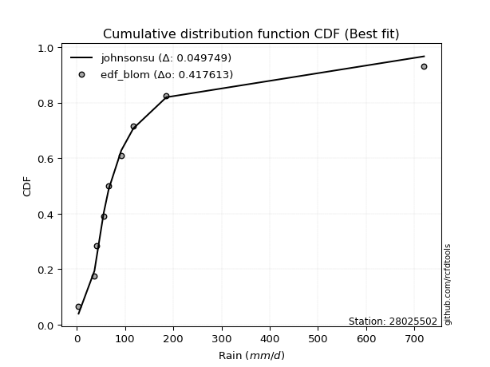</img></img>

</div>


### 7. Empirical - EDF Tukey (1962)

In hydrology, the Tukey formula is used as a plotting position formula to estimate the empirical probability or frequency of a flood event (or other hydrological data). The formula parameter is given as _c=0.333_ (or 1/3).

<div align="center">


$P=(m-c)/(n+1-2c)$


</div>


**7.1. Empirical values**

<div align="center">

|                | 0                   | 1                   | 2                  | 3                   | 4         | 5                  | 6                  | 7                  | 8                  |
|:---------------|:--------------------|:--------------------|:-------------------|:--------------------|:----------|:-------------------|:-------------------|:-------------------|:-------------------|
| date           | 2021                | 2025                | 2018               | 2017                | 2024      | 2020               | 2023               | 2019               | 2022               |
| x              | 3.37                | 32.6                | 36.32              | 55.5                | 66.0      | 92.04              | 117.0              | 185.49             | 720.0              |
| m              | 1                   | 2                   | 3                  | 4                   | 5         | 6                  | 7                  | 8                  | 9                  |
| empirical_dist | edf_tukey           | edf_tukey           | edf_tukey          | edf_tukey           | edf_tukey | edf_tukey          | edf_tukey          | edf_tukey          | edf_tukey          |
| empirical      | 0.07142857142857142 | 0.17857142857142858 | 0.2857142857142857 | 0.39285714285714285 | 0.5       | 0.6071428571428571 | 0.7142857142857143 | 0.8214285714285714 | 0.9285714285714286 |
| empirical_tr   | 1.0769230769230769  | 1.2173913043478262  | 1.4                | 1.6470588235294117  | 2.0       | 2.545454545454545  | 3.5                | 5.599999999999999  | 14.000000000000007 |

</div>


**7.2. Kolmogorov-Smirnov fit test (sorted by Δ)**


<div align="center">

|                | 0                    | 1                   | 2                    | 3                   | 4                   | 5                     | 6                   | 7                   | 8                   | 9                   | 10                  | 11                  | 12                  | 13                  | 14                  | 15                  | 16                  | 17                  | 18                  | 19                  | 20                  | 21                  | 22                  | 23                  | 24                  | 25                  | 26                  | 27                  | 28                  | 29                  | 30                  | 31                  | 32                  | 33                  | 34                  | 35                  | 36                  | 37                  | 38                  | 39                  | 40                  | 41                  | 42                  | 43                  | 44                  | 45                  | 46                  | 47                  | 48                  | 49                  | 50                  | 51                  | 52                  | 53                  | 54                  | 55                  | 56                  | 57                  | 58                  | 59                  | 60                  | 61                  | 62                  | 63                  | 64                  | 65                  | 66                  | 67                  | 68                  | 69                  | 70                  | 71                  | 72                  | 73                  | 74                  | 75                  | 76                  | 77                  | 78                  | 79                  | 80                  | 81                  | 82                  | 83                  | 84                  | 85                  | 86                  | 87                  | 88                  | 89                  |
|:---------------|:---------------------|:--------------------|:---------------------|:--------------------|:--------------------|:----------------------|:--------------------|:--------------------|:--------------------|:--------------------|:--------------------|:--------------------|:--------------------|:--------------------|:--------------------|:--------------------|:--------------------|:--------------------|:--------------------|:--------------------|:--------------------|:--------------------|:--------------------|:--------------------|:--------------------|:--------------------|:--------------------|:--------------------|:--------------------|:--------------------|:--------------------|:--------------------|:--------------------|:--------------------|:--------------------|:--------------------|:--------------------|:--------------------|:--------------------|:--------------------|:--------------------|:--------------------|:--------------------|:--------------------|:--------------------|:--------------------|:--------------------|:--------------------|:--------------------|:--------------------|:--------------------|:--------------------|:--------------------|:--------------------|:--------------------|:--------------------|:--------------------|:--------------------|:--------------------|:--------------------|:--------------------|:--------------------|:--------------------|:--------------------|:--------------------|:--------------------|:--------------------|:--------------------|:--------------------|:--------------------|:--------------------|:--------------------|:--------------------|:--------------------|:--------------------|:--------------------|:--------------------|:--------------------|:--------------------|:--------------------|:--------------------|:--------------------|:--------------------|:--------------------|:--------------------|:--------------------|:--------------------|:--------------------|:--------------------|:--------------------|
| station        | 28025502             | 28025502            | 28025502             | 28025502            | 28025502            | 28025502              | 28025502            | 28025502            | 28025502            | 28025502            | 28025502            | 28025502            | 28025502            | 28025502            | 28025502            | 28025502            | 28025502            | 28025502            | 28025502            | 28025502            | 28025502            | 28025502            | 28025502            | 28025502            | 28025502            | 28025502            | 28025502            | 28025502            | 28025502            | 28025502            | 28025502            | 28025502            | 28025502            | 28025502            | 28025502            | 28025502            | 28025502            | 28025502            | 28025502            | 28025502            | 28025502            | 28025502            | 28025502            | 28025502            | 28025502            | 28025502            | 28025502            | 28025502            | 28025502            | 28025502            | 28025502            | 28025502            | 28025502            | 28025502            | 28025502            | 28025502            | 28025502            | 28025502            | 28025502            | 28025502            | 28025502            | 28025502            | 28025502            | 28025502            | 28025502            | 28025502            | 28025502            | 28025502            | 28025502            | 28025502            | 28025502            | 28025502            | 28025502            | 28025502            | 28025502            | 28025502            | 28025502            | 28025502            | 28025502            | 28025502            | 28025502            | 28025502            | 28025502            | 28025502            | 28025502            | 28025502            | 28025502            | 28025502            | 28025502            | 28025502            |
| empirical_dist | edf_tukey            | edf_tukey           | edf_tukey            | edf_tukey           | edf_tukey           | edf_tukey             | edf_tukey           | edf_tukey           | edf_tukey           | edf_tukey           | edf_tukey           | edf_tukey           | edf_tukey           | edf_tukey           | edf_tukey           | edf_tukey           | edf_tukey           | edf_tukey           | edf_tukey           | edf_tukey           | edf_tukey           | edf_tukey           | edf_tukey           | edf_tukey           | edf_tukey           | edf_tukey           | edf_tukey           | edf_tukey           | edf_tukey           | edf_tukey           | edf_tukey           | edf_tukey           | edf_tukey           | edf_tukey           | edf_tukey           | edf_tukey           | edf_tukey           | edf_tukey           | edf_tukey           | edf_tukey           | edf_tukey           | edf_tukey           | edf_tukey           | edf_tukey           | edf_tukey           | edf_tukey           | edf_tukey           | edf_tukey           | edf_tukey           | edf_tukey           | edf_tukey           | edf_tukey           | edf_tukey           | edf_tukey           | edf_tukey           | edf_tukey           | edf_tukey           | edf_tukey           | edf_tukey           | edf_tukey           | edf_tukey           | edf_tukey           | edf_tukey           | edf_tukey           | edf_tukey           | edf_tukey           | edf_tukey           | edf_tukey           | edf_tukey           | edf_tukey           | edf_tukey           | edf_tukey           | edf_tukey           | edf_tukey           | edf_tukey           | edf_tukey           | edf_tukey           | edf_tukey           | edf_tukey           | edf_tukey           | edf_tukey           | edf_tukey           | edf_tukey           | edf_tukey           | edf_tukey           | edf_tukey           | edf_tukey           | edf_tukey           | edf_tukey           | edf_tukey           |
| p_dist         | logt                 | logjohnsonsu        | johnsonsu            | nct                 | loglaplace          | loglaplace_asymmetric | invgamma            | fisk                | loggenlogistic      | logmielke           | invgauss            | logfisk             | loghypsecant        | loggumbel_l         | gibrat              | fatiguelife         | logpearson3         | loglogistic         | logloggamma         | logweibull_min      | gamma               | logrice             | logexponnorm        | lognorm             | lognorm             | logcrystalball      | logfatiguelife      | lognct              | logf                | logncf              | loggompertz         | t                   | logerlang           | logbetaprime        | loggamma            | loggamma            | loginvgamma         | logalpha            | logchi2             | wald                | mielke              | logmaxwell          | loginvgauss         | exponnorm           | gompertz            | expon               | genexpon            | loggumbel_r         | lograyleigh         | truncnorm           | laplace_asymmetric  | logmoyal            | f                   | genlogistic         | lognakagami         | moyal               | loginvweibull       | pearson3            | loghalflogistic     | loghalfnorm         | gumbel_r            | ncf                 | halflogistic        | betaprime           | rayleigh            | erlang              | nakagami            | logwald             | halfnorm            | maxwell             | logkstwobign        | chi2                | loggibrat           | weibull_min         | loggenexpon         | kstwobign           | crystalball         | norm                | logistic            | hypsecant           | laplace             | rice                | gumbel_l            | logtruncnorm        | logexpon            | pareto              | loglognorm          | invweibull          | logpareto           | alpha               |
| delta          | 0.044536210712055484 | 0.04770340088265365 | 0.052387450261617396 | 0.06569155688034328 | 0.06654794300869726 | 0.06699194211038681   | 0.07096755130018789 | 0.0800989767716456  | 0.085462387264467   | 0.08614110676196043 | 0.09107161270101236 | 0.09196978462668384 | 0.09222935211478564 | 0.09297718323094573 | 0.09466722100170577 | 0.09617052530107084 | 0.10754814705475782 | 0.10755297232992425 | 0.10842295933625315 | 0.11446420986623743 | 0.1194447320262543  | 0.12852020007452944 | 0.1285320970463393  | 0.12853462914159228 | 0.12853462914159228 | 0.12853466901026997 | 0.12879783081015397 | 0.12895067509560046 | 0.12906483963549656 | 0.13154645160735398 | 0.132761330081245   | 0.13294616020394734 | 0.13557739912223718 | 0.13744106611834753 | 0.13854738135647562 | 0.13854738135647562 | 0.14151316742996214 | 0.1427792729328791  | 0.14327342595787027 | 0.15154592940358988 | 0.1530907497231794  | 0.15711090247711204 | 0.15842617242071136 | 0.16240211217133937 | 0.16274817519797014 | 0.16351694691297514 | 0.1635171950912402  | 0.1638422908760889  | 0.16833993388892773 | 0.17083720055329754 | 0.17366357302380808 | 0.17511376912786394 | 0.1775859457374752  | 0.17854737327738823 | 0.17857142554858438 | 0.189033161688114   | 0.19238321730723854 | 0.19567255633824762 | 0.19995941736828785 | 0.20014641545107806 | 0.20155735583398815 | 0.20870487606544927 | 0.21672706484167573 | 0.21932631205869038 | 0.2218691050380205  | 0.22220536838068064 | 0.22269407968798938 | 0.22447044322705495 | 0.2313624613163365  | 0.23381352227551344 | 0.234204603064165   | 0.2380268794813684  | 0.23816218050728682 | 0.23997500291364582 | 0.2476208439668424  | 0.267878930754544   | 0.26817023199023676 | 0.2681702399621818  | 0.27541262289036633 | 0.28152100132971514 | 0.3014672710761674  | 0.30547655123747036 | 0.3380985592620576  | 0.3498116775992126  | 0.35674539560865637 | 0.44793471155360587 | 0.44836983378193984 | 0.46102017546478413 | 0.4823475187464046  | 0.5787118017591755  |
| deltao         | 0.41761268023100007  | 0.41761268023100007 | 0.41761268023100007  | 0.41761268023100007 | 0.41761268023100007 | 0.41761268023100007   | 0.41761268023100007 | 0.41761268023100007 | 0.41761268023100007 | 0.41761268023100007 | 0.41761268023100007 | 0.41761268023100007 | 0.41761268023100007 | 0.41761268023100007 | 0.41761268023100007 | 0.41761268023100007 | 0.41761268023100007 | 0.41761268023100007 | 0.41761268023100007 | 0.41761268023100007 | 0.41761268023100007 | 0.41761268023100007 | 0.41761268023100007 | 0.41761268023100007 | 0.41761268023100007 | 0.41761268023100007 | 0.41761268023100007 | 0.41761268023100007 | 0.41761268023100007 | 0.41761268023100007 | 0.41761268023100007 | 0.41761268023100007 | 0.41761268023100007 | 0.41761268023100007 | 0.41761268023100007 | 0.41761268023100007 | 0.41761268023100007 | 0.41761268023100007 | 0.41761268023100007 | 0.41761268023100007 | 0.41761268023100007 | 0.41761268023100007 | 0.41761268023100007 | 0.41761268023100007 | 0.41761268023100007 | 0.41761268023100007 | 0.41761268023100007 | 0.41761268023100007 | 0.41761268023100007 | 0.41761268023100007 | 0.41761268023100007 | 0.41761268023100007 | 0.41761268023100007 | 0.41761268023100007 | 0.41761268023100007 | 0.41761268023100007 | 0.41761268023100007 | 0.41761268023100007 | 0.41761268023100007 | 0.41761268023100007 | 0.41761268023100007 | 0.41761268023100007 | 0.41761268023100007 | 0.41761268023100007 | 0.41761268023100007 | 0.41761268023100007 | 0.41761268023100007 | 0.41761268023100007 | 0.41761268023100007 | 0.41761268023100007 | 0.41761268023100007 | 0.41761268023100007 | 0.41761268023100007 | 0.41761268023100007 | 0.41761268023100007 | 0.41761268023100007 | 0.41761268023100007 | 0.41761268023100007 | 0.41761268023100007 | 0.41761268023100007 | 0.41761268023100007 | 0.41761268023100007 | 0.41761268023100007 | 0.41761268023100007 | 0.41761268023100007 | 0.41761268023100007 | 0.41761268023100007 | 0.41761268023100007 | 0.41761268023100007 | 0.41761268023100007 |
| eval           | Δo > Δ               | Δo > Δ              | Δo > Δ               | Δo > Δ              | Δo > Δ              | Δo > Δ                | Δo > Δ              | Δo > Δ              | Δo > Δ              | Δo > Δ              | Δo > Δ              | Δo > Δ              | Δo > Δ              | Δo > Δ              | Δo > Δ              | Δo > Δ              | Δo > Δ              | Δo > Δ              | Δo > Δ              | Δo > Δ              | Δo > Δ              | Δo > Δ              | Δo > Δ              | Δo > Δ              | Δo > Δ              | Δo > Δ              | Δo > Δ              | Δo > Δ              | Δo > Δ              | Δo > Δ              | Δo > Δ              | Δo > Δ              | Δo > Δ              | Δo > Δ              | Δo > Δ              | Δo > Δ              | Δo > Δ              | Δo > Δ              | Δo > Δ              | Δo > Δ              | Δo > Δ              | Δo > Δ              | Δo > Δ              | Δo > Δ              | Δo > Δ              | Δo > Δ              | Δo > Δ              | Δo > Δ              | Δo > Δ              | Δo > Δ              | Δo > Δ              | Δo > Δ              | Δo > Δ              | Δo > Δ              | Δo > Δ              | Δo > Δ              | Δo > Δ              | Δo > Δ              | Δo > Δ              | Δo > Δ              | Δo > Δ              | Δo > Δ              | Δo > Δ              | Δo > Δ              | Δo > Δ              | Δo > Δ              | Δo > Δ              | Δo > Δ              | Δo > Δ              | Δo > Δ              | Δo > Δ              | Δo > Δ              | Δo > Δ              | Δo > Δ              | Δo > Δ              | Δo > Δ              | Δo > Δ              | Δo > Δ              | Δo > Δ              | Δo > Δ              | Δo > Δ              | Δo > Δ              | Δo > Δ              | Δo > Δ              | Δo > Δ              | Δo <= Δ             | Δo <= Δ             | Δo <= Δ             | Δo <= Δ             | Δo <= Δ             |
| fit            | 1                    | 1                   | 1                    | 1                   | 1                   | 1                     | 1                   | 1                   | 1                   | 1                   | 1                   | 1                   | 1                   | 1                   | 1                   | 1                   | 1                   | 1                   | 1                   | 1                   | 1                   | 1                   | 1                   | 1                   | 1                   | 1                   | 1                   | 1                   | 1                   | 1                   | 1                   | 1                   | 1                   | 1                   | 1                   | 1                   | 1                   | 1                   | 1                   | 1                   | 1                   | 1                   | 1                   | 1                   | 1                   | 1                   | 1                   | 1                   | 1                   | 1                   | 1                   | 1                   | 1                   | 1                   | 1                   | 1                   | 1                   | 1                   | 1                   | 1                   | 1                   | 1                   | 1                   | 1                   | 1                   | 1                   | 1                   | 1                   | 1                   | 1                   | 1                   | 1                   | 1                   | 1                   | 1                   | 1                   | 1                   | 1                   | 1                   | 1                   | 1                   | 1                   | 1                   | 1                   | 1                   | 0                   | 0                   | 0                   | 0                   | 0                   |
| n              | 9                    | 9                   | 9                    | 9                   | 9                   | 9                     | 9                   | 9                   | 9                   | 9                   | 9                   | 9                   | 9                   | 9                   | 9                   | 9                   | 9                   | 9                   | 9                   | 9                   | 9                   | 9                   | 9                   | 9                   | 9                   | 9                   | 9                   | 9                   | 9                   | 9                   | 9                   | 9                   | 9                   | 9                   | 9                   | 9                   | 9                   | 9                   | 9                   | 9                   | 9                   | 9                   | 9                   | 9                   | 9                   | 9                   | 9                   | 9                   | 9                   | 9                   | 9                   | 9                   | 9                   | 9                   | 9                   | 9                   | 9                   | 9                   | 9                   | 9                   | 9                   | 9                   | 9                   | 9                   | 9                   | 9                   | 9                   | 9                   | 9                   | 9                   | 9                   | 9                   | 9                   | 9                   | 9                   | 9                   | 9                   | 9                   | 9                   | 9                   | 9                   | 9                   | 9                   | 9                   | 9                   | 9                   | 9                   | 9                   | 9                   | 9                   |
| best_fit       | 1                    | 0                   | 0                    | 0                   | 0                   | 0                     | 0                   | 0                   | 0                   | 0                   | 0                   | 0                   | 0                   | 0                   | 0                   | 0                   | 0                   | 0                   | 0                   | 0                   | 0                   | 0                   | 0                   | 0                   | 0                   | 0                   | 0                   | 0                   | 0                   | 0                   | 0                   | 0                   | 0                   | 0                   | 0                   | 0                   | 0                   | 0                   | 0                   | 0                   | 0                   | 0                   | 0                   | 0                   | 0                   | 0                   | 0                   | 0                   | 0                   | 0                   | 0                   | 0                   | 0                   | 0                   | 0                   | 0                   | 0                   | 0                   | 0                   | 0                   | 0                   | 0                   | 0                   | 0                   | 0                   | 0                   | 0                   | 0                   | 0                   | 0                   | 0                   | 0                   | 0                   | 0                   | 0                   | 0                   | 0                   | 0                   | 0                   | 0                   | 0                   | 0                   | 0                   | 0                   | 0                   | 0                   | 0                   | 0                   | 0                   | 0                   |
| best_fit_sort  | 1                    | 2                   | 3                    | 4                   | 5                   | 6                     | 7                   | 8                   | 9                   | 10                  | 11                  | 12                  | 13                  | 14                  | 15                  | 16                  | 17                  | 18                  | 19                  | 20                  | 21                  | 22                  | 23                  | 24                  | 25                  | 26                  | 27                  | 28                  | 29                  | 30                  | 31                  | 32                  | 33                  | 34                  | 35                  | 36                  | 37                  | 38                  | 39                  | 40                  | 41                  | 42                  | 43                  | 44                  | 45                  | 46                  | 47                  | 48                  | 49                  | 50                  | 51                  | 52                  | 53                  | 54                  | 55                  | 56                  | 57                  | 58                  | 59                  | 60                  | 61                  | 62                  | 63                  | 64                  | 65                  | 66                  | 67                  | 68                  | 69                  | 70                  | 71                  | 72                  | 73                  | 74                  | 75                  | 76                  | 77                  | 78                  | 79                  | 80                  | 81                  | 82                  | 83                  | 84                  | 85                  | 86                  | 87                  | 88                  | 89                  | 90                  |

</div>


<div align="center">

</img>

</div>


**7.3. Best fit**

<div align="center">

|   id |   station | empirical_dist   | p_dist   |     delta |   deltao | eval   |   fit |   n |   best_fit |   best_fit_sort |
|-----:|----------:|:-----------------|:---------|----------:|---------:|:-------|------:|----:|-----------:|----------------:|
|    0 |  28025502 | edf_tukey        | logt     | 0.0445362 | 0.417613 | Δo > Δ |     1 |   9 |          1 |               1 |

</div>


<div align="center">

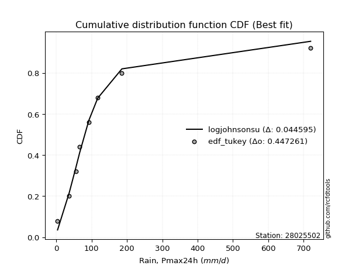</img></img>

</div>


### 8. Empirical - EDF Gringorten (1963)

Gringorten plotting position formula is essential for estimating the probability and return periods of extreme events like floods and heavy rainfall. The constant _a=0.44_.

<div align="center">


$P=(m-a)/(n+1-2a)$


</div>


**8.1. Empirical values**

<div align="center">

|                | 0                    | 1                  | 2                   | 3                  | 4              | 5                  | 6                  | 7                  | 8                  |
|:---------------|:---------------------|:-------------------|:--------------------|:-------------------|:---------------|:-------------------|:-------------------|:-------------------|:-------------------|
| date           | 2021                 | 2025               | 2018                | 2017               | 2024           | 2020               | 2023               | 2019               | 2022               |
| x              | 3.37                 | 32.6               | 36.32               | 55.5               | 66.0           | 92.04              | 117.0              | 185.49             | 720.0              |
| m              | 1                    | 2                  | 3                   | 4                  | 5              | 6                  | 7                  | 8                  | 9                  |
| empirical_dist | edf_gringorten       | edf_gringorten     | edf_gringorten      | edf_gringorten     | edf_gringorten | edf_gringorten     | edf_gringorten     | edf_gringorten     | edf_gringorten     |
| empirical      | 0.061403508771929835 | 0.1710526315789474 | 0.28070175438596495 | 0.3903508771929825 | 0.5            | 0.6096491228070176 | 0.7192982456140351 | 0.8289473684210527 | 0.9385964912280703 |
| empirical_tr   | 1.0654205607476634   | 1.2063492063492063 | 1.3902439024390243  | 1.6402877697841727 | 2.0            | 2.561797752808989  | 3.5625             | 5.846153846153847  | 16.285714285714324 |

</div>


**8.2. Kolmogorov-Smirnov fit test (sorted by Δ)**


<div align="center">

|                | 0                   | 1                   | 2                    | 3                   | 4                   | 5                     | 6                   | 7                   | 8                   | 9                   | 10                  | 11                  | 12                  | 13                  | 14                  | 15                  | 16                  | 17                  | 18                  | 19                  | 20                  | 21                  | 22                  | 23                  | 24                  | 25                  | 26                  | 27                  | 28                  | 29                  | 30                  | 31                  | 32                  | 33                  | 34                  | 35                  | 36                  | 37                  | 38                  | 39                  | 40                  | 41                  | 42                  | 43                  | 44                  | 45                  | 46                  | 47                  | 48                  | 49                  | 50                  | 51                  | 52                  | 53                  | 54                  | 55                  | 56                  | 57                  | 58                  | 59                  | 60                  | 61                  | 62                  | 63                  | 64                  | 65                  | 66                  | 67                  | 68                  | 69                  | 70                  | 71                  | 72                  | 73                  | 74                  | 75                  | 76                  | 77                  | 78                  | 79                  | 80                  | 81                  | 82                  | 83                  | 84                  | 85                  | 86                  | 87                  | 88                  | 89                  |
|:---------------|:--------------------|:--------------------|:---------------------|:--------------------|:--------------------|:----------------------|:--------------------|:--------------------|:--------------------|:--------------------|:--------------------|:--------------------|:--------------------|:--------------------|:--------------------|:--------------------|:--------------------|:--------------------|:--------------------|:--------------------|:--------------------|:--------------------|:--------------------|:--------------------|:--------------------|:--------------------|:--------------------|:--------------------|:--------------------|:--------------------|:--------------------|:--------------------|:--------------------|:--------------------|:--------------------|:--------------------|:--------------------|:--------------------|:--------------------|:--------------------|:--------------------|:--------------------|:--------------------|:--------------------|:--------------------|:--------------------|:--------------------|:--------------------|:--------------------|:--------------------|:--------------------|:--------------------|:--------------------|:--------------------|:--------------------|:--------------------|:--------------------|:--------------------|:--------------------|:--------------------|:--------------------|:--------------------|:--------------------|:--------------------|:--------------------|:--------------------|:--------------------|:--------------------|:--------------------|:--------------------|:--------------------|:--------------------|:--------------------|:--------------------|:--------------------|:--------------------|:--------------------|:--------------------|:--------------------|:--------------------|:--------------------|:--------------------|:--------------------|:--------------------|:--------------------|:--------------------|:--------------------|:--------------------|:--------------------|:--------------------|
| station        | 28025502            | 28025502            | 28025502             | 28025502            | 28025502            | 28025502              | 28025502            | 28025502            | 28025502            | 28025502            | 28025502            | 28025502            | 28025502            | 28025502            | 28025502            | 28025502            | 28025502            | 28025502            | 28025502            | 28025502            | 28025502            | 28025502            | 28025502            | 28025502            | 28025502            | 28025502            | 28025502            | 28025502            | 28025502            | 28025502            | 28025502            | 28025502            | 28025502            | 28025502            | 28025502            | 28025502            | 28025502            | 28025502            | 28025502            | 28025502            | 28025502            | 28025502            | 28025502            | 28025502            | 28025502            | 28025502            | 28025502            | 28025502            | 28025502            | 28025502            | 28025502            | 28025502            | 28025502            | 28025502            | 28025502            | 28025502            | 28025502            | 28025502            | 28025502            | 28025502            | 28025502            | 28025502            | 28025502            | 28025502            | 28025502            | 28025502            | 28025502            | 28025502            | 28025502            | 28025502            | 28025502            | 28025502            | 28025502            | 28025502            | 28025502            | 28025502            | 28025502            | 28025502            | 28025502            | 28025502            | 28025502            | 28025502            | 28025502            | 28025502            | 28025502            | 28025502            | 28025502            | 28025502            | 28025502            | 28025502            |
| empirical_dist | edf_gringorten      | edf_gringorten      | edf_gringorten       | edf_gringorten      | edf_gringorten      | edf_gringorten        | edf_gringorten      | edf_gringorten      | edf_gringorten      | edf_gringorten      | edf_gringorten      | edf_gringorten      | edf_gringorten      | edf_gringorten      | edf_gringorten      | edf_gringorten      | edf_gringorten      | edf_gringorten      | edf_gringorten      | edf_gringorten      | edf_gringorten      | edf_gringorten      | edf_gringorten      | edf_gringorten      | edf_gringorten      | edf_gringorten      | edf_gringorten      | edf_gringorten      | edf_gringorten      | edf_gringorten      | edf_gringorten      | edf_gringorten      | edf_gringorten      | edf_gringorten      | edf_gringorten      | edf_gringorten      | edf_gringorten      | edf_gringorten      | edf_gringorten      | edf_gringorten      | edf_gringorten      | edf_gringorten      | edf_gringorten      | edf_gringorten      | edf_gringorten      | edf_gringorten      | edf_gringorten      | edf_gringorten      | edf_gringorten      | edf_gringorten      | edf_gringorten      | edf_gringorten      | edf_gringorten      | edf_gringorten      | edf_gringorten      | edf_gringorten      | edf_gringorten      | edf_gringorten      | edf_gringorten      | edf_gringorten      | edf_gringorten      | edf_gringorten      | edf_gringorten      | edf_gringorten      | edf_gringorten      | edf_gringorten      | edf_gringorten      | edf_gringorten      | edf_gringorten      | edf_gringorten      | edf_gringorten      | edf_gringorten      | edf_gringorten      | edf_gringorten      | edf_gringorten      | edf_gringorten      | edf_gringorten      | edf_gringorten      | edf_gringorten      | edf_gringorten      | edf_gringorten      | edf_gringorten      | edf_gringorten      | edf_gringorten      | edf_gringorten      | edf_gringorten      | edf_gringorten      | edf_gringorten      | edf_gringorten      | edf_gringorten      |
| p_dist         | logt                | johnsonsu           | logjohnsonsu         | nct                 | loglaplace          | loglaplace_asymmetric | invgamma            | fisk                | loggenlogistic      | logmielke           | loggumbel_l         | invgauss            | logfisk             | gibrat              | loghypsecant        | fatiguelife         | logpearson3         | loglogistic         | logloggamma         | logweibull_min      | gamma               | t                   | logrice             | logexponnorm        | lognorm             | lognorm             | logcrystalball      | logfatiguelife      | lognct              | logf                | logncf              | loggompertz         | logerlang           | logbetaprime        | loggamma            | loggamma            | loginvgamma         | logalpha            | logchi2             | wald                | mielke              | logmaxwell          | loginvgauss         | exponnorm           | gompertz            | expon               | genexpon            | lognakagami         | loggumbel_r         | truncnorm           | lograyleigh         | laplace_asymmetric  | logmoyal            | genlogistic         | f                   | moyal               | loginvweibull       | pearson3            | gumbel_r            | loghalflogistic     | loghalfnorm         | ncf                 | halflogistic        | betaprime           | rayleigh            | logwald             | erlang              | nakagami            | maxwell             | loggibrat           | halfnorm            | logkstwobign        | weibull_min         | chi2                | loggenexpon         | kstwobign           | crystalball         | norm                | logistic            | hypsecant           | laplace             | rice                | gumbel_l            | logtruncnorm        | logexpon            | pareto              | loglognorm          | invweibull          | logpareto           | alpha               |
| delta          | 0.04642655512601623 | 0.04737491893329665 | 0.055222197875134826 | 0.07321035387282446 | 0.07406674000117844 | 0.07451073910286798   | 0.07848634829266907 | 0.08761777376412677 | 0.09298118425694818 | 0.09365990375444161 | 0.09798971455926653 | 0.09859040969349353 | 0.09948858161916502 | 0.09967975233002657 | 0.09974814910726681 | 0.10285205717188489 | 0.115066944047239   | 0.11507176932240543 | 0.11594175632873432 | 0.1219830068587186  | 0.12696352901873548 | 0.13043989453978688 | 0.13603899706701061 | 0.13605089403882048 | 0.13605342613407345 | 0.13605342613407345 | 0.13605346600275114 | 0.13631662780263515 | 0.13646947208808163 | 0.13658363662797773 | 0.13906524859983516 | 0.14028012707372617 | 0.14309619611471835 | 0.1449598631108287  | 0.1460661783489568  | 0.1460661783489568  | 0.14903196442244332 | 0.15029806992536027 | 0.15079222295035144 | 0.15906472639607105 | 0.16060954671566058 | 0.16462969946959322 | 0.16594496941319253 | 0.16741464349966018 | 0.16776070652629094 | 0.16852947824129594 | 0.168529726419561   | 0.1710526285561032  | 0.17136108786857007 | 0.17584973188161834 | 0.1758587308814089  | 0.17867610435212888 | 0.18263256612034512 | 0.18355990460570903 | 0.18510474272995636 | 0.19905822434475556 | 0.1999020142997197  | 0.20510805399132026 | 0.20656988716230895 | 0.20747821436076902 | 0.20766521244355923 | 0.21622367305793044 | 0.2267521274983173  | 0.22684510905117156 | 0.2268816363663413  | 0.2269767088912153  | 0.22972416537316181 | 0.23021287668047064 | 0.23882605360383424 | 0.24066844617144717 | 0.24138752397297808 | 0.24172340005664616 | 0.24498753424196662 | 0.24554567647384956 | 0.25513964095932357 | 0.2728914620828648  | 0.27318276331855756 | 0.2731827712905026  | 0.28042515421868713 | 0.28653353265803594 | 0.3064798024044882  | 0.31048908256579116 | 0.3431110905903784  | 0.3573304745916938  | 0.36426419260113757 | 0.45545350854608707 | 0.45588863077442104 | 0.47104523812142585 | 0.4898663157388858  | 0.5862305987516567  |
| deltao         | 0.41761268023100007 | 0.41761268023100007 | 0.41761268023100007  | 0.41761268023100007 | 0.41761268023100007 | 0.41761268023100007   | 0.41761268023100007 | 0.41761268023100007 | 0.41761268023100007 | 0.41761268023100007 | 0.41761268023100007 | 0.41761268023100007 | 0.41761268023100007 | 0.41761268023100007 | 0.41761268023100007 | 0.41761268023100007 | 0.41761268023100007 | 0.41761268023100007 | 0.41761268023100007 | 0.41761268023100007 | 0.41761268023100007 | 0.41761268023100007 | 0.41761268023100007 | 0.41761268023100007 | 0.41761268023100007 | 0.41761268023100007 | 0.41761268023100007 | 0.41761268023100007 | 0.41761268023100007 | 0.41761268023100007 | 0.41761268023100007 | 0.41761268023100007 | 0.41761268023100007 | 0.41761268023100007 | 0.41761268023100007 | 0.41761268023100007 | 0.41761268023100007 | 0.41761268023100007 | 0.41761268023100007 | 0.41761268023100007 | 0.41761268023100007 | 0.41761268023100007 | 0.41761268023100007 | 0.41761268023100007 | 0.41761268023100007 | 0.41761268023100007 | 0.41761268023100007 | 0.41761268023100007 | 0.41761268023100007 | 0.41761268023100007 | 0.41761268023100007 | 0.41761268023100007 | 0.41761268023100007 | 0.41761268023100007 | 0.41761268023100007 | 0.41761268023100007 | 0.41761268023100007 | 0.41761268023100007 | 0.41761268023100007 | 0.41761268023100007 | 0.41761268023100007 | 0.41761268023100007 | 0.41761268023100007 | 0.41761268023100007 | 0.41761268023100007 | 0.41761268023100007 | 0.41761268023100007 | 0.41761268023100007 | 0.41761268023100007 | 0.41761268023100007 | 0.41761268023100007 | 0.41761268023100007 | 0.41761268023100007 | 0.41761268023100007 | 0.41761268023100007 | 0.41761268023100007 | 0.41761268023100007 | 0.41761268023100007 | 0.41761268023100007 | 0.41761268023100007 | 0.41761268023100007 | 0.41761268023100007 | 0.41761268023100007 | 0.41761268023100007 | 0.41761268023100007 | 0.41761268023100007 | 0.41761268023100007 | 0.41761268023100007 | 0.41761268023100007 | 0.41761268023100007 |
| eval           | Δo > Δ              | Δo > Δ              | Δo > Δ               | Δo > Δ              | Δo > Δ              | Δo > Δ                | Δo > Δ              | Δo > Δ              | Δo > Δ              | Δo > Δ              | Δo > Δ              | Δo > Δ              | Δo > Δ              | Δo > Δ              | Δo > Δ              | Δo > Δ              | Δo > Δ              | Δo > Δ              | Δo > Δ              | Δo > Δ              | Δo > Δ              | Δo > Δ              | Δo > Δ              | Δo > Δ              | Δo > Δ              | Δo > Δ              | Δo > Δ              | Δo > Δ              | Δo > Δ              | Δo > Δ              | Δo > Δ              | Δo > Δ              | Δo > Δ              | Δo > Δ              | Δo > Δ              | Δo > Δ              | Δo > Δ              | Δo > Δ              | Δo > Δ              | Δo > Δ              | Δo > Δ              | Δo > Δ              | Δo > Δ              | Δo > Δ              | Δo > Δ              | Δo > Δ              | Δo > Δ              | Δo > Δ              | Δo > Δ              | Δo > Δ              | Δo > Δ              | Δo > Δ              | Δo > Δ              | Δo > Δ              | Δo > Δ              | Δo > Δ              | Δo > Δ              | Δo > Δ              | Δo > Δ              | Δo > Δ              | Δo > Δ              | Δo > Δ              | Δo > Δ              | Δo > Δ              | Δo > Δ              | Δo > Δ              | Δo > Δ              | Δo > Δ              | Δo > Δ              | Δo > Δ              | Δo > Δ              | Δo > Δ              | Δo > Δ              | Δo > Δ              | Δo > Δ              | Δo > Δ              | Δo > Δ              | Δo > Δ              | Δo > Δ              | Δo > Δ              | Δo > Δ              | Δo > Δ              | Δo > Δ              | Δo > Δ              | Δo > Δ              | Δo <= Δ             | Δo <= Δ             | Δo <= Δ             | Δo <= Δ             | Δo <= Δ             |
| fit            | 1                   | 1                   | 1                    | 1                   | 1                   | 1                     | 1                   | 1                   | 1                   | 1                   | 1                   | 1                   | 1                   | 1                   | 1                   | 1                   | 1                   | 1                   | 1                   | 1                   | 1                   | 1                   | 1                   | 1                   | 1                   | 1                   | 1                   | 1                   | 1                   | 1                   | 1                   | 1                   | 1                   | 1                   | 1                   | 1                   | 1                   | 1                   | 1                   | 1                   | 1                   | 1                   | 1                   | 1                   | 1                   | 1                   | 1                   | 1                   | 1                   | 1                   | 1                   | 1                   | 1                   | 1                   | 1                   | 1                   | 1                   | 1                   | 1                   | 1                   | 1                   | 1                   | 1                   | 1                   | 1                   | 1                   | 1                   | 1                   | 1                   | 1                   | 1                   | 1                   | 1                   | 1                   | 1                   | 1                   | 1                   | 1                   | 1                   | 1                   | 1                   | 1                   | 1                   | 1                   | 1                   | 0                   | 0                   | 0                   | 0                   | 0                   |
| n              | 9                   | 9                   | 9                    | 9                   | 9                   | 9                     | 9                   | 9                   | 9                   | 9                   | 9                   | 9                   | 9                   | 9                   | 9                   | 9                   | 9                   | 9                   | 9                   | 9                   | 9                   | 9                   | 9                   | 9                   | 9                   | 9                   | 9                   | 9                   | 9                   | 9                   | 9                   | 9                   | 9                   | 9                   | 9                   | 9                   | 9                   | 9                   | 9                   | 9                   | 9                   | 9                   | 9                   | 9                   | 9                   | 9                   | 9                   | 9                   | 9                   | 9                   | 9                   | 9                   | 9                   | 9                   | 9                   | 9                   | 9                   | 9                   | 9                   | 9                   | 9                   | 9                   | 9                   | 9                   | 9                   | 9                   | 9                   | 9                   | 9                   | 9                   | 9                   | 9                   | 9                   | 9                   | 9                   | 9                   | 9                   | 9                   | 9                   | 9                   | 9                   | 9                   | 9                   | 9                   | 9                   | 9                   | 9                   | 9                   | 9                   | 9                   |
| best_fit       | 1                   | 0                   | 0                    | 0                   | 0                   | 0                     | 0                   | 0                   | 0                   | 0                   | 0                   | 0                   | 0                   | 0                   | 0                   | 0                   | 0                   | 0                   | 0                   | 0                   | 0                   | 0                   | 0                   | 0                   | 0                   | 0                   | 0                   | 0                   | 0                   | 0                   | 0                   | 0                   | 0                   | 0                   | 0                   | 0                   | 0                   | 0                   | 0                   | 0                   | 0                   | 0                   | 0                   | 0                   | 0                   | 0                   | 0                   | 0                   | 0                   | 0                   | 0                   | 0                   | 0                   | 0                   | 0                   | 0                   | 0                   | 0                   | 0                   | 0                   | 0                   | 0                   | 0                   | 0                   | 0                   | 0                   | 0                   | 0                   | 0                   | 0                   | 0                   | 0                   | 0                   | 0                   | 0                   | 0                   | 0                   | 0                   | 0                   | 0                   | 0                   | 0                   | 0                   | 0                   | 0                   | 0                   | 0                   | 0                   | 0                   | 0                   |
| best_fit_sort  | 1                   | 2                   | 3                    | 4                   | 5                   | 6                     | 7                   | 8                   | 9                   | 10                  | 11                  | 12                  | 13                  | 14                  | 15                  | 16                  | 17                  | 18                  | 19                  | 20                  | 21                  | 22                  | 23                  | 24                  | 25                  | 26                  | 27                  | 28                  | 29                  | 30                  | 31                  | 32                  | 33                  | 34                  | 35                  | 36                  | 37                  | 38                  | 39                  | 40                  | 41                  | 42                  | 43                  | 44                  | 45                  | 46                  | 47                  | 48                  | 49                  | 50                  | 51                  | 52                  | 53                  | 54                  | 55                  | 56                  | 57                  | 58                  | 59                  | 60                  | 61                  | 62                  | 63                  | 64                  | 65                  | 66                  | 67                  | 68                  | 69                  | 70                  | 71                  | 72                  | 73                  | 74                  | 75                  | 76                  | 77                  | 78                  | 79                  | 80                  | 81                  | 82                  | 83                  | 84                  | 85                  | 86                  | 87                  | 88                  | 89                  | 90                  |

</div>


<div align="center">

</img>

</div>


**8.3. Best fit**

<div align="center">

|   id |   station | empirical_dist   | p_dist   |     delta |   deltao | eval   |   fit |   n |   best_fit |   best_fit_sort |
|-----:|----------:|:-----------------|:---------|----------:|---------:|:-------|------:|----:|-----------:|----------------:|
|    0 |  28025502 | edf_gringorten   | logt     | 0.0464266 | 0.417613 | Δo > Δ |     1 |   9 |          1 |               1 |

</div>


<div align="center">

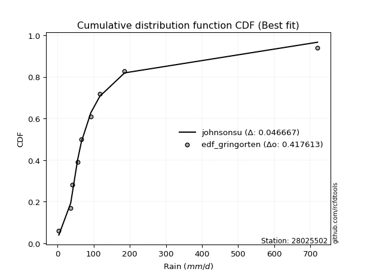</img>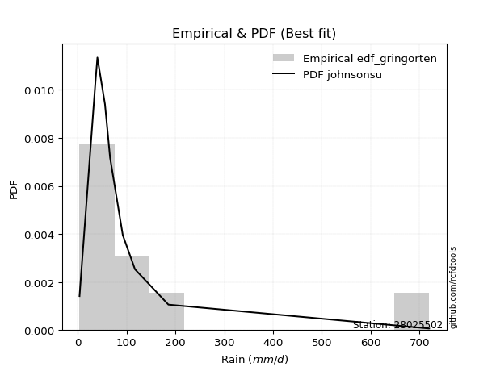</img>

</div>


### 9. Empirical - EDF Filliben (1975)

The specific values of the constants (0.3175) (often denoted as $alpha$) and (0.365) are derived from a method proposed by James J. Filliben in a 1975 paper. This particular formula is the mean value of the $i$-th order statistic of the normal distribution and is considered a robust and effective plotting position formula for the normal probability plot correlation coefficient test for normality.

<div align="center">


$P=(m-0.3175)/(n+0.365)$


</div>


**9.1. Empirical values**

<div align="center">

|                | 0                   | 1                  | 2                   | 3                   | 4            | 5                  | 6                  | 7                  | 8                  |
|:---------------|:--------------------|:-------------------|:--------------------|:--------------------|:-------------|:-------------------|:-------------------|:-------------------|:-------------------|
| date           | 2021                | 2025               | 2018                | 2017                | 2024         | 2020               | 2023               | 2019               | 2022               |
| x              | 3.37                | 32.6               | 36.32               | 55.5                | 66.0         | 92.04              | 117.0              | 185.49             | 720.0              |
| m              | 1                   | 2                  | 3                   | 4                   | 5            | 6                  | 7                  | 8                  | 9                  |
| empirical_dist | edf_filliben        | edf_filliben       | edf_filliben        | edf_filliben        | edf_filliben | edf_filliben       | edf_filliben       | edf_filliben       | edf_filliben       |
| empirical      | 0.07287773625200214 | 0.1796583021890016 | 0.28643886812600106 | 0.39321943406300053 | 0.5          | 0.6067805659369995 | 0.7135611318739989 | 0.8203416978109984 | 0.9271222637479978 |
| empirical_tr   | 1.0786063921681543  | 1.219004230393752  | 1.401421623643846   | 1.6480422349318082  | 2.0          | 2.5431093007467753 | 3.491146318732526  | 5.566121842496286  | 13.721611721611705 |

</div>


**9.2. Kolmogorov-Smirnov fit test (sorted by Δ)**


<div align="center">

|                | 0                   | 1                    | 2                    | 3                   | 4                   | 5                     | 6                   | 7                   | 8                   | 9                   | 10                  | 11                  | 12                  | 13                  | 14                  | 15                  | 16                  | 17                  | 18                  | 19                  | 20                  | 21                  | 22                  | 23                  | 24                  | 25                  | 26                  | 27                  | 28                  | 29                  | 30                  | 31                  | 32                  | 33                  | 34                  | 35                  | 36                  | 37                  | 38                  | 39                  | 40                  | 41                  | 42                  | 43                  | 44                  | 45                  | 46                  | 47                  | 48                  | 49                  | 50                  | 51                  | 52                  | 53                  | 54                  | 55                  | 56                  | 57                  | 58                  | 59                  | 60                  | 61                  | 62                  | 63                  | 64                  | 65                  | 66                  | 67                  | 68                  | 69                  | 70                  | 71                  | 72                  | 73                  | 74                  | 75                  | 76                  | 77                  | 78                  | 79                  | 80                  | 81                  | 82                  | 83                  | 84                  | 85                  | 86                  | 87                  | 88                  | 89                  |
|:---------------|:--------------------|:---------------------|:---------------------|:--------------------|:--------------------|:----------------------|:--------------------|:--------------------|:--------------------|:--------------------|:--------------------|:--------------------|:--------------------|:--------------------|:--------------------|:--------------------|:--------------------|:--------------------|:--------------------|:--------------------|:--------------------|:--------------------|:--------------------|:--------------------|:--------------------|:--------------------|:--------------------|:--------------------|:--------------------|:--------------------|:--------------------|:--------------------|:--------------------|:--------------------|:--------------------|:--------------------|:--------------------|:--------------------|:--------------------|:--------------------|:--------------------|:--------------------|:--------------------|:--------------------|:--------------------|:--------------------|:--------------------|:--------------------|:--------------------|:--------------------|:--------------------|:--------------------|:--------------------|:--------------------|:--------------------|:--------------------|:--------------------|:--------------------|:--------------------|:--------------------|:--------------------|:--------------------|:--------------------|:--------------------|:--------------------|:--------------------|:--------------------|:--------------------|:--------------------|:--------------------|:--------------------|:--------------------|:--------------------|:--------------------|:--------------------|:--------------------|:--------------------|:--------------------|:--------------------|:--------------------|:--------------------|:--------------------|:--------------------|:--------------------|:--------------------|:--------------------|:--------------------|:--------------------|:--------------------|:--------------------|
| station        | 28025502            | 28025502             | 28025502             | 28025502            | 28025502            | 28025502              | 28025502            | 28025502            | 28025502            | 28025502            | 28025502            | 28025502            | 28025502            | 28025502            | 28025502            | 28025502            | 28025502            | 28025502            | 28025502            | 28025502            | 28025502            | 28025502            | 28025502            | 28025502            | 28025502            | 28025502            | 28025502            | 28025502            | 28025502            | 28025502            | 28025502            | 28025502            | 28025502            | 28025502            | 28025502            | 28025502            | 28025502            | 28025502            | 28025502            | 28025502            | 28025502            | 28025502            | 28025502            | 28025502            | 28025502            | 28025502            | 28025502            | 28025502            | 28025502            | 28025502            | 28025502            | 28025502            | 28025502            | 28025502            | 28025502            | 28025502            | 28025502            | 28025502            | 28025502            | 28025502            | 28025502            | 28025502            | 28025502            | 28025502            | 28025502            | 28025502            | 28025502            | 28025502            | 28025502            | 28025502            | 28025502            | 28025502            | 28025502            | 28025502            | 28025502            | 28025502            | 28025502            | 28025502            | 28025502            | 28025502            | 28025502            | 28025502            | 28025502            | 28025502            | 28025502            | 28025502            | 28025502            | 28025502            | 28025502            | 28025502            |
| empirical_dist | edf_filliben        | edf_filliben         | edf_filliben         | edf_filliben        | edf_filliben        | edf_filliben          | edf_filliben        | edf_filliben        | edf_filliben        | edf_filliben        | edf_filliben        | edf_filliben        | edf_filliben        | edf_filliben        | edf_filliben        | edf_filliben        | edf_filliben        | edf_filliben        | edf_filliben        | edf_filliben        | edf_filliben        | edf_filliben        | edf_filliben        | edf_filliben        | edf_filliben        | edf_filliben        | edf_filliben        | edf_filliben        | edf_filliben        | edf_filliben        | edf_filliben        | edf_filliben        | edf_filliben        | edf_filliben        | edf_filliben        | edf_filliben        | edf_filliben        | edf_filliben        | edf_filliben        | edf_filliben        | edf_filliben        | edf_filliben        | edf_filliben        | edf_filliben        | edf_filliben        | edf_filliben        | edf_filliben        | edf_filliben        | edf_filliben        | edf_filliben        | edf_filliben        | edf_filliben        | edf_filliben        | edf_filliben        | edf_filliben        | edf_filliben        | edf_filliben        | edf_filliben        | edf_filliben        | edf_filliben        | edf_filliben        | edf_filliben        | edf_filliben        | edf_filliben        | edf_filliben        | edf_filliben        | edf_filliben        | edf_filliben        | edf_filliben        | edf_filliben        | edf_filliben        | edf_filliben        | edf_filliben        | edf_filliben        | edf_filliben        | edf_filliben        | edf_filliben        | edf_filliben        | edf_filliben        | edf_filliben        | edf_filliben        | edf_filliben        | edf_filliben        | edf_filliben        | edf_filliben        | edf_filliben        | edf_filliben        | edf_filliben        | edf_filliben        | edf_filliben        |
| p_dist         | logt                | logjohnsonsu         | johnsonsu            | nct                 | loglaplace          | loglaplace_asymmetric | invgamma            | fisk                | loggenlogistic      | logmielke           | invgauss            | logfisk             | loghypsecant        | loggumbel_l         | gibrat              | fatiguelife         | logpearson3         | loglogistic         | logloggamma         | logweibull_min      | gamma               | logrice             | logexponnorm        | lognorm             | lognorm             | logcrystalball      | logfatiguelife      | lognct              | logf                | logncf              | loggompertz         | t                   | logerlang           | logbetaprime        | loggamma            | loggamma            | loginvgamma         | logalpha            | logchi2             | wald                | mielke              | logmaxwell          | loginvgauss         | exponnorm           | gompertz            | loggumbel_r         | expon               | genexpon            | lograyleigh         | truncnorm           | laplace_asymmetric  | logmoyal            | f                   | genlogistic         | lognakagami         | moyal               | loginvweibull       | pearson3            | loghalflogistic     | loghalfnorm         | gumbel_r            | ncf                 | halflogistic        | betaprime           | erlang              | rayleigh            | nakagami            | logwald             | halfnorm            | maxwell             | logkstwobign        | chi2                | loggibrat           | weibull_min         | loggenexpon         | kstwobign           | crystalball         | norm                | logistic            | hypsecant           | laplace             | rice                | gumbel_l            | logtruncnorm        | logexpon            | pareto              | loglognorm          | invweibull          | logpareto           | alpha               |
| delta          | 0.0459853755354862  | 0.046616527265080615 | 0.053112032673332754 | 0.06460468326277025 | 0.06546106939112423 | 0.06590506849281377   | 0.06988067768261486 | 0.07901210315407256 | 0.08437551364689397 | 0.0850542331443874  | 0.08998473908343932 | 0.0908829110091108  | 0.0911424784972126  | 0.09225260081923037 | 0.09394263858999041 | 0.09544594288935548 | 0.10646127343718478 | 0.10646609871235121 | 0.10733608571868011 | 0.11337733624866439 | 0.11835785840868127 | 0.1274333264569564  | 0.12744522342876627 | 0.12744775552401924 | 0.12744775552401924 | 0.12744779539269693 | 0.12771095719258094 | 0.12786380147802742 | 0.12797796601792352 | 0.13045957798978094 | 0.13167445646367196 | 0.13330845140980496 | 0.13449052550466414 | 0.1363541925007745  | 0.1374605077389026  | 0.1374605077389026  | 0.1404262938123891  | 0.14169239931530606 | 0.14218655234029723 | 0.15045905578601684 | 0.15200387610560637 | 0.156024028859539   | 0.15733929880313832 | 0.16167752975962402 | 0.16202359278625478 | 0.16275541725851586 | 0.16279236450125978 | 0.16279261267952483 | 0.1672530602713547  | 0.17011261814158218 | 0.17293899061209272 | 0.1740268955102909  | 0.17649907211990215 | 0.17782279086567288 | 0.17965829916615741 | 0.18758399686468327 | 0.1912963436896655  | 0.19458568272067459 | 0.1988725437507148  | 0.19905954183350502 | 0.2008327734222728  | 0.20761800244787623 | 0.215277900018245   | 0.21823943844111734 | 0.2211184947631076  | 0.22114452262630513 | 0.2216072060704164  | 0.22410815202119727 | 0.2299132964929058  | 0.23308893986379808 | 0.23311772944659195 | 0.23694000586379535 | 0.23779988930142915 | 0.23925042050193046 | 0.24653397034926935 | 0.26715434834282864 | 0.2674456495785214  | 0.26744565755046645 | 0.274688040478651   | 0.2807964189179998  | 0.30074268866445203 | 0.304751968825755   | 0.33737397685034226 | 0.34872480398163963 | 0.3556585219910834  | 0.4468478379360329  | 0.44728296016436686 | 0.4595710106413533  | 0.4812606451288316  | 0.5776249281416025  |
| deltao         | 0.41761268023100007 | 0.41761268023100007  | 0.41761268023100007  | 0.41761268023100007 | 0.41761268023100007 | 0.41761268023100007   | 0.41761268023100007 | 0.41761268023100007 | 0.41761268023100007 | 0.41761268023100007 | 0.41761268023100007 | 0.41761268023100007 | 0.41761268023100007 | 0.41761268023100007 | 0.41761268023100007 | 0.41761268023100007 | 0.41761268023100007 | 0.41761268023100007 | 0.41761268023100007 | 0.41761268023100007 | 0.41761268023100007 | 0.41761268023100007 | 0.41761268023100007 | 0.41761268023100007 | 0.41761268023100007 | 0.41761268023100007 | 0.41761268023100007 | 0.41761268023100007 | 0.41761268023100007 | 0.41761268023100007 | 0.41761268023100007 | 0.41761268023100007 | 0.41761268023100007 | 0.41761268023100007 | 0.41761268023100007 | 0.41761268023100007 | 0.41761268023100007 | 0.41761268023100007 | 0.41761268023100007 | 0.41761268023100007 | 0.41761268023100007 | 0.41761268023100007 | 0.41761268023100007 | 0.41761268023100007 | 0.41761268023100007 | 0.41761268023100007 | 0.41761268023100007 | 0.41761268023100007 | 0.41761268023100007 | 0.41761268023100007 | 0.41761268023100007 | 0.41761268023100007 | 0.41761268023100007 | 0.41761268023100007 | 0.41761268023100007 | 0.41761268023100007 | 0.41761268023100007 | 0.41761268023100007 | 0.41761268023100007 | 0.41761268023100007 | 0.41761268023100007 | 0.41761268023100007 | 0.41761268023100007 | 0.41761268023100007 | 0.41761268023100007 | 0.41761268023100007 | 0.41761268023100007 | 0.41761268023100007 | 0.41761268023100007 | 0.41761268023100007 | 0.41761268023100007 | 0.41761268023100007 | 0.41761268023100007 | 0.41761268023100007 | 0.41761268023100007 | 0.41761268023100007 | 0.41761268023100007 | 0.41761268023100007 | 0.41761268023100007 | 0.41761268023100007 | 0.41761268023100007 | 0.41761268023100007 | 0.41761268023100007 | 0.41761268023100007 | 0.41761268023100007 | 0.41761268023100007 | 0.41761268023100007 | 0.41761268023100007 | 0.41761268023100007 | 0.41761268023100007 |
| eval           | Δo > Δ              | Δo > Δ               | Δo > Δ               | Δo > Δ              | Δo > Δ              | Δo > Δ                | Δo > Δ              | Δo > Δ              | Δo > Δ              | Δo > Δ              | Δo > Δ              | Δo > Δ              | Δo > Δ              | Δo > Δ              | Δo > Δ              | Δo > Δ              | Δo > Δ              | Δo > Δ              | Δo > Δ              | Δo > Δ              | Δo > Δ              | Δo > Δ              | Δo > Δ              | Δo > Δ              | Δo > Δ              | Δo > Δ              | Δo > Δ              | Δo > Δ              | Δo > Δ              | Δo > Δ              | Δo > Δ              | Δo > Δ              | Δo > Δ              | Δo > Δ              | Δo > Δ              | Δo > Δ              | Δo > Δ              | Δo > Δ              | Δo > Δ              | Δo > Δ              | Δo > Δ              | Δo > Δ              | Δo > Δ              | Δo > Δ              | Δo > Δ              | Δo > Δ              | Δo > Δ              | Δo > Δ              | Δo > Δ              | Δo > Δ              | Δo > Δ              | Δo > Δ              | Δo > Δ              | Δo > Δ              | Δo > Δ              | Δo > Δ              | Δo > Δ              | Δo > Δ              | Δo > Δ              | Δo > Δ              | Δo > Δ              | Δo > Δ              | Δo > Δ              | Δo > Δ              | Δo > Δ              | Δo > Δ              | Δo > Δ              | Δo > Δ              | Δo > Δ              | Δo > Δ              | Δo > Δ              | Δo > Δ              | Δo > Δ              | Δo > Δ              | Δo > Δ              | Δo > Δ              | Δo > Δ              | Δo > Δ              | Δo > Δ              | Δo > Δ              | Δo > Δ              | Δo > Δ              | Δo > Δ              | Δo > Δ              | Δo > Δ              | Δo <= Δ             | Δo <= Δ             | Δo <= Δ             | Δo <= Δ             | Δo <= Δ             |
| fit            | 1                   | 1                    | 1                    | 1                   | 1                   | 1                     | 1                   | 1                   | 1                   | 1                   | 1                   | 1                   | 1                   | 1                   | 1                   | 1                   | 1                   | 1                   | 1                   | 1                   | 1                   | 1                   | 1                   | 1                   | 1                   | 1                   | 1                   | 1                   | 1                   | 1                   | 1                   | 1                   | 1                   | 1                   | 1                   | 1                   | 1                   | 1                   | 1                   | 1                   | 1                   | 1                   | 1                   | 1                   | 1                   | 1                   | 1                   | 1                   | 1                   | 1                   | 1                   | 1                   | 1                   | 1                   | 1                   | 1                   | 1                   | 1                   | 1                   | 1                   | 1                   | 1                   | 1                   | 1                   | 1                   | 1                   | 1                   | 1                   | 1                   | 1                   | 1                   | 1                   | 1                   | 1                   | 1                   | 1                   | 1                   | 1                   | 1                   | 1                   | 1                   | 1                   | 1                   | 1                   | 1                   | 0                   | 0                   | 0                   | 0                   | 0                   |
| n              | 9                   | 9                    | 9                    | 9                   | 9                   | 9                     | 9                   | 9                   | 9                   | 9                   | 9                   | 9                   | 9                   | 9                   | 9                   | 9                   | 9                   | 9                   | 9                   | 9                   | 9                   | 9                   | 9                   | 9                   | 9                   | 9                   | 9                   | 9                   | 9                   | 9                   | 9                   | 9                   | 9                   | 9                   | 9                   | 9                   | 9                   | 9                   | 9                   | 9                   | 9                   | 9                   | 9                   | 9                   | 9                   | 9                   | 9                   | 9                   | 9                   | 9                   | 9                   | 9                   | 9                   | 9                   | 9                   | 9                   | 9                   | 9                   | 9                   | 9                   | 9                   | 9                   | 9                   | 9                   | 9                   | 9                   | 9                   | 9                   | 9                   | 9                   | 9                   | 9                   | 9                   | 9                   | 9                   | 9                   | 9                   | 9                   | 9                   | 9                   | 9                   | 9                   | 9                   | 9                   | 9                   | 9                   | 9                   | 9                   | 9                   | 9                   |
| best_fit       | 1                   | 0                    | 0                    | 0                   | 0                   | 0                     | 0                   | 0                   | 0                   | 0                   | 0                   | 0                   | 0                   | 0                   | 0                   | 0                   | 0                   | 0                   | 0                   | 0                   | 0                   | 0                   | 0                   | 0                   | 0                   | 0                   | 0                   | 0                   | 0                   | 0                   | 0                   | 0                   | 0                   | 0                   | 0                   | 0                   | 0                   | 0                   | 0                   | 0                   | 0                   | 0                   | 0                   | 0                   | 0                   | 0                   | 0                   | 0                   | 0                   | 0                   | 0                   | 0                   | 0                   | 0                   | 0                   | 0                   | 0                   | 0                   | 0                   | 0                   | 0                   | 0                   | 0                   | 0                   | 0                   | 0                   | 0                   | 0                   | 0                   | 0                   | 0                   | 0                   | 0                   | 0                   | 0                   | 0                   | 0                   | 0                   | 0                   | 0                   | 0                   | 0                   | 0                   | 0                   | 0                   | 0                   | 0                   | 0                   | 0                   | 0                   |
| best_fit_sort  | 1                   | 2                    | 3                    | 4                   | 5                   | 6                     | 7                   | 8                   | 9                   | 10                  | 11                  | 12                  | 13                  | 14                  | 15                  | 16                  | 17                  | 18                  | 19                  | 20                  | 21                  | 22                  | 23                  | 24                  | 25                  | 26                  | 27                  | 28                  | 29                  | 30                  | 31                  | 32                  | 33                  | 34                  | 35                  | 36                  | 37                  | 38                  | 39                  | 40                  | 41                  | 42                  | 43                  | 44                  | 45                  | 46                  | 47                  | 48                  | 49                  | 50                  | 51                  | 52                  | 53                  | 54                  | 55                  | 56                  | 57                  | 58                  | 59                  | 60                  | 61                  | 62                  | 63                  | 64                  | 65                  | 66                  | 67                  | 68                  | 69                  | 70                  | 71                  | 72                  | 73                  | 74                  | 75                  | 76                  | 77                  | 78                  | 79                  | 80                  | 81                  | 82                  | 83                  | 84                  | 85                  | 86                  | 87                  | 88                  | 89                  | 90                  |

</div>


<div align="center">

</img>

</div>


**9.3. Best fit**

<div align="center">

|   id |   station | empirical_dist   | p_dist   |     delta |   deltao | eval   |   fit |   n |   best_fit |   best_fit_sort |
|-----:|----------:|:-----------------|:---------|----------:|---------:|:-------|------:|----:|-----------:|----------------:|
|    0 |  28025502 | edf_filliben     | logt     | 0.0459854 | 0.417613 | Δo > Δ |     1 |   9 |          1 |               1 |

</div>


<div align="center">

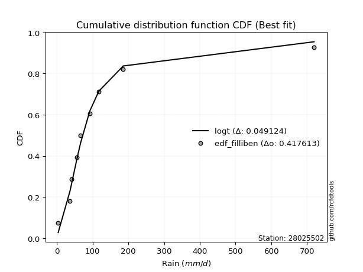</img>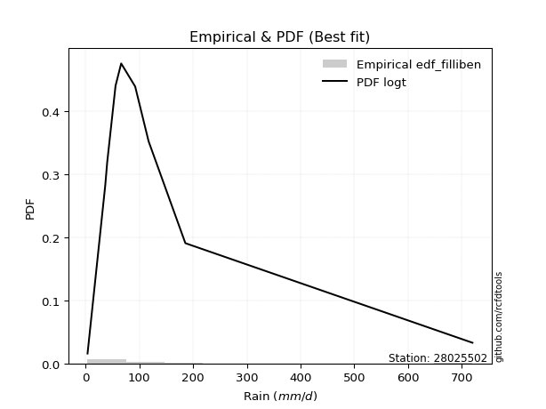</img>

</div>


### 10. Empirical - EDF Jenkinson (1977)

The Jenkinson formula in hydrology is an empirical plotting position formula used to estimate the non-exceedance probability _(P)_ or return period _(T)_ of a given ordered observation within a sample. It is a widely used method in the frequency analysis of extreme events such as floods and rainfall, as it provides a distribution-free way to plot data. _a≈0.31_ and _b≈0.38_ are constants derived to approximate the median of the probability distribution for the given rank.

<div align="center">


$P=(m-a)/(n+b)$


</div>


**10.1. Empirical values**

<div align="center">

|                | 0                   | 1                   | 2                  | 3                   | 4             | 5                  | 6                  | 7                  | 8                  |
|:---------------|:--------------------|:--------------------|:-------------------|:--------------------|:--------------|:-------------------|:-------------------|:-------------------|:-------------------|
| date           | 2021                | 2025                | 2018               | 2017                | 2024          | 2020               | 2023               | 2019               | 2022               |
| x              | 3.37                | 32.6                | 36.32              | 55.5                | 66.0          | 92.04              | 117.0              | 185.49             | 720.0              |
| m              | 1                   | 2                   | 3                  | 4                   | 5             | 6                  | 7                  | 8                  | 9                  |
| empirical_dist | edf_jenkinson       | edf_jenkinson       | edf_jenkinson      | edf_jenkinson       | edf_jenkinson | edf_jenkinson      | edf_jenkinson      | edf_jenkinson      | edf_jenkinson      |
| empirical      | 0.07356076759061833 | 0.18017057569296374 | 0.2867803837953091 | 0.39339019189765456 | 0.5           | 0.6066098081023454 | 0.7132196162046908 | 0.8198294243070362 | 0.9264392324093815 |
| empirical_tr   | 1.0794016110471807  | 1.2197659297789336  | 1.4020926756352765 | 1.6485061511423549  | 2.0           | 2.542005420054201  | 3.486988847583642  | 5.550295857988164  | 13.5942028985507   |

</div>


**10.2. Kolmogorov-Smirnov fit test (sorted by Δ)**


<div align="center">

|                | 0                    | 1                   | 2                   | 3                   | 4                   | 5                     | 6                   | 7                   | 8                   | 9                   | 10                  | 11                  | 12                  | 13                  | 14                  | 15                  | 16                  | 17                  | 18                  | 19                  | 20                  | 21                  | 22                  | 23                  | 24                  | 25                  | 26                  | 27                  | 28                  | 29                  | 30                  | 31                  | 32                  | 33                  | 34                  | 35                  | 36                  | 37                  | 38                  | 39                  | 40                  | 41                  | 42                  | 43                  | 44                  | 45                  | 46                  | 47                  | 48                  | 49                  | 50                  | 51                  | 52                  | 53                  | 54                  | 55                  | 56                  | 57                  | 58                  | 59                  | 60                  | 61                  | 62                  | 63                  | 64                  | 65                  | 66                  | 67                  | 68                  | 69                  | 70                  | 71                  | 72                  | 73                  | 74                  | 75                  | 76                  | 77                  | 78                  | 79                  | 80                  | 81                  | 82                  | 83                  | 84                  | 85                  | 86                  | 87                  | 88                  | 89                  |
|:---------------|:---------------------|:--------------------|:--------------------|:--------------------|:--------------------|:----------------------|:--------------------|:--------------------|:--------------------|:--------------------|:--------------------|:--------------------|:--------------------|:--------------------|:--------------------|:--------------------|:--------------------|:--------------------|:--------------------|:--------------------|:--------------------|:--------------------|:--------------------|:--------------------|:--------------------|:--------------------|:--------------------|:--------------------|:--------------------|:--------------------|:--------------------|:--------------------|:--------------------|:--------------------|:--------------------|:--------------------|:--------------------|:--------------------|:--------------------|:--------------------|:--------------------|:--------------------|:--------------------|:--------------------|:--------------------|:--------------------|:--------------------|:--------------------|:--------------------|:--------------------|:--------------------|:--------------------|:--------------------|:--------------------|:--------------------|:--------------------|:--------------------|:--------------------|:--------------------|:--------------------|:--------------------|:--------------------|:--------------------|:--------------------|:--------------------|:--------------------|:--------------------|:--------------------|:--------------------|:--------------------|:--------------------|:--------------------|:--------------------|:--------------------|:--------------------|:--------------------|:--------------------|:--------------------|:--------------------|:--------------------|:--------------------|:--------------------|:--------------------|:--------------------|:--------------------|:--------------------|:--------------------|:--------------------|:--------------------|:--------------------|
| station        | 28025502             | 28025502            | 28025502            | 28025502            | 28025502            | 28025502              | 28025502            | 28025502            | 28025502            | 28025502            | 28025502            | 28025502            | 28025502            | 28025502            | 28025502            | 28025502            | 28025502            | 28025502            | 28025502            | 28025502            | 28025502            | 28025502            | 28025502            | 28025502            | 28025502            | 28025502            | 28025502            | 28025502            | 28025502            | 28025502            | 28025502            | 28025502            | 28025502            | 28025502            | 28025502            | 28025502            | 28025502            | 28025502            | 28025502            | 28025502            | 28025502            | 28025502            | 28025502            | 28025502            | 28025502            | 28025502            | 28025502            | 28025502            | 28025502            | 28025502            | 28025502            | 28025502            | 28025502            | 28025502            | 28025502            | 28025502            | 28025502            | 28025502            | 28025502            | 28025502            | 28025502            | 28025502            | 28025502            | 28025502            | 28025502            | 28025502            | 28025502            | 28025502            | 28025502            | 28025502            | 28025502            | 28025502            | 28025502            | 28025502            | 28025502            | 28025502            | 28025502            | 28025502            | 28025502            | 28025502            | 28025502            | 28025502            | 28025502            | 28025502            | 28025502            | 28025502            | 28025502            | 28025502            | 28025502            | 28025502            |
| empirical_dist | edf_jenkinson        | edf_jenkinson       | edf_jenkinson       | edf_jenkinson       | edf_jenkinson       | edf_jenkinson         | edf_jenkinson       | edf_jenkinson       | edf_jenkinson       | edf_jenkinson       | edf_jenkinson       | edf_jenkinson       | edf_jenkinson       | edf_jenkinson       | edf_jenkinson       | edf_jenkinson       | edf_jenkinson       | edf_jenkinson       | edf_jenkinson       | edf_jenkinson       | edf_jenkinson       | edf_jenkinson       | edf_jenkinson       | edf_jenkinson       | edf_jenkinson       | edf_jenkinson       | edf_jenkinson       | edf_jenkinson       | edf_jenkinson       | edf_jenkinson       | edf_jenkinson       | edf_jenkinson       | edf_jenkinson       | edf_jenkinson       | edf_jenkinson       | edf_jenkinson       | edf_jenkinson       | edf_jenkinson       | edf_jenkinson       | edf_jenkinson       | edf_jenkinson       | edf_jenkinson       | edf_jenkinson       | edf_jenkinson       | edf_jenkinson       | edf_jenkinson       | edf_jenkinson       | edf_jenkinson       | edf_jenkinson       | edf_jenkinson       | edf_jenkinson       | edf_jenkinson       | edf_jenkinson       | edf_jenkinson       | edf_jenkinson       | edf_jenkinson       | edf_jenkinson       | edf_jenkinson       | edf_jenkinson       | edf_jenkinson       | edf_jenkinson       | edf_jenkinson       | edf_jenkinson       | edf_jenkinson       | edf_jenkinson       | edf_jenkinson       | edf_jenkinson       | edf_jenkinson       | edf_jenkinson       | edf_jenkinson       | edf_jenkinson       | edf_jenkinson       | edf_jenkinson       | edf_jenkinson       | edf_jenkinson       | edf_jenkinson       | edf_jenkinson       | edf_jenkinson       | edf_jenkinson       | edf_jenkinson       | edf_jenkinson       | edf_jenkinson       | edf_jenkinson       | edf_jenkinson       | edf_jenkinson       | edf_jenkinson       | edf_jenkinson       | edf_jenkinson       | edf_jenkinson       | edf_jenkinson       |
| p_dist         | logjohnsonsu         | logt                | johnsonsu           | nct                 | loglaplace          | loglaplace_asymmetric | invgamma            | fisk                | loggenlogistic      | logmielke           | invgauss            | logfisk             | loghypsecant        | loggumbel_l         | gibrat              | fatiguelife         | logpearson3         | loglogistic         | logloggamma         | logweibull_min      | gamma               | logrice             | logexponnorm        | lognorm             | lognorm             | logcrystalball      | logfatiguelife      | lognct              | logf                | logncf              | loggompertz         | t                   | logerlang           | logbetaprime        | loggamma            | loggamma            | loginvgamma         | logalpha            | logchi2             | wald                | mielke              | logmaxwell          | loginvgauss         | exponnorm           | gompertz            | loggumbel_r         | expon               | genexpon            | lograyleigh         | truncnorm           | laplace_asymmetric  | logmoyal            | f                   | genlogistic         | lognakagami         | moyal               | loginvweibull       | pearson3            | loghalflogistic     | loghalfnorm         | gumbel_r            | ncf                 | halflogistic        | betaprime           | erlang              | rayleigh            | nakagami            | logwald             | halfnorm            | logkstwobign        | maxwell             | chi2                | loggibrat           | weibull_min         | loggenexpon         | kstwobign           | crystalball         | norm                | logistic            | hypsecant           | laplace             | rice                | gumbel_l            | logtruncnorm        | logexpon            | pareto              | loglognorm          | invweibull          | logpareto           | alpha               |
| delta          | 0.046104253761118485 | 0.04666840687410239 | 0.05345354834264082 | 0.06409240975880812 | 0.0649487958871621  | 0.06539279498885164   | 0.06936840417865273 | 0.07849982965011043 | 0.08386324014293184 | 0.08454195964042527 | 0.08947246557947719 | 0.09037063750514868 | 0.09063020499325047 | 0.09191108514992219 | 0.09360112292068223 | 0.0951044272200473  | 0.10594899993322265 | 0.10595382520838909 | 0.10682381221471798 | 0.11286506274470226 | 0.11784558490471914 | 0.12692105295299427 | 0.12693294992480414 | 0.1269354820200571  | 0.1269354820200571  | 0.1269355218887348  | 0.1271986836886188  | 0.1273515279740653  | 0.1274656925139614  | 0.12994730448581882 | 0.13116218295970983 | 0.133479209244459   | 0.13397825200070201 | 0.13584191899681236 | 0.13694823423494046 | 0.13694823423494046 | 0.13991402030842698 | 0.14118012581134393 | 0.1416742788363351  | 0.1499467822820547  | 0.15149160260164424 | 0.15551175535557688 | 0.1568270252991762  | 0.16133601409031584 | 0.1616820771169466  | 0.16224314375455373 | 0.1624508488319516  | 0.16245109701021665 | 0.16674078676739257 | 0.169771102472274   | 0.17259747494278455 | 0.17351462200632878 | 0.17598679861594002 | 0.1774812751963647  | 0.18017057267011954 | 0.18690096552606708 | 0.19078407018570337 | 0.19407340921671246 | 0.19836027024675268 | 0.1985472683295429  | 0.2004912577529646  | 0.2071057289439141  | 0.21459486867962882 | 0.21772716493715522 | 0.22060622125914547 | 0.22080300695699695 | 0.22109493256645418 | 0.22393739418654324 | 0.2292302651542896  | 0.23260545594262982 | 0.2327474241944899  | 0.23642773235983322 | 0.2376291314667751  | 0.23890890483262228 | 0.24602169684530723 | 0.26681283267352046 | 0.2671041339092132  | 0.2671041418811583  | 0.2743465248093428  | 0.2804549032486916  | 0.30040117299514385 | 0.3044104531564468  | 0.3370324611810341  | 0.3482125304776775  | 0.35514624848712123 | 0.44633556443207073 | 0.4467706866604047  | 0.45888797930273706 | 0.48074837162486944 | 0.5771126546376404  |
| deltao         | 0.41761268023100007  | 0.41761268023100007 | 0.41761268023100007 | 0.41761268023100007 | 0.41761268023100007 | 0.41761268023100007   | 0.41761268023100007 | 0.41761268023100007 | 0.41761268023100007 | 0.41761268023100007 | 0.41761268023100007 | 0.41761268023100007 | 0.41761268023100007 | 0.41761268023100007 | 0.41761268023100007 | 0.41761268023100007 | 0.41761268023100007 | 0.41761268023100007 | 0.41761268023100007 | 0.41761268023100007 | 0.41761268023100007 | 0.41761268023100007 | 0.41761268023100007 | 0.41761268023100007 | 0.41761268023100007 | 0.41761268023100007 | 0.41761268023100007 | 0.41761268023100007 | 0.41761268023100007 | 0.41761268023100007 | 0.41761268023100007 | 0.41761268023100007 | 0.41761268023100007 | 0.41761268023100007 | 0.41761268023100007 | 0.41761268023100007 | 0.41761268023100007 | 0.41761268023100007 | 0.41761268023100007 | 0.41761268023100007 | 0.41761268023100007 | 0.41761268023100007 | 0.41761268023100007 | 0.41761268023100007 | 0.41761268023100007 | 0.41761268023100007 | 0.41761268023100007 | 0.41761268023100007 | 0.41761268023100007 | 0.41761268023100007 | 0.41761268023100007 | 0.41761268023100007 | 0.41761268023100007 | 0.41761268023100007 | 0.41761268023100007 | 0.41761268023100007 | 0.41761268023100007 | 0.41761268023100007 | 0.41761268023100007 | 0.41761268023100007 | 0.41761268023100007 | 0.41761268023100007 | 0.41761268023100007 | 0.41761268023100007 | 0.41761268023100007 | 0.41761268023100007 | 0.41761268023100007 | 0.41761268023100007 | 0.41761268023100007 | 0.41761268023100007 | 0.41761268023100007 | 0.41761268023100007 | 0.41761268023100007 | 0.41761268023100007 | 0.41761268023100007 | 0.41761268023100007 | 0.41761268023100007 | 0.41761268023100007 | 0.41761268023100007 | 0.41761268023100007 | 0.41761268023100007 | 0.41761268023100007 | 0.41761268023100007 | 0.41761268023100007 | 0.41761268023100007 | 0.41761268023100007 | 0.41761268023100007 | 0.41761268023100007 | 0.41761268023100007 | 0.41761268023100007 |
| eval           | Δo > Δ               | Δo > Δ              | Δo > Δ              | Δo > Δ              | Δo > Δ              | Δo > Δ                | Δo > Δ              | Δo > Δ              | Δo > Δ              | Δo > Δ              | Δo > Δ              | Δo > Δ              | Δo > Δ              | Δo > Δ              | Δo > Δ              | Δo > Δ              | Δo > Δ              | Δo > Δ              | Δo > Δ              | Δo > Δ              | Δo > Δ              | Δo > Δ              | Δo > Δ              | Δo > Δ              | Δo > Δ              | Δo > Δ              | Δo > Δ              | Δo > Δ              | Δo > Δ              | Δo > Δ              | Δo > Δ              | Δo > Δ              | Δo > Δ              | Δo > Δ              | Δo > Δ              | Δo > Δ              | Δo > Δ              | Δo > Δ              | Δo > Δ              | Δo > Δ              | Δo > Δ              | Δo > Δ              | Δo > Δ              | Δo > Δ              | Δo > Δ              | Δo > Δ              | Δo > Δ              | Δo > Δ              | Δo > Δ              | Δo > Δ              | Δo > Δ              | Δo > Δ              | Δo > Δ              | Δo > Δ              | Δo > Δ              | Δo > Δ              | Δo > Δ              | Δo > Δ              | Δo > Δ              | Δo > Δ              | Δo > Δ              | Δo > Δ              | Δo > Δ              | Δo > Δ              | Δo > Δ              | Δo > Δ              | Δo > Δ              | Δo > Δ              | Δo > Δ              | Δo > Δ              | Δo > Δ              | Δo > Δ              | Δo > Δ              | Δo > Δ              | Δo > Δ              | Δo > Δ              | Δo > Δ              | Δo > Δ              | Δo > Δ              | Δo > Δ              | Δo > Δ              | Δo > Δ              | Δo > Δ              | Δo > Δ              | Δo > Δ              | Δo <= Δ             | Δo <= Δ             | Δo <= Δ             | Δo <= Δ             | Δo <= Δ             |
| fit            | 1                    | 1                   | 1                   | 1                   | 1                   | 1                     | 1                   | 1                   | 1                   | 1                   | 1                   | 1                   | 1                   | 1                   | 1                   | 1                   | 1                   | 1                   | 1                   | 1                   | 1                   | 1                   | 1                   | 1                   | 1                   | 1                   | 1                   | 1                   | 1                   | 1                   | 1                   | 1                   | 1                   | 1                   | 1                   | 1                   | 1                   | 1                   | 1                   | 1                   | 1                   | 1                   | 1                   | 1                   | 1                   | 1                   | 1                   | 1                   | 1                   | 1                   | 1                   | 1                   | 1                   | 1                   | 1                   | 1                   | 1                   | 1                   | 1                   | 1                   | 1                   | 1                   | 1                   | 1                   | 1                   | 1                   | 1                   | 1                   | 1                   | 1                   | 1                   | 1                   | 1                   | 1                   | 1                   | 1                   | 1                   | 1                   | 1                   | 1                   | 1                   | 1                   | 1                   | 1                   | 1                   | 0                   | 0                   | 0                   | 0                   | 0                   |
| n              | 9                    | 9                   | 9                   | 9                   | 9                   | 9                     | 9                   | 9                   | 9                   | 9                   | 9                   | 9                   | 9                   | 9                   | 9                   | 9                   | 9                   | 9                   | 9                   | 9                   | 9                   | 9                   | 9                   | 9                   | 9                   | 9                   | 9                   | 9                   | 9                   | 9                   | 9                   | 9                   | 9                   | 9                   | 9                   | 9                   | 9                   | 9                   | 9                   | 9                   | 9                   | 9                   | 9                   | 9                   | 9                   | 9                   | 9                   | 9                   | 9                   | 9                   | 9                   | 9                   | 9                   | 9                   | 9                   | 9                   | 9                   | 9                   | 9                   | 9                   | 9                   | 9                   | 9                   | 9                   | 9                   | 9                   | 9                   | 9                   | 9                   | 9                   | 9                   | 9                   | 9                   | 9                   | 9                   | 9                   | 9                   | 9                   | 9                   | 9                   | 9                   | 9                   | 9                   | 9                   | 9                   | 9                   | 9                   | 9                   | 9                   | 9                   |
| best_fit       | 1                    | 0                   | 0                   | 0                   | 0                   | 0                     | 0                   | 0                   | 0                   | 0                   | 0                   | 0                   | 0                   | 0                   | 0                   | 0                   | 0                   | 0                   | 0                   | 0                   | 0                   | 0                   | 0                   | 0                   | 0                   | 0                   | 0                   | 0                   | 0                   | 0                   | 0                   | 0                   | 0                   | 0                   | 0                   | 0                   | 0                   | 0                   | 0                   | 0                   | 0                   | 0                   | 0                   | 0                   | 0                   | 0                   | 0                   | 0                   | 0                   | 0                   | 0                   | 0                   | 0                   | 0                   | 0                   | 0                   | 0                   | 0                   | 0                   | 0                   | 0                   | 0                   | 0                   | 0                   | 0                   | 0                   | 0                   | 0                   | 0                   | 0                   | 0                   | 0                   | 0                   | 0                   | 0                   | 0                   | 0                   | 0                   | 0                   | 0                   | 0                   | 0                   | 0                   | 0                   | 0                   | 0                   | 0                   | 0                   | 0                   | 0                   |
| best_fit_sort  | 1                    | 2                   | 3                   | 4                   | 5                   | 6                     | 7                   | 8                   | 9                   | 10                  | 11                  | 12                  | 13                  | 14                  | 15                  | 16                  | 17                  | 18                  | 19                  | 20                  | 21                  | 22                  | 23                  | 24                  | 25                  | 26                  | 27                  | 28                  | 29                  | 30                  | 31                  | 32                  | 33                  | 34                  | 35                  | 36                  | 37                  | 38                  | 39                  | 40                  | 41                  | 42                  | 43                  | 44                  | 45                  | 46                  | 47                  | 48                  | 49                  | 50                  | 51                  | 52                  | 53                  | 54                  | 55                  | 56                  | 57                  | 58                  | 59                  | 60                  | 61                  | 62                  | 63                  | 64                  | 65                  | 66                  | 67                  | 68                  | 69                  | 70                  | 71                  | 72                  | 73                  | 74                  | 75                  | 76                  | 77                  | 78                  | 79                  | 80                  | 81                  | 82                  | 83                  | 84                  | 85                  | 86                  | 87                  | 88                  | 89                  | 90                  |

</div>


<div align="center">

</img>

</div>


**10.3. Best fit**

<div align="center">

|   id |   station | empirical_dist   | p_dist       |     delta |   deltao | eval   |   fit |   n |   best_fit |   best_fit_sort |
|-----:|----------:|:-----------------|:-------------|----------:|---------:|:-------|------:|----:|-----------:|----------------:|
|    0 |  28025502 | edf_jenkinson    | logjohnsonsu | 0.0461043 | 0.417613 | Δo > Δ |     1 |   9 |          1 |               1 |

</div>


<div align="center">

</img>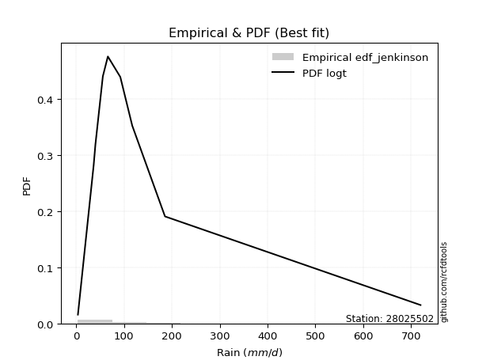</img>

</div>


### 11. Empirical - EDF Cunnane (1978)

Cunnane´s work in statistical hydrology has focused on the performance and evaluation of different probability distributions (such as GEV, Gumbel, Lognormal) for flood frequency estimation. _b_ is a constant, typically set to 0.4.

<div align="center">


$P=(m-b)/(n+1-2b)$


</div>


**11.1. Empirical values**

<div align="center">

|                | 0                   | 1                  | 2                   | 3                  | 4           | 5                  | 6                 | 7                  | 8                  |
|:---------------|:--------------------|:-------------------|:--------------------|:-------------------|:------------|:-------------------|:------------------|:-------------------|:-------------------|
| date           | 2021                | 2025               | 2018                | 2017               | 2024        | 2020               | 2023              | 2019               | 2022               |
| x              | 3.37                | 32.6               | 36.32               | 55.5               | 66.0        | 92.04              | 117.0             | 185.49             | 720.0              |
| m              | 1                   | 2                  | 3                   | 4                  | 5           | 6                  | 7                 | 8                  | 9                  |
| empirical_dist | edf_cunnane         | edf_cunnane        | edf_cunnane         | edf_cunnane        | edf_cunnane | edf_cunnane        | edf_cunnane       | edf_cunnane        | edf_cunnane        |
| empirical      | 0.06521739130434782 | 0.1739130434782609 | 0.28260869565217395 | 0.391304347826087  | 0.5         | 0.6086956521739131 | 0.717391304347826 | 0.8260869565217391 | 0.9347826086956522 |
| empirical_tr   | 1.069767441860465   | 1.2105263157894737 | 1.393939393939394   | 1.6428571428571428 | 2.0         | 2.555555555555556  | 3.538461538461538 | 5.75               | 15.333333333333343 |

</div>


**11.2. Kolmogorov-Smirnov fit test (sorted by Δ)**


<div align="center">

|                | 0                   | 1                    | 2                    | 3                   | 4                   | 5                     | 6                   | 7                   | 8                   | 9                   | 10                  | 11                  | 12                  | 13                  | 14                  | 15                  | 16                  | 17                  | 18                  | 19                  | 20                  | 21                  | 22                  | 23                  | 24                  | 25                  | 26                  | 27                  | 28                  | 29                  | 30                  | 31                  | 32                  | 33                  | 34                  | 35                  | 36                  | 37                  | 38                  | 39                  | 40                  | 41                  | 42                  | 43                  | 44                  | 45                  | 46                  | 47                  | 48                  | 49                  | 50                  | 51                  | 52                  | 53                  | 54                  | 55                  | 56                  | 57                  | 58                  | 59                  | 60                  | 61                  | 62                  | 63                  | 64                  | 65                  | 66                  | 67                  | 68                  | 69                  | 70                  | 71                  | 72                  | 73                  | 74                  | 75                  | 76                  | 77                  | 78                  | 79                  | 80                  | 81                  | 82                  | 83                  | 84                  | 85                  | 86                  | 87                  | 88                  | 89                  |
|:---------------|:--------------------|:---------------------|:---------------------|:--------------------|:--------------------|:----------------------|:--------------------|:--------------------|:--------------------|:--------------------|:--------------------|:--------------------|:--------------------|:--------------------|:--------------------|:--------------------|:--------------------|:--------------------|:--------------------|:--------------------|:--------------------|:--------------------|:--------------------|:--------------------|:--------------------|:--------------------|:--------------------|:--------------------|:--------------------|:--------------------|:--------------------|:--------------------|:--------------------|:--------------------|:--------------------|:--------------------|:--------------------|:--------------------|:--------------------|:--------------------|:--------------------|:--------------------|:--------------------|:--------------------|:--------------------|:--------------------|:--------------------|:--------------------|:--------------------|:--------------------|:--------------------|:--------------------|:--------------------|:--------------------|:--------------------|:--------------------|:--------------------|:--------------------|:--------------------|:--------------------|:--------------------|:--------------------|:--------------------|:--------------------|:--------------------|:--------------------|:--------------------|:--------------------|:--------------------|:--------------------|:--------------------|:--------------------|:--------------------|:--------------------|:--------------------|:--------------------|:--------------------|:--------------------|:--------------------|:--------------------|:--------------------|:--------------------|:--------------------|:--------------------|:--------------------|:--------------------|:--------------------|:--------------------|:--------------------|:--------------------|
| station        | 28025502            | 28025502             | 28025502             | 28025502            | 28025502            | 28025502              | 28025502            | 28025502            | 28025502            | 28025502            | 28025502            | 28025502            | 28025502            | 28025502            | 28025502            | 28025502            | 28025502            | 28025502            | 28025502            | 28025502            | 28025502            | 28025502            | 28025502            | 28025502            | 28025502            | 28025502            | 28025502            | 28025502            | 28025502            | 28025502            | 28025502            | 28025502            | 28025502            | 28025502            | 28025502            | 28025502            | 28025502            | 28025502            | 28025502            | 28025502            | 28025502            | 28025502            | 28025502            | 28025502            | 28025502            | 28025502            | 28025502            | 28025502            | 28025502            | 28025502            | 28025502            | 28025502            | 28025502            | 28025502            | 28025502            | 28025502            | 28025502            | 28025502            | 28025502            | 28025502            | 28025502            | 28025502            | 28025502            | 28025502            | 28025502            | 28025502            | 28025502            | 28025502            | 28025502            | 28025502            | 28025502            | 28025502            | 28025502            | 28025502            | 28025502            | 28025502            | 28025502            | 28025502            | 28025502            | 28025502            | 28025502            | 28025502            | 28025502            | 28025502            | 28025502            | 28025502            | 28025502            | 28025502            | 28025502            | 28025502            |
| empirical_dist | edf_cunnane         | edf_cunnane          | edf_cunnane          | edf_cunnane         | edf_cunnane         | edf_cunnane           | edf_cunnane         | edf_cunnane         | edf_cunnane         | edf_cunnane         | edf_cunnane         | edf_cunnane         | edf_cunnane         | edf_cunnane         | edf_cunnane         | edf_cunnane         | edf_cunnane         | edf_cunnane         | edf_cunnane         | edf_cunnane         | edf_cunnane         | edf_cunnane         | edf_cunnane         | edf_cunnane         | edf_cunnane         | edf_cunnane         | edf_cunnane         | edf_cunnane         | edf_cunnane         | edf_cunnane         | edf_cunnane         | edf_cunnane         | edf_cunnane         | edf_cunnane         | edf_cunnane         | edf_cunnane         | edf_cunnane         | edf_cunnane         | edf_cunnane         | edf_cunnane         | edf_cunnane         | edf_cunnane         | edf_cunnane         | edf_cunnane         | edf_cunnane         | edf_cunnane         | edf_cunnane         | edf_cunnane         | edf_cunnane         | edf_cunnane         | edf_cunnane         | edf_cunnane         | edf_cunnane         | edf_cunnane         | edf_cunnane         | edf_cunnane         | edf_cunnane         | edf_cunnane         | edf_cunnane         | edf_cunnane         | edf_cunnane         | edf_cunnane         | edf_cunnane         | edf_cunnane         | edf_cunnane         | edf_cunnane         | edf_cunnane         | edf_cunnane         | edf_cunnane         | edf_cunnane         | edf_cunnane         | edf_cunnane         | edf_cunnane         | edf_cunnane         | edf_cunnane         | edf_cunnane         | edf_cunnane         | edf_cunnane         | edf_cunnane         | edf_cunnane         | edf_cunnane         | edf_cunnane         | edf_cunnane         | edf_cunnane         | edf_cunnane         | edf_cunnane         | edf_cunnane         | edf_cunnane         | edf_cunnane         | edf_cunnane         |
| p_dist         | logt                | johnsonsu            | logjohnsonsu         | nct                 | loglaplace          | loglaplace_asymmetric | invgamma            | fisk                | loggenlogistic      | logmielke           | invgauss            | loggumbel_l         | logfisk             | loghypsecant        | gibrat              | fatiguelife         | logpearson3         | loglogistic         | logloggamma         | logweibull_min      | gamma               | t                   | logrice             | logexponnorm        | lognorm             | lognorm             | logcrystalball      | logfatiguelife      | lognct              | logf                | logncf              | loggompertz         | logerlang           | logbetaprime        | loggamma            | loggamma            | loginvgamma         | logalpha            | logchi2             | wald                | mielke              | logmaxwell          | loginvgauss         | exponnorm           | gompertz            | expon               | genexpon            | loggumbel_r         | lograyleigh         | lognakagami         | truncnorm           | laplace_asymmetric  | logmoyal            | genlogistic         | f                   | moyal               | loginvweibull       | pearson3            | loghalflogistic     | gumbel_r            | loghalfnorm         | ncf                 | halflogistic        | betaprime           | rayleigh            | logwald             | erlang              | nakagami            | maxwell             | halfnorm            | logkstwobign        | loggibrat           | chi2                | weibull_min         | loggenexpon         | kstwobign           | crystalball         | norm                | logistic            | hypsecant           | laplace             | rice                | gumbel_l            | logtruncnorm        | logexpon            | pareto              | loglognorm          | invweibull          | logpareto           | alpha               |
| delta          | 0.04356614322670274 | 0.049281860199505645 | 0.052361785975821334 | 0.07034994197351097 | 0.07120632810186495 | 0.07165032720355449   | 0.07562593639335558 | 0.08475736186481328 | 0.09012077235763469 | 0.09079949185512812 | 0.09572999779418004 | 0.09608277329305748 | 0.09662816971985153 | 0.09688773720795332 | 0.09777281106381752 | 0.0999916452725714  | 0.1122065321479255  | 0.11221135742309193 | 0.11308134442942083 | 0.11912259495940511 | 0.12410311711942199 | 0.13139336517289135 | 0.13317858516769712 | 0.133190482139507   | 0.13319301423475996 | 0.13319301423475996 | 0.13319305410343765 | 0.13345621590332166 | 0.13360906018876814 | 0.13372322472866424 | 0.13620483670052166 | 0.13741971517441268 | 0.14023578421540486 | 0.1420994512115152  | 0.1432057664496433  | 0.1432057664496433  | 0.14617155252312983 | 0.14743765802604678 | 0.14793181105103795 | 0.15620431449675756 | 0.1577491348163471  | 0.16176928757027972 | 0.16308455751387904 | 0.16550770223345113 | 0.1658537652600819  | 0.1666225369750869  | 0.16662278515335194 | 0.16850067596925658 | 0.17299831898209542 | 0.1739130404554167  | 0.1739427906154093  | 0.17676916308591983 | 0.17977215422103163 | 0.18165296333949998 | 0.18224433083064287 | 0.19524434181233757 | 0.19704160240040622 | 0.20129417145890227 | 0.20461780246145553 | 0.2046629458960999  | 0.20480480054424574 | 0.21336326115861695 | 0.2229382449658993  | 0.22398469715185806 | 0.22497469510013224 | 0.22602323825811083 | 0.22686375347384832 | 0.22735246478115712 | 0.2369191123376252  | 0.2375736414405601  | 0.23886298815733267 | 0.2397149755383427  | 0.24268526457453607 | 0.24308059297575757 | 0.2522792290600101  | 0.27098452081665575 | 0.2712758220523485  | 0.27127583002429356 | 0.2785182129524781  | 0.2846265913918269  | 0.30457286113827914 | 0.3085821412995821  | 0.34120414932416937 | 0.35447006269238035 | 0.3614037807018241  | 0.4525930966467736  | 0.4530282188751076  | 0.46723135558900775 | 0.4870059038395723  | 0.5833701868523432  |
| deltao         | 0.41761268023100007 | 0.41761268023100007  | 0.41761268023100007  | 0.41761268023100007 | 0.41761268023100007 | 0.41761268023100007   | 0.41761268023100007 | 0.41761268023100007 | 0.41761268023100007 | 0.41761268023100007 | 0.41761268023100007 | 0.41761268023100007 | 0.41761268023100007 | 0.41761268023100007 | 0.41761268023100007 | 0.41761268023100007 | 0.41761268023100007 | 0.41761268023100007 | 0.41761268023100007 | 0.41761268023100007 | 0.41761268023100007 | 0.41761268023100007 | 0.41761268023100007 | 0.41761268023100007 | 0.41761268023100007 | 0.41761268023100007 | 0.41761268023100007 | 0.41761268023100007 | 0.41761268023100007 | 0.41761268023100007 | 0.41761268023100007 | 0.41761268023100007 | 0.41761268023100007 | 0.41761268023100007 | 0.41761268023100007 | 0.41761268023100007 | 0.41761268023100007 | 0.41761268023100007 | 0.41761268023100007 | 0.41761268023100007 | 0.41761268023100007 | 0.41761268023100007 | 0.41761268023100007 | 0.41761268023100007 | 0.41761268023100007 | 0.41761268023100007 | 0.41761268023100007 | 0.41761268023100007 | 0.41761268023100007 | 0.41761268023100007 | 0.41761268023100007 | 0.41761268023100007 | 0.41761268023100007 | 0.41761268023100007 | 0.41761268023100007 | 0.41761268023100007 | 0.41761268023100007 | 0.41761268023100007 | 0.41761268023100007 | 0.41761268023100007 | 0.41761268023100007 | 0.41761268023100007 | 0.41761268023100007 | 0.41761268023100007 | 0.41761268023100007 | 0.41761268023100007 | 0.41761268023100007 | 0.41761268023100007 | 0.41761268023100007 | 0.41761268023100007 | 0.41761268023100007 | 0.41761268023100007 | 0.41761268023100007 | 0.41761268023100007 | 0.41761268023100007 | 0.41761268023100007 | 0.41761268023100007 | 0.41761268023100007 | 0.41761268023100007 | 0.41761268023100007 | 0.41761268023100007 | 0.41761268023100007 | 0.41761268023100007 | 0.41761268023100007 | 0.41761268023100007 | 0.41761268023100007 | 0.41761268023100007 | 0.41761268023100007 | 0.41761268023100007 | 0.41761268023100007 |
| eval           | Δo > Δ              | Δo > Δ               | Δo > Δ               | Δo > Δ              | Δo > Δ              | Δo > Δ                | Δo > Δ              | Δo > Δ              | Δo > Δ              | Δo > Δ              | Δo > Δ              | Δo > Δ              | Δo > Δ              | Δo > Δ              | Δo > Δ              | Δo > Δ              | Δo > Δ              | Δo > Δ              | Δo > Δ              | Δo > Δ              | Δo > Δ              | Δo > Δ              | Δo > Δ              | Δo > Δ              | Δo > Δ              | Δo > Δ              | Δo > Δ              | Δo > Δ              | Δo > Δ              | Δo > Δ              | Δo > Δ              | Δo > Δ              | Δo > Δ              | Δo > Δ              | Δo > Δ              | Δo > Δ              | Δo > Δ              | Δo > Δ              | Δo > Δ              | Δo > Δ              | Δo > Δ              | Δo > Δ              | Δo > Δ              | Δo > Δ              | Δo > Δ              | Δo > Δ              | Δo > Δ              | Δo > Δ              | Δo > Δ              | Δo > Δ              | Δo > Δ              | Δo > Δ              | Δo > Δ              | Δo > Δ              | Δo > Δ              | Δo > Δ              | Δo > Δ              | Δo > Δ              | Δo > Δ              | Δo > Δ              | Δo > Δ              | Δo > Δ              | Δo > Δ              | Δo > Δ              | Δo > Δ              | Δo > Δ              | Δo > Δ              | Δo > Δ              | Δo > Δ              | Δo > Δ              | Δo > Δ              | Δo > Δ              | Δo > Δ              | Δo > Δ              | Δo > Δ              | Δo > Δ              | Δo > Δ              | Δo > Δ              | Δo > Δ              | Δo > Δ              | Δo > Δ              | Δo > Δ              | Δo > Δ              | Δo > Δ              | Δo > Δ              | Δo <= Δ             | Δo <= Δ             | Δo <= Δ             | Δo <= Δ             | Δo <= Δ             |
| fit            | 1                   | 1                    | 1                    | 1                   | 1                   | 1                     | 1                   | 1                   | 1                   | 1                   | 1                   | 1                   | 1                   | 1                   | 1                   | 1                   | 1                   | 1                   | 1                   | 1                   | 1                   | 1                   | 1                   | 1                   | 1                   | 1                   | 1                   | 1                   | 1                   | 1                   | 1                   | 1                   | 1                   | 1                   | 1                   | 1                   | 1                   | 1                   | 1                   | 1                   | 1                   | 1                   | 1                   | 1                   | 1                   | 1                   | 1                   | 1                   | 1                   | 1                   | 1                   | 1                   | 1                   | 1                   | 1                   | 1                   | 1                   | 1                   | 1                   | 1                   | 1                   | 1                   | 1                   | 1                   | 1                   | 1                   | 1                   | 1                   | 1                   | 1                   | 1                   | 1                   | 1                   | 1                   | 1                   | 1                   | 1                   | 1                   | 1                   | 1                   | 1                   | 1                   | 1                   | 1                   | 1                   | 0                   | 0                   | 0                   | 0                   | 0                   |
| n              | 9                   | 9                    | 9                    | 9                   | 9                   | 9                     | 9                   | 9                   | 9                   | 9                   | 9                   | 9                   | 9                   | 9                   | 9                   | 9                   | 9                   | 9                   | 9                   | 9                   | 9                   | 9                   | 9                   | 9                   | 9                   | 9                   | 9                   | 9                   | 9                   | 9                   | 9                   | 9                   | 9                   | 9                   | 9                   | 9                   | 9                   | 9                   | 9                   | 9                   | 9                   | 9                   | 9                   | 9                   | 9                   | 9                   | 9                   | 9                   | 9                   | 9                   | 9                   | 9                   | 9                   | 9                   | 9                   | 9                   | 9                   | 9                   | 9                   | 9                   | 9                   | 9                   | 9                   | 9                   | 9                   | 9                   | 9                   | 9                   | 9                   | 9                   | 9                   | 9                   | 9                   | 9                   | 9                   | 9                   | 9                   | 9                   | 9                   | 9                   | 9                   | 9                   | 9                   | 9                   | 9                   | 9                   | 9                   | 9                   | 9                   | 9                   |
| best_fit       | 1                   | 0                    | 0                    | 0                   | 0                   | 0                     | 0                   | 0                   | 0                   | 0                   | 0                   | 0                   | 0                   | 0                   | 0                   | 0                   | 0                   | 0                   | 0                   | 0                   | 0                   | 0                   | 0                   | 0                   | 0                   | 0                   | 0                   | 0                   | 0                   | 0                   | 0                   | 0                   | 0                   | 0                   | 0                   | 0                   | 0                   | 0                   | 0                   | 0                   | 0                   | 0                   | 0                   | 0                   | 0                   | 0                   | 0                   | 0                   | 0                   | 0                   | 0                   | 0                   | 0                   | 0                   | 0                   | 0                   | 0                   | 0                   | 0                   | 0                   | 0                   | 0                   | 0                   | 0                   | 0                   | 0                   | 0                   | 0                   | 0                   | 0                   | 0                   | 0                   | 0                   | 0                   | 0                   | 0                   | 0                   | 0                   | 0                   | 0                   | 0                   | 0                   | 0                   | 0                   | 0                   | 0                   | 0                   | 0                   | 0                   | 0                   |
| best_fit_sort  | 1                   | 2                    | 3                    | 4                   | 5                   | 6                     | 7                   | 8                   | 9                   | 10                  | 11                  | 12                  | 13                  | 14                  | 15                  | 16                  | 17                  | 18                  | 19                  | 20                  | 21                  | 22                  | 23                  | 24                  | 25                  | 26                  | 27                  | 28                  | 29                  | 30                  | 31                  | 32                  | 33                  | 34                  | 35                  | 36                  | 37                  | 38                  | 39                  | 40                  | 41                  | 42                  | 43                  | 44                  | 45                  | 46                  | 47                  | 48                  | 49                  | 50                  | 51                  | 52                  | 53                  | 54                  | 55                  | 56                  | 57                  | 58                  | 59                  | 60                  | 61                  | 62                  | 63                  | 64                  | 65                  | 66                  | 67                  | 68                  | 69                  | 70                  | 71                  | 72                  | 73                  | 74                  | 75                  | 76                  | 77                  | 78                  | 79                  | 80                  | 81                  | 82                  | 83                  | 84                  | 85                  | 86                  | 87                  | 88                  | 89                  | 90                  |

</div>


<div align="center">

</img>

</div>


**11.3. Best fit**

<div align="center">

|   id |   station | empirical_dist   | p_dist   |     delta |   deltao | eval   |   fit |   n |   best_fit |   best_fit_sort |
|-----:|----------:|:-----------------|:---------|----------:|---------:|:-------|------:|----:|-----------:|----------------:|
|    0 |  28025502 | edf_cunnane      | logt     | 0.0435661 | 0.417613 | Δo > Δ |     1 |   9 |          1 |               1 |

</div>


<div align="center">

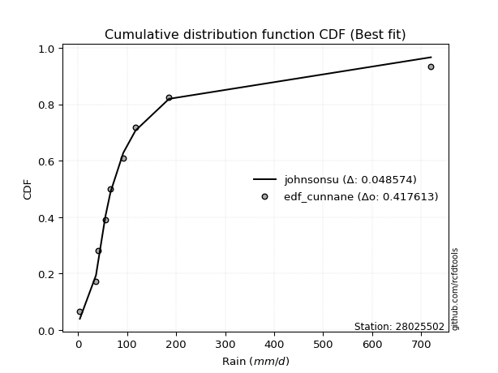</img>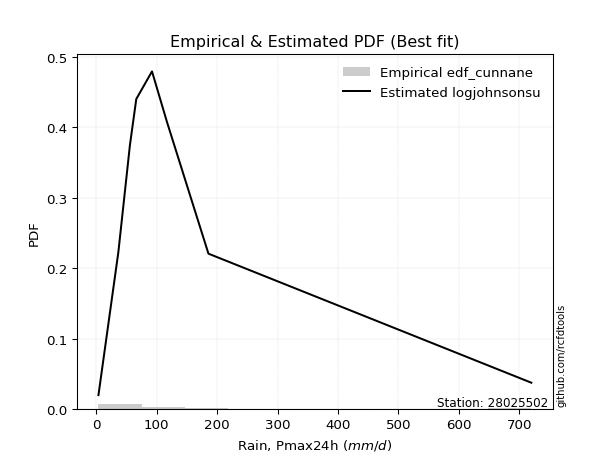</img>

</div>


### 12. Empirical - EDF Adamowski (1981)

The Adamowski formula in hydrology refers to a specific plotting position formula used for estimating the non-parametric empirical distribution of hydrological events (like flood peaks) to calculate their return periods. This formula provides an alternative to traditional parametric methods (like the Gumbel or Log Pearson Type III distributions). 

<div align="center">


$P=(m-0.25)/(n+0.5)$


</div>


**12.1. Empirical values**

<div align="center">

|                | 0                   | 1                   | 2                  | 3                   | 4             | 5                  | 6                  | 7                  | 8                  |
|:---------------|:--------------------|:--------------------|:-------------------|:--------------------|:--------------|:-------------------|:-------------------|:-------------------|:-------------------|
| date           | 2021                | 2025                | 2018               | 2017                | 2024          | 2020               | 2023               | 2019               | 2022               |
| x              | 3.37                | 32.6                | 36.32              | 55.5                | 66.0          | 92.04              | 117.0              | 185.49             | 720.0              |
| m              | 1                   | 2                   | 3                  | 4                   | 5             | 6                  | 7                  | 8                  | 9                  |
| empirical_dist | edf_adamowski       | edf_adamowski       | edf_adamowski      | edf_adamowski       | edf_adamowski | edf_adamowski      | edf_adamowski      | edf_adamowski      | edf_adamowski      |
| empirical      | 0.07894736842105263 | 0.18421052631578946 | 0.2894736842105263 | 0.39473684210526316 | 0.5           | 0.6052631578947368 | 0.7105263157894737 | 0.8157894736842105 | 0.9210526315789473 |
| empirical_tr   | 1.0857142857142856  | 1.2258064516129032  | 1.4074074074074074 | 1.6521739130434783  | 2.0           | 2.533333333333333  | 3.4545454545454546 | 5.428571428571428  | 12.666666666666663 |

</div>


**12.2. Kolmogorov-Smirnov fit test (sorted by Δ)**


<div align="center">

|                | 0                   | 1                    | 2                    | 3                    | 4                    | 5                     | 6                   | 7                   | 8                   | 9                   | 10                  | 11                  | 12                  | 13                  | 14                  | 15                  | 16                  | 17                  | 18                  | 19                  | 20                  | 21                  | 22                  | 23                  | 24                  | 25                  | 26                  | 27                  | 28                  | 29                  | 30                  | 31                  | 32                  | 33                  | 34                  | 35                  | 36                  | 37                  | 38                  | 39                  | 40                  | 41                  | 42                  | 43                  | 44                  | 45                  | 46                  | 47                  | 48                  | 49                  | 50                  | 51                  | 52                  | 53                  | 54                  | 55                  | 56                  | 57                  | 58                  | 59                  | 60                  | 61                  | 62                  | 63                  | 64                  | 65                  | 66                  | 67                  | 68                  | 69                  | 70                  | 71                  | 72                  | 73                  | 74                  | 75                  | 76                  | 77                  | 78                  | 79                  | 80                  | 81                  | 82                  | 83                  | 84                  | 85                  | 86                  | 87                  | 88                  | 89                  |
|:---------------|:--------------------|:---------------------|:---------------------|:---------------------|:---------------------|:----------------------|:--------------------|:--------------------|:--------------------|:--------------------|:--------------------|:--------------------|:--------------------|:--------------------|:--------------------|:--------------------|:--------------------|:--------------------|:--------------------|:--------------------|:--------------------|:--------------------|:--------------------|:--------------------|:--------------------|:--------------------|:--------------------|:--------------------|:--------------------|:--------------------|:--------------------|:--------------------|:--------------------|:--------------------|:--------------------|:--------------------|:--------------------|:--------------------|:--------------------|:--------------------|:--------------------|:--------------------|:--------------------|:--------------------|:--------------------|:--------------------|:--------------------|:--------------------|:--------------------|:--------------------|:--------------------|:--------------------|:--------------------|:--------------------|:--------------------|:--------------------|:--------------------|:--------------------|:--------------------|:--------------------|:--------------------|:--------------------|:--------------------|:--------------------|:--------------------|:--------------------|:--------------------|:--------------------|:--------------------|:--------------------|:--------------------|:--------------------|:--------------------|:--------------------|:--------------------|:--------------------|:--------------------|:--------------------|:--------------------|:--------------------|:--------------------|:--------------------|:--------------------|:--------------------|:--------------------|:--------------------|:--------------------|:--------------------|:--------------------|:--------------------|
| station        | 28025502            | 28025502             | 28025502             | 28025502             | 28025502             | 28025502              | 28025502            | 28025502            | 28025502            | 28025502            | 28025502            | 28025502            | 28025502            | 28025502            | 28025502            | 28025502            | 28025502            | 28025502            | 28025502            | 28025502            | 28025502            | 28025502            | 28025502            | 28025502            | 28025502            | 28025502            | 28025502            | 28025502            | 28025502            | 28025502            | 28025502            | 28025502            | 28025502            | 28025502            | 28025502            | 28025502            | 28025502            | 28025502            | 28025502            | 28025502            | 28025502            | 28025502            | 28025502            | 28025502            | 28025502            | 28025502            | 28025502            | 28025502            | 28025502            | 28025502            | 28025502            | 28025502            | 28025502            | 28025502            | 28025502            | 28025502            | 28025502            | 28025502            | 28025502            | 28025502            | 28025502            | 28025502            | 28025502            | 28025502            | 28025502            | 28025502            | 28025502            | 28025502            | 28025502            | 28025502            | 28025502            | 28025502            | 28025502            | 28025502            | 28025502            | 28025502            | 28025502            | 28025502            | 28025502            | 28025502            | 28025502            | 28025502            | 28025502            | 28025502            | 28025502            | 28025502            | 28025502            | 28025502            | 28025502            | 28025502            |
| empirical_dist | edf_adamowski       | edf_adamowski        | edf_adamowski        | edf_adamowski        | edf_adamowski        | edf_adamowski         | edf_adamowski       | edf_adamowski       | edf_adamowski       | edf_adamowski       | edf_adamowski       | edf_adamowski       | edf_adamowski       | edf_adamowski       | edf_adamowski       | edf_adamowski       | edf_adamowski       | edf_adamowski       | edf_adamowski       | edf_adamowski       | edf_adamowski       | edf_adamowski       | edf_adamowski       | edf_adamowski       | edf_adamowski       | edf_adamowski       | edf_adamowski       | edf_adamowski       | edf_adamowski       | edf_adamowski       | edf_adamowski       | edf_adamowski       | edf_adamowski       | edf_adamowski       | edf_adamowski       | edf_adamowski       | edf_adamowski       | edf_adamowski       | edf_adamowski       | edf_adamowski       | edf_adamowski       | edf_adamowski       | edf_adamowski       | edf_adamowski       | edf_adamowski       | edf_adamowski       | edf_adamowski       | edf_adamowski       | edf_adamowski       | edf_adamowski       | edf_adamowski       | edf_adamowski       | edf_adamowski       | edf_adamowski       | edf_adamowski       | edf_adamowski       | edf_adamowski       | edf_adamowski       | edf_adamowski       | edf_adamowski       | edf_adamowski       | edf_adamowski       | edf_adamowski       | edf_adamowski       | edf_adamowski       | edf_adamowski       | edf_adamowski       | edf_adamowski       | edf_adamowski       | edf_adamowski       | edf_adamowski       | edf_adamowski       | edf_adamowski       | edf_adamowski       | edf_adamowski       | edf_adamowski       | edf_adamowski       | edf_adamowski       | edf_adamowski       | edf_adamowski       | edf_adamowski       | edf_adamowski       | edf_adamowski       | edf_adamowski       | edf_adamowski       | edf_adamowski       | edf_adamowski       | edf_adamowski       | edf_adamowski       | edf_adamowski       |
| p_dist         | logjohnsonsu        | logt                 | johnsonsu            | nct                  | loglaplace           | loglaplace_asymmetric | invgamma            | fisk                | loggenlogistic      | logmielke           | invgauss            | logfisk             | loghypsecant        | loggumbel_l         | gibrat              | fatiguelife         | logpearson3         | loglogistic         | logloggamma         | logweibull_min      | gamma               | logrice             | logexponnorm        | lognorm             | lognorm             | logcrystalball      | logfatiguelife      | lognct              | logf                | logncf              | loggompertz         | logerlang           | logbetaprime        | loggamma            | loggamma            | t                   | loginvgamma         | logalpha            | logchi2             | wald                | mielke              | logmaxwell          | loginvgauss         | loggumbel_r         | exponnorm           | gompertz            | expon               | genexpon            | lograyleigh         | truncnorm           | logmoyal            | laplace_asymmetric  | f                   | genlogistic         | moyal               | lognakagami         | loginvweibull       | pearson3            | loghalflogistic     | loghalfnorm         | gumbel_r            | ncf                 | halflogistic        | betaprime           | erlang              | nakagami            | rayleigh            | logwald             | halfnorm            | logkstwobign        | maxwell             | chi2                | weibull_min         | loggibrat           | loggenexpon         | kstwobign           | crystalball         | norm                | logistic            | hypsecant           | laplace             | rice                | gumbel_l            | logtruncnorm        | logexpon            | pareto              | loglognorm          | invweibull          | logpareto           | alpha               |
| delta          | 0.04840282708894899 | 0.052055007704536686 | 0.056146848757858026 | 0.060052459135982394 | 0.060908845264336375 | 0.06135284436602592   | 0.065328453555827   | 0.07445987902728471 | 0.07982328952010612 | 0.08050200901759955 | 0.08543251495665147 | 0.08633068688232295 | 0.08659025437042475 | 0.0892177847347051  | 0.09090782250546514 | 0.09241112680483021 | 0.10190904931039693 | 0.10191387458556336 | 0.10278386159189226 | 0.10882511212187654 | 0.11380563428189341 | 0.12288110233016855 | 0.12289299930197842 | 0.12289553139723139 | 0.12289553139723139 | 0.12289557126590908 | 0.12315873306579309 | 0.12331157735123957 | 0.12342574189113567 | 0.1259073538629931  | 0.1271222323368841  | 0.1299383013778763  | 0.13180196837398664 | 0.13290828361211474 | 0.13290828361211474 | 0.1348258594520676  | 0.13587406968560126 | 0.1371401751885182  | 0.13763432821350938 | 0.145906831659229   | 0.14745165197881852 | 0.15147180473275115 | 0.15278707467635047 | 0.158203193131728   | 0.15864271367509875 | 0.1589887767017295  | 0.1597575484167345  | 0.15975779659499956 | 0.16270083614456685 | 0.1670778020570569  | 0.16947467138350306 | 0.16990417452756745 | 0.1719468479931143  | 0.1747879747811476  | 0.18151436469563278 | 0.18421052329294527 | 0.18674411956287765 | 0.19003345859388673 | 0.19432031962392696 | 0.19450731770671717 | 0.19779795733774752 | 0.20306577832108838 | 0.20920826784919452 | 0.2136872143143295  | 0.21656627063631975 | 0.2170549819436285  | 0.21810970654177986 | 0.22259074397893464 | 0.2238436643238553  | 0.2285655053198041  | 0.2300541237792728  | 0.2323877817370075  | 0.2362156044174052  | 0.2362824812591665  | 0.2419817462224815  | 0.26411953225830337 | 0.26441083349399613 | 0.2644108414659412  | 0.2716532243941257  | 0.2777616028334745  | 0.29770787257992676 | 0.30171715274122973 | 0.334339160765817   | 0.3441725798548517  | 0.3511062978642955  | 0.442295613809245   | 0.44273073603757895 | 0.4535013784723029  | 0.4767084210020437  | 0.5730727040148146  |
| deltao         | 0.41761268023100007 | 0.41761268023100007  | 0.41761268023100007  | 0.41761268023100007  | 0.41761268023100007  | 0.41761268023100007   | 0.41761268023100007 | 0.41761268023100007 | 0.41761268023100007 | 0.41761268023100007 | 0.41761268023100007 | 0.41761268023100007 | 0.41761268023100007 | 0.41761268023100007 | 0.41761268023100007 | 0.41761268023100007 | 0.41761268023100007 | 0.41761268023100007 | 0.41761268023100007 | 0.41761268023100007 | 0.41761268023100007 | 0.41761268023100007 | 0.41761268023100007 | 0.41761268023100007 | 0.41761268023100007 | 0.41761268023100007 | 0.41761268023100007 | 0.41761268023100007 | 0.41761268023100007 | 0.41761268023100007 | 0.41761268023100007 | 0.41761268023100007 | 0.41761268023100007 | 0.41761268023100007 | 0.41761268023100007 | 0.41761268023100007 | 0.41761268023100007 | 0.41761268023100007 | 0.41761268023100007 | 0.41761268023100007 | 0.41761268023100007 | 0.41761268023100007 | 0.41761268023100007 | 0.41761268023100007 | 0.41761268023100007 | 0.41761268023100007 | 0.41761268023100007 | 0.41761268023100007 | 0.41761268023100007 | 0.41761268023100007 | 0.41761268023100007 | 0.41761268023100007 | 0.41761268023100007 | 0.41761268023100007 | 0.41761268023100007 | 0.41761268023100007 | 0.41761268023100007 | 0.41761268023100007 | 0.41761268023100007 | 0.41761268023100007 | 0.41761268023100007 | 0.41761268023100007 | 0.41761268023100007 | 0.41761268023100007 | 0.41761268023100007 | 0.41761268023100007 | 0.41761268023100007 | 0.41761268023100007 | 0.41761268023100007 | 0.41761268023100007 | 0.41761268023100007 | 0.41761268023100007 | 0.41761268023100007 | 0.41761268023100007 | 0.41761268023100007 | 0.41761268023100007 | 0.41761268023100007 | 0.41761268023100007 | 0.41761268023100007 | 0.41761268023100007 | 0.41761268023100007 | 0.41761268023100007 | 0.41761268023100007 | 0.41761268023100007 | 0.41761268023100007 | 0.41761268023100007 | 0.41761268023100007 | 0.41761268023100007 | 0.41761268023100007 | 0.41761268023100007 |
| eval           | Δo > Δ              | Δo > Δ               | Δo > Δ               | Δo > Δ               | Δo > Δ               | Δo > Δ                | Δo > Δ              | Δo > Δ              | Δo > Δ              | Δo > Δ              | Δo > Δ              | Δo > Δ              | Δo > Δ              | Δo > Δ              | Δo > Δ              | Δo > Δ              | Δo > Δ              | Δo > Δ              | Δo > Δ              | Δo > Δ              | Δo > Δ              | Δo > Δ              | Δo > Δ              | Δo > Δ              | Δo > Δ              | Δo > Δ              | Δo > Δ              | Δo > Δ              | Δo > Δ              | Δo > Δ              | Δo > Δ              | Δo > Δ              | Δo > Δ              | Δo > Δ              | Δo > Δ              | Δo > Δ              | Δo > Δ              | Δo > Δ              | Δo > Δ              | Δo > Δ              | Δo > Δ              | Δo > Δ              | Δo > Δ              | Δo > Δ              | Δo > Δ              | Δo > Δ              | Δo > Δ              | Δo > Δ              | Δo > Δ              | Δo > Δ              | Δo > Δ              | Δo > Δ              | Δo > Δ              | Δo > Δ              | Δo > Δ              | Δo > Δ              | Δo > Δ              | Δo > Δ              | Δo > Δ              | Δo > Δ              | Δo > Δ              | Δo > Δ              | Δo > Δ              | Δo > Δ              | Δo > Δ              | Δo > Δ              | Δo > Δ              | Δo > Δ              | Δo > Δ              | Δo > Δ              | Δo > Δ              | Δo > Δ              | Δo > Δ              | Δo > Δ              | Δo > Δ              | Δo > Δ              | Δo > Δ              | Δo > Δ              | Δo > Δ              | Δo > Δ              | Δo > Δ              | Δo > Δ              | Δo > Δ              | Δo > Δ              | Δo > Δ              | Δo <= Δ             | Δo <= Δ             | Δo <= Δ             | Δo <= Δ             | Δo <= Δ             |
| fit            | 1                   | 1                    | 1                    | 1                    | 1                    | 1                     | 1                   | 1                   | 1                   | 1                   | 1                   | 1                   | 1                   | 1                   | 1                   | 1                   | 1                   | 1                   | 1                   | 1                   | 1                   | 1                   | 1                   | 1                   | 1                   | 1                   | 1                   | 1                   | 1                   | 1                   | 1                   | 1                   | 1                   | 1                   | 1                   | 1                   | 1                   | 1                   | 1                   | 1                   | 1                   | 1                   | 1                   | 1                   | 1                   | 1                   | 1                   | 1                   | 1                   | 1                   | 1                   | 1                   | 1                   | 1                   | 1                   | 1                   | 1                   | 1                   | 1                   | 1                   | 1                   | 1                   | 1                   | 1                   | 1                   | 1                   | 1                   | 1                   | 1                   | 1                   | 1                   | 1                   | 1                   | 1                   | 1                   | 1                   | 1                   | 1                   | 1                   | 1                   | 1                   | 1                   | 1                   | 1                   | 1                   | 0                   | 0                   | 0                   | 0                   | 0                   |
| n              | 9                   | 9                    | 9                    | 9                    | 9                    | 9                     | 9                   | 9                   | 9                   | 9                   | 9                   | 9                   | 9                   | 9                   | 9                   | 9                   | 9                   | 9                   | 9                   | 9                   | 9                   | 9                   | 9                   | 9                   | 9                   | 9                   | 9                   | 9                   | 9                   | 9                   | 9                   | 9                   | 9                   | 9                   | 9                   | 9                   | 9                   | 9                   | 9                   | 9                   | 9                   | 9                   | 9                   | 9                   | 9                   | 9                   | 9                   | 9                   | 9                   | 9                   | 9                   | 9                   | 9                   | 9                   | 9                   | 9                   | 9                   | 9                   | 9                   | 9                   | 9                   | 9                   | 9                   | 9                   | 9                   | 9                   | 9                   | 9                   | 9                   | 9                   | 9                   | 9                   | 9                   | 9                   | 9                   | 9                   | 9                   | 9                   | 9                   | 9                   | 9                   | 9                   | 9                   | 9                   | 9                   | 9                   | 9                   | 9                   | 9                   | 9                   |
| best_fit       | 1                   | 0                    | 0                    | 0                    | 0                    | 0                     | 0                   | 0                   | 0                   | 0                   | 0                   | 0                   | 0                   | 0                   | 0                   | 0                   | 0                   | 0                   | 0                   | 0                   | 0                   | 0                   | 0                   | 0                   | 0                   | 0                   | 0                   | 0                   | 0                   | 0                   | 0                   | 0                   | 0                   | 0                   | 0                   | 0                   | 0                   | 0                   | 0                   | 0                   | 0                   | 0                   | 0                   | 0                   | 0                   | 0                   | 0                   | 0                   | 0                   | 0                   | 0                   | 0                   | 0                   | 0                   | 0                   | 0                   | 0                   | 0                   | 0                   | 0                   | 0                   | 0                   | 0                   | 0                   | 0                   | 0                   | 0                   | 0                   | 0                   | 0                   | 0                   | 0                   | 0                   | 0                   | 0                   | 0                   | 0                   | 0                   | 0                   | 0                   | 0                   | 0                   | 0                   | 0                   | 0                   | 0                   | 0                   | 0                   | 0                   | 0                   |
| best_fit_sort  | 1                   | 2                    | 3                    | 4                    | 5                    | 6                     | 7                   | 8                   | 9                   | 10                  | 11                  | 12                  | 13                  | 14                  | 15                  | 16                  | 17                  | 18                  | 19                  | 20                  | 21                  | 22                  | 23                  | 24                  | 25                  | 26                  | 27                  | 28                  | 29                  | 30                  | 31                  | 32                  | 33                  | 34                  | 35                  | 36                  | 37                  | 38                  | 39                  | 40                  | 41                  | 42                  | 43                  | 44                  | 45                  | 46                  | 47                  | 48                  | 49                  | 50                  | 51                  | 52                  | 53                  | 54                  | 55                  | 56                  | 57                  | 58                  | 59                  | 60                  | 61                  | 62                  | 63                  | 64                  | 65                  | 66                  | 67                  | 68                  | 69                  | 70                  | 71                  | 72                  | 73                  | 74                  | 75                  | 76                  | 77                  | 78                  | 79                  | 80                  | 81                  | 82                  | 83                  | 84                  | 85                  | 86                  | 87                  | 88                  | 89                  | 90                  |

</div>


<div align="center">

</img>

</div>


**12.3. Best fit**

<div align="center">

|   id |   station | empirical_dist   | p_dist       |     delta |   deltao | eval   |   fit |   n |   best_fit |   best_fit_sort |
|-----:|----------:|:-----------------|:-------------|----------:|---------:|:-------|------:|----:|-----------:|----------------:|
|    0 |  28025502 | edf_adamowski    | logjohnsonsu | 0.0484028 | 0.417613 | Δo > Δ |     1 |   9 |          1 |               1 |

</div>


<div align="center">

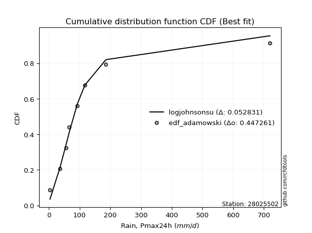</img>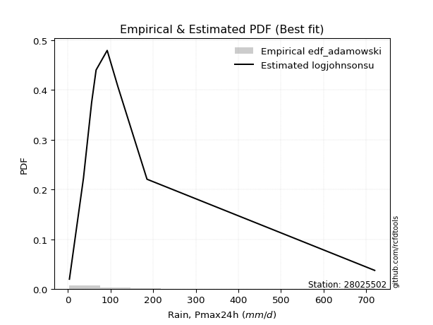</img>

</div>


## C. Best fit & Estimate extreme values for specific return periods - Tr


### 1. Best fit (ordered by delta Δ)

<div align="center">

|   id |   station | empirical_dist   | p_dist       |     delta |   deltao | eval   |   fit |   n |   best_fit |   best_fit_sort |
|-----:|----------:|:-----------------|:-------------|----------:|---------:|:-------|------:|----:|-----------:|----------------:|
|    0 |  28025502 | edf_blom         | logt         | 0.0418035 | 0.417613 | Δo > Δ |     1 |   9 |          1 |               1 |
|    1 |  28025502 | edf_cunnane      | logt         | 0.0435661 | 0.417613 | Δo > Δ |     1 |   9 |          1 |               2 |
|    2 |  28025502 | edf_hazen        | johnsonsu    | 0.0444509 | 0.417613 | Δo > Δ |     1 |   9 |          1 |               3 |
|    3 |  28025502 | edf_tukey        | logt         | 0.0445362 | 0.417613 | Δo > Δ |     1 |   9 |          1 |               4 |
|    4 |  28025502 | edf_chegodayev   | logjohnsonsu | 0.0454238 | 0.417613 | Δo > Δ |     1 |   9 |          1 |               5 |
|    5 |  28025502 | edf_filliben     | logt         | 0.0459854 | 0.417613 | Δo > Δ |     1 |   9 |          1 |               6 |
|    6 |  28025502 | edf_beard        | logjohnsonsu | 0.0461043 | 0.417613 | Δo > Δ |     1 |   9 |          1 |               7 |
|    7 |  28025502 | edf_jenkinson    | logjohnsonsu | 0.0461043 | 0.417613 | Δo > Δ |     1 |   9 |          1 |               8 |
|    8 |  28025502 | edf_gringorten   | logt         | 0.0464266 | 0.417613 | Δo > Δ |     1 |   9 |          1 |               9 |
|    9 |  28025502 | edf_adamowski    | logjohnsonsu | 0.0484028 | 0.417613 | Δo > Δ |     1 |   9 |          1 |              10 |
|   10 |  28025502 | edf_weibull      | logjohnsonsu | 0.0694555 | 0.417613 | Δo > Δ |     1 |   9 |          1 |              11 |
|   11 |  28025502 | edf_california   | t            | 0.0780517 | 0.417613 | Δo > Δ |     1 |   9 |          1 |              12 |

</div>

:file_folder:Tables: [bestfit_28025502.csv](table/bestfit_28025502.csv) | [extreme_28025502.csv](table/extreme_28025502.csv)


### 2. Extreme values

In hydrology, a return period (or recurrence interval $Tr$) is the statistical average time between extreme events like floods or droughts of a specific magnitude, indicating how rare an event is, with a 100-year flood, for example, having a 1% chance of occurring in any given year, not that it happens exactly every century. It is a key tool for infrastructure design (like bridges or dams) and risk assessment, calculated from historical data to determine the probability of future events, although it is important to remember it is statistical average, and events can cluster or be missed.

> risk_rate: assuming the return period as the project useful life.

|   id |      tr |   prob_l |     prob_g |     alpha |   betaprime |      chi2 |   crystalball |   erlang |   expon |   exponnorm |         f |   fatiguelife |      fisk |     gamma |   genexpon |   genlogistic |   gibrat |   gompertz |   gumbel_l |   gumbel_r |   halflogistic |   halfnorm |   hypsecant |   invgamma |   invgauss |       invweibull |   johnsonsu |   kstwobign |   laplace |   laplace_asymmetric |   loggamma |   logistic |   lognorm |   maxwell |    mielke |     moyal |   nakagami |        ncf |       nct |    norm |         pareto |   pearson3 |   rayleigh |    rice |          t |   truncnorm |      wald |   weibull_min |   logalpha |   logbetaprime |   logchi2 |   logcrystalball |   logerlang |         logexpon |   logexponnorm |      logf |   logfatiguelife |    logfisk |   loggenexpon |   loggenlogistic |        loggibrat |   loggompertz |   loggumbel_l |   loggumbel_r |   loghalflogistic |   loghalfnorm |   loghypsecant |   loginvgamma |   loginvgauss |    loginvweibull |   logjohnsonsu |   logkstwobign |   loglaplace |   loglaplace_asymmetric |   logloggamma |   loglogistic |   loglognorm |   logmaxwell |   logmielke |    logmoyal |   lognakagami |    logncf |    lognct |     logpareto |   logpearson3 |   lograyleigh |   logrice |             logt |   logtruncnorm |          logwald |   logweibull_min |   station |   n |   risk_rate |
|-----:|--------:|---------:|-----------:|----------:|------------:|----------:|--------------:|---------:|--------:|------------:|----------:|--------------:|----------:|----------:|-----------:|--------------:|---------:|-----------:|-----------:|-----------:|---------------:|-----------:|------------:|-----------:|-----------:|-----------------:|------------:|------------:|----------:|---------------------:|-----------:|-----------:|----------:|----------:|----------:|----------:|-----------:|-----------:|----------:|--------:|---------------:|-----------:|-----------:|--------:|-----------:|------------:|----------:|--------------:|-----------:|---------------:|----------:|-----------------:|------------:|-----------------:|---------------:|----------:|-----------------:|-----------:|--------------:|-----------------:|-----------------:|--------------:|--------------:|--------------:|------------------:|--------------:|---------------:|--------------:|--------------:|-----------------:|---------------:|---------------:|-------------:|------------------------:|--------------:|--------------:|-------------:|-------------:|------------:|------------:|--------------:|----------:|----------:|--------------:|--------------:|--------------:|----------:|-----------------:|---------------:|-----------------:|-----------------:|----------:|----:|------------:|
|    0 |    2    | 0.5      | 0.5        |   14.9229 |     50.3738 |   48.3787 |       145.369 |  49.48   | 101.796 |     101.467 |   62.6422 |       77.4372 |   69.5985 |   78.8631 |    101.796 |       106.975 |   82.516 |    101.586 |    179.769 |    110.969 |        93.8671 |    102.506 |     145.369 |    70.2568 |    72.3099 |   4456.63        |     68.4394 |     136.268 |   145.369 |              105.524 |    63.2713 |    145.369 |   65.1069 |   127.46  |   63.0475 |   99.8635 |    111.066 |    53.5463 |   69.6195 | 145.369 |    6.20403     |    75.9864 |    121.109 | 154.99  |    58.503  |     103.99  |   77.4925 |       128.149 |    61.8746 |        63.4986 |   62.593  |          65.1069 |     63.9111 |     26.2431      |        65.1076 |   65.1016 |          64.9039 |    69.2623 |       45.1057 |          70.3294 |     43.1246      |       70.1672 |       81.5709 |       51.966  |           46.4573 |       49.1618 |        65.1069 |       62.0795 |       58.9198 |     56.3539      |        69.7861 |        47.7947 |      65.1069 |                 65.5477 |       71.5269 |       65.1069 |      3.54786 |      57.897  |     70.1943 |     48.3182 |       52.793  |   64.9356 |   65.0239 |   3.73005     |       72.6797 |       55.5362 |   65.1056 |     70.5511      |        28.2043 |     41.7305      |          71.2921 |  28025502 |   9 |    0.75     |
|    1 |    2.33 | 0.570815 | 0.429185   |   17.7616 |     67.4584 |   66.0046 |       182.735 |  65.1093 | 123.482 |     123.12  |   84.1239 |       99.1801 |   85.3654 |  102.364  |    123.482 |       127.239 |  101.444 |    123.226 |    212.278 |    145.593 |       129.466  |    142.834 |     175.273 |    85.6447 |    90.8642 | 294879           |     81.736  |     163.248 |   167.981 |              126.208 |    81.4153 |    178.291 |   83.1722 |   166.281 |   79.9623 |  132.64   |    161.655 |    71.2154 |   84.3079 | 182.735 |   12.9944      |   106.45   |    160.504 | 185.774 |    66.5917 |     125.823 |  101.994  |       163.332 |    79.6542 |        81.5843 |   80.8488 |          83.1722 |     82.173  |     41.2491      |        83.173  |   83.2375 |          82.8688 |    86.0189 |       62.4577 |          85.9547 |     48.8203      |       91.1592 |      100.94   |       65.2026 |           58.664  |       64.0339 |        79.2027 |       79.8166 |       76.4229 |     77.9253      |        81.8303 |        66.6595 |      75.5068 |                 76.0014 |       90.6367 |       80.7848 |      5.10194 |      74.6702 |     85.7945 |     59.8959 |       60.6269 |   83.4544 |   83.0889 |   4.75799     |       92.2648 |       71.8957 |   83.1682 |     83.067       |        40.6864 |     48.9988      |          90.8619 |  28025502 |   9 |    0.729209 |
|    2 |    5    | 0.8      | 0.2        |   39.7736 |    192.328  |  173.558  |       321.598 | 154.944  | 231.908 |     231.38  |  227.28   |      230.755  |  187.289  |  233.205  |    231.909 |       215.273 |  210.419 |    231.42  |    317.301 |    296.015 |       290.544  |    313.376 |     295.226 |   182.857  |   209.553  |      2.4028e+13  |    174.753  |     277.854 |   281.038 |              229.62  |   211.234  |    305.409 |  206.636  |   319.078 |  173.12   |  284.461  |    451.945 |   197.178  |  177.756  | 321.598 | 4294.39        |   265.05   |    318.22  | 309.013 |   107.56   |     233.262 |  239.153  |       360.249 |   210.105  |       209.226  |  213.708  |         206.636  |    212.308  |    395.697       |       206.638  |  207.619  |         205.676  |   198.572  |      231.529  |         179.119  |     99.7184      |      220.005  |      200.898  |      174.741  |          168.584  |      195.798  |       173.838  |      208.714  |      210.996  |    318.552       |       157.571  |       273.898  |     158.403  |                159.229  |      208.166  |      185.835  |    inf       |     203.251  |    178.791  |    161.997  |      116.523  |  214.772  |  206.784  |   3.09272e+67 |      210.851  |      202.114  |  206.606  |    164.01        |       155.607  |    120.378       |         210.919  |  28025502 |   9 |    0.67232  |
|    3 |   10    | 0.9      | 0.1        |   80.2149 |    385.697  |  287.59   |       413.716 | 246.108  | 330.335 |     329.655 |  415.028  |      372.198  |  333.499  |  362.805  |    330.335 |       286.97  |  334.639 |    329.636 |    375.773 |    418.532 |       424.313  |    439.573 |     391.011 |   315.226  |   355.185  |      6.67076e+19 |    310.078  |     365.112 |   383.667 |              323.494 |   403.348  |    399.026 |  377.912  |   426.608 |  278.101  |  416.645  |    708.821 |   399.378  |  308.854  | 413.716 |    1.08883e+06 |   413.989  |    430.675 | 396.886 |   167.658  |     328.436 |  384.712  |       561.265 |   411.405  |       394.365  |  414.791  |         377.912  |    403.834  |   3081.4         |       377.916  |  380.953  |         376.224  |   367.697  |      591.672  |         299.605  |    225.081       |      365.43   |      294.712  |      390.03   |          405.074  |      447.705  |       325.663  |      404.725  |      432.528  |   1002.86        |       285.955  |       803.272  |     310.36   |                311.6    |      347.667  |      343.225  |    inf       |     411.228  |    299.352  |    385.237  |      195.392  |  406.633  |  378.847  | inf           |      346.74   |      422.344  |  377.831  |    305.809       |       314.301  |    312.471       |         351.362  |  28025502 |   9 |    0.651322 |
|    4 |   15    | 0.933333 | 0.0666667  |  120.512  |    552.128  |  358.514  |       459.685 | 301.88   | 387.91  |     387.142 |  556.423  |      460.936  |  456.54   |  441.351  |    387.91  |       327.421 |  420.319 |    387.089 |    402.254 |    487.655 |       500.014  |    505.245 |     445.675 |   421.344  |   455.95   |      2.88084e+23 |    418.515  |     411.435 |   443.701 |              378.407 |   559.418  |    450.033 |  510.771  |   481.78  |  353.868  |  493.359  |    847.989 |   581.366  |  417.074  | 459.685 |    2.77615e+07 |   502.353  |    488.617 | 442.161 |   224.8    |     383.131 |  478.183  |       686.376 |   580.496  |       542.572  |  580.696  |         510.771  |    558.829  |  10237.1         |       510.776  |  515.821  |         508.663  |   514.372  |      960.225  |         394.556  |    394.649       |      461.124  |      350.564  |      613.528  |          665.254  |      688.508  |       465.964  |      567.526  |      627.341  |   1915.31        |       420.688  |      1422.1    |     459.975  |                461.486  |      444.367  |      479.462  |    inf       |     590.354  |    394.729  |    636.897  |      256.775  |  561.069  |  512.579  | inf           |      437.956  |      617.419  |  510.644  |    462.877       |       407.318  |    576.543       |         447.358  |  28025502 |   9 |    0.644736 |
|    5 |   20    | 0.95     | 0.05       |  160.774  |    702.911  |  410.201  |       489.789 | 342.24   | 428.761 |     427.93  |  673.728  |      525.848  |  567.157  |  497.964  |    428.761 |       355.743 |  487.529 |    427.852 |    418.737 |    536.053 |       553.053  |    549.03  |     484.238 |   513.543  |   533.805  |      1.01133e+26 |    511.177  |     442.641 |   486.296 |              417.369 |   694.135  |    485.287 |  622.168  |   518.396 |  416.192  |  547.689  |    941.761 |   751.528  |  513.035  | 489.789 |    2.76285e+08 |   565.448  |    527.13  | 472.255 |   281.119  |     421.519 |  547.837  |       778.047 |   729.753  |       669.308  |  725.283  |         622.168  |    692.298  |  23995.7         |       622.173  |  629.114  |         619.795  |   648.695  |     1325.1    |         476.641  |    613.07        |      533.346  |      390.553  |      842.527  |          941.76   |      917.339  |       599.942  |      710.162  |      804.345  |   3012.93        |       565.842  |      2089.46   |     608.089  |                609.781  |      519.961  |      604.08   |    inf       |     750.461  |    477.453  |    909.289  |      308.308  |  693.604  |  624.845  | inf           |      507.691  |      794.683  |  621.999  |    642.438       |       466.406  |    910.061       |         521.707  |  28025502 |   9 |    0.641514 |
|    6 |   25    | 0.96     | 0.04       |  201.021  |    842.978  |  450.94   |       511.95  | 373.921  | 460.447 |     459.568 |  775.745  |      577.121  |  669.524  |  542.296  |    460.447 |       377.558 |  543.559 |    459.471 |    430.466 |    573.333 |       593.916  |    581.607 |     514.083 |   596.65   |   597.578  |      9.23635e+27 |    593.15   |     466.014 |   519.336 |              447.59  |   814.272  |    512.257 |  719.416  |   545.58  |  470.374  |  589.801  |   1011.83  |   913.442  |  600.888  | 511.95  |    1.64211e+09 |   614.579  |    555.744 | 494.614 |   337.048  |     451.061 |  603.629  |       850.681 |   865.125  |       781.55   |  855.122  |         719.416  |    811.114  |  46461.8         |       719.422  |  728.15   |         716.872  |   774.683  |     1683.51   |         550.503  |    885.091       |      591.71   |      421.759  |     1075.69   |         1230.95   |     1135.67   |       729.546  |      838.806  |      968.315  |   4271.07        |       722.509  |      2787.43   |     755.096  |                756.903  |      582.677  |      720.866  |    inf       |     896.804  |    552.102  |   1198.28   |      353.336  |  811.29   |  722.943  | inf           |      564.562  |      958.595  |  719.209  |    848.144       |       506.944  |   1311.76        |         582.968  |  28025502 |   9 |    0.639603 |
|    7 |   50    | 0.98     | 0.02       |  402.195  |   1450.06   |  580.402  |       575.409 | 474.02   | 558.873 |     557.843 | 1165.77   |      740.521  | 1111.4    |  681.894  |    558.873 |       444.761 |  741.067 |    557.686 |    462.306 |    688.172 |       719.823  |    676.297 |     606.614 |   937.302  |   812.73   |      1.01205e+34 |    913.165  |     534.651 |   621.965 |              541.464 |  1290.95   |    594.657 | 1090.43   |   624.417 |  679.455  |  720.532  |   1216.17  |  1648.9    |  972.013  | 575.409 |    4.16677e+11 |   768.049  |    638.805 | 559.518 |   614.256  |     541.576 |  785.789  |      1084.05  |  1420.05   |      1221.21   | 1376.92   |        1090.43   |   1281.03   | 361811           |      1090.43   | 1106.9    |        1087.67   |  1332.41   |     3374.48   |         853.303  |   3229.61        |      785.289  |      519.62   |     2283.18   |         2809.22   |     2112.32   |      1337.86   |     1360.47   |     1667.5    |  12513.7         |      1690.89   |      6497.7    |    1479.46   |               1481.21   |      800.902  |     1237.03   |    inf       |    1503.43   |    860.065  |   2822.55   |      525.395  | 1274.57   | 1097.82   | inf           |      756.08   |     1652.13   | 1090.06   |   2370.23        |       601.926  |   4328.02        |         793.491  |  28025502 |   9 |    0.63583  |
|    8 |   75    | 0.986667 | 0.0133333  |  603.341  |   1970.23   |  657.781  |       609.459 | 533.531  | 616.449 |     615.33  | 1456.05   |      838.422  | 1489.22   |  764.626  |    616.449 |       483.822 |  874.463 |    615.139 |    478.407 |    754.922 |       793.013  |    727.842 |     660.688 |  1211.96   |   949.234  |      3.27872e+37 |   1154.09   |     572.414 |   681.999 |              596.378 |  1656.87   |    642.248 | 1363.04   |   667.28  |  838      |  796.981  |   1327.47  |  2312.51   | 1281.57   | 609.459 |    1.06239e+13 |   858.312  |    683.993 | 594.828 |   889.591  |     593.678 |  897.882  |      1225.53  |  1862.23   |      1553.9    | 1783.15   |        1363.04   |   1640.49   |      1.20201e+06 |      1363.05   | 1385.95   |        1360.52   |  1822.47   |     4927.26   |        1098.18   |   7741.7         |      906.639  |      577.447  |     3536.07   |         4538.26   |     2961.21   |      1906.85   |     1771.05   |     2249.15   |  23374.2         |      2985.87   |     10351.1    |    2192.66   |               2193.7    |      945.498  |     1689.79   |    inf       |    1991.03   |   1111.15   |   4658.32   |      652.069  | 1627.1    | 1373.79   | inf           |      878.042  |     2221.57   | 1362.55   |   4999.52        |       638.408  |   9022.16        |         931.022  |  28025502 |   9 |    0.634587 |
|    9 |  100    | 0.99     | 0.01       |  804.48   |   2440.9    |  713.28   |       632.489 | 576.103  | 657.299 |     656.118 | 1695.91   |      908.717  | 1830.95   |  823.715  |    657.3   |       511.467 |  977.801 |    655.902 |    488.938 |    802.164 |       844.815  |    762.957 |     699.046 |  1451.03   |  1050.29   |      1.0007e+40  |   1353.22   |     598.288 |   724.594 |              635.339 |  1963.3    |    675.849 | 1585.1    |   696.475 |  971.055  |  851.218  |   1403.22  |  2933.43   | 1557.01   | 632.489 |    1.0573e+14  |   922.532  |    714.779 | 618.884 |  1163.92   |     630.281 |  979.609  |      1327.94  |  2241.67   |      1829.96   | 2126.34   |        1585.1    |   1940.83   |      2.81752e+06 |      1585.11   | 1613.63   |        1582.97   |  2273.51   |     6377.38   |        1311.99   |  15239.3         |      996.168  |      618.708  |     4819.27   |         6372.69   |     3727.46   |      2451.82   |     2120.54   |     2762.06   |  36373.8         |      4630.31   |     14241.1    |    2898.71   |               2898.63   |     1055.92   |     2106.04   |    inf       |    2410.86   |   1331.69   |   6646.59   |      755.39   | 1920.67   | 1598.86   | inf           |      968.789  |     2718.21   | 1584.5    |   9207.07        |       657.679  |  15413.7         |        1035.14   |  28025502 |   9 |    0.633968 |
|   10 |  200    | 0.995    | 0.005      | 1609.02   |   4057.68   |  848.694  |       684.729 | 679.662  | 755.725 |     754.393 | 2415.57   |     1080.43   | 3005.12   |  967.195  |    755.726 |       577.93  | 1258.94  |    754.118 |    511.829 |    915.74  |       969.353  |    843.268 |     791.453 |  2226.14   |  1306.42   |      9.40879e+45 |   1945.29   |     657.882 |   827.224 |              729.214 |  2892.91   |    756.45  | 2232.23   |   763.27  | 1380.8    |  981.894  |   1576.12  |  5177.24   | 2479.94   | 684.729 |    2.68284e+16 |  1077.77   |    785.22  | 673.927 |  2255.5    |     717.279 | 1183.18   |      1581.11  |  3435.98   |      2656.32   | 3180.9    |        2232.23   |   2849      |      2.19408e+07 |      2232.25   | 2278.73   |        2232.16   |  3864.29   |    11510.5    |        2009.3    |  96199.9         |     1223      |      718.849  |    10144.7    |        14413.6    |     6309.53   |      4492.57   |     3207.19   |     4442.31   | 105318           |     15204.4    |     29694.4    |    5679.45   |               5672.43   |     1349.56   |     3571.68   |    inf       |    3734.94   |   2058.12   |  15650.4    |     1057.12   | 2804.1    | 2255.88   | inf           |     1201.02   |     4312.93   | 2231.31   |  56550           |       687.961  |  58516.6         |        1308.66   |  28025502 |   9 |    0.633042 |
|   11 |  250    | 0.996    | 0.004      | 2011.28   |   4770.62   |  892.725  |       700.693 | 713.256  | 787.411 |     786.031 | 2698.03   |     1136.31   | 3523.22   | 1013.67   |    787.412 |       599.296 | 1359.82  |    785.737 |    518.564 |    952.253 |      1009.39   |    867.975 |     821.2   |  2551.6    |  1392.3    |      7.8314e+47  |   2174.38   |     676.325 |   860.263 |              759.435 |  3259.19   |    782.327 | 2478.43   |   783.832 | 1545.59   | 1023.96   |   1629.18  |  6209.62   | 2878.54   | 700.693 |    1.59455e+17 |  1127.88   |    806.904 | 690.87  |  2799.05   |     744.939 | 1250.53   |      1664.43  |  3922.09   |      2978.15   | 3601.01   |        2478.43   |   3205.83   |      4.24829e+07 |      2478.45   | 2532.28   |        2479.45   |  4581.73   |    13805.8    |        2303.72   | 186334           |     1299.23   |      751.289  |    12887.3    |        18738      |     7418.55   |      5459.59   |     3644.74   |     5149.88   | 148229           |     23268.5    |     37276.7    |    7052.48   |               7041.02   |     1452.6    |     4231.76   |    inf       |    4273.7    |   2367.72   |  20618.4    |     1172.13   | 3149.74   | 2506.22   | inf           |     1279.65   |     4971.51   | 2477.37   | 114861           |       694.225  |  90981.1         |        1403.63   |  28025502 |   9 |    0.632858 |
|   12 |  500    | 0.998    | 0.002      | 4022.61   |   7858.67   | 1030.63   |       748.035 | 818.271  | 885.837 |     884.306 | 3775.03   |     1311.43   | 5769.79   | 1158.79   |    885.838 |       665.614 | 1708.44  |    883.953 |    537.872 |   1065.58  |      1133.66   |    941.64  |     913.6   |  3887.01   |  1668.26   |      7.1462e+53  |   3027.67   |     731.595 |   962.893 |              853.309 |  4651.03   |    862.578 | 3380.02   |   845.187 | 2191.47   | 1154.63   |   1787.01  | 10900.4    | 4565.73   | 748.035 |    4.0461e+19  |  1283.87   |    871.601 | 741.424 |  5504.1    |     829.823 | 1464.67   |      1928.47  |  5836.51   |      4186.01   | 5216.16   |        3380.02   |   4557.71   |      3.30826e+08 |      3380.05   | 3462.82   |        3386.28   |  7769.65   |    23754.5    |        3519.88   |      1.83047e+06 |     1545.54   |      852.628  |    27084.1    |        42306.2    |    12022.2    |     10003.4    |     5347.47   |     8040.27   | 428195           |    100998      |     73690.4    |   13817.9    |              13778.8    |     1800.09   |     7160.29   |    inf       |    6388.99   |   3661.24   |  48548.1    |     1594.22   | 4453.41   | 3424.46   | inf           |     1535.12   |     7596.76   | 3378.47   |      1.69719e+06 |       706.966  | 370176           |        1720.55   |  28025502 |   9 |    0.632489 |
|   13 |  750    | 0.998667 | 0.00133333 | 6033.93   |  10503.7    | 1111.99   |       774.334 | 880.105  | 943.413 |     941.793 | 4575.06   |     1414.8    | 7696.77   | 1244.13   |    943.414 |       704.384 | 1938.99  |    941.405 |    548.191 |   1131.83  |      1206.31   |    982.794 |     967.65  |  4964.43   |  1835.47   |      2.17982e+57 |   3640.67   |     762.644 |  1022.93  |              908.222 |  5674.51   |    909.464 | 4015.8    |   879.503 | 2686.86   | 1231.07   |   1874.92  | 15133.6    | 5974.76   | 774.334 |    1.03162e+21 |  1375.33   |    907.779 | 769.694 |  8195.77   |     878.776 | 1593.07   |      2086.4   |  7303.19   |      5061.81   | 6419.49   |        4015.79   |   5548.47   |      1.09907e+09 |      4015.82   | 4120.59   |        4026.76   | 10578.1    |    32179.4    |        4508.67   |      8.29449e+06 |     1696.03   |      912.281  |    41809.9    |        68102.9    |    15744.1    |     14255.5    |     6634.22   |    10346.3    | 796105           |    266263      |    108064      |   20479.1    |              20406.7    |     2023.12   |     9735.89   |    inf       |    8000.24   |   4727.54   |  80117.8    |     1892.6    | 5404.01   | 4073.14   | inf           |     1691.92   |     9629.38   | 4013.87   |      1.2492e+07  |       711.278  | 858665           |        1921.55   |  28025502 |   9 |    0.632366 |
|   14 | 1000    | 0.999    | 0.001      | 8045.25   |  12896.8    | 1169.98   |       792.441 | 924.134  | 984.264 |     982.581 | 5235.64   |     1488.5    | 9441.86   | 1304.86   |    984.264 |       731.884 | 2115.42  |    982.169 |    555.136 |   1178.83  |      1257.84   |   1011.21  |    1006     |  5902.43   |  1956.42   |      6.45656e+59 |   4134.09   |     784.154 |  1065.52  |              947.184 |  6510.93   |    942.714 | 4521.76   |   903.221 | 3104.51   | 1285.31   |   1935.51  | 19094.6    | 7228.98   | 792.441 |    1.02668e+22 |  1440.3    |    932.779 | 789.229 | 10878.8    |     913.205 | 1685.42   |      2199.92  |  8534.17   |      5771.18   | 7411.08   |        4521.75   |   6356.44   |      2.57623e+09 |      4521.79   | 4644.85   |        4536.98   | 13165.6    |    39691.5    |        5373.89   |      2.63613e+07 |     1805.58   |      954.762  |    56889.8    |        95461.7    |    18967.5    |     18328.7    |     7704.58   |    12332.2    |      1.23599e+06 |    558803      |    140887      |   27073.5    |              26964.2    |     2190.46   |    12106.3    |    inf       |    9345.63   |   5669.56   | 114311      |     2130.45   | 6176.74   | 4589.97   | inf           |     1806.23   |    11343.7    | 4519.53   |      6.48519e+07 |       713.446  |      1.57282e+06 |        2071.29   |  28025502 |   9 |    0.632305 |

<div align="center">

</img>

</div>


<div align="center">

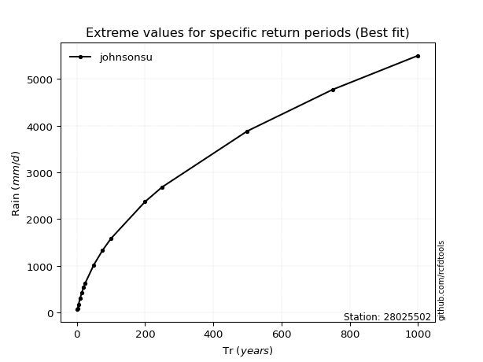</img>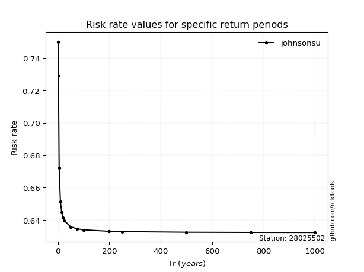</img>

</div>


<sub>**APP DISCLAIMER**: NO WARRANTY - This software is provided by [github.com/rcfdtools](https://github.com/rcfdtools) "as is", without any express or implied warranty, including warranties of merchantability, fitness for a particular purpose, or non-infringement. There is no guarantee that the software will be error-free or operate without interruption. LIMITATION OF LIABILITY - Neither the authors nor copyright holders will be liable for claims or damages arising from the software or its use. You are responsible for determining if the software is appropriate for your use and assume all associated risks, including errors, legal compliance, and data loss. NO PROFESSIONAL ADVICE - The software provides general information and does not offer professional advice. It should not replace consultation with professional advisors.</sub>