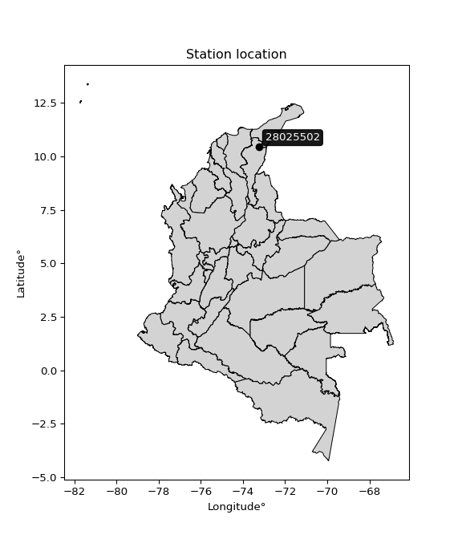

<div align="center">


</div>

# PMP Station (rain, Pmax24h): 28025502

Probable Maximum Precipitation (PMP) is the greatest amount of rainfall for a specific duration that is meteorologically possible for a given location, acting as a "worst-case" scenario for extreme storms, crucial for designing safety-critical infrastructure like bridges, river deviations, dams, spillways, and nuclear plants to prevent catastrophic failure. PMP is calculated by hydrologists using meteorological data to determine the upper limit of extreme rainfall, often leading to the Probable Maximum Flood (PMF) for flood control design, and is increasingly being studied for climate change impacts.

<div align="center">

</img>

</div>


## A. General information


### 1. General running parameters

• app_version: _v20251227_. • runtime: _2025-12-27 09:02:11.367833_. • Python version: _3.14.0_. • SciPy version: _1.16.3_. • Pandas version: _2.3.3_. • NumPy version: _2.3.5_. • Stations dataset (station_dataset_file): _dataset/pmax24h_in/automatic_colombia_2003_2024_filter.csv_. • Stations catalog (station_catalog_file): _dataset/CNE_IDEAM.xls_. • Minimum year to eval til year_max (date_min): _2003_. • Maximum year to eval since year_min (date_max): _2024_. • Creates, save and include plots into reports (create_plot): _False_. • Plot only fit distributions with Δo > Δ (plot_only_fit): _True_. • Eval low extreme values, if False, evaluates high extreme values (low_extreme): _False_. • Eval every SciPy distribution as logarithmic (pdist_logarithmic_on): _True_. • Standard deviation normalized (ddof): _1.0_. • Return periods to eval in years (Tr): _[2, 2.33, 5, 10, 15, 20, 25, 50, 75, 100, 200, 250, 500, 750, 1000]_. • Minimum data sample per station, 0 means any (minimum_sample): _5_. • Z-Score threshold to adjust a value, 0 means disable (zscore): _3.5_. • Avoid zeros, e.g. rain = 0 (avoid_zeros): _True_. • Avoid null values (avoid_nans): _True_. [:file_folder:Dataset file.](../../dataset/pmax24h_in/automatic_colombia_2003_2024_filter.csv)

> Delta Degrees of Freedom (DDOF): is a parameter used in the formulas for calculating variance and standard deviation. When ddof=0, the divisor is $N$ (the total number of observations) and this is used when your data set is the entire population. When ddof=1, the divisor is $N-1$ and this is used when your data set is a sample drawn from a larger population. Using $N-1$ provides an unbiased estimate of the population variance (known as Bessel´s correction).


### 2. Station info and location

|   id |   CODIGO | NOMBRE                                | CATEGORIA           | TECNOLOGIA                              | ESTADO   | FECHA_INSTALACION   |   FECHA_SUSPENSION |   ALTITUD |   LATITUD |   LONGITUD | DEPARTAMENTO   | MUNICIPIO   | AREA_OPERATIVA                                         | ENTIDAD                                                     | AREA_HIDROGRAFICA   | ZONA_HIDROGRAFICA   | SUBZONA_HIDROGRAFICA   |   CORRIENTE | Catalogo   |
|-----:|---------:|:--------------------------------------|:--------------------|:----------------------------------------|:---------|:--------------------|-------------------:|----------:|----------:|-----------:|:---------------|:------------|:-------------------------------------------------------|:------------------------------------------------------------|:--------------------|:--------------------|:-----------------------|------------:|:-----------|
|    0 | 28025502 | AEROPUERTO ALFONSO LOPEZ - [28025502] | Sinóptica Principal | Automática con Telemetría, Convencional | Activa   | 01/07/2016          |                nan |       138 |   10.4362 |   -73.2477 | Cesar          | Valledupar  | Area Operativa 05 - Magdalena-Cesar-Guajira-San Andrés | INSTITUTO DE HIDROLOGIA METEOROLOGIA Y ESTUDIOS AMBIENTALES | Magdalena Cauca     | Cesar               | Medio Cesar            |         nan | CNE_IDEAM  |

<div align="center">

Map location in: [:earth_americas:Google](http://maps.google.com/maps?q=10.43616667,-73.24766667) [:earth_americas:OSM](https://www.openstreetmap.org/#map=18/10.43616667/-73.24766667&layers=P) [:earth_americas:Bing](https://www.bing.com/maps?cp=10.43616667~-73.24766667&lvl=18) [:earth_americas:Apple](https://maps.apple.com/frame?center=10.43616667%2C-73.24766667&span=0.003%2C0.006)

</div>


<div align="center">

```geojson
{
  "type": "Feature",
  "geometry": {
    "type": "Point", 
    "coordinates": [-73.24766667, 10.43616667]
  }, 
  "properties": {
    "Name": "28025502"
  }
}
```

</div>


### 3. Discrete values table and plot

|               |          0 |           1 |            2 |           3 |          4 |           5 |           6 |
|:--------------|-----------:|------------:|-------------:|------------:|-----------:|------------:|------------:|
| Date          | 2017       | 2018        | 2019         | 2020        | 2022       | 2023        | 2024        |
| Value         |   55.5     |   36.32     |  185.49      |   92.04     |  720       |  117        |   66        |
| Value_initial |   55.5     |   36.32     |  185.49      |   92.04     |  720       |  117        |   66        |
| count         |    7       |    7        |    7         |    7        |    7       |    7        |    7        |
| mean          |  181.764   |  181.764    |  181.764     |  181.764    |  181.764   |  181.764    |  181.764    |
| std           |  242.368   |  242.368    |  242.368     |  242.368    |  242.368   |  242.368    |  242.368    |
| zscore        |   -0.52096 |   -0.600096 |    0.0153721 |   -0.370198 |    2.22073 |   -0.267214 |   -0.477638 |

> The initial value (value_initial) correspond to the initial obtained or null completed value, and value (value) is adjusted only when the initial value is outside the valid range definite through the Z-Score value. If Z-Score is active, values out of range or outliers are replaced with the station mean value


### 4. Active continuous probability distributions from SciPy (45 of 104 available)

[scipy.stats](https://docs.scipy.org/doc/scipy/reference/stats.html) is a Python´s powerful submodule within the SciPy library for comprehensive statistical analysis, offering over 130 probability distributions (like Normal, Poisson), functions for descriptive stats (mean, variance), hypothesis testing (t-tests, chi-square), random variable generation, and statistical tests, making it essential for data science, modeling, and research. It provides tools to explore, model, and draw conclusions from data efficiently, working seamlessly with NumPy.

<div align="center">

|   id | p_dist             |   n_parameter | fit_method   | label                                                                       | active   | ref                                                                                                        |
|-----:|:-------------------|--------------:|:-------------|:----------------------------------------------------------------------------|:---------|:-----------------------------------------------------------------------------------------------------------|
|    0 | alpha              |             3 | MLE          | Alpha                                                                       | True     | [:mortar_board:](https://docs.scipy.org/doc/scipy/reference/generated/scipy.stats.alpha.html)              |
|    1 | betaprime          |             4 | MLE          | Beta prime                                                                  | True     | [:mortar_board:](https://docs.scipy.org/doc/scipy/reference/generated/scipy.stats.betaprime.html)          |
|    2 | chi2               |             3 | MLE          | Chi²                                                                        | True     | [:mortar_board:](https://docs.scipy.org/doc/scipy/reference/generated/scipy.stats.chi2.html)               |
|    3 | crystalball        |             4 | MLE          | Crystalball                                                                 | True     | [:mortar_board:](https://docs.scipy.org/doc/scipy/reference/generated/scipy.stats.crystalball.html)        |
|    4 | erlang             |             3 | MLE          | Erlang                                                                      | True     | [:mortar_board:](https://docs.scipy.org/doc/scipy/reference/generated/scipy.stats.erlang.html)             |
|    5 | expon              |             2 | MLE          | Exponential                                                                 | True     | [:mortar_board:](https://docs.scipy.org/doc/scipy/reference/generated/scipy.stats.expon.html)              |
|    6 | exponnorm          |             3 | MLE          | Exponentially modified Normal                                               | True     | [:mortar_board:](https://docs.scipy.org/doc/scipy/reference/generated/scipy.stats.exponnorm.html)          |
|    7 | f                  |             4 | MLE          | F                                                                           | True     | [:mortar_board:](https://docs.scipy.org/doc/scipy/reference/generated/scipy.stats.f.html)                  |
|    8 | fatiguelife        |             3 | MLE          | Fatigue-life (Birnbaum-Saunders)                                            | True     | [:mortar_board:](https://docs.scipy.org/doc/scipy/reference/generated/scipy.stats.fatiguelife.html)        |
|    9 | fisk               |             3 | MLE          | Fisk                                                                        | True     | [:mortar_board:](https://docs.scipy.org/doc/scipy/reference/generated/scipy.stats.fisk.html)               |
|   10 | gamma              |             3 | MLE          | Gamma                                                                       | True     | [:mortar_board:](https://docs.scipy.org/doc/scipy/reference/generated/scipy.stats.gamma.html)              |
|   11 | genexpon           |             5 | MLE          | Generalized exponential                                                     | True     | [:mortar_board:](https://docs.scipy.org/doc/scipy/reference/generated/scipy.stats.genexpon.html)           |
|   12 | genlogistic        |             3 | MLE          | Generalized logistic                                                        | True     | [:mortar_board:](https://docs.scipy.org/doc/scipy/reference/generated/scipy.stats.genlogistic.html)        |
|   13 | gibrat             |             2 | MM           | Gibrat                                                                      | True     | [:mortar_board:](https://docs.scipy.org/doc/scipy/reference/generated/scipy.stats.gibrat.html)             |
|   14 | gompertz           |             3 | MLE          | Gompertz (or truncated Gumbel)                                              | True     | [:mortar_board:](https://docs.scipy.org/doc/scipy/reference/generated/scipy.stats.gompertz.html)           |
|   15 | gumbel_l           |             2 | MM           | Gumbel Left Skew                                                            | True     | [:mortar_board:](https://docs.scipy.org/doc/scipy/reference/generated/scipy.stats.gumbel_l.html)           |
|   16 | gumbel_r           |             2 | MM           | Gumbel Right Skew                                                           | True     | [:mortar_board:](https://docs.scipy.org/doc/scipy/reference/generated/scipy.stats.gumbel_r.html)           |
|   17 | halflogistic       |             2 | MM           | Half-logistic                                                               | True     | [:mortar_board:](https://docs.scipy.org/doc/scipy/reference/generated/scipy.stats.halflogistic.html)       |
|   18 | halfnorm           |             2 | MM           | Half Normal                                                                 | True     | [:mortar_board:](https://docs.scipy.org/doc/scipy/reference/generated/scipy.stats.halfnorm.html)           |
|   19 | hypsecant          |             2 | MM           | hyperbolic secant                                                           | True     | [:mortar_board:](https://docs.scipy.org/doc/scipy/reference/generated/scipy.stats.hypsecant.html)          |
|   20 | invgamma           |             3 | MLE          | Inverted gamma                                                              | True     | [:mortar_board:](https://docs.scipy.org/doc/scipy/reference/generated/scipy.stats.invgamma.html)           |
|   21 | invgauss           |             3 | MLE          | Inverse Gaussian                                                            | True     | [:mortar_board:](https://docs.scipy.org/doc/scipy/reference/generated/scipy.stats.invgauss.html)           |
|   22 | invweibull         |             3 | MLE          | Inverted Weibull                                                            | True     | [:mortar_board:](https://docs.scipy.org/doc/scipy/reference/generated/scipy.stats.invweibull.html)         |
|   23 | johnsonsu          |             4 | MLE          | Johnson Su                                                                  | True     | [:mortar_board:](https://docs.scipy.org/doc/scipy/reference/generated/scipy.stats.johnsonsu.html)          |
|   24 | kstwobign          |             2 | MLE          | Limiting distribution of scaled Kolmogorov-Smirnov two-sided test statistic | True     | [:mortar_board:](https://docs.scipy.org/doc/scipy/reference/generated/scipy.stats.kstwobign.html)          |
|   25 | laplace            |             2 | MM           | Laplace                                                                     | True     | [:mortar_board:](https://docs.scipy.org/doc/scipy/reference/generated/scipy.stats.laplace.html)            |
|   26 | laplace_asymmetric |             3 | MLE          | Asymmetric Laplace                                                          | True     | [:mortar_board:](https://docs.scipy.org/doc/scipy/reference/generated/scipy.stats.laplace_asymmetric.html) |
|   27 | loggamma           |             3 | MLE          | Log gamma                                                                   | True     | [:mortar_board:](https://docs.scipy.org/doc/scipy/reference/generated/scipy.stats.loggamma.html)           |
|   28 | logistic           |             2 | MM           | Logistic (or Sech-squared)                                                  | True     | [:mortar_board:](https://docs.scipy.org/doc/scipy/reference/generated/scipy.stats.logistic.html)           |
|   29 | lognorm            |             3 | MLE          | Log Normal                                                                  | True     | [:mortar_board:](https://docs.scipy.org/doc/scipy/reference/generated/scipy.stats.lognorm.html)            |
|   30 | maxwell            |             2 | MM           | Maxwell                                                                     | True     | [:mortar_board:](https://docs.scipy.org/doc/scipy/reference/generated/scipy.stats.maxwell.html)            |
|   31 | mielke             |             4 | MLE          | Mielke Beta-Kappa / Dagum                                                   | True     | [:mortar_board:](https://docs.scipy.org/doc/scipy/reference/generated/scipy.stats.mielke.html)             |
|   32 | moyal              |             2 | MM           | Moyal                                                                       | True     | [:mortar_board:](https://docs.scipy.org/doc/scipy/reference/generated/scipy.stats.moyal.html)              |
|   33 | nakagami           |             3 | MLE          | Nakagami                                                                    | True     | [:mortar_board:](https://docs.scipy.org/doc/scipy/reference/generated/scipy.stats.nakagami.html)           |
|   34 | ncf                |             5 | MLE          | Non-central F distribution                                                  | True     | [:mortar_board:](https://docs.scipy.org/doc/scipy/reference/generated/scipy.stats.ncf.html)                |
|   35 | nct                |             4 | MLE          | Non-central Student’s t                                                     | True     | [:mortar_board:](https://docs.scipy.org/doc/scipy/reference/generated/scipy.stats.nct.html)                |
|   36 | norm               |             2 | MM           | Normal                                                                      | True     | [:mortar_board:](https://docs.scipy.org/doc/scipy/reference/generated/scipy.stats.norm.html)               |
|   37 | pareto             |             3 | MLE          | Pareto                                                                      | True     | [:mortar_board:](https://docs.scipy.org/doc/scipy/reference/generated/scipy.stats.pareto.html)             |
|   38 | pearson3           |             3 | MM           | Pearson type III                                                            | True     | [:mortar_board:](https://docs.scipy.org/doc/scipy/reference/generated/scipy.stats.pearson3.html)           |
|   39 | rayleigh           |             2 | MM           | Rayleigh                                                                    | True     | [:mortar_board:](https://docs.scipy.org/doc/scipy/reference/generated/scipy.stats.rayleigh.html)           |
|   40 | rice               |             3 | MLE          | Rice                                                                        | True     | [:mortar_board:](https://docs.scipy.org/doc/scipy/reference/generated/scipy.stats.rice.html)               |
|   41 | t                  |             3 | MLE          | Student’s t                                                                 | True     | [:mortar_board:](https://docs.scipy.org/doc/scipy/reference/generated/scipy.stats.t.html)                  |
|   42 | truncnorm          |             4 | MLE          | Truncated normal                                                            | True     | [:mortar_board:](https://docs.scipy.org/doc/scipy/reference/generated/scipy.stats.truncnorm.html)          |
|   43 | wald               |             2 | MM           | Wald                                                                        | True     | [:mortar_board:](https://docs.scipy.org/doc/scipy/reference/generated/scipy.stats.wald.html)               |
|   44 | weibull_min        |             3 | MLE          | Weibull minimum                                                             | True     | [:mortar_board:](https://docs.scipy.org/doc/scipy/reference/generated/scipy.stats.weibull_min.html)        |

</div>

> **n_parameter:** # arguments & localization & scale.
>
> **Fit methods:** (MLE) maximum likelihood, (MM) L-moments.
>
>**Inactive:** foldnorm, gennorm, norminvgauss, powernorm, powerlognorm, skewnorm, genextreme, anglit, arcsine, argus, beta, bradford, burr, burr12, cauchy, cosine, halfcauchy, foldcauchy, skewcauchy, wrapcauchy, dgamma, gengamma, exponweib, exponpow, truncexpon, gausshyper, genhalflogistic, genhyperbolic, geninvgauss, halfgennorm, johnsonsb, kappa4, kappa3, ksone, kstwo, loglaplace, levy, levy_l, levy_stable, ncx2, genpareto, truncpareto, lomax, powerlaw, rdist, rel_breitwigner, recipinvgauss, semicircular, studentized_range, trapezoid, triang, truncweibull_min, tukeylambda, uniform, loguniform, vonmises, vonmises_line, weibull_max, dweibull, 


## B. Probability distributions vs. Empirical distributions

A continuous probability distribution (CPD) describes probabilities for variables that can take any value within a range (like rain any time), unlike discrete variables with specific outcomes (like temperature). It uses a Probability Density Function (PDF), a curve where the total area under it equals 1, and the probability of the variable falling within an interval (a to b) is found by calculating the area under the curve between those points. A key feature is that the probability of hitting any single exact value is zero, so probabilities are always expressed for ranges, e.g., $P(a ≤ X ≤ b)$.

<div align="center">

Distributions parameters from station values
|    |   station | p_dist                |   n |             loc |           scale | shape                  | shape1                 | shape2                | shape3   |
|---:|----------:|:----------------------|----:|----------------:|----------------:|:-----------------------|:-----------------------|:----------------------|:---------|
|  0 |  28025502 | alpha                 |   7 |      11.9072    |    49.7559      | 3.4836665342856036e-06 |                        |                       |          |
|  1 |  28025502 | betaprime             |   7 |      22.0683    |     0.72043     | 70.59036738184753      | 1.100754810920423      |                       |          |
|  2 |  28025502 | chi2                  |   7 |      36.32      |  2459.2         | 0.22662070846642646    |                        |                       |          |
|  3 |  28025502 | crystalball           |   7 |      51.3888    |   253.163       | 77.2240336348915       | 141.98949216194777     |                       |          |
|  4 |  28025502 | erlang                |   7 |      36.32      |   237.368       | 0.5046630672206764     |                        |                       |          |
|  5 |  28025502 | expon                 |   7 |      36.32      |   145.444       |                        |                        |                       |          |
|  6 |  28025502 | exponnorm             |   7 |      36.1761    |     0.0460526   | 3143.462813361104      |                        |                       |          |
|  7 |  28025502 | f                     |   7 |      36.2712    |    42.9215      | 1.2746186278791032     | 3.138443767332304      |                       |          |
|  8 |  28025502 | fatiguelife           |   7 |      32.2818    |    53.4633      | 1.8766158461566071     |                        |                       |          |
|  9 |  28025502 | fisk                  |   7 |      36.32      |    48.6509      | 0.5702842602709421     |                        |                       |          |
| 10 |  28025502 | gamma                 |   7 |      36.32      |   196.607       | 0.5205635579789731     |                        |                       |          |
| 11 |  28025502 | genexpon              |   7 |      36.32      |   267.984       | 1.842509939363339      | 3.4096355359937213e-12 | 1.810482032296516     |          |
| 12 |  28025502 | genlogistic           |   7 |    -756.121     |   107.723       | 2798.631027008767      |                        |                       |          |
| 13 |  28025502 | gibrat                |   7 |      10.5834    |   103.826       |                        |                        |                       |          |
| 14 |  28025502 | gompertz              |   7 |      36.3198    |     1.7754e+06  | 13288.659599977222     |                        |                       |          |
| 15 |  28025502 | gumbel_l              |   7 |     282.751     |   174.956       |                        |                        |                       |          |
| 16 |  28025502 | gumbel_r              |   7 |      80.7771    |   174.956       |                        |                        |                       |          |
| 17 |  28025502 | halflogistic          |   7 |     -84.1894    |   191.845       |                        |                        |                       |          |
| 18 |  28025502 | halfnorm              |   7 |    -115.239     |   372.239       |                        |                        |                       |          |
| 19 |  28025502 | hypsecant             |   7 |     181.764     |   142.851       |                        |                        |                       |          |
| 20 |  28025502 | invgamma              |   7 |      21.5471    |    50.4003      | 1.093205590655943      |                        |                       |          |
| 21 |  28025502 | invgauss              |   7 |      27.195     |    43.8273      | 3.526784109330781      |                        |                       |          |
| 22 |  28025502 | invweibull            |   7 |      21.8581    |    44.8102      | 1.0377486852761237     |                        |                       |          |
| 23 |  28025502 | johnsonsu             |   7 |      36.32      |     1.11833e-08 | -2.622005941637699     | 0.1429287320357948     |                       |          |
| 24 |  28025502 | kstwobign             |   7 |    -351.217     |   628.371       |                        |                        |                       |          |
| 25 |  28025502 | laplace               |   7 |     181.764     |   158.667       |                        |                        |                       |          |
| 26 |  28025502 | laplace_asymmetric    |   7 |      36.32      |     0.0176455   | 0.00012132064116900906 |                        |                       |          |
| 27 |  28025502 | loggamma              |   7 |  -88910.1       | 11389           | 2497.312752033588      |                        |                       |          |
| 28 |  28025502 | logistic              |   7 |     181.764     |   123.712       |                        |                        |                       |          |
| 29 |  28025502 | lognorm               |   7 |      36.32      |     0.407141    | 12.977935054870617     |                        |                       |          |
| 30 |  28025502 | maxwell               |   7 |    -349.945     |   333.199       |                        |                        |                       |          |
| 31 |  28025502 | mielke                |   7 |       5.44469   |     2.44331     | 144.29354624310588     | 1.4254030803158537     |                       |          |
| 32 |  28025502 | moyal                 |   7 |      53.444     |   101.011       |                        |                        |                       |          |
| 33 |  28025502 | nakagami              |   7 |      36.32      |   374.137       | 0.20398835405691063    |                        |                       |          |
| 34 |  28025502 | ncf                   |   7 |      -0.481407  |    82.7718      | 90.15832743901046      | 3.6173810941116677     | 0.0008493109896853673 |          |
| 35 |  28025502 | nct                   |   7 |      -0.219523  |     1.66676     | 1.2691210869621172     | 40.736624721606844     |                       |          |
| 36 |  28025502 | norm                  |   7 |     181.764     |   224.389       |                        |                        |                       |          |
| 37 |  28025502 | pareto                |   7 |      36.241     |     0.079039    | 0.16857540421725373    |                        |                       |          |
| 38 |  28025502 | pearson3              |   7 |     181.764     |   224.39        | 1.8750273720557216     |                        |                       |          |
| 39 |  28025502 | rayleigh              |   7 |    -247.506     |   342.508       |                        |                        |                       |          |
| 40 |  28025502 | rice                  |   7 |    -128.39      |   270.69        | 0.0002869465887392291  |                        |                       |          |
| 41 |  28025502 | t                     |   7 |      75.7014    |    34.4391      | 0.9036979313957654     |                        |                       |          |
| 42 |  28025502 | truncnorm             |   7 | -295449         |  8110.87        | 36.43082802743733      | 44899.32892099861      |                       |          |
| 43 |  28025502 | wald                  |   7 |     -42.6252    |   224.389       |                        |                        |                       |          |
| 44 |  28025502 | weibull_min           |   7 |      36.32      |   196.737       | 0.1756613237074181     |                        |                       |          |
| 45 |  28025502 | logalpha              |   7 |       1.38856   |    12.7349      | 4.1120024076995065     |                        |                       |          |
| 46 |  28025502 | logbetaprime          |   7 |       2.73501   |     0.378598    | 28.39792048028943      | 6.455275977016836      |                       |          |
| 47 |  28025502 | logchi2               |   7 |       3.59237   |     0.943755    | 1.076978352189948      |                        |                       |          |
| 48 |  28025502 | logcrystalball        |   7 |       4.69787   |     0.909881    | 8.045026339682522      | 2.0821024917205717     |                       |          |
| 49 |  28025502 | logerlang             |   7 |       3.59237   |     1.14405     | 0.7192086935459645     |                        |                       |          |
| 50 |  28025502 | logexpon              |   7 |       3.59237   |     1.1055      |                        |                        |                       |          |
| 51 |  28025502 | logexponnorm          |   7 |       3.75747   |     0.287315    | 3.2730667881517674     |                        |                       |          |
| 52 |  28025502 | logf                  |   7 |       3.59221   |     1.12612     | 1.287369454049775      | 15.382753989019346     |                       |          |
| 53 |  28025502 | logfatiguelife        |   7 |       3.11107   |     1.33933     | 0.6068496733967562     |                        |                       |          |
| 54 |  28025502 | logfisk               |   7 |       3.19809   |     1.26666     | 2.725875431395855      |                        |                       |          |
| 55 |  28025502 | loggamma              |   7 |       3.59237   |     1.00117     | 0.8442882254118271     |                        |                       |          |
| 56 |  28025502 | loggenexpon           |   7 |       3.59205   |     0.0733098   | 0.05020133288902806    | 4.924544446373529      | 0.000259535357659558  |          |
| 57 |  28025502 | loggenlogistic        |   7 |      -0.195552  |     0.666225    | 839.6478086847833      |                        |                       |          |
| 58 |  28025502 | loggibrat             |   7 |       4.00375   |     0.421001    |                        |                        |                       |          |
| 59 |  28025502 | loggompertz           |   7 |       3.59237   |     3.6544      | 2.5049330789193376     |                        |                       |          |
| 60 |  28025502 | loggumbel_l           |   7 |       5.10736   |     0.709431    |                        |                        |                       |          |
| 61 |  28025502 | loggumbel_r           |   7 |       4.28837   |     0.709431    |                        |                        |                       |          |
| 62 |  28025502 | loghalflogistic       |   7 |       3.61941   |     0.777936    |                        |                        |                       |          |
| 63 |  28025502 | loghalfnorm           |   7 |       3.49354   |     1.5094      |                        |                        |                       |          |
| 64 |  28025502 | loghypsecant          |   7 |       4.69787   |     0.579248    |                        |                        |                       |          |
| 65 |  28025502 | loginvgamma           |   7 |       2.56698   |    11.541       | 6.387378297311463      |                        |                       |          |
| 66 |  28025502 | loginvgauss           |   7 |       3.02975   |     4.8555      | 0.34355150230751197    |                        |                       |          |
| 67 |  28025502 | loginvweibull         |   7 |      -0.120602  |     4.36155     | 6.97477782940812       |                        |                       |          |
| 68 |  28025502 | logjohnsonsu          |   7 |       3.08716   |     0.0363634   | -7.539618285678593     | 1.74336319218158       |                       |          |
| 69 |  28025502 | logkstwobign          |   7 |       1.89476   |     3.23128     |                        |                        |                       |          |
| 70 |  28025502 | loglaplace            |   7 |       4.69787   |     0.643383    |                        |                        |                       |          |
| 71 |  28025502 | loglaplace_asymmetric |   7 |       4.01638   |     0.510217    | 0.5345123785628352     |                        |                       |          |
| 72 |  28025502 | logloggamma           |   7 |    -233.852     |    33.282       | 1297.0869784909314     |                        |                       |          |
| 73 |  28025502 | loglogistic           |   7 |       4.69787   |     0.501644    |                        |                        |                       |          |
| 74 |  28025502 | loglognorm            |   7 |       3.59237   |     0.00668374  | 12.401384975108988     |                        |                       |          |
| 75 |  28025502 | logmaxwell            |   7 |       2.54183   |     1.3511      |                        |                        |                       |          |
| 76 |  28025502 | logmielke             |   7 |      -0.814606  |     2.79473     | 930.1401734532517      | 8.002484089103138      |                       |          |
| 77 |  28025502 | logmoyal              |   7 |       4.17754   |     0.40959     |                        |                        |                       |          |
| 78 |  28025502 | lognakagami           |   7 |       3.59237   |     2.04245     | 0.3097599609035663     |                        |                       |          |
| 79 |  28025502 | logncf                |   7 |       2.62417   |     1.75052     | 188.16827765948295     | 12.795108173140845     | 0.9188382072917927    |          |
| 80 |  28025502 | lognct                |   7 |      -0.0324448 |     0.0904255   | 16.888964541848303     | 49.8992485064401       |                       |          |
| 81 |  28025502 | lognorm               |   7 |       4.69787   |     0.909881    |                        |                        |                       |          |
| 82 |  28025502 | logpareto             |   7 |       3.59135   |     0.00101481  | 0.1680298200075774     |                        |                       |          |
| 83 |  28025502 | logpearson3           |   7 |       4.69787   |     0.909879    | 0.9483319203938956     |                        |                       |          |
| 84 |  28025502 | lograyleigh           |   7 |       2.95721   |     1.38884     |                        |                        |                       |          |
| 85 |  28025502 | logrice               |   7 |       3.1818    |     1.25027     | 0.0005409390657661671  |                        |                       |          |
| 86 |  28025502 | logt                  |   7 |       4.69773   |     0.909736    | 6272.575308100899      |                        |                       |          |
| 87 |  28025502 | logtruncnorm          |   7 |       3.62143   |     1.4196      | -0.020559140274529274  | 2.083657942961861      |                       |          |
| 88 |  28025502 | logwald               |   7 |       3.78797   |     0.909896    |                        |                        |                       |          |
| 89 |  28025502 | logweibull_min        |   7 |       3.59237   |     1.23835     | 0.5186773777306495     |                        |                       |          |

</div>

> **loc** (Location parameter): This shifts the distribution along the x-axis. For many common distributions, like the normal (Gaussian) distribution, loc represents the mean $μ$. For others, like the uniform distribution, it might represent the minimum value, or for the beta distribution, the left end of the support interval.
>
> **scale** (Scale parameter): This determines the width or spread of the distribution. For the normal distribution, scale represents the standard deviation $σ$. For a uniform distribution, it defines the length of the interval (from $loc$ to $loc + scale$).
>
> **shape** (Shape parameters): Refers to parameters that define the specific form of a probability distribution, distinct from its location (loc) and scale (scale). These parameters are required arguments for most distribution functions. For example, a normal (Gaussian) distribution is fully defined by its location (mean) and scale (standard deviation), so it has no specific shape parameters beyond loc and scale. However, other distributions have intrinsic properties that need specification, as Gamma distribution that takes a shape parameter, often named $a$ or $alpha$.


### 0. Cumulative distribution values - CDF (90 evaluated)

Cumulative Distribution Function (CDF), denoted as $F$<sub>$X$</sub>$(x)$, is a function that gives the probability that a random variable $X$ will take a value less than or equal to a specific value, $x$ (i.e., $(P(X≥x)$. It essentially "accumulates" probabilities from a given point up to the far right (positive infinity), providing a complete picture of the distribution´s probabilities for both discrete (like rain) and continuous (like temperature) variables, helping to find probabilities over ranges or above certain values.

<div align="center">

CDF ordered by x ascending and calculating $log(f(x))$ separately
|   id |   Station |   date |      x |   count |    mean |     std |     zscore |   Value_initial |   station |   m |     alpha |   alpha_pdf |   betaprime |   betaprime_pdf |      chi2 |    chi2_pdf |   crystalball |   crystalball_pdf |      erlang |       erlang_pdf |    expon |   expon_pdf |   exponnorm |   exponnorm_pdf |         f |       f_pdf |   fatiguelife |   fatiguelife_pdf |        fisk |        fisk_pdf |       gamma |        gamma_pdf |    genexpon |   genexpon_pdf |   genlogistic |   genlogistic_pdf |    gibrat |   gibrat_pdf |    gompertz |   gompertz_pdf |   gumbel_l |   gumbel_l_pdf |   gumbel_r |   gumbel_r_pdf |   halflogistic |   halflogistic_pdf |   halfnorm |   halfnorm_pdf |   hypsecant |   hypsecant_pdf |   invgamma |   invgamma_pdf |   invgauss |   invgauss_pdf |   invweibull |   invweibull_pdf |   johnsonsu |    johnsonsu_pdf |   kstwobign |   kstwobign_pdf |   laplace |   laplace_pdf |   laplace_asymmetric |   laplace_asymmetric_pdf |    loggamma |   loggamma_pdf |   logistic |   logistic_pdf |   lognorm |   lognorm_pdf |   maxwell |   maxwell_pdf |     mielke |   mielke_pdf |    moyal |   moyal_pdf |    nakagami |   nakagami_pdf |       ncf |     ncf_pdf |      nct |     nct_pdf |     norm |    norm_pdf |   pareto |   pareto_pdf |   pearson3 |   pearson3_pdf |   rayleigh |   rayleigh_pdf |     rice |    rice_pdf |        t |       t_pdf |   truncnorm |   truncnorm_pdf |     wald |    wald_pdf |   weibull_min |   weibull_min_pdf |   logalpha |   logalpha_pdf |   logbetaprime |   logbetaprime_pdf |     logchi2 |   logchi2_pdf |   logcrystalball |   logcrystalball_pdf |   logerlang |   logerlang_pdf |   logexpon |   logexpon_pdf |   logexponnorm |   logexponnorm_pdf |       logf |   logf_pdf |   logfatiguelife |   logfatiguelife_pdf |   logfisk |   logfisk_pdf |   loggenexpon |   loggenexpon_pdf |   loggenlogistic |   loggenlogistic_pdf |   loggibrat |   loggibrat_pdf |   loggompertz |   loggompertz_pdf |   loggumbel_l |   loggumbel_l_pdf |   loggumbel_r |   loggumbel_r_pdf |   loghalflogistic |   loghalflogistic_pdf |   loghalfnorm |   loghalfnorm_pdf |   loghypsecant |   loghypsecant_pdf |   loginvgamma |   loginvgamma_pdf |   loginvgauss |   loginvgauss_pdf |   loginvweibull |   loginvweibull_pdf |   logjohnsonsu |   logjohnsonsu_pdf |   logkstwobign |   logkstwobign_pdf |   loglaplace |   loglaplace_pdf |   loglaplace_asymmetric |   loglaplace_asymmetric_pdf |   logloggamma |   logloggamma_pdf |   loglogistic |   loglogistic_pdf |   loglognorm |   loglognorm_pdf |   logmaxwell |   logmaxwell_pdf |   logmielke |   logmielke_pdf |   logmoyal |   logmoyal_pdf |   lognakagami |   lognakagami_pdf |    logncf |   logncf_pdf |   lognct |   lognct_pdf |   logpareto |   logpareto_pdf |   logpearson3 |   logpearson3_pdf |   lograyleigh |   lograyleigh_pdf |   logrice |   logrice_pdf |     logt |   logt_pdf |   logtruncnorm |   logtruncnorm_pdf |   logwald |   logwald_pdf |   logweibull_min |   logweibull_min_pdf |
|-----:|----------:|-------:|-------:|--------:|--------:|--------:|-----------:|----------------:|----------:|----:|----------:|------------:|------------:|----------------:|----------:|------------:|--------------:|------------------:|------------:|-----------------:|---------:|------------:|------------:|----------------:|----------:|------------:|--------------:|------------------:|------------:|----------------:|------------:|-----------------:|------------:|---------------:|--------------:|------------------:|----------:|-------------:|------------:|---------------:|-----------:|---------------:|-----------:|---------------:|---------------:|-------------------:|-----------:|---------------:|------------:|----------------:|-----------:|---------------:|-----------:|---------------:|-------------:|-----------------:|------------:|-----------------:|------------:|----------------:|----------:|--------------:|---------------------:|-------------------------:|------------:|---------------:|-----------:|---------------:|----------:|--------------:|----------:|--------------:|-----------:|-------------:|---------:|------------:|------------:|---------------:|----------:|------------:|---------:|------------:|---------:|------------:|---------:|-------------:|-----------:|---------------:|-----------:|---------------:|---------:|------------:|---------:|------------:|------------:|----------------:|---------:|------------:|--------------:|------------------:|-----------:|---------------:|---------------:|-------------------:|------------:|--------------:|-----------------:|---------------------:|------------:|----------------:|-----------:|---------------:|---------------:|-------------------:|-----------:|-----------:|-----------------:|---------------------:|----------:|--------------:|--------------:|------------------:|-----------------:|---------------------:|------------:|----------------:|--------------:|------------------:|--------------:|------------------:|--------------:|------------------:|------------------:|----------------------:|--------------:|------------------:|---------------:|-------------------:|--------------:|------------------:|--------------:|------------------:|----------------:|--------------------:|---------------:|-------------------:|---------------:|-------------------:|-------------:|-----------------:|------------------------:|----------------------------:|--------------:|------------------:|--------------:|------------------:|-------------:|-----------------:|-------------:|-----------------:|------------:|----------------:|-----------:|---------------:|--------------:|------------------:|----------:|-------------:|---------:|-------------:|------------:|----------------:|--------------:|------------------:|--------------:|------------------:|----------:|--------------:|---------:|-----------:|---------------:|-------------------:|----------:|--------------:|-----------------:|---------------------:|
|    0 |  28025502 |   2018 |  36.32 |       7 | 181.764 | 242.368 | -0.600096  |           36.32 |  28025502 |   1 | 0.0415396 | 0.00834735  |   0.0374745 |     0.0087298   | 0.0100594 | 1.60417e+11 |      0.476268 |        0.00157305 | 5.16903e-09 | 367130           | 0        |  0.00687548 | 0.000993385 |     0.00689475  | 0.0103496 | 0.13496     |     0.0365302 |       0.0206632   | 1.74324e-09 | 46637.8         | 3.11124e-09 | 227938           | 7.31526e-12 |    0.00687546  |      0.167548 |       0.00277775  | 0.0815372 |  0.00586006  | 1.68172e-06 |    0.00748486  |   0.216905 |     0.00109438 |   0.275462 |    0.00202997  |       0.304144 |        0.00236518  |   0.316107 |    0.00197297  |    0.220698 |     0.00142411  |  0.0396296 |    0.00895163  |  0.0374816 |     0.0114284  |    0.0394142 |       0.00914552 |  0.00435985 | 163538           |    0.158619 |     0.00224583  |  0.199926 |   0.00126003  |          1.47762e-08 |              0.00687543  | 1.15529e-13 |    219.64      |   0.235833 |    0.00145673  |  0.112185 |     0.209591  |  0.281261 |   0.00164353  |   0.068087 |   0.00833494 | 0.276392 | 0.00237734  | 1.18791e-07 |    6.82069e+06 | 0.0762621 | 0.00651198  | 0.053014 | 0.00712254  | 0.258435 | 0.00144104  | 0        |  2.13281     |   0.297737 |    0.00290457  |   0.290608 |    0.00171632  | 0.169    | 0.001868    | 0.236316 | 0.00386457  |  1.7765e-05 |     0.00449491  | 0.220974 | 0.00468935  |    0.00129254 |       3.19337e+10 |  0.0477977 |      0.260872  |      0.0443006 |           0.280742 | 4.32328e-09 |   5.24228e+06 |         0.112185 |            0.209591  | 9.03853e-12 |   14638         |   0        |       0.904571 |      0.0462502 |          0.251508  | 0.00278269 | 11.0167    |         0.039115 |            0.328486  | 0.0398759 |      0.264689 |   0.000221501 |         0.684708  |        0.0581208 |            0.247795  | 0           |       0         |   2.24163e-11 |         0.685457  |      0.111469 |         0.148022  |     0.0694389 |         0.261075  |          0        |             0         |      0.052205 |         0.527479  |      0.0937291 |          0.159483  |     0.0439778 |         0.278255  |     0.0401961 |         0.313069  |       0.0462468 |           0.267031  |      0.0408016 |          0.301417  |      0.0546302 |          0.2555    |    0.0896894 |        0.139403  |               0.0469401 |                   0.17212   |      0.11653  |         0.209667  |     0.0994144 |         0.178476  |    0.0072086 |      3.63125e+12 |     0.104617 |        0.263891  |   0.0498913 |        0.268126 |  0.0410698 |      0.246949  |   1.53699e-10 |     214415        | 0.0439773 |    0.278283  | 0.070843 |    0.248949  |    0        |     165.577     |     0.0783308 |         0.289403  |      0.099293 |         0.296593  | 0.0524912 |     0.248866  | 0.1122   |  0.209599  |    7.14671e-05 |          0.57386   |  0        |     0         |      9.74617e-09 |          1.13831e+07 |
|    1 |  28025502 |   2017 |  55.5  |       7 | 181.764 | 242.368 | -0.52096   |           55.5  |  28025502 |   2 | 0.253713  | 0.010891    |   0.254356  |     0.0108318   | 0.563534  | 0.00331757  |      0.506478 |        0.00157563 | 0.308568    |      0.0076923   | 0.123547 |  0.00602604 | 0.124959    |     0.00604458  | 0.404892  | 0.010696    |     0.323677  |       0.00897398  | 0.370325    |     0.00693334  | 0.32476     |      0.00826307  | 0.123546    |    0.00602602  |      0.224207 |       0.00311115  | 0.20104   |  0.00625236  | 0.133733    |    0.00648397  |   0.238777 |     0.00118707 |   0.31492  |    0.00207978  |       0.348792 |        0.0022892   |   0.353538 |    0.00192945  |    0.249434 |     0.00157282  |  0.257166  |    0.0107743   |  0.27897   |     0.0104622  |    0.260158  |       0.0108055  |  0.697114   |      0.00260218  |    0.203751 |     0.00244952  |  0.225615 |   0.00142193  |          0.123546    |              0.006026    | 0.425817    |      0.668698  |   0.264905 |    0.00157406  |  0.226935 |     0.331217  |  0.313259 |   0.0016911   |   0.25708  |   0.00987786 | 0.322236 | 0.00239525  | 0.234605    |    0.00498805  | 0.219371  | 0.00772421  | 0.227346 | 0.00951279  | 0.286819 | 0.00151758  | 0.604045 |  0.00346581  |   0.351681 |    0.00272022  |   0.323835 |    0.00174647  | 0.206062 | 0.00199251  | 0.335223 | 0.00666265  |  0.0826208  |     0.00412387  | 0.307294 | 0.00428067  |    0.485394   |       0.00313114  |  0.231421  |      0.561918  |      0.240689  |           0.582106 | 0.466826    |   0.511174    |         0.226935 |            0.331217  | 0.462467    |       0.628483  |   0.318563 |       0.616408 |      0.239997  |          0.612768  | 0.39872    |  0.515704  |         0.258006 |            0.599376  | 0.233085  |      0.595466 |   0.268004    |         0.575072  |        0.221615  |            0.500781  | 0.000227017 |       0.0675357 |   0.265215    |         0.565629  |      0.193337 |         0.244296  |     0.230559  |         0.476843  |          0.249748 |             0.602637  |      0.270952 |         0.49783   |      0.190417  |          0.309473  |     0.23941   |         0.580887  |     0.252384  |         0.59489   |       0.23555   |           0.574179  |      0.248038  |          0.593249  |      0.218262  |          0.485919  |    0.173364  |        0.269456  |               0.222216  |                   0.814821  |      0.230313 |         0.326556  |     0.204485  |         0.324275  |    0.631054  |      0.0717367   |     0.244861 |        0.387756  |   0.23528   |        0.560448 |  0.223448  |      0.565153  |   0.292183    |          0.422571 | 0.239398  |    0.580815  | 0.223658 |    0.456126  |    0.637406 |       0.143347  |     0.242485  |         0.460137  |      0.252337 |         0.410551  | 0.199721  |     0.427273  | 0.226958 |  0.331254  |    0.240555    |          0.55219   |  0.113762 |     1.14049   |      0.436481    |          0.395366    |
|    2 |  28025502 |   2024 |  66    |       7 | 181.764 | 242.368 | -0.477638  |           66    |  28025502 |   3 | 0.357665  | 0.00888756  |   0.357208  |     0.00876768  | 0.591986  | 0.00224783  |      0.523012 |        0.00157321 | 0.379117    |      0.00592818  | 0.18459  |  0.00560634 | 0.18618     |     0.00562168  | 0.499615  | 0.00764266  |     0.40214   |       0.00627724  | 0.430005    |     0.00470947  | 0.400483    |      0.00635388  | 0.18459     |    0.00560632  |      0.257597 |       0.00324268  | 0.265054  |  0.00591118  | 0.199208    |    0.00599392  |   0.251515 |     0.0012394  |   0.336845 |    0.002095    |       0.372596 |        0.00224445  |   0.373664 |    0.00190389  |    0.266378 |     0.00165458  |  0.359354  |    0.00870384  |  0.374949  |     0.00795946 |    0.362144  |       0.00864755 |  0.718544   |      0.00162513  |    0.229928 |     0.00253335  |  0.24105  |   0.00151922  |          0.184589    |              0.0056063   | 0.529345    |      0.533209  |   0.281759 |    0.00163582  |  0.288236 |     0.37513   |  0.331128 |   0.00171202  |   0.354479 |   0.00860947 | 0.347351 | 0.00238663  | 0.280312    |    0.00384902  | 0.298217  | 0.007229    | 0.322216 | 0.00846608  | 0.302959 | 0.00155637  | 0.632051 |  0.00208431  |   0.379714 |    0.00261963  |   0.342236 |    0.00175782  | 0.227292 | 0.00204996  | 0.414458 | 0.00836029  |  0.124916   |     0.00393388  | 0.350829 | 0.00400982  |    0.511937   |       0.00207203  |  0.332001  |      0.589225  |      0.343108  |           0.590562 | 0.544844    |   0.398132    |         0.288236 |            0.37513   | 0.558664    |       0.490609  |   0.417419 |       0.526985 |      0.348323  |          0.622516  | 0.478433   |  0.411613  |         0.360362 |            0.575127  | 0.339072  |      0.616069 |   0.363435    |         0.526282  |        0.312867  |            0.5453    | 0.206846    |       1.53651   |   0.35903     |         0.51737   |      0.239886 |         0.293883  |     0.316861  |         0.513321  |          0.350935 |             0.563571  |      0.355336 |         0.475281  |      0.250904  |          0.389673  |     0.341704  |         0.590281  |     0.354796  |         0.579456  |       0.337562  |           0.593216  |      0.350939  |          0.58596   |      0.305824  |          0.518626  |    0.226944  |        0.352736  |               0.351328  |                   0.67956   |      0.290661 |         0.368879  |     0.266376  |         0.389559  |    0.641427  |      0.050438    |     0.314837 |        0.417545  |   0.33518   |        0.583146 |  0.324469  |      0.590635  |   0.360164    |          0.366081 | 0.34168   |    0.590218  | 0.306935 |    0.499928  |    0.657652 |       0.0961467 |     0.324654  |         0.483832  |      0.325464 |         0.430989  | 0.277407  |     0.465893  | 0.288267 |  0.375179  |    0.334397    |          0.529793  |  0.311284 |     1.04985   |      0.495961    |          0.299871    |
|    3 |  28025502 |   2020 |  92.04 |       7 | 181.764 | 242.368 | -0.370198  |           92.04 |  28025502 |   4 | 0.534655  | 0.00509853  |   0.532325  |     0.00507854  | 0.635439  | 0.00127912  |      0.563785 |        0.00155565 | 0.503028    |      0.00388848  | 0.318257 |  0.00468732 | 0.320158    |     0.00469619  | 0.645588  | 0.00412672  |     0.523662  |       0.00355668  | 0.519333    |     0.00255488  | 0.532578    |      0.004115    | 0.318256    |    0.00468731  |      0.344673 |       0.00340747  | 0.404138  |  0.00475552  | 0.341022    |    0.00493252  |   0.285518 |     0.00137296 |   0.391546 |    0.00209844  |       0.429515 |        0.00212546  |   0.422367 |    0.00183563  |    0.312052 |     0.00185099  |  0.53313   |    0.0050402   |  0.531003  |     0.0045135  |    0.533784  |       0.00495483 |  0.748108   |      0.000818396 |    0.297784 |     0.00265943  |  0.284042 |   0.00179017  |          0.318255    |              0.00468729  | 0.675053    |      0.357026  |   0.326235 |    0.00177675  |  0.423465 |     0.430362  |  0.376228 |   0.00174806  |   0.535719 |   0.00548691 | 0.408752 | 0.00231944  | 0.362246    |    0.00264238  | 0.462538  | 0.00537566  | 0.50257  | 0.00551408  | 0.34463  | 0.0016413   | 0.669048 |  0.000999844 |   0.444738 |    0.0023764   |   0.388224 |    0.00177072  | 0.2822   | 0.00215938  | 0.637749 | 0.00732963  |  0.22159    |     0.0034996   | 0.446489 | 0.00334716  |    0.551225   |       0.00113358  |  0.519187  |      0.516783  |      0.526725  |           0.49863  | 0.654148    |   0.272138    |         0.423465 |            0.430362  | 0.691595    |       0.323975  |   0.568773 |       0.390076 |      0.535788  |          0.489499  | 0.593079   |  0.289297  |         0.534302 |            0.464295  | 0.530205  |      0.512773 |   0.522762    |         0.432201  |        0.49384   |            0.522765  | 0.582483    |       0.752954  |   0.516065    |         0.427832  |      0.354883 |         0.398587  |     0.487148  |         0.493847  |          0.522855 |             0.46702   |      0.504457 |         0.419062  |      0.404927  |          0.525192  |     0.525402  |         0.499217  |     0.531343  |         0.473515  |       0.523779  |           0.508849  |      0.530541  |          0.483073  |      0.47707   |          0.496013  |    0.380547  |        0.591479  |               0.542159  |                   0.479642  |      0.423537 |         0.422947  |     0.41335   |         0.483394  |    0.654673  |      0.031962    |     0.457833 |        0.43336   |   0.519741  |        0.508588 |  0.511476  |      0.515492  |   0.469652    |          0.297892 | 0.525367  |    0.499218  | 0.476041 |    0.499982  |    0.682158 |       0.0573732 |     0.484349  |         0.464378  |      0.470008 |         0.430013  | 0.437132  |     0.482661  | 0.423515 |  0.430422  |    0.50109     |          0.469315  |  0.57849  |     0.591029  |      0.577645    |          0.203059    |
|    4 |  28025502 |   2023 | 117    |       7 | 181.764 | 242.368 | -0.267214  |          117    |  28025502 |   5 | 0.635895  | 0.00321339  |   0.633805  |     0.00324303  | 0.662317  | 0.000916576 |      0.602247 |        0.00152379 | 0.586864    |      0.00291397  | 0.425764 |  0.00394815 | 0.427826    |     0.00395244  | 0.727828  | 0.00262778  |     0.597729  |       0.0024984   | 0.571619    |     0.00173086  | 0.620644    |      0.00303503  | 0.425762    |    0.00394815  |      0.429603 |       0.00336897  | 0.509829  |  0.00374773  | 0.453322    |    0.004092    |   0.321419 |     0.00150393 |   0.443531 |    0.00206101  |       0.481053 |        0.00200315  |   0.467306 |    0.00176439  |    0.360392 |     0.00201736  |  0.633887  |    0.0032217   |  0.622356  |     0.00297322 |    0.632684  |       0.00315913 |  0.764684   |      0.000544804 |    0.364627 |     0.00268206  |  0.332431 |   0.00209514  |          0.425761    |              0.00394814  | 0.749886    |      0.271075  |   0.372033 |    0.00188845  |  0.528173 |     0.437362  |  0.42007  |   0.00176157  |   0.646997 |   0.00359185 | 0.465341 | 0.00220887  | 0.420944    |    0.00211189  | 0.577154  | 0.00388653  | 0.615016 | 0.00365083  | 0.386434 | 0.00170537  | 0.689045 |  0.000649084 |   0.501272 |    0.00215586  |   0.432372 |    0.00176371  | 0.336949 | 0.00222054  | 0.770894 | 0.00365943  |  0.304221   |     0.00312837  | 0.522938 | 0.00279467  |    0.574744   |       0.000791697 |  0.632005  |      0.421739  |      0.635069  |           0.403985 | 0.712278    |   0.21556     |         0.528173 |            0.437362  | 0.759502    |       0.24628   |   0.65291  |       0.313967 |      0.640039  |          0.382524  | 0.655292   |  0.232245  |         0.635134 |            0.377146  | 0.639902  |      0.401586 |   0.618585    |         0.367105  |        0.611266  |            0.451485  | 0.721937    |       0.442351  |   0.611342    |         0.366918  |      0.459215 |         0.468599  |     0.598815  |         0.432845  |          0.6258   |             0.391018  |      0.599366 |         0.371311  |      0.535267  |          0.546153  |     0.633906  |         0.404683  |     0.634231  |         0.384716  |       0.63442   |           0.412376  |      0.635366  |          0.390991  |      0.589627  |          0.4387    |    0.547561  |        0.703219  |               0.643924  |                   0.373032  |      0.526559 |         0.430965  |     0.532005  |         0.49632   |    0.66147   |      0.0252151   |     0.559884 |        0.413317  |   0.630872  |        0.416193 |  0.62425   |      0.423164  |   0.536788    |          0.262953 | 0.633876  |    0.404718  | 0.590453 |    0.448512  |    0.694173 |       0.0438906 |     0.590292  |         0.415361  |      0.570229 |         0.402161  | 0.55017   |     0.454781  | 0.528236 |  0.437409  |    0.607381    |          0.415605  |  0.694866 |     0.394836  |      0.621257    |          0.163043    |
|    5 |  28025502 |   2019 | 185.49 |       7 | 181.764 | 242.368 |  0.0153721 |          185.49 |  28025502 |   6 | 0.774388  | 0.00126453  |   0.774928  |     0.00129963  | 0.709089  | 0.000524142 |      0.701841 |        0.00136956 | 0.735093    |      0.0016105   | 0.641425 |  0.00246538 | 0.643502    |     0.00246261  | 0.842434  | 0.00105429  |     0.721493  |       0.00133334  | 0.654517    |     0.000864485 | 0.771677    |      0.00159552  | 0.641423    |    0.00246538  |      0.63928  |       0.00265496  | 0.699002  |  0.00199086  | 0.672598    |    0.00245077  |   0.436475 |     0.00184736 |   0.577164 |    0.00181318  |       0.606178 |        0.00164859  |   0.580848 |    0.00154664  |    0.508301 |     0.00222751  |  0.774256  |    0.00129474  |  0.757938  |     0.00132601 |    0.77045   |       0.00127422 |  0.790827   |      0.000275502 |    0.540925 |     0.00240094  |  0.511604 |   0.00307811  |          0.641422    |              0.00246538  | 0.84751     |      0.162453  |   0.507528 |    0.00202036  |  0.71808  |     0.371188  |  0.539397 |   0.00170022  |   0.80227  |   0.00139778 | 0.602954 | 0.00179442  | 0.538821    |    0.00143446  | 0.756983  | 0.0017239   | 0.77472  | 0.00146106  | 0.506624 | 0.00177766  | 0.719628 |  0.000316678 |   0.630219 |    0.00162939  |   0.550262 |    0.00165998  | 0.489459 | 0.002187    | 0.892813 | 0.000834483 |  0.488651   |     0.00229966  | 0.674644 | 0.00173429  |    0.614241   |       0.000432708 |  0.785486  |      0.252763  |      0.782807  |           0.245985 | 0.793902    |   0.144866    |         0.71808  |            0.371188  | 0.848745    |       0.149966  |   0.771226 |       0.206942 |      0.779474  |          0.234502  | 0.744109   |  0.159317  |         0.775472 |            0.239817  | 0.78225   |      0.229299 |   0.761298    |         0.255777  |        0.781528  |            0.289124  | 0.85619     |       0.185902  |   0.755546    |         0.261797  |      0.691811 |         0.511327  |     0.765045  |         0.288816  |          0.774176 |             0.257509  |      0.74812  |         0.274192  |      0.755623  |          0.381646  |     0.78194   |         0.246545  |     0.776903  |         0.242522  |       0.784595  |           0.248434  |      0.779269  |          0.242109  |      0.760786  |          0.303431  |    0.778948  |        0.343578  |               0.780275  |                   0.230187  |      0.714541 |         0.369553  |     0.740166  |         0.38338   |    0.671211  |      0.0178821   |     0.731764 |        0.32464   | nan         |      nan        |  0.780178  |      0.261449  |   0.645351    |          0.210562 | 0.781931  |    0.246594  | 0.764876 |    0.305516  |    0.710762 |       0.0297863 |     0.754004  |         0.293351  |      0.735727 |         0.310432  | 0.736239  |     0.344422  | 0.718152 |  0.371172  |    0.773234    |          0.303747  |  0.82545  |     0.199183  |      0.684445    |          0.115772    |
|    6 |  28025502 |   2022 | 720    |       7 | 181.764 | 242.368 |  2.22073   |          720    |  28025502 |   7 | 0.943981  | 7.89825e-05 |   0.948521  |     7.83648e-05 | 0.83365   | 0.000121898 |      0.995867 |        4.8183e-05 | 0.983359    |      7.97085e-05 | 0.99091  |  6.2495e-05 | 0.991118    |     6.13567e-05 | 0.97531   | 5.01127e-05 |     0.961017  |       0.000126374 | 0.81864     |     0.000123844 | 0.99104     |      5.07236e-05 | 0.99091     |    6.24958e-05 |      0.996873 |       2.89831e-05 | 0.97268   |  8.87321e-05 | 0.994013    |    4.48256e-05 |   0.999995 |     3.5969e-07 |   0.974435 |    0.000144237 |       0.970214 |        0.000152947 |   0.975156 |    0.000172916 |    0.985295 |     0.000102902 |  0.947845  |    7.88499e-05 |  0.957486  |     9.8696e-05 |    0.943777  |       8.1177e-05 |  0.847764   |      4.92259e-05 |    0.994019 |     6.49021e-05 |  0.983183 |   0.000105988 |          0.99091     |              6.24968e-05 | 0.96332     |      0.0381482 |   0.987266 |    0.000101618 |  0.980667 |     0.0517027 |  0.983903 |   0.000142388 | nan        | nan          | 0.970561 | 0.000145654 | 0.910533    |    0.000304451 | 0.969418  | 7.10055e-05 | 0.958417 | 7.30218e-05 | 0.991773 | 0.000100122 | 0.783076 |  5.3481e-05  |   0.967308 |    0.000150702 |   0.981494 |    0.000152625 | 0.992639 | 8.52323e-05 | 0.977802 | 3.10827e-05 |  0.953889   |     0.000207748 | 0.966322 | 0.000121713 |    0.711942   |       9.21151e-05 |  0.951419  |      0.0476557 |      0.949954  |           0.050629 | 0.916476    |   0.0534066   |         0.980667 |            0.0517027 | 0.95917     |       0.0386667 |   0.932919 |       0.06068  |      0.947866  |          0.0554378 | 0.882371   |  0.0626614 |         0.948204 |            0.0562114 | 0.935618  |      0.048563 |   0.955082    |         0.0625008 |        0.968319  |            0.0467913 | 0.964942    |       0.0300426 |   0.957887    |         0.0653672 |      0.999652 |         0.0039089 |     0.961183  |         0.0536391 |          0.95644  |             0.0547753 |      0.959079 |         0.0654055 |      0.975278  |          0.0426365 |     0.949571  |         0.0508476 |     0.949279  |         0.0550706 |       0.951146  |           0.0495954 |      0.948105  |          0.0530328 |      0.970112  |          0.0536372 |    0.973146  |        0.0417381 |               0.946934  |                   0.0555932 |      0.979915 |         0.0535817 |     0.977033  |         0.0447328 |    0.688664  |      0.0095421   |     0.96976  |        0.0606782 | nan         |      nan        |  0.957494  |      0.0518391 |   0.853425    |          0.105054 | 0.949594  |    0.0508502 | 0.967254 |    0.0504093 |    0.738719 |       0.0146936 |     0.96202   |         0.0579568 |      0.966651 |         0.0626229 | 0.97508   |     0.0541627 | 0.980669 |  0.0516776 |    0.99999     |          0.0654963 |  0.955773 |     0.0406507 |      0.793779    |          0.0565381   |


</div>

An Empirical Distribution Function (EDF) is a step-function estimate of a true cumulative distribution function (CDF) based on observed sample data, representing the proportion of data points less than or equal to a given value. It is calculated by ordering your data and jumping up by $1/n$ (where $n$ is sample size) at each unique data point, allowing analysis without assuming an underlying population distribution, and it gets closer to the true CDF as the sample size grows.


### 1. Empirical - EDF California (1923)

California´s estimates the true probability distribution of water-related data (like rainfall, streamflow) using observed samples, crucial for risk assessment.

<div align="center">


$P=m/n$


</div>


**1.1. Empirical values**

<div align="center">

|                | 0                   | 1                  | 2                   | 3                  | 4                  | 5                  | 6              |
|:---------------|:--------------------|:-------------------|:--------------------|:-------------------|:-------------------|:-------------------|:---------------|
| date           | 2018                | 2017               | 2024                | 2020               | 2023               | 2019               | 2022           |
| x              | 36.32               | 55.5               | 66.0                | 92.04              | 117.0              | 185.49             | 720.0          |
| m              | 1                   | 2                  | 3                   | 4                  | 5                  | 6                  | 7              |
| empirical_dist | edf_california      | edf_california     | edf_california      | edf_california     | edf_california     | edf_california     | edf_california |
| empirical      | 0.14285714285714285 | 0.2857142857142857 | 0.42857142857142855 | 0.5714285714285714 | 0.7142857142857143 | 0.8571428571428571 | 1.0            |
| empirical_tr   | 1.1666666666666665  | 1.4                | 1.75                | 2.333333333333333  | 3.5                | 6.999999999999997  | inf            |

</div>


**1.2. Kolmogorov-Smirnov fit test (sorted by Δ)**


<div align="center">

|                | 0                   | 1                   | 2                   | 3                     | 4                   | 5                   | 6                   | 7                   | 8                   | 9                   | 10                  | 11                  | 12                  | 13                  | 14                  | 15                  | 16                  | 17                  | 18                  | 19                  | 20                  | 21                  | 22                  | 23                  | 24                  | 25                  | 26                  | 27                  | 28                  | 29                  | 30                  | 31                  | 32                  | 33                  | 34                  | 35                  | 36                  | 37                  | 38                  | 39                  | 40                  | 41                  | 42                  | 43                  | 44                  | 45                  | 46                  | 47                  | 48                  | 49                  | 50                  | 51                  | 52                  | 53                  | 54                  | 55                  | 56                  | 57                  | 58                  | 59                  | 60                  | 61                  | 62                  | 63                  | 64                  | 65                  | 66                  | 67                  | 68                  | 69                  | 70                  | 71                  | 72                  | 73                  | 74                  | 75                  | 76                  | 77                  | 78                  | 79                  | 80                  | 81                  | 82                  | 83                  | 84                  | 85                  | 86                  | 87                  | 88                  | 89                  |
|:---------------|:--------------------|:--------------------|:--------------------|:----------------------|:--------------------|:--------------------|:--------------------|:--------------------|:--------------------|:--------------------|:--------------------|:--------------------|:--------------------|:--------------------|:--------------------|:--------------------|:--------------------|:--------------------|:--------------------|:--------------------|:--------------------|:--------------------|:--------------------|:--------------------|:--------------------|:--------------------|:--------------------|:--------------------|:--------------------|:--------------------|:--------------------|:--------------------|:--------------------|:--------------------|:--------------------|:--------------------|:--------------------|:--------------------|:--------------------|:--------------------|:--------------------|:--------------------|:--------------------|:--------------------|:--------------------|:--------------------|:--------------------|:--------------------|:--------------------|:--------------------|:--------------------|:--------------------|:--------------------|:--------------------|:--------------------|:--------------------|:--------------------|:--------------------|:--------------------|:--------------------|:--------------------|:--------------------|:--------------------|:--------------------|:--------------------|:--------------------|:--------------------|:--------------------|:--------------------|:--------------------|:--------------------|:--------------------|:--------------------|:--------------------|:--------------------|:--------------------|:--------------------|:--------------------|:--------------------|:--------------------|:--------------------|:--------------------|:--------------------|:--------------------|:--------------------|:--------------------|:--------------------|:--------------------|:--------------------|:--------------------|
| station        | 28025502            | 28025502            | 28025502            | 28025502              | 28025502            | 28025502            | 28025502            | 28025502            | 28025502            | 28025502            | 28025502            | 28025502            | 28025502            | 28025502            | 28025502            | 28025502            | 28025502            | 28025502            | 28025502            | 28025502            | 28025502            | 28025502            | 28025502            | 28025502            | 28025502            | 28025502            | 28025502            | 28025502            | 28025502            | 28025502            | 28025502            | 28025502            | 28025502            | 28025502            | 28025502            | 28025502            | 28025502            | 28025502            | 28025502            | 28025502            | 28025502            | 28025502            | 28025502            | 28025502            | 28025502            | 28025502            | 28025502            | 28025502            | 28025502            | 28025502            | 28025502            | 28025502            | 28025502            | 28025502            | 28025502            | 28025502            | 28025502            | 28025502            | 28025502            | 28025502            | 28025502            | 28025502            | 28025502            | 28025502            | 28025502            | 28025502            | 28025502            | 28025502            | 28025502            | 28025502            | 28025502            | 28025502            | 28025502            | 28025502            | 28025502            | 28025502            | 28025502            | 28025502            | 28025502            | 28025502            | 28025502            | 28025502            | 28025502            | 28025502            | 28025502            | 28025502            | 28025502            | 28025502            | 28025502            | 28025502            |
| empirical_dist | edf_california      | edf_california      | edf_california      | edf_california        | edf_california      | edf_california      | edf_california      | edf_california      | edf_california      | edf_california      | edf_california      | edf_california      | edf_california      | edf_california      | edf_california      | edf_california      | edf_california      | edf_california      | edf_california      | edf_california      | edf_california      | edf_california      | edf_california      | edf_california      | edf_california      | edf_california      | edf_california      | edf_california      | edf_california      | edf_california      | edf_california      | edf_california      | edf_california      | edf_california      | edf_california      | edf_california      | edf_california      | edf_california      | edf_california      | edf_california      | edf_california      | edf_california      | edf_california      | edf_california      | edf_california      | edf_california      | edf_california      | edf_california      | edf_california      | edf_california      | edf_california      | edf_california      | edf_california      | edf_california      | edf_california      | edf_california      | edf_california      | edf_california      | edf_california      | edf_california      | edf_california      | edf_california      | edf_california      | edf_california      | edf_california      | edf_california      | edf_california      | edf_california      | edf_california      | edf_california      | edf_california      | edf_california      | edf_california      | edf_california      | edf_california      | edf_california      | edf_california      | edf_california      | edf_california      | edf_california      | edf_california      | edf_california      | edf_california      | edf_california      | edf_california      | edf_california      | edf_california      | edf_california      | edf_california      | edf_california      |
| p_dist         | mielke              | logmielke           | t                   | loglaplace_asymmetric | logalpha            | logexponnorm        | loginvweibull       | logbetaprime        | loginvgamma         | logncf              | alpha               | logjohnsonsu        | loginvgauss         | logfisk             | invgamma            | invweibull          | logfatiguelife      | logmoyal            | invgauss            | betaprime           | nct                 | loghalfnorm         | loggumbel_r         | loggenlogistic      | lognct              | logpearson3         | logkstwobign        | f                   | fatiguelife         | ncf                 | logf                | loggenexpon         | logtruncnorm        | erlang              | gamma               | loggompertz         | loggamma            | loggamma            | logexpon            | loghalflogistic     | lograyleigh         | logmaxwell          | logrice             | logwald             | logerlang           | loghypsecant        | logchi2             | loglogistic         | logt                | lognorm             | lognorm             | logcrystalball      | logloggamma         | wald                | loglaplace          | fisk                | gibrat              | logweibull_min      | lognakagami         | pearson3            | halflogistic        | moyal               | loggumbel_l         | gompertz            | halfnorm            | chi2                | gumbel_r            | genlogistic         | loggibrat           | exponnorm           | weibull_min         | expon               | genexpon            | laplace_asymmetric  | rayleigh            | maxwell             | nakagami            | pareto              | crystalball         | loglognorm          | logistic            | kstwobign           | norm                | logpareto           | hypsecant           | rice                | laplace             | truncnorm           | johnsonsu           | gumbel_l            |
| delta          | 0.07477009502934055 | 0.09339170466619823 | 0.09345908400834288 | 0.09591708112794736   | 0.09657052994762727 | 0.09660696997183782 | 0.09661031143654962 | 0.0985565729137076  | 0.09887931337801253 | 0.09887984496562138 | 0.10131753127113155 | 0.10205553180192943 | 0.10266106062745711 | 0.10298125672357075 | 0.10322749564897545 | 0.10344297767337227 | 0.10374216449529683 | 0.10410253766874483 | 0.10537558635443631 | 0.1053826426146184  | 0.10635573257743958 | 0.11491933259375842 | 0.11547079489413858 | 0.11570492327788984 | 0.12383262982063947 | 0.12399416971616362 | 0.124658350751919   | 0.13250754392855282 | 0.13564998649758475 | 0.13713197078003525 | 0.14007445621267084 | 0.14263564140922252 | 0.14278567575398157 | 0.14285713768811278 | 0.14285713974590586 | 0.14285714283472653 | 0.14285714285702733 | 0.14285714285702733 | 0.14285714285714285 | 0.14285714285714285 | 0.1440563830566466  | 0.15440187321845678 | 0.16411582650125245 | 0.17195183530472608 | 0.17675316550882092 | 0.1790189459517456  | 0.1811114905860453  | 0.18228047747634335 | 0.1860492583352612  | 0.18611261646388633 | 0.18611261646388633 | 0.18611262158995845 | 0.18772688141215543 | 0.1913475123171805  | 0.20162706150531817 | 0.20262545985953595 | 0.2044564381980588  | 0.20622120687133272 | 0.21179209563824042 | 0.2269234799048384  | 0.25096450756177036 | 0.25418906737739    | 0.25507097726158545 | 0.2609638617442319  | 0.2762947555338956  | 0.2778196783688809  | 0.27997925387579303 | 0.28468298423664967 | 0.2854872682576782  | 0.2864593941058625  | 0.28805841302186386 | 0.2885221106112108  | 0.28852327063365546 | 0.28852461500421644 | 0.3068806476955198  | 0.31774552346126206 | 0.31832175215427283 | 0.31833112193832214 | 0.3334109518692494  | 0.34534013547416065 | 0.3496144436329678  | 0.349658378961118   | 0.3505192106583538  | 0.3516919463398821  | 0.35389395215670916 | 0.37733704418827474 | 0.38185497513379    | 0.410065113868727   | 0.41139957101573976 | 0.42066757672779376 |
| deltao         | 0.48442053926100004 | 0.48442053926100004 | 0.48442053926100004 | 0.48442053926100004   | 0.48442053926100004 | 0.48442053926100004 | 0.48442053926100004 | 0.48442053926100004 | 0.48442053926100004 | 0.48442053926100004 | 0.48442053926100004 | 0.48442053926100004 | 0.48442053926100004 | 0.48442053926100004 | 0.48442053926100004 | 0.48442053926100004 | 0.48442053926100004 | 0.48442053926100004 | 0.48442053926100004 | 0.48442053926100004 | 0.48442053926100004 | 0.48442053926100004 | 0.48442053926100004 | 0.48442053926100004 | 0.48442053926100004 | 0.48442053926100004 | 0.48442053926100004 | 0.48442053926100004 | 0.48442053926100004 | 0.48442053926100004 | 0.48442053926100004 | 0.48442053926100004 | 0.48442053926100004 | 0.48442053926100004 | 0.48442053926100004 | 0.48442053926100004 | 0.48442053926100004 | 0.48442053926100004 | 0.48442053926100004 | 0.48442053926100004 | 0.48442053926100004 | 0.48442053926100004 | 0.48442053926100004 | 0.48442053926100004 | 0.48442053926100004 | 0.48442053926100004 | 0.48442053926100004 | 0.48442053926100004 | 0.48442053926100004 | 0.48442053926100004 | 0.48442053926100004 | 0.48442053926100004 | 0.48442053926100004 | 0.48442053926100004 | 0.48442053926100004 | 0.48442053926100004 | 0.48442053926100004 | 0.48442053926100004 | 0.48442053926100004 | 0.48442053926100004 | 0.48442053926100004 | 0.48442053926100004 | 0.48442053926100004 | 0.48442053926100004 | 0.48442053926100004 | 0.48442053926100004 | 0.48442053926100004 | 0.48442053926100004 | 0.48442053926100004 | 0.48442053926100004 | 0.48442053926100004 | 0.48442053926100004 | 0.48442053926100004 | 0.48442053926100004 | 0.48442053926100004 | 0.48442053926100004 | 0.48442053926100004 | 0.48442053926100004 | 0.48442053926100004 | 0.48442053926100004 | 0.48442053926100004 | 0.48442053926100004 | 0.48442053926100004 | 0.48442053926100004 | 0.48442053926100004 | 0.48442053926100004 | 0.48442053926100004 | 0.48442053926100004 | 0.48442053926100004 | 0.48442053926100004 |
| eval           | Δo > Δ              | Δo > Δ              | Δo > Δ              | Δo > Δ                | Δo > Δ              | Δo > Δ              | Δo > Δ              | Δo > Δ              | Δo > Δ              | Δo > Δ              | Δo > Δ              | Δo > Δ              | Δo > Δ              | Δo > Δ              | Δo > Δ              | Δo > Δ              | Δo > Δ              | Δo > Δ              | Δo > Δ              | Δo > Δ              | Δo > Δ              | Δo > Δ              | Δo > Δ              | Δo > Δ              | Δo > Δ              | Δo > Δ              | Δo > Δ              | Δo > Δ              | Δo > Δ              | Δo > Δ              | Δo > Δ              | Δo > Δ              | Δo > Δ              | Δo > Δ              | Δo > Δ              | Δo > Δ              | Δo > Δ              | Δo > Δ              | Δo > Δ              | Δo > Δ              | Δo > Δ              | Δo > Δ              | Δo > Δ              | Δo > Δ              | Δo > Δ              | Δo > Δ              | Δo > Δ              | Δo > Δ              | Δo > Δ              | Δo > Δ              | Δo > Δ              | Δo > Δ              | Δo > Δ              | Δo > Δ              | Δo > Δ              | Δo > Δ              | Δo > Δ              | Δo > Δ              | Δo > Δ              | Δo > Δ              | Δo > Δ              | Δo > Δ              | Δo > Δ              | Δo > Δ              | Δo > Δ              | Δo > Δ              | Δo > Δ              | Δo > Δ              | Δo > Δ              | Δo > Δ              | Δo > Δ              | Δo > Δ              | Δo > Δ              | Δo > Δ              | Δo > Δ              | Δo > Δ              | Δo > Δ              | Δo > Δ              | Δo > Δ              | Δo > Δ              | Δo > Δ              | Δo > Δ              | Δo > Δ              | Δo > Δ              | Δo > Δ              | Δo > Δ              | Δo > Δ              | Δo > Δ              | Δo > Δ              | Δo > Δ              |
| fit            | 1                   | 1                   | 1                   | 1                     | 1                   | 1                   | 1                   | 1                   | 1                   | 1                   | 1                   | 1                   | 1                   | 1                   | 1                   | 1                   | 1                   | 1                   | 1                   | 1                   | 1                   | 1                   | 1                   | 1                   | 1                   | 1                   | 1                   | 1                   | 1                   | 1                   | 1                   | 1                   | 1                   | 1                   | 1                   | 1                   | 1                   | 1                   | 1                   | 1                   | 1                   | 1                   | 1                   | 1                   | 1                   | 1                   | 1                   | 1                   | 1                   | 1                   | 1                   | 1                   | 1                   | 1                   | 1                   | 1                   | 1                   | 1                   | 1                   | 1                   | 1                   | 1                   | 1                   | 1                   | 1                   | 1                   | 1                   | 1                   | 1                   | 1                   | 1                   | 1                   | 1                   | 1                   | 1                   | 1                   | 1                   | 1                   | 1                   | 1                   | 1                   | 1                   | 1                   | 1                   | 1                   | 1                   | 1                   | 1                   | 1                   | 1                   |
| n              | 7                   | 7                   | 7                   | 7                     | 7                   | 7                   | 7                   | 7                   | 7                   | 7                   | 7                   | 7                   | 7                   | 7                   | 7                   | 7                   | 7                   | 7                   | 7                   | 7                   | 7                   | 7                   | 7                   | 7                   | 7                   | 7                   | 7                   | 7                   | 7                   | 7                   | 7                   | 7                   | 7                   | 7                   | 7                   | 7                   | 7                   | 7                   | 7                   | 7                   | 7                   | 7                   | 7                   | 7                   | 7                   | 7                   | 7                   | 7                   | 7                   | 7                   | 7                   | 7                   | 7                   | 7                   | 7                   | 7                   | 7                   | 7                   | 7                   | 7                   | 7                   | 7                   | 7                   | 7                   | 7                   | 7                   | 7                   | 7                   | 7                   | 7                   | 7                   | 7                   | 7                   | 7                   | 7                   | 7                   | 7                   | 7                   | 7                   | 7                   | 7                   | 7                   | 7                   | 7                   | 7                   | 7                   | 7                   | 7                   | 7                   | 7                   |
| best_fit       | 1                   | 0                   | 0                   | 0                     | 0                   | 0                   | 0                   | 0                   | 0                   | 0                   | 0                   | 0                   | 0                   | 0                   | 0                   | 0                   | 0                   | 0                   | 0                   | 0                   | 0                   | 0                   | 0                   | 0                   | 0                   | 0                   | 0                   | 0                   | 0                   | 0                   | 0                   | 0                   | 0                   | 0                   | 0                   | 0                   | 0                   | 0                   | 0                   | 0                   | 0                   | 0                   | 0                   | 0                   | 0                   | 0                   | 0                   | 0                   | 0                   | 0                   | 0                   | 0                   | 0                   | 0                   | 0                   | 0                   | 0                   | 0                   | 0                   | 0                   | 0                   | 0                   | 0                   | 0                   | 0                   | 0                   | 0                   | 0                   | 0                   | 0                   | 0                   | 0                   | 0                   | 0                   | 0                   | 0                   | 0                   | 0                   | 0                   | 0                   | 0                   | 0                   | 0                   | 0                   | 0                   | 0                   | 0                   | 0                   | 0                   | 0                   |
| best_fit_sort  | 1                   | 2                   | 3                   | 4                     | 5                   | 6                   | 7                   | 8                   | 9                   | 10                  | 11                  | 12                  | 13                  | 14                  | 15                  | 16                  | 17                  | 18                  | 19                  | 20                  | 21                  | 22                  | 23                  | 24                  | 25                  | 26                  | 27                  | 28                  | 29                  | 30                  | 31                  | 32                  | 33                  | 34                  | 35                  | 36                  | 37                  | 38                  | 39                  | 40                  | 41                  | 42                  | 43                  | 44                  | 45                  | 46                  | 47                  | 48                  | 49                  | 50                  | 51                  | 52                  | 53                  | 54                  | 55                  | 56                  | 57                  | 58                  | 59                  | 60                  | 61                  | 62                  | 63                  | 64                  | 65                  | 66                  | 67                  | 68                  | 69                  | 70                  | 71                  | 72                  | 73                  | 74                  | 75                  | 76                  | 77                  | 78                  | 79                  | 80                  | 81                  | 82                  | 83                  | 84                  | 85                  | 86                  | 87                  | 88                  | 89                  | 90                  |

</div>


**1.3. Best fit**

<div align="center">

|   id |   station | empirical_dist   | p_dist   |     delta |   deltao | eval   |   fit |   n |   best_fit |   best_fit_sort |
|-----:|----------:|:-----------------|:---------|----------:|---------:|:-------|------:|----:|-----------:|----------------:|
|    0 |  28025502 | edf_california   | mielke   | 0.0747701 | 0.484421 | Δo > Δ |     1 |   7 |          1 |               1 |

</div>


### 2. Empirical - EDF Hazen (1930)

Hazen method for plotting positions is a formula used to estimate the empirical cumulative probability distribution of flood events or other hydrological data. This formula often results in biased estimations, particularly when extrapolating to extreme events (high return periods).

<div align="center">


$P=(m-0.5)/n$


</div>


**2.1. Empirical values**

<div align="center">

|                | 0                   | 1                   | 2                   | 3         | 4                  | 5                  | 6                  |
|:---------------|:--------------------|:--------------------|:--------------------|:----------|:-------------------|:-------------------|:-------------------|
| date           | 2018                | 2017                | 2024                | 2020      | 2023               | 2019               | 2022               |
| x              | 36.32               | 55.5                | 66.0                | 92.04     | 117.0              | 185.49             | 720.0              |
| m              | 1                   | 2                   | 3                   | 4         | 5                  | 6                  | 7                  |
| empirical_dist | edf_hazen           | edf_hazen           | edf_hazen           | edf_hazen | edf_hazen          | edf_hazen          | edf_hazen          |
| empirical      | 0.07142857142857142 | 0.21428571428571427 | 0.35714285714285715 | 0.5       | 0.6428571428571429 | 0.7857142857142857 | 0.9285714285714286 |
| empirical_tr   | 1.0769230769230769  | 1.2727272727272727  | 1.5555555555555558  | 2.0       | 2.8000000000000003 | 4.666666666666666  | 14.000000000000007 |

</div>


**2.2. Kolmogorov-Smirnov fit test (sorted by Δ)**


<div align="center">

|                | 0                   | 1                    | 2                    | 3                   | 4                    | 5                    | 6                    | 7                    | 8                    | 9                   | 10                  | 11                  | 12                  | 13                   | 14                    | 15                  | 16                   | 17                  | 18                  | 19                  | 20                  | 21                   | 22                  | 23                   | 24                  | 25                  | 26                  | 27                  | 28                  | 29                  | 30                  | 31                  | 32                  | 33                  | 34                  | 35                  | 36                  | 37                  | 38                  | 39                  | 40                  | 41                  | 42                  | 43                  | 44                  | 45                  | 46                  | 47                  | 48                  | 49                  | 50                  | 51                  | 52                  | 53                  | 54                  | 55                  | 56                  | 57                  | 58                  | 59                  | 60                  | 61                  | 62                  | 63                  | 64                  | 65                  | 66                  | 67                  | 68                  | 69                  | 70                  | 71                  | 72                  | 73                  | 74                  | 75                  | 76                  | 77                  | 78                  | 79                  | 80                  | 81                  | 82                  | 83                  | 84                  | 85                  | 86                  | 87                  | 88                  | 89                  |
|:---------------|:--------------------|:---------------------|:---------------------|:--------------------|:---------------------|:---------------------|:---------------------|:---------------------|:---------------------|:--------------------|:--------------------|:--------------------|:--------------------|:---------------------|:----------------------|:--------------------|:---------------------|:--------------------|:--------------------|:--------------------|:--------------------|:---------------------|:--------------------|:---------------------|:--------------------|:--------------------|:--------------------|:--------------------|:--------------------|:--------------------|:--------------------|:--------------------|:--------------------|:--------------------|:--------------------|:--------------------|:--------------------|:--------------------|:--------------------|:--------------------|:--------------------|:--------------------|:--------------------|:--------------------|:--------------------|:--------------------|:--------------------|:--------------------|:--------------------|:--------------------|:--------------------|:--------------------|:--------------------|:--------------------|:--------------------|:--------------------|:--------------------|:--------------------|:--------------------|:--------------------|:--------------------|:--------------------|:--------------------|:--------------------|:--------------------|:--------------------|:--------------------|:--------------------|:--------------------|:--------------------|:--------------------|:--------------------|:--------------------|:--------------------|:--------------------|:--------------------|:--------------------|:--------------------|:--------------------|:--------------------|:--------------------|:--------------------|:--------------------|:--------------------|:--------------------|:--------------------|:--------------------|:--------------------|:--------------------|:--------------------|
| station        | 28025502            | 28025502             | 28025502             | 28025502            | 28025502             | 28025502             | 28025502             | 28025502             | 28025502             | 28025502            | 28025502            | 28025502            | 28025502            | 28025502             | 28025502              | 28025502            | 28025502             | 28025502            | 28025502            | 28025502            | 28025502            | 28025502             | 28025502            | 28025502             | 28025502            | 28025502            | 28025502            | 28025502            | 28025502            | 28025502            | 28025502            | 28025502            | 28025502            | 28025502            | 28025502            | 28025502            | 28025502            | 28025502            | 28025502            | 28025502            | 28025502            | 28025502            | 28025502            | 28025502            | 28025502            | 28025502            | 28025502            | 28025502            | 28025502            | 28025502            | 28025502            | 28025502            | 28025502            | 28025502            | 28025502            | 28025502            | 28025502            | 28025502            | 28025502            | 28025502            | 28025502            | 28025502            | 28025502            | 28025502            | 28025502            | 28025502            | 28025502            | 28025502            | 28025502            | 28025502            | 28025502            | 28025502            | 28025502            | 28025502            | 28025502            | 28025502            | 28025502            | 28025502            | 28025502            | 28025502            | 28025502            | 28025502            | 28025502            | 28025502            | 28025502            | 28025502            | 28025502            | 28025502            | 28025502            | 28025502            |
| empirical_dist | edf_hazen           | edf_hazen            | edf_hazen            | edf_hazen           | edf_hazen            | edf_hazen            | edf_hazen            | edf_hazen            | edf_hazen            | edf_hazen           | edf_hazen           | edf_hazen           | edf_hazen           | edf_hazen            | edf_hazen             | edf_hazen           | edf_hazen            | edf_hazen           | edf_hazen           | edf_hazen           | edf_hazen           | edf_hazen            | edf_hazen           | edf_hazen            | edf_hazen           | edf_hazen           | edf_hazen           | edf_hazen           | edf_hazen           | edf_hazen           | edf_hazen           | edf_hazen           | edf_hazen           | edf_hazen           | edf_hazen           | edf_hazen           | edf_hazen           | edf_hazen           | edf_hazen           | edf_hazen           | edf_hazen           | edf_hazen           | edf_hazen           | edf_hazen           | edf_hazen           | edf_hazen           | edf_hazen           | edf_hazen           | edf_hazen           | edf_hazen           | edf_hazen           | edf_hazen           | edf_hazen           | edf_hazen           | edf_hazen           | edf_hazen           | edf_hazen           | edf_hazen           | edf_hazen           | edf_hazen           | edf_hazen           | edf_hazen           | edf_hazen           | edf_hazen           | edf_hazen           | edf_hazen           | edf_hazen           | edf_hazen           | edf_hazen           | edf_hazen           | edf_hazen           | edf_hazen           | edf_hazen           | edf_hazen           | edf_hazen           | edf_hazen           | edf_hazen           | edf_hazen           | edf_hazen           | edf_hazen           | edf_hazen           | edf_hazen           | edf_hazen           | edf_hazen           | edf_hazen           | edf_hazen           | edf_hazen           | edf_hazen           | edf_hazen           | edf_hazen           |
| p_dist         | logmielke           | logalpha             | loginvweibull        | logbetaprime        | loginvgamma          | logncf               | logfisk              | logmoyal             | logjohnsonsu         | nct                 | logexponnorm        | loginvgauss         | alpha               | betaprime            | loglaplace_asymmetric | mielke              | invgamma             | logfatiguelife      | loggumbel_r         | loggenlogistic      | invweibull          | lognct               | logpearson3         | logkstwobign         | loghalfnorm         | invgauss            | ncf                 | loggenexpon         | logtruncnorm        | loggompertz         | loghalflogistic     | lograyleigh         | logmaxwell          | logrice             | erlang              | logwald             | logexpon            | loghypsecant        | fatiguelife         | gamma               | loglogistic         | logt                | lognorm             | lognorm             | logcrystalball      | logloggamma         | loglaplace          | gibrat              | lognakagami         | wald                | fisk                | t                   | loggumbel_l         | logf                | gompertz            | f                   | moyal               | gumbel_r            | loggamma            | loggamma            | genlogistic         | loggibrat           | exponnorm           | expon               | genexpon            | laplace_asymmetric  | logweibull_min      | pearson3            | halflogistic        | rayleigh            | halfnorm            | maxwell             | nakagami            | logerlang           | logchi2             | weibull_min         | logistic            | kstwobign           | norm                | hypsecant           | rice                | laplace             | truncnorm           | gumbel_l            | chi2                | pareto              | crystalball         | loglognorm          | logpareto           | johnsonsu           |
| delta          | 0.02196313323762683 | 0.025141958519055874 | 0.025181740007978196 | 0.02712800148513618 | 0.027450741949441103 | 0.027451273537049965 | 0.031552685294999334 | 0.032673966240173435 | 0.033752140414499227 | 0.03492716114886818 | 0.03578781376823725 | 0.0380978039513066  | 0.03942765357341557 | 0.040070050818776876 | 0.04215900235700698   | 0.04279456371315085 | 0.042879987763209476 | 0.04371987975956601 | 0.04404222346556719 | 0.04427635184931844 | 0.04587260988236694 | 0.052404058392068076 | 0.05256559828759222 | 0.053229779323347604 | 0.05666627045675934 | 0.06468422867823667 | 0.06570339935146385 | 0.07120706998065109 | 0.07141899586677747 | 0.07142857140615509 | 0.07142857142857142 | 0.07262781162807519 | 0.08297330178988538 | 0.09268725507268105 | 0.0942822803474693  | 0.10052326387615466 | 0.10427706119706762 | 0.10759037452317421 | 0.10939087077636919 | 0.11047454403096249 | 0.11085190604777195 | 0.1146206869066898  | 0.11468404503531493 | 0.11468404503531493 | 0.11468405016138705 | 0.11629830998358404 | 0.13019849007674678 | 0.1330278667694874  | 0.14036352420966902 | 0.14954515073900174 | 0.15603953130911777 | 0.1648876554369143  | 0.18364240583301406 | 0.1844339248377956  | 0.18953529031566052 | 0.19060671108033664 | 0.20496387832919324 | 0.20855068244722164 | 0.2115316896503667  | 0.2115316896503667  | 0.21325441280807828 | 0.21405869682910678 | 0.21503082267729112 | 0.2170935391826394  | 0.21709469920508406 | 0.21709604357564505 | 0.22219537604767517 | 0.22630828551330415 | 0.23271575411051984 | 0.23545207626694842 | 0.2446782516908412  | 0.24631695203269066 | 0.24689318072570143 | 0.24818173693739234 | 0.25254006201461676 | 0.2711086856075996  | 0.2781858722043964  | 0.2782298075325466  | 0.2790906392297824  | 0.28246538072813776 | 0.30590847275970334 | 0.3104264037052186  | 0.3386365424401556  | 0.34923900529922236 | 0.3492482497974523  | 0.38975969336689353 | 0.4048395232978208  | 0.41676870690273204 | 0.4231205177684535  | 0.48282814244431116 |
| deltao         | 0.48442053926100004 | 0.48442053926100004  | 0.48442053926100004  | 0.48442053926100004 | 0.48442053926100004  | 0.48442053926100004  | 0.48442053926100004  | 0.48442053926100004  | 0.48442053926100004  | 0.48442053926100004 | 0.48442053926100004 | 0.48442053926100004 | 0.48442053926100004 | 0.48442053926100004  | 0.48442053926100004   | 0.48442053926100004 | 0.48442053926100004  | 0.48442053926100004 | 0.48442053926100004 | 0.48442053926100004 | 0.48442053926100004 | 0.48442053926100004  | 0.48442053926100004 | 0.48442053926100004  | 0.48442053926100004 | 0.48442053926100004 | 0.48442053926100004 | 0.48442053926100004 | 0.48442053926100004 | 0.48442053926100004 | 0.48442053926100004 | 0.48442053926100004 | 0.48442053926100004 | 0.48442053926100004 | 0.48442053926100004 | 0.48442053926100004 | 0.48442053926100004 | 0.48442053926100004 | 0.48442053926100004 | 0.48442053926100004 | 0.48442053926100004 | 0.48442053926100004 | 0.48442053926100004 | 0.48442053926100004 | 0.48442053926100004 | 0.48442053926100004 | 0.48442053926100004 | 0.48442053926100004 | 0.48442053926100004 | 0.48442053926100004 | 0.48442053926100004 | 0.48442053926100004 | 0.48442053926100004 | 0.48442053926100004 | 0.48442053926100004 | 0.48442053926100004 | 0.48442053926100004 | 0.48442053926100004 | 0.48442053926100004 | 0.48442053926100004 | 0.48442053926100004 | 0.48442053926100004 | 0.48442053926100004 | 0.48442053926100004 | 0.48442053926100004 | 0.48442053926100004 | 0.48442053926100004 | 0.48442053926100004 | 0.48442053926100004 | 0.48442053926100004 | 0.48442053926100004 | 0.48442053926100004 | 0.48442053926100004 | 0.48442053926100004 | 0.48442053926100004 | 0.48442053926100004 | 0.48442053926100004 | 0.48442053926100004 | 0.48442053926100004 | 0.48442053926100004 | 0.48442053926100004 | 0.48442053926100004 | 0.48442053926100004 | 0.48442053926100004 | 0.48442053926100004 | 0.48442053926100004 | 0.48442053926100004 | 0.48442053926100004 | 0.48442053926100004 | 0.48442053926100004 |
| eval           | Δo > Δ              | Δo > Δ               | Δo > Δ               | Δo > Δ              | Δo > Δ               | Δo > Δ               | Δo > Δ               | Δo > Δ               | Δo > Δ               | Δo > Δ              | Δo > Δ              | Δo > Δ              | Δo > Δ              | Δo > Δ               | Δo > Δ                | Δo > Δ              | Δo > Δ               | Δo > Δ              | Δo > Δ              | Δo > Δ              | Δo > Δ              | Δo > Δ               | Δo > Δ              | Δo > Δ               | Δo > Δ              | Δo > Δ              | Δo > Δ              | Δo > Δ              | Δo > Δ              | Δo > Δ              | Δo > Δ              | Δo > Δ              | Δo > Δ              | Δo > Δ              | Δo > Δ              | Δo > Δ              | Δo > Δ              | Δo > Δ              | Δo > Δ              | Δo > Δ              | Δo > Δ              | Δo > Δ              | Δo > Δ              | Δo > Δ              | Δo > Δ              | Δo > Δ              | Δo > Δ              | Δo > Δ              | Δo > Δ              | Δo > Δ              | Δo > Δ              | Δo > Δ              | Δo > Δ              | Δo > Δ              | Δo > Δ              | Δo > Δ              | Δo > Δ              | Δo > Δ              | Δo > Δ              | Δo > Δ              | Δo > Δ              | Δo > Δ              | Δo > Δ              | Δo > Δ              | Δo > Δ              | Δo > Δ              | Δo > Δ              | Δo > Δ              | Δo > Δ              | Δo > Δ              | Δo > Δ              | Δo > Δ              | Δo > Δ              | Δo > Δ              | Δo > Δ              | Δo > Δ              | Δo > Δ              | Δo > Δ              | Δo > Δ              | Δo > Δ              | Δo > Δ              | Δo > Δ              | Δo > Δ              | Δo > Δ              | Δo > Δ              | Δo > Δ              | Δo > Δ              | Δo > Δ              | Δo > Δ              | Δo > Δ              |
| fit            | 1                   | 1                    | 1                    | 1                   | 1                    | 1                    | 1                    | 1                    | 1                    | 1                   | 1                   | 1                   | 1                   | 1                    | 1                     | 1                   | 1                    | 1                   | 1                   | 1                   | 1                   | 1                    | 1                   | 1                    | 1                   | 1                   | 1                   | 1                   | 1                   | 1                   | 1                   | 1                   | 1                   | 1                   | 1                   | 1                   | 1                   | 1                   | 1                   | 1                   | 1                   | 1                   | 1                   | 1                   | 1                   | 1                   | 1                   | 1                   | 1                   | 1                   | 1                   | 1                   | 1                   | 1                   | 1                   | 1                   | 1                   | 1                   | 1                   | 1                   | 1                   | 1                   | 1                   | 1                   | 1                   | 1                   | 1                   | 1                   | 1                   | 1                   | 1                   | 1                   | 1                   | 1                   | 1                   | 1                   | 1                   | 1                   | 1                   | 1                   | 1                   | 1                   | 1                   | 1                   | 1                   | 1                   | 1                   | 1                   | 1                   | 1                   |
| n              | 7                   | 7                    | 7                    | 7                   | 7                    | 7                    | 7                    | 7                    | 7                    | 7                   | 7                   | 7                   | 7                   | 7                    | 7                     | 7                   | 7                    | 7                   | 7                   | 7                   | 7                   | 7                    | 7                   | 7                    | 7                   | 7                   | 7                   | 7                   | 7                   | 7                   | 7                   | 7                   | 7                   | 7                   | 7                   | 7                   | 7                   | 7                   | 7                   | 7                   | 7                   | 7                   | 7                   | 7                   | 7                   | 7                   | 7                   | 7                   | 7                   | 7                   | 7                   | 7                   | 7                   | 7                   | 7                   | 7                   | 7                   | 7                   | 7                   | 7                   | 7                   | 7                   | 7                   | 7                   | 7                   | 7                   | 7                   | 7                   | 7                   | 7                   | 7                   | 7                   | 7                   | 7                   | 7                   | 7                   | 7                   | 7                   | 7                   | 7                   | 7                   | 7                   | 7                   | 7                   | 7                   | 7                   | 7                   | 7                   | 7                   | 7                   |
| best_fit       | 1                   | 0                    | 0                    | 0                   | 0                    | 0                    | 0                    | 0                    | 0                    | 0                   | 0                   | 0                   | 0                   | 0                    | 0                     | 0                   | 0                    | 0                   | 0                   | 0                   | 0                   | 0                    | 0                   | 0                    | 0                   | 0                   | 0                   | 0                   | 0                   | 0                   | 0                   | 0                   | 0                   | 0                   | 0                   | 0                   | 0                   | 0                   | 0                   | 0                   | 0                   | 0                   | 0                   | 0                   | 0                   | 0                   | 0                   | 0                   | 0                   | 0                   | 0                   | 0                   | 0                   | 0                   | 0                   | 0                   | 0                   | 0                   | 0                   | 0                   | 0                   | 0                   | 0                   | 0                   | 0                   | 0                   | 0                   | 0                   | 0                   | 0                   | 0                   | 0                   | 0                   | 0                   | 0                   | 0                   | 0                   | 0                   | 0                   | 0                   | 0                   | 0                   | 0                   | 0                   | 0                   | 0                   | 0                   | 0                   | 0                   | 0                   |
| best_fit_sort  | 1                   | 2                    | 3                    | 4                   | 5                    | 6                    | 7                    | 8                    | 9                    | 10                  | 11                  | 12                  | 13                  | 14                   | 15                    | 16                  | 17                   | 18                  | 19                  | 20                  | 21                  | 22                   | 23                  | 24                   | 25                  | 26                  | 27                  | 28                  | 29                  | 30                  | 31                  | 32                  | 33                  | 34                  | 35                  | 36                  | 37                  | 38                  | 39                  | 40                  | 41                  | 42                  | 43                  | 44                  | 45                  | 46                  | 47                  | 48                  | 49                  | 50                  | 51                  | 52                  | 53                  | 54                  | 55                  | 56                  | 57                  | 58                  | 59                  | 60                  | 61                  | 62                  | 63                  | 64                  | 65                  | 66                  | 67                  | 68                  | 69                  | 70                  | 71                  | 72                  | 73                  | 74                  | 75                  | 76                  | 77                  | 78                  | 79                  | 80                  | 81                  | 82                  | 83                  | 84                  | 85                  | 86                  | 87                  | 88                  | 89                  | 90                  |

</div>


**2.3. Best fit**

<div align="center">

|   id |   station | empirical_dist   | p_dist    |     delta |   deltao | eval   |   fit |   n |   best_fit |   best_fit_sort |
|-----:|----------:|:-----------------|:----------|----------:|---------:|:-------|------:|----:|-----------:|----------------:|
|    0 |  28025502 | edf_hazen        | logmielke | 0.0219631 | 0.484421 | Δo > Δ |     1 |   7 |          1 |               1 |

</div>


### 3. Empirical - EDF Weibull (1939)

Weibull plotting position formula is an empirical method used to estimate the non-exceedance probability or plotting position for a set of observed data, is often recommended or widely used in practice, particularly in flood frequency analysis.

<div align="center">


$P=m/(n+1)$


</div>


**3.1. Empirical values**

<div align="center">

|                | 0                  | 1                  | 2           | 3           | 4                  | 5           | 6           |
|:---------------|:-------------------|:-------------------|:------------|:------------|:-------------------|:------------|:------------|
| date           | 2018               | 2017               | 2024        | 2020        | 2023               | 2019        | 2022        |
| x              | 36.32              | 55.5               | 66.0        | 92.04       | 117.0              | 185.49      | 720.0       |
| m              | 1                  | 2                  | 3           | 4           | 5                  | 6           | 7           |
| empirical_dist | edf_weibull        | edf_weibull        | edf_weibull | edf_weibull | edf_weibull        | edf_weibull | edf_weibull |
| empirical      | 0.125              | 0.25               | 0.375       | 0.5         | 0.625              | 0.75        | 0.875       |
| empirical_tr   | 1.1428571428571428 | 1.3333333333333333 | 1.6         | 2.0         | 2.6666666666666665 | 4.0         | 8.0         |

</div>


**3.2. Kolmogorov-Smirnov fit test (sorted by Δ)**


<div align="center">

|                | 0                   | 1                   | 2                   | 3                     | 4                   | 5                   | 6                   | 7                   | 8                   | 9                   | 10                  | 11                  | 12                  | 13                  | 14                  | 15                  | 16                  | 17                  | 18                  | 19                  | 20                  | 21                  | 22                  | 23                  | 24                  | 25                  | 26                  | 27                  | 28                  | 29                  | 30                  | 31                  | 32                  | 33                  | 34                  | 35                  | 36                  | 37                  | 38                  | 39                  | 40                  | 41                  | 42                  | 43                  | 44                  | 45                  | 46                  | 47                  | 48                  | 49                  | 50                  | 51                  | 52                  | 53                  | 54                  | 55                  | 56                  | 57                  | 58                  | 59                  | 60                  | 61                  | 62                  | 63                  | 64                  | 65                  | 66                  | 67                  | 68                  | 69                  | 70                  | 71                  | 72                  | 73                  | 74                  | 75                  | 76                  | 77                  | 78                  | 79                  | 80                  | 81                  | 82                  | 83                  | 84                  | 85                  | 86                  | 87                  | 88                  | 89                  |
|:---------------|:--------------------|:--------------------|:--------------------|:----------------------|:--------------------|:--------------------|:--------------------|:--------------------|:--------------------|:--------------------|:--------------------|:--------------------|:--------------------|:--------------------|:--------------------|:--------------------|:--------------------|:--------------------|:--------------------|:--------------------|:--------------------|:--------------------|:--------------------|:--------------------|:--------------------|:--------------------|:--------------------|:--------------------|:--------------------|:--------------------|:--------------------|:--------------------|:--------------------|:--------------------|:--------------------|:--------------------|:--------------------|:--------------------|:--------------------|:--------------------|:--------------------|:--------------------|:--------------------|:--------------------|:--------------------|:--------------------|:--------------------|:--------------------|:--------------------|:--------------------|:--------------------|:--------------------|:--------------------|:--------------------|:--------------------|:--------------------|:--------------------|:--------------------|:--------------------|:--------------------|:--------------------|:--------------------|:--------------------|:--------------------|:--------------------|:--------------------|:--------------------|:--------------------|:--------------------|:--------------------|:--------------------|:--------------------|:--------------------|:--------------------|:--------------------|:--------------------|:--------------------|:--------------------|:--------------------|:--------------------|:--------------------|:--------------------|:--------------------|:--------------------|:--------------------|:--------------------|:--------------------|:--------------------|:--------------------|:--------------------|
| station        | 28025502            | 28025502            | 28025502            | 28025502              | 28025502            | 28025502            | 28025502            | 28025502            | 28025502            | 28025502            | 28025502            | 28025502            | 28025502            | 28025502            | 28025502            | 28025502            | 28025502            | 28025502            | 28025502            | 28025502            | 28025502            | 28025502            | 28025502            | 28025502            | 28025502            | 28025502            | 28025502            | 28025502            | 28025502            | 28025502            | 28025502            | 28025502            | 28025502            | 28025502            | 28025502            | 28025502            | 28025502            | 28025502            | 28025502            | 28025502            | 28025502            | 28025502            | 28025502            | 28025502            | 28025502            | 28025502            | 28025502            | 28025502            | 28025502            | 28025502            | 28025502            | 28025502            | 28025502            | 28025502            | 28025502            | 28025502            | 28025502            | 28025502            | 28025502            | 28025502            | 28025502            | 28025502            | 28025502            | 28025502            | 28025502            | 28025502            | 28025502            | 28025502            | 28025502            | 28025502            | 28025502            | 28025502            | 28025502            | 28025502            | 28025502            | 28025502            | 28025502            | 28025502            | 28025502            | 28025502            | 28025502            | 28025502            | 28025502            | 28025502            | 28025502            | 28025502            | 28025502            | 28025502            | 28025502            | 28025502            |
| empirical_dist | edf_weibull         | edf_weibull         | edf_weibull         | edf_weibull           | edf_weibull         | edf_weibull         | edf_weibull         | edf_weibull         | edf_weibull         | edf_weibull         | edf_weibull         | edf_weibull         | edf_weibull         | edf_weibull         | edf_weibull         | edf_weibull         | edf_weibull         | edf_weibull         | edf_weibull         | edf_weibull         | edf_weibull         | edf_weibull         | edf_weibull         | edf_weibull         | edf_weibull         | edf_weibull         | edf_weibull         | edf_weibull         | edf_weibull         | edf_weibull         | edf_weibull         | edf_weibull         | edf_weibull         | edf_weibull         | edf_weibull         | edf_weibull         | edf_weibull         | edf_weibull         | edf_weibull         | edf_weibull         | edf_weibull         | edf_weibull         | edf_weibull         | edf_weibull         | edf_weibull         | edf_weibull         | edf_weibull         | edf_weibull         | edf_weibull         | edf_weibull         | edf_weibull         | edf_weibull         | edf_weibull         | edf_weibull         | edf_weibull         | edf_weibull         | edf_weibull         | edf_weibull         | edf_weibull         | edf_weibull         | edf_weibull         | edf_weibull         | edf_weibull         | edf_weibull         | edf_weibull         | edf_weibull         | edf_weibull         | edf_weibull         | edf_weibull         | edf_weibull         | edf_weibull         | edf_weibull         | edf_weibull         | edf_weibull         | edf_weibull         | edf_weibull         | edf_weibull         | edf_weibull         | edf_weibull         | edf_weibull         | edf_weibull         | edf_weibull         | edf_weibull         | edf_weibull         | edf_weibull         | edf_weibull         | edf_weibull         | edf_weibull         | edf_weibull         | edf_weibull         |
| p_dist         | mielke              | logmielke           | logalpha            | loglaplace_asymmetric | logexponnorm        | loginvweibull       | logbetaprime        | loginvgamma         | logncf              | nct                 | alpha               | logmoyal            | loghalfnorm         | logjohnsonsu        | loginvgauss         | logfisk             | invgamma            | invweibull          | logfatiguelife      | loggumbel_r         | logpearson3         | invgauss            | betaprime           | fatiguelife         | lograyleigh         | lognct              | loggenlogistic      | ncf                 | logmaxwell          | logkstwobign        | logrice             | wald                | logloggamma         | logcrystalball      | lognorm             | lognorm             | logt                | loglogistic         | gibrat              | loghypsecant        | loggenexpon         | logtruncnorm        | erlang              | gamma               | fisk                | lognakagami         | loggompertz         | logexpon            | loghalflogistic     | logwald             | t                   | loglaplace          | logf                | f                   | moyal               | loggumbel_l         | pearson3            | gompertz            | loggamma            | loggamma            | halflogistic        | gumbel_r            | logweibull_min      | halfnorm            | genlogistic         | exponnorm           | expon               | genexpon            | laplace_asymmetric  | rayleigh            | maxwell             | nakagami            | logerlang           | logchi2             | weibull_min         | norm                | loggibrat           | logistic            | kstwobign           | hypsecant           | rice                | laplace             | gumbel_l            | chi2                | truncnorm           | crystalball         | pareto              | loglognorm          | logpareto           | johnsonsu           |
| delta          | 0.0569129521721977  | 0.07510870925485898 | 0.07720229470982043 | 0.07805993827080451   | 0.07874982711469497 | 0.07875316857940677 | 0.08069943005656476 | 0.08102217052086969 | 0.08102270210847853 | 0.08341691879850621 | 0.0834603884139887  | 0.08393016356464325 | 0.08407923090756708 | 0.08419838894478658 | 0.08480391777031426 | 0.0851241138664279  | 0.0853703527918326  | 0.08558583481622942 | 0.08588502163815398 | 0.08618345976347841 | 0.08702033821283761 | 0.08751844349729346 | 0.08752549975747555 | 0.08846981648860122 | 0.09165079779135976 | 0.09225396028638055 | 0.0933185929995306  | 0.0944177994592954  | 0.09475954902407191 | 0.09511193700683851 | 0.1000796514298894  | 0.1020617980314662  | 0.10491452314846705 | 0.10566716893036143 | 0.10566716998154102 | 0.10566716998154102 | 0.10566930652644346 | 0.1086244711353423  | 0.11517072391234451 | 0.12409576152127005 | 0.12477849855207966 | 0.12499042443820607 | 0.12499999483096995 | 0.12499999688876301 | 0.12499999825675673 | 0.12499999984630127 | 0.12499999997758367 | 0.125               | 0.125               | 0.13623754959044038 | 0.14589404620760404 | 0.14805563293388962 | 0.14871963912350988 | 0.1548924253660509  | 0.15965909912593657 | 0.16578526297587115 | 0.17273685694187557 | 0.17579155081236067 | 0.17581740393608097 | 0.17581740393608097 | 0.17914432553909126 | 0.1814686305905034  | 0.18648109033338944 | 0.19110682311941263 | 0.19539726995093537 | 0.19717367982014822 | 0.1992363963254965  | 0.19923755634794116 | 0.19923890071850214 | 0.19973779055266272 | 0.21060266631840496 | 0.21117889501141573 | 0.21246745122310662 | 0.216825776300331   | 0.2353943998933139  | 0.2433763535154967  | 0.2497729825433925  | 0.25296740292504777 | 0.2603726646754037  | 0.26460823787099486 | 0.28805132990256044 | 0.2925692608480757  | 0.31352471958493666 | 0.3135339640831666  | 0.3207793995830127  | 0.35126809472639225 | 0.35404540765260784 | 0.38105442118844635 | 0.3874062320541678  | 0.44711385673002546 |
| deltao         | 0.48442053926100004 | 0.48442053926100004 | 0.48442053926100004 | 0.48442053926100004   | 0.48442053926100004 | 0.48442053926100004 | 0.48442053926100004 | 0.48442053926100004 | 0.48442053926100004 | 0.48442053926100004 | 0.48442053926100004 | 0.48442053926100004 | 0.48442053926100004 | 0.48442053926100004 | 0.48442053926100004 | 0.48442053926100004 | 0.48442053926100004 | 0.48442053926100004 | 0.48442053926100004 | 0.48442053926100004 | 0.48442053926100004 | 0.48442053926100004 | 0.48442053926100004 | 0.48442053926100004 | 0.48442053926100004 | 0.48442053926100004 | 0.48442053926100004 | 0.48442053926100004 | 0.48442053926100004 | 0.48442053926100004 | 0.48442053926100004 | 0.48442053926100004 | 0.48442053926100004 | 0.48442053926100004 | 0.48442053926100004 | 0.48442053926100004 | 0.48442053926100004 | 0.48442053926100004 | 0.48442053926100004 | 0.48442053926100004 | 0.48442053926100004 | 0.48442053926100004 | 0.48442053926100004 | 0.48442053926100004 | 0.48442053926100004 | 0.48442053926100004 | 0.48442053926100004 | 0.48442053926100004 | 0.48442053926100004 | 0.48442053926100004 | 0.48442053926100004 | 0.48442053926100004 | 0.48442053926100004 | 0.48442053926100004 | 0.48442053926100004 | 0.48442053926100004 | 0.48442053926100004 | 0.48442053926100004 | 0.48442053926100004 | 0.48442053926100004 | 0.48442053926100004 | 0.48442053926100004 | 0.48442053926100004 | 0.48442053926100004 | 0.48442053926100004 | 0.48442053926100004 | 0.48442053926100004 | 0.48442053926100004 | 0.48442053926100004 | 0.48442053926100004 | 0.48442053926100004 | 0.48442053926100004 | 0.48442053926100004 | 0.48442053926100004 | 0.48442053926100004 | 0.48442053926100004 | 0.48442053926100004 | 0.48442053926100004 | 0.48442053926100004 | 0.48442053926100004 | 0.48442053926100004 | 0.48442053926100004 | 0.48442053926100004 | 0.48442053926100004 | 0.48442053926100004 | 0.48442053926100004 | 0.48442053926100004 | 0.48442053926100004 | 0.48442053926100004 | 0.48442053926100004 |
| eval           | Δo > Δ              | Δo > Δ              | Δo > Δ              | Δo > Δ                | Δo > Δ              | Δo > Δ              | Δo > Δ              | Δo > Δ              | Δo > Δ              | Δo > Δ              | Δo > Δ              | Δo > Δ              | Δo > Δ              | Δo > Δ              | Δo > Δ              | Δo > Δ              | Δo > Δ              | Δo > Δ              | Δo > Δ              | Δo > Δ              | Δo > Δ              | Δo > Δ              | Δo > Δ              | Δo > Δ              | Δo > Δ              | Δo > Δ              | Δo > Δ              | Δo > Δ              | Δo > Δ              | Δo > Δ              | Δo > Δ              | Δo > Δ              | Δo > Δ              | Δo > Δ              | Δo > Δ              | Δo > Δ              | Δo > Δ              | Δo > Δ              | Δo > Δ              | Δo > Δ              | Δo > Δ              | Δo > Δ              | Δo > Δ              | Δo > Δ              | Δo > Δ              | Δo > Δ              | Δo > Δ              | Δo > Δ              | Δo > Δ              | Δo > Δ              | Δo > Δ              | Δo > Δ              | Δo > Δ              | Δo > Δ              | Δo > Δ              | Δo > Δ              | Δo > Δ              | Δo > Δ              | Δo > Δ              | Δo > Δ              | Δo > Δ              | Δo > Δ              | Δo > Δ              | Δo > Δ              | Δo > Δ              | Δo > Δ              | Δo > Δ              | Δo > Δ              | Δo > Δ              | Δo > Δ              | Δo > Δ              | Δo > Δ              | Δo > Δ              | Δo > Δ              | Δo > Δ              | Δo > Δ              | Δo > Δ              | Δo > Δ              | Δo > Δ              | Δo > Δ              | Δo > Δ              | Δo > Δ              | Δo > Δ              | Δo > Δ              | Δo > Δ              | Δo > Δ              | Δo > Δ              | Δo > Δ              | Δo > Δ              | Δo > Δ              |
| fit            | 1                   | 1                   | 1                   | 1                     | 1                   | 1                   | 1                   | 1                   | 1                   | 1                   | 1                   | 1                   | 1                   | 1                   | 1                   | 1                   | 1                   | 1                   | 1                   | 1                   | 1                   | 1                   | 1                   | 1                   | 1                   | 1                   | 1                   | 1                   | 1                   | 1                   | 1                   | 1                   | 1                   | 1                   | 1                   | 1                   | 1                   | 1                   | 1                   | 1                   | 1                   | 1                   | 1                   | 1                   | 1                   | 1                   | 1                   | 1                   | 1                   | 1                   | 1                   | 1                   | 1                   | 1                   | 1                   | 1                   | 1                   | 1                   | 1                   | 1                   | 1                   | 1                   | 1                   | 1                   | 1                   | 1                   | 1                   | 1                   | 1                   | 1                   | 1                   | 1                   | 1                   | 1                   | 1                   | 1                   | 1                   | 1                   | 1                   | 1                   | 1                   | 1                   | 1                   | 1                   | 1                   | 1                   | 1                   | 1                   | 1                   | 1                   |
| n              | 7                   | 7                   | 7                   | 7                     | 7                   | 7                   | 7                   | 7                   | 7                   | 7                   | 7                   | 7                   | 7                   | 7                   | 7                   | 7                   | 7                   | 7                   | 7                   | 7                   | 7                   | 7                   | 7                   | 7                   | 7                   | 7                   | 7                   | 7                   | 7                   | 7                   | 7                   | 7                   | 7                   | 7                   | 7                   | 7                   | 7                   | 7                   | 7                   | 7                   | 7                   | 7                   | 7                   | 7                   | 7                   | 7                   | 7                   | 7                   | 7                   | 7                   | 7                   | 7                   | 7                   | 7                   | 7                   | 7                   | 7                   | 7                   | 7                   | 7                   | 7                   | 7                   | 7                   | 7                   | 7                   | 7                   | 7                   | 7                   | 7                   | 7                   | 7                   | 7                   | 7                   | 7                   | 7                   | 7                   | 7                   | 7                   | 7                   | 7                   | 7                   | 7                   | 7                   | 7                   | 7                   | 7                   | 7                   | 7                   | 7                   | 7                   |
| best_fit       | 1                   | 0                   | 0                   | 0                     | 0                   | 0                   | 0                   | 0                   | 0                   | 0                   | 0                   | 0                   | 0                   | 0                   | 0                   | 0                   | 0                   | 0                   | 0                   | 0                   | 0                   | 0                   | 0                   | 0                   | 0                   | 0                   | 0                   | 0                   | 0                   | 0                   | 0                   | 0                   | 0                   | 0                   | 0                   | 0                   | 0                   | 0                   | 0                   | 0                   | 0                   | 0                   | 0                   | 0                   | 0                   | 0                   | 0                   | 0                   | 0                   | 0                   | 0                   | 0                   | 0                   | 0                   | 0                   | 0                   | 0                   | 0                   | 0                   | 0                   | 0                   | 0                   | 0                   | 0                   | 0                   | 0                   | 0                   | 0                   | 0                   | 0                   | 0                   | 0                   | 0                   | 0                   | 0                   | 0                   | 0                   | 0                   | 0                   | 0                   | 0                   | 0                   | 0                   | 0                   | 0                   | 0                   | 0                   | 0                   | 0                   | 0                   |
| best_fit_sort  | 1                   | 2                   | 3                   | 4                     | 5                   | 6                   | 7                   | 8                   | 9                   | 10                  | 11                  | 12                  | 13                  | 14                  | 15                  | 16                  | 17                  | 18                  | 19                  | 20                  | 21                  | 22                  | 23                  | 24                  | 25                  | 26                  | 27                  | 28                  | 29                  | 30                  | 31                  | 32                  | 33                  | 34                  | 35                  | 36                  | 37                  | 38                  | 39                  | 40                  | 41                  | 42                  | 43                  | 44                  | 45                  | 46                  | 47                  | 48                  | 49                  | 50                  | 51                  | 52                  | 53                  | 54                  | 55                  | 56                  | 57                  | 58                  | 59                  | 60                  | 61                  | 62                  | 63                  | 64                  | 65                  | 66                  | 67                  | 68                  | 69                  | 70                  | 71                  | 72                  | 73                  | 74                  | 75                  | 76                  | 77                  | 78                  | 79                  | 80                  | 81                  | 82                  | 83                  | 84                  | 85                  | 86                  | 87                  | 88                  | 89                  | 90                  |

</div>


**3.3. Best fit**

<div align="center">

|   id |   station | empirical_dist   | p_dist   |    delta |   deltao | eval   |   fit |   n |   best_fit |   best_fit_sort |
|-----:|----------:|:-----------------|:---------|---------:|---------:|:-------|------:|----:|-----------:|----------------:|
|    0 |  28025502 | edf_weibull      | mielke   | 0.056913 | 0.484421 | Δo > Δ |     1 |   7 |          1 |               1 |

</div>


### 4. Empirical - EDF Beard (1943)

The Beard formula (or Beard´s plotting position formula) in hydrology is used to estimate the empirical non-exceedance probability _(P)_ of a flood event (or other extreme hydrological data point) within a given dataset.

<div align="center">


$P=(m-0.31)/(n+0.38)$


</div>


**4.1. Empirical values**

<div align="center">

|                | 0                   | 1                   | 2                   | 3         | 4                  | 5                  | 6                  |
|:---------------|:--------------------|:--------------------|:--------------------|:----------|:-------------------|:-------------------|:-------------------|
| date           | 2018                | 2017                | 2024                | 2020      | 2023               | 2019               | 2022               |
| x              | 36.32               | 55.5                | 66.0                | 92.04     | 117.0              | 185.49             | 720.0              |
| m              | 1                   | 2                   | 3                   | 4         | 5                  | 6                  | 7                  |
| empirical_dist | edf_beard           | edf_beard           | edf_beard           | edf_beard | edf_beard          | edf_beard          | edf_beard          |
| empirical      | 0.09349593495934959 | 0.22899728997289973 | 0.36449864498644985 | 0.5       | 0.6355013550135502 | 0.7710027100271003 | 0.9065040650406505 |
| empirical_tr   | 1.1031390134529149  | 1.29701230228471    | 1.5735607675906182  | 2.0       | 2.743494423791822  | 4.366863905325444  | 10.695652173913055 |

</div>


**4.2. Kolmogorov-Smirnov fit test (sorted by Δ)**


<div align="center">

|                | 0                   | 1                    | 2                   | 3                     | 4                   | 5                   | 6                    | 7                   | 8                   | 9                    | 10                   | 11                  | 12                  | 13                  | 14                   | 15                  | 16                   | 17                  | 18                  | 19                  | 20                  | 21                  | 22                   | 23                   | 24                   | 25                  | 26                  | 27                  | 28                  | 29                  | 30                  | 31                  | 32                  | 33                  | 34                  | 35                  | 36                  | 37                  | 38                  | 39                  | 40                  | 41                  | 42                  | 43                  | 44                  | 45                  | 46                  | 47                  | 48                  | 49                  | 50                  | 51                  | 52                  | 53                  | 54                  | 55                  | 56                  | 57                  | 58                  | 59                  | 60                  | 61                  | 62                  | 63                  | 64                  | 65                  | 66                  | 67                  | 68                  | 69                  | 70                  | 71                  | 72                  | 73                  | 74                  | 75                  | 76                  | 77                  | 78                  | 79                  | 80                  | 81                  | 82                  | 83                  | 84                  | 85                  | 86                  | 87                  | 88                  | 89                  |
|:---------------|:--------------------|:---------------------|:--------------------|:----------------------|:--------------------|:--------------------|:---------------------|:--------------------|:--------------------|:---------------------|:---------------------|:--------------------|:--------------------|:--------------------|:---------------------|:--------------------|:---------------------|:--------------------|:--------------------|:--------------------|:--------------------|:--------------------|:---------------------|:---------------------|:---------------------|:--------------------|:--------------------|:--------------------|:--------------------|:--------------------|:--------------------|:--------------------|:--------------------|:--------------------|:--------------------|:--------------------|:--------------------|:--------------------|:--------------------|:--------------------|:--------------------|:--------------------|:--------------------|:--------------------|:--------------------|:--------------------|:--------------------|:--------------------|:--------------------|:--------------------|:--------------------|:--------------------|:--------------------|:--------------------|:--------------------|:--------------------|:--------------------|:--------------------|:--------------------|:--------------------|:--------------------|:--------------------|:--------------------|:--------------------|:--------------------|:--------------------|:--------------------|:--------------------|:--------------------|:--------------------|:--------------------|:--------------------|:--------------------|:--------------------|:--------------------|:--------------------|:--------------------|:--------------------|:--------------------|:--------------------|:--------------------|:--------------------|:--------------------|:--------------------|:--------------------|:--------------------|:--------------------|:--------------------|:--------------------|:--------------------|
| station        | 28025502            | 28025502             | 28025502            | 28025502              | 28025502            | 28025502            | 28025502             | 28025502            | 28025502            | 28025502             | 28025502             | 28025502            | 28025502            | 28025502            | 28025502             | 28025502            | 28025502             | 28025502            | 28025502            | 28025502            | 28025502            | 28025502            | 28025502             | 28025502             | 28025502             | 28025502            | 28025502            | 28025502            | 28025502            | 28025502            | 28025502            | 28025502            | 28025502            | 28025502            | 28025502            | 28025502            | 28025502            | 28025502            | 28025502            | 28025502            | 28025502            | 28025502            | 28025502            | 28025502            | 28025502            | 28025502            | 28025502            | 28025502            | 28025502            | 28025502            | 28025502            | 28025502            | 28025502            | 28025502            | 28025502            | 28025502            | 28025502            | 28025502            | 28025502            | 28025502            | 28025502            | 28025502            | 28025502            | 28025502            | 28025502            | 28025502            | 28025502            | 28025502            | 28025502            | 28025502            | 28025502            | 28025502            | 28025502            | 28025502            | 28025502            | 28025502            | 28025502            | 28025502            | 28025502            | 28025502            | 28025502            | 28025502            | 28025502            | 28025502            | 28025502            | 28025502            | 28025502            | 28025502            | 28025502            | 28025502            |
| empirical_dist | edf_beard           | edf_beard            | edf_beard           | edf_beard             | edf_beard           | edf_beard           | edf_beard            | edf_beard           | edf_beard           | edf_beard            | edf_beard            | edf_beard           | edf_beard           | edf_beard           | edf_beard            | edf_beard           | edf_beard            | edf_beard           | edf_beard           | edf_beard           | edf_beard           | edf_beard           | edf_beard            | edf_beard            | edf_beard            | edf_beard           | edf_beard           | edf_beard           | edf_beard           | edf_beard           | edf_beard           | edf_beard           | edf_beard           | edf_beard           | edf_beard           | edf_beard           | edf_beard           | edf_beard           | edf_beard           | edf_beard           | edf_beard           | edf_beard           | edf_beard           | edf_beard           | edf_beard           | edf_beard           | edf_beard           | edf_beard           | edf_beard           | edf_beard           | edf_beard           | edf_beard           | edf_beard           | edf_beard           | edf_beard           | edf_beard           | edf_beard           | edf_beard           | edf_beard           | edf_beard           | edf_beard           | edf_beard           | edf_beard           | edf_beard           | edf_beard           | edf_beard           | edf_beard           | edf_beard           | edf_beard           | edf_beard           | edf_beard           | edf_beard           | edf_beard           | edf_beard           | edf_beard           | edf_beard           | edf_beard           | edf_beard           | edf_beard           | edf_beard           | edf_beard           | edf_beard           | edf_beard           | edf_beard           | edf_beard           | edf_beard           | edf_beard           | edf_beard           | edf_beard           | edf_beard           |
| p_dist         | mielke              | logmielke            | logalpha            | loglaplace_asymmetric | logexponnorm        | loginvweibull       | logbetaprime         | loginvgamma         | logncf              | nct                  | alpha                | logmoyal            | loghalfnorm         | logjohnsonsu        | loginvgauss          | logfisk             | invgamma             | invweibull          | logfatiguelife      | loggumbel_r         | logpearson3         | invgauss            | betaprime            | lognct               | loggenlogistic       | logkstwobign        | lograyleigh         | ncf                 | logmaxwell          | logrice             | loggenexpon         | logtruncnorm        | erlang              | loggompertz         | logexpon            | loghalflogistic     | fatiguelife         | gamma               | loglogistic         | logt                | lognorm             | lognorm             | logcrystalball      | logloggamma         | loghypsecant        | logwald             | lognakagami         | gibrat              | wald                | loglaplace          | fisk                | t                   | logf                | f                   | loggumbel_l         | gompertz            | moyal               | gumbel_r            | loggamma            | loggamma            | pearson3            | genlogistic         | logweibull_min      | exponnorm           | expon               | genexpon            | laplace_asymmetric  | halflogistic        | rayleigh            | halfnorm            | loggibrat           | maxwell             | nakagami            | logerlang           | logchi2             | weibull_min         | logistic            | norm                | kstwobign           | hypsecant           | rice                | laplace             | truncnorm           | gumbel_l            | chi2                | pareto              | crystalball         | loglognorm          | logpareto           | johnsonsu           |
| delta          | 0.03571914313500946 | 0.043604644214208566 | 0.04569822966917001 | 0.046555873230154095  | 0.04724576207404456 | 0.04724910353875636 | 0.049195365015914344 | 0.04951810548021927 | 0.04951863706782813 | 0.051912853757855704 | 0.051956323373338296 | 0.05242609852399283 | 0.05257516586691657 | 0.05269432390413617 | 0.053299852729663845 | 0.0536200488257775  | 0.053866287751182185 | 0.05408176977557901 | 0.05438095659750357 | 0.0546793947228279  | 0.0555162731721871  | 0.05601437845664304 | 0.056021434716825136 | 0.060749895245730046 | 0.061814527958880094 | 0.063607871966188   | 0.06527202378448249 | 0.06628141738475768 | 0.07561751394629268 | 0.0870916964806231  | 0.09327443351142925 | 0.09348635939755556 | 0.09349592979031954 | 0.09349593493693326 | 0.09349593495934959 | 0.09349593495934959 | 0.09467929508918374 | 0.09576296834377704 | 0.10349611820417925 | 0.10726489906309711 | 0.10732825719172223 | 0.10732825719172223 | 0.10732826231779435 | 0.10894252213999134 | 0.1135944065077199  | 0.11523483956334012 | 0.12565194852248363 | 0.12567207892589471 | 0.12747778720822356 | 0.13755427792033947 | 0.14132795562193232 | 0.14282029190613615 | 0.16972234915061016 | 0.1758951353931512  | 0.17628661798942136 | 0.18217950247206782 | 0.18289651479841507 | 0.19383910676003624 | 0.19682011396318125 | 0.19682011396318125 | 0.20424092198252597 | 0.20589862496448558 | 0.20748380036048972 | 0.20767503483369842 | 0.2097377513390467  | 0.20973891136149136 | 0.20974025573205235 | 0.21064839057974166 | 0.22074050057976302 | 0.22261088816006303 | 0.22877027251629223 | 0.23160537634550526 | 0.23218160503851604 | 0.2334701612502069  | 0.23782848632743128 | 0.2563971099204142  | 0.263474296517211   | 0.264379063542597   | 0.2708740196889539  | 0.27510959288454506 | 0.29855268491611064 | 0.3030706158616259  | 0.3312807545965629  | 0.33452742961203696 | 0.3345366741102669  | 0.37504811767970814 | 0.38277215976704265 | 0.40205713121554665 | 0.4084089420812681  | 0.46811656675712576 |
| deltao         | 0.48442053926100004 | 0.48442053926100004  | 0.48442053926100004 | 0.48442053926100004   | 0.48442053926100004 | 0.48442053926100004 | 0.48442053926100004  | 0.48442053926100004 | 0.48442053926100004 | 0.48442053926100004  | 0.48442053926100004  | 0.48442053926100004 | 0.48442053926100004 | 0.48442053926100004 | 0.48442053926100004  | 0.48442053926100004 | 0.48442053926100004  | 0.48442053926100004 | 0.48442053926100004 | 0.48442053926100004 | 0.48442053926100004 | 0.48442053926100004 | 0.48442053926100004  | 0.48442053926100004  | 0.48442053926100004  | 0.48442053926100004 | 0.48442053926100004 | 0.48442053926100004 | 0.48442053926100004 | 0.48442053926100004 | 0.48442053926100004 | 0.48442053926100004 | 0.48442053926100004 | 0.48442053926100004 | 0.48442053926100004 | 0.48442053926100004 | 0.48442053926100004 | 0.48442053926100004 | 0.48442053926100004 | 0.48442053926100004 | 0.48442053926100004 | 0.48442053926100004 | 0.48442053926100004 | 0.48442053926100004 | 0.48442053926100004 | 0.48442053926100004 | 0.48442053926100004 | 0.48442053926100004 | 0.48442053926100004 | 0.48442053926100004 | 0.48442053926100004 | 0.48442053926100004 | 0.48442053926100004 | 0.48442053926100004 | 0.48442053926100004 | 0.48442053926100004 | 0.48442053926100004 | 0.48442053926100004 | 0.48442053926100004 | 0.48442053926100004 | 0.48442053926100004 | 0.48442053926100004 | 0.48442053926100004 | 0.48442053926100004 | 0.48442053926100004 | 0.48442053926100004 | 0.48442053926100004 | 0.48442053926100004 | 0.48442053926100004 | 0.48442053926100004 | 0.48442053926100004 | 0.48442053926100004 | 0.48442053926100004 | 0.48442053926100004 | 0.48442053926100004 | 0.48442053926100004 | 0.48442053926100004 | 0.48442053926100004 | 0.48442053926100004 | 0.48442053926100004 | 0.48442053926100004 | 0.48442053926100004 | 0.48442053926100004 | 0.48442053926100004 | 0.48442053926100004 | 0.48442053926100004 | 0.48442053926100004 | 0.48442053926100004 | 0.48442053926100004 | 0.48442053926100004 |
| eval           | Δo > Δ              | Δo > Δ               | Δo > Δ              | Δo > Δ                | Δo > Δ              | Δo > Δ              | Δo > Δ               | Δo > Δ              | Δo > Δ              | Δo > Δ               | Δo > Δ               | Δo > Δ              | Δo > Δ              | Δo > Δ              | Δo > Δ               | Δo > Δ              | Δo > Δ               | Δo > Δ              | Δo > Δ              | Δo > Δ              | Δo > Δ              | Δo > Δ              | Δo > Δ               | Δo > Δ               | Δo > Δ               | Δo > Δ              | Δo > Δ              | Δo > Δ              | Δo > Δ              | Δo > Δ              | Δo > Δ              | Δo > Δ              | Δo > Δ              | Δo > Δ              | Δo > Δ              | Δo > Δ              | Δo > Δ              | Δo > Δ              | Δo > Δ              | Δo > Δ              | Δo > Δ              | Δo > Δ              | Δo > Δ              | Δo > Δ              | Δo > Δ              | Δo > Δ              | Δo > Δ              | Δo > Δ              | Δo > Δ              | Δo > Δ              | Δo > Δ              | Δo > Δ              | Δo > Δ              | Δo > Δ              | Δo > Δ              | Δo > Δ              | Δo > Δ              | Δo > Δ              | Δo > Δ              | Δo > Δ              | Δo > Δ              | Δo > Δ              | Δo > Δ              | Δo > Δ              | Δo > Δ              | Δo > Δ              | Δo > Δ              | Δo > Δ              | Δo > Δ              | Δo > Δ              | Δo > Δ              | Δo > Δ              | Δo > Δ              | Δo > Δ              | Δo > Δ              | Δo > Δ              | Δo > Δ              | Δo > Δ              | Δo > Δ              | Δo > Δ              | Δo > Δ              | Δo > Δ              | Δo > Δ              | Δo > Δ              | Δo > Δ              | Δo > Δ              | Δo > Δ              | Δo > Δ              | Δo > Δ              | Δo > Δ              |
| fit            | 1                   | 1                    | 1                   | 1                     | 1                   | 1                   | 1                    | 1                   | 1                   | 1                    | 1                    | 1                   | 1                   | 1                   | 1                    | 1                   | 1                    | 1                   | 1                   | 1                   | 1                   | 1                   | 1                    | 1                    | 1                    | 1                   | 1                   | 1                   | 1                   | 1                   | 1                   | 1                   | 1                   | 1                   | 1                   | 1                   | 1                   | 1                   | 1                   | 1                   | 1                   | 1                   | 1                   | 1                   | 1                   | 1                   | 1                   | 1                   | 1                   | 1                   | 1                   | 1                   | 1                   | 1                   | 1                   | 1                   | 1                   | 1                   | 1                   | 1                   | 1                   | 1                   | 1                   | 1                   | 1                   | 1                   | 1                   | 1                   | 1                   | 1                   | 1                   | 1                   | 1                   | 1                   | 1                   | 1                   | 1                   | 1                   | 1                   | 1                   | 1                   | 1                   | 1                   | 1                   | 1                   | 1                   | 1                   | 1                   | 1                   | 1                   |
| n              | 7                   | 7                    | 7                   | 7                     | 7                   | 7                   | 7                    | 7                   | 7                   | 7                    | 7                    | 7                   | 7                   | 7                   | 7                    | 7                   | 7                    | 7                   | 7                   | 7                   | 7                   | 7                   | 7                    | 7                    | 7                    | 7                   | 7                   | 7                   | 7                   | 7                   | 7                   | 7                   | 7                   | 7                   | 7                   | 7                   | 7                   | 7                   | 7                   | 7                   | 7                   | 7                   | 7                   | 7                   | 7                   | 7                   | 7                   | 7                   | 7                   | 7                   | 7                   | 7                   | 7                   | 7                   | 7                   | 7                   | 7                   | 7                   | 7                   | 7                   | 7                   | 7                   | 7                   | 7                   | 7                   | 7                   | 7                   | 7                   | 7                   | 7                   | 7                   | 7                   | 7                   | 7                   | 7                   | 7                   | 7                   | 7                   | 7                   | 7                   | 7                   | 7                   | 7                   | 7                   | 7                   | 7                   | 7                   | 7                   | 7                   | 7                   |
| best_fit       | 1                   | 0                    | 0                   | 0                     | 0                   | 0                   | 0                    | 0                   | 0                   | 0                    | 0                    | 0                   | 0                   | 0                   | 0                    | 0                   | 0                    | 0                   | 0                   | 0                   | 0                   | 0                   | 0                    | 0                    | 0                    | 0                   | 0                   | 0                   | 0                   | 0                   | 0                   | 0                   | 0                   | 0                   | 0                   | 0                   | 0                   | 0                   | 0                   | 0                   | 0                   | 0                   | 0                   | 0                   | 0                   | 0                   | 0                   | 0                   | 0                   | 0                   | 0                   | 0                   | 0                   | 0                   | 0                   | 0                   | 0                   | 0                   | 0                   | 0                   | 0                   | 0                   | 0                   | 0                   | 0                   | 0                   | 0                   | 0                   | 0                   | 0                   | 0                   | 0                   | 0                   | 0                   | 0                   | 0                   | 0                   | 0                   | 0                   | 0                   | 0                   | 0                   | 0                   | 0                   | 0                   | 0                   | 0                   | 0                   | 0                   | 0                   |
| best_fit_sort  | 1                   | 2                    | 3                   | 4                     | 5                   | 6                   | 7                    | 8                   | 9                   | 10                   | 11                   | 12                  | 13                  | 14                  | 15                   | 16                  | 17                   | 18                  | 19                  | 20                  | 21                  | 22                  | 23                   | 24                   | 25                   | 26                  | 27                  | 28                  | 29                  | 30                  | 31                  | 32                  | 33                  | 34                  | 35                  | 36                  | 37                  | 38                  | 39                  | 40                  | 41                  | 42                  | 43                  | 44                  | 45                  | 46                  | 47                  | 48                  | 49                  | 50                  | 51                  | 52                  | 53                  | 54                  | 55                  | 56                  | 57                  | 58                  | 59                  | 60                  | 61                  | 62                  | 63                  | 64                  | 65                  | 66                  | 67                  | 68                  | 69                  | 70                  | 71                  | 72                  | 73                  | 74                  | 75                  | 76                  | 77                  | 78                  | 79                  | 80                  | 81                  | 82                  | 83                  | 84                  | 85                  | 86                  | 87                  | 88                  | 89                  | 90                  |

</div>


**4.3. Best fit**

<div align="center">

|   id |   station | empirical_dist   | p_dist   |     delta |   deltao | eval   |   fit |   n |   best_fit |   best_fit_sort |
|-----:|----------:|:-----------------|:---------|----------:|---------:|:-------|------:|----:|-----------:|----------------:|
|    0 |  28025502 | edf_beard        | mielke   | 0.0357191 | 0.484421 | Δo > Δ |     1 |   7 |          1 |               1 |

</div>


### 5. Empirical - EDF Chegodayev (1955)

The Chegodayev formula is an empirical plotting position formula used in hydrological frequency analysis to estimate the exceedance probability or return period of a specific event from a set of observed data. It is primarily used for plotting observed data points on probability paper to fit a theoretical distribution, particularly for analyzing extreme events like maximum flood flows or rainfall intensities. The constant _b_ value in the generalized plotting position formula is 0.3.

<div align="center">


$P=(m-b)/(n+1-2b)$


</div>


**5.1. Empirical values**

<div align="center">

|                | 0                   | 1                   | 2                   | 3              | 4                  | 5                  | 6                  |
|:---------------|:--------------------|:--------------------|:--------------------|:---------------|:-------------------|:-------------------|:-------------------|
| date           | 2018                | 2017                | 2024                | 2020           | 2023               | 2019               | 2022               |
| x              | 36.32               | 55.5                | 66.0                | 92.04          | 117.0              | 185.49             | 720.0              |
| m              | 1                   | 2                   | 3                   | 4              | 5                  | 6                  | 7                  |
| empirical_dist | edf_chegodayev      | edf_chegodayev      | edf_chegodayev      | edf_chegodayev | edf_chegodayev     | edf_chegodayev     | edf_chegodayev     |
| empirical      | 0.09459459459459459 | 0.22972972972972971 | 0.36486486486486486 | 0.5            | 0.6351351351351351 | 0.7702702702702703 | 0.9054054054054054 |
| empirical_tr   | 1.1044776119402986  | 1.2982456140350878  | 1.574468085106383   | 2.0            | 2.7407407407407405 | 4.352941176470589  | 10.571428571428568 |

</div>


**5.2. Kolmogorov-Smirnov fit test (sorted by Δ)**


<div align="center">

|                | 0                   | 1                   | 2                   | 3                     | 4                    | 5                   | 6                   | 7                    | 8                   | 9                   | 10                   | 11                  | 12                  | 13                  | 14                  | 15                   | 16                  | 17                  | 18                   | 19                  | 20                  | 21                  | 22                  | 23                  | 24                  | 25                  | 26                  | 27                  | 28                  | 29                  | 30                  | 31                  | 32                  | 33                  | 34                  | 35                  | 36                  | 37                  | 38                  | 39                  | 40                  | 41                  | 42                  | 43                  | 44                  | 45                  | 46                  | 47                  | 48                  | 49                  | 50                  | 51                  | 52                  | 53                  | 54                  | 55                  | 56                  | 57                  | 58                  | 59                  | 60                  | 61                  | 62                  | 63                  | 64                  | 65                  | 66                  | 67                  | 68                  | 69                  | 70                  | 71                  | 72                  | 73                  | 74                  | 75                  | 76                  | 77                  | 78                  | 79                  | 80                  | 81                  | 82                  | 83                  | 84                  | 85                  | 86                  | 87                  | 88                  | 89                  |
|:---------------|:--------------------|:--------------------|:--------------------|:----------------------|:---------------------|:--------------------|:--------------------|:---------------------|:--------------------|:--------------------|:---------------------|:--------------------|:--------------------|:--------------------|:--------------------|:---------------------|:--------------------|:--------------------|:---------------------|:--------------------|:--------------------|:--------------------|:--------------------|:--------------------|:--------------------|:--------------------|:--------------------|:--------------------|:--------------------|:--------------------|:--------------------|:--------------------|:--------------------|:--------------------|:--------------------|:--------------------|:--------------------|:--------------------|:--------------------|:--------------------|:--------------------|:--------------------|:--------------------|:--------------------|:--------------------|:--------------------|:--------------------|:--------------------|:--------------------|:--------------------|:--------------------|:--------------------|:--------------------|:--------------------|:--------------------|:--------------------|:--------------------|:--------------------|:--------------------|:--------------------|:--------------------|:--------------------|:--------------------|:--------------------|:--------------------|:--------------------|:--------------------|:--------------------|:--------------------|:--------------------|:--------------------|:--------------------|:--------------------|:--------------------|:--------------------|:--------------------|:--------------------|:--------------------|:--------------------|:--------------------|:--------------------|:--------------------|:--------------------|:--------------------|:--------------------|:--------------------|:--------------------|:--------------------|:--------------------|:--------------------|
| station        | 28025502            | 28025502            | 28025502            | 28025502              | 28025502             | 28025502            | 28025502            | 28025502             | 28025502            | 28025502            | 28025502             | 28025502            | 28025502            | 28025502            | 28025502            | 28025502             | 28025502            | 28025502            | 28025502             | 28025502            | 28025502            | 28025502            | 28025502            | 28025502            | 28025502            | 28025502            | 28025502            | 28025502            | 28025502            | 28025502            | 28025502            | 28025502            | 28025502            | 28025502            | 28025502            | 28025502            | 28025502            | 28025502            | 28025502            | 28025502            | 28025502            | 28025502            | 28025502            | 28025502            | 28025502            | 28025502            | 28025502            | 28025502            | 28025502            | 28025502            | 28025502            | 28025502            | 28025502            | 28025502            | 28025502            | 28025502            | 28025502            | 28025502            | 28025502            | 28025502            | 28025502            | 28025502            | 28025502            | 28025502            | 28025502            | 28025502            | 28025502            | 28025502            | 28025502            | 28025502            | 28025502            | 28025502            | 28025502            | 28025502            | 28025502            | 28025502            | 28025502            | 28025502            | 28025502            | 28025502            | 28025502            | 28025502            | 28025502            | 28025502            | 28025502            | 28025502            | 28025502            | 28025502            | 28025502            | 28025502            |
| empirical_dist | edf_chegodayev      | edf_chegodayev      | edf_chegodayev      | edf_chegodayev        | edf_chegodayev       | edf_chegodayev      | edf_chegodayev      | edf_chegodayev       | edf_chegodayev      | edf_chegodayev      | edf_chegodayev       | edf_chegodayev      | edf_chegodayev      | edf_chegodayev      | edf_chegodayev      | edf_chegodayev       | edf_chegodayev      | edf_chegodayev      | edf_chegodayev       | edf_chegodayev      | edf_chegodayev      | edf_chegodayev      | edf_chegodayev      | edf_chegodayev      | edf_chegodayev      | edf_chegodayev      | edf_chegodayev      | edf_chegodayev      | edf_chegodayev      | edf_chegodayev      | edf_chegodayev      | edf_chegodayev      | edf_chegodayev      | edf_chegodayev      | edf_chegodayev      | edf_chegodayev      | edf_chegodayev      | edf_chegodayev      | edf_chegodayev      | edf_chegodayev      | edf_chegodayev      | edf_chegodayev      | edf_chegodayev      | edf_chegodayev      | edf_chegodayev      | edf_chegodayev      | edf_chegodayev      | edf_chegodayev      | edf_chegodayev      | edf_chegodayev      | edf_chegodayev      | edf_chegodayev      | edf_chegodayev      | edf_chegodayev      | edf_chegodayev      | edf_chegodayev      | edf_chegodayev      | edf_chegodayev      | edf_chegodayev      | edf_chegodayev      | edf_chegodayev      | edf_chegodayev      | edf_chegodayev      | edf_chegodayev      | edf_chegodayev      | edf_chegodayev      | edf_chegodayev      | edf_chegodayev      | edf_chegodayev      | edf_chegodayev      | edf_chegodayev      | edf_chegodayev      | edf_chegodayev      | edf_chegodayev      | edf_chegodayev      | edf_chegodayev      | edf_chegodayev      | edf_chegodayev      | edf_chegodayev      | edf_chegodayev      | edf_chegodayev      | edf_chegodayev      | edf_chegodayev      | edf_chegodayev      | edf_chegodayev      | edf_chegodayev      | edf_chegodayev      | edf_chegodayev      | edf_chegodayev      | edf_chegodayev      |
| p_dist         | mielke              | logmielke           | logalpha            | loglaplace_asymmetric | logexponnorm         | loginvweibull       | logbetaprime        | loginvgamma          | logncf              | nct                 | alpha                | logmoyal            | loghalfnorm         | logjohnsonsu        | loginvgauss         | logfisk              | invgamma            | invweibull          | logfatiguelife       | loggumbel_r         | logpearson3         | invgauss            | betaprime           | lognct              | loggenlogistic      | logkstwobign        | lograyleigh         | ncf                 | logmaxwell          | logrice             | fatiguelife         | loggenexpon         | logtruncnorm        | erlang              | loggompertz         | logexpon            | loghalflogistic     | gamma               | loglogistic         | logt                | lognorm             | lognorm             | logcrystalball      | logloggamma         | loghypsecant        | logwald             | lognakagami         | gibrat              | wald                | loglaplace          | fisk                | t                   | logf                | f                   | loggumbel_l         | moyal               | gompertz            | gumbel_r            | loggamma            | loggamma            | pearson3            | genlogistic         | logweibull_min      | exponnorm           | expon               | genexpon            | laplace_asymmetric  | halflogistic        | rayleigh            | halfnorm            | loggibrat           | maxwell             | nakagami            | logerlang           | logchi2             | weibull_min         | logistic            | norm                | kstwobign           | hypsecant           | rice                | laplace             | truncnorm           | gumbel_l            | chi2                | pareto              | crystalball         | loglognorm          | logpareto           | johnsonsu           |
| delta          | 0.03571914313500946 | 0.04470330384945356 | 0.04679688930441501 | 0.04765453286539909   | 0.048344421709289556 | 0.04834776317400136 | 0.05029402465115934 | 0.050616765115464264 | 0.05061729670307313 | 0.05301151339310084 | 0.053054983008583294 | 0.05352475815923783 | 0.05367382550216171 | 0.05379298353938117 | 0.05439851236490884 | 0.054718708461022496 | 0.05496494738642718 | 0.05518042941082401 | 0.055479616232748566 | 0.05577805435807304 | 0.05661493280743224 | 0.05711303809188804 | 0.05712009435207013 | 0.06184855488097518 | 0.06291318759412523 | 0.06470653160143314 | 0.06490580390606737 | 0.06664763726317269 | 0.07525129406787756 | 0.0874579163590381  | 0.09394685533235375 | 0.09437309314667425 | 0.0945850190328007  | 0.09459458942556453 | 0.09459459457217825 | 0.09459459459459459 | 0.09459459459459459 | 0.09503052858694705 | 0.10312989832576414 | 0.10689867918468199 | 0.10696203731330711 | 0.10696203731330711 | 0.10696204243937923 | 0.10857630226157622 | 0.11396062638613491 | 0.1159672793201701  | 0.12491950876565361 | 0.1253058590474796  | 0.1263791275729786  | 0.13792049779875448 | 0.14059551586510233 | 0.14172163227089113 | 0.16898990939378017 | 0.1751626956363212  | 0.17592039811100624 | 0.1817978551631701  | 0.1818132825936527  | 0.19310666700320622 | 0.19608767420635126 | 0.19608767420635126 | 0.203142262347281   | 0.20553240508607046 | 0.20675136060365973 | 0.2073088149552833  | 0.2093715314606316  | 0.20937269148307625 | 0.20937403585363723 | 0.2095497309444967  | 0.220008060822933   | 0.22151222852481806 | 0.22950271227312222 | 0.23087293658867525 | 0.23144916528168602 | 0.2327377214933769  | 0.2370960465706013  | 0.2556646701635842  | 0.26310253806018286 | 0.263646623785767   | 0.2705077998105388  | 0.27474337300612994 | 0.2981864650376955  | 0.3027043959832108  | 0.3309145347181478  | 0.33379498985520695 | 0.33380423435343687 | 0.3743156779228781  | 0.3816735001317977  | 0.40132469145871663 | 0.4076765023244381  | 0.46738412700029575 |
| deltao         | 0.48442053926100004 | 0.48442053926100004 | 0.48442053926100004 | 0.48442053926100004   | 0.48442053926100004  | 0.48442053926100004 | 0.48442053926100004 | 0.48442053926100004  | 0.48442053926100004 | 0.48442053926100004 | 0.48442053926100004  | 0.48442053926100004 | 0.48442053926100004 | 0.48442053926100004 | 0.48442053926100004 | 0.48442053926100004  | 0.48442053926100004 | 0.48442053926100004 | 0.48442053926100004  | 0.48442053926100004 | 0.48442053926100004 | 0.48442053926100004 | 0.48442053926100004 | 0.48442053926100004 | 0.48442053926100004 | 0.48442053926100004 | 0.48442053926100004 | 0.48442053926100004 | 0.48442053926100004 | 0.48442053926100004 | 0.48442053926100004 | 0.48442053926100004 | 0.48442053926100004 | 0.48442053926100004 | 0.48442053926100004 | 0.48442053926100004 | 0.48442053926100004 | 0.48442053926100004 | 0.48442053926100004 | 0.48442053926100004 | 0.48442053926100004 | 0.48442053926100004 | 0.48442053926100004 | 0.48442053926100004 | 0.48442053926100004 | 0.48442053926100004 | 0.48442053926100004 | 0.48442053926100004 | 0.48442053926100004 | 0.48442053926100004 | 0.48442053926100004 | 0.48442053926100004 | 0.48442053926100004 | 0.48442053926100004 | 0.48442053926100004 | 0.48442053926100004 | 0.48442053926100004 | 0.48442053926100004 | 0.48442053926100004 | 0.48442053926100004 | 0.48442053926100004 | 0.48442053926100004 | 0.48442053926100004 | 0.48442053926100004 | 0.48442053926100004 | 0.48442053926100004 | 0.48442053926100004 | 0.48442053926100004 | 0.48442053926100004 | 0.48442053926100004 | 0.48442053926100004 | 0.48442053926100004 | 0.48442053926100004 | 0.48442053926100004 | 0.48442053926100004 | 0.48442053926100004 | 0.48442053926100004 | 0.48442053926100004 | 0.48442053926100004 | 0.48442053926100004 | 0.48442053926100004 | 0.48442053926100004 | 0.48442053926100004 | 0.48442053926100004 | 0.48442053926100004 | 0.48442053926100004 | 0.48442053926100004 | 0.48442053926100004 | 0.48442053926100004 | 0.48442053926100004 |
| eval           | Δo > Δ              | Δo > Δ              | Δo > Δ              | Δo > Δ                | Δo > Δ               | Δo > Δ              | Δo > Δ              | Δo > Δ               | Δo > Δ              | Δo > Δ              | Δo > Δ               | Δo > Δ              | Δo > Δ              | Δo > Δ              | Δo > Δ              | Δo > Δ               | Δo > Δ              | Δo > Δ              | Δo > Δ               | Δo > Δ              | Δo > Δ              | Δo > Δ              | Δo > Δ              | Δo > Δ              | Δo > Δ              | Δo > Δ              | Δo > Δ              | Δo > Δ              | Δo > Δ              | Δo > Δ              | Δo > Δ              | Δo > Δ              | Δo > Δ              | Δo > Δ              | Δo > Δ              | Δo > Δ              | Δo > Δ              | Δo > Δ              | Δo > Δ              | Δo > Δ              | Δo > Δ              | Δo > Δ              | Δo > Δ              | Δo > Δ              | Δo > Δ              | Δo > Δ              | Δo > Δ              | Δo > Δ              | Δo > Δ              | Δo > Δ              | Δo > Δ              | Δo > Δ              | Δo > Δ              | Δo > Δ              | Δo > Δ              | Δo > Δ              | Δo > Δ              | Δo > Δ              | Δo > Δ              | Δo > Δ              | Δo > Δ              | Δo > Δ              | Δo > Δ              | Δo > Δ              | Δo > Δ              | Δo > Δ              | Δo > Δ              | Δo > Δ              | Δo > Δ              | Δo > Δ              | Δo > Δ              | Δo > Δ              | Δo > Δ              | Δo > Δ              | Δo > Δ              | Δo > Δ              | Δo > Δ              | Δo > Δ              | Δo > Δ              | Δo > Δ              | Δo > Δ              | Δo > Δ              | Δo > Δ              | Δo > Δ              | Δo > Δ              | Δo > Δ              | Δo > Δ              | Δo > Δ              | Δo > Δ              | Δo > Δ              |
| fit            | 1                   | 1                   | 1                   | 1                     | 1                    | 1                   | 1                   | 1                    | 1                   | 1                   | 1                    | 1                   | 1                   | 1                   | 1                   | 1                    | 1                   | 1                   | 1                    | 1                   | 1                   | 1                   | 1                   | 1                   | 1                   | 1                   | 1                   | 1                   | 1                   | 1                   | 1                   | 1                   | 1                   | 1                   | 1                   | 1                   | 1                   | 1                   | 1                   | 1                   | 1                   | 1                   | 1                   | 1                   | 1                   | 1                   | 1                   | 1                   | 1                   | 1                   | 1                   | 1                   | 1                   | 1                   | 1                   | 1                   | 1                   | 1                   | 1                   | 1                   | 1                   | 1                   | 1                   | 1                   | 1                   | 1                   | 1                   | 1                   | 1                   | 1                   | 1                   | 1                   | 1                   | 1                   | 1                   | 1                   | 1                   | 1                   | 1                   | 1                   | 1                   | 1                   | 1                   | 1                   | 1                   | 1                   | 1                   | 1                   | 1                   | 1                   |
| n              | 7                   | 7                   | 7                   | 7                     | 7                    | 7                   | 7                   | 7                    | 7                   | 7                   | 7                    | 7                   | 7                   | 7                   | 7                   | 7                    | 7                   | 7                   | 7                    | 7                   | 7                   | 7                   | 7                   | 7                   | 7                   | 7                   | 7                   | 7                   | 7                   | 7                   | 7                   | 7                   | 7                   | 7                   | 7                   | 7                   | 7                   | 7                   | 7                   | 7                   | 7                   | 7                   | 7                   | 7                   | 7                   | 7                   | 7                   | 7                   | 7                   | 7                   | 7                   | 7                   | 7                   | 7                   | 7                   | 7                   | 7                   | 7                   | 7                   | 7                   | 7                   | 7                   | 7                   | 7                   | 7                   | 7                   | 7                   | 7                   | 7                   | 7                   | 7                   | 7                   | 7                   | 7                   | 7                   | 7                   | 7                   | 7                   | 7                   | 7                   | 7                   | 7                   | 7                   | 7                   | 7                   | 7                   | 7                   | 7                   | 7                   | 7                   |
| best_fit       | 1                   | 0                   | 0                   | 0                     | 0                    | 0                   | 0                   | 0                    | 0                   | 0                   | 0                    | 0                   | 0                   | 0                   | 0                   | 0                    | 0                   | 0                   | 0                    | 0                   | 0                   | 0                   | 0                   | 0                   | 0                   | 0                   | 0                   | 0                   | 0                   | 0                   | 0                   | 0                   | 0                   | 0                   | 0                   | 0                   | 0                   | 0                   | 0                   | 0                   | 0                   | 0                   | 0                   | 0                   | 0                   | 0                   | 0                   | 0                   | 0                   | 0                   | 0                   | 0                   | 0                   | 0                   | 0                   | 0                   | 0                   | 0                   | 0                   | 0                   | 0                   | 0                   | 0                   | 0                   | 0                   | 0                   | 0                   | 0                   | 0                   | 0                   | 0                   | 0                   | 0                   | 0                   | 0                   | 0                   | 0                   | 0                   | 0                   | 0                   | 0                   | 0                   | 0                   | 0                   | 0                   | 0                   | 0                   | 0                   | 0                   | 0                   |
| best_fit_sort  | 1                   | 2                   | 3                   | 4                     | 5                    | 6                   | 7                   | 8                    | 9                   | 10                  | 11                   | 12                  | 13                  | 14                  | 15                  | 16                   | 17                  | 18                  | 19                   | 20                  | 21                  | 22                  | 23                  | 24                  | 25                  | 26                  | 27                  | 28                  | 29                  | 30                  | 31                  | 32                  | 33                  | 34                  | 35                  | 36                  | 37                  | 38                  | 39                  | 40                  | 41                  | 42                  | 43                  | 44                  | 45                  | 46                  | 47                  | 48                  | 49                  | 50                  | 51                  | 52                  | 53                  | 54                  | 55                  | 56                  | 57                  | 58                  | 59                  | 60                  | 61                  | 62                  | 63                  | 64                  | 65                  | 66                  | 67                  | 68                  | 69                  | 70                  | 71                  | 72                  | 73                  | 74                  | 75                  | 76                  | 77                  | 78                  | 79                  | 80                  | 81                  | 82                  | 83                  | 84                  | 85                  | 86                  | 87                  | 88                  | 89                  | 90                  |

</div>


**5.3. Best fit**

<div align="center">

|   id |   station | empirical_dist   | p_dist   |     delta |   deltao | eval   |   fit |   n |   best_fit |   best_fit_sort |
|-----:|----------:|:-----------------|:---------|----------:|---------:|:-------|------:|----:|-----------:|----------------:|
|    0 |  28025502 | edf_chegodayev   | mielke   | 0.0357191 | 0.484421 | Δo > Δ |     1 |   7 |          1 |               1 |

</div>


### 6. Empirical - EDF Blom (1958)

The Blom formula is a specific "plotting position" formula used in hydrology and statistical analysis to estimate the empirical cumulative probability (or non-exceedance probability) of a data series. It is particularly recommended for data that are approximately normally distributed. The constant _a_ is set to 0.375 (or 3/8).

<div align="center">


$P=(m-a)/(n+1-2a)$


</div>


**6.1. Empirical values**

<div align="center">

|                | 0                   | 1                   | 2                  | 3        | 4                  | 5                  | 6                  |
|:---------------|:--------------------|:--------------------|:-------------------|:---------|:-------------------|:-------------------|:-------------------|
| date           | 2018                | 2017                | 2024               | 2020     | 2023               | 2019               | 2022               |
| x              | 36.32               | 55.5                | 66.0               | 92.04    | 117.0              | 185.49             | 720.0              |
| m              | 1                   | 2                   | 3                  | 4        | 5                  | 6                  | 7                  |
| empirical_dist | edf_blom            | edf_blom            | edf_blom           | edf_blom | edf_blom           | edf_blom           | edf_blom           |
| empirical      | 0.08620689655172414 | 0.22413793103448276 | 0.3620689655172414 | 0.5      | 0.6379310344827587 | 0.7758620689655172 | 0.9137931034482759 |
| empirical_tr   | 1.0943396226415094  | 1.288888888888889   | 1.5675675675675675 | 2.0      | 2.7619047619047623 | 4.461538461538462  | 11.600000000000007 |

</div>


**6.2. Kolmogorov-Smirnov fit test (sorted by Δ)**


<div align="center">

|                | 0                   | 1                   | 2                    | 3                    | 4                    | 5                   | 6                     | 7                   | 8                    | 9                   | 10                  | 11                  | 12                   | 13                  | 14                   | 15                  | 16                  | 17                   | 18                   | 19                  | 20                  | 21                  | 22                  | 23                  | 24                  | 25                  | 26                  | 27                  | 28                  | 29                  | 30                  | 31                  | 32                  | 33                  | 34                  | 35                  | 36                  | 37                  | 38                  | 39                  | 40                  | 41                  | 42                  | 43                  | 44                  | 45                  | 46                  | 47                  | 48                  | 49                  | 50                  | 51                  | 52                  | 53                  | 54                  | 55                  | 56                  | 57                  | 58                  | 59                  | 60                  | 61                  | 62                  | 63                  | 64                  | 65                  | 66                  | 67                  | 68                  | 69                  | 70                  | 71                  | 72                  | 73                  | 74                  | 75                  | 76                  | 77                  | 78                  | 79                  | 80                  | 81                  | 82                  | 83                  | 84                  | 85                  | 86                  | 87                  | 88                  | 89                  |
|:---------------|:--------------------|:--------------------|:---------------------|:---------------------|:---------------------|:--------------------|:----------------------|:--------------------|:---------------------|:--------------------|:--------------------|:--------------------|:---------------------|:--------------------|:---------------------|:--------------------|:--------------------|:---------------------|:---------------------|:--------------------|:--------------------|:--------------------|:--------------------|:--------------------|:--------------------|:--------------------|:--------------------|:--------------------|:--------------------|:--------------------|:--------------------|:--------------------|:--------------------|:--------------------|:--------------------|:--------------------|:--------------------|:--------------------|:--------------------|:--------------------|:--------------------|:--------------------|:--------------------|:--------------------|:--------------------|:--------------------|:--------------------|:--------------------|:--------------------|:--------------------|:--------------------|:--------------------|:--------------------|:--------------------|:--------------------|:--------------------|:--------------------|:--------------------|:--------------------|:--------------------|:--------------------|:--------------------|:--------------------|:--------------------|:--------------------|:--------------------|:--------------------|:--------------------|:--------------------|:--------------------|:--------------------|:--------------------|:--------------------|:--------------------|:--------------------|:--------------------|:--------------------|:--------------------|:--------------------|:--------------------|:--------------------|:--------------------|:--------------------|:--------------------|:--------------------|:--------------------|:--------------------|:--------------------|:--------------------|:--------------------|
| station        | 28025502            | 28025502            | 28025502             | 28025502             | 28025502             | 28025502            | 28025502              | 28025502            | 28025502             | 28025502            | 28025502            | 28025502            | 28025502             | 28025502            | 28025502             | 28025502            | 28025502            | 28025502             | 28025502             | 28025502            | 28025502            | 28025502            | 28025502            | 28025502            | 28025502            | 28025502            | 28025502            | 28025502            | 28025502            | 28025502            | 28025502            | 28025502            | 28025502            | 28025502            | 28025502            | 28025502            | 28025502            | 28025502            | 28025502            | 28025502            | 28025502            | 28025502            | 28025502            | 28025502            | 28025502            | 28025502            | 28025502            | 28025502            | 28025502            | 28025502            | 28025502            | 28025502            | 28025502            | 28025502            | 28025502            | 28025502            | 28025502            | 28025502            | 28025502            | 28025502            | 28025502            | 28025502            | 28025502            | 28025502            | 28025502            | 28025502            | 28025502            | 28025502            | 28025502            | 28025502            | 28025502            | 28025502            | 28025502            | 28025502            | 28025502            | 28025502            | 28025502            | 28025502            | 28025502            | 28025502            | 28025502            | 28025502            | 28025502            | 28025502            | 28025502            | 28025502            | 28025502            | 28025502            | 28025502            | 28025502            |
| empirical_dist | edf_blom            | edf_blom            | edf_blom             | edf_blom             | edf_blom             | edf_blom            | edf_blom              | edf_blom            | edf_blom             | edf_blom            | edf_blom            | edf_blom            | edf_blom             | edf_blom            | edf_blom             | edf_blom            | edf_blom            | edf_blom             | edf_blom             | edf_blom            | edf_blom            | edf_blom            | edf_blom            | edf_blom            | edf_blom            | edf_blom            | edf_blom            | edf_blom            | edf_blom            | edf_blom            | edf_blom            | edf_blom            | edf_blom            | edf_blom            | edf_blom            | edf_blom            | edf_blom            | edf_blom            | edf_blom            | edf_blom            | edf_blom            | edf_blom            | edf_blom            | edf_blom            | edf_blom            | edf_blom            | edf_blom            | edf_blom            | edf_blom            | edf_blom            | edf_blom            | edf_blom            | edf_blom            | edf_blom            | edf_blom            | edf_blom            | edf_blom            | edf_blom            | edf_blom            | edf_blom            | edf_blom            | edf_blom            | edf_blom            | edf_blom            | edf_blom            | edf_blom            | edf_blom            | edf_blom            | edf_blom            | edf_blom            | edf_blom            | edf_blom            | edf_blom            | edf_blom            | edf_blom            | edf_blom            | edf_blom            | edf_blom            | edf_blom            | edf_blom            | edf_blom            | edf_blom            | edf_blom            | edf_blom            | edf_blom            | edf_blom            | edf_blom            | edf_blom            | edf_blom            | edf_blom            |
| p_dist         | mielke              | logmielke           | logalpha             | logexponnorm         | loginvweibull        | logbetaprime        | loglaplace_asymmetric | loginvgamma         | logncf               | nct                 | alpha               | logmoyal            | logjohnsonsu         | loginvgauss         | logfisk              | invgamma            | invweibull          | loghalfnorm          | logfatiguelife       | loggumbel_r         | logpearson3         | betaprime           | loggenlogistic      | invgauss            | lognct              | logkstwobign        | ncf                 | lograyleigh         | logmaxwell          | loggenexpon         | logtruncnorm        | erlang              | loggompertz         | loghalflogistic     | logrice             | logexpon            | fatiguelife         | gamma               | loglogistic         | logt                | lognorm             | lognorm             | logcrystalball      | logwald             | loghypsecant        | logloggamma         | gibrat              | lognakagami         | wald                | loglaplace          | fisk                | t                   | logf                | loggumbel_l         | f                   | gompertz            | moyal               | gumbel_r            | loggamma            | loggamma            | genlogistic         | exponnorm           | pearson3            | expon               | genexpon            | laplace_asymmetric  | logweibull_min      | halflogistic        | loggibrat           | rayleigh            | halfnorm            | maxwell             | nakagami            | logerlang           | logchi2             | weibull_min         | logistic            | norm                | kstwobign           | hypsecant           | rice                | laplace             | truncnorm           | gumbel_l            | chi2                | pareto              | crystalball         | loglognorm          | logpareto           | johnsonsu           |
| delta          | 0.03571914313500946 | 0.03631560580658312 | 0.038409191261544566 | 0.039956723666419114 | 0.039960065131130915 | 0.0419063266082889  | 0.04215900235700698   | 0.04222906707259382 | 0.042229598660202684 | 0.0446238153502303  | 0.04466728496571285 | 0.04513706011636739 | 0.045405285496510725 | 0.0460108143220384  | 0.046331010418152054 | 0.04657724934355674 | 0.04679273136795357 | 0.046814053707990855 | 0.047091918189878124 | 0.0473903563152025  | 0.0482272347645617  | 0.04873239630919969 | 0.05452548955125469 | 0.05483201192946818 | 0.05513367322127505 | 0.0563188335585626  | 0.06385173791554921 | 0.06770170325369096 | 0.07804719341550115 | 0.0859853951038038  | 0.08619732098993016 | 0.08620689138269409 | 0.08620689652930781 | 0.08620689655172414 | 0.08776114669829682 | 0.09442484444829913 | 0.0995386540276007  | 0.100622327282194   | 0.10592579767338772 | 0.10969457853230558 | 0.1097579366609307  | 0.1097579366609307  | 0.10975794178700282 | 0.11037548062492315 | 0.11116472703851143 | 0.1113722016091998  | 0.12810175839510318 | 0.13051130746090056 | 0.13476682561584902 | 0.135124598451131   | 0.14618731456034928 | 0.15010933031376159 | 0.17458170808902712 | 0.17871629745862982 | 0.18075449433156815 | 0.1846091819412763  | 0.19018555320604053 | 0.19869846569845317 | 0.2016794729015982  | 0.2016794729015982  | 0.20832830443369404 | 0.2101047143029069  | 0.21152996039015143 | 0.21216743080825518 | 0.21216859083069983 | 0.21216993520126082 | 0.21234315929890668 | 0.21793742898736712 | 0.22391091357787526 | 0.22559985951817996 | 0.22989992656768848 | 0.2364647352839222  | 0.23704096397693297 | 0.23832952018862386 | 0.24268784526584825 | 0.26125646885883114 | 0.26833365545562793 | 0.26923842248101393 | 0.2733036991581624  | 0.27753927235375353 | 0.3009823643853191  | 0.3055002953308344  | 0.3337104340657714  | 0.3393867885504539  | 0.3393960330486838  | 0.3799074766181251  | 0.3900611981746681  | 0.4069164901539636  | 0.41326830101968504 | 0.4729759256955427  |
| deltao         | 0.48442053926100004 | 0.48442053926100004 | 0.48442053926100004  | 0.48442053926100004  | 0.48442053926100004  | 0.48442053926100004 | 0.48442053926100004   | 0.48442053926100004 | 0.48442053926100004  | 0.48442053926100004 | 0.48442053926100004 | 0.48442053926100004 | 0.48442053926100004  | 0.48442053926100004 | 0.48442053926100004  | 0.48442053926100004 | 0.48442053926100004 | 0.48442053926100004  | 0.48442053926100004  | 0.48442053926100004 | 0.48442053926100004 | 0.48442053926100004 | 0.48442053926100004 | 0.48442053926100004 | 0.48442053926100004 | 0.48442053926100004 | 0.48442053926100004 | 0.48442053926100004 | 0.48442053926100004 | 0.48442053926100004 | 0.48442053926100004 | 0.48442053926100004 | 0.48442053926100004 | 0.48442053926100004 | 0.48442053926100004 | 0.48442053926100004 | 0.48442053926100004 | 0.48442053926100004 | 0.48442053926100004 | 0.48442053926100004 | 0.48442053926100004 | 0.48442053926100004 | 0.48442053926100004 | 0.48442053926100004 | 0.48442053926100004 | 0.48442053926100004 | 0.48442053926100004 | 0.48442053926100004 | 0.48442053926100004 | 0.48442053926100004 | 0.48442053926100004 | 0.48442053926100004 | 0.48442053926100004 | 0.48442053926100004 | 0.48442053926100004 | 0.48442053926100004 | 0.48442053926100004 | 0.48442053926100004 | 0.48442053926100004 | 0.48442053926100004 | 0.48442053926100004 | 0.48442053926100004 | 0.48442053926100004 | 0.48442053926100004 | 0.48442053926100004 | 0.48442053926100004 | 0.48442053926100004 | 0.48442053926100004 | 0.48442053926100004 | 0.48442053926100004 | 0.48442053926100004 | 0.48442053926100004 | 0.48442053926100004 | 0.48442053926100004 | 0.48442053926100004 | 0.48442053926100004 | 0.48442053926100004 | 0.48442053926100004 | 0.48442053926100004 | 0.48442053926100004 | 0.48442053926100004 | 0.48442053926100004 | 0.48442053926100004 | 0.48442053926100004 | 0.48442053926100004 | 0.48442053926100004 | 0.48442053926100004 | 0.48442053926100004 | 0.48442053926100004 | 0.48442053926100004 |
| eval           | Δo > Δ              | Δo > Δ              | Δo > Δ               | Δo > Δ               | Δo > Δ               | Δo > Δ              | Δo > Δ                | Δo > Δ              | Δo > Δ               | Δo > Δ              | Δo > Δ              | Δo > Δ              | Δo > Δ               | Δo > Δ              | Δo > Δ               | Δo > Δ              | Δo > Δ              | Δo > Δ               | Δo > Δ               | Δo > Δ              | Δo > Δ              | Δo > Δ              | Δo > Δ              | Δo > Δ              | Δo > Δ              | Δo > Δ              | Δo > Δ              | Δo > Δ              | Δo > Δ              | Δo > Δ              | Δo > Δ              | Δo > Δ              | Δo > Δ              | Δo > Δ              | Δo > Δ              | Δo > Δ              | Δo > Δ              | Δo > Δ              | Δo > Δ              | Δo > Δ              | Δo > Δ              | Δo > Δ              | Δo > Δ              | Δo > Δ              | Δo > Δ              | Δo > Δ              | Δo > Δ              | Δo > Δ              | Δo > Δ              | Δo > Δ              | Δo > Δ              | Δo > Δ              | Δo > Δ              | Δo > Δ              | Δo > Δ              | Δo > Δ              | Δo > Δ              | Δo > Δ              | Δo > Δ              | Δo > Δ              | Δo > Δ              | Δo > Δ              | Δo > Δ              | Δo > Δ              | Δo > Δ              | Δo > Δ              | Δo > Δ              | Δo > Δ              | Δo > Δ              | Δo > Δ              | Δo > Δ              | Δo > Δ              | Δo > Δ              | Δo > Δ              | Δo > Δ              | Δo > Δ              | Δo > Δ              | Δo > Δ              | Δo > Δ              | Δo > Δ              | Δo > Δ              | Δo > Δ              | Δo > Δ              | Δo > Δ              | Δo > Δ              | Δo > Δ              | Δo > Δ              | Δo > Δ              | Δo > Δ              | Δo > Δ              |
| fit            | 1                   | 1                   | 1                    | 1                    | 1                    | 1                   | 1                     | 1                   | 1                    | 1                   | 1                   | 1                   | 1                    | 1                   | 1                    | 1                   | 1                   | 1                    | 1                    | 1                   | 1                   | 1                   | 1                   | 1                   | 1                   | 1                   | 1                   | 1                   | 1                   | 1                   | 1                   | 1                   | 1                   | 1                   | 1                   | 1                   | 1                   | 1                   | 1                   | 1                   | 1                   | 1                   | 1                   | 1                   | 1                   | 1                   | 1                   | 1                   | 1                   | 1                   | 1                   | 1                   | 1                   | 1                   | 1                   | 1                   | 1                   | 1                   | 1                   | 1                   | 1                   | 1                   | 1                   | 1                   | 1                   | 1                   | 1                   | 1                   | 1                   | 1                   | 1                   | 1                   | 1                   | 1                   | 1                   | 1                   | 1                   | 1                   | 1                   | 1                   | 1                   | 1                   | 1                   | 1                   | 1                   | 1                   | 1                   | 1                   | 1                   | 1                   |
| n              | 7                   | 7                   | 7                    | 7                    | 7                    | 7                   | 7                     | 7                   | 7                    | 7                   | 7                   | 7                   | 7                    | 7                   | 7                    | 7                   | 7                   | 7                    | 7                    | 7                   | 7                   | 7                   | 7                   | 7                   | 7                   | 7                   | 7                   | 7                   | 7                   | 7                   | 7                   | 7                   | 7                   | 7                   | 7                   | 7                   | 7                   | 7                   | 7                   | 7                   | 7                   | 7                   | 7                   | 7                   | 7                   | 7                   | 7                   | 7                   | 7                   | 7                   | 7                   | 7                   | 7                   | 7                   | 7                   | 7                   | 7                   | 7                   | 7                   | 7                   | 7                   | 7                   | 7                   | 7                   | 7                   | 7                   | 7                   | 7                   | 7                   | 7                   | 7                   | 7                   | 7                   | 7                   | 7                   | 7                   | 7                   | 7                   | 7                   | 7                   | 7                   | 7                   | 7                   | 7                   | 7                   | 7                   | 7                   | 7                   | 7                   | 7                   |
| best_fit       | 1                   | 0                   | 0                    | 0                    | 0                    | 0                   | 0                     | 0                   | 0                    | 0                   | 0                   | 0                   | 0                    | 0                   | 0                    | 0                   | 0                   | 0                    | 0                    | 0                   | 0                   | 0                   | 0                   | 0                   | 0                   | 0                   | 0                   | 0                   | 0                   | 0                   | 0                   | 0                   | 0                   | 0                   | 0                   | 0                   | 0                   | 0                   | 0                   | 0                   | 0                   | 0                   | 0                   | 0                   | 0                   | 0                   | 0                   | 0                   | 0                   | 0                   | 0                   | 0                   | 0                   | 0                   | 0                   | 0                   | 0                   | 0                   | 0                   | 0                   | 0                   | 0                   | 0                   | 0                   | 0                   | 0                   | 0                   | 0                   | 0                   | 0                   | 0                   | 0                   | 0                   | 0                   | 0                   | 0                   | 0                   | 0                   | 0                   | 0                   | 0                   | 0                   | 0                   | 0                   | 0                   | 0                   | 0                   | 0                   | 0                   | 0                   |
| best_fit_sort  | 1                   | 2                   | 3                    | 4                    | 5                    | 6                   | 7                     | 8                   | 9                    | 10                  | 11                  | 12                  | 13                   | 14                  | 15                   | 16                  | 17                  | 18                   | 19                   | 20                  | 21                  | 22                  | 23                  | 24                  | 25                  | 26                  | 27                  | 28                  | 29                  | 30                  | 31                  | 32                  | 33                  | 34                  | 35                  | 36                  | 37                  | 38                  | 39                  | 40                  | 41                  | 42                  | 43                  | 44                  | 45                  | 46                  | 47                  | 48                  | 49                  | 50                  | 51                  | 52                  | 53                  | 54                  | 55                  | 56                  | 57                  | 58                  | 59                  | 60                  | 61                  | 62                  | 63                  | 64                  | 65                  | 66                  | 67                  | 68                  | 69                  | 70                  | 71                  | 72                  | 73                  | 74                  | 75                  | 76                  | 77                  | 78                  | 79                  | 80                  | 81                  | 82                  | 83                  | 84                  | 85                  | 86                  | 87                  | 88                  | 89                  | 90                  |

</div>


**6.3. Best fit**

<div align="center">

|   id |   station | empirical_dist   | p_dist   |     delta |   deltao | eval   |   fit |   n |   best_fit |   best_fit_sort |
|-----:|----------:|:-----------------|:---------|----------:|---------:|:-------|------:|----:|-----------:|----------------:|
|    0 |  28025502 | edf_blom         | mielke   | 0.0357191 | 0.484421 | Δo > Δ |     1 |   7 |          1 |               1 |

</div>


### 7. Empirical - EDF Tukey (1962)

In hydrology, the Tukey formula is used as a plotting position formula to estimate the empirical probability or frequency of a flood event (or other hydrological data). The formula parameter is given as _c=0.333_ (or 1/3).

<div align="center">


$P=(m-c)/(n+1-2c)$


</div>


**7.1. Empirical values**

<div align="center">

|                | 0                   | 1                   | 2                   | 3         | 4                  | 5                  | 6                  |
|:---------------|:--------------------|:--------------------|:--------------------|:----------|:-------------------|:-------------------|:-------------------|
| date           | 2018                | 2017                | 2024                | 2020      | 2023               | 2019               | 2022               |
| x              | 36.32               | 55.5                | 66.0                | 92.04     | 117.0              | 185.49             | 720.0              |
| m              | 1                   | 2                   | 3                   | 4         | 5                  | 6                  | 7                  |
| empirical_dist | edf_tukey           | edf_tukey           | edf_tukey           | edf_tukey | edf_tukey          | edf_tukey          | edf_tukey          |
| empirical      | 0.09090909090909091 | 0.22727272727272727 | 0.36363636363636365 | 0.5       | 0.6363636363636364 | 0.7727272727272727 | 0.9090909090909091 |
| empirical_tr   | 1.1                 | 1.2941176470588236  | 1.5714285714285714  | 2.0       | 2.75               | 4.3999999999999995 | 10.999999999999996 |

</div>


**7.2. Kolmogorov-Smirnov fit test (sorted by Δ)**


<div align="center">

|                | 0                   | 1                   | 2                    | 3                     | 4                   | 5                   | 6                   | 7                   | 8                   | 9                   | 10                  | 11                   | 12                  | 13                  | 14                  | 15                  | 16                  | 17                   | 18                  | 19                  | 20                  | 21                  | 22                  | 23                   | 24                  | 25                  | 26                  | 27                  | 28                  | 29                  | 30                  | 31                  | 32                  | 33                  | 34                  | 35                  | 36                  | 37                  | 38                  | 39                  | 40                  | 41                  | 42                  | 43                  | 44                  | 45                  | 46                  | 47                  | 48                  | 49                  | 50                  | 51                  | 52                  | 53                  | 54                  | 55                  | 56                  | 57                  | 58                  | 59                  | 60                  | 61                  | 62                  | 63                  | 64                  | 65                  | 66                  | 67                  | 68                  | 69                  | 70                  | 71                  | 72                  | 73                  | 74                  | 75                  | 76                  | 77                  | 78                  | 79                  | 80                  | 81                  | 82                  | 83                  | 84                  | 85                  | 86                  | 87                  | 88                  | 89                  |
|:---------------|:--------------------|:--------------------|:---------------------|:----------------------|:--------------------|:--------------------|:--------------------|:--------------------|:--------------------|:--------------------|:--------------------|:---------------------|:--------------------|:--------------------|:--------------------|:--------------------|:--------------------|:---------------------|:--------------------|:--------------------|:--------------------|:--------------------|:--------------------|:---------------------|:--------------------|:--------------------|:--------------------|:--------------------|:--------------------|:--------------------|:--------------------|:--------------------|:--------------------|:--------------------|:--------------------|:--------------------|:--------------------|:--------------------|:--------------------|:--------------------|:--------------------|:--------------------|:--------------------|:--------------------|:--------------------|:--------------------|:--------------------|:--------------------|:--------------------|:--------------------|:--------------------|:--------------------|:--------------------|:--------------------|:--------------------|:--------------------|:--------------------|:--------------------|:--------------------|:--------------------|:--------------------|:--------------------|:--------------------|:--------------------|:--------------------|:--------------------|:--------------------|:--------------------|:--------------------|:--------------------|:--------------------|:--------------------|:--------------------|:--------------------|:--------------------|:--------------------|:--------------------|:--------------------|:--------------------|:--------------------|:--------------------|:--------------------|:--------------------|:--------------------|:--------------------|:--------------------|:--------------------|:--------------------|:--------------------|:--------------------|
| station        | 28025502            | 28025502            | 28025502             | 28025502              | 28025502            | 28025502            | 28025502            | 28025502            | 28025502            | 28025502            | 28025502            | 28025502             | 28025502            | 28025502            | 28025502            | 28025502            | 28025502            | 28025502             | 28025502            | 28025502            | 28025502            | 28025502            | 28025502            | 28025502             | 28025502            | 28025502            | 28025502            | 28025502            | 28025502            | 28025502            | 28025502            | 28025502            | 28025502            | 28025502            | 28025502            | 28025502            | 28025502            | 28025502            | 28025502            | 28025502            | 28025502            | 28025502            | 28025502            | 28025502            | 28025502            | 28025502            | 28025502            | 28025502            | 28025502            | 28025502            | 28025502            | 28025502            | 28025502            | 28025502            | 28025502            | 28025502            | 28025502            | 28025502            | 28025502            | 28025502            | 28025502            | 28025502            | 28025502            | 28025502            | 28025502            | 28025502            | 28025502            | 28025502            | 28025502            | 28025502            | 28025502            | 28025502            | 28025502            | 28025502            | 28025502            | 28025502            | 28025502            | 28025502            | 28025502            | 28025502            | 28025502            | 28025502            | 28025502            | 28025502            | 28025502            | 28025502            | 28025502            | 28025502            | 28025502            | 28025502            |
| empirical_dist | edf_tukey           | edf_tukey           | edf_tukey            | edf_tukey             | edf_tukey           | edf_tukey           | edf_tukey           | edf_tukey           | edf_tukey           | edf_tukey           | edf_tukey           | edf_tukey            | edf_tukey           | edf_tukey           | edf_tukey           | edf_tukey           | edf_tukey           | edf_tukey            | edf_tukey           | edf_tukey           | edf_tukey           | edf_tukey           | edf_tukey           | edf_tukey            | edf_tukey           | edf_tukey           | edf_tukey           | edf_tukey           | edf_tukey           | edf_tukey           | edf_tukey           | edf_tukey           | edf_tukey           | edf_tukey           | edf_tukey           | edf_tukey           | edf_tukey           | edf_tukey           | edf_tukey           | edf_tukey           | edf_tukey           | edf_tukey           | edf_tukey           | edf_tukey           | edf_tukey           | edf_tukey           | edf_tukey           | edf_tukey           | edf_tukey           | edf_tukey           | edf_tukey           | edf_tukey           | edf_tukey           | edf_tukey           | edf_tukey           | edf_tukey           | edf_tukey           | edf_tukey           | edf_tukey           | edf_tukey           | edf_tukey           | edf_tukey           | edf_tukey           | edf_tukey           | edf_tukey           | edf_tukey           | edf_tukey           | edf_tukey           | edf_tukey           | edf_tukey           | edf_tukey           | edf_tukey           | edf_tukey           | edf_tukey           | edf_tukey           | edf_tukey           | edf_tukey           | edf_tukey           | edf_tukey           | edf_tukey           | edf_tukey           | edf_tukey           | edf_tukey           | edf_tukey           | edf_tukey           | edf_tukey           | edf_tukey           | edf_tukey           | edf_tukey           | edf_tukey           |
| p_dist         | mielke              | logmielke           | logalpha             | loglaplace_asymmetric | logexponnorm        | loginvweibull       | logbetaprime        | loginvgamma         | logncf              | nct                 | alpha               | logmoyal             | loghalfnorm         | logjohnsonsu        | loginvgauss         | logfisk             | invgamma            | invweibull           | logfatiguelife      | loggumbel_r         | logpearson3         | invgauss            | betaprime           | lognct               | loggenlogistic      | logkstwobign        | ncf                 | lograyleigh         | logmaxwell          | logrice             | loggenexpon         | logtruncnorm        | erlang              | loggompertz         | loghalflogistic     | logexpon            | fatiguelife         | gamma               | loglogistic         | logt                | lognorm             | lognorm             | logcrystalball      | logloggamma         | loghypsecant        | logwald             | gibrat              | lognakagami         | wald                | loglaplace          | fisk                | t                   | logf                | loggumbel_l         | f                   | gompertz            | moyal               | gumbel_r            | loggamma            | loggamma            | genlogistic         | pearson3            | exponnorm           | logweibull_min      | expon               | genexpon            | laplace_asymmetric  | halflogistic        | rayleigh            | halfnorm            | loggibrat           | maxwell             | nakagami            | logerlang           | logchi2             | weibull_min         | logistic            | norm                | kstwobign           | hypsecant           | rice                | laplace             | truncnorm           | gumbel_l            | chi2                | pareto              | crystalball         | loglognorm          | logpareto           | johnsonsu           |
| delta          | 0.03571914313500946 | 0.04101780016394989 | 0.043111385618911334 | 0.04396902917989542   | 0.04465891802378588 | 0.04466225948849768 | 0.04660852096565567 | 0.04693126142996059 | 0.04693179301756945 | 0.04932600970759715 | 0.04936947932307962 | 0.049839254473734156 | 0.04998832181665802 | 0.05010747985387749 | 0.05071300867940517 | 0.05103320477551882 | 0.05127944370092351 | 0.051494925725320335 | 0.05179411254724489 | 0.05209255067256935 | 0.05292942912192855 | 0.05342753440638436 | 0.05343459066656646 | 0.058163051195471493 | 0.05922768390862154 | 0.06102102791592945 | 0.06541913603467148 | 0.06613430513456864 | 0.07647979529637883 | 0.08622941513053689 | 0.09068758946117057 | 0.09089951534729701 | 0.09090908574006086 | 0.09090909088667458 | 0.09090909090909091 | 0.09129004821005463 | 0.0964038577893562  | 0.0974875310439495  | 0.1043583995542654  | 0.10812718041318325 | 0.10819053854180838 | 0.10819053854180838 | 0.1081905436678805  | 0.10980480349007748 | 0.1127321251576337  | 0.11351027686316766 | 0.12653436027598086 | 0.12737651122265603 | 0.13006463125848225 | 0.13669199657025327 | 0.14305251832210478 | 0.14540713595639482 | 0.17144691185078262 | 0.1771488993395075  | 0.17761969809332365 | 0.18304178382215397 | 0.18548335884867376 | 0.19556366946020864 | 0.1985446766633537  | 0.1985446766633537  | 0.20676090631457172 | 0.20682776603278466 | 0.20853731618378457 | 0.20920836306066218 | 0.21060003268913285 | 0.2106011927115775  | 0.2106025370821385  | 0.21323523463000035 | 0.22246506327993543 | 0.22519773221032172 | 0.22704570981611977 | 0.23332993904567767 | 0.23390616773868844 | 0.23519472395037935 | 0.23955304902760374 | 0.2581216726205866  | 0.2651988592173834  | 0.2661036262427694  | 0.27173630103904006 | 0.2759718742346312  | 0.2994149662661968  | 0.30393289721171207 | 0.33214303594664907 | 0.33625199231220937 | 0.3362612368104393  | 0.37677268037988054 | 0.38535900381730137 | 0.40378169391571905 | 0.4101335047814405  | 0.46984112945729817 |
| deltao         | 0.48442053926100004 | 0.48442053926100004 | 0.48442053926100004  | 0.48442053926100004   | 0.48442053926100004 | 0.48442053926100004 | 0.48442053926100004 | 0.48442053926100004 | 0.48442053926100004 | 0.48442053926100004 | 0.48442053926100004 | 0.48442053926100004  | 0.48442053926100004 | 0.48442053926100004 | 0.48442053926100004 | 0.48442053926100004 | 0.48442053926100004 | 0.48442053926100004  | 0.48442053926100004 | 0.48442053926100004 | 0.48442053926100004 | 0.48442053926100004 | 0.48442053926100004 | 0.48442053926100004  | 0.48442053926100004 | 0.48442053926100004 | 0.48442053926100004 | 0.48442053926100004 | 0.48442053926100004 | 0.48442053926100004 | 0.48442053926100004 | 0.48442053926100004 | 0.48442053926100004 | 0.48442053926100004 | 0.48442053926100004 | 0.48442053926100004 | 0.48442053926100004 | 0.48442053926100004 | 0.48442053926100004 | 0.48442053926100004 | 0.48442053926100004 | 0.48442053926100004 | 0.48442053926100004 | 0.48442053926100004 | 0.48442053926100004 | 0.48442053926100004 | 0.48442053926100004 | 0.48442053926100004 | 0.48442053926100004 | 0.48442053926100004 | 0.48442053926100004 | 0.48442053926100004 | 0.48442053926100004 | 0.48442053926100004 | 0.48442053926100004 | 0.48442053926100004 | 0.48442053926100004 | 0.48442053926100004 | 0.48442053926100004 | 0.48442053926100004 | 0.48442053926100004 | 0.48442053926100004 | 0.48442053926100004 | 0.48442053926100004 | 0.48442053926100004 | 0.48442053926100004 | 0.48442053926100004 | 0.48442053926100004 | 0.48442053926100004 | 0.48442053926100004 | 0.48442053926100004 | 0.48442053926100004 | 0.48442053926100004 | 0.48442053926100004 | 0.48442053926100004 | 0.48442053926100004 | 0.48442053926100004 | 0.48442053926100004 | 0.48442053926100004 | 0.48442053926100004 | 0.48442053926100004 | 0.48442053926100004 | 0.48442053926100004 | 0.48442053926100004 | 0.48442053926100004 | 0.48442053926100004 | 0.48442053926100004 | 0.48442053926100004 | 0.48442053926100004 | 0.48442053926100004 |
| eval           | Δo > Δ              | Δo > Δ              | Δo > Δ               | Δo > Δ                | Δo > Δ              | Δo > Δ              | Δo > Δ              | Δo > Δ              | Δo > Δ              | Δo > Δ              | Δo > Δ              | Δo > Δ               | Δo > Δ              | Δo > Δ              | Δo > Δ              | Δo > Δ              | Δo > Δ              | Δo > Δ               | Δo > Δ              | Δo > Δ              | Δo > Δ              | Δo > Δ              | Δo > Δ              | Δo > Δ               | Δo > Δ              | Δo > Δ              | Δo > Δ              | Δo > Δ              | Δo > Δ              | Δo > Δ              | Δo > Δ              | Δo > Δ              | Δo > Δ              | Δo > Δ              | Δo > Δ              | Δo > Δ              | Δo > Δ              | Δo > Δ              | Δo > Δ              | Δo > Δ              | Δo > Δ              | Δo > Δ              | Δo > Δ              | Δo > Δ              | Δo > Δ              | Δo > Δ              | Δo > Δ              | Δo > Δ              | Δo > Δ              | Δo > Δ              | Δo > Δ              | Δo > Δ              | Δo > Δ              | Δo > Δ              | Δo > Δ              | Δo > Δ              | Δo > Δ              | Δo > Δ              | Δo > Δ              | Δo > Δ              | Δo > Δ              | Δo > Δ              | Δo > Δ              | Δo > Δ              | Δo > Δ              | Δo > Δ              | Δo > Δ              | Δo > Δ              | Δo > Δ              | Δo > Δ              | Δo > Δ              | Δo > Δ              | Δo > Δ              | Δo > Δ              | Δo > Δ              | Δo > Δ              | Δo > Δ              | Δo > Δ              | Δo > Δ              | Δo > Δ              | Δo > Δ              | Δo > Δ              | Δo > Δ              | Δo > Δ              | Δo > Δ              | Δo > Δ              | Δo > Δ              | Δo > Δ              | Δo > Δ              | Δo > Δ              |
| fit            | 1                   | 1                   | 1                    | 1                     | 1                   | 1                   | 1                   | 1                   | 1                   | 1                   | 1                   | 1                    | 1                   | 1                   | 1                   | 1                   | 1                   | 1                    | 1                   | 1                   | 1                   | 1                   | 1                   | 1                    | 1                   | 1                   | 1                   | 1                   | 1                   | 1                   | 1                   | 1                   | 1                   | 1                   | 1                   | 1                   | 1                   | 1                   | 1                   | 1                   | 1                   | 1                   | 1                   | 1                   | 1                   | 1                   | 1                   | 1                   | 1                   | 1                   | 1                   | 1                   | 1                   | 1                   | 1                   | 1                   | 1                   | 1                   | 1                   | 1                   | 1                   | 1                   | 1                   | 1                   | 1                   | 1                   | 1                   | 1                   | 1                   | 1                   | 1                   | 1                   | 1                   | 1                   | 1                   | 1                   | 1                   | 1                   | 1                   | 1                   | 1                   | 1                   | 1                   | 1                   | 1                   | 1                   | 1                   | 1                   | 1                   | 1                   |
| n              | 7                   | 7                   | 7                    | 7                     | 7                   | 7                   | 7                   | 7                   | 7                   | 7                   | 7                   | 7                    | 7                   | 7                   | 7                   | 7                   | 7                   | 7                    | 7                   | 7                   | 7                   | 7                   | 7                   | 7                    | 7                   | 7                   | 7                   | 7                   | 7                   | 7                   | 7                   | 7                   | 7                   | 7                   | 7                   | 7                   | 7                   | 7                   | 7                   | 7                   | 7                   | 7                   | 7                   | 7                   | 7                   | 7                   | 7                   | 7                   | 7                   | 7                   | 7                   | 7                   | 7                   | 7                   | 7                   | 7                   | 7                   | 7                   | 7                   | 7                   | 7                   | 7                   | 7                   | 7                   | 7                   | 7                   | 7                   | 7                   | 7                   | 7                   | 7                   | 7                   | 7                   | 7                   | 7                   | 7                   | 7                   | 7                   | 7                   | 7                   | 7                   | 7                   | 7                   | 7                   | 7                   | 7                   | 7                   | 7                   | 7                   | 7                   |
| best_fit       | 1                   | 0                   | 0                    | 0                     | 0                   | 0                   | 0                   | 0                   | 0                   | 0                   | 0                   | 0                    | 0                   | 0                   | 0                   | 0                   | 0                   | 0                    | 0                   | 0                   | 0                   | 0                   | 0                   | 0                    | 0                   | 0                   | 0                   | 0                   | 0                   | 0                   | 0                   | 0                   | 0                   | 0                   | 0                   | 0                   | 0                   | 0                   | 0                   | 0                   | 0                   | 0                   | 0                   | 0                   | 0                   | 0                   | 0                   | 0                   | 0                   | 0                   | 0                   | 0                   | 0                   | 0                   | 0                   | 0                   | 0                   | 0                   | 0                   | 0                   | 0                   | 0                   | 0                   | 0                   | 0                   | 0                   | 0                   | 0                   | 0                   | 0                   | 0                   | 0                   | 0                   | 0                   | 0                   | 0                   | 0                   | 0                   | 0                   | 0                   | 0                   | 0                   | 0                   | 0                   | 0                   | 0                   | 0                   | 0                   | 0                   | 0                   |
| best_fit_sort  | 1                   | 2                   | 3                    | 4                     | 5                   | 6                   | 7                   | 8                   | 9                   | 10                  | 11                  | 12                   | 13                  | 14                  | 15                  | 16                  | 17                  | 18                   | 19                  | 20                  | 21                  | 22                  | 23                  | 24                   | 25                  | 26                  | 27                  | 28                  | 29                  | 30                  | 31                  | 32                  | 33                  | 34                  | 35                  | 36                  | 37                  | 38                  | 39                  | 40                  | 41                  | 42                  | 43                  | 44                  | 45                  | 46                  | 47                  | 48                  | 49                  | 50                  | 51                  | 52                  | 53                  | 54                  | 55                  | 56                  | 57                  | 58                  | 59                  | 60                  | 61                  | 62                  | 63                  | 64                  | 65                  | 66                  | 67                  | 68                  | 69                  | 70                  | 71                  | 72                  | 73                  | 74                  | 75                  | 76                  | 77                  | 78                  | 79                  | 80                  | 81                  | 82                  | 83                  | 84                  | 85                  | 86                  | 87                  | 88                  | 89                  | 90                  |

</div>


**7.3. Best fit**

<div align="center">

|   id |   station | empirical_dist   | p_dist   |     delta |   deltao | eval   |   fit |   n |   best_fit |   best_fit_sort |
|-----:|----------:|:-----------------|:---------|----------:|---------:|:-------|------:|----:|-----------:|----------------:|
|    0 |  28025502 | edf_tukey        | mielke   | 0.0357191 | 0.484421 | Δo > Δ |     1 |   7 |          1 |               1 |

</div>


### 8. Empirical - EDF Gringorten (1963)

Gringorten plotting position formula is essential for estimating the probability and return periods of extreme events like floods and heavy rainfall. The constant _a=0.44_.

<div align="center">


$P=(m-a)/(n+1-2a)$


</div>


**8.1. Empirical values**

<div align="center">

|                | 0                   | 1                   | 2                  | 3              | 4                  | 5                  | 6                  |
|:---------------|:--------------------|:--------------------|:-------------------|:---------------|:-------------------|:-------------------|:-------------------|
| date           | 2018                | 2017                | 2024               | 2020           | 2023               | 2019               | 2022               |
| x              | 36.32               | 55.5                | 66.0               | 92.04          | 117.0              | 185.49             | 720.0              |
| m              | 1                   | 2                   | 3                  | 4              | 5                  | 6                  | 7                  |
| empirical_dist | edf_gringorten      | edf_gringorten      | edf_gringorten     | edf_gringorten | edf_gringorten     | edf_gringorten     | edf_gringorten     |
| empirical      | 0.07865168539325844 | 0.21910112359550563 | 0.3595505617977528 | 0.5            | 0.6404494382022471 | 0.7808988764044943 | 0.9213483146067415 |
| empirical_tr   | 1.0853658536585364  | 1.2805755395683454  | 1.5614035087719298 | 2.0            | 2.781249999999999  | 4.564102564102562  | 12.714285714285701 |

</div>


**8.2. Kolmogorov-Smirnov fit test (sorted by Δ)**


<div align="center">

|                | 0                    | 1                   | 2                   | 3                    | 4                   | 5                   | 6                   | 7                    | 8                   | 9                   | 10                  | 11                  | 12                   | 13                  | 14                   | 15                  | 16                   | 17                   | 18                    | 19                  | 20                  | 21                   | 22                  | 23                   | 24                  | 25                  | 26                  | 27                  | 28                  | 29                  | 30                  | 31                  | 32                  | 33                  | 34                  | 35                  | 36                  | 37                  | 38                  | 39                  | 40                  | 41                  | 42                  | 43                  | 44                  | 45                  | 46                  | 47                  | 48                  | 49                  | 50                  | 51                  | 52                  | 53                  | 54                  | 55                  | 56                  | 57                  | 58                  | 59                  | 60                  | 61                  | 62                  | 63                  | 64                  | 65                  | 66                  | 67                  | 68                  | 69                  | 70                  | 71                  | 72                  | 73                  | 74                  | 75                  | 76                  | 77                  | 78                  | 79                  | 80                  | 81                  | 82                  | 83                  | 84                  | 85                  | 86                  | 87                  | 88                  | 89                  |
|:---------------|:---------------------|:--------------------|:--------------------|:---------------------|:--------------------|:--------------------|:--------------------|:---------------------|:--------------------|:--------------------|:--------------------|:--------------------|:---------------------|:--------------------|:---------------------|:--------------------|:---------------------|:---------------------|:----------------------|:--------------------|:--------------------|:---------------------|:--------------------|:---------------------|:--------------------|:--------------------|:--------------------|:--------------------|:--------------------|:--------------------|:--------------------|:--------------------|:--------------------|:--------------------|:--------------------|:--------------------|:--------------------|:--------------------|:--------------------|:--------------------|:--------------------|:--------------------|:--------------------|:--------------------|:--------------------|:--------------------|:--------------------|:--------------------|:--------------------|:--------------------|:--------------------|:--------------------|:--------------------|:--------------------|:--------------------|:--------------------|:--------------------|:--------------------|:--------------------|:--------------------|:--------------------|:--------------------|:--------------------|:--------------------|:--------------------|:--------------------|:--------------------|:--------------------|:--------------------|:--------------------|:--------------------|:--------------------|:--------------------|:--------------------|:--------------------|:--------------------|:--------------------|:--------------------|:--------------------|:--------------------|:--------------------|:--------------------|:--------------------|:--------------------|:--------------------|:--------------------|:--------------------|:--------------------|:--------------------|:--------------------|
| station        | 28025502             | 28025502            | 28025502            | 28025502             | 28025502            | 28025502            | 28025502            | 28025502             | 28025502            | 28025502            | 28025502            | 28025502            | 28025502             | 28025502            | 28025502             | 28025502            | 28025502             | 28025502             | 28025502              | 28025502            | 28025502            | 28025502             | 28025502            | 28025502             | 28025502            | 28025502            | 28025502            | 28025502            | 28025502            | 28025502            | 28025502            | 28025502            | 28025502            | 28025502            | 28025502            | 28025502            | 28025502            | 28025502            | 28025502            | 28025502            | 28025502            | 28025502            | 28025502            | 28025502            | 28025502            | 28025502            | 28025502            | 28025502            | 28025502            | 28025502            | 28025502            | 28025502            | 28025502            | 28025502            | 28025502            | 28025502            | 28025502            | 28025502            | 28025502            | 28025502            | 28025502            | 28025502            | 28025502            | 28025502            | 28025502            | 28025502            | 28025502            | 28025502            | 28025502            | 28025502            | 28025502            | 28025502            | 28025502            | 28025502            | 28025502            | 28025502            | 28025502            | 28025502            | 28025502            | 28025502            | 28025502            | 28025502            | 28025502            | 28025502            | 28025502            | 28025502            | 28025502            | 28025502            | 28025502            | 28025502            |
| empirical_dist | edf_gringorten       | edf_gringorten      | edf_gringorten      | edf_gringorten       | edf_gringorten      | edf_gringorten      | edf_gringorten      | edf_gringorten       | edf_gringorten      | edf_gringorten      | edf_gringorten      | edf_gringorten      | edf_gringorten       | edf_gringorten      | edf_gringorten       | edf_gringorten      | edf_gringorten       | edf_gringorten       | edf_gringorten        | edf_gringorten      | edf_gringorten      | edf_gringorten       | edf_gringorten      | edf_gringorten       | edf_gringorten      | edf_gringorten      | edf_gringorten      | edf_gringorten      | edf_gringorten      | edf_gringorten      | edf_gringorten      | edf_gringorten      | edf_gringorten      | edf_gringorten      | edf_gringorten      | edf_gringorten      | edf_gringorten      | edf_gringorten      | edf_gringorten      | edf_gringorten      | edf_gringorten      | edf_gringorten      | edf_gringorten      | edf_gringorten      | edf_gringorten      | edf_gringorten      | edf_gringorten      | edf_gringorten      | edf_gringorten      | edf_gringorten      | edf_gringorten      | edf_gringorten      | edf_gringorten      | edf_gringorten      | edf_gringorten      | edf_gringorten      | edf_gringorten      | edf_gringorten      | edf_gringorten      | edf_gringorten      | edf_gringorten      | edf_gringorten      | edf_gringorten      | edf_gringorten      | edf_gringorten      | edf_gringorten      | edf_gringorten      | edf_gringorten      | edf_gringorten      | edf_gringorten      | edf_gringorten      | edf_gringorten      | edf_gringorten      | edf_gringorten      | edf_gringorten      | edf_gringorten      | edf_gringorten      | edf_gringorten      | edf_gringorten      | edf_gringorten      | edf_gringorten      | edf_gringorten      | edf_gringorten      | edf_gringorten      | edf_gringorten      | edf_gringorten      | edf_gringorten      | edf_gringorten      | edf_gringorten      | edf_gringorten      |
| p_dist         | logmielke            | logalpha            | loginvweibull       | logbetaprime         | loginvgamma         | logncf              | logexponnorm        | alpha                | nct                 | logmoyal            | logjohnsonsu        | mielke              | loginvgauss          | logfisk             | invgamma             | logfatiguelife      | invweibull           | betaprime            | loglaplace_asymmetric | loggumbel_r         | loggenlogistic      | logpearson3          | loghalfnorm         | lognct               | logkstwobign        | invgauss            | ncf                 | lograyleigh         | loggenexpon         | logtruncnorm        | loggompertz         | loghalflogistic     | logmaxwell          | erlang              | logrice             | logexpon            | fatiguelife         | logwald             | gamma               | loglogistic         | loghypsecant        | logt                | lognorm             | lognorm             | logcrystalball      | logloggamma         | gibrat              | loglaplace          | lognakagami         | wald                | fisk                | t                   | logf                | loggumbel_l         | f                   | gompertz            | moyal               | gumbel_r            | loggamma            | loggamma            | genlogistic         | exponnorm           | expon               | genexpon            | laplace_asymmetric  | logweibull_min      | loggibrat           | pearson3            | halflogistic        | rayleigh            | halfnorm            | maxwell             | nakagami            | logerlang           | logchi2             | weibull_min         | logistic            | norm                | kstwobign           | hypsecant           | rice                | laplace             | truncnorm           | gumbel_l            | chi2                | pareto              | crystalball         | loglognorm          | logpareto           | johnsonsu           |
| delta          | 0.028760394648117416 | 0.03085398010307886 | 0.03240485397266521 | 0.034351115449823194 | 0.03467385591412812 | 0.03467438750173698 | 0.03578781376823725 | 0.037112073807247146 | 0.03733486580376383 | 0.03758184895790168 | 0.03785007433804502 | 0.0379791544033595  | 0.038455603163572695 | 0.03877579925968635 | 0.039022038185091035 | 0.03953670703141242 | 0.041057200572575586 | 0.041177185150733986 | 0.04215900235700698   | 0.04268996624928123 | 0.04697027839278911 | 0.050157893632696404 | 0.05185086114696799 | 0.052615269501786466 | 0.05372622853261183 | 0.05986881936844532 | 0.06329569469656804 | 0.07022010697317937 | 0.0784301839453381  | 0.07864210983146458 | 0.0786516853708421  | 0.07865168539325844 | 0.08056559713498956 | 0.08946687103767795 | 0.09027955041778524 | 0.09946165188727626 | 0.10457546146657784 | 0.10533867318594602 | 0.10565913472117114 | 0.10844420139287614 | 0.10864632331902285 | 0.11221298225179399 | 0.11227634038041912 | 0.11227634038041912 | 0.11227634550649124 | 0.11389060532868822 | 0.1306201621145916  | 0.13260619473164242 | 0.13554811489987761 | 0.1423220367743147  | 0.15122412199932642 | 0.1576645414722273  | 0.17961851552800426 | 0.18123470117811824 | 0.1857913017705453  | 0.1871275856607647  | 0.19774076436450622 | 0.20373527313743023 | 0.20671628034057535 | 0.20671628034057535 | 0.21084670815318246 | 0.2126231180223953  | 0.2146858345277436  | 0.21468699455018825 | 0.21468833892074923 | 0.21737996673788382 | 0.21887410613889813 | 0.21908517154861712 | 0.2254926401458328  | 0.230636666957157   | 0.23745513772615418 | 0.24150154272289925 | 0.24207777141591003 | 0.243366327627601   | 0.24772465270482538 | 0.2662932762978083  | 0.273370462894605   | 0.274275229919991   | 0.2758221028776508  | 0.28005767607324195 | 0.30350076810480753 | 0.3080186990503228  | 0.3362288377852598  | 0.34442359598943095 | 0.344432840487661   | 0.38494428405710224 | 0.3976164093331338  | 0.41195329759294075 | 0.4183051084586622  | 0.47801273313451986 |
| deltao         | 0.48442053926100004  | 0.48442053926100004 | 0.48442053926100004 | 0.48442053926100004  | 0.48442053926100004 | 0.48442053926100004 | 0.48442053926100004 | 0.48442053926100004  | 0.48442053926100004 | 0.48442053926100004 | 0.48442053926100004 | 0.48442053926100004 | 0.48442053926100004  | 0.48442053926100004 | 0.48442053926100004  | 0.48442053926100004 | 0.48442053926100004  | 0.48442053926100004  | 0.48442053926100004   | 0.48442053926100004 | 0.48442053926100004 | 0.48442053926100004  | 0.48442053926100004 | 0.48442053926100004  | 0.48442053926100004 | 0.48442053926100004 | 0.48442053926100004 | 0.48442053926100004 | 0.48442053926100004 | 0.48442053926100004 | 0.48442053926100004 | 0.48442053926100004 | 0.48442053926100004 | 0.48442053926100004 | 0.48442053926100004 | 0.48442053926100004 | 0.48442053926100004 | 0.48442053926100004 | 0.48442053926100004 | 0.48442053926100004 | 0.48442053926100004 | 0.48442053926100004 | 0.48442053926100004 | 0.48442053926100004 | 0.48442053926100004 | 0.48442053926100004 | 0.48442053926100004 | 0.48442053926100004 | 0.48442053926100004 | 0.48442053926100004 | 0.48442053926100004 | 0.48442053926100004 | 0.48442053926100004 | 0.48442053926100004 | 0.48442053926100004 | 0.48442053926100004 | 0.48442053926100004 | 0.48442053926100004 | 0.48442053926100004 | 0.48442053926100004 | 0.48442053926100004 | 0.48442053926100004 | 0.48442053926100004 | 0.48442053926100004 | 0.48442053926100004 | 0.48442053926100004 | 0.48442053926100004 | 0.48442053926100004 | 0.48442053926100004 | 0.48442053926100004 | 0.48442053926100004 | 0.48442053926100004 | 0.48442053926100004 | 0.48442053926100004 | 0.48442053926100004 | 0.48442053926100004 | 0.48442053926100004 | 0.48442053926100004 | 0.48442053926100004 | 0.48442053926100004 | 0.48442053926100004 | 0.48442053926100004 | 0.48442053926100004 | 0.48442053926100004 | 0.48442053926100004 | 0.48442053926100004 | 0.48442053926100004 | 0.48442053926100004 | 0.48442053926100004 | 0.48442053926100004 |
| eval           | Δo > Δ               | Δo > Δ              | Δo > Δ              | Δo > Δ               | Δo > Δ              | Δo > Δ              | Δo > Δ              | Δo > Δ               | Δo > Δ              | Δo > Δ              | Δo > Δ              | Δo > Δ              | Δo > Δ               | Δo > Δ              | Δo > Δ               | Δo > Δ              | Δo > Δ               | Δo > Δ               | Δo > Δ                | Δo > Δ              | Δo > Δ              | Δo > Δ               | Δo > Δ              | Δo > Δ               | Δo > Δ              | Δo > Δ              | Δo > Δ              | Δo > Δ              | Δo > Δ              | Δo > Δ              | Δo > Δ              | Δo > Δ              | Δo > Δ              | Δo > Δ              | Δo > Δ              | Δo > Δ              | Δo > Δ              | Δo > Δ              | Δo > Δ              | Δo > Δ              | Δo > Δ              | Δo > Δ              | Δo > Δ              | Δo > Δ              | Δo > Δ              | Δo > Δ              | Δo > Δ              | Δo > Δ              | Δo > Δ              | Δo > Δ              | Δo > Δ              | Δo > Δ              | Δo > Δ              | Δo > Δ              | Δo > Δ              | Δo > Δ              | Δo > Δ              | Δo > Δ              | Δo > Δ              | Δo > Δ              | Δo > Δ              | Δo > Δ              | Δo > Δ              | Δo > Δ              | Δo > Δ              | Δo > Δ              | Δo > Δ              | Δo > Δ              | Δo > Δ              | Δo > Δ              | Δo > Δ              | Δo > Δ              | Δo > Δ              | Δo > Δ              | Δo > Δ              | Δo > Δ              | Δo > Δ              | Δo > Δ              | Δo > Δ              | Δo > Δ              | Δo > Δ              | Δo > Δ              | Δo > Δ              | Δo > Δ              | Δo > Δ              | Δo > Δ              | Δo > Δ              | Δo > Δ              | Δo > Δ              | Δo > Δ              |
| fit            | 1                    | 1                   | 1                   | 1                    | 1                   | 1                   | 1                   | 1                    | 1                   | 1                   | 1                   | 1                   | 1                    | 1                   | 1                    | 1                   | 1                    | 1                    | 1                     | 1                   | 1                   | 1                    | 1                   | 1                    | 1                   | 1                   | 1                   | 1                   | 1                   | 1                   | 1                   | 1                   | 1                   | 1                   | 1                   | 1                   | 1                   | 1                   | 1                   | 1                   | 1                   | 1                   | 1                   | 1                   | 1                   | 1                   | 1                   | 1                   | 1                   | 1                   | 1                   | 1                   | 1                   | 1                   | 1                   | 1                   | 1                   | 1                   | 1                   | 1                   | 1                   | 1                   | 1                   | 1                   | 1                   | 1                   | 1                   | 1                   | 1                   | 1                   | 1                   | 1                   | 1                   | 1                   | 1                   | 1                   | 1                   | 1                   | 1                   | 1                   | 1                   | 1                   | 1                   | 1                   | 1                   | 1                   | 1                   | 1                   | 1                   | 1                   |
| n              | 7                    | 7                   | 7                   | 7                    | 7                   | 7                   | 7                   | 7                    | 7                   | 7                   | 7                   | 7                   | 7                    | 7                   | 7                    | 7                   | 7                    | 7                    | 7                     | 7                   | 7                   | 7                    | 7                   | 7                    | 7                   | 7                   | 7                   | 7                   | 7                   | 7                   | 7                   | 7                   | 7                   | 7                   | 7                   | 7                   | 7                   | 7                   | 7                   | 7                   | 7                   | 7                   | 7                   | 7                   | 7                   | 7                   | 7                   | 7                   | 7                   | 7                   | 7                   | 7                   | 7                   | 7                   | 7                   | 7                   | 7                   | 7                   | 7                   | 7                   | 7                   | 7                   | 7                   | 7                   | 7                   | 7                   | 7                   | 7                   | 7                   | 7                   | 7                   | 7                   | 7                   | 7                   | 7                   | 7                   | 7                   | 7                   | 7                   | 7                   | 7                   | 7                   | 7                   | 7                   | 7                   | 7                   | 7                   | 7                   | 7                   | 7                   |
| best_fit       | 1                    | 0                   | 0                   | 0                    | 0                   | 0                   | 0                   | 0                    | 0                   | 0                   | 0                   | 0                   | 0                    | 0                   | 0                    | 0                   | 0                    | 0                    | 0                     | 0                   | 0                   | 0                    | 0                   | 0                    | 0                   | 0                   | 0                   | 0                   | 0                   | 0                   | 0                   | 0                   | 0                   | 0                   | 0                   | 0                   | 0                   | 0                   | 0                   | 0                   | 0                   | 0                   | 0                   | 0                   | 0                   | 0                   | 0                   | 0                   | 0                   | 0                   | 0                   | 0                   | 0                   | 0                   | 0                   | 0                   | 0                   | 0                   | 0                   | 0                   | 0                   | 0                   | 0                   | 0                   | 0                   | 0                   | 0                   | 0                   | 0                   | 0                   | 0                   | 0                   | 0                   | 0                   | 0                   | 0                   | 0                   | 0                   | 0                   | 0                   | 0                   | 0                   | 0                   | 0                   | 0                   | 0                   | 0                   | 0                   | 0                   | 0                   |
| best_fit_sort  | 1                    | 2                   | 3                   | 4                    | 5                   | 6                   | 7                   | 8                    | 9                   | 10                  | 11                  | 12                  | 13                   | 14                  | 15                   | 16                  | 17                   | 18                   | 19                    | 20                  | 21                  | 22                   | 23                  | 24                   | 25                  | 26                  | 27                  | 28                  | 29                  | 30                  | 31                  | 32                  | 33                  | 34                  | 35                  | 36                  | 37                  | 38                  | 39                  | 40                  | 41                  | 42                  | 43                  | 44                  | 45                  | 46                  | 47                  | 48                  | 49                  | 50                  | 51                  | 52                  | 53                  | 54                  | 55                  | 56                  | 57                  | 58                  | 59                  | 60                  | 61                  | 62                  | 63                  | 64                  | 65                  | 66                  | 67                  | 68                  | 69                  | 70                  | 71                  | 72                  | 73                  | 74                  | 75                  | 76                  | 77                  | 78                  | 79                  | 80                  | 81                  | 82                  | 83                  | 84                  | 85                  | 86                  | 87                  | 88                  | 89                  | 90                  |

</div>


**8.3. Best fit**

<div align="center">

|   id |   station | empirical_dist   | p_dist    |     delta |   deltao | eval   |   fit |   n |   best_fit |   best_fit_sort |
|-----:|----------:|:-----------------|:----------|----------:|---------:|:-------|------:|----:|-----------:|----------------:|
|    0 |  28025502 | edf_gringorten   | logmielke | 0.0287604 | 0.484421 | Δo > Δ |     1 |   7 |          1 |               1 |

</div>


### 9. Empirical - EDF Filliben (1975)

The specific values of the constants (0.3175) (often denoted as $alpha$) and (0.365) are derived from a method proposed by James J. Filliben in a 1975 paper. This particular formula is the mean value of the $i$-th order statistic of the normal distribution and is considered a robust and effective plotting position formula for the normal probability plot correlation coefficient test for normality.

<div align="center">


$P=(m-0.3175)/(n+0.365)$


</div>


**9.1. Empirical values**

<div align="center">

|                | 0                   | 1                   | 2                   | 3            | 4                  | 5                  | 6                  |
|:---------------|:--------------------|:--------------------|:--------------------|:-------------|:-------------------|:-------------------|:-------------------|
| date           | 2018                | 2017                | 2024                | 2020         | 2023               | 2019               | 2022               |
| x              | 36.32               | 55.5                | 66.0                | 92.04        | 117.0              | 185.49             | 720.0              |
| m              | 1                   | 2                   | 3                   | 4            | 5                  | 6                  | 7                  |
| empirical_dist | edf_filliben        | edf_filliben        | edf_filliben        | edf_filliben | edf_filliben       | edf_filliben       | edf_filliben       |
| empirical      | 0.09266802443991853 | 0.22844534962661237 | 0.36422267481330617 | 0.5          | 0.6357773251866938 | 0.7715546503733877 | 0.9073319755600815 |
| empirical_tr   | 1.1021324354657687  | 1.2960844698636163  | 1.5728777362520021  | 2.0          | 2.7455731593662627 | 4.377414561664191  | 10.791208791208794 |

</div>


**9.2. Kolmogorov-Smirnov fit test (sorted by Δ)**


<div align="center">

|                | 0                   | 1                   | 2                    | 3                     | 4                    | 5                    | 6                   | 7                   | 8                    | 9                   | 10                  | 11                  | 12                  | 13                   | 14                  | 15                   | 16                  | 17                  | 18                   | 19                   | 20                  | 21                   | 22                  | 23                  | 24                  | 25                  | 26                  | 27                  | 28                  | 29                  | 30                  | 31                  | 32                  | 33                  | 34                  | 35                  | 36                  | 37                  | 38                  | 39                  | 40                  | 41                  | 42                  | 43                  | 44                  | 45                  | 46                  | 47                  | 48                  | 49                  | 50                  | 51                  | 52                  | 53                  | 54                  | 55                  | 56                  | 57                  | 58                  | 59                  | 60                  | 61                  | 62                  | 63                  | 64                  | 65                  | 66                  | 67                  | 68                  | 69                  | 70                  | 71                  | 72                  | 73                  | 74                  | 75                  | 76                  | 77                  | 78                  | 79                  | 80                  | 81                  | 82                  | 83                  | 84                  | 85                  | 86                  | 87                  | 88                  | 89                  |
|:---------------|:--------------------|:--------------------|:---------------------|:----------------------|:---------------------|:---------------------|:--------------------|:--------------------|:---------------------|:--------------------|:--------------------|:--------------------|:--------------------|:---------------------|:--------------------|:---------------------|:--------------------|:--------------------|:---------------------|:---------------------|:--------------------|:---------------------|:--------------------|:--------------------|:--------------------|:--------------------|:--------------------|:--------------------|:--------------------|:--------------------|:--------------------|:--------------------|:--------------------|:--------------------|:--------------------|:--------------------|:--------------------|:--------------------|:--------------------|:--------------------|:--------------------|:--------------------|:--------------------|:--------------------|:--------------------|:--------------------|:--------------------|:--------------------|:--------------------|:--------------------|:--------------------|:--------------------|:--------------------|:--------------------|:--------------------|:--------------------|:--------------------|:--------------------|:--------------------|:--------------------|:--------------------|:--------------------|:--------------------|:--------------------|:--------------------|:--------------------|:--------------------|:--------------------|:--------------------|:--------------------|:--------------------|:--------------------|:--------------------|:--------------------|:--------------------|:--------------------|:--------------------|:--------------------|:--------------------|:--------------------|:--------------------|:--------------------|:--------------------|:--------------------|:--------------------|:--------------------|:--------------------|:--------------------|:--------------------|:--------------------|
| station        | 28025502            | 28025502            | 28025502             | 28025502              | 28025502             | 28025502             | 28025502            | 28025502            | 28025502             | 28025502            | 28025502            | 28025502            | 28025502            | 28025502             | 28025502            | 28025502             | 28025502            | 28025502            | 28025502             | 28025502             | 28025502            | 28025502             | 28025502            | 28025502            | 28025502            | 28025502            | 28025502            | 28025502            | 28025502            | 28025502            | 28025502            | 28025502            | 28025502            | 28025502            | 28025502            | 28025502            | 28025502            | 28025502            | 28025502            | 28025502            | 28025502            | 28025502            | 28025502            | 28025502            | 28025502            | 28025502            | 28025502            | 28025502            | 28025502            | 28025502            | 28025502            | 28025502            | 28025502            | 28025502            | 28025502            | 28025502            | 28025502            | 28025502            | 28025502            | 28025502            | 28025502            | 28025502            | 28025502            | 28025502            | 28025502            | 28025502            | 28025502            | 28025502            | 28025502            | 28025502            | 28025502            | 28025502            | 28025502            | 28025502            | 28025502            | 28025502            | 28025502            | 28025502            | 28025502            | 28025502            | 28025502            | 28025502            | 28025502            | 28025502            | 28025502            | 28025502            | 28025502            | 28025502            | 28025502            | 28025502            |
| empirical_dist | edf_filliben        | edf_filliben        | edf_filliben         | edf_filliben          | edf_filliben         | edf_filliben         | edf_filliben        | edf_filliben        | edf_filliben         | edf_filliben        | edf_filliben        | edf_filliben        | edf_filliben        | edf_filliben         | edf_filliben        | edf_filliben         | edf_filliben        | edf_filliben        | edf_filliben         | edf_filliben         | edf_filliben        | edf_filliben         | edf_filliben        | edf_filliben        | edf_filliben        | edf_filliben        | edf_filliben        | edf_filliben        | edf_filliben        | edf_filliben        | edf_filliben        | edf_filliben        | edf_filliben        | edf_filliben        | edf_filliben        | edf_filliben        | edf_filliben        | edf_filliben        | edf_filliben        | edf_filliben        | edf_filliben        | edf_filliben        | edf_filliben        | edf_filliben        | edf_filliben        | edf_filliben        | edf_filliben        | edf_filliben        | edf_filliben        | edf_filliben        | edf_filliben        | edf_filliben        | edf_filliben        | edf_filliben        | edf_filliben        | edf_filliben        | edf_filliben        | edf_filliben        | edf_filliben        | edf_filliben        | edf_filliben        | edf_filliben        | edf_filliben        | edf_filliben        | edf_filliben        | edf_filliben        | edf_filliben        | edf_filliben        | edf_filliben        | edf_filliben        | edf_filliben        | edf_filliben        | edf_filliben        | edf_filliben        | edf_filliben        | edf_filliben        | edf_filliben        | edf_filliben        | edf_filliben        | edf_filliben        | edf_filliben        | edf_filliben        | edf_filliben        | edf_filliben        | edf_filliben        | edf_filliben        | edf_filliben        | edf_filliben        | edf_filliben        | edf_filliben        |
| p_dist         | mielke              | logmielke           | logalpha             | loglaplace_asymmetric | logexponnorm         | loginvweibull        | logbetaprime        | loginvgamma         | logncf               | nct                 | alpha               | logmoyal            | loghalfnorm         | logjohnsonsu         | loginvgauss         | logfisk              | invgamma            | invweibull          | logfatiguelife       | loggumbel_r          | logpearson3         | invgauss             | betaprime           | lognct              | loggenlogistic      | logkstwobign        | lograyleigh         | ncf                 | logmaxwell          | logrice             | loggenexpon         | logtruncnorm        | erlang              | loggompertz         | logexpon            | loghalflogistic     | fatiguelife         | gamma               | loglogistic         | logt                | lognorm             | lognorm             | logcrystalball      | logloggamma         | loghypsecant        | logwald             | gibrat              | lognakagami         | wald                | loglaplace          | fisk                | t                   | logf                | f                   | loggumbel_l         | gompertz            | moyal               | gumbel_r            | loggamma            | loggamma            | pearson3            | genlogistic         | exponnorm           | logweibull_min      | expon               | genexpon            | laplace_asymmetric  | halflogistic        | rayleigh            | halfnorm            | loggibrat           | maxwell             | nakagami            | logerlang           | logchi2             | weibull_min         | logistic            | norm                | kstwobign           | hypsecant           | rice                | laplace             | truncnorm           | gumbel_l            | chi2                | pareto              | crystalball         | loglognorm          | logpareto           | johnsonsu           |
| delta          | 0.03571914313500946 | 0.04277673369477751 | 0.044870319149738956 | 0.04572796271072304   | 0.046417851554613504 | 0.046421193019325305 | 0.04836745449648329 | 0.04869019496078821 | 0.048690726548397074 | 0.05108494323842472 | 0.05112841285390724 | 0.05159818800456178 | 0.05174725534748559 | 0.051866413384705115 | 0.05247194221023279 | 0.052792138306346444 | 0.05303837723175113 | 0.05325385925614796 | 0.053553046078072514 | 0.053851484203396915 | 0.05468836265275612 | 0.055186467937211985 | 0.05519352419739408 | 0.05992198472629906 | 0.06098661743944911 | 0.06277996144675702 | 0.06554799395762612 | 0.066005447211614   | 0.0758934841194363  | 0.08681572630747941 | 0.0924465229919982  | 0.09265844887812458 | 0.09266801927088848 | 0.0926680244175022  | 0.09266802443991853 | 0.09266802443991853 | 0.0952312354354711  | 0.0963149086900644  | 0.10377208837732288 | 0.10754086923624073 | 0.10760422736486586 | 0.10760422736486586 | 0.10760423249093798 | 0.10921849231313496 | 0.11331843633457622 | 0.11468289921705276 | 0.12594804909903834 | 0.12620388886877099 | 0.12830569772765463 | 0.1372783077471958  | 0.14187989596821968 | 0.1436482024255672  | 0.17027428949689752 | 0.17644707573943855 | 0.17656258816256498 | 0.18245547264521145 | 0.18372442531784614 | 0.1943910471063236  | 0.1973720543094686  | 0.1973720543094686  | 0.20506883250195704 | 0.2061745951376292  | 0.20795100500684205 | 0.20803574070677708 | 0.21001372151219033 | 0.210014881534635   | 0.21001622590519597 | 0.21147630109917273 | 0.22129244092605038 | 0.2234387986794941  | 0.22821833217000487 | 0.23215731669179263 | 0.2327335453848034  | 0.23402210159649425 | 0.23838042667371864 | 0.25694905026670156 | 0.26402623686349835 | 0.26493100388888435 | 0.27114998986209754 | 0.2753855630576887  | 0.29882865508925427 | 0.30334658603476955 | 0.33155672476970655 | 0.3350793699583243  | 0.33508861445655425 | 0.3756000580259955  | 0.3836000702864737  | 0.402609071561834   | 0.40896088242755546 | 0.4686685071034131  |
| deltao         | 0.48442053926100004 | 0.48442053926100004 | 0.48442053926100004  | 0.48442053926100004   | 0.48442053926100004  | 0.48442053926100004  | 0.48442053926100004 | 0.48442053926100004 | 0.48442053926100004  | 0.48442053926100004 | 0.48442053926100004 | 0.48442053926100004 | 0.48442053926100004 | 0.48442053926100004  | 0.48442053926100004 | 0.48442053926100004  | 0.48442053926100004 | 0.48442053926100004 | 0.48442053926100004  | 0.48442053926100004  | 0.48442053926100004 | 0.48442053926100004  | 0.48442053926100004 | 0.48442053926100004 | 0.48442053926100004 | 0.48442053926100004 | 0.48442053926100004 | 0.48442053926100004 | 0.48442053926100004 | 0.48442053926100004 | 0.48442053926100004 | 0.48442053926100004 | 0.48442053926100004 | 0.48442053926100004 | 0.48442053926100004 | 0.48442053926100004 | 0.48442053926100004 | 0.48442053926100004 | 0.48442053926100004 | 0.48442053926100004 | 0.48442053926100004 | 0.48442053926100004 | 0.48442053926100004 | 0.48442053926100004 | 0.48442053926100004 | 0.48442053926100004 | 0.48442053926100004 | 0.48442053926100004 | 0.48442053926100004 | 0.48442053926100004 | 0.48442053926100004 | 0.48442053926100004 | 0.48442053926100004 | 0.48442053926100004 | 0.48442053926100004 | 0.48442053926100004 | 0.48442053926100004 | 0.48442053926100004 | 0.48442053926100004 | 0.48442053926100004 | 0.48442053926100004 | 0.48442053926100004 | 0.48442053926100004 | 0.48442053926100004 | 0.48442053926100004 | 0.48442053926100004 | 0.48442053926100004 | 0.48442053926100004 | 0.48442053926100004 | 0.48442053926100004 | 0.48442053926100004 | 0.48442053926100004 | 0.48442053926100004 | 0.48442053926100004 | 0.48442053926100004 | 0.48442053926100004 | 0.48442053926100004 | 0.48442053926100004 | 0.48442053926100004 | 0.48442053926100004 | 0.48442053926100004 | 0.48442053926100004 | 0.48442053926100004 | 0.48442053926100004 | 0.48442053926100004 | 0.48442053926100004 | 0.48442053926100004 | 0.48442053926100004 | 0.48442053926100004 | 0.48442053926100004 |
| eval           | Δo > Δ              | Δo > Δ              | Δo > Δ               | Δo > Δ                | Δo > Δ               | Δo > Δ               | Δo > Δ              | Δo > Δ              | Δo > Δ               | Δo > Δ              | Δo > Δ              | Δo > Δ              | Δo > Δ              | Δo > Δ               | Δo > Δ              | Δo > Δ               | Δo > Δ              | Δo > Δ              | Δo > Δ               | Δo > Δ               | Δo > Δ              | Δo > Δ               | Δo > Δ              | Δo > Δ              | Δo > Δ              | Δo > Δ              | Δo > Δ              | Δo > Δ              | Δo > Δ              | Δo > Δ              | Δo > Δ              | Δo > Δ              | Δo > Δ              | Δo > Δ              | Δo > Δ              | Δo > Δ              | Δo > Δ              | Δo > Δ              | Δo > Δ              | Δo > Δ              | Δo > Δ              | Δo > Δ              | Δo > Δ              | Δo > Δ              | Δo > Δ              | Δo > Δ              | Δo > Δ              | Δo > Δ              | Δo > Δ              | Δo > Δ              | Δo > Δ              | Δo > Δ              | Δo > Δ              | Δo > Δ              | Δo > Δ              | Δo > Δ              | Δo > Δ              | Δo > Δ              | Δo > Δ              | Δo > Δ              | Δo > Δ              | Δo > Δ              | Δo > Δ              | Δo > Δ              | Δo > Δ              | Δo > Δ              | Δo > Δ              | Δo > Δ              | Δo > Δ              | Δo > Δ              | Δo > Δ              | Δo > Δ              | Δo > Δ              | Δo > Δ              | Δo > Δ              | Δo > Δ              | Δo > Δ              | Δo > Δ              | Δo > Δ              | Δo > Δ              | Δo > Δ              | Δo > Δ              | Δo > Δ              | Δo > Δ              | Δo > Δ              | Δo > Δ              | Δo > Δ              | Δo > Δ              | Δo > Δ              | Δo > Δ              |
| fit            | 1                   | 1                   | 1                    | 1                     | 1                    | 1                    | 1                   | 1                   | 1                    | 1                   | 1                   | 1                   | 1                   | 1                    | 1                   | 1                    | 1                   | 1                   | 1                    | 1                    | 1                   | 1                    | 1                   | 1                   | 1                   | 1                   | 1                   | 1                   | 1                   | 1                   | 1                   | 1                   | 1                   | 1                   | 1                   | 1                   | 1                   | 1                   | 1                   | 1                   | 1                   | 1                   | 1                   | 1                   | 1                   | 1                   | 1                   | 1                   | 1                   | 1                   | 1                   | 1                   | 1                   | 1                   | 1                   | 1                   | 1                   | 1                   | 1                   | 1                   | 1                   | 1                   | 1                   | 1                   | 1                   | 1                   | 1                   | 1                   | 1                   | 1                   | 1                   | 1                   | 1                   | 1                   | 1                   | 1                   | 1                   | 1                   | 1                   | 1                   | 1                   | 1                   | 1                   | 1                   | 1                   | 1                   | 1                   | 1                   | 1                   | 1                   |
| n              | 7                   | 7                   | 7                    | 7                     | 7                    | 7                    | 7                   | 7                   | 7                    | 7                   | 7                   | 7                   | 7                   | 7                    | 7                   | 7                    | 7                   | 7                   | 7                    | 7                    | 7                   | 7                    | 7                   | 7                   | 7                   | 7                   | 7                   | 7                   | 7                   | 7                   | 7                   | 7                   | 7                   | 7                   | 7                   | 7                   | 7                   | 7                   | 7                   | 7                   | 7                   | 7                   | 7                   | 7                   | 7                   | 7                   | 7                   | 7                   | 7                   | 7                   | 7                   | 7                   | 7                   | 7                   | 7                   | 7                   | 7                   | 7                   | 7                   | 7                   | 7                   | 7                   | 7                   | 7                   | 7                   | 7                   | 7                   | 7                   | 7                   | 7                   | 7                   | 7                   | 7                   | 7                   | 7                   | 7                   | 7                   | 7                   | 7                   | 7                   | 7                   | 7                   | 7                   | 7                   | 7                   | 7                   | 7                   | 7                   | 7                   | 7                   |
| best_fit       | 1                   | 0                   | 0                    | 0                     | 0                    | 0                    | 0                   | 0                   | 0                    | 0                   | 0                   | 0                   | 0                   | 0                    | 0                   | 0                    | 0                   | 0                   | 0                    | 0                    | 0                   | 0                    | 0                   | 0                   | 0                   | 0                   | 0                   | 0                   | 0                   | 0                   | 0                   | 0                   | 0                   | 0                   | 0                   | 0                   | 0                   | 0                   | 0                   | 0                   | 0                   | 0                   | 0                   | 0                   | 0                   | 0                   | 0                   | 0                   | 0                   | 0                   | 0                   | 0                   | 0                   | 0                   | 0                   | 0                   | 0                   | 0                   | 0                   | 0                   | 0                   | 0                   | 0                   | 0                   | 0                   | 0                   | 0                   | 0                   | 0                   | 0                   | 0                   | 0                   | 0                   | 0                   | 0                   | 0                   | 0                   | 0                   | 0                   | 0                   | 0                   | 0                   | 0                   | 0                   | 0                   | 0                   | 0                   | 0                   | 0                   | 0                   |
| best_fit_sort  | 1                   | 2                   | 3                    | 4                     | 5                    | 6                    | 7                   | 8                   | 9                    | 10                  | 11                  | 12                  | 13                  | 14                   | 15                  | 16                   | 17                  | 18                  | 19                   | 20                   | 21                  | 22                   | 23                  | 24                  | 25                  | 26                  | 27                  | 28                  | 29                  | 30                  | 31                  | 32                  | 33                  | 34                  | 35                  | 36                  | 37                  | 38                  | 39                  | 40                  | 41                  | 42                  | 43                  | 44                  | 45                  | 46                  | 47                  | 48                  | 49                  | 50                  | 51                  | 52                  | 53                  | 54                  | 55                  | 56                  | 57                  | 58                  | 59                  | 60                  | 61                  | 62                  | 63                  | 64                  | 65                  | 66                  | 67                  | 68                  | 69                  | 70                  | 71                  | 72                  | 73                  | 74                  | 75                  | 76                  | 77                  | 78                  | 79                  | 80                  | 81                  | 82                  | 83                  | 84                  | 85                  | 86                  | 87                  | 88                  | 89                  | 90                  |

</div>


**9.3. Best fit**

<div align="center">

|   id |   station | empirical_dist   | p_dist   |     delta |   deltao | eval   |   fit |   n |   best_fit |   best_fit_sort |
|-----:|----------:|:-----------------|:---------|----------:|---------:|:-------|------:|----:|-----------:|----------------:|
|    0 |  28025502 | edf_filliben     | mielke   | 0.0357191 | 0.484421 | Δo > Δ |     1 |   7 |          1 |               1 |

</div>


### 10. Empirical - EDF Jenkinson (1977)

The Jenkinson formula in hydrology is an empirical plotting position formula used to estimate the non-exceedance probability _(P)_ or return period _(T)_ of a given ordered observation within a sample. It is a widely used method in the frequency analysis of extreme events such as floods and rainfall, as it provides a distribution-free way to plot data. _a≈0.31_ and _b≈0.38_ are constants derived to approximate the median of the probability distribution for the given rank.

<div align="center">


$P=(m-a)/(n+b)$


</div>


**10.1. Empirical values**

<div align="center">

|                | 0                   | 1                   | 2                   | 3             | 4                  | 5                  | 6                  |
|:---------------|:--------------------|:--------------------|:--------------------|:--------------|:-------------------|:-------------------|:-------------------|
| date           | 2018                | 2017                | 2024                | 2020          | 2023               | 2019               | 2022               |
| x              | 36.32               | 55.5                | 66.0                | 92.04         | 117.0              | 185.49             | 720.0              |
| m              | 1                   | 2                   | 3                   | 4             | 5                  | 6                  | 7                  |
| empirical_dist | edf_jenkinson       | edf_jenkinson       | edf_jenkinson       | edf_jenkinson | edf_jenkinson      | edf_jenkinson      | edf_jenkinson      |
| empirical      | 0.09349593495934959 | 0.22899728997289973 | 0.36449864498644985 | 0.5           | 0.6355013550135502 | 0.7710027100271003 | 0.9065040650406505 |
| empirical_tr   | 1.1031390134529149  | 1.29701230228471    | 1.5735607675906182  | 2.0           | 2.743494423791822  | 4.366863905325444  | 10.695652173913055 |

</div>


**10.2. Kolmogorov-Smirnov fit test (sorted by Δ)**


<div align="center">

|                | 0                   | 1                    | 2                   | 3                     | 4                   | 5                   | 6                    | 7                   | 8                   | 9                    | 10                   | 11                  | 12                  | 13                  | 14                   | 15                  | 16                   | 17                  | 18                  | 19                  | 20                  | 21                  | 22                   | 23                   | 24                   | 25                  | 26                  | 27                  | 28                  | 29                  | 30                  | 31                  | 32                  | 33                  | 34                  | 35                  | 36                  | 37                  | 38                  | 39                  | 40                  | 41                  | 42                  | 43                  | 44                  | 45                  | 46                  | 47                  | 48                  | 49                  | 50                  | 51                  | 52                  | 53                  | 54                  | 55                  | 56                  | 57                  | 58                  | 59                  | 60                  | 61                  | 62                  | 63                  | 64                  | 65                  | 66                  | 67                  | 68                  | 69                  | 70                  | 71                  | 72                  | 73                  | 74                  | 75                  | 76                  | 77                  | 78                  | 79                  | 80                  | 81                  | 82                  | 83                  | 84                  | 85                  | 86                  | 87                  | 88                  | 89                  |
|:---------------|:--------------------|:---------------------|:--------------------|:----------------------|:--------------------|:--------------------|:---------------------|:--------------------|:--------------------|:---------------------|:---------------------|:--------------------|:--------------------|:--------------------|:---------------------|:--------------------|:---------------------|:--------------------|:--------------------|:--------------------|:--------------------|:--------------------|:---------------------|:---------------------|:---------------------|:--------------------|:--------------------|:--------------------|:--------------------|:--------------------|:--------------------|:--------------------|:--------------------|:--------------------|:--------------------|:--------------------|:--------------------|:--------------------|:--------------------|:--------------------|:--------------------|:--------------------|:--------------------|:--------------------|:--------------------|:--------------------|:--------------------|:--------------------|:--------------------|:--------------------|:--------------------|:--------------------|:--------------------|:--------------------|:--------------------|:--------------------|:--------------------|:--------------------|:--------------------|:--------------------|:--------------------|:--------------------|:--------------------|:--------------------|:--------------------|:--------------------|:--------------------|:--------------------|:--------------------|:--------------------|:--------------------|:--------------------|:--------------------|:--------------------|:--------------------|:--------------------|:--------------------|:--------------------|:--------------------|:--------------------|:--------------------|:--------------------|:--------------------|:--------------------|:--------------------|:--------------------|:--------------------|:--------------------|:--------------------|:--------------------|
| station        | 28025502            | 28025502             | 28025502            | 28025502              | 28025502            | 28025502            | 28025502             | 28025502            | 28025502            | 28025502             | 28025502             | 28025502            | 28025502            | 28025502            | 28025502             | 28025502            | 28025502             | 28025502            | 28025502            | 28025502            | 28025502            | 28025502            | 28025502             | 28025502             | 28025502             | 28025502            | 28025502            | 28025502            | 28025502            | 28025502            | 28025502            | 28025502            | 28025502            | 28025502            | 28025502            | 28025502            | 28025502            | 28025502            | 28025502            | 28025502            | 28025502            | 28025502            | 28025502            | 28025502            | 28025502            | 28025502            | 28025502            | 28025502            | 28025502            | 28025502            | 28025502            | 28025502            | 28025502            | 28025502            | 28025502            | 28025502            | 28025502            | 28025502            | 28025502            | 28025502            | 28025502            | 28025502            | 28025502            | 28025502            | 28025502            | 28025502            | 28025502            | 28025502            | 28025502            | 28025502            | 28025502            | 28025502            | 28025502            | 28025502            | 28025502            | 28025502            | 28025502            | 28025502            | 28025502            | 28025502            | 28025502            | 28025502            | 28025502            | 28025502            | 28025502            | 28025502            | 28025502            | 28025502            | 28025502            | 28025502            |
| empirical_dist | edf_jenkinson       | edf_jenkinson        | edf_jenkinson       | edf_jenkinson         | edf_jenkinson       | edf_jenkinson       | edf_jenkinson        | edf_jenkinson       | edf_jenkinson       | edf_jenkinson        | edf_jenkinson        | edf_jenkinson       | edf_jenkinson       | edf_jenkinson       | edf_jenkinson        | edf_jenkinson       | edf_jenkinson        | edf_jenkinson       | edf_jenkinson       | edf_jenkinson       | edf_jenkinson       | edf_jenkinson       | edf_jenkinson        | edf_jenkinson        | edf_jenkinson        | edf_jenkinson       | edf_jenkinson       | edf_jenkinson       | edf_jenkinson       | edf_jenkinson       | edf_jenkinson       | edf_jenkinson       | edf_jenkinson       | edf_jenkinson       | edf_jenkinson       | edf_jenkinson       | edf_jenkinson       | edf_jenkinson       | edf_jenkinson       | edf_jenkinson       | edf_jenkinson       | edf_jenkinson       | edf_jenkinson       | edf_jenkinson       | edf_jenkinson       | edf_jenkinson       | edf_jenkinson       | edf_jenkinson       | edf_jenkinson       | edf_jenkinson       | edf_jenkinson       | edf_jenkinson       | edf_jenkinson       | edf_jenkinson       | edf_jenkinson       | edf_jenkinson       | edf_jenkinson       | edf_jenkinson       | edf_jenkinson       | edf_jenkinson       | edf_jenkinson       | edf_jenkinson       | edf_jenkinson       | edf_jenkinson       | edf_jenkinson       | edf_jenkinson       | edf_jenkinson       | edf_jenkinson       | edf_jenkinson       | edf_jenkinson       | edf_jenkinson       | edf_jenkinson       | edf_jenkinson       | edf_jenkinson       | edf_jenkinson       | edf_jenkinson       | edf_jenkinson       | edf_jenkinson       | edf_jenkinson       | edf_jenkinson       | edf_jenkinson       | edf_jenkinson       | edf_jenkinson       | edf_jenkinson       | edf_jenkinson       | edf_jenkinson       | edf_jenkinson       | edf_jenkinson       | edf_jenkinson       | edf_jenkinson       |
| p_dist         | mielke              | logmielke            | logalpha            | loglaplace_asymmetric | logexponnorm        | loginvweibull       | logbetaprime         | loginvgamma         | logncf              | nct                  | alpha                | logmoyal            | loghalfnorm         | logjohnsonsu        | loginvgauss          | logfisk             | invgamma             | invweibull          | logfatiguelife      | loggumbel_r         | logpearson3         | invgauss            | betaprime            | lognct               | loggenlogistic       | logkstwobign        | lograyleigh         | ncf                 | logmaxwell          | logrice             | loggenexpon         | logtruncnorm        | erlang              | loggompertz         | logexpon            | loghalflogistic     | fatiguelife         | gamma               | loglogistic         | logt                | lognorm             | lognorm             | logcrystalball      | logloggamma         | loghypsecant        | logwald             | lognakagami         | gibrat              | wald                | loglaplace          | fisk                | t                   | logf                | f                   | loggumbel_l         | gompertz            | moyal               | gumbel_r            | loggamma            | loggamma            | pearson3            | genlogistic         | logweibull_min      | exponnorm           | expon               | genexpon            | laplace_asymmetric  | halflogistic        | rayleigh            | halfnorm            | loggibrat           | maxwell             | nakagami            | logerlang           | logchi2             | weibull_min         | logistic            | norm                | kstwobign           | hypsecant           | rice                | laplace             | truncnorm           | gumbel_l            | chi2                | pareto              | crystalball         | loglognorm          | logpareto           | johnsonsu           |
| delta          | 0.03571914313500946 | 0.043604644214208566 | 0.04569822966917001 | 0.046555873230154095  | 0.04724576207404456 | 0.04724910353875636 | 0.049195365015914344 | 0.04951810548021927 | 0.04951863706782813 | 0.051912853757855704 | 0.051956323373338296 | 0.05242609852399283 | 0.05257516586691657 | 0.05269432390413617 | 0.053299852729663845 | 0.0536200488257775  | 0.053866287751182185 | 0.05408176977557901 | 0.05438095659750357 | 0.0546793947228279  | 0.0555162731721871  | 0.05601437845664304 | 0.056021434716825136 | 0.060749895245730046 | 0.061814527958880094 | 0.063607871966188   | 0.06527202378448249 | 0.06628141738475768 | 0.07561751394629268 | 0.0870916964806231  | 0.09327443351142925 | 0.09348635939755556 | 0.09349592979031954 | 0.09349593493693326 | 0.09349593495934959 | 0.09349593495934959 | 0.09467929508918374 | 0.09576296834377704 | 0.10349611820417925 | 0.10726489906309711 | 0.10732825719172223 | 0.10732825719172223 | 0.10732826231779435 | 0.10894252213999134 | 0.1135944065077199  | 0.11523483956334012 | 0.12565194852248363 | 0.12567207892589471 | 0.12747778720822356 | 0.13755427792033947 | 0.14132795562193232 | 0.14282029190613615 | 0.16972234915061016 | 0.1758951353931512  | 0.17628661798942136 | 0.18217950247206782 | 0.18289651479841507 | 0.19383910676003624 | 0.19682011396318125 | 0.19682011396318125 | 0.20424092198252597 | 0.20589862496448558 | 0.20748380036048972 | 0.20767503483369842 | 0.2097377513390467  | 0.20973891136149136 | 0.20974025573205235 | 0.21064839057974166 | 0.22074050057976302 | 0.22261088816006303 | 0.22877027251629223 | 0.23160537634550526 | 0.23218160503851604 | 0.2334701612502069  | 0.23782848632743128 | 0.2563971099204142  | 0.263474296517211   | 0.264379063542597   | 0.2708740196889539  | 0.27510959288454506 | 0.29855268491611064 | 0.3030706158616259  | 0.3312807545965629  | 0.33452742961203696 | 0.3345366741102669  | 0.37504811767970814 | 0.38277215976704265 | 0.40205713121554665 | 0.4084089420812681  | 0.46811656675712576 |
| deltao         | 0.48442053926100004 | 0.48442053926100004  | 0.48442053926100004 | 0.48442053926100004   | 0.48442053926100004 | 0.48442053926100004 | 0.48442053926100004  | 0.48442053926100004 | 0.48442053926100004 | 0.48442053926100004  | 0.48442053926100004  | 0.48442053926100004 | 0.48442053926100004 | 0.48442053926100004 | 0.48442053926100004  | 0.48442053926100004 | 0.48442053926100004  | 0.48442053926100004 | 0.48442053926100004 | 0.48442053926100004 | 0.48442053926100004 | 0.48442053926100004 | 0.48442053926100004  | 0.48442053926100004  | 0.48442053926100004  | 0.48442053926100004 | 0.48442053926100004 | 0.48442053926100004 | 0.48442053926100004 | 0.48442053926100004 | 0.48442053926100004 | 0.48442053926100004 | 0.48442053926100004 | 0.48442053926100004 | 0.48442053926100004 | 0.48442053926100004 | 0.48442053926100004 | 0.48442053926100004 | 0.48442053926100004 | 0.48442053926100004 | 0.48442053926100004 | 0.48442053926100004 | 0.48442053926100004 | 0.48442053926100004 | 0.48442053926100004 | 0.48442053926100004 | 0.48442053926100004 | 0.48442053926100004 | 0.48442053926100004 | 0.48442053926100004 | 0.48442053926100004 | 0.48442053926100004 | 0.48442053926100004 | 0.48442053926100004 | 0.48442053926100004 | 0.48442053926100004 | 0.48442053926100004 | 0.48442053926100004 | 0.48442053926100004 | 0.48442053926100004 | 0.48442053926100004 | 0.48442053926100004 | 0.48442053926100004 | 0.48442053926100004 | 0.48442053926100004 | 0.48442053926100004 | 0.48442053926100004 | 0.48442053926100004 | 0.48442053926100004 | 0.48442053926100004 | 0.48442053926100004 | 0.48442053926100004 | 0.48442053926100004 | 0.48442053926100004 | 0.48442053926100004 | 0.48442053926100004 | 0.48442053926100004 | 0.48442053926100004 | 0.48442053926100004 | 0.48442053926100004 | 0.48442053926100004 | 0.48442053926100004 | 0.48442053926100004 | 0.48442053926100004 | 0.48442053926100004 | 0.48442053926100004 | 0.48442053926100004 | 0.48442053926100004 | 0.48442053926100004 | 0.48442053926100004 |
| eval           | Δo > Δ              | Δo > Δ               | Δo > Δ              | Δo > Δ                | Δo > Δ              | Δo > Δ              | Δo > Δ               | Δo > Δ              | Δo > Δ              | Δo > Δ               | Δo > Δ               | Δo > Δ              | Δo > Δ              | Δo > Δ              | Δo > Δ               | Δo > Δ              | Δo > Δ               | Δo > Δ              | Δo > Δ              | Δo > Δ              | Δo > Δ              | Δo > Δ              | Δo > Δ               | Δo > Δ               | Δo > Δ               | Δo > Δ              | Δo > Δ              | Δo > Δ              | Δo > Δ              | Δo > Δ              | Δo > Δ              | Δo > Δ              | Δo > Δ              | Δo > Δ              | Δo > Δ              | Δo > Δ              | Δo > Δ              | Δo > Δ              | Δo > Δ              | Δo > Δ              | Δo > Δ              | Δo > Δ              | Δo > Δ              | Δo > Δ              | Δo > Δ              | Δo > Δ              | Δo > Δ              | Δo > Δ              | Δo > Δ              | Δo > Δ              | Δo > Δ              | Δo > Δ              | Δo > Δ              | Δo > Δ              | Δo > Δ              | Δo > Δ              | Δo > Δ              | Δo > Δ              | Δo > Δ              | Δo > Δ              | Δo > Δ              | Δo > Δ              | Δo > Δ              | Δo > Δ              | Δo > Δ              | Δo > Δ              | Δo > Δ              | Δo > Δ              | Δo > Δ              | Δo > Δ              | Δo > Δ              | Δo > Δ              | Δo > Δ              | Δo > Δ              | Δo > Δ              | Δo > Δ              | Δo > Δ              | Δo > Δ              | Δo > Δ              | Δo > Δ              | Δo > Δ              | Δo > Δ              | Δo > Δ              | Δo > Δ              | Δo > Δ              | Δo > Δ              | Δo > Δ              | Δo > Δ              | Δo > Δ              | Δo > Δ              |
| fit            | 1                   | 1                    | 1                   | 1                     | 1                   | 1                   | 1                    | 1                   | 1                   | 1                    | 1                    | 1                   | 1                   | 1                   | 1                    | 1                   | 1                    | 1                   | 1                   | 1                   | 1                   | 1                   | 1                    | 1                    | 1                    | 1                   | 1                   | 1                   | 1                   | 1                   | 1                   | 1                   | 1                   | 1                   | 1                   | 1                   | 1                   | 1                   | 1                   | 1                   | 1                   | 1                   | 1                   | 1                   | 1                   | 1                   | 1                   | 1                   | 1                   | 1                   | 1                   | 1                   | 1                   | 1                   | 1                   | 1                   | 1                   | 1                   | 1                   | 1                   | 1                   | 1                   | 1                   | 1                   | 1                   | 1                   | 1                   | 1                   | 1                   | 1                   | 1                   | 1                   | 1                   | 1                   | 1                   | 1                   | 1                   | 1                   | 1                   | 1                   | 1                   | 1                   | 1                   | 1                   | 1                   | 1                   | 1                   | 1                   | 1                   | 1                   |
| n              | 7                   | 7                    | 7                   | 7                     | 7                   | 7                   | 7                    | 7                   | 7                   | 7                    | 7                    | 7                   | 7                   | 7                   | 7                    | 7                   | 7                    | 7                   | 7                   | 7                   | 7                   | 7                   | 7                    | 7                    | 7                    | 7                   | 7                   | 7                   | 7                   | 7                   | 7                   | 7                   | 7                   | 7                   | 7                   | 7                   | 7                   | 7                   | 7                   | 7                   | 7                   | 7                   | 7                   | 7                   | 7                   | 7                   | 7                   | 7                   | 7                   | 7                   | 7                   | 7                   | 7                   | 7                   | 7                   | 7                   | 7                   | 7                   | 7                   | 7                   | 7                   | 7                   | 7                   | 7                   | 7                   | 7                   | 7                   | 7                   | 7                   | 7                   | 7                   | 7                   | 7                   | 7                   | 7                   | 7                   | 7                   | 7                   | 7                   | 7                   | 7                   | 7                   | 7                   | 7                   | 7                   | 7                   | 7                   | 7                   | 7                   | 7                   |
| best_fit       | 1                   | 0                    | 0                   | 0                     | 0                   | 0                   | 0                    | 0                   | 0                   | 0                    | 0                    | 0                   | 0                   | 0                   | 0                    | 0                   | 0                    | 0                   | 0                   | 0                   | 0                   | 0                   | 0                    | 0                    | 0                    | 0                   | 0                   | 0                   | 0                   | 0                   | 0                   | 0                   | 0                   | 0                   | 0                   | 0                   | 0                   | 0                   | 0                   | 0                   | 0                   | 0                   | 0                   | 0                   | 0                   | 0                   | 0                   | 0                   | 0                   | 0                   | 0                   | 0                   | 0                   | 0                   | 0                   | 0                   | 0                   | 0                   | 0                   | 0                   | 0                   | 0                   | 0                   | 0                   | 0                   | 0                   | 0                   | 0                   | 0                   | 0                   | 0                   | 0                   | 0                   | 0                   | 0                   | 0                   | 0                   | 0                   | 0                   | 0                   | 0                   | 0                   | 0                   | 0                   | 0                   | 0                   | 0                   | 0                   | 0                   | 0                   |
| best_fit_sort  | 1                   | 2                    | 3                   | 4                     | 5                   | 6                   | 7                    | 8                   | 9                   | 10                   | 11                   | 12                  | 13                  | 14                  | 15                   | 16                  | 17                   | 18                  | 19                  | 20                  | 21                  | 22                  | 23                   | 24                   | 25                   | 26                  | 27                  | 28                  | 29                  | 30                  | 31                  | 32                  | 33                  | 34                  | 35                  | 36                  | 37                  | 38                  | 39                  | 40                  | 41                  | 42                  | 43                  | 44                  | 45                  | 46                  | 47                  | 48                  | 49                  | 50                  | 51                  | 52                  | 53                  | 54                  | 55                  | 56                  | 57                  | 58                  | 59                  | 60                  | 61                  | 62                  | 63                  | 64                  | 65                  | 66                  | 67                  | 68                  | 69                  | 70                  | 71                  | 72                  | 73                  | 74                  | 75                  | 76                  | 77                  | 78                  | 79                  | 80                  | 81                  | 82                  | 83                  | 84                  | 85                  | 86                  | 87                  | 88                  | 89                  | 90                  |

</div>


**10.3. Best fit**

<div align="center">

|   id |   station | empirical_dist   | p_dist   |     delta |   deltao | eval   |   fit |   n |   best_fit |   best_fit_sort |
|-----:|----------:|:-----------------|:---------|----------:|---------:|:-------|------:|----:|-----------:|----------------:|
|    0 |  28025502 | edf_jenkinson    | mielke   | 0.0357191 | 0.484421 | Δo > Δ |     1 |   7 |          1 |               1 |

</div>


### 11. Empirical - EDF Cunnane (1978)

Cunnane´s work in statistical hydrology has focused on the performance and evaluation of different probability distributions (such as GEV, Gumbel, Lognormal) for flood frequency estimation. _b_ is a constant, typically set to 0.4.

<div align="center">


$P=(m-b)/(n+1-2b)$


</div>


**11.1. Empirical values**

<div align="center">

|                | 0                   | 1                   | 2                  | 3           | 4                  | 5                  | 6                  |
|:---------------|:--------------------|:--------------------|:-------------------|:------------|:-------------------|:-------------------|:-------------------|
| date           | 2018                | 2017                | 2024               | 2020        | 2023               | 2019               | 2022               |
| x              | 36.32               | 55.5                | 66.0               | 92.04       | 117.0              | 185.49             | 720.0              |
| m              | 1                   | 2                   | 3                  | 4           | 5                  | 6                  | 7                  |
| empirical_dist | edf_cunnane         | edf_cunnane         | edf_cunnane        | edf_cunnane | edf_cunnane        | edf_cunnane        | edf_cunnane        |
| empirical      | 0.08333333333333333 | 0.22222222222222224 | 0.3611111111111111 | 0.5         | 0.6388888888888888 | 0.7777777777777777 | 0.9166666666666666 |
| empirical_tr   | 1.090909090909091   | 1.2857142857142856  | 1.565217391304348  | 2.0         | 2.7692307692307687 | 4.499999999999998  | 11.999999999999995 |

</div>


**11.2. Kolmogorov-Smirnov fit test (sorted by Δ)**


<div align="center">

|                | 0                    | 1                   | 2                   | 3                   | 4                   | 5                    | 6                   | 7                   | 8                   | 9                   | 10                    | 11                  | 12                  | 13                   | 14                  | 15                   | 16                  | 17                  | 18                  | 19                   | 20                   | 21                  | 22                  | 23                  | 24                   | 25                  | 26                  | 27                  | 28                  | 29                  | 30                  | 31                  | 32                  | 33                  | 34                  | 35                  | 36                  | 37                  | 38                  | 39                  | 40                  | 41                  | 42                  | 43                  | 44                  | 45                  | 46                  | 47                  | 48                  | 49                  | 50                  | 51                  | 52                  | 53                  | 54                  | 55                  | 56                  | 57                  | 58                  | 59                  | 60                  | 61                  | 62                  | 63                  | 64                  | 65                  | 66                  | 67                  | 68                  | 69                  | 70                  | 71                  | 72                  | 73                  | 74                  | 75                  | 76                  | 77                  | 78                  | 79                  | 80                  | 81                  | 82                  | 83                  | 84                  | 85                  | 86                  | 87                  | 88                  | 89                  |
|:---------------|:---------------------|:--------------------|:--------------------|:--------------------|:--------------------|:---------------------|:--------------------|:--------------------|:--------------------|:--------------------|:----------------------|:--------------------|:--------------------|:---------------------|:--------------------|:---------------------|:--------------------|:--------------------|:--------------------|:---------------------|:---------------------|:--------------------|:--------------------|:--------------------|:---------------------|:--------------------|:--------------------|:--------------------|:--------------------|:--------------------|:--------------------|:--------------------|:--------------------|:--------------------|:--------------------|:--------------------|:--------------------|:--------------------|:--------------------|:--------------------|:--------------------|:--------------------|:--------------------|:--------------------|:--------------------|:--------------------|:--------------------|:--------------------|:--------------------|:--------------------|:--------------------|:--------------------|:--------------------|:--------------------|:--------------------|:--------------------|:--------------------|:--------------------|:--------------------|:--------------------|:--------------------|:--------------------|:--------------------|:--------------------|:--------------------|:--------------------|:--------------------|:--------------------|:--------------------|:--------------------|:--------------------|:--------------------|:--------------------|:--------------------|:--------------------|:--------------------|:--------------------|:--------------------|:--------------------|:--------------------|:--------------------|:--------------------|:--------------------|:--------------------|:--------------------|:--------------------|:--------------------|:--------------------|:--------------------|:--------------------|
| station        | 28025502             | 28025502            | 28025502            | 28025502            | 28025502            | 28025502             | 28025502            | 28025502            | 28025502            | 28025502            | 28025502              | 28025502            | 28025502            | 28025502             | 28025502            | 28025502             | 28025502            | 28025502            | 28025502            | 28025502             | 28025502             | 28025502            | 28025502            | 28025502            | 28025502             | 28025502            | 28025502            | 28025502            | 28025502            | 28025502            | 28025502            | 28025502            | 28025502            | 28025502            | 28025502            | 28025502            | 28025502            | 28025502            | 28025502            | 28025502            | 28025502            | 28025502            | 28025502            | 28025502            | 28025502            | 28025502            | 28025502            | 28025502            | 28025502            | 28025502            | 28025502            | 28025502            | 28025502            | 28025502            | 28025502            | 28025502            | 28025502            | 28025502            | 28025502            | 28025502            | 28025502            | 28025502            | 28025502            | 28025502            | 28025502            | 28025502            | 28025502            | 28025502            | 28025502            | 28025502            | 28025502            | 28025502            | 28025502            | 28025502            | 28025502            | 28025502            | 28025502            | 28025502            | 28025502            | 28025502            | 28025502            | 28025502            | 28025502            | 28025502            | 28025502            | 28025502            | 28025502            | 28025502            | 28025502            | 28025502            |
| empirical_dist | edf_cunnane          | edf_cunnane         | edf_cunnane         | edf_cunnane         | edf_cunnane         | edf_cunnane          | edf_cunnane         | edf_cunnane         | edf_cunnane         | edf_cunnane         | edf_cunnane           | edf_cunnane         | edf_cunnane         | edf_cunnane          | edf_cunnane         | edf_cunnane          | edf_cunnane         | edf_cunnane         | edf_cunnane         | edf_cunnane          | edf_cunnane          | edf_cunnane         | edf_cunnane         | edf_cunnane         | edf_cunnane          | edf_cunnane         | edf_cunnane         | edf_cunnane         | edf_cunnane         | edf_cunnane         | edf_cunnane         | edf_cunnane         | edf_cunnane         | edf_cunnane         | edf_cunnane         | edf_cunnane         | edf_cunnane         | edf_cunnane         | edf_cunnane         | edf_cunnane         | edf_cunnane         | edf_cunnane         | edf_cunnane         | edf_cunnane         | edf_cunnane         | edf_cunnane         | edf_cunnane         | edf_cunnane         | edf_cunnane         | edf_cunnane         | edf_cunnane         | edf_cunnane         | edf_cunnane         | edf_cunnane         | edf_cunnane         | edf_cunnane         | edf_cunnane         | edf_cunnane         | edf_cunnane         | edf_cunnane         | edf_cunnane         | edf_cunnane         | edf_cunnane         | edf_cunnane         | edf_cunnane         | edf_cunnane         | edf_cunnane         | edf_cunnane         | edf_cunnane         | edf_cunnane         | edf_cunnane         | edf_cunnane         | edf_cunnane         | edf_cunnane         | edf_cunnane         | edf_cunnane         | edf_cunnane         | edf_cunnane         | edf_cunnane         | edf_cunnane         | edf_cunnane         | edf_cunnane         | edf_cunnane         | edf_cunnane         | edf_cunnane         | edf_cunnane         | edf_cunnane         | edf_cunnane         | edf_cunnane         | edf_cunnane         |
| p_dist         | logmielke            | logalpha            | mielke              | logexponnorm        | loginvweibull       | logbetaprime         | loginvgamma         | logncf              | nct                 | alpha               | loglaplace_asymmetric | logmoyal            | logjohnsonsu        | loginvgauss          | logfisk             | invgamma             | invweibull          | logfatiguelife      | loggumbel_r         | betaprime            | logpearson3          | loghalfnorm         | loggenlogistic      | lognct              | logkstwobign         | invgauss            | ncf                 | lograyleigh         | logmaxwell          | loggenexpon         | logtruncnorm        | loggompertz         | loghalflogistic     | erlang              | logrice             | logexpon            | fatiguelife         | gamma               | loglogistic         | logwald             | loghypsecant        | logt                | lognorm             | lognorm             | logcrystalball      | logloggamma         | gibrat              | lognakagami         | loglaplace          | wald                | fisk                | t                   | logf                | loggumbel_l         | f                   | gompertz            | moyal               | gumbel_r            | loggamma            | loggamma            | genlogistic         | exponnorm           | expon               | genexpon            | laplace_asymmetric  | logweibull_min      | pearson3            | halflogistic        | loggibrat           | rayleigh            | halfnorm            | maxwell             | nakagami            | logerlang           | logchi2             | weibull_min         | logistic            | norm                | kstwobign           | hypsecant           | rice                | laplace             | truncnorm           | gumbel_l            | chi2                | pareto              | crystalball         | loglognorm          | logpareto           | johnsonsu           |
| delta          | 0.033442042588192306 | 0.03553562804315375 | 0.03571914313500946 | 0.0370831604480283  | 0.0370865019127401  | 0.039032763389898084 | 0.03935550385420301 | 0.03935603544181187 | 0.04175025213183958 | 0.04179372174732204 | 0.04215900235700698   | 0.04226349689797657 | 0.04253172227811991 | 0.043137251103647585 | 0.04345744719976124 | 0.043703686125165925 | 0.04391916814956275 | 0.04421835497148731 | 0.04451679309681178 | 0.045858833090808876 | 0.048597344319338154 | 0.04872976252025138 | 0.05165192633286397 | 0.05417581881514477 | 0.055286777845970136 | 0.05674772074172871 | 0.06289388350941894 | 0.06865955765982112 | 0.07900504782163131 | 0.08311183188541299 | 0.08332375777153944 | 0.083333333310917   | 0.08333333333333333 | 0.08634577241096134 | 0.08871900110442699 | 0.09634055326055965 | 0.10145436283986123 | 0.10253803609445453 | 0.10688365207951789 | 0.10845977181266263 | 0.11020687263238116 | 0.11065243293843574 | 0.11071579106706086 | 0.11071579106706086 | 0.11071579619313299 | 0.11233005601532997 | 0.12905961280123335 | 0.132427016273161   | 0.13416674404500073 | 0.13764038883423985 | 0.1481030233726098  | 0.1529828935321524  | 0.17649741690128765 | 0.17967415186476    | 0.18267020314382867 | 0.18556703634740646 | 0.19305911642443135 | 0.20061417451071362 | 0.20359518171385874 | 0.20359518171385874 | 0.2092861588398242  | 0.21106256870903706 | 0.21312528521438534 | 0.21312644523683    | 0.21312778960739098 | 0.2142588681111672  | 0.21440352360854226 | 0.22081099220575795 | 0.22199520476561474 | 0.2275155683304404  | 0.2327734897860793  | 0.23838044409618264 | 0.23895667278919341 | 0.24024522900088438 | 0.24460355407810877 | 0.2631721776710917  | 0.27024936426788837 | 0.27115413129327437 | 0.27426155356429255 | 0.2784971267598837  | 0.3019402187914493  | 0.30645814973696456 | 0.33466828847190155 | 0.34130249736271434 | 0.3413117418609444  | 0.3818231854303856  | 0.39293476139305894 | 0.40883219896622414 | 0.4151840098319456  | 0.47489163450780325 |
| deltao         | 0.48442053926100004  | 0.48442053926100004 | 0.48442053926100004 | 0.48442053926100004 | 0.48442053926100004 | 0.48442053926100004  | 0.48442053926100004 | 0.48442053926100004 | 0.48442053926100004 | 0.48442053926100004 | 0.48442053926100004   | 0.48442053926100004 | 0.48442053926100004 | 0.48442053926100004  | 0.48442053926100004 | 0.48442053926100004  | 0.48442053926100004 | 0.48442053926100004 | 0.48442053926100004 | 0.48442053926100004  | 0.48442053926100004  | 0.48442053926100004 | 0.48442053926100004 | 0.48442053926100004 | 0.48442053926100004  | 0.48442053926100004 | 0.48442053926100004 | 0.48442053926100004 | 0.48442053926100004 | 0.48442053926100004 | 0.48442053926100004 | 0.48442053926100004 | 0.48442053926100004 | 0.48442053926100004 | 0.48442053926100004 | 0.48442053926100004 | 0.48442053926100004 | 0.48442053926100004 | 0.48442053926100004 | 0.48442053926100004 | 0.48442053926100004 | 0.48442053926100004 | 0.48442053926100004 | 0.48442053926100004 | 0.48442053926100004 | 0.48442053926100004 | 0.48442053926100004 | 0.48442053926100004 | 0.48442053926100004 | 0.48442053926100004 | 0.48442053926100004 | 0.48442053926100004 | 0.48442053926100004 | 0.48442053926100004 | 0.48442053926100004 | 0.48442053926100004 | 0.48442053926100004 | 0.48442053926100004 | 0.48442053926100004 | 0.48442053926100004 | 0.48442053926100004 | 0.48442053926100004 | 0.48442053926100004 | 0.48442053926100004 | 0.48442053926100004 | 0.48442053926100004 | 0.48442053926100004 | 0.48442053926100004 | 0.48442053926100004 | 0.48442053926100004 | 0.48442053926100004 | 0.48442053926100004 | 0.48442053926100004 | 0.48442053926100004 | 0.48442053926100004 | 0.48442053926100004 | 0.48442053926100004 | 0.48442053926100004 | 0.48442053926100004 | 0.48442053926100004 | 0.48442053926100004 | 0.48442053926100004 | 0.48442053926100004 | 0.48442053926100004 | 0.48442053926100004 | 0.48442053926100004 | 0.48442053926100004 | 0.48442053926100004 | 0.48442053926100004 | 0.48442053926100004 |
| eval           | Δo > Δ               | Δo > Δ              | Δo > Δ              | Δo > Δ              | Δo > Δ              | Δo > Δ               | Δo > Δ              | Δo > Δ              | Δo > Δ              | Δo > Δ              | Δo > Δ                | Δo > Δ              | Δo > Δ              | Δo > Δ               | Δo > Δ              | Δo > Δ               | Δo > Δ              | Δo > Δ              | Δo > Δ              | Δo > Δ               | Δo > Δ               | Δo > Δ              | Δo > Δ              | Δo > Δ              | Δo > Δ               | Δo > Δ              | Δo > Δ              | Δo > Δ              | Δo > Δ              | Δo > Δ              | Δo > Δ              | Δo > Δ              | Δo > Δ              | Δo > Δ              | Δo > Δ              | Δo > Δ              | Δo > Δ              | Δo > Δ              | Δo > Δ              | Δo > Δ              | Δo > Δ              | Δo > Δ              | Δo > Δ              | Δo > Δ              | Δo > Δ              | Δo > Δ              | Δo > Δ              | Δo > Δ              | Δo > Δ              | Δo > Δ              | Δo > Δ              | Δo > Δ              | Δo > Δ              | Δo > Δ              | Δo > Δ              | Δo > Δ              | Δo > Δ              | Δo > Δ              | Δo > Δ              | Δo > Δ              | Δo > Δ              | Δo > Δ              | Δo > Δ              | Δo > Δ              | Δo > Δ              | Δo > Δ              | Δo > Δ              | Δo > Δ              | Δo > Δ              | Δo > Δ              | Δo > Δ              | Δo > Δ              | Δo > Δ              | Δo > Δ              | Δo > Δ              | Δo > Δ              | Δo > Δ              | Δo > Δ              | Δo > Δ              | Δo > Δ              | Δo > Δ              | Δo > Δ              | Δo > Δ              | Δo > Δ              | Δo > Δ              | Δo > Δ              | Δo > Δ              | Δo > Δ              | Δo > Δ              | Δo > Δ              |
| fit            | 1                    | 1                   | 1                   | 1                   | 1                   | 1                    | 1                   | 1                   | 1                   | 1                   | 1                     | 1                   | 1                   | 1                    | 1                   | 1                    | 1                   | 1                   | 1                   | 1                    | 1                    | 1                   | 1                   | 1                   | 1                    | 1                   | 1                   | 1                   | 1                   | 1                   | 1                   | 1                   | 1                   | 1                   | 1                   | 1                   | 1                   | 1                   | 1                   | 1                   | 1                   | 1                   | 1                   | 1                   | 1                   | 1                   | 1                   | 1                   | 1                   | 1                   | 1                   | 1                   | 1                   | 1                   | 1                   | 1                   | 1                   | 1                   | 1                   | 1                   | 1                   | 1                   | 1                   | 1                   | 1                   | 1                   | 1                   | 1                   | 1                   | 1                   | 1                   | 1                   | 1                   | 1                   | 1                   | 1                   | 1                   | 1                   | 1                   | 1                   | 1                   | 1                   | 1                   | 1                   | 1                   | 1                   | 1                   | 1                   | 1                   | 1                   |
| n              | 7                    | 7                   | 7                   | 7                   | 7                   | 7                    | 7                   | 7                   | 7                   | 7                   | 7                     | 7                   | 7                   | 7                    | 7                   | 7                    | 7                   | 7                   | 7                   | 7                    | 7                    | 7                   | 7                   | 7                   | 7                    | 7                   | 7                   | 7                   | 7                   | 7                   | 7                   | 7                   | 7                   | 7                   | 7                   | 7                   | 7                   | 7                   | 7                   | 7                   | 7                   | 7                   | 7                   | 7                   | 7                   | 7                   | 7                   | 7                   | 7                   | 7                   | 7                   | 7                   | 7                   | 7                   | 7                   | 7                   | 7                   | 7                   | 7                   | 7                   | 7                   | 7                   | 7                   | 7                   | 7                   | 7                   | 7                   | 7                   | 7                   | 7                   | 7                   | 7                   | 7                   | 7                   | 7                   | 7                   | 7                   | 7                   | 7                   | 7                   | 7                   | 7                   | 7                   | 7                   | 7                   | 7                   | 7                   | 7                   | 7                   | 7                   |
| best_fit       | 1                    | 0                   | 0                   | 0                   | 0                   | 0                    | 0                   | 0                   | 0                   | 0                   | 0                     | 0                   | 0                   | 0                    | 0                   | 0                    | 0                   | 0                   | 0                   | 0                    | 0                    | 0                   | 0                   | 0                   | 0                    | 0                   | 0                   | 0                   | 0                   | 0                   | 0                   | 0                   | 0                   | 0                   | 0                   | 0                   | 0                   | 0                   | 0                   | 0                   | 0                   | 0                   | 0                   | 0                   | 0                   | 0                   | 0                   | 0                   | 0                   | 0                   | 0                   | 0                   | 0                   | 0                   | 0                   | 0                   | 0                   | 0                   | 0                   | 0                   | 0                   | 0                   | 0                   | 0                   | 0                   | 0                   | 0                   | 0                   | 0                   | 0                   | 0                   | 0                   | 0                   | 0                   | 0                   | 0                   | 0                   | 0                   | 0                   | 0                   | 0                   | 0                   | 0                   | 0                   | 0                   | 0                   | 0                   | 0                   | 0                   | 0                   |
| best_fit_sort  | 1                    | 2                   | 3                   | 4                   | 5                   | 6                    | 7                   | 8                   | 9                   | 10                  | 11                    | 12                  | 13                  | 14                   | 15                  | 16                   | 17                  | 18                  | 19                  | 20                   | 21                   | 22                  | 23                  | 24                  | 25                   | 26                  | 27                  | 28                  | 29                  | 30                  | 31                  | 32                  | 33                  | 34                  | 35                  | 36                  | 37                  | 38                  | 39                  | 40                  | 41                  | 42                  | 43                  | 44                  | 45                  | 46                  | 47                  | 48                  | 49                  | 50                  | 51                  | 52                  | 53                  | 54                  | 55                  | 56                  | 57                  | 58                  | 59                  | 60                  | 61                  | 62                  | 63                  | 64                  | 65                  | 66                  | 67                  | 68                  | 69                  | 70                  | 71                  | 72                  | 73                  | 74                  | 75                  | 76                  | 77                  | 78                  | 79                  | 80                  | 81                  | 82                  | 83                  | 84                  | 85                  | 86                  | 87                  | 88                  | 89                  | 90                  |

</div>


**11.3. Best fit**

<div align="center">

|   id |   station | empirical_dist   | p_dist    |    delta |   deltao | eval   |   fit |   n |   best_fit |   best_fit_sort |
|-----:|----------:|:-----------------|:----------|---------:|---------:|:-------|------:|----:|-----------:|----------------:|
|    0 |  28025502 | edf_cunnane      | logmielke | 0.033442 | 0.484421 | Δo > Δ |     1 |   7 |          1 |               1 |

</div>


### 12. Empirical - EDF Adamowski (1981)

The Adamowski formula in hydrology refers to a specific plotting position formula used for estimating the non-parametric empirical distribution of hydrological events (like flood peaks) to calculate their return periods. This formula provides an alternative to traditional parametric methods (like the Gumbel or Log Pearson Type III distributions). 

<div align="center">


$P=(m-0.25)/(n+0.5)$


</div>


**12.1. Empirical values**

<div align="center">

|                | 0                  | 1                   | 2                   | 3             | 4                  | 5                  | 6                  |
|:---------------|:-------------------|:--------------------|:--------------------|:--------------|:-------------------|:-------------------|:-------------------|
| date           | 2018               | 2017                | 2024                | 2020          | 2023               | 2019               | 2022               |
| x              | 36.32              | 55.5                | 66.0                | 92.04         | 117.0              | 185.49             | 720.0              |
| m              | 1                  | 2                   | 3                   | 4             | 5                  | 6                  | 7                  |
| empirical_dist | edf_adamowski      | edf_adamowski       | edf_adamowski       | edf_adamowski | edf_adamowski      | edf_adamowski      | edf_adamowski      |
| empirical      | 0.1                | 0.23333333333333334 | 0.36666666666666664 | 0.5           | 0.6333333333333333 | 0.7666666666666667 | 0.9                |
| empirical_tr   | 1.1111111111111112 | 1.3043478260869565  | 1.5789473684210527  | 2.0           | 2.727272727272727  | 4.2857142857142865 | 10.000000000000002 |

</div>


**12.2. Kolmogorov-Smirnov fit test (sorted by Δ)**


<div align="center">

|                | 0                   | 1                   | 2                   | 3                     | 4                    | 5                    | 6                   | 7                    | 8                    | 9                   | 10                  | 11                  | 12                  | 13                  | 14                  | 15                   | 16                  | 17                  | 18                   | 19                  | 20                  | 21                  | 22                  | 23                  | 24                  | 25                  | 26                  | 27                  | 28                  | 29                  | 30                  | 31                  | 32                  | 33                  | 34                  | 35                  | 36                  | 37                  | 38                  | 39                  | 40                  | 41                  | 42                  | 43                  | 44                  | 45                  | 46                  | 47                  | 48                  | 49                  | 50                  | 51                  | 52                  | 53                  | 54                  | 55                  | 56                  | 57                  | 58                  | 59                  | 60                  | 61                  | 62                  | 63                  | 64                  | 65                  | 66                  | 67                  | 68                  | 69                  | 70                  | 71                  | 72                  | 73                  | 74                  | 75                  | 76                  | 77                  | 78                  | 79                  | 80                  | 81                  | 82                  | 83                  | 84                  | 85                  | 86                  | 87                  | 88                  | 89                  |
|:---------------|:--------------------|:--------------------|:--------------------|:----------------------|:---------------------|:---------------------|:--------------------|:---------------------|:---------------------|:--------------------|:--------------------|:--------------------|:--------------------|:--------------------|:--------------------|:---------------------|:--------------------|:--------------------|:---------------------|:--------------------|:--------------------|:--------------------|:--------------------|:--------------------|:--------------------|:--------------------|:--------------------|:--------------------|:--------------------|:--------------------|:--------------------|:--------------------|:--------------------|:--------------------|:--------------------|:--------------------|:--------------------|:--------------------|:--------------------|:--------------------|:--------------------|:--------------------|:--------------------|:--------------------|:--------------------|:--------------------|:--------------------|:--------------------|:--------------------|:--------------------|:--------------------|:--------------------|:--------------------|:--------------------|:--------------------|:--------------------|:--------------------|:--------------------|:--------------------|:--------------------|:--------------------|:--------------------|:--------------------|:--------------------|:--------------------|:--------------------|:--------------------|:--------------------|:--------------------|:--------------------|:--------------------|:--------------------|:--------------------|:--------------------|:--------------------|:--------------------|:--------------------|:--------------------|:--------------------|:--------------------|:--------------------|:--------------------|:--------------------|:--------------------|:--------------------|:--------------------|:--------------------|:--------------------|:--------------------|:--------------------|
| station        | 28025502            | 28025502            | 28025502            | 28025502              | 28025502             | 28025502             | 28025502            | 28025502             | 28025502             | 28025502            | 28025502            | 28025502            | 28025502            | 28025502            | 28025502            | 28025502             | 28025502            | 28025502            | 28025502             | 28025502            | 28025502            | 28025502            | 28025502            | 28025502            | 28025502            | 28025502            | 28025502            | 28025502            | 28025502            | 28025502            | 28025502            | 28025502            | 28025502            | 28025502            | 28025502            | 28025502            | 28025502            | 28025502            | 28025502            | 28025502            | 28025502            | 28025502            | 28025502            | 28025502            | 28025502            | 28025502            | 28025502            | 28025502            | 28025502            | 28025502            | 28025502            | 28025502            | 28025502            | 28025502            | 28025502            | 28025502            | 28025502            | 28025502            | 28025502            | 28025502            | 28025502            | 28025502            | 28025502            | 28025502            | 28025502            | 28025502            | 28025502            | 28025502            | 28025502            | 28025502            | 28025502            | 28025502            | 28025502            | 28025502            | 28025502            | 28025502            | 28025502            | 28025502            | 28025502            | 28025502            | 28025502            | 28025502            | 28025502            | 28025502            | 28025502            | 28025502            | 28025502            | 28025502            | 28025502            | 28025502            |
| empirical_dist | edf_adamowski       | edf_adamowski       | edf_adamowski       | edf_adamowski         | edf_adamowski        | edf_adamowski        | edf_adamowski       | edf_adamowski        | edf_adamowski        | edf_adamowski       | edf_adamowski       | edf_adamowski       | edf_adamowski       | edf_adamowski       | edf_adamowski       | edf_adamowski        | edf_adamowski       | edf_adamowski       | edf_adamowski        | edf_adamowski       | edf_adamowski       | edf_adamowski       | edf_adamowski       | edf_adamowski       | edf_adamowski       | edf_adamowski       | edf_adamowski       | edf_adamowski       | edf_adamowski       | edf_adamowski       | edf_adamowski       | edf_adamowski       | edf_adamowski       | edf_adamowski       | edf_adamowski       | edf_adamowski       | edf_adamowski       | edf_adamowski       | edf_adamowski       | edf_adamowski       | edf_adamowski       | edf_adamowski       | edf_adamowski       | edf_adamowski       | edf_adamowski       | edf_adamowski       | edf_adamowski       | edf_adamowski       | edf_adamowski       | edf_adamowski       | edf_adamowski       | edf_adamowski       | edf_adamowski       | edf_adamowski       | edf_adamowski       | edf_adamowski       | edf_adamowski       | edf_adamowski       | edf_adamowski       | edf_adamowski       | edf_adamowski       | edf_adamowski       | edf_adamowski       | edf_adamowski       | edf_adamowski       | edf_adamowski       | edf_adamowski       | edf_adamowski       | edf_adamowski       | edf_adamowski       | edf_adamowski       | edf_adamowski       | edf_adamowski       | edf_adamowski       | edf_adamowski       | edf_adamowski       | edf_adamowski       | edf_adamowski       | edf_adamowski       | edf_adamowski       | edf_adamowski       | edf_adamowski       | edf_adamowski       | edf_adamowski       | edf_adamowski       | edf_adamowski       | edf_adamowski       | edf_adamowski       | edf_adamowski       | edf_adamowski       |
| p_dist         | mielke              | logmielke           | logalpha            | loglaplace_asymmetric | logexponnorm         | loginvweibull        | logbetaprime        | loginvgamma          | logncf               | nct                 | alpha               | logmoyal            | loghalfnorm         | logjohnsonsu        | loginvgauss         | logfisk              | invgamma            | invweibull          | logfatiguelife       | loggumbel_r         | logpearson3         | invgauss            | betaprime           | lograyleigh         | lognct              | loggenlogistic      | ncf                 | logkstwobign        | logmaxwell          | logrice             | fatiguelife         | loggenexpon         | logtruncnorm        | erlang              | gamma               | loggompertz         | logexpon            | loghalflogistic     | loglogistic         | logt                | lognorm             | lognorm             | logcrystalball      | logloggamma         | loghypsecant        | logwald             | wald                | lognakagami         | gibrat              | fisk                | t                   | loglaplace          | logf                | f                   | loggumbel_l         | moyal               | gompertz            | gumbel_r            | loggamma            | loggamma            | pearson3            | logweibull_min      | genlogistic         | halflogistic        | exponnorm           | expon               | genexpon            | laplace_asymmetric  | halfnorm            | rayleigh            | maxwell             | nakagami            | logerlang           | loggibrat           | logchi2             | weibull_min         | norm                | logistic            | kstwobign           | hypsecant           | rice                | laplace             | truncnorm           | gumbel_l            | chi2                | pareto              | crystalball         | loglognorm          | logpareto           | johnsonsu           |
| delta          | 0.03571914313500946 | 0.05010870925485898 | 0.05220229470982043 | 0.05305993827080451   | 0.053749827114694976 | 0.053753168579406777 | 0.05569943005656476 | 0.056022170520869684 | 0.056022702108478546 | 0.05841691879850619 | 0.05846038841398871 | 0.05893016356464325 | 0.05907923090756706 | 0.05919838894478659 | 0.05980391777031426 | 0.060124113866427915 | 0.0603703527918326  | 0.06058583481622943 | 0.060885021638153985 | 0.06118345976347839 | 0.06202033821283759 | 0.06251844349729346 | 0.06252549975747555 | 0.06665079779135974 | 0.06725396028638053 | 0.06831859299953058 | 0.06941779945929538 | 0.07011193700683849 | 0.07344949226607578 | 0.08925971816083988 | 0.09034325172875013 | 0.09977849855207967 | 0.09999042443820605 | 0.09999999483096995 | 0.09999999688876302 | 0.09999999997758367 | 0.1                 | 0.1                 | 0.10132809652396235 | 0.1050968773828802  | 0.10516023551150533 | 0.10516023551150533 | 0.10516024063757745 | 0.10677450045977444 | 0.1157624281879367  | 0.11957088292377373 | 0.12097372216757316 | 0.12131590516205004 | 0.12350405724567781 | 0.1369919122614987  | 0.13774893115924436 | 0.13972229960055627 | 0.16538630579017655 | 0.17155909203271758 | 0.17411859630920445 | 0.17639244975776466 | 0.18001148079185092 | 0.1898019639238367  | 0.19248407060274764 | 0.19248407060274764 | 0.19773685694187557 | 0.2031477570000561  | 0.20373060328426867 | 0.20414432553909126 | 0.20550701315348152 | 0.2075697296588298  | 0.20757088968127446 | 0.20757223405183545 | 0.21610682311941262 | 0.21640445721932944 | 0.22726933298507168 | 0.22784556167808245 | 0.22913411788977328 | 0.23310631587672584 | 0.23349244296699767 | 0.25206106655998056 | 0.2600430201821634  | 0.26130073625838107 | 0.268705998008737   | 0.27294157120432816 | 0.29638466323589374 | 0.300902594181409   | 0.329112732916346   | 0.3301913862516034  | 0.33020063074983325 | 0.3707120743192745  | 0.3762680947263922  | 0.397721087855113   | 0.40407289872083446 | 0.4637805233966921  |
| deltao         | 0.48442053926100004 | 0.48442053926100004 | 0.48442053926100004 | 0.48442053926100004   | 0.48442053926100004  | 0.48442053926100004  | 0.48442053926100004 | 0.48442053926100004  | 0.48442053926100004  | 0.48442053926100004 | 0.48442053926100004 | 0.48442053926100004 | 0.48442053926100004 | 0.48442053926100004 | 0.48442053926100004 | 0.48442053926100004  | 0.48442053926100004 | 0.48442053926100004 | 0.48442053926100004  | 0.48442053926100004 | 0.48442053926100004 | 0.48442053926100004 | 0.48442053926100004 | 0.48442053926100004 | 0.48442053926100004 | 0.48442053926100004 | 0.48442053926100004 | 0.48442053926100004 | 0.48442053926100004 | 0.48442053926100004 | 0.48442053926100004 | 0.48442053926100004 | 0.48442053926100004 | 0.48442053926100004 | 0.48442053926100004 | 0.48442053926100004 | 0.48442053926100004 | 0.48442053926100004 | 0.48442053926100004 | 0.48442053926100004 | 0.48442053926100004 | 0.48442053926100004 | 0.48442053926100004 | 0.48442053926100004 | 0.48442053926100004 | 0.48442053926100004 | 0.48442053926100004 | 0.48442053926100004 | 0.48442053926100004 | 0.48442053926100004 | 0.48442053926100004 | 0.48442053926100004 | 0.48442053926100004 | 0.48442053926100004 | 0.48442053926100004 | 0.48442053926100004 | 0.48442053926100004 | 0.48442053926100004 | 0.48442053926100004 | 0.48442053926100004 | 0.48442053926100004 | 0.48442053926100004 | 0.48442053926100004 | 0.48442053926100004 | 0.48442053926100004 | 0.48442053926100004 | 0.48442053926100004 | 0.48442053926100004 | 0.48442053926100004 | 0.48442053926100004 | 0.48442053926100004 | 0.48442053926100004 | 0.48442053926100004 | 0.48442053926100004 | 0.48442053926100004 | 0.48442053926100004 | 0.48442053926100004 | 0.48442053926100004 | 0.48442053926100004 | 0.48442053926100004 | 0.48442053926100004 | 0.48442053926100004 | 0.48442053926100004 | 0.48442053926100004 | 0.48442053926100004 | 0.48442053926100004 | 0.48442053926100004 | 0.48442053926100004 | 0.48442053926100004 | 0.48442053926100004 |
| eval           | Δo > Δ              | Δo > Δ              | Δo > Δ              | Δo > Δ                | Δo > Δ               | Δo > Δ               | Δo > Δ              | Δo > Δ               | Δo > Δ               | Δo > Δ              | Δo > Δ              | Δo > Δ              | Δo > Δ              | Δo > Δ              | Δo > Δ              | Δo > Δ               | Δo > Δ              | Δo > Δ              | Δo > Δ               | Δo > Δ              | Δo > Δ              | Δo > Δ              | Δo > Δ              | Δo > Δ              | Δo > Δ              | Δo > Δ              | Δo > Δ              | Δo > Δ              | Δo > Δ              | Δo > Δ              | Δo > Δ              | Δo > Δ              | Δo > Δ              | Δo > Δ              | Δo > Δ              | Δo > Δ              | Δo > Δ              | Δo > Δ              | Δo > Δ              | Δo > Δ              | Δo > Δ              | Δo > Δ              | Δo > Δ              | Δo > Δ              | Δo > Δ              | Δo > Δ              | Δo > Δ              | Δo > Δ              | Δo > Δ              | Δo > Δ              | Δo > Δ              | Δo > Δ              | Δo > Δ              | Δo > Δ              | Δo > Δ              | Δo > Δ              | Δo > Δ              | Δo > Δ              | Δo > Δ              | Δo > Δ              | Δo > Δ              | Δo > Δ              | Δo > Δ              | Δo > Δ              | Δo > Δ              | Δo > Δ              | Δo > Δ              | Δo > Δ              | Δo > Δ              | Δo > Δ              | Δo > Δ              | Δo > Δ              | Δo > Δ              | Δo > Δ              | Δo > Δ              | Δo > Δ              | Δo > Δ              | Δo > Δ              | Δo > Δ              | Δo > Δ              | Δo > Δ              | Δo > Δ              | Δo > Δ              | Δo > Δ              | Δo > Δ              | Δo > Δ              | Δo > Δ              | Δo > Δ              | Δo > Δ              | Δo > Δ              |
| fit            | 1                   | 1                   | 1                   | 1                     | 1                    | 1                    | 1                   | 1                    | 1                    | 1                   | 1                   | 1                   | 1                   | 1                   | 1                   | 1                    | 1                   | 1                   | 1                    | 1                   | 1                   | 1                   | 1                   | 1                   | 1                   | 1                   | 1                   | 1                   | 1                   | 1                   | 1                   | 1                   | 1                   | 1                   | 1                   | 1                   | 1                   | 1                   | 1                   | 1                   | 1                   | 1                   | 1                   | 1                   | 1                   | 1                   | 1                   | 1                   | 1                   | 1                   | 1                   | 1                   | 1                   | 1                   | 1                   | 1                   | 1                   | 1                   | 1                   | 1                   | 1                   | 1                   | 1                   | 1                   | 1                   | 1                   | 1                   | 1                   | 1                   | 1                   | 1                   | 1                   | 1                   | 1                   | 1                   | 1                   | 1                   | 1                   | 1                   | 1                   | 1                   | 1                   | 1                   | 1                   | 1                   | 1                   | 1                   | 1                   | 1                   | 1                   |
| n              | 7                   | 7                   | 7                   | 7                     | 7                    | 7                    | 7                   | 7                    | 7                    | 7                   | 7                   | 7                   | 7                   | 7                   | 7                   | 7                    | 7                   | 7                   | 7                    | 7                   | 7                   | 7                   | 7                   | 7                   | 7                   | 7                   | 7                   | 7                   | 7                   | 7                   | 7                   | 7                   | 7                   | 7                   | 7                   | 7                   | 7                   | 7                   | 7                   | 7                   | 7                   | 7                   | 7                   | 7                   | 7                   | 7                   | 7                   | 7                   | 7                   | 7                   | 7                   | 7                   | 7                   | 7                   | 7                   | 7                   | 7                   | 7                   | 7                   | 7                   | 7                   | 7                   | 7                   | 7                   | 7                   | 7                   | 7                   | 7                   | 7                   | 7                   | 7                   | 7                   | 7                   | 7                   | 7                   | 7                   | 7                   | 7                   | 7                   | 7                   | 7                   | 7                   | 7                   | 7                   | 7                   | 7                   | 7                   | 7                   | 7                   | 7                   |
| best_fit       | 1                   | 0                   | 0                   | 0                     | 0                    | 0                    | 0                   | 0                    | 0                    | 0                   | 0                   | 0                   | 0                   | 0                   | 0                   | 0                    | 0                   | 0                   | 0                    | 0                   | 0                   | 0                   | 0                   | 0                   | 0                   | 0                   | 0                   | 0                   | 0                   | 0                   | 0                   | 0                   | 0                   | 0                   | 0                   | 0                   | 0                   | 0                   | 0                   | 0                   | 0                   | 0                   | 0                   | 0                   | 0                   | 0                   | 0                   | 0                   | 0                   | 0                   | 0                   | 0                   | 0                   | 0                   | 0                   | 0                   | 0                   | 0                   | 0                   | 0                   | 0                   | 0                   | 0                   | 0                   | 0                   | 0                   | 0                   | 0                   | 0                   | 0                   | 0                   | 0                   | 0                   | 0                   | 0                   | 0                   | 0                   | 0                   | 0                   | 0                   | 0                   | 0                   | 0                   | 0                   | 0                   | 0                   | 0                   | 0                   | 0                   | 0                   |
| best_fit_sort  | 1                   | 2                   | 3                   | 4                     | 5                    | 6                    | 7                   | 8                    | 9                    | 10                  | 11                  | 12                  | 13                  | 14                  | 15                  | 16                   | 17                  | 18                  | 19                   | 20                  | 21                  | 22                  | 23                  | 24                  | 25                  | 26                  | 27                  | 28                  | 29                  | 30                  | 31                  | 32                  | 33                  | 34                  | 35                  | 36                  | 37                  | 38                  | 39                  | 40                  | 41                  | 42                  | 43                  | 44                  | 45                  | 46                  | 47                  | 48                  | 49                  | 50                  | 51                  | 52                  | 53                  | 54                  | 55                  | 56                  | 57                  | 58                  | 59                  | 60                  | 61                  | 62                  | 63                  | 64                  | 65                  | 66                  | 67                  | 68                  | 69                  | 70                  | 71                  | 72                  | 73                  | 74                  | 75                  | 76                  | 77                  | 78                  | 79                  | 80                  | 81                  | 82                  | 83                  | 84                  | 85                  | 86                  | 87                  | 88                  | 89                  | 90                  |

</div>


**12.3. Best fit**

<div align="center">

|   id |   station | empirical_dist   | p_dist   |     delta |   deltao | eval   |   fit |   n |   best_fit |   best_fit_sort |
|-----:|----------:|:-----------------|:---------|----------:|---------:|:-------|------:|----:|-----------:|----------------:|
|    0 |  28025502 | edf_adamowski    | mielke   | 0.0357191 | 0.484421 | Δo > Δ |     1 |   7 |          1 |               1 |

</div>


## C. Best fit & Estimate extreme values for specific return periods - Tr


### 1. Best fit (ordered by delta Δ)

<div align="center">

|   id |   station | empirical_dist   | p_dist    |     delta |   deltao | eval   |   fit |   n |   best_fit |   best_fit_sort |
|-----:|----------:|:-----------------|:----------|----------:|---------:|:-------|------:|----:|-----------:|----------------:|
|    0 |  28025502 | edf_hazen        | logmielke | 0.0219631 | 0.484421 | Δo > Δ |     1 |   7 |          1 |               1 |
|    1 |  28025502 | edf_gringorten   | logmielke | 0.0287604 | 0.484421 | Δo > Δ |     1 |   7 |          1 |               2 |
|    2 |  28025502 | edf_cunnane      | logmielke | 0.033442  | 0.484421 | Δo > Δ |     1 |   7 |          1 |               3 |
|    3 |  28025502 | edf_jenkinson    | mielke    | 0.0357191 | 0.484421 | Δo > Δ |     1 |   7 |          1 |               4 |
|    4 |  28025502 | edf_filliben     | mielke    | 0.0357191 | 0.484421 | Δo > Δ |     1 |   7 |          1 |               5 |
|    5 |  28025502 | edf_tukey        | mielke    | 0.0357191 | 0.484421 | Δo > Δ |     1 |   7 |          1 |               6 |
|    6 |  28025502 | edf_blom         | mielke    | 0.0357191 | 0.484421 | Δo > Δ |     1 |   7 |          1 |               7 |
|    7 |  28025502 | edf_adamowski    | mielke    | 0.0357191 | 0.484421 | Δo > Δ |     1 |   7 |          1 |               8 |
|    8 |  28025502 | edf_chegodayev   | mielke    | 0.0357191 | 0.484421 | Δo > Δ |     1 |   7 |          1 |               9 |
|    9 |  28025502 | edf_beard        | mielke    | 0.0357191 | 0.484421 | Δo > Δ |     1 |   7 |          1 |              10 |
|   10 |  28025502 | edf_weibull      | mielke    | 0.056913  | 0.484421 | Δo > Δ |     1 |   7 |          1 |              11 |
|   11 |  28025502 | edf_california   | mielke    | 0.0747701 | 0.484421 | Δo > Δ |     1 |   7 |          1 |              12 |

</div>

:file_folder:Tables: [bestfit_28025502.csv](table/bestfit_28025502.csv) | [extreme_28025502.csv](table/extreme_28025502.csv)


### 2. Extreme values

In hydrology, a return period (or recurrence interval $Tr$) is the statistical average time between extreme events like floods or droughts of a specific magnitude, indicating how rare an event is, with a 100-year flood, for example, having a 1% chance of occurring in any given year, not that it happens exactly every century. It is a key tool for infrastructure design (like bridges or dams) and risk assessment, calculated from historical data to determine the probability of future events, although it is important to remember it is statistical average, and events can cluster or be missed.

> risk_rate: assuming the return period as the project useful life.

|   id |      tr |   prob_l |     prob_g |      alpha |   betaprime |       chi2 |   crystalball |    erlang |    expon |   exponnorm |         f |   fatiguelife |             fisk |     gamma |   genexpon |   genlogistic |   gibrat |   gompertz |   gumbel_l |   gumbel_r |   halflogistic |   halfnorm |   hypsecant |   invgamma |   invgauss |   invweibull |        johnsonsu |   kstwobign |   laplace |   laplace_asymmetric |   loggamma |   logistic |   lognorm |   maxwell |    mielke |    moyal |   nakagami |       ncf |        nct |    norm |           pareto |   pearson3 |   rayleigh |    rice |          t |   truncnorm |     wald |      weibull_min |    logalpha |   logbetaprime |          logchi2 |   logcrystalball |   logerlang |   logexpon |   logexponnorm |             logf |   logfatiguelife |          logfisk |   loggenexpon |   loggenlogistic |   loggibrat |   loggompertz |   loggumbel_l |   loggumbel_r |   loghalflogistic |   loghalfnorm |   loghypsecant |   loginvgamma |   loginvgauss |   loginvweibull |   logjohnsonsu |   logkstwobign |   loglaplace |   loglaplace_asymmetric |   logloggamma |   loglogistic |     loglognorm |   logmaxwell |   logmielke |   logmoyal |   lognakagami |      logncf |    lognct |     logpareto |   logpearson3 |   lograyleigh |   logrice |     logt |   logtruncnorm |    logwald |   logweibull_min |   station |   n |   risk_rate |
|-----:|--------:|---------:|-----------:|-----------:|------------:|-----------:|--------------:|----------:|---------:|------------:|----------:|--------------:|-----------------:|----------:|-----------:|--------------:|---------:|-----------:|-----------:|-----------:|---------------:|-----------:|------------:|-----------:|-----------:|-------------:|-----------------:|------------:|----------:|---------------------:|-----------:|-----------:|----------:|----------:|----------:|---------:|-----------:|----------:|-----------:|--------:|-----------------:|-----------:|-----------:|--------:|-----------:|------------:|---------:|-----------------:|------------:|---------------:|-----------------:|-----------------:|------------:|-----------:|---------------:|-----------------:|-----------------:|-----------------:|--------------:|-----------------:|------------:|--------------:|--------------:|--------------:|------------------:|--------------:|---------------:|--------------:|--------------:|----------------:|---------------:|---------------:|-------------:|------------------------:|--------------:|--------------:|---------------:|-------------:|------------:|-----------:|--------------:|------------:|----------:|--------------:|--------------:|--------------:|----------:|---------:|---------------:|-----------:|-----------------:|----------:|----:|------------:|
|    0 |    2    | 0.5      | 0.5        |    85.6752 |     86.0461 |    42.9786 |       51.3888 |   91.2652 |  137.134 |     136.519 |   66.0504 |        85.745 |     84.9709      |   84.5349 |    137.135 |       138.329 |  114.41  |    128.924 |    218.628 |    144.901 |        126.574 |    135.832 |     181.764 |    85.8612 |    85.5893 |      85.6493 |     36.8383      |     168.806 |   181.764 |              137.135 |    62.5805 |    181.764 |   109.713 |   162.573 |   85.8791 |  133     |    159.992 |   99.3418 |    91.5757 | 181.764 |     41.0668      |    116.411 |    155.767 | 190.323 |    75.7014 |     190.48  |  109.026 |     60.7398      |     88.7265 |        87.3275 |     59.4311      |          109.713 |     59.084  |    78.1508 |        85.7603 |     69.667       |          85.6613 |     86.899       |       87.3938 |          93.1338 |     83.4922 |       88.6855 |       127.402 |       94.4798 |           87.7123 |       91.0686 |        109.713 |       87.5555 |       86.2856 |         87.9059 |         86.53  |        96.4365 |      109.713 |                 84.6175 |       110.015 |       109.713 |  36.5636       |      101.499 |     88.5806 |    90.0288 |       102.207 |     87.5614 |   96.5926 |  38.6346      |       95.2142 |       98.7357 |   104.991 |  109.698 |        91.8265 |    81.6886 |     66.9036      |  28025502 |   7 |    0.75     |
|    1 |    2.33 | 0.570815 | 0.429185   |    99.683  |    100.232  |    57.8101 |       96.5658 |  111.646  |  159.347 |     158.628 |   76.7225 |       106.896 |    116.537       |  101.955  |    159.347 |       161.177 |  134.694 |    149.327 |    253.465 |    182.004 |        164.722 |    179.048 |     213.81  |   100.111  |   101.657  |     100.113  |     38.1265      |     198.163 |   205.996 |              159.348 |    71.6268 |    217.044 |   129.054 |   204.174 |   98.8253 |  168.123 |    208.919 |  115.386  |   105.932  | 221.807 |     48.1814      |    151.545 |    197.983 | 223.688 |    83.6642 |     224.437 |  135.283 |    112.184       |    102.11   |       100.878  |     70.6516      |          129.054 |     67.6835 |    92.5245 |        99.1315 |     85.457       |          99.8338 |     99.9273      |      103.303  |         107.273  |     90.6496 |      105.169  |       146.732 |      109.82   |          102.387  |      108.511  |        124.937 |      101.154  |      100.336  |        101.31   |        100.34  |       112.151  |      121.04  |                 97.8974 |       129.724 |       126.586 |  38.6088       |      120.149 |    102.166  |   103.809  |       133.74  |    101.161  |  112.05   |  42.4013      |      111.709  |      117.171  |   122.484 |  129.034 |       107.368  |    90.8657 |     89.0455      |  28025502 |   7 |    0.729209 |
|    2 |    5    | 0.8      | 0.2        |   208.301  |    207.063  |   493.208  |      264.456  |  233.139  |  270.404 |     269.166 |  152.513  |       260.022 |    589.428       |  204.669  |    270.404 |       260.433 |  251.474 |    251.332 |    366.01  |    343.2   |        337.337 |    361.804 |     342.354 |   207.796  |   222.827  |     212.008  |    223.347       |     322.867 |   327.15  |              270.405 |   143.945  |    353.266 |   235.955 |   367.914 |  183.881  |  330.818 |    467.992 |  214.364  |   204.682  | 370.615 |   1143.31        |    323.319 |    366.996 | 357.261 |   125.988  |     394.152 |  282.266 |   2990.49        |    196.865  |       199.511  |    193.607       |          235.955 |    140.276  |   215.206  |       203.34   |    278.697       |         206.662  |    201.226       |      218.151  |         198.213  |    145.551  |      222.687  |       231.59  |      211.13   |          206.172  |      227.673  |        210.407 |      200.241  |      205.075  |        197.828  |        202.945 |       212.963  |      197.827 |                202.914  |       238.755 |       219.926 |   3.66434e+100 |      233.385 |    198.672  |   200.792  |       460.05  |    200.246  |  209.672  |   8.45649e+07 |      219.774  |      232.517  |   226.996 |  235.906 |       203.247  |   164.909  |    805.921       |  28025502 |   7 |    0.67232  |
|    3 |   10    | 0.9      | 0.1        |   407.858  |    392.351  |  1588.75   |      375.83   |  359.795  |  371.218 |     369.509 |  264.601  |       441.45  |   2329.12        |  310.895  |    371.219 |       341.274 |  384.59  |    343.925 |    428.67  |    474.492 |        480.687 |    497.039 |     445     |   395.443  |   402.35   |     413.733  |   4097.47        |     417.813 |   437.13  |              371.22  |   276.189  |    453.588 |   352.103 |   483.146 |  307.651  |  472.47  |    687     |  344.788  |   358.641  | 469.331 |  67629.7         |    476.249 |    487.505 | 452.502 |   194.737  |     548.13  |  438.249 |  22729.6         |    360.562  |       372.213  |    544.323       |          352.103 |    282.772  |   463.065  |       390.221  |    980.804       |         392.691  |    417.477       |      392.669  |         326.798  |    249.708  |      393.365  |       298.583 |      359.549  |          368.705  |      393.972  |        319.023 |      374.146  |      386.381  |        365.661  |        384.483 |       347.012  |      309.003 |                393.242  |       357.117 |       330.329 | inf            |      372.39  |    362.272  |   356.614  |      1203.62  |    374.09   |  343.319  | inf           |      371.245  |      379.031  |   352.423 |  352.033 |       311.893  |   310.414  |  17592.4         |  28025502 |   7 |    0.651322 |
|    4 |   15    | 0.933333 | 0.0666667  |   606.703  |    568.618  |  2498.19   |      431.408  |  438.075  |  430.19  |     428.206 |  357.72   |       558.017 |   5011.85        |  376.351  |    430.192 |       386.882 |  476.407 |    398.086 |    457.047 |    548.565 |        561.81  |    567.415 |     503.579 |   574.552  |   539.998  |     611.154  |  18903.8         |     468.218 |   501.464 |              430.194 |   406.173  |    508.248 |   429.953 |   542.27  |  412.221  |  554.678 |    804.456 |  446.967  |   495.355  | 518.592 | 749049           |    564.967 |    549.597 | 501.574 |   264.829  |     638.164 |  538.415 |  57171.3         |    526.3    |       544.704  |   1027.07        |          429.953 |    430.361  |   724.954  |       571.357  |   2203.65        |         570.617  |    687.657       |      538.243  |         433.298  |    362.345  |      528.816  |       334.995 |      485.517  |          512.322  |      524.082  |        404.559 |      548.234  |      560.02   |        533.04   |        564.743 |       449.689  |      401.104 |                579.091  |       436.318 |       412.292 | inf            |      473.279 |    521.618  |   497.702  |      1997.26  |    548.06   |  451.406  | inf           |      493.663  |      487.551  |   442.079 |  429.876 |       379.791  |   465.95   | 170266           |  28025502 |   7 |    0.644736 |
|    5 |   20    | 0.95     | 0.05       |   805.374  |    739.4    |  3237.84   |      467.804  |  494.972  |  472.032 |     469.852 |  440.157  |       643.937 |   8535.95        |  423.865  |    472.034 |       418.816 |  548.431 |    436.513 |    474.711 |    600.43  |        618.647 |    614.336 |     544.904 |   748.462  |   651.9    |     805.998  |  51625.3         |     502.173 |   547.109 |              472.036 |   534.797  |    546.028 |   490.04  |   581.508 |  506.289  |  612.899 |    883.392 |  534.468  |   622.272  | 550.852 |      4.12703e+06 |    627.674 |    590.867 | 534.191 |   336.917  |     702.028 |  613.058 | 101546           |    699.235  |       720.657  |   1627.38        |          490.04  |    581.611  |   996.391  |       748.858  |   4042.79        |         743.802  |   1021.13        |      666.282  |         527.913  |    485.239  |      643.513  |       359.869 |      599.155  |          645.116  |      633.91   |        478.361 |      726.129  |      729.552  |        703.761  |        746.723 |       535.479  |      482.659 |                762.091  |       497.368 |       480.547 | inf            |      554.903 |    681.212  |   630.228  |      2802.51  |    725.791  |  546.081  | inf           |      600.099  |      576.366  |   513.957 |  489.964 |       427.326  |   630.652  |      1.04704e+06 |  28025502 |   7 |    0.641514 |
|    6 |   25    | 0.96     | 0.04       |  1003.97   |    906.244  |  3856.98   |      494.597  |  539.747  |  504.487 |     502.155 |  515.426  |       712.066 |  12839.2         |  461.229  |    504.489 |       443.414 |  608.473 |    466.318 |    487.28  |    640.379 |        662.437 |    649.246 |     576.886 |   918.632  |   746.504  |     998.989  | 108213           |     527.606 |   582.515 |              504.491 |   662.464  |    574.929 |   539.575 |   610.639 |  593.326  |  658.027 |    942.315 |  612.506  |   742.443  | 574.6   |      1.55064e+07 |    676.2   |    621.53  | 558.425 |   410.747  |     751.555 |  672.845 | 152839           |    881.138  |       901.113  |   2336.4         |          539.575 |    735.78   |  1275.16   |       923.707  |   6595.18        |         913.659  |   1425.8         |      782.122  |         614.655  |    619.001  |      744.164  |       378.686 |      704.516  |          770.47   |      730.307  |        544.6   |      908.846  |      896.372  |        878.88   |        931.265 |       610.297  |      557.173 |                943      |       547.642 |       540.295 | inf            |      624.477 |    842.459  |   756.779  |      3607.03  |    908.3    |  632.045  | inf           |      695.91   |      652.676  |   574.828 |  539.503 |       462.786  |   803.673  |      4.81431e+06 |  28025502 |   7 |    0.639603 |
|    7 |   50    | 0.98     | 0.02       |  1996.67   |   1703.58   |  5984.05   |      571.321  |  681.728  |  605.301 |     602.498 |  831.087  |       930.172 |  44794.2         |  579.585  |    605.303 |       519.187 |  820.126 |    558.9   |    521.401 |    763.444 |        797.362 |    750.718 |     676.044 |  1734.37   |  1080.7    |    1946.39   | 901609           |     602.29  |   692.495 |              605.306 |  1292.17   |    663.231 |   710.9   |   695.123 |  968.464  |  798.121 |   1114     |  926.077  |  1283.46   | 642.604 |      9.46759e+08 |    826.421 |    710.54  | 628.771 |   798.929  |     905.348 |  868.052 | 463795           |   1948.13   |      1878.1    |   7336.57        |          710.9   |   1537.89   |  2743.79   |      1772.65   |  33558.5         |        1732.64   |   4813.06        |     1254.73   |         982.102  |   1460.2    |     1130.02   |       434.877 |     1160.41   |         1331.58   |     1102.05   |        814.137 |     1901.46   |     1707.89   |       1827.55   |       1897.78  |       896.05   |      870.298 |               1827.51   |       721.152 |       772.918 | inf            |      879.621 |   1686.1    |  1335.61   |      7516.94  |   1899.29   |  990.586  | inf           |     1086.05   |      936.368  |   795.513 |  710.868 |       558.818  |  1773.58   |      1.04865e+09 |  28025502 |   7 |    0.63583  |
|    8 |   75    | 0.986667 | 0.0133333  |  2989.22   |   2463.48   |  7341.97   |      612.489  |  766.421  |  664.274 |     661.195 | 1091.88   |      1061.32  |  92253.1         |  650.117  |    664.276 |       563.229 |  963.077 |    613.055 |    538.655 |    834.974 |        875.793 |    805.955 |     733.991 |  2514.38   |  1301.8    |    2875.67   |      2.81265e+06 |     643.381 |   756.829 |              664.279 |  1913.45   |    714.231 |   824.265 |   741.055 | 1288.4    |  880.045 |   1207.49  | 1173.38   |  1767.12   | 679.093 |      1.04912e+10 |    914.003 |    758.965 | 667.042 |  1208.89   |     995.274 |  988.173 | 813077           |   3309.58   |      2978.87   |  14498.6         |          824.265 |   2376.32   |  4295.56   |      2595.49   |  93923.6         |        2521.72   |  11399.3         |     1629.15   |        1289.59   |   2607.04   |     1413.61   |       466.392 |     1550.88   |         1830.17   |     1378.72   |       1029.78  |     3024.48   |     2499.35   |       2897.01   |       2935.44  |      1106.88   |     1129.7   |               2691.2    |       835.652 |       950.485 | inf            |     1059.7   |   2597.68   |  1861.87   |     11211.3   |   3019.81   | 1286.67   | inf           |     1396.96   |     1139.53   |   949.329 |  824.278 |       602.328  |  2886.62   |      3.82788e+10 |  28025502 |   7 |    0.634587 |
|    9 |  100    | 0.99     | 0.01       |  3981.74   |   3200.07   |  8345.75   |      640.333  |  827.106  |  706.116 |     702.841 | 1322.38   |      1155.62  | 153661           |  700.631  |    706.118 |       594.4   | 1073.82  |    651.477 |    549.94  |    885.6   |        931.305 |    843.585 |     775.096 |  3272.09   |  1468.89   |    3793.44   |      6.07164e+06 |     671.535 |   802.475 |              706.121 |  2529.71   |    750.238 |   911.02  |   772.341 | 1577.19   |  938.167 |   1271.13  | 1385.61   |  2217      | 703.772 |      5.78054e+10 |    976.036 |    791.956 | 693.115 |  1633.86   |    1059.06  | 1075.75  |      1.17383e+06 |   5001.34   |      4197.9    |  23609.6         |          911.02  |   3240.44   |  5903.9    |      3401.82   | 202128           |        3292.64   |  22778           |     1949.11   |        1563.79   |   4084.68   |     1643.91   |       488.231 |     1904.28   |         2292.2    |     1605.99   |       1216.55  |     4272.06   |     3280.02   |       4081.47   |       4038.16  |      1279.31   |     1359.39  |               3541.65   |       923.119 |      1099.9   | inf            |     1203.04  |   3575.6    |  2356.7    |     14719.3   |   4264.03   | 1549.2    | inf           |     1664.87   |     1302.63   |  1070.82  |  911.081 |       627.285  |  4117.4    |      5.99587e+11 |  28025502 |   7 |    0.633968 |
|   10 |  200    | 0.995    | 0.005      |  7951.72   |   6008.98   | 10875.9    |      703.492  |  975.007  |  806.93  |     803.184 | 2086.72   |      1386.32  | 522620           |  823.676  |    806.933 |       669.339 | 1375.09  |    744.049 |    574.471 |   1007.31  |       1064.76  |    929.648 |     874.121 |  6170.96   |  1902.28   |    7395.07   |      3.47827e+07 |     736.379 |   912.454 |              806.936 |  4966.13   |    836.612 |  1143.17  |   843.92  | 2566.07   | 1078.2   |   1416.44  | 2059.44   |  3828.54   | 759.753 |      3.52937e+12 |   1125.19  |    867.443 | 752.774 |  3431.31   |    1212.7   | 1293.91  |      2.60762e+06 |  15856.6    |     10177      |  77376.5         |         1143.17  |   6869.16   | 12703.6    |      6528.31   |      1.45835e+06 |        6271.7    | 167541           |     2949      |        2485.76   |  13858.2    |     2309.49   |       539.293 |     3119.37   |         3938.06   |     2276.68   |       1817.68  |    10426.8    |     6348.99   |       9886.08   |       9010.08  |      1785.63   |     2123.36  |               6863.62   |      1156.54  |      1561.21  | inf            |     1608.17  |   8094.88   |  4158.24   |     27421.6   |  10397      | 2428.93   | inf           |     2517.73   |     1769.11   |  1410.55  | 1143.41  |       669.81   |  9972.44   |      8.89779e+14 |  28025502 |   7 |    0.633042 |
|   11 |  250    | 0.996    | 0.004      |  9936.7    |   7359.95   | 11718.7    |      722.794  | 1023.06   |  839.385 |     835.488 | 2413.85   |      1461.48  | 774238           |  863.633  |    839.388 |       693.43  | 1483.19  |    773.849 |    581.688 |   1046.44  |       1107.67  |    956.125 |     905.998 |  7568.92   |  2050.12   |    9168.29   |      5.92956e+07 |     756.447 |   947.86  |              839.391 |  6173.55   |    864.342 |  1225.29  |   865.954 | 3001.08   | 1123.28  |   1461.06  | 2337.33   |  4564.62   | 776.861 |      1.32609e+13 |   1173.13  |    890.679 | 771.138 |  4371.2    |    1262.14  | 1366.08  |      3.29788e+06 |  24384.6    |     13795.9    | 113747           |         1225.29  |   8757.97   | 16257.7    |      8052.58   |      2.86971e+06 |        7721.25   | 357124           |     3353.14   |        2885.15   |  21481.8    |     2560.14   |       555.309 |     3655.71   |         4686.42   |     2534.71   |       2068.49  |    14170.7    |     7865.76   |      13393.9    |      11791.9   |      1979.74   |     2451.17  |               8492.94   |      1238.9   |      1747.01  | inf            |     1758.47  |  10690.6    |  4992.26   |     33200.7   |  14124.8    | 2810.4    | inf           |     2869.44   |     1943.91   |  1535.41  | 1225.6   |       679.176  | 13362.8    |      1.14205e+16 |  28025502 |   7 |    0.632858 |
|   12 |  500    | 0.998    | 0.002      | 19861.6    |  13817.2    | 14407.6    |      780.032  | 1173.44   |  940.199 |     935.831 | 3784.51   |      1697.18  |      2.61967e+06 |  988.646  |    940.203 |       768.206 | 1856.78  |    866.415 |    602.379 |   1167.88  |       1240.84  |   1035.07  |    1005.02  | 14271.4    |  2531.64   |   17876.5    |      2.88411e+08 |     816.586 |  1057.84  |              940.206 | 12152.6    |    950.341 |  1505.15  |   931.704 | 4880.57   | 1263.31  |   1593.83  | 3455.38   |  7881.73   | 827.594 |      8.0966e+14  |   1321.83  |    960.009 | 825.931 |  9325.43   |    1415.67  | 1595.56  |      6.46565e+06 | 118693      |     37899.7    | 379545           |         1505.15  |  18676.5    | 34982.3    |     15453.4    |      2.68823e+07 |       14751.2    |      5.78606e+06 |     4930.8    |        4581.56   |  97714.1    |     3465.16   |       603.908 |     5981.93   |         8041.95   |     3490.96   |       3090.49  |    39293.1    |    15374.1    |      36664.2    |      28166.6   |      2697.21   |     3828.7   |              16459.1    |      1518.82  |      2475.95  | inf            |     2295.74  |  26678      |  8808.39   |     58687.9   |  39112      | 4442.67   | inf           |     4280.24   |     2574.95   |  1977.59  | 1505.78  |       698.907  | 33886.4    |      5.89325e+19 |  28025502 |   7 |    0.632489 |
|   13 |  750    | 0.998667 | 0.00133333 | 29786.4    |  19971.9    | 16023      |      811.828  | 1262.1    |  999.172 |     994.528 | 4916.33   |      1836.4   |      5.33987e+06 | 1062.32   |    999.175 |       811.92  | 2103.85  |    920.56  |    613.437 |   1238.88  |       1318.69  |   1079.17  |    1062.94  | 20680.9    |  2827.23   |   26420.2    |      6.94453e+08 |     850.371 |  1122.17  |              999.179 | 18074.3    |   1000.58  |  1687.37  |   968.478 | 6486.22   | 1345.23  |   1667.82  | 4337.88   | 10848.7    | 855.776 |      8.97196e+15 |   1408.69  |    998.779 | 856.571 | 14563      |    1505.44  | 1733.15  |      9.26558e+06 | 374674      |     71931      | 771882           |         1687.37  |  29134.6    | 54766.6    |     22626.6    |      1.09914e+08 |       21563.1    |      4.2238e+07  |     6126.11   |        6003.8    | 266099      |     4091.28   |       631.603 |     7977.53   |        11027.1    |     4174.53   |       3908.67  |    75061.8    |    22825.3    |      69312.1    |      48082.1   |      3208.97   |     4969.87  |              24237.8    |      1700.49  |      3035.45  | inf            |     2664.91  |  47292.5    | 12278.6    |     80649.6   |  74643.9    | 5830.81   | inf           |     5387.26   |     3013.3    |  2278.23  | 1688.25  |       705.801  | 59201.1    |      1.34969e+22 |  28025502 |   7 |    0.632366 |
|   14 | 1000    | 0.999    | 0.001      | 39711.2    |  25937.9    | 17185.2    |      833.72   | 1325.27   | 1041.01  |    1036.17  | 5916.46   |      1935.7   |      8.84841e+06 | 1114.8    |   1041.02  |       842.928 | 2292.92  |    958.975 |    620.879 |   1289.24  |       1373.91  |   1109.62  |    1104.03  | 26907.2    |  3042.47   |   34858.8    |      1.27173e+09 |     873.776 |  1167.82  |             1041.02  | 23960.9    |   1036.22  |  1825.5   |   993.895 | 7936.47   | 1403.34  |   1718.84  | 5095.46   | 13609      | 875.18  |      4.94347e+16 |   1470.27  |   1025.57  | 877.745 | 19993.4    |    1569.12  | 1832.12  |      1.18043e+07 | 967253      |    116087      |      1.27976e+06 |         1825.5   |  39967.5    | 75272.4    |     29656      |      3.12927e+08 |       28241      |      2.09293e+08 |     7121.4    |        7272.98   | 572787      |     4582.71   |       650.954 |     9784.88   |        13794.7    |     4723.27   |       4617.42  |   121764      |    30252.9    |     111423      |      71104.3   |      3619.4    |     5980.38  |              31897.2    |      1837.91  |      3507.28  | inf            |     2954.22  |  72270.9    | 15541.6    |    100433     | 120994      | 7086.24   | inf           |     6332.58   |     3359.1    |  2512.29  | 1826.59  |       709.311  | 88435.5    |      7.73319e+23 |  28025502 |   7 |    0.632305 |

<sub>**APP DISCLAIMER**: NO WARRANTY - This software is provided by [github.com/rcfdtools](https://github.com/rcfdtools) "as is", without any express or implied warranty, including warranties of merchantability, fitness for a particular purpose, or non-infringement. There is no guarantee that the software will be error-free or operate without interruption. LIMITATION OF LIABILITY - Neither the authors nor copyright holders will be liable for claims or damages arising from the software or its use. You are responsible for determining if the software is appropriate for your use and assume all associated risks, including errors, legal compliance, and data loss. NO PROFESSIONAL ADVICE - The software provides general information and does not offer professional advice. It should not replace consultation with professional advisors.</sub>